
# arxiv digest (quant-ph + cond-mat) — 2026-05-18

*126 papers · 25 relevant · 2 highlighted*

## 🔥 Most relevant (25)

*Every paper with at least one nonzero topic score, sorted by best-matching score. 🔥 marks scores ≥4/5. Click the title to jump to the full entry below; click [arXiv] to open the paper page. `(secondary)` marks papers from de-prioritized cond-mat archives.*

Show 25 relevant papers

- [Extensive mixed-state entanglement in kinetically constrained superradiance](#paper-2605.16131) [[arXiv]](http://arxiv.org/abs/2605.16131v1) — 🔥 `Dicke superradiance` **4/5** · 🔥 `Tavis-Cummings & cavity-many-emitter` **4/5** · 🔥 `analog quantum simulation` **4/5** · 🔥 `correlated / nonlocal dissipation` **4/5** · 🔥 `methods for driven-dissipative` **4/5** · `Rydberg arrays` **3/5** · `correlated cavity matter` **3/5** · `driven-dissipative phase transition` **3/5** · `entanglement & information structure` **3/5** · `non-equilibrium dynamics` **2/5** · `non-equilibrium universality` **2/5** · `superradiant laser` **2/5** · `Keldysh / 2PI / non-Gaussian methods` **1/5** · `quantum measurements` **1/5** · `scars & prethermalization` **1/5**
- [Generating collective spin cat states via photon-number measurements near the Dicke critical point](#paper-2605.15945) [[arXiv]](http://arxiv.org/abs/2605.15945v1) — 🔥 `Dicke superradiance` **4/5** · 🔥 `Tavis-Cummings & cavity-many-emitter` **4/5** · 🔥 `measurement-induced transitions` **4/5** · `analog quantum simulation` **3/5** · `correlated cavity matter` **3/5** · `driven-dissipative phase transition` **3/5** · `quantum measurements` **3/5** · `correlated / nonlocal dissipation` **2/5** · `entanglement & information structure` **2/5** · `exotic spin models in light-matter` **2/5** · `methods for driven-dissipative` **2/5** · `non-equilibrium dynamics` **2/5** · `non-equilibrium universality` **2/5** · `superradiant laser` **2/5** · `Keldysh / 2PI / non-Gaussian methods` **1/5**
- ⭐ [Dynamical aspects of steady-state subradiance: Detailed balance and its breakdown](#paper-2605.15785) [[arXiv]](http://arxiv.org/abs/2605.15785v1) — 🔥 `driven-dissipative phase transition` **4/5** · 🔥 `superradiant laser` **4/5** · `Dicke superradiance` **3/5** · `Tavis-Cummings & cavity-many-emitter` **3/5** · `correlated / nonlocal dissipation` **3/5** · `methods for driven-dissipative` **3/5** · `non-equilibrium dynamics` **3/5** · `non-equilibrium universality` **3/5** · `correlated cavity matter` **2/5** · `Keldysh / 2PI / non-Gaussian methods` **1/5** · `analog quantum simulation` **1/5** · `entanglement & information structure` **1/5**
- [Acoustic spin resonance in polariton condensates](#paper-2605.16236) [[arXiv]](http://arxiv.org/abs/2605.16236v1) `(secondary)` — 🔥 `spintronics-quantum-optics interface` **4/5** · `analog quantum simulation` **3/5** · `correlated cavity matter` **3/5** · `driven-dissipative phase transition` **3/5** · `exotic spin models in light-matter` **3/5** · `non-equilibrium dynamics` **3/5** · `Keldysh / 2PI / non-Gaussian methods` **2/5** · `Tavis-Cummings & cavity-many-emitter` **2/5** · `correlated / nonlocal dissipation` **2/5** · `methods for driven-dissipative` **2/5** · `non-equilibrium universality` **2/5** · `entanglement & information structure` **1/5**
- [Polariton BECs: Theory and Concepts](#paper-2605.16256) [[arXiv]](http://arxiv.org/abs/2605.16256v1) — 🔥 `correlated cavity matter` **4/5** · `Tavis-Cummings & cavity-many-emitter` **3/5** · `analog quantum simulation` **3/5** · `driven-dissipative phase transition` **3/5** · `methods for driven-dissipative` **3/5** · `non-equilibrium dynamics` **3/5** · `Keldysh / 2PI / non-Gaussian methods` **2/5** · `correlated / nonlocal dissipation` **2/5** · `entanglement & information structure` **2/5** · `non-equilibrium universality` **2/5** · `Dicke superradiance` **1/5** · `exotic spin models in light-matter` **1/5** · `superradiant laser` **1/5**
- [Front propagation in non-homogeneous $φ^4$ model](#paper-2605.15826) [[arXiv]](http://arxiv.org/abs/2605.15826v1) `(secondary)` — 🔥 `Keldysh / 2PI / non-Gaussian methods` **4/5** · 🔥 `methods for driven-dissipative` **4/5** · `Frenkel-Kontorova` **3/5** · `driven-dissipative phase transition` **3/5** · `non-equilibrium dynamics` **3/5** · `non-equilibrium universality` **3/5** · `analog quantum simulation` **2/5** · `correlated / nonlocal dissipation` **2/5** · `Kondo & dissipative impurity` **1/5**
- [Propagation of conditional nonclassical reservoir states during quantum decoherence](#paper-2605.15882) [[arXiv]](http://arxiv.org/abs/2605.15882v1) — 🔥 `measurement-induced transitions` **4/5** · 🔥 `quantum measurements` **4/5** · `correlated / nonlocal dissipation` **3/5** · `entanglement & information structure` **3/5** · `methods for driven-dissipative` **3/5** · `Keldysh / 2PI / non-Gaussian methods` **2/5** · `driven-dissipative phase transition` **2/5** · `non-equilibrium dynamics` **2/5** · `interference shaping light` **1/5** · `non-equilibrium universality` **1/5**
- [Born-rule statistical dynamical quantum phase transitions under measurement](#paper-2605.16029) [[arXiv]](http://arxiv.org/abs/2605.16029v1) — 🔥 `measurement-induced transitions` **4/5** · `driven-dissipative phase transition` **3/5** · `non-equilibrium dynamics` **3/5** · `non-equilibrium universality` **3/5** · `quantum measurements` **3/5** · `Keldysh / 2PI / non-Gaussian methods` **2/5** · `methods for driven-dissipative` **2/5** · `analog quantum simulation` **1/5** · `correlated / nonlocal dissipation` **1/5** · `entanglement & information structure` **1/5**
- [Energy-space quantum walks: Thermalization without state convergence](#paper-2605.15339) [[arXiv]](http://arxiv.org/abs/2605.15339v1) — 🔥 `non-equilibrium dynamics` **4/5** · `driven-dissipative phase transition` **3/5** · `methods for driven-dissipative` **3/5** · `non-equilibrium universality` **3/5** · `scars & prethermalization` **3/5** · `Keldysh / 2PI / non-Gaussian methods` **2/5** · `analog quantum simulation` **2/5** · `correlated / nonlocal dissipation` **1/5** · `entanglement & information structure` **1/5**
- [Beyond Unitary Quantum Simulation: Open-System Approaches to Quantum Chemistry toward Quantum Advantage](#paper-2605.15277) [[arXiv]](http://arxiv.org/abs/2605.15277v1) — 🔥 `methods for driven-dissipative` **4/5** · `Keldysh / 2PI / non-Gaussian methods` **3/5** · `correlated / nonlocal dissipation` **3/5** · `driven-dissipative phase transition` **3/5** · `non-equilibrium dynamics` **2/5** · `non-equilibrium universality` **2/5** · `Kondo & dissipative impurity` **1/5** · `analog quantum simulation` **1/5**
- [Biorthogonal Dynamical Quantum Phase Transitions in a Non-Hermitian Kitaev Chain](#paper-2605.15982) [[arXiv]](http://arxiv.org/abs/2605.15982v1) — 🔥 `driven-dissipative phase transition` **4/5** · `methods for driven-dissipative` **3/5** · `non-equilibrium dynamics` **3/5** · `non-equilibrium universality` **3/5** · `Keldysh / 2PI / non-Gaussian methods` **2/5** · `Kondo & dissipative impurity` **1/5** · `analog quantum simulation` **1/5** · `correlated / nonlocal dissipation` **1/5** · `entanglement & information structure` **1/5**
- [An agitated oscillator chain](#paper-2605.16209) [[arXiv]](http://arxiv.org/abs/2605.16209v1) — 🔥 `non-equilibrium dynamics` **4/5** · `Frenkel-Kontorova` **3/5** · `driven-dissipative phase transition` **3/5** · `non-equilibrium universality` **3/5** · `methods for driven-dissipative` **2/5** · `Keldysh / 2PI / non-Gaussian methods` **1/5** · `correlated / nonlocal dissipation` **1/5**
- [Thermodynamic Networks: Harnessing Non-Equilibrium Steady States for Computation](#paper-2605.15985) [[arXiv]](http://arxiv.org/abs/2605.15985v1) — 🔥 `non-equilibrium dynamics` **4/5** · `driven-dissipative phase transition` **3/5** · `methods for driven-dissipative` **3/5** · `non-equilibrium universality` **3/5** · `correlated / nonlocal dissipation` **2/5** · `Keldysh / 2PI / non-Gaussian methods` **1/5**
- [Short-time critical dynamics in the classical cubic dimer model](#paper-2605.15730) [[arXiv]](http://arxiv.org/abs/2605.15730v1) — 🔥 `non-equilibrium universality` **4/5** · `driven-dissipative phase transition` **3/5** · `non-equilibrium dynamics` **3/5** · `Keldysh / 2PI / non-Gaussian methods` **1/5** · `analog quantum simulation` **1/5** · `entanglement & information structure` **1/5** · `methods for driven-dissipative` **1/5**
- [Optimized near-field optical response via adaptive tip illumination](#paper-2605.15900) [[arXiv]](http://arxiv.org/abs/2605.15900v1) `(secondary)` — 🔥 `interference shaping light` **4/5** · 🔥 `quantum measurements` **4/5** · `measurement-induced transitions` **1/5** · `methods for driven-dissipative` **1/5** · `quantum optics experiment` **1/5**
- [Unbounded Communication Power of a Qubit](#paper-2605.16093) [[arXiv]](http://arxiv.org/abs/2605.16093v1) — 🔥 `quantum measurements` **4/5** · `measurement-induced transitions` **3/5** · `entanglement & information structure` **2/5** · `methods for driven-dissipative` **1/5** · `non-equilibrium dynamics` **1/5**
- [Critical quench dynamics of Wegner's $\mathbb{Z}_2$ gauge model: a geometric perspective](#paper-2605.15841) [[arXiv]](http://arxiv.org/abs/2605.15841v1) — 🔥 `non-equilibrium dynamics` **4/5** · 🔥 `non-equilibrium universality` **4/5** · `analog quantum simulation` **1/5** · `driven-dissipative phase transition` **1/5**
- [Sub-picosecond inter-core skew characterization in multicore fibers via Hong--Ou--Mandel interference](#paper-2605.16135) [[arXiv]](http://arxiv.org/abs/2605.16135v1) — 🔥 `quantum optics experiment` **4/5** · `interference shaping light` **3/5** · `quantum measurements` **2/5** · `QC/QI experiment` **1/5**
- [Unveiling Magnetic Frustration via the Elastocaloric Effect](#paper-2605.15274) [[arXiv]](http://arxiv.org/abs/2605.15274v1) — 🔥 `analog quantum simulation` **4/5** · `exotic spin models in light-matter` **3/5** · `entanglement & information structure` **1/5**
- [Single Spatio-Temporal Mode Bright Twin-Beam Source Across the Near- and Mid-Infrared](#paper-2605.15385) [[arXiv]](http://arxiv.org/abs/2605.15385v1) — 🔥 `quantum optics experiment` **4/5** · `entanglement & information structure` **2/5** · `interference shaping light` **1/5**
- [Generalized measurement incompatibility](#paper-2605.16151) [[arXiv]](http://arxiv.org/abs/2605.16151v1) — 🔥 `quantum measurements` **4/5** · `entanglement & information structure` **1/5** · `measurement-induced transitions` **1/5**
- [Interface Piezoelectric Loss in Superconducting Qubits](#paper-2605.15554) [[arXiv]](http://arxiv.org/abs/2605.15554v1) — 🔥 `QC/QI experiment` **4/5** · `correlated / nonlocal dissipation` **1/5** · `methods for driven-dissipative` **1/5**
- [Layer-dependent Landé $g$-factors of electrons, holes, and excitons in two-dimensional Ruddlesden-Popper lead halide perovskites](#paper-2605.15807) [[arXiv]](http://arxiv.org/abs/2605.15807v1) `(secondary)` — 🔥 `spintronics-quantum-optics interface` **4/5** · `analog quantum simulation` **1/5** · `exotic spin models in light-matter` **1/5**
- [Demonstration of a Multiplexing Trapped Ion Quantum Processing Unit](#paper-2605.16010) [[arXiv]](http://arxiv.org/abs/2605.16010v1) — 🔥 `QC/QI experiment` **4/5** · `analog quantum simulation` **1/5**
- [Quantum Measurement without Ontology](#paper-2605.16101) [[arXiv]](http://arxiv.org/abs/2605.16101v1) — 🔥 `quantum measurements` **4/5** · `measurement-induced transitions` **1/5**

## ⭐ Highlighted (2)

*Papers by authors on your watch list. Click the title to jump to the full entry below; click [arXiv] to open the paper page.*

Show 2 highlighted papers

- ⭐ [Driven two-level systems as a minimal resource for remote entanglement stabilization](#paper-2605.15989) [[arXiv]](http://arxiv.org/abs/2605.15989v1) — Peter Rabl
- ⭐ [Dynamical aspects of steady-state subradiance: Detailed balance and its breakdown](#paper-2605.15785) [[arXiv]](http://arxiv.org/abs/2605.15785v1) — Simon B. Jäger, Murray J. Holland

## All papers (75, sorted by relevance)

*Papers from quant-ph and your primary cond-mat archives (quant-gas, stat-mech, str-el, dis-nn). Highlighted papers (⭐) come first, then everything else sorted by topic-relevance score, highest first.*

### ⭐ [Dynamical aspects of steady-state subradiance: Detailed balance and its breakdown](http://arxiv.org/abs/2605.15785v1)

**Highlighted author(s):** Simon B. Jäger, Murray J. Holland  
**Authors:** Athreya Shankar, Simon B. Jäger, Jarrod T. Reilly, Raphael Kaubruegger, Murray J. Holland, Walter Hahn  
**Type:** theory · **Category:** statistical mechanics · **PDF:** <https://arxiv.org/pdf/2605.15785v1>  
**Analysis basis:** full PDF text, analyzed in chunks
**Topic relevance:** 🔥 `driven-dissipative phase transition` **4/5** · 🔥 `superradiant laser` **4/5** · `Dicke superradiance` **3/5** · `Tavis-Cummings & cavity-many-emitter` **3/5** · `correlated / nonlocal dissipation` **3/5** · `methods for driven-dissipative` **3/5** · `non-equilibrium dynamics` **3/5** · `non-equilibrium universality` **3/5** · `correlated cavity matter` **2/5** · `Keldysh / 2PI / non-Gaussian methods` **1/5** · `analog quantum simulation` **1/5** · `entanglement & information structure` **1/5**

↔ Scroll figures horizontally

<figure class="paper-figure-card">
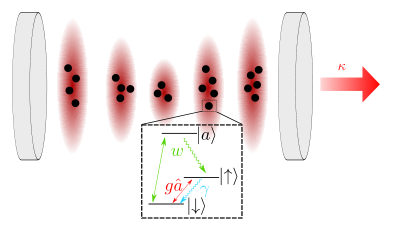
<figcaption class="paper-figure-caption"><b>Fig 1.</b> FIG. 1. Schematic of a bad-cavity laser with atoms trapped at the antinodes of a lossy cavity mode. The level structure of each atom is shown in the inset.</figcaption>
</figure>
<figure class="paper-figure-card">
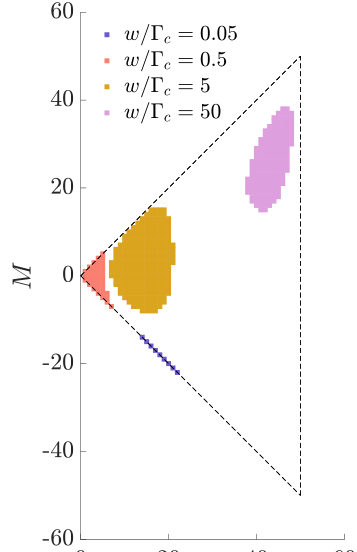
<figcaption class="paper-figure-caption"><b>Fig 2.</b> FIG. 2. Steady-state population distribution for N = 100 atoms and for different values of w. The colored areas depict the highest occupied states that contribute to ∼68% of the steady-state population.</figcaption>
</figure>
<figure class="paper-figure-card">
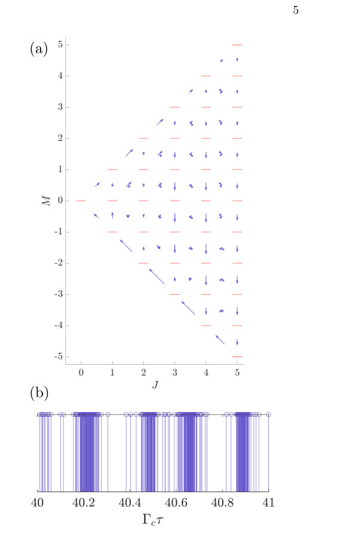
<figcaption class="paper-figure-caption"><b>Fig 3.</b> FIG. 3. (a) Population flow in steady state for the case of N = 100 and w/Γc = 0.2 showing the existence of current loops associated with breaking of time-reversal symmetry. (b) Record of collective emission jump times in a simulated trajec- tory of the Markov chain showing intermittent bursts followed by periods of inactivity. Here, N = 104 and w/Γc = 0.2. The initial time Γcτ = 40 in this plot is chosen to ensure that the system has relaxed to the steady state, which requires timescales Γcτ ≫1.</figcaption>
</figure>
<figure class="paper-figure-card">
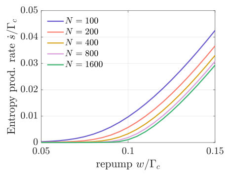
<figcaption class="paper-figure-caption"><b>Fig 4.</b> FIG. 4. Internal entropy production rate (normalized to sys- tem size) as a function of repump for different system sizes. Here, w = γ = 0.1Γc is the critical point indicated by the vertical line.</figcaption>
</figure>
<figure class="paper-figure-card">
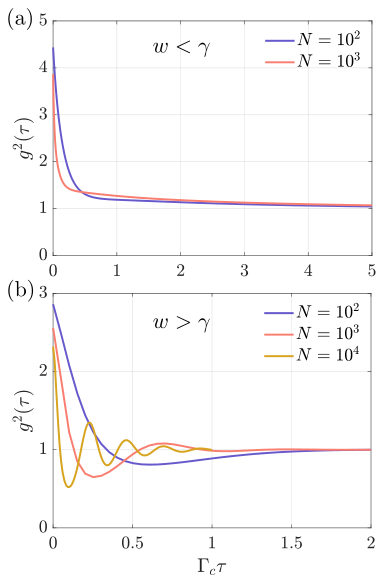
<figcaption class="paper-figure-caption"><b>Fig 5.</b> FIG. 5. Two-photon intensity correlation function g2(τ) at time delay τ for different system sizes, and for (a) w/Γc = 0.09 and (b) w/Γc = 0.2.</figcaption>
</figure>

**Summary.** This work analyzes the dynamics of a bad-cavity laser, showing that a phase transition corresponds precisely to the breakdown of detailed balance in the system's underlying Markov chain. When detailed balance breaks down, the system exhibits non-zero internal entropy production and observable self-pulsing in the cavity light output.

**Why it may be interesting.** It provides a concrete, physical realization (bad-cavity laser) where fundamental concepts from non-equilibrium statistical mechanics, such as detailed balance and entropy production, can be directly observed and quantified through quantum dynamics.

Detailed structure

**Main problem.** The paper investigates the connection between a dissipative phase transition in the subradiant regime of a bad-cavity laser and the breakdown of detailed balance in the underlying Markov chain.

**Main result.** The system exhibits a transition where the dynamics switch from time-reversible (satisfying detailed balance) to time-irreversible (breaking detailed balance) as a parameter is varied.

**Method.** The quantum master equation is mapped onto a classical Markov chain description, allowing the analysis of steady-state probability currents and entropy production rates.

**Model / system.** The system is a bad-cavity laser involving N incoherently pumped atomic dipoles coupled to a heavily damped cavity mode. The dynamics are analyzed using collective angular momentum states and reduced to a rate equation for probabilities.

**Key observables.** Internal entropy production rate ($\dot{S}_i$), net probability currents, and the intensity correlation function $g_2(	au)$ (detecting self-pulsing).

**Important parameters / regimes.** The ratio of the repump rate ($w$) to the free-space decay rate ($\gamma$) defines the critical point ($w = \gamma$).

**Assumptions / limitations.** The analysis relies on the bad-cavity limit ($\kappa$ large) and mapping the quantum dynamics onto a classical Markov chain description.

**Figures summary.** Figures illustrate the population flow and current loops associated with time-reversal symmetry breaking, and plot the entropy production rate ($\dot{s}$) showing a sharp change at the critical point $w = \gamma$.

**Paper structure.** The paper first establishes the Markov chain mapping and then analyzes two distinct regimes based on the ratio $w/\gamma$: one satisfying detailed balance and the other exhibiting time-asymmetric currents and entropy production.

Abstract

The dynamics of dissipative many-body quantum systems sometimes admit an emergent classical description in terms of a Markov chain even though the corresponding state space contains highly entangled states. In particular, a bad-cavity laser is a paradigm system whose dynamics can be formulated as a Markov chain in a two-dimensional state space spanned by collective angular momentum states. In this article, we investigate the connection between a dissipative phase transition that occurs in the subradiant regime of this system in the large atom number limit, and the properties of the underlying Markov chain. In one of the phases, the Markov chain approaches the detailed-balance condition with increasing atom number $N$ and hence becomes effectively time-reversible. This is caused by a collective atomic emission process that effectively reduces the Markov chain to one dimension. In the other phase, we find the emergence of time-asymmetric probability currents in the two-dimensional state space that signals a breakdown of detailed balance. This is accompanied by a macroscopic internal entropy production rate in the Markov chain that scales extensively with the atom number $N$. An observable consequence of the probability currents is a self-pulsing of the cavity light output in this phase, which can be detected as an anti-correlation dip in the intensity correlation function.

[↑ back to top](#top)

### ⭐ [Driven two-level systems as a minimal resource for remote entanglement stabilization](http://arxiv.org/abs/2605.15989v1)

**Highlighted author(s):** Peter Rabl  
**Authors:** Philippe Gigon, Adrian Parra-Rodriguez, Joan Agustí, Peter Rabl  
**Type:** theory · **Category:** quantum information and computing · **PDF:** <https://arxiv.org/pdf/2605.15989v1>  
**Analysis basis:** full PDF text, analyzed in chunks
**Topic relevance:** `correlated / nonlocal dissipation` **3/5** · `entanglement & information structure` **3/5** · `methods for driven-dissipative` **3/5** · `Keldysh / 2PI / non-Gaussian methods` **2/5** · `Tavis-Cummings & cavity-many-emitter` **2/5** · `correlated cavity matter` **2/5** · `driven-dissipative phase transition` **2/5** · `non-equilibrium dynamics` **2/5** · `analog quantum simulation` **1/5** · `interference shaping light` **1/5** · `non-equilibrium universality` **1/5**

↔ Scroll figures horizontally

<figure class="paper-figure-card">
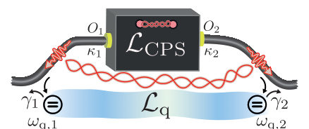
<figcaption class="paper-figure-caption"><b>Fig 1.</b> Figure 1: Schematics of the basic chiral quantum network considered in this work. Here, a source (black box) produces a stream of correlated photons that drive two distant target qubits into an entangled steady state. See text for more details.</figcaption>
</figure>
<figure class="paper-figure-card">
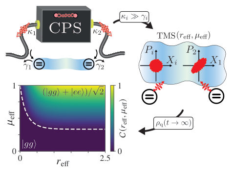
<figcaption class="paper-figure-caption"><b>Fig 2.</b> Figure 2: Operative definition of distributable entanglement. In the Markovian regime (κi ≫γi), the target qubits see an effective TMS environment, which is fully characterized by the effective squeezing strength reff and effective purity µeff. These parameters, in turn, can be evaluated from a set of two-time correlation functions of the CPS, see Eq. (9) and Eq. (12). For a given reff and µeff the concurrence Cd ≡C(reff, µeff) of the resulting qubit steady state is given in Eq. (13) and plotted in the lower left corner. The white dashed line marks the minimal conditions above which Cd &gt; 0. Overall, this approach allows us to characterize the CPS in terms of a single, physically intuitive...</figcaption>
</figure>
<figure class="paper-figure-card">
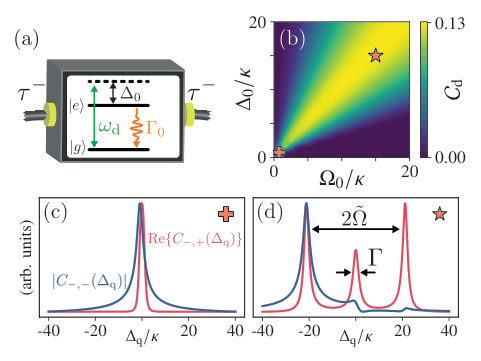
<figcaption class="paper-figure-caption"><b>Fig 3.</b> Figure 3: (a) Schematics of a CPS consisting of a single TLS. The TLS is driven by an external field of frequency ωd and decays into the two waveguides with rates κ and into an independent environment with rate Γ0. (b) Plot of the distributable entanglement as a function of the drive strength, Ω0, and the detuning of the drive, ∆0, and for target qubits tuned in resonance with the Mollow sidebands (∆q,1 = −∆q,2 = ˜Ω). The two symbols indicate the weak- driving (cross) and strong-driving (star) regimes. For both regimes, the dependence of the two relevant correlation func- tions Re{C11 −+(∆q)} ∼N1 and |C12 −−(∆q)| ∼|M| on the detuning ∆q is sketched in the respective plots in (c) and (d)....</figcaption>
</figure>
<figure class="paper-figure-card">
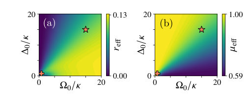
<figcaption class="paper-figure-caption"><b>Fig 4.</b> Figure 4: Plots of (a) the effective squeezing strength and (b) the effective purity for a driven TLS and for the same parameters as in Fig. 3(b). The opposite trend of those two quantities results in optimal entanglement for ∆0 ≈Ω0.</figcaption>
</figure>
<figure class="paper-figure-card">
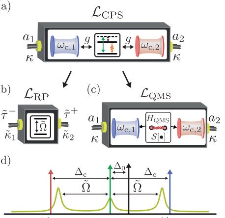
<figcaption class="paper-figure-caption"><b>Fig 5.</b> Figure 5: (a) The CPS consists of a driven, dissipative TLS coherently coupled to two bosonic modes a1 and a2 with strength g. We assume that the modes selectively emit into one or the other waveguide, that is O1 = a1, O2 = a2. The TLS has the same parameters as shown in Fig. 3(a). (b) In the resolved-Purcell regime, ˜Ω≫κ ≫g, two cavities can be adiabatically eliminated to obtain an effective model for the TLS, with jump operators O1 = ˜τ −, O2 = ˜τ + and decay rates ˜κ1 and ˜κ2. (c) In the opposite regime, where Γ0 ≫g, κ, one can adiabatically eliminate the TLS, and model the re- maining dynamics of the two cavities by a quadratic TMS Lindbladian. (d) Sketch of the relevant frequencies and...</figcaption>
</figure>

**Summary.** This paper develops a theoretical framework to quantify how entanglement can be remotely stabilized between two qubits using a correlated photon source derived from a driven two-level system. The authors demonstrate that while the basic setup yields some entanglement, optimizing the system by adding filter cavities is crucial to approach the theoretical maximum. This has direct implications for building quantum networks using solid-state defects.

**Why it may be interesting.** This work provides a detailed theoretical roadmap for engineering entanglement distribution in solid-state quantum networks, showing how cavity engineering can overcome intrinsic limitations of simple sources.

Detailed structure

**Main problem.** The paper analyzes the autonomous stabilization of remote entanglement between two distant qubits using the correlated photon emission from a driven two-level system (TLS) source.

**Main result.** While a bare TLS shows some entanglement, achieving near-maximal entanglement requires coupling the TLS to additional filter cavities to enhance specific correlated emission events.

**Method.** The analysis develops a general framework using master equations and two-time correlation functions to quantify distributable entanglement, comparing different physical regimes (e.g., Purcell vs. Qubit-mediated squeezing).

**Model / system.** The system involves two target qubits coupled to a correlated photon source, which is modeled as a driven TLS interacting with optical cavities. The dynamics are governed by a master equation incorporating source, qubit, and interaction terms.

**Key observables.** Distributable entanglement (quantified by concurrence, $C_d$), effective two-mode squeezing parameters ($	ext{reff}, \mu_{	ext{eff}}$), and the steady-state density matrix.

**Important parameters / regimes.** TLS drive strength ($\Omega_0$), cavity decay rate ($\kappa$), qubit detunings ($\Delta_q$), and the ratio of decay rates ($\gamma/\kappa$).

**Assumptions / limitations.** The analysis relies on the Rotating-Wave Approximation (RWA) and various adiabatic elimination techniques depending on the coupling regime (e.g., Purcell or QMS).

**Figures summary.** Figures illustrate schematics of the quantum network, plot the achievable concurrence ($C_d$) versus driving parameters ($\Omega_0, \Delta_0$), and show the dependence of entanglement on the ratio of decay rates ($\gamma/\kappa$).

**Paper structure.** The paper progresses from a general framework for entanglement quantification to specific applications using a bare TLS, then systematically explores enhancements by coupling the TLS to structured cavities, analyzing different physical regimes (Purcell, QMS) to maximize entanglement.

Abstract

We analyze the autonomous stabilization of remote entanglement by driving two distant qubits with the output of a correlated photon source. By treating the qubits as idealized entanglement detectors, we develop a general framework to quantify the maximum amount of entanglement that can be remotely stabilized in this way with a given photon source. We then apply this approach to evaluate the suitability of a single driven two-level system as a minimal resource for autonomous entanglement distribution schemes. While our analysis confirms the presence of distributable entanglement in the Mollow sidebands of a bare two-level system, we show that stabilizing close to maximally entangled states requires additional filter cavities that enhance the relevant correlated emission events compared to other processes. We identify optimized driving and cavity parameters and explain the achievable amount of entanglement in different regimes in terms of an effective two-mode squeezing model. These insights are particularly relevant for quantum networks based on photons or phonons in solid-state systems, where isolated spins, impurity centers, or other two-level defects are readily available, while alternative sources of correlated photons are difficult to realize.

[↑ back to top](#top)

### [Extensive mixed-state entanglement in kinetically constrained superradiance](http://arxiv.org/abs/2605.16131v1)

**Authors:** Lucas Winter, Jan Kumlin, Thomas Pohl, Andreas Nunnenkamp  
**Type:** both · **Category:** other · **PDF:** <https://arxiv.org/pdf/2605.16131v1>  
**Analysis basis:** full PDF text, analyzed in chunks
**Topic relevance:** 🔥 `Dicke superradiance` **4/5** · 🔥 `Tavis-Cummings & cavity-many-emitter` **4/5** · 🔥 `analog quantum simulation` **4/5** · 🔥 `correlated / nonlocal dissipation` **4/5** · 🔥 `methods for driven-dissipative` **4/5** · `Rydberg arrays` **3/5** · `correlated cavity matter` **3/5** · `driven-dissipative phase transition` **3/5** · `entanglement & information structure` **3/5** · `non-equilibrium dynamics` **2/5** · `non-equilibrium universality` **2/5** · `superradiant laser` **2/5** · `Keldysh / 2PI / non-Gaussian methods` **1/5** · `quantum measurements` **1/5** · `scars & prethermalization` **1/5**

↔ Scroll figures horizontally

<figure class="paper-figure-card">
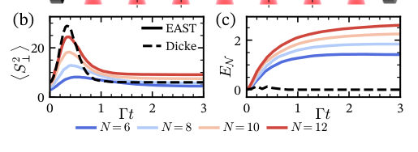
<figcaption class="paper-figure-caption"><b>Fig 1.</b> Figure 1. Rydberg-blockaded superradiance. (a) We consider N atoms coupled to a cavity mode of frequency ωc. A Rydberg (anti-)blockade locally gates the atom-cavity transition (2); for the EAST constraint, Pj = nj−1, atom j couples only if its left neighbor is excited. (b,c) Dynamics of the Rydberg Tavis–Cummings model (1) (solid) and the Dicke model (black dashed) for different system sizes. Panel (b) shows the transverse spin coherence ⟨S2 ⊥⟩= ⟨S2 x + S2 y⟩; panel (c) shows mixed-state entanglement quantified by logarithmic negativity EN (12). Quantum trajectory simulations for κ/g = 40, ∆= 0, and Ntraj = 600.</figcaption>
</figure>
<figure class="paper-figure-card">
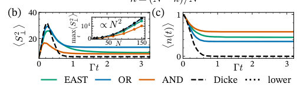
<figcaption class="paper-figure-caption"><b>Fig 2.</b> Figure 2. Emission rate and constrained superradiant dynamics. (a) Emission rate ⟨F †F⟩k/N 2 (6) as a function of n = 1 −k/N for N = 24. The shaded region is the allowed window for local Boolean constraints including AND (orange), EAST (green) and OR (blue) with an upper bound given by the Dicke model and a lower bound given by Eq. (7). (b) Exact dynamics of ⟨S2 ⊥⟩= ⟨S2 x + S2 y⟩according to Eq. (3). All constrained models retain a superradiant burst. Inset: Peak heights scale as maxt⟨S2 ⊥⟩∝N 2 according to DTWA simulations (see SM [38]). (c) Mean excitation density ⟨n(t)⟩= ⟨Sz⟩/N + 1/2. The Dicke model decays to the ground state, while constraints arrest the decay at finite density....</figcaption>
</figure>
<figure class="paper-figure-card">
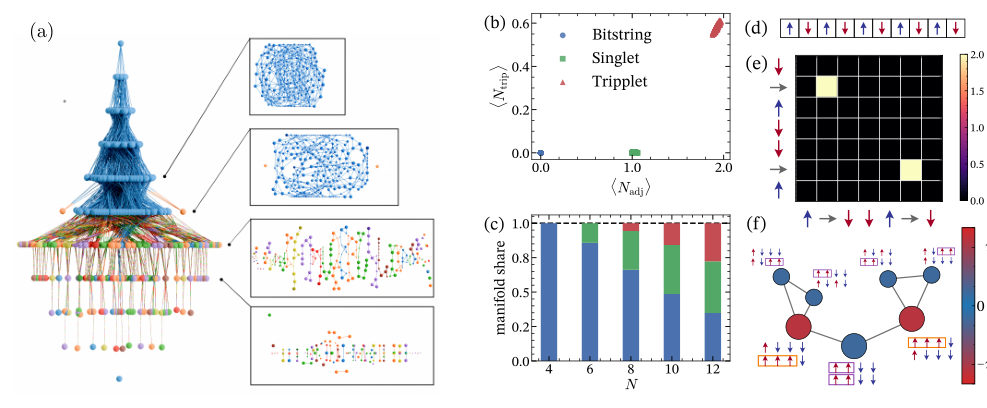
<figcaption class="paper-figure-caption"><b>Fig 3.</b> Figure 3. Hilbert-space fragmentation and dark-manifold structure. (a) Numerically constructed Lindblad connectivity graph for N = 10. Nodes represent spin configurations in the computational basis, grouped into planes by total magnetization Sz. The non-hermitian Hamiltonian Hnh = (χ −iΓ/2) F †F connects states in-plane (insets), while the jump operator Leff (4) connects states vertically. At small Sz, the graph fragments into many disconnected components (shown in different colors). (b) Dark state classification obtained from exact diagonalization of F †F and identification of its kernel for N = 10. Local adjacent-pair Nadj and triple Ntri counts categorize the dark state manifold into...</figcaption>
</figure>
<figure class="paper-figure-card">
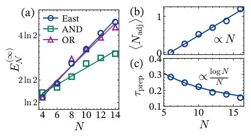
<figcaption class="paper-figure-caption"><b>Fig 4.</b> Figure 4. Superradiantly accelerated generation of extensive mixed-state entanglement. (a) Stationary logarithmic negativity E(∞) N (12) across a half-chain bipar- tition, obtained from density matrices reconstructed from quantum-trajectory simulations of the effective spin model (4). The scaling is approximately linear in N for the EAST (blue), OR (purple), and AND (green) constraints, showing extensive mixed-state entanglement. (b) Adjacent pair count ⟨Nadj⟩≡P</figcaption>
</figure>
<figure class="paper-figure-card">
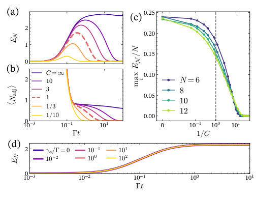
<figcaption class="paper-figure-caption"><b>Fig 5.</b> Figure 5. Robustness to single-site loss and common- mode dephasing. (a,b) Time evolution of the half-chain logarithmic negativity EN and adjacent pair count ⟨Nadj⟩for N = 12, showing that the collective-decay correlations persist over a broad cooperativity window. (c) Peak logarithmic negativity per site maxt EN /N versus inverse cooperativity for N = 6, 8, 10, 12; the dashed line marks 1/C = 1. (d) EN (t) for different common-mode dephasing values γϕ (blue to yellow) for N = 10, demonstrating collapse onto the lossless dynamics over γϕ/Γ = 0, . . . , 102. Panels (a)–(c) use the adiabatically eliminated EAST-constrained spin model with unconstrained single-site loss, κ = 1, and ∆= 0. Panel...</figcaption>
</figure>

**Summary.** The paper demonstrates that imposing local kinetic constraints on an ensemble of quantum emitters undergoing superradiance generates robust, extensive mixed-state entanglement. This effect is fast, retaining the characteristic superradiant scaling, and can be realized in neutral-atom cavity QED setups. It offers a general method for the dissipative engineering of highly entangled quantum states.

**Why it may be interesting.** This work provides a concrete, experimentally viable framework for engineering quantum resources (entangled dark states) using collective quantum phenomena (superradiance) in solid-state or neutral-atom platforms, which is highly relevant to quantum simulation and quantum networking.

Detailed structure

**Main problem.** To investigate how adding local kinetic constraints to Dicke superradiance affects entanglement generation, particularly in the mixed state of emitters.

**Main result.** Local kinetic constraints convert superradiance into a fast dissipative route that generates extensive mixed-state entanglement, while retaining the characteristic superradiant scaling ($\propto N^2$ intensity, $\propto (\log N)/N$ time).

**Method.** The analysis uses a combination of analytical derivations (e.g., lower bounds for emission rates) and numerical simulations of the Lindblad master equation, employing techniques like adiabatic elimination and quantum trajectory methods.

**Model / system.** The system is an ensemble of quantum emitters (modeled as Rydberg atoms) coupled to a single optical cavity mode, governed by a generalized Dicke model incorporating local Boolean kinetic constraints (AND, EAST, OR).

**Key observables.** Mixed-state entanglement (logarithmic negativity $E_N$), emission rate $\langle F^\dagger F 
angle$, and the adjacent pair count $\langle N_{	ext{adj}} 
angle$ used as an entanglement witness.

**Important parameters / regimes.** The analysis explores the bad-cavity regime, the ratio of coupling strengths to decay rates ($g/\omega_c$), and the impact of various noise sources like single-site and common-mode dephasing.

**Assumptions / limitations.** The analysis often relies on the bad-cavity limit and the adiabatic elimination of intermediate states, though robustness checks against realistic Rydberg tails and dephasing are performed.

**Figures summary.** Figures illustrate the superradiance dynamics, showing the characteristic scaling of the emission rate and entanglement. They also compare the entanglement measures ($E_N$, $\langle N_{	ext{adj}} 
angle$) under different constraints and noise conditions.

**Paper structure.** The paper progresses from establishing the failure of entanglement generation in standard Dicke superradiance to introducing local constraints. It then analyzes the resulting dynamics, proving the existence of entanglement via specific correlators, and finally testing the robustness of this effect against realistic imperfections like decay and noise.

Abstract

Dicke superradiance by an ensemble of quantum emitters produces a collective burst of radiation, but no entanglement in the mixed state of the emitters. We show that adding a local kinetic constraint between the emitters generates extensive mixed-state entanglement, while otherwise preserving all key features of Dicke superradiance. Specifically, for any local Boolean constraint, we analytically derive a lower bound for the emission rate which implies a peak intensity $\propto N^2$ and a peak time $\propto (\log N)/N$ with number of spins $N$. This effect enables the superradiantly accelerated preparation of entangled dark states. Hereby, Hilbert-space fragmentation of the Dicke ladder leads to an exponentially branching decay tree that generates a hierarchy of dark states. Importantly, these disconnected manifolds include exponentially many long-range entangled singlet dark states. The explored kinetic constraints and superradiant dynamics can be realized in neutral-atom arrays coupled to an optical cavity, and we suggest a simple and accessible witness to detect the predicted mixed-state entanglement in such experiments. Moreover, we show that entanglement generation is robust against atomic decay and collective dephasing, and should be observable under recently reported experimental conditions. Our results, thereby, offer a general framework and experimentally viable approach for the dissipative engineering of entangled dark states enhanced by superradiance.

[↑ back to top](#top)

### [Generating collective spin cat states via photon-number measurements near the Dicke critical point](http://arxiv.org/abs/2605.15945v1)

**Authors:** Taiga Nakamoto, Shohei Imai, Kazuaki Takasan  
**Type:** theory · **Category:** other · **PDF:** <https://arxiv.org/pdf/2605.15945v1>  
**Analysis basis:** full PDF text, analyzed in chunks
**Topic relevance:** 🔥 `Dicke superradiance` **4/5** · 🔥 `Tavis-Cummings & cavity-many-emitter` **4/5** · 🔥 `measurement-induced transitions` **4/5** · `analog quantum simulation` **3/5** · `correlated cavity matter` **3/5** · `driven-dissipative phase transition` **3/5** · `quantum measurements` **3/5** · `correlated / nonlocal dissipation` **2/5** · `entanglement & information structure` **2/5** · `exotic spin models in light-matter` **2/5** · `methods for driven-dissipative` **2/5** · `non-equilibrium dynamics` **2/5** · `non-equilibrium universality` **2/5** · `superradiant laser` **2/5** · `Keldysh / 2PI / non-Gaussian methods` **1/5**

↔ Scroll figures horizontally

<figure class="paper-figure-card">
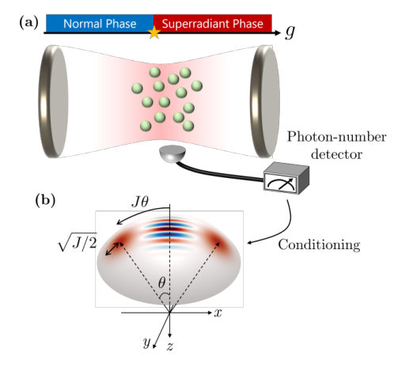
<figcaption class="paper-figure-caption"><b>Fig 1.</b> FIG. 1. (a) Schematic picture of the protocol for generating SCSs. We first prepare an atomic ensemble that is strongly coupled to the cavity field near the critical point of the super- radiant phase transition. We then perform a photon-number measurement on the cavity field; conditioning on a photon- number outcome heralds the preparation of an SCS in the atomic ensemble. (b) Schematic illustration of the Wigner function of the SCSs. We focus on the SCS, which is a super- position of two coherent spin states pointing in the directions (+θ, 0) and (−θ, 0). We characterize the size of the SCS as an arc length Jθ normalized by the quantum fluctuation p</figcaption>
</figure>
<figure class="paper-figure-card">
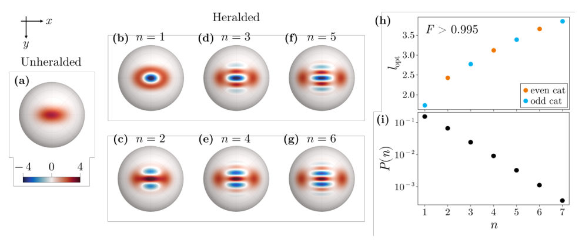
<figcaption class="paper-figure-caption"><b>Fig 2.</b> FIG. 2. The Wigner function W(θ, ϕ) around θ = 0 of (a) the unheralded state ρ = Trphoton[|G⟩⟨G|] and (b)-(g) the n-photon heralded atomic state |ψn⟩for the outcomes n = 1, . . . , 6. The Wigner function of ρ is Gaussian-like, while that of |ψn⟩has negative values and interference patterns. The interference patterns in the Wigner function indicate the production of SCSs. Heralding converts the Gaussian-like state into a non-Gaussian state with parity-dependent interference fringes. (h) The size of the SCS lopt as a function of n. When n is even (odd), the parity of the SCS is even (odd). lopt increases as the measured photon number n increases. The fidelities F(θopt) between the ideal SCS...</figcaption>
</figure>
<figure class="paper-figure-card">
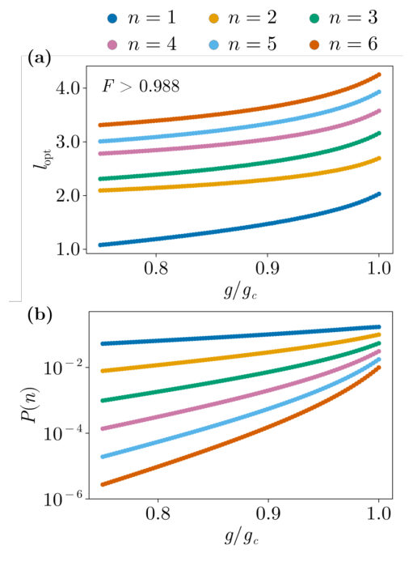
<figcaption class="paper-figure-caption"><b>Fig 3.</b> FIG. 3. (a) The size of the SCS lopt for n = 1, . . . , 6 as a function of the coupling strength g. As g approaches the critical point gc, lopt increases. Especially, lopt is significantly enhanced near the critical point g = gc. The fidelities F(θopt) are more than 0.988 for all the data points. (b) The measure- ment probability of n photons P(n) as a function of g. As g approaches gc, P(n) exponentially increases. Here, we set N = 200.</figcaption>
</figure>
<figure class="paper-figure-card">
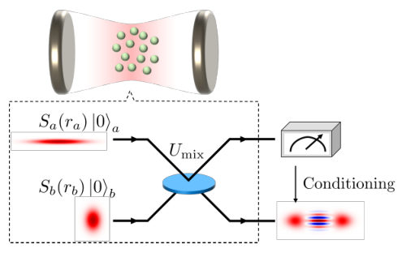
<figcaption class="paper-figure-caption"><b>Fig 4.</b> FIG. 5. The interpretation of the SCS generation protocol from the perspective of the generalized photon subtraction protocol in quantum optics [31]. Near the critical point of the superradiant phase transition, the ground state prepares the beam-split squeezed states. One mode corresponds to the cavity field, and the other mode corresponds to the collective spin excitation of the atomic ensemble. The photon-number measurement on the cavity field can conditionally prepare a SCS similar to the quantum optical case.</figcaption>
</figure>
<figure class="paper-figure-card">
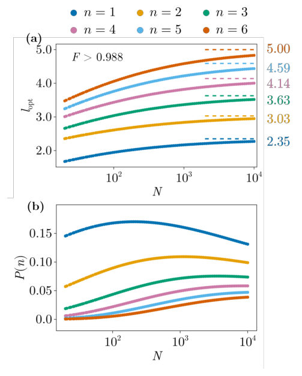
<figcaption class="paper-figure-caption"><b>Fig 5.</b> FIG. 4. (a) The size of the SCS lopt for n = 1, . . . , 6 as a function of the atom number N. lopt increases as N increases. We also plot the saturation value in the thermodynamic limit as dashed lines (Eq. (23)). lopt approaches the saturation value as N increases. The fidelities F(θopt) are more than 0.988 for all the data points. (b) The measurement probability of n photons P(n) as a function of N. P(n) increases as N increases for small N, while P(n) starts to decrease for large N. Here, we set g = gc.</figcaption>
</figure>

**Summary.** This theoretical work proposes a method to generate large, high-fidelity collective spin cat states in an atomic ensemble by leveraging the physics near the superradiant phase transition. The key technique involves performing a photon-number measurement on the cavity field, which acts as a quantum filter to herald the desired non-classical atomic state. This demonstrates a powerful synergy between cavity QED criticality and quantum state engineering.

**Why it may be interesting.** This work provides a concrete, measurement-based pathway to generate complex, non-classical many-body states (SCSs) using controllable quantum optical phenomena (criticality), which is highly relevant for quantum simulation and quantum memory.

Detailed structure

**Main problem.** The paper addresses the challenge of generating high-fidelity collective spin cat states (SCSs) within a cavity-coupled atomic ensemble.

**Main result.** They demonstrate that performing a photon-number measurement on the cavity field near the superradiant critical point heralds SCSs with enhanced size and fidelity.

**Method.** The protocol relies on exploiting strong light-matter entanglement and anti-squeezing inherent to the critical regime, mathematically linking the process to generalized photon subtraction.

**Model / system.** The system is modeled by the Dicke model, describing N two-level atoms coupled to a single cavity mode. The analysis utilizes the Hamiltonian and examines the system's behavior near the superradiant phase transition.

**Key observables.** SCS size ($\ell_{	ext{opt}}$), Fidelity ($F(	heta)$), Wigner function negativity, and the probability distribution of measured photons ($P(n)$).

**Important parameters / regimes.** The critical coupling strength ($g_c$), the atom number ($N$), and the photon number ($n$) measured.

**Assumptions / limitations.** The analysis often focuses on the resonant case ($\omega_{	ext{cav}} = \omega_{	ext{atom}}$) but confirms the mechanism's applicability off-resonance. It assumes the ground state of the equilibrium Dicke model.

**Figures summary.** Figures illustrate the protocol schematic (Fig. 1a), the Wigner function showing SCS non-classicality (Fig. 1b), and quantitative dependencies of $\ell_{	ext{opt}}$ and $P(n)$ on the coupling strength $g$ and the photon number $n$ (Figs. 2 and 6).

**Paper structure.** The paper introduces the Dicke model and the concept of SCSs. It then details the measurement-based protocol, showing how photon detection projects the atomic state into a heralded SCS. Finally, it analyzes the scaling laws and the physical mechanism connecting this to generalized photon subtraction.

Abstract

We propose a method for generating collective spin cat states in a cavity-coupled atomic ensemble by exploiting strong light-matter entanglement and anti-squeezing associated with the superradiant phase transition. We numerically and analytically demonstrate that the cat states can be heralded by photon-number measurement on the ground state of the Dicke model. The near-critical regime enhances both the cat-state size and the probability of obtaining larger photon-number outcomes, and outcomes with larger photon numbers yield even larger cat states. We also show that a thermodynamic-limit analysis clarifies the generation mechanism and connects it to a natural light-matter analogue of generalized photon subtraction for optical cat-state generation. These results suggest that exploiting criticality in strongly coupled light-matter systems could open new directions for matter-based many-body quantum technologies.

[↑ back to top](#top)

### [Polariton BECs: Theory and Concepts](http://arxiv.org/abs/2605.16256v1)

**Authors:** Fabrice Laussy  
**Type:** theory · **Category:** quantum gases · **PDF:** <https://arxiv.org/pdf/2605.16256v1>  
**Analysis basis:** full PDF text, analyzed in chunks
**Topic relevance:** 🔥 `correlated cavity matter` **4/5** · `Tavis-Cummings & cavity-many-emitter` **3/5** · `analog quantum simulation` **3/5** · `driven-dissipative phase transition` **3/5** · `methods for driven-dissipative` **3/5** · `non-equilibrium dynamics` **3/5** · `Keldysh / 2PI / non-Gaussian methods` **2/5** · `correlated / nonlocal dissipation` **2/5** · `entanglement & information structure` **2/5** · `non-equilibrium universality` **2/5** · `Dicke superradiance` **1/5** · `exotic spin models in light-matter` **1/5** · `superradiant laser` **1/5**

↔ Scroll figures horizontally

<figure class="paper-figure-card">
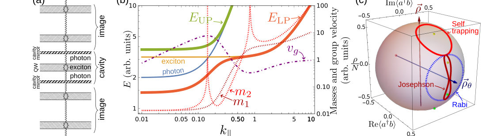
<figcaption class="paper-figure-caption"><b>Fig 1.</b> FIG. 1. The one-particle polariton picture. (a) Sketch of a microcavity as two mirrors sandwiching a quantum well, respectively trapping photons and excitons, whose confinement brings in the strong-coupling regime. By the method of images, the cavity mirrors can be removed and the confined polariton becomes propagating again, as originally envisioned by Hopfield in bulk materials. (b) The lower ELP and upper EUP polariton dispersions, arising from the strong coupling of the exciton and photon parabolic dispersions with largely differing masses, so that the exciton appears flat over a broad range of momenta. The strong anharmonicity of the polariton dispersions leads to a plethora of sui...</figcaption>
</figure>
<figure class="paper-figure-card">
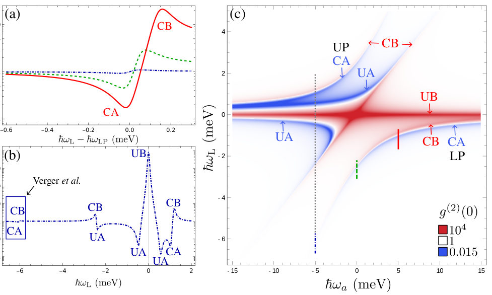
<figcaption class="paper-figure-caption"><b>Fig 2.</b> FIG. 2. The two-particle polariton picture. (a) Polariton blockade with g(2)(0) &lt; 1 as a function of the laser detuning from the lower polariton branch, for three exciton-photon detuning, with the dashed green line at resonance, solid-red at positive cavity detuning (exciton-like LP) and dash-dotted black at negative cavity detuning (photon-like LP). (b) Same as (a) for the negative detuning case and over an enlarged spanning window of laser energy (now shown relative to the exciton), to also include the UP branch, with panel (a) identified in the box ≈−6meV. Considerably stronger correlations are accessible around other resonances of the system, most of them not visible in...</figcaption>
</figure>

**Summary.** This survey reviews the theory of polariton condensates, which are hybrid light-matter quasi-particles. It details the theoretical tools needed to describe their many-body physics, contrasting the quantum description with simpler classical analogues. The work highlights that understanding the system requires careful consideration of both linear and non-interacting effects alongside strong correlations.

**Why it may be interesting.** It bridges the gap between standard BEC theory (quantum gases) and quantum optics, providing a rich platform to study non-equilibrium, driven-dissipative many-body physics.

Detailed structure

**Main problem.** The paper surveys the theoretical concepts governing the formation, coherence, and dynamics of polariton condensates, emphasizing their unique nature compared to atomic BECs.

**Main result.** The dynamics can be understood by mapping the system to a coherent state evolution, which mathematically mirrors classical coupled harmonic oscillators, suggesting linear effects are often undervalued.

**Method.** The analysis employs a combination of one-particle quantum superposition descriptions (Bloch sphere) and many-body quantum-optical density matrix formalisms.

**Model / system.** The system is composed of exciton-polaritons, which are quasi-particles formed by the strong coupling of excitons (matter) and cavity photons (light) in a microcavity. The Hamiltonian describes the coupled light-matter system.

**Key observables.** Two-polariton reduced density matrix ($
ho^{(2)}$), two-photon correlation function ($g^{(2)}(0)$), and coherence measures.

**Important parameters / regimes.** Detuning, effective masses ($m_{ex}, m_C$), and the degree of interaction strength.

**Assumptions / limitations.** The text argues that while the quantum picture is fundamental, much phenomenology can be explained using semi-classical or non-interacting approximations.

**Figures summary.** Figures illustrate the unfolding of light-matter interaction, the two-particle polariton picture, and the two-photon correlation function $g^{(2)}(0)$ showing bunching, antibunching, and no correlation.

**Paper structure.** The structure moves from defining the polariton quasi-particle (one-particle picture) to describing the many-body quantum state using density matrices, and finally comparing the quantum vs. classical descriptions of the dynamics.

Abstract

Polaritons are a superposition of light and matter, that combine Strong Interferences (of light) with Weak Interactions (of excitons), making them WISI (Weakly-Interacting, Strongly-Interfering) particles. Their condensation is the main highlight of a field which occupies a unique position at the intersection of quantum optics, condensed matter physics and nonlinear dynamics of driven, dissipative systems. This chapter surveys selected theoretical concepts of polariton condensates' formation, coherence and dynamics, with an emphasis on their distinctions from their atomic counterparts and on points of ongoing controversy. We argue that linear and non-interacting effects are undervalued in polariton physics, and that a significant part of the phenomenology -- including bosonic correlations and coherence buildup -- can often be understood without invoking strong interactions or genuine quantum effects.

[↑ back to top](#top)

### [Propagation of conditional nonclassical reservoir states during quantum decoherence](http://arxiv.org/abs/2605.15882v1)

**Authors:** Jargalsaikhan Artag, Koki Awaya, Takumi Kanezashi, Haruya Nagata, Daisuke Tsukayama, Moe Shimada, Jun-ichi Shirakashi  
**Type:** theory · **Category:** other · **PDF:** <https://arxiv.org/pdf/2605.15882v1>  
**Analysis basis:** full PDF text, analyzed in chunks
**Topic relevance:** 🔥 `measurement-induced transitions` **4/5** · 🔥 `quantum measurements` **4/5** · `correlated / nonlocal dissipation` **3/5** · `entanglement & information structure` **3/5** · `methods for driven-dissipative` **3/5** · `Keldysh / 2PI / non-Gaussian methods` **2/5** · `driven-dissipative phase transition` **2/5** · `non-equilibrium dynamics` **2/5** · `interference shaping light` **1/5** · `non-equilibrium universality` **1/5**

↔ Scroll figures horizontally

<figure class="paper-figure-card">
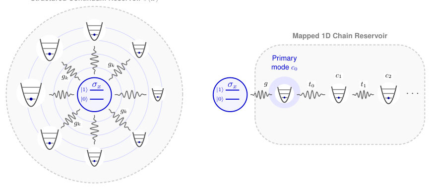
<figcaption class="paper-figure-caption"><b>Fig 1.</b> FIG. 1. Spin-boson reservoir and mapped-chain representation. A qubit coupled longitudinally to a structured bosonic reservoir is mapped from the star geometry to an equivalent one-dimensional chain. The qubit couples directly to the first chain coordinate, while the remaining chain modes transport reservoir excitation away from the system. The chain coordinate is a mapped spectral-reservoir coordinate, not a real-space coordinate.</figcaption>
</figure>
<figure class="paper-figure-card">
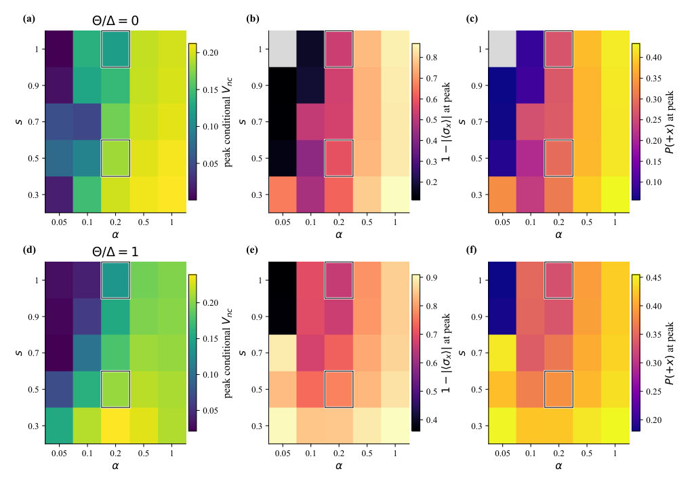
<figcaption class="paper-figure-caption"><b>Fig 2.</b> FIG. 2. Parameter landscape for conditional reservoir nonclassicality. Sweep over coupling α, spectral exponent s, and temperature Θ/∆. The panels show peak conditional Wigner nonclassicality, qubit coherence loss at the same event, and postselection probability for zero temperature (top row) and finite temperature (bottom row). White boxes mark the four main cases used throughout this study: α = 0.2, s = 0.5 or s = 1.0, and Θ/∆= 0 or 1.</figcaption>
</figure>
<figure class="paper-figure-card">
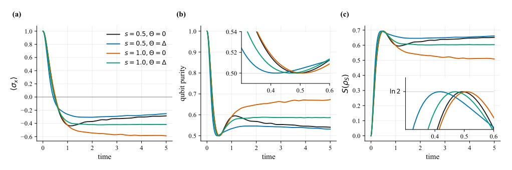
<figcaption class="paper-figure-caption"><b>Fig 3.</b> FIG. 3. Four-case qubit dynamics. Time evolution of (a) signed qubit coherence ⟨σx⟩, (b) qubit purity, and (c) qubit entropy in the pure mapped-chain representation, S(ρS). Insets in (b) and (c) zoom the near-maximal-mixing window; the reference values are Tr ρ2 S = 1/2 and ln 2, respectively. The sign of ⟨σx⟩retains phase information.</figcaption>
</figure>
<figure class="paper-figure-card">
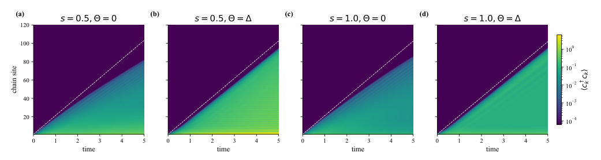
<figcaption class="paper-figure-caption"><b>Fig 4.</b> FIG. 4. Reservoir excitation transport in the mapped chain. Mapped-chain occupation ⟨c† kck⟩for the four selected cases. Panels (a-d) show s = 0.5, Θ/∆= 0; s = 0.5, Θ/∆= 1; s = 1.0, Θ/∆= 0; and s = 1.0, Θ/∆= 1, respectively, all at α = 0.2. The excitation generated during decoherence moves away from the qubit in the mapped chain coordinate. The dashed white line is the hopping-scale guide k = vguidet, with vguide = 2 maxn |tn|.</figcaption>
</figure>
<figure class="paper-figure-card">
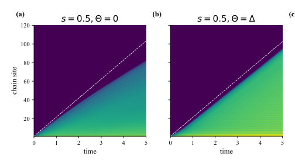
<figcaption class="paper-figure-caption"><b>Fig 5.</b> Figure 3(a-c) shows the qubit dynamics for the four selected cases. The signed coherence ⟨σx⟩starts at one and decays rapidly as system-bath entanglement forms. When ⟨σx⟩becomes negative, the transverse Bloch com- ponent has changed phase relative to the initial +x direc- tion; this sign change is not a change in the sign of a decay rate. The purity approaches the maximally mixed value near the strongest entangling part of the dynamics, while the qubit entropy S(ρS) rises toward ln 2, confirming that coherence loss is accompanied by strong system-reservoir correlation in the pure mapped-chain representation.</figcaption>
</figure>

**Summary.** This theoretical paper explores how quantum coherence lost from a qubit during decoherence is imprinted onto the surrounding environment, or reservoir. By analyzing the reservoir state conditioned on a measurement outcome, the authors demonstrate that the environment can retain nonclassical quantum features, such as Wigner negativity, which are otherwise lost in the averaged, unconditional description.

**Why it may be interesting.** This work provides a detailed, phase-space picture of decoherence, showing that the environment acts as a memory that retains measurement-dependent quantum information, which is crucial for understanding quantum measurement processes.

Detailed structure

**Main problem.** The paper investigates the information content carried by the environment (reservoir) during quantum decoherence, specifically contrasting the state when the system is measured (conditional) versus when it is simply traced out (unconditional).

**Main result.** The reservoir state, when conditioned on a specific qubit readout, develops measurable nonclassical features like Wigner negativity and interference fringes that are absent in the unconditional reservoir state.

**Method.** The authors employ tensor-network dynamics to evolve the joint qubit-reservoir state, mapping the continuous bosonic bath to a discrete 1D chain representation for analysis.

**Model / system.** The model is based on spin-boson decoherence, coupling a two-level system (qubit) to a structured bosonic reservoir. The dynamics are analyzed by mapping the bath to a 1D chain Hamiltonian.

**Key observables.** Wigner negativity ($	ext{Vnc}$), qubit coherence ($\langle\sigma_x
angle$), reservoir occupation ($\langle c^\dagger_k c_k 
angle$), and the conditional/unconditional reservoir state.

**Important parameters / regimes.** Spectral exponent ($s$), temperature ($\Theta/\Delta$), and coupling strengths ($\alpha$).

**Assumptions / limitations.** The analysis relies on mapping the continuous bosonic bath to a finite 1D chain, which is an approximation for the full reservoir dynamics.

**Figures summary.** Figures illustrate the mapping from the spin-boson geometry to the 1D chain, parameter landscapes showing peak conditional nonclassicality, and time evolution plots comparing conditional vs. unconditional reservoir properties.

**Paper structure.** The paper progresses by first establishing the model and mapping, then calculating and comparing the conditional and unconditional reservoir states using Wigner functions, and finally analyzing how temperature and spectral properties control the visibility of this conditional nonclassical imprint.

Abstract

Decoherence is usually described as the loss of local quantum coherence after tracing over environmental degrees of freedom. This reduced description, however, hides the reservoir state that carries the lost coherence. Here we show that spin-boson decoherence can write a postselectable nonclassical imprint into a structured bosonic reservoir. We map zero- and finite-temperature reservoirs to one-dimensional chains, evolve the joint qubit-reservoir state with tensor-network dynamics, and reconstruct the Wigner function of a time-adaptive leading collective reservoir coordinate after transverse qubit readout. The conditioned mapped-reservoir coordinate develops Wigner negativity and interference fringes that are strongly suppressed in the unconditional reservoir state. A parameter sweep shows that the spectral exponent and temperature control the visibility of this conditional nonclassicality, the mapped-chain excitation transport, and the degree to which a single collective coordinate captures the imprint. These results provide a branch-resolved phase-space picture of decoherence: the reservoir is not only a sink for qubit coherence, but can carry a measurement-conditioned nonclassical state in a collective mapped coordinate.

[↑ back to top](#top)

### [Born-rule statistical dynamical quantum phase transitions under measurement](http://arxiv.org/abs/2605.16029v1)

**Authors:** Guan-Hua Chen, Guo-Yi Zhu  
**Type:** theory · **Category:** statistical mechanics · **PDF:** <https://arxiv.org/pdf/2605.16029v1>  
**Analysis basis:** full PDF text, analyzed in chunks
**Topic relevance:** 🔥 `measurement-induced transitions` **4/5** · `driven-dissipative phase transition` **3/5** · `non-equilibrium dynamics` **3/5** · `non-equilibrium universality` **3/5** · `quantum measurements` **3/5** · `Keldysh / 2PI / non-Gaussian methods` **2/5** · `methods for driven-dissipative` **2/5** · `analog quantum simulation` **1/5** · `correlated / nonlocal dissipation` **1/5** · `entanglement & information structure` **1/5**

↔ Scroll figures horizontally

<figure class="paper-figure-card">
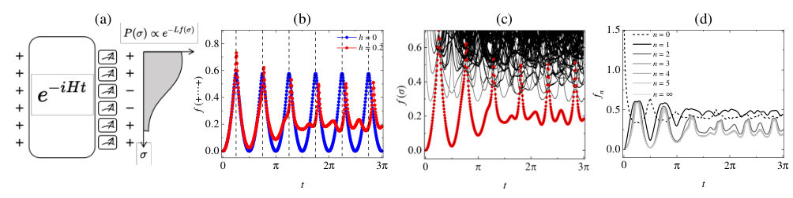
<figcaption class="paper-figure-caption"><b>Fig 1.</b> FIG. 1. Dynamical free energy spectrum. (a) Schematic of the model: a quantum quench dynamics by Ising model in ferromagnetic phase followed by measurements in X basis. Repeating the protocol yields a Born-distributed ensemble of bitstrings σ, whose Born probability P(σ) ∝e−Lf(σ) defines the effective free energy f(σ), conditioned upon σ (the temporal boundary condition of spacetime path integral). (b) The evolution of post-selected dynamical free energy f(+⋯+) under PBC. The nonanalytic period t∗without transverse field is exactly π/2 labeled by vertical dashed lines. (c) The full energy spectrum f(σ) for h = 0.2. Red dots highlight f(+⋯+), which acts as the “ground state” except near the...</figcaption>
</figure>
<figure class="paper-figure-card">
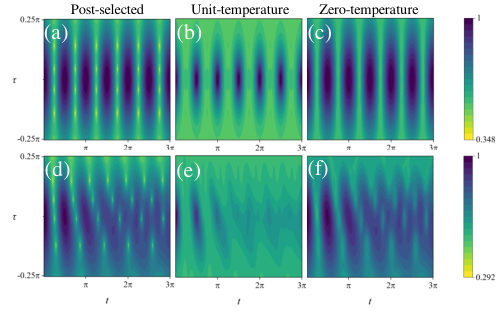
<figcaption class="paper-figure-caption"><b>Fig 2.</b> FIG. 3. Statistically erased zeros in the complex time plane with field h = 0 (upper panel) and h = 0.2 (lower panel). Finite-size (L = 12) evolution of e−f(+⋯+) and e−fn in the complex time plane τ ∈[−π/4, π/4]. (a), (d) Post-selected e−f(+⋯+) = P 1/L(+⋯+) : Periodic zeros discretely lie on the complex plane (not the real axis τ = 0 as the critical real time in Fig. 1(b)). (b), (e) Unit-temperature e−f1: Discrete zeros at τ ≠0 and nonanalytic kinks on the real axis are both washed out by averaging. (c), (f) Ground-state e−f∞: Dis- crete zeros in the complex plane are covered by lower-energy config- urations. Although the finite-size level crossing still remains in the plane, sufficiently...</figcaption>
</figure>
<figure class="paper-figure-card">
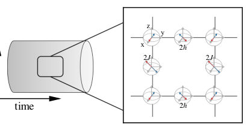
<figcaption class="paper-figure-caption"><b>Fig 3.</b> FIG. 4. Bulk measurement protocol. Schematic representation of a 2D cluster state on the Lieb lattice, whose spatial periodic bound- ary is defined on a cylinder (left). The corresponding time evolu- tion operator of one Trotter step is U(∆t) = eihX∆teiJZZ∆t whose unit cell of projective measurement on a plaquette is shown on the right. Measurement bases are represented on the Bloch spheres as cos (θ/2) ∣0⟩+eiϕ sin(θ/2) ∣1⟩and positive (negative) measurement outcomes are denoted by red (blue) arrows. Corresponding angles related to the Ising model ignoring the time step are labeled beside arrows (mentioned as (θ, ϕ) in the text).</figcaption>
</figure>
<figure class="paper-figure-card">
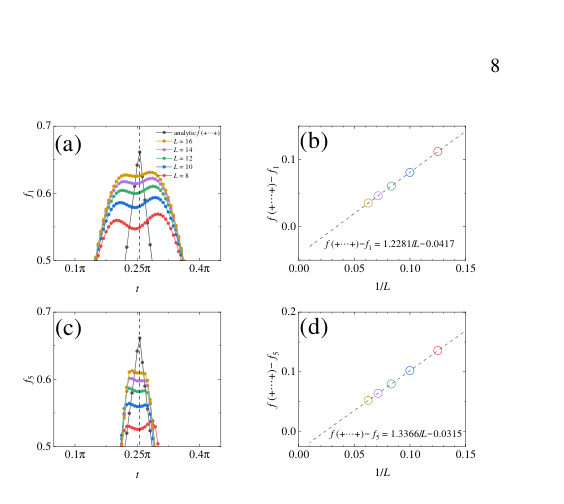
<figcaption class="paper-figure-caption"><b>Fig 4.</b> FIG. 5. Finite-size level inversion. Average dynamical free energy (a) f1 and (c) f5 in different system sizes around the first critical time with h = 0.2 (indicated by dashed lines). The analytic f(+⋯+) (black) is obtained by Eq. 6. Compared with f1, high-moment f5 showing a narrower half-height width lies closer to f(+⋯+). (b), (d): The difference between fn and analytic f(+⋯+) as a func- tion of 1/L is labeled by corresponding colors with the fitted linear equation. This can be regard as the gap between the low tempera- ture thermal state and paramagnetic state. Negative intercepts man- ifest the post-selected gap can be closed by finite but larger size as L = 1.2281/0.0417 ≈30 and L =...</figcaption>
</figure>
<figure class="paper-figure-card">
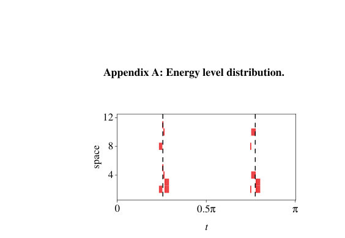
<figcaption class="paper-figure-caption"><b>Fig 5.</b> FIG. 6. Ground-state trajectory. The bitstring of ground state is represented in the Pauli-X basis at time 0 ∼π and each pixel denotes ∣+⟩(white) or ∣−⟩(red) for one qubit at a particular time. The critical times are labeled by dashed lines.</figcaption>
</figure>

**Summary.** This work develops a statistical framework to study Dynamical Quantum Phase Transitions (DQPTs) by analyzing the ensemble of states resulting from quantum measurements on an Ising chain. By using moment averaging of the dynamical free energy, the authors show that while single trajectories exhibit sharp nonanalyticities, the statistical average smooths these out. This provides a crucial theoretical tool for interpreting experimental measurements in quantum devices.

**Why it may be interesting.** It provides a rigorous statistical framework to study non-equilibrium quantum dynamics, showing how measurement fundamentally alters the observable signatures of quantum phase transitions, which is crucial for interpreting experimental quantum measurements.

Detailed structure

**Main problem.** The paper investigates Dynamical Quantum Phase Transitions (DQPTs) by analyzing the statistical ensemble of post-measurement quantum states, moving beyond single-trajectory analysis.

**Main result.** The statistical average (Born rule) of the ensemble washes out the nonanalytic signatures of DQPTs seen in single trajectories, but the framework successfully characterizes statistical DQPTs using the average dynamical free energy.

**Method.** The authors characterize the ensemble using the $n$-th moment average dynamical free energy ($f_n$), mapping the distribution to a statistical model, and employing analytic continuation into the complex time plane.

**Model / system.** The primary model is the one-dimensional transverse-field Ising chain, subjected to a quantum quench followed by measurement, which induces a mixed state described by the Born probability distribution.

**Key observables.** Average dynamical free energy ($f_n$), multifractal dimensions ($D_q$), and the vanishing/emergence of Yang-Lee-Fisher zeros in the complex time plane.

**Important parameters / regimes.** The moment index $n$ acts as an effective inverse temperature, allowing crossover from high-temperature ($n=0$) to zero-temperature ($n	o\infty$) limits.

**Assumptions / limitations.** The analysis assumes the measurement-induced mixed state is distinct from standard finite-temperature mixed states, and that the system can be analyzed via moment averaging.

**Figures summary.** Figures illustrate the evolution of the dynamical free energy spectrum, showing level condensation near critical times, and compare the complex time evolution of post-selected vs. statistically averaged quantities, demonstrating the disappearance of zeros in the latter.

**Paper structure.** The paper first introduces the statistical characterization via $f_n$ for the Ising model. It then analyzes the crossover from multifractality to delocalization at the critical time. Finally, it uses analytic continuation to show how the Born-rule average affects the detection of DQPT signatures compared to single-trajectory methods.

Abstract

Dynamical quantum phase transitions (DQPTs) occur at times when a quantum state exhibits a nonanalytic change in its return probability. This can be viewed as the probability of collapsing the evolved state to the initial state by quantum measurement. However, the initial wave function usually has exponentially small amplitude in the late time evolved state. Here we perform statistical characterization for all the possible post-measurement states distributed according to the Born's rule, by sampling a one-dimensional quantum Ising chain after a quantum quench dynamics. The statistical ensemble can also be viewed as a mixed state when the time evolved state is subjected to maximally dephasing noise in a certain basis. We map the distribution to a statistical model and characterize its effective "energy" spectrum, and introduce the average dynamical free energy, establishing a framework for the statistical DQPTs. We show the recovering of DQPT under high-moment average and a delocalized level distribution following critical times. Through analytic continuation into the complex time plane, we demonstrate the vanishing of Yang-Lee-Fisher zeros and the emergent level crossing near critical times. Finally, we propose a measurement-based quantum computation protocol to simulate the unitary evolution via single-qubit measurements on a two-dimensional cluster state. Our results provide a way for experimentally investigating statistical DQPTs in quantum devices, shedding light on the structured circuit sampling with insights from DQPT and generalizing the understanding of mixed state due to decoherence beyond equilibrium.

[↑ back to top](#top)

### [Energy-space quantum walks: Thermalization without state convergence](http://arxiv.org/abs/2605.15339v1)

**Authors:** Alana Spak dos Santos, Renato Moreira Angelo  
**Type:** theory · **Category:** statistical mechanics · **PDF:** <https://arxiv.org/pdf/2605.15339v1>  
**Analysis basis:** full PDF text, analyzed in chunks
**Topic relevance:** 🔥 `non-equilibrium dynamics` **4/5** · `driven-dissipative phase transition` **3/5** · `methods for driven-dissipative` **3/5** · `non-equilibrium universality` **3/5** · `scars & prethermalization` **3/5** · `Keldysh / 2PI / non-Gaussian methods` **2/5** · `analog quantum simulation` **2/5** · `correlated / nonlocal dissipation` **1/5** · `entanglement & information structure` **1/5**

↔ Scroll figures horizontally

<figure class="paper-figure-card">
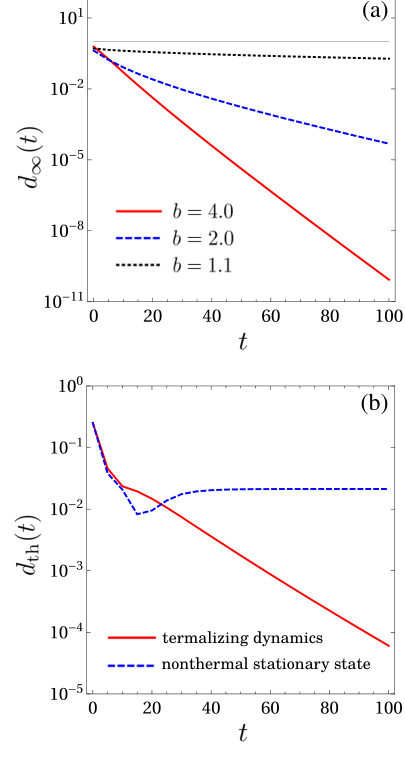
<figcaption class="paper-figure-caption"><b>Fig 1.</b> FIG. 1. Equilibration and thermalization in the incoherent energy- space dynamics for a system with equally spaced energies En = nE. The simulations use a truncated ladder n = 0, 1, . . . , N with N = 50, fixed lazy probability p0 = 0.1, and a normalized discrete Gaussian initial distribution (“cold state”) ℘0(n) ∝e−(n−n0)2/(2σ2)</figcaption>
</figure>
<figure class="paper-figure-card">
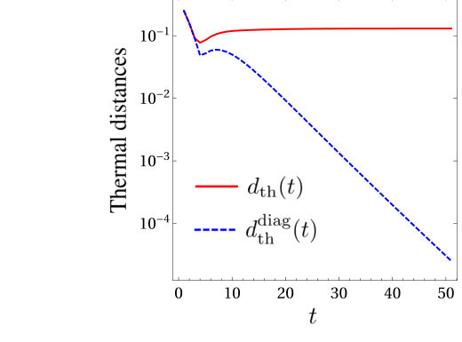
<figcaption class="paper-figure-caption"><b>Fig 2.</b> FIG. 2. Thermal distance dth(t) (solid red line) and its dephased counterpart ddiag th (t) (dashed blue line), where ρβt is the Gibbs state with the same instantaneous mean energy as ρt. While the de- phased dynamics relaxes to the Gibbs state, dth(t) saturates at a finite value, revealing a persistent coherence-induced deviation from ther- mal equilibrium. Parameters as described in the text.</figcaption>
</figure>
<figure class="paper-figure-card">
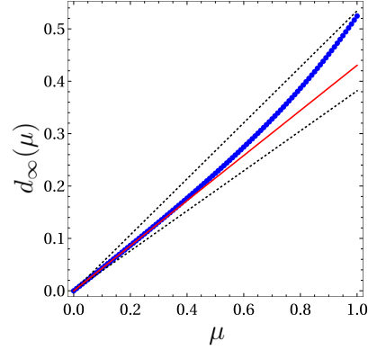
<figcaption class="paper-figure-caption"><b>Fig 3.</b> FIG. 4. Asymptotic thermal distance d∞(µ) as a function of the coherence parameter µ. Blue dots denote numerical results, dashed black lines indicate analytical bounds, and the red solid line corre- sponds to the first-order perturbative prediction. The linear scaling at small µ confirms the perturbative analysis, while deviations at larger µ signal the onset of nonperturbative effects. Parameters as described in the text.</figcaption>
</figure>
<figure class="paper-figure-card">
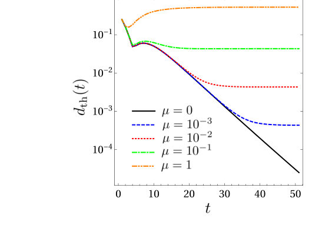
<figcaption class="paper-figure-caption"><b>Fig 4.</b> FIG. 3. Time evolution of the thermal distance dth(t) for different values of the coherence parameter µ. For µ = 0, the dynamics re- duces to the classical case and dth(t) →0, while for µ &gt; 0 the distance saturates at a finite value that increases with µ, indicating a growing coherence-induced deviation from the Gibbs state. Parame- ters as described in the text.</figcaption>
</figure>

**Summary.** This paper introduces energy-space quantum walks to study thermalization, showing that energy populations can equilibrate to a Gibbs state even when the full quantum state fails to converge to that state. By quantifying the deviation using the thermal distance, the authors demonstrate that coherence acts as a persistent, controllable source of non-thermal behavior, separating classical equilibration from quantum corrections.

**Why it may be interesting.** This work provides a rigorous, quantitative framework to distinguish between classical relaxation processes and genuine quantum non-equilibrium effects in open quantum systems, which is crucial for understanding thermalization in realistic quantum simulators.

Detailed structure

**Main problem.** The paper investigates the fundamental difference between energy equilibration (population relaxation) and full quantum state thermalization in quantum walks.

**Main result.** It establishes a minimal scenario of 'thermalization without state convergence,' where energy populations reach a classical Gibbs distribution, but the full quantum state retains a persistent, coherence-induced deviation from the thermal manifold.

**Method.** The analysis uses an effective-dynamics approach, mapping the system onto an energy ladder and comparing the time evolution of the full density operator against its diagonal (population) components.

**Model / system.** The model is an energy-space quantum walk, where the configuration space is mapped onto a ladder of energy eigenlevels. The dynamics are governed by a unitary, collision-assisted quantum channel $\Phi_\mu$ parameterized by a coherence strength $\mu$.

**Key observables.** Thermal distance ($d_{th}(t)$) and the difference between the full thermal distance and the dephased distance, which quantifies the coherence contribution.

**Important parameters / regimes.** The coherence parameter $\mu$, which controls the quantum corrections, and the bias $b = p_-/p_+$ in the classical limit.

**Assumptions / limitations.** The analysis assumes the underlying classical dynamics is ergodic and that the system can be effectively described by a minimal collision-assisted quantum walk structure.

**Figures summary.** Figures illustrate the time evolution of the thermal distance, showing saturation at a finite, non-zero value when coherence ($\mu>0$) is present, contrasting this with the zero saturation seen in purely thermalizing cases.

**Paper structure.** The paper progresses by first establishing the classical limit (birth-death-lazy dynamics) leading to Gibbs equilibrium. It then embeds this into a unitary, coherent model, systematically decomposing the evolution into classical (population) and quantum (coherence) parts to quantify the separation.

Abstract

We introduce energy-space quantum walks as a minimal framework to investigate equilibration, thermalization, and irreversibility from an effective-dynamics perspective. By mapping the configuration space of a walk onto a ladder of energy eigenlevels, we reinterpret thermalization as transport in energy space, independently of microscopic system--bath details. At the classical level, the resulting birth--death--lazy dynamics leads to equilibration of the energy distribution and, under suitable conditions, to a Gibbs stationary state. We then embed this dynamics into a unitary, collision-assisted model in which coherence is controlled by a single parameter. A central result is a structural decoupling between population dynamics and coherence generation: while the populations evolve according to the classical process and relax to the Gibbs distribution, the full quantum state exhibits a persistent coherence-induced deviation from the thermal manifold. This establishes a minimal scenario of thermalization without state convergence, where equilibration occurs at the level of populations but not at the level of the full density operator. We quantify this effect using the thermal distance to the Gibbs state and derive perturbative bounds that relate the long-time deviation to classical transport properties. Our results show that coherence acts as a controllable and quantitatively bounded source of nonthermal behavior, providing a clear separation between classical equilibration and genuinely quantum corrections.

[↑ back to top](#top)

### [Beyond Unitary Quantum Simulation: Open-System Approaches to Quantum Chemistry toward Quantum Advantage](http://arxiv.org/abs/2605.15277v1)

**Authors:** Michael Marthaler, Elias Zapusek, Florentin Reiter  
**Type:** theory · **Category:** other · **PDF:** <https://arxiv.org/pdf/2605.15277v1>  
**Analysis basis:** full PDF text, analyzed in chunks
**Topic relevance:** 🔥 `methods for driven-dissipative` **4/5** · `Keldysh / 2PI / non-Gaussian methods` **3/5** · `correlated / nonlocal dissipation` **3/5** · `driven-dissipative phase transition` **3/5** · `non-equilibrium dynamics` **2/5** · `non-equilibrium universality` **2/5** · `Kondo & dissipative impurity` **1/5** · `analog quantum simulation` **1/5**

↔ Scroll figures horizontally

<figure class="paper-figure-card">
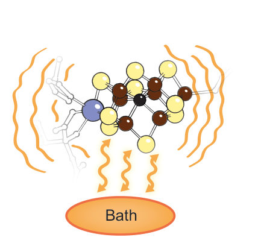
<figcaption class="paper-figure-caption"><b>Fig 1.</b> Figure 1: Molecule (FeMoco cluster) coupled to a ther- mal environment, illustrating the open-system setting that pervades chemistry, condensed-matter physics, and materials science. Standard quantum algorithms largely abstract away this system–bath interaction, treating the electronic problem as closed and unitary. The dissipa- tive simulation framework discussed in this review in- stead takes the environmental coupling as a computa- tional resource rather than a nuisance.</figcaption>
</figure>
<figure class="paper-figure-card">
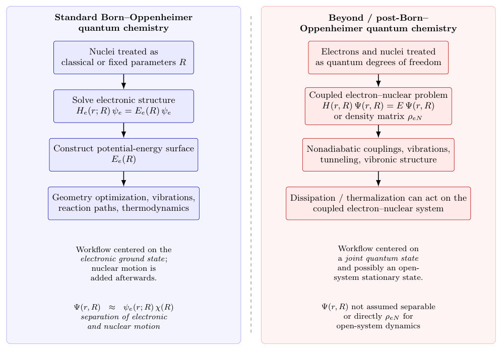
<figcaption class="paper-figure-caption"><b>Fig 2.</b> Figure 2: Conceptual comparison between standard Born–Oppenheimer quantum chemistry and beyond-/post-Born– Oppenheimer approaches. In the Born–Oppenheimer picture, one first solves an electronic structure problem for fixed nuclear coordinates and then derives nuclear dynamics from the resulting potential-energy surface. In the beyond- Born–Oppenheimer picture, electrons and nuclei are treated on a common quantum footing, allowing nonadiabatic effects, vibronic structure, tunneling, and, in principle, dissipation acting on the coupled electron–nuclear system.</figcaption>
</figure>

**Summary.** This review argues that simulating quantum chemistry must embrace open-system dynamics, moving beyond idealized unitary models to account for environmental coupling. It analyzes the theoretical challenges and computational scaling associated with incorporating dissipation into quantum algorithms. The paper concludes by proposing a practical, incremental research strategy, moving from solid-state models to molecular dynamics.

**Why it may be interesting.** It directly bridges the gap between foundational quantum computation theory (open systems, dissipation) and a core area of physical chemistry, providing a roadmap for future quantum simulation efforts.

Detailed structure

**Main problem.** The paper addresses the need to move quantum chemistry simulations beyond idealized, closed-system unitary dynamics to incorporate the reality of open-system physics, such as relaxation and decoherence.

**Main result.** It argues that incorporating dissipation is crucial for realistic quantum chemistry but requires a fundamental overhaul of existing quantum simulation machinery, suggesting an incremental, hierarchical approach for practical implementation.

**Method.** The review synthesizes theoretical proposals, comparing scaling estimates for various mapping techniques (second-quantized vs. first-quantized) and outlining practical pathways from solid-state physics to molecular dynamics.

**Model / system.** The primary system is quantum chemistry, modeled by Hamiltonians that can be either closed (Born-Oppenheimer) or open (coupled to a thermal environment via Lindbladians). The scope ranges from periodic solids to small molecules.

**Key observables.** Stationary thermal state, electronic ground-state energy, reaction probabilities, and transition amplitudes.

**Important parameters / regimes.** System size (A), time/precision requirements, and the nature of environmental coupling (dissipation strength).

**Assumptions / limitations.** The ideal, fully general quantum simulation incorporating all physics is deemed too demanding; progress must be achieved through restricted, physically motivated settings.

**Figures summary.** Figure 1 contrasts closed-system vs. open-system views of molecular dynamics. Figure 2 compares scaling approaches from standard Born-Oppenheimer to beyond-B-O treatments.

**Paper structure.** The review progresses by first critiquing the unitary assumption, then detailing the theoretical integration of dissipation, followed by a discussion of scaling limits, and concluding with a practical, hierarchical roadmap for future research.

Abstract

Quantum simulation is widely regarded as one of the most promising routes to genuine quantum advantage, yet most existing approaches to quantum chemistry are formulated in terms of closed-system, unitary dynamics and ground-state preparation within the Born--Oppenheimer approximation. In this review, we discuss a broader perspective motivated by the observation that naturally occurring quantum systems are rarely isolated and often reach physically relevant states only through relaxation, decoherence, and thermalization. We first examine what is and is not known about exponential quantum advantage in chemistry, emphasizing that coherent Hamiltonian simulation provides the clearest formal case for speed-up, while many open questions remain for realistic problems. We then discuss how dissipation might ideally be integrated into quantum chemistry on a fault-tolerant quantum computer, using recent proposals for chemically motivated dynamical simulation as a guiding vision. More generally, we highlight the practical appeal of this approach to enhancing the robustness of quantum algorithms.

[↑ back to top](#top)

### [Biorthogonal Dynamical Quantum Phase Transitions in a Non-Hermitian Kitaev Chain](http://arxiv.org/abs/2605.15982v1)

**Authors:** Haoran Gu, Yubo Zhao, Siyuan Cheng, Yuee Xie, Xiaosen Yang, Yuanping Chen  
**Type:** theory · **Category:** statistical mechanics · **PDF:** <https://arxiv.org/pdf/2605.15982v1>  
**Analysis basis:** full PDF text, analyzed in chunks
**Topic relevance:** 🔥 `driven-dissipative phase transition` **4/5** · `methods for driven-dissipative` **3/5** · `non-equilibrium dynamics` **3/5** · `non-equilibrium universality` **3/5** · `Keldysh / 2PI / non-Gaussian methods` **2/5** · `Kondo & dissipative impurity` **1/5** · `analog quantum simulation` **1/5** · `correlated / nonlocal dissipation` **1/5** · `entanglement & information structure` **1/5**

↔ Scroll figures horizontally

<figure class="paper-figure-card">
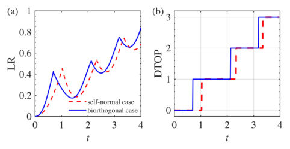
<figcaption class="paper-figure-caption"><b>Fig 1.</b> FIG. 1. (a) Nonanalytic behavior of the biorthogonal Loschmidt rate obtained from Eq. (8), clearly visible at crit- ical times. (b) Biorthogonal DTOP evaluated from Eq. (10), showing a unit jump at the critical time in agreement with the Loschmidt rate. Common parameters: t1 = 1, ∆= 0.9, γ = 0.5, µi r = 0.25, and µf r = 1.7.</figcaption>
</figure>
<figure class="paper-figure-card">
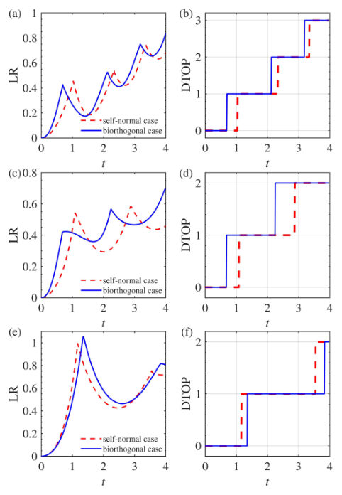
<figcaption class="paper-figure-caption"><b>Fig 2.</b> FIG. 2. DQPTs for three different quench processes (from top to bottom): a quench from the topological phase to the topologically trivial phase with (µi r, µf r) = (0.3, 1.7), a quench inside the trivial phase with (µi r, µf r) = (−0.6, 0.7), and a quench from the topologically trivial phase to the topological phase with (µi r, µf r) = (1.7, −0.3). (a), (c), and (e) show the Loschmidt rate, while (b), (d), and (f) show the corresponding DTOP. Common parameters: t1 = 1, ∆= 0.9, and γ = 0.5.</figcaption>
</figure>
<figure class="paper-figure-card">
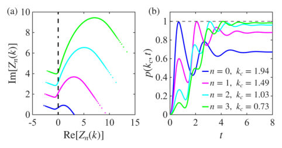
<figcaption class="paper-figure-caption"><b>Fig 3.</b> FIG. 3. (a) Dynamical Fisher zeros Zn(k) for the representa- tive quench process in Fig. 1, shown for n = 0, 1, 2, 3. (b) Corresponding transition probability between |ui kc−(t)⟩and |ui kc+⟩at the critical momentum.</figcaption>
</figure>
<figure class="paper-figure-card">
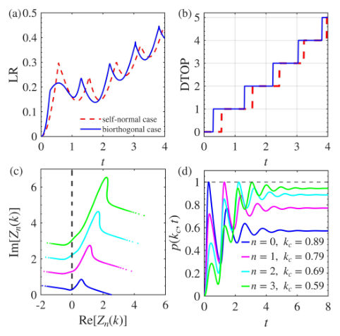
<figcaption class="paper-figure-caption"><b>Fig 4.</b> FIG. 4. (a) Nonanalytic behavior exhibiting the critical times. (b) DTOP jumps corresponding to the evolution of LR(t). (c) Curves of Zn(k) crossing the imaginary axis and display- ing DQPTs for n = 0, 1, 2, 3. (d) Corresponding transition probability between |ui kc−(t)⟩and |ui kc+⟩at the critical mo- mentum. Common parameters: t1 = 1, t2 = 0.7, ∆= 0.9, γ = 0.5, µi r = −0.5, and µf r = 2.2.</figcaption>
</figure>
<figure class="paper-figure-card">

<figcaption class="paper-figure-caption"><b>Fig 5.</b> Figure 3(b) indicates that multiple critical momenta kc can exist, each associated with a distinct critical time tc. Moreover, a characteristic pattern is observed: for t &lt; tc, p(kc, t) exhibits n local maxima and reaches 1 at the (n + 1)-th maximum, whereas for t ≫tc, it tends to a steady state. By employing a biorthogonal framework, we study DQPTs in a non-Hermitian Kitaev chain. This formula- tion applies to general non-Hermitian Hamiltonians with complex spectra, and we illustrate its implementation and physical consequences together with a comparison to the self-normal treatment.</figcaption>
</figure>

**Summary.** This work develops and applies a biorthogonal framework to study Dynamical Quantum Phase Transitions in non-Hermitian topological superconductors, using the Kitaev chain as a model. The authors demonstrate that this biorthogonal approach provides a theoretically consistent and physically robust method for identifying critical transition times, correcting discrepancies found using standard self-normal methods.

**Why it may be interesting.** The rigorous development of a consistent diagnostic tool (biorthogonality) for non-equilibrium dynamics in non-Hermitian systems is highly relevant for understanding open quantum systems and driven many-body physics.

Detailed structure

**Main problem.** The paper investigates Dynamical Quantum Phase Transitions (DQPTs) in non-Hermitian systems, specifically addressing the theoretical shortcomings of conventional self-normal approaches.

**Main result.** The authors establish that a biorthogonal framework is essential for consistently diagnosing DQPTs, yielding critical times that differ systematically from conventional methods.

**Method.** The study employs an associated-state formalism and reformulates key diagnostics like the Loschmidt rate function and the Dynamical Topological Order Parameter (DTOP) using biorthogonal inner products.

**Model / system.** The primary model is the non-Hermitian Kitaev chain, used as a prototypical system for non-Hermitian topological superconductors. The analysis is performed in momentum space using a specific Hamiltonian structure.

**Key observables.** Biorthogonal Loschmidt echo/rate, Dynamical Topological Order Parameter (DTOP), and Dynamical Fisher zeros ($Z_n(k)$).

**Important parameters / regimes.** Critical times ($t_c$) associated with the transition, and the momentum $k$ resolved subsystems.

**Assumptions / limitations.** The core assumption is that the conventional self-normal approach lacks a proper probabilistic interpretation in non-Hermitian dynamics, necessitating the biorthogonal formalism.

**Figures summary.** Figures illustrate the nonanalytic behavior of the biorthogonal Loschmidt rate and DTOP at critical times, and compare the results of the biorthogonal versus self-normal schemes across multiple quench processes.

**Paper structure.** The paper develops the biorthogonal framework, applies it to the Kitaev chain, compares its diagnostics (Loschmidt echo, DTOP) against conventional methods, and concludes by establishing the framework's robustness and necessity for non-Hermitian dynamics.

Abstract

Dynamical quantum phase transitions in non-Hermitian systems pose fundamental challenges due to the intrinsic biorthogonality of their eigenstates. In this work, we extend a biorthogonal framework to investigate dynamical quantum phase transitions in non-Hermitian topological superconductors. Taking the non-Hermitian Kitaev chain as a prototypical model, we construct an associated-state formalism and reformulate the Loschmidt rate function, dynamical topological order parameter, and dynamical Fisher zeros. Within this framework, we find that the critical times at which dynamical quantum phase transitions occur differ from those based on the conventional self-normal approaches. We further analyze momentum-resolved subsystems at critical momenta and demonstrate the robustness of the biorthogonal framework. Our work highlights the essential role of biorthogonality in nonequilibrium dynamics and establishes a consistent theoretical framework for dynamical quantum phase transitions in non-Hermitian topological superconductors.

[↑ back to top](#top)

### [An agitated oscillator chain](http://arxiv.org/abs/2605.16209v1)

**Authors:** Aaron Beyen, Christian Maes, Ion Santra  
**Type:** theory · **Category:** statistical mechanics · **PDF:** <https://arxiv.org/pdf/2605.16209v1>  
**Analysis basis:** full PDF text, analyzed in chunks
**Topic relevance:** 🔥 `non-equilibrium dynamics` **4/5** · `Frenkel-Kontorova` **3/5** · `driven-dissipative phase transition` **3/5** · `non-equilibrium universality` **3/5** · `methods for driven-dissipative` **2/5** · `Keldysh / 2PI / non-Gaussian methods` **1/5** · `correlated / nonlocal dissipation` **1/5**

↔ Scroll figures horizontally

<figure class="paper-figure-card">
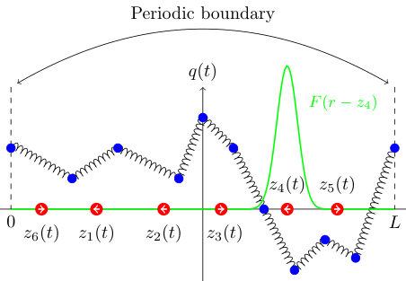
<figcaption class="paper-figure-caption"><b>Fig 1.</b> FIG. 1: A configuration of active particles (red disks) with associated spins (white arrow) on a</figcaption>
</figure>
<figure class="paper-figure-card">
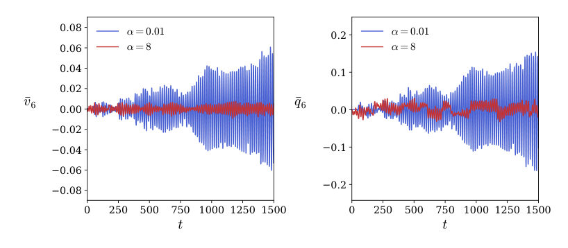
<figcaption class="paper-figure-caption"><b>Fig 2.</b> FIG. 2: Time evolution of the k = 6 Fourier mode in the transient regime. Left: velocity mode</figcaption>
</figure>
<figure class="paper-figure-card">
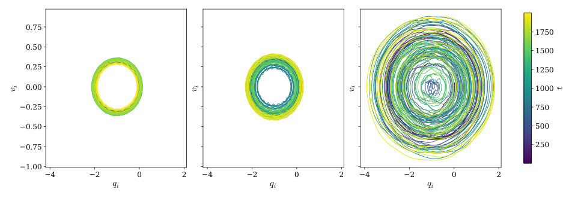
<figcaption class="paper-figure-caption"><b>Fig 3.</b> FIG. 3: Phase-space trajectories of a tagged oscillator for different values of the bath activity.</figcaption>
</figure>
<figure class="paper-figure-card">
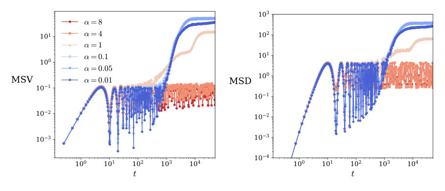
<figcaption class="paper-figure-caption"><b>Fig 4.</b> FIG. 4: Temporal evolution of the mean-squared velocity (left) and mean-squared displacement</figcaption>
</figure>
<figure class="paper-figure-card">
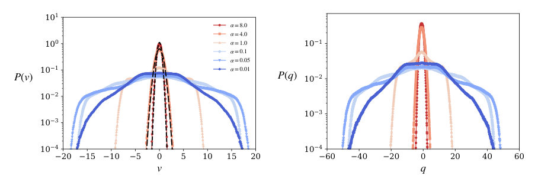
<figcaption class="paper-figure-caption"><b>Fig 5.</b> FIG. 5: Stationary distributions of a tagged oscillator. Left: velocity distribution P(vi). Right:</figcaption>
</figure>

**Summary.** This work analyzes an oscillator chain coupled to active run-and-tumble particles, deriving a reduced Langevin equation under time-scale separation. The key finding is that the active bath induces negative linear friction, leading to an instability that is ultimately arrested by nonlinear effects. This results in the chain adopting a self-sustained, non-equilibrium steady state with characteristic Rayleigh-like pulsations.

**Why it may be interesting.** The emergence of self-sustained, non-equilibrium dynamics (like Rayleigh oscillators) from coupling to active matter is a key topic in non-equilibrium statistical mechanics, highly relevant to understanding active matter systems.

Detailed structure

**Main problem.** The study investigates how the stationary dynamics of an oscillator chain are modified when coupled to a bath of active run-and-tumble particles.

**Main result.** The coupling can transform a passive chain into a self-sustained fluctuating medium exhibiting Rayleigh-like dynamics, characterized by non-equilibrium steady states and persistent currents.

**Method.** The analysis uses time-scale separation to derive a reduced Langevin equation for the chain dynamics, followed by Fourier space analysis of the resulting coupled modes.

**Model / system.** The system consists of a chain of coupled harmonic oscillators interacting with a bath of run-and-tumble particles (RTPs) moving on a ring. The dynamics are modeled via a reduced Langevin equation incorporating mean forces, induced friction, and noise.

**Key observables.** Mean Squared Velocity (MSV), Mean Squared Displacement (MSD), and the antisymmetric displacement-velocity cross-correlation $C_{qv}(\ell)$.

**Important parameters / regimes.** Activity parameter ($\alpha$), coupling strength ($\zeta$), and the ratio of time scales ($\epsilon = \omega_{chain}L/v_0$).

**Assumptions / limitations.** The primary assumption is the time-scale separation between the slow oscillator chain dynamics and the fast bath dynamics, allowing for projection operator techniques.

**Figures summary.** Figures illustrate mode amplitude growth in the negative-friction regime, phase-space trajectories showing limit cycles (Rayleigh-like), and the non-equilibrium nature of spatial correlations.

**Paper structure.** The paper proceeds by deriving the reduced Langevin dynamics using time-scale separation, analyzing the resulting friction and noise terms in Fourier space, and finally characterizing the non-equilibrium stationary state through correlation functions and stability analysis.

Abstract

We study how the stationary dynamics of an oscillator chain is modified when coupled to a bath of run-and-tumble particles. First, assuming time-scale separation, we derive the induced Langevin chain dynamics with explicit expressions for the streaming term, friction coefficient, and noise amplitude. At high persistence of the run-and-tumble particle bath, the linear friction turns negative, creating an instability. Second, we find that this anti-damping is arrested at long times due to nonlinear effects, reminiscent of a Rayleigh oscillator. We conclude that a passive harmonic chain can be transformed by its coupling to active matter into a self-sustained fluctuating medium with many-body Rayleigh-like dynamics. That transfer of activity results in pulsations of the displacements, spatial oscillations, and the emergence of persistence in velocities along the chain.

[↑ back to top](#top)

### [Thermodynamic Networks: Harnessing Non-Equilibrium Steady States for Computation](http://arxiv.org/abs/2605.15985v1)

**Authors:** Patryk Lipka-Bartosik, Gianmichele Blasi, Javier Lalueza Puértolas, Géraldine Haack, Martí Perarnau-Llobet, Nicolas Brunner  
**Type:** theory · **Category:** statistical mechanics · **PDF:** <https://arxiv.org/pdf/2605.15985v1>  
**Analysis basis:** full PDF text, analyzed in chunks
**Topic relevance:** 🔥 `non-equilibrium dynamics` **4/5** · `driven-dissipative phase transition` **3/5** · `methods for driven-dissipative` **3/5** · `non-equilibrium universality` **3/5** · `correlated / nonlocal dissipation` **2/5** · `Keldysh / 2PI / non-Gaussian methods` **1/5**

↔ Scroll figures horizontally

<figure class="paper-figure-card">
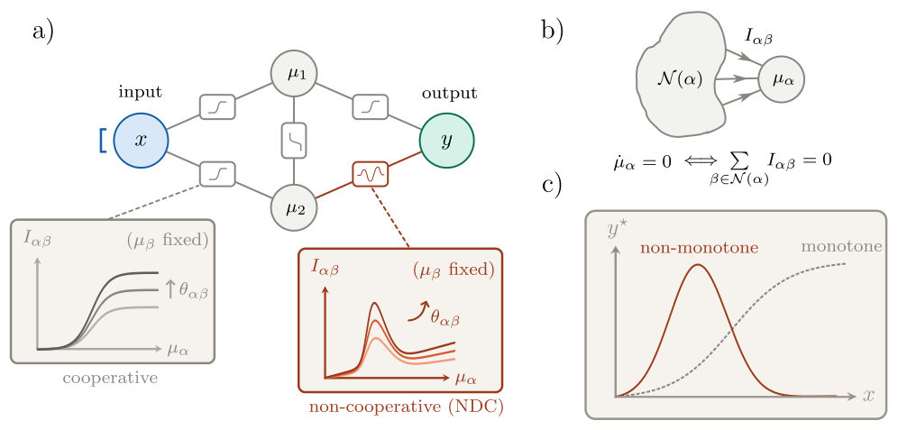
<figcaption class="paper-figure-caption"><b>Fig 1.</b> FIG. 1. Thermodynamic networks compute by equilibrating. (a) A thermodynamic network is a graph of reservoirs (nodes) coupled by transport channels (edges) that collectively redistribute a conserved charge. The conjugate potential µ serves as both the dynamical state variable at every node and the language of input and output. The input reservoir x is clamped to a prescribed potential (bracket), hidden nodes µ1 and µ2 evolve freely, and the output y is read out at steady state. Each transport channel (rectangular box) carries a current Iαβ(µα, µβ) governed by tuneable parameters θαβ. Insets show the current–potential characteristic at fixed µβ for a family of parameter values. Cooperative...</figcaption>
</figure>
<figure class="paper-figure-card">
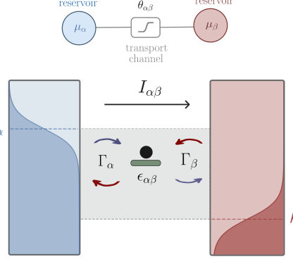
<figcaption class="paper-figure-caption"><b>Fig 2.</b> FIG. 2. Quantum-dot realisation of a thermodynamic network edge. Physical implementation of an edge (α, β) using a quantum dot. Each reservoir is an electronic lead char- acterised by a chemical potential µℓand temperature Tℓ. The shaded regions represent their Fermi–Dirac occupation. The dot hosts a single energy level ϵαβ through which electrons tunnel sequentially, with rates set by the tunnel couplings Γα and Γβ. The dot energy level further shifts with the applied bias via the electrostatic shift effect, see Eq. (17). For cer- tain choices of parameters, the energy level can be swept out of the transport window (grey shading), producing negative differential conductance—the mechanism...</figcaption>
</figure>
<figure class="paper-figure-card">
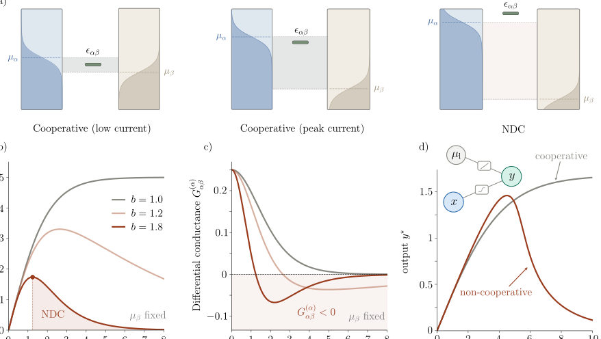
<figcaption class="paper-figure-caption"><b>Fig 3.</b> FIG. 3. Negative differential conductance in a quantum dot and its computational consequences. (a) Energy- level diagrams of a quantum dot at three operating points. At low bias µα −µβ, the dot level ϵαβ lies within the transport window between µα and µβ, and current flows freely. As the bias increases, the level is pushed above the source chemical potential, suppressing current despite the growing driving force, which is the hallmark of negative differential conductance (NDC). (b) Current–voltage characteristics for a quantum dot connected to equal temperature reservoirs Tα = Tβ with a varying electrostatic shift parameter b. For b = 1 (no NDC), the current increases monotonically with...</figcaption>
</figure>
<figure class="paper-figure-card">
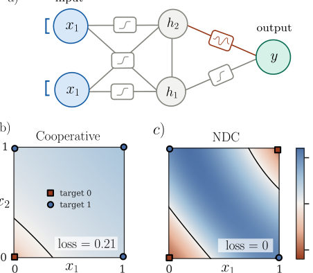
<figcaption class="paper-figure-caption"><b>Fig 4.</b> FIG. 4. Quantum dot network implementing XOR. Decision surfaces of a network of quantum dots trained on the XOR task, showing the steady-state output potential y⋆</figcaption>
</figure>
<figure class="paper-figure-card">
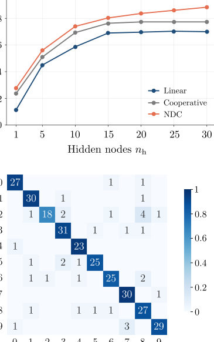
<figcaption class="paper-figure-caption"><b>Fig 5.</b> FIG. 5. Thermodynamic networks of quantum dots applied to MNIST problem (digit classification). (a) Test accuracy of trained thermodynamic networks as a func- tion of the number of neurons in the single hidden layer (784 input nodes, nh hidden nodes, 10 output nodes). The curves correspond to three different regimes: linear, cooperative and NDC. All networks are trained on the MNIST dataset using gradient descent via implicit differentiation. We observe that NDC is a key ingredient for learning in this task, whereas linear and monotonic networks learn substantially worse. (b) Confusion matrix of the NDC-based thermodynamic network with nh = 30 hidden nodes computed on the test set with 300...</figcaption>
</figure>

**Summary.** This work introduces thermodynamic networks as a general framework for computation based on physical relaxation to non-equilibrium steady states. It rigorously proves that the ability to exhibit Negative Differential Conductance (NDC) is necessary and sufficient for these networks to achieve universal function approximation. The approach is demonstrated using quantum dot and enzymatic models, establishing a deep link between non-equilibrium physics and computational power.

**Why it may be interesting.** It provides a direct physical realization of machine learning concepts (like universal approximation) using fundamental principles of non-equilibrium thermodynamics and transport physics, linking computation to dissipation.

Detailed structure

**Main problem.** Developing a general framework for autonomous, physics-based computation using non-equilibrium steady states (NESS).

**Main result.** The presence of Negative Differential Conductance (NDC) is the critical physical property that enables universal function approximation in these thermodynamic networks.

**Method.** The computation is modeled by finding the steady-state solution ($\dot{\mu}=0$) of the network dynamics, and training is achieved using implicit differentiation techniques analogous to Deep Equilibrium Models.

**Model / system.** The system is a 'thermodynamic network' modeled as a graph of mesoscopic reservoirs exchanging conserved quantities. Computation occurs when the system relaxes to a NESS, which maps an input state to a steady-state output.

**Key observables.** Differential Conductance, Conductance Matrix ($G$), Steady-State Output ($\mu^\star$), and the ability to compute non-monotone functions like XOR.

**Important parameters / regimes.** Negative Differential Conductance (NDC), Cooperativity, Input potentials ($x$), and system parameters ($	heta$).

**Assumptions / limitations.** The process is autonomous, governed only by dissipation, and the adiabatic regime ($	au_{	ext{internal}} \ll 	au_{	ext{charging}}$) is assumed for the steady-state calculation.

**Figures summary.** Figures illustrate the network structure, showing how cooperative channels yield monotone responses, while NDC channels enable non-monotone maps, and demonstrate successful classification (e.g., MNIST) using NDC.

**Paper structure.** The paper establishes the NESS framework, identifies NDC as the key ingredient for non-monotonicity, proves universal approximation theorems, and illustrates this concept using quantum dot and enzymatic reaction network platforms.

Abstract

We introduce thermodynamic networks, a general framework for autonomous, physics-based computation using non-equilibrium steady states. These networks are modeled as a collection of finite-size reservoirs that exchange conserved quantities--such as electric charge or molecular number--while relaxing to a non-equilibrium steady state, which encodes the solution of a computational problem. We identify Negative Differential Conductance (NDC) as the critical physical property governing the computational expressivity of the thermodynamic network. While networks lacking NDC are restricted to computing monotonic functions, the presence of NDC enables universal function approximation. For the training of the network, we use protocols that take advantage of the natural tendency of the system to equilibrate. We illustrate the versatility of our approach via two different platforms: quantum dot networks and enzymatic reaction networks. Both systems can be engineered to have NDC, enabling high performance in standard benchmarks, including sine function approximation and MNIST digit classification. Overall, our work establishes a rigorous link between non-equilibrium steady states and computational expressivity.

[↑ back to top](#top)

### [Short-time critical dynamics in the classical cubic dimer model](http://arxiv.org/abs/2605.15730v1)

**Authors:** Hu-Xiao Peng, Zheng Yan, Shuai Yin  
**Type:** theory · **Category:** statistical mechanics · **PDF:** <https://arxiv.org/pdf/2605.15730v1>  
**Analysis basis:** full PDF text, analyzed in chunks
**Topic relevance:** 🔥 `non-equilibrium universality` **4/5** · `driven-dissipative phase transition` **3/5** · `non-equilibrium dynamics` **3/5** · `Keldysh / 2PI / non-Gaussian methods` **1/5** · `analog quantum simulation` **1/5** · `entanglement & information structure` **1/5** · `methods for driven-dissipative` **1/5**

↔ Scroll figures horizontally

<figure class="paper-figure-card">
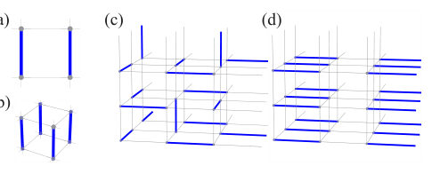
<figcaption class="paper-figure-caption"><b>Fig 1.</b> FIG. 1. Two types of interactions and two types of initial states in the dimer model. (a) Two parallel dimers on the plane contribute energy v2. (b) Four parallel dimers on a unit cube contribute energy v4. In this study, we fixed v2 = −1 and v4 = 10. (c) The disordered initial state with Nx = 0, typical of a Coulomb phase. (d) The completely ordered initial state with Nx = 1, representing a columnar phase.</figcaption>
</figure>
<figure class="paper-figure-card">
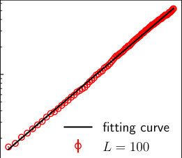
<figcaption class="paper-figure-caption"><b>Fig 2.</b> FIG. 3. Short-time dynamics of the ratio N 2 d/N 2 o at the crit- ical point Tc = 0.672 for system size L = 100. The dotted curve represents the Monte Carlo results, while the solid line corresponds to the fitted curve with a power function. Log- log coordinates are used.</figcaption>
</figure>
<figure class="paper-figure-card">
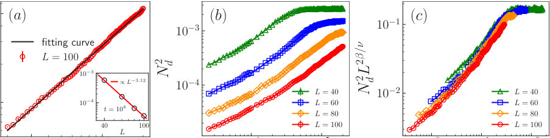
<figcaption class="paper-figure-caption"><b>Fig 3.</b> FIG. 4. Short-time dynamics of the classical dimer model quenched from a disordered state to the critical point for various system sizes. (a) N 2 d plotted versus time in log-log scale for system size L = 100 . The symbols represent the Monte Carlo results, while the solid line corresponds to the fitted result. The inset shows a log-log plot of N 2 d as a function of system size L = 40, 60, 80, 100 at a fixed time t = 104, where the solid line represents a power-law fit yielding N 2 d ∝L−3.12, consistent with the expected L−d scaling with d = 3. (b) Time dependence of N 2 d for L = 40 to 100. (c) After rescaling N 2 d and t as N 2 dL2β/νz</figcaption>
</figure>
<figure class="paper-figure-card">
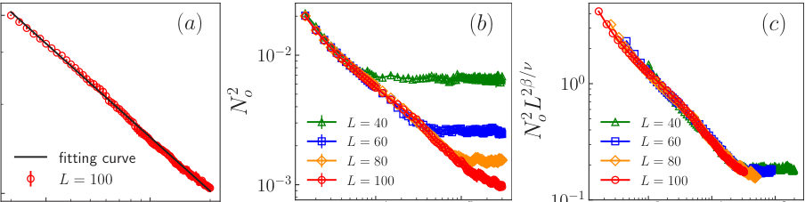
<figcaption class="paper-figure-caption"><b>Fig 4.</b> FIG. 5. Short-time dynamics of the classical dimer model quenched from an ordered state to the critical point for various system sizes. (a) N 2 o plotted versus time in log-log scale for system size L = 100 . (b) Time dependence of N 2 o for L = 40 to 100. (c) After rescaling N 2 o and t as N 2 o L2β/νz and tL−z, all curves collapse well. Log-log coordinates are used.</figcaption>
</figure>
<figure class="paper-figure-card">
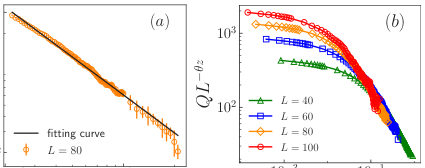
<figcaption class="paper-figure-caption"><b>Fig 5.</b> FIG. 6. The time correlation of the total order parameter Q starting from a disordered state at the critical point. (a) Time dependence of Q for system size L = 80. Since the statistical fluctuations for L = 100 are too large to allow for a reliable fit, we therefore use L = 80 in our analysis. (b) After rescaling Q and t as QL−θz and tL−z, all curves collapse well. Log-log coordinates are used.</figcaption>
</figure>

**Summary.** This work characterizes the non-equilibrium short-time critical dynamics of the 3D classical dimer model. Using Monte Carlo simulations, the authors determine key critical exponents, notably finding an unusual negative critical initial slip exponent. This negative exponent is linked theoretically to the combined effects of emergent SO(5) symmetry and a local U(1) gauge constraint.

**Why it may be interesting.** The study provides a detailed look at non-equilibrium critical dynamics, which shares conceptual links with how quantum systems evolve away from equilibrium, particularly in understanding universal scaling laws beyond simple mean-field descriptions.

Detailed structure

**Main problem.** Investigating the nonequilibrium critical dynamics, particularly in the short-time regime, of the classical cubic dimer model.

**Main result.** The authors determined the critical temperature ($T_c = 0.672(1)$), dynamic exponent ($z = 1.92(1)$), and found an anomalous negative critical initial slip exponent ($	heta = -1.052(5)$).

**Method.** Large-scale Monte Carlo simulations were used to analyze the short-time scaling behavior of the order parameter and its time correlation function.

**Model / system.** The system is the classical dimer model on a cubic lattice, which exhibits a continuous phase transition beyond the conventional Landau-Ginzburg-Wilson paradigm.

**Key observables.** Order parameter squared ($\langle N^2 
angle$), time-correlation function ($Q(t)$), critical exponents ($eta/
u$, $z$, $	heta$).

**Important parameters / regimes.** The study focuses on the short-time regime, quenching from both ordered and disordered initial states.

**Assumptions / limitations.** The analysis relies on theoretical scaling relations for short-time dynamics, and the negative $	heta$ is attributed to emergent SO(5) symmetry and a local U(1) gauge constraint.

**Figures summary.** Figures illustrate the dependence of the order parameter on time and system size, showing data collapse when rescaled using the derived exponents.

**Paper structure.** The paper details the model and methods, reviews the theory of short-time scaling, presents the numerical results for the exponents, and concludes by interpreting the physical meaning of the anomalous negative exponent $	heta$.

Abstract

The classical dimer model on the cubic lattice hosts a columnar ordered phase and a disordered Coulomb phase, separated by a continuous phase transition that lies beyond the conventional Landau-Ginzburg-Wilson paradigm. While its equilibrium critical properties have been extensively studied, the nonequilibrium critical dynamics of this model--particularly in the short-time regime--remains largely unexplored. In this work, we investigate the short-time critical dynamics near the transition using large-scale Monte Carlo simulations. By quenching the system from both ordered and disordered initial states with vanishing initial correlation length, we analyze the scaling behaviors of the order parameter and its time correlation function in the short-time stage. From these scaling behaviors, we accurately determine the critical temperature $T_c = 0.672(1)$ and the static critical exponent $β/ν= 0.581(5)$ according to the scaling theory of the short-time dynamics. These results are in excellent agreement with previous equilibrium studies. Moreover, we extract the dynamic critical exponent $z = 1.92(1)$ and, notably, find a negative critical initial slip exponent $θ= -1.052(5)$. This unusual negative value contrasts sharply with the positive $θ$ typically observed in conventional critical dynamics. We attribute this anomalous behavior to the combined effects of the emergent SO(5) symmetry at criticality and the local U(1) gauge constraint (Gauss law), which enforces a conserved diffusive dynamics and enhances fluctuations in the short-time regime. Our results provide the first comprehensive characterization of nonequilibrium short-time criticality in the three-dimensional dimer model, shedding new light on the universal dynamical features of phase transitions beyond the Landau-Ginzburg-Wilson framework.

[↑ back to top](#top)

### [Unbounded Communication Power of a Qubit](http://arxiv.org/abs/2605.16093v1)

**Authors:** Souradeep Sasmal, Som Kanjilal, Debarshi Das  
**Type:** theory · **Category:** quantum information and computing · **PDF:** <https://arxiv.org/pdf/2605.16093v1>  
**Analysis basis:** full PDF text, analyzed in chunks
**Topic relevance:** 🔥 `quantum measurements` **4/5** · `measurement-induced transitions` **3/5** · `entanglement & information structure` **2/5** · `methods for driven-dissipative` **1/5** · `non-equilibrium dynamics` **1/5**

↔ Scroll figures horizontally

<figure class="paper-figure-card">
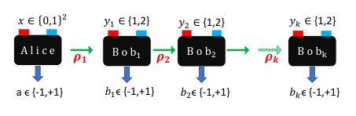
<figcaption class="paper-figure-caption"><b>Fig 1.</b> FIG. 1: Alice’s preparations are sequentially passed from one Bob to the next, each of whom performs one of the two measurements aiming to independently reveal quantum advantage in the 2→1 RAC.</figcaption>
</figure>
<figure class="paper-figure-card">
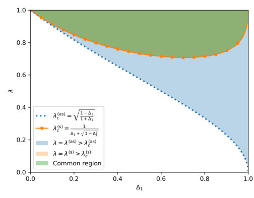
<figcaption class="paper-figure-caption"><b>Fig 2.</b> FIG. 2: Comparison of the symmetric and asymmetric thresholds of the unsharpness parameter as functions of</figcaption>
</figure>
<figure class="paper-figure-card">
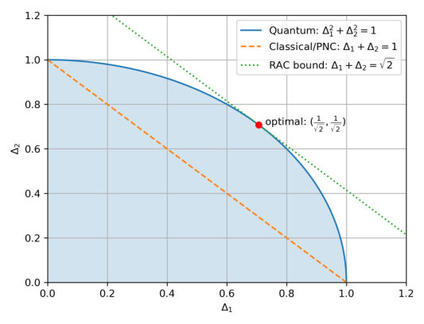
<figcaption class="paper-figure-caption"><b>Fig 3.</b> FIG. 3: Comparison of constraints on preparation distinguishabilities (∆1, ∆2) in the 2→1 RAC. The set achievable with any classical/preparation-noncontextual models are restricted to the simplex ∆1 + ∆2 ≤1, whereas the set of quantum-achievable</figcaption>
</figure>
<figure class="paper-figure-card">
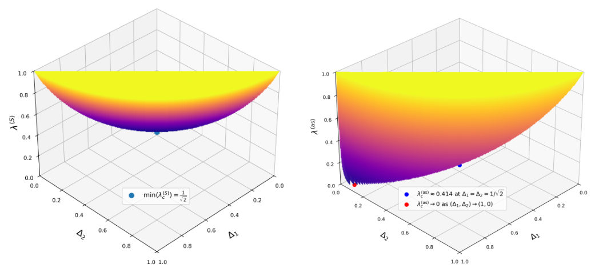
<figcaption class="paper-figure-caption"><b>Fig 4.</b> FIG. 4: Regions of the unsharpness parameter yielding a quantum advantage in the 2 →1 RAC as functions of the preparation distinguishabilities ∆1 and ∆2, subject to the constraint ∆2 1 + ∆2 2 ≤1. (a) Symmetric setting: the coloured region represents λ(s) &gt; 1/(∆1 + ∆2) that enables quantum advantage. The minimal threshold min(λ(s) c ) = 1/ √</figcaption>
</figure>
<figure class="paper-figure-card">
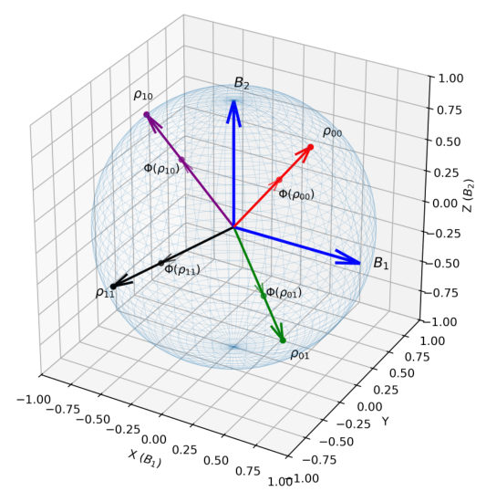
<figcaption class="paper-figure-caption"><b>Fig 5.</b> FIG. 5: Bloch sphere representation of the preparation states and measurement directions before and after the action of the non-selective measurement channel. The initial states ρx1x2 and the transformed states Φ(ρx1x2) are shown as coloured dotted vectors, while the measurement observables B1 and B2 are indicated by solid arrows along the X- and Z-axes, respectively. The channel induces an anisotropic contraction of the Bloch vectors without altering their directions, thereby preserving the optimal (Helstrom) measurement basis while reducing the distinguishability.</figcaption>
</figure>

**Summary.** This theoretical paper demonstrates that the quantum advantage inherent in single-qubit information processing can be sustained indefinitely across multiple sequential decoding steps. By carefully balancing the sender's preparation distinguishability against the receiver's measurement incompatibility, the authors show that information is not entirely exhausted, a stronger feature than previously understood.

**Why it may be interesting.** This work extends fundamental concepts of quantum information theory by showing that quantum advantages are not necessarily transient, suggesting new ways to model information persistence in open quantum systems.

Detailed structure

**Main problem.** The paper investigates how long the quantum advantage in information processing, initially demonstrated by a single qubit in a Random Access Code (RAC), can be maintained across an arbitrarily large number of sequential decoding measurements.

**Main result.** By utilizing preparation distinguishability as a sender resource and measurement incompatibility as a receiver resource, the authors prove that an arbitrarily long sequence of independent receivers can each extract information from the qubit while retaining a quantum advantage.

**Method.** The analysis involves deriving recursive relations for the distinguishabilities ($\Delta^{(k)}_1, \Delta^{(k)}_2$) under sequential, unsharp measurements, relating the problem to constrained binary discrimination tasks.

**Model / system.** The system is a single qubit undergoing sequential $2 	o 1$ Random Access Code (RAC) decoding. The protocol uses unsharp measurements (POVMs) rather than ideal projective measurements to mitigate information loss.

**Key observables.** Preparation distinguishability ($\Delta$), average quantum success probability ($	ext{P}_{	ext{avg}}$), and the sequence of measurement parameters ($\{\lambda_k\}$).

**Important parameters / regimes.** The initial preparation parameters $(\Delta_1^{(1)}, \Delta_2^{(1)})$ and the sequence of measurement unsharpness parameters $\{\lambda_k\}$ are crucial.

**Assumptions / limitations.** The analysis assumes the use of unsharp (non-projective) measurements and relies on relating the RAC task to preparation discrimination bounds ($\Delta_1^2 + \Delta_2^2 \le 1$).

**Figures summary.** Figures illustrate the sequential passing of the qubit state through multiple receivers and compare the quantum bound ($\Delta_1^2 + \Delta_2^2 \le 1$) against classical bounds ($\Delta_1 + \Delta_2 \le 1$).

**Paper structure.** The paper builds from analyzing the single-step quantum advantage condition, deriving bounds on distinguishabilities, and culminates in proving the feasibility of an infinite sequence of measurements by constructing a suitable sequence of measurement parameters $\{\lambda_k\}$ that maintains the quantum advantage.

Abstract

Quantum mechanics enables information-processing advantages even at the level of a single qubit. A paradigmatic example is the 2$\to$1 random access code (RAC), where a qubit outperforms a classical bit in retrieving encoded information. In the standard form, however, this quantum advantage is restricted to a single receiver, since decoding measurements inevitably destroy the encoded information. Contrary to this, we address how long the information encoded in a single qubit remains accessible even after multiple decoding, each with a quantum advantage. Introducing preparation distinguishability as an operational resource associated with the sender, we show that its interplay with measurement incompatibility on the receiver's side can mitigate measurement-induced disturbance, thereby enabling an arbitrarily long sequence of receivers to each retain a quantum advantage. Our results show that, even under repeated measurements, the information encoded in a qubit need not be entirely exhausted, revealing a stronger communication feature than previously recognised.

[↑ back to top](#top)

### [Critical quench dynamics of Wegner's $\mathbb{Z}_2$ gauge model: a geometric perspective](http://arxiv.org/abs/2605.15841v1)

**Authors:** Ramgopal Agrawal, Leticia F. Cugliandolo, Marco Picco  
**Type:** theory · **Category:** statistical mechanics · **PDF:** <https://arxiv.org/pdf/2605.15841v1>  
**Analysis basis:** full PDF text, analyzed in chunks
**Topic relevance:** 🔥 `non-equilibrium dynamics` **4/5** · 🔥 `non-equilibrium universality` **4/5** · `analog quantum simulation` **1/5** · `driven-dissipative phase transition` **1/5**

↔ Scroll figures horizontally

<figure class="paper-figure-card">
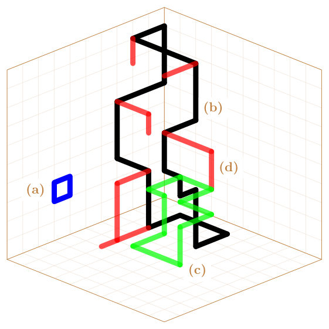
<figcaption class="paper-figure-caption"><b>Fig 1.</b> FIG. 1. Schematic of different geometrically defined objects in Wegner’s three-dimensional gauge</figcaption>
</figure>
<figure class="paper-figure-card">
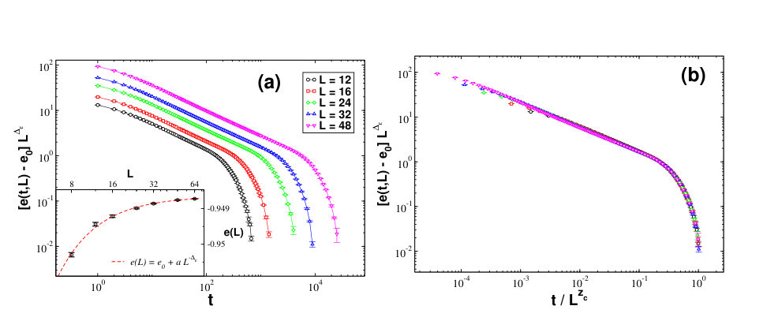
<figcaption class="paper-figure-caption"><b>Fig 2.</b> FIG. 2. (a) Plot of the scaled variable [e(t, L)−e0]L∆ϵ against time t on a log-log scale for different</figcaption>
</figure>
<figure class="paper-figure-card">
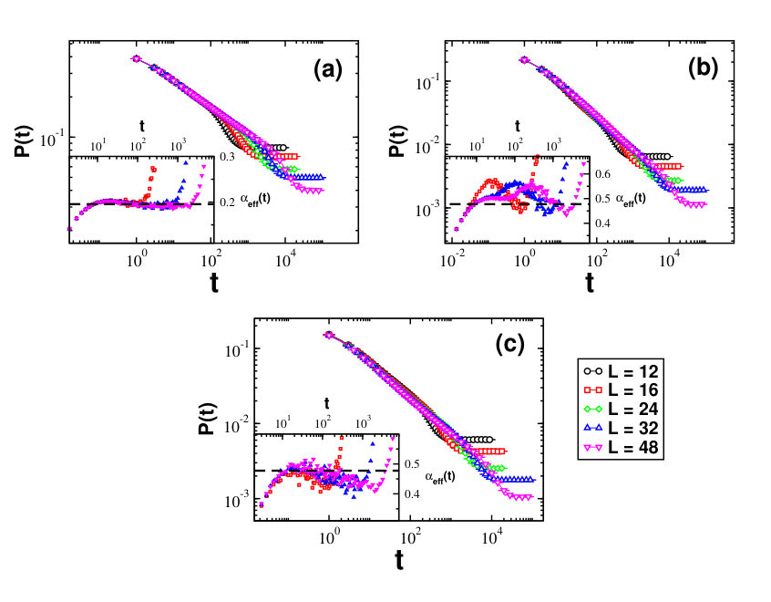
<figcaption class="paper-figure-caption"><b>Fig 3.</b> FIG. 3. Percolation strength P(t) vs. time t on a log-log scale for (a) FK clusters, (b) line loops</figcaption>
</figure>
<figure class="paper-figure-card">
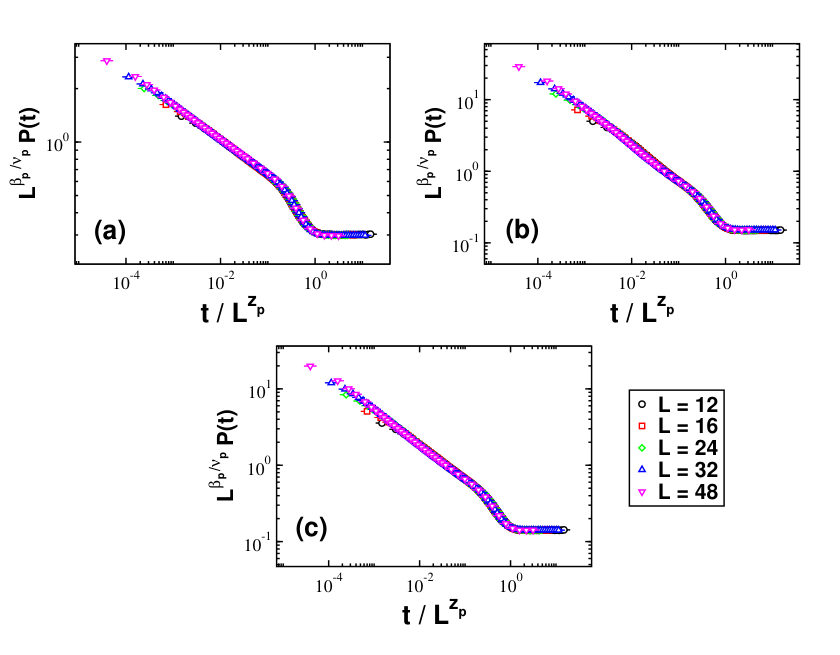
<figcaption class="paper-figure-caption"><b>Fig 4.</b> FIG. 4. Scaled percolation strength Lβp/νpP(t) vs. scaled time t/Lzp on a log-log scale for (a) FK</figcaption>
</figure>
<figure class="paper-figure-card">
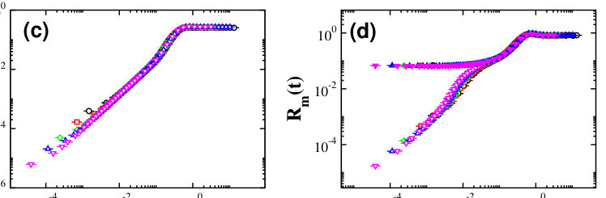
<figcaption class="paper-figure-caption"><b>Fig 5.</b> FIG. 5. Relative variance Rm(t) vs. time t on a log-log scale for (a) FK clusters, and (b) line loops,</figcaption>
</figure>

**Summary.** This work analyzes the non-equilibrium dynamics of the $\mathbb{Z}_2$ gauge model by tracking the relaxation of geometrically defined structures like FK clusters and line loops. Using finite-size scaling, the authors determine a universal dynamical exponent $z_p \simeq 2.6$ that governs the approach to criticality. This confirms that geometric measures are highly effective tools for characterizing critical dynamics in systems with global order parameters.

**Why it may be interesting.** The finding that geometrical observables yield a dynamical exponent consistent with the thermal critical exponent, despite the absence of local order parameters, provides a powerful, non-standard diagnostic tool for studying critical dynamics in gauge theories.

Detailed structure

**Main problem.** The paper investigates the critical quench dynamics of Wegner's $\mathbb{Z}_2$ gauge model, focusing on how geometric observables relax towards equilibrium after a sudden change in temperature.

**Main result.** The critical relaxation of percolation observables is governed by a dynamical exponent $z_p \simeq 2.6$, which is robust across different quench protocols and matches the energy density exponent $z_c$.

**Method.** The study employs time-dependent finite-size scaling analysis and analyzes the scaling of cluster size distributions $N(s, t)$ for various geometric objects.

**Model / system.** The system is Wegner's $\mathbb{Z}_2$ gauge model on a 3D cubic lattice, which exhibits a topological confinement-deconfinement phase transition. Dynamics are studied by quenching from high-temperature or zero-temperature states to the critical point.

**Key observables.** Percolation order parameter ($P(t)$), energy density ($e(t, L)$), and the size distribution of clusters $N(s, t)$ for FK clusters and line loops.

**Important parameters / regimes.** Dynamical exponents ($z_p, z_c$), critical exponents ($eta_p, 
u_p$), and the lattice size $L$.

**Assumptions / limitations.** The analysis relies on dynamic scaling hypotheses, assuming that observables can be collapsed onto universal scaling functions dependent on a characteristic lengthscale $\xi(t) \sim t^{1/z}$.

**Figures summary.** Figures illustrate the collapse of scaled energy density and percolation observables onto universal scaling functions, confirming the predicted power-law decay of cluster size distributions $N(s, t) \propto s^{-\tau_p}$ at late times.

**Paper structure.** The paper progresses by first establishing the geometric nature of the model's critical behavior, then applying finite-size scaling to measure the dynamical exponents ($z_p$ vs $z_c$), and finally analyzing the size distribution $N(s, t)$ to confirm dynamical scaling across different cluster types.

Abstract

Wegner's $\mathbb{Z}_2$ gauge model is the earliest formulation of pure lattice gauge theory and predicts the topological nature of the confinement-deconfinement transition. In three dimensions ($D=3$), the equilibrium critical behavior of the model is understood in terms of geometrically defined objects, namely loop excitations and Fortuin-Kasteleyn (FK) clusters. This work investigates the critical quench dynamics of this model from a geometric perspective, following quenches from both a high-temperature percolation phase and the zero-temperature ground state. Using time-dependent finite-size scaling analysis, we find that the critical non-equilibrium relaxation of the percolation order parameter is governed by a dynamical exponent $z_{\rm p} \simeq 2.6$, consistent with that associated with the energy density, $z_{\rm c}$. Importantly, the value of $z_{\rm p}$ is robust with respect to the initial quench condition and the choice of geometrical objects. Furthermore, we provide a detailed characterization of the kinetics of different geometrical objects during the evolution from the percolation phase. Notably, we observe that the quench dynamics obeys dynamic scaling in terms of a growing lengthscale, $ξ_{\rm p}(t) \sim t^{1/z_{\rm p}}$, despite the absence of a local order parameter.

[↑ back to top](#top)

### [Sub-picosecond inter-core skew characterization in multicore fibers via Hong--Ou--Mandel interference](http://arxiv.org/abs/2605.16135v1)

**Authors:** L. Lira Tacca, L. Marques Fagundes, M. Morales Lillo, M. Navarro, I. Machuca, S. Gómez, G. H. dos Santos, J. Cariñe, G. Saavedra, E. S. Gómez, G. Lima, S. P. Walborn  
**Type:** experiment · **Category:** quantum information and computing · **PDF:** <https://arxiv.org/pdf/2605.16135v1>  
**Analysis basis:** full PDF text, analyzed in chunks
**Topic relevance:** 🔥 `quantum optics experiment` **4/5** · `interference shaping light` **3/5** · `quantum measurements` **2/5** · `QC/QI experiment` **1/5**

↔ Scroll figures horizontally

<figure class="paper-figure-card">
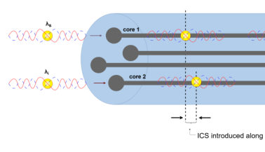
<figcaption class="paper-figure-caption"><b>Fig 1.</b> Fig. 1. Illustration of ICS accumulation in a MCF. Identical pulses propagate (here from left to right) through different cores of the MCF. Because both pulses have the same frequency spectrum, any accumulated differential delay arises solely from core-dependent group velocity variations.</figcaption>
</figure>
<figure class="paper-figure-card">
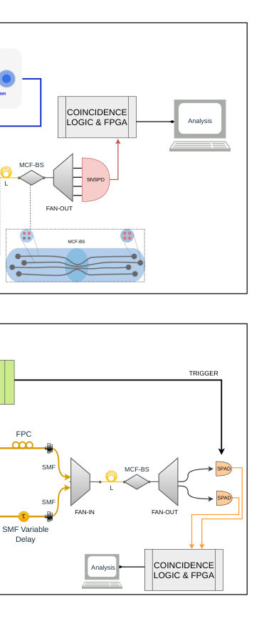
<figcaption class="paper-figure-caption"><b>Fig 2.</b> Fig. 2. a) Experimental setup for HOM interference using SPDC source. The photons are coupled into SMFs, separated by a variable delay 𝜏, and injected into the four-core MCF via a FAN-IN. Coincidence counts are registered by SNSPDs and an FPGA. b) Experimental setup for HOM interference using a weak laser source. Additional optical delay lines were added. See text for additional details.</figcaption>
</figure>
<figure class="paper-figure-card">
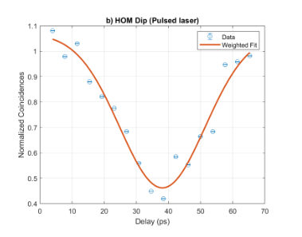
<figcaption class="paper-figure-caption"><b>Fig 3.</b> Fig. 3. HOM interference data. (a) Normalised coincidence counts for all six output pairs as a function of relative delay for a 12.7 m MCF, input combination 𝑎3,𝑎4, using the SPDC source. Solid lines are Gaussian fits. Statistical error bars are smaller than the data points and not visible at this scale. Coincidence curves show bunching dips (AC, AD, BC, BD) and anti-bunching peaks (AB, CD) as predicted by the 4 × 4 Hadamard transformation. Fit parameters and visibilities are listed in Table 1. (b) Coincidence rate as a function of relative delay for the 1300 m installed fiber, input combination 𝑎3,𝑎4 for a single pair of outputs, using the bimodal pulsed laser source. The modulated...</figcaption>
</figure>
<figure class="paper-figure-card">
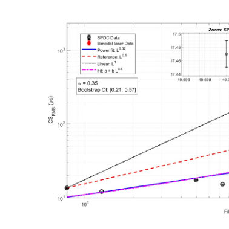
<figcaption class="paper-figure-caption"><b>Fig 4.</b> Fig. 4. Scaling of the ICSRMS as a function of fiber length 𝐿in log-log scale for all measured lengths 𝐿. Experimental measurements (markers with error bars) are fitted using Eq. (4) (dot-dashed pink line) and a weighted power-law model ICS ∝𝐿𝛼</figcaption>
</figure>

**Summary.** This paper presents a novel, high-precision method to measure inter-core skew (ICS) in multicore fibers using two-photon Hong-Ou-Mandel (HOM) interference. By achieving sub-picosecond resolution, the authors validated the expected random-walk scaling of ICS over long distances. This technique establishes a practical platform for ensuring timing uniformity in MCFs for both classical and quantum space-division multiplexing applications.

**Why it may be interesting.** This work provides a crucial, high-precision diagnostic tool for characterizing timing uniformity in optical fibers, which is essential for scaling quantum communication networks that rely on precise temporal synchronization.

Detailed structure

**Main problem.** The paper addresses the critical need to accurately characterize Inter-core Skew (ICS), which is the differential group delay between cores in Multicore Fibers (MCFs), for use in quantum photonic networks.

**Main result.** The authors achieved a high-precision measurement of ICS with a demonstrated accuracy of $\pm 0.11$ ps, validating the stochastic random-walk scaling of this delay over long fiber lengths.

**Method.** The measurement relies on two-photon Hong-Ou-Mandel (HOM) interference using either Spontaneous Parametric Down-Conversion (SPDC) or pulsed lasers to probe the differential group delay.

**Model / system.** The physical system is a multicore fiber (MCF), and the measurement utilizes HOM interference in a multiport beam splitter. The ICS is modeled as a zero-mean random walk, leading to an RMS growth $\sigma_{	au}(L) \propto \sqrt{L}$.

**Key observables.** Inter-core Skew ($	au_{jk}$), HOM interference dip/peak center positions, and the Root Mean Square (RMS) ICS scaling $\sigma_{	au}(L)$.

**Important parameters / regimes.** Measurement precision of $\pm 0.11$ ps; scaling coefficient $\kappa = 48.7 \pm 2.5 	ext{ ps}/\sqrt{	ext{km}}$; length range from $7.7 	ext{ m}$ to $1300 	ext{ m}$.

**Assumptions / limitations.** The HOM dip/peak shift is directly proportional to the differential group delay, and the measurement is limited by the delay-stage positioning uncertainty.

**Figures summary.** Figures illustrate the HOM interference data, showing the characteristic bunching dips and anti-bunching peaks for different fiber lengths and sources (SPDC vs. pulsed laser).

**Paper structure.** The paper introduces the problem of ICS characterization, details the HOM interferometric method using both SPDC and pulsed lasers, presents the extraction of ICS from interference features, and finally validates the stochastic random-walk scaling over a wide length range.

Abstract

Inter-core skew (ICS), the differential group delay between cores of a multicore fiber (MCF), is a critical parameter for both classical space-division multiplexed communications and quantum photonic networks. We present a high-precision measurement of ICS in a commercially available four-core fiber using two-photon Hong--Ou--Mandel (HOM) interference in a fiber-integrated $4\times4$ multiport beam splitter. By extracting the center position of HOM interference dips and peaks across all twelve core-pair combinations, we obtain individual ICS values with a demonstrated precision of $\pm0.11\,$ps, limited by the delay-stage positioning uncertainty. The root-mean-square ICS grows as $σ_τ(L) = κ\sqrt{L}+c$ with $κ= 48.7 \pm 2.5\,\mathrm{ps}/\!\sqrt{\mathrm{km}}$ and $c = 9.76 \pm 1.2\,$ps, over fiber lengths from $7.7\,$m to $1300\,$m. This first direct validation of the stochastic random-walk scaling across a length range spanning laboratory to field-deployed scales was made possible by HOM's immunity to first-order path fluctuations, which renders classical interferometric methods impractical for long installed fibers. The demonstrated $\pm0.11\,$ps precision represents a $\sim\!180$-fold improvement over correlation optical time-domain reflectometry (C-OTDR), the standard method for long-fiber ICS characterization. Fisher information analysis establishes a fundamental Cramér--Rao precision limit in the femtosecond range, indicating further improvement is achievable with better delay control. These results establish a practical platform for characterising timing uniformity in MCF-based networks for both quantum and classical space-division multiplexed applications.

[↑ back to top](#top)

### [Unveiling Magnetic Frustration via the Elastocaloric Effect](http://arxiv.org/abs/2605.15274v1)

**Authors:** Eric C. Andrade, Pedro M. Cônsoli, Matthias Vojta  
**Type:** theory · **Category:** statistical mechanics · **PDF:** <https://arxiv.org/pdf/2605.15274v1>  
**Analysis basis:** full PDF text, analyzed in chunks
**Topic relevance:** 🔥 `analog quantum simulation` **4/5** · `exotic spin models in light-matter` **3/5** · `entanglement & information structure` **1/5**

↔ Scroll figures horizontally

<figure class="paper-figure-card">
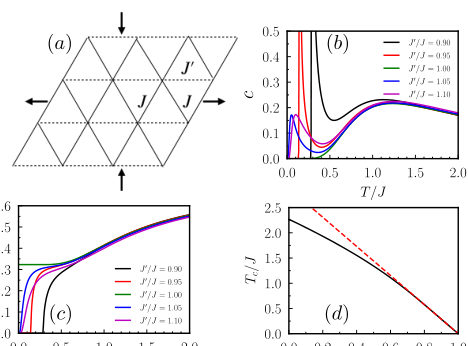
<figcaption class="paper-figure-caption"><b>Fig 1.</b> Figure 1. (a) Spatially anisotropic triangular lattice, with exchange coupling J along two directions (full lines) and J′</figcaption>
</figure>
<figure class="paper-figure-card">
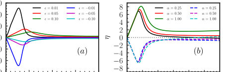
<figcaption class="paper-figure-caption"><b>Fig 2.</b> Figure 2. Elastocaloric effect η for the anisotropic triangular- lattice Ising model as a function of temperature T. We employ the parametrization for the exchange constant as in Eq. (4). (a) η as a function of T for α = 0.5 and several values of the strain ϵ. (b) η as a function of T for |ϵ| = 0.05 and several values of α. The full (dashed) curves correspond to ϵ &gt; (&lt;)0.</figcaption>
</figure>
<figure class="paper-figure-card">
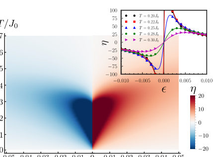
<figcaption class="paper-figure-caption"><b>Fig 3.</b> Figure 4. Elastocaloric effect η for the anisotropic triangular- lattice Ising model as a function of temperature T and uniax- ial strain ϵ, computed with α = 0.5. The color code indicates the value of η. We impose cutoffs η = ±20J0 for the sake of presentation. The inset shows cuts η(ϵ) at low T, illustrating the non-commuting limits. The points represent the exact computation of η, while the lines depict the low-ϵ expansion around the isotropic point, as discussed in the text.</figcaption>
</figure>
<figure class="paper-figure-card">
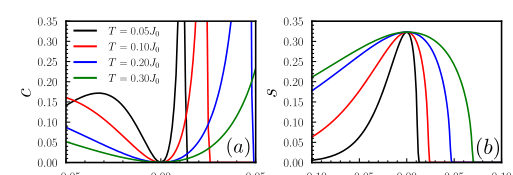
<figcaption class="paper-figure-caption"><b>Fig 4.</b> Figure 3. Strain dependence of (a) specific heat c and (b) entropy per site s at low temperatures T for the anisotropic triangular-lattice Ising model, computed with α = 0.5. The singular behavior at finite positive ϵ arises from the thermal phase transition. The color coding is the same for both fig- ures.</figcaption>
</figure>
<figure class="paper-figure-card">
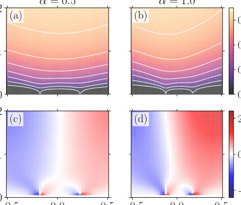
<figcaption class="paper-figure-caption"><b>Fig 5.</b> Figure 5. Thermodynamic observables computed by ED of the spin-1/2 Heisenberg model on the anisotropic triangular lattice. The left and right columns show data for anisotropy parameters α = 0.5 and 1.0, respectively. (a,b) Entropy per site, s, as a function of temperature T and uniaxial strain ϵ. The white curves correspond to s = 0.03, 0.1, 0.2, . . . , 0.6. (c,d) Gr¨uneisen ratio η, showing signatures of two quantum phase transitions at low T and a single characteristic sign change for T/J0 ≳0.5. The data for T/J0 ≤0.05 are omitted due to finite-size effects.</figcaption>
</figure>

**Summary.** This paper explores how uniaxial strain affects the thermodynamics of frustrated magnets using the elastocaloric effect ($\eta$). By analyzing Ising and Heisenberg models on triangular and kagome lattices, the authors show that the divergence of $\eta$ at low temperatures provides a universal signature for extensive ground-state entropy. This work offers a powerful theoretical tool to probe magnetic frustration in quantum materials.

**Why it may be interesting.** The connection between macroscopic thermodynamic responses (like the elastocaloric effect) and microscopic quantum properties (like ground-state degeneracy) is highly relevant for understanding quantum phase transitions in condensed matter systems.

Detailed structure

**Main problem.** The study investigates the thermodynamic response of frustrated magnets to uniaxial strain to reveal the underlying physics of magnetic frustration.

**Main result.** For Ising models, the elastic Grüneisen ratio ($\eta$) diverges arbitrarily at low temperatures near maximal frustration, serving as a universal hallmark of extensive ground-state entropy.

**Method.** The authors calculate the entropy ($s$) and subsequently the elastic Grüneisen ratio ($\eta$) using theoretical models and analytical expansions.

**Model / system.** The work analyzes Ising and Heisenberg models on spatially anisotropic triangular and kagome lattices. The Hamiltonian is modified by uniaxial strain ($\epsilon$), which linearly alters the exchange couplings ($J$ and $J'$).

**Key observables.** Elastic Grüneisen ratio ($\eta$), entropy ($s$), and specific heat ($c$).

**Important parameters / regimes.** Temperature ($T$), uniaxial strain ($\epsilon$), and the ratio of exchange couplings ($J'/J$).

**Assumptions / limitations.** The analysis relies on analytical expansions for $c$ and $s$ in terms of $\epsilon$, and comparisons are made between different temperature and strain limits.

**Figures summary.** Figures illustrate the specific heat, entropy, and the elastocaloric effect ($\eta$) for the Ising model on the anisotropic triangular lattice, showing enhancement of $\eta$ as $|\epsilon| 	o 0$ at low $T$.

**Paper structure.** The paper systematically analyzes the Ising and Heisenberg models, deriving $\eta$ from the strain dependence of entropy. It contrasts the behavior of the two models, highlighting the role of ground-state entropy in the divergence of $\eta$ for the Ising case.

Abstract

Motivated by experimental progress in pressure and strain tuning of quantum materials, we examine the thermodynamic response of frustrated magnets to uniaxial strain. Specifically, we study Ising and Heisenberg models on spatially anisotropic triangular (and, for the Ising model, also kagome) lattices. We determine the entropy as a function of temperature and strain, and use it to compute the elastic Grüneisen ratio $η$. The Ising models can be strain-tuned into and out of classical spin-liquid phases, and we show that $η$ can become arbitrarily large at low temperature $T$ near the point of maximal frustration, a universal hallmark of an extensive ground-state entropy. In contrast, the spin-$1/2$ Heisenberg model is moderately frustrated and displays multiple $T=0$ phase transitions. These transitions dominate $η$ at low $T$ while the intermediate-$T$ behavior is similar to that of the Ising model. We discuss the extent to which the elastic Grüneisen ratio can be used to deduce the phase diagram, and we connect our results to recent experiments on triangular-lattice magnets.

[↑ back to top](#top)

### [Single Spatio-Temporal Mode Bright Twin-Beam Source Across the Near- and Mid-Infrared](http://arxiv.org/abs/2605.15385v1)

**Authors:** Gabriel Demontigny, Patrick Cusson, Amauri Perraton Elorza, Esteban Murillo Zapata, Eli Martel, Andrei Rasputnyi, Maria Chekhova, Stéphane Virally, Denis Seletskiy  
**Type:** experiment · **Category:** other · **PDF:** <https://arxiv.org/pdf/2605.15385v1>  
**Analysis basis:** full PDF text, analyzed in chunks
**Topic relevance:** 🔥 `quantum optics experiment` **4/5** · `entanglement & information structure` **2/5** · `interference shaping light` **1/5**

↔ Scroll figures horizontally

<figure class="paper-figure-card">
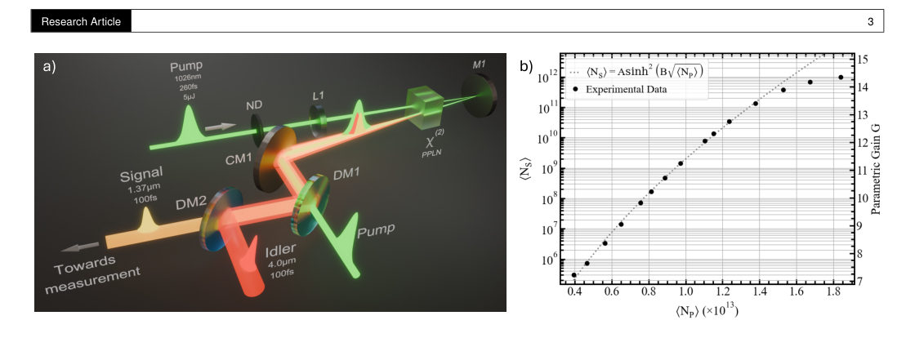
<figcaption class="paper-figure-caption"><b>Fig 1.</b> Fig. 1. Generation of ultrafast bright entangled twin-beams. a) Experimental setup. A pump beam (1026 nm, 260 fs, 5 µJ) is attenuated with a neutral density filter (ND1) and focused into a periodically-poled Lithium Niobate (PPLN) crystal of 2-mm length with a 27.91 µm poling period, using a lens (L1) with 250 mm focal length. A mirror (M1) reflects the beam back into the crystal for additional nonlinear interaction. The PPLN is positioned so that the pump’s focal plane is at the second pass. The beam is collimated by a concave mirror (CM1) with a focal length of 150 mm. The signal twin (1.37 µm, 100 fs), idler twin (4.0 µm, 100 fs) and pump are separated using a pair of dichroic mirrors...</figcaption>
</figure>
<figure class="paper-figure-card">
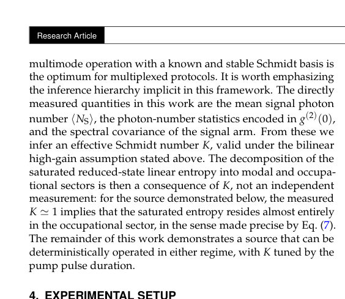
<figcaption class="paper-figure-caption"><b>Fig 2.</b> Figure 1a shows the experimental setup used to generate ultra- fast bright entangled twin beams via type-0 SPDC in a PPLN crystal. The pump is provided by a Yb:KGW (Light Conversion Pharos) laser (1026 nm central wavelength, 260 fs pulse duration, 5 µJ pulse energy, up to 1 MHz repetition rate) and is attenuated using a reflective neutral density filter (ND1) before being fo- cused into the PPLN crystal using a 250 mm focal-length lens (L1). The PPLN poling period is 27.91 µm and is chosen to produce strongly non-degenerate output with the signal beam centered at 1.37 µm and the idler beam at 4.0 µm (both ∼100 fs duration). The available 1 MHz repetition rate represents a sig- nificant...</figcaption>
</figure>
<figure class="paper-figure-card">
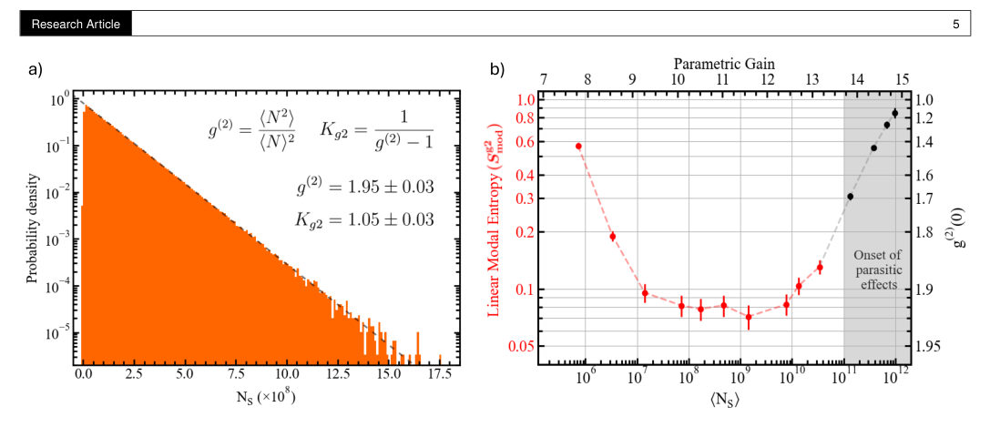
<figcaption class="paper-figure-caption"><b>Fig 3.</b> Fig. 2. a) Signal photon number probability density histogram for 2 981 607 recorded events. An average of ⟨NS⟩= 1.296 × 108</figcaption>
</figure>
<figure class="paper-figure-card">
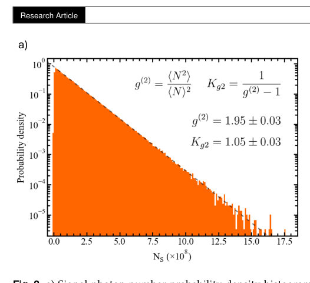
<figcaption class="paper-figure-caption"><b>Fig 4.</b> Figure 2b shows Sg2 mod extracted as a function of mean pho-</figcaption>
</figure>
<figure class="paper-figure-card">
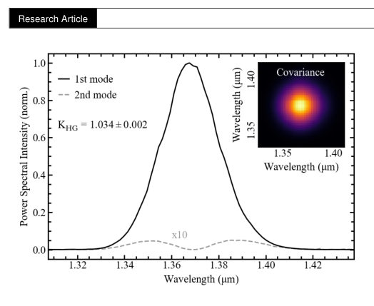
<figcaption class="paper-figure-caption"><b>Fig 5.</b> Fig. 3. Temporal mode extraction by singular value decompo- sition on the reduced spectral density matrix of the signal at high-gain. First and second (×10) intensity Schmidt modes of the signal. The decomposition yields the Schmidt number KHG = 1.034 ± 0.002. Inset: reduced spectral density matrix of the signal, displaying near-perfect symmetry, as expected for a single-spatio-temporal mode light.</figcaption>
</figure>

**Summary.** The authors report on the creation of a bright, entangled twin-beam source using PDC in PPLN, demonstrating precise control over its spatio-temporal mode structure. By tuning the pump pulse duration via dispersion, they can transition between single-mode and controlled multimode operation. This platform is highly valuable for quantum-enhanced metrology due to its strong non-degeneracy and quantifiable entanglement resource.

**Why it may be interesting.** This work provides a highly controllable, broadband source of entangled photons, which is crucial for advancing quantum sensing and nonlinear quantum optics experiments.

Detailed structure

**Main problem.** The goal is to develop and characterize an ultrafast, bright, entangled twin-beam source that maintains spatio-temporal mode control across varying brightness levels.

**Main result.** The source successfully operates in a near-single spatio-temporal mode regime ($K \approx 1$) and establishes a practical platform for quantum-enhanced metrology due to strong non-degeneracy.

**Method.** Characterization involves measuring photon-number statistics via $g^{(2)}(0)$ and performing singular-value decomposition (Schmidt decomposition) on the spectral density matrix.

**Model / system.** The system uses type-0 parametric down-conversion (PDC) in a periodically-poled lithium niobate (PPLN) crystal to generate entangled signal (near-IR) and idler (mid-IR) beams.

**Key observables.** Second-order correlation function $g^{(2)}(0)$, Schmidt numbers ($K$), and the separation of entanglement resource into modal and occupational degrees of freedom.

**Important parameters / regimes.** Pump pulse duration ($	au_p$), Group-Delay Dispersion (GDD), and the resulting effective mode number $K$.

**Assumptions / limitations.** The analysis relies on the Schmidt decomposition of the Joint Spectral Amplitude (JSA) and assumes the validity of the Bloch-Messiah decomposition in the bright limit.

**Figures summary.** Figures illustrate the experimental setup using PPLN, show the dependence of signal photons on pump photons, and plot photon number histograms and $g^{(2)}(0)$ vs. mode entropy.

**Paper structure.** The paper progresses from introducing the physical platform (PDC in PPLN) to detailing the diagnostics ($g^{(2)}(0)$, SVD), establishing the control mechanism (GDD tuning), and finally quantifying the entanglement resource distribution.

Abstract

We introduce an ultrafast, bright, entangled twin-beam source generated by type-0 parametric down-conversion in periodically-poled lithium niobate at MHz repetition rate, with continuously tunable Schmidt number $K$ set by the pump pulse duration. Photon-number statistics characterization via $g^{(2)}(0)$ and singular-value decomposition of the signal spectral density matrix yield $K\simeq1.05$ and $K\simeq1.03$, respectively, maintained over multiple orders of magnitude in brightness. Group-delay dispersion of the pump drives a continuous transition from single-mode operation to a controlled multimode regime, consistent with the temporal gain window departing from the inverse phase-matching bandwidth. Strong non-degeneracy of the source (signal at 1.37 um, idler at 4.0 um, $\sim 100$ fs duration) decouples a mid-infrared interaction wavelength, which overlaps with molecular vibrational resonances, from a near-infrared detection band, establishing a practical platform for quantum-enhanced metrology, nonlinear interferometry, and mid-infrared spectroscopic sensing. We show that in the bright few-mode limit, the total entanglement resource is clearly separated between modal and occupational degrees of freedom, and that our source allocates up to 95-97% of that resource to the occupational sector.

[↑ back to top](#top)

### [Generalized measurement incompatibility](http://arxiv.org/abs/2605.16151v1)

**Authors:** Edwin Peter Lobo, Maria Balanzó-Juandó, Stefano Pironio  
**Type:** theory · **Category:** quantum information and computing · **PDF:** <https://arxiv.org/pdf/2605.16151v1>  
**Analysis basis:** full PDF text, analyzed in chunks
**Topic relevance:** 🔥 `quantum measurements` **4/5** · `entanglement & information structure` **1/5** · `measurement-induced transitions` **1/5**

↔ Scroll figures horizontally

<figure class="paper-figure-card">
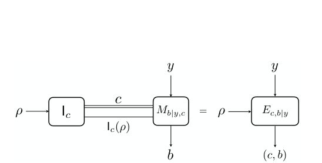
<figcaption class="paper-figure-caption"><b>Fig 1.</b> FIG. 1: Left: The overall simulation of the measurements By consists of first applying the instrument {Ic}c to ρ, obtaining c and Ic(ρ), and then performing the measure- ment My,c on Ic(ρ) to obtain b. Right: The combination of the quantum instrument I = {Ic}c and the measure- ment My,c = {Mb|y,c}b can be seen as a single effective POVM Ey = {Ec,b|y}c,b with input y and outcomes (c, b).</figcaption>
</figure>
<figure class="paper-figure-card">
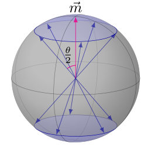
<figcaption class="paper-figure-caption"><b>Fig 2.</b> FIG. 2: Illustration of the angle θ defined in Eq. (21). It is the angular aperture of the double cone that contains all the measurement axes while having the smallest aper- ture. This figure shows five measurement axes {±⃗ry}5 y=1 (blue), and the axis ⃗m (red) of the corresponding double cone.</figcaption>
</figure>
<figure class="paper-figure-card">
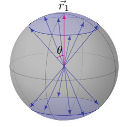
<figcaption class="paper-figure-caption"><b>Fig 3.</b> FIG. 3: Illustration of the angle θ defined in Eq. (38). It is the largest angle between the first measurement axis {±⃗r1} (red) and the remaining measurement axes {±⃗ry}n y=2 (blue), shown here for n = 7. Equivalently, 2θ is the angular aperture of the double cone with axis ⃗r1 that contains all the measurement axes while having the smallest aperture.</figcaption>
</figure>
<figure class="paper-figure-card">
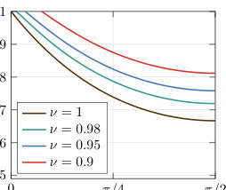
<figcaption class="paper-figure-caption"><b>Fig 4.</b> FIG. 4: The maximum detection efficiency η∗for which the lossy measurements {Z, cos(θ)Z +sin(θ)X} are G-JM at different values of visibility ν.</figcaption>
</figure>

**Summary.** This work generalizes joint-measurability to partial joint-measurability (G-JM) for quantum measurements, providing necessary and sufficient mathematical conditions for this property. The authors derive quantitative bounds on detection efficiency ($\eta$) that determine when measurements are G-JM, which in turn sets fundamental limits on the security of device-independent quantum key distribution protocols.

**Why it may be interesting.** The rigorous mathematical framework for characterizing measurement compatibility, especially when accounting for realistic imperfections like detection loss, directly impacts the theoretical limits of quantum communication protocols.

Detailed structure

**Main problem.** The paper generalizes the concept of joint-measurability to 'partial joint-measurability' (G-JM) for quantum measurements, particularly in the context of untrusted measurement devices.

**Main result.** It provides mathematical formulations for G-JM, showing it is decidable by an SDP, and derives analytical thresholds on detection efficiency ($\eta$) that limit the robustness of device-independent quantum cryptographic protocols.

**Method.** The authors use mathematical formulations involving quantum instruments and POVMs, deriving bounds by optimizing over various parameters related to measurement settings and detection efficiency.

**Model / system.** The model involves quantum measurements acting on a Hilbert space, characterized by POVMs $\{B_{b|y}\}_{b}$ indexed by measurement settings $y$. The analysis extends to lossy photonic implementations and qubit observables.

**Key observables.** Detection efficiency ($\eta$), the angular aperture ($	heta$) of the measurement axes, and the conditional Shannon entropies $H(A|E)$ vs $H(A|E')$.

**Important parameters / regimes.** Detection efficiency ($\eta$), number of measurements ($n$), and the visibility ($
u$) of the measurement device.

**Assumptions / limitations.** The analysis assumes an adversary Eve is limited to classical side information, and the results are derived for generic strategies independent of the specific POVM form.

**Figures summary.** Figures illustrate the simulation process of measurements, the angular aperture $	heta$ of the measurement axes, and the maximum detection efficiency $\eta^*$ as a function of $	heta$ for different types of partial joint-measurability.

**Paper structure.** The paper develops the theory by first defining G-JM, providing multiple mathematical formulations, and then applying these concepts to derive quantitative bounds on $\eta$ for various partial joint-measurability cases (input, outcome, and combined). The structure culminates in applying these bounds to analyze the security of DIQKD protocols.

Abstract

Quantum measurements can be incompatible, i.e., they can fail to be jointly measurable. Recently, a weaker notion of joint-measurability, called partial joint-measurability, was proposed by Masini et al. in [Quantum 8, 1574 (2024)]. In this work, we further generalize this notion to the setting where only a subset of the outcomes of each measurement is required to be jointly determined by classical variables. We provide two mathematical formulations of partial joint-measurability and show that, like full joint-measurability, it can be decided by solving a single semidefinite program. We prove that in the case of an untrusted measurement device, an adversary Eve, limited to classical side information, can perfectly guess the outcomes of the measurement device if and only if the set of measurements is partially jointly measurable. We derive analytical thresholds on the detection efficiency below which generic measurements become partially jointly measurable. Such bounds directly yield limits on the robustness of device-independent and semi-device-independent quantum cryptographic protocols against detection inefficiency. In particular, our results highlight the importance of a careful treatment of postselection in security analyses.

[↑ back to top](#top)

### [Interface Piezoelectric Loss in Superconducting Qubits](http://arxiv.org/abs/2605.15554v1)

**Authors:** Haoxin Zhou, Kangdi Yu, Yashwanth Balaji, Sanjit Shirol, Leo Sementilli, Zi-Huai Zhang, Adam Schwartzberg, Alp Sipahigil  
**Type:** both · **Category:** quantum information and computing · **PDF:** <https://arxiv.org/pdf/2605.15554v1>  
**Analysis basis:** full PDF text, analyzed in chunks
**Topic relevance:** 🔥 `QC/QI experiment` **4/5** · `correlated / nonlocal dissipation` **1/5** · `methods for driven-dissipative` **1/5**

↔ Scroll figures horizontally

<figure class="paper-figure-card">
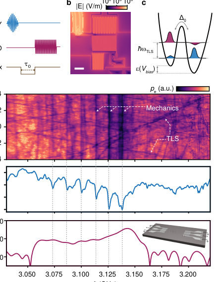
<figcaption class="paper-figure-caption"><b>Fig 1.</b> FIG. 2. Detecting interface piezoelectric qubit-phonon coupling. a, Pulse sequence used to probe the effect of electromechanical cou- pling at a fixed delay time tdelay = τ0 = 3 µs following qubit exci- tation. b, Simulated electric-field distribution generated by applying Vbias = 1 V to the XY line. Scale bar represents 30 µm. c, The stan- dard tunneling model of a TLS. An applied voltage bias Vbias shifts the TLS transition energy ℏωTLS. d, Qubit excited state population pe measured at delay time τ0 as a function of qubit frequency fq and TLS-tuning bias voltage Vbias. e, Bias-averaged pe at fixed delay time τ0, revealing the spectral signatures of the SAW resonator modes. f, Reference...</figcaption>
</figure>
<figure class="paper-figure-card">
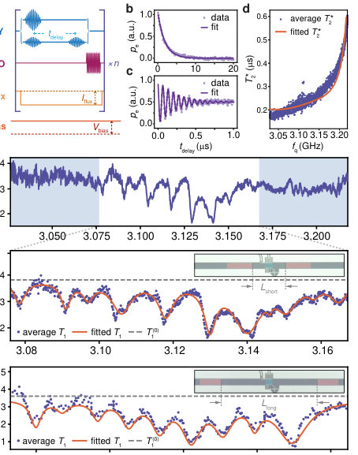
<figcaption class="paper-figure-caption"><b>Fig 2.</b> FIG. 3. Qubit lifetime reduction due to piezoelectric coupling to SAW resonator modes. a, Pulse sequence used for coherence mea- surements. b, Example of an energy-relaxation (T1) characterization measured at fq =3.14 GHz. c, Example of a Ramsey (T ∗ 2 ) character- ization measured at fq =3.14 GHz. d, Bias-averaged T ∗ 2 as a func- tion of qubit frequency. The decreasing trend of T ∗ 2 away from the sweet spot is captured by the flux sensitivity T ∗ 2 ∝(∂fq/∂Iflux)−1</figcaption>
</figure>
<figure class="paper-figure-card">
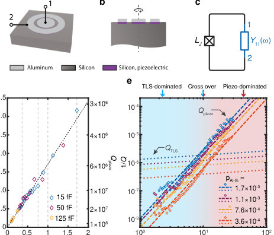
<figcaption class="paper-figure-caption"><b>Fig 3.</b> FIG. 4. Predicted frequency dependence of interface piezoelec- tric loss for superconducting qubits. All quantities are obtained from finite-element simulations of an aluminum-on-silicon coplanar capacitor. Schematic a-b, Top (a) and side (b) views of the simu- lated capacitor. Axial symmetry is applied to reduce computational complexity. Features are not drawn to scale. c, Circuit model of the superconducting qubit studied. Y11(ω) is the effective admittance of the capacitor, as seen by the Josephson junction LJ, including piezo- electric coupling in a multiphysics simulation. d, Simulated EPR- dependent quality factor of the qubit at fq = ωq/2π = 4.5 GHz. Diamonds with different colors...</figcaption>
</figure>

**Summary.** This paper investigates interface piezoelectricity as a dominant decoherence source in superconducting qubits fabricated on silicon. By coupling the qubit to SAW resonators, the authors experimentally and numerically demonstrate that energy loss into acoustic phonons significantly limits qubit lifetime. The findings are crucial for advancing quantum computing by identifying a structural loss channel and proposing device-level engineering solutions to mitigate it.

**Why it may be interesting.** This work is highly relevant as it tackles a fundamental decoherence mechanism in superconducting qubits, providing quantitative scaling laws ($\Gamma \propto f^{3.4}$) and engineering guidelines (metamaterials) for improving quantum hardware.

Detailed structure

**Main problem.** Dissipation, particularly interface piezoelectric loss, remains a major obstacle limiting the coherence time of superconducting quantum qubits.

**Main result.** The study provides direct evidence that interface piezoelectricity acts as a distinct, measurable loss channel, which can dominate over TLS loss at sufficiently high frequencies.

**Method.** The research combines experimental measurements of qubit decay rates with detailed multiphysics simulations (using finite-element methods) to model the energy exchange between the qubit and acoustic phonons.

**Model / system.** The system involves a transmon qubit coupled to a Surface Acoustic Wave (SAW) resonator on a silicon substrate. The physics is modeled using coupled Hamiltonian/Langevin equations describing the interaction between the superconducting circuit and the mechanical acoustic modes.

**Key observables.** Qubit lifetime ($T_1$), excited-state population ($p_e$), and the frequency dependence of the loss rate ($\Gamma_{	ext{piezo}} \propto f^{3.4}$).

**Important parameters / regimes.** Interface Energy Participation Ratio (EPR), coupling strength ($g_{m,k}$), and the crossover frequency where piezoelectric loss dominates (predicted near 10 GHz).

**Assumptions / limitations.** The analysis relies on distinguishing frequency-independent mechanical resonances from bias-voltage-shifting TLS features, and modeling the coupling via effective admittance calculations.

**Figures summary.** Figures illustrate device structures, measurement protocols (e.g., $p_e$ vs. $V_{bias}$), and simulation results showing the frequency scaling of the predicted piezoelectric decay rate compared to other loss sources.

**Paper structure.** The paper progresses from identifying the general problem of dissipation to proposing the piezoelectric mechanism, detailing the experimental diagnostic techniques (using SAW resonators and bias sweeping), and finally presenting theoretical models and simulations to quantify the loss and suggest structural mitigation strategies.

Abstract

Dissipation remains a central obstacle to improving superconducting quantum circuits, yet the microscopic origins of loss in widely used materials platforms are not fully understood. Here, we report the observation of interface piezoelectricity-induced dissipation in superconducting qubits fabricated on high-resistivity silicon. Our devices use a transmon qubit with a shunt capacitor that simultaneously serves as an interdigital transducer embedded in a surface acoustic wave resonator. By tuning the qubit transition into resonance with discrete mechanical modes, we observe up to a factor-of-two reduction in qubit lifetime, consistent with energy exchange between the qubit and mechanical modes mediated by piezoelectric coupling at the aluminum-silicon interface. Our findings provide direct evidence for interface piezoelectricity as a distinct loss channel in superconducting qubits. Combined with multiphysics simulations, these findings suggest that interface piezoelectric loss can dominate over loss from two-level systems at sufficiently high frequencies.

[↑ back to top](#top)

### [Demonstration of a Multiplexing Trapped Ion Quantum Processing Unit](http://arxiv.org/abs/2605.16010v1)

**Authors:** F. Anmasser, M. Abu Zahra, K. Schüppert, M. Pototschnig, J. Wahl, M. Dietl, M. Pfeifer, Y. Colombe, J. Repp, M. Brandl, P. Schindler, C. Rössler  
**Type:** experiment · **Category:** other · **PDF:** <https://arxiv.org/pdf/2605.16010v1>  
**Analysis basis:** full PDF text, analyzed in chunks
**Topic relevance:** 🔥 `QC/QI experiment` **4/5** · `analog quantum simulation` **1/5**

↔ Scroll figures horizontally

<figure class="paper-figure-card">
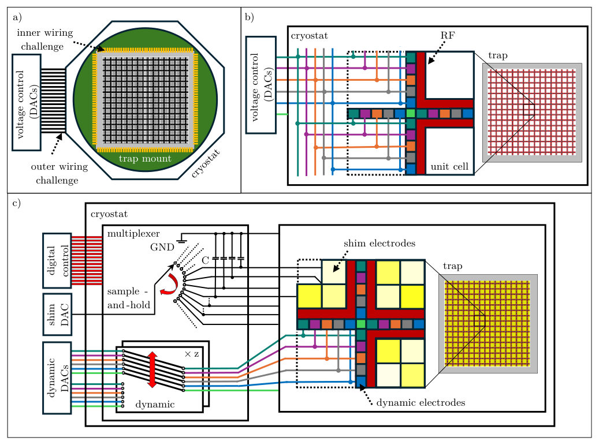
<figcaption class="paper-figure-caption"><b>Fig 1.</b> FIG. 1: Illustration of the architectural complexities of trapped-ion quantum computing systems. a) DACs are situated outside the cryostat and every electrode is connected to a single DAC. b) Electrode co-wiring: electrodes with same functionality in different unit cells are connected to the same DAC outside the cryostat. c) Integrated switching electronics: a multiplexing unit is placed between the DACs and the chip trap within the cryostat. The DACs and electrodes are categorized into two types: dynamic and compensation electrodes.</figcaption>
</figure>
<figure class="paper-figure-card">
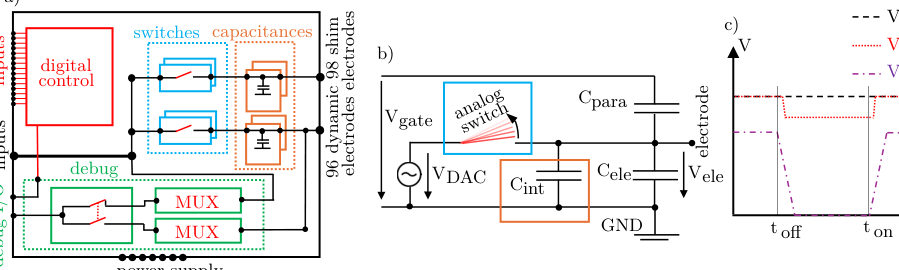
<figcaption class="paper-figure-caption"><b>Fig 2.</b> FIG. 2: a) High level block diagram of the multiplexer. Inputs of the multiplexer are the DACs, digital control and power supplies. The configuration of open and closed switches is controlled by the digital control. Capacities are integrated into the multiplexer. There are 96 outputs for dynamic electrodes and 98 outputs for shim electrodes. A dedicated function for debugging is able to multiplex any input voltage back to the outside of the cryostat. b) Simplified schematic of the switch and electrode circuit, highlighting the key components involved in the charge injection mechanism. c) Sketched diagram illustrating the timing of charge injection and its effect on the electrodes potential.</figcaption>
</figure>
<figure class="paper-figure-card">
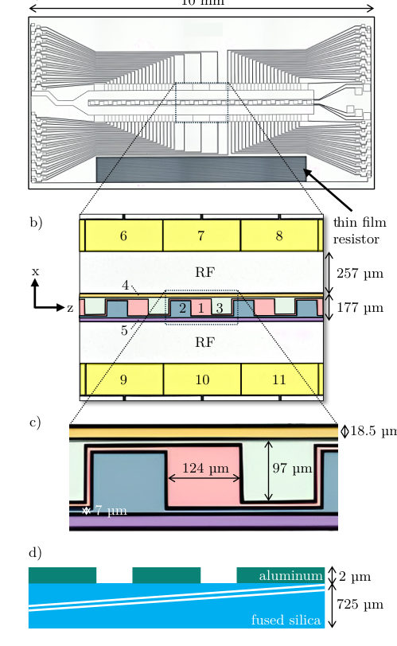
<figcaption class="paper-figure-caption"><b>Fig 3.</b> FIG. 3: Trap design. a) Stitched microscope image of the sur- face ion trap on a fused silica substrate, with chip dimensions of 10 mm × 5 mm. The bottom gray rectangle is a thin film re- sistor connected to the bond pads. Bond pads for connecting the electrodes and multiplexer via wire bonds are arranged in three columns on the left and right sides of the chip. b) Five DC electrodes, nested in between the RF rails. Three of these electrodes have a ’zig-zag’ shape to connect to the bond pads. Compensation electrodes, shown in yellow, are located outside the RF rails. c) Geometry of the zig-zag electrodes. d) Cross-section sketch of the ion trap, featuring a single elec- trode metal layer...</figcaption>
</figure>
<figure class="paper-figure-card">
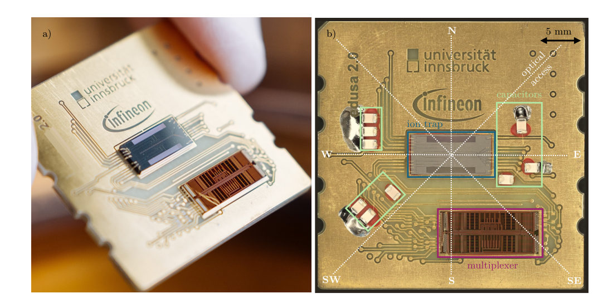
<figcaption class="paper-figure-caption"><b>Fig 4.</b> FIG. 4: Quantum processing units featuring a surface ion trap at their centers and a multiplexer located in the south of the PCBs. Panel a) shows the first version of the QPU, without any additional capacitors mounted. Panel b) shows the second-generation design, which incorporates 39 nF capacitors between the electrode lines and the PCB ground plane.</figcaption>
</figure>
<figure class="paper-figure-card">
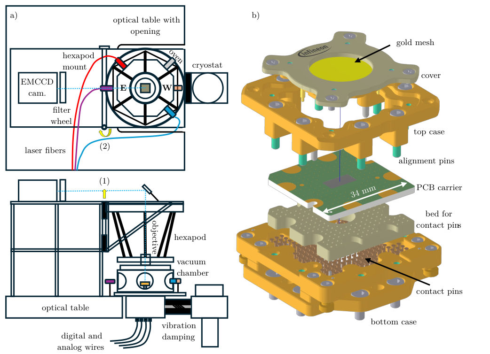
<figcaption class="paper-figure-caption"><b>Fig 5.</b> FIG. 5: Experimental setup and socket. a) Sketch of an optical table supporting a vacuum chamber, an EMCCD camera, a hexapod holding an optical objective. Yellow arrows indicate the movable range of the hexapod. b) Exploded view of the socket with a bottom case containing recessed beds for contact pins, which are inserted to provide electrical connections to a PCB carrier. The top case uses alignment pins for precise assembly, and a cover incorporates a gold mesh electrically connected via the PCB carrier.</figcaption>
</figure>

**Summary.** This paper demonstrates a scalable Quantum Processing Unit (QPU) for trapped ions by integrating the ion trap with a time-multiplexing control unit. By using an analog multiplexer, the authors overcome the massive wiring challenge associated with large-scale ion traps. The results confirm that this multiplexing approach maintains the high fidelity required for quantum computation.

**Why it may be interesting.** The work directly addresses the engineering bottleneck of scaling trapped ion systems by proposing and experimentally validating a cryogenic, low-power multiplexing architecture for control electronics.

Detailed structure

**Main problem.** Scaling trapped ion quantum processors to thousands of qubits faces severe wiring and control line density challenges.

**Main result.** The demonstration shows that a time-multiplexing scheme using a surface ion trap and integrated analog multiplexers is compatible with high-fidelity quantum operations.

**Method.** The authors built a Quantum Processing Unit (QPU) by integrating a surface ion trap with a cryostat-based analog multiplexer using a sample-and-hold technique.

**Model / system.** The system is a trapped ion QPU fabricated on a surface ion trap, interfaced with an ASIC multiplexer. This setup allows routing multiple control voltages from few inputs, mitigating wiring bottlenecks.

**Key observables.** Motional heating rates (measured in phonons/s), gate error decay rates, and secular frequencies.

**Important parameters / regimes.** Multiplexing sampling intervals below 50 ms are sufficient for gate error fidelity; voltage decay rates are measured in V/min.

**Assumptions / limitations.** The multiplexing scheme is assumed to maintain high fidelity despite charge injection and voltage decay during the sample-and-hold process.

**Figures summary.** Figures illustrate the QPU architecture combining the trap and multiplexer, and show measurements of heating rates and voltage decay dynamics.

**Paper structure.** The paper progresses from identifying the scaling challenge (wiring) to proposing and demonstrating the multiplexing solution, followed by detailed characterization of heating rates and charge injection effects.

Abstract

A fault-tolerant quantum computer is expected to require thousands of qubits. Trapped ion architectures provide a modular approach where the quantum register is divided into multiple subregisters connected by physically moving the corresponding ions. Transporting ions at scale comes with several challenges such as the need to connect thousands of control lines to an ion trap chip. Multiplexing the required control voltages from few input signals to multiple electrodes offers a solution to this wiring challenge. Here we demonstrate a quantum processing unit that combines a surface ion trap with a time multiplexer via a sample-and-hold technique that initially charges electrodes to fixed voltages and disconnects them during qubit operations. We characterize the unit's performance by measuring motional heating rates below one phonon per second in both open and closed switch configurations. We further characterize the sample and hold process and find that sampling intervals below 50 ms are sufficient to keep expected gate errors from decaying charges during the hold phase below $10^{-4}$. Our results indicate that the multiplexing scheme is compatible with high-fidelity operations.

[↑ back to top](#top)

### [Quantum Measurement without Ontology](http://arxiv.org/abs/2605.16101v1)

**Authors:** Richard Healey  
**Type:** theory · **Category:** other · **PDF:** <https://arxiv.org/pdf/2605.16101v1>  
**Analysis basis:** full PDF text, analyzed in chunks
**Topic relevance:** 🔥 `quantum measurements` **4/5** · `measurement-induced transitions` **1/5**

↔ Scroll figures horizontally

<figure class="paper-figure-card">
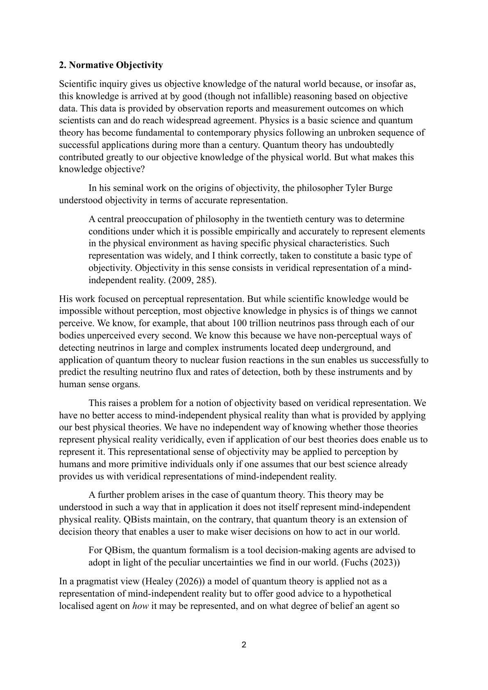
<figcaption class="paper-figure-caption"><b>Fig 1.</b> Low-resolution page preview, page 2</figcaption>
</figure>
<figure class="paper-figure-card">
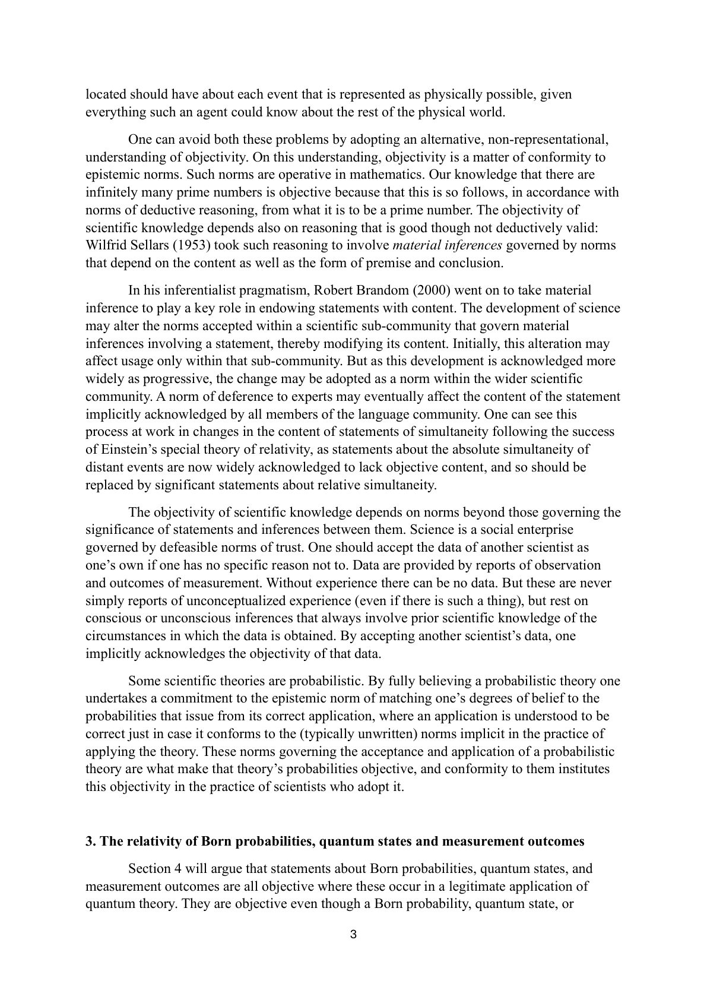
<figcaption class="paper-figure-caption"><b>Fig 2.</b> Low-resolution page preview, page 3</figcaption>
</figure>
<figure class="paper-figure-card">
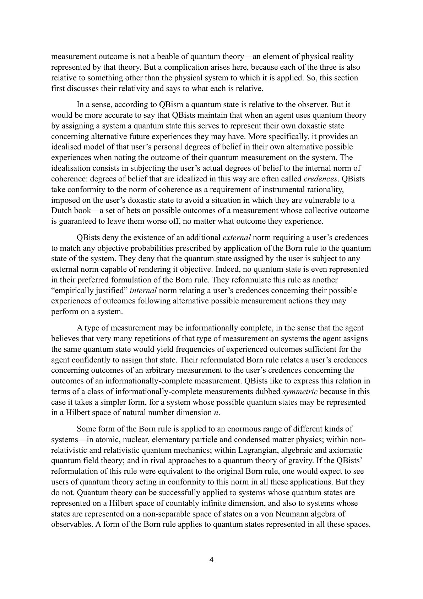
<figcaption class="paper-figure-caption"><b>Fig 3.</b> Low-resolution page preview, page 4</figcaption>
</figure>
<figure class="paper-figure-card">
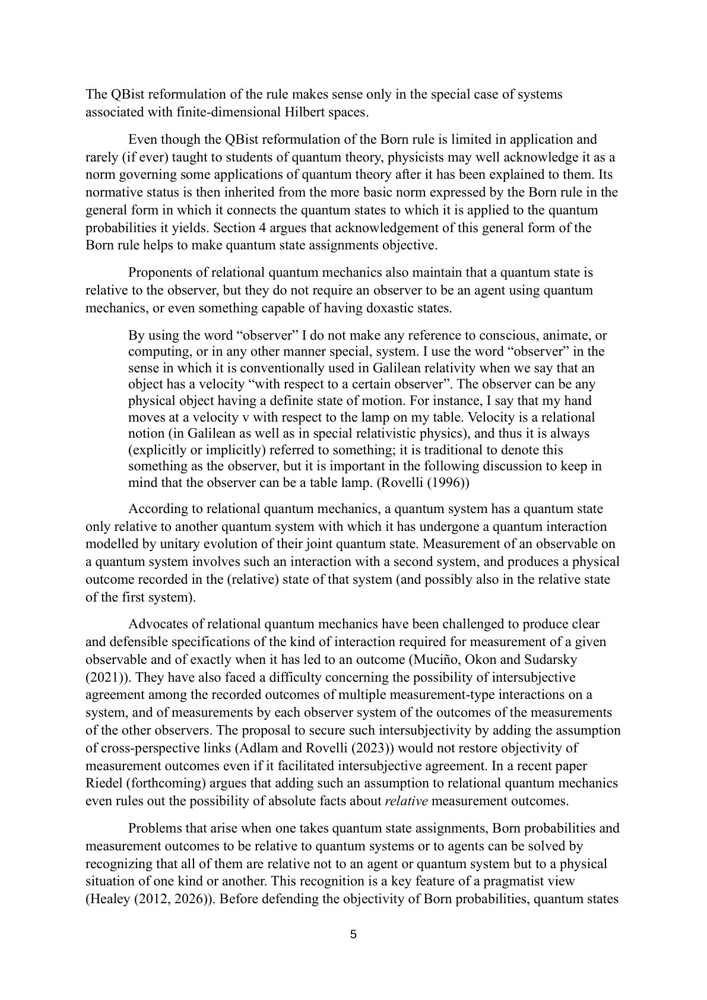
<figcaption class="paper-figure-caption"><b>Fig 4.</b> Low-resolution page preview, page 5</figcaption>
</figure>
<figure class="paper-figure-card">
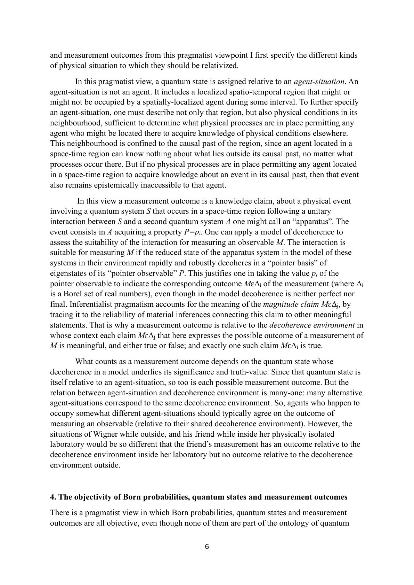
<figcaption class="paper-figure-caption"><b>Fig 5.</b> Low-resolution page preview, page 6</figcaption>
</figure>

**Summary.** This paper argues that quantum theory does not describe objective, mind-independent facts about physical reality regarding states or probabilities. Instead, the objectivity of quantum knowledge is established by the norms and practices of the scientific community when applying the theory to predict outcomes in specific physical situations. It shifts the focus from 'what is real' to 'how we are justified in making claims.'

**Why it may be interesting.** It provides a deep philosophical underpinning to quantum measurement, which is crucial for understanding the interpretation of quantum field theories and open quantum systems where the environment plays a defining role.

Detailed structure

**Main problem.** The paper tackles the fundamental philosophical problem of objectivity in quantum mechanics, specifically questioning whether quantum states, Born probabilities, and measurement outcomes represent objective facts about a mind-independent reality.

**Main result.** The objectivity of quantum knowledge is argued to be instituted not by veridical representation of reality, but by conformity to epistemic norms and the successful application of quantum theory within specific 'agent-situations' or physical procedures.

**Method.** The analysis employs philosophical tools, comparing ontological interpretations with pragmatic and coherence-based views (like QBism), and drawing analogies from relativistic physics and quantum metrology.

**Model / system.** The discussion centers on abstract quantum systems, the mathematical formalism of quantum states, and the physical context of measurement, using examples like LIGO to ground the philosophical arguments.

**Key observables.** Measurement outcomes, Born probabilities, quantum states, and the relative frequencies of detection events.

**Important parameters / regimes.** The distinction between 'absoluteness' and 'objectivity'; the structure of the 'agent-situation' relative to decoherence environments.

**Assumptions / limitations.** The core assumption is that standard physical practice requires an explanation for the objectivity of its results, leading to the rejection of strict ontological realism for quantum concepts.

**Paper structure.** The paper progresses by first establishing the failure of classical notions of measurement objectivity in quantum theory, then contrasting various interpretations (QBism, RQM), and finally arguing that objectivity arises from normative constraints and successful application in physical procedures like metrology.

Abstract

Measurement is an important scientific activity. In most of science, including classical physics, is may be understood as a way of finding out about the physical world and representing the results numerically. No-go theorems show that measurement of quantum observables is not like that: the recorded outcome is typically created rather than revealed in a quantum measurement, in which case there is no objective fact about the observable's prior value. Other no-go theorems show that unitary quantum theory can generally neither explain nor even represent a unique recorded outcome, thereby threatening that outcome's objectivity. Methodological norms inherent in quantum physical practice nevertheless institute the objectivity, not only of unique recorded outcomes of quantum measurements, but also of non-quantum features of the world that physicists and other scientists take their models to represent.

[↑ back to top](#top)

### [Entropy Production from Spin--Vibrational Coupling in Endohedral-Fullerene Qubits Encapsulated in Suspended Carbon Nanotubes](http://arxiv.org/abs/2605.15521v1)

**Authors:** Cristian Staii  
**Type:** theory · **Category:** statistical mechanics · **PDF:** <https://arxiv.org/pdf/2605.15521v1>  
**Analysis basis:** full PDF text, analyzed in chunks
**Topic relevance:** `correlated / nonlocal dissipation` **3/5** · `driven-dissipative phase transition` **3/5** · `entanglement & information structure` **3/5** · `methods for driven-dissipative` **3/5** · `non-equilibrium dynamics` **3/5** · `non-equilibrium universality` **3/5** · `spintronics-quantum-optics interface` **3/5** · `Keldysh / 2PI / non-Gaussian methods` **2/5** · `exotic spin models in light-matter` **2/5** · `analog quantum simulation` **1/5**

↔ Scroll figures horizontally

<figure class="paper-figure-card">
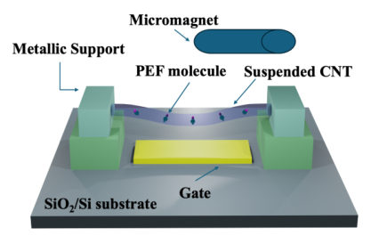
<figcaption class="paper-figure-caption"><b>Fig 1.</b> FIG. 1. Schematic of the proposed experimental setup showing single spins trapped inside a suspended carbon nanotube (CNT). The spins are associated with paramagnetic endohedral fullerene (PEF) molecules confined within the CNT. The vibrational motion of the nanotube is controlled by gate voltages, while a micromagnet placed nearby generates an external magnetic field. Spin-orbit cou- pling in the CNT gives rise to strong coupling between the spin degree of freedom and the quantized mechanical motion of the nanotube, thereby enabling manipulation of the PEF spin splitting.</figcaption>
</figure>
<figure class="paper-figure-card">
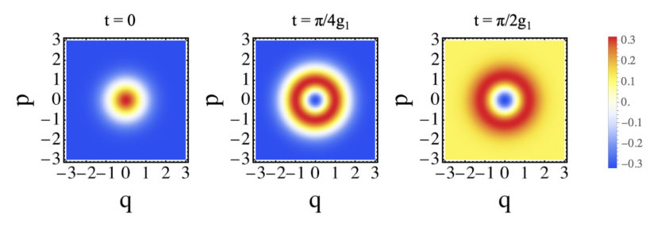
<figcaption class="paper-figure-caption"><b>Fig 2.</b> FIG. 2. Reduced mechanical Wigner function Wm(q, p, t) in the resonant weak-drive regime, evaluated from Eq. (45) at three representative times. At t = 0, the oscillator is in the vacuum state and the Wigner function is purely Gaussian. At intermediate times t = π/(4g1), the phase-space distribution is a mixture of the vacuum and one-phonon contributions. At t = π/(2g1), the oscillator is in the one-phonon state, and the Wigner function displays the characteristic nonclassical structure associated with a single vibrational excitation. This evolution provides a direct visualization of the coherent transfer of a single excitation from the spin sector to the CNT mode. The color bar indicates...</figcaption>
</figure>
<figure class="paper-figure-card">
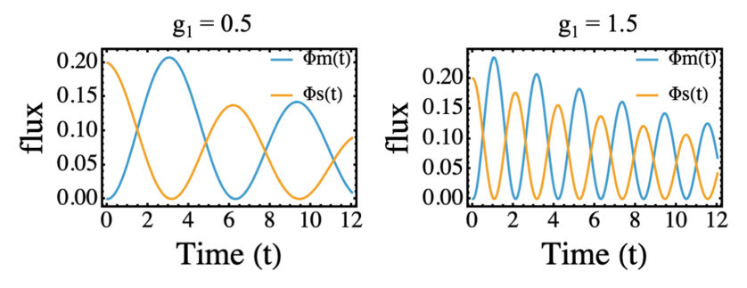
<figcaption class="paper-figure-caption"><b>Fig 3.</b> FIG. 3. Entropy-flux dynamics in the resonant weak-drive regime for two representative values of the spin–phonon coupling g1. The mechanical entropy flux Φm(t) and spin entropy flux Φs(t) are plotted using the weak-excitation expressions derived in the text. As g1 increases, coherent spin–phonon exchange occurs on a shorter timescale, leading to a faster buildup of entropy flow through the mechanical channel and a corresponding redistribution of dissipation away from direct spin relaxation and toward the vibrational mode.</figcaption>
</figure>
<figure class="paper-figure-card">
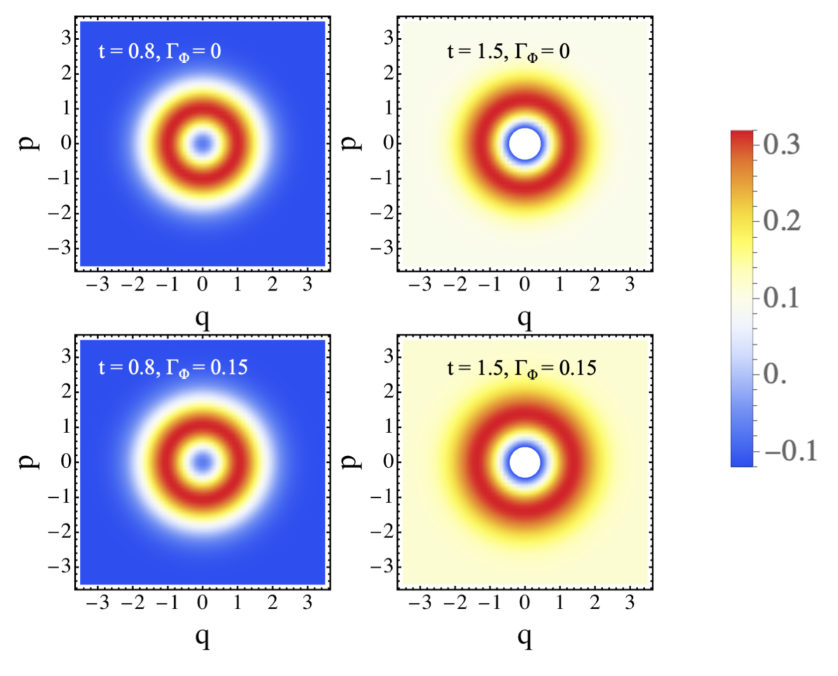
<figcaption class="paper-figure-caption"><b>Fig 4.</b> FIG. 4. Diffusion-broadened reduced mechanical Wigner function Wm(q, p, t) at representative times and dephasing rates in the resonant weak-drive regime. The four panels show the phase-space distribution for two times, t = π/(4g1) and t = π/(2g1), and for two values of the dephasing rate, Γϕ = 0 and Γϕ = 0.15. As dephasing increases, the nonclassical one-phonon structure is progressively smoothed and the distribution broadens in phase space, illustrating the combined effects of mechanical diffusion and spin decoherence. The color bar indicates the magnitude of Wm(q, p, t).</figcaption>
</figure>
<figure class="paper-figure-card">
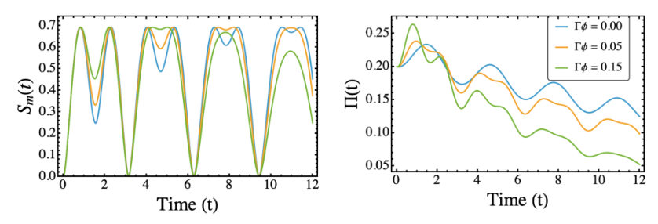
<figcaption class="paper-figure-caption"><b>Fig 5.</b> FIG. 5. Left panel: reduced mechanical entropy Sm(t) for three representative dephasing rates Γϕ in the resonant weak-drive regime. Increasing dephasing progressively damps the oscillatory behavior associated with coherent spin–phonon exchange. Right panel: corresponding irreversible contribution Π(t) obtained from the phenomenological weak-excitation model. As Γϕ increases, the entropy balance acquires a more pronounced strictly positive irreversible component arising from the combined effects of mechanical dissipation and spin decoherence. The legend shown in the inset of the right panel applies to both figures.</figcaption>
</figure>

**Summary.** This theoretical study models the interaction between molecular spin qubits (PEFs) and the quantized vibrations of suspended CNTs. By developing a hybrid open-system model, the authors derive an entropy balance equation to quantify how irreversibility is generated and distributed between the spin and mechanical baths. The results establish CNT-PEF hybrids as powerful platforms for studying non-equilibrium quantum thermodynamics.

**Why it may be interesting.** This work is highly relevant as it provides a detailed, quantitative framework for diagnosing non-equilibrium quantum processes (like decoherence and information loss) using thermodynamic quantities (entropy) in solid-state quantum devices.

Detailed structure

**Main problem.** The paper analyzes entropy generation and irreversibility in a hybrid quantum system coupling spin and mechanical (vibrational) degrees of freedom.

**Main result.** It demonstrates that the system exhibits crossovers between oscillator-dominated and spin-dominated entropy-production regimes, providing a quantitative basis for studying non-equilibrium quantum thermodynamics.

**Method.** The analysis employs a hybrid open-system model, using the Wigner function formalism for the mechanical mode and deriving an entropy balance equation from the Lindblad master equation.

**Model / system.** The system consists of paramagnetic endohedral fullerenes (PEFs) acting as qubits, coupled to the flexural modes of a suspended Carbon Nanotube (CNT) resonator. The dynamics are governed by a Lindblad master equation incorporating spin relaxation, mechanical damping, and the spin-vibrational interaction.

**Key observables.** Entropy production ($\Pi(t)$), entropy flux ($\Phi(t)$), mechanical Wigner function $W(q, p, t)$, and mutual information $I_{s:m}(t)$.

**Important parameters / regimes.** Coupling strength ($g_1$), mechanical damping ($\gamma_m$), spin relaxation rates ($\Gamma$), and external driving strength ($\epsilon$).

**Assumptions / limitations.** The analysis relies on projecting the spin manifold to two states and treating the mechanical mode using a Gaussian propagator, which assumes linear damping and quadratic Hamiltonians.

**Figures summary.** Figures illustrate the time evolution of the reduced mechanical Wigner function, showing oscillations between vacuum and one-phonon profiles, and plot the time evolution of mechanical and spin entropy fluxes.

**Paper structure.** The paper builds from deriving the effective Jaynes-Cummings Hamiltonian, to applying the Wigner function formalism for the mechanical mode, and finally deriving the entropy balance equation to quantify entropy production and flux in various coupling regimes.

Abstract

Hybrid carbon nanotube-fullerene architectures provide a controllable platform for studying irreversibility and information flow in structured quantum environments. We analyze entropy generation in a system where paramagnetic endohedral fullerenes, such as N@C$_{60}$ and P@C$_{60}$, are encapsulated inside a suspended carbon nanotube (CNT) resonator, with selected multi-level fullerene spin states forming an effective qubit coupled to quantized CNT flexural modes. Building on prior work on fullerene-filled CNTs, spin-phonon control in suspended nanotubes, and phase-space propagators for damped driven oscillators, we develop a hybrid open-system model combining driven quantum Brownian motion of the CNT with an effective Jaynes-Cummings spin-vibrational interaction. The resonator dynamics are represented by a Wigner function whose evolution is written analytically in terms of the initial Wigner distribution and a Gaussian propagator. This phase-space description separates drive-induced displacement, diffusion, and damping, and connects these processes directly to entropy flow. The coupled spin-mechanical dynamics are embedded in a Lindblad master equation including mechanical damping, spin relaxation, pure dephasing, and thermally activated excitation. Within this framework we derive the entropy balance, identify entropy flux and non-negative entropy production, and examine how spin-vibrational hybridization redistributes irreversibility between coherent exchange and dissipative channels. We show that magnetic-gradient-enhanced spin-phonon coupling, resonant driving, and moderate thermal occupation produce crossovers between oscillator-dominated and spin-dominated entropy-production regimes. The framework provides a basis for using CNT-PEF hybrids as nanoscale platforms to study nonequilibrium quantum thermodynamics, decoherence, and information loss in vibrational environments.

[↑ back to top](#top)

### [Brownian motion: non-equilibrium states from equilibrium trajectories -- recovering hydrodynamic regimes from prepared displacement measurements](http://arxiv.org/abs/2605.16247v1)

**Authors:** Jason Boynewicz, Michael C. Thumann, Giuseppe Procopio, Massimiliano Giona  
**Type:** theory · **Category:** statistical mechanics · **PDF:** <https://arxiv.org/pdf/2605.16247v1>  
**Analysis basis:** full PDF text, analyzed in chunks
**Topic relevance:** `Keldysh / 2PI / non-Gaussian methods` **3/5** · `methods for driven-dissipative` **3/5** · `non-equilibrium dynamics` **3/5** · `non-equilibrium universality` **3/5** · `quantum measurements` **3/5** · `correlated / nonlocal dissipation` **2/5** · `driven-dissipative phase transition` **2/5** · `measurement-induced transitions` **1/5**

↔ Scroll figures horizontally

<figure class="paper-figure-card">
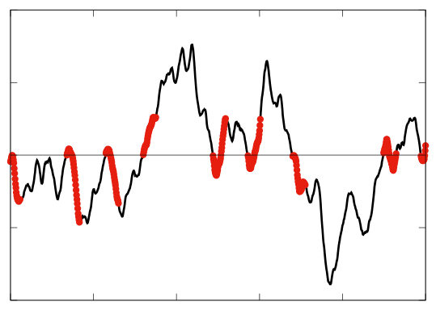
<figcaption class="paper-figure-caption"><b>Fig 1.</b> FIG. 1. Schematic representation of the subsampling procedure of an equilibrium trajectory to</figcaption>
</figure>
<figure class="paper-figure-card">
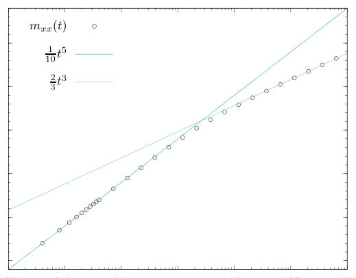
<figcaption class="paper-figure-caption"><b>Fig 2.</b> FIG. 2. mxx(t) = ⟨x2(t)|v(0) = 0, R(0) = 0⟩vs t expressed by eq. (35) for zero velocity and zero</figcaption>
</figure>
<figure class="paper-figure-card">
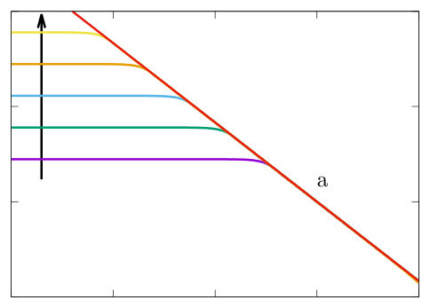
<figcaption class="paper-figure-caption"><b>Fig 3.</b> FIG. 3. g(t, Γ, Ni) vs t. The arrow indicates increasing values of Γ = 103, 106, 109, 1011. Ni = 20</figcaption>
</figure>
<figure class="paper-figure-card">
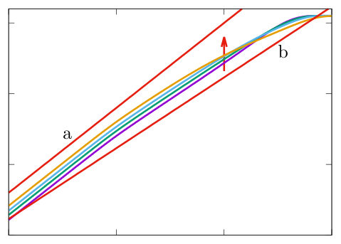
<figcaption class="paper-figure-caption"><b>Fig 4.</b> FIG. 4. mxx(t) vs t for the Stokes-inertial model, eq. (40), with κs = 0.1, and Γ = 107 for different</figcaption>
</figure>
<figure class="paper-figure-card">
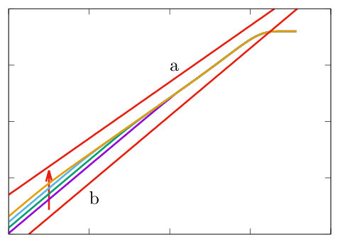
<figcaption class="paper-figure-caption"><b>Fig 5.</b> FIG. 5. mxx(t) vs t for the Stokes-inertial model, eq. (40), with κs = 0.1, b = 0.1, for different</figcaption>
</figure>

**Summary.** This work develops a theoretical framework to extract microscopic fluid-particle interaction details from single Brownian trajectories by treating equilibrium states as superpositions of non-equilibrium paths. It analyzes the short-time scaling of the mean-squared displacement, predicting crossovers between $t^{5/2}$ and $t^4$ scaling depending on the inclusion of correlated stochastic forces. This provides a powerful method to test hydrodynamic models using single-trajectory measurements.

**Why it may be interesting.** The rigorous connection between non-equilibrium path measurements and equilibrium hydrodynamic properties is a powerful theoretical tool for characterizing complex many-body dynamics, relevant for understanding dissipation in open quantum systems.

Detailed structure

**Main problem.** The paper aims to unravel fine details of fluid-particle interactions at microscopic scales by analyzing non-equilibrium states derived from single Brownian trajectories, connecting them to macroscopic hydrodynamics.

**Main result.** The analysis confirms the $t^{5/2}$-law for short-time displacement statistics due to fluid inertial effects but predicts a crossover to a $t^4$-scaling at very short times when correlated stochastic forcings are properly accounted for.

**Method.** The approach utilizes the Chapman-Kolmogorov equation, viewing equilibrium trajectories as superpositions of non-equilibrium states, and analyzing the second-order moments of particle position via Generalized Langevin Equations (GLEs).

**Model / system.** The system is a Brownian particle moving in a solvent fluid, modeled using concepts from Markovian dynamics, path integrals, and memory kernels derived from hydrodynamic theory.

**Key observables.** Mean square displacement $\langle x^2(t) 
angle$, velocity autocorrelation function, and scaling exponents ($\phi, \zeta, d_v$).

**Important parameters / regimes.** Short time $t$, fluid viscosity ($\eta$), and parameters related to fluid inertia and correlation time.

**Assumptions / limitations.** The analysis relies on the Markovian embedding for non-Markovian processes and involves approximations in the Laplace domain for short-time limits.

**Figures summary.** Figures illustrate the mean-squared displacement $m_{xx}(t)$ vs $t$ for various models, showing crossovers between $t^3$, $t^{5/2}$, and $t^4$ scaling regimes depending on the physical assumptions.

**Paper structure.** The paper builds theory by relating equilibrium paths to non-equilibrium states, develops the mathematical framework using GLEs and memory kernels, and concludes by deriving and comparing the short-time scaling laws for $\langle x^2(t) 
angle$ under different hydrodynamic assumptions.

Abstract

Owing to the Chapman-Kolmogorov equation for Markovian dynamics,any equilibrium trajectory of a Brownian particle in a solvent fluid can be viewed as the superposition of an uncountable number of non-equilibrium states. This property permits the unraveling of fine details of fluid-particle interactions at microscales defined by its non-equilibrium properties from the analysis of a single Brownian trajectory and to connect them to the hydrodynamics of the solvent fluid, simply considering the lower-order (second) moments of particle position in trapped conditions. In this way, the acceleration due to thermal-hydrodynamic fluctuational forces is isolated from the other factors and the short-time displacement statistics is completely determined by the correlation properties of the fluctuational thermal-hydrodynamic force. This approach not only confirms the $t^{5/2}$-law obtained by Boynewicz et al. (2026), related to fluid inertial effects, but indicates that this scaling may be superseded by a $t^4$-scaling at very short times once the correlated nature of the stochastic forcings is taken into account. The latter result is related to the regularity properties of particle velocity realizations.

[↑ back to top](#top)

### [Entanglement Dynamics of Separable Squeezed States in Finite Memory Structured Reservoir](http://arxiv.org/abs/2605.15426v1)

**Authors:** Austen Couvertier, Ting Yu  
**Type:** theory · **Category:** other · **PDF:** <https://arxiv.org/pdf/2605.15426v1>  
**Analysis basis:** full PDF text, analyzed in chunks
**Topic relevance:** `correlated / nonlocal dissipation` **3/5** · `entanglement & information structure` **3/5** · `methods for driven-dissipative` **3/5** · `analog quantum simulation` **2/5** · `driven-dissipative phase transition` **2/5** · `non-equilibrium dynamics` **2/5** · `non-equilibrium universality` **2/5** · `Keldysh / 2PI / non-Gaussian methods` **1/5** · `Tavis-Cummings & cavity-many-emitter` **1/5** · `correlated cavity matter` **1/5**

↔ Scroll figures horizontally

<figure class="paper-figure-card">
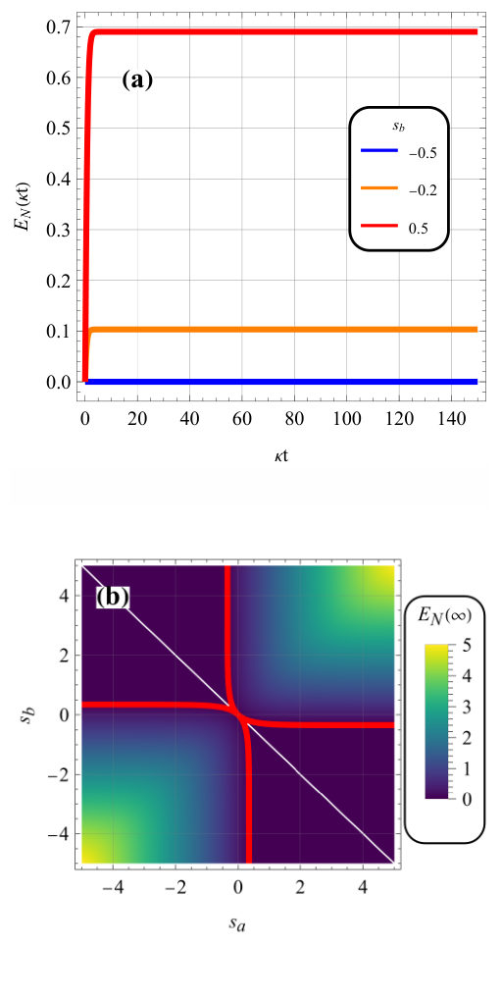
<figcaption class="paper-figure-caption"><b>Fig 1.</b> FIG. 1: (a) Time evolution of the logarithmic negativity EN [Eq. 8] in a Markovian bath with mode A fixed at sa = +1 and mode B initialized at sb = −0.5 (blue), sb = −0.2 (orange), and sb = +0.5 (red). (b) Steady-state EN as a function of (sa, sb) over [−5, 5], with bright regions bounded by Simon criteria [Eqs. A13-A14].</figcaption>
</figure>
<figure class="paper-figure-card">
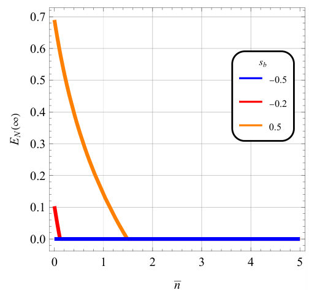
<figcaption class="paper-figure-caption"><b>Fig 2.</b> FIG. 2: Steady-state logarithmic negativity EN [Eq. 8] versus thermal occupation ¯n in a Markovian bath. Results are shown for aligned (sa = sb = +0.5, orange), weakly orthogonal (sa = +0.5, sb = −0.2, red), and strongly orthogonal (sa = +0.5, sb = −0.5, blue) inputs. Aligned inputs retain finite entanglement up to ¯n≈1.5, weakly orthogonal inputs separate for ¯n ≈0.2, and strongly orthogonal inputs remain separable for all ¯n.</figcaption>
</figure>
<figure class="paper-figure-card">
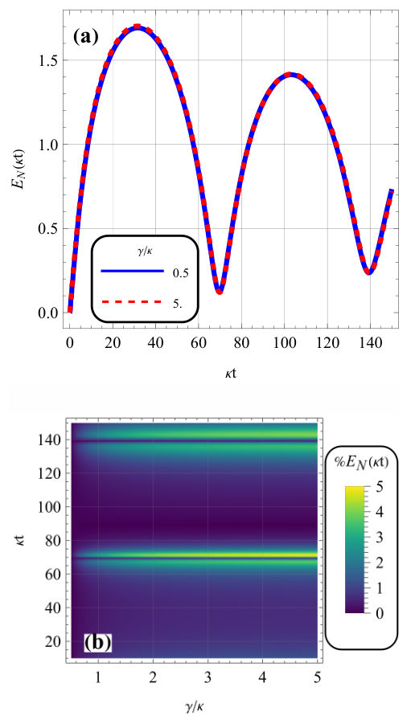
<figcaption class="paper-figure-caption"><b>Fig 3.</b> FIG. 3: (a) Time evolution of the logarithmic negativity EN [Eq. 8] in an Ornstein–Uhlenbeck bath for γ/κ = 0.5 (blue) and γ/κ = 5 (red) at fixed detuning δ∗ AE. Trajectories overlap within a few percent. (b) Relative deviation %EN = |∆EN/Ebaseline N | × 100% versus γ, referenced to the γ/κ = 0.5 curve. Deviations remain below 5%, concentrated near oscillation minima.</figcaption>
</figure>
<figure class="paper-figure-card">
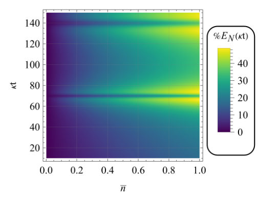
<figcaption class="paper-figure-caption"><b>Fig 4.</b> FIG. 4: Relative deviation %EN = |∆EN/Ebaseline N | × 100% of freezing dynamics versus thermal occupation ¯n. Deviations are bounded by ≤5% in the cryogenic regime (¯n ≤0.05) and ≤20% at moderate occupancies (¯n ≤0.2). Larger excursions occur only at short-time transients and late-time decay.</figcaption>
</figure>
<figure class="paper-figure-card">
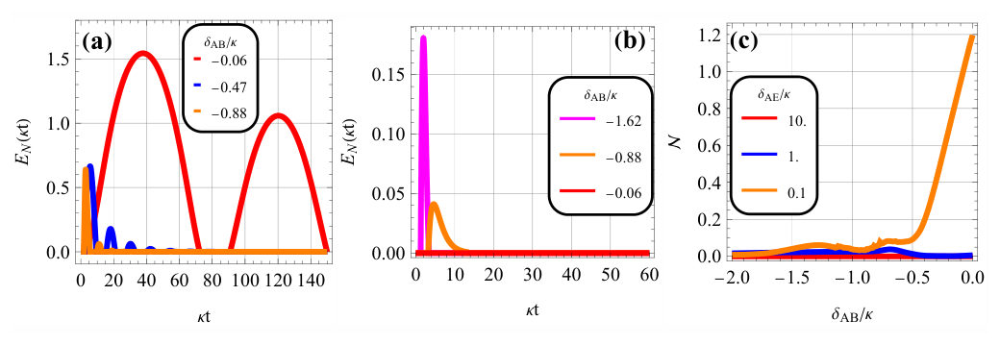
<figcaption class="paper-figure-caption"><b>Fig 5.</b> FIG. 5: (a) Time evolution of logarithmic negativity EN [Eq. 8] for orthogonal inputs (sa = +1, sb = −1) in structured baths with different detuning pairs (δAB, δAE)/κ, showing entanglement birth, death, and revival. (b) Markovian comparison, where no choice of δAE yields revivals and correlations decay rapidly. (c) Non-Markovianity measure N [Eq. 11] versus δAB/κ for the same conditions; in the large-δAE/κ regime the witness remains zero despite nontrivial EN(t).</figcaption>
</figure>

**Summary.** This paper analyzes entanglement dynamics in bosonic systems coupled to structured, memory-retaining reservoirs. By employing advanced Gaussian methods, the authors reveal three unique non-Markovian phenomena—including entanglement revival and integer-locked beating—that are impossible in simple Markovian baths. These findings establish structured reservoirs as controllable resources for continuous-variable quantum technologies.

**Why it may be interesting.** This work provides concrete, analytically derived mechanisms (like integer-locking and freezing laws) showing how structured environments can act as tunable resources for generating and controlling quantum entanglement, which is highly relevant for quantum optics and cavity QED.

Detailed structure

**Main problem.** The study investigates how entanglement dynamics evolve in continuous-variable Gaussian systems when coupled to structured, finite-memory quantum reservoirs, addressing gaps left by Markovian or pre-entangled state assumptions.

**Main result.** The authors identify three non-Markovian mechanisms—detuning-induced freezing, entanglement revival from separable inputs, and integer-locked beating—that are absent in Markovian dynamics.

**Method.** The analysis employs Gaussian covariance methods, evolving the system dynamics using approximate Non-Markovian Quantum State Diffusion (QSD) and utilizing Bures distance diagnostics to quantify non-Markovianity.

**Model / system.** The model consists of two bosonic modes coupled to a common bosonic reservoir, whose memory effects are modeled using an Ornstein–Uhlenbeck kernel. The analysis is extended to finite temperatures via pseudomode embeddings.

**Key observables.** Logarithmic negativity ($E_N$), Bures distance ($D_B$), and the non-Markovianity witness ($N$).

**Important parameters / regimes.** Detuning ($\delta_{AB}, \delta_{AE}$), reservoir correlation time ($\gamma$), thermal occupation ($ar{n}$), and modulation amplitude ($\delta_0/\kappa$).

**Assumptions / limitations.** The analysis relies on approximate QSD and pseudomode embeddings, though these methods successfully map the dynamics to maintain complete positivity.

**Figures summary.** Figures illustrate the persistence of entanglement revivals and beating envelopes under structured coupling, and show the relative deviation of entanglement metrics across varying thermal occupations.

**Paper structure.** The paper builds from establishing the system Hamiltonian and initial states, developing the non-Markovian evolution equations (using QSD/pseudomodes), and then systematically analyzing the three key non-Markovian phenomena (freezing, revival, beating) under varying temperature and detuning conditions.

Abstract

Entanglement in continuous-variable Gaussian systems is a key resource, and common reservoirs can both suppress and generate correlations. Existing work focused on pre-entangled states or Markovian baths, leaving open whether separable squeezed inputs entangle in structured environments or under modulation. We study two bosonic modes coupled to a common reservoir, each initialized in a separable squeezed vacuum. Dynamics are analyzed utilizing Gaussian covariance methods, evolved under approximate Non-Markovian quantum state diffusion (QSD), finite-temperature pseudomode embeddings, and Bures-based non-Markovian diagnostics. We identify three mechanisms absent in Markovian dynamics: (1) A detuning condition that freezes entanglement trajectories across reservoir correlation times; (2) birth, death, and revival of entanglement from orthogonal inputs; and (3) integer-locked beating with square-wave oscillations produced by periodic detuning. All mechanisms persist at finite temperature, with deviations bounded within 5% in cryogenic regimes and 20% at moderate occupations. These deviation bounds align with cryogenic cavity, phononic, and optomechanical platforms, where structured spectral densities and detuning modulation are already accessible. Structured reservoirs are shown to emerge as tunable entanglement resources for continuous-variable quantum technologies.

[↑ back to top](#top)

### [Active Model B$^-$ from Mass-Conserving Reaction-Diffusion Systems](http://arxiv.org/abs/2605.15903v1)

**Authors:** Davide Toffenetti, Beatrice Nettuno, Henrik Weyer, Erwin Frey  
**Type:** theory · **Category:** statistical mechanics · **PDF:** <https://arxiv.org/pdf/2605.15903v1>  
**Analysis basis:** full PDF text, analyzed in chunks
**Topic relevance:** `Keldysh / 2PI / non-Gaussian methods` **3/5** · `driven-dissipative phase transition` **3/5** · `non-equilibrium dynamics` **3/5** · `non-equilibrium universality` **3/5** · `analog quantum simulation` **2/5** · `methods for driven-dissipative` **2/5** · `Frenkel-Kontorova` **1/5** · `correlated / nonlocal dissipation` **1/5**

↔ Scroll figures horizontally

<figure class="paper-figure-card">
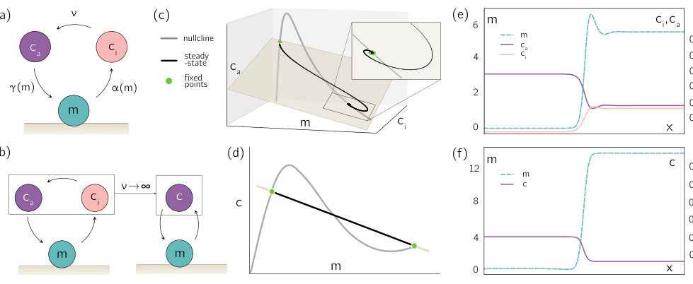
<figcaption class="paper-figure-caption"><b>Fig 1.</b> Figure 1. (a) Reaction scheme of the three-component model [Eq. (1)]: the membrane-bound species m detaches at rate α(m) into the inactive cytosolic state ci, which reactivates at rate ν into the active state ca, and ca recruits back to the membrane at rate γ(m). (b) Limiting two-component mass-conserving model, obtained in the limit ν →∞, in which ci and ca collapse onto a single lumped cytosolic species c. (c) Phase-space construction for the three-component model: the reactive nullcline (gray curve) defines the local reactive equilibria, and the steady-state interface trajectory (black) is constrained to a plane of constant η (beige, light gray); the inset zooms in on the homogeneous...</figcaption>
</figure>
<figure class="paper-figure-card">
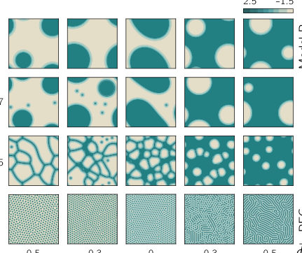
<figcaption class="paper-figure-caption"><b>Fig 2.</b> Figure 2. Phase diagram of phenomenological AMB−, obtained from finite-element simulations [34] in the (¯ϕ, κ1) plane. Increasing κ1 at fixed mean density traverses a se- quence of morphologies from the PFC limit (κ1 ≲0, periodic patterns) to the Model B limit (κ1 ≳1, macrophase separa- tion), passing through coexistence of large and small droplets, microphase-separated droplets, and stripes/foams in the in- termediate regime. Colors encode local density ϕ (teal, dark gray; beige, light gray). Parameters: κ(ϕ) = tanh(κ1 −ϕ), M = 1, χ = 0.055ϕ, η∗(ϕ) = −ϕ + ϕ3, λ = 0.</figcaption>
</figure>
<figure class="paper-figure-card">
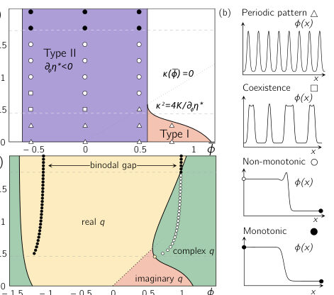
<figcaption class="paper-figure-caption"><b>Fig 3.</b> Figure 3. (a) Linear stability of the homogeneous state in the (¯ϕ, κ1) plane (parameters as in Fig. 2): Type II (laven- der, dark gray) and Type I (coral, medium gray) instabili- ties; stable elsewhere (white). Symbols in 1D simulations: triangles (periodic), squares (multi-wavelength), filled/open circles (monotonic/non-monotonic interfaces). (b) Represen- tative steady-state profiles, one per symbol class. (c) Spatial- eigenvalue analysis of plateau solutions ϕ±, classified by the decay rate q: real (cream, light gray, monotonic tail), com- plex (mint, dark gray, non-monotonic tail), imaginary (coral, medium gray, plateau unstable). Solid: κ2 = 4K ∂ϕη∗; dot- ted: κ(ϕ) = 0. Circles:...</figcaption>
</figure>

**Summary.** This work derives Active Model B− (AMB−), an effective scalar field theory, by analyzing the late-time dynamics of a complex three-component mass-conserving reaction-diffusion system. The key finding is that AMB− exhibits a density-dependent interfacial coefficient that drives a finite-wavelength instability, stabilizing microphase separation. The methodology involves advanced field-theoretic reductions, providing a powerful framework for understanding pattern selection in non-equilibrium matter.

**Why it may be interesting.** While focused on classical pattern formation, the mathematical techniques used—deriving an effective, non-linear, gradient-based field theory from underlying conservation laws—are highly relevant to modeling non-equilibrium dynamics in quantum many-body systems or open quantum systems.

Detailed structure

**Main problem.** The paper addresses the theoretical challenge of understanding pattern formation in mass-conserving reaction-diffusion systems, specifically aiming to derive an effective active scalar field theory that captures finite-wavelength pattern selection.

**Main result.** The late-time dynamics reduce to Active Model B− (AMB−), a scalar active field theory characterized by a density-dependent interfacial coefficient $\kappa(\phi)$ that turns negative at high density, stabilizing microphase-separated patterns.

**Method.** The derivation uses adiabatic elimination and gradient expansion techniques to reduce a complex three-component mass-conserving system into a single, effective fourth-order partial differential equation.

**Model / system.** The model is based on a minimal three-component mass-conserving reaction-diffusion (McRD) system involving membrane-bound and cytosolic species. The effective theory, AMB−, is a scalar active field theory derived from this underlying conservation law.

**Key observables.** Microphase-separated patterns, finite-wavelength instability, and the structure of the steady-state interface profiles.

**Important parameters / regimes.** The reactivation rate $
u$, which interpolates between different physical regimes (e.g., coarsening vs. stable separation).

**Assumptions / limitations.** The derivation relies on the system being in the late-time, diffusion-limited regime, and involves approximations like gradient expansion and quasi-steady-state elimination.

**Figures summary.** Figures illustrate the reaction scheme, the comparison between different model limits (PFC, 2-comp, AMB−), and the stability analysis showing transitions between different types of interface profiles (monotonic, non-monotonic, etc.).

**Paper structure.** The paper progresses by first defining the complex three-component McRD system, then applying adiabatic elimination and gradient expansion to derive the effective AMB− equation. It analyzes the resulting steady-state ODE via linear stability analysis to characterize the stability regimes and pattern selection mechanisms.

Abstract

We show that the late-time dynamics of a minimal three-component mass-conserving reaction--diffusion system reduce to a scalar active field theory, Active Model B$^-$ (AMB$^-$), in which a density-dependent interfacial coefficient $κ(φ)$ turns negative at high density. This drives a finite-wavelength instability and stabilises microphase-separated patterns, in contrast to the unbounded coarsening of two-component mass-conserving systems. Unlike Active Model B$^+$, AMB$^-$ retains a chemical potential that remains a state function, inherited from the underlying conservation law, but admits no equation of state for the pressure.

[↑ back to top](#top)

### [Cycle affinity and winding localize eigenvalues of Markov generators](http://arxiv.org/abs/2605.15884v1)

**Authors:** Artemy Kolchinsky, Naruo Ohga, Sosuke Ito  
**Type:** theory · **Category:** statistical mechanics · **PDF:** <https://arxiv.org/pdf/2605.15884v1>  
**Analysis basis:** full PDF text, analyzed in chunks
**Topic relevance:** `correlated / nonlocal dissipation` **3/5** · `driven-dissipative phase transition` **3/5** · `methods for driven-dissipative` **3/5** · `non-equilibrium dynamics` **3/5** · `non-equilibrium universality` **3/5** · `Keldysh / 2PI / non-Gaussian methods` **1/5** · `analog quantum simulation` **1/5**

↔ Scroll figures horizontally

<figure class="paper-figure-card">
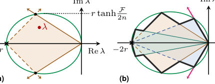
<figcaption class="paper-figure-caption"><b>Fig 1.</b> FIG. 1. Illustration of Theorem 1 for a unicyclic generator with maximum escape rate r and cycle affinity F ≥0. (a) Each eigen- value λ obeys the bounds (4) (solid brown) and (5) (dashed brown), which depend on the winding number w (equivalently, sorted eigen- value index). (b) Taking the union across all winding numbers w ∈{1, . . . , ⌈n/2⌉−1} gives a non-convex localization region for all eigenvalues (black outline). The green ellipse is the bound corresponding to the Uhl–Seifert conjecture [12]; our previous sector bound [22] is shown using magenta arrows.</figcaption>
</figure>
<figure class="paper-figure-card">
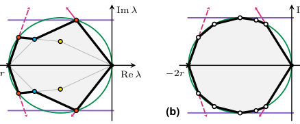
<figcaption class="paper-figure-caption"><b>Fig 2.</b> FIG. 2. (a) Theorem 4 illustrated on a 6-state generator with 3 cycles: (nc, Fc) = (3, 4), (4, 4), (5, 16). Eigenvalues are localized to a topology- and affinity-dependent region (thick black), defined as a union of convex hulls (thin grey lines) induced by the 3 cycles (blue, yellow, and orange dots). We show four Topology-dependent bounds from Table I: τ = 1 (solid magenta), τ = 0 (dashed magenta), τ = −Re λ/2r (purple lines), and τ = 1/2 (Uhl-Seifert ellipse, green). (b) Theorem 5 specifies a topology-free localization region in terms of F∗:= maxc tanh(Fc/2nc) and size n = 6. It is the convex hull of points induced by Farey fractions (white dots). We show four Size-dependent bounds from...</figcaption>
</figure>

**Summary.** This work establishes fundamental mathematical bounds on the complex eigenvalues of Markov generators by linking them to the system's non-equilibrium cycles. It proves that the oscillatory behavior of the system is constrained by a tradeoff between thermodynamic driving forces (cycle affinity) and the geometric winding number of the eigenvectors. This provides powerful, generalizable tools for analyzing relaxation dynamics in complex stochastic processes.

**Why it may be interesting.** The connection between spectral properties (eigenvalues) and non-equilibrium thermodynamics (cycle affinity) provides powerful, quantitative bounds on relaxation dynamics, which is crucial for understanding open quantum systems and energy dissipation.

Detailed structure

**Main problem.** To understand how complex eigenvalues of Markov generators, which govern oscillatory properties of relaxation and autocorrelation, are localized by non-equilibrium cycles.

**Main result.** The paper proves that complex eigenvalues are confined to regions determined by the cycle affinity and the eigenvector's winding number, establishing new thermodynamic bounds on relaxation modes.

**Method.** The analysis uses spectral theory applied to continuous-time Markov chains, relating eigenvalue properties to cycle affinities and winding numbers via geometric and convex hull constructions.

**Model / system.** The system is modeled by continuous-time Markov chains whose dynamics are governed by a rate matrix (generator) $R$. The analysis focuses on irreducible, unicyclic, and multicyclic generators.

**Key observables.** Complex eigenvalues ($\lambda$), Cycle Affinity ($F$), Winding Number ($\omega(u)$), and the relaxation/oscillation rates ($	ext{Re } \lambda, |	ext{Im } \lambda|$).

**Important parameters / regimes.** Cycle affinity ($F$), system size ($n$), and the parameter $	au \in [0, 1]$ used to interpolate between different decay regimes.

**Assumptions / limitations.** The main theorems initially assume the generator is irreducible and unicyclic, though generalizations to multicyclic systems are presented.

**Figures summary.** Figures illustrate the derived eigenvalue bounds, comparing the topology-dependent localization region (Theorem 4) against the simpler, topology-free region defined by the Farey sequence (Theorem 5).

**Paper structure.** The paper progresses from establishing bounds in unicyclic systems (Theorem 1 & 2), to generalizing these bounds to multicyclic systems (Theorem 3), and finally deriving two types of localization regions: one dependent on specific cycle topologies (Theorem 4) and one independent of topology (Theorem 5).

Abstract

The complex eigenvalues of Markov generators govern oscillatory properties of relaxation, autocorrelation, and linear response. Here we show that these eigenvalues are localized by nonequilibrium cycles of the generator, thus revealing a fundamental tradeoff between thermodynamic driving, oscillation, and decay of eigenmodes. Specifically, we prove that each complex eigenvalue is confined to a region determined by the cycle affinity and the eigenvector ``winding number'' of some nonequilibrium cycle. In unicyclic systems, we also demonstrate that the winding number coincides with the ordered eigenvalue index, yielding new thermodynamic bounds on the slowest and fastest relaxation modes. In multicyclic systems, our approach unifies and extends several previous inequalities and proves the Uhl--Seifert ellipse conjecture.

[↑ back to top](#top)

### [Gauge-Engineered Tunable Mode Selection in Non-Hermitian Directed-Graph Networks](http://arxiv.org/abs/2605.15863v1)

**Authors:** Wenwen Liu, Zhang Shuang  
**Type:** theory · **Category:** other · **PDF:** <https://arxiv.org/pdf/2605.15863v1>  
**Analysis basis:** full PDF text, analyzed in chunks
**Topic relevance:** `correlated / nonlocal dissipation` **3/5** · `driven-dissipative phase transition` **3/5** · `methods for driven-dissipative` **3/5** · `analog quantum simulation` **2/5** · `non-equilibrium dynamics` **2/5** · `non-equilibrium universality` **2/5** · `Keldysh / 2PI / non-Gaussian methods` **1/5**

↔ Scroll figures horizontally

<figure class="paper-figure-card">
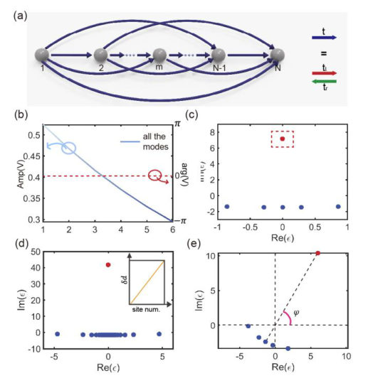
<figcaption class="paper-figure-caption"><b>Fig 1.</b> FIG.1 Non-Hermitian directed graph that supports single-</figcaption>
</figure>
<figure class="paper-figure-card">
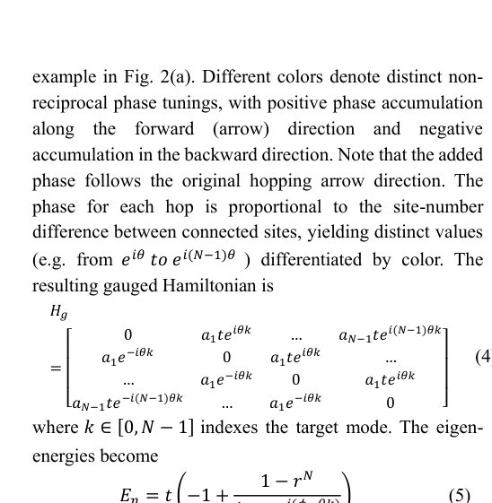
<figcaption class="paper-figure-caption"><b>Fig 2.</b> Figure 2(c-d) presents the results of single-mode selection under different gauge configurations. For 𝑘= 1 (𝑘= 3 ), the 2st (4st) mode is clearly selected, with its phase distribution shows 2𝜋 and 6𝜋 winding. Notably, all selected modes retain the same amplitude profile as in the ungauged case (Fig. 1(c)).</figcaption>
</figure>
<figure class="paper-figure-card">
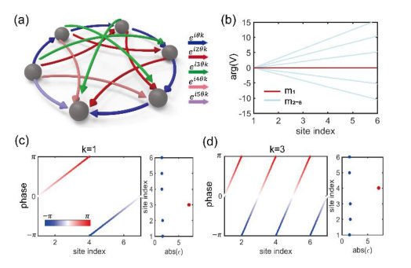
<figcaption class="paper-figure-caption"><b>Fig 3.</b> FIG. 2 Gauge engineered single mode selection. (a) 6-site</figcaption>
</figure>
<figure class="paper-figure-card">
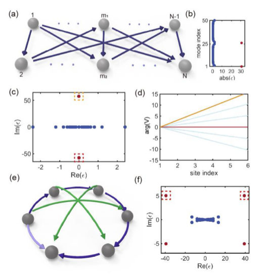
<figcaption class="paper-figure-caption"><b>Fig 4.</b> FIG. 3. Realization of double mode selection. (a) Graph</figcaption>
</figure>
<figure class="paper-figure-card">
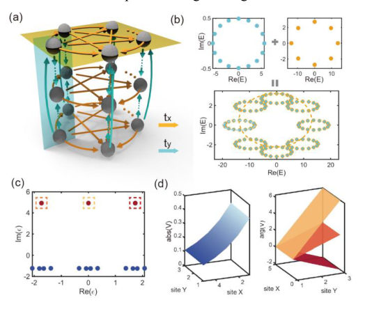
<figcaption class="paper-figure-caption"><b>Fig 5.</b> FIG. 4 Extension to multi-mode selection via dimension folding.</figcaption>
</figure>

**Summary.** This paper presents a gauge-engineering technique to achieve robust, tunable selection of specific eigenmodes in non-Hermitian directed-graph networks. By introducing synthetic gauge fields, the authors can force any desired pure decay mode to become the dominant state, bypassing the need for delicate gain/loss balancing. This advances applications in areas like single-mode lasers and quantum sensing.

**Why it may be interesting.** This work provides a powerful, generalizable theoretical tool for controlling spectral properties in open quantum systems, directly relevant to designing next-generation single-mode lasers and quantum sensors.

Detailed structure

**Main problem.** The core challenge is selectively isolating and controlling individual eigenmodes in open quantum and wave systems, especially in non-Hermitian settings where gain/loss balancing is difficult.

**Main result.** The authors introduce a gauge-engineering method that robustly promotes any desired pure decay mode to the dominant state, enabling loss/gain-free control over mode profiles.

**Method.** The technique involves adding synthetic gauge fields via phase-compensated non-reciprocal hopping to the directed-graph network Hamiltonian.

**Model / system.** The system is modeled using non-Hermitian directed-graph networks. The method is generalized from single-mode selection in fully connected graphs to paired and multi-mode selection in half-connected and higher-dimensional graphs.

**Key observables.** Pure decay modes (eigenstates with smooth exponential amplitude decay), the energy spectrum, and the ability to tune the dominant mode's energy gap.

**Important parameters / regimes.** The gauge field phase ($	heta_k$), the graph connectivity (fully connected, half-connected), and the hopping parameters ($t$).

**Assumptions / limitations.** The method relies on the underlying graph geometry supporting pure decay modes, and the gauge field is implemented via phase compensation without altering intrinsic loss/gain.

**Figures summary.** Figures illustrate the emergence of a singular mode in fully connected graphs, demonstrate gauge engineering for single-mode selection, and show extensions to double and multi-mode selection via dimension folding.

**Paper structure.** The paper progresses by first establishing the concept of geometry-protected pure decay modes, then detailing the gauge-engineering technique for single-mode selection, and finally generalizing this control to simultaneous paired and multi-mode selection in higher dimensions.

Abstract

Non-Hermitian physics enables novel control over open quantum and wave systems, but selectively isolating individual modes without delicate balancing of gain and loss remains challenging. Here we introduce a gauge-engineering method in directed-graph networks that support geometry-protected pure decay modes-eigenstates exhibiting smooth exponential amplitude decay along directed paths. In fully connected configurations, a single dominant mode naturally emerges with a large, tunable energy gap from the rest. By adding synthetic gauge fields via phase-compensated non-reciprocal hopping, we can promote any desired pure decay mode to the dominant position, while preserving its amplitude profile. The approach extends to simultaneous selection of paired modes in half-connected graphs and customizable multi-mode distributions in higher dimensions via orthogonal folding. Our method enables robust, loss/gain-free control over mode profiles, advancing applications in single-mode lasers, sensors, and quantum processing.

[↑ back to top](#top)

### [Microwave-to-Optical Quantum Transduction via Defect-Mediated Scattering in Diamond](http://arxiv.org/abs/2605.15988v1)

**Authors:** Kyosuke Goto, Hodaka Kurokawa, Hideo Kosaka, Kazuki Koshino  
**Type:** theory · **Category:** quantum information and computing · **PDF:** <https://arxiv.org/pdf/2605.15988v1>  
**Analysis basis:** full PDF text, analyzed in chunks
**Topic relevance:** `QC/QI experiment` **3/5** · `quantum optics experiment` **2/5** · `Keldysh / 2PI / non-Gaussian methods` **1/5** · `Tavis-Cummings & cavity-many-emitter` **1/5** · `analog quantum simulation` **1/5** · `correlated / nonlocal dissipation` **1/5** · `correlated cavity matter` **1/5** · `driven-dissipative phase transition` **1/5** · `entanglement & information structure` **1/5** · `methods for driven-dissipative` **1/5** · `non-equilibrium dynamics` **1/5** · `spintronics-quantum-optics interface` **1/5**

↔ Scroll figures horizontally

<figure class="paper-figure-card">
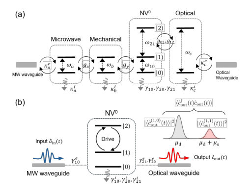
<figcaption class="paper-figure-caption"><b>Fig 1.</b> FIG. 1. (a) Mode coupling diagram. We operate in the triply resonant condition where the microwave mode, the mechanical mode, and the |0⟩↔|1⟩transition satisfy 𝜔𝑎= 𝜔𝑏= 𝜔10. The optical mode is tuned to the |0⟩↔|2⟩transition. (b) Schematic illustration of the transduction process in the reduced model. The microwave and optical waveguides couple directly to an NV0 center. A pump tone drives the |1⟩↔|2⟩transition resonantly at 𝜔21 = 𝜔20 −𝜔10.</figcaption>
</figure>
<figure class="paper-figure-card">
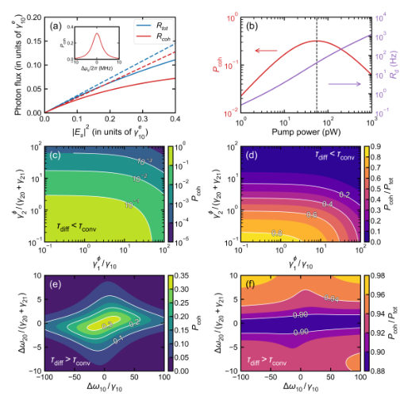
<figcaption class="paper-figure-caption"><b>Fig 2.</b> FIG. 2. Single-photon conversion process. (a) Total detected photon flux 𝑅tot (blue) and coherent photon flux 𝑅coh (red) as functions of incident signal microwave photon flux |𝐸s|2. The dashed lines indicate the tangents at the origin; their slopes give the corresponding conversion efficiencies for a single incident microwave photon, 𝑃tot and 𝑃coh, obtained by linear regression. The inset shows 𝑃coh as a function of the signal-frequency detuning Δ𝜇s. The conversion bandwidth is determined from the full width at half maximum of the curve shown in the inset. (b) Coherent conversion efficiency 𝑃coh (red) and dark count rate (purple) versus pump power. The vertical dotted line indicates 55 pW....</figcaption>
</figure>
<figure class="paper-figure-card">
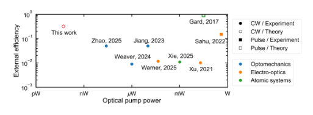
<figcaption class="paper-figure-caption"><b>Fig 3.</b> FIG. 4. Comparison of conversion efficiency versus pump power with the literature. References: Zhao, 2025 [13]; Weaver, 2024 [11]; Jiang, 2023 [9]; Warner, 2025 [7]; Xie, 2025 [20]; Xu, 2021 [5]; Gard, 2017 [32]; Sahu, 2022 [6].</figcaption>
</figure>
<figure class="paper-figure-card">
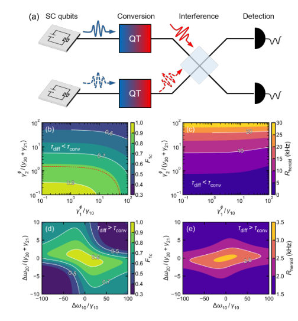
<figcaption class="paper-figure-caption"><b>Fig 4.</b> FIG. 3. Remote entanglement generation. (a) Microwave photons entangled with superconducting qubits (SC qubits) are converted into optical photons by quantum transducers (QTs) and injected into an interferometer, generating remote entanglement. (b) Fidelity and (c) heralding rate as functions of the pure-dephasing rates 𝛾𝜙 1 and 𝛾𝜙 2 for 𝜏diff &lt; 𝜏conv. The red dashed line indicates the contour 𝑃(A) coh /𝑃(A) tot = 0.5. (d) Fidelity and (e) heralding rate as functions of the detunings Δ𝜔10 and Δ𝜔20 for 𝜏diff &gt; 𝜏conv.</figcaption>
</figure>

**Summary.** This paper proposes a novel quantum transducer using a single color center in a diamond resonator to convert microwave signals to optical photons. By operating under strong coupling and at ultra-low pump powers, the device achieves high efficiency and enables remote entanglement generation. This work presents a promising, low-power solid-state route for building scalable quantum networks.

**Why it may be interesting.** This work directly addresses a critical hardware bottleneck—the quantum interface—for distributed quantum networks, providing concrete metrics (efficiency, rate, fidelity) for a solid-state platform.

Detailed structure

**Main problem.** The central challenge is developing an efficient, low-power microwave-to-optical quantum transducer for scalable, fault-tolerant quantum computation at cryogenic temperatures.

**Main result.** The proposed device demonstrates a viable pathway by achieving a coherent conversion efficiency of 0.32 at extremely low pump powers (55 pW), enabling remote entanglement generation at $\sim 1$ kHz with fidelity exceeding 0.9.

**Method.** The analysis uses theoretical modeling involving the steady-state approximation for coupled cavity modes and calculating the single-photon response via Taylor series expansion of the output photon flux.

**Model / system.** The system is a quantum transducer based on a single color center ($	ext{NV}^0$) embedded in a diamond optomechanical resonator, modeled by coupling three resonators: microwave, mechanical, and optical.

**Key observables.** Coherent conversion efficiency ($P_{coh}$), remote entanglement generation rate ($R_{herald}$), and entanglement fidelity ($F_{1c}$).

**Important parameters / regimes.** Operating at the triply resonant condition ($\omega_a = \omega_b = \omega_{10}$); low pump power ($\sim 55 	ext{ pW}$); and the comparison between spectral diffusion and conversion timescales ($	au_{diff}$ vs $	au_{conv}$).

**Assumptions / limitations.** The analysis assumes the drive frequency component is separable from the converted frequency component by a filter, and the single-photon response is obtained by linearizing the output flux calculation around zero input power.

**Figures summary.** Figures illustrate the mode coupling diagram and the schematic of the transduction process; Figure 2 shows the dependence of total and coherent photon flux on input power, and the impact of spectral diffusion rates on efficiency.

**Paper structure.** The paper first establishes the physical model and Hamiltonian, then derives the input-output relation, calculates the single-photon response by linearizing the output flux, and finally discusses the performance metrics like entanglement generation rate and fidelity, while addressing noise limitations from spectral diffusion.

Abstract

Scaling up superconducting quantum processors remains a central challenge for realizing fault-tolerant quantum computation. Although distributed architectures based on optical photons offer a promising route to scalability, they require an efficient microwave-to-optical quantum transducer that operates at cryogenic temperatures. Existing approaches typically rely on strong optical pumping, which induces undesirable heating and degrades single-photon coherence. Here, we propose a microwave-to-optical quantum transducer based on double-resonant scattering from a single color center embedded in a diamond optomechanical resonator. We show that strong coupling between the color center and the optical cavity enables coherent conversion at extremely low pump powers on the order of 10 pW. The proposed device enables remote entanglement generation on the order of 1 kHz with a fidelity exceeding 0.9, demonstrating a viable pathway toward ultra-low-power, high-efficiency quantum transducers based on individual solid-state defects for future distributed superconducting quantum networks.

[↑ back to top](#top)

### [Efficient quantum algorithm for linear matrix differential equations and applications to open quantum systems](http://arxiv.org/abs/2605.16195v1)

**Authors:** Sophia Simon, Dominic W. Berry, Rolando D. Somma  
**Type:** theory · **Category:** quantum information and computing · **PDF:** <https://arxiv.org/pdf/2605.16195v1>  
**Analysis basis:** full PDF text, analyzed in chunks
**Topic relevance:** `methods for driven-dissipative` **3/5** · `Keldysh / 2PI / non-Gaussian methods` **2/5** · `analog quantum simulation` **2/5** · `non-equilibrium dynamics` **2/5** · `Kondo & dissipative impurity` **1/5** · `correlated / nonlocal dissipation` **1/5** · `driven-dissipative phase transition` **1/5** · `entanglement & information structure` **1/5** · `non-equilibrium universality` **1/5**

↔ Scroll figures horizontally

<figure class="paper-figure-card">
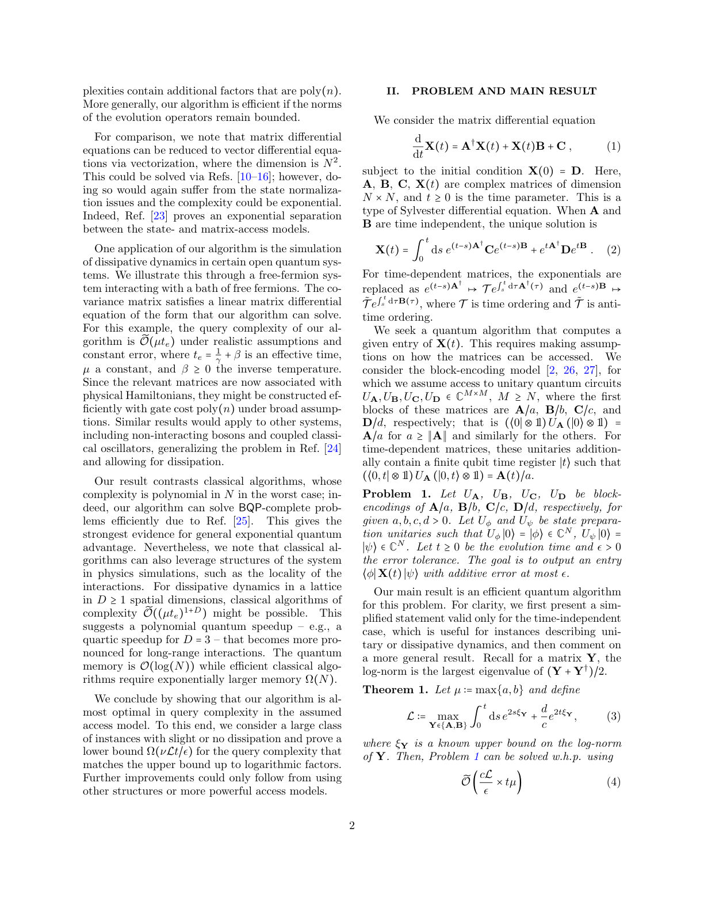
<figcaption class="paper-figure-caption"><b>Fig 1.</b> Low-resolution page preview, page 2</figcaption>
</figure>
<figure class="paper-figure-card">
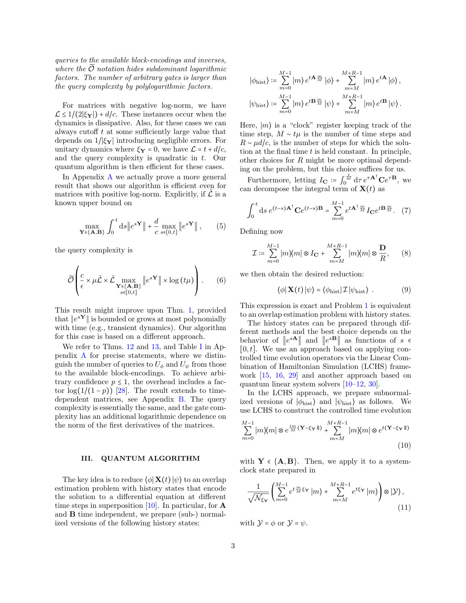
<figcaption class="paper-figure-caption"><b>Fig 2.</b> Low-resolution page preview, page 3</figcaption>
</figure>
<figure class="paper-figure-card">
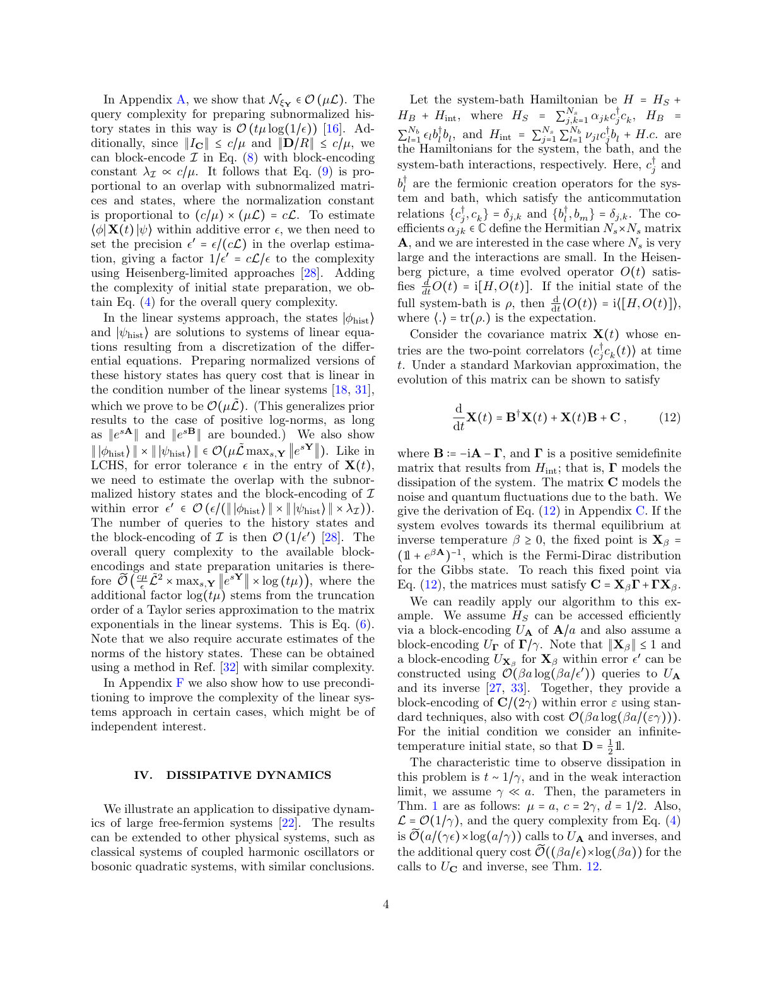
<figcaption class="paper-figure-caption"><b>Fig 3.</b> Low-resolution page preview, page 4</figcaption>
</figure>
<figure class="paper-figure-card">
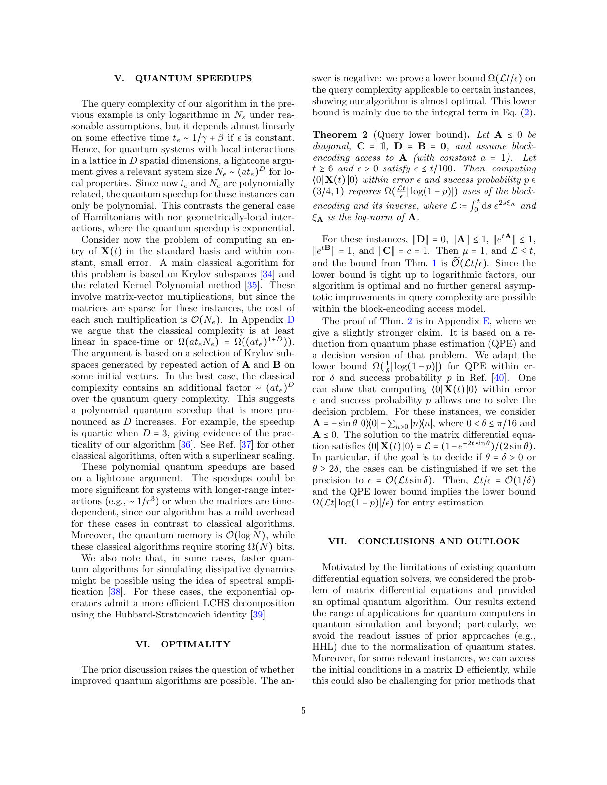
<figcaption class="paper-figure-caption"><b>Fig 4.</b> Low-resolution page preview, page 5</figcaption>
</figure>
<figure class="paper-figure-card">
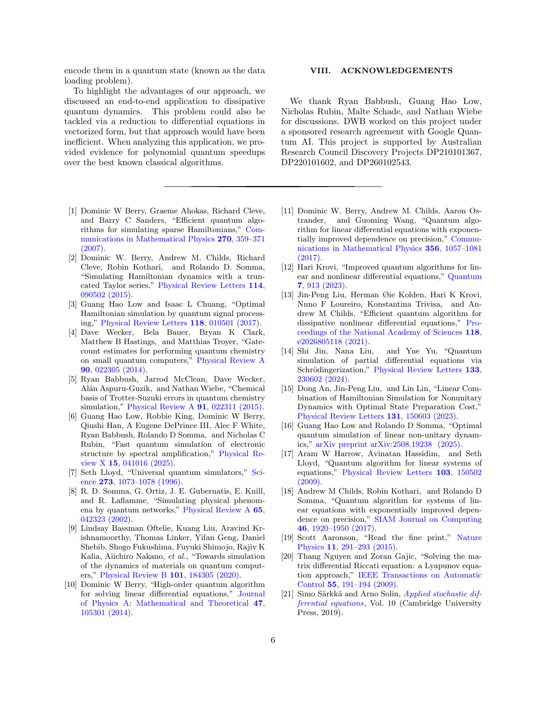
<figcaption class="paper-figure-caption"><b>Fig 5.</b> Low-resolution page preview, page 6</figcaption>
</figure>

**Summary.** This paper presents an efficient quantum algorithm for solving linear matrix differential equations, crucial for simulating open quantum systems. By reformulating the problem as an overlap estimation using history states, it achieves near-optimal query complexity. This advances the field by providing a scalable quantum tool for dynamics that previously suffered from exponential resource requirements.

**Why it may be interesting.** This work provides a concrete, quantum-algorithmic tool for simulating complex, time-dependent open quantum dynamics, directly impacting how quantum simulation algorithms are designed for realistic physical systems.

Detailed structure

**Main problem.** Developing an efficient, near-optimal quantum algorithm to compute matrix elements of the solution to linear matrix differential equations (LMDES).

**Main result.** The algorithm achieves a query complexity of $\widetilde{\mathcal{O}}(
u\mathcal{L} t/\epsilon)$, which is proven to be optimal up to logarithmic factors.

**Method.** The approach utilizes 'history states' and block-encoding techniques to reduce the differential equation solving problem to an overlap estimation problem, avoiding exponential normalization issues of prior methods.

**Model / system.** The core model is the LMDES, $rac{d}{dt}X(t) = A^\dagger X(t) + X(t)B + C$, which is applied to simulate open quantum systems, such as non-interacting fermions.

**Key observables.** The primary observable is the matrix element $\langle\phi|X(t)|\psi
angle$, representing the solution at time $t$.

**Important parameters / regimes.** The complexity depends on the time $t$, the desired precision $\epsilon$, and system-dependent constants $\mathcal{L}$ and $
u$.

**Assumptions / limitations.** The analysis relies on the block-encoding model and often employs the Markovian approximation when simulating open quantum systems.

**Figures summary.** The notes reference comparisons of query costs between the linear systems approach and the LCHS approach in Table II, and complexity scaling in various theorems.

**Paper structure.** The paper develops by first establishing the general framework for LMDES solving, contrasting it with prior methods, then applying it to specific physical models (like free fermions), and finally proving optimality via lower bounds derived from QPE.

Abstract

We present an efficient, nearly optimal quantum algorithm for solving linear matrix differential equations, with applications to the simulation of open quantum systems and beyond. For unitary or dissipative dynamics, the algorithm computes an entry of the solution matrix with query complexity $\widetilde{\mathcal{O}}(ν\mathcal{L} t/ε)$, where the constant $ν$ depends on the problem parameters, $\mathcal{L}$ involves a time integral of upper bounds on the norms of evolution operators, and $ε$ is the error. In particular, $ν\mathcal{L}$ is linear in $t$ for unitary dynamics and can be a constant for dissipative dynamics. Our result contrasts prior quantum approaches for differential equations that typically require exponential time for this problem due to the encoding in a quantum state, which can lead to exponentially small amplitudes. We demonstrate the utility of the algorithm through an end-to-end application, namely the simulation of dissipative dynamics for non-interacting fermions, which can be extended to other quantum and classical systems. We compare with classical algorithms and give evidence of polynomial quantum speedups for systems in a lattice, which become more pronounced for systems with long-range interactions and can be shown to be exponential in general. We also provide a lower bound of $Ω(ν\mathcal{L} t/ε)$ for unitary or dissipative dynamics that proves our algorithm is optimal up to logarithmic factors.

[↑ back to top](#top)

### [Event-based spatiotemporal networks for modelling emergent phenomena in complex systems](http://arxiv.org/abs/2605.15798v1)

**Authors:** Matthijs Romeijnders, Michiel van Boven, Francesco Corman, Carl D. Modes, Phillip Staniczencko, Debabrata Panja  
**Type:** theory · **Category:** disordered systems and neural networks · **PDF:** <https://arxiv.org/pdf/2605.15798v1>  
**Analysis basis:** full PDF text, analyzed in chunks
**Topic relevance:** `non-equilibrium dynamics` **3/5** · `analog quantum simulation` **2/5** · `driven-dissipative phase transition` **2/5** · `methods for driven-dissipative` **2/5** · `non-equilibrium universality` **2/5** · `Keldysh / 2PI / non-Gaussian methods` **1/5** · `correlated / nonlocal dissipation` **1/5** · `entanglement & information structure` **1/5**

↔ Scroll figures horizontally

<figure class="paper-figure-card">
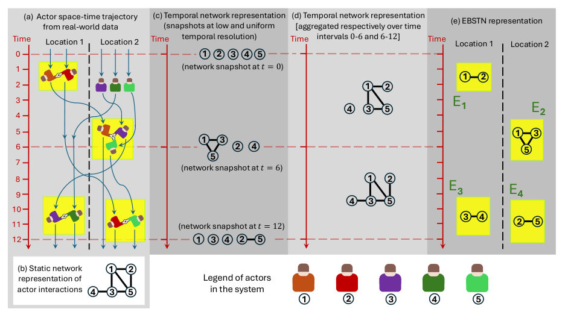
<figcaption class="paper-figure-caption"><b>Fig 1.</b> Figure 1: From real-world data to network representations. Panel (a): Actor dynamics in a schematic real-world system (see legend of actors in colour and alphanumeric codes). Yellow rectangles denote locations, timings and durations of actor interactions: the top and the bottom boundaries of every rectangle respectively denote the starting and the ending time of actor interactions. Shown in panel (b) is a static network representation of it is obtained when space and time are both abstracted away; it loses all information on the times, locations, sequence and durations of actor interactions. In panel (c) we show a version of temporal network formed in multiple layers, each layer corresponds...</figcaption>
</figure>
<figure class="paper-figure-card">
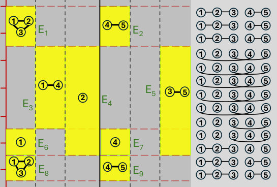
<figcaption class="paper-figure-caption"><b>Fig 2.</b> Figure 2: Comparison between EBSTN and the current best, TN, for the infectious disease epidemiology example. Mixing on a day amongst the family members of two different families in the model (a total of five actors), The families reside in two different municipalities. (a) The event-based-spatio-temporal network (EBSTN): events are shown in the same scheme as Fig. 1(e). By construction, the EBSTN leads to the fragmentation of the full network of actors in terms of fully connected components, which is not the case for the corresponding temporal network (TN) — formed by taking snapshots at 30 minutes past the hour at hourly interval in panel (b) in the same scheme as 1(c) — resulting in...</figcaption>
</figure>
<figure class="paper-figure-card">

<figcaption class="paper-figure-caption"><b>Fig 3.</b> Figure 3: Simulations of the early stages of an outbreak of a novel pathogen that is introduced in working adults in selected Dutch municipalities. The model includes ∼170,000 actors, who are categorised into 11 demographic groups and assigned to 355 municipalities of residence. Actors’ movements are tracked on an hourly resolution, obeying day-night and weekday-weekend mobility rhythms, and they mixed within municipality-specific settings such as workplaces, homes, and schools (see Methods). Panels (a) and (b) show the cumulative number of pathogen transmissions at day 7, 12, and 17 post introduction for a central [Heemstede, panel (a)] and a remote [Oldambt, panel (b)] municipality. The...</figcaption>
</figure>
<figure class="paper-figure-card">
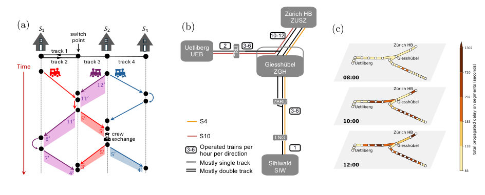
<figcaption class="paper-figure-caption"><b>Fig 4.</b> Figure 4: Modelling of public transport system, specifically railway operations. (a) An illustrative situation with periodic services (see main text) reported as time-distance diagram. A single track is available between the switch point and station S2, and between stations S2 and S3 in Fig. 4(a); once a train enters such a section, no other train can enter it until the occupying train exits. In Fig. 4(a), the scheduled (periodic) services — and executed ones if there are no delays — are shown by dark-coloured arrows, while the correspondingly lighter shaded trapezoids indicate the evolution of resulting delays in minutes, in an operational setting, when an example initial delay is...</figcaption>
</figure>
<figure class="paper-figure-card">
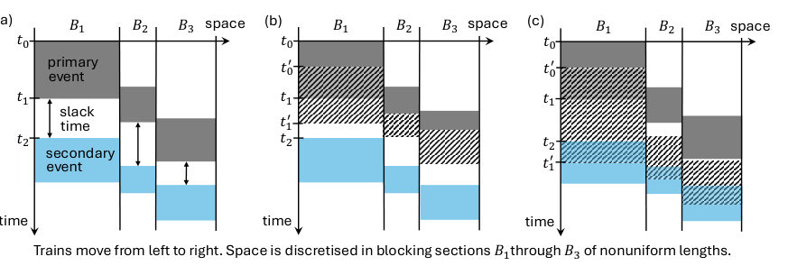
<figcaption class="paper-figure-caption"><b>Fig 5.</b> Figure 5: Space-time diagram showing delay propagation on infrastructure (to avoid cluttering the figure, event start and end times are marked only for blocking section B1). (a) The schedule for two different services – preceding (gray) and following (blue) – travelling through three sequential blocking sections of different lengths B1 →B2 →B3 on an infrastructure link. The event that the preceding (resp. following) service keeps a blocking section occupied we call the primary (resp. secondary) event. Each event — i.e., running of a service in a blocking section — requires train unit(s) and crew, i.e., an assembly of these actors of the system (see Fig. SI.1). The duration of the primary...</figcaption>
</figure>

**Summary.** This paper introduces Event-based Spatiotemporal Networks (EBSTNs) as a superior computational framework for modeling complex systems. By encoding system dynamics as discrete, spatio-temporally anchored events, it overcomes limitations in traditional methods that fail to capture micro-scale heterogeneity. The framework is successfully applied to model epidemic spread and delay propagation in public transport, demonstrating its versatility across diverse physical domains.

**Why it may be interesting.** While the application is in complex systems modeling, the focus on capturing fine-grained, non-equilibrium dynamics and emergent behavior from local interactions shares conceptual overlap with modeling non-equilibrium quantum many-body systems or open quantum systems where local interactions drive global behavior.

Detailed structure

**Main problem.** Modeling emergent phenomena in complex systems where macroscopic dynamics arise from fine-grained, heterogeneous micro-level processes across space and time.

**Main result.** Event-based spatiotemporal networks (EBSTNs) provide a unified, flexible, and computationally efficient framework to model such emergent behavior.

**Method.** The framework encodes system processes as discrete events anchored in space and time, contrasting with coarse-graining or fixed-time-step network approaches.

**Model / system.** The model is the Event-based Spatiotemporal Network (EBSTN), which captures four types of information per event: location, timing, involved actors, and duration. It is applied to real-world systems like pathogen spread and public transport delays.

**Key observables.** Cumulative pathogen transmissions, normalized entropy of infectious actors, and propagated delays in public transport services.

**Important parameters / regimes.** Pathogen transmission rate (beta), latent/infectious periods, and network parameters like scheduled slack time and exogenous delay distributions.

**Assumptions / limitations.** The primary assumption is that the system's dynamics are best captured by tracking discrete, causal events rather than assuming uniform mixing or fixed spatial/temporal resolutions.

**Figures summary.** Figures illustrate the construction of EBSTNs from real-world trajectories, show pathogen spread simulations in Dutch municipalities, and map delay propagation across a railway network using space-time diagrams.

**Paper structure.** The paper introduces the EBSTN framework by contrasting it with limitations in traditional network models (TNs, ABMs). It then demonstrates its efficacy through two major case studies: infectious disease epidemiology in the Netherlands and delay propagation in the Zürich S-bahn system, concluding with broader applicability discussions.

Abstract

Complex systems display emergent phenomena that vary significantly across spatial and temporal scales. These variations originate from fine-grained system processes, yet arriving at macroscopic dynamics from micro-level data -- particularly when large, high-resolution datasets are available -- remains a persistent challenge. Here we develop event-based spatiotemporal networks, a computational modelling framework that encodes system processes as discrete events anchored in space and time. Event-based spatiotemporal networks offer a unified, flexible and efficient approach to generate emergent behaviour in complex systems across space and time from these events. We demonstrate the effectiveness of event-based spatiotemporal networks through two illustrative real-world applications. First, following a local outbreak of a novel respiratory pathogen in the Netherlands, spatiotemporal networks enable fine-grained tracking of transmission routes and infection patterns through space and time. Second, we use spatiotemporal networks to model propagation of delays in a public transportation system (S-bahn) around Zürich, Switzerland. We also discuss broader uses of event-based spatiotemporal networks in fields like developmental biology and community ecology, where focusing on events rather than static system states can improve data analysis, simulation, and collection strategies.

[↑ back to top](#top)

### [Quantum mechanics for classical transport equations](http://arxiv.org/abs/2605.15969v1)

**Authors:** Christof Wetterich  
**Type:** theory · **Category:** statistical mechanics · **PDF:** <https://arxiv.org/pdf/2605.15969v1>  
**Analysis basis:** full PDF text, analyzed in chunks
**Topic relevance:** `Keldysh / 2PI / non-Gaussian methods` **3/5** · `methods for driven-dissipative` **2/5** · `non-equilibrium dynamics` **2/5** · `analog quantum simulation` **1/5** · `correlated / nonlocal dissipation` **1/5** · `driven-dissipative phase transition` **1/5** · `entanglement & information structure` **1/5** · `interference shaping light` **1/5** · `non-equilibrium universality` **1/5**

↔ Scroll figures horizontally

<figure class="paper-figure-card">
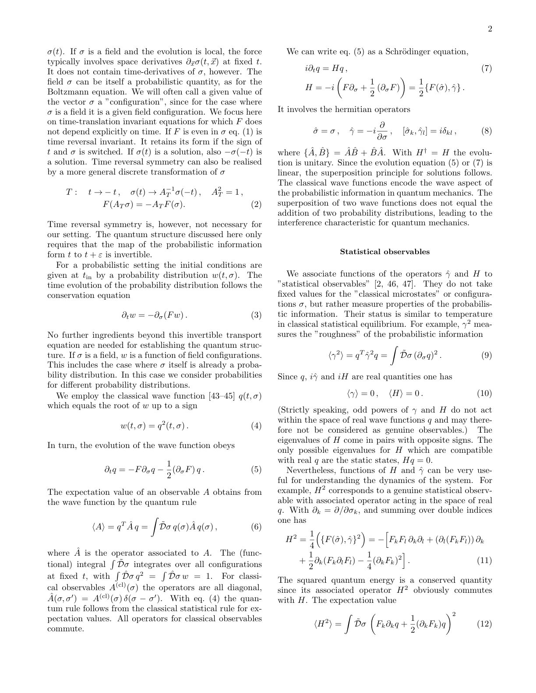
<figcaption class="paper-figure-caption"><b>Fig 1.</b> Low-resolution page preview, page 2</figcaption>
</figure>
<figure class="paper-figure-card">
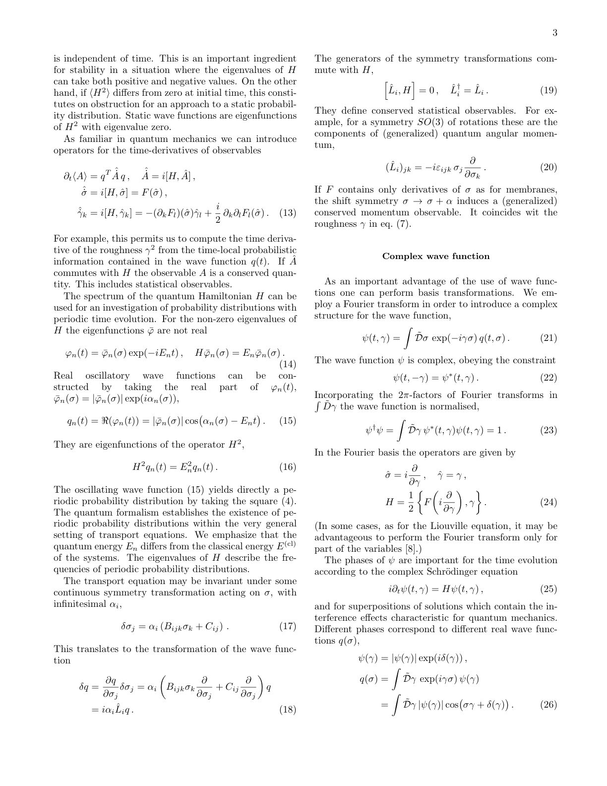
<figcaption class="paper-figure-caption"><b>Fig 2.</b> Low-resolution page preview, page 3</figcaption>
</figure>
<figure class="paper-figure-card">
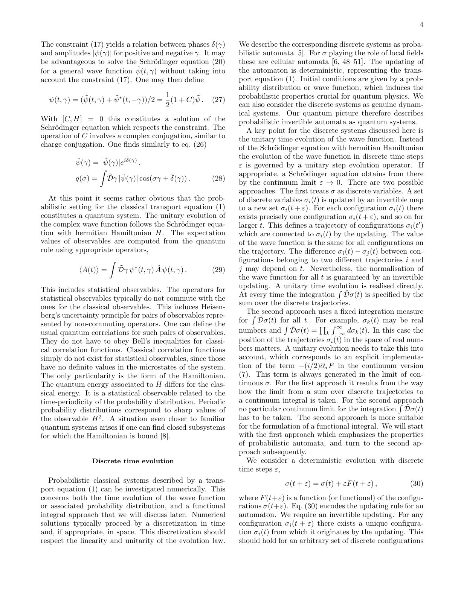
<figcaption class="paper-figure-caption"><b>Fig 3.</b> Low-resolution page preview, page 4</figcaption>
</figure>
<figure class="paper-figure-card">
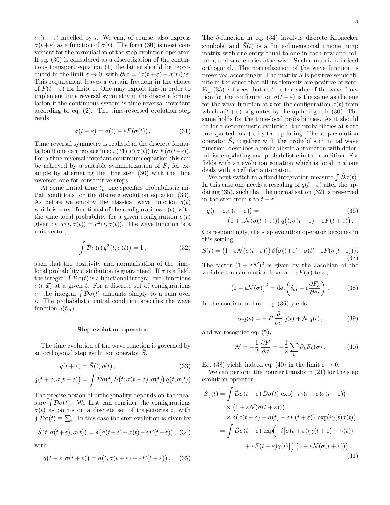
<figcaption class="paper-figure-caption"><b>Fig 4.</b> Low-resolution page preview, page 5</figcaption>
</figure>
<figure class="paper-figure-card">
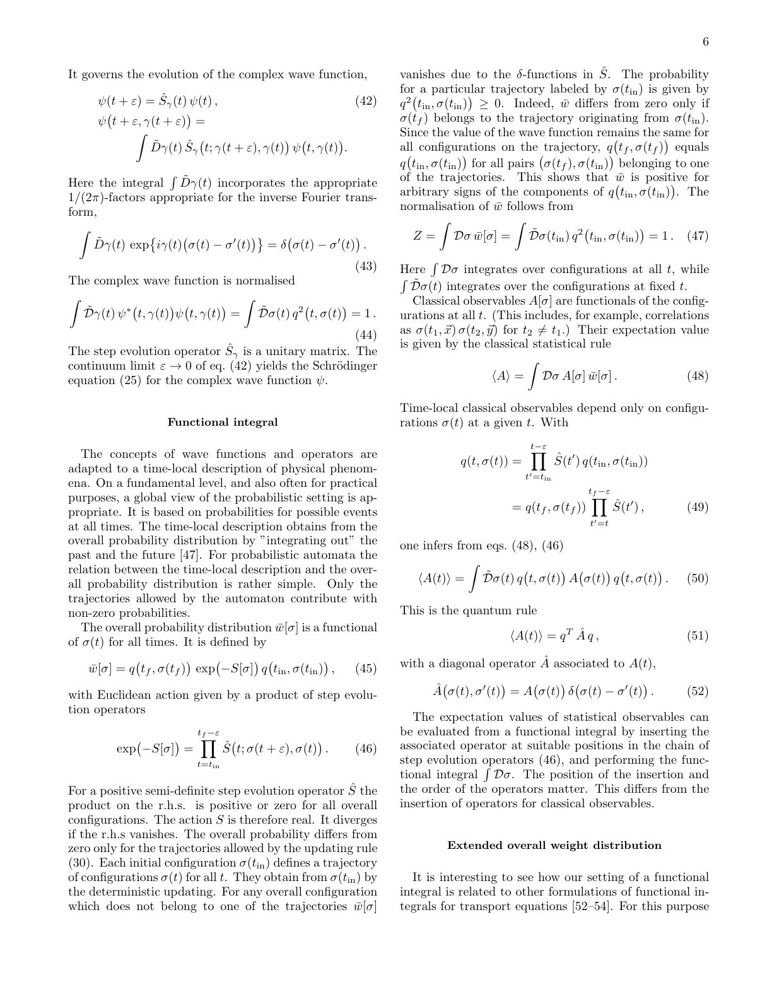
<figcaption class="paper-figure-caption"><b>Fig 5.</b> Low-resolution page preview, page 6</figcaption>
</figure>

**Summary.** This work establishes a formal quantum mechanical description for classical transport equations governed by probabilistic initial conditions. By mapping the probabilistic evolution onto a complex wave function, the authors show that quantum features, such as interference and non-commuting observables, naturally emerge. This provides a powerful theoretical tool for analyzing complex classical stochastic processes through a quantum lens.

**Why it may be interesting.** It provides a formal, non-standard framework for how quantum mechanical principles (like non-commutativity and interference) can manifest within purely classical, probabilistic dynamical systems, which is relevant for understanding open quantum systems.

Detailed structure

**Main problem.** The paper investigates the formal connection between classical transport equations with probabilistic initial conditions and the principles of quantum mechanics.

**Main result.** It demonstrates that the quantum formalism can be constructed for these classical probabilistic systems, allowing quantum features like superposition and interference to emerge naturally.

**Method.** The authors construct a complex functional integral and derive a Schrödinger-like equation for the time-local probabilistic information encoded in a classical wave function.

**Model / system.** The model involves classical transport equations, which are treated as probabilistic automata in a discrete setting. The quantum description utilizes a complex wave function $\psi(t, \gamma)$ evolving unitarily.

**Key observables.** Expectation values of observables $\langle A 
angle$, quantum energy $E_n$, and conserved quantities derived from symmetry generators.

**Important parameters / regimes.** The difference between quantum energy $E_n$ and classical energy $E_{cl}$ is a key diagnostic.

**Assumptions / limitations.** The approach assumes the existence of an invertible transport equation mapping $t 	o t+\epsilon$ and relies on constructing an extended weight distribution $	ilde{w}[\sigma, \gamma]$.

**Paper structure.** The paper progresses from viewing classical transport equations as quantum systems, deriving the Schrödinger equation for the wave function, establishing the role of non-commuting statistical observables, and finally developing the extended weight distribution to unify classical and quantum information.

Abstract

Classical transport equations with probabilistic initial conditions can be viewed as quantum systems.   In a discrete version they are probabilistic automata. The time-local probabilistic information is encoded in a classical wave function.   Its unitary evolution obeys a Schrödinger equation.   Statistical observables are represented by operators which do not commute with the ones associated to classical observables.   Examples are functions of the quantum energy or the quantum angular momentum. They are important conserved quantities.   We construct a complex functional integral for the quantum system which describes the probabilistic classical transport equation.   The characteristic features of quantum mechanics, as the superposition of wave functions, interference, the importance of phases,   non-commuting operators or a unitary time evolution, are realized by probabilistic classical transport equations.

[↑ back to top](#top)

### [Stochastic Safety Limits and Scale-Dependent Power Fluctuations in Nuclear Reactors: A Critical Scaling Approach](http://arxiv.org/abs/2605.15283v1)

**Authors:** V. V. Ryazanov  
**Type:** theory · **Category:** disordered systems and neural networks · **PDF:** <https://arxiv.org/pdf/2605.15283v1>  
**Analysis basis:** full PDF text, analyzed in chunks
**Topic relevance:** `non-equilibrium dynamics` **3/5** · `non-equilibrium universality` **3/5** · `Keldysh / 2PI / non-Gaussian methods` **2/5** · `methods for driven-dissipative` **2/5** · `correlated / nonlocal dissipation` **1/5** · `driven-dissipative phase transition` **1/5**

↔ Scroll figures horizontally

<figure class="paper-figure-card">
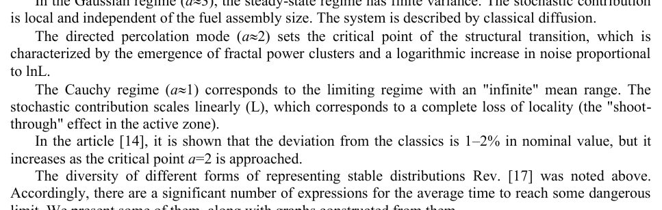
<figcaption class="paper-figure-caption"><b>Fig 1.</b> Fig. 1 shows the dependence of the average time to reach &lt;T&gt;(a)=T(a) the level Φ, calculated using formula (22) with =1.</figcaption>
</figure>
<figure class="paper-figure-card">
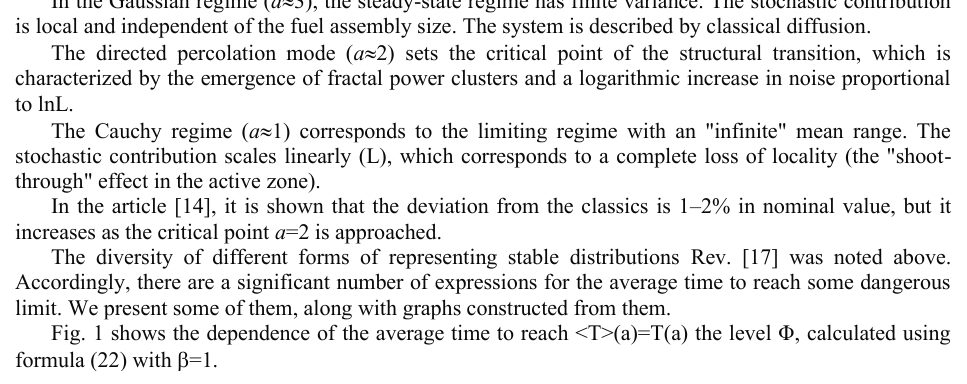
<figcaption class="paper-figure-caption"><b>Fig 2.</b> Fig. 1. Dependence of the average time to reach &lt;T&gt;(a)=T(a) the level Φ= P/P0=0.1, for form (A) Rev. [17], calculated using formula (22).</figcaption>
</figure>
<figure class="paper-figure-card">
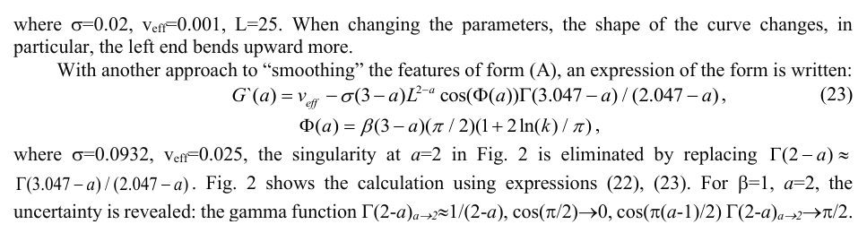
<figcaption class="paper-figure-caption"><b>Fig 3.</b> Fig. 2. Dependence of the average time to reach &lt;T&gt;(a)=T(a) the level Φ= P/P0=0.1, for form (A) Rev. [17], calculated using formula (22)-(23) at =0.0932, veff=0.025, =1.</figcaption>
</figure>
<figure class="paper-figure-card">
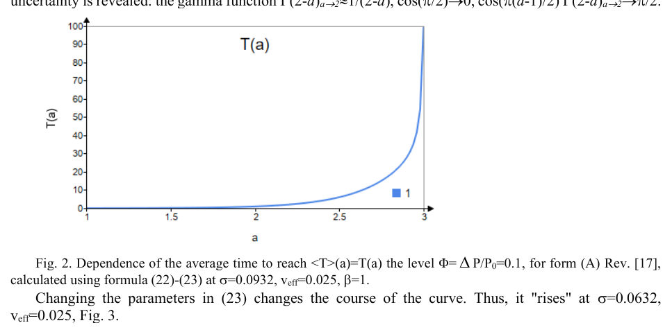
<figcaption class="paper-figure-caption"><b>Fig 4.</b> Fig. 3. Dependence of the average time to reach &lt;T&gt;(a)=T(a) the level Φ= P P/P0=0.1, for form (A) Rev. [17], calculated using formula (22)-(23) at =0.0632, veff=0.025, =1.</figcaption>
</figure>
<figure class="paper-figure-card">
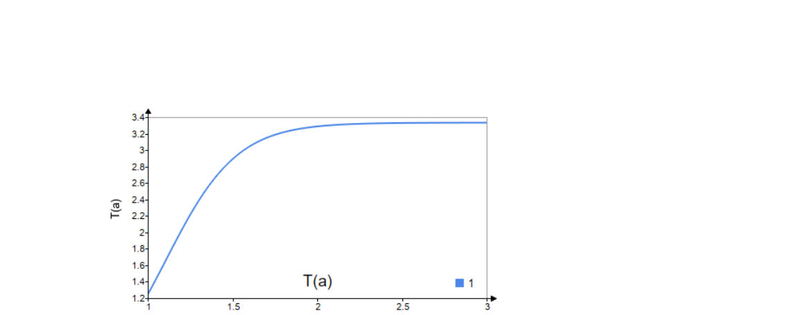
<figcaption class="paper-figure-caption"><b>Fig 5.</b> Fig. 4. Dependence of the average time to reach &lt;T&gt;(a)=T(a) the level Φ= P P/P0=0.1, for form (E) Rev. [17], calculated using formula (22), (24) at =0.002, veff=0.03, =1.</figcaption>
</figure>

**Summary.** This theoretical work applies advanced stochastic process theory, specifically using boundary functionals and Lévy statistics, to assess safety risks in nuclear reactors. It demonstrates that under certain conditions, neutron fluctuations exhibit heavy-tailed power-law behavior characteristic of Directed Percolation rather than simple Gaussian diffusion. This implies that standard safety estimates may underestimate the risk of rapid, localized power surges.

**Why it may be interesting.** The mathematical framework of Lévy flights and Directed Percolation, used here to model classical engineering safety, provides a powerful analogy for understanding non-equilibrium dynamics and anomalous transport in complex quantum or condensed matter systems.

Detailed structure

**Main problem.** The paper analyzes stochastic safety limits and scale-dependent power fluctuations in nuclear reactors by modeling the neutron population as a random process.

**Main result.** The system's risk profile is critically dependent on the statistical regime, transitioning from classical Gaussian diffusion to Directed Percolation (DP) when fluctuations exhibit heavy tails, especially at the mesoscale (fuel assembly size).

**Method.** The analysis employs boundary functionals and the Lundberg equation, connecting the process to Lévy-stable distributions via the characteristic function.

**Model / system.** The physical system is a nuclear reactor core, modeled by the stochastic evolution of neutron flux ($\Phi(t)$). The underlying stochastic process is characterized by the distribution of 'effective progenies' ($P(k) \sim k^{-a}$), which dictates the system's statistical behavior.

**Key observables.** First-passage time ($T_{FPT}$), power peaks, catastrophic power surges, and the scaling exponent $a$ of the power-law distribution.

**Important parameters / regimes.** Stability index ($\alpha$), power-law exponent ($a$), system size ($L$), and the asymmetry parameter ($eta$).

**Assumptions / limitations.** The analysis assumes the applicability of Lévy-stable process theory and models the transition between different stochastic regimes based on the divergence of higher moments.

**Figures summary.** The notes reference tables comparing safety time $\langle T 
angle$ across different asymmetry ($eta$) and scaling ($a$) regimes, showing significant reductions in safety margin when $eta=1$ and $1 < a < 2$.

**Paper structure.** The paper builds from general boundary functional theory to specific applications in reactor physics, contrasting Gaussian (classical) behavior with Lévy-DP regimes, and finally quantifying the impact of asymmetry ($eta$) and finite size ($L$) on the mean time to failure.

Abstract

Applying boundary functionals of random risk processes to various physical problems makes it possible to determine many important characteristics of these problems. For example, a special case of boundary functionals is the time to first reach a level, which is widely and successfully applied to a variety of problems. We consider the application of boundary functionals to solving nuclear safety problems. In situations such as reactor startup, as well as for certain types of reactors, neutron behavior changes. Neutron clustering begins to play an important role, and the distributions characterizing neutron behavior change. The normal Gaussian distribution is replaced by stable limiting, distributions to which the sums of random variables converge. Boundary functionals allow us to accurately calculate the statistics of random events, determine the behavior of reactor power peaks, the probabilities of catastrophic power surges, and other quantities important for reactor safety, providing a mathematical bridge between the abstract theory of directed percolation and engineering calculations of protection parameters. This article examines the first-passage time to reach a certain level.

[↑ back to top](#top)

### [Anomalous Transport from Effective Field Theory](http://arxiv.org/abs/2605.15968v1)

**Authors:** Rémy Larue, Amaury Marchon, Jérémie Quevillon, Diego Saviot  
**Type:** theory · **Category:** statistical mechanics · **PDF:** <https://arxiv.org/pdf/2605.15968v1>  
**Analysis basis:** full PDF text, analyzed in chunks
**Topic relevance:** `Keldysh / 2PI / non-Gaussian methods` **3/5** · `non-equilibrium dynamics` **3/5** · `methods for driven-dissipative` **2/5** · `analog quantum simulation` **1/5** · `driven-dissipative phase transition` **1/5** · `non-equilibrium universality` **1/5**

↔ Scroll figures horizontally

<figure class="paper-figure-card">
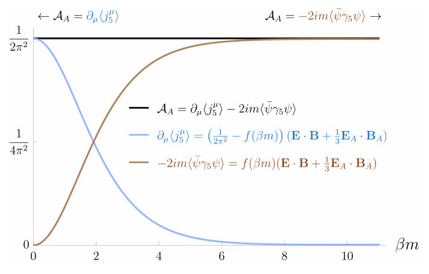
<figcaption class="paper-figure-caption"><b>Fig 1.</b> Figure 1. Consistent axial anomaly (black) and its repartition between the divergence of the axial current (blue) and the mass explicit breaking (brown).</figcaption>
</figure>

**Summary.** This work provides a rigorous, systematic calculation of anomalous transport effects in a fermionic system at finite temperature. By using an Effective Field Theory approach, the authors derive master formulae for the vector and axial currents and their anomalies. The key finding is that physical transport currents are generally not simply determined by the topological Chern-Simons terms, especially when mass corrections are included.

**Why it may be interesting.** While focused on high-energy QFT, the systematic use of EFT and the study of non-equilibrium transport coefficients (like anomalous currents) provide rigorous theoretical tools applicable to understanding thermalization and transport in strongly interacting quantum systems, which has parallels with non-equilibrium statistical mechanics.

Detailed structure

**Main problem.** The paper systematically studies chiral effects and anomalous transport phenomena in a fermionic system at finite temperature using an Effective Field Theory (EFT) framework.

**Main result.** The physical currents and anomalies are found to be complex, generally not reducible to simple Chern-Simons terms, and their calculation requires careful handling of regularization schemes, especially when considering finite mass corrections.

**Method.** The analysis employs the path-integral formalism, utilizing the Covariant Derivative Expansion (CDE) in imaginary time, and involves advanced techniques like Mellin transformations and dimensional regularization.

**Model / system.** The system is a fermion fluid described by a path integral coupled to background vector and axial gauge fields at finite temperature (T) and potentially finite mass (m).

**Key observables.** Vector and axial currents ($\langle j^V 
angle, \langle j^A 
angle$), and their associated chiral anomalies ($\mathcal{A}_V, \mathcal{A}_A$).

**Important parameters / regimes.** Finite temperature (T), fermion mass (m), and background gauge fields (V, A). The analysis explores limits like $T \gg m$ and $m/T 	o \infty$.

**Assumptions / limitations.** The analysis relies on the EFT framework, assumes the background fields are slowly varying, and often compares results derived from consistent versus covariant anomaly definitions.

**Figures summary.** Figures illustrate the dependence of currents and anomalies on the ratio $m/T$, showing how the physical currents deviate from simple Chern-Simons forms unless the mass is very large.

**Paper structure.** The paper progresses by first establishing the EFT framework and anomalous Ward identities, then calculating the effective actions and currents in the massless limit, and finally incorporating mass corrections and comparing the results to known topological forms.

Abstract

A systematic study of chiral effects is presented using an Effective Field Theory framework. By integrating out a massive Dirac fermion at finite temperature in presence of vector and axial background fields, the currents and their anomalies are computed from the path-integral. Chiral effects previously considered separately naturally arise in a unified computation, including new mass corrections. The link between each anomalous transport effect and the anomalies is clearly established, beyond the identification of their coefficients. In particular, we can appreciate how these effects are sourced by the anomalous nature of the theory even in configurations where the anomaly itself vanishes. The consistent and covariant anomalies are both encapsulated in master formulae for the currents which result from a careful treatment of the regularisation. It is finally found that, at finite temperature, the physical currents cannot be inferred simply from the Chern-Simons terms whose divergence reproduce the chiral anomalies.

[↑ back to top](#top)

### [The Directed Abelian Sandpile Model on Cylinders](http://arxiv.org/abs/2605.15914v1)

**Authors:** Abdul Quadir, Nikita Kalinin, Ram Ramaswamy  
**Type:** theory · **Category:** statistical mechanics · **PDF:** <https://arxiv.org/pdf/2605.15914v1>  
**Analysis basis:** full PDF text, analyzed in chunks
**Topic relevance:** `driven-dissipative phase transition` **3/5** · `non-equilibrium dynamics` **3/5** · `non-equilibrium universality` **3/5** · `methods for driven-dissipative` **2/5**

↔ Scroll figures horizontally

<figure class="paper-figure-card">
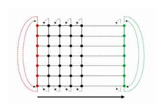
<figcaption class="paper-figure-caption"><b>Fig 1.</b> FIG. 1. Directed cylindrical sandpile of size n × L. Sites are periodic in the transverse (y) direction. Each toppling sends one grain to (x + 1, y) and one to (x, y ± 1). Grains leaving at x = n + 1 are absorbed at the sink, s (not shown). The red and green color sites show the driven and dissipation site respectively.</figcaption>
</figure>
<figure class="paper-figure-card">
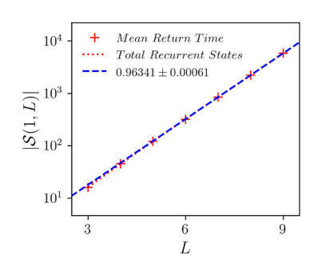
<figcaption class="paper-figure-caption"><b>Fig 2.</b> FIG. 2. Exponential growth of the mean return time (equiva- lently, the number of recurrent configurations) with the trans- verse width L for n = 1. The dashed line shows the exponen- tial fit |S(1, L)| ∼eb1L, where the fitted exponent is close to the theoretical value b1 = log(r+) = 0.96242.</figcaption>
</figure>

**Summary.** This work provides a rigorous mathematical characterization of the Directed Abelian Sandpile Model on a cylinder by identifying its sandpile group using the Laplacian matrix. The authors show that the group's algebraic structure dictates both the deterministic periodicity and the statistical nature of the system's evolution. This bridges abstract algebra with non-equilibrium statistical physics.

**Why it may be interesting.** The deep connection established between the algebraic invariants (sandpile group) and the non-equilibrium dynamics (periodicity/fluctuations) provides a powerful mathematical framework applicable to other driven, dissipative lattice models relevant in non-equilibrium statistical mechanics.

Detailed structure

**Main problem.** The paper investigates the algebraic structure and dynamic behavior of the Directed Abelian Sandpile Model (DASM) on a cylindrical lattice.

**Main result.** The sandpile group structure is determined by the co-kernel of the reduced directed Laplacian, and this algebraic structure governs both the deterministic periodicity and the stochastic fluctuations of the system.

**Method.** The analysis relies heavily on algebraic graph theory, specifically identifying the sandpile group using the Smith normal form of the Laplacian matrix, and applying spectral analysis to determine group invariants.

**Model / system.** The system is the Directed Abelian Sandpile Model (DASM) defined on a 2D lattice shaped as a cylinder, featuring periodic boundary conditions in one transverse direction and dissipation at a boundary sink.

**Key observables.** The size of the sandpile group $|S(n, L)|$, the period of deterministic driving, and the structure of the cyclic decomposition of the group.

**Important parameters / regimes.** The lattice dimensions ($n 	imes L$), the parity of the transverse width $L$, and the driving mechanism (fixed vs. random).

**Assumptions / limitations.** The analysis focuses on the cylindrical geometry, although the results suggest extensions to more general directed graphs.

**Figures summary.** Figure 1 illustrates the directed cylindrical sandpile setup. Figure 2 shows the exponential growth of the mean return time for the $n=1$ case, confirming theoretical predictions.

**Paper structure.** The paper proceeds by defining the model and identifying the sandpile group via the Laplacian. It then uses algebraic techniques (Smith normal form) to characterize the group structure, linking this structure to the periodicity of deterministic driving and the random walk dynamics.

Abstract

We study the abelian sandpile model in two dimensions on a directed cylindrical lattice with periodic transverse boundary conditions in the transverse direction and dissipation at one boundary. Recurrent configurations form a finite abelian group, and repeated grain addition at a specific site generates deterministic dynamics on this group. Using Dhar's formulation, the sandpile group is identified with the co-kernel of the reduced directed Laplacian. We show that the group structure admits an exact reduction to a transverse problem, allowing complete determination of its cyclic decomposition. Our results establish a direct connection between the algebraic structure of the sandpile group and the periodicity of the driven dynamics, establishing the manner in which the underlying algebraic structure governs both deterministic and stochastic evolution in directed sandpile.

[↑ back to top](#top)

### [Beyond Maxwell-Boltzmann: Transport in Quasiequilibrium Plasmas](http://arxiv.org/abs/2605.16149v1)

**Authors:** Kamel Ourabah  
**Type:** theory · **Category:** statistical mechanics · **PDF:** <https://arxiv.org/pdf/2605.16149v1>  
**Analysis basis:** full PDF text, analyzed in chunks
**Topic relevance:** `non-equilibrium dynamics` **3/5** · `non-equilibrium universality` **3/5** · `Keldysh / 2PI / non-Gaussian methods` **2/5** · `methods for driven-dissipative` **2/5**

↔ Scroll figures horizontally

<figure class="paper-figure-card">
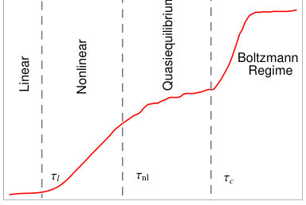
<figcaption class="paper-figure-caption"><b>Fig 1.</b> Figure 1. The system undergoes four successive stages: an initial linear regime, a nonlinear phase (often referred to as violent relaxation), a long-lived quasiequilibrium state, and fi- nally a collisional thermal equilibrium. The quasiequilibrium phase is characterized by a slow increase in coarse-grained entropy and can be effectively described within superstatis- tics. The final state, corresponding to maximal entropy, is governed by standard MB statistics.</figcaption>
</figure>
<figure class="paper-figure-card">
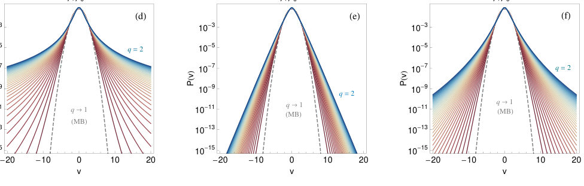
<figcaption class="paper-figure-caption"><b>Fig 2.</b> Figure 2. The top panels show the three universality classes f(β): (a) χ2, (b) inverse χ2, and (c) log-normal. The bottom panels display the corresponding velocity distributions. All distributions are parametrized by q := ⟨β2⟩/β2 0. In the limit q →1, f(β) collapses to a Dirac delta function, and the associated velocity distribution reduces to the Maxwellian distribution.</figcaption>
</figure>
<figure class="paper-figure-card">
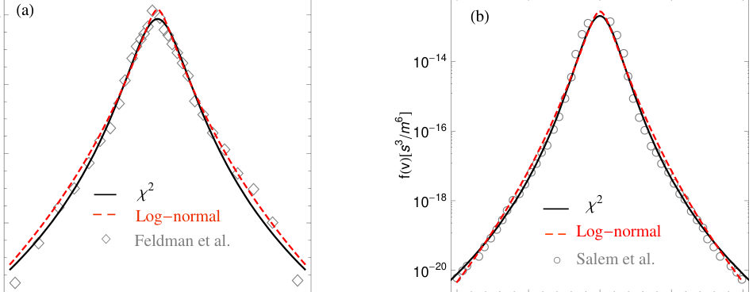
<figcaption class="paper-figure-caption"><b>Fig 3.</b> Figure 3. Electron velocity distribution functions in the solar wind: (a) data from Feldman et al. [72] and (b) data from Salem et al. [73], together with the best fits obtained from the χ2 class (solid black line) and the log-normal class (dashed red line). The corresponding fitted parameters are given in the text.</figcaption>
</figure>
<figure class="paper-figure-card">
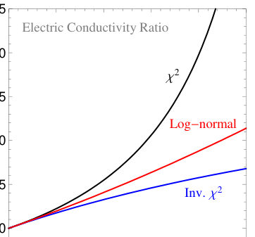
<figcaption class="paper-figure-caption"><b>Fig 4.</b> Figure 4. Electric conductivity ratio σ(q)/σ as a function of q := ⟨β2⟩/β2 0 for the three universality classes of superstatis- tics.</figcaption>
</figure>
<figure class="paper-figure-card">
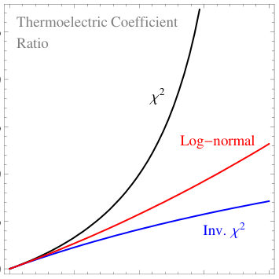
<figcaption class="paper-figure-caption"><b>Fig 5.</b> Figure 5. Thermoelectric coefficient ratio α(q)/α as a function of q for the three universality classes of superstatistics.</figcaption>
</figure>

**Summary.** This work develops a theoretical framework using superstatistics to model transport in non-Maxwellian plasmas found in space environments. It derives explicit functional forms showing that these non-equilibrium fluctuations systematically enhance key transport coefficients like conductivity and viscosity compared to classical predictions. The findings provide a quantitative tool for understanding energy and momentum transport in complex, non-equilibrium astrophysical plasmas.

**Why it may be interesting.** While focused on classical plasma physics, the mathematical machinery of superstatistics and non-equilibrium statistical mechanics is highly relevant to understanding complex, non-Gaussian dynamics in open quantum systems or many-body systems far from equilibrium.

Detailed structure

**Main problem.** The paper addresses the challenge of modeling plasma transport in quasiequilibrium states where particle velocity distributions deviate significantly from the standard Maxwell-Boltzmann form.

**Main result.** Superstatistical fluctuations systematically enhance all calculated transport coefficients (conductivity, diffusion, viscosity) compared to their Maxwellian counterparts, with the enhancement quantified across three major universality classes.

**Method.** The analysis employs linear response theory applied to the Boltzmann equation, utilizing the superstatistical framework to average over local equilibrium statistics.

**Model / system.** The system is a plasma (e.g., solar wind) assumed to be in a quasiequilibrium state, described statistically as a continuous superposition of local Maxwellian distributions weighted by a distribution function f(beta).

**Key observables.** Electric and thermal conductivities, mobility, diffusion coefficient, shear viscosity, and bulk viscosity coefficients.

**Important parameters / regimes.** The superstatistical parameter $q = \langleeta^2
angle/eta_0^2$, which quantifies the deviation from equilibrium ($q=1$ for MB).

**Assumptions / limitations.** The plasma is assumed to be in a quasiequilibrium state, and the analysis is performed within the linear response regime.

**Figures summary.** Figures illustrate the evolution stages of plasma dynamics, compare the three superstatistical distributions ($\chi^2$, Log-normal, Inv. $\chi^2$) to solar wind data, and plot the normalized ratios of transport coefficients (e.g., $D(q)/D$, $\sigma(q)/\sigma$) versus the fluctuation parameter $q$.

**Paper structure.** The paper progresses from establishing the need for superstatistics to derive macroscopic relations, then derives specific transport coefficients (conductivity, diffusion), and finally extends the analysis to compute the shear and bulk viscosity coefficients.

Abstract

Space plasmas are generally characterized by non-Maxwellian distributions with suprathermal populations, as routinely revealed by in situ observations. Such departures from standard Maxwellian distributions can be understood as signatures of quasiequilibrium states, in which the distribution of the medium can be expressed as a continuous superposition of Maxwellian distributions, namely through superstatistics. Here, we construct macroscopic relations linking fluxes to their associated driving forces in such plasmas, where superstatistical effects enter the picture through the transport coefficients. After comparing the resulting superstatistical distributions with observed electron distributions in the solar wind, we turn to the kinetic response of quasiequilibrium plasmas and derive the corresponding transport coefficients, including the electric and thermal conductivities, the mobility, and the diffusion coefficient. We further extend the analysis to viscous plasmas and compute the shear and bulk viscosity coefficients. Overall, quasiequilibrium effects are found to systematically enhance the transport coefficients relative to their Maxwellian values. We quantify this enhancement for the three main universality classes of superstatistics, which are the most commonly encountered in experimental and observational situations, and interpret it as a consequence of the increased population of energetic particles in the non-Maxwellian tails.

[↑ back to top](#top)

### [Experimental subdiffraction source discrimination enabled by spatial demultiplexing and single-photon detectors](http://arxiv.org/abs/2605.15929v1)

**Authors:** Luigi Santamaria Amato, Danilo Triggiani, Cosmo Lupo  
**Type:** both · **Category:** other · **PDF:** <https://arxiv.org/pdf/2605.15929v1>  
**Analysis basis:** full PDF text, analyzed in chunks
**Topic relevance:** `quantum measurements` **3/5** · `quantum optics experiment` **3/5** · `interference shaping light` **2/5** · `QC/QI experiment` **1/5** · `entanglement & information structure` **1/5**

↔ Scroll figures horizontally

<figure class="paper-figure-card">
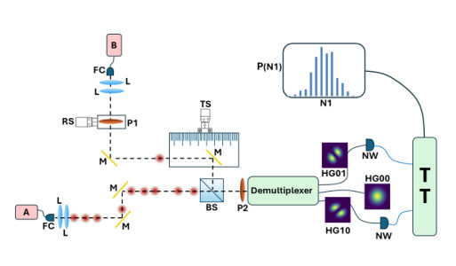
<figcaption class="paper-figure-caption"><b>Fig 1.</b> FIG. 2. Representation of the optical setup employed for the experiment. A=LED A, B=LED B, FC=fiber collimator, L=Lens, P1=rotatable polarizer, M=Mirrors, BS=beam splitter, P2=fixed polarizer, RS=rotation stage, TS=translation stage, NW=nanowire detector, TT=time tagger.</figcaption>
</figure>
<figure class="paper-figure-card">
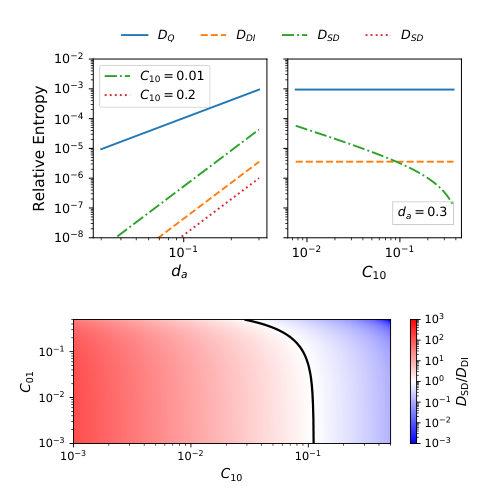
<figcaption class="paper-figure-caption"><b>Fig 2.</b> FIG. 1. (Top) Plots of the quantum relative entropy DQ in Eq. (1) (solid blue) and of the relative entropies for di- rect imaging DDI in Eq. (2) (orange dashed) and SPADE detection DSD in Eq. (5) (green dash-dotted and red dotted) while varying the distances da (left) and the crosstalk C10 (right). On the right, we notice DSD &gt; DDI for C10 ≲0.1, namely SPADE outperforms direct imaging with commonly achievable experimental values of crosstalk. ϵ = 0.042, C01 = C10. (Bottom) Plot of the ratio DSD/DDI while varying the crosstalk factors C10 and C01. The black curve delimits the region where SPADE outperforms direct imaging.</figcaption>
</figure>
<figure class="paper-figure-card">
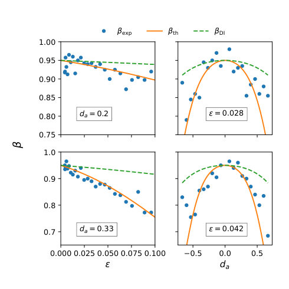
<figcaption class="paper-figure-caption"><b>Fig 3.</b> FIG. 3. Plots of the theoretically predicted error rate βth in Eq. (8) (orange sold line), and the measured error rates of our experimental SPADE-based hypothesis test (blue dots). In dashed green, the theoretical error rate βDI in Eq. (9) of an optimal test with same values of α and N based on direct imaging.</figcaption>
</figure>

**Summary.** This work experimentally and theoretically demonstrates that using Spatial Demultiplexing (SPADE) with single-photon detectors allows for source discrimination beyond the diffraction limit. The method provides a superior test compared to direct imaging, especially when accounting for realistic optical imperfections like crosstalk. This paves the way for highly sensitive, photon-starved astronomical imaging.

**Why it may be interesting.** It provides a concrete, experimentally validated quantum advantage in photon-starved imaging tasks, demonstrating how quantum measurement techniques can overcome fundamental diffraction limits.

Detailed structure

**Main problem.** The paper addresses the challenge of discriminating between faint and bright optical sources (like exoplanets near a star) when the sources are separated by distances smaller than the diffraction limit.

**Main result.** Spatial Demultiplexing (SPADE) combined with single-photon detectors provides a universal, parameter-independent test that significantly outperforms direct imaging, especially when realistic crosstalk is present.

**Method.** The authors employ quantum hypothesis testing, comparing the achievable error rate (false negative) using SPADE versus direct imaging, modeled via relative entropy calculations.

**Model / system.** The system is modeled using two fiber-coupled LEDs simulating a star and an exoplanet, analyzed through the lens of quantum relative entropy and hypothesis testing theory.

**Key observables.** False negative error rate ($eta$), Quantum Relative Entropy ($D_Q$), and the ratio of distinguishability measures ($D_{SD}/D_{DI}$).

**Important parameters / regimes.** Crosstalk coefficients ($C_{10}, C_{01}$), source separation ($d_a$), and intensity ratio ($\epsilon$).

**Assumptions / limitations.** The analysis relies on Gaussian approximations for error rate calculations and assumes small source separations and low intensity ratios for the theoretical derivations.

**Figures summary.** Figure 1 plots relative entropies ($D_Q, D_{DI}, D_{SD}$) showing SPADE's advantage for low crosstalk; Figure 3 compares predicted vs. measured error rates for SPADE vs. direct imaging.

**Paper structure.** The paper develops the theory by comparing the quantum relative entropy for two hypotheses (absence vs. presence of a faint source), derives the error rates for both SPADE and direct imaging, and validates the theory with an experimental setup.

Abstract

We experimentally demonstrate a universal, parameter-independent test for asymmetric source discrimination. The test allows us to discriminate faint sources well beyond the diffraction limit by exploiting spatial mode demultiplexing (SPADE) and single-photon detectors. Our test yields a rate of false negatives well below what can be achieved by diffraction-limited direct imaging. Our tabletop experimental setup is inspired by the problem of exoplanet detection, where one aims at detecting the presence of a faint source in the proximity of a brighter one. We present a complete theory, modelling arbitrary modal crosstalk, and collect data across a range of values for the source separations and intensity ratios. We show that SPADE retains an advantage over direct imaging in the relevant regime of small separations and low intensity ratios. Remarkably, we identify an experimentally accessible crosstalk threshold $C_{\mathrm{th}}\simeq 0.1$ below which the exponential rate of false negatives stays well below that of direct imaging. For example, for crosstalk of $10^{-2}$, SPADE needs up to one order of magnitude fewer photons than direct imaging to achieve the same error rate. These results demonstrate that SPADE offers an effective methodology for subdiffraction asymmetric hypothesis testing, under realistic imperfections and crosstalk, paving the way to photon-starved imaging tasks.

[↑ back to top](#top)

### [Bak--Tang--Wiesenfeld model for various topologies and ranges of interaction](http://arxiv.org/abs/2605.15930v1)

**Authors:** P. Szczepaniak, K. Malarz  
**Type:** theory · **Category:** statistical mechanics · **PDF:** <https://arxiv.org/pdf/2605.15930v1>  
**Analysis basis:** full PDF text, analyzed in chunks
**Topic relevance:** `non-equilibrium universality` **3/5** · `non-equilibrium dynamics` **2/5** · `analog quantum simulation` **1/5** · `driven-dissipative phase transition` **1/5** · `methods for driven-dissipative` **1/5**

↔ Scroll figures horizontally

<figure class="paper-figure-card">
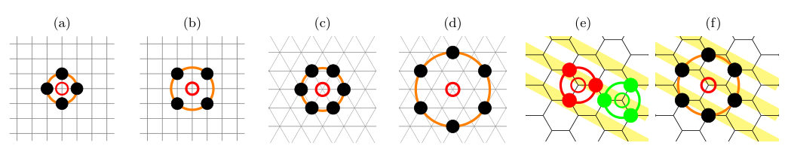
<figcaption class="paper-figure-caption"><b>Fig 1.</b> FIG. 1: (a)–(b) Square, (c)–(d) triangular and (e)–(f) honeycomb lattices with marked neighborhoods in the first (a), (c), (e) and the first plus the second (b), (d), (f) coordination zone. As honeycomb lattice does not belong to the Bravais’ lattices, the sites in the first coordination zone are different in odd and even rows and columns</figcaption>
</figure>
<figure class="paper-figure-card">
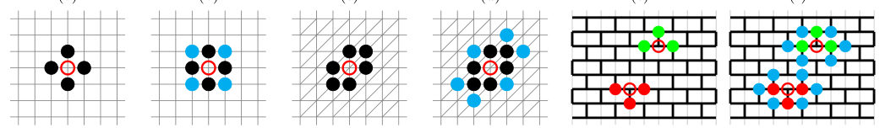
<figcaption class="paper-figure-caption"><b>Fig 2.</b> FIG. 2: Computerized version of lattices shown in Figure 1 mapped into square lattice: (a) sq-1; (b) sq-1,2; (c)</figcaption>
</figure>
<figure class="paper-figure-card">
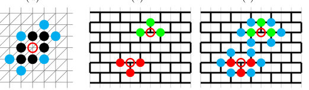
<figcaption class="paper-figure-caption"><b>Fig 3.</b> Figure 2(c)). The honeycomb lattice can be converted to a brick-wall lattice representation (see Figures 2(e) and 2(f)). Unfortunately, as honeycomb lattice is ex- cluded from Bravais lattices, their one-dimensional rep- resentation must be split to odd and even numbers of rows and columns. An example of Fortran implemen- tation of hc-1,2 neighborhood is presented in Listing 3 in Appendix B. Additionally, Listings 1 and 2 in Ap- pendix B show more obvious implementations of sq-1,2 and tr-1,2 neighborhoods (also as Fortran subroutines), respectively.</figcaption>
</figure>
<figure class="paper-figure-card">
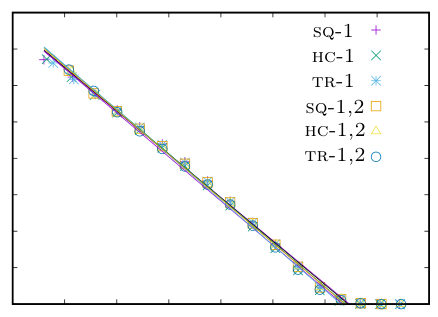
<figcaption class="paper-figure-caption"><b>Fig 4.</b> FIG. 3: Probability distribution P(s) of avalanches size s logarithmically binned for L = 103 and N = 108 (for raw data look at orange symbols in Figure 4 presented in Appendix A)</figcaption>
</figure>
<figure class="paper-figure-card">
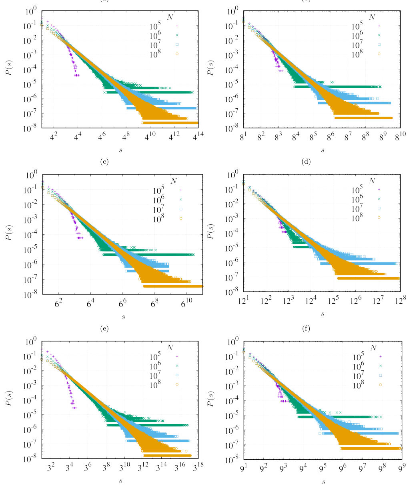
<figcaption class="paper-figure-caption"><b>Fig 5.</b> FIG. 4: Probability distribution P(s) of sizes of avalanches s for various lattices and neighborhoods: (a) sq-1, (b) sq-1,2, (c) tr-1, (d) tr-1,2, (e) hc-1, (f) hc-1,2. Various number N of deposited particles, fixed number of sites L2 = 106</figcaption>
</figure>

**Summary.** This paper investigates the universality of the critical exponent in the Bak-Tang-Wiesenfeld sandpile model across different lattice structures and interaction rules. Using extensive computer simulations, the authors demonstrate that the exponent governing avalanche size distributions remains constant, suggesting a robust, universal critical behavior independent of the specific underlying geometry, provided system parameters are scaled correctly.

**Why it may be interesting.** While focused on classical sandpile dynamics, the study of universal exponents ($	au$) in non-equilibrium critical phenomena is a core concept in statistical mechanics, relevant to understanding phase transitions and critical behavior in complex quantum many-body systems.

Detailed structure

**Main problem.** The paper reconsiders the Bak-Tang-Wiesenfeld (BTW) model to study how varying substrate topologies and interaction ranges affect the power-law distribution of avalanche sizes.

**Main result.** The critical exponent governing the avalanche size distribution ($	au \approx 1.208(39)$) is found to be statistically universal, remaining constant regardless of the substrate topology or interaction range, provided the deposition ratio ($N/L^2$) is correctly chosen.

**Method.** The study employs computer simulations (Monte Carlo) to model the sandpile dynamics and analyzes the resulting probability distribution $P(s)$ using power-law fitting and Z-score statistical tests.

**Model / system.** The system is the BTW sandpile model, where grains are added to a lattice (square, triangular, or honeycomb) until an avalanche occurs, causing material to fall to neighbors based on defined interaction ranges (nearest vs. next-nearest neighbors).

**Key observables.** The power-law exponent $	au$ governing $P(s) \propto s^{-	au}$, and the statistical consistency of $	au$ across different lattice setups.

**Important parameters / regimes.** Substrate topologies (sq, tr, hc), interaction ranges (1NN, 2NN), and the ratio of deposited particles to system size ($N/L^2$).

**Assumptions / limitations.** The observation of the power law is highly dependent on maintaining a specific, reasonably chosen ratio between the number of deposited particles ($N$) and the system size ($L^2$).

**Figures summary.** Figures illustrate the various lattices and neighborhoods, show the log-log binned probability distributions $P(s)$ for different setups, and Tables summarize the calculated exponent $	au$ and statistical comparison values.

**Paper structure.** The paper systematically tests the BTW model across multiple lattice types and interaction rules, using simulations to fit the power-law exponent $	au$ and statistically confirming its independence from the specific lattice geometry when system parameters are controlled.

Abstract

In this paper, the Bak--Tang--Wiesenfeld model for various substrate topologies and a variety of neighborhoods is reconsidered. With computer simulation, we study the distribution of avalanche sizes. Using the Z-score we confirm that independently of the substrate topology and the range of neighborhood, the exponent that governs the power law of the probability distribution of the size of avalanches is the same and approximately equal 1.208(39). However, this requires a smartly chosen number of deposited grains in relation to the linear size of the system.

[↑ back to top](#top)

### [Spherically symmetric approaches in the theoretical study of low-dimensional magnets](http://arxiv.org/abs/2605.16059v1)

**Authors:** A. F. Barabanov, V. E. Valiulin, A. V. Mikheyenkov, P. S. Savchenkov  
**Type:** theory · **Category:** strongly correlated electrons · **PDF:** <https://arxiv.org/pdf/2605.16059v1>  
**Analysis basis:** full PDF text, analyzed in chunks
**Topic relevance:** `Keldysh / 2PI / non-Gaussian methods` **3/5** · `analog quantum simulation` **3/5** · `exotic spin models in light-matter` **1/5** · `methods for driven-dissipative` **1/5**

↔ Scroll figures horizontally

<figure class="paper-figure-card">
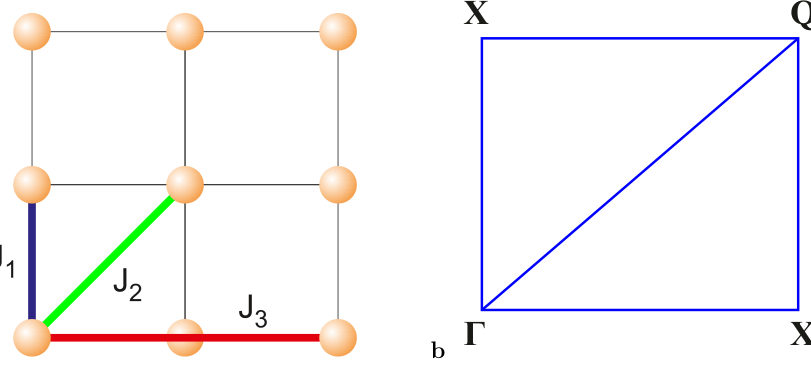
<figcaption class="paper-figure-caption"><b>Fig 1.</b> Figure 1: a. (Color online) First, second, and third nearest neighbors for a 2D square lattice and the corresponding exchange parameters. b. Standard notations for symmetric points in the Brillouin zone of a square lattice. Γ = (0, 0) is the zero (FM) point, X = (0, 𝜋), (𝜋, 0) are stripe points, Q = (𝜋, 𝜋) is the AFM point. A quarter of the full zone is shown.</figcaption>
</figure>
<figure class="paper-figure-card">
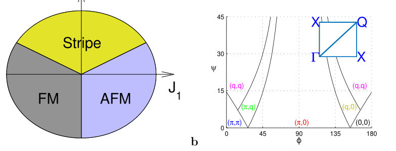
<figcaption class="paper-figure-caption"><b>Fig 2.</b> Figure 2: (Color online) a. Phase diagram of the 𝐽1-𝐽2 circle for a square lattice in the classical limit. The AFM, stripe, and FM phases are realized. Transitions to the stripe phase occur at 0 &lt; 𝐽2 = ±𝐽1/2. b. Flat scan of part of the classical 𝐽1-𝐽2-𝐽3 sphere phase diagram, 0 ≤𝜙≤𝜋, 0 ≤𝜓≤𝜋/2. The positions of the control points are shown. Inset: a quarter of the Brillouin zone.</figcaption>
</figure>
<figure class="paper-figure-card">
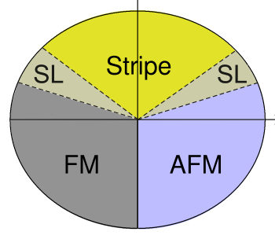
<figcaption class="paper-figure-caption"><b>Fig 3.</b> Figure 3: (Color online) Schematic of the quantum 𝑆= 1/2 𝐽1-𝐽2 model at 𝑇= 0. A disordered spin-liquid (SL) phase is realized between the AFM and stripe phases with long-range order. A second spin-liquid region appears between the FM and stripe long-range orders. The spin-liquid boundaries are shown tentatively, without exact correspondence to the calculated data.</figcaption>
</figure>
<figure class="paper-figure-card">
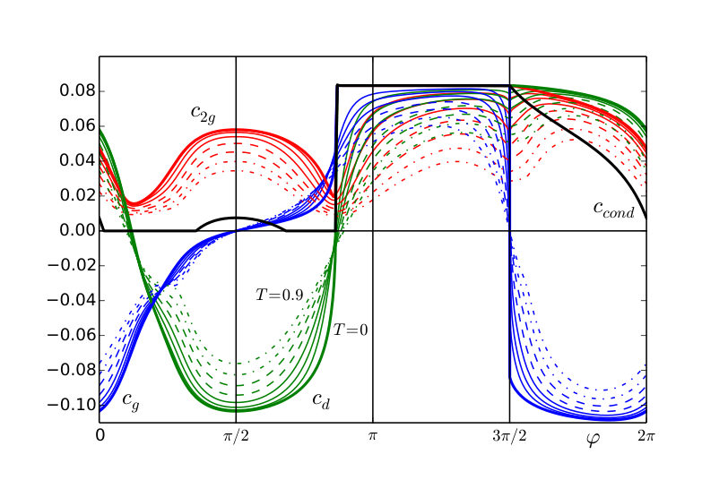
<figcaption class="paper-figure-caption"><b>Fig 4.</b> Figure 4: (Color online) 𝐽1-𝐽2 model. Spin-spin correlators at the nearest neighbors (𝑐𝑔, blue), second nearest neighbors (𝑐𝑑, green), and third nearest neighbors (𝑐2𝑔, red) as functions of para- metric angle 𝜙(𝐽1 = cos 𝜙, 𝐽2 = sin 𝜙). The thick solid lines correspond to temperature 𝑇= 0, the thin solid lines to 𝑇= 0.3, 0.4, 0.5, the dashed lines to 𝑇= 0.6, 0.7, and the dotted lines to 𝑇= 0.8, 0.9. The spin condensate 𝑐𝑐𝑜𝑛𝑑(on a different scale) is shown by the solid black line. Data from [62].</figcaption>
</figure>
<figure class="paper-figure-card">
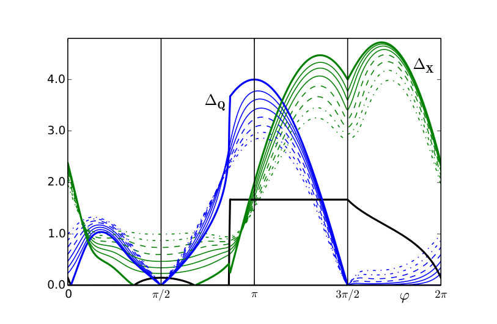
<figcaption class="paper-figure-caption"><b>Fig 5.</b> Figure 5: (Color online) Gaps in the spin excitation spectrum ΔQ (blue) and ΔX (green) at symmetric points of the Brillouin zone Q = (𝜋, 𝜋) and X = (0, 𝜋), (𝜋, 0) as functions of parametric angle 𝜙(𝐽1 = cos 𝜙, 𝐽2 = sin 𝜙). The thick solid lines correspond to temperature 𝑇= 0, the thin solid lines to 𝑇= 0.3, 0.4, 0.5, the dashed lines to 𝑇= 0.6, 0.7, and the dotted lines to 𝑇= 0.8, 0.9. The spin condensate 𝑐𝑐𝑜𝑛𝑑(on a different scale) is shown by the solid black line. Data from [62].</figcaption>
</figure>

**Summary.** This work details the Spherically Symmetric Self-Consistent Approach (RGM) for studying low-dimensional magnets, especially those with frustration. It applies this mean-field Green's function technique to Heisenberg models on lattices like the square lattice. The method successfully maps out complex magnetic phase diagrams, providing theoretical insights into magnetic ordering beyond the limitations of traditional analyses.

**Why it may be interesting.** While focused on magnetism, the use of advanced Green's function techniques and self-consistent mean-field theory provides a robust theoretical framework for analyzing complex many-body interactions, which has parallels in open quantum system dynamics.

Detailed structure

**Main problem.** The paper addresses the theoretical study of low-dimensional magnetic systems, particularly those exhibiting geometric frustration, while respecting fundamental constraints like the Mermin-Wagner and Marshall theorems.

**Main result.** The spherically symmetric self-consistent approach (RGM) provides a consistent framework to analyze various spin models, yielding predictions for magnetic phases (FM, AFM, helices) in the classical limit and for quantum spin systems.

**Method.** The core method is the Spherically Symmetric Self-Consistent Approach (SSCA) applied to the two-time retarded spin-spin Green's function, which is a mean-field technique.

**Model / system.** The primary models studied are low-dimensional Heisenberg-type spin models, including the $J_1-J_2-J_3$ Hamiltonian on a square lattice. The approach is also applicable to spin-pseudospin models and embedded in models with free carriers like the Hubbard or $t-J$ models.

**Key observables.** Spin-spin correlators, spin excitation spectrum ($\omega_q$), magnetic order (FM, AFM, stripe, helical phases), and static magnetic susceptibility ($\chi$).

**Important parameters / regimes.** Temperature ($T$), exchange coupling ratios ($J_1, J_2, J_3$), and spin magnitude ($S$).

**Assumptions / limitations.** The RGM assumes spherical symmetry (singlet state) and is fundamentally a mean-field approach, which limits its ability to calculate spin excitation damping.

**Figures summary.** Figures illustrate phase diagrams for the $J_1-J_2$ and $J_1-J_2-J_3$ models in the classical limit, showing the boundaries between different magnetic phases (AFM, stripe, FM, helicoids).

**Paper structure.** The paper develops the SSCA/RGM algorithm by calculating the spin-spin Green's function, applying it to the $J_1-J_2-J_3$ Hamiltonian, and then analyzing the resulting phase diagram across different temperature and coupling regimes.

Abstract

The main ideas and some of the most important results of the spherically symmetric self-consistent approach and a number of related theoretical algorithms are presented. These methods make it possible to study low-dimensional Heisenberg-type spin models, including frustrated ones, with careful consideration of the theoretic (Mermin-Wagner and Marshall) theorems, as well as the site spin constraint. Thus, the difficulties that may arise in the traditional analysis of low-dimensional magnetic systems are avoided. The approach can also be applied to the spin-pseudospin model, and is also embedded in more complex constructions when considering spin models with free carriers, such as the basic and three-band Hubbard models, t-J and s-d models, and the Kondo lattice.

[↑ back to top](#top)

### [The fractal dimension of Brownian dynamics in liquids](http://arxiv.org/abs/2605.16252v1)

**Authors:** Michael C. Thumann, Jason Boynewicz, Giuseppe Procopio, Massimiliano Giona, Mark G. Raizen  
**Type:** both · **Category:** statistical mechanics · **PDF:** <https://arxiv.org/pdf/2605.16252v1>  
**Analysis basis:** full PDF text, analyzed in chunks
**Topic relevance:** `non-equilibrium dynamics` **3/5** · `non-equilibrium universality` **2/5** · `Keldysh / 2PI / non-Gaussian methods` **1/5** · `correlated / nonlocal dissipation` **1/5** · `methods for driven-dissipative` **1/5**

↔ Scroll figures horizontally

<figure class="paper-figure-card">
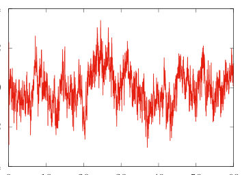
<figcaption class="paper-figure-caption"><b>Fig 1.</b> FIG. 1. Normalized velocity u(τ) vs τ of a barium titanate glass microsphere in acetone.</figcaption>
</figure>
<figure class="paper-figure-card">
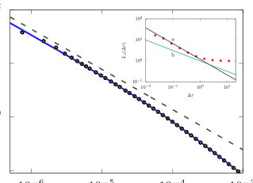
<figcaption class="paper-figure-caption"><b>Fig 2.</b> FIG. 2. Hydrodynamic fractal scaling of Brownian velocity fluctuations. The black circles are Sv(∆t) from experimental data of a barium titanate glass microsphere optically trapped in acetone after accounting for laser noise and finite experi- mental resolution as detailed in Appendix H. Statistical error bars [36] are smaller than the marker size, and parametric uncertainty is detailed in Appendix H. The solid blue line is Sv(∆t) as predicted by the hydrodynamic GLE. The grey dashed line is the asymptotic scaling ∆t−3/4. The inset shows the scaling of Lu(∆τ) vs τ using raw data without laser noise or finite-time corrections (•). Line (a) represents the scaling ∆τ −3/4, line (b) ∆τ −1/2.</figcaption>
</figure>
<figure class="paper-figure-card">
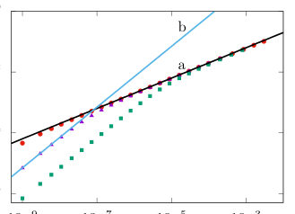
<figcaption class="paper-figure-caption"><b>Fig 3.</b> FIG. 3. Initial scaling of 1 −C(n) uu (τ) vs ∆τ of the solutions of the inertial model eq. (14) at κs = 0, β = 1 for different values of Γ. Symbols (•) refer to Γ = 1010, (▲) to Γ = 108, (■) to Γ = 106. Line (a) corresponds to 1 −C(n) uu (τ) ∼τ 1/2, line (b) to 1 −C(n) uu (τ) ∼τ.</figcaption>
</figure>
<figure class="paper-figure-card">
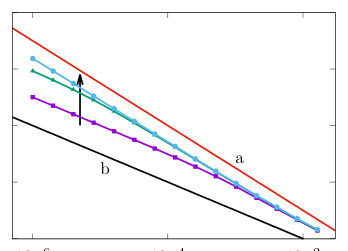
<figcaption class="paper-figure-caption"><b>Fig 4.</b> FIG. 4. Length-resolution analysis Lu(∆τ) vs ∆τ of the ve- locity realizations solution of the inertial model eq. (14) at κs = 0.1, b = 0.1 for different values of Γ. The arrow in- dicates increasing values of Γ = 104, 106, 108. Line (a) rep- resents the scaling Lu(∆τ) ∼∆τ −3/4, line (b) the scaling Lu(∆τ) ∼∆τ −1/2.</figcaption>
</figure>
<figure class="paper-figure-card">
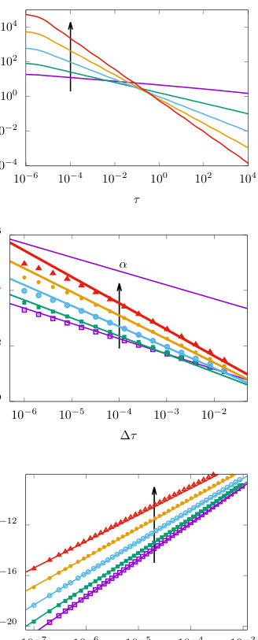
<figcaption class="paper-figure-caption"><b>Fig 5.</b> FIG. 5. Panel (a) : Function gω(τ, Γ, Ni) vs τ for Ni = 20 at Γ = 106 for increasing values of ω. Panel (b) : Length- resolution analysis, Lu(∆τ) vs ∆τ (symbols) of a realization of the particle velocity deriving from the solution of eq. (14) in the presence of the inertial kernel k(τ) = b gω(τ, Γ, Ni), a = 6, b = κs = 0.1 where gω(τ, Γ, Ni) is depicted in panel (a) for increasing values of ω. Solid lines represents the scaling Lu(∆τ) ∼∆τ −(1+ω)/2. Line (α) represents the Wiener scal- ing Lu(∆τ) ∼∆τ −1/2. Panel (c) : mxx(τ) vs τ in the pres- ence of the inertial kernel k(τ) = b gω(τ, Γ, Ni), β = κs = 0.1, for increasing values of ω. Symbols represent the simulation results from the moment...</figcaption>
</figure>

**Summary.** This paper investigates how fluid inertia modifies the expected fractal scaling of Brownian motion, moving beyond the classical Einstein-Langevin prediction. Through a combination of high-resolution experiments and advanced theoretical modeling, the authors demonstrate that the true velocity fractal dimension is $d_v = 7/4$. This work establishes a non-equilibrium universality class for particle dynamics in viscous fluids.

**Why it may be interesting.** The work provides a detailed, quantitative study of non-equilibrium dynamics in a classical system, using advanced scaling analysis techniques that are highly relevant to understanding memory effects in open quantum systems or complex many-body dynamics.

Detailed structure

**Main problem.** To revise the understanding of the fractal dimension of Brownian velocity fluctuations, moving beyond the classical Einstein-Langevin theory prediction.

**Main result.** The inclusion of fluid-inertial memory effects fundamentally changes the scaling, establishing a distinct velocity fractal dimension of $d_v = 7/4$ instead of the classical $3/2$.

**Method.** The study combines experimental measurements of microspheres in liquids with theoretical analysis using generalized Langevin equations and scale-dependent fluctuation analysis.

**Model / system.** The system is Brownian microspheres moving in a liquid, modeled by incorporating fluid-inertial memory effects via the Basset kernel, moving beyond the simple Markovian Langevin assumption.

**Key observables.** Velocity fractal dimension ($d_v$), scaling exponent $\phi$ from Mean Squared Displacement ($	ext{MSD} \sim 	au^\phi$), and the scale-dependent absolute slope ($S_v(\Delta t)$).

**Important parameters / regimes.** The analysis distinguishes between the classical (Einstein-Langevin) and hydrodynamic (Basset-Boussinesq) regimes, focusing on short-time, non-equilibrium dynamics.

**Assumptions / limitations.** The analysis relies on relating scaling exponents ($\phi, H_v, d_v$) and requires careful handling of short-time singularities and experimental noise/resolution limits.

**Figures summary.** Figures compare scaling functions ($L_x, S_x, L_v, S_v$) for different models, showing crossovers in scaling behavior and confirming the $d_v = 7/4$ result from experimental data.

**Paper structure.** The paper progresses from establishing the classical theory, introducing the non-Markovian hydrodynamic model, developing advanced measurement techniques (like $S_v(\Delta t)$), and finally deriving the non-equilibrium universality class using scaling analysis.

Abstract

The classical Einstein-Langevin theory of Brownian motion assumes a memoryless thermal bath, establishing a universal fractal dimension of $d_v = 3/2$ for the velocity fluctuations of a particle. In this Letter, we demonstrate experimentally and theoretically that fluid-inertial memory effects fundamentally redefine the fractal scaling of these fluctuations. In analyzing highly resolved measurements of Brownian microspheres in liquids, we show that the non-Markovian hydrodynamic thermal noise establishes a distinct velocity fractal dimension of $d_v = 7/4$. Coupled with theoretical analysis of non-equilibrium short-time dynamics and the initial scaling of the velocity autocorrelation function, this result establishes the non-equilibrium universality class of Brownian motion in fluid media possessing a finite non-vanishing density.

[↑ back to top](#top)

### [A reason why we do not observe Schrödinger's cats](http://arxiv.org/abs/2605.16148v1)

**Authors:** Fabio Siringo  
**Type:** theory · **Category:** statistical mechanics · **PDF:** <https://arxiv.org/pdf/2605.16148v1>  
**Analysis basis:** full PDF text, analyzed in chunks
**Topic relevance:** `quantum measurements` **3/5** · `Keldysh / 2PI / non-Gaussian methods` **1/5** · `correlated / nonlocal dissipation` **1/5** · `measurement-induced transitions` **1/5** · `methods for driven-dissipative` **1/5**

↔ Scroll figures horizontally

<figure class="paper-figure-card">
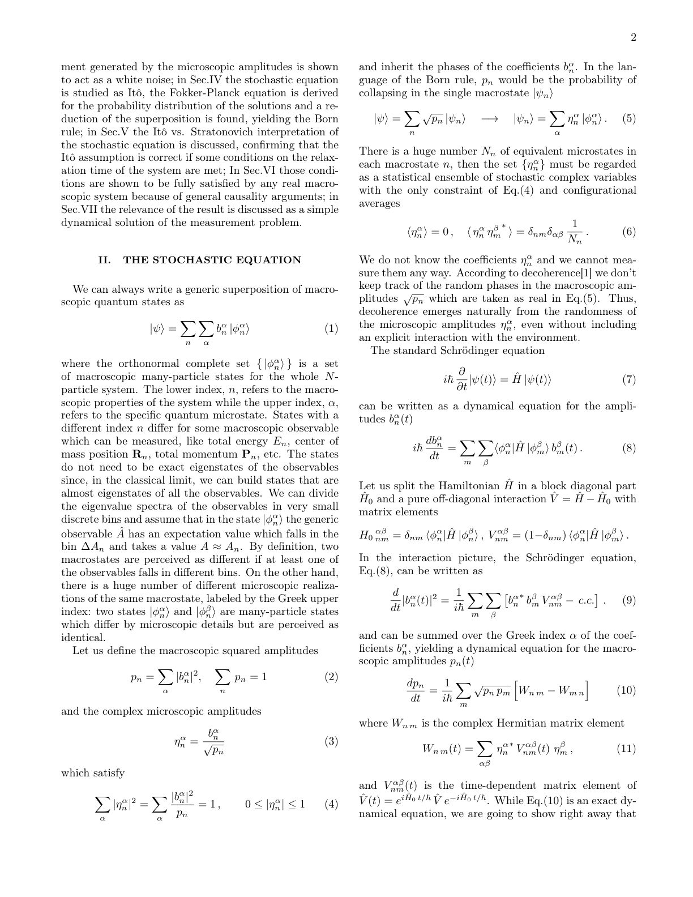
<figcaption class="paper-figure-caption"><b>Fig 1.</b> Low-resolution page preview, page 2</figcaption>
</figure>
<figure class="paper-figure-card">
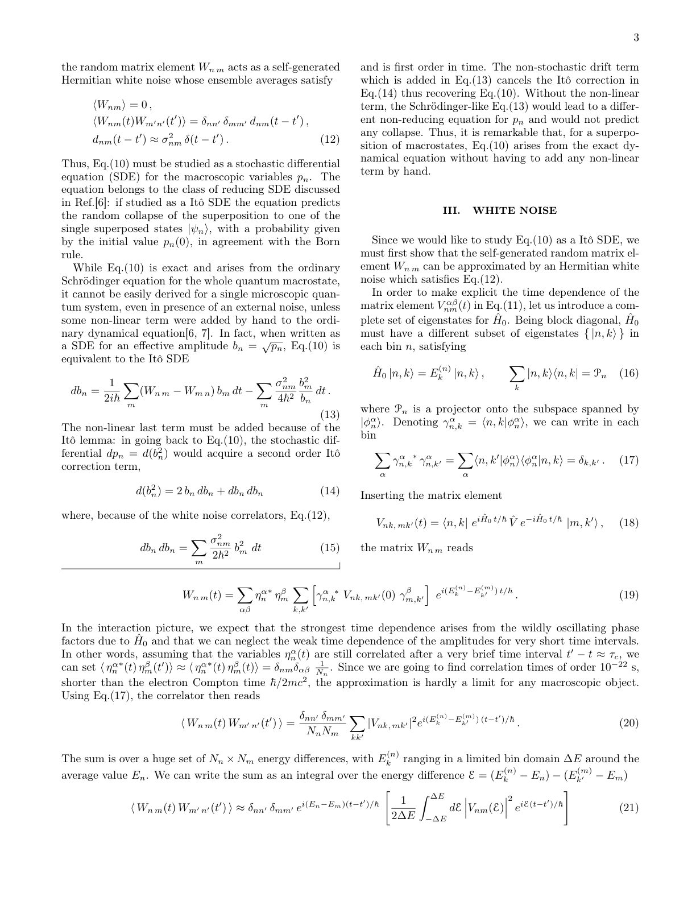
<figcaption class="paper-figure-caption"><b>Fig 2.</b> Low-resolution page preview, page 3</figcaption>
</figure>
<figure class="paper-figure-card">
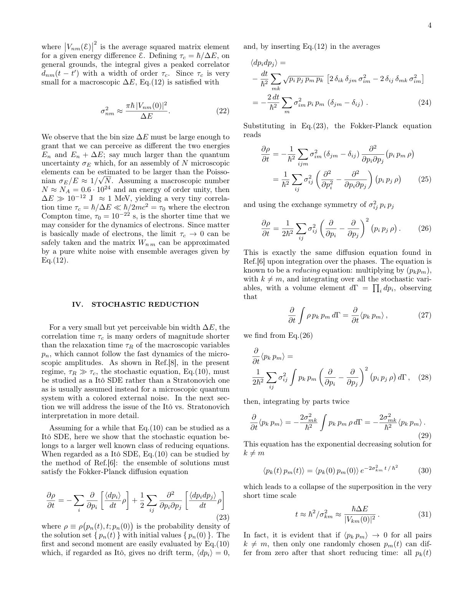
<figcaption class="paper-figure-caption"><b>Fig 3.</b> Low-resolution page preview, page 4</figcaption>
</figure>
<figure class="paper-figure-card">
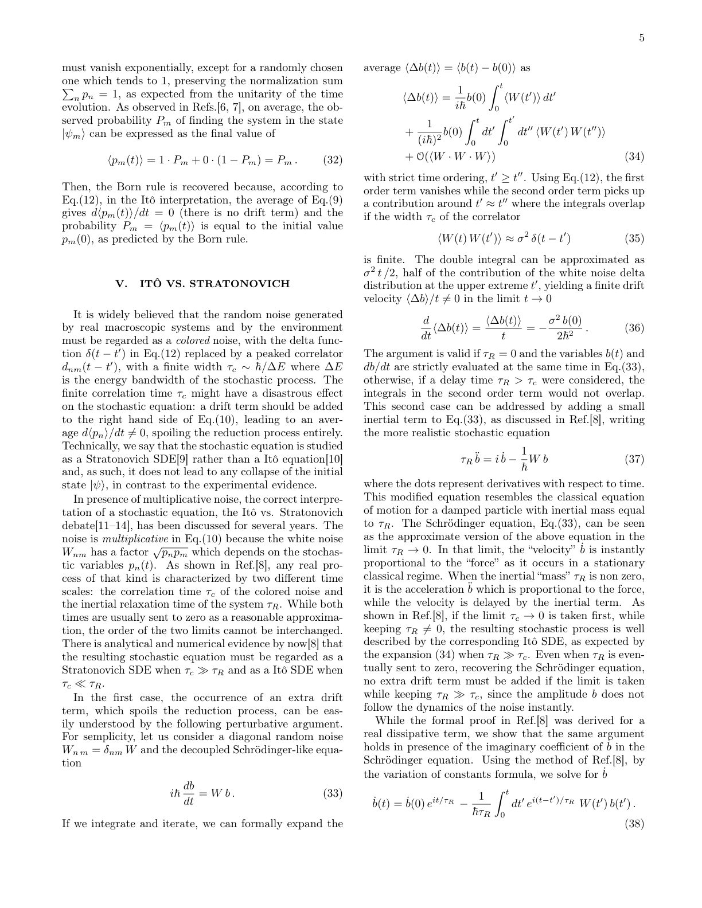
<figcaption class="paper-figure-caption"><b>Fig 4.</b> Low-resolution page preview, page 5</figcaption>
</figure>
<figure class="paper-figure-card">
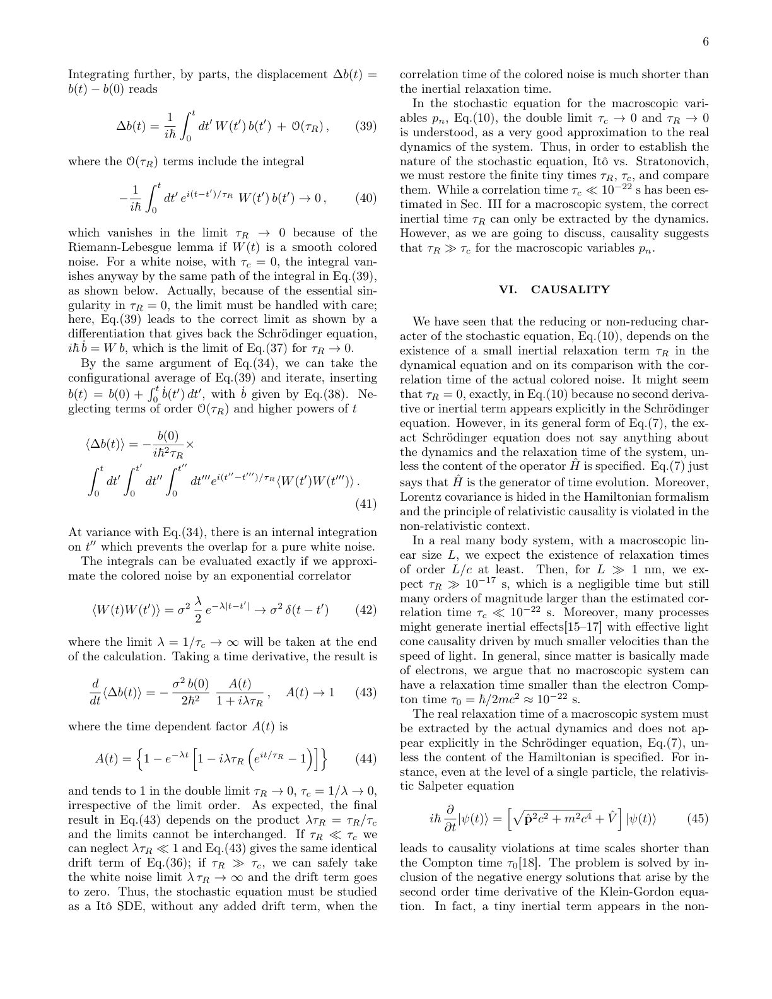
<figcaption class="paper-figure-caption"><b>Fig 5.</b> Low-resolution page preview, page 6</figcaption>
</figure>

**Summary.** This paper proposes a dynamical resolution to the quantum measurement problem by showing that the standard Schrödinger equation leads to a stochastic equation for macroscopic variables. By analyzing this equation using Itô calculus, the authors demonstrate that any macroscopic superposition will rapidly collapse into a definite state, thereby deriving the Born rule without explicit postulation.

**Why it may be interesting.** This work offers a non-standard, dynamical approach to the measurement problem, providing a mechanism rooted in statistical physics (stochastic processes) that naturally enforces the Born rule for macroscopic systems.

Detailed structure

**Main problem.** The paper addresses the measurement problem by providing a dynamical reason why macroscopic quantum superpositions, such as Schrödinger's cat, are not observed in reality.

**Main result.** The standard Schrödinger equation, when analyzed through a stochastic framework, predicts that any macroscopic superposition will collapse almost instantaneously, and this collapse process naturally yields the Born rule.

**Method.** The analysis involves decoupling macroscopic and microscopic degrees of freedom and deriving a stochastic differential equation (SDE) for the macroscopic amplitudes, which is then analyzed using Itô calculus.

**Model / system.** The model uses the standard Schrödinger equation for a quantum system treated as a superposition of macrostates. The dynamics are mapped onto an effective stochastic equation whose noise term is self-generated by the microscopic ensemble average.

**Key observables.** The decay of off-diagonal coherence terms ($\langle p_k(t) p_m(t) 
angle$) and the recovery of the Born rule ($\langle p_m(t) 
angle = p_m(0)$).

**Important parameters / regimes.** The ratio of the inertial relaxation time ($	au_R$) to the noise correlation time ($	au_c$), and the macroscopic constraint $\Delta E \Delta X \gg \hbar c$.

**Assumptions / limitations.** The core assumption is that the macroscopic state can be treated as a statistical ensemble of microstates, and the derivation relies on the white noise approximation for the random matrix elements.

**Paper structure.** The paper progresses by deriving a stochastic equation from the Schrödinger dynamics, analyzing the required mathematical interpretation (Itô vs. Stratonovich) based on physical time scales, and finally demonstrating that the Itô interpretation leads to rapid collapse consistent with observation.

Abstract

A reason is discussed (may be not the only one) for why we do not see any superposition of macroscopic states in the real world. Under the general assumption that quantum macrostates are statistical ensembles of microstates, it is shown that any superposition of macrostates is reduced in a very short time by the unitary dynamics of the ordinary Schrödinger equation, deducing the Born rule without having to postulate it. In more detail, the macroscopic and microscopic degrees of freedom are decoupled in the Schrödinger equation, yielding an effective stochastic equation for the macroscopic variables, with the ensemble average of the microscopic amplitudes that acts as a self-generated internal white noise. The stochastic equation is shown to be a reducing Itô equation if some general causality conditions are met, predicting a very quick collapse of any macroscopic superposition upon formation, with probabilities which satisfy the Born rule. In the context of the von Neumann measurement scheme, the relevance of the result is discussed as a simple dynamical solution of the measurement problem.

[↑ back to top](#top)

### [Solving Classical and Quantum Spin Glasses with Deep Boltzmann Quantum States](http://arxiv.org/abs/2605.15899v1)

**Authors:** Luca Leone, Arka Dutta, Markus Heyl, Enrico Prati, Pietro Torta  
**Type:** theory · **Category:** disordered systems and neural networks · **PDF:** <https://arxiv.org/pdf/2605.15899v1>  
**Analysis basis:** full PDF text, analyzed in chunks
**Topic relevance:** `exotic spin models in light-matter` **3/5** · `analog quantum simulation` **2/5** · `methods for driven-dissipative` **2/5**

↔ Scroll figures horizontally

<figure class="paper-figure-card">
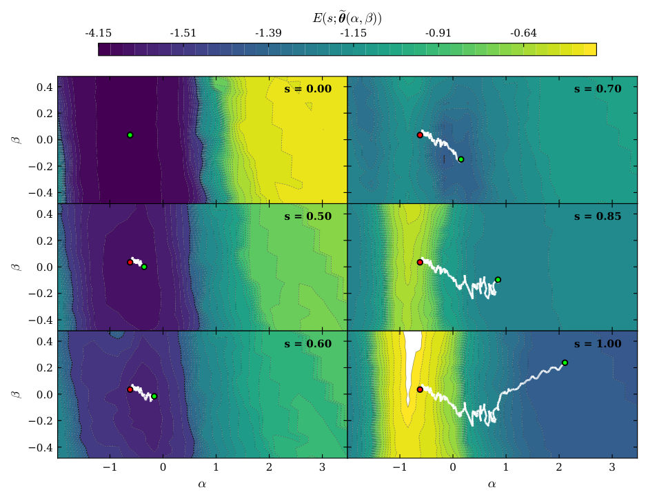
<figcaption class="paper-figure-caption"><b>Fig 1.</b> Figure 1. Visualization of the NQA trajectory for a 4-site Ising toy model with all-to-all random couplings. Each subplot shows the projected parameter trajectory (white line, with red and green dots marking the initial and current parameters) together with the instantaneous energy landscape at the corresponding sj, projected on a plane Σ (defined below). Throughout the variational optimization, the ansatz remains close to the minimum of the instantaneous energy, effectively guiding NQA to the global minimum of the target problem. Technical details of the plot, following Ref. [90], are as follows. At each schedule point sj, we record the instantaneous parameters and construct a real-valued...</figcaption>
</figure>
<figure class="paper-figure-card">
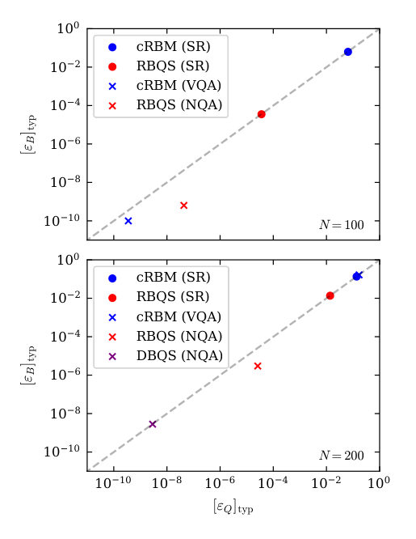
<figcaption class="paper-figure-caption"><b>Fig 2.</b> Figure 2. Comparison of the typical residual energies on the 10 realizations of the SK model with N = 100 (top panel) and N = 200 (bottom panel). Each point corresponds to a differ- ent combination of ansatz and optimization protocol. Only the DBQS results employ a catalyst and complex parameters.</figcaption>
</figure>
<figure class="paper-figure-card">
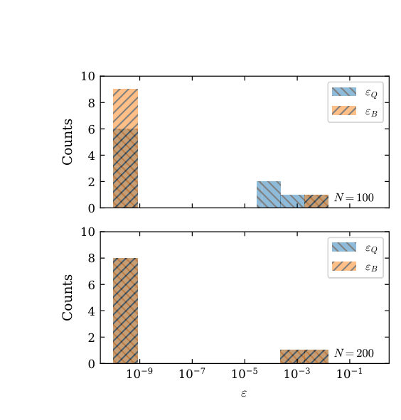
<figcaption class="paper-figure-caption"><b>Fig 3.</b> Figure 3. Residual energy histograms for the SK model with N = 100 (top panel) and N = 200 (bottom panel). Each entry corresponds to a distinct instance tackled by NQA and an RBQS/DBQS ansatz (see main text for details on the vari- ational model). Our setup solves all N = 100 spin instances and 7 out of 10 N = 200 spin instances.</figcaption>
</figure>
<figure class="paper-figure-card">
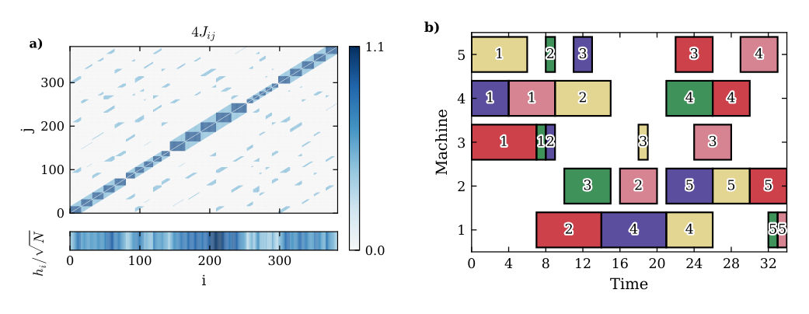
<figcaption class="paper-figure-caption"><b>Fig 4.</b> Figure 4. (a) Interaction matrix and longitudinal field vector of the Ising problem encoding a typical JSSP square instance. The represented instance has N = 5 and is displayed after variable pruning. (b) The Gantt diagram of the corresponding optimal schedule. Colors represent operations pertaining to a specific job, whereas the index of each operation indicate their ordering within that job.</figcaption>
</figure>
<figure class="paper-figure-card">
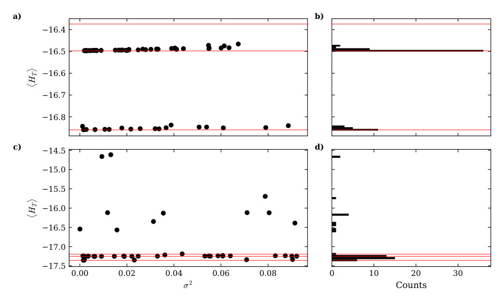
<figcaption class="paper-figure-caption"><b>Fig 5.</b> Figure 5. Convergence analysis for two representative N = 16 instances of the transverse-field SK model at g = 0.1. The results are obtained by optimizing a two-layer DBQS via catalyzed NQA. (a) and (c) Final variational energy ⟨HT ⟩versus final energy variance σ2. (b) and (d) Histogram of the final energies over the HPO trials. The red lines indicate the exact energies of the three lowest eigenstates, for comparison. Monte Carlo error bars are smaller than the symbol size and thus omitted.</figcaption>
</figure>

**Summary.** This work proposes Deep Boltzmann Quantum States (DBQS) as a powerful variational ansatz for simulating quantum many-body systems, particularly spin glasses. By integrating DBQS into a Neural Quantum Annealing (NQA) framework, the authors overcome the sampling and optimization hurdles associated with these disordered systems. The method achieves state-of-the-art results on complex models, including solving NP-hard scheduling problems.

**Why it may be interesting.** The combination of deep learning architectures (DBMs) with quantum many-body physics provides a powerful, non-adiabatic route to solving hard optimization problems that challenge traditional quantum simulation methods.

Detailed structure

**Main problem.** The paper addresses the difficulty of finding ground states for classical and quantum spin glasses due to their rugged energy landscapes with exponentially many local minima.

**Main result.** The authors successfully solved instances of classical and quantum Ising spin-glass models and even the NP-hard Job Shop Scheduling Problem, exceeding current quantum annealing hardware limitations.

**Method.** They introduce Deep Boltzmann Quantum States (DBQS) as a variational ansatz, trained using Neural Quantum Annealing (NQA) combined with natural-gradient updates and efficient block-Gibbs sampling.

**Model / system.** The focus is on spin glass models, such as the Ising spin-glass Hamiltonian, which are characterized by disorder and energy frustration. The state is parameterized by the DBQS, which extends Boltzmann Machines to the quantum domain.

**Key observables.** Variational energy $E(	heta)$, local energy $E_{	ext{loc}}(x; 	heta)$, and the ability to calculate these efficiently via matrix multiplications.

**Important parameters / regimes.** The annealing schedule parameter $s$ (interpolating from easy to hard Hamiltonian regimes), and optimization hyperparameters (e.g., learning rates, momentum $\mu$).

**Assumptions / limitations.** The primary assumption is that the DBQS ansatz, combined with NQA, provides a sufficiently expressive and computationally tractable representation of the true ground state wavefunction.

**Figures summary.** Figures illustrate the NQA trajectory for toy models, showing the projected parameter evolution and energy landscape minimization. Tables provide quantitative comparisons of energy errors ($\epsilon_B, \epsilon_Q$) against exact diagonalization results for various spin glass benchmarks.

**Paper structure.** The paper builds from general NQS methods (TDVP/VQA) to the specialized DBQS ansatz, emphasizing its computational advantages (block-Gibbs sampling, efficient local operator calculation). It then details the NQA training scheme, followed by extensive benchmarking across various spin glass and combinatorial optimization problems.

Abstract

Variational neural network models have achieved remarkable success in solving ground-state problems of quantum many-body systems. However, addressing classical and quantum spin glasses remains challenging, as disorder and energy frustration give rise to an exponentially large number of local energy minima separated by high-energy barriers, hindering the efficiency of conventional Metropolis-based Monte Carlo methods. To bridge this gap, we introduce Deep Boltzmann Quantum States, a class of neural quantum states inspired by deep Boltzmann machines that inherit efficient block Gibbs sampling. We also propose two key advances in the training algorithm. Firstly, we combine natural-gradient updates with state-of-the-art stochastic optimizers. Secondly, we gradually tune the hardness of the problem Hamiltonian by interpolating from an easy to a hard regime, without the need to closely approximate the instantaneous adiabatic state at intermediate times. We match the exact solution or the best available estimate for several instances of classical and quantum Ising spin-glass models with infinite-range interactions and hundreds of spins. We also solve instances of the NP-hard Job Shop Scheduling Problem exceeding the current limitations of quantum annealing hardware. To summarize, deep neural architectures with efficient global update rules and trained within an annealing-like scheme, provide a powerful framework for solving real-world hard combinatorial optimization and for investigating disordered quantum many-body systems.

[↑ back to top](#top)

### [Variational Autoregressive Networks with probability priors](http://arxiv.org/abs/2605.16020v1)

**Authors:** Piotr Białas, Piotr Korcyl, Tomasz Stebel, Dawid Zapolski  
**Type:** theory · **Category:** disordered systems and neural networks · **PDF:** <https://arxiv.org/pdf/2605.16020v1>  
**Analysis basis:** full PDF text, analyzed in chunks
**Topic relevance:** `exotic spin models in light-matter` **3/5** · `methods for driven-dissipative` **3/5** · `analog quantum simulation` **1/5**

↔ Scroll figures horizontally

<figure class="paper-figure-card">
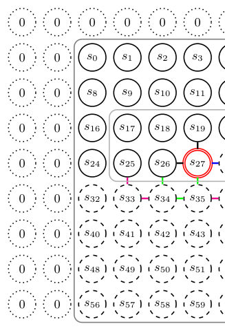
<figcaption class="paper-figure-caption"><b>Fig 1.</b> Figure 1: Calculating the p(s27|s&lt;27). Solid black lines indicate the spins that are already fixed. The dashed lines denote the spins that are not yet fixed and should be summed over to obtain the true conditional probability p27(s&lt;27). The dotted lines indicate padding spins that are required for efficient t4 order calculations. The inner contour represents the convo- lution kernel for t4 order approximation. Other approximations require smaller kernels and respectively smaller padding. This approach does not take into account the periodic boundary conditions in the vertical direction.</figcaption>
</figure>
<figure class="paper-figure-card">
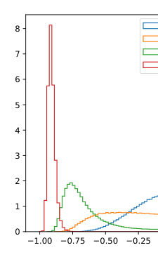
<figcaption class="paper-figure-caption"><b>Fig 2.</b> Figure 2: Magnetization distribution for the values of β considered in this reference. Obtained from Monte-Carlo simulations.</figcaption>
</figure>
<figure class="paper-figure-card">
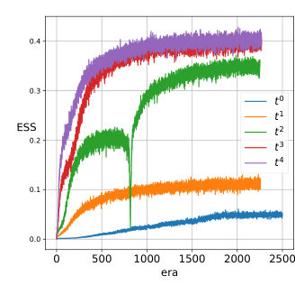
<figcaption class="paper-figure-caption"><b>Fig 3.</b> Figure 3: History of the training for Ising model on 32 lattice at critical β. ESS (left) and m (right). The horizontal axis marks the eras where an era is a 100 weights update using the batch of 4096 samples. For clarity we present a moving average over 100 weights updates.</figcaption>
</figure>
<figure class="paper-figure-card">
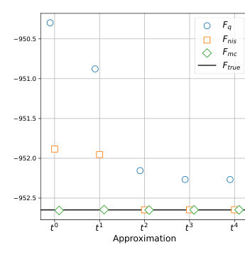
<figcaption class="paper-figure-caption"><b>Fig 4.</b> Figure 4: Various estimates of F for the Ising model at critical β (left) and β = 0.5 (right). Uncertainties are much smaller than the points size.</figcaption>
</figure>
<figure class="paper-figure-card">
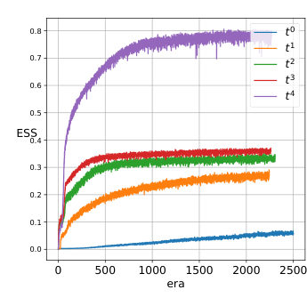
<figcaption class="paper-figure-caption"><b>Fig 5.</b> Figure 5: History of the training for the Ising model at β = 0.5.</figcaption>
</figure>

**Summary.** This paper tackles the inefficiency of Monte Carlo simulations near phase transitions by employing Variational Autoregressive Networks (VANs). The key contribution is demonstrating that embedding physical knowledge, such as symmetries and local interactions, as priors into the neural network architecture drastically improves training stability and accuracy for simulating spin models like the Ising and Edwards-Anderson systems.

**Why it may be interesting.** The work directly addresses the intersection of advanced machine learning (autoregressive models) and complex many-body physics (spin glasses), providing a blueprint for physics-informed AI in condensed matter.

Detailed structure

**Main problem.** Monte Carlo simulations suffer from critical slowing down near phase transitions, and deep learning samplers struggle with training because they ignore underlying physical symmetries.

**Main result.** Incorporating physical priors into Variational Autoregressive Networks significantly reduces the training burden and improves simulation efficiency for discrete spin models.

**Method.** The authors propose a framework using VANs, approximating the true probability distribution by incorporating physical constraints (priors) derived from the system's symmetries and interactions.

**Model / system.** The study focuses on discrete spin systems, specifically the Ising model and the Edwards-Anderson spin glass model, defined by Hamiltonians involving nearest-neighbor interactions.

**Key observables.** Autocorrelation time, Free Energy (F), Magnetization (M), and Effective Sample Size (ESS).

**Important parameters / regimes.** Temperature parameter beta ($eta$), critical temperature ($eta_c$), and system size (e.g., $32 	imes 32$ lattice).

**Assumptions / limitations.** The core assumption is that restricting the network's dependency structure using physical priors (instead of a 'blank slate' approach) is beneficial for training stability and accuracy.

**Figures summary.** Figures illustrate training histories (ESS, magnetization) comparing different approximation levels ($t_1, t_2, t_3$) for both the Ising and Edwards-Anderson models, showing convergence towards true values.

**Paper structure.** The paper systematically develops the VAN framework, applies it to the Ising model, and then extends the methodology to the more complex Edwards-Anderson spin glass model, comparing results across various temperature regimes and approximation orders.

Abstract

Monte Carlo methods are essential across diverse scientific fields, yet their efficiency is frequently hampered by critical slowing down-a sharp increase in autocorrelation times near phase transitions. Although deep learning approaches, such as neural-network-based samplers, have been proposed to alleviate this issue, they face another serious problem: the difficulty of training the models. This difficulty partially stems from the overly general nature of original machine-learning architectures, which often ignore underlying physical symmetries and force networks to relearn them from scratch. In this paper, we demonstrate that incorporating physical priors into the model significantly enhances performance. Building upon existing strategies that integrate spin-spin interactions, we propose a framework that utilizes a prior probability distribution as a starting point for training. Our results for the Ising model, as well as for the Edwards-Anderson spin glass model, suggest that moving away from `blank slate' models in favor of physics-informed priors reduces the training burden and facilitates the simulation of larger system sizes in discrete spin models.

[↑ back to top](#top)

### [Bayesian Sequential Verification for Budget-Aware Quantum Program Testing](http://arxiv.org/abs/2605.15601v1)

**Authors:** Lei Zhang  
**Type:** theory · **Category:** quantum information and computing · **PDF:** <https://arxiv.org/pdf/2605.15601v1>  
**Analysis basis:** full PDF text, analyzed in chunks
**Topic relevance:** `quantum measurements` **3/5** · `analog quantum simulation` **1/5** · `entanglement & information structure` **1/5** · `measurement-induced transitions` **1/5**

↔ Scroll figures horizontally

<figure class="paper-figure-card">
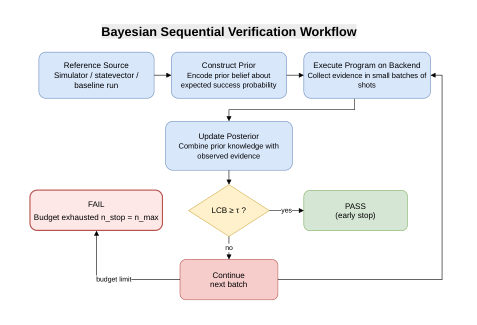
<figcaption class="paper-figure-caption"><b>Fig 1.</b> Fig. 1. Overall illustration of the Bayesian sequential verification workflow.</figcaption>
</figure>

**Summary.** This paper introduces Bayesian sequential verification, a statistically robust method for testing quantum programs under finite measurement budgets. It uses Bayesian Hypothesis Testing to sequentially update confidence in a program's success probability, allowing for early termination when sufficient evidence is gathered. This provides a practical, resource-aware workflow for building reliable quantum continuous-integration pipelines.

**Why it may be interesting.** While focused on quantum computation, the rigorous statistical framework for resource-constrained decision-making (budget-aware testing) is highly relevant for characterizing the reliability of complex quantum simulations or measurements in AMO physics.

Detailed structure

**Main problem.** The paper addresses the challenge of verifying quantum programs, which yield statistical distributions, by developing a method that is both statistically rigorous and mindful of limited computational resources (shot budgets).

**Main result.** Bayesian sequential verification significantly reduces the required measurement cost compared to fixed-budget testing when the quantum program's success probability exceeds the target threshold.

**Method.** It formulates the verification as a reference-based Bayesian Hypothesis Testing workflow, iteratively updating posterior distributions batch-by-batch as measurement evidence accumulates.

**Model / system.** The work applies to general quantum programs tested on quantum backends, using case studies like Bell-state preparation and QAOA for MaxCut optimization.

**Key observables.** Property success probability ($	heta$), conservative lower credible bound (LCB), and the resulting pass/fail decision.

**Important parameters / regimes.** Prior strength ($s$), target threshold ($	au$), batch size ($b$), and the required pass-streak ($r$).

**Assumptions / limitations.** The outcomes are assumed to be conditionally independent and identically distributed (i.i.d.) given the true probability, and the prior must be accurately estimated from reference runs.

**Figures summary.** Figure 1 illustrates the overall workflow from reference source to decision. Algorithm 1 details the sequential Bayesian verification procedure, including LCB calculation and stopping rules.

**Paper structure.** The paper introduces the problem, details the Bayesian sequential verification methodology (priors, sequential updates, LCB decision rule), evaluates it on Bell-state and QAOA workloads, and compares its efficiency against fixed-budget baselines.

Abstract

Quantum programs often produce probability distributions rather than deterministic outputs, making verification inherently statistical and increasingly costly on real hardware. In practice, developers still frequently rely on testing with fixed shot budgets on simulators, which are simple but time-consuming and poorly suited to noisy backends. What is missing is a verification approach that is both statistically explicit and budget-aware.   This paper formulates Bayesian sequential verification as a reference-based Bayesian hypothesis testing workflow in which priors are derived from explicit reference sources, such as finite-shot reference runs or ideal/statevector-based computation, and verification decisions are updated batch by batch as measurement evidence accumulates.   This approach is evaluated in Qiskit on two complementary workloads: Bell-state and QAOA-MaxCut. Across both case studies, the results show that Bayesian sequential verification can substantially reduce measurement costs compared to fixed-budget baselines when the success probability of the program exceeds the target threshold.   The findings position Bayesian sequential verification as a practical verification workflow for quantum programs. The approach provides a foundation for future quantum continuous-integration pipelines that require reliable, budget-aware pass/fail decisions and motivates validation on real quantum hardware.

[↑ back to top](#top)

### [When Noisy Quantum Order Finding Remains Recoverable for Shor's Algorithm](http://arxiv.org/abs/2605.16074v1)

**Authors:** Qingxin Yang, Stefano Markidis  
**Type:** both · **Category:** quantum information and computing · **PDF:** <https://arxiv.org/pdf/2605.16074v1>  
**Analysis basis:** full PDF text, analyzed in chunks
**Topic relevance:** `QC/QI experiment` **3/5** · `quantum measurements` **3/5**

↔ Scroll figures horizontally

<figure class="paper-figure-card">
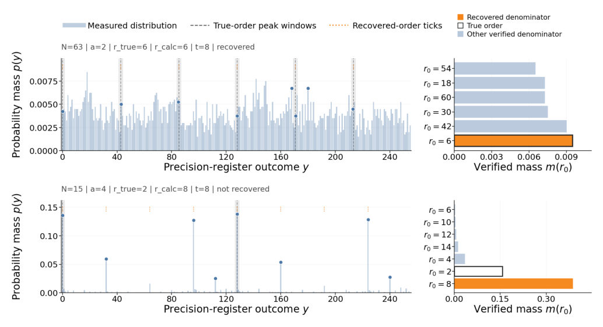
<figcaption class="paper-figure-caption"><b>Fig 1.</b> Figure 1: Top: Recoverability despite weak global histogram structure. Although the measured distribution is diffuse and the global structure metrics are weak, the verified candidate comparison still selects the true period, 𝑟= 6, yielding recoverability. Bottom: No recoverability despite visible peak structure. The verified candidate comparison favors an incorrect period, 𝑟= 8, over the true period, 𝑟= 2, and recoverability fails.</figcaption>
</figure>
<figure class="paper-figure-card">
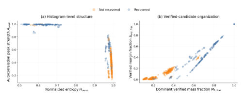
<figcaption class="paper-figure-caption"><b>Fig 2.</b> Figure 2: Residual structure and recoverability. Each point represents one instance, colored by recoverability outcome. (a) Normalized entropy 𝐻norm versus autocorrelation peak strength 𝐴peak, characterizing flatness and residual structure. (b) Dominant verified mass fraction 𝑀1,frac versus verified margin fraction Δver,frac, characterizing the organization of residual structure.</figcaption>
</figure>
<figure class="paper-figure-card">
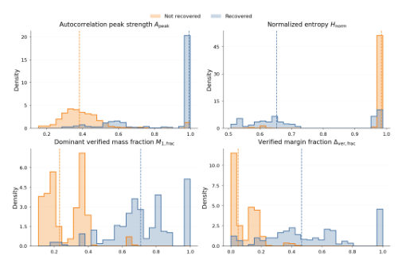
<figcaption class="paper-figure-caption"><b>Fig 3.</b> Figure 3: Distribution of four features by recoverability. The histograms compare runs that were not recoverable (orange) with runs that were recoverable (blue) for autocorrelation peak strength 𝐴peak, normalized entropy 𝐻norm, dominant verified mass fraction 𝑀1,frac and verified margin fraction Δver,frac. Bars show empirical density, and dashed vertical lines mark the median of each group.</figcaption>
</figure>
<figure class="paper-figure-card">
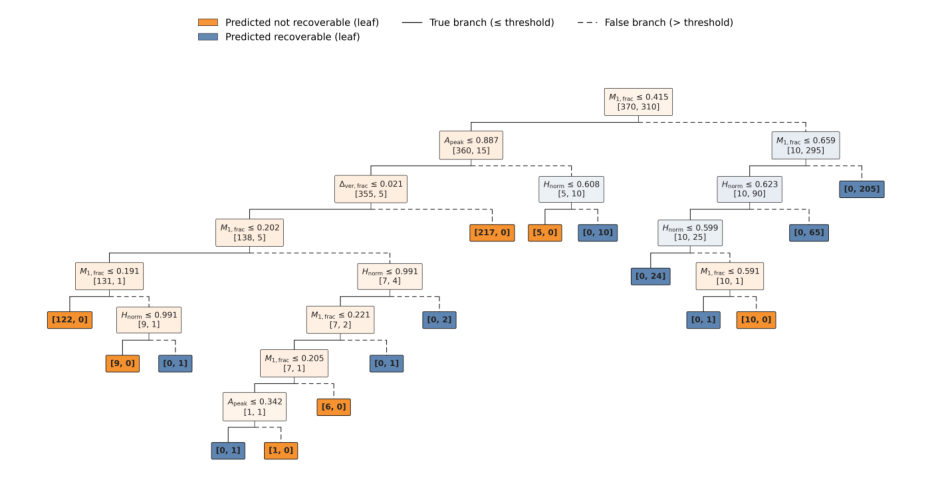
<figcaption class="paper-figure-caption"><b>Fig 4.</b> Figure 4: Decision tree classifier for predicting recoverability. Internal nodes show split rules based on 𝐴peak, 𝐻norm, 𝑀1,frac, and Δver,frac. Terminal leaves show the final prediction, with orange indicating predicted not recoverable and blue indicating predicted recoverable. Counts are shown as [not recoverable, recoverable]. Solid black branches indicate the true condition, ≤ threshold, while dashed black branches indicate the false condition, &gt; threshold.</figcaption>
</figure>
<figure class="paper-figure-card">
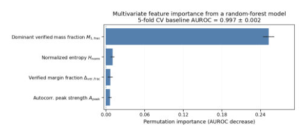
<figcaption class="paper-figure-caption"><b>Fig 5.</b> Figure 5: Permutation importance from a random-forest clas- sifier trained on the four selected recoverability features. Importance is measured as the decrease in held-out AUROC after randomly permuting each feature. Error bars show the standard deviation across cross-validation folds.</figcaption>
</figure>

**Summary.** This work analyzes the robustness of order finding, a key step in Shor's algorithm, when subjected to noise on current quantum hardware. By analyzing measured probability distributions, the authors find that successful recovery depends most strongly on how concentrated the verified probability mass is on the correct candidate denominator. This highlights that post-processing-aware metrics are more predictive of algorithmic success than global measures of distribution structure.

**Why it may be interesting.** The focus on the interplay between quantum measurement noise and classical signal processing techniques (like continued fractions) provides concrete, actionable metrics for diagnosing the performance limits of quantum algorithms on NISQ hardware.

Detailed structure

**Main problem.** The paper investigates the conditions under which the true multiplicative order, a core subroutine of Shor's algorithm, can be recovered from a measured, noisy quantum phase estimation distribution.

**Main result.** Recoverability is primarily governed not by the global structure of the noise-affected distribution, but by the concentration of verified probability mass on the correct candidate denominator after classical post-processing.

**Method.** The authors analyzed 680 measured distributions using classical post-processing (continued-fraction) and characterized them using four features: autocorrelation peak strength, normalized entropy, dominant verified mass fraction, and verified margin fraction.

**Model / system.** The study uses measured precision-register output distributions collected from IBM quantum systems simulating noisy order finding circuits. The underlying process involves the ideal comb-like structure being distorted by quantum noise.

**Key observables.** Autocorrelation peak strength, Normalized entropy, Dominant verified mass fraction, and Verified margin fraction.

**Important parameters / regimes.** The true multiplicative order ($r$), the measured distribution $p(y)$, and the parameters defining the noise model (e.g., $\epsilon$ in the convolution model).

**Assumptions / limitations.** The analysis assumes the standard classical post-processing routine (continued-fraction) is applied, and it separates global distribution structure from post-processing-aware mass competition.

**Figures summary.** Figures illustrate examples of recoverable/non-recoverable cases, and feature comparisons (e.g., $M_{1,frac}$ vs. $\Delta_{ver,frac}$) show trends where higher values correlate with recoverability. Random forest permutation importance confirms $M_{1,frac}$ as the most predictive feature.

**Paper structure.** The paper progresses from defining the problem (noisy order finding) to developing diagnostic features based on post-processing outcomes. It then employs statistical classifiers (AUROC, Random Forest, Decision Tree) to determine which features best predict recoverability, culminating in the identification of the dominant verified mass fraction as the key indicator.

Abstract

Order finding is the core subroutine of Shor's algorithm. On NISQ hardware, phase estimation output distributions are often distorted by noise, making correct order recovery difficult. We study recoverability in noisy order finding: given a measured precision-register distribution, when does standard classical post-processing still return the true order? We analyze 680 distributions from IBM quantum systems across problem instances and circuit settings. For each distribution, we apply continued-fraction post-processing with modular verification and define recoverability as whether the recovered order equals the true one. We characterize each distribution using four features: autocorrelation peak strength, normalized entropy, dominant verified mass fraction, and verified margin fraction. We evaluate these quantities using marginal feature comparisons, single-feature AUROC analysis, and multivariate tree-based classifiers. We use random-forest permutation importance to assess which quantities contribute distinct predictive information once the other features are known. To make classification behavior interpretable, we train a decision tree that exposes threshold rules for recoverable and non-recoverable distributions. We find that recoverability is strongly associated with residual comb-like structure in the measured distribution and the way verified probability mass is organized across candidate denominators. The dominant verified mass fraction is the strongest single-feature indicator of recoverability, and tree-based analysis shows it also provides the primary split in an interpretable threshold description. Some highly distorted distributions remain recoverable when one verified denominator dominates the post-processing mass, while some visibly structured distributions fail because classical post-processing favors an incorrect verified denominator.

[↑ back to top](#top)

### [A general proof of integer Rényi QNEC](http://arxiv.org/abs/2605.15272v1)

**Authors:** Tanay Kibe, Pratik Roy  
**Type:** theory · **Category:** other · **PDF:** <https://arxiv.org/pdf/2605.15272v1>  
**Analysis basis:** full PDF text, analyzed in chunks
**Topic relevance:** `entanglement & information structure` **3/5** · `Keldysh / 2PI / non-Gaussian methods` **2/5**

↔ Scroll figures horizontally

<figure class="paper-figure-card">
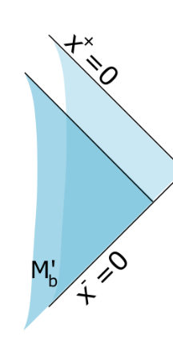
<figcaption class="paper-figure-caption"><b>Fig 1.</b> Figure 1. Schematic of the null cut algebras. The transverse directions are perpendicular to the plane of the figure. The null planes x± = 0 are labelled. Light blue regions correspond to the Rindler wedge R : {x+ &gt; 0, x−&lt; 0} and its commutant R′. Dark blue regions correspond to the null cut algebra Mb and its commutant M ′ b.</figcaption>
</figure>

**Summary.** This theoretical paper proves the Rényi Quantum Null Energy Condition for integer parameters $n \ge 2$ within the framework of local Poincaré-invariant Quantum Field Theory. It achieves this by demonstrating the log-convexity of the Rényi relative entropy using sophisticated tools from operator algebras and non-commutative functional analysis. The result provides a powerful mathematical constraint on the structure of quantum states in QFT.

**Why it may be interesting.** The rigorous mathematical framework connecting quantum energy conditions (a fundamental constraint in QFT) to the convexity properties of generalized entropy measures (Rényi divergences) is highly relevant for understanding quantum field theory constraints in curved or null-geometry backgrounds.

Detailed structure

**Main problem.** The paper aims to prove the Rényi Quantum Null Energy Condition (Rényi QNEC), which is a generalization of the standard Quantum Null Energy Condition (QNEC). This conjecture relates to the non-negativity of the second null shape variation of the Sandwiched Rényi Divergence (SRD).

**Main result.** The authors prove the Rényi QNEC for all integer Rényi parameters $n \ge 2$ for von Neumann algebras possessing a half-sided modular inclusion structure. This is achieved by proving the log-convexity of the associated Kosaki $L_n$ norm.

**Method.** The proof employs advanced techniques from operator algebras, specifically utilizing von Neumann algebras, Haagerup's non-commutative $L_p$ spaces, and analyzing the dynamics generated by null translations via semigroups.

**Model / system.** The context is local Poincaré-invariant Quantum Field Theory (QFT) on Minkowski spacetime, analyzed using null coordinates and associated with von Neumann algebras defined over null-cut regions.

**Key observables.** Sandwiched Rényi Divergence (SRD), $D_n(\Psi\|\Omega; M_A)$, and the Kosaki $L_n$ norm of normal positive functionals.

**Important parameters / regimes.** Integer Rényi parameter $n \ge 2$, and the continuous parameter $c$ governing the null translation flow.

**Assumptions / limitations.** The existence of a half-sided modular inclusion (HSMI) structure on the von Neumann algebras, and the finiteness of the SRD of the excited state relative to the vacuum.

**Figures summary.** Figure 1 schematically illustrates null cut algebras, such as the Rindler wedge and the null cut algebra $M_b$.

**Paper structure.** The paper builds from defining the SRD and the RQNEC conjecture, establishing the necessary mathematical framework using non-commutative $L_p$ spaces and null translations, and culminating in the proof of log-convexity via a cyclic Ward identity.

Abstract

The Rényi quantum null energy condition conjectures that the second null shape variation of the sandwiched Rényi divergence (SRD) of an excited state relative to the vacuum is non-negative in local Poincaré-invariant quantum field theory, giving a one-parameter generalization of the quantum null energy condition (QNEC). We prove Rényi QNEC for all integer Rényi parameters $n\geq 2$ for von Neumann algebras carrying a half-sided modular inclusion structure. The only assumption on the excited state is finiteness of its SRD relative to the vacuum. Concretely, for any $σ$-finite von Neumann algebra with such an inclusion, we prove log-convexity, under the associated null-translation semigroup, of the Kosaki $L^n$ norm of any normal positive functional with finite $L^n$ norm.

[↑ back to top](#top)

### [Quantum compressed sensing](http://arxiv.org/abs/2605.15784v1)

**Authors:** Jianyong Hu, Wei Li, Shuxiao Wu, Liwen Zhang, Yongchuang Sun, Jiazhao Tian, Guosheng Feng, Zhixing Qiao, Jianqiang Liu, Changgang Yang, Ruiyun Chen, Chengbing Qin, Guofeng Zhang, Liantuan Xiao, Suotang Jia  
**Type:** both · **Category:** quantum information and computing · **PDF:** <https://arxiv.org/pdf/2605.15784v1>  
**Analysis basis:** full PDF text, analyzed in chunks
**Topic relevance:** `quantum measurements` **3/5** · `entanglement & information structure` **1/5** · `measurement-induced transitions` **1/5**

↔ Scroll figures horizontally

<figure class="paper-figure-card">
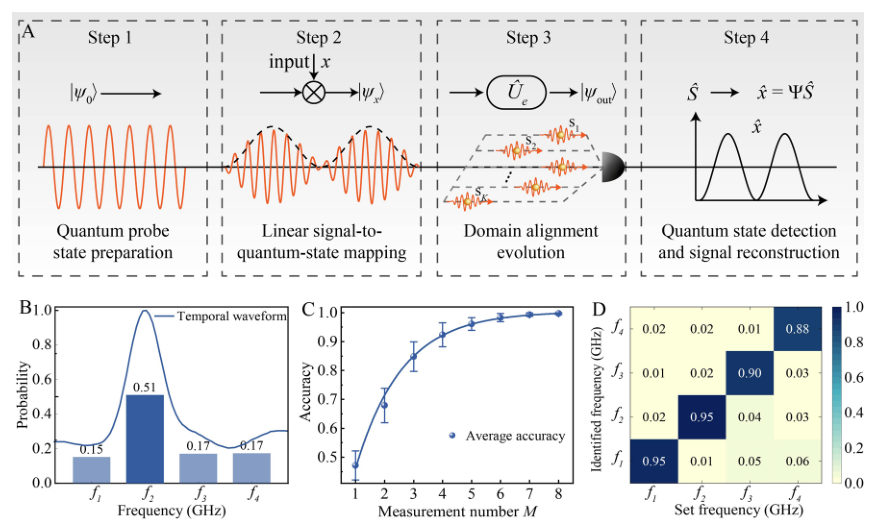
<figcaption class="paper-figure-caption"><b>Fig 1.</b> Figure 1. QCS paradigm and frequency-domain validation. (A) The QCS workflow comprises four steps. Step 1, quantum</figcaption>
</figure>
<figure class="paper-figure-card">
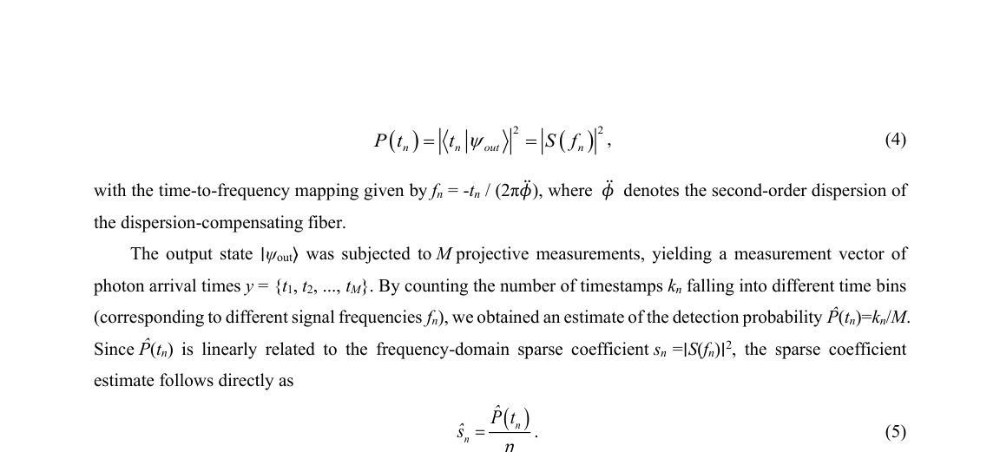
<figcaption class="paper-figure-caption"><b>Fig 2.</b> Figure 1(B) shows the probability distribution over a four-dimensional sparse vector for a single-tone signal</figcaption>
</figure>
<figure class="paper-figure-card">
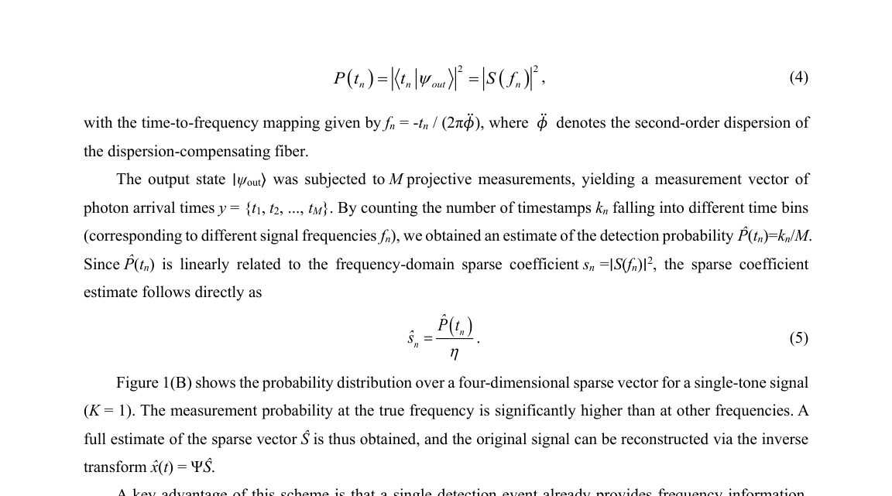
<figcaption class="paper-figure-caption"><b>Fig 3.</b> Figure 1(C) shows that the frequency identification accuracy reaches 47% with a single photon detection event</figcaption>
</figure>
<figure class="paper-figure-card">
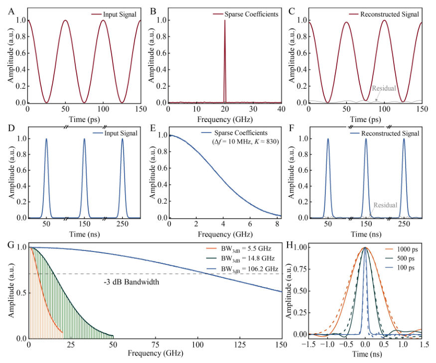
<figcaption class="paper-figure-caption"><b>Fig 4.</b> Figure 2. Frequency-domain sparse signal reconstruction based on DFT scheme. (A-C) Reconstruction of a single-tone signal</figcaption>
</figure>
<figure class="paper-figure-card">
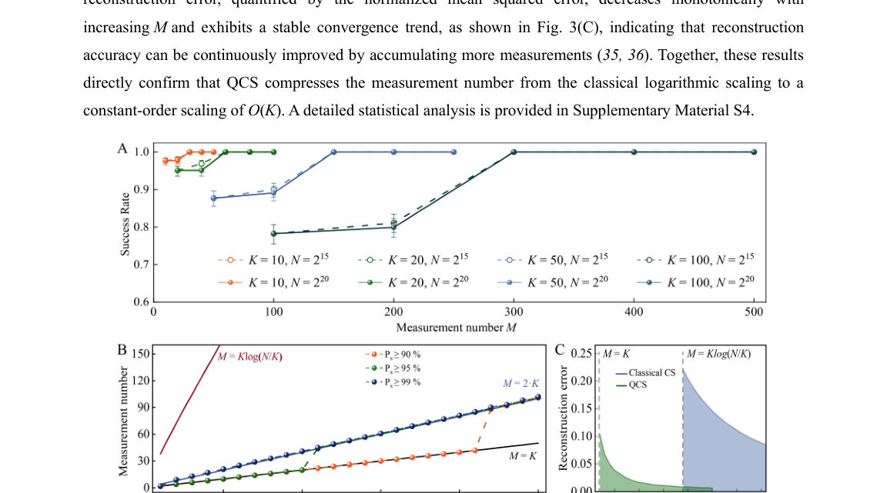
<figcaption class="paper-figure-caption"><b>Fig 5.</b> Figure 3. QCS results for time-domain sparse signals. (A) Reconstruction success rate versus measurement number M for</figcaption>
</figure>

**Summary.** This work introduces Quantum Compressed Sensing (QCS), a paradigm that uses unitary quantum evolution to reconstruct sparse signals. By encoding positional information into the quantum state evolution rather than requiring explicit measurements, QCS bypasses the classical measurement lower bound. This results in a measurement requirement scaling linearly with sparsity ($M \sim K$), offering a major leap in information acquisition efficiency for sensing and imaging.

**Why it may be interesting.** It provides a concrete physical pathway—using unitary transformations—to overcome fundamental information-theoretic limits in measurement-based signal processing, which has implications for quantum sensing and metrology.

Detailed structure

**Main problem.** The paper addresses the fundamental limitation of classical Compressed Sensing (CS) by proposing Quantum Compressed Sensing (QCS) to achieve superior signal acquisition efficiency.

**Main result.** QCS reduces the required measurement number from the classical bound of $M = O(K\log(N/K))$ to $M \sim O(K)$, achieving ultimate information acquisition efficiency.

**Method.** The methodology reframes signal acquisition as a unitary quantum evolution, using domain-alignment evolution to physically execute the support-set search at the quantum level.

**Model / system.** The system involves preparing a quantum probe state, mapping the signal onto the state, applying a unitary domain-alignment evolution, and performing projective measurements on the output state.

**Key observables.** Measurement number ($M$), reconstruction fidelity, and the success rate of recovering sparse coefficients.

**Important parameters / regimes.** Sparsity ($K$), signal dimension ($N$), and the measurement number ($M$).

**Assumptions / limitations.** The process relies on the existence of a physically realizable unitary operator for domain alignment and assumes a linear relationship between detection probability and signal amplitude.

**Figures summary.** Figures illustrate the QCS workflow, compare the linear scaling of required measurements ($M \sim K$) against the classical bound, and show reconstruction examples in both time and frequency domains.

**Paper structure.** The paper builds from establishing the classical CS lower bound, introducing the QCS paradigm via unitary evolution, detailing the four-step physical implementation (probe state, mapping, alignment, detection), and validating the $M \sim K$ scaling experimentally.

Abstract

How many measurements are fundamentally required to capture a signal. Shannon's information theory established the bedrock of this question in 1948, the Nyquist Shannon theorem set the first answer, and compressed sensing (CS) rewrote it in 2006 by reducing the required measurement number to M = O(Klog(N/K)) for a K sparse signal. Here, we propose quantum compressed sensing (QCS), a paradigm that reframes signal acquisition as a unitary quantum evolution. By encoding high dimensional signal information into a single quantum probe state, then introducing domain-alignment evolution,a physically realizable unitary transformation that maps the sparse basis directly onto the measurement basis. QCS executes the support-set search at the quantum level without consuming measurement trials. The logarithmic penalty vanishes, compressing the required measurement number from the classical bound to M =O(K) and reducing reconstruction from ill posed optimization to linear estimation. We experimentally validate QCS using frequency and time domain sparse signals, confirming that the measurement number scales linearly with sparsity and decouples entirely from the signal dimension. Our work provides a physical pathway toward ultimate information acquisition efficiency, with broad implications for sensing, imaging, and communication.

[↑ back to top](#top)

### [Thermodynamic signatures of a field-induced ordered intermediate phase in Na$_2$Co$_2$TeO$_6$](http://arxiv.org/abs/2605.15829v1)

**Authors:** Prashanta K. Mukarjee, Sebastian Erdmann, R. Kalaivanan, R. Sankar, Kwang-Yong Choi, Alexander A. Tsirlin, Philipp Gegenwart  
**Type:** experiment · **Category:** strongly correlated electrons · **PDF:** <https://arxiv.org/pdf/2605.15829v1>  
**Analysis basis:** full PDF text, analyzed in chunks
**Topic relevance:** `exotic spin models in light-matter` **3/5** · `analog quantum simulation` **2/5**

↔ Scroll figures horizontally

<figure class="paper-figure-card">
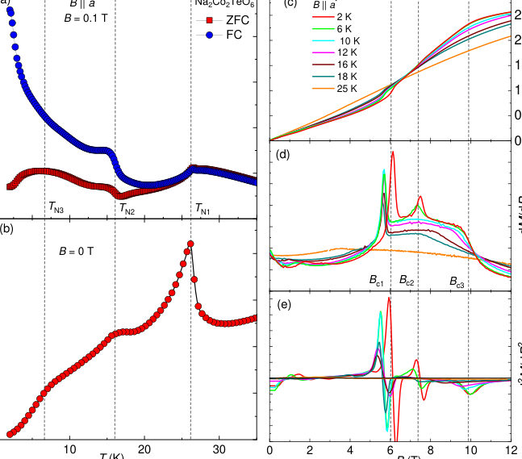
<figcaption class="paper-figure-caption"><b>Fig 1.</b> FIG. 1. Magnetization and specific heat: (a) Zero-field cooled (ZFC) and field-cooled (FC) DC magnetic susceptibility versus T measured at B = 0.1 T. (b) Specific heat of NCTO in B = 0 T. The grey dotted lines indicate phase transitions. (c) Field-dependent magnetization, M(B), for NCTO at different temperatures down to 2 K. (d,e) The first and second derivative of M(B). The grey dotted lines indicate the positions of the critical fields.</figcaption>
</figure>
<figure class="paper-figure-card">
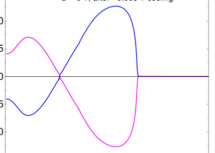
<figcaption class="paper-figure-caption"><b>Fig 2.</b> FIG. 2. Residual moment: Temperature dependent magnetiza- tion measured in zero field after cooling the sample in weak train- ing fields for (a) in-plane (B ∥a∗) and (b) out-of-plane (B ∥c) directions.</figcaption>
</figure>
<figure class="paper-figure-card">
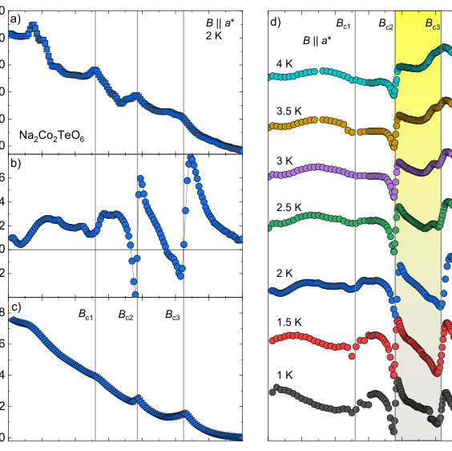
<figcaption class="paper-figure-caption"><b>Fig 3.</b> FIG. 3. Field dependence of ΓB and specific heat: (a) Specific heat as a function of magnetic field at T = 2 K. (b) Magnetic Grüneisen parameter ΓB as a function of magnetic field at T = 2 K. (c) Field evolution of magnetic entropy at T = 2 K. (d) Field evolution of ΓB at different temperatures down to 1 K. The data are vertically offset for clarity. The gray lines indicate the position of the critical fields. The region between Bc2 and Bc3 is presented in yellowish-gray color. The data in this figure are shown for the increasing field-sweep cycle.</figcaption>
</figure>
<figure class="paper-figure-card">
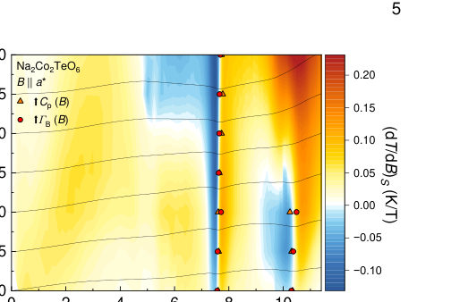
<figcaption class="paper-figure-caption"><b>Fig 4.</b> FIG. 4. Colour map: Colour map of the adiabatic MCE as a function of temperature T and magnetic field B for B ∥a∗. The color scale represents (dT/dB)S in units of K/T, where positive (yellow–red regions) and negative (blue regions) values highlight distinct field-induced regimes. The black lines display adiabatic temperature traces. Pronounced features near ∼8 T and ∼10– 11 T mark phase boundaries consistent with the critical fields dis- cussed in the text. The triangles and circles are from the position of broad maxima in Cp(B) and zero-crossings in ΓB which signal the appearance and disappearance of phase III as a function of field.</figcaption>
</figure>
<figure class="paper-figure-card">
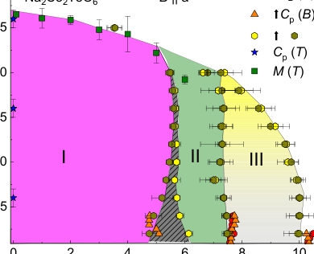
<figcaption class="paper-figure-caption"><b>Fig 5.</b> FIG. 5. B–T phase diagram of NCTO: To construct the mag- netic phase diagram, transition points were identified from charac- teristic features in thermodynamic and magnetic measurements. For temperature sweeps, peaks in d[χ(T)T]/dT and anomalies in the specific heat Cp(T) were used. For field sweeps, the phase boundaries were determined from peaks and broad minima in dM/dB and d2M/dB2, maxima in the field-dependent specific heat Cp(B), and zero crossings in the magnetic Grüneisen pa- rameter ΓB.</figcaption>
</figure>

**Summary.** This work presents a detailed thermodynamic investigation of $	ext{Na}_2	ext{Co}_2	ext{TeO}_6$ under high magnetic fields to probe its potential as a Quantum Spin Liquid. By measuring specific heat and magnetization, the authors identify three distinct field-induced phase transitions. Crucially, they argue that the observed thermodynamic behavior contradicts the expected signatures of a QSL in one of the intermediate phases.

**Why it may be interesting.** The detailed thermodynamic mapping of field-induced transitions in a strongly correlated magnetic material like a cobaltate provides crucial experimental constraints for theoretical models of exotic quantum states, such as QSLs.

Detailed structure

**Main problem.** The study investigates the nature of field-induced ordered intermediate phases in the honeycomb cobaltate $	ext{Na}_2	ext{Co}_2	ext{TeO}_6$, specifically testing the hypothesis that it hosts Quantum Spin Liquid (QSL) behavior.

**Main result.** The thermodynamic measurements reveal successive field-induced transitions, but the phase between $B_{c2}$ and $B_{c3}$ lacks the expected enhanced magnetic entropy of a QSL, suggesting a distinct ordered state.

**Method.** The research employed a comprehensive thermodynamic study using magnetization, specific heat, and magnetocaloric-effect measurements across a low-temperature, high-field phase diagram.

**Model / system.** The physical system is the honeycomb cobaltate $	ext{Na}_2	ext{Co}_2	ext{TeO}_6$, which is studied as a candidate material for realizing QSL behavior, often compared to theoretical models like the Kitaev model.

**Key observables.** Magnetization ($M$), specific heat ($C_p$), magnetic Grüneisen parameter ($\Gamma_B$), and magnetic entropy ($\Delta S$).

**Important parameters / regimes.** In-plane magnetic fields ($B \parallel a^*$) at critical values $B_{c1} \simeq 6 	ext{ T}$, $B_{c2} \simeq 7.8 	ext{ T}$, and $B_{c3} \simeq 10.4 	ext{ T}$.

**Assumptions / limitations.** The analysis assumes that sharp anomalies in thermodynamic quantities correspond to well-defined phase transitions, and that the QSL state would exhibit specific entropy signatures.

**Figures summary.** Figures show $M$ and $C_p$ vs $T$ and $B$, and derivatives like $dM/dB$ and $d^2M/dB^2$, highlighting the three critical fields $B_{c1}, B_{c2}, B_{c3}$ through various anomalies.

**Paper structure.** The paper systematically presents thermodynamic measurements ($M, C_p, \Gamma_B$) across the field-temperature phase diagram, identifying three successive transitions and analyzing the thermodynamic signatures of the resulting intermediate phases.

Abstract

The honeycomb cobaltate Na$_2$Co$_2$TeO$_6$ has recently been proposed as a candidate material for hosting field-induced quantum spin liquid (QSL) behavior. Here, we present a comprehensive thermodynamic study of its low-temperature, high-field phase diagram using magnetization, specific heat, and magnetocaloric-effect measurements down to 1 K. In zero field, we observe a weak residual moment that provides further insight into the nature of the magnetic ground state. For in-plane magnetic fields ($B \parallel a^*$), we identify three field-induced transitions at $B_{c1} \simeq 6$ T, $B_{c2} \simeq 7.8$ T, and $B_{c3} \simeq 10.4$ T. The magnetic Grüneisen parameter and specific heat reveal clear thermodynamic signatures of these successive phase transitions enclosing two intermediate phases. Contrary to expectations for a field-induced QSL, the phase between $B_{c2}$ and $B_{c3}$ lacks enhanced magnetic entropy but instead shows behavior consistent with a distinct ordered state. Above $B_{c3}$, the absence of additional anomalies indicates a crossover to a conventional spin-polarized regime. Our results place stringent thermodynamic constraints on the proposed QSL scenario in Na$_2$Co$_2$TeO$_6$, calling for further microscopic investigations to establish the precise nature of the field-induced phases.

[↑ back to top](#top)

### [Supergravity flows, wormholes and their pseudo-Hermitian holographic duals](http://arxiv.org/abs/2605.16168v1)

**Authors:** Jose M. Begines, Antón F. Faedo, Carlos Hoyos, Daniele Musso  
**Type:** theory · **Category:** other · **PDF:** <https://arxiv.org/pdf/2605.16168v1>  
**Analysis basis:** full PDF text, analyzed in chunks
**Topic relevance:** `entanglement & information structure` **3/5** · `Keldysh / 2PI / non-Gaussian methods` **1/5**

↔ Scroll figures horizontally

<figure class="paper-figure-card">
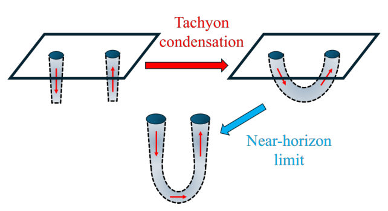
<figcaption class="paper-figure-caption"><b>Fig 1.</b> Figure 1. Possible formation of the wormhole. Two stacks of branes and anti-branes form throats inside an asymptotically flat spacetime when they backreact. Condensation of the open string tachyon makes the two throats connect forming a wormhole. In the near-horizon limit the geometry is restricted to the interior of the wormhole, that connects two asymptotically AdS spacetimes.</figcaption>
</figure>
<figure class="paper-figure-card">
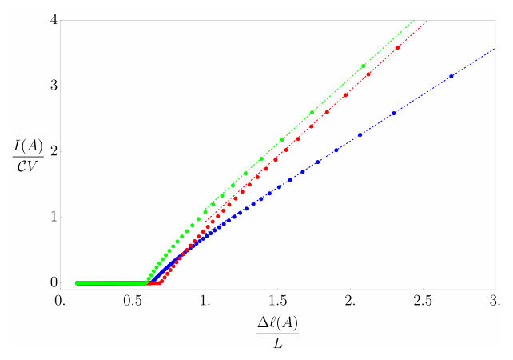
<figcaption class="paper-figure-caption"><b>Fig 2.</b> Figure 2. Mutual information of a strip I(A)/(CV (T d−2)) as a function of the width ∆ℓ(A)/L, with C = L/Gd+1. The cases represented here are the wormholes obtained from the analytic extensions of: 1. Coulomb branch of N = 4 SYM (blue), 2. Coulomb branch of ABJM (red), and 5. GPPZ (green). The dots are computed numerically using (4.25) and (4.26), and the dashed lines are linear fits at large values of the width. The slopes of the fits agree with (4.30).</figcaption>
</figure>

**Summary.** This work explores supergravity solutions featuring traversable wormholes, interpreting them holographically as dual to entangled states of quantum field theories. The key theoretical insight is that these dual theories exhibit pseudo-Hermitian and PT-symmetric properties. The methodology combines advanced techniques from general relativity, string theory, and quantum information theory.

**Why it may be interesting.** The connection between gravitational phenomena (wormholes, supergravity) and the mathematical structure of PT-symmetry and pseudo-Hermiticity provides a rich theoretical framework relevant to non-Hermitian quantum mechanics.

Detailed structure

**Main problem.** The paper investigates supergravity flows and wormhole solutions, focusing on their holographic duals which are hypothesized to be pseudo-Hermitian and PT-symmetric.

**Main result.** The authors demonstrate that wormhole solutions can be interpreted as the low-energy theory of branes/anti-branes after tachyon condensation, dual to an entangled state of two copies of the boundary QFT.

**Method.** The analysis combines analytic continuation of supergravity solutions, stability analysis of fluctuations around domain walls, and calculating mutual information for the dual quantum field theories.

**Model / system.** The model involves consistent truncations of supergravity theories, leading to domain wall solutions connecting asymptotically Anti-de Sitter (AdS) spacetimes. The dual system is a quantum field theory exhibiting pseudo-Hermiticity and PT-symmetry.

**Key observables.** Mutual information, Goldstone bosons, the metric remaining real-valued after analytic extension, and the spectrum of metric fluctuations ($M^2$).

**Important parameters / regimes.** The periodicity of the superpotential $W(\eta)$ (e.g., $2\pi$), the separation $X$ between brane stacks, and the radial coordinate $r$ or $\eta$.

**Assumptions / limitations.** The analysis assumes the dual theory is best understood when the metric remains real, and it relies on linearizing fluctuations around background solutions.

**Figures summary.** Figures illustrate the formation of wormholes via tachyon condensation connecting two throats, and the general structure of the effective action and potential governing the dynamics.

**Paper structure.** The paper proceeds by studying analytic extensions of solutions, interpreting wormholes via tachyon condensation, arguing for the pseudo-Hermitian dual, and concluding with stability analysis of fluctuations.

Abstract

We find solutions to consistent truncations of supergravity where some real scalars are analytically extended to imaginary values, ensuring the metric remains real-valued. Among the solutions there are Lorentzian traversable wormholes connecting two asymptotically Anti-de Sitter spacetimes and flows that have a real metric also when uplifted to ten or eleven dimensions. We argue that the holographic duals are pseudo-Hermitian and $PT$-symmetric theories. Wormhole solutions also admit an interpretation as the low-energy theory of two stacks of branes and antibranes after tachyon condensation. The wormhole is then dual to an entangled state of two copies of the theory that lives on a stack of branes. We present some evidence by computing the mutual information between the theories at each boundary and by identifying the Goldstone bosons associated to the breaking of the two copies of Poincaré symmetry to their diagonal subgroup.

[↑ back to top](#top)

### [The role of Wigner rotation in estimating the specific angular momentum of a Kerr spacetime](http://arxiv.org/abs/2605.15600v1)

**Authors:** F. J. Lobo, M. Rivera-Tapia, G. Rubilar, A. Delgado  
**Type:** theory · **Category:** other · **PDF:** <https://arxiv.org/pdf/2605.15600v1>  
**Analysis basis:** full PDF text, analyzed in chunks
**Topic relevance:** `interference shaping light` **3/5** · `quantum measurements` **1/5**

↔ Scroll figures horizontally

<figure class="paper-figure-card">
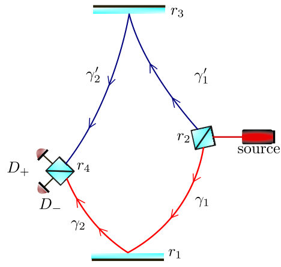
<figcaption class="paper-figure-caption"><b>Fig 1.</b> FIG. 1: Geodesic interferometer: A single photon emit- ted from a source at radial coordinate r2 is prepared in a superposition of states propagating along two paths. One path component travels towards r1 and reflects, while the other travels towards r3 and reflects. Both reflected com- ponents subsequently propagate to the radial coordinate r4, where they are recombined and measured.</figcaption>
</figure>
<figure class="paper-figure-card">
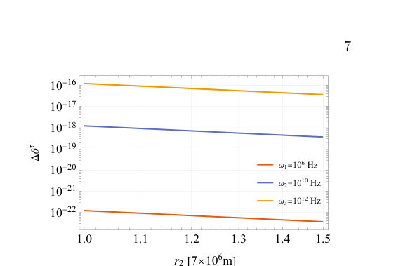
<figcaption class="paper-figure-caption"><b>Fig 2.</b> FIG. 2: Phase difference ∆ϑτ from Eq. (56) as a function of r2 for ω1 = 106 Hz (red line), ω2 = 1010 Hz (blue line) and ω3 = 1012 Hz (yellow line), with l = 0.3 m and h = 0.7 m.</figcaption>
</figure>
<figure class="paper-figure-card">

<figcaption class="paper-figure-caption"><b>Fig 3.</b> FIG. 3: Wigner phase rotation ∆φ from Eq. (58) as a function of the angular coordinate θ. Each line represents the distance r2 of the source of photons from the center of the Earth for ∆r = r3 −r1 = 1 m. The red continuous line corresponds to r2 = REarth and the blue continuous line to r2 = 2 REarth.</figcaption>
</figure>
<figure class="paper-figure-card">
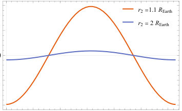
<figcaption class="paper-figure-caption"><b>Fig 4.</b> FIG. 4: Wigner phase rotation ∆φ from Eq. (58) as a function of the angular coordinate θ. Each line represents the distance r2 of the source of photons from the center of the Earth for ∆r = r3 −r1 ≈2 × 103 m. The red continuous line corresponds to r2 = 1.1 REarth and the blue continuous line to r2 = 2 REarth.</figcaption>
</figure>
<figure class="paper-figure-card">
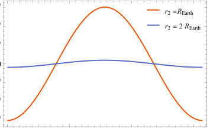
<figcaption class="paper-figure-caption"><b>Fig 5.</b> Figure 3 shows ∆ϑ as a function of the angular coor- dinate θ for the case of Earth with REarth ≈7 × 106 m and ∆r := r3 −r1 ≈1 m with r2 = REarth (red line) and r2 = 2REarth (blue line). As is apparent from this figure, the Wigner phase ∆ϑ reaches values of the order of 10−30, which is several orders of magnitude smaller than the phase shift ∆ϑτ generated by the arrival time difference. The value of ∆ϑ can be increased by consid- ering higher values of ∆r. This is shown in Fig. 4, where ∆r ≈2 × 103 m, leading to Wigner phase values on the order of 10−23.</figcaption>
</figure>

**Summary.** This theoretical paper develops a method to measure the specific angular momentum of a Kerr spacetime using a quantum geodesic interferometer. By analyzing the interference visibility, which depends on both gravitational time delay and polarization rotation (Wigner phase), the authors derive an estimate for the spacetime parameter $a$. The results suggest that such measurements could achieve high precision with sufficiently large detector separations.

**Why it may be interesting.** It provides a concrete, quantum-metrology approach to measuring fundamental parameters of General Relativity (like $a$) using quantum interference effects, bridging quantum optics and gravitational physics.

Detailed structure

**Main problem.** The paper aims to estimate the specific angular momentum ($a$) of a Kerr spacetime by analyzing the polarization rotation of light.

**Main result.** The interferometric visibility is a signature of two relativistic effects (time delay and polarization rotation), allowing for an estimate of $a$ with a relative error potentially reaching $10^{-6}$ for large baselines.

**Method.** The analysis uses a geodesic interferometer model, calculating the detection probability based on phase differences derived using the WKB approximation in the weak-field and slow-rotation limits.

**Model / system.** The system is light (single photon) propagating along null geodesics within the curved background of a Kerr spacetime, analyzed using the tetrad formalism.

**Key observables.** Interferometric visibility, detection probability ($P_+$), gravitational time delay phase difference ($\Delta\vartheta_	au$), and Wigner phase difference ($\Delta\vartheta$).

**Important parameters / regimes.** Specific angular momentum ($a$), mass ($m$), interferometer separation ($\Delta r$), and probability error ($\delta p$).

**Assumptions / limitations.** The analysis relies on the slow rotation and weak field approximations, and the geometric optics approximation for the photon's localized qubit representation.

**Figures summary.** Figures illustrate the geodesic interferometer setup, showing the dependence of phase differences ($\Delta\vartheta_	au$ and $\Delta\vartheta$) on source positions and angular coordinates, and the relative error $\delta a/a$ vs. baseline separation $\Delta r$.

**Paper structure.** The paper develops the theoretical framework by defining the interferometer setup, calculating the two distinct phase contributions (time delay and Wigner rotation) using the WKB approximation, and finally deriving the estimate for $a$ from the measured detection probability $P_+$.

Abstract

We study the rotation of the polarization due to the gravitational field in the Kerr spacetime and the possibility of estimating the specific angular momentum that parameterizes this metric. Our approach is based on a geodesic interferometer, that is, a Mach-Zehnder interferometer whose arms are defined by null geodesics, and a single photon propagating within it. We show that the detection probability at the output ports of the interferometer is a function of two phase differences, one arising from the gravitational time delay and the other from the polarization rotation, both computed under the slow rotation and weak field approximations. Thereby, the interferometric visibility is a signature of two relativistic effects. Using the detection probability, we obtain an estimate for the specific angular momentum and characterize its uncertainty.

[↑ back to top](#top)

### [Additivity Results for the Rényi-2 Entanglement of Purification](http://arxiv.org/abs/2605.15439v1)

**Authors:** Shokoufe Faraji, Zahra Baghali Khanian  
**Type:** theory · **Category:** quantum information and computing · **PDF:** <https://arxiv.org/pdf/2605.15439v1>  
**Analysis basis:** full PDF text, analyzed in chunks
**Topic relevance:** `entanglement & information structure` **3/5**

↔ Scroll figures horizontally

<figure class="paper-figure-card">
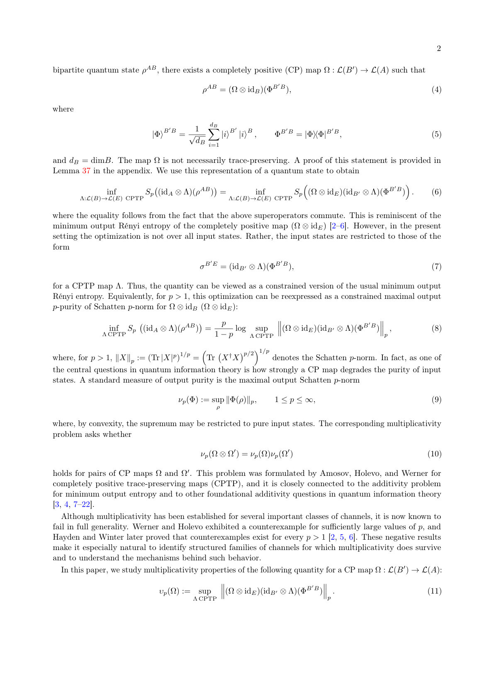
<figcaption class="paper-figure-caption"><b>Fig 1.</b> Low-resolution page preview, page 2</figcaption>
</figure>
<figure class="paper-figure-card">
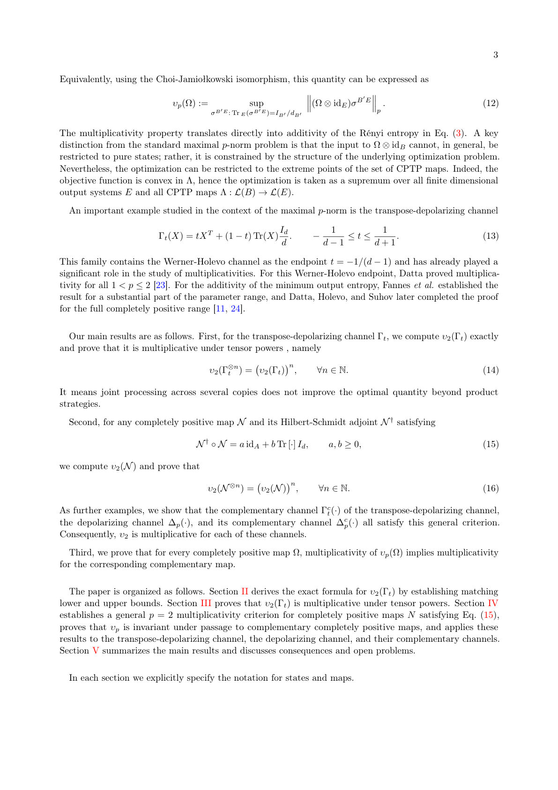
<figcaption class="paper-figure-caption"><b>Fig 2.</b> Low-resolution page preview, page 3</figcaption>
</figure>
<figure class="paper-figure-card">
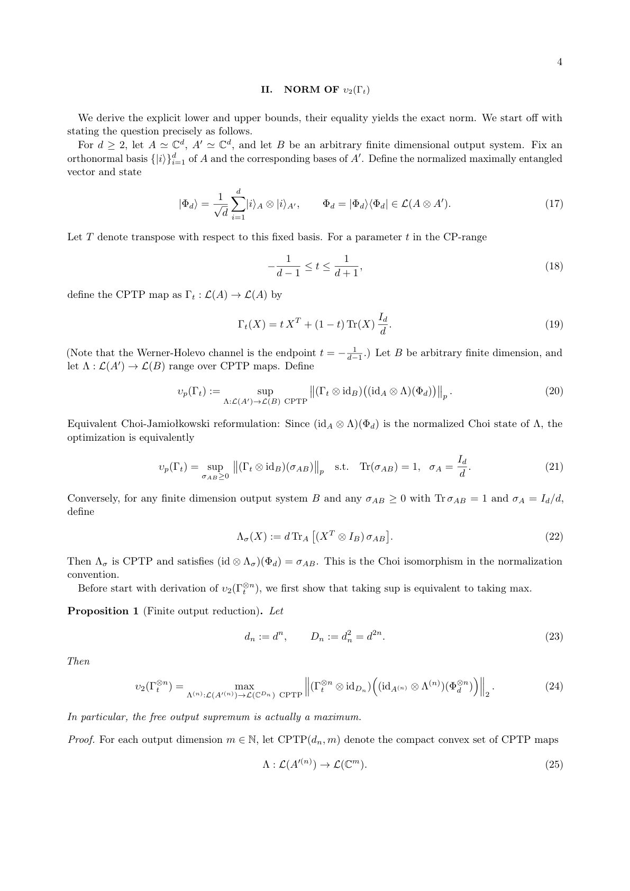
<figcaption class="paper-figure-caption"><b>Fig 3.</b> Low-resolution page preview, page 4</figcaption>
</figure>
<figure class="paper-figure-card">
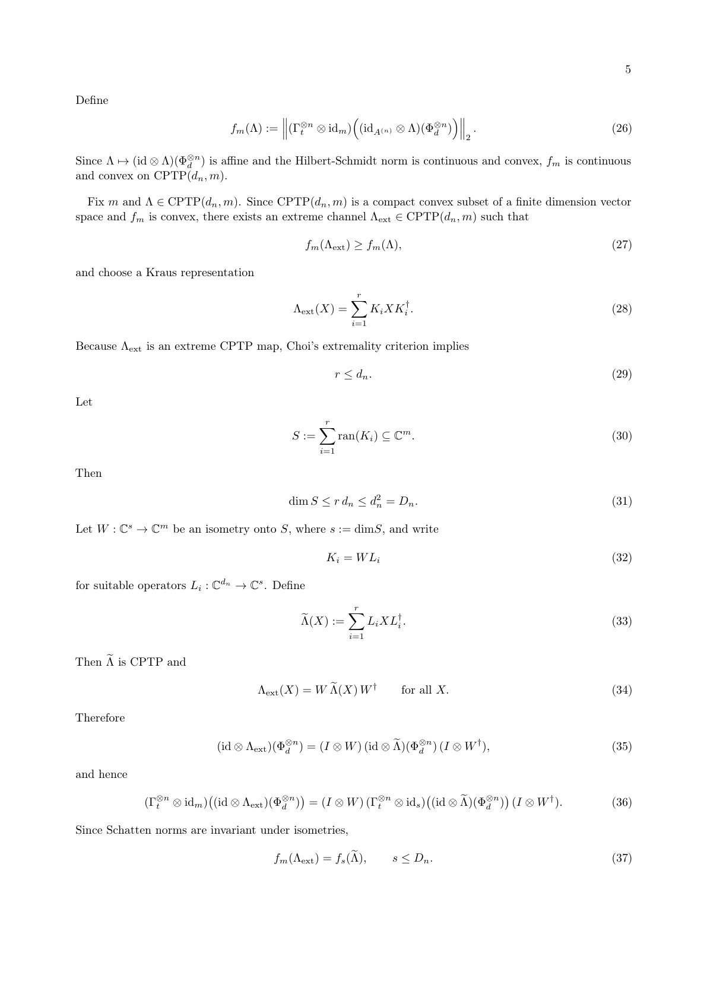
<figcaption class="paper-figure-caption"><b>Fig 4.</b> Low-resolution page preview, page 5</figcaption>
</figure>
<figure class="paper-figure-card">
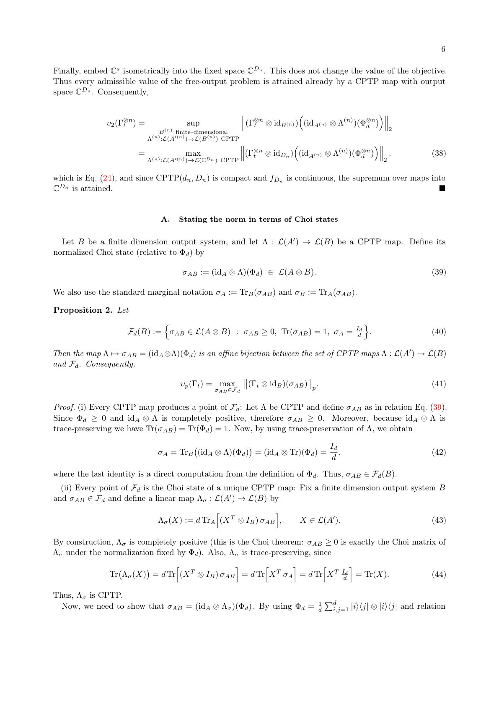
<figcaption class="paper-figure-caption"><b>Fig 5.</b> Low-resolution page preview, page 6</figcaption>
</figure>

**Summary.** This paper rigorously analyzes the additivity and multiplicativity of the Rényi-2 entanglement of purification for quantum channels. By reformulating the entanglement measure as a constrained Schatten norm optimization, the authors derive a general criterion that guarantees multiplicativity for certain classes of channels, proving this property for the important transpose-depolarizing channel.

**Why it may be interesting.** The results provide concrete, general mathematical criteria for when entanglement measures exhibit simple scaling (multiplicativity) under tensor products, which is crucial for understanding resource theories in quantum information.

Detailed structure

**Main problem.** The paper determines the additivity/multiplicativity properties of the Rényi-2 entanglement of purification, $
u_2(\Omega)$, for various quantum channels.

**Main result.** The entanglement measure $
u_2(\Gamma^{\otimes n}_t)$ is proven to be multiplicative, $
u_2(\Gamma^{\otimes n}_t) = (
u_2(\Gamma_t))^n$, and a general criterion for this multiplicativity is established for CP maps.

**Method.** The analysis reformulates the entanglement measure as a constrained maximum output Schatten $p$-norm problem, utilizing techniques involving the Choi-Jamiołkowski isomorphism and quadratic forms.

**Model / system.** The study focuses on quantum channels, particularly the transpose-depolarizing channel $\Gamma_t$, and its tensor powers acting on bipartite quantum states.

**Key observables.** The Rényi-2 entanglement of purification, $
u_2(\Omega)$, and the associated output Schatten 2-norm, $\upsilon_2(\Omega)$.

**Important parameters / regimes.** The Rényi parameter $p$ (focusing on $p=2$), the dimension $d$, and the channel parameter $t$.

**Assumptions / limitations.** The derivation relies on reducing the optimization problem to extreme points and establishing structural properties of the channels (e.g., the criterion $N^\dagger \circ N = a 	ext{id}_A + b 	ext{Tr}[\cdot]	ext{Id}$).

**Paper structure.** The paper proceeds by first reformulating the entanglement measure, calculating the value for the specific channel $\Gamma_t$ (establishing bounds and a closed form), and then generalizing the result by proving the multiplicativity property for tensor powers and establishing the general criterion for additivity.

Abstract

We reformulate the Rényi entanglement of purification as a constrained minimum output Rényi entropy problem. Equivalently, for $p>1$, this formulation can be expressed in terms of a constrained maximal output Schatten $p$-norm. More precisely, for a completely positive map $Ω:L(B')\to L(A)$, we consider the quantity $\upsilon_p(Ω)$ defined by optimizing $\|(Ω\otimes \mathrm{id}_E)(σ^{B'E})\|_p$ over all bipartite states $σ^{B'E}$ whose $B'$-marginal is maximally mixed. We focus on the case $p=2$. First, we compute $\upsilon_2$ for the transpose-depolarizing channel and prove that it is multiplicative under tensor powers. We then establish a general multiplicativity criterion: whenever a completely positive map $N:L(B')\to L(A)$ satisfies $N^{\dagger} \mathbin{\circ} N=a\,\mathrm{id}_A+b\,\mathrm{Tr}[\cdot]\,I_d$ for some constants $a,b\ge 0$, where $N^{\dagger}$ denotes the Hilbert-Schmidt adjoint of $N$, the quantity $\upsilon_2(N)$ is multiplicative under tensor powers. Examples of channels satisfying this criterion include the transpose-depolarizing channel, the depolarizing channel, and their respective complementary channels. Furthermore, we show that, for every completely positive map $Ω$, multiplicativity of $\upsilon_p(Ω)$ implies multiplicativity for its complementary map. This yields the corresponding additivity statements for the associated Rényi-2 entanglement of purification.

[↑ back to top](#top)

### [Lattice Relaxation Flattens Chern Bands in Rhombohedral Graphene Stacks](http://arxiv.org/abs/2605.16218v1)

**Authors:** Luca Nashabeh, Héctor Ochoa  
**Type:** theory · **Category:** strongly correlated electrons · **PDF:** <https://arxiv.org/pdf/2605.16218v1>  
**Analysis basis:** full PDF text, analyzed in chunks
**Topic relevance:** `analog quantum simulation` **3/5**

↔ Scroll figures horizontally

<figure class="paper-figure-card">
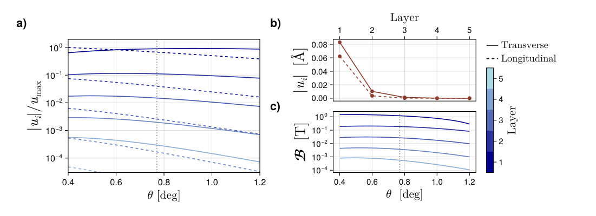
<figcaption class="paper-figure-caption"><b>Fig 1.</b> FIG. 2. Results of relaxation for η = 1. a) The transverse (continuum lines) and longitudinal (dashed lines) components of the relaxation displacement fields have different behaviors as functions of angle. While the longitudinal field monotonically decreases with twist angle, the transverse field has maxima at different critical angles depending on the layer number n. b) As a function of layer number, both fields show an expected exponential falloff, with characteristic length l ∼1.6 Å at θ = 0.77◦. c) The pseudomagnetic field B is concentrated in the contact layer, and depends strongly on angle only in the farthest layers. η = −1 is qualitatively similar, with negligible differences in the...</figcaption>
</figure>
<figure class="paper-figure-card">
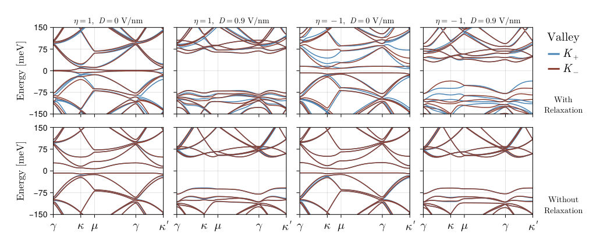
<figcaption class="paper-figure-caption"><b>Fig 2.</b> FIG. 3. Calculated single-electron band structure for different stacking configurations and displacement fields, plotted over the moiré Brillouin zone. The top row includes strain relaxation, while the bottom row does not. Note that strain relaxation introduces appreciable differences between the two valleys.</figcaption>
</figure>
<figure class="paper-figure-card">
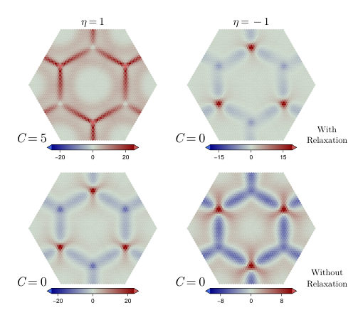
<figcaption class="paper-figure-caption"><b>Fig 3.</b> FIG. 4. K+ first conduction band Berry curvature Ω(k) in the relaxed (upper) and unrelaxed (lower) cases for D = 0. In particular, in the η = 1 stacking configuration, relaxation sufficiently perturbs the band structure, resulting in a non- zero Chern number at the single-particle level. Three recip- rocal unit cells are shown, and the color scale is given by Ω(k) · AMBZ/(2π).</figcaption>
</figure>
<figure class="paper-figure-card">
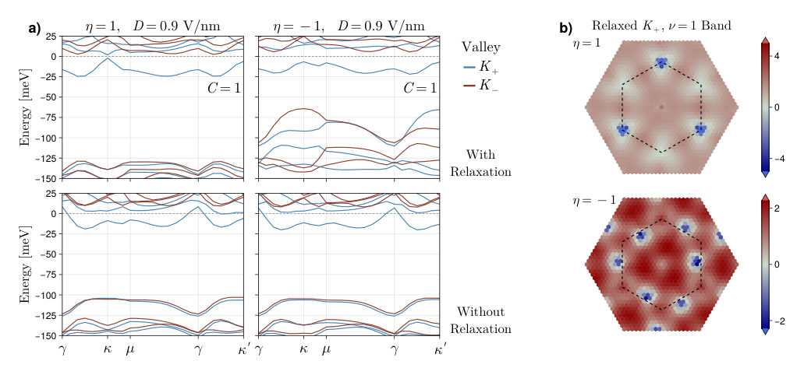
<figcaption class="paper-figure-caption"><b>Fig 4.</b> FIG. 5. a) The Hartree-Fock single-electron spectrum with and without relaxation effects for filling ν = 1 (spinless). Fully including electronic interactions in the moiré distant regime, relaxation is essential for the development of a flat valley-polarized electron band. The difference between the two stacking configurations is only significant with relaxation effects. An 18 × 18 k-mesh is used, with ±3 active bands around the Fermi level per valley. b) The Berry curvature of the relaxed Hartree-Fock filled conduction band; three unit cells are shown with the 1st Brillouin zone marked. The further flattening of the η = −1 stacking is manifest in its smoother curvature. A 20 × 20 k-mesh is...</figcaption>
</figure>
<figure class="paper-figure-card">
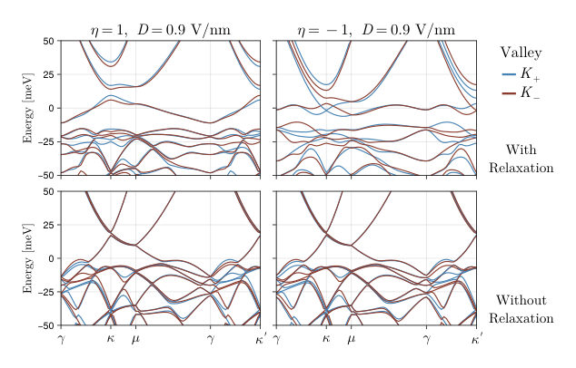
<figcaption class="paper-figure-caption"><b>Fig 5.</b> FIG. 6. Relaxation helps isolate the filled conduction band in the Hartree band structure at D = 0.9 V/nm and filling ν = 1. This isolation is greater for η = 1, but the band is slightly flatter for η = −1. Without relaxation, both stacking configurations are similar, with the filled conduction band not being isolated. A 24 × 24 k-mesh and ϵ = 6 is used.</figcaption>
</figure>

**Summary.** This theoretical work models moiré graphene stacks on hBN, demonstrating that lattice relaxation is not a minor perturbation. By coupling strain fields with electron-electron interactions via Hartree-Fock theory, the authors show that these effects are necessary to stabilize and isolate topological Chern bands with a quantized Chern number.

**Why it may be interesting.** The interplay between geometric strain (lattice relaxation) and long-range Coulomb interactions to stabilize topological phases is highly relevant to understanding emergent quantum phenomena in solid-state systems.

Detailed structure

**Main problem.** The study investigates how lattice relaxation effects influence the topological electronic structure, specifically the flattening and isolation of Chern bands, in moiré rhombohedral graphene stacks.

**Main result.** Lattice relaxation is shown to be crucial, working in tandem with long-range Coulomb interactions, to flatten and isolate a valley-polarized electron band exhibiting a non-zero Chern number (|C|=1).

**Method.** The research employs self-consistent Hartree-Fock calculations to model the interacting electron system, incorporating strain-induced pseudo-gauge fields derived from lattice relaxation.

**Model / system.** The system is rhombohedral graphene stacked on hBN, forming a moiré superlattice. The model Hamiltonian incorporates intralayer hopping modified by strain fields and interlayer tunneling terms.

**Key observables.** Chern number (C), band structure (gaps, flattening), pseudo-magnetic field (B), and electronic differences between stacking configurations.

**Important parameters / regimes.** Twist angles ($	heta$), filling factor ($
u=1$), dielectric constant ($\epsilon$), and the strength of the displacement field ($D$).

**Assumptions / limitations.** The analysis assumes lattice relaxation manifests as a propagating lattice mismatch and that the strain fields decay exponentially with the number of layers.

**Figures summary.** Figures illustrate the exponential decay of displacement fields, the band structure comparison with and without relaxation, and the resulting topological character (Chern number) under varying interaction strengths.

**Paper structure.** The paper systematically builds the model by first defining the lattice relaxation effects on the Hamiltonian, then calculating single-particle properties, and finally incorporating electron-electron interactions via Hartree-Fock theory to determine the topological state.

Abstract

Motivated by recent observations of integer and fractional Chern insulators in rhombohedral graphene stacks aligned with hexagonal boron nitride (hBN), we propose and study a model in which the moiré potential is defined by the pattern of layer-shear strain fields produced by lattice relaxation in these heterostructures. Although these strain fields decrease exponentially with the number of layers, their imprints on electrons residing away from the contact layer are non-negligible. In the absence of a displacement field, lattice relaxation effects amplify the electronic differences among the two different stackings with hBN. These differences, although attenuated at the single-electron level, survive in the so-called moiré-distant regime and are further enhanced with the inclusion of electron interactions. We find that lattice relaxation plays a crucial role in flattening and isolating a valley-polarized Hartree-Fock electron band with $|C|=1$ Chern number. Our results challenge the conventional wisdom on moiré effects in these heterostructures by illustrating the intertwined effects of long-range Coulomb interactions and lattice relaxation, and opens the door to explore different regimes of twist angles and displacement fields for the search for topological states.

[↑ back to top](#top)

### [Second-order moment equivalence of twisted Gaussian Schell model beams and orbital angular momentum eigenmodes](http://arxiv.org/abs/2605.15408v1)

**Authors:** T. Ferreira, G. Santos, S. Ayala, Lucas Hutter, E. S. Gómez, G. Lima, G. Cañas, S. P. Walborn  
**Type:** theory · **Category:** other · **PDF:** <https://arxiv.org/pdf/2605.15408v1>  
**Analysis basis:** full PDF text, analyzed in chunks
**Topic relevance:** `interference shaping light` **3/5**

↔ Scroll figures horizontally

<figure class="paper-figure-card">
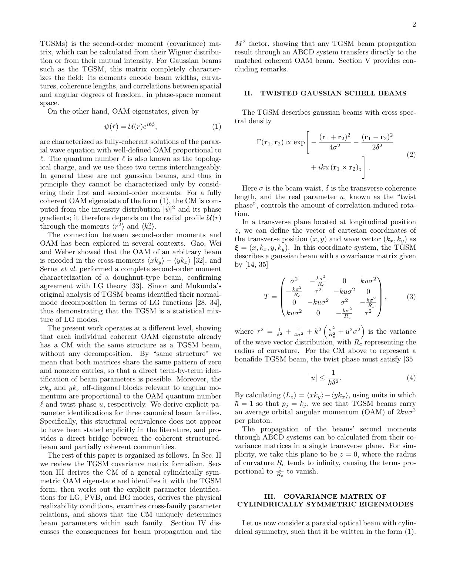
<figcaption class="paper-figure-caption"><b>Fig 1.</b> Low-resolution page preview, page 2</figcaption>
</figure>
<figure class="paper-figure-card">
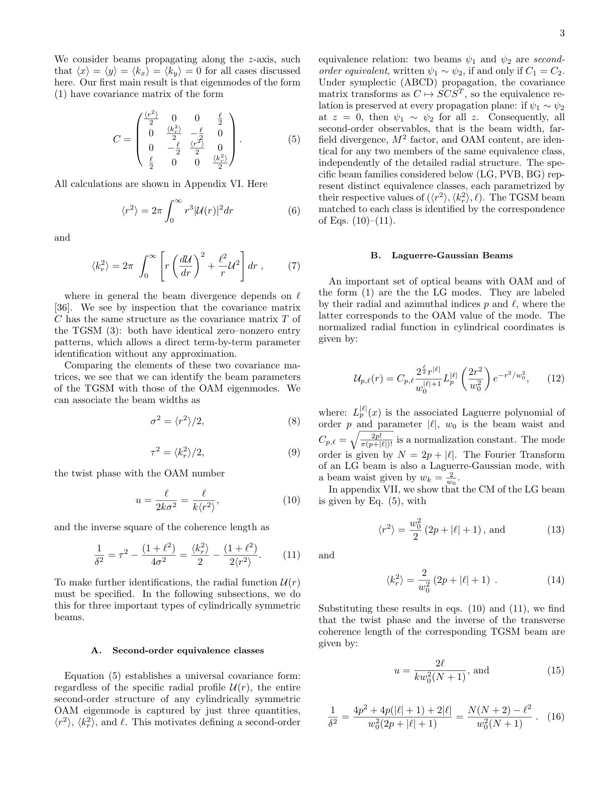
<figcaption class="paper-figure-caption"><b>Fig 2.</b> Low-resolution page preview, page 3</figcaption>
</figure>
<figure class="paper-figure-card">
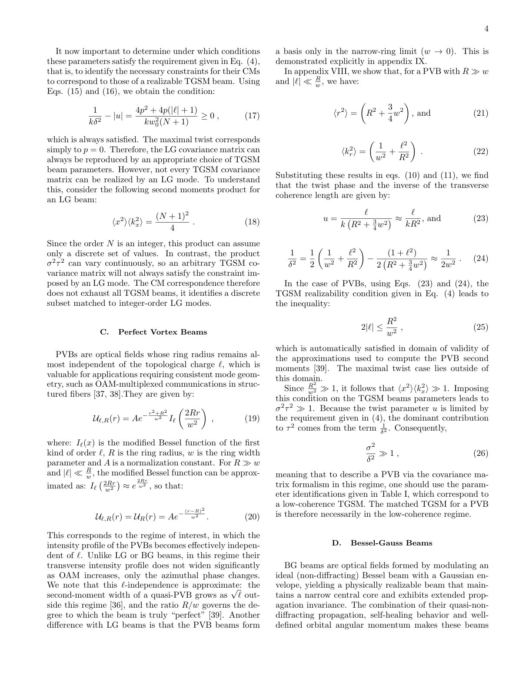
<figcaption class="paper-figure-caption"><b>Fig 3.</b> Low-resolution page preview, page 4</figcaption>
</figure>
<figure class="paper-figure-card">
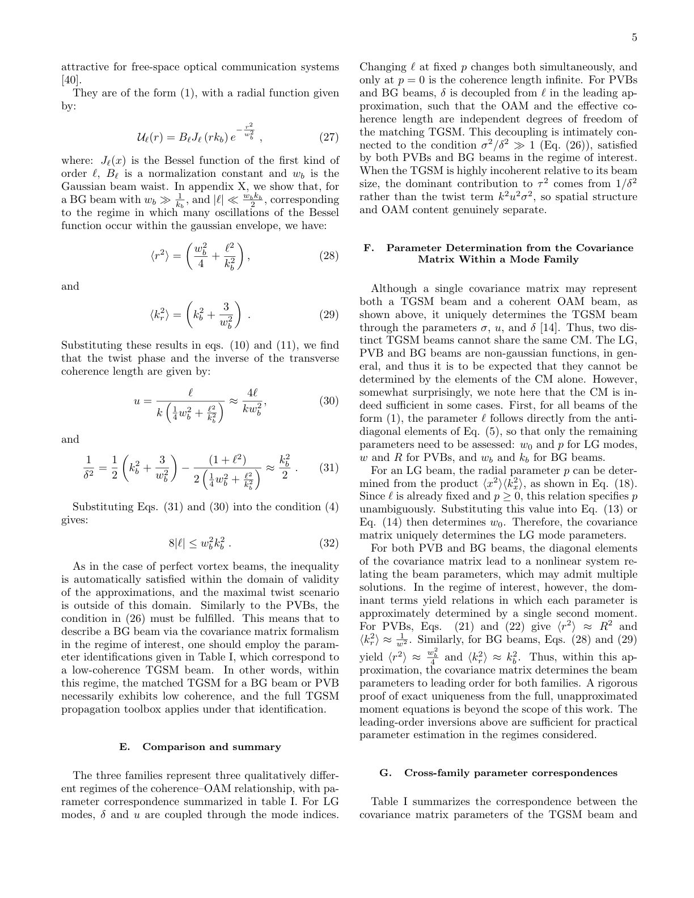
<figcaption class="paper-figure-caption"><b>Fig 4.</b> Low-resolution page preview, page 5</figcaption>
</figure>
<figure class="paper-figure-card">
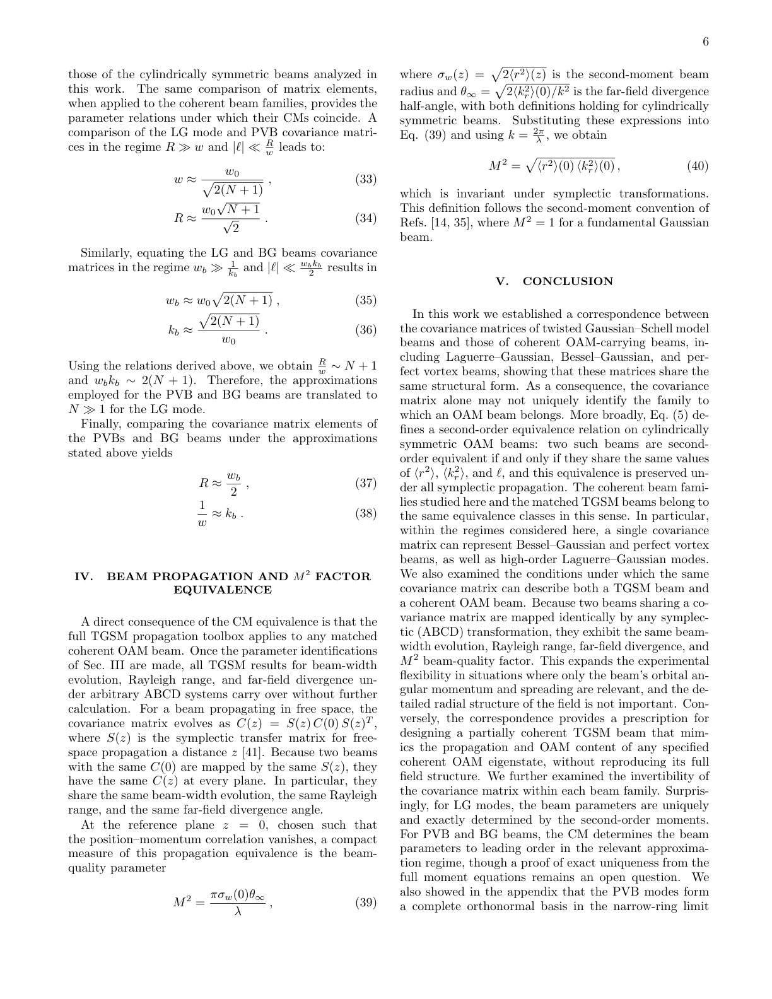
<figcaption class="paper-figure-caption"><b>Fig 5.</b> Low-resolution page preview, page 6</figcaption>
</figure>

**Summary.** This paper proves that the second-order statistical description (covariance matrix) of any cylindrically symmetric OAM beam is mathematically identical to that of a Twisted Gaussian Schell-model (TGSM) beam. This equivalence allows researchers to use the well-established TGSM propagation toolbox to predict the beam-width evolution and divergence of complex OAM modes. It is significant because it unifies the description of coherent and partially coherent light in terms of their second-order moments.

**Why it may be interesting.** This work provides a powerful, non-trivial connection between the description of highly structured, coherent light (OAM modes) and the description of partially coherent light (Schell model), unifying their second-order propagation characteristics.

Detailed structure

**Main problem.** The paper establishes a rigorous mathematical equivalence between the second-order moment (covariance matrix) of coherent Orbital Angular Momentum (OAM) eigenmodes and Twisted Gaussian Schell-model (TGSM) beams.

**Main result.** The covariance matrix of any cylindrically symmetric OAM eigenmode takes a universal form identical to that of a TGSM beam, allowing for direct, second-order indistinguishable parameter mapping between the two beam types.

**Method.** The analysis involves deriving and comparing the covariance matrices for both beam types, utilizing the fact that the covariance matrix governs second-moment evolution under symplectic transformations.

**Model / system.** The study compares two models: (1) Coherent OAM eigenmodes (including Laguerre-Gaussian, Bessel-Gaussian, and Perfect Vortex Beams) and (2) Partially coherent TGSM beams, both analyzed under the assumption of cylindrical symmetry.

**Key observables.** Covariance matrix elements ($\langle r^2 
angle, \langle k_r^2 
angle$), beam-width evolution, far-field divergence, and the $M^2$ beam-quality factor.

**Important parameters / regimes.** OAM quantum number ($\ell$), TGSM twist parameter ($u$), beam waist ($w$), and coherence parameters ($\sigma, \delta$).

**Assumptions / limitations.** The equivalence is established for the second-order moments, and certain analyses for PVB and BG beams rely on leading-order approximations in specific parameter regimes.

**Figures summary.** The notes reference a summary table (Table I) detailing the correspondence between the covariance matrix parameters for TGSM, LG, PVB, and BG beams.

**Paper structure.** The paper develops the theory for both beam types independently, then compares their covariance matrices to derive the parameter mapping. It details the correspondence for specific families (LG, BG, PVB) and concludes by showing the implications for beam propagation and basis completeness.

Abstract

We show that the covariance matrix of any cylindrically symmetric coherent orbital angular momentum (OAM) eigenmode with quantum number $\ell$ takes a universal form depending only on $\langle r^2\rangle$, $\langle k_r^2\rangle$, and $\ell$, independently of the radial profile, and that this form is identical to the covariance matrix of a twisted Gaussian Schell-model (TGSM) beam.} More specifically, both matrices share the same pattern of zero and nonzero entries, with the off-diagonal blocks proportional to $\ell$ and the TGSM twist parameter $u$, respectively. This result holds for an arbitrary radial profile and provides direct term-by-term identification of parameters between the two sets of beams. We work out the correspondence in detail for three important families: Laguerre--Gaussian (LG), Bessel--Gaussian, and perfect vortex beams (PVBs), and derive the conditions under which each coherent OAM mode maps onto a physically realizable TGSM beam. {Because the covariance matrix governs second-moment evolution under arbitrary ABCD (symplectic) transformations, any two beams sharing the same covariance matrix are second-order indistinguishable at every propagation plane. In particular, the matched TGSM and coherent OAM beams share identical beam-width evolution, far-field divergence, and $M^2$ beam-quality factor.} In particular, the well-developed TGSM propagation toolbox applies directly to the second-order moment evolution of the three coherent families. We further show that within each beam family the covariance matrix uniquely determines the beam parameters, with exact uniqueness established for LG modes. Additional results include cross-family second-moment equivalence conditions and a proof that PVB modes form a complete orthonormal basis in the limit $w\to 0$.

[↑ back to top](#top)

### [Fast convergence of Dynamic Capacities of GNS-Symmetric Quantum Channels](http://arxiv.org/abs/2605.15953v1)

**Authors:** Omar Fawzi, Li Gao, Mizanur Rahaman, Mostafa Taheri  
**Type:** theory · **Category:** quantum information and computing · **PDF:** <https://arxiv.org/pdf/2605.15953v1>  
**Analysis basis:** full PDF text, analyzed in chunks
**Topic relevance:** `correlated / nonlocal dissipation` **2/5** · `entanglement & information structure` **2/5** · `Keldysh / 2PI / non-Gaussian methods` **1/5** · `driven-dissipative phase transition` **1/5** · `methods for driven-dissipative` **1/5** · `non-equilibrium dynamics` **1/5** · `non-equilibrium universality` **1/5**

↔ Scroll figures horizontally

<figure class="paper-figure-card">
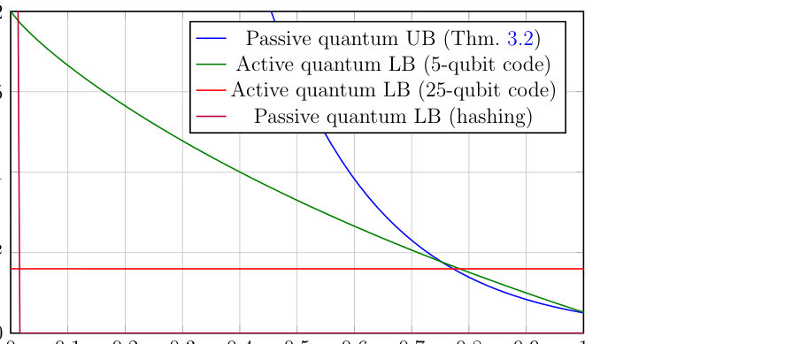
<figcaption class="paper-figure-caption"><b>Fig 1.</b> Figure 1: Passive and active bounds on the quantum capacity of the iterated Pauli channel with ⃗p = (0.9986, 0.00047, 0.00047, 0.00047). The passive upper bound is obtained from Theorem 3.2; the passive lower bound is the hashing bound applied directly to T t ⃗p ; the 5-active and 25-active lower bounds are obtained by applying the hashing bound to the effective logical channels of the 5-qubit code and its recursive concatenation, rescaled by 1/5 and 1/25 respectively.</figcaption>
</figure>

**Summary.** This work rigorously analyzes how the information capacities of quantum systems decay over time when subjected to noise modeled by a quantum channel. By focusing on GNS-symmetric channels, the authors derive explicit exponential convergence bounds for both classical and quantum capacities. Crucially, they use these bounds to demonstrate the precise crossover point where active error correction strategies provide a provable advantage over passive ones.

**Why it may be interesting.** It provides rigorous, quantitative bounds on how fast quantum information degrades under noise and precisely determines the threshold where active quantum error correction techniques outperform passive noise mitigation.

Detailed structure

**Main problem.** The paper studies the time evolution and convergence rate of information capacities (classical and quantum) for quantum systems subjected to repeated noise modeled by a quantum channel.

**Main result.** For GNS-symmetric channels, the one-shot and asymptotic classical and quantum capacities converge exponentially fast to their infinite-time limits. Furthermore, the analysis quantifies the advantage of active error correction over passive methods.

**Method.** The analysis employs functional inequalities, quantum relative entropy bounds, and techniques involving the peripheral projection of the quantum channel to derive explicit exponential convergence bounds.

**Model / system.** The system is a finite-dimensional quantum memory subjected to noise described by a quantum channel $\Phi$ applied at discrete time steps, or continuous-time quantum Markov semigroups $\{T_t\}$. The focus is on GNS-symmetric channels.

**Key observables.** One-shot $\delta$-error classical/quantum capacities ($C_\delta, Q_\delta$), asymptotic capacities ($C, Q$), and the convergence rate quantified by exponential decay terms.

**Important parameters / regimes.** The convergence rate depends on entropic properties like the entropy contraction coefficient ($\alpha_c$) and the Pimsner–Popa constant ($\Lambda_c(P)$).

**Assumptions / limitations.** The primary results are restricted to quantum channels exhibiting GNS-symmetry with respect to a full-rank invariant state $\sigma$.

**Figures summary.** Figure 1 compares the passive upper bound on quantum capacity (derived from Theorem 3.2) against active lower bounds (using 5-active and 25-active codes) for Pauli noise, showing a crossover time where active correction becomes superior.

**Paper structure.** The paper builds from establishing the convergence of capacities to the peripheral projection, deriving explicit exponential bounds for one-shot and asymptotic capacities, and finally applying these bounds to compare active versus passive error correction strategies.

Abstract

We consider a quantum system described by a quantum channel $Φ$ that is applied at every time step and study the time evolution of its information capacities. When $Φ$ is a GNS-symmetric channel (this includes Pauli channels, for example), we give explicit exponential convergence bounds for the classical and quantum capacities. These bounds are in terms of entropic properties of $Φ$. We further illustrate how these results help quantify the performance of active versus passive error-correction setups.

[↑ back to top](#top)

### [Reweighting free energy profiles between universal machine learning interatomic potentials for fast consensus building](http://arxiv.org/abs/2605.15630v1)

**Authors:** Sauradeep Majumdar, Miguel Steiner, Johannes C. B. Dietschreit, Swagata Roy, Daniel Willimetz, Lukaš Grajciar, Rafael Gómez-Bombarelli  
**Type:** theory · **Category:** statistical mechanics · **PDF:** <https://arxiv.org/pdf/2605.15630v1>  
**Analysis basis:** full PDF text, analyzed in chunks
**Topic relevance:** `Keldysh / 2PI / non-Gaussian methods` **2/5** · `methods for driven-dissipative` **2/5** · `non-equilibrium dynamics` **2/5**

↔ Scroll figures horizontally

<figure class="paper-figure-card">

<figcaption class="paper-figure-caption"><b>Fig 1.</b> Fig. 1: Illustration of the reweighting strategy used in this work. As the system, we use Li+ diffusion through an aluminum-doped zeolite (CHA), which has been studied by umbrella sampling in our previous work[16]. We take 10,000 frames per umbrella window from the source simulations (MLIP A) and evaluate their energies with the target potential (MLIP B). Reweighting of these frames to obtain the target PMF was carried out with the estimator best suited based on the variance of the potential energy differences.</figcaption>
</figure>
<figure class="paper-figure-card">
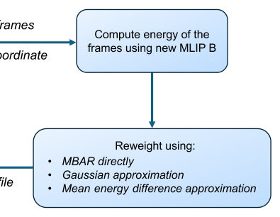
<figcaption class="paper-figure-caption"><b>Fig 2.</b> Figure 1 illustrates the reweighting strategy adopted in this work. The starting PMF of the studied system, Li+ diffusing through the pore channel of a water-solvated chabazite (CHA) zeolite, has been obtained from our previous work[16] (see Figure S1 for an illustration of the studied system). The collective variable (CV) for the system is defined as the projection of the vector connecting the midpoint between the centers of mass of the two outer 8-membered rings (forming the pore channel) and the center of mass of Li+ onto the axis of diffusion. Thus, the zero point of the CV is at the center of the pore channel connecting the two 8-membered rings[10]. We see a global minimum between 2.5...</figcaption>
</figure>
<figure class="paper-figure-card">
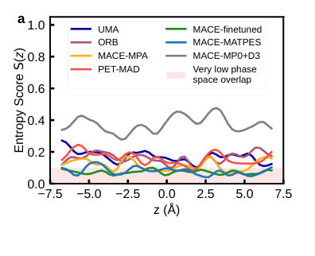
<figcaption class="paper-figure-caption"><b>Fig 3.</b> Fig. 2: (a) Reweighting entropy score S(z) for all target MLIPs, quantifying the effective overlap between the source (MACE-MP0) and target energy distributions at each umbrella window; values near unity indicate very high-phase space overlap or well-distributed (maximum entropy) reweighting weights, while values closer to 0 indi- cate very low phase space overlap (minimum entropy). The entropy values have been smoothed with a Gaussian filter to eliminate statistical noise and put more empha- sis on the trend. (b) PMF obtained from umbrella sampling with MACE-MP0[16] (source) compared with reweighted PMFs based on the MACE-MATPES potential using three methods: direct reweighting,...</figcaption>
</figure>
<figure class="paper-figure-card">
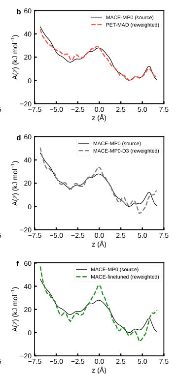
<figcaption class="paper-figure-caption"><b>Fig 4.</b> Fig. 3: (a–f) Reweighted PMFs obtained using the energy-only approximation (Eq. (14)) for six MLIPs, (a) UMA, (b) PET-MAD, (c) ORB, (d) MACE-MP0-D3, (e) MACE-MPA, and (f) MACE-fine-tuned, starting from the MACE-MP0 umbrella sampling trajectory (black). Dashed lines show the reweighted PMF for each target MLIP.</figcaption>
</figure>
<figure class="paper-figure-card">
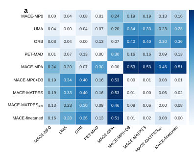
<figcaption class="paper-figure-caption"><b>Fig 5.</b> Fig. 4: (a) Pairwise Jensen–Shannon (JS) divergence between the PMFs of different MLIPs obtained with energy-only reweighting; the MACE-MATPESsim entry corre- sponds to the fully simulated PMF. (b) Reaction free energy (x-axis) and forward activation free energy barrier (y-axis) computed from the PMFs of the different MLIPs.</figcaption>
</figure>

**Summary.** This work presents a scalable framework to calculate free energy profiles (PMFs) by reweighting data sampled with one machine learning potential (MLIP) to many others. By deploying analytical corrections, the authors overcome the limitations of direct reweighting when potentials differ significantly. This allows researchers to achieve reliable, low-cost consensus on materials properties across multiple computational models.

**Why it may be interesting.** While focused on condensed matter potentials, the core mathematical machinery—reweighting distributions and estimating free energy differences from limited sampling—is highly relevant to calculating free energy barriers in quantum dynamics simulations.

Detailed structure

**Main problem.** Accurately estimating the Potential of Mean Force (PMF) across different interatomic potentials (MLIPs) is computationally prohibitive due to the high cost of high-accuracy simulations like DFT.

**Main result.** The authors developed a robust reweighting framework that successfully recovers high-fidelity target thermodynamics across multiple MLIPs, even when phase-space overlap is critically low.

**Method.** They employ systematic reweighting techniques, utilizing analytical corrections like the energy-only approximation to bypass the failure modes of traditional exponential reweighting methods.

**Model / system.** The study applies this framework to model $	ext{Li}^+$ transport in a complex 601-atom nanoconfined electrolyte (zeolite), comparing results from various MLIPs trained with different DFT functionals.

**Key observables.** Potential of Mean Force (PMF), reaction free energy, activation free energy barrier, and pairwise Jensen–Shannon (JS) divergence.

**Important parameters / regimes.** Temperature ($k_B T$), system size (601 atoms), and the degree of phase-space overlap (quantified by reweighting entropy $S$).

**Assumptions / limitations.** The primary assumption is that the energy-only approximation provides a stable and accurate enough estimate to achieve cross-model consensus, despite neglecting entropic contributions.

**Figures summary.** Figures illustrate the reweighting strategy, PMF comparisons using various estimators (Gaussian vs. energy-only), and heatmaps showing pairwise JS divergence between potentials, revealing natural clustering of the MLIPs.

**Paper structure.** The paper introduces the PMF estimation challenge, details the reweighting formalism (including Gaussian and energy-only approximations), validates the method on a complex electrolyte system, and concludes by establishing the framework as a diagnostic protocol for cross-model consensus.

Abstract

Free energy profiles serve as a fundamental bridge between microscopic atomic fluctuations and macroscopic thermodynamic observables. Estimating the free energy profile along a reaction coordinate, referred to as the potential of mean force (PMF), with density functional theory (DFT) accuracy is computationally expensive. Universal machine learning interatomic potentials (MLIPs) drastically reduce this cost, but their accuracy is strongly determined by their training data and hence can be uncertain for a given system. In this work, we present a systematic and scalable framework for reweighting PMFs, initially sampled with a single 'source' MLIP, across a representative suite of target MLIPs. Because traditional direct exponential reweighting fails for large system sizes due to low phase-space overlap between potentials, we deploy robust analytical corrections. Applying this to a complex 601-atom system of Li$^+$ transport in a nanoconfined electrolyte, we demonstrate that a mean energy-gap approximation effectively bypasses statistical collapse, producing a highly stable PMF matching the target PMF. Using this approach, we recover high-fidelity target thermodynamics across multiple DFT reference levels (PBE+D3, PBE-sol, r$^2$SCAN,r$^2$SCAN-D4) at a fraction of the computational cost of full simulations. Furthermore, thermodynamic analysis reveals that the studied MLIPs partition into two distinct clusters driven by their training data. Our reweighting framework successfully recovers target thermodynamic properties--specifically, reaction and activation free energies--even when the phase-space overlap between potentials is critically low. Ultimately, this approach establishes a vital diagnostic protocol to achieve affordable cross-model consensus on materials chemistry properties without redundant, resource-intensive simulations.

[↑ back to top](#top)

### [Large-$N$ scaling of Tan's contact for the harmonically trapped Tonks--Girardeau gas at finite temperature](http://arxiv.org/abs/2605.15994v1)

**Authors:** Felipe Taha Sant'Ana  
**Type:** theory · **Category:** quantum gases · **PDF:** <https://arxiv.org/pdf/2605.15994v1>  
**Analysis basis:** full PDF text, analyzed in chunks
**Topic relevance:** `Keldysh / 2PI / non-Gaussian methods` **2/5** · `analog quantum simulation` **1/5** · `methods for driven-dissipative` **1/5**

↔ Scroll figures horizontally

<figure class="paper-figure-card">
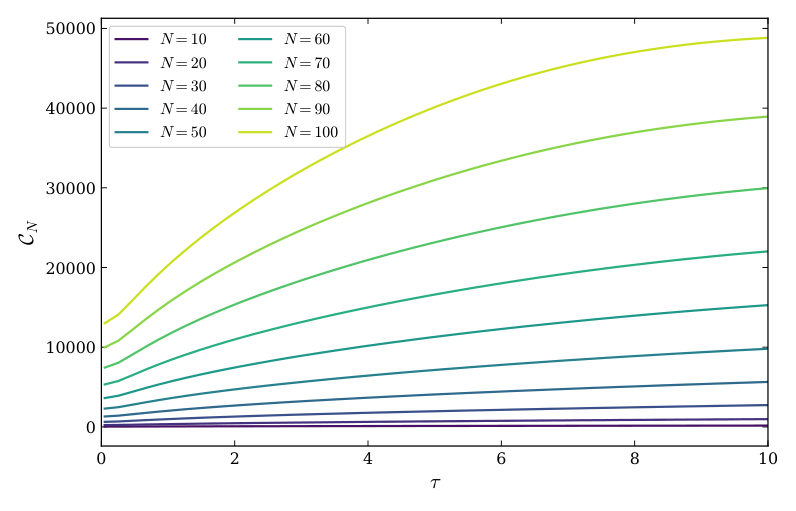
<figcaption class="paper-figure-caption"><b>Fig 1.</b> Figure 1: Canonical-ensemble contact (5) as a function of the reduced temperature τ, computed from the contour-integral representation (9). Curves correspond to particle numbers N from 10 to 100 in steps of 10 (bottom to top). The data underlie the scaling-law verification of Eq. (12).</figcaption>
</figure>
<figure class="paper-figure-card">
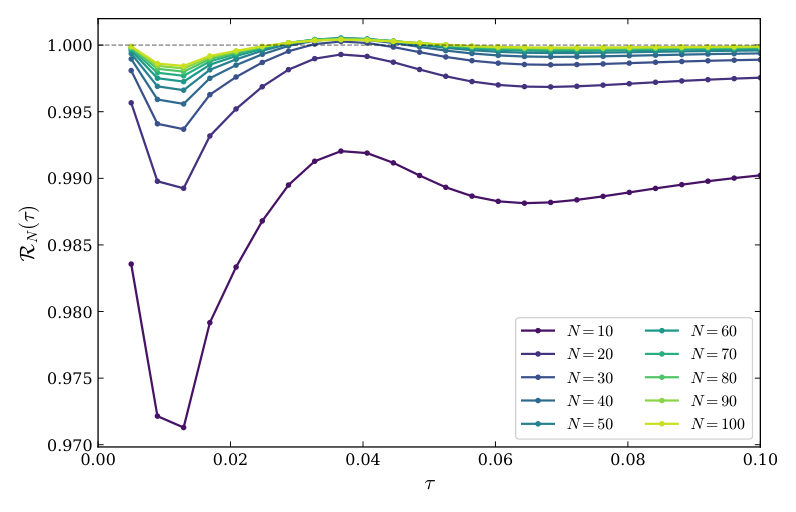
<figcaption class="paper-figure-caption"><b>Fig 2.</b> Figure 2: Low-τ verification of the canonical scaling law (12). The ratio RN defined in (68), with A(τ) and B(τ) obtained from the universal integral representations (32) and (67) using the self-consistent scaled chemical potential ξ(τ) from (26), is plotted on τ ∈[0.005, 0.1] for N = 10, . . . , 100. Convergence to unity (dashed line) confirms the leading and subleading scaling at low temperature, including the Sommerfeld coefficient a2 = 4 √</figcaption>
</figure>
<figure class="paper-figure-card">
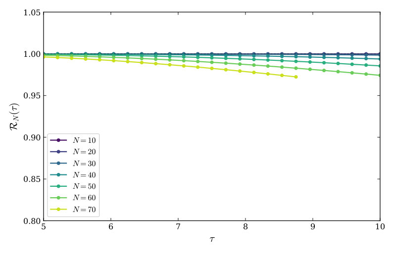
<figcaption class="paper-figure-caption"><b>Fig 3.</b> Figure 3: High-τ verification of the canonical scaling law: the same ratio RN as in Fig. 2, now plotted on τ ∈[5, 10]. The collapse onto unity (dashed line) confirms the asymptotic forms A(τ) ≃√τ/π3/2 from (51) and B(τ) ≃−√τ/π3/2 from (103) in the Boltzmann regime. Residual deviation from unity at the largest-N, highest-τ corner is dominated by the spatial- integral truncation at finite Mmax and shrinks systematically with increasing Mmax.</figcaption>
</figure>
<figure class="paper-figure-card">
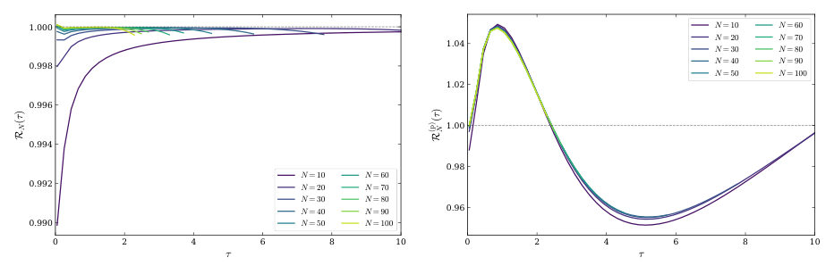
<figcaption class="paper-figure-caption"><b>Fig 4.</b> Figure 4: Full-τ scaling verification of Eq. (12) across τ ∈[0, 10] and N = 10, . . . , 100. (a) Ratio RN from (68), evaluated with the numerical scaling functions A(τ) and B(τ). (b) Ratio R(P) N from (185), evaluated with the Pad´e approximants AP(τ) and BP(τ) of (177) and (181). In both panels the curves collapse onto unity (dashed line), confirming the canonical scaling law from the degenerate (τ ≪1) to the Boltzmann (τ ≫1) regimes and the validity of the Pad´e approximants as closed-form substitutes for the universal integrals. Residual deviations at the smallest N reflect the genuine O  N1/2 next-to-subleading correction.</figcaption>
</figure>
<figure class="paper-figure-card">
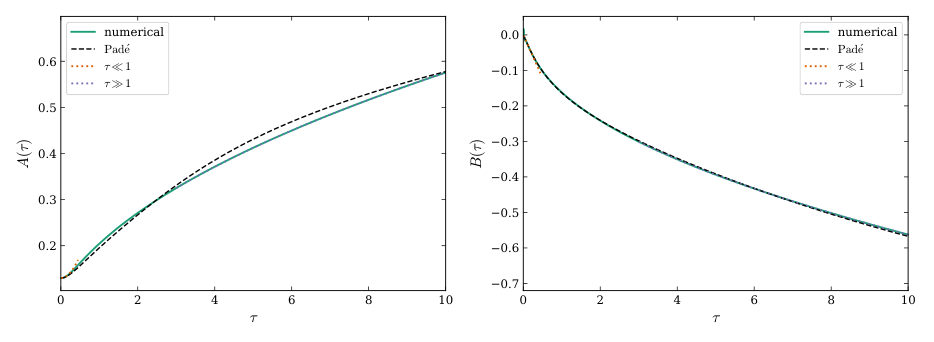
<figcaption class="paper-figure-caption"><b>Fig 5.</b> Figure 5: Universal scaling functions A(τ) (left panel) and B(τ) (right panel). Solid blue: numerical evaluation of the integral representations (32) and (67) using the self-consistent ξ(τ) from (26). Dashed black: Pad´e approximants (177) and (181). Dotted red: low-τ Sommerfeld expansions (39) and (91). Dotted green: high-τ virial expansions (51) and (103). The Pad´e approximants interpolate between the two asymptotic regimes over τ ∈[0, 10].</figcaption>
</figure>

**Summary.** This theoretical paper determines the large-$N$ scaling of Tan's contact for a harmonically trapped Tonks-Girardeau gas at finite temperature. It establishes a two-term scaling law, identifying the subleading correction as a quantifiable difference between canonical and grand-canonical ensemble calculations. The results are validated using advanced mathematical techniques like contour integration and Padé approximants across all temperature regimes.

**Why it may be interesting.** This work provides a rigorous, quantitative understanding of finite-temperature corrections to universal correlation measures in strongly interacting quantum gases, bridging the gap between different thermodynamic ensembles.

Detailed structure

**Main problem.** The paper derives the large-$N$ scaling law for Tan's contact, a measure of short-range correlations, for a harmonically trapped Tonks-Girardeau gas at finite temperature.

**Main result.** The contact exhibits a two-term large-$N$ expansion, $C_N(	au) = A(	au) N^{5/2} + B(	au) N^{3/2}$, where the subleading coefficient $B(	au)$ is identified as the ensemble difference between canonical and grand-canonical calculations.

**Method.** The derivation employs contour integration techniques on the canonical partition function, followed by saddle-point approximations and the construction of Padé approximants to ensure uniform accuracy across different temperature regimes.

**Model / system.** The system is $N$ identical bosons confined by a harmonic potential and interacting via a contact potential, analyzed in the Tonks-Girardeau limit, which maps the system to noninteracting spinless fermions.

**Key observables.** Tan's contact ($C$), the leading scaling coefficient $A(	au)$, and the novel subleading coefficient $B(	au)$.

**Important parameters / regimes.** The dimensionless temperature ratio $	au = T/T_F$, where $T_F$ is the Fermi temperature of the noninteracting gas.

**Assumptions / limitations.** The analysis is performed in the large-$N$ limit, and the validity of the Padé approximants is assumed across the working temperature range.

**Figures summary.** Figures illustrate the raw data for $C_N(	au)$ verifying the scaling law, and later show the constructed Padé approximants interpolating between the low-temperature Sommerfeld and high-temperature virial regimes.

**Paper structure.** The paper systematically derives the leading coefficient $A(	au)$ first, followed by the novel subleading coefficient $B(	au)$. It then compares canonical and grand-canonical ensemble formulations to identify $B(	au)$ as the ensemble correction, culminating in the construction and validation of Padé approximants for both scaling functions.

Abstract

We derive the canonical-ensemble scaling of Tan's contact for $N$ harmonically trapped Tonks--Girardeau bosons at finite temperature in the large-$N$ limit. The leading scaling coefficient reproduces the local-density-approximation result and is obtained from a contour-integral representation of the canonical partition function followed by a saddle-point reduction to a phase-space integral with a self-consistent scaled chemical potential. The subleading coefficient is the central new object of this work: it admits an explicit representation in terms of universal phase-space integrals of the Fermi factor, has closed-form Sommerfeld and virial limits, and is identified with the canonical-versus-grand-canonical ensemble difference at fixed mean particle number. In the high-temperature Boltzmann regime the ratio of subleading to leading coefficients collapses to a universal value, traceable to the Poissonian particle-number statistics of the dilute grand-canonical gas. We construct Padé approximants for both scaling functions that interpolate uniformly between the low-temperature Sommerfeld and high-temperature virial regimes; for the subleading coefficient we report a form that is uniformly accurate on our working range of temperatures and asymptotically correct beyond. The scaling law is verified against canonical contour-integration data across the full temperature range.

[↑ back to top](#top)

### [Gaussian fluctuations in the tunneling probability of a closed universe](http://arxiv.org/abs/2605.16150v1)

**Authors:** L. Salasnich  
**Type:** theory · **Category:** other · **PDF:** <https://arxiv.org/pdf/2605.16150v1>  
**Analysis basis:** full PDF text, analyzed in chunks
**Topic relevance:** `Keldysh / 2PI / non-Gaussian methods` **2/5** · `analog quantum simulation` **1/5**

↔ Scroll figures horizontally

<figure class="paper-figure-card">
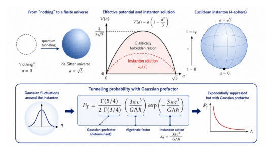
<figcaption class="paper-figure-caption"><b>Fig 1.</b> FIG. 1: Graphical summary of the main results discussed in this paper: the analytical calculation of the quantum tunnel- ing probability of a closed universe including Gaussian fluc- tuations.</figcaption>
</figure>

**Summary.** This paper calculates the quantum tunneling probability for a closed universe using quantum cosmology methods. It refines previous estimates by providing an exact analytical expression for the prefactor arising from Gaussian fluctuations around the classical instanton solution. The work is a rigorous semiclassical estimate of the universe's nucleation rate.

**Why it may be interesting.** While focused on quantum gravity, the rigorous mathematical techniques used to calculate the prefactor—involving functional determinants and solving Sturm-Liouville type equations—are highly relevant to calculating correlation functions or determinants in quantum field theories relevant to AMO physics.

Detailed structure

**Main problem.** The paper calculates the quantum tunneling probability for the creation of a closed universe using the Euclidean path-integral formalism.

**Main result.** It derives a self-consistent semiclassical estimate for the nucleation rate, providing an exact analytical expression that includes both the exponential suppression from the instanton action and the Gaussian prefactor from quadratic fluctuations.

**Method.** The calculation employs the semiclassical approximation, expanding the Euclidean action quadratically around the instanton solution and utilizing advanced techniques like the Gel'fand-Yaglom theorem to determine the functional determinant prefactor.

**Model / system.** The model is a closed Friedmann-Lemaitre-Robertson-Walker (FLRW) universe treated within a fixed-interval minisuperspace formulation. The dynamics are governed by the Hamiltonian constraint in the Euclidean path integral.

**Key observables.** The tunneling probability ($P_T$) and the associated prefactor ($F_E$).

**Important parameters / regimes.** The semiclassical regime ($S_E/\hbar \gg 1$), the cosmological constants ($\Lambda$), and the gravitational coupling ($G$).

**Assumptions / limitations.** The calculation is a minisuperspace approximation that neglects the full lapse integration and does not enforce the Hamiltonian constraint beyond the leading semiclassical order.

**Figures summary.** Figure 1 provides a graphical summary of the analytical calculation of the quantum tunneling probability, explicitly including the contributions from Gaussian fluctuations.

**Paper structure.** The paper develops from the general formalism of the Euclidean path integral to the specific calculation of the prefactor ($F_E$). It compares initial approximations (like the harmonic oscillator model) with the final, exact result derived using the Gel'fand-Yaglom theorem applied to the functional determinant.

Abstract

We consider the quantum creation of a closed universe within the Euclidean path-integral formalism. An analytical expression for the tunneling probability is derived, including both the exponential suppression and the exact Gaussian prefactor due to quadratic fluctuations around the instanton. The calculation is performed in a fixed-interval minisuperspace formulation, where the Hamiltonian constraint is imposed at the level of the classical instanton, while the full lapse integration is not included beyond the leading semiclassical approximation. The result provides a transparent and self-consistent semiclassical estimate of the nucleation rate, refining previous analyses with the inclusion of Gaussian fluctuations.

[↑ back to top](#top)

### [HOPPER: A Hop-by-hop Entanglement Distribution Protocol for Asynchronous Quantum Networks](http://arxiv.org/abs/2605.15869v1)

**Authors:** Claudio Cicconetti  
**Type:** theory · **Category:** quantum information and computing · **PDF:** <https://arxiv.org/pdf/2605.15869v1>  
**Analysis basis:** full PDF text, analyzed in chunks
**Topic relevance:** `entanglement & information structure` **2/5** · `non-equilibrium dynamics` **1/5**

↔ Scroll figures horizontally

<figure class="paper-figure-card">
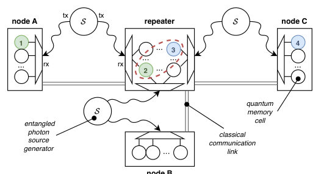
<figcaption class="paper-figure-caption"><b>Fig 1.</b> Fig. 1. Example of a 4-node quantum network to illustrate the system model adopted. There are three end nodes (A, B, and C) and a repeater, all with quantum memories. The quantum links are established via EPSGs between nodes. To distribute an ebit between A and C, two local EPR pairs are needed: one between A and the repeater (in green) and another between the repeater and C (in blue). To complete the procedure, the repeater then has to perform a BSM, followed by LOCCs.</figcaption>
</figure>
<figure class="paper-figure-card">
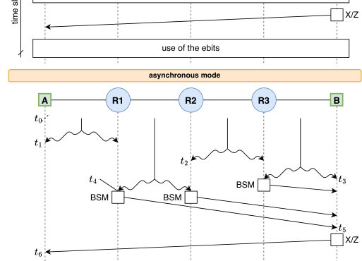
<figcaption class="paper-figure-caption"><b>Fig 2.</b> Fig. 2. Comparison of synchronous (top) vs. asynchronous (bottom) ap- proaches, in an example path of three repeaters (R1, R2, and R3) collaborating to distribute ebits between end-nodes A and B. The asynchronous sequence diagram is a modified version of Fig. 6 in [13], not showing the path reservation messages and with simplified signaling for the distribution of the BSM outcomes.</figcaption>
</figure>
<figure class="paper-figure-card">
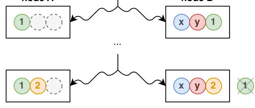
<figcaption class="paper-figure-caption"><b>Fig 3.</b> Fig. 3. Example of inconsistency of quantum memories at two nodes, A and B, due to independent decisions made by them. Different entangled EPR pairs have different colors.</figcaption>
</figure>
<figure class="paper-figure-card">
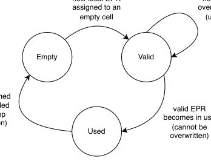
<figcaption class="paper-figure-caption"><b>Fig 4.</b> Fig. 4. Finite State Machine (FSM) of a quantum memory cell.</figcaption>
</figure>
<figure class="paper-figure-card">
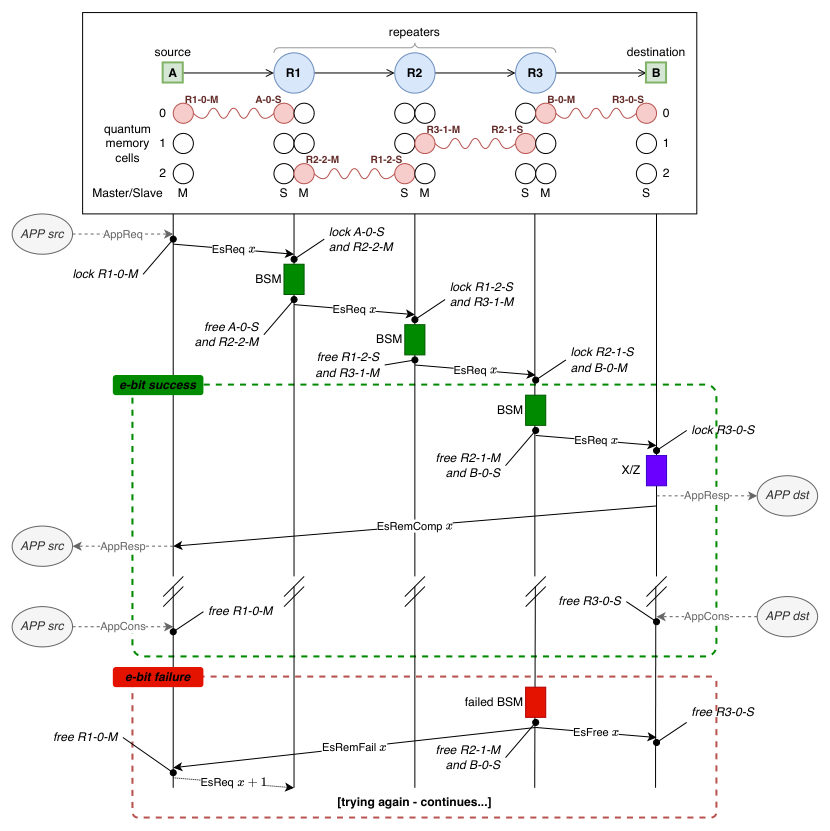
<figcaption class="paper-figure-caption"><b>Fig 5.</b> Fig. 5. Sequence diagram of the procedure to create an ebit between end-nodes A and B via intermediate nodes R1, R2, and R3, all with three memory cells assigned to the links in the path from A to B. A memory cell associated with a link is identified as a triplet n-i-r, where n is the node identifier, i is a 0-based index, and r is the role (Master ‘M’ or Slave ‘S’); such a notation is only for illustration purposes in the diagram, while in the signaling messages, numerical identifiers are used. The sequence diagram shows two possible courses of action: the ebit is successfully established and used by the applications on the end-nodes (green dashed box) vs. failure to create the ebit due to...</figcaption>
</figure>

**Summary.** This paper introduces HOPPER, a novel, asynchronous protocol for distributing entanglement across quantum repeaters. It overcomes the limitations of traditional serial models by allowing intermediate nodes to manage multiple ebit requests concurrently. Simulations prove that HOPPER achieves significantly higher throughput and better fidelity than synchronous methods in long-distance quantum networks.

**Why it may be interesting.** The focus on asynchronous resource management and multiplexing concurrent requests directly addresses scalability bottlenecks in quantum network architectures, which is crucial for realizing large-scale quantum communication.

Detailed structure

**Main problem.** The core challenge is efficiently distributing entangled quantum bits (ebits) across long-range quantum networks, which is hampered by the fragility of entanglement and the inefficiency of serial operation models.

**Main result.** The proposed HOPPER protocol significantly outperforms synchronous alternatives by enabling autonomous, hop-by-hop entanglement distribution, especially when handling multiple concurrent ebit requests.

**Method.** The authors propose and simulate the HOPPER protocol, which utilizes asynchronous signaling and defines Master/Slave roles for managing quantum memory consistency during entanglement swapping.

**Model / system.** The model is a quantum repeater network featuring end nodes and intermediate repeaters, relying on entanglement swapping via Bell State Measurements (BSM) and quantum memory cells.

**Key observables.** Throughput (ebit/s), Fidelity, and comparison of performance between synchronous (SYNC) and asynchronous (HOPPER) protocols.

**Important parameters / regimes.** Quantum memory size (Q), number of concurrent applications (1 to 50), and path length (short vs. long-distance regimes).

**Assumptions / limitations.** The protocol assumes local generation of entangled pairs is heralded and focuses on bipartite entanglement; it trades strong consistency guarantees for reduced signaling overhead.

**Figures summary.** Figures compare throughput and fidelity between HOPPER and SYNC protocols across varying parameters like memory size and number of applications, demonstrating HOPPER's superior scaling.

**Paper structure.** The paper establishes the need for ebit distribution, critiques existing synchronous/serial models, introduces the asynchronous HOPPER protocol with detailed memory management (Master/Slave), and validates its performance through extensive numerical simulations comparing it to synchronous methods.

Abstract

The quantum Internet relies on the ability to distribute entangled quantum bits (ebits) between quantum memories at the end nodes, to perform applications like blind or distributed quantum computing that are impossible if end nodes are connected via a classical, i.e., non-quantum network. This need creates new challenges due to the fragile nature of entanglement, which decoheres over short timescales and cannot be amplified, buffered, or retransmitted. Two broad categories of approaches have been proposed in the scientific literature to realize such an entanglement distribution in a given path: one relying on a synchronous time-slotted model, and another one where intermediate nodes interact asynchronously. However, both of them implicitly assume a serial operation, where one ebit is established and made available to the application on end nodes before creating a new one. This is inefficient in long-range networks, with high transmission latencies, if the intermediate nodes have multiple memory qubits that could be used in parallel. To overcome this limitation, in this paper, we study the implications of multiplexing concurrent ebit requests on the same quantum, for both synchronous and asynchronous operation. Furthermore, for the latter, we define a novel distribution protocol, called HOPPER, where the intermediate nodes make autonomous and hop-by-hop decisions on the use of their local resources when establishing an ebit. With numerical simulations, we show that HOPPER is effective in handling multiple ebit requests in parallel, and it exhibits significantly better performance than a synchronous alternative in different scenarios.

[↑ back to top](#top)

### [Measurement-Efficient Variational Quantum Linear Solver for Carleman-Linearized Nonlinear Dynamics](http://arxiv.org/abs/2605.15366v1)

**Authors:** Yunya Liu, Pai Wang  
**Type:** theory · **Category:** quantum information and computing · **PDF:** <https://arxiv.org/pdf/2605.15366v1>  
**Analysis basis:** full PDF text, analyzed in chunks
**Topic relevance:** `analog quantum simulation` **2/5** · `quantum measurements` **1/5**

↔ Scroll figures horizontally

<figure class="paper-figure-card">
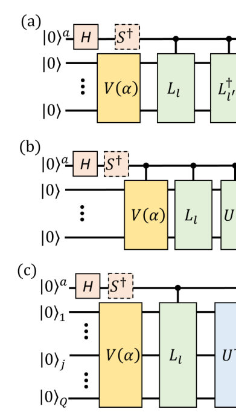
<figcaption class="paper-figure-caption"><b>Fig 1.</b> Figure 1: Hadamard Test circuits for the three overlap families required by VQLS: (a) βll′,</figcaption>
</figure>
<figure class="paper-figure-card">
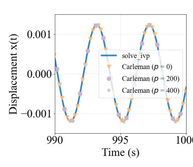
<figcaption class="paper-figure-caption"><b>Fig 2.</b> Figure 2: Verification of the Carleman linearization on the Duffing equation. (Left) Dis-</figcaption>
</figure>
<figure class="paper-figure-card">
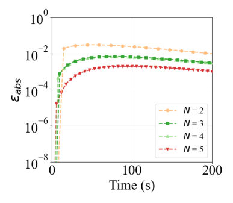
<figcaption class="paper-figure-caption"><b>Fig 3.</b> Figure 2 reports the verification study for this representative hardening-</figcaption>
</figure>
<figure class="paper-figure-card">
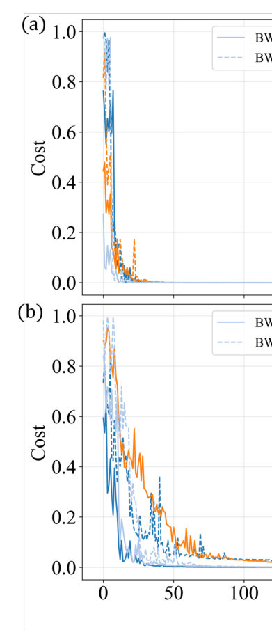
<figcaption class="paper-figure-caption"><b>Fig 4.</b> Figure 3: Global cost-function history for the Qiskit pipeline (Method A) on (a) a Q = 2</figcaption>
</figure>
<figure class="paper-figure-card">
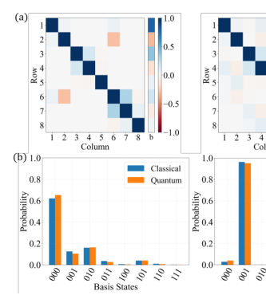
<figcaption class="paper-figure-caption"><b>Fig 5.</b> Figure 4: (a) Heatmaps of the regularized system constructed by block-banded matrices</figcaption>
</figure>

**Summary.** This work presents a hybrid quantum-classical method to solve nonlinear differential equations by first linearizing them using Carleman linearization. The resulting linear system is then solved using a Variational Quantum Linear Solver (VQLS) implemented on quantum hardware simulators. The key finding is that optimizing the cost function (using local cost) allows the VQLS to accurately track classical solutions for these complex dynamics.

**Why it may be interesting.** It provides a concrete, quantum-computable recipe for simulating complex, non-linear physical systems (like those found in AMO or quantum optics) by mapping them onto linear algebra problems solvable on near-term quantum hardware.

Detailed structure

**Main problem.** Developing a measurement-efficient Variational Quantum Linear Solver (VQLS) to solve linear systems derived from nonlinear dynamics.

**Main result.** The VQLS successfully recovers quantum states proportional to classical solutions for Carleman-structured systems, demonstrating high fidelity using local cost functions.

**Method.** The approach combines Carleman linearization to transform a nonlinear ODE into a linear system, which is then solved using a hybrid quantum-classical VQLS algorithm.

**Model / system.** The canonical benchmark is the damped, externally forced Duffing oscillator, which is linearized via the Carleman-Euler operator into a block-banded linear system $L Y = B$.

**Key observables.** Fidelity ($F_{sol}, F_{dir}$), relative residuals ($R_r$), global and local cost function values ($C_G, C_L$), and convergence rates.

**Important parameters / regimes.** Truncation order ($N$), stationary-extension length ($p$), and the choice between global vs. local cost formulations.

**Assumptions / limitations.** The method assumes the applicability of Carleman linearization and relies on the VQLS framework, which is tested on NISQ-era hardware.

**Figures summary.** Figures illustrate Hadamard Test circuits, the block-banded structure of the linear matrix $L$, and cost function histories comparing global and local cost approaches.

**Paper structure.** The paper first introduces the problem (nonlinear ODEs) and the linearization technique (Carleman). It then details the VQLS implementation, comparing global and local cost functions, and benchmarking different Hermitianization and ansatz architectures.

Abstract

We present hybrid quantum-classical pipelines for solving the Duffing equation that leverage Carleman linearization and the Variational Quantum Linear Solver (VQLS). First, we demonstrate that Carleman linearization accurately approximates the weakly nonlinear Duffing equation, with errors diminishing as the truncation order increases. Next, across IBM and Xanadu platforms, we deploy VQLS with symmetry-grouped Hadamard Test evaluations under both global and local cost formulations, compare distinct Hermitianization within a common cost framework, and benchmark hardware-efficient ansatz architectures under a fixed Hermitianization. Across block-banded test cases, each method achieves near-unity fidelity and vanishing relative residuals. These results show that topology-agnostic ansatz, optimized Hermitianization, and efficient cost formulation enable VQLS to recover quantum states proportional to classical solutions for Carleman-structured systems, providing a portable recipe for quantum-in-the-loop simulation of nonlinear dynamics.

[↑ back to top](#top)

### [Beyond Commutativity: Redesigning Trotter Decomposition via Local Symmetry](http://arxiv.org/abs/2605.16016v1)

**Authors:** Naoki Negishi, Bo Yang  
**Type:** theory · **Category:** strongly correlated electrons · **PDF:** <https://arxiv.org/pdf/2605.16016v1>  
**Analysis basis:** full PDF text, analyzed in chunks
**Topic relevance:** `analog quantum simulation` **2/5**

↔ Scroll figures horizontally

<figure class="paper-figure-card">
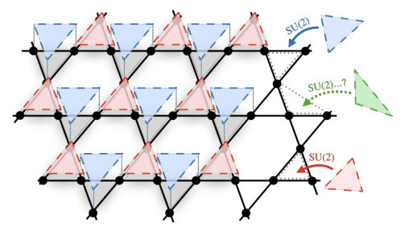
<figcaption class="paper-figure-caption"><b>Fig 1.</b> FIG. 1. Schematic illustration of an SU(2)-respecting trian- gular decomposition on a Kagome lattice. The Hamiltonian is partitioned into local three-site components supported on tri- angular plaquettes, shown as upward red and downward blue triangles, whose associated time-evolution operators preserve the underlying local SU(2) symmetry among the three ver- tices of each triangle structure.</figcaption>
</figure>
<figure class="paper-figure-card">
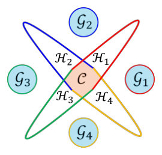
<figcaption class="paper-figure-caption"><b>Fig 2.</b> FIG. 2. Algebraic structure of the generator space of three- qubit SU(8) operators. The orange region C denotes the com- mon three-dimensional Abelian generator space shared by the effective two-qubit sectors Hl. Each light-blue circular region Gl denotes the generator space of a local SU(2) symmetry class.</figcaption>
</figure>
<figure class="paper-figure-card">
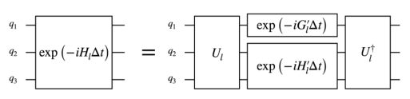
<figcaption class="paper-figure-caption"><b>Fig 3.</b> FIG. 3. Quantum circuit of the local propagator e−iHl∆t im- plemented by Eq. (4). The encoded evolution by Ul factorises into a single-qubit evolution exp(−iG′ l∆t) and an effective two-qubit evolution exp(−iH′ l∆t).</figcaption>
</figure>
<figure class="paper-figure-card">
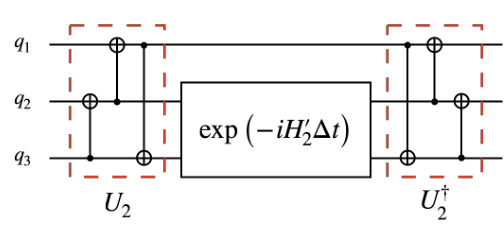
<figcaption class="paper-figure-caption"><b>Fig 4.</b> FIG. 4. Circuit implementation of the local propagator exp(−iH2∆t) for the local SU(2) symmetry class l = 2. The red dashed block denotes the encoder U2 by three CNOT gates.</figcaption>
</figure>
<figure class="paper-figure-card">
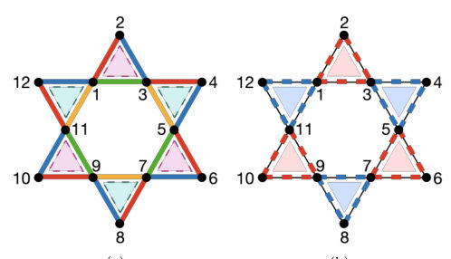
<figcaption class="paper-figure-caption"><b>Fig 5.</b> FIG. 5. The connectivity graph of the 12-qubit Kagome XXX Heisenberg lattice with spin-chirality interactions within the triangular parts. (a) Clustering by the conven- tional decomposition. The two-qubit interactions ⃗σi · ⃗σj cor- responding to the edges are partitioned into four clusters coloured in red, blue, green, and yellow. The spin-chirality in- teractions ⃗σi·(⃗σj×⃗σk) within each triangle are partitioned into two clusters, coloured pink and light blue. In total, the con- ventional method partitions the interactions into the product formula with 4 + 3 × 2 = 10 clusters. Each pink or light-blue part is further decomposed into three clusters. (b) Clustering by the proposed...</figcaption>
</figure>

**Summary.** This paper proposes a novel method to improve quantum simulation accuracy by redesigning Trotter decomposition based on local SU(2) symmetries rather than just Hamiltonian commutativity. By grouping terms into symmetry-respecting local clusters, the method drastically reduces residual errors and circuit depth for models like the Kagome Heisenberg lattice. This establishes local symmetry as a practical and powerful design principle for simulating complex many-body quantum systems.

**Why it may be interesting.** This work provides a powerful, systematic design principle for Hamiltonian simulation that moves beyond simple algebraic commutation rules, directly impacting the feasibility of simulating complex, strongly correlated quantum materials on near-term quantum hardware.

Detailed structure

**Main problem.** The primary challenge is improving the accuracy and efficiency of digital quantum simulation by redesigning the Trotter decomposition method.

**Main result.** The authors introduce a symmetry-guided decomposition that significantly suppresses commutator-induced errors and reduces circuit depth compared to conventional methods.

**Method.** The method exploits the underlying local SU(2) symmetry of Hamiltonian terms, grouping them into local three-site clusters rather than relying solely on direct Pauli commutativity.

**Model / system.** The work is demonstrated on several physically relevant spin-lattice models, including the Kagome Heisenberg model with triangular spin-chirality interactions and the 1D transverse-field Ising model.

**Key observables.** State infidelity, average spin-chirality bias, and the number of required quantum gates (e.g., CNOT gates).

**Important parameters / regimes.** The simulation time $t$ and the number of Trotter steps used for approximation.

**Assumptions / limitations.** The core assumption is that the Hamiltonian structure can be effectively decomposed based on local SU(2) symmetry, which is superior to general commutativity assumptions.

**Figures summary.** Figures schematically illustrate the decomposition strategies on lattices (Kagome, 1D), comparing the number of required clusters (e.g., 10 vs. 2) and showing error/fidelity comparisons.

**Paper structure.** The paper progresses from identifying the limitations of standard Trotter decomposition to proposing the symmetry-based decomposition principle. It then applies this principle to specific models (Heisenberg, Ising) to derive concrete, error-suppressing product formulas.

Abstract

The product formula, commonly known as Trotter decomposition, is a central tool for digital quantum simulation, whose performance depends critically on how the Hamiltonian is partitioned into tractable blocks. Standard decompositions typically rely on direct commutativity among Hamiltonian terms in a chosen operator representation, which can lead to large residual errors and deep circuits for complex, practically relevant many-body quantum systems. We address this fundamental bottleneck by introducing a new decomposition principle that goes beyond commutativity, grouping Hamiltonian terms into local three-site clusters according to the underlying SU(2) symmetry of the local dynamics. We show that three-site generators fall into at most four SU(2)-symmetry classes, each admitting an effective two-qubit SU(4) representation with exact and efficient implementations. By reducing the number of clusters, this decomposition principle substantially suppresses commutator-induced errors and circuit overhead while preserving underlying physical structures that commutativity-based decompositions may violate. We demonstrate the proposed method on several physically relevant spin-lattice models, where the reduced cluster structure can even realise the second-order product formula without doubling the circuit depth, as would be required by conventional decompositions. Numerical simulations of a Kagome Heisenberg model with triangular spin-chirality interactions show that the proposed method reduces both state infidelity and average spin-chirality bias by more than three orders of magnitude compared with conventional decompositions, while using substantially fewer gates. These results establish local symmetry as a flexible and practical design principle for product-formula simulation, opening a route to more accurate and hardware-efficient simulations of broader classes of many-body systems.

[↑ back to top](#top)

### [Beyond trace-class and Hilbert-Schmidt -- Interaction between operator ideals and von Neumann algebras in quantum physics](http://arxiv.org/abs/2605.16025v1)

**Authors:** Frank Oertel  
**Type:** theory · **Category:** other · **PDF:** <https://arxiv.org/pdf/2605.16025v1>  
**Analysis basis:** full PDF text, analyzed in chunks
**Topic relevance:** `entanglement & information structure` **2/5**

↔ Scroll figures horizontally

<figure class="paper-figure-card">
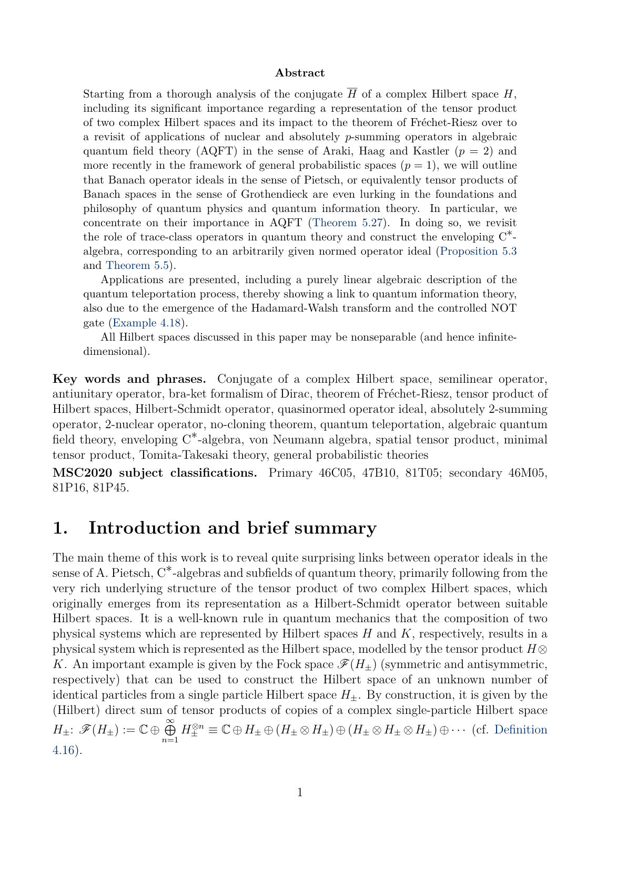
<figcaption class="paper-figure-caption"><b>Fig 1.</b> Low-resolution page preview, page 2</figcaption>
</figure>
<figure class="paper-figure-card">
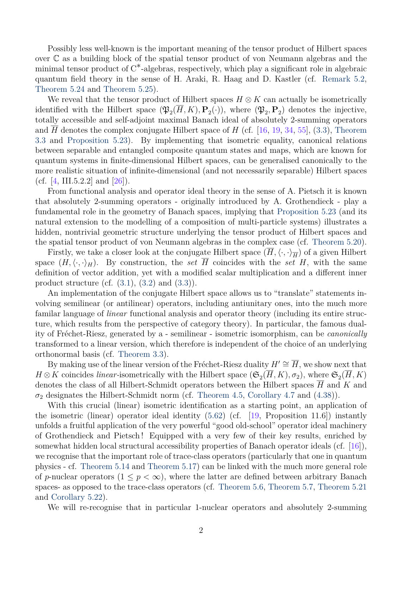
<figcaption class="paper-figure-caption"><b>Fig 2.</b> Low-resolution page preview, page 3</figcaption>
</figure>
<figure class="paper-figure-card">
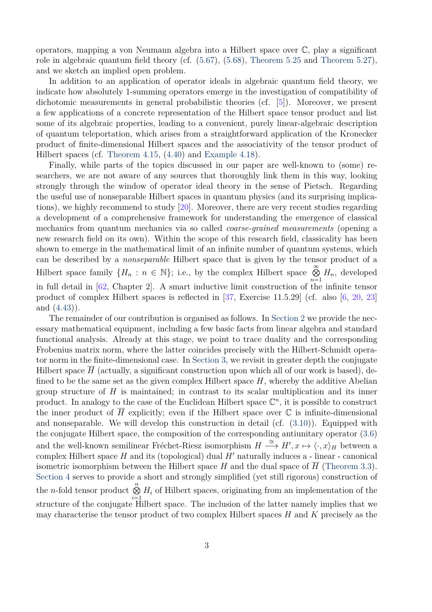
<figcaption class="paper-figure-caption"><b>Fig 3.</b> Low-resolution page preview, page 4</figcaption>
</figure>
<figure class="paper-figure-card">
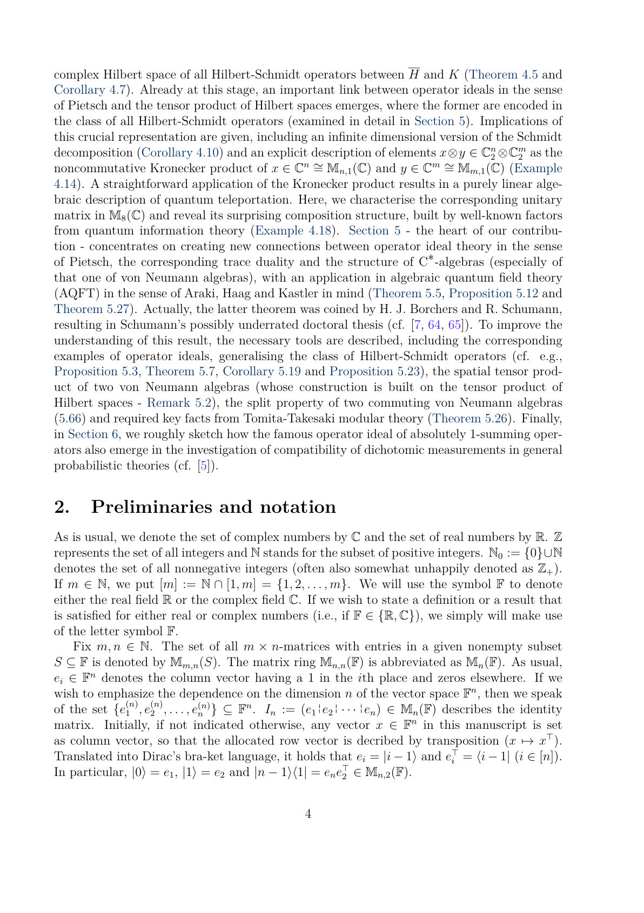
<figcaption class="paper-figure-caption"><b>Fig 4.</b> Low-resolution page preview, page 5</figcaption>
</figure>
<figure class="paper-figure-card">
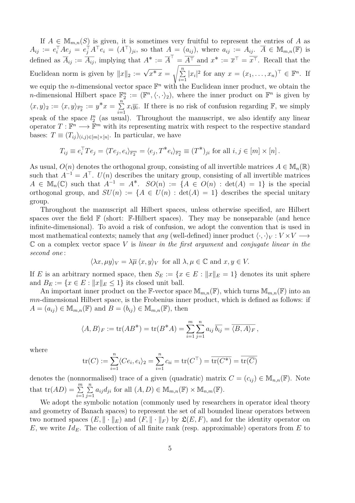
<figcaption class="paper-figure-caption"><b>Fig 5.</b> Low-resolution page preview, page 6</figcaption>
</figure>

**Summary.** This theoretical paper bridges functional analysis and quantum physics by showing that concepts like operator ideals are fundamental to quantum theory. It rigorously connects the tensor product of Hilbert spaces to specific classes of bounded operators, offering a deep mathematical insight into quantum information and quantum field theory structures.

**Why it may be interesting.** It provides a highly abstract, mathematical underpinning for quantum information protocols (like teleportation) and quantum field theory, suggesting that the underlying mathematical structure is governed by operator ideal theory.

Detailed structure

**Main problem.** The paper aims to reveal deep, structural connections between abstract mathematical tools—specifically operator ideals (like trace-class and $p$-nuclear operators)—and the foundational formalism of quantum physics, including AQFT and quantum information theory.

**Main result.** It establishes that the tensor product structure of Hilbert spaces can be rigorously identified with spaces of absolutely $p$-summing operators, providing a linear algebraic description for processes like quantum teleportation.

**Method.** The methodology combines advanced functional analysis (Pietsch's operator ideals, Grothendieck theory) with the mathematical framework of von Neumann algebras and the analysis of conjugate Hilbert spaces.

**Model / system.** The theoretical framework involves general complex Hilbert spaces, their tensor products, and the algebraic structures underpinning quantum field theories (von Neumann algebras). Applications include modeling quantum teleportation and analyzing compatibility in General Probabilistic Theories (GPTs).

**Key observables.** Operator ideals ($\mathcal{L}_2, \mathcal{N}, \mathcal{P}_2$), the compatibility degree $\gamma$, and the modular operator $\Delta$.

**Important parameters / regimes.** The parameter $p$ in $p$-nuclear operators ($1 \le p < \infty$), and the number of measurements $g$ in GPTs.

**Assumptions / limitations.** The analysis relies heavily on advanced theorems regarding isometric isomorphisms between a Hilbert space and its dual, and the assumption of 'split' properties for commuting von Neumann algebras.

**Paper structure.** The paper progresses from analyzing the conjugate Hilbert space and its relation to the dual space, to establishing the identification of tensor products with operator ideals, and finally applying these concepts to AQFT and GPTs.

Abstract

Starting from a thorough analysis of the conjugate $\overline{H}$ of a complex Hilbert space $H$, including its significant importance regarding a representation of the tensor product of two complex Hilbert spaces and its impact to the theorem of Fréchet-Riesz over to a revisit of applications of nuclear and absolutely $p$-summing operators in algebraic quantum field theory (AQFT) in the sense of Araki, Haag and Kastler ($p=2$) and more recently in the framework of general probabilistic spaces ($p=1$), we will outline that Banach operator ideals in the sense of Pietsch, or equivalently tensor products of Banach spaces in the sense of Grothendieck are even lurking in the foundations and philosophy of quantum physics and quantum information theory. In particular, we concentrate on their importance in AQFT (Theorem 5.27). In doing so, we revisit the role of trace-class operators in quantum theory and construct the enveloping $\tup{C}^\adj$-algebra, corresponding to an arbitrarily given normed operator ideal (Proposition 5.3 and Theorem 5.5).   Applications are presented, including a purely linear algebraic description of the quantum teleportation process, thereby showing a link to quantum information theory, also due to the emergence of the Hadamard-Walsh transform and the controlled NOT gate (Example 4.18).   All Hilbert spaces discussed in this paper may be nonseparable (and hence infinite-dimensional).

[↑ back to top](#top)

### [Fire and ice: Partially fault-tolerant quantum computing with selective state filtering](http://arxiv.org/abs/2605.15344v1)

**Authors:** Ben W. Reichardt, David Aasen, Rui Chao  
**Type:** theory · **Category:** quantum information and computing · **PDF:** <https://arxiv.org/pdf/2605.15344v1>  
**Analysis basis:** full PDF text, analyzed in chunks
**Topic relevance:** `QC/QI experiment` **2/5**

↔ Scroll figures horizontally

<figure class="paper-figure-card">
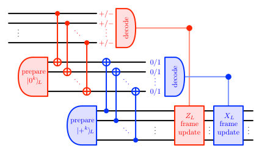
<figcaption class="paper-figure-caption"><b>Fig 1.</b> FIG. 3. Steane-style Z error correction (red) and X error correction (blue) for an Jn, k, dK CSS code. Since transversal physical CNOTs implement transversal logical CNOTs, the logical circuit is two steps of one-qubit teleportation. The difficult part of implementing this scheme is constructing good circuits to prepare the encoded ancilla states |0k⟩L and |+k⟩L.</figcaption>
</figure>
<figure class="paper-figure-card">
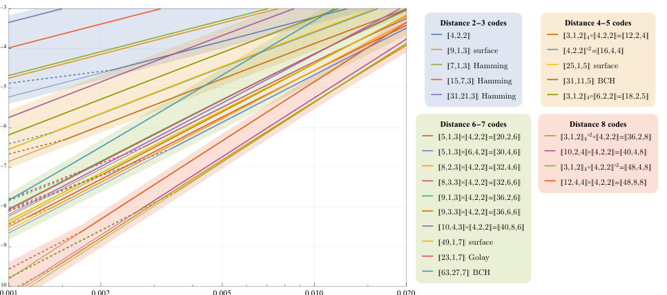
<figcaption class="paper-figure-caption"><b>Fig 2.</b> FIG. 4. Logical error rate conditioned on acceptance, pL, for an ideal decoder against independent bit-flip noise at rate p, i.e., code capacity model. The dashed lines plot pR/300 in the ranges when the rejection rate limits the number of operations according to the criteria of Sec. III, i.e., when pR &gt; 300pL.</figcaption>
</figure>
<figure class="paper-figure-card">
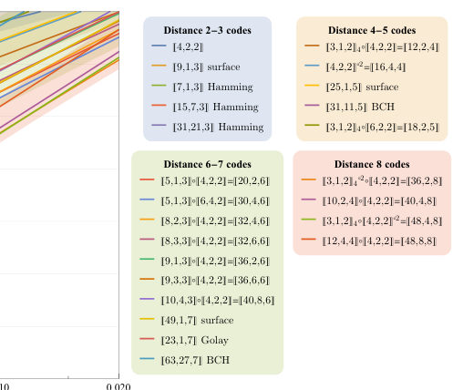
<figcaption class="paper-figure-caption"><b>Fig 3.</b> Figure 4 suggests that achieving logical error rates per round of error correction of ≲10−6, at moderate physical noise rates, will require using codes of distance ≥6. Appendix A simulates several codes of distance 2–5 under circuit-level noise, essentially validating this conclusion. In this section, we will study repeated error correction for codes of distance 6–8. We will consider the J20, 2, 6K code of Fig. 2, the J32, 4, 6K code obtained from applying Corollary 2 to the J8, 2, 3K code of Fig. 6, the J3, 1, 2K◦2 4 ◦J4, 2, 2K = J36, 2, 8K Knill code, and the  J3, 1, 2K4 ◦J4, 2, 2K)⊗2 ◦J4, 2, 2K = J48, 4, 8K code. Aside from their solid performance un- der memory bit-flip noise, the key...</figcaption>
</figure>
<figure class="paper-figure-card">
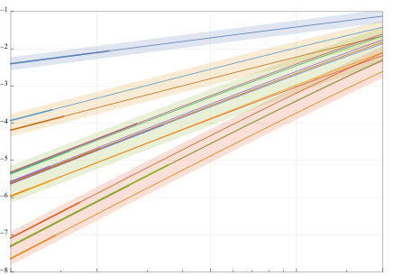
<figcaption class="paper-figure-caption"><b>Fig 4.</b> FIG. 5. Rejection rate pR for an ideal decoder against inde- pendent bit-flip noise at rate p. The legend is the same as in Fig. 4 except not showing the odd-distance codes without postselection. The curves are thicker when pR &gt; 300pL.</figcaption>
</figure>
<figure class="paper-figure-card">
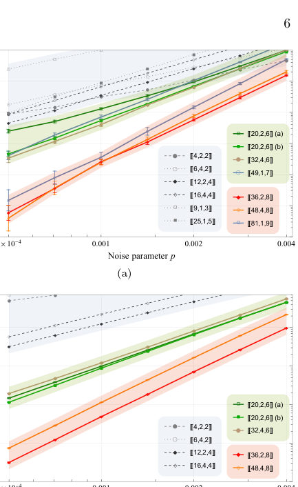
<figcaption class="paper-figure-caption"><b>Fig 5.</b> FIG. 7. Logical error rate (a) and rejection rate (b) per round of error correction, or per cycle of syndrome extraction for the surface codes. The surface codes have rejection rate 0. The gray data points, for codes of distance ≤5, are plotted more clearly in Fig. 18.</figcaption>
</figure>

**Summary.** This paper proposes a practical, partially fault-tolerant quantum computation scheme by concatenating established quantum error-correcting codes. It demonstrates that by accepting non-strict fault tolerance and using selective filtering, the scheme achieves low logical error rates efficiently at realistic noise levels. This work offers a tangible roadmap for scaling quantum computation on near-term hardware.

**Why it may be interesting.** The detailed analysis of error scaling, overhead management, and the comparison between different gate implementations (e.g., teleported vs. direct CNOT) provides concrete, actionable engineering guidelines for building fault-tolerant quantum processors.

Detailed structure

**Main problem.** To develop a quantum computation scheme that is reliable and resource-efficient for near-term quantum hardware, bridging the gap between physical and required logical error rates.

**Main result.** The concatenated error-correcting scheme is shown to be reliable and resource efficient at realistic simulated noise rates, demonstrating a practical path toward scalable quantum computation.

**Method.** The authors develop the scheme by concatenating the five-qubit Laflamme code onto the four-qubit Iceberg code, relying on selective filtering rather than strict fault tolerance.

**Model / system.** The analysis focuses on quantum error correction codes (e.g., J20, 2, 6K; J36, 2, 8K) applied to near-term quantum hardware, specifically mentioning platforms like trapped ions or neutral atoms.

**Key observables.** Logical Error Rates ($p_L$), Rejection Rates ($p_R$), and Overhead (e.g., CNOT gate counts per accepted state).

**Important parameters / regimes.** Physical error rates ($p \sim 10^{-4}$ to $4 	imes 10^{-3}$), required logical error rates ($< 10^{-4}$ or $10^{-6}$), and code distance ($d$).

**Assumptions / limitations.** The scheme is explicitly not strictly fault-tolerant, and the analysis relies on simplified circuit noise models and postselection.

**Figures summary.** Figures illustrate the concatenation process, stabilizer generators, and circuit diagrams comparing one-stage vs. two-stage ancilla factories for state preparation and CNOT gate implementation.

**Paper structure.** The paper progresses by first establishing the concatenated code structure, then analyzing the role of postselection in managing error rates, and finally comparing the overhead and performance of implementing logical gates (like CNOT) using different circuit designs.

Abstract

We develop an error-corrected quantum computation scheme based on concatenating the five-qubit Laflamme code onto the four-qubit Iceberg code. The approach skates a thin line: it is explicitly not fault tolerant, risking higher logical error rates, and it relies on selective filtering to prepare encoded states for error correction, risking significant overhead. Yet, at realistic simulated noise rates, the scheme is reliable and resource efficient. It forges a practical path toward scalable quantum computation.

[↑ back to top](#top)

### [Towards Deploying Optimistic Quantum Fourier Transforms: An Architecture-Algorithm Co-Design Study](http://arxiv.org/abs/2605.15297v1)

**Authors:** Pedro L. S. Lopes  
**Type:** theory · **Category:** quantum information and computing · **PDF:** <https://arxiv.org/pdf/2605.15297v1>  
**Analysis basis:** full PDF text, analyzed in chunks
**Topic relevance:** `QC/QI experiment` **2/5**

↔ Scroll figures horizontally

<figure class="paper-figure-card">
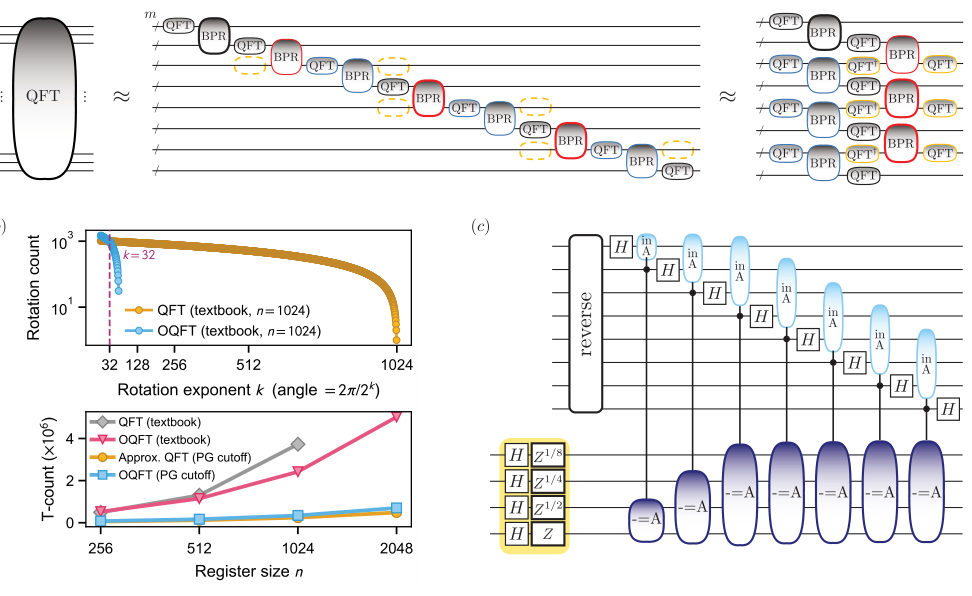
<figcaption class="paper-figure-caption"><b>Fig 1.</b> Fig. 1. Logic and resource structure of Optimistic Quantum Fourier Transforms. (a) An n-qubit QFT is truncated and decomposed into m ∼log n sub-blocks and block-phased rotations (BPR) eiXY/22m, where X and Y are the register contents of the blocks involved. Approximately commuting the blue sub-circuits past the red ones—at the cost of extra yellow log-sized QFT blocks—yields the log-depth OQFT [18]. (b) Rotation spectra (top) and T-counts (bottom) for different QFT and OQFT implementations. The OQFT naturally truncates small rotations relative to the textbook QFT, but introduces ∼44% additional rotations. Catalytic additions into a truncated phase-gradient (PG) state, as shown in (c),...</figcaption>
</figure>
<figure class="paper-figure-card">
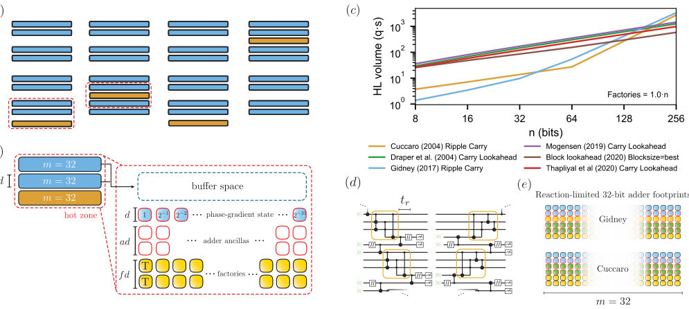
<figcaption class="paper-figure-caption"><b>Fig 2.</b> Fig. 2. Coarse-grained architecture overview and reaction-limited adder resource analysis review. (a) Macro-scale architecture: the system register is organized into m = 32 data blocks (blue), paired vertically. Here four pairs are displayed side by side. Surface-code logical qubits are assumed throughout. Resources (dark yellow) form a mobile gadget that, when docked to data blocks above or below, defines a hot zone as shown in (b), which can drive processing. (b) Anatomy of a hot zone: rows of ancillae (red-edged squares), magic-state factories (yellow, black-edged; fold-transversal cultivation), and phase-gradient registers. The buffer space is occupied by data qubits as needed. (c)...</figcaption>
</figure>
<figure class="paper-figure-card">
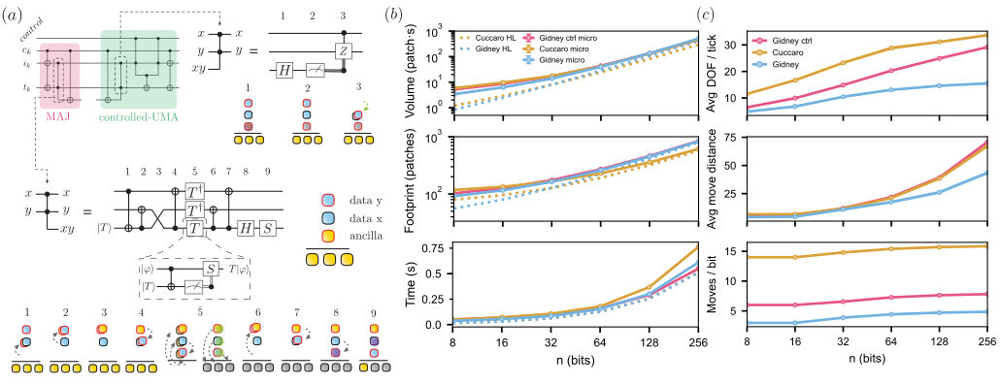
<figcaption class="paper-figure-caption"><b>Fig 3.</b> Fig. 3. Fine-grained adder scheduling and simulated performance. (a) Microscheduled routing for one iterative block of Gidney’s controlled adder. Face and edge colors identify qubit roles. Yellow patches with black edges are T factories, grey patches are reset after measurement, and purple shading marks single-qubit gates. Green operations are classically controlled and count at half depth in our cost model. The logical-AND ancilla is assumed to start with a cultivated T state. The ∼10 steps of a logical-AND operation roughly match the T-state re-cultivation time, facilitating factory pipelining. Relative to Ref. [1], we eliminate one CNOT via a near-free SWAP during MAJ. (b) Performance...</figcaption>
</figure>
<figure class="paper-figure-card">
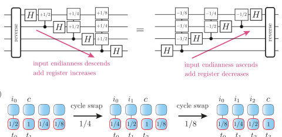
<figcaption class="paper-figure-caption"><b>Fig 4.</b> Fig. 4. Mesoscale routing analysis. (a) Two near-equivalent realizations of a QFT: reversing the addition order requires only a register negation and a unit increment. In both cases the most-significant target bit shifts as the protocol progresses. (b) Cyclic swapping of the phase-gradient register (red edges) keeps addition inputs and targets aligned. At our distance and time scales, swaps can be batched in groups of seven within a single QEC cycle. Note that PG additions within a QFT block have a fixed most-significant bit in−1 = 0, not displayed. Most reverse operations can be commuted through the OQFT resulting in a single group of rearrangements in the beginning or end of protocol.</figcaption>
</figure>
<figure class="paper-figure-card">
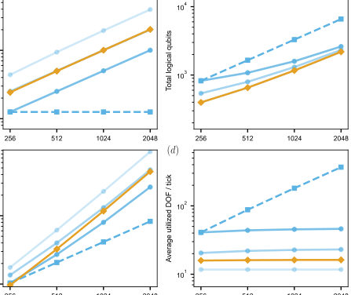
<figcaption class="paper-figure-caption"><b>Fig 5.</b> Fig. 5. Integrated OQFT performance as a function of register size for varying hot-zone counts. Yellow diamonds mark the regular (serial) QFT baseline. (a) Time to solution. Saturating the hot-zone count (hz = max) yields constant-time execution at the cost of a ∼6× increase in logical qubits; at fixed counts, hz = 2 suffices to match the regular QFT, while hz = 4 halves the execution time. (b) Qubit footprint. (c) Combined protocol volume as product of footprint-time. (d) Average concurrent degrees of freedom (DOF). At hz = 4, the overhead is roughly 500 logical ancillae and average 46 concurrent logical operations.</figcaption>
</figure>

**Summary.** This paper presents a detailed co-design study for running the Optimistic Quantum Fourier Transform on neutral-atom quantum hardware. It introduces a 'hot-zone' architecture to manage mobile quantum resources, achieving significant speedups by optimizing the scheduling of core components like quantum adders. The work establishes critical resource requirements, showing that performance hinges on managing parallelism and reaction-limited operations.

**Why it may be interesting.** It provides a concrete, hardware-aware roadmap for implementing complex quantum algorithms like QFT, directly linking algorithmic complexity to physical resource constraints (mobility, parallelism) in neutral-atom platforms.

Detailed structure

**Main problem.** The paper addresses the challenge of efficiently deploying the Optimistic Quantum Fourier Transform (OQFT) algorithm on near-term, fault-tolerant quantum hardware.

**Main result.** By implementing a hot-zone architecture and optimizing adder circuits, the OQFT can achieve significant speedups, potentially halving the runtime compared to serial QFTs, provided sufficient parallelism is available.

**Method.** The authors employ an architecture-algorithm co-design study, simulating resource routing and scheduling across specialized hardware components.

**Model / system.** The study is scoped to reconfigurable neutral-atom hardware utilizing the surface code for fault tolerance. It models the system using a 'hot-zone' architecture that separates stationary data storage from mobile processing units.

**Key observables.** Time to solution, protocol volume (space-time cost), peak Degrees of Freedom (DOF), and the required number of logical ancillae.

**Important parameters / regimes.** Code distance (d=15), hot-zone count (2 to 4+), and the size of the quantum register (256–2048 bits).

**Assumptions / limitations.** The analysis assumes reaction-limited operation and is currently scoped to cultivation-only magic-state factories and surface codes.

**Figures summary.** Figures illustrate the decomposition of OQFT into sub-blocks, compare T-counts across different implementations, and show macro-scale architectural layouts detailing the hot zone and data regions.

**Paper structure.** The paper progresses from analyzing the OQFT structure and resource needs, to developing the hot-zone architecture, comparing and selecting optimal adder circuits (Gidney vs. Cuccaro), and finally integrating these components to analyze the full OQFT performance scaling.

Abstract

We present an architecture-algorithm co-design study of the Optimistic Quantum Fourier Transform (OQFT) under a surface-code fault-tolerant execution model for reconfigurable neutral-atom hardware. Analyzing the OQFT structure, particularly its reliance on phase-gradient resources and small-scale blocks, highlights architectural requirements for resource mobility and parallel execution. Guided by that, we introduce a hot-zone architecture that decouples data storage from processing and dynamically routes mobile resource packages (magic-state factories, bridge qubits, and phase-gradient registers) to stationary data regions. To expose dominant costs, we route rotation insertions via catalytic phase-gradient addition and heuristically micro-schedule ripple-carry adders to patch-level moves. Under this model, leading Gidney~\cite{Gidney2018halvingcostof} and Cuccaro~\cite{cuccaro2004} adders have similar space-time volume but require different levels of parallelism. At the algorithm level, the five-layer OQFT shows a tunable parallelism/latency trade-off: two hot zones match serial-QFT latency, four hot zones roughly halve runtime, and additional hot zones asymptotically approach constant-time execution at substantial resource cost. Across 256-2048-bit instances, the requirements for half-time performance converge to about 500 additional logical ancillae and a peak parallelism of 128 logical qubits. We also identify broader algorithm-architecture bottlenecks, including endianness mismatches between phase-gradient and data registers, addressed via cyclic phase-gradient swaps and alternating QFT reflections. Scoped to surface codes and cultivation-only magic-state factories, our analysis identifies reaction-limited operation and parallelism demand as primary drivers of resource estimation and establishes a generalizable foundation for primitive-based architectural studies.

[↑ back to top](#top)

### [Thermodynamic Invariants of Coupled Channels: A Many-Channel Tolman-Ehrenfest Effect](http://arxiv.org/abs/2605.15653v1)

**Authors:** Benjamin Hamblin, Victor Calo, Klaus Regenauer-Lieb  
**Type:** theory · **Category:** statistical mechanics · **PDF:** <https://arxiv.org/pdf/2605.15653v1>  
**Analysis basis:** full PDF text, analyzed in chunks
**Topic relevance:** `Keldysh / 2PI / non-Gaussian methods` **1/5** · `analog quantum simulation` **1/5** · `correlated / nonlocal dissipation` **1/5** · `driven-dissipative phase transition` **1/5** · `entanglement & information structure` **1/5** · `methods for driven-dissipative` **1/5** · `non-equilibrium dynamics` **1/5** · `non-equilibrium universality` **1/5**

↔ Scroll figures horizontally

<figure class="paper-figure-card">
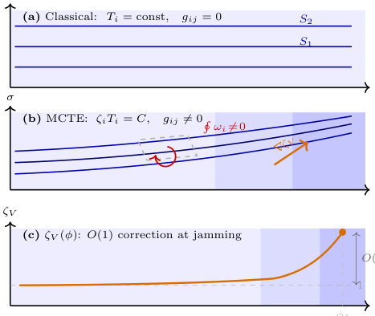
<figcaption class="paper-figure-caption"><b>Fig 1.</b> FIG. 1. Three-panel schematic of the MCTE framework (col- umn width). (a) Classical (gij = 0): entropy level sets are straight lines; each intensity Ti is independently uniform. (b) MCTE (gij ̸= 0): level sets curve; a closed loop accumu- lates a non-trivial Ruppeiner holonomy H ωi ̸= 0 (red), and the coupling coefficient ζV grows in the direction of increasing off-diagonal curvature (orange). The unique first integral of this flow is ζiTi = C. (c) ζV as a function of packing fraction ϕ: unity in the dilute limit, O(1) departure at jamming ϕJ, explaining the observed rise in Rowe’s Kµ.</figcaption>
</figure>
<figure class="paper-figure-card">
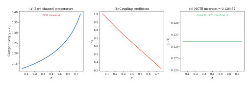
<figcaption class="paper-figure-caption"><b>Fig 2.</b> FIG. 2. MCTE invariance on the toy entropy surface S = a ln(V −VJ) + b ln(σmax−σ) −cσ/(V −VJ) with c = 0.3, V0 = 0.78. (a) Bare compactivity χ varies by a factor of 3 along the entropy level set. (b) Coupling coefficient ζ1 compensates. (c) Product ζ1T1 is constant to 10−13 (machine precision), verifying the MCTE relation. Full parameter study in the Supplemental Material [13].</figcaption>
</figure>

**Summary.** This theoretical paper generalizes the Tolman-Ehrenfest effect to coupled thermodynamic channels, deriving a universal invariant $\zeta_i T_i = C$. It applies this geometric framework to granular materials, successfully resolving long-standing puzzles regarding state-dependent material constants. The work demonstrates how geometric invariants derived from the entropy manifold can predict macroscopic physical laws in complex, coupled systems.

**Why it may be interesting.** While focused on granular physics, the mathematical machinery—using geometric invariants (Ruppeiner connection, curvature) to define equilibrium in coupled systems—is highly relevant to understanding non-equilibrium thermodynamics in complex quantum many-body systems.

Detailed structure

**Main problem.** The paper addresses the failure of single-channel equilibrium conditions when multiple thermodynamic channels are coupled, aiming to derive a universal invariant condition.

**Main result.** The unique equilibrium invariant is found to be $\zeta_i T_i = C$, where $\zeta_i$ is the holonomy of the Ruppeiner connection, which resolves long-standing puzzles in granular physics.

**Method.** The analysis extends the Tolman-Ehrenfest effect to the entropy manifold, utilizing the Ruppeiner metric and deriving the equilibrium condition as a first integral of the level-set flow.

**Model / system.** The framework is applied to systems with $n$ coupled thermodynamic channels, with the canonical realization being the $N=2$ volume–stress granular ensemble.

**Key observables.** The invariant $\zeta_i T_i = C$, the off-diagonal curvature $g_{V\sigma}$, the dilatancy ratio, and the MCTE-corrected Rowe relation $\sigma'^{1/3} = \zeta_V(\sigma) K_\mu R$.

**Important parameters / regimes.** The coupling coefficient $\zeta_i$, the jamming point ($\phi_J$), and the dimensionality of the system ($N=2$ being the primary focus).

**Assumptions / limitations.** The $N=2$ volume–stress ensemble is used as the canonical model, and the results are derived independently of the full $N=3$ non-associated flow dynamics.

**Figures summary.** Figure 1 contrasts classical decoupled vs. coupled (MCTE) behavior showing the invariant. Figure 2 illustrates the MCTE invariance on a toy entropy surface, showing the product $\zeta_1 T_1$ remains constant despite variations in bare compactivity.

**Paper structure.** The paper first establishes the failure of single-channel equilibrium, derives the MCTE invariant $\zeta_i T_i = C$ using the Ruppeiner metric, and then applies this general formalism to predict and resolve specific issues in granular plasticity (dilatancy, energy restriction, $K_\mu$ dependence).

Abstract

When multiple thermodynamic channels are coupled, single-channel equilibrium conditions fail. Extending the Tolman--Ehrenfest effect to the entropy manifold, we derive the unique $n$-channel invariant $ζ_i T_i = C$, where $ζ_i$ is the holonomy of the Ruppeiner connection. For the granular volume--stress ensemble, Rowe's dilatancy ratio and energy restriction emerge as geometric consequences of the off-diagonal curvature $g_{Vσ}$, and the 60-year puzzle of state-dependent $K_μ$ is resolved: the correction $ζ_V$ reaches $O(1)$ near jamming. The prediction $ζ_Vχ=\mathrm{const}$ across a shear band is experimentally testable.

[↑ back to top](#top)

### [Wave packet landscape in linear open quantum systems](http://arxiv.org/abs/2605.15658v1)

**Authors:** Kang Xu, Miao-Miao Yi, Zi-Hong Yan, C. P. Sun  
**Type:** theory · **Category:** other · **PDF:** <https://arxiv.org/pdf/2605.15658v1>  
**Analysis basis:** full PDF text, analyzed in chunks
**Topic relevance:** `Keldysh / 2PI / non-Gaussian methods` **1/5** · `analog quantum simulation` **1/5** · `correlated / nonlocal dissipation` **1/5** · `driven-dissipative phase transition` **1/5** · `methods for driven-dissipative` **1/5** · `non-equilibrium dynamics` **1/5** · `non-equilibrium universality` **1/5**

↔ Scroll figures horizontally

<figure class="paper-figure-card">
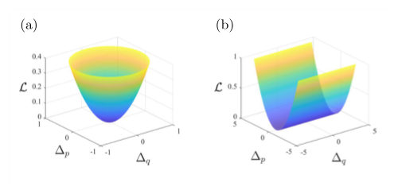
<figcaption class="paper-figure-caption"><b>Fig 1.</b> FIG. 1: Landscape deformation by trap potential in fluctuation-free dynamics. The landscapes are shown in the (∆q, ∆p) projection, with the remaining covariance fixed at its minimizing value. The axes are extended to negative values of ∆q and ∆p only for visualizing the landscape geometry, although physical variances are restricted to be nonnegative. (a) For ω ̸= 0, the fluctuation-free landscape is bowl-shaped and has a unique minimum, implying collapse of the wave packet in the long-time limit. Here the parameters are set as ω = γ = 1. (b) For ω = 0, the fluctuation-free landscape develops a flat valley of degenerate minima, reflecting translational symmetry in covariance space and...</figcaption>
</figure>
<figure class="paper-figure-card">
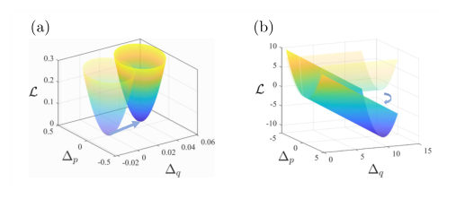
<figcaption class="paper-figure-caption"><b>Fig 2.</b> FIG. 2: Landscape deformation by fluctuation. The landscapes are shown in the (∆q, ∆p) projection, with the remaining covariance fixed at its minimizing value. The translucent surfaces denote the fluctuation-free landscapes, whereas the solid surfaces denote the landscapes deformed by bath fluctuations. The parameters are set as γ = 1, ∆qξ = ∆pξ = 0.5. (a) In the confined case, the fluctuation preserves the bowl topology but shifts its minimum away from the origin, leading to a stationary wave packet with finite width. (b) In the free-particle case, the fluctuation adds a linear term along the flat direction, tilts the fluctuation-free valley, removes the degenerate minimum manifold, and...</figcaption>
</figure>

**Summary.** This paper introduces a quantum landscape approach to analyze how wave packets evolve in open quantum systems. It shows that the long-time behavior—whether the packet collapses, localizes, or diffuses—is determined by the underlying geometry of a potential landscape in the covariance space. This geometric picture unifies these distinct dissipative quantum dynamics.

**Why it may be interesting.** This work provides a powerful geometric framework to unify disparate phenomena (diffusion, localization, collapse) in open quantum systems, offering deeper physical insight than standard master equation treatments.

Detailed structure

**Main problem.** To develop a quantum landscape approach to characterize the long-time behavior of wave packet spreading in linear open quantum systems.

**Main result.** The long-time dynamics (diffusion, localization, collapse) are unified by the geometry of a potential landscape in covariance space, showing that symmetry breaking dictates the asymptotic behavior.

**Method.** The dynamics of the covariance matrix are mapped onto a generalized gradient flow equation, $\dot{\sigma} = -M
abla L(\sigma)$, where $L$ is the quantum landscape function.

**Model / system.** The system consists of linear open quantum systems, modeled by coupled harmonic oscillators interacting with a bath (Caldeira-Leggett type). The dynamics are governed by the quantum Langevin equation.

**Key observables.** The covariance matrix $\Sigma$ (or its vectorization $\sigma$), and the position width $\Delta q(t)$.

**Important parameters / regimes.** The oscillator frequency ($\omega$), damping rate ($\Gamma$), and the presence/strength of bath fluctuations ($\xi(t)$).

**Assumptions / limitations.** The analysis relies on casting the covariance evolution into a gradient flow form and analyzing the zero modes of the system matrix.

**Figures summary.** Figures illustrate the deformation of the landscape: a bowl shape for confined systems (implying collapse) versus a flat valley for free particles, which becomes tilted by fluctuations.

**Paper structure.** The paper first introduces the landscape approach to the covariance dynamics, then analyzes specific cases (e.g., harmonic oscillator vs. free particle) to demonstrate how the landscape geometry dictates the asymptotic state, culminating in a discussion of symmetry breaking due to fluctuations.

Abstract

We develop a quantum landscape approach to characterize the long-time behavior of wave packet spreading in linear open quantum systems. Instead of treating diffusion, localization, and collapse of the wave packet as separate dynamical phenomena, we show that they originate from the symmetry structure of an underlying landscape in covariance space. The geometry of this landscape determines these distinct long time behaviors. Trapping potentials and bath fluctuations act as distinct symmetry-breaking perturbations, leading to noncommuting long-time limits and abrupt changes in the asymptotic wave-packet width. This geometric picture provides a unified origin for wave-packet diffusion, localization, and collapse in dissipative quantum dynamics.

[↑ back to top](#top)

### [Symmetry breaking and high-dimensional chaos in sparse random networks of exact firing rate models](http://arxiv.org/abs/2605.15872v1)

**Authors:** Pau Clusella  
**Type:** theory · **Category:** disordered systems and neural networks · **PDF:** <https://arxiv.org/pdf/2605.15872v1>  
**Analysis basis:** full PDF text, analyzed in chunks
**Topic relevance:** `analog quantum simulation` **1/5** · `driven-dissipative phase transition` **1/5** · `methods for driven-dissipative` **1/5** · `non-equilibrium dynamics` **1/5** · `non-equilibrium universality` **1/5**

↔ Scroll figures horizontally

<figure class="paper-figure-card">
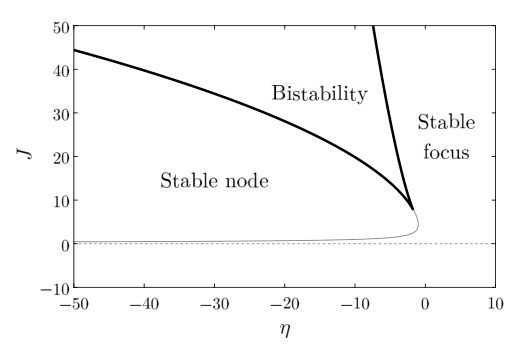
<figcaption class="paper-figure-caption"><b>Fig 1.</b> FIG. 1. Two-parameter bifurcation diagram of the homogeneous sys- tem (3). Black curves indicate saddle-node bifurcations, which join in a cusp codimension-2 bifurcation. Grey thin curve indicates the focus-node boundary of the stable fixed point.</figcaption>
</figure>
<figure class="paper-figure-card">
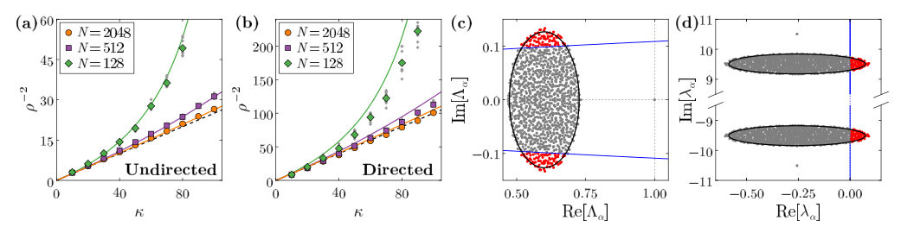
<figcaption class="paper-figure-caption"><b>Fig 2.</b> FIG. 2. Spectra of row-normalized connectivity matrices. (a,b) Scaling of the radius ρ for the Wigner’s semicircle (panel (a)) and Girko’s disk (panel (b)) distributions of the bulk of eigenvalues of C. Continuous lines show the results corresponding to Eqs. (7) and (7) for panels (a) and (b) respectively. Symbols correspond to averages over 10 different networks for each combination of κ and N, with grey dots showing the individual results. Black dashed lines indicate the asymptotic results ρ−2 = κ/4 (panel (a)) and ρ−2 = κ (panel (b)). (c) Spectra of a directed connectivity matrix C obtained for N = 1024, κ = 10, and µ = 0.6. Red circles indicate the eigenvalues corresponding to unstable...</figcaption>
</figure>
<figure class="paper-figure-card">
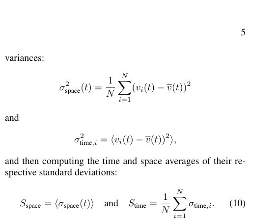
<figcaption class="paper-figure-caption"><b>Fig 3.</b> Figure 4(a) shows the heatmap of the spatial variability Sspace, together with the bifurcation line corresponding to N →∞(solid blue line), and the bifurcation obtained by using the maximal Λk for k &gt; 2 of the network in Eq. (6) (dashed blue curve). Heterogeneous states emerge in perfect agreement with the bifurcation obtained using the network spectra, but with a small offset with respect to the asymptotic model (solid curve). This difference can be traced back to the finite size error of the asymptotic relation given by Eq. (7). Remarkably, the dynamics in the region of instabilities are stationary everywhere (monitored with Stime, not shown). Figure 4(c) shows the time traces of three...</figcaption>
</figure>
<figure class="paper-figure-card">
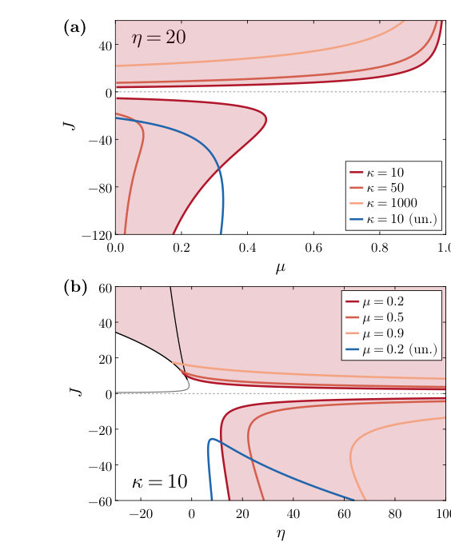
<figcaption class="paper-figure-caption"><b>Fig 4.</b> FIG. 3. Two-parameter bifurcation diagrams of the coupled system (1). (a) Red, salmon, and pink curves indicate the region of trans- verse instabilities for κ = 10, 50, and 1000 respectively, with fixed η = 20. The blue curve indicates the same result for an undirected network with κ = 10. Red shaded region shows the region of trans- verse instabilities for a directed network with κ = 10. (b) Red, salmon, and pink curves indicate the region of transverse instabili- ties for µ = 0.2, 0.5, and 0.9 respectively, with fixed κ = 10. The blue curve indicates the same result for an undirected network with µ = 0.2. Red shaded region shows the region of transverse insta- bilities for a directed...</figcaption>
</figure>
<figure class="paper-figure-card">
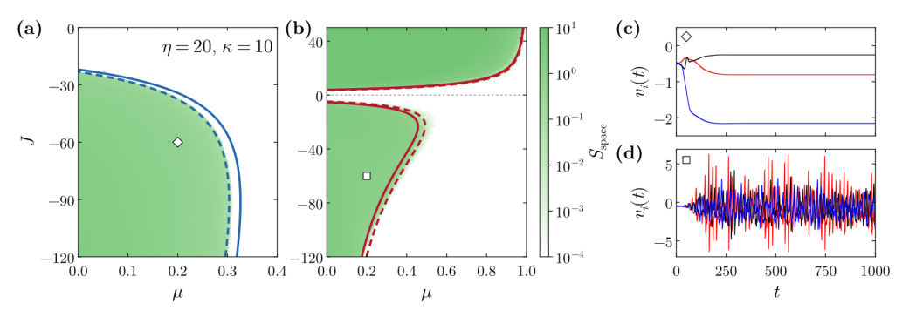
<figcaption class="paper-figure-caption"><b>Fig 5.</b> FIG. 4. Numerical validation of the bifurcation diagram. (a,b) Heatmaps of the spatial variability Sspace (Eq. (10)) for C corresponding to an undirected network (panel (a)) and directed network (panel (b)) with N = 128, κ = 10, and η = 20. Blue and red solid curve are as in Fig. 3(a). Blue and red dashed curve correspond to the stability boundaries given by Eq. (6) with the true values of Λk obtained from the network. (c,d) Time series of variable vi for three randomly selected nodes corresponding to the undirected (panel (c)) and directed (panel (d)) networks for (µ, J) = (0.2, −60) (see 3 and 2 symbols in panels (a) and (b) respectively).</figcaption>
</figure>

**Summary.** This work analyzes the collective dynamics of neural networks modeled by QIF neurons coupled on sparse random graphs. By combining linear stability analysis with random matrix theory, the authors predict the onset of instabilities, which manifest as high-dimensional chaos in directed networks. The findings establish a theoretical link between network topology, coupling parameters, and the emergence of complex, chaotic spatiotemporal activity.

**Why it may be interesting.** The rigorous mathematical framework for analyzing collective dynamics in large, sparse, and disordered systems is highly relevant to understanding complex quantum many-body systems where local interactions lead to emergent global behavior.

Detailed structure

**Main problem.** The study investigates the emergence of spatiotemporal patterns and high-dimensional chaos in coupled neural populations modeled by exact firing rate models on sparse random networks.

**Main result.** The system exhibits extensive high-dimensional chaos in directed networks for both excitatory and inhibitory coupling, while undirected inhibitory networks show winner-takes-all steady states.

**Method.** The analysis combines linear stability analysis of homogeneous states with random matrix theory to determine bifurcation boundaries, followed by Lyapunov exponent calculations to quantify chaos.

**Model / system.** The model uses $N$ populations of Quadratic Integrate-and-Fire (QIF) neurons coupled via a sparse random network with row-normalized topology. The dynamics are governed by coupled differential equations.

**Key observables.** Lyapunov exponents ($\ell_i$), Kaplan-Yorke fractal dimension ($D_{KY}$), and the dispersion relation linking growth rates to connectivity matrix eigenvalues ($\Lambda_k$).

**Important parameters / regimes.** Coupling strength ($J$), network sparsity ($\kappa$), and the diagonal coupling parameter ($\mu$).

**Assumptions / limitations.** The analysis assumes the system can be linearized around homogeneous states and utilizes the row-normalization constraint on the connectivity matrix.

**Figures summary.** Figures illustrate bifurcation diagrams showing instability boundaries, and others map the dynamical landscape using Lyapunov exponents and the scaling of the fractal dimension with system size.

**Paper structure.** The paper progresses from defining the QIF model and performing linear stability analysis to deriving spectral properties using random matrix theory, and finally characterizing the resulting dynamics using Lyapunov exponents to confirm high-dimensional chaos.

Abstract

Exact firing rate models, also known as next-generation neural mass models (NG-NMMs), provide a rigorous description of the dynamics of neural populations. While in its simplest form a single population only displays fixed-point activity, multi-population models may display a range of different behaviors. In this work, we study the dynamics of all-excitatory or all-inhibitory NG-NMMs coupled through sparse random networks with row-normalized network topology. Linear stability analysis of the homogeneous states of the system, representing asynchronous neural activity, provides a dispersion relation linking the emergence of spatiotemporal dynamics to the spectra of the connectivity matrix. Using bounds from random matrix theory, we identify the parameter regions where instabilities occur. In undirected networks, only inhibitory systems produce heterogeneous stationary patterns, corresponding to a winner-takes-all mechanism. In directed networks, exotic rhythmic states with high frequencies emerge in both, excitatory and inhibitory systems. Numerical simulations reveal that these hectic oscillatory states correspond to high-dimensional chaos with extensive properties.

[↑ back to top](#top)

### [Diagonal Adaptive Non-local Observables on Quantum Neural Networks](http://arxiv.org/abs/2605.15410v1)

**Authors:** Huan-Hsin Tseng, Yan Li, Hsin-Yi Lin, Samuel Yen-Chi Chen  
**Type:** both · **Category:** quantum information and computing · **PDF:** <https://arxiv.org/pdf/2605.15410v1>  
**Analysis basis:** full PDF text, analyzed in chunks
**Topic relevance:** `analog quantum simulation` **1/5** · `entanglement & information structure` **1/5** · `quantum measurements` **1/5**

↔ Scroll figures horizontally

<figure class="paper-figure-card">
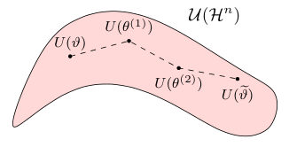
<figcaption class="paper-figure-caption"><b>Fig 1.</b> Fig. 2: The training process searching for optimal circuit U(eθ) results in observable changes θ 7→H(θ) := U †(θ) H U(θ).</figcaption>
</figure>
<figure class="paper-figure-card">
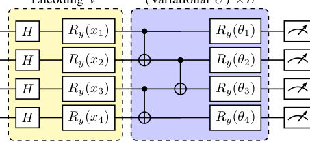
<figcaption class="paper-figure-caption"><b>Fig 2.</b> Fig. 1: A VQC diagram of (11), (12), which is also imple- mented in Sec. IV. The variational block represented by a blue box is repeated L times to increase the circuit depth.</figcaption>
</figure>
<figure class="paper-figure-card">
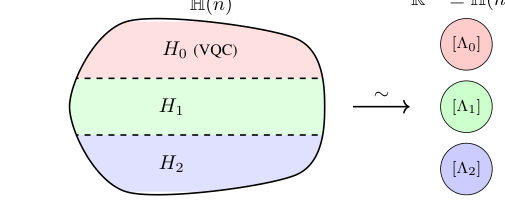
<figcaption class="paper-figure-caption"><b>Fig 3.</b> Fig. 3: Observable space H(n) is partitioned into equivalent classes labeled by R2n. In other words, H(n) is classified by its eigenvalues, and VQC falls in only one particular class.</figcaption>
</figure>
<figure class="paper-figure-card">
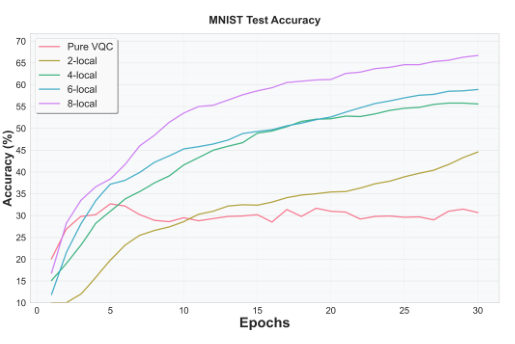
<figcaption class="paper-figure-caption"><b>Fig 4.</b> Fig. 5: [MNIST test accuracy.] All models share the same VQC architecture. Increasing measurement non-locality im- proves test accuracy over the fixed-Pauli baseline (pure VQC).</figcaption>
</figure>
<figure class="paper-figure-card">
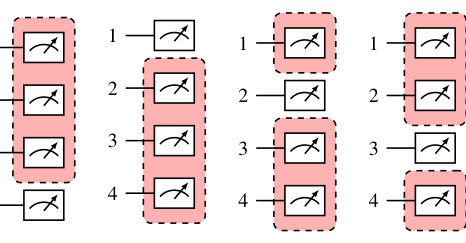
<figcaption class="paper-figure-caption"><b>Fig 5.</b> Fig. 4: Sliding k-local DANO measurements of k = 3, n = 4.</figcaption>
</figure>

**Summary.** This paper introduces Diagonal Adaptive Non-local Observables (DANO) to enhance Variational Quantum Algorithms by making the measurement observable trainable. By restricting the observable to a diagonal form, DANO significantly reduces the classical computational cost and parameter count compared to general methods, while mathematically retaining the full expressive power of the original approach. This makes complex, high-locality quantum machine learning tasks feasible on near-term hardware.

**Why it may be interesting.** While focused on QML, the core technique of parameterizing observables via restricted structures (diagonalization) and proving equivalence to a larger space is relevant to understanding constraints and effective Hamiltonians in open quantum systems or when modeling complex interactions in condensed matter.

Detailed structure

**Main problem.** To improve Variational Quantum Algorithms (VQAs) by enlarging the function space beyond the circuit ansatz alone, while mitigating the exponential increase in parameters and classical optimization cost associated with general trainable observables.

**Main result.** The proposed Diagonal Adaptive Non-local Observables (DANO) framework achieves the full expressivity of general Adaptive Non-local Observables (ANO) while reducing the observable parameter complexity from $O(4^k)$ to $O(2^k)$, making large-scale measurements practical.

**Method.** The authors restrict the trainable observable $H$ to a diagonal form $\Lambda$, which is mathematically shown to be equivalent in expressivity to the full ANO space under certain conditions.

**Model / system.** The work focuses on Quantum Neural Networks (QNNs) implemented via Variational Quantum Circuits (VQCs) trained on NISQ devices. The model involves training parameters $	heta$ for the unitary circuit $U(	heta)$ alongside parameters $\lambda$ for the diagonal observable $\Lambda(\lambda)$.

**Key observables.** The expectation values of the trainable diagonal observables $\Lambda_j$, which are measured via sliding $k$-local measurements.

**Important parameters / regimes.** The locality $k$ of the observable, the number of qubits $n$, and the circuit parameters $	heta$ and observable parameters $\lambda$.

**Assumptions / limitations.** The core assumption is that restricting the observable to a diagonal form retains full ANO expressivity, which is supported by a density proof relying on the circuit generating set spanning $SU(K)$.

**Figures summary.** Figures illustrate the VQC structure, the training trajectory involving observable changes, and the partitioning of the observable space. Tables summarize performance gains on MNIST and Yale B face recognition when using DANO vs. pure VQC.

**Paper structure.** The paper first introduces the challenge of ANO, then proposes DANO by restricting observables to diagonal forms. It provides theoretical guarantees of expressivity equivalence, followed by empirical validation on classification tasks (MNIST and Yale B) demonstrating performance gains and cost reductions.

Abstract

Adaptive Non-local Observables (ANOs) have shown that making quantum observables dynamic can substantially enlarge the function space of Variational Quantum Algorithms, partly shifting hardware demands from circuit synthesis to measurement design. However, this advantage is accompanied by a steep increase in the number of parameters, as well as the classical optimization cost for varying general Hermitian observables.   We propose a special form of ANO that significantly reduces this burden by considering only diagonal observables paired with quantum circuits. Mathematically, this is equivalent to the full ANO of a large parameter space since diagonal matrices are canonical representatives of the ANO space modulo unitary similarity. As a result, Diagonal ANO retains the same capability of full ANO while reducing $k$-local observable complexity from $O(4^k)$ to $O(2^k)$ and lowering the corresponding measurement-side classical computation. In this sense, diagonal ANO preserves much of the benefit of full ANO while encompassing conventional VQCs as a special case.

[↑ back to top](#top)

### [Itinerant antiferromagnetism in the antagonistic pair compound Y$_4$Co$_3$Ag](http://arxiv.org/abs/2605.15495v1)

**Authors:** Rafaela F. S. Penacchio, Nao Furukawa, Joanna M. Blawat, John Singleton, Zhouqi Li, Raquel A. Ribeiro, Sérgio L. Morelhão, Sergey L. Bud'ko, Paul C. Canfield, Tyler J. Slade  
**Type:** experiment · **Category:** strongly correlated electrons · **PDF:** <https://arxiv.org/pdf/2605.15495v1>  
**Analysis basis:** full PDF text, analyzed in chunks
**Topic relevance:** `analog quantum simulation` **1/5** · `exotic spin models in light-matter` **1/5** · `spintronics-quantum-optics interface` **1/5**

↔ Scroll figures horizontally

<figure class="paper-figure-card">
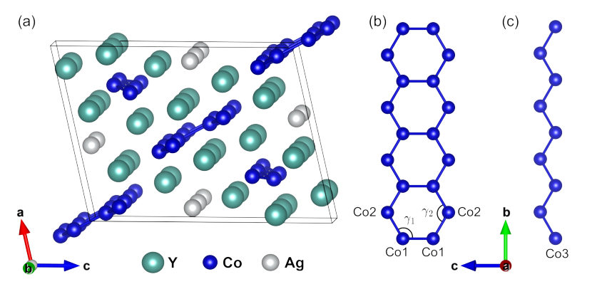
<figcaption class="paper-figure-caption"><b>Fig 1.</b> FIG. 1. Crystal structure of Y4Co3Ag. (a) A view of the crystal structure along the b-axis, emphasizing the complete sheathing of Co by Y atoms with no nearest-neighbor Co-Ag contacts. Both Y and Ag form linear chains running along the b-axis of the monoclinic (I2/m) unit cell. To highlight these chains, (a) shows a projection of two unit cells along the (010) direction. The intrachain distance between two Y or two Ag atoms is 3.9197(3) ˚A, i.e., the unit cell length in the (010) direction. The Co ions form both (b) hexagonal and (c) zigzag chains that occupy the channels formed by Y. Co-Co distances within the hexagonal chains are dCo1-Co1 = 2.3432(6) ˚A and dCo1-Co2 = 2.2893(6) ˚A,...</figcaption>
</figure>
<figure class="paper-figure-card">
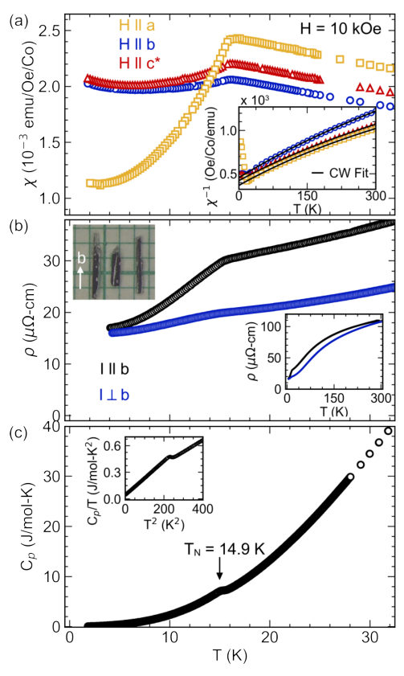
<figcaption class="paper-figure-caption"><b>Fig 2.</b> FIG. 2. Low-temperature physical properties of Y4Co3Ag. (a) Anisotropic temperature-dependent magnetic susceptibil- ity χ = M/H. The inset shows χ−1, and the solid curves are the Curie-Weiss fits (see text) to the data. (b) Temperature dependence of the electrical resistivity ρ measured with cur- rent applied parallel (black) and perpendicular (blue) to the b-axis. The right inset shows ρ(T) for T = 1.8–300 K, and the left inset shows a picture of typical rod-like Y4Co3Ag crystals on a mm-scale grid. (c) Temperature dependence of the molar heat capacity, Cp, for temperatures 1.8 ≤T ≤32 K. The in- set shows Cp/T against T 2, showing linear dependence below TN, and yielding γ = 50.1(5)...</figcaption>
</figure>
<figure class="paper-figure-card">
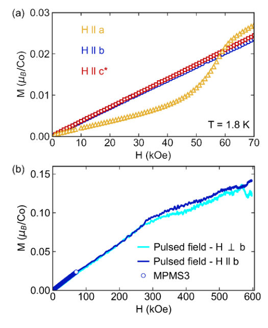
<figcaption class="paper-figure-caption"><b>Fig 3.</b> FIG. 3. Field-dependent magnetization isotherms for Y4Co3Ag measured at (a) T = 1.8 K in a DC field and (b) 500 mK (solid curves) in a pulsed field. The points (open cir- cles) in (b) show the low-field data used to scale the pulsed- field data (see Methods).</figcaption>
</figure>

**Summary.** This paper reports on the synthesis and characterization of Y4Co3Ag, a novel compound designed to host quasi-one-dimensional Co chains. Through magnetic and transport measurements, the authors establish that the material orders antiferromagnetically at 14.9 K, exhibiting signatures of itinerant magnetism. The findings suggest Y4Co3Ag is a promising platform for investigating magnetic interactions in low-dimensional correlated electron systems.

**Why it may be interesting.** The work provides an experimental realization of designing magnetic materials based on structural motifs (antagonistic pairs) to isolate and study specific magnetic interactions, which is highly relevant for understanding correlated electron physics in low dimensions.

Detailed structure

**Main problem.** The study investigates the nature of antiferromagnetism in the novel compound Y4Co3Ag, aiming to characterize its magnetic interactions within a quasi-one-dimensional structure.

**Main result.** The material exhibits antiferromagnetic ordering at $T_N=14.9$ K, suggesting the presence of small, itinerant magnetic moments and strong magnetic fluctuations in a low-dimensional Co chain system.

**Method.** The research employed a combination of structural characterization (XRD) and multiple physical measurements, including temperature-dependent resistivity, specific heat, and high/low-field magnetization.

**Model / system.** The physical system is the intermetallic compound Y4Co3Ag, which crystallizes in a monoclinic structure featuring one-dimensional Co chains running along the b-axis, designed using the 'antagonistic pair' concept to avoid Co-Ag nearest-neighbor contacts.

**Key observables.** Antiferromagnetic ordering temperature ($T_N$), effective magnetic moment ($\mu_{	ext{eff}}$), specific heat anomaly, and magnetization isotherms $M(H)$.

**Important parameters / regimes.** The system is characterized by quasi-one-dimensional Co chains, exhibiting itinerant magnetic behavior, and the magnetic coupling is analyzed via Curie-Weiss fits ($\Theta/T_N$ ratio).

**Assumptions / limitations.** The primary assumption is that the structural design successfully isolates the Co chains, allowing the study of itinerant magnetism in a quasi-1D setting. Contamination from the growth crucible ($	ext{Al}$) is also analyzed as a systematic perturbation.

**Figures summary.** Figures show crystal structures, temperature dependence of $\chi$, $
ho$, and $C_p$ around $T_N=14.9$ K. Magnetization isotherms $M(H)$ are presented for various fields and temperatures, comparing results from different growth conditions (Ta vs. $	ext{Al}_2	ext{O}_3$).

**Paper structure.** The paper first introduces the material and its structure based on the antagonistic pair concept. It then presents comprehensive measurements (transport, magnetic, specific heat) confirming antiferromagnetic ordering. The analysis focuses on interpreting these results to classify the magnetism as itinerant, contrasting it with localized models, and finally discusses the sensitivity of the magnetic properties to sample growth conditions.

Abstract

Low dimensional crystallographic motifs have long been associated with desirable physical properties. The confinement of electrons to low dimensions is thought to enhance quantum fluctuations and may promote correlated phenomena. Here, using the antagonistic pair concept, we add Y to the immiscible Co-Ag pair to discover Y$_4$Co$_3$Ag. This compound adopts a monoclinic $I$2/$m$ structure consisting of Y channels that are filled by one-dimensional zigzag and hexagonal Co chains, which extend along the crystallographic $b$-axis with no nearest neighbor contacts between Co and Ag atoms. Transport, magnetic, and specific heat measurements reveal that Y$_4$Co$_3$Ag orders antiferromagnetically at $T_N=14.9$ K with an effective magnetic moment $μ_{\text{eff}}$ = 1.4 $μ_{\text{B}}$/Co. Specific heat measurements show only a small entropy loss on the order of $0.1\,R\ln2$ associated with magnetic order, and magnetization isotherms, in DC fields up to 70 kOe at 1.8 K and in pulsed fields up to 600 kOe at 500 mK, indicate a small ordered moment of less than 0.2 $μ_B$/Co. Taken together, our results imply the presence of small, itinerant moments and strong fluctuations in Y$_4$Co$_3$Ag, suggesting that Y$_4$Co$_3$Ag may be a promising candidate material to investigate itinerant magnetic interactions in a quasi-one dimensional system.

[↑ back to top](#top)

### [Hybrid Quantum-Classical Density Functional Theory: A Structured Framework](http://arxiv.org/abs/2605.15979v1)

**Authors:** Namrata Manglani, Samrit Kumar Maity, Shashank Sharma, Soham Phulare, Sanjay Wandhekar  
**Type:** theory · **Category:** strongly correlated electrons · **PDF:** <https://arxiv.org/pdf/2605.15979v1>  
**Analysis basis:** full PDF text, analyzed in chunks
**Topic relevance:** `Keldysh / 2PI / non-Gaussian methods` **1/5** · `analog quantum simulation` **1/5**

↔ Scroll figures horizontally

<figure class="paper-figure-card">
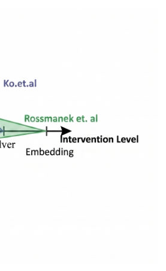
<figcaption class="paper-figure-caption"><b>Fig 1.</b> Fig. 1. Design space for HQ-DFT. The planes in the design space are representative studies</figcaption>
</figure>
<figure class="paper-figure-card">
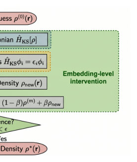
<figcaption class="paper-figure-caption"><b>Fig 2.</b> Fig. 2. Intervention levels shown at the SCF workflow</figcaption>
</figure>

**Summary.** This paper introduces a comprehensive, structured framework for Hybrid Quantum-Classical DFT (HQ-DFT) to overcome the limitations of classical DFT methods. By organizing research along axes of intervention level, functional role, and hardware capability, it guides researchers on the most promising near-term quantum approaches. It is crucial for advancing accurate simulations of strongly correlated electronic systems.

**Why it may be interesting.** This work directly addresses the computational bottlenecks in simulating strongly correlated materials by systematically mapping out how quantum computation can be integrated, providing a roadmap for future theoretical work.

Detailed structure

**Main problem.** Density Functional Theory (DFT) suffers from limitations due to inaccurate exchange-correlation functionals and high computational scaling ($	ext{O}(N^3)$).

**Main result.** The authors propose a structured, three-dimensional framework to organize and evaluate hybrid quantum-classical DFT (HQ-DFT) efforts.

**Method.** They introduce a structured design space based on the intervention level (Hamiltonian, Solver, Embedding), the quantum role (Accuracy vs. Acceleration), and the hardware regime (NISQ vs. Fault-Tolerant).

**Model / system.** The focus is on electronic structure calculations, particularly for systems exhibiting strong electronic correlation, such as transition-metal oxides or $f$-electron compounds.

**Key observables.** Accuracy (treating electron correlation), Computational Cost (scaling reduction), and Convergence.

**Important parameters / regimes.** NISQ (Noisy) vs. Fault-Tolerant (FTQC) hardware regimes; the size of the correlated region (fragment size).

**Assumptions / limitations.** The need for a structured framework is highlighted because current research efforts are scattered across various quantum-classical integration points.

**Figures summary.** Figure 1 illustrates the proposed three-axis design space for HQ-DFT. Figure 2 maps intervention levels within the Self-Consistent Field (SCF) workflow.

**Paper structure.** The paper first outlines DFT limitations, then proposes the three-dimensional design space, analyzes existing methods within this space, and concludes with guidelines on near-term viability.

Abstract

Density Functional Theory (DFT) is widely used for atomistic simulations. However, its reach stays limited due to several limitations such as lack of accurate exchange-correlation functional, requirement of costly O(N 3) diagonalization etc. Although quantum computing offers paths forward, including variational techniques, embedding strategies, and quantum linear solvers, the discussion remains scattered. Without shared terms or structure, evaluating progress in hybrid quantum-classical DFT efforts becomes challenging. To bring order, we introduce a three-axis scheme based on where the method connects into DFT, whether the quantum part boosts precision or cuts time, alongside intended device type: current noisy machines or future error-corrected ones. Sorting known approaches in this way shows why embedding frameworks fit modern tools better, while faster linear algebra waits for more advanced systems.

[↑ back to top](#top)

### [Machine learning potential as a guide for eutectic in ultra-refractory multicomponent ceramics](http://arxiv.org/abs/2605.16091v1)

**Authors:** V. E. Valiulin, A. V. Mikheyenkov, N. M. Chtchelkatchev, E. A. Levashov  
**Type:** theory · **Category:** disordered systems and neural networks · **PDF:** <https://arxiv.org/pdf/2605.16091v1>  
**Analysis basis:** full PDF text, analyzed in chunks
**Topic relevance:** `methods for driven-dissipative` **1/5** · `non-equilibrium dynamics` **1/5**

↔ Scroll figures horizontally

<figure class="paper-figure-card">
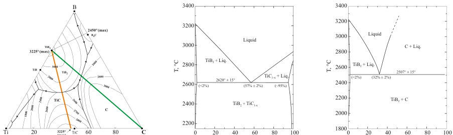
<figcaption class="paper-figure-caption"><b>Fig 1.</b> FIG. 1. (a) Pseudo-binary sections under consideration are colored as follows: orange for Line 1 and green for Line 2; (b) Pseudo-binary section TiB2-TiC0.95 herein Line 1; (c)Pseudo-binary section TiB2-C, herein Line 2. The Figures are drawn according to the data from [42].</figcaption>
</figure>
<figure class="paper-figure-card">
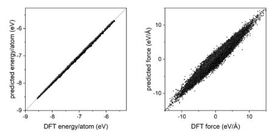
<figcaption class="paper-figure-caption"><b>Fig 2.</b> FIG. 2. Validation of the machine-learning interatomic po- tential (MLIP) accuracy. The figure reports the model’s performance on the combined training and test datasets. When evaluated strictly on the held-out test configurations, the model achieves a root-mean-square error (RMSE) of 14.2 meV/atom for energy and 0.5 eV/˚A for forces. The re- ported force error is relatively high, which can be attributed to the complexity of simulating a high-temperature liquid alloy composed of chemically distinct elements (Ti, alongside the inherently incompressible elements boron and carbon), com- bined with the use of a limited training dataset. Nevertheless, the potential successfully passes a series...</figcaption>
</figure>
<figure class="paper-figure-card">
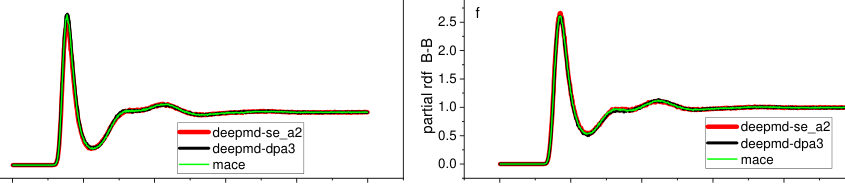
<figcaption class="paper-figure-caption"><b>Fig 3.</b> FIG. 3. Accuracy assessment of the DeepMD-se-a2 MLIP via radial distribution function (RDF) benchmark. Total and partial radial distribution functions for a liquid Ti40B40C20 alloy (obtained as a 1:1 molar mixture of TiB2 and TiC) at T = 4000 K. The computationally efficient descriptor-based DeepMD-se-a2 potential is compared against two high-accuracy graph-based foundation models, DeepMD-DPA3 (DPA-3.1-3M) and MACE (mace-mp-0b3-medium), both fine-tuned on the DeepMD-se-a2 training dataset. The close agreement between all calculated RDFs confirms the accuracy of the optimized DeepMD-se-a2 MLIP, despite its relatively high reported force error of 0.5 eV/˚A. Additional benchmarks are presented...</figcaption>
</figure>
<figure class="paper-figure-card">
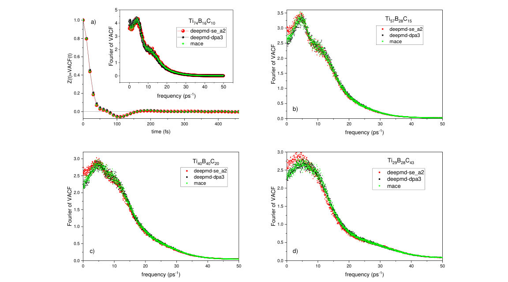
<figcaption class="paper-figure-caption"><b>Fig 4.</b> FIG. 4. Accuracy assessment of the DeepMD-se-a2 MLIP via velocity autocorrelation function (VACF) benchmark. The computationally efficient descriptor-based DeepMD-se-a2 potential is compared against two different high-accuracy graph- based MLIP foundation models DeepMD-DPA3 (DPA-3.1-3M) and MACE (mace-mp-0b3-medium), both fine-tuned on the DeepMD-se-a2 training-test dataset. (a) VACF for a liquid Ti74B16C10 alloy at T = 4000 K, computed in the NVT ensemble. The inset shows the Fourier transform of the VACF; the low-frequency noise is attributed to the finite simulation trajectory length (10 ps). For panels (b)–(d), computations were performed in the NPT ensemble. The larger discrepancy...</figcaption>
</figure>
<figure class="paper-figure-card">
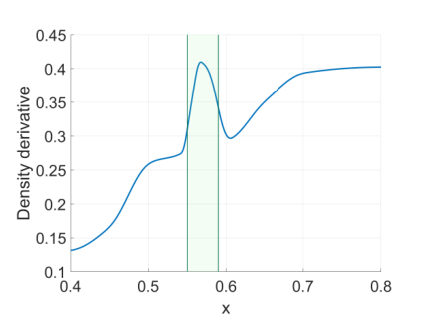
<figcaption class="paper-figure-caption"><b>Fig 5.</b> FIG. 5. The derivative of density by concentration as the function of concentration in Line 1 is shown (density in g/cm3</figcaption>
</figure>

**Summary.** This work proposes using machine learning potentials to overcome the experimental difficulty of finding eutectic points in ultra-refractory alloys. By simulating the supercooled liquid state, the authors identified characteristic signatures in the concentration derivatives of thermodynamic and transport properties. This provides a powerful, computationally guided tool for materials discovery in extreme conditions.

**Why it may be interesting.** While focused on condensed matter thermodynamics, the core methodology—using deep learning potentials to model complex, high-temperature, multi-component liquid states—is highly relevant to simulating non-equilibrium dynamics in quantum many-body systems.

Detailed structure

**Main problem.** The primary challenge is determining eutectic points in ultra-refractory multicomponent ceramics, as conventional melting experiments are too costly and technically difficult for materials with melting points exceeding 3000 K.

**Main result.** The authors successfully demonstrated that a machine-learning interatomic potential (MLIP) can accurately predict eutectic compositions by analyzing liquid-phase thermodynamic and transport properties.

**Method.** The approach uses MLIPs, trained on DFT data, to simulate the supercooled liquid state and identify eutectic regions by analyzing concentration derivatives of properties like density and energy.

**Model / system.** The study focuses on the Ti-B-C system, analyzing pseudo-binary sections ($	ext{TiB}_2-	ext{TiC}$ and $	ext{TiB}_2-	ext{C}$). The core computational tool is a neural network-based MLIP, validated against high-accuracy DFT methods.

**Key observables.** Physical density, total energy, diffusion coefficient, bulk modulus, and viscosity coefficient, analyzed via their concentration derivatives.

**Important parameters / regimes.** Ultra-refractory temperature regimes (above 3000 K); the supercooled liquid state ($T=2500$ K) is used for simulation.

**Assumptions / limitations.** The method assumes that local extrema in the concentration derivatives of liquid properties reliably pinpoint the eutectic composition, bypassing the need for solid-state structural information.

**Figures summary.** Figures show pseudo-binary sections and liquid phase diagrams, MLIP performance metrics (RMSE), and plots illustrating the concentration dependence of various properties (density, energy, etc.) highlighting the eutectic region.

**Paper structure.** The paper introduces the problem, details the MLIP methodology (training, validation against other ML potentials), applies the method to the Ti-B-C system, and concludes by showing that characteristic anomalies in liquid properties confirm the eutectic location.

Abstract

The experimental determination of eutectic points is a long-established and widely used technique, but it is generally only practical for systems with relatively low melting points. Many modern, promising materials, however, are ultra-refractory, with melting points exceeding 3000 K. For these systems, conventional melting experiments become prohibitively expensive and technically challenging. Advanced AI modeling can serve as a powerful precursor to guide successful experimentation in such cases. This work proposes a novel criterion for determining the eutectic point concentration in ultra-refractory alloys. The approach is verified using the Ti-B-C system - the most thoroughly studied three-component refractory system to date. The core of the algorithm is a machine-learning interatomic potential, based on a neural network, which achieves accuracy comparable to ab initio methods. Crucially, the algorithm operates effectively in the liquid phase, eliminating the need for information about the solid alloy's crystalline structure to estimate eutectic points.

[↑ back to top](#top)

### [Benchmarking empirical and machine-learned interatomic potentials using phase diagram predictions for Lead](http://arxiv.org/abs/2605.16018v1)

**Authors:** Tom Hellyar, Pascal T. Salzbrenner, Peter I. C. Cooke, Chris J. Pickard, Scott Habershon, Livia B. Pártay  
**Type:** theory · **Category:** statistical mechanics · **PDF:** <https://arxiv.org/pdf/2605.16018v1>  
**Analysis basis:** full PDF text, analyzed in chunks
**Topic relevance:** `Keldysh / 2PI / non-Gaussian methods` **1/5**

↔ Scroll figures horizontally

<figure class="paper-figure-card">
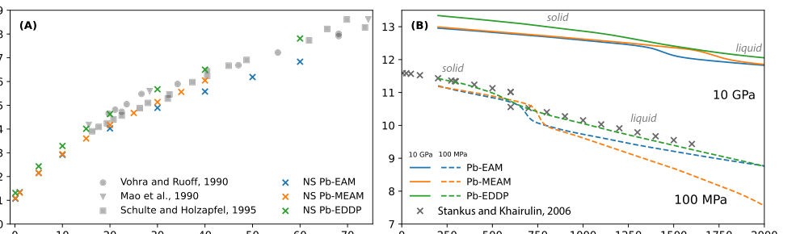
<figcaption class="paper-figure-caption"><b>Fig 1.</b> FIG. 1. (A) Density of solid lead at 300 K, as a function of pressure. Grey symbols show experimental results from Vohra and Ruoff [51], Mao [33], and Schulte and Holzapfel [52]. Coloured crosses are densities calculated from the NS calculations for the three different studied potentials. (B) Density of lead at constant pressure. Grey crosses show experimental results from Stankus and Khairulin [53], obtained at atmospheric pressure. Lines show the density from NS calculations at 100 MPa (dashed lines) and 10 GPa (solid lines) for the three tested potential models.</figcaption>
</figure>
<figure class="paper-figure-card">
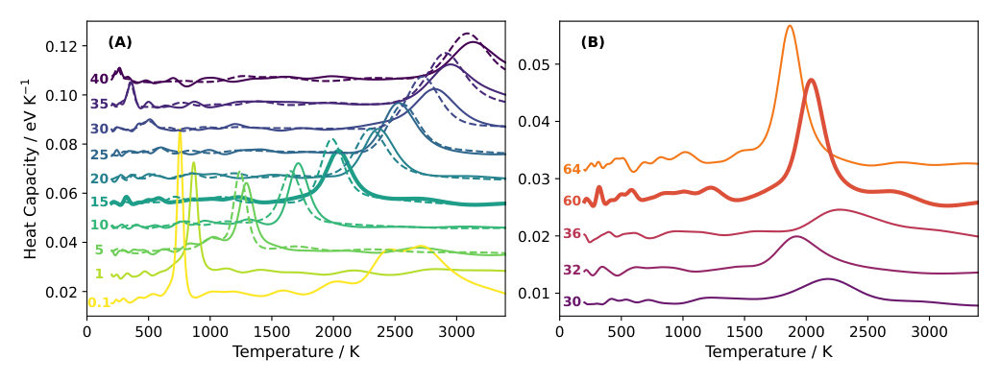
<figcaption class="paper-figure-caption"><b>Fig 2.</b> FIG. 2. Constant-pressure heat capacity of the simulated systems as a function of temperature, using the Pb-MEAM model. Solid and dashed lines represent calculations performed using standard NS and RENS, respectively. (A) Different pressures, with values displayed in GPa by each curve, with a 60-particle system size. Heat capacity values are shifted up by 0.01 eV K−1 for each increasing pressure, to assist readability. (B) Different system sizes (with atom counts shown by each curve) at 15 GPa. Heat capacity is shifted as a function of system size (increased by 0.005 eV K−1 for each successive system size). The 15 GPa, 60-atom NS curves in each panel (representing the same run) are shown...</figcaption>
</figure>
<figure class="paper-figure-card">
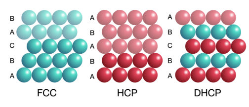
<figcaption class="paper-figure-caption"><b>Fig 3.</b> FIG. 3. Schematic illustration of polytype face-centred cubic (FCC), hexagonal close-packed (HCP), and double hexagonal close-packed (dHCP) structures. ABC notation on the left marks the relative stack- ing position, with layers sandwiched by two different stackings in blue, and layers sandwiched by two sheets of atoms in the same rel- ative position coloured red.</figcaption>
</figure>
<figure class="paper-figure-card">
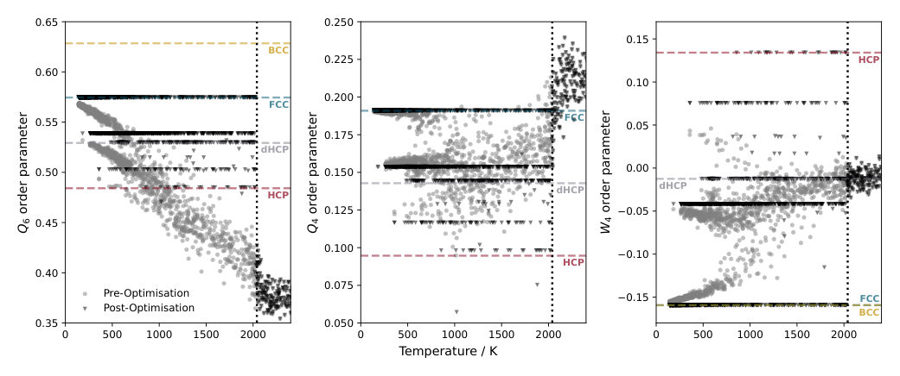
<figcaption class="paper-figure-caption"><b>Fig 4.</b> FIG. 4. Configuration-averaged Steinhardt bond order parameters of an exemplar NS run (15 GPa, Pb-MEAM, 60 atoms). Values for raw NS configurations are shown by grey circles, while the order parameter values after the geometry optimisation are shown by black triangles. Optimal crystal structure values for FCC, HCP, dHCP and BCC are shown by horizontal dashed lines. The melting temperature at this pressure is marked with a vertical dotted line.</figcaption>
</figure>
<figure class="paper-figure-card">
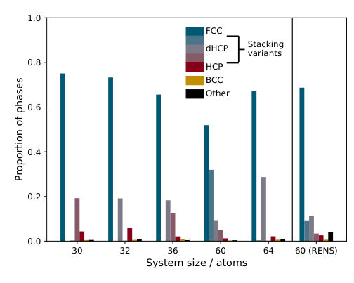
<figcaption class="paper-figure-caption"><b>Fig 5.</b> FIG. 5. Relative proportions of FCC, HCP, BCC and stacking vari- ants observed for different system sizes in 15 GPa MEAM NS runs and for a 60-atom RENS calculation.</figcaption>
</figure>

**Summary.** This work compares three interatomic potentials—EAM, MEAM, and a machine-learned EDDP—to map the high-pressure phase diagram of Lead. By using advanced sampling methods like Nested Sampling, the authors demonstrate that MLIPs are superior to empirical potentials because they accurately predict key solid-solid phase transitions. This validates the use of MLIPs combined with rigorous statistical mechanics sampling for predictive materials science.

**Why it may be interesting.** While focused on condensed matter, the rigorous application of advanced sampling techniques (NS/RENS) to calculate partition functions and phase stability is highly relevant to theoretical physics dealing with complex many-body systems.

Detailed structure

**Main problem.** The paper benchmarks different interatomic potentials (empirical vs. machine-learned) to accurately predict the phase behavior and phase transitions of Lead under high pressure.

**Main result.** The machine-learned potential (EDDP) successfully captured the experimentally-observed FCC-to-HCP transition at $\sim 15 	ext{ GPa}$, whereas the empirical potentials failed to do so, highlighting the importance of model flexibility.

**Method.** The study employs advanced simulation techniques like Nested Sampling (NS) and Replica-Exchange Nested Sampling (RENS) to calculate thermodynamic properties and map the Pressure-Temperature phase diagram.

**Model / system.** The physical system is elemental Lead (Pb). The models compared are the Embedded Atom Method (EAM), Modified EAM (MEAM), and an Ephemeral Data-Derived Potential (EDDP), a neural network-based MLIP.

**Key observables.** Density ($
ho$), Heat Capacity ($C_p$), Phase transition pressures (e.g., FCC $\leftrightarrow$ HCP), and relative free energy differences between solid phases.

**Important parameters / regimes.** Pressures up to 60 GPa, Temperatures, and the specific training data used for the MLIPs.

**Assumptions / limitations.** The analysis relies on the assumption that the MLIPs can accurately represent the potential energy surface, and that the simulation methods (NS/RENS) provide an unbiased sampling of the phase space.

**Figures summary.** Figures summarize density comparisons, heat capacity vs. temperature curves showing solid-liquid and solid-solid transitions, and P-T phase diagrams comparing the predictions of the three potentials.

**Paper structure.** The paper systematically compares the predictions of EAM, MEAM, and EDDP across multiple thermodynamic regimes, using NS/RENS to calculate thermodynamic observables and structural order parameters to identify stable phases.

Abstract

We compare the predicted phase behaviour of lead (Pb) using three different interatomic potential models, including an embedded atom method (EAM), a modified embedded atom method (MEAM), and a neural network-based machine-learned model in the form of an ephemeral data-derived potential (EDDP). Using nested sampling and replica-exchange nested sampling simulations, we computed thermodynamic and structural properties at pressures up to 60 GPa, mapping both melting behaviour and solid-phase stability. Both the EAM and MEAM models predict the face-centred cubic (FCC) phase to remain stable up to approximately 60 GPa. In contrast, the EDDP model captures the experimentally-observed FCC-to-hexagonal close-packed (HCP) transition at around 15 GPa. These results highlight the importance of training data and model flexibility in accurately describing high-pressure phase behaviour, and demonstrate the effectiveness of nested sampling as a robust framework for exploring phase stability in materials. Particularly, the combination of nested sampling with modern machine-learned interatomic potentials - delivering near ab initio accuracy at tractable cost - opens the door to truly predictive and exhaustive exploration. EDDPs trained on diverse, out-of-equilibrium configurations appear particularly well suited to this task, offering a robust and transferable framework for unbiased phase discovery.

[↑ back to top](#top)

### [Bias Analysis and Regularization of Sequential Minimal Optimization in Variational Quantum Eigensolvers](http://arxiv.org/abs/2605.15813v1)

**Authors:** Samuele Pedrielli, Frederik Stalschus, Stefan Kühn, Karl Jansen, Kim A. Nicoli, Shinichi Nakajima  
**Type:** theory · **Category:** quantum information and computing · **PDF:** <https://arxiv.org/pdf/2605.15813v1>  
**Analysis basis:** full PDF text, analyzed in chunks
**Topic relevance:** `analog quantum simulation` **1/5**

↔ Scroll figures horizontally

<figure class="paper-figure-card">
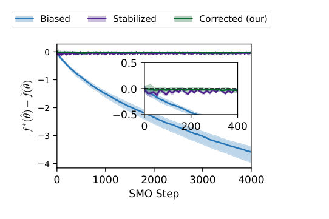
<figcaption class="paper-figure-caption"><b>Fig 1.</b> FIG. 1. Estimation error of energy over SMO iterations by the biased, stabilized and our bias-corrected SMO-VQE algo- rithms.</figcaption>
</figure>
<figure class="paper-figure-card">
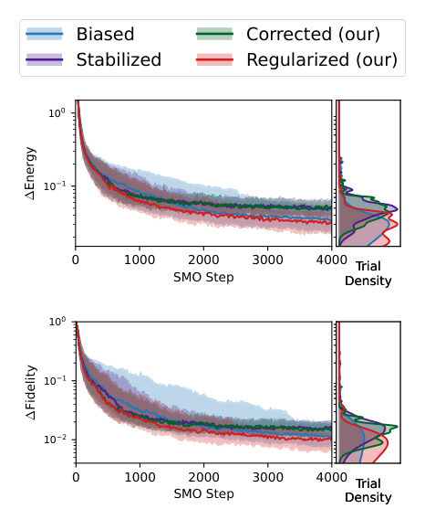
<figcaption class="paper-figure-caption"><b>Fig 2.</b> FIG. 2. Performance comparison of the biased, corrected, and regularized SMO algorithms after 100 sweeps, with Nshots = 900 per evaluation. The spontaneous bias accumulation im- proves convergence relative to the stabilized and corrected algorithm, but is outperformed by the proposed regulariza- tion strategy.</figcaption>
</figure>
<figure class="paper-figure-card">
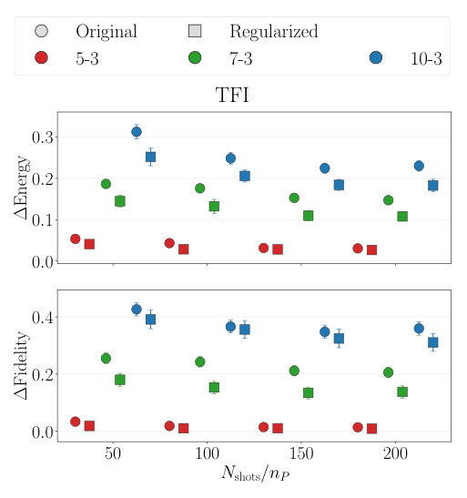
<figcaption class="paper-figure-caption"><b>Fig 3.</b> FIG. 3. Comparison of the final ∆Energy and ∆Fidelity obtained with the original algorithm and our regularized method for Nshots/nP ∈{50, 100, 150, 200}, nq ∈{5, 7, 10} and nl = 3.</figcaption>
</figure>
<figure class="paper-figure-card">
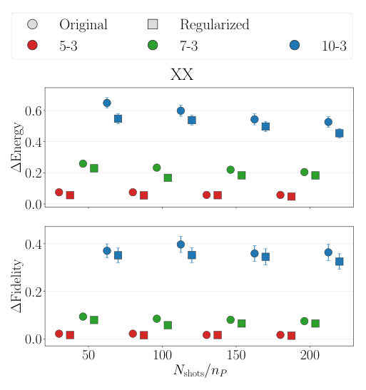
<figcaption class="paper-figure-caption"><b>Fig 4.</b> FIG. 5. Comparison between the original algorithm and our regularization method on the XX model for Nshots/nP ∈ {50, 100, 150, 200}, nq ∈{5, 7, 10} and nl = 3.</figcaption>
</figure>
<figure class="paper-figure-card">
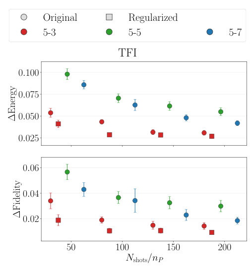
<figcaption class="paper-figure-caption"><b>Fig 5.</b> FIG. 4. Comparison of final ∆Energy and ∆Fidelity obtained with the original algorithm and our regularized method for Nshots/nP ∈{50, 100, 150, 200}, nq = 5, and nl ∈{3, 5, 7}.</figcaption>
</figure>

**Summary.** This paper tackles the systematic bias inherent in the SMO optimization technique used within Variational Quantum Eigensolvers (VQE). By analyzing the source of this bias, the authors propose a novel regularization method. This method successfully corrects the energy estimate while stabilizing the optimization process, leading to consistent performance improvements across various quantum simulation models.

**Why it may be interesting.** It provides crucial theoretical insights into the practical limitations of variational quantum algorithms, offering a robust, hardware-agnostic optimization technique that improves convergence reliability.

Detailed structure

**Main problem.** The paper analyzes and seeks to correct the systematic bias introduced during the optimization process of Sequential Minimal Optimization Variational Quantum Eigensolvers (SMO-VQE).

**Main result.** A proposed regularization method successfully maintains unbiased energy estimation while improving overall optimization performance compared to the original biased or purely corrected estimators.

**Method.** The authors derive the analytical form of the bias accumulation in SMO-VQE by analyzing the energy expectation value's trigonometric dependence on circuit parameters. They then propose a controlled regularization term to mitigate this bias.

**Model / system.** The work is applied to Variational Quantum Eigensolvers (VQE) used to find the ground state of a general Hamiltonian. Specific examples include the Transverse Field Ising Model and general spin Hamiltonians using the EfficientSU(2) ansatz.

**Key observables.** Estimated energy expectation value ($\langle H 
angle$), Energy Estimation Error ($\Delta 	ext{Energy}$), and Fidelity ($\Delta 	ext{Fidelity}$).

**Important parameters / regimes.** Circuit parameters ($	heta$), number of shots ($N_{	ext{shots}}$), circuit depth, and the regularization strength ($r$).

**Assumptions / limitations.** The analysis primarily focuses on mitigating statistical bias arising from finite measurement shots (shot variance), neglecting hardware noise. It relies on first-order expansions in the minimizer displacement.

**Figures summary.** Figures compare the energy estimation error and fidelity across different SMO variants (biased, corrected, regularized) for various Hamiltonians (TFIM, XX, XXZ, XXX) under varying noise conditions.

**Paper structure.** The paper systematically analyzes the bias origin in SMO-VQE, derives the bias term analytically, shows that simple correction destabilizes optimization, and finally proposes a controlled regularization scheme that balances bias removal with optimization stability.

Abstract

The Nakanishi Fujii Todo (NFT) algorithm, also known as Rotosolve, implements Sequential Minimal Optimization for Variational Quantum Eigensolvers (SMO-VQE) by exploiting the trigonometric dependence of the energy on individual circuit parameters. This enables analytical one-dimensional minimization using only a few , typically two, energy evaluations, but introduces bias in the estimated energy. Although performing additional measurements every few tens of iterations can mitigate bias accumulation, we find that such corrections often degrade optimization performance. In this paper, we analyze the origin and accumulation of bias during the SMO-VQE process. Specifically, we show that the bias can be accurately estimated without additional measurements. Furthermore, we find that bias correction destabilizes optimization along directions with small curvature, whereas the original biased estimator implicitly acts as a regularizer. Based on these insights, we propose a simple regularization method that implements error accumulation while maintaining unbiased energy estimation. The resulting algorithm consistently improves performance across different system sizes, circuit depths, target Hamiltonians, and measurement shots, with minimal hyperparameter tuning.

[↑ back to top](#top)

### [Mutually Unbiased Bases for Variational Quantum Initialization: Basis-Union Optimality and Adaptive Family Search](http://arxiv.org/abs/2605.16060v1)

**Authors:** Abed Semre, Steven Frankel  
**Type:** both · **Category:** quantum information and computing · **PDF:** <https://arxiv.org/pdf/2605.16060v1>  
**Analysis basis:** full PDF text, analyzed in chunks
**Topic relevance:** `entanglement & information structure` **1/5**

↔ Scroll figures horizontally

<figure class="paper-figure-card">
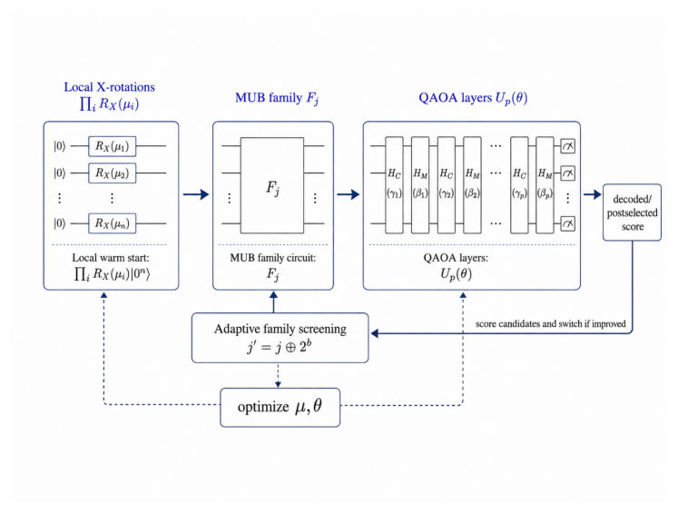
<figcaption class="paper-figure-caption"><b>Fig 1.</b> Figure 1. Adaptive MUB-XRot warm-start mechanism. The method applies local 𝑋-rotations, a selected MUB-family circuit 𝐹𝑗, and ordinary QAOA layers 𝑈𝑝(𝜃). During optimization, neighboring families 𝑗′ = 𝑗⊕2𝑏are screened, and a family switch is accepted only when the screening objective improves. This is a warm-start/pre-circuit method, not a fully matched-mixer MUB-QAOA construction.</figcaption>
</figure>
<figure class="paper-figure-card">
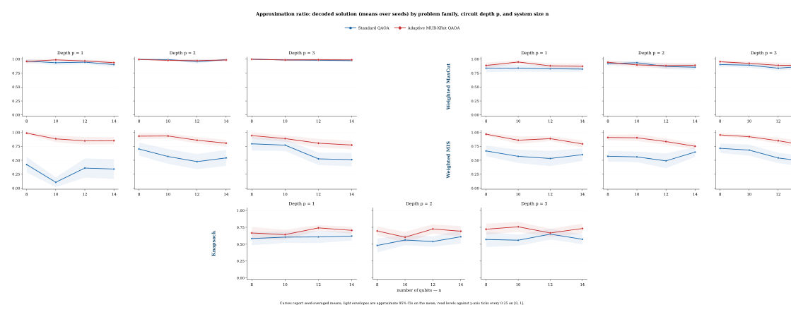
<figcaption class="paper-figure-caption"><b>Fig 2.</b> Figure 2. Decoded solution ratio for standard QAOA and adaptive MUB-XRot QAOA across the five benchmark families. Facets separate problem family, size, and depth. The figure shows both the broad MIS improvements and the MaxCut ceiling effect.</figcaption>
</figure>
<figure class="paper-figure-card">
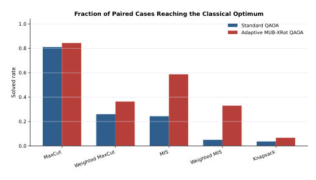
<figcaption class="paper-figure-caption"><b>Fig 3.</b> Figure 3. Solved rate by problem family in the cross-problem benchmark. Bars show the fraction of paired instance-depth cases for which the decoded solution reaches the classical optimum. Adaptive MUB-XRot QAOA improves the solved rate most strongly for MIS and weighted MIS, while MaxCut shows only a small increase because standard QAOA is already near the ceiling.</figcaption>
</figure>
<figure class="paper-figure-card">
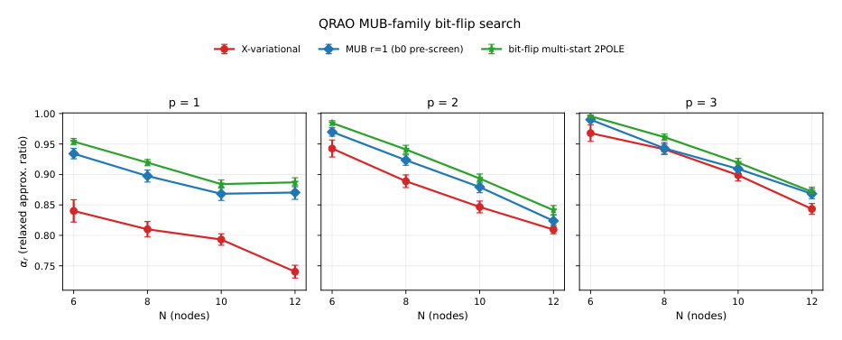
<figcaption class="paper-figure-caption"><b>Fig 4.</b> Figure 4. Scalable MUB-family search in QRAO MaxCut. The plot compares 𝑋-variational QRAO, fixed MUB 𝑟= 1 with 𝑏0-prescreening, and bit-flip multi-start 2POLE. The metric is the relaxed approximation ratio 𝛼𝑟, averaged over seeds by graph size and depth.</figcaption>
</figure>

**Summary.** This paper theoretically proves that Mutually Unbiased Bases (MUBs) provide the optimal structure for initializing variational quantum algorithms by maximizing coverage of the random-Hamiltonian landscape. Empirically, it demonstrates that using MUBs as a warm-start heuristic (Adaptive MUB-XRot QAOA) significantly improves solution quality over standard QAOA on several benchmark problems, although this comes with high computational overhead.

**Why it may be interesting.** The theoretical connection between MUBs and Gaussian width provides a deep mathematical understanding of state preparation in quantum algorithms, which is highly relevant for designing robust quantum initialization protocols.

Detailed structure

**Main problem.** The paper investigates the optimal structure for a finite set of initial states (basis-union ensemble) used in Variational Quantum Algorithms (VQAs) to maximize coverage of the random-Hamiltonian landscape.

**Main result.** The complete set of Mutually Unbiased Bases (MUBs) is theoretically proven to maximize the isotropic random-Hamiltonian Gaussian width among all unions of $d+1$ orthonormal bases.

**Method.** The authors combine advanced mathematical tools, such as the centered-convex Gaussian correlation inequality, with extensive empirical benchmarking across several combinatorial optimization problems.

**Model / system.** The study focuses on Variational Quantum Algorithms (VQAs) applied to quantum optimization problems (e.g., MaxCut, MIS). The theoretical analysis uses the random Hamiltonian $H$ acting on a $d$-dimensional Hilbert space, while the empirical tests use specific problem Hamiltonians.

**Key observables.** Isotropic random-Hamiltonian Gaussian width ($W(\mathcal{S})$), Decoded Solution Ratio ($
ho$), and the solved rate in QAOA benchmarks.

**Important parameters / regimes.** The dimension $d$ of the Hilbert space, the number of bases used ($d+1$), and the depth/size parameters ($p, n$) of the tested optimization problems.

**Assumptions / limitations.** The theoretical optimality is restricted to unions of $d+1$ orthonormal bases, and the empirical results are explicitly noted to incur substantial runtime overhead and do not claim quantum advantage.

**Figures summary.** Figures summarize the performance of adaptive MUB-XRot QAOA versus standard QAOA across various problem families, showing improvements in decoded solution ratio and solved rate. Other figures compare QRAO approximation ratios for different MUB search strategies.

**Paper structure.** The paper first establishes the theoretical optimality of MUBs using Gaussian correlation inequalities. It then analyzes the algorithmic implications, showing how MUB dependence collapses for diagonal costs. Finally, it presents extensive empirical benchmarks comparing adaptive MUB-XRot QAOA and QRAO against standard methods.

Abstract

We study mutually unbiased bases (MUBs) as structured finite initialization and adaptation families for variational quantum algorithms. The main theoretical result is that, in every dimension admitting a complete set of MUBs, the complete MUB ensemble maximizes isotropic Gaussian random-Hamiltonian width among all unions of d+1 orthonormal bases in C^d. Equivalently, within this basis-union class, it gives the smallest expected best-of-set minimum for random-Hamiltonian minimization. The proof represents each orthonormal basis as a regular-simplex Gaussian block and uses a centered-convex Gaussian correlation inequality to show that the independent-block case, realized by complete MUBs, is stochastically extremal. We also record a radial extension for Hamiltonians H=RG with R nonnegative and independent, and the unrestricted qubit case, where complete qubit MUBs are globally optimal among arbitrary six-state ensembles by a Bloch-sphere/octahedron mean-width argument.   We then separate this coverage theorem from variational training dynamics. For diagonal QUBO costs, the MUB-family dependence of a fully matched construction collapses; for the canonical b=0 label it reduces to ordinary X-mixer QAOA. The empirical method is therefore adaptive MUB-XRot warm-start QAOA rather than canonical matched-mixer MUB-QAOA. In a cross-problem benchmark over MaxCut, weighted MaxCut, MIS, weighted MIS, and knapsack, adaptive MUB-XRot is non-worse than standard QAOA in 80.0% of 1500 paired cases, with win/tie/loss 829/371/300 and mean decoded-ratio improvement +0.1616. A separate QRAO MaxCut study shows that bit-flip MUB-family search reaches mean relaxed ratio 0.921 and improves over the X-variational baseline by +0.0608. The evidence is quality-oriented and incurs substantial runtime overhead; no quantum-advantage claim is made.

[↑ back to top](#top)

### [Strong universality class in disordered systems](http://arxiv.org/abs/2605.15441v1)

**Authors:** Henrique A Lima, Kaue Hermann, Ismael S. S. Carrasco, Jairo R. L. de Almeida, Fernando A. Oliveira  
**Type:** both · **Category:** statistical mechanics · **PDF:** <https://arxiv.org/pdf/2605.15441v1>  
**Analysis basis:** full PDF text, analyzed in chunks
**Topic relevance:** `analog quantum simulation` **1/5**

↔ Scroll figures horizontally

<figure class="paper-figure-card">
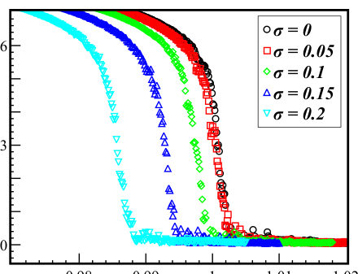
<figcaption class="paper-figure-caption"><b>Fig 1.</b> FIG. 1. Order parameter m as a function of temperature T for different values of standard deviation σ. From here on, T represents the temperature in units of TO.</figcaption>
</figure>
<figure class="paper-figure-card">
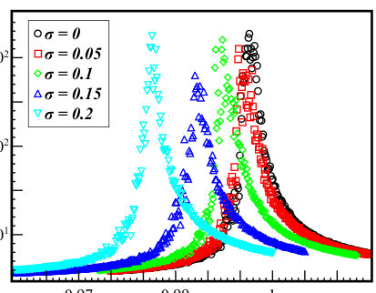
<figcaption class="paper-figure-caption"><b>Fig 2.</b> FIG. 2. Correlation length ρ as a function of temperature T for different values of standard deviation σ.</figcaption>
</figure>
<figure class="paper-figure-card">
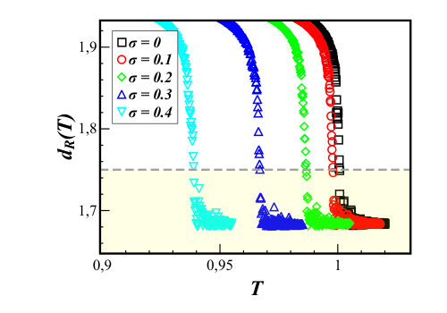
<figcaption class="paper-figure-caption"><b>Fig 3.</b> FIG. 3. Fractal dimension dR as a function of temperature T for different values of standard deviation σ. Dashed gray line describes dR = 1.75. Fractal dimensions dR were calculated by parallel box counting method via CUDA technology.</figcaption>
</figure>
<figure class="paper-figure-card">
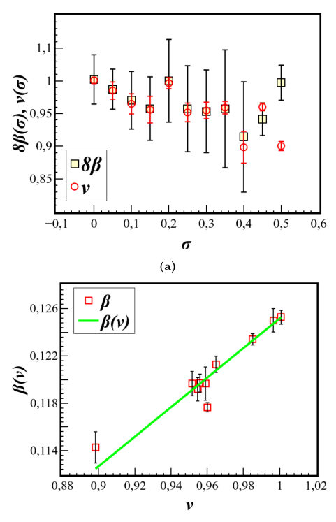
<figcaption class="paper-figure-caption"><b>Fig 4.</b> FIG. 5. Evolution of the critical exponents β and ν as func- tion of disorder. a) ν and 8β as a function of standard de- viation σ. Values of β, as well as the associated errors, are multiplied by 8 to describe both exponents within a common scale. Simulations were made using L = 4096. b) Critical exponent β as a function of ν. Green straight line exhibits a linear relation β = a · ν between these parameters that still exists for disordered systems with a = 0.12517(36).</figcaption>
</figure>
<figure class="paper-figure-card">
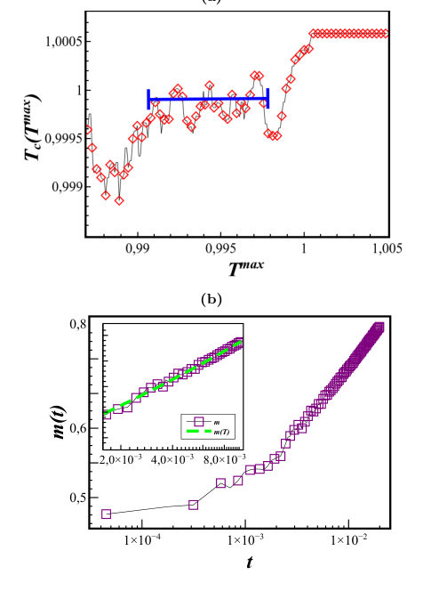
<figcaption class="paper-figure-caption"><b>Fig 5.</b> FIG. 4. Sequential steps for the determination of the critical temperature and critical exponent β for the σ = 0 system. (a) Order parameter curve m(T) exemplifying the selection of fitting windows, where Tmin is fixed and Tmax is varied to analyze the sensitivity of the fit due the choice of the window. (b) Estimated critical temperature Tc(Tmax) as a function of the upper fitting bound. The highlighted region identifies the stability range from which the critical temperature Tc is selected. (c) Log–log plot of the order parameter m(t), with t ≡(T0 −T)/T0 , near criticality, with the power-law fit used to determine β. The extracted exponent for the data in the inset is β = 0.1251(9).</figcaption>
</figure>

**Summary.** This paper studies phase transitions in disordered magnetic systems using the Edwards-Anderson Hamiltonian. By combining Monte Carlo simulations with advanced fractal analysis, the authors demonstrate that while standard critical exponents depend on disorder strength, certain geometric exponents remain invariant. This invariance defines a 'strong universality class' crucial for understanding complex disordered materials.

**Why it may be interesting.** The concept of strong universality, where geometric properties are robust against disorder while thermodynamic exponents change, provides a powerful framework for understanding critical phenomena in complex, disordered quantum materials.

Detailed structure

**Main problem.** The paper investigates how disorder affects the critical exponents and fractal dimensions of phase transitions in disordered magnetic systems, aiming to identify exponents invariant with disorder.

**Main result.** While critical exponents like $eta$ and $
u$ vary with the disorder strength ($\sigma$), a subgroup of geometric quantities ($\eta, d_f, d_R$) remains invariant, suggesting a 'strong universality class'.

**Method.** The study combines analytical derivations using fractional differential geometry with extensive Monte Carlo simulations to validate scaling laws and critical behavior.

**Model / system.** The system analyzed is a disordered magnetic system modeled using the Edwards-Anderson Hamiltonian on a lattice. The disorder is controlled by the standard deviation $\sigma$ of the couplings.

**Key observables.** Magnetization $m(T)$, correlation length $
ho(T)$, critical exponents ($eta, 
u, \eta$), and fractal dimensions ($d_f, d_R$).

**Important parameters / regimes.** Disorder standard deviation $\sigma$, temperature $T$, and lattice dimension $d$.

**Assumptions / limitations.** The analysis relies on extending concepts from Euclidean space to fractal media using fractional derivatives, and the determination of exponents depends on the fitting window chosen.

**Figures summary.** Figures illustrate the temperature dependence of the order parameter, correlation length, and Riesz fractal dimension for various disorder strengths, showing clear scaling behavior near $T_c$.

**Paper structure.** The work systematically analyzes the EA Hamiltonian, reviews scaling theories (Fisher's $\eta$), applies fractal analysis to modify correlation functions, and uses MC simulations to demonstrate the existence of disorder-invariant geometric universality.

Abstract

Disordered systems are very rich laboratories for exploring complex systems. In particular, disordered magnetic systems have been extremely important in the last five decades for understanding a wide range of phenomena. In this work, we use the Edwards-Anderson Hamiltonian to obtain the thermodynamic properties of disordered magnetic systems. In this way, we conduct a systematic investigation of magnetization, correlation functions, order parameter, and fractal dimensions, in function of disorder. In this context, the autocorrelation function for order--parameter fluctuations, introduced by Fisher ( Journal of Mathematical Physics 5, 944322 (1964)), provides an important mathematical framework for understanding the second-order phase transition at equilibrium. However, his analysis is restricted to a Euclidean space of dimension $d$, and an exponent $η$ is introduced to correct the spatial behavior of the correlation function at $T=T_c$. In recent work, Lima et al ( Phys. Rev. E 110, L062107 (2024)) demonstrated that at $T_c$ a fractal analysis is necessary for a complete description of the correlation function. We use Monte Carlo simulations to validate analytical results and to show how disorder alters critical exponents , giving rise to different universality classes. On the other hand, there is a subgroup of critical exponents and fractal dimensions that are invariant with disorder. This subgroup heralds a strong universality class.

[↑ back to top](#top)

### [The Collapse of Unentangled Stoquastic Merlin-Arthur Proof Systems](http://arxiv.org/abs/2605.16249v1)

**Authors:** William Gay, Fernando Granha Jeronimo  
**Type:** theory · **Category:** quantum information and computing · **PDF:** <https://arxiv.org/pdf/2605.16249v1>  
**Analysis basis:** full PDF text, analyzed in chunks
**Topic relevance:** `entanglement & information structure` **1/5**

↔ Scroll figures horizontally

<figure class="paper-figure-card">
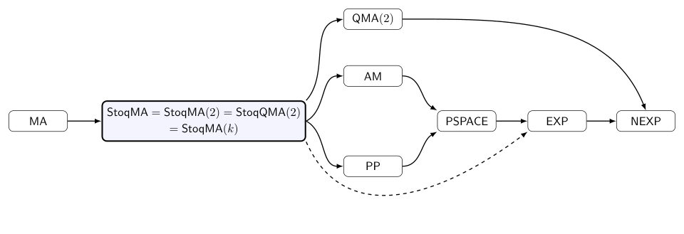
<figcaption class="paper-figure-caption"><b>Fig 1.</b> Figure 1: Complexity landscape around the result. The highlighted equality is proved here for inverse- polynomial promise gaps by the direct k-prover collapse in Theorem 5.1. The dashed arrow is the direct BKS sum-of-squares simulation for nonnegative forms [22], which gives an EXP upper bound in the exponentially large witness dimension and is superseded, for stoquastic verifiers, by the collapse. The containment StoqMA ⊆AM follows from the stoquastic largest-eigenvalue/approximate-set-size framework of Bravyi–DiVincenzo–Oliveira–Terhal together with the original stoquastic-verification framework [13, 14]; StoqMA ⊆PP follows from StoqMA ⊆QMA ⊆PP [35].</figcaption>
</figure>

**Summary.** This paper analyzes the computational power of multi-prover quantum verification protocols under the stoquastic constraint. It proves that the ability to use multiple provers ($k$) does not enhance the verification power beyond that of a single prover ($	ext{StoqMA}$). The key tool is a specialized de Finetti theorem, leading to the collapse $	ext{StoqMA}(k) = 	ext{StoqMA}$ for specific gap conditions.

**Why it may be interesting.** This work provides a deep structural result in quantum complexity theory, showing that for certain restricted quantum protocols (stoquastic), the ability to use multiple entangled provers offers no computational advantage over a single prover.

Detailed structure

**Main problem.** The paper investigates the role of interference in quantum computation complexity by proving that unentanglement does not increase the power of stoquastic Merlin-Arthur verification.

**Main result.** It establishes the collapse $	ext{StoqMA}(k) = 	ext{StoqMA}$ for polynomially bounded $k$ and inverse-polynomial promise gaps, implying $	ext{StoqMA}(k) \subseteq 	ext{AM} \cap 	ext{PP} \subseteq 	ext{PSPACE}$.

**Method.** The core method involves applying a positive, value-based de Finetti theorem for separately symmetric extensions to relate the product state value to the largest eigenvalue of a projected operator.

**Model / system.** The model is quantum computational complexity, specifically comparing $k$-prover stoquastic Merlin-Arthur verification ($	ext{StoqMA}(k)$) against one-witness verification ($	ext{StoqMA}$). The constraints involve stoquasticity (nonnegative, positive semidefinite contraction).

**Key observables.** Acceptance probability, Hellinger distance, Relative Entropy, and the non-negative product value $\omega^+(M)$.

**Important parameters / regimes.** The number of provers $k$, the promise gap $\Delta(n)$ (required to be $\ge 1/	ext{poly}(n)$), and the approximation error $\epsilon$.

**Assumptions / limitations.** The result is contingent on the test matrix $M$ being entrywise nonnegative and the promise gap being inverse-polynomial. The de Finetti theorem used is a one-sided, test-dependent value theorem.

**Figures summary.** Figure 1 illustrates the complexity landscape, confirming the equality $	ext{StoqMA} = 	ext{StoqMA}(2) = 	ext{StoqQMA}(2) = 	ext{StoqMA}(k)$ under the specified gap conditions.

**Paper structure.** The paper builds from establishing the positive de Finetti theorem for separately symmetric extensions (Chunk 3), to realizing this spectral relaxation as an actual one-witness verifier (Chunk 2), and finally applying this construction to prove the collapse $	ext{StoqMA}(k) = 	ext{StoqMA}$ (Chunk 4).

Abstract

Entanglement and interference are among the most fundamental properties of quantum mechanics. In this work, we investigate the role and power of interference in the context of detecting entanglement. We do so from a computational complexity lens by proving that unentanglement gives no additional power to stoquastic Merlin-Arthur verification. For every polynomial number of provers $k=k(n)$, \[   \text{StoqMa}(k)=\text{StoqMa} . \] Conceptually, the proof separates the role of entanglement from the role of interference: once destructive interference is ruled out by stoquasticity, the product-state constraint can be absorbed into a polynomially larger one-witness stoquastic verification.   The main analytic ingredient is a positive, value-based de Finetti theorem for separately symmetric extensions. If $M$ is an entrywise nonnegative positive semidefinite contraction on $A_1\otimes\cdots\otimes A_k$, then the nonnegative product value of $M$ is approximated to additive error $ε$ by the largest eigenvalue of \[   Π_R^{<k}   (M_{A_{1,1}\cdots A_{k-1,1}A_k}\otimes I)   Π_R^{<k},   \qquad   R=O\!\left(\frac{k^2\sum_i\log\dim A_i}{ε^3}\right), \] where $Π_R^{<k}$ is the operator on $A_1^{\otimes R} \otimes \cdots \otimes A_{k-1}^{\otimes R} \otimes A_k$ projecting to the subspace $\mathrm{Sym}^R(A_1) \otimes \cdots \otimes \mathrm{Sym}^{R}(A_{k-1}) \otimes A_k$.   The spectral relaxation is then realized as an actual one-witness stoquastic verifier. After replacing the uniform permutation averages in the symmetric projectors by inverse-polynomially close dyadic inverse-invariant averages. Consequently, \[   \text{StoqMa}(k)=\text{StoqMa}\subseteq\text{AM}\cap\text{PP}\subseteq\text{PSPACE} . \] The positive de Finetti theorem is isolated as a standalone technique and may be useful in other nonnegative tensor-optimization and stoquastic-verification settings.

[↑ back to top](#top)

## Other papers (17)

*Papers from primary archives without highlighted authors or any topic match. Click to expand.*

Show other papers

### [A Finite-State Gibbs Construction from a Recognition Cost](http://arxiv.org/abs/2605.15667v1)

**Authors:** Megan Simons, Jonathan Washburn  
**Type:** theory · **Category:** statistical mechanics · **PDF:** <https://arxiv.org/pdf/2605.15667v1>  
**Analysis basis:** full PDF text, analyzed in chunks

↔ Scroll figures horizontally

<figure class="paper-figure-card">
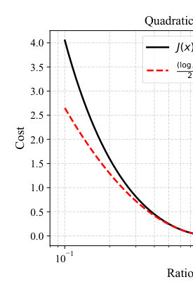
<figcaption class="paper-figure-caption"><b>Fig 1.</b> Figure 1. Quadratic lower bound on J. The RCL cost J(x) = 1</figcaption>
</figure>
<figure class="paper-figure-card">
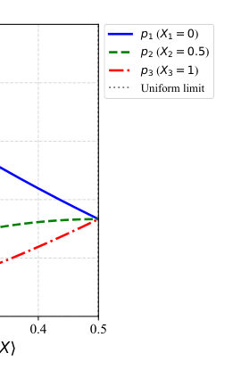
<figcaption class="paper-figure-caption"><b>Fig 2.</b> Figure 2. Gibbs weights pk as a function of the target mean cost ⟨X⟩for the three- state example with costs X = (0, 0.5, 1), plotted over the positive-temperature range Emc ∈(0, 1</figcaption>
</figure>

**Summary.** This paper constructs a finite-state Gibbs ensemble theory by deriving the necessary cost function from a specific composition law governing observable ratios. It shows that this approach successfully reproduces the canonical ensemble structure, providing a unified mathematical bridge between ratio data, information geometry, and statistical mechanics.

**Why it may be interesting.** It provides a powerful, mathematically rigorous alternative to standard maximum-entropy methods by grounding the statistical mechanics in the algebraic structure of observed ratios, which is highly relevant for analyzing non-equilibrium or constrained physical systems.

Detailed structure

**Main problem.** The paper develops an alternative framework for deriving the finite-state Gibbs distribution by starting from a ratio-cost construction, bypassing the traditional reliance on explicit Hamiltonian definitions.

**Main result.** It establishes that the Recognition Composition Law (RCL), when calibrated by unit log-curvature, yields the cost function $J(x) = rac{1}{2}(x+x^{-1}) - 1$, which successfully connects ratio data to the canonical ensemble via entropy maximization.

**Method.** The methodology involves analyzing a multiplicative-reciprocal functional equation (the composition law) in log-coordinates, solving it using d'Alembert's equation, and then applying multinomial counting and convex duality to recover the Gibbs weights.

**Model / system.** The model is a finite-state system where the input data consists of dimensionless ratios $\{r_\omega\}$ (e.g., equilibrium constants or transition rate ratios). The framework is general but restricted to these finite, strictly positive outcome spaces.

**Key observables.** Gibbs weights ($p_\omega$), Recognition Free Energy ($F_R$), and the $J$-cost divergence ($D_J(q\|p)$).

**Important parameters / regimes.** The mean-cost constraint $\langle X 
angle_{	ext{target}}$ and the resulting inverse temperature $eta$ (or $T_R = 1/eta$).

**Assumptions / limitations.** The framework is conditional on axioms (A1)–(A3), the adoption of the RCL, and the restriction to finite outcome spaces with strictly positive weights.

**Figures summary.** Figures compare the derived RCL cost $J(x)$ against its quadratic surrogate $(\log x)^2/2$, showing the divergence for large ratios. Other figures illustrate the convergence of Gibbs weights to the uniform measure as the mean cost constraint approaches a specific limit.

**Paper structure.** The paper moves from establishing the mathematical structure (the composition law and the resulting cost $J(x)$) to unifying the derivation chain $\{r_\omega\} 	o J 	o X 	o (	ext{Gibbs, FR, DKL})$, and finally applying this framework to test cases, including irrational cost structures.

Abstract

On a finite outcome space, the canonical Gibbs distribution is usually obtained by maximizing Shannon entropy at fixed mean of an externally supplied energy functional. This paper studies the finite-state consequences of a ratio-cost construction instead: after adopting the normalized d'Alembert degree-two closure called the Recognition Composition Law (RCL), with unit log-curvature calibration at the reference ratio, the continuous nontrivial positive branch is $J(x)=\tfrac12(x+x^{-1})-1=\cosh(\log x)-1$. Given the induced cost vector $X_ω=J(r_ω)$, multinomial counting and convex duality recover the finite-state Gibbs weights and the identity $F_{\mathrm{R}}(q)-F_{\mathrm{R}}(p)=T_{\mathrm{R}}\,D_{\mathrm{KL}}(q\Vert p)$; the entropy-maximization steps are classical once the cost is fixed. New technical content includes a non-asymptotic Stirling bound and soft-shell constrained-type theorems for real-valued costs. A three-state example compares the Gibbs law to squared-log, affinity-as-energy, and Tsallis alternatives at the same cost vector and mean-cost constraint, with sample-size power calculations at fixed RCL ground truth. The framework is conditional on axioms (A1)--(A3) and restricted to finite outcome spaces with strictly positive weights; it does not derive the composition law from a more primitive principle.

[↑ back to top](#top)

### [Boundary anomalous dimensions from BCFT: $φ^{3}$ theories with a boundary and higher-derivative generalizations](http://arxiv.org/abs/2605.16119v1)

**Authors:** Yongwei Guo, Wenliang Li  
**Type:** theory · **Category:** statistical mechanics · **PDF:** <https://arxiv.org/pdf/2605.16119v1>  
**Analysis basis:** full PDF text, analyzed in chunks

↔ Scroll figures horizontally

<figure class="paper-figure-card">
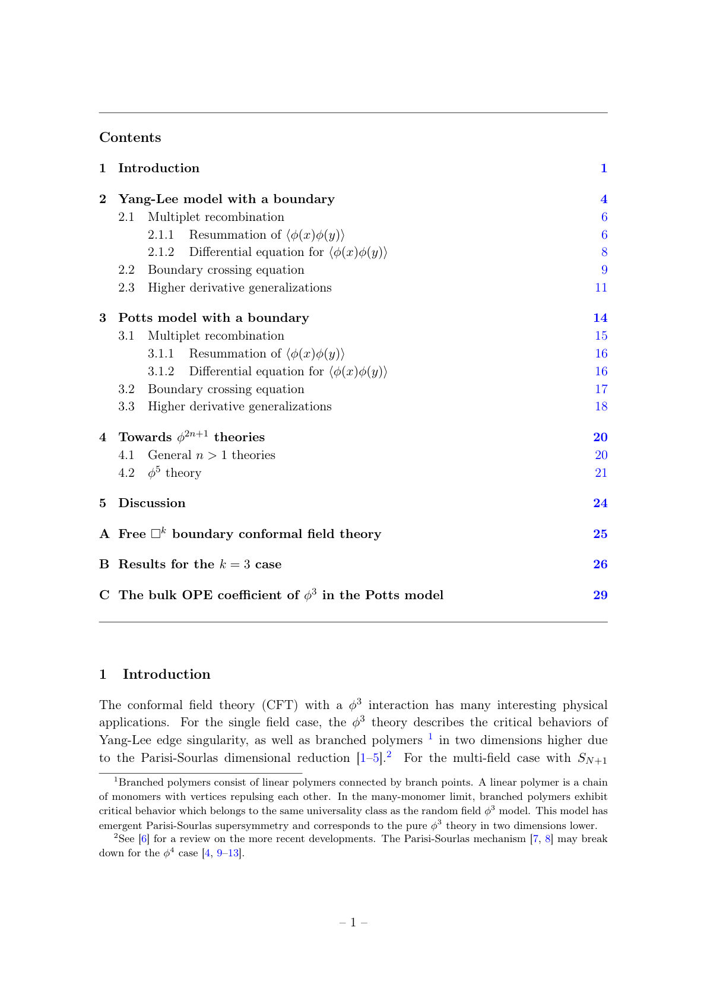
<figcaption class="paper-figure-caption"><b>Fig 1.</b> Low-resolution page preview, page 2</figcaption>
</figure>
<figure class="paper-figure-card">
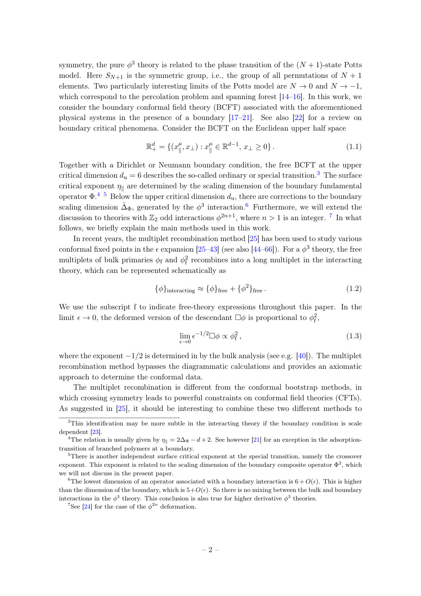
<figcaption class="paper-figure-caption"><b>Fig 2.</b> Low-resolution page preview, page 3</figcaption>
</figure>
<figure class="paper-figure-card">
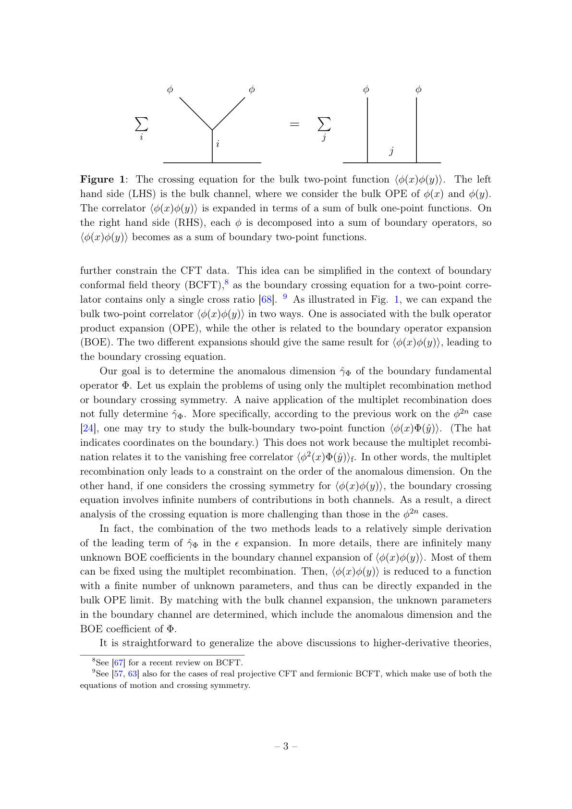
<figcaption class="paper-figure-caption"><b>Fig 3.</b> Low-resolution page preview, page 4</figcaption>
</figure>
<figure class="paper-figure-card">
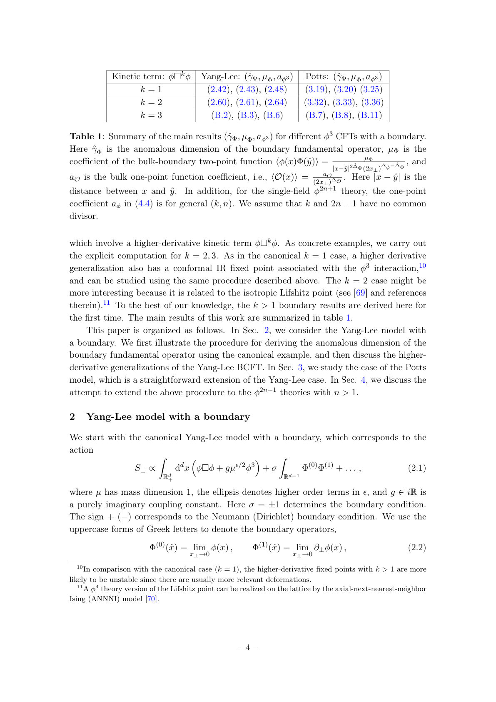
<figcaption class="paper-figure-caption"><b>Fig 4.</b> Low-resolution page preview, page 5</figcaption>
</figure>
<figure class="paper-figure-card">
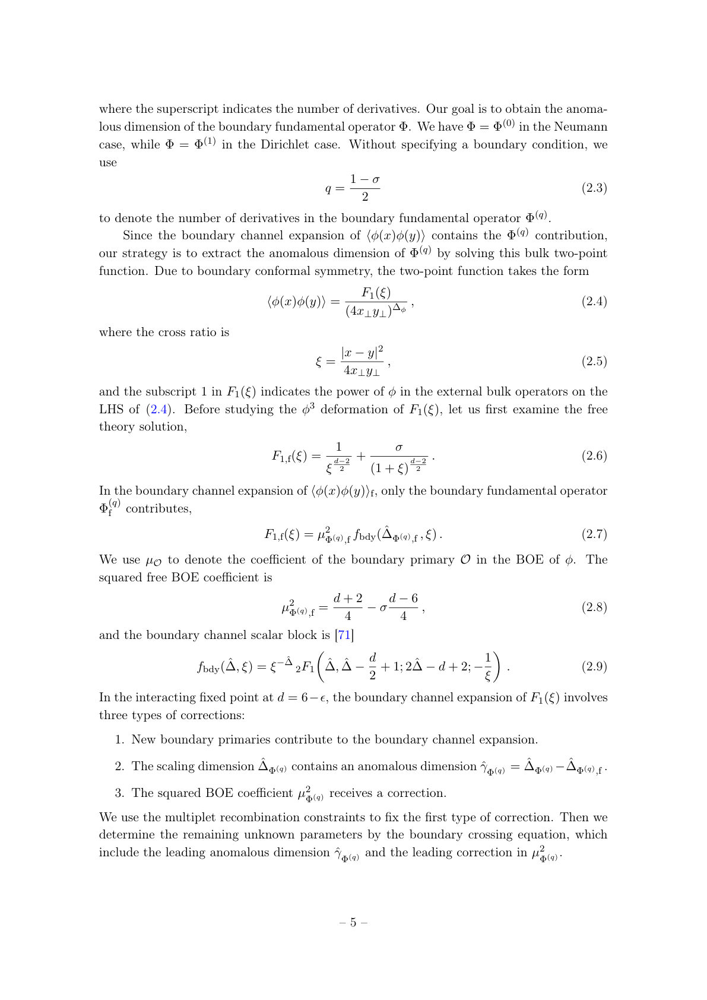
<figcaption class="paper-figure-caption"><b>Fig 5.</b> Low-resolution page preview, page 6</figcaption>
</figure>

**Summary.** This theoretical paper calculates the boundary anomalous dimensions and correlation function coefficients for $\phi^3$ theories in the presence of a boundary, extending the analysis to higher-derivative generalizations. It employs advanced CFT techniques, notably combining conformal multiplet recombination with boundary crossing symmetry, to determine critical exponents for models relevant to statistical physics, such as the Potts model.

**Why it may be interesting.** The rigorous application of CFT techniques like boundary crossing symmetry to determine critical exponents in interacting quantum field theories provides deep insights into universality classes relevant to critical phenomena in condensed matter systems.

Detailed structure

**Main problem.** The paper determines the boundary anomalous dimensions and operator expansion coefficients for $\phi^3$ theories with a boundary, and generalizes these results to higher-derivative theories.

**Main result.** Specific formulas are derived for the anomalous dimensions ($\hat{\gamma}_\Phi$) and one-point function coefficients for both the single-field (Yang-Lee) and multi-field (Potts) cases, including generalizations to higher-derivative interactions.

**Method.** The analysis combines the conformal multiplet recombination method with the boundary crossing symmetry applied to the bulk two-point correlator, often utilizing an $\epsilon$-expansion.

**Model / system.** The primary models are $\phi^3$ deformations of free boundary conformal field theories (BCFT). Specific physical realizations include the Yang-Lee model (related to branched polymers) and the $(N+1)$-state Potts model (related to percolation).

**Key observables.** Boundary anomalous dimensions ($\hat{\gamma}_\Phi$), boundary operator expansion coefficients ($\mu_\Phi$), and bulk one-point function coefficients ($a_O$).

**Important parameters / regimes.** The analysis is performed in the $\epsilon$ expansion, and results depend on the coupling constants and boundary condition parameters ($\sigma_0, \sigma_1$).

**Assumptions / limitations.** The calculations rely on the $\epsilon 	o 0$ limit and the assumption that certain contributions (like the bulk identity contribution) do not receive corrections at low orders in the expansion parameter $\xi$.

**Figures summary.** The notes reference tables summarizing main results for various $\phi^3$ CFTs and provide complex mathematical equations detailing the derived parameters and correlation functions.

**Paper structure.** The paper systematically analyzes the problem by first establishing the general framework using multiplet recombination and boundary crossing symmetry. It then applies this framework to specific models, such as the Yang-Lee and Potts models, before generalizing the results to higher-derivative theories ($\phi \Box^k \phi$) and $\phi^{2n+1}$ theories.

Abstract

We consider the bulk $φ^3$ deformation of the free boundary conformal field theory in the $ε$ expansion. We determine the leading corrections to the scaling dimensions of boundary fundamental operators and some boundary operator expansion coefficients. Our procedure combines the conformal multiplet recombination with the boundary crossing symmetry. The results cover both the single field case and the multi-field case with $S_{N+1}$ global symmetry, which are associated with the Yang-Lee model and the $(N+1)$-state Potts model respectively. These semi-infinite models describe branched polymers, percolation, and spanning forest at a surface. We generalize these results to some higher derivative theories. In addition, we study the $φ^{2n+1}$ theories with $n>1$, but only obtain some boundary operator expansion coefficients.

[↑ back to top](#top)

### [Charge-sensitive vibrational modes in BEDT-TTF salts: Signatures of charge ordering and site charge](http://arxiv.org/abs/2605.16012v1)

**Authors:** Savita Priya, Martin Dressel, Jesse Liebman, Natalia Drichko  
**Type:** both · **Category:** strongly correlated electrons · **PDF:** <https://arxiv.org/pdf/2605.16012v1>  
**Analysis basis:** full PDF text, analyzed in chunks

↔ Scroll figures horizontally

<figure class="paper-figure-card">
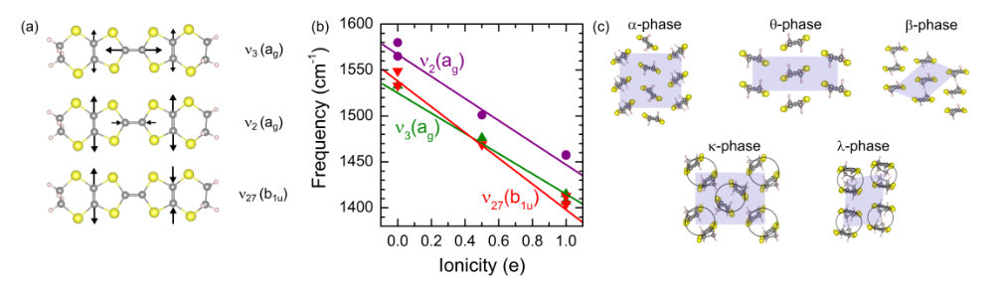
<figcaption class="paper-figure-caption"><b>Fig 1.</b> FIG. 1. (a) C=C stretching modes for BEDT-TTF molecules: ν2(ag), ν3(ag) and ν27(b1u) (in the notation followed for the to D2h molecular symmetry). (b) Dependence of the C=C stretching modes of the BEDT-TTF molecule on the ionicity. The symbols represent the frequencies calculated by Girlando [22] while the lines correspond to the regression of the experimental data collected by Yamamoto et al. [19]. (c) Different stacking patterns found in BEDT-TTF salts: α and θ have herringbone arrangement, β phase has stacked arrangement, κ and λ phases are formed by dimers, arranged in triangular or stacked patterns, respectively.</figcaption>
</figure>
<figure class="paper-figure-card">

<figcaption class="paper-figure-caption"><b>Fig 2.</b> FIG. 2. Positions of the ν2(ag) and the ν27(b1u) modes for the BEDT-TTF-based salts for which charge disproportiona- tion was identified by both Raman and infrared spectroscopy (the solid lines indicate linear fits, considering all the exam- ples of charge ordering plotted). The exact compositions and frequencies are given in Table II. The red points in the plots are calculated with δν2 = 120 cm−1</figcaption>
</figure>
<figure class="paper-figure-card">
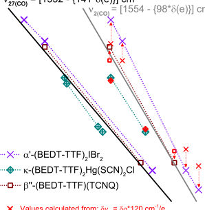
<figcaption class="paper-figure-caption"><b>Fig 3.</b> Fig. 3 displays the spectral position of the ν2(ag) and the ν27(b1u) modes in other BEDT-TTF-based salts for which charge disproportionation was identified by either Raman or infrared spectroscopy; or have multiple peaks (probably due to a more complex charge-ordered pat- terns or additional interactions in this state). The peak frequencies of the charge-ordered compounds, as plot- ted in Figs. 2, and 3 are listed in Table II. Several θ- phase compounds report strong coupling of the ν2(ag) to ν3(ag) modes in the charge-ordered state [19, 60, 75, 76], which are not plotted to reduce complexity. Applying δν27 = 140 cm−1</figcaption>
</figure>
<figure class="paper-figure-card">
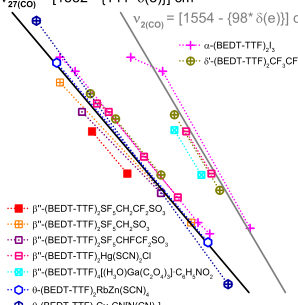
<figcaption class="paper-figure-caption"><b>Fig 4.</b> FIG. 3. Positions of the ν2(ag) and the ν27(b1u) modes in different BEDT-TTF-based salts for which charge dispropor- tionation was identified by either Raman or infrared spec- troscopy; or have asymmetric splitting (the solid lines are the relations obtained from 2). The exact compositions and fre- quencies are given in Table II.</figcaption>
</figure>
<figure class="paper-figure-card">
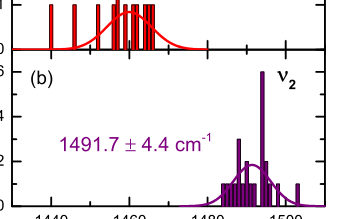
<figcaption class="paper-figure-caption"><b>Fig 5.</b> FIG. 6. Histogram of the room-temperature frequencies re- ported for the (a) ν27(b1u) mode, and (b) ν2(ag) mode, ob- tained from infrared and Raman scattering experiments on different BEDT-TTF salts with nominally half an electron re- moved per molecule, BEDT-TTF+0.5. If treated as a random deviation from the mean, the fit by a Gaussian distribution results in the center frequency and uncertainty as indicated.</figcaption>
</figure>

**Summary.** This paper analyzes how charge ordering in BEDT-TTF organic conductors manifests in the vibrational spectra, specifically using C=C stretching modes. It establishes quantitative relationships between frequency shifts and charge imbalance, but critically warns that structural disorder limits the technique to measuring charge *ordering* rather than absolute site charge.

**Why it may be interesting.** The work bridges solid-state electronic structure (charge ordering) with measurable spectroscopic fingerprints (vibrational modes), providing an experimental handle on strongly correlated phenomena in molecular solids.

Detailed structure

**Main problem.** The study aims to understand the origin of various ground states (Mott, charge ordered, superconducting) in BEDT-TTF organic conductors by determining the precise charge distribution on the molecular sites in the insulating state.

**Main result.** While charge-frequency relations provide clear signatures for charge ordering ($\sim 141 	ext{ cm}^{-1}/	ext{e}$ for $
u_{27}(b_{1u})$), the large frequency spread ($\Delta
ho \approx (\pm 0.045)e$) indicates that these relations are limited to estimating charge-ordering rather than determining absolute site charge.

**Method.** The research combines experimental vibrational spectroscopy (IR and Raman) to measure C=C stretching modes with theoretical analysis to establish linear relationships between frequency shifts and charge imbalance ($\delta
ho$).

**Model / system.** The system under investigation is BEDT-TTF-based organic conductors, particularly those in the nominally $	ext{BEDT-TTF}^{+0.5}$ state, which exhibit complex ground states governed by electron-electron interactions.

**Key observables.** C=C stretching vibrational modes ($
u_{27}(b_{1u})$ and $
u_2(a_g)$), frequency shifts ($\delta
u$), and the resulting charge imbalance ($\delta
ho$).

**Important parameters / regimes.** The charge imbalance ($\delta
ho$) is the key parameter, with characteristic shifts of $141 	ext{ cm}^{-1}/	ext{e}$ and $98 	ext{ cm}^{-1}/	ext{e}$ observed for the respective modes.

**Assumptions / limitations.** The primary limitation is that structural variations cause a large uncertainty in the measured frequency spread, hindering the determination of absolute site charge values.

**Figures summary.** Figures illustrate the dependence of $	ext{C=C}$ stretching modes on ionicity and show histograms of measured frequencies for $	ext{BEDT-TTF}^{+0.5}$ salts, highlighting the observed spectral spread.

**Paper structure.** The paper surveys the relevant vibrational modes, establishes empirical linear relationships between frequency shifts and charge, analyzes data from various charge-ordered salts, and concludes by defining the scope and limitations of using these spectroscopic techniques.

Abstract

BEDT-TTF-based organic conductors host a number of ground states, tuned by electron repulsion from Mott and charge ordered insulators to superconductors. Knowing charge distribution on the molecular sites in the insulating state of these materials is a key to understanding the origin of these ground states. We survey and discuss the C=C stretching modes in BEDT-TTF based molecular conductors. These molecular vibrations are extremely crucial in characterization of charge-ordered insulators, and are recently linked to superconductivity in some compounds. Focusing on the known examples of BEDT-TTF$^{+0.5}$ salts, we analyse the reliability of the C=C stretching modes for the determination of charge ordering and absolute site charge. Considering the charge-ordered states, a prominent shift in frequency of 141 cm$^{-1}$ per elementary charge $e$ for $ν_{27}(b_{1u})$ and 98 cm$^{-1}$$e$ for $ν_2$($a_g$) can be clearly realised, however, the distribution resulting from different compounds span over 20 cm$^{-1}$. For nominal BEDT-TTF$^{+0.5}$ compounds, the distribution of the resonance also extends around 20 cm$^{-1}$, yielding an unexpected large uncertainty of $Δρ~\approx~(~\pm~0.045)e$, which is presumably due to the influence of small differences in the structure. This highlights the limitations of charge-frequency relations to detect small deviations in absolute charge values on molecular lattice sites, and emphasises on the use of the relations to estimate charge-ordering, rather than absolute site charge.

[↑ back to top](#top)

### [Clifford-deformed zero-rate LDPC codes with 50% biased noise thresholds](http://arxiv.org/abs/2605.15348v1)

**Authors:** Jagannath Das, Sayandip Dhara, Pedro Medina, Arthur Pesah, Arpit Dua  
**Type:** theory · **Category:** quantum information and computing · **PDF:** <https://arxiv.org/pdf/2605.15348v1>  
**Analysis basis:** full PDF text, analyzed in chunks

↔ Scroll figures horizontally

<figure class="paper-figure-card">
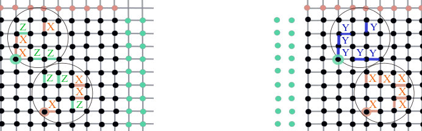
<figcaption class="paper-figure-caption"><b>Fig 1.</b> FIG. 1: Stabilizers of the [[288, 8, 12]] tile code and its Clifford-deformed variants. In the undeformed tile code, qubits reside on the edges of the lattice, and dots denote stabilizer generators. Boundary dots correspond to single-type stabilizers: mint-green dots denote Z-type stabilizers and orange dots denote X-type stabilizers. Bulk black dots indicate locations where both X- and Z-type stabilizers are present. The support of each stabilizer on nearby qubits is illustrated pictorially. In the bulk, stabilizer generators have weight six, acting on three vertical and three horizontal qubits, as in (a). At the boundaries, truncated geometry produces stabilizers of reduced weight (2, 3,...</figcaption>
</figure>
<figure class="paper-figure-card">
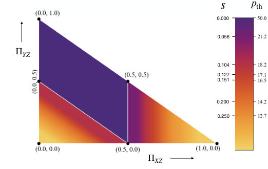
<figcaption class="paper-figure-caption"><b>Fig 2.</b> FIG. 2: Phase diagram of periodic tile codes is shown under random Clifford deformation at infinite bias (η → ∞). The axes (ΠXZ, ΠY Z) specify the probabilities of ap- plying local Clifford permutations that swap X ↔Z and Y ↔Z, respectively. Colors indicate regions with differ- ent estimated thresholds. The rhombic region bounded by the phase points (0.5, 0), (0.5, 0.5), (0, 1), and (0, 0.5) exhibits a 50% threshold. Along the white boundary, we do not observe a sharp crossing in the threshold plot for most of the phase points. Moving away from this regime, the threshold decreases monotonically. Iso-threshold con- tours appear on the two sides of the rhombic regime, forming vertical lines...</figcaption>
</figure>
<figure class="paper-figure-card">
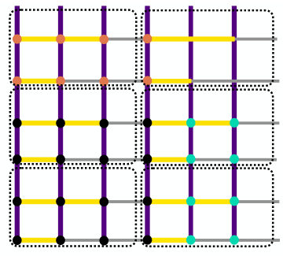
<figcaption class="paper-figure-caption"><b>Fig 3.</b> FIG. 3: Translation-invariant realization associated with the phase point (0.25, 0.5) for the open tile code [[72, 8, 4]]. The dotted rectangle denotes a unit cell. The color of any edge reflects the deformation applied to the qubit on that edge. On dark purple (yellow) qubits, we apply Y Z (XZ) deformations, while gray qubits remain undeformed.</figcaption>
</figure>
<figure class="paper-figure-card">
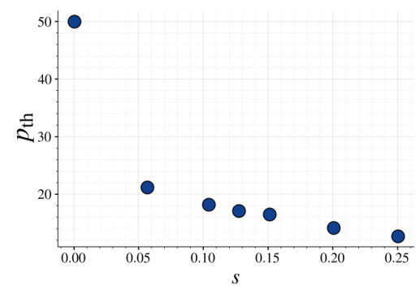
<figcaption class="paper-figure-caption"><b>Fig 4.</b> FIG. 4: Threshold (pth) as a function of the slope s in the linear scaling |BZ(n)| = sn + c for the phase points shown in Fig. 15 in Appendix. The threshold decreases with increasing s.</figcaption>
</figure>
<figure class="paper-figure-card">
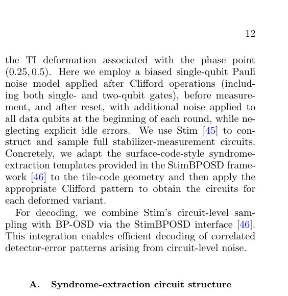
<figcaption class="paper-figure-caption"><b>Fig 5.</b> Fig. 6 shows an example syndrome-extraction circuit for the linear-deformed tile code (bulk checks shown; boundary checks are analogous but have lower weight). All data qubits are initialized in the |+⟩basis. Check qubits are initialized in the |+⟩basis at the start of each measurement round and are reset to |+⟩after measure- ment. Let V denote the set of vertical data qubits and H the set of horizontal data qubits. In the linear deformation, the vertical data qubits in V are acted on by Hadamard gates H before entangling with check qubits. Next, for each X-type check of the original CSS code, the corre- sponding check qubit is coupled to three horizontal data qubits via CX gates and to...</figcaption>
</figure>

**Summary.** This work establishes the theoretical conditions under which Clifford-deformed zero-rate LDPC codes can achieve a 50% code-capacity threshold when subjected to pure dephasing noise. By analyzing the scaling of logical operators, the authors unify the understanding of several known high-threshold codes. The analysis extends to finite-bias and circuit-level noise, providing practical guidelines for hardware implementation.

**Why it may be interesting.** It provides a powerful, general theoretical framework linking code structure (LDPC, Clifford deformation) directly to a specific, physically relevant noise threshold (50% for dephasing), which is crucial for designing fault-tolerant quantum memories.

Detailed structure

**Main problem.** The paper aims to derive general conditions for zero-rate quantum LDPC codes to achieve a 50% code-capacity threshold under i.i.d. pure dephasing noise.

**Main result.** The 50% threshold is provably achievable for LDPC codes if the number of pure-Z logical operators grows subexponentially or if a non-overlapping basis of logical operators exists.

**Method.** The authors use analytical bounds, including a union-bound criterion and a sharper bound based on the Basis of Logical Operators (BLO), alongside numerical simulations for finite-bias and circuit-level noise.

**Model / system.** The study focuses on Clifford-deformed variants of zero-rate LDPC codes, which are subjected to anisotropic noise dominated by pure dephasing (Z errors).

**Key observables.** Code-capacity threshold (approaching 50%), logical failure probability decay, and residual bias in circuit-level noise.

**Important parameters / regimes.** Pure dephasing noise probability ($p_Z$), code rate (zero-rate limit), and the scaling of logical operators vs. distance.

**Assumptions / limitations.** The analysis relies on the existence of specific structures within the logical operator space (e.g., non-overlapping BLO) and often assumes the infinite-bias limit for analytical proofs.

**Figures summary.** Figures illustrate phase diagrams showing regions of 50% thresholds for random deformations, and performance plots comparing thresholds for different structured deformations (Linear, TI, XY).

**Paper structure.** The paper progresses from establishing the general theoretical conditions for the 50% threshold using bounds, to applying these conditions to concrete examples like tile codes, and finally extending the analysis to finite-bias and circuit-level noise simulations.

Abstract

Applying single-qubit Clifford unitaries to a Pauli stabilizer code produces a Clifford-deformed variant whose stabilizers remain Pauli operators, but with locally rotated Pauli axes. Such deformations provide a simple way to tailor a fixed code to anisotropic noise, and have enabled unusually high thresholds under strongly biased dephasing. In this work, we discuss zero-rate quantum low-density parity-check (LDPC) codes, for which there exist Clifford-deformed variants where the number of biased logical operators scales slower than the distance, or there exists a basis of logical operators whose overlap satisfies certain scaling conditions; in this case, the code-capacity threshold for the Clifford-deformed variant under i.i.d. pure dephasing noise approaches 50%. This property provably explains previously known code examples with 50% biased noise thresholds, such as XY surface code, XZZX surface code, color code, as well as some 3D Clifford-deformed codes. As a concrete new example, we study Clifford deformations of the tile codes of Ref. [1]. Similar to the phase diagram of 50% thresholds for random Clifford deformations of the surface code in Ref. [2], we find a similar phase diagram for the tile codes. We also construct several translationally invariant deformations of the tile code with 50% thresholds, and present numerical evidence for improved performance at finite bias and under circuit-level noise. In the circuit-level setting, performance is governed by the residual bias after a full syndrome-extraction cycle, linking our simulations to phenomenological models commonly used to study Clifford-deformed codes. We estimate this residual bias for different qubit platforms by modeling microscopic implementations of tile-code syndrome extraction.

[↑ back to top](#top)

### [Coherent States of Non-Null Torus Knots](http://arxiv.org/abs/2605.15420v1)

**Authors:** Gabriel Canadas da Silva, Ion Vasile Vancea  
**Type:** theory · **Category:** other · **PDF:** <https://arxiv.org/pdf/2605.15420v1>  
**Analysis basis:** full PDF text, analyzed in chunks

↔ Scroll figures horizontally

<figure class="paper-figure-card">
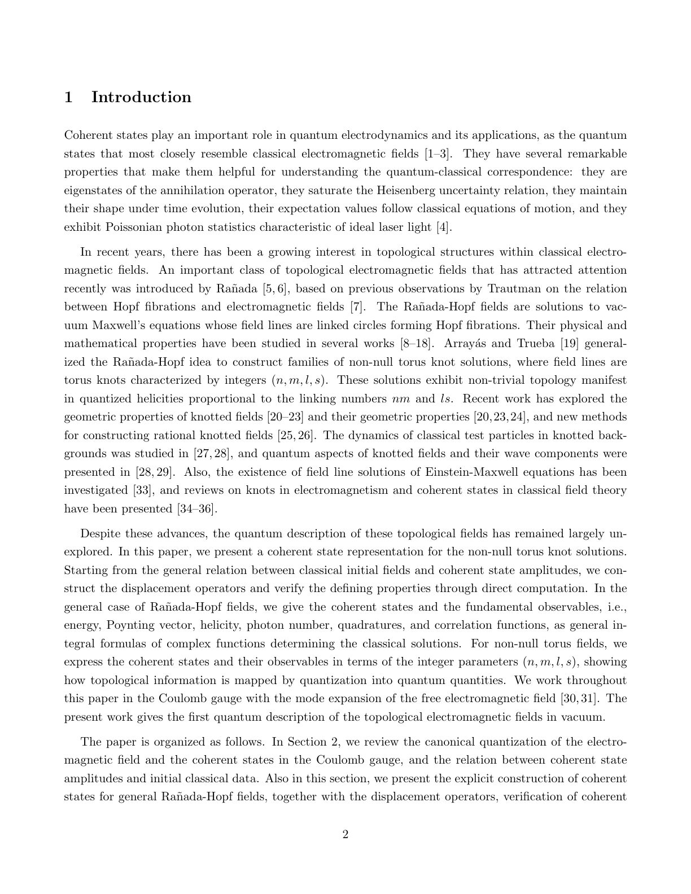
<figcaption class="paper-figure-caption"><b>Fig 1.</b> Low-resolution page preview, page 2</figcaption>
</figure>
<figure class="paper-figure-card">
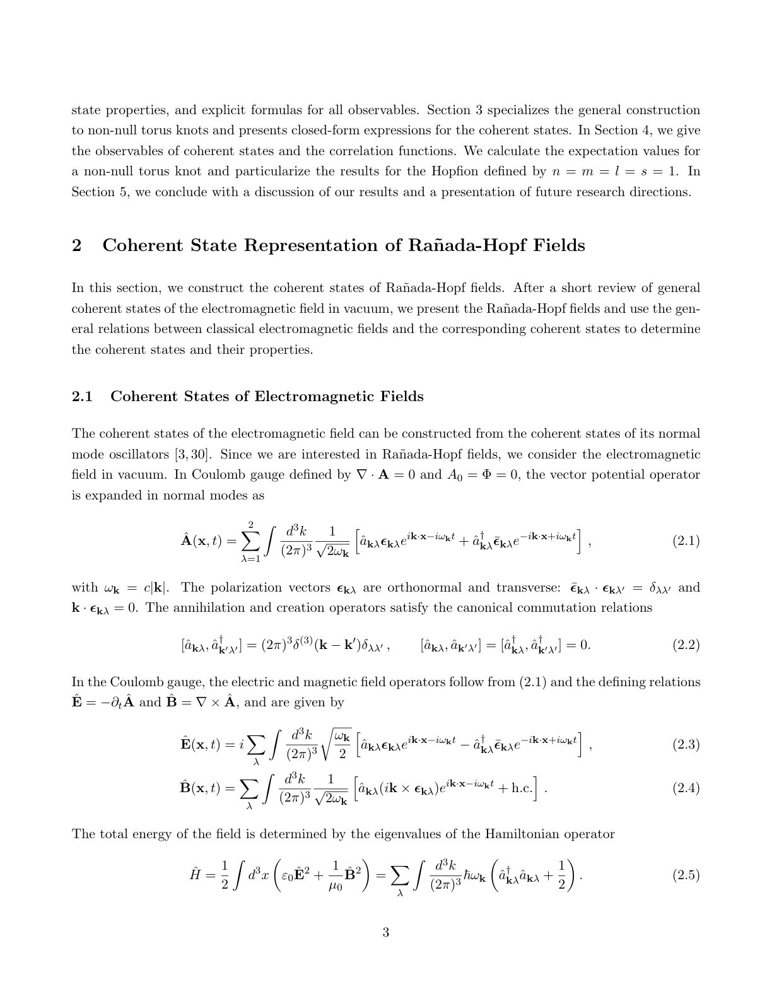
<figcaption class="paper-figure-caption"><b>Fig 2.</b> Low-resolution page preview, page 3</figcaption>
</figure>
<figure class="paper-figure-card">
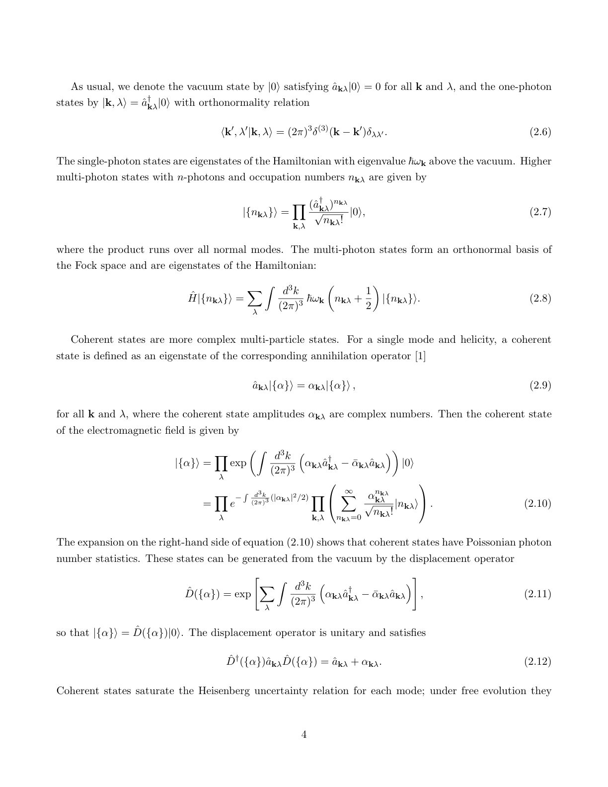
<figcaption class="paper-figure-caption"><b>Fig 3.</b> Low-resolution page preview, page 4</figcaption>
</figure>
<figure class="paper-figure-card">
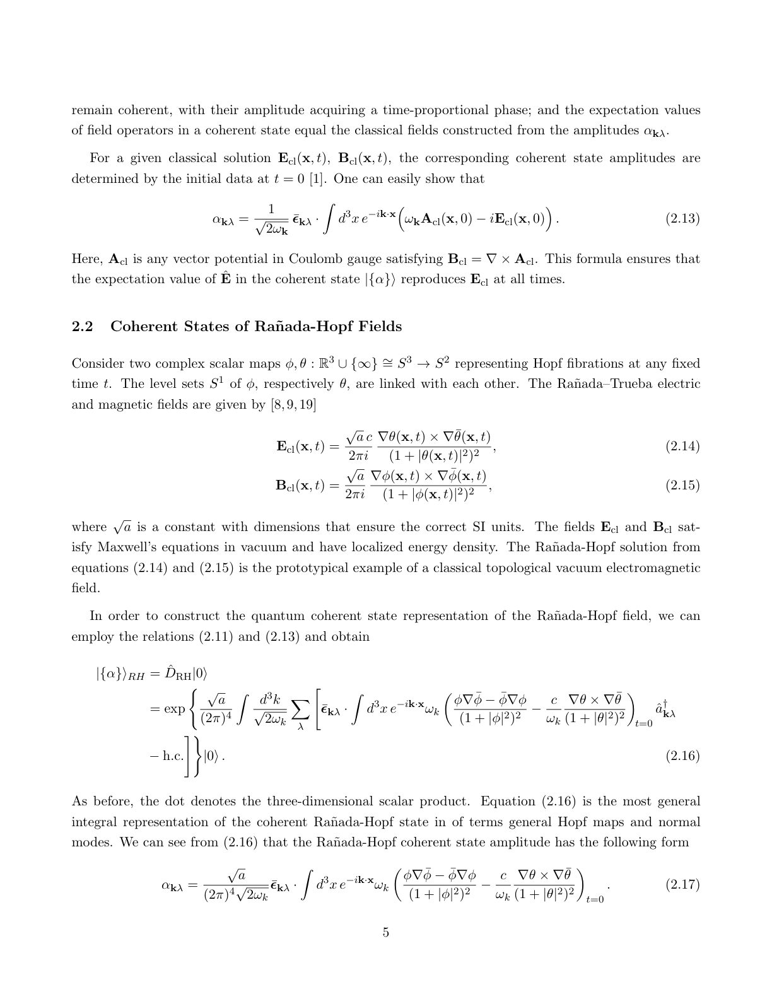
<figcaption class="paper-figure-caption"><b>Fig 4.</b> Low-resolution page preview, page 5</figcaption>
</figure>
<figure class="paper-figure-card">
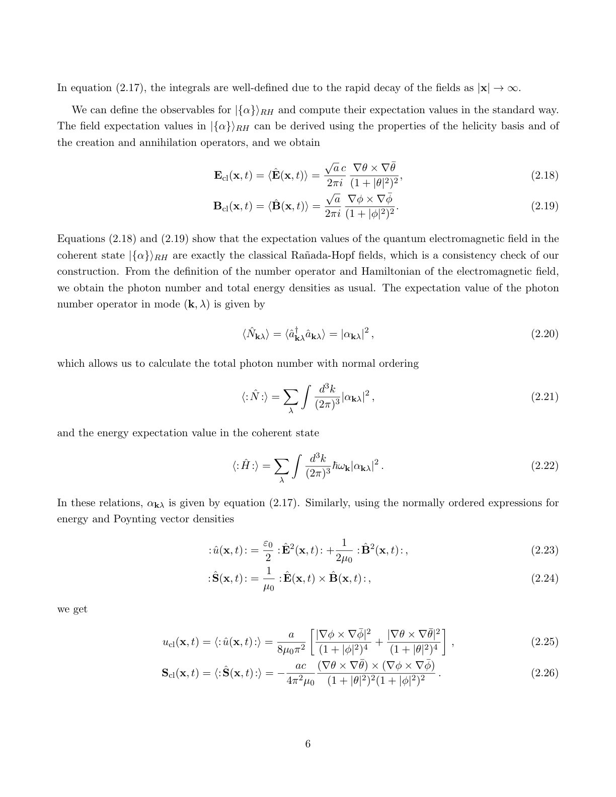
<figcaption class="paper-figure-caption"><b>Fig 5.</b> Low-resolution page preview, page 6</figcaption>
</figure>

**Summary.** This paper develops a quantum description for electromagnetic fields that possess the topology of non-null torus knots. By constructing specialized coherent states, the authors calculate the expectation values of observables like energy and helicity. The results successfully demonstrate a quantum-classical correspondence, showing that these quantum expectation values are determined entirely by the integer parameters defining the underlying classical knot structure.

**Why it may be interesting.** This work bridges topological field theory (knots) with quantum optics by showing how topological invariants dictate the expectation values of fundamental quantum observables like energy and helicity in a vacuum state.

Detailed structure

**Main problem.** The paper constructs a quantum description, using coherent states, for classical non-null torus knot solutions of Maxwell's equations in vacuum.

**Main result.** The expectation values of quantum field observables (energy, helicity, Poynting vector) in the constructed coherent state exactly reproduce the values predicted by the classical knotted electromagnetic fields, confirming quantum-classical correspondence.

**Method.** The authors use the general framework of coherent states, defined via displacement operators, to calculate expectation values of field operators in the knotted state.

**Model / system.** The system is the quantized electromagnetic field in vacuum, specifically modeling fields exhibiting non-null torus knot topologies, parameterized by integers $(n, m, l, s)$.

**Key observables.** Field expectation values ($\langle \hat{\mathbf{E}} 
angle, \langle \hat{\mathbf{B}} 
angle$), energy density, Poynting vector, helicity ($\langle \hat{\Lambda} 
angle$), and photon number ($\langle \hat{N} 
angle$).

**Important parameters / regimes.** The integer parameters $(n, m, l, s)$ characterizing the classical knot structure, and the characteristic length scale $L_0$.

**Assumptions / limitations.** The analysis is performed in the Coulomb gauge ($
abla \cdot \mathbf{A} = 0$) and relies on the general relation between classical fields and coherent state amplitudes.

**Paper structure.** The paper proceeds by defining the coherent state using displacement operators derived from the classical field solutions, calculating the expectation values of key observables like energy and helicity in terms of the knot parameters, and confirming the quantum-classical correspondence.

Abstract

We construct coherent states for the quantized electromagnetic field that correspond to the classical non-null torus knot solutions of Maxwell's equations in vacuum. We derive the displacement operators from the general relation between classical fields and coherent state amplitudes and verify the defining properties of coherent states through direct computation. We determine the observables of the model: field expectation values, energy density, Poynting vector, helicity, photon number, quadrature uncertainties, and correlation functions, and calculate their expectation values in the knotted coherent states in terms of the integer parameters $(n,m,l,s)$ of the classical solutions. As an example, we particularize the construction in the case of the Hopfion coherent state. These results establish the quantum-classical correspondence for this type of vacuum topological electromagnetic systems.

[↑ back to top](#top)

### [Ising anyons in the $SU(2)_2$ Chern--Simons theory](http://arxiv.org/abs/2605.15268v1)

**Authors:** Artem Belov, Andrey Morozov  
**Type:** theory · **Category:** other · **PDF:** <https://arxiv.org/pdf/2605.15268v1>  
**Analysis basis:** full PDF text, analyzed in chunks

↔ Scroll figures horizontally

<figure class="paper-figure-card">
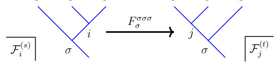
<figcaption class="paper-figure-caption"><b>Fig 1.</b> Figure 2: Fusion matrix F σσσ σ changes the decomposition of conformal blocks from the s-channel on the left to the t-channel on the right.</figcaption>
</figure>
<figure class="paper-figure-card">
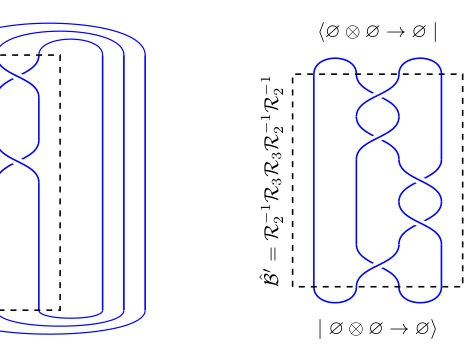
<figcaption class="paper-figure-caption"><b>Fig 2.</b> Figure 3: The 52 knot from the Rolfsen table in different representations.</figcaption>
</figure>
<figure class="paper-figure-card">
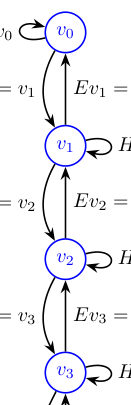
<figcaption class="paper-figure-caption"><b>Fig 3.</b> Figure 4: A highest-weight representation of the quantum algebra Uh(sl2). The relations to the left of the diagram are postulated, while those to the right are derived from the postulates.</figcaption>
</figure>
<figure class="paper-figure-card">
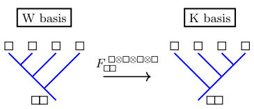
<figcaption class="paper-figure-caption"><b>Fig 4.</b> Figure 7: Action of F ⊗⊗⊗ transi- tion matrix.</figcaption>
</figure>

**Summary.** This theoretical work rigorously compares the algebraic structures of the Ising minimal model and the $SU(2)_2$ Chern-Simons theory. By analyzing tensor product decompositions and fusion rules, the authors resolve apparent mathematical contradictions, confirming that the two descriptions yield consistent physical observables for Ising anyons.

**Why it may be interesting.** The deep connection between topological quantum field theories (Chern-Simons) and exactly solvable models (CFTs) is fundamental to understanding topological quantum computation, which is a key area of theoretical physics.

Detailed structure

**Main problem.** The paper resolves apparent algebraic contradictions between the fusion/braiding rules of the Ising minimal model and the representation theory of the $SU(2)_2$ Chern-Simons theory.

**Main result.** The tensor product decomposition rules for the quantum algebra $U_q(\mathfrak{sl}_2)$ at roots of unity successfully reproduce the known fusion and braiding rules of the Ising anyons, confirming the equivalence at the level of observables.

**Method.** The authors compare results derived from two formalisms: Operator Product Expansions (OPEs) for the CFT side and the representation theory of the quantum group $U_q(\mathfrak{sl}_2)$ for the Chern-Simons side.

**Model / system.** The study concerns the mathematical equivalence between the Ising minimal model $\mathcal{M}(4,3)$ (a 2D CFT with $c=1/2$) and the $SU(2)_2$ Chern-Simons theory, which describes Ising anyons.

**Key observables.** Wilson loop expectation values $\langle W_K^R 
angle$, fusion matrices ($F$), and braiding matrices ($R$).

**Important parameters / regimes.** The deformation parameter $q$ is set to a root of unity, specifically $q = \exp(\pi i/4)$.

**Assumptions / limitations.** The comparison is restricted to low-degree tensor products, and the resolution of contradictions relies on the fact that representations with zero quantum dimension do not contribute to observable quantities.

**Figures summary.** Figures illustrate the Ising fusion rules, the structure of the 52 knot in different closures, and the transition matrices ($F^{\otimes\otimes\otimes}$) governing tensor product decompositions.

**Paper structure.** The paper proceeds by establishing the algebraic structures for both theories, calculating specific observables (like Wilson loops), and systematically comparing the tensor product decompositions ($\otimes^{\otimes\otimes\otimes}$) to show consistency.

Abstract

The present work is motivated by the statement that the Ising minimal model $\mathcal{M}(4,3)$ is equivalent, at the level of observables, to the $SU(2)_2$ Chern--Simons theory. At first glance, however, these two theories appear to differ substantially. For instance, the number of irreducible highest-weight representations does not match the number of Ising anyons. For tensor products of low degree, these discrepancies are examined in this work. While representation structure differs, it does not affect the observables underlying topological quantum computation algorithms.

[↑ back to top](#top)

### [Local Softmax and Global Weights in Non-Boolean Event Structures](http://arxiv.org/abs/2605.16248v1)

**Authors:** Karl Svozil  
**Type:** theory · **Category:** other · **PDF:** <https://arxiv.org/pdf/2605.16248v1>  
**Analysis basis:** full PDF text, analyzed in chunks

↔ Scroll figures horizontally

<figure class="paper-figure-card">
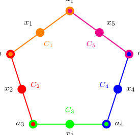
<figcaption class="paper-figure-caption"><b>Fig 1.</b> FIG. 1. Pentagon logic in the notation of Sec. VII. The cyclic atoms a1, . . . , a5 are intertwining atoms, each shared by two adjacent contexts. The atoms x1, . . . , x5 are context- specific. Each colored broken line represents one context Ci = {ai, ai+1, xi}, with indices understood modulo 5.</figcaption>
</figure>

**Summary.** This theoretical paper analyzes probability assignments on complex, overlapping logical structures called non-Boolean event structures. It shows that when local normalization rules, such as Softmax, are forced to be globally consistent across shared contexts, the rule merely parameterizes the set of all mathematically admissible weights. The key finding is that the interesting physics—the existence of weights beyond classical or quantum bounds—is determined by the structure itself, not the specific normalizing function used.

**Why it may be interesting.** It provides a rigorous mathematical framework for understanding when local probabilistic assumptions (like those used in machine learning or cognitive models) are compatible with global physical constraints, separating the mathematical machinery (Softmax) from the underlying physical constraints (the polytope $W(L)$).

Detailed structure

**Main problem.** The paper investigates the mathematical relationship between local normalization rules (like Softmax) applied in overlapping contexts and the requirement for a single, globally consistent probability weight in non-Boolean event structures.

**Main result.** Imposing global consistency (single-valuedness) forces the generalized softmax rule to merely parameterize the set of admissible weights, demonstrating that the softmax function itself does not introduce new physics beyond the structural constraints of the event structure.

**Method.** The authors use abstract algebraic and geometric methods to analyze the polytope of admissible weights, comparing local normalization schemes against global consistency requirements.

**Model / system.** The model is a non-Boolean event structure $L=(A, M)$, where $A$ is a set of atoms and $M$ is a family of overlapping contexts. The analysis focuses on characterizing the set of admissible probability weights $W(L)$ within this structure.

**Key observables.** Admissible weights $p \in W(L)$, the classical polytope $C(L)$, the quantum polytope $Q(L)$, and exotic weights that violate these bounds.

**Important parameters / regimes.** The link function $g$ used in the generalized softmax, and the structure of the context overlaps, particularly odd cycles (e.g., $n=5$ pentagon).

**Assumptions / limitations.** The core assumption is the requirement of single-valuedness or 'no-disturbance' across shared atoms, which restricts the general softmax framework.

**Figures summary.** The figures illustrate the geometry of probability assignments on odd cycles (like the pentagon), showing how the admissible half-weight violates both classical and quantum bounds.

**Paper structure.** The paper progresses by first defining the problem in terms of local vs. global normalization, then establishing the equivalence between single-valued softmax and parametrization of $W(L)$, and finally using odd cycles to demonstrate the existence of exotic, non-classical weights.

Abstract

Softmax and related normalized response functions are widely used in choice theory, machine learning, and cognitive science. In non-Boolean event structures with overlapping contexts, however, local normalization does not automatically yield a global probability weight. We show that imposing single-valuedness on shared atoms -- equivalently, no-disturbance or consistent connectedness -- collapses generalized softmax rules to coordinate parametrizations of the strictly positive part of the admissible-weight polytope. Any strictly positive admissible weight can be represented in this way, while boundary weights arise as limits. Exotic weights that exceed classical or quantum bounds are therefore properties of the event structure and the chosen weight, not of the normalizing link. The resulting hierarchy separates local normalization, cross-context gluing, Cauchy--Gleason linearity, and physical or cognitive realizability.

[↑ back to top](#top)

### [Multifractal and Ergodic Properties of Conductance Fluctuations under Strong Disorder](http://arxiv.org/abs/2605.15447v1)

**Authors:** Marcos A. A. de Sousa, Heitor R. Publio, Henrique A. de Lima, Adauto J. F. de Souza, Fernando A. Oliveira, Anderson L. R. Barbosa  
**Type:** theory · **Category:** disordered systems and neural networks · **PDF:** <https://arxiv.org/pdf/2605.15447v1>  
**Analysis basis:** full PDF text, analyzed in chunks

↔ Scroll figures horizontally

<figure class="paper-figure-card">
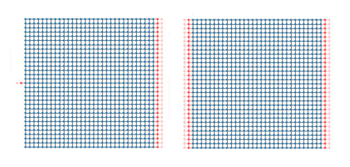
<figcaption class="paper-figure-caption"><b>Fig 1.</b> FIG. 1. Mesoscopic two-dimensional sample (in blue) con- nected to asymmetric (on the left) and symmetric (on the right) leads (in red) while being subjected to strong disorder. Both samples have dimensions of 61a × 61a, where a is the lattice constant.</figcaption>
</figure>
<figure class="paper-figure-card">
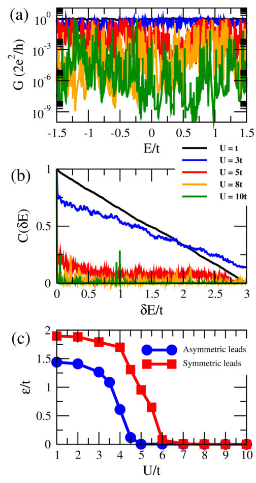
<figcaption class="paper-figure-caption"><b>Fig 2.</b> FIG. 2. Panel (a) shows the conductance as a function of the Fermi energy E from a 2D sample with asymmetric leads for different values of disorder U, as illustrated in Figure 1. Panel (b) shows the conductance correlation C(δE) calculated from the conductance fictitious time series as illustrated in panel (a). Panel (c) shows the fictitious correlation time ϵ as a function of disorder U for a 2D sample connected to asymmetric (circle symbols) and symmetric (square symbols) leads.</figcaption>
</figure>
<figure class="paper-figure-card">
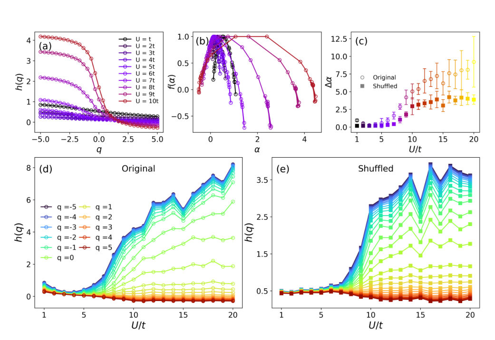
<figcaption class="paper-figure-caption"><b>Fig 3.</b> FIG. 3. Panel (a) presents the generalized Hurst exponents, h(q), and panel (b) shows the multifractal singularity spectra, f(α), for the conductance time series of a 2D sample with asymmetric leads, as illustrated in Figure 2, at various disorder values U. Panel (c) plots the width ∆α = αmax −αmin, derived from panel (b), as a function of U for original (circle symbols) and shuffled (square symbols) time series. Panel (d) shows h(q) versus U, and panel (e) shows the Hurst exponent from shuffled time series as a function of U.</figcaption>
</figure>
<figure class="paper-figure-card">
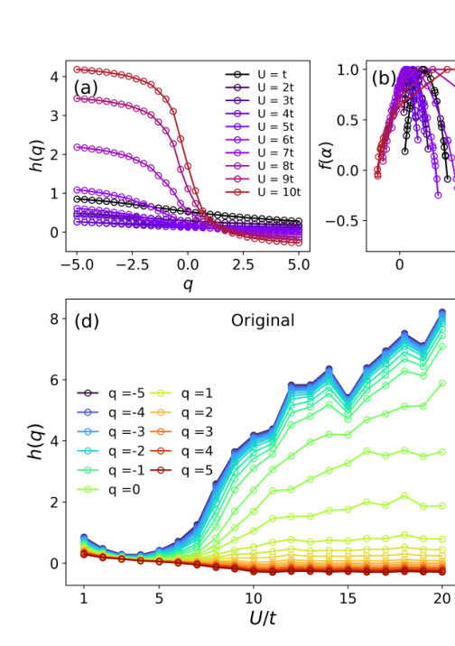
<figcaption class="paper-figure-caption"><b>Fig 4.</b> Figure 3(a) shows the Hurst exponent average h(q) as a function of q calculated from Eq. 5, for various disorder values U. At U = t, the Hurst exponent demonstrates a significant dependence on q, indicating clear multifrac- tality in the conductance time series. As the disorder in- creases, the energy correlation length decreases, leading to h(q) becoming independent of q. This trend indicates that the conductance time series tend to be monofractal. These results agree with Refs. [6, 7]. In contrast, for U &gt; 5t, where ϵ →0, h(q) begins to change with q, sig- nifying a return to multifractality. This behavior is more evident when plotting the Hurst exponent as a function of disorder U, as...</figcaption>
</figure>
<figure class="paper-figure-card">
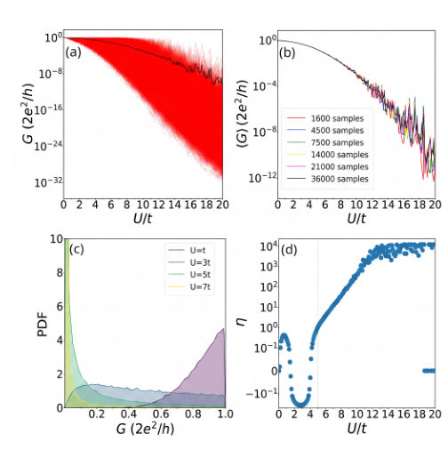
<figcaption class="paper-figure-caption"><b>Fig 5.</b> FIG. 4. Panel (a) illustrates the conductance as a function of disorder U for 36,000 different 2D samples with asymmet- ric leads, represented by the red dotted lines. The black line depicts the average conductance across these 36,000 samples. Panel (b) presents the average conductance calculated from varying numbers of samples. Panel (c) shows the probabil- ity distribution function (PDF) of conductance for different values of U. Panel (d) displays the non-Gaussian term η, as defined in Eq. 8, as a function of U.</figcaption>
</figure>

**Summary.** This work analyzes how conductance fluctuations behave in disordered quantum conductors by examining their multifractal and ergodic properties. It finds a clear transition from non-ergodic to ergodic dynamics as disorder increases. Crucially, it distinguishes the physical origin of multifractality, showing it stems from temporal correlations in the weak disorder limit and from non-Gaussian probability distributions in the strong disorder limit.

**Why it may be interesting.** The findings provide a detailed understanding of how fundamental concepts like ergodicity and multifractality manifest in quantum transport, offering insights into the role of rare events and non-Gaussian statistics in disordered quantum systems.

Detailed structure

**Main problem.** The study investigates the multifractal and ergodic properties of conductance fluctuations in disordered mesoscopic systems.

**Main result.** The system undergoes a transition from non-ergodic to ergodic behavior as disorder increases, with multifractality arising from temporal correlations in the non-ergodic regime and non-Gaussian PDF effects in the ergodic regime.

**Method.** The analysis employs Multifractal Detrended Fluctuation Analysis (MF-DFA) on a fictitious time series of conductance, comparing results with shuffled time series to distinguish correlation sources.

**Model / system.** The model is a two-dimensional (2D) tight-binding lattice subjected to Anderson disorder via on-site potentials. Transport is analyzed through the conductance, calculated using the Landauer-Büttiker formalism.

**Key observables.** Conductance correlation function, generalized Hurst exponent h(q), singularity spectrum f(alpha), fictitious correlation time $\epsilon$, and non-Gaussian indicator $\eta$.

**Important parameters / regimes.** Disorder strength ($U$), which controls the transition between non-ergodic and ergodic regimes.

**Assumptions / limitations.** The analysis treats conductance as a function of a control parameter (like Fermi energy) to generate a time series for fluctuation analysis.

**Figures summary.** Figures illustrate the transition from non-ergodic to ergodic behavior via correlation function decay, and show how multifractal scaling parameters ($\Delta\alpha$, $h(q)$) change with disorder strength $U$ for both original and shuffled time series.

**Paper structure.** The paper systematically analyzes the conductance fluctuations by first establishing the physical model and observables, then applying multifractal analysis to characterize the scaling properties in different disorder regimes, culminating in a discussion of the physical origin of the observed multifractality.

Abstract

Understanding the stochastic properties of conductance fluctuations in disordered mesoscopic systems is fundamental to quantum transport. In this work, we investigate the multifractal and ergodic properties of the fictitious time series of conductance in two-dimensional tight-binding models under varying Anderson disorder. Using standard multifractal analysis, we show that conductance fluctuations exhibit a transition from non-ergodic to ergodic behavior as the disorder strength increases, as evidenced by the decay of the conductance correlation function. Remarkably, multifractality persists in both regimes; however, it becomes insensitive to shuffling in the strong-disorder (ergodic) regime, suggesting that distributional effects dominate temporal organization. On the contrary, in the weakly disordered (non-ergodic) regime, long-range correlations play a significant role. These findings are robust against changes in lead geometry (asymmetric vs. symmetric). Our results provide new insights into the interplay between ergodicity, multifractality, and rare events in disordered quantum transport.

[↑ back to top](#top)

### [Observation of flat-bottom U-shaped energy gap in high-Tc nickelate (La,Pr)3Ni2O7 thin films](http://arxiv.org/abs/2605.15703v1)

**Authors:** Zhen Liang, Tianheng Wei, Wei Ren, Haoran Ji, Zheyuan Xie, Yanzhao Liu, Ziqiang Wang, Jian Wang  
**Type:** experiment · **Category:** strongly correlated electrons · **PDF:** <https://arxiv.org/pdf/2605.15703v1>  
**Analysis basis:** full PDF text, analyzed in chunks

↔ Scroll figures horizontally

<figure class="paper-figure-card">
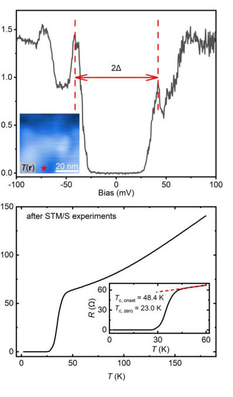
<figcaption class="paper-figure-caption"><b>Fig 1.</b> Fig. 1 | SC nickelate (La,Pr)3Ni2O7 thin film grown on SrLaAlO4 substrate. a, The schematic of the (La,Pr)3Ni2O7 crystal structure. b, The R-T curve of the (La,Pr)3Ni2O7 thin film measured before STM/S experiments. The onset SC Tc is 46.3 K and the zero resistance Tc is 21.7 K. The inset shows the measurement configuration. c, A typical tunneling spectrum measured at the position marked by the red star in the inset (Vs = 100 mV, Is = 500 pA, Vmod = 2 mV, T = 60 mK). The gap size (Δ) is around 41.6 meV determined by one half of the separation in energy between the two coherence peaks. The inset shows an STM topographic image of the (La,Pr)3Ni2O7 thin film in Region 1 (52.25 × 52.25 nm2, Vs =...</figcaption>
</figure>
<figure class="paper-figure-card">
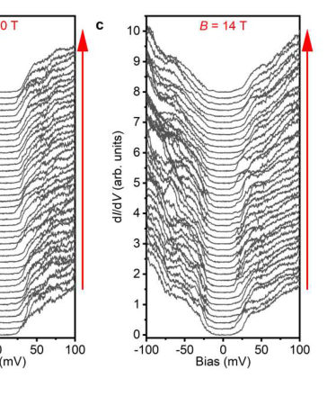
<figcaption class="paper-figure-caption"><b>Fig 2.</b> Fig. 2 | U-shaped energy gap structure and reduction of the energy gap under magnetic field B = 14 T perpendicular to sample surface. a, A topographic image of the (La,Pr)3Ni2O7 thin film in Region 1 (77.71 × 77.71 nm2, Vs = 8 V, Is = 100 pA). b, The tunneling conductance spectra measured along the red arrow shown in a without magnetic field (Vs = 100 mV, Is = 500 pA, Vmod = 2 mV, T = 50 mK). The spectra are vertically shifted for clarity. c, The tunneling spectra measured along the same arrow in a under a magnetic field B = 14 T perpendicular to the surface (Vs = 100 mV, Is = 500 pA, Vmod = 2mV, T = 50 mK). The spectra are vertically shifted for clarity. d, The spatially average of the...</figcaption>
</figure>
<figure class="paper-figure-card">
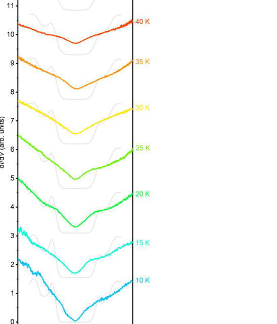
<figcaption class="paper-figure-caption"><b>Fig 3.</b> Fig. 3 | Tunneling spectra measured at different temperatures. a, The temperature dependence of the tunneling spectra from 60 mK to 45 K measured at the position marked by the red star in Fig.1c (Vs = 100 mV, Is = 500 pA, Vmod = 2 mV). b-c, The same spectra in a vertically shifted for clarity. The spectra measured from 60 mK to 7 K, from 10 K to 45 K are shown in b, c, respectively. The gray spectra are obtained by convoluting the spectrum measured at 60 mK by the thermal broadening functions at the corresponding temperatures. Furthermore, our observations were also repeated in another three-unit-cell thick (La,Pr)3Ni2O7 thin film, with a similar La:Pr ratio of about 1.95:1.05, grown on the...</figcaption>
</figure>

**Summary.** This work reports the first observation of a distinct, flat-bottom U-shaped energy gap in high-Tc nickelate thin films using STM/S. By analyzing the gap's temperature and magnetic field dependence, the authors argue that the material exhibits unconventional, strong-coupling superconductivity with a large gap, suggesting potential for high critical temperatures at ambient pressure.

**Why it may be interesting.** The observation of a large, unconventional superconducting gap ($\Delta$) and the strong-coupling ratio ($\gg$ BCS limit) in a nickelate system provides crucial experimental data for theories attempting to explain high-Tc superconductivity beyond the cuprate paradigm.

Detailed structure

**Main problem.** The study aims to understand the underlying mechanism of high-Tc superconductivity in nickelate superconductors and characterize the nature of the superconducting energy gap.

**Main result.** The researchers reported the first observation of an energy-symmetric, flat-bottom U-shaped gap in the nickelate film, whose temperature and magnetic field dependence is consistent with a superconducting gap function.

**Method.** The study employed ultra-low temperature Scanning Tunneling Microscopy/Spectroscopy (STM/S) and electrical transport measurements on the thin films.

**Model / system.** The physical system is (La,Pr)3Ni2O7 thin films grown on a SrLaAlO4 substrate. The analysis probes the superconducting gap structure, which is compared against theoretical expectations for strong-coupling superconductivity.

**Key observables.** Energy-symmetric, flat-bottom U-shaped energy gap; zero residual density of states at the Fermi level; gap reduction under a c-axis magnetic field; U-shaped to V-shaped gap evolution with temperature.

**Important parameters / regimes.** Onset $T_c$ above 40 K; Gap size $\Delta \sim 41.6 	ext{ meV}$; Strong-coupling ratio $2\Delta/k_B T_c \approx 20$; Magnetic field $B = 14 	ext{ T}$.

**Assumptions / limitations.** The observed gap structure is assumed to be superconducting, ruling out alternative origins like Coulomb blockade, and the analysis relies on careful deconvolution of thermal broadening effects.

**Figures summary.** Figures illustrate the U-shaped gap structure, its suppression by a perpendicular magnetic field, and the temperature evolution from U-shaped to V-shaped spectra.

**Paper structure.** The paper progresses by first establishing the superconducting transport properties, then using STM/S to observe the characteristic U-shaped gap at low temperatures, followed by analyzing the gap's evolution with temperature and magnetic field, and finally comparing the results to theoretical models of strong-coupling superconductivity.

Abstract

The discovery of high transition temperature (high-Tc) superconductivity in Ruddlesden-Popper (R-P) bilayer nickelates under high pressure has stimulated extensive work to understand the underlying mechanism and search for superconductors with higher Tc. The recent realization of superconductivity in R-P bilayer nickelate thin films with onset Tc above 40 K at ambient-pressure enables the use of a wide array of powerful experimental tools to investigate the unconventional high-Tc superconductivity in bilayer nickelates. Here, using ultra-low temperature scanning tunneling microscopy/spectroscopy (STM/S) and electrical transport study, we report the first successful observation of an energy-symmetric, flat-bottom U-shaped gap with zero residual density of states around the Fermi level in the high-Tc nickelate (La,Pr)3Ni2O7 thin film grown on SrLaAlO4 substrate. Before and after STM/S studies, transport measurements on the same sample reveal consistent superconducting behaviors showing zero resistance, with an onset Tc above 40 K and zero resistance Tc above 20 K. The tunneling spectra exhibit highly unconventional temperature evolution, characterized by a rapid filling of the U-shaped energy gap to a V-shaped gap as the temperature increases. Furthermore, the U-shaped energy gap is reduced under a c-axis magnetic field of 14 T. The energy-symmetric U-shaped gap, taken together with its dependence on magnetic field and temperature, is consistent with the behavior of a superconducting gap, suggesting a nodeless gap function at ultra-low temperatures. Our findings shed new lights on the nature of high-Tc superconductivity and provide an encouraging and thought-provoking hint for a local superconductivity with Tc above liquid nitrogen boiling temperature in nickelate superconductors at ambient or zero pressure.

[↑ back to top](#top)

### [Orthogonal Polynomials and the MacWilliams Transform for Permutation-Invariant Qudit Codes](http://arxiv.org/abs/2605.15372v1)

**Authors:** Ian Teixeira  
**Type:** theory · **Category:** quantum information and computing · **PDF:** <https://arxiv.org/pdf/2605.15372v1>  
**Analysis basis:** full PDF text, analyzed in chunks

↔ Scroll figures horizontally

<figure class="paper-figure-card">
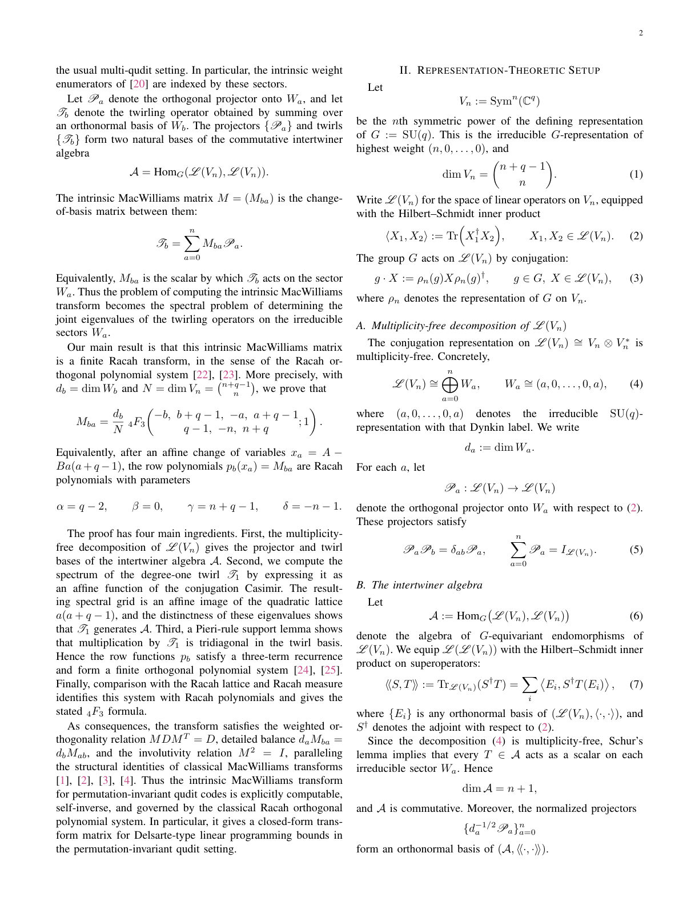
<figcaption class="paper-figure-caption"><b>Fig 1.</b> Low-resolution page preview, page 2</figcaption>
</figure>
<figure class="paper-figure-card">
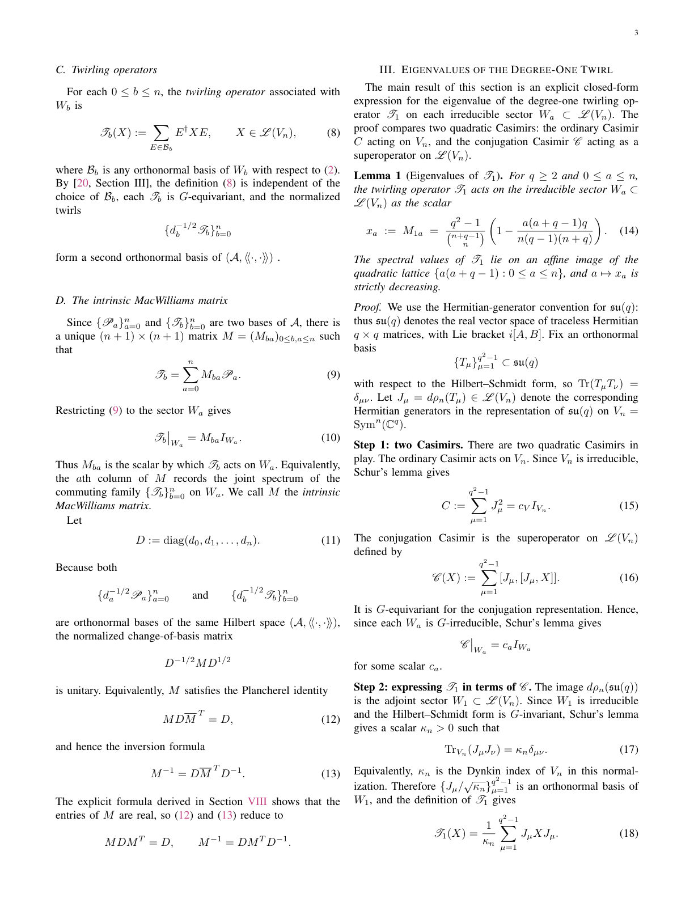
<figcaption class="paper-figure-caption"><b>Fig 2.</b> Low-resolution page preview, page 3</figcaption>
</figure>
<figure class="paper-figure-card">
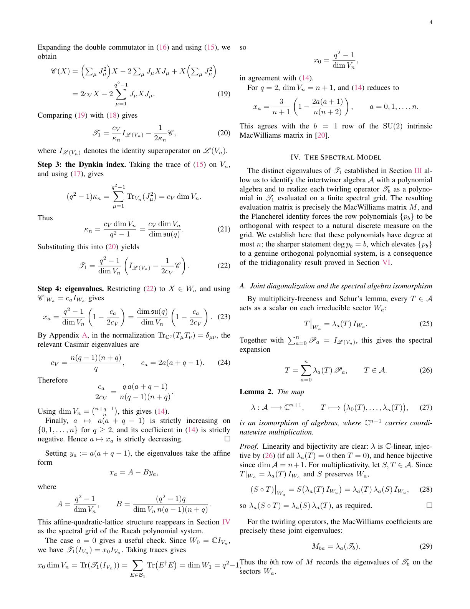
<figcaption class="paper-figure-caption"><b>Fig 3.</b> Low-resolution page preview, page 4</figcaption>
</figure>
<figure class="paper-figure-card">
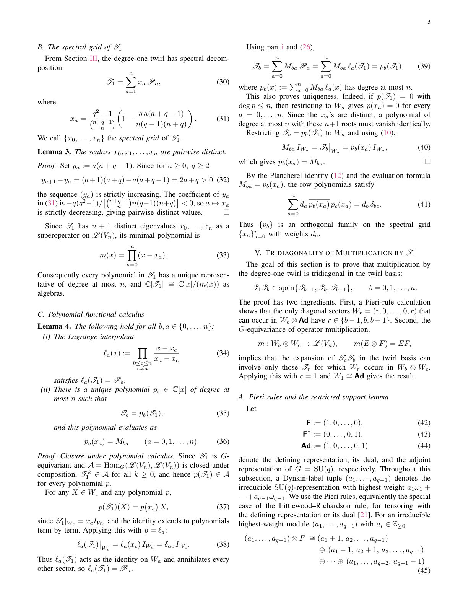
<figcaption class="paper-figure-caption"><b>Fig 4.</b> Low-resolution page preview, page 5</figcaption>
</figure>
<figure class="paper-figure-card">
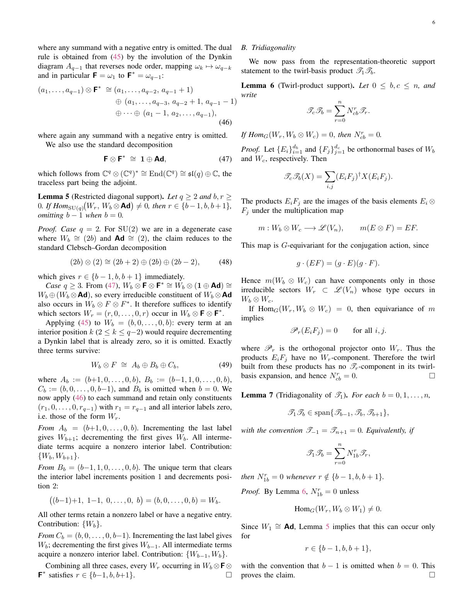
<figcaption class="paper-figure-caption"><b>Fig 5.</b> Low-resolution page preview, page 6</figcaption>
</figure>

**Summary.** This theoretical paper derives the intrinsic MacWilliams transform for a specific class of quantum error-correcting codes (permutation-invariant qudit codes). It achieves this by mapping the problem onto the spectral theory of operators acting on symmetric tensor representations of SU(q). The main result is an explicit formula for the transform matrix, showing it is a finite Racah transform, which is crucial for establishing rigorous bounds on the code's performance.

**Why it may be interesting.** The deep connection between quantum error-correcting codes (qudit codes) and advanced mathematical structures like Racah polynomials and orthogonal polynomials provides powerful, explicit tools for bounding code performance.

Detailed structure

**Main problem.** The paper aims to derive an explicit formula for the intrinsic MacWilliams transform associated with permutation-invariant qudit codes.

**Main result.** The intrinsic MacWilliams matrix is shown to be a finite Racah transform, providing an explicit, closed-form matrix for computing linear programming bounds on these codes.

**Method.** The derivation heavily utilizes representation theory, relating the transform to the joint eigenvalues of twirling operators acting on symmetric power representations of SU(q).

**Model / system.** The system studied is permutation-invariant qudit codes, whose underlying structure is analyzed using the symmetric power representation $V_n = 	ext{Sym}^n(\mathbb{C}^q)$ of the group SU(q).

**Key observables.** The intrinsic MacWilliams matrix $M = (M_{ba})$, the spectrum of the degree-one twirl operator $T_1$, and the associated Racah orthogonal polynomials.

**Important parameters / regimes.** The qudit dimension $q$, the block length $n$, and the indices $a, b$ corresponding to irreducible sectors.

**Assumptions / limitations.** The analysis relies on the multiplicity-free decomposition of the operator space $\mathcal{L}(V_n)$ and the properties derived from Casimir operators in the su(q) algebra.

**Paper structure.** The paper proceeds by establishing the spectral decomposition of the twirling operators, proving that the resulting polynomial representatives form an orthogonal system, identifying this system with Racah polynomials, and finally deriving the explicit matrix elements and proving structural identities like orthogonality and involutivity.

Abstract

We derive an explicit formula for the intrinsic MacWilliams transform for permutation-invariant qudit codes. Such codes naturally live in symmetric power representations, where the relevant error sectors are determined by the irreducible decomposition of the conjugation action on the associated operator space. Using the multiplicity-free structure of this decomposition and the corresponding intertwiner algebra, we identify the intrinsic MacWilliams matrix with a finite Racah transform. The entries are given by a terminating hypergeometric series, and the rows of the matrix are Racah orthogonal polynomials with parameters determined explicitly by the block length and local dimension. Computing the spectrum of the degree-one twirl reveals that this spectrum lies on an affine quadratic lattice. Then we derive a tridiagonal multiplication rule from the representation theory of the adjoint sector. As consequences, we obtain closed-form orthogonality, detailed-balance, and involutivity identities for the transform. The resulting formula supplies an explicit MacWilliams matrix for computing linear programming bounds on permutation-invariant qudit codes.

[↑ back to top](#top)

### [Performance Gains in Quantum SAT Solvers Using ESOP Encoding](http://arxiv.org/abs/2605.16202v1)

**Authors:** Majd Assaad, Abhoy Kole, Rolf Drechsler  
**Type:** theory · **Category:** quantum information and computing · **PDF:** <https://arxiv.org/pdf/2605.16202v1>  
**Analysis basis:** full PDF text, analyzed in chunks

↔ Scroll figures horizontally

<figure class="paper-figure-card">
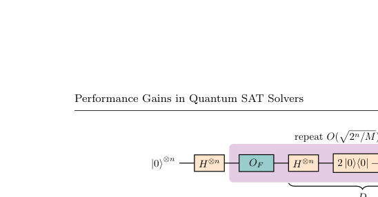
<figcaption class="paper-figure-caption"><b>Fig 1.</b> Fig. 1: Schematic overview of Grover’s algorithm for SAT, showing a single Grover iteration composed of the phase oracle OF and the diffusion operator D, repeated O( p</figcaption>
</figure>
<figure class="paper-figure-card">
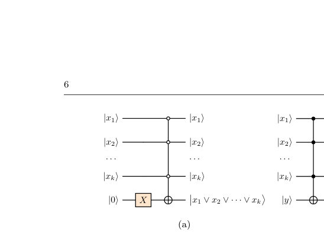
<figcaption class="paper-figure-caption"><b>Fig 2.</b> Fig. 2: Realization of (a) a CNF clause x1 ∨x2 ∨· · · ∨xk using input negation and a negative-k-controlled Toffoli gate, and (b) an ESOP product term implementing y ⊕(x1 ∧x2 ∧· · · ∧xk) using a positive-k-controlled Toffoli gate.</figcaption>
</figure>
<figure class="paper-figure-card">
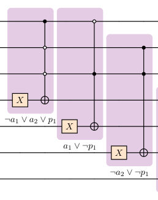
<figcaption class="paper-figure-caption"><b>Fig 3.</b> Fig. 4: Quantum circuit representation of proposition p1 ⇔a1 ∧¬a2 based on conventional CNF interpretation using three ancilla qubits, three Pauli X gates, and a pair of C2X and C3X gates with some controls of negative polarity.</figcaption>
</figure>
<figure class="paper-figure-card">
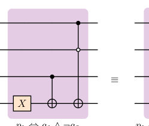
<figcaption class="paper-figure-caption"><b>Fig 4.</b> Fig. 5: Quantum circuit representations of proposition p1 ⇔a1 ∧¬a2 based on e-CNF interpretation using either (a) a Pauli X gate, a CX gate, and a C2X gate or (b) a CX gate, and a C2X gate with some controls of negative polarity.</figcaption>
</figure>
<figure class="paper-figure-card">
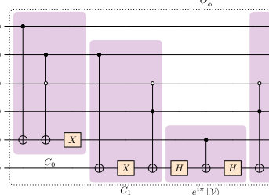
<figcaption class="paper-figure-caption"><b>Fig 5.</b> Fig. 6: Quantum oracle circuits synthesized using Algorithm 1: (a) oracle Obϕ cor-</figcaption>
</figure>

**Summary.** This work proposes using an Exclusive-Sum-of-Products (e-CNF) encoding to represent SAT problems for quantum computation. By replacing standard CNF, the e-CNF approach significantly reduces the required quantum resources, such as qubits and non-Clifford gates. This establishes e-CNF as a quantum-aware encoding that improves the feasibility of oracle-based quantum SAT solving.

**Why it may be interesting.** While focused on SAT, the methodology of optimizing quantum circuit resource overhead by choosing a mathematically superior encoding structure (e-CNF) is highly relevant to designing practical quantum algorithms for complex computational problems.

Detailed structure

**Main problem.** The paper addresses the challenge of efficiently encoding the NP-complete Boolean Satisfiability (SAT) problem for quantum acceleration using Grover's algorithm.

**Main result.** The proposed Exclusive-Sum-of-Products (e-CNF) encoding significantly reduces quantum resource requirements (qubit count, T-gate complexity) compared to standard Conjunctive Normal Form (CNF) encodings.

**Method.** The authors derive theoretical bounds and implement a systematic transformation from Boolean formulas to e-CNF, which is then mapped onto reversible quantum circuits for the oracle construction.

**Model / system.** The model is quantum computation, specifically utilizing Grover's search algorithm. The quantum operations are analyzed using the Clifford+T gate set, focusing on the resource cost of constructing the phase oracle.

**Key observables.** Quantum resource efficiency, including qubit count (#q), T-gate complexity (#T), CNOT count (#CX), and circuit depth (#D).

**Important parameters / regimes.** The complexity scales with the number of clauses ($m$) and the structure of the logical equivalence constraints being encoded.

**Assumptions / limitations.** The performance of the quantum solver is dominated by the cost of constructing the quantum oracle, and the analysis relies on decomposing multi-controlled gates into the Clifford+T gate set.

**Figures summary.** Figures illustrate the schematic overview of Grover's algorithm and provide quantum circuit representations comparing the oracle construction for CNF versus e-CNF for sample equivalences.

**Paper structure.** The paper introduces the SAT problem and Grover's algorithm, contrasts the resource costs of CNF vs. e-CNF encodings, derives the e-CNF transformation, and concludes with experimental benchmarks demonstrating resource savings.

Abstract

The Boolean Satisfiability (SAT) problem is a canonical NP-complete problem and a natural candidate for quantum acceleration via search-based algorithms. In Grover-based quantum SAT solvers, the dominant computational cost stems from the construction of a reversible oracle that evaluates the Boolean formula, rendering the choice of SAT encoding crucial for overall quantum resource efficiency. Although SAT instances are conventionally expressed in Conjunctive Normal Form (CNF), such encodings typically translate into quantum circuits with significant qubit overhead and high non-Clifford gate complexity.   In this work, we investigate an Exclusive-Sum-of-Products (ESOP)-based CNF (e-CNF) representation tailored for quantum SAT solving and analyze its impact on oracle construction. We derive tighter upper bounds on qubit requirements and Clifford+$T$ gate counts for Grover-based SAT solvers when e-CNF encodings are employed in place of standard CNF. In addition, we propose a scalable transformation from Boolean formulas to e-CNF and present a systematic procedure for interpreting e-CNF representations as reversible quantum circuits suitable for oracle implementation. Experimental evaluation on representative SAT benchmarks demonstrates that the proposed e-CNF-based approach yields substantial and consistent reductions in quantum resources, including qubit count, T-gate complexity, and circuit depth, when compared to CNF-based oracle constructions. These results establish e-CNF as an effective quantum-aware SAT encoding that significantly improves the practicality of oracle-based quantum SAT solving.

[↑ back to top](#top)

### [Quantum Circuit Synthesis Using an Exact T Library](http://arxiv.org/abs/2605.15476v1)

**Authors:** Hanyu Wang, Mingfei Yu, Xinrui Wu, Jason Cong  
**Type:** theory · **Category:** quantum information and computing · **PDF:** <https://arxiv.org/pdf/2605.15476v1>  
**Analysis basis:** full PDF text, analyzed in chunks

↔ Scroll figures horizontally

<figure class="paper-figure-card">
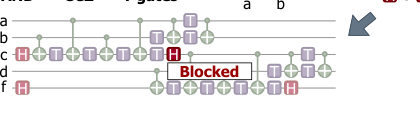
<figcaption class="paper-figure-caption"><b>Fig 1.</b> Figure 1: Example of the same AND count results in different T costs. Although both functions A and B contain two ANDs, the two Ts in A can be merged, while a Hadamard blocks those in B.</figcaption>
</figure>
<figure class="paper-figure-card">
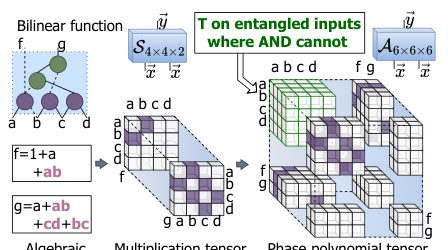
<figcaption class="paper-figure-caption"><b>Fig 2.</b> Figure 3: Tensor representation for bilinear Boolean functions. We present an example with a function with 𝑛= 4 inputs and 𝑚= 2 outputs. Algebraic normal form (ANF) is derived according to Equa- tion (1). Compared to the classical multiplication tensor, the phase polynomial tensor incorporates the entries that entangle inputs and outputs (highlighted in green). T can operate in this highlighted corner, where a classical bilinear operator cannot.</figcaption>
</figure>
<figure class="paper-figure-card">
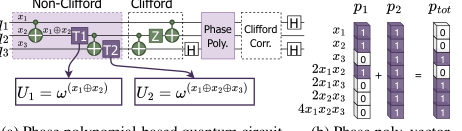
<figcaption class="paper-figure-caption"><b>Fig 3.</b> Figure 2: A circuit with two Ts (𝑇1, 𝑇2) and two representations of the phase shift on |𝑥1𝑥2𝑥3⟩: (a) phase polynomial and its (b) vector form.</figcaption>
</figure>
<figure class="paper-figure-card">
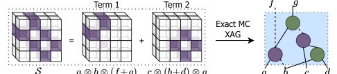
<figcaption class="paper-figure-caption"><b>Fig 4.</b> Figure 4: Example of a multiplication tensor. The MC is given by the number of terms to decompose the tensor S. Here MC = 2.</figcaption>
</figure>
<figure class="paper-figure-card">
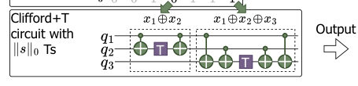
<figcaption class="paper-figure-caption"><b>Fig 5.</b> Figure 5: Exact T synthesis example. The solver finds 𝑠with mini- mum ∥𝑠∥0 satisfying Φ · 𝑠= 𝑝𝑓(mod 2), where Φ maps parities to monomials. Selected vectors are highlighted in green.</figcaption>
</figure>

**Summary.** This paper presents a novel, quantum-aware approach to synthesizing quantum circuits by accurately calculating the minimum required T gate count. It overcomes the limitations of previous methods that used simple proxies for cost by formulating the problem exactly using phase polynomials. The resulting customized mapper significantly reduces the T gate count for critical quantum applications.

**Why it may be interesting.** While focused on digital quantum computation, the rigorous mathematical framework for minimizing non-Clifford resources (T gates) by analyzing underlying algebraic structures (phase polynomials) is highly relevant to understanding resource constraints in any complex quantum system.

Detailed structure

**Main problem.** The primary challenge is minimizing the T gate count during fault-tolerant quantum circuit synthesis, as T gates are the dominant resource bottleneck in quantum error correction.

**Main result.** The proposed method achieves significant T count reductions (up to 14.3% on EPFL benchmarks and 40% for cryptographic modules) by using an exact T cost model instead of inaccurate proxies like AND count.

**Method.** The authors formulate an exact T synthesis problem, canonicalize Boolean functions under Clifford equivalence, and develop a customized mapper that integrates this quantum-aware cost model into the standard XAG synthesis flow.

**Model / system.** The work models quantum circuits implementing Boolean functions, specifically focusing on bilinear functions, and utilizes the phase polynomial representation to capture the exact non-Clifford (T gate) cost.

**Key observables.** T count (the primary cost metric), AND count/Multiplicative Complexity (the inaccurate proxy), and the phase polynomial vector.

**Important parameters / regimes.** The maximum number of variables supported for precomputation is seven; the complexity is related to the rank of the multiplication tensor.

**Assumptions / limitations.** Existing methods incorrectly assume that the AND count is a reliable proxy for the true T gate cost, which the paper refutes.

**Figures summary.** Figures compare T-count reductions across arithmetic benchmarks (e.g., GF(2^n) multipliers) using the new mapper versus prior state-of-the-art methods, and detail the structure of the synthesis flow and cost analysis.

**Paper structure.** The paper progresses from identifying the T-gate bottleneck, detailing the mathematical formulation of the exact T synthesis problem via phase polynomials, proposing the customized mapper that respects bilinear structure, and finally demonstrating the end-to-end synthesis flow and performance gains.

Abstract

In fault-tolerant quantum circuit synthesis, T gates supplied via magic states dominate space-time cost, while Clifford gates incur negligible overhead. Conventional flows minimize AND count in an {XOR, AND, NOT} basis as a proxy for T, which neglects phase cancellation and can be far from T-optimal. We instead formulate an exact T synthesis problem and canonicalize Boolean functions under Clifford equivalence. By precomputing T-optimal implementations up to seven variables and developing a customized mapper, we reduce the T count by up to 14.3% on EPFL benchmarks and improve the T counts of several cryptographic modules by up to 40%.

[↑ back to top](#top)

### [Quantum Feature Amplification Network (QFAN) as An Autoregressive Quantum Generative Model](http://arxiv.org/abs/2605.16044v1)

**Authors:** Jamal Slim, Saverio Monaco, Florian Rehm, Dirk Kruecker, Kerstin Borras  
**Type:** both · **Category:** quantum information and computing · **PDF:** <https://arxiv.org/pdf/2605.16044v1>  
**Analysis basis:** full PDF text, analyzed in chunks

↔ Scroll figures horizontally

<figure class="paper-figure-card">
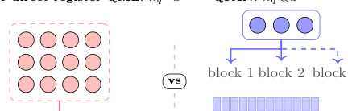
<figcaption class="paper-figure-caption"><b>Fig 1.</b> FIG. 1. Paradigm comparison. Prior direct-register QML requires nq=d qubits (left). QFAN reuses a fixed nq-qubit circuit across B blocks (right), so qubit requirements are de- termined by block size rather than by the full image dimen- sion.</figcaption>
</figure>
<figure class="paper-figure-card">
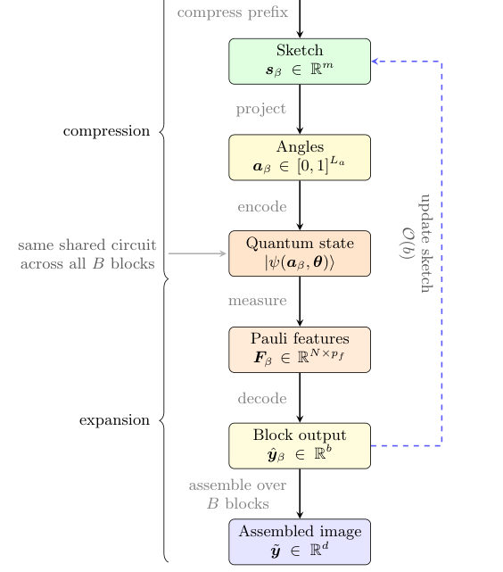
<figcaption class="paper-figure-caption"><b>Fig 2.</b> FIG. 2. Compression–expansion view of QFAN. At autore- gressive step β, a fixed-length sketch compresses the previ- ously generated prefix and is projected to circuit angles. The same shared parameterized quantum circuit is reused across all B blocks; its measurements produce Pauli features, which are decoded into the next block output ˆyβ. Repeating this cycle and feeding each generated block back into the sketch update yields the assembled image ˜y ∈Rd.</figcaption>
</figure>
<figure class="paper-figure-card">
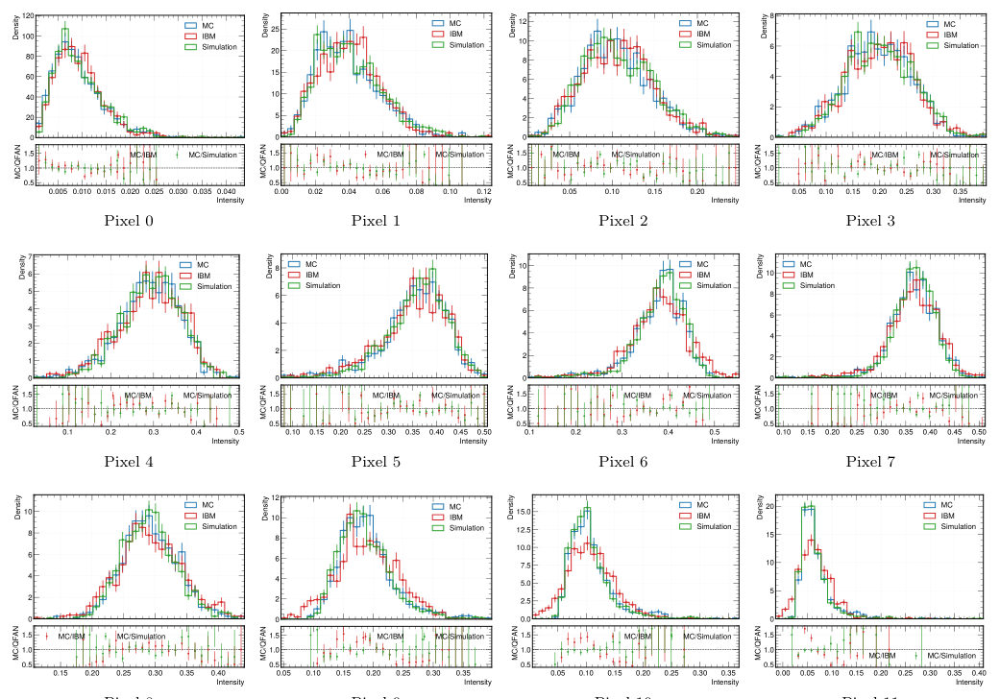
<figcaption class="paper-figure-caption"><b>Fig 3.</b> FIG. 4. Per-pixel marginal intensity distributions (variable intensity scale). MC truth (blue), IBM hardware (red), and simulator (green) are shown for each pixel, with MC/QFAN ratio panels below. Peak position shifts systematically from low intensity (pixel 0) to high intensity (pixel 5), reflecting longitudinal shower development. Both QFAN paths reproduce the MC distributions across all pixels.</figcaption>
</figure>
<figure class="paper-figure-card">
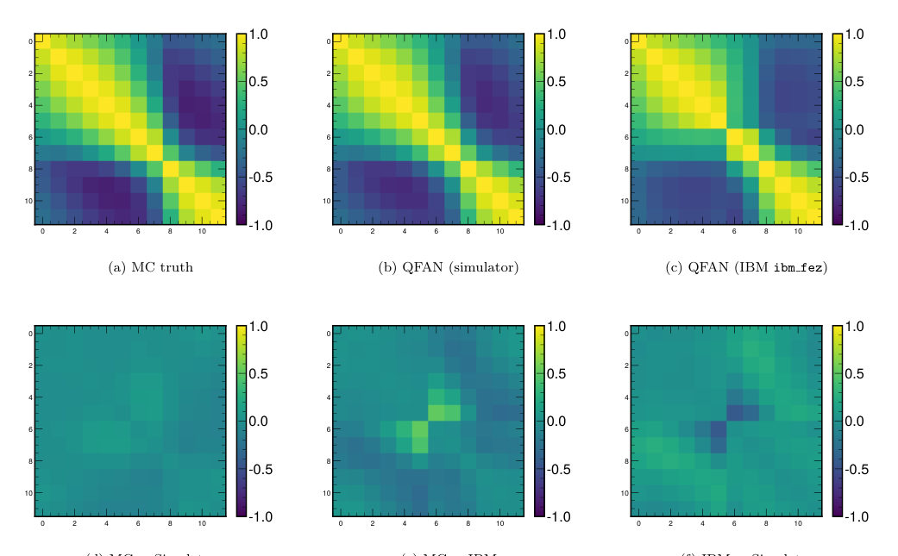
<figcaption class="paper-figure-caption"><b>Fig 4.</b> FIG. 5. Pearson correlation matrices (12×12). Top row: MC truth (a), simulator QFAN (b), and IBM hardware QFAN (c). Bottom row: pairwise differences. The MC−SIM (d) and MC−IBM (e) residuals are similar in magnitude and concentrated at the block boundary (pixels 4–7). The IBM−SIM difference (f) is the smallest, indicating that the two QFAN paths agree more closely with each other than either does with MC.</figcaption>
</figure>
<figure class="paper-figure-card">
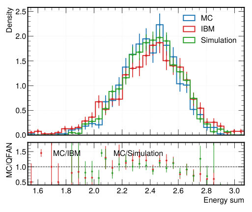
<figcaption class="paper-figure-caption"><b>Fig 5.</b> FIG. 6. Total energy E= P</figcaption>
</figure>

**Summary.** This paper introduces the Quantum Feature Amplification Network (QFAN), an autoregressive quantum generative model designed to simulate large-scale images like calorimeter showers. By generating the image sequentially in fixed-size blocks, QFAN bypasses the prohibitive requirement that quantum register size must grow with the image size. The authors demonstrate this feasibility by reproducing key physical observables on both simulators and real quantum hardware.

**Why it may be interesting.** The core mechanism—decoupling resource scaling from output dimension via autoregression and fixed-size quantum circuits—is a major architectural advance for applying quantum computation to high-dimensional physical simulations.

Detailed structure

**Main problem.** To develop quantum generative models capable of simulating large-scale physical images, such as calorimeter showers, without requiring the quantum register size to scale linearly with the image dimension.

**Main result.** The Quantum Feature Amplification Network (QFAN) successfully establishes a hardware-compatible proof of principle by generating images block-by-block, keeping the required qubit count fixed regardless of the total image size.

**Method.** The model uses an autoregressive factorization, where each block is generated by reusing a small parameterized quantum circuit conditioned on a fixed-length summary (count-sketch) of previously generated pixels.

**Model / system.** The system simulates electromagnetic calorimeter showers, treating the energy deposition map as a high-dimensional image ($\mathbf{y}$). The model architecture is QFAN, which decomposes the image into sequential blocks ($B$) and uses a shared quantum circuit ($U(\mathbf{a}_eta, 	heta)$) for generation.

**Key observables.** Per-pixel intensity distributions, inter-pixel correlation matrices, and the total energy distribution of the simulated showers.

**Important parameters / regimes.** Qubit count ($n_q=3$), block size ($b$), total number of blocks ($B$), and the feature-to-target ratio ($
ho$).

**Assumptions / limitations.** The training uses teacher-forcing (ground-truth prefixes), and the analysis cannot causally separate optimization-budget limitations from device noise effects.

**Figures summary.** Figures illustrate the comparison between direct-register scaling ($n_q=d$) and QFAN's fixed-qubit approach; subsequent figures show the successful reproduction of marginal distributions, correlation structures, and total energy conservation across simulated and hardware backends.

**Paper structure.** The paper introduces QFAN to solve the scaling bottleneck, details the autoregressive block generation process involving count-sketch conditioning and feature extraction, presents theoretical bounds on noise propagation, and validates the approach by reproducing key physical observables on both simulators and IBM quantum hardware.

Abstract

Direct-register quantum generative models for calorimeter shower simulation tie the quantum output dimension to the image dimension, so the required register size grows with the full image. Recent quantum-assisted methods reduce this pressure only by moving part of the generative task into hybrid latent-variable models. Consequently, current quantum demonstrations remain far below detector-scale geometries used in high-energy physics. We introduce the Quantum Feature Amplification Network (QFAN), which removes this register-size bottleneck by generating an image as a sequence of blocks. Each block is produced by the same small parameterized quantum circuit, conditioned on a compressed summary of the pixels already generated. Reusing the circuit fixes the qubit requirement by block size rather than full image size, while the per-step quantum processing cost is independent of image size for the Pauli-observable family used here. We derive a conservative worst-case bound on shot-noise propagation through the generation chain and give an empirical decoder-capacity heuristic for the reachable sequential depth. A three-qubit circuit with twelve shared variational parameters, closed-form ridge decoders, and a post-hoc residual sampler reproduces per-pixel intensity distributions, inter-pixel correlations, and total energy distributions of calorimeter showers on both simulator and IBM quantum hardware. At this scale, the hardware-simulator gap is consistent with optimization-budget limits dominating over device noise, although the experiments do not causally separate these effects. The results establish a hardware-compatible proof of principle and motivate, but do not validate, larger-scale extrapolations within this circuit family.

[↑ back to top](#top)

### [Quantum Feature Pyramid Gating for Seismic Image Segmentation](http://arxiv.org/abs/2605.15370v1)

**Authors:** Taha Gharaibeh, Jyotsna Sharma  
**Type:** both · **Category:** disordered systems and neural networks · **PDF:** <https://arxiv.org/pdf/2605.15370v1>  
**Analysis basis:** full PDF text, analyzed in chunks

↔ Scroll figures horizontally

<figure class="paper-figure-card">
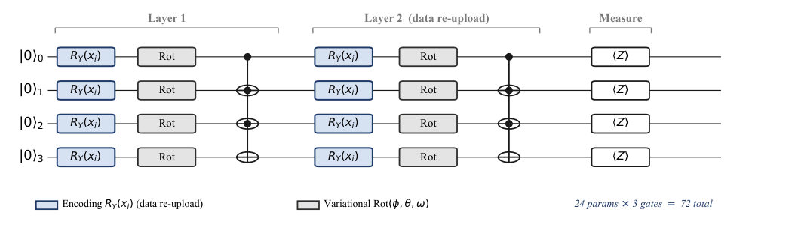
<figcaption class="paper-figure-caption"><b>Fig 1.</b> Fig. 1: Parameterized quantum circuit used in all architectures. Four qubits initialized to |0⟩, two layers with data re-uploading. Teal boxes: RY (xi) encodings re-applied at each layer [15]. Slate boxes: general Rot(ϕ, θ, ω) rotations with trainable parameters. CNOT rings entangle adjacent qubits; Pauli-Z expectations produce four scalars in [−1, 1]. 24 variational parameters per circuit × 3 gates = 72 quantum parameters total.</figcaption>
</figure>
<figure class="paper-figure-card">
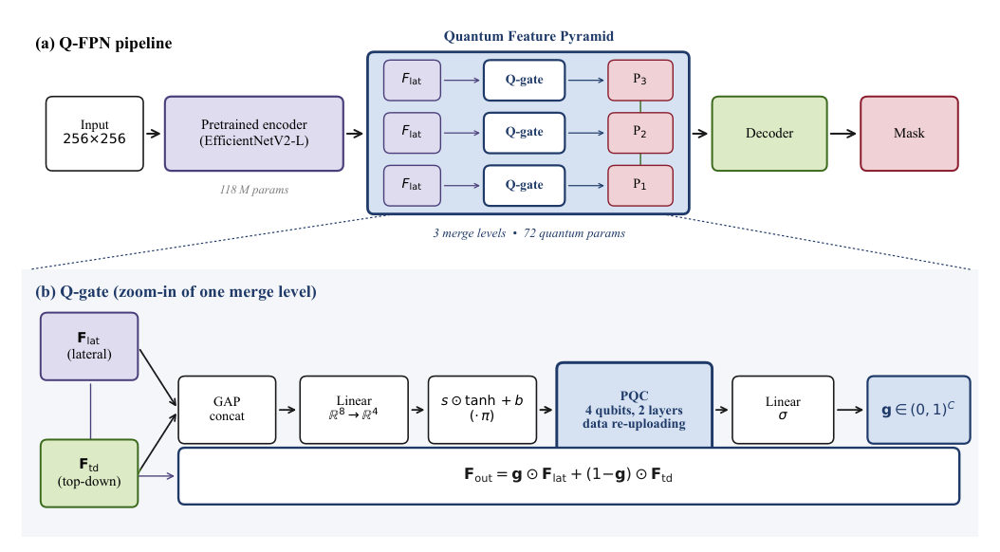
<figcaption class="paper-figure-caption"><b>Fig 2.</b> Fig. 2: Quantum FPN Gate (one merge level). Lateral (Flat) and top-down (Ftd) feature maps are compressed by global average pooling, concatenated, projected to R4, and rescaled via a learnable s⊙tanh +b into [−π, π]. A 4-qubit, 2-layer PQC with data re- uploading (24 variational parameters; 72 total across three merge levels) produces four Pauli-Z expectations, which a linear layer and sigmoid convert to a channel-wise gate g ∈(0, 1)C. The output is the convex combination Fout = g ⊙Flat +(1−g)⊙Ftd.</figcaption>
</figure>
<figure class="paper-figure-card">
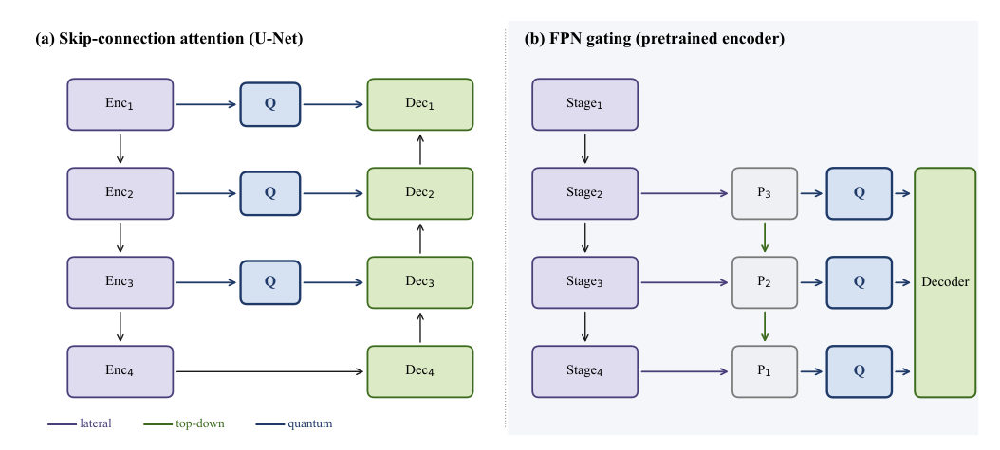
<figcaption class="paper-figure-caption"><b>Fig 3.</b> Fig. 3: Two integration topologies for parameterized quantum circuits. (a) Skip-connection attention: the PQC modulates encoder features before they reach the decoder, acting as a per-channel filter on one feature stream. (b) FPN gating: the PQC controls how lateral encoder features and top-down features combine at each pyramid level, computing a per-channel mixing ratio between two streams. Teal blocks marked “Q” are identical 4-qubit, 2-layer PQCs; the structural difference is filter one stream versus blend two streams. See Section III-C and Section III-D.</figcaption>
</figure>
<figure class="paper-figure-card">
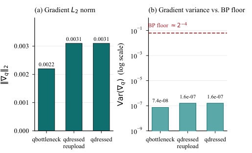
<figcaption class="paper-figure-caption"><b>Fig 4.</b> Fig. 4: Gradient diagnostics for circuit variants with logged quantum-parameter gradients. (a) ℓ2 norm of quantum- parameter gradients. (b) Variance on a logarithmic axis with the barren-plateau floor for n=4 qubits overlaid. Observed variances of 7.4 × 10−8 to 1.6 × 10−7 sit roughly 105</figcaption>
</figure>
<figure class="paper-figure-card">
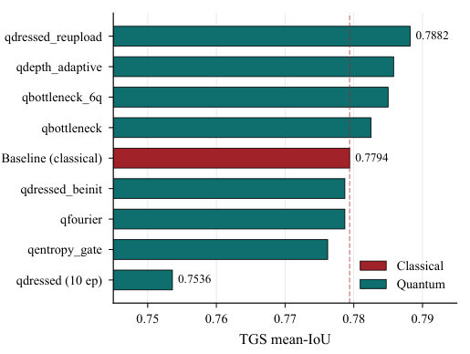
<figcaption class="paper-figure-caption"><b>Fig 5.</b> Fig. 5: Skip-attention circuit variants on the SolidUNet back- bone (128 × 128, 30 epochs). Every variant shares the same classical architecture; only the quantum circuit design differs. The dashed vertical line marks the classical base- line (0.7794). Data re-uploading (qdressed_reupload, 0.7882) gives the largest gain (+0.88 pp) among the eight circuits tested, consistent with the universality argument of Pérez-Salinas et al. [15]. Increasing qubit count from 4 to 6 (qbottleneck_6q) does not surpass 4-qubit re-uploading, suggesting feature quality rather than Hilbert-space dimension bounds performance at this backbone scale. Exact values appear in Table II.</figcaption>
</figure>

**Summary.** This paper proposes a Quantum Feature Pyramid Gating (Q-FPN) gate to enhance seismic image segmentation by improving feature fusion at the FPN merge points. It embeds a small, parameterized quantum circuit (PQC) into a standard deep learning backbone. The results show that this quantum gating mechanism provides a significant, measurable performance boost over purely classical fusion techniques, suggesting a viable application for quantum machine learning in geophysical imaging.

**Why it may be interesting.** The work applies quantum circuit principles (PQC) to a deep learning task (image segmentation), demonstrating how quantum computation can be used as a trainable, non-linear feature transformation layer within a classical neural network architecture.

Detailed structure

**Main problem.** The core problem is achieving accurate, dense, pixel-level segmentation of salt bodies in seismic images, which is complicated by wave propagation distortions.

**Main result.** The proposed Quantum Feature Pyramid Gating (Q-FPN) gate significantly improves segmentation performance, showing a substantial gain (e.g., 9.85 percentage points) over classical fusion methods at the FPN merge point.

**Method.** The method introduces a hybrid architecture embedding a Parameterized Quantum Circuit (PQC) at feature-fusion points to compute a learned, content-dependent convex combination of features.

**Model / system.** The system uses a standard encoder-decoder segmentation pipeline (like U-Net/FPN) augmented by a 4-qubit, 2-layer PQC. The PQC processes compressed feature statistics to generate a gating weight, making the gate encoder-agnostic.

**Key observables.** Mean Intersection over Union (IoU) score, TGS-mAP, and the magnitude of performance improvement ($\Delta$) when comparing quantum vs. classical gating.

**Important parameters / regimes.** The quantum circuit has a fixed budget of 72 trainable parameters, operating on 4 qubits.

**Assumptions / limitations.** The primary assumption is that the quantum function space accessed by the PQC provides a superior mechanism for feature correlation and fusion compared to simple classical addition or attention mechanisms.

**Figures summary.** Figures illustrate the PQC structure (4-qubit, 2-layer) and compare the performance gains (e.g., $\Delta$ of 9.85 pp) achieved by the Q-FPN gate versus classical baselines across different encoders and resolutions.

**Paper structure.** The paper introduces the Q-FPN gate, details the PQC implementation (encoding, variational layers), evaluates its performance on the TGS challenge by comparing it against classical element-wise addition and skip-connection attention, and concludes by analyzing the source of the performance gain.

Abstract

Accurate salt-body delineation is essential for seismic interpretation because salt structures distort wave propagation, complicate velocity-model building, obscure reservoir geometry, and increase uncertainty in exploration and drilling decisions. Although hybrid quantum-classical models have shown competitive performance on small-scale image-classification tasks, their value for dense, pixel-level geophysical prediction remains largely untested. This work introduces quantum feature gating, a hybrid segmentation architecture that embeds a parameterized quantum circuit (PQC) at feature-fusion points within an encoder-decoder pipeline. A 4-qubit, 2-layer PQC with data re-uploading computes a learned convex combination of lateral and top-down features at each Feature Pyramid Network merge point. A global-average-pooling layer maps encoder features to a fixed 4-dimensional quantum input, decoupling the 72-parameter quantum budget from backbone size and image resolution. The method is evaluated on the 2018 TGS Salt Identification Challenge using 4,000 seismic images at 101 x 101 resolution, across two integration topologies, eight circuit variants, and six encoders with 8M to 118M parameters under five-fold cross-validation. In a controlled EfficientNetV2-L ablation at 256 x 256 resolution, replacing the three Quantum FPN Gates with element-wise addition while holding the encoder, loss schedule, splits, and threshold search fixed reduces mean IoU from 0.9389 to 0.8404, a 9.85 percentage-point gap. Inserting the same circuit as skip-connection attention in a custom U-Net improves IoU by 0.88 points over the SolidUNet baseline, showing that the PQC contribution depends on where and what it gates. These results provide controlled evidence that quantum feature fusion can improve dense seismic segmentation.

[↑ back to top](#top)

### [Quantum game theory for 2 2 games: a mathematical framework](http://arxiv.org/abs/2605.15747v1)

**Authors:** Gloria Ferraris, Veronica Umanità  
**Type:** theory · **Category:** other · **PDF:** <https://arxiv.org/pdf/2605.15747v1>  
**Analysis basis:** full PDF text, analyzed in chunks

↔ Scroll figures horizontally

<figure class="paper-figure-card">
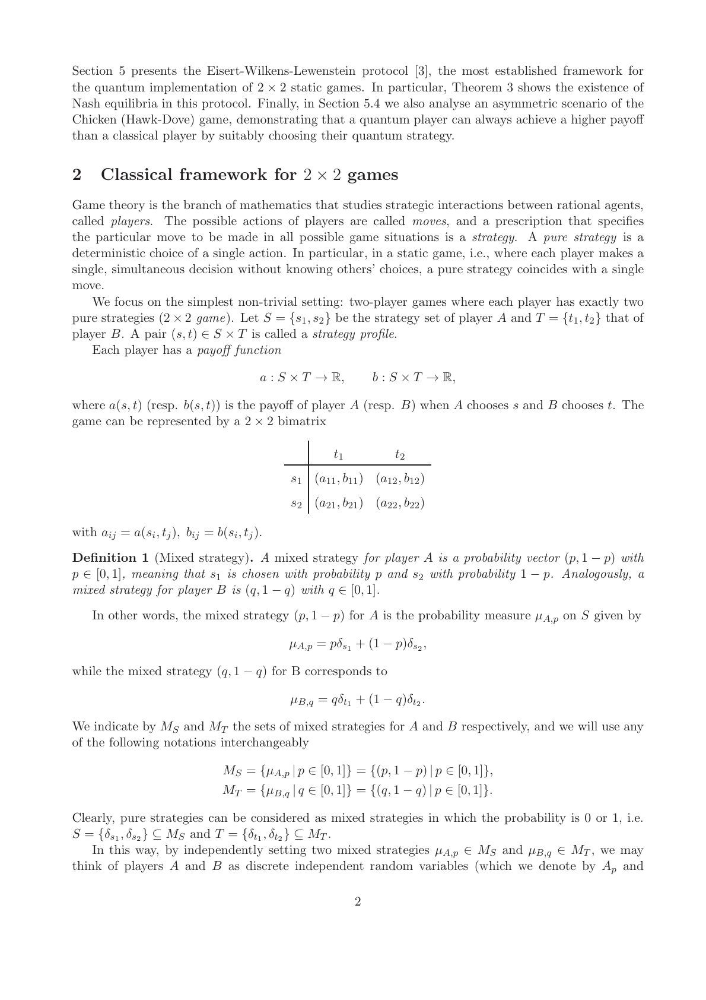
<figcaption class="paper-figure-caption"><b>Fig 1.</b> Low-resolution page preview, page 2</figcaption>
</figure>
<figure class="paper-figure-card">
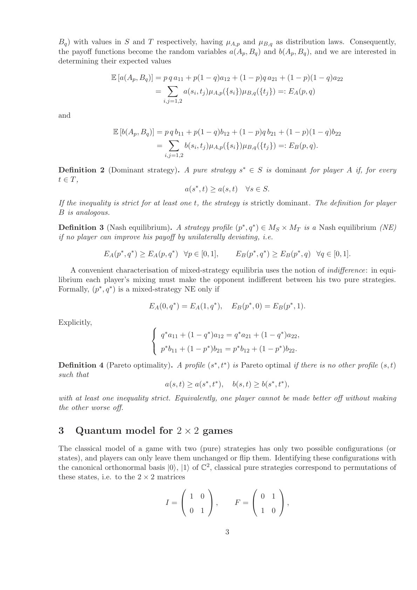
<figcaption class="paper-figure-caption"><b>Fig 2.</b> Low-resolution page preview, page 3</figcaption>
</figure>
<figure class="paper-figure-card">
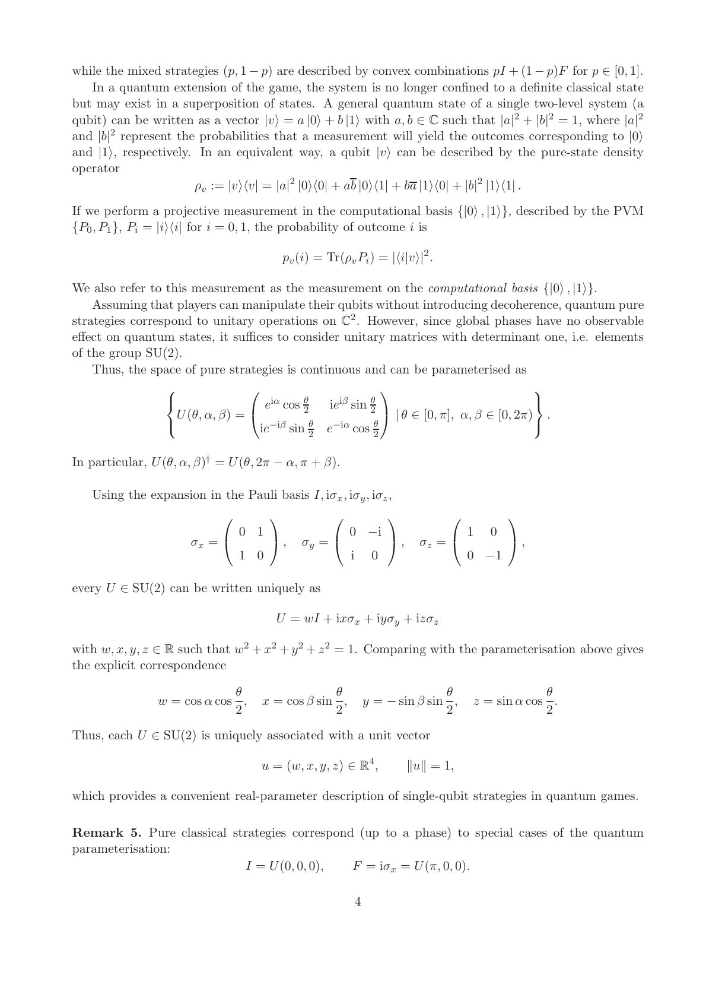
<figcaption class="paper-figure-caption"><b>Fig 3.</b> Low-resolution page preview, page 4</figcaption>
</figure>
<figure class="paper-figure-card">
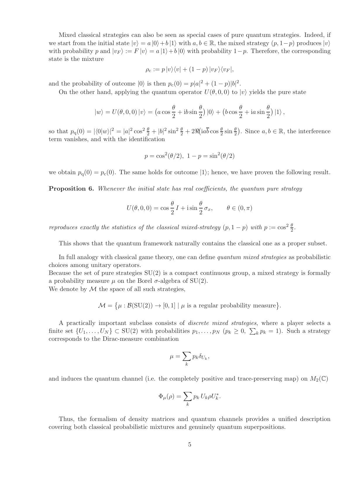
<figcaption class="paper-figure-caption"><b>Fig 4.</b> Low-resolution page preview, page 5</figcaption>
</figure>
<figure class="paper-figure-card">
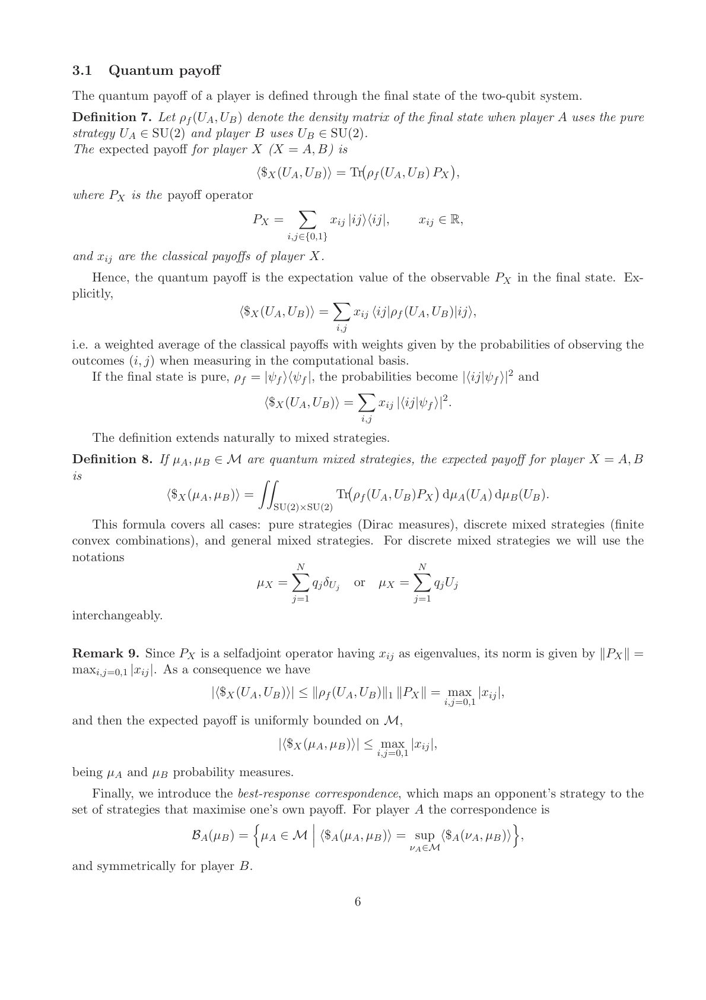
<figcaption class="paper-figure-caption"><b>Fig 5.</b> Low-resolution page preview, page 6</figcaption>
</figure>

**Summary.** This paper constructs a rigorous mathematical theory for quantum game theory applied to 2x2 games, extending classical concepts to the quantum domain using SU(2) unitaries. It proves the existence of quantum Nash equilibria for continuous mixed strategies and demonstrates that quantum strategies can yield payoffs superior to classical ones. The work is significant for understanding strategic interactions in quantum mechanical settings.

**Why it may be interesting.** While not directly about AMO systems, the mathematical tools developed for analyzing optimal strategies in quantum games (using SU(2) representations and fixed-point theorems) are highly relevant for understanding optimal control or equilibrium states in open quantum systems.

Detailed structure

**Main problem.** The paper develops a rigorous mathematical framework to extend quantum game theory to static 2x2 games, specifically proving the existence of Nash equilibria for continuous quantum mixed strategies.

**Main result.** It proves the existence of quantum Nash equilibria for continuous mixed strategies using fixed-point theorems, showing that quantum strategies can outperform classical ones in certain scenarios like the Chicken game.

**Method.** The analysis uses the Eisert-Wilkens-Lewenstein (EWL) protocol, representing strategies as unitary operations in SU(2) and defining mixed strategies as probability measures on SU(2).

**Model / system.** The model is a static two-player 2x2 game analyzed in the quantum setting using qubits and unitary operators in SU(2). The framework compares quantum strategies to classical probability distributions.

**Key observables.** Expected payoffs for both players ($\langle A 
angle, \langle B 
angle$), which are derived as expectation values of payoff operators.

**Important parameters / regimes.** The entanglement parameter $\gamma$ in the EWL protocol, and the continuous strategy parameters defining the unitary operations in SU(2).

**Assumptions / limitations.** The analysis assumes players can manipulate qubits without introducing decoherence, and the existence proof relies on applying theorems like Kakutani-Glicksberg-Ky Fan to the space of measures M(SU(2)).

**Paper structure.** The paper first establishes the mathematical formalism for quantum strategies and mixed states, then introduces the EWL protocol, and finally applies this framework to prove the existence of Nash equilibria and analyze payoff differences in specific games.

Abstract

We develop a rigorous mathematical framework for quantum game theory applied to static 2x2 games, extending classical concepts to the quantum setting where players may employ arbitrary unitary operations (pure strategies) or probability measures over the continuous group SU(2) (mixed strategies). The Eisert-Wilkens-Lewenstein protocol is introduced as the standard implementation of quantum 2x2 games. We prove the existence of Nash equilibria for continuous quantum mixed strategies via a fixed-point argument, generalising the classical Nash theorem to the quantum case.

[↑ back to top](#top)

### [Quantum Solvers for Nonlinear Matrix Equations in Quantum Chemistry](http://arxiv.org/abs/2605.16189v1)

**Authors:** Pablo Rodenas-Ruiz, Andrew Zhao, Joonho Lee  
**Type:** theory · **Category:** quantum information and computing · **PDF:** <https://arxiv.org/pdf/2605.16189v1>  
**Analysis basis:** full PDF text, analyzed in chunks

↔ Scroll figures horizontally

<figure class="paper-figure-card">
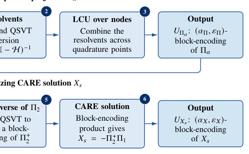
<figcaption class="paper-figure-caption"><b>Fig 1.</b> FIG. 1. Workflow of the quantum CARE solver algorithm.</figcaption>
</figure>

**Summary.** This work presents a quantum algorithm to solve the Algebraic Riccati Equation relevant to calculating electronic correlation energy in quantum chemistry. By block-encoding solutions using Riesz projectors and QSVT, the authors demonstrate a quantum speedup in scaling with the excitation rank $m$. This establishes a general quantum framework for nonlinear matrix equations in quantum chemistry, potentially applicable to coupled-cluster theory.

**Why it may be interesting.** It provides a concrete, quantum-algorithmic pathway to tackle notoriously difficult, non-linear many-body problems in quantum chemistry, bridging quantum computation directly to electronic structure theory.

Detailed structure

**Main problem.** Developing a quantum algorithm to solve nonlinear matrix equations, specifically the Algebraic Riccati Equation (CARE), arising in quantum chemistry.

**Main result.** The algorithm achieves a computational cost scaling linearly with system size and polynomially with excitation rank $m$, suggesting an exponential advantage over classical methods for calculating correlation energy.

**Method.** The method block-encodes stabilizing Riccati solutions using Riesz projectors constructed via contour-integral resolvents and implemented using Quantum Singular Value Transformations (QSVT).

**Model / system.** The application is in quantum chemistry, specifically calculating the electronic correlation energy density using the Random-Phase Approximation (RPA) and its $m$-particle-$m$-hole generalizations ($m$-RPA).

**Key observables.** Electronic correlation-energy density ($E_c$), the stabilizing solution $X_s$, and the block-encoded Riesz projector ($\Pi_a$).

**Important parameters / regimes.** System size ($V$), excitation rank ($m$), spectral gap ($\delta$), and desired error ($\epsilon$).

**Assumptions / limitations.** Assumes localized-orbital sparsity, that the associated matrix $H$ has no eigenvalues on the imaginary axis, and relies on the convergence of contour integrals via the trapezoid rule.

**Figures summary.** Figures illustrate the workflow: (1) Block-encoding $\Pi_a$ via contour quadrature, (2) Extracting $X_s$ using $\Pi_1$ and $\Pi_2^+$, and (3) Calculating $	ext{Tr}(BX)$ using amplitude estimation.

**Paper structure.** The paper builds from defining the CARE and its associated Hamiltonian $H$, detailing the quantum machinery (Riesz projectors, QSVT, block-encoding), and finally applying this framework to derive the scaling for the correlation energy estimation.

Abstract

We present a quantum algorithm for solving algebraic Riccati equations, with applications to quantum-chemical random-phase approximation (RPA) and higher-order RPA theories. Our method block-encodes stabilizing Riccati solutions via Riesz projectors onto invariant subspaces of an associated non-normal matrix, implemented using contour-integral resolvents and quantum singular value transformations. Applied to $m$-particle, $m$-hole RPA, our algorithm yields a block-encoding of the amplitude solution and estimates the electronic correlation-energy density with it. Under localized-orbital sparsity assumptions, the end-to-end cost scales linearly with system size and polynomially with excitation rank $m$, suggesting an exponential advantage in $m$ over plausible classical local-correlation heuristics. More broadly, this work provides a framework for quantum algorithms for nonlinear matrix equations in quantum chemistry and opens a possible route toward developing quantum algorithms for coupled-cluster theory.

[↑ back to top](#top)

### [Synthesis and Optimization of Encoding Circuits for Fault-Tolerant Quantum Computation](http://arxiv.org/abs/2605.15266v1)

**Authors:** Tom Peham, Matthew Steinberg, Robert Wille, Sascha Heußen  
**Type:** theory · **Category:** quantum information and computing · **PDF:** <https://arxiv.org/pdf/2605.15266v1>  
**Analysis basis:** full PDF text, analyzed in chunks

↔ Scroll figures horizontally

<figure class="paper-figure-card">
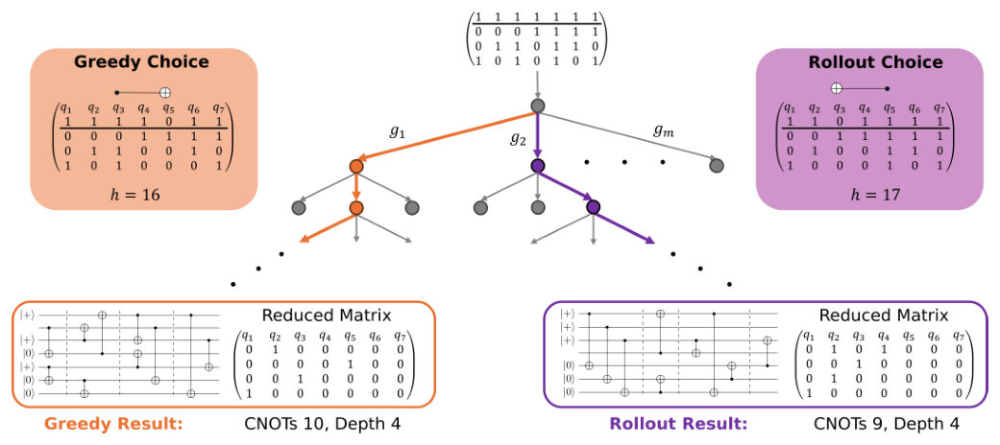
<figcaption class="paper-figure-caption"><b>Fig 1.</b> FIG. 2: Encoding circuit synthesis as state space search. Every state corresponds to an intermediate circuit and a stabilizer tableau, and states are connected via gate applications. Goal states represent valid implementations of the target encoding isometry. A heuristic score h is used to estimate the cost of synthesizing the remaining circuit for a given node. The orange path is obtained by greedily choosing the gate that minimizes h. The purple path is obtained by performing this greedy synthesis from the second-best node on the second level. The rollout approach fully expands the greedy path of both states and picks the best one. This results in the rollout search picking the purple...</figcaption>
</figure>
<figure class="paper-figure-card">
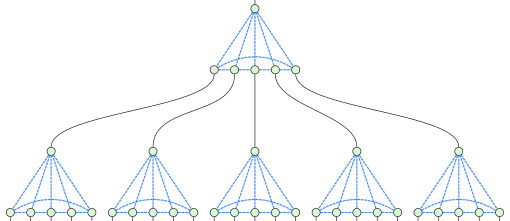
<figcaption class="paper-figure-caption"><b>Fig 2.</b> FIG. 4: Encoding circuit synthesis of the J25, 1, 9K concatenated J5, 1, 3K code. (a) The ZX-diagram for the 25-qubit encoder is constructed by connecting the outputs of one copy of the 5-qubit encoding isometry with the inputs of five more copies of the 5-qubit encoder. (b) An encoding circuit is constructed by replacing each 5-qubit encoding diagram with a circuit extracted from the isometry.</figcaption>
</figure>
<figure class="paper-figure-card">
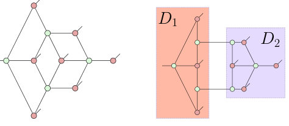
<figcaption class="paper-figure-caption"><b>Fig 3.</b> FIG. 5: (a) ZX-diagram of the encoding isometry of the J7, 1, 3K Steane code. (b) Partitioning of the Steane en- coder into two smaller encoding isometries.</figcaption>
</figure>
<figure class="paper-figure-card">
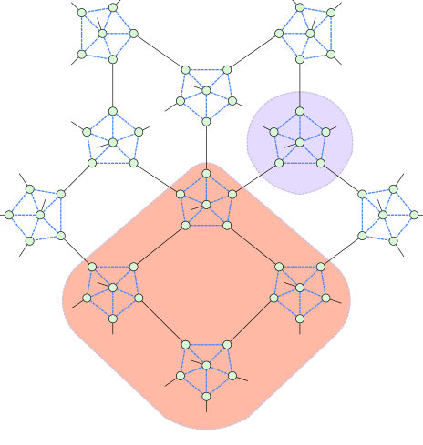
<figcaption class="paper-figure-caption"><b>Fig 4.</b> FIG. 6: ZX-diagram of a holographic HaPPY [29] code. Logical (bulk) input legs are connected to the center spi- ders of the constituent five-qubit encoding isometries, while physical output (boundary) legs are connected to the outer spiders. The highlighted subdiagrams illus- trate two constituent local encoding isometries: a smaller 2-input-4-output block (blue) and a larger 4-input-12- output block (orange).</figcaption>
</figure>
<figure class="paper-figure-card">
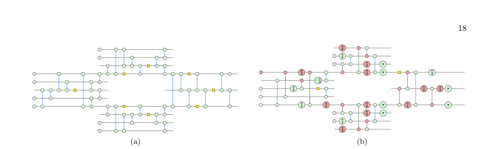
<figcaption class="paper-figure-caption"><b>Fig 5.</b> FIG. 7: Encoding circuits for the 12-qubit HaPPY code obtained from two modular synthesis strategies. (a) Circuit obtained by directly extracting local encoding circuits from the constituent sub-isometries, requiring 32 two-qubit gates. (b) Circuit obtained by optimally resynthesizing the local constituent encoders, reducing the gate count to 20 two-qubit gates at depth 10. For comparison, direct rollout-based resynthesis of the full 12-qubit encoder yields a circuit with 22 two-qubit gates at depth 9 when optimizing for gate count, and a circuit with 24 two-qubit gates at depth 8 when optimizing for depth. This illustrates the trade-off between modular exact local synthesis and full...</figcaption>
</figure>

**Summary.** This paper presents advanced algorithmic techniques for synthesizing the quantum circuits needed to prepare arbitrary logical states in fault-tolerant quantum computation. By formulating the problem as a search over stabilizer tableaus, the authors introduce greedy and rollout algorithms that significantly reduce the required two-qubit gate count and circuit depth. This optimization is crucial for making large-scale quantum error correction schemes practical.

**Why it may be interesting.** While focused on quantum computation, the rigorous algorithmic development using search heuristics (greedy, rollout) and formal verification (SMT/ZX-calculus) provides transferable computational techniques applicable to optimizing complex quantum state preparation protocols in AMO physics.

Detailed structure

**Main problem.** The core problem is synthesizing and optimizing efficient quantum circuits required to prepare arbitrary logical states for fault-tolerant quantum computation.

**Main result.** The proposed methods achieve significant improvements (up to 43% in two-qubit gate count and 70% in depth) over existing techniques for encoding state preparation in various stabilizer codes.

**Method.** The authors develop algorithms based on searching over stabilizer tableaus, utilizing greedy and rollout-based heuristics, and employing SMT solvers for optimal local circuit synthesis.

**Model / system.** The work focuses on quantum error-correcting codes (e.g., holographic and qLDPC codes) and models the encoding process as realizing a specific isometry using Clifford quantum gates.

**Key observables.** Two-qubit gate count, circuit depth, and the structure of the stabilizer tableau.

**Important parameters / regimes.** The size and structure of the stabilizer code (e.g., J23, J144), and the rollout level ($\ell$).

**Assumptions / limitations.** The synthesis is modeled as a search over stabilizer tableaus, and the heuristic search relies on the assumption that the optimal circuit can be found by local greedy or rollout decisions.

**Figures summary.** Figures illustrate the ZX diagram representations of encoding isometries and compare the performance of greedy vs. rollout synthesis under varying early termination settings for optimizing gate count and depth.

**Paper structure.** The paper progresses from defining the problem (encoding isometries) to developing search algorithms (greedy/rollout) over stabilizer tableaus, optimizing for gate count and depth, and finally analyzing the impact of search termination strategies.

Abstract

Preparing arbitrary logical states is a central primitive for universal fault-tolerant quantum computation and the cost of encoded-state preparation contributes directly to the overall resource overhead. This makes the synthesis of efficient general-state encoding circuits an important problem, particularly with respect to two-qubit gate count and circuit depth. Yet the synthesis of such encoders has been studied less extensively than general Clifford circuit synthesis or the preparation of specific logical Pauli-eigenstates. In this work, we develop methods for synthesizing efficient encoders for arbitrary stabilizer codes. We formulate encoder synthesis as a search over stabilizer tableaus and introduce greedy and rollout-based algorithms that exploit the freedom among stabilizer-equivalent realizations of the same encoding isometry. For code families with a modular structure, such as generalized concatenated and holographic codes, we show how large encoders can be assembled from optimized local constituent encoders, and we use SMT-based exact synthesis to obtain optimal local circuits for small instances. We further evaluate the proposed methods on a broad set of stabilizer codes, including holographic and quantum low-density parity-check (qLDPC) codes, and compare them against recent encoder-synthesis methods and existing constructions from the literature, obtaining improvements of up to 43% in two-qubit gate count and up to 70% in depth. Our results support the optimization of encoded-state preparation in several fault-tolerant quantum-computing schemes, and all methods are openly available as part of the Munich Quantum Toolkit.

[↑ back to top](#top)

## Secondary cond-mat archives

*Papers from cond-mat.mtrl-sci, mes-hall, other, soft, supr-con. These archives are de-prioritized — they appear at the end regardless of relevance score.*

### Relevant in secondary archives (28)

### [Acoustic spin resonance in polariton condensates](http://arxiv.org/abs/2605.16236v1)

**Authors:** D. A. Saltykova, A. Kudlis, A. V. Yulin, I. A. Shelykh  
**Type:** theory · **Category:** other · **PDF:** <https://arxiv.org/pdf/2605.16236v1>  
**Analysis basis:** full PDF text, analyzed in chunks
**Topic relevance:** 🔥 `spintronics-quantum-optics interface` **4/5** · `analog quantum simulation` **3/5** · `correlated cavity matter` **3/5** · `driven-dissipative phase transition` **3/5** · `exotic spin models in light-matter` **3/5** · `non-equilibrium dynamics` **3/5** · `Keldysh / 2PI / non-Gaussian methods` **2/5** · `Tavis-Cummings & cavity-many-emitter` **2/5** · `correlated / nonlocal dissipation` **2/5** · `methods for driven-dissipative` **2/5** · `non-equilibrium universality` **2/5** · `entanglement & information structure` **1/5**

↔ Scroll figures horizontally

<figure class="paper-figure-card">
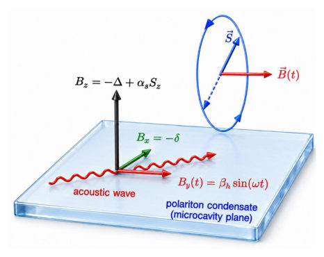
<figcaption class="paper-figure-caption"><b>Fig 1.</b> Figure 1. Geometry of acoustic spin resonance in a polariton condensate. A longitudinal acoustic wave prop- agating in the microcavity plane produces a time-periodic strain-induced effective magnetic field acting on the conden- sate pseudospin S. The static field contains the in-plane splitting Bx = −δ and the out-of-plane component Bz = −∆+ αsSz, which combines the Zeeman term and the self- induced field. In the resonant geometry used in the main sim- ulations, ϕ = π/4, the acoustic contribution is transverse to the static in-plane field and is written as By(t) = βh sin(ωt). The acoustic drive can therefore excite pseudospin precession on the Poincar´e sphere and generate large...</figcaption>
</figure>
<figure class="paper-figure-card">
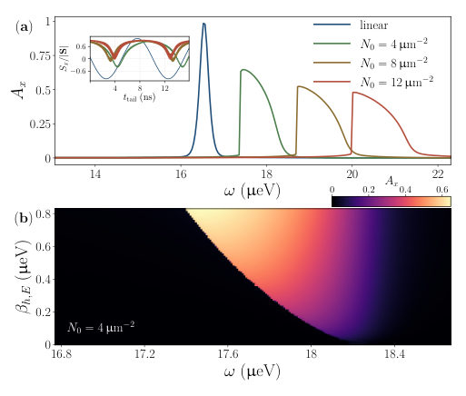
<figcaption class="paper-figure-caption"><b>Fig 2.</b> Figure 2. Conservative acoustic pseudospin resonance. Calculated from the conservative limit of Eq. (2), with gain, losses, reservoir coupling, lifetime anisotropy, Zeeman split- ting, and spin relaxation neglected. The acoustic wave prop- agates at ϕ = π/4, so that the acoustic field is transverse to the static in-plane splitting. We use E0 = 0.020678 meV, E0/h = 5.00 GHz, t0 = 31.83 ps, and δE = 16.54 µeV. The nonlinear curves are calculated with αs = 0.35, correspond- ing to αphys = 0.905 µeV µm2 and n(c) ∗ = 8.0 µm−2. The labels N0 = 4, 8, 12 µm−2 denote physical condensate densi- ties; the corresponding conserved dimensionless spin lengths are N0/n(c) ∗ = 0.5, 1.0, 1.5. (a) Frequency...</figcaption>
</figure>
<figure class="paper-figure-card">
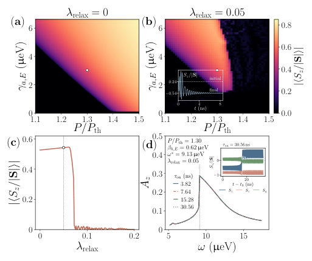
<figcaption class="paper-figure-caption"><b>Fig 3.</b> Figure 4. Bifurcated stationary state and resonant acoustic response induced by lifetime anisotropy. The calculations use ∆= 0, αs = 0.5, δE = 16.54 µeV, and E0 = 0.020678 meV. (a,b) Stationary maps of |⟨Sz/|S|⟩| in the (P/Pth, γa,E) plane without acoustic drive, for λrelax = 0 and λrelax = 0.05, respectively. The white markers indicate the same working point, P/Pth = 1.30 and γa,E = 3.03 µeV. The inset in panel (b) shows the relaxation toward the station- ary out-of-plane state at this working point. The branch used for the driven calculations is selected by an undriven prepara- tory relaxation at βh = 0, starting from (Sx, Sy, Sz, nR)(0) ≃ (0.12, 0, 0.03, 1.30), S(0) |S(0)| ≃ (0.970, 0,...</figcaption>
</figure>
<figure class="paper-figure-card">
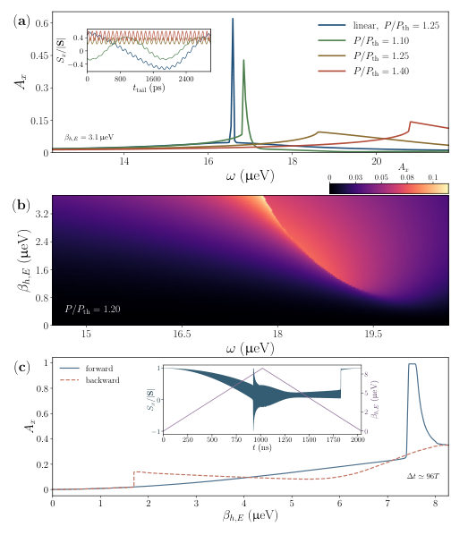
<figcaption class="paper-figure-caption"><b>Fig 4.</b> Figure 3. Dissipative acoustic response and slow- amplitude hysteresis. All panels are calculated from Eqs. (2)–(3) for the minimal pumped–dissipative specializa- tion with γa = ∆= 0, λrelax = 0.05, and ϕ = π/4. The nonlinear curves, maps, and sweeps use αs = 0.5; the blue curve in panel (a) is the linear reference (αs = 0). The di- mensional calibration is E0 = 0.020678 meV, so that E0/h = 5.00 GHz. The driven simulations are initialized from the un- driven linearly polarized pumped state (Sx, Sy, Sz, nR)(0) = (P −Pth, 0, 0, 1), in dimensionless units. (a) Frequency re- sponse Ax at fixed acoustic amplitude βh,E = 3.10 µeV. The blue curve is the linear reference at P/Pth = 1.25, while the...</figcaption>
</figure>
<figure class="paper-figure-card">
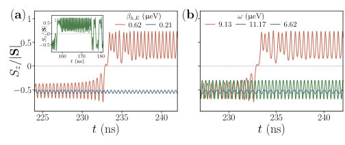
<figcaption class="paper-figure-caption"><b>Fig 5.</b> Figure 5. Time-domain acoustic switching in the bi- furcated regime. The working point is the one marked in Fig. 4: P/Pth = 1.30, γa,E = 3.03 µeV, and λrelax = 0.05, with smooth turn-on time τon = 30.56 ns. All driven traces start from the relaxed undriven stationary state selected by the preparatory protocol described in Fig. 4: (Sx, Sy, Sz, nR)(0) ≃(−1.610, 0.162, −1.046, 0.877), S(0) |S(0)| ≃ (−0.836, 0.084, −0.543). (a) Driven traces of Sz/|S| at the res- onant drive energy E0ω = 9.13 µeV for βh,E = 0.62 µeV and 0.21 µeV. The stronger drive produces switching between the two dissipative branches, whereas the weaker drive re- mains near the initial branch. The inset shows the switch- ing...</figcaption>
</figure>

**Summary.** This paper theoretically models acoustic spin resonance in polariton condensates, treating the system's pseudospin dynamics using coupled nonlinear equations. It shows that acoustic waves can drive large, nonlinear, and history-dependent oscillations in the condensate's polarization. The findings establish coherent acoustic driving as a powerful, tunable mechanism for controlling quantum spin states in these semiconductor microcavity systems.

**Why it may be interesting.** This work is highly relevant to AMO physics and quantum optics as it treats a complex, interacting many-body system (polaritons) using concepts from driven, damped, nonlinear oscillators, showing how external mechanical fields (acoustics) can control quantum coherence.

Detailed structure

**Main problem.** The paper theoretically investigates acoustic spin resonance in spinor polariton condensates, analyzing how time-periodic strain-induced acoustic fields drive polarization oscillations in the condensate pseudospin.

**Main result.** The study demonstrates that acoustic driving can induce resonant, nonlinear, and switchable control over the polariton pseudospin dynamics, with lifetime anisotropy enabling the switching between distinct stationary polarization states.

**Method.** The analysis involves deriving and solving coupled, nonlinear differential equations governing the pseudospin and reservoir density, examining both conservative and fully dissipative regimes.

**Model / system.** The system is a spinor polariton condensate in a semiconductor microcavity, modeled by an effective pseudospin $\mathbf{S}$ coupled to an excitonic reservoir density $n_R$. The dynamics incorporate static splitting, spin-dependent interactions, and a time-dependent acoustic driving field.

**Key observables.** Oscillation amplitude ($A_j(\omega)$), out-of-plane pseudospin component ($\langle S_z/|S| 
angle$), and the resonance frequency ($\omega$).

**Important parameters / regimes.** Static splitting ($\delta$), Zeeman splitting ($\Delta$), spin-dependent interaction ($\alpha_s$), acoustic amplitude ($eta_h$), and various decay/gain rates ($\gamma, \gamma_a$).

**Assumptions / limitations.** The analysis employs the single-mode approximation and often linearizes the dynamics around stationary states, though it also explores the full nonlinear, dissipative regime.

**Figures summary.** Figures illustrate the geometry of the resonance, the frequency response showing hysteresis in the dissipative regime, and time-domain traces demonstrating acoustic switching between bifurcated stationary states.

**Paper structure.** The paper systematically builds the model by deriving the full coupled equations, then analyzes the dynamics in the conservative limit, progresses to the minimal pumped-dissipative regime, and finally explores the effects of lifetime anisotropy and Zeeman tuning to show switchable control.

Abstract

We theoretically investigate acoustic spin resonance in a spatially homogeneous spinor polariton condensate. A longitudinal acoustic wave generates a time-periodic strain-induced effective magnetic field acting on the condensate pseudospin. When this field is transverse to the static in-plane linear-polarization splitting, it resonantly drives polarization oscillations. We show that spin-dependent interactions shift the resonance and produce nonlinear line shapes, while gain, reservoir dynamics, and spin relaxation make the response dissipative and history-dependent, producing amplitude hysteresis. In the presence of lifetime anisotropy, the condensate can develop a bifurcated stationary state with finite circular polarization, and a resonant acoustic drive can switch between the corresponding out-of-plane branches. A Zeeman splitting provides an additional conservative knob for tuning the resonance frequency. Our results identify coherent acoustic driving as a route to resonant, nonlinear, and switchable control of polariton pseudospin dynamics.

[↑ back to top](#top)

### [Front propagation in non-homogeneous $φ^4$ model](http://arxiv.org/abs/2605.15826v1)

**Authors:** Jacek Gatlik, Tomasz Dobrowolski, Dominika Lasa, Panayotis G. Kevrekidis  
**Type:** theory · **Category:** statistical mechanics · **PDF:** <https://arxiv.org/pdf/2605.15826v1>  
**Analysis basis:** full PDF text, analyzed in chunks
**Topic relevance:** 🔥 `Keldysh / 2PI / non-Gaussian methods` **4/5** · 🔥 `methods for driven-dissipative` **4/5** · `Frenkel-Kontorova` **3/5** · `driven-dissipative phase transition` **3/5** · `non-equilibrium dynamics` **3/5** · `non-equilibrium universality` **3/5** · `analog quantum simulation` **2/5** · `correlated / nonlocal dissipation` **2/5** · `Kondo & dissipative impurity` **1/5**

↔ Scroll figures horizontally

<figure class="paper-figure-card">
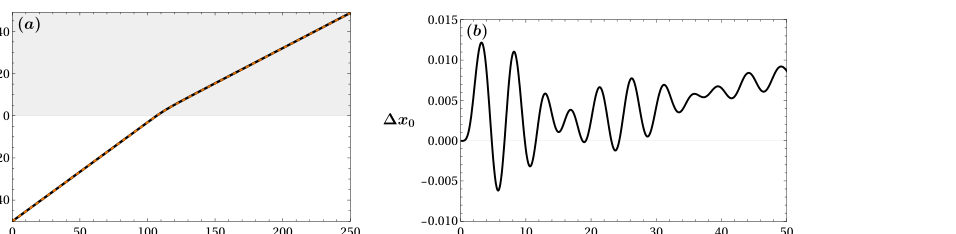
<figcaption class="paper-figure-caption"><b>Fig 1.</b> Figure 1: (a) Comparison of kink trajectories from the field equation (solid black line) and the effective model (orange dashed line). The gray area represents the time during which the kink moves in the area of changed dissipation. Panel (b) shows the difference ∆x0(t). Parameters are chosen as follows: x0 = −50, η0 = 0.1, Γ = 0.025, λ = 1, and ε = 0.05.</figcaption>
</figure>
<figure class="paper-figure-card">

<figcaption class="paper-figure-caption"><b>Fig 2.</b> Figure 2: Changes in kink velocity when entering an area of increased dissipation. In both panels, the initial position of the kink is x0 = −50. Parameters in the figures are chosen as follows η0 = 0.1, Γ = 0.025, λ = 1, (a) ε = 0.05, (b) ε = 0.1.</figcaption>
</figure>
<figure class="paper-figure-card">
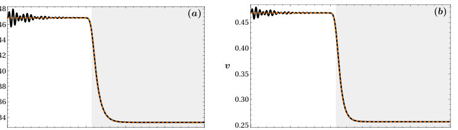
<figcaption class="paper-figure-caption"><b>Fig 3.</b> Figure 3 shows changes in the velocity of the kink as it passes through a layer with increased dissipation and thickness L0 = 20. The parameters on both panels were selected so that the initial speeds of the kink were significantly different, i.e., (a) η0 = 0.1, Γ = 0.025 and (b) η0 = 0.04, Γ = 0.02. As before, speed deviations from the effective model appear at the beginning. Depending on the initial speed, the kink velocity decreases markedly in the layer of increased dissipation. After damping the initial oscillations, the agreement between the effective model and the field model is fairly striking. It can be seen that on both panels, the change in dissipation is at the level of one...</figcaption>
</figure>
<figure class="paper-figure-card">
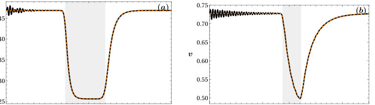
<figcaption class="paper-figure-caption"><b>Fig 4.</b> Figure 3: Changes in kink velocity when passing through a layer with increased dissipation. In the left panel, the initial position of the kink is x0 = −5, while in the right panel it is x0 = −100. The parameters on the panels are as follows (a) η0 = 0.1, Γ = 0.025, ε = 0.1 (b) η0 = 0.04, Γ = 0.02, ε = 0.04. On both panels L0 = 20 and λ = 1.</figcaption>
</figure>
<figure class="paper-figure-card">
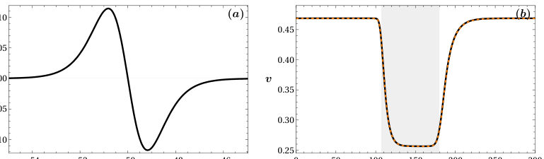
<figcaption class="paper-figure-caption"><b>Fig 5.</b> Figure 4: (a) Difference between the gradients of the stationary configuration and the initial condition (after shift- ing them to the same position) in case of constant dissipation η0 = 0.1, ε = 0 and Γ = 0.025. (b) Comparison of the kink velocity from field model (black line) and effective model (orange dashed line). The initial conditions in the field model were chosen based on the stationary solution. The parameters in this panel are identical to those in Fig. 3 (a) i.e., η0 = 0.1, ε = 0.1, Γ = 0.025 and x0 = −50.</figcaption>
</figure>

**Summary.** This work analyzes how topological fronts (kinks) propagate in media where physical parameters like dissipation change spatially. The authors develop and validate a sophisticated, modified effective model that successfully captures the complex velocity dynamics of the front, demonstrating a powerful method for simplifying complex field theories.

**Why it may be interesting.** The techniques used for deriving effective, low-dimensional descriptions of complex, dissipative, nonlinear wave phenomena are highly relevant to modeling open quantum systems or non-equilibrium dynamics in condensed matter.

Detailed structure

**Main problem.** The paper investigates the complex dynamics of front propagation (kinks and half-kinks) in a non-homogeneous medium governed by the $\phi^4$ model.

**Main result.** The authors successfully derived and proposed a modified effective model that accurately reproduces the field-theory results for the half-kink's velocity, even when passing through regions of varying dissipation.

**Method.** The study employs a combination of deriving effective Lagrangians from the full field equation and comparing the resulting equations of motion against numerical simulations of the PDE.

**Model / system.** The system is the classical $\phi^4$ model, described by a nonlinear partial differential equation that includes spatially varying dissipation $\eta(x)$ and potentially external forcing $\Gamma$.

**Key observables.** Kink/half-kink velocity ($v_0$), the difference between PDE and ODE solutions ($\Delta x_0(t)$), and the effective function $g(x_0)$ describing the dynamics.

**Important parameters / regimes.** Dissipation coefficients ($\eta_0, \epsilon$), external forcing ($\Gamma$), and system size ($\ell$).

**Assumptions / limitations.** The analysis relies on reducing the field dynamics to a few collective coordinates (kink position and width) and proposing specific ansatzes for the effective Lagrangian.

**Figures summary.** Figures compare kink trajectories and velocity changes between the full PDE model and various effective ODE models (1-DOF, 2-DOF, and modified), showing good quantitative agreement for the latter.

**Paper structure.** The paper progresses from analyzing the driven kink in unbounded domains, to developing effective models for the half-kink in finite systems, and finally proposing and validating a modified, single-degree-of-freedom effective model that matches field theory results.

Abstract

We investigate the propagation of fronts in an inhomogeneous medium within the framework of the $φ^4$ model. The inhomogeneity is modeled either as an interface separating regions with different dissipation or as a finite layer with modified dissipation. The propagating front is described in two ways: as a kink solution in an effectively unbounded domain, and as a half-kink in a finite system. The half-kink represents the decay of the unstable state $φ=0$ toward the true vacuum. We show that while the effective description based on the kink provides accurate results, applying a similar approach to the half-kink leads to significant deviations from the predictions of the field model. We then demonstrate that a consistent description does exist and propose a modified effective model which reproduces the field-theory results over a relatively broad range of parameters.

[↑ back to top](#top)

### [Optimized near-field optical response via adaptive tip illumination](http://arxiv.org/abs/2605.15900v1)

**Authors:** Tao Chen, Wei Wang, Ziyang Gan, Daniel Repp, Jinxin Zhan, Antony George, Henrik Schneidewind, Ulf Peschel, Andrey Turchanin, Volker Deckert  
**Type:** experiment · **Category:** other · **PDF:** <https://arxiv.org/pdf/2605.15900v1>  
**Analysis basis:** full PDF text, analyzed in chunks
**Topic relevance:** 🔥 `interference shaping light` **4/5** · 🔥 `quantum measurements` **4/5** · `measurement-induced transitions` **1/5** · `methods for driven-dissipative` **1/5** · `quantum optics experiment` **1/5**

↔ Scroll figures horizontally

<figure class="paper-figure-card">
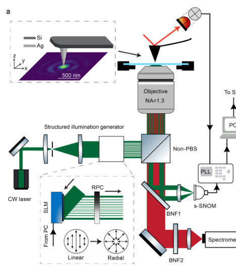
<figcaption class="paper-figure-caption"><b>Fig 1.</b> Fig. 1: Adaptive-optimization scheme for s-SNOM and TERS.</figcaption>
</figure>
<figure class="paper-figure-card">
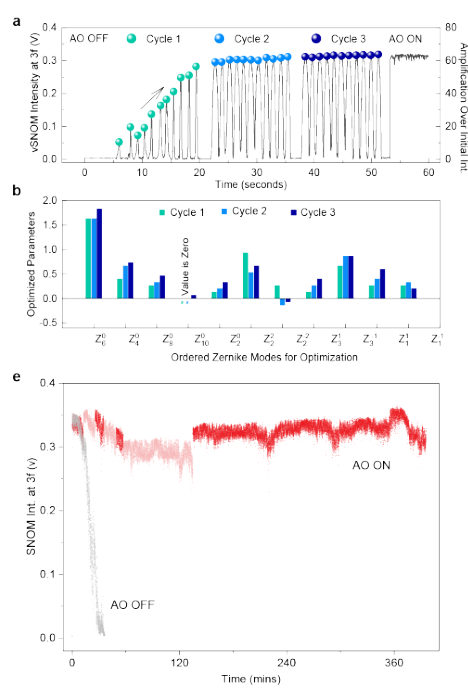
<figcaption class="paper-figure-caption"><b>Fig 2.</b> Fig. 2: Adaptive optimization and stabilization of the longitudinal near field.</figcaption>
</figure>
<figure class="paper-figure-card">
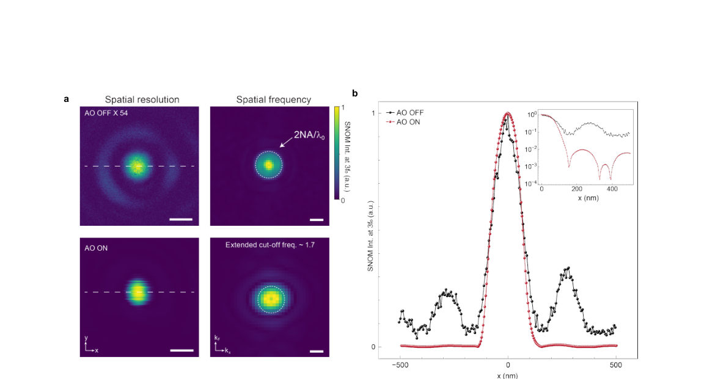
<figcaption class="paper-figure-caption"><b>Fig 3.</b> Fig. 3: Real-space and k-space mapping of the longitudinal near field before and after adaptive optimization.</figcaption>
</figure>
<figure class="paper-figure-card">
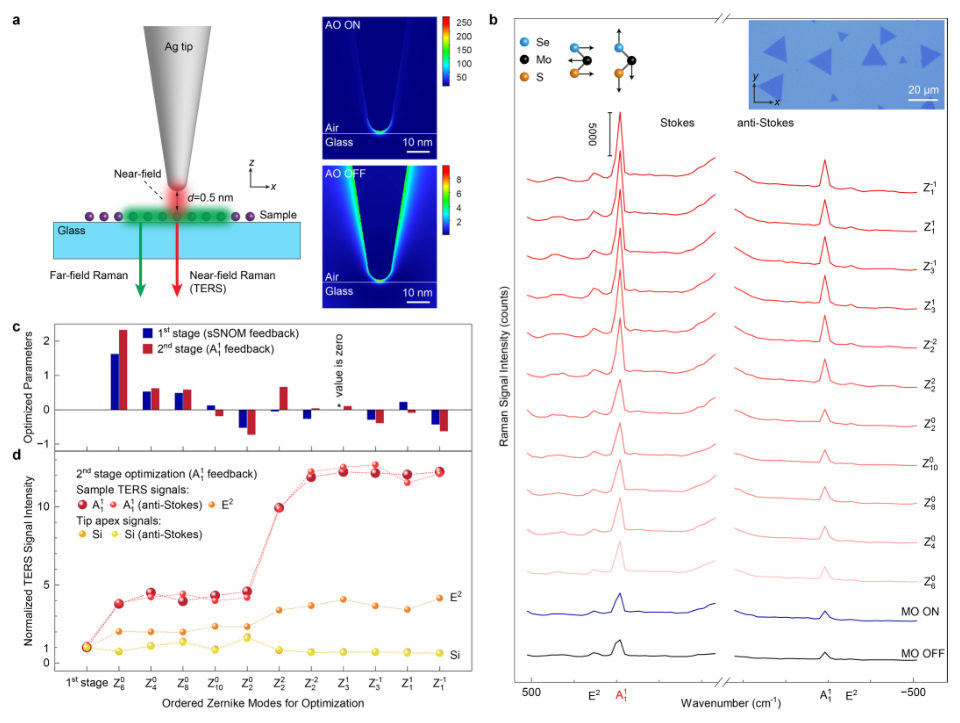
<figcaption class="paper-figure-caption"><b>Fig 4.</b> Fig. 4: TERS enhancement of a MoSSe monolayer using a two-step adaptive optimization.</figcaption>
</figure>

**Summary.** This paper introduces an adaptive optics approach using Zernike modes to optimize the excitation field in tip-enhanced near-field spectroscopy. By employing a sequential feedback loop based on the measured signal, the authors achieve substantial, systematic enhancements in the TERS signal. This establishes a robust, optics-based framework for improving nanoscale optical measurements.

**Why it may be interesting.** The work demonstrates advanced control over light fields at the nanoscale using wavefront shaping, which has direct implications for developing next-generation quantum optical sensors or characterization tools.

Detailed structure

**Main problem.** The performance of tip-enhanced optical microscopy (TERS) is limited by inefficient excitation field coupling and optical aberrations at the plasmonic tip apex.

**Main result.** Implementing adaptive wavefront shaping using Zernike modes allows for systematic field optimization, leading to significant TERS signal enhancements of 5 to 15 fold compared to conventional methods.

**Method.** A sequential feedback algorithm is employed, iteratively adjusting the wavefront via a Spatial Light Modulator (SLM) based on either the near-field s-SNOM signal or the intensity of a specific Raman band.

**Model / system.** The experiment uses a plasmonic tip (e.g., Ag tip) coupled with a high-NA objective for near-field spectroscopy (s-SNOM/TERS) on samples like Janus MoSSe monolayers.

**Key observables.** Raman enhancement factor (E_F), s-SNOM signal intensity, and the structured phase/intensity distribution at the back-pupil plane.

**Important parameters / regimes.** Zernike mode coefficients, objective numerical aperture (1.3 N.A.), and the two-step optimization sequence (s-SNOM $
ightarrow$ Raman band).

**Assumptions / limitations.** The Zernike mode basis provides a physically interpretable and comprehensive control over the wavefront, allowing for both aberration correction and active field engineering.

**Figures summary.** Figures illustrate the experimental setup, the simulated evolution of the optical intensity profile along the z-axis, the phase pattern generated by the SLM, and the resulting structured intensity distribution at the back-pupil plane.

**Paper structure.** The paper details the setup, presents the methodology of adaptive wavefront shaping using Zernike modes, demonstrates the optimization process using s-SNOM signals, and culminates in a two-step optimization strategy using the Raman signal for maximum TERS enhancement.

Abstract

The performance of tip-enhanced optical microscopy is often limited by inefficient coupling of the excitation field to the plasmonic tip apex, as well as by thermal drift and optical aberrations. Here, we demonstrate that adaptive wavefront shaping based on Zernike mode provides a practical approach to achieving robust near-field optimisation at the tip apex. Using a sequential feedback algorithm, initially using the near-field signal, we narrow the illumination point-spread function and suppress sidelobes. This demonstrates that Zernike-mode control can be used for both aberration correction and field engineering. In tip-enhanced Raman measurements of a Janus MoSSe monolayer, conventional near-field optimisation increases the signal intensity by around 1.4 fold. A second optimisation step based directly on the Raman-band intensity yields a further 5 to 15 fold enhancement, depending on the specific tips used. These results establish a systematic, optics-based strategy for optimising tip fields, providing a transferable framework for improving tip-enhanced and related near-field spectroscopies.

[↑ back to top](#top)

### [Layer-dependent Landé $g$-factors of electrons, holes, and excitons in two-dimensional Ruddlesden-Popper lead halide perovskites](http://arxiv.org/abs/2605.15807v1)

**Authors:** Nataliia E. Kopteva, Dmitri R. Yakovlev, Mikhail O. Nestoklon, Carolin Harkort, Evgeny A. Zhukov, Dennis Kudlacik, Erik Kirstein, Scott A. Crooker, Oleh Hordiichuk, Ole F. Dressler, Maksym V. Kovalenko, Manfred Bayer  
**Type:** both · **Category:** other · **PDF:** <https://arxiv.org/pdf/2605.15807v1>  
**Analysis basis:** full PDF text, analyzed in chunks
**Topic relevance:** 🔥 `spintronics-quantum-optics interface` **4/5** · `analog quantum simulation` **1/5** · `exotic spin models in light-matter` **1/5**

↔ Scroll figures horizontally

<figure class="paper-figure-card">
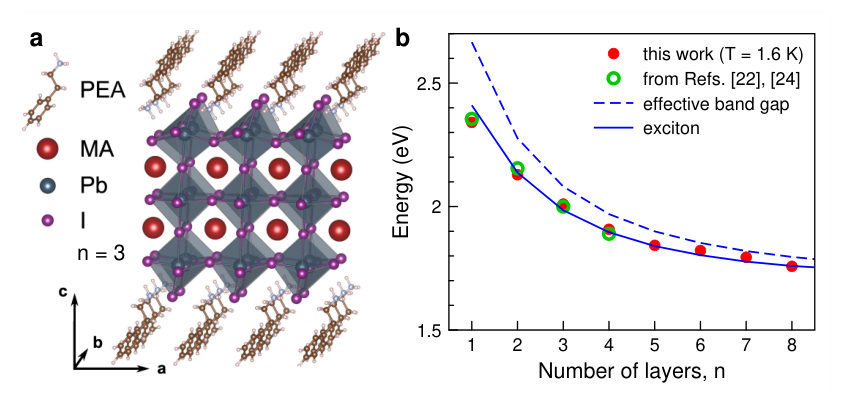
<figcaption class="paper-figure-caption"><b>Fig 1.</b> Figure 1. (a) Scheme of the atom arrangement in (PEA)2MA2Pb3I10 (n = 3). (b) Energies of the exciton resonances evaluated from reflectivity spectra of (PEA)2MAn−1PbnI3n+1 samples as function of the number of inorganic layers n at T = 1.6 K (red symbols). The calculated effective band gap energy and exciton energy are shown by the blue dashed and solid lines, respectively. The calculated exciton binding energy is taken from Ref. [28], accounting for the dielectric contrast and polaron effects. The open green symbols correspond to the measured exciton energies reported in Refs. [22, 24].</figcaption>
</figure>
<figure class="paper-figure-card">
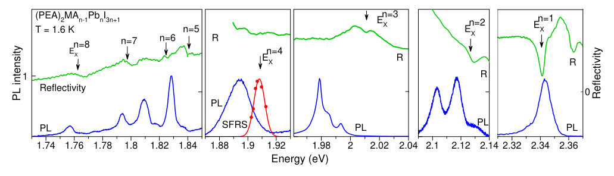
<figcaption class="paper-figure-caption"><b>Fig 2.</b> Figure 2. Optical properties of 2D perovskites (PEA)2MAn−1PbnI3n+1: photoluminescence (blue) and reflectivity (green) spectra measured at T = 1.6 K. The red symbols and line show the intensity of the SFRS signals for the sample with n = 4.</figcaption>
</figure>
<figure class="paper-figure-card">
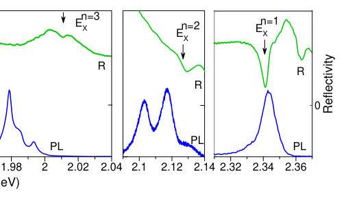
<figcaption class="paper-figure-caption"><b>Fig 3.</b> Figure 5a summarizes the electron and hole g- factors measured in the Voigt geometry on the (PEA)2MAn−1PbnI3n+1 samples. They are presented as function of the exciton energy, which reflects the effec- tive band gap tuned by the number of inorganic layers n. The experimental data obtained by SFRS (circles) and TRKR (crosses) show good agreement with each other. The electron and hole g-factors exhibit clear and system- atic dependences on n, in both the Voigt and Faraday geometries. The electron g-factor shows a systematic de- crease with increasing energy (i.e. with decreasing n), whereas the hole g-factor shows the opposite trend and increases monotonically with increasing energy. For...</figcaption>
</figure>
<figure class="paper-figure-card">
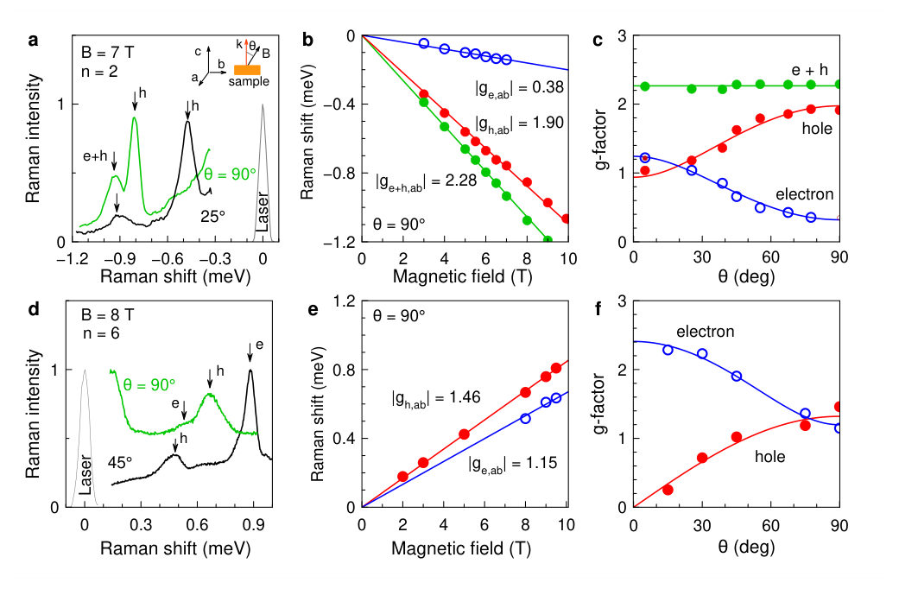
<figcaption class="paper-figure-caption"><b>Fig 4.</b> Figure 3. Spin-flip Raman scattering of electrons and holes in (PEA)2MAPb2I7 (n = 2) and (PEA)2MA5Pb6I19 (n = 6) at T = 1.6 K. (a) SFRS spectra measured at B = 7 T applied in the Voigt geometry (θ = 90◦, green) and tilted geometry (θ = 25◦, black) on the n = 2 sample. Eexc = 2.132 eV and P = 0.15 W/cm2. The spin-flips of hole (h) and combined e + h are indicated by the vertical arrows. The Sketch shows the experimental geometry. (b) Raman shifts of hole (red symbols) and combined e + h (green symbols) flips as function of magnetic field applied in the Voigt geometry (θ = 90◦) in the n = 2 sample. The electron Raman shifts are calculated from the difference of combined carrier and hole Raman...</figcaption>
</figure>
<figure class="paper-figure-card">
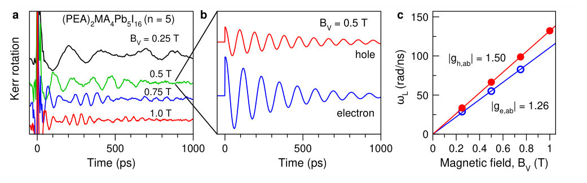
<figcaption class="paper-figure-caption"><b>Fig 5.</b> Figure 4. Spin dynamics of electrons and holes in (PEA)2MA4Pb5I16 (n = 5) measured by TRKR in the Voigt geometry at T = 1.6 K. (a) Spin dynamics in various magnetic fields. Eexc = 1.839 eV. (b) Hole (red) and electron (blue) contributions to the TRKR signal extracted from the dynamics at BV = 0.5 T by fitting the data with eq (5). (c) Dependence of the electron (blue symbols) and hole (red symbols) Larmor precession frequencies ωL,(e,h) on magnetic field. The lines are fits with eq (3) giving |ge,ab| = 1.26 and |gh,ab| = 1.50.</figcaption>
</figure>

**Summary.** This work experimentally and theoretically investigates how the Landé $g$-factors of charge carriers and excitons change in 2D Ruddlesden-Popper perovskites as the layer thickness is varied. The results confirm that quantum confinement significantly renormalizes these spin properties, providing a tunable platform for engineering spin-dependent quantum phenomena.

**Why it may be interesting.** The study provides quantitative data on spin properties in low-dimensional semiconductors, which is crucial for designing spintronic devices. The observed renormalization of $g$-factors due to quantum confinement is a key topic in condensed matter physics relevant to AMO/quantum optics.

Detailed structure

**Main problem.** To investigate the layer-dependent Landé g-factors of electrons, holes, and excitons in two-dimensional (2D) Ruddlesden-Popper lead halide perovskites.

**Main result.** The $g$-factors show a systematic dependence on layer thickness, deviating from bulk behavior and revealing confinement-driven trends. The exciton $g$-factor remains nearly constant across different layer numbers ($n>1$).

**Method.** The study combines experimental measurements (Spin-flip Raman scattering, Time-resolved Kerr rotation, and magneto-reflectivity) with theoretical calculations (Empirical Tight-Binding method).

**Model / system.** The physical system is 2D Ruddlesden-Popper lead halide perovskites, characterized by the composition $(	ext{PEA})_2	ext{M}_n	ext{Pb}_{n+1}	ext{I}_{3n+1}$. The investigation systematically varies the number of inorganic layers, $n$, from 1 to 8.

**Key observables.** Electron and hole Landé $g$-factors ($g_e, g_h$), exciton $g$-factors ($g_X$), and their anisotropy ($g_c$ vs $g_{ab}$).

**Important parameters / regimes.** Layer number ($n=1$ to $8$), magnetic field strength (up to 55 T), and exciton resonance energies (1.76 eV to 2.34 eV).

**Assumptions / limitations.** The analysis relies on fitting Zeeman splittings to extract $g$-factors, and theoretical calculations use the ETB model, which may not perfectly account for surface passivation effects.

**Figures summary.** Figures illustrate the systematic evolution of $g$-factors with $n$, showing confinement effects. Specific figures detail Zeeman splittings, Larmor precession frequencies, and comparisons between experimental and calculated $g$-factors for various layer thicknesses.

**Paper structure.** The paper systematically presents experimental measurements using magneto-optical techniques to determine $g$-factors for different $n$. These findings are then compared against theoretical predictions derived from the Empirical Tight-Binding method, establishing the role of quantum confinement.

Abstract

Two-dimensional Ruddlesden-Popper lead halide perovskites provide a valuable platform for tailoring charge and spin properties through quantum confinement and reduced symmetry. While the electron and hole Landé $g$-factors in bulk lead halide perovskites exhibit a universal dependence on the band gap energy, their evolution in two-dimensional perovskites has remained largely unexplored. Here, the Zeeman splittings of electrons and holes in (PEA)$_2$MA$_{n-1}$Pb$_n$I$_{3n+1}$ perovskites with the number of inorganic layers ovarying in the range $n=1,...,8$ are measured by means of the spin-flip Raman scattering and time-resolved Kerr rotation magneto-optical techniques. A systematic evolution of the electron and hole $g$-factors with decreasing layer thickness, which deviates from the universal bulk behavior and reveals confinement-driven trends similar to those observed in perovskite nanocrystals, is found. The experimental results are in good qualitative agreement with empirical tight-binding calculations. The exciton $g$-factors are evaluated from the Zeeman splittings of the exciton resonances in reflectivity measured in pulsed magnetic fields up to 55~T. These results provide comprehensive insight into the spin properties of two-dimensional lead halide perovskites and establish them as a tunable platform for engineering spin-dependent phenomena in quantum-confined semiconductors.

[↑ back to top](#top)

### [Quantum Geometry-Driven Nonlinear Spin Currents in Floquet Non-Hermitian Altermagnets](http://arxiv.org/abs/2605.15541v1)

**Authors:** Kai Chen, Jie Zhu  
**Type:** theory · **Category:** other · **PDF:** <https://arxiv.org/pdf/2605.15541v1>  
**Analysis basis:** full PDF text, analyzed in chunks
**Topic relevance:** `driven-dissipative phase transition` **3/5** · `non-equilibrium dynamics` **3/5** · `spintronics-quantum-optics interface` **3/5** · `exotic spin models in light-matter` **2/5** · `methods for driven-dissipative` **2/5** · `non-equilibrium universality` **2/5** · `Keldysh / 2PI / non-Gaussian methods` **1/5** · `Kondo & dissipative impurity` **1/5** · `analog quantum simulation` **1/5** · `correlated / nonlocal dissipation` **1/5**

↔ Scroll figures horizontally

<figure class="paper-figure-card">
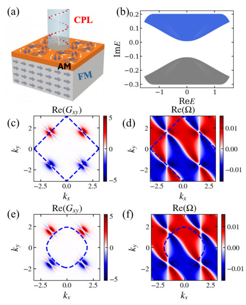
<figcaption class="paper-figure-caption"><b>Fig 1.</b> Fig. 1. (a) Schematic of the light-driven non-Hermitian alter- magnet. (b) Complex energy spectrum. (c), (d) Real part of the quantum metric gxy and Berry curvature Ωat chemical potential µ = 0. (e), (f) Same as (c) and (d) for µ = −0.5. Dashed blue lines indicate the Fermi surfaces originating from the blue band in (b). Parameters are set as t0 = 0.5, α = 0.2, λR = 0.01, Γ = 0.05, γ = 0.25, θ = π/4, ϕ = π/2, and ω = 10.</figcaption>
</figure>
<figure class="paper-figure-card">
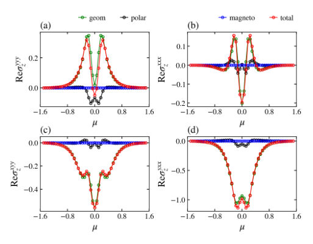
<figcaption class="paper-figure-caption"><b>Fig 2.</b> Fig. 2. Chemical potential dependence of the nonlinear spin conductivity. The real part of the nonlinear conductivity tensor components (a) Reσyyy z , (b) Reσxxx z , (c) Reσxyy z , and (d) Reσyxx z are plotted as a function of the chemical potential µ. The total response (red circles) is decomposed into geometric (green), polar (black), and magneto (blue) contributions. The numerical results are obtained using parameters: t0 = 0.5, α = 0.2, λR = 0.01, Γ = 0.05, γ = 0.25, θ = π/4, ϕ = π/2, ω = 10, T = 0.01, and A = 1.</figcaption>
</figure>
<figure class="paper-figure-card">
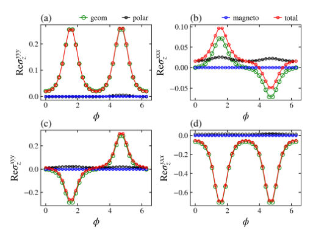
<figcaption class="paper-figure-caption"><b>Fig 3.</b> Fig. 3. Optical field’s polarization dependence of the nonlinear spin conductivity. The real part of the nonlinear conductivity tensor components (a) Reσyyy z , (b) Reσxxx z , (c) Reσxyy z , and (d) Reσyxx z are plotted as a function of the chemical potential µ. The total response (red circles) is decomposed into geometric (green), polar (black), and magneto (blue) contributions. The numerical results are obtained using parameters: t0 = 0.5, α = 0.2, λR = 0.01, Γ = 0.05, γ = 0.25, θ = π/4, µ = −0.3, ω = 10, T = 0.01, and A = 1.</figcaption>
</figure>

**Summary.** This work establishes a quantum geometric framework to analyze nonlinear spin transport in altermagnets driven by light. By modeling the system as a Floquet non-Hermitian structure, the authors derive that the spin current is governed by three geometric contributions. Crucially, they show that the optical field's polarization can actively control and reverse the spin current direction.

**Why it may be interesting.** The explicit derivation of spin transport coefficients using quantum geometry in a non-Hermitian, periodically driven setting provides powerful, tunable control mechanisms for spintronics, which is highly relevant to open quantum systems and quantum optics.

Detailed structure

**Main problem.** The paper aims to develop a quantum geometric framework to understand and control nonlinear spin currents in advanced magnetic materials, specifically in the context of non-Hermitian physics.

**Main result.** The nonlinear spin conductivity is found to be overwhelmingly dominated by the bare quantum metric, and the optical field's polarization can actively tune or even strictly reverse the direction of both longitudinal and transverse spin currents.

**Method.** The analysis involves deriving general analytical expressions for nonlinear spin currents using the Schrieffer-Wolff transformation and decomposing the conductivity into contributions from the quantum metric, Berry curvature, and Berry connection dipole.

**Model / system.** The system studied is a Floquet non-Hermitian d-wave altermagnet, which is modeled using a Hamiltonian incorporating kinetic, d-wave altermagnetic, and Rashba SOC terms, and subjected to periodic optical driving.

**Key observables.** Nonlinear Spin Current (J_s), Nonlinear Spin Conductivity Tensor (sigma), Quantum Metric (QM), Berry Curvature (Omega), and Berry Connection Dipole.

**Important parameters / regimes.** Periodic optical driving frequency ($\omega$), chemical potential ($\mu$), and optical field polarization ($\phi$).

**Assumptions / limitations.** The analysis assumes the system is in a line-gapped non-Hermitian phase and utilizes the high-frequency limit ($\omega \gg t_0$) for the Floquet effective Hamiltonian.

**Figures summary.** Figures illustrate the schematic of the light-driven non-Hermitian altermagnet, its complex energy spectrum, and plots showing the dependence of the real parts of the quantum metric and Berry curvature on chemical potential.

**Paper structure.** The paper systematically derives the intrinsic nonlinear spin conductivity tensor by applying the Schrieffer-Wolff transformation to the periodically driven Hamiltonian, decomposing the resulting tensor into three distinct, gauge-invariant geometric, magnetoelectric, and polarization terms.

Abstract

Altermagnets are rapidly emerging as a highly promising platform for spintronics, yet dynamically controlling their spin responses remains a fundamental challenge. In this work, we demonstrate that introducing periodic optical driving and non-Hermiticity provides a powerful route to achieve tunable control over these systems. We derive a general analytical expression for nonlinear spin currents in non-Hermitian phases with a spectral line gap, revealing that the intrinsic response cleanly separates into quantum metric, Berry curvature, and Berry connection dipole contributions. Applying this formalism to a Floquet non-Hermitian $d$-wave altermagnet, we uncover that the nonlinear spin conductivity is overwhelmingly dominated by the bare quantum metric. Furthermore, we show that the optical field's polarization can actively tune -- and even strictly reverse -- the direction of both longitudinal and transverse spin currents. Our work establishes a quantum geometric framework for the optical manipulation of nonlinear spin transport in advanced magnetic materials.

[↑ back to top](#top)

### [Disorder-driven symmetry suppression by van der Waals planar defects in a magnetic topological insulator](http://arxiv.org/abs/2605.15332v1)

**Authors:** Rikkie Joris, Heyi Xia, Ana Beatriz Pedro Fontes, Seul-Ki Bac, Sara Bey, Jiaqi Zhou, Zviadi Zarkua, Ahmed Samir Lotfy, Muhammad Saad, Philippe Ohresser, Margriet van Bael, Clement Merckling, Xinyu Liu, Francisco Molina-Lopez, Jean-Christophe Charlier, Jin Won Seo, Badih A. Assaf, Lino M. C. Pereira  
**Type:** both · **Category:** disordered systems and neural networks · **PDF:** <https://arxiv.org/pdf/2605.15332v1>  
**Analysis basis:** full PDF text, analyzed in chunks
**Topic relevance:** `exotic spin models in light-matter` **3/5** · `spintronics-quantum-optics interface` **3/5** · `analog quantum simulation` **2/5** · `Keldysh / 2PI / non-Gaussian methods` **1/5** · `driven-dissipative phase transition` **1/5** · `methods for driven-dissipative` **1/5** · `non-equilibrium dynamics` **1/5**

↔ Scroll figures horizontally

<figure class="paper-figure-card">
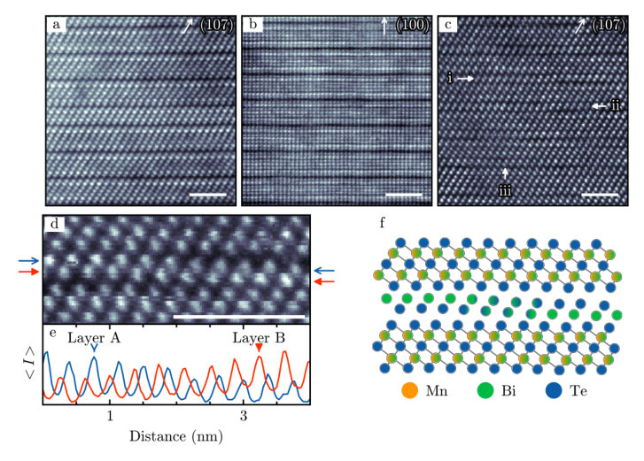
<figcaption class="paper-figure-caption"><b>Fig 1.</b> Figure 1: HAADF-STEM micrographs of (a) pristine, (b) lightly irradiated and (c) highly irradiated MnBi2Te4 films. Annotated on the high fluence irradiated micrograph are (i) a swapped bilayer, (ii) a detached bilayer stable in the vdW gap, and (iii) a ripplocation. Relevant crystallographic directions are given in the top right. (d) HAADF-STEM image of a swapped bilayer with (e) the average intensity of the layers within the bilayer over the lateral distance. (f) A diagrammatic representation of a swapped bilayer defect. The site occupancy and bonds indicated are schematic representations intended to guide the eye and should not be interpreted as quantitatively accurate. The chemical...</figcaption>
</figure>
<figure class="paper-figure-card">
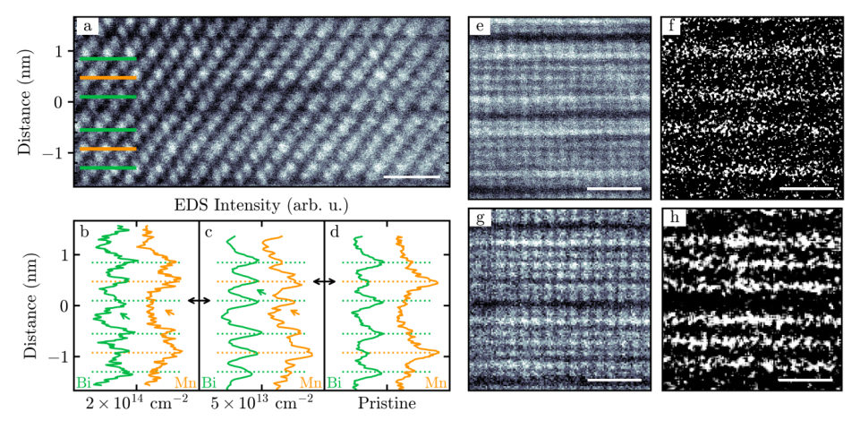
<figcaption class="paper-figure-caption"><b>Fig 2.</b> Figure 2: (a) STEM-image of a bilayer separating from a septuple layer after irradiation by a fluence of 2 × 1014 cm−2. (b, c, d) show EDS-intensities (intensity increasing from left to right) corresponding to the indicated fluence after integration along the horizontal direction. Dotted lines indicate cation planes which are also indicated on the STEM-image (a) as solid lines. Notable changes after irradiation are annotated, namely (b) the presence of Bi and negligible Mn in the detaching BL and (c) an increased cation intermixing after low fluence irradiation. Spatially resolved Bi Mα EDS maps and corresponding STEM micrographs are shown for the (e, f) pristine and (g, h) low fluence...</figcaption>
</figure>
<figure class="paper-figure-card">
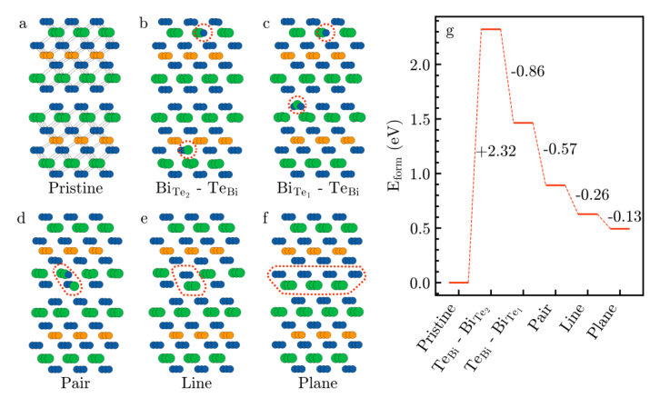
<figcaption class="paper-figure-caption"><b>Fig 3.</b> Figure 3: (a, b) Structural models and defect stability of Bi-Te defect configurations. (a–f) Side-view atomic models of the studied systems: (a) pristine structure, (b) BiTe2 antisite defect, (c) BiTe1 antisite defect, (d) defect pair, (e) linear defect cluster, and (f) planar defect arrangement. Red dashed circles (panels b, c) and areas (panels d–f) highlight the local structural modifications of the defects. (g) Calculated formation energy (Eform) in units of eV per pair for each configuration. The pristine system is used as the energy reference (0 eV). Dashed lines and numerical labels indicate the energy differences between successive defect states, illustrating the energy...</figcaption>
</figure>
<figure class="paper-figure-card">
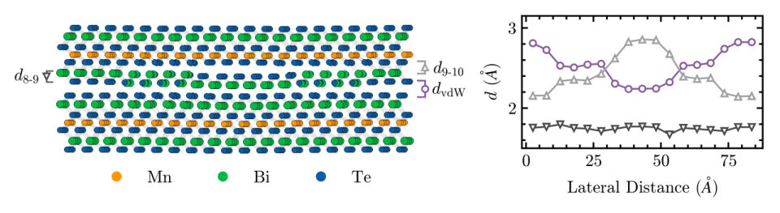
<figcaption class="paper-figure-caption"><b>Fig 4.</b> Figure 4: Structural relaxation of Bi-Te bilayer defects. (a) Relaxed supercell displaying pristine, partially intermixed, and fully bilayer swapped regions. Mn, Te, and Bi atoms are shown in orange, blue, and green, respectively. (b) Interlayer spacing d across the lateral distance of the relaxed structure. A contraction of the vdW gap (dvdW) is compensated by the expansion of the d9−10 spacing. The separation within the detaching bilayer (d8−9) remains constant throughout the swap, consistent with HAADF-STEM data.</figcaption>
</figure>
<figure class="paper-figure-card">
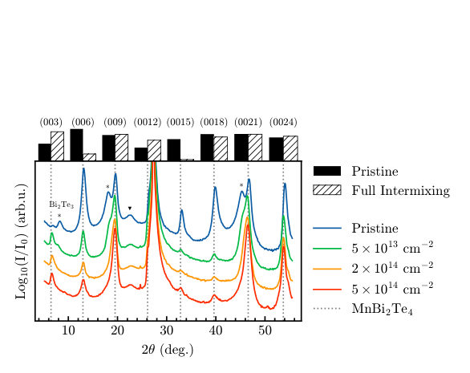
<figcaption class="paper-figure-caption"><b>Fig 5.</b> Figure 5: Diffractograms measured on pristine and irradiated films. Dotted lines indicate expected diffraction peaks for the pristine MnBi2Te4 structure. The asterisks indicate some Bi2Te3 diffraction peaks that are notable in the diffractograms. The triangle indicates a diffraction peak from the capping (see Methods). Top: Simulated XRD intensities shown in log-scale for the pristine and fully intermixed structure, as discussed in the main text.</figcaption>
</figure>

**Summary.** This work demonstrates that controlled ion irradiation can be used to engineer disorder in magnetic topological insulators ($	ext{MnBi}_2	ext{Te}_4$). By inducing planar defects, the researchers successfully tune the material's topological properties, specifically suppressing the anomalous Hall response by modifying the Berry curvature. This establishes defect engineering as a powerful tool for functionalizing these advanced quantum materials.

**Why it may be interesting.** The work provides a clear, controllable pathway to engineer topological properties in quantum materials using non-chemical means (ion beams), which is highly relevant for designing novel quantum devices.

Detailed structure

**Main problem.** The study investigates how controlled disorder, induced by ion irradiation, modifies the magnetic and topological properties of van der Waals magnetic topological insulators ($	ext{MnBi}_2	ext{Te}_4$).

**Main result.** Ion irradiation allows for the tuning of the topological phase by engineering defects, leading to the suppression of the anomalous Hall response by modifying the Berry curvature, while the material resists amorphization.

**Method.** The research combines experimental techniques like STEM, transport measurements, and magnetometry with advanced computational methods, including DFT and MLIPs, to model defect formation and structural changes.

**Model / system.** The physical system is the $	ext{MnBi}_2	ext{Te}_4$ magnetic topological insulator, which possesses a van der Waals layered structure. Disorder is introduced via controlled ion irradiation, creating point defects that aggregate into planar defects like swapped bilayers and ripplocations.

**Key observables.** Anomalous Hall response ($	ext{R}_{	ext{AHE}}$), magnetization ($M$), carrier type (p-type to n-type), and structural defect types (swapped bilayers, ripplocations).

**Important parameters / regimes.** Ion fluence (low vs. high), Displacements Per Atom (DPA), and the energy cost of defect formation ($E_{	ext{form}}$).

**Assumptions / limitations.** The analysis assumes that the observed structural changes are dominated by the self-organization of point defects into planar defects, and that the MLIP potential accurately captures the necessary $	ext{vdW}$ interactions.

**Figures summary.** Figures show STEM micrographs comparing pristine, low-fluence, and high-fluence states, detailing specific defects; DFT analysis maps dislocation patterns in the $ab$-plane; and XRD/magnetometry track changes in magnetic anisotropy and topological response.

**Paper structure.** The paper follows a structure of establishing the physical system and problem, detailing experimental characterization across different irradiation fluences, using computational modeling (DFT/MLIP) to explain defect formation thermodynamics, and finally linking structural disorder to measurable changes in topological and magnetic responses.

Abstract

Magnetic topological insulators offer a platform to control electronic topology through magnetic order, yet reliable routes to tune their properties remain limited. Here, we show that ion irradiation allows to modify the magnetic and the topological properties of the van der Waals magnetic topological insulator MnBi$_2$Te$_4$. Using inert ion beams, intrinsic defects are introduced via collision cascades without chemical doping. We identify two distinct regimes. At low fluence, cation antisite disorder leads to a near-complete redistribution of Bi over cation sites while preserving long-range crystallographic order, accompanied by a transition from $p$-type to $n$-type transport. At high fluence, cation-anion intermixing drives the formation of a previously unreported layer-disordered phase characterized by a high density of van der Waals-specific planar defects, including swapped bilayers. Despite significant structural disorder, the system retains partial periodic order up to high displacement levels. Magnetometry and X-ray spectroscopy show that the Mn high-spin state and antiferromagnetic interactions persist, while magnetic anisotropy is strongly reduced. At the same time, the anomalous Hall response is suppressed by over an order of magnitude, far exceeding the change in magnetization, indicating a direct modification of Berry curvature. These results establish ion irradiation as a means to tune topology through defect engineering and reveal a disorder-driven approach to control symmetry and electronic structure in van der Waals magnetic materials.

[↑ back to top](#top)

### [Reversible nanoscale patterning of WTe$_2$ with a scanning tunneling microscope](http://arxiv.org/abs/2605.15387v1)

**Authors:** Kevin Hauser, Danyang Liu, Berk Zengin, Jens Oppliger, Samuel Mañas-Valero, Catherine Witteveen, Fabian O. von Rohr, Jennifer E. Hoffman, Fabian D. Natterer  
**Type:** experiment · **Category:** other · **PDF:** <https://arxiv.org/pdf/2605.15387v1>  
**Analysis basis:** full PDF text, analyzed in chunks
**Topic relevance:** `driven-dissipative phase transition` **3/5** · `quantum measurements` **3/5** · `methods for driven-dissipative` **2/5** · `non-equilibrium dynamics` **2/5** · `measurement-induced transitions` **1/5**

↔ Scroll figures horizontally

<figure class="paper-figure-card">
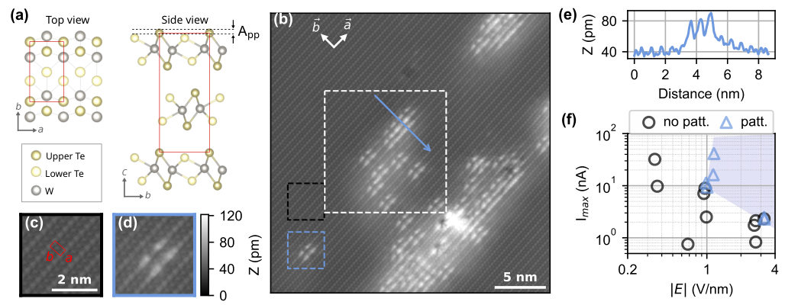
<figcaption class="paper-figure-caption"><b>Fig 1.</b> FIG. 1. Basic appearance of pattern. (a) Top and side view of WTe2 crystal structure. Unit cell is shown in red. We depict Te atoms at different heights in shades of yellow. The top view shows the W and Te atoms of the surface WTe2 layer. App illustrates the height difference between the upper and lower Te atoms at the surface. (b) Large topography showing both an unperturbed area and regions with patterns of various sizes. Recorded at a sample bias Vs =300 mV and set current Is =500 pA. The white dashed box indicates the region under analysis in Fig. 3. (c) and (d) show zoom-ins of the pristine WTe2 surface and the smallest unit of the created pattern, respectively. Locations are indicated...</figcaption>
</figure>
<figure class="paper-figure-card">
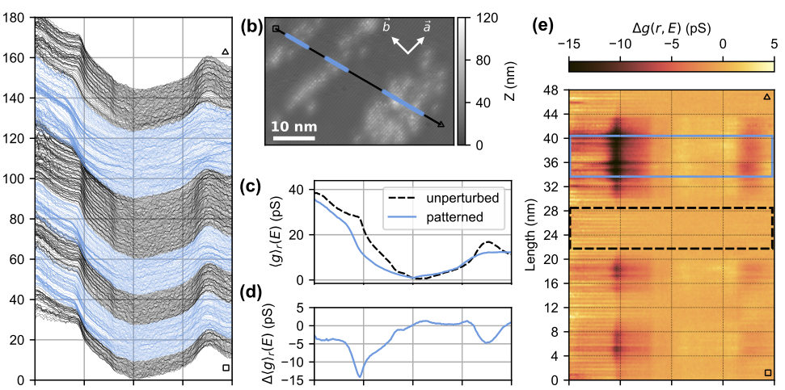
<figcaption class="paper-figure-caption"><b>Fig 2.</b> FIG. 2. Local density of states of the patterned WTe2 surface. (a) Waterfall plot of the measured differential conductance g(r, E). The blue shaded spectra indicate the location of the patterns determined by a depletion in LDOS at −400 meV (Details in Appendix D). The directionality is indicated by the black triangle and square on the right side, as well as in (b) and (e). (b) Location of spectra shown in (a). Blue segments correspond to the ones in (a). Topography was recorded with Vs =300 mV and Is =2 nA. (c) Spatially averaged conductance ⟨g⟩r(E) of the patterned and unperturbed regions highlighted by the dashed boxes in (e). (d) Difference in conductance between LDOS spectra in (c). (e)...</figcaption>
</figure>
<figure class="paper-figure-card">
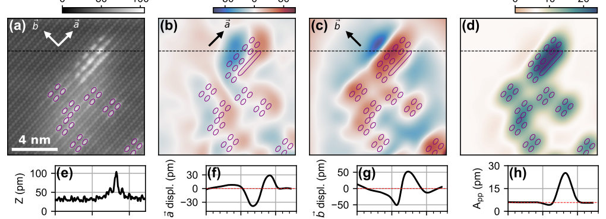
<figcaption class="paper-figure-caption"><b>Fig 3.</b> FIG. 3. Spatial lock-in analysis to resolve apparent lattice distortions. (a) Topography corresponding to white dashed rectangle in Fig. 1(c). The four tire tracks of the base patterns are marked by purple circles to provide a spatial reference between panels (a) to (d). Lattice directions ⃗a and ⃗b are indicated in the top left corner. (b) and (c) show apparent in-plane displacements along ⃗a and ⃗b, extracted via spatial lock-in analysis. The plotted displacement values are obtained from the spatial lock-in phase map by rescaling with the unit cell length of the respective lattice direction. Arrows indicate displacement direction. (d) Apparent variation in Te-height corrugation App,...</figcaption>
</figure>
<figure class="paper-figure-card">
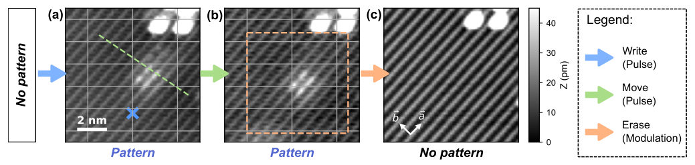
<figcaption class="paper-figure-caption"><b>Fig 4.</b> FIG. 4. Base pattern movement and deletion. (a) to (c) show constant-current topographies recorded after write (a), move (b), and erase (c) operations (green, blue, and orange arrows explained in the legend on the right). The blue cross and green dashed line in (a) indicate the location of the spectra used for pattern creation and movement. The orange dashed rectangle in (b) indicates the location of the erase operation. Grid lines are included in (a) and (b) to illustrate the movement of the pattern along the Te row. The bright white dots on the top right are surface contaminants that act as positional reference between topographies. Lattice directions ⃗a and ⃗b are indicated in panel (c)....</figcaption>
</figure>
<figure class="paper-figure-card">
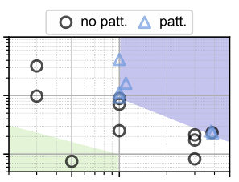
<figcaption class="paper-figure-caption"><b>Fig 5.</b> FIG. 5. Patterning-parameter map with the tip-sample bias Vs shown on the x-axis instead of the calculated electric field E (Fig. 1(f)). Blue-shaded region serves as guide to the eye where patterning is possible. The green-shaded region high- lights STM setpoint values used in previous studies.8,25,27,38</figcaption>
</figure>

**Summary.** This work reports on the successful demonstration of reversible, nanoscale patterning on WTe2 using scanning tunneling microscopy. By applying controlled current pulses, the researchers induced measurable atomic displacements and altered the local electronic structure. This technique provides a powerful, direct handle for manipulating the ferroelectric and topological properties of 2D quantum materials.

**Why it may be interesting.** The ability to write and erase quantum material properties at the nanoscale using electrical pulses provides a direct, controllable platform for studying emergent quantum phenomena, which is highly relevant for developing quantum devices.

Detailed structure

**Main problem.** The goal is to achieve persistent, reversible, nanoscale control over the electronic and structural phases of ferroelectric or Weyl semimetal quantum materials for use in low-power electronics.

**Main result.** The authors demonstrated that applying current pulses via STM can write and erase persistent nanometer-scale patterns on WTe2, inducing measurable atomic displacements and changes in the local density of states.

**Method.** The experiment utilizes Scanning Tunneling Microscopy (STM) in a bias spectroscopy mode, applying controlled current pulses to induce localized structural and electronic modifications.

**Model / system.** The physical system is Tungsten ditelluride (WTe2), a layered van der Waals material exhibiting both ferroelectric and Weyl semimetal candidate properties due to its Td crystal phase.

**Key observables.** Apparent picometer in-plane and out-of-plane atomic displacements, changes in the Local Density of States (LDOS), and the ability to observe distinct structural vs. electronic height signatures.

**Important parameters / regimes.** The patterning process requires high currents and electric fields, with displacements observed ($\sim\pm 50 	ext{ pm}$) being comparable to predicted ferroelectric switching shifts.

**Assumptions / limitations.** The study assumes that the observed structural and electronic changes are directly controllable by the applied current pulses, and it notes that the available energy resolution limits precise measurement near the Weyl point energy.

**Figures summary.** Figures illustrate the basic structure and induced patterns, LDOS spectra showing depletion/enhancement, and detailed maps showing apparent in-plane displacements along crystal axes ($\vec{a}$ and $\vec{b}$), alongside parameter maps guiding the patterning process.

**Paper structure.** The paper details the material synthesis methods, establishes the STM/STS measurement parameters, presents the experimental procedure using current pulses for writing/erasing, and analyzes the resulting structural and electronic signatures.

Abstract

Manipulating the lattice structure of ferroelectric quantum materials enables their use in low-power electronic devices, including field-effect transistors. WTe$_2$ is a Weyl-semimetal candidate and ferroelectric, both properties arising from the reduced crystal symmetry of its T$_\mathrm{d}$ ground state. The T$_\mathrm{d}$ crystal phase results from a Peierls distortion of the 1T parent structure and an interlayer shift. While experiments in WTe$_2$ have established ferroelectric switching and transient control of the predicted topological phase via ultrafast excitations, persistent electronic changes on the nanometer scale remain elusive. Here, we demonstrate that current pulses applied via scanning tunneling microscopy can both write and erase persistent nanometer-scale patterns on the surface of WTe$_2$. These patterns consist of apparent picometer in-plane and out-of-plane atomic displacements, accompanied by changes to the local density of states. The out-of-plane displacements further modulate the Peierls-like distortion present in WTe$_2$, while the in-plane displacements are indicative of ferroelectric switching. The induced patterns can be repositioned and erased, suggesting a nanoscale handle on the ferroelectric properties of WTe$_2$.

[↑ back to top](#top)

### [Tunable Crossed Andreev Reflection in Bipolar Magnetic Semiconductors](http://arxiv.org/abs/2605.15939v1)

**Authors:** Polireddi Naveen, Abhiram Soori  
**Type:** theory · **Category:** other · **PDF:** <https://arxiv.org/pdf/2605.15939v1>  
**Analysis basis:** full PDF text, analyzed in chunks
**Topic relevance:** `spintronics-quantum-optics interface` **3/5** · `Keldysh / 2PI / non-Gaussian methods` **1/5** · `Kondo & dissipative impurity` **1/5** · `analog quantum simulation` **1/5** · `driven-dissipative phase transition` **1/5** · `exotic spin models in light-matter` **1/5** · `methods for driven-dissipative` **1/5** · `non-equilibrium dynamics` **1/5**

↔ Scroll figures horizontally

<figure class="paper-figure-card">
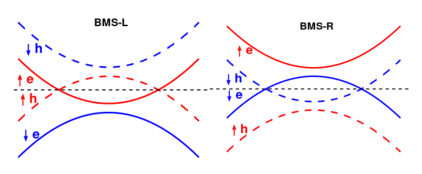
<figcaption class="paper-figure-caption"><b>Fig 1.</b> FIG. 2. Dispersion relations of the left and right BMS for µbl = −µbr = 4b. The red (blue) lines represent the up-spin (down-spin) electron channels, while the dotted lines corre- spond to the respective hole channels.</figcaption>
</figure>
<figure class="paper-figure-card">
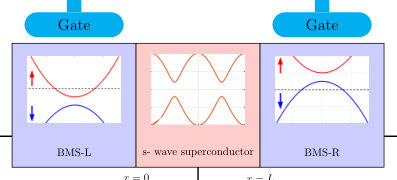
<figcaption class="paper-figure-caption"><b>Fig 2.</b> FIG. 1. Schematic illustration of the proposed device geom- etry, comprising a central s-wave superconductor sandwiched between two bipolar magnetic semiconductor leads. Indepen- dent, tunable gate voltages applied to each BMS electrode provide local control over the chemical potential. By tuning the respective Fermi energies such that the charge carriers participating in transport in the left and right leads possess opposite spin polarizations, crossed Andreev reflection is sig- nificantly enhanced while competing electron tunneling is nat- urally suppressed.</figcaption>
</figure>
<figure class="paper-figure-card">
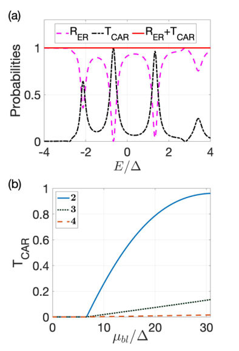
<figcaption class="paper-figure-caption"><b>Fig 3.</b> FIG. 3. (a) RER and TCAR vs energy for up spin incidence at µbl = −µbr = 11∆, µs = 50∆for θ = 0, b = 6.63∆, q0 = 7.07 √</figcaption>
</figure>
<figure class="paper-figure-card">
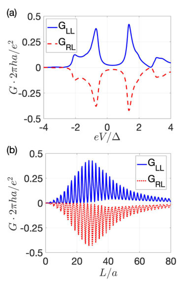
<figcaption class="paper-figure-caption"><b>Fig 4.</b> FIG. 4. (a) Local and nonlocal conductivities vs bias for up- spin incidence with L = 85a. (b) Conductivities as a function of superconducting length at V = 0. Parameters: b = 6.63∆, q0 = 7.07 √</figcaption>
</figure>

**Summary.** This theoretical work proposes using a heterostructure combining a superconductor with two Bipolar Magnetic Semiconductors (BMSs) to control quantum transport. By tuning the chemical potentials of the BMS leads to achieve opposite spin polarizations, the researchers demonstrate a purely electrical method to selectively enhance Crossed Andreev Reflection (CAR). This offers a promising platform for building spintronic and superconducting devices capable of manipulating nonlocal quantum correlations.

**Why it may be interesting.** The ability to use purely electrostatic means (tuning chemical potentials) to control superconducting correlations and spin-entangled transport is highly relevant for building quantum devices that interact with superconducting qubits or quantum memories.

Detailed structure

**Main problem.** The goal is to achieve tunable control over Crossed Andreev Reflection (CAR) in solid-state devices to manipulate nonlocal, spin-entangled electron pairs.

**Main result.** By independently tuning the chemical potentials of the two Bipolar Magnetic Semiconductor (BMS) leads to opposite signs, CAR can be selectively enhanced while suppressing competing processes like AR and ET.

**Method.** The analysis uses the Landauer-Büttiker scattering formalism applied to a coupled BMS-SC-BMS heterostructure.

**Model / system.** The system consists of a central s-wave superconductor (SC) coupled to two BMS leads. BMSs are characterized by spin-polarized conduction and valence bands, allowing for electrical control over spin alignment.

**Key observables.** Nonlocal conductivity ($	ext{G}_{	ext{RL}}$) and CAR transmission probability ($T_{	ext{CAR}}$), which are sensitive to the chemical potentials and SC length.

**Important parameters / regimes.** The chemical potentials ($\mu_{	ext{bl}}, \mu_{	ext{br}}$) are the primary tuning knobs, which can be set to opposite signs ($\mu_{	ext{bl}} = -\mu_{	ext{br}}$). The superconducting gap ($\Delta$) and SC length ($L$) are also critical parameters.

**Assumptions / limitations.** The model assumes normal incidence for conductivity calculations and relies on the ability to tune the chemical potentials independently to control spin polarization.

**Figures summary.** Figures illustrate the device schematic, dispersion relations, and show the dependence of CAR and ER probabilities on energy and chemical potential, as well as the oscillatory behavior of conductivities versus SC length.

**Paper structure.** The paper first introduces CAR and the BMS system, then develops the Hamiltonian and scattering formalism. It details the tunability mechanism by setting opposite chemical potentials, leading to the calculation of enhanced, controllable nonlocal transport phenomena.

Abstract

Crossed Andreev reflection (CAR) is a nonlocal quantum transport phenomenon that arises at the interface between a superconductor and two spatially separated metals. In this process, an electron incident from one metal combines with another electron originating from the other metal to form a Cooper pair in the superconductor. As a consequence, a hole is emitted into the second metal, establishing a nonlocal electron-hole conversion process. In contrast to local Andreev reflection -- where electron-to-hole conversion occurs within the same region -- CAR intrinsically links two spatially separated carriers, giving rise to nonlocal correlations and quantum entanglement. In bipolar magnetic semiconductors (BMSs), the conduction and valence bands possess opposite spin polarizations. We propose to achieve tunable control of CAR by independently adjusting the chemical potentials of the two regions. By engineering the alignment of spin-polarized bands in the two BMS leads, CAR can be selectively enhanced or suppressed. This tunability enables precise manipulation of nonlocal transport, and correlated electron dynamics, offering promising prospects for spintronic and superconducting device applications.

[↑ back to top](#top)

### [Universal Magnetic Structure Prediction from Atomic Coordinates with Near-Experimental Accuracy](http://arxiv.org/abs/2605.16230v1)

**Authors:** Abhijatmedhi Chotrattanapituk, Ryotaro Okabe, Eunbi Rha, Mariya Al-Hinai, Eugene Jiang, Daniel Pajerowski, Yongqiang Cheng, Joshua J. Turner, Mingda Li  
**Type:** theory · **Category:** disordered systems and neural networks · **PDF:** <https://arxiv.org/pdf/2605.16230v1>  
**Analysis basis:** full PDF text, analyzed in chunks
**Topic relevance:** `exotic spin models in light-matter` **3/5** · `spintronics-quantum-optics interface` **3/5** · `analog quantum simulation` **2/5** · `methods for driven-dissipative` **2/5**

↔ Scroll figures horizontally

<figure class="paper-figure-card">
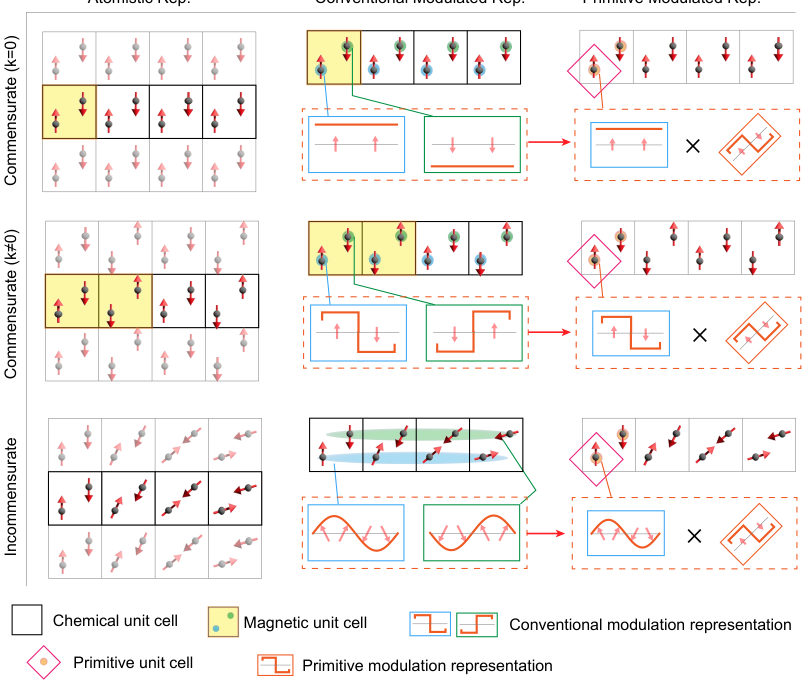
<figcaption class="paper-figure-caption"><b>Fig 1.</b> FIG. 1. Primitive Modulated Structure Representation (PMSR). Commensurate structures both with (middle row) and without (top row) non-zero propagation vectors (k) can be represented as periodic structures called magnetic unit cells that are rational multiples of their chemical unit cells. In contrast, by definition, there is no number of chemical unit cell that can capture the periodicity of incommensurate structures (bottom row). The modulated structure representation can captures the essences of all magnetic structure classes by, on top of embedding atomic sites in a unit cell with the magnetic moment vectors (m), providing how the magnetic moment vectors change (get modulated) when one...</figcaption>
</figure>
<figure class="paper-figure-card">
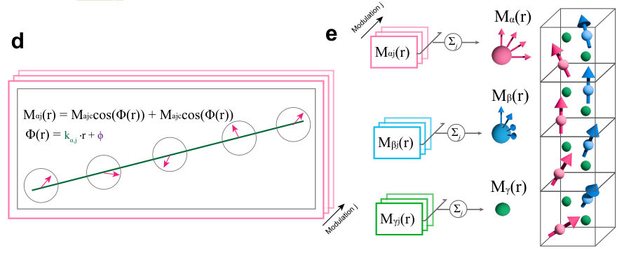
<figcaption class="paper-figure-caption"><b>Fig 2.</b> FIG. 2. Magnetic structure network (MSN). a) Construction of periodic graph of each material structure with atoms in a primitive chemical unit cell as nodes and edges defined only between neighboring atoms with interatomic distance under certain cut off radius rmax. b) E(3)-equivariant message passing with connections according to graph in a. c) Outputs of the model which can be divided into node level and graph level outputs which require extra aggregation from all nodes at the last layer of the model. The prediction of magnetic propagation vectors which are the properties of the whole structure uses the graph level output while the prediction of site-specific Fourier components uses the...</figcaption>
</figure>
<figure class="paper-figure-card">
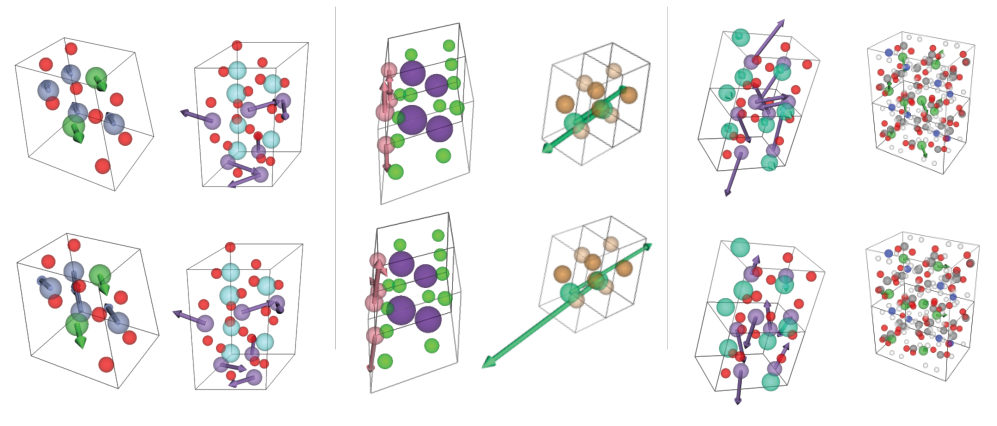
<figcaption class="paper-figure-caption"><b>Fig 3.</b> FIG. 3. Predicted magnetic structures. For each material (MAGNDATA ID, formula), the ground-truth structure from MAGNDATA (top) is shown alongside the model prediction (bottom). (a) Commensurate structures with zero propagation vector (k = 0). (b) Commensurate structures with a non-zero rational propagation vector. The visualization supercell is constructed from the ground-truth k-vector (expanding up to a factor of 2 per lattice direction) to make the spatial modulation of magnetic moments visible. (c) Incommensurate structures: the propagation vector has an irrational component, and the same supercell convention is applied for visualization. Moment directions are shown as arrows on each...</figcaption>
</figure>

**Summary.** This paper presents the Magnetic Structure Network (MSN), an E(3)-equivariant GNN designed to predict complex magnetic structures directly from atomic coordinates. It overcomes limitations in current methods by using the Primitive Modulated Structure Representation (PMSR) to unify the description of both simple and incommensurate magnetic orders. This provides a powerful, data-driven framework for accelerating the discovery of magnetic materials.

**Why it may be interesting.** While focused on magnetism, the use of E(3)-equivariant GNNs and advanced representation learning (PMSR) for complex physical states is highly relevant to developing ML tools for quantum materials simulation.

Detailed structure

**Main problem.** Determining the magnetic structure of materials is challenging due to costly experiments and the difficulty first-principles methods have with noncollinear or incommensurate magnetic orders.

**Main result.** The proposed Magnetic Structure Network (MSN) successfully predicts full magnetic structures directly from atomic coordinates with high fidelity across commensurate and incommensurate phases.

**Method.** The authors introduce the E(3)-equivariant Graph Neural Network (MSN) trained on experimental data, utilizing the Primitive Modulated Structure Representation (PMSR) to unify the description of all magnetic periodicities.

**Model / system.** The model targets magnetic crystalline materials, predicting magnetic order parameters (Fourier components and propagation vectors) from the underlying atomic crystal structure.

**Key observables.** Magnetic structure (collinear/non-collinear), propagation vectors (k), and site-specific magnetic moment Fourier components.

**Important parameters / regimes.** Training data size (MAGNDATA, >2,300 structures); the cutoff radius for graph construction.

**Assumptions / limitations.** The model assumes a Heisenberg-type description for magnetic interactions, neglecting explicit anisotropic spin interactions; it also handles mathematical ambiguities related to global phase/rotation freedom.

**Figures summary.** Figures illustrate the PMSR's ability to unify representations, the MSN's architecture (graph construction, E(3) message passing), and comparative predictions for $k=0$, rational $k
eq 0$, and irrational incommensurate $k$.

**Paper structure.** The paper first establishes the limitations of existing methods, then introduces the PMSR to standardize representation, details the E(3)-equivariant MSN architecture, and finally presents the training objectives and reconstruction process.

Abstract

Magnetic order is a fundamental property of materials, governing collective behavior and enabling a broad range of functionalities. Yet magnetic structure remains difficult to determine: experiments are costly and specialized, while first-principles methods often struggle with the noncollinear and incommensurate orders found in real materials. Here we introduce magnetic structure network (MSN), an E(3) equivariant graph neural network that predicts both collinear and non-collinear magnetic structures directly from atomic crystal structures, trained directly on experimentally determined structures from MAGNDATA. By proposing the primitive modulated structure representation (PMSR), we are able to encode commensurate and incommensurate structures in a unified way without symmetry assumptions. The model achieves strong performance across all modulation components and reconstructs experimental magnetic structures with high fidelity. Our approach provides a scalable framework for rapid magnetic structure prediction and opens a route to data-driven discovery of magnetic materials.

[↑ back to top](#top)

### [In-situ correlative SEM/KPFM for semiconductor devices and 2D heterostructures](http://arxiv.org/abs/2605.16062v1)

**Authors:** Prabhu Prasad Swain, Nahid Hosseini, Eveline. S Mayner, Aleksandra Radenovic, Marcos Penedo, Georg E. Fantner  
**Type:** experiment · **Category:** other · **PDF:** <https://arxiv.org/pdf/2605.16062v1>  
**Analysis basis:** full PDF text, analyzed in chunks
**Topic relevance:** `spintronics-quantum-optics interface` **3/5** · `Kondo & dissipative impurity` **1/5** · `analog quantum simulation` **1/5** · `driven-dissipative phase transition` **1/5** · `non-equilibrium dynamics` **1/5** · `quantum measurements` **1/5** · `quantum optics experiment` **1/5**

↔ Scroll figures horizontally

<figure class="paper-figure-card">
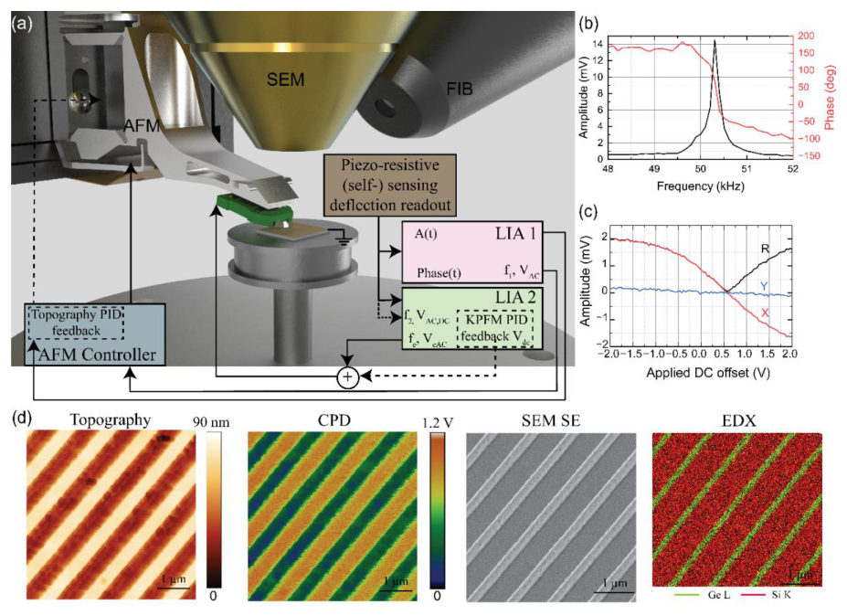
<figcaption class="paper-figure-caption"><b>Fig 1.</b> Fig. 1. In-situ KPFM inside SEM with piezo-resistive cantilever (a) 3D rendering of the</figcaption>
</figure>
<figure class="paper-figure-card">
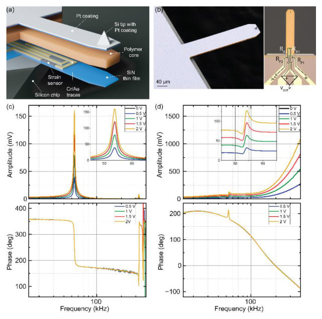
<figcaption class="paper-figure-caption"><b>Fig 2.</b> Fig. 2. In the piezo-resistive readout method, capacitive crosstalk affects KPFM</figcaption>
</figure>
<figure class="paper-figure-card">
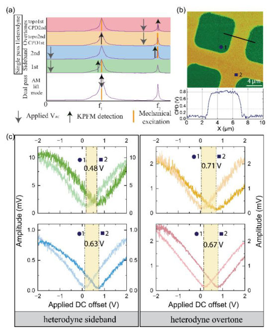
<figcaption class="paper-figure-caption"><b>Fig 3.</b> Fig. 3. Choice of the KPFM configuration to be used inside the vacuum chamber of the</figcaption>
</figure>
<figure class="paper-figure-card">
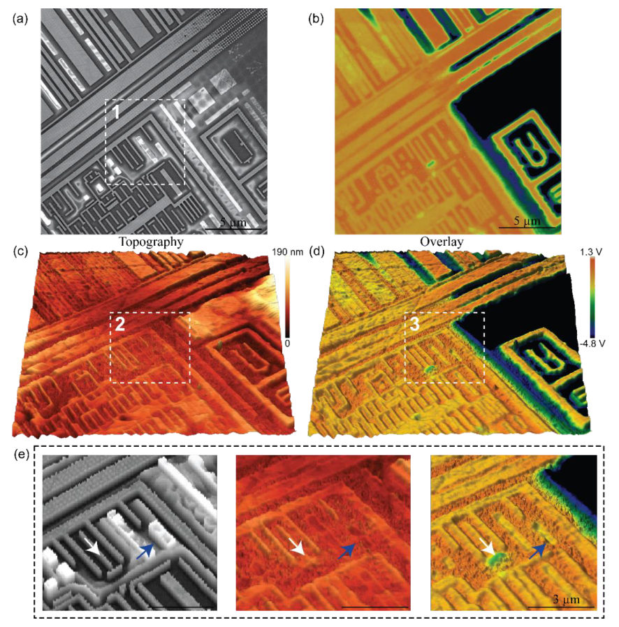
<figcaption class="paper-figure-caption"><b>Fig 4.</b> Fig. 4. Correlative KPFM-SEM analysis of semiconductor circuits. (a) SEM (secondary</figcaption>
</figure>
<figure class="paper-figure-card">
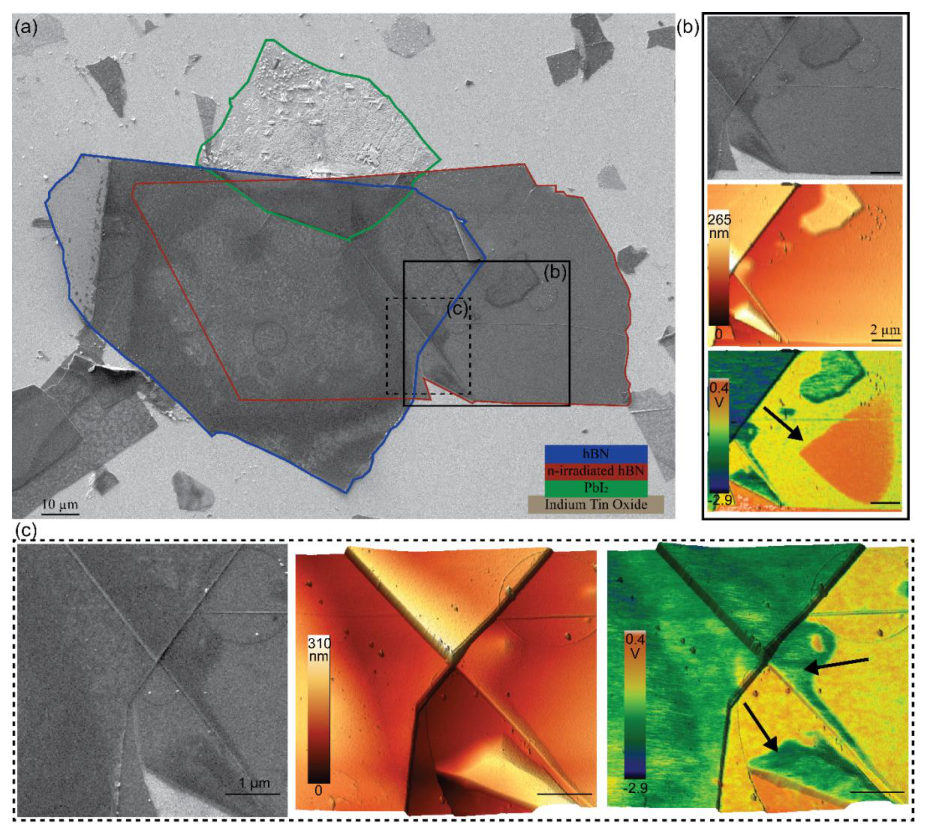
<figcaption class="paper-figure-caption"><b>Fig 5.</b> Fig. 5. Correlative KPFM-SEM analysis of 2D heterostructures deposited on an ITO</figcaption>
</figure>

**Summary.** This paper introduces a novel, robust technique for performing in-situ Kelvin Probe Force Microscopy (KPFM) inside a Scanning Electron Microscope (SEM). By employing single-pass heterodyne detection, the authors overcome capacitive crosstalk to simultaneously map surface topography and local electronic potential (CPD) on semiconductor devices and 2D heterostructures. This allows for unprecedented correlative analysis crucial for failure analysis and fundamental materials characterization.

**Why it may be interesting.** While highly experimental, the detailed analysis of surface potential shifts due to beam exposure (charge trapping, contamination) provides insights into surface physics and charge dynamics in nanoscale devices, which can inform models of open quantum systems interacting with noisy environments.

Detailed structure

**Main problem.** The primary challenge is achieving simultaneous, in-situ measurement of electronic and structural properties in advanced semiconductor and 2D heterostructure devices.

**Main result.** The authors successfully demonstrated a robust, versatile correlative imaging mode by implementing single-pass heterodyne KPFM inside an SEM, overcoming capacitive crosstalk.

**Method.** They utilized a single-pass heterodyne Kelvin probe force microscopy technique, demodulating excitation and detection signals to map topography and Contact Potential Difference (CPD) simultaneously.

**Model / system.** The work focuses on semiconductor circuits and 2D heterostructures (like hBN on ITO) analyzed using a self-sensing, piezoresistive cantilever setup integrated within an SEM.

**Key observables.** Topography, Contact Potential Difference (CPD), and elemental composition (via EDS).

**Important parameters / regimes.** CPD energy resolution of 1–20 meV; spatial resolution <10 nm; operation in vacuum environment.

**Assumptions / limitations.** The method assumes that heterodyne detection effectively decouples excitation and detection signals, mitigating capacitive crosstalk inherent to self-sensing cantilevers.

**Figures summary.** Figures illustrate the setup integration, the principle of heterodyne KPFM, and comparative maps showing correlated SEM/KPFM/Topography data on both semiconductor circuits and 2D heterostructures, including effects of electron beam exposure.

**Paper structure.** The paper progresses from establishing the need for correlative measurements, detailing the novel heterodyne KPFM technique to overcome crosstalk, demonstrating its application on 2D materials and circuits, and finally analyzing the complex influence of electron and ion beam exposure on the measured surface potential.

Abstract

Correlative nanoscale surface characterization benefits from simultaneously measuring electronic and structural properties in the same environment, a capability that is essential for modern-day materials science and semiconductor failure analysis. In-situ AFM-SEM measurements facilitated by self-sensing cantilevers offer great potential here; however, they are limited due to their inherent capacitive crosstalk. Here, we demonstrate for the first time the in-situ implementation of single-pass heterodyne Kelvin probe force microscopy inside a scanning electron microscope, using piezo-resistive cantilevers. We overcome the capacitive crosstalk prevalent in piezo-resistive cantilevers by demodulating excitation and detection to simultaneously map surface topography and contact potential difference for correlation with compositional analysis. We systematically compare different operational modes of this heterodyne technique, elucidating their spatial resolution, signal sensitivity, and signal-to-noise ratio. The integrated approach yields exceptional signal quality and reveals how electron beam scan parameters can directly influence surface potential contrast. We demonstrate this correlative analysis workflow on two-dimensional heterostructures and semiconductor circuits. This work establishes a robust and versatile correlative imaging mode for in-situ Kelvin force and topography imaging inside a scanning electron microscope for next-generation semiconductor device analysis and materials science.

[↑ back to top](#top)

### [Zitterbewegung velocity in semiclassical electron dynamics](http://arxiv.org/abs/2605.15292v1)

**Authors:** Dimitrie Culcer  
**Type:** theory · **Category:** other · **PDF:** <https://arxiv.org/pdf/2605.15292v1>  
**Analysis basis:** full PDF text, analyzed in chunks
**Topic relevance:** `Keldysh / 2PI / non-Gaussian methods` **3/5** · `methods for driven-dissipative` **3/5** · `non-equilibrium dynamics` **3/5**

↔ Scroll figures horizontally

<figure class="paper-figure-card">
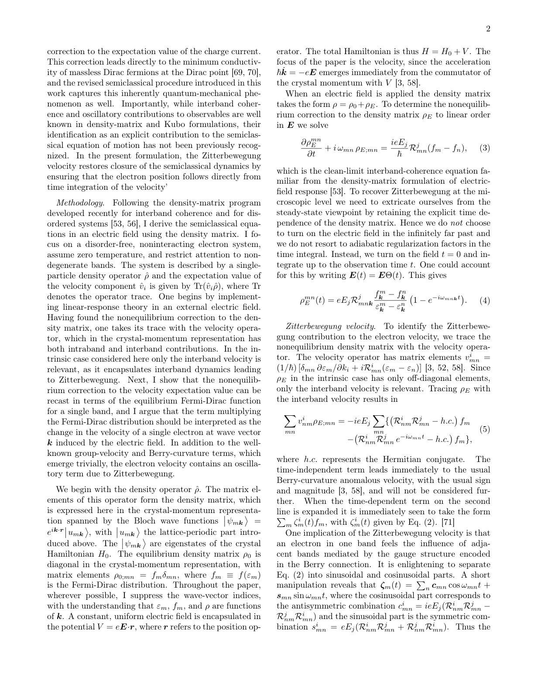
<figcaption class="paper-figure-caption"><b>Fig 1.</b> Low-resolution page preview, page 2</figcaption>
</figure>
<figure class="paper-figure-card">
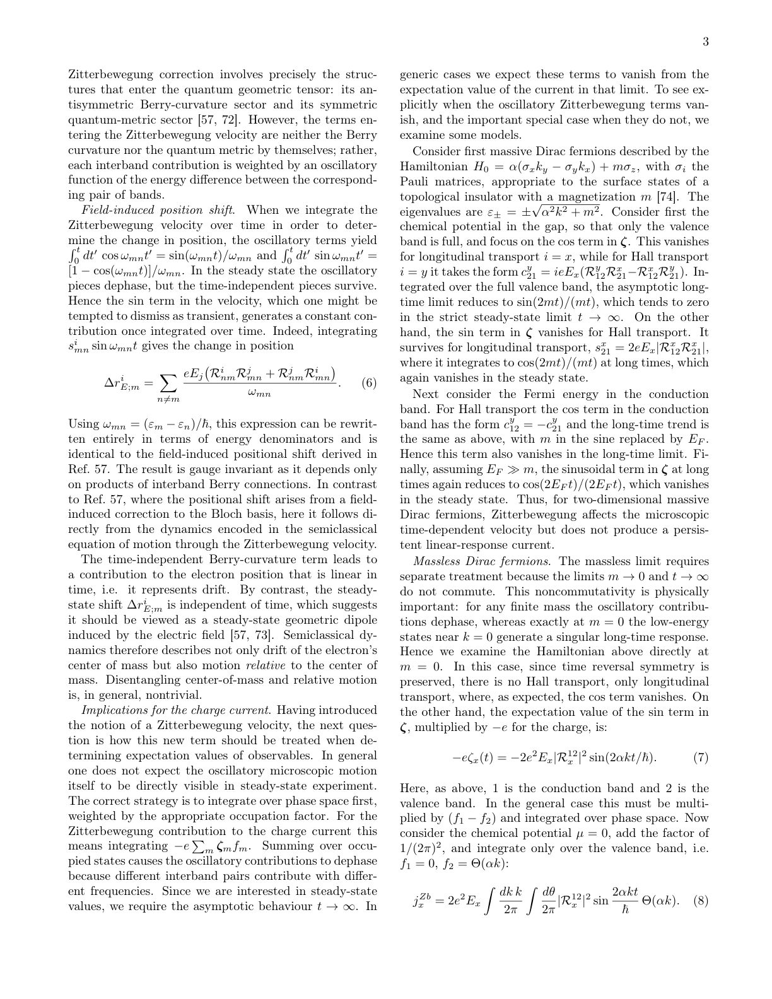
<figcaption class="paper-figure-caption"><b>Fig 2.</b> Low-resolution page preview, page 3</figcaption>
</figure>
<figure class="paper-figure-card">
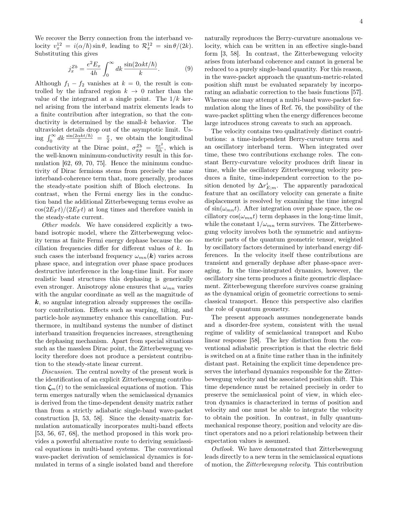
<figcaption class="paper-figure-caption"><b>Fig 3.</b> Low-resolution page preview, page 4</figcaption>
</figure>
<figure class="paper-figure-card">
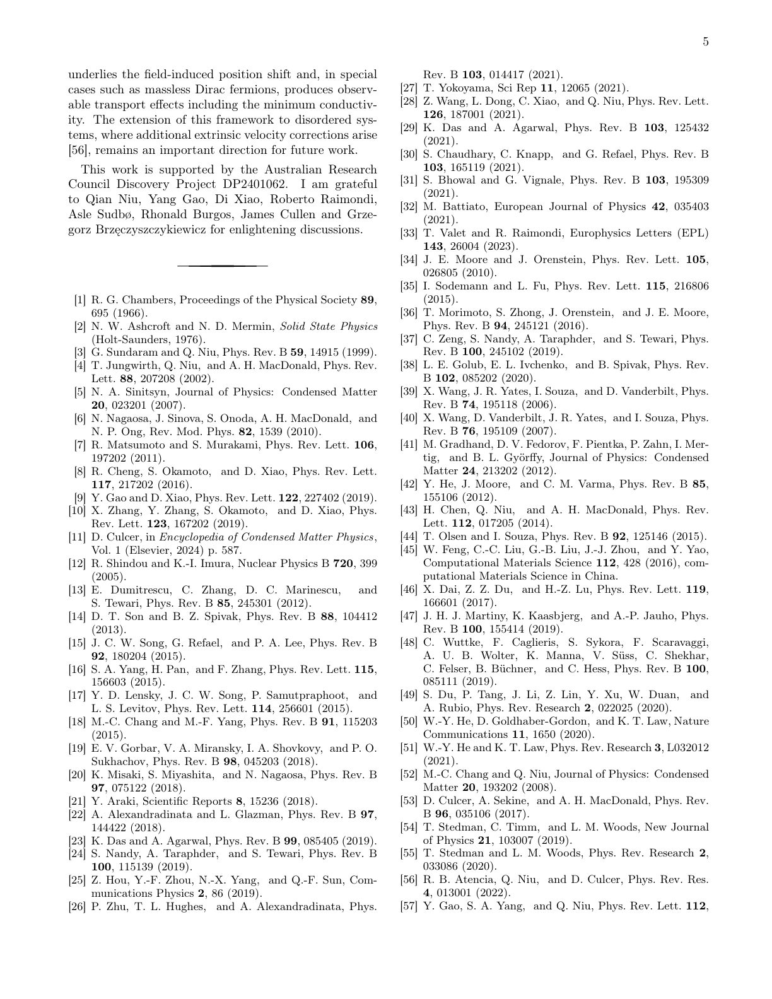
<figcaption class="paper-figure-caption"><b>Fig 4.</b> Low-resolution page preview, page 5</figcaption>
</figure>
<figure class="paper-figure-card">
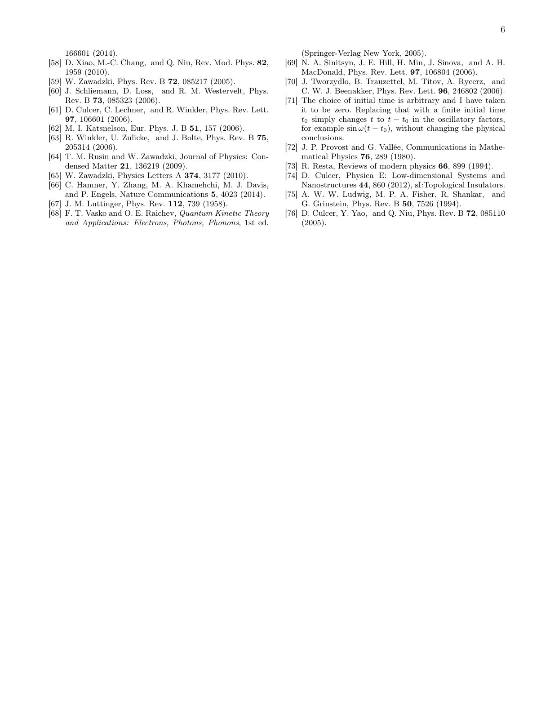
<figcaption class="paper-figure-caption"><b>Fig 5.</b> Low-resolution page preview, page 6</figcaption>
</figure>

**Summary.** This work addresses the failure of standard semiclassical models to capture Zitterbewegung in electron dynamics. By deriving a new, time-dependent Zitterbewegung velocity from the quantum Liouville equation, the authors resolve the position-shift paradox. The findings are particularly significant for massless Dirac fermions, where this velocity term directly accounts for the minimum conductivity.

**Why it may be interesting.** The explicit inclusion of Zitterbewegung velocity, derived from quantum dynamics, provides a necessary correction to semiclassical transport equations, offering insights into how quantum coherence manifests in macroscopic transport properties like conductivity.

Detailed structure

**Main problem.** Conventional semiclassical treatments fail to account for Zitterbewegung, leading to a 'position-shift paradox' when calculating electron dynamics in external fields.

**Main result.** The paper identifies a new, intrinsic Zitterbewegung velocity that resolves the position-shift paradox and yields a finite, non-zero minimum conductivity for massless Dirac fermions.

**Method.** The analysis starts from the quantum Liouville equation, retaining explicit time dependence by switching on the electric field at t=0, and deriving the Zitterbewegung velocity from the non-equilibrium density matrix.

**Model / system.** The study concerns electron dynamics in a clean, disorder-free, noninteracting solid, modeled using a Hamiltonian $H = H_0 + eE \cdot r$ under a constant electric field $E$.

**Key observables.** Zitterbewegung velocity ($\mathbf{\zeta}_m(t)$), field-induced position shift ($\Delta r_{i;E,m}$), and charge current expectation value.

**Important parameters / regimes.** Electric field strength ($E$), interband energy differences ($\omega_{mn}$), and the limit of massless Dirac fermions ($\mu=0$).

**Assumptions / limitations.** The system is assumed to be disorder-free, noninteracting, and the analysis requires moving beyond the steady-state linear-response assumption.

**Paper structure.** The paper builds by first establishing the failure of conventional semiclassical methods, then deriving the new Zitterbewegung velocity from the quantum Liouville equation, and finally calculating its contribution to the position shift and current in the long-time limit.

Abstract

Zitterbewegung plays a major role in electron dynamics in solids, yet is not captured in conventional semiclassical treatments. Here, starting from the quantum Liouville equation, I identify a new Zitterbewegung velocity, which involves the symmetric and antisymmetric components of the quantum geometric tensor oscillating out of phase. The Zitterbewegung velocity resolves the position-shift paradox, recovering the field-induced shift in an electron's position by integrating the semiclassical equations, and is directly related to the famous minimum conductivity of massless Dirac fermions.

[↑ back to top](#top)

### [Stable magnetic nanodomains engineered via Ga+-ion irradiation for deterministic sequential switching](http://arxiv.org/abs/2605.15883v1)

**Authors:** Gijs W. A. Simons, Rik F. J. van Haren, Bert Koopmans  
**Type:** both · **Category:** other · **PDF:** <https://arxiv.org/pdf/2605.15883v1>  
**Analysis basis:** full PDF text, analyzed in chunks
**Topic relevance:** `spintronics-quantum-optics interface` **3/5** · `analog quantum simulation` **2/5** · `Frenkel-Kontorova` **1/5** · `driven-dissipative phase transition` **1/5** · `non-equilibrium dynamics` **1/5**

↔ Scroll figures horizontally

<figure class="paper-figure-card">
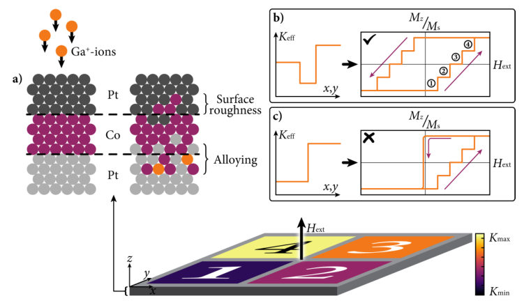
<figcaption class="paper-figure-caption"><b>Fig 1.</b> Fig. 1 a) Schematic illustration of a focused Ga+-ion beam locally modifying an initially perpendicularly magnetized Pt/Co/Pt stack. Ion irradiation reduces the perpendicular magnetic anisotropy Keff in a dose-dependent manner, enabling continuous and spatially resolved tailoring of the magnetic energy landscape. b) Schematic anisotropy landscape across the transition between two magnetic domains with distinct anisotropy levels within the 2 × 2 array, separated by an engineered low-anisotropy well. The resulting stepped hysteresis behavior reflects deterministic and sequential magnetization reversal of the individual domains. c) Corresponding magnetic response in the absence of anisotropy...</figcaption>
</figure>
<figure class="paper-figure-card">
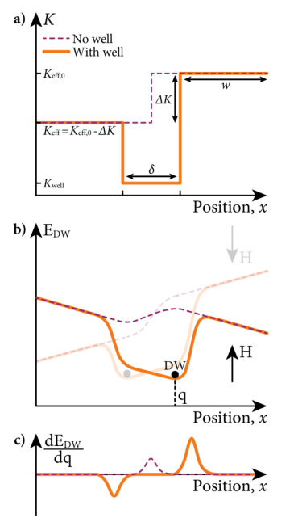
<figcaption class="paper-figure-caption"><b>Fig 2.</b> Fig. 2 a) Schematic anisotropy profile consisting of a well with width δ and depth Kwell relative to the surrounding material. b) Calculated energy of a Bloch-type domain wall EDW as a function of its position q under an external mag- netic field ⃗H. c) Derivative dEDW</figcaption>
</figure>
<figure class="paper-figure-card">
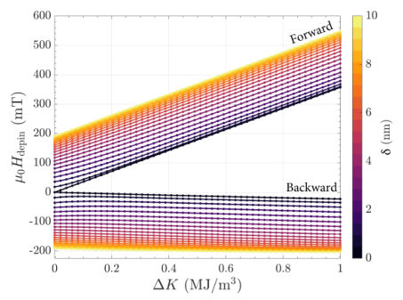
<figcaption class="paper-figure-caption"><b>Fig 3.</b> Fig. 3 The calculated forward and backward depinning fields of a Bloch wall (Aex = 13 pJm−1) inside a single anisotropy well (Kwell = −0.2 MJ/m3, Keff = 0.5 MJ/m3) as a function of anisotropy contrast ∆K and well width δ. The field difference between the two directions increases with ∆K and saturates as the well becomes wider than the domain-wall width.</figcaption>
</figure>
<figure class="paper-figure-card">
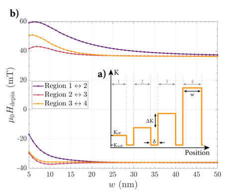
<figcaption class="paper-figure-caption"><b>Fig 4.</b> Fig. 4 An example of a four-region anisotropy profile comprising three anisotropy wells (Keff = 0.3 MJm−3, Kwell = −0.2 MJm−3, ∆K = 0.1 MJm−3, and δ = 15 nm). a) Corresponding energy landscape and b) depinning- field contrast between adjacent regions as a function of region width w. Each region supports a distinct minimum, enabling deterministic sequential switching. The contrast saturates once w ≳50 nm, defining the minimum size for stable, independently pinned regions.</figcaption>
</figure>
<figure class="paper-figure-card">
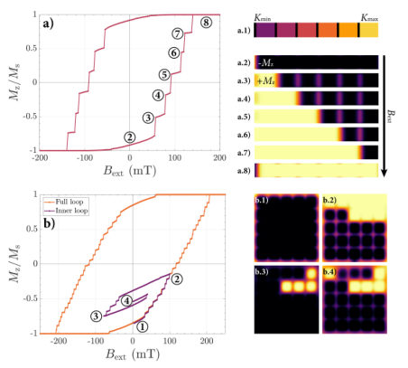
<figcaption class="paper-figure-caption"><b>Fig 5.</b> Fig. 5 Micromagnetic validation of anisotropy- well–induced sequential switching. a) simulation of a 400 × 400 × 1 nm3 Co film patterned into six regions separated by anisotropy wells, using K0 = 0.1 MJm−3, Kwell = −0.2 MJm−3, ∆K = 0.03 MJm−3, δ = 15 nm, and w = 50 nm. Step-like switching in the hysteresis loop reflects sequential depinning of the domain wall. b) Simu- lation of a 340×340×1 nm3 film patterned into 25 regions arranged in a grid with anisotropy values increasing in a serpentine order from 0.10 to 0.82 MJm−3, starting from the top-left corner. The full hysteresis loop (orange) and field-pulse-induced switching sequence (purple) demon- strate the ability to program complex...</figcaption>
</figure>

**Summary.** This research presents a method to deterministically control magnetic domain switching in nanoscale spintronic devices by using focused ion irradiation to engineer precise, spatially varying magnetic anisotropy gradients. By replacing random pinning sites with predictable 'anisotropy wells,' the authors achieve robust, sequential, and programmable magnetic state switching, opening a scalable pathway for next-generation memory and logic devices.

**Why it may be interesting.** While focused on magnetism, the concept of engineering a potential energy landscape (the anisotropy profile) to guide the dynamics of a system (the domain wall) is analogous to designing engineered potentials in quantum systems to control quantum state evolution or tunneling pathways.

Detailed structure

**Main problem.** The primary challenge is achieving stable, deterministic, and scalable control over magnetic domain formation at the nanoscale, overcoming limitations imposed by stochastic defect-mediated pinning.

**Main result.** The authors demonstrate that engineering spatially varying magnetic anisotropy gradients using focused Ga+-ion irradiation provides a deterministic alternative to conventional pinning mechanisms, enabling robust, sequential, and programmable magnetic-state switching.

**Method.** The work combines analytical modeling of domain-wall energetics with experimental realization using ion irradiation to pattern anisotropy wells in ferromagnetic thin films, validated by micromagnetic simulations and AHE/MOKE measurements.

**Model / system.** The system involves perpendicularly magnetized Pt/Co/Pt multilayers where the effective magnetic anisotropy ($K_{	ext{eff}}$) is locally modified by ion irradiation. The theoretical framework models domain-wall (DW) energetics in graded anisotropy profiles, predicting depinning fields based on anisotropy contrast ($\Delta K$).

**Key observables.** Sequential magnetization plateaus observed in AHE hysteresis loops, the magnitude of the depinning field ($H_{	ext{pin}}$), and the dependence of $K_{	ext{eff}}$ on ion dose.

**Important parameters / regimes.** Anisotropy contrast ($\Delta K$), well width ($\delta$), domain-wall width ($\lambda$), and the characteristic length scale of the patterned regions (approaching 100 nm).

**Assumptions / limitations.** The analytical model assumes a fixed DW profile and neglects thermal activation and microstructural disorder, providing upper-bound estimates for pinning fields.

**Figures summary.** Figures illustrate schematic anisotropy landscapes, calculated DW energy profiles, and experimental/simulated hysteresis loops showing distinct, sequential switching steps corresponding to engineered anisotropy wells.

**Paper structure.** The paper progresses from identifying the problem of stochastic pinning to developing an analytical model for anisotropy-controlled pinning, demonstrating this control via ion irradiation on patterned devices, and finally validating the scalability and determinism of the engineered energy landscape.

Abstract

Precise control of magnetic domain formation at the nanoscale remains constrained by stochastic defect-mediated and unstable pinning, limiting scalability and reproducibility in spintronic architectures. Here we demonstrate that spatially engineered anisotropy gradients provide a deterministic alternative. Using focused Ga+-ion irradiation, we pattern magnetic energy landscapes containing nanoscale "anisotropy wells" that confine magnetic domain walls and enable bidirectional sequential switching without reliance on difficult-to-control material disorder. An analytical framework describing domain-wall energetics in graded anisotropy profiles yields predictive design rules for depinning and stability, which are supported by micromagnetic simulations and experiments. We realize programmable multi-domain configurations in continuous ferromagnetic films and demonstrate robust, reproducible switching of 750 nm regions, while first results for 100 nm are shown, approaching the theoretical limit set by the domain-wall width. By replacing unstable pinning with engineered energy landscapes, this anisotropy landscape establishes a scalable materials strategy for deterministic magnetic-state programming and opens a pathway toward dense, energy-efficient spintronic and reconfigurable magnetic nanodevices.

[↑ back to top](#top)

### [Generalized Error Bounds in the Recovery of Solitary Wave Profiles](http://arxiv.org/abs/2605.15590v1)

**Authors:** Daniel Sinambela  
**Type:** theory · **Category:** other · **PDF:** <https://arxiv.org/pdf/2605.15590v1>  
**Analysis basis:** full PDF text, analyzed in chunks
**Topic relevance:** `Keldysh / 2PI / non-Gaussian methods` **2/5** · `entanglement & information structure` **2/5** · `methods for driven-dissipative` **2/5** · `analog quantum simulation` **1/5** · `correlated / nonlocal dissipation` **1/5** · `driven-dissipative phase transition` **1/5** · `non-equilibrium dynamics` **1/5** · `non-equilibrium universality` **1/5**

↔ Scroll figures horizontally

<figure class="paper-figure-card">
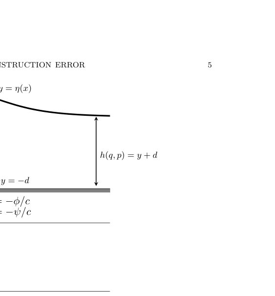
<figcaption class="paper-figure-caption"><b>Fig 1.</b> Figure 1. The Hodograph transform</figcaption>
</figure>
<figure class="paper-figure-card">
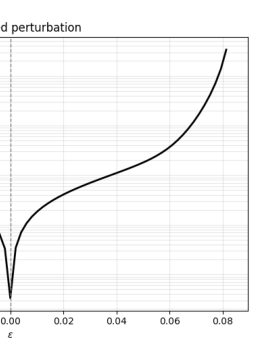
<figcaption class="paper-figure-caption"><b>Fig 2.</b> Figure 2. Reconstruction error due to wave-speed perturbation</figcaption>
</figure>
<figure class="paper-figure-card">
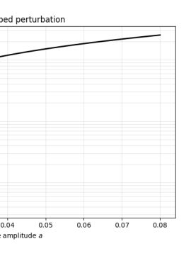
<figcaption class="paper-figure-caption"><b>Fig 3.</b> Figure 3. Reconstruction error due to bed-pressure perturbation</figcaption>
</figure>
<figure class="paper-figure-card">
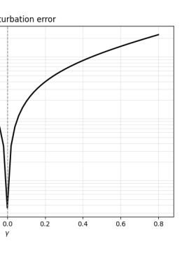
<figcaption class="paper-figure-caption"><b>Fig 4.</b> Figure 4. Reconstruction error due to depth perturbation</figcaption>
</figure>

**Summary.** This paper rigorously analyzes how accurately the free-surface profile of solitary water waves can be recovered from imperfect measurements of the seabed pressure trace. By employing the hodograph transform and advanced complex analysis, the authors derive stability estimates proving that the reconstruction error grows sublinearly with the size of the measurement perturbations. This work provides a strong mathematical foundation for inverse problems in fluid dynamics.

**Why it may be interesting.** While the subject is fluid dynamics, the mathematical machinery—relying heavily on complex analysis, Fourier decay estimates, and stability analysis of inverse problems—is highly relevant to the rigorous mathematical treatment of open quantum systems or wave propagation in complex media.

Detailed structure

**Main problem.** The paper investigates the mathematical robustness and stability of explicit formulas used to reconstruct the free-surface profile of two-dimensional irrotational solitary water waves.

**Main result.** The authors derive explicit $L^2$ error estimates showing that the reconstruction error depends sublinearly on the size of simultaneous perturbations in wave speed, pressure trace, and undisturbed depth.

**Method.** The analysis employs the hodograph transform to map the free-boundary problem to a fixed domain, followed by advanced complex analysis techniques like holomorphic extension and Paley-Wiener Fourier-decay estimates.

**Model / system.** The physical system is two-dimensional irrotational solitary water waves governed by the steady irrotational incompressible Euler equations in a moving frame. The analysis is performed in the hodograph domain.

**Key observables.** Free-surface profile ($\eta(x)$), dynamic pressure trace ($p(x)$), wave speed ($c$), and undisturbed depth ($d$).

**Important parameters / regimes.** Perturbation sizes ($\epsilon, \delta, \gamma$), wave number $k$, and depth $d$.

**Assumptions / limitations.** The analysis assumes the no-stagnation condition ($u-c < 0$) and that perturbations are sufficiently small to maintain the validity of the reconstruction formulas.

**Figures summary.** Figures illustrate the Hodograph transform mapping the fluid domain to a fixed strip, and subsequent figures show the dependence of the reconstruction error on perturbations in wave speed, pressure amplitude, and depth.

**Paper structure.** The paper progresses from establishing the physical problem and initial linear approximations to utilizing the hodograph transform. It then develops the core error analysis using complex methods, culminating in explicit error bounds and numerical validation for various perturbation scenarios.

Abstract

We investigate the robustness of Constantin's explicit reconstruction formula for two-dimensional irrotational solitary water waves. This formula recovers the free-surface profile from the dynamic pressure trace at the bed and depends on both the wave speed and the undisturbed depth. We consider simultaneous perturbations in these three quantities and derive an $L^2$ error estimate for the reconstructed profile. The proof uses the hodograph transform, holomorphic extension arguments, and Paley--Wiener Fourier-decay estimates, yielding stability estimates with sublinear dependence on the perturbation size. We include numerical computations to illustrate the effects of specifically designed perturbations.

[↑ back to top](#top)

### [Causation-guided mechanism identification and interpretable reduced-order modeling of damage-driving grain-boundary stress in creep](http://arxiv.org/abs/2605.16110v1)

**Authors:** Weichen Kong, Yanwei Dai, Yinglin Zhang, Yinghua Liu  
**Type:** theory · **Category:** numerical methods · **PDF:** <https://arxiv.org/pdf/2605.16110v1>  
**Analysis basis:** full PDF text, analyzed in chunks
**Topic relevance:** `entanglement & information structure` **2/5** · `methods for driven-dissipative` **2/5** · `Keldysh / 2PI / non-Gaussian methods` **1/5**

↔ Scroll figures horizontally

<figure class="paper-figure-card">
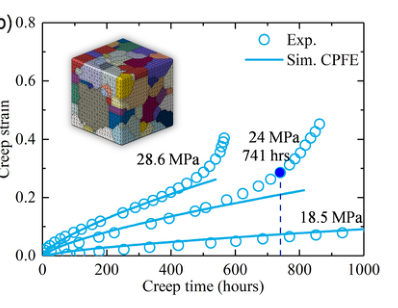
<figcaption class="paper-figure-caption"><b>Fig 1.</b> Fig. 1 (a) Kinematics and configurations of single crystals deformation; (b) Comparison between</figcaption>
</figure>
<figure class="paper-figure-card">
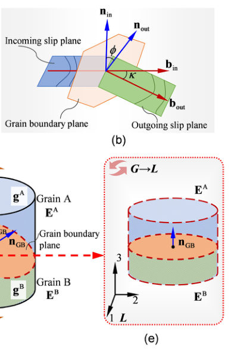
<figcaption class="paper-figure-caption"><b>Fig 2.</b> Fig. 2 Schematic illustrations of (a) the average orientation of a bicrystal with [0 0 1] sample</figcaption>
</figure>
<figure class="paper-figure-card">
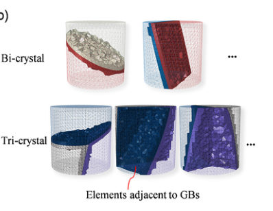
<figcaption class="paper-figure-caption"><b>Fig 3.</b> Fig. 3 (a) Uniaxial and multiaxial loading conditions; (b) finite element models of representative</figcaption>
</figure>
<figure class="paper-figure-card">
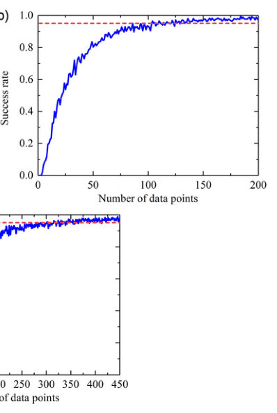
<figcaption class="paper-figure-caption"><b>Fig 4.</b> Fig. 4 Kolmogorov–Smirnov test on the GB normal stress in (a) bicrystal configuration under</figcaption>
</figure>
<figure class="paper-figure-card">
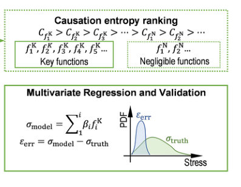
<figcaption class="paper-figure-caption"><b>Fig 5.</b> Fig. 5 General procedure for selecting candidate functions from microscale feature based on</figcaption>
</figure>

**Summary.** This work develops a novel, physics-guided machine learning framework to predict local grain boundary stress during creep in superalloys. By combining detailed crystal plasticity simulations with causation entropy analysis, the authors distill complex microstructural data into a reduced-order model. This provides a highly interpretable tool for understanding the fundamental physical mechanisms governing material failure at the microscale.

**Why it may be interesting.** While focused on materials science, the methodology—using information theory (causation entropy) to distill complex, high-dimensional physical data into a minimal, interpretable functional form—is highly relevant to developing physics-informed machine learning models in quantum many-body systems.

Detailed structure

**Main problem.** The core challenge is identifying the key physical characteristics that govern the high-dimensional, nonlinear local stress state at grain boundaries during creep in polycrystalline superalloys.

**Main result.** The study successfully identifies a reduced set of physically relevant, dominant characteristics (like GB inclination angle and elastic mismatch) that allow for the development of an interpretable, reduced-order model for predicting GB normal stress.

**Method.** It combines Crystal Plasticity Finite Element (CPFE) simulations to generate data with an advanced causation-guided machine-learning framework that uses causation entropy for mechanistic feature selection.

**Model / system.** The physical system is polycrystalline superalloys undergoing creep deformation. The model involves simulating minimal grain clusters (bicrystal/tricrystal) using CPFE, incorporating dislocation glide and climb mechanisms.

**Key observables.** Grain Boundary (GB) normal stress ($\sigma_{33}$ or $\sigma_{L33}$), slip transmission factor, GB inclination angle, and various measures of elastic modulus mismatch.

**Important parameters / regimes.** Creep secondary creep regime, multiaxial loading conditions, and the set of 18 physically motivated microstructural and mechanical descriptors.

**Assumptions / limitations.** The analysis assumes that the governing physics can be captured by a reduced-order representation derived from the identified key functional relationships, and that the causation entropy method correctly isolates causal mechanisms over mere correlation.

**Figures summary.** Figures illustrate the application of the framework under uniaxial and multiaxial loading, showing heat maps of top candidate features and comparing the predictive performance of the ML model using original vs. key functions.

**Paper structure.** The paper progresses by first establishing the physical necessity of the approach (limitations of classical/purely data-driven models), then detailing the CPFE simulation setup and the comprehensive calculation of numerous mechanics-informed descriptors, culminating in the application of causation entropy to build and validate the reduced-order, interpretable model.

Abstract

Grain-boundary (GB) local stress is central to the initiation and evolution of long-term creep damage in polycrystalline superalloys. Owing to the high-dimensional nonlinear relationships between the GB stress response and multiple crystallographic, microstructural, and micromechanical characteristics, it remains challenging to identify the key characteristics governing GB stress and to elucidate their mechanisms of influence. Dislocation-climb-affected crystal-plasticity finite-element simulations of minimal grain clusters are combined with an integrated causation-guided machine-learning framework, in which mechanics-informed descriptors are analyzed by causation entropy to identify governing mechanisms and then distilled into a reduced-order regression form for interpretable prediction of GB normal stress. Among 18 physically motivated characteristics, the GB inclination angle, the slip transmission, the climb-related Schmid-type indicator, and the elastic-modulus mismatch are found to be dominant, revealing the coupled roles of interfacial geometry, crystallographic compatibility, creep stress relaxation, and micromechanical contrast. The identified characteristics hierarchy and functional representation remain effective under multiaxial loading and can be extended to tricrystal systems through physically interpretable nonlocal augmentation when a purely local description becomes insufficient, demonstrating strong physical consistency and robust generalizability across physical conditions. The extracted candidate functions also improve surrogate-model performance across multiple machine-learning model classes, providing supporting evidence for the physical relevance and efficiency of the identified representation. The proposed methods demonstrate strong potential for the development of interpretable machine-learning models and for the study of microscale nonlocal damage.

[↑ back to top](#top)

### [Non-Relativistic Spin-Orbit Interaction in Triplet Superconductors: Edelstein Effect and Spin Pumping by Electric Fields](http://arxiv.org/abs/2605.15610v1)

**Authors:** Ping Li, G. A. Bobkov, I. V. Bobkova, Tao Yu  
**Type:** theory · **Category:** other · **PDF:** <https://arxiv.org/pdf/2605.15610v1>  
**Analysis basis:** full PDF text, analyzed in chunks
**Topic relevance:** `Keldysh / 2PI / non-Gaussian methods` **2/5** · `methods for driven-dissipative` **1/5**

↔ Scroll figures horizontally

<figure class="paper-figure-card">
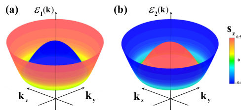
<figcaption class="paper-figure-caption"><b>Fig 1.</b> FIG. 1. Illustration of spin Sz ∈[−ℏ/2, ℏ/2] of Bogoliubov quasiparticles on the two degenerate bands {ε1(k), ε2(k)} of a triplet superconductor in the momentum space. The color maps represent the spin of quasiparticles Sz. Sz depends strongly on the wave vector near the Fermi wave vector kF .</figcaption>
</figure>
<figure class="paper-figure-card">
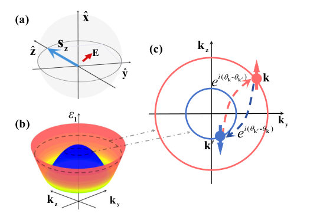
<figcaption class="paper-figure-caption"><b>Fig 2.</b> FIG. 2. Spin Edelstein effect in a p-wave superconductor. (a): an in-plane electric field E (red arrow) induces the spin den- sity polarized along the ˆz-direction (blue arrow). (b) &amp; (c): This spin polarization arises from an intra-band quasiparticle scattering process driven by the electric field, as illustrated for band 1 and addressed in the main text.</figcaption>
</figure>
<figure class="paper-figure-card">
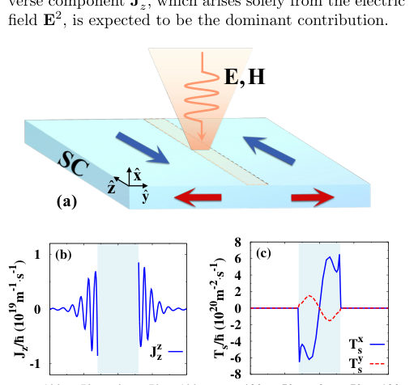
<figcaption class="paper-figure-caption"><b>Fig 3.</b> FIG. 3. Spin pumping into p-wave superconductor driven solely by local electric fields. The shadow region in (a)-(c) indicates the region of the near electric field. (a) illustrates the transverse (blue arrow) and longitudinal (red arrow) spin current pumped by the one-dimensional electromagnetic field. (b) depicts the spatial profile of the transverse spin current induced by the electric field. (c) plots the spatial profile of the spin-torque density polarized along the ˆx- and ˆy-directions excited by the joint effect of electric and magnetic fields.</figcaption>
</figure>

**Summary.** This work reveals a unique, non-relativistic spin-orbit coupling mechanism within triplet superconductors. By analyzing the quasiparticle spin texture induced by the superconducting order parameter, the authors show that an applied electric field can generate a spin polarization (Edelstein effect) and a DC spin current. This offers a powerful, field-driven route for manipulating spin currents in unconventional superconductors.

**Why it may be interesting.** The mechanism of generating spin currents purely from electric fields in superconductors, without relying on strong relativistic SOC, provides a novel platform for studying spin-charge conversion in unconventional quantum materials.

Detailed structure

**Main problem.** The paper investigates a non-relativistic form of spin-orbit coupling in triplet superconductors, enabling spin manipulation using electric fields even without relativistic SOC.

**Main result.** An in-plane electric field can induce a spin polarization (Edelstein effect) and drive a DC spin current in a p-wave superconductor via intrinsic quasiparticle spin-orbital entanglement.

**Method.** The analysis uses linear response theory applied to the Nambu space Hamiltonian, calculating spin and spin-current densities based on quasiparticle scattering amplitudes.

**Model / system.** The system is a triplet p-wave superconducting film, modeled using a Nambu space Hamiltonian. The key physics involves the triplet order parameter inducing momentum-dependent spin textures in Bogoliubov quasiparticles.

**Key observables.** Spin polarization ($\delta \mathbf{s}$), DC spin-current density ($\mathbf{J}_s$), and spin-torque density ($\mathbf{T}_s$).

**Important parameters / regimes.** The analysis is valid for $\hbar\omega < 2\Delta_t$, and the spin polarization is restricted to the $\hat{z}$-direction for in-plane fields.

**Assumptions / limitations.** The analysis is performed in the linear response regime, and the model assumes a minimal description of the triplet p-wave superconductor.

**Figures summary.** Figure 1 illustrates the wave-vector-dependent spin of quasiparticles. Figure 2 demonstrates the Spin Edelstein effect, showing $\hat{z}$-polarized spin density induced by an in-plane electric field.

**Paper structure.** The paper establishes the non-relativistic SOC mechanism via the triplet order parameter, calculates the linear response to external E/H fields, and finally derives the resulting DC spin current and spin polarization.

Abstract

Non-relativistic momentum-dependent spin splitting, as observed in collinear altermagnets and non-collinear $p$-wave magnets, provides exciting avenues for controlling spin dynamics. Here, we reveal a distinct form of non-relativistic ``spin-orbit coupling" in triplet superconductors by demonstrating that the triplet order parameter induces a wave-vector-dependent spin texture of Bogoliubov quasiparticles, thereby entangling their orbital and spin motions. Even in the absence of relativistic spin-orbit coupling, this intertwining of spin and orbital motion allows an electric field to generate spin polarization in a $p$-wave superconductor -- that is, an Edelstein effect. Building on this mechanism, we propose an efficient scheme for the nonlinear generation of a DC spin current via electric near fields, driven by AC spin polarization and electron velocity. This general principle offers a powerful route for generating and manipulating spin currents in unconventional superconductors.

[↑ back to top](#top)

### [A practical Laser-Heated Diamond Anvil Cell synthesis technique and recovery workflow for metastable MnSb2 and YbZn2 phases](http://arxiv.org/abs/2605.16039v1)

**Authors:** S. Huyan, R. F. S. Penacchio, D. Zhang, Z. Li, S. L. Morelhão, Raquel Ribeiro, P. C. Canfield, S. L. Bud'ko  
**Type:** experiment · **Category:** strongly correlated electrons · **PDF:** <https://arxiv.org/pdf/2605.16039v1>  
**Analysis basis:** full PDF text, analyzed in chunks
**Topic relevance:** `non-equilibrium dynamics` **2/5**

↔ Scroll figures horizontally

<figure class="paper-figure-card">
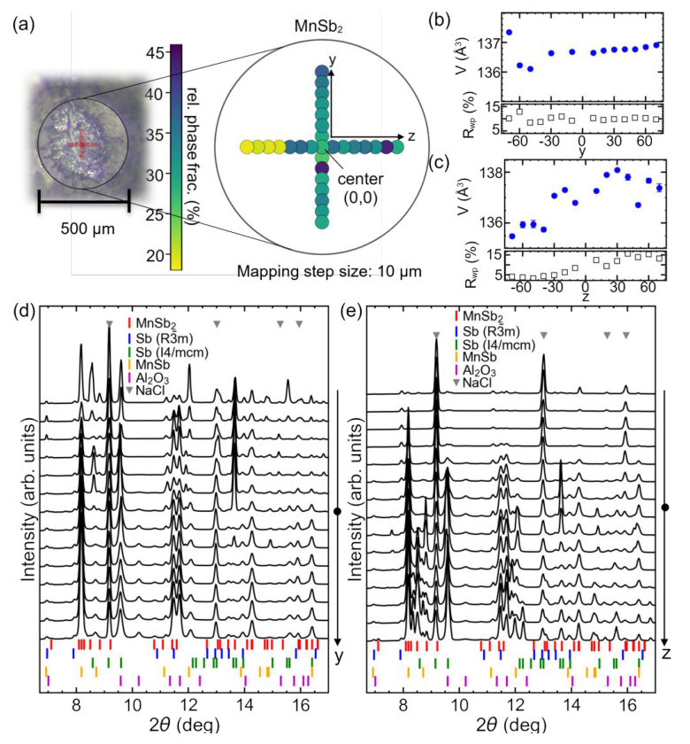
<figcaption class="paper-figure-caption"><b>Fig 1.</b> Fig. 1 Synchrotron powder X-ray diffraction spatial mapping using a cross-scanning strategy. (a) Schematic</figcaption>
</figure>
<figure class="paper-figure-card">
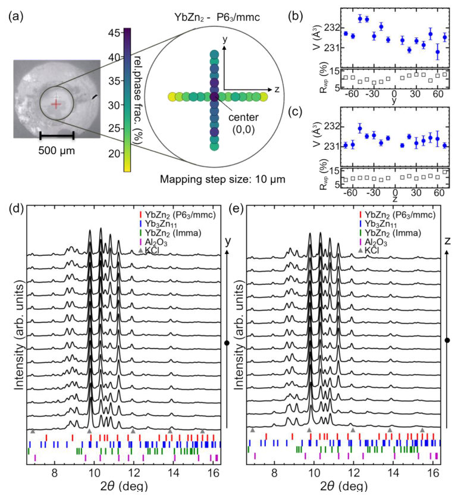
<figcaption class="paper-figure-caption"><b>Fig 2.</b> Fig. 2 Synchrotron powder X-ray diffraction spatial mapping using a cross-scanning strategy. (a) Schematic</figcaption>
</figure>
<figure class="paper-figure-card">
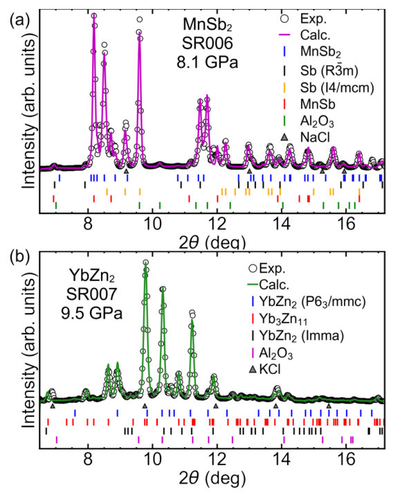
<figcaption class="paper-figure-caption"><b>Fig 3.</b> Fig. 3 Synchrotron PXRD patterns collected from the best phase-purity locations identified in the spatial</figcaption>
</figure>
<figure class="paper-figure-card">
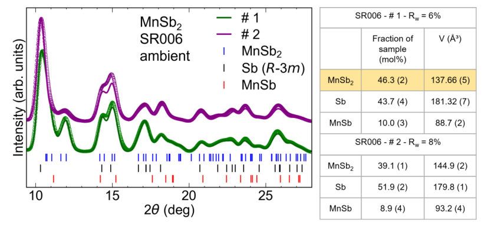
<figcaption class="paper-figure-caption"><b>Fig 4.</b> Fig. 4 Powder X-ray diffraction patterns from two selected recovered MnSb2 pieces measured after</figcaption>
</figure>
<figure class="paper-figure-card">
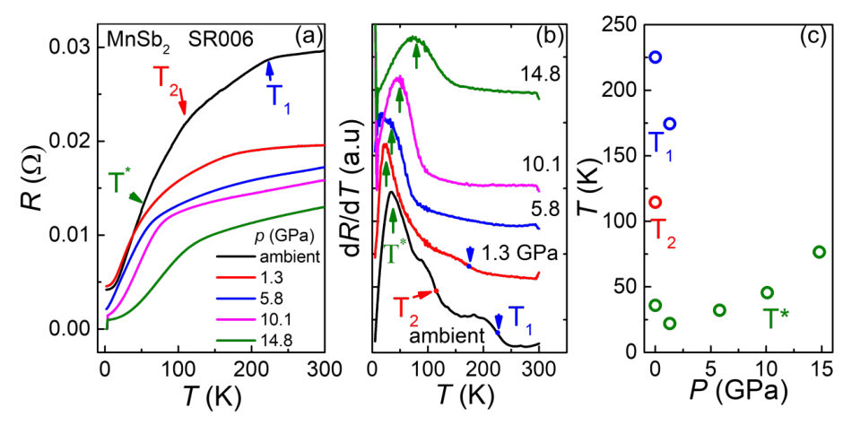
<figcaption class="paper-figure-caption"><b>Fig 5.</b> Fig. 6 (a) Temperature dependence of the resistance R(T) for MnSb2 (SR006, sample #1) at various</figcaption>
</figure>

**Summary.** This work establishes a practical, integrated workflow for synthesizing and characterizing metastable high-pressure phases using Laser-Heated Diamond Anvil Cells. By studying $	ext{MnSb}_2$ and $	ext{YbZn}_2$, the authors demonstrate that these materials exhibit highly tunable electronic and magnetic instabilities governed by pressure. This advances LHDAC from a mere structural discovery tool to a powerful platform for investigating correlated quantum states.

**Why it may be interesting.** The ability to probe correlated quantum states (like magnetic or electronic instabilities) in materials synthesized under extreme, non-equilibrium conditions provides a unique experimental playground for testing theories of strongly correlated electron systems.

Detailed structure

**Main problem.** The primary challenge addressed is the systematic recovery and post-synthesis physical characterization of metastable intermetallic phases created under extreme, non-equilibrium pressure-temperature conditions using Laser-Heated Diamond Anvil Cells (LHDAC).

**Main result.** The authors successfully demonstrated an integrated LHDAC workflow, revealing tunable electronic instabilities in both $	ext{MnSb}_2$ and $	ext{YbZn}_2$, which exhibit pressure-induced changes in magnetic and electronic ground states.

**Method.** The study combines LHDAC synthesis with structural characterization via synchrotron X-ray diffraction and detailed transport measurements ($R$ vs. $T$ and $P$) on recovered samples.

**Model / system.** The research focuses on metastable intermetallic compounds, specifically $	ext{MnSb}_2$ and $	ext{YbZn}_2$, whose electronic and magnetic properties are investigated when stabilized far from equilibrium thermodynamic conditions.

**Key observables.** Electrical resistance ($
ho$), temperature dependence of resistance ($	ext{d}R/	ext{d}T$), magnetic ordering anomalies, and phase fractions derived from XRD.

**Important parameters / regimes.** High pressures (up to $\sim 15 	ext{ GPa}$), high temperatures (up to $\sim 3000 	ext{ K}$), and specific pressure thresholds (e.g., $\sim 11 	ext{ GPa}$ for $	ext{YbZn}_2$).

**Assumptions / limitations.** The primary limitation acknowledged is the inherent spatial inhomogeneity due to localized laser heating, necessitating careful selection of high-purity sample regions for reliable measurement.

**Figures summary.** Figures illustrate the pressure dependence of electrical resistance for $	ext{YbZn}_2$, showing an abrupt transition to semiconducting-like behavior near $11 	ext{ GPa}$, and show the pressure suppression of magnetic anomalies in $	ext{MnSb}_2$.

**Paper structure.** The paper follows a structure of problem identification (LHDAC recovery challenge), methodology development (integrated synthesis/recovery workflow), structural confirmation (XRD mapping), and detailed physical characterization (transport measurements on recovered samples).

Abstract

The creation and exploration of new materials under extreme pressure-temperature conditions has become increasingly reliant on laser-heated diamond anvil cell (LHDAC) techniques, which provide direct access to previously unexplored regions of multinary phase diagrams. Whereas numerous high-pressure phases have been identified in situ, systematic recovery and post-synthesis physical property characterization of these materials remain significant challenges. In this work, we present the development of an integrated LHDAC synthesis and demonstrate a practical LHDAC-based synthesis workflow that enables stabilization and recovery of metastable intermetallic phases for subsequent structural and transport studies. Using this approach, we successfully achieved LHDAC synthesis of high-pressure MnSb2 and YbZn2 phases under moderate pressures. Synchrotron X-ray diffraction and spatial mapping confirm dominant formation of the targeted phases, whereas laboratory-based refinement quantifies phase fractions despite intrinsic microstrain and minor secondary phases. High-pressure transport measurements on recovered samples reveal tunable by pressure electronic instabilities in both systems. In MnSb2, pressure suppresses two high-temperature magnetic ordering anomalies, observed in transport, by 5 GPa and for higher pressures induces a new low-temperature feature that increases with further pressure increase. In hexagonal high-pressure YbZn2, an electronic reconstruction emerges at ~11 GPa, characterized by semiconducting-like behavior from ~ 30 K to 300 K and a broad low-temperature coherence crossover near 30 K. Our results establish LHDAC synthesis not only as a structural discovery tool, but also as an experimental platform for investigating correlated quantum states stabilized far from equilibrium thermodynamic conditions.

[↑ back to top](#top)

### [Charge Transfer from Perovskite Quantum Dots to Multifunctional Ligands with Tethered Molecular Species](http://arxiv.org/abs/2605.16073v1)

**Authors:** Mariam Kurashvili, Lena S. Stickel, Jordi Llusar, Christian Wilhelm, Fabian Felixberger, Ivana Ivanović-Burmazović, Ivan Infante, Jochen Feldmann, Quinten A. Akkerman  
**Type:** both · **Category:** other · **PDF:** <https://arxiv.org/pdf/2605.16073v1>  
**Analysis basis:** full PDF text, analyzed in chunks
**Topic relevance:** `Keldysh / 2PI / non-Gaussian methods` **1/5** · `Kondo & dissipative impurity` **1/5** · `correlated / nonlocal dissipation` **1/5** · `driven-dissipative phase transition` **1/5** · `methods for driven-dissipative` **1/5** · `non-equilibrium dynamics` **1/5**

↔ Scroll figures horizontally

<figure class="paper-figure-card">
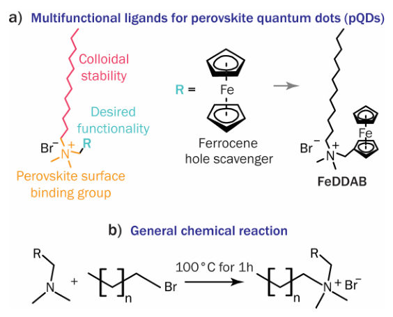
<figcaption class="paper-figure-caption"><b>Fig 1.</b> Figure 1. Synthesis of multifunctional ligands for pQDs. a) Simplified schematic of the multifunctional</figcaption>
</figure>
<figure class="paper-figure-card">

<figcaption class="paper-figure-caption"><b>Fig 2.</b> Figure 2a shows the absorbance, photoluminescence (PL, excited at 3.10 eV) spectra of DDAB-capped</figcaption>
</figure>
<figure class="paper-figure-card">
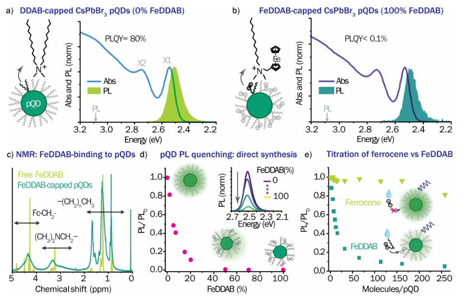
<figcaption class="paper-figure-caption"><b>Fig 3.</b> Figure 2. Excited state interactions and binding between ferrocene functionalized ligands and</figcaption>
</figure>
<figure class="paper-figure-card">
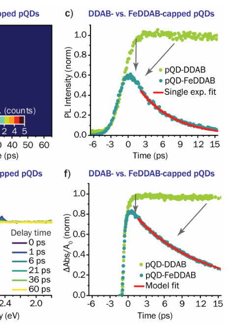
<figcaption class="paper-figure-caption"><b>Fig 4.</b> Figure 3. Time-resolved PL and TA spectra of DDAB- and FeDDAB-capped CsPbBr3 pQDs.</figcaption>
</figure>
<figure class="paper-figure-card">
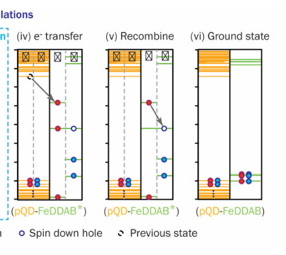
<figcaption class="paper-figure-caption"><b>Fig 5.</b> Figure 4. DFT calculations of excited state interaction between pQD and ferrocene. Energy</figcaption>
</figure>

**Summary.** This research details a strategy to improve the performance of Perovskite Quantum Dots (pQDs) by attaching multifunctional ligands containing redox-active moieties like ferrocene. By combining time-resolved spectroscopy and DFT calculations, the authors demonstrate that these engineered ligands facilitate highly efficient, fast charge transfer processes crucial for developing next-generation photocatalysts and optoelectronic devices.

**Why it may be interesting.** The work provides a detailed, mechanism-driven blueprint for controlling interfacial charge dynamics in semiconductor nanocrystals, which is highly relevant to open quantum systems and quantum light sources.

Detailed structure

**Main problem.** The primary goal is to enhance charge carrier extraction or injection from Perovskite Quantum Dots (pQDs) for optoelectronic and photocatalytic applications by engineering the surface ligands.

**Main result.** The use of multifunctional ligands, particularly those incorporating ferrocene, facilitates fast, high-efficiency photoexcited hole transfer from the pQDs to the tethered molecular species.

**Method.** The study combines experimental techniques like time-resolved spectroscopy (PL, TA) with theoretical modeling using Density Functional Theory (DFT) calculations.

**Model / system.** The system involves $	ext{CsPbBr}_3$ pQDs functionalized with multifunctional ligands (e.g., $	ext{FeDDAB}$, $	ext{NBODAB}$, $	ext{ADDAB}$). The ligands are designed to possess a strong binding group, a stabilizing tail, and a redox-active functional group.

**Key observables.** Hole transfer rate (up to $99.9\%$ efficiency), electron transfer rate ($\sim 15 	ext{ ps}$), Photoluminescence Quantum Yield ($	ext{PLQY}$), and structural reorganization of the redox center.

**Important parameters / regimes.** The efficiency is highly dependent on the ligand structure and the ability to maintain a small donor-acceptor distance ($< 1 	ext{ nm}$).

**Assumptions / limitations.** The analysis assumes that the ligand engineering strategy successfully controls the electronic coupling and charge transfer pathways, and that DFT accurately models the structural reorganization upon charge transfer.

**Figures summary.** Figures illustrate the synthesis of ligands, compare PL spectra of capped pQDs (bright vs. quenched), and show energy band alignments and charge transfer pathways derived from DFT calculations.

**Paper structure.** The paper progresses by first establishing the need for advanced ligand design, then presenting spectroscopic evidence (PL/TA) showing rapid charge transfer kinetics, and finally using DFT to model the underlying electronic structure changes and charge separation mechanisms.

Abstract

Perovskite quantum dots (pQDs) are promising materials for optoelectronic and photocatalytic applications due to their unique optical properties. To enhance charge carrier extraction or injection donor/acceptor molecules can be tethered to the pQD. These molecules must strongly bind to the ionic surfaces of pQDs without compromising colloidal stability. These we achieve by using multifunctional ligands containing a quaternary ammonium binding group for strong pQDs surface attachment, a long tail group for colloidal stability, and a functional group near the pQD surface. Such pQDs with ferrocene-functionalized ligands show fast photoexcited hole transfer with near-unity efficiency. Density functional theory calculations reveal how ferrocene's molecular structure reorganizes following hole transfer, affecting its charge separation efficiency. This approach can also be extended to in photoexcited electron and energy transfer processes with pQDs. Therefore, this strategy offers a blueprint for creating efficient QD-molecular hybrids for applications like photocatalysis.

[↑ back to top](#top)

### [Rapid Atmospheric Vapor Deposition of H:In2O3 Transparent Conducting Oxide Thin Films](http://arxiv.org/abs/2605.16166v1)

**Authors:** Xiaoyu Guo, Hae-Jun Seok, Eilidh L. Quinn, Matthew K Sharpe, Callum. D. McAleese, Yi-Teng Huang, Xinjuan Li, Kexue Li, Chia-Yu Chang, Yongjie Wang, John O'Sullivan, Katie L. Moore, Caterina Ducati, Ruy Sebastian Bonilla, Han-Ki Kim, Abderrahime Sekkat, Robert L. Z. Hoye  
**Type:** experiment · **Category:** other · **PDF:** <https://arxiv.org/pdf/2605.16166v1>  
**Analysis basis:** full PDF text, analyzed in chunks
**Topic relevance:** `analog quantum simulation` **1/5** · `driven-dissipative phase transition` **1/5** · `non-equilibrium dynamics` **1/5** · `non-equilibrium universality` **1/5**

↔ Scroll figures horizontally

<figure class="paper-figure-card">
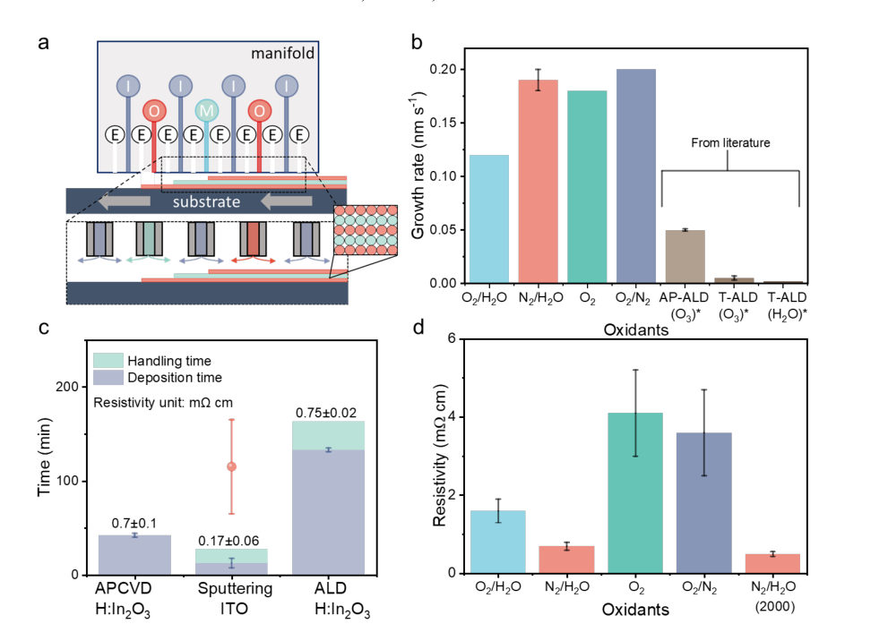
<figcaption class="paper-figure-caption"><b>Fig 1.</b> Figure 1. H:In2O3 grown by atmospheric pressure chemical vapor deposition (AP-CVD), compared with established alternatives. a. Illustration of the gas manifold used for AP-CVD, “M” denotes the metal precursor, “I” denotes the inert gas (N2), “O” denotes the oxidant gas channels and “E” denotes the exhaust channels. The substrate is loaded onto a platen (metal plate), which heats the sample and oscillates it beneath the gas manifold. b. Growth rate of H:In2O3 thin films deposited by AP-CVD with</figcaption>
</figure>
<figure class="paper-figure-card">
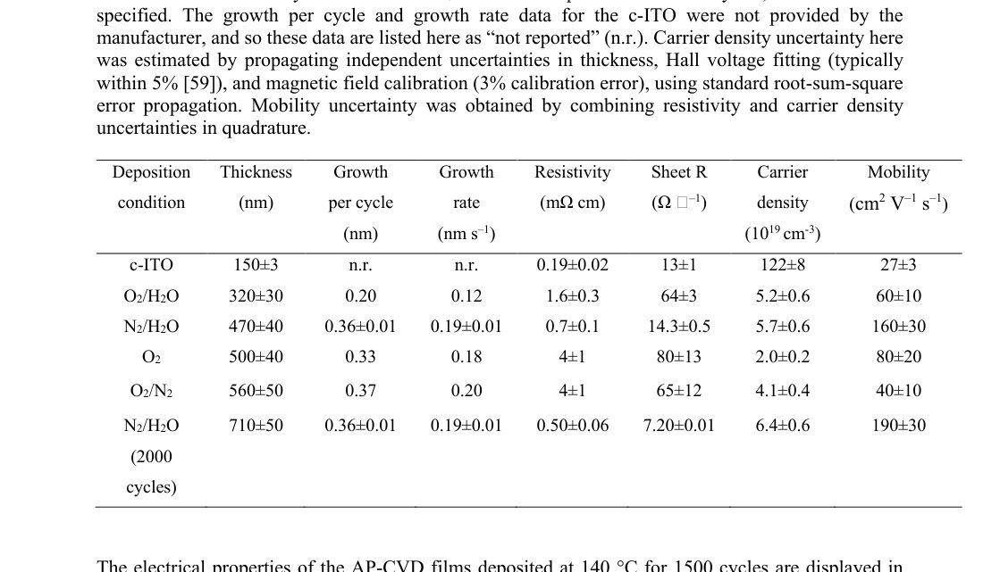
<figcaption class="paper-figure-caption"><b>Fig 2.</b> Figure 1d and Table 1. Films grown with N2/H2O in the oxidant channel exhibited the lowest resistivity</figcaption>
</figure>
<figure class="paper-figure-card">
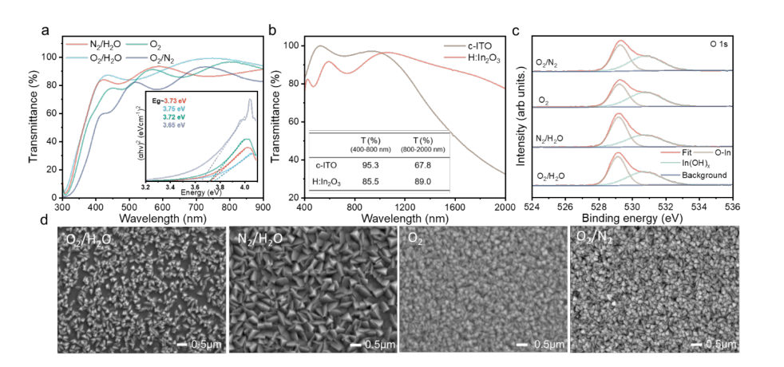
<figcaption class="paper-figure-caption"><b>Fig 3.</b> Figure 2. Effect of oxidant on optical properties, surface chemistry and morphology of AP-CVD H:In2O3 films. a. Transmittance and bandgap of H:In2O3 thin films deposited via AP-CVD at 140 °C for 1500 cycles under various oxidizing environments. The thicknesses of film grown with O2/H2O, N2/H2O, O2 alone and O2/N2 in the oxidant channel are 320±30, 470±40, 500±40, 560±50 nm, respectively. b. Visible-IR transmittance of commercial ITO (150±3 nm thickness) and optimal N2/H2O-grown H:In2O3 thin film (710±50 nm thickness) deposited at 140 °C for 2000 cycles. c. XPS spectra, and d. high-resolution SEM images of H:In2O3 thin films deposited under various oxidizing environments for 1500 cycles.</figcaption>
</figure>
<figure class="paper-figure-card">
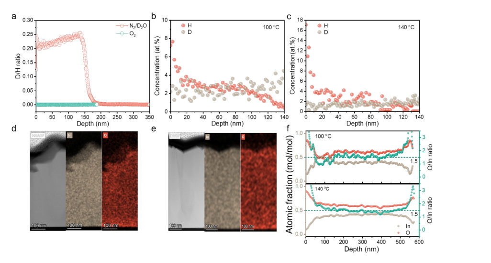
<figcaption class="paper-figure-caption"><b>Fig 4.</b> Figure 3. Understanding the mechanism of H doping in AP-CVD H:In2O3. a. Depth profiles of the D/H ratio in H:In2O3 thin films (thickness ~150 nm) deposited onto Si wafer at 100 °C using N2/D2O or O2-</figcaption>
</figure>

**Summary.** This work introduces Atmospheric Pressure Chemical Vapor Deposition (AP-CVD) as a highly scalable and low-temperature method for creating high-performance Transparent Conducting Oxides ($	ext{H:In}_2	ext{O}_3$). By using water as an oxidant, the researchers significantly boost carrier mobility and NIR transmittance, outperforming established commercial methods and making TCOs compatible with sensitive electronic substrates.

**Why it may be interesting.** While primarily materials science, the control over defect states (oxygen vacancies) via chemical doping ($	ext{H}$ incorporation) and the comparison of different deposition kinetics (CVD vs. ALD) touches upon non-equilibrium thermodynamics and defect physics relevant to open quantum systems.

Detailed structure

**Main problem.** The paper addresses the need for cost-effective, rapid, and low-temperature methods to deposit high-performance Transparent Conducting Oxides (TCOs) that can be compatible with sensitive materials like perovskites.

**Main result.** Atmospheric Pressure Chemical Vapor Deposition (AP-CVD) successfully synthesizes hydrogen-doped $	ext{In}_2	ext{O}_3$ films that surpass commercial sputter-deposited ITO in performance, achieving high mobility and superior Near-Infrared (NIR) transmittance.

**Method.** The study uses AP-CVD under mild, atmospheric conditions, systematically varying the oxidant chemistry ($	ext{O}_2$ vs. $	ext{H}_2	ext{O}$) and employing advanced characterization techniques like ToF-ERDA, XPS, and Nano-SIMS.

**Model / system.** The physical system is the deposition of $	ext{H:In}_2	ext{O}_3$ thin films using a close-proximity SALD reactor operating in CVD mode. The process is compared against high-vacuum methods like sputtering and slow methods like ALD.

**Key observables.** Sheet resistance ($	ext{7.20}\pm0.01 	ext{ } \Omega \square^{-1}$), NIR transmittance ($	ext{up to } 89\%$), carrier mobility ($	ext{up to } 160\pm30 	ext{ cm}^2 	ext{ V}^{-1} 	ext{ s}^{-1}$), and depth-dependent $	ext{D/H}$ ratios.

**Important parameters / regimes.** Low processing temperature ($	ext{140 }^\circ	ext{C}$), high growth rate ($	ext{40x}$ higher than ALD), and the oxidant source ($	ext{H}_2	ext{O}$ vs. $	ext{O}_2$).

**Assumptions / limitations.** The improved electrical properties are attributed to hydrogen dopants passivating oxygen vacancies, which act as carrier scattering centers.

**Figures summary.** Figures illustrate the AP-CVD setup, comparisons of growth rates and process times against ALD/sputtering, and optical transmittance spectra showing superior NIR performance compared to sputtered ITO.

**Paper structure.** The paper progresses by establishing the limitations of existing TCO deposition methods, presenting the AP-CVD technique, demonstrating superior electrical/optical performance using $	ext{H}_2	ext{O}$ oxidants, and finally using advanced spectroscopy (SIMS, ToF-ERDA) to confirm the role of hydrogen doping in enhancing material quality.

Abstract

Transparent conducting oxides (TCOs) are essential for the optoelectronics industry, but there is a critical gap in cost-effective methods to rapidly deposit low sheet resistance, high transmittance films without damaging delicate materials, including emerging soft semiconductors like metal-halide perovskites. In this work, atmospheric pressure chemical vapor deposition (AP-CVD) is used to synthesise H:In2O3 films with 7.20+/-0.01 Ohm/sq sheet resistance (0.50+/-0.06 mOhm.cm resistivity) and transmittance up to 89% in the near-infrared (NIR), surpassing commercial sputter-deposited indium tin oxide. The growth rate is 40x higher than atomic layer deposition (ALD), and the AP-CVD films are fully processed under atmospheric conditions at only 140 C. Comparison of secondary ion mass spectrometry and time-of-flight elastic recoil detection analysis with changes in carrier concentration indicate that H dopants are introduced from the water oxidant. There is an increase in mobility form 40+/-10 cm2/Vs to 160+/-30 cm2/Vs when changing from O2 to H2O as the oxidant, which is attributed to H dopants passivating oxygen vacancies that act as carrier scattering centers. This work establishes AP-CVD as a promising method for manufacturing high figure-of-merit TCOs in a rapid, scalable and cost-effective manner, using mild growth conditions compatible with thermally-sensitive materials.

[↑ back to top](#top)

### [Orbital Angular Momentum Textures and Currents in a Discrete Helix: Equilibrium and Linear Response](http://arxiv.org/abs/2605.15981v1)

**Authors:** Danny Cordova, Bertrand Berche, Ernesto Medina  
**Type:** theory · **Category:** other · **PDF:** <https://arxiv.org/pdf/2605.15981v1>  
**Analysis basis:** full PDF text, analyzed in chunks
**Topic relevance:** `Frenkel-Kontorova` **1/5** · `analog quantum simulation` **1/5** · `spintronics-quantum-optics interface` **1/5**

↔ Scroll figures horizontally

<figure class="paper-figure-card">
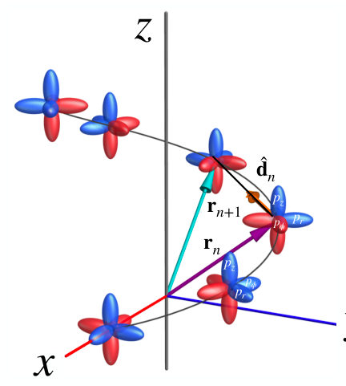
<figcaption class="paper-figure-caption"><b>Fig 1.</b> FIG. 1. (Color online). Model of the helix with the nearest neighbor sites rn and rn+1. The included orbitals per site are pr, pϕ, pz as depicted. The vector ˆdn joins two adjacent sites. The orientation chosen for the orbital corresponds to a single strand DNA like structure.</figcaption>
</figure>
<figure class="paper-figure-card">
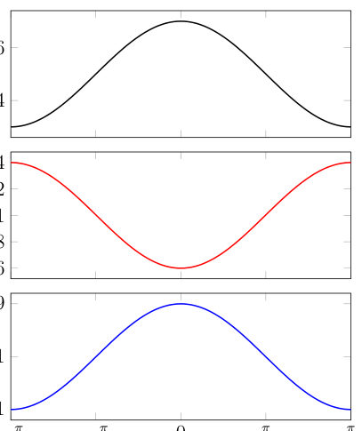
<figcaption class="paper-figure-caption"><b>Fig 2.</b> FIG. 2. Band structure of the reduced trz-only model. The azimuthal band Eϕ(k) (online black) remains fully de- coupled, while the pr −pz sector hybridizes through the odd- in-momentum coupling Yk, yielding the split branches E+(k) (online red) and E−(k) (online blue). The parameters used are reported in the appendix.</figcaption>
</figure>
<figure class="paper-figure-card">
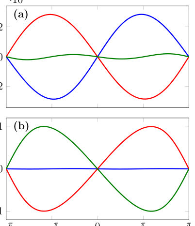
<figcaption class="paper-figure-caption"><b>Fig 3.</b> FIG. 3. Exact local orbital angular momentum textures for the fully hybridized 3 × 3 helical Hamiltonian. (a) Azimuthal texture ⟨Lϕ⟩generated primarily by the pr −pz coherence. (b) Longitudinal texture ⟨Lz⟩generated primarily by the pr −pϕ coherence. The textures corresponding to the low- est energy band E1 (online blue), the middle energy band E2 (online red), and the highest energy band E3 (online green) are shown. The texture for the radial angular moment is al- ways zero within the single helix model presented here.</figcaption>
</figure>
<figure class="paper-figure-card">
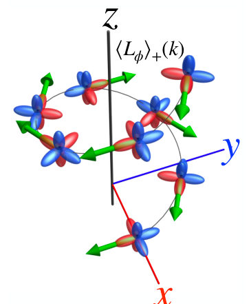
<figcaption class="paper-figure-caption"><b>Fig 4.</b> FIG. 4. Orbital angular momentum textures given by Eq.63. for this case we only have a ⟨Lϕ⟩(k) due to the coherence of pz and pr orbitals. The length of the orbital angular momentum vector (online green) depends on k and is odd under k →−k.</figcaption>
</figure>
<figure class="paper-figure-card">
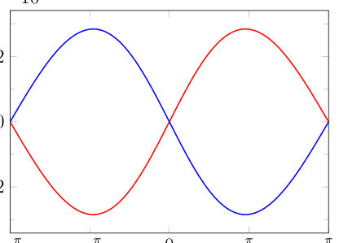
<figcaption class="paper-figure-caption"><b>Fig 5.</b> FIG. 5. Azimuthal Orbital Angular Momentum Texture ⟨Lϕ⟩ generated by the (pz, pr) sector. The texture generated by E+ (online red) has the same shape as the texture generated by E−(online blue), but with the opposite sign.</figcaption>
</figure>

**Summary.** This work demonstrates that intrinsic chirality in a 1D helical structure is sufficient to generate orbital angular momentum textures using only orbital hybridization, bypassing the need for atomic spin-orbit coupling. The theory predicts a finite orbital Edelstein response and a robust orbital-to-spin transduction mechanism for generating spin polarization. This establishes chirality as a minimal ingredient for controlling spin selectivity in chiral conductors.

**Why it may be interesting.** The finding that chirality itself can generate robust OAM responses and mediate spin polarization via orbital overlap scales, bypassing the need for strong intrinsic SOC, is highly relevant for understanding spin-charge conversion in low-dimensional quantum materials.

Detailed structure

**Main problem.** The paper investigates the generation and control of orbital angular momentum (OAM) textures and currents in low-dimensional, chiral systems.

**Main result.** Chirality alone generates a momentum-dependent OAM texture without needing atomic spin-orbit coupling, leading to a finite orbital Edelstein response and a mechanism for spin polarization stronger than conventional SOC effects.

**Method.** The study employs a minimal three-orbital tight-binding model solved using Bloch wavevector analysis to calculate expectation values of local angular momentum operators.

**Model / system.** The system is a single helical chain modeled by a three-orbital tight-binding Hamiltonian using a local basis $\{p_r, p_\phi, p_z\}$. The hopping terms are derived from Slater-Koster hybridization rules based on the helical geometry.

**Key observables.** Orbital angular momentum texture components ($\langle L_r 
angle, \langle L_\phi 
angle, \langle L_z 
angle$), orbital Edelstein response ($\chi_L$), and induced spin polarization ($\delta S$).

**Important parameters / regimes.** Chirality ($\eta$), longitudinal electric field ($E_\parallel$), and the orbital overlap scales relative to the bare SOC scale.

**Assumptions / limitations.** The analysis relies on a minimal three-orbital tight-binding approximation and uses linear response theory for the electric field application.

**Figures summary.** Figures illustrate the helical model, the momentum-dependent orbital texture $\langle L_\phi 
angle(k)$ in the $	ext{pr}-	ext{pz}$ sector, and the accumulation of orbital angular momentum at the helix termination.

**Paper structure.** The paper systematically analyzes the OAM texture generation (equilibrium vs. linear response), details the orbital-to-spin transduction mechanism, and contrasts the resulting spin response with conventional SOC mechanisms.

Abstract

Recently, nonequilibrium orbital angular momentum in low-dimensional systems has attracted renewed attention. Here we introduce a minimal three-orbital tight-binding model for a single helical chain and show that chirality alone generates a momentum-dependent orbital-angular-momentum texture through Slater--Koster hybridization in the local basis $(p_r,p_φ,p_z)$, without requiring atomic spin--orbit coupling. In the single-helix geometry, the radial orbital texture vanishes identically, while the azimuthal and longitudinal components remain finite and arise from the odd-in-momentum $(p_z,p_r)$ and $(p_r,p_φ)$ sectors. As a result, the equilibrium average orbital texture vanishes by parity, although persistent-like orbital angular momentum currents may still exist and imply chirality-dependent end magnetization in a finite helix. Under an applied longitudinal electric field, the system develops a finite orbital Edelstein response, whereas the projected longitudinal orbital-current conductivity vanishes in the linear regime by parity. When spin degrees of freedom are included, the orbital texture acts as a source of spin polarization through orbital-to-spin transduction. The resulting spin response is controlled by orbital overlap scales much larger than the bare relativistic spin--orbit scale, making it a stronger candidate for spin injection than the conventional spin Edelstein mechanism. These results identify chirality as the minimal microscopic ingredient for generating orbital angular momentum response in one-dimensional systems and support an orbital route to spin selectivity in chiral conductors.

[↑ back to top](#top)

### [Transport signatures of valley polarization in graphene multilayers: In-plane linear magnetoconductivity vs anomalous Hall effect](http://arxiv.org/abs/2605.16061v1)

**Authors:** Fernando Peñaranda, Fernando de Juan  
**Type:** theory · **Category:** strongly correlated electrons · **PDF:** <https://arxiv.org/pdf/2605.16061v1>  
**Analysis basis:** full PDF text, analyzed in chunks
**Topic relevance:** `Keldysh / 2PI / non-Gaussian methods` **1/5** · `analog quantum simulation` **1/5** · `non-equilibrium dynamics` **1/5**

↔ Scroll figures horizontally

<figure class="paper-figure-card">
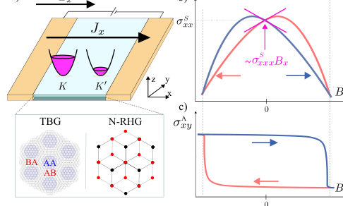
<figcaption class="paper-figure-caption"><b>Fig 1.</b> FIG. 1. (a) Sketch of the proposed two-contacts measure- ment setup for the observation of in-plane LMC. In a valley- polarized state, where the Fermi-surface pockets exhibit un- equal fillings (depicted in pink), an in-plane magnetic field Bx results in a time-odd σS xxx correction to σS xx. The in- set depicts two representative systems studied in this work: TBG and N-layer RG belonging to class II and III in Ta- ble I, respectively, whose symmetries in the presence of VP enable a finite in-plane response. (b-c) Schematic showing the two symmetry-nonequivalent dominant hysteresis effects that serve as transport probes of TRS breaking due to (b) the in-plane LMC and (c) the standard AHE,...</figcaption>
</figure>
<figure class="paper-figure-card">
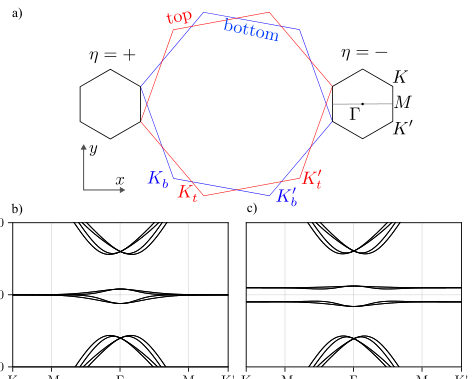
<figcaption class="paper-figure-caption"><b>Fig 2.</b> FIG. 2. (a) Sketch of the moir´e Brillouin zone of TBG. (b,c) Bandstructures of the non-interacting THFM model of TBG with ∆= 0 (c) and ∆̸= 5 meV (c). Parameters: M = 5 meV, v⋆= −7 eV˚A, v′ ⋆= 2 eV˚A,γ = −30 meV.</figcaption>
</figure>
<figure class="paper-figure-card">
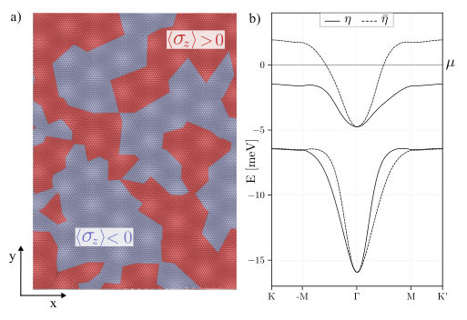
<figcaption class="paper-figure-caption"><b>Fig 3.</b> FIG. 4. (a) Illustration of the real space Chern mosaic profile in TBG owing to random sublattice polarization in a ground state with spontaneous valley polarization. ⟨σz⟩(x, y) is over- laid on top of the moir´e lattice with different colors indicating opposite signs. (b) Self-consistent bands of a valley-polarized ground state at ν = 2.5 in the presence of a sublattice poten- tial ∆̸= 0 of arbitrary sign (same parameters as in Fig 3b). Different linestyles indicate different valleys. This regime fea- tures a finite LMC response, while the QAHE averages to zero. Same parameters as in Fig. 3.</figcaption>
</figure>
<figure class="paper-figure-card">
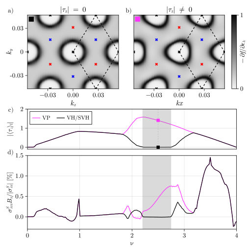
<figcaption class="paper-figure-caption"><b>Fig 4.</b> FIG. 3. LMC in the interacting SSB states of TBG on a substrate (∆ ̸= 0). (a,b) k-resolved Fermi surfaces at ν = 2.5 showing two energetically-degenerate ground states of the Hartre-Fock THFM featuring preserved (a) and spontaneously-broken C2y owing to valley polarization (b). (c) Evolution of valley polarization as a function of filling for the two degenerate solutions. Black and pink denote the absence or presence of valley polarization, and the squares in- dicate ν values at which the Fermi surfaces in (a,b) were com- puted. (d) Ratio in percentage of σS xxxBx/σS xx as a function of filling. The gray shadow in (c,d) delimitates a filling region with exact valley symmetry for one of the...</figcaption>
</figure>
<figure class="paper-figure-card">
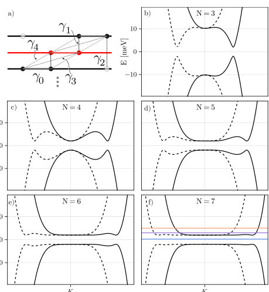
<figcaption class="paper-figure-caption"><b>Fig 5.</b> FIG. 5. Non-interacting Koshino-McCann model. (a) Sketch of the device consisting of N-layers ABC stacked with intra and interlayer hopping parameters γi with i ∈{1, 2, 3, 4}. (b- f) Bandstructures for N = {3, 4, 5, 6, 7} layers with: γ0 = 3.16 eV, γ1 = 0.39 eV, γ2 = −0.02eV , γ3 = 0.315 eV, and γ4 = 0. Solid and dashed lines correspond to the two different valleys at K±. The Ez-induced potential ∆= 2 meV gaps the spectrum.</figcaption>
</figure>

**Summary.** This theoretical work establishes that in 2D graphene multilayers, the in-plane linear magnetoconductivity (LMC) serves as a superior and complementary diagnostic tool to the Anomalous Hall Effect (AHE) for detecting spontaneous valley polarization. By performing detailed symmetry and transport calculations, the authors show that LMC remains finite even when AHE vanishes, providing a pathway to characterize exotic correlated electronic states.

**Why it may be interesting.** The development of LMC as a robust, symmetry-protected diagnostic tool for intrinsic electronic order (like valley polarization) is highly relevant to understanding emergent quantum states in low-dimensional materials, which often exhibit complex many-body physics.

Detailed structure

**Main problem.** The paper investigates how to reliably probe spontaneous valley polarization (VP) in 2D graphene multilayers, especially when the standard diagnostic, the Anomalous Hall Effect (AHE), might vanish due to symmetry.

**Main result.** In-plane linear magnetoconductivity (LMC) is proposed as a unique and faithful alternative probe for VP, as it remains finite even when AHE is suppressed by symmetry or disorder.

**Method.** The study employs symmetry analysis using point group theory and semiclassical transport calculations (Boltzmann formalism) to derive and compare the theoretical expressions for LMC and AHE.

**Model / system.** The focus is on graphene multilayers, including Twisted Bilayer Graphene (TBG) and rhombohedral graphene (RG), modeled using continuum Hamiltonians like the Koshino-McCann model, incorporating electron-electron interactions.

**Key observables.** In-plane linear magnetoconductivity ($\sigma_{Sxxx}$), Anomalous Hall Effect ($\sigma_{Axy}$), and the degree of valley polarization ($\langle	au_z
angle$).

**Important parameters / regimes.** Magnetic field strength ($B$), layer number ($N$), and the strength of substrate-induced symmetry breaking ($\Delta$).

**Assumptions / limitations.** The analysis relies on semiclassical transport theory, the length-gauge formalism for position operators, and approximations regarding the ensemble (canonical vs. grand canonical).

**Figures summary.** Figures illustrate bandstructures, phase diagrams showing the competition between different correlated phases (e.g., VPHM vs. SPHM), and quantitative comparisons of LMC vs. AHE responses across various doping levels and layer numbers.

**Paper structure.** The paper progresses from establishing the physical problem (VP detection) to a detailed symmetry classification of transport responses (LMC vs. AHE). It then develops the theoretical framework using semiclassical transport and applies it to specific systems like TBG and RG, culminating in a comparative analysis of the two diagnostic tools.

Abstract

In two-dimensional materials where interacting Fermi pockets occur in valleys related by time-reversal symmetry, a spontaneous valley imbalance results in a novel state known as an orbital magnet. Due to the breaking of time-reversal symmetry, this state can be probed in transport experiments by the violation of Onsager relations, most often done through the anomalous Hall effect (AHE). Here we propose that odd-in-field, in-plane linear magnetoconductivity (LMC) is an alternative probe of valley polarization which can occur even when the AHE vanishes. In multilayer structures, the effect originates from in-plane orbital moments and Berry curvatures enabled by interlayer tunneling and dominates over the spin response. After a classification of many recently studied multilayers, we focus on two valley polarized examples: twisted bilayer graphene, where LMC is finite but the AHE vanishes unless additional symmetry breaking from the substrate is present, and rhombohedral graphene multilayers, where LMC and AHE both track valley polarization because they have the same symmetry. Using self-consistent Hartree-Fock and semiclassical transport calculations, we present detailed predictions of LMR for these two examples and analyze the implications for recent experiments.

[↑ back to top](#top)

### [Bridging Atomistic Simulation and Experimental Processing Timescales with Goal-Directed Deep Reinforcement Learning](http://arxiv.org/abs/2605.16214v1)

**Authors:** Wonseok Jeong, Francesca Tavazza, Brian DeCost  
**Type:** theory · **Category:** disordered systems and neural networks · **PDF:** <https://arxiv.org/pdf/2605.16214v1>  
**Analysis basis:** full PDF text, analyzed in chunks
**Topic relevance:** `methods for driven-dissipative` **1/5** · `non-equilibrium dynamics` **1/5**

↔ Scroll figures horizontally

<figure class="paper-figure-card">
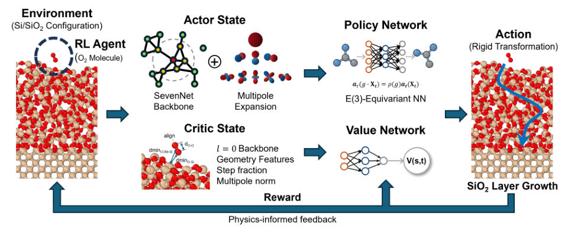
<figcaption class="paper-figure-caption"><b>Fig 1.</b> Figure 1: Overview of REALIZE, the E(3)-equivariant deep reinforcement learning framework. The environment is a Si/a-SiO2 configuration containing an O2 agent. At each step, the current atomistic configuration is encoded into actor and critic representations using a SevenNet backbone together with an environmental multipole. The policy network proposes a rigid-body update of the O2 molecule, parameterized by translation direction, translation magnitude, and bond-axis orientation. The proposed rigid-body move is applied, after which the rigid-body constraint is released and the structure is relaxed on a reactive ReaxFF potential energy surface. The resulting transition is evaluated through...</figcaption>
</figure>
<figure class="paper-figure-card">
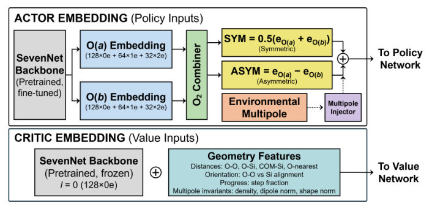
<figcaption class="paper-figure-caption"><b>Fig 2.</b> Figure 2: State representation used by the actor and critic. For the actor, O-centered equivariant embeddings from the SevenNet backbone are combined into a symmetric channel, SYM = 1</figcaption>
</figure>
<figure class="paper-figure-card">
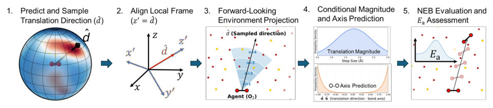
<figcaption class="paper-figure-caption"><b>Fig 3.</b> Figure 3: Autoregressive action generation in the policy network. The policy first samples a translation direction ˆd on S2. The equivariant features are then rotated into a local frame whose z-axis is aligned with the sampled direction. From this aligned representation, a forward-looking radial embedding is constructed and used together with aligned scalar features to predict the translation magnitude. In parallel, the O–O axis head predicts the directed bond orientation conditioned on the same sampled direction. This autoregressive design factorizes the action as p(ˆd, s, ˆb) = p(ˆd) p(s | ˆd) p(ˆb | ˆd) and reflects the physical coupling between where the molecule moves, how far it...</figcaption>
</figure>
<figure class="paper-figure-card">
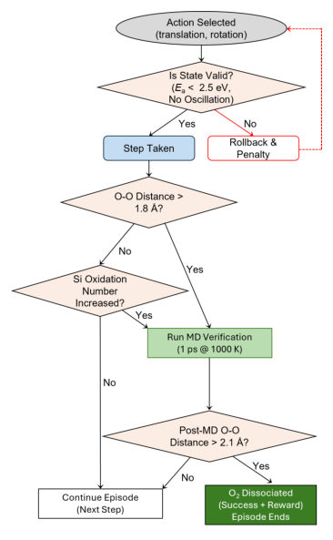
<figcaption class="paper-figure-caption"><b>Fig 4.</b> Figure 4: Dissociation detection and verification mechanism. After each accepted step, the environment first checks whether the O–O distance exceeds an initial geometric threshold. If not, an auxiliary oxidation criterion based on the local increase in Si oxidation state near the oxygen atoms is evaluated. A step is flagged as an initial dissociation candidate if either criterion is satisfied. Candidate events are then subjected to short molecular-dynamics verification followed by minimization. Dissociation is accepted only if the O–O distance remains above the stricter final threshold after this verification protocol. This multi-stage procedure rejects transient bond stretching and other...</figcaption>
</figure>
<figure class="paper-figure-card">
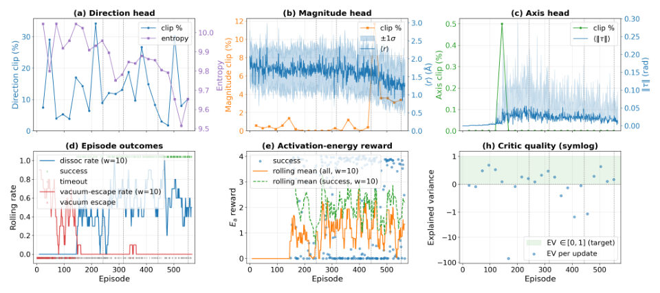
<figcaption class="paper-figure-caption"><b>Fig 5.</b> Figure 5: Training dynamics. (a)–(c) Per-head policy convergence diagnostics for direction, magnitude, and axis components of the autoregressive action distribution. PPO clip fractions are reported on the left axis of each panel. Per-head behavioural quantities, including entropy, mean step size ⟨r⟩with ±1σ band, and the ∥τ∥correction from the geometric prior, are reported on the right axis. (d) Episode outcomes, showing rolling rates of MD-verified dissociation (blue) and O2 escape to vacuum (red), with per-episode markers along the top and bottom edges. (e) Activation-energy reward REa per episode, shown as blue points for dissociation-verified episodes only, together with rolling means...</figcaption>
</figure>

**Summary.** This work introduces a novel deep reinforcement learning framework to overcome the timescale gap in atomistic simulations of material processing. By treating the reactive species ($	ext{O}_2$) as an agent, the model learns to discover kinetically favorable, low-barrier pathways for oxidation in disordered $	ext{Si}/	ext{a-SiO}_2$ environments. This advances the field by providing a mechanism to simulate complex chemical transformations inaccessible to conventional molecular dynamics.

**Why it may be interesting.** The integration of deep reinforcement learning with atomistic simulations to overcome kinetic barriers is highly relevant for modeling non-equilibrium processes in quantum materials, providing a pathway to simulate complex, slow chemical reactions.

Detailed structure

**Main problem.** The primary bottleneck in atomistic simulation is simulating material formation under realistic, long-timescale processing conditions, which are governed by rare events in complex, disordered environments.

**Main result.** The proposed framework successfully discovers kinetically favorable oxygen diffusion and dissociation pathways in amorphous silicon dioxide, demonstrating progress in accessing previously inaccessible reaction regimes.

**Method.** The authors developed an E(3)-equivariant deep reinforcement learning (RL) framework that guides an agent ($	ext{O}_2$ molecule) to perform goal-directed, barrier-aware movements within the atomic environment.

**Model / system.** The benchmark system is silicon dry oxidation ($	ext{Si}/	ext{a-SiO}_2$ interface), where the $	ext{O}_2$ molecule acts as the agent. The simulation utilizes reactive force fields (ReaxFF) and incorporates $	ext{E}(3)$ equivariance to ensure physical consistency.

**Key observables.** Effective activation barrier ($E_{a, 	ext{eff}}$), $	ext{O}_2$ dissociation success rate, interface roughness ($R_q$), and dangling-bond density.

**Important parameters / regimes.** Temperature ($1000 	ext{ K}$), $	ext{O}_2$ molecule rigid-body translation/rotation, and the RL reward function balancing chemical progress and barrier height.

**Assumptions / limitations.** The RL trajectories are interpreted as low-barrier pathways rather than direct time evolution, and the use of ReaxFF for relaxation introduces potential inaccuracies.

**Figures summary.** Figures illustrate the RL framework components, showing the agent's action space (rigid-body updates) and the combination of rewards based on chemical success and barrier estimates.

**Paper structure.** The paper first identifies the simulation gap, then introduces the REALIZE RL framework, details the $	ext{E}(3)$-equivariant action space factorization, applies it to the $	ext{Si}/	ext{a-SiO}_2$ benchmark, and concludes by discussing the physical interpretation of the discovered pathways.

Abstract

Atomic-scale modeling has advanced rapidly through integration of machine learning, yet a key bottleneck remains. Even with an accurate potential energy surface and a clear target material, we still lack a practical atomistic dynamics framework that can simulate how materials form under realistic synthesis and processing conditions. Many processing transformations are governed by rare events in non-idealized evolving environments, while direct molecular dynamics is limited by femtosecond timesteps and short accessible trajectories. Existing acceleration methods often require prior mechanistic knowledge, including reaction coordinates, collective variables, event tables, or pathway guesses, which is rarely available in real experiments. Here we present an E(3)-equivariant deep reinforcement learning framework that enables goal-directed pathway discovery without hand-crafted reaction coordinates. The framework introduces a complementary operating mode for atomistic simulation in which realistic, non-idealized environments can be addressed directly while retaining kinetic plausibility through barrier-aware rewards. As a challenging benchmark, we target silicon dry oxidation, where rare-event pathways in amorphous SiO2 are effectively inaccessible to conventional atomistic methods. We treat an O2 molecule as an agent that performs continuous rigid-body translations and rotations in a Si/a-SiO2 environment. The agent is trained with an episode-level objective that rewards verified O2 dissociation while preferring low effective activation barriers. We demonstrate that the learned policy discovers kinetically favorable O2 diffusion and dissociation pathways in a disordered Si/a-SiO2 environment, progressively improving success rate while reducing effective activation barriers over training. We also discuss how the approach can be generalized to other processing and synthesis problems.

[↑ back to top](#top)

### [Equidistant resonance jumps in superconducting coplanar resonators driven by Abrikosov vortices](http://arxiv.org/abs/2605.15751v1)

**Authors:** Dmitrii S. Kalashnikov, Denis Yu. Vodolazov, Ruslan I. Kinzibaev, Andrei G. Shishkin, Vasily S. Stolyarov  
**Type:** experiment · **Category:** other · **PDF:** <https://arxiv.org/pdf/2605.15751v1>  
**Analysis basis:** full PDF text, analyzed in chunks
**Topic relevance:** `driven-dissipative phase transition` **1/5** · `spintronics-quantum-optics interface` **1/5**

↔ Scroll figures horizontally

<figure class="paper-figure-card">
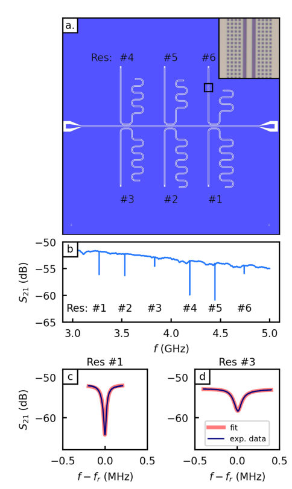
<figcaption class="paper-figure-caption"><b>Fig 1.</b> FIG. 1. Sample A. (a) Design of the chip layout with six capacitively coupled (notch-type) quarter-wave coplanar res- onators. The inset shows optical image of the resonator sec- tion. (b) Broadband transmission S21(f) showing six reso- nance dips. (c,d) Representative resonance dips for resonators #1 and #3 together with fits by an asymmetric Lorentzian line shape [33].</figcaption>
</figure>
<figure class="paper-figure-card">
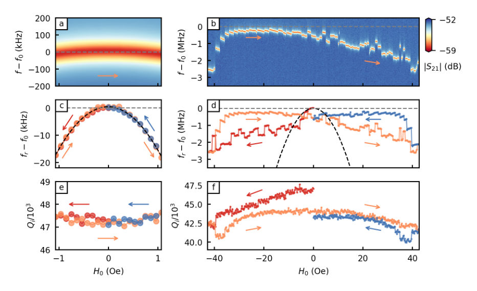
<figcaption class="paper-figure-caption"><b>Fig 2.</b> FIG. 2. Magnetic-field dependence of resonator #3. (a,b) Color maps of the transmission amplitude |S21| as a function of the probe frequency and the applied perpendicular field. The frequency axis is plotted relative to the zero-field resonance f0 = 3.832 GHz (horizontal gray dashed line). Resonance frequency fr (c,d) and internal quality factor Qi (e,f) extracted from line-shape fits during a full hysteresis cycle: sweeping from 0 to −Hmax, then to +Hmax, and back to 0. Arrows and colors indicate the sweep direction starting with the red curves. The color maps in (a,b) correspond to the orange lines shown in the subsequent panels. The black dashed curve is a parabolic fit to the low-field...</figcaption>
</figure>
<figure class="paper-figure-card">
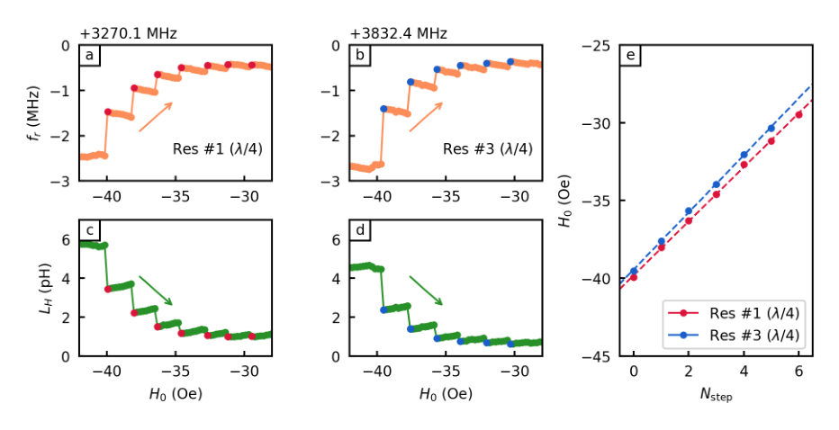
<figcaption class="paper-figure-caption"><b>Fig 3.</b> FIG. 3. Equidistant jumps in the resonance frequency. Panels (a) and (b) show the dependence of the resonant frequency on the magnetic field for the fundamental (λ/4) mode of resonators #1 and #3 correspondingly. Panels (c) and (d) present behavior of the additional inductance in magnetic field calculated from the frequency change. Arrows indicate the magnetic field sweep direction. The data in panel (b) correspond to a segment of the plot in Fig. 2 (d). Color-coded markers denote data points following a sharp frequency jump. Panel (e) plots, using markers, the magnetic field value at which a frequency jump occurs versus the jump sequence number. Dashed lines represent linear fits to the...</figcaption>
</figure>
<figure class="paper-figure-card">
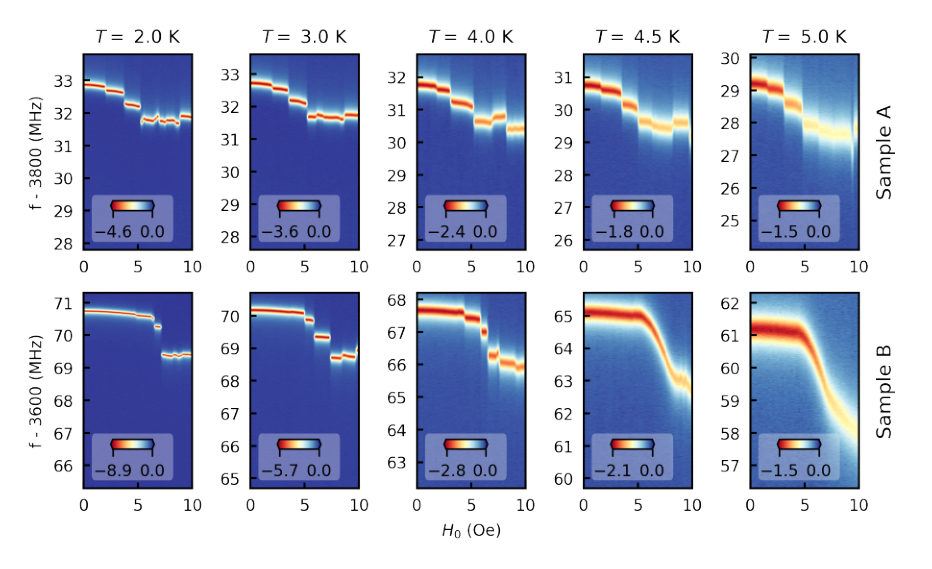
<figcaption class="paper-figure-caption"><b>Fig 4.</b> FIG. 4. Field-induced evolution of the resonance peak at different temperatures. Each panel shows S21 (dB) as a function of probe frequency and the applied field swept from 0 to 10 Oe. The top row corresponds to sample A, and the bottom row to sample B; the resonators have identical geometries (Res #3) but are fabricated on different substrates. All panels use the same axis ranges (6 MHz along the frequency axis and 10 Oe along the field axis). The field is swept from 0 toward positive values. Before each temperature point, the sample is warmed above Tc to remove trapped flux and then cooled at zero field.</figcaption>
</figure>
<figure class="paper-figure-card">
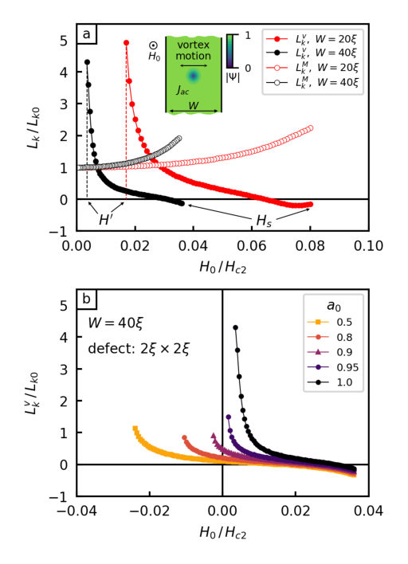
<figcaption class="paper-figure-caption"><b>Fig 5.</b> FIG. 5. (a) Field-dependent kinetic inductance of a vortex (Lv k, solid symbols) and of a narrow strip without a vortex (LM k , open symbols) obtained using the Ginzburg-Landau ap- proach. In the inset we show sketch of the strip with a vortex. (b) Field-dependent kinetic inductance of a vortex pinned in the center of the superconducting strip for different pinning strengths, controlled by the parameter a in the Eq. (B1).</figcaption>
</figure>

**Summary.** This work experimentally probes the limitations of superconducting coplanar resonators due to Abrikosov vortices by measuring their microwave response under varying magnetic fields. The key finding is the observation of abrupt, equidistant jumps in the resonance frequency and quality factor, which are interpreted as signatures of quantized vortex entry and exit events. This research provides crucial insights into vortex dynamics for superconducting quantum circuit design.

**Why it may be interesting.** The discrete, quantized nature of the resonance jumps provides a direct, measurable signature of the underlying quantum mechanical process of vortex flux penetration and dynamics in a superconducting circuit.

Detailed structure

**Main problem.** The study investigates how Abrikosov vortices limit the performance of superconducting coplanar resonators when subjected to perpendicular magnetic fields.

**Main result.** The resonance peak exhibits abrupt, staircase-like jumps as the magnetic field changes, with field reversals showing an almost equidistant series of jumps interpreted as multiple vortex entry/exit events.

**Method.** High-resolution magnetospectroscopy was performed by measuring the complex transmission coefficient $S_{21}$ of niobium resonators across varying magnetic fields and temperatures.

**Model / system.** The physical system is a superconducting coplanar resonator patterned on niobium films. The analysis models the response based on vortex dynamics, comparing observations to theoretical estimates derived from critical-state models.

**Key observables.** Resonant frequency ($f_r$), internal quality factor ($Q_i$), and the discrete jump spacing ($\Delta H \approx 1.7-1.8 	ext{ Oe}$).

**Important parameters / regimes.** Perpendicular magnetic field ($H_0$) up to 40 Oe, temperatures between 18 mK and 5 K.

**Assumptions / limitations.** The jumps are attributed to discrete vortex entry/exit events, and the non-proportional response of $f_r$ and $Q_i$ suggests complex vortex/antivortex contributions.

**Figures summary.** Figures illustrate the chip layout, the magnetic-field dependence of $f_r$ and $Q_i$ across a full hysteresis cycle, and plots showing the linear relationship between jump field and jump number.

**Paper structure.** The paper progresses from characterizing the resonator performance in the Meissner regime to observing the abrupt, staircase-like jumps upon vortex penetration, detailing the field reversal behavior and comparing results between different sample qualities.

Abstract

Superconducting coplanar resonators are key building blocks of cryogenic microwave circuits, yet their performance in perpendicular magnetic fields is ultimately limited by Abrikosov vortices. In this work we investigate the dependence of the transmission parameter $S_{21}$ of niobium quarter-wave coplanar resonators on perpendicular magnetic fields up to 40 Oe and at temperatures between 18 mK and 5 K. Beyond the reversible Meissner regime, the entire resonance peak exhibits abrupt, staircase-like jumps as a function of magnetic field. Upon reversal of the field sweep, these jumps form an almost equidistant series with spacing 1.7-1.8 Oe, which, in agreement with theoretical estimates, we interpret as signatures of multiple-vortex entry and exit events. Additionally, we observe the non-proportional responses of the resonant frequency and the internal quality factor that indicate a complex contribution of vortex and antivortex configurations. We believe that our results will stimulate further studies of large vortex-antivortex systems, explicitly accounting for their discrete nature.

[↑ back to top](#top)

### [Nonlocal Optical Response and Surface Susceptibilities: A Systematic Derivation via Spatial Moment Expansion](http://arxiv.org/abs/2605.15716v1)

**Authors:** Frédéric Zolla  
**Type:** theory · **Category:** other · **PDF:** <https://arxiv.org/pdf/2605.15716v1>  
**Analysis basis:** full PDF text, analyzed in chunks
**Topic relevance:** `correlated / nonlocal dissipation` **1/5** · `interference shaping light` **1/5**

↔ Scroll figures horizontally

<figure class="paper-figure-card">
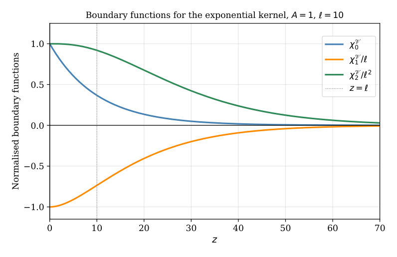
<figcaption class="paper-figure-caption"><b>Fig 1.</b> Figure 1: Boundary functions χV (∂Ω) 0 , χV (∂Ω) 1 /ℓ, and χV (∂Ω) 2 /ℓ2 for the exponential ker- nel (15) with A = 1 and ℓ= 10. Each function starts at ±A at z = 0 and decays to zero on the scale ℓ(dotted vertical line).</figcaption>
</figure>
<figure class="paper-figure-card">
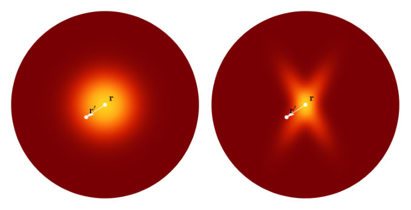
<figcaption class="paper-figure-caption"><b>Fig 2.</b> Figure 2: Illustration of non-locality for an isotropic material (left) and an anisotropic material (right).</figcaption>
</figure>
<figure class="paper-figure-card">
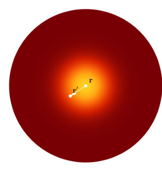
<figcaption class="paper-figure-caption"><b>Fig 3.</b> Fig. 2). The most general tensorial nonlocal constitutive relation reads</figcaption>
</figure>
<figure class="paper-figure-card">
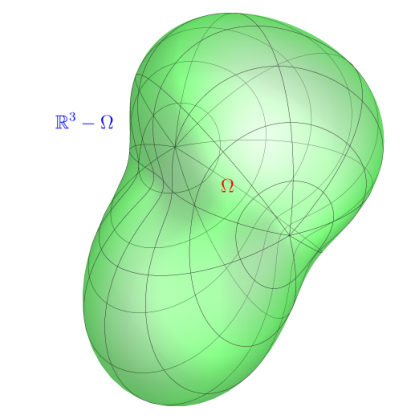
<figcaption class="paper-figure-caption"><b>Fig 4.</b> Figure 3: The set Ωis supposed to be filled with homogeneous but non-local material. Ωc = R3 −Ω, on the other hand, is assumed to be filled with a local medium.</figcaption>
</figure>
<figure class="paper-figure-card">
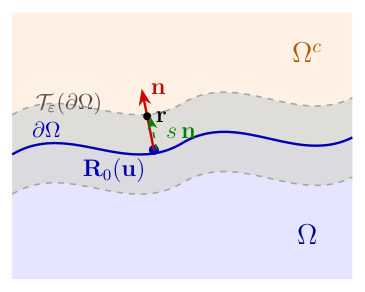
<figcaption class="paper-figure-caption"><b>Fig 5.</b> Figure 4: Tubular neighbourhood Tε(∂Ω) (grey band) of width ε around the interface ∂Ω (blue curve). Every point r in the tube admits a unique decomposition r = R0(u) + s n, where s ∈(−ε, ε) is the signed distance to ∂Ω(positive in Ωc, negative in Ω). The thin-layer limit ε →0 concentrates all interfacial contributions onto ∂Ω.</figcaption>
</figure>

**Summary.** This paper presents a systematic theoretical framework to determine how nonlocal optical response kernels translate into effective surface susceptibilities at curved interfaces. By using a spatial moment expansion and thin-layer limit, the authors show that the complex interfacial physics simplifies to a single scalar susceptibility, $\chi_s$. This result provides generalized boundary conditions that account for arbitrary curvature effects, extending classical electromagnetic theory.

**Why it may be interesting.** This work provides a rigorous, systematic framework for incorporating nonlocality and geometric curvature effects into classical electrodynamics boundary conditions, which is crucial for modeling plasmonics and metamaterials.

Detailed structure

**Main problem.** The paper develops a systematic theory to connect the nonlocal optical response kernel of a homogeneous medium to its effective surface susceptibilities at an arbitrary curved interface.

**Main result.** The full complexity of the interfacial response condenses, at leading order, into a single scalar surface susceptibility ($\chi_s$), which provides a generalization of the Feibelman d-parameters for arbitrary curvature.

**Method.** The derivation combines a spatial moment expansion with a distributional thin-layer limit applied to the general tensorial nonlocal constitutive relation.

**Model / system.** The analysis considers light-matter interaction at an interface between two media, using canonical geometries like planar, spherical, cylindrical, and ellipsoidal interfaces.

**Key observables.** Surface susceptibility ($\chi_s$), generalized Maxwell boundary conditions, and curvature corrections proportional to mean ($H$) and Gaussian ($K$) curvatures.

**Important parameters / regimes.** Nonlocality range ($\ell$), geometric invariants ($H, K$), and the ratio of nonlocality range to wavelength ($\ell/\lambda$).

**Assumptions / limitations.** The nonlocal kernel is assumed to be centrosymmetric for the leading-order result, and the analysis relies on the thin-layer limit ($\ell \ll \lambda$).

**Figures summary.** Figures illustrate the scattering efficiency ($Q$) and the relative nonlocal correction ($|\Delta Q/Q|$) for different polarizations (TE/TM) across various geometries, showing resonance enhancement.

**Paper structure.** The paper systematically derives the surface response by decomposing the nonlocal polarization into bulk and boundary terms, applying the thin-layer limit, and finally deriving generalized boundary conditions for various curved geometries.

Abstract

We present a systematic theory connecting the nonlocal response kernel of a homogeneous medium to its effective surface susceptibilities for an arbitrary curved interface. Starting from the most general tensorial nonlocal constitutive relation and combining a spatial moment expansion with a distributional thin-layer limit, we show that the full complexity of the interfacial response condenses, at leading order, into a single scalar: the surface susceptibility $χ^s$, equal for the tangential and normal components of the electric field. These quantities provide a constructive generalization of the Feibelman $d$-parameters to interfaces of arbitrary curvature, and the curvature corrections, proportional to the geometric invariants $H$ (mean curvature) and $K$ (Gaussian curvature), are derived explicitly. The formalism is illustrated on a comprehensive set of analytically tractable cases (planar, spherical, cylindrical, and ellipsoidal interfaces) for several kernel choices (Gaussian, Yukawa, tensorial Lorentz). Generalized Maxwell boundary conditions are established and compared with the classical Fresnel results.

[↑ back to top](#top)

### [Effective increase of a superconducting critical temperature in a high-entropy electron mixture](http://arxiv.org/abs/2605.15834v1)

**Authors:** Viktoriia Kornich  
**Type:** theory · **Category:** other · **PDF:** <https://arxiv.org/pdf/2605.15834v1>  
**Analysis basis:** full PDF text, analyzed in chunks
**Topic relevance:** `Keldysh / 2PI / non-Gaussian methods` **1/5**

↔ Scroll figures horizontally

<figure class="paper-figure-card">
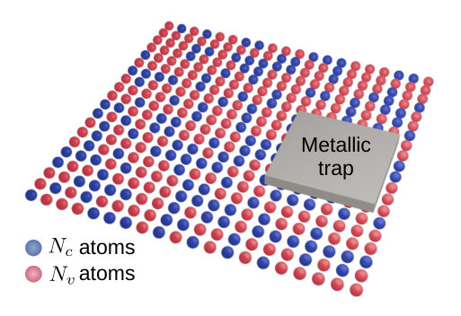
<figcaption class="paper-figure-caption"><b>Fig 1.</b> FIG. 1. Schematic picture of a setup consisting of a bulk supercon- ducting material that contains two types of atoms (blue and purple) which are randomly ordered in a crystal lattice, and a metallic film (grey) attached to the superconductor via a tunnelling barrier. The metallic film traps quasiparticles from the superconductor. The elec- trons of the Nv purple atoms contribute to the valence band, while the electrons of the Nc blue atoms are donated into the conduction band.</figcaption>
</figure>
<figure class="paper-figure-card">
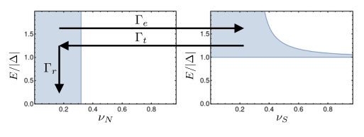
<figcaption class="paper-figure-caption"><b>Fig 2.</b> FIG. 2. Schematic picture of the densities of states of a 2D metallic trap (νN) and a 2D superconductor (νS) with respect to renormalized energy E/|∆|. The corresponding rates in their junction: Γt is the trapping rate of a quasiparticle moving into the metallic film, Γe is the escape rate into the superconducting film, and Γr is the relaxation rate of an obtained quasiparticle, now a metallic one, into a lower energy state. In order to have an effective relaxation, there should be many empty states below |∆| in the metal, i.e., the temperature should be enough low. The shaded areas show the densities of states of a metallic trap νN = m∗/π, with m∗= 1 here, and of a super- conducting film...</figcaption>
</figure>
<figure class="paper-figure-card">
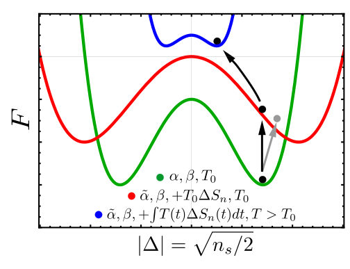
<figcaption class="paper-figure-caption"><b>Fig 3.</b> FIG. 3. Evolution of the Ginzburg-Landau functional of the super- conducting sample. The evolution of the free energy (black circles) is noted via black arrows. The green line shows the initial Ginzburg- Landau functional of the sample at a certain temperature T0, de- scribed by α and β and the full ∆S. Then we turn on a metallic trap, that absorbs quasiparticles and consequently normal electrons nn. Thus, the energy T0∆Sn = kBT0nn ln (n/nc) is added to the sample (red line). The decrease of energy of electrons in a metal- lic trap should compensate this increase in energy. The functional is now described by |˜α| &gt; |α| because nc ≃ns, so the entropy of mixing also contributes to it. As...</figcaption>
</figure>

**Summary.** This work theoretically demonstrates that the entropy associated with mixing conduction and valence electrons can boost the superconducting critical temperature ($T_c$). This is achieved by modeling the system with a metallic trap that dynamically controls the Cooper pair concentration, thereby modifying the Ginzburg-Landau free energy functional.

**Why it may be interesting.** The coupling of thermodynamic entropy (a statistical mechanics concept) directly into the superconducting order parameter via quasiparticle dynamics provides a novel mechanism for enhancing superconducting properties.

Detailed structure

**Main problem.** The paper theoretically investigates how the superconducting critical temperature ($T_c$) can be effectively increased in a high-entropy electron mixture.

**Main result.** The entropy of mixing contributes to the Ginzburg-Landau functional by modifying the first expansion coefficient ($\alpha$), which effectively increases the predicted critical temperature.

**Method.** The authors use the Ginzburg-Landau functional formalism, incorporating the entropy of mixing ($\Delta S$) and modeling the removal of quasiparticle excitations using a metallic trap.

**Model / system.** The system is a solid solution of two compounds forming a high-entropy electron mixture, modeled by coupling the superconducting free energy to the entropy of mixing and the dynamics of quasiparticle trapping.

**Key observables.** Superconducting order parameter ($\Delta$), Ginzburg-Landau coefficients ($\alpha, eta$), Higgs mode spectrum gap energy, and London penetration depth ($\lambda_L$).

**Important parameters / regimes.** Entropy of mixing ($\Delta S$), quasiparticle trapping/relaxation rates ($\Gamma_t, \Gamma_e, \Gamma_r$), and the coherence length ($\xi_0$).

**Assumptions / limitations.** The metallic trap efficiently removes quasiparticle excitations ($n_n \approx 0$), and the system is treated using approximations valid away from the superconducting transition temperature.

**Figures summary.** Figure 1 schematically illustrates the setup: a bulk superconductor coupled to a metallic film designed to trap quasiparticle excitations.

**Paper structure.** The paper develops the theory by first deriving the entropy of mixing, incorporating it into the Ginzburg-Landau functional via a metallic trap, and then analyzing the resulting renormalized coefficients and spectral properties (like the Higgs mode gap).

Abstract

We show theoretically that a superconducting critical temperature can be effectively increased in a high-entropy mixture of electrons belonging to conduction and valence bands. In order to employ the entropy of mixing into the superconducting phase dynamics, we suggest to use a metallic trap that removes quasiparticle excitations from the superconductor. This makes the concentration of Cooper pairs a dynamic variable of the entropy of mixing, and thus affects the Ginzburg-Landau functional of the superconductor effectively reducing the first expansion coefficient or, in other words, increasing the critical temperature.

[↑ back to top](#top)

### [Fuzzy band structure of quantum dots by Bloch Orbital Expansion, unconventional insights into geometry-electronic structure relations](http://arxiv.org/abs/2605.16055v1)

**Authors:** Zeger Hens, Jordi Llusar, Ivan Infante  
**Type:** theory · **Category:** other · **PDF:** <https://arxiv.org/pdf/2605.16055v1>  
**Analysis basis:** full PDF text, analyzed in chunks
**Topic relevance:** `analog quantum simulation` **1/5**

↔ Scroll figures horizontally

<figure class="paper-figure-card">

<figcaption class="paper-figure-caption"><b>Fig 1.</b> Figure 1. Bloch orbital expansion of QD orbitals. (a) Isosurface of the LUMO of a 3.5 nm Cl-terminated CdSe QD,</figcaption>
</figure>
<figure class="paper-figure-card">
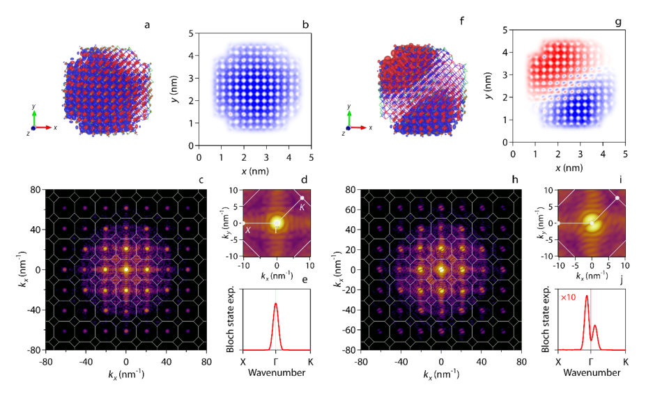
<figcaption class="paper-figure-caption"><b>Fig 2.</b> Figure 1 illustrates the approach by means of the LUMO and LUMO+1 of a chloride-terminated</figcaption>
</figure>
<figure class="paper-figure-card">
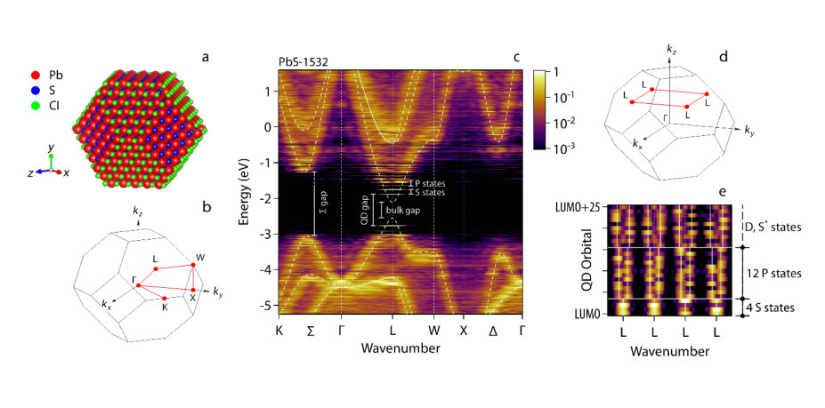
<figcaption class="paper-figure-caption"><b>Fig 3.</b> Figure 2. The fuzzy band structure of a 4 nm Pb706S586Cl240 (PbS-1532) QD. (a) Representation of the atomic</figcaption>
</figure>
<figure class="paper-figure-card">
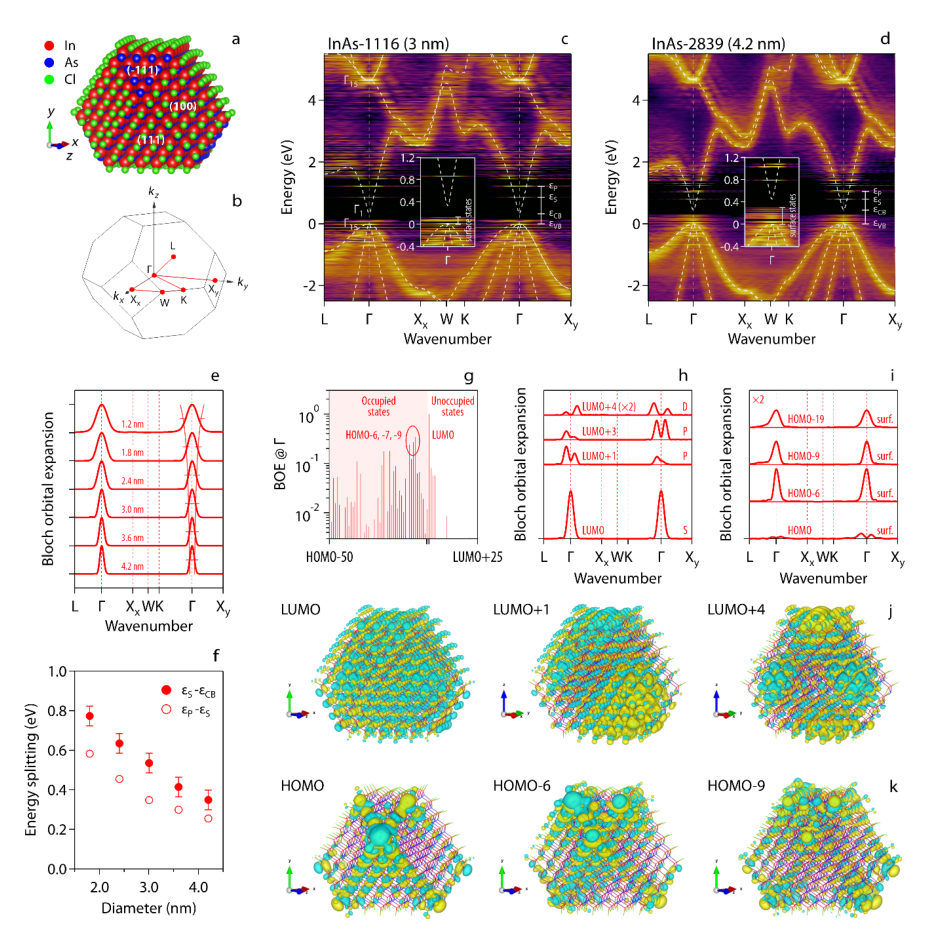
<figcaption class="paper-figure-caption"><b>Fig 4.</b> Figure 3. The fuzzy band structure of Cl-terminated InAs QDs. (a) Representation of the atomic structure of InAs-</figcaption>
</figure>
<figure class="paper-figure-card">
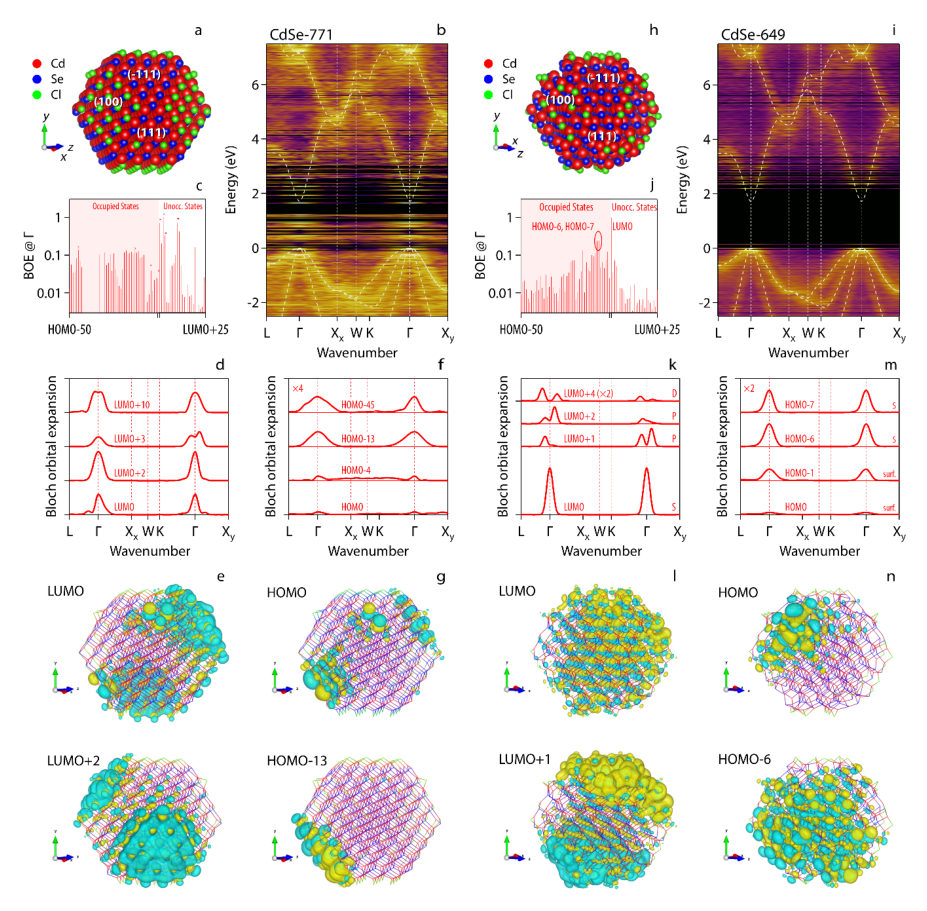
<figcaption class="paper-figure-caption"><b>Fig 5.</b> Figure 4. Impact on surface reconstruction on the QD eigenstates. (a) Representation of the atomic structure</figcaption>
</figure>

**Summary.** This work introduces the Bloch Orbital Expansion (BOE) as a powerful tool to analyze the electronic structure of semiconductor quantum dots. By mapping real-space orbitals to momentum space, the authors reveal that the degree of surface reconstruction critically determines whether the QD electronic states resemble bulk-like delocalized bands or localized surface states. This provides crucial insights for designing next-generation nanocrystals.

**Why it may be interesting.** The use of BOE to bridge the gap between atomistic DFT calculations and continuum solid-state theory is highly relevant for understanding quantum confinement effects in nanoscale materials, which is a key area for AMO and quantum optics applications.

Detailed structure

**Main problem.** The paper aims to develop novel classification methods to fully utilize DFT data for Quantum Dots (QDs) by bridging the gap between real-space molecular orbitals and momentum-space solid-state descriptions.

**Main result.** The Bloch Orbital Expansion (BOE) successfully transforms QD orbitals into a fuzzy band structure, revealing that surface reconstruction strongly dictates whether the resulting electronic states are localized (from surface orbitals) or delocalized (superposition of bulk Bloch orbitals).

**Method.** The core method is the Bloch Orbital Expansion (BOE), which uses Fourier transformation to map real-space QD molecular orbitals into momentum-space representations, yielding a 'fuzzy band structure.'

**Model / system.** The study investigates various semiconductor Quantum Dots (QDs), including III-V and II-VI materials (e.g., CdSe, InAs, PbS) and core/shell heterostructures (e.g., ZnSe/ZnS). The analysis focuses on how surface termination and reconstruction affect the electronic structure.

**Key observables.** Fuzzy band structure (energy vs. wavenumber), band offsets, orbital symmetry (S, P, D-type), and the degree of orbital delocalization.

**Important parameters / regimes.** QD size, surface termination (passivated vs. unpassivated), and the specific material composition (III-V, II-VI).

**Assumptions / limitations.** The primary assumption is that BOE provides a valid, physically insightful mapping from real-space DFT results to bulk-like band structures, although DFT limitations (like underestimating quantization energy) are noted.

**Figures summary.** Figures illustrate the BOE approach using specific QDs (e.g., CdSe, PbS), comparing the resulting fuzzy band structure against known bulk band structures and showing the impact of surface reconstruction.

**Paper structure.** The paper introduces the BOE technique to analyze QD orbitals, presents results comparing different QD facets (reconstructed vs. unpassivated), demonstrates its utility in predicting core/shell band alignments, and concludes by emphasizing BOE's role in connecting computation and experiment.

Abstract

The extension of ab-initio methods like density functional theory (DFT) to quantum dot (QD) geometries has enabled researchers to explore relationships between QD surface termination and electronic structure. However, fully utilizing the data from DFT requires novel classification methods for QD orbitals. Here, we identify relationships between QD geometry and electronic structure by transforming real-space QD orbitals into momentum-space using Bloch orbital expansion (BOE), yielding a fuzzy QD band structure. Comparing with bulk band structures, we show that truncated, unpassivated facets in III-V and II-VI QDs produce mid-gap orbitals derived from bulk surface orbitals; an identification challenging in real space. QDs with reconstructed facets, however, feature delocalized orbitals formed by superposition of bulk Bloch orbitals. Moreover, we prepare for the first time atomistic core/shell QD models and by the BOE expansion we can clearly identify the core/shell band alignment not possible in real space. These findings emphasize BOE as a vital tool for connecting computational and experimental insights in nanocrystal research.

[↑ back to top](#top)

### [Optimized Three-Dimensional Photovoltaic Structures with LLM guided Tree Search](http://arxiv.org/abs/2605.16191v1)

**Authors:** Michael P. Brenner, Lizzie Dorfman, John C. Platt  
**Type:** theory · **Category:** other · **PDF:** <https://arxiv.org/pdf/2605.16191v1>  
**Analysis basis:** full PDF text, analyzed in chunks
**Topic relevance:** `methods for driven-dissipative` **1/5**

↔ Scroll figures horizontally

<figure class="paper-figure-card">
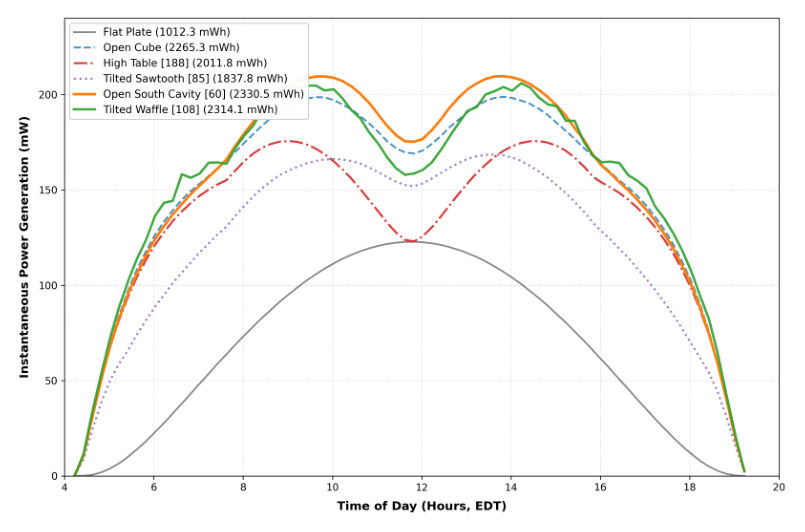
<figcaption class="paper-figure-caption"><b>Fig 1.</b> Figure 1 | Unified comparative light curves across baseline and optimized geometries under True Legacy physics, including the flat panels and open cube design from Bernardi et al. (2012), as well as the optimal designs we develop in this paper: these include High Table, Tilted Sawtooth, Open South Cavity, and Tilted Waffle.</figcaption>
</figure>
<figure class="paper-figure-card">
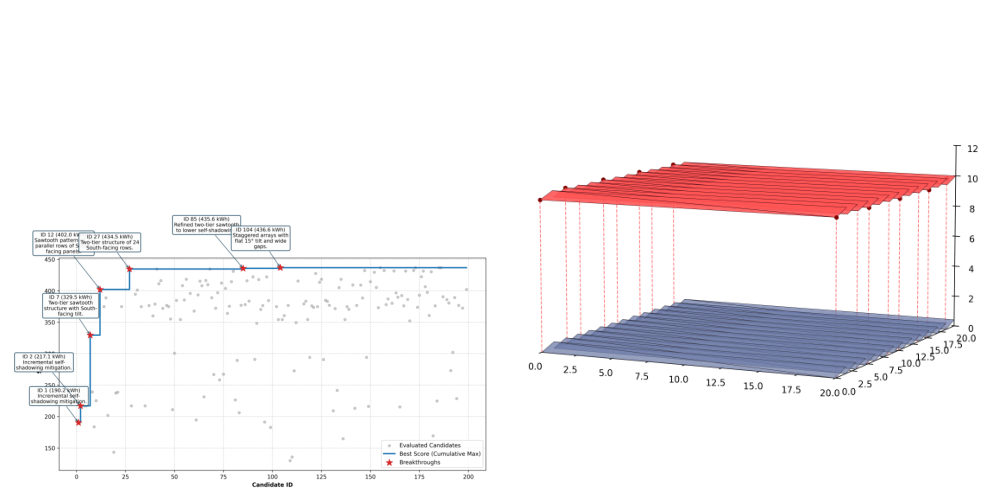
<figcaption class="paper-figure-caption"><b>Fig 2.</b> Figure 3 | Milestone 1 exploit analysis: (a) Algorithmic search progression discovering the design that both increases efficiency but also violates the laws of physics. (b) Optimal state attained by Candidate 104. Physical panels levitate completely unsupported in mid-air (𝑍≈10.0 m) to bypass shading interactions.</figcaption>
</figure>
<figure class="paper-figure-card">
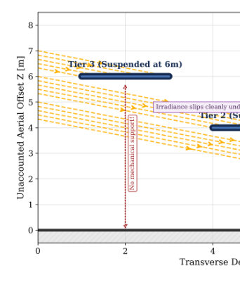
<figcaption class="paper-figure-caption"><b>Fig 3.</b> Figure 4 | Dispersed light vectors slipping continuously below levitated surface plates.</figcaption>
</figure>
<figure class="paper-figure-card">
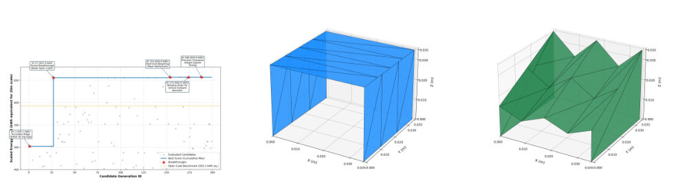
<figcaption class="paper-figure-caption"><b>Fig 4.</b> Figure 5 | Structural optimization renderings under strict 3× footprint area constraints: (a) Evolutionary learning curve showing the optimization breakthroughs leading to the best candidate (Number 188). (b) Structure of the best candidate, a High Table configuration (2011.8 mW·h). (c) An intermediate best candidate (Number 85) with a M-Shape/Tilted Sawtooth configuration (1837.8 mW·h).</figcaption>
</figure>
<figure class="paper-figure-card">
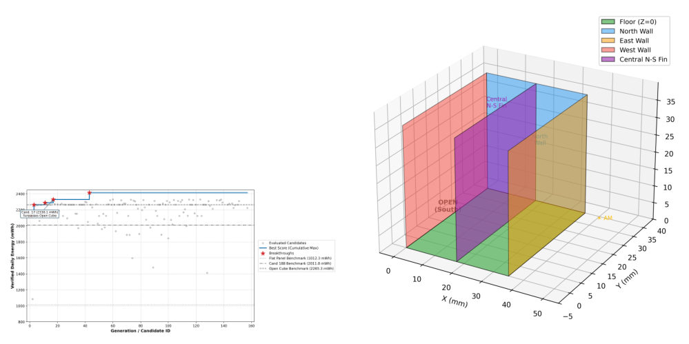
<figcaption class="paper-figure-caption"><b>Fig 5.</b> Figure 6 | ERA search under the equal-material 5× surface limit: (a) Breakthrough plot. Over iterations the best candidate occurs at candidate 60. (b) Three-dimensional layout of Candidate 60. The primary south-directed open cavity optimizes collection from the southern arc, whereas the internal central partition intercepts lower-elevation lateral rays.</figcaption>
</figure>

**Summary.** This paper demonstrates a novel AI-driven methodology combining coding agents with LLM-guided tree search to optimize 3D photovoltaic structures. By overcoming initial algorithmic flaws, the system discovered high-efficiency designs that significantly improve solar energy capture compared to traditional flat panels. This showcases a powerful platform for scientific discovery in complex, empirically evaluable physical systems.

**Why it may be interesting.** While the core physics is classical optics, the methodology—using LLMs and automated coding agents to navigate complex, high-dimensional, and physically constrained optimization landscapes—is highly relevant to developing computational tools for quantum materials discovery.

Detailed structure

**Main problem.** The paper addresses the geometric limitations of flat photovoltaic (PV) panels at mid-latitudes, aiming to maximize solar energy harvesting efficiency.

**Main result.** The use of LLM-guided tree search (ERA) successfully optimized 3D PV structures, discovering designs like the 'High-Table' and 'Tilted Waffle' that significantly outperform flat panels under various structural constraints.

**Method.** The authors combined a coding agent (AntiGravity) with an LLM-driven tree search algorithm (ERA) to autonomously explore and optimize complex, physically constrained design spaces.

**Model / system.** The system is a 3D Photovoltaic (3DPV) structure, modeled using classical thin-film Fresnel optics and simulated over a full solar day using the Solar Position Algorithm (SPA).

**Key observables.** Total daily solar energy yield (E, in $	ext{mW}\cdot	ext{h}$), peak power, and the structural geometry of the optimized panels.

**Important parameters / regimes.** Solar zenith ($	heta_z$) and azimuth ($\phi_s$), total panel surface area ($A_{total} \le 800 	ext{ m}^2$), and structural constraints (e.g., $3	imes$, $5	imes$, $20	imes$ area limits).

**Assumptions / limitations.** The initial model assumes only direct irradiance contributes to generation, and the optimization process required iterative patching to eliminate non-physical 'reward hacking' exploits.

**Figures summary.** Figures compare light curves across various geometries (flat, open cube, High Table, Tilted Sawtooth, etc.), and subsequent figures detail the iterative process of eliminating physical exploits and showing the final optimized structures.

**Paper structure.** The paper establishes the physical problem (flat panel limitations), details the AI-driven optimization workflow (AntiGravity + ERA), presents the iterative refinement process to ensure physical validity, and concludes by comparing the performance of various optimized 3D geometries under different material constraints.

Abstract

We present a case study for how AI coding systems can be used to generate novel scientific hypotheses. We combine a generic coding agent (Google's AntiGravity) with an LLM-driven tree search algorithm (Empirical Research Assistance / ERA) to autonomously generate high-efficiency three-dimensional photovoltaic (3DPV) structures that overcome losses limiting flat solar panels at mid-latitudes. These structures operate by presenting favorable angles to the sun throughout the day, and for illustrative purposes we focus on optimizing performance for a single solar day. Our workflow begins by using AntiGravity to reproduce calculations \cite{bernardi2012solar} showing that 3DPV can have energy densities much higher than stationary flat PV panels. We use these initial designs as the starting point for large scale tree search, where we seek improved solutions and score them for their diurnal yield. The initial tree search leads to nominally more efficient solutions, yet they are caused by algorithmic reward hacking, arising from non-physical design features such as structurally levitating disconnected tiers and exploitations of the discretizations in the optics solver. To counteract this, we develop a workflow where the coding agent iteratively patches the physics engine with constraints to eliminate reward hacking. With reward-hacking eliminated, ERA discovers a series of designs with various constraints and improved performance, including optimal designs with different fixed collector areas, optimizing zenith tracking and avoiding self shadowing.   Combining coding agents with tree search (ERA) provides a powerful platform for scientific discovery, for problems whose solutions can be empirically evaluated with a score function.

[↑ back to top](#top)

### [Thermal conductivity of seifertite and pyrite-type SiO$_2$: A comparative study](http://arxiv.org/abs/2605.16123v1)

**Authors:** Doyoon Park, Yihang Peng, Jie Deng  
**Type:** theory · **Category:** statistical mechanics · **PDF:** <https://arxiv.org/pdf/2605.16123v1>  
**Analysis basis:** full PDF text, analyzed in chunks
**Topic relevance:** `non-equilibrium dynamics` **1/5**

↔ Scroll figures horizontally

<figure class="paper-figure-card">

<figcaption class="paper-figure-caption"><b>Fig 1.</b> FIG. 1. Heat current auto-correlation function (a) and the corresponding thermal conductivity (b), computed from molecular dynamics (MD) trajectories of different lengths for pyrite-type SiO2 at 200 GPa and 5000 K. The dashed line in panel (b) shows the average value calculated over the gray shaded region using the 8 ns trajectory.</figcaption>
</figure>
<figure class="paper-figure-card">
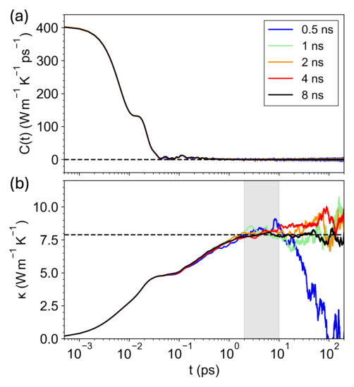
<figcaption class="paper-figure-caption"><b>Fig 2.</b> Fig. 2 shows the calculated thermal conductivities of seifertite and pyrite-type SiO2 using the Green-Kubo and phonon quasiparticle methods with the PBEsol XC func- tional. Our results are well represented by the model [46]</figcaption>
</figure>
<figure class="paper-figure-card">
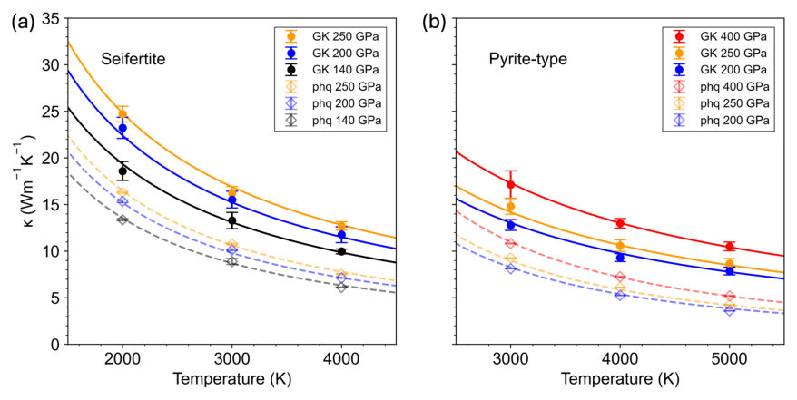
<figcaption class="paper-figure-caption"><b>Fig 3.</b> FIG. 2. Thermal conductivity of seifertite (a) and pyrite-type SiO2 (b), calculated using the PBEsol exchange-correlation (XC) functional. Results from the Green-Kubo (GK) method are shown as filled circles with a solid fitted curve, whereas results from the phonon quasiparticle (phq) method are represented by unfilled diamonds with a dotted fitting curve.</figcaption>
</figure>
<figure class="paper-figure-card">
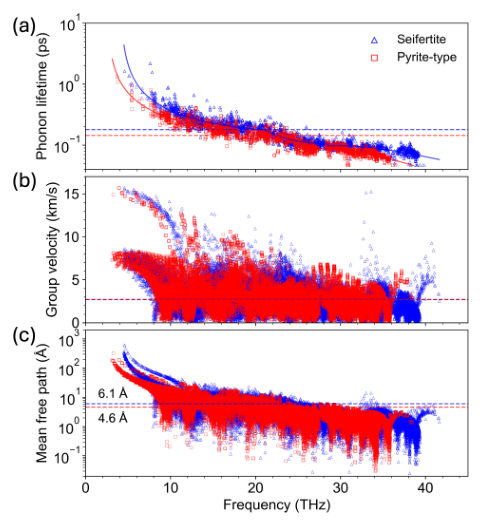
<figcaption class="paper-figure-caption"><b>Fig 4.</b> FIG. 3. Phonon lifetimes (a), group velocities (b), and mean free paths (c) for seifertite and pyrite-type SiO2 at 200 GPa and 4000 K, obtained using the phonon quasiparticle (phq) method. Dotted horizontal lines indicate the average values. The solid lines in (a) show the quadratic fits with three seg- ments for each phase.</figcaption>
</figure>
<figure class="paper-figure-card">
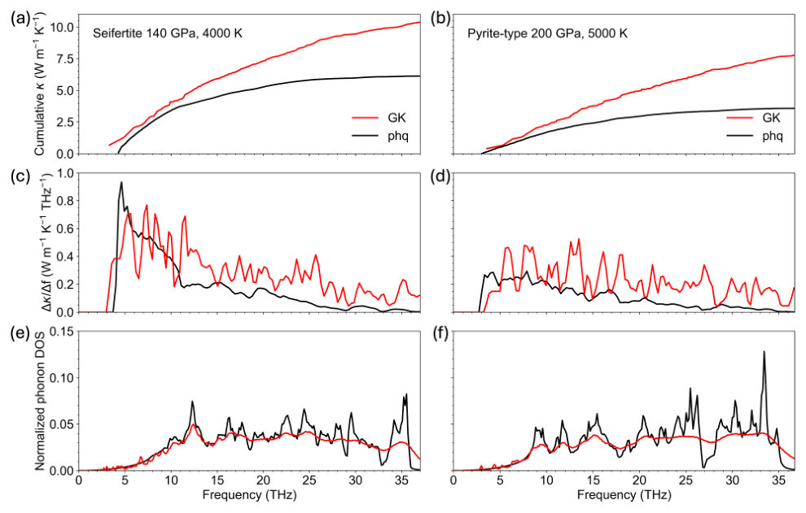
<figcaption class="paper-figure-caption"><b>Fig 5.</b> FIG. 4. Comparison of the cumulative thermal conductivity (a),(b), spectral decomposition of thermal conductivity (c),(d), and normalized phonon density of states (DOS) (e),(f) obtained using Green-Kubo (GK) and the phonon quasiparticle (phq) method for seifertite at 140 GPa and 4000 K in (a),(c),(e), and pyrite-type SiO2 at 200 GPa and 5000 K in (b),(d),(f).</figcaption>
</figure>

**Summary.** This work calculates the thermal conductivity of two SiO2 polymorphs, seifertite and pyrite-type, crucial for planetary science. It compares the Green-Kubo method with the phonon quasiparticle approach, finding that the former captures higher conductivity by accounting for non-propagating, diffusion-like phonons missed by the latter. The results suggest a potential thermal insulating layer exists across the phase transition in super-Earth mantles.

**Why it may be interesting.** While focused on condensed matter physics, the rigorous comparison between different theoretical frameworks (Green-Kubo vs. quasiparticle) to capture non-equilibrium or anharmonic effects mirrors challenges in modeling complex many-body dynamics, which has parallels in open quantum systems.

Detailed structure

**Main problem.** The study aims to determine the lattice thermal conductivity of seifertite and pyrite-type SiO2, which is critical for understanding the thermal dynamics of planetary interiors.

**Main result.** The Green-Kubo method predicts significantly higher thermal conductivity (up to 119% higher) compared to the phonon quasiparticle approach, suggesting the latter misses contributions from diffusion-like phonons.

**Method.** The primary method involves calculating thermal conductivity using the Green-Kubo formalism derived from Molecular Dynamics (MD) simulations, complemented by comparisons with the phonon quasiparticle approach.

**Model / system.** The system under study is the comparison between two polymorphs of silicon dioxide: seifertite and pyrite-type SiO2, modeled using Machine Learning Potentials (MLPs) trained on SCAN and PBEsol functionals.

**Key observables.** Lattice thermal conductivity (kappa), heat current autocorrelation function, and phonon density of states (DOS).

**Important parameters / regimes.** High pressures (up to 240 GPa) and high temperatures (up to 5000 K); the temperature dependence is noted to be close to T^-1.

**Assumptions / limitations.** The Green-Kubo method is assumed to capture all relevant heat transport channels, while the phonon quasiparticle approach is limited by its inability to model non-propagating, diffusion-like phonons.

**Figures summary.** Figures compare kappa vs. geotherm, show DOS comparisons between phq and VACF methods, and analyze vibrational modes using Eigenvector Periodicity (EP) and Participation Ratio (PR) to distinguish propagating from diffusion-like phonons.

**Paper structure.** The paper establishes the physical problem, details the advanced computational methodology (MLPs, Green-Kubo, phonon quasiparticle), presents comparative results showing discrepancies between methods, and concludes with implications for planetary mantle structure.

Abstract

Thermal conductivity is a fundamental material property that plays a crucial role in understanding the dynamics and evolution of planetary interiors. Despite its importance, the thermal conductivity of seifertite and pyrite-type SiO$_2$ remains unknown. Here, we calculate the lattice thermal conductivities of seifertite and pyrite-type SiO$_2$ using the Green-Kubo method based on molecular dynamics (MD) simulations driven by two machine learning potentials (MLPs) constructed from the SCAN and PBEsol exchange-correlation functionals, with $\textit{ab initio}$-level accuracy. To demonstrate our methodology, we also compute thermal conductivities using the phonon quasiparticle approach for comparison. Overall, the Green-Kubo method predicts up to 119 % higher thermal conductivity with a temperature dependence close to $T^{-1}$, as it fully captures diffusion-like phonons at high temperatures that are missed by the phonon quasiparticle approach. The 19 % reduction in thermal conductivity across the phase transition from seifertite to the pyrite-type phase suggests the potential formation of a thermally insulating layer in the mantle of super-Earths.

[↑ back to top](#top)

### [Topological property of graphene with triangular array of nanoholes](http://arxiv.org/abs/2605.15631v1)

**Authors:** Yong-Cheng Jiang, Xing-Xiang Wang, Xiao Hu  
**Type:** theory · **Category:** other · **PDF:** <https://arxiv.org/pdf/2605.15631v1>  
**Analysis basis:** full PDF text, analyzed in chunks
**Topic relevance:** `analog quantum simulation` **1/5**

↔ Scroll figures horizontally

<figure class="paper-figure-card">
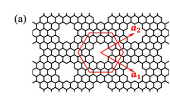
<figcaption class="paper-figure-caption"><b>Fig 1.</b> Fig. 1. (a) Schematic structure for graphene with 3 √</figcaption>
</figure>
<figure class="paper-figure-card">
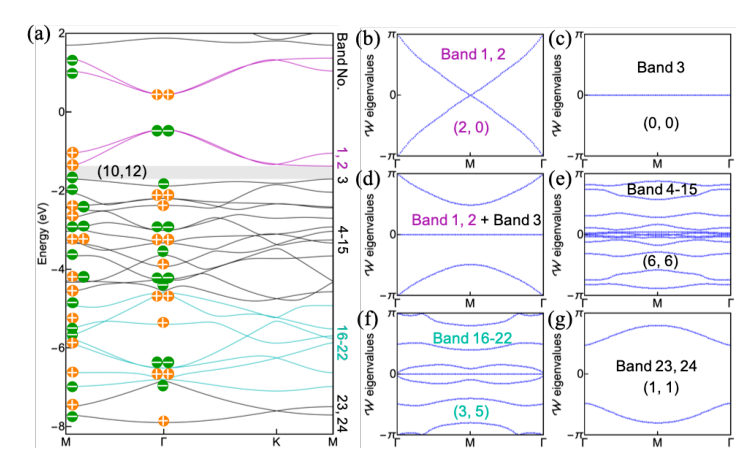
<figcaption class="paper-figure-caption"><b>Fig 2.</b> Fig. 2. (a) Band structure with the top two valence bands and bands No. 16–22 characterized by fragile</figcaption>
</figure>
<figure class="paper-figure-card">
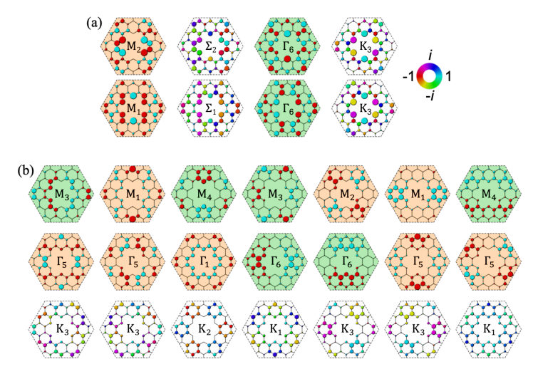
<figcaption class="paper-figure-caption"><b>Fig 3.</b> Fig. 3. (a) Wave functions of the top two valence bands at the high-symmetric momenta M, Σ, Γ and</figcaption>
</figure>
<figure class="paper-figure-card">
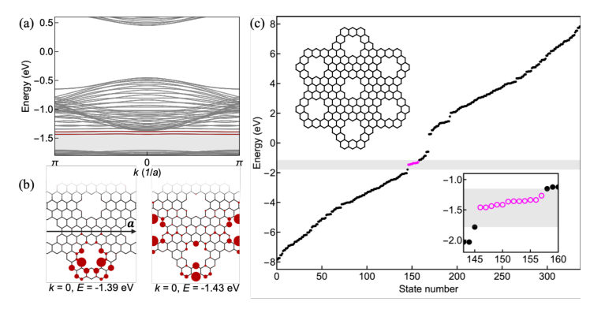
<figcaption class="paper-figure-caption"><b>Fig 4.</b> Fig. 4. (a) Energy dispersion of a ribbon structure with the topological band gap denoted by a gray</figcaption>
</figure>
<figure class="paper-figure-card">
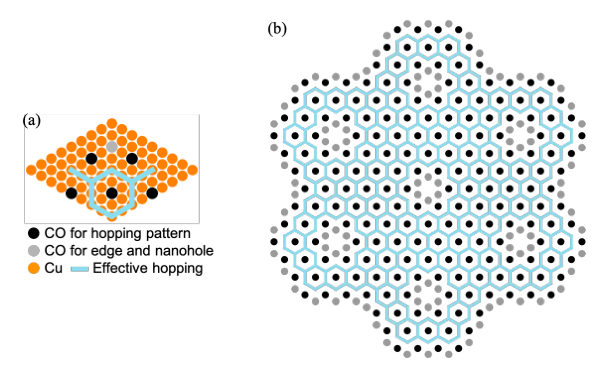
<figcaption class="paper-figure-caption"><b>Fig 5.</b> Fig. 5. Schematic for molecular graphene. (a) CO molecules on Cu(111) surface. The CO molecules</figcaption>
</figure>

**Summary.** This paper theoretically examines the band topology of graphene patterned with triangular nanoholes. Using a tight-binding model, the authors find that while the main gap at the Fermi level is topologically trivial, specific bands (OAL) retain nontrivial topology. This manifests as localized edge states in finite structures, suggesting a pathway for engineering topological behavior in graphene derivatives.

**Why it may be interesting.** The work demonstrates how localized electronic states, arising from specific band features (OAL), can exhibit topological characteristics (edge states) even when the bulk gap is topologically trivial, providing insights into engineered topological materials.

Detailed structure

**Main problem.** The study investigates the nontrivial band topology of graphene when modified by regular arrays of nanoholes.

**Main result.** The energy gap at the Fermi level is found to be topologically trivial, but the Obstructed Atomic Limit (OAL) bands exhibit nontrivial topology, manifesting as localized edge states in ribbon structures.

**Method.** Theoretical analysis using a spinless tight-binding (TB) model, diagnosing topology via parity index imbalance and Wilson loop phases.

**Model / system.** The system is graphene with a $3\sqrt{3} 	imes 3\sqrt{3}$ triangular array of nanoholes, modeled using a tight-binding Hamiltonian for $\pi$ electrons.

**Key observables.** Energy gap at the Fermi level, parity index imbalance ($(N+M, N+\Gamma)$), and the presence/absence of edge states.

**Important parameters / regimes.** The specific geometry ($3\sqrt{3} 	imes 3\sqrt{3}$ array) and the Fermi level position are crucial.

**Assumptions / limitations.** The analysis relies on the TB model and assumes $C_{6v}$ symmetry; the appearance of edge states is linked to parity index imbalance in OAL bands.

**Figures summary.** Figures illustrate the schematic structure, band structures showing parity indices and Wilson loops, and visualizations of the localized edge states in ribbon and flake geometries.

**Paper structure.** The paper proceeds by defining the physical system and Hamiltonian, applying topological diagnostics (parity indices, Wilson loops) to determine the nature of the gap, and finally analyzing the localized edge states arising from the OAL bands.

Abstract

The nontrivial band topology for graphene with regular arrays of nanoholes with $C_{6v}$ symmetry is investigated theoretically. For the case of $3\sqrt{3} \times 3\sqrt{3}$ triangular array of nanoholes, we find an energy gap at $Γ$ point around the Fermi level associated with a band inversion which induces change in parity indices, whereas deep below the Fermi level there are a bunch of valence bands characterized as obstructed atomic limit (OAL) which also accommodate imbalance in parity indices. This band structure renders the gap at the Fermi level topologically trivial and carrying no edge states, while the nontrivial band topology of the OAL manifests in two flat bands in the ribbon structure associated with localized electronic states at ribbon edges. The present results exhibit rich topological behaviors in graphene derivatives waiting for explorations.

[↑ back to top](#top)

### Other secondary papers (6)

Show other secondary papers

### [Chemical Origins of Non-Bonded Interactions Within and Between Solids](http://arxiv.org/abs/2605.15381v1)

**Authors:** Paul J. Robinson, Adam Rettig, Hieu Q. Dinh, Anton Z. Ni, Joonho Lee  
**Type:** theory · **Category:** other · **PDF:** <https://arxiv.org/pdf/2605.15381v1>  
**Analysis basis:** full PDF text, analyzed in chunks

↔ Scroll figures horizontally

<figure class="paper-figure-card">
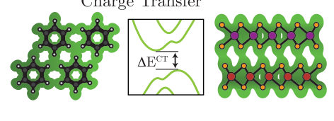
<figcaption class="paper-figure-caption"><b>Fig 1.</b> FIG. 1. Flowchart of the solid-state ALMO-EDA fam- ily of methods. On the left, the scheme preserves the iso- lated character of each molecule until the CT step, whereas on the right, it allows charge to redistribute between unit cells within the same subsystem at every step of the EDA.</figcaption>
</figure>
<figure class="paper-figure-card">
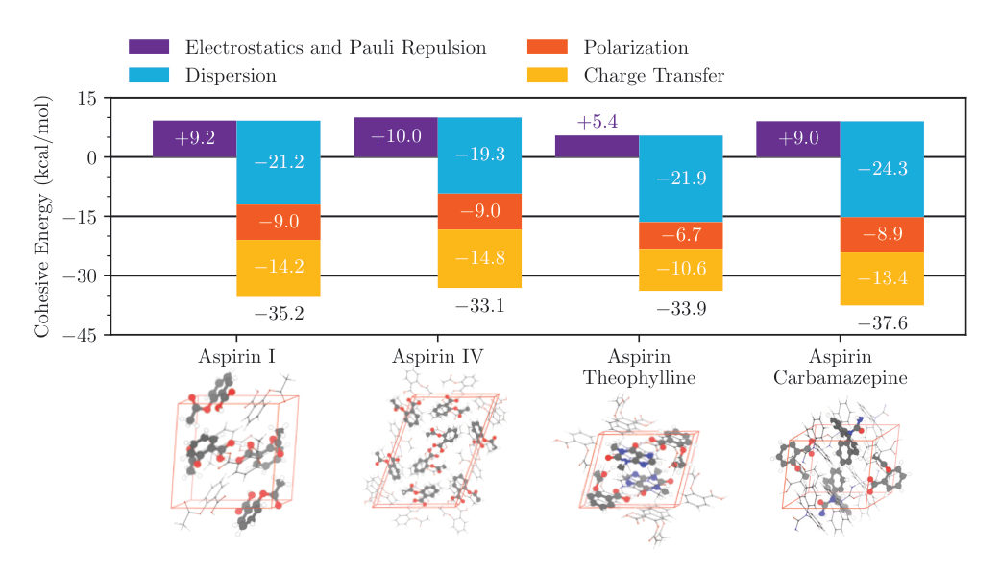
<figcaption class="paper-figure-caption"><b>Fig 2.</b> FIG. 2. ALMO-EDA applied to molecular crystals. The diagrams below show the unit cell (red lines) with the subsystems shown by large atoms and the periodic repeats of the subsystems shown by small atoms.</figcaption>
</figure>
<figure class="paper-figure-card">
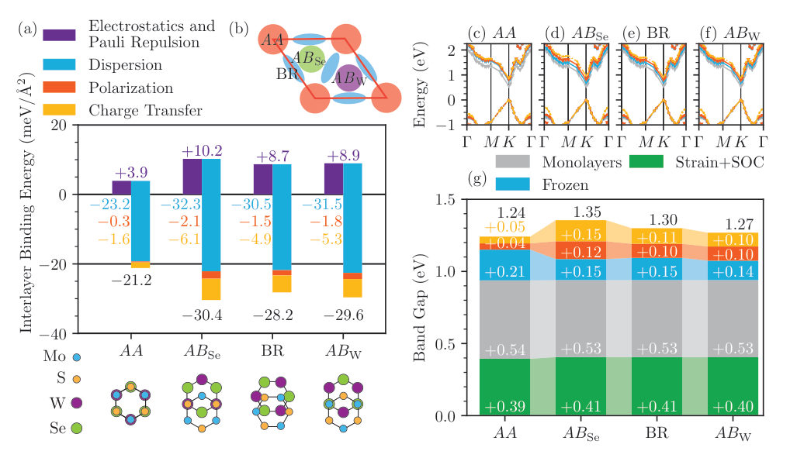
<figcaption class="paper-figure-caption"><b>Fig 3.</b> FIG. 3. ALMO-EDA applied to the MoS2/WSe2 heterobilayer. (a) Interlayer binding energy across the structures in a moir´e potential. (b) Cartoon of a moir´e heterobilayer showing the connectivity between regions. (c-f) EDA decomposed band structures across the structures. (g) Band-gap decomposition, including a correction term for the spin-orbit coupling (SOC) and strain of the monolayers.</figcaption>
</figure>
<figure class="paper-figure-card">
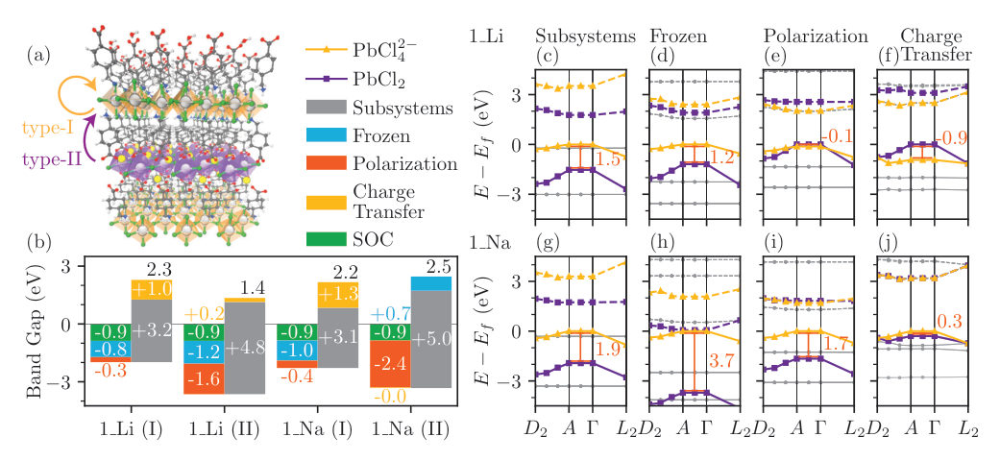
<figcaption class="paper-figure-caption"><b>Fig 4.</b> FIG. 4. ALMO-EDA applied to layered perovskite heterostructures. (a) Schematic of the competing type-I and type-II quantum wells. (b) Band-gap decompositions for 1 Li and 1 Na. (c)-(f) Band structures and densities of states for 1 Li across the EDA steps. (g)-(j) Band structures and densities of states for 1 Na across the EDA steps. In (c)-(j), only the highest occupied (solid lines) and lowest unoccupied bands (dashed lines) are shown for each subsystem. The gray lines denote the molecular subsystems. The red annotated values indicate the difference between the valence band maxima of PbCl4 2– and PbCl2.</figcaption>
</figure>

**Summary.** This work introduces a generalized energy decomposition analysis (ALMO-EDA) to dissect non-bonded interactions in complex solids. By separating total energies into contributions from frozen interactions, polarization, and charge transfer, the authors provide a chemically transparent method. This allows researchers to understand *why* materials are stable or how their electronic properties change upon structural modification or elemental substitution.

**Why it may be interesting.** While focused on solid-state chemistry, the rigorous decomposition of interactions into polarization and charge transfer components provides a highly detailed, physically transparent language for analyzing electronic structure changes in extended systems, which is valuable for understanding coupling mechanisms in quantum materials.

Detailed structure

**Main problem.** The chemical origins of non-bonded interactions governing the structure and stability of solid-state materials are difficult to resolve from total energy calculations alone.

**Main result.** The authors developed a framework that successfully decomposes interaction energies into chemically intuitive contributions (frozen, polarization, charge transfer), allowing for the mechanistic understanding of material properties.

**Method.** The study generalizes the absolutely localized molecular orbital energy decomposition analysis (ALMO-EDA) to periodic systems at the DFT level.

**Model / system.** The framework is applied to diverse systems, including molecular crystals (e.g., Aspirin polymorphs), moiré heterobilayers (e.g., MoS2/WSe2), and layered perovskite heterostructures.

**Key observables.** Lattice-formation energies, interlayer binding energies, band-structure changes, and the decomposed energy contributions ($E_{	ext{frz}}, E_{	ext{pol}}, E_{	ext{ct}}$).

**Important parameters / regimes.** Interlayer separation ($	ext{\AA}$), band gap ($	ext{eV}$), and the relative contributions of dispersion, polarization, and charge transfer.

**Assumptions / limitations.** The analysis relies on DFT-based ALMO-EDA, which assumes a block-diagonal MO coefficient matrix for the decomposition formalism.

**Figures summary.** Figures illustrate the application of ALMO-EDA to show energy decompositions for molecular crystals (Aspirin) and the evolution of band structures/binding energies in moiré heterobilayers and perovskites.

**Paper structure.** The paper establishes the need for chemical decomposition, details the generalized ALMO-EDA formalism for periodic systems, and then applies this framework sequentially to molecular crystals, twisted bilayers, and perovskite heterostructures to derive specific physical insights.

Abstract

Non-bonded interactions govern structure, stability, and function across a wide range of solid-state materials, yet their chemical origins are often difficult to resolve from total energies alone. Here we generalize absolutely localized molecular orbital energy decomposition analysis to quantify and interpret non-bonded interactions within and between solids at the density functional theory level. Across molecular crystals, moiré heterobilayers, and layered perovskite heterostructures, this framework separates lattice-formation energies, interlayer binding energies, and band-structure changes into chemically intuitive contributions from frozen interactions, polarization, and charge transfer. The analysis reveals how dispersion controls polymorph stability in pharmaceutical crystals, how local stacking modulates interlayer coupling in MoS2/WSe2, and how alkali-cation substitution switches the quantum-well character of layered perovskite heterostructures. By connecting emergent solid-state properties to microscopic interaction mechanisms, this framework provides a chemically transparent basis for understanding and designing complex materials.

[↑ back to top](#top)

### [Interfacial Reconstructions and Engineering in III-V@II-VI Core-Shell Quantum Dots](http://arxiv.org/abs/2605.16038v1)

**Authors:** Jordi Llusar, Abdessamad El Adel, Luca De Trizio, Liberato Manna, Zeger Hens, Ivan Infante  
**Type:** theory · **Category:** other · **PDF:** <https://arxiv.org/pdf/2605.16038v1>  
**Analysis basis:** full PDF text, analyzed in chunks

↔ Scroll figures horizontally

<figure class="paper-figure-card">
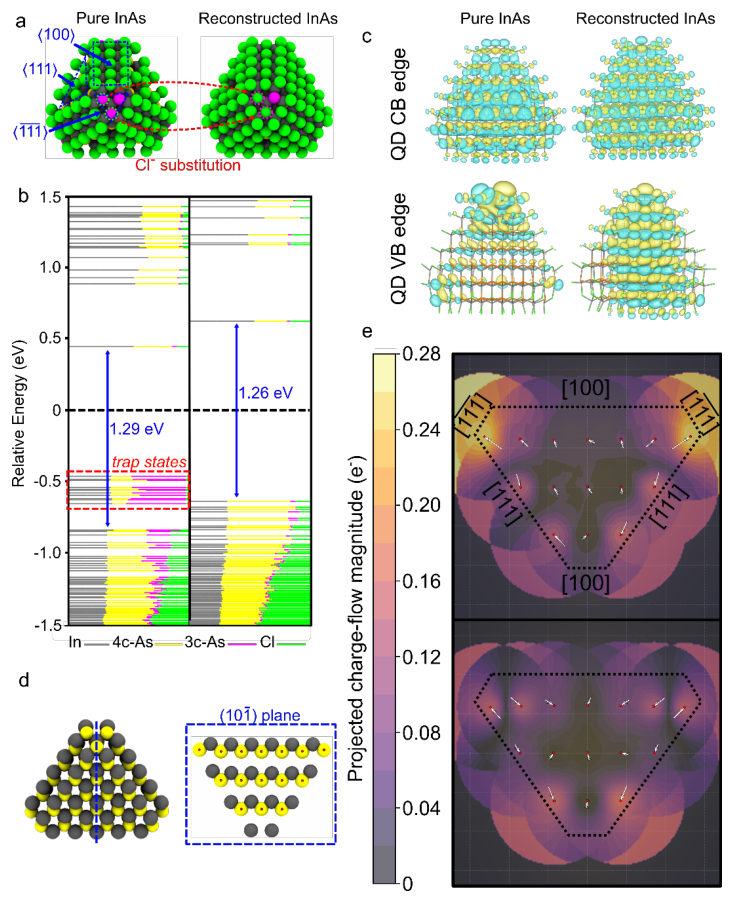
<figcaption class="paper-figure-caption"><b>Fig 1.</b> Figure 1. Electronic structure and charge accumulation in InAs QD models. (a) Atomic structures of pure (left)</figcaption>
</figure>
<figure class="paper-figure-card">
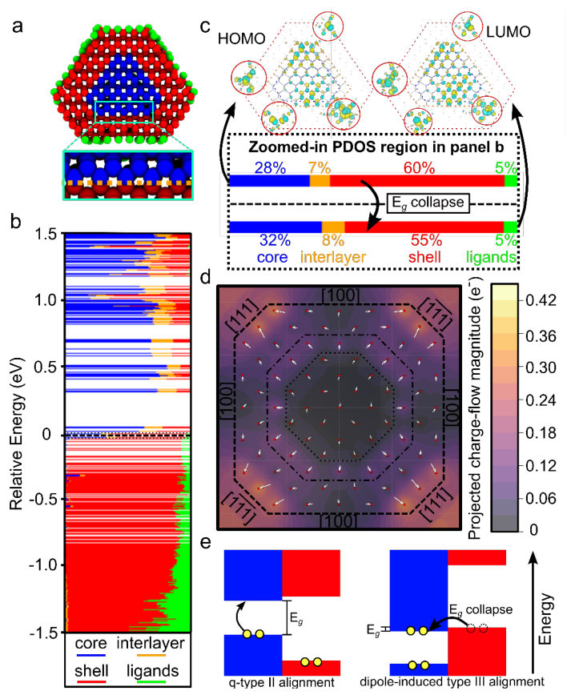
<figcaption class="paper-figure-caption"><b>Fig 2.</b> Figure 2. Electronic and charge-flow features of the InAs@CdSe QD model with an abrupt core-shell interface</figcaption>
</figure>
<figure class="paper-figure-card">
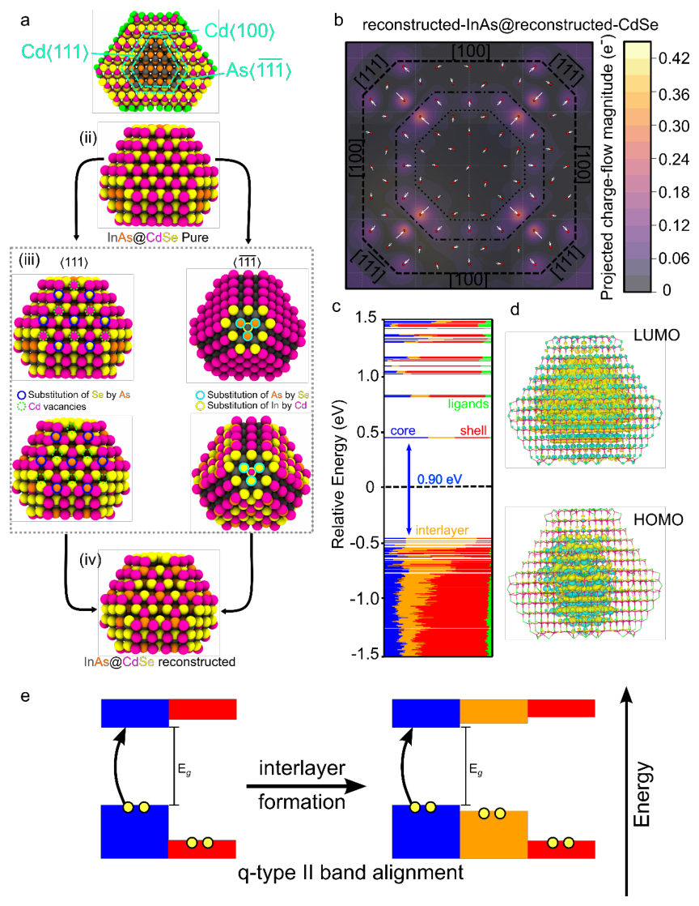
<figcaption class="paper-figure-caption"><b>Fig 3.</b> Figure 3. Electronic structure of a InAs@CdSe core@shell QD model with interface reconstructions. (a) Atomistic</figcaption>
</figure>
<figure class="paper-figure-card">
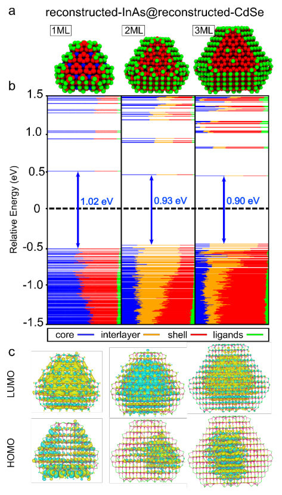
<figcaption class="paper-figure-caption"><b>Fig 4.</b> Figure 4. Evolution of the electronic structure and frontier orbitals in InAs@CdSe core@shell QD models with</figcaption>
</figure>

**Summary.** This theoretical study uses DFT to model InAs@CdSe quantum dots, demonstrating that the interface between different semiconductor materials is critical for optoelectronic performance. The authors show that abrupt interfaces create detrimental charge imbalances, but by modeling chemical reconstruction or alloying at the interface, they can restore the desired electronic band alignment, leading to defect-free quantum confinement.

**Why it may be interesting.** The detailed, atomistic modeling of interface chemistry and its direct link to electronic band structure is highly relevant for understanding engineered quantum emitters and open quantum systems where interface quality dictates coherence.

Detailed structure

**Main problem.** The study investigates how interfacial reconstructions and local atomic coordination dictate the electronic structure and trap state formation in III-V/II-VI core-shell quantum dots.

**Main result.** Abrupt core-shell interfaces lead to unphysical charge imbalances and band-gap collapse, whereas introducing an alloyed interlayer restores energetic alignment and yields delocalized, trap-free band-edge states.

**Method.** Density Functional Theory (DFT) calculations are employed on atomistic models, supplemented by charge-flow analysis to quantify charge redistribution across the QD interface.

**Model / system.** The primary model system is the InAs@CdSe core-shell quantum dot, comparing idealized abrupt interfaces against reconstructed or alloyed interlayer structures.

**Key observables.** Electronic structure (HOMO-LUMO gap), charge-flow vectors, local coordination, and the spatial localization of electronic wavefunctions.

**Important parameters / regimes.** The chemical discontinuity between III-V and II-VI semiconductors, and the degree of atomic mixing/alloying at the interface.

**Assumptions / limitations.** The analysis assumes that the outer shell surface is reconstructed in all cases to isolate the core-shell interface effect, and that the charge-flow analysis enforces global charge neutrality.

**Figures summary.** Figures illustrate atomic structures, Projected Density of States (PDOS), and charge-flow maps comparing pure, abrupt, and reconstructed InAs@CdSe models, showing the recovery of the band gap upon reconstruction.

**Paper structure.** The paper progresses by first establishing the problem of interfacial traps, then using DFT to model the electronic consequences of abrupt interfaces, and finally proposing and calculating the effects of chemically reconstructed/alloyed interlayers to achieve defect-free electronic states.

Abstract

In core/shell quantum dots (QDs), the interface between semiconductors of different chemical character largely determines their optoelectronic properties. In III-V/II-VI systems, this boundary involves pronounced chemical and electronic discontinuities that can generate trap states even under complete surface passivation. Using density functional theory on atomistic models of InAs/CdSe QDs, we systematically reconstruct atomic arrangements at the surface and interface to evaluate how local coordination and interfacial dipoles influence the electronic structure. Abrupt interfaces induce charge imbalance and band-gap collapse, whereas introducing an alloyed interlayer that mixes core and shell atoms and vacancies restores energetic alignment and yields delocalized band-edge states, consistent with experimental findings. We also introduce a charge-flow analysis that quantifies charge redistribution across the QD, providing a framework for realistic modeling of interlayer formation and predictive design of defect-free interfaces in core@shell architectures.

[↑ back to top](#top)

### [Local distortions as a source of piezoelectric/stiffness decoupling in B-doped AlScN](http://arxiv.org/abs/2605.15568v1)

**Authors:** Laszlo Wolf, Geoff L. Brennecka, Vladan Stevanović  
**Type:** theory · **Category:** other · **PDF:** <https://arxiv.org/pdf/2605.15568v1>  
**Analysis basis:** full PDF text, analyzed in chunks

↔ Scroll figures horizontally

<figure class="paper-figure-card">
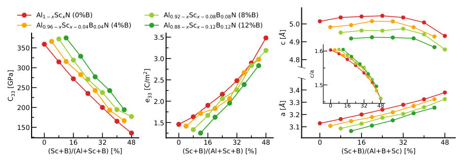
<figcaption class="paper-figure-caption"><b>Fig 1.</b> Figure 1: Evolution of properties with varying cation substitution, varying colors relate to the fixed content of boron within those series. Left panel is the 33 component in the Voigt notation of the stiffness tensor, middle panel is the 33 component of the piezoelectric stress tensor and right panel presents lattice parameters of the wurtzite alongside their ratio in the inset</figcaption>
</figure>
<figure class="paper-figure-card">
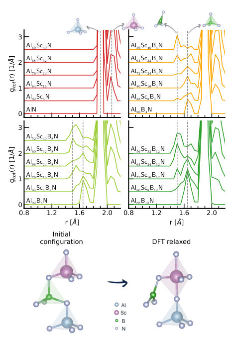
<figcaption class="paper-figure-caption"><b>Fig 2.</b> Figure 2: Upper panel presents the low-r portion of the total pair distribution function of the different series, vertical shift is applied with increased Sc content. Lower panel is schematic representation of the transition from tetrahedral to planar configuration of a B atom.</figcaption>
</figure>
<figure class="paper-figure-card">
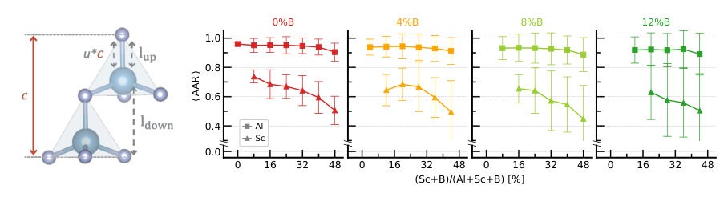
<figcaption class="paper-figure-caption"><b>Fig 3.</b> Figure 3: Left panel presents definition of the distances involved in the definition of the axial asymmetry ratio (AAR). Right panels are the averaged AAR over Sc and Al atoms for each composition. Error bars represent the standard deviation of the corresponding AAR data set.</figcaption>
</figure>
<figure class="paper-figure-card">
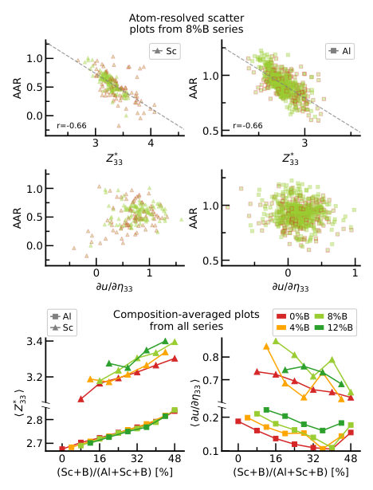
<figcaption class="paper-figure-caption"><b>Fig 4.</b> Figure 4: Upper panel shows correlation between the AAR and both the Z∗ 33 and the duk dη33 of each individual scandium (triangle) and aluminum (square) atoms of the whole 8%B series. Red-edged marker are cations that present a planar B in their second shell. Lower panel presents the evolution of Z∗ 33 and duk dη33 of all series over the alloying range, where each data point is obtained by averaging over all adequate atoms in the structures.</figcaption>
</figure>
<figure class="paper-figure-card">
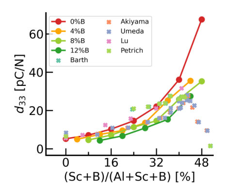
<figcaption class="paper-figure-caption"><b>Fig 5.</b> Figure 5: Evolution of the piezoelectric strain response tensor component d33 with respect to composi- tion for all four series. Colored cross markers are experimental data from AlScN samples[3, 1, 28, 19, 22]</figcaption>
</figure>

**Summary.** This theoretical study investigates how boron doping affects the mechanical and piezoelectric properties of AlScN. The authors find that the piezoelectric response is enhanced by the symmetrization of the Sc environment, while the stiffness is maintained by local structural changes involving boron. They establish a clear decoupling between these two properties, attributing it to distinct structural mechanisms governing each response.

**Why it may be interesting.** While the core physics is solid-state materials science, the rigorous quantification of local structural descriptors (AAR) and their correlation with macroscopic tensor components ($e_{33}$) provides a transferable methodology for understanding symmetry breaking and emergent properties in complex crystal structures.

Detailed structure

**Main problem.** The study aims to elucidate the structural origin of the decoupling between the stiffness component ($C_{33}$) and the piezoelectric response ($e_{33}$) when boron (B) is incorporated into the wurtzite pseudo-ternary (Al,Sc,B)N.

**Main result.** The decoupling is attributed to the local structural effect of boron atoms moving to a threefold-coordinated, planar configuration, while the piezoelectric enhancement is linked to the progressive symmetrization of the Sc environment, quantified by the Axial Asymmetry Ratio (AAR).

**Method.** The research employs first-principles calculations using DFT (PBE functional) on 100-atom special quasirandom structures, analyzing local geometry via pair distribution functions and quantifying asymmetry using the site-specific Axial Asymmetry Ratio (AAR).

**Model / system.** The physical system is the wurtzite pseudo-ternary (Al,Sc,B)N alloy. The analysis focuses on how B incorporation modifies the local coordination environment of Al and Sc cations.

**Key observables.** Stiffness component $C_{33}$, piezoelectric stress tensor component $e_{33}$ (or $d_{33}$), Axial Asymmetry Ratio (AAR), Born effective charges ($Z^*_{33}$), and local bond lengths.

**Important parameters / regimes.** Boron concentration (B content), lattice parameters ($c/a$ ratio), and the degree of cation environment asymmetry.

**Assumptions / limitations.** The study uses 100-atom SQSs, and the authors note that the observed decoupling intensity might differ from previous work due to methodological differences.

**Figures summary.** Figures illustrate the evolution of $C_{33}$ and $e_{33}$ with B content, pair distribution functions showing B structural changes, and scatter plots correlating AAR with $Z^*_{33}$ and strain sensitivity for individual atoms (Al, Sc, N).

**Paper structure.** The paper systematically analyzes the structural changes induced by B doping, correlates these changes (measured by AAR) with electronic properties ($Z^*_{33}$), and then separates the mechanisms governing stiffness ($C_{33}$) versus piezoelectricity ($e_{33}$) to explain the observed decoupling.

Abstract

We present a first-principles analysis of the wurtzite pseudo-ternary (Al,Sc,B)N to elucidate the structural origin of a decoupling between stiffness $C_{33}$ and piezoelectric response $e_{33}$ upon boron incorporation, using DFT-relaxed 100-atom special quasirandom structures across a broad composition range. Pair distribution function analysis reveals interstitial threefold-coordinated boron atoms that have displaced from the tetrahedral cation site. Direct structural analysis establishes their preferential orientation along the $c$-axis and identifies a scandium-activated creation mechanism. The vertical coordination asymmetry of each cation is quantified through a site-specific axial asymmetry ratio (AAR), showing that boron incorporation progressively symmetrizes the Sc environment. Correlation with Born effective charges demonstrates that this symmetrization is the mechanism behind the piezoelectric enhancement.

[↑ back to top](#top)

### [Long-range magnetic ordering and structural phase transition in disordered high-entropy spinel chromites](http://arxiv.org/abs/2605.16106v1)

**Authors:** Sushanta Mandal, Koushik Chakraborty, Isha, Arvind Kumar Yogi, S. D. Kaushik, Sourav Marik, Tirthankar Chakraborty  
**Type:** experiment · **Category:** statistical mechanics · **PDF:** <https://arxiv.org/pdf/2605.16106v1>  
**Analysis basis:** full PDF text, analyzed in chunks

↔ Scroll figures horizontally

<figure class="paper-figure-card">
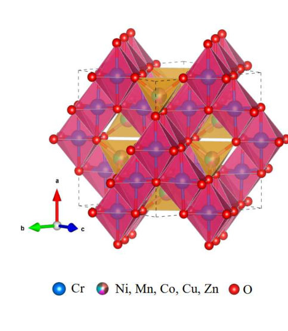
<figcaption class="paper-figure-caption"><b>Fig 1.</b> FIG. 1: Crystal structure of (Mn0.2Co0.2Ni0.2Cu0.2Zn0.2)Cr2O4. Here, the A-site (Mn, Ni, Co, Cu, Zn) occupies the tetrahedral position, and the B-site (Cr) occupies the octahedral position.</figcaption>
</figure>
<figure class="paper-figure-card">
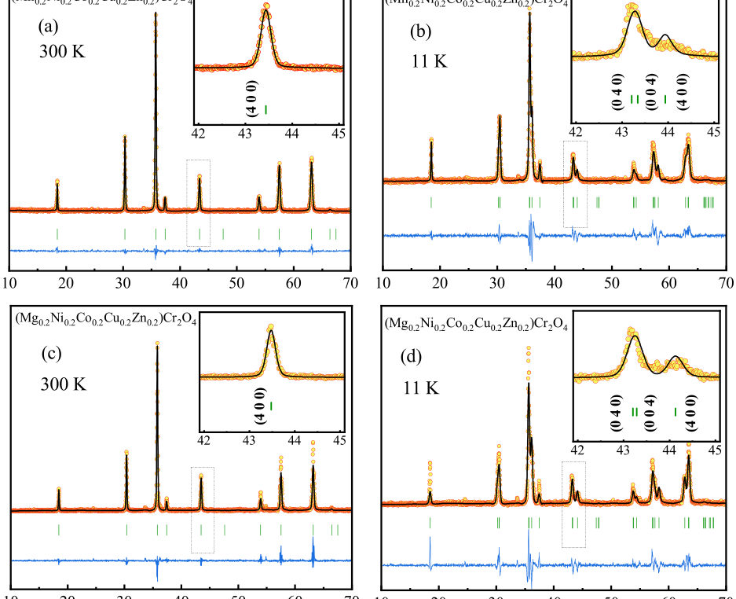
<figcaption class="paper-figure-caption"><b>Fig 2.</b> FIG. 2: X-ray diffraction patterns of (Mn0.2Co0.2Ni0.2Cu0.2Zn0.2)Cr2O4 at (a) 300 K and (b) 11 K, and (Mg0.2Co0.2Ni0.2Cu0.2Zn0.2)Cr2O4 at (c) 300 K and (d) 11 K. Insets in each graph show an enlarged view of the selec- tive peak splitting, where the (4 0 0) peak of the cubic phase splits into (0 4 0), (0 0 4), and (4 0 0) peaks of the orthorhombic phase.</figcaption>
</figure>
<figure class="paper-figure-card">
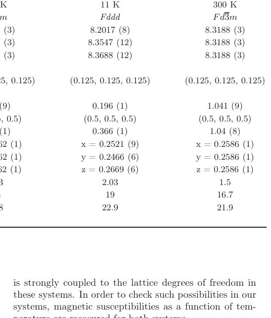
<figcaption class="paper-figure-caption"><b>Fig 3.</b> Figure 7(left axis) shows the field-cooled (FC) mag- netic susceptibility as a function of temperature, mea- sured under an applied magnetic field of 0.1 T over the temperature range 4-100 K. The temperature-dependent magnetic susceptibility shows a rapid increase at 49 K for (Mn0.2Co0.2Ni0.2Cu0.2Zn0.2)Cr2O4 and at 35 K for (Mg0.2Co0.2Ni0.2Cu0.2Zn0.2)Cr2O4 , corresponding to a paramagnetic to antiferromagnetic transition. The mag- netic transition temperatures are determined from the derivative dχ/dT and are presented in Figure 7(right axis). The sharp peak in dχ/dT provides estimated of TN, for 49 K and 35 K respectively. It is worth noting that in systems such as CuCr2O4 and NiCr2O4, which...</figcaption>
</figure>
<figure class="paper-figure-card">
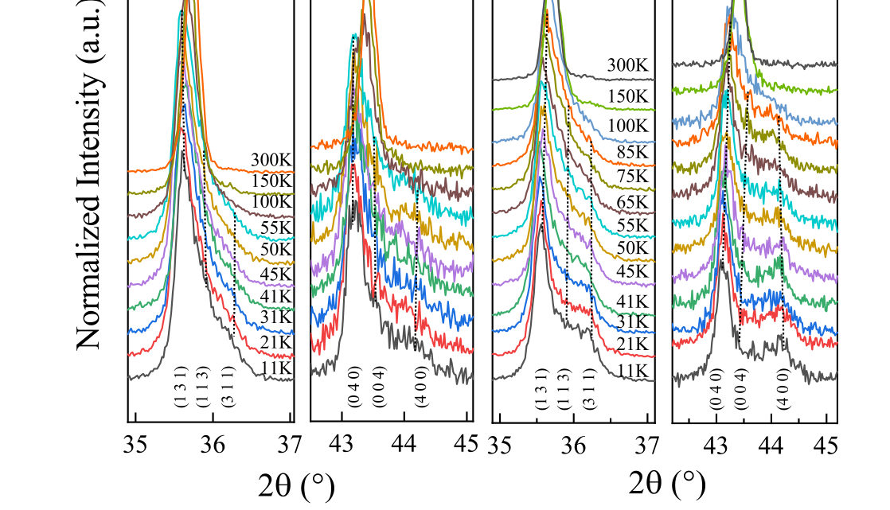
<figcaption class="paper-figure-caption"><b>Fig 4.</b> FIG. 3: Temperature evolution of XRD patterns for selected peaks of (Mn0.2Co0.2Ni0.2Cu0.2Zn0.2)Cr2O4 and (Mg0.2Co0.2Ni0.2Cu0.2Zn0.2)Cr2O4 : (a) The (3 1 1) reflection in the cubic phase splits into (1 1 3), (1 3 1), and (3 1 1) in the orthorhombic phase. (b) The (4 0 0) reflection in the cubic phase splits into (0 4 0), (0 0 4), and (4 0 0) in the orthorhombic phase of (Mn0.2Co0.2Ni0.2Cu0.2Zn0.2)Cr2O4 . Similar peak splitting for (Mg0.2Co0.2Ni0.2Cu0.2Zn0.2)Cr2O4 is shown in (c) and (d).</figcaption>
</figure>
<figure class="paper-figure-card">
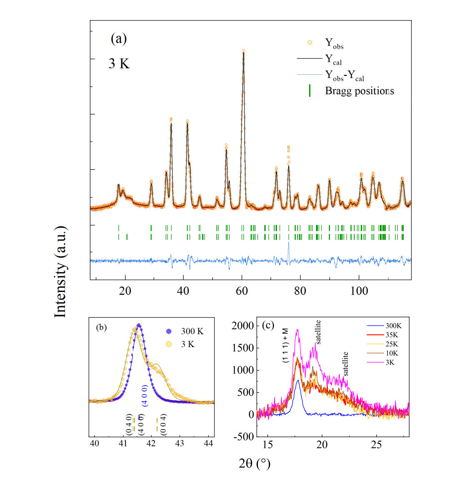
<figcaption class="paper-figure-caption"><b>Fig 5.</b> FIG. 4: (a) Rietveld refinement of the neutron powder diffraction pattern at 3 K for (Mn0.2Co0.2Ni0.2Cu0.2Zn0.2)Cr2O4 , showing observed intensity, calculated pattern, difference profile, and Bragg positions corresponding to nuclear and magnetic reflections. (b) show the enlarged (4 0 0) reflection at 300 K as a single cubic peak (blue circle). At 3 K, this peak splits into orthorhombic (0 4 0), (4 0 0), and (0 0 4) reflections, accompanied by the appearance of magnetic Bragg peaks. This confirms magnetically driven symmetry lowering from cubic to orthorhombic. (c) Temperature-dependent neutron diffraction patterns for (Mn0.2Co0.2Ni0.2Cu0.2Zn0.2)Cr2O4 showing the evolution of magnetic Bragg...</figcaption>
</figure>

**Summary.** This work investigates the structural and magnetic properties of disordered high-entropy spinel chromites. Using neutron and X-ray diffraction, the authors confirm that these materials exhibit both long-range antiferromagnetic ordering and structural phase transitions. The key finding is that these characteristic transitions persist despite high chemical disorder, suggesting that configurational entropy plays a role in stabilizing the ordered state.

**Why it may be interesting.** The persistence of long-range order and characteristic phase transitions in the presence of significant chemical disorder provides insights into how entropy can stabilize complex magnetic and structural ground states, which has implications for understanding correlated materials.

Detailed structure

**Main problem.** The study investigates the interplay between structural phase transitions and long-range magnetic ordering in disordered high-entropy spinel chromites.

**Main result.** Both high-entropy systems exhibit long-range magnetic order and undergo structural transitions to a lower symmetry, suggesting that high configurational entropy stabilizes the structure despite chemical disorder.

**Method.** The research employed a combination of Powder X-ray Diffraction (P-XRD), Neutron Diffraction (NPD), and magnetic susceptibility measurements across varying temperatures.

**Model / system.** The physical system consists of Cr-based high-entropy spinel oxides, specifically $(	ext{Mn}_{0.2}	ext{Co}_{0.2}	ext{Ni}_{0.2}	ext{Cu}_{0.2}	ext{Zn}_{0.2})	ext{Cr}_2	ext{O}_4$ and $(	ext{Mg}_{0.2}	ext{Co}_{0.2}	ext{Ni}_{0.2}	ext{Cu}_{0.2}	ext{Zn}_{0.2})	ext{Cr}_2	ext{O}_4$. These materials are characterized by significant chemical disorder at the A-site.

**Key observables.** Structural symmetry (cubic $Fdar{3}m$ to orthorhombic $Fddd$), Néel temperatures ($T_N$), lattice parameters, and magnetic Bragg reflections.

**Important parameters / regimes.** Transition temperatures ($\sim 55 	ext{ K}$ and $\sim 85 	ext{ K}$ for structure; $49 	ext{ K}$ and $35 	ext{ K}$ for magnetism); high configurational entropy regime.

**Assumptions / limitations.** The analysis assumes that the observed transitions are analogous to those in low-entropy spinels, and that the structural stabilization is promoted by high configurational entropy.

**Figures summary.** Figures show XRD/NPD peak splitting confirming symmetry reduction, temperature dependence of lattice parameters, and magnetic susceptibility measurements indicating antiferromagnetic ordering.

**Paper structure.** The paper systematically analyzes the temperature evolution of structural and magnetic properties using NPD and XRD. It establishes the room-temperature cubic phase, confirms long-range magnetic order below $T_N$, and details the structural phase transitions to the orthorhombic phase, concluding with the role of high entropy.

Abstract

High-entropy spinel oxides provide an excellent platform for investigating entropy-stabilized correlated systems with strong configurational disorder. In this work, we systematically study the temperature evolution of the structural and magnetic properties of Cr-based high-entropy spinels with compositions $(Mn_{0.2}Co_{0.2}Ni_{0.2}Cu_{0.2}Zn_{0.2})Cr_2O_4$ and $(Mg_{0.2}Co_{0.2}Ni_{0.2}Cu_{0.2}Zn_{0.2})Cr_2O_4$. Our results reveal that both systems crystallize in cubic structure with space group \textit{$Fd\overline{3}m$} at room temperature. Each system undergoes antiferromagnetic ordering below the Néel temperatures $ T_N$ = 49 K and 35 K, respectively. Neutron diffraction measurements confirm the emergence of long-range magnetic order with spiral spin arrangement. Both systems exhibit a structural phase transition from cubic \textit{$Fd\overline{3}m$} to orthorhombic \textit{Fddd} symmetry at approximately 55 K and 85 K, respectively. Notably, despite the significant chemical disorder at the A site, both systems undergo transitions analogous to those observed in low entropy spinel systems. This behavior suggests that high configurational entropy may promote global structural stabilization despite local chemical disorder, thereby preserving long-range orderings and the characteristic symmetry-breaking transitions of the pristine spinel systems.

[↑ back to top](#top)

### [p-Wave Orbital Angular Momentum Texture in a Chiral Crystal](http://arxiv.org/abs/2605.15544v1)

**Authors:** Dongjin Oh, Chiara Pacella, Xiangyu Luo, Chris Jozwiak, Aaron Bostwick, Eli Rotenberg, Mats Leandersson, Craig Polley, Angel Rubio, Domenico Di Sante, Riccardo Comin  
**Type:** both · **Category:** other · **PDF:** <https://arxiv.org/pdf/2605.15544v1>  
**Analysis basis:** full PDF text, analyzed in chunks

↔ Scroll figures horizontally

<figure class="paper-figure-card">
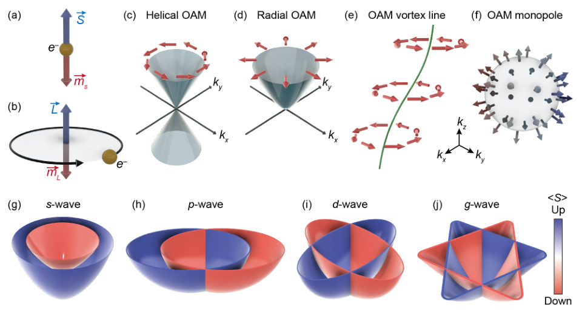
<figcaption class="paper-figure-caption"><b>Fig 1.</b> FIG. 1. ⃗k-space SAM and OAM textures in solids. (a,b) Illustrations of SAM (a) and OAM (b) of an electron (yellow spheres). Blue and red arrows represent angular momenta (⃗S and ⃗L) and their corresponding magnetic moments (⃗ms and ⃗mL), respectively. (c-f) Various ⃗k-space OAM textures: helical OAM texture (c); radial OAM texture (d); OAM vortex line (e); and OAM monopole (f). (g-j) ⃗k-dependent SAM textures in magnets with multipolar symmetry form factors: s- (g); p- (h); d- (i); and g-wave SAM textures (j). Blue and red colors denote spin-up and spin-down polarizations, respectively.</figcaption>
</figure>
<figure class="paper-figure-card">
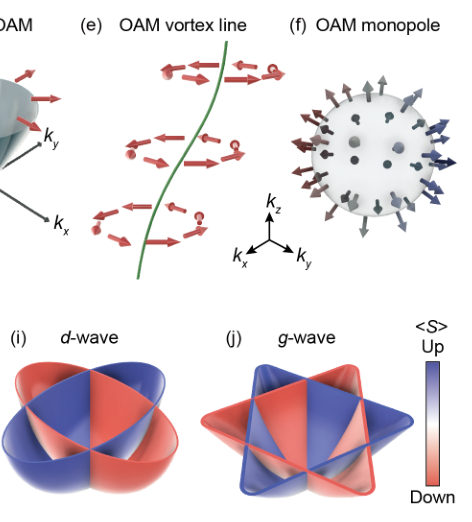
<figcaption class="paper-figure-caption"><b>Fig 2.</b> Figure 2(a) illustrates the crystal structure of (TaSe4)2I, which features a highly anisotropic 1D chain composed of Ta and Se atoms aligned along the x-axis. Notably, the Se atoms form a helical structure that wraps around the central 1D Ta chain, as illustrated in Figs. 2(a) and 2(b). The room temperature metallic elec- tronic structure of (TaSe4)2I in the low energy range, characterized by linear band crossings, contains contri- butions from both Se 4p and Ta 5d orbital characters (see Fig. S1 in Supplemental Material) [31]. To experimentally probe the OAM texture in this system, we carried out CD-ARPES experiments on (TaSe4)2I single crystals. Recent experimental and theoretical...</figcaption>
</figure>
<figure class="paper-figure-card">
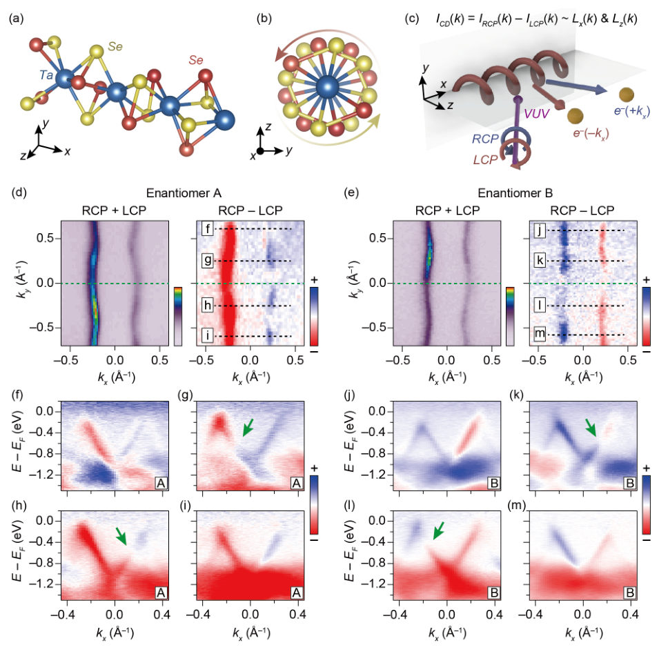
<figcaption class="paper-figure-caption"><b>Fig 3.</b> FIG. 2. CD-ARPES of (TaSe4)2I. (a) 1D chiral chain structure composed of Se (red and yellow spheres) and Ta (blue sphere) atoms. (b) x-axis view of the crystal structure of (TaSe4)2I. Transparency of the sphere reflects the atomic height along x- direction. (c) Experimental geometry of CD-ARPES. (d,e) Constant energy contour maps of enantiomer A (d) and enantiomer B (e) obtained at E = −0.25 eV with 75 eV photon energy. The left and right panels of (d) and (e) show polarization-integrated and CD photoelectron intensities, respectively. The green dashed lines indicate the plane of incidence of the experimental geometry. (f-m) CD-ARPES spectra of enantiomer A (f-i) and enantiomer B (j-m),...</figcaption>
</figure>
<figure class="paper-figure-card">
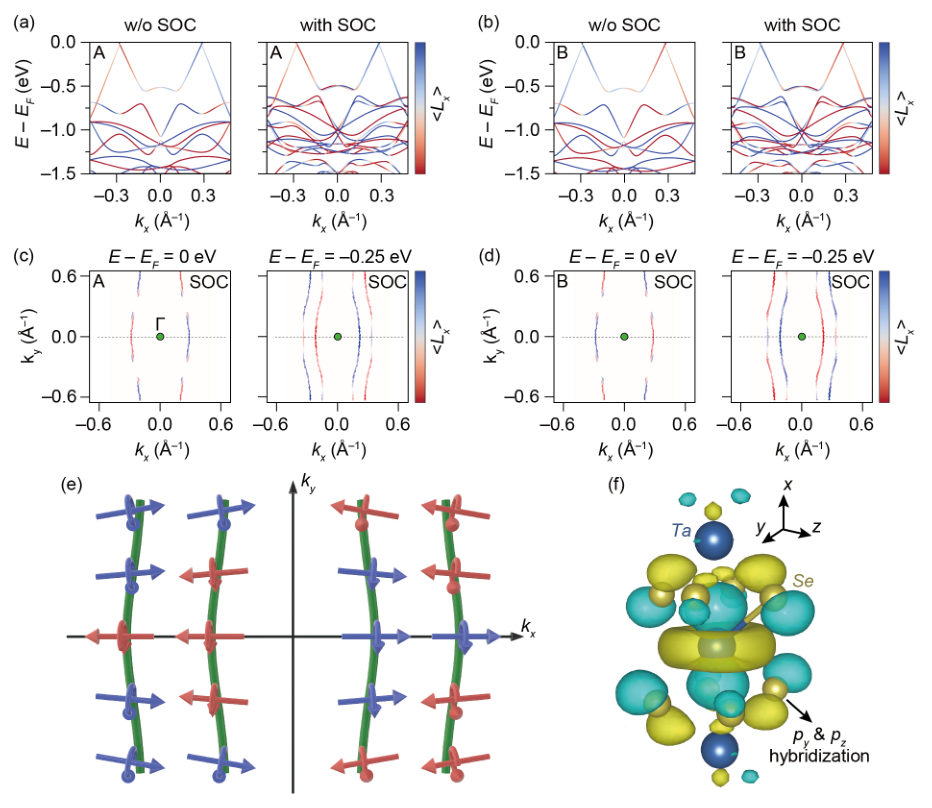
<figcaption class="paper-figure-caption"><b>Fig 4.</b> FIG. 3. p-wave OAM texture in (TaSe4)2I. (a,b) x-component of OAM (Lx) textures in the energy-momentum dispersion of enantiomer A (a), and B (b), extracted at ky = 0 Å−1. Left and right panels in (a) and (b) show results without and with SOC, respectively. (c,d) Lx textures of enantiomer A (c) and B (d) in the kx-ky plane. Left and right panels illustrate constant energy contours at E −EF = 0 eV and −0.25 eV, respectively. (e) Schematic illustration of ⃗k-space OAM texture. Green solid curves represent the electronic bands of (TaSe4)2I in kx-ky plane. Red and blue arrows indicate negative and positive Lx, respectively. The momentum spacing between the inner and outer bands is exaggerated...</figcaption>
</figure>
<figure class="paper-figure-card">
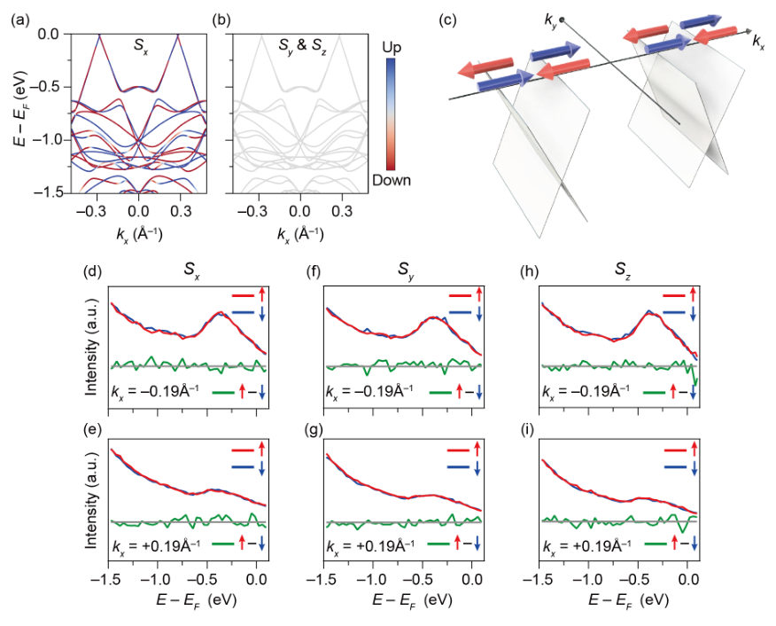
<figcaption class="paper-figure-caption"><b>Fig 5.</b> FIG. 4. SAM texture in (TaSe4)2I. (a,b) ⃗k-space SAM texture of (TaSe4)2I at ky = 0 Å−1, projected onto the x-component of SAM, Sx, (a) and y- and z-components, Sy and Sz, (b). (c) Schematic illustration of the ⃗k-space SAM texture in the low-energy electronic states of TaSe4)2I. Grey planes indicate the linearly dispersing bands. Red and blue arrows correspond to positive and negative Sx, respectively. (d-i) Spin-resolved ARPES (SARPES) spectra of (TaSe4)2I. (d) and (e) show spin-resolved energy distribution curves (SEDCs) projected onto Sx, collected at ∓0.19 Å−1, respectively. (f) and (g), as well as (h) and (i), display the same SEDCs, but projected onto the Sy and Sz spin components,...</figcaption>
</figure>

**Summary.** This paper reports the experimental and theoretical discovery of a p-wave Orbital Angular Momentum (OAM) texture in the chiral crystal (TaSe4)2I. Using CD-ARPES, the authors show that OAM, not SAM, governs the low-energy electronic structure, and this OAM texture is directly controlled by the crystal's inherent chirality. This work pioneers a new field, 'spinless orbitronics,' by demonstrating a robust platform for manipulating orbital angular momentum in solids.

**Why it may be interesting.** The work establishes a direct, experimentally verifiable link between structural chirality and a specific, measurable orbital texture (p-wave OAM), providing a solid foundation for engineering orbital degrees of freedom in solid-state devices.

Detailed structure

**Main problem.** The study investigates the role and texture of Orbital Angular Momentum (OAM) in condensed matter systems, particularly in chiral crystals, to establish a platform for 'spinless orbitronics.'

**Main result.** The authors uncovered a p-wave OAM texture in the chiral crystal (TaSe4)2I, demonstrating that OAM polarization dominates low-energy electronic properties and is controllable by the material's structural chirality.

**Method.** The research combines experimental measurements using Circular-dichroism Angle-Resolved Photoemission Spectroscopy (CD-ARPES) with complementary first-principles DFT calculations.

**Model / system.** The physical system is the one-dimensional chiral crystal (TaSe4)2I. The analysis focuses on the momentum-space OAM texture, comparing it to Spin Angular Momentum (SAM) textures.

**Key observables.** p-wave OAM texture, OAM dipole structures, enantiomer-dependent CD signals, and the relative magnitude of OAM vs. SAM polarization.

**Important parameters / regimes.** Low-energy electronic states, structural chirality, and the temperature regime (room temperature, avoiding CDW transition).

**Assumptions / limitations.** The observed CD signals are assumed to be dominated by intrinsic electronic contributions, and the SAM contribution is found to be negligible at room temperature.

**Figures summary.** Figures illustrate k-space SAM and OAM textures, the crystal structure, and constant energy contour maps showing enantiomer-specific CD photoelectron intensities.

**Paper structure.** The paper progresses by first introducing the concept of OAM in chiral systems, presenting CD-ARPES evidence of the p-wave OAM texture linked to chirality, confirming this with first-principles calculations, and concluding by establishing the material as a platform for spinless orbitronics.

Abstract

The spin and orbital angular momentum (SAM and OAM) are conceptually analogous, yet their roles in condensed matter systems have not been often treated on equal footing. While SAM has been extensively explored, OAM has long been regarded as quenched in crystalline environments and thus largely overlooked. Recent experimental and theoretical advances, however, have demonstrated that OAM can drive a variety of novel electronic phenomena, highlighting the importance of probing OAM textures in the electronic band structure. Here, we investigate the momentum-space OAM texture of (TaSe4)2I, a one-dimensional chiral crystal. Using circular-dichroism angle-resolved photoemission spectroscopy (CD-ARPES), we uncover a p-wave OAM texture accompanied by OAM dipole structures. This orbital p-wave texture is intimately connected to, and thus controllable by the chirality of the host lattice. Complementary spin-resolved ARPES measurements and first-principles calculations reveal that the OAM polarization overwhelmingly dominates the low-energy electronic properties of (TaSe4)2I, far exceeding the SAM polarization. These observations represent the experimental verification of a new type of OAM texture in crystalline materials. Most importantly, these findings underscore a promising material platform for spinless orbitronics applications and lay the foundation for realizing multipolar OAM textures-orbital counterparts of the spin texture in unconventional magnets.

[↑ back to top](#top)

### [Radio-frequency reflectometry in silicon carbide large-area transistors](http://arxiv.org/abs/2605.15389v1)

**Authors:** Alexander Zotov, Conor McGeough, Megan Powell, Alessandro Rossi  
**Type:** experiment · **Category:** other · **PDF:** <https://arxiv.org/pdf/2605.15389v1>  
**Analysis basis:** full PDF text, analyzed in chunks

↔ Scroll figures horizontally

<figure class="paper-figure-card">
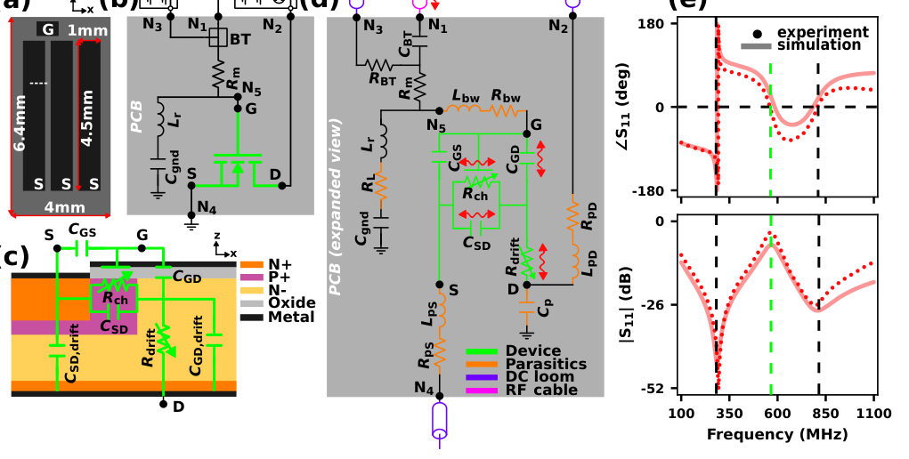
<figcaption class="paper-figure-caption"><b>Fig 1.</b> FIG. 1. (a) Schematic drawing (not to scale) of the bare-die commercial chip containing the DUT (Wolfspeed CPM2-1200- 0025A), showing the source (S) and gate (G) metal pads on the top surface; the drain (D) contact occupies the full backside of the die and is not shown. (b) Simplified PCB layout and measurement set-up for combined DC transport and RF reflectometry. The RF excitation and DC gate bias are combined through a bias tee (BT). (c) Cross-sectional schematic of the vertical MOSFET along dashed white line in panel (a), with small-signal elements overlaid, indicating the physical origin of the capacitances and resistances included in the model. Rdrift is an effective resistance that...</figcaption>
</figure>
<figure class="paper-figure-card">
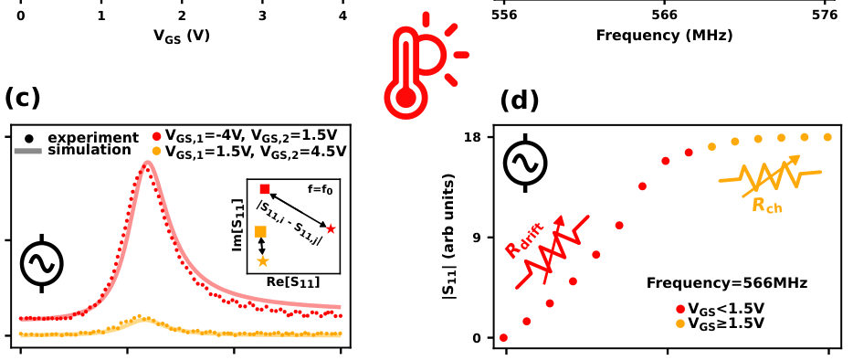
<figcaption class="paper-figure-caption"><b>Fig 2.</b> FIG. 2. (a) DC transfer characteristics measured at room temperature and VDS = 50 µV, showing the onset of transport through the channel at V RT th ≈1.5 V. (b) Magnitude of the measured reflection coefficient |S11| at room temperature for VGS = 0 V and VGS = 4.5 V, including repeats. (c) Frequency-dependent magnitude of the change in the reflection coefficient, |∆S11| (with offset for clarity), probing the gate effect for voltages smaller (red) and larger (orange) than threshold voltage at room temperature. Dots show experimental data and solid lines show the corresponding circuit simulations. In the simulations, the resistive elements of the DUT varied as follows: for VGS &lt; V RT th , Rch =...</figcaption>
</figure>
<figure class="paper-figure-card">
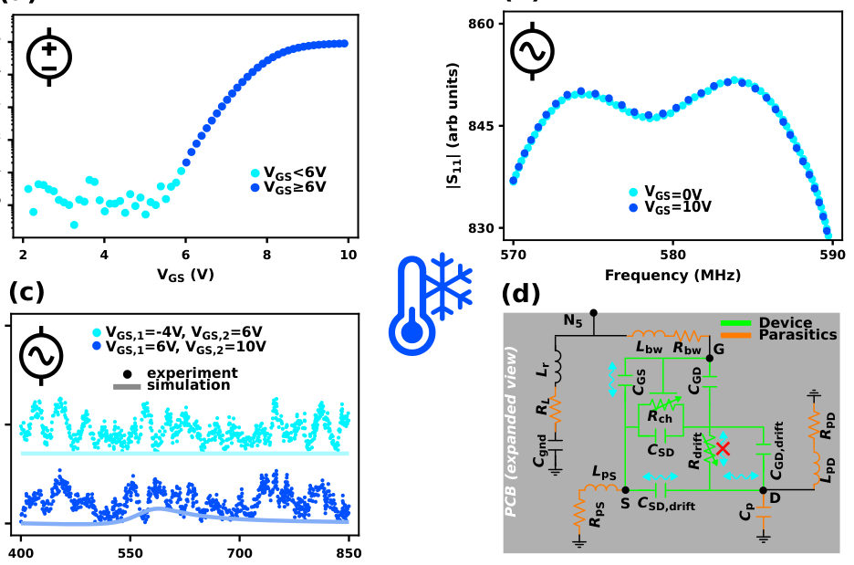
<figcaption class="paper-figure-caption"><b>Fig 3.</b> FIG. 3. (a) DC transfer characteristic measured at T = 28 K and VDS = 10 mV, showing gate-controlled turn-on and V cryo th ≈6 V. (b) Magnitude of the reflection coefficient for VGS = 0 V and VGS = 10 V, T = 28 K. (c) Frequency dependent magnitude of the change in the reflection coefficient, |∆S11| (with offset for clarity), probing the gate effect for voltages smaller (light blue) and larger (dark blue) than threshold voltage at T = 28 K. Dots show experimental data and solid lines show the corresponding circuit simulations. In the simulations, the resistive elements of the DUT varied as follows: for VGS &lt; V cryo th , Rch = 10 MΩand 3.4 kΩ&lt; Rdrift &lt; 8.6 kΩ; for VGS &gt; V cryo th , Rdrift =...</figcaption>
</figure>
<figure class="paper-figure-card">
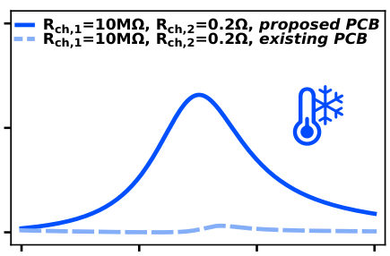
<figcaption class="paper-figure-caption"><b>Fig 4.</b> FIG. 4. (a) Schematic of the modified PCB configuration, in which additional components (pink) are introduced to redistribute the RF current through gate-dependent DUT impedances. At each of the source and drain nodes, a ca- pacitor provides a resonant RF path with Lr, while an in- ductor acts as an RF choke. (b) Simulated magnitude of the change in the reflection coefficient, |S11,i −S11,j|, for the original PCB configuration (dashed line) and the proposed configuration (solid line), evaluated for a change in channel resistance 0.2 Ω&lt; Rch &lt; 10 MΩ. Other parameters used in the simulations are Lr = 4 nH, CrS = CrD = 11 pF, LbS = LbD = 500 nH.</figcaption>
</figure>
<figure class="paper-figure-card">
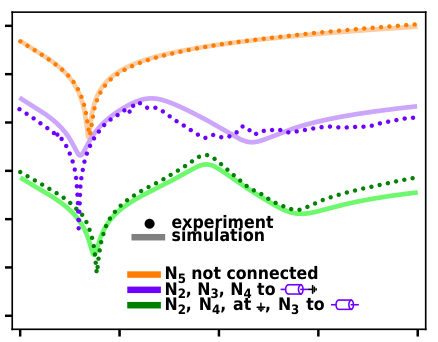
<figcaption class="paper-figure-caption"><b>Fig 5.</b> FIG. 5. Measured magnitude of the reflection coefficient |S11| at room temperature (dots) for different grounding configura- tions tested (color coded), and associated circuit simulations (solid lines). Traces are shifted vertically for clarity.</figcaption>
</figure>

**Summary.** This paper demonstrates RF reflectometry on large-area SiC transistors, showing that while the technique works well at room temperature, cryogenic cooling causes the signal to vanish due to carrier freeze-out increasing device resistance. The authors propose and validate a modified circuit design that successfully restores the RF readout sensitivity under these challenging low-temperature conditions.

**Why it may be interesting.** While the focus is on solid-state electronics, the methodology of using high-frequency impedance measurements to probe subtle changes in resistive/capacitive coupling at cryogenic temperatures is relevant to characterizing quantum interfaces and superconducting circuits.

Detailed structure

**Main problem.** The study investigates the feasibility and limitations of using radio-frequency (RF) reflectometry to read out the electrical state of large-area silicon carbide (SiC) transistors at cryogenic temperatures.

**Main result.** RF readout sensitivity degrades significantly at low temperatures due to carrier freeze-out increasing the drift region resistance, but a modified circuit configuration can restore sensitivity by redirecting the RF current path.

**Method.** The authors combine DC transport measurements with RF reflectometry using a Vector Network Analyzer (VNA) and analyze the reflection coefficient magnitude (|S11|) across varying gate voltages and temperatures.

**Model / system.** The physical system is a large-area, vertical 4H-SiC MOSFET. The analysis relies on a lumped-element equivalent circuit model that incorporates device parasitics, interconnects, and temperature-dependent carrier freeze-out effects.

**Key observables.** Reflection coefficient magnitude (|S11|), DC transfer characteristics (Id vs Vgs), and the change in |S11| ($\Delta |S11|$).

**Important parameters / regimes.** Cryogenic temperature (28 K), resonant frequency ($\approx 566$ MHz), and the ratio of parasitic capacitances to device capacitances.

**Assumptions / limitations.** The analysis assumes that the RF current path is dominated by changes in the effective resistance of the drift region at low temperatures, and that parasitic elements can be accurately modeled.

**Figures summary.** Figures illustrate the schematic setup, the measured |S11| response vs. Vgs at room temperature, and the comparison between the original and proposed circuit configurations for restoring sensitivity.

**Paper structure.** The paper proceeds by establishing the baseline RF readout at room temperature, demonstrating sensitivity to gate voltage. It then shows the temperature-dependent degradation of this signal, attributing it to carrier freeze-out. Finally, it proposes and validates a modified circuit design to overcome this cryogenic limitation.

Abstract

Radio-frequency (RF) reflectometry is widely used for high-bandwidth readout of semiconductor quantum devices at cryogenic temperatures, but its application has mainly been limited to nanoscale structures with relatively small capacitances. Here, we investigate RF readout in a different regime by applying gate-based reflectometry to a large-area silicon carbide transistor with parasitic capacitances orders of magnitude larger than those of typical quantum devices, conditions normally expected to hinder RF readout. We observe a gate-dependent RF response which degrades and eventually vanishes as temperature is lowered, although MOSFET operation in DC transport is maintained down to deep cryogenic temperatures. We attribute this behaviour to impedance changes introduced by carrier freeze-out in the transistor drift region, and propose a modified circuit configuration designed to restore sensitivity under these conditions. These results establish how parasitic pathways and device geometry can limit RF readout, providing insight into the design of scalable cryogenic-CMOS quantum systems.

[↑ back to top](#top)

