
# arxiv digest (quant-ph + cond-mat) — 2026-05-19

*223 papers · 52 relevant · 0 highlighted*

## 🔥 Most relevant (52)

*Every paper with at least one nonzero topic score, sorted by best-matching score. 🔥 marks scores ≥4/5. Click the title to jump to the full entry below; click [arXiv] to open the paper page. `(secondary)` marks papers from de-prioritized cond-mat archives.*

Show 52 relevant papers

- [Realization of waveguide many-body quantum optics](#paper-2605.18525) [[arXiv]](http://arxiv.org/abs/2605.18525v1) — 🔥 `quantum optics experiment` **5/5** · 🔥 `QC/QI experiment` **4/5** · 🔥 `Tavis-Cummings & cavity-many-emitter` **4/5** · `analog quantum simulation` **3/5** · `correlated cavity matter` **3/5** · `correlated / nonlocal dissipation` **2/5** · `driven-dissipative phase transition` **2/5** · `entanglement & information structure` **2/5**
- [Measuring the complete set of spatial Schmidt modes of entangled two-photon fields](#paper-2605.17974) [[arXiv]](http://arxiv.org/abs/2605.17974v1) — 🔥 `quantum optics experiment` **5/5** · 🔥 `QC/QI experiment` **4/5** · `entanglement & information structure` **3/5** · `interference shaping light` **3/5** · `quantum measurements` **3/5**
- [Fibonacci many-body scars in a decorated Rule-54 quantum cellular automaton](#paper-2605.18622) [[arXiv]](http://arxiv.org/abs/2605.18622v1) — 🔥 `scars & prethermalization` **5/5** · 🔥 `non-equilibrium dynamics` **4/5** · `entanglement & information structure` **3/5**
- [Spin-force from a Nitrogen-Vacancy ensemble drives a 100 mg levitated resonator](#paper-2605.17750) [[arXiv]](http://arxiv.org/abs/2605.17750v1) — 🔥 `spintronics-quantum-optics interface` **5/5** · `QC/QI experiment` **3/5** · `quantum measurements` **2/5** · `quantum optics experiment` **2/5**
- [Weak Fragmentation and Thermalization in a Dipole-Conserving Bose-Hubbard Chain](#paper-2605.18119) [[arXiv]](http://arxiv.org/abs/2605.18119v1) — 🔥 `scars & prethermalization` **5/5** · 🔥 `non-equilibrium dynamics` **4/5** · `entanglement & information structure` **3/5**
- [Graph-Theoretic Detection of Hilbert Space Fragmentation](#paper-2605.17951) [[arXiv]](http://arxiv.org/abs/2605.17951v1) — 🔥 `scars & prethermalization` **5/5** · `non-equilibrium dynamics` **3/5** · `entanglement & information structure` **2/5**
- [Dissipation-assisted preparation of Floquet-Laughlin states in superconducting circuits](#paper-2605.18377) [[arXiv]](http://arxiv.org/abs/2605.18377v1) — 🔥 `correlated / nonlocal dissipation` **4/5** · 🔥 `correlated cavity matter` **4/5** · 🔥 `non-equilibrium dynamics` **4/5** · `analog quantum simulation` **3/5** · `driven-dissipative phase transition` **3/5** · `exotic spin models in light-matter` **3/5** · `Tavis-Cummings & cavity-many-emitter` **2/5** · `methods for driven-dissipative` **2/5** · `quantum measurements` **2/5**
- [Universal dynamics from a single-particle dark state](#paper-2605.16494) [[arXiv]](http://arxiv.org/abs/2605.16494v1) — 🔥 `non-equilibrium dynamics` **4/5** · 🔥 `non-equilibrium universality` **4/5** · `Dicke superradiance` **3/5** · `driven-dissipative phase transition` **3/5** · `entanglement & information structure` **3/5** · `methods for driven-dissipative` **3/5** · `free-space correlated emission` **2/5** · `scars & prethermalization` **2/5**
- [Strong nanomechanical Duffing nonlinearity and interactions induced through cavity optomechanics](#paper-2605.18289) [[arXiv]](http://arxiv.org/abs/2605.18289v1) — 🔥 `quantum optics experiment` **4/5** · `analog quantum simulation` **3/5** · `correlated cavity matter` **3/5** · `Tavis-Cummings & cavity-many-emitter` **2/5** · `correlated / nonlocal dissipation` **2/5** · `driven-dissipative phase transition` **2/5** · `exotic spin models in light-matter` **2/5** · `non-equilibrium dynamics` **2/5** · `quantum measurements` **2/5**
- [Bound state in the continuum and dynamics via phase modulation in giant-atom waveguide setups](#paper-2605.17878) [[arXiv]](http://arxiv.org/abs/2605.17878v1) — 🔥 `correlated / nonlocal dissipation` **4/5** · 🔥 `interference shaping light` **4/5** · `non-equilibrium dynamics` **3/5** · `Dicke superradiance` **2/5** · `Tavis-Cummings & cavity-many-emitter` **2/5** · `entanglement & information structure` **2/5** · `methods for driven-dissipative` **2/5**
- [Topologically protected long-range correlations in steady states of driven-dissipative bosonic chains](#paper-2605.18394) [[arXiv]](http://arxiv.org/abs/2605.18394v1) — 🔥 `driven-dissipative phase transition` **4/5** · `methods for driven-dissipative` **3/5** · `non-equilibrium dynamics` **3/5** · `non-equilibrium universality` **3/5** · `entanglement & information structure` **2/5** · `exotic spin models in light-matter` **2/5**
- [Coherence-Enhanced Quantum Battery Charging with Ergotropy Stabilization](#paper-2605.17700) [[arXiv]](http://arxiv.org/abs/2605.17700v1) — 🔥 `correlated / nonlocal dissipation` **4/5** · `Dicke superradiance` **3/5** · `non-equilibrium dynamics` **3/5** · `Tavis-Cummings & cavity-many-emitter` **2/5** · `entanglement & information structure` **2/5** · `methods for driven-dissipative` **2/5**
- [Energy-Resolved Eigenmode Spectroscopy of 1-D and 2-D Non-Hermitian Skin Effects](#paper-2605.18272) [[arXiv]](http://arxiv.org/abs/2605.18272v1) — 🔥 `quantum optics experiment` **4/5** · `analog quantum simulation` **3/5** · `correlated / nonlocal dissipation` **2/5** · `driven-dissipative phase transition` **2/5** · `non-equilibrium dynamics` **2/5** · `quantum measurements` **2/5**
- [Measurement and Control of the Complex Berry Phase in a Quantum System](#paper-2605.16559) [[arXiv]](http://arxiv.org/abs/2605.16559v1) — 🔥 `QC/QI experiment` **4/5** · 🔥 `quantum measurements` **4/5** · `quantum optics experiment` **3/5** · `correlated / nonlocal dissipation` **2/5** · `non-equilibrium dynamics` **2/5**
- [Phonon-bottlenecked spin relaxation of Er$^{3+}$:CaWO$_4$ at milliKelvin temperatures](#paper-2605.18208) [[arXiv]](http://arxiv.org/abs/2605.18208v1) — 🔥 `QC/QI experiment` **4/5** · `quantum optics experiment` **3/5** · `spintronics-quantum-optics interface` **3/5** · `Tavis-Cummings & cavity-many-emitter` **2/5** · `non-equilibrium dynamics` **2/5**
- [Quantum Mpemba effect for operators in open systems](#paper-2605.17908) [[arXiv]](http://arxiv.org/abs/2605.17908v1) — 🔥 `non-equilibrium dynamics` **4/5** · `entanglement & information structure` **3/5** · `methods for driven-dissipative` **3/5** · `correlated / nonlocal dissipation` **2/5** · `scars & prethermalization` **2/5**
- [Generation of deterministic multi-mode intensity squeezing in a train of ultra-short pulses by unbalanced SU(1,1) interferometers](#paper-2605.17798) [[arXiv]](http://arxiv.org/abs/2605.17798v1) — 🔥 `QC/QI experiment` **4/5** · 🔥 `quantum optics experiment` **4/5** · `interference shaping light` **3/5** · `quantum measurements` **2/5**
- [Probing Tensor Singularities and Their Euler-Class Descendants via Non-Abelian Quantum Geometry Measurement](#paper-2605.17977) [[arXiv]](http://arxiv.org/abs/2605.17977v1) — 🔥 `QC/QI experiment` **4/5** · 🔥 `analog quantum simulation` **4/5** · `quantum measurements` **3/5** · `non-equilibrium dynamics` **2/5**
- [Exact nonequilibrium steady states of boundary driven circuit with XYZ gates](#paper-2605.17018) [[arXiv]](http://arxiv.org/abs/2605.17018v1) — 🔥 `methods for driven-dissipative` **4/5** · 🔥 `non-equilibrium dynamics` **4/5** · `driven-dissipative phase transition` **2/5** · `entanglement & information structure` **2/5**
- [Experimental observation of entropic-singularity-induced nonadditive quantum communication in a qutrit platypus channel](#paper-2605.17418) [[arXiv]](http://arxiv.org/abs/2605.17418v1) — 🔥 `QC/QI experiment` **4/5** · 🔥 `entanglement & information structure` **4/5** · 🔥 `quantum optics experiment` **4/5**
- [A Wafer-Scale Heterogeneous III-V-on-Silicon Nitride Quantum Photonic Platform](#paper-2605.17738) [[arXiv]](http://arxiv.org/abs/2605.17738v1) — 🔥 `QC/QI experiment` **4/5** · 🔥 `quantum optics experiment` **4/5** · `entanglement & information structure` **1/5** · `interference shaping light` **1/5** · `quantum measurements` **1/5**
- [Adaptive Real-Time Magnetic Field Tracking beyond Prior Waveform Constraints](#paper-2605.17784) [[arXiv]](http://arxiv.org/abs/2605.17784v1) — 🔥 `quantum measurements` **4/5** · `spintronics-quantum-optics interface` **3/5** · `methods for driven-dissipative` **2/5** · `quantum optics experiment` **2/5**
- [Basis- and Channel-Selective Quantum Photodetection](#paper-2605.16886) [[arXiv]](http://arxiv.org/abs/2605.16886v1) — 🔥 `quantum measurements` **4/5** · `interference shaping light` **3/5** · `correlated / nonlocal dissipation` **2/5** · `free-space correlated emission` **2/5**
- [Efficient Hamiltonian Engineering for Adiabatic MIS Algorithms](#paper-2605.16944) [[arXiv]](http://arxiv.org/abs/2605.16944v1) — 🔥 `Rydberg arrays` **4/5** · `analog quantum simulation` **3/5** · `exotic spin models in light-matter` **2/5** · `non-equilibrium dynamics` **2/5**
- [Linear-optical test of quantum contextuality with sequential measurements](#paper-2605.18112) [[arXiv]](http://arxiv.org/abs/2605.18112v1) — 🔥 `QC/QI experiment` **4/5** · 🔥 `quantum optics experiment` **4/5** · `quantum measurements` **3/5**
- [Quantum magic of strongly correlated fermions $-$ the Hubbard dimer](#paper-2605.18494) [[arXiv]](http://arxiv.org/abs/2605.18494v1) — 🔥 `entanglement & information structure` **4/5** · `non-equilibrium dynamics` **3/5** · `Keldysh / 2PI / non-Gaussian methods` **2/5** · `correlated / nonlocal dissipation` **2/5**
- [Zeno-Assisted Quantum Heat Engines](#paper-2605.18367) [[arXiv]](http://arxiv.org/abs/2605.18367v1) — 🔥 `quantum measurements` **4/5** · `non-equilibrium dynamics` **3/5** · `correlated / nonlocal dissipation` **2/5** · `methods for driven-dissipative` **2/5**
- [Coherent spectroscopy of collective excitations in superfluid helium far from equilibrium](#paper-2605.17835) [[arXiv]](http://arxiv.org/abs/2605.17835v1) — 🔥 `non-equilibrium dynamics` **4/5** · `interference shaping light` **2/5** · `quantum measurements` **2/5** · `quantum optics experiment` **2/5**
- [Integrated time-bin entangled quantum light source on a 4H-SiC microring chip](#paper-2605.18124) [[arXiv]](http://arxiv.org/abs/2605.18124v1) — 🔥 `QC/QI experiment` **4/5** · 🔥 `quantum optics experiment` **4/5** · `interference shaping light` **2/5**
- [Ordered POVMs and Residual Collapse](#paper-2605.17592) [[arXiv]](http://arxiv.org/abs/2605.17592v1) — 🔥 `quantum measurements` **4/5** · `entanglement & information structure` **2/5** · `measurement-induced transitions` **2/5** · `methods for driven-dissipative` **2/5**
- [Quantum Optical Soliton Dynamics Beyond Linearization: An Open-System Approach](#paper-2605.17025) [[arXiv]](http://arxiv.org/abs/2605.17025v1) — 🔥 `Keldysh / 2PI / non-Gaussian methods` **4/5** · 🔥 `methods for driven-dissipative` **4/5** · `non-equilibrium dynamics` **2/5**
- [Regularized Counterdiabatic Driving for the Quantum Rabi Model](#paper-2605.18237) [[arXiv]](http://arxiv.org/abs/2605.18237v1) — 🔥 `non-equilibrium dynamics` **4/5** · `Keldysh / 2PI / non-Gaussian methods` **2/5** · `correlated cavity matter` **2/5** · `methods for driven-dissipative` **2/5**
- [Magic Secret Sharing: Threshold Control of Quantum Computational Power via GHZ Entanglement](#paper-2605.16614) [[arXiv]](http://arxiv.org/abs/2605.16614v1) — 🔥 `QC/QI experiment` **4/5** · `entanglement & information structure` **3/5** · `quantum measurements` **2/5**
- [Maxwell's Demon](#paper-2605.17196) [[arXiv]](http://arxiv.org/abs/2605.17196v1) — 🔥 `quantum measurements` **4/5** · `entanglement & information structure` **3/5** · `non-equilibrium dynamics` **2/5**
- [Universal interface fluctuations in absorbing-state phase transitions](#paper-2605.17781) [[arXiv]](http://arxiv.org/abs/2605.17781v1) — 🔥 `non-equilibrium universality` **4/5** · `non-equilibrium dynamics` **3/5** · `driven-dissipative phase transition` **2/5**
- [Universal Jaynes-Cummings Control of an Oscillator](#paper-2605.18658) [[arXiv]](http://arxiv.org/abs/2605.18658v1) — 🔥 `QC/QI experiment` **4/5** · `quantum optics experiment` **3/5** · `quantum measurements` **2/5**
- [Open quantum dynamics without Complete Positivity: a criticism](#paper-2605.18639) [[arXiv]](http://arxiv.org/abs/2605.18639v1) — 🔥 `entanglement & information structure` **4/5** · `methods for driven-dissipative` **2/5** · `non-equilibrium dynamics` **2/5**
- [Phase dynamics and dissipation in tunnel ferromagnetic Josephson junctions](#paper-2605.18586) [[arXiv]](http://arxiv.org/abs/2605.18586v1) `(secondary)` — 🔥 `QC/QI experiment` **4/5** · `correlated / nonlocal dissipation` **2/5** · `spintronics-quantum-optics interface` **2/5**
- [Shapiro steps of superfluid Fermi gases in a ring trap across the BCS--BEC crossover](#paper-2605.17940) [[arXiv]](http://arxiv.org/abs/2605.17940v1) — 🔥 `non-equilibrium dynamics` **4/5** · `analog quantum simulation` **2/5** · `driven-dissipative phase transition` **2/5**
- [Strain-free, symmetrical, InGaAs quantum dots as single photon emitters in the telecomC-band](#paper-2605.17332) [[arXiv]](http://arxiv.org/abs/2605.17332v1) — 🔥 `QC/QI experiment` **4/5** · 🔥 `quantum optics experiment` **4/5**
- [A Compact, Robust, and Tunable Open Microcavity Platform for Solid-State Quantum Electrodynamics](#paper-2605.16694) [[arXiv]](http://arxiv.org/abs/2605.16694v1) — 🔥 `quantum optics experiment` **4/5** · `QC/QI experiment` **3/5**
- [Demonstration of transport in an ion trap design for two-dimensional lattices](#paper-2605.16543) [[arXiv]](http://arxiv.org/abs/2605.16543v1) — 🔥 `QC/QI experiment` **4/5** · `analog quantum simulation` **3/5**
- [Closed-form Bayesian quantum estimation of Gaussian states](#paper-2605.16978) [[arXiv]](http://arxiv.org/abs/2605.16978v1) — 🔥 `quantum measurements` **4/5** · `methods for driven-dissipative` **2/5**
- [Exact Entanglement-Depth Speed Frontier for Complete Quantum Charging](#paper-2605.16935) [[arXiv]](http://arxiv.org/abs/2605.16935v1) — 🔥 `entanglement & information structure` **4/5** · `non-equilibrium dynamics` **2/5**
- [Krylov complexity and fidelity susceptibility in two-band Hamiltonians](#paper-2605.18594) [[arXiv]](http://arxiv.org/abs/2605.18594v1) — 🔥 `entanglement & information structure` **4/5** · `non-equilibrium dynamics` **2/5**
- [Non-Gaussian Entanglement Hierarchy Based on the Schmidt Number](#paper-2605.18605) [[arXiv]](http://arxiv.org/abs/2605.18605v1) — 🔥 `entanglement & information structure` **4/5** · `Keldysh / 2PI / non-Gaussian methods` **2/5**
- [Quantum randomness beyond projective measurements](#paper-2605.18291) [[arXiv]](http://arxiv.org/abs/2605.18291v1) — 🔥 `quantum measurements` **4/5** · `entanglement & information structure` **2/5**
- [Schedule-dependent basin occupation in a programmable quantum annealer](#paper-2605.17604) [[arXiv]](http://arxiv.org/abs/2605.17604v1) — 🔥 `QC/QI experiment` **4/5** · `non-equilibrium dynamics` **2/5**
- [Cryogenic Time-Division-Multiplexed Voltage Control for Scalable Trapped-Ion Quantum Processors](#paper-2605.17824) [[arXiv]](http://arxiv.org/abs/2605.17824v1) — 🔥 `QC/QI experiment` **4/5**
- [Exact Organization of Density Matrices and Entanglement Structure in the Kitaev Spin Liquid](#paper-2605.18002) [[arXiv]](http://arxiv.org/abs/2605.18002v1) — 🔥 `entanglement & information structure` **4/5**
- [Reduced-State Stabilizer Rényi Entropy as a Probe of Quantum Criticality in the Transverse ANNNI Model and the Quantum Compass Model](#paper-2605.18391) [[arXiv]](http://arxiv.org/abs/2605.18391v1) — 🔥 `entanglement & information structure` **4/5**
- [Where the Quantum Lives in D-Wave Hybrid Portfolio Optimization](#paper-2605.17623) [[arXiv]](http://arxiv.org/abs/2605.17623v1) — 🔥 `QC/QI experiment` **4/5**

## All papers (130, sorted by relevance)

*Papers from quant-ph and your primary cond-mat archives (quant-gas, stat-mech, str-el, dis-nn). Highlighted papers (⭐) come first, then everything else sorted by topic-relevance score, highest first.*

### [Realization of waveguide many-body quantum optics](http://arxiv.org/abs/2605.18525v1)

**Authors:** Lena M. Hansen, Clara Henke, Christoph Hotter, Oliver A. D. Sandberg, Thomas Wilkens Sandø, Vasiliki Angelopoulou, Alexey Tiranov, Christoffer B. Møller, Zhe Liu, Leonardo Midolo, Nikolai Bart, Arne Ludwig, Philip Walther, Cornelis J. van Diepen, Peter Lodahl, Anders Søndberg Sørensen  
**Type:** experiment · **Category:** quantum information and computing · **PDF:** <https://arxiv.org/pdf/2605.18525v1>  
**Analysis basis:** full PDF text, analyzed in chunks
**Topic relevance:** 🔥 `quantum optics experiment` **5/5** · 🔥 `QC/QI experiment` **4/5** · 🔥 `Tavis-Cummings & cavity-many-emitter` **4/5** · `analog quantum simulation` **3/5** · `correlated cavity matter` **3/5** · `correlated / nonlocal dissipation` **2/5** · `driven-dissipative phase transition` **2/5** · `entanglement & information structure` **2/5**

📷 Fig 1

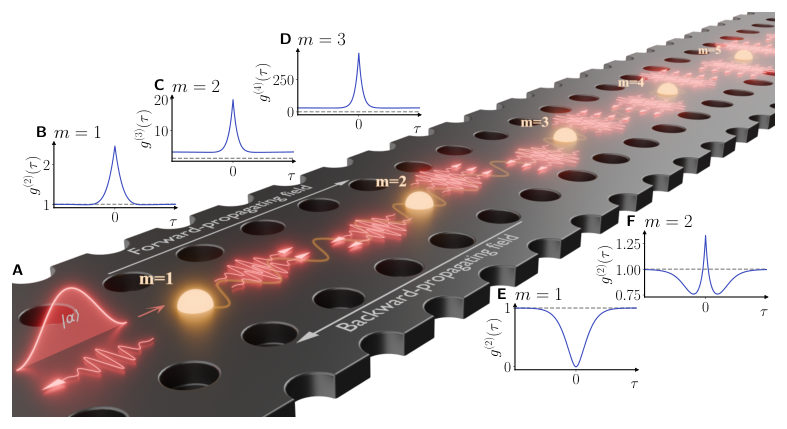 
FIG. 1. Waveguide many-body quantum optics. (A) Illustration of multiple emitters directly coupled via the waveg- uide, visualized by a connection between the emitters. The scattering of a weak coherent input pulse |α⟩in the bidi- rectional waveguide introduces a forward- and a backward-propagating field. The photon wavepackets illustrate the un- derlying concept that m coupled emitters can tailor a forward-propagating output field with enhanced m + 1-photon cor- relations and m-photon correlations in the backward direction. (B-D) Simulations of the two-time correlation function g(n)(τ) = ⟨(a†(t))n−1a†(t + τ)a(t + τ)(a(t))n−1⟩/⟨(a†(t)a(t)⟩n of the forward-propagating field. In the...

📷 Fig 2

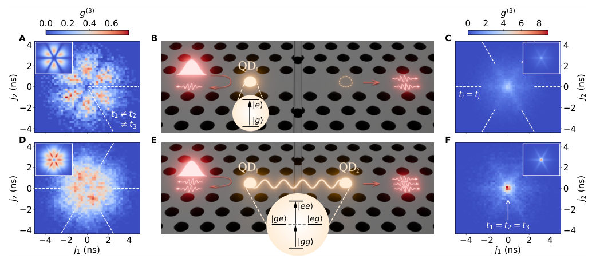 
FIG. 2. Observation of strong three-photon correlations. (A-C) Waveguide scattering of a weak coherent light pulse for a single QD and (D-F) coupled QDs. (B and E) Schematic of the device, where two quantum emitters (QD1 and QD2) are electrically separated by a vertical trench indicated in the center of the device, which allows independent electrical tuning of the QDs. The scattering process in the waveguide introduces forward- and backward-propagating fields (visualized by arrows). For the interaction with a single QD; a two-level system with ground state |g⟩and excited state |e⟩, the second emitter is far-detuned from resonance (dashed line). The coupled emitter system is controlled by...

📷 Fig 3

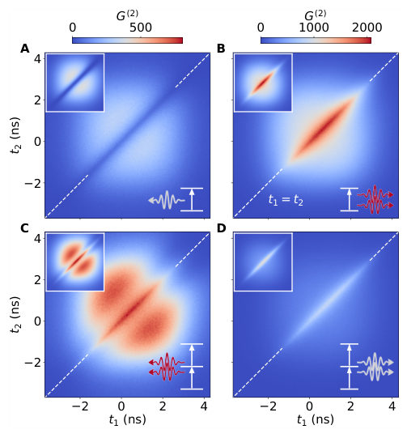 
FIG. 3. Experimental two-photon correlations. Tem- porally resolved second-order correlations for (A and B) a single QD and (C and D) two coupled QDs. (A) The re- flected field for a single QD consists only of anti-correlated photons, t1 ̸= t2. (C) For coupled QDs, the reflection is generally increased, and in addition, a correlated component appears as a strong diagonal feature, t1 = t2. (B) For a sin- gle QD, the signal in the forward direction is dominated by a correlated two-photon component. (D) For coupled QDs, the signal in the forward direction is reduced, but a weak cor- related component is still observed. The coincidence counts for the QD and the QDs can be directly compared...

📷 Fig 4

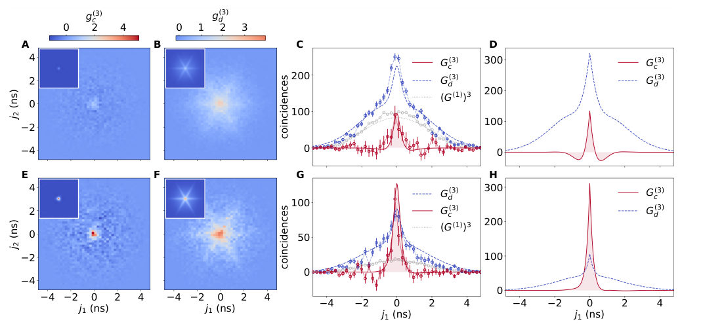 
FIG. 4. Genuine three-photon correlations. Connected and disconnected components for the third-order correlations of the forward-propagating field for (A-D) a single QD and (E-H) a pair of coupled QDs. Normalized (A and E) connected and (B and F) disconnected components. Insets show corresponding numerical simulations. (C and G) Traces with j2 = 0 for the unnormalized correlations G(3) c (j1, j2 = 0), and G(3) d (j1, j2 = 0). Additionally, the uncorrelated components (G(1))3 are shown as a reference. The overall amplitude of the theory simulations (lines) is fitted to the experimental data (dots), assuming uncorrelated spectral diffusion. The slight discrepancy in the overall amplitude fit...

📷 Fig 5

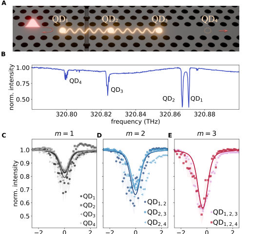 
FIG. 5. Scattering from multiple emitters. (A) Visu- alization of three coupled emitters formed from a set of four QDs in a waveguide. (B) Transmission spectrum of four emit- ters within the waveguide. (C-E) Experimental data (mark- ers) and simulations (lines) of the transmission intensity for simultaneously tuning (C) single emitters, (D) pairs of emit- ters, and (E) triplets of emitters into resonance with the input field using electric and magnetic tuning. The transmission intensity is normalized to the far off-resonant detuning. The shaded areas indicate the standard error of the mean across 20 measurement runs. The theory plots for m = 3 are shifted by 0.3 GHz to align with the...

**Summary.** This paper demonstrates the realization of many-body quantum optics by coupling multiple quantum dots within a nanophotonic waveguide. By tuning the number of emitters, the researchers show that higher-order photon correlations can be engineered, specifically observing genuine three-photon correlations. This work provides a scalable foundation for creating many-body entangled states and quantum simulators.

**Why it may be interesting.** It demonstrates the experimental onset of many-body quantum optics in a waveguide-QED setting, providing a platform for quantum simulators, many-body entanglement, and exploring novel quantum phase transitions through engineered photon-photon interactions.

Detailed structure

**Main problem.** Achieving deterministic, scalable control of light-matter interactions to extend quantum optics from single-photon/single-atom regimes to many-body quantum optics.

**Main result.** The researchers realized many-body quantum optics in a waveguide by demonstrating that adding quantum emitters generates higher-order photon correlations, specifically observing genuine three-photon correlations from a pair of coupled emitters.

**Method.** The experiment uses pulsed excitation of semiconductor quantum dots in a nanophotonic waveguide, measuring n-photon correlation functions via three detection channels and comparing results to theoretical simulations.

**Model / system.** A nanophotonic photonic crystal waveguide (PCW) coupled to multiple InAs quantum dots (QDs) in a GaAs p-i-n diode heterostructure, where emitters are independently tunable via electrical (Stark) and magnetic (Zeeman) effects.

**Key observables.** n-photon correlation functions (g(2), g(3), g(4)), connected (genuine) and disconnected components of third-order correlations (Gc(3), Gd(3)), and transmission/reflection spectra.

**Important parameters / regimes.** Coupling phase (phi = 0.8pi), decay rate (Gamma), dephuring rate (gamma_d), beta factor, and the scaling law where the nth-order joint cumulant peaks at n = m + 1.

**Assumptions / limitations.** The analysis assumes the impact of spectral diffusion and detector jitter can be modeled; simulations exclude blinking effects.

**Figures summary.** Figure 1 shows the waveguide schematic and simulations of photon correlations; Figure 2 displays experimental g(3) measurements for single and coupled QDs; Figure 4 shows connected vs. disconnected three-photon components; Figure 5 illustrates the scalability to three emitters.

**Paper structure.** The paper introduces the problem of many-body quantum optics, describes the experimental platform and tuning mechanisms, presents results for single and coupled emitters (including higher-order correlations), demonstrates scalability to three emitters, and concludes with a discussion on limitations and future directions.

Abstract

Controlling light photon-by-photon is central to quantum optics. At a fundamental level, photon interactions are mediated by their coupling to atoms, and ultimate control requires deterministic light-matter interfacing of single photons to single atoms. Extending this paradigm to radiatively couple multiple individual atoms in a deterministic and scalable manner opens the arena of many-body quantum optics. Here, we realize such a setting by coherently coupling solid-state artificial atoms to a nanophotonic waveguide and demonstrate higher-order photon correlations that are controlled by the number of quantum emitters. We study the scaling of nonlinear photonic transport induced by emitter-photon scattering and demonstrate that adding a quantum emitter generates higher-order photon correlations. Specifically, we experimentally observe genuine three-photon correlations from a pair of collectively coupled emitters, while contributions from lower photon numbers are suppressed. In addition, we scale to three resonant quantum emitters coupled to the waveguide. These advancements demonstrate the onset of many-body quantum optics in waveguide quantum electrodynamics, enabling new photonic quantum simulators, the creation of many-body entangled states, and the exploration of novel quantum phase transitions.

[↑ back to top](#top)

### [Measuring the complete set of spatial Schmidt modes of entangled two-photon fields](http://arxiv.org/abs/2605.17974v1)

**Authors:** Radhika Prasad, Nilakshi Senapati, Abhinandan Bhattacharjee, Suman Karan, Anand K. Jha  
**Type:** experiment · **Category:** quantum information and computing · **PDF:** <https://arxiv.org/pdf/2605.17974v1>  
**Analysis basis:** full PDF text, analyzed in chunks
**Topic relevance:** 🔥 `quantum optics experiment` **5/5** · 🔥 `QC/QI experiment` **4/5** · `entanglement & information structure` **3/5** · `interference shaping light` **3/5** · `quantum measurements` **3/5**

📷 Fig 1

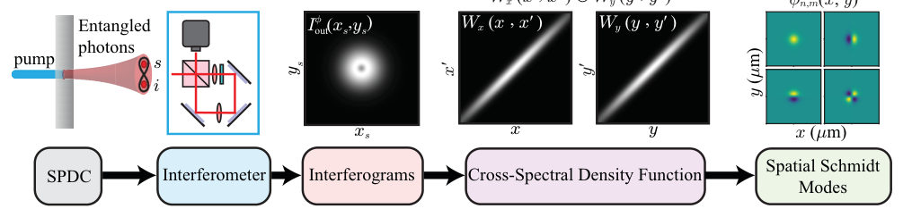 
FIG. 1. Conceptual illustration of the scheme. One of the SPDC photons (say, the signal photon) goes through an interferometer which measures its cross-spectral density function W(ρs, ρ′ s), which is numerically diagonalized to yield the eigenfunctions ϕmn(ρs) and the corresponding eigenvalues λmn, which are also the Schmidt modes and Schmidt spectrum of the entangled two-photon state ψsi (ρs, ρi).

📷 Fig 2

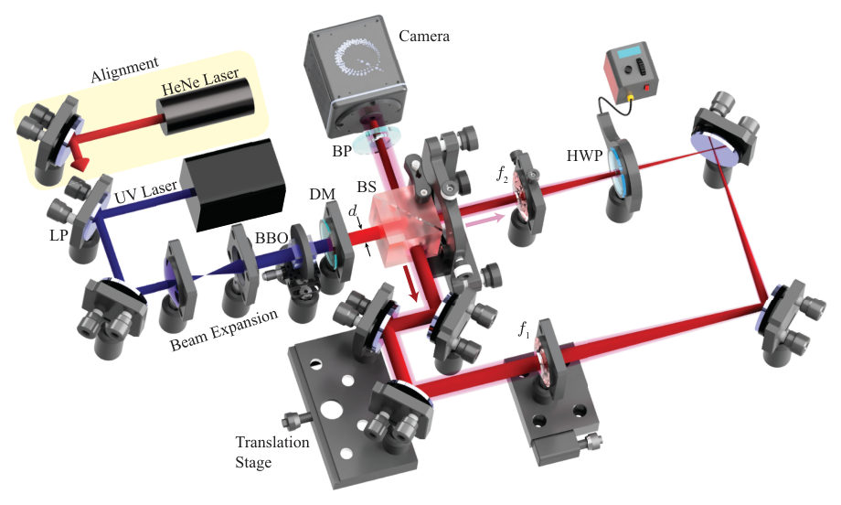 
FIG. 2. Experimental setup. LP: Longpass filter to transmit HeNe and reflect UV; BBO: β-Barium Borate crystal; DM: Dichroic mirror to transmit SPDC photons and block UV; BS: Beam Splitter; HWP: Half-Wave Plate; BP: Bandpass filter of bandwidth 10 nm centered at 710 nm. HeNe laser is used only for aligning the interferometer and is turned off when UV laser is used. We represent the interfering alternatives with different shades of dark red for the beam reflected at the BS, and light red for the beam transmitted at the BS.

📷 Fig 3

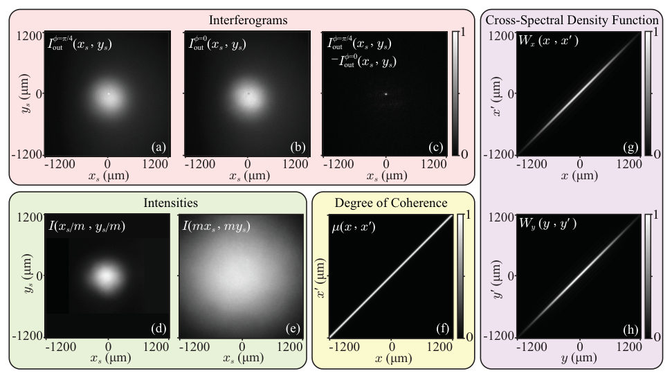 
FIG. 3. Experimental observations and reconstructions. (a), (b), (c) are recorded interferograms Iϕ=π/4 out (xs, ys), Iϕ=0 out (xs, ys), and their difference. (d) and (e) are the intensities profiles corresponding to the magnified and demagnified alternatives. (f) is the reconstructed degree of coherence function µ(x, x′). (g) and (h) are the reconstructed Wx(x, x′) and Wy(y, y′).

📷 Fig 4

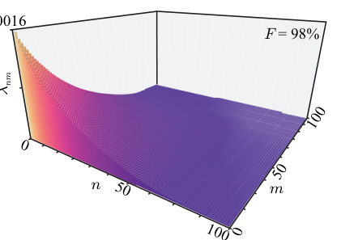 
FIG. 4. Reconstructed Schmidt spectrum λmn. F represents the fidelity of reconstruction.

📷 Fig 5

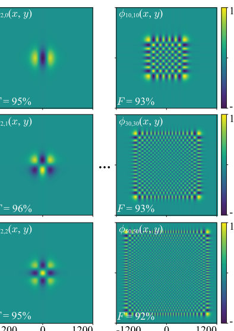 
FIG. 5. Plots of experimentally reconstructed Schmidt modes ϕmn(x, y). F is the fidelity of reconstruction.

**Summary.** The researchers have demonstrated a new way to identify the spatial patterns (Schmidt modes) of entangled photon pairs without knowing them beforehand. By measuring the coherence of a single photon, they successfully mapped out over 3000 modes with high accuracy. This breakthrough enables much easier use of high-dimensional light for complex quantum communication and computing tasks.

**Why it may be interesting.** This work is highly relevant to quantum optics and photonic quantum information as it provides a way to characterize and potentially manipulate extremely high-dimensional qudits without needing prior knowledge of their spatial structure.

Detailed structure

**Main problem.** Existing techniques for characterizing high-dimensional entangled two-photon states can only reconstruct the Schmidt spectrum if the Schmidt basis is known a priori, and often suffer from low efficiency or long data collection times.

**Main result.** The authors developed a technique to measure the complete set of spatial Schmidt modes without prior knowledge, achieving measurement of states with over 3000 Schmidt modes with up to 98% fidelity.

**Method.** The method uses a Sagnac-type interferometer with a 4f lens configuration to measure the cross-spectral density function (CSDF) of a single photon, which is then numerically diagonalized to extract the Schmidt modes and spectrum.

**Model / system.** The system consists of high-dimensional entangled two-photon states generated via type-I, collinear, degenerate Spontaneous Parampectrum Down-Conversion (SPDC) using a UV laser and a BBO crystal.

**Key observables.** Detection probability, cross-spectral density function (CSDF), degree of spatial coherence, Schmidt spectrum (eigenvalues), and Schmidt modes (eigenfunctions).

**Important parameters / regimes.** Pump beam waist (507 um), crystal thickness (1 mm), magnification factor (m=2 and 1/2), and Schmidt number (approx. 3413).

**Assumptions / limitations.** The signal photon field is assumed to be quasi-homogeneous, meaning the degree of coherence depends only on the difference in coordinates.

**Figures summary.** Figure 1 illustrates the conceptual measurement process; Figure 2 shows the experimental setup; Figure 3 displays recorded interferograms and reconstructed coherence/CSDF; Figure 4 shows the reconstructed Schmidt spectrum; Figure 5 displays reconstructed spatial Schmidt modes up to order 50.

**Paper structure.** The paper introduces the problem of basis-dependent measurement, describes the experimental setup and interferometer-based reconstruction method, presents the results for high-dimensional mode measurement and fidelity, and discusses limitations related to camera resolution.

Abstract

Spontaneous parametric down-conversion (SPDC) is the most widely-used source of high-dimensional entangled two-photon states, and the entanglement in the spatial degree of freedom is considered best suited for harnessing high-dimensional advantages. Although the Schmidt basis provides a natural choice for state characterisation of entangled two-photon states in any degree of freedom, there is currently no technique that can measure the Schmidt basis of an entangled two-photon field. The existing techniques can only reconstruct the Schmidt spectrum when the Schmidt basis is known a priori. In contrast, we present a technique that measures the complete set of spatial Schmidt modes without any prior knowledge. Using this technique, we report measurement of states with over 3000 Schmidt modes -- highest reported yet -- with up to 98$\%$ fidelity. We expect our work to significantly advance the harnessing of high-dimensional advantages in SPDC-based systems.

[↑ back to top](#top)

### [Fibonacci many-body scars in a decorated Rule-54 quantum cellular automaton](http://arxiv.org/abs/2605.18622v1)

**Authors:** Han-Ze Li, Jian-Xin Zhong  
**Type:** theory · **Category:** quantum information and computing · **PDF:** <https://arxiv.org/pdf/2605.18622v1>  
**Analysis basis:** full PDF text, analyzed in chunks
**Topic relevance:** 🔥 `scars & prethermalization` **5/5** · 🔥 `non-equilibrium dynamics` **4/5** · `entanglement & information structure` **3/5**

📷 Fig 1

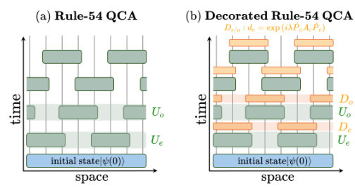 
Figure 1. Circuit architecture of the bare and decorated Rule- 54 quantum cellular automaton. (a) Bare Rule-54 QCA. The evolution is generated by alternating layers of three-site re- versible Rule-54 gates. The green blocks denote local up- dates Rj arranged in the even and odd layers Ue and Uo, and one Floquet period is U54 =UoUe. The vertical direction represents discrete Floquet time, while the horizontal direc- tion labels physical space. (b) Decorated Rule-54 QCA. The same Rule-54 backbone is supplemented by local projector- protected decoration layers. After the even Rule-54 layer Ue, a decoration layer De is inserted; after the odd Rule-54 layer Uo, a decoration layer Do is inserted....

📷 Fig 2

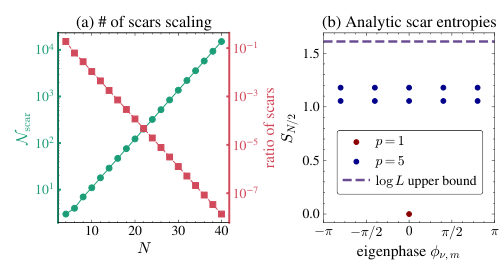 
Figure 2. Analytic structure of the Fibonacci-dimensional scar sector. (a) Number of exact scar eigenstates as a function of system size. For a chain of N = 2L qubits, the protected hard-core soliton sector has dimension Nscar = FL−1 + FL+1, the Fibonacci count of hard-core configurations on a cycle of length L. The exponential growth Nscar ∼φL is shown together with the exponentially small Hilbert-space fraction Nscar/2N when plotted on the secondary axis. (b) Half- chain entanglement entropies of the analytically constructed orbit-Fourier scar eigenstates for N = 10, grouped by their translation-orbit period pν. The vacuum orbit has pν =1 and gives the product scar |0⟩⊗N, while the...

📷 Fig 3

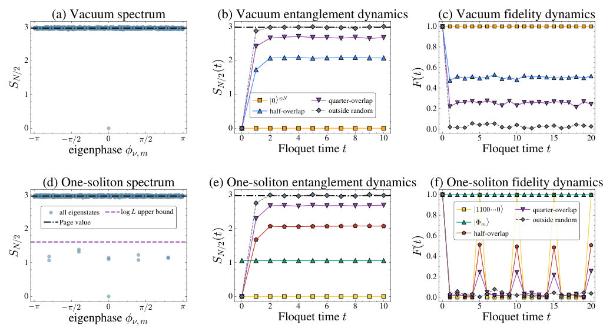 
Figure 3. Numerical signatures of exact scars in representative projector-decorated Rule-54 circuits. The top row shows a construction protecting the vacuum orbit, while the bottom row shows a construction protecting the one-soliton translation orbit generated by |1100 · · · 0⟩for N =10. (a,d) Half-chain entanglement entropy SN/2 of Floquet eigenstates versus quasienergy eigenphase ϕ. The bulk eigenstates concentrate near the finite-size Page value, whereas the protected scar eigenstates appear as low-entanglement outliers. In the one-soliton case, the dashed log p line gives the orbit-length entanglement bound for the analytic orbit-Fourier scars. (b,e) Entanglement dynamics SN/2(t) from...

📷 Fig 4

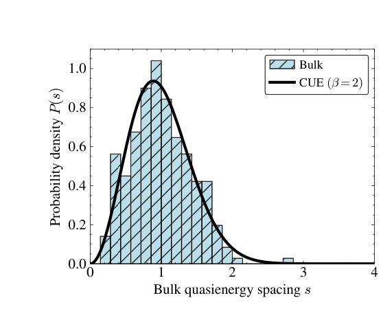 
Figure 4. Bulk quasienergy spacing statistics after remov- ing the exact scar sector. We diagonalize the decorated Flo- quet unitary, remove the protected scar subspace, and com- pute the normalized nearest-neighbor quasienergy spacing s=∆θ/⟨∆θ⟩from the remaining bulk eigenphases on the unit circle. The histogram is compared with the β = 2 random- matrix prediction appropriate for a Floquet unitary without a time-reversal-like antiunitary symmetry, denoted here as the CUE.

📷 Fig 5

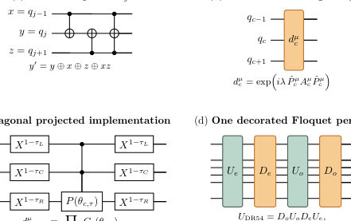 
Figure 5. Digital-circuit realization of the projector-decorated Rule-54 QCA. (a) The local Rule-54 update Rj is imple- mented by two CNOT gates and one Toffoli gate, giving y′ =y ⊕x ⊕z ⊕xz. (b) The most general local decoration is a projected three-qubit unitary dµ c . (c) A hardware-friendly diagonal realization decomposes dµ c into pattern-controlled phase gates Cτ(θc,τ) acting only on forbidden local patterns τ /∈Xµ c . The X gates convert the selected pattern τ to the all-one pattern before the controlled phase is applied and are then undone. (d) One decorated Floquet period is UDR54. The decoration layers act trivially on the protected sectors reached after the corresponding Rule-54...

**Summary.** The paper presents a method to engineer exact many-body scars in a quantum cellular automaton by decorating the Rule-54 rule with local projectors. It proves that this construction creates a system where a sparse, non-thermal sector of solitons coexists with a thermalizing background, providing a platform for studying weak ergodicity breaking and digital quantum simulation.

**Why it may be interesting.** This work is highly relevant for many-body dynamics and quantum computing as it provides a blueprint for digital quantum simulations of non-ergodic dynamics and explores the controlled coexistence of thermal and non-thermal phases.

Detailed structure

**Main problem.** The paper investigates the engineering of exact quantum many-body scars (QMBS) within a quantum cellular automaton (QCA) framework, specifically addressing how non-thermal eigenstates can coexist with a thermalizing many-body spectrum.

**Main result.** The authors demonstrate a method to engineer exact Floquet scars using the intrinsic soliton structure of the Rule-54 QCA, where the number of scars grows with Fibonacci combinatorics while their fraction in the Hilbert space vanishes exponentially.

**Method.** The study uses analytical construction via orbit-Fourier modes, transfer matrix methods for combinatorics, and exact diagonalization (ED) for numerical verification of entanglement and spectral statistics.

**Model / system.** A decorated Rule-54 quantum cellular automaton consisting of a 1D chain of qubits with periodic boundary conditions, where local 'decorations' are added to the Rule-54 dynamics to create a thermalizing background while leaving a protected soliton sector invariant.

**Key observables.** Entanglement entropy (von Neumann and Renyi), fidelity decay, return probability, spectral statistics (CUE), and protected-sector weight.

**Important parameters / regimes.** System size N (or L), Fibonacci-scaled dimension of the scar sector, and the scaling of the scar fraction relative to the total Hilbert space.

**Assumptions / limitations.** The construction assumes exact projector-controlled decorations that are identity operators on the protected trajectory; generic perturbations may induce leakage from the scar sector.

**Figures summary.** Figure 1 shows the architecture of bare and decorated Rule-54 QCA; Figure 2 illustrates the scaling of scars and entanglement; Figure 3 displays numerical signatures like entanglement growth and fidelity for vacuum and soliton states; Figure 5 details the digital circuit implementation.

**Paper structure.** The paper introduces the problem of engineering scars, defines the Rule-54 QCA and the decoration method, provides analytical proofs for the existence and entanglement bounds of the scars, presents numerical simulations of the dual dynamics, and concludes with a digital circuit implementation strategy.

Abstract

Quantum many-body scars provide a controlled form of weak ergodicity breaking, in which structured nonthermal eigenstates coexist with a thermalizing many-body spectrum. We introduce a qubit-level route to exact scars based on the intrinsic soliton structure of the Rule-54 quantum cellular automaton. A hard-core dimer sector of Rule 54 supplies an exactly translatable protected skeleton, while local projector-controlled decorations are invisible on this skeleton and nontrivial outside it. The protected dynamics is therefore reducible to finite translation orbits, whose Fourier modes form exact Floquet eigenstates with sub-volume-law entanglement. The number of exact scars grows with Fibonacci combinatorics, whereas their fraction in the full qubit Hilbert space remains exponentially small. Finite-size simulations show Page-like eigenstate entanglement, rapid entanglement growth, fidelity decay, and circular unitary ensemble quasienergy statistics in the decorated complement. This construction demonstrates that exact many-body scars can be engineered from native finite-orbit structures of an interacting reversible automaton, and provides a direct starting point for digital quantum simulation of scarred cellular-automaton dynamics.

[↑ back to top](#top)

### [Spin-force from a Nitrogen-Vacancy ensemble drives a 100 mg levitated resonator](http://arxiv.org/abs/2605.17750v1)

**Authors:** Anshuman Nayak, Daehee Kim, Shilu Tian, Jason Twamley  
**Type:** experiment · **Category:** other · **PDF:** <https://arxiv.org/pdf/2605.17750v1>  
**Analysis basis:** full PDF text, analyzed in chunks
**Topic relevance:** 🔥 `spintronics-quantum-optics interface` **5/5** · `QC/QI experiment` **3/5** · `quantum measurements` **2/5** · `quantum optics experiment` **2/5**

📷 Fig 1

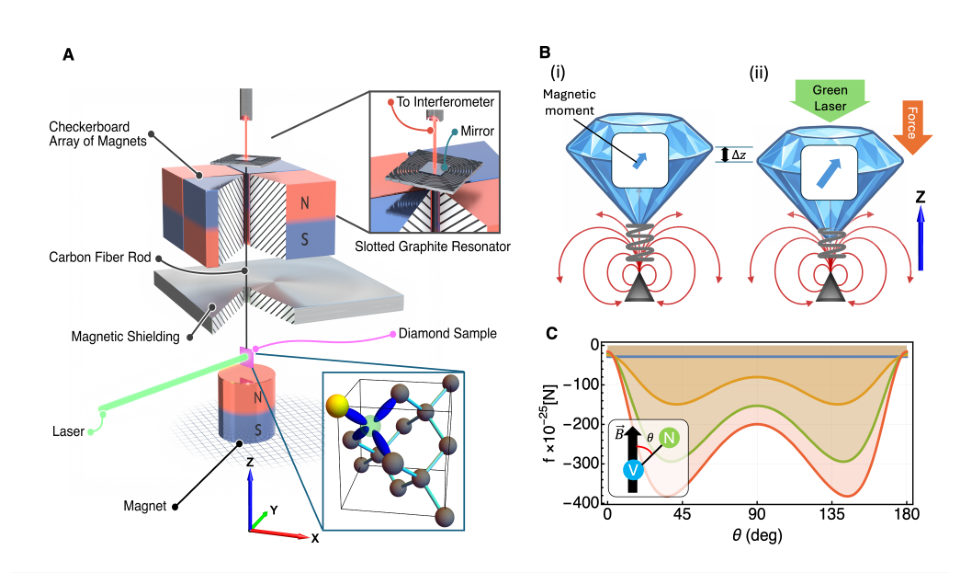 
Figure 1: Spin-mediated mechanical motion in a diamagnetic levitation–NV center hybrid

📷 Fig 2

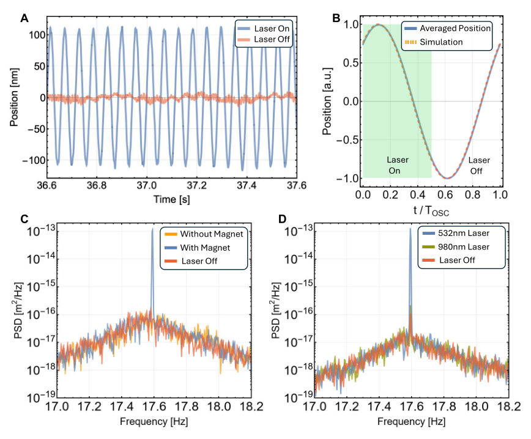 
Figure 2: Driving the center of mass of a levitated oscillator via optical spin polarisation:

📷 Fig 3

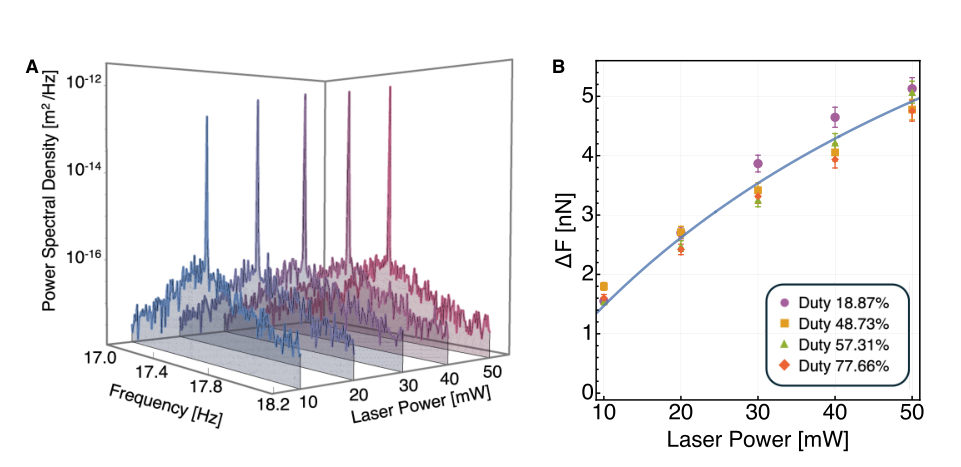 
Figure 3: Measuring and controlling the spin force via laser power and duty cycle. (A)

📷 Fig 4

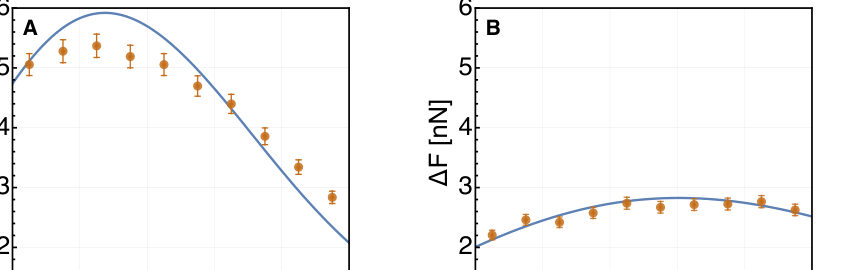 
Figure 4: Magnetic field gradient dependent force: We vary the gap separation 𝑑between the

**Summary.** The researchers successfully drove a 100 mg levitated mechanical oscillator using the magnetic force generated by an ensemble of NV centers in diamond. By periodically polarizing the spins with a laser, they achieved large, phase-coherent mechanical oscillations. This achievement marks a significant step toward using spin-based engineering to control motion in the high-mass regime.

**Why it may be interesting.** This work demonstrates a bridge between spin dynamics and macroscopic mechanics, relevant to researchers in quantum optics and open quantum systems interested in hybrid quantum systems and the interface of quantum mechanics and gravity.

Detailed structure

**Main problem.** The difficulty of experimentally observing the spin-dependent force (spin-force) in mechanical systems larger than the atomic scale.

**Main result.** Demonstration of controllable center-of-mass motion in a 128 mg diamagnetically levitated resonator driven by the spin-force from an ensemble of Nitrogen-Vacancy (NV) defects.

**Method.** Periodic optical initialization of NV spin states using a 532 nm laser is used to switch the ensemble between thermal and polarized states, creating a periodic force at the mechanical resonance frequency.

**Model / system.** A hybrid system consisting of a 128 mg diamagnetically levitated graphite/diamond oscillator and an ensemble of NV centers in diamond, placed in a strong magnetic field gradient provided by permanent magnets.

**Key observables.** Center-of-mass (COM) oscillation amplitude, Power Spectral Density (PSD) of the resonator motion, and phase coherence of the oscillation.

**Important parameters / regimes.** Mass scale of 100-128 mg, resonance frequency of 17.6 Hz, magnetic field gradient of ~98 T/m, and motional amplitudes up to 1.5 micrometers in vacuum.

**Assumptions / limitations.** Assumes the polarization time and T1 relaxation time are much shorter than the mechanical oscillation period.

**Figures summary.** Figure 1 shows the experimental schematic and the mechanism of the spin-force; Figure 2 displays the time trace, averaged waveform, and PSD showing the resonance peak; Figure 3 shows the waterfall plot of PSD with increasing laser power.

**Paper structure.** The paper introduces the scientific problem of macroscopic spin-force detection, describes the experimental setup of the levitated diamond/graphite resonator, details the optical driving and spin-modeling methods, presents results demonstrating phase-coherent motion and verification of the spin-origin, and discusses future scaling potential.

Abstract

The force experienced by a spin in a magnetic field gradient underlies many proposals for hybrid quantum systems. These include schemes for mechanically mediated quantum gates, spin squeezing, searches for exotic forces, and motional superpositions for probing the interface between quantum and gravity. Yet, experimentally observing this spin-force for anything larger than atomic scales has proved challenging. In our work, we demonstrate controllable Center-of-Mass motion of a $128 \rm\: mg$ diamagnetically levitated oscillator due to force from an ensemble of Nitrogen-Vacancy (NV) defects in diamond. We induce coherent motion in the oscillator by periodic optical initialisation of the NV spin states, achieving motional amplitudes exceeding $100 \rm\:nm$. Our results mark a key milestone towards spin-based engineering of motional states deep in the high-mass regime.

[↑ back to top](#top)

### [Weak Fragmentation and Thermalization in a Dipole-Conserving Bose-Hubbard Chain](http://arxiv.org/abs/2605.18119v1)

**Authors:** Chenrong Liu  
**Type:** theory · **Category:** quantum gases · **PDF:** <https://arxiv.org/pdf/2605.18119v1>  
**Analysis basis:** full PDF text, analyzed in chunks
**Topic relevance:** 🔥 `scars & prethermalization` **5/5** · 🔥 `non-equilibrium dynamics` **4/5** · `entanglement & information structure` **3/5**

📷 Fig 1

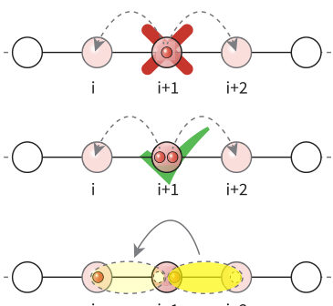 
FIG. 1. Illustration of the restricted hopping process ˆb† iˆb2 i+1ˆb† i+2 which conserves dipole moment. The standard single-particle hopping is forbidden (top), but two particles simultaneously move from the site i + 1 to nearest neighbor sites i and i+2 is allowed (middle). This mechanism is equiv- alent to the free propagation of a dipole, visualized here as a bound boson-hole pair denoted by a shadow ellipse (bottom).

📷 Fig 2

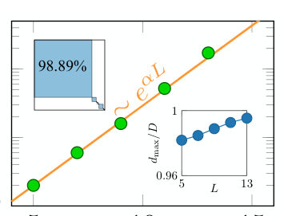 
FIG. 2. (Color online) Hilbert-space fragmentation vs sys- tem size in the symmetry sector (N, P) = (2L, 0). We ana- lyze fragmentation across lattice sizes L up to 13, where the Hilbert-space dimension reaches D = 33427622 and fragments into 172 disconnected blocks. The main panel shows that the number of disconnected blocks is exponentially growing with L. The orange curve is an exponential fit, ∼exp(γL), yield- ing γ ≈0.538. Upper inset: an example Hamiltonian matrix in the Fock basis for L = 9, illustrating the fragmentation structure; the largest block contains 98.89% of the total di- mension (its scale is rescaled for visual guidance). Lower in- set: the largest block dimension dmax...

📷 Fig 3

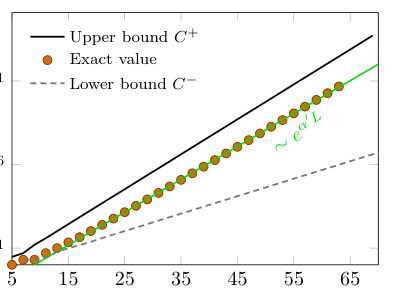 
FIG. 3. (Color online) The number of frozen states corre- sponds to invariant subspaces of dimension 1 in the symme- try sector (N, P) = (2L, 0) and scales exponentially with the system size L (No. of frozen states ∼eγ′L, γ′ ≈0.453 is the fitting parameter). We compare the resulting upper and lower bounds with exact numerical results. Because we only need the count number of frozen states, we use a dynamic program- ming algorithm to compute it efficiently, thereby avoiding the computational limitations of ED. For L = 7 and 9, the nu- merical results are exactly equal to the lower bound C−.

📷 Fig 4

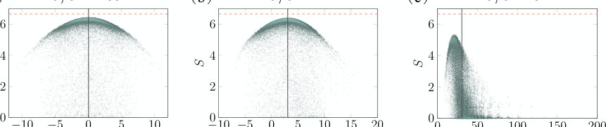 
FIG. 4. (Color online) Half-chain entanglement entropy S vs energy per site E/L for different values of J/U at L = 9. The horizontal dashed lines are the Page values calculated by averaging 100 random states. The vertical solid lines label the mean energy densities corresponding to each value of J/U. (a)-(b) Weak ETH: The entanglement entropy of most eigenstates in the middle energy spectrum is close to, yet slightly below the Page value. Besides, many of the entropies fall on a narrow regime when plotted as a function of energy density, which is a thermalizing feature. While a small number of outlier states, including some in the middle of the spectrum, exhibit much smaller entanglement...

📷 Fig 5

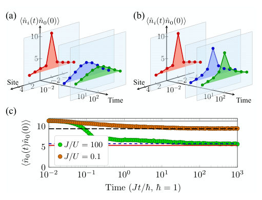 
FIG. 6. (Color online) Time-dependent correlation functions. (a) and (b) show the spatially resolved correlator ⟨ˆni(t)ˆn0(0)⟩ in the symmetry sector (N, P) = (2L, 0) = (18, 0) for a ran- dom state |ψR⟩corresponding to infinite temperature, with J/U = 100 and 0.1, respectively. The two cases exhibit qual- itatively different long-time dynamics. (c) shows the autocor- relation function ⟨ˆn0(t)ˆn0(0)⟩, illustrating the distinct relax- ation dynamics in two regimes. The black solid line indicates the theoretically initial value CψR(0). The long and short dashed lines are the predictions at long-time for J/U = 0.1 and 100, respectively, which are calculated using Eq. (13). The red solid line is...

**Summary.** This paper demonstrates that a 1D Bose-Hubbard chain with dipole conservation undergoes weak Hilbert-space fragmentation. It shows that despite the presence of many small disconnected sectors, a large dominant sector allows for a transition from a nonergodic regime to a thermalizing, chaotic regime as interaction strength decreases.

**Why it may be interesting.** It provides a minimal platform to study the interplay between kinetic constraints (dipole conservation), fragmentation, and the breakdown of ergodicity, which is central to understanding many-body dynamics and thermalization.

Detailed structure

**Main problem.** The study investigates how Hilbert-space fragmentation, caused by dipole conservation, affects the transition between thermalizing (ETH) and nonergodic regimes in a 1D Bose-Hubbard chain.

**Main result.** The system exhibits weak Hilbert-space fragmentation where a single dominant Krylov sector coexists with many small ones, and this weak fragmentation does not prevent the emergence of quantum chaos or thermalization at large J/U.

**Method.** The author uses Exact Diagonalization (ED), graph theory to identify Krylov sectors, and dynamic programming to count frozen states, alongside statistical analyses of level spacing and entanglement entropy.

**Model / system.** A one-dimensional dipole-conserving Bose-Hublamd chain with open boundary conditions, featuring a three-site hopping term that conserves both total particle number and total dipole moment.

**Key observables.** Half-chain entanglement entropy, level spacing ratio statistics (r-parameter), density relaxation dynamics (autocorrelation function), and density of states (DOS).

**Important parameters / regimes.** The ratio of hopping amplitude to on-site interaction strength (J/U), system size (L), and the particle number/dipole moment sector (N=2L, P=0).

**Assumptions / limitations.** The transition between thermal and nonergodic regimes is treated as a crossover/transition that may be difficult to distinguish as a sharp phase transition due to finite-size limitations.

**Figures summary.** Figure 2 shows the block-diagonal Hamiltonian structure; Figure 3 compares frozen state counts to analytical bounds; Figure 4 plots entanglement entropy vs. energy density; Figure 7 shows the decay of the autocorrelator difference; Figure 8 shows level spacing distributions; Figure 10 displays the evolution of the density of states across different J/U regimes.

**Paper structure.** The paper introduces the dipole-conserving model, analyzes the structure of the Hilbert space (fragmentation and frozen states), examines the thermalization transition via entanglement and dynamics, investigates spectral statistics (chaos vs. Poisson), and concludes with the evolution of the density of states.

Abstract

We study Hilbert-space fragmentation and thermalization in a one-dimensional dipole-conserving Bose-Hubbard chain. By analyzing the structure of the Hamiltonian matrix in the Fock basis, we show that the system exhibits weak Hilbert-space fragmentation. We further construct an exponentially large family of frozen product states and derive analytical upper and lower bounds on their number. Using exact diagonalization, we examine the consequences of weak fragmentation for eigenstate half-chain entanglement, density relaxation dynamics, and level statistics. All these quantities reveal a transition from a weak eigenstate thermalization regime to a nonergodic regime with increasing on-site interaction strength. These results show that weak Hilbert-space fragmentation \textit{does not} preclude quantum chaos or thermalization, and provides a minimal platform for studying the interplay of dipole conservation, weak fragmentation, and ergodicity breaking.

[↑ back to top](#top)

### [Graph-Theoretic Detection of Hilbert Space Fragmentation](http://arxiv.org/abs/2605.17951v1)

**Authors:** A. Rutkowski, M. Mierzejewski, J. Herbrych  
**Type:** theory · **Category:** strongly correlated electrons · **PDF:** <https://arxiv.org/pdf/2605.17951v1>  
**Analysis basis:** full PDF text, analyzed in chunks
**Topic relevance:** 🔥 `scars & prethermalization` **5/5** · `non-equilibrium dynamics` **3/5** · `entanglement & information structure` **2/5**

📷 Fig 1

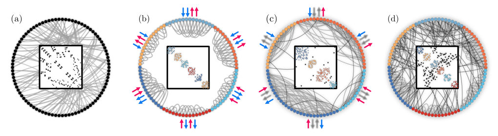 
Figure 1. Circular graph representation of Hamiltonian matrices of (a) fragmented t-Jz model for L = 6 sites, Nh = 2 holes, and Hilbert space dimension dim(H) = 90. Such a system (in Sz tot = 0 magnetization sector) exhibits fragmentation into 6 subspaces. Grey lines depict nonzero matrix elements (connections). (b) The same as (a) but with properly ordered basis states that reveal the Hilbert space fragmentation. (c) Graph of nearly fragmented rung-depleted t-Jz ladder (L = 6, Nh = 2). 4 subspaces detected by Fiedler vector analysis are marked with colors. In (b) and (c), spin configurations in squeezed space are also presented. (d) Graph of nearly fragmented t-J model (L = 6, Nh = 2, and...

📷 Fig 2

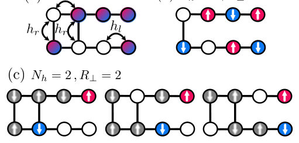 
Figure 2. Rung-depleted t-Jz ladder. (a) Sketch of the system with R⊥= 2. (b) Exemplary spin configuration for L = 8, Nh = 2, and R⊥= 1. (c) Three exemplary configurations for L = 8, Nh = 2, and R⊥= 2. ”Fixed” q = 2 spins (which cannot be changed by the hole hop) are marked with red and blue colors.

📷 Fig 3

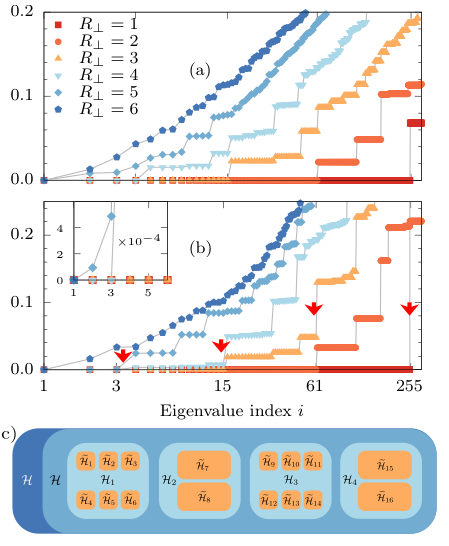 
Figure 3. Spectral graph analysis of rung-depleted t-Jz ladder (L = 12, Nh = 2) for various numbers of rungs R⊥= 1, . . . , 6. Panel (a) depicts the first 300 eigenvalues λi of the Laplacian L, while panel (b) depicts the last 300 eigenvalues of modu- larity Q. In the latter, we present eigenvalues in the reversed order, eβi = βdim(H) −βdim(H)+1−i. Note the log-scale on the x-axis. The inset in (b) shows a zoomed-in view of the first few modularity eigenvalues. (c) Sketch of the structure of the Hilbert space for R⊥= 6, 5, 4, 3 (F = 1, 1, 4, 16, respectively).

📷 Fig 4

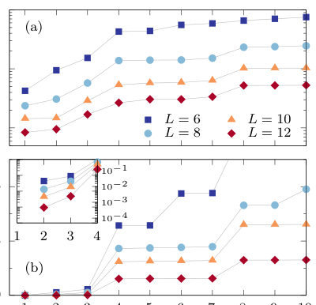 
Figure 4. Lowest eigenvalues (a) λi of the Laplacian L and (b) eβi = βdim(H) −βdim(H)+1−i of the modularity Q, for various system sizes L = 6, 8, 10, 12 and Nh = 2 [with dim(H) = 90, 560, 3150, 16632, respectively] and R⊥= L/2 −1. Note that all considered systems have F = 1. The inset in (b) shows a zoomed-in view of the first few modularity eigenvalues.

📷 Fig 5

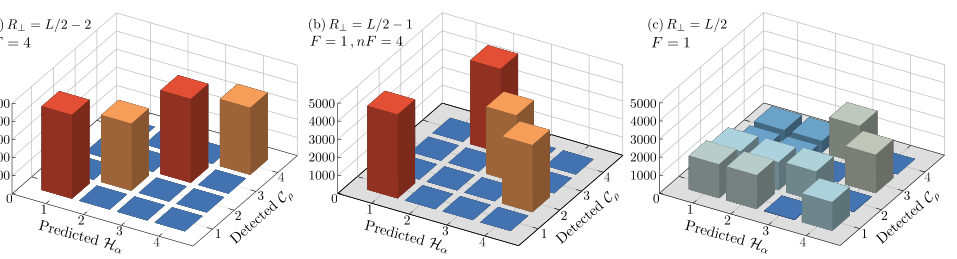 
Figure 5. Subspace detection based on k-means algorithm (see text for details). Panel (a) illustrates the starting point, i.e., the strictly fragmented system (F = 4 , R⊥= L/2 −2 = 4) for that we put Hα = Cα, (b) the nearly fragmented system (F = 1 , nF = 4 , R⊥= L/2 −1 = 5), and (c) a system for which we don’t see any structure in the spectral analysis of the corresponding graph. In all panels, L = 12 and Nh = 2. See also Fig. 3 for eigenvalues of L and Q. The plots depict two-dimensional histograms of (α, ρ) pairs, where α index corresponds to the theoretically predicted Hα subspace, while ρ corresponds to the detected subspace by the k-means algorithm based on eigenvectors of modularity...

**Summary.** This paper introduces a graph-theoretic framework to detect Hilbert space fragmentation and nearly fragmented regimes in quantum many-body systems. By treating the Hamiltonian as an adjacency matrix, the authors use spectral graph theory to identify disconnected or weakly coupled sectors. The method is shown to be physically accurate, as the identified graph communities correspond to real dynamical timescales in the t-J and Hubbard models.

**Why it may be interesting.** This is highly relevant for many-body dynamics as it provides a general, scalable tool to diagnose ergodicity breaking and prethermal-like hierarchical timescales in complex quantum systems.

Detailed structure

**Main problem.** Developing an unbiased method to detect Hilbert space fragmentation and 'nearly fragmented' regimes in quantum many-body systems without requiring prior knowledge of specific conservation laws.

**Main result.** The authors demonstrate that spectral graph theory (using Laplacian and modularity matrices) can reliably identify both exact and approximate fragmentation, capturing the hierarchical dynamical timescales in the t-J and Hubbard models.

**Method.** The many-body Hilbert space is mapped onto a graph where basis states are vertices and Hamiltonian matrix elements are edges, then analyzed using the Laplacian spectrum, Fiedler vectors, and modularity maximization.

**Model / system.** The study focuses on the one-dimensional t-J model (including t-Jz and t-models) and the Hubbard chain, specifically examining regimes near half-filling with varying hole concentrations.

**Key observables.** Laplacian and modularity eigenvalues, Fiedler vectors, modularity (Q), and the subspace-projected Loschmidt echo (D(tau)).

**Important parameters / regimes.** Spin exchange strength (J/t), number of holes (Nh), system size (L), and the number of rungs in ladder geometries.

**Assumptions / limitations.** The approach assumes the ability to represent the Hamiltonian in a chosen basis to construct the graph and focuses on the ability to compute matrix elements.

**Figures summary.** Figures illustrate the Laplacian and modularity spectra for different J strengths, the identification of subspaces via eigenvectors, and the time evolution of the projected Loschmidt echo to verify dynamical consistency.

**Paper structure.** The paper defines the models (Sec II), introduces graph-theoretic tools (Sec III), applies the framework to t-J-like models (Sec IV-V), extends the analysis to the Hubbard chain (Sec VI), and provides mathematical proofs in the Appendices.

Abstract

Hilbert-space fragmentation provides a mechanism for ergodicity breaking in quantum many-body systems even in the absence of disorder, leading to dynamically disconnected sectors and strong memory of initial conditions. However, identifying such structures is often challenging and typically relies on prior knowledge of conservation laws or model-specific analytical insight. Here we introduce an unbiased approach based on spectral graph theory and, within this framework, formulate the concept of nearly fragmented systems, in which perturbative processes couple otherwise fragmented sectors while preserving their dynamical imprint. By representing basis states as vertices and Hamiltonian matrix elements as edges, we map the connectivity structure of the many-body Hilbert space onto a graph and analyze it using tools such as the Laplacian spectrum, Fiedler vectors, and modularity. Exact fragmentation corresponds to disconnected graph components, while nearly fragmented systems manifest as weakly connected communities whose structure can still be resolved spectrally. Applying this framework to the one-dimensional $t$-$J$ model and its perturbations, we demonstrate that graph-theoretic diagnostics reliably identify both fragmented and nearly fragmented Hilbert-space structures and capture the hierarchy of dynamical time scales that governs the system's evolution. We further show that the method extends beyond kinetically constrained models by applying it directly to the Hubbard chain, where it reveals the emergence of nearly decoupled subspaces associated with doublon dynamics and spin configurations. Our results establish the spectral graph analysis as a general and scalable tool for diagnosing fragmentation and approximate dynamical constraints in complex quantum many-body systems.

[↑ back to top](#top)

### [Dissipation-assisted preparation of Floquet-Laughlin states in superconducting circuits](http://arxiv.org/abs/2605.18377v1)

**Authors:** Luis C. Steinfadt, André Eckardt, Francesco Petiziol  
**Type:** theory · **Category:** other · **PDF:** <https://arxiv.org/pdf/2605.18377v1>  
**Analysis basis:** full PDF text, analyzed in chunks
**Topic relevance:** 🔥 `correlated / nonlocal dissipation` **4/5** · 🔥 `correlated cavity matter` **4/5** · 🔥 `non-equilibrium dynamics` **4/5** · `analog quantum simulation` **3/5** · `driven-dissipative phase transition` **3/5** · `exotic spin models in light-matter` **3/5** · `Tavis-Cummings & cavity-many-emitter` **2/5** · `methods for driven-dissipative` **2/5** · `quantum measurements` **2/5**

📷 Fig 1

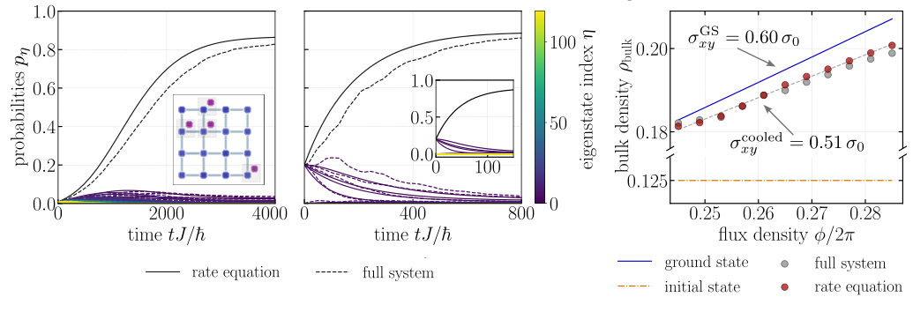 
FIG. 1. (a) Driven-dissipative stabilization of the ground state of the L = 4 HHBH lattice with N = 2 at quarter flux, ϕ = π/2, starting from an infinite temperature state. A fidelity of 85% is reached using four cavities. Inset: Lattice geometry with artificial atoms and cavities marked by blue and purple bullets, respectively. The solution of Eq. (2) (solid lines) and Eq. (4) (dashed) show good agreement. (b) The stabilization time can be decreased to less than 800 ℏ/J, when starting from a superposition of the five lowest energy eigenstates, and to less than 200 ℏ/J (inset) by further adding twelve identical cavities, coupled to symmetrically chosen lattice sites. (c) The bulk density of...

📷 Fig 2

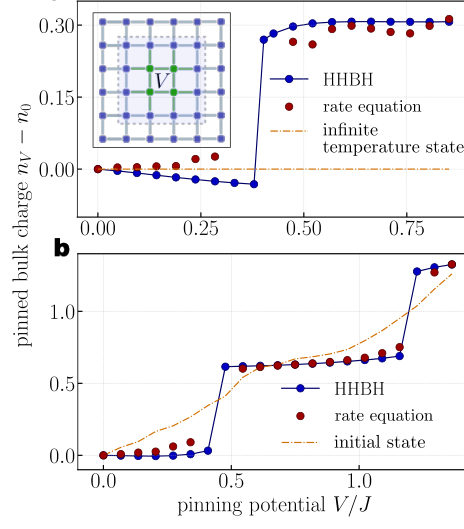 
FIG. 2. Change of the bulk charge, defined as the average particle number in the inner L −1 × L −1 sites, in response to a local potential dip of −V on four sites the center of a system of N = 3 and L = 6 (a) or N = 6 and L = 8 (b). For each value of V , the system is initialized in a mixture of low- energy eigenstates and stabilized to the ground state, reaching a fidelity of around 80%. The change in the total charge in the bulk compared to the unperturbed state was computed (cf. inset of (a) for the L = 6 lattice, analog for L = 8). In both cases, the stabilized mixture behaves incompressible for small V , as in the exact FCI ground state. After a critical value of V , the total charge...

**Summary.** This paper proposes a method to prepare fractional Chern insulator states in superconducting circuits by using engineered dissipation to drive the system into a target ground state. By coupling a Floquet-engineered lattice to leaky cavities, the researchers show that the Laughlin-like state can be stabilized and its topological signatures, such as fractional charge pinning, can be detected.

**Why it may be interesting.** It provides a concrete pathway for using reservoir engineering and dissipation to prepare non-equilibrium topological states, bridging the gap between open quantum systems and many-body physics.

Detailed structure

**Main problem.** The difficulty of preparing and stabilizing highly correlated Fractional Chern Insulator (FCI) states, such as the Laughlin state, using traditional adiabatic protocols due to phase transition gaps and excitations.

**Main result.** The authors demonstrate a protocol for the autonomous, dissipation-assisted stabilization of Floquet-Laughlin states in superconducting circuits, achieving ground-state fidelities above 85% and observing signatures like Hall response and fractional charge pinning.

**Method.** Quantum bath engineering using driven-dissipative coupling to leaky cavity modes, modeled via Lindblad master equations, Pauli rate equations, and numerical techniques like DMRG and quantum trajectories.

**Model / system.** A Floquet-engineered Harper-Hofstadter-Bose-Hubbard model of hard-core bosons implemented in superconducting circuits (circuit QED), where lattice sites are coupled to driven, leaky microwave resonators.

**Key observables.** Ground-state fidelity, Hall conductivity (Streda formula), bulk incompressibility, and the pinning of fractional charges.

**Important parameters / regimes.** High-frequency Floquet regime (hbar omega >> J), bad-cavity regime, dispersive atom-cavity coupling, cavity detunings, and decay rates.

**Assumptions / limitations.** Neglects transmon dephasing and spontaneous decay; assumes the resonator decay is the dominant dissipative rate; assumes the validity of the dispersive approximation by avoiding accidental resonances.

**Figures summary.** Figure 1 shows stabilization fidelity over time and Hall conductivity for a two-particle system; Figure 2 illustrates bulk charge response to local potential dips and the effects of varying cavity coupling and detuning.

**Paper structure.** The paper introduces the challenge of FCI preparation, defines the Floquet-engineered superconducting platform, derives the effective dissipative dynamics via perturbation theory, presents numerical results for various particle numbers (N=2, 3, 6), and concludes with the robustness of the scheme.

Abstract

Fractional Chern insulators (FCIs) are lattice analogs of fractional quantum Hall systems, where the interplay of strong interactions with a frustrated tunnelling kinetics leads to the emergence of a gapped ground state with long-range entanglement and anyonic excitations. The highly correlated nature of such systems makes their adiabatic preparation challenging already beyond the minimal system size of two particles. Considering Floquet implementations of the bosonic Harper-Hofstadter-Hubbard model of few photons in superconducting circuits, we design protocols for the driven-dissipative stabilization of its FCI ground state at half filling via quantum bath engineering. Dissipation control is achieved through the coupling to driven leaky cavity modes, which realize a tuneable artificial environment having the Floquet-FCI as its approximate fixed point. For systems of two, three and six particles, we show numerically how the flexibility of the control scheme further allows for the detection of fractional quantum Hall signatures in the stabilized steady states, including bulk incompressibility, Hall response and the trapping of fractional charges. Our results provide a concrete pathway to dissipation-assisted preparation of strongly correlated states in quantum simulators.

[↑ back to top](#top)

### [Universal dynamics from a single-particle dark state](http://arxiv.org/abs/2605.16494v1)

**Authors:** Ruben Daraban, Arghavan Safavi-Naini, Johannes Schachenmayer, Mohammad Maghrebi  
**Type:** theory · **Category:** statistical mechanics · **PDF:** <https://arxiv.org/pdf/2605.16494v1>  
**Analysis basis:** full PDF text, analyzed in chunks
**Topic relevance:** 🔥 `non-equilibrium dynamics` **4/5** · 🔥 `non-equilibrium universality` **4/5** · `Dicke superradiance` **3/5** · `driven-dissipative phase transition` **3/5** · `entanglement & information structure` **3/5** · `methods for driven-dissipative` **3/5** · `free-space correlated emission` **2/5** · `scars & prethermalization` **2/5**

📷 Fig 1

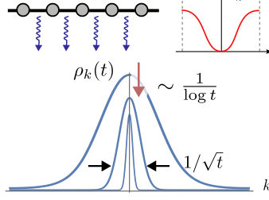 
FIG. 1. (a) Schematic representation of a spin chain (al- ternatively, hard- or soft-core bosons) subject to corre- lated dissipation on neighboring sites featuring a single- particle dark state at zero momentum (Γk=0 = 0). (b) The momentum distribution at long times exhibits a diffusion-like behavior with the width decaying as ∼1/ √

📷 Fig 2

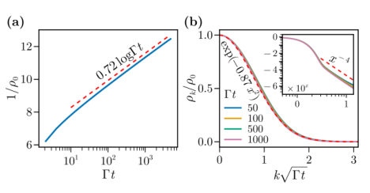 
FIG. 2. Long-time dynamics of fermionic densities start- ing from the fully excited state by numerically solving Eq. (5) exact in the limit Γ/J ≪1. (a) The k = 0 mode decays consistently with ρ0(t)−1 ∼(2/π) log Γt. (b) The normalized distribution ρk(t)/ρ0(t) shows a scal- ing collapse with k √

📷 Fig 3

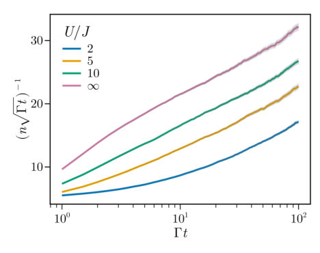 
FIG. 3. Universal dynamics for the dissipative Bose- Hubbard model. We plot the the rescaled inverse density (n √

**Summary.** This paper demonstrates that a single-particle dark state in a dissipative spin chain induces universal many-body dynamics characterized by logarithmic decay and specific scaling laws. By analyzing the nonlinear coupling between modes, the authors explain how the previously stable dark state eventually decays. The results are shown to be universal across both hard-core and soft-core bosonic models.

**Why it may be interesting.** It provides a resolution to conflicting literature on dissipative spin chains and reveals how a single-particle symmetry-protected state can drive universal many-body dynamics through nonlinear dressing.

Detailed structure

**Main problem.** Understanding the many-body dynamics of open quantum systems hosting dark or subradiant states and resolving conflicting reports regarding their long-time decay and critical exponents.

**Main result.** The study identifies a universal long-time decay of the total density as 1/(sqrt(t) log t) and a logarithmic decay of the single-particle dark state due to dissipation-induced nonlinearity, with a momentum distribution following a universal scaling form in k*sqrt(t).

**Method.** The authors use a combination of Jordan-Wigner transformation, a time-dependent Generalized Gibbs Ensemble (GGE) ansatz, analytic continuation in the complex plane, and Matrix Product State (MPS) simulations.

**Model / system.** An open XX spin chain (or hard/soft-core bosons) subject to correlated dissipation on neighboring sites, described by a Lindblad master equation with Lindblad operators L_j = sigma_{j+1}^- - sigma_j^-.

**Key observables.** Momentum distribution (rho_k and n_k), total density (n), zero-momentum mode decay (rho_0), and entanglement entropy.

**Important parameters / regimes.** Dissipation rate (Gamma), hopping (J), interaction strength (U), weak dissipation limit (Gamma << J), and long-time/scaling regime.

**Assumptions / limitations.** Weak dissipation limit (dissipation timescale much longer than Hamiltonian timescale), thermodynamic limit (L -> infinity), and the use of a GGE ansatz for integrable systems.

**Figures summary.** The figures include a schematic of the spin chain, plots showing the crossover from 1/t to 1/log(t) decay in the zero-mode, scaling collapse of the momentum distribution, and verification of the algebraic tail and entanglement dynamics via MPS simulations.

**Paper structure.** The paper introduces the problem of dark states in many-body systems, derives the nonlinear kinetic equations using a GGE approach and analytic continuation, presents the universal scaling laws for density and momentum, and concludes with numerical verification using MPS for both spin and bosonic models.

Abstract

Open quantum systems can host dark or subradiant states whose decay is highly suppressed. While these states have been extensively studied in the few-excitation regime, their impact on the many-body dynamics remains largely unexplored. Here, we study a spin chain subject to correlated dissipation on neighboring sites, which admits a single-particle dark state at zero momentum. We show that the single-particle dark state qualitatively alters the many-body dynamics at long times, and identify its distinct universal behavior. While the zero-momentum mode is dark at the single-particle level, it decays slowly as $1/\log t$ as it becomes dressed by other modes through a dissipation-induced nonlinearity. We demonstrate that the momentum distribution takes a universal scaling form in $k\sqrt{t}$, and the total density decays as $1/\sqrt{t}\log t$. Our results further elucidate the origin of the conflicting results in recent works. Finally, we corroborate the analytics with matrix product state simulations and show that the same universal behavior persists for soft-core interactions, underscoring the universality of the emergent dynamics.

[↑ back to top](#top)

### [Strong nanomechanical Duffing nonlinearity and interactions induced through cavity optomechanics](http://arxiv.org/abs/2605.18289v1)

**Authors:** Jesse J. Slim, Ewold Verhagen  
**Type:** experiment · **Category:** other · **PDF:** <https://arxiv.org/pdf/2605.18289v1>  
**Analysis basis:** full PDF text, analyzed in chunks
**Topic relevance:** 🔥 `quantum optics experiment` **4/5** · `analog quantum simulation` **3/5** · `correlated cavity matter` **3/5** · `Tavis-Cummings & cavity-many-emitter` **2/5** · `correlated / nonlocal dissipation` **2/5** · `driven-dissipative phase transition` **2/5** · `exotic spin models in light-matter` **2/5** · `non-equilibrium dynamics` **2/5** · `quantum measurements` **2/5**

📷 Fig 1

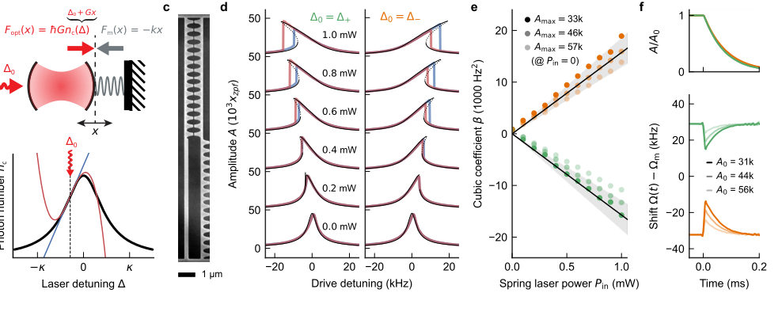 
FIG. 1. Laser-controlled Duffing nonlinearity. (a) Canonical optomechanical system: a cavity formed by two mirrors, where the movable right mirror experiences mechanical restoring force Fm and radiation pressure Fopt. Mirror displacement x linearly shifts the detuning ∆between cavity and pump laser. We assume the fast-cavity limit κ ≫Ωm, with κ the cavity linewidth and Ωm the intrinsic mechanical frequency. (b) Cavity photon number nc depends nonlinearly on ∆(black), resulting in optical backaction Fopt that is nonlinear in x. Tuning the nominal laser detuning ∆0 across the Lorentzian response controls this nonlinearity. At the indicated ∆0 = −κ/(2 √

📷 Fig 2

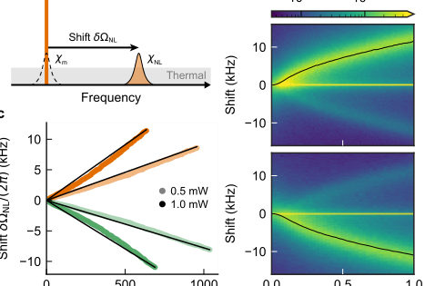 
FIG. 2. Nonlinear shift in susceptibility to thermal fluctuations. (a) A strong mechanical drive induces large amplitude oscillations, shifting the resonator’s susceptibility χNL to additional (thermal) forces. (b) Thermomechani- cal spectra of the resonator, coherently driven by modula- tions of a weak, resonant ‘force’ laser at increasing depth cd. The strong (Pin = 1.0 mW) spring laser is detuned by ∆−= −κ/(2 √

📷 Fig 3

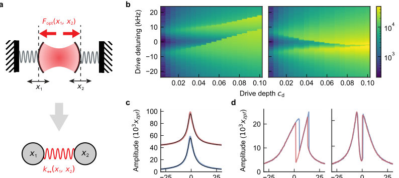 
FIG. 3. Optically-mediated nonlinear coupling between mechanical resonators. (a) Multi-mode optomechanical system: both mirrors are free to move, so that photon number nc depends nonlinearly on both displacements x1, x2 via the Lorentzian cavity response. The resulting radiation pressure Fopt on each mirror induces a nonlinear, amplitude-dependent optical spring k↔(x1, x2) coupling the two mechanical elements. (b, left) Forward-sweep frequency response of resonator 2 (Ωm,2/2π = 12.8 MHz) for increasing drive depth cd, while coupled to resonator 1 (Ωm,1/2π = 17.6 MHz) via a cross-resonator optical spring induced by modulating a single spring laser (detuning ∆−= −κ/(2 √

📷 Fig 4

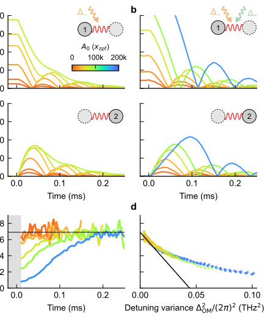 
FIG. 4. Time-evolution of nonlinearly coupled res- onators. (a) Ring-down of coupled resonators 1 (top) and 2 (bottom) under single-laser driving at detuning ∆−= −κ/(2 √

**Summary.** This paper demonstrates a method to create strong, tunable Duffing nonlinearity in nanomechanical resonators using light-induced optical spring effects. By controlling laser detuning and power, the researchers can manipulate the sign and magnitude of the nonlinearity and even induce nonlinear interactions between different mechanical modes. This provides a versatile platform for engineering complex nonlinear dynamics in mechanical networks.

**Why it may be interesting.** The ability to engineer arbitrary nonlinear Hamiltonians and reconfigurable nonlinear networks via optical backaction is highly relevant for simulating complex many-body dynamics and designing nonlinear quantum-optical circuits.

Detailed structure

**Main problem.** The lack of strong, in-situ tunable mechanical nonlinearity and controllable interactions in nanomechanical resonators for applications in sensing and computing.

**Main result.** Demonstrated that cavity optomechanical backaction can induce a strong, tunable Duffing nonlinearity and effective nonlinear interactions between mechanical modes, with nonlinearity strength 50 times larger than intrinsic geometric effects.

**Method.** Experimental implementation using a silicon nanobeam photonic crystal cavity, utilizing 'spring' lasers to control nonlinearity via detuning and power, and 'force' lasers for driving.

**Model / system.** A dispersive, cavity optomechanical system consisting of a suspended silicon nanobeam with a mechanical resonance of 17.6 MHz coupled to a telecom optical mode in a photonic crystal cavity.

**Key observables.** Mechanical frequency shifts, cubic nonlinearity coefficient (beta), mechanical bistability, hysteresis, and time-resolved Rabi oscillations.

**Important parameters / regimes.** Fast-cavity limit (kappa >> Omega_m), optomechanical coupling g0/2pi = 3.5 MHz, and detunings u0 = +/- 1/sqrt(3) to isolate cubic terms.

**Assumptions / limitations.** Fast-cavity (unresolved-sideband) limit, adiabatic elimination of photon dynamics, and neglecting higher-order terms (n > 3) in the Taylor expansion.

**Figures summary.** Schematic of the optomechanical system, illustration of the nonlinear optical spring effect, SEM image of the nanobeam, and frequency traces of mechanical oscillations.

**Paper structure.** Introduction to nonlinearity needs, description of the optomechanical platform, theoretical derivation of the induced Duffing nonlinearity, experimental demonstration of tunable nonlinearity and bistability, demonstration of induced inter-mode interactions, and analysis of temporal dynamics.

Abstract

Nonlinearity is a key resource in both classical and quantum signal processing. Nonlinear nanomechanical elements have found applications ranging from sensing to computing, while networks of nonlinear resonators, as well as nonlinearly coupled networks of linear resonators, constitute promising platforms for simulating complex dynamics. Here, we experimentally demonstrate an approach to realizing strong mechanical nonlinearity in nanomechanical resonators, fully controlled through optical laser drives. The mechanism exploits the nonlinearity of the radiation-pressure interaction in a cavity optomechanical system, which gives rise to a nonlinear optical spring effect. The resulting Duffing nonlinearity is conveniently tunable in strength via pump laser power, while its sign is controlled by laser detuning. Moreover, we demonstrate that the nonlinear optical spring mediates effective interactions between mechanical modes coupled to a common cavity, inducing tunable nonlinear interactions between them that impact spectral response and dynamics. These results establish cavity optomechanics as a versatile and in-situ reconfigurable platform for engineering nonlinear dynamics in resonators and networks.

[↑ back to top](#top)

### [Bound state in the continuum and dynamics via phase modulation in giant-atom waveguide setups](http://arxiv.org/abs/2605.17878v1)

**Authors:** Ji Qi, Xiaojun Zhang, Honngwei Yu, Zhihai Wang  
**Type:** theory · **Category:** quantum information and computing · **PDF:** <https://arxiv.org/pdf/2605.17878v1>  
**Analysis basis:** full PDF text, analyzed in chunks
**Topic relevance:** 🔥 `correlated / nonlocal dissipation` **4/5** · 🔥 `interference shaping light` **4/5** · `non-equilibrium dynamics` **3/5** · `Dicke superradiance` **2/5** · `Tavis-Cummings & cavity-many-emitter` **2/5** · `entanglement & information structure` **2/5** · `methods for driven-dissipative` **2/5**

📷 Fig 1

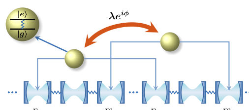 
Figure 1. Schematic diagram of two braided giant atoms cou- pled to a coupled-resonator waveguide (CRW) in Eq. (4). In the following sections, we consider that the giant atoms are coupled to the CRW at sites n1 and n2 (m1 and m2).

📷 Fig 2

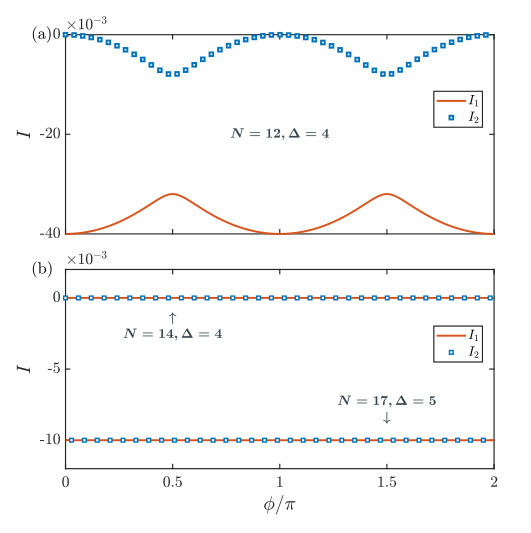 
Figure 2. Dependence of the imaginary parts of the eigenval- ues of the effective matrix M on the phase ϕ.(a)N = 12, ∆= 4, (b)N = 14, ∆= 2 and N = 17, ∆= 5. The other parame- ters are set as g = 0.1ξ, λ = 1.6g2/ξ.

📷 Fig 3

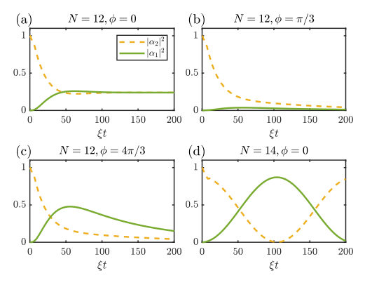 
Figure 3. Time evolution of the atomic populations |α1(t)|2

📷 Fig 4

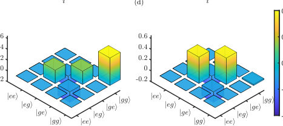 
Figure 4. Profiles of the BICs and the corresponding atomic- state tomography. (a,b) Spatial profiles of the BICs for N = 12 and ∆= 4 at coupling phases ϕ = 0 and ϕ = π, respec- tively. (c,d) Density matrices of the corresponding atomic states associated with the BICs shown in (a) and (b), respec- tively. The other parameters are set as g = 0.1ξ, λ = 1.6g2/ξ.

📷 Fig 5

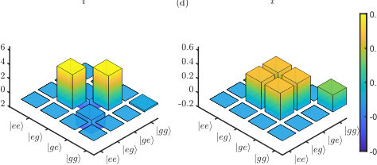 
Figure 5. Profiles of the BICs and the corresponding atomic- state tomography. For N = 14 and ∆= 4, the system sup- ports two BICs. (a,b) Spatial profiles of the two BICs for ϕ = π. (c,d) Density matrices of the corresponding atomic states for the BICs shown in (a) and (b), respectively. The other parameters are set as g = 0.1ξ, λ = 1.6g2/ξ.

**Summary.** This paper explores how the phase of direct coupling between giant atoms can be used to engineer Bound States in the Continuum. By tuning this phase, one can control the number of BICs and the resulting quantum dynamics, ranging from complete decay to persistent population trapping. This offers a powerful tool for tailoring quantum-state evolution in waveguide-QED architectures.

**Why it may be interesting.** It provides a versatile framework for engineering dissipation-free states and controlling interference in non-local light-matter interfaces, which is highly relevant for designing quantum networks and state storage in open quantum systems.

Detailed structure

**Main problem.** Investigating how the direct coupling phase between two giant atoms in a waveguide-QED setup can be used to control the formation of Bound States in the Continuum (BICs) and modulate quantum dynamics.

**Main result.** The study demonstrates that the coupling phase acts as a sensitive control parameter to tune the number of BICs (zero, one, or two) and their profiles, enabling tailored atomic dynamics such as population trapping, complete decay, or Rabi-like oscillations.

**Method.** The authors use a non-Hermitian effective matrix approach derived via the Markov approximation and Fourier transformation to analyze the eigenvalues and time-dependent atomic amplitudes.

**Model / system.** A two-braided-giant-atom waveguide-QED model consisting of two directly coupled two-level atoms coupled to a one-dimensional coupled-resonator waveguide (CRW) at multiple spatially separated sites.

**Key observables.** Imaginary parts of the system eigenvalues (to identify BICs), atomic excitation amplitudes, photonic distribution across the waveguide, and atomic entanglement (concurrence).

**Important parameters / regimes.** Coupling phase (phi), atomic size (N), relative separation (Delta), and photon hopping strength (xi).

**Assumptions / limitations.** Rotating-wave approximation (RWA), Markov approximation, and the thermodynamic limit for the resonator array.

**Figures summary.** Figure 3 shows time evolution of atomic populations (trapping, decay, and oscillations); Figure 4 and 5 show spatial profiles of BICs and atomic state tomography for different configurations.

**Paper structure.** The paper introduces the giant-atom model, presents the mathematical framework for the non-Hermitian dynamics, analyzes the dependence of BICs on the coupling phase and geometry, and concludes with the implications for quantum state engineering.

Abstract

Giant atoms, which couple to a waveguide through multiple spatially separated connection points beyond the dipole approximation, provide a versatile route for quantum information processing based on interference-induced bound states in the continuum (BICs). While multi-giant-atom architectures are being developed toward giant-atom quantum networks, the role of direct coupling between the giant atoms, in particular the associated coupling phase, in atomic dynamics remains insufficiently understood. Here we take a first step toward addressing this issue by studying a two-giant-atom waveguide-QED model. We show that the coupling phase can be used to control both the number of BICs and their profiles for both of photon and atoms. More interestingly, the presence of BICs gives rise to a variety of dynamical behaviors, providing an effective mechanism for tailoring quantum-state evolution in giant-atom waveguide-QED systems. Our results highlight coupling-phase engineering as a useful tool for controlling interference, bound states, and quantum dynamics in nonlocal light--matter interfaces.

[↑ back to top](#top)

### [Topologically protected long-range correlations in steady states of driven-dissipative bosonic chains](http://arxiv.org/abs/2605.18394v1)

**Authors:** Miguel Clavero Rubio, Tomás Ramos, Diego Porras  
**Type:** theory · **Category:** statistical mechanics · **PDF:** <https://arxiv.org/pdf/2605.18394v1>  
**Analysis basis:** full PDF text, analyzed in chunks
**Topic relevance:** 🔥 `driven-dissipative phase transition` **4/5** · `methods for driven-dissipative` **3/5** · `non-equilibrium dynamics` **3/5** · `non-equilibrium universality` **3/5** · `entanglement & information structure` **2/5** · `exotic spin models in light-matter` **2/5**

📷 Fig 1

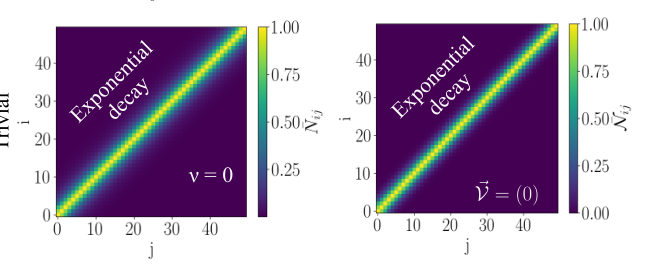 
Figure 1. Schematic representation of normalized frequency-resolved ( ¯ Nij) and equal-time ( ¯ Nij) correlations in topological and trivial regimes. In the topological phase, frequency-resolved correlations exhibit long-range order, while equal-time correlations display a Gaussian decay. In the trivial regime, both correlations decay exponentially with distance. These results establish two-point correlations as a key steady-state observable for diagnosing non-Hermitian topology. The frequency-resolved topological invariant is denoted by ν, while steady-state topology is characterized by the winding-number array ⃗V. Both observables and invariants are defined below.

📷 Fig 2

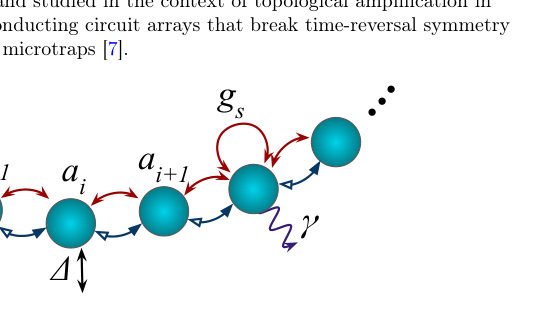 
Figure 2. Schematic representation of the dissipative bosonic Kitaev chain. Each site has onsite energy ∆, single-site parametric term gs, and local losses γ. Neighboring sites are connected by non-reciprocal complex hopping Je±iϕ (blue arrows), and parametric couplings gc (red arrows).

📷 Fig 3

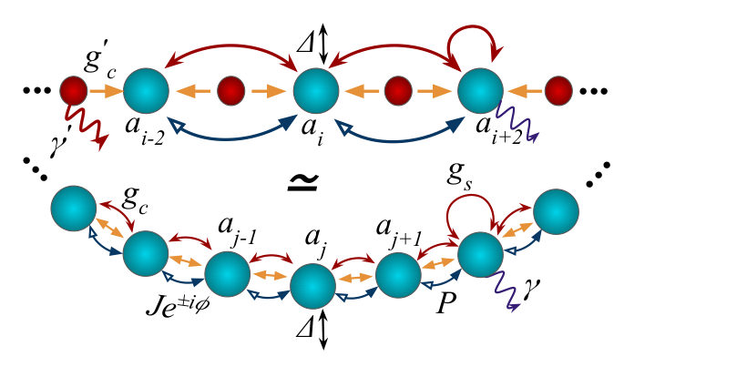 
Figure 3. Top: Dimerized version of the dissipative bosonic Kitaev chain. Even (blue) sites correspond to the main chain, characterized by onsite energy ∆, non-reciprocal complex hopping Je±iϕ (blue arrows), local (gs) and nearest-neighbor (gc) parametric couplings (red arrows), and local losses γ. Odd (red) sites represent auxiliary modes, coupled to the main chain via g′ c, and subject to much stronger dissipation γ′ ≫γ. Bottom: Upon adiabatic elimination of the auxiliary sites, the system maps onto an effective bosonic chain equivalent to Model I, featuring collective gain terms Pjl (yellow arrows).

📷 Fig 4

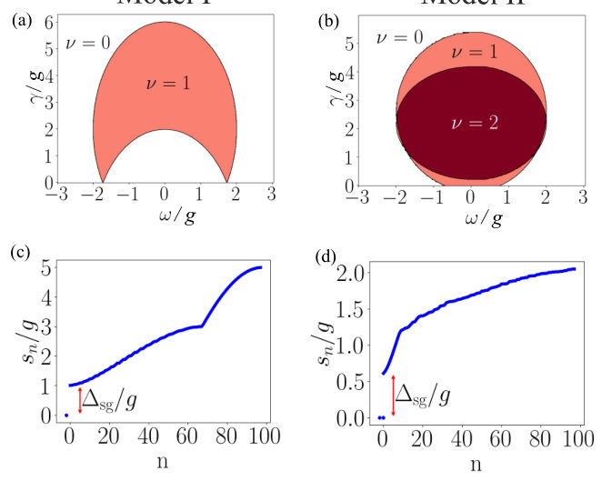 
Figure 4. (a) Model I: Topological phase diagram for the symmetric parameter set defined in Sec. 4.1. (b) Model II: Topological phase diagram for with gs/g = gc/g = 0.1, g′ c/g = 3 and γ′/g = 30 (corresponding to P/g = 3

📷 Fig 5

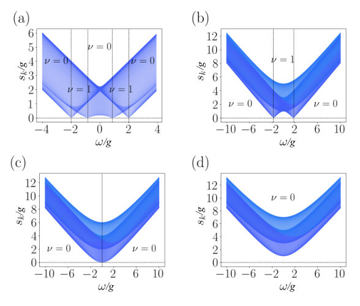 
Figure 5. Model I: Singular values as a function of the frequency ω for PBC. (a) Topologically non-trivial phase with ⃗ Va = (0, 1, 0, 1, 0), for γ/g = 1.6. (b) Topologically non-trivial phase with ⃗Vb = (0, 1, 0), for γ/g = 4. (c) Critical point with ⃗Vc = (0, 0), for γc/g = 6. (d) Trivial phase with ⃗Vd = (0), for γ/g = 8. Each component of ⃗V indicate the topological winding numbers associated with distinct frequency intervals. For example, ⃗ Va = (0, 1, 0, 1, 0) corresponds to alternating regions of trivial and non-trivial topology, separated by singular value gap closings, while ⃗Vb = (0, 1, 0) indicates a single non-trivial frequency band flanked by trivial regions. The parameters...

**Summary.** This paper reveals that the topology of driven-dissipative bosonic chains is directly imprinted on their steady-state correlations. It shows that topological phases exhibit robust long-range order in the frequency domain and a unique Gaussian spatial decay. This provides a way to identify non-Hermitian topological phases using only intrinsic system properties.

**Why it may be interesting.** It provides a novel, intrinsic way to detect non-Hermitian topology through steady-state observables, which is highly relevant for researchers working on quantum sensing, non-equilibrium phase transitions, and open quantum systems.

Detailed structure

**Main problem.** The study aims to establish a direct link between non-Hermitian topology and the spatial/spectral extent of correlations in driven-dissipative bosonic systems without requiring external probes.

**Main result.** The authors demonstrate that topological phases in quadratic Liouvillians are encoded in steady-state correlations, manifesting as frequency-resolved long-range order and a transition from exponential to Gaussian spatial decay in equal-time correlations.

**Method.** The work utilizes Singular Value Decomposition (SVD) of the dynamical matrix, the Quantum Langevin formalism, and a new vector-valued topological invariant to characterize the system.

**Model / system.** The study focuses on driven-dissipative bosonic chains described by a Lindblad master equation, specifically analyzing non-interacting/quadratic models like the dissipative BdG chain and a dimerized dissipative Kitaev chain.

**Key observables.** Frequency-resolved correlations, equal-time correlations (normal and anomalous), singular-value spectrum, winding number array, and the LRO parameter.

**Important parameters / regimes.** Dissipation rates (gamma), hopping (J), parametric coupling (g), disorder strength (W), and system size (N).

**Assumptions / limitations.** The analysis primarily focuses on quadratic (non-interacting) Liouvillians and assumes the validity of the thermodynamic limit for certain scaling laws.

**Figures summary.** Figures establish the diagnostic power of correlations (showing LRO vs. exponential decay), illustrate the physical models (BdG and dimerized chains), and present numerical/analytical comparisons of singular values and vectors.

**Paper structure.** The paper introduces the problem of topological diagnostics, develops an SVD-based framework for correlations, applies this to specific bosonic models, investigates the impact of disorder and scaling in the thermodynamic limit, and concludes with potential experimental implementations.

Abstract

Driven-dissipative quantum systems can exhibit robust transport and amplification in topological regimes, yet the connection between topology and the extent of correlations remains largely unexplored. In this work, we develop a general framework that links topological phases in driven-dissipative systems to bosonic correlations via the singular value decomposition (SVD). In essence, we claim that non-Hermitian topology in quadratic Liouvillians is directly encoded in steady-state correlations, providing an intrinsic characterization of topology without external probes. We show that topological amplification induces disorder-robust long-range order (LRO) in steady-state correlations at fixed frequency, establishing frequency-resolved correlations as direct signatures of non-Hermitian topological phases. We introduce a vector-valued topological invariant that captures the total number of singular-value gap closings across the frequency axis, extending the concept of adiabatic deformation from topological insulators to the case of topological phases of quadratic Liouvillians. Within this framework, we further demonstrate that the spatial structure of equal-time correlations encodes global topological information, manifested as a Gaussian spatial decay with distance in the topological phase, in contrast to the exponential decay characteristic of trivial phases. These findings open new avenues for quantum sensing and correlation engineering in non-Hermitian systems, with feasible implementations in platforms such as trapped ions and superconducting circuits.

[↑ back to top](#top)

### [Coherence-Enhanced Quantum Battery Charging with Ergotropy Stabilization](http://arxiv.org/abs/2605.17700v1)

**Authors:** Fan Yang, Hui Wang, Yusef Maleki, William J. Munro, Girish S. Agarwal, Marlan O. Scully  
**Type:** theory · **Category:** quantum information and computing · **PDF:** <https://arxiv.org/pdf/2605.17700v1>  
**Analysis basis:** full PDF text, analyzed in chunks
**Topic relevance:** 🔥 `correlated / nonlocal dissipation` **4/5** · `Dicke superradiance` **3/5** · `non-equilibrium dynamics` **3/5** · `Tavis-Cummings & cavity-many-emitter` **2/5** · `entanglement & information structure` **2/5** · `methods for driven-dissipative` **2/5**

📷 Fig 1

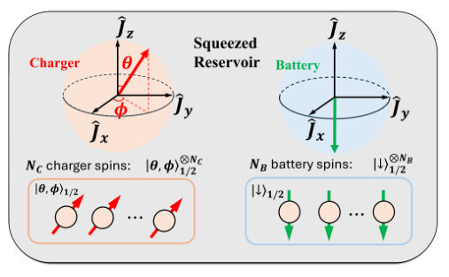 
Figure 1: Schematic of the model. A charger (NC spins) and a battery (NB spins) are coupled to a common reservoir. The charger is prepared in a product state |θ, ϕ⟩⊗NC 1/2 , and the battery is initialized in the fully down-polarized state | ↓⟩⊗NB. The two large spheres represent the collective-spin states of the charger and battery, and the red and green arrows inside them indicate the corresponding collective spin orientations.

📷 Fig 2

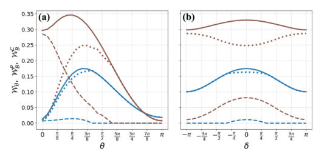 
Figure 2: Steady-state battery performance in multi-spin systems for NB = 4 and various charger sizes: NC = 4 (blue) and NC = 8 (brown). The squeezed vacuum parameter is fixed at r = 0.5. Solid, dotted, and dashed curves represent total ergotropy WB, coherent ergotropy WC B , and population-driven ergotropy WP B, respectively. (a): Dependence on the charger polar angle θ ∈[0, π] with the relative phase fixed at δ = 0. (b): Dependence on the relative phase δ ∈[−π, π] with the charger polar angle fixed at θ = π/3.

📷 Fig 3

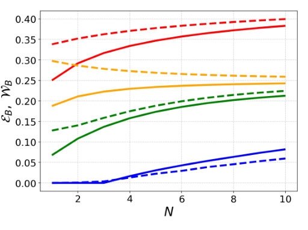 
Figure 3: Scaling of steady-state battery performance with system size N, under a fixed spin ratio NC = NB = N. Normalized battery energy EB (red and yellow) and ergotropy WB (blue and green) as functions of NB for vacuum (solid) and squeezed-vacuum (r = 0.5, dashed) reservoirs. Specifically, red (EB) and blue (WB) curves correspond to the all-spin-up charger (θ = 0), while yellow (EB) and green (WB) curves denote the spin-coherent charger (θ = π/3). All results are evaluated at the relative phase δ = 0.

📷 Fig 4

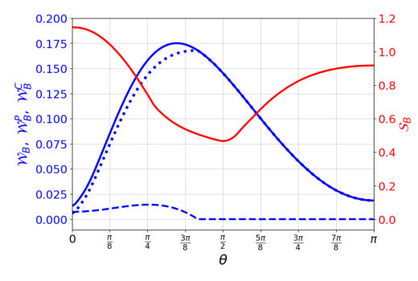 
Figure 4: Steady-state ergotropy components and subsystem entanglement as functions of the charger polar angle θ. Total ergotropy WB (blue solid), population contribution WP B (blue dashed) and coherence-induced contribution WC B (blue dotted) are contrasted against the battery-charger entanglement SB (red solid). Results are calculated for a squeezed-vacuum (r = 0.5) reservoir with spin numbers NB = NC = 4 at the relative phase δ = 0.

📷 Fig 5

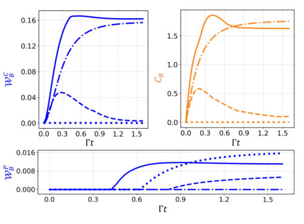 
Figure 5: Time evolution of the coherent ergotropy WC B (top panel, blue), incoherent ergotropy WP B (bottom panel, blue), and the local coherence CB (top panel, orange) under different reservoir and initial state conditions: vacuum reservoir with all- spin-up charger (θ = 0) (dotted), squeezed-vacuum (r = 0.5) reservoir with all-spin-up charger (θ = 0) (dashed), vacuum reservoir with spin-coherent charger (θ = π/3) (dot-dashed), and squeezed-vacuum (r = 0.5) reservoir with spin-coherent charger (θ = π/3) (solid). Other parameters used are NC = NB = 4 and δ = 0.

**Summary.** This paper proposes a method to enhance and stabilize the energy storage capacity of quantum batteries by utilizing both initial charger coherence and reservoir squeezing. It identifies a synergy between these two coherence sources that boosts charging power and uses dark states to protect extractable work from environmental decay. The findings suggest a practical pathway for high-power, stable energy storage in quantum architectures.

**Why it may be interesting.** It provides a novel mechanism for stabilizing quantum resources using reservoir engineering and dark-state protection, which is highly relevant to open quantum systems and quantum thermodynamics.

Detailed structure

**Main problem.** How to overcome the dissipation of ergotropy and coherence in quantum batteries caused by environmental coupling, while simultaneously accelerating charging power.

**Main result.** The study demonstrates that combining internal charger coherence with external reservoir squeezing synergistically enhances transient charging power and that initial charger coherence enables steady-state ergotropy stabilization via dark-state protection.

**Method.** Analytical and numerical analysis using a Lindblad master equation, Dicke basis expansion, and biorthogonal formalism to examine ergotropy decomposition and time-resolved dynamics.

**Model / system.** A quantum battery and charger system composed of spin ensembles (Dicke sectors) interacting via a shared squeezed vacuum reservoir.

**Key observables.** Total ergotropy (split into population-driven and coherence-driven components), battery energy, charging power, local battery coherence, and logarithmic negativity.

**Important parameters / regimes.** Charger polar angle (theta), reservoir squeezing parameter (r), relative phase (delta), and system size (N).

**Assumptions / limitations.** The evolution is cyclic; the reservoir is modeled using the Born-Markov approximation; the study focuses on the regime where charger and battery sizes are comparable.

**Figures summary.** Figure 2 shows ergotropy dependence on charger angle and relative phase; Figure 3 shows scaling of energy and ergotropy; Figure 5 illustrates the time evolution of ergotropy components and coherence under different squeezing protocols.

**Paper structure.** The paper introduces the problem of dissipation in quantum batteries, defines the dual-channel coherence framework, analyzes the single-spin and multi-spin dynamics, explores the synergy between internal and external coherence, and proposes a resource-efficient finite-time squeezing protocol.

Abstract

Quantum batteries utilize nonclassical resources to achieve charging speed and energy storage performances that surpass classical thermodynamic limits. However, the practical realization of quantum batteries is often constrained by the inevitable environment-induced dissipation of both stored ergotropy and coherence. To actively counteract these losses, we propose a dual-channel coherence framework that exploits dark-state protection to stabilize ergotropy. We conduct, for the first time, an investigation of the synergistic interplay between internal charger coherence and reservoir squeezing, the latter acting as a source of external coherence. In the resource-efficient regime where charger and battery sizes are comparable, our study shows that internal charger coherence and reservoir squeezing jointly enhance the transient charging power. Crucially, initial charger coherence is the fundamental resource for maximizing and stabilizing steady-state ergotropy through dark-state protection. Our analysis reveals that these advantages are driven by the buildup of local battery coherence, which emerges from the integration of both internal and external coherence sources. These results offer a robust pathway for high-power, stabilized energy storage in quantum architectures.

[↑ back to top](#top)

### [Energy-Resolved Eigenmode Spectroscopy of 1-D and 2-D Non-Hermitian Skin Effects](http://arxiv.org/abs/2605.18272v1)

**Authors:** Rohith Srikanth, Sashank Kaushik Sridhar, Avik Dutt  
**Type:** experiment · **Category:** other · **PDF:** <https://arxiv.org/pdf/2605.18272v1>  
**Analysis basis:** full PDF text, analyzed in chunks
**Topic relevance:** 🔥 `quantum optics experiment` **4/5** · `analog quantum simulation` **3/5** · `correlated / nonlocal dissipation` **2/5** · `driven-dissipative phase transition` **2/5** · `non-equilibrium dynamics` **2/5** · `quantum measurements` **2/5**

📷 Fig 1

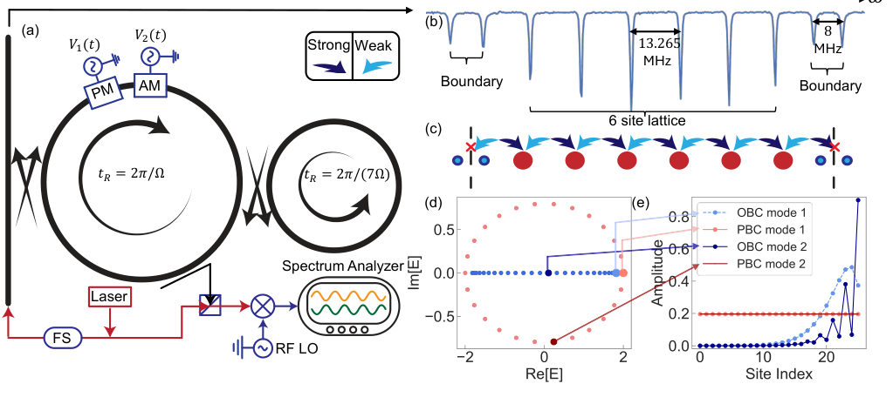 
FIG. 1. (a) Experimental schematic of a ring resonator that supports equally spaced frequency modes coupled to an auxiliary ring that is 7× smaller in length, thus hybridizing every 7th resonance of the primary ring. The corresponding transmission of the system is measured experimentally and shown in (b). To construct 1-D lattices, the modes are coupled via electro-optic modulation through the phase modulator (PM) in the primary ring by driving them at a frequency corresponding to the lattice spacing. At the location of the split modes there is a local change in spacing preventing efficient coupling beyond it, effectively creating a frequency boundary at the mode splitting as depicted in...

📷 Fig 2

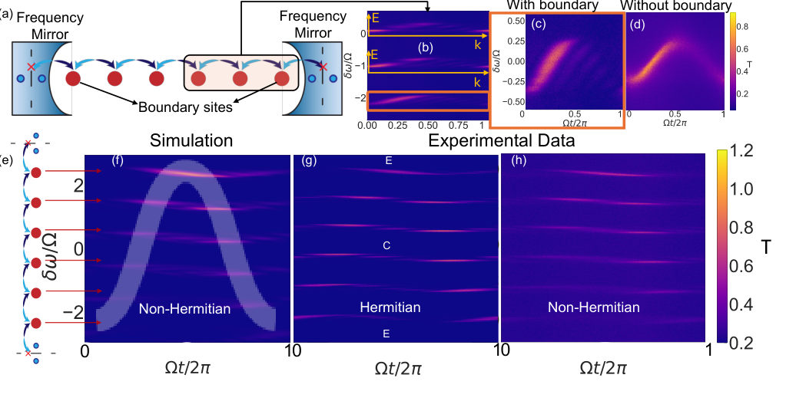 
FIG. 2. (a) The 1-D finite lattice in frequency has two frequency mirrors in a ring resonator with modest finesse, leading to a “weakly confining frequency cavity” in which an excitation can propagate through lattice site couplings and reflect from the boundaries back into the lattice. Excitation of the red highlighted region in (a) reveal the non-Hermitian lattice bands in (b). (c) and (d) are the non Hermitian bands obtained with and without frequency mirrors re-centered about 0. Arrows from (e) indicate the band structure obtained with the excitation of a particular site of the lattice. (f) Scattering matrix simulation of Non-Hermitian bands. An overall modulation of the brightness of...

📷 Fig 3

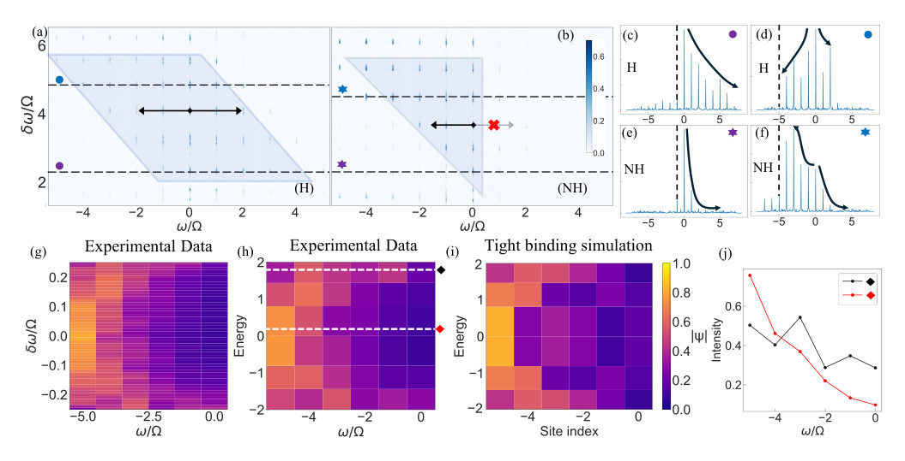 
FIG. 3. Steady state occupations of a slightly larger bounded 7-site (a) Hermitian (H) lattice and (b) non-Hermitian (NH) lattice, to better illustrate the effects of edge and central excitations. (c), (d): line cuts for the Hermitian lattice. (e), (f): line cuts for the non-Hermitian lattice. (a) The highlighted region represents the finite Hermitian lattice across each detuning, where the occupation profile is symmetric. (b) The highlighted region shows the asymmetry pushing the excitation towards one direction across all detunings, resulting in a left-skewed occupation profile. Linecuts (c) and (e) represent the site next to the boundary in the Hermitian and non-Hermitian cases...

📷 Fig 4

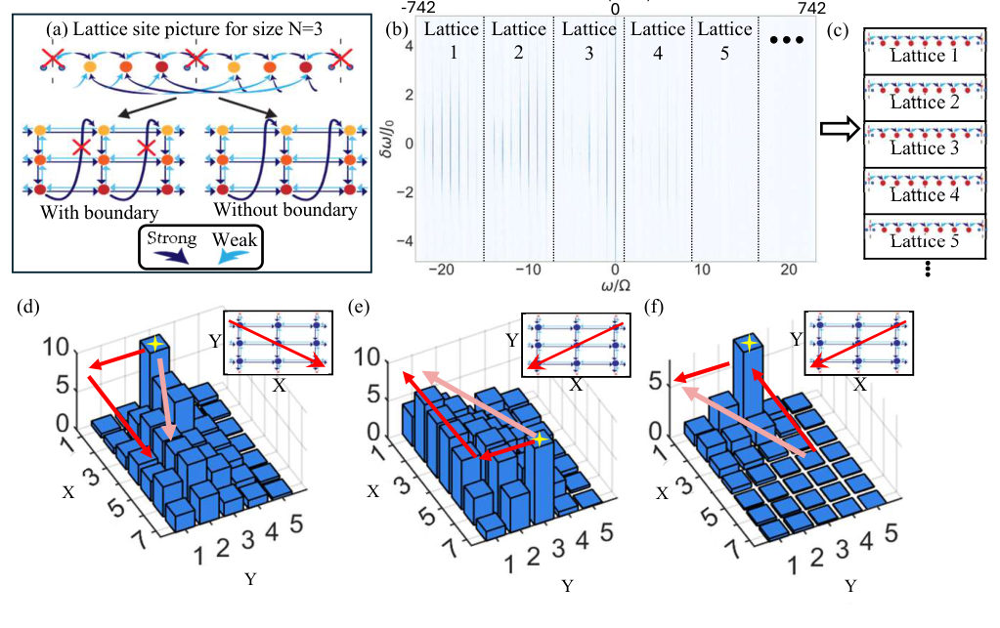 
FIG. 4. (a) 2-D lattice construction from finite lattice chain. The 2-D lattice on the left does not have the twisted coupling while the 2-D lattice on the right does (constructed with the same couplings but without a boundary). (b) Experimentally measured frequency occupations. The dotted lines indicate the location of the boundary splitting that defines each finite lattice of the chain. (c) Stacking these lattices vertically aids visualization of the two dimensional structure as depicted in plots (d)-(f). (d)-(f) Experimental measurements of steady state occupations in the constructed 2-D lattices, measured at δω/Ω= 0. Yellow star indicates the site of excitation. Red arrows indicate the...

**Summary.** The paper presents a new spectroscopic technique to directly observe and map the energy-resolved eigenmodes of non-Hermitian skin effects in 1D and 2D synthetic frequency lattices. By using a fiber ring resonator, the authors successfully demonstrate boundary-induced mode localization and tunable directional transport in higher dimensions. This establishes a powerful platform for studying non-Hermitian physics and engineering complex Hamiltonians.

**Why it may be interesting.** This work is highly relevant to quantum optics and open quantum systems as it provides a direct experimental probe for characterizing the eigenmodes of non-Hermitian Hamiltonians and demonstrates a flexible platform for engineering complex synthetic dimensions.

Detailed structure

**Main problem.** Direct, energy-resolved access to the eigenmodes of non-Hermitian lattices has been limited, making it difficult to characterize the spatial profile and energy-dependent displacement of skin modes.

**Main result.** The authors demonstrated energy-resolved spectroscopy of skin modes in 1D and 2D frequency synthetic lattices, revealing boundary-localized states and tunable directional transport in 2D.

**Method.** The researchers used an electro-optically modulated fiber ring resonator to create synthetic dimensions, employing laser detuning as a spectroscopic axis and a cascaded heterodyne scheme for site-resolved measurements.

**Model / system.** An electro-optically modulated fiber ring resonator acting as a synthetic frequency lattice, implementing the non-Hermitian Hatano-Nelson model with engineered frequency-domain boundaries.

**Key observables.** Complex energy spectrum, spatial mode profiles (site occupation), and band structures in both k-space and lattice space.

**Important parameters / regimes.** Coupling strengths (C, Delta), phase difference (phi), frequency-domain boundaries (frequency mirrors), and the ratio of loss per hop to hopping strength.

**Assumptions / limitations.** The system operates in a weakly confining frequency cavity regime; spatial profiles are normalized using an exponential envelope to account for uniform lattice loss.

**Figures summary.** Fig 1 shows the experimental setup and frequency boundaries; Fig 2 displays measured non-Hermitian bands and comparison with simulations; Fig 3 demonstrates 1D NHSE verification and eigenmode profiles; Fig 4 illustrates the construction and transport properties of 2D lattices.

**Paper structure.** The paper introduces the experimental platform and boundary engineering, moves to the 1D demonstration of energy-resolved spectroscopy and NHSE verification, and concludes with the extension to 2D frequency lattices and tunable transport.

Abstract

Non-Hermitian lattices can host the non-Hermitian skin effect, a boundary-induced collapse of all bulk eigenstates into exponentially localized edge modes. This effect underlies anomalous bulk-boundary correspondence and remarkable enhancements in non-Hermitian sensing, yet direct energy-resolved access to the eigenmodes of non-Hermitian lattices has remained limited. Here we report band- and energy-resolved eigenmode spectroscopy of skin modes in a frequency synthetic dimension. By introducing strong frequency-domain boundaries in an electro-optically modulated ring resonator, we realize finite non-Hermitian lattices and use laser detuning as a spectroscopic axis for the eigenenergies of the effective Hamiltonian. Site-resolved heterodyne measurements then reconstruct the spatial profile of each mode, revealing boundary-localized skin states throughout the spectrum and their eigenenergy-dependent displacement from the edge. Beyond 1D, the same frequency-boundary architecture, upon incorporating long-range couplings between finite lattices, produces genuine 2D frequency lattices rather than the hitherto-realized folded 1D systems on twisted tubes. In these lattices we observe tunable directional transport and edge localization in two synthetic dimensions. Our results introduce eigenmode spectroscopy as a direct probe of non-Hermitian physics and establish strongly bounded frequency lattices as a flexible platform for Hamiltonian engineering.

[↑ back to top](#top)

### [Measurement and Control of the Complex Berry Phase in a Quantum System](http://arxiv.org/abs/2605.16559v1)

**Authors:** Pratik J. Barge, Qian Cao, Niklas Hörnedal, Aurélia Chenu, Kater W. Murch  
**Type:** both · **Category:** quantum information and computing · **PDF:** <https://arxiv.org/pdf/2605.16559v1>  
**Analysis basis:** full PDF text, analyzed in chunks
**Topic relevance:** 🔥 `QC/QI experiment` **4/5** · 🔥 `quantum measurements` **4/5** · `quantum optics experiment` **3/5** · `correlated / nonlocal dissipation` **2/5** · `non-equilibrium dynamics` **2/5**

📷 Fig 1

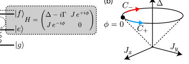 
FIG. 1. (a) An effective non-Hermitian system is realized through post-selection on trajectories with no quantum jumps from |e⟩to |g⟩at decay rate Γ, while the |e⟩–|f⟩manifold is co- herently driven with amplitude J and detuning ∆. To enable high-fidelity state readout, population in |e⟩is transferred to a neighboring qubit using a parametric SWAP operation. (b) Closed parameter-space loops C± traced in {Jx, Jy, ∆} dur- ing the geometric evolution

📷 Fig 2

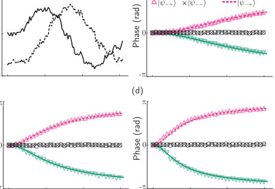 
FIG. 2. Measurement of the real geometric phase: (a) Tomographic measurement ⟨ψη′,η| ˆSx|ψη′,η⟩and ⟨ˆSy⟩at T = 3 µs and ∆/2π = 3 MHz. (b), (c) and (d) extracted real part of the geometric phase θ(r) +,η with ∆/2π = 3, 1.34, 0.81 MHz. Solid and dashed lines represent theory while markers are experimental data. Opposing loop directions (C+ and C−) result in sign reversal, while repeating the same loop twice with an intermediate swap (η′ = η) cancels both geometric and dynamical phases.

📷 Fig 3

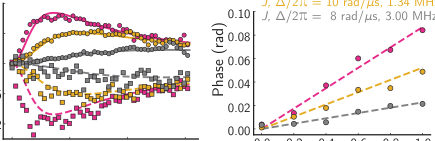 
FIG. 3. Measurement of the imaginary part of Berry phase: (a) Postselection success probability decay p±,η with initial state |R+⟩(dashed) and |R−⟩(solid) after one loop in direction η. (b) Ratio of postselection success probabil- ity obtained with eigenstates |R+⟩(dashed) and |R−⟩(solid) as initial states. This eliminates contribution of the dynam- ical phase. (c) Measured imaginary Berry phase (filled cir- cles/squares) starting with either of the two eigenstates, com- pared with theoretical predictions for three different detun- ings. Measurements using |R−⟩(solid lines, round markers) exhibit lower noise levels and accumulate positive phase, while those using |R+⟩(dashed lines, square...

📷 Fig 4

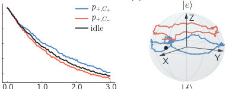 
FIG. 4. Time dynamics of survival probability p±,Cη for both eigenstates under different control loop di- rections. (a, b) Survival probability p±,Cη versus time for eigenstates |R−⟩and |R+⟩, respectively, showing decay under control loops C+ (blue), C−(red), and idle conditions (black). (c, d) Corresponding Bloch sphere trajectories for each eigen- state under loops C+ and C−. These trajectories are shown in the undriven frame where |R−⟩→|f⟩and |R+⟩→|e⟩. The black dot represents the idle case initial state.

📷 Fig 5

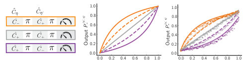 
FIG. 5. Input–output relation for the geometric gate. (a) Sequences with orange and purple outlines are for non- unitary control with positive and negative imaginary geomet- ric phase, respectively. The one with gray outline corresponds to the unitary case (θ(im) ++ = 0). (b) Theory curves based on Eq. (12)), dashed lines are θ(im) +− = +0.08 (orange) and θ(im) −+ = −0.08 (purple) with parameters J = 4.78 rad/µs, ∆/2π = 1.05 MHz. Solid lines are θ(im) +− = +0.17 (orange) and θ(im) −+ = −0.17 (purple) with parameters J = 2.17 rad/µs, ∆/2π = 0.51 MHz. (c) Measured input-output relation for the geometric gate (colored dots and crosses). The solid and dashed curves correspond to a Lindblad...

**Summary.** This paper reports the experimental measurement of both the real and imaginary components of the complex Berry phase using a superconducting transmon circuit. It demonstrates that the imaginary part can be used to implement non-unitary quantum gates that selectively amplify or attenuate quantum states. The findings provide a clear distinction between the two components and confirm the unique adiabatic behavior of non-Hermitian systems.

**Why it may be interesting.** This work is highly relevant for researchers in open quantum systems and quantum optics as it provides a concrete experimental realization of complex geometric phases and demonstrates how dissipation can be harnessed for non-unitary quantum control and geometric filtering.

Detailed structure

**Main problem.** The measurement and control of the complex Berry phase in non-Hermitian quantum systems, specifically distinguishing between its real and imaginary components and utilizing the imaginary part for non-unitary quantum control.

**Main result.** The researchers experimentally demonstrated that the Berry phase in non-Hermitian systems is complex-valued, where the real part acts as a phase shift and the imaginary part enables state-dependent amplification or attenuation, even implementing a non-unitary geometric gate.

**Method.** The study uses an interferometric protocol with two loops (C+ and C-) and a pi-pulse to cancel dynamical phases for the real part, and measures changes in state norm (survival probability) to isolate the imaginary part, all implemented on a superconducting circuit.

**Model / system.** A superconducting transmon circuit with engineered dissipation, modeled by an effective non-Hermitian Hamiltonian in a three-level manifold where post-selection on no-jump trajectories creates non-Hermitian dynamics.

**Key observables.** Real and imaginary components of the Berry phase, expectation values of Sx and Sy, survival probability, population redistribution, and the time-dependent z-component of the state.

**Important parameters / regimes.** Detuning (Delta), drive amplitude (J), decay rate (Gamma), loop duration (T), and the proximity to the Exceptional Point (EP).

**Assumptions / limitations.** The system relies on the validity of post-selection to maintain the non-Hermitian effective Hamiltonian and assumes the adiabatic limit can be approached via shortcuts to adiabaticity.

**Figures summary.** Fig 1 shows the experimental setup and parameter space loops; Fig 2 presents tomographic measurements of the real phase; Fig 5 illustrates the input-output relation for the non-unitary geometric gate; Fig 6 shows the tuning of the imaginary phase; Fig 8 compares experimental z-component evolution with theory.

**Paper structure.** The paper introduces the non-Hermitian Berry phase problem, describes the superconducting platform and Hamiltonian, details the measurement protocols for real and imaginary parts, demonstrates non-unitary gate implementation, analyzes the breakdown of adiabaticity, and concludes with the relationship between the imaginary phase and state tracking.

Abstract

The Berry phase is a geometric phase acquired during adiabatic evolution over a closed loop in parameter space. It plays an essential role in geometric quantum gates and other phase-based protocols. In non-Hermitian systems, the Berry phase is complex, introducing fundamentally new geometric effects, including state amplification. In this work, we report experimental measurement of both the real and imaginary components of a Berry phase in a fully quantum system using a superconducting transmon circuit with engineered dissipation. We also demonstrate the path-dependent effects of the imaginary part on the dissipation and its utility in the implementation of non-unitary quantum control. These findings establish a clear geometric distinction between the real and imaginary components of the Berry phase and experimentally confirm the unique adiabatic behavior of non-Hermitian quantum systems.

[↑ back to top](#top)

### [Phonon-bottlenecked spin relaxation of Er$^{3+}$:CaWO$_4$ at milliKelvin temperatures](http://arxiv.org/abs/2605.18208v1)

**Authors:** S. Rajendran, B. Mistri, P. K. Sharma, S. E. Kubatkin, A. V. Danilov, S. Dhomkar, S. E. de Graaf, V. Ranjan  
**Type:** experiment · **Category:** quantum information and computing · **PDF:** <https://arxiv.org/pdf/2605.18208v1>  
**Analysis basis:** full PDF text, analyzed in chunks
**Topic relevance:** 🔥 `QC/QI experiment` **4/5** · `quantum optics experiment` **3/5** · `spintronics-quantum-optics interface` **3/5** · `Tavis-Cummings & cavity-many-emitter` **2/5** · `non-equilibrium dynamics` **2/5**

📷 Fig 1

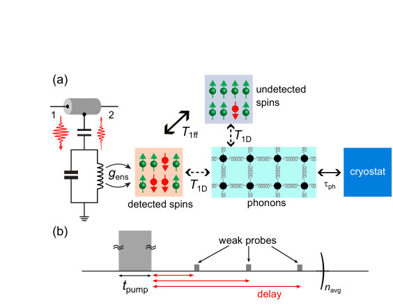 
FIG. 1. Measurement setup. (a) Schematics of excitation and subsequent relaxation of electron spins coupled to a supercon- ducting resonator with a bandwidth κ ≪Γinh, the inhomo- geneous spin linewidth. For large spin concentrations and at mK temperatures, excited spins are most likely to exit the detection volume via spin flip-flops (T1ff), and only weakly via direct phonon emission (T1D). τph is the average time for phonons to equilibrate with the cryostat. (b) Pulse sequences used for extracting spin relaxation by measuring resonator re- sponse following a long and strong saturation pump.

📷 Fig 2

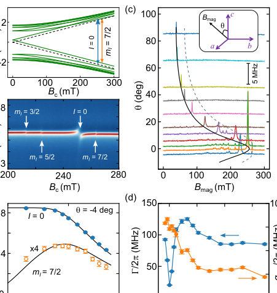 
FIG. 2. Spectroscopy of Er3+ spins in CaWO4. (a) Top: Energy eigenvalues of two isotopes of Er3+ with nuclear spin I = 0 (dashed lines) and 7/2 (solid lines). mI is the nuclear- spin projection on the B-field axis. Bottom: Color plot of transmission power |S21|2 vs magnetic field at 80 mK. The field is aligned with the crystal c-axis. (b) Temperature de- pendence of gens (symbols: measurements, lines: theory) for the two transitions marked by double arrows in the top panel of (a). (c) Angular dependence of the cw spin spectra at 20 mK. Largest peaks correspond to the erbium I = 0 transi- tion. Angle θ is with respect to c-axis in the ac plane. Solid and dashed lines are calculated using the...

📷 Fig 3

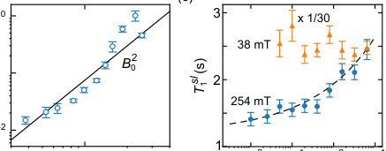 
FIG. 3. Spin relaxation via direct phonon processes. (a) Nor- malized transmitted field across the feedline (symbols: mea- surement, lines: triple-exponential fits) following a long satu- ration pulse of duration 1 s at two magnetic fields. Data for θ = 0 (90) is trace averaged 40 (5) times. (b) Magnetic field dependence of the slow relaxation time constant T sl 1 . Solid line represents B2 0 dependence. Note the semi-log and log-log plot in panels (a,b), respectively. (c) Dependence of T sl 1 on the pump duration for two magnetic fields. Error bars repre- sent the standard deviations associated with the least square fits of T sl 1 .

📷 Fig 4

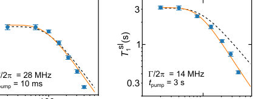 
FIG. 4. Phonon bottlenecked spin to bath relaxation. (a) Transmitted field amplitude at two temperatures, symbols: measurement, lines: triple-exponential fits. (b-d) Tempera- ture dependence of the slowest time constants for different ex- perimental conditions, the inhomogeneous spin linewidth Γinh and pump duration tpump. Dashed and solid lines are fits to the direct phonon process alone and the phonon-bottleneck mediated spin relaxation process, respectively. Error bars represent the standard deviations associated with the least square fits of T sl 1 .

**Summary.** The paper investigates how spins in Er3+:CaWO4 relax at millikelvin temperatures, discovering that a phonon bottleneck prevents efficient energy transfer to the thermal bath. This effect leads to unique temperature and magnetic field dependencies that are critical to understand for developing stable rare-earth-based quantum technologies.

**Why it may be interesting.** This work is highly relevant to open quantum systems and quantum optics as it characterizes the fundamental decoherence mechanism (spin-lattice relaxation) and the thermalization bottleneck in rare-earth-doped crystals used for quantum memories and transducers.

Detailed structure

**Main problem.** Investigating the spin-lattice relaxation mechanisms and the phonon bottleneck effect in Er3+:CaWO4 at millikelvin temperatures.

**Main result.** The study identifies a phonon-bottlenecked relaxation process characterized by a specific temperature dependence and a quadratic magnetic field dependence, which can impact the coherence of rare-earth spin ensembles.

**Method.** The researchers used a low-mode volume NbN superconducting resonator to detect spin relaxation via a pump-probe and echo inversion recovery sequence at temperatures down to 20 mK.

**Model / system.** The physical system is an Er3+:CaWO4 crystal (50 ppm Er doping) coupled to a superconducting NbN resonator on a sapphire substrate, operating in the millikelvin regime.

**Key observables.** Spin-lattice relaxation time (T1), spin-resonator ensemble coupling strength (g_ens), inhomogeneous linewidth (Gamma_inh), and spin temperature.

**Important parameters / regimes.** Temperatures from 20 mK to 400 mK, magnetic fields up to 800 mT, and spin-to-bath relaxation time of approximately 1.5 s.

**Assumptions / limitations.** The analysis assumes the relaxation is driven by energy exchange via spin flip-flops and that the observed slow component represents the direct-phonon process.

**Figures summary.** Figure 1 shows the measurement setup and pulse sequences; Figure 2/3 illustrates the decay of the transmitted field and the magnetic field dependence of relaxation; Supplemental figures show temperature dependence and the origin of different time constants.

**Paper structure.** The paper introduces the experimental setup and the problem of spin relaxation, details the measurement techniques (pump-probe and echo inversion), presents the results regarding the phonon bottleneck and magnetic field dependence, and concludes with an analysis of the different relaxation time constants.

Abstract

We study spin-lattice relaxation times of electron spins in Er$^{3+}$:CaWO$_4$ at millikelvin temperature, detected via their coupling to a low-mode volume superconducting resonator. At large magnetic field supporting strong phonon-emission rates, we observe a noticeable increase in relaxation times with increasing spin-excitations, which exhibit a unique $[\tanh (\hbar ω_0/k_\text{B} T)]^2$ temperature dependence. These observations are typical of a phonon-bottlenecked spin relaxation, and have implications for quantum technologies that exploit rare-earth spin ensembles as coherent resources.

[↑ back to top](#top)

### [Quantum Mpemba effect for operators in open systems](http://arxiv.org/abs/2605.17908v1)

**Authors:** Pitambar Bagui, Bijay Kumar Agarwalla  
**Type:** theory · **Category:** statistical mechanics · **PDF:** <https://arxiv.org/pdf/2605.17908v1>  
**Analysis basis:** full PDF text, analyzed in chunks
**Topic relevance:** 🔥 `non-equilibrium dynamics` **4/5** · `entanglement & information structure` **3/5** · `methods for driven-dissipative` **3/5** · `correlated / nonlocal dissipation` **2/5** · `scars & prethermalization` **2/5**

📷 Fig 1

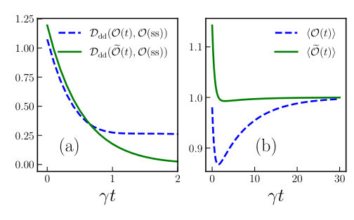 
FIG. 1. Presence of the genuine operator Mpemba effect in a single qubit setup evolving under a unital map. (a) Time evolution of the dressed distance for the original operator O = b0I + ⃗b · ⃗σ and the transformed operator e O, obtained by bypassing the SDM. Although e O is initially farther from the asymptotic value, it relaxes significantly faster due to the removal of the SDM. (b) Time evolution of the corresponding expectation values evaluated in the initial state |ψ0⟩= |+⟩, demonstrating the accelerated relaxation of the transformed operator e O. The parameters used are ω0 = 0.5, γ = 1, b0 = 1, and the vector ⃗b is chosen randomly with values for the com- ponents given as (−0.01954,...

📷 Fig 2

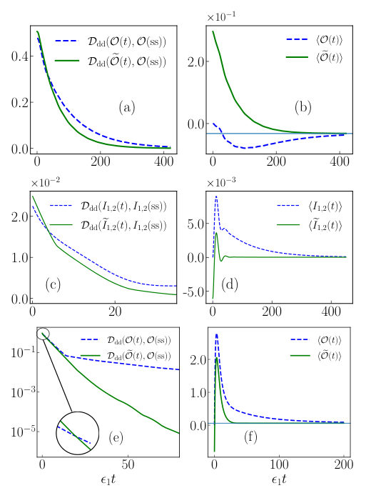 
FIG. 2. Results for the Non-equilibrium XX-spin chain: Demonstration of the operator Mpemba effect for operators with different degree of locality for the boundary-driven spin chain with N = 4. (a) Local operator: population imbalance O = n2 −n3. The transformed operator e O exhibits faster convergence to the steady state despite initially larger dressed distance. (b) Dynamics for the corresponding expectation val- ues starting with the initial state |ψ0⟩= |1⟩⊗4, (|1⟩is the spin down state) showing accelerated relaxation and convergence to the same steady state. (c) Two-site operator: current I1,2. The transformed operator eI1,2 relaxes exponentially faster than I1,2, despite a larger...

📷 Fig 3

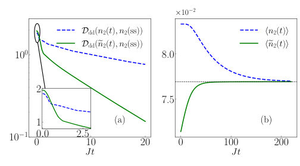 
FIG. 3. Results for one-dimensional bosonic lattice subjected to dephasing: (a) The transformed operator en2(t) initially lies farther from the steady state value n(ss) 2 in terms of dressed distance (for this case it reduces to trace distance, as the map is unital), yet it relaxes more rapidly than the local number density n2 at the second site. In contrast, n2, al- though closer to equilibrium at initial times, exhibits slower relaxation. This counterintuitive behavior highlights the pres- ence of the genuine Mpemba effect for operators. (b) The expectation value evaluated with respect to the initial state ρ0 = 1 L−1 PL−1 i=1 |i⟩⟨i| further confirms the accelerated relax- ation of the...

**Summary.** This paper shows that the Quantum Mpemba effect can be realized for physical observables by selectively removing the slowest decaying modes from an operator. This process can lead to an exponential speed-up in relaxation, even though the transformed operator starts further from the steady state. The effect is shown to be robust across various systems, including spin chains and bosonic lattices.

**Why it may be interesting.** It extends a well-known phenomenon of state relaxation to the level of observables, providing a new framework for controlling the relaxation of physical quantities in open quantum systems and many-body dynamics.

Detailed structure

**Main problem.** Investigating whether the Quantum Mpemba effect (anomalous accelerated relaxation) can occur at the level of physical operators (observables) rather than just quantum states.

**Main result.** The authors demonstrate that a 'mode-bypassing' procedure can induce a genuine Mpemba effect for operators, where a transformed operator relaxes faster to the steady state despite starting at a larger initial distance.

**Method.** The study uses a mode-bypassing protocol to remove the slowest decay modes (SDM) from an operator and employs the 'dressed distance' (a trace distance under the Petz recovery map) to quantify relaxation in non-trace-preserving adjoint dynamics.

**Model / system.** The framework is applied to open quantum systems described by the GKSL master equation, specifically including a single-qubit system, a non-equilibrium XX-spin chain, and a one-dimensional bosonic lattice subject to dephasing.

**Key observables.** Dressed distance (Ddd), expectation values of local and non-local operators (e.g., population imbalance, bond current, and string operators), and Pauli string decomposition coefficients.

**Important parameters / regimes.** Dephasing strength (gamma), tunneling amplitude (J), temperature (T), and chemical potential gradients.

**Assumptions / limitations.** The dynamics are assumed to be Markovian and described by the GKSL master equation under standard Born-Markov and secular approximations.

**Figures summary.** Figures illustrate the occurrence of the Mpemba effect via distance crossing in a single qubit, the relaxation of local and non-local operators in spin chains, and the numerical validation of theoretical bounds for the change in distance.

**Paper structure.** The paper introduces the operator Mpemba effect, develops the mode-bypassing mathematical framework and distance measures, demonstrates the effect in single-qubit and spin-chain models, extends the analysis to bosonic lattices, discusses the implications for operator locality, and provides experimental measurement protocols.

Abstract

The quantum Mpemba effect concerns with anomalous relaxation of quantum states that evolves either under unitary or non-unitary dynamics. In the context of open quantum systems, while most studies focus on quantum states evolving under completely positive trace-presing dynamics described by the Gorini-Kossakowski-Sudarshan-Lindblad (GKSL) master equation, we demonstrate that an analogous effect can arise at the level of operators. In particular, we show that operators that evolves under the adjoint Liouvillian -- despite not being a trace-preserving map -- can still exhibit a genuine Mpemba effect. We derive general conditions under which this phenomenon can occur and validate our predictions for three different open quantum setups. Our results broaden the scope of the Mpemba effect in quantum systems and provide a framework for controlling the relaxation of physically relevant observables.

[↑ back to top](#top)

### [Generation of deterministic multi-mode intensity squeezing in a train of ultra-short pulses by unbalanced SU(1,1) interferometers](http://arxiv.org/abs/2605.17798v1)

**Authors:** Wen Zhao, Xiao Liu, Yunxiao Zhang, Xueshi Guo, Xiaoying Li  
**Type:** both · **Category:** quantum information and computing · **PDF:** <https://arxiv.org/pdf/2605.17798v1>  
**Analysis basis:** full PDF text, analyzed in chunks
**Topic relevance:** 🔥 `QC/QI experiment` **4/5** · 🔥 `quantum optics experiment` **4/5** · `interference shaping light` **3/5** · `quantum measurements` **2/5**

📷 Fig 1

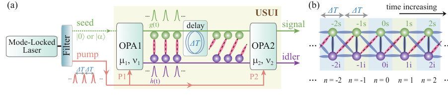 
FIG. 1. The schematics of generating multi-mode state in a train of ultra-short pulses by time-domain multiplexing. (a) An unbalanced SU(1,1) interferometer (USUI) consisting of two pulse-pumped optical parametric amplifiers (OPA1, OPA2) with a delay line in between. The delay is introduced in the signal channel before coupling two outputs of OPA1 into OPA2, which functions as a nonlinear beam splitter. (b) Correlation structure of the multi-mode state. Besides the correlation (connect by thick pink lines) created by the parametric interaction in OPA1 (dashed black lines), five extra quantum correlation (thick blue lines) within each 4-mode unit, composed of the signal and idler modes in...

📷 Fig 2

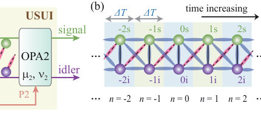 
Fig. 1(b). The signal and idler fields out of OPA1 can be written as [24]

📷 Fig 3

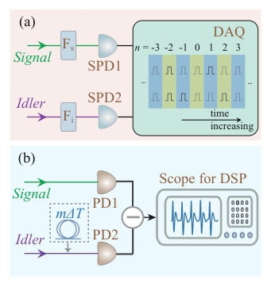 
FIG. 2. The detection schemes for (a) characterizing the structure of multi-mode state by intensity correlation g(2) be- tween modes 0s and q and for (b) measuring the multi-mode intensity squeezing by pulse resolving self-homodyne and dig- ital signal processing (DSP). Dashed-box: optional delay line. Fs(i): optical filters; SPD, single photon detector; DAQ, data acquisition system; PD, photo diode.

📷 Fig 4

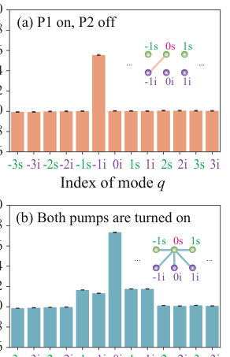 
FIG. 3. Measured intensity correlation g(2)(0s, q) between the reference mode 0s and another q for (a) µ2 1 ≈10, µ2 2 = 1 and (b) µ2 1 ≈µ2 2 ≈10.

📷 Fig 5

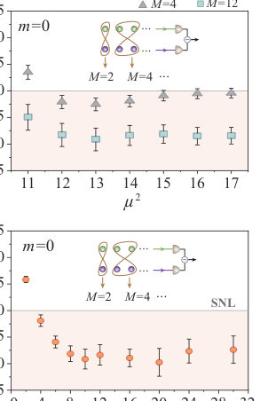 
FIG. 5. Normalized intensity noise R(M) d measured by varying the gain of OPA and mode number M involved in joint mea- surement. (a) R(M) d versus the power gain µ2 when M = 4, 12; (b) R(M) d versus M when µ2 ≈14.

**Summary.** The paper demonstrates a method to generate large-scale multi-mode quantum states using ultra-short pulses in an unbalanced SU(1,1) interferometer. By using a mode-locked laser, the researchers overcome the temporal limitations of continuous-wave pumps, achieving significant intensity squeezing across many modes. This approach opens the door to much larger quantum state scales for quantum information processing.

**Why it may be interesting.** This work is highly relevant to quantum optics and quantum information as it provides a path toward generating ultra-large-scale, high-bandwidth continuous variable cluster states using pulsed light, which is essential for scalable quantum computing and networks.

Detailed structure

**Main problem.** The challenge of scaling up continuous variable quantum states by increasing the number of temporal modes, which is currently limited by the long duration of modes generated by continuous-wave laser pumps.

**Main result.** Demonstration of multi-mode intensity squeezing in a train of 10 ps ultra-short pulses using an unbalanced SU(1,1) interferometer, achieving intensity noise lower than the shot noise level by ~0.9 dB for M > 10.

**Method.** The researchers use an unbalanced SU(1,1) interferometer (USUI) with a mode-locked laser pump, employing pulse-resolved joint measurements and a covariance matrix formalism to characterize the correlation structure.

**Model / system.** An unbalanced SU(1,1) interferometer (USUI) consisting of two fiber-based optical parametric amplifiers (OPAs) in dispersion-shifted fibers, connected by an optical delay line that introduces a delay matching the pump repetition period.

**Key observables.** Second-order intensity correlation function g(2)(p, q), multi-mode intensity noise (intensity squeezing) relative to the shot noise level, and power gain of the OPAs.

**Important parameters / regimes.** Pulse duration (~10 ps), repetition period (20 ns), number of modes (M), OPA power gain (mu), and phase difference (theta).

**Assumptions / limitations.** The system is treated within the Gaussian quantum state regime, and the high-gain regime (mu >> 1) is used for analytical scaling laws; Raman noise is suppressed via liquid nitrogen immersion.

**Figures summary.** Figure 1 shows the USUI setup and the multi-mode correlation structure; Figure 5 displays intensity noise versus gain and mode number; Appendix figures show the experimental setup details and calibration of the detection system.

**Paper structure.** The paper introduces the problem of scaling CV states, describes the USUI experimental platform and nonlinear process, presents the theoretical derivation of correlation structures and scaling laws, demonstrates experimental verification of multi-mode squeezing, and discusses future scalability.

Abstract

The continuous variable quantum state generated by time-domain multiplexed optical parametric amplifier (OPA) is attractive because of the potential of enlarging the mode scale. Currently, the duration of temporal mode is longer than 100 ns since the OPA is pumped by the continuous wave laser, which restricts the scale of quantum state. Here we demonstrate multi-mode intensity squeezing localized in a train of short pulses with duration of $\sim10$ ps by using an unbalanced SU(1,1) interferometer (USUI), where the mode-locked laser is exploited as the pump and the time-domain multiplexing is realized by the combination of optical delay and nonlinear beam splitter. Using the pulse resolved joint measurements, we reveal the correlation structure of the state is unique and fundamentally different from previous approaches. Due to the globe quantum correlation, the intensity squeezing not only depends on the gain of OPAs but also ties to the mode number $M$ of joint measurement. We experimentally perform joint measurement among 30 modes and show the intensity noise lower than shot noise level by $\sim0.9$ dB is achievable for $M>10$. Our investigations open the door for generating ultra-large scale quantum state by pulse pumped USUI.

[↑ back to top](#top)

### [Probing Tensor Singularities and Their Euler-Class Descendants via Non-Abelian Quantum Geometry Measurement](http://arxiv.org/abs/2605.17977v1)

**Authors:** Zhe Wang, Yan-Qing Zhu, Xinsheng Tan, Giandomenico Palumbo, Lichang Ji, Wei Xin, Shi-Liang Zhu, Yang Yu  
**Type:** both · **Category:** quantum information and computing · **PDF:** <https://arxiv.org/pdf/2605.17977v1>  
**Analysis basis:** full PDF text, analyzed in chunks
**Topic relevance:** 🔥 `QC/QI experiment` **4/5** · 🔥 `analog quantum simulation` **4/5** · `quantum measurements` **3/5** · `non-equilibrium dynamics` **2/5**

📷 Fig 1

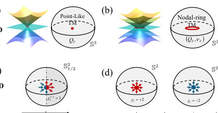 
FIG. 1: Schematic of 4D SO(2) TMs and their 3D descandants. (a) Point-like TM at δ = 0 with spectrum (E, k∥) for k⊥= 0, char- acterized by charge QT = 1. (b) Nodal-ring inflated monopole for k⊥= 0, δ ̸= 0, where the band-crossing points form a nodal ring in k∥plane, carrying dual topological charges (QT , νT ) = (1, 2). (c) Euler dipole located for δ = 0, where two oppositely charged Eu- ler monopoles coincide in the origin. (d) Euler curvature dipole for δ ̸= 0, with the monopoles displaced along kz axis.

📷 Fig 2

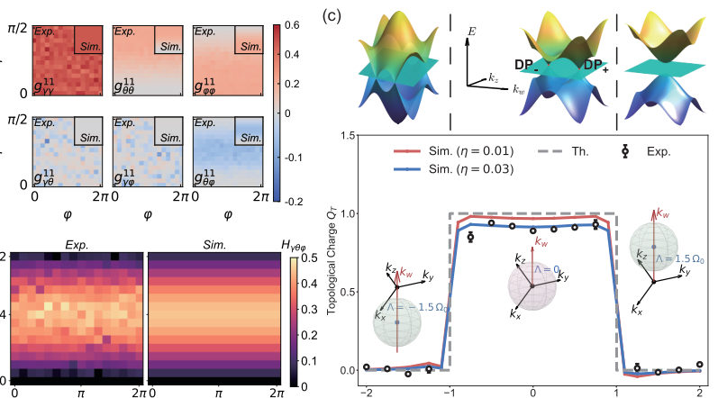 
FIG. 2: Topological characterization of the SO(2) TM. (a) Measured non-Abelian quantum metric components vs numerical simulations. (b) Reconstructed tensor Berry curvature Hγθϕ; two independent directions are shown due to symmetry. (c) Topological invariant QT for closed hypersurfaces surrounding (center) or avoiding (left/right) the monopole. Experimental data (black circles) are compared with numerical simulations at excitation densities nex = 0.01 (red) and 0.03 (blue), representing different “amplifier gains”. Insets: integration surfaces. Top: Tight-binding bands in the (kz, kw) plane at kx = ky = 0 for varied bias Λ.

📷 Fig 3

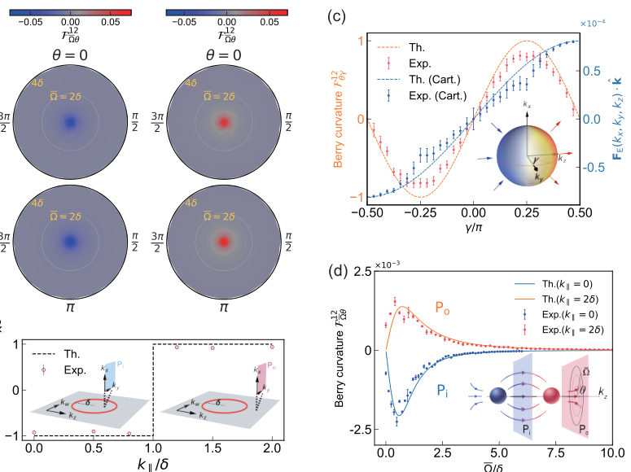 
FIG. 3: (a) Nodal ring topology. Top: Measured curvature distributions on momentum slices with k∥= 0.8|δ| (inside the ring) and 1.2|δ| (outside), respectively. Bottom: Numerical simulations. (b) Extracted Euler number χ1 versus k∥. The experimental results(red dots) and theoretical prediction(black dashed line) are matched well. The jump from χ1 = +1 to −1 across the nodal ring confirms the nodal-ring invariant νT = 2. Insets: schematic illustration of the spatial location of the integration plane. (c) Measured F12 θγ in 3D Euler Dipole, theoretical value(bright orange dashed line) and experimental data(red circles with error bars) show well agreement. The Berry curvature is also shown in...

**Summary.** This paper reports the experimental observation of 4D tensor singularities and their 3D descendants using a superconducting qubit array. By implementing a specialized hybrid measurement protocol, the authors successfully mapped non-Abelian quantum geometry and demonstrated how high-dimensional topological objects dictate the physics of lower-dimensional systems.

**Why it may be interesting.** This work is highly relevant for researchers in many-body dynamics and quantum simulation as it demonstrates a robust framework for exploring high-order gauge theories and non-Abelian topology using programmable superconducting circuits.

Detailed structure

**Main problem.** The study aims to probe and characterize high-dimensional 4D tensor singularities and their 3D Euler-class descendants using non-Abelian quantum geometry measurements.

**Main result.** The researchers experimentally observed a 4D point-like tensor monopole evolving into a nodal ring with a quantized invariant of 2, and demonstrated that 4D singularities reduce to 3D Euler dipoles.

**Method.** A hybrid analog-digital protocol was used, employing a modified transitionless quantum driving (mTQDA) technique to enhance the signal-to-noise ratio during adiabatic evolution.

**Model / system.** The platform is a superconducting qubit array consisting of a 2x3 lattice of six transmon qubits with tunable couplers, simulating a 4D minimal Hamiltonian with six bands.

**Key observables.** Non-Abelian quantum metric, Tensor Berry curvature, 4D Tensor Monopole charge (Q_T), First Euler number (chi_1), and the nodal-ring invariant (nu_T).

**Important parameters / regimes.** Energy offset (Lambda), excitation densities (n_ex), and hyperspherical coordinates (Omega, gamma, theta, phi).

**Assumptions / limitations.** The system is protected by chiral and spacetime-inversion symmetries; the analysis assumes the ability to decompose adiabatic evolution into discrete circuit gates.

**Figures summary.** Figure 1 introduces the 4D model and symmetry protection; Figure 2 compares measured and simulated non-Abelian quantum metrics and shows the topological phase transition; Figure 3 demonstrates the 3D Euler dipole and Berry curvature distribution.

**Paper structure.** The paper introduces the 4D tensor singularity concept, describes the superconducting circuit implementation and the hybrid measurement protocol, presents the experimental reconstruction of the 4D monopole and its evolution into a nodal ring, and concludes with the dimensional reduction to 3D Euler dipoles.

Abstract

We report the theoretical prediction and experimental observation of a new class of four-dimensional (4D) tensor singularities and their three-dimensional (3D) Euler-class descendants, protected by chiral and spacetime inversion symmetries on a superconducting circuit platform. The 4D point-like singularity/monopole, characterized by the Dixmier-Douady class of a real bundle gerbe associated with tensor gauge fields, is observed to evolve into a nodal ring carrying an additional first Euler class charge under symmetry-preserving perturbations. Dimensional reduction reveals 3D Euler and Euler curvature dipoles, exhibiting nontrivial Euler topology and a topological sum rule that ensures zero-energy flat bands inherit nontrivial topology even without interactions. Crucially, these high-dimensional degenerate systems are mapped and reconstructed using a hybrid analog-digital protocol designed for non-Abelian quantum geometry measurement within a superconducting qubit array. Our work not only expands the family of topological monopoles but also establishes a robust experimental framework for exploring high-order gauge theory and real-bundle topology across diverse quantum platforms.

[↑ back to top](#top)

### [Exact nonequilibrium steady states of boundary driven circuit with XYZ gates](http://arxiv.org/abs/2605.17018v1)

**Authors:** Xin Zhang, Tomaz Prosen, Vladislav Popkov  
**Type:** theory · **Category:** statistical mechanics · **PDF:** <https://arxiv.org/pdf/2605.17018v1>  
**Analysis basis:** full PDF text, analyzed in chunks
**Topic relevance:** 🔥 `methods for driven-dissipative` **4/5** · 🔥 `non-equilibrium dynamics` **4/5** · `driven-dissipative phase transition` **2/5** · `entanglement & information structure` **2/5**

📷 Fig 1

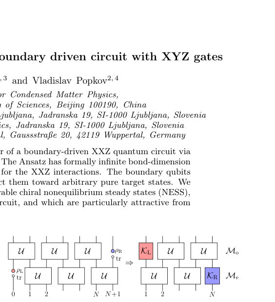 
Figure 1. 2-step reset driven XYZ circuit in folded notation. Empty circles represent a local traces while red/blue disks represent arbitrary pure boundary states. The right scheme correspond to an equivalent reduced circuit where squares rep- resent boundary Kraus maps (see details in the main text).

📷 Fig 2

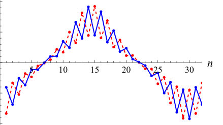 
Figure 3. Average local magnetizations profiles for elliptic brickwork helix (48) for real η. Top panel: black, blue, green points connected with full lines correspond to ⟨σx n⟩, ⟨σy n⟩, ⟨σz n⟩ respectively. Bottom panel: Blowup of ⟨σy n⟩for even/odd steps of evolution (50), (51) is shown with full blue and dashed red lines respectively. Parameters: M = 60, u = 0.15i, τ = 0.65i, αL = 0.095 + 0.1i, η = 4/M.

📷 Fig 3

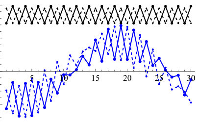 
Figure 4. Average local magnetizations profiles for ellip- tic brickwork helix (48) for imaginary η. Black and blue points connected with full lines correspond to ⟨σx n⟩and ⟨σy n⟩, respectively. Dashed lines show the same quantity at odd steps of evolution (51). Parameters: M = 30, u = 0.15, τ = 0.325i, αL = 0.095 + 0.1i, η = 2τ/M.

📷 Fig 4

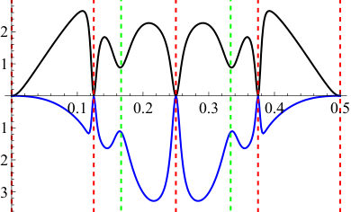 
Figure 5. Helix indicators −f1 (solid blue curve) and f2(η) (solid black curve), given by (54) and (55) respectively and measured in the NESS, plotted versus the rescaled anisotropy for a system of N = 7 sites. Top Panel: u = 0.185i, τ = 0.65i, αL = 0.165 + 0.13i, αR = αL + u. Bottom Panel: u = 0.185, τ = 0.65i, αL = 0, αR = u = 0.185. Zeros of the in- dicators coincide with the pure helix condition (N + 1)η = 0 (mod 2), (red dashed lines), while less pronounced minima (green dashed lines) occur at anisotropies leading to helix with integer number of kinks mk = 1 (helix descendants) (N + 1 −2mk)η = 0, mk = 1.

📷 Fig 5

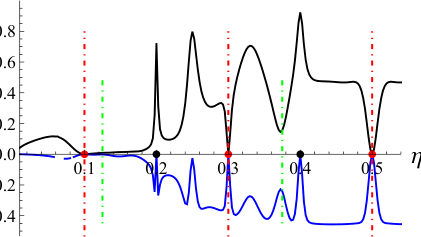 
Figure 6. Helix indicators −f1 (blue curve), f2(±η) (black curve) given by (54), (55), versus the anisotropy, for system with N = 9 sites. Zeros of f1 are marked by black and red points. Parameters: u = 0.185i, τ = 0.65i, αL = 0, αR = αL + u. Top Panel: a subset of zeros of f1 (black points ) coincides with the pure helix condition (N +1)η = 0 (mod 2), and corresponds to helices of type (33) (red dashed lines). Helix descendants with one/two kinks correspond to (N + 1 −2mk)η = 0 (mod 2) with mk = 1, 2, and are marked with green/blue dashed lines. Red points mark location of helices with opposite helicity of the form (37), appearing at (N+1)η = 1 (mod 2), see text for more explanations....

**Summary.** The paper provides an exact solution for the steady state of a boundary-driven XYZ quantum circuit. It identifies a new class of robust, chiral, and separable steady states called elliptic spin helices. These states are particularly interesting because they are computationally tractable and potentially easy to implement in experimental settings.

**Why it may be interesting.** This work provides an exact analytical solution for a non-equilibrium system without U(1) symmetry, identifying robust, experimentally accessible chiral states that could be useful for studying many-body dynamics and open quantum systems.

Detailed structure

**Main problem.** Finding the exact many-body density operator for the nonequilibrium steady state (NESS) of a boundary-driven XYZ quantum circuit, generalizing previous XXZ solutions to the fully anisotropic case.

**Main result.** The authors derive an exact solution using a spatially inhomogeneous matrix product ansatz and discover a family of robust, separable, chiral steady states known as 'elliptic brickwork spin helices'.

**Method.** The study employs a two-replica Matrix Product Ansatz (MPA) with an infinite bond dimension, utilizing the algebraic structure of inhomogeneous Lax operators and Jacobi theta functions.

**Model / system.** A 1D brickwork quantum circuit of N+2 qubits with XYZ-type unitary gates, where boundary qubits are subject to reset quantum channels that project them toward arbitrary pure target states.

**Key observables.** Local magnetization profiles (x, y, z components), one-point correlations at the boundary, and helix indicators (f1, f2) measuring purity and distance to the helix state.

**Important parameters / regimes.** Anisotropy parameter (eta), Trotter time step (u), boundary reset parameters (alpha_L, alpha_R), and the modulus of the elliptic theta function (tau).

**Assumptions / limitations.** The derivation assumes the validity of the proposed matrix product ansatz and relies on the algebraic properties of the Yang-Baxter RLL-type relations.

**Figures summary.** Figure 1 illustrates the circuit architecture; Figure 5 and 6 show helix indicators (f1, f2) as functions of anisotropy, identifying the presence of pure helices, descendants with kinks, and different chiralities.

**Paper structure.** The paper introduces the XYZ circuit model, presents the Matrix Product Ansatz solution, describes the discovery of elliptic spin helices, and provides rigorous mathematical proofs in the appendices.

Abstract

We obtain the exact many-body density operator of a boundary-driven XXZ quantum circuit via a spatially inhomogeneous matrix product Ansatz. The Ansatz has formally infinite bond-dimension and generalizes authors' previous construction \cite{2025XXZcircuit} for the XXZ interactions. The boundary qubits are coupled to reset quantum channels that project them toward arbitrary pure target states. We find and describe a family of relatively robust separable chiral nonequilibrium steady states (NESS), which are elliptic analogs of spin helices for the circuit, and which   are particularly attractive from an experimental perspective.

[↑ back to top](#top)

### [Experimental observation of entropic-singularity-induced nonadditive quantum communication in a qutrit platypus channel](http://arxiv.org/abs/2605.17418v1)

**Authors:** Yu Guo, Bo-Xuan Wang, Xiao-Min Hu, Yun-Feng Huang, Chuan-Feng Li, Guang-Can Guo, Bi-Heng Liu  
**Type:** experiment · **Category:** quantum information and computing · **PDF:** <https://arxiv.org/pdf/2605.17418v1>  
**Analysis basis:** full PDF text, analyzed in chunks
**Topic relevance:** 🔥 `QC/QI experiment` **4/5** · 🔥 `entanglement & information structure` **4/5** · 🔥 `quantum optics experiment` **4/5**

📷 Fig 1

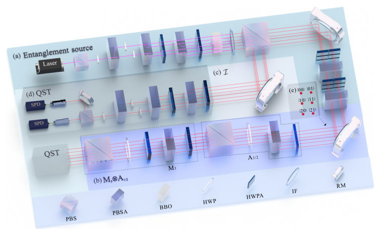 
FIG. 1: Experimental setup. (a) Preparation of the 6-dimensional entangled state. A 404 nm pump laser is expanded into a 2×3 parallel beam array, which coherently pumps a BBO crystal to generate entangled photon pairs via SPDC. The two photons are separated by a PBS, after which one photon undergoes a local unitary operation to achieve the target input states for the channels. (b) Realization of the channel M3 ⊗A1/2 using PBSAs, HWPAs, and a PBS. (d) Quantum state tomography of the 6-dimensional quantum state. (e) Encoding strategy of the six-dimensional path modes. PBS, polarizing beam splitter; HWP, half-wave plate; IF, interference filter; RM, reflection mirror; SPD, single-photon...

📷 Fig 2

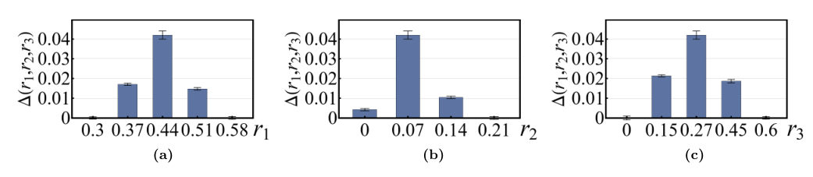 
FIG. 3: Experimental observation of coherent information nonadditivity for the joint channel M3 ⊗A1/2. For the input state ρ(r1, r2, r3), we vary one parameter while fixing the other two at their respective optimal values and experimentally measure the corresponding value of ∆(r1, r2, r3) (blue bars). The error bars are obtained via Monte Carlo simulations.

**Summary.** This paper reports the first experimental observation of nonadditive quantum communication induced by entropic singularities. By using a photonic setup to combine a qutrit platypus channel and an amplitude damping channel, the authors showed that the joint capacity is greater than the sum of individual capacities. This demonstrates that specific types of noise can be exploited to enhance information transmission.

**Why it may be interesting.** This is highly relevant to researchers in open quantum systems and quantum optics as it provides experimental evidence for how singular entropy landscapes in noisy channels can be leveraged to enhance quantum communication rates beyond additive limits.

Detailed structure

**Main problem.** The paper investigates the experimental observation of nonadditivity in quantum channel capacity, specifically whether entropic singularities can drive superadditive quantum communication.

**Main result.** The researchers experimentally demonstrated a violation of additivity by more than 20 standard deviations, showing that the joint coherent information of a qutrit platypus channel and a qubit amplitude damping channel exceeds the sum of their individual capacities.

**Method.** The study uses a photonic platform to implement the channels, employing quantum state and process tomography on 6-dimensional entangled photon states to measure von Neumann entropies and coherent information.

**Model / system.** A photonic implementation using a 6-dimensional entanglement source generated via Spontaneous Parametric Down-Conversion (SPDC) in a BBO crystal, implementing a qutrit platypus channel (M3) and a qubit amplitude damping channel (A1/2).

**Key observables.** Coherent information (Q1), von Neumann entropies of the channel output and environment, and the nonadditivity parameter (Delta).

**Important parameters / regimes.** Damping parameter gamma = 1/2 for the amplitude damping channel; dimension d=3 for the platypus channel; process fidelities exceeding 0.98.

**Assumptions / limitations.** The experiment assumes that the reconstructed density matrices from tomography accurately represent the true quantum states and that the purification method correctly captures the environment's entropy.

**Figures summary.** Figure 1 shows the schematic of the 6D entanglement source, the implementation of the combined M3 and A1/2 channels using optical components, the setup for quantum state tomography, and the encoding strategy for spatial modes.

**Paper structure.** The paper introduces the problem of nonadditivity, describes the experimental photonic setup and channel implementation, details the tomography and measurement methods, presents the results showing the violation of additivity and the role of entropic singularities, and concludes with the implications of the findings.

Abstract

The nonadditivity of channel capacity is a defining feature that distinguishes quantum communication from classical communication. In the quantum realm, the channel capacity is determined by coherent information, which is defined through the von Neumann entropies of the output and its environment. Despite its fundamental importance, experimental evidence of such nonadditive quantum communication has been elusive because of the complexity of the required quantum channel. Here, we experimentally observe entropic-singularity-induced coherent-information nonadditivity using the qutrit platypus channel implemented on a photonic platform. By preparing six-dimensional photonic entanglement, we directly measure the coherent information of a platypus channel, a qubit amplitude damping channel, and their joint uses, revealing a clear violation of additivity. Quantum process tomography further reveals the entropic singularity responsible for this effect, demonstrating how singular entropy landscapes in low-dimensional channels can enhance quantum communication beyond additive limits.

[↑ back to top](#top)

### [A Wafer-Scale Heterogeneous III-V-on-Silicon Nitride Quantum Photonic Platform](http://arxiv.org/abs/2605.17738v1)

**Authors:** Lillian Thiel, Boqiang Shen, Jasper R. Venneberg, Melissa A. Guidry, Nic Arnaud, Adam Slater, Lucas Wang, Xuefeng Li, Josh Castro, Yiming Pang, Max Meunier, Sahil D. Patel, Yang Shen, Theodore Morin, Igor Kudelin, Bowen Song, Kaustubh Asawa, John E. Bowers, Kerry Vahala, Nergis Mavalvala, Xinghui Yin, Steven Bowers, Minh A. Tran, Tin Komljenovic, Galan Moody  
**Type:** experiment · **Category:** quantum information and computing · **PDF:** <https://arxiv.org/pdf/2605.17738v1>  
**Analysis basis:** full PDF text, analyzed in chunks
**Topic relevance:** 🔥 `QC/QI experiment` **4/5** · 🔥 `quantum optics experiment` **4/5** · `entanglement & information structure` **1/5** · `interference shaping light` **1/5** · `quantum measurements` **1/5**

📷 Fig 1

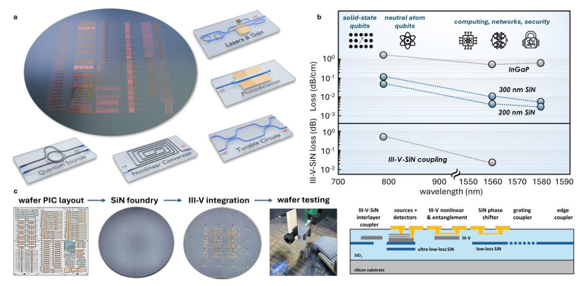 
FIG. 1. Heterogeneous III-V-on-SiN platform. (a) Illustration of our scalable nonlinear quantum photonics platform, which includes quantum entanglement sources, nonlinear frequency conversion and generation, tunable interferometric circuits, high-efficiency integrated photodetectors, and tunable low-noise semiconductor lasers. (b) Measured waveguide propagation losses for the III-V InGaP layer and the two SiN layers, and the measured III-V-to-SiN adiabatic layer transition coupling losses near 1560 nm and 780 nm (c) Wafer fabrication flow from internal modeling, design, and layout to SiN foundry fabrication, back-end-of-line III-V integration, and wafer-scale testing. The right panel...

📷 Fig 2

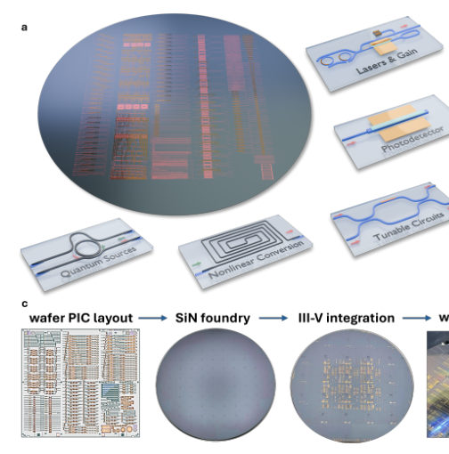 
Figure 2 illustrates the InGaP-on-SiN chiplets and their performance for nonlinear frequency generation and entangled-photon pair sources. The fabrication process is detailed in the supplementary information. After SiO2- clad 200-mm SiN wafers are received from the foundry, they are cored and planarized, leaving a ∼50 nm SiO2 spacer between the 200-nm thick SiN and 105-nm thick InGaP layers. InGaP is direct bonded through an es- tablished process [16, 20], followed by PECVD cladding and metallization for thermal tuning. The top panel of Fig. 2a shows a chiplet with hundreds of add-drop res- onator entangled-pair sources, and the bottom panel is a zoom-in of spiral waveguides for loss...

📷 Fig 3

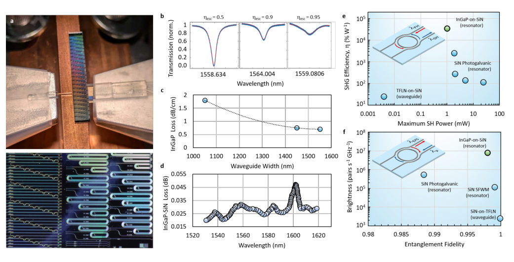 
FIG. 2. InGaP nonlinear frequency generation and entanglement sources on SiN. (a) Images of an InGaP-on- SiN singulated chip under test, including (bottom) add-drop microresonators and up to 10-cm-long spiral waveguides. (b) Representative microresonator transmission spectra near 1560 nm for resonators designed for escape efficiencies of ηesc = 0.5, 0.9, and 0.95 (left-to-right). (c) InGaP propagation loss extracted from microresonator transmission data near 1560 nm versus ring width, demonstrating loss as low as 0.7 dB/cm. (d) Measured III-V-to-SiN adiabatic transition losses for 1550 nm TE modes, demonstrating &lt; 25 mdB coupling loss at 1560 nm. (e) Second harmonic generation (SHG)...

📷 Fig 4

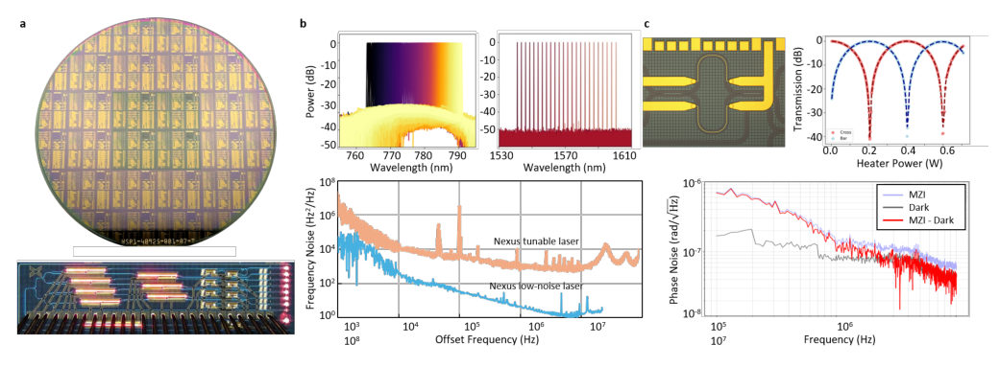 
FIG. 3. Low-Noise and tunable integrated lasers and interferometers. (a) Fabricated SiN wafer with integrated III-V semiconductor lasers and amplifiers, with a multi-channel tunable semiconductor amplifier chip shown in the bottom panel. (b) Both 1560 nm and 780 nm tunable lasers are demonstrated with kilohertz (hertz) level linewidths without (with) injection locking, side-mode suppression ratios as high as 50 dB, and off-chip output power exceeding 10 mW are demonstrated. (c) Integrated Mach Zehnder interferometer with &lt; 6 mdB insertion loss, &gt; 40 dB extinction, and &lt; 0.4 mrad interferometric phase noise (without locking) integrated across 100 kHz to 10 MHz.

📷 Fig 5

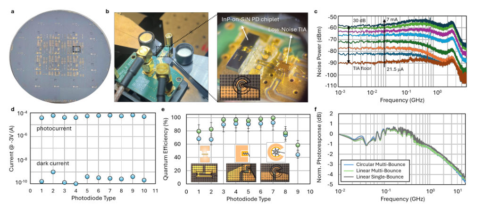 
FIG. 4. High quantum efficiency and low-noise photodetectors. (a) Image of completed InP-on-SiN photodetector wafer. (b) Packaged photodetector chip with low-noise transimpedance amplifier. (c) Electronic noise clearance at 1 mW on-chip optical pump power at 1550 nm and 3-dB bandwidth of the packaged detector and amplifier. (d-f) Dark current, photocurrent, and calibrated quantum efficiency of the different photodetector configurations. Quantum efficiency exceeding 99% is measured for the circular multi-bounce designs. Photodiode Types 1-2: single-bounce reference designs; 3-6: linear multi-bounce designs; 7-9: circular multi-bounce designs. The green and blue points represent nominally...

**Summary.** The researchers have developed a new way to manufacture quantum photonic chips by bonding III-V materials directly onto silicon nitride wafers. This platform allows for the integration of lasers, nonlinear light sources, and high-efficiency detectors on a single, large-scale chip. This advancement is a major step toward building complex, large-scale quantum computers and communication networks.

**Why it may be interesting.** This work is highly relevant to quantum optics and quantum information as it provides a scalable hardware architecture for generating and detecting complex quantum states like squeezed light and entangled photons with extremely high fidelity and low loss.

Detailed structure

**Main problem.** The difficulty of creating scalable, wafer-scale quantum photonic circuits that simultaneously provide ultra-low-loss passive routing, high optical gain, and strong nonlinearities without the losses or scalability issues of previous integration methods.

**Main result.** The demonstration of a wafer-scale III-V-on-SiN platform that integrates high-efficiency nonlinear elements, lasers, and detectors, achieving 15x brighter entanglement sources and near-unity quantum efficiency in photodetectors.

**Method.** Wafer-scale manufacturing using direct bonding of III-V epitaxial stacks onto foundry-fabricated SiN circuits, utilizing adiabatic inverse tapers for interlayer coupling and self-injection locking for laser noise reduction.

**Model / system.** A heterogeneous photonic platform consisting of ultra-low-loss Silicon Nitride (SiN) waveguides integrated with III-V materials (InGaP and InP) for gain, nonlinearity, and detection.

**Key observables.** SiN waveguide loss, InGaP waveguide loss, interlayer coupling loss, SHG efficiency, entangled-photon brightness, two-photon entanglement fidelity, laser linewidth, and photodetector quantum efficiency.

**Important parameters / regimes.** SiN loss < 1 dB/m, InGaP SHG efficiency > 35,000 %/W, entanglement fidelity of 99.9%, photodetector quantum efficiency > 99%, and laser linewidth in the hertz-level regime.

**Figures summary.** Figure 4b shows the integrated homodyne detector setup and a model for squeezing degradation; Figure 4c displays photodetector bandwidth and noise; Figure 5a illustrates the vision for a fully integrated system.

**Paper structure.** The paper introduces the challenge of scalable quantum photonics, describes the fabrication and architecture of the III-V-on-SiN platform, details the characterization of nonlinear sources and active components, analyzes noise and efficiency in the detection system, and concludes with a roadmap for large-scale integration.

Abstract

Heterogeneous integration of gain and strongly nonlinear materials with ultra-low-loss silicon nitride (SiN) photonics offers a route to scalable quantum circuits, but concurrent wafer-scale manufacturability, low interlayer loss, and high performance have been challenging to realize. Here we demonstrate a wafer-scale III-V-on-SiN quantum photonic platform that directly integrates III-V layers to foundry-fabricated SiN circuits. The SiN layer provides 200-300 nm thick waveguides with $<1$ dB/m loss and a mature passive photonics ecosystem, while III-V materials provide large $χ^{\left(2\right)}$ and $χ^{\left(3\right)}$ nonlinearities for parametric gain, frequency conversion and quantum light generation. Adiabatic interlayer couplers yield $<25$ mdB loss to InGaP waveguides and resonators with intrinsic quality factors exceeding $10^6$, enabling $15\times$ brighter entanglement sources and efficient nonlinear conversion on SiN. Integrated components--including low-loss beam splitters, waveguide crossers, and tunable interferometers--are complemented by III-V lasers and InP photodetectors with amplifiers achieving up to $99^{+1}_{-12}\%$ quantum efficiency and $3$ GHz bandwidth. This architecture unites ultra-efficient sources, nonlinear elements and detectors on a wafer-scale, low-loss platform, establishing a path toward large-scale, low-noise quantum photonic systems.

[↑ back to top](#top)

### [Adaptive Real-Time Magnetic Field Tracking beyond Prior Waveform Constraints](http://arxiv.org/abs/2605.17784v1)

**Authors:** Yihan Wang, Xiaofeng Jin, Yuchuan Ming, Jianxiang Miao, Xiao-Ming Lu, M. W. Mitchell, Jia Kong  
**Type:** both · **Category:** other · **PDF:** <https://arxiv.org/pdf/2605.17784v1>  
**Analysis basis:** full PDF text, analyzed in chunks
**Topic relevance:** 🔥 `quantum measurements` **4/5** · `spintronics-quantum-optics interface` **3/5** · `methods for driven-dissipative` **2/5** · `quantum optics experiment` **2/5**

📷 Fig 1

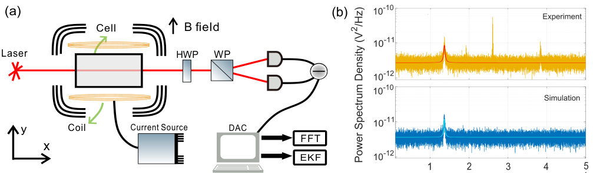 
Figure 1. (a)Experimental schematic. The probe light propagates along x-direction, perpendicular to magnetic field oriented along y-direction, through a 87Rb atomic cell. The atoms precess at the Larmor frequency ω, which is set by current-controlled external magnetic field. According to the Faraday effect, spin fluctuations induce S2 Stokes component fluctuations in the probe light, detected by a balanced photodetector and processed by a data acquisition card (DAC). HWP: half wave plate, WP: Wollaston prism. (b)Spin noise spectra (SNS) obtained from both experiment and simulation via fast Fourier transform (FFT), with light blue and red lines representing the respective fitting curves.

📷 Fig 2

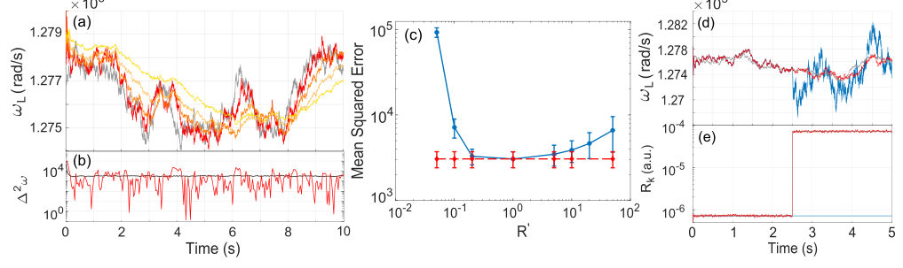 
Figure 2. (a) Larmor frequency ω generated by Eq.(7) with σ2 = 0.1 as the ground truth (gray solid line), together with the corresponding AEKF estimation result (red solid line) with measurement-noise deviation R′ = 1000. Red-orange, orange and yellow traces show EKF estimates with progressively increased measurement-noise deviations, with values of R′ = 50, 100, and 200, respectively. (b) Squared instantaneous estimation error (∆2ω, red solid line) and the variance estimated by the AEKF (black solid line). (c) Mean squared error (MSE) as a function of the estimation performance used in the EKF and AEKF. We evaluate the average instantaneous variance of simulation data and calculate the...

📷 Fig 3

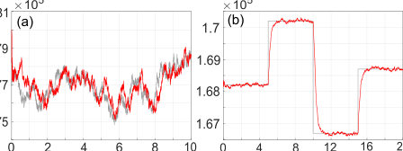 
Figure 3. AEKF-based estimation results for magnetic fields with unknown temporal variations. The true magnetic-field dynamics (gray solid line) and the corresponding AEKF esti- mates (red solid line) are shown for two representative mod- els: (a) an Ornstein–Uhlenbeck process and (b) a piece-wise constant field, demonstrating good agreement between the es- timates and the true dynamics.

📷 Fig 4

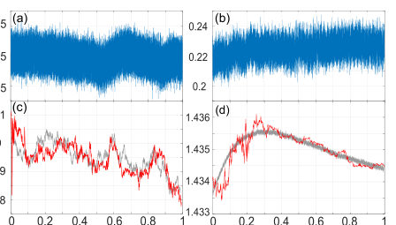 
Figure 4. Experiment results. (a)-(b) Faraday rotation ob- servations detected by BPD with a random-walk and SE-like magnetic field, respectively. Under such low-SNR conditions, the time-domain magnetic signal is obscured by noise, making commonly-employed time-domain fitting challenging. (c)-(d) Random-walk and SM-like magnetic field generated by the signal generator (gray solid line) respectively, together with the corresponding AEKF estimates (red solid line) obtained without prior knowledge of the field-evolution model.

**Summary.** The paper presents an adaptive filtering framework designed to track dynamic magnetic fields in real-time using spin-noise spectroscopy. By dynamically estimating measurement noise, the method overcomes the limitations of traditional filters and can reconstruct weak signals even when the noise levels change abruptly. This allows for the detection of magnetic field variations that are otherwise hidden below the intrinsic sensitivity of standard spectroscopic methods.

**Why it may be interesting.** This work is highly relevant for researchers in quantum sensing and open quantum systems as it provides a robust way to perform real-time parameter estimation in the presence of non-stationary noise and unknown signal dynamics.

Detailed structure

**Main problem.** Extracting weak, time-varying magnetic field signals from high-noise environments where the signal-to-noise ratio is extremely low and the noise statistics may be non-stationary.

**Main result.** The development of an Adaptive Extended Kalman Filter (AEKF) that successfully tracks dynamic magnetic fields, even with massive measurement noise mismatch and without prior knowledge of the signal waveform, outperforming conventional spin-noise spectroscopy.

**Method.** An Adaptive Extended Kalman Filter (AEKF) utilizing the Sage-Husa algorithm and innovation-based adaptive estimation (IAE) with a sliding window to dynamically update measurement noise covariance.

**Model / system.** An 87Rb atomic vapor cell in a magnetic shield using Faraday rotation for detection, where the spin dynamics are governed by the Bloch equations.

**Key observables.** Photocurrent (capturing polarization fluctuations via the Faraday effect) and Larmor precession frequency.

**Important parameters / regimes.** Larmor frequency, relaxation term, spin-noise fluctuation matrix, and measurement noise intensity.

**Assumptions / limitations.** The magnetic field is assumed to be a slowly time-varying variable, and measurement noise is assumed to be Gaussian-distributed.

**Figures summary.** Fig 1 shows the experimental setup and agreement between experimental and simulated spin noise spectra; Fig 2 demonstrates AEKF robustness to noise mismatch and sudden disturbances; Fig 3 shows tracking of various field models; Fig 4 presents experimental reconstruction of random-walk and earthquake-like magnetic signals.

**Paper structure.** The paper introduces the challenge of weak signal extraction, proposes the AEKF framework, validates the method through numerical simulations of various field dynamics, and concludes with experimental demonstration using Rb vapor cells.

Abstract

The extraction of weak signals plays a crucial role in quantum precision measurement, where the estimation results are often limited by low signal-to-noise ratios. Here, we demonstrate a parameter-estimation framework based on the adaptive extended Kalman filter for dynamic magnetic-field estimation in quantum systems using spin-noise measurements -- a challenging regime characterized by weak signals. By modeling the magnetic field as an unknown parameter, the proposed approach alleviates model dependence in state estimation. Furthermore, by introducing an adaptive algorithm with real-time noise estimation, our method overcomes the measurement noise intensity constraints of conventional extended Kalman filtering and enhances its practical applicability. Numerical simulations covering three representative magnetic-field dynamics validate the capability of the proposed framework, while experimental results demonstrate successful tracking of a seismo-magnetic-like signal beyond the intrinsic sensitivity of conventional spin-noise spectroscopy.

[↑ back to top](#top)

### [Basis- and Channel-Selective Quantum Photodetection](http://arxiv.org/abs/2605.16886v1)

**Authors:** Mohamed Hatifi, Brian Stout  
**Type:** theory · **Category:** quantum information and computing · **PDF:** <https://arxiv.org/pdf/2605.16886v1>  
**Analysis basis:** full PDF text, analyzed in chunks
**Topic relevance:** 🔥 `quantum measurements` **4/5** · `interference shaping light` **3/5** · `correlated / nonlocal dissipation` **2/5** · `free-space correlated emission` **2/5**

📷 Fig 1

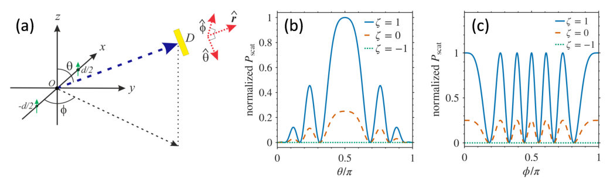 
Figure 1. Two-dipole far-field reference geometry for generalized electric–magnetic photodetection. (a) Two in-phase Hertzian dipoles with moments oriented along ˆz are placed at positions ±d/2 and observed by a far-field detector D. The local detector frame resolves the radiated electric and magnetic components through the generalized detection amplitude b O ∝ue·bE(+) + ζ um·bF(+), with bF(+) = cbB(+). (b,c) Normalized radiative detection probability Pscat for the polar cut ϕ = 0 and the azimuthal cut θ = π/2, respectively, for d = 3λ. The electric-only Glauber response corresponds to ζ = 0, while ζ = 1 gives constructive electric–magnetic addition and ζ = −1 gives complete cancellation of...

📷 Fig 2

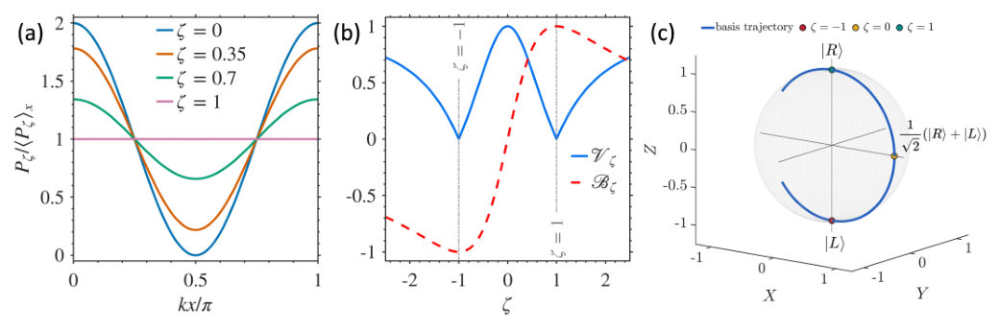 
Figure 2. Detector-defined single-photon interference in the two-mode geometry. (a) Normalized detection probability Pζ(x)/⟨Pζ⟩x for representative real values of the electric–magnetic response parameter ζ. As ζ approaches the balanced value ζ = 1, the detector becomes sensitive to a single propagation direction and the fringe visibility is suppressed, even though the single-photon state remains coherent. (b) Visibility Vζ and signed path bias Bζ for real ζ. The vertical dashed lines mark ζ = ±1, where the detector selects one of the two propagation directions and the visibility vanishes. The curves satisfy the complementarity relation V2 ζ +|Bζ|2 = 1, showing that the loss of visibility...

📷 Fig 3

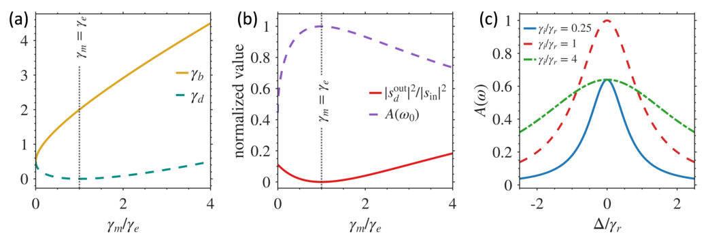 
Figure 3. Scattering-dark yet absorptive response of a lossy electric–magnetic detector resonance. (a) Bright and dark radiative rates γb and γd as functions of the magnetic-to-electric coupling ratio γm/γe. At the balanced point γm = γe, the dark-channel rate vanishes, γd = 0, while the bright channel remains coupled. (b) Normalized dark-channel output |sout d |2/|sin|2 and resonant absorption A(ω0) for a matched bright input mode. At the balanced point, the monitored dark output is suppressed by destructive electric–magnetic reradiation, whereas the absorption remains finite and reaches unity here because the internal loss is chosen at critical coupling, γi = γr. (c) Absorption spectrum...

**Summary.** This paper proposes a generalized theory of photodetection that includes both electric and magnetic field sensitivities. It demonstrates that by engineering these responses, one can actively control the measurement basis of single photons and create detectors that absorb light without emitting detectable radiation. This offers a new design principle for advanced quantum sensors and metamaterial-based detectors.

**Why it may be interesting.** It provides a new way to think about detector engineering in quantum optics and circuit QED, showing that the detector architecture itself can be used as a tool to select measurement bases and control light-matter interaction channels.

Detailed structure

**Main problem.** Standard quantum photodetection models (Glauber theory) rely solely on electric-field response, which fails to account for modern engineered detectors that are sensitive to both electric and magnetic fields.

**Main result.** The authors develop a generalized framework where the detector's electric and magnetic responses can be used to rotate the measurement basis and selectively suppress specific radiative output channels.

**Method.** The study uses an extension of Glauber's theory of optical coherence, POVM formalism, and input-output theory to analyze detection probability and absorption.

**Model / system.** The framework is applied to three scenarios: a far-field two-source dipole geometry, a two-mode single-photon Hilbert space, and a lossy resonant detector model with electric and magnetic coupling.

**Key observables.** Detection probability, first-order visibility, path distinguishability, and absorption fraction.

**Important parameters / regimes.** The complex parameter zeta (ratio of magnetic to electric response), radiative linewidths (gamma_e, gamma_m), and internal decay rate (gamma_i).

**Assumptions / limitations.** The model is presented as an effective description of engineered electromagnetic responses.

**Figures summary.** Figure 1 shows the two-dipole geometry and detection amplitude cancellation; Figure 2 illustrates detector-defined interference, visibility/path-bias relations, and Bloch sphere representation; Figure 3 shows radiative rates and the relationship between output channels and absorption.

**Paper structure.** The paper introduces a generalized detection operator, applies it to far-field interference, extends the analysis to single-photon basis rotation, investigates resonant absorption and channel selection, and concludes with a design principle for engineered detectors.

Abstract

Photodetection converts optical quantum states into measurement events, but the usual electric-field response model becomes restrictive when the detector response is shaped by cavity, superconducting, or metamaterial engineering. We develop a generalized quantum photodetection framework in which electric and magnetic field amplitudes contribute coherently to the detection operator, and analyze it in a far-field two-source geometry, a two-mode single-photon setting, and a lossy resonant detector model. The far-field reference case exhibits complete detector-amplitude cancellation, absent in the electric-only Glauber response, while the single-photon model shows that the detector continuously rotates the effective measurement basis and controls the first-order visibility via an exact closed-form law. In the resonant realization, a monitored radiative output channel can be dark while the detector remains internally excited and absorptive, with unit absorption of the matched input mode at critical coupling. These results identify basis-selective readout and channel-selective absorption as experimentally relevant signatures of engineered electric-magnetic photodetection.

[↑ back to top](#top)

### [Efficient Hamiltonian Engineering for Adiabatic MIS Algorithms](http://arxiv.org/abs/2605.16944v1)

**Authors:** Guy Karni, Noam Cohen, Adi Pick  
**Type:** theory · **Category:** quantum information and computing · **PDF:** <https://arxiv.org/pdf/2605.16944v1>  
**Analysis basis:** full PDF text, analyzed in chunks
**Topic relevance:** 🔥 `Rydberg arrays` **4/5** · `analog quantum simulation` **3/5** · `exotic spin models in light-matter` **2/5** · `non-equilibrium dynamics` **2/5**

📷 Fig 1

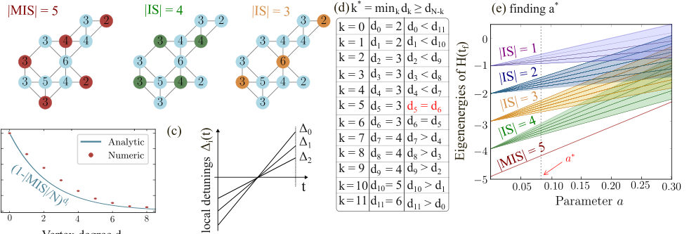 
Fig. 1. (a) King’s graph with vertices labeled by their degrees. Colored vertices highlight independent sets (IS) of size 3, 4, and 5. (b) Probability that a vertex belongs to the MIS versus degree. Numerical average over 10,000 King’s graphs (red) is compared with the analytic estimate (blue). (c) The LD-AQC algorithm uses linear detuning profiles, ∆i(t), with smaller degrees corresponding to larger slopes. (d-e) The LD-AQC algorithm (Alg. 0) requires finding a critical size (k∗) and detuning parameter (a∗). The former is found using the sorted degree table (d) while the latter is found using the eigenvalues of the parameterized Hamiltonian at the final time H(tf; a) [Eq. (1)] (e). The...

📷 Fig 2

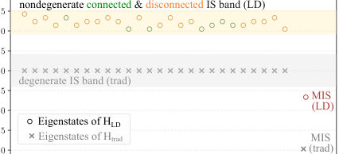 
Fig. 2. (a) A representative graph marking the MIS (red) and two independent sets (IS) of size |MIS| −1: a connected IS, which is subset of the MIS (green), and a disconnected IS, which is not (yellow). The shaded nodes indicate vertices that are not common to all three sets. (b) Eigenvalue spec- trum of H [Eq. (1)] at tf, sorted by the number of Rydberg excitations. The degenerate IS band in the traditional AQC is shaded in gray, while the non-degenerate IS band in the LD-AQC is shaded in yellow. Connected and disconnected IS states are denoted by green and orange circles respectively.

📷 Fig 3

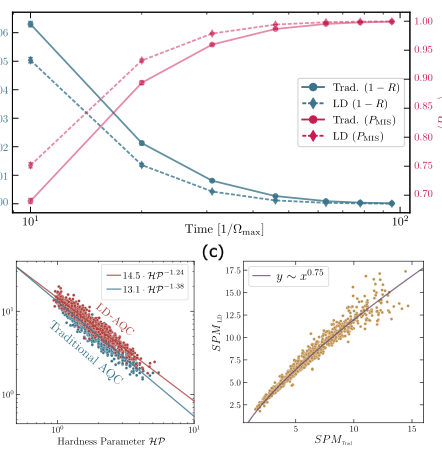 
Fig. 3. (a) Benchmarking performance of the traditional and LD-AQC algorithms. Plotting the average success probability PMIS = |⟨ψMIS|ψ(tf)⟩|2 (right axis) and approximation ratio error 1 −R with R ≡⟨ψ(tf)|ˆn|ψ(tf)⟩(left axis) as a function of protocol duration tf, averaged over hundreds of instances of 11-node MIS problems. (b) Success probability metric, SPM ≡−log(1 −PMIS), evaluated against the hardness pa- rameter HP for the graph ensemble from (a). (c) The SPM of LD-AQC vs. the traditional algorithm, for the data from (a,b).

📷 Fig 4

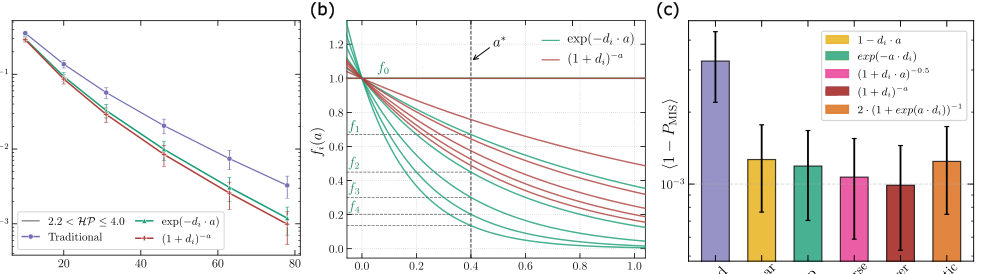 
Fig. 4. (a) Average infidelity ⟨1 −PMIS⟩versus total protocol time for specific hardest graphs subset (2.2 &lt; HP ≤4.0). The traditional homogeneous AQC (purple) is compared against local detuning utilizing exponential (green) and inverse-power (red) functions. (b) Dependence of the local detuning function fi(a) on the control parameter a. The green curves correspond to the exponential profile fi(a) = exp(−dia), while red represent the power-law profile fi(a) = (1 + di)−a, evaluated for di = 0, . . . , 5. (c) Average infidelity ⟨1 −PMIS⟩for tf · Ωmax = 25π for a graph ensemble, comparing six scaling functions, fi(a).

📷 Fig 5

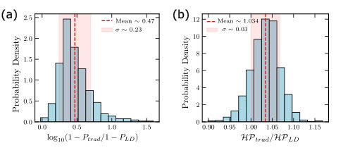 
Fig. 5. Statistical analysis of the data presented in Fig.3. (a) Probability density of the logarithmic error ratio, log10[(1 − Ptrad)/(1 −PLD)]. (b) Probability density of the hardness parameter ratio, HPtrad/HPLD.

**Summary.** The paper introduces a new adiabatic quantum algorithm for the Maximum Independent Set problem using local, degree-dependent detuning in Rydberg atom arrays. By engineering the Hamiltonian to favor low-degree nodes, the method suppresses trap states and significantly improves the success probability and scaling compared to traditional global control methods.

**Why it may be interesting.** This work is highly relevant for researchers in many-body dynamics and quantum control, as it demonstrates how spatially-dependent Hamiltonian engineering can be used to manipulate spectral gaps and suppress transitions into unwanted many-body states.

Detailed structure

**Main problem.** Improving the efficiency of Adiabatic Quantum Computation (AQC) for solving the Maximum Independent Set (MIS) problem by addressing the shrinking spectral gap and the presence of trap states.

**Main result.** The proposed Local Degree-dependent AQC (LD-AQC) outperforms traditional global controls, achieving higher success probabilities and a 25% reduction in the fidelity decay rate as problem hardness increases.

**Method.** The authors implement a Hamiltonian engineering approach using degree-dependent local detuning profiles that preferentially excite atoms with low local degrees, combined with a classical preprocessing algorithm (Algorithm 0) to optimize detuning parameters.

**Model / system.** The study uses Rydberg atom arrays (neutral atom arrays) where the MIS problem is mapped to the preparation of a state with maximal Rydberg excitations under a Hamiltonian with Rydberg-Rydberg interactions.

**Key observables.** Success probability (P_MIS), approximation ratio error, average infidelity, and the hardness parameter (HP_trad and HP_LD).

**Important parameters / regimes.** Local degree (d_i), detuning profiles (linear, exponential, power-law), protocol duration (t_f), and the energy difference function (D_k(a)).

**Assumptions / limitations.** The existence of optimal parameters (a*) is assumed for general detuning functions; the Rydberg blockade interaction is assumed to be sufficiently strong (U > delta_0^2 * f_max) to prevent unwanted excitations.

**Figures summary.** Figures illustrate the energy spectrum lifting degeneracy in the IS band, benchmarking plots showing superior success probability and lower error for LD-AQC, and scaling analysis of the success probability metric against hardness parameters.

**Paper structure.** The paper introduces the MIS problem in AQC, describes the LD-AQC Hamiltonian engineering method, presents a classical algorithm for parameter optimization, provides mathematical proofs for energy gap maintenance, and concludes with numerical simulations and scaling analysis.

Abstract

We present a hybrid adiabatic algorithm for maximum independent set (MIS) using Rydberg atom arrays. We engineer local controls that preferentially excite atoms with few neighbors, which represent graph nodes with small degrees. Numerical simulations show that the designed pulses accelerate convergence to the MIS state and suppress population in trap states. We obtain higher success probabilities than traditional global controls and a $25\%$ reduction in fidelity decay rate as problem hardness increases.

[↑ back to top](#top)

### [Linear-optical test of quantum contextuality with sequential measurements](http://arxiv.org/abs/2605.18112v1)

**Authors:** Jiaqi Liu, Bita Olamaei, Lijian Zhang, Ali Asadian, Saleh Rahimi-Keshari  
**Type:** experiment · **Category:** quantum information and computing · **PDF:** <https://arxiv.org/pdf/2605.18112v1>  
**Analysis basis:** full PDF text, analyzed in chunks
**Topic relevance:** 🔥 `QC/QI experiment` **4/5** · 🔥 `quantum optics experiment` **4/5** · `quantum measurements` **3/5**

📷 Fig 1

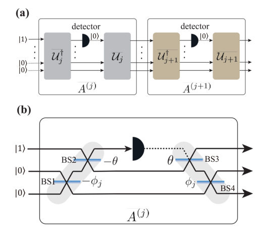 
FIG. 1. (a) Setup for the implementation of the KCBS non- contextuality test. Our system consists of a single photon distributed over M modes, which can model any quantum sys- tem with an M-dimensional Hilbert space. Measurement A(j)

📷 Fig 2

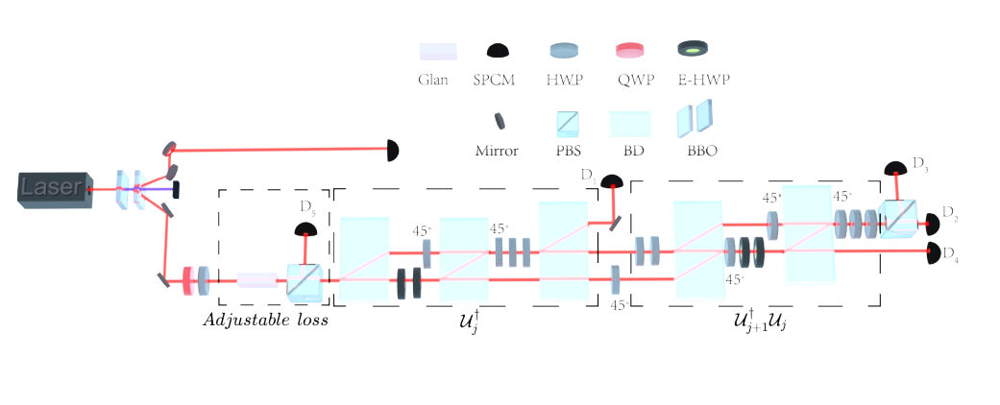 
FIG. 2. Experimental setup. A pulsed Ti:Sapphire laser is frequency doubled via parametric up-conversion in the first β- barium borate (BBO) crystal; the resulting second harmonic then pumps a second BBO crystal to generate photon pairs via spontaneous parametric down-conversion. One photon is routed through a Glan polarizer and a polarizing beam splitter (PBS) into the optical path, while the other (heralding photon) is directly coupled into a single-photon counting module (SPCM). The device within the dashed box is used to simulate photon loss in the optical path. The first three beam displacers (BDs) implement the unitary transformation U† j , and the subsequent two beam displacers...

📷 Fig 3

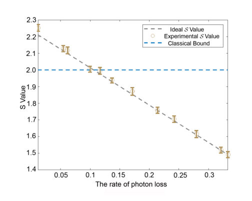 
FIG. 3. The extent of violation of the KCBS inequality is quantified by how much the KCBS value S exceeds the clas- sical bound of 2. The dependence of this quantity on the photon-loss rate is shown, where values above and below 2 correspond to violation and adherence to the inequality, re- spectively. Here, the “Ideal S Value” denotes the theoretical prediction S(ρ1) for the input state ρ1 = ρ00|0⟩⟨0|+ρ11|1⟩1⟨1|, where ρ00 represents the photon-loss rate. The “Experimental S Value” corresponds to the measured data obtained in our experiment. The “Classical Bound” indicates the threshold value in the inequality that separates the classical and quan- tum regimes.

**Summary.** The paper presents an experimental implementation of a Kochen-Specker contextuality test using sequential measurements in a linear-optical setup. By utilizing 'no-click' detection events, the researchers successfully demonstrated a violation of the KCBS inequality. The setup also functions as a practical tool for verifying the quality of single-photon sources and probing photon-number statistics.

**Why it may be interesting.** This work is highly relevant to quantum optics and quantum information as it provides a practical method for certifying non-classicality and single-photon statistics using a robust, loss-tolerant sequential measurement protocol.

Detailed structure

**Main problem.** Demonstrating Kochen-Specker quantum contextuality in a linear-optical setup using sequential measurements while ensuring that the same observable is implemented identically across different contexts.

**Main result.** The authors experimentally demonstrated a clear violation of the KCBS inequality with a value of 2.2363 ± 0.0041 and showed that the setup can serve as a tool for verifying single-photon sources and photon-number statistics.

**Method.** A sequential measurement scheme is implemented using linear-optical networks and on-off photodetectors, where 'no-click' events are used to preserve the photon for subsequent measurements.

**Model / system.** A single-photon system distributed among M bosonic modes, implemented via a linear-optical setup using a pulsed Ti:SAG laser, BBO crystals for SPDC, and a hybrid encoding of spatial paths and polarization.

**Key observables.** The KCBS parameter S, which quantifies the violation of the Kochen-Specker inequality.

**Important parameters / regimes.** The single-photon population density (rho_11), photon-loss rate (rho_00), and the amplitude of coherent states (alpha).

**Assumptions / limitations.** The fair-sampling assumption and the trusted-device assumption for the experimental components.

**Figures summary.** Figure 1 illustrates the experimental setup and the sequential measurement scheme; Figure 2 shows the physical components like beam displacers and wave plates; Figure 3 depicts the dependence of the KCBS quantity on the photon-loss rate.

**Paper structure.** The paper introduces the problem of contextuality, describes the proposed sequential measurement scheme and mathematical framework, details the experimental implementation and setup, presents the results of the KCBS violation and robustness to loss, and concludes with applications for photon-number verification.

Abstract

Quantum contextuality provides a fundamental signature of nonclassical behavior that cannot be explained by noncontextual hidden-variable models. We propose and experimentally implement a linear-optical setup for demonstrating Kochen-Specker contextuality via a violation of the KCBS inequality using single photons. Our scheme employs sequential measurements realized with linear-optical networks and on-off photodetectors. The construction ensures that each co-measured observable is implemented by the same physical operation across different contexts. Our experimental results demonstrate a clear violation of the KCBS inequality and robustness against photon loss. Beyond fundamental investigations, the proposed setup provides a practical tool for probing non-classicality and photon-number statistics of quantum states, which in turn enables the verification of single-photon sources.

[↑ back to top](#top)

### [Quantum magic of strongly correlated fermions $-$ the Hubbard dimer](http://arxiv.org/abs/2605.18494v1)

**Authors:** Edoardo Zavatti, Gabriele Bellomia, Massimo Capone  
**Type:** theory · **Category:** strongly correlated electrons · **PDF:** <https://arxiv.org/pdf/2605.18494v1>  
**Analysis basis:** full PDF text, analyzed in chunks
**Topic relevance:** 🔥 `entanglement & information structure` **4/5** · `non-equilibrium dynamics` **3/5** · `Keldysh / 2PI / non-Gaussian methods` **2/5** · `correlated / nonlocal dissipation` **2/5**

📷 Fig 1

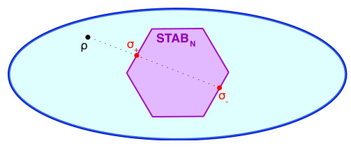 
FIG. 1: Geometric interpretation of the robustness of magic. The hexagon represents the stabilizer polytope STABN for N = 1, i.e. all possible convex combinations of single qubit stabilizer states. Its vertices correspond to pure stabilizer states. The highlighted points correspond to the two (mixed) stabilizer states σ± such that the decomposition ρ = (1 + s)σ+ −sσ−is optimal. This is analogous to the formulation given in Eq. (1).

📷 Fig 2

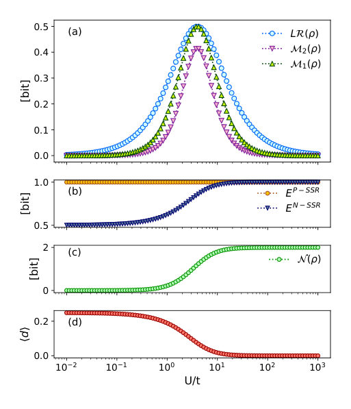 
FIG. 2: Non-stabilizerness measures (panel a), inter- site entanglement under parity (P-SSR) and charge (N- SSR) super-selection rules (panel b), non-Gaussianity per site (panel c) and double occupancy (panel d) as functions of U/t for the pure ground state of the Hubbard dimer at zero temperature. Non-stabilizerness, entanglement and non- Gaussianity are expressed in bits (units of log(2)).

📷 Fig 3

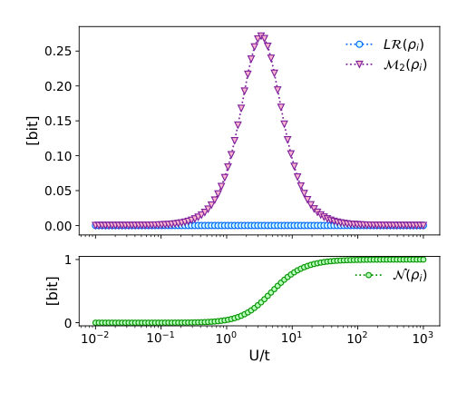 
FIG. 3: Top panel: Local non-stabilizerness as a function of U/t, measured for the one-site reduced density matrix of the Hubbard dimer. While the system is clearly devoid of local magic, this is correctly captured only by LR, while the 2-SRE is everywhere non-zero. Bottom panel: local non-Gaussianity. Unlike magic and entanglement, non-Gaussianity is zero only at U = 0, highlighting the different nature of these quantities.

📷 Fig 4

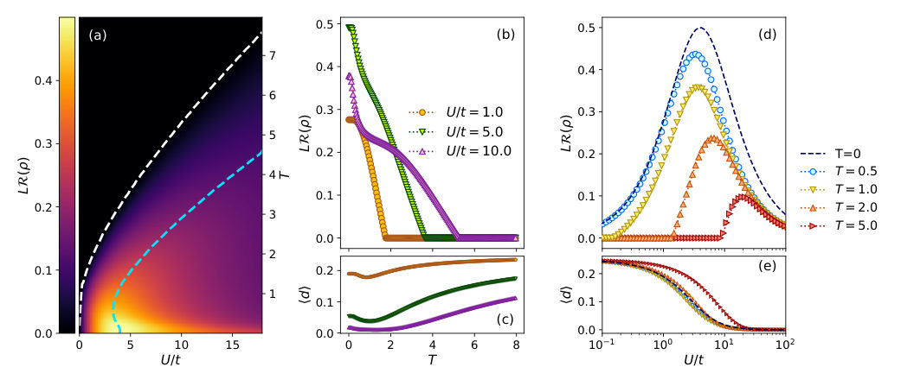 
FIG. 4: Log-free robustness of magic for the Hubbard dimer at finite temperature. In (a) we display the U vs T phase diagram, showing that non-stabilizerness disappears in the region of large temperature and small Coulomb repulsion. The dashed white line represents the line of critical temperature Tc(U/t) where the magic drops to zero, while the dashed azure line marks the maximum of non-stabilizerness at each temperature. We further display the evolution of LR(ρ) and of the double occupancy ⟨d⟩as functions of temperature for fixed Coulomb repulsion in (b) and (c), while in (d) and (e) as functions of U/t in log-scale.

📷 Fig 5

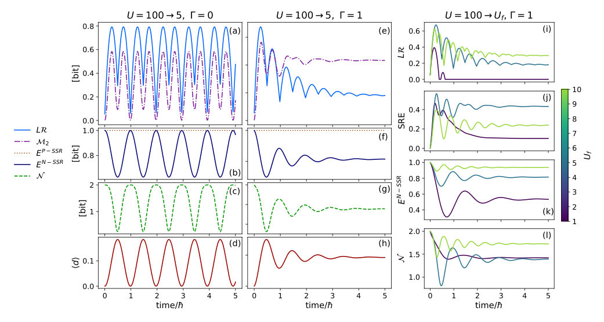 
FIG. 5: Dynamics of non-stabilizerness after a quench at t = 0. Panels (a) and (e) display the evolution of LR and the 2-SRE, (b) and (f) of the inter-site entanglement under SSRs, (c) and (g) of the non-Gaussianity, and finally (d) and (h) of the double occupancy, after a quench from U = 100 to U = 5. When dephasing is absent (Γ = 0), non-stabilizerness oscillates periodically, while in presence of dephasing (Γ &gt; 0) it saturates to a constant value. Panels (i) and (j) show the evolution of LR and of the 2-SRE respectively, for different values of the final value of the quench Uf. While the 2-SRE always saturates to non-zero values, LR can become zero after some time, due to the mixing...

**Summary.** This paper investigates the 'quantum magic' of the Hubbard dimer, demonstrating that non-stabilizerness is a fundamental resource distinct from entanglement and non-Gaussianity. It shows that this magic peaks during electron localization and can be destroyed by temperature or dephasing. The work also highlights the unreliability of certain entropy-based measures for mixed fermionic states.

**Why it may be interesting.** It provides a deep look into how quantum complexity resources behave under thermalization and decoherence, which is highly relevant to the study of open quantum systems and many-body dynamics.

Detailed structure

**Main problem.** The study aims to quantify 'quantum magic' (non-stabilizerness) in strongly correlated fermionic systems and determine if it serves as a distinct quantum resource compared to entanglement and non-Gaussianity.

**Main result.** Non-stabilizerness is identified as a unique resource that peaks during the transition to electron localization and can vanish due to thermal or dynamical processes, providing insights missed by traditional measures.

**Method.** The authors use exact analytical solutions for the Hubbard dimer to evaluate various complexity metrics, including robustness of magic, stabilizer Renyi entropy, and fermionic non-Gaussianity.

**Model / system.** The system is the Hubbard dimer, a two-site Hubbard model at half-filling characterized by a hopping amplitude (t) and local Coulomb repulsion (U).

**Key observables.** Non-stabilizerness (robustness of magic and stabilizer Renyi entropy), fermionic non-Gaussianity, inter-site entanglement under superselection rules, and double occupancy.

**Important parameters / regimes.** Interaction strength ratio (U/t), temperature (T), and dephasing rate (Gamma) during quantum quenches.

**Assumptions / limitations.** The study is limited to the two-site Hubbard model, which is a simplified version of more complex many-body systems.

**Figures summary.** Figure 1 shows a geometric interpretation of the robustness of magic; Figure 2 compares non-stabilizerness, entanglement, and non-Gaussianity; Figure 7 illustrates how magic vanishes in certain density matrix mixtures.

**Paper structure.** The paper introduces the concept of magic, presents exact solutions for the Hubbard dimer, analyzes zero- and finite-temperature properties, explores non-equilibrium quench dynamics with decoherence, and compares magic to other complexity measures.

Abstract

We study the non-stabilizerness (quantum magic) content of the Hubbard dimer, an analytically solvable, yet completely non-trivial, model of strongly correlated fermions. We can access zero- and finite-temperature properties as well as the time evolution in a quantum quench protocol. We evaluate local and nonlocal non-stabilizerness using both the robustness of magic and the stabilizer Renyi entropy, demonstrating how the latter often fails in detecting the mixed stabilizer states that are typically found in this kind of systems. Finally, we compare the non-stabilizerness with other genuine resources of quantum-state complexity, i.e., the fermionic non-Gaussianity and the superselected two-site entanglement. Our findings corroborate the notion of non-stabilizerness as a fundamentally different quantum resource, able to give profound insights that are missed by more traditional information-theoretic quantities.

[↑ back to top](#top)

### [Zeno-Assisted Quantum Heat Engines](http://arxiv.org/abs/2605.18367v1)

**Authors:** Selma Memić, Rafael Wagner, Susana F. Huelga, Martin B. Plenio  
**Type:** theory · **Category:** statistical mechanics · **PDF:** <https://arxiv.org/pdf/2605.18367v1>  
**Analysis basis:** full PDF text, analyzed in chunks
**Topic relevance:** 🔥 `quantum measurements` **4/5** · `non-equilibrium dynamics` **3/5** · `correlated / nonlocal dissipation` **2/5** · `methods for driven-dissipative` **2/5**

📷 Fig 1

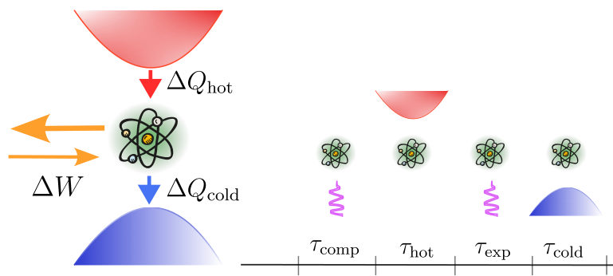 
FIG. 1. Four-stroke quantum heat engine operating an Otto cycle. (Left) A single working system HS interacts alternately with two thermal baths, HBhot and HBcold, at inverse temperatures βh = T −1 h and βc = T −1 c , respectively. The labeled arrows indicate the average heat and work flows according to the sign convention adopted later in the text. (Right) The cycle consists of four strokes: an adiabatic compression, a hot isochoric thermalization, an adiabatic expansion, and a cold isochoric thermalization. During the work strokes the working medium is isolated from the baths and evolves unitarily; during each heat stroke it interacts with only one bath.

📷 Fig 2

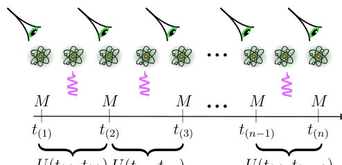 
FIG. 3. Quantum Zeno drive. An interval 0 ≤t(1) ≤t ≤ t(n) is subdivided into n intervals δt(k) = t(k+1)−t(k) = (t(n)− t(1))/n for k = 1, . . . , n. At each instant t(k) a projective measurement M is applied to the system. During the intervals δt(k) we drive the system according to a time-dependent Hamiltonian H(t) yielding a unitary U(t(k+1), t(k)). These are sometimes referred to as unitary kicks or pulses. We thus alternate between unitary kicks of duration δt(k) and instantaneous projective measurements M. We refer to this as a time-dependent Zeno-drive.

📷 Fig 3

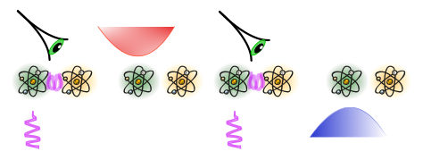 
FIG. 4. Four strokes Zeno-assisted quantum heat engine. The engine shown in Fig. 1 is modified by adding an auxiliary single-qubit system HL = C2 to the working medium, referred to as the quantum lubricant. The engine is operated according to a four-stroke Otto cycle in which the unitary strokes are replaced by those generated by a Zeno- drive: strong time-dependent coupling between system and lubricant, together with frequent monitoring of the lubricant’s state. The heat strokes remain unchanged, with only the system HS brought into contact with the baths.

📷 Fig 4

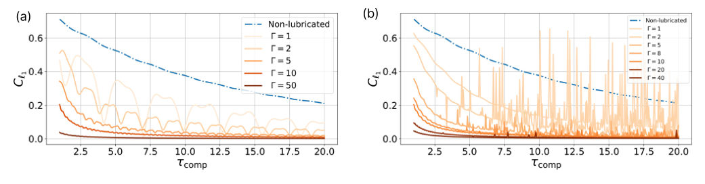 
FIG. 5. Instantaneous coherence in the working system after strong-coupling and Zeno-assisted drives. (a) Coherence quantifier Cℓ1(ρS(t1)|HS(t1)) of the final state ρS(t1) at the end of the compression stroke, relative to the final Hamiltonian HS(t1) = Hhot, as a function of the compression-stroke duration τcomp. The curve is obtained from simulated values sampled every 0.05 in τcomp. The total evolution of the system and the lubricant is generated unitarily by Htot(t) in Eq. (69); the coupling strength is varied by changing Γ from 0 (the non-lubricated case) to 50, approaching the strong-coupling limit. (b) Same coherence quantifier for a finite-time Zeno drive. The curve is obtained from...

📷 Fig 5

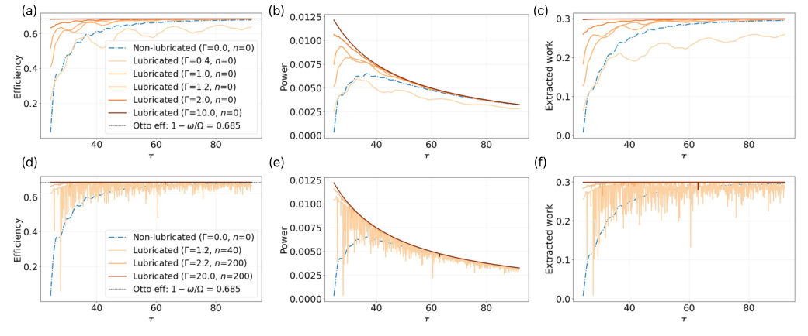 
FIG. 6. Efficiency, power, and extracted work gains from lubrication via the Zeno effect without accounting for thermodynamic costs. The non-lubricated case is shown for comparison, illustrating the detrimental effects of coherence when the work strokes are fast. Panels (a)-(c) show the gains obtained from lubrication in the strong-coupling limit. Panels (d)-(f) show the gains obtained when strong coupling is combined with frequent monitoring of the lubricant. In these, a single trajectory with n measurements is shown for each choice of lubrication parameter. The duration of the cold thermalization stroke is τcold = 12, and that of the hot thermalization stroke is τhot = 5. The duration of...

**Summary.** This paper introduces a new method for 'lubricating' quantum heat engines using Quantum Zeno Dynamics. By coupling the engine to an auxiliary system and monitoring it frequently, the authors show it is possible to suppress quantum friction and achieve high efficiency even during fast, finite-time operations.

**Why it may be interesting.** It provides a unified framework connecting quantum control (shortcuts to adiabaticity) with quantum thermodynamics and the Zeno effect, offering a new way to suppress dissipation in driven open systems.

Detailed structure

**Main problem.** How to mitigate 'quantum friction' (non-adiabatic transitions and coherences) in finite-time quantum heat engines to maintain high efficiency and power.

**Main result.** The authors propose a 'Zeno-assisted' lubrication protocol using strong coupling and frequent monitoring to implement a shortcut to adiabaticity, effectively recovering Otto efficiency at finite driving speeds.

**Method.** The study uses Quantum Zeno Dynamics (QZD) and the framework of adiabatic transporters to derive an effective Hamiltonian in the strong-coupling and frequent-monitoring limits.

**Model / system.** A tripartite quantum Otto engine consisting of a single-qubit working medium coupled to two thermal baths and an auxiliary 'lubricant' qubit system.

**Key observables.** Work extraction, efficiency, power, entropy production, and heat exchange.

**Important parameters / regimes.** Cycle duration (tau), coupling strength (Gamma), energy gaps (omega, Omega), and temperature (Th, Tc).

**Assumptions / limitations.** Markovian Lindblad dynamics for thermalization, the strong-coupling limit (Gamma to infinity), and the Zeno limit (frequent monitoring).

**Figures summary.** Figure 14 illustrates the competition between the strong-coupling regime and the Zeno limit, showing how monitoring in the computational basis can suppress the lubrication effect.

**Paper structure.** The paper introduces the problem of quantum friction, describes the Zeno-assisted protocol, compares it to dephasing-assisted methods, analyzes thermodynamic costs, and provides mathematical proofs in the appendices.

Abstract

Finite-time quantum heat engines (QHEs) typically extract less work than their quasistatic counterparts because fast driving generates coherences and non-adiabatic transitions during the work strokes, a phenomenon commonly referred to as quantum friction. Quantum lubrication denotes a broad class of strategies that use auxiliary systems or controls to mitigate this loss. In this work, we introduce a lubrication protocol based on the quantum Zeno dynamics (QZD). By coupling the working medium to an auxiliary lubricant system and frequently monitoring the lubricant, we confine the joint evolution to a Zeno subspace and obtain an effective shortcut to adiabaticity during the work strokes of a QHE running an Otto cycle. In the ideal Zeno limit, the protocol reproduces the transitionless dynamics required to preserve populations in the instantaneous energy basis and recover the Otto efficiency at finite stroke duration. We also analyze several implementation-dependent thermodynamic costs, including switching, driving, monitoring, and imperfect thermalization, in order to assess how these costs constrain the practical gains in efficiency and power. Our results identify QZD as a conceptually distinct route to quantum lubrication and highlight quantum heat engines as a useful setting in which to study the interplay between strong coupling, measurement, and quantum thermodynamic control.

[↑ back to top](#top)

### [Coherent spectroscopy of collective excitations in superfluid helium far from equilibrium](http://arxiv.org/abs/2605.17835v1)

**Authors:** Gabriel Voith, Alexander A. Milner, Valery Milner  
**Type:** experiment · **Category:** quantum gases · **PDF:** <https://arxiv.org/pdf/2605.17835v1>  
**Analysis basis:** full PDF text, analyzed in chunks
**Topic relevance:** 🔥 `non-equilibrium dynamics` **4/5** · `interference shaping light` **2/5** · `quantum measurements` **2/5** · `quantum optics experiment` **2/5**

📷 Fig 1

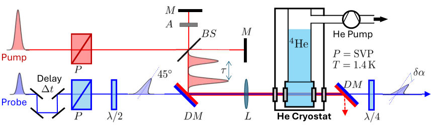 
FIG. 1. Diagram of the experimental setup. Femtosecond pulses with the central wavelength of 798 nm (upper, red) and 399 nm (lower, blue) serve as the pump and probe, respectively. The pulses are linearly polarized at 45◦with respect to one another, combined in a collinear geometry and focused into the bulk liquid helium, kept at the temperature of 1.4 K and saturated vapor pressure (SVP). A Michelson interferometer splits pump pulses into pairs with a variable delay τ and relative amplitude. P: polarizer, M: mirror, A: variable attenuator, BS: beam splitter, DM: dichroic mirror, L:lens, λ/2, λ/4: zero-order half- and quarter-wave plates.

📷 Fig 2

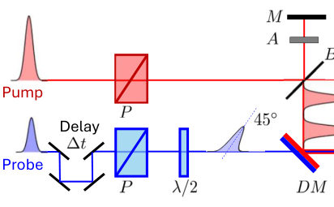 
Figure 2 shows the time-dependent optical birefrin- gence of superfluid helium induced by a single femtosec- ond pump pulse. The oscillatory signal is dominated by the two-roton response around 350 GHz, consistent with our earlier observations [12]. As reported previ- ously, the instantaneous frequency of this signal is not constant but changes on a picosecond timescale. Our re- cent observation that the signal scales linearly with the pump pulse energy [18], with the initial roton frequency remaining unchanged, suggests that the frequency evolu- tion is not driven by laser-induced temperature changes. Instead, we show that the roton signal can be described very well by a superposition of...

📷 Fig 3

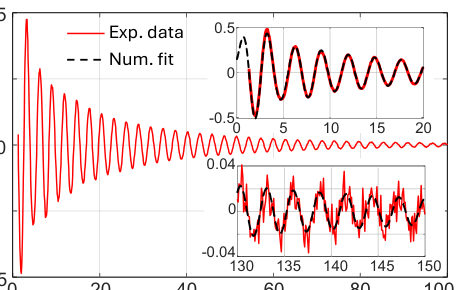 
FIG. 2. Laser-induced optical birefringence of superfluid he- lium at T = 1.4 K and saturated vapor pressure (solid red line). The insets demonstrate the quality of a numerical fit (dashed black) at both early and late times (upper and lower inset, respectively) by a three-frequency model consisting of two roton components and one maxon component (see text for details).

📷 Fig 4

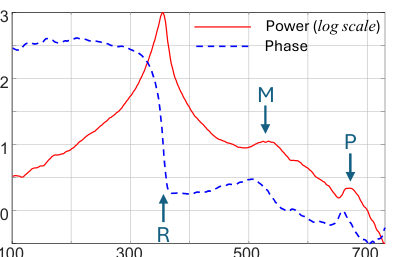 
FIG. 3. Power spectrum (solid red, log scale) and the spectral phase (dashed blue) of the time-dependent signal shown in Fig. 2. The three pronounced peaks correspond to rotons, maxons, and Pitaevskii plateau, and are labeled with ‘R’, ‘M’, and ‘P’, respectively.

📷 Fig 5

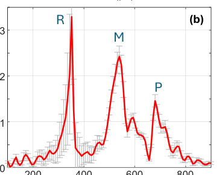 
FIG. 4. (a) Birefringence signal (red solid line) recorded after the excitation by two pump pulses, separated in time by τ = 1.45 ps (as indicated with two vertical arrows). For reference, the response to the second pulse alone (analogous to that in Fig. 2) is shown by the dashed black curve. The power spectrum of the residual signal is shown in panel (b), with the roton (‘R’), maxon (‘M’), and Pitaevskii plateau (‘P’) peaks labeled accordingly.

**Summary.** This paper uses ultrafast laser pulses to perform spectroscopy on collective excitations in superfluid helium far from equilibrium. By using a 'double-kick' method to suppress the dominant roton signal, the authors successfully identified and characterized previously inaccessible maxon and Pitaevskii plateau excitations. The study reveals new insights into the binding energy, lifetime, and phase dynamics of these quasiparticles.

**Why it may be interesting.** This work demonstrates advanced coherent control techniques to isolate weak many-body excitations from a dominant background, which is highly relevant for studying non-equilibrium dynamics and quasiparticle interactions in any strongly interacting quantum system.

Detailed structure

**Main problem.** Exploring the ultrafast, non-equilibrium dynamics of collective excitations in superfluid helium beyond the well-studied roton regime, specifically identifying maxon and Pitaevskii plateau excitations which are obscured by the dominant roton response.

**Main result.** The researchers successfully isolated maxon pairs and Pitaevskii plateau excitations using coherent control, revealing that maxon pairs have a surprisingly large binding energy and an extremely short lifetime compared to rotons.

**Method.** Ultrafast coherent control using sequences of femtosecond infrared pump pulses and a frequency-doubled probe pulse to measure time-resolved optical birefringence via a Michelson interferometer.

**Model / system.** Superfluid Helium-4 at 1.4 K and saturated vapor pressure, studied in a far-from-equilibrium regime using an optical cryostat.

**Key observables.** Time-dependent optical birefringence, power spectrum of the signal, and the spectral phase of the excitations.

**Important parameters / regimes.** Pulse duration of ~70-100 fs, dynamics on picosecond timescales, frequencies in the GHz range (~350-680 GHz), and maxon decay constant of ~3 ps.

**Assumptions / limitations.** The birefringence signal can be modeled as a superposition of decaying sinusoidal components representing different quasiparticle branches.

**Figures summary.** Fig 1 shows the experimental setup; Fig 2 displays time-dependent birefringence and its numerical fit; Fig 3 presents the power spectrum and spectral phase identifying R, M, and P peaks; Fig 4 shows the suppression of rotons via a 'double kick' and the resulting residual spectrum; Fig 5 shows the isolated maxon signal contribution.

**Paper structure.** The paper introduces the problem of studying non-equilibrium excitations, describes the experimental setup and coherent control method, presents the identification of maxon and plateau features through signal suppression, analyzes the energy and phase properties of these excitations, and concludes with the implications for studying strongly interacting quantum fluids.

Abstract

Ultrafast dynamics of collective excitations in superfluids remains largely unexplored beyond the roton regime, despite its importance for understanding nonequilibrium processes in these systems. Here, we employ ultrafast coherent control with sequences of femtosecond pulses to perform spectroscopy of multiple branches of the Landau excitation spectrum in superfluid helium far from equilibrium. By measuring the time-resolved optical birefringence, we track the nonequilibrium dynamics of maxon pairs and Pitaevskii plateau excitations alongside the previously studied roton pairs, revealing surprisingly strong binding energy of maxon pairs, their extremely short lifetime, and the influence of the quasiparticle effective mass on the phase of the coherent response. These results demonstrate the ability to extract previously inaccessible information about collective excitations in a strongly interacting quantum fluid by probing its nonequilibrium dynamics on femtosecond and picosecond timescales.

[↑ back to top](#top)

### [Integrated time-bin entangled quantum light source on a 4H-SiC microring chip](http://arxiv.org/abs/2605.18124v1)

**Authors:** Hong Zeng, Bing-Cheng Yang, Yun-Ru Fan, Li-Ping Zhou, Cheng-Li Wang, Bo-Wen Chen, Ai-Lun Yi, Yong Geng, Guang-Wei Deng, You Wang, Hai-Zhi Song, Jun-Tao Zhang, Hao Li, Li-Xing You, Zi-Hao Zhan, Kai Guo, Xin Ou, Guang-Can Guo, Qiang Zhou  
**Type:** experiment · **Category:** quantum information and computing · **PDF:** <https://arxiv.org/pdf/2605.18124v1>  
**Analysis basis:** full PDF text, analyzed in chunks
**Topic relevance:** 🔥 `QC/QI experiment` **4/5** · 🔥 `quantum optics experiment` **4/5** · `interference shaping light` **2/5**

📷 Fig 1

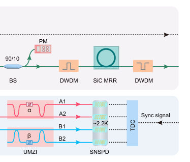 
Fig. 2. Experimental setup for the generation and characterization of integrated time- bin entangled photon pairs. (a) Generation of time-bin entangled photon pairs with plused-laser pump. (b) Correlation property. (c) Time-bin entanglement. CW laser: continuous wave laser, IM: intensity modulator, EDFA: erbium-doped fiber amplifier, AWG: arbitrary waveform generator, VOA: variable optical attenuator, PC: polarization controller, BS: beam splitter, PM: power meter, DWDM: dense wavelength-division multiplexer, SNSPD: superconducting nanowire single-photon detector, TDC: time- to-digital converter, UMZI: unbalanced Mach–Zehnder interferometer. 𝜆𝑠and 𝜆𝑖are wavelengths of signal and idler...

📷 Fig 2

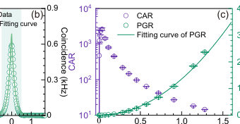 
Fig. 3. Correlated photon pair generation in SiC microring. (a) Single side count rate of the idler photon versus pump power. (b) The left shows the coincidence and accidental coincidence count rate versus pump power. The right is the measured coincidence histogram of the signal and idler photons at ITU-C37 and ITU-C17 under 0.29 mW. (c) Coincidence-to-accidental ratio (CAR) and PGR versus pump power.

📷 Fig 3

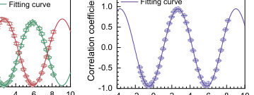 
Fig. 4. Characterization of time-bin entanglement. (a) and (b) Interference fringes as a function of the relative phase. The coincidences are measured between the synchronous electrical signal and photon detection events at four different output port combinations: A1&amp;B1, A1&amp;B2, A2&amp;B1, and A2&amp;B2. (c) Correlation coefficient. (d) Counts of the four UMZI ports and typical post-selection results based on triple coincidence. (e) Real and (f) imaginary parts of the reconstructed density matrix 𝜌for the time-bin entangled state.

**Summary.** This paper demonstrates an integrated 4H-SiC microring resonator that overcomes the traditional trade-off between photon generation efficiency and spectral bandwidth. By optimizing the material's nonlinearity and the resonator's geometry, the authors achieved high-fidelity time-bin entanglement suitable for high-speed quantum networks. This provides a scalable pathway for developing efficient, broadband quantum light sources on a chip.

**Why it may be interesting.** This work is highly relevant to quantum optics and quantum information because it presents a scalable, integrated hardware solution for generating high-rate, broadband entangled photons, which is a critical component for high-speed quantum communication and networking.

Detailed structure

**Main problem.** The efficiency-bandwidth trade-off in cavity-enhanced quantum light sources, where high quality factors increase generation efficiency but narrow the spectral bandwidth, limiting high-speed quantum communication.

**Main result.** The researchers developed an integrated 4H-SiC microring resonator that achieves high photon-pair generation rates and a 1.0 GHz bandwidth, demonstrating time-bin entanglement with 94.37% fidelity and a Bell inequality violation of over 138 standard deviations.

**Method.** The study uses spontaneous four-wave mixing (SFWM) in a 4H-SiC microring resonator, optimizing material nonlinearity and device geometry to decouple efficiency from bandwidth, and characterizes entanglement via quantum state tomography and unbalanced Mach-Zehnder interferometry.

**Model / system.** An integrated 4H-silicon carbide (4H-SiC) microring resonator (MRR) on a photonic integrated circuit, utilizing a 1555.75 nm pulsed pump to generate time-bin entangled photon pairs via third-order nonlinearity.

**Key observables.** Photon-pair generation rate (PGR), coincidence-to-accidental ratio (CAR), interference visibility, Bell inequality violation (CHSH), and quantum state tomography fidelity.

**Important parameters / regimes.** Loaded Q-factors of 1.1-1.9 x 10^5, spectral bandwidth of 1.0-1.7 GHz, photon-pair generation rate of 1.35 x 10^7 s^-1 mW^-2, and a 160 MHz repetition rate.

**Figures summary.** The figures likely illustrate the device geometry, the experimental setup for photon generation and detection, the scaling of photon-pair generation with pump power, and the reconstruction of the density matrix and interference fringes.

**Paper structure.** The paper introduces the efficiency-bandwidth trade-off, describes the 4H-SiC microring resonator platform and optimization strategy, details the experimental setup and photon generation process, presents the characterization of entanglement and generation rates, and concludes with the implications for scalable quantum networks.

Abstract

Integrated time-bin-entangled photon-pair source with cavity-enhanced nonlinear optical processes is essential for quantum information technologies. However, microcavities with a high quality factor inherently introduce a trade-off between generation efficiency and photon bandwidth, which hinders the development of high-speed quantum networks with an integrated source. Here, we address this challenge by optimizing the nonlinearity property of the material and the geometry of the integrated microring resonator with a 4H-silicon carbide platform. Operating at a loaded quality factor of 1.9 $\times$ 10^5 - spectral bandwidth of 1.0 GHz and pumped with 300-ps double pulses separated by 1.25 ns at a repetition rate of 160 MHz, the device achieves a time-bin-entangled photon-pair generation rate of 1.35 $\times$ 10^7 s^-1 mW^-2. A raw visibility of 95.55 $\pm$ 0.18% is measured, showing a violation of Bell's inequality by more than 138 standard deviations, and a fidelity of 94.37 $\pm$ 0.22% is obtained by quantum state tomography. These results provide a scalable pathway to an efficient and broadband time-bin entangled quantum light source, overcoming intrinsic limitations of cavity-based designs and advancing integrated platforms for future quantum communication networks.

[↑ back to top](#top)

### [Ordered POVMs and Residual Collapse](http://arxiv.org/abs/2605.17592v1)

**Authors:** James Tian  
**Type:** theory · **Category:** quantum information and computing · **PDF:** <https://arxiv.org/pdf/2605.17592v1>  
**Analysis basis:** full PDF text, analyzed in chunks
**Topic relevance:** 🔥 `quantum measurements` **4/5** · `entanglement & information structure` **2/5** · `measurement-induced transitions` **2/5** · `methods for driven-dissipative` **2/5**

📷 Fig 1

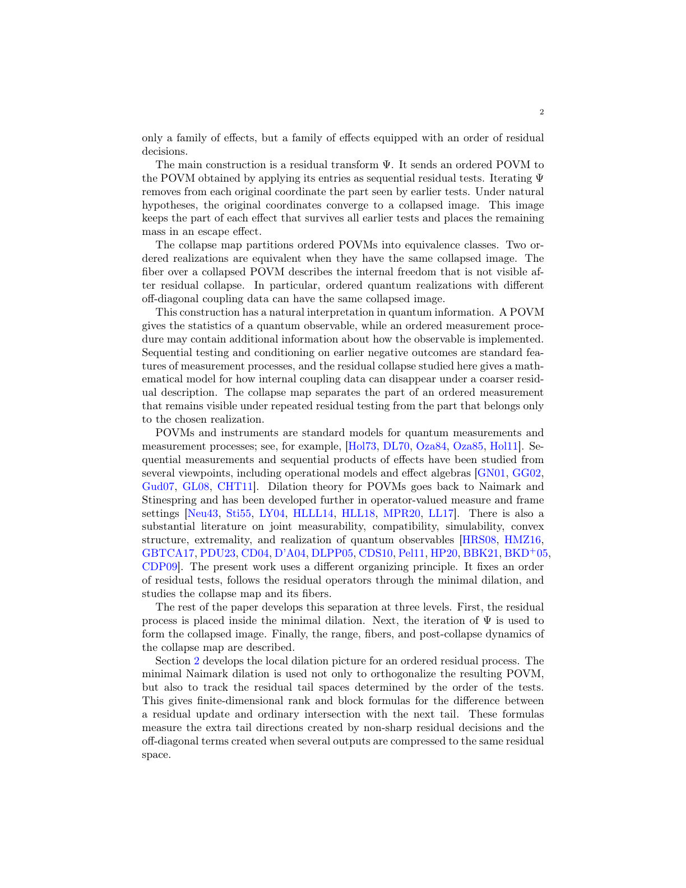 
Low-resolution page preview, page 2

📷 Fig 2

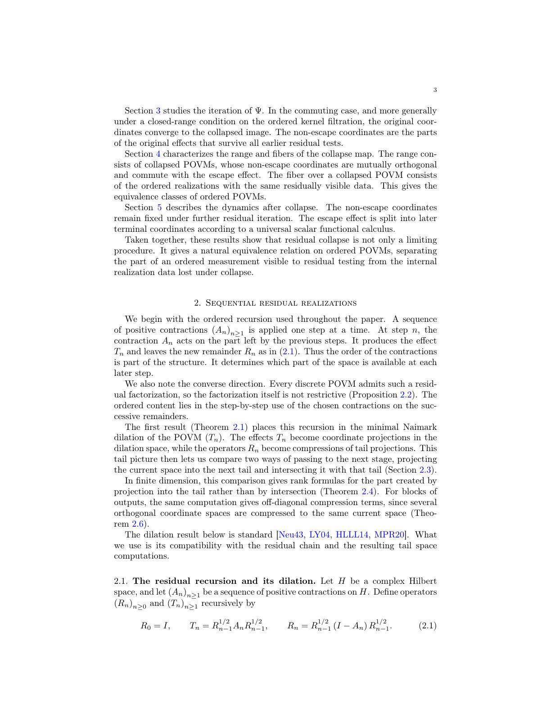 
Low-resolution page preview, page 3

📷 Fig 3

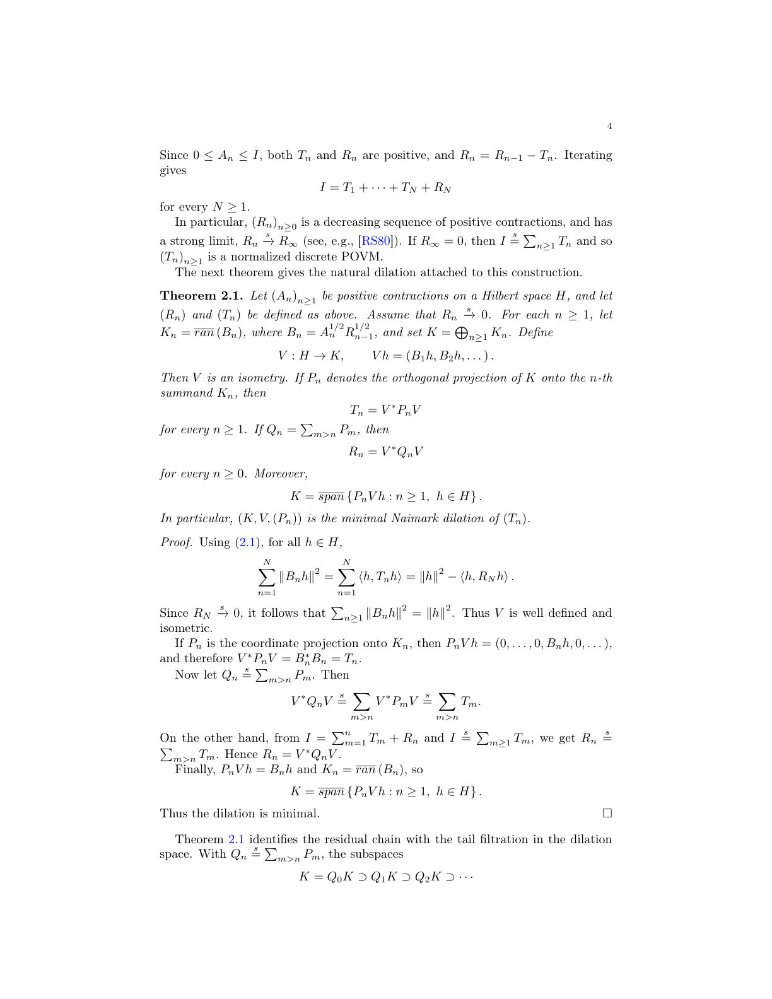 
Low-resolution page preview, page 4

📷 Fig 4

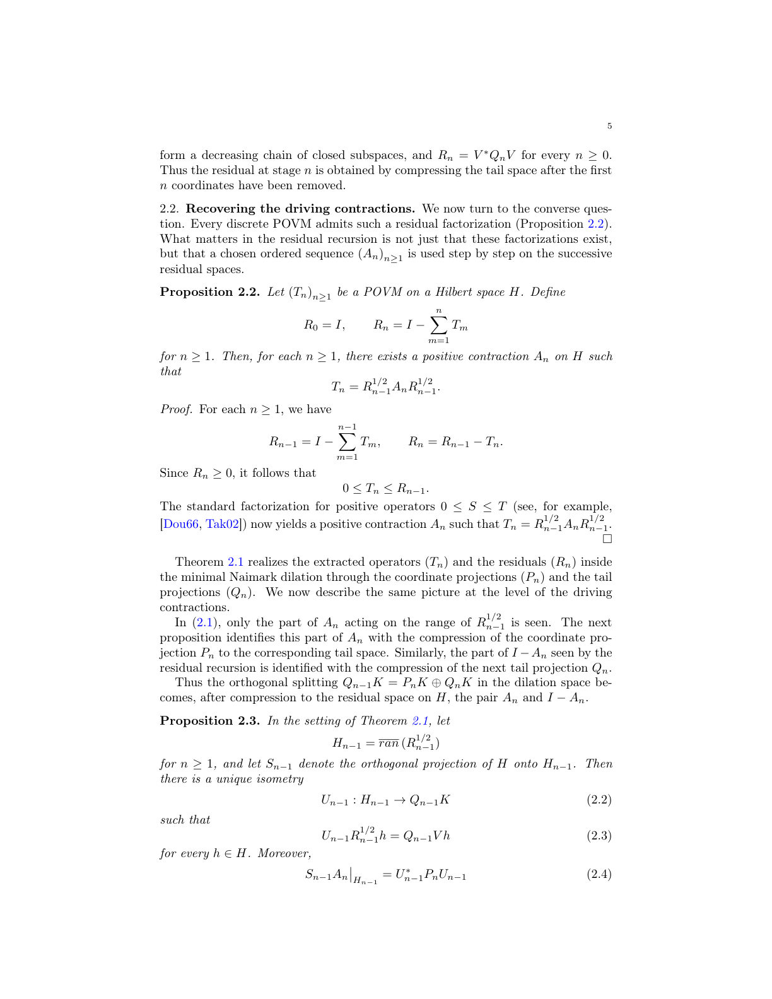 
Low-resolution page preview, page 5

📷 Fig 5

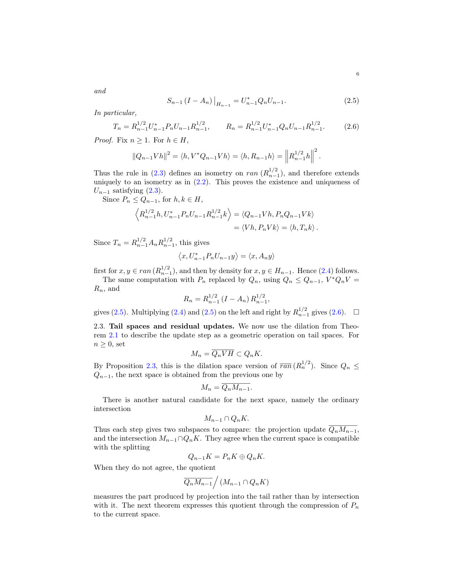 
Low-resolution page preview, page 6

**Summary.** This paper introduces a mathematical framework to study the 'collapse' of sequential quantum measurements into simpler, commutative forms. It characterizes the information lost (such as off-diagonal coherence) when a sequence of measurements is reduced to its essential surviving components. The work provides a rigorous classification of measurement sequences that are equivalent under this residual transformation.

**Why it may be interesting.** This is highly relevant for researchers in quantum measurement and open quantum systems, as it provides a rigorous framework for understanding how information is lost or preserved in sequential, non-commuting measurement protocols and how complex measurement sequences can be reduced to simpler, classical-like structures.

Detailed structure

**Main problem.** The paper investigates the residual structure of ordered Positive Operator-Valued Measures (POVMs) and characterizes how sequential measurement processes can be simplified via a 'residual collapse' map.

**Main result.** The author establishes an equivalence relation on ordered POVM realizations, showing that a collapse map can reduce complex sequential measurements to a commutative, orthogonal set of effects plus a terminal 'escape' effect, while identifying the specific off-diagonal coupling data that is lost during this process.

**Method.** The study uses operator-theoretic methods, including Naimark dilation, residual recursion, and fixed-point analysis of a residual transform, to track the evolution of measurement effects through sequential testing.

**Model / system.** The mathematical model consists of discrete POVMs acting on a Hilbert space, representing a sequence of quantum measurements where each subsequent test is applied to the residual state left after previous tests have failed.

**Key observables.** The effects (outcomes) of the POVM, the residual operators (remaining state mass), and the escape effect (accumulated terminal mass).

**Important parameters / regimes.** The driving positive contractions (A_n) that determine measurement steps, and the spectral gap condition required for norm convergence.

**Assumptions / limitations.** The sequence of contractions must satisfy R_n -> 0 for normalization; norm convergence in infinite dimensions requires a spectral gap condition; and the escape effect must have no spectral mass at 1 for certain iterative limits.

**Paper structure.** The paper begins by defining the residual recursion and transform, moves to analyzing the Naimark dilation and dimension discrepancies in the residual chain, investigates the iterative convergence of the transform to a collapsed POVM, and concludes by characterizing the range and fiber of the collapse map.

Abstract

Ordered realizations of discrete POVMs are studied through a residual transform generated by sequential tests. One application of the transform replaces each coordinate by the effect obtained after all earlier tests have failed, and appends the remaining mass as a terminal outcome. Under natural hypotheses, iterating the transform produces a collapsed POVM whose non-escape coordinates are the parts of the original effects that survive all earlier tests. The resulting collapse map gives an equivalence relation on ordered POVM realizations. Its range and fibers are characterized. The range consists of collapsed POVMs, whose non-escape coordinates are mutually orthogonal and whose support projections strongly sum to the identity. The fiber over a collapsed POVM consists of all ordered realizations with the same residually visible compressions. In particular, different ordered realizations, including ones with different off-diagonal coupling data, can have the same collapsed image. After collapse, the non-escape coordinates are fixed under further residual iteration. The remaining dynamics takes place in the escape effect, which is fragmented by a universal scalar functional calculus.

[↑ back to top](#top)

### [Quantum Optical Soliton Dynamics Beyond Linearization: An Open-System Approach](http://arxiv.org/abs/2605.17025v1)

**Authors:** Chris Gustin, Ryotatsu Yangimoto, Edwin Ng, Hideo Mabuchi  
**Type:** theory · **Category:** other · **PDF:** <https://arxiv.org/pdf/2605.17025v1>  
**Analysis basis:** full PDF text, analyzed in chunks
**Topic relevance:** 🔥 `Keldysh / 2PI / non-Gaussian methods` **4/5** · 🔥 `methods for driven-dissipative` **4/5** · `non-equilibrium dynamics` **2/5**

📷 Fig 1

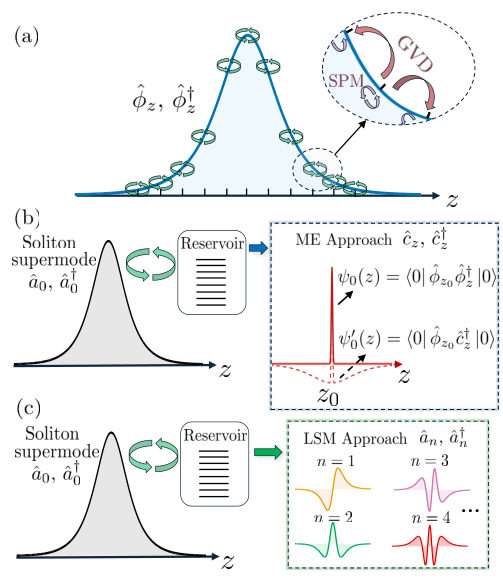 
Figure 1. Schematic of quantum soliton (a) continuum model described by Eq. (1) and (b,c) our reduced approaches using the ME and LSM formalisms, respectively. In (a), the zoom- in shows the self-phase modulation (SPM) self-interactions and group velocity dispersion (GVD) local interactions expe- rienced at each position z along the waveform. In (b,c), the soliton subspace couples to an effective reservoir, which can be represented either as a (b) non-local continuum (ME ap- proach) or (c) as a finite set of LSMs. The ME continuum op- erators ˆc† z create spatially distributed single-photon wavefunc- tions (with a soliton “hole”) ψ′ 0(z) = δ(z −z0) −u0(z0)u0(z). In (c), we show the first...

📷 Fig 2

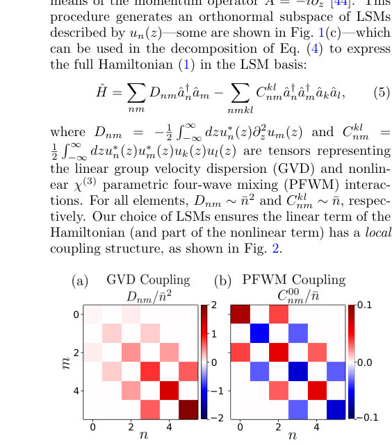 
Figure 2. LSM coupling matrices for (a) GVD-induced linear coupling Dnm and (b) PFWM C00 nm.

📷 Fig 3

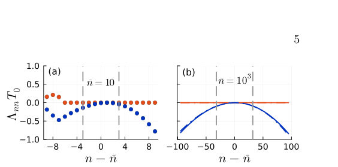 
Figure 3. Real (red) and imaginary (blue) components of the diagonal of the ME dissipator matrix Λnn for (a) ¯n = 10 and (b) ¯n = 1000. In (b) the approximate form which gives the Hamiltonian ˆHeff = ˆH0 + ˆHfluc is shown as dashed lines (omitting the Ω¯n contribution, which arises from L2). The dashed gray lines specify the bounds of one standard deviation ±√¯n of the initial coherent state photon distribution.

📷 Fig 4

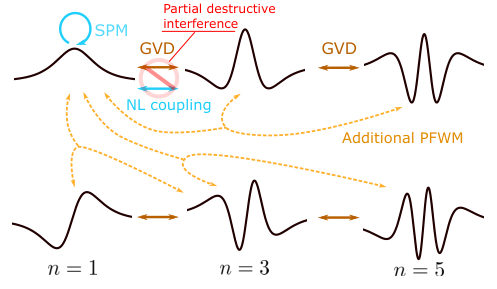 
Figure 4. Illustration of LSM interactions. Dominant GVD- induced linear couplings locally connect supermodes with same parity. In the mean-field, the nonlinear (in the soliton supermode operators) coupling between n = 0 (soliton) and n = 2 LSMs destructively interferes with the GVD-induced coupling to give ˆV1. Quantum-induced soliton perturbation and evaporation via PFWM is dominantly through the 2- reservoir-photon coupling ˆV2 as well as through higher-order ˆVothers, terms which are negligible for larger ¯n.

📷 Fig 5

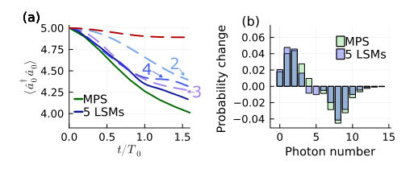 
Figure 6. Simulations of a quantum χ(3) soliton with ¯n = 5. (a) Photon population in the soliton supermode as a function of time for LSM (with varying supermode number; see labels) and MPS theory; the dashed red line corresponds to the 5 LSM model with ˆV2 set to zero. (b) Change in the Fock state probability amplitude in the reduced m = 0 density matrix at time t = 1.4T0 compared with t = 0 for 5 LSMs and MPS.

**Summary.** This paper introduces new theoretical methods to model the quantum evolution of optical solitons beyond the standard linearized regime. By treating the soliton as an open system, the authors successfully capture complex non-Gaussian dynamics and explain why traditional theories underestimate photon loss in the presence of high-order dispersion.

**Why it may be interesting.** It provides powerful computational tools for analyzing non-Gaussian, non-perturbative dynamics in open quantum systems, specifically addressing the breakdown of linearization in mesoscopic bosonic systems.

Detailed structure

**Main problem.** Modeling the quantum dynamics of optical chi(3) solitons in non-perturbative, non-Gaussian regimes where traditional linearization-based methods fail.

**Main result.** The authors develop two effective approaches (LSM and ME) that capture quantum-induced phase shifts and photon loss, and identify that dispersive-coupling-induced soliton broadening causes significant underestimation of dissipation in standard theories.

**Method.** Two approaches: a discrete Lanczos Supermode (LSM) expansion and a continuous Markovian Master Equation (ME) derived via a Born-Markov approximation.

**Model / system.** A quantum chi(3) nonlinear waveguide system described by a field Hamiltonian containing quadratic dispersion and Kerr nonlinearity, treated as an open system where the field is partitioned into a soliton component and a residual reservoir.

**Key observables.** Soliton phase shifts, photon loss (dissipation/evaporation), soliton stability, and quantum-induced soliton diffusion.

**Important parameters / regimes.** Photon number (mesoscopic regime), nonlinearity strength, group velocity dispersion (GVD), and third-order dispersion (TOD).

**Assumptions / limitations.** The ME approach assumes a Markovian reservoir, while the LSM approach assumes dynamics can be localized to a few-supermode basis.

**Figures summary.** Schematic of field partitioning; plots of ME dissipator matrix elements; Wigner function showing non-classical negativity; and comparisons of photon loss rates across LSM, ME, and GSSF models.

**Paper structure.** The paper introduces the open-system framework, details the LSM and ME formalisms, validates them against MPS benchmarks, analyzes stability and phase shifts, and investigates higher-order dispersion effects.

Abstract

We introduce two approaches to modeling the quantum dynamics of optical $χ^{(3)}$ solitons. Taking an open-system viewpoint, we project the underlying quantum field into system (soliton) and residual reservoir components. The reservoir is treated as either (i) a discrete ``Lanczos supermode'' (LSM) expansion which localizes dynamics to a few-supermode basis, or (ii) a non-local environment which can be traced out by deriving a Markovian master equation (ME). Using these methods, we analyze and identify the quantum structure of both the soliton's stability and its hierarchy of perturbations. Through numerical simulations, we confirm both methods effectively capture quantum-induced soliton phase shifts in a concise few-mode (single-mode for ME) basis, and the LSM approach also captures photon loss which arises from non-Markovian dispersive couplings. As neither method is limited to the linearized regime, our approaches provide powerful computational tools to analyze complex non-Gaussian quantum dynamics of solitons where other commonly-used methods fail, providing insight into such non-perturbative regimes. We also investigate radiation that occurs in the presence of higher-order dispersion with ultrashort pulses, deriving a ME that predicts photon loss consistent with classical theory, but find that both classical and ME theory dramatically underestimate the actual amount of dissipation, which we explain in terms of dispersive coupling-induced soliton broadening.

[↑ back to top](#top)

### [Regularized Counterdiabatic Driving for the Quantum Rabi Model](http://arxiv.org/abs/2605.18237v1)

**Authors:** Julián Ferreiro-Vélez, Pablo García-Azorín, F. A. Cárdenas-López, Xi Chen  
**Type:** theory · **Category:** other · **PDF:** <https://arxiv.org/pdf/2605.18237v1>  
**Analysis basis:** full PDF text, analyzed in chunks
**Topic relevance:** 🔥 `non-equilibrium dynamics` **4/5** · `Keldysh / 2PI / non-Gaussian methods` **2/5** · `correlated cavity matter` **2/5** · `methods for driven-dissipative` **2/5**

📷 Fig 1

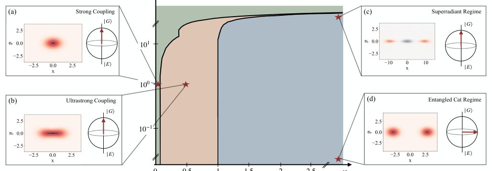 
FIG. 1. Regime map of the QRM across the normalized parameter space. The diagram divides the landscape into representative regions for different normalized couplings η = g/ω and frequency ratios Γ = Ω/ω, including the SC (green), USC (red), and DSC (blue) regimes. The SC-USC boundary is determined by the breakdown of the RWA, quantified by the fidelity condition F(|ψJC⟩, |ψR⟩) ≤0.9. The USC-DSC boundary is defined by the onset of appreciable field occupation, ⟨ˆn⟩≥1, signaling the emergence of interaction-induced displacement. The adjacent panels display the Wigner function and the Bloch sphere for representative light-matter states: (a) SC regime, Γ = 1 and η = 0.1; (b) USC regime, Γ = 1...

📷 Fig 2

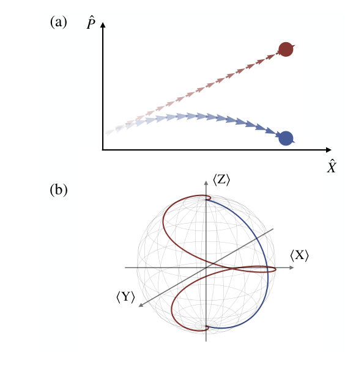 
FIG. 2. Schematic illustration of the CD corrections in the QRM. (a) Phase-space trajectories of the cavity quadratures. The red path corresponds to diabatic evolution without CD control, while the blue trajectory shows the corrected evolution produced by the cavity con- tribution ˆ Ac = −iηˆσx(ˆa† −ˆa), which generates a spin-dependent force in the momentum quadrature. (b) Bloch-sphere representation of the qubit dynamics. The red trajectory shows the diabatic evolu- tion, while the blue path shows the CD-corrected trajectory generated by the atomic contribution ˆ Aa = ηΓˆσy(ˆa† + ˆa).

📷 Fig 3

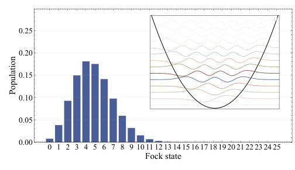 
FIG. 3. Schematic representation of the effective low-energy mani- fold of a cavity used to regularize the AGP optimization. The his- togram represents the population of the renormalization state (ρ) entering the weighted trace functional. The populated Fock states define the effective Hilbert-space region over which the variational metric is evaluated.

📷 Fig 4

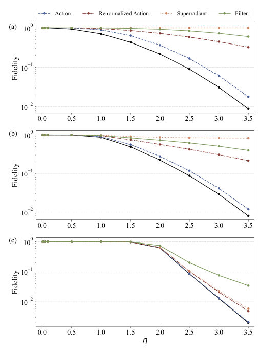 
FIG. 4. Final ground-state fidelity versus normalized coupling strength η, comparing the different renormalization schemes with the CD-free evolution (black solid line). Results are shown for (a) the high-frequency cavity regime (Γ = 0.1), (b) the resonance (Γ = 1), and (c) the high-frequency atom regime (Γ = 10). The simulations are performed at final time evolution ωτ = 1.

📷 Fig 5

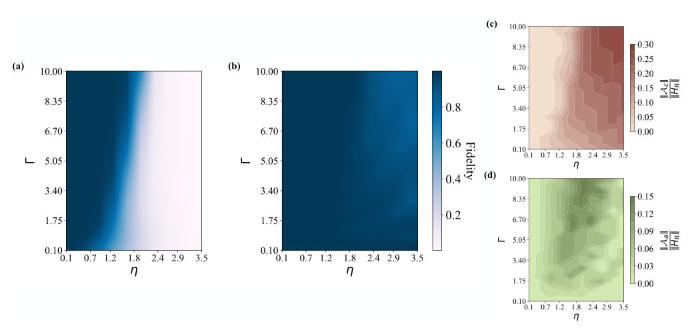 
FIG. 5. Simulated CD dynamics across the Rabi parameter space a dimensionless evolution time ωτ = 1. (a) Ground-state fidelity of the unassisted Hamiltonian as a function of the normalized coupling strength η = g/ω and the frequency ratio Γ = Ω/ω. The fidelity landscape exhibits a pronounced degradation in the strong-coupling and highly detuned regimes, reflecting diabatic excitations. (b) Ground- state fidelity under CD driving using the optimized AGP. The assisted protocol restores high-fidelity transport across the entire parameter domain, substantially suppressing the diabatic errors that dominate the unassisted dynamics. (c,d) Relative norms of the optimized atomic and photonic AGP...

**Summary.** This paper introduces a new regularized variational method for Counterdiabatic driving that prevents mathematical divergences in systems with unbounded bosonic modes. By applying this to the Quantum Rabi Model, the authors demonstrate robust, high-fidelity state preparation across strong and deep-strong coupling regimes. The proposed control terms are shown to be implementable using Floquet engineering.

**Why it may be interesting.** It provides a scalable solution for quantum control in continuous-variable systems and offers a way to achieve high-fidelity state preparation in strongly interacting light-matter platforms like superconducting circuits and NV centers.

Detailed structure

**Main problem.** Standard variational approaches for Counterdiabatic (CD) driving fail in the Quantum Rabi Model because the unbounded bosonic Hilbert space causes trace-based cost functions to diverge or become unphysical.

**Main result.** The authors develop a regularized variational framework using physically motivated renormalization schemes that successfully extends CD driving across the entire Rabi parameter landscape, including the deep-strong coupling regime.

**Method.** The method introduces a regularized action functional using weighted traces (coherent states, superradiant states, or filtered traces) and demonstrates implementation via Floquet engineering through parametric modulation.

**Model / system.** The Quantum Rabi Model (QRM), which describes the interaction between a two-level system (qubit) and a single bosonic mode (cavity) across strong, ultrastrong, and deep-strong coupling regimes.

**Key observables.** Final ground-state fidelity, infidelity, cavity occupation, atomic polarization, and Spearman's rank correlation coefficient between action and fidelity.

**Important parameters / regimes.** Normalized coupling (eta), frequency ratio (Gamma), and the driving frequency for Floquet engineering.

**Assumptions / limitations.** The study focuses on coherent unitary dynamics, neglecting dissipative effects and assuming a zero-temperature limit for the bosonic reference state.

**Figures summary.** Figure 1 shows the QRM regime map; Figure 4 compares fidelity across different regularization schemes; Figure 5 illustrates the fidelity landscape; Figure 6 compares analytical vs. optimized CD protocols; Figure 7 shows time evolution of cavity and atomic observables under Floquet engineering; Figures 8 and 9 analyze the optimization landscape and the predictive power of the regularized action.

**Paper structure.** The paper identifies the failure of standard trace-based CD methods in unbounded spaces, introduces a regularized variational framework with multiple renormalization schemes, applies this to the QRM to identify new CD terms, proposes a fidelity-based alternative, and demonstrates experimental implementability via Floquet engineering.

Abstract

Counter-diabatic (CD) driving provides a powerful route to fast and robust state preparation by suppressing diabatic excitations during finite-time evolution. Yet, deriving analytical CD protocols for complex systems remains challenging, motivating the development of variational approaches. These methods typically rely on minimizing trace-based functionals to construct approximate control Hamiltonians. However, in unbounded systems, such functionals can become ill-defined because of the unbounded bosonic Hilbert space, leading to divergent cost functions and unphysical variational coefficients. Here, we introduce a variational optimization framework equipped with physically motivated renormalization schemes that regularize the trace-based metric by restricting it to relevant displaced and low-energy subspaces. As a paradigmatic example, we apply our method to the quantum Rabi model beyond the dispersive approximation and identify two distinct CD contributions that couple the atomic degree of freedom to the position and momentum quadratures of the field. These terms suppress diabatic excitations across coupling regimes ranging from strong to deep-strong light--matter interaction. We further formulate a fidelity-based quantum optimal-control strategy that bypasses the limitations of trace-based variational methods. Finally, we show that the resulting CD terms can be implemented via Floquet engineering through parametric modulation of the native Hamiltonian. Our results demonstrate that CD driving can be consistently extended to continuous-variable systems with unbounded Hilbert spaces, providing a controlled and scalable framework for quantum control in strongly interacting light-matter platforms.

[↑ back to top](#top)

### [Magic Secret Sharing: Threshold Control of Quantum Computational Power via GHZ Entanglement](http://arxiv.org/abs/2605.16614v1)

**Authors:** Soumyojyoti Dutta, Tushar  
**Type:** both · **Category:** quantum information and computing · **PDF:** <https://arxiv.org/pdf/2605.16614v1>  
**Analysis basis:** full PDF text, analyzed in chunks
**Topic relevance:** 🔥 `QC/QI experiment` **4/5** · `entanglement & information structure` **3/5** · `quantum measurements` **2/5**

📷 Fig 1

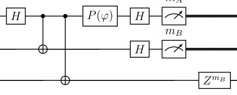 
Figure 1: (2, 3) MSS circuit. Alice (q0) prepares a GHZ state (H + two CX gates), injects magic via P(φ), and measures X, broadcasting mA. Bob (q1) measures X and broadcasts mB. Charlie (q2) applies ZmB to obtain P(φ)|+⟩with C = C(φ).

📷 Fig 2

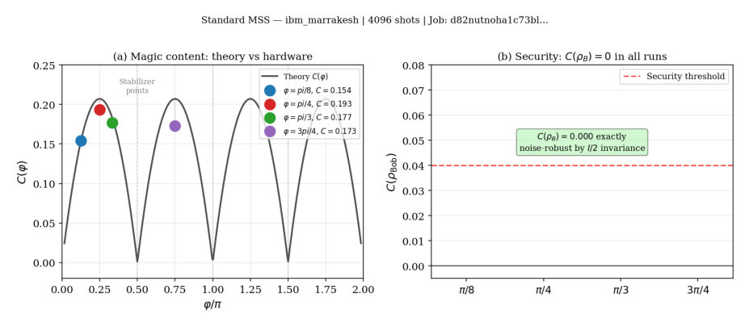 
Figure 2: Standard MSS on ibm marrakesh (4096 shots). (a) Measured C(ρC) (scatter, 1σ bootstrap error bars) against the theory curve C(φ) = (| sin φ| + | cos φ| −1)/2 (line). All four φ values are faithful to within 0.034. (b) C(ρB) &lt; 10−6 in every case — noise- robust security from the I/2 invariance argument.

**Summary.** This paper presents 'Magic Secret Sharing,' a method to distribute the non-Clifford resources required for universal quantum computing such that only a specific coalition can access them. By using GHZ states and phase gates, the authors show that computational power can be shared with a threshold structure, even providing a device-independent way to certify the delivery of magic. The protocol was successfully demonstrated on a large-scale IBM quantum processor.

**Why it may be interesting.** not directly relevant

Detailed structure

**Main problem.** The paper introduces a new quantum cryptographic primitive, Magic Secret Sharing (MSS), which aims to distribute the computational capability (non-Cliffordness) of a quantum state using a threshold structure.

**Main result.** The authors demonstrate a (n-1, n) threshold protocol where an authorized coalition can reconstruct magic content, while unauthorized parties hold stabilizer states. This was experimentally validated on the 156-qubit IBM Heron processor with high fidelity and near-exact magic recovery.

**Method.** The protocol uses GHZ states and local phase gates, employing the resource theory of magic (Wigner distance) to quantify non-stabilizerness. Certification is achieved via one-sided device-independent (1SDI) steering inequalities.

**Model / system.** The protocol is implemented on the 'ibm_marrakesh' (156-qubit IBM Heron r2) quantum hardware using a 3-party (2,3) GHZ state configuration.

**Key observables.** Magic content (Wigner distance C), state fidelity, security metric (C of the unauthorized party), and steering inequality violations.

**Important parameters / regimes.** The phase parameter phi (controlling magic injection), the (n-1, n) threshold structure, and the 15-to-1 magic state distillation threshold.

**Assumptions / limitations.** The security relies on the invariance of the maximally mixed state under local unitaries; the 1SDI setting assumes the recipient does not need to trust the coalition's devices.

**Figures summary.** Figure 2(a) is mentioned in the notes, and Table 1 summarizes experimental results including theoretical vs. measured magic content, error bars, and security metrics.

**Paper structure.** The paper introduces the MSS primitive, defines the resource theory framework, provides mathematical proofs for the threshold structure and gate uniqueness, presents the 1SDI certification method, and concludes with experimental validation on IBM hardware.

Abstract

We introduce Magic Secret Sharing (MSS), a quantum cryptographic primitive in which the secret is the computational capability of a quantum state rather than its classical description. In the resource theory of magic, non-stabilizer states fuel universal quantum computation via non-Clifford gates; MSS distributes this resource with an (n-1,n) threshold structure using a pre-shared GHZ state and a single local phase gate P(phi) = diag(1, exp(i*phi)). Any individual party holds the maximally mixed state I/2, with Wigner distance C(I/2) = 0, so no local operation can yield non-Clifford computational advantage regardless of what operations are applied or what noise acts on the device. The authorised coalition reconstructs magic content C(phi) = (|sin(phi)| + |cos(phi)| - 1)/2 exactly, enabling a logical T gate via gate teleportation in multi-server blind quantum computation (BQC). Among diagonal parametric gates, phase gates are the unique class satisfying the security condition, characterised via an exact column-sum condition. The protocol is elevated to a one-sided device-independent (1SDI) setting via a steering inequality: the assemblage produced on the recipient's side certifies magic delivery without trusting the coalition's devices. We demonstrate the (2,3) instance on ibm_marrakesh (156-qubit IBM Heron): security (C(rho_Bob) = 0.000, below LP reconstruction tolerance) holds in all runs, and state fidelity reaches 0.959-0.986 for the authorised party, with faithfulness confirmed for all four test values of phi including near-exact recovery (C = 0.154 vs theory 0.153) for phi = pi/8.

[↑ back to top](#top)

### [Maxwell's Demon](http://arxiv.org/abs/2605.17196v1)

**Authors:** R. E. Kastner  
**Type:** theory · **Category:** statistical mechanics · **PDF:** <https://arxiv.org/pdf/2605.17196v1>  
**Analysis basis:** full PDF text, analyzed in chunks
**Topic relevance:** 🔥 `quantum measurements` **4/5** · `entanglement & information structure` **3/5** · `non-equilibrium dynamics` **2/5**

📷 Fig 1

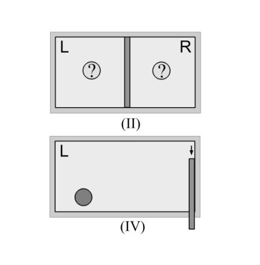 
Figure 1. The basic Szilard Engine setup

📷 Fig 2

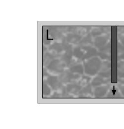 
Figure 3. A real, delocalized quantum molecule

**Summary.** This paper re-evaluates the Maxwell's Demon paradox by arguing that the Second Law of Thermodynamics is preserved by the physical consequences of quantum measurement. It shifts the focus from the entropy cost of memory erasure to the unavoidable entropy increase caused by the Heisenberg Uncertainty Principle during the measurement process.

**Why it may be interesting.** It provides a fundamental link between quantum measurement theory, information theory, and thermodynamics, specifically addressing how the uncertainty principle enforces the Second Law in open quantum systems.

Detailed structure

**Main problem.** The challenge posed by Maxwell's Demon to the Second Law of Thermodynamics and whether the demon can violate entropy increase through microscopic manipulation.

**Main result.** The Second Law is upheld by quantum mechanics because the Heisenberg Uncertainty Principle ensures that the physical act of measurement or localization incurs an unavoidable entropy cost, precluding the demon's success.

**Method.** A historical and theoretical analysis comparing classical epistemic uncertainty with quantum ontological uncertainty, utilizing the Quantum Information Uncertainty Relation (QIUR) and Shannon entropy.

**Model / system.** A single-molecule gas system in a one-dimensional box (Szilard Engine) where a partition is used to manipulate or measure the particle's position and momentum.

**Key observables.** Entropy (S), position uncertainty (delta x), momentum uncertainty (delta p), and transition rates (r_ij).

**Important parameters / regimes.** The classical limit (high temperature), the regime of low-energy photon measurement, and the variance of the probability distribution.

**Assumptions / limitations.** The use of Gaussian wavefunctions as an approximation for delocalized particles and the assumption of fundamental (ontological) stochasticity in quantum transitions.

**Figures summary.** Figure 1 shows a schematic of the Szilard Engine; Figure 2 depicts a localized classical particle; Figure 3 depicts a delocalized quantum molecule.

**Paper structure.** The paper begins with a historical review of the Demon challenge (Szilard, Brillouin, Bennett), critiques the Bennettian view of information erasure, and concludes by proposing a quantum-mechanical resolution based on the Heisenberg Uncertainty Principle.

Abstract

This work provides an overview of key historical developments in the formulation of the Second Law of Thermodynamics, focusing on the notorious challenge of ``Maxwell's Demon'', a hypothetical creature who could presumably violate that law. It begins by recalling Maxwell's challenge and discussing the apparent loophole in the Second Law that appears to make such a violation possible. An alternative formulation of the Demon challenge by Szilard is considered, along with his attempted defeat of the Demon through reference to measurement. A similar effort by Brillouin is also analyzed. The proposal of Bennett to defeat the Demon through the requirement of memory erasure is critically discussed. Finally, it is proposed that the Second Law gains a firm foundation through neglected features of quantum theory. In particular, an application of the Heisenberg Uncertainty Principle is shown to decisively defeat the Demon, as well as to serve as justification for Landauer's Principle, albeit in terms distinct from the usual computational formulation.

[↑ back to top](#top)

### [Universal interface fluctuations in absorbing-state phase transitions](http://arxiv.org/abs/2605.17781v1)

**Authors:** Yohsuke T. Fukai, Keiichi Tamai, Tetsuya Hiraiwa  
**Type:** theory · **Category:** statistical mechanics · **PDF:** <https://arxiv.org/pdf/2605.17781v1>  
**Analysis basis:** full PDF text, analyzed in chunks
**Topic relevance:** 🔥 `non-equilibrium universality` **4/5** · `non-equilibrium dynamics` **3/5** · `driven-dissipative phase transition` **2/5**

📷 Fig 1

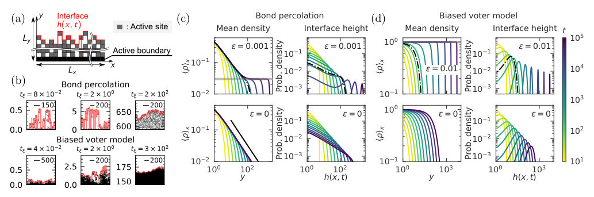 
FIG. 1: Schematic and qualitative illustration of the interface growth process in the discrete models. (a) An illustration of the height definition for the discrete models with the active boundary. (b) Example snapshots of the active sites (black field) and the interface (red line) for the bond percolation (upper) and biased voter model (lower), respectively. The axis label and the scale bar indicate the length rescaled by the correlation length ξ⊥(ϵ) and the actual length, respectively. The rescaled time tξ = t/ξ∥(ϵ) is denoted in each plot. The values of ϵ are 1 × 10−5, 1 × 10−4 and 5 × 10−3 for the bond percolation and 1 × 10−6, 5 × 10−5 and 5 × 10−3 for the biased voter model,...

📷 Fig 2

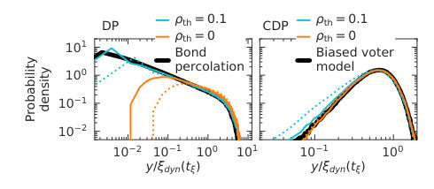 
FIG. 3: The critical height distribution for the (left) DP-class and (right) CDP-class models. Data for the discrete models (black solid lines) and the Langevin equations [ρb = 0.1 for the left and ρb = 1 for the right] are shown. The dashed and solid curves show the data at t = 1 × 104 and t = 1 × 105, respectively.

📷 Fig 3

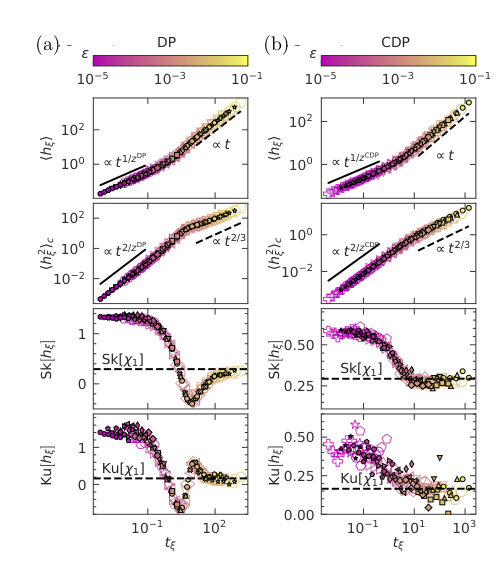 
FIG. 2: Cumulants and cumulant ratios of the height distribution function for the (a) DP- and (b) CDP-class models. The plots show the mean, variance, skewness, and kurtosis for the rescaled height (⟨hξ⟩, hξ 2

**Summary.** This paper demonstrates a universal crossover between two fundamental non-equilibrium universality classes: absorbing-state phase transitions and KPZ growth. It shows that at long time scales, the fluctuations of the active interface in APT models are governed by KPZ physics. This provides a fundamental link between the bulk dynamics of phase transitions and the scale-invariant growth of interfaces.

**Why it may be interesting.** not directly relevant

Detailed structure

**Main problem.** The paper investigates the relationship between universal fluctuations in absorbing-state phase transitions (APTs) and Kardar-Parisi-Zhang (KPZ) interface growth, specifically seeking to establish how bulk scale invariance relates to interface fluctuations.

**Main result.** The authors identify a universal crossover where short-time fluctuations governed by APT exponents transition into long-time fluctuations belonging to the KPZ universality class, with height distributions converging to the GOE-TW distribution.

**Method.** Numerical simulations of (2+1)-dimensional discrete models and Langevin equations, combined with scaling analysis and parameter estimation using the Levenberg-Marquardt and Nelder-Mead algorithms.

**Model / system.** The study utilizes discrete models such as Bond Percolation (DP class) and the Biased Voter Model (CDP class), alongside continuum stochastic Fisher-Kolmogorov-Petrovsky-Piskunov (sFKPP) Langevin equations.

**Key observables.** Interface height h(x, t), probability density functions of height, cumulants (mean, variance, skewness, kurt1), spanwise-averaged density, and spatial covariance.

**Important parameters / regimes.** Distance from criticality (epsilon), APT correlation time (xi_parallel) and length (xi_perp), and the dimensionless parameter D/sigma^2 for CDP models.

**Assumptions / limitations.** The analysis assumes that height fluctuations follow the Gaussian Orthogonal Ensemble Tracy-Widom (GOE-TW) distribution for KPZ fitting purposes.

**Figures summary.** Figures include schematics of interface height definitions, snapshots of active sites, plots of mean density and height probability distributions, and scaling collapses of cumulants and spatial covariance.

**Paper structure.** The paper introduces the problem of APT-KPZ connection, describes the discrete and continuum models used, details the numerical simulation and parameter estimation methods, presents the results of the universal crossover and scaling collapse, and concludes with discussion on parameter universality and potential experimental candidates.

Abstract

Despite similarities between models exhibiting absorbing phase transitions (APTs) and those showing Kardar-Parisi-Zhang (KPZ) growth, the relationship between these universal fluctuations has remained elusive. We numerically study (1+1)-dimensional interfaces of (2+1)-dimensional models showing APTs of directed percolation (DP) and compact directed percolation (CDP) classes with an active boundary, finding a universal crossover from short-time APT-governed fluctuations to long-time KPZ fluctuations. Upon rescaling time and length by the APT correlation time and length, the cumulants of the interface height distributions collapse onto a single scaling function. The fluctuation properties of the discrete Domany-Kinzel model and the continuum stochastic Fisher-Kolmogorov-Petrovsky-Piskunov (sFKPP) equation coincide, indicating that the KPZ growth parameters are determined solely by fundamental properties of the APT. For the CDP sFKPP equation, a dimensionless parameter tunes both the critical interface distribution and the KPZ parameters, with the interface properties of the biased voter model recovered in a limiting case. These results uncover a universal crossover in which KPZ fluctuations emerge from APT fluctuations at long times, linking paradigmatic universality classes of nonequilibrium scale-invariant phenomena.

[↑ back to top](#top)

### [Universal Jaynes-Cummings Control of an Oscillator](http://arxiv.org/abs/2605.18658v1)

**Authors:** Jordan Huang, Ethan Kasaba, Thomas J. DiNapoli, Tanay Roy, Srivatsan Chakram  
**Type:** both · **Category:** quantum information and computing · **PDF:** <https://arxiv.org/pdf/2605.18658v1>  
**Analysis basis:** full PDF text, analyzed in chunks
**Topic relevance:** 🔥 `QC/QI experiment` **4/5** · `quantum optics experiment` **3/5** · `quantum measurements` **2/5**

📷 Fig 1

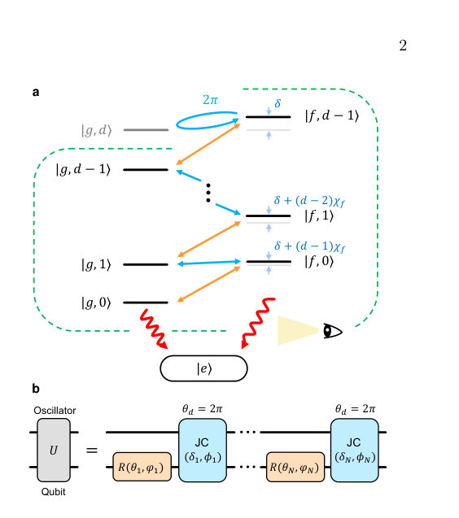 
FIG. 1. Jaynes–Cummings control. (a) Energy level di- agram showing JC (cyan) and ancilla qubit (orange) interac- tions in a rotating frame where the qubit and oscillator have a JC detuning. The ancilla qubit is encoded in the transmon’s |g⟩and |f⟩states. The JC interaction is implemented us- ing a sideband drive detuned by δ from the |f, d −1⟩↔|g, d⟩ transition, where d−1 is a chosen photon-number cutoff. Cor- responding transitions for other photon numbers are further detuned by dispersive shifts. The pulse duration is chosen to implement a 2π rotation on the cutoff transition, closing the dynamics to the subspace within the green box. Ancilla qubit relaxation errors send the state to...

📷 Fig 2

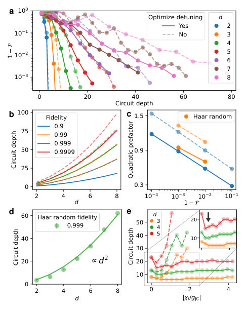 
FIG. 2. Scaling analysis. (a) Gate infidelity for a shift gate as a function of circuit depth, for different qudit dimen- sions. The solid and dotted lines indicate optimization with and without JC detuning, respectively. (b) Circuit depth required to reach a target fidelity as a function of qudit di- mension, fit to a quadratic function. (c) Quadratic prefactor of the shift gate circuit depth as a function of target infidelity, showing logarithmic scaling and a reduction with detuning op- timization. (d) For Haar random unitaries, the circuit depth required to reach a target fidelity as a function of qudit dimen- sion displays a quadratic scaling. (e) Circuit depth required to reach &gt; 99%...

📷 Fig 3

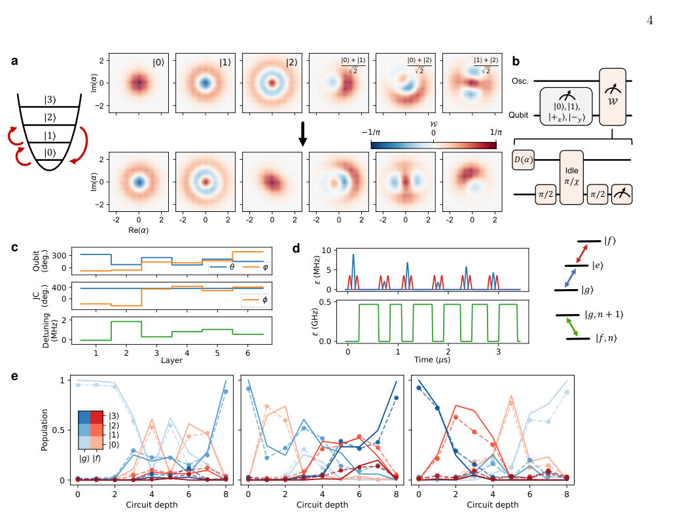 
FIG. 3. Qutrit shift gate. (a) Illustration of a qutrit shift gate in an oscillator. Experimentally reconstructed Wigner functions are shown for six input states (top row) and the corresponding output states after the shift gate (bottom row). (b) Sequence used for joint qubit-oscillator tomography. The oscillator state is measured using Wigner tomography after postselecting on four qubit basis states. (c) Angles of the ancilla qubit and JC rotations, and JC detunings, for a qutrit shift gate. (d) Pulse sequence corresponding to the rotation angles in (c). (e) Populations P(|g, n⟩) and P(|f, n⟩) as a function of circuit layer, measured using joint qubit–oscillator tomography for a qutrit...

📷 Fig 4

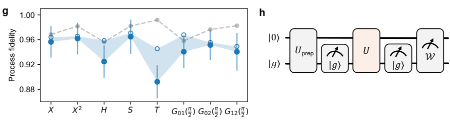 
FIG. 4. Process tomography of universal qutrit gates. Absolute value of the process matrix for a qutrit (a) shift gate X, (b) X2 gate, (c) Hadamard gate, (d) phase gate S, (e) T gate, and (f) π/2 Givens rotation in the |0⟩-|1⟩subspace. The solid black lines indicate the ideal gate. The full process matrices are shown in Figs. S9 and S10 of the SI. (g) Process fidelities of the universal qutrit gates after post-selection are shown as solid blue markers. Grey markers indicate results of Lindblad master-equation simulations. The blue hollow markers show the process fidelity obtained when the implemented gate is compared to the target gate followed by a qudit phase gate, R(φ)Utarget, where R(φ)...

**Summary.** The paper demonstrates a method for universal control of a high-dimensional quantum system encoded in a microwave cavity. By optimizing sequences of Jaynes-Cummines interactions and qubit rotations, the researchers achieved high-fidelity control of qutrits, ququarts, and ququints. This establishes a scalable and efficient framework for implementing bosonic quantum computing.

**Why it may be interesting.** It provides a practical route to programmable bosonic processors by turning a known physical interaction (JC) into a universal gate set, while demonstrating how dispersive shifts can be leveraged as a computational resource.

Detailed structure

**Main problem.** Achieving universal control of a high-dimensional bosonic oscillator (qudit) using the Jaynes-Cummings interaction, specifically overcoming the challenges of dispersive shifts and circuit depth scaling.

**Main result.** Demonstrated universal qudit control with a mean post-selected process fidelity of 96% for qutrit gates and successful implementation of ququart and ququint shift gates.

**Method.** Decomposing arbitrary unitaries into sequences of JC interactions and qubit rotations, using gradient descent optimization for pulse parameters, and utilizing frequency chirping for error mitigation.

**Model / system.** A superconducting circuit-QED platform consisting of a transmon ancilla qubit coupled to a high-quality factor microwave cavity mode, operating in a weakly dispersive regime.

**Key observables.** Joint qubit-oscillator Wigner tomography, qudit process tomography, and state fidelity.

**Important parameters / regimes.** JC interaction rate (g_JC), dispersive shift (chi_f), photon number cutoff (d), and transmon coherence times (T1, T2).

**Assumptions / limitations.** Assumes a decoherence-free evolution model for some comparisons; neglects higher-order energy shifts and cavity self-Kerr; assumes the ability to stabilize temperature to prevent frequency fluctuations.

**Figures summary.** Energy level diagrams of the JC interaction; scaling analysis of gate infidelity and circuit depth; demonstration of qutrit/ququart/ququint shift gates via Wigner functions; and process tomography matrices for universal qutrit gates.

**Paper structure.** Introduction of the JC control problem; description of the circuit-QED platform and Hamiltonian; presentation of the control protocol and optimization methods; experimental demonstration of universal qutrit gates; scaling analysis for higher-dimensional qudits; and error budget/robustness analysis.

Abstract

The Jaynes-Cummings (JC) interaction-the coherent exchange of excitations between a two-level system and a harmonic oscillator-is one of the fundamental interactions of quantum optics, realized across platforms such as cavity quantum electrodynamics, trapped ions, mechanical resonators, and superconducting circuits. Although JC interactions and qubit rotations form a universal gate set for oscillator control, practical implementations have not been demonstrated. Here we develop and experimentally demonstrate universal JC-based oscillator control by compiling arbitrary unitary gates into sequences of JC interactions and qubit rotations. In our experiment, the oscillator is realized using a mode of a high quality factor microwave cavity and the ancilla qubit using a superconducting transmon circuit, with the JC interaction implemented by a sideband interaction enabled by the Josephson nonlinearity. The native gates are constructed to be closed below a chosen cutoff photon number, encoding a qudit with suppressed leakage errors, while ancilla relaxation errors are detectable. We further find that the dispersive shift serves as a compilation resource that reduces circuit depths. We demonstrate universal qudit control and implement a single-qutrit gate set with a mean post-selected process fidelity of 96%, as well as ququart and ququint shift gates. These results establish Jaynes-Cummings control as a practical route to universal oscillator control, enabling programmable bosonic processors across a variety of quantum platforms.

[↑ back to top](#top)

### [Open quantum dynamics without Complete Positivity: a criticism](http://arxiv.org/abs/2605.18639v1)

**Authors:** Fabio Benatti, Dariusz Chruściński, Saverio Pascazio  
**Type:** theory · **Category:** quantum information and computing · **PDF:** <https://arxiv.org/pdf/2605.18639v1>  
**Analysis basis:** full PDF text, analyzed in chunks
**Topic relevance:** 🔥 `entanglement & information structure` **4/5** · `methods for driven-dissipative` **2/5** · `non-equilibrium dynamics` **2/5**

📷 Fig 1

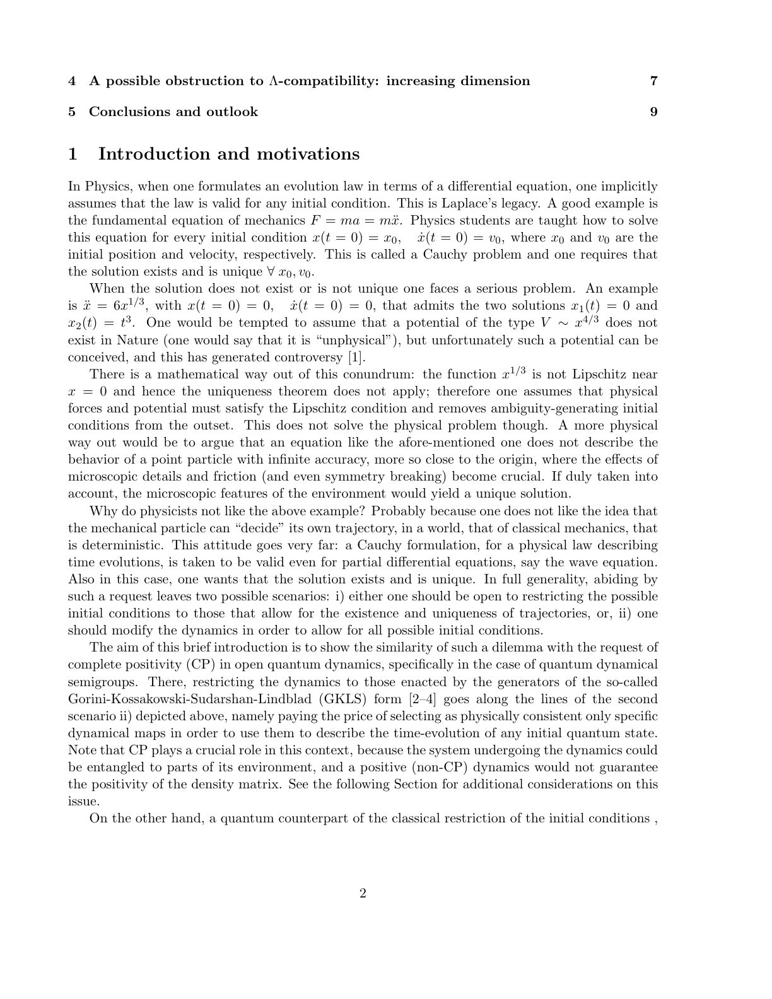 
Low-resolution page preview, page 2

📷 Fig 2

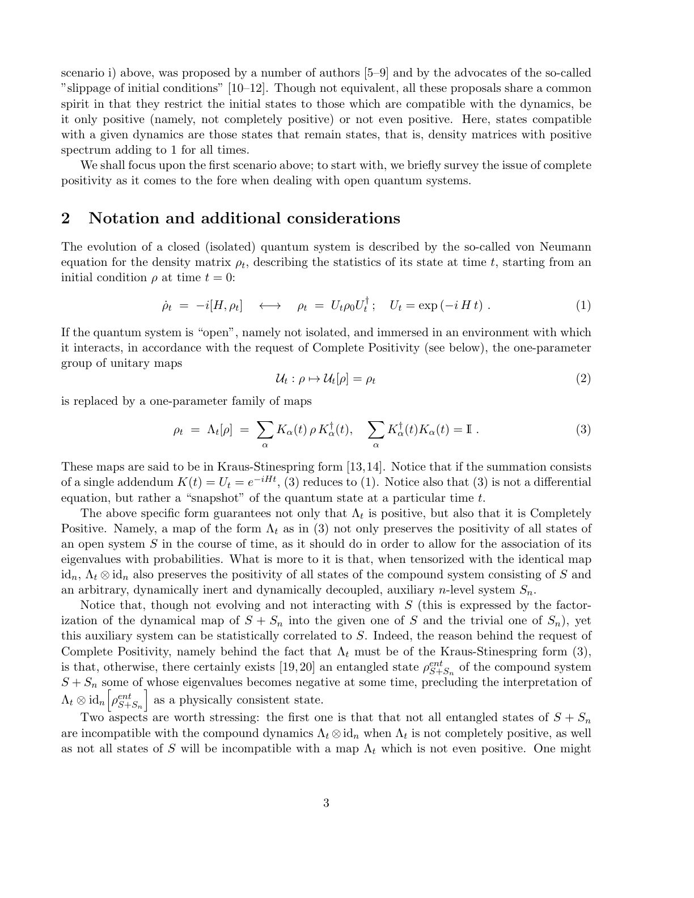 
Low-resolution page preview, page 3

📷 Fig 3

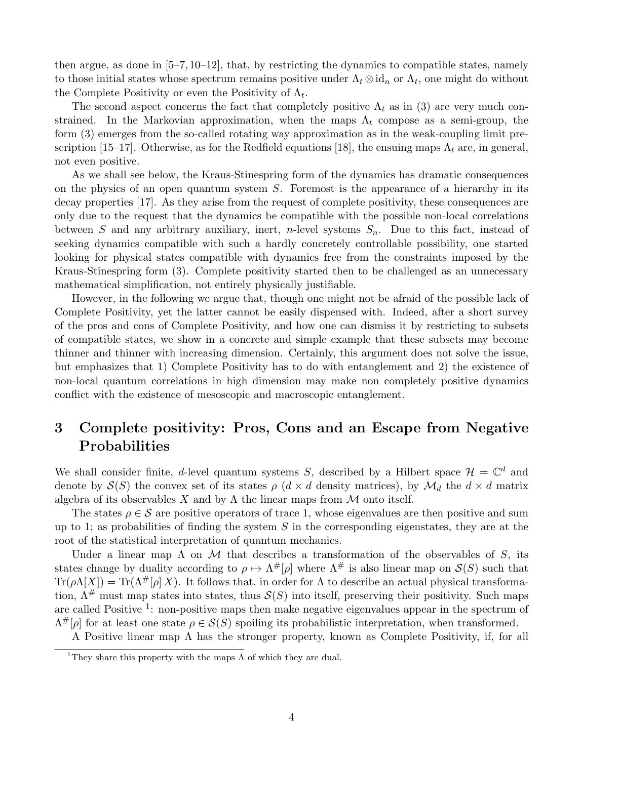 
Low-resolution page preview, page 4

📷 Fig 4

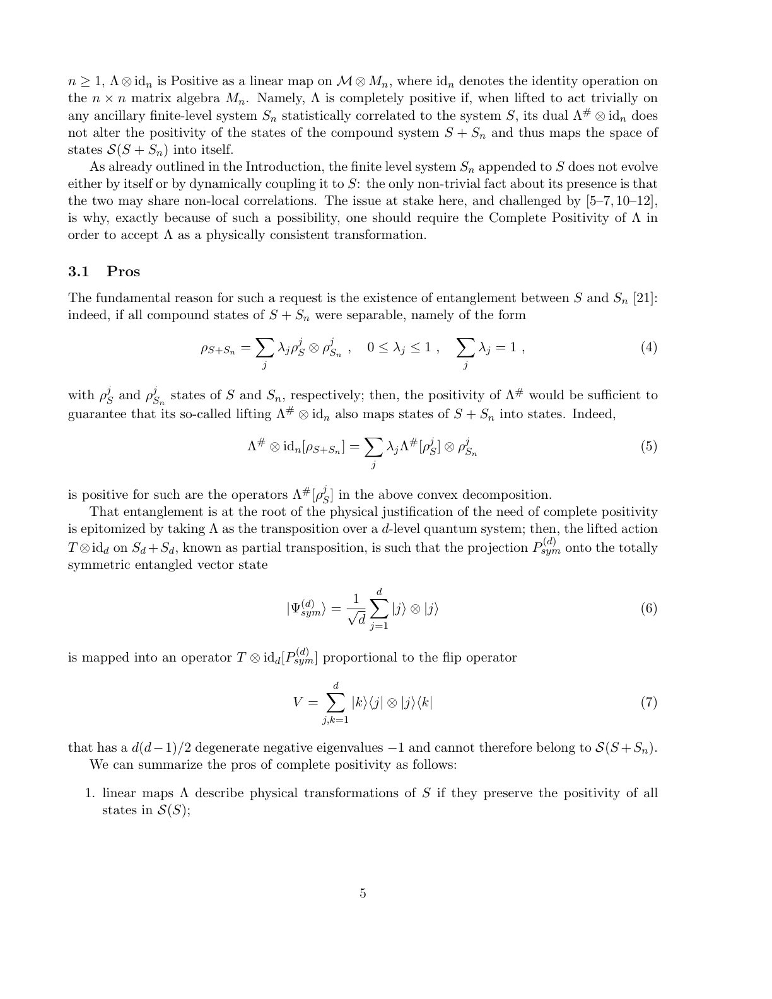 
Low-resolution page preview, page 5

📷 Fig 5

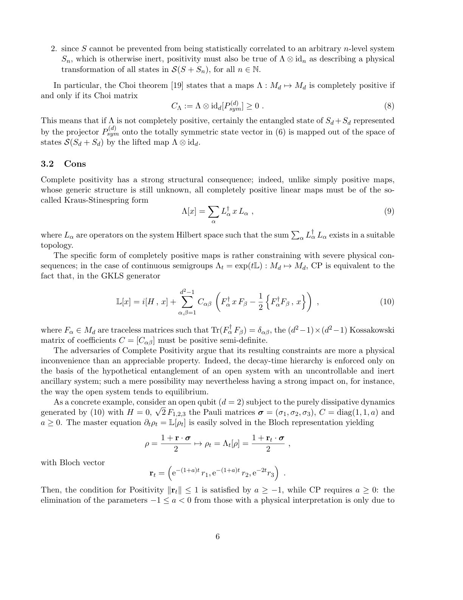 
Low-resolution page preview, page 6

**Summary.** The paper investigates whether one can describe open quantum systems using maps that are positive but not completely positive by restricting the allowed initial states. It proves that this 'compatibility' approach fails in high dimensions because the set of allowed entangled states shrinks to zero, suggesting that Complete Positivity is a necessary requirement for consistent high-dimensional dynamics.

**Why it may be interesting.** This is highly relevant for researchers in open quantum systems and many-body dynamics as it addresses a fundamental consistency condition (CP) and shows that non-CP models may be physically inconsistent with large-scale entanglement.

Detailed structure

**Main problem.** The paper critiques the validity of abandoning the requirement of Complete Positivity (CP) in open quantum dynamics by using a 'compatibility-based' approach that restricts initial states.

**Main result.** The authors demonstrate that as the system dimension increases, the volume of compatible entangled states vanishes, revealing an intrinsic weakness in non-CP dynamical models.

**Method.** The authors use spectral analysis of the lifted map and volume calculations of the parameter interval for isotropic states to evaluate the compatibility of non-CP maps.

**Model / system.** The study focuses on finite d-level quantum systems interacting with an environment, specifically analyzing a family of positive but non-CP maps (Lambda_mu) and isotropic qudit states.

**Key observables.** The volume of compatible entangled states (V_comp) and the fidelity (F) of isotropic states.

**Important parameters / regimes.** System dimension (d), map parameter (mu), and state fidelity (F).

**Assumptions / limitations.** The analysis is primarily focused on finite-dimensional Hilbert spaces and specific families of channels and states.

**Paper structure.** The paper begins by framing the dilemma of CP vs. non-CP dynamics, evaluates the pros and cons of the CP requirement, analyzes the 'compatibility-based' strategy using isotropic states, and concludes with the scaling of compatible state volumes in high dimensions.

Abstract

The requirement of complete positivity is very often regarded as a fundamental consistency condition for the description of open quantum dynamics. We critically examine this requirement and discuss both its physical motivations and its limitations. We analyze proposals based on restricting the domain of non-completely positive maps to subsets of compatible initial states. Using isotropic states as a concrete example, we show that such domain restrictions become increasingly severe with growing system dimension, revealing an intrinsic weakness of the compatibility-based approach.

[↑ back to top](#top)

### [Shapiro steps of superfluid Fermi gases in a ring trap across the BCS--BEC crossover](http://arxiv.org/abs/2605.17940v1)

**Authors:** Hikaru Kuriki, Masaya Kunimi, Tetsuro Nikuni  
**Type:** theory · **Category:** quantum gases · **PDF:** <https://arxiv.org/pdf/2605.17940v1>  
**Analysis basis:** full PDF text, analyzed in chunks
**Topic relevance:** 🔥 `non-equilibrium dynamics` **4/5** · `analog quantum simulation` **2/5** · `driven-dissipative phase transition` **2/5**

📷 Fig 1

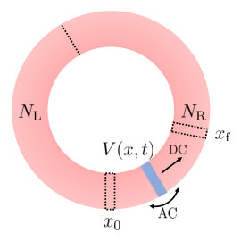 
FIG. 1. Schematic illustration of a ring-trapped Fermi super- fluid with a moving Gaussian potential barrier V (x, t) under combined DC and AC driving (blue shaded area). The barrier position xb(t) is defined in Eq. (2). x0 is the initial position of the barrier, and xf = xb(tf) is the final position at the end of the simulation. The point opposite to the barrier position is used as an effective boundary to define the left and right reservoirs, which are separated by the barrier and its antipode (black dotted line). NL and NR represent the atom numbers in the left and right reservoirs, respectively.

📷 Fig 2

 
FIG. 2. Relationship between the DC barrier velocity vDC and the chemical potential difference ∆µ(tf) across the BCS– BEC crossover.

📷 Fig 3

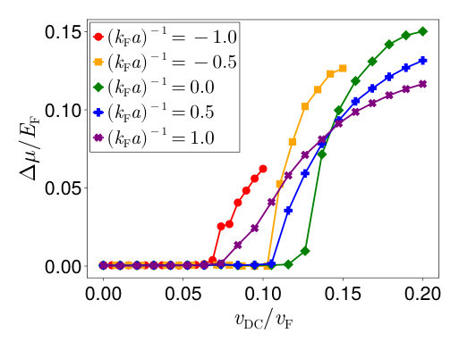 
Figure 2 shows the relationship between the DC bar- rier velocity vDC normalized by the Fermi velocity vF = ℏkF/m and the chemical potential difference ∆µ(tf) cal- culated from a linear fit (see Sec. II A) for various cou- pling strengths (kFa)−1. We observe a critical velocity vc below which ∆µ remains zero, indicating a superflow.

📷 Fig 4

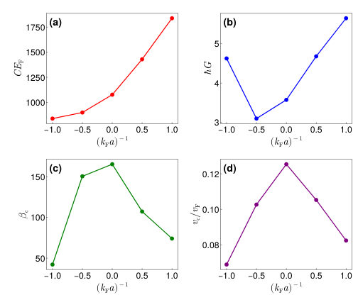 
FIG. 3. (a) Capacitance C, (b) conductance G, (c) Stewart- McCumber parameter βc, and (d) critical velocity vc ex- tracted from the RCSJ model as a function of the interac- tion strength (kFa)−1. The dimensionless capacitance CEF is calculated from the charging energy EC as C = E−1 C (see Appendix B for details).

📷 Fig 5

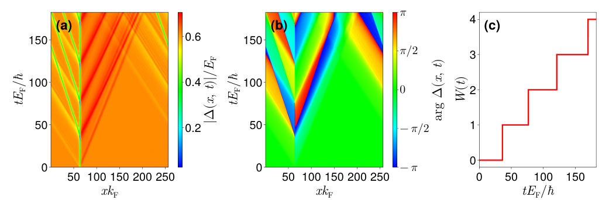 
FIG. 4. Dynamics of the order parameter ∆(x, t) in the UFG regime [(kFa)−1 = 0] at vDC = 0.137vF, which is above the critical velocity vc (i.e., in the voltage regime). (a) Amplitude |∆(x, t)| and (b) phase arg ∆(x, t) of the order parameter as functions of position x and time t. Note that the potential barrier appears stationary in these plots because the dynamics are calculated in the frame co-moving with the DC velocity vDC. The nearly vertical depletion near the barrier corresponds to the suppression of the order parameter by the barrier, while the slanted depletion structures propagating away from it correspond to emitted solitons. (c) Time evolution of the winding number W(t) defined...

**Summary.** This paper explores how Shapiro steps emerge in a driven superfluid Fermi gas in a ring trap. It demonstrates that these quantized steps are caused by the synchronization of soliton emissions at a moving barrier. The findings provide a microscopic understanding of transport properties across the BCS-BEC crossover.

**Why it may be interesting.** It provides microscopic insights into phase-locking and nonequilibrium phase dynamics in topological atomtronic systems, bridging the gap between fundamental BCS-BEC crossover physics and driven Josephson junction dynamics.

Detailed structure

**Main problem.** Investigating the nonequilibrium dynamics and transport properties of Shapiro steps in a superfluid Fermi gas within a ring trap across the BCS-BEC crossover.

**Main result.** The study observes quantized Shapiro-step plateaus in the chemical potential difference, which originate from synchronized phase slips mediated by periodic soliton generation at the barrier.

**Method.** Numerical simulations using the time-dependent Bogoliable-de Gennes (tdBdG) equations solved via the split-step Fourier method and a modified Broyden's method for self-consistency.

**Model / system.** A superfluid Fermi gas in a 1D ring geometry containing a moving Gaussian potential barrier that acts as a Josephson junction biased by DC and AC currents.

**Key observables.** Chemical potential difference (delta-mu), topological winding number, order parameter amplitude and phase, local current density, and particle number density.

**Important parameters / regimes.** Interaction strength (kF a inverse), DC barrier velocity (v_DC), AC amplitude (x_AC), AC frequency (omega), and the Stewart-McCumber parameter (beta_c).

**Assumptions / limitations.** The system is treated in an effective 1D geometry at zero temperature, and the midpoint order parameter is assumed to evolve smoothly during time steps.

**Figures summary.** Schematic of the ring trap setup; dynamics of the order parameter and winding number; relationship between barrier velocity and chemical potential difference showing Shapiro steps; and the evolution of local velocity at the barrier.

**Paper structure.** The paper introduces the physical setup and problem, details the numerical BdG framework and self-consistent loop, presents results on the superflow-to-voltage transition, analyzes the microscopic soliton-mediated mechanism of Shapiro steps, and discusses the breakdown in the BCS regime.

Abstract

We investigate the transport properties of a superfluid Fermi gas confined in a ring trap with a moving potential barrier across the Bardeen-Cooper-Schrieffer (BCS) to Bose-Einstein condensate (BEC) crossover. Employing time-dependent Bogoliubov--de Gennes (BdG) equations, we simulate the dynamics of a Josephson junction biased by both DC and AC currents. Over a wide range of interaction strengths, we observe clear low-order Shapiro-step plateaus in the barrier-velocity--chemical-potential-diffenrence, within the phase-coherent regime, where the time-averaged chemical potential difference is quantized in units of $\hbarω/2$. This factor of $1/2$ reflects our convention of defining the chemical potential per single fermion in the BdG framework. Microscopic analysis reveals that these fundamental steps originate from synchronized phase slips mediated by periodic soliton generation at the barrier. Our findings clarify the role of interaction regimes in the nonequilibrium phase dynamics of ring-trapped fermionic superfluids and provide microscopic insights relevant to future studies of atomtronic systems with nontrivial topology.

[↑ back to top](#top)

### [Strain-free, symmetrical, InGaAs quantum dots as single photon emitters in the telecomC-band](http://arxiv.org/abs/2605.17332v1)

**Authors:** Rabbia Tahir, Paweł Wyborski, Artur Tuktamyshev, Stefano Vichi, Richard Nötzel, Battulga Munkhbat, Stefano Sanguinetti  
**Type:** experiment · **Category:** quantum information and computing · **PDF:** <https://arxiv.org/pdf/2605.17332v1>  
**Analysis basis:** full PDF text, analyzed in chunks
**Topic relevance:** 🔥 `QC/QI experiment` **4/5** · 🔥 `quantum optics experiment` **4/5**

📷 Fig 1

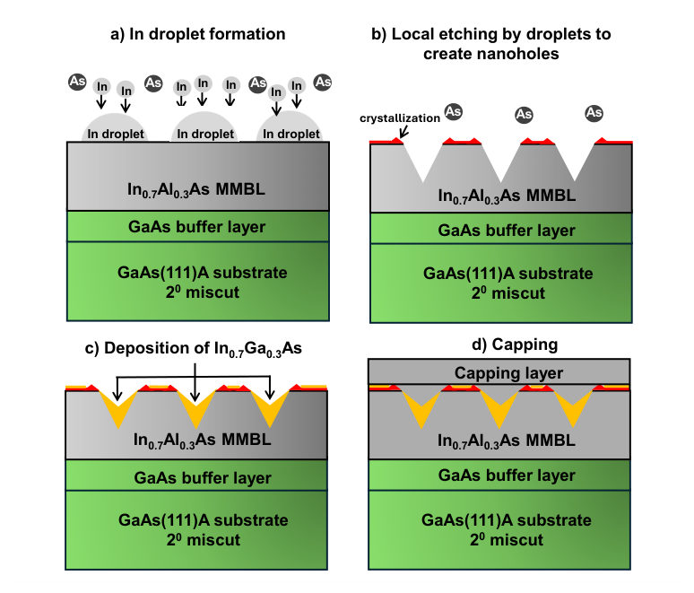 
Figure 1: Schematic diagram, summarizing steps for the InGaAs/InAlAs QDs growth by LDE on GaAs(111)A substrate with InAlAs MMBL such as (a) formation of droplets after depositing In, (b) local surface etching in As4 background atmosphere by the indium droplets and creation of nanoholes, (c) filling the nanoholes with InGaAs to fabricate required QDs, (d) growth of a barrier capping layer.

📷 Fig 2

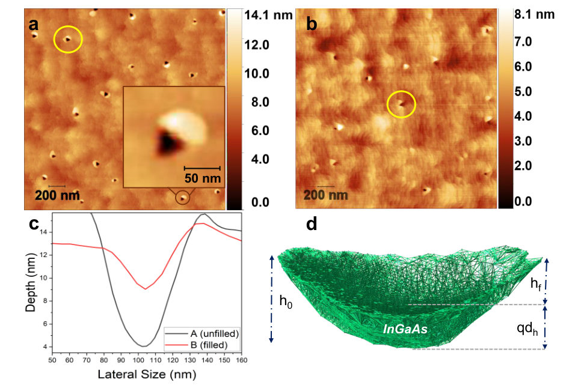 
Figure 2: (a) 2.5×2.5 µm2 AFM topography image of sample A. The inset reports the magnified image of 6.8 nm deep and 54.3 nm wide individual nanohole. (b) 2.5×2.5 µm2

📷 Fig 3

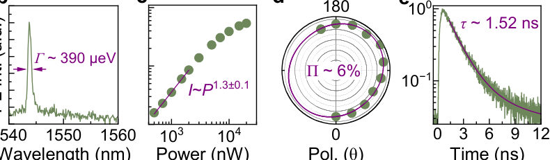 
Figure 3: (a) µ-PL spectra of several QDs with sharp emission peaks centered at around 1380–1600 nm. (b) µ-PL spectra of marked QD in (a) (within C-band range), including fitted line broadening value. (c) Power-dependent QD PL intensity fitted by a power law. (d) Emission intensity plot as a function of polarization, including DOLP fitting. (e) Time- resolved PL histogram of QD emission, with the solid lines depicting a monoexponential fit to the experimental data.

📷 Fig 4

 
Figure 4: (a) Autocorrelation coincidence plot. (b) Second order correlation function g2(0) for CX emission, the solid purple line represents the direct fit for the result.

📷 Fig 5

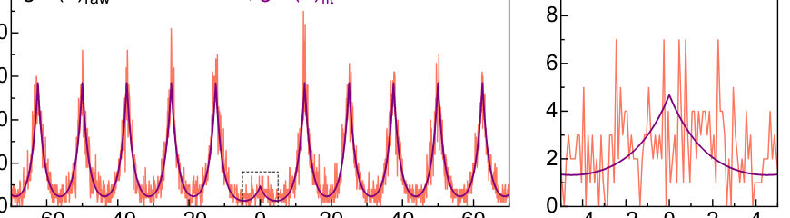 
Figure 4(a, b) depicts the autocorrelation measurements of one of the brightest grown

**Summary.** The paper demonstrates a method to grow strain-free, symmetric InGaAs quantum dots that emit in the telecommunications C-band. By using local droplet etching on GaAs(111)A substrates, the researchers achieved high-quality single-photon emission with low asymmetry. This is a significant step toward building long-distance quantum communication networks using existing fiber technology.

**Why it may be interesting.** This work is highly relevant to quantum optics and quantum networks as it provides a scalable material platform for generating high-purity single photons at the telecom C-band, which is essential for integrating quantum nodes into existing fiber-optic infrastructure.

Detailed structure

**Main problem.** The need for high-quality, strain-free single-photon emitters operating in the telecommunication C-band (1550 nm) for low-loss, long-distance quantum communication networks.

**Main result.** Successful fabrication of strain-free, symmetric InGaAs/InAlAs quantum dots on GaAs(111)A substrates that emit in the 1400-1600 nm range with high single-photon purity (g2(0) = 0.141).

**Method.** The researchers used Local Droplet Etching (LDE) via Molecular Beam Epitaxy (MBE) to create nanoholes, followed by filling them with InGaAs, and validated the results using 8-band k.p simulations and optical spectroscopy.

**Model / system.** Strain-free, C3v-symmetric In0.7Ga0.3As/In0.7Al0.3As quantum dots grown on a thin metamorphic buffer layer on vicinal GaAs(111)A substrates.

**Key observables.** Emission wavelength (1400-1600 nm), exciton lifetimes (1.3-1.9 ns), linewidths (approx. 300 ueV), second-order autocorrelation g2(0), and degree of linear polarization (DOLP).

**Important parameters / regimes.** Target wavelength of 1550 nm, substrate temperature of 450-500 C, and QD height of approximately 6 nm.

**Assumptions / limitations.** The use of the envelope function approximation (EFA) within an eight-band k.p framework to model electronic properties.

**Figures summary.** Figure 1 shows the QD fabrication schematic; Figure 2 displays AFM morphology of nanoholes and simulated emission properties; Figure 3 shows micro-photoluminescence spectra and photon statistics.

**Paper structure.** The paper introduces the problem of C-band emission, describes the LDE growth process and metamorphic buffer layer, presents morphological characterization via AFM, details the k.p simulations, and concludes with optical characterization of the emitters.

Abstract

Non-classical photon sources made of semiconductor quantum dots (QDs) emitting in the telecommunication C-band are crucial components for low-loss, long-distance photonic quantum communication networks. Here we designed and fabricated strain--free In$_{0.7}$Ga$_{0.3}$As/In$_{0.7}$Al$_{0.3}$As QDs grown on GaAs(111)A substrates working as single-photon emitters in the 1550 nm window. The QDs were grown via local droplet etching method in a molecular beam epitaxy environment, employing a thin In$_{0.7}$Al$_{0.3}$As metamorphic buffer layer with the same lattice constant of the QD material, thus allowing for a completely strain--free self-assembly of the QDs. The QDs exhibit a C$_{3v}$ symmetry with a ground state emission in the 1400--1600 nm range. The exciton lifetimes of $\approx$ 1.3--1.9 ns and linewidths as low as $\approx$ 300 $μ$eV show the good quality of the fabricated QDs. Second-order autocorrelation measurements under pulsed excitation confirmed the single-photon purity of the emitters, yielding a $g^{(2)}(0)$ value of $0.141 \pm 0.027$

[↑ back to top](#top)

### [A Compact, Robust, and Tunable Open Microcavity Platform for Solid-State Quantum Electrodynamics](http://arxiv.org/abs/2605.16694v1)

**Authors:** Thi D. Hoang, Fateme Mahdikhany, Zixuan Wang, Richard Mirin, Kevin Silverman, Poolad Imany, Shuo Sun  
**Type:** experiment · **Category:** other · **PDF:** <https://arxiv.org/pdf/2605.16694v1>  
**Analysis basis:** full PDF text, analyzed in chunks
**Topic relevance:** 🔥 `quantum optics experiment` **4/5** · `QC/QI experiment` **3/5**

📷 Fig 1

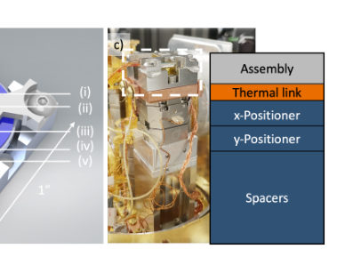 
Fig. 1. (a) Schematic of the open microcavity used in our work, overlaid with the calculated electric field profile of its fundamental mode based on the cavity length estimated from experiment. The cavity is formed by a planar DBR with 29.5 pairs of alternating GaAs/AlAs layers and a microscale concave DBR with 12.5 pairs of alternating SiO2/SiN layers. A GaAs epitaxial layer with InGaAs quantum dots (yellow triangles, enlarged for visibility) embedded in a p-i-n diode (yellow solid lines, enlarged for visibility) is grown on top of the planar DBR. The lateral extent of the fabricated concave feature, marked by the white dashed lines, is approximately 6 𝜇m. (b) Design of the mechanical...

📷 Fig 2

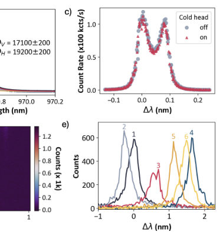 
Fig. 2. Characterization of the open microcavity and its mechanical host. (a) Spectrum of a cavity with two adjacent longitudinal modes lying within the DBR bandgap, obtained via photoluminescence spectroscopy of the quantum dot ensemble. (b) Cross- polarized transmission spectrum of a different cavity at the center of the DBR bandgap, showing two non-degenerate polarization modes. (c) Transmission spectrum of the same cavity when the compressor of the cryostat is on (red triangles) and off (grey circles). The two spectra are nearly identical, showing that we have no vibration induced cavity broadening. (d) Photoluminescence spectrum of the cavity as we vary the bias voltage applied on the...

📷 Fig 3

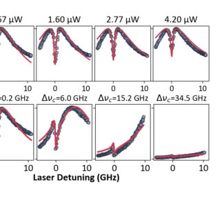 
Fig. 3. Measurement of a cavity QED device with single quantum dots coupled to an open microcavity. (a) Cross-polarized cavity transmission spectrum of an open microcavity coupled with two distinct quantum dots. (b) Cross-polarized transmission spectrum of the 𝐻-polarized cavity mode (corresponding to the the dashed-line box region of (a)) as we increase the power of the incident laser. The power is measured right before the objective lens. (c) Cross-polarized transmission spectrum of the 𝐻-polarized cavity mode as we vary the detuning between the cavity and the quantum dot by varying the cavity length. In all panels, grey circles are measured data, and red solid lines are the theoretical...

📷 Fig 4

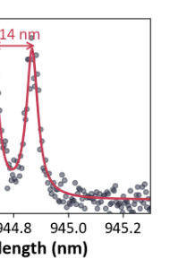 
Figure 3(a) in the main text shows the cross-polarized cavity transmission spectrum for two cavity modes each coupling to a quantum dot. We model the cavity transmission as

**Summary.** The researchers have created a tiny, vibration-resistant mechanical assembly for open microcavities that works reliably in standard cryostats. This platform allows for easy tuning of cavity resonance and has successfully demonstrated strong coupling with quantum dots. It offers a scalable path toward portable quantum light sources and quantum computing components.

**Why it may be interesting.** This work provides a highly stable and scalable hardware platform for cavity QED, which is essential for implementing spin-photon interfaces and quantum networks in solid-state systems.

Detailed structure

**Main problem.** Operating open microcavities at cryogenic temperatures is challenging due to extreme sensitivity to mechanical vibrations and the need for bulky, custom vibration-mitigation setups.

**Main result.** The authors developed a compact, robust, and tunable mechanical host for an open microcavity that shows no vibration-induced broadening in a standard cryostat and achieves cooperativity exceeding unity with an InGaAs quantum dot.

**Method.** The platform uses a piezo-driven assembly to tune cavity resonance in situ and employs cross-polarized transmission spectroscopy and photoluminescence to characterize the emitter-cavity coupling.

**Model / system.** The system is a plano-concave Fabry-Perot resonator consisting of a GaAs/AlAs DBR bottom mirror and a microscale concave top mirror, coupled to InGaAs quantum dots embedded in a p-i-n junction.

**Key observables.** Cavity resonance, quantum-dot-induced transmission dips (dipole-induced transparency), cavity finesse, and cooperativity.

**Important parameters / regimes.** Finesse > 1,000, coupling strength g/2pi = 1.37 GHz, cooperativity C > 1, and a tuning range of 3 nm.

**Assumptions / limitations.** The theoretical model for fitting spectra omits inhomogeneous spectral diffusion, and the model assumes the weak excitation limit.

**Figures summary.** Figure 1 shows the microcavity schematic and electric field profile; Figure 2 shows PL spectra and cavity modes; Figure 3 displays transmission spectra showing QD-induced dips, saturation, and Fano-like features; Supplemental figures show device yield and Stark tuning.

**Paper structure.** The paper introduces the vibration-mitigation challenge, describes the fabrication and architecture of the microcavity and mechanical host, presents characterization of cavity stability and tuning, demonstrates quantum dot coupling and nonlinear response, and concludes with scalability and device yield analysis.

Abstract

Open microcavities provide a powerful platform for studying cavity quantum electrodynamics in solid-state systems. However, operating open microcavities at cryogenic temperatures, as required for many solid-state quantum emitters, typically demands bulky and cryostat-specific vibration-mitigation setups. Here we report a compact, robust, and tunable mechanical host for an open microcavity. The complete mechanical assembly fits within a footprint of $1'' \times 1'' \times 0.5''$. Using this mechanical host, we observe no vibration-induced cavity broadening for an open microcavity with finesse exceeding 1,000 without cryostat customization or active locking. The assembly also enables in situ tuning of the cavity resonance over 3 nm, and the resonance of the same cavity remains within this range across multiple cooldowns. To further showcase the capability of this assembly, we demonstrate coupling between an InGaAs quantum dot and an open microcavity with a cooperativity exceeding unity. This platform provides a versatile testbed for fundamental cavity quantum electrodynamics and a scalable route to portable quantum light sources and spin-photon interfaces for quantum repeaters, quantum networks, and photonic quantum computing.

[↑ back to top](#top)

### [Demonstration of transport in an ion trap design for two-dimensional lattices](http://arxiv.org/abs/2605.16543v1)

**Authors:** Michael Pfeifer, Marco Valentini, Matthias Dietl, Fabian Anmasser, Simon Schey, Jakob Wahl, Philip C. Holz, Clemens Rössler, Yves Colombe, Philipp Schindler  
**Type:** experiment · **Category:** other · **PDF:** <https://arxiv.org/pdf/2605.16543v1>  
**Analysis basis:** full PDF text, analyzed in chunks
**Topic relevance:** 🔥 `QC/QI experiment` **4/5** · `analog quantum simulation` **3/5**

📷 Fig 1

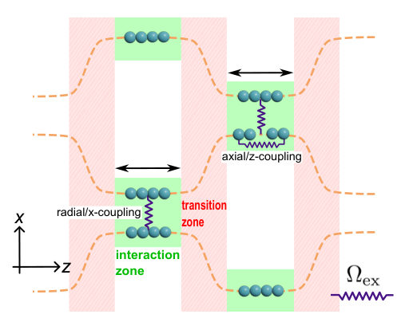 
FIG. 1. Schematic illustration of the trap geometry inves- tigated in this paper. Rf minimum paths (orange dashed lines) and ion chains (turquoise balls) are forming a two- dimensional lattice for implementing a QSA architecture [1]. The ion chains interact via the Coulomb interaction (purple zig-zag lines) in the “interaction zones” (green areas) and can be shuttled, using dc electrodes, along the rf minimum paths through “transition zones” (red areas) between interaction zones. They can interact in the radial direction between lat- tice sites, as shown on the left of the figure, or axially within a lattice site, as shown on the right.

📷 Fig 2

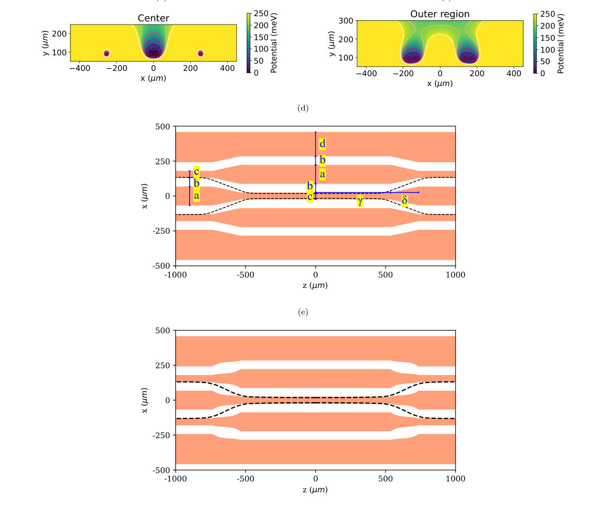 
FIG. 2. Rf electrodes of the trap with linear and optimized transition zones and corresponding double-well potentials. The red areas are the rf electrodes, the white areas are spaces for dc electrodes. Rf minimum paths of the innermost double well are plotted as black dashed lines. a) Full length of the rf electrodes with linear transition zones. The markings correspond to the potential cross-sections in the figures on the right. The line “center” marks the center of the trap at z = 0. The lines “outer region” mark the positions z = ±800 µm. Subfigures b, c are rf pseudo-potential cross-sections of the trap in the linear transition zone configuration in a) at different axial positions z....

📷 Fig 3

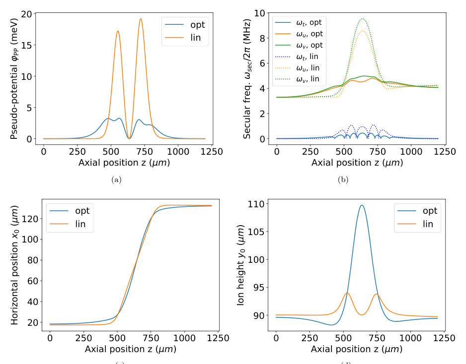 
FIG. 3. Pseudo-potential φPP, secular frequencies ωi, horizontal minimum position x0 and ion-surface distance y0 as a function of axial position z for linear and optimized transition zones. The values are along the rf minimum path ⃗ξ(z) = (x0(z), y0(z), z). All calculations assume 194.5 V rf amplitude and an rf drive frequency of 2π × 31.91 MHz. a) Tangential pseudo-potential along the rf minimum path. b) Secular frequencies of the eigenmodes, considering only rf electrode contributions. c) Horizontal position of the minimum x0, which is half the ion-ion distance s0 in the central double-well. d) The ion-surface separation y0 as function of the axial position z.

📷 Fig 4

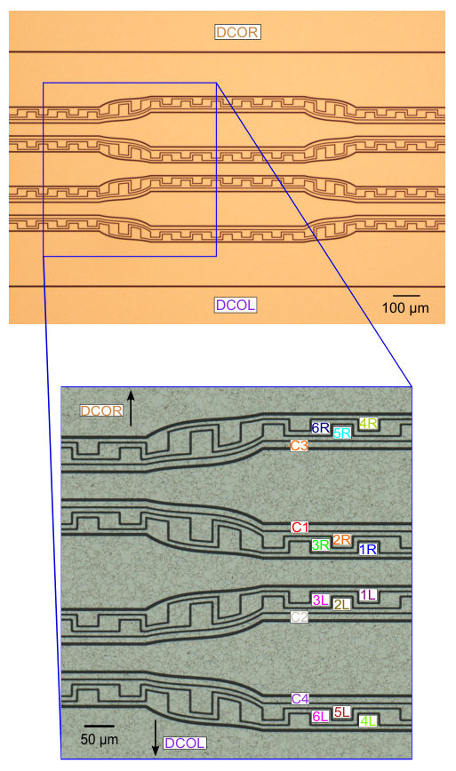 
FIG. 4. Optical microscopy image of the center of the ion trap chip. One can see the “meander-shaped” dc electrodes. Blue box: Optical microscopy image of the “meander-shaped” dc electrodes with labels between the rf electrodes in the inter- action and the transition zones. Indicated by arrows, but not shown in the blue box, is one rectangular dc electrode outside of the rf rails on each side (DCOR, DCOL).

📷 Fig 5

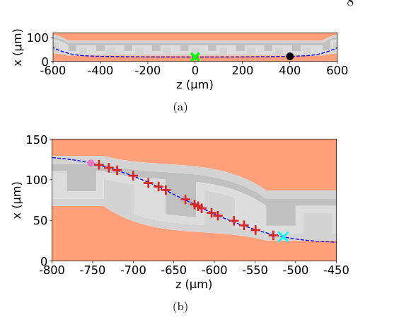 
FIG. 5. Horizontal projections of the shuttling along the rf minimum path on the trap surface. a) Rf minimum path (blue dashed line) with starting point (green cross) and end point (black circle). b) Horizontal projection of the rf mini- mum path through a transition zone on the trap surface (blue dashed line). The measured shuttling process started at the cyan cross and ended at the pink circle. Red points in between are measured ion positions. The points are plotted without error bars for better visibility. The uncertainty of each point, given by the CCD camera read-off error, is ±2.3 µm in each direction.

**Summary.** The paper presents a new ion trap chip design that allows for the tuning of radial coupling in 2D ion lattices using only DC voltages. By optimizing electrode geometry, the authors successfully demonstrated reliable ion transport through transition zones with low heating rates. This approach provides a scalable path toward large-scale quantum computing using complex 2D architectures.

**Why it may be interesting.** This work provides a scalable hardware solution for 2D ion trap architectures, which is crucial for implementing large-scale quantum simulations and many-body dynamics in multidimensional ion crystals.

Detailed structure

**Main problem.** The difficulty of controlling radial separation between ion chains in Quantum Spring Array (QSA) architectures without using RF voltage modulation, which causes high heating rates.

**Main result.** Demonstration of a new ion trap design that enables radial transport and tuning of ion separation using only DC voltages, significantly reducing pseudo-potential barriers and heating.

**Method.** The researchers used an optimization strategy (Nelder-Mead solver) to design curved RF electrodes and transition zones, then fabricated a prototype on a fused silica substrate and characterized it using 40Ca+ ions.

**Model / system.** A microfabricated surface ion trap chip featuring a Quantum Spring Array (QSA) architecture, where ion chains are arranged in a 2D lattice and interact via the Coulomb force.

**Key observables.** Radial transport fidelity, ion heating rates, stray electric fields, micromotion modulation index, and radial secular frequencies.

**Important parameters / regimes.** RF drive frequency of 31.91 MHz, RF amplitude of 194.5 V, ion-surface separation of ~90 micrometers, and heating rates of 18 +/- 3 ph/s.

**Assumptions / limitations.** The design uses the gapless plane approximation, neglecting the physical gaps between RF and DC electrodes.

**Figures summary.** Figure 1 shows the trap geometry and coupling modes; Figure 2 compares linear vs. optimized electrode transition zones; Figure 3 illustrates the reduction in pseudo-potential barriers and frequency variation; Figure 8 and 9 show microscopy of the multi-layer trap and its vias.

**Paper structure.** The paper introduces the QSA architecture and the limitations of RF-based tuning, presents the optimized curved electrode design and its simulation, demonstrates experimental transport and characterization of a single-layer prototype, and concludes with a scaling path using a multi-layer fabrication approach.

Abstract

Microfabricated ion trap chips are at the core of some of the most advanced quantum computers. How a large number of ions is arranged and controlled on an ion trap chip depends on the chosen trap architecture. One such architecture is the quantum spring array (QSA). In the QSA architecture, ion chains are arranged in a two-dimensional lattice and interact with ion chains in neighboring sites in the radial and axial directions of the respective chain. This interaction, or coupling, is mediated by the Coulomb force while keeping ions in separate trapping sites, and scales inversely with the third power of the separation. The capability to control the distance between ions in the lattice is thus essential. In previous works, the radial separation between ions was tuned by controlling the rf pseudo-potential, which revealed to be experimentally challenging to realize while maintaining low heating rates. In this work, we present an ion trap chip design that allows tuning of the radial distance between ions using only dc voltages. The radial transport is executed between different interaction zones, designated for quantum operations, through specifically designed transition zones. A prototype of this type of ion trap chip was microfabricated on fused silica substrate. Its functionality is characterized by demonstrating dc-controlled radial transport of a single ion through a transition zone and measuring stray fields and ion heating rates in the center of the trap. Moreover, the fabrication of a multi-metal layer version of such a trap is presented as a scaling path for the presented chip design.

[↑ back to top](#top)

### [Closed-form Bayesian quantum estimation of Gaussian states](http://arxiv.org/abs/2605.16978v1)

**Authors:** Edward Gandar, Jesús Rubio  
**Type:** theory · **Category:** quantum information and computing · **PDF:** <https://arxiv.org/pdf/2605.16978v1>  
**Analysis basis:** full PDF text, analyzed in chunks
**Topic relevance:** 🔥 `quantum measurements` **4/5** · `methods for driven-dissipative` **2/5**

📷 Fig 1

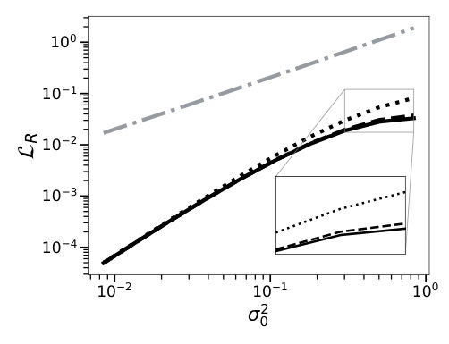 
Figure 1. Relative MSL in Eq. (43) as a function of the prior variance σ2 0 for estimating a displacement parameter θ as per Eq. (44). Here, we use a uniform prior with width ∆and variance σ2 0 = ∆2/12, and ρin is a coherent state with α = 0.5(1 + i). The dotted and dashed curves denote the relative MSL of the linear {1, ˆq} and cubic {1, ˆq, ˆq3} subspaces, respectively, representing q-homodyne meas- urements with linear and cubic estimators. The solid curve shows the performance of q-homodyne measurements combined with the PM estimator, which includes contributions from all orders. The grey dot-dashed curve indicates the prior MSL ratio for reference.

📷 Fig 2

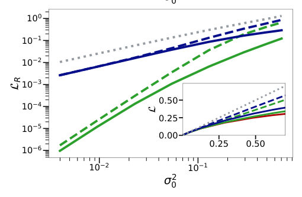 
Figure 2. Relative MSL in Eq. (43) as a function of the prior variance σ2 0 for a Gaussian prior. Here, the task is estimating the squeezing parameter θ encoded as per Eq. (55), for a vacuum (top) and thermal (bottom) state ρin with ¯n = 0.1. In both plots, the dashed and solid green curves denote the relative MSL for the {1, ˆq2, ˆp2} subspace with the constrained [Eq. (60)] and PM estimator [Eq. (19)] respect- ively. Similarly, the dashed and solid blue curves show the relat- ive MSL of the {1, ˆq2 ϕ} subspace at homodyne angles ϕ = 0 or π/2—chosen to minimise the MSL Eq. (67)—with the constrained [Eq. (68)] and PM estimator [Eq. (19)] respectively. The grey dot- dashed curve indicates...

**Summary.** This paper introduces a closed-form method for Bayesian quantum estimation of Gaussian states by approximating the optimal operator within a finite-dimensional polynomial subspace. It transforms a complex, infinite-dimensional optimization problem into a tractable linear algebra problem. The framework allows for the design of near-optimal, experimentally feasible measurement strategies for tasks like displacement and squeezing estimation.

**Why it may be interesting.** It provides a practical, analytical tool for optimizing continuous-variable quantum metrology, bridging the gap between complex numerical Bayesian methods and experimentally implementable Gaussian operations.

Detailed structure

**Main problem.** The computational intractability of Bayesian quantum estimation for continuous-variable Gaussian states due to infinite-dimensional optimization and complex parameter integrals.

**Main result.** A variational framework that reduces the optimization of measurements and estimators to a finite-dimensional linear problem with closed-form solutions using polynomial subspaces.

**Method.** The authors use a variational approach restricting operators to a polynomial subspace of canonical quadratures, transforming the Mean Square Loss minimization into a solvable linear system involving a Gram matrix.

**Model / system.** Continuous-variable (CV) quantum systems consisting of N bosonic modes, specifically focusing on Gaussian states characterized by mean vectors and covariance matrices.

**Key observables.** Canonical quadratures (q and p), Symmetric Posterior Mean (SPM) operator, and Weyl symbols.

**Important parameters / regimes.** Displacement parameter, squeezing parameter, prior variance (Gaussian and uniform), and thermal photon number.

**Assumptions / limitations.** The input states are Gaussian; the optimization is restricted to a polynomial subspace; the Gaussian state is assumed to be faithful.

**Figures summary.** Figure 1 compares relative Mean Squared Loss for different polynomial estimators (linear, cubic) and the posterior mean in displacement estimation. Figure 2 shows the convergence of constrained and posterior mean estimators toward the global minimum for squeezing estimation.

**Paper structure.** The paper introduces the computational bottleneck in Bayesian QET, proposes a variational framework using polynomial subspaces, provides a geometric interpretation of the solution as an orthogonal projection, derives optimality conditions, and validates the method with single-shot examples of displacement and squeezing estimation.

Abstract

Bayesian quantum estimation provides a robust framework for quantum technologies, especially in scenarios with limited data and minimal prior information. Yet, its application to continuous-variable Gaussian systems has remained limited and largely numerical due to the complexity of the underlying parameter integrals. Here, we introduce a variational framework reducing the optimisation over measurements and estimators to a finite-dimensional linear problem and admitting closed-form solutions. This is achieved by restricting the analysis to operators polynomial in the canonical quadratures, leading to solutions with a geometric interpretation as orthogonal projections of the global optimum. We further derive a necessary and sufficient condition for global optimality. Through single-shot examples, we show that the framework yields experimentally feasible strategies based on Gaussian operations and quadrature measurements that are either optimal or near-optimal, and that replacing the induced estimator with the posterior mean further improves performance towards the global optimum.

[↑ back to top](#top)

### [Exact Entanglement-Depth Speed Frontier for Complete Quantum Charging](http://arxiv.org/abs/2605.16935v1)

**Authors:** Wenlong Sun, Gang Lu, Yuanfeng Jin  
**Type:** theory · **Category:** quantum information and computing · **PDF:** <https://arxiv.org/pdf/2605.16935v1>  
**Analysis basis:** full PDF text, analyzed in chunks
**Topic relevance:** 🔥 `entanglement & information structure` **4/5** · `non-equilibrium dynamics` **2/5**

📷 Fig 1

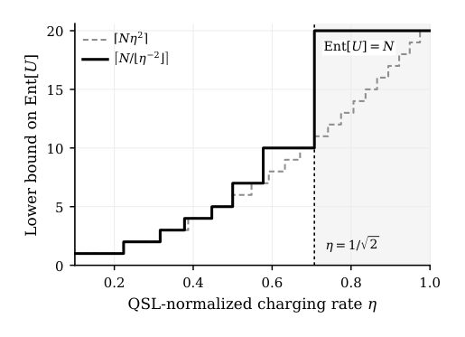 
FIG. 1: Exact integer speed–depth frontier for coherent com- plete charging, shown for N = 20. The staircase gives the cer- tified trajectory entanglement depth Dcert(η) = ⌈N/⌊η−2⌋⌉ from an observed QSL-normalized rate η = τQSL/T. The threshold η &gt; 1/ √

**Summary.** This paper proves that the speed of charging a quantum battery is fundamentally limited by the amount of multipartite entanglement present in the system. It establishes an exact 'staircase' relationship where faster charging rates directly certify higher levels of entanglement depth, including genuine N-partite entanglement.

**Why it may be interesting.** It provides a model-independent, orbit-level diagnostic for quantifying many-body entanglement resources based solely on the observed speed of a dynamical process.

Detailed structure

**Main problem.** Determining the fundamental relationship between the speed of a complete quantum charging process and the amount of multipartite entanglement depth required to achieve that speed.

**Main result.** The authors establish an exact integer staircase frontier relating the QSL-normalized rate to entanglement depth, proving that crossing the threshold eta > 1/sqrt(2) certifies genuine N-partite entanglement.

**Method.** The study uses Quantum Speed Limit (QSL) geometry, specifically the Mandelstam-Tamm bound, combined with Minkowski's integral inequality and a Baire category argument to relate path speed to block orthogonalization.

**Model / system.** A closed N-qubit quantum battery undergoing unitary evolution from an all-down state to an all-up state under a time-independent Hamiltonian.

**Key observables.** QSL-normalized rate (eta), entanglement depth (Ent[U]), and the number of independent blocks (m).

**Important parameters / regimes.** N-qubit system size, entanglement depth constraint (k), and the threshold eta = 1/sqrt(2) for N-partite entanglement.

**Assumptions / limitations.** The results apply to finite-dimensional pure-state complete charging under a closed, time-independent Hamiltonian with exact endpoint conditions.

**Figures summary.** Figure 1 displays the exact integer staircase frontier for N=20, plotting the charging rate against the lower bound on entanglement depth.

**Paper structure.** The paper introduces the problem of quantum charging speed, defines the QSL-normalized rate, provides the mathematical derivation of the speed-depth frontier using block orthogonalization, constructs a saturated model to prove sharpness, and concludes with entanglement certification thresholds.

Abstract

Complete quantum charging provides a sharp setting in which to ask how much multipartite entanglement is forced by speed itself. For a closed \(N\)-qubit battery evolving from \(\ket{\downarrow}^{\otimes N}\) to \(\ket{\uparrow}^{\otimes N}\) under a time-independent Hamiltonian, we exactly solve the pure-state depth-constrained speed problem. If the realized trajectory has entanglement depth at most \(k\), then the largest possible QSL-normalized rate \(η=τ_{\rm QSL}/T\) is \(η_{\max}(k)=\lceil N/k\rceil^{-1/2}\). Conversely, an observed rate \(η\) certifies trajectory entanglement depth at least \(\bigl\lceil N/\lfloor η^{-2}\rfloor\bigr\rceil\). The mechanism is block orthogonalization: under a fixed product partition, complete charging forces all blocks to orthogonalize simultaneously, and the quantum speed limit converts this counting constraint into the speed bound. Balanced cluster-flip evolutions saturate the bound, establishing an exact integer staircase frontier. Thus fast complete charging cannot be explained by many small independently charging blocks; in particular, crossing the threshold \(η>1/\sqrt2\) certifies, for \(N>1\), the generation of genuine \(N\)-partite entanglement.

[↑ back to top](#top)

### [Krylov complexity and fidelity susceptibility in two-band Hamiltonians](http://arxiv.org/abs/2605.18594v1)

**Authors:** Rishav Chaudhuri, Ayush Raj, Soham Ray, Sai Satyam Samal  
**Type:** theory · **Category:** statistical mechanics · **PDF:** <https://arxiv.org/pdf/2605.18594v1>  
**Analysis basis:** full PDF text, analyzed in chunks
**Topic relevance:** 🔥 `entanglement & information structure` **4/5** · `non-equilibrium dynamics` **2/5**

📷 Fig 1

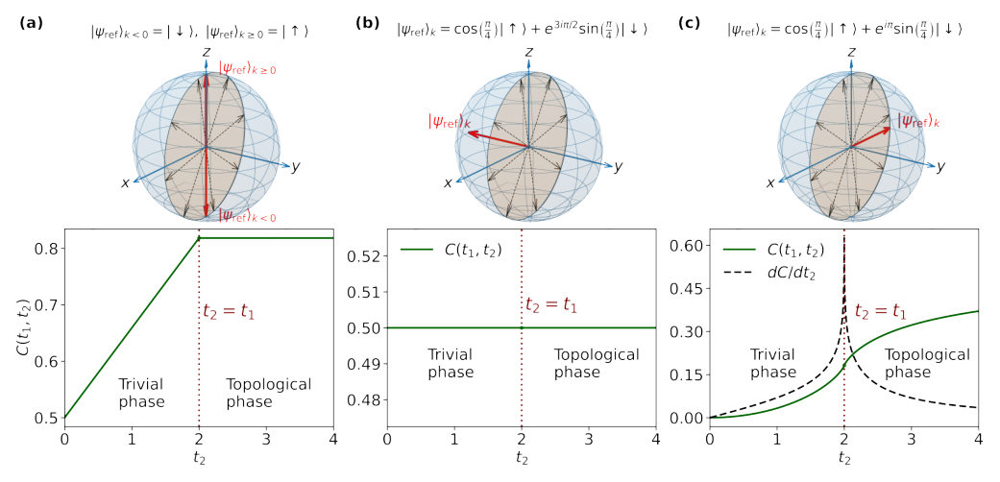 
Figure 2. Krylov spread complexity for the ground state of the Su-Schrieffer-Heeger (SSH) model for different choices of reference state. (a) The reference state |ψref⟩is momentum-dependent, and the corresponding Bloch sphere vector is ˆnref(k) = (0, 0, −1) for k &lt; 0 and ˆnref(k) = (0, 0, 1) for k ≥0. The spread complexity is linearly dependent on t2 in the trivial phase and shows a constant plateau in the topological phase, recovering earlier results [40]. (b) The spread complexity is a constant across both the trivial and the topological phase for ˆnref(k) = (0, −1, 0). (c) With ˆnref(k) = (−1, 0, 0), the derivative of the spread complexity with respect to t2 shows a logarithmic...

📷 Fig 2

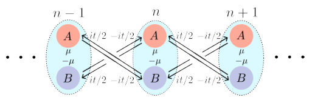 
Figure 3. Tight-binding model for the massive Dirac Hamil- tonian. Each unit cell contains two sublattices A and B, with an imaginary hopping amplitude it/2 between the sublattices A and B in adjacent unit cells, and a staggered chemical po- tential µ for sublattice A, and −µ for sublattice B.

📷 Fig 3

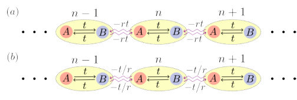 
Figure 4. Dual SSH models with intracell coupling t, and (a) intercell coupling −rt, (b) intercell coupling −t/r.

**Summary.** This paper demonstrates that the derivative of Krylov spread complexity can detect any gap-closing event in two-band models, not just topological transitions. By establishing a mathematical bound related to fidelity susceptibility, the authors show that complexity captures the non-analyticity of the system's energy spectrum. They also uncover a universal scaling ratio and a duality between topological and trivial phases in the SSH model.

**Why it may be interesting.** This is highly relevant for many-body dynamics as it provides a new geometric tool to detect criticality and explores the fundamental relationship between quantum complexity and the sensitivity of the ground state to parameter changes.

Detailed structure

**Main problem.** The paper investigates whether Krylov spread complexity can serve as a diagnostic for phase transitions and gap-closing events in two-band Hamiltonians.

**Main result.** The authors prove that the derivative of Krylov spread complexity is bounded by fidelity susceptibility, meaning it is sensitive to both topological and trivial gap closings, and they identify a universal ratio between these two quantities.

**Method.** The study uses a geometric formulation based on Bloch sphere data to calculate complexity without constructing a circuit Hamiltonian, alongside analytical integration using elliptic functions.

**Model / system.** The analysis focuses on two-band Hamiltonians, specifically the Su-Schrieffer-Heeger (SSH) model for topological transitions and the massive Dirac Hamiltonian for trivial gap closings.

**Key observables.** Krylov spread complexity, fidelity susceptibility, winding number (Zak phase), and the ratio between the complexity derivative and the square root of fidelity susceptibility.

**Important parameters / regimes.** Hopping amplitudes (t1, t2), mass parameter (mu), Bloch sphere angles (theta, phi), and the duality parameter (r).

**Assumptions / limitations.** The derived inequality assumes a momentum-independent reference state, and the scope is primarily limited to two-band Hamiltonian systems.

**Figures summary.** Figures show the SSH model lattice structure, plots of Krylov complexity and its derivative exhibiting logarithmic divergence and plateaus, and the symmetry/saturation of the ratio R between complexity and fidelity susceptibility.

**Paper structure.** The paper introduces the problem of complexity as a phase probe, develops a geometric formulation for two-band models, applies this to the SSH and Dirac models to compare topological vs. trivial transitions, establishes mathematical bounds and duality, and extends the analysis to non-Hermitian systems.

Abstract

We investigate Krylov spread complexity for the ground state of two-band Hamiltonians, where the reference state is a generic state on the Bloch sphere. The spread complexity is obtained by using a purely geometric formulation in terms of Bloch sphere data without constructing the circuit Hamiltonian. For generic reference states, the derivative of the spread complexity is logarithmically divergent at the topological phase transition in the Su-Schrieffer-Heeger (SSH) model. We demonstrate that the derivative of the spread complexity is bounded by fidelity susceptibility for general two-band models, indicating the sensitivity of the spread complexity to any gap closing (topological or trivial). This is illustrated in the massive Dirac Hamiltonian with a trivial gap closing. Finally, we introduce a non-unitary duality in the SSH model between the topological and trivial phases, which manifests itself in the spread complexity and fidelity susceptibility.

[↑ back to top](#top)

### [Non-Gaussian Entanglement Hierarchy Based on the Schmidt Number](http://arxiv.org/abs/2605.18605v1)

**Authors:** Jiajie Guo, Shuheng Liu, Matteo Fadel, Qiongyi He  
**Type:** theory · **Category:** quantum information and computing · **PDF:** <https://arxiv.org/pdf/2605.18605v1>  
**Analysis basis:** full PDF text, analyzed in chunks
**Topic relevance:** 🔥 `entanglement & information structure` **4/5** · `Keldysh / 2PI / non-Gaussian methods` **2/5**

📷 Fig 1

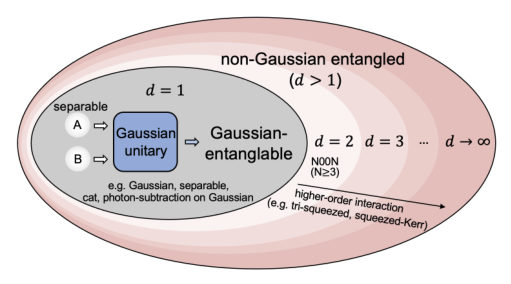 
FIG. 1. Hierarchy of Gaussian-entanglable and non-Gaussian entangled states. The witness ENG(ρ) defines a hierarchy by a pos- itive integer d = ⌈ENG(ρ)⌉. For d = 1, the states are Gaussian- entanglable ρ ∈GE, generated by applying a two-mode Gaussian unitary to separable inputs. This class includes all Gaussian and sep- arable states, as well as some non-Gaussian states such as two-mode cat states and photon subtractions on pure Gaussian states. States with ENG(ρ) &gt; 1 are certified as non-Gaussian entangled, and larger d witnesses higher non-Gaussian entanglement dimensions. For pure states, the condition becomes sharp: ENG(ρ) &gt; 1 reveals genuine non-Gaussian entanglement, and d provides a...

📷 Fig 2

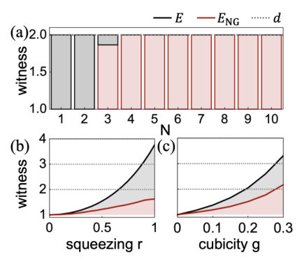 
FIG. 2. Certifying non-Gaussian entanglement in bipartite pure states. We compare the typical entanglement witness E in Eq. (6) and the NGE witness ENG in Eq. (7) for (a) NOON states |ψNOON⟩, (b) superpositions of two-mode squeezed-vacuum (TMSV) states |ψsTMSV⟩, (c) tri-squeezed states |ψ3−SPDC⟩. Dotted lines rep- resent the non-Gaussian entanglement dimensions witnessed by the integer d = ⌈ENG⌉.

📷 Fig 3

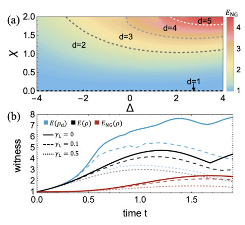 
FIG. 3. Non-Gaussian entanglement and entanglement distilla- tion in two-mode squeezed Kerr states. (a) For t = 1, KA = 1, the NGE witness ENG for pure squeezed-Kerr states changes with χ and ∆. Dotted contours indicate the witnessed non-Gaussian entangle- ment dimension d = {1, · · · , 5}. (b) For ∆A = 0, KA = 1, χ = 1 and different loss rates γL = {0, 0.1, 0.5}, we compare the entanglement witnesses E(ρ) and ENG(ρ) and the distilled entanglement E(ρd) as the functions of times t.

📷 Fig 4

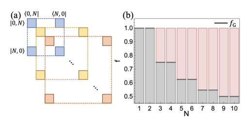 
FIG. 4. Experimentally practical NOON-type witness for gen- uine non-Gaussian entanglement. (a) The witness requires only four density-matrix elements in the subspace of target NOON states. (b) The Gaussian-entanglable threshold fG for different N. If the de- tection statistics f lies in the red regions, f &gt; fG, certifies genuine non-Gaussian entanglement.

📷 Fig 5

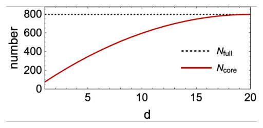 
FIG. 5. The complexity of pure state learning in a finite-energy truncation with local dimension D = 20. The red solid line, Ncore(d) = 2d(2D −d) −2, provides a lower bound on the number of real parameters required to learn the pure state, while the black dashed line, Nfull = 2D2 −2, shows the full tomography complexity. The witnessed integer d = ⌈ENG⌉therefore reflects the complexity of learning two- mode pure states.

**Summary.** This paper establishes a new hierarchy for non-Gaussian entanglement in bosonic systems using a quantitative witness based on the Schmidt number. It connects the level of non-Gaussianity to the complexity of quantum state learning and proves that such entanglement can be distilled using only Gaussian operations. This provides a practical tool for identifying and utilizing non-Gaussian resources in quantum optical and circuit-QED platforms.

**Why it may be interesting.** It provides a rigorous framework for classifying non-Gaussian resources in continuous-variable systems, directly linking entanglement dimensionality to the practical difficulty of quantum state tomography and the utility of Gaussian-based distillation.

Detailed structure

**Main problem.** The challenge of quantifying and characterizing non-Gaussian entanglement in bipartite bosonic systems and establishing a hierarchy that connects entanglement dimension to state-learning complexity.

**Main result.** The authors introduce a quantitative witness E_NG that defines a natural hierarchy of non-Gaussian entanglement based on the Schmidt number, and demonstrate that this entanglement can serve as a resource for distillation using only Gaussian operations.

**Method.** The study uses the trace norm of the partial transpose minimized over Gaussian unitaries to define the witness, alongside complexity analysis for state reconstruction and a two-copy distillation protocol.

**Model / system.** Bipartite bosonic systems, specifically focusing on continuous-variable states such as NOON states, squeezed Kerr states, and photon-subtracted Gaussian states, applicable to platforms like circuit-QED and quantum acoustics.

**Key observables.** The non-Gaussian entanglement witness E_NG, the Schmidt number hierarchy d, and the expectation value of a NOON-type witness operator F.

**Important parameters / regimes.** Squeezing strength, nonlinearity (Kerr parameter), loss rates, and the Gaussian-entanglable threshold f_G.

**Assumptions / limitations.** The optimization of the witness is performed over an effective set of Gaussian unitaries, and the distillation protocol assumes the availability of local homodyne measurements and classical communication.

**Figures summary.** Figure 1 illustrates the hierarchy of GE and non-Gaussian entangled states, linking the integer d to entanglement levels and state-learning complexity; Figure 5 shows the scaling of reconstruction complexity as a function of the entanglement integer d.

**Paper structure.** The paper introduces the problem of non-Gaussian entanglement, defines the E_NG witness and its hierarchy, provides mathematical proofs for its properties, benchmarks the framework with specific states (NOON, Kerr), analyzes robustness to loss, proposes an experimental NOON-type witness, and demonstrates entanglement distillation protocols.

Abstract

Non-Gaussian entanglement is a promising resource in various quantum tasks. A recently defined class identifies entanglement that cannot be generated by applying Gaussian operations to separable inputs. To further explore the entanglement in this context, we introduce a quantitative witness $E_{\rm NG}$ in bipartite bosonic systems, which satisfies $E_{\rm NG}=1$ for all Gaussian-entanglable states, while $E_{\rm NG}>1$ certifies non-Gaussian entanglement. Its ceiling $d=\lceil E_{\rm NG}\rceil$ provides a lower bound on the Schmidt number irreducible by Gaussian transformations, thereby defining a natural hierarchy of non-Gaussian entanglement. For pure states, the condition is sharp and the hierarchy reflects the complexity of state learning. We benchmark the framework with some paradigmatic non-Gaussian states, such as NOON states and squeezed Kerr states, and analyze its robustness against loss. Moreover, we construct an experimentally economical NOON-type witness requiring only four projective measurements, where an analytical Gaussian-entanglable threshold is derived. These results establish an operationally meaningful and experimentally accessible framework for identifying non-Gaussian entanglement resources in continuous-variable quantum platforms.

[↑ back to top](#top)

### [Quantum randomness beyond projective measurements](http://arxiv.org/abs/2605.18291v1)

**Authors:** Fionnuala Curran  
**Type:** theory · **Category:** quantum information and computing · **PDF:** <https://arxiv.org/pdf/2605.18291v1>  
**Analysis basis:** full PDF text, analyzed in chunks
**Topic relevance:** 🔥 `quantum measurements` **4/5** · `entanglement & information structure` **2/5**

📷 Fig 1

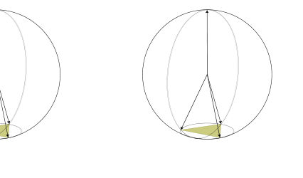 
Figure 1: Skewed SIC POVMs in dimension two.

📷 Fig 2

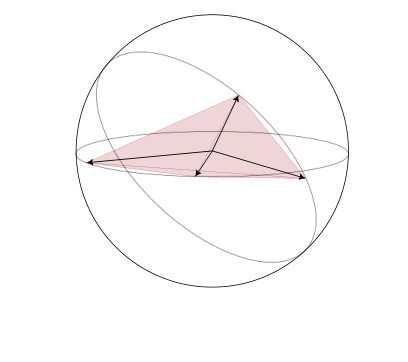 
Figure 2: Unbiased extremal measurements in dimension two.

📷 Fig 3

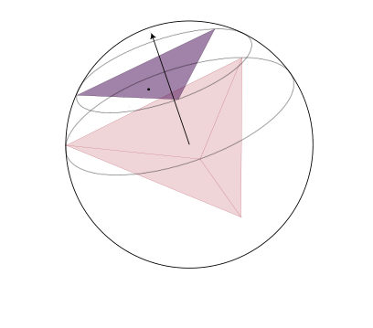 
Figure 3: Regions of the Bloch ball for an unbiased qubit MIC.

📷 Fig 4

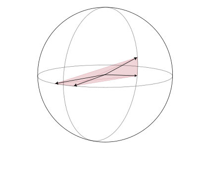 
Figure 4: Two scissors measurements in dimension two.

📷 Fig 5

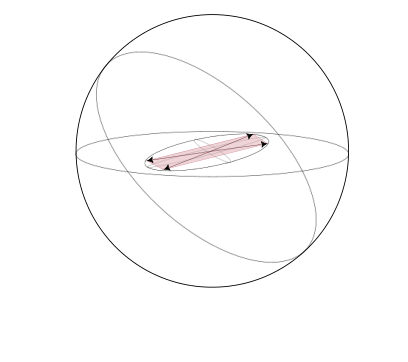 
Figure 5: The space of average post-measurement states ⃗R for unbiased MICs in dimension two.

**Summary.** This paper investigates how much randomness can be extracted from non-projective quantum measurements. It proves that a new class of 'skewed SIC' measurements can achieve the theoretical maximum of randomness and identifies the SIC measurement as the least random among certain qubit measurement classes.

**Why it may be interesting.** This is highly relevant for quantum optics and quantum information as it provides fundamental bounds on randomness extraction and characterizes the security of measurement-based protocols against eavesdroppers.

Detailed structure

**Main problem.** Quantifying the amount of intrinsic quantum randomness generated by extremal measurements beyond standard projective measurements, specifically determining which measurements maximize or minimize the guessing probability of an eavesdropper.

**Main result.** The paper identifies that SIC measurements are the least random among unbiased qubit measurements and introduces 'skewed SIC' measurements that can generate the maximal $2 \log d$ bits of randomness in dimensions where SICs exist.

**Method.** The author uses semidefinite programming (SDP) dualities, geometric analysis of polytopes in the Bloch ball, and KKT optimality conditions to characterize guessing probabilities and randomness.

**Model / system.** The study focuses on finite-dimensional quantum systems (qubits, qutrits, and ququarts) using Positive Operator-Valued Measures (POVMs), specifically rank-one extremal and Symmetric Informationally Complete (SIC) measurements.

**Key observables.** Conditional min-entropy $H_{\min}(
ho, M)$, optimal guessing probability $P_{	ext{guess}}$, and quantum fidelity $F(
ho, \sigma)$.

**Important parameters / regimes.** Dimension $d$, scaling parameter $\gamma$ for skewed SICs, noise parameter $\epsilon$, and angular parameters $\delta$ and $\alpha$ for qubit/qutrit measurement families.

**Assumptions / limitations.** The analysis primarily focuses on rank-one extremal POVMs and assumes a device-dependent or source-device-independent framework.

**Figures summary.** Figures illustrate geometric regions in the Bloch ball, the comparison between SIC and 'scissors' POVMs, and the space of average post-measurement states.

**Paper structure.** The paper begins by defining the problem of intrinsic randomness, moves to characterizing unbiased extremal qubit measurements, introduces the skewed SIC family and its randomness-generating properties, and concludes with higher-dimensional constructions for qutrits and ququarts.

Abstract

The unpredictability of quantum physics gives rise to intrinsic randomness. In an adversarial scenario, any additional degrees of freedom must be attributed to an eavesdropper with correlations to the measurement set-up. The true randomness is then quantified by the probability that she correctly guesses the measurement outcomes, optimised over all possible strategies. Extremal measurements are appealing here, since they do not allow information to leak to such an eavesdropper. Beyond projective measurements, however, a simple question remains open: how much intrinsic randomness can be generated by a given extremal measurement? In a step towards solving it, we characterise the randomness generated by any unbiased extremal rank-one measurement acting on any state, solving the problem explicitly in dimension two. Four-outcome qubit measurements of this type are tomographic, so these results hold for fully source-device-dependent randomness too. The tetrahedral symmetric informationally complete (SIC) measurement, we find, has the least intrinsic randomness within this class. We also present the skewed SIC family of measurements, and use them to partially solve an open problem: we prove that $2 \log d$ bits of randomness, the maximal amount, can be generated device-dependently (or source-device-independently) in any dimension in which there exists a SIC measurement.

[↑ back to top](#top)

### [Schedule-dependent basin occupation in a programmable quantum annealer](http://arxiv.org/abs/2605.17604v1)

**Authors:** Luis Lozano  
**Type:** both · **Category:** disordered systems and neural networks · **PDF:** <https://arxiv.org/pdf/2605.17604v1>  
**Analysis basis:** full PDF text, analyzed in chunks
**Topic relevance:** 🔥 `QC/QI experiment` **4/5** · `non-equilibrium dynamics` **2/5**

📷 Fig 1

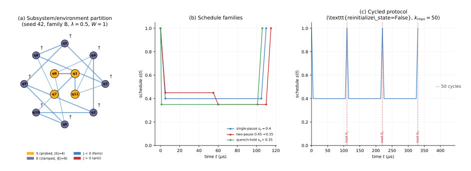 
Figure 1: Experimental protocol. (a) Subsystem/environment partition on a representative benchmark instance (seed 42, family B; λ = 0.5, W = 1): four subsystem qubits S (orange) are probed while eight environment qubits E (grey) are clamped to their initial product configuration (arrows). Edges color the longitudinal couplings Jij (blue J &lt; 0, red J &gt; 0), with line width proportional to |Jij|. (b) Schedule-family comparison: single-pause reverse anneal at sp = 0.4, two-pause reverse anneal s1 = 0.45 →s2 = 0.35, and quench-and-hold at sq = 0.35. (c) Cycled reverse-anneal protocol: a single submission of K = 50 anneals with reinitialize state=False produces a K-step Markov chain through the...

📷 Fig 2

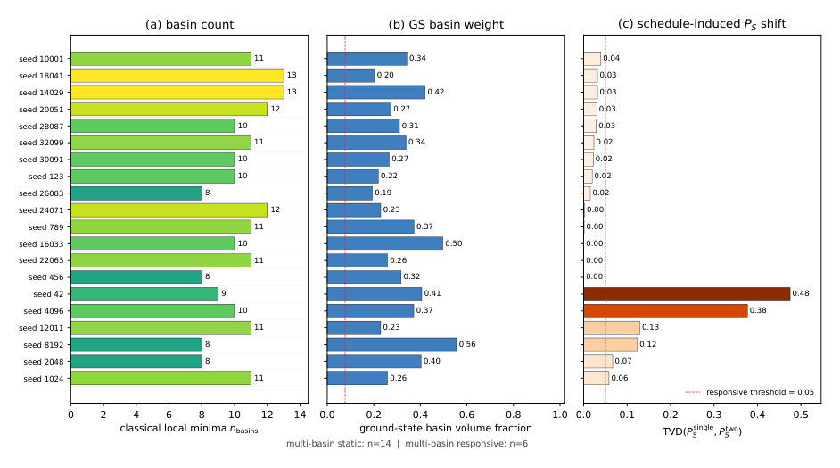 
Figure 2: Instance taxonomy across the twenty training seeds. Rows are the twenty random- regular family-B seeds, sorted so the most schedule-responsive instances sit at the top and schedule- static instances at the bottom. (a) Classical local-minimum count nbasins from exhaustive steepest- descent enumeration of the 212 configurations. All seeds are multi-basin at the full-system level (nbasins ∈[8, 13]). (b) Ground-state basin volume fraction (basin of the global minimum, as a fraction of configuration space); dashed red line is the uniform-over-basins reference 1/nmax basins. (c) Schedule-induced subsystem total-variation distance TVD(P single-pause S , P two-pause S ) between single-...

📷 Fig 3

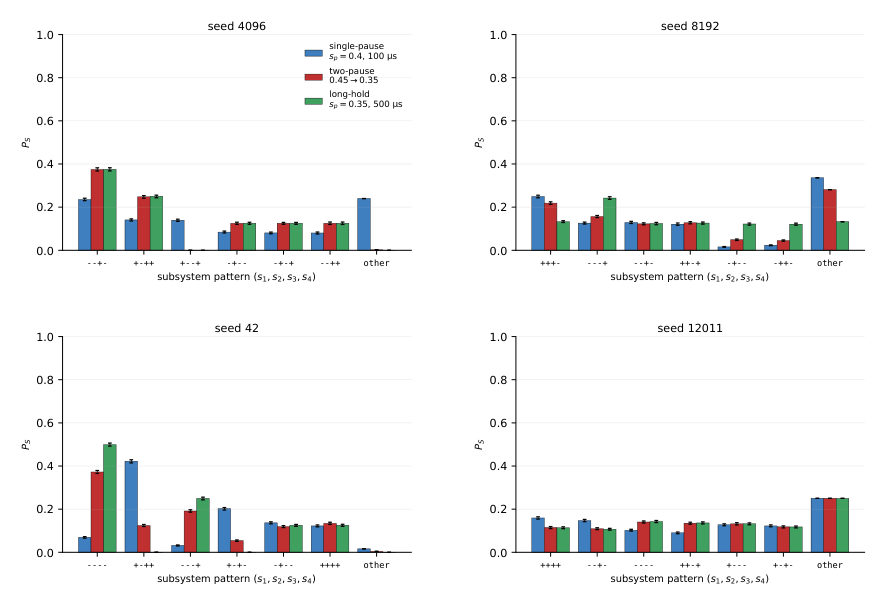 
Figure 3: Representative schedule-dependent subsystem basin-occupation shifts on four of the six responsive seeds. Empirical subsystem distribution PS for four of the six schedule- responsive seeds identified in Fig. 2, under three reverse-anneal schedules: single-pause (sp = 0.4, 100 µs; blue), two-pause (0.45 →0.35; red), and long-hold single-pause (sp = 0.35, 500 µs; green). Each panel shows the top six subsystem patterns (s1, s2, s3, s4) ranked by maximum frequency across the three schedules, with residual weight lumped into “other”. Error bars are bootstrap 95% CIs over Phase 2 atlas reads (19,200 reads per seed-schedule after pooling bath states, gauges and initial states). Seed 4096:...

📷 Fig 4

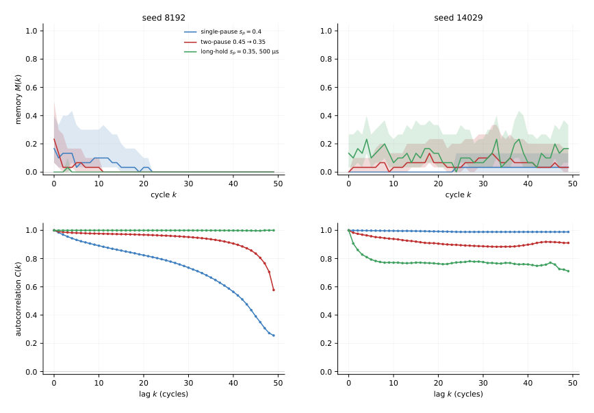 
Figure 4: Cycled reverse-anneal dynamics on Advantage2 at βeff = 7.22. Left column: seed 8192, a responsive multi-basin seed where pause depth and duration order the dynamics monotonically. Right column: seed 14029, a PT-unmatched instance (Fig. 5) that is schedule- insensitive here: all three schedules give overlapping M(k) and C(k) trajectories, yet none of them is matched by tested parallel tempering at the same β. Top row: memory order parameter M(k) = maxa̸=b TVD(PS(k | init=a), PS(k | init=b)) over 90 chains per schedule (30 chains each from three initial states S↑, S↓, Srandom); shaded bands are bootstrap 95% CIs over chain resampling. Bottom row: Markov-chain autocorrelation C(k) =...

📷 Fig 5

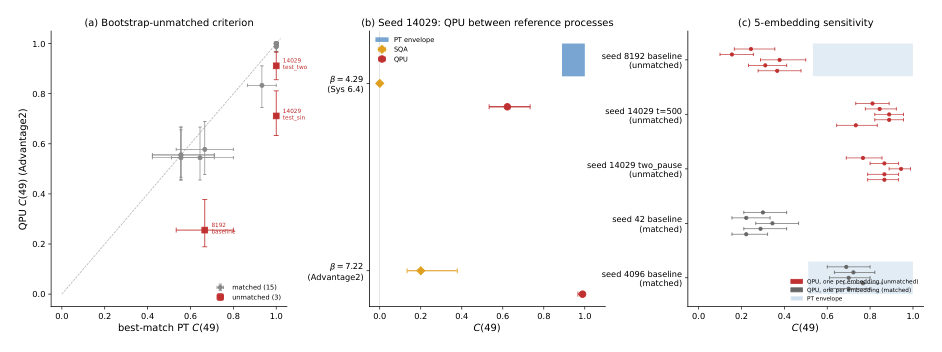 
Figure 5: Classical falsification with parallel tempering, path-integral SQA and a five- embedding sensitivity check. (a) QPU C(49) on Advantage2 at βeff = 7.22 versus the best- matched parallel-tempering C(49) at the same β, across all eighteen (seed, schedule) combinations in the v3 dataset. Error bars are bootstrap 95% CIs over 30 chains per QPU condition and 15 chains per PT sweep-budget (nsweeps ∈{10, 50, 200, 1000}). Grey circles: matched (QPU CI overlaps at least one tested PT configuration’s CI at the same seed). Red squares: unmatched (no PT overlap at any budget). (b) Dedicated bracket for seed 14029 at the two QPUs’ respective calibrated β: blue bars give the PT envelope width...

**Summary.** This paper investigates how different annealing schedules affect the distribution of energy basins in D-Wave quantum annealers. It demonstrates that while schedules can redistribute probability between local minima, they do not provide a universal quantum advantage over classical parallel tempering, and it corrects previous claims regarding the effectiveness of multi-pause schedules.

**Why it may be interesting.** not directly relevant

Detailed structure

**Main problem.** Investigating whether the shape of reverse-anneal schedules in a quantum annealer controls the final sampling distribution of energy basins beyond simple temperature rescaling, and determining if these effects are genuine quantum signatures or reproducible by classical Monte Carlo processes.

**Main result.** The study finds that for certain instances, the QPU dynamics sit strictly between localized parallel tempering and delocalified path-integral annealing, and that schedule engineering can redistribute probability among basins but does not provide a universal quantum advantage, refuting previous claims of a 'two-pause enhancement'.

**Method.** The authors used a cycled reverse-anneal protocol on D-Wave Advantage2 and Advantage system6.4 hardware, comparing results against classical parallel tempering (PT) and path-integral simulated quantum annealing (SQA) using a bootstrap-based statistical framework.

**Model / system.** 12-qubit Ising instances with mixed frustration on random 3-regular logical graphs, implemented on D-Wave Advantage2 (Zephyr) and Advantage system6.4 (Pegasus) quantum annealers.

**Key observables.** Subsystem configuration autocorrelation C(k), memory order parameter M, endpoint distances to classical/quantum Gibbs targets (D_cl, D_q), and basin occupation/weight redistribution.

**Important parameters / regimes.** Effective temperature (beta_eff approx 7.22 and 4.29), annealing schedules (single-pause, two-pause, quench-and-hold), and transverse-field scale (A approx 1.38 GHz).

**Assumptions / limitations.** The study assumes that the observed 'unmatched' signals are not artifacts of minor-embedding, which is supported by native-graph control experiments.

**Figures summary.** Figure 5(a) compares QPU autocorrelation against PT benchmarks across various schedules; Figure 6 shows native-graph control experiments on induced subgraphs of the Zephyr hardware graph.

**Paper structure.** The paper introduces the problem of schedule-dependent dynamics, describes the hardware and Ising models used, details the reverse-anneal and classical comparison protocols, presents results on basin occupation and the 'bracketing' effect, provides a native-graph control to rule out embedding artifacts, and concludes by refuting previous claims of universal quantum enhancement via two-pause schedules.

Abstract

On a mixed-frustration 12-qubit Ising instance (seed 14029) run on two D-Wave generations, Advantage2 Zephyr and Advantage_system6.4 Pegasus, the late-time subsystem autocorrelation under cycled reverse annealing sits strictly between two equilibrium reference processes at the device-calibrated effective temperature: localized parallel tempering, and delocalized equilibrated path-integral simulated quantum annealing at a fixed Advantage2 pause-point transverse-field scale. The bracket holds on all three tested schedules and at both hardware calibrations. We obtain this result through two ingredients: a cycled reverse-anneal protocol (reinitialize_state=False, 50 cycles per submission) used as a Markov-chain probe of the device's pause-point dynamics, and a parallel-tempering falsification framework with bias-corrected and accelerated bootstrap 95% confidence intervals. Of eighteen tested (seed, schedule) combinations on Advantage2, three are PT-unmatched and correspond to two distinct Ising instances; an independent native-graph control with no minor embedding on a third mixed-frustration instance reproduces the same direction of mismatch. Among twenty random training instances, schedule shape modulates basin occupation on six of the thirteen multi-basin-in-readout instances, with dominant-configuration shifts of up to 38 percentage points including changes of the dominant configuration. A pre-registered linear predictor of schedule sensitivity from exhaustively computable landscape features fails on ten held-out instances, indicating that schedule sensitivity is not captured by simple linear functions of the tested landscape moments. The bracketing result revises an earlier two-pause-enhancement claim and reframes reverse-anneal schedules as instance-specific basin-occupation probes rather than universal quantum-enhancement knobs.

[↑ back to top](#top)

### [Cryogenic Time-Division-Multiplexed Voltage Control for Scalable Trapped-Ion Quantum Processors](http://arxiv.org/abs/2605.17824v1)

**Authors:** Ryutaro Ohira, Shinichi Morisaka, Yoshinori Kurimoto, Toshiaki Inada, Ippei Nakamura, Takefumi Miyoshi, Atsushi Noguchi  
**Type:** experiment · **Category:** other · **PDF:** <https://arxiv.org/pdf/2605.17824v1>  
**Analysis basis:** full PDF text, analyzed in chunks
**Topic relevance:** 🔥 `QC/QI experiment` **4/5**

📷 Fig 1

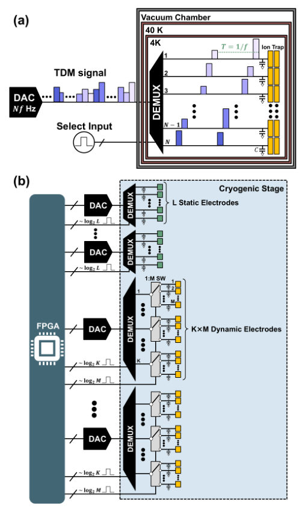 
FIG. 1. (a) Schematic of a TDM-based voltage control sys- tem for cryogenic ion traps. A representative cryogenic setup is shown, where a vacuum chamber contains 40-K and 4-K stages and the ion trap is mounted on the 4-K stage. A DAC at room temperature generates a TDM waveform at an up- date rate of Nf Hz, where N represents the number of trap electrodes. The waveform is sent to a demultiplexer (denoted as DEMUX) located at the 4-K stage, which distributes the signal to the individual electrodes. A holding capacitor con- nected to each demultiplexer output stores the voltage for the corresponding electrode via charging during the selected time slot. Consequently, each electrode is updated...

📷 Fig 2

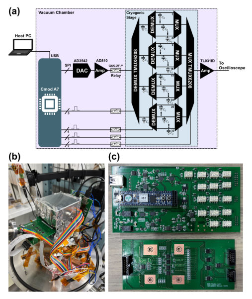 
FIG. 2. TDM-based voltage control system for static elec- trodes. (a) Schematic of the system architecture. (b) Cryo- genic measurement setup with the vacuum chamber removed. (c) TDM signal generation board and DEMUX board. The TDM signal generation board, shown at the top, includes an FPGA, a DAC, operational amplifiers, and relay switches. The 32-channel DEMUX board, shown at the bottom, is in- stalled on the cryogenic stage.

📷 Fig 3

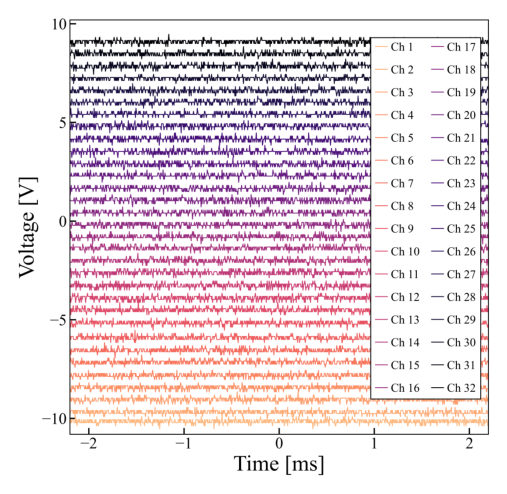 
FIG. 3. Measured DC output voltages of the 32-channel mul- tiplexed system at approximately 27 K.

📷 Fig 4

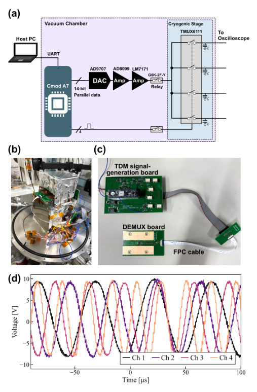 
FIG. 4. TDM-based voltage control system for dynamic elec- trodes. (a) Schematic of system architecture. (b) Cryogenic measurement setup with the vacuum chamber removed. (c) TDM signal generation board and DEMUX board, connected by a flexible printed circuit (FPC) cable. (d) Measured out- put waveforms from the four-channel demultiplexed system at approximately 14 K.

**Summary.** This paper demonstrates a cryogenic voltage control system using time-division multiplexing to reduce the number of wires needed for large-scale trapped-ion quantum processors. By successfully operating at 14 K and 27 K, the authors show that both static and dynamic electrode requirements can be met with significantly fewer vacuum feedthroughs. This approach provides a scalable path for managing the massive electrode counts required by QCCD architectures.

**Why it may be interesting.** This work provides a practical engineering solution to the scalability limits of trapped-ion processors, which is crucial for the realization of large-scale quantum computing architectures and complex many-body simulations in ion traps.

Detailed structure

**Main problem.** The scaling of trapped-ion quantum computers using the QCCD architecture is limited by a 'wiring bottleneck,' where the massive number of electrodes required leads to an unsustainable number of vacuum feedthroughs and room-temperature DAC channels.

**Main result.** The researchers successfully demonstrated a cryogenic Time-Division-Multiplexed (TDM) voltage control system that achieves both static and dynamic electrode control at 14 K and 27 K, significantly reducing the required physical connections.

**Method.** A TDM-based architecture was implemented using a room-temperature FPGA-driven DAC and a cryogenic demultiplexer (DEMUX) board, utilizing a holding capacitor at each output to retain voltage between update cycles.

**Model / system.** The experimental platform is a cryogenic ion-trap system (utilizing 40-K and 4-K stages) designed for the Quantum Charge-Coupled Device (QCCD) architecture, featuring both static electrodes for potential compensation and dynamic electrodes for ion shuttling.

**Key observables.** Effective voltage update rates, voltage drop (leakage) over time, crosstalk between channels, and output voltage ranges.

**Important parameters / regimes.** Update rates of 37.5 kHz (static) and 1 MHz (dynamic); voltage range of +/- 10 V; operating temperatures of 14 K and 27 K; crosstalk levels around -12 to -35 dB.

**Assumptions / limitations.** The RC time constant of the output nodes must allow for DAC output settling and capacitor charging within the allocated time slot.

**Figures summary.** Figure 1 shows the TDM system schematic and architecture for electrode classes; Figure 2 details the physical cryogenic setup and hardware components; Figure 3 displays measured DC output voltages for 32 channels; Figure 4 shows the dynamic electrode setup and measured sinusoidal waveforms.

**Paper structure.** The paper introduces the wiring bottleneck, describes the TDM architecture and hardware implementation, presents experimental validation for both static and dynamic electrode classes at cryogenic temperatures, and discusses scaling implications and hardware limitations.

Abstract

Trapped-ion quantum computers based on the quantum charge-coupled device architecture require on the order of ten trap electrodes per qubit, making the number of vacuum feedthroughs a bottleneck at the system scale. Time-division multiplexed (TDM)-based voltage control for trap electrodes provides a natural route to alleviate this constraint. However, previous studies have been limited to architectural proposals for static trap-potential compensation and room-temperature demonstrations of dynamic-electrode control, leaving cryogenic operation of TDM-based voltage control for static and dynamic electrodes experimentally unexplored. In this study, we develop and cryogenically validate TDM-based voltage control schemes for two distinct electrode classes. For static electrodes used in trap-potential compensation, we implement a 32-channel demultiplexed system operating at approximately 27~K, achieving an effective voltage update rate of 37.5~kHz with an output range of $\pm10~\mathrm{V}$ per channel. For dynamic electrodes used in ion operations, such as shuttling, we implement a four-channel demultiplexed system operating at approximately 14~K, achieving an effective voltage update rate of 1~MHz with a comparable output range. These results establish TDM-based voltage control as a practical approach for both electrode classes, providing a path for mitigating the vacuum feedthrough bottleneck in scalable trapped-ion quantum processors.

[↑ back to top](#top)

### [Exact Organization of Density Matrices and Entanglement Structure in the Kitaev Spin Liquid](http://arxiv.org/abs/2605.18002v1)

**Authors:** Chen-Chih Wang, Yi-Ping Huang, Sungkit Yip  
**Type:** theory · **Category:** strongly correlated electrons · **PDF:** <https://arxiv.org/pdf/2605.18002v1>  
**Analysis basis:** full PDF text, analyzed in chunks
**Topic relevance:** 🔥 `entanglement & information structure` **4/5**

📷 Fig 1

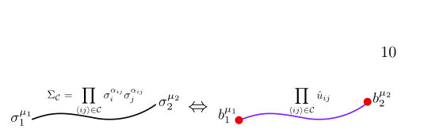 
FIG. 2. Two b-Majorana fermions can also be linked by a series of gauge-field operators, Q

📷 Fig 2

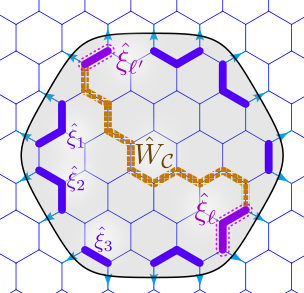 
FIG. 3. The ˆξ-operators with their two endpoints attached to the boundary are defined by Eq. (50), and the directions µn in the definition are the same as the residual electric field represented by the arrows crossing the boundary. A non- contractible Wilson operator ˆ WC given by Eq. (52) is de- fined in the same way as the ˆξ-operators. In the illustration, the two endpoints of the non-contractible Wilson operator are connected to ˆξℓand ˆξℓ′, respectively. Because of rela- tion (53), the signs of the two ˆξ-operators are flipped by the non-contractible Wilson operator.

📷 Fig 3

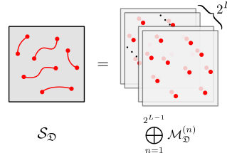 
FIG. 4. An illustration of the block-diagonal structure of the spin representation. An operator SD can be seen as a com- position of 2L−1 copies of Majorana systems MD with the identical set of endpoints EP(D). Therefore, an algebraic op- eration of SD is equivalent to that of 2L−1 copies of the corre- sponding MD, which makes the spin representation identical to the Majorana fermion representation.

📷 Fig 4

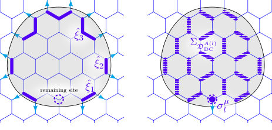 
FIG. 5. For cases with odd N A, there must be a single site l on the boundary that remains unpaired after defining ˆξ- operators by pairing the adjacent edges crossing the boundary, as illustrated in the left panel. Based on this observation, we can define an operator ˆΞA ≡σµ l ΣDA(l) DC by placing a Pauli

📷 Fig 5

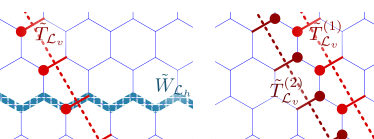 
FIG. 6. A ’t Hooft loop operator ˜TL can be defined by mul- tiplying Pauli matrices that flip the gauge field uij along the closed path L, which is equivalent to the path of a Z2 flux moving along the loop. In the left panel, a vertical non- contractible ’t Hooft loop defined by multiplying Pauli x- spins located at red dots ˜TLv = Q

**Summary.** This paper provides an exact derivation of the density matrix for the Kitaev spin liquid, revealing how the entanglement entropy splits into distinct gauge and matter components. It establishes the microscopic link between spin and Majorana fermion representations and explains the high degeneracy in the entanglement spectrum through the lens of emergent gauge symmetries.

**Why it may be interesting.** not directly relevant

Detailed structure

**Main problem.** The paper seeks to derive an explicit, physically transparent form of the density matrix for the Kitaev spin liquid in the spin representation to understand the microscopic origin of its entanglement structure.

**Main result.** The authors derive an exact form of the density matrix and prove that the reduced density matrix is block-diagonal, leading to the separability of entanglement entropy into gauge and matter parts and explaining the extensive degeneracy in the entanglement spectrum.

**Method.** The study employs an algebraic approach using Majorana fermion representations, Gutzwiller projection, and the study of string operator equivalence classes, alongside symmetry analysis of the Gauss law and 1-form Wilson symmetry.

**Model / system.** The Kitaev honeycomb model, an exactly solvable quantum spin system featuring a spin-1/2 liquid ground state with fractionalized Majorana fermion excitations and an emergent Z2 gauge field.

**Key observables.** Reduced density matrix (RDM), entanglement entropy (EE), entanglement spectrum (ES), spin correlation functions, and fermion parity.

**Important parameters / regimes.** Subregion size (even vs. odd number of lattice sites), boundary length, and the flux-free sector (fixed Z2 fluxes).

**Assumptions / limitations.** The subregion is assumed to be simply-connected, and the Z2 fluxes are assumed to be static (flux-free sector).

**Figures summary.** Figure 1 shows equivalent edge configurations and Wilson loops; Figure 2 illustrates the linking of Majorana fermions via gauge-field strings; Figure 6 shows 't Hooft loop operators; Figure 8 shows the duality between triangular and honeycomb lattices.

**Paper structure.** The paper begins by deriving the exact density matrix in the spin representation, moves to analyzing the block-diagonal structure of the RDM using gauge symmetries, extends the formalism to odd-sized subsystems, and concludes with a geometric derivation of the entanglement entropy components using lattice duality.

Abstract

We give an exact form of the density matrix of the spin-1/2 Kitaev spin liquid represented in terms of spin operators and study the entanglement structures of the Kitaev honeycomb model within the spin framework. We show that the density matrix is naturally organized by equivalence classes of string operators associated with the underlying gauge structure of the model. With the explicit form of the density matrix, plus the exact Gauss law of the emergent gauge theory and the exact 1-form Wilson symmetry in the Kitaev model, we demonstrate the existence of the underlying symmetry-resolved block-diagonal structure of the reduced density matrix, which gives rise to the extensive degeneracy in the entanglement spectrum. The block-diagonal structure is then proven to be responsible for the separability of the entanglement entropy into the gauge and matter parts. Furthermore, we extend the formalism to subsystems with an odd number of lattice sites, revealing a relation between the entanglement spectrum and the fermion parity that is seldom mentioned in the literature.

[↑ back to top](#top)

### [Reduced-State Stabilizer Rényi Entropy as a Probe of Quantum Criticality in the Transverse ANNNI Model and the Quantum Compass Model](http://arxiv.org/abs/2605.18391v1)

**Authors:** Santanu Sarkar, George Biswas, Jun-Yi Wu, Anindya Biswas  
**Type:** theory · **Category:** statistical mechanics · **PDF:** <https://arxiv.org/pdf/2605.18391v1>  
**Analysis basis:** full PDF text, analyzed in chunks
**Topic relevance:** 🔥 `entanglement & information structure` **4/5**

📷 Fig 1

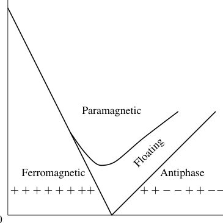 
FIG. 1. Phase diagram of the TANNNI model according to [61].

📷 Fig 2

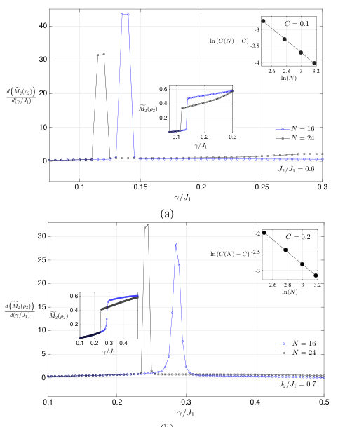 
FIG. 3. Purity corrected stabilizer R´enyi entropy (in left inset) of two qubit reduced density matrix ( f M2(ρ2)) and its first derivative with respect to the ratio of the transverse field strength to the near-

📷 Fig 3

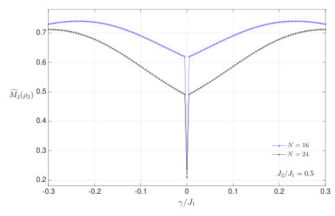 
FIG. 2. Purity-corrected stabilizer R´enyi entropy of the two-site reduced density matrix f M2 (ρ2) plotted as a function of the trans- verse field γ/J1 for fixed J2/J1 = 0.5.

📷 Fig 4

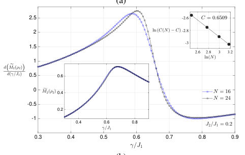 
FIG. 5. Purity corrected stabilizer R´enyi entropy (in left inset) of two qubit reduced density matrix ( f M2(ρ2)) and its first derivative with respect to the ratio of the transverse field strength to the near-

📷 Fig 5

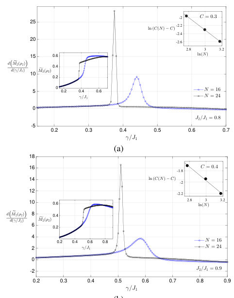 
FIG. 4. Purity corrected stabilizer R´enyi entropy (in left inset) of two qubit reduced density matrix ( f M2(ρ2)) and its first derivative with respect to the ratio of the transverse field strength to the near-

**Summary.** This paper evaluates the effectiveness of using Stabilizer Renyi Entropy as a local probe for quantum criticality. It demonstrates that while purity-corrected SRE is excellent for detecting certain transitions in frustrated models, the raw SRE may be more reliable in low-frustration regimes. The study provides a new way to use quantum magic as a signature of phase transitions.

**Why it may be interesting.** It explores how non-stabilizer resources (quantum magic) can act as a complementary diagnostic tool to traditional entanglement entropy for identifying phase transitions in frustrated many-body systems.

Detailed structure

**Main problem.** Investigating whether the Stabilizer Renyi Entropy (SRE) and its purity-corrected version can serve as effective local probes for detecting quantum phase transitions.

**Main result.** The purity-corrected SRE successfully detects the antiphase-floating transition in the high-frustration TANNNI model and the first-order transition in the Quantum Compass Model, while the raw SRE is more accurate for the low-frustration TANNNI regime.

**Method.** The authors use Exact Diagonalization for the TANNNI model and Jordan-Wigner/Bogoliubov transformations for the QCM, applying finite-size scaling to the derivatives of the SRE.

**Model / system.** The study focuses on the 1D Transverse Axial Next-Nearest-Neighbor Ising (TANNNI) model and the 1D Quantum Compass Model (QCM).

**Key observables.** Second-order Stabilizer Renyi Entropy (SRE), purity-corrected SRE, and their first derivatives with respect to control parameters.

**Important parameters / regimes.** Transverse field strength (gamma), frustration ratio (J2/J1), and anisotropy ratio (Jx/Jz).

**Assumptions / limitations.** The purity-corrected SRE is used to mitigate the effects of mixedness in reduced density matrices, though it is noted not to be a true magic monotone for mixed states.

**Figures summary.** Figure 1 shows the TANNNI phase diagram; Figures 2-6 display SRE and its derivatives for various TANNNI regimes; Figure 7 compares extracted transition lines to established boundaries; Figure 13 shows SRE for the QCM.

**Paper structure.** The paper introduces the SRE as a probe, describes the TANNNI and QCM models, details the analytical and numerical methods (JW transformation, BdG, ED), presents results for high and low frustration regimes in TANNNI, analyzes the QCM transition, and concludes with a comparison of SRE types.

Abstract

We investigate the effectiveness of the stabilizer Rényi entropy (SRE), a quantifier associated with non-stabilizer resources (quantum magic), as an indicator of quantum phase transitions. Specifically, we analyze the behavior of the purity-corrected SRE of reduced density matrices in the ground states of two one-dimensional spin models: the transverse axial next-nearest-neighbor Ising (TANNNI) model and the quantum compass model (QCM). The ground state of the TANNNI model is obtained using exact diagonalization techniques, while the QCM is analyzed using the Jordan--Wigner (JW) transformation followed by Bogoliubov diagonalization of the resulting quadratic fermionic Hamiltonian. For the TANNNI model, the purity-corrected SRE successfully detects the antiphase--floating phase transition in the high-frustration regime, while in the low-frustration regime the raw (purity-uncorrected) SRE reproduces the known ferromagnetic--paramagnetic phase boundaries more accurately. For the QCM, the purity-corrected SRE exhibits a clear signature near the isotropic point \(J_x/J_z=1\), where the system undergoes a first-order quantum phase transition. Our results establish SRE of reduced states as a complementary probe of quantum criticality and provide further insight into the role of non-stabilizer resources in many-body quantum phase transitions.

[↑ back to top](#top)

### [Where the Quantum Lives in D-Wave Hybrid Portfolio Optimization](http://arxiv.org/abs/2605.17623v1)

**Authors:** Luis Lozano  
**Type:** experiment · **Category:** quantum information and computing · **PDF:** <https://arxiv.org/pdf/2605.17623v1>  
**Analysis basis:** full PDF text, analyzed in chunks
**Topic relevance:** 🔥 `QC/QI experiment` **4/5**

📷 Fig 1

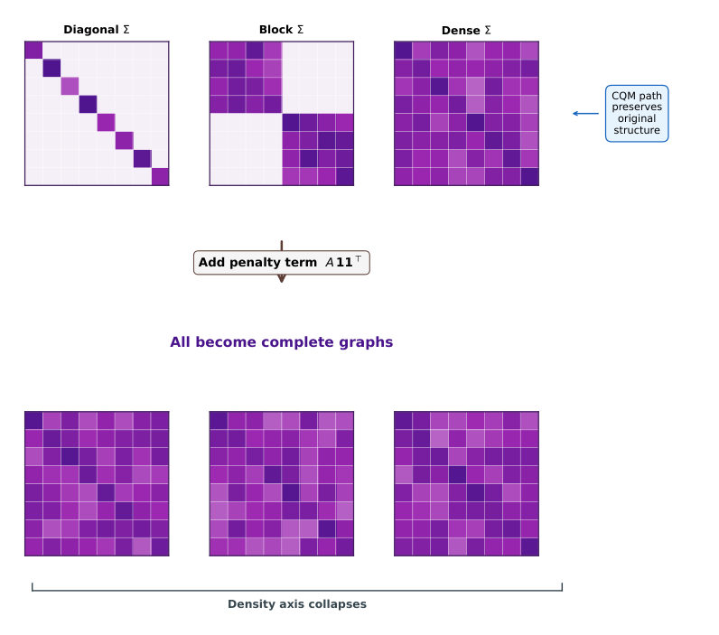 
Figure 1: Density-axis collapse under penalty encoding. Three structurally different covariance matrices (diagonal, block, dense) all become complete graphs after adding the cardinality penalty A · 11⊤. The CQM path preserves the original structure.

📷 Fig 2

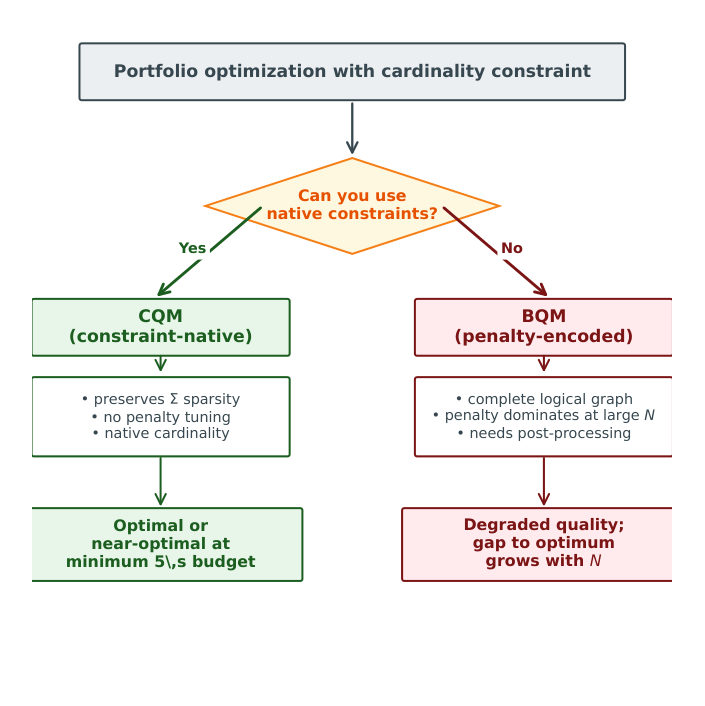 
Figure 2: Formulation choice for D-Wave portfolio optimization. The constraint-native CQM path preserves sparsity, requires no penalty tuning, and achieves optimal solutions at the min- imum budget. The penalty-encoded BQM path creates a dense graph, degrades with N, and requires budget tuning.

📷 Fig 3

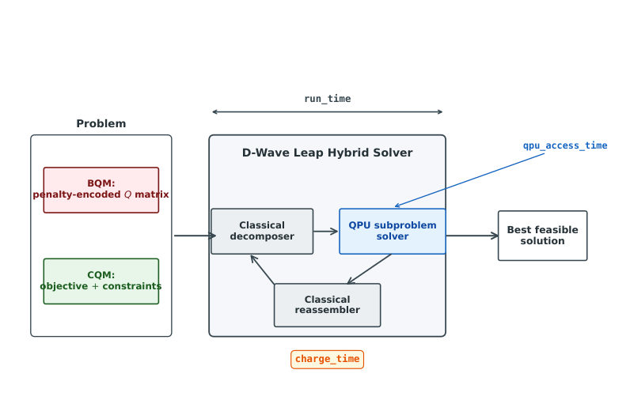 
Figure 3: D-Wave hybrid solver architecture. The solver iterates between classical decomposition and QPU subproblem solving. Timing fields (run_time, charge_time, qpu_access_time) are reported separately, allowing analysis of whether the QPU actively contributed to the solution.

📷 Fig 4

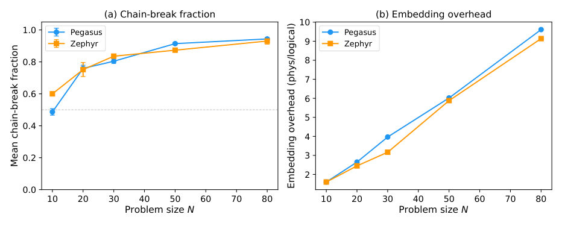 
Figure 4: (a) Mean chain-break fraction and (b) embedding overhead (physical / logical qubits) vs problem size for direct QPU on penalty-encoded QUBOs, split by hardware topology.

📷 Fig 5

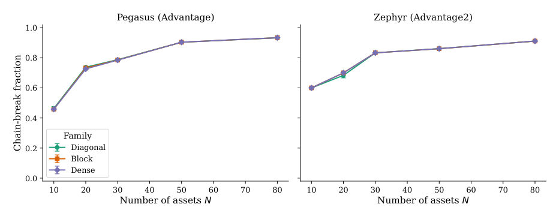 
Figure 5: Chain-break fraction vs N split by covariance-density family (diagonal, block, dense), on Pegasus (left) and Zephyr (right). The three curves nearly overlap at each N, confirming that penalty encoding collapses the density axis.

**Summary.** This paper audits D-Wave's hybrid solver, revealing that the observed performance gains in portfolio optimization stem from a classical preprocessing pipeline rather than quantum sampling. It demonstrates that the constraint-native CQM interface is significantly more efficient than the BQM approach because it avoids unnecessary graph densification.

**Why it may be interesting.** not directly relevant

Detailed structure

**Main problem.** Auditing the actual quantum contribution of D-Wave's hybrid service in portfolio optimization and investigating the performance gap between constraint-native (CQM) and penalty-encoded (BQM) formulations.

**Main result.** The study finds that the reported hybrid advantage is primarily due to a classical decomposition pipeline rather than quantum sampling, as QPU access time accounts for only ~0.7% of the total runtime. Additionally, the CQM interface is superior because it preserves sparsity and avoids the 'density-axis collapse' caused by penalty encoding.

**Method.** A comparative performance audit using D-Wave hybrid solvers (LeapHybrid-CQM and LeapHybrid-BQM) against classical baselines (Gurobi MIQP and Simulated Annealing) on synthetic and real-world financial datasets.

**Model / system.** The problem is a cardinality-constrained mean-variance-turnover (MVT) portfolio optimization model, implemented on D-Wave Advantage systems using Pegasus and Zephyr topologies.

**Key observables.** QPU access time, relative gap to Gurobi optimality, chain-break fractions, embedding overhead, and solution determinism/variance.

**Important parameters / regimes.** Problem size (N = 10 to 640), wall-clock budgets (5s to 300s), covariance density (diagonal, block-diagonal, dense), and penalty weight (A).

**Assumptions / limitations.** The study assumes a fixed penalty weight (A=4.0) for BQM based on prior literature and focuses on a specific class of portfolio optimization problems.

**Figures summary.** Figure 1 illustrates the mechanism of constraint-induced density increase; Figure 2 summarizes the advantages of CQM over BQM; Figure 6 and 7 show the divergence of BQM and SA from the optimal Gurobi baseline as problem size increases.

**Paper structure.** The paper begins with an audit of QPU contribution, followed by a structural analysis of density-axis collapse in BQM, an evaluation of formulation superiority (CQM vs BQM), a study of budget saturation and determinism, and concludes with recommendations for benchmarking quantum-finance applications.

Abstract

We audit how much of D-Wave's hybrid quantum-classical portfolio-optimization service is actually quantum. On cardinality-constrained mean-variance-turnover instances spanning N equal to 10 to 640 with a Gurobi MIQP optimality anchor, the constraint-native LeapHybridCQM service matches Gurobi's proven optimum on all 54 instances where Gurobi proves optimality, but the mean QPU access time is only 0.034 seconds out of a 5-second wall-clock budget, roughly 0.7 percent of the run. The remaining roughly 99 percent is the service's classical decomposition, sub-problem assembly, and feasibility-aware reassembly, so the reported D-Wave hybrid win on this problem class is a constraint-native classical pipeline with a small QPU contribution rather than a quantum-sampling win. Two structural results sharpen this audit. First, the cardinality penalty contributes a dense rank-one term that makes the penalty-encoded logical graph fully connected regardless of the original covariance density, collapsing the intended density benchmark axis for all penalty-encoded paths while leaving the constraint-native sparsity intact. Second, the constraint-native service returns identical solutions at every tested wall-clock budget from 5 to 300 seconds and across 10 repeated calls, a determinism property of the service on this problem class. Together with two classical baselines, namely Gurobi MIQP and simulated annealing, and a comparison against the penalty-encoded hybrid interface, these results extend the prior constraint-native versus penalty-encoded observation of Sakuler et al. from the statement that the constraint-native interface handles constraints natively to the operational decomposition of where the win actually originates, a finding that reframes how D-Wave hybrid performance should be reported in quantum-finance benchmarks.

[↑ back to top](#top)

### [Positive-rate PCA and IPS with stationary Bernoulli measures are rapidly forgetful](http://arxiv.org/abs/2605.16904v1)

**Authors:** Irène Marcovici, Siamak Taati  
**Type:** theory · **Category:** statistical mechanics · **PDF:** <https://arxiv.org/pdf/2605.16904v1>  
**Analysis basis:** full PDF text, analyzed in chunks
**Topic relevance:** `entanglement & information structure` **3/5** · `non-equilibrium dynamics` **3/5** · `driven-dissipative phase transition` **2/5** · `methods for driven-dissipative` **2/5** · `non-equilibrium universality` **2/5** · `scars & prethermalization` **2/5**

📷 Fig 1

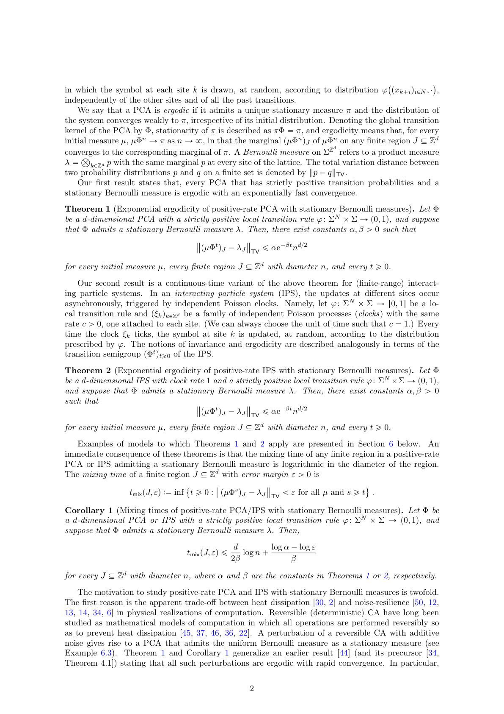 
Low-resolution page preview, page 2

📷 Fig 2

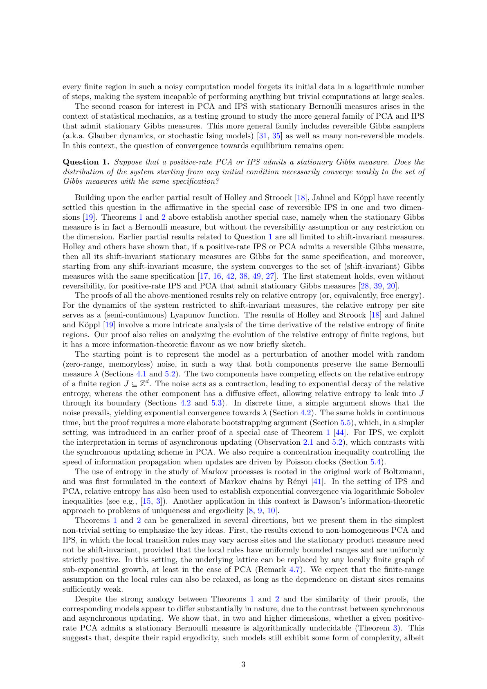 
Low-resolution page preview, page 3

📷 Fig 3

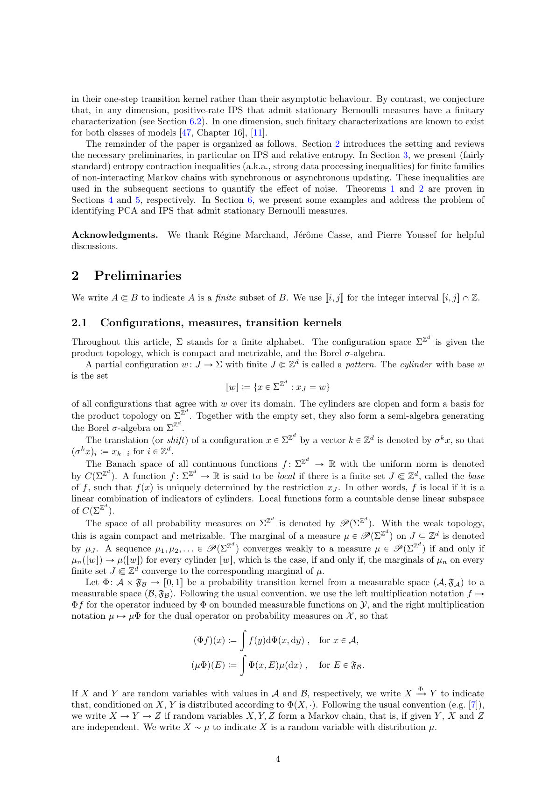 
Low-resolution page preview, page 4

📷 Fig 4

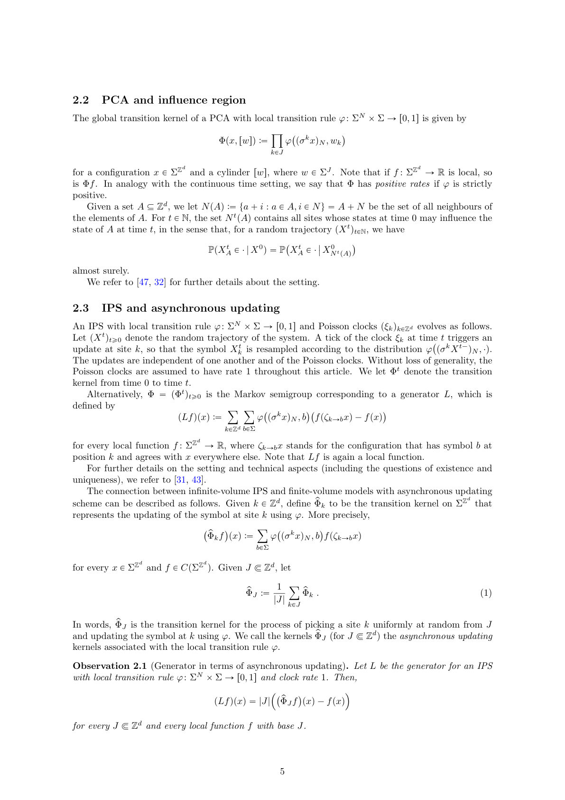 
Low-resolution page preview, page 5

📷 Fig 5

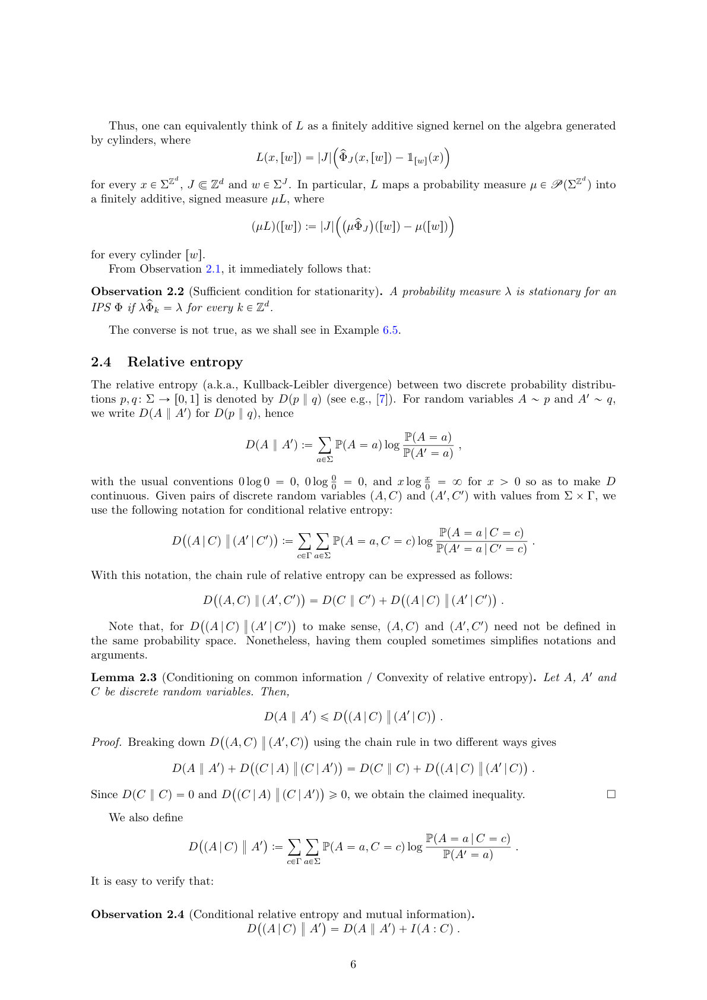 
Low-resolution page preview, page 6

**Summary.** The paper proves that stochastic lattice models like PCA and IPS converge exponentially fast to their stationary Bernoulli measures if the transition rules are strictly positive. It also demonstrates that in two or more dimensions, it is computationally impossible to distinguish between systems that have such a stationary measure and those that do not.

**Why it may be interesting.** This work is highly relevant to many-body dynamics and open quantum systems, as it provides rigorous bounds on how local noise and information exchange drive a system toward equilibrium (forgetting initial conditions) and explores the complexity of characterizing steady states.

Detailed structure

**Main problem.** Investigating the ergodicity, convergence properties, and algorithmic complexity of Probabilistic Cellular Automata (PCA) and Interacting Particle Systems (IPS) that admit stationary Bernoulli measures.

**Main result.** The authors prove that positive-rate PCA and IPS admitting stationary Bernoulli measures are exponentially ergodic with logarithmic mixing times, and show that in dimensions d >= 2, these systems are algorithmically indistinguishable from those that do not admit such measures.

**Method.** An information-theoretic approach using relative entropy (Kullback-Leibler divergence) as a Lyapunov function, combined with noise decomposition and strong data processing inequalities.

**Model / system.** Discrete-time Probabilistic Cellular Automable (PCA) with synchronous updates and continuous-time Interacting Particle Systems (IPS) with asynchronous updates on a d-dimensional lattice.

**Key observables.** Relative entropy (Kullback-Leibler divergence), total variation distance, and mixing time.

**Important parameters / regimes.** Positive transition rates (noise strength), lattice dimension d, and the diameter of the observed region n.

**Assumptions / limitations.** The systems must have strictly positive transition probabilities (positive-rate) and admit a stationary Bernoulli measure.

**Paper structure.** The paper introduces the problem of ergodicity in PCA/IPS, develops a noise decomposition framework, proves entropy contraction for both synchronous and asynchronous updates, establishes exponential ergodicity via a bootstrap argument, and concludes with a proof of algorithmic undecidability in higher dimensions.

Abstract

We prove that every probabilistic cellular automaton with strictly positive transition probabilities that admits a stationary Bernoulli measure is exponentially ergodic. Moreover, the mixing time of any finite region in such a system is logarithmic in the diameter of the region. A similar result holds in continuous time for positive-rate, finite-range interacting particle systems. The proofs use entropy, and rely on a representation of the system as a perturbation of another system with noise. The ergodic behaviour results from a competition between the accumulation of randomness due to noise and the diffusion of randomness due to local information exchange. We show that, in two and higher dimensions, the positive-rate probabilistic cellular automata that admit stationary Bernoulli measures are algorithmically indistinguishable from those that do not.

[↑ back to top](#top)

### [From bulk to interface dynamics, in and out of equilibrium](http://arxiv.org/abs/2605.16503v1)

**Authors:** Lila Sarfati, Julien Tailleur, Frédéric van Wijland  
**Type:** theory · **Category:** statistical mechanics · **PDF:** <https://arxiv.org/pdf/2605.16503v1>  
**Analysis basis:** full PDF text, analyzed in chunks
**Topic relevance:** `Keldysh / 2PI / non-Gaussian methods` **3/5** · `non-equilibrium dynamics` **3/5** · `non-equilibrium universality` **3/5** · `driven-dissipative phase transition` **2/5** · `methods for driven-dissipative` **2/5**

📷 Fig 1

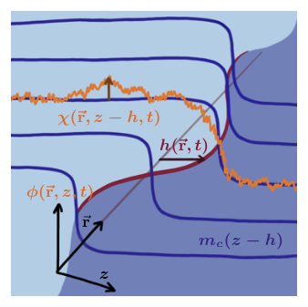 
Figure 1. Fluctuations of the interface between two sta- ble phases around its flat average. The interface fluctu- ations result from both a shift of the mean-field profile mc (dark blue) and the fluctuations around it.

📷 Fig 2

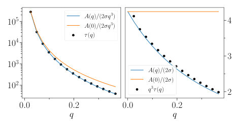 
Figure 2. (Left) Relaxation time of a one-dimensional interface in a two-dimensional model B from an initial condition 0.1

📷 Fig 3

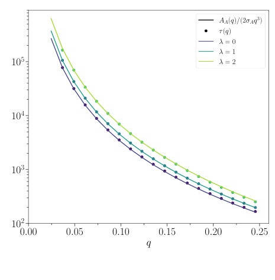 
Figure 3. Relaxation time of a one-dimensional inter- face in a 512 × 512 system from an initial condition 0.1

📷 Fig 4

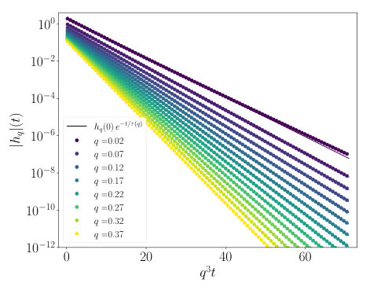 
Figure 4. Relaxation of a one-dimensional interface in a two-dimensional model B, starting from an initial con- dition 0.1

**Summary.** This paper establishes a rigorous field-theoretic method to derive the effective motion of an interface from the underlying bulk dynamics. It corrects widespread errors in applying mean-field approximations to active matter and provides a systematic way to compute non-linear interface evolution.

**Why it may be interesting.** not directly relevant

Detailed structure

**Main problem.** The lack of a controlled, systematic field-theoretical framework to derive interface dynamics from bulk dynamics, particularly for non-equilibrium and active systems where common mean-field approximations are mathematically unjustified.

**Main result.** The authors derive a unified framework that recovers known equilibrium results (like the Edwards-Wilkinson equation) and extends to non-equilibrium models, demonstrating that a popular mean-field ansatz is uncontrolled for active theories and can lead to incorrect predictions.

**Method.** The study uses the dynamical-action formalism (Janssen-De Dominicis action) and a geometric projection operator to integrate out bulk fluctuations, employing perturbation theory and spectral analysis of the linearized operator.

**Model / system.** The paper focuses on interfaces separating two stable phases in scalar field theories, specifically examining Model A (non-conserved) and Model B (conserved) dynamics, as well as active versions of these models.

**Key observables.** Interface height field h(r, t), interface relaxation rate (dispersion relation), drift velocity, and bulk fluctuation field chi.

**Important parameters / regimes.** Temperature (or noise amplitude) T, surface tension sigma, interface width xi, and wavevector q.

**Assumptions / limitations.** The analysis assumes a low-temperature/weak-noise limit, a large-wavelength limit (q xi << 1), and focuses on weakly deformed interfaces.

**Figures summary.** Figure 1 provides a cartoon of a fluctuating interface with bulk deformations; Figure 2 shows relaxation dynamics; Figure 4 shows the exponential decay of Fourier amplitudes of excited modes.

**Paper structure.** The paper begins by identifying the methodological gap and criticizing the mean-field ansatz, then introduces a new geometric definition for the interface, proceeds to derive the linear dynamics for Model A and Model B, and concludes by discussing non-linear terms and active matter applications.

Abstract

We study the dynamics of weakly deformed interfaces separating two stable phases, starting from the fluctuating hydrodynamics of the phase-separating fields. Using a well-chosen definition for the interface and the dynamical-action formalism to represent path probabilities, we derive the linear relaxation of the interface and the fluctuations around it for a large class of models. Our method applies to equilibrium dynamics, where it recovers and complements existing results, but also extends to their non-equilibrium counterparts. We explain how non-linear terms can be systematically computed and illustrate their derivations in the case of (active) model A. We highlight the danger of a popular ansatz used to derive interface dynamics, which was rigorously established in equilibrium but is uncontrolled for active field theories.

[↑ back to top](#top)

### [Path-Extrema Upper Bounds on Mean Entropy Production](http://arxiv.org/abs/2605.17074v1)

**Authors:** Surachate Limkumnerd  
**Type:** theory · **Category:** statistical mechanics · **PDF:** <https://arxiv.org/pdf/2605.17074v1>  
**Analysis basis:** full PDF text, analyzed in chunks
**Topic relevance:** `non-equilibrium dynamics` **3/5** · `correlated / nonlocal dissipation` **2/5** · `entanglement & information structure` **2/5** · `methods for driven-dissipative` **2/5** · `quantum measurements` **2/5**

📷 Fig 1

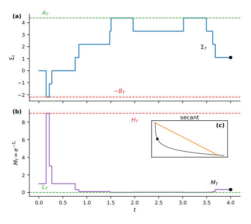 
FIG. 1. Trajectory geometry for the entropy-production mar- tingale. Panel (a) shows a sample entropy-production tra- jectory Σt, with the largest positive excursion AT and the largest negative excursion −BT . Panel (b) shows the cor- responding exponential process Mt = e−Σt, whose running minimum and maximum define the realized martingale enve- lope [LT , HT ]; the terminal value MT lies inside this interval. Panel (c) shows the local convexity geometry: for a fixed en- velope, the convex function −ln m is bounded above by the secant joining (LT , −ln LT ) and (HT , −ln HT ). This secant construction represents the conditional terminal mean by an effective endpoint mixture on the...

📷 Fig 2

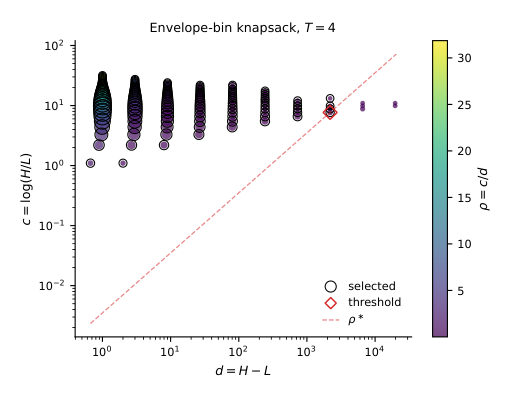 
FIG. 2. Empirical envelope classes for the random path- extrema optimization. Each point represents a realized en- velope class in cost-gain coordinates (d, c), where moving ter- minal weight from H to L gives entropy gain c = ln(H/L) and consumes martingale cost d = H −L. Classes are ranked by ρ = c/d. The selected classes fill the martingale-cost budget in decreasing order of ρ, with a possible fractional threshold class at the boundary.

📷 Fig 3

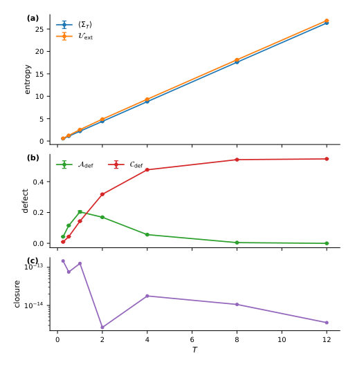 
FIG. 3. Three-state Markov-jump realization of the path- extrema decomposition. Panel (a) compares the measured mean entropy production ⟨ΣT ⟩with the empirical upper en- velope Uext. Panel (b) shows the two nonnegative gap terms, the allocation gap A and the curvature gap C. Panel (c) re- ports the numerical closure error in the decomposition. Simu- lations use k+ = 3, k−= 1, 2×105 trajectories per T, 80×80 envelope bins, and 20 independent batches. At T = 12, the raw estimate Araw = −5.74 × 10−4 is within two batch stan- dard errors of zero (SE = 1.24×10−3), so the plotted reported value is clipped to zero while the raw diagnostic remains in the summary table.

📷 Fig 4

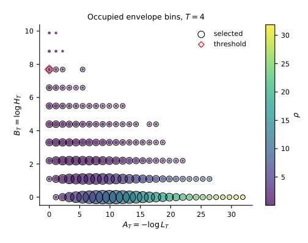 
FIG. 4. Appendix-level diagnostic showing the empirical dis- tribution of realized envelope classes in the Markov-jump ex- ample. Each occupied bin is plotted in entropy-extrema co- ordinates (AT , BT ), with color indicating the efficiency ratio ρ and marker area indicating empirical weight. Open circles mark bins selected by the knapsack sorting, and the red dia- mond marks the threshold bin. This diagnostic supports the interpretation of Fig. 2 and shows that the upper-envelope estimate is built from occupied envelope bins rather than a formal continuum.

**Summary.** This paper establishes a theoretical framework for upper-bounding mean entropy production using the running extrema of the entropy-production martingale. It introduces a novel decomposition that quantifies how dynamical processes deviate from the theoretical maximum through allocation and curvature gaps. This provides a complementary tool to the standard fluctuation relations used to find lower bounds on dissipation.

**Why it may be interesting.** This is highly relevant for researchers in open quantum systems and many-body dynamics as it provides a new way to constrain dissipation and quantify the thermodynamic cost of fluctuations using path-level information.

Detailed structure

**Main problem.** The paper seeks to determine the upper bounds on mean entropy production in stochastic thermodynamic processes using information from path extrema, complementing the well-known lower bounds provided by fluctuation relations.

**Main result.** The author derives a path-extrema upper envelope (U_ext) and provides an exact identity decomposing the gap between the actual mean entropy production and this bound into an allocation gap (A) and a curvature gap (C).

**Method.** The study uses martingale stochastic thermodynamics, framing the derivation of the upper envelope as a continuous knapsack optimization problem and employing convexity/secant-line arguments.

**Model / system.** The framework applies to steady-state stochastic processes where the exponential entropy production is a positive martingale, specifically including stationary Markov jump processes and diffusion processes.

**Key observables.** Total stochastic entropy production (Sigma_T), running extrema of the martingale (L_T, H_T), and the efficiency ratio (rho_T).

**Important parameters / regimes.** The martingale-cost budget (K), the efficiency ratio (rho), and the entropy-production excursions (A_T, B_T).

**Assumptions / limitations.** The results assume the process is a positive martingale (M_t = e^-Sigma_t) and that the integral fluctuation theorem holds.

**Figures summary.** Figure 2 illustrates the continuous knapsack problem via cost vs. gain plots; Figure 3 shows the empirical decomposition of the entropy production gap into A and C components; Figure 4 displays the distribution of envelope classes in a Markov-jump process.

**Paper structure.** The paper begins by demonstrating the insufficiency of one-sided bounds, moves to deriving deterministic two-sided bounds, introduces the random path-extrema upper envelope via a knapsack optimization, and concludes with a gap decomposition verified by numerical simulations of Markov jump processes.

Abstract

Fluctuation relations imply the second-law inequality $\langleΣ_T\rangle\ge0$, but path extrema can also constrain how large the mean entropy production can be. For steady-state processes with entropy-production martingale $M_t=e^{-Σ_t}$, we show that knowing only the positive running maximum of $Σ_t$ gives no improvement over the trivial endpoint bound: rare negative entropy-production excursions can still carry the exponential weight required by the fluctuation relation. Using the running extrema $L_T=\inf M_t$ and $H_T=\sup M_t$, we derive a path-extrema upper envelope $\mathcal{U}_{\rm ext}$. The relaxed envelope problem ranks realized intervals by the entropy gain per martingale cost, $\ln(H_T/L_T)/(H_T-L_T)$, giving a continuous knapsack problem. The actual mean satisfies the exact identity $\langleΣ_T\rangle=\mathcal{U}_{\rm ext}-\mathcal{A}-\mathcal{C}$, where $\mathcal{A}$ is an allocation gap across realized envelopes and $\mathcal{C}$ is a curvature gap within each envelope. Thus path extrema set the upper envelope, while the two gaps quantify how actual dynamics allocate terminal outcomes across envelope classes and place terminal values within each realized envelope. This turns path-extrema information into a quantitative upper-bound theory for entropy production, complementary to the usual lower-bound role of fluctuation relations.

[↑ back to top](#top)

### [Variational Boundary Fluctuations as a First-Principles Origin of Langevin Noise](http://arxiv.org/abs/2605.17621v1)

**Authors:** Francisco Monroy  
**Type:** theory · **Category:** statistical mechanics · **PDF:** <https://arxiv.org/pdf/2605.17621v1>  
**Analysis basis:** full PDF text, analyzed in chunks
**Topic relevance:** `Keldysh / 2PI / non-Gaussian methods` **3/5** · `correlated / nonlocal dissipation` **2/5** · `methods for driven-dissipative` **2/5** · `non-equilibrium dynamics` **2/5** · `quantum measurements` **2/5**

📷 Fig 1

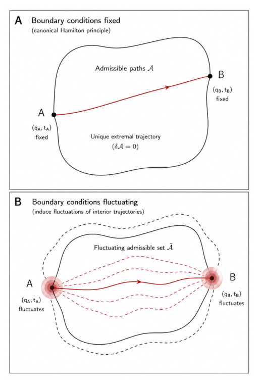 
FIG. 1. Variational origin of boundary-induced tra- jectory fluctuations. (A) With fixed endpoints, the admis- sible variational set A selects a reference extremal trajectory between states A and B, satisfying δA = 0. (B) Environmen- tal uncertainty in preparation and termination makes end- point constraints fluctuate, shown by red halos ηi, ηf. This selects neighbouring admissible shells, schematically repre- sented by e A, and generates a family of nearby extremals, shown as dashed trajectories. The bulk dynamics remains deterministic for each realization: endpoint fluctuations in- duce a boundary variation of Hamilton’s principal function, which is then propagated by the Hamilton–Jacobi...

**Summary.** This paper proposes that Langevin noise is not an external input but emerges from fluctuations in the initial and final boundary conditions of a system's action. By using Hamilton-Jacobi theory, the author shows how these boundary uncertainties propagate to create a state-dependent effective force. This provides a first-principles link between deterministic variational mechanics and stochastic dynamics.

**Why it may be interesting.** This provides a fundamental derivation of stochasticity from deterministic variational principles, offering a new way to view the emergence of open quantum system dynamics and noise from boundary-driven uncertainty.

Detailed structure

**Main problem.** The paper seeks to identify a first-principles, variational origin for Langevin noise, rather than treating it as a phenomenological or externally imposed stochastic force.

**Main result.** The author demonstrates that stochastic forces can emerge from fluctuations in Hamilton's principle boundary/endpoint data, resulting in a state-dependent, multiplicative noise that recovers standard additive Langevin noise only in the Markovian coarse-grained limit.

**Method.** A variational framework using the first variation of the Lagrangian action and Hamilton-Jacobi propagation to transport boundary-induced perturbations through the bulk dynamics.

**Model / system.** The study focuses on mechanical Hamiltonians of the form H(q, p) = p^2/2m + V(q), specifically using a harmonic oscillator as a benchmark, and discusses extensions to field theories.

**Key observables.** The effective Langevin force xi(t), which is found to be multiplicative, anisotropic, and state-dependent.

**Important parameters / regimes.** The Hessian of Hamilton's principal function (acting as a geometric filter), the overdamped limit, and the Markovian coarse-grained limit.

**Assumptions / limitations.** Assumes a single-valued Hamilton-Jacobi branch and smooth boundary fluctuations.

**Figures summary.** Figure 1 illustrates the distinction between fixed endpoints (a single reference extremal) and fluctuating endpoints (a family of nearby extremals due to environmental uncertainty).

**Paper structure.** The paper introduces the problem of noise origins, develops a variational framework based on Hamilton's principle, uses Hamilton-Jacobi theory to derive the effective force, benchmarks the theory with a harmonic oscillator, and discusses limits and field-theoretic extensions.

Abstract

Stochastic forces are usually postulated or obtained by eliminating environmental degrees of freedom. Here we identify a variational origin: fluctuating endpoint data in Hamilton's principle induce fluctuations of the on-shell action. Hamilton--Jacobi propagation transports this boundary imprint, whose gradient generates an effective Langevin force inherited from boundary-action fluctuations. The resulting force is not freely specifiable: its amplitude is filtered by the Hessian of Hamilton's principal function, yielding multiplicative and state-dependent noise. Homogeneous additive Langevin forcing is recovered only as a Markovian coarse-grained limit.

[↑ back to top](#top)

### [Data-driven analysis of metastability in a stochastic bistable system](http://arxiv.org/abs/2605.16574v1)

**Authors:** Ankan Banerjee, Manuel Santos Gutierrez, John Moroney, Valerio Lucarini  
**Type:** theory · **Category:** statistical mechanics · **PDF:** <https://arxiv.org/pdf/2605.16574v1>  
**Analysis basis:** full PDF text, analyzed in chunks
**Topic relevance:** `methods for driven-dissipative` **3/5** · `non-equilibrium dynamics` **3/5** · `driven-dissipative phase transition` **2/5** · `non-equilibrium universality` **2/5**

📷 Fig 1

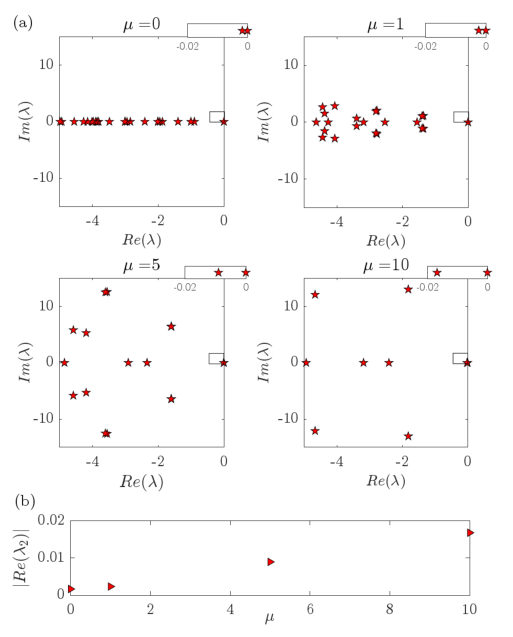 
FIG. 1. (a) Eigenvalues (λj = log (σj)/ft) of the generator of the semigroup of Koopman operators for different strengths of rotation (µ = 0, 1, 5, 10) corresponding to the noise inten- sity α = 0.3, where σjs are eigenvalues of the approximated Koopman matrix (K) and ft = 0.005. (b) The absolute differ- ence between the real part of first two eigenvalues are shown for values of µ used above. The plot infers that the spectral gap increases with µ.

📷 Fig 2

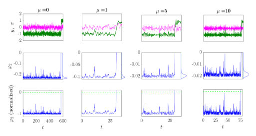 
FIG. 3. A visual depiction of our method for identifying a transition from one attractor to another. Time series showed here are corresponding to µ = 0, 1, 5 and 10, and α = 0.3. (Top) - time series of observables; (middle) - the first sub- dominant Koopman mode φ2, evaluated on x(t) , and y(t), density of the time series is also shown on the right of each plots; (bottom) - time series of normalized-φ2. Dashed green curves represent basin boundaries at φ2 = 0. A crossing oc- curs when the normalized φ2 crosses the basin boundary.

📷 Fig 3

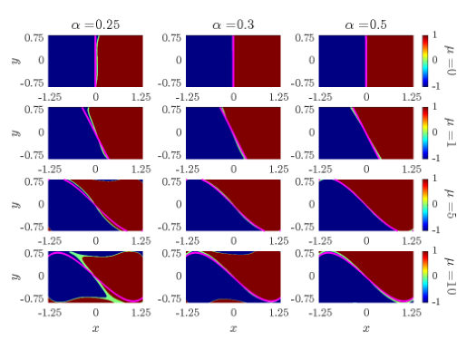 
FIG. 2. First subdominant mode of the Koopman operator (φ2, normalised between -1 and 1) for different values of µ and α.

📷 Fig 4

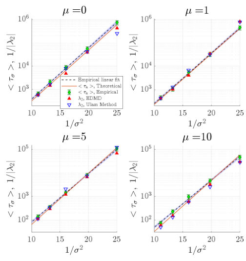 
FIG. 4. Test of the linear relationship between the logarithm of ⟨τα⟩and 1α2 for different values of µ. Filled green cir- cles with errorbars (indicating the 95% confidence interval), are the estimation of mean exit times, as computed from en- sembles. Dashed black lines are linear fit of these estimators. Shaded regions denote 95% confidence interval of the fit. Solid orange lines are theoretical estimation of exit times - half of mean transition times. Inverse of the modulus of second eigen value of the Koopman operator estimated by EDMD (solid red triangles), inverse of the second eigenvalue of the Markov matrix computed using the Ulam’s method (hollow inverted blue triangles) are also...

📷 Fig 5

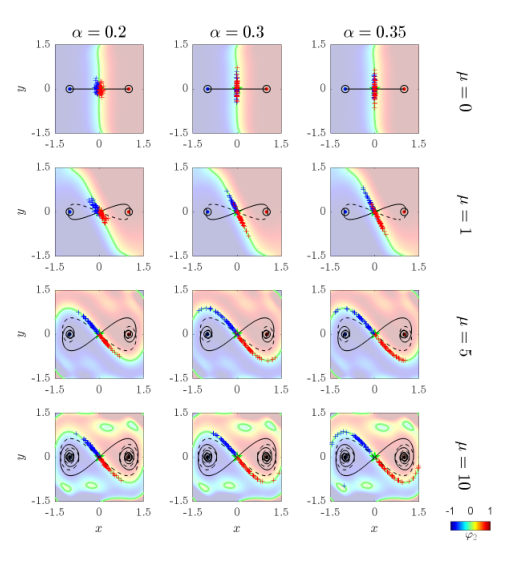 
FIG. 5. Crossing points (blue and red crosses) for different noise strengths α and rotation rate µ are plotted together with contours of φ2. The blue circle, the red circle, and the green hollow star represent two attractors and the saddle point, re- spectively. Red and blue colour shadings correspond to dif- ferent level sets. The green line is the 0-line, which defines the basin boundary.

**Summary.** This paper presents a data-driven approach using Koopman operator theory to identify metastable states and quantify transition rates in stochastic systems. It demonstrates that the subdominant Koopman mode can reconstruct basin boundaries and that its decay rate accurately predicts escape times. The method is robust for both equilibrium and non-equilibrium dynamics, even in the presence of rotational forces.

**Why it may be interesting.** The method provides a way to characterize transitions and metastable states in high-dimensional, non-equilibrium systems using only data, which is highly relevant for studying dissipation and decoherence in open quantum systems.

Detailed structure

**Main problem.** Developing a purely data-driven, geometry-agnostic method to study noise-induced transitions and metastability in complex stochastic systems where governing equations are unknown.

**Main result.** The Koopman operator framework accurately reconstructs basin boundaries and predicts escape time statistics, showing strong agreement with Large Deviation Theory in both equilibrium and non-equilibrium regimes.

**Method.** The authors use Extended Dynamic Mode Decomposition (EDMD) to approximate the Koopman and Perron-Frobenius operators from time-series data, validated against Ulam's method and analytical Large Deviation Theory.

**Model / system.** A 2D stochastic bistable system (Rotating Double Well Potential) described by an Ito diffusion process, featuring two attractors, a saddle point, and a rotational component that drives the system out of equilibrium.

**Key observables.** Mean exit time, subdominant Koopman modes (for basin reconstruction), Koopman eigenvalues (decay rates), and the 0-level set of the subdominant mode.

**Important parameters / regimes.** Noise intensity (alpha), rotation strength (mu), and the weak-noise limit (alpha -> 0).

**Assumptions / limitations.** The noise is assumed to be non-degenerate (invertible covariance), and the dictionary of basis functions must sufficiently span the relevant subspace.

**Figures summary.** Plots of Koopman eigenvalues and spectral gaps; heat maps of Koopman modes overlaid with true basin boundaries; time-series visualizations of mode-based transition identification; and eigenfunctions of the Fokker-Planck operator.

**Paper structure.** The paper introduces the problem of noise-induced tipping, presents the Koopman-based data-driven framework, applies it to a 2D rotating bistable model, validates results against Large Deviation Theory, and explores the role of saddle dynamics and rotation.

Abstract

We study the metastability properties of a simple prototypical bistable system using the formalism of the Koopman operator. Instead of studying noise-induced transitions by following the trajectories of the system, we track them by studying the time evolution and the decay rate of the subdominant mode of the Koopman operator, thus in a geometry-agnostic framework. We find agreement with the predictions - both the exponential and subexponential ones - of large deviation theory in the weak-noise limit for the statistics of escape time, both in equilibrium and nonequilibrium conditions. The subdominant Koopman mode also allows for an accurate reconstruction of the competing basins of attraction. Going deeper in the Koopman spectrum, we are able to recognise modes that are associated with intrawell variability as well as with the escape of trajectories from the saddle towards the attractor, both in the equilibrium and nonequilibrium case. Our methodology, being grounded in purely data-driven techniques, could be helpful for studying high-dimensional metastable systems.

[↑ back to top](#top)

### [Dynamically Enabled Robustness of Geometric Phases and Entanglement in the Nonlinear Jaynes-Cummings Model](http://arxiv.org/abs/2605.17016v1)

**Authors:** Ali Martin Zynda, Paula I. Villar, Fernando C. Lombardo  
**Type:** theory · **Category:** other · **PDF:** <https://arxiv.org/pdf/2605.17016v1>  
**Analysis basis:** full PDF text, analyzed in chunks
**Topic relevance:** `correlated / nonlocal dissipation` **3/5** · `entanglement & information structure` **3/5** · `methods for driven-dissipative` **2/5** · `non-equilibrium dynamics` **2/5**

📷 Fig 1

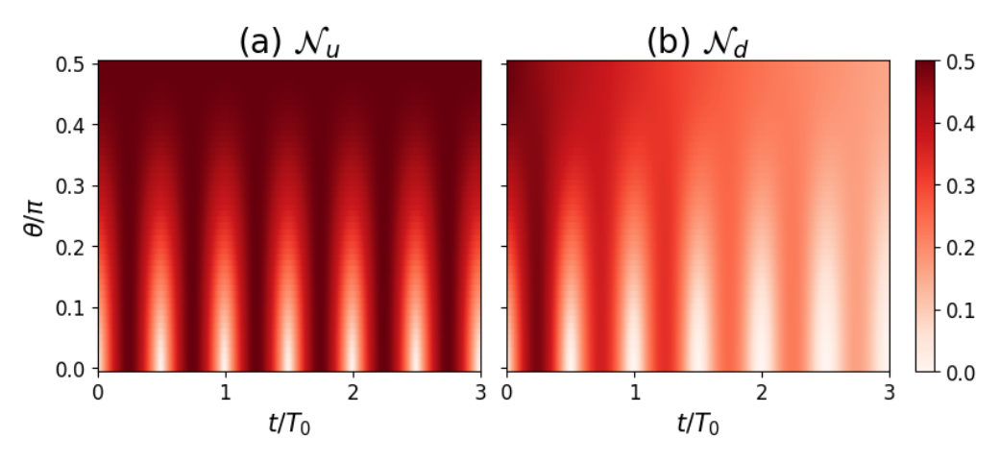 
FIG. 1: Negativity dynamics in time in resonance condition ∆= χ for different initial conditions for (a) closed systems and (b) open system evolution.

📷 Fig 2

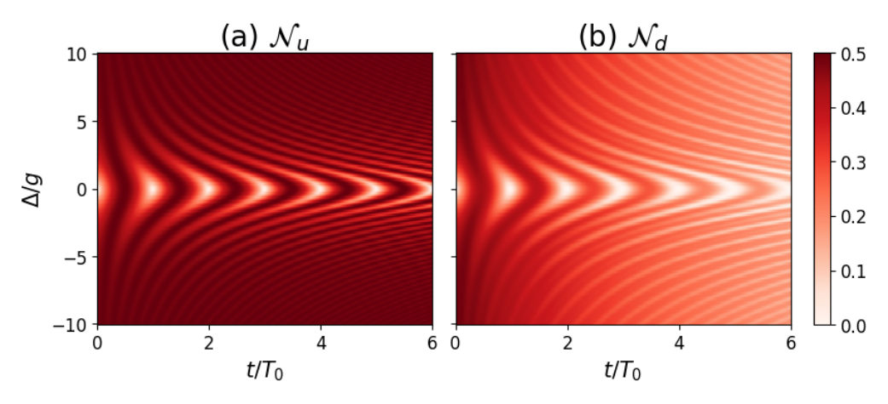 
FIG. 2: Negativity dynamics in time for different values of ∆and χ = 0. The initial condition is perpendicular to de direction of the Hamiltonian; for (a) closed systems and (b) open system evolution. Changing χ only shifts this figure so that the symetry axis corresponds to resonance ∆= χ.

📷 Fig 3

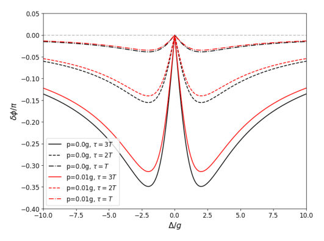 
FIG. 4: Difference of GP between closed and open system after a time τ while varying ∆(off-resonance) but picking θ0 so that the initial condition is perpendicular to the Hamiltonian direction.

📷 Fig 4

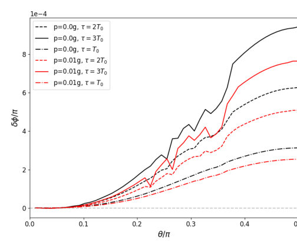 
FIG. 3: Difference of GP between closed and open system after a time τ when varying initial condition direction θ0 while maintaining resonance ∆= χ so that the Hamiltonian represents rotation around the x-axis of the Bloch sphere.

📷 Fig 5

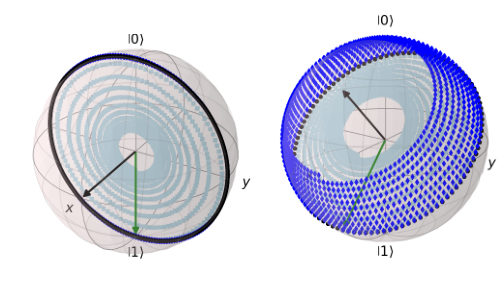 
FIG. 5: Trajectories on Bloch sphere for perpendicular initial conditions. The black arrow represents the Hamiltonian (i.e. the rotation axis) and the green arrow the initial condition. In black is the unitary trajectory, and in light-blue the projection of the density matrix in this space for a Lindbladian dynamic. Finally, in blue, is the eigenvector |ψ+(t)⟩which accumulates GP in the later case. Here, |0⟩≡|e0⟩and |1⟩≡|g1⟩.

**Summary.** This paper demonstrates that in nonlinear light-matter systems, protecting quantum features like geometric phases requires more than just resonance; it requires the dissipation to align with the system's unitary rotation. By showing that environmental action can reshape state-space geometry, the study offers new principles for engineering robust evolution in noisy quantum technologies.

**Why it may be interesting.** It provides a new geometric principle for engineering decoherence-resilient quantum states by focusing on the alignment of coherent and dissipative trajectories, which is highly relevant for designing stable open quantum platforms.

Detailed structure

**Main problem.** Investigating whether standard conditions like resonance or geodesic evolution are sufficient to protect geometric phases and entanglement from environmental decoherence in nonlinear light-matter systems.

**Main result.** The authors find that resonance and geodesic evolution are necessary but not sufficient for robustness; true protection requires a 'dynamically enabled' alignment where dissipation preserves the plane of the unitary trajectory.

**Method.** Analytical diagonalization of the Hamiltonian in the low-excitation regime combined with numerical analysis of Lindblad master equation dynamics.

**Model / system.** A nonlinear Jaynes-Cummings model featuring Kerr-type nonlinearity, describing a two-level atom coupled to a quantized bosonic mode subject to cavity loss, atomic relaxation, and dephasing.

**Key observables.** Geometric phase (GP), Negativity (entanglement), and population dynamics (Rabi oscillations).

**Important parameters / regimes.** Detuning (Delta), Kerr nonlinearity (chi), coupling strength (g), and dissipation rates (gamma, Gamma, Gamma_z).

**Assumptions / limitations.** Zero-temperature environment, validity of the Rotating Wave Approximation (RWA), and restriction to the low-excitation regime.

**Figures summary.** Figure 1 compares Negativity evolution in closed vs. open systems; Figure 2 shows Negativity for various nonlinearity values; Figure 3 quantifies GP sensitivity to initial conditions; Figure 4 shows GP deviation vs. detuning; Figure 5 illustrates the alignment of trajectories on the Bloch sphere for on-resonance vs. off-resonance cases.

**Paper structure.** The paper introduces the nonlinear JCM and dissipation model, defines the geometric phase and entanglement metrics, analyzes the necessity of geodesic paths, demonstrates the insufficiency of resonance alone, and concludes with a general geometric criterion for robustness.

Abstract

Robustness in dissipative light-matter systems has recently been associated with resonance conditions or geodesic evolution. We show that, in the nonlinear Jaynes-Cummings model, these conditions are necessary but not sufficient. Using a Kerr-type extension together with a Lindblad description of cavity losses and atomic decoherence, we identify a dynamically enabled mechanism in which the stability of geometric phases and entanglement is governed by the alignment between coherent and dissipative trajectories in Hilbert space. Our results reveal that environmental action does not merely suppress quantum features, but reshapes the geometry of state-space evolution: protection emerges only when dissipation preserves the structure of the underlying unitary dynamics. This establishes a general geometric criterion for decoherence resilience in nonlinear light-matter systems and provides guiding principles for engineering protected evolution in open quantum platforms.

[↑ back to top](#top)

### [A geometric Fano--Procrustes framework for purification-based distances and quantum channels analysis](http://arxiv.org/abs/2605.18485v1)

**Authors:** Tristán M. Osán  
**Type:** theory · **Category:** quantum information and computing · **PDF:** <https://arxiv.org/pdf/2605.18485v1>  
**Analysis basis:** full PDF text, analyzed in chunks
**Topic relevance:** `methods for driven-dissipative` **3/5** · `correlated / nonlocal dissipation` **2/5** · `entanglement & information structure` **2/5** · `quantum measurements` **2/5**

📷 Fig 1

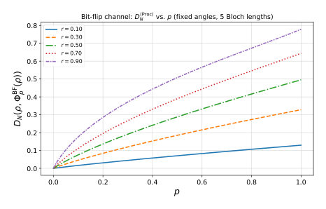 
FIG. 1. The metric DN(ρ, ΦBF p (ρ)) as a function of the bit- flip probability p, for fixed Bloch angles and different values of the Bloch-vector length.

📷 Fig 2

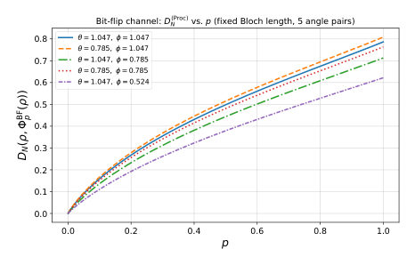 
FIG. 3. The metric DN(ρ, ΦBF p (ρ)) as a function of p, for a fixed Bloch-vector length and different orientations of the input state.

📷 Fig 3

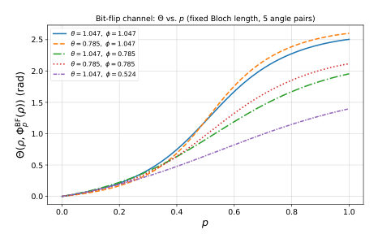 
FIG. 4. Purification misalignment angle Θ(ρ, ΦBF p (ρ)) as a function of p, for the same configurations as in Fig. 3. The orientation dependence reflects the anisotropic nature of the bit-flip channel.

📷 Fig 4

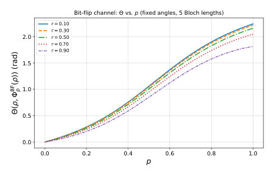 
FIG. 2. Purification misalignment angle Θ(ρ, ΦBF p (ρ)) as a function of the bit-flip probability p, for the same configu- rations as in Fig. 1. The angle captures the geometric re- alignment of the optimal purification frames induced by the anisotropic channel action.

📷 Fig 5

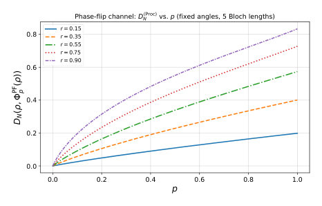 
FIG. 5. The metric DN(ρ, ΦPF p (ρ)) as a function of the phase- flip probability p, for fixed Bloch angles and different values of the Bloch-vector length.

**Summary.** This paper introduces a new geometric framework to analyze quantum state distinguishability by looking beyond scalar fidelity. By reducing purification optimization to a Procrustes problem, it identifies a misalignment angle that captures the geometric reorientation of quantum channels. This allows for a more detailed distinction between purely dissipative and anisotropic noise processes.

**Why it may be interesting.** It provides a new geometric diagnostic (Theta) for characterizing the anisotropic and non-radial components of quantum noise, which is highly relevant for characterizing open quantum systems and control errors.

Detailed structure

**Main problem.** The paper addresses the limitation of existing fidelity-based distance measures that provide only a scalar value for distinguishability, discarding the underlying geometric structure of optimal purifications.

**Main result.** The authors develop a Fano-Procrustes framework that reduces purification-overlap optimization to an orthogonal Procrustes problem on SO(3), introducing a new geometric misalignment angle (Theta) that complements scalar metrics.

**Method.** The work uses the Fano representation of two-qubit pure states and applies Singular Value Decomposition (SVD) to solve the orthogonal Procrustes problem on the Lie group SO(3).

**Model / system.** The framework is applied to mixed qubit states and various quantum channels, including depolarizing, bit-flip, phase-flip, and amplitude-damping channels, as well as an imperfect quantum NOT gate.

**Key observables.** Maximal purification overlap (g*), entropic metric (DN), purification misalignment angle (Theta), and the optimal Procrustes rotation (S*).

**Important parameters / regimes.** Channel error probabilities (p), damping probability (gamma), and Bloch vector length (r).

**Assumptions / limitations.** The current framework is specifically developed and restricted to the qubit (two-level) case.

**Figures summary.** Figures show the behavior of the DN metric and the misalignment angle Theta as functions of error probabilities and input state orientations for various noise channels.

**Paper structure.** The paper introduces the problem of purification geometry, develops the Fano-Procrustes mathematical framework, applies it to specific qubit channels to demonstrate the separation of radial and anisotropic effects, and concludes with discussions on the operational interpretation and limitations.

Abstract

In this work we reformulate the Uhlmann purification-overlap optimization and develop a purification-based geometric framework for the analysis of mixed qubit states and qubit channels. Using the Fano representation of two-qubit pure states, a purification is described in terms of the Bloch vector of the system, the ancilla Bloch vector, and a real correlation matrix. For a fixed one-qubit mixed state, the freedom in the choice of purification can be parametrized by proper rotations acting on the ancillary degrees of freedom. As a result, the optimization over purifications entering the definition of the metric \(D_N\) introduced in Ref.~\cite{Lamberti2009} is reduced to an orthogonal Procrustes problem on the Lie group \(SO(3)\). This reduction yields not only the maximal purification overlap, but also the optimal rotation relating the purification frames. From this rotation we define a purification misalignment angle \(Θ\), which provides geometric information not contained in scalar fidelity-based distinguishability measures.   The formalism is applied to representative qubit channels, including depolarizing, bit-flip, phase-flip, amplitude-damping channels, and an imperfect quantum NOT gate. For symmetry-adapted evolutions preserving the Bloch-vector direction, the optimal rotation is trivial and \(Θ=0\), whereas noncollinear channel actions generate a nonzero misalignment. The pair \((D_N,Θ)\) therefore separates the magnitude of the maximal purification overlap from the geometric reorientation of the optimal purification frames. Since the optimal Procrustes rotation can be lifted to a local unitary acting on the ancilla, the construction also provides an operational interpretation of the optimal purification in terms of an ancilla-side transformation.

[↑ back to top](#top)

### [A study of the dimer-trimer crossover in a driven three-component Fermi gas](http://arxiv.org/abs/2605.18405v1)

**Authors:** Ronnie Slowinski, Gaël Servignat, Frédéric Chevy, Carlos Lobo  
**Type:** theory · **Category:** quantum gases · **PDF:** <https://arxiv.org/pdf/2605.18405v1>  
**Analysis basis:** full PDF text, analyzed in chunks
**Topic relevance:** `Keldysh / 2PI / non-Gaussian methods` **3/5** · `analog quantum simulation` **2/5** · `driven-dissipative phase transition` **2/5** · `non-equilibrium dynamics` **2/5**

📷 Fig 1

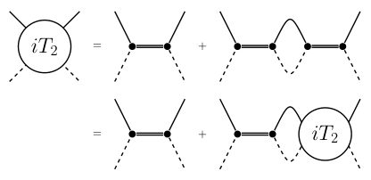 
FIG. 2: The Feynman diagrams representing the two- body interaction between a (solid line) and b (dashed line) forming a closed-channel dimer d (double line) in vacuum.

📷 Fig 2

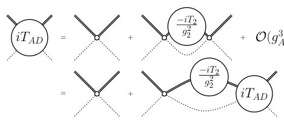 
FIG. 3: Diagrams required to calculate TAD for the scat- tering between a dimer d (double line) and c-particle (dotted) interacting through a contact interaction gAD. The first expression is a perturbative expansion in gAD truncated after g2 AD and the second gives the integral equation obtained after including infinite interactions. The vacuum two-body T-matrix (T2) enters the dimer propagator since d is a composite particle.

📷 Fig 3

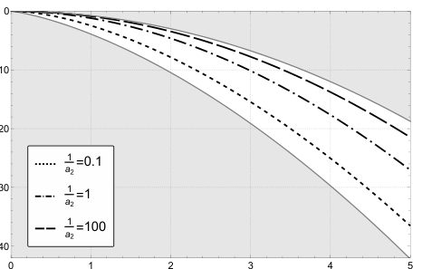 
FIG. 4: A graph of atom-dimer binding energy rela- tive to the dimer binding energy (∆E = E + κ2 +) in vacuum as a function of inverse atom-dimer scattering length (1/aAD) for a selection of ab-scattering lengths (a2). The upper bound corresponds to the point dimer limit and the lower bound corresponds to the unitary dimer limit, with the shaded gray areas indicating the regions where trimers cannot form for any combination of a2 and aAD. The remaining results have been found by numerically solving Eq. (19) with effective range fixed so R = 0.1. We find that by varying 1/a2 the trimer so- lutions interpolate smoothly between these two limits.

📷 Fig 4

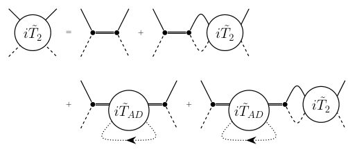 
FIG. 7: Diagrams used to calculate the two-body T- matrix between the impurities a (solid) and b (dashed) in medium ( ˜T2) up to a single p-h pair in the c-particle Fermi sea. The medium atom-dimer T-matrix ( ˜TAD) en- ters whenever the ab-dimer interacts with a c-particle forming the medium, producing a hole which is denoted by a backwards pointing (dotted) arrow.

📷 Fig 5

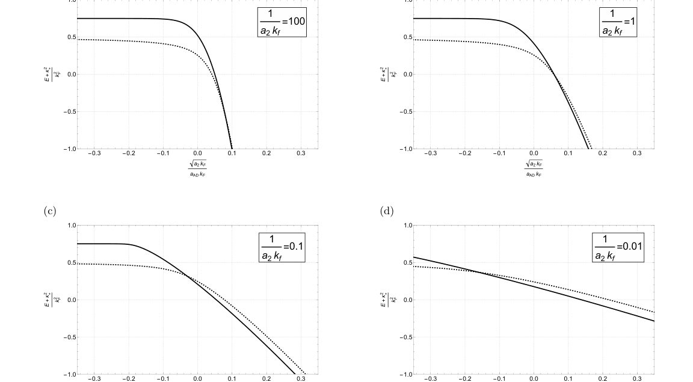 
FIG. 8: Comparison of the trimer binding energies (solid lines) and dimer binding energies (dotted lines) in medium as a function of 1/aAD while keeping two-body observables fixed. For (a2kF )−1 = (100, 1, 0.1, 0.01) we observe a crossing at p

**Summary.** This paper uses effective field theory to study the transition between dimer and trimer states in a three-component Fermi gas. It reveals that external driving can control the crossover between these states and that many-body effects can create trimer states that do not exist in a vacuum. This work is significant for understanding the stability and manipulation of complex clusters in ultracold gases.

**Why it may be interesting.** It provides a theoretical framework for controlling many-body bound states using external drives, offering new insights into how the transition between different types of many-body clusters (like polarons and molecules) can be manipulated in ultracold atomic systems.

Detailed structure

**Main problem.** Investigating the crossover between dimer and trimer states in a three-component Fermi gas, specifically how external drives and many-body effects influence the stability and binding energies of these states.

**Main result.** The study demonstrates a guaranteed crossover from a dimer to a trimer ground state as the atom-dimer interaction is tuned, and shows that many-body effects can induce trimer solutions (Cooper pairs) even in regimes where they are absent in vacuum.

**Method.** The authors use an Effective Field Theory (EFT) and a variational approach, employing Feynman rules, the T-matrix formalism, and renormalization to solve self-consistent energy equations.

**Model / system.** A three-component Fermi gas consisting of three distinguishable atomic species (a, b, and c). Species a and b interact via an external drive to form a non-universal closed-channel dimer, which then interacts with a Fermi sea of the third species (c) via a contact interaction.

**Key observables.** Two-body and three-body binding energies, atom-dimer scattering length, and the energy difference between the dimer and trimer branches.

**Important parameters / regimes.** Atom-dimer scattering length (1/a_AD), two-body scattering length (a_2), effective range (R), and Fermi momentum (k_F).

**Assumptions / limitations.** The dimer is assumed to be non-universal, and the third species is treated as a spinless fermion forming an unperturbed Fermi sea.

**Figures summary.** Fig 1 shows Feynman rules for the effective Hamiltonian; Fig 2 shows Feynman diagrams for two-body interactions; Fig 4 shows trimer energy bounds; Fig 9 illustrates the energy difference between trimer and dimer branches across different interaction strengths.

**Paper structure.** The paper introduces the EFT framework and Hamiltonian, develops the two-body sector (vacuum and medium), extends the theory to the three-body sector (trimer binding energies), analyzes the dimer-trimer crossover, and discusses the implications of external driving.

Abstract

We develop an Effective Field Theory (EFT) for a system with three distinguishable atomic species and present a variational calculation of the two and three-body binding energies in vacuum and in the presence of a single Fermi sea. Specifically, we consider the case where the interaction between first two atomic species is externally driven so as to produce a (non-universal) closed-channel dimer whose coupling can be controlled independently of all other interactions. We then model the remaining interactions as a contact interaction between the dimer and a third atomic species which forms the medium. We derive analytical expressions for the dimer and trimer binding energies in vacuum and in medium, and in the latter case we predict a crossing between the dimer and trimer branches as a function of the atom-dimer scattering length, analogous to the usual polaron and molecule problem. Furthermore, we show that the position of this crossing can be controlled by varying the atom-atom coupling that results from the external drive and we discuss the implications of these findings.

[↑ back to top](#top)

### [Global resetting and emergent correlations: exit statistics in an interval](http://arxiv.org/abs/2605.17906v1)

**Authors:** Paul C Bressloff  
**Type:** theory · **Category:** statistical mechanics · **PDF:** <https://arxiv.org/pdf/2605.17906v1>  
**Analysis basis:** full PDF text, analyzed in chunks
**Topic relevance:** `correlated / nonlocal dissipation` **3/5** · `entanglement & information structure` **2/5** · `methods for driven-dissipative` **2/5** · `non-equilibrium dynamics` **2/5**

📷 Fig 1

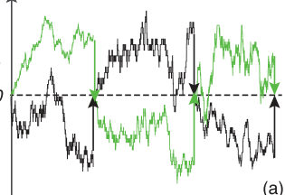 
Figure 1: Two examples of globally driven Brownian motion. (a) Pair of Brownian particles diffusing in R and subject to global resetting. At a random sequence of times Tn the positions of both particles are reset to the origin. The inter-event times τn = Tn+1 −Tn are exponentially distributed. (b) Pair of Brownian particles in the interval [0, L] with an open boundary at x = 0 and a stochastically gated boundary at x = L. The latter switches between an open state (blue) and a closed state (red) according to a two-state Markov chain. Also shown is the exit of one particle through the open gate.

📷 Fig 2

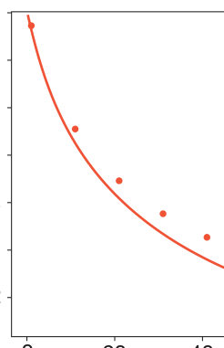 
Figure 2: Plots of π(2)(x0; xr) (global resetting) and π(2) loc(x0; xr) (local resetting) as functions of the resetting rate r, which are given by equations (4.9)–(4.10)) and (4.16), respectively. We take x0 = (x, x) and xr = (xr, xr) with (a) x = 0.1, xr = 0.9 and (b) x = 0.9, xr = 0.1. The solid curves correspond to π(2) loc, whereas the discrete points sample π(2). We set L = 1 and truncate the double summation of the Green’s function in (4.3) by taking 1 ≤n, m ≤N with N = 1000.

📷 Fig 3

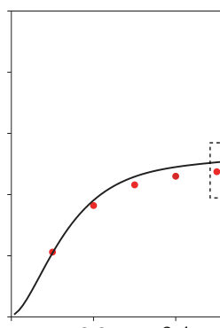 
Figure 3: Corresponding plots of π(2)(x0; xr) and π(2) loc(x0; xr) as functions of the initial position x with x0 = (x, x) and xr = (xr, xr). The solid curve corresponds to π(2) loc, whereas the discrete points sample π(2). We also set L = 1, r = 100 and N = 1000. The inset shows π(2) for N = 1000 (solid red circle) and N = 1100 (indicated by x) and π(2) loc (solid black circle) for x = 0.5.

📷 Fig 4

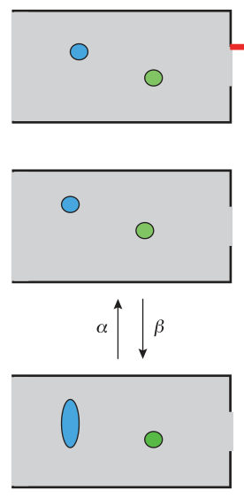 
Figure 4: Schematic diagram comparing global versus local gating. (a) Global gating: Particles diffuse in a common switching environment consisting of a stochastically gated boundary at x = L. (b) Local gating: each particle independently switches between two configurations, only one of which can exit the boundary at x = L. (2D representation is for illustrative purposes.)

📷 Fig 5

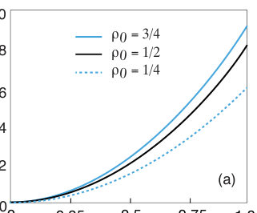 
Figure 5: (a) Plot of the splitting probability π(2)(x, x) for a pair of Brownian particles with the same initial position x. The Fourier series solution (A.26) is truncated after 200 terms. In addition, a 50,000-dimensional version of the infinite-dimensional matrix equation (A.30) is solved to estimate the Fourier coefficients. Other parameters are L = 1 and ξ = p

**Summary.** This paper explores how a shared stochastic resetting protocol induces correlations between independent Brownian particles. It develops a mathematical framework using nested boundary value problems to show that these particles no longer behave independently. The study establishes a direct link between multi-particle exit statistics and the moments of a stochastic diffusion equation.

**Why it may be interesting.** This work is highly relevant to open quantum systems and many-body dynamics as it provides a mathematical framework for understanding how shared environmental noise (common-mode noise) generates entanglement-like statistical correlations in otherwise independent constituents.

Detailed structure

**Main problem.** Investigating how global stochastic resetting induces statistical correlations between non-interacting Brownian particles and determining the resulting joint exit (splitting) probabilities.

**Main result.** The paper proves that global resetting creates emergent correlations such that the joint splitting probability cannot be decomposed into independent single-particle probabilities, and establishes a mapping between these probabilities and the moments of a stochastic diffusion equation.

**Method.** The author uses generalized Ito's lemma, backward Kolmogorov equations, and Green's function methods to derive a hierarchy of nested boundary value problems (BVPs).

**Model / system.** A population of M non-interacting Brownian particles in a 1D interval [0, L] with absorbing boundaries, subject to a global Poissonian resetting process to a common position.

**Key observables.** Splitting probability (probability of exiting through a specific boundary), joint splitting probability, and survival probability.

**Important parameters / regimes.** Resetting rate (r), diffusion coefficient (D), interval length (L), and the characteristic scale xi = sqrt(r/D).

**Assumptions / limitations.** Particles are non-interacting (no physical collisions); resetting is global (all particles reset simultaneously); boundaries are strictly absorbing.

**Figures summary.** Figure 1 shows the global resetting mechanism; Figure 2 plots joint splitting probability vs. reset rate; Figure 4 compares global vs. local gating; Figure 5 compares joint splitting probabilities for global and local gating scenarios.

**Paper structure.** The paper introduces the problem of emergent correlations, derives the BVP hierarchy using Ito's lemma, provides an analytical solution for the two-particle case, establishes a mapping to SPDE moment equations, and concludes with a comparison between global and local gating dynamics.

Abstract

There is considerable current interest in the emergence of statistical correlations within a population of otherwise non-interacting Brownian particles subject to a common fluctuating environment or drive. Examples include global stochastic resetting, switching confining potentials, fluctuating diffusivities, and stochastically gated boundaries. Most studies have focused on the analytical structure of the stationary joint probability density (assuming it exists). In this paper, we extend previous work on the exit statistics of multiple particles in stochastically gated domains to the case of global resetting in an interval with absorbing boundaries at both ends. First, we use a generalised Itô's lemma to derive a hierarchy of boundary value problems (BVPs) for the joint splitting probability that all particles exit from the same end of the interval. The BVPs form a nested sequence with respect to the initial number of particles $M$. We explicitly solve the BVP for a pair of particles ($M=2$) and use this to illustrate the emergence of pairwise correlations. Second, we show how the BVP for the splitting probability of $M$ Brownian particles can be mapped onto the $M$th order moment equation of a stochastic diffusion equation with resetting. We thus establish a general mathematical framework to study exit problems for globally-driven particle systems.

[↑ back to top](#top)

### [Localization of a quantum particle in a classical one-component plasma. II. Dynamic Disorder and Temporal Decorrelation](http://arxiv.org/abs/2605.18196v1)

**Authors:** Yury A. Budkov  
**Type:** theory · **Category:** disordered systems and neural networks · **PDF:** <https://arxiv.org/pdf/2605.18196v1>  
**Analysis basis:** full PDF text, analyzed in chunks
**Topic relevance:** `Keldysh / 2PI / non-Gaussian methods` **3/5** · `Kondo & dissipative impurity` **2/5** · `correlated / nonlocal dissipation` **2/5** · `non-equilibrium dynamics` **2/5**

📷 Fig 1

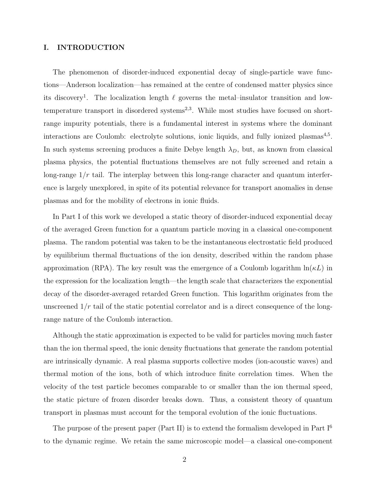 
Low-resolution page preview, page 2

📷 Fig 2

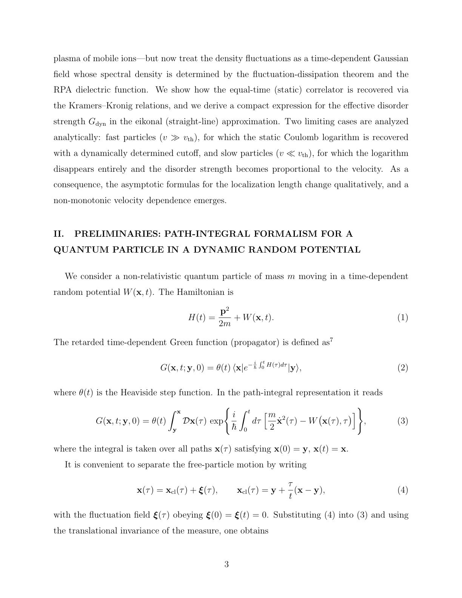 
Low-resolution page preview, page 3

📷 Fig 3

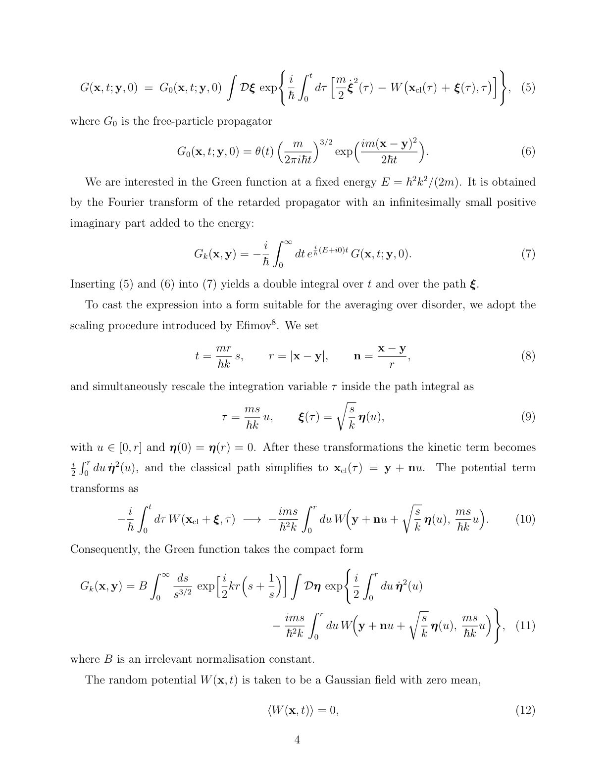 
Low-resolution page preview, page 4

📷 Fig 4

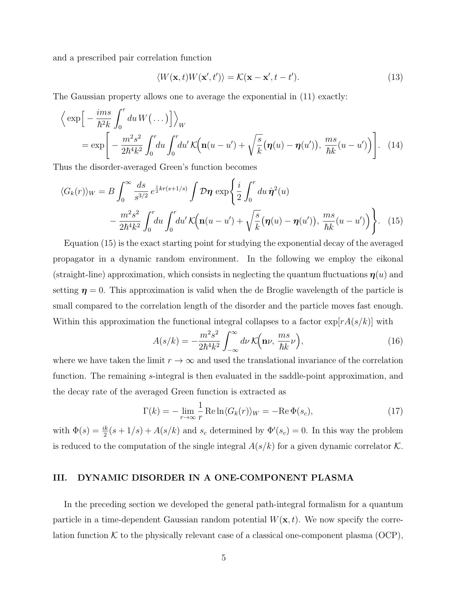 
Low-resolution page preview, page 5

📷 Fig 5

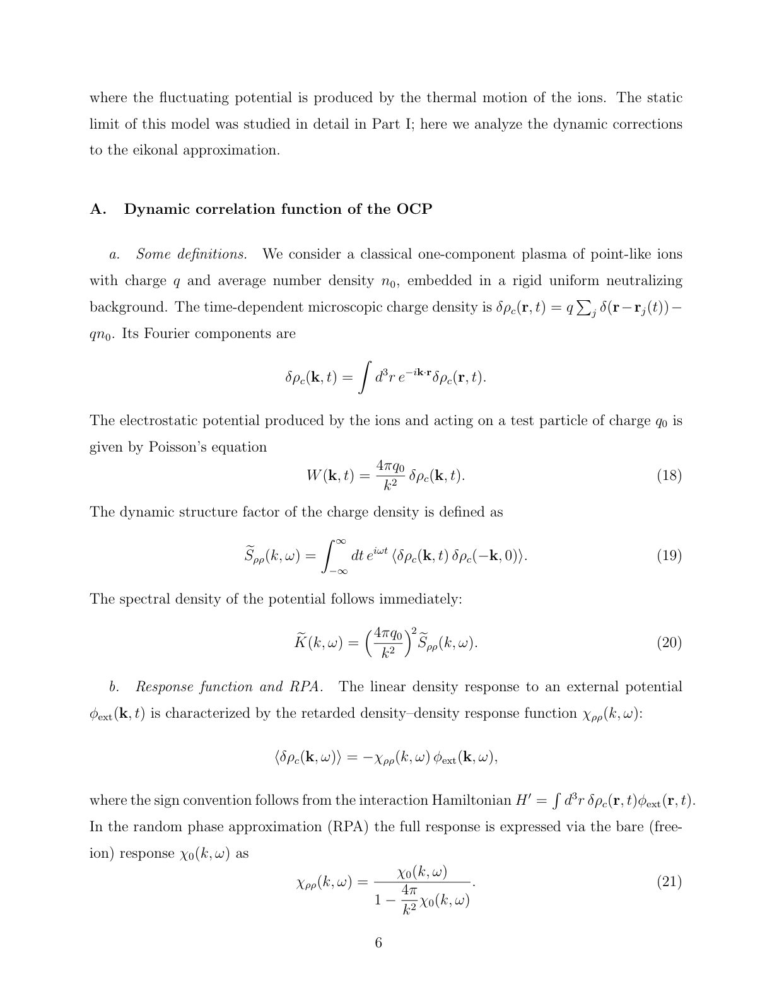 
Low-resolution page preview, page 6

**Summary.** This paper investigates how the movement of ions in a plasma affects the localization of a quantum particle. It demonstrates that while fast particles behave according to static theory, ultra-slow particles experience a suppression of disorder that prevents exponential localization.

**Why it may be interesting.** It provides a fundamental look at how environmental dynamics (temporal decorrelation) can destroy localization, which is highly relevant to understanding decoherence and transport in many-body open quantum systems.

Detailed structure

**Main problem.** Extending the theory of Anderson localization from a static random potential to a dynamic, time-dependent potential caused by ionic density fluctuations in a plasma.

**Main result.** The study finds that for slow particles, temporal decorrelation suppresses the Coulomb logarithm and leads to a scaling of the localization length where $\ell \propto k^{-1/3}$, implying that ultra-slow particles are not exponentially localized.

**Method.** The author uses a path-integral formalism combined with the eikonal approximation, the Random Phase Approximation (RPA), and the fluctuation-dissipation theorem to derive the decay of the Green function.

**Model / system.** A non-relativistic quantum particle with charge $q_0$ and mass $m$ moving in a classical one-component plasma (OCPS) of mobile ions, where the potential is a Gaussian random field generated by ionic density fluctuations.

**Key observables.** Averaged retarded Green function, localization length ($\ell$), decay rate ($\Gamma$), and effective dynamic disorder strength ($G_{dyn}$).

**Important parameters / regimes.** Particle velocity ($v$) vs. ion thermal speed ($v_{th}$), Debye screening length ($\kappa^{-1}$), and ion plasma frequency ($\omega_{pi}$).

**Assumptions / limitations.** The eikonal (straight-line) approximation is used, neglecting quantum fluctuations of the path, and the plasma is treated within the Random Phase Approximation (RPA).

**Paper structure.** The paper introduces the dynamic problem, establishes the mathematical framework using path integrals and RPA, analyzes the two velocity regimes (fast vs. slow), and discusses the physical implications and scaling laws.

Abstract

We extend the static theory of disorder-induced exponential decay of the averaged Green function of a quantum charged particle in a classical one-component plasma to the dynamic regime by incorporating the temporal evolution of the ionic density fluctuations within the random phase approximation. The dynamic potential correlator is derived from the fluctuation-dissipation theorem and the Kramers--Kronig relations. Within the eikonal (straight-line) approximation, the effective disorder strength is expressed through the dielectric function of the ion plasma. For particles moving faster than the ion thermal speed, the static Coulomb logarithm is recovered, with the large-distance cutoff replaced by the dynamic scale $v/ω_{pi}$. For slow particles, the Coulomb logarithm disappears completely and the disorder strength becomes proportional to the velocity, leading to a fundamentally different scaling of the localization length. In particular, the strong-disorder length diverges as $k^{-1/3}$ for $v\ll v_{\mathrm{th}}$, whereas it saturates in the static limit, indicating that ultra-slow particles are not exponentially localized in a dynamic plasma. A crossover between the quasi-static and dynamic regimes occurs when the particle speed becomes comparable to the ion thermal speed.

[↑ back to top](#top)

### [Euler-Maruyama method for non-Wiener processes](http://arxiv.org/abs/2605.16662v1)

**Authors:** Richard D. J. G. Ho  
**Type:** theory · **Category:** numerical methods · **PDF:** <https://arxiv.org/pdf/2605.16662v1>  
**Analysis basis:** full PDF text, analyzed in chunks
**Topic relevance:** `Keldysh / 2PI / non-Gaussian methods` **3/5** · `methods for driven-dissipative` **3/5** · `non-equilibrium dynamics` **2/5**

📷 Fig 1

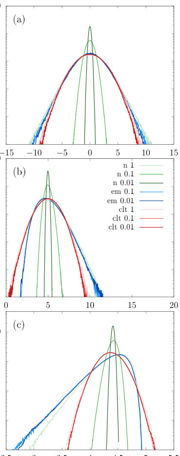 
FIG. 1. Probability density functions of the reaction-diffusion system for different L´evy processes, comparing the naive (n), Euler-Maruyama (em), and central limit theorem (clt) meth- ods. The letter refers to Table. (I), whilst the number refers to the time step length.

📷 Fig 2

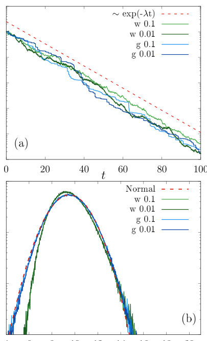 
FIG. 2. Modeling of noisy exponential decay. a) Examples of decays for the standard Wiener process (w) and gamma pro- cess (g). b) The measured mean lifetime of the simulations. The number refers to the time step.

📷 Fig 3

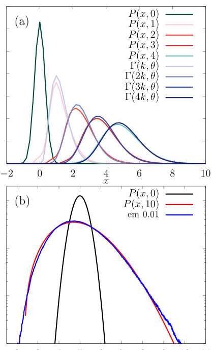 
FIG. 3. a) Solution of equation Eq. (6) compared to the exact solution for an initial delta distribution at x = 0. b) for additive noise, compared to using EM method.

**Summary.** This paper introduces a generalized Euler-Maruyama method for simulating stochastic differential equations driven by non-Wiener, non-Gaussian processes. By using increments from Lévy processes like the Gamma distribution, the method more accurately captures the physical reality of systems with skewed fluctuations. It demonstrates that this approach avoids the inaccuracies introduced by standard Gaussian approximations in modeling decay and diffusion.

**Why it may be interesting.** This is highly relevant for researchers in open quantum systems and many-body dynamics who need to simulate non-equilibrium processes where environmental noise is non-Gaussian or heavy-tailed.

Detailed structure

**Main problem.** The paper addresses the limitations of the standard Euler-Maruyama method when modeling complex systems that exhibit non-Gaussian (non-Wiener) fluctuations.

**Main result.** The author develops a 'relaxed' Euler-Maruyama method using Lévy processes (such as Gamma processes) that accurately captures the tails and skewness of non-Gaussian noise, providing more physically accurate results for decay processes than standard Brownian motion.

**Method.** A generalized Euler-Maruyama discretization scheme where increments are drawn from non-Gaussian, infinitely divisible distributions, validated via Kramers-Moyal expansion and comparison with the Central Limit Theorem approach.

**Model / system.** The method is applied to stochastic differential equations (SDEs) featuring both additive and multiplicative noise, specifically modeling noisy exponential decay and particle decay processes.

**Key observables.** Probability density functions (PDFs), mean lifetime, variance, skewness, and kurtosis.

**Important parameters / regimes.** Simulation time step (delta t), decay rates (nu and lambda), and noise variance (sigma^2).

**Assumptions / limitations.** The method assumes the noise follows a subset of Lévy processes that are infinitely divisible; numerical implementation of the Master equation requires truncation of the Kramers-Moyal expansion.

**Figures summary.** Figure 1 compares PDFs of different processes across methods; Figure 2 shows decay trajectories and the distribution of mean lifetimes; Figure 3 compares the Master equation solution against the exact EM method solution.

**Paper structure.** The paper begins by defining the mathematical requirements for a relaxed EM method, moves to testing the method with additive noise models, and concludes with applications to multiplicative noise and validation via the Kramers-Moyal expansion.

Abstract

Descriptions of complex physical or biological systems often include stochastic contributions, and these are commonly simulated using Wiener processes. In many cases however, non-Gaussian fluctuations may originate from non-Wiener processes which remain less explored. The Euler-Maruyama method of discretising stochastic differential equations to non-Wiener processes is generalised. Non-Gaussian noise generated from a subset of Lévy processes can be used simply and often with more physical justification, for both additive and multiplicative noise. An example of this is provided that gives superior physical results compared to using geometric Brownian motion. Finally the results of the additive noise are shown to be equivalent to a derived master equation via the Kramers-Moyal expansion.

[↑ back to top](#top)

### [Temperature-Controlled Resonance in a Heteronuclear Quantum Gas Mixture](http://arxiv.org/abs/2605.17931v1)

**Authors:** Xiaoyi Yang, Tianyu Xu, Shengli Ma, Zhigang Wu, Ren Zhang  
**Type:** theory · **Category:** quantum gases · **PDF:** <https://arxiv.org/pdf/2605.17931v1>  
**Analysis basis:** full PDF text, analyzed in chunks
**Topic relevance:** `Kondo & dissipative impurity` **3/5** · `non-equilibrium dynamics` **3/5** · `analog quantum simulation` **2/5**

📷 Fig 1

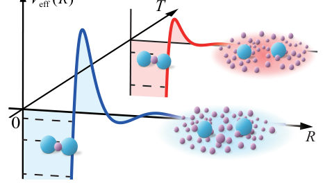 
FIG. 1. Schematic of the Casimir-like mediated interaction Veff(R) between two heavy impurities (blue) immersed in a Fermi sea of light fermions (purple). The interaction is me- diated by the light fermions through contributions from both bound states and scattering states. The dashed lines indicate impurity–bound states supported by the mediated interac- tion. The effective potential is continuously modified as the temperature T is varied.

📷 Fig 2

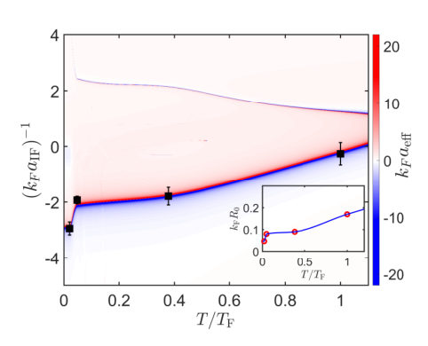 
FIG. 2. The effective scattering length aeff as a function of the interspecies scattering length aIF and temperature T, where the false color indicates values of aeff. The boundaries where aeff transitions from large positive to large negative val- ues correspond to the locations of resonances. The markers indicate the experimentally measured loss centers of the Bose gas reported in Ref. [49]. The corresponding short-range cut- off values are kFR0 = 0.047 at T/TF ≈0.02, kFR0 = 0.08 at T/TF ≈0.05, kFR0 = 0.09 at T/TF ≈0.38, and kFR0 = 0.17 at T/TF = 1, where kF is the Fermi momentum. The inset shows these cutoff values as a function of temperature, where the blue solid line is obtained by...

📷 Fig 3

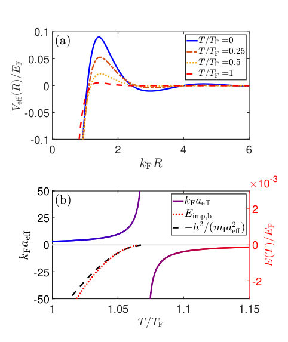 
FIG. 3. (a) The mediated effective potential between two heavy impurities for the strongly interacting case aIF →∞. (b) Effective scattering length aeff as a function of temper- ature T is shown on the left axis. The impurity bound- state energy Eimp,b (red dotted line) is shown on the right axis. The black dashed line indicates the low-energy predic- tion −ℏ2/(mIa2 eff). Energies are in units of Fermi energy EF and temperatures in units of the Fermi temperature TF.

📷 Fig 4

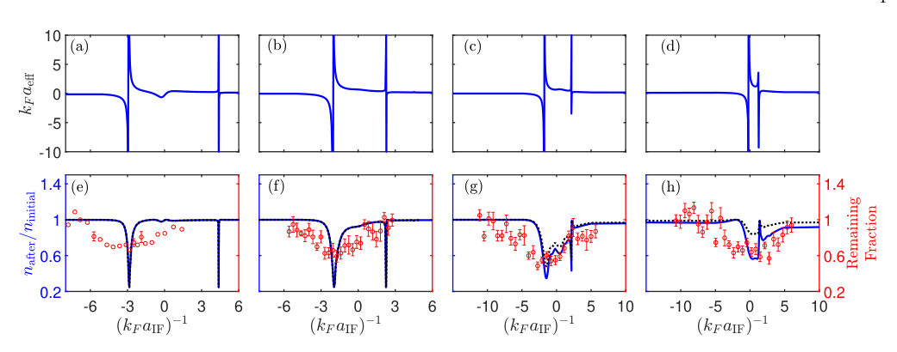 
FIG. 4. Comparison between the TCR prediction and quench dynamics at different temperatures. (a)–(d) Effective scat- tering length aeff as a function of the impurity–fermion scattering length aIF. (e)–(h) Remaining low-momentum occupation nafter/ninitial after the quench. In panels (e)–(h), the left vertical axis denotes the calculated nafter/ninitial, while the right vertical axis denotes the experimentally measured loss signal from Ref. [49]. The blue solid lines are obtained from the high- temperature virial expansion with local density approximation (LDA), and the black dotted lines show the corresponding results without LDA. Red symbols represent the experimental data. Panels (a) and...

**Summary.** The paper proposes that temperature can be used to tune single-channel resonances in heteronuclear quantum gas mixtures by reshaping the effective interaction between impurities. This 'Temperature-Controlled Resonance' mechanism explains observed temperature-dependent atom loss in Bose-Fermi mixtures. The study demonstrates that temperature serves as a simple control knob for manipulating effective scattering properties.

**Why it may be interesting.** It introduces a novel, experimentally accessible way to tune interactions in ultracold gases using temperature rather than magnetic fields, which has implications for controlling many-body dynamics and impurity physics.

Detailed structure

**Main problem.** The difficulty in systematically controlling single-channel resonances in atomic collisions, which are usually incidental and lack a tuning mechanism like Feshbach resonances.

**Main result.** The discovery of a Temperature-Controlled Resonance (TCR) where thermal smearing of the Fermi surface reshapes the effective potential, allowing temperature to act as a control knob for resonances.

**Method.** The authors use a grand potential approach to calculate Casimir-like mediated interactions, the variable-phase equation for scattering theory, and a high-temperature virial expansion to study quench dynamics.

**Model / system.** A heteronuclear quantum gas mixture consisting of heavy impurities (e.g., 133Cs) immersed in a light, single-component Fermi gas (e.g., 6Li), modeled using the Born-Oppenheimer approximation and a contact pseudopotical.

**Key observables.** Effective scattering length (a_eff), impurity bound-state energy (E_imp,b), and momentum distribution depletion (delta n_k) following an interaction quench.

**Important parameters / regimes.** Temperature (T), Fermi temperature (T_F), interspecies scattering length (a_IF), mass ratio (eta), and the short-range cutoff (R0).

**Assumptions / limitations.** The impurities are assumed to be dilute and static, the Born-Oppenheimer approximation is applied, and the interaction is modeled as a contact s-wave potential.

**Figures summary.** Figure 1 shows a schematic of the temperature-dependent Casimir-like interaction; Figure 2 plots the effective scattering length as a function of interaction strength and temperature, highlighting resonance boundaries.

**Paper structure.** The paper introduces the problem of resonance control, proposes the TCR mechanism via thermal modification of the Fermi sea, provides a theoretical derivation of the effective potential, validates the mechanism against experimental loss data, and explores the dynamical consequences via interaction quenches.

Abstract

Single-channel resonances are fundamental processes in scattering of atoms, yet their occurrence is largely incidental and lacks systematic control. In this Letter, we propose a mechanism to realize a continuously tunable single-channel resonance by controlling the temperature of the heteronuclear mixture. By extending the Casimir-like mediated interaction to finite temperature, we demonstrate that thermal smearing of the Fermi surface reshapes the effective potential between impurities, giving rise to a temperature-controlled resonance (TCR) over a wide parameter range. As a direct consequence, the resonance position shifts systematically with temperature variation, providing a clear experimental signature of this mechanism. We further investigate the quench dynamics of a Bose gas immersed in a Fermi sea and demonstrate that the observed temperature-dependent loss features in recent experiments are consistent with the TCR mechanism. Our results establish temperature as a simple and experimentally accessible control knob for single-channel resonances in ultracold quantum gases.

[↑ back to top](#top)

### [Localization of a quantum particle in a classical one-component plasma.III. Mutual coherence and coherence degradation in Coulomb-disordered media](http://arxiv.org/abs/2605.18559v1)

**Authors:** Yury A. Budkov  
**Type:** theory · **Category:** disordered systems and neural networks · **PDF:** <https://arxiv.org/pdf/2605.18559v1>  
**Analysis basis:** full PDF text, analyzed in chunks
**Topic relevance:** `Keldysh / 2PI / non-Gaussian methods` **3/5** · `non-equilibrium dynamics` **2/5** · `non-equilibrium universality` **2/5**

📷 Fig 1

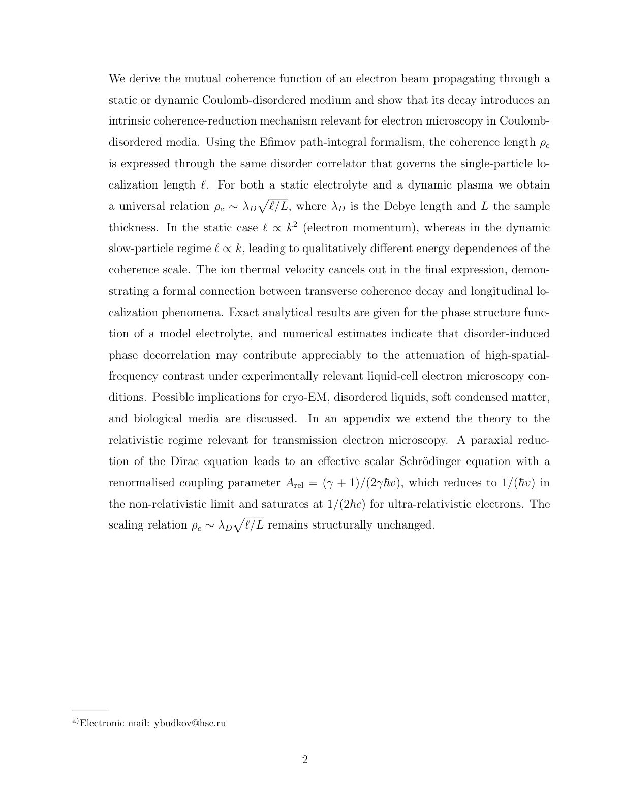 
Low-resolution page preview, page 2

📷 Fig 2

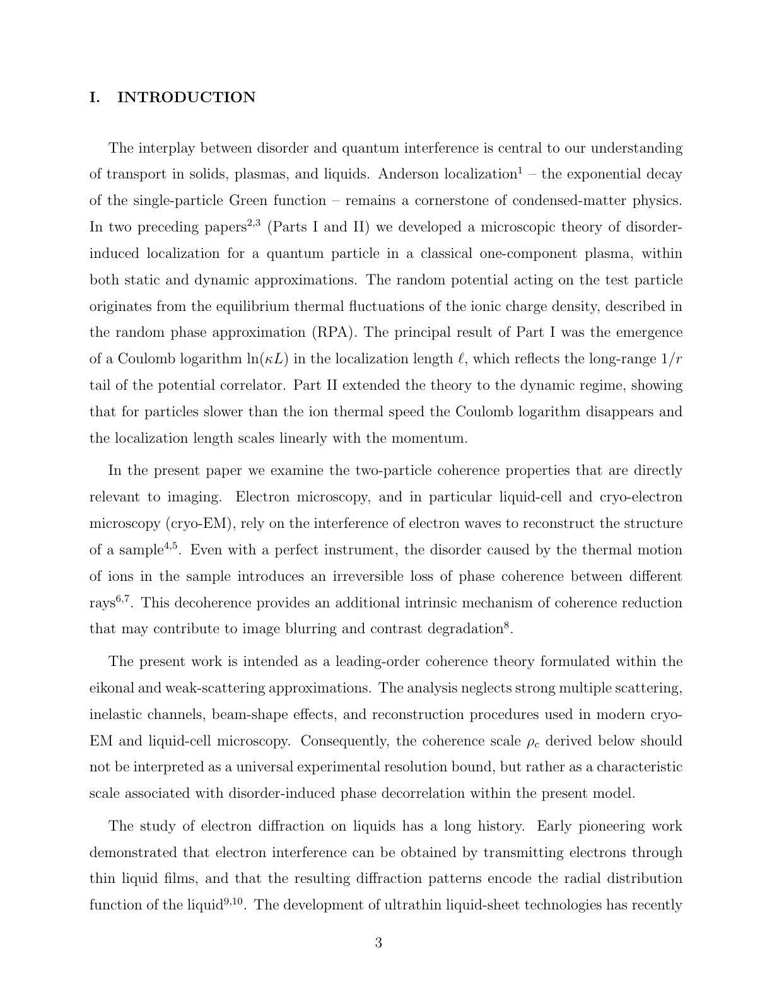 
Low-resolution page preview, page 3

📷 Fig 3

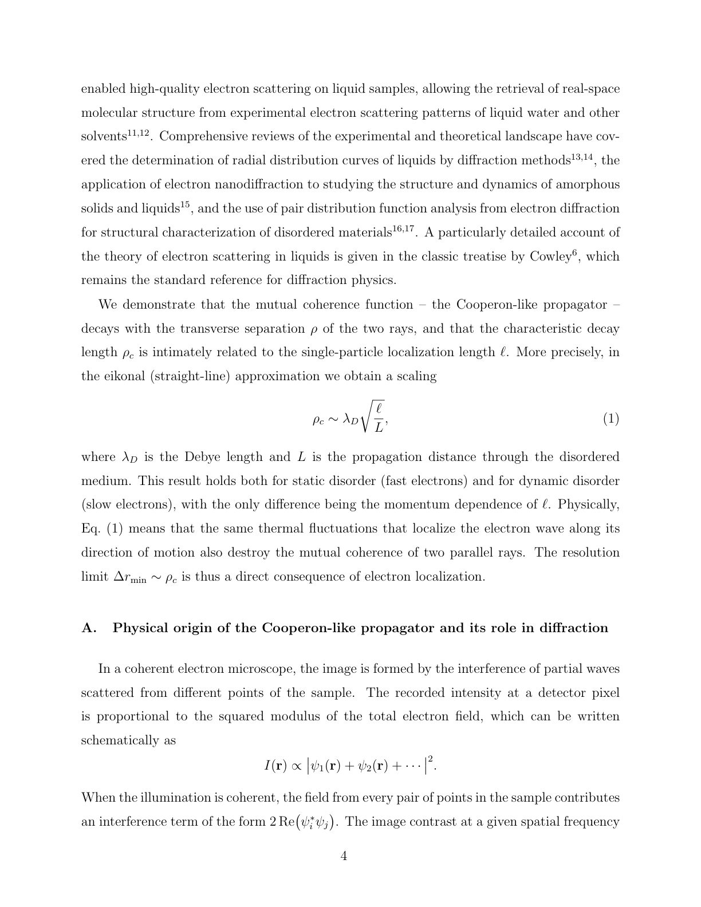 
Low-resolution page preview, page 4

📷 Fig 4

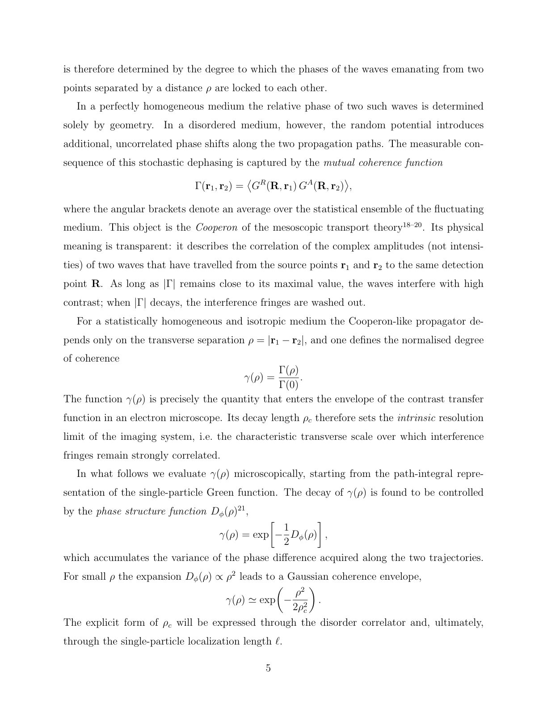 
Low-resolution page preview, page 5

📷 Fig 5

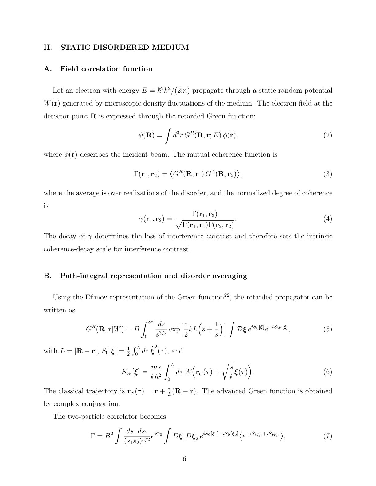 
Low-resolution page preview, page 6

**Summary.** This paper derives a universal scaling law relating the transverse coherence length of an electron beam to the longitudinal localization length in a Coulomb-disordered medium. It demonstrates that phase decorrelation is driven by the same disorder correlator as single-particle localization. These findings have significant implications for understanding image contrast degradation in liquid-cell electron microscopy.

**Why it may be interesting.** The paper establishes a formal connection between transverse coherence decay and longitudinal localization, providing a fundamental link between transport phenomena and wave-front decorrelation in disordered media.

Detailed structure

**Main problem.** Investigating the loss of mutual coherence and phase decorrelation in electron beams propagating through Coulomb-disordered media, such as electrolytes and plasmas.

**Main result.** The derivation of a universal scaling relation for the coherence length rho_c ~ lambda_D * sqrt(ell/L), linking transverse coherence decay to longitudinal localization phenomena.

**Method.** The study employs the Efimov path-integral formalism, the eikonal approximation, and the saddle-point approximation to evaluate the mutual coherence function.

**Model / system.** A quantum particle (electron) interacting with a random potential originating from the thermal fluctuations of a classical one-component plasma (Coulomb-disordered medium).

**Key observables.** Mutual coherence function (gamma), coherence length (rho_c), localization length (ell), and phase structure function (D_phi).

**Important parameters / regimes.** Debye length (lambda_D), sample thickness (L), electron momentum (k), and the distinction between static and dynamic disorder regimes.

**Assumptions / limitations.** Assumes a Gaussian random potential, uses the eikonal (straight-line) approximation, neglects strong multiple scattering and inelastic channels, and assumes a statistically homogeneous medium.

**Paper structure.** The paper begins by defining the coherence function via the Green function, applies the Efimov path-integral and disorder averaging, derives scaling laws for static and dynamic regimes, and concludes with an extension to the relativistic regime in an appendix.

Abstract

We derive the mutual coherence function of an electron beam propagating through a static or dynamic Coulomb-disordered medium and show that its decay introduces an intrinsic coherence-reduction mechanism relevant for electron microscopy in Coulomb-disordered media. Using the Efimov path-integral formalism, the coherence length $ρ_c$ is expressed through the same disorder correlator that governs the single-particle localization length $\ell$. For both a static electrolyte and a dynamic plasma we obtain a universal relation $ρ_c \sim λ_D \sqrt{\ell/L}$, where $λ_D$ is the Debye length and $L$ the sample thickness. In the static case $\ell\propto k^{2}$ (electron momentum), whereas in the dynamic slow-particle regime $\ell\propto k$, leading to qualitatively different energy dependences of the coherence scale. The ion thermal velocity cancels out in the final expression, demonstrating a formal connection between transverse coherence decay and longitudinal localization phenomena. Exact analytical results are given for the phase structure function of a model electrolyte, and numerical estimates indicate that disorder-induced phase decorrelation may contribute appreciably to the attenuation of high-spatial-frequency contrast under experimentally relevant liquid-cell electron microscopy conditions. Possible implications for cryo-EM, disordered liquids, soft condensed matter, and biological media are discussed. In an appendix we extend the theory to the relativistic regime relevant for transmission electron microscopy.

[↑ back to top](#top)

### [Optimization of circular cavities via guided-mode expansion method based inverse design](http://arxiv.org/abs/2605.16596v1)

**Authors:** Abhishek Das, Neelesh Kumar Vij, Demitry Farfurnik  
**Type:** theory · **Category:** quantum information and computing · **PDF:** <https://arxiv.org/pdf/2605.16596v1>  
**Analysis basis:** full PDF text, analyzed in chunks
**Topic relevance:** `interference shaping light` **3/5** · `Tavis-Cummings & cavity-many-emitter` **2/5** · `analog quantum simulation` **2/5**

📷 Fig 1

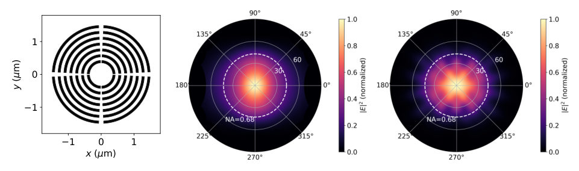 
Figure 1: (a) Illustration of the periodic bullseye cavity, top (x-y) view. The black areas illustrate the etched portion, the rest is GaAs substrate. (b)-(c) The far-field emission mode of the periodic bullseye cavity, computed in (b) GME by calculating a discrete set of radiation channels via reciprocal lattice vectors and interpolating the result to a continuous plot and (c) FDTD by a near-to-far-field transformation.

📷 Fig 2

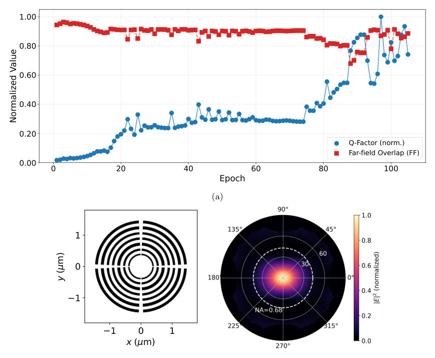 
Figure 2: Optimization of the circular cavity geometry via inverse design. (a) The key metrics of gradient descent inverse design for the optimization of the circular cavity as a function of the number of epochs. The blue circles represent the evolution of the Q-factor (Normalized to the highest value of all the epochs) and the red squares represent the far-field mode overlap with a Gaussian function. The Q -factor increases steadily and reaches its maximum at around ∼105 epochs, while the far-field mode overlap remains consistently high throughout the epochs. (b) View (x-y plane) of the optimized cavity geometry, black region representing the etched areas in the GaAs slab. (c) The...

📷 Fig 3

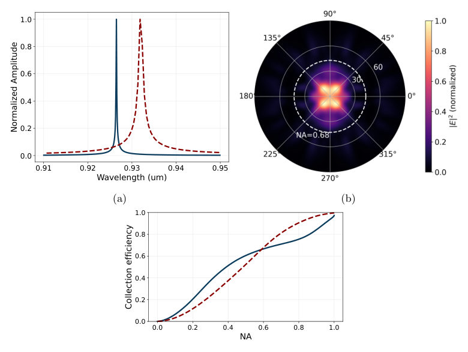 
Figure 3: FDTD simulations of the inverse-designed cavity. (a) The normalized resonance spectra of the inverse-designed cavity (solid blue, Q ∼9, 000) and the periodic bullseye cavity (dashed red, Q ∼1, 200), showing the narrower linewidth achieved by cavity optimization. (b) The far-field emission pattern of the inverse-designed cavity normalized to the peak intensity. (c) Collection efficiency as a function of NA for the inverse-designed (solid blue) and periodic bullseye (dashed red) cavities at their respective resonance wavelengths.

📷 Fig 4

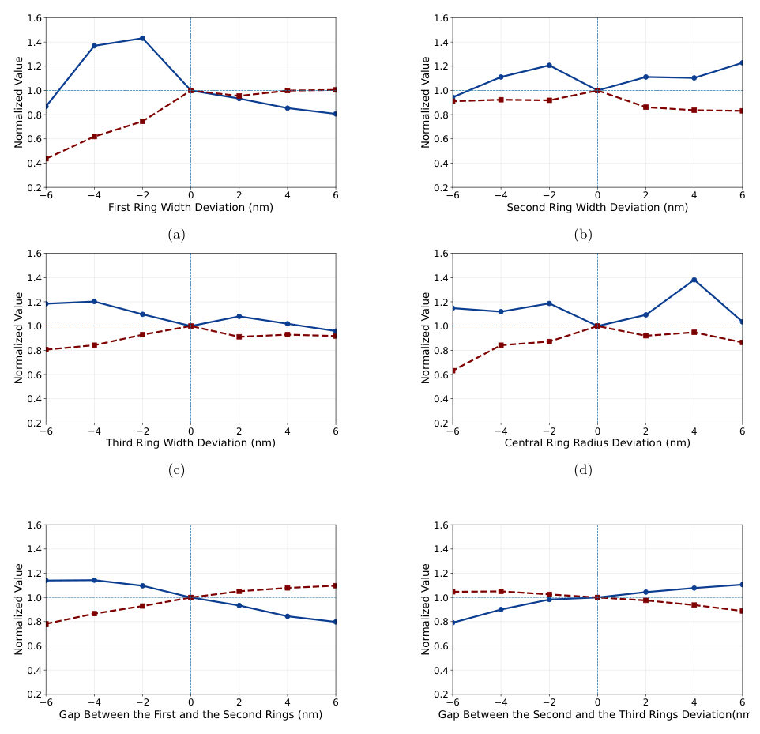 
Figure 4: Single-parameter fabrication tolerance analysis of the inverse-designed cavity. Each panel shows the normalized Q-factor (solid blue line) and the collection efficiency (dashed red line) as a function of the deviation of one geometric parameter from its optimized value: (a) First ring width deviation (∆w1), (b) Second ring width deviation (∆w2), (c) Third ring width deviation (∆w3), (d) Central disk radius deviation (∆r), (e) Gap between the first and second rings deviation (∆d1), (f) Gap between the second and third rings deviation (∆d2).

**Summary.** The researchers developed an inverse-design method to create a new type of circular photonic cavity that breaks the trade-off between high photon confinement and efficient light collection. The resulting design significantly improves the Q-factor compared to standard periodic structures while remaining robust to manufacturing imperfections. This is a key step toward building efficient interfaces for quantum information processing.

**Why it may be interesting.** This work provides a powerful computational tool for designing high-cooperativity interfaces, which are critical for scalable quantum networks and light-matter interaction in cavity QED.

Detailed structure

**Main problem.** The simultaneous optimization of the quality factor (Q-factor) and far-field emission mode in photonic cavities to enable efficient spin-photon interfaces.

**Main result.** An optimized non-periodic circular cavity achieves a Q-factor approximately ten times higher than traditional bullseye cavities while maintaining a Gaussian-like far-field profile and robustness to fabrication errors.

**Method.** A gradient-based inverse-design framework using the Guided-Mode Expansion (GME) method combined with automatic differentiation, validated by FDTD simulations.

**Model / system.** A non-periodic circular ring cavity consisting of a central disk and concentric rings, implemented on a GaAs substrate designed for coupling to InAs quantum dots.

**Key observables.** Q-factor, far-field mode profile (Gaussian overlap), and collection efficiency.

**Important parameters / regimes.** Central disk radius, ring widths, ring gaps, and fabrication tolerance (up to +/- 6 nm).

**Assumptions / limitations.** The GME method is an approximation requiring FDTD validation; the primary demonstration assumes a GaAs material platform.

**Figures summary.** Figure 1 illustrates the bullseye cavity geometry and compares GME/FDTD far-field modes; Figure 2 shows the optimization evolution, resulting geometry, and far-field pattern; Figure 3 presents FDTD resonance spectra and validation; Figure 4 displays single-parameter fabrication tolerance analysis.

**Paper structure.** The paper begins with the motivation for spin-photon interfaces, validates the GME method against FDTD, describes the multi-objective gradient-based optimization process, presents the final optimized cavity performance, and concludes with a sensitivity analysis of fabrication errors.

Abstract

Spin-photon interfaces, realized by coupling optically active spin systems to photonic cavities, are essential for quantum networking and quantum information processing. Implementing such an interface for polarization-encoded photons requires a cavity that supports arbitrary polarization, provides efficient optical access through its far-field mode, and maintains sufficiently high quality factors to enable high cooperativity with the system's optical transitions. However, inherent trade-offs between the Q-factor and far-field emission mode make the simultaneous optimization of these parameters toward the realization of spin-photon interfaces challenging. In this work, we implement a gradient-based inverse-design framework using guided-mode expansion with automatic differentiation to obtain the geometrical features of a circular ring cavity that supports arbitrary polarization while simultaneously optimizing the cavity quality factor and far-field mode profile. The resulting optimized non-periodic cavity achieves a quality factor of approximately $9,000$, about an order-of-magnitude higher than that of a periodic ("bullseye") cavity while preserving a Gaussian-like far-field emission pattern. Furthermore, by varying the cavity geometry within a $\pm 6$ nm fabrication tolerance, we demonstrate the robustness of the design against fabrication errors and identify the innermost ring width and central disk radius as the parameters with the greatest impact on the quality factor and far-field mode. These results establish guided mode expansion-based inverse design as a powerful and computationally efficient approach for developing high-cooperativity spin-photon interfaces for quantum photonic applications.

[↑ back to top](#top)

### [Quantum optics of frequency comb metrology](http://arxiv.org/abs/2605.16702v1)

**Authors:** Dong-Chel Shin, Edwin Ng, Myoung-Gyun Suh, Vivishek Sudhir  
**Type:** theory · **Category:** other · **PDF:** <https://arxiv.org/pdf/2605.16702v1>  
**Analysis basis:** full PDF text, analyzed in chunks
**Topic relevance:** `quantum measurements` **3/5** · `entanglement & information structure` **2/5** · `interference shaping light` **2/5**

📷 Fig 1

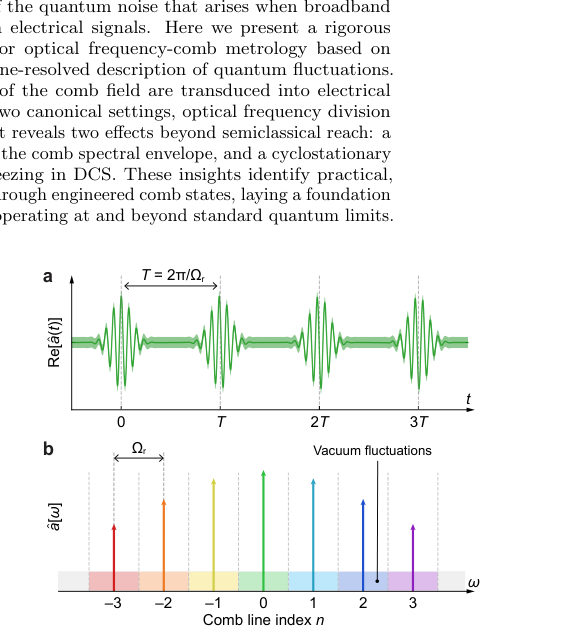 
FIG. 1. Quantum model of a frequency comb. (a) Time- domain representation of the comb field: a train of coherent pulses with a uniform vacuum-noise band of constant width superimposed. (b) Frequency-domain decomposition: coherent comb lines {αn} sit atop independent bins of width Ωr, each associated with a comb-line-resolved operator δˆan[Ω].

📷 Fig 2

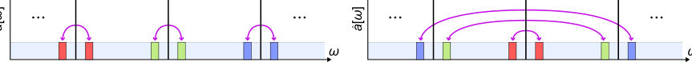 
FIG. 2. Quantum noise in optical frequency division and its suppression. (a) Principle of OFD: a mode-locked optical pulse train is directly photodetected to generate a microwave signal at the repetition frequency Ωr. (b) Spectral mechanism of quantum noise transduction. Top: the optical frequency comb carries vacuum fluctuations (colored boxes) at each comb line, spaced by Ωr; diagonal lines connecting adjacent pairs indicate the beating that produces the microwave tone. Bottom left: the resulting microwave spectrum at Ωr, with contributions from multiple adjacent-pair beatnotes shown in matching colors. Bottom right: decomposition into amplitude-modulation (AM) and phase-modulation (PM)...

📷 Fig 3

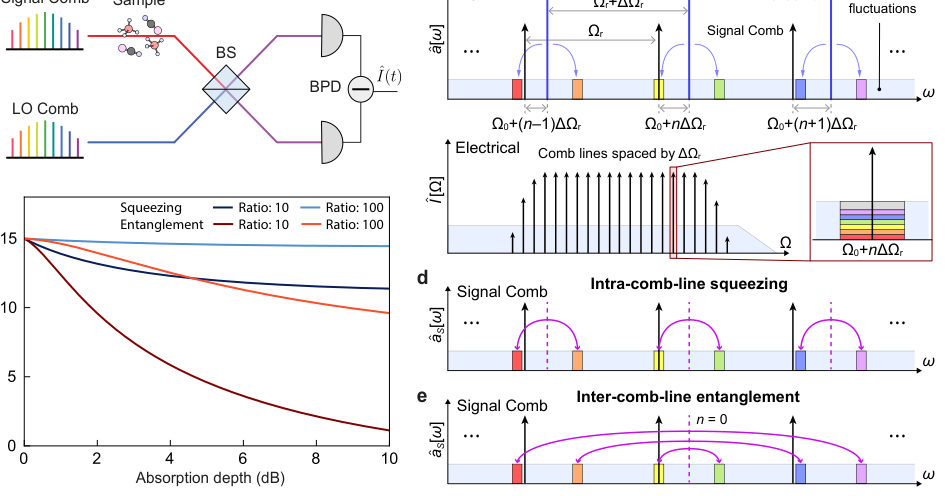 
FIG. 3. Quantum noise in dual-comb spectroscopy and its suppression. (a) Experimental setup: a signal comb passes through a molecular sample and combines with a local oscillator (LO) comb at a 50:50 beam splitter (BS), and a balanced photodetector (BPD) records the difference photocurrent ˆI(t). (b) Frequency-domain vacuum noise folding in DCS. Top (optical): the signal comb (black, line spacing Ωr) is shown together with the LO comb (blue, spacing Ωr + ∆Ωr), with colored regions marking the signal-comb vacuum fluctuations at offsets Ω0 + n∆Ωr relative to the LO comb lines. Bottom (electrical): beating during photodetection maps each pair to an RF comb tone spaced by ∆Ωr, and the inset...

📷 Fig 4

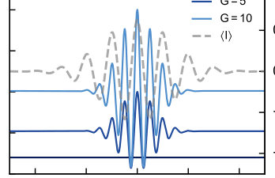 
FIG. 4. Cyclostationary photocurrent variance for self-referred squeezing. Time-domain photocurrent variance Var[I(t)] (left axis, solid lines) oscillates between the squeezed level 1/G and the anti-squeezed level G for gains G = 1 (dark blue), G = 5 (medium blue), and G = 10 (light blue), shown together with the mean photocurrent ⟨I(t)⟩(right axis, gray dashed). The variance is up- and down-modulated at twice the beat frequencies Ωn, time-averaging to a noise floor that is increased by (G + 1/G)/2 ≥1 above the vacuum SQL.

**Summary.** This paper develops a first-principles quantum framework for understanding noise in frequency-comb-based measurements. It demonstrates that the precision of frequency division and spectroscopy depends critically on the comb's spectral shape and the specific type of quantum entanglement used. The work identifies practical routes to surpass the standard quantum limit in next-generation frequency combs.

**Why it may be interesting.** It provides a rigorous bridge between continuous-mode quantum optics and discrete-line metrology, offering new insights into how engineered quantum states like squeezing and entanglement can be utilized in broadband frequency-domain measurements.

Detailed structure

**Main problem.** The lack of a rigorous, first-principles quantum-mechanical framework to account for how optical vacuum fluctuations are transduced into radio-frequency measurement noise in frequency-comb metrology.

**Main result.** The authors establish a continuous-mode field quantization framework that reveals how spectral envelope shapes and quantum states (squeezing/entanglement) affect the Standard Quantum Limit in optical frequency division and dual-comb spectroscopy.

**Method.** The study uses continuous-mode field quantization, a comb-line-resolved decomposition of quantum fluctuations, and linearization of the photocurrent operator to trace noise from optical lines to the RF domain.

**Model / system.** The system is an optical frequency comb modeled as a periodic pulse train with a carrier frequency and repetition rate, analyzed through a 1D continuous-mode electromagnetic field quantization framework.

**Key observables.** Photocurrent operator, RF/microwave signal noise, phase noise power spectral density, and transmittance estimator SNR.

**Important parameters / regimes.** Carrier frequency, repetition rate, spectral envelope shape (Gaussian, sech, flat-top), squeezing gain, and absorption depth.

**Assumptions / limitations.** Negligible dispersion and loss during propagation, wide-sense stationary operators, and a flat detector response where the RF bandwidth is much smaller than the optical carrier frequency.

**Figures summary.** Fig 1 shows time and frequency domain representations of the comb field; Fig 2 illustrates the principle of OFD and noise transduction mechanisms; Fig 3 depicts the DCS experimental setup and noise folding; Fig 4 shows time-domain photocurrent variance for self-referred squeezing.

**Paper structure.** The paper begins with a fundamental quantization of the electromagnetic field, moves to a comb-line-resolved decomposition, applies this to OFD to analyze spectral shape effects, and then extends the framework to DCS to evaluate quantum enhancement strategies and the impact of sample-induced noise.

Abstract

Frequency combs enable precision measurements across timekeeping, spectroscopy, ranging and astronomy, and are now extending to integrated and field-deployable platforms. Realizing their full performance demands a comprehensive account of the quantum noise that arises when broadband optical fields are converted into finite-bandwidth electrical signals. Here we present a rigorous first-principles quantum-mechanical framework for optical frequency-comb metrology based on continuous-mode field quantization and a comb-line-resolved description of quantum fluctuations. The theory describes how quantum fluctuations of the comb field are transduced into electrical measurement noise. We apply the framework to two canonical settings, optical frequency division (OFD) and dual-comb spectroscopy (DCS), where it reveals two effects beyond semiclassical reach: a dependence of the OFD standard quantum limit on the comb spectral envelope, and a cyclostationary noise penalty that obstructs straightforward squeezing in DCS. These insights identify practical, resource-efficient routes to quantum enhancement through engineered comb states, laying a foundation for the design of next-generation frequency combs operating at and beyond standard quantum limits.

[↑ back to top](#top)

### [Shortcut-error signatures in coherence-retaining endpoint work quasistatistics](http://arxiv.org/abs/2605.18095v1)

**Authors:** Gabriella G. Damas, G. D. de Moraes Neto  
**Type:** theory · **Category:** statistical mechanics · **PDF:** <https://arxiv.org/pdf/2605.18095v1>  
**Analysis basis:** full PDF text, analyzed in chunks
**Topic relevance:** `quantum measurements` **3/5** · `methods for driven-dissipative` **2/5** · `non-equilibrium dynamics` **2/5**

📷 Fig 1

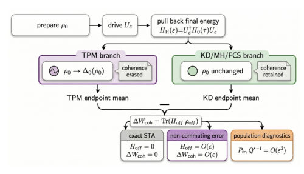 
FIG. 1. Endpoint-work diagnostic flowchart. The tradi- tional TPM branch applies an initial dephasing map ∆0, eras- ing energy-basis coherences. The Kirkwood-Dirac (KD) and Margenau-Hill (MH) branch retains the full initial state ρ0. The difference between their endpoint means, ∆Wcoh, isolates the nonadiabatic coherent response driven by the off-diagonal pulled-back Hamiltonian Hoff.

📷 Fig 2

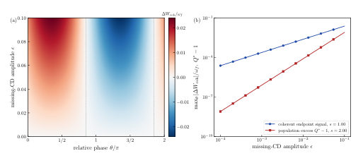 
FIG. 2. Oscillator benchmark. (a) Coherent endpoint-work correction ∆Wcoh/ωf versus relative phase θ and missing-CD amplitude ϵ for the probe |ψθ⟩= (|0⟩+ eiθ|2⟩)/ √

📷 Fig 3

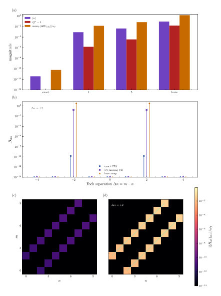 
FIG. 3. Oscillator endpoint-error fingerprints. (a) Protocol- level diagnostics: residual Bogoliubov amplitude |ν|, pop- ulation excess Q∗−1, and phase-optimized coherent sig- nal maxθ |∆Wcoh|/ωf for exact STA, imperfect STA, and a bare ramp. (b) Band-resolved off-diagonal weight B∆n = P

📷 Fig 4

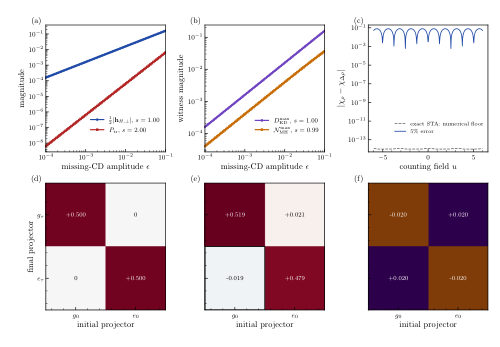 
FIG. 4. Qubit benchmark of endpoint quasistatistics. (a) Transverse endpoint field 1 2|hH,⊥| and transition prob- ability Ptr versus missing-CD amplitude ϵ, showing linear and quadratic scaling, respectively. (b) Phase-optimized quasiprobability witnesses Dmax KD and N max MH versus ϵ. (c) Characteristic-function gap |χρ(u) −χ∆ρ(u)| for exact STA and a 5% missing-CD error; the exact-STA curve is limited by the numerical floor. (d–f) KD/MH matrix fingerprints: (d) real KD weights for exact STA; (e) real KD/MH weights for a 5% error at the phase maximizing NMH; and (f) imag- inary KD weights for a 5% error at the phase maximizing P

📷 Fig 5

 
Figure 4(b) demonstrates that the quasiprobabilistic witnesses revive with the same perturbative hierarchy. Both Dmax KD and N max MH scale linearly with the shortcut im- perfection. Thus the first-order response is not restricted to the endpoint mean; it also appears in the KD/MH quasiprobability structure. The characteristic-function collapse predicted by Eq. 10 is verified in Fig. 4(c): the gap |χρ(u)−χ∆ρ(u)| vanishes for exact STA up to the nu- merical floor, but becomes finite under a 5% missing-CD error.

**Summary.** The paper introduces a new way to detect errors in fast quantum control protocols by using work statistics that retain initial phase information. It proves that these 'coherent' statistics respond linearly to errors, making them much more sensitive than traditional methods that only see quadratic changes in populations. This provides a powerful new diagnostic tool for calibrating shortcuts to adiabaticity.

**Why it may be interesting.** This is highly relevant for researchers in open quantum systems and quantum control, as it provides a more sensitive, low-overhead method for detecting subtle non-adiabatic errors in fast control protocols.

Detailed structure

**Main problem.** Developing a sensitive diagnostic to detect and calibrate non-commuting errors in Shortcuts to Adiabaticity (STA) protocols, which traditional population-based measurements fail to detect efficiently.

**Main result.** The authors demonstrate that coherence-retaining endpoint work statistics provide a first-order (linear) signal of non-commuting errors, whereas traditional population-transfer diagnostics only scale quadratically with the error amplitude.

**Method.** The study uses perturbation theory and quasiprobability frameworks (Kirkwood-Dirac and Margenau-Hill) to compare the scaling of coherent energy signals against population-based metrics.

**Model / system.** The theoretical framework is applied to closed-system unitary dynamics, specifically using a qubit and a time-dependent harmonic oscillator as benchmark models for STA protocols.

**Key observables.** Coherent endpoint work signal (delta W_coh), population excess (Q*^-1), and Kirkwood-Dirac/Margenau-Hill quasiprobability weights.

**Important parameters / regimes.** Error amplitude (epsilon), error generator (K), initial state phase (theta), and dephasing rate (Gamma).

**Assumptions / limitations.** The analysis assumes closed-system unitary dynamics and focuses on the small-error regime where the linear-versus-quadratic hierarchy is preserved.

**Figures summary.** Figure 1 shows the workflow between TPM and coherence-retaining branches; Figure 2 demonstrates the linear vs. quadratic scaling in the oscillator; Figure 5 shows the impact of dephasing on signal contrast; Figure 6 verifies the scaling for waveform distortions.

**Paper structure.** The paper introduces the problem of coherence erasure in TPM, proposes a coherence-retaining diagnostic, provides analytical scaling proofs, validates the method with qubit and oscillator benchmarks, and tests robustness against dephasing and waveform errors.

Abstract

Quantum work statistics differ from classical ones because initial energy coherence matters. The standard two-point measurement (TPM) gives a positive distribution but erases phase information. Coherence-retaining endpoint-work quasistatistics provide a compact probe of shortcut-to-adiabaticity performance. For work defined with respect to a reference Hamiltonian, an exact counterdiabatic shortcut pulls the final reference Hamiltonian back to an operator diagonal in the initial energy basis. Endpoint Kirkwood-Dirac or Margenau-Hill quasistatistics then lose sensitivity to initial coherence and reduce to the TPM result. Imperfect shortcuts restore this sensitivity: a non-commuting control error produces off-diagonal pulled-back Hamiltonian elements at first order in the error amplitude, whereas population-only transition probabilities change only at second order. Harmonic-oscillator and qubit benchmarks confirm this linear-versus-quadratic contrast. The result complements inclusive work-cost analyses: it does not measure the auxiliary field's energetic cost, but provides a phase-sensitive endpoint diagnostic of residual nonadiabaticity.

[↑ back to top](#top)

### [Where solitons are in a KdV soliton gas](http://arxiv.org/abs/2605.18093v1)

**Authors:** Benjamin Doyon  
**Type:** theory · **Category:** statistical mechanics · **PDF:** <https://arxiv.org/pdf/2605.18093v1>  
**Analysis basis:** full PDF text, analyzed in chunks
**Topic relevance:** `non-equilibrium dynamics` **3/5** · `Keldysh / 2PI / non-Gaussian methods` **2/5** · `non-equilibrium universality` **2/5**

📷 Fig 1

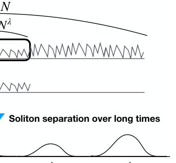 
Figure 1: A representation of the time-of-flight thought experiment.

📷 Fig 2

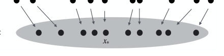 
Figure 2: Magnifying glass effect: cartoon illustration of how magnifying-glass positions Xi’s relate to more accurate effective positions xi’s from the semiclassical Bethe equations (1.9).

📷 Fig 3

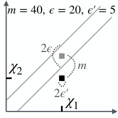 
Figure 3: Illustration of the integration of the mollified signed density, ˜R. The term with i = 1, j = 2 is fully included, but that with i = j = 1 is fully excluded.

**Summary.** This paper solves the problem of identifying individual soliton positions within a dense, interacting gas of KdV solitons. By introducing a fluid-cell projection method, the author proves that local field properties are controlled by nearby solitons, providing a rigorous link between microscopic soliton dynamics and macroscopic kinetic equations.

**Why it may be interesting.** This work provides a rigorous foundation for Generalized Hydrodynamics (GHD), which is a central framework for understanding the non-equilibrium dynamics of 1D integrable many-body systems, including integrable spin chains and quantum gases.

Detailed structure

**Main problem.** Defining the precise spatial positions of individual solitons within a dense KdV soliton gas and establishing a rigorous connection between local field observables and the macroscopic density of states.

**Main result.** The paper develops a 'fluid-cell projection' method that proves local observables of the KdV field are determined by nearby solitons, and demonstrates that soliton positions satisfy semi-classical Bethe equations, thereby reproducing the kinetic equation of the soliton gas.

**Method.** The author utilizes a novel tau-function representation for multi-soliton fields, a 'magnifying-glass' construction for local observation, and a 'fluid-cell projection' technique to relate $N$-soliton solutions to the large-$N$ limit.

**Model / system.** The system is a Korteweg-de Vries (KdV) soliton gas, modeled as the large-$N$ limit of $N$-soliton solutions characterized by spectral parameters (velocities) and impact parameters (positions).

**Key observables.** Density of states $\rho(\chi, x, t)$, conserved densities $P_k[u]$, and the KdV field $u(x)$ and its derivatives.

**Important parameters / regimes.** Spectral parameters $\chi$, impact parameters $y$, number of solitons $N \to \infty$, and the mesoscopic scale $L$.

**Assumptions / limitations.** The results rely on specific conditions regarding the regularity of spectral parameters and the density of solitons; the derivation of the kinetic equation is noted as non-rigorous.

**Figures summary.** Figure 1 illustrates a 'time-of-flight' thought experiment showing how a localized piece of the field evolves into separated solitons to derive spectral density.

**Paper structure.** The paper introduces the quasi-particle problem, proposes a fluid-cell projection and magnifying-glass construction, provides mathematical proofs using a new tau-function for support and bounds, and concludes by reproducing the kinetic equation of the soliton gas.

Abstract

The Korteweg-De Vries (KdV) equation is a paradigmatic model of integrable classical fields, admitting solitoning solutions. When many solitons are near to each other, their shapes are modified, and it is not manifest, from the KdV field, where they are. This is a key problem in the analysis of a soliton gas, as its main object, the density of states, is a number of solitons per unit length. How to define solitons' positions at finite densities in the macroscopic limit? A sensible criterium is that, projecting out solitons lying outside a mesoscopic region, the KdV field is unchanged in this region, and the result is a multi-soliton field supported there. In the context of emergent hydrodynamics, this is referred to as a fluid-cell projection. In this paper we solve this problem. We define solitons' positions and a fluid-cell projection, and show that it has these properties, without introducing radiative corrections. We show that the weak limit of conserved densities can be evaluated using the density of states. On large scales the solitons' positions satisfy the semi-classical Bethe equations introduced in the context Generalised Hydrodynamics, that accounts for the two-body scattering shift and encodes factorised scattering. A non-rigorous derivation reproduces the kinetic equation of the KdV soliton gas, first proposed by Gennady El in 2003 using Witham modulation theory from finite-gap solutions. The results hold under simple conditions on spectral parameters, and certain physically natural conditions on impact parameters. No randomness is required. Our proof is based on a novel tau function for the multi-soliton KdV field, which also allows us to obtain new bounds on the growth of the multi-soliton support and on the supremum of the field and its derivatives. We believe the methods are generalisable to other solitonic models.

[↑ back to top](#top)

### [Network analysis for steady-state current fluctuations under finite affinity: Application to Brownian computation](http://arxiv.org/abs/2605.17838v1)

**Authors:** Yasuhiro Utsumi  
**Type:** theory · **Category:** statistical mechanics · **PDF:** <https://arxiv.org/pdf/2605.17838v1>  
**Analysis basis:** full PDF text, analyzed in chunks
**Topic relevance:** `methods for driven-dissipative` **3/5** · `non-equilibrium dynamics` **3/5**

📷 Fig 1

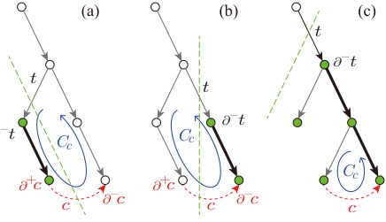 
FIG. 1. Typical three configurations of the twig t and the chord c that yield nonvanishing ˜Ft,c. (a) t ∈Cc, (b) −t ∈Cc and (c) ∂±c ∈V (T∂−t). In panel (a), a thick arc indicates the path P∂+c←∂−t, while in panels (b) and (c), thick arcs indicate the path P∂−c←∂−t. In each panel, a dotted arrow indicates the chord c. The nodes of the subtree V (T∂−t) are indicated by filled circles. The boundary between V (T∂−t) and its complement is indicated by a dashed line. The dashed line intersects the arcs of the corresponding fundamental cut- set.

📷 Fig 2

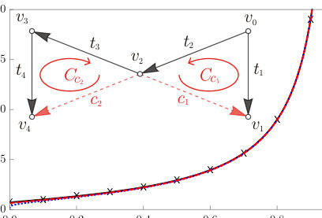 
FIG. 2. Dependence of the Fano factor on β. The inset shows a graph with two cycles Cc1 and Cc2. The current is measured at the chord c2. Crosses indicate the results of second-order perturbation theory [28]. The dashed and dotted lines in- dicate the pseudo-entropy bound 2⟨⟨w⟩⟩/σpseudo [30] and the mixed bound 2⟨⟨w⟩⟩/σmix [31].

📷 Fig 3

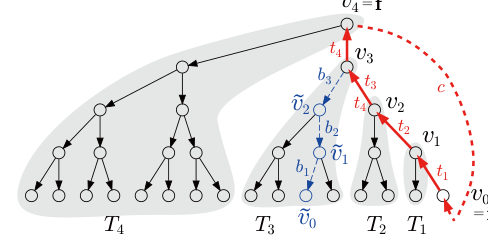 
FIG. 3. State-transition diagram illustrating a Brownian com- putation model with a reset process. Solid and dashed arcs constitute a directed rooted spanning tree rooted at v0 = i, which is the initial state. Thick solid arcs indicate the in- tended computation path from the initial state v0 = i to the output state vℓ= f. The path length ℓ(ℓ= 4) corresponds to the minimum number of computational steps. The dotted arc is a chord representing the reset process. The α-fold back- ward branchings (α = 2) represent logical irreversibility, and shaded subtrees rooted at the logical states vd (d = 1, . . . , ℓ) include their extraneous predecessors as well as the logical states themselves. Dashed...

📷 Fig 4

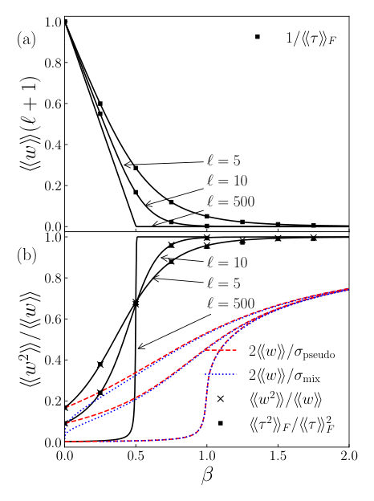 
FIG. 4. The average reset current (a) and its Fano factor (b) are shown as functions of the backward transition rate β. The solid lines in panels (a) and (b) represent the analytic results (48) and (49), respectively, for ℓ= 5, 10, 500 with branch- ing factor α = 2. Filled squares indicate numerical results obtained by the Gillespie algorithm with 105 samples. The crosses in panel (b) indicate the result of second-order per- turbation theory [28]. The dashed and dotted lines in panel (b) indicate the pseudo-entropy bound [30] and the mixed bound [31], respectively.

**Summary.** This paper presents a new graph-theoretic method to calculate current fluctuations in networks under finite thermodynamic force by using 'twisted' matrices to maintain mathematical orthogonality. It applies this to Brownian computation, demonstrating that the thermodynamic cost of computation is linked to a transition between noiseless and Poissonian noise regimes.

**Why it may be interesting.** The paper provides a rigorous topological method for calculating fluctuations in non-equilibrium steady states, which is directly applicable to the study of dissipation and noise in open quantum systems and driven many-body dynamics.

Detailed structure

**Main problem.** Developing a graph-theoretic framework to analyze steady-state current fluctuations in Markov master equations under finite thermodynamic force (affinity), where standard orthogonality between cycle and cut spaces is lost.

**Main result.** The introduction of twisted circuit matrices restores orthogonality and reveals an interference-like effect in the signal-to-noise ratio; specifically, in Brownian computation, a transition from noiseless to Poissonian Fano factor occurs at an affinity equal to the logarithm of the branching factor.

**Method.** Graph-theoretic analysis using twisted incidence, cycle, and cutset matrices, combined with a duality transformation to express the signal-to-noise ratio as a quadratic optimization problem.

**Model / system.** A Brownian computation model represented as a directed, tree-like state-transition diagram with exponential backward branching, a single reset cycle, and finite thermodynamic affinity at each transition step.

**Key observables.** Steady-state edge currents, Fano factor of the reset current, signal-to-noise ratio (SNR), and entropy production rates.

**Important parameters / regimes.** Thermodynamic affinity (or bias beta), branching factor (alpha), and the length of the computation path (l).

**Assumptions / limitations.** Assumes a connected graph with a unique steady state, a directed rooted spanning tree, and focuses on the long-measurement-time limit.

**Figures summary.** Figure 1 illustrates fundamental cutset vectors and twisted matrix configurations; Figure 3 shows the state-transition diagram of the Brownian computation model; Figure 4 shows the dependence of the average reset current on parameters.

**Paper structure.** The paper introduces a new twisted matrix formalism for non-equilibrium networks, applies this framework to a specific Brownian computation model, analyzes the resulting phase transitions in current fluctuations and complexity, and compares results against thermodynamic uncertainty relations.

Abstract

A graph-theoretic analysis of the steady-state current noise in master equations under a finite thermodynamic force (affinity) is presented. The incidence matrix twisted by a finite affinity is not orthogonal to the standard cycle space, motivating the introduction of twisted circuit matrices to restore the orthogonality. The resulting twisted-cycle matrix yields an interference-like effect, enabling us to express the signal-to-noise ratio as a quadratic optimization problem in terms of twisted-cycle currents. We apply this framework to a Brownian computation model on a tree-like state-transition diagram with exponential backward branching, finite affinity at each step, and a single reset cycle. In the limit of an infinitely long intended computation path $\ell$, the Fano factor of the reset current undergoes a transition from noiseless to Poissonian behavior at an affinity equal to the logarithm of the number of immediate predecessors $α$. This corresponds to an easy-hard transition in the computational time complexity [K. Okajima, K. Hukushima, arXiv:2512.24728 ], which is not captured by the thermodynamic uncertainty relation. This transition point precisely characterizes the thermodynamic costs of logically irreversible computation: in the absence of affinity, the reset cost scales as $\ln \ell$, whereas reaching the transition point requires a thermodynamic force of order $\ln α$ per step to counteract backward branching.

[↑ back to top](#top)

### [One pure steered state implies Einstein-Podolsky-Rosen steering](http://arxiv.org/abs/2605.18243v1)

**Authors:** Qiu-Cheng Song, Joonwoo Bae  
**Type:** theory · **Category:** quantum information and computing · **PDF:** <https://arxiv.org/pdf/2605.18243v1>  
**Analysis basis:** full PDF text, analyzed in chunks
**Topic relevance:** `entanglement & information structure` **3/5** · `quantum measurements` **2/5**

📷 Fig 1

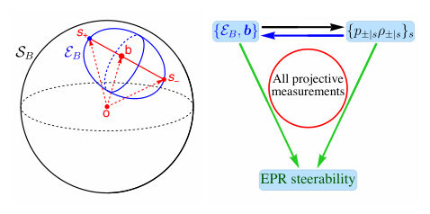 
FIG. 1. One-to-one correspondence between the pair {EB, b} and the assemblage {p±|sρ±|s}s obtained from all projective measurements. The point b inside QSE EB and the points s± on its surface represent the Bloch vectors of Bob’s reduced state ρB and the steered states ρ±|s, respectively. {EB, b} and {p±|sρ±|s}s determine each other and hence determine EPR steerability from Alice to Bob.

📷 Fig 2

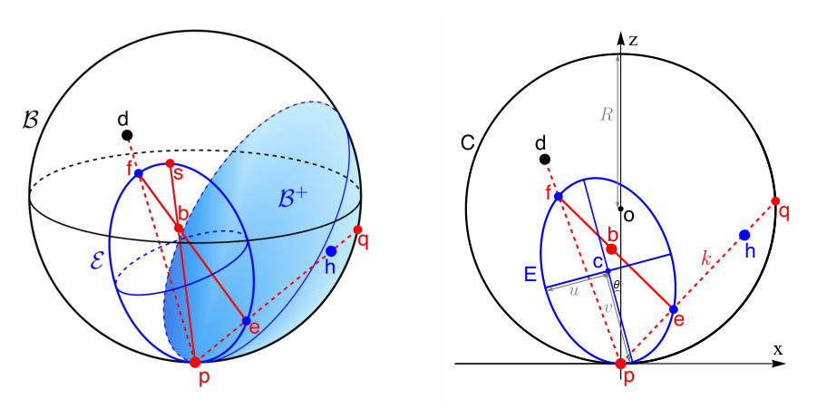 
FIG. 2. Illustration of Alice’s response function in LHS models. If an LHS model exists, it must include the pure state ρp at the tangency point p with sufficient probability, together with other LHSs distributed over the Bloch ball B with probability density µ. Any steered state σe (7) at point e on the QSE E can be simulated by ρp with some probability, together with LHSs within a region B+ specified by the response function p(+|ˆne, λ). We find that no LHS model exists in this scenario.

📷 Fig 3

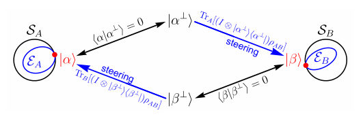 
FIG. 3. The one-to-one correspondence between Alice’s pure steered state |α⟩and Bob’s pure steered state |β⟩.

📷 Fig 4

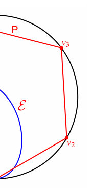 
FIG. 4. A polyhedron cannot fully contain a QSE E that is tangent to the surface of the Bloch ball B.

📷 Fig 5

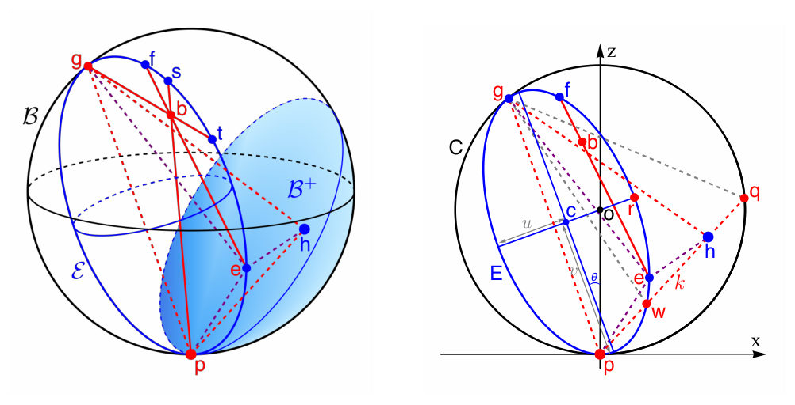 
FIG. 5. Illustration of Alice’s response function in LHS models for two pure steered states. Bob’s QSE E is tangent to his Bloch sphere S (the surface of the Bloch ball B) at the points p and g. If an LHS model exists, it must include the pure states ρp and ρg at points p and g, respectively, with sufficient probabilities, together with other LHSs distributed over the Bloch ball B with probability density µ. Any steered state σe (42) at point e on the QSE E can be simulated by ρp and ρg with some probabilities, together with LHSs within a region B+ specified by the response function p(+|ˆne, λ). We find that no LHS model exists in this scenario.

**Summary.** The paper proves that for two-qubit entangled states, the ability to steer a single pure state implies two-way EPR steering. It establishes a fundamental symmetry where the number of pure steered states is identical for both parties, effectively providing a 'Gisin-like' theorem for the steering scenario.

**Why it may be interesting.** This work provides a geometric criterion for certifying EPR steering, which is highly relevant for quantum communication protocols and the verification of entanglement in quantum networks.

Detailed structure

**Main problem.** Determining whether the existence of at least one pure steered state in a two-qubit entangled state is sufficient to imply Einstein-Podolsky-Rosen (EPR) steering and establishing the symmetry of such steering.

**Main result.** The authors prove that if one party can steer the other to at least one pure state, the state is two-way EPR steerable. They also show that the number of tangency points between the Quantum Steering Ellipsoid (QSE) and the Bloch sphere is identical for both Alice and Bob.

**Method.** Geometric analysis of the Quantum Steering Ellipsoid (QSE) relative to the Bloch sphere, utilizing purification-based algebraic proofs and Local Hidden-State (LHS) model contradictions.

**Model / system.** A bipartite two-qubit entangled state shared between two parties, Alice and Bob, analyzed within the framework of the Quantum Steering Ellipsoid (QSE) and Local Hidden-State models.

**Key observables.** Quantum steering ellipsoid (QSE) geometry, tangency points between the QSE and the Bloch sphere, and the existence of pure steered states.

**Important parameters / regimes.** Number of tangency points N in {0, 1, 2, infinity}, QSE volume, and the presence of pure vs. mixed steered states.

**Assumptions / limitations.** The results specifically address two-qubit entangled states and assume the QSE has a non-zero volume.

**Figures summary.** Figure 1 shows the correspondence between the QSE and the assemblage; Figure 2 illustrates the geometric setup of tangency and LHS model contradictions; Figure 3 shows the correspondence between Alice's and Bob's pure steered states; Figure 4 shows a polyhedron representing finite LHSs failing to contain a tangent QSE.

**Paper structure.** The paper begins by defining the problem of pure state steering, moves to geometric proofs for one and two tangency points (Theorems 1 and 2), establishes the symmetry of tangency points between Alice and Bob (Theorem 3), and concludes with specific examples of X-states and asymmetric states.

Abstract

In this work, we show that a two-qubit entangled state admitting at least one pure steered state is Einstein-Podolsky-Rosen (EPR) steerable from Alice to Bob. Pure steered states signifies that the quantum steering ellipsoid of Bob is tangent to his Bloch sphere at least at a single point. Furthermore, we prove that for a two-qubit entangled state, Bob's quantum steering ellipsoid is tangent to his Bloch sphere at exactly $N$ points, for $N\in \{ 0,1,2,\infty\}$, if and only if Alice's quantum steering ellipsoid is tangent to her Bloch sphere at exactly $N$ points. For any two-qubit entangled state, therefore, if one party can steer the other to at least one pure state, the state is two-way EPR steerable. We also present several illuminating instances of two-qubit entangled states such that the EPR steering can be verified in terms of pure steered states. Our result addresses the Gisin theorem in a EPR steering scenario: at least a single pure steered state implies two-way steering.

[↑ back to top](#top)

### [Precision limits for time-dependent quantum metrology under Markovian noise](http://arxiv.org/abs/2605.18392v1)

**Authors:** Luca Previdi, Francesco Albarelli  
**Type:** theory · **Category:** quantum information and computing · **PDF:** <https://arxiv.org/pdf/2605.18392v1>  
**Analysis basis:** full PDF text, analyzed in chunks
**Topic relevance:** `methods for driven-dissipative` **3/5** · `quantum measurements` **2/5**

📷 Fig 1

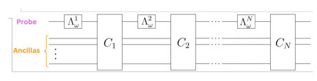 
FIG. 1. Pictorial representation of the most general adaptive strategy considered in this Letter. A probe evolves with a channel Λi ω and then a unitary control is Ci applied, coupling the probe to any number of noise- less ancillas. This step can be repeated an arbitrary number of times N. Notice that, differently from [24], the channels could be different each step, Λi ω ̸= Λj ω, which is equivalent to consider a time-dependent chan- nel.

📷 Fig 2

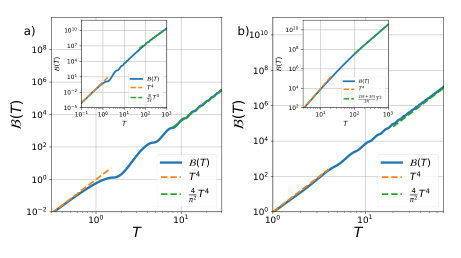 
FIG. 2. Plot of the full numerically optimized bound (solid blue) and its asymptotic behaviors (dashed lines) for B = 1, ω = 1, ε = 0.1. Panel a) shows HAC under dephasing along the x direction, while the inset depicts spontaneous emission noise. Panel b) shows HRF under dephasing along the x direction, while the inset depicts spontaneous emission noise.

📷 Fig 3

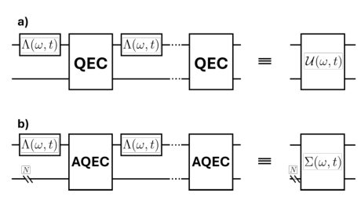 
FIG. 3. a) Pictorial representation of the QEC scheme to achieve the bound Eq. (4) in the DHNLS scenario. A QEC step is applied periodically, coupling the probe to a noiseless ancilla, the effective dynamics becomes a unitary U(ω, t) as discussed in the main text. b) Pictorial representation of the AQEC scheme to achieve the bound Eq. (4) in the DHLS scenario. An AQEC step is applied periodically, coupling the probe to a N noiseless ancillas, the effective dynamics becomes a channel Σ(ω, t), whose effect in logical space is described by Eq. (16).

**Summary.** This paper establishes the fundamental precision limits for quantum metrology when using time-dependent Hamiltonians under Markovian noise. It identifies two distinct regimes where the noise either preserves or reduces the scaling of the Quantum Fisher Information. The authors prove these bounds are achievable using continuous quantum error correction and spin-squeezed probes.

**Why it may be interesting.** It provides fundamental limits for quantum sensing in realistic, noisy environments and shows that the metrological advantages of time-dependent modulation can be preserved using advanced error correction strategies.

Detailed structure

**Main problem.** Determining the ultimate precision limits (Quantum Fisher Information) for estimating parameters in time-dependent Hamiltonians subject to Markovian noise.

**Main result.** The authors derive a differential upper bound on the QFI and prove a universal scaling law: in the DHNLS regime, the noiseless scaling is preserved, while in the DHLS regime, the scaling exponent is reduced by exactly one.

**Method.** The study uses an extension of the minimization-over-purifications framework to time-varying continuous channels, evaluated via semidefinite programming (SDP), and demonstrates achievability through continuous and approximate quantum error correction (QEC).

**Model / system.** The model involves quantum probes governed by the GKSL (Lindblad) master equation, specifically examining amplitude-modulated and rotating field Hamiltonians under dephasing and spontaneous emission noise.

**Key observables.** Quantum Fisher Information (QFI) for frequency estimation.

**Important parameters / regimes.** DHNLS (Derivative of the Hamiltonian Not in Lindblad Span) and DHLS (Derivative of the Hamiltonian in Lindblad Span) regimes; long-time scaling laws (T^2k vs T^{2k-1}).

**Assumptions / limitations.** The noise model is assumed to be Markovian and independent of the applied time-dependent control Hamiltonians.

**Figures summary.** Figure 1 provides a pictorial representation of the general adaptive strategy involving a probe, time-dependent channels, unitary controls, and noiseless ancillas.

**Paper structure.** The paper introduces the problem of time-dependent metrology under noise, derives a differential upper bound using a modified purification framework, establishes asymptotic scaling laws for different noise regimes, and concludes by proving the tightness of these bounds via specific QEC and spin-squeezing protocols.

Abstract

We derive ultimate precision bounds for estimating parameters encoded in \emph{time-dependent} Hamiltonians in the presence of general Markovian noise, allowing for arbitrary adaptive protocols with fast controls and noiseless ancillas. Extending the minimization-over-purifications framework to time-varying continuous channels, we obtain a differential upper bound on the achievable quantum Fisher information (QFI) that can be evaluated at all times via semidefinite programming. For parameter-independent noise, we prove a universal long-time scaling law: if the coherent (noiseless) dynamics yields $Q_{\mathrm{coh}}(T)\sim T^{2k}$, then under Markovian noise the QFI scales at most as $Q(T)\sim T^{2k}$ in the DHNLS regime, whereas in the DHLS regime it is fundamentally limited to $Q(T)\sim T^{2k-1}$. We illustrate these behaviors on paradigmatic driven-qubit sensors, exhibiting $T^{4}$ and $T^{3}$ scalings under dephasing and spontaneous emission, respectively. Finally, we provide explicit continuous exact and approximate quantum error correction constructions -- supplemented by spin-squeezed probes -- that asymptotically saturate the bounds, establishing their tightness.

[↑ back to top](#top)

### [Quantum signatures and semiclassical limitations in the transmission of Fock states](http://arxiv.org/abs/2605.18091v1)

**Authors:** Daniel Julian Nader  
**Type:** theory · **Category:** numerical methods · **PDF:** <https://arxiv.org/pdf/2605.18091v1>  
**Analysis basis:** full PDF text, analyzed in chunks
**Topic relevance:** `methods for driven-dissipative` **3/5** · `non-equilibrium dynamics` **2/5**

📷 Fig 1

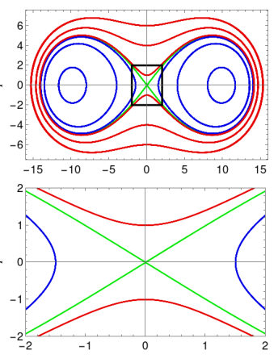 
Figure 1. Classical trajectories of the inverted oscillator with a small Kerr nonlinearity (4). The configuration of parameters is ε2 = 1/2 and K = 10−2. The green trajectory is the separatrix at the critical energy (Ec = 0) corresponding to the top of the inverted oscillator. The blue/red trajectories correspond to energies smaller/larger than the top of the inverted oscillator (Ec = 0). The bottom panel is a zoom into the center of the phase space in the top panel delimited by the square. At this small portion of the phase space the trajectories resemble those of the inverted oscillator[51].

📷 Fig 2

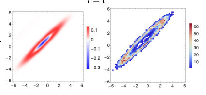 
Figure 2. (Left column) Displaced Fock state D(α)|1⟩with dis- placement parameter α = 1

📷 Fig 3

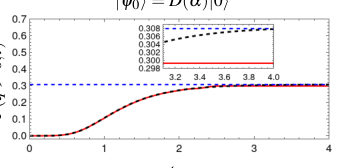 
Figure 3. Probability P(q &gt; 0,t) of finding the particle in the right side of the inverted oscillator as a function of the time. The solid red line corresponds to the TWA and the black dashed line to the exact analytical formula (17). The blue dashed line represents the probability P0(E &gt; 0) = 0.308. The initial state is a coherent state |ψ0⟩= ˆD|0⟩with displacement parameter α = 1 √

📷 Fig 4

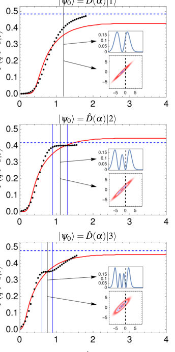 
Figure 4. Probability P(q &gt; 0,t) of finding the particle at the right side of the inverted oscillator. The initial states are the displaced Fock state D(α)|n⟩with displacement parameter α = 1 √

📷 Fig 5

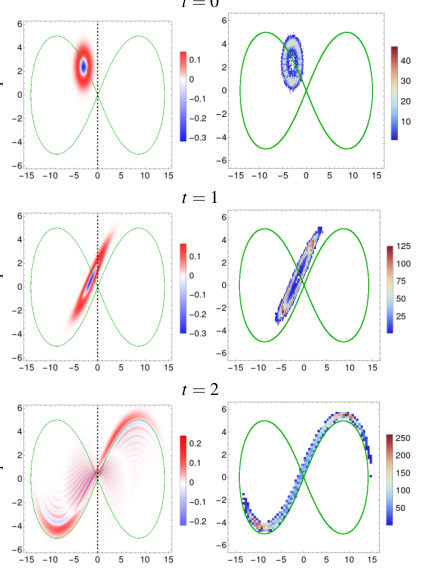 
Figure 5. (Left column) Dynamics of the Wigner function of the initial displaced state D(α)|1⟩with displacement parameter α = 1 √

**Summary.** This paper studies how the non-classical features of Fock states, such as Wigner-function negativity, affect their transmission through potential barriers. It demonstrates that while semiclassical methods like TWA can predict overall transmission, they fail to capture essential quantum interference effects and short-time plateaus. The study highlights the fundamental limits of using classical phase-space trajectories to simulate highly non-classical quantum dynamics.

**Why it may be interesting.** It provides deep insights into the breakdown of semiclassical approximations in quantum optics and open quantum systems, specifically how non-classicality (negativity) creates signatures that are invisible to classical-like trajectories.

Detailed structure

**Main problem.** Investigating the fundamental limitations of the Truncated Wigner Approximation (TWA) in capturing quantum interference and Wigner-function negativity during the transmission of non-classical states through potential barriers.

**Main result.** The TWA fails to capture short-time plateaus in transmission probability caused by Wigner negativity crossing the barrier and cannot reproduce interference in classically forbidden regions, though the maximum transmission remains bounded by the initial positive-energy fraction.

**Method.** Numerical comparison between exact quantum dynamics using the Wigner function and the semiclassical Truncated Wigner Approximation (TWA) using a Gaussian sampling distribution.

**Model / system.** An inverted harmonic oscillator and an extension featuring an inverted oscillator with Kerr nonlinearity, representing systems like superconducting circuits or mechanical oscillators.

**Key observables.** Transmission probability P(q > 0, t), Wigner-function negativity, and the initial positive-energy fraction P0(E > 0).

**Important parameters / regimes.** Fock index (n), displacement parameter (alpha), Kerr nonlinearity (K), and driving strength (epsilon).

**Assumptions / limitations.** The TWA is used as a semiclassical reference, and a Gaussian approximation is employed to represent non-classical Fock states in a classical phase-space ensemble.

**Figures summary.** Figure 1 shows classical trajectories in phase space; Figure 2 shows the evolution of a displaced Fock state; Figure 3 compares TWA, exact, and semiclassical bounds for coherent states; Figure 4 highlights transmission plateaus for various Fock states; Figure 5 illustrates Wigner function dynamics under Kerr nonlinearity.

**Paper structure.** The paper introduces the problem of semiclassical limitations, defines the inverted oscillator and Kerr models, presents numerical comparisons between exact and TWA dynamics for various Fock states, analyzes the role of Wigner negativity and interference, and concludes with the identified bounds on transmission.

Abstract

Transmission through potential barriers is a fundamental problem in quantum mechanics. While semiclassical methods can approximate certain aspects of transmission, they fail to capture the intrinsically quantum interference associated with Wigner-function negativity. We numerically study the transmission of displaced Fock states through an inverted-oscillator barrier, with and without a Kerr nonlinearity that offers a potential route to experimental realization. These states allow only an approximate classical description, since their characteristic Wigner-function negativity is absent in phase space. The semiclassical simulation reproduces the overall transmission but deviate from exact results and fail to capture short-time plateaus that arise when regions of Wigner-function negativity cross the barrier. With the Kerr nonlinearity, reflections from nonlinear boundaries drive interference into classically forbidden regions, an effect that is inaccessible to semiclassical approaches. We find that these interference effects do not alter the maximum transmission probability, which is bounded by the initial positive-energy fraction and therefore already encoded in the phase-space structure of the Fock states. Because Fock states cannot be faithfully represented within classical phase space, the transmission through a barrier reveals fundamental limitations of semiclassical approaches.

[↑ back to top](#top)

### [Quantum--Fluid Correspondence for Systems of Nonrelativistic Spin-$\frac{1}{2}$ Particles](http://arxiv.org/abs/2605.18247v1)

**Authors:** Naoki Sato, Michio Yamada  
**Type:** theory · **Category:** quantum information and computing · **PDF:** <https://arxiv.org/pdf/2605.18247v1>  
**Analysis basis:** full PDF text, analyzed in chunks
**Topic relevance:** `analog quantum simulation` **3/5** · `entanglement & information structure` **2/5**

📷 Fig 1

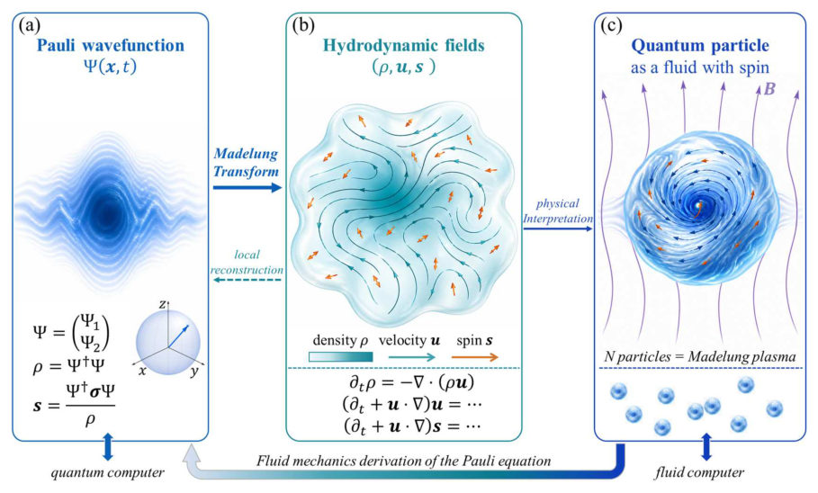 
Figure 1: Schematic illustration of the quantum–fluid correspondence developed in the present work. Panel (a) shows the usual Pauli wavefunction description and its Madelung transform into the hydrodynamic vari- ables (ρ, u, s), consisting of the density, velocity, and spin fields. Panel (b) represents the corresponding hydrodynamic system, whose governing equations are those of the Madelung form of the Pauli equation. Panel (c) summarizes the converse viewpoint explored in this paper: a quantum particle may be modeled as a fluid with spin, and a system of N Pauli particles may be represented by N interacting fluids with spin, or equivalently by a higher-dimensional Madelung plasma. The lower...

**Summary.** This paper establishes a formal mathematical equivalence between the Pauli equation for spin-1/2 particles and the hydrodynamic equations of a fluid with spin. It demonstrates that many-particle quantum systems can be mapped to higher-dimensional fluid flows, suggesting that fluid-mechanical systems could theoretically implement quantum computation.

**Why it may be interesting.** It suggests a profound theoretical duality where fluid dynamics can serve as a proxy for quantum evolution, potentially allowing for the use of fluid systems to simulate quantum computers or vice versa.

Detailed structure

**Main problem.** Establishing a mathematical correspondence between the dynamics of nonrelativistic spin-1/2 particles (the Pauli equation) and the hydrodynamic evolution of a charged fluid with internal spin.

**Main result.** The authors prove that a fluid with spin obeys the hydrodynamic Madelung form of the Pauli equation and that a system of N interacting particles can be represented as a single 3N-dimensional Euler flow, implying a computational duality between fluids and quantum computers.

**Method.** The study employs the Madelung transform, Clebsch potentials, and Hamiltonian formalism (noncanonical Poisson brackets) to derive hydrodynamic equations from fluid-mechanical principles and to prove the propagation of the correspondence.

**Model / system.** A system of nonrelativistic spin-1/2 particles governed by the Pauli Hamiltonian, and its hydrodynamic counterpart, a charged fluid endowed with an internal spin degree of freedom.

**Key observables.** Fluid density (rho), velocity (u), and spin field (s).

**Important parameters / regimes.** Nonrelativistic regime, magnetoquasistatic approximation, and a scale separation between fast spin dynamics and slow fluid dynamics.

**Assumptions / limitations.** Non-zero density, non-vanishing canonical vorticity, and the assumption of smallness in helicity density and spin variations.

**Figures summary.** Figure 1 shows the mapping from Pauli wavefunctions to hydrodynamic variables and the converse view of N particles as N interacting fluids. Figure 2 illustrates the commutation of the Madelung transform with the evolution of the Pauli and hydrodynamic systems.

**Paper structure.** The paper begins by establishing the mapping from spinors to hydrodynamic variables, proceeds to derive the hydrodynamic Pauli equation from fluid principles using scale separation, and concludes by demonstrating the Hamiltonian structure and the N-particle to 3N-dimensional fluid mapping.

Abstract

We show that a charged fluid endowed with an internal spin degree of freedom naturally satisfies the Pauli equation for a nonrelativistic spin-1/2 particle, and that a collection of n such interacting fluids can be reformulated as an Euler flow in 3n dimensions, thereby providing a natural representation of a system of n Pauli particles. These results provide a fluid-mechanical derivation of the Pauli equation and extend the Madelung, or quantum-hydrodynamic, picture to many-particle quantum systems. In particular, they imply that an n-qubit quantum computer can, at least in principle, be realized as a suitable combination of n fluids, or equivalently as a 3n-dimensional Euler flow.

[↑ back to top](#top)

### [Robust generalized quantum Stein's lemma](http://arxiv.org/abs/2605.16500v1)

**Authors:** Giulia Mazzola, David Sutter, Renato Renner  
**Type:** theory · **Category:** quantum information and computing · **PDF:** <https://arxiv.org/pdf/2605.16500v1>  
**Analysis basis:** full PDF text, analyzed in chunks
**Topic relevance:** `entanglement & information structure` **3/5** · `quantum measurements` **2/5**

📷 Fig 1

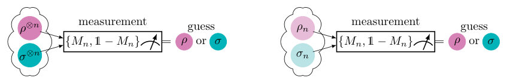 
Figure 1: Hypothesis testing in an iid and an almost-iid setting. In Figure 1a we have a source that outputs a state that is iid in ρ or σ. In Figure 1b the source generates a state that is almost-iid along ρ or σ. After an optimized measurement, described by a POVM {Mn, 1 −Mn}, the task is to guess whether the source produced a state corresponding to ρ or σ.

📷 Fig 2

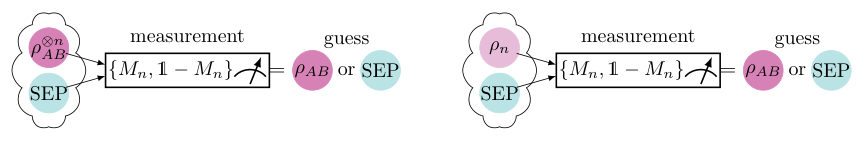 
Figure 2: Entanglement testing in an iid and an almost-iid setting. In Figure 2a we have a source that outputs an iid state in ρAB or a separable state. In Figure 2b the source generates a state that is almost-iid along ρAB or a separable state. After an optimized measurement, described by a POVM {Mn, 1 −Mn}, the task is to guess if the source produced a state corresponding to ρAB or a separable state.

📷 Fig 3

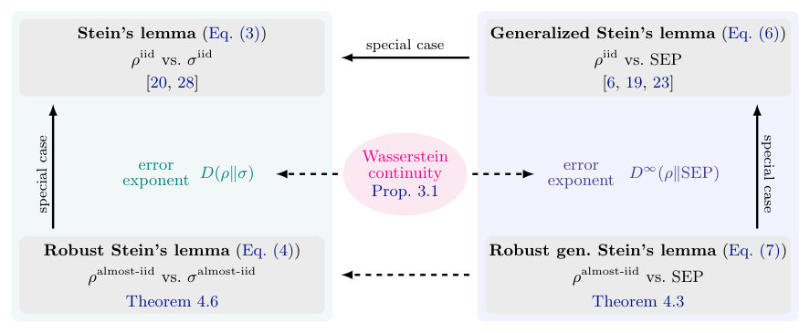 
Figure 3: Overview of the results. Solid arrows denote straightforward implications, while dashed arrows are nontrivial ones.

**Summary.** This paper provides a rigorous foundation for quantum hypothesis testing when the source is not perfectly iid but contains a small number of defects. By proving that the error exponent remains the regularized relative entropy of entanglement, it closes a known gap in quantum information theory and introduces new continuity bounds using the quantum Wasserstein distance.

**Why it may be interesting.** not directly relevant

Detailed structure

**Main problem.** The paper aims to establish the robustness of the generalized quantum Stein's lemma by extending the optimal error exponent results from iid states to almost-iid states (states with a sublinear number of defects). It also seeks to provide a rigorous proof for a previously identified logical gap in the literature regarding entanglement testing.

**Main result.** The authors prove that the optimal error exponent for distinguishing almost-iid states from separable states is the regularized relative entropy of entanglement. They also establish a new continuity bound for the relative entropy of resource with respect to the quantum Wasserstein distance.

**Method.** The proof utilizes the quantum Wasserstein distance of order 1, the exponential de Finetti theorem, and smooth max-relative entropy. The authors also employ a specific quantum channel construction (a replacer channel) to establish continuity bounds.

**Model / system.** The study operates within the framework of quantum hypothesis testing on n-subsystem Hilbert spaces, comparing iid and almost-iid density matrices against sets of states such as separable states (SEP).

**Key observables.** Type I and Type II error probabilities, error exponents (rate of decay of error probability), and relative entropy of entanglement.

**Important parameters / regimes.** The number of subsystems (n), the number of defects (r) where r = o(n), and the error tolerance (epsilon).

**Assumptions / limitations.** The sets of states (M_n) must satisfy specific axioms including convexity, closedness, permutation invariance, monotonicity, and tensor product stability; the Hilbert space is assumed to be finite-dimensional.

**Figures summary.** Figure 1 compares hypothesis testing in iid vs almost-iid settings; Figure 2 illustrates entanglement testing scenarios; Figure 3 provides a summary map of the relationships between the standard, generalized, and robust versions of Stein's lemma.

**Paper structure.** The paper begins by defining the problem of robustness in hypothesis testing, introduces the mathematical framework of Wasserstein distance and resource theory, provides the main continuity proofs, develops the robust generalized Stein's lemma, and concludes with applications to asymptotic superadditivity and technical appendices on de Finetti-type theorems.

Abstract

The generalized quantum Stein's lemma provides an explicit expression for the optimal error exponent when distinguishing many independent and identically distributed (iid) copies of a given bipartite state from the set of separable bipartite states. Here we prove that this result is robust, in the sense that the iid assumption can be relaxed to almost-iid. In particular, our result shows that the original argument of Brandão and Plenio, which contains a logical gap, can be made rigorous. Our proof relies on a novel continuity bound for the relative entropy of entanglement with respect to the quantum Wasserstein distance. Combined with a recent insight that almost-iid states and their exact iid counterparts are asymptotically close in this distance, the bound implies that their relative entropies of entanglement coincide asymptotically.

[↑ back to top](#top)

### [Bilayer crystals in a polar-molecules system](http://arxiv.org/abs/2605.18546v1)

**Authors:** Vinicius Zampronio, Matteo Ciardi, Fabio Cinti  
**Type:** theory · **Category:** quantum gases · **PDF:** <https://arxiv.org/pdf/2605.18546v1>  
**Analysis basis:** full PDF text, analyzed in chunks
**Topic relevance:** `analog quantum simulation` **3/5**

📷 Fig 1

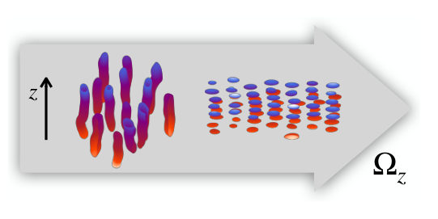 
Figure 1. Graphic representation of the bilayer state. In blue and red we have a snapshot of the worldlines sampled in the path-integral Monte Carlo simulation (see text). The system is made of molecules polarized along the z axis and confined by a harmonic potential of intensity Ωz in the polarization direction (represented in black).

📷 Fig 2

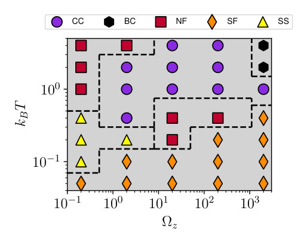 
Figure 2. Phase diagram for the system of polar molecules confined in the z direction by a harmonic potential V (z) = Ωzz2 as a function of Ωz and temperature T. The phase di- agram displays superfluid (SF), supersolid (SS), normal fluid (NF), cluster crystal (CC), and bilayer crystal (BC) states.

📷 Fig 3

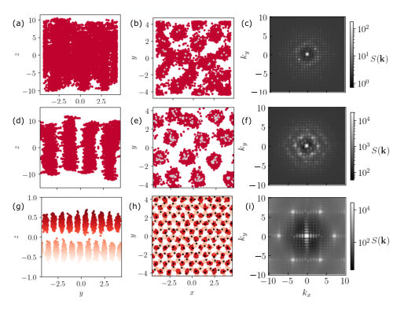 
Figure 3. (a) Snapshot of the worldlines of the SS state in the y −z plane. (b) A cut of the snapshot of the SS state in the x −y plane showing the percolations; the gray dots represent a particular time slice. (c) The structure factor associated to (b). The physical parameters in (a)-(c) are Ωz = 0.2, kBT = 0.2. (d) A snapshot of the PIMC world lines in the y −z plane, showing the length of the filaments in the CC state. (e) A snapshot in the x −y plane showing the triangular pattern. (f) The structure factor of the triangular pattern in the x −y plane. The physical parameters in (d)- (f) are Ωz = 0.2, kBT = 0.4. (g) Snapshot in the y −z plane showing the separation in two layers. (h)...

📷 Fig 4

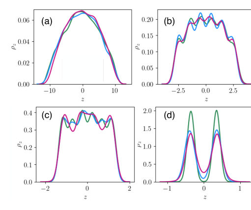 
Figure 4. Snapshot of particle positions along z versus ρz for different temperatures and confinement strengths (T = 2.0 green line, T = 1.0 light blue line, and T = 0.4 violet line). (a) Weak confinement with Ωz = 0.2. For intermediate confinement (b) Ωz = 20 and (c) Ωz = 200 we observe density modulations that depend on the temperature. (d) Strong confinement regime Ωz = 2000, where the system splits in two layers as the temperature increases. The density of the system is ρ = 2.31 and the interaction strength is D = 35.

📷 Fig 5

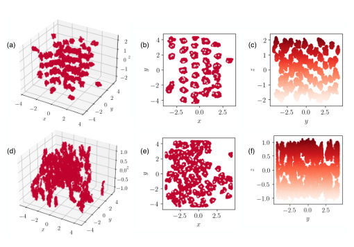 
Figure 6. Snapshots of the worldlines in the PIMC simulation. In (a)-(c) the interaction strength is D = 127 and in (d)-(f) D = 11. (a) and (d) depicts the three-dimensional system. Projections of the worldlines in the x −y and y −z planes are represented in (b,e) and (c,f), respectively. The harmonic confinement strength is Ωz = 200 and the temperature is kBT = 2.

**Summary.** This paper uses Path-Integral Monte Carlo simulations to map the phase diagram of polar molecules in a quasi-2D trap. It discovers that heating the system can actually drive crystallization and shows how tuning confinement can stabilize a bilayer crystal state. These findings are crucial for designing future experiments with ultracold polar molecules.

**Why it may be interesting.** It explores the non-trivial interplay between long-range interactions, thermal fluctuations, and dimensionality, providing a roadmap for engineering complex quantum phases like supersolids and bilayer crystals in ultracold molecular experiments.

Detailed structure

**Main problem.** Investigating the finite-temperature phase diagram and structural properties of polar molecules in a quasi-two-dimensional geometry under varying confinement and temperature.

**Main result.** The study identifies a rich phase diagram including normal fluid, superfluid, supersolid, cluster crystal, and bilayer crystal states, notably revealing that increasing temperature can induce crystallization (thermocrystallization).

**Method.** Path-Integral Monte Carlo (PIMC) simulations using the worm algorithm to sample particle permutations.

**Model / system.** A system of N bosonic polar molecules (e.g., NaCs or SrO) with long-range dipolar and van der Waals interactions, confined by a harmonic potential along the polarization axis.

**Key observables.** Structure factor S(k), momentum-space contrast q(k), superfluid fraction f_s, and permutation cycle probability P(L).

**Important parameters / regimes.** Interaction strength D, confinement strength Omega_z, temperature k_B T, and density rho.

**Assumptions / limitations.** Use of the primitive approximation for the density matrix and discretization of imaginary-time paths into M time slices.

**Figures summary.** Snapshots of particle worldlines and structure factors for different phases (SS, CC, BC); 1D density profiles along the z-axis; quantitative plots of structure factor contrast, superfluid fraction, and permutation cycles; and comparisons of different interaction strengths.

**Paper structure.** The paper introduces the physical system and model, describes the PIMC methodology, presents the identified phase diagram and the phenomenon of thermocrystallization, analyzes the effects of confinement strength on layering and cluster formation, and concludes with experimental implications and future directions.

Abstract

We investigate the finite-temperature phase diagram of polar molecules confined in a quasi-two-dimensional geometry by a harmonic potential along the polarization axis. We employ Quantum Monte Carlo simulations to explore the strongly correlated regime accessible with current experimental setups. By tuning temperature and confinement strength, we identify a rich set of phases, including normal fluid, superfluid, supersolid, cluster crystal, and bilayer crystal states. Our results reveal the emergence of crystallization upon increasing temperature, highlighting the nontrivial role of thermal fluctuations in dipolar systems. In particular, we show that a bilayer crystal with one molecule per lattice site can be stabilized by varying the confinement strength at fixed interaction. Moreover, we show evidence of layering of superfluid states with phase coherence between the two layers. These findings provide insight into the interplay between interactions, confinement, and temperature in low-dimensional dipolar systems, and suggest new directions for engineering quantum phases with ultracold polar molecules.

[↑ back to top](#top)

### [Heralded Generation of Multipartite Free-Electron W-State Entanglement](http://arxiv.org/abs/2605.17802v1)

**Authors:** Du Ran, Jing-Yi Liu, Dan Jin, Shuai Liu, Reuven Ianconescu, Ze-Long He, Ji-Yuan Bai, Ya-dong Li, Avraham Gover  
**Type:** theory · **Category:** quantum information and computing · **PDF:** <https://arxiv.org/pdf/2605.17802v1>  
**Analysis basis:** full PDF text, analyzed in chunks
**Topic relevance:** `entanglement & information structure` **3/5**

📷 Fig 1

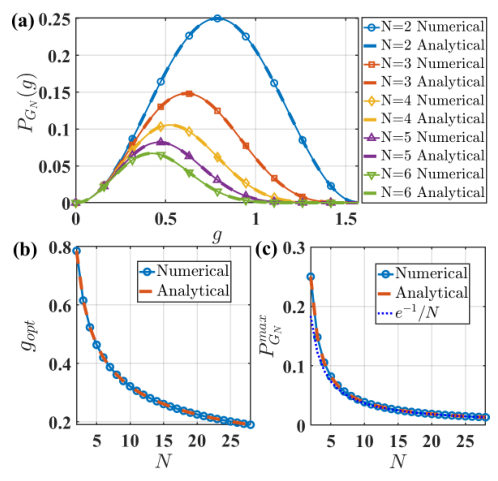 
FIG. 1. Validation of the heralded multipartite protocol with the initial atomic resource cj = 1/ √

📷 Fig 2

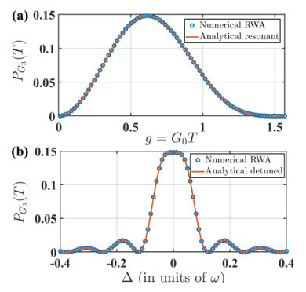 
FIG. 2. Tripartite numerical validation for N = 3. (a) The numerical resonant heralding probability with the analytical result PG3(T) in Eq. (50) as a function of the dimension- less pulse area g = G0T. The curve rises from zero, reaches a single optimum P max G3 determined by the balance between one-arm transfer and two-arm survival, and then decreases as stronger driving enhances unwanted dynamics on the specta- tor arms. (b) The numerical and analytical detuned heralding probabilities at fixed pulse area as a function of the normal- ized detuning. The probability is maximal near resonance and decreases symmetrically as the detuning magnitude grows, re- flecting the reduced efficiency of...

📷 Fig 3

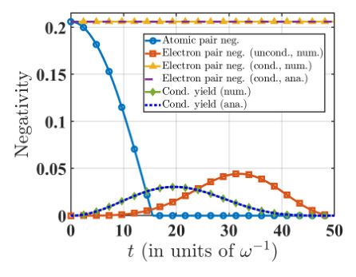 
FIG. 3. Time-resolved entanglement redistribution in the symmetric resonant tripartite protocol for N = 3, starting from the symmetric atomic resource |W3⟩TLS. The solid blue curve denotes the numerical atomic average pairwise negativ- ity defined in Eq. (58). The solid orange curve denotes the numerical unconditional electron average pairwise negativity defined in Eq. (62). The solid yellow curve with markers denotes the numerical conditional electron average pairwise negativity defined in Eq. (67), and the dashed purple curve denotes the analytical result in Eq. (69). The solid green curve with markers denotes the numerical success-weighted conditional electron entanglement yield defined...

📷 Fig 4

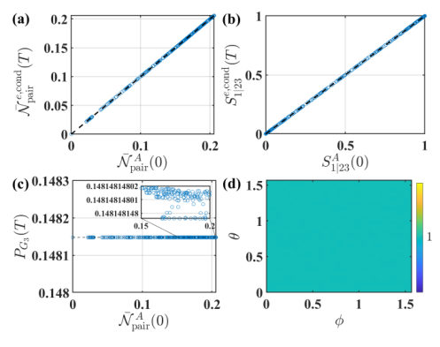 
FIG. 4. Transfer of weighted single-excitation entangle- ment in the symmetric resonant tripartite protocol for N = 3. The family of initial weighted states is given by Eq. (72) and parametrized by Eq. (73) over 0 ≤θ ≤π/2 and 0 ≤ϕ ≤π/2. (a) The initial atomic average pairwise negativity in Eq. (75) vs the corresponding heralded electron average pairwise neg- ativity in Eq. (76), together with the analytical relation in Eq. (79). (b) The initial atomic one-versus-rest bipartite en- tropy in Eq. (77) vs the corresponding heralded electron en- tropy in Eq. (78), together with the analytical relation in Eq. (80). (c) The heralding probability as a function of the initial atomic average pairwise...

📷 Fig 5

 
Figure 4(a) places the initial atomic average pairwise negativity in Eq. (75) against the heralded electron aver-

**Summary.** The paper proposes a method to transfer multipartite entanglement from atoms to free electrons using a heralded protocol. By projecting the atoms into their ground state, the entanglement is mapped onto the electron's upper-sideband manifold. While the success probability decreases as the number of particles increases, the protocol preserves the essential entanglement structure.

**Why it may be interesting.** It provides a scalable theoretical framework for using electron optics to distribute entanglement, bridging the gap between stationary matter qubits and mobile electron-based quantum networks.

Detailed structure

**Main problem.** The challenge of generating and transferring multipartite W-type entanglement from stationary atomic resources to mobile free-electron wave packets in a scalable, heralded manner.

**Main result.** The authors propose a protocol that achieves an exact mapping of atomic W-state entanglement to the electronic upper-sideband manifold, with the maximum heralding probability scaling as e^-1/N for large N.

**Method.** The study uses the Rotating-Wave Approximation (RWA) and analytical derivations to solve the dynamics of N independent interaction arms, supplemented by numerical integration of the Schrödinger equation and entanglement witnesses.

**Model / system.** A Quantum Electron Optics (QEO) platform consisting of N independent interaction arms, where each arm contains a free electron interacting locally with a two-level system (atom) via a sideband-resolved interaction.

**Key observables.** Heralding probability (Ps), conditional fidelity, multipartite entanglement witness, pairwise negativity, and entanglement yield.

**Important parameters / regimes.** Number of arms (N), pulse area (g), detuning (Delta), coupling strength (G), and pulse shape (square vs. Gaussian).

**Assumptions / limitations.** Symmetric interaction arms, use of the Rotating-Wave Approximation, and neglect of direct inter-arm electron-electron coupling.

**Figures summary.** Figure 1 compares numerical and analytical heralding probabilities and optimal pulse areas; Figure 2 shows tripartite dynamics and detuning dependence; Figure 3 illustrates time-resolved entanglement redistribution; Figure 6-7 examine robustness to coupling and detuning mismatches; Figure 8 analyzes beyond-RWA effects; Figure 9 shows Gaussian pulse effects.

**Paper structure.** The paper introduces the problem of multipartite entanglement transfer, defines the physical model and Hamiltonian, provides analytical solutions for the heralded state and scaling laws, validates the results with numerical simulations for N=3, assesses robustness against experimental imperfections, and discusses realistic pulse shapes.

Abstract

We propose a heralded protocol for generating multipartite free-electron entanglement from atomic $W_N$ resources in a sideband-resolved interaction regime. The scheme consists of $N$ independent electron--atom interaction arms, where each free electron couples locally to one two-level system. For uniform couplings and common detuning, the dynamics is solved analytically within the rotating-wave approximation. Projecting the atoms onto the all-ground state maps the initial atomic excitation manifold onto the electronic upper-sideband manifold and prepares an exact $N$-electron $W_N$-type state. The heralding probability is obtained in closed form for resonant and detuned regimes. At resonance, the optimal success probability obeys the large-$N$ scaling $P_{G_N}^{\max}\sim e^{-1}/N$. The heralded state retains the multipartite entanglement structure of the atomic resource, as shown for arbitrary $N$ and illustrated explicitly for $N=3$. Detuning, weak symmetry breaking, beyond-rotating-wave corrections, and Gaussian coupling envelopes are discussed. The protocol provides a scalable route toward multipartite free-electron entanglement generation from localized atomic resources within quantum electron optics.

[↑ back to top](#top)

### [Partial Kondo Screening Solves the Mystery of Rare Earth Tetraborides](http://arxiv.org/abs/2605.17469v1)

**Authors:** Soumyaranjan Dash, Sanjeev Kumar  
**Type:** theory · **Category:** strongly correlated electrons · **PDF:** <https://arxiv.org/pdf/2605.17469v1>  
**Analysis basis:** full PDF text, analyzed in chunks
**Topic relevance:** `Kondo & dissipative impurity` **3/5**

📷 Fig 1

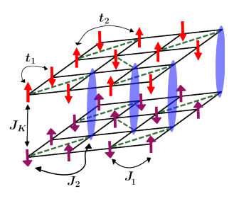 
Figure 1. A schematic representation of our semiclassical ver- sion of the KLM. Top layer is the tight-binding model on the SSL with t1, t2 denoting the hopping parameters on SSL. The bottom layer represents localized moments interacting via J1 and J2. The vertical ovals indicate local singlets at C sites. The U sites retain a Zeeman-like coupling of strength JK.

📷 Fig 2

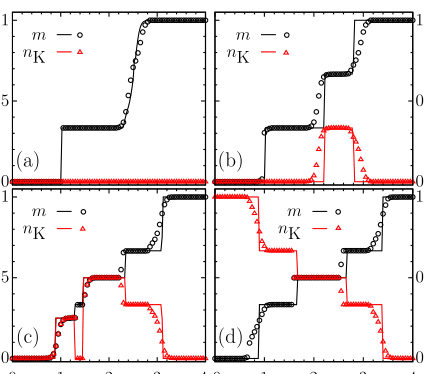 
Figure 2. Variations of the normalized magnetization, m, and the fraction of Kondo singlets, nK, with external field, hz, for (a) JK = 0.0, (b) JK = 0.3, (c) JK = 0.6, and JK = 0.9. The symbols are the SMC data and the continuous lines are obtained from variational calculations (see Supplemental Material for details).

📷 Fig 3

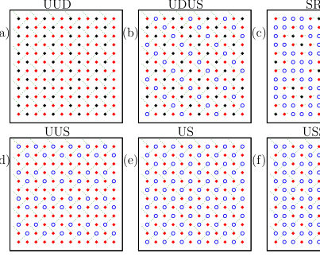 
Figure 3. Real-space patterns of spins (red: S = 1 2, black: S = −1

📷 Fig 4

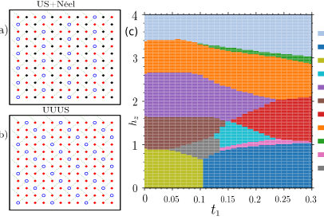 
Figure 5. Real-space patterns of spins (red: S = 1 2, black: S = −1

📷 Fig 5

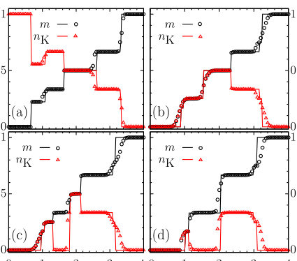 
Figure 4. Variations of normalized magnetization, m, and fraction of Kondo singlets, nK with hz, obtained from varia- tional calculations and HMC simulations for JK = 0.90, and (a) t1 = 0.10, (b) t1 = 0.15, (c) t1 = 0.20, and t1 = 0.25.

**Summary.** This paper proposes that partial Kondo screening, driven by the competition between kinetic energy, Kondo coupling, and magnetic frustration, is the key to understanding the complex magnetization plateaus in rare-earth tetraborides. The mechanism provides a unified explanation for both the variety of observed magnetic phases and the anomalous magnetotransport properties. This work introduces a novel way to predict new correlated phases in frustrated Kondo lattices.

**Why it may be interesting.** not directly relevant

Detailed structure

**Main problem.** Explaining the mystery of multiple fractional magnetization plateaus and anomalous magnetotransport observed in rare-earth tetraborides (RB4).

**Main result.** The authors identify a 'partial Kondo screening' mechanism where a three-way competition between kinetic energy, Kondo coupling, and magnetic frustration stabilizes various magnetization plateaus and explains anomalous transport in ErB4 and TmB4.

**Method.** The study uses a combination of Hybrid Monte Carlo (HMC) and Semiclassical Monte Carlo (SMC) simulations of the Kondo Lattice Model, supplemented by a variational ansatz to determine ground-state phase diagrams.

**Model / system.** The system is the Kondo Lattice Model (KLM) on a Shastry-Sutherland lattice (SSL), representing metallic rare-earth tetraborides with localized moments and itinerant electrons.

**Key observables.** Normalized magnetization (m), fraction of Kondo singlets (nK), and electronic transport properties (longitudinal and Hall conductivities).

**Important parameters / regimes.** Kondo coupling (JK), electron hopping amplitudes (t1, t2), magnetic exchange interactions (J1, J2), and external magnetic field (hz).

**Assumptions / limitations.** The use of a semiclassical approximation to represent local Kondo singlet formation and the treatment of electronic degrees of freedom via an effective one-particle quantum problem.

**Figures summary.** Figure 1 shows the KLM schematic on the SSL; Figure 3 illustrates real-space configurations of Up, Down, and Singlet sites and the phase diagram; Figure 4 displays magnetization and Kondo-singlet fraction versus magnetic field; Figure 5 shows real-space patterns for specific plateau states.

**Paper structure.** The paper introduces the problem of RB4 magnetism, presents the KLM on the SSL model, details the Monte Carlo and variational methods, analyzes the emergence of magnetization plateaus through partial Kondo screening, and concludes by applying the mechanism to explain magnetotransport anomalies.

Abstract

We invoke a new mechanism to account for multiple magnetization plateaus observed in rare-earth tetraborides. Using a combination of hybrid and semiclassical Monte Carlo simulations of the Kondo lattice model (KLM) on the Shastry-Sutherland lattice (SSL), we find robust magnetization plateaus at fractions 1/6, 2/9, 1/4, 1/3, 1/2, 2/3 and 3/4 of the saturation magnetization. We find that most of the plateau states are partially Kondo screened and emerge from the field-tuning of a complex three-way competition between the kinetic energy, the Kondo coupling, and the magnetic frustration. Most remarkably, the unusual magneto-transport reported in ErB$_4$ and TmB$_4$ admits an unexpectedly simple explanation within our mechanism. This work not only provides an elegant and simple solution to the long-standing puzzle of metamagnetism and anomalous magnetotransport in RB$_4$, but also introduces a novel mechanism to predict and discover new correlated phases in frustrated Kondo lattices.

[↑ back to top](#top)

### [Photon-Atom Granularity Noise Thermometry](http://arxiv.org/abs/2605.17797v1)

**Authors:** Chen-Rong Liu, Yixuan Wang, Xiaowei Wang, Chuang Li, Mingti Zhou, Runxia Tao, Hongwei Chen, Ying Dong  
**Type:** both · **Category:** other · **PDF:** <https://arxiv.org/pdf/2605.17797v1>  
**Analysis basis:** full PDF text, analyzed in chunks
**Topic relevance:** `quantum measurements` **3/5**

📷 Fig 1

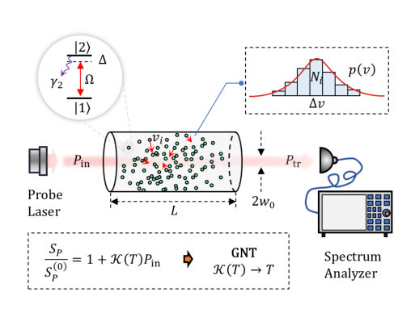 
FIG. 1. Schematic of the GNT. A laser is amplitude-modulated (e.g., by an acousto-optic modulator) to vary the incident power 𝑃in and thereby the photon flux. The beam with waist 𝑤0 interacts with an atomic vapor cell of length 𝐿; for a cold atomic cloud, the physical cell is replaced by a trapped ensemble, and 𝐿is understood as the effective optical length 𝐿effof the cloud. The transmitted power 𝑃tr is measured by a low-noise photodetector, and its power spectral density is recorded by a spectrum analyzer. The measured PSD ratio follows the scaling law of Eq. (7), where R denotes the photon‑to‑atom ratio (see text).

📷 Fig 2

 
FIG. 2. PSD ratio 𝑆𝑃/𝑆(0) 𝑃 −1 as a function of incident power 𝑃in for several atomic vapor temperatures (173–473 K), computed using the cesium parameters from Table I. The shaded region indicates the weak‑probe regime where the saturation parameter 𝑥≪1 (see Ap- pendix B); the room‑temperature saturation power 𝑃sat ≈17 𝜇W is marked by the red arrow ▼.

📷 Fig 3

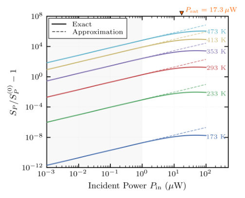 
Figure 2 illustrates this linear scaling at several represen- tative temperatures spanning 173–473 K. For 𝑃in ≲1 𝜇W

📷 Fig 4

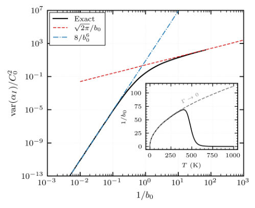 
FIG. 3. Limiting behavior of the polarizability variance. Normalized variance var(𝛼𝐼)/𝐶2 0 as a function of 1/𝑏0 (or equivalently tempera- ture) in log-log scale. Solid black curve: exact result from Eq. (17); red dashed line: 𝑏0 ≪1 approximation ∝1/𝑏0; blue dash-dotted line: 𝑏0 ≫1 asymptote ∝1/𝑏6 0. The inset shows 1/𝑏0 versus tem- perature 𝑇, with the black solid line including transit and collision broadening (Γ𝑡, Γ𝑐) and the gray dashed line corresponding to the ideal case Γ →0 (i.e., Γ𝑡= Γ𝑐= 0).

📷 Fig 5

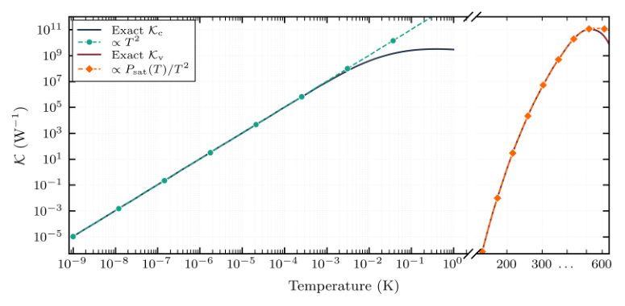 
FIG. 4. Slope K as a function of temperature. Left: cold atoms (1 nK–1 K), with exact Kc (dark solid) and 𝑏0 ≫1 asymptote ∝𝑇2 (dashed with circular markers). Right: atomic vapor (150–650 K), with exact Kv (dark solid) and 𝑏0 ≪1 approximation ∝𝑃v(𝑇)/𝑇2 (dashed with diamond markers). The temperature axis is broken between 1 K and 150 K. Both axes use log-log scale. Parameters are listed in Table I.

**Summary.** This paper proposes 'Granularity Noise Thermometry,' a method to measure temperature by analyzing the excess noise in light transmitted through atomic ensembles. It establishes that the noise scales linearly with the photon-to-atom ratio, allowing temperature extraction from the slope of this scaling. The technique is applicable to both warm atomic vapors and ultracold atomic clouds.

**Why it may be interesting.** It presents a novel way to use quantum/atomic noise as a signal rather than a nuisance, offering a high-precision sensing technique that remains functional even in the ultracold limit where traditional Doppler thermometry is unusable.

Detailed structure

**Main problem.** The development of a new optical thermometry scheme, Granularity Noise Thermometry (GNT), to measure temperature by exploiting intrinsic fluctuations in atomic susceptibility, particularly in regimes where conventional Doppler-based methods fail.

**Main result.** The authors derive a unified scaling law where the excess noise in transmitted light power scales linearly with the photon-to-atom ratio, providing a temperature-dependent slope that works for both thermal vapors and ultracold atoms.

**Method.** The study uses linear response theory, the plasma dispersion function for analytical moments, and a Fisher information framework to evaluate the precision of the proposed thermometry.

**Model / system.** The system consists of two-level atomic ensembles (e.g., Cesium) in two regimes: thermal vapors and cold atom clouds, interacting with a coherent-state probe laser beam.

**Key observables.** Normalized Power Spectral Density (PSD) of transmitted light, photon-to-atom ratio (R), and the scaling slope (K).

**Important parameters / regimes.** Photon-to-atom ratio (R), Doppler broadening parameter (b0), saturation parameter (x), and the temperature-dependent scaling regimes (Doppler-dominated vs. homogeneous-broadening-dominated).

**Assumptions / limitations.** Assumes a large number of atoms (Gaussian susceptibility), a coherent-state probe with Poissonian statistics, and that photon counts and atomic susceptibility are statistically independent.

**Figures summary.** Figure 1 shows the GNT experimental setup; Figure 2 illustrates the linear scaling of the PSD ratio with incident power; Figure 3 shows the transition of normalized variance between asymptotic limits; Figure 4 compares thermometric performance (sensitivity) across temperature ranges.

**Paper structure.** The paper introduces the GNT concept, establishes the physical model and scaling laws using statistical mechanics, derives analytical closed-form expressions for different temperature regimes, evaluates measurement precision via Fisher information, and concludes with a comparison of performance in vapor and cold atom systems.

Abstract

We propose granularity noise thermometry (GNT), a fluctuation-based optical thermometry scheme that exploits the intrinsic fluctuations of susceptibility arising from atomic discreteness. The power spectral density of transmitted light exhibits an excess noise above the shot-noise limit that scales linearly with the photon-to-atom ratio $\mathcal{R}$. Consequently, varying the incident power (hence $\mathcal{R}$) yields the slope $\mathcal{K}$ of this linear scaling, which directly encodes the temperature. Closed-form expressions for the polarizability moments are derived via the plasma dispersion function, which yield distinct temperature scalings: $\mathcal{K}\propto P_{\mathrm{v}}(T)/T^2$ for thermal vapors and $\mathcal{K}\propto T^{2}$ for cold atoms. While practical implementation requires careful control of technical noise and system parameters, the present framework provides a noise-based pathway for optical thermometry using atomic ensembles.

[↑ back to top](#top)

### [From Fundamental Dynamics to Applied Cryptography: Studies on the Quantum Speed Limit and Fully Passive Quantum Key Distribution](http://arxiv.org/abs/2605.17532v1)

**Authors:** Jinjie Li  
**Type:** theory · **Category:** quantum information and computing · **PDF:** <https://arxiv.org/pdf/2605.17532v1>  
**Analysis basis:** full PDF text, analyzed in chunks
**Topic relevance:** `correlated / nonlocal dissipation` **2/5** · `entanglement & information structure` **2/5** · `methods for driven-dissipative` **2/5** · `non-equilibrium dynamics` **2/5** · `quantum measurements` **2/5**

📷 Fig 1

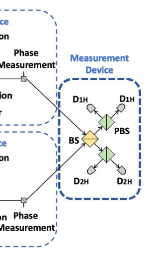 
Figure 3.2: Optical layout of the fully passive source used in my passive MDI- QKD scheme. Each user employs four independent lasers whose random phases are mixed through a network of 50:50 beam splitters (BSs) and a polarizing beam splitter (PBS), producing orthogonally polarized arms. Local classical detectors monitor the arm intensities and phases, and the resulting classical data (µH, µV , ϕH, ϕV ) are used to infer the output state parameters for basis and decoy selection [42, 60]. Figure Adapted with modifications from Fig. 1 in W. Wang et al., Phys. Rev. Lett. 130, 220801 (2023), and subsequently used in my Phys. Rev. Applied manuscript, with permission of the American Physical...

📷 Fig 2

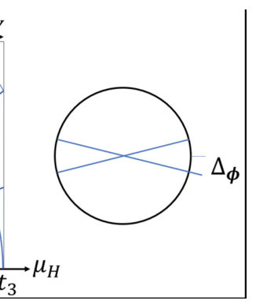 
Figure 3.3: Illustration of the postselection domains used by Alice, represented in the (µH, µV , ϕ) parameter space together with their corresponding regions on the Bloch sphere. The basis-dependent partitions including the Z-basis window ∆Z and the X-basis windows ∆XY and ∆ϕ are further subdivided into several intensity bins, labeled t1, t2, t3, which define the decoy settings em- ployed in the protocol. Bob applies an identical partitioning. Figure Adapted with modifications from Fig. 2 of W. Wang et al., Phys. Rev. Lett. 130, 220801 (2023), and subsequently incorporated into my Phys. Rev. Applied manuscript, with permission of the American Physical Society.

📷 Fig 3

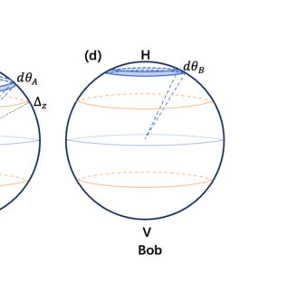 
Figure 3.4: Illustration of the small-ring sifting strategy. The key-generating regions associated with the Z basis are divided into a sequence of thin con- centric rings, indicated by the shaded segments between successive angular boundaries. Panels (a) and (b) show how these rings appear in the (µH, µV ) parameter space for Alice and Bob, while panels (c) and (d) display the cor- responding annular regions on their respective Bloch spheres. Each ring is labeled by its polar angle θ and has a differential width dθ. In the numerical evaluation of Eq. (3.8), Alice’s integration limits are marked as 0 and ∆Z, and Bob’s limits are identical. Figure reproduced from my Phys. Rev. Applied...

📷 Fig 4

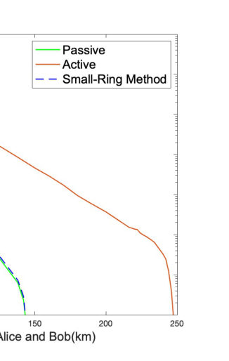 
Figure 3.5: Simulated secret-key rates for the fully passive MDI-QKD proto- col compared with a standard actively modulated MDI-QKD scheme. Both approaches employ three decoy settings. For the passive protocol, the post- selection parameters are fixed at ∆XY = ∆ϕ = 0.2, while ∆Z is optimized over [0.01, 0.05] and the highest decoy threshold t3 is optimized in the interval [0.1, 0.99]. In the active protocol, the three decoy intensities are optimized within [0, 1]. A channel loss of 0.2 dB/km, a detector dark count probability of 10−6, and a total misalignment of 1% are assumed. The passive scheme achieves a maximum distance of approximately 143 km, with key rates that are two to three...

📷 Fig 5

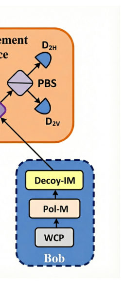 
Figure 3.1: Schematic illustration of a measurement-device-independent quan- tum key distribution (MDI-QKD) implementation. Alice and Bob prepare phase-randomized weak coherent pulses (WCPs) in randomly chosen BB84 polarization states, created using a polarization modulator (Pol-M) and inten- sity settings controlled by a decoy-state modulator (Decoy-IM). Their optical signals are directed to an untrusted central relay, where they interfere on a 50:50 beam splitter. Each output arm is analyzed by a polarizing beam splitter (PBS) that resolves horizontal (H) and vertical (V ) polarizations, and the resulting photons are detected by four single-photon detectors. Co- incidence events...

**Summary.** This work provides a new mathematical framework for universal Quantum Speed Limits that applies to both closed and open quantum systems. It also introduces fully passive quantum key distribution protocols that enhance security by removing active modulators, thereby closing critical hardware-based side-channels.

**Why it may be interesting.** The development of a unified, computationally efficient QSL framework using weighted norms is highly relevant to researchers studying the fundamental limits of open quantum systems and quantum control.

Detailed structure

**Main problem.** The thesis addresses two frontiers: improving the tightness and universality of Quantum Speed Limit (QSL) bounds for quantum dynamics, and mitigating side-channel vulnerabilities in QKD caused by active hardware modulators.

**Main result.** The author derives a new family of universal QSL bounds based on weighted l_p-seminorms that apply to both closed and open systems, and develops fully passive MDI-QKD and CKA protocols that eliminate source-side side-channels.

**Method.** Mathematical frameworks include weighted l_p-seminorms, linear programming for decoy-state analysis, and a branch-cutting algorithm for multi-party optimization; cryptographic methods include the decoy-state method and twin-field interference.

**Model / system.** The work covers quantum communication networks (MDI-QKD and multi-user CKA using twin-field interference) and quantum dynamics (closed and open systems, including Lindbladian dynamics and spontaneous emission).

**Key observables.** Quantum Bit Error Rate (QBER), secret key rate, photon-number yields, gain, and evolution speed.

**Important parameters / regimes.** Channel loss (up to 28 dB), transmission distance (approx. 140 km), photon-number statistics (Poisson distribution), and QSL parameters (norm power p, weight vector w, and basis B).

**Assumptions / limitations.** The classical channel is assumed to be authenticated but public; security assumes the validity of the no-cloning theorem; and local channel components are conservatively assigned to the eavesdropper.

**Figures summary.** Figures show the optimized QSL for dephasing qubits and qubit coherence generation, demonstrating that the new bound is tighter and more efficient than existing specialized bounds for certain time regimes.

**Paper structure.** The thesis bridges fundamental dynamics and applied cryptography, progressing from the mathematical foundations of QSLs and QKD protocols to the development of new universal bounds and the implementation of fully passive, secure communication architectures.

Abstract

This thesis studies two distinct frontiers of quantum information processing: the   fundamental physical limits of dynamical evolution and the practical realization of secure   quantum communication networks.

[↑ back to top](#top)

### [Geometric Phase Transition Enables Extreme Hippocampal Memory Capacity](http://arxiv.org/abs/2605.17199v1)

**Authors:** Prashant C. Raju  
**Type:** both · **Category:** disordered systems and neural networks · **PDF:** <https://arxiv.org/pdf/2605.17199v1>  
**Analysis basis:** full PDF text, analyzed in chunks
**Topic relevance:** `driven-dissipative phase transition` **2/5** · `entanglement & information structure` **2/5** · `non-equilibrium dynamics` **2/5** · `non-equilibrium universality` **2/5**

📷 Fig 1

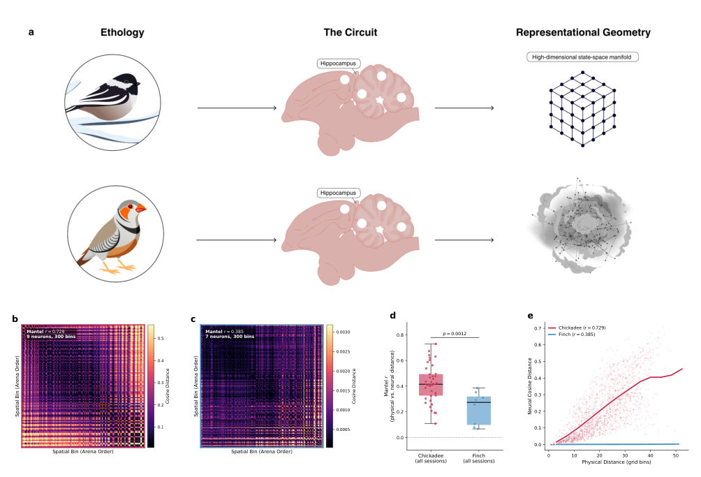 
Figure 1: Geometric rigidity distinguishes hippocampal population codes in food-caching and non-caching birds. (a) Schematic overview. The food-caching black-capped chickadee (Poecile atricapillus) and non-caching zebra finch (Taeniopygia guttata) possess hippocampi of comparable neuron count and gross connectivity, yet the caching species must store and retrieve thousands of cache locations across a winter season. Conceptu- ally, the chickadee hippocampus operates as a “Geometric Crystal” —-a low-dimensional, topologically rigid manifold—whereas the finch hippocampus resembles a “Mist” of disorganized representations susceptible to catastrophic interference. (b, c) Representational...

📷 Fig 2

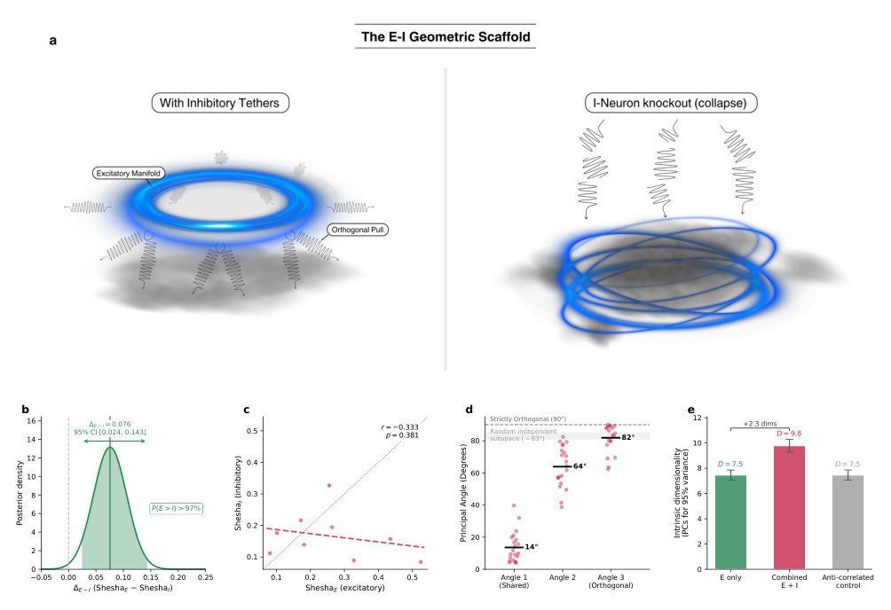 
Figure 2: Synergistic excitatory-inhibitory circuit dynamics underlie geometric stability. (a) Conceptual illustration of the E-I geometric scaffold. (Left) The continuous excitatory spatial manifold (blue ring) is stabilized by inhibitory populations acting as structural tethers (springs). By exerting an orthogonal pull, inhibition stiffens the network into a rigid, high-dimensional configuration. (Right) Simulated knockout of these inhibitory tethers causes the representational geometry to collapse, demonstrating that manifold rigidity is an actively constructed, emergent property of the combined E-I architecture rather than an autonomous excitatory phenomenon. (b) Bayesian posterior for...

📷 Fig 3

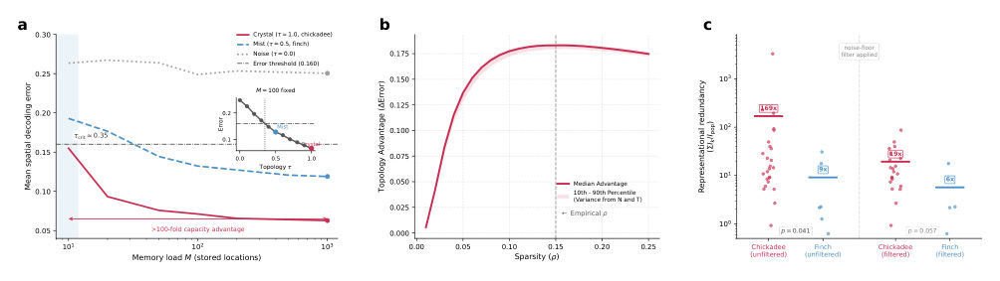 
Figure 3: Topological structure determines memory capacity and exacts a geometric tax. (a) Decoding error as a function of memory load 𝑀 for crystal, mist, and noise regimes, with the critical error threshold and estimated phase transition 𝜏crit marked. Inset shows decoding error as a function of topology strength𝜏at fixed 𝑀= 100, illustrating the non-linear inflection. (b) Topology advantage (ΔError = Errorrandom−Errorcrystal) across a 10,000- configuration parameter sweep. The solid line represents the median advantage across all population sizes (𝑁) and trial counts (𝑇) for a given sparsity (𝜌). The narrow shaded band (10th–90th percentiles) demonstrates that the advantage is highly...

**Summary.** The study reveals that extreme spatial memory in birds is achieved through a phase transition in the neural population geometry, moving from a disorganized state to a rigid, crystalline structure. This transition, driven by excitatory-inhibitory synergy, allows for a massive increase in memory capacity by using a redundant, topologically stable manifold. This suggests that evolution optimizes memory through the engineering of neural code geometry rather than just increasing neuron counts.

**Why it may be interesting.** The paper describes a topological phase transition and the emergence of structural rigidity (stiffening) in a high-dimensional network, which is highly relevant to understanding how noise-resilient order emerges in many-body systems and neural networks.

Detailed structure

**Main problem.** How biological memory systems expand information capacity without increasing neural hardware or suffering from catastrophic interference.

**Main result.** High-capacity memory emerges from a topological phase transition in the neural manifold from a disorganized 'mist' to a rigid 'crystalline' geometry, stabilized by excitatory-inhibitory synergy.

**Method.** Comparative electrophysiology in chickadees and finches combined with large-scale computational simulations (10,000 configurations) and geometric stability metrics (Shesha).

**Model / system.** A comparative study of hippocampal populations in food-caching (chickadees) and non-caching (finches) birds, modeled as a transition between a disordered 'mist' regime and a topologically rigid 'crystalline' lattice.

**Key observables.** Geometric stability (Shesha), intrinsic dimensionality (D), spatial information (bits/spike), Mantel r (topogeographic correlation), and population redundancy.

**Important parameters / regimes.** Sparsity (rho), topology strength (tau), memory load (M), and excitatory-inhibitory (E-I) subspace orthogonality.

**Assumptions / limitations.** The computational model is primarily tested on 1D circular tracks; the 2D generalization is assumed based on simulation results.

**Figures summary.** Figures demonstrate decoding error vs. memory load across different topological regimes, the synergy of E-I populations, and the single-unit signatures (spatial information, regularity) that distinguish the two species.

**Paper structure.** The paper introduces the scaling paradox, presents comparative biological data, details the geometric metrics used, describes the computational phase transition model, and concludes with the implications of the 'geometric tax' for neural coding.

Abstract

Memory systems can store vastly different amounts of information despite similar hardware constraints. Here, we show that superior spatial memory emerges from a discrete stiffening of hippocampal population geometry-a transition from disorganized to crystalline collective coding. Comparing food-caching chickadees to non-caching zebra finches, we found that the caching hippocampus maintains a topologically rigid, "crystalline" geometry with significantly higher geometric stability (Shesha 0.245 v 0.166) and nearly two-fold greater temporal coherence (Shesha 0.393 v 0.209), while the non-caching hippocampus resembles a disorganized "mist." This stability is actively constructed by synergistic circuit dynamics: excitatory neurons form the spatial scaffold while inhibitory populations contribute orthogonal decorrelation, a circuit motif in which excitatory and inhibitory populations occupy largely non-overlapping representational subspaces. A double dissociation with Valiant's Stable Memory Allocator, a model predicting that dedicated neuron ensembles underlie each memory, confirms this advantage reflects continuous topological organization rather than discrete neuron allocation: caching networks exhibit near-zero split-half allocation reliability despite their geometric superiority. Computational modeling across 10k configurations reveals topological rigidity as the mathematical prerequisite for scale: crystalline codes sustain high-fidelity readout beyond M=1k locations while mist codes fail below M=10, a >100-fold capacity advantage. This capacity requires a 169fold representational redundancy: a "geometric tax" stabilizing the manifold against biological noise. These results establish geometric stability as a candidate organizing principle of biological memory: evolution achieves high-capacity memory not by proliferating neurons, but by engineering the geometry of the neural code itself.

[↑ back to top](#top)

### [Limit theorems for random walks with spatio-temporal drift](http://arxiv.org/abs/2605.17725v1)

**Authors:** Ngo P. N. Ngoc, Tuan-Minh Nguyen  
**Type:** theory · **Category:** statistical mechanics · **PDF:** <https://arxiv.org/pdf/2605.17725v1>  
**Analysis basis:** full PDF text, analyzed in chunks
**Topic relevance:** `correlated / nonlocal dissipation` **2/5** · `driven-dissipative phase transition` **2/5** · `non-equilibrium dynamics` **2/5** · `non-equilibrium universality` **2/5**

📷 Fig 1

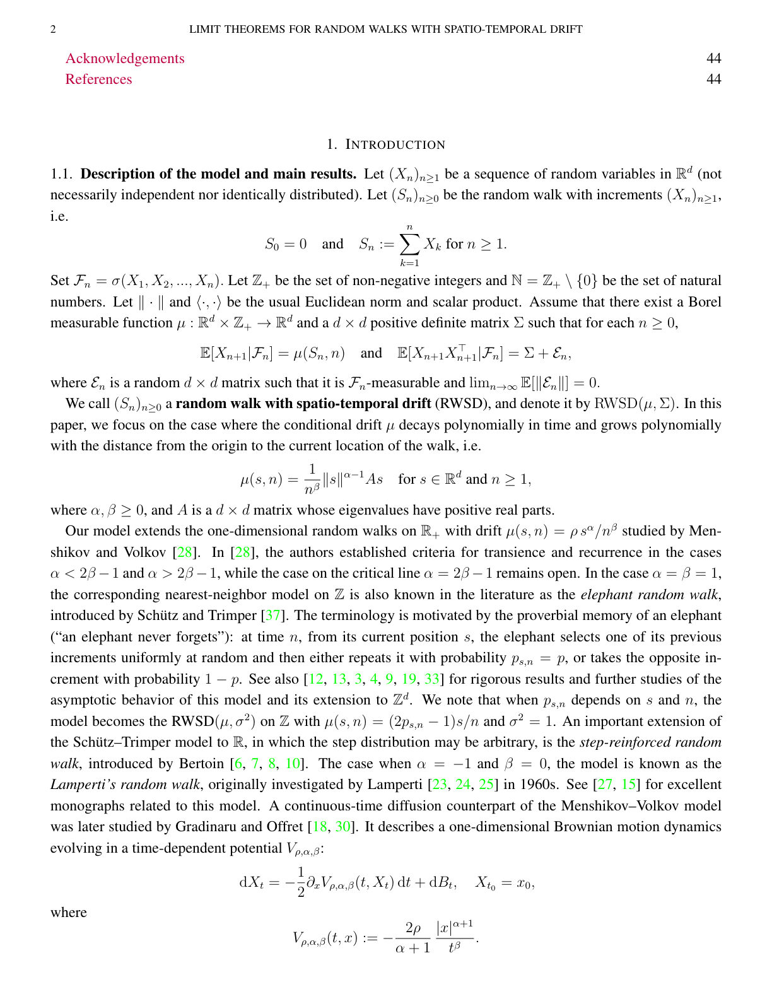 
Low-resolution page preview, page 2

📷 Fig 2

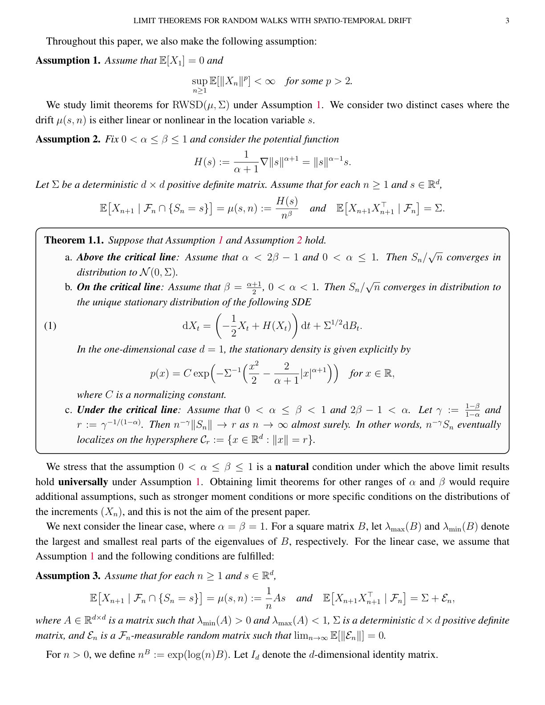 
Low-resolution page preview, page 3

📷 Fig 3

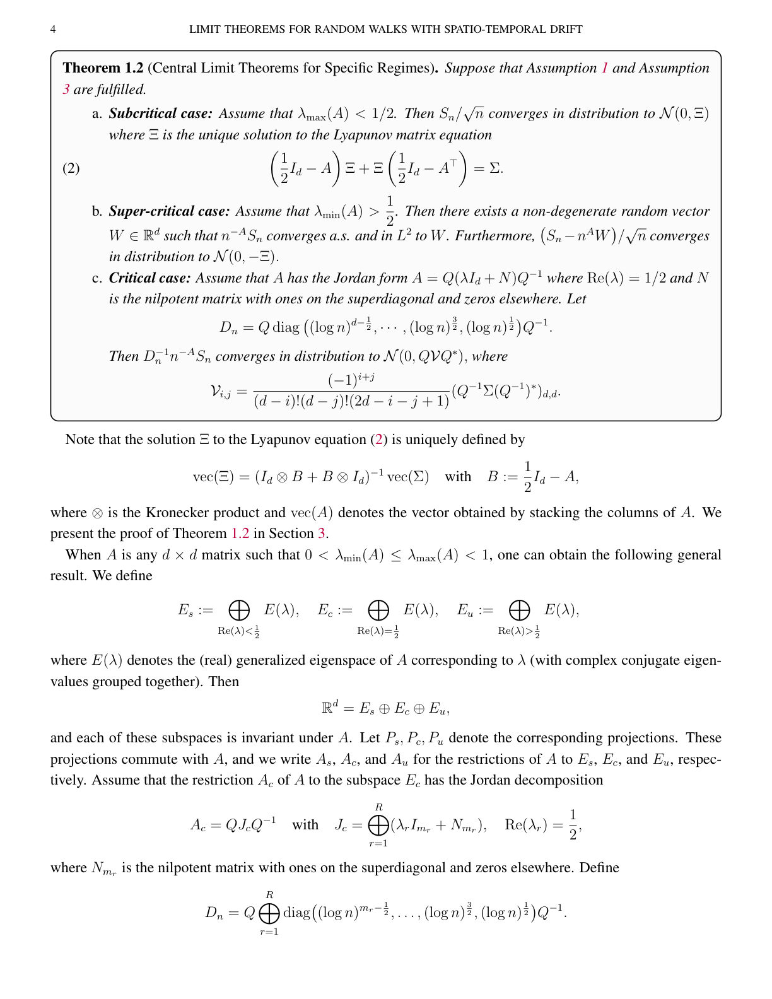 
Low-resolution page preview, page 4

📷 Fig 4

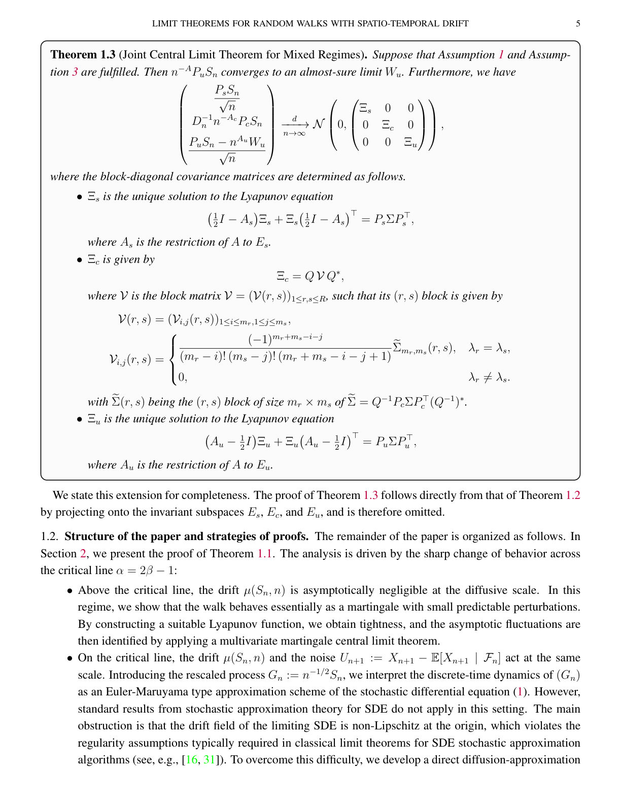 
Low-resolution page preview, page 5

📷 Fig 5

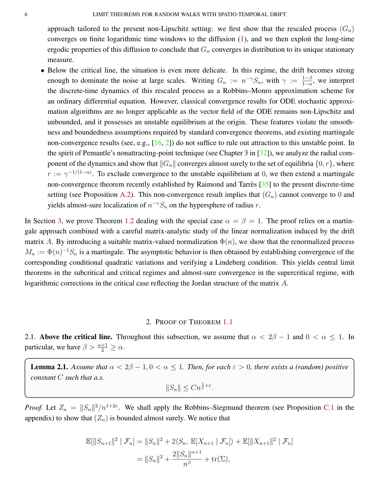 
Low-resolution page preview, page 6

**Summary.** This paper provides a complete classification of the long-term behavior of random walks with complex, time-dependent, and position-dependent drifts. It identifies how varying the strength of the drift relative to noise leads to transitions between diffusive, SDE-driven, and localized states.

**Why it may be interesting.** The study of phase transitions and localization in stochastic processes with memory and spatio-temporal dependence is highly relevant to understanding non-equilibrium dynamics and many-body localization in open quantum systems.

Detailed structure

**Main problem.** The paper investigates the asymptotic behavior and limit theorems for a class of discrete-time random walks in R^d characterized by spatio-temporal drift.

**Main result.** The authors establish a phase transition in the convergence of the normalized process, identifying three distinct regimes in the nonlinear case: Gaussian convergence, convergence to an SDE-based stationary distribution, and almost sure localization on a hypersphere.

**Method.** The study employs martingale theory, multivariate martingale central limit theorems, Lyapunov functions, and diffusion approximations to analyze the process.

**Model / system.** A discrete-time random walk in R^d where the conditional drift decays polynomially in time and grows polynomially with the distance from the origin, related to models like the Elephant Random Walk and self-interacting processes.

**Key observables.** The asymptotic distribution of the scaled position (normalized process), the scaling exponent gamma, and the asymptotic covariance matrix.

**Important parameters / regimes.** Spatial scaling exponent (alpha), temporal scaling exponent (beta), and the eigenvalues of the drift matrix (A).

**Assumptions / limitations.** Increments must have moments of order p > 2; the drift field may be non-Lipschitz at the origin; the covariance matrix Sigma is assumed to be positive definite.

**Paper structure.** The paper begins by defining the RWSD model and its regimes, followed by proofs for the nonlinear case (Theorem 1.1) and the linear case (Theorem 1.2/1.3), and concludes with an appendix on non-convergence and martingale CLT tools.

Abstract

We study a class of discrete-time random walks in $\mathbb{R}^d$ whose conditional drift decays polynomially in time and grows polynomially with the distance from the origin to the current position. This class is related to several models of self-interacting random processes. We determine the asymptotic behavior of the walk under the assumption that its increments have moments of order $p$ for some $p>2$. In the linear case, where the drift depends linearly on the current position, we establish a phase transition in the convergence in distribution of the normalized process to Gaussian limits. In the nonlinear case, we identify three distinct regimes separated by a critical line and show that the normalized process exhibits qualitatively different behaviors in each regime, including convergence in distribution to a Gaussian law, convergence to a non-Gaussian limit given by the stationary distribution of a stochastic differential equation, and almost sure localization on a hypersphere.

[↑ back to top](#top)

### [Quantum Error Correction Assisted Axion Search in CMOS Spin Qubit Arrays](http://arxiv.org/abs/2605.17457v1)

**Authors:** Xiangjun Tan, Zhanning Wang  
**Type:** theory · **Category:** quantum information and computing · **PDF:** <https://arxiv.org/pdf/2605.17457v1>  
**Analysis basis:** full PDF text, analyzed in chunks
**Topic relevance:** `correlated / nonlocal dissipation` **2/5** · `entanglement & information structure` **2/5** · `quantum measurements` **2/5** · `spintronics-quantum-optics interface` **2/5**

📷 Fig 1

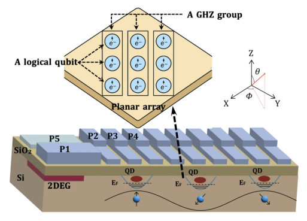 
FIG. 1. A schematic planar silicon quantum dot array. In this specific design, we focus on a quantum dot array in the silicon layer. By applying a gate electric field via gate P1, electrons accumulate in silicon and are confined vertically against the silicon oxide (indicated at the location of the two- dimensional electron gas). The single quantum dot is formed using gates P2-P5. The gates P2 and P4 provide confinement in the x-direction, while gate P5 provides confinement in the y-direction. P3 is used as the top gate of the quantum dot, accumulating a single electron in the potential well beneath. Then the quantum dot array repeats the set-up for P2-P4. In the upper half of the figure,...

📷 Fig 2

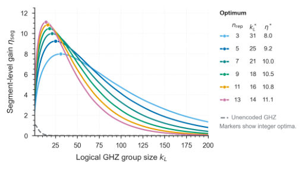 
FIG. 2. Sensitivity improvement gain factor η(kL) for QEC- protected GHZ blocks of logical size k, evaluated for fu- ture possible semiconductor spin qubit dephasing param- eters. Curves correspond to repetition codes of distance nrep = 3 −13, with peaks marked for the high confidence dis- tances nrep = 9 −13. The maximal enhancement ηmax grows monotonically with code distance, while the optimal GHZ size k decreases, reflecting suppression of uncorrelated dephasing by QEC. For comparison, the unencoded GHZ (grey) achieves only a weak enhancement and rapidly becomes worse than SQL for large k, whereas QEC recovers a finite and robust en- tangled sensing window. Uncorrelated dephasing is...

📷 Fig 3

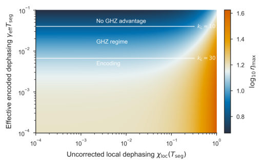 
FIG. 3. Regimes of QEC benefit for entanglement-based ax- ion sensing. The color scale shows the maximal sensitivity enhancement factor ηmax on a logarithmic scale as a func- tion of the uncorrected single-qubit dephasing γlocTseg and the effective logical dephasing γeffTseg. White solid contours indicate the optimal logical GHZ size k∗ L, while the dashed contour marks ηmax = 1. The plot delineates distinct pa- rameter regions corresponding to different balances between signal amplification and dephasing in QEC-protected entan- gled sensing.

📷 Fig 4

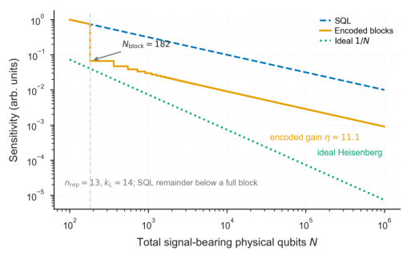 
FIG. 5. Scaling of the projected axion-coupling sensitiv- ity with the total number of signal-bearing physical qubits N. The SQL benchmark follows the expected N −1/2 behav- ior. The encoded curve uses complete QEC-protected logi- cal GHZ blocks with (nrep, kL) = (13, 14), so the first com- plete encoded block appears at Nblock = nrepkL = 182. For N &lt; Nblock, the encoded architecture has no complete block and therefore coincides with the SQL baseline. For larger N, complete encoded blocks are instantiated discretely, while leftover physical qubits are treated as SQL resources, pro- ducing the visible staircase. At large N, the encoded sen- sitivity approaches the SQL scaling with a constant...

📷 Fig 5

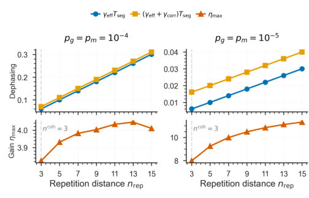 
FIG. 4. Comparison of the logical dephasing and achievable metrological gain for realistic and optimistic control fidelities. Left: pg = pm = 10−4 (future possible error parameters of Tab. I). The logical dephasing γeffTseg is minimized at a small repetition distance ncoh rep ≈3, while the metrological gain ηmax saturates at ∼5 for nrep ≳10 due to the measurement in- duced logical error floor. Right: pg = pm = 10−5, represent- ing a next-generation regime. Both γeffTseg and ηmax improve, with ηmax reaching above 10, but the qualitative tradeoff and the location of the coherence-optimal code distance remain unchanged.

**Summary.** The paper proposes using quantum error correction to enhance the detection of axion dark matter using silicon spin qubit arrays. By using a repetition code to suppress local dephasing, the authors show that entanglement-enhanced sensing can be restored, significantly improving the sensitivity to axion-electron coupling.

**Why it may be interesting.** This paper is highly relevant to open quantum systems and quantum metrology, as it demonstrates how active error correction can be used to preserve quantum coherence for sensing tasks in the presence of non-Markovian and correlated noise.

Detailed structure

**Main problem.** Searching for axion dark matter using semiconductor spin qubits is limited by strong longitudinal dephasing, which suppresses the sensitivity gains of entanglement.

**Main result.** Quantum error correction (QEC) using a repetition code can mitigate local dephasing, restoring entanglement-enhanced sensing and providing up to an order-of-magnitude improvement in sensitivity to axion-electron coupling.

**Method.** The authors derive closed-form expressions for Quantum Fisher Information by integrating an optimal repetition code with logical GHZ block entanglement and optimizing the logical block size.

**Model / system.** The system consists of CMOS-compatible silicon spin qubit arrays (quantum dots) interacting with a classical, spatially coherent axion field that acts as an effective oscillating pseudo-magnetic field.

**Key observables.** Axion-electron coupling (gae), Quantum Fisher Information (QFI), and spin polarization sidebands.

**Important parameters / regimes.** Axion mass (10^-6 to 10^-3 eV), dephasing rates (local and correlated), QEC cycle frequency, and the Standard Quantum Limit (SQL).

**Assumptions / limitations.** The axion field is treated as a classical, spatially coherent field with a wavelength much larger than the qubit array; the repetition code specifically targets local phase-flip errors.

**Figures summary.** Figure 1 shows a schematic of a planar silicon quantum dot array with gates and repetition code blocks; Figure 2 shows the sensitivity improvement gain as a function of logical size; Figure 3 illustrates QEC benefit regimes; Figure 5 shows the scaling of sensitivity with the total number of physical qubits.

**Paper structure.** The paper introduces the dark matter search problem, defines the spin-qubit-axion interaction Hamiltonian, implements a QEC-protected GHZ protocol, analyzes the resulting Fisher information and sensitivity gains, and concludes with a scaling analysis and projection onto realistic CMOS hardware parameters.

Abstract

Searches for axion and axionlike dark matter based on solid-state spin qubits are fundamentally limited by strong longitudinal dephasing, which rapidly suppresses the sensitivity gains offered by entanglement. Here we show that quantum error correction (QEC) can substantially enhance axion search sensitivity in realistic semiconductor spin qubit platforms by mitigating this dominant noise source. By integrating an optimally chosen repetition code QEC with logical GHZ block entanglement, we derive closed-form expressions for the quantum Fisher information that explicitly incorporate the finite coherence time of the axion field. Our analysis demonstrates that modest QEC cycle frequencies are sufficient to significantly reduce the effective dephasing rate, thereby restoring a broad parameter regime in which entanglement-enhanced sensing surpasses the standard quantum limit. Projecting these results onto CMOS-compatible device parameters, we find that QEC-protected entangled sensing can revive otherwise inaccessible quantum advantages, yielding up to order-of-magnitude improvements in sensitivity to the axion-electron coupling $g_{ae}$. These results establish a practical and theoretically controlled pathway for using QEC to improve qubit array searches for physics beyond the Standard Model.

[↑ back to top](#top)

### [Quantum-Battery-Powered Geometric Landau-Zener Interferometry](http://arxiv.org/abs/2605.18108v1)

**Authors:** Borhan Ahmadi  
**Type:** theory · **Category:** quantum information and computing · **PDF:** <https://arxiv.org/pdf/2605.18108v1>  
**Analysis basis:** full PDF text, analyzed in chunks
**Topic relevance:** `Tavis-Cummings & cavity-many-emitter` **2/5** · `methods for driven-dissipative` **2/5** · `non-equilibrium dynamics` **2/5** · `quantum measurements` **2/5**

📷 Fig 1

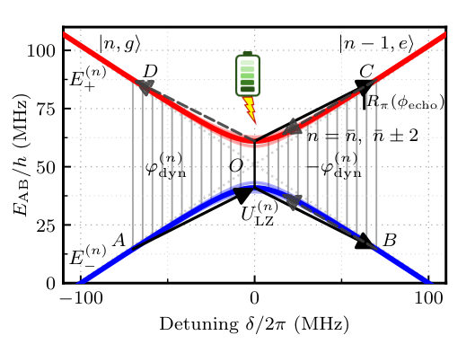 
FIG. 1: Photon-number-resolved Landau–Zener passages powered by a finite quantum battery. During each Jaynes–Cummings sweep segment, |n, g⟩and |n −1, e⟩ form dressed adiabatic branches E(n) AB separated by Ωn = Ω p

📷 Fig 2

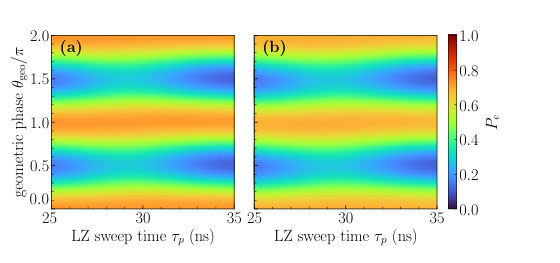 
FIG. 2: Finite-battery geometric Landau–Zener in- terference. The final excited-state population Pe = Tr[ρ(τC)|e⟩⟨e|] is shown as a function of the geometric phase θgeo and the Landau–Zener sweep time τp. (a) Classical-drive limit, obtained from the corresponding transverse-field Hamiltonian with the same mean gap Ω/2π = 20 MHz. (b) Full quantum-battery evolution for a coherent battery with ¯n = 5, using g = Ω/(2√¯n). Both panels use the same color scale. The finite bat- tery preserves the echo-protected geometric fringe pat- tern, but the extrema are softened and weakly distorted by the photon-number-resolved gaps Ωn = Ω p

📷 Fig 3

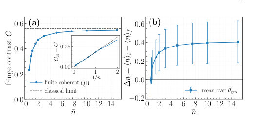 
FIG. 3: Quantum-to-classical recovery and battery back- action. (a) Fringe contrast C = maxθgeo Pe −minθgeo Pe for a coherent quantum battery as a function of the mean photon number ¯n. The dashed line gives the correspond- ing classical-drive limit with the same qubit relaxation and dephasing rates. The inset shows the contrast deficit Ccl−C versus 1/¯n, illustrating the approach to the classi- cal limit as photon-number fluctuations become relatively small. (b) Battery back-action, quantified by the photon- number change ∆n = ⟨n⟩i−⟨n⟩f, averaged over θgeo. Er- ror bars denote the standard deviation over the geomet- ric phase, not numerical uncertainty. The mean photon- number change...

📷 Fig 4

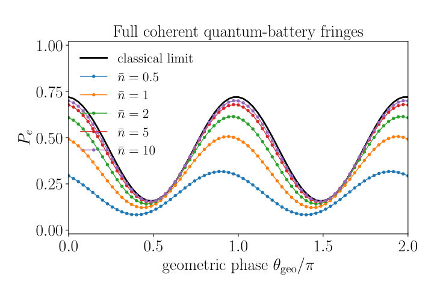 
FIG. 1: Coherent quantum-battery fringes for different mean photon numbers. The final excited-state population Pe is shown as a function of the geometric phase θgeo for coherent batteries with ¯n = 0.5, 1, 2, 5, 10, together with the classical-drive limit. All curves are obtained from the full qubit–battery master equation, with the coupling calibrated as g = Ω/(2√¯n) so that the central photon-number sector has the same nominal gap Ω. As ¯n increases, the finite- battery fringe approaches the classical response. At small ¯n, the fringe contrast is reduced because the coherent state contains a broad distribution of photon-number components, each generating a different Landau–Zener gap...

📷 Fig 5

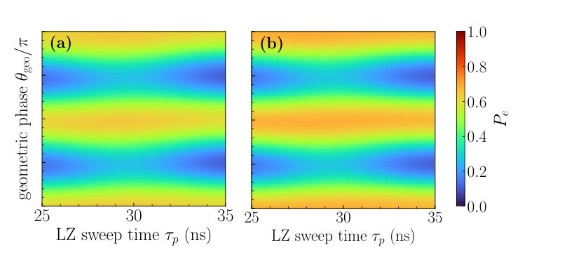 
FIG. 2: Finite-coherent-battery heatmaps at few-quanta occupation. The final excited-state population Pe is shown as a function of the geometric phase θgeo and the Landau–Zener sweep time τp, using the full qubit–battery master equation. Panels show coherent batteries with (a) ¯n = 2 and (b) ¯n = 5, with the coupling calibrated as g = Ω/(2√¯n) in each case so that the central photon-number sector has the same nominal gap Ω. All other parameters are the same as in the main text: Ω/2π = 20 MHz, δ0/2π = 100 MHz, τC = 100 ns, T1 = 118 ns, T2 = 157 ns, κ = 10−4 ns−1, and ¯nth = 0. The geometric fringe pattern is already visible for ¯n = 2, demonstrating that a macroscopically occupied drive is...

**Summary.** The paper examines the performance of a geometric Landau-Zener interferometer powered by a finite quantum battery instead of a classical drive. It demonstrates that maintaining a coherent phase reference is more critical for interference contrast than reducing photon-number fluctuations. Consequently, standard coherent states outperform squeezed states for high-fidelity geometric control.

**Why it may be interesting.** This paper is highly relevant to researchers in open quantum systems and quantum optics as it explores the fundamental limits of using non-classical energy reservoirs for coherent control and quantifies the trade-off between energy fluctuations and phase coherence.

Detailed structure

**Main problem.** Investigating whether a finite quantum battery can replace classical phase-coherent microwave drives for superconducting qubit control and determining if energy alone or phase-coherent energy is the critical resource for geometric control.

**Main result.** The study finds that reducing photon-number fluctuations via squeezing is insufficient for improving interference contrast because the loss of the coherent phase-reference strength outweighs the benefits of reduced gap broadening; coherent states provide the optimal balance.

**Method.** Full density-matrix evolution using a Lindblad master equation and an adaptive eighth-order Runge-Kutta solver to account for qubit-battery dynamics and back-action.

**Model / system.** A two-level system (qubit) coupled to a single quantized bosonic mode (the quantum battery) via a Jaynes-Cummings Hamiltonian, undergoing a Landau-Zener-Stueckelberg interferometry protocol with an echo pulse.

**Key observables.** Final excited-state population (interferogram contrast), fringe contrast (C), photon-number change (battery back-action), and the coherent phase-reference fraction (eta_coh).

**Important parameters / regimes.** Mean photon number (n_bar), photon-number variance, coupling strength (g), and the coherent fraction (eta_coh); regimes include the macroscopic coherent-state limit and the few-quanta quantum regime.

**Assumptions / limitations.** The echo pulse is treated as a qubit-only operation that does not act on the battery; the rotating-wave approximation is applied.

**Figures summary.** Figure 1 shows a schematic of photon-number-resolved Landau-Zener passages and dressed adiabatic branches; Figure 3 compares performance across different battery states.

**Paper structure.** The paper introduces the problem of replacing classical drives with quantum batteries, defines the Jaynes-Cummings model and the GLZI protocol, analyzes the impact of photon-number fluctuations and gap broadening, compares various battery states (coherent vs. squeezed), and concludes with the necessity of a phase reference.

Abstract

Classical microwave drives are usually treated as ideal phase-coherent work sources for superconducting-qubit control. What if such a drive is replaced by a finite quantum battery. As a demanding benchmark, we consider echo-refocused geometric Landau--Zener interferometry powered by a single quantized bosonic mode. The qubit--battery dynamics are described by a Jaynes--Cummings Hamiltonian, while the echo pulse is retained as a qubit-only refocusing operation that cancels the dynamical phase. In the macroscopic coherent-state limit, the usual classical geometric interferometer is recovered. At finite mean photon number, however, the Jaynes--Cummings coupling generates photon-number-resolved avoided crossings with gaps $Ω_n=2g\sqrt{n}$. The qubit-only echo redistributes amplitudes between neighboring excitation sectors, so the finite-battery protocol is not a single classical interferometer but a coherent sector-resolved quantum evolution. This produces contrast loss, interferogram distortions, and measurable battery back-action. We further show that reducing photon-number fluctuations alone is not sufficient: geometric control requires a first-order phase reference. Geometric Landau--Zener interferometry therefore provides a practical benchmark for certifying phase-coherent quantum-battery energy.

[↑ back to top](#top)

### [Can machine learning for quantum-gas experiments be explainable?](http://arxiv.org/abs/2605.18689v1)

**Authors:** I. B. Spielman amd J. P. Zwolak  
**Type:** both · **Category:** quantum gases · **PDF:** <https://arxiv.org/pdf/2605.18689v1>  
**Analysis basis:** full PDF text, analyzed in chunks
**Topic relevance:** `QC/QI experiment` **2/5** · `analog quantum simulation` **2/5** · `quantum measurements` **2/5**

📷 Fig 1

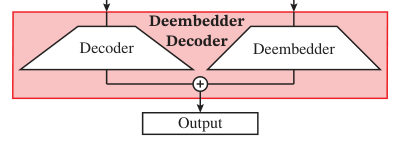 
FIG. 4. ResNet encoder-decoder. Data-flow is indicated by lines, while dimension-changing layers are denoted by trape- zoids. Functional groups are denoted by larger rectangles.

📷 Fig 2

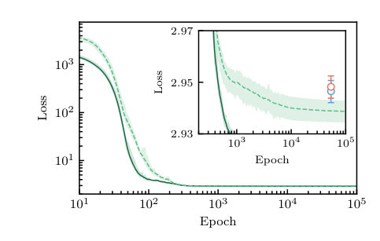 
FIG. 5. ResNet training with 8-fold cross-validation. Train- ing and validation data are denoted by solid and dashed curves, respectively, and include 1-sigma error bands. The inset zooms in on the fine-tuning stage of training, and the markers show the results for the linear models in Fig. 2 for conventional PCA (blue) and optimal linear (red).

📷 Fig 3

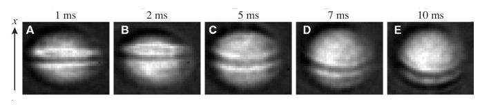 
FIG. 6. Images showing evolution of the BEC (measured after TOF) from 1 ms (panel A) to 10 ms (panel E) after imprinting a phase step of about 1.5π on the top half of the condensate. A positive density disturbance is moving rapidly in the +x direction, while a dark solitonic excitation (most likely a vortex ring) is moving significantly slower in the −x direction (opposite to the direction of the applied force). Reproduced with permission from Ref. [6].

**Summary.** This paper investigates whether machine learning for cold-atom experiments can be both accurate and explainable. By comparing CNNs to Explainable Boosting Machines, the authors show that physics-informed, interpretable models can effectively classify quantum gas excitations like solitons and vortices.

**Why it may be interesting.** It addresses a critical bottleneck in many-body dynamics experiments: how to use powerful ML tools to extract physical signals from noisy, high-volume data without losing the ability to verify the underlying physics.

Detailed structure

**Main problem.** The challenge of applying machine learning to quantum-gas experiments while balancing high performance with scientific interpretability and avoiding the 'black-box' memorization of imaging artifacts.

**Main result.** The authors demonstrate that Explainable Boosting Machines (EBMs) can match or surpass CNN performance in classifying excitations like solitons and vortices, providing human-readable, physics-aligned explanations.

**Method.** The study compares traditional linear algebra, CNNs (U-Nets, ResNet), and Explainable Boosting Machines (EBMs) applied to image denoising and feature classification.

**Model / system.** The physical platform consists of neutral-atom quantum simulators, specifically Bose-Einstein Condensates (BECs), using bright-field imaging (absorption or phase-contrast) to detect solitons and vortices.

**Key observables.** Atomic density (optical depth), soliton position, velocity, depth, and width, and vortex vorticity.

**Important parameters / regimes.** Probe wavelength, resonant absorption cross-section, and photon shot noise levels.

**Assumptions / limitations.** The signal of interest is assumed to be concentrated within a specific interior region of the imaging window.

**Figures summary.** Figure 1 shows the imaging system and comparison of reconstruction methods; Figure 2 illustrates PCA eigenvalue spectra and templates; Figure 4 shows the ResNet architecture; Figure 10/11 display excitation classes and EBM feature importance/shape functions.

**Paper structure.** The paper introduces the imaging challenges, compares linear algebra vs. ML for reference reconstruction, evaluates CNNs vs. EBMs for excitation classification, and concludes on the feasibility of explainable scientific ML.

Abstract

Virtually all aspects of many-body atomic physics are challenging: experiments are technically demanding, datasets have become enormous, and the memory and CPU requirements for classical simulation of generic quantum systems often scale exponentially with system size. Machine learning (ML) methods are already assisting in each of these areas and are poised to become transformative. Here, we focus on two specific applications of ML to cold-atom-based quantum simulators. These devices generally generate data in the form of images; we first showcase denoising of raw images and then identify solitonic waves in Bose-Einstein condensates. In both of these examples, we comment on the interplay between performance, model complexity, and interpretability.

[↑ back to top](#top)

### [Central Limit Theorem for Bosonic Quantum Channels](http://arxiv.org/abs/2605.16782v1)

**Authors:** Hami Mehrabi, Ludovico Lami, Mark M. Wilde  
**Type:** theory · **Category:** quantum information and computing · **PDF:** <https://arxiv.org/pdf/2605.16782v1>  
**Analysis basis:** full PDF text, analyzed in chunks
**Topic relevance:** `entanglement & information structure` **2/5** · `methods for driven-dissipative` **2/5** · `quantum measurements` **2/5**

📷 Fig 1

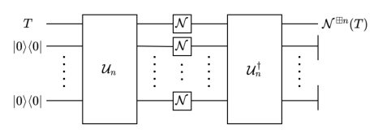 
FIG. 1: Symmetric convolution of channel N with itself.

📷 Fig 2

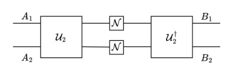 
FIG. 2: Extension of the 2-fold symmetric convolution.

**Summary.** This paper develops a Central Limit Theorem for bosonic quantum channels, showing that repeated symmetric convolutions of a channel converge to a Gaussian channel. This result unifies classical and quantum limit theorems and allows for the derivation of new uncertainty relations and tight lower bounds on the quantum capacity of linear bosonic channels.

**Why it may be interesting.** This is highly relevant for researchers in quantum optics and open quantum systems as it establishes Gaussian channels as the fundamental limit of repeated channel applications and provides new tools for bounding the capacity of continuous-variable quantum communication.

Detailed structure

**Main problem.** The paper aims to extend the Central Limit Theorem (CLT) from classical probability and quantum states to the setting of bosonic quantum channels, establishing Gaussian channels as extremal objects.

**Main result.** The authors prove that the n-fold symmetric convolution of a bosonic channel converges to a Gaussian bosonic channel, providing a unified framework that recovers both the classical CLT and the CLT for bosonic states.

**Method.** The study uses the Heisenberg picture, Weyl representation, and n-beam splitter unitaries to define a symmetric convolution of channels, analyzing convergence via the pointwise convergence of characteristic functions.

**Model / system.** The system consists of single-mode and multi-mode bosonic quantum systems (continuous-variable systems) described by quadrature operators and canonical commutation relations, specifically focusing on linear bosonic channels.

**Key observables.** First-order moments (displacement), second-order moments (covariance matrix), characteristic functions, and energy-constrained quantum capacity.

**Important parameters / regimes.** The n-fold convolution limit (n to infinity), energy-constrained regime (E >= 0), and the scaling function of the channel.

**Assumptions / limitations.** The results assume finite second-order moments for the channel, finite first-order moments, and specifically rely on the linearity of the channel for the capacity lower bound.

**Figures summary.** Figure 1 provides a schematic diagram illustrating the construction of the symmetric convolution of a channel using an n-beam splitter unitary.

**Paper structure.** The paper introduces the problem of extending the CLT to channels, defines the symmetric convolution mechanism, proves the convergence to Gaussian channels (the qCLT for channels), demonstrates the recovery of classical and state-based CLTs, and applies the result to derive uncertainty relations and capacity lower bounds.

Abstract

In this paper, we develop an extension of the Central Limit Theorem (CLT) to the setting of bosonic quantum channels. This extension provides a deeper understanding of Gaussian bosonic channels as extremal objects. Using our CLT for bosonic quantum channels, we recover both the classical CLT and the CLT for bosonic quantum states, thereby offering a unified perspective that connects classical probability theory with continuous-variable quantum systems. Moreover, using our result, we can provide necessary uncertainty relations that every physical (possibly non-Gaussian) bosonic quantum channel must satisfy. As another application of our limit theorems, we derive tight lower bounds on the energy-constrained quantum capacity of linear bosonic channels by relating it to the capacity of their associated Gaussian bosonic channels, further reinforcing the role of Gaussian channels as extremal.

[↑ back to top](#top)

### [Quantum Expectation Identities for the Three-State Model of a Molecular Domain](http://arxiv.org/abs/2605.17713v1)

**Authors:** Boris Maulén, Roberto C. Bochicchio  
**Type:** theory · **Category:** statistical mechanics · **PDF:** <https://arxiv.org/pdf/2605.17713v1>  
**Analysis basis:** full PDF text, analyzed in chunks
**Topic relevance:** `entanglement & information structure` **2/5** · `methods for driven-dissipative` **2/5** · `non-equilibrium dynamics` **2/5**

📷 Fig 1

 
Figure 1: (a) Transferred fraction of charge ν and (b) variance (electron fluctuation) as a function of the control parameter γ, for different values of the maximum charge capacity q.

📷 Fig 2

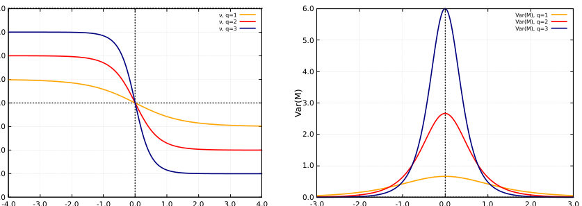 
Fig. 1b displays the variance (dispersion) Varˆρ( ˆ M) of the number of particles ˆ M in the state ˆρ of the domain, for different q values, as a function of the chemical potential γ (Eq. (18)). The variance reaches its maximum value at γ = 0, which indicates that the electrons neither have a tendency to enter nor to leave the domain. There is no cost in energy to accept or to donate an electron, whence a maximum fluctuation is observed. On the other hand, the limits of Varˆρ as γ approaches ∓∞converge to 0, corresponding to the pure states of N ± q, respectively: the variance vanishes for both acceptor and donor regimes. Note that these states are not physical and cannot be reached....

📷 Fig 3

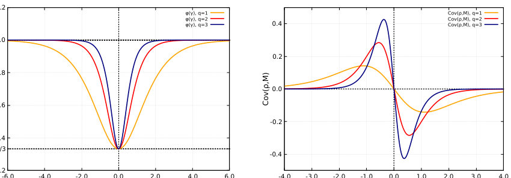 
Figure 2: (a) Quantum purity and (b) covariances for a molecular domain handled as a function of γ for diffrent values of charge q (q = 1, 2, 3). The covariances were obtained by use of the instance of the p-FDT shown in Eq. (26).

**Summary.** This paper develops a theoretical framework using the Quantum Expectation Identity to describe the electronic properties of a molecular domain. It establishes a direct link between the change in quantum purity and the statistical covariance of the particle number. The results provide analytical tools to study how open quantum systems respond to changes in their chemical environment.

**Why it may be interesting.** It provides a rigorous statistical mechanical framework for understanding how fluctuations and correlations in open quantum systems (like molecular domains) relate to fundamental properties like purity and chemical potential.

Detailed structure

**Main problem.** Establishing analytical relationships between quantum observables, such as electronic population and chemical potential, and their derivatives within a molecular domain treated as an open quantum system.

**Main result.** The derivation of the Quantum Expectation Identity (QEI) applied to a three-state model, specifically finding that the derivative of quantum purity with respect to chemical potential is proportional to the negative covariance between the density matrix and the number operator.

**Method.** The study utilizes the Quantum Expectation Identity (QII) theorem and a Jaynesian inferential approach (maximizing von Neumann entropy) under constraints of particle number fluctuation.

**Model / system.** A three-state model of a molecular domain (or basin) treated as an open quantum system. The density matrix is expanded using a neutral state, a cationic state, and an anionic state, using a canonical-like ensemble where the number operator replaces the Hamiltonian.

**Key observables.** Electronic population, chemical potential, maximum charge capacity (q), quantum purity, and particle number variance.

**Important parameters / regimes.** Chemical potential (gamma), fractional charge (nu), and charge capacity (q); regimes include the pure state limit (gamma to infinity) and maximum disorder (gamma = 0).

**Assumptions / limitations.** The temperature effects are excluded; the test operator must be compatible with the density matrix; the density matrix must be non-singular.

**Figures summary.** Figure 1a shows the transferred charge fraction as a function of chemical potential for various q values; Figure 2a shows quantum purity transitioning from 1/3 to 1; Figure 2b shows the covariance between the density matrix and particle number.

**Paper structure.** The paper begins by defining the three-state model and the QEI theorem, progresses to deriving analytical expressions for particle number and variance, explores the dynamics of quantum purity and its correlation with the number operator, and concludes with an analysis of specific physical regimes.

Abstract

The electronic distribution of a molecular domain is examined in this study. A theoretical formulation of quantum molecular properties is presented using the Quantum Expectation Identity theorem (QEI), with a focus on the three-state model of the density matrix for the quantum state of a molecular domain as an open system. The report examines the relationship between ab initio statistical fluctuation-correlation theorems for quantum observables and their derivatives. We focus on three main quantities of a domain: the electronic population, its chemical potential, and its maximum capacity for accepting or donating charge with the neighbors. The analytical expressions for the quantities are presented and discussed in detail. At the end, we explore the concept of quantum purity and its proper application in the molecular domain.

[↑ back to top](#top)

### [Strategy optimization for quantum conference key agreement in asymmetric star networks](http://arxiv.org/abs/2605.18677v1)

**Authors:** Janka Memmen, Julia Kunzelmann, Nathan Walk, Jens Eisert, Julius Wallnöfer  
**Type:** theory · **Category:** quantum information and computing · **PDF:** <https://arxiv.org/pdf/2605.18677v1>  
**Analysis basis:** full PDF text, analyzed in chunks
**Topic relevance:** `correlated / nonlocal dissipation` **2/5** · `entanglement & information structure` **2/5** · `methods for driven-dissipative` **2/5**

📷 Fig 1

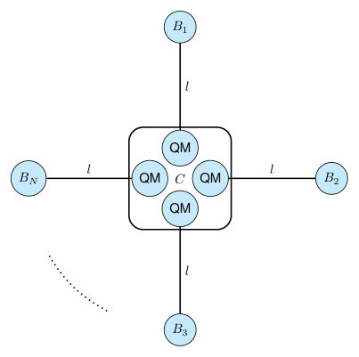 
Figure 1: Star network representing a symmetric single-memory multipartite quantum repeater. The N parties Bi are located around the central station C at equal distances l. The central quantum repeater provides a single quantum memory (QM) for each party.

📷 Fig 2

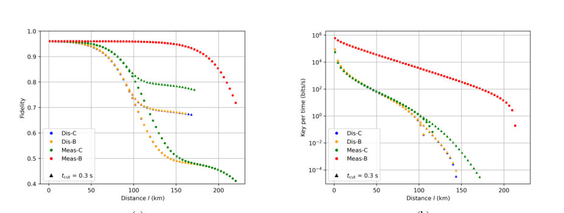 
Figure 2: Fidelities (a) and key rates (b) for the different strategies in dependence of a single link’s distance for a fully symmetric star network with N = 4 participants. The different markers symbolize whether a cutoff time of tcut = 0.3 s was used or not. Other parameters are chosen as: PLINK = 1, FINIT = 0.99, TP = 10−6 s, PD = 10−6, Tdp = 1 s, m = 1.

📷 Fig 3

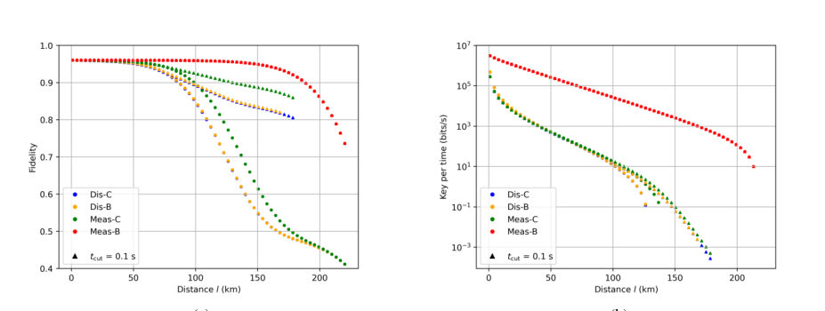 
Figure 3: Fidelities (a) and key rates (b) for the different strategies in dependence of a single link’s distance l for a fully symmetric star network with N = 4 parties, when every party can make use of m = 5 quantum memories. The different markers symbolize whether a cutoff time of tcut = 0.1 s has been used or not. Other parameters are chosen as PLINK = 1, FINIT = 0.99, TP = 10−6 s, PD = 10−6, Tdp = 1 s.

📷 Fig 4

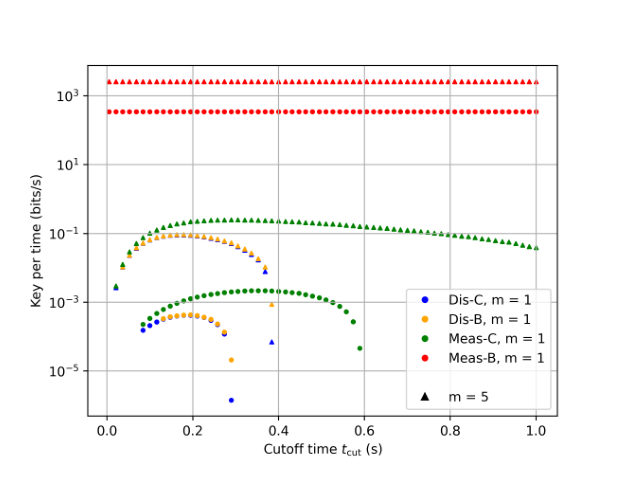 
Figure 4: Key rates in dependence of different cutoff times for a completely symmetric star network, when every parties possesses a single memory (round markers) or m = 5 memories (triangle markers). Other parameters are chosen as N = 4, l = 150 km, PLINK = 1, FINIT = 0.99, TP = 10−6 s, PD = 10−6, Tdp = 1 s.

📷 Fig 5

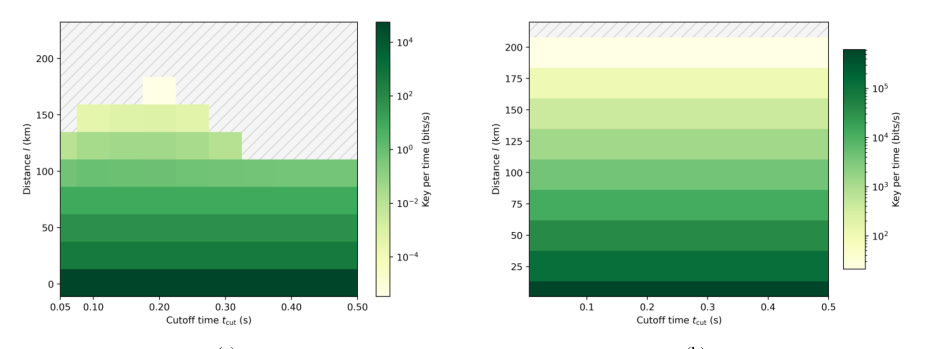 
Figure 5: Key rates in dependence of the applied cutoff time tcut and the distance for the scenario Dis-C (a) and Meas-B (b). Other parameters are chosen as: N = 4, PLINK = 1, FINIT = 0.99, TP = 10−6 s, PD = 10−6, Tdp = 1 s, m = 1.

**Summary.** This paper investigates how to optimize quantum conference key agreement in asymmetric star networks by using cutoff times to discard decohered qubits. The authors demonstrate that such strategies, along with memory multiplexing, can significantly extend the achievable distance and improve the security of multipartite entanglement distribution.

**Why it may be interesting.** The study addresses the management of decoherence in multi-node quantum networks, which is highly relevant to the development of scalable quantum communication architectures and open quantum system dynamics in networked environments.

Detailed structure

**Main problem.** Optimizing strategies for Quantum Conference Key Agreement (CKA) in asymmetric star networks to mitigate the impact of memory dephasing and decoherence.

**Main result.** Implementing 'cutoff time' strategies (discarding qubits after a certain duration) significantly enhances state fidelity and can enable secure key generation in regimes where standard protocols fail.

**Method.** Numerical Monte Carlo simulations using the NetSquid and ReQuSim frameworks to evaluate key rates and fidelity across various network configurations.

**Model / system.** A star-shaped quantum network consisting of a central station and multiple clients, utilizing GHZ state distribution, quantum memories with dephasing noise, and asymmetric link distances.

**Key observables.** Secure key rate (K_CKA), Quantum Bit Error Rate (QBER), and GHZ state fidelity.

**Important parameters / regimes.** Number of parties (N), number of memories (m), cutoff time (t_cut), memory dephasing time (T_dp), and link distance (l).

**Assumptions / limitations.** Dephasing noise is biased towards one basis; dark count rate and initial fidelity are fixed; the university network scenario is fictitious.

**Figures summary.** Figures show the improvement in fidelity and relative advantage in key rates using cutoff times as a function of dephasing time and distance, as well as the advantage of multipartite vs. bipartite protocols.

**Paper structure.** The paper introduces the CKA problem in star networks, describes the physical model and noise parameters, presents numerical simulation results for symmetric and asymmetric scenarios, evaluates the impact of memory multiplexing and cutoff times, and compares multipartite vs. bipartite advantages.

Abstract

The distribution of entangled states is a core task for quantum networks facilitating quantum communication, and the use of multipartite entangled states comes with its own set of considerations. In this work, we analyze a quantum conference agreement protocol based on GHZ states in a network with a central station to which multiple clients are connected. Using comprehensive numerical simulations, we investigate how minor variations in the scenario-such as the number of parties, the number of memories, and asymmetric distances from the central station-can drastically influence the performance of the protocol. In particular, we demonstrate that it is crucial to adjust the strategy by optimizing cutoff times. From a broader perspective, we argue that numerical simulations are an indispensable tool for protocol design for devising realistic schemes for quantum communication.

[↑ back to top](#top)

### [Finite-frequency anomaly-induced electromechanical response of Dirac fermions in deformed graphene](http://arxiv.org/abs/2605.17632v1)

**Authors:** Ara Sedrakyan  
**Type:** theory · **Category:** strongly correlated electrons · **PDF:** <https://arxiv.org/pdf/2605.17632v1>  
**Analysis basis:** full PDF text, analyzed in chunks
**Topic relevance:** `Keldysh / 2PI / non-Gaussian methods` **2/5** · `non-equilibrium dynamics` **2/5**

📷 Fig 1

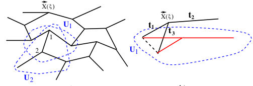 
FIG. 1. Local geometry of a deformed honeycomb sheet. (a) A deformed lattice is described by local patches, here denoted U1 and U2, which cover neighboring lattice sites and the link between them. The patch language keeps track of how the curved or distorted sheet is assembled from local coordinate systems. (b) A site at position ⃗X(ˆξ) in three-dimensional space is rotated into a local flat reference plane. These local rotations are the microscopic source of the geometric gauge fields that appear in the continuum Dirac theory.

📷 Fig 2

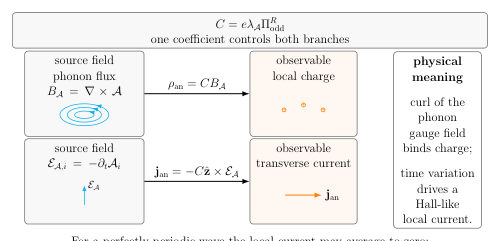 
FIG. 3. (Color online) In real space the response has a simple meaning. The phonon flux BA produces charge, while the phonon electric field EA produces a transverse current. The same coefficient C = eλAΠR odd controls both branches.

📷 Fig 3

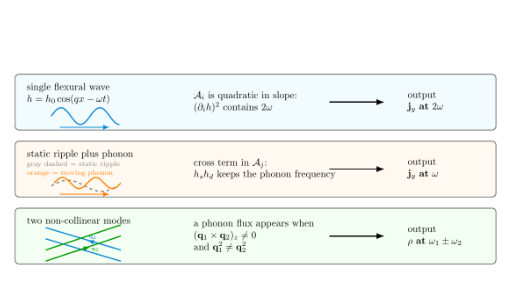 
FIG. 4. (Color online) The nonlinearity of Ai fixes the har- monic content: a single moving flexural wave gives a trans- verse current at 2ω, a static ripple plus a moving phonon gives a transverse current at the drive frequency ω, and two non- collinear modes give charge at ω1 ± ω2 when their emergent phonon flux is nonzero.

**Summary.** This paper demonstrates that mechanical deformations in graphene can generate transverse electrical currents through a parity-odd anomaly. It provides specific experimental signatures, such as frequency-doubled signals and gate-dependent decay, which allow for the direct detection of emergent gauge fields in deformed 2D materials.

**Why it may be interesting.** not directly relevant

Detailed structure

**Main problem.** Investigating the electromechanical response of Dirac fermions in deformed graphene induced by a finite-frequency anomaly and identifying experimental signatures to distinguish this from ordinary deformation-potential backgrounds.

**Main result.** The paper derives a mixed Chern-Simons relation where mechanical deformations generate a transverse electric current, predicting specific frequency harmonics (2w) and gate-voltage dependencies (1/|mu| decay) as clean experimental fingerprints.

**Method.** The author uses a continuum Dirac theory framework, evaluating the one-loop parity-odd current-current correlator and performing spin and valley summation to determine the observable charge response.

**Model / system.** The system consists of deformed, sublattice-asymmetric graphene (e.g., on hBN) modeled by low-energy Dirac fermions on a curved manifold with an emergent phonon gauge field.

**Key observables.** Transverse electric current, second-harmonic current (2w), charge modulation, and the effective phonon gauge field flux.

**Important parameters / regimes.** Dirac mass (m), chemical potential (mu), deformation gauge coupling (lambda_A), and frequency (omega).

**Assumptions / limitations.** The analysis assumes the weak-deformation limit, the continuum limit of the tight-binding model, and the one-loop approximation for the fermion-phonon interaction.

**Figures summary.** Fig 1 illustrates local geometry and geometric gauge fields; Fig 2 shows the Feynman diagram for the anomaly-induced signal and compares it to other vertices.

**Paper structure.** The paper introduces the geometric origin of the phonon gauge field, derives the mixed Chern-Simons response via one-loop calculations, analyzes the response in different doping regimes, and concludes with specific experimental selection rules and symmetry-based detection protocols.

Abstract

A deformation of a graphene sheet changes more than the positions of the atoms. In the low-energy Dirac theory it also produces geometric electron-phonon vertices. One of these vertices acts as an emergent phonon gauge field, $\calA_μ$, which couples to the same Dirac current as the electromagnetic vector potential. This shared current vertex gives a direct route from mechanics to electronics: a moving deformation can generate a transverse electric current, and a deformation pattern with emergent phonon flux can bind electric charge. We show that the coefficient of this mixed electromechanical response is the parity-odd current-current correlator of a massive Dirac cone. For an insulating cone the coefficient is the one-cone Chern-Simons value, while for a doped cone in the local regime it is reduced by the Berry curvature factor $m/|μ|$. We apply the response to explicit deformations. A traveling flexural wave generates a transverse second-harmonic current; a static ripple mixed with a dynamic phonon generates a transverse current at the drive frequency; and two non-collinear modes can generate charge modulation through the emergent phonon flux. We keep the spin and valley sum explicit, so the paper shows when the one-cone anomaly becomes a charge current in graphene and when it instead appears in a valley, spin, or spin-valley channel. For sublattice-gapped graphene with a valley-odd deformation gauge coupling, the two valleys add rather than cancel. The experimentally sharp signature is a transverse electrical signal at twice the flexural-wave frequency, with a phase fixed by the sign of the sublattice gap and a gate dependence that crosses over from a gap plateau to a $1/|μ|$ decay. These direction, phase, frequency, and gate-voltage selection rules give clean tests of the anomaly-induced electromechanical channel in deformed graphene.

[↑ back to top](#top)

### [Jones-Roberts solitary waves and the onset of rotation in a spherical surface condensate](http://arxiv.org/abs/2605.18297v1)

**Authors:** Noel Cuadra, Thomas Gasenzer, Davide Proment, Alberto Villois  
**Type:** theory · **Category:** quantum gases · **PDF:** <https://arxiv.org/pdf/2605.18297v1>  
**Analysis basis:** full PDF text, analyzed in chunks
**Topic relevance:** `analog quantum simulation` **2/5** · `non-equilibrium dynamics` **2/5**

📷 Fig 1

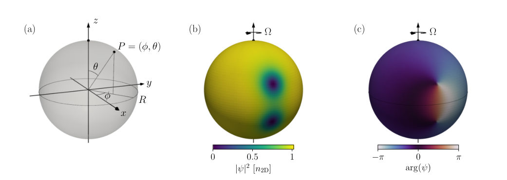 
FIG. 1. BEC localised within a thin spherical shell of radius R. (a) Angular coordinate system (ϕ, θ). Color-coded representation of (b) the density and (c) the phase angle of the complex field of a solitary wave, consisting of a dipole of two oppositely-charged vortices on a longitude, equidistant from the equator (marked by a thin grey line) and rotating with constant angular speed Ωabout the z-axis (here R = 10 and Ω≈0.030).

📷 Fig 2

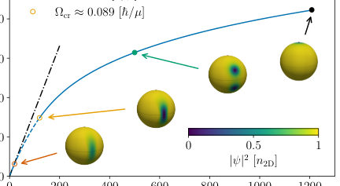 
FIG. 2. The energies Esw of the solitary wave solutions for a given angular momentum Lsw for the branch with a radius R = 10 of the sphere in units of the healing length (blue curve); the dotted line in- dicates solutions above the critical angular velocity Ωcr, i.e., vortex- free Jones–Roberts-type solitons. The slope of the black dashed- dotted line equals the maximum angular speed ΩLandau. The insets show the density field for four different solutions along the branch: a vortex-free soliton, the solution at the critical Ωcr, a dipole, and the polar-vortex configuration where the vortices are sitting at the poles.

📷 Fig 3

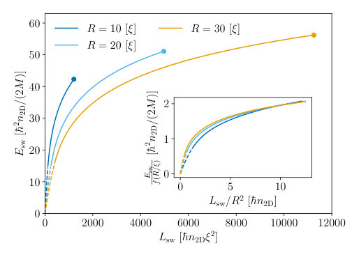 
FIG. 3. Angular-momentum dependence of the solitary wave en- ergy for different dimensionless radii, R ∈{10, 20, 30}. The dot- ted lines indicate the region of vortex-free density dip solutions and the solid dots mark the polar-vortex solutions. The inset shows the same branches rescaled according to the Rankine-vortex energy and angular momentum estimates for the polar-vortex solutions where f(R/ξ) = 1 + 4 log(2R/ξ), see Eq. (8).

📷 Fig 4

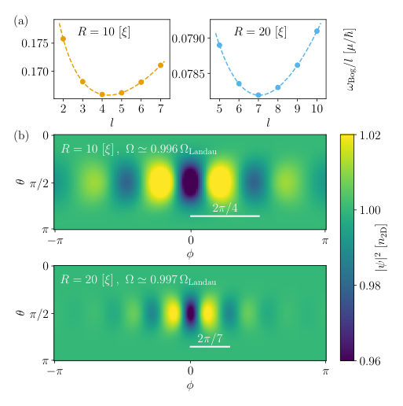 
FIG. 4. (a) Fractions ωBog(l)/l for Bogoliubov frequencies (6), for two different values of the radius, R10, 20. As the angular- momentum quantum number l is integer-valued, only the dots repre- sent possible angular frequencies, cf. Eq. (9), while the dashed lines are guides to the eye. (b) Density fields of the solitary wave solution, in the limit of the Landau critical angular speed ΩLandau, for R = 10 (top) and R = 20 (bottom). The white bars indicate the wave angle 2π/lLandau in the θ-direction.

**Summary.** This paper explores how the curvature and topology of a spherical surface influence the formation and stability of solitary waves in a Bose-Einstein condensate. It demonstrates that these waves evolve from vortex dipoles to vortex-free solitons as rotation speed increases, with a maximum speed dictated by the Landau critical velocity. The findings provide a bridge between classical Jones-Roberts solitons in flat planes and excitations in curved, topologically non-trivial geometries.

**Why it may be interesting.** This work is highly relevant for many-body dynamics and AMO physics as it explores how topological constraints and curved geometries modify fundamental nonlinear phenomena like solitons and the Landau criterion for superfluidity.

Detailed structure

**Main problem.** The study investigates the nonlinear excitations (solitary waves) that drive the onset of rotation in a Bose-Einstein condensate confined to a thin spherical shell, specifically how curvature and topology affect these waves.

**Main result.** The authors identify a continuous family of excitations ranging from vortex dipoles to vortex-free Jones-Roberts solitons, and determine that the Landau critical velocity sets the upper limit for the angular speed of these waves.

**Method.** The study uses the mean-field Gross-Pitaevskii equation solved via an iterative Newton-Raphson scheme with pseudo-spectral accuracy and branch-following continuation.

**Model / system.** A dilute, quasi-two-dimensional Bose-Einstein condensate (BEC) confined to a thin spherical shell of radius R, modeled by the Gross-Pitaevskii equation on a spherical surface.

**Key observables.** Density profile, phase angle, angular momentum (Lz), energy (E), and Bogoliubov excitation spectrum.

**Important parameters / regimes.** Sphere radius (R) in units of healing length, angular speed (Omega), chemical potential (mu), and the large-radius (Euclidean) limit.

**Assumptions / limitations.** The system is assumed to be a dilute gas in the mean-field regime, confined to a thin shell with strong radial confinement, and the ground state density is assumed to be uniform.

**Figures summary.** Figure 1 provides a schematic of the BEC on a spherical shell and visual representations of the density and phase angle for a specific vortex dipole configuration.

**Paper structure.** The paper introduces the physical system and GP model, describes the numerical Newton-Raphson and continuation methods, analyzes the different regimes of solitary waves (vortex dipoles to solitons), derives the energy-momentum relation, and establishes the stability condition via the Landau critical velocity.

Abstract

The nonlinear excitations underlying the onset of rotation in a dilute Bose-Einstein condensate confined to a thin spherical shell are studied. These excitations correspond to solitary waves rotating about the sphere at constant angular speed: at low speeds they appear as dipoles of singly quantized vortices with opposite circulation, while at higher speeds they evolve into vortex-free Jones-Roberts solitons. With further increase of the angular speed, these excitations hybridize with equatorially confined modes whose azimuthal wave number is set by the sphere radius measured in units of the healing length. The propagation speed of these modes is shown to play the role of a Landau critical velocity, thereby setting the upper limiting angular speed of the entire Jones-Roberts family.

[↑ back to top](#top)

### [Localization of a quantum particle in a classical one-component plasma. Fluctuation-induced random potential and the Coulomb logarithm](http://arxiv.org/abs/2605.18187v1)

**Authors:** Yury A. Budkov  
**Type:** theory · **Category:** disordered systems and neural networks · **PDF:** <https://arxiv.org/pdf/2605.18187v1>  
**Analysis basis:** full PDF text, analyzed in chunks
**Topic relevance:** `Keldysh / 2PI / non-Gaussian methods` **2/5** · `Kondo & dissipative impurity` **2/5**

📷 Fig 1

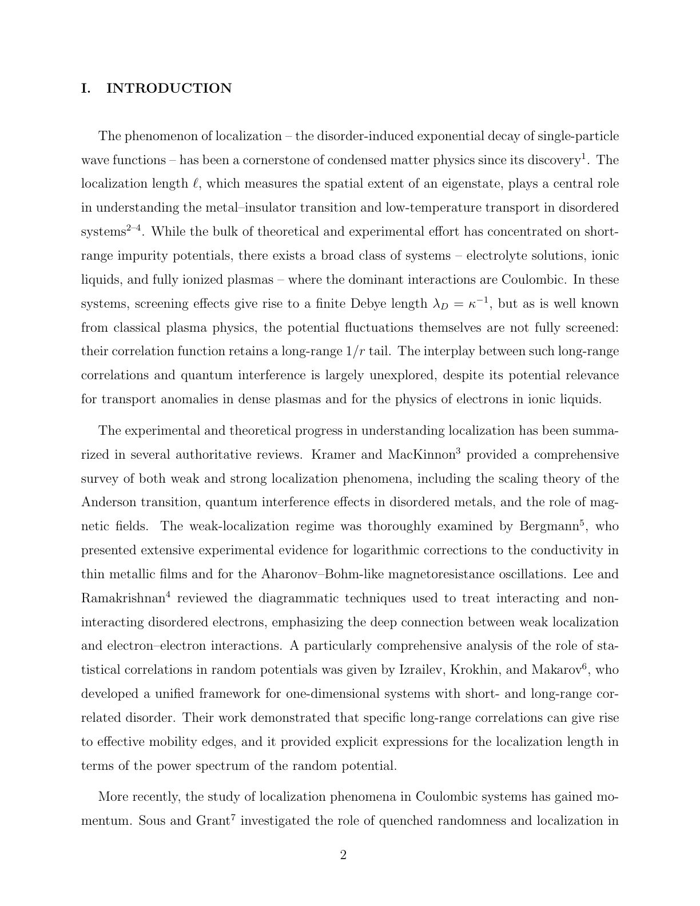 
Low-resolution page preview, page 2

📷 Fig 2

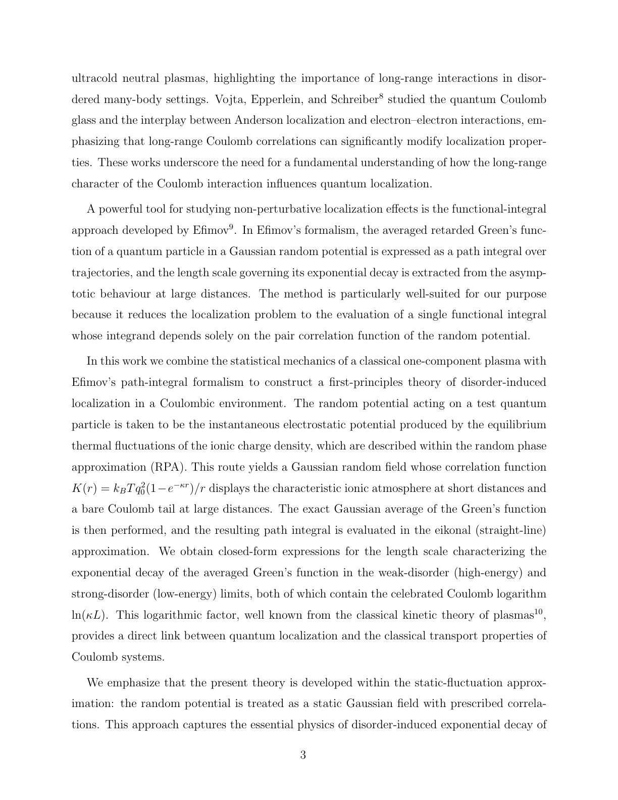 
Low-resolution page preview, page 3

📷 Fig 3

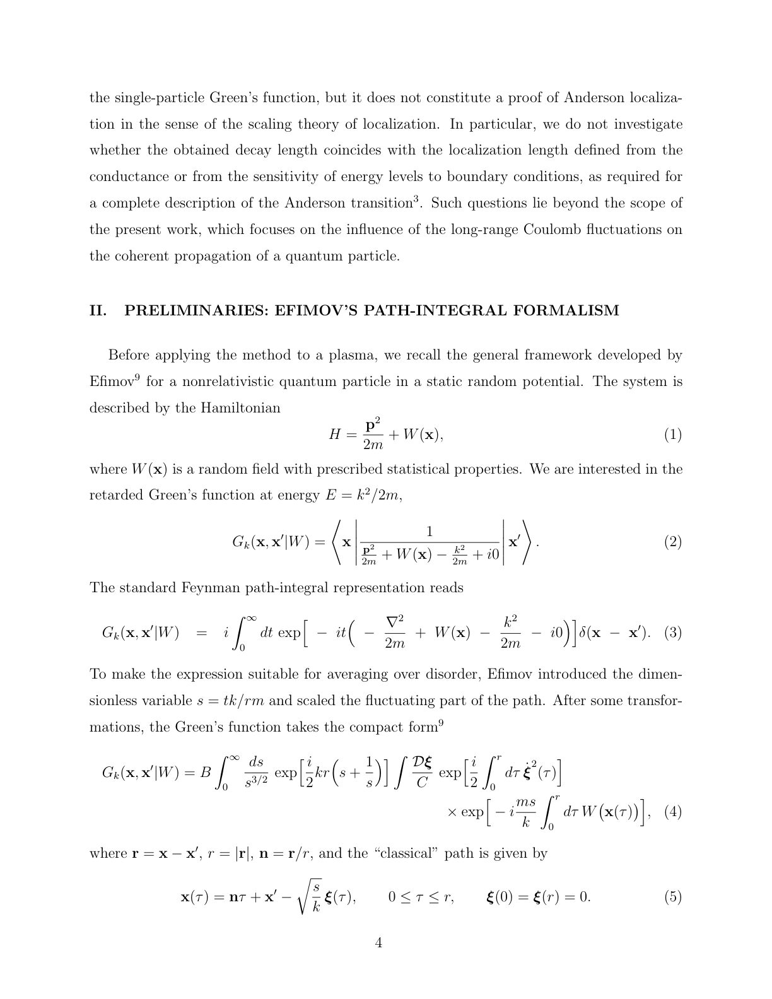 
Low-resolution page preview, page 4

📷 Fig 4

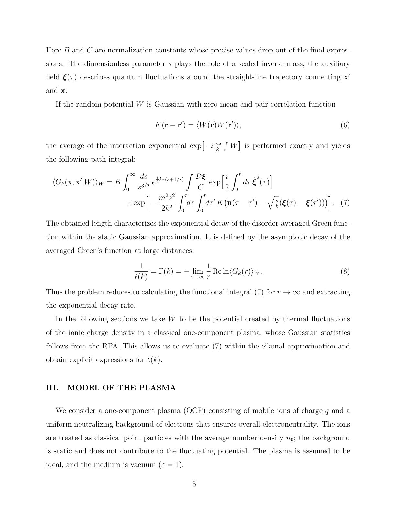 
Low-resolution page preview, page 5

📷 Fig 5

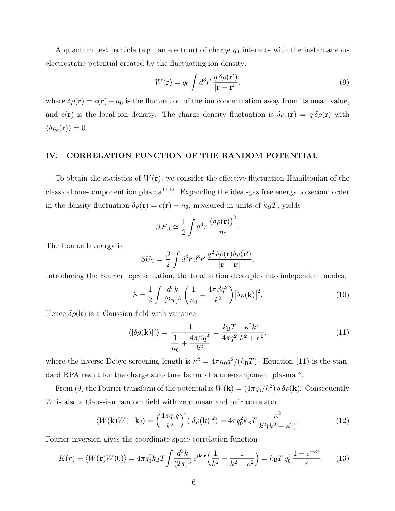 
Low-resolution page preview, page 6

**Summary.** This paper provides a first-principles theoretical framework for understanding how quantum particles undergo localization due to the long-range Coulombic fluctuations in a classical plasma. It successfully links quantum interference effects to classical plasma kinetic theory via the Coulomb logarithm. The results are particularly relevant for understanding transport in dense astrophysical environments like the solar corona.

**Why it may be interesting.** not directly relevant

Detailed structure

**Main problem.** The paper investigates the localization of a quantum particle moving through a random potential generated by thermal density fluctuations in a classical one-component plasma.

**Main result.** The author derives closed-form expressions for the localization length in both weak and strong disorder regimes, showing that the length scale explicitly depends on the classical Coulomb logarithm.

**Method.** The study employs Efimov's path-integral formalism, the Random Phase Approximation (RPA) for density fluctuations, and the Eikonal (straight-line) approximation to evaluate the averaged Green's function.

**Model / system.** A quantum test particle with charge q0 moving in a fully ionized classical one-component plasma (OCP) consisting of mobile ions and a static neutralizing background.

**Key observables.** Localization length l(k) and the potential correlation function K(r).

**Important parameters / regimes.** Debye screening length (kappa inverse), Coulomb logarithm (ln(kappaL)), momentum (k), and temperature (T).

**Assumptions / limitations.** The theory uses a static-fluctuation approximation (ignoring dynamic screening) and treats the random potential as a Gaussian random field.

**Paper structure.** The paper introduces the problem of disorder-induced localization in plasmas, develops the microscopic theory using path integrals and RPA, derives scaling laws for high-energy and low-energy regimes, and discusses the implications for astrophysical plasmas and the limitations of the static approximation.

Abstract

We develop a microscopic theory of disorder-induced localization for a quantum particle moving in a fully ionized classical one-component plasma, within the static-fluctuation approximation. The random potential acting on the particle originates from equilibrium thermal fluctuations of the ionic charge density, described within the random phase approximation (RPA). The resulting potential correlation function exhibits an unscreened $1/r$ tail at large distances, leading to a logarithmic divergence of the integrated disorder strength. Using the Feynman path-integral representation of the retarded Green's function and performing the Gaussian average over the fluctuations exactly, we obtain closed-form expressions for the length scale $\ell(k)$ that characterizes the exponential decay of the disorder-averaged Green's function, with Planck's constant fully restored. In the weak-disorder (high-energy) regime, $\ell(k) = \hbar^4 k^2 / [m^2 k_B T q_0^2 \ln(κL)]$; in the strong-disorder (low-energy) limit, $\ell = \frac{4\sqrt[3]{2}}{3} \big( \hbar^4 / [m^2 k_B T q_0^2 \ln(κL)] \big)^{1/3}$. Both limits contain the Coulomb logarithm $\ln(κL)$, providing a direct link between quantum localization and classical plasma kinetic theory. We also discuss the limitations of the static-disorder approximation and the role of dynamic screening in real plasmas.

[↑ back to top](#top)

### [MUBs from bent functions](http://arxiv.org/abs/2605.17594v1)

**Authors:** William M. Kantor  
**Type:** theory · **Category:** quantum information and computing · **PDF:** <https://arxiv.org/pdf/2605.17594v1>  
**Analysis basis:** full PDF text, analyzed in chunks
**Topic relevance:** `entanglement & information structure` **2/5** · `quantum measurements` **2/5**

📷 Fig 1

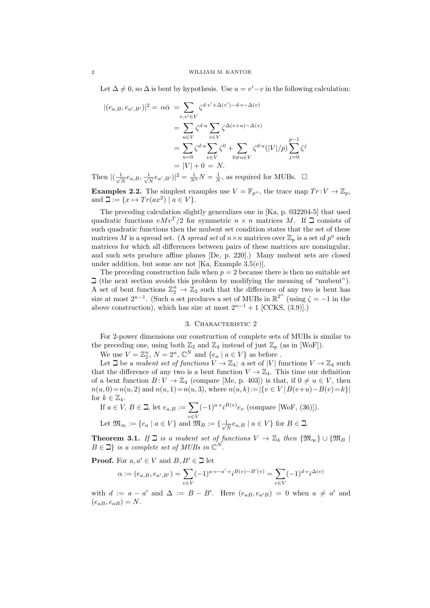 
Low-resolution page preview, page 2

📷 Fig 2

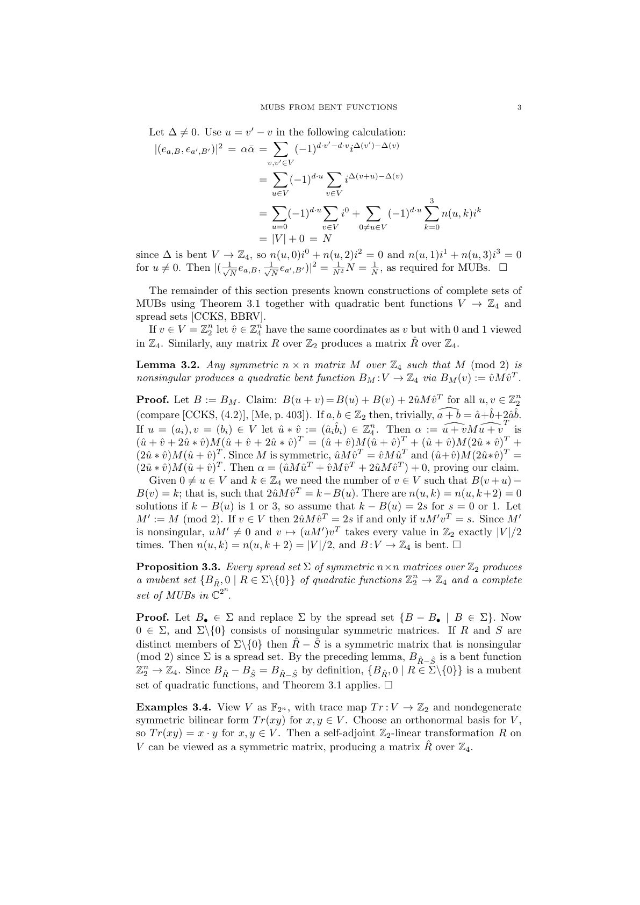 
Low-resolution page preview, page 3

📷 Fig 3

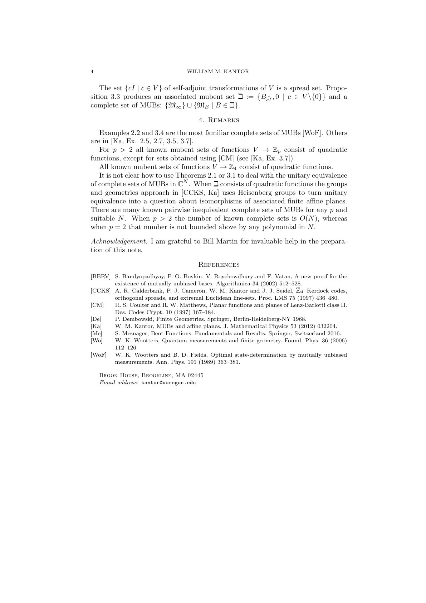 
Low-resolution page preview, page 4

**Summary.** This paper presents a simplified method for constructing complete sets of Mutually Unbiased Bases in prime power dimensions. By using bent functions, the author provides explicit formulas for the new basis vectors as linear combinations of the standard basis. This approach unifies and generalizes previous constructions for both odd and even prime power dimensions.

**Why it may be interesting.** MUBs are fundamental to quantum state tomography and quantum key distribution; providing explicit, simple constructions is highly relevant for designing quantum protocols and understanding the geometry of quantum information.

Detailed structure

**Main problem.** The construction of complete sets of Mutually Unbiased Bases (MUBs) in N-dimensional complex Hilbert spaces, specifically for prime power dimensions N = p^n.

**Main result.** The paper provides explicit constructions for complete sets of MUBs using 'mubent' sets of functions, covering both odd characteristic (p > 2) and characteristic 2 (p = 2) cases.

**Method.** The construction utilizes bent functions and 'mubent' sets to define new basis vectors as linear combinations of the standard basis, employing algebraic tools like trace maps, primitive roots of unity, and symmetric matrices over Z4.

**Model / system.** The work is set in the mathematical framework of N-dimensional complex Hilbert spaces (CN), focusing on dimensions that are prime powers.

**Important parameters / regimes.** The dimension N = p^n, where p is a prime number.

**Assumptions / limitations.** The construction relies on the existence of specific algebraic structures such as mubent sets and spread sets of matrices.

**Paper structure.** The paper is organized into a construction for odd characteristics, a modified construction for characteristic 2 using Z4-valued functions, and a discussion relating the results to spread sets and finite geometry.

Abstract

This note contains a simple construction of complete sets of MUBs, using bent functions to write the new basis vectors as explicit linear combinations of the standard basis.

[↑ back to top](#top)

### [Optical Neural Networks from Coherent Transient Dynamics in Waveguide QED](http://arxiv.org/abs/2605.17752v1)

**Authors:** Jiande Cao, Yexiong Zeng, Franco Nori, Ze-Liang Xiang  
**Type:** theory · **Category:** quantum information and computing · **PDF:** <https://arxiv.org/pdf/2605.17752v1>  
**Analysis basis:** full PDF text, analyzed in chunks
**Topic relevance:** `methods for driven-dissipative` **2/5** · `non-equilibrium dynamics` **2/5**

📷 Fig 1

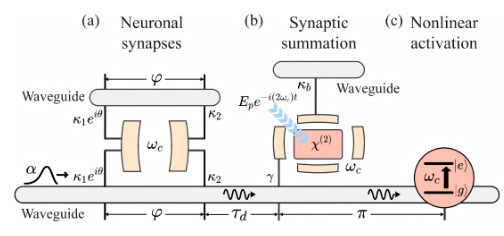 
FIG. 1. Physical implementation of a neuron in the WQED architecture. (a) Synaptic-weighting module based on giant- cavity interference. The lower and upper waveguides carry the input signal csig and dissipated energy cdiss, respectively, with identical coupling configurations κ1eiθ and κ2. (b) Pump- assisted temporal integrator. The main and auxiliary cavities, supporting modes a and b, operate at frequency ωc with decay rates γ and κb, respectively. A classical pump at ωp = 2ωc drives the χ(2) nonlinear medium and enables coherent accu- mulation of sequential pulses. (c) Nonlinear activation real- ized via a TLS with transition frequency ωc.

📷 Fig 2

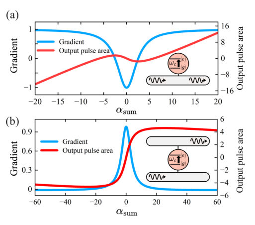 
FIG. 2. Nonlinear activation function. (a) Activation based on a TLS, where the incident wavepacket traverses the TLS. Red: complex area of the output wavepacket versus the com- plex area of αsum. Blue: gradient of the activation func- tion. (b) Activation based on a multiple waveguides structure, where an incident wavepacket from one waveguide produces an outgoing wavepacket in the other waveguide. Red: com- plex area of the output wavepacket versus the complex area of αsum. Blue: corresponding gradient of the nonlinear acti- vation function.

📷 Fig 3

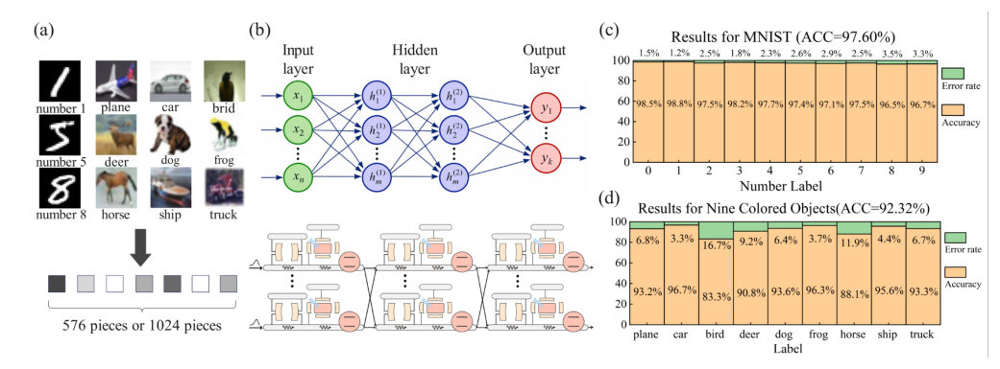 
FIG. 3. Architecture and classification performance of the quantum-optical neural network. (a) Representative training samples for the two classification tasks: MNIST and colored-object recognition. The images are flattened into 576 and 1024-dimensional vectors, respectively. Each vector component is encoded as an exponentially decaying wavepacket and injected into the network. (b) Quantum optical neural network architecture. The injected wavepackets form the input layer, intermediate neuron layers form the hidden layers, and the output layer encodes the predicted class probabilities. Both tasks use two hidden layers. The network sizes are 576–128–128–10 for MNIST and 1024–256–256–9 for...

**Summary.** This paper proposes a new type of all-optical neural network that uses the transient quantum dynamics of light interacting with matter to perform computation. By using waveguide QED, the design avoids the need for slow electronic conversion for nonlinear activation, enabling much faster and more efficient optical computing. The proposed system shows high accuracy in recognizing complex patterns like MNIST digits.

**Why it may be interesting.** It demonstrates how transient light-matter dynamics and non-equilibrium quantum effects in waveguide QED can be harnessed as a native computational resource for high-dimensional nonlinear processing.

Detailed structure

**Main problem.** Current optical neural networks are limited by steady-state operation and high-latency electro-optical conversion required for nonlinear activation.

**Main result.** The authors propose an all-optical architecture using coherent transient dynamics that achieves high classification accuracy (97.6% on MNIST) while eliminating the optoelectronic bottleneck.

**Method.** The study uses full-physics numerical simulations, the SLH formalism, input-output theory, and quantum Langevin equations to evaluate the network's performance.

**Model / system.** A waveguide QED system in the giant-atom regime consisting of a three-module architecture: a giant cavity for synaptic weighting, a bad-cavity integrator with a chi-2 nonlinear medium, and a two-level system for nonlinear activation.

**Key observables.** The complex-valued area of the output wavepacket, which defines the predicted class probabilities.

**Important parameters / regimes.** Bad-cavity regime, critical-gain regime (G approx gamma), giant-atom regime, and phase-tunable nonlocal interference.

**Assumptions / limitations.** Data is encoded as a time-ordered sequence of exponentially decaying wavepackets; training is performed via an in-situ strategy using a classical computer for parameter updates.

**Figures summary.** Figure 1 illustrates the physical implementation of the three modules (synaptic weighting, temporal integrator, and nonlinear activation). Figure 2 shows the resulting nonlinear activation function.

**Paper structure.** The paper introduces the bottleneck in ONNs, describes the proposed waveguide QED architecture and its physical modules, details the mathematical formalism and simulation methods, presents classification results and robustness tests, and concludes with the implications for neuromorphic computing.

Abstract

Optical neural networks promise ultrafast, low-energy information processing by performing computation directly with photons. Current implementations, however, are largely restricted to steady-state operation and rely on high-latency electro-optical conversion for nonlinear activation. To address these limitations, we propose an all-optical fully connected neural network architecture in which the basic neuronal functions are realized by coherent transient quantum dynamics. Within this framework, phase-tunable nonlocal interference in a giant cavity implements programmable synaptic weights; an integrator operating in the bad cavity regime performs temporal summation by coherently combining sequential wavepackets; and transient Rabi dynamics of a driven two-level system provide nonlinear activation. Full-physics simulations demonstrate high classification accuracy on MNIST and colored-object recognition tasks. These results eliminate the optoelectronic activation bottleneck, reduce latency, and establish transient light-matter dynamics as a native physical resource for high-dimensional nonlinear information processing, paving the way toward fully optical neuromorphic computing.

[↑ back to top](#top)

### [Perturbation Theory of the Free Energy via the Mesoscopic Combined Partition Function](http://arxiv.org/abs/2605.18121v1)

**Authors:** Bob Osano  
**Type:** theory · **Category:** statistical mechanics · **PDF:** <https://arxiv.org/pdf/2605.18121v1>  
**Analysis basis:** full PDF text, analyzed in chunks
**Topic relevance:** `Keldysh / 2PI / non-Gaussian methods` **2/5** · `entanglement & information structure` **2/5**

📷 Fig 1

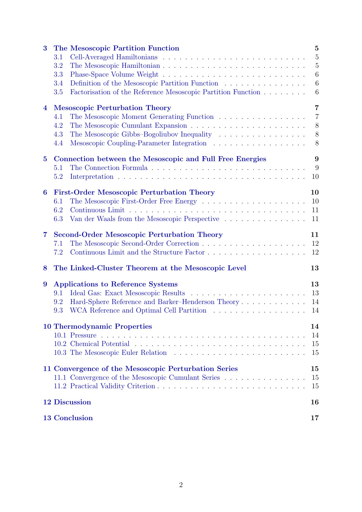 
Low-resolution page preview, page 2

📷 Fig 2

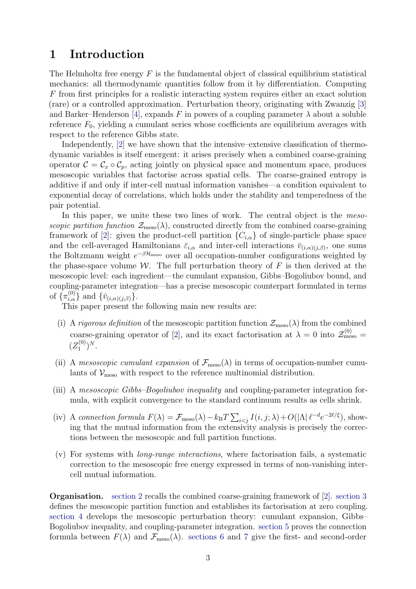 
Low-resolution page preview, page 3

📷 Fig 3

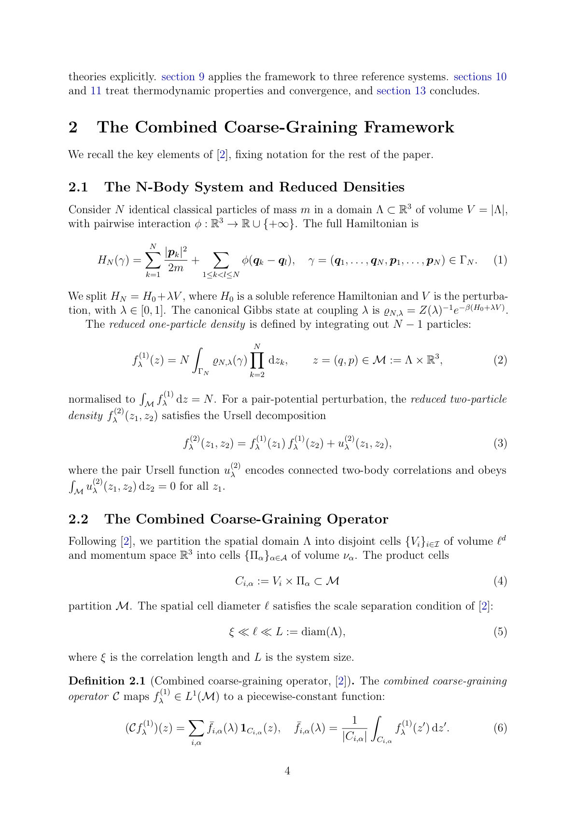 
Low-resolution page preview, page 4

📷 Fig 4

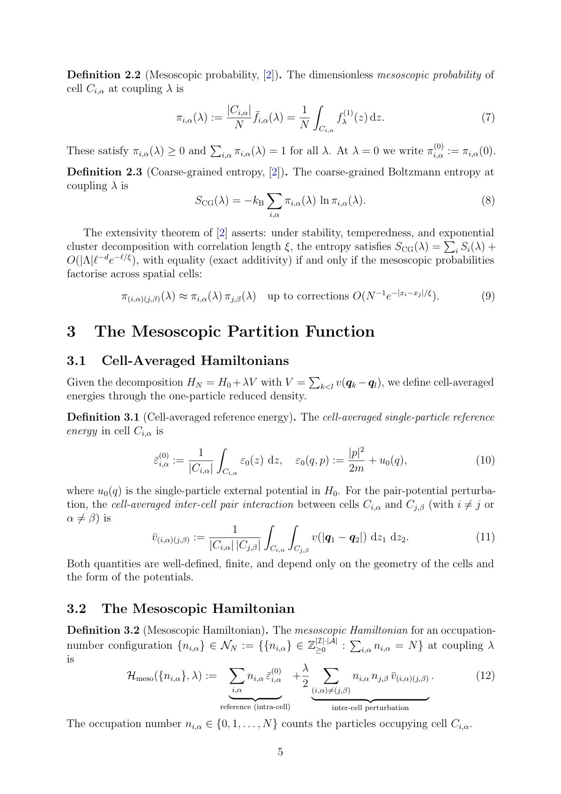 
Low-resolution page preview, page 5

📷 Fig 5

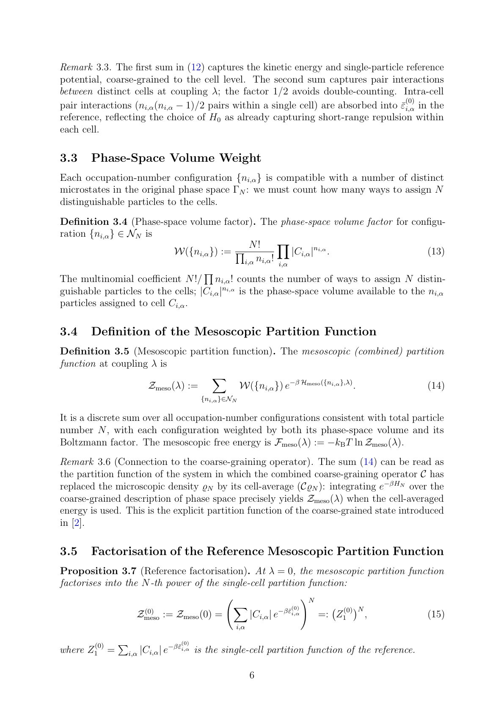 
Low-resolution page preview, page 6

**Summary.** This paper presents a new way to calculate the free energy of classical systems by partitioning phase space into mesoscopic cells. It provides a mathematical bridge to correct for errors introduced by coarse-graining and shows how this framework recovers standard liquid state theories like van der Waals. It also identifies the WCA decomposition as the mathematically optimal way to split potentials in this framework.

**Why it may be interesting.** not directly relevant

Detailed structure

**Main problem.** Developing a systematic perturbation theory for the Helmholtz free energy of a classical N-body system using a mesoscopic coarse-graining framework and quantifying the error introduced by cell-averaging.

**Main result.** The derivation of a connection formula relating the full free energy to the mesoscopic free energy via inter-cell mutual information corrections, and the proof that the WCA decomposition is the optimal split for minimizing mesoscopic variance.

**Method.** A mesoscopic cumulant expansion of the free energy based on a combined coarse-graining operator in phase space, utilizing multinomial statistics and the linked-cluster theorem.

**Model / system.** A classical N-body system of identical particles in a domain Lambda, described by a Hamiltonian consisting of a soluble reference part and a perturbative pair-potential.

**Key observables.** Helmholtz free energy, mesoscopic free energy, inter-cell mutual information, and reduced densities.

**Important parameters / regimes.** Cell diameter (l), correlation length (xi), particle density (rho), and temperature (T).

**Assumptions / limitations.** Scale separation (xi << l << L) and the use of tempered potentials to ensure extensivity.

**Paper structure.** The paper introduces the mesoscopic framework, develops the perturbation theory via cumulant expansion, establishes the connection formula to the full free energy, analyzes the continuous limit, and discusses the optimality of the WCA decomposition.

Abstract

We develop a systematic perturbation theory for the Helmholtz free energy of a classical $N$-body system within the mesoscopic framework of~\cite{OsanoMeso,OsanoExtensivity}. The combined coarse-graining operator $\mathcal{C}=\mathcal{C}_x\circ\mathcal{C}_p$ acting on single-particle phase space partitions it into product cells $C_{i,α}=V_i\timesΠ_α$ and generates a mesoscopic partition function $\mathcal{Z}_{\rm meso}(λ)$ whose reference level factorises by the multinomial theorem: $\mathcal{Z}_{\rm meso}^{(0)}=(Z_1^{(0)})^N$. Perturbation theory for $\mathcal{F}_{\rm meso}(λ)=-k_BT\ln\mathcal{Z}_{\rm meso}(λ)$ in the inter-cell perturbation $\mathcal{V}_{\rm meso}$ yields the mesoscopic Gibbs--Bogoliubov inequality and an exact coupling-parameter integration formula. The full free energy satisfies \begin{equation*} F(λ)=\mathcal{F}_{\rm meso}(λ)-k_BT\!\sum_{i<j}I(i,j;λ)+O\!\left(|Λ|\ell^{-d}e^{-2\ell/ξ}\right), \end{equation*} where the inter-cell mutual informations $I(i,j;λ)$ are the corrections identified in the extensivity analysis. The first-order theory recovers the van der Waals equation and the Barker--Henderson result; the second-order term converges to the structure-factor formula in the fine-cell limit. For long-range interactions, factorisation fails, and the mutual-information corrections quantify the resulting non-extensivity.

[↑ back to top](#top)

### [Entropy additivity from exponential decay of correlations: a coarse-grained operator approach](http://arxiv.org/abs/2605.17956v1)

**Authors:** Bob Osano  
**Type:** theory · **Category:** statistical mechanics · **PDF:** <https://arxiv.org/pdf/2605.17956v1>  
**Analysis basis:** full PDF text, analyzed in chunks
**Topic relevance:** `entanglement & information structure` **2/5** · `non-equilibrium dynamics` **1/5**

📷 Fig 1

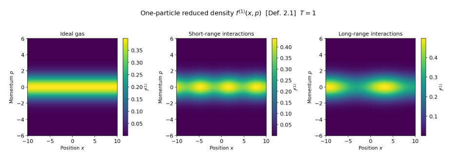 
Figure 1: The One-Particle Reduced Density f (1)(x, p).The heatmap shows, for each point (x, p) in single-particle phase space, the density of probability of finding one particle at that location. For the ideal gas, f (1) is perfectly uniform in x and Gaussian in p—a smooth, symmetric blob. Non-interacting particles have no energetic preference for any position, so ϱ(x) = ϱ0 exactly. For the short-range gas, gentle spatial ripples appear in the x direction. The interactions shift particles slightly towards energetically favourable positions, but the effect is small and confined within the correlation length ξ. For the long-range gas, the spatial variation is substantially stronger. Forces...

📷 Fig 2

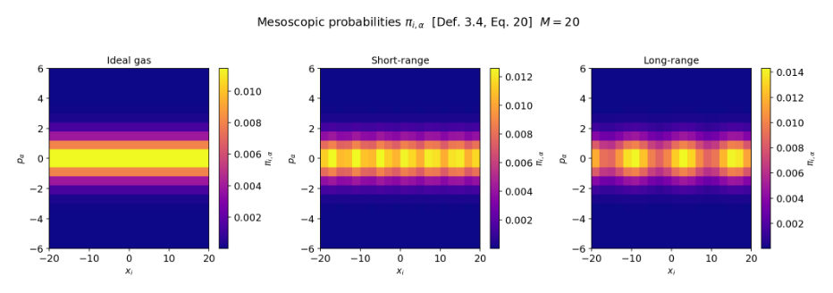 
Figure 2: Mesoscopic Probabilities πi,α.Each pixel in the plot represents one spatial–momentum cell Ci,α = Vi × Πα, and its colour is the probability that a randomly chosen particle occupies that cell. This is the coarse-grained version of Plot 1. The continuous density f (1)(x, p) is replaced by a discrete grid of mesoscopic probabilities πi,α (Definition 3.4, Eq. (20)): πi,α := |Ci,α|

📷 Fig 3

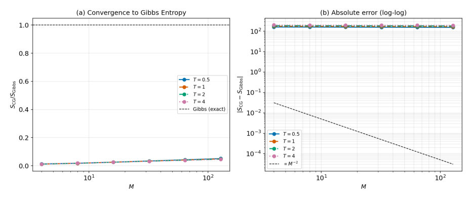 
Figure 3: Convergence of SCG to the Gibbs Entropy: This plot addresses the most basic consistency requirement: does the mesoscopic framework agree with standard Gibbs statistics? It shows SCG/SGibbs as a function of the number of cells per dimension M, at several temperatures. Left panel: Every curve starts below 1 (the mesoscopic entropy underestimates the Gibbs entropy when cells are coarse-grained) and rises monotonically to 1 as M increases. This is the numerical confirmation of Theorem 2.7(Ruelle–Fisher thermodynamic limit): the fine-graining limit ℓ→0 recovers the canonical ensemble exactly. Right panel: The straight lines with slope −2 confirm that the convergence rate is O(M −2),...

📷 Fig 4

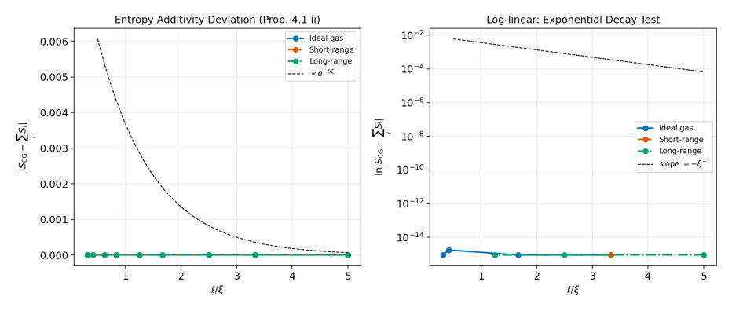 
Figure 4: Entropy Additivity Deviation:This is the central quantitative result, implementing Proposi- tion 4.1(ii) and Eq. (25) numerically. The plotted quantity is the total deviation from entropy additivity, |SCG −P

📷 Fig 5

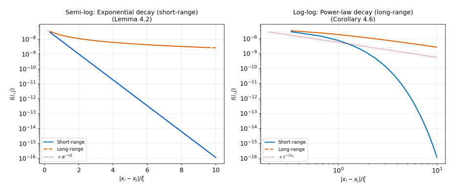 
Figure 5: Mutual Information Between Cells: This plot examines the statistical dependence between individual pairs of cells i and j, showing the mutual information I(i, j) as a function of their separation |xi −xj|/ξ. The mutual information I(i, j) = P

**Summary.** This paper derives thermodynamic extensivity from microscopic interaction properties rather than assuming it as a postulate. It shows that while short-range forces lead to additive entropy, long-range forces cause a breakdown of extensivity. The work also connects spatial averaging errors to the cosmological backreaction problem.

**Why it may be interesting.** not directly relevant

Detailed structure

**Main problem.** The paper seeks to provide a constructive derivation of thermodynamic extensivity and entropy additivity from microscopic conditions, rather than treating them as postulates, while investigating the breakdown of these properties in long-range interacting systems.

**Main result.** The author proves that entropy additivity is achieved when correlations decay exponentially, with errors suppressed by the ratio of cell diameter to correlation length, and demonstrates that long-range interactions lead to non-additive entropy and non-extensivity.

**Method.** A coarse-grained operator approach using Ursell cluster expansion and mesoscopic probabilities over phase-space cells to analyze reduced densities.

**Model / system.** Classical N-body systems in a bounded domain, including ideal gases, short-range interacting gases (Yukawa-type potential), and long-range interacting gases (algebraic decay).

**Key observables.** Coarse-grained entropy (Scg), fine-grained Gibbs entropy, inter-cell mutual information, Jensen correction, and surface correction to the Euler relation.

**Important parameters / regimes.** Correlation length (xi), cell diameter (l), system size (L), temperature (T), and the decay exponent (s0) for long-range potentials.

**Assumptions / limitations.** Assumes microscopic stability, temperedness of the potential, and exponential cluster decomposition for the short-range case; assumes scale separation where xi << l << L.

**Figures summary.** Heatmaps of reduced density; visualization of mesoscopic probability grids; convergence of coarse-grained entropy to Gibbs entropy; plots showing entropy deviation and mutual information decay for different interaction ranges; and tests of extensivity via entropy per particle.

**Paper structure.** The paper introduces a coarse-graining operator, establishes the mathematical framework for mesoscopic probabilities, provides analytical proofs for entropy additivity and non-additivity, presents numerical simulations of different gas models, and concludes with the derivation of a generalized Euler relation.

Abstract

Thermodynamic extensivity is commonly introduced as a postulate -- the homogeneity of degree one in thermodynamic potentials. We provide a constructive derivation of this property from microscopic conditions on the pair potential, without assuming it. Working with the one- and two-particle reduced densities of the $N$-body canonical Gibbs state, we introduce a combined coarse-graining operator $\mathcal{C}$ on single-particle phase space $\mathcal{M}=Λ\times\mathbb{R}^3$, producing dimensionless mesoscopic probabilities over spatial--momentum cells $\{V_i\timesΠ_α\}$. Under three conditions on the pair potential -- stability, temperedness, and exponential cluster decomposition with correlation length $ξ$ -- we show, using the Ursell cluster expansion, that the coarse-grained entropy satisfies \[S_{\mathrm{CG}}=\sum_i S_i+O\!\left(\frac{|Λ|}{\ell^d}e^{-\ell/ξ}\right),\] where $\ell\ggξ$ is the cell diameter. The correction is exponentially suppressed per cell, making entropy additive and recovering the thermodynamic limit of Ruelle and Fisher in explicit operator language. For systems with long-range interactions, where temperedness fails, the correction does not vanish, and non-additivity is quantified through inter-cell mutual information. We further show that spatial averaging does not commute with nonlinear thermodynamic functionals such as the entropy density -- a thermodynamic analogue of the cosmological averaging problem -- and we derive the generalised Euler relation with explicit surface corrections.

[↑ back to top](#top)

### [Modular Lower Bounds on Reeh-Schlieder State Preparation](http://arxiv.org/abs/2605.18640v1)

**Authors:** Javier Blanco-Romero, Florina Almenares Mendoza  
**Type:** theory · **Category:** other · **PDF:** <https://arxiv.org/pdf/2605.18640v1>  
**Analysis basis:** full PDF text, analyzed in chunks
**Topic relevance:** `entanglement & information structure` **2/5** · `quantum measurements` **1/5**

📷 Fig 1

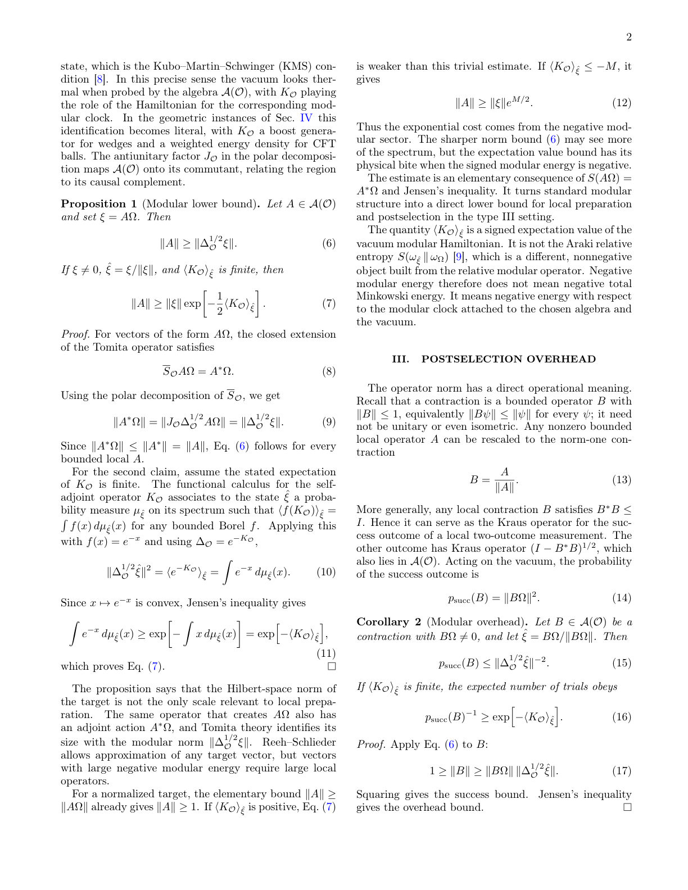 
Low-resolution page preview, page 2

📷 Fig 2

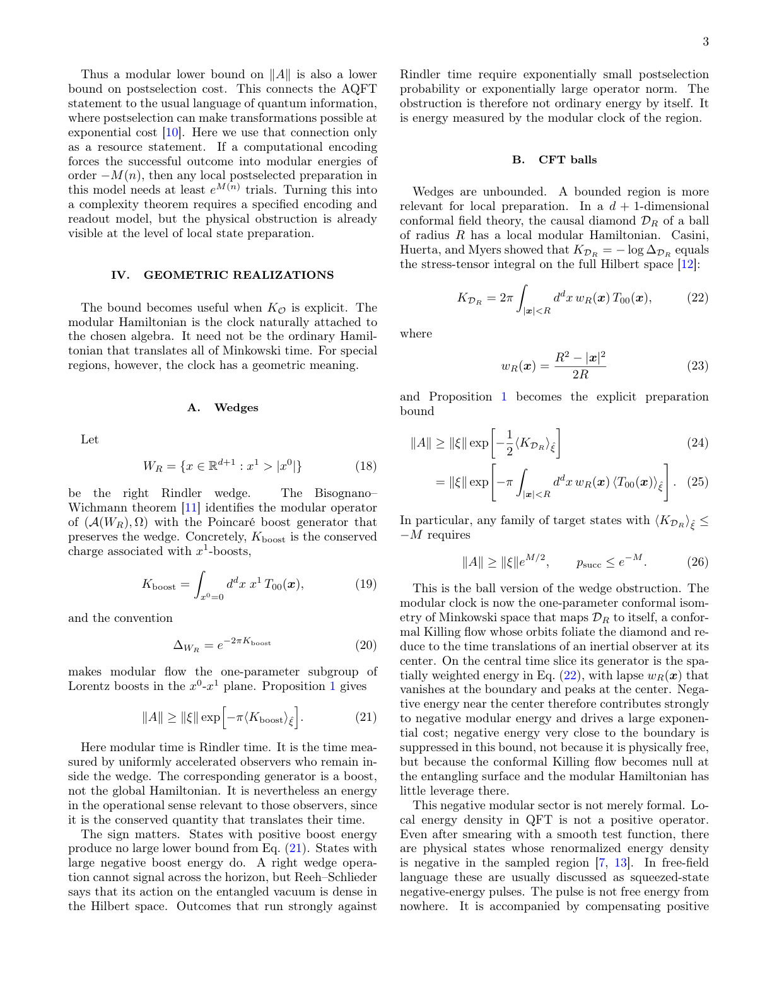 
Low-resolution page preview, page 3

📷 Fig 3

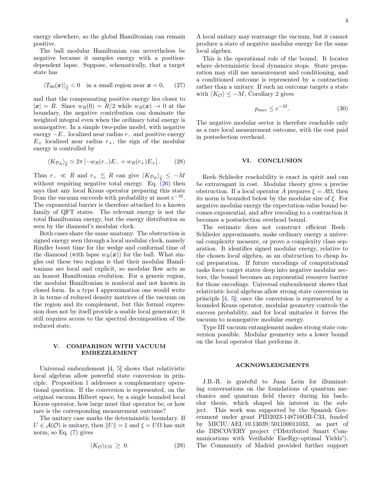 
Low-resolution page preview, page 4

📷 Fig 4

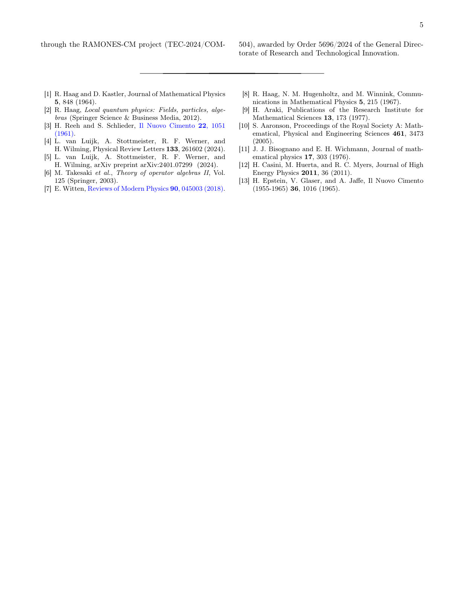 
Low-resolution page preview, page 5

**Summary.** This paper provides a quantitative limit on the Reeh-Schlieder theorem by showing that while any state can be prepared locally, states with negative modular energy impose an exponential cost on the required operator strength and measurement success probability. It establishes that local unitary dynamics cannot access the negative modular sector of a quantum field.

**Why it may be interesting.** not directly relevant

Detailed structure

**Main problem.** Quantifying the operational cost, in terms of operator norm and postselection probability, required to prepare target states from the vacuum using local operators in Quantum Field Theory.

**Main result.** The authors derive a modular lower bound showing that preparing states with negative modular energy requires an exponential increase in operator norm and postselection overhead. They specifically show that local unitaries are restricted to states with non-negative modular energy.

**Method.** The study utilizes Algebraic Quantum Field Theory (AQFT) frameworks, specifically Tomita-Takesaki theory, to relate the norm of local operators to the expectation value of the modular Hamiltonian.

**Model / system.** The framework is based on local algebras (Type III factors) in Minkowski space, focusing on specific geometries such as Rindler wedges and causal diamonds in Conformal Field Theories (CFTs).

**Key observables.** Operator norm of the local operator, modular energy (expectation value of the modular Hamiltonian), and postselection success probability.

**Important parameters / regimes.** The regime of negative modular energy, the weight/lapse function in CFT balls, and the boost energy in Rindler wedges.

**Assumptions / limitations.** The explicit form of the modular Hamiltonian is assumed to be known for specific geometries (wedges and CFT balls); the results are derived within the context of von Neumann algebras.

**Paper structure.** The paper introduces the problem of quantifying Reeh-Schlieder costs, develops a model-independent bound using Tomita-Takesaki theory, applies this to specific geometric cases (wedges and CFTs), and concludes with the implications for local unitaries and postselection.

Abstract

The Reeh-Schlieder theorem says that every target vector can be approximated from the vacuum by an operator localized in an arbitrarily small spacetime region, but it gives no quantitative cost for doing so. This note isolates a standard Tomita-Takesaki estimate as a model-independent preparation bound. Targets with deeply negative modular energy require large local operators. After rescaling such an operator to a physical contraction, the same estimate becomes a lower bound on postselection overhead. In geometries where the modular Hamiltonian is known, the bound becomes explicit. Bisognano-Wichmann turns it into a boost energy statement for wedges, and the Casini-Huerta-Myers formula gives a stress-tensor version for bounded regions of conformal field theories. Local unitaries can only reach states of nonnegative modular energy. Negative modular sectors require nonunitary or postselected outcomes, giving a preparation cost bound that complements vacuum embezzlement in type III local algebras.

[↑ back to top](#top)

### [Quantum Shannon theory made robust: a tale of three protocols for almost i.i.d. sources](http://arxiv.org/abs/2605.18726v1)

**Authors:** Filippo Girardi, Nilanjana Datta, Giacomo De Palma, Ludovico Lami  
**Type:** theory · **Category:** quantum information and computing · **PDF:** <https://arxiv.org/pdf/2605.18726v1>  
**Analysis basis:** full PDF text, analyzed in chunks
**Topic relevance:** `entanglement & information structure` **2/5** · `quantum measurements` **1/5**

📷 Fig 1

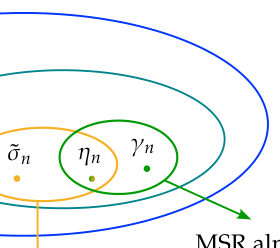 
Figure 1: Three different notions of almost i.i.d. processes

📷 Fig 2

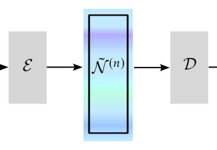 
Figure 2: From 𝑛i.i.d. uses of a channel to an almost i.i.d. process.

📷 Fig 3

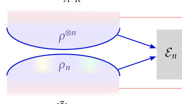 
Figure 5: Almost i.i.d. quantum data compression.

📷 Fig 4

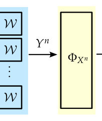 
Figure 7: Schematic interpretation of almost i.i.d. processes.

**Summary.** This paper establishes a framework for performing quantum information tasks when the source or channel is not perfectly independent and identically distributed. It demonstrates that while fundamental limits like capacity are robust to small local perturbations, the error exponent can be highly sensitive to these deviations.

**Why it may be interesting.** not directly relevant

Detailed structure

**Main problem.** Investigating the robustness of fundamental Quantum Shannon theory protocols (hypothesis testing, data compression, and channel coding) when the ideal i.i.d. assumption is replaced by 'almost i.i.d.' resources.

**Main result.** The authors prove that classical and quantum capacities and data compression rates are robust under Wasserstein-type almost i.i.d. perturbations, but the reliability function (error exponent) can fail and drop to zero.

**Method.** The study introduces the 'club distance' and uses the quantum Wasserstein distance of order 1 to classify different levels of almost i.i.d. structures and evaluate protocol stability.

**Model / system.** The paper considers sequences of quantum states (sources) and quantum channels that deviate from a perfect tensor product structure via local perturbations or correlations.

**Key observables.** Stein exponent, von Neumann entropy, Holevo quantity, channel capacity, and reliability function.

**Important parameters / regimes.** Asymptotic limit (n to infinity), smoothing parameter delta, and different convergence regimes (weak, Wasserstein, and MSR).

**Assumptions / limitations.** The study assumes finite-dimensional Hilbert spaces and focuses on the class of 'almost i.i.d.' resources rather than arbitrary non-i.i.d. processes.

**Figures summary.** Figure 1 provides a hierarchical diagram illustrating the nesting relationship between different notions of almost i.i.d. processes (Weakly, Wasserstein, MSR, and Trace distance).

**Paper structure.** The paper identifies the failure of standard metrics, introduces the quantum Wasserstein distance and club norm, establishes a hierarchy of almost i.i.d. sources, and then analyzes the robustness of specific information-theoretic tasks.

Abstract

The asymptotic rates of information-theoretic protocols - including error exponents, compression rates, and channel capacities - are traditionally defined under the idealised assumption that the underlying resource (state or channel) is independent and identically distributed (i.i.d.). Somewhat surprisingly, even slight departures from the exact i.i.d. structure can lead to a drastic breakdown of these protocols. The asymptotic rates of information theoretic protocols - error exponents, compression rates, capacities - were originally evaluated taking for granted that the underlying source (state or channel) is i.i.d. Differently from what we might expect at first glance, it is not hard to exhibit instances of protocols that may drastically fail when the i.i.d. assumption holds only approximately rather than exactly. If the precise nature of the perturbation from the i.i.d. regime is known (e.g. a pointwise defect), we could design a bespoke protocol that compensates for the defect (for example, by discarding the corrupted subsystem). However, in any realistic setting, neither can the i.i.d. behaviour of the system be precisely guaranteed, nor can the deviations from the ideal regime be determined exactly. In this paper we answer the following question: are there protocols that can still achieve the optimal asymptotic rates when the i.i.d. resource is replaced by any arbitrary almost i.i.d. resource along it? What is the nature of the unknown perturbation under which protocols like these are possible? We focus, in particular, on hypothesis testing, data compression, and channel coding. As a by-product of our analysis, we introduce the notion of club distance, as a variant of the well-known diamond distance, and of an almost i.i.d. process, which may be of independent interest.

[↑ back to top](#top)

### [Reinforcement Learning Assisted Quantum Simulation of Many-Body Excited States and Real-Time Dynamics](http://arxiv.org/abs/2605.18569v1)

**Authors:** Jiaji Zhang, Lipeng Chen, Carlos L. Benavides-Riveros  
**Type:** theory · **Category:** quantum information and computing · **PDF:** <https://arxiv.org/pdf/2605.18569v1>  
**Analysis basis:** full PDF text, analyzed in chunks
**Topic relevance:** `non-equilibrium dynamics` **2/5** · `entanglement & information structure` **1/5**

📷 Fig 1

 
FIG. 1. The energy eigenvalues of H2 within spin sector ⟨ˆSz⟩= 0 at bond length 0.5 ˚A to 5.0 ˚A.

📷 Fig 2

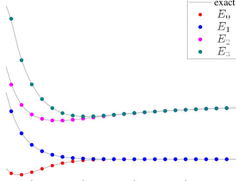 
Figure 2 shows the Euclidean norm of the ACSE residual ∥r(n)∥as a function of the RL

📷 Fig 3

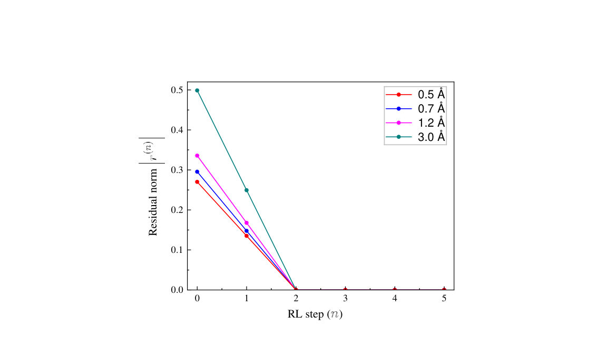 
FIG. 2. Norm of CSE residual |r(n)| against RL steps at different bond length. All the parameters

📷 Fig 4

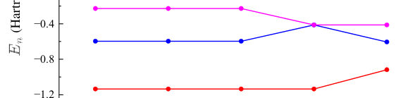 
FIG. 3. The energy eigenvalues obtained from RL-CQE with different weight vectors. Using weight

📷 Fig 5

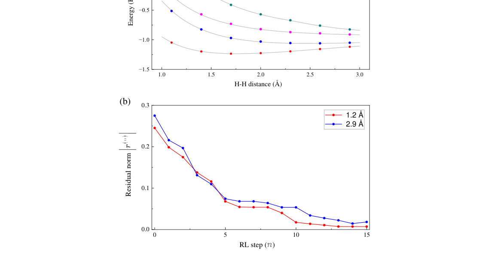 
FIG. 4. (a) The energy eigenvalues of linear H+ 3 as a function of H-H distance at 1.0 ˚A to 3.0 ˚A.

**Summary.** This paper introduces an RL-assisted method to find electronic excited states and simulate real-time dynamics on quantum computers. By using a reinforcement learning agent to pick the best operators, the method creates very efficient, short circuits that do not grow in complexity even as simulation time increases. It demonstrates high accuracy for small molecules like H2 and H3+.

**Why it may be interesting.** It presents a significant advancement in quantum algorithms by using RL to automate ansatz construction, specifically solving the scalability issue of circuit depth growth during real-time dynamics, which is crucial for simulating many-body dynamics.

Detailed structure

**Main problem.** Efficiently computing electronic excited states and real-time quantum dynamics of many-fermion systems on near-term quantum devices while overcoming the unbounded growth of circuit depth and the complexity of multi-configurational states.

**Main result.** The RL-CQE algorithm successfully generalizes to excited states and time evolution, achieving chemical accuracy with highly compact ansätze (minimal operator counts) and a constant-scaling circuit depth for time evolution.

**Method.** A Reinforcement Learning Contracted Quantum Eigensolver (RL-CQE) using a Deep Q-Network (DQN) agent to adaptively select two-body operators based on ACSE residuals, utilizing a purified ensemble approach for excited states.

**Model / system.** Electronic systems, specifically the H2 and linear H3+ molecules, modeled with standard electronic Hamiltonians (one-electron and two-electron integrals) mapped to qubits via Jordan-Wigner transformation.

**Key observables.** Energy eigenvalues, ACSE residual norm, time-dependent fidelity, and potential energy curves.

**Important parameters / regimes.** Ensemble weight vectors, simulation time (t), bond lengths (0.5 to 3.0 Angstroms), and the number of unitary transformations (steps).

**Assumptions / limitations.** The use of a purified ensemble approach treats excited states as an effective ground-state problem on an enlarged Hilbert space; the algorithm assumes the availability of a one-particle basis.

**Figures summary.** Figure 1 shows potential energy curves for H2; Figure 2 displays the rapid drop of the ACSE residual norm; Figure 3 compares energy eigenvalues under different ensemble weight vectors; Figure 4 shows potential energy curves for H3+ and residual convergence.

**Paper structure.** The paper introduces the problem of excited-state/dynamic simulation, describes the RL-CQE framework and DQN architecture, details the implementation for time evolution and ensemble weighting, presents benchmarks on H2 and H3+, and concludes with discussion on scalability and limitations.

Abstract

The computation of electronic excited states and real-time quantum dynamics of many-fermion systems is among the most promising applications of near-term quantum computing. In this work, we generalize the reinforcement learning contracted quantum eigensolver (RL-CQE), previously developed for ground-state problems, to electronic excited states and real-time quantum dynamics, in which a deep Q-network agent adaptively selects the two-body operators at each iteration, yielding more compact ansätze and improved robustness with respect to critical hyperparameters. A key feature of the algorithm is a scalable state representation based on the ACSE residuals, whose dimension grows with the one-particle basis but remains independent of the number of targeted excited states. We also verify the equivalence of sign-free qubit operators in the excited-state setting, extending a result previously established for ground-state problems. Our RL-CQE for time evolution derives from a constant-scaling ansatz that represents the wave function with a fixed number of unitary transformations independent of simulation time $t$, enabled by the shared unitary structure of the purified ensemble treatment of excited states. Benchmarks on chemical systems demonstrate chemical accuracy with minimal operator counts across a range of bond lengths.

[↑ back to top](#top)

### [$\mathcal{O}(n)$ alternative to Quantum Fourier Transform with efficient neural net classical post-processing](http://arxiv.org/abs/2605.16998v1)

**Authors:** Kaiming Bian, Zujin Wen, Oscar Dahlsten  
**Type:** both · **Category:** quantum information and computing · **PDF:** <https://arxiv.org/pdf/2605.16998v1>  
**Analysis basis:** full PDF text, analyzed in chunks
**Topic relevance:** `quantum measurements` **2/5**

📷 Fig 1

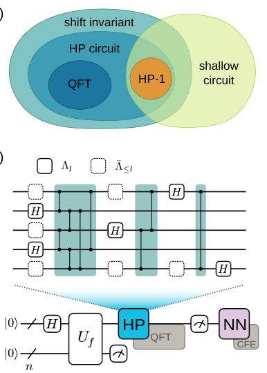 
FIG. 1. Shallow shift-invariant alternative to the QFT. (a) Shift invariance is a critical property of the QFT. We design a circuit family, denoted as HP-L, that preserves the shift invariance. Within this broader family, HP-1 specif- ically serves as a shallow-depth circuit that is experiment- friendly. (b) In the proposed HSP algorithmic routine, the deep QFT block (the left gray gate) is directly replaced by the HP circuit. A neural network then processes the mea- surement outcomes, bypassing the standard continued frac- tion expansion (CFE) typically used in the standard HSP. The HP circuit is composed of Hadamard and phase gates, with Λl referring to the qubits with Hadamards applied...

📷 Fig 2

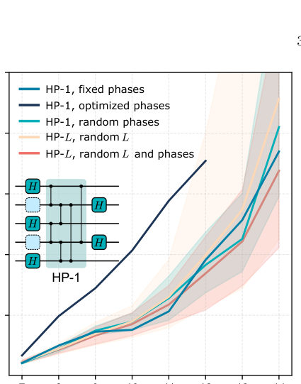 
FIG. 2. Average discrete Fisher information (DFI) in- creasing with the number of qubits. Results are shown for several HP-family circuit settings. L denotes the number of phase blocks layers with HP-1 having a single phase block layer. Solid curves show the mean, with shaded bands indi- cating one standard deviation associated with random phase choices.

📷 Fig 3

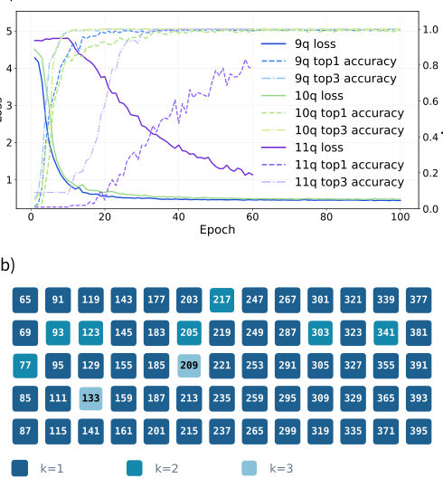 
FIG. 3. Numerical simulation shows successful Shor factoring via HP-L and neural net post-processing. There is a depth-7 HP-1 circuit with only 11 Hadamards and 30 controlled-phase gates on 11 qubits. (a) Training curves for 9-, 10-, and 11-qubit instances show rapid improvement in generator recovery accuracy. (b) Shor-type factorization of numbers ≤395 is demonstrated. Colour indicates the mini- mum number k of HP-1-based guesses needed for successful factorization. Most instances are solved with k = 1, while only a few require k = 2 or k = 3.

📷 Fig 4

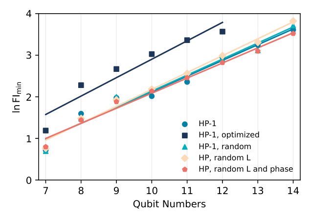 
FIG. 4. Log-linear fits of the qubit-scaling curves in Fig. 2(b). Markers denote the mean Fisher-information values plotted in Fig. 2(b), after applying the transformation DFImin 7→ln DFImin, and solid lines denote the corresponding least-squares fits ln DFImin(n) = kn + b.

**Summary.** This paper introduces a shallow, O(n) alternative to the Quantum Fourier Transform using a new family of Hadamard-Phase circuits. By replacing the standard QFT with these circuits and using a neural network for classical post-processing, the authors demonstrate a hardware-efficient way to solve the Hidden Subgroup Problem and perform factorization.

**Why it may be interesting.** not directly relevant

Detailed structure

**Main problem.** The high circuit depth of the standard Quantum Fourier Transform (O(n^2)) is a bottleneck for near-term quantum hardware. The goal is to find a shallower, O(n) alternative that remains compatible with Hidden Subgroup Problem (HSP) algorithms like Shor's algorithm.

**Main result.** The authors propose a family of shallow HP-L circuits that preserve shift invariance and retain exponentially growing Fisher information. When paired with a neural network for classical post-processing, these circuits can successfully perform period recovery and factorization.

**Method.** The authors use analytical proofs to establish shift-invariance conditions, numerical analysis of Discrete Fisher Information (DFI) to quantify information retention, and a Deep Sets neural network for classical decoding of measurement outcomes.

**Model / system.** The study focuses on n-qubit systems representing cyclic groups (Z_{2^n}). The circuit model consists of HP-L (Hadamard-Phase) circuits, specifically the depth-7 HP-1 architecture, which uses alternating layers of Hadamard and controlled-phase gates.

**Key observables.** Discrete Fisher Information (DFI), measurement probability distributions, and top-1/top-3 recovery accuracy.

**Important parameters / regimes.** Circuit depth scaling (O(n) vs O(n^2)), number of qubits (n), depolarizing noise strength (eta), and sample complexity (m).

**Assumptions / limitations.** The analysis is restricted to finite abelian groups; the noise model is limited to a global depolarizing channel; the neural network assumes a polynomial-scaling training regime.

**Figures summary.** Figure 1 illustrates the proposed HSP routine; Figure 2 shows the exponential growth of DFI for various HP configurations; Figure 3 shows neural network convergence and successful factorization of numbers up to 395; Figure 4 shows log-linear regression fits for the scaling of DFI.

**Paper structure.** The paper begins by identifying the need for shallow QFT alternatives, defines the mathematical requirements for shift-invariance, introduces the HP-L circuit family, provides analytical proofs for its properties, quantifies information retention via DFI, and concludes with numerical simulations of Shor's algorithm and noise robustness testing.

Abstract

The Quantum Fourier Transform (QFT) is required by hidden subgroup problem (HSP) algorithms, including Shor's algorithm for factoring. The circuit depth of the QFT remains challenging for near-term hardware. To find shallower alternatives we identify two properties that are exploited by the QFT to enable HSP. Firstly, the shift invariance of the QFT allows for the removal of a random overall shift. Secondly, the QFT retains information about the hidden subgroup generator accessible in the measurement outcomes. We quantify that information via the discrete Fisher information. We construct a family of shallow circuits using Hadamards and controlled-Phase gates, HP-$L$ circuits, that we prove preserve shift invariance. Numerical analysis shows these circuits retain exponentially growing Fisher information. The $\mathcal{O}(n)$ HP-$1$ can replace the $\mathcal{O}(n^2)$ QFT in Shor's algorithm, as demonstrated numerically, with an efficient neural network implementing classical post-processing.

[↑ back to top](#top)

### [A Penalty-Free Pipeline for Direct Quantum-Annealer Portfolio Optimization](http://arxiv.org/abs/2605.17628v1)

**Authors:** Luis Lozano  
**Type:** both · **Category:** quantum information and computing · **PDF:** <https://arxiv.org/pdf/2605.17628v1>  
**Analysis basis:** full PDF text, analyzed in chunks
**Topic relevance:** `QC/QI experiment` **2/5**

📷 Fig 1

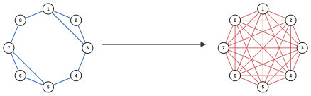 
Figure 1: Penalty-dilution mechanism. Left: the original covariance graph may be sparse (few edges). Center: adding the cardinality penalty A11⊤makes the QUBO fully connected regardless of the original structure. Right: embedding the complete graph on bounded-degree hardware requires long chains that are prone to breaking during annealing.

📷 Fig 2

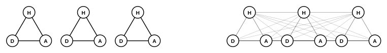 
Figure 2: Settlement graph versus penalty-encoded QUBO for a 3-match betting slate (N = 9). Left: the settlement graph has 9 edges (three disconnected 3-cliques). Right: the penalty-encoded QUBO has 36 edges (complete graph K9) because the cardinality penalty A11⊤connects every pair of nodes.

📷 Fig 3

 
Figure 4: Raw QPU sample cardinality collapse under penalty encoding. Left: target cardinality K relative to the all-ones (N) and random (N/2) references. Right: pre-projection feasibility rate collapses toward zero with increasing N, confirming that the QPU does not enforce the cardinality constraint at these chain-break rates.

📷 Fig 4

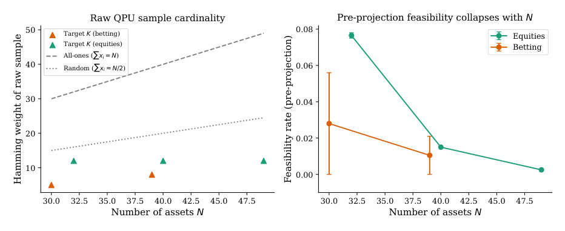 
Figure 4 illustrates the core diagnostic: raw QPU samples from penalty-encoded QUBOs fail to satisfy the cardinality constraint, with the feasibility rate collapsing to zero as N grows. Table 1 and Figure 5 report the full scaling trend across both case studies. At N = 24 (K = 8, λ = 2.0), the dense equity instance required 85 physical qubits on Pegasus (mean chain length 3.54) and 62 on Zephyr (mean chain length 2.58), with chain-break fractions of approximately 83%. At N = 49 (the full FF49 universe, K = 12), mean chain lengths grew to 6.59 on Pegasus and 5.23 on Zephyr, with chain-break fractions of 88% and 92% respectively. The feasible sample rate was 0% at every scale tested: zero out...

📷 Fig 5

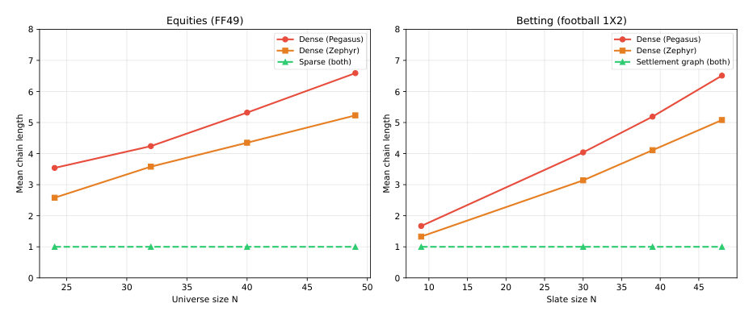 
Figure 5: Mean chain length versus problem size for dense and best-sparse (top-k, k = 1 for equities; settlement graph for betting) QUBOs on both topologies. Dense chain lengths grow with N; the plotted sparse variants maintain unit chains at all scales. Other sparsifiers achieve near-unit chains (see Table 2).

**Summary.** The paper identifies that the quadratic penalty used to enforce constraints in quantum annealing is the primary cause of hardware embedding failure in portfolio optimization. By removing this penalty and handling constraints classically, the authors demonstrate a much more stable and efficient pipeline for using quantum annealers for financial tasks.

**Why it may be interesting.** not directly relevant

Detailed structure

**Main problem.** Standard penalty-encoded QUBO formulations for portfolio optimization create dense, complete interaction graphs that cause massive chain-break rates and infeasible samples on sparse quantum annealer topologies.

**Main result.** A penalty-free pipeline that samples only the objective-only QUBO and enforces constraints classically reduces chain-break fractions from up to 92% to less than 0.04%, making direct QPU access viable.

**Method.** The authors propose a three-stage pipeline: topology-aware sparsification of the objective, hardware embedding on D-Wave processors, and classical greedy feasibility projection to recover the cardinality constraint.

**Model / system.** The study uses D-Wave quantum annealers (Pegasus and Zeander topologies) applied to two optimization domains: equity portfolio selection (using FF49 industry data) and sports betting (1X2 football outcomes).

**Key observables.** Chain-break fraction, chain length, qubit overhead ratio, objective regret, and financial metrics like realized Sharpe ratio and ROI.

**Important parameters / regimes.** Asset universe size (N up to 49), target cardinality (K), risk aversion (lambda), and penalty weight (A).

**Assumptions / limitations.** The study focuses on direct QPU access rather than hybrid solvers and does not claim quantum advantage, only improved operational viability at current scales.

**Figures summary.** Figures illustrate the penalty-dilution mechanism, the proposed three-stage pipeline, scaling of chain-breaks and chain lengths, and out-of-sample financial performance comparisons.

**Paper structure.** The paper identifies the structural cause of optimization failure, evaluates various sparsification and projection strategies, compares hardware topologies (Pegasus vs. Zephyr), and validates the pipeline using equity and betting datasets.

Abstract

Direct quantum-annealer portfolio optimization is commonly formulated as a penalty-encoded QUBO and submitted to D-Wave hardware. We show that this standard formulation fails on current devices and identify the structural reason: the cardinality penalty contributes a dense rank-one term proportional to the all-ones matrix that makes the logical interaction graph complete regardless of the covariance structure. On Pegasus and Zephyr, chain-break fractions reach 83 percent at N equal to 24 and 92 percent at N equal to 49, producing no feasible samples. Attempting to fix this through topology-aware sparsification reveals a second problem: any sparsifier that removes off-diagonal entries also dilutes the cardinality constraint, so raw samples remain infeasible even when chains no longer break, and an ablation shows that for structurally favorable cases such as betting with settlement-graph priors the classical feasibility projector alone explains the result rather than the QPU. We propose dropping the penalty entirely: build an objective-only QUBO from the expected returns and the risk-scaled covariance, sample it on hardware, and enforce the cardinality constraint classically as a post-processing step. On D-Wave Advantage and Advantage2 for equities up to N equal to 49 and betting up to N equal to 48, mean chain-break fractions per sample averaged over reads drop from the range of 71 to 92 percent down to at most 0.04 percent. The QPU returns lower-energy feasible portfolios than the greedy heuristic on betting at N equal to 39 and 48, which is an energy comparison and not a proof of optimality, and the equity post-processed regret is at most 0.03 percent at all tested scales. These results establish that the penalty encoding, not the sparse hardware topology, is the binding constraint for direct QPU portfolio optimization at currently accessible scales.

[↑ back to top](#top)

### [Adaptive Clifford+T Decomposition of Large Toffoli Gates with One Clean Ancilla](http://arxiv.org/abs/2605.18169v1)

**Authors:** Abhoy Kole, Majd Assaad, Till Schnittka, Rolf Drechsler  
**Type:** theory · **Category:** quantum information and computing · **PDF:** <https://arxiv.org/pdf/2605.18169v1>  
**Analysis basis:** full PDF text, analyzed in chunks
**Topic relevance:** `quantum measurements` **2/5**

📷 Fig 1

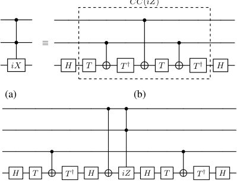 
Fig. 1: Relative-phase Toffoli gate implementations: (a) the CC(iX) gate, (b) its Clifford+T decomposition, and (c) the Clifford+T realization of the C3(iX) gate.

📷 Fig 2

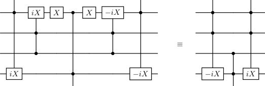 
Fig. 2: (a) The realization of a 5-input Toffoli (C4X) gate with one clean ancilla, implemented through two equivalent decompositions: (b) with four CC(iX) gates, and (c) with two C3(iX) gates.

📷 Fig 3

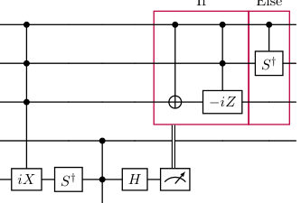 
Fig. 4: A dynamic implementation of the C4X gate using one C3(iX) gate together with measurement-conditioned op- erations: CX·CC(iZ) when the ancilla outcome is 1, and CS†

📷 Fig 4

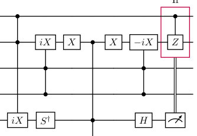 
Fig. 3: A dynamic realization of the C4X gate employing three CC(iX) gates and a conditional CZ operation triggered by the ancilla measurement.

📷 Fig 5

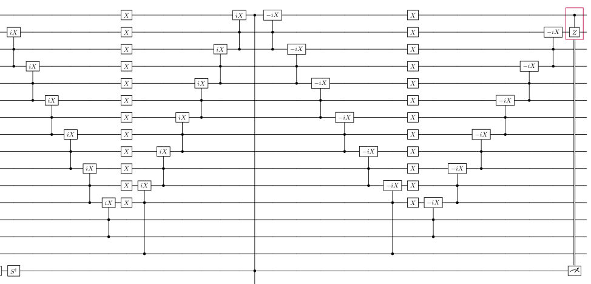 
Fig. 5: A dynamic realization of the C15X gate with one clean ancilla, using a network of 25 CC(iX) gates, one CCX gate, and a conditional CZ operation triggered by ancilla measurement, derived from [8].

**Summary.** This paper proposes a method to decompose large multi-controlled Toffoli gates into Clifford+T gates more efficiently by using 4-input relative-phase gates and dynamic circuits. By leveraging intermediate measurements and conditional corrections, the researchers significantly reduce the T-depth of these gates, which is a critical bottleneck in fault-tolerant quantum computing.

**Why it may be interesting.** not directly relevant

Detailed structure

**Main problem.** Efficiently decomposing large multi-controlled Toffoli gates into the Clifford+T gate set while minimizing T-count, T-depth, and CNOT overhead in fault-tolerant architectures.

**Main result.** The authors demonstrate that using 4-input relative-phase Toffoli gates and dynamic circuit techniques (measurement-conditioned corrections) significantly reduces T-depth, achieving up to a 41.74% reduction for large gates without increasing T-count or CX-count.

**Method.** The study utilizes 3- and 4-input relative-phase Toffoli gates combined with dynamic circuit techniques, such as intermediate measurements, qubit resets, and measurement-conditioned feed-forward operations to replace costly uncomputation.

**Model / system.** The work focuses on fault-tolerant quantum computing architectures using the Clifford+T universal gate set, specifically targeting the implementation of multi-controlled X gates ($C_n X$).

**Key observables.** T-count, T-depth, and CX-count (CNOT gate count).

**Important parameters / regimes.** Number of control qubits ($n$), availability of a single clean ancilla, and the use of conditionally clean ancillas.

**Assumptions / limitations.** The analysis assumes the availability of at least one clean ancilla and the ability to perform intermediate measurements and classical feed-forward (dynamic circuits).

**Figures summary.** Figure 1 shows Clifford+T decompositions for relative-phase gates; Figure 2 compares different 5-input Toffoli realizations; Figures 3 and 4 illustrate dynamic implementations using measurement-conditioned operations; Figures 5-7 demonstrate large-scale gate realizations and T-depth reduction via parallelization.

**Paper structure.** The paper introduces the problem of multi-controlled Toffoli decomposition, presents new decomposition techniques using 3- and 4-input relative-phase gates, details the implementation of dynamic circuit techniques for uncomputation, provides a comparative analysis of resource bounds, and validates results through experimental/numerical evaluation.

Abstract

Multi-controlled Toffoli gates are fundamental building blocks in quantum computation, with applications in quantum arithmetic, simulation, and search algorithms. In fault-tolerant architectures, their realization is constrained by the high cost of non-Clifford resources, particularly in terms of T-count and T-depth. Recent advances have demonstrated that the use of ancillary qubits, relative-phase Toffoli gates, and dynamic circuit techniques can substantially reduce this overhead.   In this work, we investigate the decomposition of large Toffoli gates using 3- and 4-input relative-phase Toffoli gates in the presence of a single clean ancilla and conditionally clean ancillas. We derive explicit resource bounds for Clifford+T implementations incorporating dynamic-circuit-based uncomputation and measurement-conditioned corrections. Our analysis emphasizes T-depth reduction under fixed CX and T-count overhead, ensuring relevance for near-term devices. We show that introducing 4-input relative-phase Toffoli gates enables significant T-depth reductions through enhanced parallelism while maintaining favorable ancilla requirements. We further validate our theoretical results through experimental evaluation and comparative analysis with existing approaches.

[↑ back to top](#top)

### [All Quantum Probability viewed in Complex Projective Geometry](http://arxiv.org/abs/2605.17578v1)

**Authors:** Stephen Bruce Sontz  
**Type:** theory · **Category:** other · **PDF:** <https://arxiv.org/pdf/2605.17578v1>  
**Analysis basis:** full PDF text, analyzed in chunks
**Topic relevance:** `quantum measurements` **2/5**

📷 Fig 1

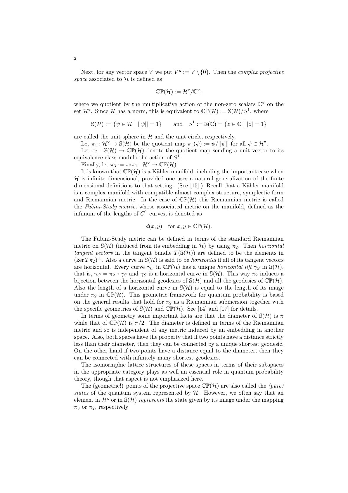 
Low-resolution page preview, page 2

📷 Fig 2

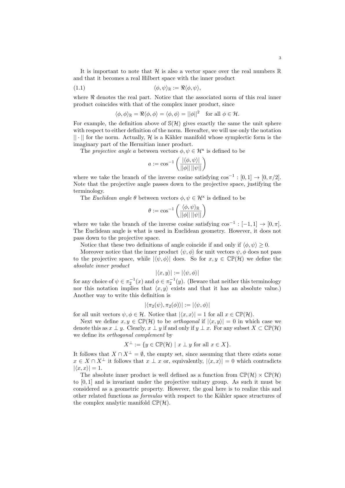 
Low-resolution page preview, page 3

📷 Fig 3

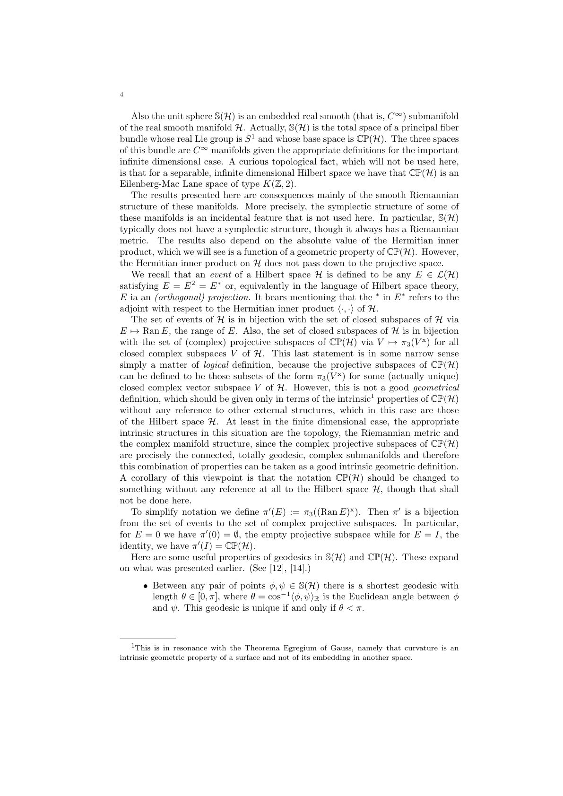 
Low-resolution page preview, page 4

📷 Fig 4

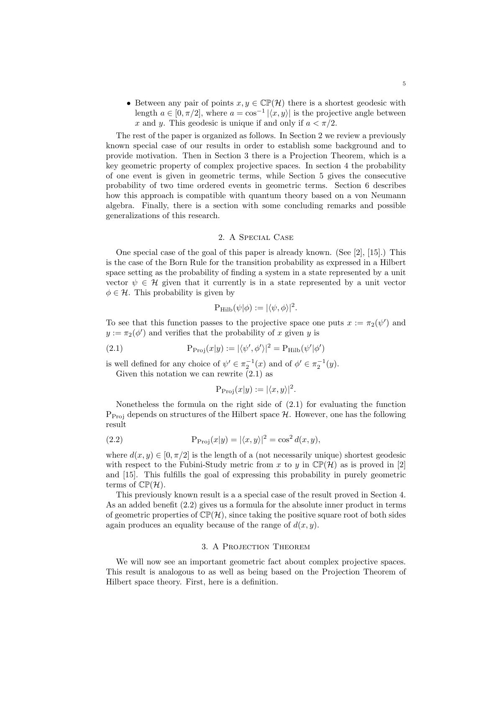 
Low-resolution page preview, page 5

📷 Fig 5

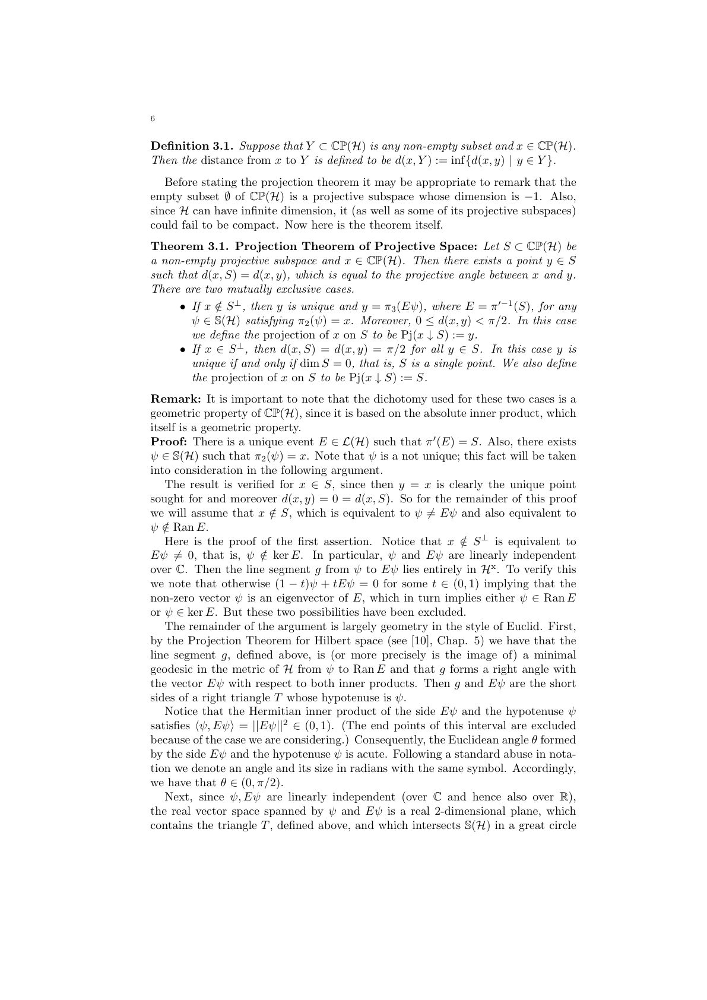 
Low-resolution page preview, page 6

**Summary.** This paper provides a purely geometric foundation for quantum mechanics by showing that all probability rules can be derived from the intrinsic metric properties of complex projective space. By removing the need for an underlying linear Hilbert space, it supports a broader program of geometrizing physics and allows for potential generalizations of quantum theory in other geometric settings.

**Why it may be interesting.** not directly relevant

Detailed structure

**Main problem.** The paper aims to reformulate all quantum probability formulas (single and consecutive events) using only the intrinsic geometric properties of complex projective space, removing the dependency on the underlying linear Hilbert space structure.

**Main result.** The author demonstrates that the Born rule and Wigner's rule for consecutive events can be expressed purely through the Fubini-Study metric and geodesics of the Kähler manifold CP(H), establishing a projection theorem for projective space.

**Method.** The study employs the mathematical framework of Riemannian submersions, the Fubini-Study metric, and the theory of geodesics within complex projective geometry to reinterpret Hilbert space operators as geometric subspaces.

**Model / system.** The framework applies to a general quantum system represented by a complex Hilbert space (finite or infinite-dimensional) where pure states are identified with points in the complex projective space CP(H).

**Key observables.** Quantum transition probabilities (Born rule), single event probabilities, and consecutive event probabilities.

**Important parameters / regimes.** The Fubini-Study metric distance d(x, y), the projective angle, and the dimension of the Hilbert space (dim >= 2).

**Assumptions / limitations.** The Hilbert space is assumed to be complex with a Hermitian inner product; the paper notes potential non-compactness issues in infinite-dimensional settings.

**Paper structure.** The paper begins with a review of Hilbert space structures, transitions to the geometric properties of the Kähler manifold CP(H), proves a projection theorem for projective subspaces, and concludes by demonstrating how probability rules and von Neumann algebras are recovered geometrically.

Abstract

In a recent paper it was shown that all the Hilbert space formulas for quantum probabilities can be realized as functions of geometric properties of the associated projective space, but those functions were expressed using the structures of the associated Hilbert space. In this paper a direct description of all these probabilities is given as formulas involving only the geometric properties of the projective space itself without referring to the associated Hilbert space theory. In large part this depends on a projection theorem for complex projective space which is analogous to the projection theorem for Hilbert spaces. The importance of this is that this exhibits quantum probability in terms of the geometry of a Riemannian metric in a non-linear Kähler manifold without any reference to a linear Hilbert space. As such this is a part of a larger program of the geometrization of physics. This opens the possibility of generalizations of quantum theory in other similar geometric settings. The theory presented includes projective spaces of both finite and infinite dimension. Some comments explain how quantum theory based on a von Neumann algebra is compatible with this approach.

[↑ back to top](#top)

### [An Entropy-Governed Speedup for Quantum Algorithms on Local Hamiltonians](http://arxiv.org/abs/2605.18241v1)

**Authors:** Ranitha Mataraarachchi, François Le Gall, Suguru Tamaki  
**Type:** theory · **Category:** quantum information and computing · **PDF:** <https://arxiv.org/pdf/2605.18241v1>  
**Analysis basis:** full PDF text, analyzed in chunks
**Topic relevance:** `entanglement & information structure` **2/5**

📷 Fig 1

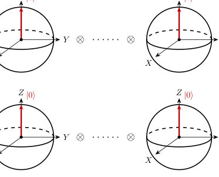 
Figure 1: Visual representation of the local unitary perturbation applied to the first qubit, assuming it is in the quiet set.

**Summary.** This paper introduces a quantum algorithm that outperforms the standard Grover bound for energy estimation and state preparation of k-local Hamiltonians. By shifting the target from the absolute ground state to an energy threshold reachable by low-depth circuits, the authors leverage the high density of states to achieve a speedup governed by the binary entropy function. This provides a fundamental distinction between highly entangled states and those with efficient classical descriptions.

**Why it may be interesting.** not directly relevant

Detailed structure

**Main problem.** Efficiently estimating the ground-state energy and preparing low-energy states for general k-local Hamiltonians, specifically aiming to break the Grover bound of O*(2^{n/2}).

**Main result.** The authors present a quantum algorithm that achieves an even faster runtime than previous methods, with a scaling governed by the binary entropy function, by targeting an energy threshold achievable by low-depth circuits.

**Method.** The approach uses spectral analysis, the Cauchy Interlacing Theorem, and a perturbation strategy on a 'quiet set' of qubits to prove an exponentially dense spectrum of low-energy states near a specific energy threshold.

**Model / system.** The study considers n-qubit k-local Hamiltonians, which are general all-to-all interacting systems without specific geometric or spatial structure assumptions.

**Key observables.** Ground-state energy estimation, energy threshold (Ed), and cumulative spectral count N(E).

**Important parameters / regimes.** k-locality, circuit depth (d), total interaction strength (M), and the binary entropy function H(.).

**Assumptions / limitations.** The algorithm assumes the target energy threshold is achievable by low-depth circuits and relies on the k-local nature of the Hamiltonian.

**Figures summary.** Figure 1 provides a visual representation of applying a local unitary perturbation (Pauli X operator) to a qubit within a quiet set to transform the zero state to the one state.

**Paper structure.** The paper introduces the problem of energy estimation, defines an effective Hamiltonian via low-depth circuits, provides a spectral density lower bound using perturbation theory, and concludes with the construction and complexity analysis of the new quantum algorithm.

Abstract

Low-energy estimation and state preparation for general $k$-local Hamiltonians are fundamental challenges in quantum complexity theory. For constant relative accuracy, Buhrman et al. (PRL 2025) recently broke the natural Grover bound $O(2^{n/2})$, where $n$ denotes the number of qubits, for both problems. In this paper, for any sufficiently small parameter $d\ge 0$, we present an even faster quantum algorithm that outputs a quantum state with energy bounded by the minimum energy over all depth-$d$ states (i.e., states obtained by applying a depth-$d$ circuit to the all-zero state), together with an estimate of this energy. For the class of Hamiltonians with depth-$d$ ground states, our algorithm furthermore achieves exactly the same energy guarantees as Buhrman et al. Our results also provide insight into the distinction between strongly entangled states and those admitting efficient classical descriptions.

[↑ back to top](#top)

### [Bounds on quantum conference key agreement in pair-entangled networks](http://arxiv.org/abs/2605.18399v1)

**Authors:** Justus Neumann, Hermann Kampermann, Dagmar Bruß, Anton Trushechkin  
**Type:** theory · **Category:** quantum information and computing · **PDF:** <https://arxiv.org/pdf/2605.18399v1>  
**Analysis basis:** full PDF text, analyzed in chunks
**Topic relevance:** `entanglement & information structure` **2/5**

📷 Fig 1

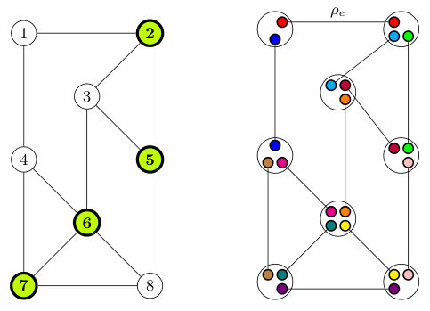 
Figure 1. Left: Example for the graph of a network. The vertices (or nodes) correspond to participants and the edges correspond to bipartite entangled states between them. Ver- tices from the subset I of participants who want to establish a common conference key (“secrecy-seeking parties”) are de- picted in green. The other participants can assist them: Here the vertices 5 and 6 are connected only via the vertices out- side I. Right: more detailed structure of the network and a PEN state. The “total” Hilbert space is the tensor product of the spaces corresponding to the participants. The Hilbert spaces of the participants are the tensor products of their cor- responding parts of the...

📷 Fig 2

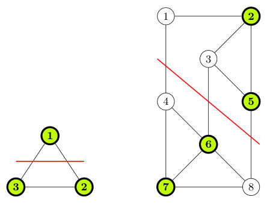 
Figure 2. Illustration of Proposition 1. Here each edge cor- responds to one Bell pair. A simple bound on the distill- able conference rate is given by a “weakest” cut: If we find a cut of the graph such that both parts contain vertices from I (secrecy-seeking parties, depicted in green), then the dis- tillable conference key cannot be larger than the distillable bipartite key corresponding to this bipartition, which is equal to the total entanglement entropy of the edges from the cut. The weakest cuts depicted in the figure give the bound r ≤2 for the network to the left and the bound r ≤3 for the net- work to the right. However, these bounds are not tight, see Fig. 3.

📷 Fig 3

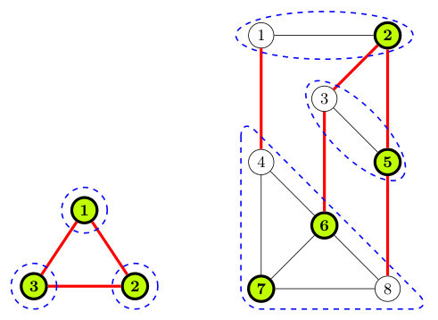 
Figure 3. Illustration of Theorems 4 and 5. These theo- rems include the minimization over all vertex partitions such that each subset intersects with I (secrecy-seeking parties, depicted in green). We consider arbitrary vertex partitions of the graphs and the partition subsets are encircled by blue dashed curves. For PEN states, the total entanglement en- tropy (if the state is pure) or the total entanglement cost (if the state is mixed) of the cross edges (i.e., edges connecting different partition subsets, depicted in red) gives an upper bound for the distillable conference key (see Eq. (16)). If each edge corresponds to a Bell pair, then, according to The- orem 4, the partitions...

📷 Fig 4

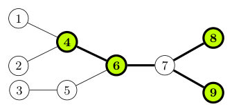 
Figure 4. Tree network. The subgraph induced by the ver- tices 4 and 6–9 constitutes the minimal tree containing the picked vertices. Then the distillable conference key is equal to the minimal bipartite distillable key in this “shortened tree”. Vertices 1, 2, 3, and 5 do not connect any picked vertices, hence, they cannot assist the distillation task and their edges are unimportant.

**Summary.** This paper establishes fundamental limits on how much secret key can be distilled in quantum networks where connections are made of bipartite entangled pairs. It proves that for these specific networks, the most efficient way to create a group key is simply to perform standard bipartite QKD on each link and then merge the results.

**Why it may be interesting.** not directly relevant

Detailed structure

**Main problem.** The paper investigates the upper bounds on the distillable conference key rate in quantum conference key agreement (QCKA) within near-term quantum networks.

**Main result.** The authors prove that for pair-entangled networks, multipartite strategies do not outperform bipartite-based strategies, and they derive upper bounds on the key rate based on network topology and the regularized entanglement of formation.

**Method.** The study uses information-theoretic tools including the multipartite Devetak-Winter formula, von Neumann entropy, and graph theory (cuts and partitions) to derive and prove the tightness of bounds.

**Model / system.** The model consists of pair-entangled networks (PENs) where nodes are connected by sources of bipartite entangled states (e.g., Bell states) distributed along the edges of a graph.

**Key observables.** Distillable conference key rate (r_key), multipartite Devetable-Winter key rate (r_DW), and von Neumann entropy.

**Important parameters / regimes.** Network topology (graph structure), degree of entanglement of the sources, and the number of secrecy-seeking parties (N).

**Assumptions / limitations.** The network operates under local operations and shared randomness (LOSR) without quantum memory, and helper nodes are assumed to be trusted.

**Figures summary.** Figure 1 illustrates the network graph and participants; Figure 2 shows the 'weakest cut' bound; Figure 3 demonstrates how vertex partitions provide stronger bounds; Figure 4 illustrates tree networks.

**Paper structure.** The paper introduces the QCKA task in PENs, establishes upper bounds for the Devetak-Winter rate, analyzes specific network topologies like tree and 3-node networks, and generalizes the bounds to mixed states using regularized entanglement of formation.

Abstract

We investigate the task of conference key agreement in near-term quantum networks, where the nodes are connected by sources of bipartite entangled states, under the class of local operations not requiring quantum memory. We derive upper bounds on the distillable conference key depending on the network topology and degree of entanglement of the sources, and prove tightness of these bounds for some particular cases. In these cases, we show that pairwise bipartite key distillation followed by merging the bipartite keys into the conference key is optimal.

[↑ back to top](#top)

### [Branching under First-Passage Resetting](http://arxiv.org/abs/2605.16693v1)

**Authors:** Aanjaneya Kumar, James Holehouse  
**Type:** theory · **Category:** statistical mechanics · **PDF:** <https://arxiv.org/pdf/2605.16693v1>  
**Analysis basis:** full PDF text, analyzed in chunks
**Topic relevance:** `non-equilibrium dynamics` **2/5**

📷 Fig 1

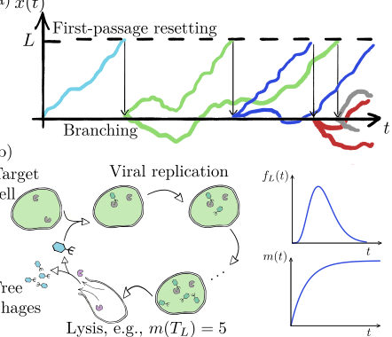 
FIG. 1. Branching under first-passage resetting. (a) Schematic showing the core model for m = 2. Trajectories stochastically evolve until the threshold is reached at which point the trajectory simultaneously resets to the origin and branches. (b) Processes such as viral lysis can be modeled under our framework, with distributions over the lysis time, fL(t), and a time-dependent number of offspring, m(t).

📷 Fig 2

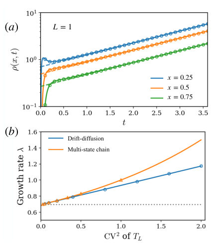 
FIG. 2. (a) The density ρ(x, t) measured at several posi- tions for a drift-diffusion process with close agreement be- tween the simulations (symbols), exact theory (solid curve) and the asymptotic form (dashed line) in Eq. (6). (b) Growth rate λ as a function of the first-passage-time vari- ability CV2 = Var(TL)/⟨TL⟩2, at fixed mean ⟨TL⟩and fixed offspring number m = 2 for representative processes. Increas- ing CV2 increases λ. For the discrete multi-state chain, sim- ulation points correspond to Erlang clocks with an integer number n of states, for which CV2 = 1/n; hence the markers are not uniformly spaced. Model details and parameters are given in Ref. [53].

📷 Fig 3

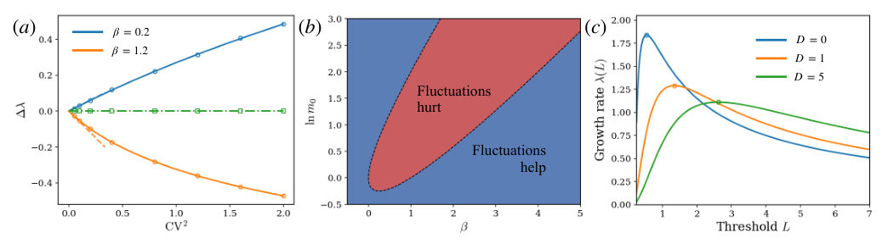 
FIG. 3. Time-dependent yield and the yield-delay trade-off. (a) Change in growth rate, ∆λ = λ −λdet, as a function of the first-passage-time variability CV2, for drift–diffusion clocks with fixed mean ⟨TL⟩= 1 and fixed yield at the mean, m(⟨TL⟩) = 3. For power-law yields m(t) = m0tβ, timing fluctuations can either enhance or suppress growth: they increase λ for β = 0.2 but decrease it for β = 1.2. Symbols denote simulations, solid curves denote the exact solution of the generalized Euler–Lotka equation, and the small-fluctuation approximation (dashed line) agrees near the deterministic limit. The exponential-yield control m(t) = eωt, with ω = ln 3, gives ∆λ = 0 for all CV2 [53]. (b)...

**Summary.** This paper introduces a framework for branching processes where replication is triggered by an internal stochastic variable reaching a threshold. It demonstrates that timing fluctuations can optimize population growth by balancing the benefit of higher offspring yield against the cost of delayed reproduction. The theory is successfully validated against experimental data from bacteriophage lysis.

**Why it may be interesting.** The framework of first-passage resetting and the mapping between microscopic stochasticity and macroscopic growth rates are highly relevant to the study of non-equilibrium dynamics and the stability of populations in open quantum systems.

Detailed structure

**Main problem.** Understanding how stochastic fluctuations in replication timing, driven by internal first-passage dynamics, affect the macroscopic population growth rate and the trade-off between offspring yield and reproduction delay.

**Main result.** The authors derive an exact renewal equation showing that for fixed yields, timing fluctuations necessarily enhance growth, while for time-dependent yields, fluctuations can either enhance or reduce growth depending on a specific yield-delay trade-off.

**Method.** The study uses a renewal approach, Laplace transforms, and a generalized Euler-Lotka equation, supplemented by small-fluctuation expansions and the use of the Lambert W function for analytical optimization.

**Model / system.** A branching process where replication events are triggered when an internal stochastic variable reaches a threshold (First-Passage Resetting). Models include drift-diffusion processes and multi-state Erlang/Gamma chains, with applications to bacteriophage lysis.

**Key observables.** Population growth rate (lambda), first-passage time (TL), offspring number/yield (m), and the coefficient of variation (CV^2) of the timing.

**Important parameters / regimes.** Threshold (L), drift velocity (vd), diffusion constant (D), power-law yield exponent (beta), and the yield-delay trade-off regime.

**Assumptions / limitations.** Assumes the existence of a probability density for first-passage times and that the population dynamics can be described by a generalized Bellman-Harris/Euler-Lotka framework.

**Figures summary.** Figure 1 shows the core model and phage lysis application; Figure 2 compares population density and growth rate vs. variability for different stochastic clocks; Figure 3 illustrates the impact of diffusion on growth.

**Paper structure.** Introduction of the BFPR framework, derivation of the exact renewal equation, analysis of fixed-yield vs. time-dependent yield regimes, optimization of the yield-delay trade-off, and experimental validation using bacteriophage data.

Abstract

Many biological processes, from cell division to viral lysis, are triggered when an internal stochastic variable reaches a threshold. Here we introduce Branching under First-Passage Resetting, a general framework in which replication events arise endogenously from first-passage dynamics rather than from externally imposed lifetime clocks. We show that the resulting population dynamics obey an exact renewal equation linking single-trajectory first-passage statistics to the population growth rate. This mapping shows that, for fixed offspring number and fixed mean replication time, stochastic timing fluctuations necessarily enhance growth relative to a deterministic clock. When offspring yield depends on the first-passage time, however, fluctuations have non-trivial effects and expose a fundamental yield-delay trade-off: waiting longer can increase the number of descendants, but delays all future lineages. Our framework allows us to address this optimization problem analytically, and upon application to bacteriophage lysis, gives an optimal lysis time and growth rate consistent with empirical data.

[↑ back to top](#top)

### [Charge order on a triangular lattice with Mott physics and arbitrary charge density](http://arxiv.org/abs/2605.18575v1)

**Authors:** Aleksey Alekseev, Agnieszka Cichy, Konrad Jerzy Kapcia  
**Type:** theory · **Category:** strongly correlated electrons · **PDF:** <https://arxiv.org/pdf/2605.18575v1>  
**Analysis basis:** full PDF text, analyzed in chunks
**Topic relevance:** `Kondo & dissipative impurity` **2/5**

📷 Fig 1

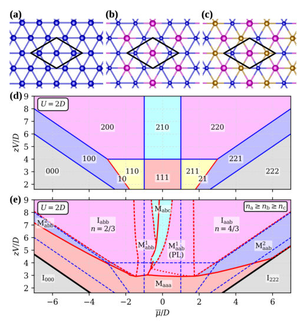 
FIG. 1. (a)–(c) Charge order types of √

📷 Fig 2

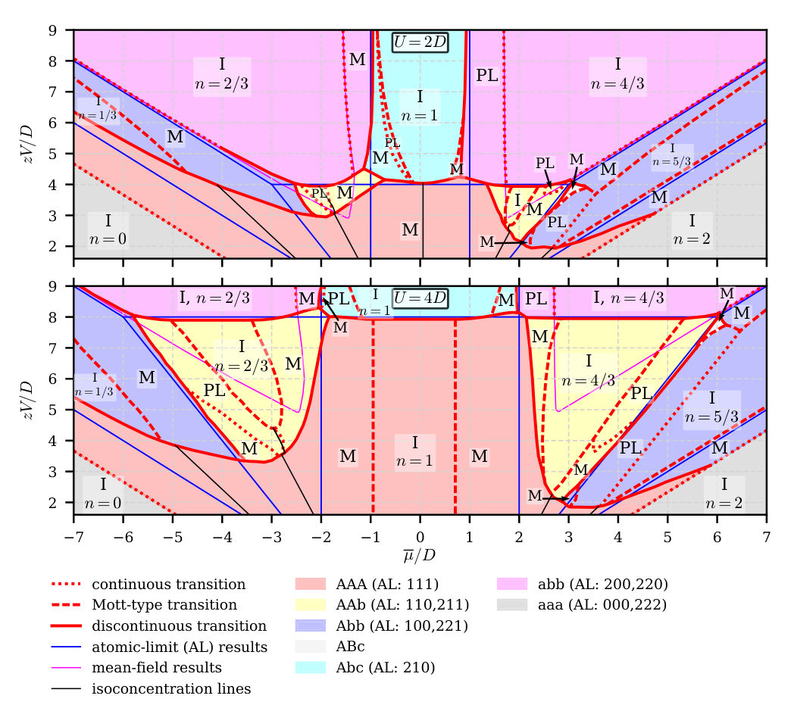 
FIG. 2. DMFT phase diagram of the triangular-lattice extended Hubbard model with charge orders commensurate with √

📷 Fig 3

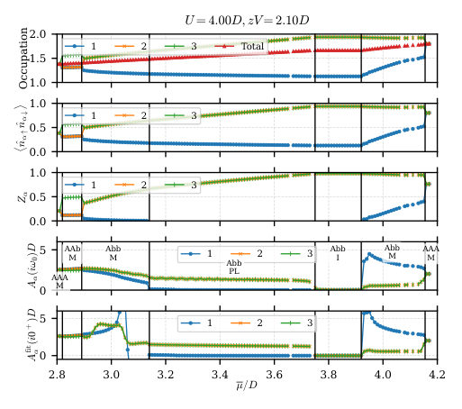 
FIG. 4. Order parameters along the line U = 4D and zV = 2.1D encompassing the Abb-region Mott-localization- driven pinball liquid. The fitting for Aα is unstable around the transition from the metallic to pinball-liquid Abb phase. Zb (i.e., Z2 and Z3 for Abb region and Z3 for AAb region) is not close to 1 due to the proximity to the point of the contin- uous transition to the AAA region. See the caption of Fig. 3 for more details.

📷 Fig 4

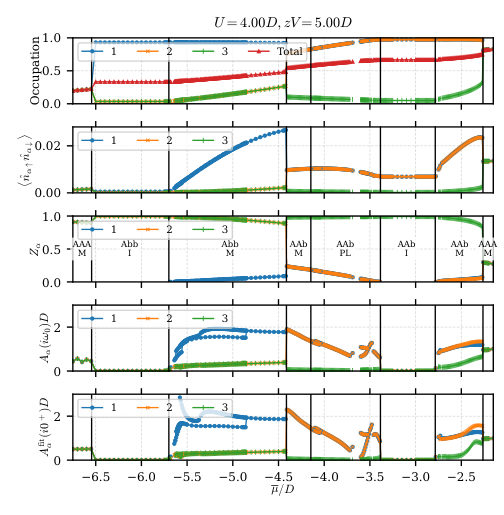 
FIG. 3. Order parameters along the line U = 4D and zV = 5D encompassing the AAb-region charge-transfer-driven pin- ball liquid and three Mott-type transitions (¯µ = −5.70D, −3.385D, and −2.785D). Legend shows the index of sublat- tice α. Coexistence regions are not shown (only phases with lowest grand potential). Points where the lines are interrupted are where convergence has not been reached. Vertical solid lines show phase transitions. Both spectral weights Aα at the Matsubara frequency iω0 and the one taken from fitting with rational function at i0+ are shown: the one from the fitting is generally more realistic but the fitting is unstable in some cases (see Fig. 4). Different solutions...

📷 Fig 5

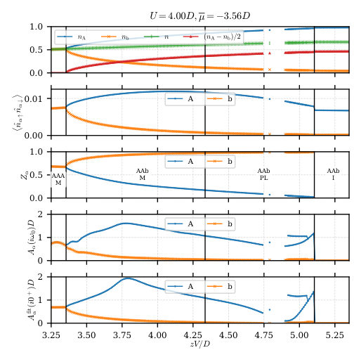 
FIG. 5. Order parameters for the AAb phases along the line U = 4D and ¯µ = −3.56D encompassing the point of con- tinuous symmetry breaking at zV = 3.355D (compare with discontinuous symmetry breakings on the edges of Figs. 3 and 4), the charge-transfer-driven pinball liquid, as well as the Mott-type transition at zV = 5.105D. Different metallic solutions at a range of zV from 4.92D to 5.05D are discussed at the end of Sec. IV B. See the caption of Fig. 3 for more details.

**Summary.** This paper uses DMFT to map out the phase diagram of the extended Hubbard model on a triangular lattice. It discovers various charge-ordered and pinball-liquid phases, highlighting how Mott physics and intersite repulsion compete to drive different types of electronic localization.

**Why it may be interesting.** not directly relevant

Detailed structure

**Main problem.** Investigating the complex phase diagram of charge-ordering phenomena and the interplay between Mott physics and intersite interactions on a triangular lattice.

**Main result.** The study identifies a rich phase diagram containing various pinball-liquid (PL) phases, distinguishing between Mott-localization-driven and charge-transfer-driven types, and reveals strong particle-hole asymmetry.

**Method.** Dynamical Mean-Field Theory (DMFT) using the Lanczos algorithm to solve the Anderson Impurity Model, supplemented by Mean-Field Approximation (MFA) and Atomic-Limit (AL) analysis.

**Model / system.** The Extended Hubbard Model (EHM) on a triangular lattice, incorporating onsite interaction (U), nearest-neighbor interaction (V), and hopping amplitude (t).

**Key observables.** Sublattice occupation numbers, quasiparticle weights (Z), spectral functions, and grand potential.

**Important parameters / regimes.** Onsite interaction (U), intersite interaction (V), chemical potential (mu), and bandwidth (D).

**Assumptions / limitations.** Neglects magnetic ordering, neglects spatial correlations by treating intersite interaction at the Hartree level, and focuses on the zero-temperature ground state.

**Figures summary.** Visualizations of charge-order types, the atomic-limit phase diagram, DMFT phase diagrams with color-coded regions, and sublattice-specific spectral functions.

**Paper structure.** The paper defines the mathematical framework and model, reviews established limits (AL and MFA), presents the new DMFT phase diagrams, and analyzes specific spectral properties and phase transitions.

Abstract

Triangular-lattice systems attract a lot of attention due to various frustration-induced and strongly correlated effects. Here, we focus on the charge-ordering phenomenon by means of investigation of the extended Hubbard model with dynamical mean-field theory (DMFT). By considering the intersite nearest-neighbor interaction we have found a very rich phase diagram that contains large number of features, phases, and phase transitions. Among them are pinball-liquid (PL) phases where we distinguish charge-transfer-driven and Mott-localization-driven PLs; phase transitions that change their order as model parameters evolve (from discontinuous to continuous); very strong particle-hole asymmetry. Various features of the phase diagram are found to be better understood by means of the simple mean-field approximation (MFA). Moreover, besides helping with interpretation of the phase diagram, the MFA results together with results for the atomic-limit model are found to be able to set rather good expectations on how the DMFT phase diagram should look like. Nevertheless, a few features were not expected and are found within the DMFT, such as a small-region intermediate metallic phase on an electron-doped side of the phase diagram.

[↑ back to top](#top)

### [Covariant extrinsic curvature expansion of the nonlocal effective action for a massless scalar field on a manifold with boundary](http://arxiv.org/abs/2605.17124v1)

**Authors:** A. Boasso, C. D. Fosco, B. C. Guntsche, F. D. Mazzitelli  
**Type:** theory · **Category:** other · **PDF:** <https://arxiv.org/pdf/2605.17124v1>  
**Analysis basis:** full PDF text, analyzed in chunks
**Topic relevance:** `Keldysh / 2PI / non-Gaussian methods` **2/5**

📷 Fig 1

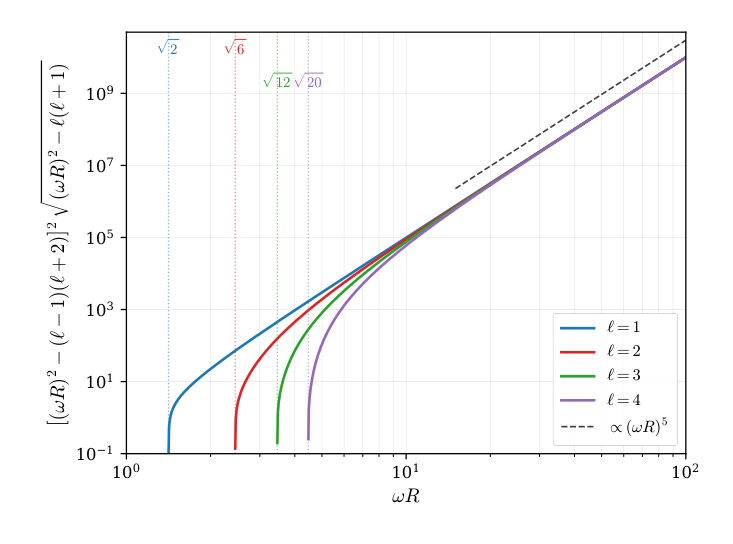 
Figure 1: Dimensionless mean number of created particles per unit time, (ωR)2 −(ℓ−1)(ℓ+ 2) 2p

**Summary.** This paper develops a new covariant method to calculate the nonlocal effective action for quantum fields near curved boundaries. It successfully applies this framework to predict particle production in oscillating geometric structures, such as spheres and rings, providing a more general approach than previous coordinate-dependent methods.

**Why it may be interesting.** not directly relevant

Detailed structure

**Main problem.** Deriving a covariant expansion of the nonlocal effective action for a massless scalar field on a manifold with a curved boundary, extending beyond previous Monge-patch-based methods.

**Main result.** The authors establish a geometric framework for the nonlocal effective action in terms of the extrinsic curvature tensor, providing specific results for particle creation rates in oscillating 2+1D rings and 3+1D spheres.

**Method.** The study utilizes a heat-kernel approach and the Barvinsky-Vilkovsky reconstruction method to derive the expansion, applying it to time-dependent geometries via Wick rotation and perturbation theory.

**Model / system.** A massless real scalar field in a flat (d+1)-dimensional bulk with a smooth, curved boundary subject to Dirichlet or Neumann boundary conditions, including specific models of oscillating rings and spheres.

**Key observables.** Nonlocal effective action, particle creation rate, and the mean number of created particles.

**Important parameters / regimes.** Extrinsic curvature tensor (K_ab), dimension (d), oscillation frequency (omega), deformation amplitude (epsilon), and boundary conditions (Dirichlet/Neumann).

**Assumptions / limitations.** The bulk manifold is assumed to be flat, the boundary is smooth, and the expansion is valid in the regime where curvature gradients dominate over nonlinear curvature effects.

**Figures summary.** Figure 1 shows the dimensionless mean number of created particles per unit time as a function of omega*R for various multipoles, illustrating a threshold frequency for radiation and a universal high-frequency scaling.

**Paper structure.** The paper progresses from defining the heat-kernel expansion and geometric framework to deriving the quadratic order expansion in extrinsic curvature, followed by applications to oscillating ring and sphere geometries and validation against existing models.

Abstract

We study the nonlocal effective action of a massless scalar field defined on a flat manifold with a curved boundary. Using a heat-kernel approach, we derive a covariant expansion of the nonlocal contribution to quadratic order in the extrinsic curvature tensor. Our construction provides a geometric framework that both reproduces earlier results obtained for Monge-patch embeddings and extends them to more general surfaces that need not admit a global Monge-patch description. The expansion is valid in the regime where gradients of the extrinsic curvature dominate over nonlinear curvature effects. As an application, we compute the particle-creation rate for an oscillating deformed ring in $2+1$ dimensions and an oscillating deformed sphere in $3+1$ dimensions.

[↑ back to top](#top)

### [Detecting nonclassicality in randomly-displaced copies of a squeezed state](http://arxiv.org/abs/2605.18708v1)

**Authors:** Mehmet Emre Tasgin  
**Type:** theory · **Category:** quantum information and computing · **PDF:** <https://arxiv.org/pdf/2605.18708v1>  
**Analysis basis:** full PDF text, analyzed in chunks
**Topic relevance:** `quantum measurements` **2/5**

📷 Fig 1

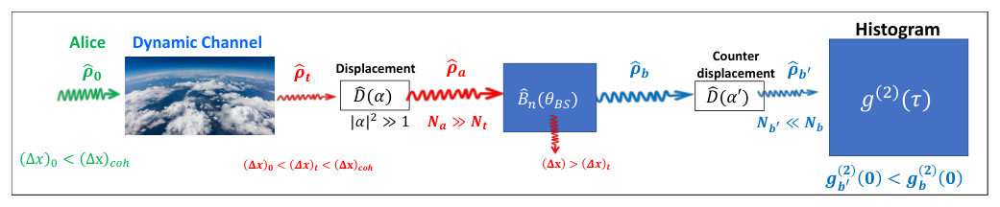 
FIG. 1. Protocol for detecting nonclassicality in randomly displaced copies of a squeezed state. (i) Alice sends identical copies of a squeezed state ˆρ0, but each copy reaches the receiver as ˆρt with an unknown displacement due to attenuation in the dynamical channel. (ii) The received copy is displaced by ˆD(α) with a large α, i.e., |α|2 ≫1, to obtain ˆρa. The operation ˆD(α) does not change the nonclassicality of ˆρt [6, 7, 23, 24], but the resulting states ˆρa have much narrower pulse-to-pulse variations in their mean photon number. (iii) ˆρa enters the ˆBn(θ) operation, which converts the quadrature squeezing in ˆρa into number squeezing in the output state ˆρb (see Fig. 2a). As a...

📷 Fig 2

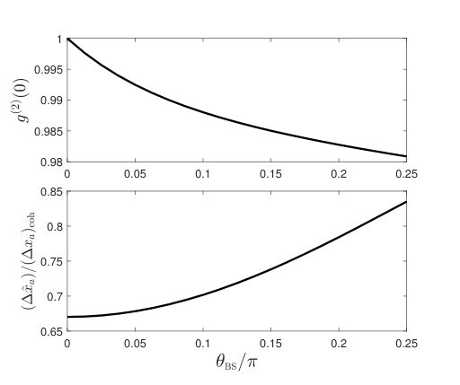 
FIG. 2. Transformation of initial quadrature squeezing into number-squeezing (g(2)(0) &lt; 1) under the action of the ˆBn(θ) operator. (a) Nonclassicality of the second (ˆbn) mode in- creases as g(2)(0) decreases. (b) Quadrature squeezing of the first (ˆa) mode decreases, with the uncertainty (∆ˆxa) increasing. One type of nonclassicality (quadrature squeez- ing) present in the first mode is converted into another type (number-squeezing) in the second mode.

📷 Fig 3

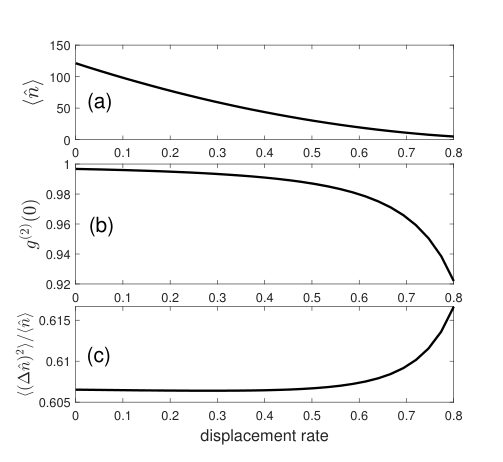 
FIG. 3. While the number-squeezed ˆbn output mode possesses a ⟨(∆ˆn)2⟩/⟨ˆn⟩ratio much below the unity, the g(2)(0) stays close to unity because of the large occupation. We perform a counter-displacement in the ˆbn output mode before we send them to the g(2)(τ) histogram. The ˆD(α′) displacement does not generate nonclassicality from coherent state ˆbn outputs, however it makes g(2)(0) &lt; 1 states more visible.

**Summary.** The paper presents a method to identify quadrature squeezing even when the signal's amplitude fluctuates randomly between pulses. By using a specific interaction to convert quadrature squeezing into number squeezing, the authors show that the nonclassical signature becomes detectable and remains invariant under signal attenuation.

**Why it may be interesting.** It provides a robust protocol for quantum state verification in noisy, fluctuating channels, which is critical for quantum communication and sensing in real-world environments like atmospheric links.

Detailed structure

**Main problem.** How to detect quadrature squeezing in a signal when each received copy has a different, unknown random displacement due to environmental noise or channel fluctuations.

**Main result.** The authors propose an interaction Hamiltonian that converts quadrature squeezing into number squeezing, allowing for detection via the second-order correlation function g(2)(0) which remains robust against random displacements and attenuation.

**Method.** The paper uses an operator formalism (Pegg-Barnett) and the Baker-Campbell-Hausdorff lemma to derive a beam-splitter-like transformation that maps quadrature variables to number-phase variables, supplemented by numerical simulations in a finite Fock space.

**Model / system.** A two-mode system consisting of an incident squeezed mode and a number-phase mode, with potential implementations in circuit QED (Josephson junctions), atomic ensembles (Raman transitions), and nonlinear optics (Kerr nonlinearities).

**Key observables.** Second-order correlation function g(2)(0), normalized number variance, and the g(2)(tau) histogram.

**Important parameters / regimes.** Large photon number regime (n >> 1), squeezing rates, displacement amplitudes, and transmission coefficient (eta).

**Assumptions / limitations.** The large-occupation approximation is used for the validity of the number-phase commutation relation, and the environment/loss mode is assumed to be in the vacuum state.

**Figures summary.** Figure 1 shows the detection protocol schematic (displacement, conversion, and detection); Figure 2 illustrates the conversion of quadrature squeezing to number squeezing; Figure 3 shows the enhancement of signal visibility via counter-displacement.

**Paper structure.** The paper introduces the problem of random displacements, defines the conversion Hamiltonian and its operator properties, proves the non-generation of nonclassicality, demonstrates the conversion mechanism and entanglement generation, provides an analytical proof of g(2)(0) invariance under loss, and discusses physical implementations.

Abstract

We address a fundamental question: Can one determine whether a received signal is squeezed when each copy arrives with a different displacement/amplitude? We introduce an interaction Hamiltonian that converts quadrature squeezing into number squeezing. Using this conversion, we test whether the copies satisfy $g^{(2)}(0)<1$. The Hamiltonian itself does not create nonclassicality; it only transfers it from quadrature squeezing to number squeezing. This allows us to identify squeezing even when individual copies have random displacements.

[↑ back to top](#top)

### [Energy-Weighted Site Percolation in Two Dimensions](http://arxiv.org/abs/2605.18312v1)

**Authors:** Sayan Sircar, Kabir Ramola  
**Type:** theory · **Category:** statistical mechanics · **PDF:** <https://arxiv.org/pdf/2605.18312v1>  
**Analysis basis:** full PDF text, analyzed in chunks
**Topic relevance:** `non-equilibrium universality` **2/5**

📷 Fig 1

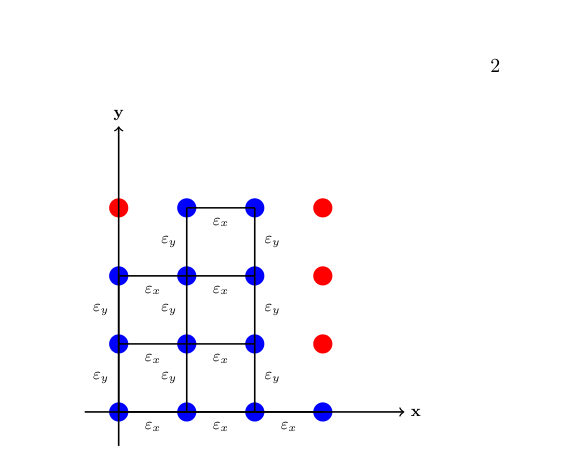 
FIG. 1. A 4 × 4 square lattice with 12 occupied (blue) and 4 unoccupied (red) sites. Bonds between nearest-neighbor occupied sites are shown in black and have an energy cost εx for bonds along horizontal x direction, and energy cost εy for bonds along vertical y direction. The connected occupied sites form a cluster. In this diagram, there is only one cluster containing 12 occupied sites and 16 bonds connecting nearest- neighbor occupied sites.

📷 Fig 2

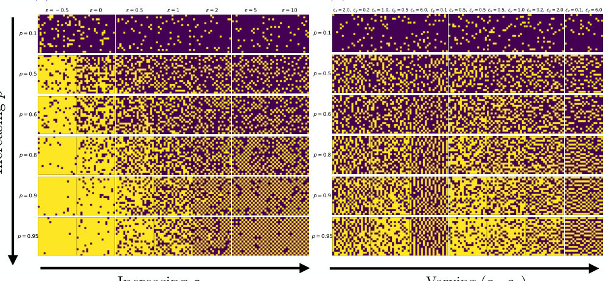 
FIG. 2. The left plot (a) illustrates the variation in cluster configurations as a function of site-occupation probability p and energy cost ε, and the right plot (b) illustrates the variation in cluster configurations for different values of site occupation probability p and energy cost εx for bonds along the direction of x axis and εy for bonds along the direction of y axis. The computation is performed on a square grid with a total of N = 400 sites. The colors indicate the occupancy variable nij, with nij = 1 indicating that a particular site is occupied (yellow), and nij = 0 indicating that a particular site is not occupied (blue).

📷 Fig 3

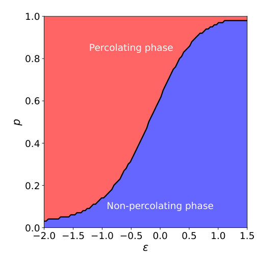 
FIG. 3. Phase diagram indicating percolating and non- percolating phase separated by critical curve pc(ε), in the ε −p plane. The phase diagram is obtained using numerical Monte Carlo simulation on a square lattice with dimensions N = 40000, as detailed in Sec. III. The blue colored region indicates the non-percolating phase, while the red colored re- gion indicates the percolating phase.

📷 Fig 4

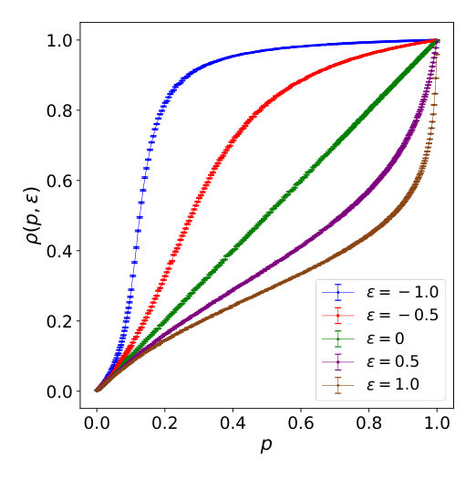 
FIG. 4. The plot illustrates the variation in the mean density of occupied sites, defined as ρ = Nocc

📷 Fig 5

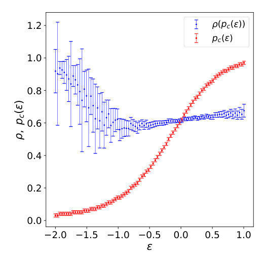 
FIG. 5. The plot illustrates the density of occupied sites, de- noted as ρ(pc(ε)), which is evaluated at the critical site occu- pation probability pc(ε) for various values of the bond energy cost ε. The data for pc(ε) is also presented in Fig. 3. Ad- ditionally, the corresponding mean density of occupied sites, ρ(pc(ε), ε), is computed for a system size of N = 400.

**Summary.** This paper generalizes 2D site percolation by introducing a bond energy cost, demonstrating that this parameter can continuously tune the system between different universality classes. By using renormalization group and Monte Carlo methods, the authors show how connectivity and critical exponents evolve as a function of the energetic cost.

**Why it may be interesting.** not directly relevant

Detailed structure

**Main problem.** The study investigates how assigning an energy cost to bonds between nearest-neighbor occupied sites affects the percolation threshold, critical exponents, and universality classes in 2D site percolation.

**Main result.** The bond energy epsilon acts as a tuning parameter that shifts the percolation threshold and drives a continuous evolution of the correlation length exponent nu from 1/2 to 4/3 to 1, effectively interpolating between different universality classes.

**Method.** The authors employ Monte Carlo simulations in a grand-canonical ensemble, real-space renormalization group (RG) methods using Kadanoff block recursions, and a Coulomb-gas formulation to interpret scaling behavior.

**Model / system.** An energy-weighted site percolation model on a 2D square lattice where each bond between nearest-neighbor occupied sites incurs an energy cost epsilon, creating a competition between entropy and energetic suppression.

**Key observables.** Percolation threshold (pc), correlation length (xi) and its exponent (nu), cluster size distribution, and susceptibility (chi).

**Important parameters / regimes.** Site occupation probability (p), bond energy cost (epsilon), and anisotropic energy components (epsilon_x, epsilon_y).

**Assumptions / limitations.** The analysis assumes the validity of real-space RG approximations and uses specific renormalization rules (e.g., R0, R2) for block-based calculations.

**Figures summary.** Figures illustrate lattice configurations with energy costs, phase diagrams of cluster configurations, RG flow diagrams around fixed points, and scaling collapses of wrapping probability and density.

**Paper structure.** The paper introduces the energy-weighted model, details the Monte Carlo and RG methodologies, presents results for isotropic and anisotropic cases, provides a Coulomb-gas interpretation, and concludes with a discussion on lattice gas RG approaches.

Abstract

We study a generalization of two-dimensional site percolation by assigning an energy cost $\varepsilon$ to bonds between nearest-neighbor occupied sites. This leads to a competition between entropy-driven cluster growth and energetic suppression (or enhancement) of connectivity. Varying $\varepsilon$ continuously interpolates between dense ferromagnetic-like clusters, ordinary classical percolation, and a dilute regime of minimally connected isolated clusters. Using Monte Carlo simulations and real-space renormalization-group (RG) methods, we show that bond energy shifts the percolation threshold smoothly. We define an energy-weighted correlation length that remains finite at the classical site occupation threshold ($p_c(\varepsilon=0)$) and shrinks with increasing $\varepsilon$, capturing the energetic suppression of large-scale connectivity. The cluster size distribution exhibits an energy-dependent cutoff that drives the transition from percolation-like clusters to isolated clusters. A real-space RG with Kadanoff block recursions reveals a systematic evolution of the correlation-length exponent $ν$ from $ν=1/2$ (dense clusters) to $ν=4/3$ (classical percolation), approaching $ν=1$ (minimally connected isolated clusters), in agreement with Coulomb-gas predictions for loop models where bond energy renormalizes loop fugacity. For large values of \(\varepsilon\) (isotropic case), the suppression of nearest-neighbor bonds results in the emergence of antiferromagnetic sub-lattice ordering at high densities. Additionally, anisotropic bond energies lead to directionally selective cluster growth. Finally, we also discuss a lattice gas RG approach and scenarios where bond energy is renormalized across different scales.

[↑ back to top](#top)

### [Finite-Temperature Spin Exchange-Correlation Kernel of the Uniform Electron Gas](http://arxiv.org/abs/2605.16888v1)

**Authors:** Pengcheng Hou, Zhiyi Li, Youjin Deng, Kun Chen  
**Type:** theory · **Category:** strongly correlated electrons · **PDF:** <https://arxiv.org/pdf/2605.16888v1>  
**Analysis basis:** full PDF text, analyzed in chunks
**Topic relevance:** `Keldysh / 2PI / non-Gaussian methods` **2/5**

📷 Fig 1

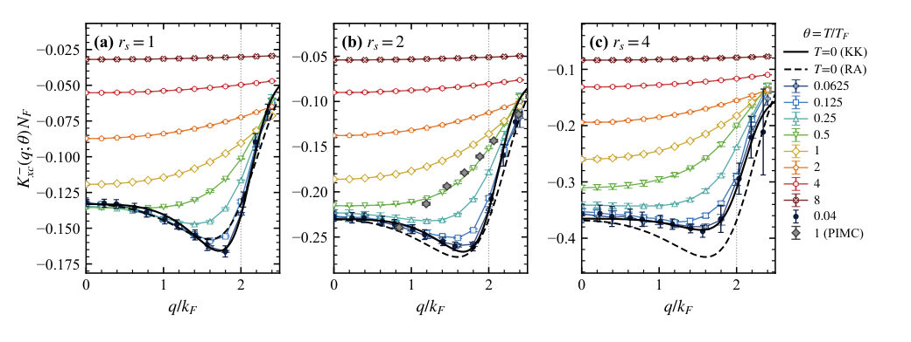 
FIG. 1. Static spin exchange-correlation (XC) kernel K− xc(q; θ) NF of the 3D unpolarized uniform electron gas (UEG) at Wigner-Seitz radius rs = 1 (a), 2 (b), and 4 (c) for reduced temperature θ = T/TF from 1/16 to 8, with the Fermi temperature TF and the zero-T density of states NF = kF /(2π2) (kF : Fermi wavevector). Color encodes θ, from low temperature (dark blue) to high temperature (dark red); see right-side legend. Open colored markers with thin connecting lines (guides to the eye): variational diagrammatic Monte Carlo (VDMC), this work. Filled navy circles: low-temperature VDMC data (θ = 0.04) from Chen and Haule [26]. Black solid and dashed lines: zero-T Kaplan–Kukkonen (KK) [14]...

📷 Fig 2

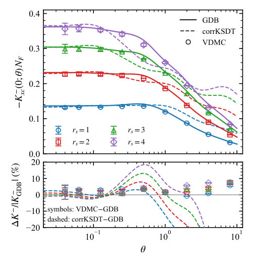 
FIG. 2. Top panel: dimensionless q = 0 spin XC kernel −K− xc(0; θ) NF at rs = 1, 2, 3, 4; the minus sign aligns Stoner enhancement with the upward direction (K− xc &lt; 0 in the metallic-density window). Solid lines: GDB fit [21]; dashed lines: corrKSDT fit [19, 20]. Open symbols: VDMC data; the θ = 0.04 points are from Ref. [26], all other points are from this work. Bottom panel: relative deviations ∆K−/|K− GDB|, in percent, with ∆K−= K−−K− GDB for each VDMC point or corrKSDT curve.

📷 Fig 3

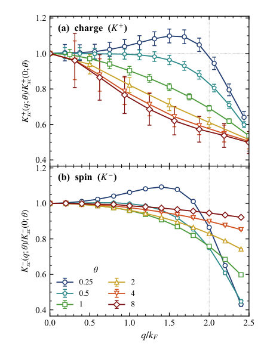 
FIG. 3. Normalized static XC kernels at rs = 1: (a) K+ xc(q; θ)/K+ xc(0; θ) and (b) K− xc(q; θ)/K− xc(0; θ) vs q/kF for the matched temperature grid θ ∈{0.25, 0.5, 1, 2, 4, 8}. Dashed horizontal line in (b): classical Curie asymptote K− xc(q; θ)/K− xc(0; θ) →1 at θ →∞. For θ ≳4, the spin ratio is within ∼10% of unity over q ≤2kF , whereas the charge ratio remains strongly q-dependent and is ≃0.56 at q = 2kF for θ = 8.

**Summary.** This paper uses variational diagrammatic Monte Carlo to provide the first-principles spin exchange-correlation kernel for the uniform electron gas across a wide temperature range. It identifies discrepancies in current warm-dense matter models and demonstrates how thermal effects lead to a transition toward a local, momentum-independent spin response.

**Why it may be interesting.** not directly relevant

Detailed structure

**Main problem.** The finite-temperature spin response of the uniform electron gas (UEG) is poorly constrained, particularly regarding the momentum-resolved spin exchange-correlation kernel across quantum-degenerate, warm-dense, and classical regimes.

**Main result.** The study provides first-principles data for the spin XC kernel, revealing that heating suppresses spin-correlation structures and Stoner enhancement, and identifying a 'warm-dense residual' error in current LSDA parametrizations.

**Method.** Variational diagrammatic Monte Carlo (VDMC) using a screened-interaction formulation and the Principle of Minimal Sensitivity (PMS) to ensure convergence.

**Model / system.** A 3D unpolarized uniform electron gas (UEG) at metallic densities, covering regimes from quantum-degenerate to classical temperatures.

**Key observables.** Static spin exchange-correlation kernel Kxc(q;T), spin stiffness (alpha_xc), Stoner enhancement, and the spin-interpolation exponent (p*).

**Important parameters / regimes.** Wigner-Seitz radius (rs) between 1 and 4, reduced temperature (theta = T/TF) from 0.25 to 8, and momentum transfer (q/kF).

**Assumptions / limitations.** The use of a Yukawa-type screening scale for the VDMC stability and the reliance on the PDW spin-interpolation ansatz for evaluating the spin-polarization dependence.

**Figures summary.** Figure 1 shows the dimensionless spin XC kernel for various densities; Figure 2 compares spin stiffness and kernel values against LSDA models (GDB, corrKSDT); Supplemental figures show VDMC convergence and the temperature-driven flattening of the kernel.

**Paper structure.** The paper introduces the problem of spin-response constraints, describes the VDMC methodology and convergence, presents results for the spin XC kernel across temperature and density, benchmarks these results against existing LSDA models, and discusses the high-temperature classical limit.

Abstract

The finite-temperature spin response of the uniform electron gas (UEG) is a fundamental reference for spin-polarized and magnetized electron liquids, including warm dense matter (WDM), yet it remains far less constrained than charge response. Using variational diagrammatic Monte Carlo, we compute the static spin exchange--correlation (XC) kernel $K_{xc}(q;T)$ of the unpolarized UEG at metallic densities across the quantum-degenerate, warm-dense, and classical regimes. The kernel connects smoothly to zero-temperature spin-response parametrizations at low temperature, while heating suppresses the Fermi-surface-scale spin-correlation structure and weakens the XC-driven Stoner enhancement. Its long-wavelength limit provides a direct response test of the spin stiffness implied by thermal local-spin-density-approximation (LSDA) parametrizations, showing low-temperature consistency while exposing a resolved warm-dense residual in current LSDA parametrizations. In the classical regime, the spin XC kernel becomes nearly local on the Fermi-momentum scale, in sharp contrast to the corresponding charge XC kernel. These results provide a first-principles basis for finite-temperature spin-response theory and magnetized WDM modeling.

[↑ back to top](#top)

### [Maximum Likelihood Decoding of Quantum Error Correction Codes](http://arxiv.org/abs/2605.17230v1)

**Authors:** Hanyan Cao, Ge Yan, Yuxuan Du, Feng Pan  
**Type:** theory · **Category:** quantum information and computing · **PDF:** <https://arxiv.org/pdf/2605.17230v1>  
**Analysis basis:** full PDF text, analyzed in chunks
**Topic relevance:** `methods for driven-dissipative` **2/5**

📷 Fig 1

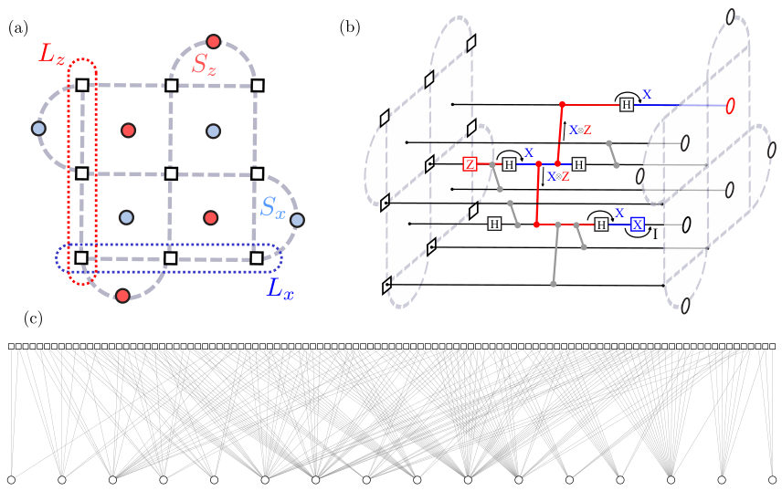 
Figure 1: A decoding-oriented view of the surface-code pipeline. (a) A rotated distance-3 patch with data qubits, representative Z-type (red) and X-type (blue) checks, and logical strings. (b) A local circuit fault can propagate through a syndrome-extraction circuit and create correlated detection events across space and time. (c) A DEM represents this information as a factor graph: square nodes are error mechanisms and circular nodes are detector parities.

📷 Fig 2

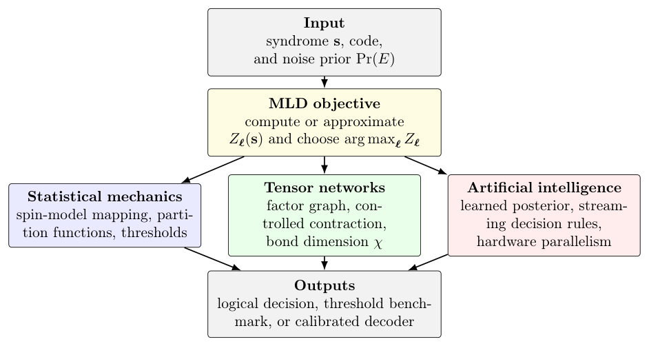 
Figure 2: Roadmap of the three perspectives used in this review. Each approach is organized around the same coset-likelihood object but uses a different computational representation: a spin-model partition function, a tensor-network contraction, or a learned posterior/decision rule.

📷 Fig 3

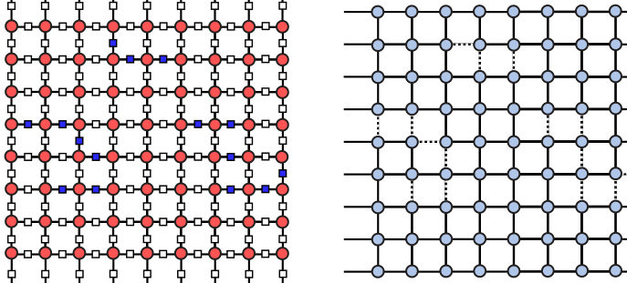 
Figure 3: The statistical-mechanical mapping for quantum error correction. (a) d = 9 surface code under bit flip code capacity noise. Each red node is a Z type stabilizer, which detects X error on neighbor qubits (squares). The blue squares represent that X errors occur on corresponding qubits. (b) The dual spin-glass model corresponding to (a). Each blue node represents an X spin, where a spin state of 1 indicates the application of the corresponding X stabilizer. And the dashed lines are negative couplings corresponding to blue squares in (a).

📷 Fig 4

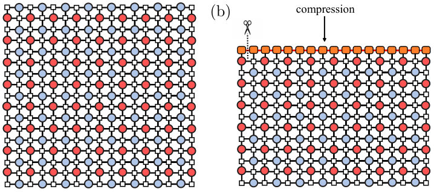 
Figure 4: (a) Tensor network representation of a surface code (d = 9). (b) Boundary MPS algorithm for approximate contraction.

📷 Fig 5

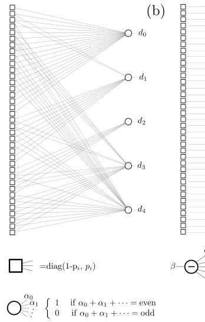 
Figure 5: Tensor network in detector picture. (a) Tensor network representation of a DEM com- prising 5 detectors and 37 error mechanisms. (b) Decomposition of high-degree XOR tensors into multiple lower-degree XOR tensors. (c) Insertion of passing tensors to resolve edge crossings and construct a regular 2D lattice.

**Summary.** This review explores the optimal strategy for quantum error correction, known as Maximum Likelihood Decoding, which is computationally difficult but essential for high-fidelity quantum computing. It synthesizes recent breakthroughs from statistical mechanics, tensor networks, and machine learning to show how we can approximate this optimal decoding efficiently. The paper highlights the critical need for low-latency decoders to enable real-time fault-tolerant quantum computation.

**Why it may be interesting.** not directly relevant

Detailed structure

**Main problem.** The computational intractability (#P-hard) of Maximum Likelihood Decoding (MLD) in quantum error correction, which is necessary to account for error degeneracy and achieve optimal error thresholds.

**Main result.** The paper provides a unified review of MLD approximation strategies, demonstrating how statistical mechanics, tensor networks, and artificial intelligence offer complementary paths to approach MLD accuracy with polynomial complexity.

**Method.** A survey of three analytical lenses: mapping decoding to disordered spin models (statistical mechanics), approximate contraction of factor graphs (tensor networks), and learning error distributions via generative models (AI).

**Model / system.** Quantum stabilizer codes, including surface, color, and qLDPC codes, subject to various noise models such as Pauli, phenomenological, and circuit-level noise.

**Key observables.** Logical error rate, error threshold (p_th), and coset partition function Z(l, s).

**Important parameters / regimes.** Code distance (d), error rate (p), code rate (k/n), and the Nishimori line in the phase diagram.

**Assumptions / limitations.** The review focuses primarily on stabilizer codes and Pauli-type noise models, though it discusses the challenges of extending these to non-Pauli effects like leakage and crosstalk.

**Figures summary.** Figure 1 shows the surface code decoding pipeline and detector error models; Figure 2 provides a roadmap of the three MLD perspectives; Figure 3 compares different decoding approaches.

**Paper structure.** The paper is structured as a topical review, first establishing the MLD objective and its complexity, then analyzing it through the lenses of statistical mechanics, tensor networks, and AI, and concluding with hardware integration challenges and future directions.

Abstract

Quantum error correction (QEC) is indispensable for realizing fault-tolerant quantum computation, yet its effectiveness hinges critically on the classical decoding algorithm that interprets noisy syndrome measurements. Among all possible decoding strategies, maximum likelihood decoding (MLD) is provably optimal, since it identifies the logical group with largest likelihood by summing over all possible errors within logical class consistent with the observed syndrome. Despite its optimality, MLD is computationally intractable in general (#P-hard), motivating a rich landscape of exact and approximate algorithms. In this topical review, we provide a unified perspective on MLD by surveying recent advances through three complementary lenses: statistical mechanics, tensor networks, and artificial intelligence. From the statistical mechanics viewpoint, the MLD problem maps onto evaluating partition functions of disordered spin models, enabling exact solutions for certain codes and noise models as well as threshold estimation via phase-transition analysis. From the tensor network perspective, approximate contraction of tensor networks on the code's factor graph yields decoders that closely approach MLD accuracy with polynomial computational cost. From the artificial intelligence perspective, neural-network-based decoders, including autoregressive generative models and recurrent transformers, learn to approximate the MLD distribution from data, achieving high accuracy with the parallelism afforded by modern hardware accelerators. We discuss the connections among these three approaches, review their application to both simulated and experimental quantum hardware, and outline open challenges including real-time decoding, scalability to large code distances, and generalization to high-rate quantum low-density parity-check codes.

[↑ back to top](#top)

### [McLachlan-projected reduced dynamics for ill-posed Schrödingerized backward diffusion](http://arxiv.org/abs/2605.17996v1)

**Authors:** Jeongbin Jo  
**Type:** theory · **Category:** quantum information and computing · **PDF:** <https://arxiv.org/pdf/2605.17996v1>  
**Analysis basis:** full PDF text, analyzed in chunks
**Topic relevance:** `non-equilibrium dynamics` **2/5**

📷 Fig 1

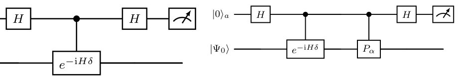 
FIG. 1. Ancillary |0⟩a Hadamard-test schematics for estimating reduced pencil entries after Schrödingerization. (a) Controlled evolution e−iHδ with P ′=I, supplying real and imaginary parts of ⟨Ψ0| e−iHδ |Ψ0⟩for Gram (overlap) reconstruction. (b) Controlled e−iHδ followed by controlled Pauli Pα from H = P

📷 Fig 2

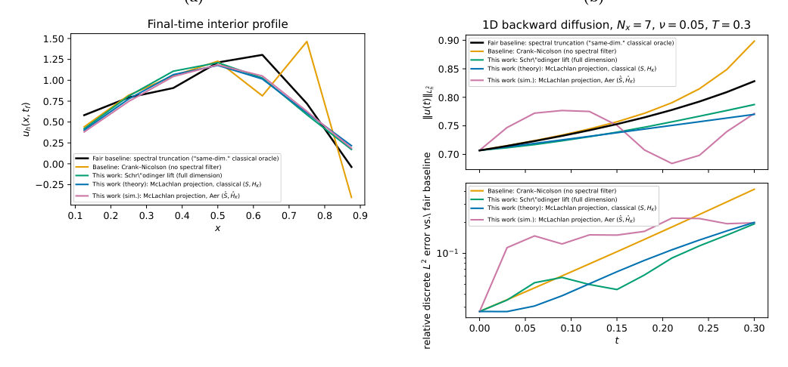 
FIG. 2. (a) Recovered interior states uh at T=0.3. (b) Discrete relative L2 error versus the spectral low-pass baseline (∆t=0.03). Crank–Nicolson attains ≈41.99% at the final sample (also the plotted maximum over t). Lifted exact propagation ends at ≈19.37%, classical McLachlan pencils at ≈20.02%, and Aer-sampled pencils at ≈19.82% with a transient peak ≈22.03%, qualitatively consistent with (23).

**Summary.** The paper demonstrates that projecting Schrödingerized dynamics onto a low-dimensional subspace provides a natural regularization mechanism for ill-posed problems. It proves that this method remains stable even under statistical sampling noise, outperforming unregularized numerical integration.

**Why it may be interesting.** This is highly relevant for researchers in open quantum systems and quantum algorithms, as it provides a rigorous framework for using subspace-based reduced dynamics to stabilize the simulation of non-unitary or dissipative processes on noisy quantum hardware.

Detailed structure

**Main problem.** Investigating whether the McLachlan projection of Schrödingerized dynamics can act as a structured regularizer for ill-posed problems like backward diffusion, and quantifying the error budget arising from lifting, projection, and statistical sampling.

**Main result.** The paper proves that the reduced flow is unique and norm-preserving, and establishes that the projection error serves as a bounded regularizer that prevents the catastrophic blow-up seen in unregularized methods, even when using noisy sampled Hamiltonians.

**Method.** The authors use the Schrödingerization framework to embed non-unitary dynamics into a Hermitian space, then apply McLachlan projection onto a low-dimensional subspace, evaluating the pipeline using Qiskit Aer-simulated Hadamard tests.

**Model / system.** A 1D semidiscrete backward diffusion model, which is an ill-posed evolution where high spatial frequencies grow exponentially, embedded into a higher-dimensional Hermitian Hamiltonian.

**Key observables.** Recovered interior state profiles (u_h), discrete relative L2 error, projection defect (eta_V), and the conditioning of the overlap matrix (S).

**Important parameters / regimes.** Diffusion coefficient (nu = 0.05), final time (T = 0.3), spatial grid size (Nx = 7), and lifted dimension (Np = 16).

**Assumptions / limitations.** The analysis assumes the use of a fixed low-dimensional frame for projection and considers the impact of statistical sampling noise on the overlap matrix and Hamiltonian elements.

**Figures summary.** Figure 2(a) compares recovered interior states across different methods, while Figure 2(b) plots the evolution of the discrete relative L2 error over time for the proposed method, classical baselines, and the unstable Crank-Nicolson method.

**Paper structure.** The paper introduces the ill-posedness of backward diffusion, defines the Schrödingerization and McLachlan projection framework, provides mathematical proofs for error bounds and stability, and concludes with numerical benchmarks using quantum circuit simulations.

Abstract

Backward diffusion is a prototype ill-posed evolution: high spatial frequencies grow exponentially in time, so mesh-based time marching without explicit regularization is quickly overwhelmed by noise. Schrödingerization embeds the semidiscrete generator into Hermitian dynamics on an extended space; we ask whether McLachlan projection onto a fixed low-dimensional frame supplies a structured regularizer whose error budget can be read from a projection defect that separates full lifted propagation from the reduced trajectory. We prove uniqueness of the reduced flow, Gram-norm conservation, a lifted--reduced gap bound in terms of that defect, and perturbation estimates that highlight overlap-matrix conditioning when matrix elements are estimated statistically. We also spell out a fair classical baseline -- spectral low-pass or Tikhonov filtering on the same semidiscrete model, with bandwidth or ridge strength matched to the information content of the chosen frame -- so numerical contrasts isolate the Schrödingerized reduced pipeline rather than an unregularized Crank--Nicolson march that mainly showcases blow-up. A calibrated one-dimensional benchmark pairs a spectrally truncated reference with snapshot-built subspace evolution and finite-shot Qiskit Aer estimation, illustrating how lift, projection, and sampling layers contribute differently to the overall error.

[↑ back to top](#top)

### [Measurement-Driven Adaptive Low-Overhead Implementation of Multi-Controlled Toffoli Gates](http://arxiv.org/abs/2605.18159v1)

**Authors:** Abhoy Kole, Till Schnittka, Rolf Drechsler  
**Type:** theory · **Category:** quantum information and computing · **PDF:** <https://arxiv.org/pdf/2605.18159v1>  
**Analysis basis:** full PDF text, analyzed in chunks
**Topic relevance:** `quantum measurements` **2/5**

📷 Fig 1

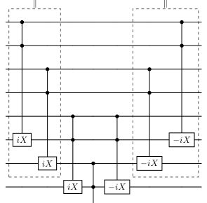 
Fig. 2: Clean-ancilla decomposition of the C5X gate: (a) the C5X operation, and (b) its Clifford+T decomposition using CC(iX) gates.

📷 Fig 2

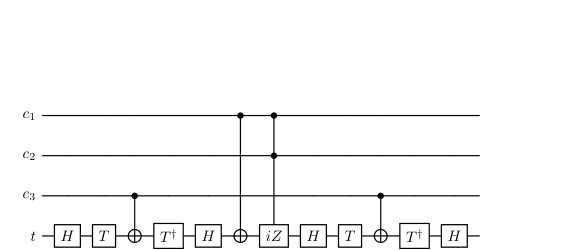 
Fig. 4: The Clifford+T realization of the C3(iX) gate.

📷 Fig 3

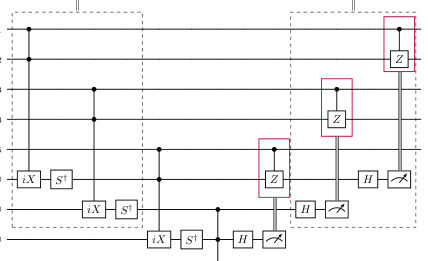 
Fig. 3: Clean-ancilla–based dynamic decomposition of the C5X gate, using three CC(iX) operations followed by three measurement-conditioned CZ corrections.

📷 Fig 4

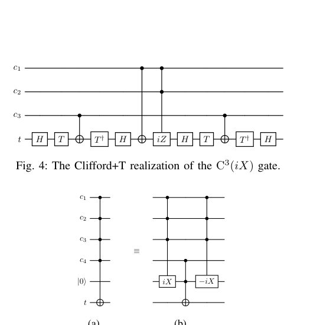 
Fig. 5: Clean-ancilla decomposition of the C4X gate: (a) the C4X operation, and (b) its Clifford+T decomposition using C3(iX) gates.

📷 Fig 5

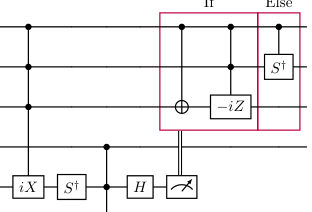 
Fig. 6: A dynamic implementation of the C4X gate using one C3(iX) gate together with measurement-conditioned op- erations: CX · CC(−iZ) when the ancilla outcome is 1, and CS† when it is 0.

**Summary.** This paper presents new ways to build complex multi-controlled Toffoli gates by using mid-circuit measurements and classical feedback. By replacing static gate sequences with adaptive ones, the authors significantly reduce the number of expensive T-gates and entangling gates needed, which is crucial for scaling fault-tolerant quantum computers.

**Why it may be interesting.** not directly relevant

Detailed structure

**Main problem.** The high resource overhead (T-count, T-depth, and CX-count) required to implement multi-controlled Toffoli gates in fault-tolerant quantum architectures.

**Main result.** The authors propose dynamic decomposition strategies that use mid-circuit measurements and classical feedforward to systematically reduce T-count, T-depth, and entangling gate counts compared to static methods.

**Method.** The method utilizes adaptive circuit execution, relative-phase Toffoli primitives, and measurement-conditioned phase corrections (using ancilla-assisted constructions) to optimize gate sequences.

**Model / system.** The work focuses on the Clifford+T gate set within fault-tolerant quantum computing architectures capable of mid-circuit measurement, qubit reset, and classical feedforword.

**Key observables.** T-count, T-depth, CX-count, and ancilla overhead.

**Important parameters / regimes.** The number of control qubits (n), the number of ancilla qubits used (n-2 or (n-2)/2), and the measurement outcomes in the Hadamard basis.

**Assumptions / limitations.** The approach assumes the availability of mid-circuit measurement, qubit reset, and classical feedforward, and focuses specifically on the Clifford+T regime.

**Figures summary.** Figures 1 and 4 show Clifford+T realizations of relative-phase gates; Figures 2, 3, 5, 6, 7, and 8 illustrate various decompositions of multi-controlled Toffoli gates (C4X, C5X, C11X) using both static and dynamic strategies.

**Paper structure.** The paper introduces the problem of multi-controlled Toffoli gate overhead, proposes dynamic decomposition strategies using relative-phase primitives and measurement-driven optimization, provides analytical cost models comparing static and dynamic costs, and demonstrates scalability through specific constructions for even and odd n.

Abstract

The Toffoli gate is a fundamental building block for quantum arithmetic and reversible logic, yet its efficient realization remains a major challenge in both near-term and fault-tolerant quantum architectures. Recent advances in dynamic quantum circuit capabilities, including mid-circuit measurement and classical feedforward, provide new opportunities for reducing the resource overhead of non-Clifford operations.   In this work, we propose a set of dynamic decomposition strategies for multi-controlled Toffoli gates that exploit adaptive circuit execution and ancilla-assisted constructions. Our methods systematically reduce entangling-gate count, T-count, and T-depth compared with conventional static decompositions, while preserving fault-tolerance guarantees. Through analytical cost models and experimental evaluation, we demonstrate that relative-phase primitives and measurement-conditioned corrections enable scalable implementations with improved depth and resource efficiency.

[↑ back to top](#top)

### [Mpemba effect in a sheared granular gas with velocity-dependent restitution](http://arxiv.org/abs/2605.17881v1)

**Authors:** Makoto R. Kikuchi, Yuria Kobayashi, Satoshi Takada  
**Type:** theory · **Category:** statistical mechanics · **PDF:** <https://arxiv.org/pdf/2605.17881v1>  
**Analysis basis:** full PDF text, analyzed in chunks
**Topic relevance:** `non-equilibrium dynamics` **2/5**

📷 Fig 1

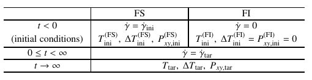 
Figure 1 displays typical temporal evolutions of the granu- lar temperature for systems initialized from the FS and FI pro- tocols. The two curves clearly cross at a finite time, demon- strating the Mpemba effect. For the FS protocol, the initial steady state at t &lt; 0 is characterized by a negative shear stress (Pxy &lt; 0), so that immediately after the shear-rate switch (t ≳0), the energy-injection term in Eq. (12a) becomes posi- tive while collisional dissipation remains negative. This com- petition suppresses the initial relaxation rate. In contrast, for the FI protocol, the initial condition satis- fies Pxy = 0, so that the early-time dynamics is dominated by dissipation, leading to a faster...

📷 Fig 2

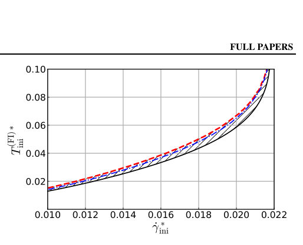 
Fig. 3. (Coler online) Phase diagram of the Mpemba effect for e1 = 0.50, e2 = 0.99, and ˙γ∗ tar = 1.0 × 10−2. The shaded region indicates the param- eter range where the Mpemba effect occurs. The region enclosed by the dashed and dotted lines corresponds to the regime in which the Mpemba ef- fect appears twice. The solid line represents the theoretical prediction given by Eq. (16).

📷 Fig 3

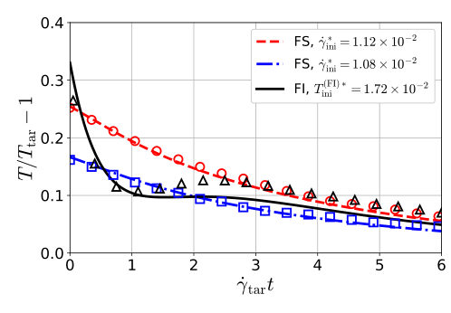 
Fig. 1. (Coler online) Typical time evolutions of the granular temperature for systems initialized from the FS and FI protocols. The FS curves corre- spond to ˙γ∗ ini = 1.08×10−2 and 1.12×10−2, while the FI curve corresponds to T (FI) ini = 1.72×10−2, where we have introduced ˙γ∗≡˙γd/vc and T ∗≡T/(mv2 c). The parameters are e1 = 0.50, e2 = 0.99, and ˙γ∗ tar = 1.0×10−2. All quantities with an asterisk are nondimensionalized by the particle mass m, diameter d, and characteristic velocity vc. Symbols represent the DSMC results.

📷 Fig 4

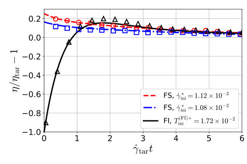 
Fig. 2. (Coler online) Typical time evolutions of the viscosity for the FS and FI protocols. The sets of parameters are identical to those used in Fig. 1. Symbols represent the DSMC results.

📷 Fig 5

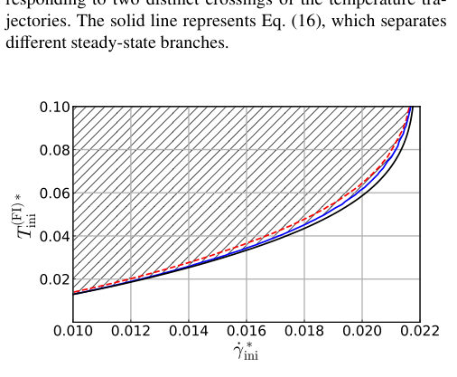 
Fig. 4. (Coler online) Phase diagram of the viscosity Mpemba effect. The shaded region indicates the parameter range where the viscosity Mpemba ef- fect occurs. The region enclosed by the dashed and dotted lines corresponds to the regime in which the Mpemba effect appears twice. The solid line rep- resents the theoretical prediction given by Eq. (15) with Eq. (16).

**Summary.** This paper explores how non-equilibrium relaxation in a sheared granular gas can exhibit the Mpemba effect for both temperature and viscosity. It reveals that introducing a velocity-dependent dissipation mechanism allows for multiple crossings in relaxation curves, providing a purely kinetic mechanism for multiple Mpemba effects.

**Why it may be interesting.** not directly relevant

Detailed structure

**Main problem.** The study investigates the Mpemba effect—where a system at a higher initial temperature relaxes faster than one at a lower temperature—within the context of a sheared granular gas with velocity-dependent dissipation.

**Main result.** The authors demonstrate both a temperature Mpemba effect and a viscosity Mpemba effect, further discovering that a velocity-dependent restitution coefficient enables multiple crossings (multiple Mpemba effects) in the relaxation curves.

**Method.** The research utilizes kinetic theory based on Grad's moment method to derive evolution equations, which are then validated using Direct Simulation Monte Carlo (DSMC) simulations.

**Model / system.** A dilute, sheared granular gas of identical, frictionless hard spheres. The model features a velocity-dependent restitution coefficient that follows a stepwise function, introducing an intrinsic velocity scale.

**Key observables.** Granular temperature (T), temperature anisotropy (delta T), shear viscosity (eta), and shear stress (Pxy).

**Important parameters / regimes.** Shear rate (gamma_dot), restitution coefficients (e1, e2), threshold velocity (vc), and the dimensionless parameter x = mv_c^2/(4T).

**Assumptions / limitations.** The model assumes a dilute limit where binary collisions dominate, neglects spatial inhomogeneities (macroscopic uniformity), and neglects collisional transfer contributions to the stress tensor.

**Figures summary.** Figure 1 shows temperature relaxation curves crossing; Figure 2 shows viscosity relaxation curves crossing; Figure 3 and 4 present phase diagrams for the temperature and viscosity Mpemba effects, respectively, showing the parameter ranges for single and multiple crossings.

**Paper structure.** The paper introduces the Mpemba effect in granular gases, describes the kinetic theory and DSMC methodology, presents results for temperature and viscosity relaxation, analyzes the phase diagrams for single and multiple crossings, and concludes with discussion on the kinetic mechanism.

Abstract

We investigate the Mpemba effect in a dilute sheared granular gas with a velocity-dependent restitution coefficient. Using kinetic theory based on Grad's moment method, we analyze the relaxation dynamics following a sudden change in the shear rate. We show that, despite having a higher initial temperature, a system starting from an isotropic state can relax faster than a system prepared in a sheared steady state, demonstrating a clear Mpemba effect in the temperature evolution. We further demonstrate the emergence of a viscosity Mpemba effect, characterized by crossings in the relaxation curves of the shear viscosity. Remarkably, multiple crossings arise due to an additional intrinsic timescale introduced by the velocity dependence of the restitution coefficient, providing a minimal kinetic mechanism for multiple Mpemba effects in driven granular gases.

[↑ back to top](#top)

### [On the potential for high-accuracy spectroscopy of $\mathrm{H}_2^+$ and $\overline{\mathrm{H}}_2^-$ in Penning traps for a test of CPT invariance](http://arxiv.org/abs/2605.16585v1)

**Authors:** Stephan Schiller, Juan M. Cornejo, Nikita Poljakov, Christian Ospelkaus, Stefan Ulmer, Dimitar Bakalov  
**Type:** both · **Category:** other · **PDF:** <https://arxiv.org/pdf/2605.16585v1>  
**Analysis basis:** full PDF text, analyzed in chunks
**Topic relevance:** `quantum measurements` **2/5**

📷 Fig 1

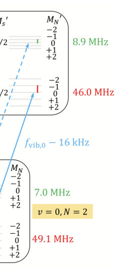 
Figure 1.: Schematic of the spin structure of two selected rovibrational energy levels of para-H+ 2 in a B0 = 4 Tesla magnetic field and selected transitions. Ms, M ′ s for electron-spin projection and MN, M ′ N for rotational-angular-momentum-projection are approximate quantum numbers, used here to label the states. Cyan: Two transitions considered to be suitable for a CPTI test, i.e. having small systematic shifts, are indicated. These transitions also appear in figure 5 as A, A′. fvib,0 is the spin-averaged rovibrational transition frequency in zero B-field, i.e. the hypothetical value if Htot = 0 (Htot includes the spin-rotation interaction.) The indicated offsets with respect to fvib,0...

📷 Fig 2

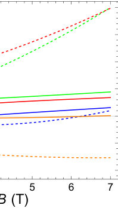 
Figure 2.: Sensitivities β (full lines) and magnetic-field shifts ∆fmag (dashed lines) of the (v = 0, N, Ms, MN = 0) →(v′ = 2, N ′ = 2, M ′ s = Ms, M ′ N = 0) transitions as a function of magnetic field B. The cases of lower rotational quantum number N = 0 and N = 2 are shown.

📷 Fig 3

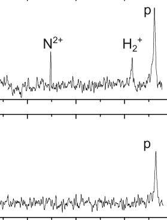 
Figure 3.: Example of ion preparation in a PT. The trap is loaded with particles; afterwards the resonant center of the axial detector spectrum is observed with a certain bandwidth, while a weak axial resonant drive is applied and the trap voltage is being ramped to bring different ion species to resonance with the detector. In between the upper and the lower spectrum resonant axial cleaning drives are applied, to remove particles from the trap. The lower spectrum is recorded after cleaning all particles out, except for a cloud of protons. Selecting the resonant cleaning drive frequencies differently, any particle species can be prepared.

📷 Fig 4

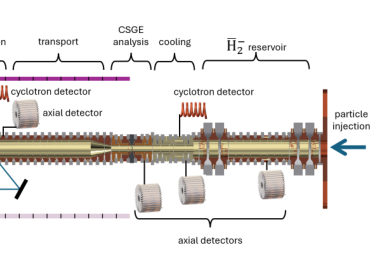 
Figure 4.: Proposed multi-Penning-trap stack for precision spectroscopy on H+ 2 and H − 2 . The stack consists of seven traps. In the center is a highly shielded and homogenized precision trap with radial and axial laser access. Moving outwards, analysis traps for CSGE detection and cooling traps for sub-thermal cooling are located. The outer traps are reservoir traps. All traps are equipped with resonant detection systems for pick-up of axial and cyclotron image currents and resistive cooling (not shown for the left traps in order to keep the figure organized).

📷 Fig 5

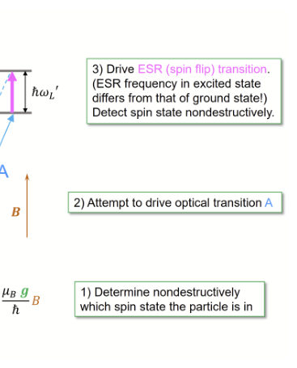 
Figure 5.: The CSGE procedure for nondestructive detection and spectroscopy of a rovibrational transition. The concept is from Myers [21]. For clarity, only the minimum number of states required is shown. The figure shows the case where in step 1 it was found that the molecule is in the lower spin state of (v, N). Then step 2 (vibrational excitation A) is taken, followed by step 3 (detection). If no spin flip in (v′, N ′) is detected (by CSGE), step 2 is repeated. This continues until a spin flip is detected. Then, the “downward” excitation A′, step 4, is attempted. The following steps are analogous to those connected with the upward excitation. Note that fA ̸= fA′; example values are...

**Summary.** This paper investigates the potential for testing CPT invariance by comparing the vibrational spectra of hydrogen molecular ions and their antimatter counterparts in Penning traps. It identifies optimal spectroscopic transitions and provides a roadmap for achieving fractional uncertainties as low as 10^-17. The work highlights how managing magnetic and electric field-induced shifts is crucial for the success of such fundamental symmetry tests.

**Why it may be interesting.** This paper is highly relevant for AMO physicists working on precision spectroscopy and antimatter research, as it defines the fundamental limits of frequency metrology using molecular ions and proposes new methods for controlling systematic errors in high-precision traps.

Detailed structure

**Main problem.** Evaluating the feasibility of using high-accuracy spectroscopy of H2+ and anti-H2- in Penning traps to perform tests of CPT invariance.

**Main result.** The authors demonstrate that comparing vibrational frequencies at a fractional level of 1e-17 is a realistic prospect using existing technology, provided specific transitions and trap parameters are optimized to mitigate systematic shifts.

**Method.** The study uses an extensive theoretical analysis of spectroscopic transitions, including the derivation of systematic shifts (Zeeman, Stark, Doppler) and the evaluation of different detection regimes like continuous Stern-Gerlach effect and quantum-logic spectroscopy.

**Model / system.** The physical system consists of molecular hydrogen ions (H2+) and their antimatter counterparts (anti-H2-) trapped in cryogenic Penning traps under strong magnetic fields (e.g., 4 T). The model utilizes an effective Hamiltonian including hyperfine, Zeeman, rotational, and diamagnetic interactions.

**Key observables.** Vibrational transition frequencies, electron-spin-flip frequency, magnetic moments of proton/antiproton, and frequency differences between matter and antimatter species.

**Important parameters / regimes.** Magnetic field strength (B ~ 4 T), fractional uncertainty target (1e-17 to 1e-18), axial and radial temperatures, and vibrational/rotational quantum numbers.

**Assumptions / limitations.** Assumes the eventual availability of anti-H2- for study and that magnetic field stability and trap parameters (like the magnetic bottle coefficient) can be controlled with extreme precision.

**Figures summary.** The notes mention a schematic of spin state energies and predicted spectroscopic line shapes under different quadrupole Doppler shift regimes.

**Paper structure.** The paper introduces the CPT test proposal, provides a detailed Hamiltonian analysis of the molecular ions, evaluates various systematic frequency shifts, discusses experimental detection strategies (CSGE and QLS), and analyzes methods for mitigating Doppler and Stark shifts.

Abstract

The comparison of vibrational transition frequencies of $\mathrm{H}_2^+$ and $\overline{\mathrm{H}}_2^-$ offers a new opportunity to test CPT invariance. Myers [Phys. Rev. A 98, 010101(R) (2018)] proposed performing laser spectroscopy in a Penning trap (PT) with non-destructive read-out. Here, we provide an extensive analysis of this proposal, introduce novel aspects, and discuss its implementation in PTs that incorporate either the continuous Stern-Gerlach effect or quantum-logic spectroscopy. We derive estimates for the achievable accuracy of the test. We find that a comparison of the vibrational frequencies at a fractional level of $1\times10^{-17}$ is a realistic prospect, using technology that is mostly already available. We also analyze complementary CPT invariance tests, namely those of the g-factor of the bound electron/positron via electron-spin-resonance spectroscopy and of the magnetic moment of the proton/antiproton via radiofrequency spectroscopy.

[↑ back to top](#top)

### [Percolation transition of strongly connected clusters in finite dimensions and on complete graphs](http://arxiv.org/abs/2605.16987v1)

**Authors:** Qi Wang, Ming Li  
**Type:** theory · **Category:** statistical mechanics · **PDF:** <https://arxiv.org/pdf/2605.16987v1>  
**Analysis basis:** full PDF text, analyzed in chunks
**Topic relevance:** `non-equilibrium universality` **2/5**

📷 Fig 1

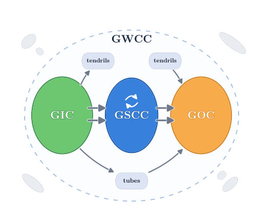 
FIG. 1. Sketch of the bow-tie structure of a directed graph. The GSCC consists of sites that are mutually reachable through directed paths. The GIC contains sites that can reach the GSCC but cannot be reached from it. The GOC contains sites that are reachable from the giant SCC but do not nec- essarily have return access to it. Around these giant clusters, there are also some small connecting structures. Typical ex- amples include tubes and tendrils. Omitting the direction of bonds, these giant clusters with the associated components form the GWCC. In addition, there are also some small SCCs, ICs, OCs, and WCCs.

📷 Fig 2

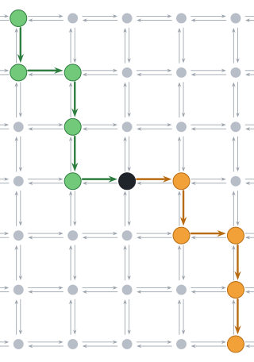 
FIG. 2. Illustration of SCC percolation on a directed square lattice. Each nearest-neighbor pair of sites has two antipar- allel directed bonds. Starting from a reference site (the black site at the center), one can distinguish two complementary classes of directed bonds, namely out- and in-bonds: a bond pointing away from the reference site is defined as an out- bond, while the opposite bond is an in-bond. For percolation, each directed bond is independently occupied with probabil- ity p. Above the percolation threshold pc, the SCC spans the system. In this case, starting from the reference site, there must simultaneously exist two paths extending to macroscopic distances, formed...

📷 Fig 3

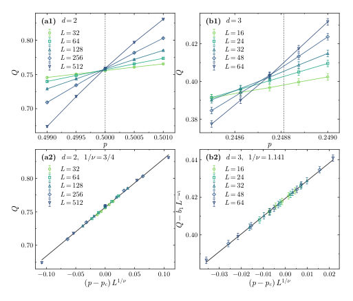 
FIG. 3. Finite-size scaling of the Binder cumulant Q for (a) d = 2 and (b) d = 3. Panels (a1,b1) show the Binder cumu- lant Q as a function of p near criticality for different system sizes L. The dashed lines indicate the percolation thresholds pc = 1/2 (2D) and pc = 0.24881182 (3D). Panels (a2,b2) present the corresponding data collapse over a broader range of p by rescaling the horizontal axis as (p −pc)L1/ν, where ν is the correlation-length exponent of standard percolation in the corresponding dimension. For panel (b2), finite-size cor- rections are taken into account by shifting the Binder cumu- lant as Q −b1L−ω1, with ω1 ≈0.6 and b1 ≈−0.11, resulting in an improved data collapse.

📷 Fig 4

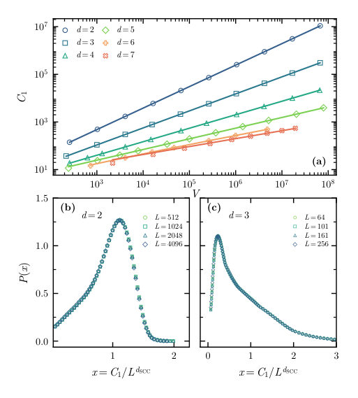 
FIG. 4. Finite-size scaling of the largest SCC on finite- dimensional lattices. (a) Mean size of the largest SCC, C1, versus system volume V = Ld for directed hypercubic lattices in dimensions d = 2–7 at p = pc. Solid lines indicate the fit- ted scaling forms, C1 ∼V dSCC/d, with dSCC listed in Table I. (b,c) Scaling collapse of the probability density P(x) for the rescaled largest SCC size x ≡C1/LdSCC for d = 2 and d = 3, respectively.

📷 Fig 5

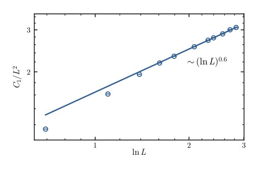 
FIG. 6. The rescaled largest SCC, C1/L2, as a function of ln L in dimension d = 6. The line indicates the scaling of C1/L2 ∼ (ln L)w with w ≈0.6, suggesting multiplicative logarithmic corrections in the finite-size scaling of C1.

**Summary.** This paper explores how the geometry and statistics of strongly connected clusters change as a system moves from low dimensions to the infinite-dimensional mean-field limit. It discovers that complete graphs behave fundamentally differently from high-dimensional lattices due to a double-scaling phenomenon in cluster sizes. These findings provide a deeper understanding of connectivity transitions in directed networks.

**Why it may be interesting.** not directly relevant

Detailed structure

**Main problem.** The study investigates the percolation transition of strongly connected clusters (SCCs) in directed bond percolation across various dimensions, from 2D hypercubic lattices to the mean-field limit of complete graphs.

**Main result.** The authors identify an upper critical dimension of d_u = 6 and reveal that while hypercubic lattices follow standard scaling, complete graphs exhibit a unique double-scaling structure in cluster size distribution and logarithmic growth of the number of SCCs.

**Method.** Extensive Monte Carlo simulations using Tarjan's algorithm for SCC identification, combined with finite-size scaling (FSS) analysis and Binder cumulant data collapse.

**Model / system.** Directed bond percolation on hypercubic lattices (d=2 to 7) and complete graphs, where each directed bond is independently occupied with probability p.

**Key observables.** Fractal dimensions (d_SCC, d_IC, d_OC), percolation threshold (p_c), cluster size distribution exponent (tau_SCC), and the mean number of SCCs (N_SCC).

**Important parameters / regimes.** Dimension (d), occupation probability (p), upper critical dimension (d_u = 6), and the mean-field limit (complete graphs).

**Assumptions / limitations.** The study assumes statistical symmetry between incoming and outgoing paths; the effect of broken directional asymmetry is not addressed.

**Figures summary.** Figure 1 shows the bow-tie structure of directed graphs; Figure 2 illustrates SCC percolation on a 2D lattice; Figure 9 compares cluster-size distribution scaling between d=7 and complete graphs; Figure 10 compares the scaling of the mean number of SCCs.

**Paper structure.** The paper introduces the SCC percolation problem, describes the directed bond model, presents numerical results for fractal dimensions and scaling exponents across dimensions, compares finite-dimensional lattices to complete graphs, and discusses the structural origins of the observed scaling differences.

Abstract

We study the percolation of strongly connected clusters (SCCs), in which sites are mutually reachable through directed paths, in systems with randomly oriented bonds by extensive simulations on hypercubic lattices from dimension $d=2$ to $7$ and complete graphs. Below the upper critical dimension $d_u=6$, the critical SCCs exhibit nontrivial fractal dimension $d_{\rm SCC}$, and the size distribution scales as $\sim s^{-τ_{\rm SCC}}$ with the hyperscaling relation $τ_{\rm SCC}=1+d/d_{\rm SCC}$. For $d \ge d_u$, mean-field behavior is recovered with $d_{\rm SCC}/d=1/3$, consistent with complete-graph results. However, in contrast to hypercubic lattices, complete graphs exhibit a double-scaling structure in the SCC size distribution: large SCCs are governed by mean-field value $τ_{\rm SCC}=4$, while small SCCs follow a distinct power law with exponent $τ'=1$. At criticality, the giant in- and out-clusters are also fractal, sharing the same dimension as standard percolation clusters. These results show that critical SCCs remain well-defined fractal objects across dimensions, while their approach to the mean-field limit involves nontrivial changes in cluster statistics.

[↑ back to top](#top)

### [Pressure Effects on CeMnSi: Evolution of Ce 4f and Mn 3d Electronic States and Negative Thermal Expansion](http://arxiv.org/abs/2605.18230v1)

**Authors:** Sae Nishiyama, Haruka Mima, Jun-ichi Hayashi, Keiki Takeda, Chihiro Sekine, Yoshiya Uwatoko, Hiroki Takahashi, Hiroshi Tanida, Yukihiro Kawamura  
**Type:** experiment · **Category:** strongly correlated electrons · **PDF:** <https://arxiv.org/pdf/2605.18230v1>  
**Analysis basis:** full PDF text, analyzed in chunks
**Topic relevance:** `Kondo & dissipative impurity` **2/5**

📷 Fig 1

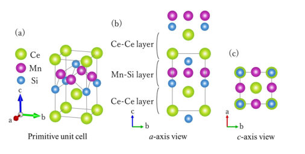 
Fig. 1. (Color online) Crystal structure of CeMnSi with its lay- ered arrangement, drawn using the VESTA software.7) (a) Primi- tive unit cell; (b) and (c) views along the a and c axes, respectively. The tetragonal CeFeSi-type structure consists of alternating Ce– Ce layers and Mn–Si layers stacked along the c axis.

📷 Fig 2

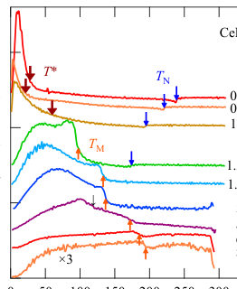 
Fig. 2. (Color online) (a) Temperature dependence of ρ of CeMnSi under various pressures. (b) Temperature dependence of dρ/dT. For clarity, the dρ/dT curves are vertically offset. The ar- rows indicate characteristic temperatures and are guides to the eye (see text).

📷 Fig 3

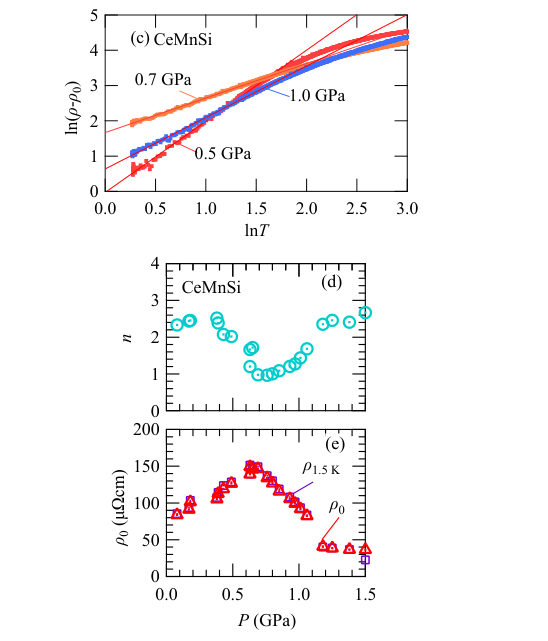 
Fig. 3. (Color online)(a) Low-temperature ρ of CeMnSi plotted as a function of T 2 at representative pressures. (b) ρ plotted as a function of T at the same pressures; dashed lines in (a) and (b) are guides to the T 2 and T dependences, respectively. (c) Plot of ln(ρ −ρ0) versus ln T; the solid line is a linear fit according to ln(ρ −ρ0) = ln A + n ln T. (d) Pressure dependence of the exponent n. (e) Pressure dependence of the residual resistivity ρ0 and resistivity at 1.5 K, ρ1.5K of CeMnSi.

📷 Fig 4

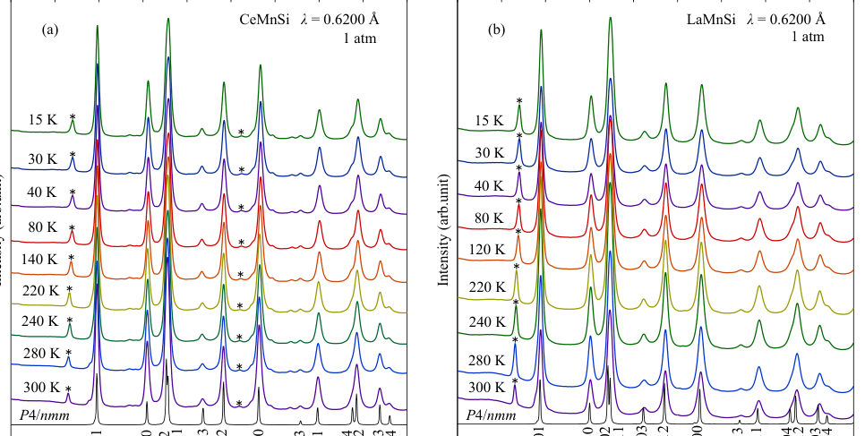 
Fig. 4. (Color online) Temperature-dependent XRD powder patterns of (a) CeMnSi and (b) LaMnSi measured at 1 atm. The calculated diffraction patterns for the P4/nmm space group are also shown. Asterisks indicate diffraction peaks originating from the Mylar window of the GM refrigerator and Apiezon grease. Temperature dependences of (c) the lattice constant a, (d) the lattice constant c, and (e) the unit-cell volume V for CeMnSi and LaMnSi at 1 atm.

📷 Fig 5

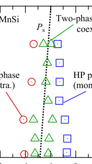 
Fig. 6. (Color online) Temperature–pressure phase diagram of CeMnSi constructed from the powder XRD measurements. The low-pressure tetragonal phase (circles) and the high-pressure mon- oclinic phase (squares) are separated by a first-order structural transition, accompanied by a two-phase coexistence region (trian- gles) near Ps. The dashed line is a guide to the eye.

**Summary.** This study demonstrates how applied pressure can tune the magnetic and structural phases of the heavy-fermion material CeMnSi. It reveals that suppressing Mn-3d magnetism leads to non-Fermi-liquid behavior and that a structural transition at high pressure modifies the electronic state. The findings highlight the strong coupling between Ce-4f electrons and the crystal lattice.

**Why it may be interesting.** not directly relevant

Detailed structure

**Main problem.** Investigating the pressure-induced evolution of electronic, magnetic, and structural properties in the heavy-fermion antiferromagnet CeMnSi, specifically the interplay between Ce-4f and Mn-3d electrons.

**Main result.** Pressure suppresses Mn antiferromagnetic order at 1.3 GPa, inducing non-Fermi-liquid behavior and a new magnetic anomaly, followed by a structural transition to a monoclinic phase at 5.7 GPa.

**Method.** High-pressure electrical resistivity measurements using piston-cylinder and cubic-anvil apparatus, and synchrotron powder X-ray diffraction.

**Model / system.** The physical system is CeMnSi, a heavy-fermion antiferromagnet with a tetragonal CeFeSi-type structure, compared against the non-4f reference compound LaMnSi.

**Key observables.** Néel temperature (TN), pressure-induced anomaly temperature (TM), structural transition pressure (Ps), resistivity exponent (n), and lattice constants (a, c).

**Important parameters / regimes.** Critical pressures Pc ~ 1.3 GPa and Ps ~ 5.7 GPa; temperature scales for Mn-AFM order and heavy-fermion formation.

**Assumptions / limitations.** The structural transition is driven by lattice instabilities associated with Ce-4f electrons rather than pure valence instability.

**Figures summary.** Fig 1: Crystal structure; Fig 2: Temperature dependence of resistivity under pressure; Fig 3: Resistivity power-law fits and exponent n; Fig 4: XRD patterns and lattice constants; Fig 5: High-pressure XRD patterns.

**Paper structure.** The paper introduces the CeMnSi system, details the experimental pressure/temperature setup, presents transport and structural results showing magnetic and structural transitions, and concludes with a discussion on the 3d-4f hybridization mechanism.

Abstract

We investigated pressure effects on the nontrivial heavy-fermion antiferromagnet CeMnSi by means of electrical resistivity and powder X-ray diffraction. With increasing pressure, the antiferromagnetic order of Mn (T_N ~ 240 K at ambient pressure) is rapidly suppressed and disappears at P_c ~ 1.3 GPa. Instead, a pressure-induced anomaly appears at T_M ~ 97 K and shifts to higher temperatures with increasing pressure. The switching of the Mn magnetic state may reflect a modification of the magnetic symmetry of the system, which could influence the stability of the heavy-fermion state. In the low-pressure region, non-Fermi-liquid-like behavior characterized by nearly T-linear resistivity is observed around 0.7 GPa. In addition, the resistivity shows a marked reduction below T_M and a qualitative change toward more metallic behavior above the structural transition pressure P_s ~ 5.7 GPa. At ambient pressure, CeMnSi exhibits negative thermal expansion below ~40 K, which is absent in LaMnSi, supporting the formation of a heavy-fermion ground state.

[↑ back to top](#top)

### [QLIF-CAST: Quantum Leaky-Integrate-and-Fire for Time-Series Weather Forecasting](http://arxiv.org/abs/2605.18333v1)

**Authors:** Alberto Marchisio, Aayan Ebrahim, Nouhaila Innan, Muhammad Kashif, Muhammad Shafique  
**Type:** both · **Category:** quantum information and computing · **PDF:** <https://arxiv.org/pdf/2605.18333v1>  
**Analysis basis:** full PDF text, analyzed in chunks
**Topic relevance:** `QC/QI experiment` **2/5**

📷 Fig 1

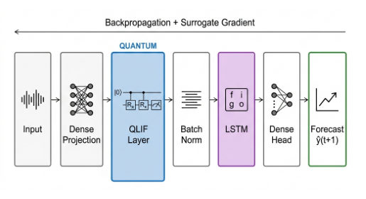 
Fig. 1. QLIF neuron model. The qubit is initialized in |0⟩, rotated by Rx(ϕ) to encode the current excitation state, then rotated by Rx(θinput) to integrate the input signal. Measuring the qubit yields the updated excitation probability αnew = sin2( ϕ+θinput

📷 Fig 2

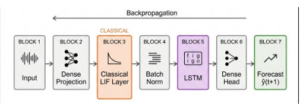 
Fig. 2. Classical LIF neuron model. The membrane potential U integrates synaptic input Iin and decays exponentially between spikes (Unew = βUprev + (1−β)Iin, β = e−1/τ). A spike is emitted when U exceeds the threshold, after which U resets to zero.

📷 Fig 3

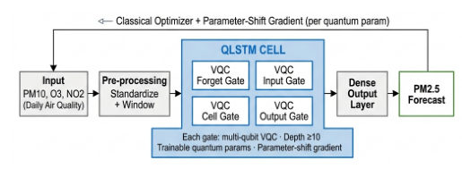 
Fig. 3. QLSTM architecture. Each of the four classical LSTM gates (forget, input, cell, output) is replaced by a multi-qubit variational quantum circuit (VQC), with gate angles trained via parameter-shift gradient rules.

📷 Fig 4

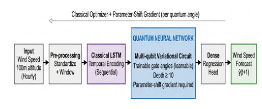 
Fig. 4. LSTM-QNN architecture. A classical LSTM encoder performs temporal feature extraction, whose output is passed to a variational quantum neural network (QNN) before the regression head.

📷 Fig 5

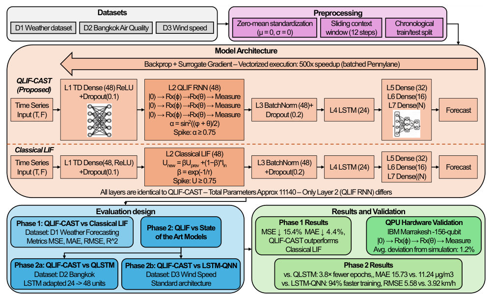 
Fig. 5. Overview of the QLIF-CAST methodology. Three datasets (D1-D3) used across the two evaluation phases, with shared preprocessing steps. QLIF-CAST and Classical LIF architectures; the two pipelines are structurally identical, while only Layer 2 (the neuronal update rule) differs. Two-phase evaluation design and key results, with QPU hardware validation on IBM Marrakesh.

**Summary.** This paper introduces QLIF-CAST, a lightweight hybrid quantum neural network designed for time-series forecasting. By using shallow single-qubit circuits to model neuronal dynamics, the model significantly reduces training time compared to deeper quantum models while outperforming classical counterparts in prediction accuracy.

**Why it may be interesting.** not directly relevant

Detailed structure

**Main problem.** The challenge of developing efficient and accurate quantum-classical hybrid architectures for multivariate time-series weather forecasting, specifically addressing the high computational cost of deep variational quantum models.

**Main result.** The QLIF-CAST model achieves 15.4% lower MSE than a classical LIF baseline and converges up to 94% faster than state-of-the-art QLSTM and QNN models, while maintaining hardware reliability on a 156-qubit QPU.

**Method.** The authors use a hybrid recurrent architecture with surrogate gradient training (arctan approximation) and a vectorized circuit execution strategy to achieve a 500x speedup in simulation.

**Model / system.** A hybrid quantum-classical recurrent architecture (QLIF-CAST) utilizing a depth-2, single-qubit circuit where neuron excitation states are encoded as quantum superpositions driven by Rx rotations and T1 relaxation decay.

**Key observables.** Mean Squared Error (MSE), Mean Absolute Error (MAE), Root Mean Square Error (RMSE), and R-squared (R2).

**Important parameters / regimes.** T1 relaxation constant of 10.0, spike threshold of 0.75, and 12-step context windows.

**Assumptions / limitations.** The model assumes that the higher error in certain benchmarks remains within operational tolerances for practical deployment and that the shallow circuit depth is sufficient to capture necessary dynamics.

**Figures summary.** Fig 1 illustrates the QLIF neuron model; Fig 2 shows the classical LIF model; Fig 7 shows training/validation loss convergence; Fig 8 and 9 show forecasting performance for air quality and wind speed respectively.

**Paper structure.** The paper introduces the QLIF-CAST model, describes the quantum neuronal dynamics and architecture, presents a controlled comparison against classical LIF, performs a cross-domain benchmark against QLSTM/QNN, and concludes with hardware verification on IBM Marrakesh.

Abstract

Accurate and efficient time-series forecasting remains a challenging problem for both classical and quantum neural architectures, particularly in multivariate environmental settings. This work adapts the Quantum Leaky Integrate-and-Fire (QLIF) spiking neural network for time-series regression tasks, specifically short-term multivariate weather forecasting. We extend QLIF beyond classification and demonstrate its applicability to continuous-valued prediction problems.   The QLIF-CAST model encodes neuron excitation states as single-qubit quantum superpositions, driven by Rx rotation gates and T1 relaxation decay, and is embedded within a hybrid quantum-classical recurrent architecture. We conduct two distinct evaluations. First, a controlled comparison against a parameter-matched classical LIF baseline on a multivariate weather dataset shows that QLIF-CAST achieves 15.4% lower MSE and 4.4% lower MAE, demonstrating that quantum neuronal dynamics reduce prediction error over classical equivalents. Second, a cross-domain comparative analysis with state-of-the-art quantum LSTM (QLSTM) and quantum neural network (QNN) models on air quality and wind speed benchmarks reveals that QLIF-CAST converges in up to 94% less training time, occupying a distinct position in the speed-error trade-off space. Hardware verification on IBM Marrakesh (156-qubit QPU) confirms reliable circuit execution with only 1.2% average deviation from simulation.

[↑ back to top](#top)

### [Quantum Sidecar Architectures for Hybrid AI Training and Inference: Stateful Protected Registers, Stateless Reset-and-Reprepare Circuits and Quantum Weight-State Outlook](http://arxiv.org/abs/2605.18031v1)

**Authors:** Y. Mo, G. D. Su  
**Type:** theory · **Category:** quantum information and computing · **PDF:** <https://arxiv.org/pdf/2605.18031v1>  
**Analysis basis:** full PDF text, analyzed in chunks
**Topic relevance:** `quantum measurements` **2/5**

📷 Fig 1

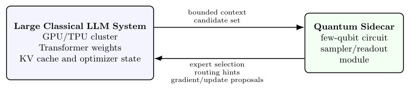 
Figure 1: High-level quantum sidecar interface for LLM systems. The classical LLM system keeps the full model state, while the quantum sidecar returns bounded control signals such as expert selection, routing hints, and candidate gradient/update proposals.

📷 Fig 2

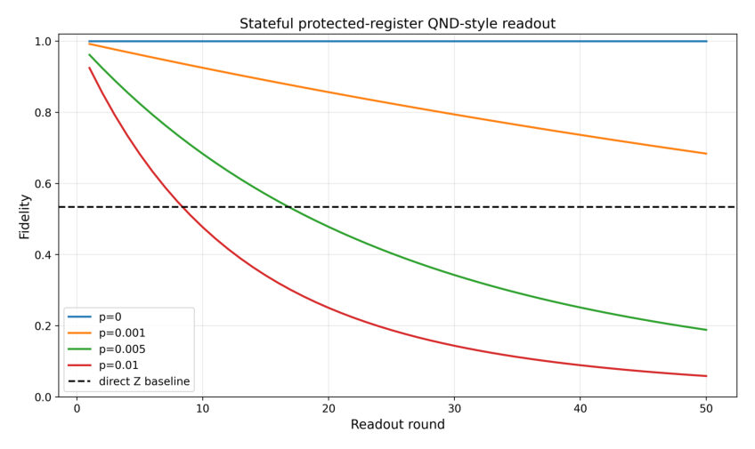 
Figure 2: Stateful protected-register QND-style readout for 8 protected qubits plus one ancilla. The ideal case is stable; noise causes gradual degradation.

📷 Fig 3

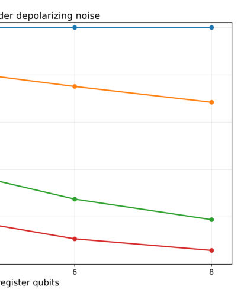 
Figure 3: Stateful scaling under depolarizing noise after 50 readout rounds.

📷 Fig 4

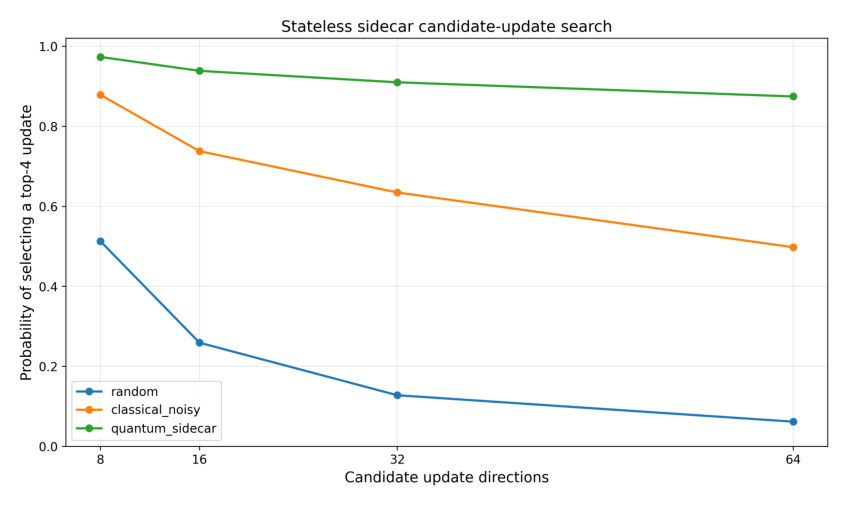 
Figure 4: Stateless sidecar candidate-update search. The sidecar-style sampler selects top-4 update directions more often than random or noisy classical baselines in this synthetic landscape.

📷 Fig 5

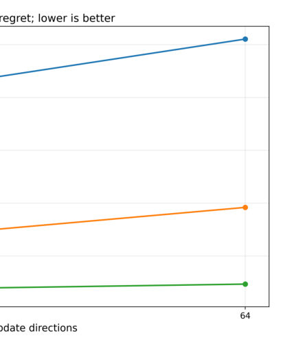 
Figure 5: Mean regret for candidate update-direction selection. Lower is better.

**Summary.** This paper proposes a hybrid framework where quantum processors serve as 'sidecars' to classical AI models, providing bounded signals for tasks like routing or weight updates. It explores two modes of operation: a stateful mode that preserves quantum resources and a stateless mode based on frequent resets. The study shows how these quantum primitives can act as useful priors for classical optimization and selection processes.

**Why it may be interesting.** not directly relevant

Detailed structure

**Main problem.** Addressing the scaling bottlenecks of large-scale classical AI by proposing a hybrid 'quantum sidecar' architecture that acts as a bounded signal generator for classical pipelines.

**Main result.** The paper demonstrates that quantum sidecars can operate in two modes—stateful (preserving observables via protected registers) and stateless (reset-and-reprepare)—to provide useful priors for tasks like routing and parameter updates.

**Method.** The authors use density-matrix and statevector simulations of small-scale quantum circuits (4-8 qubits) under depolarizing noise, cross-checked with Qiskit utilities.

**Model / system.** The architecture involves a quantum co-processor interacting with a classical LLM, utilizing either a protected register with QND-style parity readout or a parameterized QAOA-style circuit for sampling.

**Key observables.** Parity accuracy (q_t), fidelity (F_t), and probability mass of top-k update directions.

**Important parameters / regimes.** Qubit counts (n=4, 6, 8), depolarizing noise levels, and reset overhead times (20 ns to 1200 ns).

**Assumptions / limitations.** The work does not claim quantum advantage; simulations are synthetic and do not represent actual hardware performance; the 'weight-state' is a speculative long-term vision.

**Figures summary.** Fig 1 shows the high-level sidecar interface; Fig 2 and 3 illustrate the stability and noise-driven degradation of the 8-qubit QND readout; Fig 11 illustrates a classical software interface for a router.

**Paper structure.** The paper identifies AI bottlenecks, defines the sidecar architecture and its two operational modes, simulates the performance of both modes under noise, and concludes with a speculative outlook on quantum weight-states.

Abstract

We propose a quantum sidecar architecture family for future hybrid AI training and inference. The central idea is not to store an entire Transformer in a small quantum memory, nor to claim one-shot collapse into a fully trained model or an optimal answer. Instead, we identify two physically distinct operating modes for quantum co-processors attached to classical large-model pipelines. The first is a stateful protected-register mode, in which a protected register stores a reusable quantum resource while an ancilla or temporary register performs QND-style readout. The second is a stateless reset-and-reprepare mode, in which each query prepares a task-conditioned quantum circuit, evolves over bounded training or inference control variables, measures candidate signals, resets the qubits, and repeats. We simulate the stateful mode using 2/4/6/8 protected-qubit density-matrix QND-style parity readout with one ancilla and a Qiskit cross-check. For the stateless mode, we include both an abstract candidate-update sampler and a circuit-level QAOA-style statevector sampler over structured candidate landscapes, followed by reset-overhead sensitivity analysis. The resulting framework positions quantum sidecars as bounded signal generators for optimizer-side sampling, adapter or expert selection, retrieval, routing, and reasoning-path proposal. As a speculative outlook, we introduce quantum weight-state sidecars: restricted quantum representations over model-control variables, not direct encodings of complete classical weight tensors.

[↑ back to top](#top)

### [Sparse Mamba Decoder for Quantum Error Correction: Efficient Defect-Centric Processing of Surface Code Syndromes](http://arxiv.org/abs/2605.17156v1)

**Authors:** Samira Sayedsalehi, Nader Bagherzadeh, Maxim Shcherbakov, Jean-Luc Gaudiot  
**Type:** both · **Category:** quantum information and computing · **PDF:** <https://arxiv.org/pdf/2605.17156v1>  
**Analysis basis:** full PDF text, analyzed in chunks
**Topic relevance:** `QC/QI experiment` **2/5**

📷 Fig 1

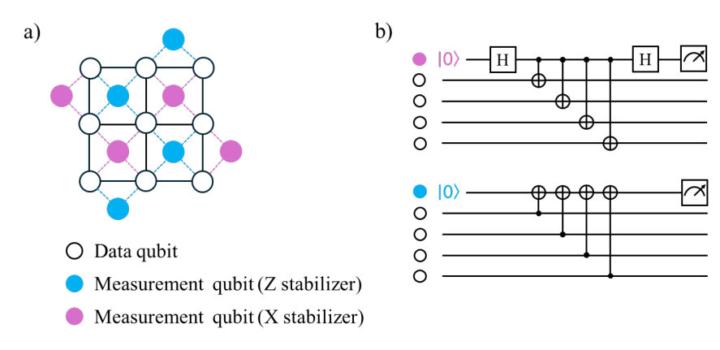 
Figure 1: a) Planar layout of a rotated surface code with code distance d = 3. White circles represent data qubits, while blue circles • and pink circles • represent Z-type and X-type stabi- lizer measurement qubits, respectively. b) Circuit representation of the X-type (top) and Z-type (bottom) stabilizer measurements. Open circles (◦) denote the four data qubits coupled to each measurement qubit.

📷 Fig 2

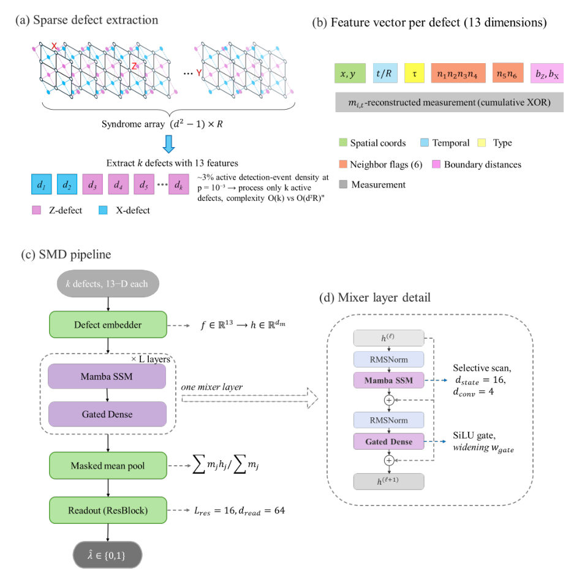 
Figure 2: Sparse Mamba Decoder architecture. (a) Sparse defect extraction from a (d2−1) × R syndrome volume to k defect tokens d1, . . . , dk (k ≪d2R at physically relevant error rates). (b) 13-dimensional feature vector per defect: spatial coordinates (x, y), normalized time t/R, stabilizer type τ, spatial and temporal neighbor flags, boundary distances bZ, bX, and the reconstructed measurement mi,t from cumulative XOR. (c) Pipeline: per-token embedder R13 →Rdmodel, L mixer layers, masked mean pool, ResBlock readout to logical observable ˆλ. (d) One mixer layer: RMSNorm + Mamba selective scan (dstate=16, dconv=4), then RMSNorm + Gated Dense (SiLU gating, widening wgate), both with residual...

📷 Fig 3

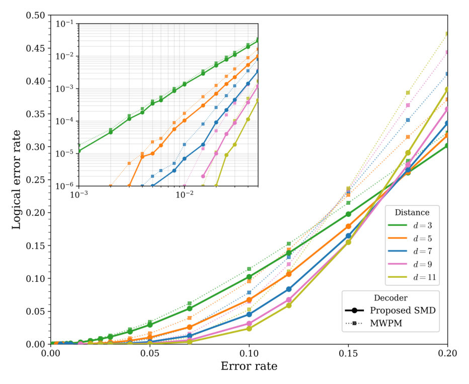 
Figure 3: Logical error rate under depolarizing noise with perfect stabilizer measurements. The Sparse Mamba Decoder (solid lines) with dual prediction heads for λZ and λX is compared against MWPM (dotted), the Tesseract near-MLD decoder [8] (dashed), and Belief Matching [18] (dash- dotted) at distances d ∈{3, 5, 7, 9, 11}. Each data point is evaluated over 106–3 × 106 fresh samples. Inset: Log-log plot of the low-p region showing the widening gap between Mamba and all classical decoders with increasing distance.

📷 Fig 4

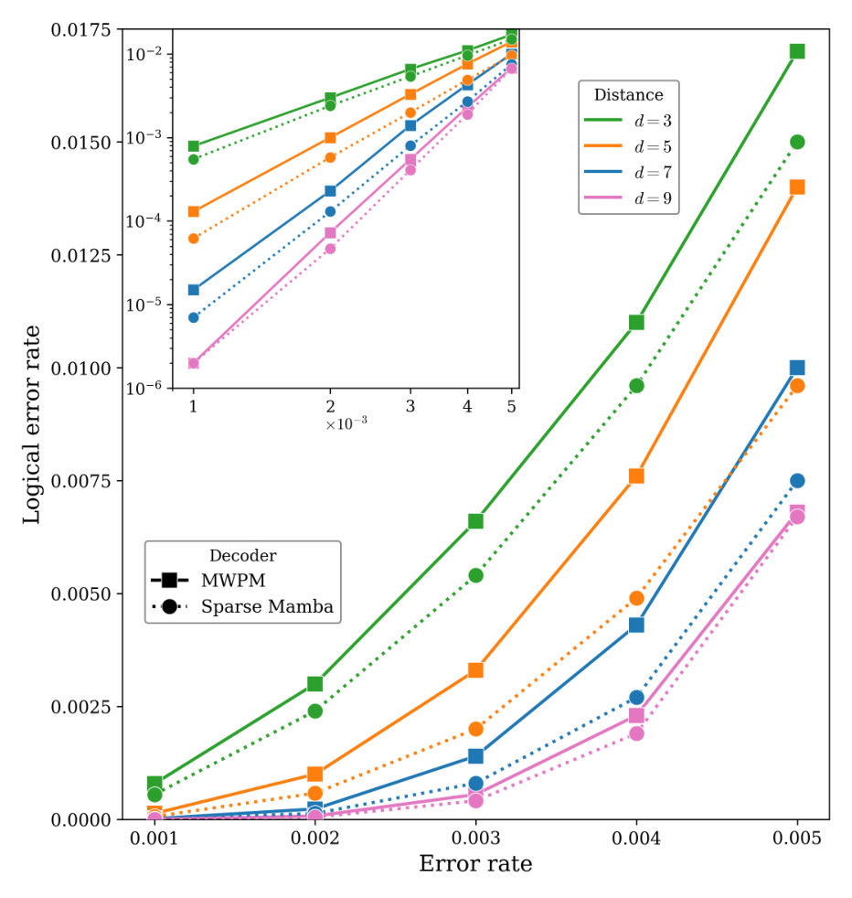 
Figure 4: Logical error rate under uniform circuit-level noise with R = d stabilizer measurement rounds. SMD (dotted circles) vs MWPM (solid squares) at distances d ∈{3, 5, 7, 9} and error rates p ∈[0.001, 0.005]. SMD outperforms MWPM at all distances and rates.

📷 Fig 5

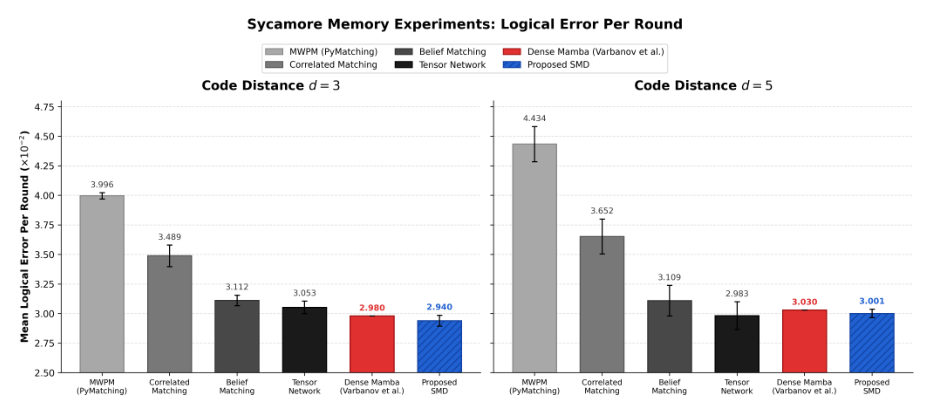 
Figure 5: Mean logical error per round on the Google Sycamore experimental dataset at code distances 3 and 5. Results are averaged across X and Z bases. Error bars indicate the spread between bases. The proposed Sparse Mamba Decoder (blue, hatched) matches or outperforms the dense Mamba decoder of Varbanov et al. [12] (red) at both distances, despite processing only active defects with O(k) complexity compared to O(d2R) for dense approaches.

**Summary.** This paper presents a new neural decoder for surface codes that exploits the sparsity of error syndromes to achieve much faster decoding speeds. By using a Mamba state-space model to process only active defects, it maintains high accuracy while scaling linearly with the number of errors rather than the total lattice size.

**Why it may be interesting.** not directly relevant

Detailed structure

**Main problem.** Existing neural decoders for quantum error correction (QEC) are computationally inefficient because they process dense syndrome arrays regardless of the actual error rate, leading to high latency as code distance increases.

**Main result.** The Sparse Mamba Decoder (SMD) achieves O(k) complexity by processing only active detection events, providing a 95-467x speedup over near-MLD decoders and significantly reducing logical error rates under SI1000 and Sycamore experimental noise.

**Method.** The authors introduce a defect-centric neural decoder using a Mamba state-space model backbone that processes a 13-dimensional feature vector for each active syndrome defect.

**Model / system.** The study focuses on the rotated surface code under various noise models, including depolarizing, uniform circuit-level, and SI1000 noise, as well as experimental data from the Google Sycamore processor.

**Key observables.** Logical error rate (LER), Frame Error Rate (FER), and decoding latency.

**Important parameters / regimes.** Code distance (d = 3 to 11), number of measurement rounds (R), and error rate (p approx 0.1%).

**Assumptions / limitations.** The effectiveness of the decoder relies on the inherent sparsity of syndromes at physically relevant, low error rates.

**Figures summary.** Figure 4 shows SMD outperforming MWPM under uniform noise; Figure 5 compares LER on Sycamore data; Figure 6 and 7 illustrate the speed-accuracy Pareto front under different noise regimes.

**Paper structure.** The paper introduces the inefficiency of dense decoders, describes the SMD architecture and feature engineering, details the training protocols (curriculum learning), presents performance benchmarks against classical and neural baselines, and concludes with future directions for scaling.

Abstract

Quantum error correction (QEC) is essential for building fault-tolerant quantum computers, requiring decoders that are simultaneously accurate, fast, and scalable. Most state-of-the-art neural decoders achieve high accuracy but process the full dense syndrome array of size $O(d^2 R) $regardless of the actual error rate, where d is the code distance and R is the number of measurement rounds. At physically relevant error rates (p ~ 0.1%), fewer than 5% of syndrome entries contain active detection events -- yet existing decoders process the entire syndrome volume. We introduce the Sparse Mamba Decoder (SMD), a defect-centric neural decoder that processes only the k active detection events using a 13-dimensional feature representation per defect and a Mamba state-space backbone, achieving $O(k)$ complexity. Across depolarizing, uniform circuit-level, SI1000, and Google Sycamore experimental benchmarks, SMD reduces the MWPM logical error rate by up to 49% at $d \le 5$ under SI1000 noise, runs 95-467x faster than the Tesseract near-MLD decoder and 232-463x faster than Belief Matching, and maintains nearly constant latency (24-57 us) across d = 3-9 under uniform circuit-level noise. On the Sycamore experimental dataset, the SMD ensemble matches or slightly surpasses the dense Mamba decoder of Varbanov et al. All results are obtained on commodity NVIDIA GPUs with 7.5-16M parameters, without specialized accelerators.

[↑ back to top](#top)

### [Spatially Adaptive Detection for Satellite-based QKD under Atmospheric Turbulence Channel](http://arxiv.org/abs/2605.16678v1)

**Authors:** Yaoxuan Yang, Ivi Afxenti, Majid Safari  
**Type:** theory · **Category:** quantum information and computing · **PDF:** <https://arxiv.org/pdf/2605.16678v1>  
**Analysis basis:** full PDF text, analyzed in chunks
**Topic relevance:** `quantum measurements` **2/5**

📷 Fig 1

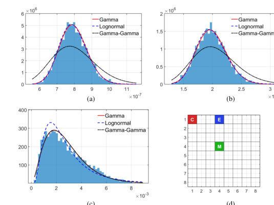 
Fig. 1. Statistical characterization of focal-plane intensity at different detector positions. (a) Corner element, (b) edge element, and (c) center element show the histogram fitting results. The horizontal axis represents the received intensity, and the vertical axis represents the occurrence frequency (histogram counts). (d) Schematic illustration of detector positions within the array.

📷 Fig 2

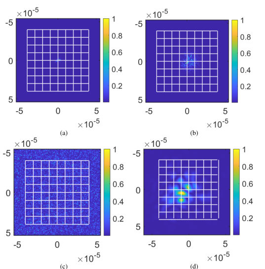 
Fig. 2. Example realizations of focal-plane speckle intensity distributions under different turbulence conditions. (a) Weak, (b) moderate, and (c) strong turbulence for a focal length of f = 0.5 m, and (d) weak turbulence with an increased focal length of f = 4 m. The horizontal and vertical axes represent spatial coordinates on the focal plane, and the color scale indicates intensity. The white grid denotes the detector array layout.

📷 Fig 3

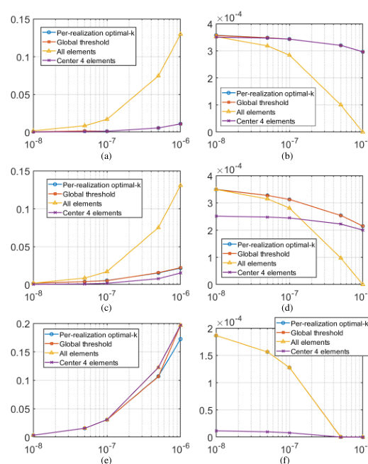 
Fig. 3. Performance comparison of different detector-selection strategies under different turbulence conditions. (a) QBER and (b) SKR under weak turbulence; (c) QBER and (d) SKR under moderate turbulence; (e) QBER and (f) SKR under strong turbulence. The horizontal axis represents the noise level nB, and the vertical axis denotes QBER or SKR (Hz), respectively.

**Summary.** The paper proposes an adaptive receiver design for satellite-based quantum key distribution that uses detector arrays to filter out noise-heavy regions caused by atmospheric turbulence. By selectively activating only the most promising detector elements, the system significantly improves the secret key rate. This approach is particularly effective in moderate turbulence conditions where spatial signal fluctuations are most pronounced.

**Why it may be interesting.** This paper is highly relevant to quantum optics and quantum networks as it addresses the practical challenge of maintaining entanglement/signal integrity in free-space quantum communication channels subject to decoherence-like atmospheric effects.

Detailed structure

**Main problem.** Atmospheric turbulence in satellite-to-ground QKD causes spatial beam distortion and intensity fluctuations, leading to high background noise interference in single-element detectors.

**Main result.** A spatially adaptive detector activation strategy effectively reduces the Quantum Bit Error Rate (QBER) and improves the Secret Key Rate (SKR), with the highest performance gains observed in moderate turbulence regimes.

**Method.** The authors propose a threshold-based selection method and a 'Best-K' strategy to selectively activate detector elements with high signal probability, evaluated using Monte Carlo simulations and the Split-Step Fourier Method.

**Model / system.** A satellite-to-ground downlink QKD system using an 8x8 Single Photon Detector (SPD) array at 850 nm, modeling a 1200 km link with atmospheric turbulence via the Hufnagel-Valley model and Kolmogorov statistics.

**Key observables.** Quantum Bit Error Rate (QBER), Secret Key Rate (SKR), Sifted Bit Rate (SBR), and Error Bit Rate (EBR).

**Important parameters / regimes.** Turbulence strength (weak, moderate, strong), noise level (background and dark counts), focal length, and detector array size.

**Assumptions / limitations.** The channel is quasi-static within each clock period, the transmitter is an ideal single-photon source, and background noise is spatially uniform.

**Figures summary.** Fig 1 shows statistical model fitting (Gamma, lognormal, Gamma-Gamma) to intensity distributions; Fig 2 illustrates focal-plane speckle patterns under different turbulence and focal lengths; Fig 3 compares QBER and SKR for different strategies across turbulence regimes.

**Paper structure.** Introduction of the SatQKD problem, description of the physical system and turbulence model, presentation of the proposed adaptive detection strategies, statistical analysis of intensity distributions, performance evaluation via Monte Carlo simulations, and discussion of results and limitations.

Abstract

Quantum key distribution (QKD) provides information-theoretic security and satellite-based quantum key distribution (SatQKD) has demonstrated the potential to extend this communication security to intercontinental scales. However, atmospheric turbulence induces significant distortion in the spatial distribution of received optical beams, while background noise remains approximately uniform across the detector plane. As a result, single-element qubit (quantum bit) detection can be frequently dominated by noise due to the random spatial pattern of the imaged wavefront, thereby degrading the system performance. To address this limitation, we propose to exploit the spatial degrees of freedom of single-photon detector arrays to reject the excessive noise while adapting to channel variations induced by turbulence. We develop a threshold-based selection method that only activates detector elements that have higher probability of registering qubits. We evaluate the performance of the proposed noise-rejection QKD schemes using Monte Carlo simulations considering the impact of diffraction and atmospheric turbulence on the transmitted optical beam in the presence of background and dark noise. The results show that, compared to conventional schemes, the proposed noise-rejection strategy effectively reduces the quantum bit error rate (QBER) and improves the secret key rate (SKR) performance, while the performance gains depend on the turbulence condition. These findings demonstrate the potential of adaptive array receiver design to enhance the robustness of the SatQKD system under realistic atmospheric conditions.

[↑ back to top](#top)

### [Structural $f$-divergence: Tight universal bounds for cost function moments and gradients in parameterized quantum circuits](http://arxiv.org/abs/2605.18051v1)

**Authors:** Tomohiro Nishiyama, Yoshihiko Hasegawa  
**Type:** theory · **Category:** quantum information and computing · **PDF:** <https://arxiv.org/pdf/2605.18051v1>  
**Analysis basis:** full PDF text, analyzed in chunks
**Topic relevance:** `entanglement & information structure` **2/5**

📷 Fig 1

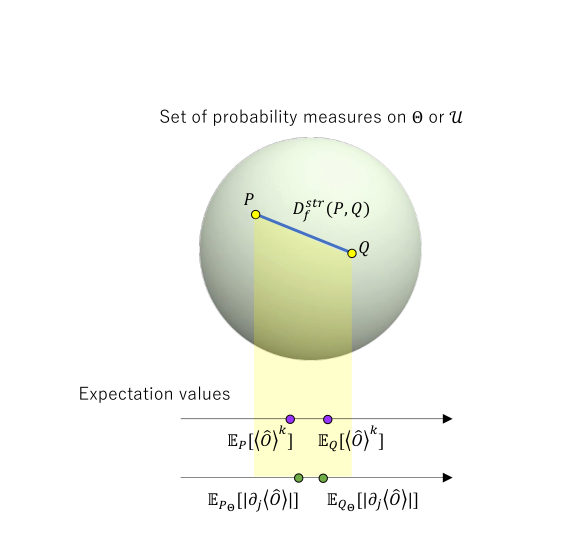 
FIG. 1. Conceptual diagram illustrating that the structural f-divergence Dstr f (P, Q) bounds both the difference in the k- th moments of the cost function and the difference in the expected gradient magnitudes between probability measures P and Q on either the parameter space Θ or the unitary group U. Here, ⟨O⟩denotes the cost function defined in Eq. (2) and ˆO = O/∥O∥∞denotes the operator normalized by the operator norm.

**Summary.** This paper introduces a new information-theoretic metric called structural f-divergence to quantify how differences in parameter distributions affect the landscape of quantum cost functions. It provides tight, universal bounds on gradient vanishing and cost concentration, offering new design principles for optimizing parameterized quantum circuits.

**Why it may be interesting.** not directly relevant

Detailed structure

**Main problem.** The vanishing of cost-function gradients (barren plateaus) in variational quantum algorithms is typically analyzed using high-randomness assumptions, which lack design principles for choosing realistic probability measures on parameter spaces.

**Main result.** The authors introduce 'structural f-divergence' and establish tight, universal analytical bounds that relate the discrepancy between probability distributions to differences in expected gradient magnitudes and cost-function moments.

**Method.** The study utilizes information-geometric tools, specifically a new symmetric, normalized f-divergence-based measure, to derive trade-off inequalities using properties like the data processing inequality and Hölder's inequality.

**Model / system.** The framework is applied to Parameterized Quantum Circuits (PQCs) consisting of n qubits and L layers of alternating gates, using unitary operators $U(	heta)$ and Hermitian cost function operators $O$.

**Key observables.** Expected gradient magnitude, cost-function moments (even and odd), and cost concentration.

**Important parameters / regimes.** Probability measures on the parameter space (P and Q), number of qubits (n), number of layers (L), and the structural f-divergence metric.

**Assumptions / limitations.** The function f must be twice-differentiable, strictly convex, and satisfy f(1)=0; equality conditions are demonstrated using a minimal one-qubit, one-layer ansatz.

**Figures summary.** Figure 1 provides a conceptual diagram showing how structural f-divergence bounds the differences in cost function moments and expected gradient magnitudes.

**Paper structure.** The paper introduces the barren plateau problem, defines the new structural f-divergence metric, establishes analytical trade-off inequalities for gradients and moments, proves the tightness of these bounds using specific ansatz examples, and applies the framework to derive conditions for avoiding barren plateaus and suppressing noise.

Abstract

The barren plateau phenomenon, in which cost-function gradients of variational quantum algorithms vanish exponentially, remains a central obstacle for near-term quantum computing. Existing analyses typically depend on t-design or Haar-random assumptions and bound quantities at the level of unitary distributions, offering limited insight for designing probability measures on the parameter space of parameterized quantum circuits. In this paper, we introduce the structural $f$-divergence, a symmetric $f$-divergence-based measure between probability distributions on the parameter space. We establish analytically trade-off inequalities that bound the discrepancies in the expected gradient magnitude and in the cost-function moments between a distribution on PQC and a reference distribution; equality is attained by a minimal one-qubit, one-layer ansatz. As applications, we derive necessary conditions on probability measures for avoiding BPs and cost concentration, and sufficient conditions that suppress noise-induced deviations.

[↑ back to top](#top)

### [Systematic dynamical mean-field theory study of 3d perovskite oxides with uniform Coulomb interactions](http://arxiv.org/abs/2605.16771v1)

**Authors:** Antik Sihi, Caden Ginter, Kristjan Haule, Subhasish Mandal  
**Type:** both · **Category:** strongly correlated electrons · **PDF:** <https://arxiv.org/pdf/2605.16771v1>  
**Analysis basis:** full PDF text, analyzed in chunks
**Topic relevance:** `Kondo & dissipative impurity` **2/5**

📷 Fig 1

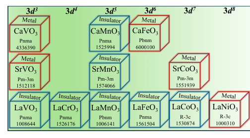 
FIG. 1. Overview of the ABO3 perovskite oxides investigated in this work. Shown are the experimentally reported crystal structures (space groups), Crystallography Open Database (COD) identification numbers, and metallic or insulating ground states with A = Ca, Sr, La and B = V, Cr, Mn, Fe, Co, Ni. The materials are organized according to the nomi- nal transition-metal 3d electron count (left→right) fixing the A-site in a periodic table fashion, which also highlights the evolution from correlated metals to insulators across the se- ries.

📷 Fig 2

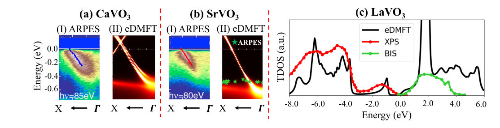 
FIG. 2. Comparison of experimental and eDMFT spectral properties for vanadium-based perovskites. Panels (a) and (b) show momentum-resolved spectral functions of CaVO3 and SrVO3 along the Γ–X direction. ARPES data [panels (I)] are reproduced from the literature [90], with corresponding eDMFT results shown in panels (II). For SrVO3, the second derivative of the ARPES energy distribution curves is overlaid as green stars [91, 92]. Panel (c) compares the eDMFT total density of states (TDOS, black) for LaVO3 with experimental x-ray photoemission spectroscopy (XPS, red) and bremsstrahlung isochromat spectroscopy (BIS, green); experimental spectra are reproduced from Ref. [93].

📷 Fig 3

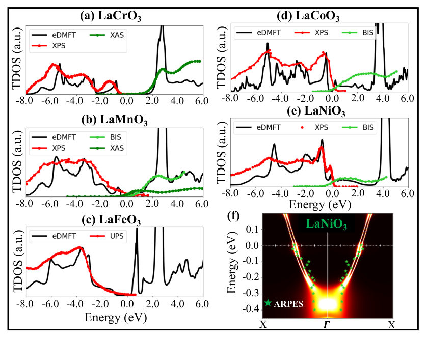 
FIG. 3. Spectral properties of LaMO3 (M = Cr, Mn, Fe, Co, Ni) in the paramagnetic phase. Panels (a)–(e) show the eDMFT total density of states (TDOS, black) compared with experimental x-ray photoemission spectroscopy (XPS, red), x-ray absorption spectroscopy (XAS, green), and bremsstrahlung isochromat spectroscopy (BIS, lime green) data reproduced from the literature [100–106]. Panel (f) compares the eDMFT momentum-resolved spectral function of metallic LaNiO3 with angle- resolved photoemission spectroscopy (ARPES) data (green stars) reproduced from Ref. [107].

📷 Fig 4

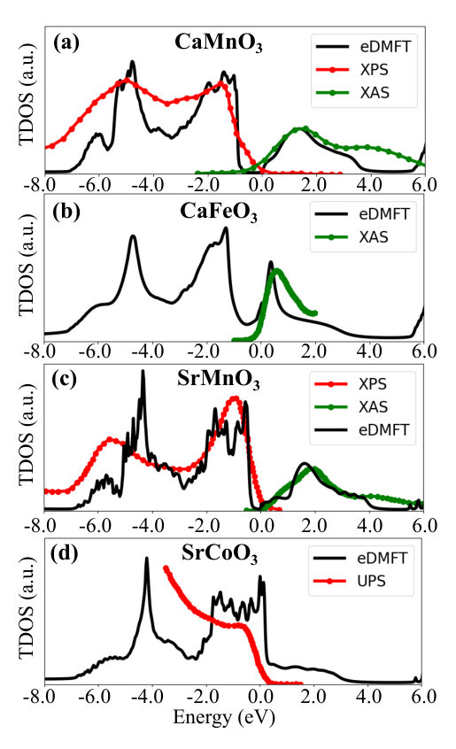 
FIG. 4. Spectral properties of CaXO3 (X = Mn, Fe) and SrXO3 (X = Mn, Co) in the paramagnetic phase. Panels (a)–(d) show the eDMFT-computed total density of states (TDOS, black) compared with experimental x-ray photoe- mission spectroscopy (XPS, red) and x-ray absorption spec- troscopy (XAS, green) data reproduced from the literature [109–112]. For SrCoO3, the red curve denotes ultravio- let photoelectron spectroscopy (UPS) data reproduced from Ref. [113].

📷 Fig 5

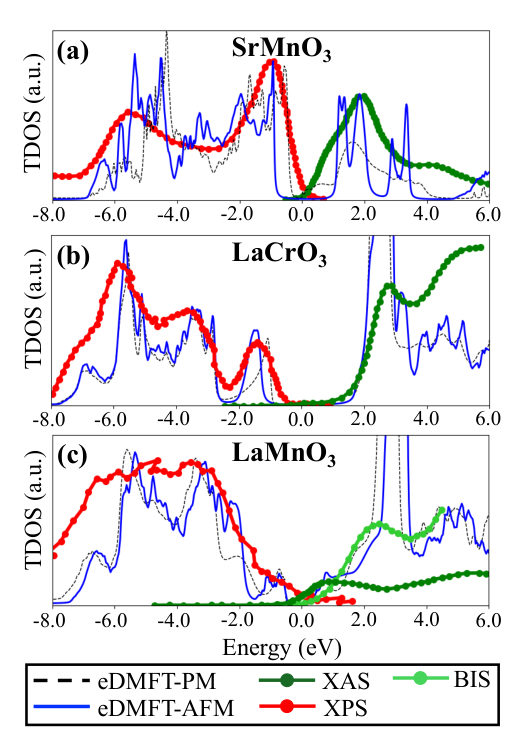 
FIG. 5. Effect of magnetic ordering on the spectral prop- erties of selected ABO3 perovskites. Panels (a)–(c) show the eDMFT total density of states (TDOS) for SrMnO3, LaCrO3, and LaMnO3, respectively, computed in the paramagnetic (PM, black dashed lines) and antiferromagnetic (AFM, blue solid lines) phases. Experimental x-ray photoemission spec- troscopy (XPS, red), x-ray absorption spectroscopy (XAS, dark green), and bremsstrahlung isochromat spectroscopy (BIS, light green) data are reproduced from the literature [100–103, 112].

**Summary.** This paper shows that using the embedded DMFT (eDMFT) framework allows researchers to perform high-throughput calculations of correlated oxides using fixed, universal interaction parameters. By treating screening self-consistently, the method avoids the need for material-specific tuning and accurately reproduces experimental spectral features. This paves the way for creating large-scale, predictive databases for strongly correlated materials.

**Why it may be interesting.** not directly relevant

Detailed structure

**Main problem.** High-throughput electronic-structure discovery for strongly correlated materials is hindered by the need for material-specific, non-transferable Coulomb interaction parameters (U).

**Main result.** The study demonstrates that the eDMFT framework allows for a parameter-tuning-free approach using uniform U values (6 eV for metals, 10 eV for insulators) that achieves excellent agreement with experimental spectroscopy.

**Method.** High-throughput charge self-consistent embedded Dynamical Mean-Field Theory (eDMFT) using CTQMC for the impurity problem and the Maximum Entropy Method for analytical continuation.

**Model / system.** A series of 12 3d transition-metal perovskite oxides with the formula ABO3, where A = Ca, Sr, La and B = V, Cr, Mn, Fe, Co, Ni.

**Key observables.** Total density of states (TDOS), momentum-resolved spectral functions, bandwidth renormalization, and Mott gaps.

**Important parameters / regimes.** Fixed Hubbard U (6 eV for metals, 10 eV for insulators), Hund's coupling J = 0.8 eV, and magnetic phases (paramagnetic and antiferromagnetic).

**Assumptions / limitations.** The spectral properties are primarily governed by the dynamical self-energy rather than static interaction-induced energy shifts, allowing for a fixed-U approach.

**Figures summary.** Fig 1: Overview of the 12 compounds and their properties; Fig 2: Comparison of eDMFT vs ARPES/XPS/BIS for Vanadium oxides; Fig 3/4/5: Comparison of eDMFT TDOS with experimental XPS, XAS, and BIS for various Mn, Fe, and Co oxides in PM and AFM phases.

**Paper structure.** The paper introduces the problem of parameter-dependency in DFT+DMFT, presents the eDMFT framework and the fixed-U hypothesis, details the systematic study of 3d perovskites, benchmarks results against various spectroscopic experiments, and concludes with the implications for high-throughput materials databases.

Abstract

Strongly correlated transition-metal perovskite oxides pose a fundamental challenge for electronic-structure theory and for large-scale, data-driven materials discovery. While DFT+DMFT provides a quantitatively accurate description of such systems, its high-throughput application is hindered by the need to determine material-specific Coulomb interaction parameters ($U$). First-principles approaches such as the cRPA predict a highly nonlinear and non-transferable evolution of the interaction strength across chemically similar ABO$_3$ perovskites. Here we show that this paradigm does not extend to the large-energy-window eDMFT, which employs highly localized orbitals and treats electronic correlations and screening self-consistently within the same many-body framework. As a result, spectral properties are governed primarily by the dynamical self-energy rather than by static interaction-induced energy shifts. Recent constrained-eDMFT calculations demonstrated that, for broad classes of $3d$ transition-metal oxides, the self-consistently screened Coulomb interactions naturally fall within relatively narrow ranges for correlated metals and insulators. Motivated by these findings, we implement a high-throughput eDMFT framework employing physically derived interaction values of $U=6$ eV for metals and $U=10$ eV for insulators together with $exact$ double counting. We test this framework using systematic high-throughput eDMFT calculations for ABO$_3$ compounds (A = Ca, Sr, La; B = V--Ni) and benchmark the resulting spectral functions against photoemission experiments, where we find overall excellent agreement. Our results establish that charge self-consistent eDMFT enables robust, parameter-tuning-free high-throughput many-body calculations for correlated oxides, opening a practical pathway toward predictive electronic-structure databases for strongly correlated materials.

[↑ back to top](#top)

### [Taming the 3D Wilson-Fisher Fixed Point via Nonlocal Effective Action](http://arxiv.org/abs/2605.18148v1)

**Authors:** Hyeon Jung Kim, Seung-Jong Yoo, Jinmo Bok, Lemuel John Sese, Semin Park, Ki-Seok Kim  
**Type:** theory · **Category:** statistical mechanics · **PDF:** <https://arxiv.org/pdf/2605.18148v1>  
**Analysis basis:** full PDF text, analyzed in chunks
**Topic relevance:** `Keldysh / 2PI / non-Gaussian methods` **2/5**

📷 Fig 1

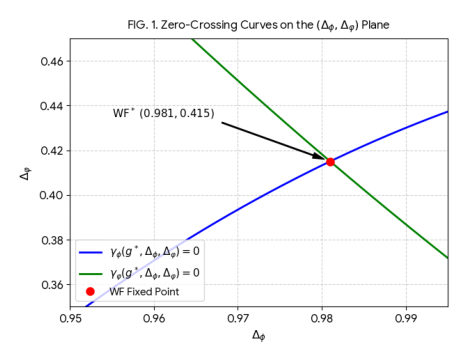 
FIG. 1. The intersection of the independent field flow equa- tions γϕ = 0 and γφ = 0 on the (∆ϕ, ∆φ) plane. The un- constrained physical non-trivial root cleanly stabilizes at the crossing point (0.981, 0.415), isolating the true local Wilson- Fisher critical coordinates without requiring any fine-tuned kinematic matching constraints.

**Summary.** The authors propose a new Renormalization Group framework that uses a nonlocal effective action to solve the 3D Wilson-Fisher fixed point problem. By treating the scaling dimensions of both primary and auxiliary fields as independent variables, they eliminate systematic truncation errors. This approach yields critical exponents that are highly accurate when compared to established numerical benchmarks.

**Why it may be interesting.** not directly relevant

Detailed structure

**Main problem.** The difficulty of accurately characterizing the 3D Wilson-Fisher quantum critical point due to severe truncation errors and unphysical fixed-point divergence in standard non-perturbative Renormalization Group frameworks.

**Main result.** The identification of a robust, non-trivial physical fixed point with critical exponents (eta ~ 0.038, nu ~ 0.6317) that show exceptional agreement with Quantum Monte Carlo and conformal bootstrap benchmarks.

**Method.** A multi-loop Renormalization Group approach using a nonlocal effective action ansatz and a two-variable master equation system evaluated up to three-loop order.

**Model / system.** A 3D relativistic phi^4 theory (Wilson-Fisher universality class) where the quartic interaction is decoupled via a Hubbard-Stratonovich transformation into a primary field and an auxiliary field.

**Key observables.** Kinematic anomalous dimension (eta_phi), energy operator dimension (Delta_phi^2), and thermal correlation length exponent (nu).

**Important parameters / regimes.** Scaling dimensions (Delta_phi and Delta_phi_tilde) treated as independent dynamical variables, and the dimensionless coupling (g_tilde^2).

**Assumptions / limitations.** The framework assumes a scale-invariant action at the critical point and utilizes a three-loop truncation of the effective action.

**Figures summary.** Figure 1 illustrates the intersection of the two independent field flow equations (gamma_phi = 0 and gamma_phi_tilde = 0) on the scaling dimension plane, marking the stable physical root.

**Paper structure.** The paper introduces the problem of truncation errors in RG, presents a nonlocal effective action ansatz using Hubbard-Stratonovich transformation, details the multi-loop diagrammatic calculations, demonstrates the numerical solution of the two-variable master equations, and validates the results against benchmarked data.

Abstract

We present a novel Renormalization Group (RG) framework based on a nonlocal effective action ansatz to tame the strong coupling dynamics of the three-dimensional relativistic $φ^{4}$ theory. By implementing a Hubbard-Stratonovich transformation, we decouple the quartic interaction into a system of the primary field $φ$ and an auxiliary field $\varphi \sim φ^2$. Rather than freezing the intermediate scaling dimensions, the nonlocality of our effective action allows both exponents $Δ_φ$ and $Δ_{\varphi}$ to act as fully independent, unconstrained dynamical variables.This nonlocal propagator framework plays a critical role in the RG flow: evaluating self-energies and vertex fluctuations up to the three-loop order, the nonlocality drives precise structural cross-cancellations among multi-loop fluctuations near the Gaussian limit. Solving the resulting closed two-variable master equations isolates a robust, non-trivial physical fixed point at $Δ_φ^{*} \approx 0.981$ and $Δ_{\varphi}^{*} \approx 0.415$. These dynamic exponents yield a kinematic anomalous dimension $η_φ \approx 0.038$, an energy operator dimension $Δ_{φ^2} \approx 1.417$, and-via mass deformation-a thermal correlation length exponent $ν\approx 0.6317$, demonstrating exceptional quantitative agreement with high-precision Quantum Monte Carlo (QMC) and conformal bootstrap benchmarks. Our results rigorously confirm that unfreezing the nonlocal degrees of freedom successfully eliminates the systematic truncation errors inherent to conventional local ansatz treatments, simultaneously resolving both the static scaling and thermodynamic flows of the Wilson-Fisher universality class.

[↑ back to top](#top)

### [The problem of time: a path integral view](http://arxiv.org/abs/2605.17935v1)

**Authors:** Juan Manuel Diaz, Alejandro Perez  
**Type:** theory · **Category:** other · **PDF:** <https://arxiv.org/pdf/2605.17935v1>  
**Analysis basis:** full PDF text, analyzed in chunks
**Topic relevance:** `Keldysh / 2PI / non-Gaussian methods` **2/5**

📷 Fig 1

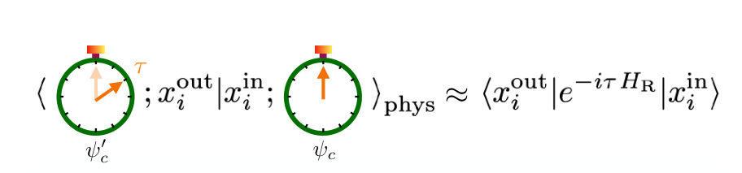 
FIG. 1: The results in a picture: In a timeless closed system where all the allowed quantum states have the same total energy E there is no external time evolution. Assuming that the Hamiltonian is H = Hc + HR where Hc is the Hamiltonian of an internal (clock) degree of freedom, one can write the (boundary) states, for which the transition amplitudes will be computed, as ⟨ψ′ c; xout i | (with ψ′ c and ψc denoting the clock states and xi the rest of the universe degrees of freedom). When the boundary clock states are in suitable semiclassical states, their relative features encode internal time τ. In the picture, these states are represented by the clock cartoon inside the Dirac ket and bra...

📷 Fig 2

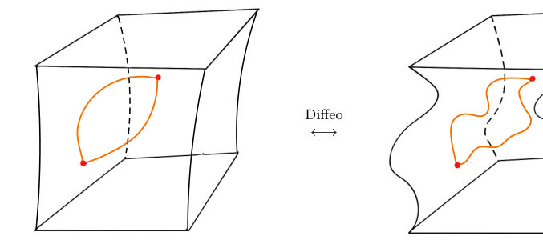 
FIG. 2: Same data give rise to different spacetime developments depending on the arbitrary fields N(x) and N i(x). The two spacetime developements are solutions of Einstein’s equations related by a diffeomorphism.

**Summary.** This paper addresses the 'problem of time' in quantum gravity by showing that time evolution is an emergent phenomenon. By using a path integral view, the authors demonstrate that a semiclassical clock state can resolve the ambiguity of backward-propagating amplitudes, effectively recovering standard Schrödinger dynamics from a fundamentally timeless theory.

**Why it may be interesting.** not directly relevant

Detailed structure

**Main problem.** How time evolution and a directed arrow of time emerge from a fundamentally timeless, generally covariant quantum system, and how to resolve the 'cosine problem' in path integral representations.

**Main result.** The authors show that Schrödinger evolution and forward-propagating amplitudes emerge naturally when a clock degree of freedom is prepared in a semiclassical 'good-clock state', which breaks time-reversal symmetry.

**Method.** A path integral approach using a non-relativistic toy model and semiclassical approximations (stationary phase) to analyze transition amplitudes.

**Model / system.** A non-relativistic, closed, background-independent quantum system with a fixed total energy E, decomposed into a clock subsystem (harmonic oscillator or free particle) and the rest of the universe.

**Key observables.** Dirac observables (gauge-invariant quantities), relational observables, and the emergent physical time parameter.

**Important parameters / regimes.** The semiclassical limit (|z| >> 1), the large energy regime, and the energy-time uncertainty relation.

**Assumptions / limitations.** The model assumes a non-interacting clock and a fixed energy eigenvalue; it also assumes the existence of suitable semiclassical 'good-clock' states.

**Figures summary.** Figure 1 shows a schematic of how clock boundary states select forward-propagating amplitudes; Figure 2 illustrates different spacetime developments related by 4D diffeomorphisms.

**Paper structure.** The paper reviews general covariance and timelessness, critiques existing classical and quantum clock approaches, defines the cosine problem, and then uses a non-relativistic model to demonstrate the emergence of time via path integrals.

Abstract

We show that the emergence of time evolution in an otherwise timeless nonrelativistic closed quantum system -- viewed as a poor man's model of generally covariant quantum theory -- can be understood from the perspective of the path integral representation. As often happens in the functional integral approach, this viewpoint offers a more intuitive account of features that become cumbersome in the operator/Hilbert-space formulation. We show how Schrödinger evolution emerges once a clock degree of freedom is identified and placed in a suitable semiclassical `good-clock state'.   Our analysis has a consequence that extends to path integral formulations of generally covariant systems with action $S$ (including gravity). In such theories certain transition amplitudes take the form $\exp(iS/\hbar)+\exp(-iS/\hbar)$ rather than the expected `forward propagating' $\exp(iS/\hbar)$. This feature, known as the {\em cosine problem}, appears in concrete regularizations of the path integral, for example in the spin foam representation defining the physical inner product between spin network states in loop quantum gravity. Both formally and in explicit regularizations, this apparent difficulty has led some authors to seek modifications of the basic amplitudes to eliminate backward propagation.   Our model shows that the cosine problem is instead a natural consequence of time-reversal invariance of the fundamental dynamics together with the time-neutral boundary states commonly used in transition amplitudes. When a suitable clock system is identified and placed in a semiclassical `good-clock state', it introduces a time arrow selecting the `forward propagating' $\exp(iS/\hbar)$, without modifying the fundamental dynamics.   The analysis clarifies how time emerges under suitable conditions and emphasizes that, in the canonical formulation, quantum gravity is fundamentally timeless.

[↑ back to top](#top)

### [Discovering Data Encoding Strategies for Quantum-Classical Neural Networks Using Monte Carlo Tree Search](http://arxiv.org/abs/2605.18540v1)

**Authors:** Lena Tokuhiro, Amine Bentellis, Jeanette Miriam Lorenz  
**Type:** theory · **Category:** quantum information and computing · **PDF:** <https://arxiv.org/pdf/2605.18540v1>  
**Analysis basis:** full PDF text, analyzed in chunks
**Topic relevance:** `entanglement & information structure` **1/5**

📷 Fig 1

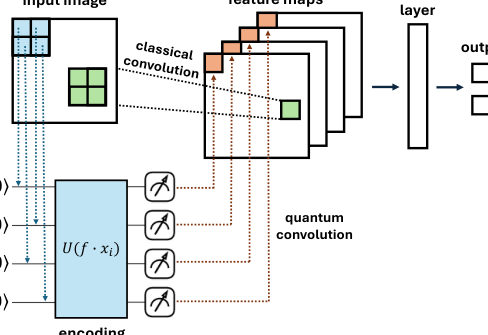 
Fig. 1: Architecture sketch of the CNN and QCCNN for the patch size 2 × 2.

📷 Fig 2

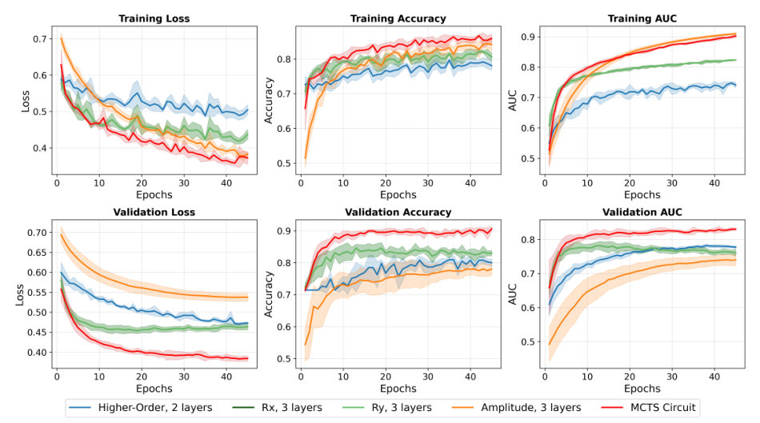 
Fig. 3: Comparison of data encoding strategies on BreastMNIST. The MCTS-derived 2×2 circuit is compared against baseline encodings using RX, RY , and higher-order gates with 1 to 3 re-uploading layers; only the best-performing configuration for each baseline is shown. The two angle encodings (RX and RY ) achieve identical performance and therefore overlap. Results are averaged over five random seeds, with error bars indicating standard deviation.

📷 Fig 3

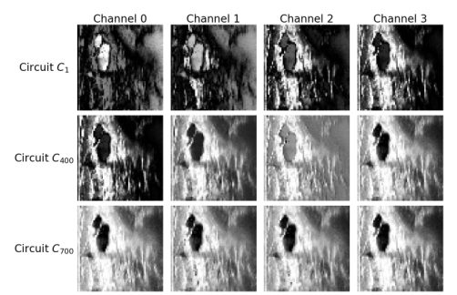 
Fig. 6: Feature maps produced by 2×2 patch-sized quantum encodings on BreastMNIST. Circuits C1, C400, and C700 represent the best, medium, and worst performing encodings from the search, respectively. Higher-ranked circuits produce more diverse feature representations.

📷 Fig 4

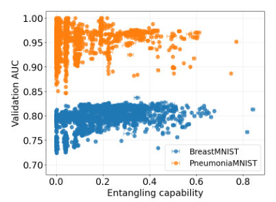 
Fig. 7: Entanglement capability versus validation AUC of various encoding circuits for the BreastMNIST (blue) and the PneumoniaMNIST (orange) datasets. Entanglement values are averaged over three input parameters, with error bars indicating standard deviation.

📷 Fig 5

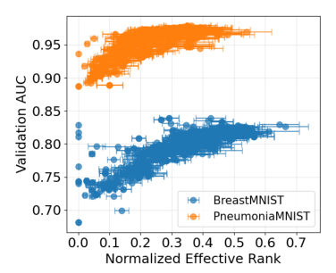 
Fig. 9: Normalized effective rank against validation AUC for candidate encodings on both datasets. A higher effective rank indicates greater feature map diversity. The effective rank is computed on a subset of 20 images, with error bars indicating standard deviation. Pearson correlation: r = 0.87 (BreastMNIST) and r = 0.82 (PneumoniaMNIST).

**Summary.** This paper uses Monte Carlo Tree Search to automatically find high-performing quantum data encoding circuits for hybrid neural networks. It discovers that the diversity of the feature map, measured by effective rank, is a key predictor of success, providing a way to accelerate the search for effective quantum machine learning models.

**Why it may be interesting.** not directly relevant

Detailed structure

**Main problem.** The challenge of discovering optimal data encoding strategies for Quantum-Classical Convolutional Neural Networks (QCCNNs) and identifying which circuit properties predict classification performance.

**Main result.** MCTS-discovered encoding circuits outperform standard strategies, and the effective rank of feature maps was identified as a strong predictor of encoding performance, whereas entanglement and Fourier properties were not.

**Method.** Monte Carlo Tree Search (MCTS) with progressive widening is used to automate the discovery of encoding circuits, combined with an analysis of feature map diversity via effective rank.

**Model / system.** A hybrid Quantum-Classical Convolutional Neural Network (QCCNN) architecture using non-variational quantum blocks for feature extraction on medical imaging datasets (BreastMNIST and PneumoniaMNIST).

**Key observables.** Classification accuracy, Area Under the ROC Curve (AUC), effective rank of feature maps, entanglement capability, and Fourier spectrum.

**Important parameters / regimes.** Patch sizes (2x2 and 3x3 qubits), scaling factor (f), and MCTS exploration constant (c).

**Assumptions / limitations.** The study assumes a noise-free simulation regime and does not explicitly account for NISQ-era hardware noise or classical simulation hardness.

**Figures summary.** Schematic of QCCNN architecture, visual representation of discovered circuits, performance comparisons against baseline encodings, training metrics (loss/accuracy), and correlations between effective rank and AUC.

**Paper structure.** The paper introduces the QCCNN problem, describes the MCTS-based search methodology, presents the discovered circuits and their performance on medical datasets, analyzes the correlation between circuit metrics and accuracy, and discusses limitations regarding noise and quantum advantage.

Abstract

Quantum machine learning (QML) has attracted considerable research interest, yet whether it offers practical benefits over classical approaches remains an open question. The choice of data encoding significantly influences QML performance, but why certain encodings outperform others remains poorly understood. We employ Monte Carlo Tree Search (MCTS) to discover optimal data encoding circuits for a quantum-classical convolutional neural network (QCCNN) combining a non-variational quantum block for feature extraction with a classical classifier. Evaluating on two medical imaging datasets, the discovered circuits outperform commonly used encoding strategies while showing competitive results compared to purely classical counterparts. We further analyze metrics to identify predictors of encoding performance. Entanglement capability and Fourier decomposition provide minimal insight, whereas the effective rank of the feature maps exhibits meaningful correlation and can serve as a threshold criterion to accelerate the search for high-performing encodings. Our findings provide both a practical method for encoding discovery and new insights into what makes data encodings effective in QML.

[↑ back to top](#top)

### [Incommensurate Antiferromagnetic Order in the Fe-substituted Bi-2201 Cuprate in the Heavily Overdoped Regime](http://arxiv.org/abs/2605.16988v1)

**Authors:** Y. Komiyama, Y. Ikeda, T. Taniguchi, T. J. Williams, M. Matsuda, S. Asai, T. Masuda, H. Kuwahara, H. Kuroe, T. Kawamata, I. Watanabe, M. Fujita, T. Adachi  
**Type:** experiment · **Category:** strongly correlated electrons · **PDF:** <https://arxiv.org/pdf/2605.16988v1>  
**Analysis basis:** full PDF text, analyzed in chunks
**Topic relevance:** `Frenkel-Kontorova` **1/5**

📷 Fig 1

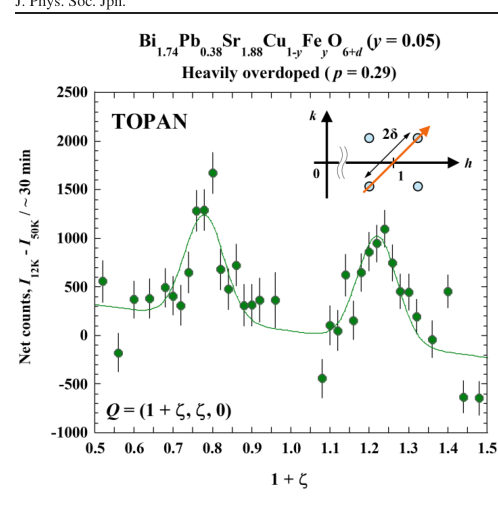 
Fig. 1. (Color online) Difference profile obtained by subtracting the data at 50 K from those at 12 K in HOD Bi1.74Pb0.38Sr1.88Cu1−yFeyO6+d with y = 0.05 (p = 0.29) using TOPAN. Inset shows the scan trajectory in the reciprocal (h, k) plane of the orthorhombic notation. Solid line is a fitting result using Eq. (1).

📷 Fig 2

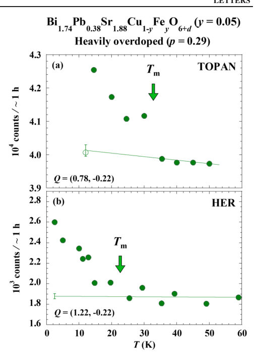 
Fig. 2. (Color online) Temperature dependence of net counts at the IC peak position for HOD Bi1.74Pb0.38Sr1.88Cu1−yFeyO6+d with y = 0.05 (p = 0.29) for (a) TOPAN (energy resolution: ∼1.5 meV) and (b) HER (∼0.1 meV). Solid lines represent the background, derived from the temperature- dependent intensity changes at the (h, k) position unaffected by the IC peaks, extrapolated from the data at the highest temperature. Error bars at the end of background lines represent errors in the intensity change. The open circle in (a) represents the background value at Q = (0.78,-0.22) in Fig. 1 added to the 50 K data. Arrows indicate the magnetic transition temperature Tm at which the net counts begin to...

📷 Fig 3

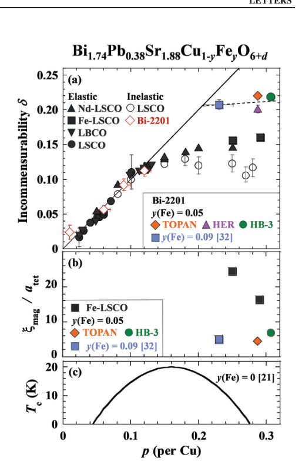 
Fig. 3. (Color online) (a) Hole-concentration dependence of incom- mensurability δ in HOD Bi1.74Pb0.38Sr1.88Cu1−yFeyO6+d (y = 0.05) obtained with TOPAN, HER, and HB-3, together with overdoped Bi1.75Pb0.35Sr1.90Cu1−yFeyO6+d (y = 0.09)32) analyzed using the same pro- cedure as in the present study, La2−xBaxCuO4,37–39) La2−xSrxCuO4,8,40–42)

**Summary.** This paper demonstrates that incommensurate antiferromagnetic order exists in the heavily overdoped, non-superconducting regime of Bi-2201 cuprates when stabilized by iron substitution. The findings suggest that robust antiferromagnetic correlations persist even beyond the superconducting dome. The observed magnetism appears to be a glassy state induced by the pinning of intrinsic fluctuations by Fe impurities.

**Why it may be interesting.** not directly relevant

Detailed structure

**Main problem.** The study investigates whether incommensurate antiferromagnetic (AFM) order or fluctuations persist in the non-superconducting, heavily overdoped regime of Bi-2201 cuprates.

**Main result.** The researchers discovered incommensurate AFM peaks in 5% Fe-substituted Bi-2201 in the heavily overdoped regime, suggesting that Fe-substitution stabilizes existing AFM fluctuations into a glassy magnetic state.

**Method.** Elastic neutron scattering experiments were performed using triple-axis spectrometers (TOPAN, HER, and HB-3) on single crystals, supplemented by magnetic susceptibility and muon spin rotation (muSR) measurements.

**Model / system.** The physical system is Fe-substituted Bi-2201 cuprate (Bi1.74Pb0.38Sr1.88Cu1-yFeyO6+d) in the heavily overdoped, non-superconducting regime (hole concentration p approx 0.29 to 0.31).

**Key observables.** Incommensurability (delta), magnetic correlation length (xi_mag), magnetic transition temperature (Tm), and hole concentration (p).

**Important parameters / regimes.** Fe-substitution level (y = 0.05), hole concentration (p approx 0.29-0.31), and temperature.

**Assumptions / limitations.** The study assumes that the observed magnetic order is induced/stabilized by Fe impurities acting on intrinsic AFM fluctuations.

**Figures summary.** Figure 1 shows the difference profile of elastic neutron scattering and the scan trajectory; Figure 2 shows the temperature dependence of net counts; Figure 3 shows the hole-concentration dependence of incommensurability across various cuprates.

**Paper structure.** The paper introduces the problem of magnetism in the heavily overdoped regime, describes the experimental setup and sample preparation, presents neutron scattering results showing incommensurate peaks, discusses the temperature dependence and glassy nature of the magnetism, and concludes with a discussion on the mechanism of Fe-induced stabilization.

Abstract

Elastic neutron scattering experiments showed incommensurate antiferromagnetic peaks in 5% Fe-substituted Bi-2201 cuprate in the non-superconducting heavily overdoped regime. The incommensurability delta~0.21 is comparable to that observed in Fe-substituted Bi-2201 in the overdoped regime. [Hiraka et al., Phys. Rev. B 81, 144501 (2010).] The magnetic correlation length is comparable between the overdoped and non-superconducting heavily overdoped regimes. It is plausible that incommensurate antiferromagnetic order is induced and stabilized by Fe in the heavily overdoped regime, which suggests a robust antiferromagnetic correlation beyond the superconducting dome in the phase diagram.

[↑ back to top](#top)

### [InterQ: Communication-Aware Scheduling Across Modular QPUs with Classical and Quantum Links](http://arxiv.org/abs/2605.17769v1)

**Authors:** Vinooth Kulkarni, Jaehyun Lee, Lauren Li, Aaron Orenstein, Xinpeng Li, Shuai Xu, Daniel Blankenberg, Vipin Chaudhary  
**Type:** theory · **Category:** quantum information and computing · **PDF:** <https://arxiv.org/pdf/2605.17769v1>  
**Analysis basis:** full PDF text, analyzed in chunks
**Topic relevance:** `Rydberg arrays` **1/5**

📷 Fig 1

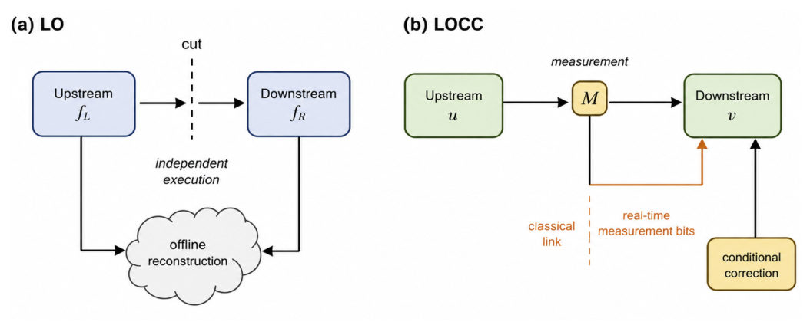 
Fig. 1: Execution semantics of circuit cutting. In LO, cut fragments execute independently and are stitched through offline reconstruction. In LOCC, upstream measurement outcomes are transmitted over a classical link and trigger downstream conditional operations, creating explicit precedence between fragments.

📷 Fig 2

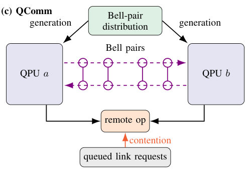 
Fig. 2: QComm abstraction used by InterQ. Remote execution across modules consumes Bell-pair resources managed by a shared Bell-pair distribution service, so latency depends on Bell-pair generation, success probability, and contention from concurrent link requests.

📷 Fig 3

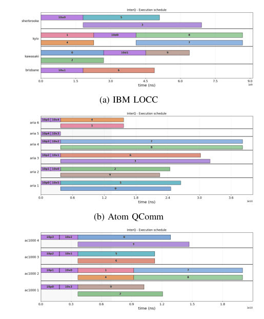 
Fig. 3: Execution schedule comparison of IBM LOCC, Atom QComm, and Ionq QComm architectures for the 11-circuit workload.

📷 Fig 4

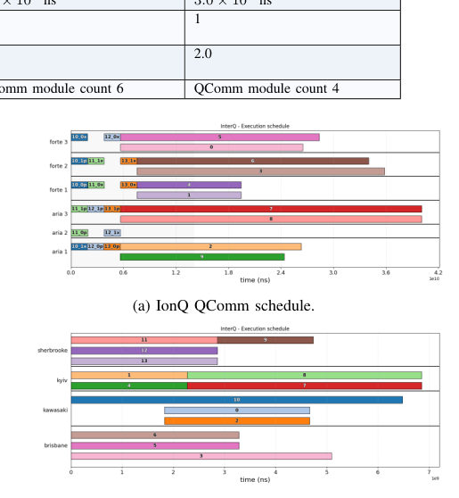 
Fig. 4: InterQ schedules for the MQT and QUEKO bench- mark workload under two communication models: (a) IonQ QComm, where scheduling is influenced by remote-operation demand and quantum-link availability, and (b) IBM adaptive LOCC mode, where no circuits are partitioned because all circuits fit within the available IBM QPU capacities.

📷 Fig 5

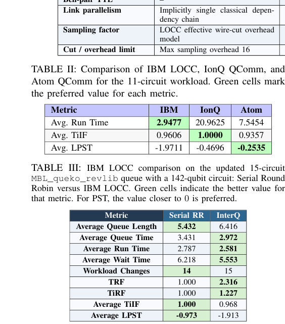 
Figure 5 compares the execution schedules, and Table III reports the corresponding makespan and fidelity-related met- rics. Serial Round Robin achieves better queue length, work- load changes, TiIF, and LPST, whereas InterQ reduces queue time, runtime, and wait time while improving TRF and TiRF through adaptive LOCC partitioning. The 142-qubit circuit cannot be placed directly on any 127-qubit backend and is therefore omitted from the Serial Round Robin sched- ule; InterQ partitions it into LOCC-compatible upstream and downstream fragments and schedules them across the modular backend pool.

**Summary.** The paper presents InterQ, a scheduler designed to manage quantum jobs across modular processors with different communication technologies. It demonstrates how to adaptively partition circuits to balance the costs of communication latency and sampling overhead. The study highlights how different hardware platforms like superconducting and trapped-ion systems offer distinct trade-offs between speed and fidelity.

**Why it may be interesting.** It addresses the critical scaling bottleneck of moving from monolithic to modular quantum computing, specifically focusing on the interplay between hardware-specific interconnects (photonic vs. classical) and computational throughput.

Detailed structure

**Main problem.** Efficiently scheduling and partitioning quantum workloads across modular QPU architectures that use heterogeneous communication links (classical vs. quantum).

**Main result.** The InterQ scheduler optimizes the trade-off between runtime, fidelity, and communication overhead, revealing that superconducting systems minimize runtime while neutral-atom systems achieve the highest fidelity.

**Method.** A communication-aware, iterative scheduling framework (InterQ) that jointly optimizes job placement, adaptive circuit cutting, and communication mode selection (LO, LOCC, or QComm) using a discrete-event simulation.

**Model / system.** Modular quantum architectures including superconducting (LOCC-based), trapped-ion (QComm-based), and neutral-atom (hierarchical/optical link) systems.

**Key observables.** Throughput, latency (makespan), fidelity (LPST, TiIF), queue time, and communication costs (Bell-pair consumption, synchronization delay).

**Important parameters / regimes.** Qubit capacity, communication bandwidth, entanglement generation rates, sampling overhead (scaling with number of cuts), and synchronization constraints.

**Assumptions / limitations.** Assumes a shared quantum cloud environment where jobs compete for limited communication resources and treats entanglement generation as a resource-constrained service.

**Figures summary.** Figure 1 contrasts LO vs. LOCC execution semantics; Figure 2 illustrates the QComm abstraction with shared Bell-pair resources.

**Paper structure.** The paper introduces the challenge of modular scheduling, defines the InterQ framework and its optimization objectives, details the hardware-specific communication models (LO, LOCC, QComm), presents a simulation-based evaluation across various hardware platforms and workloads, and concludes with an analysis of architecture-dependent trade-offs.

Abstract

As quantum computing scales toward practical workloads, future systems are expected to move beyond single monolithic processors toward modular architectures that connect multiple QPUs. Different platforms realize this modularity through different communication models: superconducting systems rely on real-time classical links and dynamic-circuit coordination, trapped-ion systems use photonic interconnects for remote entanglement, and neutral-atom systems provide strong intra-core connectivity with proposed optical links for inter-core communication. This heterogeneity makes communication-aware scheduling essential for shared modular quantum cloud environments.   We present InterQ, a communication-aware scheduler for modular QPU architectures with heterogeneous communication models. InterQ jointly considers qubit capacity, placement, parallel execution, and communication-driven dependencies across distributed subcircuits, while enabling adaptive circuit cutting to reduce makespan while balancing fidelity and communication overhead. The framework distinguishes classical-link execution, where measurement and feedforward impose synchronization constraints, from quantum-link execution, where entanglement distribution and state transfer determine coordination cost.   Using a unified simulation framework to compare superconducting, trapped-ion, and neutral-atom modular systems, InterQ shows how communication models and scheduler-driven cutting decisions affect throughput, latency, and fidelity. Across evaluated workloads, InterQ exposes an architecture-dependent tradeoff: neutral-atom modular QPUs achieve the highest fidelity, superconducting systems minimize runtime, and trapped-ion systems provide a balanced intermediate profile across fidelity and makespan.

[↑ back to top](#top)

### [qstack: Compositional End-to-End Compilation for Fault-Tolerant Quantum Programs](http://arxiv.org/abs/2605.16595v1)

**Authors:** Andres Paz, Dan Grossman  
**Type:** theory · **Category:** quantum information and computing · **PDF:** <https://arxiv.org/pdf/2605.16595v1>  
**Analysis basis:** full PDF text, analyzed in chunks
**Topic relevance:** `quantum measurements` **1/5**

📷 Fig 1

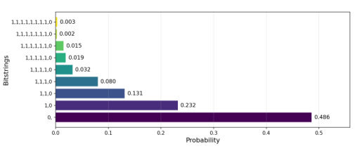 
Fig. 2. Distribution of measurement outcomes from 1000 simulation runs of the repeat-until-success program. Bitstrings of length n occur with probability 1/2n, confirming the expected geometric decay.

📷 Fig 2

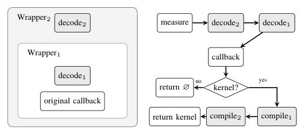 
Fig. 3. Composability of two compiler passes. Left: the wrapping structure after pass 1 and pass 2 each wrap the original callback. Right: runtime data flow when a measurement triggers the outermost wrapper. Decoders run outside-in (pass 2 then pass 1); if the callback returns a kernel, compilers run inside-out (pass 1 then pass 2).

📷 Fig 3

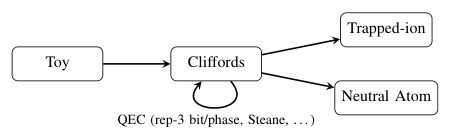 
Fig. 5. Compilation graph and example pipelines. Each edge is a compiler pass. QEC passes (loop) preserve the Cliffords ISA and can be applied repeatedly for concatenation.

**Summary.** This paper introduces qstack, a new compiler framework designed to automate the complex task of composing quantum error correction layers with hardware-specific instructions. By treating classical feedback as opaque callbacks, it allows for a seamless, automated pipeline that handles the transition from high-level logical gates to physical hardware operations. This approach significantly reduces the manual effort required to design and implement multi-layered fault-tolerant quantum programs.

**Why it may be interesting.** not directly relevant

Detailed structure

**Main problem.** The difficulty of composing multiple layers of quantum error correction (QEC) and hardware-specific ISA translations without manual, error-prone adaptation of the classical feedback logic required for syndrome measurement.

**Main result.** The development of qstack, a compiler framework that uses a callback wrapping mechanism to enable automated, compositional, end-to-end compilation from high-level gates to hardware-native instructions.

**Method.** A kernel-based intermediate representation (IR) where classical logic is accessed via opaque callbacks, which are automatically wrapped by compiler passes to decode measurement results and re-compile dynamically generated kernels.

**Model / system.** A fault-tolerant quantum computing framework supporting various gate sets (Toy, Clifford) and error-correcting codes (bit-flip, phase-flip, Steane, and Shor codes) targeting platforms like trapped-ion and neutral-atom hardware.

**Key observables.** Measurement stack (classical outcomes) and kernel stack (hierarchy of nested kernels and qubit allocations).

**Assumptions / limitations.** The classical logic is treated as an opaque callback; the framework assumes a LIFO (Last-In, First-Out) discipline for measurements.

**Figures summary.** Figure 1 shows gate definitions; Figure 2 shows a histogram of a repeat-until-success program; Figure 3 illustrates the wrapper structure and runtime data flow; Figure 4 defines the operational semantics; Figure 5 shows a compilation graph.

**Paper structure.** The paper introduces the problem of hybrid quantum-classical compilation, presents the qstack framework and its callback wrapping mechanism, provides formal operational semantics, demonstrates end-to-end compilation pipelines including concatenated QEC codes, and discusses limitations and future integration with OpenQASM 3.

Abstract

Compiling quantum programs for fault-tolerant execution requires transforming high-level operations through multiple abstraction layers: from logical gates to error-corrected encodings to hardware-native instructions. A key challenge is that quantum error correction turns purely quantum programs into hybrid quantum-classical programs, where classical feedback from syndrome measurements drives quantum corrections at runtime. Existing compilation frameworks handle these quantum and classical components separately, requiring manual adaptation of classical logic at each compilation stage, all while preserving program semantics. We present qstack, a compiler framework built around a purely quantum intermediate representation in which classical logic is accessed only through opaque callbacks, written in any classical language. The framework's central mechanism, callback wrapping, enables compositional compilation: each compiler pass automatically adapts both quantum operations and their associated classical callbacks, and any kernel dynamically generated by a callback is compiled through the full pipeline. This allows ISA translation and quantum error correction to be expressed as composable compiler passes, including concatenation of error-correcting codes, without manual intervention. We demonstrate end-to-end compilation from a high-level gate set through Clifford gates to trapped-ion native operations, with bit-flip and phase-flip repetition codes, the Steane code, and the Shor code obtained by composing two repetition passes.

[↑ back to top](#top)

### [Scalar$-$Tensor Gravity as a Probe of Generalized Black Hole Entropy](http://arxiv.org/abs/2605.18551v1)

**Authors:** Hussain Gohar  
**Type:** theory · **Category:** other · **PDF:** <https://arxiv.org/pdf/2605.18551v1>  
**Analysis basis:** full PDF text, analyzed in chunks
**Topic relevance:** `entanglement & information structure` **1/5**

📷 Fig 1

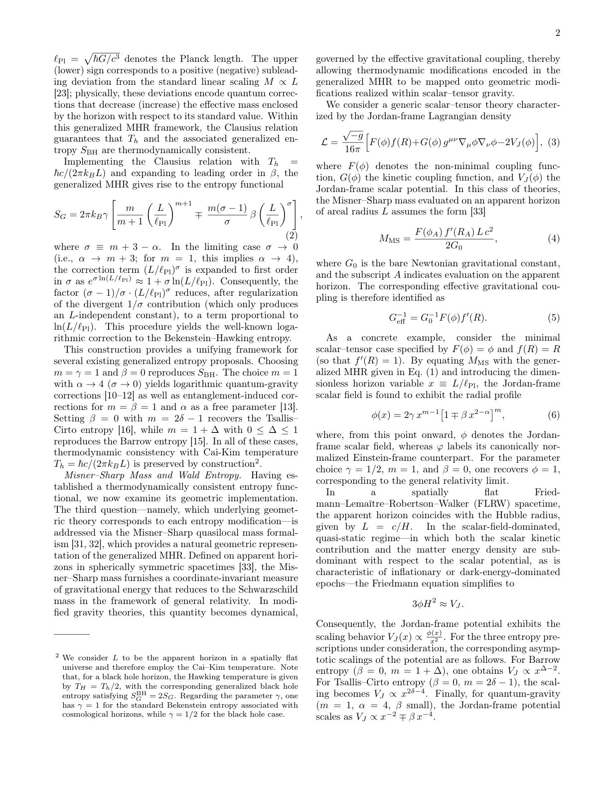 
Low-resolution page preview, page 2

📷 Fig 2

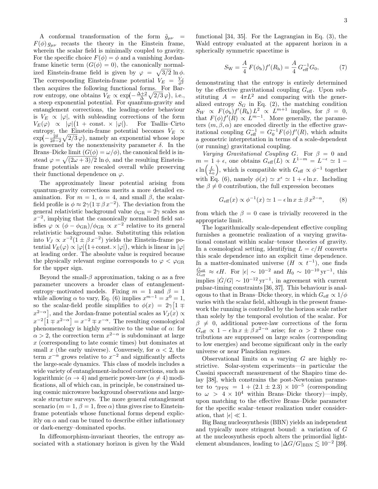 
Low-resolution page preview, page 3

📷 Fig 3

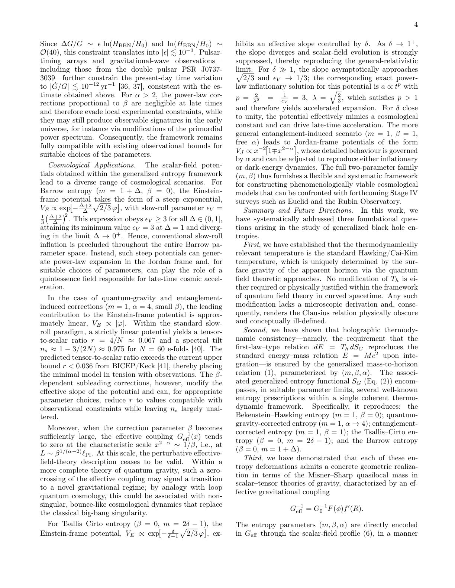 
Low-resolution page preview, page 4

📷 Fig 4

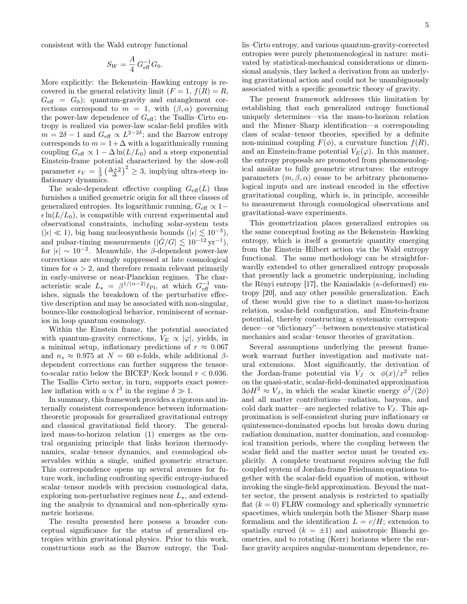 
Low-resolution page preview, page 5

📷 Fig 5

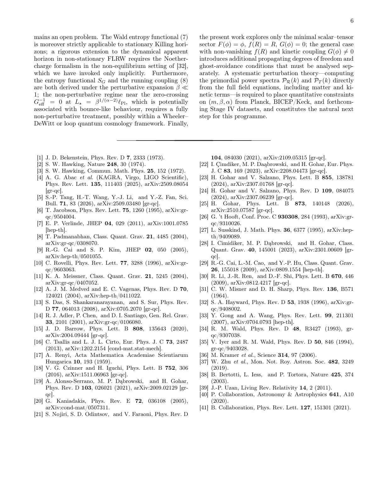 
Low-resolution page preview, page 6

**Summary.** This paper provides a unified geometric origin for various modified black hole entropy models by linking them to specific scalar-tensor gravity theories. It shows that these information-theoretic entropy proposals correspond to a varying effective gravitational coupling and specific scalar potentials that drive distinct cosmological phenomena like inflation and dark energy.

**Why it may be interesting.** not directly relevant

Detailed structure

**Main problem.** The paper addresses the lack of a consistent geometric/gravitational theory for generalized black hole entropy functionals (such as Barrow or Tsallis-Cirto entropy) and seeks to resolve the thermodynamic inconsistencies that arise when these entropies are used without a proper gravitational framework.

**Main result.** The author establishes a direct correspondence between various generalized entropy proposals and scalar-tensor gravity theories, demonstrating that these entropies can be realized through a scale-dependent effective gravitational coupling and specific scalar potentials.

**Method.** The study uses conformal transformations between Jordan and Einstein frames, evaluates the Wald Noether-charge entropy, and maps the Misner-Sharp quasilocal mass to a generalized mass-to-horizon relation.

**Model / system.** The framework involves scalar-tensor gravity theories in both Jordan and Einstein frames, applied to spherically symmetric spacetimes and spatially flat FLRW cosmologies, incorporating entropy models like Barrow, Tsallis-Cirto, and entanglement-induced corrections.

**Key observables.** Spectral index (ns), tensor-to-scalar ratio (r), time variation of the gravitational constant (G-dot/G), and primordial power spectrum modifications.

**Important parameters / regimes.** Entropy parameters (m, beta, alpha, delta, Delta), the Brans-Dich parameter (omega), and the horizon scale (L or x).

**Assumptions / limitations.** The framework assumes the validity of the mass-to-horizon relation and focuses on the quasi-static regime where scalar kinetic and matter energy density contributions are subdominant to the scalar potential.

**Paper structure.** The paper begins by defining the generalized entropy framework, moves to the geometric realization via scalar-tensor gravity, derives specific scalar potentials for different entropy models, analyzes the resulting cosmological implications (inflation and dark energy), and concludes with observational constraints.

Abstract

We develop a geometric realization of a broad class of generalized black hole entropy functionals by establishing their direct correspondence with the Misner$-$Sharp quasilocal mass and the Wald Noether$-$charge entropy in scalar$-$tensor theories of gravity. The resulting models feature a scale-dependent effective gravitational coupling, whose functional dependence is determined by the underlying entropy parameters. Within this framework, we derive explicit Einstein-frame scalar potentials: for Barrow entropy, a steep exponential potential; for Tsallis$-$Cirto entropy, an exponential potential governed by the nonextensivity parameter; and for quantum-gravity and entanglement$-$induced corrections, an approximately linear potential. These distinct potentials generate characteristic cosmological phenomenology, with implications for inflationary dynamics, late-time dark-energy behavior, and non-singular bouncing cosmologies. The framework is compatible with current constraints from solar-system tests, big-bang nucleosynthesis, and pulsar-timing observations, and it yields predictions that can be probed by forthcoming observational surveys. In this way, the analysis establishes a unified and geometrically grounded connection between information$-$theoretic entropy proposals and gravitational field theory.

[↑ back to top](#top)

### [Toward Near-Real-Time Marine Oil Spill Detection in SAR Imagery using Quantum-Assisted SVM](http://arxiv.org/abs/2605.17217v1)

**Authors:** Joseph Strauss, Jyotsna Sharma  
**Type:** both · **Category:** quantum information and computing · **PDF:** <https://arxiv.org/pdf/2605.17217v1>  
**Analysis basis:** full PDF text, analyzed in chunks
**Topic relevance:** `QC/QI experiment` **1/5**

📷 Fig 1

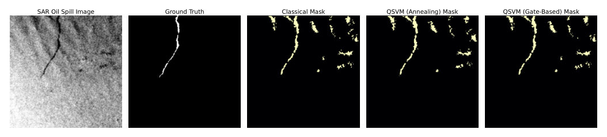 
Fig. 1. Qualitative comparison of segmentation performance across classical and quantum architectures. Top row: High-fidelity segmentation on an easily separable spill. Middle row: Intermediate performance exhibiting partial boundary degradation. Bottom row: Poor segmentation demonstrating susceptibility to complex speckle noise and look-alikes. Columns from left to right: SAR Image, Ground Truth Mask, Classical SVM prediction, QSVM (Annealing) prediction, and QSVM (Gate-Based) prediction.

📷 Fig 2

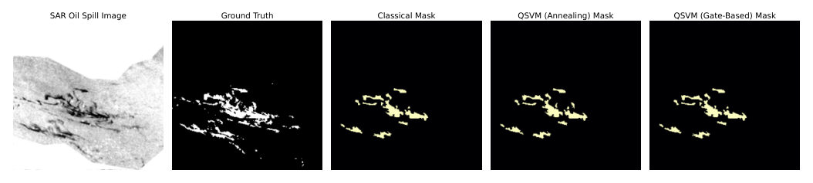 
Fig. 2. Strait of Hormuz oil spill segmentation results. Columns from left to right: SAR Image, Ground Truth Mask, Classical SVM prediction, QSVM (Annealing) prediction, and QSVM (Gate-Based) prediction.

**Summary.** This paper proposes a quantum-assisted machine learning pipeline for the rapid detection of oil spills in satellite radar imagery. By using quantum annealing to optimize SVMs, the researchers achieved high-accuracy segmentation with much faster inference speeds than traditional gate-based quantum approaches. The method proved robust and transferable to geographically different maritime regions.

**Why it may be interesting.** not directly relevant

Detailed structure

**Main problem.** Achieving near-real-time, low-latency marine oil spill detection in SAR imagery while overcoming the high computational costs and data requirements of deep learning.

**Main result.** A quantum-assisted SVM bagging ensemble achieved performance (IoU 0.60, balanced accuracy 0.89) comparable to classical baselines, with annealing-based approaches offering superior inference efficiency over gate-based methods.

**Method.** A pixel-wise bagging ensemble of SVMs where quantum annealing is used to optimize support vectors via a QUBO formulation, and gate-based quantum computing is used for quantum kernel methods.

**Model / system.** The framework uses a pixel-wise bagging ensemble of 500 base learners applied to 5D feature vectors from Sentinel-1 SAR imagery, utilizing D-Wave quantum annealing hardware and gate-based quantum circuit simulations.

**Key observables.** Intersection-over-Union (IoU), F1-score, balanced accuracy, inference time, and training time.

**Important parameters / regimes.** 5D feature vectors (VV intensity, VH/VV ratio, local VV entropy, local VV standard deviation, and Sobel gradient magnitude); 256x256 image resolution.

**Assumptions / limitations.** Assumes that small, randomly sampled subsets of data can effectively represent the full dataset through a bagging ensemble; notes the emulator-to-hardware gap due to noise and connectivity.

**Figures summary.** Figure 1 provides a qualitative comparison of segmentation masks (Ground Truth, Classical, Annealing, and Gate-based) across different prediction qualities; Figure 2 shows qualitative segmentation results for an independent oil spill in the Strait of Hormuz.

**Paper structure.** The paper introduces the environmental problem and limitations of deep learning, proposes a quantum-assisted SVM ensemble, details the annealing and gate-based implementations, evaluates performance on Sentinel-1 data, compares computational trade-offs, and tests generalization on a geographically distinct dataset.

Abstract

Marine oil spills require rapid detection to mitigate severe ecological and economic damage. While satellite-based Synthetic Aperture Radar (SAR) provides essential all-weather monitoring, analyzing this data remains challenging. Deep learning models often require massive datasets and incur high latency. To address this, a pixel-wise quantum-assisted Support Vector Machine (QSVM) bagging ensemble is developed. Quantum annealing is leveraged to optimize the support vectors of individual weak SVMs on small data subsets, which are then classically aggregated.   The approach is evaluated on Sentinel-1 imagery using both quantum simulation and physical quantum annealing hardware. The quantum-assisted pipeline achieved performance comparable to a rigorous classical baseline, yielding an Intersection-over-Union (IoU) of 0.60 and a balanced accuracy of 0.89. Complementary experiments with gate-based quantum computing demonstrated similar segmentation accuracy, although the annealing approach offered superior inference efficiency. Generalization was further assessed on independent oil spill imagery from the Strait of Hormuz, demonstrating the potential transferability of the trained pipeline to geographically distinct spill events. These results establish the feasibility of quantum-assisted, segmentation pipelines for near-real-time environmental monitoring.

[↑ back to top](#top)

## Other papers (59)

*Papers from primary archives without highlighted authors or any topic match. Click to expand.*

Show other papers

### [$5/9-$Magnetization Plateau and Spin Supersolidity in YCu$_3$(OD)$_{7-x}$Br$_{2+x}$ under Magnetic Fields up to 120~T](http://arxiv.org/abs/2605.17995v1)

**Authors:** Hiroaki Hayashi, Han Li, Feng-Feng Song, Xu-Guang Zhou, Akira Matsuo, Taeyun Kim, Enze Lv, Yuto Ishii, Zhe Qu, Gang Su, Koichi Kindo, Kwang-Yong Choi, Wei Li, Yasuhiro H. Matsuda  
**Type:** both · **Category:** strongly correlated electrons · **PDF:** <https://arxiv.org/pdf/2605.17995v1>  
**Analysis basis:** full PDF text, analyzed in chunks

📷 Fig 1

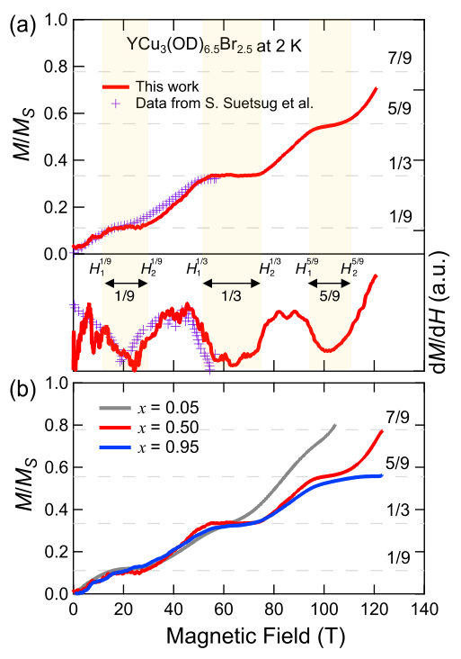 
FIG. 1. (a) Magnetization process and dM/dH data of YCOB (x ≃0.50) measured at 2 K. Previous measurements up to 60 T [47] are denoted as purple symbols as a comparison, where a very good agreement is seen to the present measure- ments. The observed magnetization plateaus are labeled by the yellow shadow and black arrows. (b) Magnetization pro- cess for different compositions of YCOB (x ≃0.05, 0.50, and 0.95) measured at 2 K.

📷 Fig 2

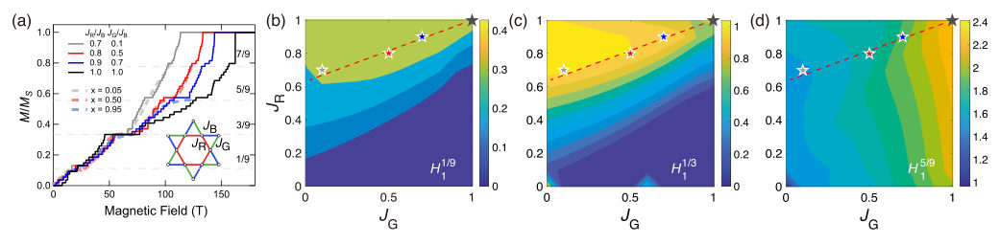 
FIG. 2. (a) Experimental and DMRG results for the normalized magnetization curves of YCOB. The gray, red, and blue solid (dashed) curves represent the calculated (measured) data for Br compositions x ≃0.05, 0.50, and 0.95, respectively. The black curve corresponds to the ideal KHAF model. The exchange parameters, given in units of JB, are the best-fitting values obtained from the analysis described in the Supplemental Materials [58]. The inset illustrates the definition of the three exchange couplings JR, JG, and JB on the nonequivalent bonds. (b-d) Contour plots of fields Hn/9 1 for the n/9 (n = 1, 3, 5) plateaus calculated with DMRG. The best-fitting parameters for three materials and the...

📷 Fig 3

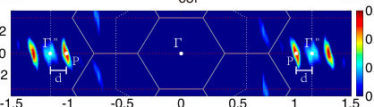 
FIG. 3. (a) Many-body magnetization calculations for the YCOB material with x ≃0.50. The experimental data are shown as a red curve, the DMRG results are presented by the blue curve with the best-fit 3J parameter set, and the iPEPS results with the same parameter are shown with light blue color. (b) Schematic field-induced phase diagram. (c) Local moment ⟨Sz i ⟩on each site i calculated with DMRG method, with parameter set JR = 0.8, JG = 0.5, JB = 1, and a fixed magnetization of M/MS ≃4/9. The color intensity of the circle at each site i indicates the magnitude and sign of the value, indicated by the color bar on the right. (d) The average of local moment ⟨Sz⟩col (see main text). A enlarged...

📷 Fig 4

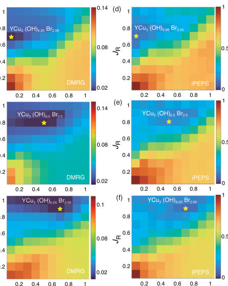 
FIG. 5. Loss map of the fitting results for YCOB materials obtained from the (a-c) DMRG simulations and (d-f) iPEPS calculations. The best-fitting parameters are indicated by the yellow star in each panels.

📷 Fig 5

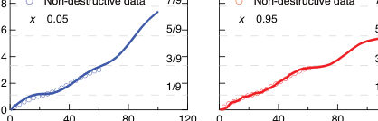 
FIG. 4. Low-field calibration of STC high-field magnetization data for YCOB with (a) x ≃0.05 and (b) x ≃0.95.

**Summary.** This paper reports the discovery of a 5/9 magnetization plateau in the kagome antiferromagnet YCOB using ultrahigh magnetic fields up to 120 T. By applying tensor-network simulations, the authors demonstrate that an anisotropic 3J-type Heisenberg model explains the observed magnetization and predicts a spin supersolid phase.

**Why it may be interesting.** The discovery of a spin supersolid phase and the study of fractional magnetization plateaus in a frustrated kagome lattice provide deep insights into many-body dynamics and the emergence of exotic broken-symmetry phases in strongly correlated systems.

Detailed structure

**Main problem.** The study aims to determine the high-field magnetic behavior of the kagome antiferromagnet YCOB and investigate the existence of higher-order fractional magnetization plateaus and exotic phases like spin supersolidity.

**Main result.** The researchers discovered a previously unobserved 5/9 fractional magnetization plateau and identified a spin supersolid phase between the 1/3 and 5/9 plateaus using an anisotropic 3J-type Heisenberg model.

**Method.** High-precision magnetization measurements were performed using the single-turn coil technique up to 120 T, and experimental data were modeled using DMRG and iPEPS tensor-network calculations.

**Model / system.** The system is the kagome lattice antiferromagnet YCu3(OD)7-xBr2+x (YCOB) with tunable Br-concentration. The model is an effective 3J-type Heisenberg Hamiltonian with three spatially anisotropic exchange couplings (JR, JG, JB).

**Key observables.** Magnetization (M) as a function of magnetic field (H), differential susceptibility (dM/dH), and local spin expectation values.

**Important parameters / regimes.** Br-concentration (x), exchange couplings (JR, JG, JB), magnetic field up to 120 T, and the g-factor (~2.2).

**Assumptions / limitations.** The system is modeled using a 3J-type Heisenberg model to account for lattice distortions caused by OH/Br site mixing.

**Figures summary.** Fig 1 shows magnetization and susceptibility curves; Fig 4 shows calibration of high-field data; Fig 5 displays loss maps for DMRG and iPEPS parameter space; Fig 6 compares experimental M-H curves with numerical results.

**Paper structure.** The paper introduces the YCOB system, presents high-field experimental magnetization data, describes the 3J-type model and numerical fitting procedure, discusses the composition-dependent evolution of plateaus, and proposes the spin supersolid phase.

Abstract

We performed high-precision magnetization measurements up to 120~T on three compositions of the newly discovered kagome antiferromagnet YCu$_3$(OD)$_{7-x}$Br$_{2+x}$ (YCOB), revealing a previously unobserved 5/9 fractional magnetization plateau. All YCOB samples with different Br$^-$ concentrations exhibit nearly identical magnetization curves below 60~T, whereas the 5/9 plateau appears at markedly different fields in the ultrahigh-field regime. By modeling the experimental data using tensor-network calculations, we derive the effective spin Hamiltonians for the YCOB family with three spatially anisotropic Heisenberg couplings (the 3$J$-type model), which quantitatively reproduces the measured magnetization processes and captures the composition-dependent evolution of the 5/9 plateau. Furthermore, our theoretical analysis suggests the emergence of a spin supersolid phase in the field window between the 1/3 and 5/9 plateaus, which is sensitive to spin exchange parameters and accounts for the significant variation in the critical fields of the 5/9 plateau observed among different YCOB compositions.

[↑ back to top](#top)

### [A Fourier perspective on the learning dynamics of neural networks: from sample complexities to mechanistic insights](http://arxiv.org/abs/2605.16913v1)

**Authors:** Fabiola Ricci, Claudia Merger, Sebastian Goldt  
**Type:** both · **Category:** disordered systems and neural networks · **PDF:** <https://arxiv.org/pdf/2605.16913v1>  
**Analysis basis:** full PDF text, analyzed in chunks

📷 Fig 1

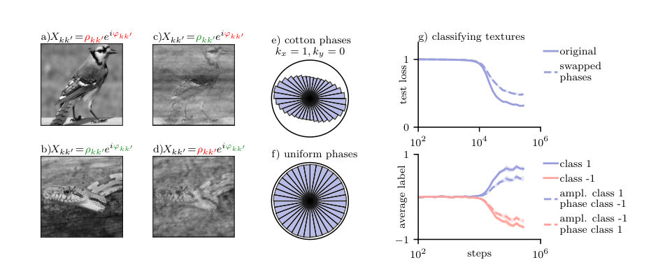 
Figure 1: Learning phase vs amplitude information. a-b) Pictures of a bird and a snake from ImageNet. c-d) Fourier image reconstruction with phases φkk′ from the “bird” and amplitudes ρkk′ from the “snake” and vice versa. e) Phases of images from the “cotton” class of the ALOT texture dataset for patches of size 16 × 16 along the first Fourier mode in the x-direction. f) Uniform phase distribution. g) Performance of a classifier trained to distinguish between two texture classes: “cotton” vs. “lace” on patches of size 16 × 16 of the ALOT dataset. Top: test loss over training steps, on the original data ( ) and on data where phase information has been swapped between classes ( ). Bottom:...

📷 Fig 2

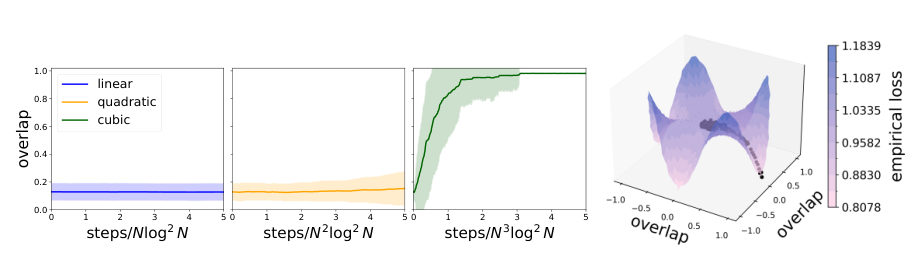 
Figure 2: Performance of SGD in classifying isotropic inputs on the Fourier data model. (Left) We run online SGD applied to the correlation loss (1) with isotropic inputs drawn from the Fourier data model (3). SGD does not weakly recover the signal at linear ( ) or quadratic ( ) sample complexity, whereas it converges to the subspace spanned by the DFT phase vectors in the cubic ( ) regime. On the y-axes, we see the norm of the projection of the perceptron weight in the said “non-Gaussian” subspace. (Right) Empirical loss landscape as a function of the overlaps between the weight vector and the DFT phase vectors, i.e. w · u and w · v. Additionally, we display one run of SGD (•) converging...

📷 Fig 3

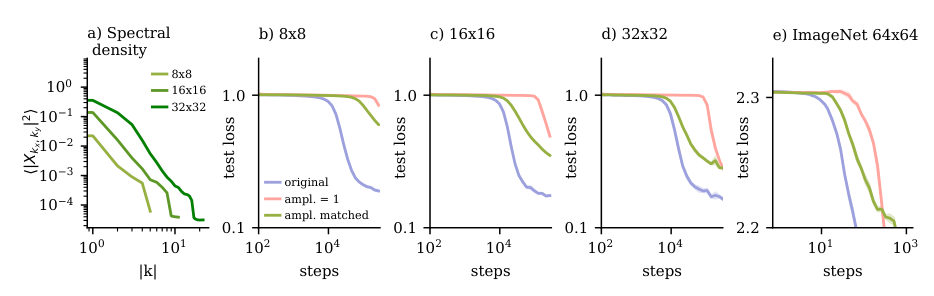 
Figure 3: Shared principal subspace speeds up learning. a) Average squared Fourier amplitudes of image patches of “cotton” class from ALOT texture dataset, averaged over wave vectors of equal length |k| = q

📷 Fig 4

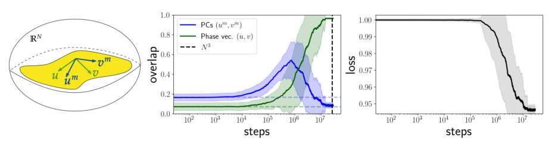 
Figure 4: Performance of SGD in classifying non-isotropic inputs on the Fourier data model. (Left) Cartoon of the principal subspace of power-law-decaying inputs sampled from the Fourier data model (3), spanned by the DFT phase vectors (u, v) and a finite number of other principal components (um, vm). (Middle) At first, online SGD quickly recovers the whole principal subspace, including the DFT phase vectors. Then, the other principal components PCs ( ), which are not useful for classification, are forgot and SGD converges within n ≲N3 steps to the subspace spanned by the DFT phase vectors ( ). Compare with Fig. 2, where no recovery happens within cubic sample complexity. Here, N = 300....

**Summary.** The paper explains why deep neural networks can efficiently learn complex natural images despite the inherent difficulty of learning phase information. It shows that the power-law frequency spectrum of natural images acts as a mechanism to accelerate the learning of higher-order correlations.

**Why it may be interesting.** not directly relevant

Detailed structure

**Main problem.** Investigating the simplicity bias in neural network learning dynamics, specifically how networks prioritize learning amplitude (pair-wise) information before phase (higher-order) information.

**Main result.** Proves that learning phase information is computationally hard (cubic sample complexity) for isotropic inputs, but power-law decaying spectra in natural images dramatically accelerate this learning process.

**Method.** Uses a Fourier-based synthetic data model, Hermite polynomial expansions of the loss and likelihood ratio, and analysis of the stochastic dynamics of online SGD via the information exponent and population drift.

**Model / system.** A Fourier data model with translation-invariant, non-Gaussian inputs where class differences are encoded in the phases of the Discrete Fourier Transform, featuring both isotropic and power-law decaying covariance matrices.

**Key observables.** Test loss, average label assignment, overlaps with DFT phase vectors (alpha_u, alpha_v), and the information exponent (k*).

**Important parameters / regimes.** Sample complexity (n), dimension (N), power-law decay exponent (alpha), signal-to-noise ratio (beta), and learning rate (delta_N).

**Assumptions / limitations.** Activation functions are continuously differentiable and even; inputs are translation-invariant; analysis focuses on the high-dimensional limit (N to infinity).

**Figures summary.** Figure 1 demonstrates phase importance via image reconstruction; Figure 2 shows SGD failure/success in isotropic regimes; Figure 4 illustrates the principal subspace and loss landscape changes in power-law regimes.

**Paper structure.** The paper introduces the Fourier perspective, establishes the hardness of phase learning in isotropic settings, introduces the power-law model to show learning acceleration, and provides theoretical proofs and experimental validation on ImageNet/CIFAR.

Abstract

Neural networks trained with gradient-based methods exhibit a strong simplicity bias: they learn simpler statistical features of their data before moving to more complex features. Previous analyses of this phenomenon have largely focused on settings with (quasi-)isotropic inputs. In this work, we study the simplicity bias from a Fourier perspective, which allows us to include two key features of natural images in the analysis: approximate translation-invariance and power-law spectra. We first show experimentally that simple neural networks trained on image classification tasks first rely on amplitude information -- related to pair-wise correlations between pixels -- before exploiting phase information, which encodes edges and higher-order correlations. In view of this, we introduce a synthetic data model for translation-invariant inputs that allows precise control over amplitudes and phases while remaining tractable. We rigorously establish that for isotropic and high-dimensional inputs, classification based on phase information alone is a genuinely hard task: online stochastic gradient descent (SGD) cannot distinguish the structured inputs from noise within $n \ll N^3$ steps, but needs at least $n \gg N^3 \log^2{N}$ steps. In contrast, we show both experimentally and theoretically that power-law spectra can dramatically accelerate the speed of learning phase information, even if the spectra do not help with classification. Simulations with two-layer networks trained on textures and with deep convolutional networks on ImageNet and CIFAR100 confirm this non-trivial interaction between amplitudes and phases, providing mechanistic insights into how deep neural networks can learn natural image distributions efficiently.

[↑ back to top](#top)

### [A System Aware Resource Allocation for Distributed Workflows in Quantum Computing Environments](http://arxiv.org/abs/2605.17944v1)

**Authors:** Abhishek Sawaika, Udaya Parampalli, Rajkumar Buyya  
**Type:** theory · **Category:** quantum information and computing · **PDF:** <https://arxiv.org/pdf/2605.17944v1>  
**Analysis basis:** full PDF text, analyzed in chunks

📷 Fig 1

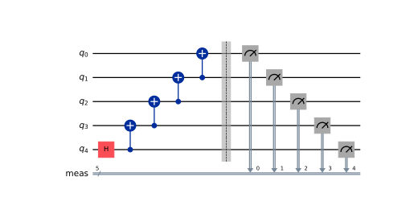 
Fig. 1: A sample quantum circuit (GHZ state preparation) with 5 qubits, depth=6, 1 single qubit operation (H), four 2- qubits operations (CNOT) and 5 measurements, representing a quantum program.

📷 Fig 2

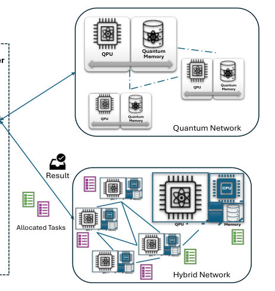 
Fig. 2: System Architecture

📷 Fig 3

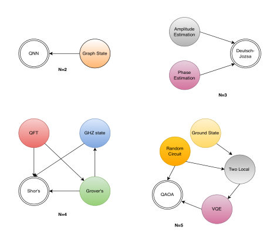 
Fig. 3: Sample quantum workflows of different sizes, where ’N’ denote the number to tasks in each workflow.

📷 Fig 4

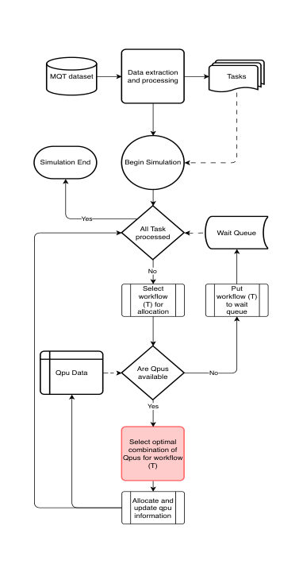 
Fig. 4: Process pipeline for experimental simulation

📷 Fig 5

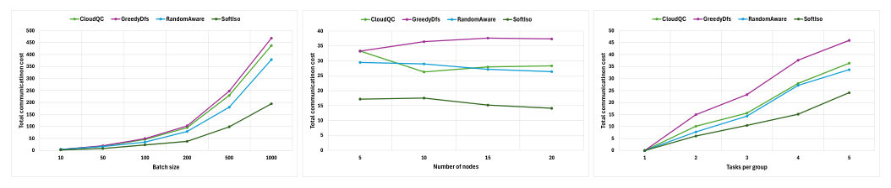 
Fig. 5: Trends for communication cost by (a) workload size for allocation, (b) number of nodes in the network and (c) distinct tasks per workflow

**Summary.** This paper proposes new algorithms for managing distributed quantum computing tasks in the cloud. By optimizing for fidelity, time, and network costs, the methods significantly reduce delays and communication overhead in NISQ-era distributed networks.

**Why it may be interesting.** not directly relevant

Detailed structure

**Main problem.** Efficient resource allocation for distributed quantum workflows in cloud-based environments, specifically addressing the limitations of priority-based protocols in handling large-scale, multi-task applications.

**Main result.** The proposed SoftIso and RandomAware algorithms achieve significant improvements in execution time (~5%), communication overhead (~30%), and wait time (~40%) compared to existing methods like CloudQC.

**Method.** The study introduces SoftIso, an extended graph isomorphism-based matching algorithm with early stopping, and RandomAware, a randomized selection algorithm, to optimize a multi-objective cost function.

**Model / system.** A hybrid classical-quantum network architecture consisting of a Quantum Resource Manager and distributed quantum nodes (QPUs) with specific error models, connectivity, and quantum memory.

**Key observables.** Fidelity, execution time, communication overhead, wait time, and task completion percentage.

**Important parameters / regimes.** Qubit count, circuit depth, gate counts (1-qubit and 2-qubit), readout error, CLOPS, and network latency.

**Assumptions / limitations.** The study assumes a hybrid quantum-classical network rather than a purely quantum network and focuses on allocating standalone programs rather than partitioning single large circuits.

**Figures summary.** Figure 1 shows a GHZ state circuit; Figure 2 depicts the cloud service architecture; Table I compares the proposed method to others; Figures 5-9 show trends in communication cost, fidelity, workload distribution, and execution/wait times.

**Paper structure.** The paper defines the scientific problem, establishes the system architecture and mathematical model, introduces the proposed SoftIso and RandomAware algorithms, details the simulation framework using IBM hardware data, and concludes with performance analysis and scalability results.

Abstract

Rapid advancements in cloud based platforms providing access to quantum computing capabilities have opened up several challenges for efficient usage of these highly delicate and costly devices. Although most of the current systems use a priority based access protocol, they are unable to fully support reliable, efficient, and scalable execution of larger-scale applications. To overcome this limitation, we propose a comprehensive solution for efficient allocation of quantum programs to appropriate quantum devices, considering all the relevant cost metrics into account including, fidelity, execution time and communication overhead. We also formulate use-cases for distributed quantum workflow and propose modified graph based algorithms to solve for allocation of such use-cases, assuming a hybrid classical-quantum network. Since hardware advancements in large standalone devices is an ongoing process, it is critical to investigate such distributed workflows to maximize the best utilization of current NISQ devices. Our empirical study shows that the proposed techniques perform better than state-of-the-art methods for almost all evaluation parameters, with average improvements of approximately $5\%$ in execution time, $30\%$ in communication overhead, $40\%$ in wait time and $2\%$ in fidelity, providing better solutions to efficient allocation strategies.

[↑ back to top](#top)

### [Anderson Transition and Mobility Edges in a Family of 3D Fractal Lattices](http://arxiv.org/abs/2605.17953v1)

**Authors:** Tianyu Li, Xin Tang, Sheng Liu, Haiping Hu  
**Type:** theory · **Category:** disordered systems and neural networks · **PDF:** <https://arxiv.org/pdf/2605.17953v1>  
**Analysis basis:** full PDF text, analyzed in chunks

📷 Fig 1

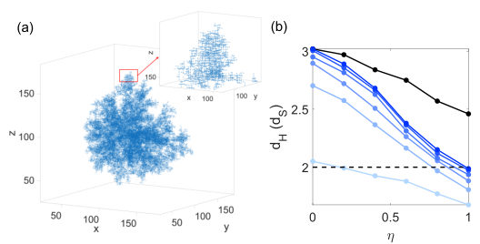 
FIG. 1. (a) Fractal structure for η = 1. (b) Hausdorff di- mension dH and spectral dimension dS as functions of the parameter η. The black line denotes the Hausdorff dimension dH, which is independent of p. The blue curves represent the spectral dimension dS for p = 0, 0.2, 0.4, 0.6, 0.8, and 1, shown with a gradient of blue shades from light to dark. The system size are taken as N = 80000.

📷 Fig 2

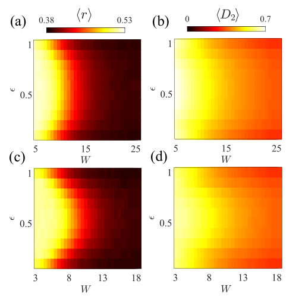 
FIG. 2. The mobility edges. The presence of mobility edges in the energy spectra of the model with (η, p) = (0.2, 1) (a),(b) and (η, p) = (0, 0.4) (c),(d). (a)(c) The average ratio of level spacings ⟨r⟩and (b)(d) average Fractal demension ⟨D2⟩ with respect to the disorder strength and eigenenergies. The eigenenergies are divided into ten equal segments and rescaled to the interval ϵ ∈[0, 1]. The averages are taken within each segment and over 200 disorder realizations. The system size are taken as N = 5000.

📷 Fig 3

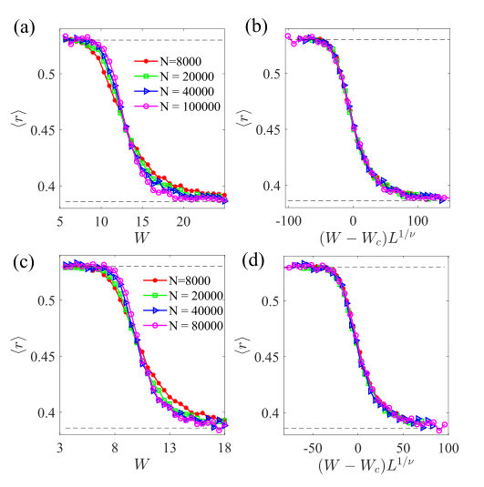 
FIG. 3. Finite-size scaling of the level statistics. The average ratio of level spacings ⟨r⟩as a function of disorder strength W for different system sizes: (a) (η, p) = (0.2, 1) and (c) (η, p) = (0, 0.4). Panels (b) and (d) show the corresponding finite-size scaling collapses of (a) and (c), respectively, with the scaling variable L = N 1/dS, where N is the number of sites. For (a) and (b), the extracted critical disorder strength and correlation-length exponent are Wc = 12.9 ± 0.1 and ν = 1.54 ± 0.04, with spectral dimension dS = 2.89. For (c) and (d), corresponding to (η, p) = (0, 0.4), we obtain Wc = 10.2 ± 0.2 and ν = 1.59 ± 0.06, with dS = 2.90. The averages are taken over the central...

📷 Fig 4

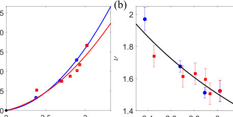 
FIG. 4. (a) Anderson transition point Wc as a function of the spectral dimension. The blue circles correspond to results obtained at fixed p = 1, with η = 0, 0.2, 0.4, and 0.6. The red squares correspond to results at fixed η = 0, with p = 0.1, 0.2, 0.3, 0.4, 0.5, and 1. The blue and red curves represent quadratic fits to the respective datasets, with Wc = 2.83(dS − 2) + 13.11(dS −2)2 and Wc = 4.71(dS −2) + 9.23(dS −2)2

**Summary.** This paper explores how the Anderson localization transition behaves in non-integer dimensions using a tunable 3D fractal lattice model. It demonstrates that the spectral dimension is the key driver of the transition's universality class and provides a quantitative scaling relation for the critical exponent. The findings offer a new framework for studying quantum criticality in complex, non-Euclidean geometries.

**Why it may be interesting.** not directly relevant

Detailed structure

**Main problem.** The study investigates the nature of the Anderson transition and the existence of mobility edges in 3D fractal lattices with continuously tunable spectral dimensions.

**Main result.** The spectral dimension (ds) primarily determines the universality class of the Anderson transition, with the critical exponent (nu) following an approximate inverse dependence on ds.

**Method.** Large-scale finite-size scaling analysis of the level-spacing ratio and mean fractal dimension using numerical simulations of the discrete Laplace equation and Anderson Hamiltonian.

**Model / system.** A family of 3D fractal lattices generated via a dielectric breakdown model (NPW model) with a Hamiltonian featuring hopping amplitude t=1 and uniform onsite disorder W.

**Key observables.** Average level-spacing ratio <r>, mean fractal dimension <D2>, critical disorder strength Wc, and critical exponent nu.

**Important parameters / regimes.** Spectral dimension (ds), Hausdorff dimension (dH), disorder strength (W), and growth parameters (eta and p).

**Assumptions / limitations.** The system is studied in the thermodynamic limit via finite-size scaling; the lattice is constructed using a specific dielectric breakdown model.

**Figures summary.** The figures illustrate the evolution of the level-spacing ratio and mean fractal dimension across different disorder strengths and lattice configurations, demonstrating the transition and mobility edges.

**Paper structure.** The paper introduces the fractal lattice construction, describes the numerical methods for dimension extraction and localization analysis, presents the results regarding the Anderson transition and mobility edges, and discusses the scaling relations and universality.

Abstract

Anderson localization is fundamentally controlled by dimensionality, yet the nature of the Anderson transition in continuously tunable noninteger dimensions remains largely unexplored. Here, we introduce a family of three-dimensional fractal lattices with continuously tunable spectral dimension $d_s\in[2,3]$, providing a controlled platform for studying localization physics beyond integer dimensions and across the lower critical dimension $d_s=2$. Using large-scale finite-size scaling analysis, we systematically investigate the Anderson transition and identify mobility edges throughout the fractal family. The critical disorder strength evolves continuously from $0$ to $16.6$ as the spectral dimension increases from $2$ to $3$. We show that the spectral dimension predominantly governs the universality class of the transition, while the precise critical point is additionally influenced by microscopic geometric details of the underlying fractal lattice. The critical exponent exhibits an approximate inverse dependence on $d_s$, providing quantitative insight into scaling theory in noninteger dimensions. Our results establish tunable fractal lattices as a versatile framework for exploring localization and quantum critical phenomena beyond conventional integer-dimensional systems.

[↑ back to top](#top)

### [At Most Two Infinite Blue Clusters in the CMR Representation of the Edwards-Anderson Spin Glass](http://arxiv.org/abs/2605.17338v1)

**Authors:** Yan Ru Pei  
**Type:** theory · **Category:** disordered systems and neural networks · **PDF:** <https://arxiv.org/pdf/2605.17338v1>  
**Analysis basis:** full PDF text, analyzed in chunks

📷 Fig 1

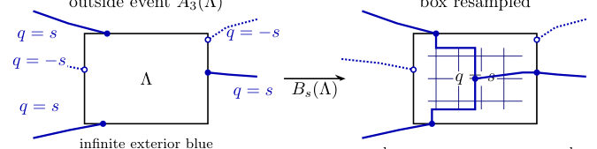 
Figure 1: The box-resampling lemma. The event A3(Λ) is expressed using exterior arms and is therefore measurable from FΛc. Conditional on this outside event, Bs(Λ) has positive probability and merges all exterior blue components in the overlap class q = s that touch ∂Λ. The dotted blue arms indicate exterior blue components in the opposite overlap class; they are shown only as context for the chosen q = s resampling.

**Summary.** This paper provides a rigorous mathematical upper bound on the number of infinite clusters in the geometric representation of a spin glass. It proves that the number of infinite blue clusters is at most two, supporting the two-cluster picture suggested by mean-field theory and numerical simulations.

**Why it may be interesting.** not directly relevant

Detailed structure

**Main problem.** Determining the geometric structure and the maximum number of infinite blue clusters in the Chayes-Machta-Redner (CMR) representation of the Edwards-Anderson spin glass.

**Main result.** Proves that there are at most two infinite blue clusters in the CMR representation; if two exist, they must belong to opposite overlap-parity classes and reside within the same infinite grey cluster.

**Method.** Rigorous mathematical proof using Bayesian resampling of couplings, finite-box merge operations, mass-transport bounds on ends of subgraphs, and Peierls-type estimates.

**Model / system.** The Edwards-Anderson Ising spin glass model on a hypercubic lattice Z^d, characterized by random i.i.d. couplings J_e that are continuous at zero and two-sided.

**Key observables.** Number of infinite blue clusters, overlap parity classes, grey cluster percolation, and spin overlap parameter q.

**Important parameters / regimes.** Inverse temperature beta, dimension d, and the overlap sign s in {+1, -1}.

**Assumptions / limitations.** Assumes translation-invariant joint Gibbs measures; the results provide an upper bound on cluster multiplicity but do not prove the existence of a spin-glass phase transition.

**Figures summary.** Figure 1 illustrates the Box-resampling lemma, showing how exterior blue components in a specific overlap class are merged through a resampled finite box.

**Paper structure.** The paper establishes a joint Gibbs measure for the CMR representation, uses Bayesian resampling to prove grey cluster percolation and uniqueness, and then applies a box-resampling lemma and mass-transport bounds to constrain the number of blue clusters.

Abstract

The two-replica Chayes-Machta-Redner (CMR) representation is one of the main proposed geometric signatures of spin-glass order in the short-range Edwards-Anderson model. Mean-field arguments and recent numerics suggest that the low-temperature phase should exhibit two macroscopic blue clusters carrying opposite overlap signs. We prove a rigorous structural constraint in this direction. For any translation-invariant joint Gibbs measure on disorder, two spin replicas, and CMR bond variables on Z^d, the blue subgraph contains at most two infinite connected components; if two exist, then they lie in a common infinite grey cluster and belong to opposite overlap-parity classes. The main obstacle is that the blue-bond process is neither insertion-tolerant nor positively associated, so the usual Burton-Keane and random-cluster arguments do not apply. We circumvent this by working in the full joint measure and using a finite-box merge operation together with the mass-transport bound on ends of translation-invariant subgraphs. As auxiliary input, we establish finite energy and a percolation transition for the grey subgraph via Bayesian resampling of couplings and a parity-based Peierls estimate. These results do not prove the existence of infinite blue clusters or a spin-glass phase transition, but they give a rigorous upper bound compatible with the two-cluster picture for short-range spin glasses.

[↑ back to top](#top)

### [Basis-free neural-network geminal and Jastrow factors for variational Monte Carlo](http://arxiv.org/abs/2605.17083v1)

**Authors:** Jan Kessler, Thomas D. Kühne  
**Type:** theory · **Category:** numerical methods · **PDF:** <https://arxiv.org/pdf/2605.17083v1>  
**Analysis basis:** full PDF text, analyzed in chunks

📷 Fig 1

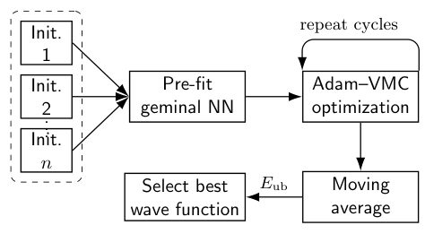 
FIG. 1. Optimization protocol used for the neural-network wave functions.

📷 Fig 2

 
FIG. 3. Geometry and parametrizations of the rectangular H4 benchmark system.

📷 Fig 3

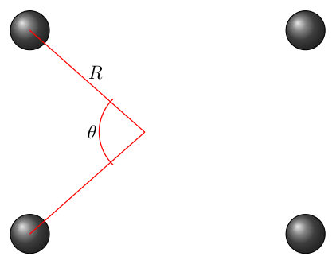 
Figure 2b resolves the remaining deviations. The rela- tive error increases below 2 Bohr, i.e., around and below the equilibrium distance of about 1.4 Bohr, reaching ap- proximately 0.0025% or 0.025 mHa. At larger separations the error remains close to 0.001%. This behavior dif- fers from many conventional single-reference electronic- structure methods, which are often accurate near equi- librium but deteriorate for stretched H2 as static correla- tion becomes important [19]. For a two-electron singlet, however, this distinction is less severe than in larger sys- tems: in a finite orbital basis, the coupled-cluster singles- and-doubles excitation manifold already spans the full-CI space...

📷 Fig 4

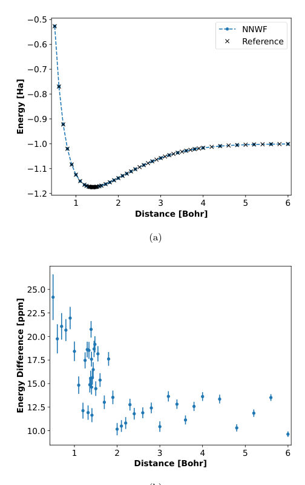 
FIG. 2. H2: VMC energies (a) and relative energy differences (b) of NNAGP + all-body-NNJF for different H–H distances, compared with reference energies [44].

📷 Fig 5

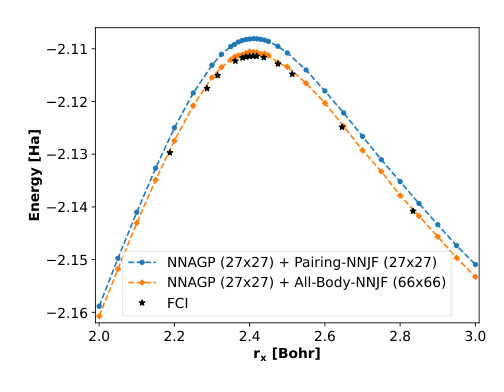 
FIG. 4. H4: VMC energies of NNWFs for different H–H distances in the x direction, with ry = 2.4 Bohr. FCI energies [5] are shown as reference values.

**Summary.** The authors develop a new 'basis-free' neural-network wave function that uses neural networks to replace traditional basis sets in an AGP-Jastrow ansatz. This method allows researchers to clearly distinguish between errors caused by imperfect nodal surfaces and those caused by insufficient dynamical correlation. It achieves near-exact accuracy for simple systems and provides a scalable framework for studying electronic correlation.

**Why it may be interesting.** It presents a highly interpretable neural-network wave function that avoids the 'black-box' nature of other architectures by explicitly separating the nodal surface from correlation recovery, providing a diagnostic tool for many-body wave function accuracy.

Detailed structure

**Main problem.** The challenge of accurately describing electronic ground-state wave functions by balancing the treatment of fermionic antisymmetry, dynamical correlation, and static (multireference) correlation without the computational bottleneck of traditional basis-set expansions.

**Main result.** The proposed basis-free Jastrow-AGP ansatz achieves sub-millihartree accuracy for H2 and compact H4 systems, successfully distinguishing between errors from the Jastrow factor (dynamical) and the AGP nodal surface (static).

**Method.** Variational Monte Carlo (VMC) optimization of a neural-network wave function that replaces conventional basis sets with feed-forward neural networks for both the geminal (AGP) and Jastrow components.

**Model / system.** The study uses the hydrogen molecule (H2) and the rectangular hydrogen tetramer (H4) as benchmark systems to test the balance of dynamical and static correlation.

**Key observables.** Electronic ground-state energies, relative energy differences compared to reference data (FCI, DMC, FermiNet), and CPU time for optimization.

**Important parameters / regimes.** Neural network hidden units (N_G, N_J), nuclear coordinates (bond distances r_x, r_y), and cusp-correction parameters (b_ee, b_en).

**Assumptions / limitations.** The accuracy is limited by the fixed nodal surface of the AGP part; the all-body Jastrow factor relies on an approximate exchange symmetry that emerges during minimization.

**Figures summary.** Figure 1 shows the optimization protocol; Figure 2 displays H2 dissociation energy curves; Figure 3 illustrates the H4 geometry; Figure 4 shows H4 energy as a function of distance; Figure 6 compares energy errors vs. network size; Figure 7 shows CPU time scaling with network size.

**Paper structure.** The paper introduces a new neural-network wave function ansatz, describes the architecture and optimization protocol, presents validation on H2, uses H4 as a benchmark for correlation types, analyzes scaling and efficiency, and discusses limitations regarding nodal flexibility and size consistency.

Abstract

Neural-network quantum states offer a flexible route to compact many-electron wave functions, but their practical accuracy depends strongly on how fermionic antisymmetry, electron correlation, and optimization noise are treated. Here we combine an antisymmetrized geminal power (AGP) determinant with feed-forward neural networks that replace conventional basis-set expansions in the geminal and in two Jastrow-factor constructions. The resulting basis-free Jastrow--AGP ansatz is optimized by variational Monte Carlo and is designed to separate two tasks: the AGP part defines the nodal surface, while the neural-network Jastrow factor recovers dynamical correlation at fixed nodes. This separation makes it possible to distinguish errors associated with dynamical correlation from those caused by static, multireference correlation. Applications to the hydrogen molecule and the rectangular hydrogen tetramer show sub-millihartree accuracy when the AGP nodes are adequate, and expose the residual nodal limitation near the large-radius square geometry of the hydrogen tetramer. These results clarify where neural-network building blocks can improve a compact geminal ansatz and where additional nodal flexibility is required.

[↑ back to top](#top)

### [Bipolaronic High-Temperature Superconductivity from Phonon-Modulated Hopping: A Perspective](http://arxiv.org/abs/2605.16625v1)

**Authors:** John Sous  
**Type:** theory · **Category:** strongly correlated electrons · **PDF:** <https://arxiv.org/pdf/2605.16625v1>  
**Analysis basis:** full PDF text, analyzed in chunks

📷 Fig 1

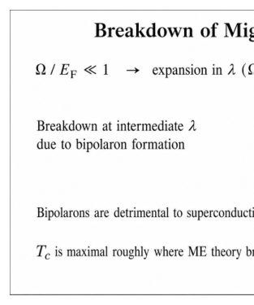 
Figure 1: Schematic illustration of the breakdown of Migdal–Eliashberg theory at inter- mediate λ and the resulting bound Tc ≲Ω/10 on phonon-mediated superconductivity out of a Fermi liquid.

📷 Fig 2

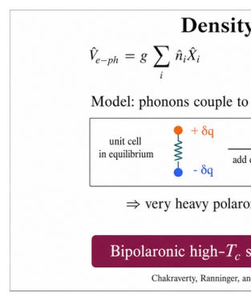 
Figure 2: Density coupling: a phonon ˆXi attached to each lattice site couples to the local electron density ˆni. Adding an electron displaces the oscillator and digs a deep self-trapping well; the resulting polaron, and the bipolaron formed from two of them, is heavy.

📷 Fig 3

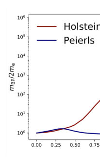 
Figure 3: Bipolaron effective mass m⋆ BP/(2me) in the one-dimensional site-Peierls model (blue) compared with the Holstein model (red), as a function of the dimensionless electron– phonon coupling λ at Ω∼W. The Peierls bipolaron remains light up to and beyond λ = 2, while the Holstein bipolaron is exponentially heavy. Adapted from Ref.19

📷 Fig 4

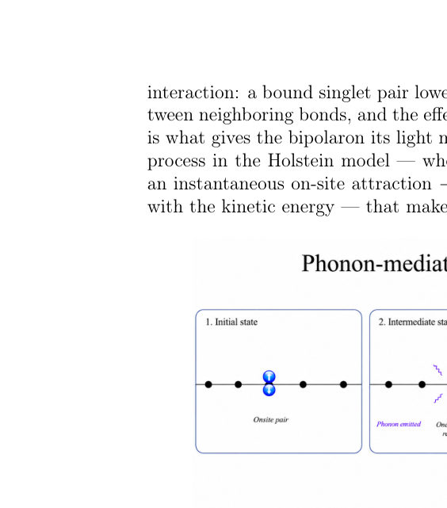 
Figure 4: Cartoon of the phonon-mediated electron-pair-hopping process generated by the site-Peierls coupling of Eq. (3) in the antiadiabatic limit Ω/t ≫1. A virtual phonon emitted by one electron during a hop is absorbed by a neighboring electron during a second hop, with the net effect of moving a singlet pair as a unit.

📷 Fig 5

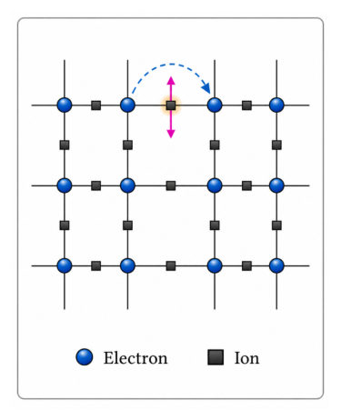 
Figure 5: Left: Cartoon of the bond-Peierls model: oscillators sit on the bonds of the square lattice (open ions), and their displacements ˆX⟨i,j⟩modulate the hopping of electrons between neighboring sites (filled circles). Right: The bond-Peierls coupling in the iron pnictides. Pnictogen oscillations out of the Fe plane modulate the electron tunneling between neighboring iron atoms; destructive interference between the direct dxy–dxy hop and the indirect Fe–pnictogen–Fe path produces a small net hopping with a large coupling to the pnictogen displacement. Adapted from Refs.32

**Summary.** This review explores a mechanism for high-temperature superconductivity where phonons modulate electron hopping instead of density. By using the bond-Peierls model, the author shows that superconductivity can bypass the traditional temperature limits because the resulting bipolarons remain light and mobile. This provides a theoretical framework for understanding high-Tc in materials like iron-based pnictides.

**Why it may be interesting.** not directly relevant

Detailed structure

**Main problem.** Investigating whether phonon-mediated superconductivity can exceed the conventional transition temperature ceiling (Tc < Omega/10) by avoiding the formation of heavy, immobile bipolarons.

**Main result.** The author demonstrates that in the bond-Peierls model, where phonons modulate electron hopping rather than density, light bipolarons form an s-wave superconductor with a Tc that significantly exceeds the conventional bound and is robust against Coulomb repulsion.

**Method.** The study utilizes sign-problem-free quantum Monte Carlo simulations, semi-classical instanton analysis to calculate effective mass, and second-order perturbation theory in the antiadiabatic limit.

**Model / system.** The primary model is the bond-Peierls (or SSH) model on square and cubic lattices, where lattice distortions modulate the electron hopping amplitude, contrasted with the standard Holstein density-coupled model.

**Key observables.** Transition temperature (Tc), bipolaron effective mass (m*BP), bipolaron binding energy (Delta_BP), and bipolaron mean squared radius (R2_BP).

**Important parameters / regimes.** Dimensionless electron-phonon coupling (lambda), phonon frequency (Omega), hopping amplitude (t), adiabaticity ratio (t/Omega), and Hubbard repulsion (U).

**Assumptions / limitations.** The analysis assumes a dilute liquid of bipolarons and uses a linearized expansion of hopping about equilibrium; it neglects higher-order interaction terms that might affect the density limit.

**Figures summary.** Figure 1 shows the breakdown of Migdal-Eliashberg theory; Figure 2 illustrates the Holstein model; Figure 3 compares bipolaron effective mass; Figure 5 provides a cartoon of the bond-Peierls model applied to iron pnictides.

**Paper structure.** The paper begins by defining the conventional Tc ceiling, introduces the Peierls/bond-Peierls model as a solution, presents numerical QMC results showing light bipolarons and high Tc, discusses the role of Coulomb repulsion, and concludes with material design principles.

Abstract

Phonon-mediated superconductivity is conventionally thought to be capped at a transition temperature $T_{\mathrm{c}}$ no larger than roughly one-tenth of the phonon frequency $Ω$, a bound rooted in the breakdown of Migdal-Eliashberg theory at intermediate coupling and in the heaviness of bipolarons formed in standard models with phonons that couple to the electron density. In this review I describe a route to phonon-mediated high-$T_{\mathrm{c}}$ superconductivity that bypasses this bound. The key ingredient is a class of electron-phonon couplings in which lattice distortions modulate the electron hopping and therefore its kinetic energy rather than its potential energy, known as the Peierls model (also known as Su-Schrieffer-Heeger model). In these models phonon exchange generates an interaction that binds two electrons into a small but unusually light bipolaron. Using sign-problem-free quantum Monte Carlo simulations of a bond-Peierls model on the square and cubic lattices, my collaborators and I have shown that a dilute liquid of such bipolarons forms an $s$-wave superconductor with a $T_{\mathrm{c}}/Ω$ that significantly exceeds the conventional bound, that this conclusion is robust against screened Coulomb repulsion, and that $T_{\mathrm{c}}/Ω$ -- despite being reduced -- remains above bound in presence of strong long-range Coulomb repulsion. A semi-classical instanton analysis explains why, at strong coupling, bipolarons in models with phonon-modulated hopping are lighter than their density-coupled (Holstein) counterparts. I close with a discussion of materials in which this physics may be operative, in particular the iron-based pnictide superconductors, and of design principles that follow from it.

[↑ back to top](#top)

### [Bogoliubov sum rules and the Knight-shift ellipsoid in noncentrosymmetric superconductors](http://arxiv.org/abs/2605.17030v1)

**Authors:** Yi Zhou  
**Type:** both · **Category:** strongly correlated electrons · **PDF:** <https://arxiv.org/pdf/2605.17030v1>  
**Analysis basis:** full PDF text, analyzed in chunks

📷 Fig 1

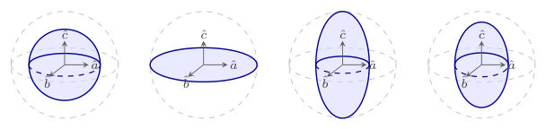 
FIG. 2. Canonical Knight-shift ellipsoids at T = 0 in the strong-locking regime. The faint dashed sphere is the normal-state KN reference; the blue solid ellipsoid is the T = 0 shape with semi-axes Ki(0)/KN = 1 −πi, so πi = 1 collapses the ellipsoid along axis i and πi = 0 leaves it touching the reference sphere. (a) Singlet with strong 3D SOC at the simplex barycenter, isotropically suppressed to 2

📷 Fig 2

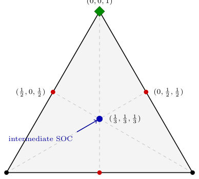 
FIG. 3. Simplex of allowed T = 0 Knight-shift ellipsoids in the strong-locking regime, parametrized by the eigenvalues (π1, π2, π3) of Π with P

**Summary.** The paper introduces a geometric framework to classify pairing symmetries in noncentrosymmetric superconductors by relating the zero-temperature Knight shift to the spin-locking texture of the Fermi surface. It provides a set of experimental protocols to distinguish between various singlet and triplet pairing states. The theory is validated by analyzing NMR data on K2Cr3As3, revealing a specific c-axis spin-locking mechanism.

**Why it may be interesting.** not directly relevant

Detailed structure

**Main problem.** Determining the pairing symmetry and spin-orbit coupling (SOC) texture in noncentrosymmetric superconductors using the residual T=0 Knight shift.

**Main result.** Derivation of a central theorem where the T=0 Knight shift tensor is determined solely by the Fermi-surface average of the spin-locking direction, independent of pairing symmetry or gap magnitude, and application to K2Cr3As3 to identify a c-axis locking texture.

**Method.** Use of a Bogoliubov sum rule within a BdG framework to establish geometric identities and the development of six experimental protocols for diagnosing pairing classes via a Knight-shift ellipsoid.

**Model / system.** Noncentrosymmetric superconductors, specifically the K2Cr3As3 system, modeled using a single-band unitary Bogoliubov-de Gennes (BdG) framework with antisymmetric spin-orbit coupling.

**Key observables.** Residual T=0 Knight shift tensor, spin susceptibility, spin-lattice relaxation rate (1/T1), and the Knight-shift ellipsoid.

**Important parameters / regimes.** Spin-locking direction (n_k), SOC strength (lambda), Zeeman field (h), and the projection tensor (Pi_munu).

**Assumptions / limitations.** The primary derivation assumes the strong-locking regime and unitary pairing; the application assumes a single-band model and hyperfine-invariant coupling.

**Figures summary.** Figure 4 shows a numerical cross-check of the derived closed-form theory against digitized endpoints of s-wave curves, demonstrating high precision.

**Paper structure.** The paper establishes a central Bogoliubov sum rule, derives static bounds and the Knight-shift ellipsoid geometry, explores departures in intermediate SOC and finite Zeeman fields, develops dynamical counterparts (FGT sum rule), and concludes with experimental protocols applied to K2Cr3As3 data.

Abstract

We show that the residual $T=0$ Knight shift of a noncentrosymmetric superconductor in the strong-locking regime is completely determined by a single Fermi-surface average -- the projector $Π_{μν}=\langle\hat n_μ\hat n_ν\rangle_{\rm FS}$ of the spin-locking direction $\hat n_{\mathbf{k}}$ -- giving the tensor identity $χ_{μν}(0)=χ_{N}[δ_{μν}-Π_{μν}]$ independently of pairing symmetry, gap magnitude, and Fermi-surface shape. Because $\mathrm{Tr}\,Π=1$, the three principal Knight shifts at $T=0$ lie on a two-dimensional simplex of locking textures, the \emph{Knight-shift ellipsoid}, whose vertices, edges, and interior classify every canonical pairing class. The identity follows from a Bogoliubov sum rule, $\sum|M_{ph,O}|^{2}+\sum|M_{pp,O}|^{2}=\mathrm{Tr}_{s}(O^{2})$, valid at every momentum for every Hermitian single-particle operator $O$ as the BdG-doubled form of unitary invariance. Around the central theorem we develop controlled departures (a closed-form $s$-wave SOC interpolation, a finite-field strong-locking identity), a dynamical counterpart (a spin Ferrell--Glover--Tinkham sum rule and a rigorous vanishing-projection theorem for $1/T_{1}$), and a decoupled-pocket multiband baseline, packaged into six experimental protocols. Applied to the $^{75}$As NMR data on K$_{2}$Cr$_{3}$As$_{3}$, the observed ellipsoid sits at the oblate-axial vertex $(0,0,1)$ and saturates the trace bound; the decoupled-pocket SOC-texture baseline is excluded by $\sim 0.5$ in normalized units, requiring a common $\hat c$-axis locking on all three pockets, and the suppression of $1/T_{1}\parallel\hat c$ is identified, via the vanishing-projection theorem, as a fingerprint of finite-$\mathbf{q}$ ferromagnetic spin-fluctuation gap formation.

[↑ back to top](#top)

### [Boundary-Aware QFT Block-Encoding of Fractional Laplacians](http://arxiv.org/abs/2605.16749v1)

**Authors:** Younes Javanmard, Sina Kazemian  
**Type:** theory · **Category:** quantum information and computing · **PDF:** <https://arxiv.org/pdf/2605.16749v1>  
**Analysis basis:** full PDF text, analyzed in chunks

📷 Fig 1

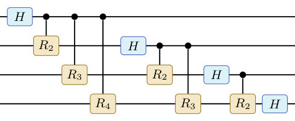 
FIG. 1. Illustrative four-qubit QFT decomposition. The finite QFT is the spectral layer used by the block-encoding, but by itself it imposes periodic rather than open geometry.

📷 Fig 2

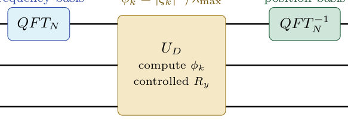 
FIG. 2. Native QFT block-encoding of the periodic circulant surrogate e A(N) α,h. The frequency oracle encodes the fractional symbol as an ancilla amplitude.

📷 Fig 3

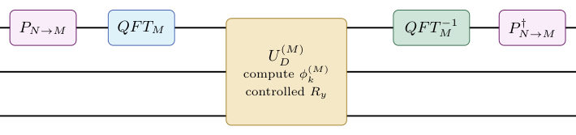 
FIG. 3. Compressed open-boundary block from zero-padding. The size-M QFT circuit is periodic on the padded register, while compression back to the first N coordinates gives (A(N) α,h + E(M))/λmax.

📷 Fig 4

 
FIG. 4. Matrix structure for N = 64, h = 1, and α = 1.5. The third panel shows the absolute aliasing error on a logarithmic color scale; the highlighted corners are the wrap-around regions.

📷 Fig 5

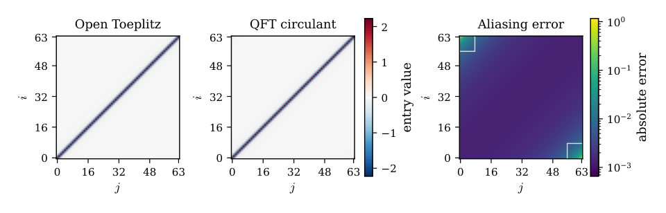 
Figure 5 gives a direct functional comparison using three bounded-domain test functions also used in Ref. [19]. We compare the open-boundary Toeplitz target, the native QFT-circulant surrogate, and the zero-padded compressed operator. The top row overlays the operator outputs, while the bottom row shows the pointwise absolute error on a logarithmic scale. The native QFT curve plays the role of a periodic Fourier method and displays boundary artifacts, whereas the padded construction follows the open-boundary target.

**Summary.** This paper provides a way to use the Quantum Fourier Transform to simulate fractional diffusion processes on bounded domains without the errors caused by periodic wrap-around. By padding the quantum register with zeros, the authors show how to effectively implement open boundary conditions for the fractional Laplacian. This serves as a fundamental building block for more complex quantum algorithms for solving partial differential equations.

**Why it may be interesting.** not directly relevant

Detailed structure

**Main problem.** Standard Quantum Fourier Transform (QFT) circuits naturally implement periodic boundary conditions, which introduces artificial 'wrap-around' aliasing errors when trying to simulate the fractional Laplacian on bounded domains with open boundaries.

**Main result.** The authors prove that by zero-padding the input state into a larger M-point QFT register and then compressing it back, one can implement the open-boundary Toeplitz operator with a controllable error that vanishes as the padding increases.

**Method.** The method uses a padding-and-compression mechanism combined with a block-encoding of the Fourier symbol via a diagonal spectral oracle and controlled Ry rotations.

**Model / system.** The semi-discrete fractional Laplacian operator (with symbol |xi|^alpha) on bounded domains with open, zero-extension boundary conditions.

**Key observables.** spectral norm of the error matrix E(M), gate complexity, and the decay of the convolution kernel tail.

**Important parameters / regimes.** fractional order alpha, grid spacing h, physical dimension N, padded dimension M, and the decay rate r_alpha = min(2, 1 + alpha).

**Assumptions / limitations.** The method assumes a sufficiently large padding (M >= 2N) and relies on the specific decay properties of the kernel coefficients to bound the error.

**Figures summary.** Figure 4 compares the matrix structures of Open Toeplitz vs. QFT circulant operators highlighting aliasing; Figure 5 shows the functional accuracy of the padded method compared to the target operator.

**Paper structure.** The paper identifies the boundary mismatch problem, provides a mathematical proof of the aliasing identity, introduces the padding-and-compression construction, performs error analysis using the Schur test, and demonstrates a concrete quantum oracle implementation.

Abstract

We study the quantum Fourier transform (QFT) block-encoding of the semi-discrete fractional Laplacian on bounded domains with open, zero-extension boundary conditions. In the notation of the main construction, the target operator is the finite Toeplitz truncation \(A^{(N)}_{α,h}\) obtained from the full-lattice semi-discrete operator with symbol \(|ξ|^α\). A finite QFT register, however, diagonalizes circulant matrices rather than Toeplitz truncations. The native QFT circuit therefore implements a periodic surrogate \(\widetilde A^{(N)}_{α,h}\), not the open-boundary operator. We identify this mismatch through an exact Toeplitz-to-circulant aliasing identity.   To recover the open-boundary action, we zero-pad the state into a larger \(M\)-point QFT register, apply the same Fourier-symbol block-encoding, and compress back to the physical subspace. The resulting compressed block satisfies \(P_{N\to M}^{\dagger}\widetilde A^{(M)}_{α,h}P_{N\to M} = A^{(N)}_{α,h}+E^{(M)}\), where \(E^{(M)}\) is controlled by the tail of the semi-discrete convolution kernel. Thus, the QFT layer implements the fractional symbol, while zero-padding supplies the open-boundary geometry. The construction is an operator-compilation primitive for boundary-aware quantum simulation rather than a complete PDE solver.

[↑ back to top](#top)

### [Causal Anomaly Detection for Lithium-Ion Battery Degradation](http://arxiv.org/abs/2605.17334v1)

**Authors:** Dieter W. Heermann, Hagen Heermann  
**Type:** both · **Category:** disordered systems and neural networks · **PDF:** <https://arxiv.org/pdf/2605.17334v1>  
**Analysis basis:** full PDF text, analyzed in chunks

📷 Fig 1

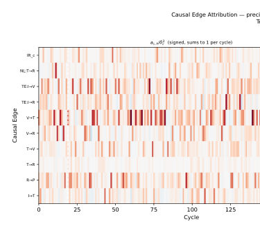 
Figure 1: PCMCI causal graph recovered from a representative cell (DV_US06 drive cycle, NMC chemistry). Node size is proportional to the number of significant outgoing links; edge width encodes the magnitude of the MCI partial-correlation coefficient at the dominant lag. Solid arrows indicate links significant at p &lt; 0.05 (ParCorr, τmax = 3, rank transformation). The I →R and T →R links, absent under constant-current protocols, emerge when current variability CV(I) &gt; 0.5, providing the EIS cross-validation targets discussed in Section 4.5. Note that the legend abbreviation are TE = Tranfer Entropy, NL = Nonlinear (CMIknn edges), HLT = Health scalars (internal resistance per cycle and...

📷 Fig 2

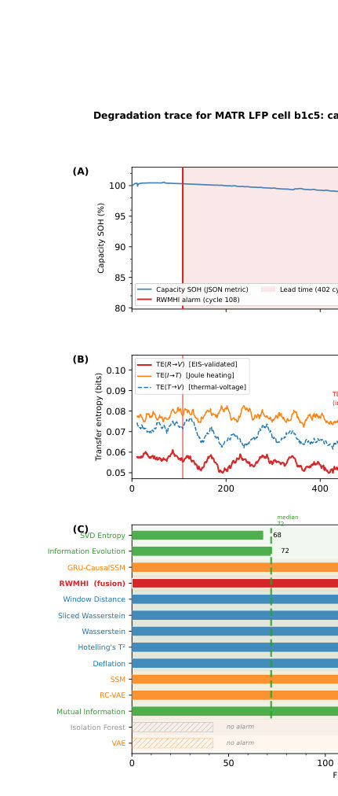 
Figure 2: Health monitoring results for MATR LFP cell b1c5 (N = 1069 cycles, 18.6 % total fade, fc = 0.10). (A) Capacity state-of-health (%) versus cycle number. The red dashed line marks the 80 % retention threshold (cfail = 510). The shaded blue region represents the prognostic lead time of 402 cycles between the RWMHI alarm at cycle 108 and end-of-life. (B) Smoothed KSG transfer entropy traces (20-cycle rolling mean) for the three dominant directed pairs. TE(R→V ) rises monotonically from cycle 850 onward, tracking the strengthening impedance-to-voltage coupling as charge-transfer resistance grows. (C) First-alarm cycle for each detector at fc = 0.10, ordered from earliest to latest. The...

📷 Fig 3

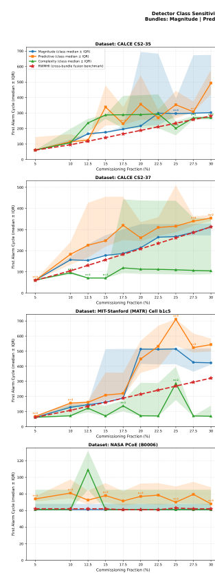 
Figure 3: Commissioning-fraction sensitivity by detector class. Solid lines: bundle-median first-alarm cycle; shaded bands: IQR (Q25–Q75). Bundles: Magnitude (Hotelling’s T 2, Window Distance, Wasserstein, Sliced Wasserstein, Deflation; blue), Predictive (GRU- CausalSSM, RC-VAE, SSM, VAE; orange), Complexity (Information Evolution, SVD, MI; green). Red dashed line: RWMHI fusion benchmark (T 2, WD, Deflation, RC-VAE, SSM), weighted by inverse CV. Annotations “n=k” indicate reduced bundle membership from missed detections; Isolation Forest (29–86 % detection) is excluded. NASA PCoE (168 cycles): all bundles are commissioning-invariant at cycles 61–62; this reflects both the rolling z-score...

📷 Fig 4

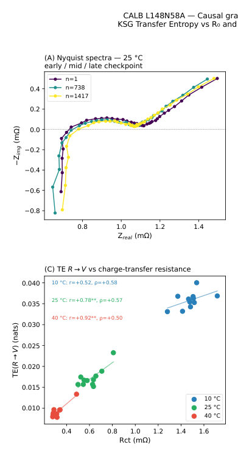 
Figure 4: EIS cross-validation for the CALB L148N58A NMC prismatic cell across 11 aging checkpoints at three temperatures. (A) Nyquist spectra at 25 °C for early, mid, and late checkpoints. The overlapping traces confirm minimal aging (2.3 % capacity fade), ruling out progressive impedance growth as a confound. (B) Ohmic resistance R0 and charge-transfer resistance Rct at all three temperatures. Rct is strongly temperature-stratified (medians: 1.48, 0.63, 0.30 mΩat 10, 25, 40 °C) while R0 varies by only 20 % over the 30 °C range. (C) TE(R→V ) versus Rct across all checkpoint–temperature pairs. Temperature clusters are stratified in the same order as Rct, and within each temperature a...

📷 Fig 5

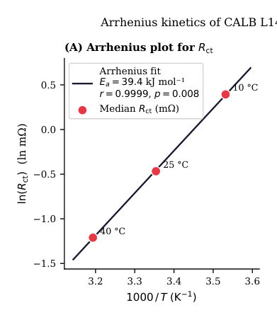 
Figure 5: Arrhenius analysis of charge-transfer resistance for the CALB L148N58A NMC cell. (A) Arrhenius plot: ln(Rct) versus 1000/T (K−1) for median values at 10, 25, and 40 °C. Linear regression (solid line) gives activation energy Ea = 39.4 kJ mol−1 (r = 0.9999, p = 0.009), consistent with published NMC charge-transfer kinetics (35–50 kJ mol−1; Illig et al. 11, Hahn et al. 9). (B) Absolute values of Rct (red circles) and R0 (blue squares) versus temperature. The strong Arrhenius character of Rct contrasts with the weak temperature sensitivity of R0, confirming that the transfer-entropy stratification observed in Fig. 4C is driven by charge-transfer kinetics rather than bulk ionic...

**Summary.** This paper introduces CausalHealth, a framework that uses causal inference and information theory to detect early-stage lithium-ion battery degradation. By tracking changes in the directed information flow between battery parameters, the method provides highly reliable warnings long before traditional capacity-based thresholds are reached. The approach is physically validated by correlating statistical transfer entropy with electrochemical charge-transfer resistance.

**Why it may be interesting.** not directly relevant

Detailed structure

**Main problem.** Developing a robust, automated pipeline for the early detection of lithium-ion battery degradation that is physically interpretable and computable from routine telemetry without needing access to the degradation region.

**Main result.** The CausalHealth framework achieves 100% detection across various battery chemistries (LFP, LCO, NMC) and provides a significant prognostic lead time of up to 402 cycles before capacity failure, with the RWMHI fusion improving lead time by 15-52 cycles.

**Method.** The framework uses PCMCI for causal discovery and KSG-type Transfer Entropy to quantify information flow between voltage, current, temperature, and resistance, then applies a Reliability-Weighted Master Health Index (RWHMI) to fuse multiple anomaly detectors.

**Model / system.** The study analyzes lithium-ion batteries with LFP, LCO, and NMC chemistries using datasets from MIT-Stanford MATR, NASA PCoE, and CALCE CS2, with physical validation performed via Electrochemical Impedance Spectroscopy (EIS) on NMC prismatic cells.

**Key observables.** Terminal voltage (V), current (I), temperature (T), resistance (R), Transfer Entropy (TE), charge-transfer resistance (Rct), and capacity State-of-Health (SOH).

**Important parameters / regimes.** Commissioning fraction (fc) between 5-30%, CUSUM drift (delta) and threshold (theta), and activation energy (Ea) of approximately 39.4 kJ/mol.

**Assumptions / limitations.** The commissioning window must be large enough to provide a stable reference (minimum 10 cycles); the method infers statistical dependencies rather than proving physical causation; SOC acts as a latent confounder.

**Figures summary.** Figures include PCMCI causal structure recovery, EIS cross-validation (Nyquist spectra), and plots showing the first-alarm cycle relative to the commissioning fraction and detector bundles.

**Paper structure.** The paper introduces the problem of early degradation detection, describes the CausalHealth pipeline (causal discovery, feature engineering, and detector bundles), presents the RWHMI fusion method, validates the results against battery datasets, and provides physical grounding via EIS and Arrhenius analysis.

Abstract

Reliable early detection of lithium-ion battery degradation requires health indicators that are physically interpretable and computable from routine cycler telemetry without access to the degradation region. We introduce \textsc{CausalHealth}, a framework that applies causal graph discovery and $k$-nearest-neighbour transfer entropy to per-cycle voltage, current, temperature, and resistance time series, and organises twelve resulting anomaly scores into three signal-class bundles (Magnitude-shift, Predictive-residual, Complexity-entropy) -- with Isolation Forest reported separately as it falls below the bundle reliability threshold -- to characterise detection sensitivity across ten commissioning fractions (5--30\,\%). The Magnitude-shift class achieves 100\,\% detection across all seven tested cells spanning LFP (MIT--Stanford MATR) and LCO (NASA PCoE, CALCE CS2) chemistries, with a lead time of up to 402 cycles before conventional capacity-threshold failure on gradual-fade cells. A Reliability-Weighted Master Health Index (RWMHI) -- a cross-bundle fusion of five high-reliability detectors weighted by inverse coefficient of variation -- improves lead time by 15--52 cycles over the class median on long-lived cells while maintaining 100\,\% detection. Validation against electrochemical impedance spectroscopy on an NMC prismatic cell provides independent physical grounding: transfer entropy $\mathrm{TE}(R \!\to\! V)$ correlates with charge-transfer resistance $R_{\mathrm{ct}}$ (pooled $r = +0.990$; temperature-controlled partial $r = +0.898$), and an Arrhenius analysis of both quantities yields an activation energy consistent with published NMC charge-transfer kinetics. These results are evaluated on seven cells across three benchmark datasets.

[↑ back to top](#top)

### [Chern classes of Laughlin bundles on the quasihole moduli space](http://arxiv.org/abs/2605.18089v1)

**Authors:** Florent Dupont, Semyon Klevtsov  
**Type:** theory · **Category:** strongly correlated electrons · **PDF:** <https://arxiv.org/pdf/2605.18089v1>  
**Analysis basis:** full PDF text, analyzed in chunks

📷 Fig 1

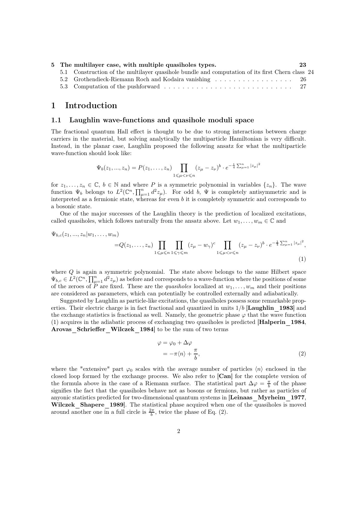 
Low-resolution page preview, page 2

📷 Fig 2

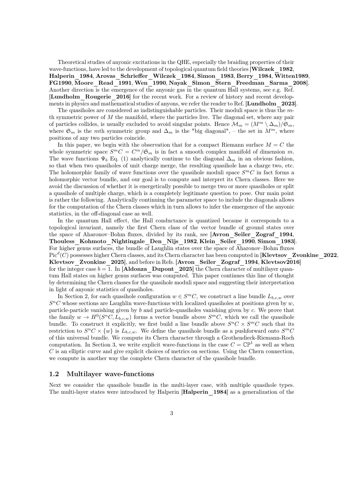 
Low-resolution page preview, page 3

📷 Fig 3

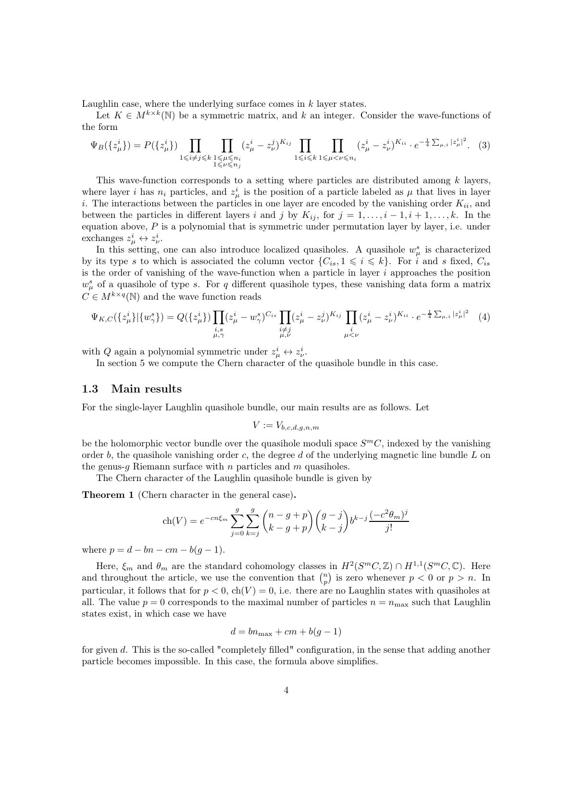 
Low-resolution page preview, page 4

📷 Fig 4

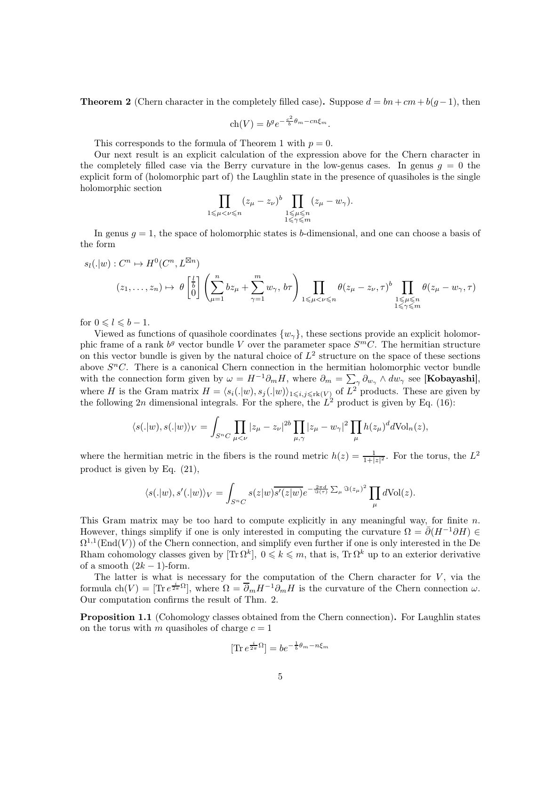 
Low-resolution page preview, page 5

📷 Fig 5

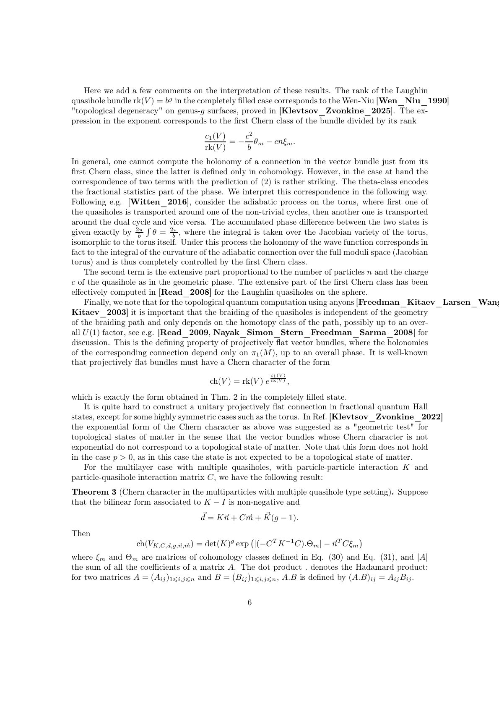 
Low-resolution page preview, page 6

**Summary.** This paper provides a rigorous topological description of Laughlin quasihole states on arbitrary Riemann surfaces. By computing the Chern character of the quasihole bundle, the authors mathematically link the topological invariants of the bundle to the physical fractional statistics and Aharonov-Bohm phases observed in the fractional quantum Hall effect.

**Why it may be interesting.** not directly relevant

Detailed structure

**Main problem.** The paper aims to compute the Chern character and Chern classes of the Laughlin quasihole bundle over the quasihole moduli space on Riemann surfaces of arbitrary genus.

**Main result.** The authors derive a general formula for the Chern character of the quasihole bundle and show that in the completely filled state, the bundle is compatible with projective flatness, with results matching the predicted Berry phase decomposition.

**Method.** The study employs the Grothendieck-Riemann-Roch theorem, the Abel-Jacobi map, and the Chern-Weil theory, alongside explicit verification in genus 0 and 1 using the Chern connection and theta functions.

**Model / system.** The system consists of single-layer and multi-layer Laughlin fractional quantum Hall states on Riemann surfaces of genus g, featuring particles and quasiholes with specific vanishing orders (b and c) and interaction matrices (K and C).

**Key observables.** Chern character, Chern classes, Berry phase (Aharonov-Bohm and fractional statistical contributions), and Hall conductance.

**Important parameters / regimes.** Genus (g), number of particles (n), number of quasiholes (m), particle-particle vanishing order (b), particle-quasihole vanishing order (c), and magnetic line bundle degree (d).

**Assumptions / limitations.** The calculation assumes the wave-functions can be analytically continued and that the chosen frame of sections is holomorphic in the quasihole positions.

**Paper structure.** The paper begins with the geometric construction of the quasihole bundle, proceeds to derive the Chern character using the Grothendieck-Riemann-Roch theorem, provides explicit low-genus verifications, and concludes with a generalization to multi-layer systems.

Abstract

We study fractional quantum Hall states with quasihole excitations, on Riemann surfaces of arbitrary genus. For configurations with $m$ quasiholes we construct a vector bundle above the $m$-th symmetric power of the curve so that the fiber at a point $\lbrace w_1,\dots,w_m \rbrace$ corresponds to the state with quasiholes localized at these positions. We determine the Chern character of this bundle via the Grothendieck-Riemann-Roch theorem and show that in the completely filled state, i.e. when the number of particles is maximal, the vector bundle is compatible with the condition of projective flatness. Furthermore, we obtain a generalization of this result to the case of multiple layers and multiple quasihole types. In genus zero and one, we construct explicit wave-functions and verify that the curvature of the associated Chern connection reproduces the predicted Chern classes. The Chern classes obtained match, term by term, the predicted decomposition of the Berry phase under quasihole exchange, into an extensive Aharonov--Bohm contribution and a fractional statistical contribution.

[↑ back to top](#top)

### [Coalescence of Polymer Droplets Moving on a Surface with Stiffness Gradient](http://arxiv.org/abs/2605.18279v1)

**Authors:** Divyansh Tripathi, Vimal Kishore, Panagiotis E. Theodorakis, Swarn Lata Singh  
**Type:** theory · **Category:** statistical mechanics · **PDF:** <https://arxiv.org/pdf/2605.18279v1>  
**Analysis basis:** full PDF text, analyzed in chunks

📷 Fig 1

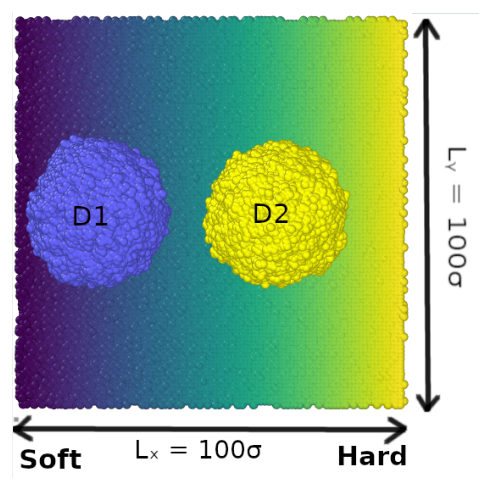 
FIG. 1: System setup consisting of two polymer droplets marked as D1 and D2, which are

📷 Fig 2

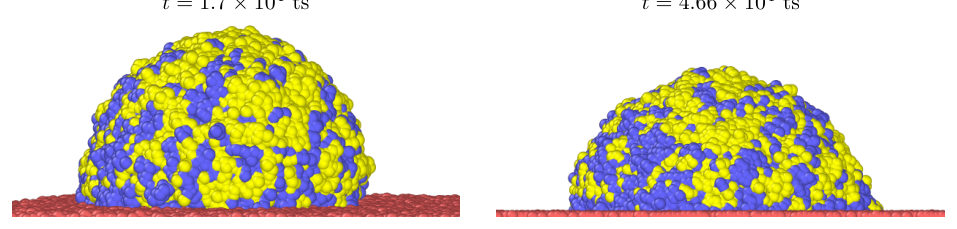 
FIG. 2: Time evolution of droplet coalescence on a uniform substrate for different stiffness

📷 Fig 3

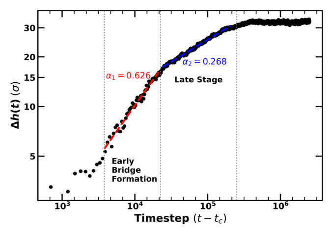 
FIG. 3: Temporal evolution of bridge height for stationary coalescence on a surface with

📷 Fig 4

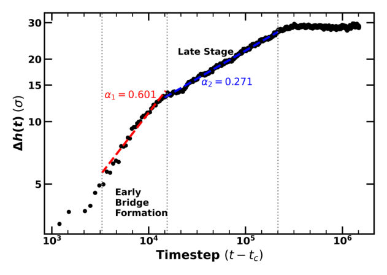 
FIG. 4: Temporal evolution of bridge height for the coalescence of two droplets moving on

📷 Fig 5

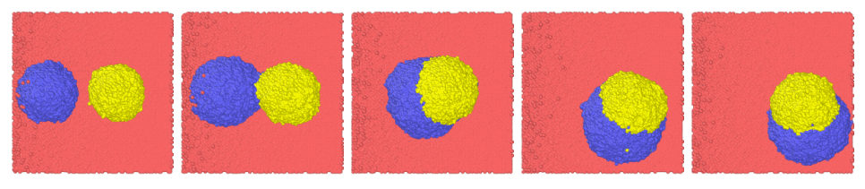 
FIG. 5: Time-sequenced images of coalescence of two moving droplets for εd1d2 = 0.85. As

**Summary.** This paper studies how polymer droplets merge when moving across a surface with varying stiffness. It reveals that the merging process transitions between different physical regimes (capillarity vs. viscoelasticity) and is highly sensitive to the chemical attractions between the droplets and the surface.

**Why it may be interesting.** not directly relevant

Detailed structure

**Main problem.** Investigating the coalescence dynamics of two viscoelastic polymer droplets moving on a soft substrate with a stiffness gradient (durotaxis).

**Main result.** The study identifies a crossover from a capillarity-dominated to a viscoelasticity-dominated regime in bridge growth and shows that coalescence morphology and mixing depend strongly on inter- and intra-droplet attraction strengths.

**Method.** Coarse-grained molecular dynamics simulations using the LAMMPS package with a Langevin thermostat and Velocity-Verlet integration.

**Model / system.** Two viscoelastic polymer droplets (modeable via FENE potential and LJ interactions) moving on a deformable substrate with a stiffness gradient implemented via a harmonic potential.

**Key observables.** Temporal growth of bridge height (h) and radius (r), power-law exponents (alpha and beta), contact angle, and degree of droplet mixing.

**Important parameters / regimes.** Substrate stiffness gradient, velocity ratios of droplets, droplet-surface attraction strength, and droplet-droplet/intra-droplet interaction strengths.

**Assumptions / limitations.** The system is modeled using coarse-grained particles; the effect of droplet bending rigidity is not considered.

**Figures summary.** Figure 1 shows the experimental setup of durotaxis motion; Figure 8 shows the distance between droplet centers of mass; Figure 9 shows time-sequenced snapshots of the 'enveloping' morphology.

**Paper structure.** The paper introduces the problem of durotactic coalescence, describes the molecular dynamics model and simulation setup, compares stationary vs. moving droplets, analyzes the effect of various interaction parameters, and discusses biological implications.

Abstract

Here, we study the coalescence of two droplets that are moving in the same direction on a soft surface; the motion of the droplets is caused by a gradient in the surface stiffness. As reference, stationary coalescence of the same droplets is also studied on the corresponding uniform surfaces for different stiffness values. To describe the coalescence phenomenon on a surface with stiffness gradient, a relevant range of velocity ratios of the leading and the trailing droplet was considered to elucidate the effect of this parameter on coalescence. Moreover, to analyze the dynamics of the process, the temporal growth of the bridge height $(h)$ was investigated, which follows a power law $(h \sim t^α)$, before eventually attaining a constant value. The obtained values of $α$ show a transition from a higher to a lower value as a function of time, pointing to the presence of two distinct power-law growth regimes, where the transition signifies the crossover from the capillarity-dominated regime to the viscoelasticty-dominated regime of coalescence. In addition, varying attractive strengths for droplet--droplet and intra-droplet interactions were considered. The results indicate that both the dynamics and the degree of the coalescence strongly depend on these interaction parameters. Thus, we anticipate that our results will shed more light on the durotaxis-driven coalescence of polymeric droplets for various relevant system parameters, which will have practical implications for applications ranging from microfluidics to ink-jet printing, where substrate properties may vary. In addition, results may add to the fundamental understanding of the interactions among multicellular aggregates moving on biological surfaces.

[↑ back to top](#top)

### [Confinement-controlled pattern selection in a finite population-imbalanced dipolar Bose-Einstein condensate](http://arxiv.org/abs/2605.18139v1)

**Authors:** Zhenhao Wang, Weijing Bao, Jia-Rui Luo, Gentaro Watanabe, Kui-Tian Xi  
**Type:** theory · **Category:** quantum gases · **PDF:** <https://arxiv.org/pdf/2605.18139v1>  
**Analysis basis:** full PDF text, analyzed in chunks

📷 Fig 1

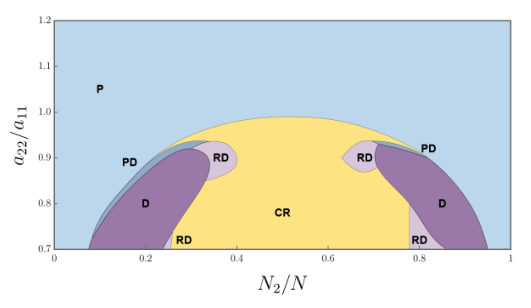 
FIG. 2. Phase diagram in the (a22/a11, N2/N) plane for γ = 1, a11 = 100a0, a12 = a21 = 95a0, R0 = 20 µm, V0 = 100ℏω0, µ1 = 6µB, µ2 = −6µB, ωz = 5ω0, and total atom number N = 5 × 105. The color coding follows Fig. 1.

📷 Fig 2

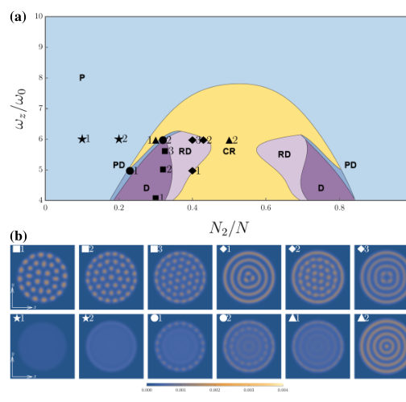 
FIG. 1. (a) Phase diagram in the (ωz/ω0, N2/N) plane for γ = 1, a11 = 100a0, a22 = 90a0, a12 = a21 = 95a0, R0 = 20 µm, V0 = 100ℏω0, µ1 = 6µB, µ2 = −6µB, and total atom number N = 5 × 105. Colored regions indicate distinct density morphologies: pancake (P), pancake-droplet (PD), droplet (D), ring-droplet (RD), and concentric rings (CR). (b) Column-density profiles n2(ρ) at selected points in (a), labelled by markers. The field of view is 44.61 × 44.61 µm2. Density is plotted in units of N2ℓ−2.

📷 Fig 3

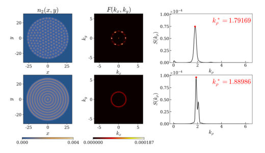 
FIG. 4. Robustness of the characteristic scale against system size. Comparison of real-space density, Fourier spectrum, and ra- dial structure factor for a larger box radius R0 = 40 µm. Parameters: ωz = 5ω0, N = 2 × 106, with N2/N = 0.32 (Droplets) and 0.5 (Rings). The selected k∗remains consistent with the R0 = 20 µm case in Fig. 3.

📷 Fig 4

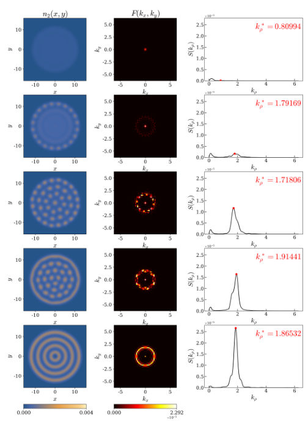 
FIG. 3. (Color online) Characterization of microphase separa- tion. First column: Real-space density distribution. Second col- umn: Two-dimensional Fourier power spectrum F(kx, ky) in the range kx,y ∈[−2π/ℓ, 2π/ℓ]. The FFT satisfies Parseval’s theorem: R F(kρ)dkρ = R |δn2(ρ)|2dρ. Third column: One-dimensional radial structure factor S(kρ). The five rows correspond to the repre- sentative points marked in Fig. 1(a), with parameters (ωz/ω0, N2/N) = (5, 0.10), (5, 0.24), (5, 0.30), (5, 0.38), (5, 0.50) from top to bot- tom.

📷 Fig 5

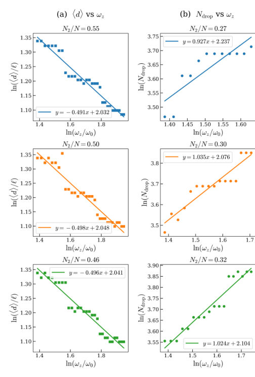 
FIG. 5. Confinement-controlled scaling and geometric frustration. (a) Log-log plot of the mean inter-ring spacing ⟨d⟩(in units of ℓ) versus axial frequency ωz (in units of ω0). The solid line indicates the power-law fit ⟨d⟩∝ω−0.49 z . (b) Log-log plot of the droplet number Ndrop versus ωz. The step-like features indicate locking of the droplet number due to the finite box geometry.

**Summary.** This paper explores how axial confinement and population imbalance control the formation of complex density patterns in a two-component dipolar BEC. It demonstrates that these quantum patterns mimic microphase-separated structures in polymers and that their characteristic length scales are tunable via the confinement geometry.

**Why it may be interesting.** It provides a controllable quantum fluid platform to study microphase separation and pattern formation, drawing a direct structural correspondence between quantum gases and soft-matter systems like diblock copolymers.

Detailed structure

**Main problem.** Investigating ground-state density pattern selection and morphological transitions in a population-imbalanced, two-component dipolar Bose-Einstein condensate confined in a circular quasi-2D box.

**Main result.** The study identifies a sequence of morphologies (pancake, droplet arrays, concentric rings) where the population ratio acts as an effective volume fraction, and discovers that the pattern spacing scales linearly with the axial confinement length.

**Method.** A mean-field approach using coupled Gross-Pita_Pitaevskii equations (GPEs) minimized via the preconditioned conjugate-gradient method and evaluated using Fast Fourier Transforms.

**Model / system.** A binary (two-component) dipolar Bose-Einstein condensate of 52Cr atoms in a quasi-2D circular box with tight axial harmonic confinement.

**Key observables.** 2D column density profiles, density contrast (C2), structure factors (radial and 2D Fourier power spectrum), and characteristic wave vectors.

**Important parameters / regimes.** Population ratio (N2/N), axial confinement strength (omega_z), interaction asymmetry (a22/a11), and box radius (R0).

**Assumptions / limitations.** Zero temperature, mean-field approximation (neglecting Lee-Huang-Yang fluctuations), and rigid/hard-wall-like boundary conditions for the box potential.

**Figures summary.** Figures show real-space density patterns for different phases, density contrast (C2) as a function of population ratio and axial confinement, and scaling analysis of pattern spacing.

**Paper structure.** The paper introduces the system and its analogy to block copolymers, describes the mean-field model and numerical methods, presents phase diagrams and morphological transitions, analyzes scaling laws and geometric frustration, and concludes with implications for quantum fluid pattern selection.

Abstract

We study the ground-state density patterns of a population-imbalanced two-component dipolar Bose-Einstein condensate confined in a circular quasi-two-dimensional box. Using a mean-field model, we map out phase diagrams as functions of the axial confinement, interaction imbalance, and population ratio. The system supports a rich sequence of stationary morphologies, including a nearly uniform pancake state, pancake-droplet and ring-droplet coexistence states, droplet arrays, and concentric rings. These patterns show a close structural correspondence to microphase-separated morphologies in diblock-copolymer systems, with the population imbalance acting as an effective volume fraction that selects the pattern topology. Analysis of the density profiles and structure factors reveals that the modulated states possess an intrinsic nonzero characteristic wave vector, which remains essentially unchanged when the box size is varied. We also find that the characteristic pattern spacing scales linearly with the axial confinement length, indicating that the transverse thickness of the condensate controls the effective in-plane length scale. In a finite circular box, this smooth scaling is interrupted by discrete steps, reflecting geometric frustration and the integer locking of the number of rings or droplets. Our results show that box-trapped dipolar mixtures provide a controllable platform for studying finite-size pattern selection and nonlocal microphase formation in quantum fluids.

[↑ back to top](#top)

### [Correlation-Driven Spin Reorientation via Competing Anisotropy Channels in CrPS4](http://arxiv.org/abs/2605.16541v1)

**Authors:** Raju Baral, Harald O. Jeschke, Igor I. Mazin, Jue Liu, David Mandrus, Stuart Calder  
**Type:** both · **Category:** strongly correlated electrons · **PDF:** <https://arxiv.org/pdf/2605.16541v1>  
**Analysis basis:** full PDF text, analyzed in chunks

📷 Fig 1

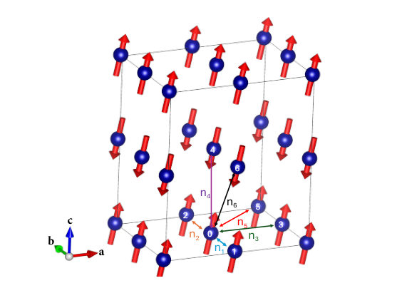 
FIG. 1. Magnetic structure of CrPS4, where the Cr spins are canted by 12◦from the c axis at 2 K. The six nearest-neighbor Cr–Cr shells (n1–n6) used in the correlation analysis are la- beled, with n1,n2 forming the dominant intrachain bonds.

📷 Fig 2

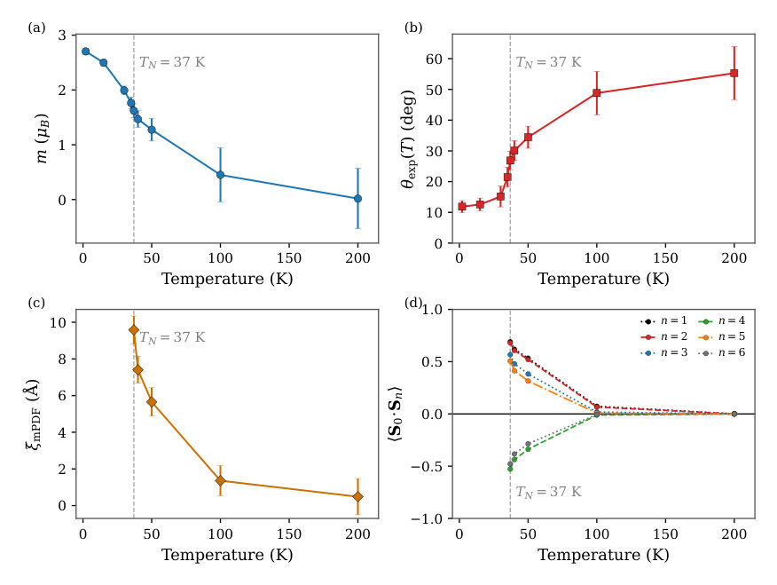 
FIG. 2. Temperature evolution of the (a) local magnetic order parameter, (b) spin angle, (c) correlation length for T &gt; TN, and (d) shell-resolved spin-spin correlation function, ⟨S0 · Sn⟩, of the first six nearest neighbors for T &gt; TN. Positive values correspond to net ferromagnetic (FM) and negative to antiferromagnetic (AFM) correlations. The persistence of positive n = 1, 2 correlations to 100 K demonstrates that the paramagnetic state remains locally chain-like even after the collapse of long-range correlations.

📷 Fig 3

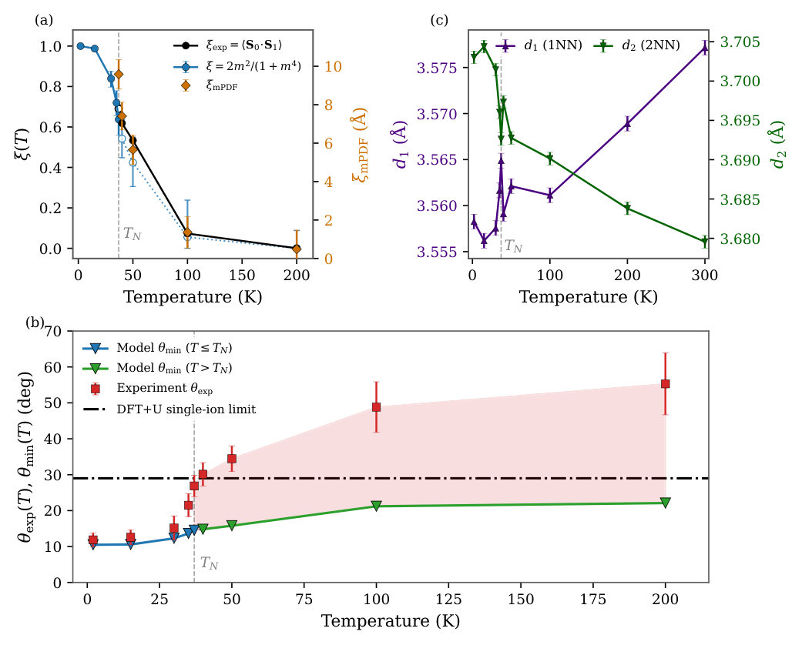 
FIG. 3. (a) Correlation-renormalization factor ξ(T) from the moment-based estimate ξ = 2m2/(1 + m4) (blue circles, filled for T ≤TN, open above TN) and the directly measured intrachain correlation ξexp = ⟨S0 ·S1⟩from mPDF analysis (used as model input for T &gt; TN). The mPDF correlation length ξmPDF is shown on the right axis. Agreement near TN supports the use of the Gaussian estimator in the ordered phase. (b) Model-predicted equilibrium spin angle θmin(T) (triangles) compared with the experimentally refined spin angle θexp(T). Below TN, θmin is computed using the moment-based ξ and above TN it is computed using the directly measured ξexp. The dashed horizontal line marks the DFT+U...

**Summary.** This paper demonstrates that the spin reorientation in CrPS4 is caused by the temperature-dependent decay of magnetic correlations, which affects exchange anisotropy differently than single-ion anisotropy. By combining neutron scattering with ab initio calculations, the authors provide a quantitative microscopic description of how low-dimensional correlations control magnetic anisotropy.

**Why it may be interesting.** not directly relevant

Detailed structure

**Main problem.** Identifying the mechanism behind the temperature-induced spin reorientation transition (SRT) in the quasi-1D van der Waals antiferromagnet CrPS4.

**Main result.** The SRT is driven by a differential renormalization where decaying intersite correlations suppress exchange-anisotropy channels while single-ion anisotropy remains local, causing the effective easy axis to rotate.

**Method.** The study combines magnetic pair distribution function (mPDF) analysis of neutron total scattering with DFT+U calculations for energy mapping and classical Monte Carlo simulations.

**Model / system.** The system is CrPS4, a quasi-1D van der Waals antiferromagnetic semiconductor with A-type magnetic order. The model uses a microscopic spin Hamiltonian including isotropic exchange, exchange-anisotropy, and single-ion anisotropy terms.

**Key observables.** Magnetic pair distribution function (mPDF), local magnetic order parameter (m), spin polar angle (theta), correlation length (xi), and Cr-Cr bond distances (d1, d2).

**Important parameters / regimes.** Neeel temperature (TN = 37 K), Hubbard U (2 eV), exchange couplings (J1, J2), and spin-spin correlation functions.

**Assumptions / limitations.** The model uses a dominant-chain approximation focusing on n=1 and n=2 bonds and neglects Dzyaloshinskii-Moriya interactions due to inversion symmetry.

**Figures summary.** Figure 1 shows a schematic of the system; Figure 3 compares the correlation-renormalization factor and predicted spin angles against experimental data, and shows structural anomalies in Cr-Cr bond distances at TN.

**Paper structure.** The paper introduces the spin reorientation problem, describes the mPDF and DFT+U methodology, presents the results of local correlation measurements, develops the anisotropy renormalization model, and discusses the connection to structural anomalies.

Abstract

We identify a correlation-driven mechanism for the temperature-induced spin reorientation in the quasi-one-dimensional van der Waals antiferromagnet CrPS4. Magnetic pair distribution function (mPDF) analysis resolves the local spin direction and shows that ferromagnetic intrachain correlations persist far above TN. Combining these correlations with a DFT-derived spin Hamiltonian reveals competing single-ion and exchange-anisotropy channels, with single-ion anisotropy remaining local while exchange anisotropy is renormalized as intersite correlations decay. This differential renormalization rotates the effective easy axis and captures the ordered-state canting. Above TN, the continued rotation beyond the model prediction delineates the limits of the dominant-chain approximation. These results establish mPDF-derived correlations as direct inputs to microscopic Hamiltonians and show how low-dimensional correlations can control magnetic anisotropy.

[↑ back to top](#top)

### [Direct On-Wafer Measurements of Noise Parameters in C- and X-bands at $T=4$ K](http://arxiv.org/abs/2605.17073v1)

**Authors:** Daniil Frolov, Jean-Olivier Plouchart, Utku Soylu  
**Type:** experiment · **Category:** other · **PDF:** <https://arxiv.org/pdf/2605.17073v1>  
**Analysis basis:** full PDF text, analyzed in chunks

📷 Fig 1

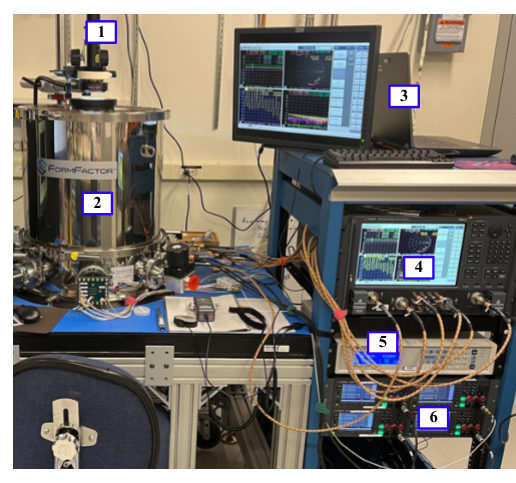 
Fig. 1. Noise parameter measurement stand consists of microscope 1, cryostat 2, control computer 3, vector network analyzer (VNA) 4, temperature readout 5, source-measure units (SMU) 6 for DC-biasing.

📷 Fig 2

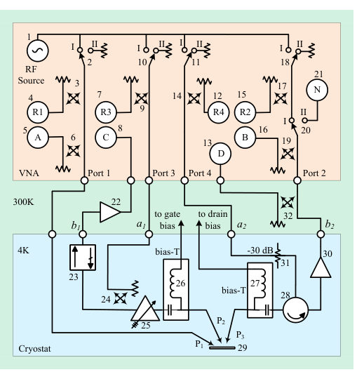 
Fig. 2. Electrical block-diagram of the measurement instruments and hard- ware. Two major components are the VNA (Keysight 5242B) and the cryo wafer prober (Form Factor), in between there are minor room temperature components amplifier 22 (Mini-Circuits) and directional coupler 32. The VNA equivalent circuit includes: RF source 1; terminated switches 2,10,11,18; SPDT switch 20; heterodyne receivers R1...R4, A,B,C,D; noise receiver 21; and directional couplers 3,6,9,14,17,19. The RF hardware inside the cryo- stat includes: 4-12 GHz triple junction ferrite isolator 23, 3.4-12.3 GHz circulator 28, 0.3-14 GHz low noise amplifier (Low noise factory) 30, 30 dB directional coupler 24, 0.2-18 GHz...

📷 Fig 3

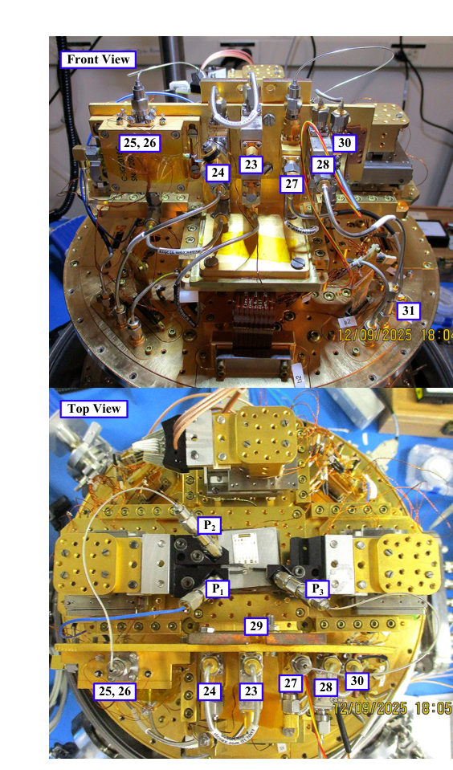 
Fig. 3. Cryogenic instrumentation mounted on the 4K plate of the refrigerator: front view and top view (as seen by the microscope), with the same numbering as in block diagram in fig.2. Probes P1, P2, P3 are moved by Attocube piezo- based drives for cryogenic environments.

📷 Fig 4

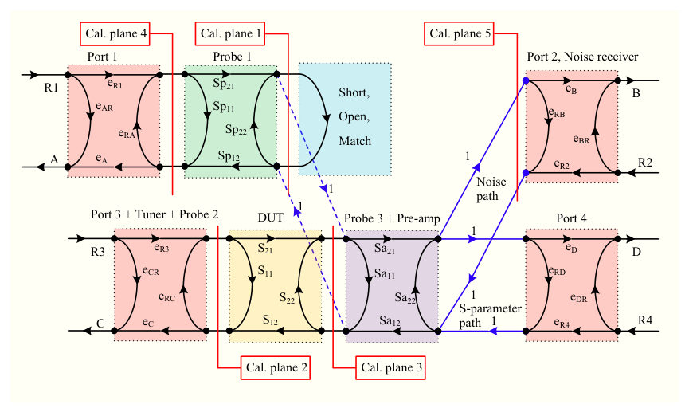 
Fig. 4. Signal graph of the system representing DUT, error boxes and five calibration planes required for calibration of 24 error terms.

📷 Fig 5

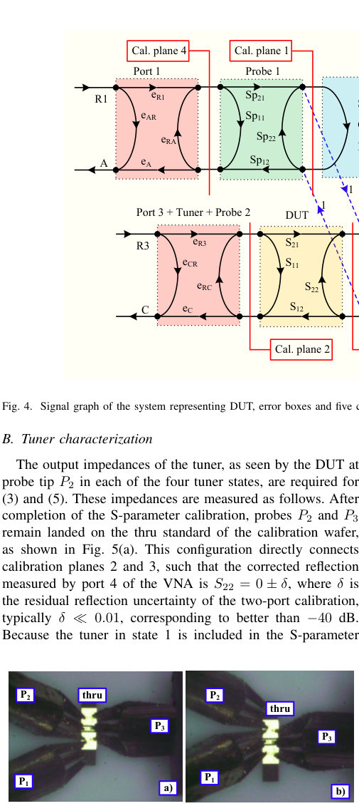 
Fig. 5. Characterization of the pre-amplifier. (a) preamp is connected to the tuner, (b) preamp is connected to the P1 for S-parameter measurement

**Summary.** This paper presents a new method for measuring the noise properties of semiconductor transistors directly on a wafer at 4 K. By using a cryogenic preamplifier and a specialized calibration technique, the researchers can measure low-gain devices that would otherwise be hidden by room-temperature noise. This is crucial for developing the readout electronics needed for quantum computing and radio astronomy.

**Why it may be interesting.** not directly relevant

Detailed structure

**Main problem.** The difficulty of performing accurate, direct on-wafer noise parameter measurements of low-gain transistors at cryogenic temperatures (4 K) because their output noise power is often below the room-temperature instrumentation noise floor.

**Main result.** The development of a vector-corrected measurement framework that enables simultaneous S-parameter and noise parameter extraction for 14nm FinFETs and LNAs at 4 K, successfully overcoming the room-temperature noise floor using a cryogenic preamplifier.

**Method.** A combination of the 'source-pull' and 'cold-source' methods using a four-state cryogenic tuner, integrated with a TRL (thru-reflect-line) calibration scheme and a cryogenic preamplification chain.

**Model / system.** A cryogenic measurement platform consisting of a 4 K cryostat with wafer probes, a four-port VNA, a cryogenic impedance generator (tuner), and a preamplification chain, used to characterize 14nm FinFETs and LNA dies.

**Key observables.** S-parameters (S11, S21, S12, S22), noise parameters (minimum noise temperature Te, minimum noise factor Fmin, optimal reflection coefficient Gamma_opt, and Lange invariant 4N), and I-V curves.

**Important parameters / regimes.** Temperature of 4 K; frequency range of 5-12 GHz (C- and X-bands); 14nm FinFET technology.

**Assumptions / limitations.** Assumes S21 = S12 reciprocity for the probe; assumes high circulator isolation and good matching to simplify the mismatch coefficient.

**Figures summary.** Schematics of the measurement stand and electrical signal paths; physical layout of cryogenic hardware; signal flow graphs and calibration planes; and plots of FET/LNA S-parameters, noise temperatures, and optimal impedances.

**Paper structure.** The paper introduces the scientific challenge, describes the hardware architecture and signal path, details the operational modes (S-parameter and noise parameter), explains the TRL calibration and de-embedding procedure, presents the characterization of the FETs and LNAs, and concludes with validation and future improvements.

Abstract

This paper describes the setup and the results of the direct on-wafer measurements of a FET noise parameters obtained with a source-pull method at temperatures down to T=4K and in the 5-12 GHz frequency range. The setup consists of a cryostat with wafer probes, two reflectometers, a programmable impedance generator, wideband isolators and bias tees and low noise preamplifier, all cooled to cryogenic temperatures, allowing to perform a full vector error-corrected wafer-level measurements of the discrete transistors and amplifier dies. The setup and its calibration procedure are designed in a such way that allows simultaneous calibration, S-parameters, noise parameters and I-V curve measurements of several FETs all in one cooldown. Using the described setup we perform first measurements of 14nm FinFETs and also measure noise parameters of an LNA based on these FETs. Resulting noise temperature values are compared against those obtained using independent and alternative measurement techniques.

[↑ back to top](#top)

### [Direction-selective triplet pairing and spin-edge locking in altermagnetic metals](http://arxiv.org/abs/2605.18429v1)

**Authors:** Lie Yuan, Junkang Huang, Yu-Xuan Li, Tao Zhou  
**Type:** theory · **Category:** strongly correlated electrons · **PDF:** <https://arxiv.org/pdf/2605.18429v1>  
**Analysis basis:** full PDF text, analyzed in chunks

📷 Fig 1

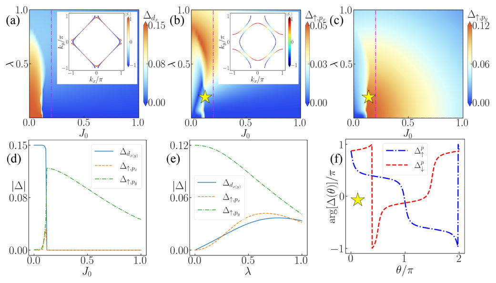 
FIG. 1. Self-consistent superconducting order parameters and their phase structure in the d-wave altermagnetic system with RSOC. (a)-(c) Magnitudes of the spin-singlet d-wave order parameter ∆d and the equal-spin triplet components ∆p x and ∆p y as functions of the altermagnetic splitting J0 and the RSOC strength λ. The insets show the Fermi surfaces for (a) λ = 0, J0 = 0.01 and (b) λ = 0.2, J0 = 0.2. (d) Order parameters as functions of J0 at λ = 0. (e) Order parameters as functions of λ at fixed J0 = 0.2. (f) Phase of the equal-spin triplet pairing along the Fermi surface for the spin-up and spin-down sectors at the star-marked point (λ = 0.2, J0 = 0.12).

📷 Fig 2

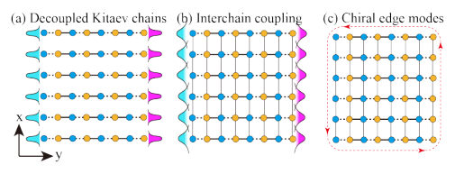 
FIG. 3. Schematic illustration of the evolution from decou- pled Kitaev chains to a two-dimensional Majorana edge mode. (a) Decoupled Kitaev chains stacked along the x direction, each hosting Majorana zero modes at its two ends. (b) Inter- chain coupling hybridizes the boundary Majorana modes. (c) In the coupled two-dimensional limit, the hybridized Majo- rana modes form a dispersive edge channel along the bound- ary.

📷 Fig 3

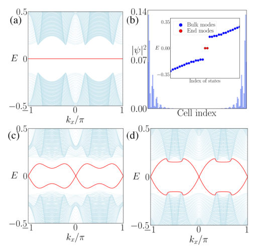 
FIG. 2. Boundary spectra and zero-mode wave functions of the self-consistent superconducting phases with J0 = 0.12. (a) Cylinder spectrum at λ = 0. (b) Energy levels and spatial distributions of the two zero-energy states at a representative momentum kx = 0 selected from (a). (c) Cylinder spectrum at λ = 0.3. (d) Cylinder spectrum at λ = 0.6.

📷 Fig 4

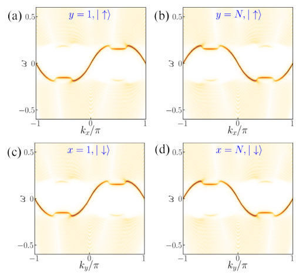 
FIG. 4. Spin-resolved boundary spectral functions calculated from the Green’s function with J0 = 0.12 and λ = 0.6. (a) Spin-up spectral weight at the lower edge (y = 1). (b) Spin- up spectral weight at the upper edge (y = N). (c) Spin- down spectral weight at the left edge (x = 1). (d) Spin-down spectral weight at the right edge (x = N). The boundary states exhibit clear dispersion, with opposite slopes near k = 0 and k = π.

**Summary.** This paper demonstrates that altermagnetic spin splitting acts as an intrinsic mechanism to select anisotropic triplet pairing in superconductors. It reveals that this symmetry leads to a unique spin-edge locking effect, where the spin of Majorana boundary states is determined by the crystal edge orientation.

**Why it may be interesting.** not directly relevant

Detailed structure

**Main problem.** The study investigates how altermagnetic spin splitting selects specific superconducting pairing symmetries and how this anisotropy influences the topological properties of boundary states.

**Main result.** Altermagnetic spin splitting suppresses singlet pairing and stabilizes anisotropic equal-spin triplet order, leading to spin-edge locking where boundary spin polarization is tied to edge orientation.

**Method.** The authors use a self-consistent mean-field Bogoliubov-de Gennes (BdG) framework, Ginzburg-Landau theory, and Green's function approach for spectral analysis.

**Model / system.** A two-dimensional d-wave altermagnetic metal model featuring momentum-dependent spin splitting, Rashba spin-orbit coupling, and short-range attractive interactions.

**Key observables.** Pairing amplitudes (singlet and triplet), Majorana boundary states, spin-resolved boundary spectral functions, and momentum-space phase winding numbers.

**Important parameters / regimes.** Altermagnetic exchange splitting (J0), Rashba spin-orbit coupling strength (lambda), hopping parameter (t0), and interaction strength (V).

**Assumptions / limitations.** The model is a minimal effective two-band projection of a more complex system and assumes short-range attractive interactions on nearest-neighbor bonds.

**Figures summary.** Figure 1 shows order parameter magnitudes and Fermi surfaces; Figure 2/3 illustrates the evolution of Majorana modes from flat to dispersive; Figure 4 displays spin-resolved boundary spectral weights.

**Paper structure.** The paper introduces the altermagnetic model, performs self-consistent calculations of pairing symmetry, analyzes the topological phase winding, investigates the effect of Rashba coupling on edge states, and concludes with the discovery of spin-edge locking.

Abstract

We investigate self-consistent unconventional superconductivity in a two-dimensional $d$-wave altermagnetic metal. We find that momentum-dependent altermagnetic spin splitting suppresses opposite-spin singlet pairing and stabilizes highly anisotropic equal-spin triplet order. In the spin-conserving limit, this directional triplet pairing gives rise to nearly dispersionless Majorana boundary states associated with effective one-dimensional topological channels. Rashba spin-orbit coupling mixes spin sectors, activates additional pairing components, and drives the system into a mixed-parity superconducting state with dispersive Majorana boundary states. The spin-resolved boundary spectra further reveal a characteristic locking between boundary orientation and spin polarization, reflecting the underlying altermagnetic symmetry. These results identify altermagnetic spin splitting as an intrinsic mechanism for selecting unconventional pairing and generating spin-resolved Majorana boundary states without external magnetic fields.

[↑ back to top](#top)

### [Disorder effect on the superfluid density and the origin of the pseudogap end point in the cuprate superconductors](http://arxiv.org/abs/2605.17227v1)

**Authors:** Rong Cheng, Tao Li, Jianhua Yang  
**Type:** theory · **Category:** strongly correlated electrons · **PDF:** <https://arxiv.org/pdf/2605.17227v1>  
**Analysis basis:** full PDF text, analyzed in chunks

📷 Fig 1

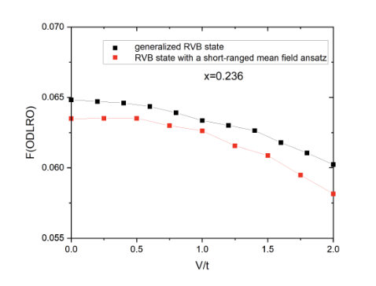 
FIG. 1: The evolution of the ODLRO with the strength of the disorder potential at x = 0.236 in the optimized RVB ground state. The calculation is done on a 12×12 lattice with periodic boundary condition in x-direction and anti-periodic boundary condition in y-direction. For purpose of comparison, we have also presented our previous result obtained on the RVB state with a short-ranged mean field ansatz.

📷 Fig 2

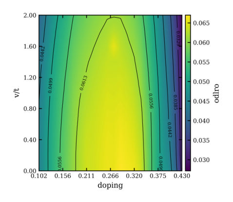 
FIG. 2: The doping-disorder strength evolution of the ODLRO computed in the optimized RVB ground state of the 2D t −J model. The calculation is done on a 16 × 16 lattice with periodic boundary condition in the x-direction and anti- periodic boundary condition in the y-direction.

📷 Fig 3

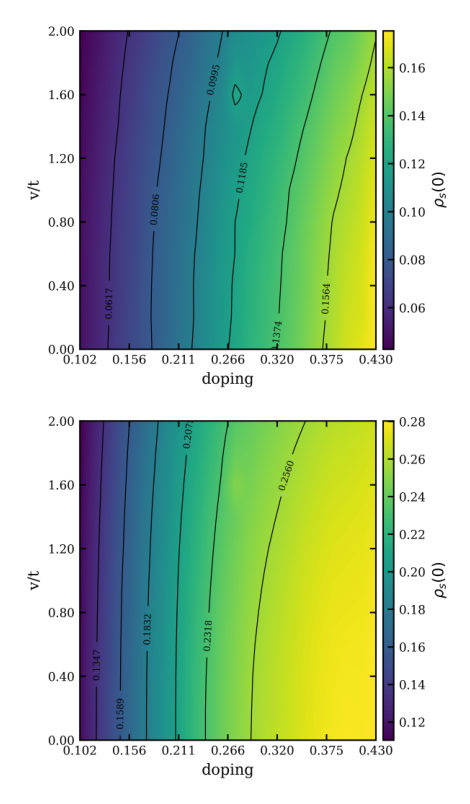 
FIG. 3: The doping-disorder strength evolution of ρs com- puted with the two-component wave function Eq.36(upper panel) and its generalization Eq.41(lower panel) for the dis- ordered 2D t −J model. The calculation is done on a 16 × 16 lattice with periodic boundary condition in the x-direction and anti-periodic boundary condition in the y-direction.

📷 Fig 4

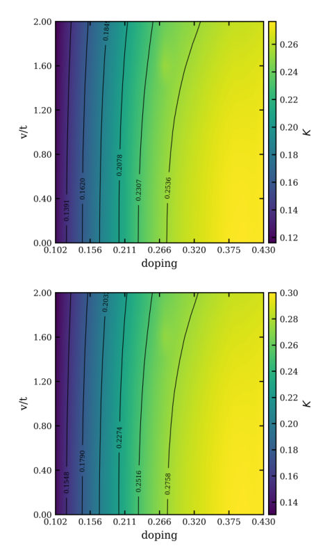 
FIG. 4: The doping-disorder strength evolution of the to- tal optical weight K computed with the two-component wave function Eq.36(upper panel) and its generalization Eq.41(lower panel) for the disordered 2D t −J model. The calculation is done on a 16 × 16 lattice with periodic bound- ary condition in the x-direction and anti-periodic boundary condition in the y-direction.

📷 Fig 5

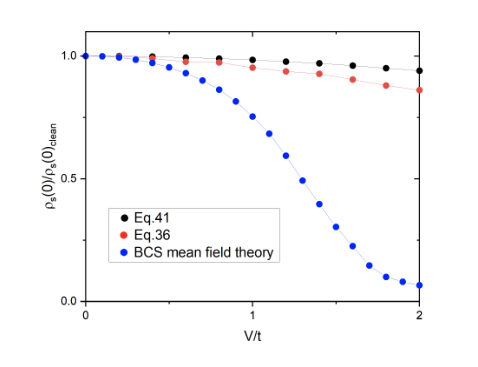 
FIG. 6: Comparison between the zero temperature superfluid density computed from the RVB theory and the BCS mean field theory. Plotted here is the zero temperature superfluid density ρs(0) normalized by its clean limit value, which is de- noted here as ρs(0)clean. The BCS mean field calculation is performed on a 6400 × 6400 lattice with the supercell trick. Here each supercell is of size 32 and there are 200 × 200 such supercells tiled periodically in both the x-direction and the y-direction. The RVB result for the normalized zero temper- ature superfluid density computed with the two-component wave function Eq.36 and Eq.41 are very similar to each other. The calculation for the RVB theory...

**Summary.** The paper investigates how disorder affects the superfluid density in cuprate superconductors using a variational RVB approach to the t-J model. It demonstrates that strong correlations protect superconductivity from disorder in the underdoped regime, providing evidence for a Mott transition at the pseudogap end point. This explains the non-monotonic doping dependence of the superfluid density.

**Why it may be interesting.** not directly relevant

Detailed structure

**Main problem.** Understanding the origin of the pseudogap end point in cuprate superconductors and explaining why the superfluid density reaches a maximum at this critical doping despite a monotonic increase in Drude weight.

**Main result.** The study finds that d-wave superconductivity in the underdoped regime is remarkably robust against disorder due to intrinsic electron incoherence from strong correlations, whereas the overdoped regime is fragile, supporting a Mott transition at the pseudogap end point.

**Method.** A two-step variational theory using an unrestricted optimization of a Resonating Valence Bond (RVB) ground state and a construction of a variational state for the paramagnetic current response.

**Model / system.** The 2D disordered t-J model, which incorporates strong electron correlations and a no-double-occupancy constraint, compared against a BCS mean-field model.

**Key observables.** Zero-temperature superfluid density (rho_s(0)), Off-Diagonal Long-Range Order (ODLRO), total optical weight (K), and the ratio of superfluid density to optical weight (r).

**Important parameters / regimes.** Doping concentration (x), disorder strength (V/t), Heisenberg exchange coupling (J/t), and next-nearest-neighbor hopping (t'/t).

**Assumptions / limitations.** The variational approach is semi-quantitative; the ground state is assumed to be superconducting; the BCS comparison ignores the no-double-occupancy constraint.

**Figures summary.** Figure 1 shows ODLRO evolution with disorder; Figure 2 maps ODLRO across doping and disorder; Figure 3 shows superfluid density evolution; Figure 6 compares normalized superfluid density between RVB and BCS theories.

**Paper structure.** The paper introduces the problem of the pseudogap end point, defines the disordered t-J model and the RVB variational framework, details the numerical optimization and current response calculation, compares results with BCS theory, and concludes with implications for the Mott transition.

Abstract

A major puzzle in the study of the cuprate superconductivity is the origin of the pseudogap end point. Intriguingly, such a critical doping is also where the superfluid density of the system reaches its maximum. A non-monotonic doping dependence of the superfluid density is rather unusual since the Drude weight of the cuprate system is found to increase monotonically with the doping concentration. It is generally believed that such a peculiar behavior should be attributed to both the strongly correlated nature of the cuprate system and the disorder effect. In this work, we develop a variational theory for the zero temperature superfluid density of the disordered $t-J$ model. This is achieved in two steps. First, we perform an unrestricted variational optimization of an RVB variational ground state for the disordered $t-J$ model. Second, we construct the variational state that describes the paramagnetic current response on such an RVB state. The zero temperature superfluid density $ρ_{s}(0)$ is then extracted from the curvature of the variational ground state energy of the system as a function of the external electromagnetic field. We find that $ρ_{s}(0)$ computed in this way is remarkably robust against the disorder effect. More specifically, we find that $ρ_{s}(0)$ is a monotonically increasing function of doping concentration $x$ and scales linearly with the total optical weight. This is consistent with the observation in the underdoped cuprates but is strongly at odd with the behavior in the overdoped cuprates. The strong contrast between the disorder effect in the underdoped and the overdoped regime lends strong support to our previous proposal that there exist a Mott transition between a doped-Mott-insulating metal in the underdoped regime and a fermi-liquid-like metal in the overdoped regime around the pseudogap end point.

[↑ back to top](#top)

### [Emergent supersymmetry in a time-space inverted quantum mechanics](http://arxiv.org/abs/2605.17507v1)

**Authors:** Marcus W Beims, Arlans JS de Lara  
**Type:** theory · **Category:** other · **PDF:** <https://arxiv.org/pdf/2605.17507v1>  
**Analysis basis:** full PDF text, analyzed in chunks

📷 Fig 1

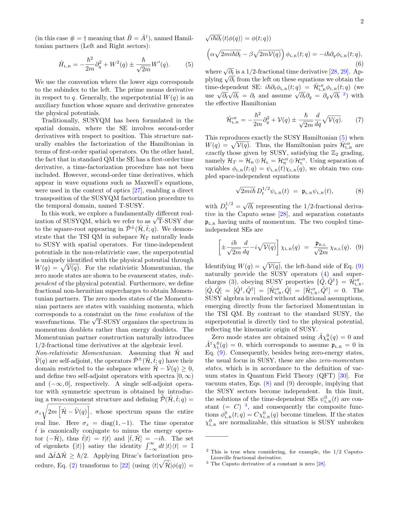 
Low-resolution page preview, page 2

📷 Fig 2

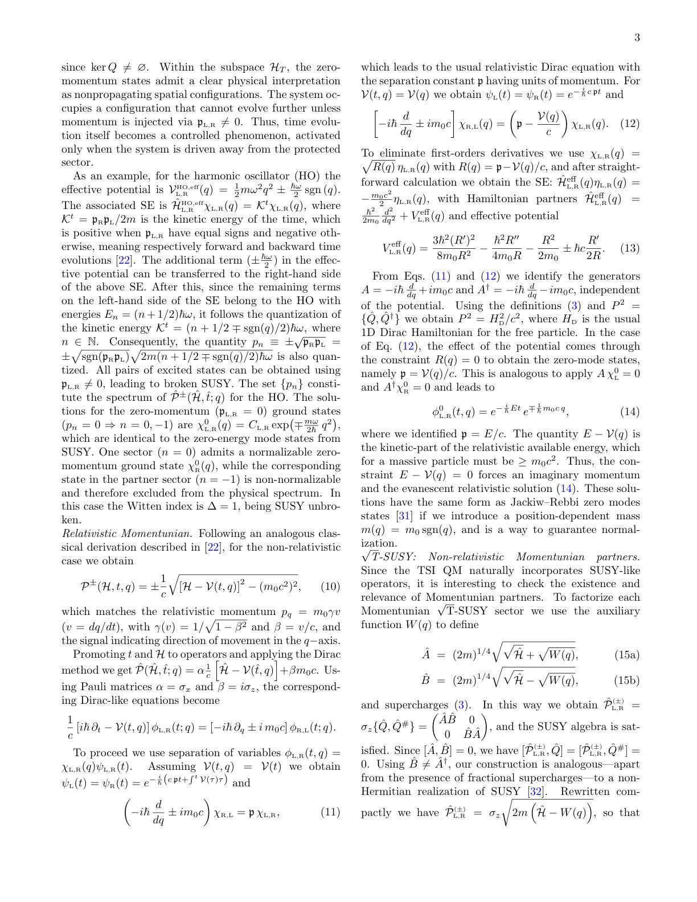 
Low-resolution page preview, page 3

📷 Fig 3

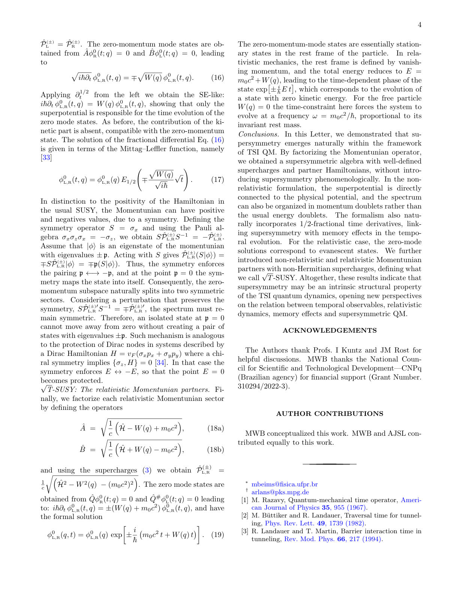 
Low-resolution page preview, page 4

📷 Fig 4

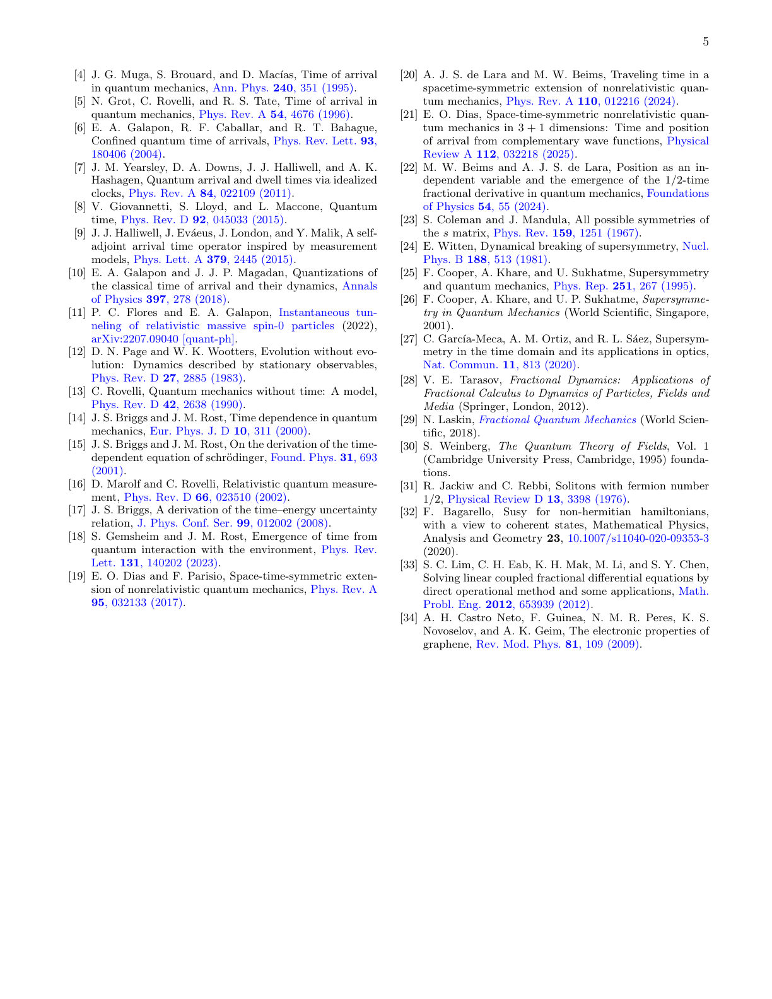 
Low-resolution page preview, page 5

**Summary.** This paper shows that supersymmetry is an inherent feature of a quantum mechanical framework where space and time roles are inverted. By factorizing a specific 'Momentunian' operator, the authors derive a new class of SUSY that naturally incorporates memory effects through fractional calculus. This suggests that SUSY can be a structural consequence of space-time symmetry rather than an added assumption.

**Why it may be interesting.** not directly relevant

Detailed structure

**Main problem.** Investigating whether supersymmetry (SUSY) can emerge as an intrinsic structural property of a space-time symmetric framework rather than being imposed phenomenologically.

**Main result.** The authors demonstrate that supersymmetry emerges naturally from the factorization of the 'Momentunian' operator within the Time-Space Inverted (TSI) quantum mechanics framework, leading to momentum doublets and memory effects via fractional derivatives.

**Method.** The study employs Dirac's factorization procedure on the Momentunian operator, uses separation of variables for wavefunctions, and applies fractional calculus (Caputo sense) to handle 1/2-fractional time derivatives.

**Model / system.** The framework is Time-Space Inverted (TSI) quantum mechanics, which treats time as an operator and position as a parameter, encompassing both non-relativistic and relativistic (Dirac-like) regimes.

**Key observables.** Momentum doublets (p and -p), zero-mode states (zero energy or zero momentum), and the Witten index.

**Important parameters / regimes.** Kinetic energy of time (Kt), rest mass (m0), speed of light (c), and the 1/2-fractional time derivative.

**Assumptions / limitations.** The framework assumes a space-time symmetric (STS) structure where the roles of space and time are inverted.

**Paper structure.** The paper introduces the TSI QM framework, derives the Momentunian operator, demonstrates the factorization leading to emergent SUSY, explores both non-relativistic and relativistic cases, and provides a case study using the Harmonic Oscillator.

Abstract

This Letter shows that a supersymmetric structure is inherent to the time space inverted (TSI) quantum mechanics (QM) framework, where the spatial evolution of states is generated by the operator $\hat{\mathcal{P}}^{\pm}(\hat{\mathcal{H}},\hat t;q)=\pm\sqrt{2m[\hat{\mathcal{H}}-\mathcal{\hat V}(q)]}$ [\href{https://doi.org/10.1103/PhysRevA.95.032133}{Phys. Rev. A. {\bf 95}, 032133 (2017)}], named here Momentunian, whose square-root structure that can be factorized. Such factorization leads directly to a supersymmetric algebra with supercharges and partner Hamiltonians. For the relativistic Momentunian the zero mode states are shown to be evanescent states, \textit{independent} of the physical potential. Furthermore, the existence of non-relativistic and relativistic Momentunian \textit{partners} is demonstrated, whose zero-mode states are no longer necessarily zero energies, but vanishing momenta states. The natural emergence of the $1/2$-fractional time derivatives in the TSI QM, leads to supercharges which incorporate memory effects into the supersymmetric wave functions. Results indicate that supersymmetry emerges as a structural property of the TSI QM rather than being imposed phenomenologically.

[↑ back to top](#top)

### [End-to-End Formalization of Quantum Error Correction](http://arxiv.org/abs/2605.16523v1)

**Authors:** Mattias Ehatamm, Yi Lee, Xiaodi Wu, Runzhou Tao  
**Type:** theory · **Category:** quantum information and computing · **PDF:** <https://arxiv.org/pdf/2605.16523v1>  
**Analysis basis:** full PDF text, analyzed in chunks

📷 Fig 1

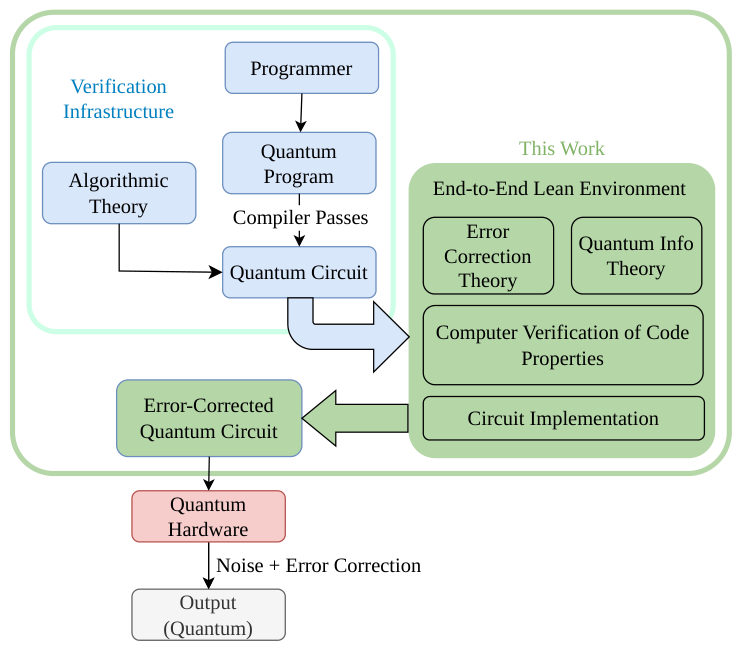 
Figure 1: Verification workflow for fault-tolerant quantum programs. Lean-QEC occupies the QEC layer of this pipeline.

📷 Fig 2

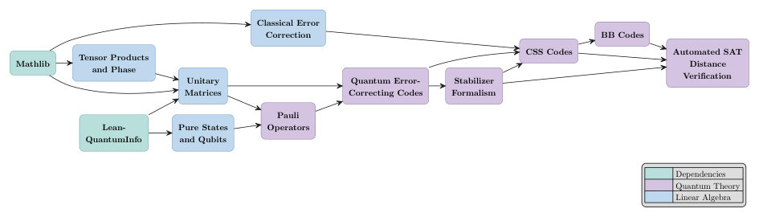 
Figure 2: Map of the formalized quantum-error-correction stack. Arrows are machine-checked correspondence theorems; the rightmost layer feeds into the SAT-based distance pipeline of Section 4.

**Summary.** This paper introduces Lean-QEC, a formal verification framework in Lean 4 that automates the proof of distance bounds for large-scale quantum error-correcting codes. By bridging high-level quantum theory with efficient SAT-based computation, it enables machine-checked certificates for codes that were previously too large for manual or formal verification. This provides a critical layer of trust for the development of fault-tolerant quantum computing.

**Why it may be interesting.** not directly relevant

Detailed structure

**Main problem.** Certifying the distance of large-scale quantum error-correcting codes (QECCs) is NP-hard, creating a 'trust gap' between unverified symbolic solvers and unscalable manual proofs.

**Main result.** The authors developed Lean-QEC, a Lean 4 library that provides end-to-end, machine-checked distance certificates for industrial-scale stabilizer codes, including Bivariate Bicycle codes up to 144 qubits.

**Method.** The framework uses a verified reduction to translate the distance condition into a Boolean satisfiability (SAT) problem, utilizing BitVec-flattened encoding and error-location encoding to ensure scalability within the Lean kernel.

**Model / system.** The paper focuses on stabilizer codes, specifically CSS and Bivariate Bicycle (BB) families, modeled using the Pauli group and binary symplectic representation.

**Key observables.** Code distance (d), Pauli weight, and stabilizer generators.

**Important parameters / regimes.** Scalability up to 144 qubits; specific verified codes include [[90, 8, 10]] and [[70, 6, 9]] BB codes.

**Assumptions / limitations.** The binary symplectic representation assumes phase information loss is irrelevant for distance arguments; the solver (CaDiCaL) is not trusted, but its output is verified via LRAT certificates.

**Figures summary.** Figure 1 shows a workflow diagram of the quantum verification hierarchy; Figure 2 maps the formalized QEC stack; Figure 3 illustrates the equivalence of tensor products and unfolded Pauli operators.

**Paper structure.** The paper introduces the trust gap in QEC, presents the Lean-QEC library architecture, details the mathematical formalization of the Pauli group and stabilizer codes, describes the SAT-based reduction pipeline and optimization techniques, and validates the framework with case studies ranging from the Shor code to large-scale BB codes.

Abstract

Quantum error-correcting codes (QECCs) sit between noisy quantum hardware and reliable computation, so the code parameters used in practice must be trustworthy. The single number that summarizes a code's strength is its distance, yet certifying a distance lower bound is NP-hard in general, placing it beyond the reach of pen-and-paper proofs as well as direct proof-assistant scripting. As a result, distance values in the literature come either from non-scaling hand proofs, or from unverified solvers that leave a trust gap exactly where the code is supposed to provide a guarantee. We present Lean-QEC, the first Lean 4 formalization of stabilizer-code theory that delivers end-to-end, machine-checked distance certificates at industrial code sizes. Lean-QEC formalizes the linear algebra of qubit states, the Pauli group, stabilizer codes, the binary symplectic representation, classical coding theory, and the CSS and Bivariate Bicycle families. To break the combinatorial barrier, Lean-QEC translates the distance condition into a Boolean satisfiability formula through a verified reduction. The pipeline scales through a BitVec-flattened encoding that replaces Lean's Matrix representation, and an error-location encoding that reduces the variable count from $n$ to $k\lceil \log_2 n\rceil$. With these, we obtain automatically-generated Lean-checked distance proofs for a large range of industrially viable qLDPC codes within the Bivariate Bicycle and Generalized Bicycle families, including [[90, 8, 10]] and [[70, 6, 9]] BB codes, with the formulation scaling up to 144 qubits when performed outside the Lean kernel. The resulting library is reusable and is designed to plug into broader Lean-based efforts toward end-to-end verification of fault-tolerant quantum computation.

[↑ back to top](#top)

### [Enhanced $s^\pm$-wave superconductivity in electron-doped La$_3$Ni$_2$O$_7$](http://arxiv.org/abs/2605.17520v1)

**Authors:** Xun Liu, Chao Deng, Wenfeng Wu, Liang Si, Mi Jiang  
**Type:** theory · **Category:** strongly correlated electrons · **PDF:** <https://arxiv.org/pdf/2605.17520v1>  
**Analysis basis:** full PDF text, analyzed in chunks

📷 Fig 1

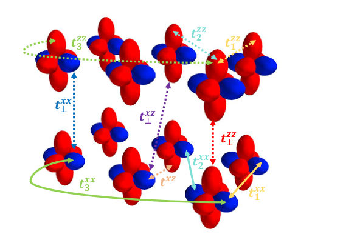 
FIG. 1. Schematic illustration of the bilayer two-orbital model on a square lattice. The model incorporates three types of hoppings: (1) intralayer intra-orbital hoppings: nearest-neighbor (txx/zz 1 ), next-nearest-neighbor (txx/zz 2 ), and next-next-nearest-neighbor (txx/zz 3 ); (2) intralayer inter- orbital hopping (txz); and (3) interlayer hoppings: intra- orbital (txx/zz ⊥ ) and inter-orbital (txz ⊥). The values of these parameters for 0 Gpa, 15 Gpa and LaNi(Al)O are listed in Table.S1 in Supplementary [11].

📷 Fig 2

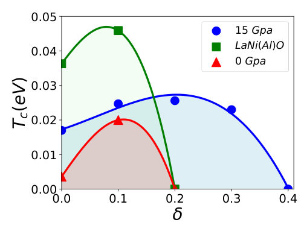 
FIG. 2. Extrapolated Tc as a function of electron doping level δ for three different cases with the Nc = 4 × 2 cluster.

📷 Fig 3

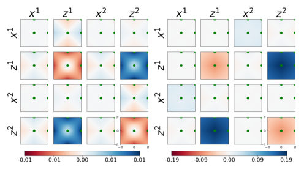 
FIG. 3. Characteristic BSE eigenvectors revealing stronger interlayer pairing for two distinct cases at their lowest accessible temperatures: (left) LaNi(Al)O with electron doping level δ = 0.1 at T = 0.06 eV; (right) 15 GPa with δ = 0.3 at T = 0.09 eV. The label lm denotes orbital l in layer m.

📷 Fig 4

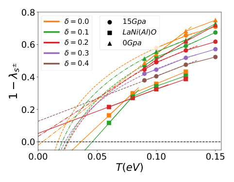 
FIG. 4. Temperature dependence of the eigenvalue 1 −λs± for extrapolating Tc under three distinct conditions: 15 GPa (circles) with doping levels δ = 0.0, 0.1, 0.2, 0.3, 0.4; and 0 GPa (squares) and LaNi(Al)O (triangles) both with δ = 0.0, 0.1, 0.2.

📷 Fig 5

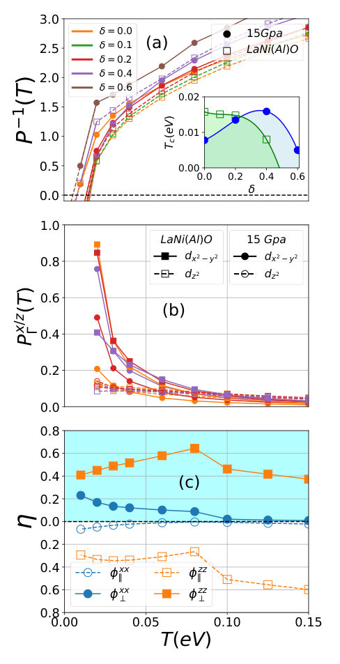 
FIG. 5. (a) Temperature dependence of the inverse of s±- wave pair-field susceptibility P −1(T) for the 15 GPa and LaNi(Al)O cases under different electron doping levels δ. The inset shows the corresponding extrapolated Tc obtained from P −1(Tc) = 0; (b) Orbital-resolved components (P x Γ and P z Γ) of the interacting part of s±-wave pair-field susceptibility at δ = 0.0, 0.2, and 0.4 for both cases; (c) Characteristic temperature evolution of the weights η (defined in the main text) for the orbital-resolved intralayer (ϕxx/zz ∥ ) and interlayer

**Summary.** This paper provides the first theoretical prediction that electron doping enhances superconductivity in Ruddlesden-Popper nickelates. It identifies a cooperative mechanism between d_{x2-y2} and d_{z2} orbitals and suggests that heterostructures could achieve higher transition temperatures. This work offers a new direction for experimentalists seeking to control superconductivity in nickelate-based materials.

**Why it may be interesting.** not directly relevant

Detailed structure

**Main problem.** Investigating the effect of electron doping on the $s^\pm$-wave superconducting pairing in Ruddlesden-Popper nickelates, specifically addressing the lack of research on the electron-doped regime compared to the hole-doped regime.

**Main result.** Electron doping generically enhances $s^\pm$-wave superconductivity in bulk La3Ni2O7 and LaNi(Al)O heterostructures, driven by a cooperative mechanism where pairing on the d_{x2-y2} orbital is induced by the d_{z2} orbital.

**Method.** The study uses first-principles DFT to obtain hopping parameters and large-scale Dynamical Cluster Approximation (DCA) with a continuous-time quantum Monte Carlo (CT-QMC) solver to solve the Bethe-Salpeter equation.

**Model / system.** A bilayer two-orbital tight-binding model on a 2D square lattice representing La3Ni2O7 at 0 GPa, 15 GPa, and a La3Ni2O7:La3Al2O7 heterostructure, including intra- and inter-orbital Coulomb interactions and Hund's coupling.

**Key observables.** Superconducting transition temperature (Tc), s+/--wave pairing symmetry, pair-field susceptibility, and orbital-resolved pairing components.

**Important parameters / regimes.** Electron doping level (delta), pressure (0 GPa vs 15 GPa), Hubbard U (4.0 eV), inter-orbital U' (2.4 eV), and Hund's coupling J (0.8 eV).

**Assumptions / limitations.** The DCA method approximates long-range physics via a mean-field bath, and the self-energy is assumed to be constant within each Brillouin zone patch.

**Figures summary.** Figure 1 shows a schematic of the bilayer two-orbital model; Figure 4 illustrates the temperature dependence of the BSE eigenvalue for different doping levels under various pressure/heterostructure conditions.

**Paper structure.** The paper introduces the problem of electron doping in nickelates, describes the DFT-derived two-orbital model and DCA methodology, presents results on Tc enhancement and orbital-resolved pairing, and concludes with the proposed inter-orbital cooperative mechanism.

Abstract

In cuprates, electron doping yields a much lower superconducting $T_c$ than hole doping. For recently discovered nickelate superconductors, the analogous doping strategies become more challenging. Consequently, while hole-doped Ruddlesden-Popper (RP) nickelates have been extensively studied, electron-doped RP nickelates remain rarely explored both experimentally and theoretically. Here we fill this gap by systematically investigating the two-orbital bilayer model for three representative systems: bulk La$_3$Ni$_2$O$_7$ at ambient pressure and 15\,GPa, and a heterostructure La$_3$Ni$_2$O$_7$:La$_3$Al$_2$O$_7$ that provides a feasible experimental route to electron doping. Using first-principle calculations and large-scale dynamical cluster quantum Monte Carlo simulations, we find that electron doping generically enhances $s^\pm$-wave pairing superconductivity (SC) in all three cases, with the heterostructure showing the highest $T_c$ in the underdoped regime. Furthermore, our results suggest an inter-orbital cooperative mechanism that the pairing on the $d_{x^2-y^2}$ orbital, induced by that on the $d_{z^2}$ orbital, plays vital role in the SC. This work provides the first theoretical prediction of enhanced SC in electron-doped RP nickelates and calls for future experimental verification.

[↑ back to top](#top)

### [Exact classical emergence from high-energy quantum superpositions](http://arxiv.org/abs/2605.16518v1)

**Authors:** Juan A. Cañas, Daniel A. Bonilla, J. Bernal, A. Martín-Ruiz  
**Type:** theory · **Category:** other · **PDF:** <https://arxiv.org/pdf/2605.16518v1>  
**Analysis basis:** full PDF text, analyzed in chunks

📷 Fig 1

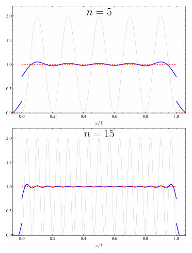 
Figure 1: Dimensionless plots of QPD 𝐿𝜌qm 𝑛(𝑥) (continuous gray), asymptotic distribution 𝐿𝜌a 𝑛(𝑥) (continous blue) and CPD 𝐿𝜌cl(𝑥) (dashed red) for the quantum numbers 𝑛= 5 (top) and 𝑛= 15 (bottom). As discussed in [11], both the small-scale quantum oscillations and the anomalous behavior near the box walls arise from the relatively low values of 𝑛considered here. In a truly classical regime, these features would be strongly suppressed.

📷 Fig 2

 
Figure 2: Plots of the interference term 𝐿𝜌qm 𝛼(𝑥) (gray), its large-𝑛asymptotic behavior 𝐿𝜌a 𝛼(𝑥) (blue), and the 𝑛→∞ limit from eq. (23) (red dashed), for 𝛼= 1 (top) and 𝛼= 4 (bottom), 𝑛= 15 in both cases. Unlike the case of pure eigen- states, the asymptotic behavior does not represent a local average of the quantum oscillations; instead, it functions as a functional envelope for the interference terms.

📷 Fig 3

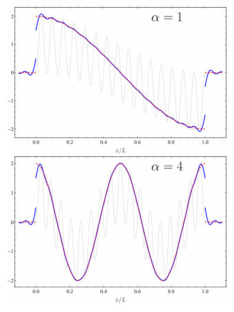 
Figure 2 compares the exact quantum interference terms with their asymptotic form for different values of 𝑛. The figure clearly shows that the interference contributions do not vanish in the large-𝑛limit. Instead, they approach the bounded oscillatory envelope given by Eq. (23). The persistence of these interference contributions does not signal a breakdown of the correspondence principle. Rather, it reflects the spectral structure of the system in the high-energy regime. Indeed, for large quantum numbers the eigenstates 𝜓𝑛and 𝜓𝑛+𝛼become progressively closer in energy and structure. Since the spectrum of the ISW grows quadratically with 𝑛, the energy separation between nearby levels behaves...

📷 Fig 4

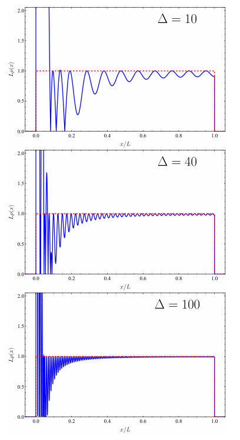 
Figure 3: Plots of probability distributions for the superposi- tion of states defined in Eq. (28) (blue) for Δ = 10 (top), Δ = 40 (middle) and Δ = 100 (bottom). The corresponding CPD is shown for comparison (red dashed). The deviation between the quantum and classical distributions, more pronounced at lower Δ values, vanishes in the formal limit Δ →∞.

📷 Fig 5

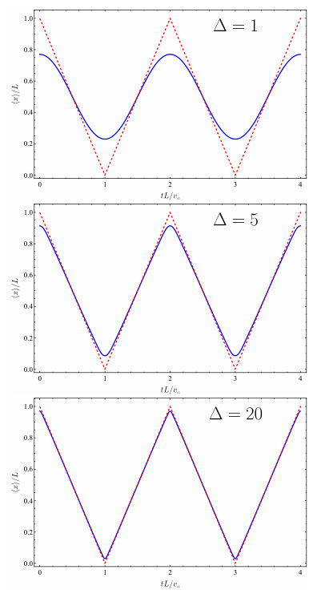 
Figure 4: Plots of the time evolution of the position expecta- tion value ⟨𝑥⟩(blue solid line) for Δ = 1 (top), Δ = 5 (middle) and Δ = 20 (bottom). The classical trajectory 𝑥(𝑡) of a particle in the ISW is shown for comparison (red dashed line). The superposition of high-energy eigenstates clearly reproduces the classical behavior, with the agreement improving as Δ increases.

**Summary.** This paper provides a rigorous mathematical proof that classical behavior emerges from high-energy quantum superpositions without needing environmental decoherence. It demonstrates that even though quantum interference terms persist, they organize into a smooth envelope that recovers classical probability and trajectories in the macroscopic limit.

**Why it may be interesting.** not directly relevant

Detailed structure

**Main problem.** Investigating the validity of the correspondence principle for high-energy quantum superpositions, specifically whether persistent interference terms prevent the convergence of quantum probability density to classical density.

**Main result.** The authors prove that while interference terms do not vanish, they organize into a functional envelope that allows the total probability density and position expectation value to converge exactly to classical distributions in the large-n and large-Delta limits.

**Method.** A fully analytical Fourier-based approach using asymptotic expansions, geometric series of quantum Fourier coefficients, and special functions like the Lerch transcendent and polylogarithms.

**Model / system.** An isolated, one-dimensional infinite square well containing a particle in an equiprobable superposition of high-energy eigenstates.

**Key observables.** Quantum probability density (QPD), classical probability density (CPD), and the expectation value of position <x>(t).

**Important parameters / regimes.** High-energy limit (n -> infinity), number of superposed states (Delta -> infinity), and spatial/momentum resolution scales.

**Assumptions / limitations.** The system is an isolated bound system without environmental decoherence; the superposition is assumed to be equiprobable.

**Figures summary.** Figure 1 shows the convergence of QPD to CPD for different n; Figure 2 illustrates interference terms acting as an asymptotic envelope; Figure 3 shows the approach to classical distribution as Delta increases; Figure 4 compares the time evolution of <x>(t) to the classical triangular trajectory.

**Paper structure.** The paper begins by defining the problem of the correspondence principle in superpositions, moves to a Fourier-based analytical framework, derives asymptotic expressions for interference and density, proves convergence in the large-Delta limit, and concludes with dynamical verification via position expectation values.

Abstract

We examine the correspondence principle for an equiprobable superposition of high-energy eigenstates of the infinite square well using a fully analytical Fourier-based approach. We derive a closed-form asymptotic expression for the interference terms $ρ_α^{\text{a}}(x)$ by expanding them into a geometric series of quantum Fourier coefficients. We show these terms act as functional envelopes that do not vanish individually but become asymptotically equivalent in the large-$n$ limit. Furthermore, we prove the total probability density for a superposition of $2Δ+1$ states converges exactly to the uniform classical distribution as $Δ\to \infty$. Dynamically, the expectation value of position reproduces the classical triangular trajectory asymptotically. Residual quantum deviations remain confined to boundary layers whose relative width vanishes under macroscopic resolution. These results establish a rigorous asymptotic realization of the classical limit for isolated bound systems in both static and dynamical contexts.

[↑ back to top](#top)

### [Exact solution and pair correlation functions for a generalized three-chain Ising tube with multispin interactions](http://arxiv.org/abs/2605.17600v1)

**Authors:** Pavel Khrapov, Nikita Volkov  
**Type:** theory · **Category:** statistical mechanics · **PDF:** <https://arxiv.org/pdf/2605.17600v1>  
**Analysis basis:** full PDF text, analyzed in chunks

📷 Fig 1

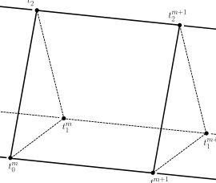 
FIG. 1. Three-chain lattice of the Ising tube.

📷 Fig 2

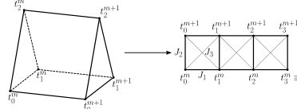 
FIG. 2. Planar Ising model with nearest-neighbor, next- nearest-neighbor, and plaquette interactions obtained by un- folding the three-chain Ising tube into the plane.

📷 Fig 3

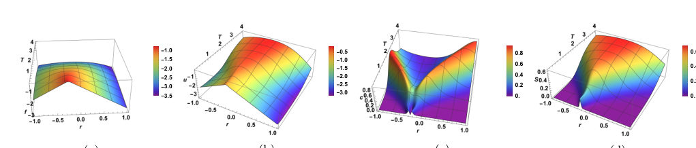 
FIG. 3. Planar model with nearest-neighbor, next-nearest-neighbor, and plaquette interactions. Plots of free energy (a), internal energy (b), specific heat (c) and entropy (d) for the case of Jpl 1 = Jpl 2 = 1

📷 Fig 4

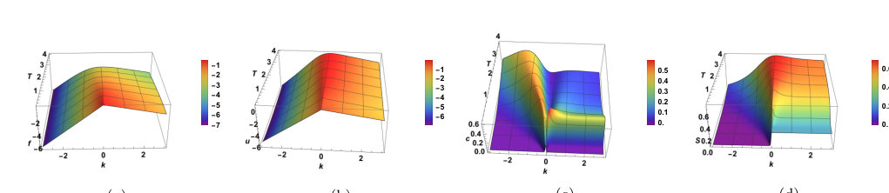 
FIG. 4. Planar gonihedric model. Plots of free energy (a), internal energy (b), specific heat (c) and entropy (d) of the gonihedric model at k ∈[−3, 3], T ∈[0.1, 4].

📷 Fig 5

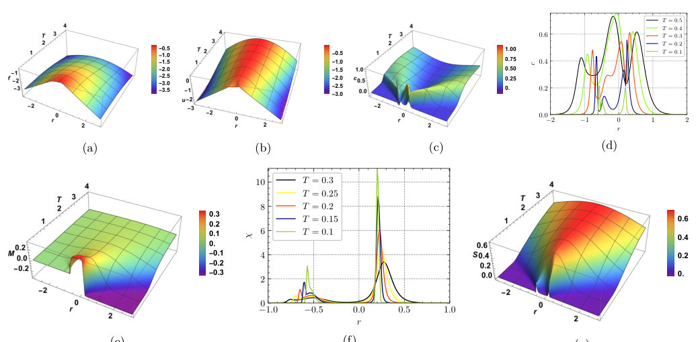 
FIG. 6. Planar triangular model. Plots of the free energy (a), internal energy (b), specific heat (c), selected cross sections of the specific heat (d), magnetization (e), selected cross sections of the susceptibility (f), and entropy (g) for the triangular model with J∆ 1 = −0.1, J∆ 2 = −0.11, J∆ 4 = −0.12, J∆ 5 = −0.13, h = 0.15, J∆ 3 = r, T ∈[0.1, 4].

**Summary.** This paper provides an exact analytical solution for a complex 1D-like Ising tube with various multi-spin interactions. It characterizes the thermodynamic properties and phase transitions of the system, specifically highlighting interesting residual entropy behaviors in the gonihedric limit.

**Why it may be interesting.** not directly relevant

Detailed structure

**Main problem.** Obtaining an exact solution and pair correlation functions for a generalized three-chain Ising tube (TCGIT) with multispin interactions.

**Main result.** The authors derive the exact partition function, thermodynamic quantities (free energy, magnetization, etc.), and pair correlation functions, including identifying a residual entropy in the gonihedric limit.

**Method.** The transfer-matrix formalism is used with an 8x8 matrix, employing symmetry exploitation, Ferrari's method for quartic equations, and the Perron-Frobenius theorem.

**Model / system.** A quasi-one-dimensional three-chain Ising tube with toroidal boundary conditions, featuring a C3-invariant Hamiltonian with 20 independent coupling constants and multispin interactions.

**Key observables.** Partition function, free energy, internal energy, specific heat, magnetization, magnetic susceptibility, entropy, and pair correlation functions.

**Important parameters / regimes.** Temperature (T), external magnetic field (h), and 20 independent coupling constants; includes thermodynamic and low-temperature limits.

**Assumptions / limitations.** The Hamiltonian is restricted to C3-invariant interactions and the system assumes toroidal boundary conditions.

**Figures summary.** Figure 1 shows the lattice structure; Figure 2 shows the unfolded planar lattice; Figures 3 and 4 plot thermodynamic quantities and entropy for the gonihedric model; Figures 7-12 map out ground-state phase diagrams and correlation length behavior.

**Paper structure.** The paper introduces the TCGIT model, applies the transfer-matrix method and symmetry reductions, derives exact thermodynamic quantities and correlation functions, analyzes special cases like the gonihedric and triangular models, and concludes with a detailed ground-state phase diagram analysis.

Abstract

We obtain an exact solution for a generalized three-chain Ising tube (TCGIT) of length $L$ with toroidal boundary conditions and the most general $C_3$-invariant Hamiltonian on an elementary prism, containing 20 independent coupling constants, including an external magnetic field. Using an $8\times 8$ transfer matrix, we derive the exact partition function of the finite system and obtain the free energy, internal energy, specific heat, magnetization, magnetic susceptibility, and entropy in the thermodynamic limit $L\to\infty$. In the general case, $λ_{\max}$ is determined by a quartic equation, whereas in the principal special case with even-spin interactions (PSC) the spectrum simplifies substantially: the characteristic polynomial factorizes, and $λ_{\max}$ is given by the root of a quadratic equation. For mirror-symmetric subfamilies, we derive explicit formulas for the pair correlation functions and express the magnetization in terms of the components of the eigenvector associated with $λ_{\max}$; in the even-spin case with $h=0$, the magnetization vanishes. Important special cases include the width-three planar model with nearest-neighbor, next-nearest-neighbor, and plaquette interactions, including the entropy limit $S(T\to0^+)=(\ln 2)/3$ for $k\ge 0$ and $S(T\to0^+)=0$ for $k<0$, as well as the width-three planar triangular model with distinct nearest-neighbor couplings, three-spin interactions involving neighboring triangles, and an external field.

[↑ back to top](#top)

### [From Constraint to Code: DQI-Kit -- A Software Framework for Decoded Quantum Interferometry](http://arxiv.org/abs/2605.16955v1)

**Authors:** Simon Thelen, Wolfgang Mauerer  
**Type:** theory · **Category:** quantum information and computing · **PDF:** <https://arxiv.org/pdf/2605.16955v1>  
**Analysis basis:** full PDF text, analyzed in chunks

📷 Fig 1

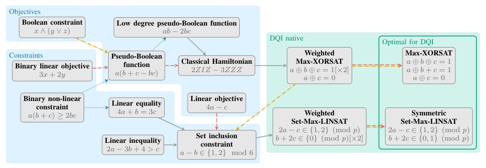 
Figure 1: Transformations between formulations implemented by DQI-Kit. Red dashed lines represent transformations that increase the number of constraints; blue dotted lines represent transformations that add additional auxiliary variables; yellow dash-dotted lines represent transformations that lead to many linearly dependent constraints often negatively impacting DQI performance; grey solid lines represent (favourable) transformations where none of the above apply.

📷 Fig 2

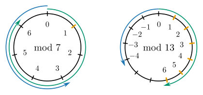 
Figure 2: Max-LINSAT encodings of integer constraints: Or- dering inequalities generally require a larger field order. In the example, we assume that a, b ∈{0, 1, 2}, so −4 ≤3a−2b ≤6.

📷 Fig 3

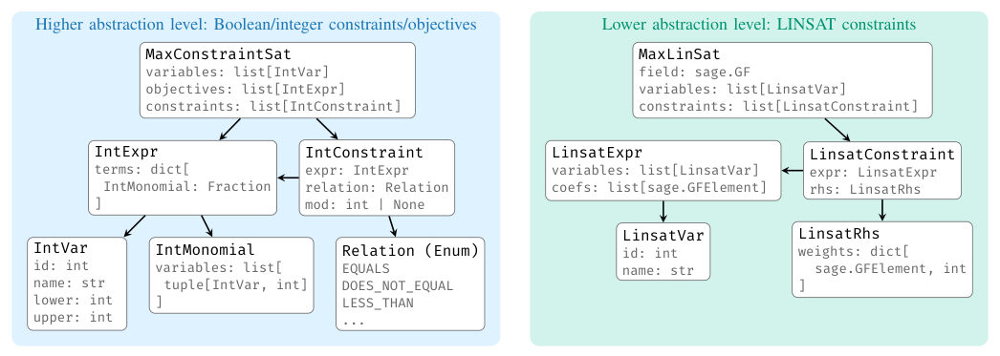 
Figure 3: Simplified class structure for the two abstraction levels of DQI-Kit: MaxLinSat for directly describing Max-LINSAT constraints and MaxConstraintSat for describing integer constraints and objectives as well as Boolean constraints.

📷 Fig 4

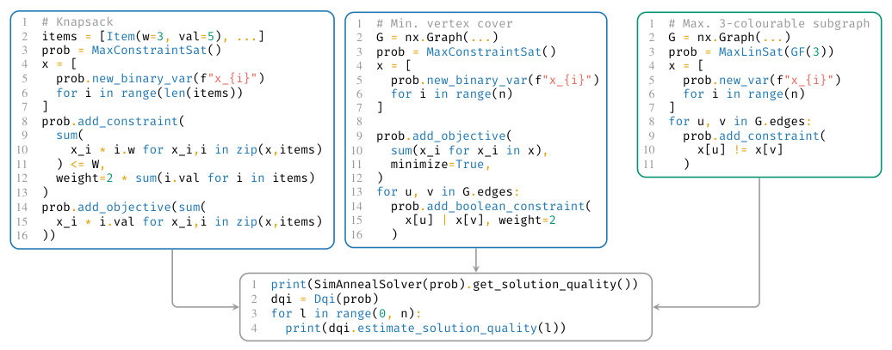 
Figure 4: Problem encoding and solution quality estimation in DQI-Kit: User-defined problem specifications supports two abstraction levels: in this example, higher-level MaxConstraintSat is used for knapsack and minimum vertex cover; lower- level abstraction MaxLinSat is used for maximum 3-colourable subgraph. DQI and classical solvers operate on both. For this, MaxConstraintSat instances are automatically transformed into Max-LINSAT.

**Summary.** The authors present DQI-Kit, a new software framework designed to automate the complex process of mapping industrial optimization problems into a format suitable for the Decoded Quantum Interferometry algorithm. By providing a unified interface for encoding constraints, the tool helps identify efficient transformation paths and estimate quantum advantage potential while mitigating performance-degrading overheads.

**Why it may be interesting.** not directly relevant

Detailed structure

**Main problem.** The difficulty of transforming complex, domain-specific optimization problems (like MILP or SAT) into the Max-LINSAT format required for Decoded Quantum Interferometry (DQI) without introducing massive overheads or performance-degrading linear dependencies.

**Main result.** The introduction of DQI-Kit, a software framework that automates the encoding of high-level constraints into DQI-compatible Max-LINSAT instances and provides tools to estimate expected quantum performance.

**Method.** The framework uses a multi-layered abstraction approach (MaxConstraintSat to MaxLinSat) to apply mathematical transformations, such as linearization, gadget-based encoding, and auxiliary variable introduction, to map objectives and constraints to finite field operations.

**Model / system.** The mathematical model is based on Decoded Quantum Interferometry (DQI), which utilizes the decoding of error-correcting codes over finite fields (Max-LINSAT and Max-XORSAT) to approximate solutions to combinatorial optimization problems.

**Key observables.** Expected number of satisfied constraints and the approximation performance of the DQI algorithm.

**Important parameters / regimes.** Minimum distance (d_min) of the underlying code, the ratio of error weight to constraints (l/m), the field order (p), and the polynomial degree (l).

**Assumptions / limitations.** The framework assumes that the performance of DQI can be estimated analytically or via sampling, and it acknowledges that current hardware cannot yet execute these industrial-scale instances.

**Figures summary.** Figure 1 shows a transformation map from various problem types to DQI formats; Figure 2 illustrates integer constraint encoding; Figure 3 displays the software architecture hierarchy; Figure 4 demonstrates code usage for different problem classes.

**Paper structure.** The paper introduces the encoding challenge, presents the DQI-Kit software architecture and abstraction layers, details specific mathematical transformation techniques for various constraints, analyzes the impact of these transformations on performance (identifying 'bad' structures), and concludes with future directions for standardization.

Abstract

Trying to solve hard optimisation problems with quantum techniques requires transformations of domain objectives and constraints into formats compatible with a chosen quantum algorithm. This often introduces inefficiencies and overheads that limit or even endanger potential quantum advantage for current and future approaches. To understand and mitigate these inefficiencies, software toolchains are essential for implementing transformations, analysing overheads and eventually selecting optimal transformation paths. Decoded Quantum Interferometry (DQI) is a novel approach that achieves apparent quantum advantage for certain algebraic optimisation problems. It natively operates on Max-LINSAT, which is unusual for combinatorial optimisation, and creates the need for software solutions that alleviate the burden of manually transforming problems of interest into this format. We present DQI-Kit, a software framework that provides a unified, extensible interface for automatically encoding constrained optimisation problems into Max-LINSAT. Users can describe the various types of objectives and constraints that are common in industrial optimisation problems. Our framework converts these into Max-LINSAT instances via a series of problem transformations and computes an estimate of the expected performance of DQI on these instances. We provide an initial analysis of the implemented transformations, discussing inefficiencies and ways to mitigate them. DQI-Kit is the basis for our ultimate goal of establishing a standardised framework that will enable further investigations to identify practical use cases for which quantum advantage with DQI can be achieved.

[↑ back to top](#top)

### [Frustration from Localized Zhang-Rice States: A Unified Theory of Doping-Driven Magnetic Transitions in Cuprates](http://arxiv.org/abs/2605.18453v1)

**Authors:** Xiaodong Wang, Ping Xu, Jiong Mei, Shao-Hang Shi, Zi-Xiang Li, Mingpu Qin, Kun Jiang, Hui-Ke Jin  
**Type:** theory · **Category:** strongly correlated electrons · **PDF:** <https://arxiv.org/pdf/2605.18453v1>  
**Analysis basis:** full PDF text, analyzed in chunks

📷 Fig 1

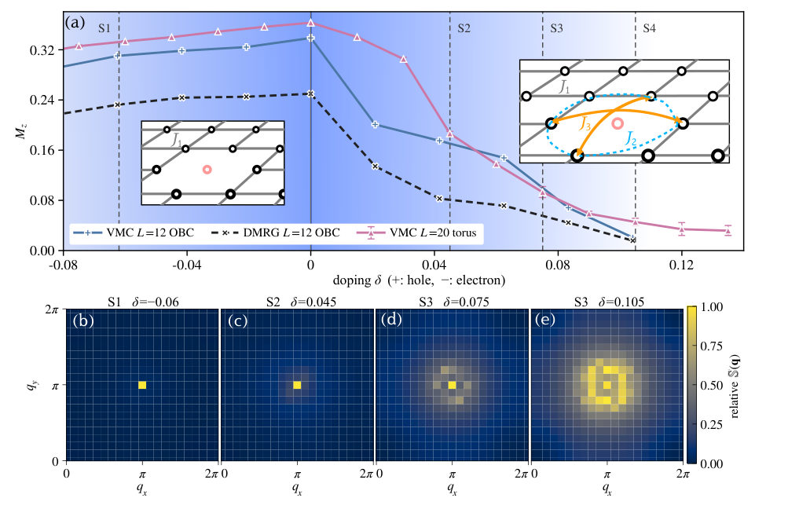 
FIG. 1. Asymmetric evolution of the AFM order upon electron and hole doping. (a) The staggered magnetization Mz in Eq. (2) as a function of doping concentration. Negative and positive values on the x axis represent electron and hole doping, respectively. The error bars are comparable to the marker size. Pink triangles denote the large-scale VMC results on L = 20 torus geometries, averaged over random configurations of dopants. Blue crosses and black dashed lines display the VMC and DMRG benchmarks on smaller L = 12 lattices with open boundary conditions (OBC). Insets: Schematic representations of the effective spin models for electron (left) and hole (right) doping. The dopant is indicated...

📷 Fig 2

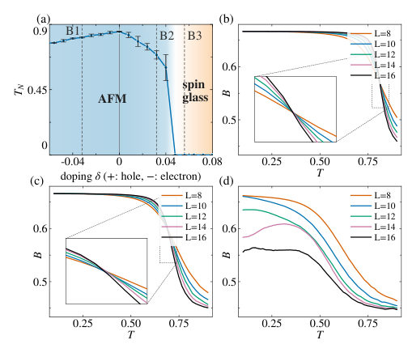 
FIG. 2. Finite-temperature phase diagram obtained from classical Monte Carlo simulations of Eq. (3). (a) Extracted N´eel temperature TN as a function of doping. (b)-(d) Temperature dependence of the Binder ratio B(T) for system sizes ranging from L = 8 to 16 at three representative doping levels, indicated by the vertical dashed lines B1, B2, and B3 in (a). The insets provide magnified views of the curves to clearly resolve the presence [(b), (c)] or absence [(d)] of a crossing point. The simulations are performed on a 3D L × L × L lattice with classical O(3) spins using J1 = 1, J2 = 0.5, J3 = 1.25, and J⊥= 0.1.

📷 Fig 3

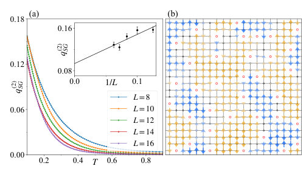 
FIG. 3. Emergence of the spin-glass phase and static domain-wall upon hole doping. (a) Temperature dependence of the Edwards- Anderson spin-glass order parameter q(2) SG for various system sizes L. The inset shows the finite-size scaling of q(2) SG versus 1/L at low tem- perature T = 0.1. The non-zero intercept in the thermodynamic limit (L →∞) provides direct numerical evidence for a robust spin-glass phase. (b) Real-space distribution of the local staggered magneti- zation mz i obtained by VMC. Blue and yellow arrows denote local magnetic moments in opposite AFM domains. The red open circles represent the doped holes (vacancies). Here we use L = 20, J2=0.5, J3=1.25, and δ = 0.09. For the...

**Summary.** This paper provides a unified theory for the magnetic phase transitions in cuprates by showing that hole-doped Zhang-Rice singlets induce magnetic frustration through new exchange pathways. This mechanism explains the rapid destruction of antiferromagnetism and the emergence of a spin-glass phase in hole-doped cuprates, distinguishing them from the more stable electron-doped counterparts.

**Why it may be interesting.** not directly relevant

Detailed structure

**Main problem.** The paper seeks to explain the microscopic mechanism behind the magnetic electron-hole asymmetry in cuprates, specifically why hole doping rapidly destroys Neel antiferromagnetism and induces a spin-glass phase compared to the more robust order in electron-doped systems.

**Main result.** The authors propose that localized Zhang-Rice singlets in hole-doped cuprates act as 'dressed vacancies' that introduce frustrating next-nearest (J2) and third-nearest (J3) neighbor superexchanges, leading to the rapid collapse of AFM order and the emergence of a spin-glass phase.

**Method.** The study employs Variational Monte Carlo (VMC) with a Gutzwiller-projected trial wavefunction, Density Matrix Renormalization Group (DMRG) for benchmarking, and Classical Monte Carlo simulations on 3D lattices to study finite-temperature phase transitions.

**Model / system.** The system is the lightly doped regime of cuprate charge-transfer insulators, modeled via an effective spin-1/2 Heisenberg Hamiltonian on a 2D square lattice with emergent J2 and J3 couplings for hole doping, and simple site dilution for electron doping.

**Key observables.** Staggered magnetization (Mz), static spin structure factor S(q), Binder ratio (B), and the Edwards-Anderson order parameter (q_SG).

**Important parameters / regimes.** Exchange couplings J1=1, J2=0.5, J3=1.25; interlayer coupling J_perp=0.1; doping levels delta (positive for holes, negative for electrons).

**Assumptions / limitations.** The theory assumes that doped holes form spatially localized Zhang-Rice singlets that can be treated as effective magnetic impurities with extended exchange pathways.

**Figures summary.** The figures likely illustrate the evolution of the spin structure factor, the crossing of Binder ratio curves to identify phase transitions, and the comparison of magnetization decay between electron and hole doping.

**Paper structure.** The paper introduces the problem of magnetic asymmetry, presents a unified microscopic theory based on the Emery model, details the numerical methods (VMC, DMRG, Monte Carlo), presents results for both doping types, and concludes with implications for experimental probes like STM.

Abstract

The microscopic mechanism by which doped holes disrupt the antiferromagnetic order is one of the fundamental questions in cuprates. In this work, we propose a unified microscopic theory in which doped holes form spatially localized Zhang-Rice singlets which actively mediate emergent spin exchange. Rather than acting as simple non-magnetic vacancies, these localized states introduce emergent next-nearest $J_2$ and third-nearest $J_3$ neighbor superexchanges. This dopant-induced exchange pathway generates significant magnetic frustration, naturally explaining the rapid collapse of the Néel AFM order and the emergence of a spin-glass phase on the hole-doped side. Our findings provide a comprehensive framework for understanding the complex doping-driven magnetic phase transitions and magnetic electron-hole asymmetry in lightly doped cuprates.

[↑ back to top](#top)

### [Geometric Prototype Learning in Quantum Hilbert Space with Matrix Product States](http://arxiv.org/abs/2605.17895v1)

**Authors:** Kun Zhang, Lei Ding, Sheng-Chen Bai, Jing Sun, An-Qi Jing, Min Tang, Shi-Ju Ran  
**Type:** theory · **Category:** numerical methods · **PDF:** <https://arxiv.org/pdf/2605.17895v1>  
**Analysis basis:** full PDF text, analyzed in chunks

📷 Fig 1

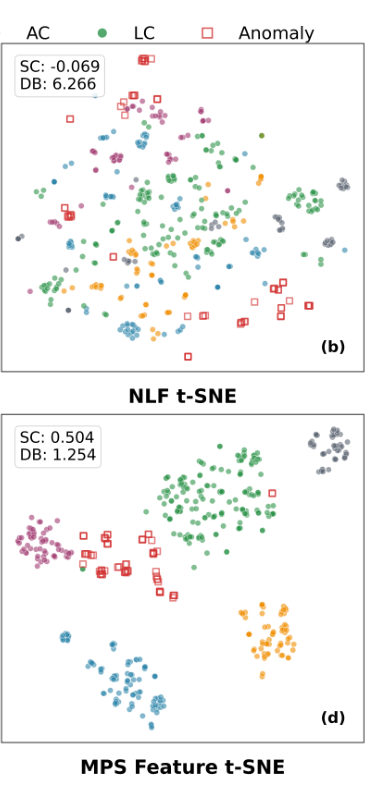 
Figure 1: Comparative visualization of clustering structures. (a) Euclidean distance in the classical feature space. (b)–(c) NLF distance in the quantum Hilbert space. (d) MPS metric in the probability feature space.

**Summary.** This paper introduces a machine learning framework that performs prototype learning directly within a quantum Hilbert space using Matrix Product States. By treating class representatives as quantum states, the method enables classification and anomaly detection through geometric measures like fidelity, offering a more interpretable alternative to black-box neural networks.

**Why it may be interesting.** not directly relevant

Detailed structure

**Main problem.** The lack of interpretability in black-box deep neural networks and the need for a machine learning framework that utilizes the geometric structure of Hilbert space for transparent decision-making.

**Main result.** The proposed Quantum-Probabilistic Prototype Learning (QPPL) framework outperforms classical prototype methods and is competitive with deep neural networks in tasks like ECG classification and Fashion-MNIST, while providing an explainable, geometric approach to classification and anomaly detection.

**Method.** Classical data is mapped into quantum product states via a feature map, and class representatives are learned as generative Matrix Product States (MPS) by minimizing the Negative Logarithmic Fidelity (NLF) between samples and prototypes.

**Model / system.** The framework uses a quantum Hilbert space where data samples are represented as product states of $M$ spins and class prototypes are encoded as Matrix Product States (MPS) with a specific bond dimension $\chi$.

**Key observables.** Negative Logarithmic Fidelity (NLF), Accuracy, AUROC, Silhouette Coefficient, and Davies-Bouldin index.

**Important parameters / regimes.** Bond dimension ($\chi$), local dimension ($d$), and the rotation parameter ($	heta$) in the quantum feature map.

**Assumptions / limitations.** The method assumes that classical data can be effectively mapped into a quantum Hilbert space via a predefined feature map and that the NLF metric is suitable for avoiding exponential fidelity decay.

**Figures summary.** Figure 1 compares Euclidean distance in classical space to NLF distance in quantum Hilbert space, demonstrating superior cluster separation and the effectiveness of the MPS-based metric.

**Paper structure.** The paper introduces the problem of NN opacity, proposes the QPPL framework using MPS, details the feature mapping and NLF distance metric, presents benchmarks on ECG and Fashion-MNIST datasets, and discusses dimensionality reduction and clustering results.

Abstract

Quantum probability provides a novel framework for formulating machine-learning (ML) problems in Hilbert space. We introduce a prototype-based learning scheme where class representatives are encoded as generative matrix product states (MPS). Because these prototypes reside in the same Hilbert space as quantum-encoded data samples, various ML tasks such as classification and clustering can be performed through geometric measures of quantum states. This approach lifts prototype learning from classical feature space to quantum Hilbert space. Benchmarks on Fashion-MNIST and a real-world electrocardiogram dataset demonstrate that our method outperforms classical prototype approaches while remaining competitive with standard black-box neural networks. We also identify an ``attraction'' effect induced by the quantum-probabilistic prototypes and introduce a dimensionality-reduction scheme based on prototype distances. Our results establish quantum states as an explainable framework for prototype learning, opening new directions for designing ML algorithms in quantum Hilbert space.

[↑ back to top](#top)

### [Geometrical derivation of Wigner's angle for arbitrary Lorentz transformations of massless particles](http://arxiv.org/abs/2605.18440v1)

**Authors:** Isabella Cerutti, Petra F. Scudo  
**Type:** theory · **Category:** other · **PDF:** <https://arxiv.org/pdf/2605.18440v1>  
**Analysis basis:** full PDF text, analyzed in chunks

📷 Fig 1

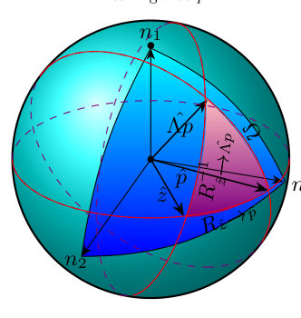 
FIG. 1: Representation of the rotations on a unit sphere

📷 Fig 2

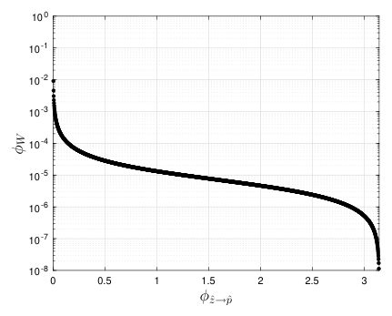 
FIG. 2: Wigner angle (φW in radian) as a function of the angle (φˆz−→ˆp) between ˆz and ˆp = [sin(φˆz−→ˆp), 0, −cos(φˆz−→ˆp)], for vˆz = 2/3c and vˆb = 8 km/s.

📷 Fig 3

 
FIG. 4: Wigner angle (φW in radian) for the family of rotations parametrized by the angle θ, in radian, for ˆp = [sin(π/4), 0, −cos(π/4)], ˆb = [cos(π/4), sin(π/4), 0], vˆz = 2/3c and vˆb = 8 km/s.

📷 Fig 4

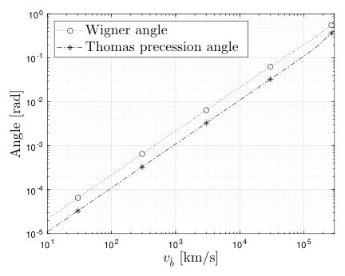 
FIG. 3: Wigner angle (φW ) for varying values of vˆb, for ˆp = [sin(π/4), 0, −cos(π/4)], ˆb = [cos(π/4), sin(π/4), 0] and vˆz = 2/3c.

📷 Fig 5

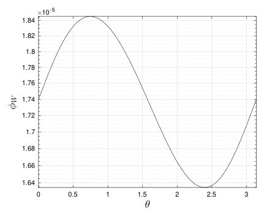 
Fig. 4 displays the Wigner angle for the family of ro- tations (taking ˆz to ˆp) parameterized by the angle θ, as defined in Eq. (20). The Wigner angle oscillates with θ, although in a limited range. These variations indi- cate that for a given ˆp and boost Λ, the Wigner angle is not unique but depends on the rotation of the standard Lorentz transformation L(p).

**Summary.** This paper provides a new geometric derivation for the Wigner angle associated with Lorentz transformations of massless particles like photons. By treating the transformations as paths on a unit sphere, the authors derive an explicit formula for the angle and connect it to the topological Berry phase. This clarifies the relationship between relativistic kinematics and geometric phases.

**Why it may be interesting.** not directly relevant

Detailed structure

**Main problem.** Deriving a closed-form analytical expression for Wigner's angle for arbitrary Lorentz transformations of massless particles and addressing the non-uniqueness of this angle.

**Main result.** The authors provide a complete analytical derivation of the Wigner matrix and a closed formula for the Wigner angle, linking it to spherical trigonometry and the topological Berry phase.

**Method.** A geometric approach using quaternion algebra, spherical trigonometry (including the spherical law of cosines and Gauss-Bonnet theorem), and the polar decomposition of Lorentz transformations.

**Model / system.** Massless particles, specifically photons, within the framework of Special Relativity and the unitary irreducible representations of the Poincaré group.

**Key observables.** Wigner angle (phi_W), Wigner matrix (W), helicity (sigma), and Wigner rotation axis.

**Important parameters / regimes.** Rotation axes (n_i), rotation angles (phi_i), relative velocities (v), and helicity (sigma).

**Assumptions / limitations.** The work is confined to the framework of Special Relativity and does not account for gravitational effects; the initial 4-momentum is assumed to be in a standard form.

**Figures summary.** Figure 1a shows the non-uniqueness of rotation axes; Figure 1b illustrates the spherical and polar triangles in momentum space; Figure 2 shows the Wigner angle as a function of the angle between momentum vectors; Figure 3 compares the Wigner angle to Thomas precession; Figure 4 shows the Wigner angle varying with a rotation parameter theta.

**Paper structure.** The paper introduces the problem of Wigner's angle, provides a geometric derivation using quaternions and spherical trigonometry, presents closed-form analytical results, and concludes with numerical validation and comparisons to known effects.

Abstract

This note summarizes the physics and mathematics of Lorentz transformations for massless particles, specifically for photons. We provide a complete analytical derivation of Wigner's little group matrix and a closed formula for the calculation of Wigner's angle for arbitrary Lorentz transformations. Our derivation highlights the geometrical content of the sequence of little group transformations leading to Wigner's matrix and links it to classical theorems in spherical trigonometry.

[↑ back to top](#top)

### [Global space correlations of polarization, charge density, and electric field in electrolytes under the fixed-potential condition](http://arxiv.org/abs/2605.17346v1)

**Authors:** Akira Onuki  
**Type:** theory · **Category:** statistical mechanics · **PDF:** <https://arxiv.org/pdf/2605.17346v1>  
**Analysis basis:** full PDF text, analyzed in chunks

📷 Fig 1

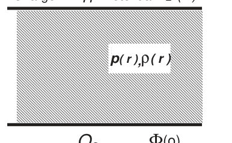 
FIG. 1: Electrolyte with polarization p(r) and charge density ρ(r) between parallel metal plates, where Q0 and Φ(0) are the electric charge and applied potential, respectively, at z = 0, while QH and Φ(H) are those at z = H. We set QH = −Q0 and (Φ0, ΦH) = (Φa, 0). We control Q0 in the fixed-charge condition and Φa in the fixed-potential condition.

📷 Fig 2

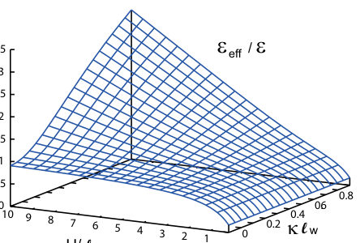 
FIG. 2: Normalized dielectric constant ǫeff/ǫ in Eq.(41) as a function of H/ℓw and κℓw for films with thickness H, where ǫ is the bulk dielectric constant without ions, κ is the Debye wave number. The length ℓw appears in Eqs.(1) and (15) with ℓw/H = ǫδs, which is about 10 nm for liquid water.

📷 Fig 3

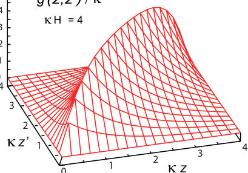 
FIG. 3: Normalized Green function gκ(z, z′)/κ in Eq.(63) as a function of κz and κz′ for κH = 4. It vanishes if z or z′ is at 0 or H. It is given by sinh(κz) sinh(κH −κz)/ sinh(κH) on the ridge line z′ = z with its maximum being tanh(2)/2.

📷 Fig 4

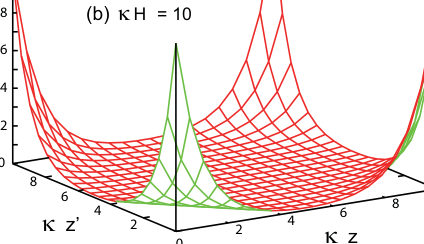 
FIG. 4: Two-point factor (1 −ψ(z))(1 −ψ(z′)) in the polar- ization correlation function G(z, z′) in Eq.(69), where κH is 4 in (a) and is 10 in (b). It represents the positive correlation induced by the surface charge deviation δ¯σ0. This factor is equal to 1 for (x, x′) = (0, 0), (H, 0), (0, H), and (H, H). Its minimum is equal to [cosh(κH/2)]−2 at (x, x′) = (H/2, H/2).

📷 Fig 5

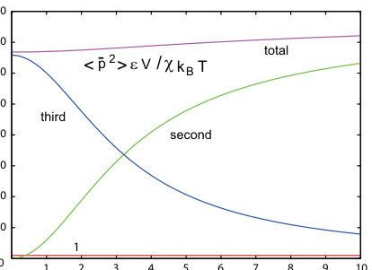 
FIG. 5: Three terms and their total sum in normalized polar- ization variance ⟨P 2⟩ǫV/χkBT in the first line of Eq.(73) vs κH for liquid water, where ǫ = 80 and H = 5ℓw. At κ = 0 (pure water), this quantity is equal to 1 (in red line) at Q0 = 0 and to ǫ/(1 + ℓw/H) at Φa = 0. For κ &gt; 0, it is given by the sum of the second one (in green) and 1 at Q0 = 0, while it is given by the total sum (in violet) at Φa = 0. The third term (in blue) appears at Φa = 0. Since the sum of the second and third terms is roughly equal to ǫ, we find ⟨P 2⟩V/kBT ∼= χ for any κ in agreement with the second line of Eq.(73).

**Summary.** This paper explores how confining electrolytes between electrodes under a fixed potential creates long-range, global correlations in electric fields and charge densities. It demonstrates that these correlations depend heavily on the ratio between film thickness and the Debye screening length, providing a new way to calculate effective dielectric constants.

**Why it may be interesting.** not directly relevant

Detailed structure

**Main problem.** Investigating the thermal fluctuations and global space correlations of polarization, charge density, and electric field in dilute electrolytes under a fixed-potential boundary condition.

**Main result.** The study identifies that for thin films (H < kappa^-1), correlations acquire global components inversely proportional to volume, and establishes an expression for the effective dielectric constant based on fluctuation variances.

**Method.** The author uses a Ginzburg-Landau type free energy functional, Legendre transformations between fixed-charge and fixed-potential ensembles, and Green's function methods within linear response theory.

**Model / system.** A dilute electrolyte (ions and polar fluids) confined in a slab of thickness H between two parallel metallic electrodes, modeled as a continuum theory of an incompressible polar liquid.

**Key observables.** Polarization (p), charge density (rho), electric field (E), surface charge density (sigma), and effective dielectric constant (epsilon_eff).

**Important parameters / regimes.** Film thickness (H), Debye screening length (kappa^-1), surface electric length (ell_w), and applied potential difference (Phi_a).

**Assumptions / limitations.** The system is in the dilute limit, the liquid is nearly incompressible, edge effects are negligible, and the dielectric constant is assumed to be high (epsilon >> 1).

**Figures summary.** Figure 1 shows the electrolyte geometry and distribution of physical quantities; Figure 5 shows polarization variance vs. kappa*H; Figure 6 and 7 illustrate Green function distributions and charge correlation patterns.

**Paper structure.** The paper introduces the physical system and boundary conditions, defines the thermodynamic framework and free energy functional, derives correlation functions using Green's functions, analyzes specific thickness regimes (thin vs. thick films), and concludes with implications for effective dielectric properties.

Abstract

We examine the thermal fluctuations of the polarization $p$, the charge density $ρ$, and the electric field $E$ in dilute electrolytes inserted between pararell metallic electrodes, where we fix the applied potential difference $Φ_a$ between the two electrodes. If the film thickness $H$ is shorter than the Debye screening length $κ^{-1}$, the space correlation of the polarization $p_z$ and the electric field $E_z$ along the surface normal (in the $z$ direction) acuire global components inversely proportional to the film volume $V$, which vary slowly along the $z$ axis and are homogeneous in the $xy$ plane. The areal charge density on each electrode surface also has a component homogeneous on the surface, which produces the global electric fluctuations. On the other hand, if $H$ much exceeds $κ^{-1}$, the global correlations of $p_z$ and $ρ$ become small in the bulk region outside the electric double layers, but that of $E_z$ remains almost unchanged by ions in the whole cell at fixed $Φ_a$. The dielectric constant $ε_{\rm eff}$ depends on $H$ and $κ$ and is expressed in terms of the fluctuation variances of $p_z$ and $ρ$ and that of the noblocal surface charge density at fixed $Φ_a$.

[↑ back to top](#top)

### [Hybrid Quantum-Classical Neural Architecture Search](http://arxiv.org/abs/2605.18345v1)

**Authors:** Alberto Marchisio, Muhammad Kashif, Nouhaila Innan, Muhammad Shafique  
**Type:** theory · **Category:** quantum information and computing · **PDF:** <https://arxiv.org/pdf/2605.18345v1>  
**Analysis basis:** full PDF text, analyzed in chunks

📷 Fig 1

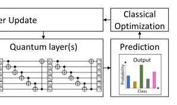 
Fig. 1. Functionality of a HQNN, composed of both classical layers and quantum layers, equipped with classical optimization and parameter update.

📷 Fig 2

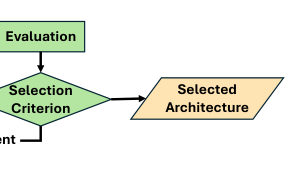 
Fig. 2. Overview of the standard NAS workflow, including the search space, search strategy, candidate evaluation, and architecture selection.

📷 Fig 3

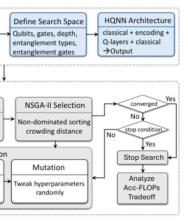 
Fig. 3. Detailed methodology for FLOPs-aware HQNN architecture search.

📷 Fig 4

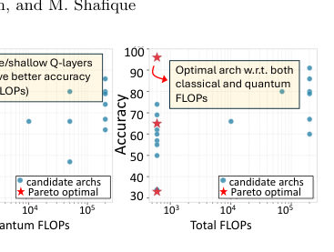 
Fig. 4. Iris Dataset: Accuracy versus FLOPs for all candidate HQNN architectures (blue dots), and pareto-optimal architectures (red stars). Classical FLOPs vs accuracy (left), quantum FLOPs vs accuracy (middle), and Total FLOPs vs accuracy (right).

📷 Fig 5

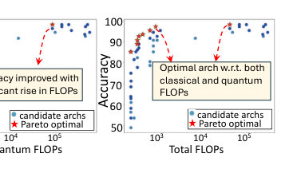 
Fig. 5. Digits Dataset: Accuracy versus FLOPs for all candidate HQNN architectures (blue dots), and pareto-optimal architectures (red stars). Classical FLOPs vs accuracy (left), quantum FLOPs vs accuracy (middle), and Total FLOPs vs accuracy (right).

**Summary.** This paper proposes an automated, hardware-aware method for designing hybrid quantum-classical neural networks. By using a genetic algorithm to optimize for both accuracy and computational cost (FLOPs), the researchers demonstrate how to find efficient architectures for the NISQ era.

**Why it may be interesting.** not directly relevant

Detailed structure

**Main problem.** The difficulty of manually designing efficient Hybrid Quantum-Classical Neural Network (HQNN) architectures due to the high sensitivity of performance to architectural choices and the need to balance accuracy with computational efficiency.

**Main result.** The study identifies Pareto-optimal architectures using a FLOPs-aware approach, demonstrating that high accuracy can be achieved even with low computational costs and that accuracy improvements are primarily driven by quantum FLOPs.

**Method.** The authors employ the NSGA-II (Non-dominated Sorting Genetic Algorithm II) to perform a multi-objective evolutionary search across a discrete space of quantum circuit parameters.

**Model / system.** The model is a Hybrid Quantum-Classical Neural Network (HQNN) consisting of classical preprocessing, Parameterized Quantum Circuits (PQCs) acting as trainable layers, and classical post-processing.

**Key observables.** Predictive accuracy, cross-entropy loss, and computational complexity measured via FLOPs (Floating Point Operations).

**Important parameters / regimes.** Qubit count (2-10), data encoding (angle, amplitude), rotation gates (Rx, Ry, Rz), entangling gates (CNOT, CZ), entanglement topology (linear, circular), and circuit depth (1-4).

**Assumptions / limitations.** The use of FLOPs serves as a valid hardware-agnostic proxy for the computational complexity of simulating quantum circuits on classical hardware.

**Figures summary.** Figure 1 shows the HQNN workflow; Figure 2 depicts the NAS workflow; Figure 3 details the FLOPs-aware NAS methodology; Figures 4 and 5 show accuracy vs. FLOPs trade-offs for the Iris and Digits datasets.

**Paper structure.** The paper introduces the problem of HQNN design, defines the search space and components, reviews existing NAS strategies, proposes a specific FLOPs-aware NSGA-II methodology, presents experimental results on benchmark datasets, and discusses limitations and future work.

Abstract

Hybrid quantum-classical neural networks (HQNNs) are emerging as a practical approach for quantum machine learning in the noisy intermediate-scale quantum (NISQ) era, as they combine classical learning components with parameterized quantum circuits in an end-to-end trainable framework. However, their performance and efficiency depend strongly on architectural choices such as data encoding, circuit structure, measurement design, and the coupling between classical and quantum modules. This makes manual design increasingly difficult, especially when hardware limitations and resource constraints must also be taken into account. In this paper, we study the foundations of HQNNs and neural architecture search (NAS), discuss how NAS extends to quantum and hybrid settings, and demonstrate FLOPs-aware search (where FLOPs serve as a proxy for computational complexity), as an important hardware-aware direction for building HQNNs that are not only accurate but also computationally efficient and practically deployable.

[↑ back to top](#top)

### [Interlayer electronic coherence links magnetism and superconductivity in Ruddlesden-Popper nickelates](http://arxiv.org/abs/2605.18524v1)

**Authors:** Feiyang Liu, Lixing Chen, Enkang Zhang, Ying-Jie Zhang, Jun Zhao  
**Type:** experiment · **Category:** strongly correlated electrons · **PDF:** <https://arxiv.org/pdf/2605.18524v1>  
**Analysis basis:** full PDF text, analyzed in chunks

📷 Fig 1

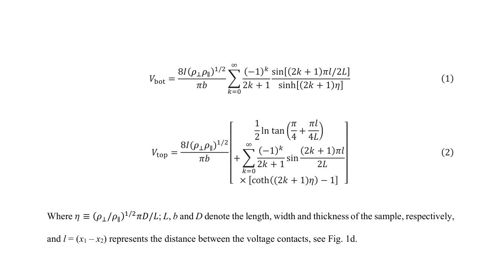 
Fig. 1a-c presents the effective resistivities of single-crystalline La4Ni3O10, Pr4Ni3O10, and La3Ni2O7,

📷 Fig 2

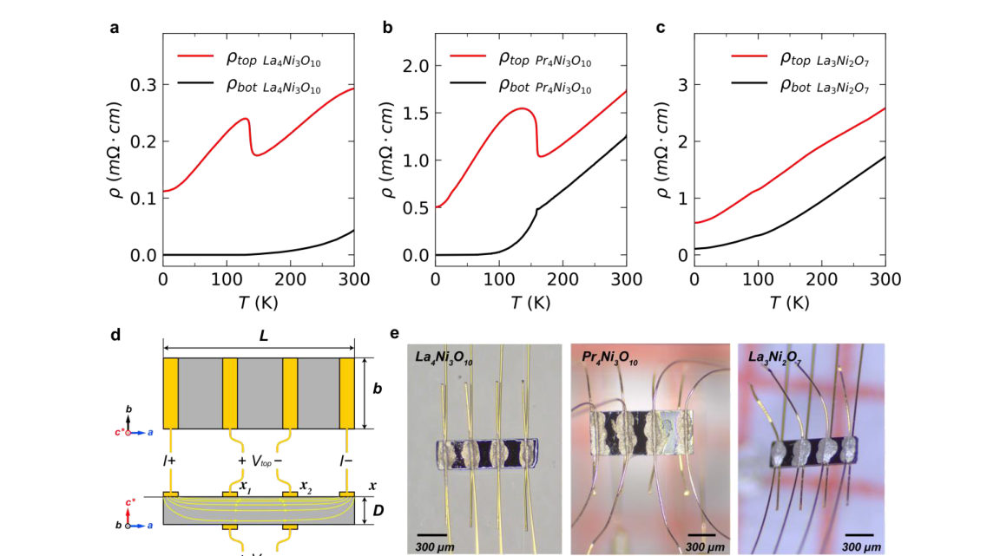 
Figure 1. Six-terminal resistivity measurements on La4Ni3O10, Pr4Ni3O10, and La3Ni2O7. (a–c) Nominal

📷 Fig 3

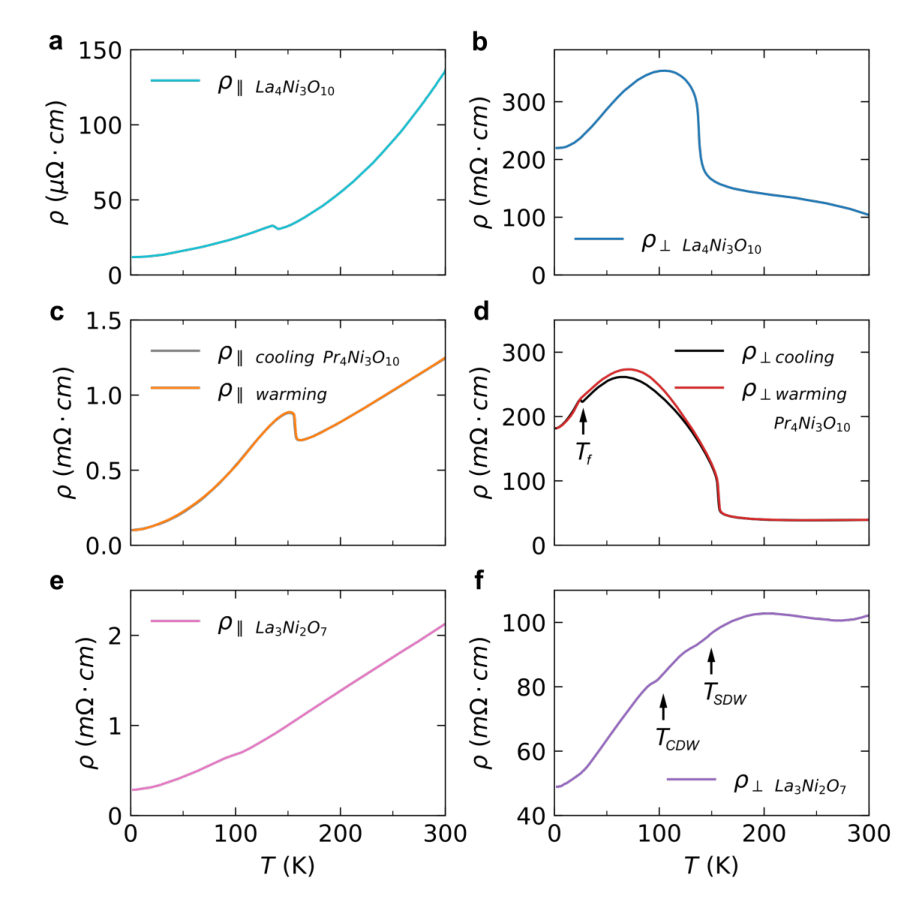 
Figure 2. Extracted in-plane and out-of-plane resistivities for La4Ni3O10, Pr4Ni3O10, and La3Ni2O7. (a, c, e) In-plane resistivity 𝜌∥(T) of La4Ni3O10, Pr4Ni3O10, and La3Ni2O7, respectively. For Pr4Ni3O10, warming and

📷 Fig 4

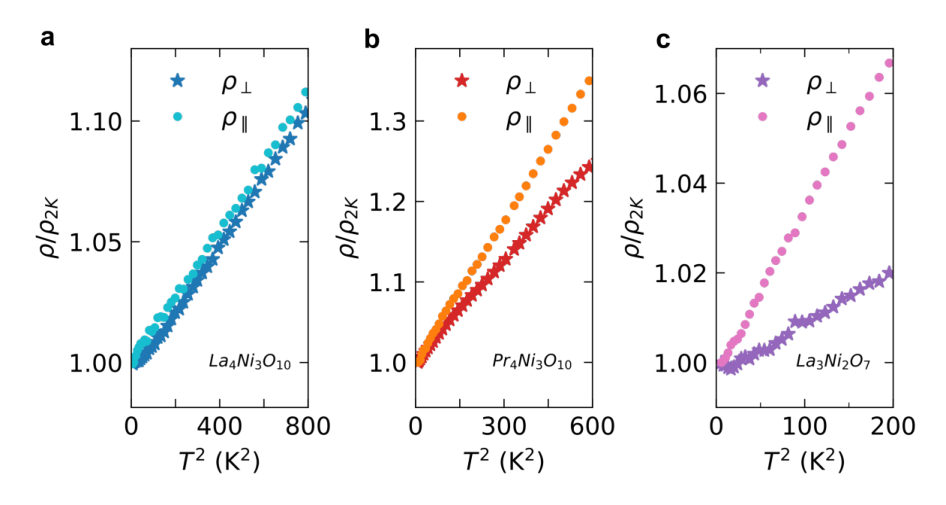 
Figure 3. Low temperature resistivities of La4Ni3O10, Pr4Ni3O10, and La3Ni2O7. Both in-plane and out-of- plane resistivities exhibit Fermi-liquid behavior at low temperatures for all three compounds. Data for Pr4Ni3O10 are taken from warming measurements.

📷 Fig 5

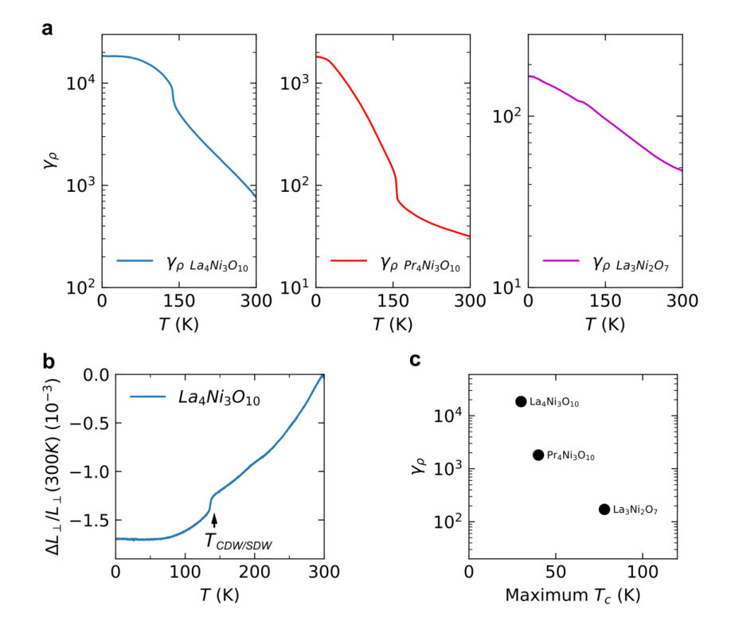 
Figure 4. (a) Temperature dependence of the resistivity anisotropy 𝛾𝜌≡𝜌⊥/𝜌∥ for La4Ni3O10, Pr4Ni3O10,

**Summary.** This paper reveals that Ruddlesden-Popper nickelates possess much higher electronic anisotropy than previously thought. It demonstrates that interlayer electronic coherence acts as a key parameter that links magnetic/density-wave orders to the emergence of superconductivity.

**Why it may be interesting.** not directly relevant

Detailed structure

**Main problem.** The study aims to determine how electronic dimensionality influences magnetism and superconductivity in Ruddlesden-Popper nickelates and to resolve discrepancies in previously reported resistivity anisotropy.

**Main result.** The researchers discovered much higher intrinsic resistivity anisotropy than previously reported and found that stronger interlayer electronic coherence is positively correlated with higher superconducting transition temperatures.

**Method.** High-precision DC transport measurements were performed using a six-terminal geometry on high-quality single crystals to self-consistently determine in-plane and out-of-plane resistivities.

**Model / system.** The physical system consists of Ruddlesden-Popper nickelate single crystals, specifically bilayer (La3Ni2O7) and trilayer (La4Ni3O10, Pr4Ni3O10) structures, characterized by Ni-O layers and multi-orbital (Ni 3d) electronic structures.

**Key observables.** In-plane resistivity (rho_parallel), out-of_plane resistivity (rho_perp), resistivity anisotropy ratio (gamma_rho), and superconducting transition temperature (Tc).

**Important parameters / regimes.** Temperature (T), resistivity anisotropy ratio, effective penetration depth (zeff), and the coherent-to-incoherent transport crossover.

**Assumptions / limitations.** The extraction of intrinsic resistivities assumes a mathematical model to account for non-uniform current distribution in highly anisotropic conductors.

**Figures summary.** Fig 1 shows the six-terminal measurement setup and current distribution; Fig 2 displays temperature-dependent resistivities for various nickelates; Fig 3 confirms Fermi-liquid behavior at low temperatures; Fig 4 shows the temperature dependence of anisotropy and its correlation with Tc.

**Paper structure.** The paper introduces the problem of dimensionality in nickelates, describes the six-terminal experimental method, presents the discovery of high anisotropy and transport crossovers, and concludes by correlating interlayer coherence with superconductivity.

Abstract

The extent to which electronic dimensionality influences magnetism and superconductivity in Ruddlesden-Popper (RP) nickelates remains unsettled. Here we report high-precision crystallographic-axis-resolved dc transport measurements on high-quality single crystals of bilayer and trilayer RP nickelates. Using a six-terminal geometry, we self-consistently determine the intrinsic in-plane ($ρ_\parallel$) and out-of-plane ($ρ_\bot$) resistivities on the same crystal, while minimizing uncertainties associated with current redistribution in highly anisotropic conductors. We uncover strong intrinsic electronic anisotropy in both bilayer and trilayer nickelates, in contrast to the weak anisotropy inferred from conventional four-probe measurements. Moreover, $ρ_\bot$ exhibits a nonmonotonic temperature dependence, revealing a universal coherent-to-incoherent crossover in interlayer transport. Across the RP nickelate series, the maximum superconducting transition temperature ($T_c$) observed under pressure is inversely correlated with the ambient-pressure resistivity anisotropy, suggesting that stronger interlayer electronic coherence is favorable for superconductivity. In addition, $ρ_\bot$ serves as an exceptionally sensitive and selective probe of magnetic and density-wave orders, exhibiting pronounced anomalies, whereas only weak signatures are observed in $ρ_\parallel$. Our results highlight interlayer coherence as a key organizing parameter that both tracks the relevant magnetic correlations and is closely tied to superconductivity, providing stringent constraints on microscopic theories of high-$T_c$ superconductivity in nickelates.

[↑ back to top](#top)

### [Iterative maps emerging from cohomological structure of primes](http://arxiv.org/abs/2605.17622v1)

**Authors:** Marzena Ciszak  
**Type:** theory · **Category:** statistical mechanics · **PDF:** <https://arxiv.org/pdf/2605.17622v1>  
**Analysis basis:** full PDF text, analyzed in chunks

📷 Fig 1

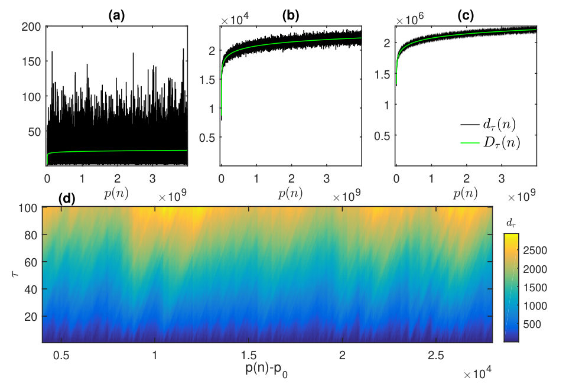 
FIG. 1: Prime τ-gaps dτ(n) for (a) τ = 1, (b) τ = 103 and (c) τ = 105. The data are shown under

📷 Fig 2

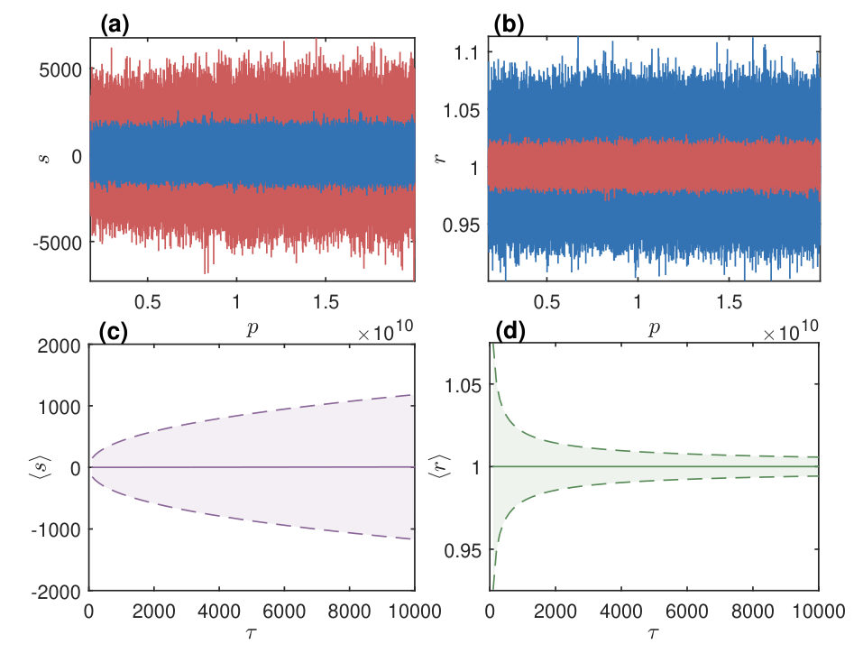 
FIG. 2: Subtractive residuals s (a) and relative residuals r (b) for τ = 103 (blue line) and τ = 104

📷 Fig 3

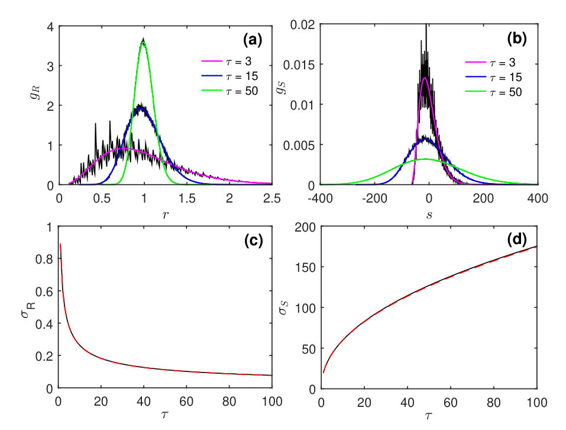 
FIG. 3: Distribution for r (a) and s (b) for different values of τ (black lines). The color lines show

📷 Fig 4

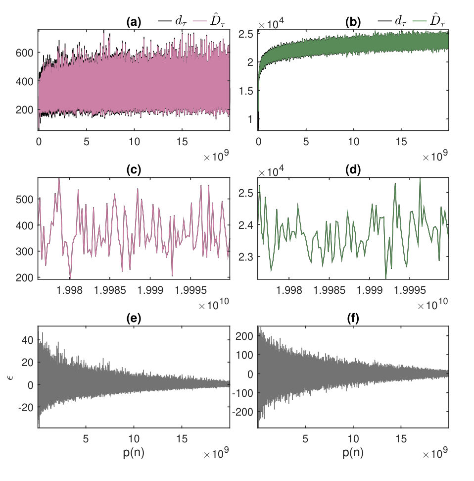 
FIG. 4: Prime τ-gaps dτ and the model values ˆDτ for (a) τ = 15 and (b) τ = 103 with the

📷 Fig 5

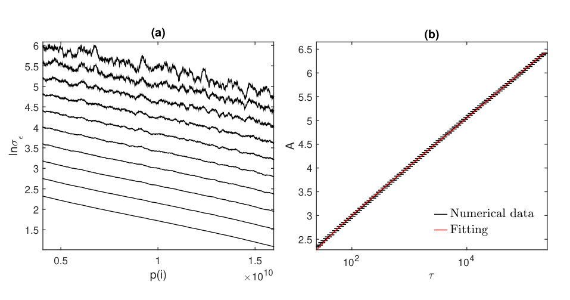 
FIG. 5: (a) Moving average σε(p(i)) in logarithmic scale for different values of τ. (b) The coefficient

**Summary.** This paper proposes that the distribution of prime numbers is not purely random but follows a deterministic iterative map and a cohomological structure. By treating primes as states in a dynamical system, the author shows that the logarithmic integral function emerges as a solution to the governing evolution equation. This provides a new way to link number theory to the statistical mechanics of complex, correlated systems.

**Why it may be interesting.** not directly relevant

Detailed structure

**Main problem.** The paper seeks to understand the underlying mechanisms governing the irregularities in the sequence of prime numbers and determine if their distribution exhibits a deterministic structure linked to physical systems.

**Main result.** The authors demonstrate that prime gaps follow an iterative map and that the fluctuations around this trend are governed by a well-defined cohomological structure, with the logarithmic integral function serving as a solution.

**Method.** The study uses statistical analysis of tau-gaps, residual analysis (subtractive and relative), and fitting prime distributions to Gamma distributions, alongside asymptotic analysis of a proposed cohomological equation.

**Model / system.** The prime number sequence is modeled as a dynamical system exhibiting long-range correlations, where primes are treated as states of a system governed by a non-stationary, parametrically driven process and a cohomological equation.

**Key observables.** tau-gaps (d_tau), relative residuals (r), subtractive residuals (s), and the error term (epsilon).

**Important parameters / regimes.** gap distance (tau), prime index (n), shape parameter (alpha), and the decay rate (lambda).

**Assumptions / limitations.** The analysis assumes the prime sequence can be treated as a system with a smooth backbone and that the asymptotic behavior of the error term can be modeled via the Mean Value Theorem and Stirling's formula.

**Figures summary.** Fig 1 shows tau-gaps and their fit to an iterative map; Fig 2 displays residuals and their variance; Fig 3 compares prime distributions to random number distributions; Fig 4 compares real gaps to model values; Fig 6 compares the prime counting function to Li(x) and the proposed model solution.

**Paper structure.** The paper introduces the problem of prime irregularities, presents a model using an iterative map and cohomological equation, performs statistical validation using gap analysis and residual distributions, and concludes by connecting the framework to the logarithmic integral function.

Abstract

Prime numbers appeared in contexts spanning statistical mechanics, quantum mechanics and dynamical systems. However, the mechanisms governing the irregularities observed in their sequence and linking them to physical systems remained unclear. Here, it is shown that prime gaps at different separation distances follow a function depending on that distance and can be described by an iterative map which predicts the primary growth of successive primes. On the other hand, the analysis of remaining fluctuations reveals the existence of a well-defined cohomological structure, where the deterministic functional relation holds for primes up to small decaying fluctuations. In consequence, the long-range correlations as well as local jumps in primes encode the underlying cohomological structure where prime numbers are states of a given system that becomes deterministic asymptotically. Remarkably, the solution to this cohomological equation turns out to be the logarithmic integral function.

[↑ back to top](#top)

### [Large-Scale Quantum Kernels for Hyperspectral Data Classification](http://arxiv.org/abs/2605.17587v1)

**Authors:** A. Delilbasic, A. Miroszewski, A. Wijata, J. Nalepa, J. Mielczarek, M. Riedel, G. Cavallaro  
**Type:** both · **Category:** quantum information and computing · **PDF:** <https://arxiv.org/pdf/2605.17587v1>  
**Analysis basis:** full PDF text, analyzed in chunks

📷 Fig 1

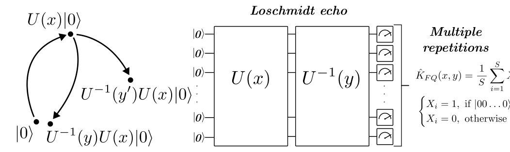 
Fig. 1: The Loschmidt echo approach to fidelity quantum kernel estimation. One starts with the initial state |0⟩, implements a unitary transformation parameterized by the first data point U(x), and then applies the subsequent inverse unitary transformation parameterized by a second data point. (a) If the second data point is similar to the first one, the combined transformation-inverse transformation U −1(y)U(x) should result in a state close to the initial |0⟩state. Conversely, if the second data point is not similar to x, then the total transformation U −1(y′)U(x) takes the state far from the initial state |0⟩. (b) The Loschmidt echo circuit is run S times in order to gather statistics...

📷 Fig 2

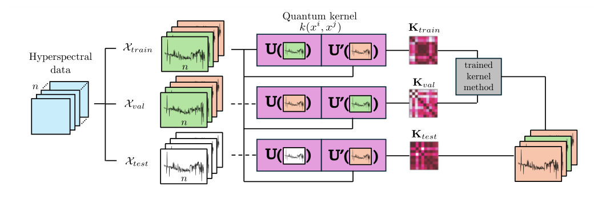 
Fig. 2: (a) Overall scheme of the implemented method, used to evaluate quantum kernels. The classification of unseen test spectra Xtest is performed by training a kernel method on Xtrain and optimizing its parameters to maximize accuracy on Xval. (b) Quantum circuit used for kernel computation in our method. It follows the fidelity quantum kernel approach shown in Fig. 1, the vertical dotted line marking the separation between U(xi) and U −1(xj). Each feature xi n is used as a parameter for three rotation gates, i.e., Rz, Ry, Rz, applied to each qubit n, for a total of d qubits. H represents the Hadamard gate, and ⊕ represents the CNOT gate, here applied to each qubit n ≥2 and controlled by...

📷 Fig 3

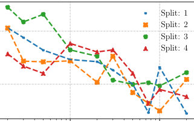 
Fig. 4: Indian Pines—optimized bandwidth parameter c∗found in the validation stage during the experiment described in the caption of Fig. 5 as a function of the number of features n. The optimization strategy is described in Section IV-B. Table I gathers the power-law and exponential fits of the above data.

📷 Fig 4

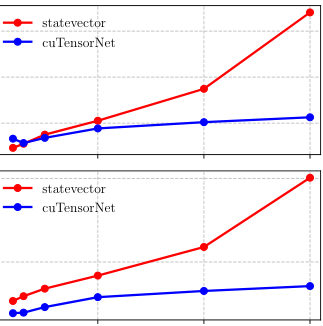 
Fig. 3: Indian Pines—run time for statevector and cuTensorNet quantum circuit simulation (up to 30 qubits) for generating Ktrain and Ktest for a single Indian Pines training split. We highlight that the computational workload is the same for each split, thus it is representative.

📷 Fig 5

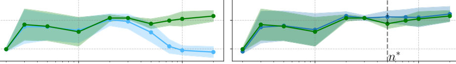 
Fig. 5: Indian Pines—average train (top) and test (bottom) accuracy for binary classification of the corn-mintill (class 3) and soybean-notill (class 10) data points from the Indian Pines dataset as a function of the number of features n used. The legend distinguishes between the quantum model (described in Section III-B) and the classical model (described in Section IV-B).

**Summary.** This paper demonstrates that quantum kernel methods can be applied to large-scale hyperspectral imaging tasks without heavy dimensionality reduction. By using tensor network simulations and optimizing kernel bandwidth, the authors show that quantum models can outperform classical baselines in remote sensing classification.

**Why it may be interesting.** not directly relevant

Detailed structure

**Main problem.** The scalability of quantum kernel methods for high-dimensional hyperspectral data classification and the challenge of 'exponential concentration' where kernel values vanish as qubit counts increase.

**Main result.** Quantum kernels achieve competitive or superior accuracy compared to classical RBF kernels on Indian Pines and Methane Detection datasets, provided that kernel bandwidth optimization is used to mitigate overfitting and concentration.

**Method.** Large-scale classical simulation using tensor network contraction (cuTensorNet) and GPU acceleration to evaluate fidelity quantum kernels with a rotation-based encoding ansatz.

**Model / system.** A quantum kernel support vector machine (QSVM) using a fidelity quantum kernel approach, where hyperspectral bands are mapped to qubits via a parameterized unitary transformation involving single-qubit rotations and CNOT entanglement.

**Key observables.** Classification accuracy, kernel alignment (A), geometric difference (g), expressibility (epsilon), and kernel value distribution (mean and standard deviation).

**Important parameters / regimes.** Number of qubits (n), kernel bandwidth parameter (c), and penalty term (C).

**Assumptions / limitations.** The specific family of fidelity kernels used has low entanglement, allowing for efficient classical simulation via tensor networks; the initial state is the vacuum state |0>.

**Figures summary.** Figures illustrate the Loschmidt echo approach, the quantum circuit ansatz, the overall processing pipeline, runtime comparisons between statevector and tensor network simulations, and statistical analyses of kernel matrices and accuracy.

**Paper structure.** The paper introduces the problem of high-dimensional QML, details the quantum kernel model and circuit architecture, describes the tensor network simulation strategy, presents experimental results on hyperspectral datasets, and concludes with a discussion on kernel statistics and future directions.

Abstract

Quantum kernel methods have emerged as a promising approach for leveraging high-dimensional feature spaces in machine learning, particularly in domains where classical kernel methods face scalability limitations. In this work, we present the first large-scale study of fidelity-quantum-kernel support vector machines for hyperspectral data classification without requiring heavy prior feature selection or dimensionality reduction. By simulating quantum kernels using tensor network contraction techniques and GPU acceleration, we overcome the computational bottlenecks traditionally associated with quantum models, achieving quadratic scaling O(n^2) in the number of qubits. Our approach enables the evaluation of quantum kernels on hyperspectral data with hundreds of spectral bands, aligning quantum feature spaces with real-world remote sensing applications. We provide an in-depth analysis of kernel bandwidth optimization, demonstrating its crucial role in mitigating exponential concentration effects and ensuring the model's ability to generalize. Experimental results on binary classification (Indian Pines and Methane Detection) and multiclass classification (Indian Pines) demonstrate that quantum kernels achieve competitive performance compared to a broad range of state-of-the-art classical baselines. As illustrative cases, on four 50-band splits selected from Indian Pines, the quantum model achieved a 78.0 pm6.2% accuracy for a binary classification task compared to 72.0 pm5.0% for the standard radial basis function (RBF) kernel. For a four-class classification task, the quantum kernel reached 83.3 pm3.1% accuracy, outperforming several state-of-the-art baselines. On five 75-band splits selected from the Methane Detection dataset, the quantum approach yielded 58.5\pm5.0% accuracy versus 55.1\pm2.5% for the classical counterpart...

[↑ back to top](#top)

### [LEAD: A Local Ensemble-Assisted Parallel Decoding Framework for Quantum Tanner Codes](http://arxiv.org/abs/2605.17796v1)

**Authors:** Zhuo-Yan Xiao, Sha Shi, Chen-Peng Huang, Dong-Sheng Wang, Yun-Jiang Wang  
**Type:** theory · **Category:** quantum information and computing · **PDF:** <https://arxiv.org/pdf/2605.17796v1>  
**Analysis basis:** full PDF text, analyzed in chunks

📷 Fig 1

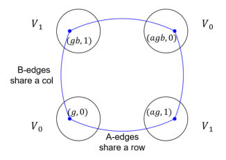 
Fig. 1. As described in the main text, each face is composed of four edges, where the horizontal edges (A-edges) and vertical edges (B-edges) correspond to the group elements a ∈A and b ∈B, respectively [8].

📷 Fig 2

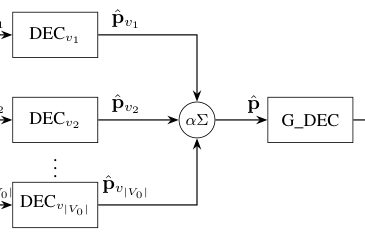 
Fig. 2. Flowchart of the LEAD decoding algorithm.

📷 Fig 3

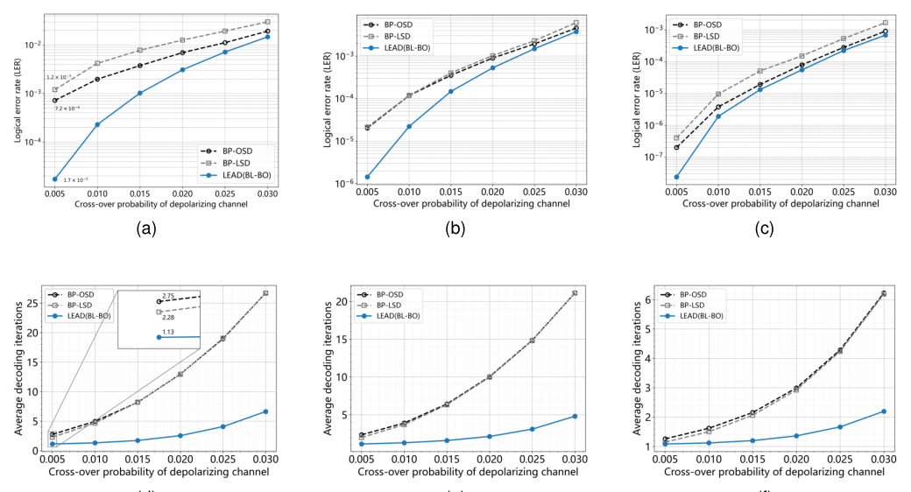 
Fig. 3. Performance comparison of the LEAD framework against baseline decoders for various random quantum Tanner codes. Panels (a)–(c) illustrate the LER versus physical error probability p, and panels (d)–(f) present the corresponding average number of decoding iterations. The code parameters are: (a, d) [[392, 48]], (b, e) [[392, 8]], and (c, f) [[252, 8]]. Across all instances, the LEAD architecture (solid lines) consistently achieves superior error suppression and lower computational latency compared to the standalone BP–OSD and BP–LSD baselines.

📷 Fig 4

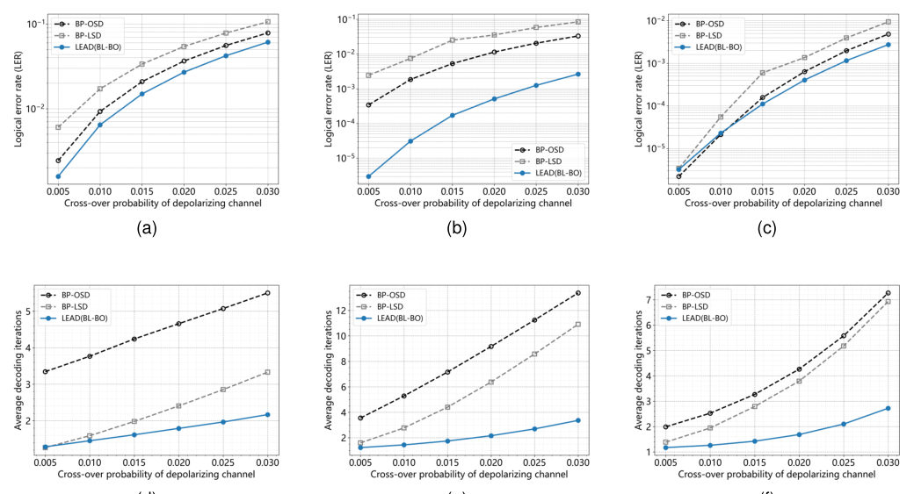 
Fig. 4. Decoding performance comparison for various quantum Tanner codes derived from [2, 3]. Panels (a)–(c) present the LER as a function of physical error probability p, while (d)–(f) illustrate the corresponding average number of decoding iterations. The code parameters are: (a, d) [[36, 8, 3]], (b, e) [[80, 2, 10]], and (c, f) [[144, 8, 12]]. Across all configurations, the LEAD framework (solid lines) consistently reduces decoding latency compared to standalone BP-LSD and BP-OSD baselines, while maintaining or improving error-correction accuracy.

📷 Fig 5

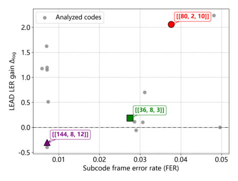 
Fig. 5. Analysis of LEAD decoding gain (∆log) vs. subcode FER for different quantum Tanner code instances at p = 0.005. The horizontal dash- dotted line at 0 denotes the baseline; points below it indicate performance degradation. The results illustrate that local decoding accuracy alone is insufficient to predict global performance improvement, highlighting that local overconfidence—rather than raw subcode error rate—is the primary driver of performance bottleneck in the global belief propagation process.

**Summary.** This paper introduces LEAD, a new decoding framework for Quantum Tanner Codes that uses local, parallelized decoding to estimate error probabilities. By regularizing these local estimates to prevent overconfidence, the method significantly improves error correction performance and reduces decoding time compared to traditional methods.

**Why it may be interesting.** not directly relevant

Detailed structure

**Main problem.** Existing decoding algorithms for Quantum Tanner Codes face a trade-off between exponential computational complexity in local decoders and poor performance in structure-blind iterative decoders due to high degeneracy and short cycles.

**Main result.** The LEAD framework achieves significantly lower logical error rates and reduced decoding latency compared to standard BP-OSD and BP-LSD baselines by leveraging the code's topological structure.

**Method.** A two-stage parallel decoding framework that projects the global code onto overlapping local subcodes, aggregates local error probability estimates using a soft-information regularization mechanism, and performs final global decoding.

**Model / system.** Quantum Tanner Codes, which are a class of quantum LDPC codes constructed via a left-right Cayley complex using a CSS-type structure on vertices, edges, and faces.

**Key observables.** Logical Error Rate (LER), Frame Error Rate (FER), decoding iterations, and decoding gain (delta_log).

**Important parameters / regimes.** The scaling parameter alpha (used for regularization), physical error probability p, and the local neighborhood size Delta.

**Assumptions / limitations.** The framework assumes a depolarizing noise model and relies on the decomposable structure of the underlying Cayley complex.

**Figures summary.** Figure 1 shows the quadrangle structure of the Cayley complex; Figure 2 provides a flowchart of the LEAD algorithm; Figure 3 compares LER and decoding iterations for various codes; Figure 5 shows the relationship between decoding gain and subcode FER; Figure 6 demonstrates the impact of the alpha parameter on performance.

**Paper structure.** The paper introduces the problem of decoding Quantum Tanner Codes, describes the geometric structure of the Cayley complex, presents the LEAD decoding framework (local decoding, regularization, and global decoding), provides complexity analysis, and validates the method through numerical simulations and error rate comparisons.

Abstract

Quantum Tanner codes are a recently developed family of quantum error-correcting codes characterized by favorable asymptotic performance characteristics. Despite their theoretical potential, practical decoding algorithms that effectively leverage their structural properties remain limited. This work introduces LEAD (Local Ensemble-Assisted Decoder), a structure-aware decoding framework tailored for quantum Tanner codes. The proposed scheme leverages the decomposable structure of Cayley complexes to project the global code onto overlapping local subcodes defined by vertex neighborhoods, where error probabilities are estimated in parallel. To ensure global consistency, LEAD utilizes the inherent topological symmetry of the complex and introduces a soft-information regularization mechanism to mitigate local overconfidence during information aggregation. This framework enables highly parallelized, low-complexity decoding that is intrinsically compatible with various local search heuristics. Simulation results demonstrate that LEAD achieves significantly lower logical error rates than standard decoding framework while substantially reducing the average decoding latency and iteration count.

[↑ back to top](#top)

### [Localization Transitions in a Half-Filled Helical Aubry-André Model](http://arxiv.org/abs/2605.18064v1)

**Authors:** Taylan Yildiz, B. Tanatar, Balázs Hetényi  
**Type:** theory · **Category:** disordered systems and neural networks · **PDF:** <https://arxiv.org/pdf/2605.18064v1>  
**Analysis basis:** full PDF text, analyzed in chunks

📷 Fig 1

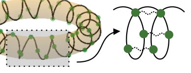 
FIG. 1. (a) Schematic illustration of a one-dimensional lattice embedded on a toroidal geometry. The sites follow a helical path wrapped around the torus, such that periodic boundary conditions are naturally realized by the closed topology. The shaded region highlights a local segment of the lattice. (b) Effective representation of the helical structure, where sites on neighboring turns become spatially close. Solid lines de- note nearest-neighbor hopping J, while dotted links indicate longer-range hopping JN emerging from the geometric em- bedding.

📷 Fig 2

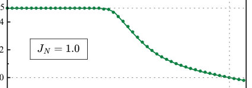 
FIG. 2. Geometric Binder cumulant U4 as a function of quasiperiodic potential strength ∆for L = 987 and N = 40, shown for several Nth-neighbor hopping amplitudes JN (panel labels). Horizontal dotted lines indicate U4 = 1/3, 1/2 and U4 = 0. The vertical dotted line marks the critical po- tential ∆c defined by the zero crossing of U4(∆).

📷 Fig 3

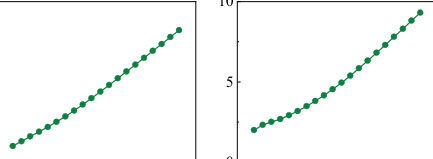 
FIG. 4. Critical quasiperiodic potential strength ∆c as a func- tion of the long-range (helical) hopping amplitude JN for a chain of length L = 987 at half filling. The critical value ∆c is extracted from the zero crossing of the geometric Binder cumulant U4(∆) upon increasing ∆, with the helical hopping range fixed to (a) N = 100 (b)N = 40 and JN varied linearly from 0 to 1.

📷 Fig 4

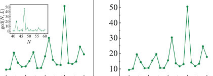 
FIG. 5. Dependence of the critical quasiperiodic potential strength ∆c on the helical winding (long-range hopping range) N for a chain of length L = 987 at half filling, where ∆c is extracted from the zero crossing of the geometric Binder cumulant. Left panel: JN = 0.5; right panel: JN = 1.0. Some pronounced spikes occur at N values with gcd(N, L) &gt; 1the , inset graph corresponds to gcd(N, L) vs N.

📷 Fig 5

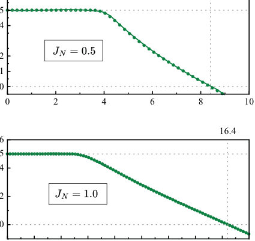 
FIG. 3. Geometric Binder cumulant U4 as a function of quasiperiodic potential strength ∆for L = 987 and N = 100, shown for several Nth-neighbor hopping amplitudes JN (panel labels). Horizontal dotted lines indicate U4 = 1/3, 1/2 and U4 = 0. The vertical dotted line marks the critical po- tential ∆c defined by the zero crossing of U4(∆).

**Summary.** This paper explores how long-range, helical connections modify the localization transition in a quasiperiodic system. It reveals that helical hopping stabilizes the delocalized phase and that the transition point fluctuates significantly due to resonance effects between the hopping range and the lattice potential.

**Why it may be interesting.** not directly relevant

Detailed structure

**Main problem.** The study investigates how long-range helical hopping and the winding range N influence the delocalization-localization transition in a 1D quasiperiodic lattice.

**Main result.** Increasing helical hopping strength stabilizes the extended phase, and the critical potential exhibits non-monotonic spikes due to resonant helical sampling of the quasiperiodic landscape.

**Method.** The authors use the modern theory of polarization to construct a geometric Binder cumulant and employ a Zeckendorf-shift construction with Fibonacci system sizes to perform controlled thermodynamic limit extrapolations.

**Model / system.** A one-dimensional helical Aubry-André model featuring an incommensurate onsite potential and an Nth-neighbor hopping term that connects successive windings of a helical chain.

**Key observables.** Geometric Binder cumulant (U4), polarization amplitudes (Zq), normalized Fermi gap, and single-particle energy spectrum.

**Important parameters / regimes.** Quasiperiodic potential strength (Delta), Nth-neighbor hopping strength (JN), helical range (N), and system size (L).

**Assumptions / limitations.** The study focuses on non-interacting fermions at half-filling and utilizes periodic boundary conditions.

**Figures summary.** Figure 1 shows the helical lattice geometry; Figure 6 displays the Binder cumulant and Fermi gap for different hopping strengths; Figure 7 illustrates the energy spectrum changes; Figure 8 shows the Binder cumulant for various Fibonacci sizes.

**Paper structure.** The paper introduces the helical Aubry-André model, details the polarization-based diagnostic methods and thermodynamic limit construction, presents results on phase stabilization and commensurability-induced spikes, and concludes with a robustness analysis via finite-size scaling.

Abstract

We study localization in a one-dimensional quasiperiodic lattice obtained by extending the Aubry-André model with an additional $N$th-neighbor hopping term of strength $J_{N}$. This long-range tunneling couples successive windings of an effective helical chain and introduces a second control parameter beyond the quasiperiodic potential strength $Δ$. Working with noninteracting fermions (typically at half filling), we diagnose the delocalization-localization transition using extensions of the modern theory of polarization. Specifically, we compute the polarization amplitudes of the many-body Slater-determinant ground state and construct a geometric Binder cumulant from polarization amplitudes. The critical potential where the localization transition happens is extracted from the sign change (zero crossing) of the geometric Binder cumulant. We map critical potential as a function of $J_N$ and the helical range $N$, finding that stronger helical hopping generally stabilizes the extended phase (shifting critical potential upward), while the $N$-dependence can display pronounced commensurability-induced spikes. We further compare the geometric Binder cumulant with the Fermi gap, which remains near zero at small values of potential and opens in the same parameter regime where the geometric Binder cumulant departs from extended phase. Finally, to take a controlled thermodynamic limit along Fibonacci system sizes, we employ a Zeckendorf-shift construction that fixes the many-body sector consistently as system size goes to infinity.

[↑ back to top](#top)

### [Model of Simplicial Complexes with dimension-wise preferential attachment](http://arxiv.org/abs/2605.17004v1)

**Authors:** Diego Febbe, Duccio Fanelli, Timoteo Carletti  
**Type:** theory · **Category:** statistical mechanics · **PDF:** <https://arxiv.org/pdf/2605.17004v1>  
**Analysis basis:** full PDF text, analyzed in chunks

📷 Fig 1

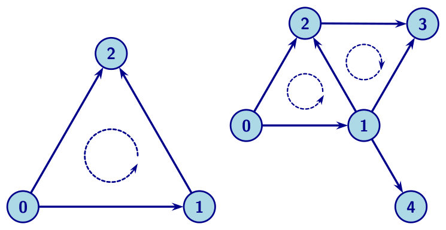 
FIG. 1: Representation of a simplex (panel a) and a simplicial complex (panel b) together

📷 Fig 2

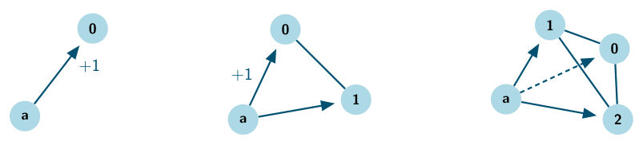 
FIG. 2: Growing process for the simplicial complex. With probability p1, the incoming

📷 Fig 3

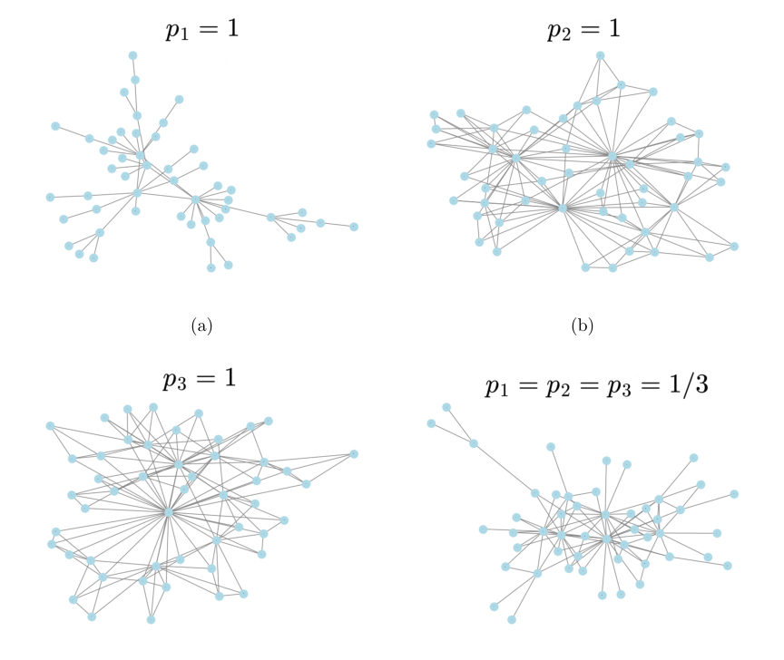 
FIG. 3: Examples of various simplex generations, by varying the parameters p1, p2 and p3.

📷 Fig 4

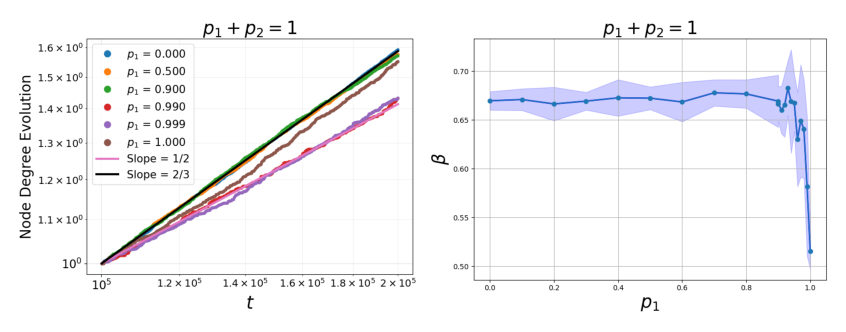 
FIG. 4: Panel (a): Degree evolution of the nodes over building time for various values of p1

📷 Fig 5

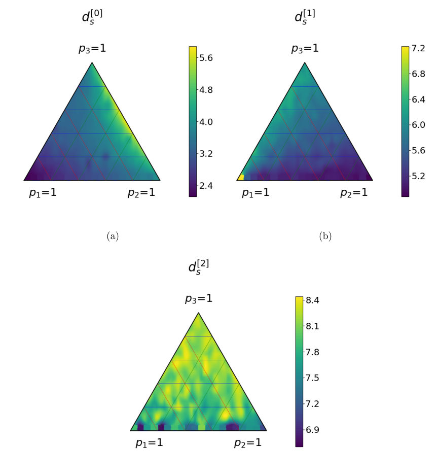 
FIG. 5: Spectral dimensions d(0) s , d(1) s , d(2) s as a function of the construction parameters p1,

**Summary.** This paper introduces a new generative model for growing simplicial complexes using a preferential attachment mechanism that acts on different dimensions. It demonstrates how the model can produce power-law degree distributions and reveals how the interplay between different dimensional components can trigger abrupt transitions in the network's scaling properties.

**Why it may be interesting.** not directly relevant

Detailed structure

**Main problem.** The need for generative models of higher-order networks (simplicial complexes) that can reproduce the topological and spectral features found in empirical many-body interaction data.

**Main result.** The authors develop a dimension-wise preferential attachment model that produces power-law degree distributions and identify an abrupt transition in scaling exponents when moving between different dimensional attachment probabilities.

**Method.** The study uses algebraic topology (Hodge-Laplacian, boundary operators), continuous differential equation approximations for growth dynamics, and spectral analysis of the $d$-Laplacian.

**Model / system.** A growing simplicial complex where new nodes and higher-dimensional simplices (links, triangles, tetrahedra) are added at each time step based on dimension-specific attachment probabilities $p_d$.

**Key observables.** Generalized degree distribution, spectral dimension ($d_s$), Betti numbers ($eta_d$), Fiedler eigenvalue, and scaling exponents ($eta, \gamma$).

**Important parameters / regimes.** Maximum dimension $D$, attachment probabilities $p_1, \dots, p_D$, and a flavor parameter $s$.

**Assumptions / limitations.** The growth process assumes a specific probabilistic attachment rule where the probability of selecting a simplex is proportional to its generalized degree.

**Figures summary.** Figure 1 shows the basic building blocks (simplices) and their assembly; Figure 2 illustrates the growth process; Figure 4 shows the transition of the growth exponent $eta_0$ as a function of $p_1$; Figure 6 and 7 visualize the hierarchical construction and the relationship between node and link degrees.

**Paper structure.** The paper begins by defining the higher-order network framework, introduces the dimension-wise preferential attachment growth algorithm, provides analytical derivations for degree evolution and scaling exponents, explores specific dimensional regimes and phase transitions, and concludes with numerical validation.

Abstract

Network science is a powerful framework allowing to model complex systems, it is capable to describe and take into account the intricate web of connections existing among the constituting basic element of the system. Recently scholars have brought to the fore the relevance of higher-order networks, namely structures allowing to encode for many-body interaction, differently from the pairwise case handled by networks. This novel research field opens new avenues of research with applications ranging from neurosciences to social sciences; there is thus a need for generative models of higher-order network capable to reproduce features present in empirical data. In this work we present a model for growing simplicial complex rooted on a preferential attachment process acting dimension-wise, i.e., returning a power law distribution for the generalized degree of simplexes of different dimension.

[↑ back to top](#top)

### [Module Lattice Security (Part III): Structured CVP Distance on the Log-Unit Lattice](http://arxiv.org/abs/2605.17404v1)

**Authors:** Ming-Xing Luo  
**Type:** theory · **Category:** other · **PDF:** <https://arxiv.org/pdf/2605.17404v1>  
**Analysis basis:** full PDF text, analyzed in chunks

📷 Fig 1

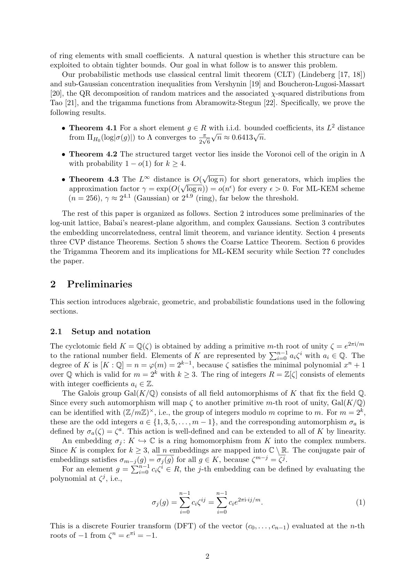 
Low-resolution page preview, page 2

📷 Fig 2

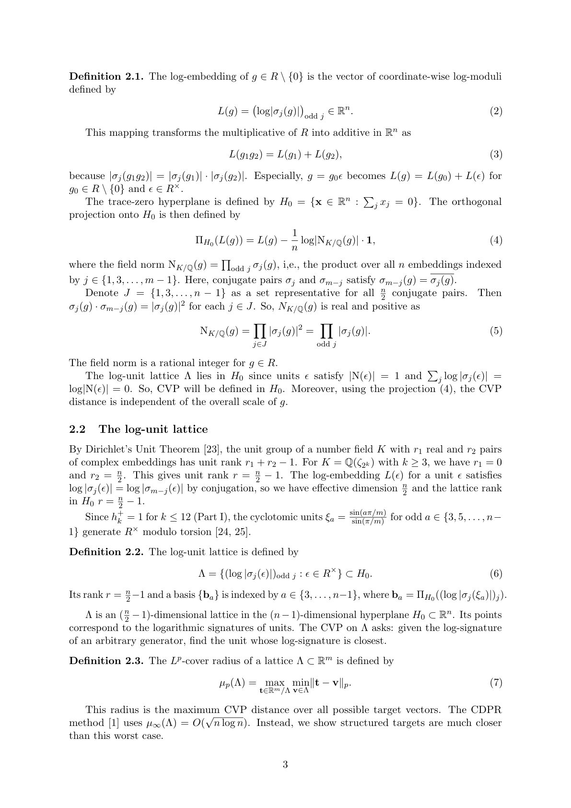 
Low-resolution page preview, page 3

📷 Fig 3

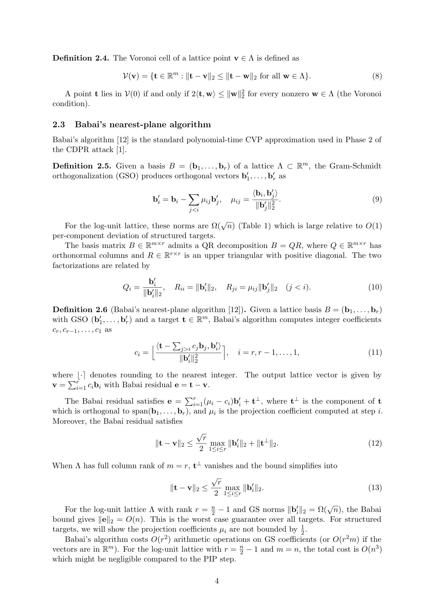 
Low-resolution page preview, page 4

📷 Fig 4

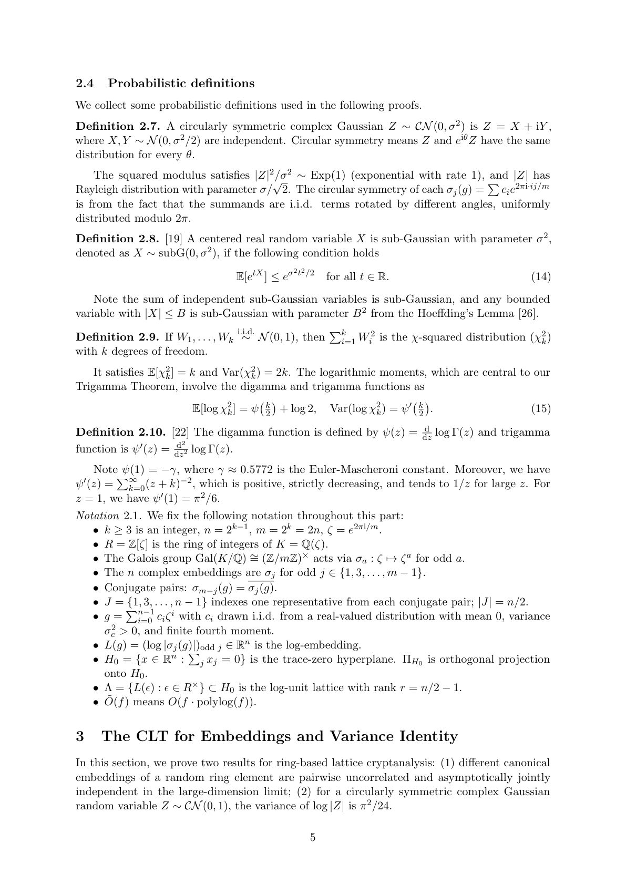 
Low-resolution page preview, page 5

📷 Fig 5

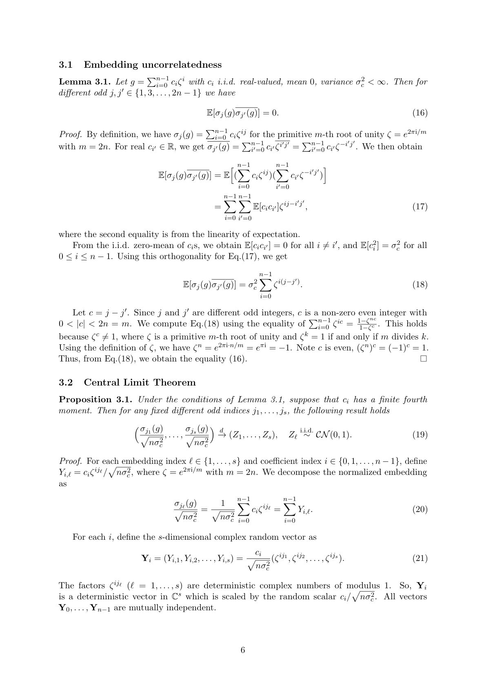 
Low-resolution page preview, page 6

**Summary.** This paper provides a rigorous mathematical analysis of the security of module lattices used in post-quantum cryptography. It demonstrates that the structured nature of these lattices allows for much tighter error bounds than previously assumed, significantly reducing the estimated approximation factor for certain attacks on ML-KEM.

**Why it may be interesting.** not directly relevant

Detailed structure

**Main problem.** Investigating the security of module lattices in post-quantum cryptography, specifically determining the CVP distance on the log-unit lattice and its impact on the ML-KEM (Kyber) scheme.

**Main result.** Proves that the L2 CVP distance converges to a specific constant times sqrt(n) and reduces the Short Generator Problem approximation factor from exponential to sub-polynomial.

**Method.** Uses probabilistic methods including the Central Limit Theorem, sub-Gaussian concentration inequalities, and analytic tools like the Trigamma function and QR decomposition.

**Model / system.** The mathematical framework involves cyclotomic fields Q(zeta_{2^k}), the log-unit lattice, and module lattices of rank d over the ring of integers.

**Key observables.** L2 and L-infinity CVP distances, approximation factor gamma, and the variance of the log-determinant sigma_{g0}.

**Important parameters / regimes.** Dimension n = 2^{k-1}, module rank d, and the coefficient variance sigma_c^2.

**Assumptions / limitations.** Assumes ring elements have i.i.d. bounded coefficients and utilizes the Gaussian limit for large dimensions.

**Figures summary.** Table 4 summarizes the cumulative progress of the CDPR attack analysis across three parts of the paper, comparing prior states to the current work.

**Paper structure.** The paper progresses from analyzing L2 and L-infinity distances on the log-unit lattice to evaluating Babai's algorithm performance, then extends the analysis to module determinant ideals via the Trigamma Theorem, and concludes with security implications for ML-KEM.

Abstract

We prove that the $L^2$ CVP distance from a random short ring element to the log-unit lattice of $\Q(ζ_{2^k})$ converges to $\fracπ{2\sqrt{6}}\sqrt{n}$ as $n=2^{k-1}\to\infty$. We then show that this target lies inside the Voronoi cell of the origin for $k\ge 4$. For the $L^\infty$ norm, the maximum over $n$ sub-Gaussian coordinates yields $O(\sqrt{\log n})$ which translates into a sub-polynomial approximation factor for the Short Generator Problem. We show a Coarse Lattice Theorem that Babai's algorithm returns zero for all structured targets, yet exactly recovers unit perturbations of arbitrary size. For module determinant ideals, we further prove the Trigamma Theorem that proves an intrinsic imbalance $σ_{g_0}=O(1)$ independent of the modulus $q$. Finally, combined with Parts I and II, we reduce the CDPR factor for ML-KEM from $\exp(\tO(\sqrt{n}))$ to a sub-polynomial value.

[↑ back to top](#top)

### [Module Lattice Security (Part IV): Probabilistic Polynomial Quantum Attack on Module-LWE over 2-Power Cyclotomics](http://arxiv.org/abs/2605.17412v1)

**Authors:** Ming-Xing Luo  
**Type:** theory · **Category:** quantum information and computing · **PDF:** <https://arxiv.org/pdf/2605.17412v1>  
**Analysis basis:** full PDF text, analyzed in chunks

📷 Fig 1

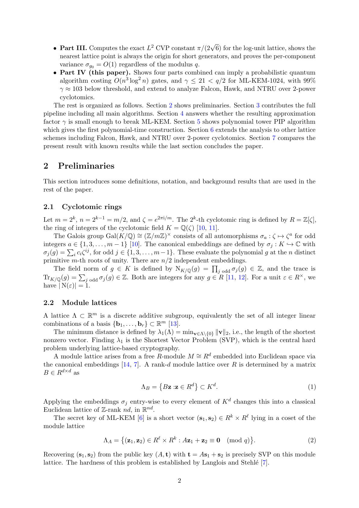 
Low-resolution page preview, page 2

📷 Fig 2

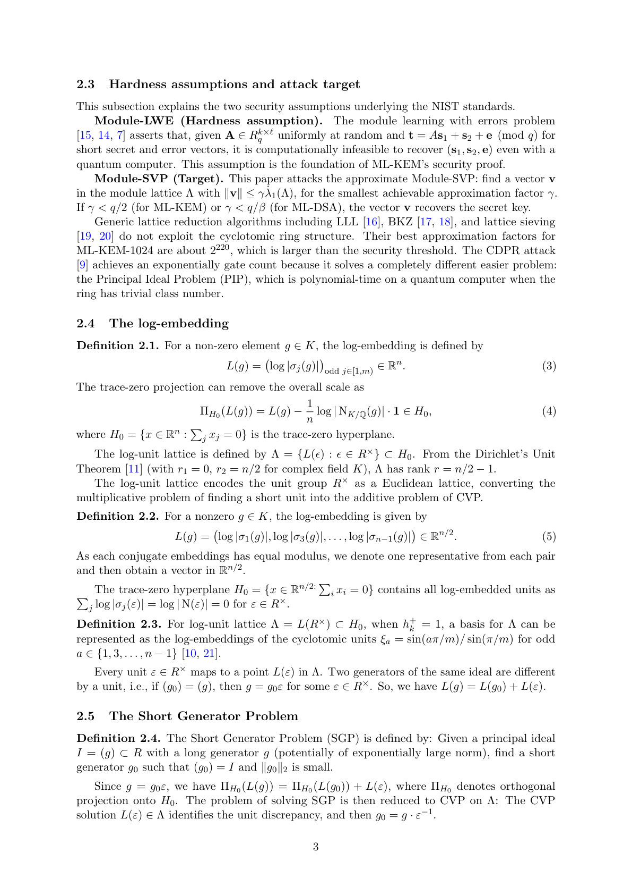 
Low-resolution page preview, page 3

📷 Fig 3

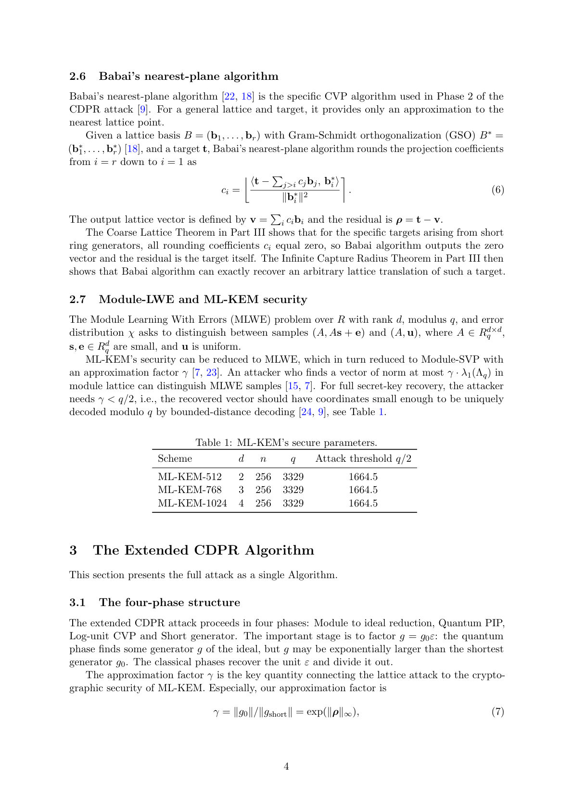 
Low-resolution page preview, page 4

📷 Fig 4

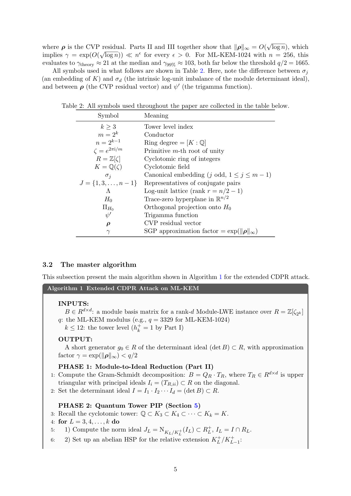 
Low-resolution page preview, page 5

📷 Fig 5

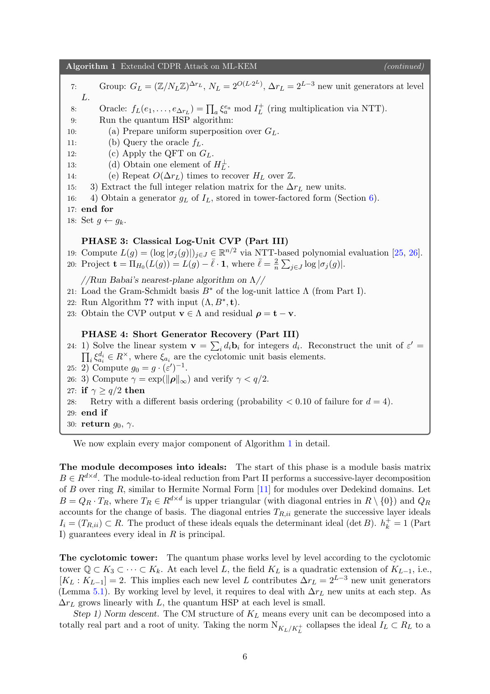 
Low-resolution page preview, page 6

**Summary.** This paper presents a quantum algorithm that breaks several post-quantum cryptographic standards, including ML-KEM and Falcon, by solving the Principal Ideal Problem in polynomial time. It achieves this by exploiting the algebraic structure of 2-power cyclotomic rings through a tower decomposition. The results suggest that the security of these lattice-based primitives is significantly lower than previously assumed under quantum attack.

**Why it may be interesting.** not directly relevant

Detailed structure

**Main problem.** Developing a probabilistic polynomial-time quantum attack on Module-LWE (MLWE) schemes, specifically targeting ML-KEM, Falcon, Hawk, and NTRU over 2-power cyclotomic rings.

**Main result.** The paper presents a quantum algorithm that reduces the Principal Ideal Problem (PIP) complexity to polynomial time, effectively breaking the standardized parameter sets of ML-KEM, Falcon, Hawk, and NTRU.

**Method.** The attack uses an extended CDPR pipeline involving module-to-ideal reduction, a quantum tower decomposition of the Principal Ideal Problem via the Abelian Hidden Subgroup Problem, and classical log-unit CVP using Babai's algorithm.

**Model / system.** The mathematical framework involves module lattices over 2-power cyclotomic rings R = Z[zeta], utilizing the algebraic structure of cyclotomic towers and the log-unit lattice.

**Key observables.** The approximation factor (gamma), quantum gate complexity, qubit requirements, and the CVP residual.

**Important parameters / regimes.** ML-KEM-1024 parameters (n=256, q=3329), ring degree (n), module rank (d), and the approximation factor threshold (q/2).

**Assumptions / limitations.** The attack relies on the validity of the Hidden Subgroup Problem (HSP) solution, the use of the tower decomposition, and certain empirical/numerical results from previous parts of the series.

**Figures summary.** The notes mention a table summarizing quantum resource costs for ML-KEM-1024 and a table comparing theoretical vs. simulated approximation factors for Falcon.

**Paper structure.** The paper follows a logical progression from module-to-ideal reduction to a recursive quantum tower PIP algorithm, followed by complexity analysis, security evaluation of specific NIST standards, and a summary of cumulative improvements over previous works.

Abstract

We present a quantum attack on ML-KEM and related 2-power cyclotomic lattice schemes. Combining with Parts I-III, we provide an algorithm and verify the resulting approximation factor satisfies $γ\le 21 < q/2=1665$ for ML-KEM-1024, with a success probability $\ge 0.99$. We apply a tower decomposition of the Principal Ideal Problem (PIP) through the chain $\Q \subset \Q(ζ_8) \subset \cdots \subset \Q(ζ_{2^k})$ which yields a polynomial-time quantum algorithm costing $O(n^3 \log^2 n)$ gates, $O(n^2 \log n)$ qubits, and $\mathrm{poly}(n)$ classical bit operations. We extend the analysis to Falcon, Hawk, and NTRU over 2-power cyclotomic rings. This means that ML-KEM, Falcon, Hawk, NTRU-HPS, and NTRU-HRSS with all standardized parameter sets are broken under quantum attack.

[↑ back to top](#top)

### [Near-Optimal Quantum Time Evolution Circuits via Provably Convergent Compression](http://arxiv.org/abs/2605.17067v1)

**Authors:** Erenay Karacan, Isabel Nha Minh Le, Matteo D'Anna, Juan Carasquilla, Christian B. Mendl, Ivan Rojkov  
**Type:** both · **Category:** quantum information and computing · **PDF:** <https://arxiv.org/pdf/2605.17067v1>  
**Analysis basis:** full PDF text, analyzed in chunks

📷 Fig 1

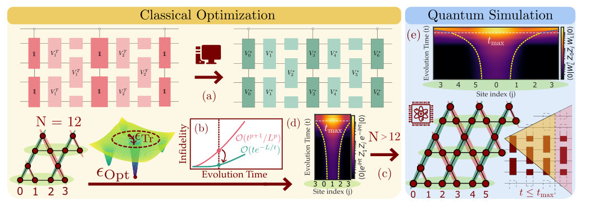 
Figure 1: Visualization of the proposed quantum simulation protocol. (a) A local Ansatz circuit WL of depth L is optimized to encode the controlled time evolution of time t on a small quantum system (e.g., N = 12 Kagome lattice) using a classical computer [31]. One uses an appropriate, pth order Trotterization of the time evolution with identities inserted as control layers [33–35] for the initial point, which guarantees efficient convergence to a unitary with more favorable error scaling with respect to L and t compared to Trotter error, as shown in (b) in red for Trotterization and blue for optimized circuits. (c) Optimized gates can then be used to encode dynamics of the same Hamiltonian...

📷 Fig 2

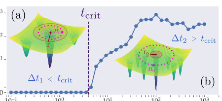 
Figure 2: Numerical demonstration of guaranteed convergence. We fix N = 6 for the Ansatz, randomly choose a 2-local, TI Hamiltonian with ∥H∥= 1 on a fixed geometry with ∆L = 3 permutation classes, set U∆t = e−iH∆t as target and track convergence behav- ior for a randomized H0, where ∥H0∥≤1 and e−iH0∆t

📷 Fig 3

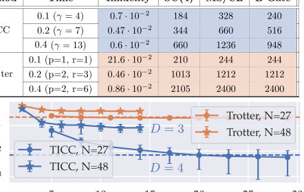 
Figure 3: Kagome lattice optimization results. (Top) Evolution infidelity (9) vs. gate counts needed to encode the controlled time evolution of the HM in Eq. (7), on the N = 12 Kagome lattice. We benchmark TICC with control layers γ, against pth-order Trotterization (of r steps) with anti-commuting Pauli string insertion, as proposed by [33, 34]. Optimization with TICC yields ar- bitrary SU(4) gates, which we decompose into MS and B gates. (Bottom) PEPS verification of transferring op- timized results to larger system sizes. We use a PEPS bond dimension D = 4 for N = 27, and D = 3 for N = 48. Dashed lines represent the evolution infidelities for the N = 12 system, computed with exact...

📷 Fig 4

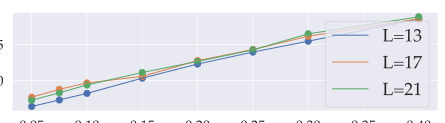 
Figure 4: Scaling of the controlled time evolution opera- tor (optimized via TICC), with respect to the evolution time, for various numbers of Ansatz layers L, where the number of control layers is set to a constant γ = 4 for all L values. The inverse accuracy behavior 1/ log(1/ϵ) is plotted and rescaled with L to show the data points collapsing.

📷 Fig 5

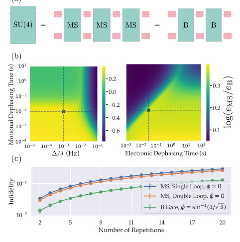 
Figure 5: (a) Decomposition of a generic SU(4) two- qubit unitary via MS gates and B gates. (b) Average infidelity comparison for decomposing a randomized ar- bitrary unitary SU(4) operation with MS-gates (eMS) vs. B-gates (eB). As eMS, we take the better performing MS gate implementation between single and double loop [62] variants. Noise parameters: T1=1s, heating rate ˙n = 1 quanta/s for all plots; electronic dephasing time (bare T2) set to 50 ms for the left plot and fractional detuning error ∆/δ set to 10−3 for the right plot. Gate times are 83.33µs, 117.85µs, 144.3µs for the single loop MS-gate, double-loop MS gate and the B-gate, respectively. (c) Infidelity of evolving a two qubit...

**Summary.** This paper introduces a method for compressing quantum time-evolution circuits with guaranteed convergence to near-optimal gate complexity. By using a specific initialization strategy, the authors show that small-scale optimized circuits can be effectively scaled to simulate large, complex systems like the Kagome Heisenberg antiferromagnet. This approach significantly reduces the gate overhead required for digital quantum simulation.

**Why it may be interesting.** It provides a rigorous mathematical bridge between variational quantum algorithms and efficient digital simulation, offering a provable way to scale quantum simulators toward the classical complexity limit.

Detailed structure

**Main problem.** The difficulty of implementing efficient, large-scale quantum time evolution circuits that achieve near-optimal gate complexity while providing rigorous global convergence guarantees for variational compression.

**Main result.** The authors provide a recipe for choosing an initial optimization point that guarantees convergence to a near-optimal circuit with gate complexity O(N t polylog(N t/epsilon)) for local, translationally invariant Hamiltonians.

**Method.** A variational compression strategy (TICC) using a Trotterization-based 'warm start' and a bootstrapping approach to extend small-time-step optimized gates to larger evolution times.

**Model / system.** Local and translationally invariant Hamiltonians, specifically demonstrated on a Heisenberg antiferromagnet on a Kagome lattice, with proposed implementation on trapped-ion platforms using B-gates.

**Key observables.** Evolution infidelity, gate complexity (gate count), and local infidelity.

**Important parameters / regimes.** System size (N), evolution time (t), error tolerance (epsilon), and the critical time threshold (t_crit) for convergence.

**Assumptions / limitations.** The Hamiltonian is local and translationally invariant; the optimization manifold is real-analytic; the time step must be sufficiently small (below t_crit).

**Figures summary.** Visualizations of the optimization protocol, comparisons of error scaling between Trotterization and optimized circuits, transferability of gates to larger systems, and gate decomposition/performance in noisy ion-trap models.

**Paper structure.** Introduction of the scaling challenge, theoretical proof of convergence and convexity, demonstration of the TICC protocol on various lattices, verification of transferability to large systems, and hardware-specific gate implementation analysis.

Abstract

Variational compression can significantly lower implementation overheads for encoding the time evolution of Hamiltonians into quantum circuits. However, they usually lack global convergence guarantees and well-established scaling behavior. In this work, we provide a recipe for choosing the initial point of such variational optimizations that guarantees convergence to a quantum circuit with near-optimal gate complexity $\mathcal{O}\left( N \, t \, \text{polylog}(N \, t/ε) \right)$ for all local and translationally invariant Hamiltonians. We demonstrate our method by encoding the globally controlled time evolution of a Heisenberg antiferromagnet on a Kagome lattice. For $N = 48$ sites, evolution time $t=0.1$ and infidelity $ε\approx1\%$, the controlled time-evolution circuit requires 960 two-qubit B gates, for which we propose a straightforward implementation scheme for ion-trap setups. Thereby, our recipe extends digital quantum simulators toward system sizes and geometries that are challenging for classical computation.

[↑ back to top](#top)

### [Nonlinear response of the chiral magnetic effect in the D3/D7 holographic model](http://arxiv.org/abs/2605.16931v1)

**Authors:** Masataka Matsumoto, Mirmani Mirjalali, Ali Vahedi  
**Type:** theory · **Category:** strongly correlated electrons · **PDF:** <https://arxiv.org/pdf/2605.16931v1>  
**Analysis basis:** full PDF text, analyzed in chunks

📷 Fig 1

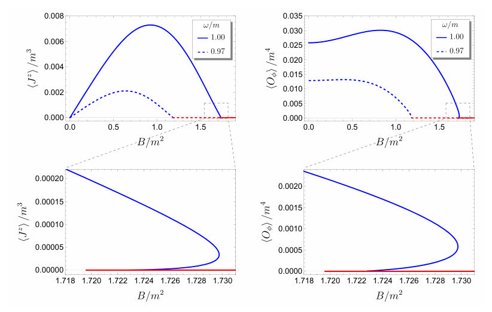 
Figure 1: Upper panel: ⟨Jz⟩/m3 and ⟨Oϕ⟩/m4 as a function of B/m2 for ω/m = 1.00 (solid) and 0.97 (dashed). Two types of solutions, the Minkowski embedding with and without a world- volume horizon, are distinguished by blue and red colored lines, respectively. Lower panel: The zooming in to the region where ⟨Jz⟩/m3 and ⟨Oϕ⟩/m4 become zero.

📷 Fig 2

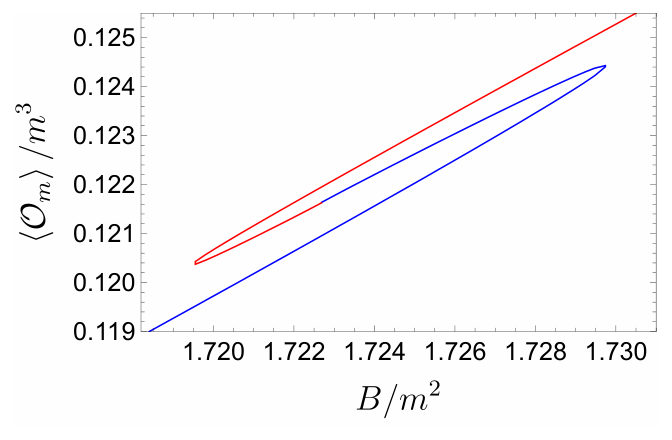 
Figure 2: ⟨Om⟩/m3 as a function of B/m2 for ω/m = 1.00. Two types of solutions, the Minkowski embedding with and without a world-volume horizon, are distinguished by blue and red colored lines, respectively.

📷 Fig 3

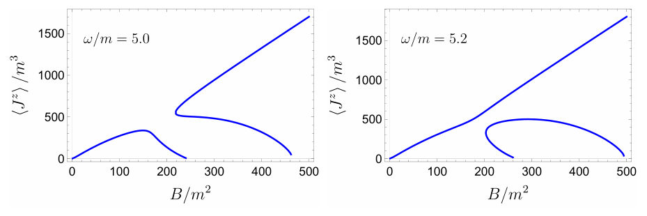 
Figure 3: ⟨Jz⟩/m3 as a function of B/m2 for ω/m = 5.0 (left) and ω/m = 5.2 (right). In both cases, two distinct branches appear, and a reconnection between them occurs at a certain value of ω/m.

📷 Fig 4

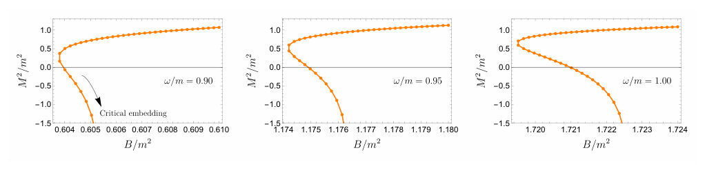 
Figure 4: The plots of M2/m2 = (k0)2/m2 as a function of B/m2 for several values of ω/m in the Minkowski embedding without a world-volume horizon.

📷 Fig 5

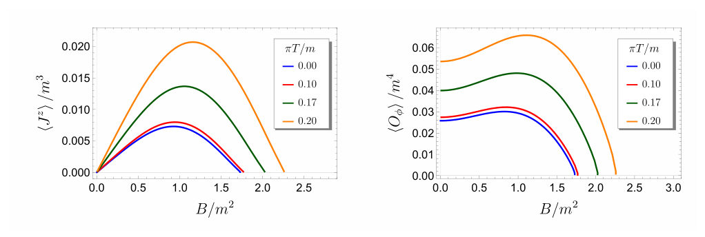 
Figure 5: ⟨Jz⟩/m3 and ⟨Oϕ⟩/m4 as a function of B/m2 for several temperatures with ω/m = 1.0.

**Summary.** This paper explores how the chiral magnetic effect behaves in a highly nonlinear regime using holographic duality. It reveals that the relationship between current and magnetic field can be multi-valued and shows how external fields can stabilize certain phases of the system.

**Why it may be interesting.** not directly relevant

Detailed structure

**Main problem.** The study investigates the nonlinear response of the chiral magnetic current to an external magnetic field and the dynamical stability of the system near the phase boundary between insulating and CME phases.

**Main result.** The researchers found a multi-valued, highly nonlinear dependence of the chiral magnetic current on the magnetic field and demonstrated that the axial chemical potential and magnetic field cooperatively stabilize the insulating phase.

**Method.** The study uses the Dirac-Born-Infeld (DBI) and Wess-Zumino (WZ) actions within a holographic framework, employing the shooting method and determinant method to solve nonlinear ODEs and analyze meson spectra.

**Model / system.** A D3/D7 holographic brane system in an AdS5 x S5 background, representing a dual field theory with axial chemical potential and an external magnetic field.

**Key observables.** Chiral magnetic current (Jz), pseudo-scalar condensate, chiral condensate (mass operator), and meson mass spectrum (M^2).

**Important parameters / regimes.** External magnetic field (B), axial chemical potential (mu5 or angular frequency omega), temperature (T), and quark mass (m).

**Assumptions / limitations.** The study operates in the probe limit (Nf << Nc) and assumes large Nc and large 't Hooft coupling.

**Figures summary.** Figure 1 shows the current and condensate vs. magnetic field for different embeddings; Figure 4 plots the meson mass squared to identify stability/tachyonic regimes; Figure 5 shows the current response at finite temperature.

**Paper structure.** The paper introduces the holographic setup, derives equations of motion using the DBI action, analyzes the nonlinear current-magnetic field relation, investigates the stability of the meson spectrum, and concludes with finite temperature effects.

Abstract

We investigate the nonlinear response of the chiral magnetic current to an external magnetic field in a holographic setup. Using the D3/D7 brane system, where the chiral magnetic effect (CME) can be realized by considering rotating probe D7-branes, corresponding to introducing an axial chemical potential, we analyze the current-magnetic field relation beyond the linear regime. Focusing on the vicinity of the phase boundary between the insulating phase and the CME phase, we find that the chiral magnetic current exhibits a multi-valued dependence on the magnetic field, indicating a highly nonlinear response characteristic of this model. We further study the dynamical stability of the insulating phase near the transition point, and show that the presence of both an axial chemical potential and an external magnetic field cooperatively stabilize the system. Our results clarify the interplay between the axial chemical potential and the magnetic field in determining the phase structure and stability of the system, and reveal new nonlinear aspects of chiral transport in holographic gauge theories.

[↑ back to top](#top)

### [Ordering, correlation functions and phase transitions in molecular systems](http://arxiv.org/abs/2605.18326v1)

**Authors:** Yashwant Singh  
**Type:** theory · **Category:** statistical mechanics · **PDF:** <https://arxiv.org/pdf/2605.18326v1>  
**Analysis basis:** full PDF text, analyzed in chunks

📷 Fig 1

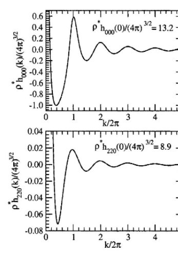 
Fig.7.1 Comparison of some of the harmonics of the total pair correlation function in the Fourier space for the nematic phase (βa2 = 1, βa0 = 0.1, z0σ = z2σ = 1, η = 0.315, P2 = 0.63, P4 = 0.27) obtained by the analytical solution [40] (dashed line) with the results found using the numerical method (full line) for the MSA. The two curves are indistinguishable at the scale of the figure. Reproduced with permission from Ref [47]

📷 Fig 2

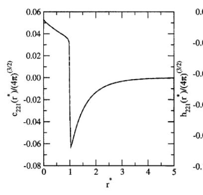 
Fig.7.2 Comparison of the harmonic coefficients c221(r∗) and h221(r∗) obtained by the analytical solution (Ref. [40]) (dashed line) with the results found using the numerical method (full line) for the MSA. Parameters are the same as in Fig. 7.1. A 1/r∗tail in the harmonic coefficient h221(r∗) is seen. Reproduced with permission from Ref [47].

📷 Fig 3

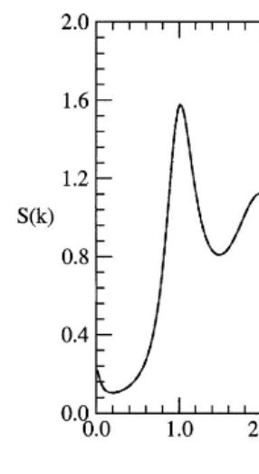 
Fig.7.3 Comparison of the structure factor curves for the nematic phase (βa2 = 1, βa0 = 0.1, z0σ = z2σ = 1, η = 0.315, P2 = 0.63, P4 = 0.27). The dashed line is obtained with the analytical solution (Ref. [40]) while the full line is obtained by our numerical method for the MSA. The two curves overlap at all values of k. Reproduced with permission from Ref [47].

📷 Fig 4

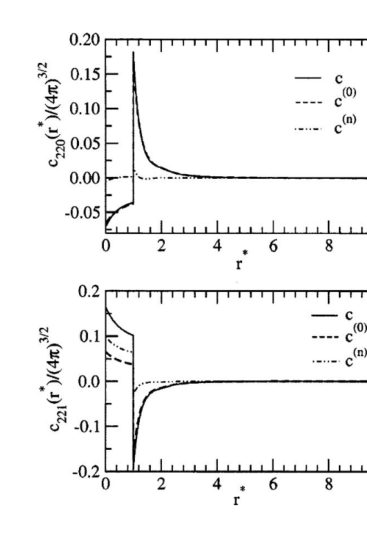 
Fig.7.4 Plot of the harmonic coefficients of the direct pair correlation functions c220(r∗), c221(r∗), and c200(r∗) obtained by solving the PY integral equation theory (βa2 = 1, βa0 = 0.1, z0σ = z2σ = 1, η = 0.30). While the contribution of the sym- metry breaking part in c220(r∗) is small in c221(r∗) it is comparable inside the core. The harmonic coefficient c200(r∗) arises due to symmetry breaking only. The symme- try conserving contribution is shown by dotted line and the broken symmetry part by dot–dashed line and the total by full line. Reproduced with permission from Ref. [47].

📷 Fig 5

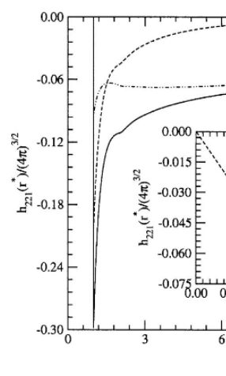 
Fig.7.5 Harmonic coefficient h221(r∗) in the director frame. Details are the same as in Fig. 7.4. Inset shows the plot of h221(r∗) with respect to 1/r∗; the dashed line shows the extrapolated part. The origin of the tail is due to orientational symmetry breaking. Reproduced with permission from Ref. [47].

**Summary.** This paper provides a comprehensive review of advanced Density Functional Theory methods for describing phase transitions in molecular systems. It focuses on overcoming the limitations of previous approximations by accurately capturing how correlation functions change when a system breaks symmetry. The work demonstrates high accuracy in predicting the stability of complex phases like liquid crystals and crystalline solids.

**Why it may be interesting.** not directly relevant

Detailed structure

**Main problem.** The challenge of accurately applying classical Density Functional Theory (DFT) to broken symmetry phases in molecular systems, specifically regarding the determination of pair correlation functions (PCFs) and the relative stability of phases.

**Main result.** The development of an 'exact DFT' and an Effective DFT (EDFT) approach that accounts for new contributions to correlation functions during symmetry breaking, providing accurate predictions for phase boundaries (e.g., fluid-solid, bcc-fcc) and thermodynamic stability.

**Method.** The use of functional calculus, Legendre transformations, and integral equation theories (such as RY and ZH closures) to relate the grand potential and intrinsic free energy to density distributions and direct correlation functions.

**Model / system.** Classical many-body systems of rigid or asymmetric molecules (including isotropic fluids, liquid crystals, and crystalline solids) interacting via pairwise additive potentials, such as Lennard-Jones or power-law potentials.

**Key observables.** One-particle density, pair correlation functions (PCFs), direct correlation functions (DCFs), order parameters (positional and orientational), and the structure factor S(q).

**Important parameters / regimes.** Temperature, pressure, chemical potential, molecular anisotropy, softness parameter (1/n), and the degree of particle localization (alpha).

**Assumptions / limitations.** The system is treated in the classical limit with pairwise additive intermolecular potentials; specific models are limited to rigid linear molecules or specific symmetries.

**Figures summary.** The figures show the variation of free energy difference as a function of density and localization, phase diagrams in the softness vs. density plane, and density-temperature phase diagrams.

**Paper structure.** The paper begins with the basics of statistical mechanics, moves to the derivation of the grand potential and intrinsic free energy in terms of correlation functions, reviews recent developments in calculating PCFs for broken symmetry phases, and concludes with applications to various phase transitions and comparisons with simulation data.

Abstract

Although the classical density functional theory (DFT) of inhomogeneous fluids was formulated more than four decades ago, its application to broken symmetry phases of molecular systems remained a challenge. Approximate free energy functionals proposed in the past failed to give accurate description of relative stability of phases, phase transitions, and of properties arising due to broken symmetry. In a DFT pair correlation functions (PCFs) play a fundamental role. While in the case of homogeneous fluids, PCFs are routinely determined using experimental, theoretical or simulation methods, determination of PCFs of broken symmetry phases remained a problem. Breaking of symmetry at the transition point gives rise a new contribution to correlation functions which may differ significantly from that of the coexisting higher symmetry phase. We review methods which have been developed in the last few years to calculate PCFs of broken symmetry phases and their inclusion in the expressions of the grand potential and the intrinsic free-energy. This leads to formulation of an exact DFT. We describe application of the theory to freezing of variety of fluids into ordered phases and transition from an ordered phase of higher symmetry to a phase of lower symmetry. Comparison of results found from different versions of DFT and simulations reveal their accuracy. A brief description of basics of statistical mechanics is included to make the article self-contained.

[↑ back to top](#top)

### [Parameterized 4-Qubit EWL Quantum Game Circuits with Dirac-Solow-Swan Hamiltonian Integration for Quadruple Helix Disruptive Innovation Recommender Systems](http://arxiv.org/abs/2605.18080v1)

**Authors:** Agung Trisetyarso, Fithra Faisal Hastiadi, Kridanto Surendro  
**Type:** theory · **Category:** quantum information and computing · **PDF:** <https://arxiv.org/pdf/2605.18080v1>  
**Analysis basis:** full PDF text, analyzed in chunks

📷 Fig 1

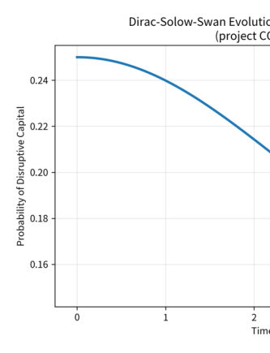 
Figure 1: Dirac–Solow–Swan Hamiltonian evolution of disruptive capital probability de- rived from the parameterized 4-qubit EWL quantum game applied to real CORDIS quadruple-helix data (project COVend, ID 101045956). The plot demonstrates the pre- dicted capital bifurcation and exponential disruptive growth dynamics under the influence of the quadruple helix innovation ecosystem.

📷 Fig 2

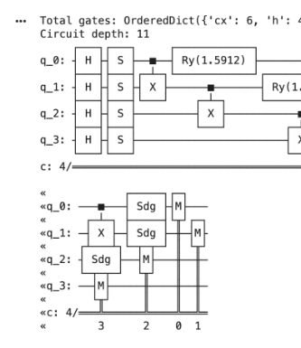 
Figure 2: Qiskit implementation of the parameterized 4-qubit EisertWilkensLewenstein (EWL) quantum game circuit for the quadruple-helix disruptive innovation recommender system. The circuit is constructed for the representative CORDIS Horizon Europe project COVend (ID 101045956). Each qubit corresponds to one helix actor (q0 = Academia, q1 = Industry, q2 = Government, q3 = Civil Society). Local strategy operators are realized as single-qubit rotations Ry(θi) with angles θi = 2 arcsin(√pi) derived directly from nor- malized participant funding dominance weights (see Table 1). The upper panel shows the forward circuit (initial Hadamard layer, multi-qubit EWL entangler, and parameterized...

**Summary.** This paper proposes a quantum computing framework for predicting innovation trends by mapping real-world economic funding data onto a 4-qubit quantum game circuit. By integrating these quantum results into a relativistic economic Hamiltonian, the authors can simulate complex capital accumulation and disruptive growth dynamics. The approach offers a computationally efficient, NISQ-compatible tool for strategic decision-making in complex ecosystems.

**Why it may be interesting.** not directly relevant

Detailed structure

**Main problem.** The difficulty of modeling and forecasting disruptive innovation within complex 'quadruple helix' socio-economic ecosystems using classical methods.

**Main result.** The development of a NISQ-compatible 4-qubit quantum circuit that successfully forecasts disruptive capital trajectories and reproduces capital bifurcation dynamics.

**Method.** A parameterized Eisert-Wilkens-Lewenstein (EWL) quantum game circuit is tuned using real-world CORDIS funding data and integrated with a Dirac-Solow-Swan Hamiltonian for time-evolution simulation.

**Model / system.** A 4-qubit EWL quantum game circuit representing four helix actors (academia, industry, government, and civil society), governed by a Dirac-Solow-Swan Hamiltonian where measurement probabilities act as a diagonal Dirac potential.

**Key observables.** Post-game measurement probabilities (recommender scores) and the time-evolution of disruptive capital probability.

**Important parameters / regimes.** Normalized dominance weights (p_i) from funding data, rotation angles (theta_i), and circuit complexity (22 gates, depth 11).

**Assumptions / limitations.** Local strategies are represented by single Ry rotations, and economic dynamics can be modeled via a simplified diagonal Dirac potential.

**Figures summary.** Figure 1 shows the time-evolution trajectories of the economic model, specifically demonstrating capital bifurcation and exponential growth.

**Paper structure.** The paper identifies the failure of classical models, presents a quantum-enhanced circuit design, details the integration of empirical data and relativistic Hamiltonians, and concludes with complexity analysis and NISQ compatibility.

Abstract

We present a novel parameterized 4-qubit Eisert-Wilkens-Lewenstein (EWL) quantum game circuit for recommender systems in quadruple helix innovation ecosystems (academia, industry, government, and civil society). The local strategy operators $U_{i} = R_y(θ_{i})$ for each helix actor are directly tuned by normalized dominance weights extracted from real participant funding data (\texit{ecContribution}) in the European Commission CORDIS Horizon Europe database (project COVend, ID 101045956). The circuit employs a multi-qubit EWL entangler followed by parameterized local rotations, inverse entangler, and full measurement, achieving only 22 gates and circuit depth 11 while scaling as $O(n)$ for $n$-round helix communications. Measurement probabilities after the quantum game serve as recommender scores for disruptive versus sustaining innovation trends. These scores are subsequently mapped into the diagonal Dirac potential of a Dirac-Solow-Swan Hamiltonian, enabling time-evolution simulation of capital accumulation and bifurcation dynamics under disruptive innovation. Numerical experiments on real CORDIS quadruple-helix collaboration networks demonstrate the circuit's NISQ compatibility and its ability to forecast disruptive capital trajectories with high fidelity.   The proposed framework bridges quantum game theory, parameterized quantum circuits, and relativistic economic growth models, offering a computationally efficient tool for innovation policy and strategic decision-making in complex socio-economic ecosystems. Complexity analysis and reproducibility are provided through open Qiskit implementations.

[↑ back to top](#top)

### [Physics in the Public Square: University Extension as a Strategy for Integrating Physics Education and Science Communication](http://arxiv.org/abs/2605.18384v1)

**Authors:** Andre A. A. Marinho, Gisele B. Freitas, Camila B. C. da Silva  
**Type:** experiment · **Category:** other · **PDF:** <https://arxiv.org/pdf/2605.18384v1>  
**Analysis basis:** full PDF text, analyzed in chunks

📷 Fig 1

 
Figure 1: The professors who conceived the idea and our logo, (left). Our team (right).

📷 Fig 2

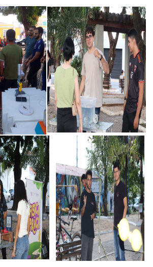 
Figure 2: Some experiments presented by our team to the public.

**Summary.** This paper evaluates a university extension program that uses low-cost, hands-on physics experiments to bridge the gap between academia and the public. It demonstrates that such outreach effectively promotes scientific literacy in the community and provides essential professional training for future physics teachers.

**Why it may be interesting.** not directly relevant

Detailed structure

**Main problem.** The gap between academic physics and society caused by the perception of physics as abstract and the lack of experimental infrastructure in basic education.

**Main result.** The outreach activity significantly improved visitor understanding (96.9%) and engagement, while successfully developing communication and pedagogical skills in pre-service teachers.

**Method.** An outreach event 'Physics in the Public Square' was conducted using 12 low-cost didactic experiments, with data collected via structured questionnaires from 52 visitors.

**Model / system.** An experimental platform consisting of 12 didactic experiments built from low-cost materials (PET bottles, wires, magnets, etc.) covering classical mechanics, electromagnetism, and optics.

**Key observables.** Visitor understanding of phenomena, clarity of communication ratings, level of engagement, and familiarity with experiments.

**Assumptions / limitations.** The study is limited by a relatively small sample size (n = 52) and focuses on a specific regional context in Brazil.

**Figures summary.** Figure 1 shows the research team and project logo; Figure 2 displays photographs of the team presenting experiments to the public.

**Paper structure.** The paper introduces the problem of science communication, describes the design and implementation of the outreach activity, details the pedagogical framework and data collection methods, presents the quantitative and qualitative results, and discusses limitations and future directions.

Abstract

University extension activities play a fundamental role in bridging the gap between academia and society by fostering the socialization of scientific knowledge. This study reports and analyzes an outreach activity conducted in a public space, involving undergraduate students enrolled in Physics I, Physics III, and Physics IV courses within the Physics Teacher Education Program at the State University of the Tocantina Region of Maranhao (UEMASUL). The activity was developed through the design and presentation of didactic experiments using low-cost materials. Its main objectives were to disseminate fundamental physics concepts to the community, stimulate public interest in science, and provide pre-service teachers with a formative experience integrating theory, practice, and social responsibility. Data were collected from questionnaires adminisvelopment of communication skills, and the strengthening of the university's social role, while also fostering scientific curitered to visitors (n = 52). The results indicate that the activity significantly contributed to student learning, the deosity among participants.

[↑ back to top](#top)

### [Pointwise Generalization in Deep Neural Networks](http://arxiv.org/abs/2605.18598v1)

**Authors:** Shaojie Li, Yunbei Xu  
**Type:** theory · **Category:** disordered systems and neural networks · **PDF:** <https://arxiv.org/pdf/2605.18598v1>  
**Analysis basis:** full PDF text, analyzed in chunks

📷 Fig 1

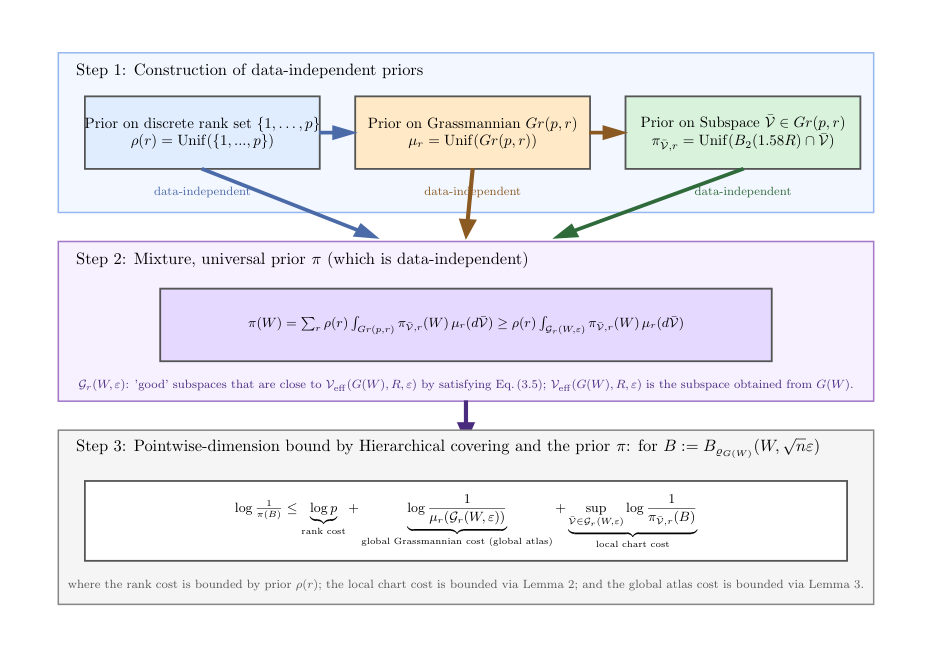 
Figure 1: Hierarchical construction of the data-independent prior π and its role in the pointwise- dimension bound (one single-layer case).

📷 Fig 2

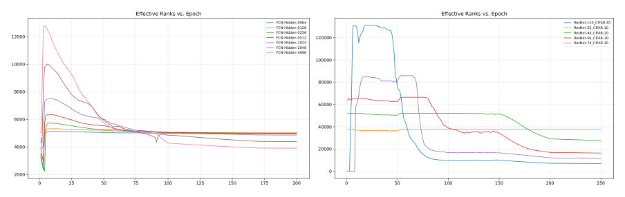 
Figure 2: Effective Rank evolutions of FCNs on MNIST (left) and ResNets on CIFAR-10 (right) across the training

📷 Fig 3

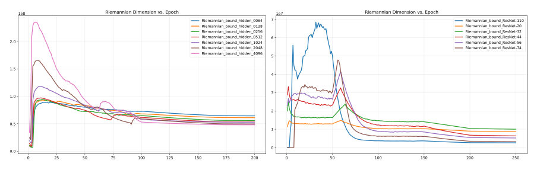 
Figure 3: Riemannian Dimension evolutions of FCNs on MNIST (left) and ResNets on CIFAR-10 (right) across the training

**Summary.** The paper proposes a new theory of generalization for deep learning that moves away from worst-case global complexity to a localized, feature-dependent measure. By focusing on the effective dimension of learned representations, it explains how overparameterization actually aids generalization through feature compression. This provides a much tighter mathematical bound on the performance of neural networks than traditional methods.

**Why it may be interesting.** not directly relevant

Detailed structure

**Main problem.** Explaining why massive, overparameterized deep neural networks generalize well in practice despite classical theory predicting severe overfitting.

**Main result.** Established a pointwise generalization theory where the generalization gap is controlled by a 'Riemannian Dimension' derived from the eigenvalues of learned feature representations, providing bounds orders of magnitude tighter than previous methods.

**Method.** A non-perturbative, representation-aware framework using hierarchical covering on Grassmannian manifolds and a mixed empirical-ghost metric to analyze the geometry of the feature space.

**Model / system.** Fully connected (feed-forward) Deep Neural Networks (DNNs) with L layers, widths d_l, and 1-Lipschitz nonlinear activations like ReLU.

**Key observables.** Generalization gap, pointwise Riemannian Dimension, effective dimension (d_eff), and feature compression/rank.

**Important parameters / regimes.** Overparameterization regime, feature-scale resolution (epsilon), and spectral decay of the feature Gram matrix.

**Assumptions / limitations.** Relies on verifiable spectral conditions on learned features and assumes 1-Lipschitz activation functions where sigma(0)=0.

**Paper structure.** The paper introduces a pointwise generalization framework, develops a non-perturbative mathematical calculus for DNNs, establishes upper and lower bounds on the generalization gap using Riemannian Dimension, and provides empirical evidence of feature compression and optimizer bias.

Abstract

We address the fundamental question of why deep neural networks generalize by establishing a pointwise generalization theory for fully connected networks. This framework resolves long-standing barriers to characterizing the rich nonlinear feature-learning regime and builds a new statistical foundation for representation learning. For each trained model, we characterize the hypothesis via a pointwise Riemannian Dimension, derived from the eigenvalues of the learned feature representations across layers. This establishes a principled framework for deriving hypothesis-dependent, representation-aware generalization bounds. These bounds offer a systematic upgrade over approaches based on model size, products of norms, and infinite-width linearizations, yielding guarantees that are orders of magnitude tighter in both theory and experiment. Analytically, we identify the structural properties and mathematical principles that explain the tractability of deep networks. Empirically, the pointwise Riemannian Dimension exhibits substantial feature compression, decreases with increased over-parameterization, and captures the implicit bias of optimizers. Taken together, our results indicate that deep networks are mathematically tractable in practical regimes and that their generalization is sharply explained by pointwise, feature-spectrum-aware complexity.

[↑ back to top](#top)

### [Pole Skipping, Avoided Crossing, and Resonant Excitation in Kerr Quasinormal Modes near Algebraically Special Frequencies](http://arxiv.org/abs/2605.17840v1)

**Authors:** Kei-ichiro Kubota, Hayato Motohash  
**Type:** theory · **Category:** other · **PDF:** <https://arxiv.org/pdf/2605.17840v1>  
**Analysis basis:** full PDF text, analyzed in chunks

📷 Fig 1

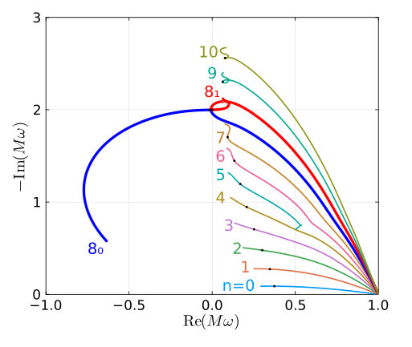 
FIG. 2. Prograde Kerr QNM frequencies for (s, l, m) = (−2, 2, 2) over −1 &lt; a/M &lt; 1. The black dot marks the Schwarzschild limit a/M = 0.

📷 Fig 2

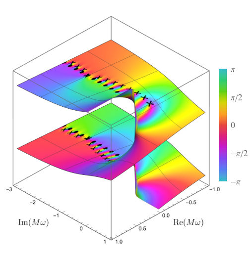 
FIG. 1. Riemann-surface structure of the Schwarzschild Green’s function, visualized by the color-coded phase arg(1/AT in). Black crosses and dots mark QNM poles and Matsubara zeros, respectively. The prograde and retrograde QNMs lie on the lower and upper sheets, respectively.

📷 Fig 3

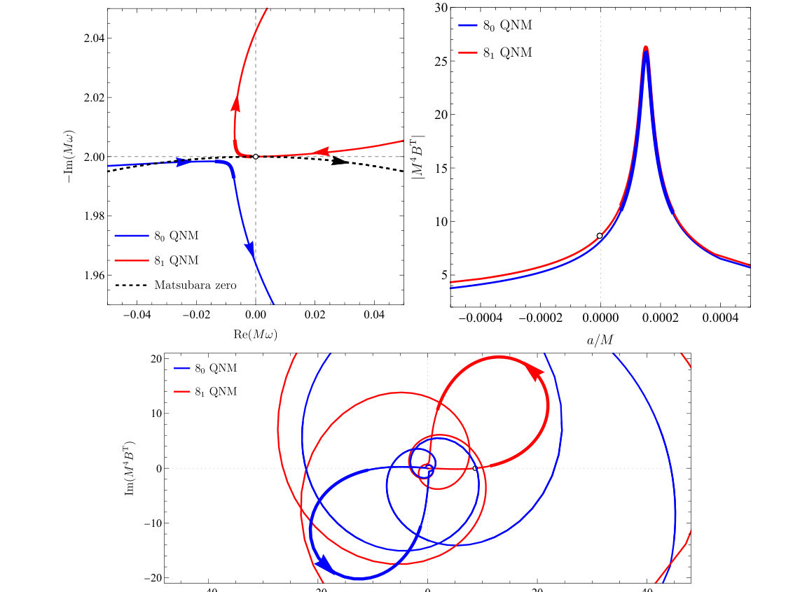 
FIG. 3. Near-AS QNM and MM frequencies (upper left), absolute values of the excitation factors (upper right), and excitation- factor trajectories in the complex plane (lower) for the 80 and 81 branches. Solid curves denote QNM poles and dashed curves denote Matsubara zeros. The white circle marks the pole-skipping point, and thick curves highlight the resonant-excitation region 7.0 × 10−5 ≲a/M ≲2.4 × 10−4.

**Summary.** This paper resolves decades-old puzzles regarding the behavior of black hole ringdown modes near specific frequencies. It shows that what appeared to be disappearing or splitting modes are actually the result of complex interactions between poles and zeros on different Riemann sheets. This provides a continuous and physically consistent description of the transition from rotating to non-rotating black holes.

**Why it may be interesting.** not directly relevant

Detailed structure

**Main problem.** Resolving long-standing anomalies in Kerr quasinormal mode (QNM) spectra near algebraically special frequencies, specifically the apparent bifurcation, disappearance, and non-smooth connection to the Schwarzschild limit.

**Main result.** The paper demonstrates that the apparent bifurcation is due to an avoided crossing with resonant excitation, while the mode disappearance is caused by pole skipping via the cancellation of a QNM pole by a Matsubara-mode zero.

**Method.** The authors use Green's function analysis, the Teukolsky equation, and the Mano-Suzuki-Takasugi (MST) representation to track poles and zeros across different Riemann sheets.

**Model / system.** The system consists of rotating Kerr black holes and their non-rotating Schwarzschild limit, specifically focusing on gravitational perturbations of the (l, m) = (2, 2) multipole.

**Key observables.** Quasinormal mode frequencies, excitation factors (BnT), gravitational-wave strain, and the scattering matrix.

**Important parameters / regimes.** Black hole mass (M), spin parameter (a/M), Hawking temperature (TH), and horizon angular velocity (OH).

**Assumptions / limitations.** The analysis is based on linear perturbation theory in General Relativity.

**Figures summary.** Figure 1 visualizes the Riemann-surface structure of the Schwarzschild Green's function; Figure 2 shows the trajectory of Kerr QNM poles as spin varies; Figure 3 displays the magnitude and trajectories of excitation factors and the identification of Matsubara zeros.

**Paper structure.** The paper identifies the long-standing anomalies in the Kerr/Schwarzschild limit, introduces a pole-zero tracking framework using the MST method, provides the physical resolution via avoided crossings and pole skipping, and discusses the universality and finiteness of the physical waveforms.

Abstract

Kerr quasinormal modes near algebraically special frequencies exhibit anomalous behavior, including apparent bifurcation, disappearance, and a nonsmooth connection to the Schwarzschild limit, which has remained puzzling for decades. Tracking poles and zeros of Green-function building blocks across different Riemann sheets, we show that the bifurcation is due to an avoided crossing accompanied by resonant excitation, while the disappearance is due to pole skipping caused by cancellation of a quasinormal-mode pole by a Matsubara-mode zero. This resolves the physical origin of these long-standing anomalies.

[↑ back to top](#top)

### [Positivity of the effective range for finite range attractive potentials with a repulsive core](http://arxiv.org/abs/2605.18207v1)

**Authors:** Davide Germani  
**Type:** theory · **Category:** other · **PDF:** <https://arxiv.org/pdf/2605.18207v1>  
**Analysis basis:** full PDF text, analyzed in chunks

📷 Fig 1

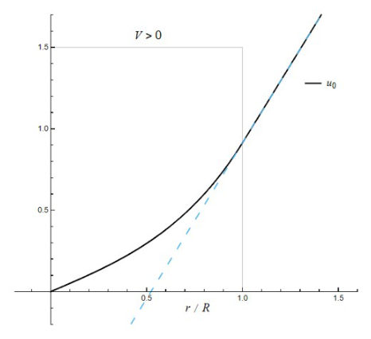 
FIG. 1. Repulsive potential. The function 𝑢0 is shown in black, while the dashed line represents the asymptotic expression. The scattering length is positive, as the line intersects the positive 𝑟−axis, and lies between 0 and 𝑅.

📷 Fig 2

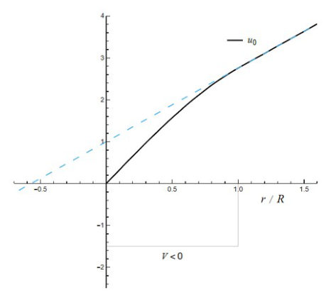 
FIG. 2. Attractive potential not strong enough to support a bound state. The function 𝑢0 is shown in black, while the dashed line represents the asymptotic expression. The scattering length is negative, as the line intersects the negative 𝑟-axis.

📷 Fig 3

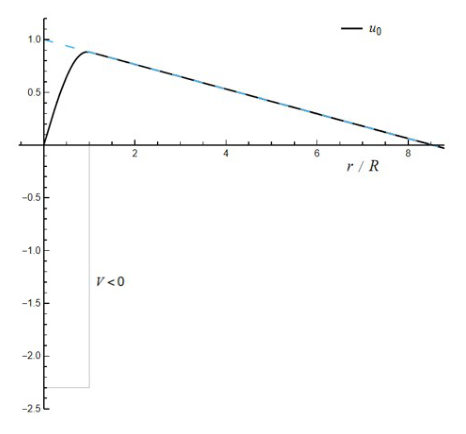 
FIG. 3. Attractive potential that supports a shallow bound state. The function 𝑢0 is shown in black, while the dashed line represents the asymptotic expression. The scattering length is positive and 𝑎≫𝑅.

📷 Fig 4

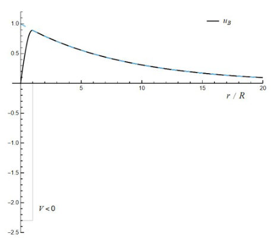 
FIG. 4. The wave function 𝑢𝐵of the shallow bound state is shown in black. The spatial extent of the wave function is much larger than the range of the potential. The dashed line represents the exponential behavior of the asymptotic expression.

📷 Fig 5

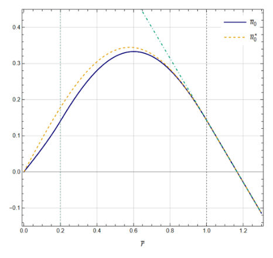 
FIG. 5. Solid line: zero-energy wavefunction for the potential in Eq. (35) with the parameters listed in Tab. I. The dashed line indicates the solution for the purely attractive problem. The dash-dotted line represents the asymptotic solution 1 −¯𝑟/ ¯𝑎, which is common to both solutions since they share the same scattering length. The vertical dotted lines indicate the end of the repulsive region (¯𝑟= ¯𝑟1) and the range of the potential (¯𝑟= 1), respectively.

**Summary.** This paper proves that adding a repulsive core to an attractive finite-range potential cannot produce a negative effective range if the scattering length is larger than the potential range. This result implies that the negative effective ranges used to identify compact exotic hadrons cannot be explained by simple single-channel local potentials and instead require more complex dynamics like coupled-channels.

**Why it may be interesting.** not directly relevant

Detailed structure

**Main problem.** The paper investigates whether a single-channel local potential with an inner repulsive core and an outer attractive tail can produce a negative effective range ($r_0 < 0$).

**Main result.** The author rigorously proves that for such finite-range potentials, the effective range remains strictly positive provided the scattering length is greater than the potential range ($a > R$).

**Method.** The study uses the radial Schrödinger equation, effective range expansion (ERE), and an integral representation of the phase shift to derive a mathematical proof based on the convexity of the wave function.

**Model / system.** The system consists of single-channel local, spherically symmetric, finite-range potentials, specifically modeled using a piecewise continuous spherical barrier/well and a truncated superposition of Yukawa potentials.

**Key observables.** Scattering length ($a$), effective range ($r_0$), and phase shift ($\delta_0$).

**Important parameters / regimes.** Potential range ($R$), repulsive core radius ($r_1$), scattering length ($a$), and the regime where $a > R$.

**Assumptions / limitations.** The proof assumes the potentials are real, local, and finite-range, and specifically focuses on the condition $a > R$.

**Figures summary.** Figure 1 shows a repulsive potential and its wave function; Figures 2, 3, and 4 illustrate the zero-energy wave function and its asymptotic form, demonstrating the spatial extent of the potential's influence.

**Paper structure.** The paper introduces the phenomenological problem of $r_0$ in hadron physics, defines the mathematical model of the potential, provides a rigorous proof of the positivity of $r_0$, verifies the result with numerical models (barrier/well and Yukawa), and discusses the implications for multiquark configurations.

Abstract

In the phenomenological study of exotic hadrons, the sign of the effective range, $r_0$, is invoked as a criterion to distinguish between compact multiquark configurations (associated with $r_0 < 0$) and loosely bound hadronic molecules ($r_0 > 0$). Motivated by this, we investigate the fundamental constraints on the sign of the effective range for single-channel local interactions. We rigorously prove that for finite-range potentials, characterized by an inner repulsive core and an outer attractive tail, the effective range remains strictly positive provided that the scattering length is greater than the range of the potential ($a > R$).

[↑ back to top](#top)

### [Quantum Emitters at Telecommunication Wavelengths based on Carbon Defects in Transition Metal Dichalcogenides](http://arxiv.org/abs/2605.18501v1)

**Authors:** Chanaprom Cholsuk, Sujin Suwanna, Tobias Vogl  
**Type:** theory · **Category:** quantum information and computing · **PDF:** <https://arxiv.org/pdf/2605.18501v1>  
**Analysis basis:** full PDF text, analyzed in chunks

📷 Fig 1

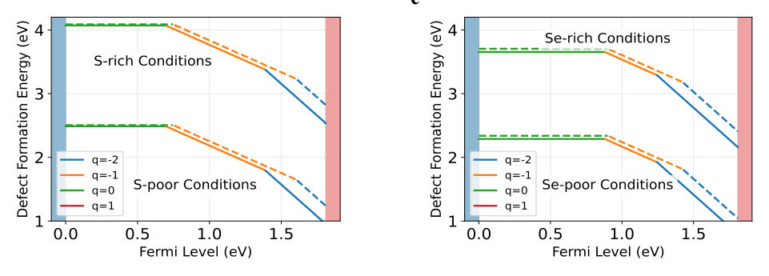 
Figure 1. Geometries and charge stabilities. a The 7×7×1 supercell structures where the carbon is doped on top or middle layers. b - e Defect formation energies of WS2, WSe2, MoS2, and MoSe2, respectively, under chalcogen-rich and chalcogen-poor conditions as a function of Fermi level. Finite-size charge corrections were taken into account. The Fermi level represents the chemical potential, which varies across the bandgap. The crossing point between the formation energy lines of different charge states (q) defines the charge transition level. Solid lines correspond to structures with C doped at the topmost layer, while dashed lines correspond to structures with C doped at the middle layer.

📷 Fig 2

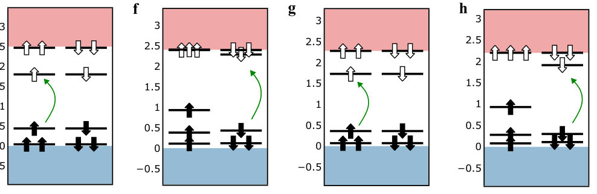 
Figure 2. Kohn–Sham electronic transitions at the Γ point for carbon substitution in the top layer. a and b for WS2 doped with CS and C−1 S . c and d for WSe2 doped with CSe and C−1 Se . e and f for MoS2 doped with CS and C−1 S . g and h for MoSe2 doped with CSe and C−1 Se . The green arrows represent the electronic transition responsible for the computed ZPLs. Note that the electronic transitions for the doping at the middle layer remain unchanged, as can be seen from Supplementary S2.

📷 Fig 3

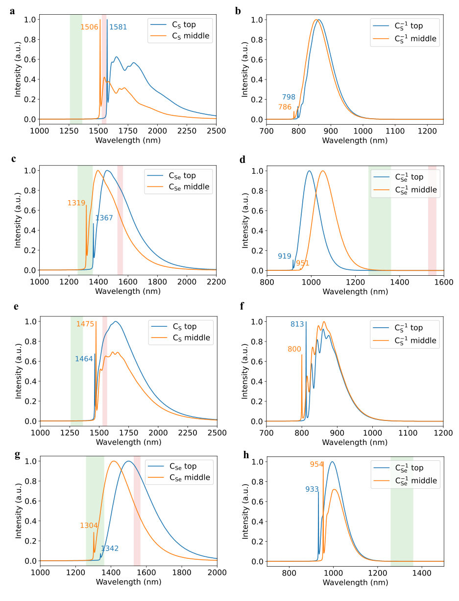 
Figure 3. Simulated photoluminescense spectra. a and b for WS2 doped with CS and C−1 S . c and d for WSe2 doped with CSe and C−1 Se . e and f for MoS2 doped with CS and C−1 S . g and h for MoSe2 doped with CSe and C−1 Se . The green and pink shaded regions indicate the telecommunication wavelength ranges for the O-band (1260-1360 nm) and C-band (1530-1565 nm), respectively.

**Summary.** The paper proposes using carbon-doped TMD bilayers as a way to create stable, room-temperature quantum emitters. By using the indirect bandgap of bilayers to suppress background noise, the authors show that carbon defects can emit single photons specifically in the telecommunication wavelength bands.

**Why it may be interesting.** This work identifies a scalable, solid-state platform for generating single photons at telecom wavelengths, which is critical for developing integrated quantum networks and photonic quantum computing.

Detailed structure

**Main problem.** Achieving robust, room-temperature single-photon emission in 2D materials by overcoming the photoluminescence quenching found in TMD monolayers.

**Main result.** Carbon-doped TMD bilayers provide a stable platform for quantum emitters at telecommunication wavelengths (O- and C-bands) due to the suppression of excitonic background by the indirect bandgap.

**Method.** Hybrid-functional Density Functional Theory (HSE06) combined with the delta-SCF method for excited states and the Pyphotonics package for phonon-mediated luminescence modeling.

**Model / system.** Substitutional carbon defects at chalcogen sites (S and Se) within transition metal dichalcogenide (TMD) bilayers, specifically WS2, WSe2, MoS2, and MoSe2.

**Key observables.** Zero-phonon line (ZPL) wavelengths, Huang-Rhys factor, Debye-Waller factor, radiative lifetime, and transition dipole orientation.

**Important parameters / regimes.** O-band (1260-1360 nm) and C-band (1530-1565 nm) telecommunication windows; neutral vs. singly negative charge states.

**Assumptions / limitations.** The study assumes the stability of the 2H stacking phase and focuses on the electronic/optical properties of the defect-induced two-level system without investigating intersystem crossing.

**Figures summary.** Figure 1 shows the supercell geometries for top and middle layer carbon doping and the corresponding defect formation energies.

**Paper structure.** The paper introduces the problem of PL quenching, describes the computational methodology (DFT and spectroscopic modeling), presents results on charge stability and optical properties (ZPL, lifetime, dipole), and concludes with experimental identification fingerprints.

Abstract

Low-dimensional materials have emerged as promising hosts for quantum emitters, whose emission typically arises from either strain-induced band bending or defect-induced two-level systems. Among these materials, transition metal dichalcogenide (TMD) monolayers have attracted particular attention; however, their performance is limited by strong photoluminescence (PL) quenching at room temperature. As TMDs transition from a direct to an indirect bandgap when moving from monolayers to multilayers, we herein propose a strategy to overcome this quenching limitation by exploiting the indirect bandgap of TMD bilayers in combination with a point defect doping. The indirect gap suppresses excitonic PL, while specific defects enable robust defect-mediated quantum emission. Using hybrid-functional density functional theory, we investigate substitutional carbon defects at chalcogen sites (S and Se) in WS2, WSe2, MoS2, and MoSe2 bilayers and comprehensively characterize their optical properties. Both neutral and singly negative charge states are found to be thermodynamically stable. Neutral defects exhibit singlet configurations with emission in the O- and C-band telecommunication windows, whereas negatively charged defects adopt doublet configurations featuring spin-selective transitions and near-infrared emission. The electron-phonon coupling strength, radiative lifetime, and dipole orientation are found to depend sensitively on both the host material and defect site, providing distinct fingerprints for experimental identification. Our findings, therefore, establish carbon-doped TMD bilayers as promising platforms for room-temperature defect-based quantum emitters operating at telecommunication wavelengths.

[↑ back to top](#top)

### [Quantum geometry induced anomalous chiral transport and hidden symmetry breaking in centrosymmetric 2M-WS2](http://arxiv.org/abs/2605.18277v1)

**Authors:** Hang Cui, Shao-Bo Liu, Erqing Wang, Mingxiang Pan, Yuqiang Fang, Ning Ma, Wenlong Liu, Di Chen, Yu Zhang, Yuanjun Song, Tingting Hao, Jiankun Li, Jian Cui, Ya Feng, Haiwen Liu, Fuqiang Huang, Huaqing Huang, X. -C. Xie, Jian-Hao Chen  
**Type:** both · **Category:** strongly correlated electrons · **PDF:** <https://arxiv.org/pdf/2605.18277v1>  
**Analysis basis:** full PDF text, analyzed in chunks

📷 Fig 1

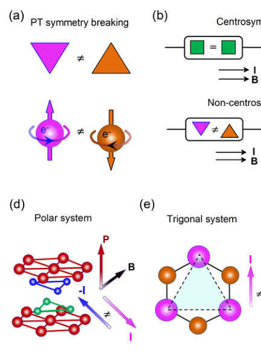 
FIG. 1. Nonreciprocal transport under magnetic field in non-centrosymmetric crystals. (a) Spatial

📷 Fig 2

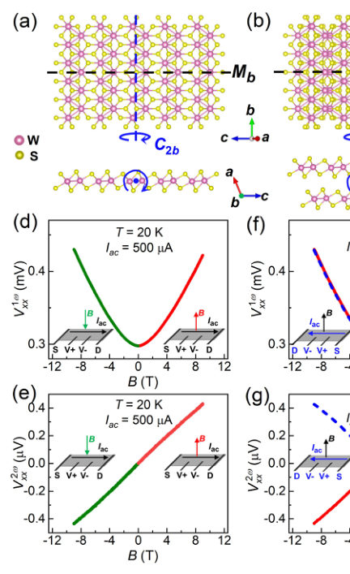 
FIG. 2. Electrical magnetochiral anisotropy (eMChA) in centrosymmetric 2M-WS2 flake. (a)-(b) The

📷 Fig 3

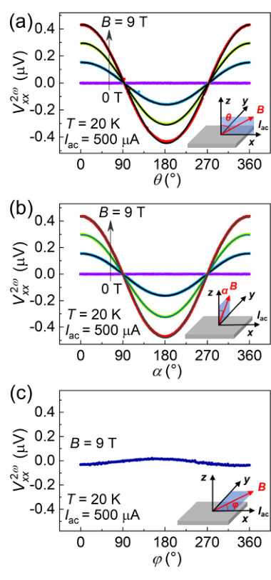 
FIG. 3. Angular, temperature, and field dependence of the electrical magnetochiral anisotropy

📷 Fig 4

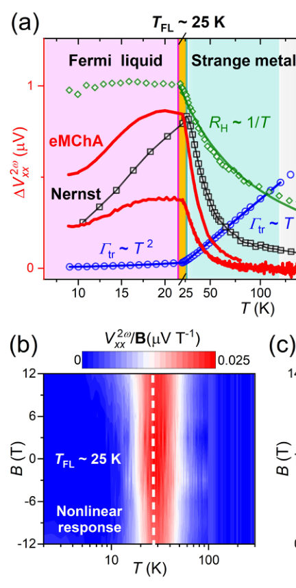 
FIG. 4. Hidden symmetry breaking and intertwined physics in the normal state of 2M-WS2 around T ~ 25 K. (a) Two solid red lines represent temperature dependent second-harmonic voltage

**Summary.** This paper reports the discovery of unexpected chiral transport in the centrosymmetric material 2M-WS2. The researchers show that this nonlinear response, along with a large Nernst effect, emerges simultaneously with a transition from a Fermi liquid to a strange metal. These phenomena are attributed to nontrivial quantum geometry and potential hidden symmetry breaking.

**Why it may be interesting.** not directly relevant

Detailed structure

**Main problem.** Investigating the origin of unexpected nonreciprocal transport (eMChA) and hidden symmetry breaking in the centrosymmetric material 2M-WS2, and understanding its connection to the Fermi liquid to strange metal transition.

**Main result.** The discovery of remarkable electronic magnetochiral anisotropy (eMChA) in centrosymmetric 2M-WS2 that coincides with an anomalous Nernst response and a crossover from Fermi liquid to strange metal at 25 K, driven by nontrivial quantum geometry.

**Method.** Experimental transport measurements using second-harmonic generation (SHG) and lock-in techniques, combined with first-principles DFT calculations and phenomenological modeling of nonreciprocal transport.

**Model / system.** The physical system is 2M-WS2, a metastable, centrosymmetric candidate topological superconductor characterized by a crossover from Fermi liquid to strange metal behavior.

**Key observables.** Second-harmonic voltage (V2w), first-harmonic voltage (V1w), eMChA coefficient (gamma), Nernst coefficient (nu), scattering rate (Gamma_tr), and Hall coefficient (RH).

**Important parameters / regimes.** Crossover temperature TFL approx 25 K, superconducting transition temperature Tc = 8.8 K, and magnetic field (B) and current (I) amplitudes.

**Assumptions / limitations.** The existence of a thick-layer-sliding mechanism as a source for nontrivial quantum geometry.

**Figures summary.** Fig 1: Concept of symmetry breaking and nonreciprocal transport; Fig 2: 2M-WS2 device geometry, symmetry, and voltage dependence on B and I; Fig 3: Angular, temperature, and field dependence of eMChA; Fig 4: Phase diagram correlating eMChA, Nernst effect, and scattering rates.

**Paper structure.** Introduction to symmetry breaking and eMChA; Experimental setup and device fabrication; Observation of eMChA in 2M-WS2; Correlation of eMChA with Nernst effect and FL-SM transition; Theoretical analysis of quantum geometry and structural origin; Conclusion.

Abstract

Chirality, a widely existing material property in nature involving the breaking of the left-right symmetry, has profound influences in various fields of natural sciences. Nonlinear response, such as electronic magnetochiral anisotropy (eMChA), has been recognized as a sensitive probe for the effects of symmetry breaking and nontrivial quantum geometries in solids. So far, observations of eMChA have primarily been limited to inversion-symmetry broken materials. Here, we report a remarkable chiral transport in centrosymmetric candidate topological superconductor 2M-WS2 flakes observed via second-harmonic generation under an out-of-plane magnetic field. More importantly, the eMChA becomes significant around the crossover temperature TFL ~ 25 K from the Fermi liquid (FL) to strange metal (SM) in the normal state, which interestingly echoes with the anomalously large Nernst response at the same temperature in bulk 2M-WS2. These observations reveal a direct correspondence between the nonlinear response, Nernst response, and FL-SM transition in 2M-WS2. Theoretical analysis indicates that nontrivial quantum geometry is behind the simultaneous response of eMChA and Nernst effects in 2M-WS2 and the contribution from the orbital magnetic moment at the Fermi surface becomes significant during the FL-SM transition. Based on first-principles calculations, a thick-layer-sliding mechanism with minimal energy gain in 2M-WS2 provides one possibility for the generation of such nontrivial quantum geometry. The intertwined physics of remarkable eMChA, Nernst response, and FL-SM transition make 2M-WS2 a rare quantum platform to study the chiral transport and unexplored phenomena in strange metals, which may shed light on the trans-century, unresolved scientific issue in unconventional high-temperature superconductivity.

[↑ back to top](#top)

### [Quantum Model for CVRPTW](http://arxiv.org/abs/2605.18393v1)

**Authors:** Imran Meghazi, Éric Bourreau  
**Type:** theory · **Category:** quantum information and computing · **PDF:** <https://arxiv.org/pdf/2605.18393v1>  
**Analysis basis:** full PDF text, analyzed in chunks

📷 Fig 1

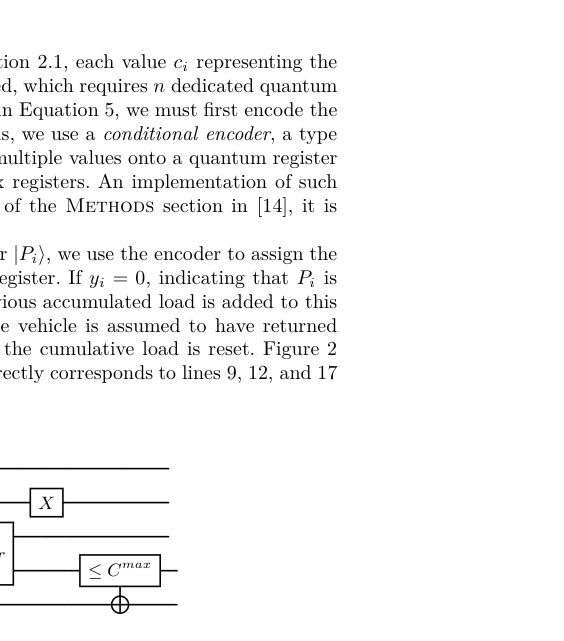 
Fig. 2. Quantum circuit for capacity constraint

📷 Fig 2

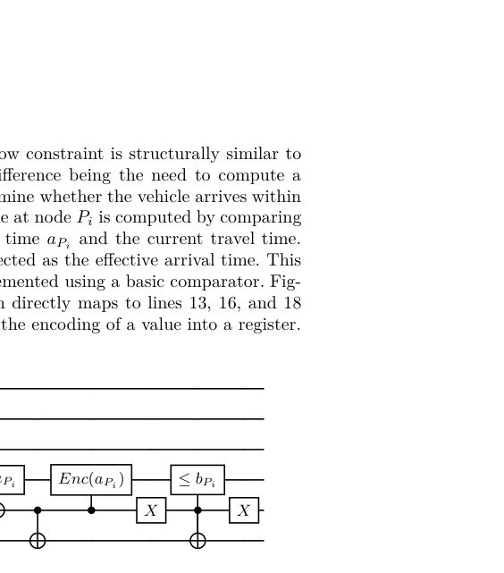 
Fig. 3. Quantum circuit for time constraint

📷 Fig 3

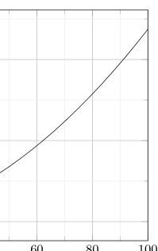 
Fig. 4. Number of qubits relative to the number of customers for the oracle with the maximum capacity and number of time windows both fixed to 8.

**Summary.** This paper presents a new quantum algorithm for solving complex vehicle routing problems with capacity and time constraints. By using a 'split-inspired' technique, the authors significantly reduce the number of extra qubits needed compared to previous methods, making the problem more accessible to near-term quantum hardware.

**Why it may be interesting.** not directly relevant

Detailed structure

**Main problem.** Developing an efficient quantum algorithm to solve the Capacitated Vehicle Routing Problem with Time Windows (CVRPTW), which is an NP-hard optimization problem.

**Main result.** The authors propose a qubit-efficient quantum model that adds only a linear number of decision qubits compared to standard TSP formulations, providing an optimal approach for the NISQ era.

**Method.** The approach uses a Grover Adaptive Search (GAS) framework based on the Dürr and Høyer algorithm, employing a 'route-first, cluster-second' strategy with a split-inspired model.

**Model / system.** The model is designed for gate-based quantum computers in the NISQ era, utilizing a position-based encoding and an oracle that checks capacity and time window constraints via reversible logic.

**Key observables.** Total travel cost (distance) and the validity of constraints (capacity and time windows).

**Important parameters / regimes.** Number of customers (n), maximum vehicle capacity (Cmax), delivery time windows [ai, bi], and the distance matrix (D).

**Assumptions / limitations.** The model assumes each customer is assigned a single time window and is limited by the gate complexity and qubit counts available on NISQ-era hardware.

**Figures summary.** Figure 1 illustrates the giant tour and the auxiliary graph used for the split procedure; Figure 2 and 3 show quantum circuit diagrams for capacity and time window constraints; Figure 4 shows qubit scaling relative to the number of customers.

**Paper structure.** The paper introduces the CVRPTW problem, proposes a quantum algorithm based on Grover Search, details the qubit-efficient encoding and oracle construction (including capacity and time constraints), analyzes the complexity, and discusses hardware limitations.

Abstract

This paper proposes a quantum algorithm for the capacitated vehicle routing problem with time windows (CVRPTW) based on Grover Search framework. This problem is often faced by Postal services in the context of package delivery or other time-sensitive operations. We provide an implementation on gate based quantum computer of a model inspired by classical route first, cluster second technique. The quantum paradigm allows to overcome suboptimality inherent property of this decomposition. In the current NISQ (Noisy Intermediate-Scale Quantum) era, the most important limitation is the number of available qubits which makes time windows and capacity constraints hard to tackle. We introduce a qubit-efficient split-inspired modeling which adds only a linear number of decision qubits to standard quantum formulations for Traveling Salesman Problem (TSP).

[↑ back to top](#top)

### [quantum-safe: Bridging the Post-Quantum Production Gap with a Hybrid-by-Default Python Cryptography Library](http://arxiv.org/abs/2605.17061v1)

**Authors:** Animesh Shaw  
**Type:** experiment · **Category:** other · **PDF:** <https://arxiv.org/pdf/2605.17061v1>  
**Analysis basis:** full PDF text, analyzed in chunks

📷 Fig 1

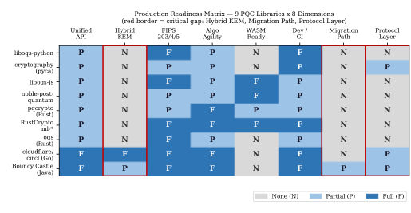 
Fig. 1. Production readiness matrix for nine PQC libraries across eight dimensions. F = Full, P = Partial, N = None. Red borders highlight the three critical gaps: Hybrid KEM, Migration Path, and Protocol Layer. quantum-safe scores Full on all eight dimensions.

📷 Fig 2

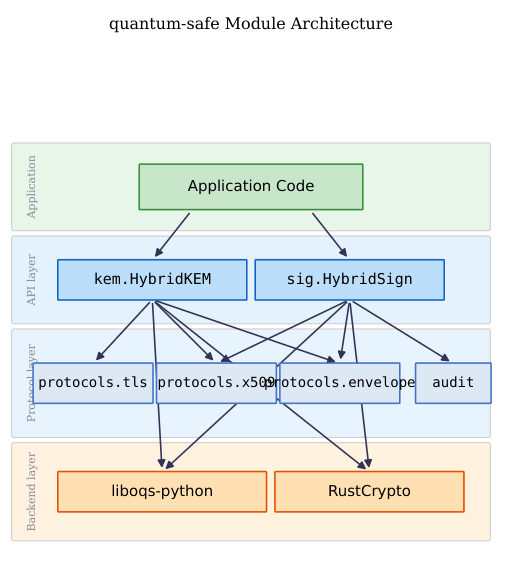 
Fig. 2. Module architecture of quantum-safe. Application code interacts only with HybridKEM and HybridSign. Protocol helpers (tls, x509, envelope) and the audit module sit above a backend abstraction layer that currently exposes liboqs-python and RustCrypto.

📷 Fig 3

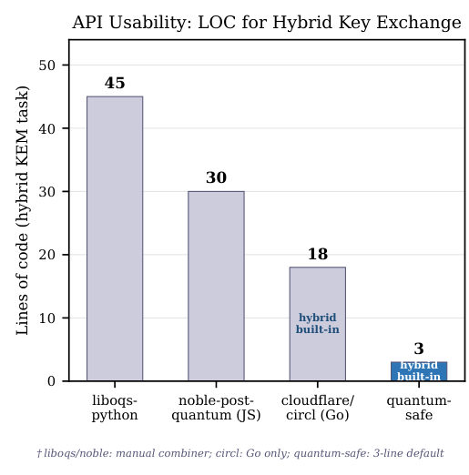 
Fig. 3. Lines of code required for a complete hybrid KEM operation. liboqs- python and noble-post-quantum require manual combiner implementation. cloudflare/circl (Go) is concise but has no Python binding. quantum-safe requires three lines; hybrid is the default.

📷 Fig 4

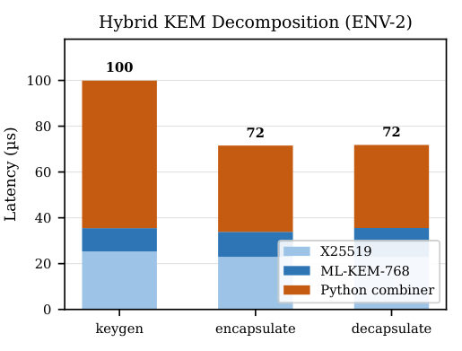 
Fig. 4. Stacked bar decomposition of hybrid KEM latency. The Python combiner (HKDF-SHA256, PEM/CBOR serialisation, key wrapping) accounts for 37–64 µs per operation — comparable to or exceeding the underlying cryptographic primitive cost in ENV-2.

📷 Fig 5

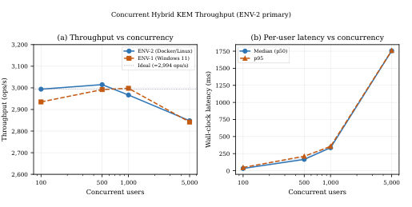 
Fig. 5. (a) Throughput vs concurrency; (b) per-user latency vs concurrency. ENV-2 and ENV-1 show nearly identical throughput despite a 2.4× per- operation latency difference, confirming GIL release.

**Summary.** This paper addresses the practical deployment challenges of post-quantum cryptography by introducing a Python library designed for 'hybrid-by-default' use. It quantifies the lack of production-ready tools in the current ecosystem and demonstrates that the new library provides high-performance, low-complexity implementations of NIST-standardized algorithms.

**Why it may be interesting.** not directly relevant

Detailed structure

**Main problem.** The 'production gap' in post-quantum cryptography (PQC), where despite standardized algorithms, there is a lack of practical tools for hybrid key exchange, migration, and protocol integration.

**Main result.** The authors introduce 'quantum-safe', a Python library that simplifies hybrid KEM implementation from 45 to 3 lines of code, and demonstrate that its performance overhead is negligible compared to TLS 1.3 budgets.

**Method.** A systematic evaluation of nine PQC libraries across eight production-readiness dimensions, combined with rigorous performance benchmarking and the introduction of the Coefficient of Variation (CoV) as a timing side-channel proxy.

**Model / system.** A software-based experimental platform using Python 3.12, liboqs, and Docker/Linux environments to evaluate cryptographic primitives like ML-KEM and ML-DSA.

**Key observables.** Latency (microseconds), throughput (ops/s), Coefficient of Variation (CoV) for timing stability, and Lines of Code (LOC) for API complexity.

**Important parameters / regimes.** X25519 + ML-KEM-768 handshake latency, 5,000 concurrent users, and the AES-256-GCM noise floor for timing analysis.

**Assumptions / limitations.** The CoV methodology is treated as a necessary but not sufficient condition for constant-time verification; results are specific to the Python 3.12 environment.

**Figures summary.** The figures include a production-readiness heatmap of existing libraries, a module architecture diagram for the new library, a comparison of code complexity (LOC), and charts showing timing stability (CoV) and latency percentiles.

**Paper structure.** The paper identifies the production gap, presents the 'quantum-safe' library design, provides a comparative analysis of the existing ecosystem, details the performance and timing stability benchmarks, and concludes with the introduction of new auditing tools.

Abstract

The August 2024 finalisation of FIPS 203 (ML-KEM), FIPS 204 (ML-DSA), and FIPS 205 (SLH-DSA) closed the algorithmic gap in post-quantum cryptography (PQC). The production gap -- hybrid combiners, versioned key formats, protocol helpers, and migration tooling -- remains open. We present quantum-safe, a Python library that closes all three critical gaps we identify, and a systematic evaluation of the nine-library ecosystem that quantifies them.   We score nine PQC libraries across eight production-readiness dimensions. Three dimensions have coverage below 35%: hybrid KEM support (11%), migration tooling (22%), and protocol integration (33%). quantum-safe scores Full on all eight. The full API reduces the hybrid KEM task from 45 lines of manual combiner code to three lines, directly lowering the risk of insecure combiner implementations.   We report the first statistically rigorous per-operation overhead measurement for a Python hybrid PQC library (3,000 iterations, CPU-pinned, bootstrapped 95% confidence intervals). A full X25519 + ML-KEM-768 handshake completes in 243 μs under Docker/Linux -- 0.5--2.5% of a typical TLS 1.3 round-trip budget. At 5,000 concurrent users, throughput holds at 2,848 ops/s with only 4.9% degradation versus the single-user baseline, confirming that liboqs releases the Python GIL during C-level operations.   We introduce Coefficient of Variation (CoV) as a practical timing side-channel proxy across all FIPS 203/204 operations. ML-KEM-768 decapsulation achieves CoV = 3.9%, within the AES-256-GCM noise floor (2.1%). ML-DSA-65 signing shows CoV = 51.5%, expected from FIPS 204 rejection sampling, not a side-channel. This CoV methodology has not previously been applied to PQC library evaluation and provides a lightweight complement to formal constant-time verification tools. All results are reproducible via a single Docker command.

[↑ back to top](#top)

### [Quokka#: Quantum Computing with #SAT](http://arxiv.org/abs/2605.16509v1)

**Authors:** Jingyi Mei, Dekel Zak, Muhammad Osama, Tim Coopmans, Alfons Laarman  
**Type:** theory · **Category:** quantum information and computing · **PDF:** <https://arxiv.org/pdf/2605.16509v1>  
**Analysis basis:** full PDF text, analyzed in chunks

📷 Fig 1

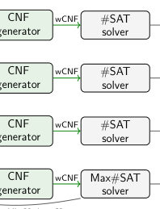 
Fig. 1. The architecture of Quokka#.

**Summary.** Quokka# is a new Python library that treats quantum circuit analysis tasks as weighted model counting (#SAT) problems. It provides a unified framework for simulating, verifying, and synthesizing quantum circuits, offering high efficiency and the ability to handle arbitrary gate sets through approximate equivalence checking.

**Why it may be interesting.** not directly relevant

Detailed structure

**Main problem.** The need for a versatile, open-source tool capable of performing various quantum circuit analysis tasks, including simulation, verification, equivalence checking, and synthesis, across universal gate sets.

**Main result.** The development of Quokka#, a Python library that reduces quantum tasks to weighted model counting (#SAT), demonstrating competitive performance in simulation and equivalence checking, and enabling depth-optimal circuit synthesis.

**Method.** The framework reduces quantum circuit operations to weighted #SAT problems using various encodings (computational-basis, Pauli-basis, and cyclic) and utilizes specialized engines for simulation, verification via quantum Hoare logic, and synthesis via Max#SAT.

**Model / system.** The system consists of n-qubit quantum circuits represented in QASM format, utilizing various gate sets such as Clifford+T, Toffoli+H, and Clifford+R, with states represented as vectors or density matrices.

**Key observables.** Measurement probabilities, Jamiołkowski fidelity, and circuit depth.

**Important parameters / regimes.** Precision parameter (epsilon) for approximate equivalence and synthesis, and complex-valued weights for amplitudes.

**Assumptions / limitations.** The current implementation focuses on strong simulation (computational and Pauli-basis measurements) and is restricted to unitary quantum circuits without measurements or control-flow constructs.

**Figures summary.** Figure 1 provides an architectural diagram of the Quokka# design, showing the interaction between the circuit encoder, CNF generator, and #SAT solver across the functional engines; Tables 1-4 compare Quokka# performance against other state-of-the-art tools and show the iterative progress of circuit synthesis.

**Paper structure.** The paper introduces the Quokka# library, details its mathematical framework and various encodings, describes the four functional engines (Simulation, Verification, Equivalence Checking, and Synthesis), provides benchmarking results against existing tools, and discusses limitations and future work.

Abstract

We present Quokka#, a versatile, open-source Python library for quantum circuit analysis. Quokka# reduces various simulation, verification, and synthesis tasks to weighted model counting (#SAT). It supports universal quantum circuits and a wide variety of gates. Quokka# provides multiple encodings based on different algebraic bases and equivalence-checking methods, enabling key performance trade-offs. Moreover, the new version of Quokka# adds approximate equivalence checking, which is crucial in its synthesis algorithms, since it enables translation between arbitrary gate sets. Its synthesis engine is depth-optimal, making it well-suited to real-world quantum computing. This paper demonstrates the design, extensibility, and use of Quokka#.

[↑ back to top](#top)

### [Reducing the Complexity of Density-Matrix Functionals in a Real-Space-Decomposed DF+RDMF Scheme with the Adaptive Cluster Approximation](http://arxiv.org/abs/2605.16666v1)

**Authors:** Konstantin Tamoev, Robert Schade, Thomas D. Kühne  
**Type:** theory · **Category:** strongly correlated electrons · **PDF:** <https://arxiv.org/pdf/2605.16666v1>  
**Analysis basis:** full PDF text, analyzed in chunks

📷 Fig 1

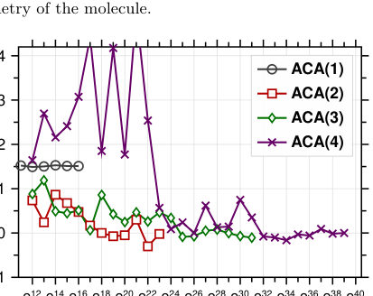 
FIG. 3. Convergence of the local density-matrix correction with ACA bath level. The data demonstrate the systematic reduction of the truncation error across the ACA(1)–ACA(4) hierarchy as additional effective bath levels are retained.

📷 Fig 2

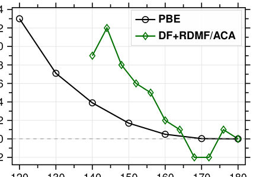 
FIG. 4. Bending potentials of C3O2 on a common relative energy scale. Both curves are shifted such that E(180◦) = 0. Semilocal PBE favors the linear structure, whereas the real-space-decomposed DF+RDMF/ACA selected-CI result stabilizes a bent geometry.

📷 Fig 3

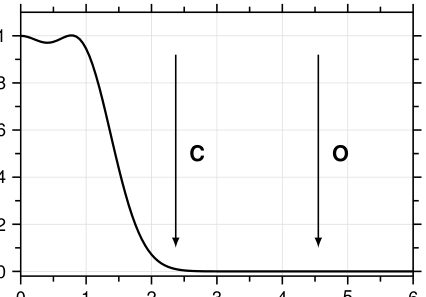 
FIG. 1. Switching function f(r) used in the real-space in- teraction decomposition. The origin is placed at the central carbon atom of C3O2. Vertical markers indicate the distances to the neighboring carbon atoms and terminal oxygen atoms.

**Summary.** This paper proposes a new hybrid method that combines the efficiency of DFT for weak correlations with the accuracy of RDMFT for strong local correlations. By using real-space decomposition and the Adaptive Cluster Approximation, the authors reduce the computational complexity of the density-matrix functionals. The method successfully corrects the structural prediction of carbon suboxide from linear to bent, demonstrating its potential for studying spatially inhomogeneous, strongly correlated systems.

**Why it may be interesting.** not directly relevant

Detailed structure

**Main problem.** The exponential computational scaling of Reduced Density-Matrix Functional Theory (RDMFT) makes it difficult to treat large systems, and combining it with Density Functional Theory (DFT) without double-counting or prohibitive costs is a major challenge.

**Main result.** The DF+RDMF/ACA scheme successfully recovers the correct qualitative structural tendency (a bent configuration) for carbon suboxide, whereas standard semilocal PBE incorrectly predicts a linear structure.

**Method.** A real-space-decomposed DF+RDMF scheme is used to partition the Coulomb interaction, combined with the Adaptive Cluster Approximation (ACA) to compress local density-matrix functionals via unitary rotation of the bath subspace.

**Model / system.** The study uses the bending potential of carbon suboxide (C3O2), a quasilinear oxocarbon cumulene, as a molecular test case to evaluate local correlation effects.

**Key observables.** C-C-C bending potential energy E(alpha), equilibrium bond angle, and ground-state energy.

**Important parameters / regimes.** The spectroscopic bending barrier scale (0.09-0.36 mHa) and the ACA(M) truncation hierarchy.

**Assumptions / limitations.** The exchange-correlation hole is assumed to depend on the local value of the decomposition function, and the interaction is partitioned using a bounded real-space decomposition function.

**Figures summary.** Figure 1 shows the smooth switching function f(r) used for the real-space interaction decomposition.

**Paper structure.** The paper introduces the scaling bottleneck of RDMFT, proposes a real-space decomposition DF+RDMF scheme, details the ACA compression method, applies the method to the C3O2 bending potential, and discusses convergence and accuracy.

Abstract

Reduced density-matrix functional theory (RDMFT) provides a variational route to electronic correlations beyond conventional density-functional approximations, but explicit evaluations of density-matrix functionals still scale exponentially with the number of active one-particle states. We formulate and assess a real-space-decomposed density-functional plus reduced-density-matrix-functional (DF+RDMF) scheme in which the Coulomb interaction is partitioned locally in real space and the RDMF correction is evaluated only for the strongly correlated part of the interaction. The resulting local density-matrix functionals are further compressed using the adaptive cluster approximation (ACA), which performs a unitary rotation of the bath subspace before truncation and therefore preserves the local interaction while reducing the number of explicitly correlated bath states. As a molecular test case, we consider the bending potential of carbon suboxide, C$_3$O$_2$. While semilocal PBE favors a linear molecule, the DF+RDMF/ACA correction stabilizes a bent configuration in qualitative agreement with the quasilinear behavior inferred from spectroscopy. The approach provides a systematic embedding hierarchy for combining density functionals with explicitly correlated density-matrix corrections in extended or spatially inhomogeneous systems.

[↑ back to top](#top)

### [Revealing Hund superdispersion with tunneling spectroscopy](http://arxiv.org/abs/2605.16580v1)

**Authors:** Luke C. Rhodes, Fabian B. Kugler, Olivier Gingras, Carolina Marques, Edgar Abarca Morales, Phil D. C. King, Antoine Georges, Peter Wahl  
**Type:** both · **Category:** strongly correlated electrons · **PDF:** <https://arxiv.org/pdf/2605.16580v1>  
**Analysis basis:** full PDF text, analyzed in chunks

📷 Fig 1

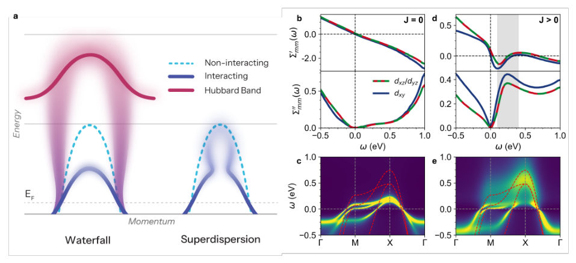 
FIG. 1. Waterfalls and superdispersive spectral features. (a) Schematic of a waterfall (left), where vertical waterfall-like features connect the quasiparticle band with the Hubbard band, and the superdispersion found in a Hund metal (right), where a reversal of the dispersion originates from successive renormalization and ‘unrenormalization’ of the non-interacting bands. (b,d) Diagonal elements of the real (Σ′ mm(ω)) and imaginary (Σ′′ mm(ω)) parts of the self-energy for Sr2RuO4. In (b), we take (U, J) = (4.5, 0) eV, chosen to produce similar quasiparticle weights as for the physical case (U, J) = (2.3, 0.4) eV in (d). (c,e) Spectral functions of bulk Sr2RuO4 along the Γ-M-X-Γ path...

📷 Fig 2

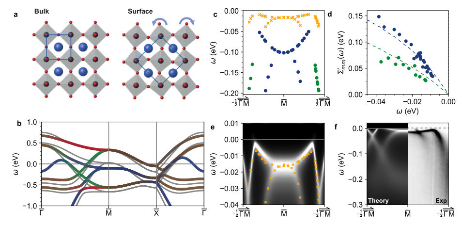 
FIG. 2. Extracting the self-energy at the surface of Sr2RuO4. (a) ab-plane projection of Sr2RuO4 for the bulk unrotated structure (left) and surface rotated structure (right). The surface has a 9◦rotation of the RuO6 octahedral (grey squares) compared to the bulk. (b) Band structure of the 9◦rotated surface of Sr2RuO4 from DFT, with dominant orbital characters shown by red, green and blue for the dxz, dyz and dxy orbitals, respectively. The thin grey bands indicate the electronic structure of the unrotated two-atom unit cell of Sr2RuO4 (equivalent to the bulk structure) for comparison. (c) Comparison of ARPES data points (orange crosses) around the M point, extracted from Ref. 24, 25, with...

📷 Fig 3

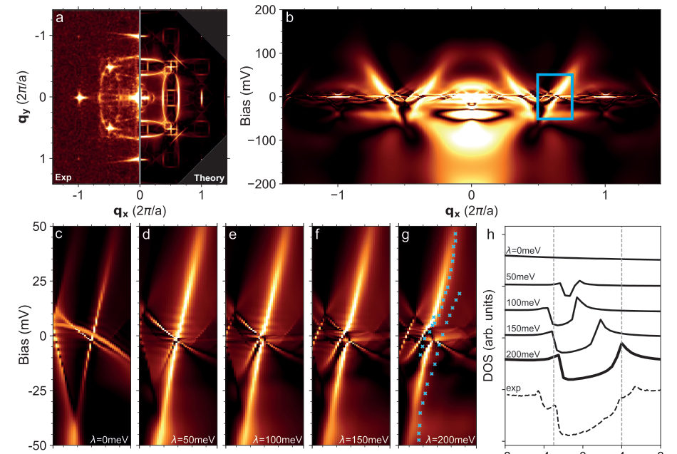 
FIG. 3. Correlation-enhanced spin-orbit coupling at the surface of Sr2RuO4. (a) Com- parison of the experimental QPI (left-hand side, taken from Ref. 32) with cQPI+DMFT calculations (right-hand side) at 4.2 mV bias. (b) Energy dispersion along the qy = 0 line shown in a large energy range, revealing the modification of the scattering intensity due to self-energy effects with significant broadening away from the Fermi energy. (c-g) Closeup of the blue box in (b) for models calculated with different strengths of the spin-orbit coupling λ (specified in the lower right corner). A hybridization gap opens around the Fermi level producing two split branches of the dispersion, as seen in experiment...

📷 Fig 4

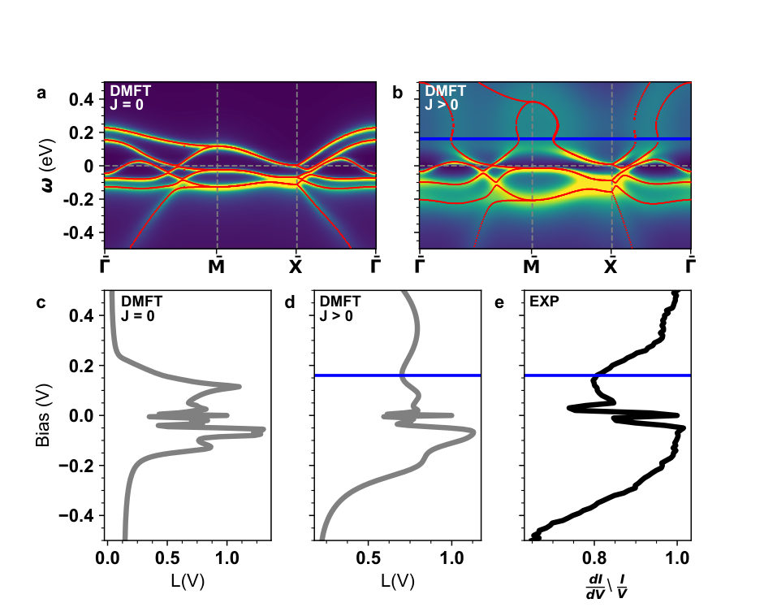 
FIG. 4. Signatures of Hund superdispersion in tunneling spectroscopy. (a, b) Spectral function of the surface of Sr2RuO4 when incorporating the DMFT bulk self-energy obtained with (a) artificial parameters (U, J) = (4.5, 0) eV and (b) the physical parameters (U, J) = (2.3, 0.4) eV. The parameters in (a) are chosen to produce similar quasiparticles weights as in (b). The difference between the two spectral functions demonstrates the influence of Hund coupling J. The red overlaid lines are the solutions to Eq. (2) underlining the superdispersive feature at 160 meV in (b) with a change in curvature of the dispersion. (c, d) Simulated tunneling spectra L(V ) [Eq. 5] for (c) J = 0 and (d) J &gt; 0....

**Summary.** This paper demonstrates that Hund coupling in Sr2RuO4 creates a unique 'superdispersion' feature where band velocity reverses direction. By using tunneling spectroscopy to probe unoccupied states, the authors successfully match experimental conductance dips with theoretical predictions of non-monotonic self-energy. This provides a new experimental route to identifying Hund physics in multi-orbital materials.

**Why it may be interesting.** not directly relevant

Detailed structure

**Main problem.** The challenge of experimentally identifying and verifying the unique spectroscopic signature of Hund superdispersion in multi-orbital Hund metals, which is difficult to observe via ARPES due to its presence in unoccupied states.

**Main result.** The authors provide direct experimental evidence for Hund-induced superdispersion in Sr2RuO4 using tunneling spectroscopy, showing that Hund coupling induces a non-monotonic self-energy that causes band velocity to reverse direction.

**Method.** The study combines experimental STM/STS and ARPES with a theoretical framework involving DFT, DMFT (using NRG solver), and continuum local density of states (cLDOS) calculations.

**Model / system.** The physical system is the Hund metal Sr2RuO4, modeled using a multi-orbital (t2g) tight-binding Hamiltonian that incorporates Coulomb repulsion (U), Hund coupling (J), and spin-orbit coupling (SOC).

**Key observables.** Differential conductance (dI/dV), tunneling spectra (Feenstra function L(V)), quasiparticle interference (QPI) patterns, and the real and imaginary parts of the self-energy.

**Important parameters / regimes.** Hund coupling (J = 0.4 eV), Hubbard repulsion (U = 2.3 eV), spin-orbit coupling (lambda approx 200 meV), and energy scales of superdispersion (approx 160 meV).

**Assumptions / limitations.** The bulk self-energy is assumed to be applicable to the surface electronic structure despite surface reconstruction (octahedral rotations).

**Figures summary.** Figure 1 compares waterfall vs. superdispersion schematics and self-energy components; Figure 2 shows surface vs. bulk structures and DFT band structures; Figure 4 presents spectral functions and simulated tunneling spectra (Feenstra function) showing the 160 meV dip.

**Paper structure.** The paper introduces the distinction between Mott and Hund physics, describes the experimental STM/ARPES setup and theoretical DFT+DMFT framework, presents the identification of superdispersion in the unoccupied states, and validates the model through comparison of simulated and experimental tunneling spectra.

Abstract

In cuprate superconductors, electron-electron repulsion results in characteristic spectroscopic features known as `waterfalls', where the sharp quasiparticle dispersion transitions into broad Hubbard bands. However, in multi-orbital systems, the additional Hund coupling results in behavior that defies the conventional Mott--Hubbard paradigm, creating qualitatively distinct `superdispersive' features in the spectral function. Here, we use tunneling spectroscopy to reveal this signature of Hund physics in Sr$_2$RuO$_4$. By combining density functional theory, dynamical mean-field theory, and continuum local density of states calculations, we show that the experimental features are in excellent agreement with theoretical predictions and intimately linked to the non-monotonous energy dependence of the real part of the self-energy in a Hund metal. Our results provide direct experimental evidence for Hund-induced spectroscopic features and open a new route to probing correlation effects in quantum materials.

[↑ back to top](#top)

### [Scaling Quantum Optimization for Unit Commitment via Pauli Correlation Encoding](http://arxiv.org/abs/2605.17145v1)

**Authors:** Kien X. Nguyen, Ilya Safro, Xiaoyuan Liu  
**Type:** both · **Category:** quantum information and computing · **PDF:** <https://arxiv.org/pdf/2605.17145v1>  
**Analysis basis:** full PDF text, analyzed in chunks

📷 Fig 1

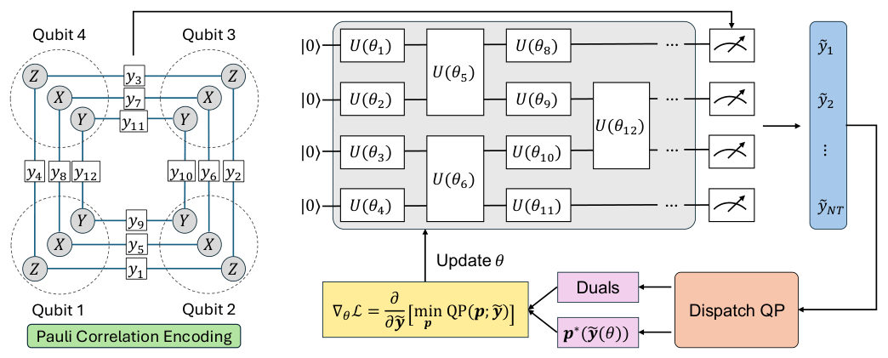 
Fig. 1. Overview of our heuristic-assisted differentiable bilevel optimization on a 12-variable problem, which is encoded into 4 qubits. The quantum circuit produces PCE correlators that decode to a soft commitment schedule ˜y. A classical QP computes the dispatch p∗(and dual variables), which defines the training loss. Gradients are obtained by combining QP dual sensitivities with parameter-shift derivatives, and circuit parameters are updated with the Adam optimizer. After training, a threshold sweep produces a hard schedule and a final dispatch.

📷 Fig 2

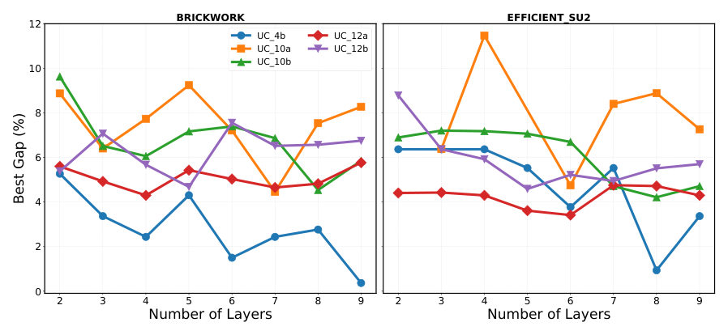 
Fig. 2. Ablation study on the number of ansatz layers over the range {2, 3, . . . , 9} for both brickwork and EfficientSU2 ansatzes. We report the best operating cost across the five small-scale systems.

📷 Fig 3

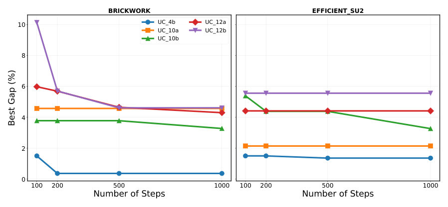 
Fig. 3. Ablation study on the number of optimization steps over the range {100, 200, 500, 1000} for both brickwork and EfficientSU2 ansatzes. We report the best operating cost across the five small-scale systems.

📷 Fig 4

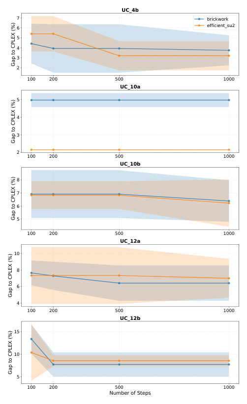 
Fig. 5. Ablation study on the number of optimization steps over the range {100, 200, 500, 1000} for both brickwork and EfficientSU2 ansatzes. We report the average operating cost across the five small-scale systems.

📷 Fig 5

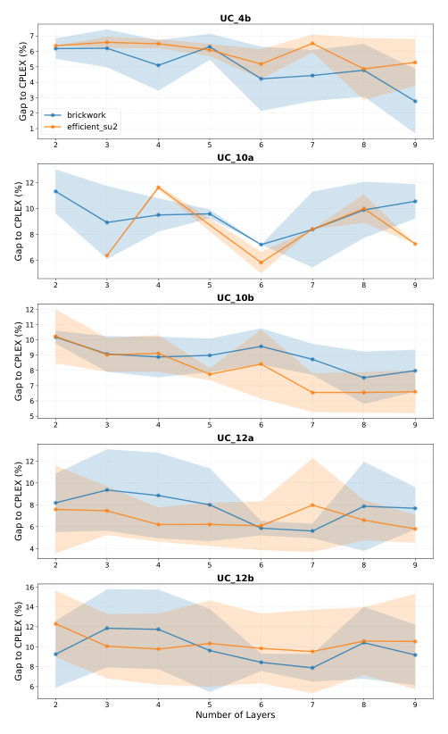 
Fig. 4. Ablation study on the number of ansatz layers over the range {2, 3, . . . , 9} for both brickwork and EfficientSU2 ansatzes. We report the average operating cost across the five small-scale systems.

**Summary.** This paper introduces a way to solve large-scale power grid scheduling problems using much fewer qubits than previously possible. By using Pauli Correlation Encoding, the authors demonstrate that a hybrid quantum-classical algorithm can handle hundreds of decision variables, providing near-optimal solutions for complex energy management tasks.

**Why it may be interesting.** not directly relevant

Detailed structure

**Main problem.** Scaling the quantum optimization of the Unit Commitment (UC) problem, which is NP-hard, by addressing the prohibitive qubit requirements of traditional encoding methods for multi-period power system scheduling.

**Main result.** The proposed method scales to 312 binary variables using only 15 qubits and produces feasible schedules with operating costs within 1-7% of the classical CPLEX optimum for small scales and 13-16% for large scales.

**Method.** A hybrid quantum-classical leader-follower architecture using Pauli Correlation Encoding (PCE) to compress variables into fewer qubits, combined with a differentiable bilevel optimization approach using a classical Quadratic Program (QP) solver.

**Model / system.** A mixed-integer quadratic bilevel optimization model for power system unit commitment, involving binary on/off decisions and continuous power dispatch subject to load balance, ramping, and reserve constraints.

**Key observables.** Operating cost gap, feasibility rate, constraint violation percentage, and optimization stability (standard deviation).

**Important parameters / regimes.** Number of qubits (down to 4-6 for small and 15 for large scales), number of optimization steps, ansatz depth (layers), and PCE encoding parameters.

**Assumptions / limitations.** The cost function is assumed to be quadratic, and the optimization uses a smooth surrogate/relaxation of constraints to ensure differentiability.

**Figures summary.** Figure 1 shows the hybrid optimization architecture; Figure 2 and 3 show ablation studies on ansatz depth and optimization steps; Figure 4 and 5 show performance and scalability on large-scale instances.

**Paper structure.** The paper introduces the UC problem and scaling challenges, details the PCE encoding and hybrid bilevel architecture, describes the gradient-based optimization strategy, presents experimental results on small and large-scale power systems, and concludes with ablation studies and limitations.

Abstract

Unit commitment is an important optimization problem in power system operations, classified as NP-hard. This paper presents a hybrid quantum-classical method for the unit commitment problem with time-dependent constraints, where decisions must be made about which generators to turn on/off and how much power they should produce over a planning horizon. We use a hybrid quantum-classical optimization procedure to determine the on/off schedules of the generating units and the corresponding power dispatch that satisfies operational constraints such as load balance, generator limits, ramping, and reserve requirements. We frame the optimization loop as a leader-follower structure, where the quantum optimizer leads to give the on/off decisions, and the classical optimizer follows to produce the power level schedule. Leveraging Pauli-Correlation Encoding, our method scales to horizon-wide unit commitment schedules by encoding the binary variables with far fewer qubits. By combining these components, the method can handle multi-period settings while using far fewer qubits than straightforward quantum encodings that allocate one qubit per decision variable as in prior approaches. We evaluate the approach on both small- and large-scale instances, up to 312 binary variables, and show that it reliably produces feasible schedules with competitive operating costs.

[↑ back to top](#top)

### [Spatial statistics for screening molecular structures](http://arxiv.org/abs/2605.17147v1)

**Authors:** Pranoy Ray, Surya R. Kalidindi  
**Type:** theory · **Category:** disordered systems and neural networks · **PDF:** <https://arxiv.org/pdf/2605.17147v1>  
**Analysis basis:** full PDF text, analyzed in chunks

📷 Fig 1

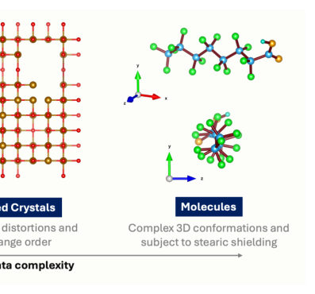 
Figure 1: Hierarchical structural complexity across material classes. Schematic illustrating (left - Si) perfectly periodic crystals with a small number of symmetry-inequivalent environments, (center - Wüstite: Fe1−xO) chemically disordered solid solutions with local lattice distortions and short-range order, and (right - PFOA) finite, non-periodic molecules with complex 3D conformations (helicity) and steric shielding (F atoms).

📷 Fig 2

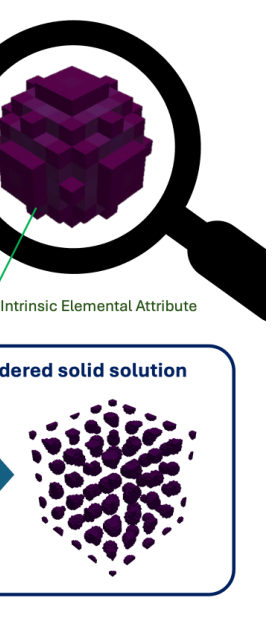 
Figure 2: Voxelization pipeline for continuous atomic environments. The discrete, coordinate-based point-cloud of a local atomic neighborhood is systematically mapped onto a standardized cubic voxel grid. During this transformation, each voxel channel encodes specific physical attributes, such as binary occupancy, intrinsic elemental properties, or continuous pseudo-charge densities via a defined smearing function. Voxels falling within a prescribed atomic radius capture the designated elemental values, while interstitial regions remain at zero, effectively transforming the discrete Lagrangian coordinates into a continuous, multi-channel field ready for deterministic spatial statistical...

📷 Fig 3

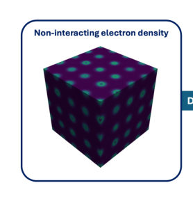 
Figure 3: Sources of voxelized molecular structure data from DFT. Example shown for a refractory high-entropy alloy Al4Nb44Ti4Zr76, where the converged or pseudo charge density field is sampled on a regular grid to construct the voxelized representation used in the spatial feature engineering workflow.

📷 Fig 4

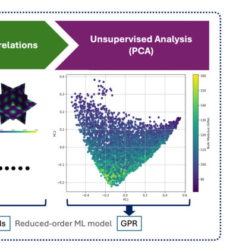 
Figure 4: End-to-end spatial feature engineering workflow. Discrete atomic coordinates are first embedded into voxelized eigen–microstructure and pseudo-density fields on a standardized grid. Directionally resolved two-point auto- and cross-correlations are then computed via FFTs to obtain translationally invariant structural fingerprints. Finally, PCA projects these high-dimensional statistics onto a low-dimensional, convex manifold that serves as input to lean CNNs or GPR models.

📷 Fig 5

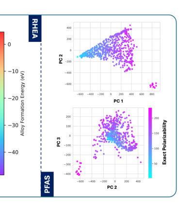 
Figure 5: Broad applicability of the spatial statistics based feature engineering paradigms. The left panel[93] shows the Principal Component space of refractory high-entropy alloys, demonstrating the chemically agnostic grouping of elemental and multi-component systems. The right panel shows the correlation of the principal component scores with exact polarizability in PFAS, successfully isolating thermodynamic outliers and variations driven by the length of the perfluoroalkyl chain [94] .

**Summary.** The paper proposes replacing heavy, data-hungry deep learning architectures with a physics-informed approach using spatial statistics and FFTs. This method enables highly accurate material property prediction even with extremely small datasets and provides a convex latent space suitable for efficient molecular design.

**Why it may be interesting.** not directly relevant

Detailed structure

**Main problem.** Traditional deep learning models for materials discovery require massive DFT-labeled datasets and struggle with chemically disordered configurations, chiral geometries, and non-convex latent representations that hinder inverse design.

**Main result.** A physics-informed feature engineering framework using spatial statistics achieves sub-2% prediction error with as few as 10 training samples and provides strictly convex representations for efficient optimization.

**Method.** The method uses voxelized 3D scalar fields to compute two-point auto- and cross-correlations via Fast Fourier Transforms, followed by PCA for dimensionality reduction into low-dimensional manifolds.

**Model / system.** The framework is scale-agnostic and applicable to periodic crystals (e.g., Silicon), chemically disordered high-entropy alloys, and non-periodic organic molecules (e.g., PFAS).

**Key observables.** Two-point spatial correlations, pseudo-charge densities, and structural fingerprints like helicity and short-range order.

**Important parameters / regimes.** Data-scarce regimes (10-30 training samples), lean neural networks (<100k parameters), and computational complexity scaling as O(S log S).

**Assumptions / limitations.** The use of non-interacting pseudo-densities neglects explicit charge transfer and electron correlation effects; 2-point statistics may smooth over rare, localized topological anomalies.

**Figures summary.** Figure 1 shows structural complexity across different regimes; Figure 2 illustrates the voxelization pipeline; Figure 3 shows voxelized data for a high-entropy alloy; Figure 4 depicts the end-to-end workflow; Figure 6 shows a closed-loop autonomous discovery pipeline.

**Paper structure.** The paper introduces the limitations of current GNNs, proposes a spatial statistics-based feature engineering workflow (voxelization, FFT-based correlations, PCA), demonstrates performance across various material classes (crystals, alloys, molecules), and discusses the utility for inverse design and active learning.

Abstract

The dominant paradigm in computational materials discovery relies on heavily parameterized deep architectures, including message-passing graph networks and equivariant models, that require millions of DFT-labeled training structures and produce non-convex latent representations that complicate continuous optimization for inverse design. These architectures are impractical in data-scarce regimes, which is the typical case in molecular screening, and exhibit well-documented limitations in capturing chemically disordered configurations and chiral geometries. This review presents feature engineering based on spatial statistics as a physically rigorous and immediately deployable alternative. Molecular structures are encoded as voxelized scalar fields, and two-point auto- and cross-correlations are evaluated deterministically via Fast Fourier Transforms, explicitly transferring the burden of spatial pattern recognition from the learning algorithm to a closed-form, physics-informed operation. Principal component analysis of the resulting correlation maps yields low-dimensional, strictly convex representations that support lean neural networks (<100k trainable parameters) and non-parametric surrogate models, achieving sub-2% prediction error with as few as 10 training samples. Demonstrated across periodic crystals, chemically disordered high-entropy alloys, and non-periodic organic molecules, this framework enables Bayesian active learning and zero-shot extrapolation on commodity hardware, which current large-scale architectures cannot replicate at equivalent data budgets.

[↑ back to top](#top)

### [Specific heat and susceptibility of S=1/2 antiferromagnets on square, triangular, and kagome lattices](http://arxiv.org/abs/2605.17420v1)

**Authors:** Chisa Hotta  
**Type:** theory · **Category:** strongly correlated electrons · **PDF:** <https://arxiv.org/pdf/2605.17420v1>  
**Analysis basis:** full PDF text, analyzed in chunks

📷 Fig 1

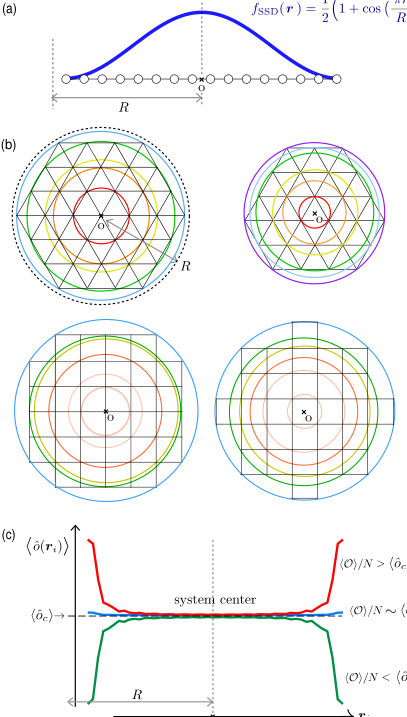 
FIG. 1. (a) Sine-square deformation (SSD) function, fSSD, defined along the 1D cut of the cluster which crosses the sys- tem center o. (b) Examples of polar SSD on 2D square and tri- angular lattices. Left/right-hand side ones are the site/bond- centered SSD. (c) Schematic illustration of how the physical quantities ⟨ˆo(ri)⟩distributes in space. The value at the cen- ter ri ∼0 is insensitive to the total value of ⟨O⟩= P

📷 Fig 2

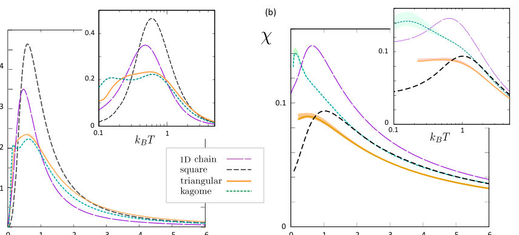 
FIG. 2. Comparison of the (a) Specific heat and (b) susceptibility of the S = 1/2 Heisenberg model on a 1D chain, square, triangular, and kagome lattices, obtained by TPQ method combined with SSD on a cluster of N ≤27. More details are found in Figs.6-8. Inset shows the same plot in the logarithmic scale of kBT.

📷 Fig 3

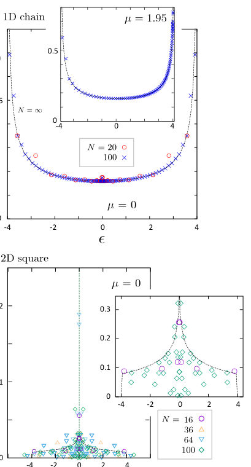 
FIG. 3. Density of states D(ϵ) (of single-particle energy eigenstate) of the noninteracting fermions obtained by HSSD in (a) 1D chain at N = 20, 100 and (2) 2D square lat- tice with N = 16, 36, 64, 100, both at µ = 0. The inset of panel (a) is the case at N = 100 and µ = 1.95. Bro- ken lines are the exact DOS at N = ∞; for 1D we have D(ϵ) = π−1 d arccos(−ϵ/2)/dϵ

📷 Fig 4

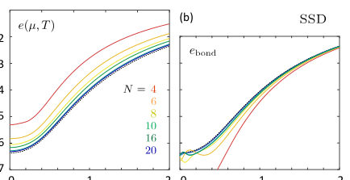 
FIG. 4. Comparison of the evaluation of bond energy us- ing the two formula, (a) e(µ, T) in Eq.(16) and (b) ebond in Eq.(18) for the same free fermion HSSD in 1D chain. We show several choices of N = 6, · · · 20, compared to N = ∞in bro- ken line.

📷 Fig 5

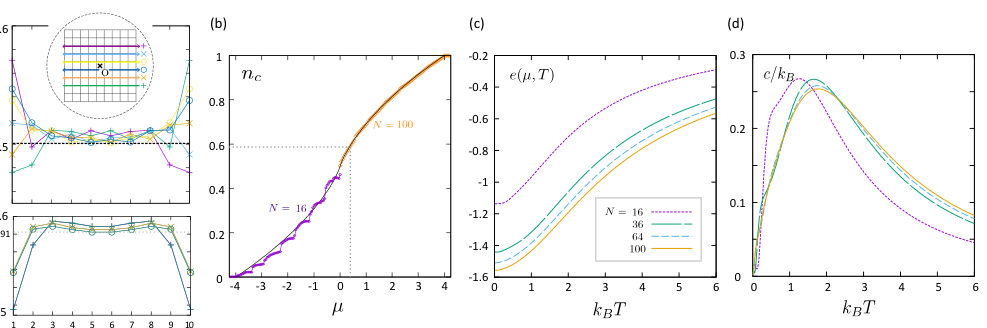 
FIG. 5. Analysis of the square lattice free fermionic model using HSSD. (a) ⟨nj⟩along the horizontal bonds on a N = 10 × 10 square lattice at µ = 0 (nc = 0.5) and µ = 0.4 (nc = 0.591). (b) µ-nc curve of the free fermion system on a square lattice. Data points are the center site value ⟨nc⟩displayed for different lattice sizes, N = 4 × 4 = 16 (µ ≤0) and N = 10 × 10 = 100 (µ ≥0). (c) Energy density ec and (b) specific heat c/kB = de/d(kBT) as functions of temperature obtained using Eq.(17) for N = 16, 32, 64, 100.

**Summary.** This paper presents a numerical framework using Sine-Square Deformation to study the thermodynamic properties of frustrated quantum magnets. It successfully captures complex features like double-peak specific heat in kagome lattices, providing a way to mimic the thermodynamic limit using small-scale clusters.

**Why it may be interesting.** not directly relevant

Detailed structure

**Main problem.** The difficulty of accurately calculating the low-temperature thermodynamic properties of frustrated 2D quantum magnets in the thermodynamic limit due to finite-size effects and the sign problem in traditional numerical methods.

**Main result.** The study identifies a double-peak structure in the specific heat of kagome and triangular lattices and shows that the kagome lattice exhibits a strong enhancement of magnetic susceptibility at low temperatures due to magnetic excited states.

**Method.** The Sine-Square Deformation (SSD) technique is applied to the Hamiltonian to create fictitious bulk states, combined with the Thermal Pure Quantum (TPQ) method for finite-temperature calculations.

**Model / system.** S=1/2 antiferromagnetic Heisenberg models on 1D chains, square, triangular, and kagome lattices.

**Key observables.** Energy density, specific heat (Cv), magnetic susceptibility (chi), and thermal entropy density.

**Important parameters / regimes.** Temperature (T/J), exchange interaction (J), and system size (N).

**Assumptions / limitations.** The SSD method assumes that the center of the deformed system effectively mimics the thermodynamic limit; kernel regression assumes a smooth temperature dependence for extrapolating data.

**Figures summary.** Figure 1 defines the SSD function and its spatial distribution; Figure 2 compares specific heat and susceptibility across 1D, square, triangular, and kagome lattices; Figure 3 shows the single-particle density of states; Figure 4 demonstrates convergence of energy density; Figure 6 highlights the reduction of the finite-size gap in 1D chains.

**Paper structure.** The paper introduces the SSD method, validates it using free fermion and 1D chain benchmarks, applies it to 2D square lattices to compare with QMC, and finally investigates the thermodynamic properties of frustrated triangular and kagome lattices.

Abstract

We study the temperature dependence of the thermodynamic properties of spin-1/2 antiferromagnets on two-dimensional lattices. Our analysis employs the sine-square deformation (SSD), in which a real-space envelope function is applied to the Hamiltonian so that the local energy scale is smoothly reduced to zero at the system boundaries. The quantum eigenstates of the SSD Hamiltonian exhibit bulk-like behavior near the system center, effectively mimicking the thermodynamic limit even in small finite-size calculations. Using these fictitious bulk states, we compute the energy density, specific heat, and magnetic susceptibility as functions of temperature. We find that both the triangular- and kagome-lattice antiferromagnets show either a shoulder or a pronounced double-peak structure in the low-temperature specific heat, whereas the kagome case particularly shows a strong enhancement of magnetic susceptibility down to the lowest temperature range. These direct comparisons, together with the square-lattice and one-dimensional cases, reveal that although both frustrated systems retain a substantial amount of entropy, the low-energy excitations below ~ 0.5J of the kagome lattice are predominantly governed by the magnetic excited states, whereas not much for the triangular lattice.

[↑ back to top](#top)

### [Stable minimum principles for scattering states](http://arxiv.org/abs/2605.17139v1)

**Authors:** Scott Lawrence, Yukari Yamauchi  
**Type:** theory · **Category:** numerical methods · **PDF:** <https://arxiv.org/pdf/2605.17139v1>  
**Analysis basis:** full PDF text, analyzed in chunks

📷 Fig 1

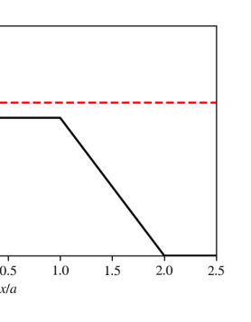 
Figure 1: A schematic of the potential defined by (95). The ingoing particle “slows down” dramatically in the interval x ∈(0, a), where E −V (x) is small, and the scattering wave-

**Summary.** The paper introduces a new family of stable minimum principles for approximating quantum scattering states using the L1 norm of the Schrodinger equation violation. It proves that this metric allows for rigorous error bounds on the S-matrix and cross sections, making it a robust foundation for numerical scattering algorithms. The method is shown to be applicable to complex systems, including momentum-dependent and many-body potentials.

**Why it may be interesting.** This is highly relevant for many-body dynamics and numerical physics as it provides a rigorous error-bounding framework for using variational/machine-learning-based wavefunctions to compute scattering observables.

Detailed structure

**Main problem.** Developing stable variational minimum principles for approximating quantum-mechanical scattering states and bounding the error in the resulting S-matrix.

**Main result.** The authors establish that the L1 norm of the Schrodinger violation provides a stable metric for bounding errors in scattering amplitudes, phase shifts, and cross sections, unlike the L2 norm which can be unstable.

**Method.** Introduction of a family of stable minimum principles using the L1 norm of the Schrodinger violation, designed to be compatible with modern computational algorithms like Neural Quantum States and Variational Monte Carlo.

**Model / system.** Nonrelativistic quantum-mechanical scattering involving single-particle, many-body, and momentum-dependent potentials, including Coulomb interactions and scattering of bound states.

**Key observables.** S-matrix elements, scattering amplitudes, phase shifts, total cross section, and probability flux.

**Important parameters / regimes.** Energy (E), particle mass (M), potential strength and range, and the L1 norm of the Schrodinger violation.

**Assumptions / limitations.** The approximate wavefunction is assumed to have the correct ingoing plane wave; potentials are generally assumed to be self-adjoint and decay sufficiently rapidly at large distances.

**Figures summary.** A schematic of the problem setup.

**Paper structure.** The paper presents the minimum principle, establishes stability estimates, extends results to general and momentum-dependent potentials, discusses many-body scattering, and provides counterexamples for unstable metrics.

Abstract

Quantum-mechanical scattering states are energy eigenstates obeying particular boundary conditions, whose behavior at infinity encodes the S-matrix which defines the outcoming of scattering experiments. With an eye toward numerical algorithms for computing nonrelativistic S-matrices, we present a family of stable minimum principles for scattering states. States that approximately satisfy these minimum principles are shown to have a bounded difference with the true scattering states. These minimum principles and stability estimates can be used to obtain rigorous bounds on scattering amplitudes. We show that these minimum principles are applicable to momentum-dependent potentials, long-range (Coulomb) interactions, and elastic or inelastic scattering of bound states.

[↑ back to top](#top)

### [The QuaST Decision Tree: Achieving Automation With Data-Based Recommendations](http://arxiv.org/abs/2605.18539v1)

**Authors:** Benedikt Poggel, Lena Tokuhiro, Georg Kruse, Jeanette Miriam Lorenz  
**Type:** theory · **Category:** quantum information and computing · **PDF:** <https://arxiv.org/pdf/2605.18539v1>  
**Analysis basis:** full PDF text, analyzed in chunks

📷 Fig 1

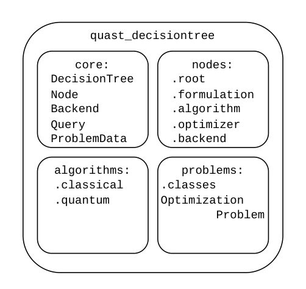 
Figure 1: Components of the quast-decisiontree package. core contains the framework, the DecisionTree base class and its building blocks. nodes provides a basic instance covering steps from problem loading to algorithm execution. algorithms and problems define templates for algorithms and problem classes, respectively.

📷 Fig 2

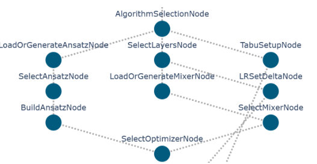 
Figure 2: The algorithm selection part of a basic DecisionTree instance. Based on the selected algorithms, different choices follow: the definition of an ansatz (e.g., variational quantum eigensolver [49]), a depth and mixer (QAOA [23]), or skipping for a direct solver setup. Multiple nodes take part in the hyperparameter definitions. In the VQA case, the paths converge for the optimizer selection, which is not required in other cases (here: linear ramp QAOA [50] and a classical solver).

**Summary.** This paper introduces the QuaST Decision Tree, a modular software framework designed to automate the selection of quantum algorithms and parameters for combinatorial optimization. By using data-driven recommendations and scalability analysis, it reduces the need for manual trial-and-error and helps identify when quantum approaches are practically feasible compared to classical methods.

**Why it may be interesting.** not directly relevant

Detailed structure

**Main problem.** The quantum software stack lacks a high-level abstraction layer to automate the complex decision-making process involved in selecting optimal algorithms, encodings, and hyperparameters for hybrid quantum-classical optimization.

**Main result.** The authors present the QuaST Decision Tree (QDT), a modular framework that automates algorithm selection and provides a scalability analysis module to predict the feasibility of Variational Quantum Algorithms (VQAs).

**Method.** The QDT uses a Directed Acyclic Graph (DAG) architecture with modular nodes and a data-driven automation module that utilizes a database of precomputed benchmarks to estimate required measurement shots.

**Model / system.** The framework targets quantum-enhanced combinatorial optimization (CO) using models such as QUBO, Ising, and MaxCut, applicable to gate-based NISQ devices, quantum annealers, and future error-corrected systems.

**Key observables.** Finite sampling error, optimizer tolerance threshold, approximation ratios, and the quantum disadvantage boundary.

**Important parameters / regimes.** Problem size (number of variables n), number of measurement shots (n_shots), QUBO density, and optimizer convergence thresholds.

**Assumptions / limitations.** The scalability analysis assumes that the decline of optimizer tolerance follows specific scaling laws (exponential, power-law, or logarithmic).

**Figures summary.** Figure 1 shows the Python package hierarchy; Figure 2 illustrates the decision tree branching logic for algorithm selection; Table I and II detail the class methods for the QDT core; Table III and IV quantify execution overhead and integration effort.

**Paper structure.** The paper introduces the problem of software stack gaps, describes the modular architecture and design principles of the QDT, presents a specific automation module for VQA feasibility, validates the framework's efficiency and integration ease, and discusses future directions.

Abstract

Quantum computers are increasingly powerful. Software tools for the development of quantum-enhanced algorithms are maturing. However, the software stack still lacks the connection to applications that would enable hybrid algorithms combining classical and quantum computing steps. End users need to be assisted in choosing the best combination of preprocessing, postprocessing, classical and quantum algorithms options. The application-facing software stack is therefore required to cover problem modeling, encoding, algorithm selection and hyperparameter tuning. A variety of tools exist for specific recommendations. The QuaST Decision Tree reflects the complexity in combining individual decisions in its modular network structure, consisting of flexible computation nodes with modular recommendations. It can easily be configured to serve in an industrial solver, an HPC software stack, or for rapid prototyping in development. The key ingredient, automation, is delivered by modules. We present one such module judging the feasibility of variational algorithms based on a robust scalability analysis and classification of problem instances. The automation improves the performance of end-to-end solutions, highlights the benefit to be gained from the hybrid quantum solution, reduces expensive trial-and-error testing, and leads to an improved utilization of quantum devices for a practical benefit.

[↑ back to top](#top)

### [Theory of melting lines with a variable enthalpy of fusion](http://arxiv.org/abs/2605.17631v1)

**Authors:** Anthony N. Papathanassiou  
**Type:** theory · **Category:** statistical mechanics · **PDF:** <https://arxiv.org/pdf/2605.17631v1>  
**Analysis basis:** full PDF text, analyzed in chunks

📷 Fig 1

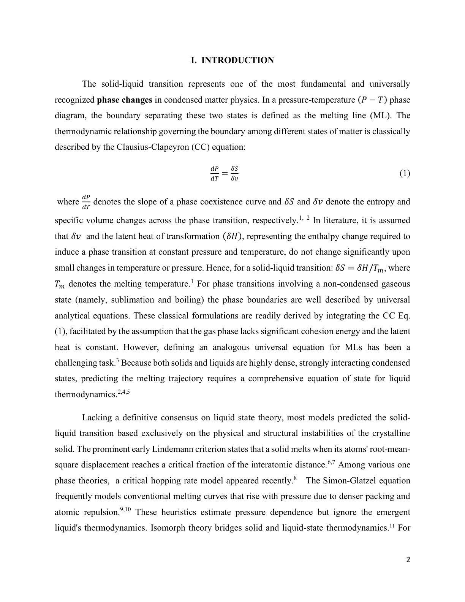 
Low-resolution page preview, page 2

📷 Fig 2

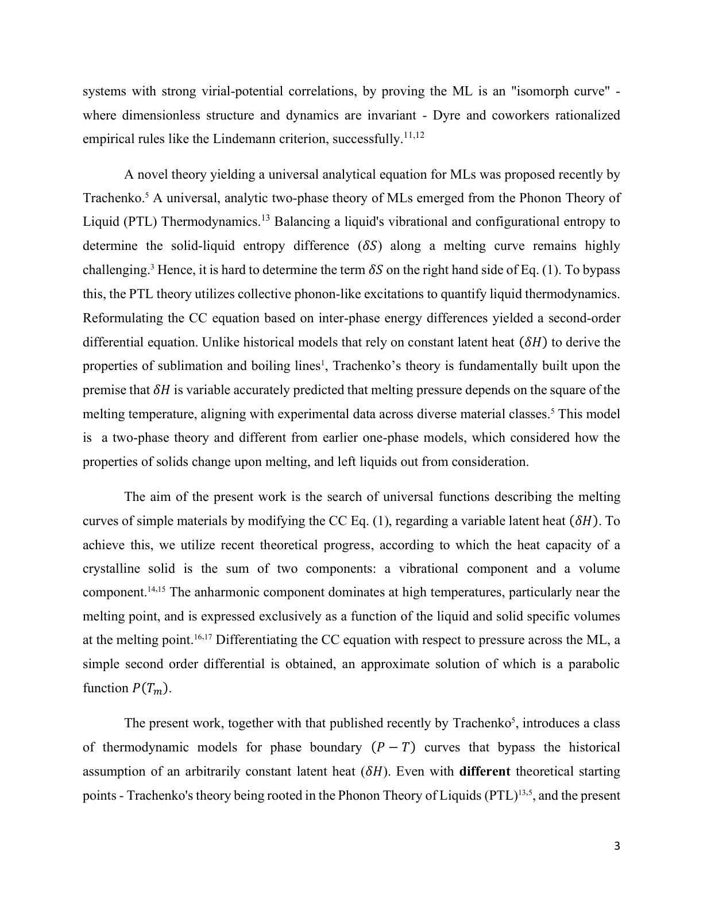 
Low-resolution page preview, page 3

📷 Fig 3

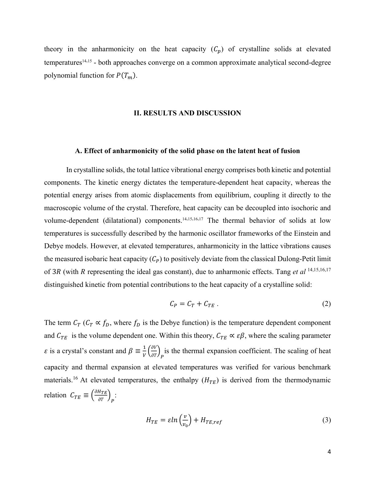 
Low-resolution page preview, page 4

📷 Fig 4

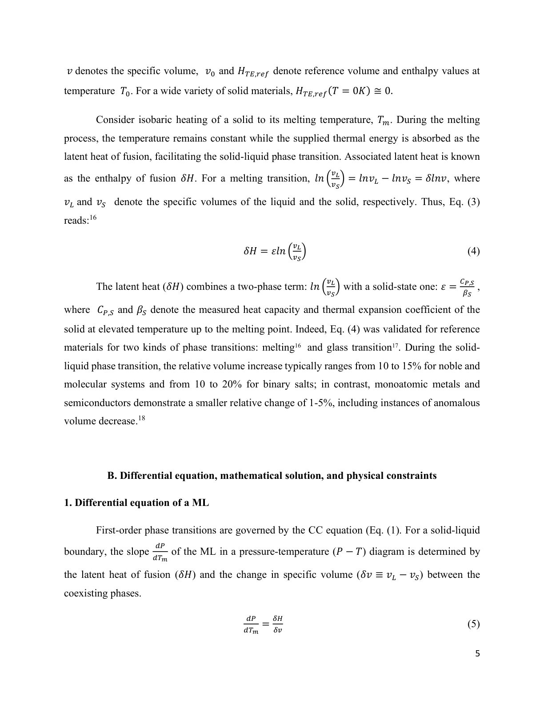 
Low-resolution page preview, page 5

📷 Fig 5

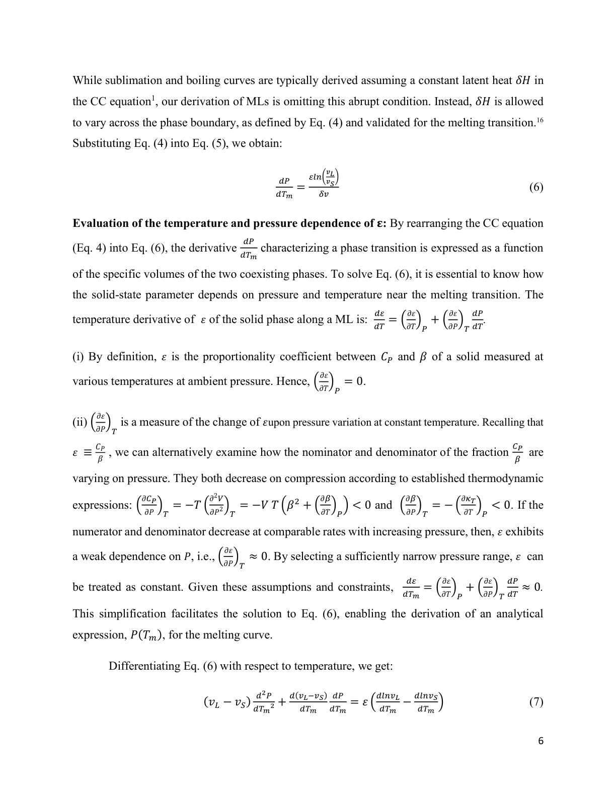 
Low-resolution page preview, page 6

**Summary.** This paper proposes a new theoretical framework for calculating melting lines by accounting for the variable enthalpy of fusion caused by solid-state anharmonicity. The resulting model predicts a universal parabolic trajectory for phase boundaries that is consistent with both recent phonon-based theories and experimental observations across diverse materials.

**Why it may be interesting.** not directly relevant

Detailed structure

**Main problem.** The difficulty in defining a universal analytical equation for melting lines in P-T phase diagrams due to the inadequacy of the constant latent heat approximation in the Clausius-Clapeyron relation.

**Main result.** The derivation of a universal parabolic scaling law for melting lines, which aligns with the Phonon Theory of Liquids and matches experimental data for various substances.

**Method.** A two-phase analytical model that modifies the Clausius-Clapeyron equation to include a variable enthalpy of fusion correlated to the specific volumes of coexisting phases.

**Model / system.** A thermodynamic model of the solid-liquid phase transition (melting) applicable to a wide range of condensed matter, including noble gases, molecular systems, metals, and semiconductors.

**Key observables.** Melting lines (P-T phase boundaries), enthalpy of fusion, and the slope of the melting curve.

**Important parameters / regimes.** Enthalpy of fusion (delta H), scaling parameter epsilon (Cp/beta), bulk moduli, thermal expansion coefficients, and specific volumes.

**Assumptions / limitations.** The dominance of the anharmonic, volume-dependent component of heat capacity near the melting point and the assumption that the scaling parameter epsilon remains constant over narrow pressure ranges.

**Paper structure.** The paper introduces the problem of melting line derivation, develops a modified Clausius-Clapeyron relation based on variable enthalpy, derives a second-order differential equation for the melting line, provides analytical parabolic solutions, and validates the results against existing theories and experimental data.

Abstract

Conventional derivations of phase boundaries from the Clausius-Clapeyron (CC) relation often employ the constant latent heat approximation to maintain analytical functions of the sublimation and boiling curves. To address the complex thermodynamics of the solid-liquid transition, we develop a two-phase analytical model by modifying the CC equation to account for a variable enthalpy of fusion along the melting line (ML). Our methodology utilizes recent theoretical and experimental progress demonstrating that the isobaric heat capacity of crystalline solids near the melting point features a dominant anharmonic, volume-dependent component. Consequently, the latent heat is correlated to the specific volumes of the coexisting phases. Differentiation of this modified CC relation yields a second-order differential equation governing ML. By imposing appropriate e boundary conditions, physically acceptable approximate parabolic solutions are derived. The parameters of these analytic functions are defined exclusively by fundamental thermophysical properties, including the bulk moduli, thermal expansion coefficients, and specific volumes of the coexisting phases, as well as the isobaric heat capacity of the solid. Our derivation, rooted in solid-state anharmonicity, yields approximate parabolic scaling laws that corroborate with a recent universal model derived from the Phonon Theory of Liquids [K. Trachenko, Phys. Rev. E 109, 034122 (2024)], supporting the universal parabolic nature of melting curves from a completely distinct theoretical foundation.

[↑ back to top](#top)

### [Truncated-Binary Encoding: Spectral Degree Reduction of Combinatorial Optimization Problems for Quantum Hardware](http://arxiv.org/abs/2605.17143v1)

**Authors:** Tristan Zaborniak  
**Type:** theory · **Category:** quantum information and computing · **PDF:** <https://arxiv.org/pdf/2605.17143v1>  
**Analysis basis:** full PDF text, analyzed in chunks

📷 Fig 1

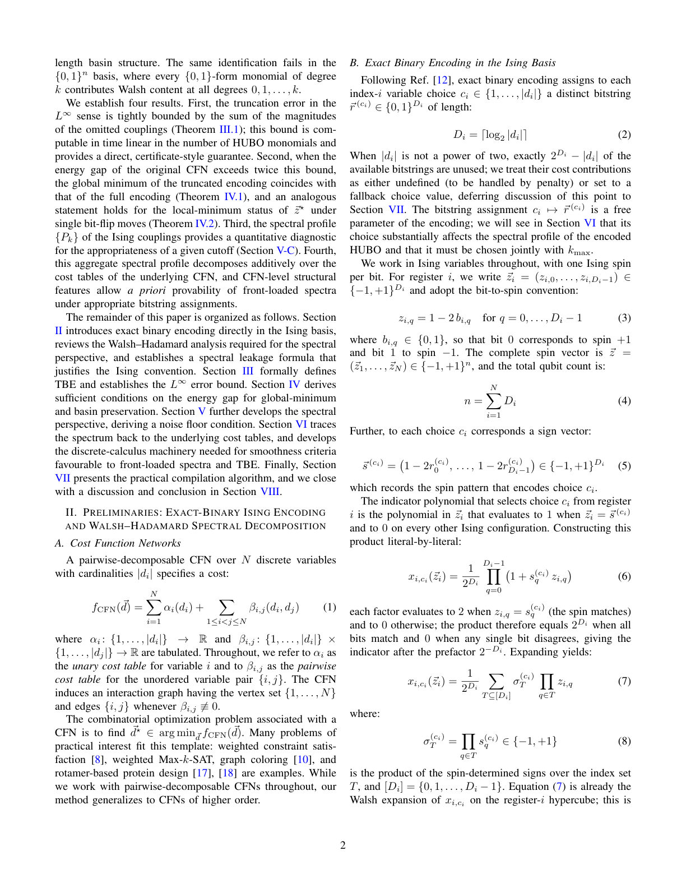 
Low-resolution page preview, page 2

📷 Fig 2

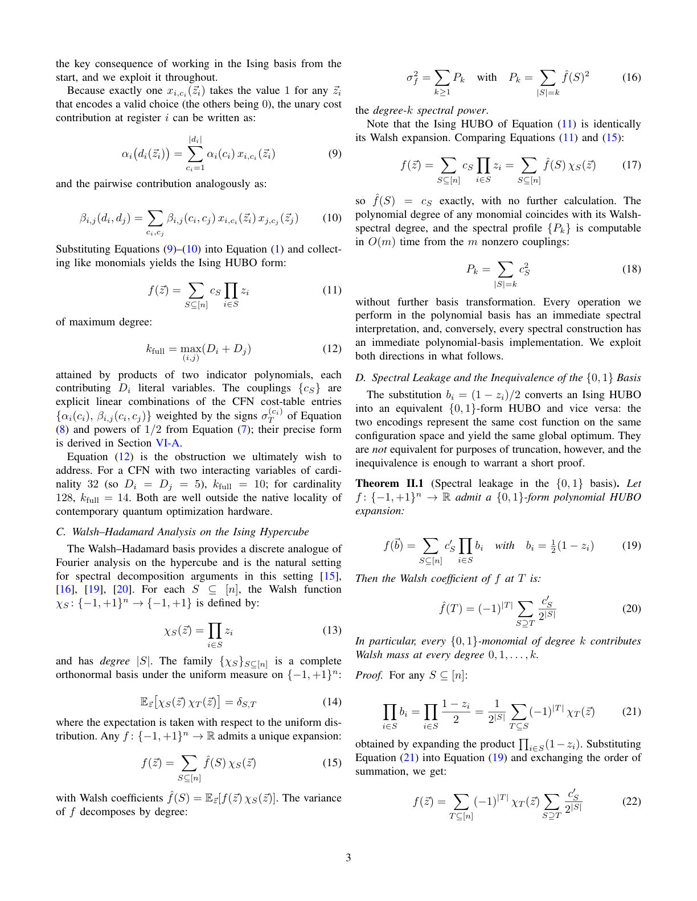 
Low-resolution page preview, page 3

📷 Fig 3

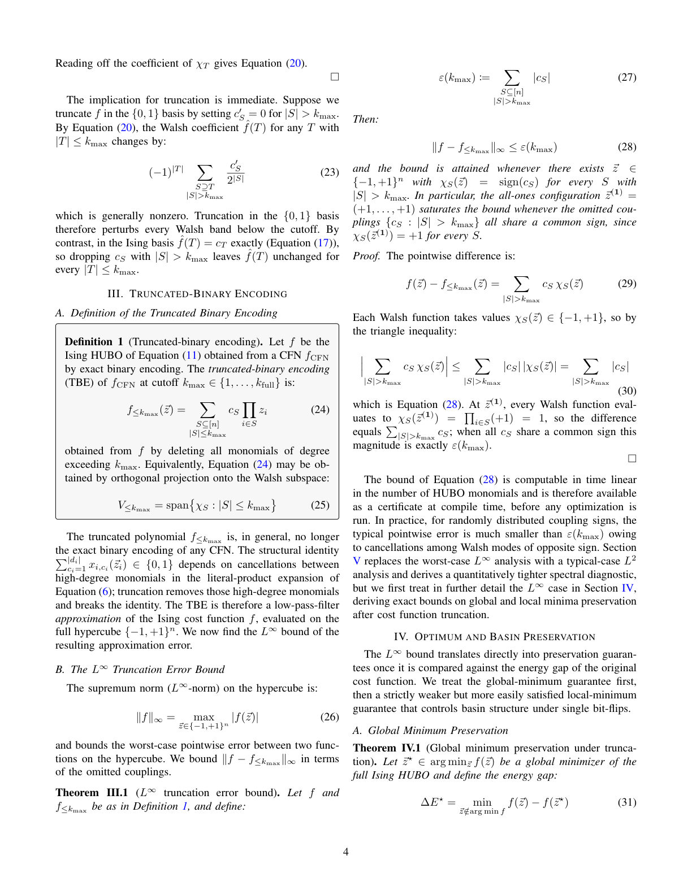 
Low-resolution page preview, page 4

📷 Fig 4

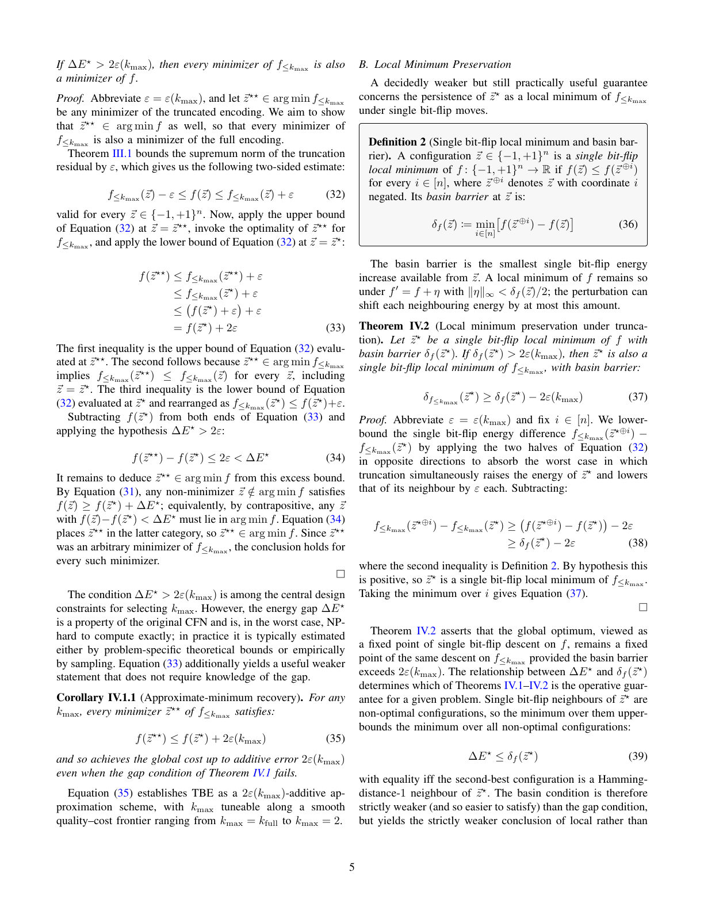 
Low-resolution page preview, page 5

📷 Fig 5

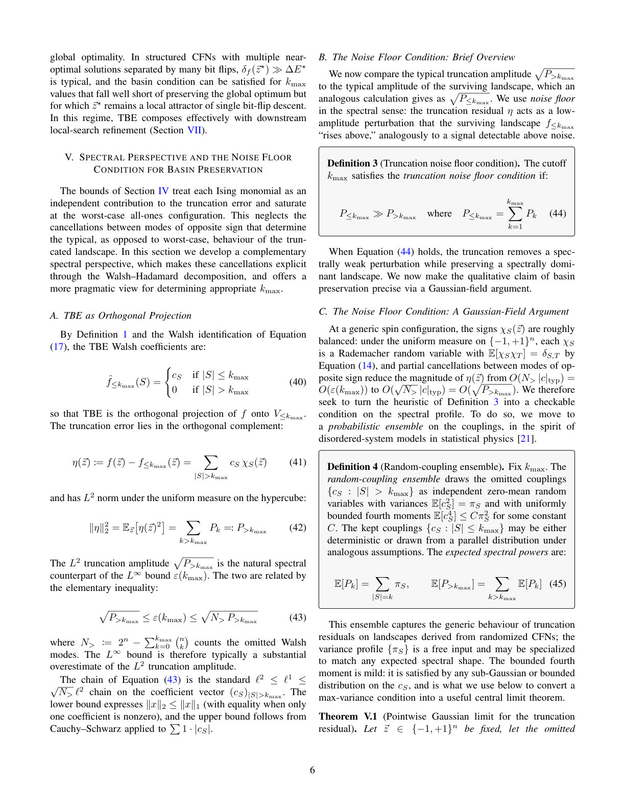 
Low-resolution page preview, page 6

**Summary.** This paper proposes a new method called Truncated-Binary Encoding to reduce the complexity of optimization problems mapped to quantum hardware. By strategically dropping high-degree interactions in the Ising basis, it minimizes hardware overhead while providing mathematical guarantees that the essential features of the optimization landscape remain intact.

**Why it may be interesting.** not directly relevant

Detailed structure

**Main problem.** High-order interactions in the encoding of discrete cost functions into Ising models create high-degree monomials that are incompatible with the limited native locality of current quantum annealing and gate-based hardware.

**Main result.** The paper introduces Truncated-Binary Encoding (TBE), proving that discarding high-degree Ising monomials preserves the global minimum and local minimum structure under specific energy gap and basin barrier conditions.

**Method.** The author uses Walsh-Hadamard spectral analysis to treat the encoding as a low-pass filter and employs the Lindeberg-Feller Central Limit Theorem to characterize the truncation error as a Gaussian noise floor.

**Model / system.** The model consists of Cost Function Networks (CFNs) mapped to Ising-basis Higher-Order Unconstrained Binary Optimization (HUBO) problems, specifically targeting quantum annealing and gate-based architectures like QAOA.

**Key observables.** Truncation error (L-infinity norm), spectral power (P_k), energy gap (Delta E*), and the single bit-flip basin barrier (delta f).

**Important parameters / regimes.** The truncation cutoff degree (k_max), the maximum monomial degree (k_full), and the smoothness of cost tables (Lipschitz constants).

**Assumptions / limitations.** The analysis assumes an Ising-basis formulation and relies on a random-coupling ensemble where omitted couplings are treated as independent zero-mean random variables.

**Paper structure.** The paper begins by defining the problem of high-order interaction overhead, introduces the TBE method, establishes error bounds and preservation conditions for minima, performs a spectral analysis using Walsh transforms, and concludes with a diagnostic workflow for selecting the truncation cutoff.

Abstract

Exact-binary encoding compiles a discrete cost function network (CFN) into a higher-order unconstrained binary optimization (HUBO) problem whose maximum monomial degree grows with the cardinalities of the underlying CFN variables. Given that quantum optimization hardware generally favours quadratic unconstrained binary optimization or low-degree HUBO Hamiltonians, high-cardinality CFNs therefore incur substantial overhead in the form of circuit depth, or ancilla qubits when degree-reduction techniques are employed. To ameliorate these issues, we propose \textit{truncated-binary encoding} (TBE): a modification of exact-binary encoding in which Ising-basis monomials exceeding a chosen cutoff $k_\text{max}$ are dropped from the encoded cost. We establish a tight $L^\infty$ bound on the truncation error in terms of the omitted couplings, derive sufficient conditions on the energy gap and on the single bit-flip basin barrier under which TBE preserves the global minimum and its local-minimum structure, and characterize a noise floor condition on the spectral profile under which the truncation residual acts as a perturbative correction to the underlying landscape. We then express the encoded coefficients directly as Walsh transforms of the underlying CFN cost tables, and prove a bound under which smoothness of each cost table implies rapid decay of its high-degree Walsh mass. Together these results yield a principled \textit{a priori} criterion for selecting $k_\text{max}$ and for judging whether a given CFN admits a small-$k_\text{max}$ TBE.

[↑ back to top](#top)

### [When Symmetries Twist: Anomaly Inflow on Monodromy Defects](http://arxiv.org/abs/2605.16482v1)

**Authors:** Christian Copetti  
**Type:** theory · **Category:** strongly correlated electrons · **PDF:** <https://arxiv.org/pdf/2605.16482v1>  
**Analysis basis:** full PDF text, analyzed in chunks

📷 Fig 1

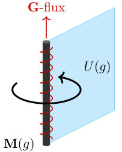 
Figure 1: A monodromy defect M(g) can be thought of as a dynamical termination of a symmetry operator U(g), which imposes twisted boundary conditions in the angular direction. Alternatively, it is sourced by a localized G-flux (fractional, in the discrete case).

📷 Fig 2

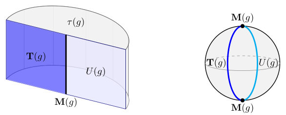 
Figure 2: Left: The monodromy defect M(g) defined as a domain wall between the symmetry defect U(g) and the topological decoration T(g). Right: The radial quantization frame S2 × R around a point on the monodromy defect. The surfaces U(g) and T(g) intersect the spatial S2 slice along meridians meeting at the poles.

📷 Fig 3

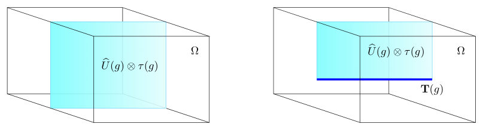 
Figure 3: a) An SPT in the presence of a topological defect bU(g), which is decorated by a lower di- mensional SPT τ(g). b) Terminating the invertible interface to define a topological monodromy defect induces a decoration by a lower-dimensional TQFT T(g). On the mapping torus Y d+1 = Xd × S1 the left and right sides are identified.

📷 Fig 4

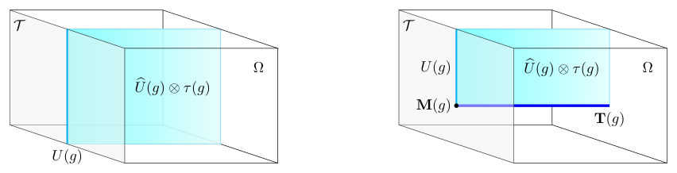 
Figure 4: The inflow setup to describe an anomalous monodromy defect M(g) in a theory T . a) The boundary symmetry defect U(g) extends to the decorated SPT defect bU(g). b) Terminating the invertible interface to define a monodromy defect shows that M(g) is an interface between U(g) and T(g).

📷 Fig 5

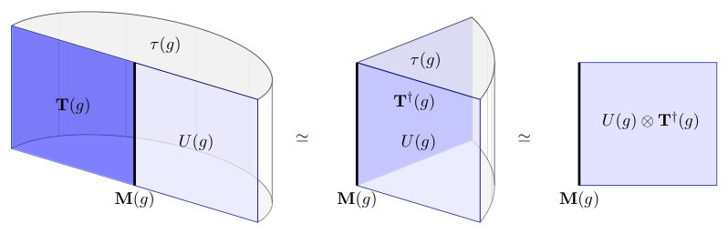 
Figure 5: Using the topological decoration T(g) to correctly define a twisted Hilbert space. The cyan region represents the stacking of τ(g); rotating T(g) around the junction M(g) recasts the setup as a single composite defect U(g) ⊗T†(g).

**Summary.** This paper explores how bulk anomalies dictate the physics of monodromy defects, demonstrating that these defects host protected edge modes and undergo spectral pumping. It provides a unified framework for understanding these defects as domain walls in both gapped SPT phases and gapless anomalous theories.

**Why it may be interesting.** not directly relevant

Detailed structure

**Main problem.** The paper investigates the properties of monodromy defects, which are codimension-2 defects that terminate topological symmetry operators, specifically focusing on how bulk 't Hooft anomalies impact their physics.

**Main result.** The author shows that in anomalous gapless theories, monodromy defects are well-defined as domain walls between a symmetry defect and a topological decoration, leading to protected chiral edge modes and adiabatic spectral pumping of gapless degrees of freedom.

**Method.** The study utilizes the anomaly inflow mechanism, transgression/slant product in group cohomology, radial quantization, and the Symmetry TFT (SymTFT) framework.

**Model / system.** The paper considers gapped Symmetry Protected Topological (SPT) phases and gapless theories with anomalous global symmetries, including (3+1)d Dirac fermions, (1+1)d compact bosons, and (2+1)d scalar QED.

**Key observables.** Protected chiral edge modes, spectral flow/pumping of gapless degrees of freedom, and topological invariants like the chiral central charge and Hall response.

**Important parameters / regimes.** The twist parameter (magnetic flux) $
u$, the symmetry group $G$ and its centralizer $C_G(g)$, and the $	heta$ angle periodicity.

**Assumptions / limitations.** The analysis of $	heta$ angle periodicity and gravitational corrections is specifically focused on closed $Spin^c$ manifolds.

**Figures summary.** Figure 1 illustrates the monodromy defect as a dynamical termination of a symmetry operator or as being sourced by magnetic flux; Figure 2 shows the defect as a domain wall between a symmetry defect and a topological decoration.

**Paper structure.** The paper begins by defining monodromy defects, moves to using topological defects as probes of SPTs, extends these concepts to anomalous gapless theories, and concludes with specific applications to free Dirac fermions and lattice models.

Abstract

Monodromy defects describe a dynamical termination of topological symmetry operators, and are sourced by a localized background magnetic flux. We study their properties in gapped SPT phases and, by inflow, in gapless theories with an anomalous symmetry. The background flux acts as a source for the anomaly, impacting the definition of the monodromy defect, which can only be defined as a domain wall between the symmetry generator and a topological order induced by the anomaly. The topological dressing has several consequences, such as the presence of protected chiral edge modes on the defect's worldvolume, and the adiabatic pumping of gapless degrees of freedom bound to the localized flux. We verify our predictions in several examples, focusing on monodromy defects for anomalous chiral symmetries, both in the continuum and on the lattice.

[↑ back to top](#top)

## Secondary cond-mat archives

*Papers from  mes-hall, other, soft, supr-con. These archives are de-prioritized — they appear at the end regardless of relevance score.*

### Relevant in secondary archives (18)

### [Phase dynamics and dissipation in tunnel ferromagnetic Josephson junctions](http://arxiv.org/abs/2605.18586v1)

**Authors:** F. Calloni, R. Satariano, R. Ferraiuolo, H. G. Ahmad, D. Gatta, E. Raja, G. Santo, G. Serpico, R. Vydyasagar, D. Montemurro, N. Poccia, A. Vettoliere, G. Ausanio, C. Granata, L. Parlato, G. P. Pepe, A. Bruno, F. Tafuri, D. Massarotti  
**Type:** both · **Category:** quantum information and computing · **PDF:** <https://arxiv.org/pdf/2605.18586v1>  
**Analysis basis:** full PDF text, analyzed in chunks
**Topic relevance:** 🔥 `QC/QI experiment` **4/5** · `correlated / nonlocal dissipation` **2/5** · `spintronics-quantum-optics interface` **2/5**

📷 Fig 1

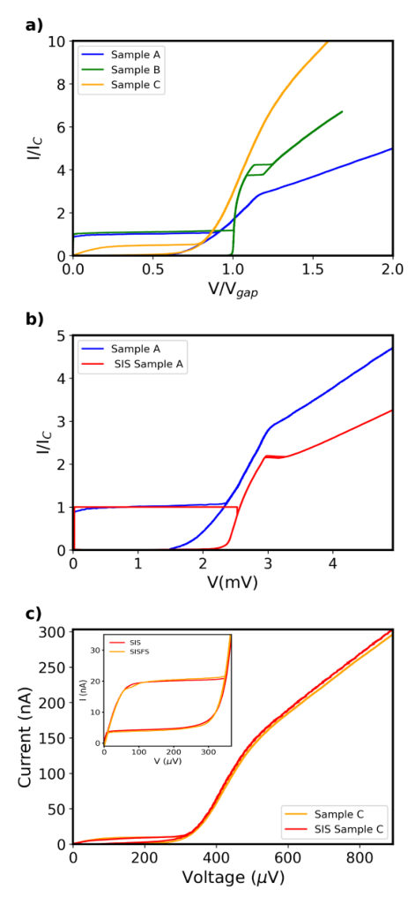 
Fig. 1 Comparison of the Current-Voltage (I–V ) char- acteristics at 10 mK. a) I–V normalized with respect to the critical current Ic and the superconducting gap voltage Vgap, respectively. Sample A is shown in blue, sam- ple B in green, and sample C in orange. b) Comparison between sample A (square junction with lateral size of 10 µm) and a reference niobium SIS junction (square junction with lateral size of 4 µm). c) Comparison between Sample C (square junction with a 500 nm lateral size) and alu- minum SIS reference junction of comparable geometrical dimensions. The inset shows a magnification of the I–V characteristics in the region close to the critical current Ic.

📷 Fig 2

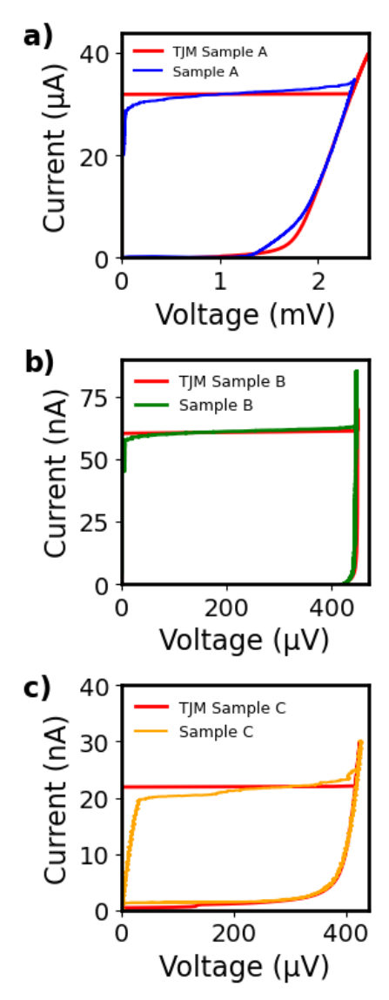 
Fig. 2 TJM fit (red curve) and experimental I-V charac- teristics at 10 mK for a) sample A (blue curve) ; b) sample B (green curve) and c) sample C (orange curve) .

📷 Fig 3

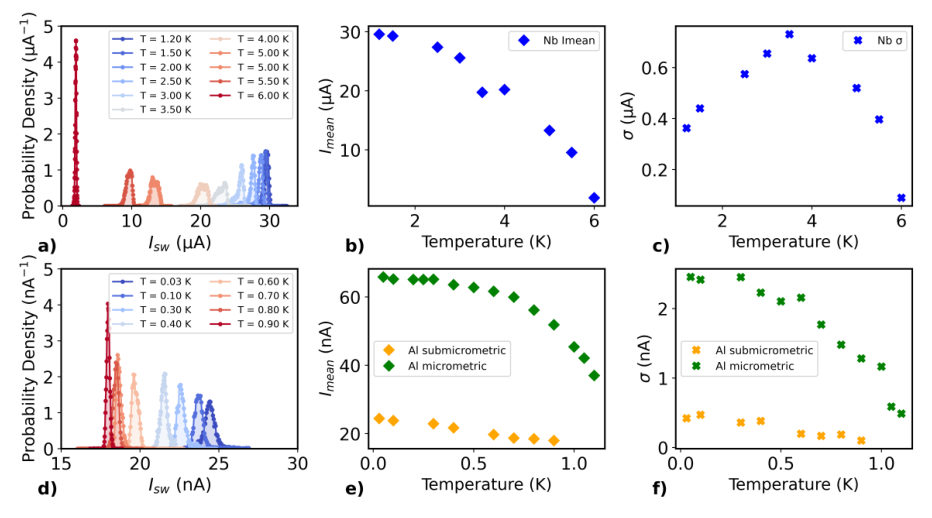 
Fig. 3 a) Switching Current Distributions (SCDs) as a function of temperature for Sample A (10 mK–6 K). b) Temperature dependence of Imean and c) σ for Sample A. d) SCDs as a function of temperature for Sample C (10 mK-0.9 K). e) Temperature dependence of Imean and f) σ for Sample B (orange) and Sample C (green).

📷 Fig 4

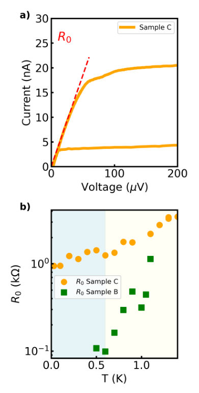 
Fig. 4 a): Zoom of the I-V characteristic of Sample C close to the zero voltage state, the red dashed line indi- cates the finite resistance R0 of the supercurrent branch. b) Finite slope of the supercurrent branch of the I-V curves R0 as a function of the temperature T for the sample B (green square) and for the sample C (orange dots), where R0 has been estimated through the linear fitting of the I-V superconducting branch in Figure 4a. The light blue region indicates the quantum phase diffusion regime, while the yellow one indicates the phase diffusion regime activated by thermal fluctuations.

**Summary.** This paper investigates the electrodynamic properties of tunnel ferromagnetic Josephson junctions. It shows that submicrometric Al-based junctions can achieve quantum phase diffusion regimes similar to transmon qubits, suggesting their viability for future superconducting quantum and classical digital circuits.

**Why it may be interesting.** The paper explores the transition from thermal activation to quantum phase diffusion and the management of dissipation in hybrid superconducting-magnetic systems, which is highly relevant to the development of high-coherence hybrid quantum architectures.

Detailed structure

**Main problem.** Investigating the phase dynamics, dissipation mechanisms, and scalability of tunnel ferromagnetic Josephson junctions (SIsFS) for potential integration into superconducting quantum and classical circuits.

**Main result.** The study demonstrates that submicrometric Al-based SIsFS junctions exhibit quantum phase diffusion and properties comparable to state-of-the-art transmons, establishing a robust framework for hybrid ferromagnetic Josephson junctions.

**Method.** The researchers used transport measurements (I-V characteristics and switching current distributions) and fitted the data using the Tunnel Junction Microscopic (TJM) model and the Bakurskiy model.

**Model / system.** The physical system consists of SIsFS (Superconductor-Insulator-thin superconductor-Ferromagnet-Superbolconductor) multilayer junctions, specifically Nb-based and Al-based devices with varying dimensions and ferromagnetic interlayers.

**Key observables.** Critical current (Ic), gap voltage (Vgap), IcRN product, switching current probability density distribution P(I), and quality factors (Q0, Q1).

**Important parameters / regimes.** Josephson energy (Ej), charging energy (Ec), Ej/Ec ratio, thermal activation, macroscopic quantum tunneling (MQT), and quantum phase diffusion regimes.

**Assumptions / limitations.** The analysis assumes the validity of the Tunnel Junction Microscopic model and the Bakurskiy model for describing the series combination of SIs and sFS junctions.

**Figures summary.** Figure 1 shows normalized I-V characteristics for different samples and compares SIsFS junctions to non-magnetic SIS counterparts; Figure 3 shows temperature-dependent switching current distributions and mean switching current for Nb-based samples.

**Paper structure.** The paper introduces the SIsFS architecture, details the fabrication and experimental platform, presents transport measurements and modeling results for different material systems, and concludes with the implications for quantum and classical circuit integration.

Abstract

We investigate tunnel ferromagnetic Josephson junctions based on Superconductor-Insulator-thin superconductor-Ferromagnet-Superconductor multilayers. A comparative study of their electrodynamic properties is performed for junctions with niobium and aluminum (Al) electrodes, featuring different ferromagnetic interlayer materials and lateral dimensions ranging from the micrometric to the submicrometric scale. The parameters extracted from the fitting of the current-voltage characteristics using the tunnel junction microscopic model are found to be consistent with those independently estimated from switching current distribution measurements. Submicrometric Al-based devices exhibit electrodynamic properties comparable to those implemented in state-of-the-art transmon qubits and display clear signatures of quantum phase diffusion. The strong agreement between transport modelling and escape dynamics establishes a robust framework for describing hybrid ferromagnetic Josephson junctions consistent with their energy scales and supports their potential integration into superconducting quantum and classical digital circuits.

[↑ back to top](#top)

### [Collective dynamics of active matter with orientation-weighted alignment](http://arxiv.org/abs/2605.17627v1)

**Authors:** Bohdan Dobosh, Alexander Yakimenko  
**Type:** theory · **Category:** statistical mechanics · **PDF:** <https://arxiv.org/pdf/2605.17627v1>  
**Analysis basis:** full PDF text, analyzed in chunks
**Topic relevance:** `non-equilibrium dynamics` **3/5** · `driven-dissipative phase transition` **2/5** · `non-equilibrium universality` **2/5**

📷 Fig 1

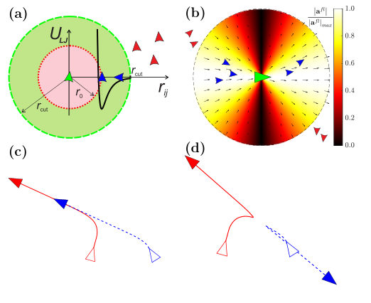 
FIG. 1. (a) Lennard-Jones-type pair potential associated with a central agent (green triangle). The red-shaded region corre- sponds to short-range repulsion that prevents collisions, while the green-shaded region indicates the attractive part of the interaction. (b) Alignment force field generated by a single agent located at the center (green triangle). Arrows show the force direction, and the background color represents the absolute value of the force. Panels (c) and (d) illustrate the dynamics of a two-agent system with the same initial condi- tions, shown by empty red and blue triangles, but opposite signs of the alignment parameter A; the corresponding trajec- tories are shown by solid...

📷 Fig 2

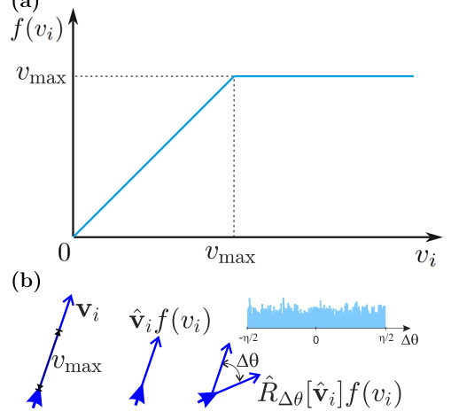 
FIG. 2. (a) Speed truncation function f : vi 7→f(vi). (b) Schematics of velocity rescaling, discussed in Section III: speed truncation and rotation by angle ∆θ. ˆvi = vi/|vi|.

📷 Fig 3

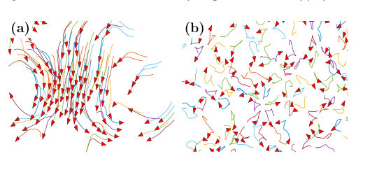 
FIG. 3. The fragments of the evolution of the system in two different regimes in the absence of external potentials. Agents are depicted with red triangles, the colored lines represent a fragment of their trajectories. (a) Flocking regime A &gt; 0. (b) Active gas A &lt; 0. Detailed simulations can be found in Supplemental Material.

📷 Fig 4

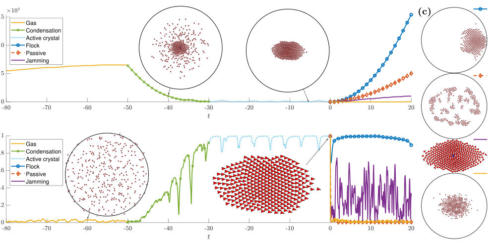 
FIG. 4. Representative dynamical protocol for the orientation-weighted active-particle model. The initial condition consists of randomly distributed agents with random velocity directions and speeds. Initially, the system is in the gas-like regime with A = −2. Panels (a) and (b) show the time dependence of the mean squared displacement and polar order parameter, respectively. At t = −50, the anisotropic target field [Eq. (9)] is switched on, and the alignment strength is changed to A = 2. The agents then condense into a dense ordered cluster near the target. At t = 0, the parameters A and C are changed again, producing the post-target regimes shown in panel (c): flocking, active gas,...

📷 Fig 5

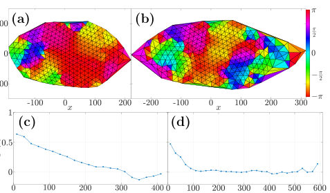 
FIG. 5. Local sixfold order and orientational correlation func- tion for the dense ordered state. Panels (a,c) correspond to the unperturbed state shown in Fig. 4 at t = 0, while panels (b,d) show the state obtained with the stochastic- friction perturbation of Eq. (14). Lines connect Voronoi near- est neighbors. Triangles are colored according to the bond- orientational phase φ = arg 1

**Summary.** This paper presents a microscopic model of active matter where alignment depends on the orientation of neighboring particles. It shows that this simple rule can lead to complex behaviors ranging from disordered gases to highly ordered, oscillating clusters.

**Why it may be interesting.** The study explores how local, anisotropic, and velocity-dependent rules drive phase transitions and emergent collective behaviors, which is highly relevant to understanding non-equilibrium phase transitions and driven many-body dynamics.

Detailed structure

**Main problem.** Investigating how a simple, local, orientation-weighted alignment rule can generate a diverse range of nonequilibrium collective dynamics, such as flocking, jamming, and clustering.

**Main result.** The model demonstrates that a single microscopic rule can produce a broad spectrum of states, including coherent flocking, active gases, and dense ordered clusters that exhibit periodic collective reversals.

**Method.** Direct numerical simulations of an agent-based model using the velocity Verlet integration algorithm.

**Model / system.** An agent-based model of N self-propelled particles in a 2D arena, featuring a Lennard-Jones-type potential for short-range interactions and a velocity-dependent, orientation-weighted alignment rule.

**Key observables.** Polar order parameter, Mean Squared Displacement (MSD), sixfold orientational order parameter, and orientational correlation function.

**Important parameters / regimes.** Alignment strength (A), target strength (C), Lennard-Jones interaction strength (Up), and maximum speed (vmax).

**Assumptions / limitations.** The alignment rule is local and anisotropic; speed is regulated by a saturation rule to prevent unbounded acceleration.

**Figures summary.** Fig 1 shows the interaction potentials and the force field of a single agent; Fig 2 illustrates speed truncation and velocity rescaling; Fig 3 compares flocking and active gas regimes; Fig 4 shows system evolution after target removal; Fig 5 displays structural order parameters.

**Paper structure.** The paper introduces the microscopic alignment rule and model components, explores different dynamical regimes by tuning alignment strength, investigates the effect of localized target forcing, and tests the robustness of these states against noise and perturbations.

Abstract

We study an agent-based model of self-propelled particles with a velocity-dependent alignment rule. This interaction is orientation weighted and acts along the line connecting neighboring particles. Tuning the alignment strength produces several distinct collective regimes, including disordered gas-like motion, coherent flocking, jammed high-density states, and densely ordered moving clusters with active-crystal-like behavior. These results show that a simple local alignment rule can generate a broad range of nonequilibrium collective dynamics within a single microscopic model.

[↑ back to top](#top)

### [Dynamic Many-Body Theory: The dynamics of atomic impurities in $^4$He](http://arxiv.org/abs/2605.17069v1)

**Authors:** Eckhard Krotscheck  
**Type:** theory · **Category:** other · **PDF:** <https://arxiv.org/pdf/2605.17069v1>  
**Analysis basis:** full PDF text, analyzed in chunks
**Topic relevance:** `Keldysh / 2PI / non-Gaussian methods` **3/5** · `Kondo & dissipative impurity` **2/5** · `non-equilibrium dynamics` **2/5**

📷 Fig 1

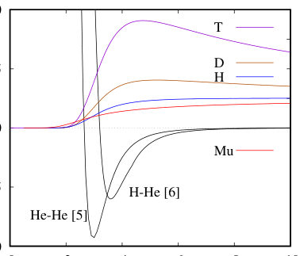 
FIG. 1. (color online) The figure shows the Aziz interaction5 and the 4He-H interaction of Jochem-

📷 Fig 2

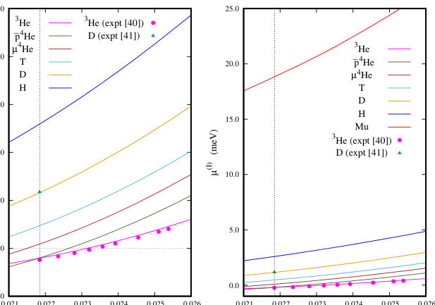 
FIG. 2. (color online) The left figure shows the chemical potential of 3He impurities, muonic 4He,

📷 Fig 3

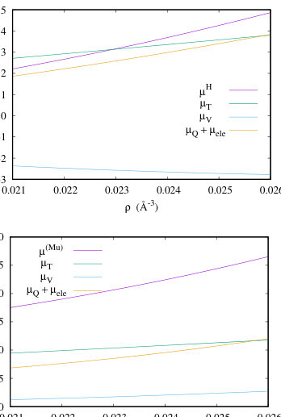 
FIG. 4. (color online) The figures show the individual contributions to the chemical potential of

📷 Fig 4

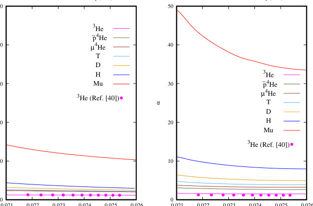 
FIG. 5. (color online) The left figure shows the volume excess factor α as obtained from Eq. (2.27)

📷 Fig 5

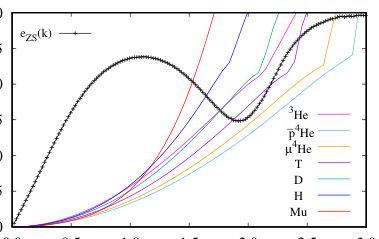 
FIG. 6. (color online) The figure shows the calculated phonon-roton spectrum from Ref. 17

**Summary.** This paper develops a microscopic theory to study how different atomic impurities move through superfluid helium-4. It specifically highlights how the large zero-point motion of light particles like muonium leads to massive increases in effective mass and unique dispersion relations.

**Why it may be interesting.** It provides a sophisticated microscopic framework for understanding how a light impurity couples to the collective excitations (phonons/rotons) of a quantum fluid, which is highly relevant to many-body dynamics and impurity physics.

Detailed structure

**Main problem.** The study aims to develop a Dynamic Many-Body Theory to describe the dynamics, energetics, and effective mass of various atomic impurities (such as muonium, antiprotonic helium, and hydrogen isotopes) embedded in a superfluid 4He host.

**Main result.** The theory predicts extreme mass enhancement for muonium (m*/m > 100) due to large zero-point motion and shows that the dispersion relations for muonic and antiprotonic helium pass under the roton minimum.

**Method.** The authors use a microscopic many-body approach based on the Jastrow-Feenberg ansatz, the Hypernetted chain (HNC)/Euler-Lagrange method, and a time-dependent generalization of the variational principle to derive impurity self-energy.

**Model / system.** A single atomic impurity (Mu, p-bar, H, D, T, or 3He) immersed in a bulk 4He quantum liquid, modeled with Aziz-type He-He potentials and impurity-host potentials characterized by a strong repulsive core.

**Key observables.** Chemical potential, effective mass, dispersion relations, impurity self-energy, pair distribution function, and particle lifetime.

**Important parameters / regimes.** deBoer parameter (quantumness), reduced mass, scattering length, and the phonon-roton spectrum of the host liquid.

**Assumptions / limitations.** The theory utilizes the G0W approximation for dispersion relations and a three-phonon vertex approximation to preserve long-wavelength properties; the Feynman approximation for the host spectrum is noted to be a factor of 2 too high.

**Figures summary.** Figure 1 shows interaction potentials and scattering wave functions; Figure 2 compares chemical potentials vs density; Figure 7 shows effective mass vs density; Figure 8 compares dispersion relations; Figure 9 shows self-energy and particle lifetime; Figure 10 shows the imaginary part of the self-energy.

**Paper structure.** The paper introduces the motivation regarding muonium experiments, defines the many-body Hamiltonian and variational framework, details the derivation of the Dynamic Many-Body Theory, presents results for static properties (chemical potential), and concludes with dynamic properties (effective mass and damping).

Abstract

We implement manifestly microscopic many-body methods to study the dynamics of atomic impurities in a host quantum fluid, specifically $^4$He. Our investigations are motivated by experiments of muonium atoms within $^4$He with the goal of testing the universality of free fall by neutral bound states using unstable particles.   Structure calculations are performed using standard semi-analytic methods; we extend here the calculations of our previos work (Journal of Low Temperature Physics {\bf 93}, 415-449 (1993)) to muonic \he4, antiprotonic \he4 and mounium atoms within \he4. We find that the muonium impurity probes, due to its large zero-point motion, the atomic interaction at rather short distances. Its chemical potential is estimated to be about 19 meV. Antiprotonic \he4 has, on the other hand, a negative chemical potential.   Dynamics is treated by making all correlation functions time-dependent. In analogy to the derivation of the dynamics of the background liquid, we derive a working formula for the impurity self-energy that includes the most relevant physical effects. Results for the effective mass of \he3 and hydrogen atoms agree well with available experiments. The dispersion relations of muonic \he4 and antiprotonic \he4 pass through under the roton minimum.

[↑ back to top](#top)

### [Kapitza-like modulation of near-field radiative heat transfer](http://arxiv.org/abs/2605.18322v1)

**Authors:** Mauro Antezza  
**Type:** theory · **Category:** statistical mechanics · **PDF:** <https://arxiv.org/pdf/2605.18322v1>  
**Analysis basis:** full PDF text, analyzed in chunks
**Topic relevance:** `non-equilibrium dynamics` **3/5** · `correlated / nonlocal dissipation` **2/5** · `driven-dissipative phase transition` **2/5**

📷 Fig 1

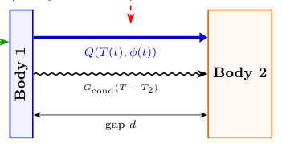 
FIG. 1. Schematic of the lumped thermal system. Body 1 (the lumped body with heat capacity C and temperature T(t)) and Body 2 (a thicker reservoir at fixed T2) are separated by a gap d. The energy exchange is composed of a radiative heat flux Q, dynamically modulated by a generic external parameter ϕ(t) at frequency Ω, and a background conductive channel Gcond.

📷 Fig 2

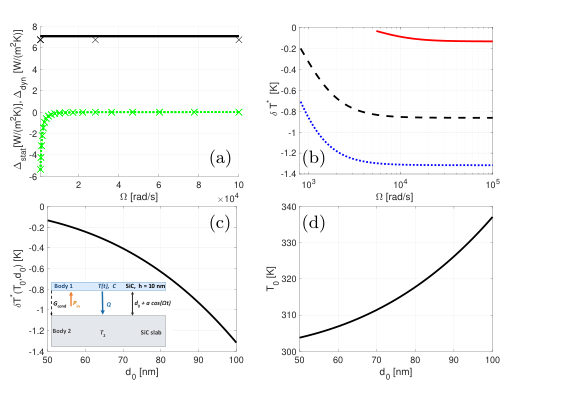 
FIG. 2. (a) Static (black) and dynamic (green) Kapitza corrections versus Ωfor d0 = 88 nm. (b) Stationary shift δT ∗

📷 Fig 3

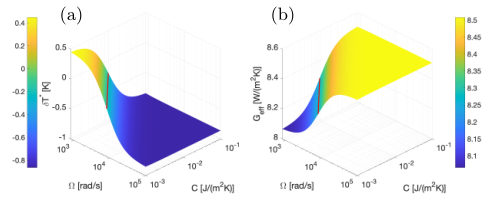 
FIG. 3. (a) Slow-temperature shift δT ∗and (b) effective conductance Geff(T ∗, d0, Ω) versus Ωand C, for d0 = 88 nm (T0 = 324 K), using the same parameters as in Fig. 2. Red curves indicate the limit of validity of the averaging approxi- mation Ω= G(T0, d0)/C, with G(T0, d0) = 8.22 Wm−2K−1.

📷 Fig 4

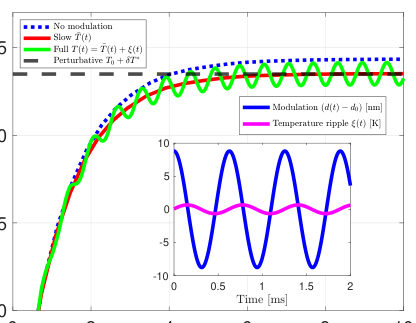 
FIG. 4. Time evolution for d0 = 88 nm, Ω= 104 rad/s, and the same parameters as in Fig.2: unmodulated steady state T0 [(14)]; slow averaged component ¯T(t) [(10)]; full solution T(t) = ¯T(t) + ξ(t) [(8),(10)]; perturbative prediction T0 + δT ∗

📷 Fig 5

 
Figure 2(b) shows the slow-temperature shift δT ∗ [Eq. (17)] versus Ωfor three gaps, d0 = 50, 88, 100 nm (with corresponding T0 = 303, 324, 337 K) and a = 0.1d0. As expected, δT ∗is always negative and saturates at large Ω, giving δT ∗= −0.13 K, −0.86 K, and −1.32 K, respectively. These shifts can be strongly amplified by in- creasing the input power. For instance, keeping the same power-law parameters for Q and d0 = 88 nm, raising the input to Pin = 2 103 Wm−2 increases the unmodulated temperature to T0 = 542 K and yields a much larger Kapitza-like shift, δT ∗= −8.6 K. Figure 2(c) shows the temperature shift δT ∗versus d0 in the large-Ωlimit, where ∆stat(T0) dominates. The shift decreases...

**Summary.** The paper introduces a way to control near-field radiative heat transfer by rapidly modulating parameters like the vacuum gap. This process creates a thermal version of the Kapitza mechanism, allowing for predictable temperature shifts and the ability to stabilize thermal states. The predicted effects are large enough to be measured with current experimental technology.

**Why it may be interesting.** The paper presents a fundamental way to control non-equilibrium thermal dynamics and stability through parametric driving, which is highly relevant to the control of open quantum systems and heat transport in nanophotonic platforms.

Detailed structure

**Main problem.** Investigating how rapid periodic modulation of a parameter controlling near-field radiative heat transfer (NFRHT) affects the slow thermal dynamics and stability of a system.

**Main result.** The study establishes a thermal analogue of the Kapitza mechanism, showing that fast modulation produces a quadratic, time-averaged temperature shift and a modified effective thermal conductance consisting of static and dynamic terms.

**Method.** A two-scale analysis and Kapitza-type averaging method are used to decompose temperature into slow and fast components and expand the radiative flux to second order in modulation amplitude.

**Model / system.** A lumped-body thermal model consisting of two bodies (e.g., SiC slabs) separated by a vacuum gap, where heat transfer occurs via photon tunneling (evanescent fields) and a background conductive channel.

**Key observables.** Steady-state temperature shift (delta T*), effective thermal conductance (G_eff), and the frequency-dependent temperature ripple.

**Important parameters / regimes.** Modulation frequency (Omega), modulation amplitude (a), vacuum gap distance (d), and the ratio of modulation frequency to thermal relaxation rate (Omega vs G/C).

**Assumptions / limitations.** Small modulation amplitude, clear separation of timescales between modulation and thermal relaxation, and electromagnetic quasi-instantaneity.

**Figures summary.** Figure 2 shows the static and dynamic Kapitza corrections and temperature shifts as functions of modulation frequency and gap distance, alongside unmodulated temperature comparisons.

**Paper structure.** The paper introduces the thermal Kapitza mechanism, defines the physical model and governing thermal balance equations, applies two-scale averaging to derive slow dynamics, applies the theory to SiC slabs to predict measurable shifts, and discusses stability and future applications.

Abstract

We introduce a Kapitza-like mechanism for the near-field radiative heat transfer and show that fast modulation of any parameter controlling the flux, such as the vacuum gap or a material response, produces a quadratic, time-averaged correction in the slow thermal dynamics. This correction splits into a frequency-independent static term and a low-pass dynamical term, yielding sizable modulation-induced temperature shifts and modified effective thermal conductances that can stabilize or destabilize the steady state. Applying the theory to gap modulation between SiC slabs, we derive analytical scaling laws and predict temperature shifts that are fully measurable with existing experimental platforms, requiring only readily accessible low modulation frequencies of order $Ω\approx 10^4~\mathrm{rad/s}$. Our results establish a thermal analogue of the Kapitza mechanism and provide a general route for controlling radiative heat flow in micro- and nanoscale platforms.

[↑ back to top](#top)

### [Berry-phase in a periodically driven single molecule magnet transistor](http://arxiv.org/abs/2605.16635v1)

**Authors:** Gabriel Gonzalez  
**Type:** theory · **Category:** other · **PDF:** <https://arxiv.org/pdf/2605.16635v1>  
**Analysis basis:** full PDF text, analyzed in chunks
**Topic relevance:** `non-equilibrium dynamics` **3/5** · `Kondo & dissipative impurity` **2/5**

📷 Fig 1

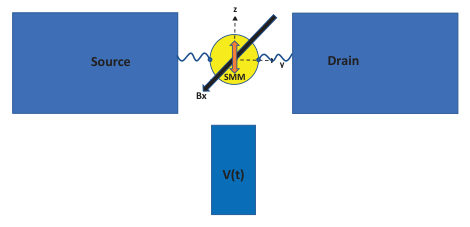 
FIG. 1: Schematic illustration of a single molecule magnet transistor attached to two leads and controlled by a time dependent gate voltage and a transverse magnetic field.

📷 Fig 2

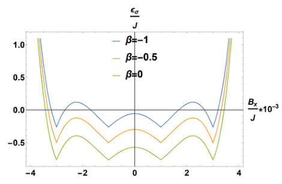 
FIG. 2: Oscillations of the zero transmission resonances as a function of the transverse magnetic field for different values of β. We used the following values Kz = 104J, K = 50J, ω = 3J, ϵOL = 0.5J and J∥= 0.75J for our calculations. Note that it is necessary that the uniaxial anisotropy constant Kz be large in order to have oscillations with large amplitudes.

📷 Fig 3

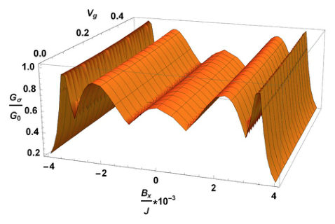 
FIG. 4: The graph shows the oscillations of the conductance as a function of the transverse magnetic field Bx for a SMM with s = 2 due to the Berry phase. We used the following values Vg = 1J, ϵσ = 1J, Kz = 104J, K = 50J, ω = 3J, ϵOL = 0.5J, J∥= 0.75J and β = 0.

📷 Fig 4

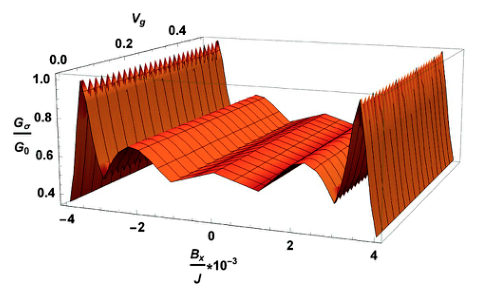 
FIG. 5: The graph shows the oscillations of the conductance as a function of the transverse magnetic field Bx for a SMM with s = 2 due to the Berry phase. We used the following values Vg = 1J, ϵσ = 1J, Kz = 104J, K = 50J, ω = 3J, ϵOL = 0.5J, J∥= 0.75J and β = −0.5.

📷 Fig 5

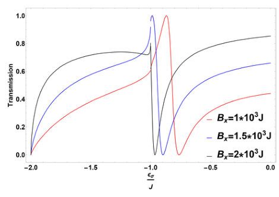 
FIG. 3: The graph shows the electron transmission in a SMM transistor with homogeneous hopping amplitude for various magnetic field strengths as a function of ϵσ. We used the following values Vg = 1J, Kz = 104J, K = 50J, ω = 3J, ϵOL = 0.5J, J∥= 0.75J and β = 0.

**Summary.** This paper shows that an AC-driven gate voltage in a single molecule magnet transistor can be used to detect Berry-phase interference through conductance oscillations. This method is significant because it allows for the observation of these quantum interference effects using unpolarized leads.

**Why it may be interesting.** not directly relevant

Detailed structure

**Main problem.** Investigating how a time-periodic gate voltage and a transverse magnetic field induce Berry-phase interference in the electron transport through a single molecule magnet transistor.

**Main result.** The study demonstrates that the AC-driven potential creates zero transmission resonances that oscillate with the transverse magnetic field due to Berry-phase interference, and that these oscillations can be detected using unpolarized leads.

**Method.** The authors combine Floquet theory to handle the time-periodic potential with the Landauer formalism to calculate conductance and transmission probability.

**Model / system.** A single molecule magnet (SMM) transistor connected to two leads, modeled using a one-dimensional tight-binding chain and the Giant Spin Approximation (GSA) for the SMM spin tunneling.

**Key observables.** Electron transmission probability, conductance, and zero transmission resonances.

**Important parameters / regimes.** Transverse magnetic field (Bx), gate voltage amplitude (Vg), driving frequency (omega), anisotropy constants (Kz, K), and coupling strength (beta).

**Assumptions / limitations.** The system is in the strong Coulomb regime where only uncharged or singly charged states are considered, and the exchange coupling is highly anisotropic (J_perp = 0).

**Figures summary.** Fig 1 shows the device setup; Fig 2 displays oscillations of zero transmission resonances; Fig 3 plots transmission probability vs electron energy; Figs 4 and 5 show conductance oscillations as a function of the transverse magnetic field.

**Paper structure.** The paper begins with the system setup and Hamiltonian definition, moves to the Floquet-Landauer transport formalism, presents analytical and numerical results for transmission and conductance, and concludes with the discussion of Berry-phase detection.

Abstract

We consider the electron transport through a single molecule magnet transistor in the presence of a local transverse magnetic field and ac-driven gate voltage. We calculate the conductance as a function of the electron energy and transverse magnetic field by using the Floquet and Landauer formalism. We show that the time periodic potential causes zero transmission resonances that oscillate as a function of the transverse magnetic field due to the Berry phase interference associated with two quantum tunneling paths. We find that these Berry phase oscillations can be detected in the conductance as a function of the transverse magnetic field for an incoming electron with a specific energy.

[↑ back to top](#top)

### [Electronic mechanism of sub-100-fs demagnetization induced by a femtosecond light pulse](http://arxiv.org/abs/2605.18638v1)

**Authors:** Konrad J. Kapcia, Victor Tkachenko, Flavio Capotondi, Alexander Lichtenstein, Serguei Molodtsov, Przemysław Piekarz, Beata Ziaja  
**Type:** theory · **Category:** strongly correlated electrons · **PDF:** <https://arxiv.org/pdf/2605.18638v1>  
**Analysis basis:** full PDF text, analyzed in chunks
**Topic relevance:** `non-equilibrium dynamics` **3/5**

📷 Fig 1

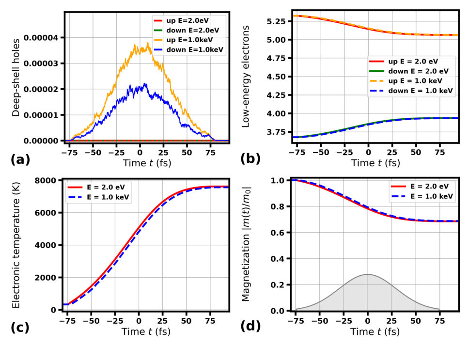 
Figure 1. Transient electronic and magnetic properties of Co predicted by XSPIN in an single magnetic domain under optical irradiation with 2 eV pulse or X-ray irradiation with 1000 eV pulse (as labeled), both of 70 fs FWHM duration. (a) number of deep-shell holes produced (per atom; spin-resolved), (b) number of low-energy electrons per atom (with energy below the cutoff of 15 eV, spin-resolved), (c) electronic temperature, (d) magnetization (normalized to its initial value m0 before the pulse), all plotted as a function of time. Temporal profile of the pulse triggering the dynamics is schematically depicted.

📷 Fig 2

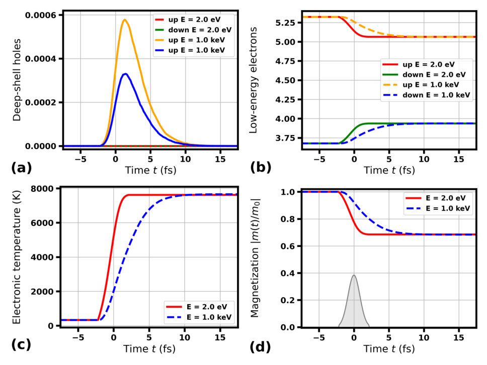 
Figure 2. Transient electronic and magnetic properties of Co predicted by XSPIN in a single magnetic domain under optical irradiation with 2 eV pulse or X-ray irradiation with 1000 eV pulse (as labeled), both of 2 fs FWHM duration. Other simulation parameters are as in Fig. 1.

📷 Fig 3

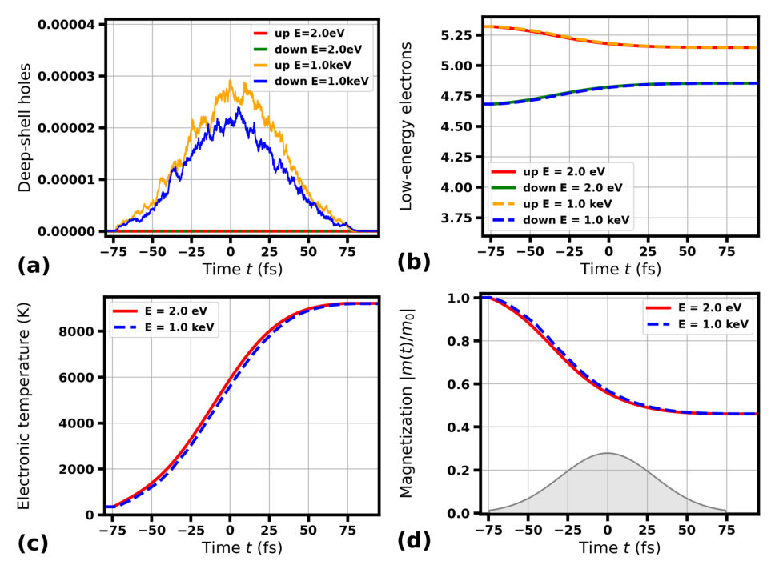 
Figure 3. Transient electronic and magnetic properties of Ni predicted by XSPIN in a single magnetic domain under optical irradiation with 2 eV pulse or X-ray irradiation with 1000 eV pulse (as labeled), both of 70 fs FWHM duration. Other simulation parameters are as in Fig. 1.

📷 Fig 4

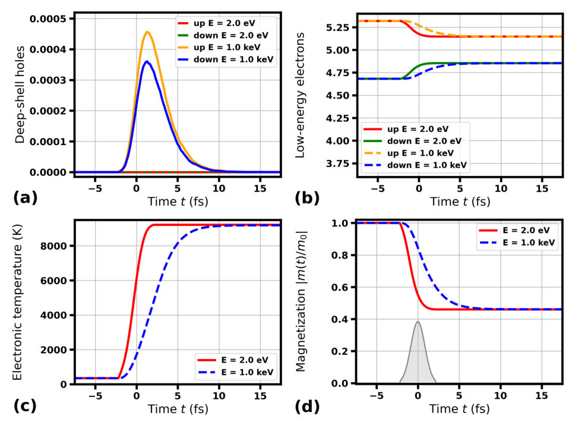 
Figure 4. Transient electronic and magnetic properties of Ni predicted by XSPIN in a single magnetic domain under optical irradiation with 2 eV pulse or X-ray irradiation with 1000 eV pulse (as labeled), both of 2 fs FWHM duration. Other simulation parameters are as in Fig. 1.

**Summary.** This theoretical study demonstrates that demagnetization in Co and Ni occurs in less than 100 femtoseconds due to electronic redistribution in the 3d band. The mechanism is shown to be universal across optical and X-ray regimes, provided the photon energy is sufficient to excite the electronic system. These findings are critical for developing next-generation ultrafast magnetic storage and switching technologies.

**Why it may be interesting.** The study explores non-equilibrium dynamics and the relaxation of highly excited electronic systems, which is relevant to understanding how ultrafast energy deposition drives transient changes in many-body electronic states.

Detailed structure

**Main problem.** Identifying the specific physical processes that trigger ultrafast (sub-100 fs) radiation-induced demagnetization in magnetic materials across optical to X-ray photon energies.

**Main result.** Sub-100-fs demagnetization is driven by electronic excitation and subsequent electron redistribution within the 3d band, a mechanism that remains universal across different photon energies.

**Method.** The study uses the XSPIN simulation code, which combines VASP-calculated electronic structures with a Monte Carlo approach for high-energy electrons and a transient Fermi-Dirac distribution for low-energy electrons.

**Model / system.** The system consists of single magnetic domains of bulk fcc Nickel (Ni) and Cobalt (Co) under strongly non-equilibrium conditions following femtosecond light pulses.

**Key observables.** Spin-resolved number of deep-shell holes, spin-resolved number of low-energy electrons (below 15 eV), transient electronic temperature, and normalized magnetization (m/m0).

**Important parameters / regimes.** Photon energies from 2 eV to 10,000 eV; pulse durations of 2 fs and 7/0 fs FWHM; absorbed dose of 0.93 eV/atom.

**Assumptions / limitations.** The band structure remains static (no nuclei movement); phonon-mediated processes and inter-site Heisenberg exchange are negligible on these timescales; the electronic temperature and chemical potential are common for both spin populations.

**Figures summary.** Figure 1 compares Co under 2 eV and 1000 eV irradiation, showing the evolution of spin-resolved holes, low-energy electrons, electronic temperature, and normalized magnetization.

**Paper structure.** The paper introduces the problem of ultrafast demagnetization, describes the XSPIN modeling framework and electronic structure calculations, presents results for various photon energies and pulse durations, and discusses the implications of electron cascading and experimental convolution effects.

Abstract

A quantitative understanding of the processes that trigger light-induced demagnetization on ultrashort timescales is crucial for achieving an ultrafast, radiation-controlled magnetic response in materials. This milestone is essential for developing next-generation magnetic storage devices and ultrafast magnetic switches. In this theoretical study, we investigated demagnetization triggered in a single magnetic domain by light pulses ranging from a few to a few tens of femtoseconds in duration, with photon energies spanning the optical and X-ray regimes, under strongly non-equilibrium conditions. We predicted a loss of magnetization in the sub-100-fs range in all cases, primarily due to the excitation of the electronic system and the subsequent redistribution of electrons within the magneto-sensitive band. The considered timescales were too short for phonon-mediated processes or inter-site Heisenberg exchange processes to contribute significantly. These findings pave the way for highly accurate, radiation-driven magnetization control in magnetic materials at sub-100-femtosecond timescales with potential practical applications.

[↑ back to top](#top)

### [Enhancement of superconductivity by polarization of magnetic impurities in disordered films](http://arxiv.org/abs/2605.17408v1)

**Authors:** Gleb S. Seleznev, Yakov V. Fominov  
**Type:** theory · **Category:** disordered systems and neural networks · **PDF:** <https://arxiv.org/pdf/2605.17408v1>  
**Analysis basis:** full PDF text, analyzed in chunks
**Topic relevance:** `Keldysh / 2PI / non-Gaussian methods` **2/5** · `Kondo & dissipative impurity` **2/5**

📷 Fig 1

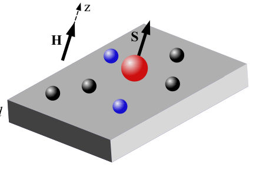 
FIG. 1. Disordered superconducting film of thickness d con- taining potential (black balls), spin-orbit (blue balls), and magnetic (red balls) impurities with spin S. The correspond- ing scattering rates are ν0, νso, and νs. The film is subjected to an external magnetic field H, which polarizes the magnetic impurities. We use energy units, h = µBH, where µB is the Bohr magneton. The field can have an arbitrary orientation, and the quantization axis z is aligned with it.

📷 Fig 2

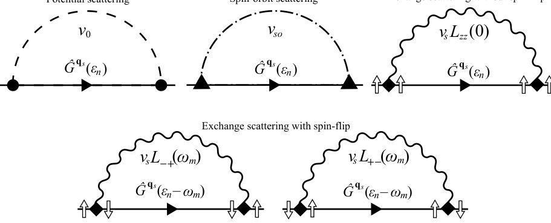 
FIG. 2. Self-energy diagrams in the self-consistent Born approximation, calculated using the exact Green’s function ˆGqs(εn, p) from Eq. (19). The diagrams describe scattering by potential impurities (scattering rate ν0), spin-orbit impurities (scattering rate νso), and magnetic impurities (scattering rate νs). Exchange scattering by magnetic impurities is divided into two groups: processes without and with spin flips. The impurity lines in the top row, which describe potential scattering, spin-orbit scattering, and exchange scattering without spin flips (proportional to Lzz), carry zero Matsubara frequency, ωm = 0. The impurity lines in the bottom row, which describe spin-flip processes...

📷 Fig 3

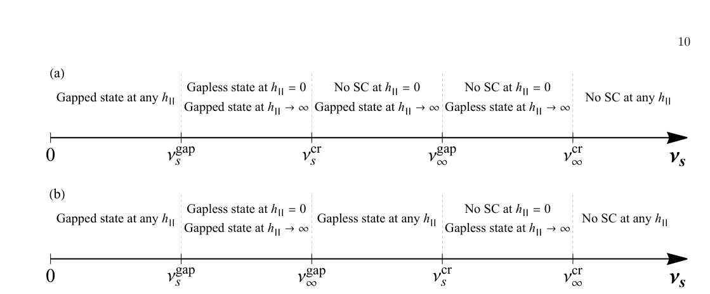 
FIG. 3. Phase diagrams of the superconducting film for different exchange scattering rates νs and impurity spins: (a) S &lt; S0 ≈10.3 and (b) S &gt; S0. The paramagnetic and orbital effects of the magnetic field are neglected. The gapless-to-gapped transition can only be observed in the range νgap s &lt; νs &lt; νgap ∞, and magnetic-field-induced restoration of superconductivity (SC) is observed in the range νcr s &lt; νs &lt; νcr ∞.

📷 Fig 4

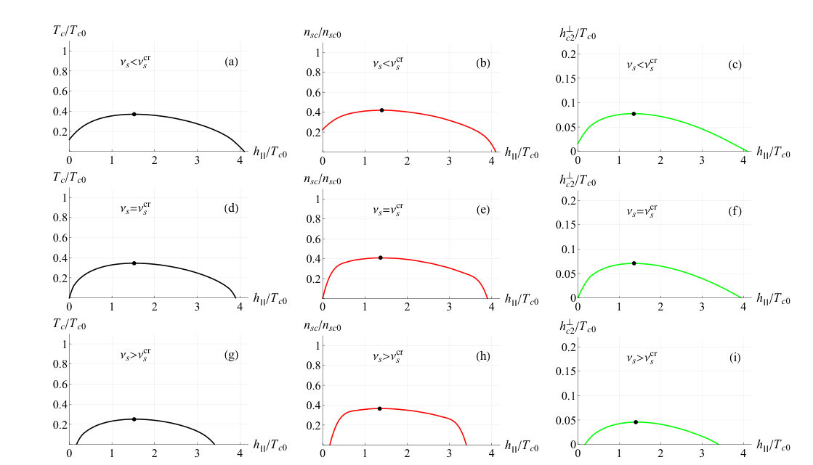 
FIG. 4. Nonmonotonic dependence of superconducting observables on the parallel magnetic field h∥: (a), (d), and (g) critical temperature Tc; (b), (e), and (h) superfluid density nsc at T = 0; and (c), (f), and (i) perpendicular upper critical field h⊥ c2 at T = 0. The superfluid density is normalized to nsc0, its value at h∥= 0 and νs = 0. The nonmonotonic curves have maxima at finite fields, marked by black dots, and arise from competition between the polarization and pair-breaking effects of the magnetic field. All panels are calculated for S = 1/2, gs = 2, ν0 = 104Tc0, νso = 103Tc0, ζs = 5, pF d = 30, pF l = 5, and different exchange scattering rates νs. Panels (a), (b), and (c)...

📷 Fig 5

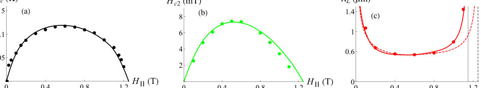 
FIG. 5. Comparison between the experimental data of Ref. [18] (dots) and the corresponding theoretical curves (solid and dashed lines) as functions of H∥for (a) the critical temperature Tc, (b) the perpendicular upper critical field H⊥ c2, and (c) the London penetration depth λL. For all theoretical curves, we use S = 5/2, gs = 2, ν0 = 1032Tc0, νso = 348Tc0, νs = 0.89Tc0, ζs = 1.25, pF d = 20, and Tc0 = 717 mK. These values correspond to the experimental estimates presented in Table S4 of Ref. [18]. Panel (a) follows from the KF theory [8, 18], whereas the fits in panels (b) and (c) are obtained from our extended theory. The fits in panels (b) and (c) require additional parameters. We use...

**Summary.** This paper extends the theory of superconductivity in disordered films to show how a parallel magnetic field can enhance superconductivity by polarizing magnetic impurities. By reducing spin-flip scattering, the field can increase the critical temperature, increase the upper critical field, and even restore superconductivity in previously normal films.

**Why it may be interesting.** not directly relevant

Detailed structure

**Main problem.** The paper aims to extend the Kharitonov and Feigelman (KF) theory to explain recent experimental observations of superconductivity enhancement, specifically addressing the enhancement of the perpendicular upper critical field and the suppression of the London penetration depth by a parallel magnetic field.

**Main result.** The authors theoretically demonstrate that a parallel magnetic field suppresses the London penetration depth and enhances the perpendicular upper critical field by polarizing magnetic impurities and reducing the effective exchange scattering rate. They also predict a gapless-to-gapped transition and the possibility of field-induced superconductivity restoration.

**Method.** The study utilizes Gor'kov's diagrammatic technique for dirty superconductors within the Matsubara representation, employing the self-consistent Born approximation and Dyson's equation to derive superconducting observables.

**Model / system.** The system consists of dirty (disordered) superconducting thin films containing potential, spin-orbit, and magnetic impurities. The model uses a Bogoliubov-de Gennes Hamiltonian that accounts for orbital and paramagnetic effects from external magnetic fields.

**Key observables.** Critical temperature (Tc), superconducting order parameter (Delta), superfluid density (nsc), London penetration depth (lambda_L), perpendicular upper critical field (Hc2_perp), and spectral gap (Eg).

**Important parameters / regimes.** Exchange scattering rates (nu_s, nu_inf), spin-orbit scattering rate (nu_so), magnetic field components (h_parallel, h_perp), impurity spin (S), and film thickness (d).

**Assumptions / limitations.** The films are in the dirty limit; the model assumes strong spin-orbit scattering to suppress paramagnetic effects; the Kondo effect is neglected (T > TK); and impurities are assumed to be independent and uniformly distributed.

**Figures summary.** Figure 1 shows a schematic of a disordered film with different impurity types; Figure 2 displays self-energy diagrams for various scattering processes; Figure 4 shows numerical plots of nonmonotonic Tc, nsc, and Hc2_perp; Figure 5 compares theoretical curves with experimental data for Tc, Hc2_perp, and lambda_L.

**Paper structure.** The paper begins with the formulation of the Hamiltonian and the physical model, followed by the development of the theoretical framework using Gor'kov's technique. It then explores specific limits (unpolarized and fully polarized), analyzes the gapless-to-gapped transition, and concludes with numerical results and comparison to experimental data.

Abstract

Dirty superconducting films with magnetic impurities can exhibit nontrivial behavior in a magnetic field that polarizes the impurity spins. As predicted by Kharitonov and Feigelman (KF) [JETP Lett. 82, 421 (2005)], this polarization reduces the exchange scattering rate. Consequently, a parallel magnetic field can enhance the critical temperature $T_c$ when magnetic-field pair breaking is weak, as realized for strong spin-orbit scattering and small film thickness. Recently, Llanos et al. [Nat. Phys. (2026)] observed a pronounced enhancement of $T_c$ consistent with the KF theory. The same experiment also reported an enhancement of the perpendicular upper critical field $H_{c2}^{\perp}$ and a suppression of the London penetration depth $λ_L$ by a parallel magnetic field. These quantities were not considered in the original KF theory. To address this gap, we develop a theoretical framework based on Gor'kov's diagrammatic technique for dirty superconductors. We extend the KF theory in two experimentally relevant directions: (i) to arbitrary temperatures $T<T_c$ and several superconducting observables, and (ii) to arbitrary magnetic-field orientations. As a result, we demonstrate theoretically the suppression of $λ_L$ and the enhancement of $H_{c2}^{\perp}$ by a parallel magnetic field, in agreement with experiment.

[↑ back to top](#top)

### [I-V characteristics of SNS junctions with a multivalley normal region](http://arxiv.org/abs/2605.17667v1)

**Authors:** Liam Bonds, Shiang-Bin Chiu, Anton Andreev, Boris Spivak  
**Type:** theory · **Category:** other · **PDF:** <https://arxiv.org/pdf/2605.17667v1>  
**Analysis basis:** full PDF text, analyzed in chunks
**Topic relevance:** `Keldysh / 2PI / non-Gaussian methods` **2/5** · `non-equilibrium dynamics` **2/5**

📷 Fig 1

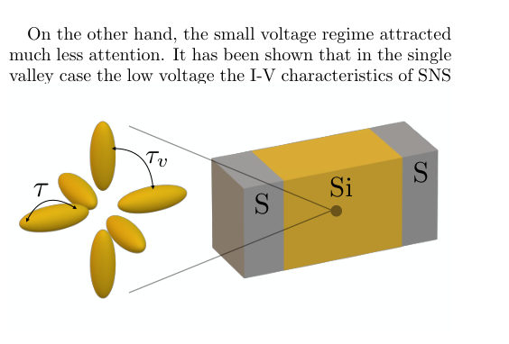 
Figure 1: Sketch of a multivalley SNS junction with an n-doped silicon (Si) normal region. The orientation of the six Fermi pockets relative to the device geometry is shown at left. The double-arrowed arcs indicate the scattering processes associated with the relaxation times τ and τv.

📷 Fig 2

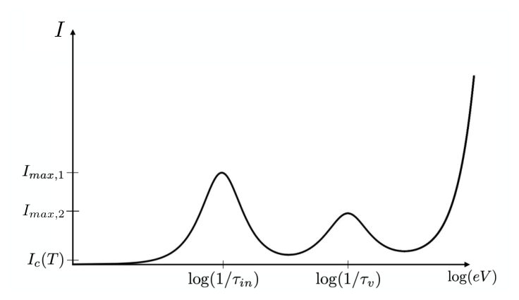 
Figure 2: Plot of average current I versus bias voltage V in an SNS junction with a multivalley normal metal. At bias voltages of the order eV1 ∼τ −1 in and eV2 ∼τ −1 v there exist two maxima of the average current; Imax,1, Imax,2. These maxima are of the same order and may greatly exceed the temperature-dependent critical current Ic(T).

📷 Fig 3

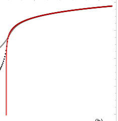 
Figure 3: I-V characteristics of current-biased SNS junctions obtained by solving the model in Appendix C. (a) Plot of dimensionless voltage eV/ET versus dimensionless current eI/GNET for T/ET = 4. Black dots are the solutions to Eqs. (C6) and (C7) with 1/(τinET ) = 10−5 and the gray dots are the solutions with 1/(τinET ) = 10−4. The high current asymptotic, Eq. (C9) is plotted in red. The jump current is Ijump = GNE2 T /32eT, which for the chosen parameters occurs at eIjump/GNET ≈0.0079. (b) The same plot on a log-linear scale. At bias currents below Ijump the nonlinear conductance is proportional to τin. This is illustrated in plot (b) where black and gray traces are separated by a factor...

**Summary.** The paper provides a theoretical description of SNS junctions where the normal metal has multiple conduction band valleys. It predicts that the separation of different relaxation time scales leads to unique nonmonotonic current peaks and highly nonlinear resistance.

**Why it may be interesting.** not directly relevant

Detailed structure

**Main problem.** Investigating how a hierarchy of relaxation time scales (intra-valley, inter-valley, and inelastic) affects the I-V characteristics of SNS junctions with a multivalley normal region.

**Main result.** The I-V characteristic is nonmonotonic, exhibiting two current peaks at voltages corresponding to the inter-valley and inelastic relaxation rates, and showing a sharp voltage jump in current-biased regimes.

**Method.** Generalization of the Larkin-Ovchinnikov equations using the Keldysh-Gor'kov-Nambu formalism, Usadel equations, and a zero-dimensional approximation for the junction.

**Model / system.** SNS (Superconductor-Normal-Superconductor) junctions where the normal region is a diffusive multivalley conductor, such as n-doped silicon or germanium.

**Key observables.** Current-voltage (I-V) characteristics, current peaks (I_max), critical current (I_c), and nonlinear resistance.

**Important parameters / regimes.** Relaxation time hierarchy (tau, tau_v, tau_in), Thouless energy (E_T), and voltage scales (V1, V2).

**Assumptions / limitations.** Diffusive regime, adiabatic approximation for slowly varying order parameters, and a zero-dimensional approximation for the low-bias regime.

**Figures summary.** Figure 1 shows a sketch of a multivalley SNS junction with scattering processes; Figure 2 plots average current vs. bias voltage; Figure 3 shows the I-V characteristic with a distinction between low-bias and high-bias regimes.

**Paper structure.** The paper introduces the physical problem, develops a generalized kinetic framework for multivalley systems, analyzes voltage-biased junctions to find current peaks, and then investigates current-biased junctions to identify the voltage jump regime.

Abstract

In multivalley conductors the inter-valley relaxation time $τ_v$ and the inelastic relaxation time $τ_{in}$ may be significantly longer than the intra-valley momentum relaxation time $τ$. We show that this separation of time scales has dramatic effects on the I-V characteristics of SNS junctions with a multivalley normal region. We generalize the Larkin-Ovchinnikov equations describing superconducting kinetics to the case of multivalley superconductors. We use this generalization to obtain a kinetic description of multivalley SNS junctions. We find that at constant voltage bias $V$, the current $I(V)$ is nonmonotonic; it exhibits two peaks of similar magnitude $I_\text{max,1} \sim I_\text{max,2}$ at $V_1 \sim \hbar(eτ_{in})^{-1}$ and $V_2\sim \hbar(eτ_v)^{-1}$, which may greatly exceed the critical current $I_c(T)$. At constant current bias $I$ we find that in a wide interval, $I_c(T) < I \lesssim I_{\text{jump}}$, the nonlinear resistance of the junction is controlled by the long relaxation times and may be several orders of magnitude smaller than the normal state resistance.

[↑ back to top](#top)

### [Relativistic theory for coupled orbital and spin angular momentum dynamics in magnetic systems](http://arxiv.org/abs/2605.16830v1)

**Authors:** Subhadip Santra, Ritwik Mondal, Marco Berritta, Peter M. Oppeneer  
**Type:** theory · **Category:** other · **PDF:** <https://arxiv.org/pdf/2605.16830v1>  
**Analysis basis:** full PDF text, analyzed in chunks
**Topic relevance:** `non-equilibrium dynamics` **2/5** · `spintronics-quantum-optics interface` **2/5**

📷 Fig 1

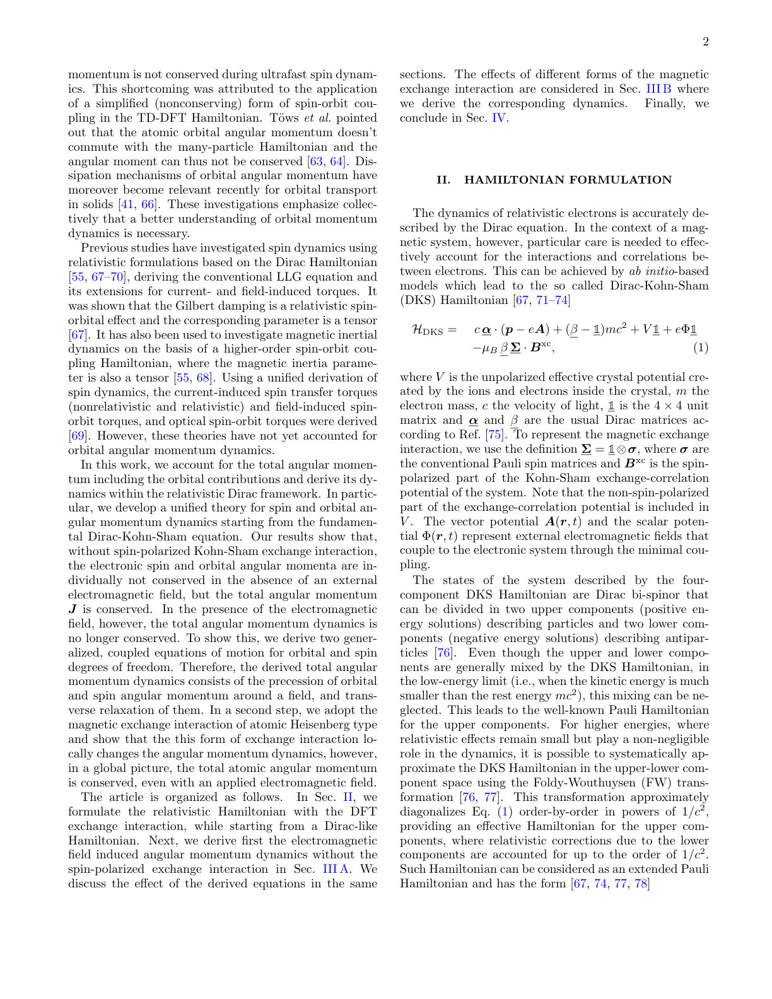 
Low-resolution page preview, page 2

📷 Fig 2

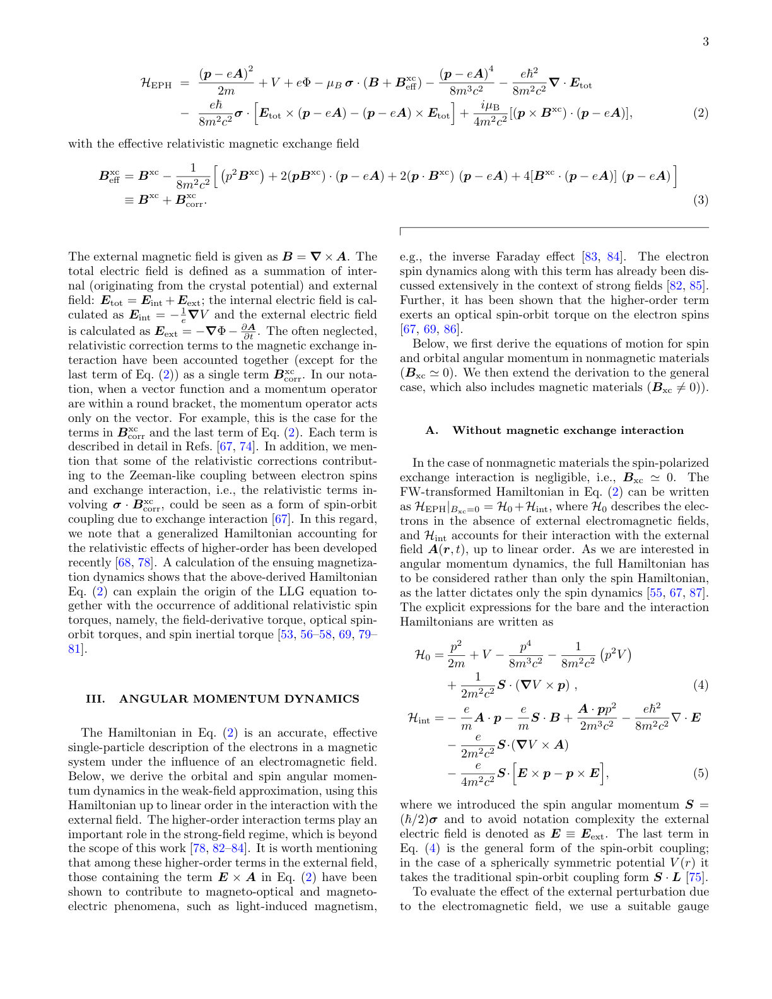 
Low-resolution page preview, page 3

📷 Fig 3

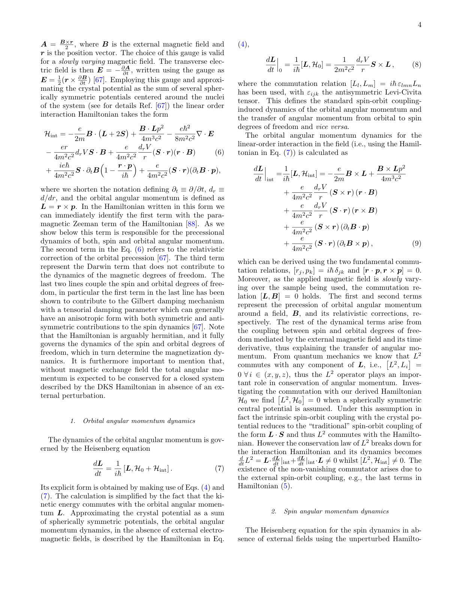 
Low-resolution page preview, page 4

📷 Fig 4

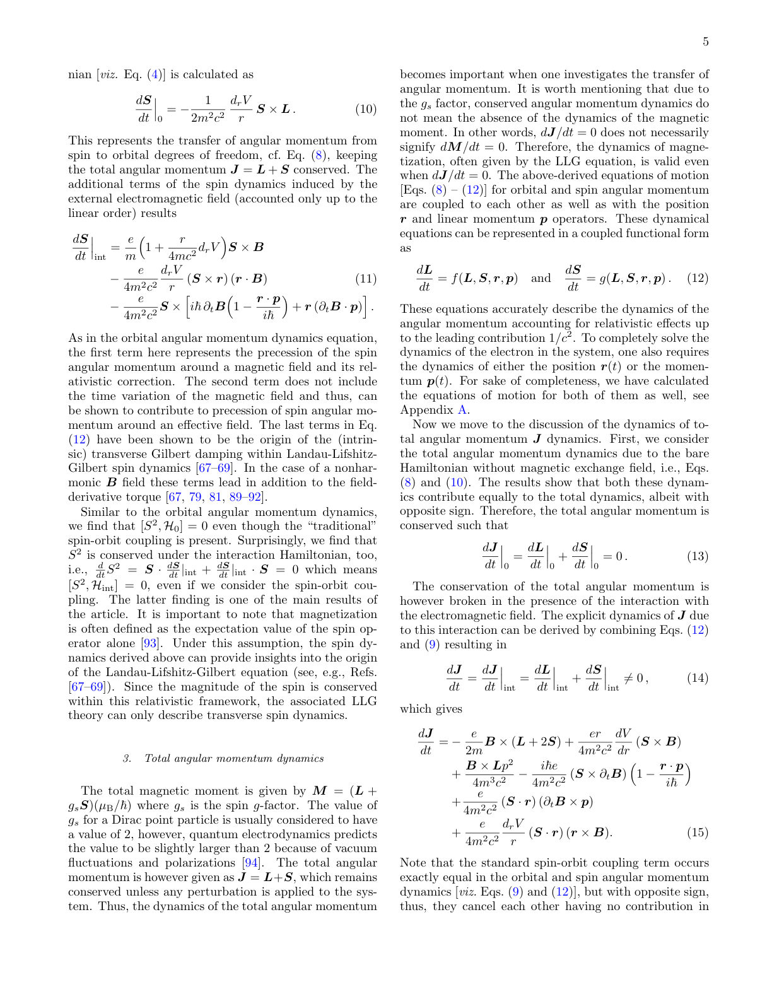 
Low-resolution page preview, page 5

📷 Fig 5

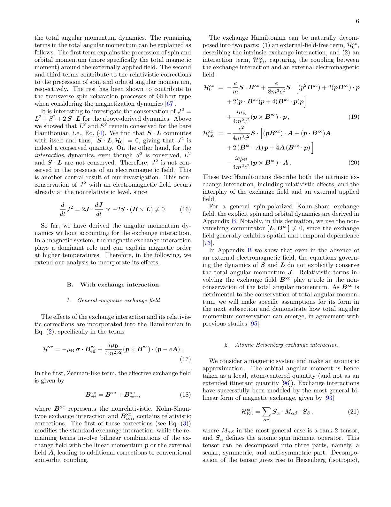 
Low-resolution page preview, page 6

**Summary.** This paper provides a relativistic theoretical framework to describe how spin and orbital angular momentum interact and redistribute in magnetic materials. It highlights how the choice of exchange-interaction model (general vs. atomistic) fundamentally changes the predicted conservation laws for total angular momentum during ultrafast processes.

**Why it may be interesting.** not directly relevant

Detailed structure

**Main problem.** The paper seeks to develop a complete relativistic theory for the coupled dynamics of spin and orbital angular momentum in magnetic systems, specifically addressing the conservation or non-conservation of total angular momentum under external electromagnetic fields.

**Main result.** The authors show that while total angular momentum (J) is conserved in the absence of a spin-polarized exchange field, it is not conserved under external electromagnetic fields (like laser pulses); however, under an atomistic Heisenberg approximation, J remains conserved even with external fields.

**Method.** The study employs a relativistic framework starting from the Dirac-Kohn-Sham Hamiltonian, applying a Foldy-Wouthuysen unitary transformation to derive an extended Pauli Hamiltonian and using Heisenberg equations of motion to derive angular momentum dynamics.

**Model / system.** The system consists of electrons in magnetic and nonmagnetic materials (including ferromagnets and alloys) subjected to external electromagnetic fields, modeled using the Dirac-Kohn-Sham and extended Pauli Hamiltonians.

**Key observables.** Spin angular momentum (S), orbital angular momentum (L), and total angular momentum (J = S + L).

**Important parameters / regimes.** Relativistic corrections (1/c^2 order), electromagnetic field strength (E and B fields), spin-polarized Kohn-Sham exchange field (Bxc), and ultrafast/femtosecond timescales.

**Assumptions / limitations.** The derivation relies on a semirelativistic 1/c^2 expansion, a weak-field approximation, and compares results between a general Kohn-Sham exchange field and an atomistic Heisenberg approximation.

**Paper structure.** The paper begins with the derivation of the relativistic Hamiltonian via unitary transformation, proceeds to analyze the dynamics of L and S in nonmagnetic and magnetic systems, investigates conservation laws under external fields, and concludes with a comparison between general exchange and atomistic Heisenberg models.

Abstract

We develop a complete relativistic theory to describe the dynamics of electronic angular momentum including both spin (S) and orbital (L) contributions in magnetic systems. We start with the relativistic Dirac-Kohn-Sham Hamiltonian under the influence of an electromagnetic field and apply a unitary transformation to formulate the extended Pauli Hamiltonian. Using the transformed semirelativistic Hamiltonian, we derive the angular momentum dynamics for the orbital and spin angular momenta. Thereby, we formulate the coupled dynamics of orbital and spin moments consistent with the relativistic Dirac framework. Considering especially the conservation of the total angular momentum, J = S +L, we show first that J is conserved in the absence of a spin-polarized Kohn-Sham exchange field, but is no longer conserved under the application of an electromagnetic field, e.g., laser pulse, THz field, etc. Second, considering magnetic systems with atomic spin and orbital momenta, we derive the coupled equations of motion of angular momenta dynamics whilst making the atomistic Heisenberg approximation for the exchange interaction. Our results suggest that, under these assumptions, the total angular momentum remains conserved, even with electromagnetic field, but atomic spin and orbital angular momenta individually are not conserved.

[↑ back to top](#top)

### [Arbitrary-genus dark soliton gases in the defocusing nonlinear Schrödinger hydrodynamics](http://arxiv.org/abs/2605.18651v1)

**Authors:** Marco Bertola, Deng-Shan Wang, Peng Yan, Dinghao Zhu  
**Type:** theory · **Category:** quantum gases · **PDF:** <https://arxiv.org/pdf/2605.18651v1>  
**Analysis basis:** full PDF text, analyzed in chunks
**Topic relevance:** `non-equilibrium dynamics` **2/5**

📷 Fig 1

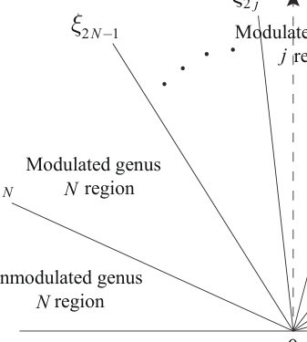 
Figure 1: The different time evolution regions on the upper x-t plane.

📷 Fig 2

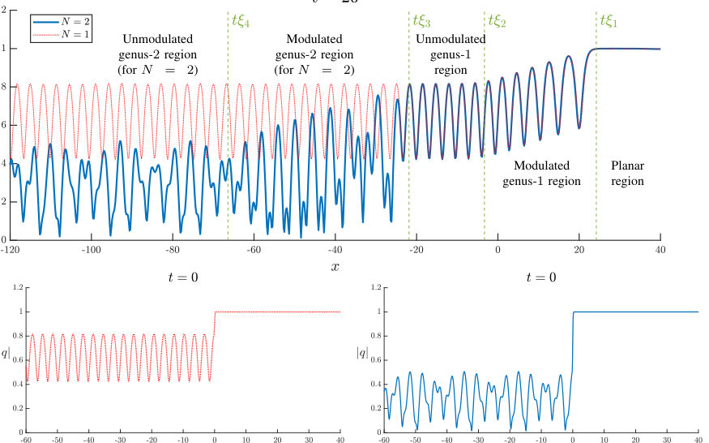 
Figure 2: Example with interpolation function r(z) ≡1, see (2.5). Numerical simulation results of equation (1.1) for N = 1 and N = 2, with the initial condition given by (1.10) (interpolated smoothly with a convex combination using tanh(x)). The initial discrete spectrum restricted by setting η1 = e0.293iπ, η2 = e0.423iπ (for N = 1) complemented by η3 = e0.567iπ, η4 = e0.811iπ for N = 2. The breaking line (green) can be calculated by (3.40) and (3.33): ξ1 ≈1.211, ξ2 ≈−0.168, ξ3 ≈−1.094, ξ4 ≈−3.320. Observe that the N = 1 and N = 2 solutions are (exponentially) close to each other in the first modulated/unmodulated region. For the initial conditions (in the second row), we employed the...

📷 Fig 3

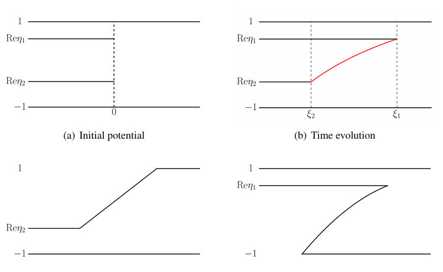 
Figure 3: Illustration of the initial potential and time evolution of the genus-1 dark soliton gas in terms of Riemann invariants. The red curve shows the evolution of Re α1 with respect to the self-similar variable ξ according to (1.15). (c) and (d) are two different types of formal degeneration of the genus-1 dark soliton gas.

📷 Fig 4

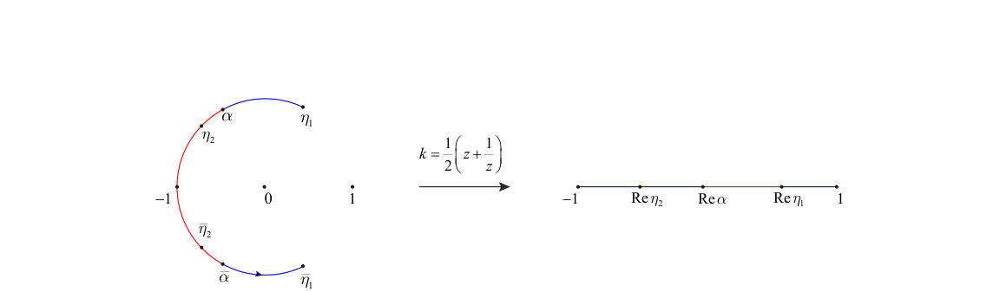 
Figure 4: Band-gap conversion. The red curves are gaps, and the blue curves are bands of the genus-one solution. After the transformation, the roles of the band and the gap are interchanged.

📷 Fig 5

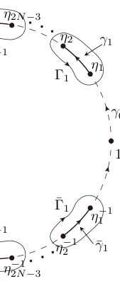 
Figure 5: Schematic diagram of solitons concentrated within 2N curve intervals.

**Summary.** This paper introduces and analyzes the dynamics of dark soliton gases with arbitrary genus in the defocusing nonlinear Schrödinger equation. It establishes how these complex soliton ensembles evolve over time, passing through various modulated and unmodulated states. The results are supported by rigorous Riemann-Hilbert analysis and numerical simulations.

**Why it may be interesting.** This work provides a rigorous mathematical foundation for understanding complex, interacting ensembles of solitons in many-body systems like BECs, specifically describing how higher-order structures decay into simpler planar or modulated regimes.

Detailed structure

**Main problem.** The paper investigates the construction and asymptotic behavior of arbitrary-genus dark soliton gases within the defocusing nonlinear Schrödinger (dNLS) hydrodynamics.

**Main result.** The authors successfully derive the long-time evolution and large-space asymptotics of higher-genus dark soliton gases, demonstrating a cascade of behaviors through modulated and unmodulated regions.

**Method.** The study employs the Deift-Zhou nonlinear steepest descent approach, Riemann-Hilbert Problem (RHP) framework, Whitham modulation theory, and the g-function approach via a variational formulation.

**Model / system.** The system is the defocusing nonlinear Schrödinger (dHS) equation, which describes physical contexts such as Bose-Einstein condensates (Gross-Pitaevskii equation) and electromagnetic wave envelopes in defocusing optical media.

**Key observables.** The amplitude/density of the dark soliton gas potential |q(x, t)|^2 and the phase functions of the soliton gas.

**Important parameters / regimes.** The self-similar variable xi = x/t, the genus N of the soliton gas, the velocity v of solitons, and the spectral parameters (eigenvalues) on the unit circle.

**Assumptions / limitations.** The analysis assumes the system is integrable and follows the defocusing nonlinear Schrödinger hydrodynamic model with finite density boundary conditions.

**Figures summary.** Figures include a qualitative map of the x-t evolution plane, numerical simulations of N=1 and N=2 cases, a visualization of the band-gap conversion mechanism, and snapshots of the soliton gas zero level sets.

**Paper structure.** The paper proceeds from the construction of the arbitrary-genus potential via an N-to-infinity limit, followed by the analysis of large-space asymptotics, the derivation of long-time evolution using RHP and Whitham theory, and finally numerical validation.

Abstract

The defocusing nonlinear Schrödinger hydrodynamics supports exact dark solitons under finite density boundary conditions. However, the dark soliton gas, an interacting ensemble of dark solitons, has not yet been studied. In this work, we introduce an arbitrary-genus potential of dark soliton gases by considering the limit of the $\mathcal{N}$-dark soliton as $\mathcal{N}\to \infty$. The large-space asymptotics and long-time evolution of this dark soliton gas potential are analytically investigated through Deift-Zhou nonlinear steepest descent approach. The genus-$N$ dark soliton gas potential approaches the genus-$N$ finite-gap solution as $x \to -\infty$ and the background $1$ as $x \to +\infty$. In the long-time evolution, as the self-similar variable $ξ=x/t$ increases, the gas configuration exhibits a cascade of behaviours, passing from unmodulated and modulated genus-$N$ regions and progressively reducing the genus down to the planar region (unmodulated genus-$0$ region). Notably, the evolution of lower-genus soliton gases can be embedded within that of higher-genus gases, exhibiting identical dynamics within specific regimes. This phenomenon is encoded by the underlying spectra. We also include numerical validations, in perfect agreement with the theoretical predictions.

[↑ back to top](#top)

### [Emergent impedance due to antiferromagnetic domain wall dynamics](http://arxiv.org/abs/2605.16778v1)

**Authors:** Yuta Yamane, Jotaro J. Nakane, Yasufumi Araki, Jun'ichi Ieda  
**Type:** theory · **Category:** other · **PDF:** <https://arxiv.org/pdf/2605.16778v1>  
**Analysis basis:** full PDF text, analyzed in chunks
**Topic relevance:** `non-equilibrium dynamics` **2/5**

📷 Fig 1

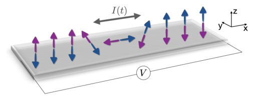 
FIG. 1. Schematic of our model system, where the DW dynamics driven by the time-varying electric current I(t)

📷 Fig 2

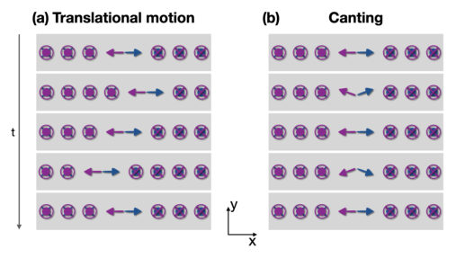 
FIG. 2. Schematic illustrations of the two dynamical mode of a DW: (a) translational motion and (b) time-dependent

📷 Fig 3

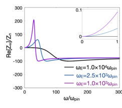 
FIG. 3. (a) Real and (b) imaginary parts of the emergent impedance Zω, each normalized by Zn =  ¯hµ

**Summary.** This paper provides a theoretical framework to understand how moving domain walls in antiferromagnets create electrical impedance. It reveals that a unique mechanism involving the tilting of sublattices contributes to this impedance, offering a way to tune electrical responses in future antiferromagnetic spintronic devices.

**Why it may be interesting.** not directly relevant

Detailed structure

**Main problem.** The study investigates the origin and nature of emergent impedance in antiferromagnets induced by the dynamics of domain walls under AC currents.

**Main result.** The authors identify two distinct mechanisms for emergent impedance: one from the translational motion of the domain wall (similar to spiral magnets) and a unique contribution from the time-dependent canting of sublattice magnetizations, which is inversely proportional to the AFM exchange coupling.

**Method.** The researchers use a perturbation expansion of the coupled Landau-Lifshitz-Gilbert (LLG) equations up to the first order of the inverse AFM exchange coupling and apply an AC current density to derive analytical expressions for the complex impedance.

**Model / system.** The model consists of an antiferromagnetic metal with two sublattices (A and B) and equal saturation magnetization, described by a 4x4 one-body Hamiltonian for conduction electrons and coupled LLG equations for the Néel and canting vectors.

**Key observables.** Emergent impedance (Z_omega), spinmotive force (SMF), emergent electric field, and the canting moment.

**Important parameters / regimes.** AFM exchange coupling (omega_E), spin-transfer torque (STT) coefficients (u, beta), pinning potential frequency (omega_pin), and Gilbert damping (alpha).

**Assumptions / limitations.** Assumes spatial uniformity in the yz plane (1D walls), small Gilbert damping, and the limit where AFM exchange is dominant (|n| approx 1 and |m| much less than 1).

**Figures summary.** Figure 1 shows a schematic of the model system with a driven domain wall; Figure 2 illustrates the two coupled DW modes (translational and canting).

**Paper structure.** The paper introduces the problem of emergent impedance, develops a theoretical formalism using LLG equations and perturbation theory, identifies the two competing dynamical mechanisms, analyzes the frequency-dependent impedance regimes, and concludes with implications for spintronics.

Abstract

We theoretically investigate emergent impedance induced by domain-wall dynamics in antiferromagnets. Emergent impedance, arising from a combined action of spin-transfer torque and spinmotive force, was previously predicted and observed in spiral magnets. Here we develop a formalism for the electrical response of an antiferromagnetic domain wall under ac currents, and obtain analytical expressions for the resulting emergent impedance. We find that two dynamical modes play separate roles in the emergent impedance: Translational motion of the domain-wall center generates a contribution proportional to its velocity, analogous to that arising from the corresponding motion of a spiral magnet. Another contribution, unique to antiferromagnetic domain walls, originates from the time-dependent canting of the sublattice magnetizations localized within the moving domain wall, whose magnitude is inversely proportional to the antiferromagnetic exchange coupling constant. The competition between these two distinct contributions determines the sign and magnitude of the imaginary part of the emergent impedance at sub-resonant frequencies. Our results provide a fundamental insight into electron transport in antiferromagnets, and open avenues for novel antiferromagnet-based spintronics devices.

[↑ back to top](#top)

### [Field Theory Models for a Holographic Superconductor in Two Dimensions](http://arxiv.org/abs/2605.18628v1)

**Authors:** Salvatore Santoro, Roberto Auzzi, Stefano Bolognesi  
**Type:** theory · **Category:** statistical mechanics · **PDF:** <https://arxiv.org/pdf/2605.18628v1>  
**Analysis basis:** full PDF text, analyzed in chunks
**Topic relevance:** `Keldysh / 2PI / non-Gaussian methods` **2/5**

📷 Fig 1

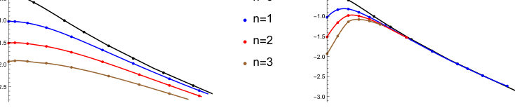 
Figure 1: In these plots [11] we show κ as a function of αH for the vacuum and n = 1, 2, 3 vortices. Here we set m2 = −0.9 and G = 0.1. In the left panel we set e = 0, while in the right panel we consider e = 10.

📷 Fig 2

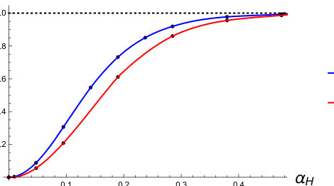 
Figure 2: Here we plot the normalized flux e ΦB/(2π) = a0/n as a function of αH for the n = 1, 2 vortex solutions [11]. Here we set e = 10, m2 = −0.9 and GN = 0.1.

📷 Fig 3

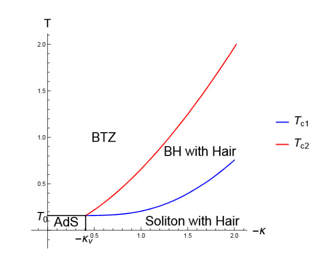 
Figure 3: Phase diagram for n = 0 with m2 = −0.9 (corresponding to ∆= 0.68) and GN = 0.1 [11]. There are four lines departing from a quadruple point dividing the diagram into four distinct phases.

📷 Fig 4

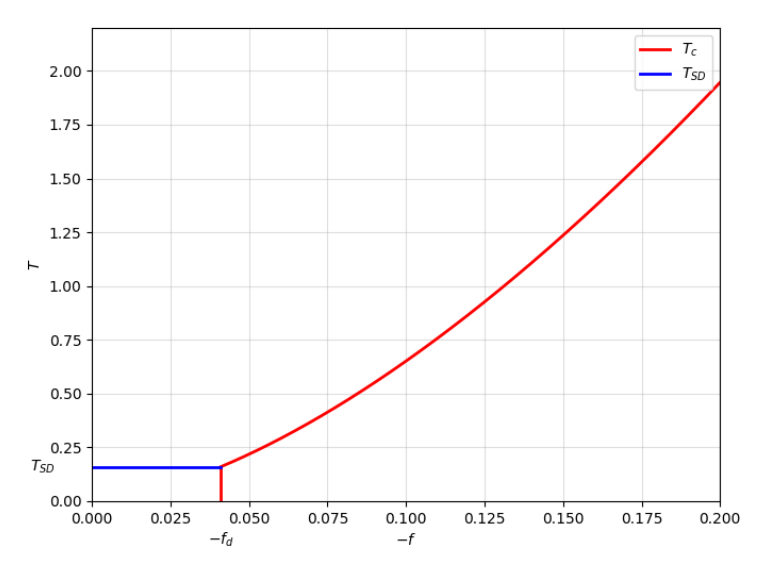 
Figure 4: Schematic phase diagram in the (−f, T) plane under the assumptions discussed in this subsection, with the scaling dimension fixed to ∆= 1 − √

📷 Fig 5

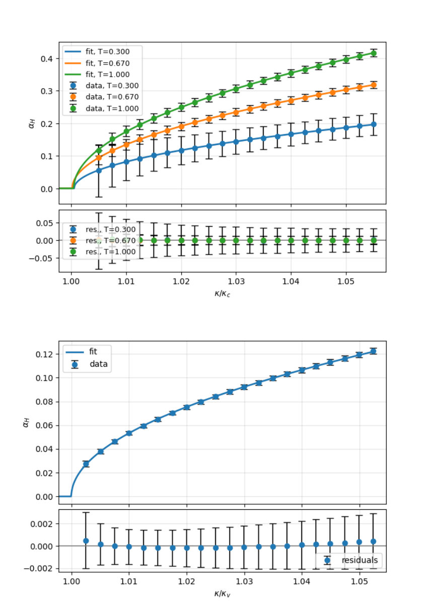 
Figure 5: Comparison between the holographic condensate αH and the field theory prediction ⟨O⟩ near criticality. Top: BTZ-with-hair branch at different fixed temperatures, fitted with the high- temperature expression (3.77) as a function of the distance from κc(T). Bottom: low-temperature solitonic branch, fitted with (3.74) as a function of the distance from κv. The lower panels show the corresponding residuals.

**Summary.** This paper develops a field-theoretic description of a 2D holographic superconductor, showing that the complex phase diagram of the bulk gravity model can be recovered from a deformed 2D CFT. It specifically explains the emergence of fractional magnetic flux and the Little-Parks effect through a 1+1D gauge theory toy model. The work demonstrates the power of using boundary-side modularity and effective actions to understand holographic phase transitions.

**Why it may be interesting.** It provides a bridge between holographic gravity and effective field theories, demonstrating how universal features of phase transitions and topological effects like fractional flux can be captured by boundary-side statistical mechanics.

Detailed structure

**Main problem.** The paper aims to reconstruct the phase diagram and condensate behavior of a 2D holographic superconductor using only the boundary field theory description.

**Main result.** The authors successfully map the four-phase holographic structure (including Hawking-Page and superconducting transitions) using a deformed 2D CFT and provide a field-theoretic mechanism for fractional magnetic flux and the Little-Parks effect.

**Method.** The study employs large-c factorization, modular invariance, Hubbard-Stratonovich transformations, and an effective Ginzburg-Landau expansion to relate the bulk gravity solutions to the boundary CFT.

**Model / system.** The system consists of a 2D Conformal Field Theory (CFT) on a torus, subject to a relevant double-trace deformation, which is dual to Einstein gravity in AdS3 coupled to a U(1) gauge field and a charged scalar field.

**Key observables.** Scalar condensate, magnetic flux (integer and fractional), temperature, entropy, and zero-momentum susceptibility.

**Important parameters / regimes.** Central charge (c), scaling dimension (Delta), double-trace coupling (kappa or f), temperature (T), and winding number (n).

**Assumptions / limitations.** The large-c limit is assumed to suppress fluctuations and allow a mean-field description; the scalar mass is restricted to the range -1 < m^2 < -3/4.

**Figures summary.** Figures show the relationship between coupling and condensate, the reconstructed phase diagram in the T-kappa plane, and the suppression of the condensate as the winding number increases.

**Paper structure.** The paper begins by defining the holographic and dual field theory models, proceeds to reconstruct the phase diagram using modular invariance and effective action approaches, matches the near-critical behavior with Ginzburg-Landau theory, and concludes with a toy model explaining fractional flux and the Little-Parks effect.

Abstract

We investigate field theory models of holographic superconductors in which the condensation of the order parameter is induced by a Robin boundary condition. Assuming large-$c$ factorization, we study the phase diagram of a two-dimensional CFT deformed by a relevant double-trace perturbation. Using modular invariance, we relate the high- and low-temperature phases, reproducing analytically the results for the zero-winding sector of the holographic model. Moreover, we match the near-critical behaviour of the condensate with an effective Ginzburg--Landau field theory description. Another important feature of the holographic superconductor is the presence of vortices that carry fractional magnetic flux. We investigate a field theory toy model with similar properties and interpret it as a fractional Little--Parks effect.

[↑ back to top](#top)

### [Multi-rotational switching in a noncollinear antiferromagnet by spin-orbit torque](http://arxiv.org/abs/2605.18009v1)

**Authors:** Yuma Sato, Yutaro Takeuchi, Yuta Yamane, Shun Kanai, Shunsuke Fukami  
**Type:** both · **Category:** other · **PDF:** <https://arxiv.org/pdf/2605.18009v1>  
**Analysis basis:** full PDF text, analyzed in chunks
**Topic relevance:** `non-equilibrium dynamics` **2/5**

📷 Fig 1

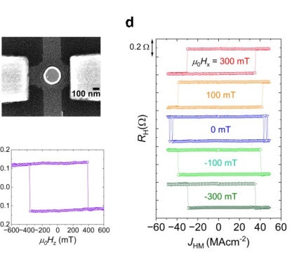 
Fig. 1. Schematic and characterizations of the Mn3Sn nanodot sample. a, SOT switching of the noncollinear AFM order in the Mn3Sn nanodot, with the orange arrow indicating the Néel vector. b, Scanning electron microscope image of the fabricated Hall device. c, 𝑅?-𝐻" curve for the Mn3Sn nanodot. d, 𝑅?-𝐽!# curves in DC experiments (the current pulse duration being 100 ms) with various in-plane magnetic field 𝐻$, where 𝜇&amp; is the vacuum permeability.

📷 Fig 2

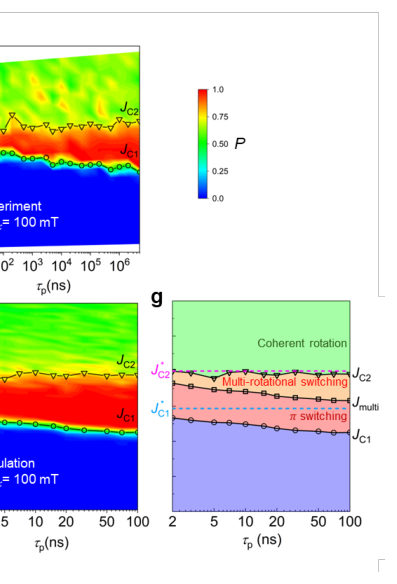 
Fig. 2. Switching probability measurements. a-d, 𝑃 versus 𝐽!# with four different 𝜏O. e-f, Two-dimensional mappings of 𝑃(𝐽!#, 𝜏O) with 𝜇&amp;𝐻$ = 100 mT, obtained by experiment (e) and simulation (f). g, Phase diagram identifying the three distinct switching regimes for the numerical result in f.

📷 Fig 3

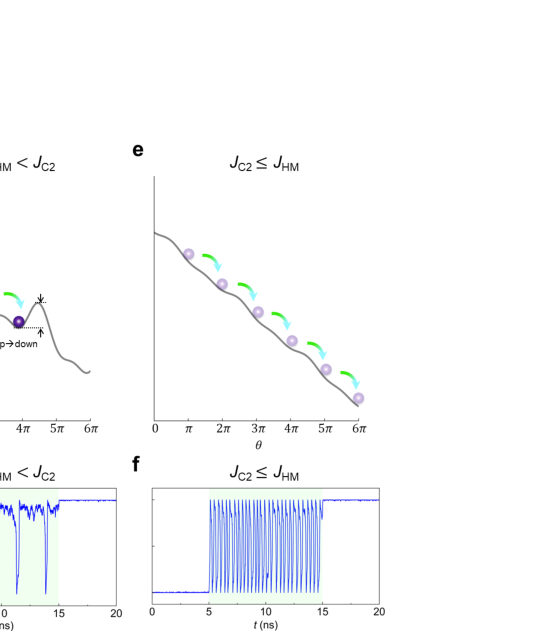 
Fig. 3. Theoretical and numerical analyses on the SOT switching of the Néel vector. Schematic illustrations of Néel vector dynamics based on the analytical model with Eqs. (1) and (2) in the 𝜋-switching regime (a), the multi-rotational switching regime (c), and the coherent rotation regime (e). The unit of 𝑢(𝜃) is arbitrary. Numerical simulations for the time evolution of the Néel vector in the corresponding regimes are shown in (b), (d) and (f). In the simulation, the current pulse is applied from 5 ns to 15 ns and 𝜇&amp;𝐻$ = 100 mT.

📷 Fig 4

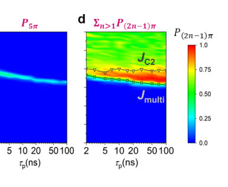 
Fig. 4. Numerical results for the probabilities of multiple rotations of the Néel vector. a-c, Probabilities of the Néel vector completing 𝜋 (a), 3𝜋 (b) and 5𝜋 (c) rotations, as functions of 𝐽!# and 𝜏O . d, Summation of the probabilities of 3𝜋, 5𝜋, 7𝜋, … rotations, corresponding to the probability of multi-rotational switching.

📷 Fig 5

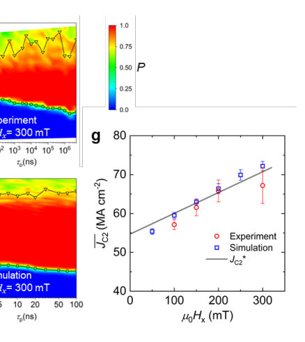 
Fig. 5. Magnetic-field dependence of the switching properties. a-f, 𝑃(𝐽!#, 𝜏O) for three different 𝐻$, obtained by experiment (a-c) and simulation (d-f). g, 𝐻$ dependence of the experimental and numerical 𝐽') #### and the theoretical 𝐽')

**Summary.** The researchers discovered that in noncollinear antiferromagnets, spin-orbit torque can drive the magnetic order through multiple full rotations rather than a single flip. This 'multi-rotational switching' explains why the current required to switch the device back is unexpectedly independent of the pulse duration, providing a new way to control antiferromagnetic states in nano-devices.

**Why it may be interesting.** not directly relevant

Detailed structure

**Main problem.** Understanding the microscopic dynamics of spin-orbit torque (SOT) driven switching in noncollinear antiferromagnets, specifically explaining the unconventional insensitivity of the switching-back threshold current density to pulse duration.

**Main result.** Discovery of a 'multi-rotational switching' mechanism where the Néel vector undergoes multiple rotations (3pi, 5pi, etc.) before reversal, and the establishment of a phase diagram containing pi-switching, multi-rotational, and coherent rotation regimes.

**Method.** Experimental measurement of anomalous Hall resistance and switching probabilities in Mn3Sn nanodots combined with numerical simulations using coupled Landau-Lifshitz-Gilbert (LLG) equations with thermal fluctuations.

**Model / system.** A noncollinear antiferromagnetic Mn3Sn nanodot (Kagome lattice) in a W/Ta/Mn3Sn/MgO/Ru heterostructure, modeled using a three-sublattice LLG approach and a reduced equation of motion for the Néel vector in a tilted-washboard potential.

**Key observables.** Anomalous Hall resistance (Rxy), switching probability (P), and critical current densities (Js for switching and Jb for switching-back).

**Important parameters / regimes.** Pulse duration (5 ns to 5 ms), current density (up to 55 MA/cm2), in-plane magnetic field (Hx), and nanodot diameter (120-200 nm).

**Assumptions / limitations.** The dynamics can be represented by a single Néel vector; the SOT is modeled via a Slonczewski-like torque; the system is treated within a three-sublattice model with equal saturation magnetization.

**Figures summary.** Figure 1 shows the device schematic, SEM image, and Hall resistance curves; supplementary figures show pulse waveforms, switching probability measurements, and the effect of nanodot diameter on critical currents.

**Paper structure.** The paper introduces the experimental platform and the observed switching anomaly, presents the experimental characterization of switching regimes, provides a theoretical/numerical explanation via multi-rotational dynamics, and concludes with the implications for spintronics.

Abstract

Spintronics has advanced through discoveries of various electrically-driven spin dynamics in nanomagnets. Here, we report a novel switching dynamics of spin systems driven by spin-orbit torque, using a noncollinear antiferromagnetic nanodot. With electric pulses spanning a wide range of durations and amplitudes, we find an unconventional insensitivity of a threshold current density to pulse duration in switch-back events. This observation is attributed to a previously unrecognized process, in which the noncollinear antiferromagnetic order undergoes multiple rotations before completing reversal, a phenomenon we term multi-rotational switching. Our theoretical analysis reveals that multi-rotational switching arises from the interplay of three key factors: current-driven coherent rotation of the noncollinear antiferromagnetic order, field-induced reorientation of the uncompensated net magnetization, and thermal fluctuations. These findings establish a microscopic mechanism governing current-induced switching in noncollinear antiferromagnets, a topic of growing interest for next-generation spintronics technologies, opening a new route to controlling antiferromagnetic order in nanodevices.

[↑ back to top](#top)

### [Nonreciprocal impurity scattering as a probe for pairing symmetries in kagome superconductors](http://arxiv.org/abs/2605.16943v1)

**Authors:** Hong-Min Jiang, Hao Du, Shun-Li Yu  
**Type:** theory · **Category:** strongly correlated electrons · **PDF:** <https://arxiv.org/pdf/2605.16943v1>  
**Analysis basis:** full PDF text, analyzed in chunks
**Topic relevance:** `Kondo & dissipative impurity` **2/5**

📷 Fig 1

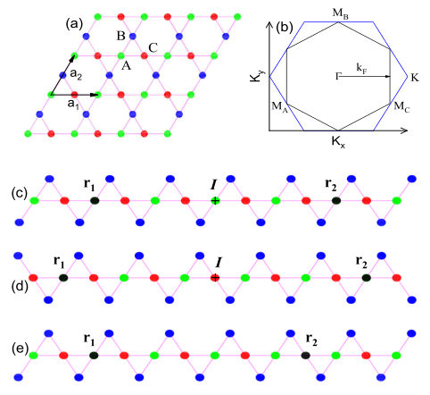 
FIG. 1. (a) Structure of the kagome lattice with lattice vectors a1 and a2, composed of three sublattices denoted by A (green dots), B (red dots), and C (blue dots). (b) Fermi surface gen- erated by the Hamiltonian at a doping level of 1/6 (black solid lines), with the Fermi wave vector satisfying kF = π along the x-axis. Impurity configuration with two magnetic impurities (black dots) located on equivalent A-sublattice sites at a sepa- ration of Ri = 4|a1| (c), and Ri = 5|a1| (d), respectively. The black cross marked I in panels (c) and (d) denotes the inver- sion center of the two impurities. (e) Impurity configuration with two magnetic impurities (black dots) located on distinct A- and...

📷 Fig 2

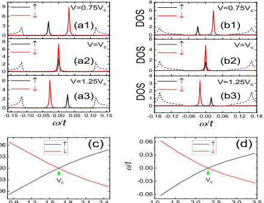 
FIG. 2. Solid curves in panels (a) and (b) show the LDOS at the impurity site for the single-impurity case. The DOSs for the clean case are also shown as dotted curves in each pan- els. The left column [panels (a1)-(a3)] corresponds to conven- tional on-site s-wave superconductivity, while the left column [panels (b1)-(b3)] illustrates the dx2−y2 + idxy-wave pairing symmetry. (a1)/(b1), (a2)/(b2), and (a3)/(b3) present the results for V = 0.75Vc, V = Vc, and V = 1.25Vc, respectively. Here, Vc denotes the critical exchange interaction at which particle- and hole-like excitations meet at zero energy, as evi- denced in panels (c) and (d). Panels (c) and (d) illustrate the energy evolution of...

**Summary.** This paper proposes a method to distinguish between s-wave and TRSB d-wave pairing in kagome superconductors by using the interference patterns of two magnetic impurities. It demonstrates that nonreciprocal impurity scattering provides a unique spectroscopic signature resolvable by STM, bypassing the ambiguities of conventional techniques.

**Why it may be interesting.** not directly relevant

Detailed structure

**Main problem.** Resolving the ambiguity in superconducting pairing symmetry and its link to time-reversal symmetry breaking (TRSB) in vanadium-based kagome superconductors.

**Main result.** The study shows that while single magnetic impurities cannot distinguish between s-wave and d-wave symmetries, two impurities reveal distinct LDOS patterns due to nonreciprocal scattering in the TRSB case.

**Method.** The authors use the Bogoliamb-de Gennes (BdG) framework, T-matrix formalism, and the Bethe-Salpeter equation to calculate the electronic Local Density of States (LDOS).

**Model / system.** A tight-binding kagome model representing the AV3Sb5 family, including chemical potential, nearest-neighbor hopping, and two superconducting order parameters: conventional on-site s-wave and TRSB d+id-wave.

**Key observables.** Local Density of States (LDOS) patterns, specifically the energy evolution and interference of Yu-Shiba-Rusinov (YSR) states.

**Important parameters / regimes.** Impurity positions, impurity strength (U, V), superconducting gap magnitude (delta), and the van Hove filling regime.

**Assumptions / limitations.** Magnetic impurities are treated as classical, static variables; the study focuses on a specific model of two representative pairing symmetries.

**Figures summary.** Fig 1 shows the kagome lattice and impurity configurations; Fig 3 shows LDOS interference at the midpoint of two impurities; Fig 4 compares s-wave and d-wave LDOS on interstitial sites; Fig 5 shows s-wave LDOS outside the impurity boundary.

**Paper structure.** The paper introduces the problem of pairing symmetry ambiguity, defines the kagome model and impurity setup, analyzes single-impurity vs. two-impurity scattering, demonstrates the nonreciprocal signatures of TRSB, and concludes with experimental implications for STM.

Abstract

The superconducting (SC) pairing symmetry and its link to time-reversal symmetry breaking (TRSB) in the vanadium-based kagome superconductors remain unresolved, with ambiguities stemming from sublattice interference and charge-density-wave (CDW) entanglement with superconductivity. Using two representative SC pairings, i.e., the conventional on-site $s$-wave and the TRSB $d_{x^2-y^2}+id_{xy}$-wave, as a model study, we theoretically show that while single magnetic impurity yield qualitatively identical spectral behavior of local density of states (LDOS) for these two symmetries, two magnetic impurities give rise to distinct LDOS patterns. For the conventional on-site $s$-wave pairing, time-reversal symmetry (TRS) enforces equivalent forward and backward scattering between two impurities across all impurity configurations, leading to near disappearance of a Yu-Shiba-Rusinov (YSR) state pair along the line connecting the two impurities. However, for the TRSB $d_{x^2-y^2}+id_{xy}$-wave pairing, this scattering equivalence holds only for inversion-symmetric impurity configurations, with a pair of YSR disappearance restricted to this case. These distinct spectral features are resolvable in scanning tunneling microscopy (STM) experiments, providing a direct avenue to discriminate TRSB and non-TRSB SC pairing symmetries in kagome superconductors and an alternative method to probe SC nonreciprocity that circumvents the ambiguities of conventional critical current-based techniques.

[↑ back to top](#top)

### [Reprogrammable magnonic logic in a multiferroic heterostructure via magnetoelectric coupling](http://arxiv.org/abs/2605.16946v1)

**Authors:** Ping Che, Amr Abdelsamie, Ádám Papp, Sali Salama, André Thiaville, Romain Lebrun, Stéphane Fusil, Vincent Garcia, Aymeric Vecchiola, Karim Bouzehouane, Manuel Bibes, Agnès Barthélémy, Jean-Paul Adam, Vladislav Demidov, Paolo Bortolotti, Abdelmadjid Anane, Isabella Boventer  
**Type:** both · **Category:** other · **PDF:** <https://arxiv.org/pdf/2605.16946v1>  
**Analysis basis:** full PDF text, analyzed in chunks
**Topic relevance:** `spintronics-quantum-optics interface` **2/5**

📷 Fig 1

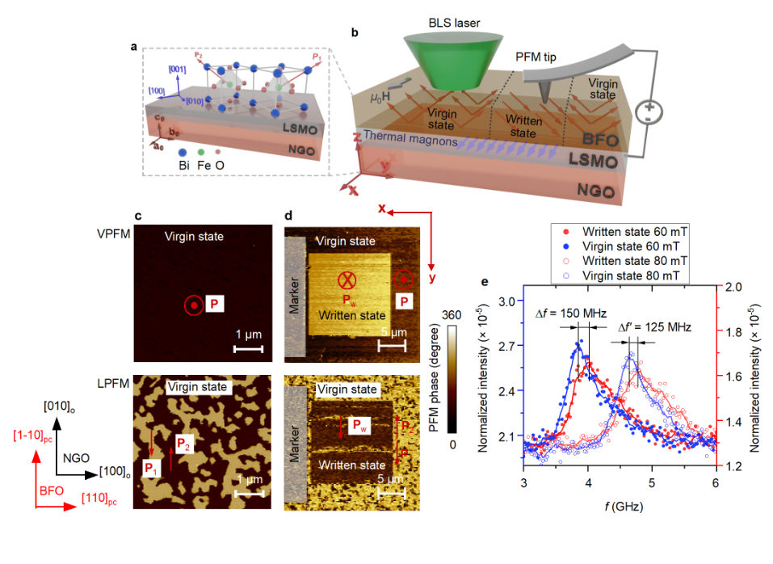 
FIG. 1. System and thermal magnon spectra of La0.67Sr0.33MnO3 (LSMO) in regions

📷 Fig 2

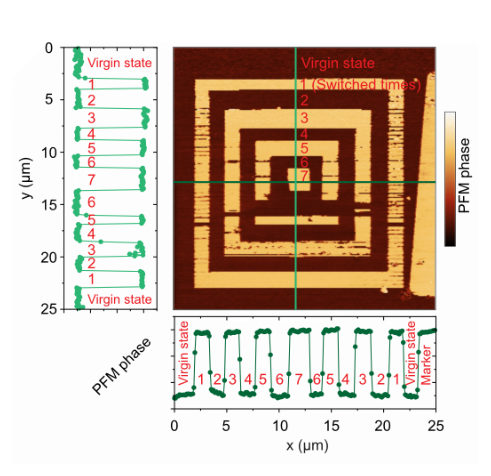 
FIG. 2. Reproducibility of the ferroelectric domain writing in BFO layer. LPFM image

📷 Fig 3

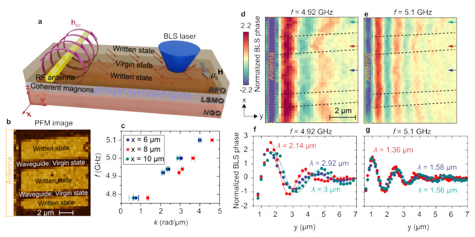 
FIG. 3. Phase-resolved BLS spectra of RF-excited magnons in LSMO layer in the

📷 Fig 4

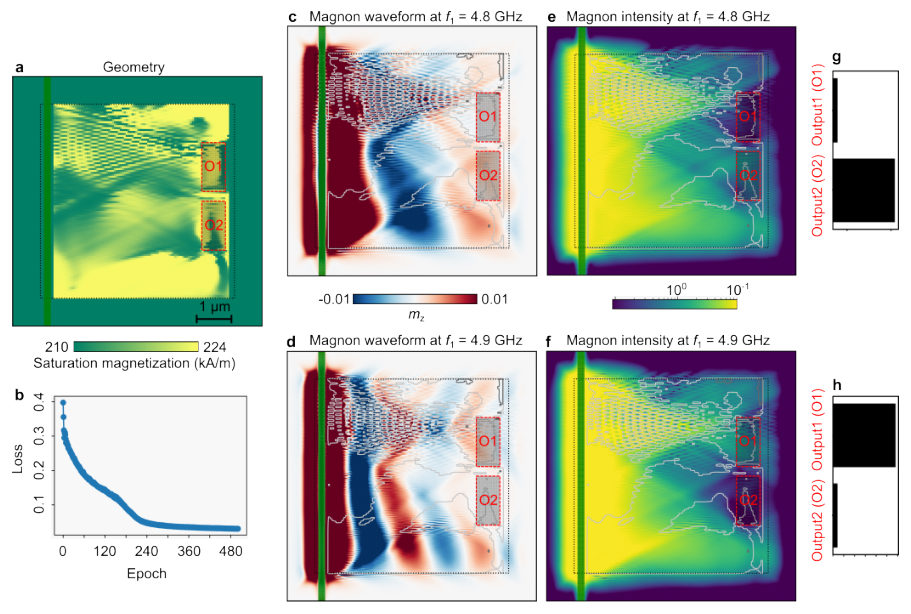 
FIG. 4. Inverse design of a frequency demultiplexer using magnetoelectrically tuned

📷 Fig 5

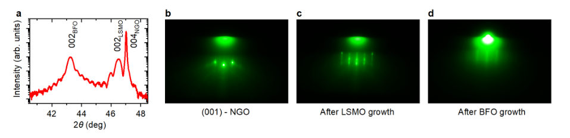 
FIG. 5. XRD and RHEED characterization of BiFeO3 (BFO)/La0.7Sr0.3MnO3 (LSMO)

**Summary.** This paper demonstrates a way to use electric fields to permanently and reversibly program the path of spin waves in a multiferroic material. By switching ferroelectric domains, the researchers created programmable magnonic waveguides and even simulated a frequency-splitting device. This provides a low-power, scalable platform for future magnonic-based logic and neuromorphic computing.

**Why it may be interesting.** not directly relevant

Detailed structure

**Main problem.** The need for energy-efficient, non-volatile, and scalable on-chip magnonic devices for signal processing and neuromorphic computing, overcoming the limitations of current-driven or strain-based tuning methods.

**Main result.** Demonstrated a non-volatile, voltage-controlled method to tune magnon dispersion in a multiferroic heterostructure, enabling programmable waveguides and frequency demultiplexing via ferroelectric domain engineering.

**Method.** The researchers used pulsed laser deposition to grow BFO/LSMO heterostructures, Piezoresponse Force Microscopy (PFM) for domain writing, and Brillouin Light Scattering (BLS) for imaging spin-wave propagation and dispersion.

**Model / system.** A multiferroic thin-film heterostructure consisting of a BiFeO3 (BFO) ferroelectric layer and a La0.67Sr0.33MnO3 (LSMO) ferromagnetic layer grown on a NdGaO3 (NGO) substrate.

**Key observables.** Magnon dispersion relations, frequency shifts (up to 150 MHz), effective magnetization, Gilbert damping, and ferroelectric domain configurations.

**Important parameters / regimes.** Frequency shifts of ~150 MHz, effective magnetization M_eff = 336 mT, Gilbert damping alpha = 5.9 x 10^-3, and BFO layer thickness of 34 nm.

**Assumptions / limitations.** The use of an effective equivalent magnetization pattern in simulations to represent the magnetoelectric influence of ferroelectric domains.

**Figures summary.** Fig 1: Schematic of the heterostructure and BLS process. Fig 2: PFM images showing reproducible ferroelectric domain writing. Fig 3: 2D BLS scans, magnon dispersion, and phase maps of the waveguide. Fig 4: Results of the inverse design for a frequency demultiplexer, including simulated propagation and output intensity.

**Paper structure.** The paper introduces the problem of magnonic control, describes the BFO/LSMO heterostructure and growth process, details the experimental characterization of domain writing and magnon dispersion, presents the results of the magnetoelectric tuning, and concludes with an inverse-design demonstration of a functional device.

Abstract

The realization of fully reconfigurable, voltage-controlled, and programmable on-chip magnonic devices is essential to fully harness the potential of spin waves for signal processing, logic and neuromorphic computing. Yet, existing demonstrations of electrical tuning of magnonic responses are either volatile, current-driven and thus energy-inefficient, or rely on local strain modification limiting their scalability for wafer-scale integration. Here, we address this challenge using a BiFeO3/La0.67Sr0.33MnO3 multiferroic thin film heterostructure. We show that ferroelectric domain engineering in BiFeO3 enables deterministic tuning of the magnon dispersion of La0.67Sr0.33MnO3, producing frequency shifts up to $\sim 150 MHz$ and allowing reconfigurable waveguiding. Micro-focused Brillouin light scattering directly images these effects, revealing electrically defined magnonic waveguides and spatially programmable dispersion. Compared to conventional approaches, this method provides non-volatile and reversible control. Furthermore, using an inverse-design simulation code, we demonstrate the capability of our platform to perform advanced magnonic functions such as frequency demultiplexing. Our results open a new avenue for using magnetoelectric heterostructures for magnonic logic, with further applicability to reservoir and neuromorphic computing and AI driven magnonic devices.

[↑ back to top](#top)

### [Spin-caloritronic signatures of soft magnons in bilayer CrSBr](http://arxiv.org/abs/2605.18478v1)

**Authors:** Rob den Teuling, Ping Tang, Gerrit E. W. Bauer, Yaroslav M. Blanter  
**Type:** theory · **Category:** strongly correlated electrons · **PDF:** <https://arxiv.org/pdf/2605.18478v1>  
**Analysis basis:** full PDF text, analyzed in chunks
**Topic relevance:** `spintronics-quantum-optics interface` **2/5**

📷 Fig 1

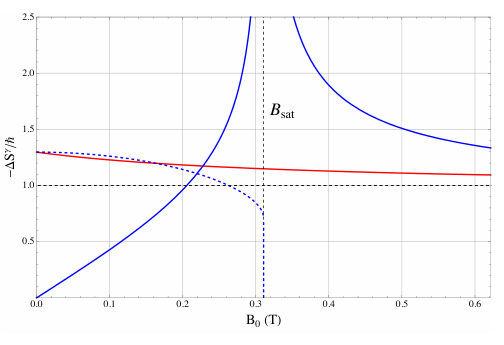 
FIG. 1. Calculated SAM of the Kittel mode (k = 0) in the monolayer as a function of the external magnetic field B0. The red curve shows the SAM along the easy axis ( ⃗B0 ∥ˆb) while the blue ones hold for ⃗B0 ∥ˆa in the canted (B0 &lt; Bsat) and saturated (B0 ≥Bsat) phases: the solid (dotted) line shows the projection of the SAM along the a-axis (b-axis).

📷 Fig 2

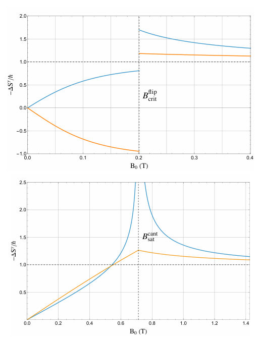 
FIG. 2. SAM of the magnon modes at k = 0 in the bilayer as a function of the external magnetic field B0. The lower (higher) frequency band is indicated in blue (orange). (a) SAM along the easy axis (b) in the AFM (B0 &lt; Bflip crit) and FM (B0 ≥Bflip crit) phases ( ⃗B0 ∥ˆb). (b) SAM along the intermediate axis (a) in the canted (B0 &lt; Bcant sat ) and saturated (B0 ≥ Bcant sat ) phases ( ⃗B0 ∥ˆa).

📷 Fig 3

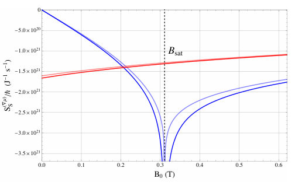 
FIG. 4. Diffusive SSC in a monolayer as a function of the external magnetic field B0. The transparent curves corre- spond to S(∇µ) S for all SAM equal ℏ. The red curves show S(∇µ) S along the easy axis for ⃗B0 ∥ˆb, the blue curves along the intermediate axis in the canted (B0 &lt; Bsat) and saturated (B0 ≥Bsat) phases for ⃗B0 ∥ˆa.

📷 Fig 4

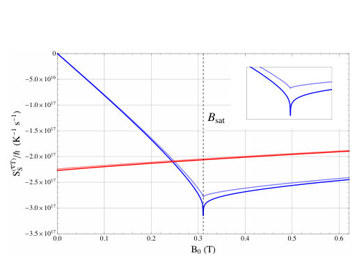 
FIG. 3. Thermal SSC in a monolayer as a function of the external magnetic field B0. The transparent curves corre- spond to S(∇T ) S for all SAM equal ℏ. The red curves show S(∇T ) S along the easy axis for ⃗B0 ∥ˆb, the blue curves along the intermediate axis in the canted (B0 &lt; Bsat) and satu- rated (B0 ≥Bsat) phases for ⃗B0 ∥ˆa. The inset highlights a zoomed-in region around the peak of S(∇T ) S .

📷 Fig 5

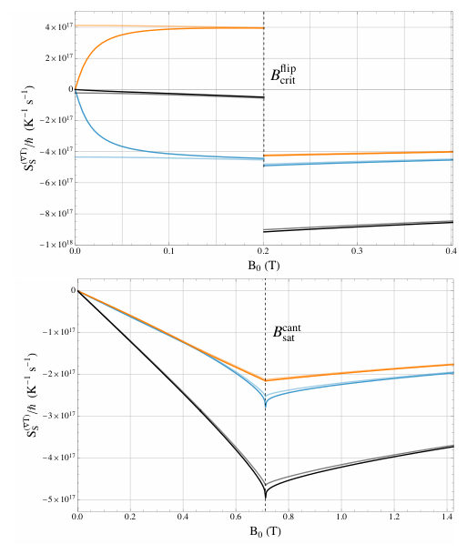 
FIG. 5. Thermal SSC of the two magnon modes and their sum (black curves) in the bilayer as a function of the external magnetic field B0. The semi-transparent curves correspond to S(∇T ) S with the SAM set to ±ℏ(ℏ) in the AFM (FM) phase. (a) S(∇T ) S along the easy axis for ⃗B0 ∥ˆb in the AFM (B0 &lt; Bflip crit) and FM (B0 ≥Bflip crit) phases. (b) S(∇T ) S along the intermediate axis for ⃗B0 ∥ˆa in the canted (B0 &lt; Bcant sat ) and saturated (B0 ≥Bcant sat ) phases.

**Summary.** This paper demonstrates that in CrSBr, the spin angular momentum of magnons is not fixed at h-bar but diverges when magnon modes soften under an external field. This divergence creates a clear, measurable signature in the Spin Seebeck effect, providing a way to detect soft magnons via spin-caloritronic measurements.

**Why it may be interesting.** not directly relevant

Detailed structure

**Main problem.** Investigating how non-universal magnon spin angular momentum (SAM) and field-induced magnon softening in 2D van der Waals magnets like CrSBr lead to distinct spin-caloritronic signatures.

**Main result.** The study finds that triaxial anisotropy and dipolar interactions cause magnon SAM to diverge during field-induced softening, resulting in a pronounced peak in the thermal and diffusive Spin Seebeck response.

**Method.** Theoretical approach using Holstein-Primakoff transformation, Bogoliulyov transformation to diagonalize the Hamiltonian, and the linearized Boltzmann equation to calculate spin transport.

**Model / system.** Monolayer and bilayer CrSBr, a van der Waals magnetic insulator with tetragonal crystal lattice, featuring intralayer ferromagnetic and interlayer antiferromagnetic coupling.

**Key observables.** Magnon spin angular momentum (SAM), thermal Spin Seebeck coefficient (SSC), diffusive SSC, and magnon thermal conductivity.

**Important parameters / regimes.** Applied magnetic field (B0), temperature (1-5 K), magnetic phases (AFM, FM, Canted, Saturated), and anisotropy axes (easy axis b, intermediate axis a).

**Assumptions / limitations.** Non-interacting magnon approximation, lowest-order Holstein-Primakoff expansion, constant relaxation time approximation, and small-amplitude assumption (which breaks down near saturation).

**Figures summary.** Figures show the dependence of SAM, SSC, and thermal conductivity on the magnetic field for both monolayer and bilayer CrSBr, highlighting peaks and discontinuities at phase transitions and softening points.

**Paper structure.** The paper introduces the problem of non-universal SAM, describes the CrSBr model and Hamiltonian, presents calculations for monolayer SAM and SSC, extends the analysis to bilayer systems, and concludes with temperature-dependent transport properties.

Abstract

Spin transport in magnetic insulators is often treated by assuming that magnons carry a fixed spin angular momentum of $\hbar$, which does not hold in general, however. Here we calculate the magnon spin angular momentum of a layered antiferromagnet as a function of applied magnetic field and wave vector. We show that the triaxial anisotropy and intralayer dipolar interactions in bilayer CrSBr renormalize the magnon spin angular momentum, which diverges upon field-induced magnon softening. This divergence gives rise to a pronounced peak in the thermal spin Seebeck response and provides a clear spin-caloritronic signature of soft magnons.

[↑ back to top](#top)

### [Supercollimating photonic crystal scintillators](http://arxiv.org/abs/2605.17006v1)

**Authors:** Seou Choi, Sachin Vaidya, Charles Roques-Carmes, Marin Soljačić  
**Type:** both · **Category:** other · **PDF:** <https://arxiv.org/pdf/2605.17006v1>  
**Analysis basis:** full PDF text, analyzed in chunks
**Topic relevance:** `interference shaping light` **2/5**

📷 Fig 1

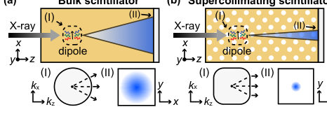 
FIG. 1. High spatial resolution X-ray imaging with supercolli- mating photonic crystal scintillators. (a and b) Scintillation in (a) a bulk scintillator and (b) a supercollimating scintillator. (a) High en- ergy particles such as X-rays create a dipole that emits visible light. Scintillating light propagates with lateral spreading, due to a circular isofrequency contour (IFC) (panel I), reducing the spatial resolution of X-ray images (panel II). (b) Tailoring the IFC to have a flat sur- face toward the back plane of the scintillator, scintillating light can be collimated (panel I), enhancing the spatial resolution of X-ray im- ages (panel II).

📷 Fig 2

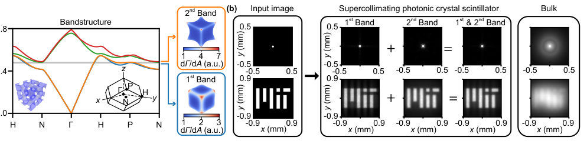 
FIG. 2. Supercollimation in photonic crystal scintillators. (a) Band structure of the three-dimensional single gyroid photonic crystal scintillator calculated using MIT Photonic Bands (MPB)26. Insets show the photonic crystal structure and the first Brillouin zone. Isofrequency contours (IFCs) of the first two bands are shown in the right panel. (b) X-ray sources shaped through a small pinhole and the MIT logo are used (left panel). X-ray images generated by the photonic crystal scintillator (middle panel) and the bulk scintillator (right panel) of equal thickness are shown. The thickness of the scintillator is 300 µm. Refractive index, scintillation yield and X-ray attenuation are modeled...

📷 Fig 3

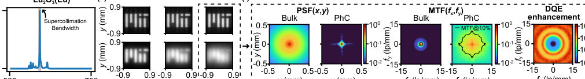 
FIG. 3. Detector Quantum Efficiency (DQE) enhancement in supercollimating photonic crystal scintillators. (a and d) Emission spec- trum and the supercollimation bandwidth for (a) ZnSe(Te) and (d) Lu2O3(Eu). (b and e) Simulated X-ray images for different thicknesses of the scintillator. The upper (lower) row of each sub-figure shows X-ray images of the MIT logo generated by supercollimating photonic crystal scintillators (uniform scintillators). The thickness of the scintillator in the three panels is 1.5µ, 3.0µ and 4.5µ, where µ is the attenuation length of each scintillator (µ ∼130 µm for ZnSe(Te) and µ ∼60 µm for Lu2O3(Eu) at X-ray energy of 30 keV). (c and f) Point spread function (PSF),...

📷 Fig 4

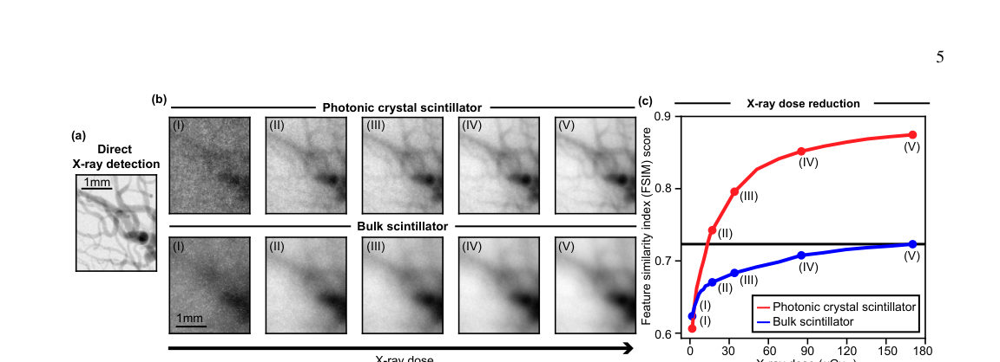 
FIG. 4. Enhancing medical X-ray imaging performance using supercollimating photonic crystal scintillators. (a) Direct X-ray detection of a human kidney vasculature (reference). (b) X-ray images of the human kidney vasculature obtained under different X-ray doses with supercollimating photonic crystal scintillators (upper panel) and uniform scintillators (lower panel). The exact X-ray dose of each image is marked in (c). (c) Feature similarity index (FSIM) score dependence as a function of X-ray dose. Supercollimating photonic crystal scintillators can achieve similar FSIM score while using ∼×10 less X-ray dose. The thickness of the scintillators considered here is 270 µm. For the X-ray...

**Summary.** This paper proposes using 3D photonic crystals to engineer the direction of light emission in scintillators through supercollimation. By suppressing the lateral spreading of light, these structures allow for thicker, more efficient X-ray detectors without sacrificing image resolution. This breakthrough could enable high-quality medical imaging at significantly lower radiation doses.

**Why it may be interesting.** not directly relevant

Detailed structure

**Main problem.** The fundamental trade-off in X-ray scintillators where increasing thickness improves X-ray absorption but degrades spatial resolution due to diffraction-induced lateral light spreading.

**Main result.** 3D supercollimating photonic crystal scintillators can improve spatial resolution by up to an order of magnitude and reduce the required X-ray dose by approximately 10-fold while maintaining image quality.

**Method.** A multiscale modeling framework integrating nanophotonic band-structure simulations (MPB) with Monte Carlo particle transport (Geant4) to evaluate light propagation and X-ray imaging performance.

**Model / system.** A 3D single gyroid photonic crystal made of scintillating materials such as Lu2O3(Eu) or ZnSe(Te), designed with flat isofrequency contours to achieve supercollimation of emitted light.

**Key observables.** Spatial resolution (via Point Spread Function and Modulation Transfer Function), Detector Quantum Efficiency (DQE), Feature Similarity Index (FSIM), and X-ray dose.

**Important parameters / regimes.** Isofrequency contour (IFC) flatness, supercollimation bandwidth, X-ray energy (e.g., 30-33.5 keV), and refractive index contrast.

**Assumptions / limitations.** Light emitted outside the supercollimation bandwidth is assumed to be emitted isotropically; the detector is assumed to be an ideal silicon detector with 100% quantum efficiency.

**Figures summary.** Fig 1 illustrates the concept of supercollimation vs. bulk spreading; Fig 2 shows band structures, IFCs, and MIT logo imaging; Fig 3 compares emission spectra and DQE for different materials; Fig 4 demonstrates kidney vasculature imaging and dose reduction via FSIM scores.

**Paper structure.** Introduction of the resolution-efficiency trade-off, description of the 3D photonic crystal design and supercollimation mechanism, presentation of the multiscale simulation framework, results comparing performance to bulk scintillators, and demonstration of dose reduction in medical imaging simulations.

Abstract

Scintillators convert X-ray energy into visible or near-visible photons, enabling applications in high-energy particle detection and X-ray imaging. Increasing scintillator thickness improves X-ray absorption but degrades spatial resolution due to diffraction-induced lateral spreading of emitted light, resulting in a fundamental trade-off between detection efficiency and image resolution. Here, we propose a class of three-dimensional photonic crystal scintillators that overcomes this limitation through supercollimation, in which light propagates with suppressed diffraction. We develop a multiscale modeling framework that integrates nanophotonic band-structure simulations with Monte Carlo particle transport to quantitatively evaluate the performance of such scintillators. Our results show that supercollimating photonic crystal scintillators can enhance spatial resolution by up to an order of magnitude relative to conventional bulk scintillators of equal thickness. This improvement leads to a substantial increase in detector quantum efficiency (DQE), particularly at high spatial frequencies, enabling fine features to be preserved at reduced X-ray dose. We further demonstrate that comparable image quality can be achieved with approximately an order-of-magnitude lower X-ray dose. By directly engineering light transport within the bulk of the scintillator, this work establishes a nanophotonic route to simultaneously improving resolution and dose efficiency in X-ray imaging.

[↑ back to top](#top)

### [Effect of electric current on optical response of viscous electron-hole plasma](http://arxiv.org/abs/2605.18682v1)

**Authors:** Yu. A. Pusep, M. A. T. Patricio, G. M. Jacobsen, M. D. Teodoro, G. M. Gusev, A. K. Bakarov  
**Type:** experiment · **Category:** other · **PDF:** <https://arxiv.org/pdf/2605.18682v1>  
**Analysis basis:** full PDF text, analyzed in chunks
**Topic relevance:** `non-equilibrium dynamics` **1/5**

📷 Fig 1

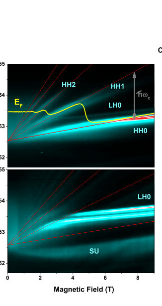 
FIG. 1: (Color on line) Contour plot of PL measured from an unbiased channel (a) and with a current of 100 µA parallel to the channel (b) as a function of the magnetic field at T = 4K. The calculated Landau fan energies and Fermi level energy are shown as red and yellow lines, respectively. HH and LH denote the optical transitions caused by heavy and light holes, respectively. The double PL line in (b) is due to a light hole exciton (higher emission energy) and a positively charged light hole trion (lower emission energy). SU is the PL line due to the shake-up process involving light holes. Data taken from [9].

📷 Fig 2

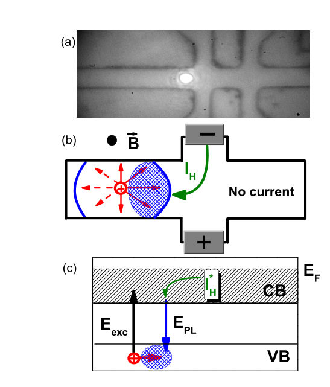 
FIG. 2: (Color on line). The microscopic sample image with the laser spot focused to the channel (a), experimental scheme (a) and energy diagram of the sample (b). The drift trajec- tory of electrons in an applied magnetic field is shown by green arrow and the boundaries of the PL collection area are indicated by blue brackets in (a). The laser excitation point is shown as the position of the positive charge of holes that are photogenerated in the QW and injected from the barriers. Diffusion of the holes is shown by red arrows in (a), and the region there they accumulate is indicated by the blue shaded area. The effective electron current I∗ H caused by the recom- bination of electrons with...

📷 Fig 3

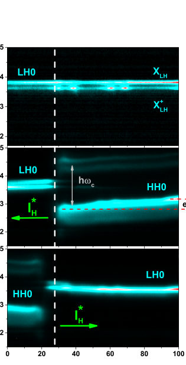 
FIG. 3: (Color on line). Contour plot of PL measured at a temperature of 4K and a magnetic field of 9T, as a function of the distance along the channel. With a current of 100 µA parallel to the channel and unbiased potentiometric contacts (a), with an unbiased channel and a perpendicular current of 100 µA through potentiometric contacts, with negative and positive potential at the upper and lower contacts, respec- tively (b) and with reverse polarity (c). The position of the potentiometric contacts is shown by the vertical white dashed line. The direction of the effective electron Hall current I∗ H is shown by green arrows.

**Summary.** This paper explores how electrical currents can be used to manipulate the population of excitons and trions in a dense electron-hole plasma via Coulomb drag. By using Hall currents to drive charge accumulation, the researchers demonstrate a method for electrical control of optical responses in hydrodynamic systems.

**Why it may be interesting.** not directly relevant

Detailed structure

**Main problem.** Investigating how electric currents and Hall voltages affect the optical response and charge distribution of a dense, hydrodynamic electron-hole plasma.

**Main result.** The study demonstrates that Hall currents induce Coulomb drag, which causes light hole accumulation and the emergence of a double photoluminescence line (excitons and trions), distinguishing this from simple electric field-induced energy shifts.

**Method.** Scanning magneto-photoluminescence microscopy was performed at 4 K on a GaAs channel under intense laser excitation and applied magnetic fields (up to 9T) and electric currents.

**Model / system.** A mesoscopic n-doped GaAs channel containing a 14 nm thick quantum well, operating in a hydrodynamic electron-hole plasma regime where interparticle momentum-conserving collisions dominate.

**Key observables.** Photoluminescence (PL) energy, Landau fan patterns, and the appearance of specific spectral lines for excitons and trions.

**Important parameters / regimes.** Magnetic field up to 9T, Hall voltage, Hall current, electron drift velocity, and hole diffusion length (~5-10 micrometers).

**Assumptions / limitations.** The system is in the hydrodynamic regime where electron-hole scattering is intense enough to suppress the quantum Hall regime.

**Figures summary.** Figure 1 shows PL contour plots for unbiased and parallel current configurations showing Landau fans and double PL lines; Figure 2 provides a microscopic image and a schematic of hole injection and diffusion; Figure 3 shows PL contour plots for perpendicular current configurations.

**Paper structure.** The paper introduces the experimental setup and the hydrodynamic regime, describes the measurement of PL under different current configurations, compares the effects of Hall voltage versus Hall current, and concludes with the implications for controlling exciton populations.

Abstract

The influence of the Hall voltage on the photoluminescence of a dense hydrodynamic electron-hole plasma laser generated in a mesoscopic n-doped GaAs channel under intense laser excitation is studied. Laser excitation induces an interband current determined by the recombination of photogenerated electron-hole pairs. As a result, background electrons drifting under the influence of the Hall voltage form an effective Hall current. The Coulomb drag caused by the Hall current causes the accumulation of light holes, leading to the appearance of a double photoluminescence line formed by the recombination of excitons and trions. In contrast, in the absence of a Hall current, the shift in the photoluminescence energy associated with heavy holes occurs due to the electric field created by the Hall potential difference.

[↑ back to top](#top)

### Other secondary papers (16)

Show other secondary papers

### [Chemo-mechanical coupling stabilizes mixed $\mathrm{Ag}_{x}\mathrm{Cu}_{1-x}\mathrm{GaSe}_{2}$ solar-cell absorbers: Insights from Monte-Carlo simulations assisted by ab initio informed machine-learning potentials](http://arxiv.org/abs/2605.18057v1)

**Authors:** Vasilios Karanikolas, Delwin Perera, Linus Erhard, Jochen Rohrer, Karsten Albe  
**Type:** theory · **Category:** disordered systems and neural networks · **PDF:** <https://arxiv.org/pdf/2605.18057v1>  
**Analysis basis:** full PDF text, analyzed in chunks

📷 Fig 1

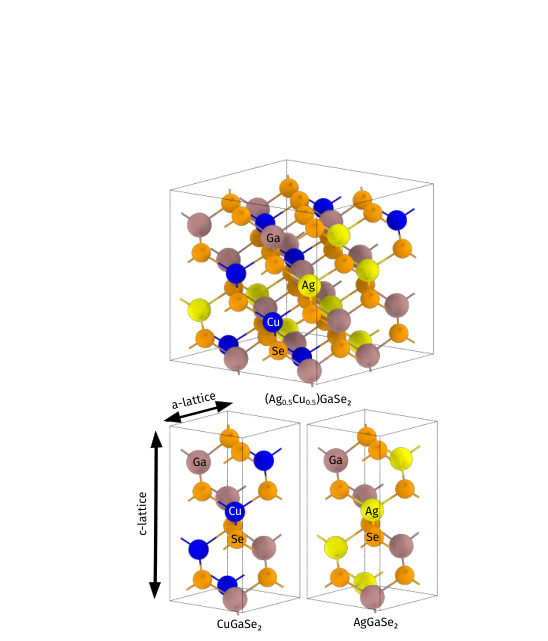 
Figure 1: Upper panel: Ag0.5Cu0.5)GaSe2 structure with Ag-Cu atoms homo- geneously distributed in sublattice-(I). Lower panel: AgGaSe2 and CuGaSe2 structures with a−and c−lattice parameters, which are investigated in Sec. III.

📷 Fig 2

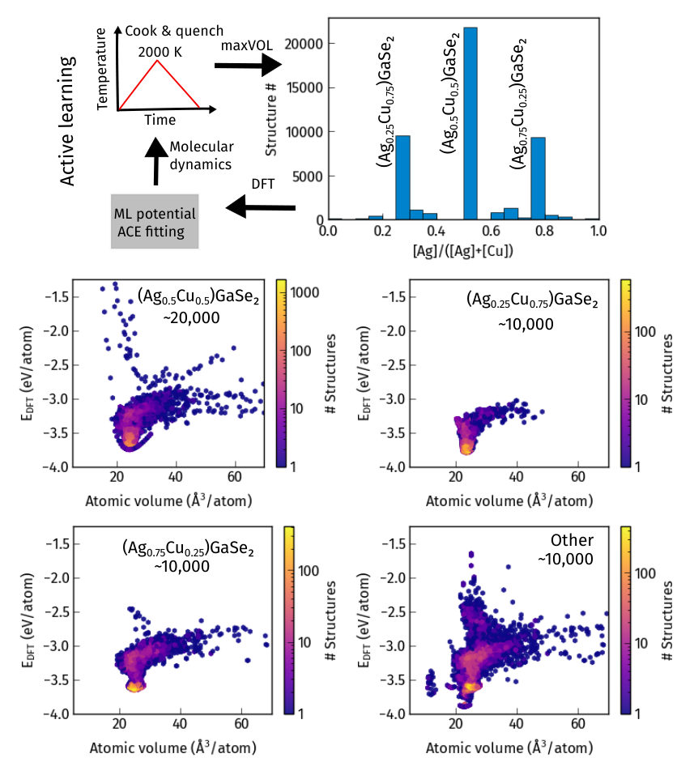 
Figure 2: We present the workflow used to develop the machine-learning (ML) potential. Molecular-dynamics (MD) simulations are performed following a cook- and-quench protocol, considering multiple Ag-Cu concentrations, defined by the ratio [Ag]/([Ag] + [Cu]). Several active-learning rounds are applied to iteratively explore the parameter space of AgxCu1−xGaSe2 and expand the data set with structures that have extrapolation grades between 5 and 20 using the maxVOL selection scheme, yielding a faithful ML potential across the targeted phases. From the distribution of the number of generated structures as a function of composition, we observe that the main focus is on x = 0.25, 0.5 and 0.75...

📷 Fig 3

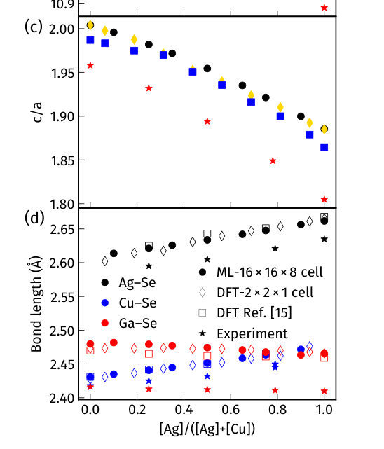 
Figure 3: Calculated (a) a lattice parameter, (b) c lattice parameter, (c) the c/a values and (d) anion-cation bond lengths for the different Ag to Cu concen- trations. The predicted values by the ML potential are extracted by relaxing 16×16×8 solid solution structures. Our DFT calculations in (a-d) are obtained using a 2 × 2 × 1 supercell with random Ag-Cu distribution. DFT data shown in panel (d), with square symbols, are taken from Ref. [15]. The experimental results for the (a-c) lattice parameters are from Ref. [24] and for the (d) bond lengths are from Ref. [63].

📷 Fig 4

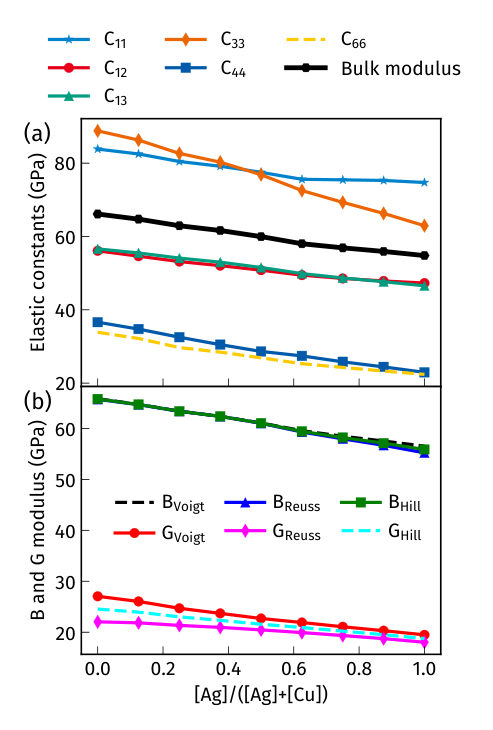 
Figure 4: (a) The components of the stiffness tensor Cij and the bulk modulus B are calculated using the ML potential, for varying Ag to Cu ratios. (b) The elas- tic constants Cij are used to calculate the effective moduli for a polycrystalline sample using the Voigt, Reuss and Hill measures. All calculation are done with 4 × 4 × 2 supercells and fully relaxed structures with different Ag to Cu ratios.

📷 Fig 5

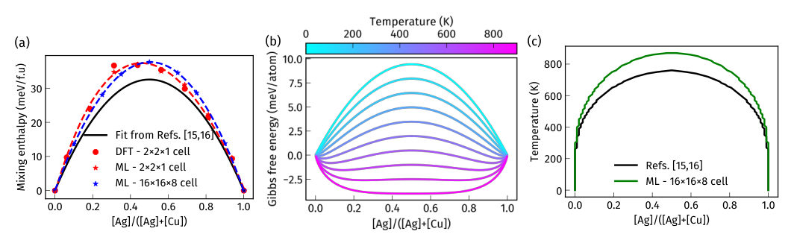 
Figure 5: (a) Mixing enthalpy per formula unit for varying Ag to Cu ratios; the circular points give the DFT values and the star-shaped points give the predicted values from the ML potential. The parabolic fits are superimposed. The black line gives the analytical fit from Refs. [15, 16]. (b) The Gibbs free energy Gmix per atom, varying Ag to Cu ratios, predicted from the ML potential, using the fitting from Eq. 3 for various temperatures T. (c) Pseudo-binary phase diagram obtained from a common tangent construction using the ML potential to calculate the mixing energies in the 16 × 16 × 8 AgxCu1−xGaSe2 supercells and the analytical fit from Refs. [15, 16]

**Summary.** The paper uses machine learning-based interatomic potentials and Monte Carlo simulations to show that mechanical strain stabilizes Ag-Cu alloys in solar cells. It resolves a long-standing conflict between theory and experiment by demonstrating that coherency strain prevents the predicted phase separation. This provides a framework for understanding stability in systems where chemical and mechanical effects compete.

**Why it may be interesting.** not directly relevant

Detailed structure

**Main problem.** Resolving the discrepancy between ab initio predictions of a Ag-Cu miscibility gap and experimental observations of stable, homogeneous Ag-Cu distribution in solar-cell absorbers.

**Main result.** Coherency strain in the Ag-Cu alloy stabilizes the mixed phase by providing a negative elastic enthalpy that overcomes the chemical driving force for phase separation.

**Method.** Development of a machine learning interatomic potential using the Atomic Cluster Expansion (ACE) formalism, combined with active learning and large-scale Monte Carlo simulations.

**Model / system.** The system is the Ag-Cu-Ga-Se (ACGS) chalcopyrite alloy, specifically focusing on the Ag-Cu substitution on the group-I cation sublattice in thin-film solar cells.

**Key observables.** Mixing enthalpy, Gibbs free energy of mixing, Warren-Cowley short-range order parameter, lattice parameters (a and c), and stiffness tensor components (Cij).

**Important parameters / regimes.** Ag concentration (x), temperature (T), and the distinction between coherent and incoherent interface boundary conditions.

**Assumptions / limitations.** The study assumes the primary stabilizing mechanism is coherency strain and focuses on the tetragonal phase during the initial active learning cycles.

**Figures summary.** Figure 1 shows Ag-Cu structure vs. phase-separated structures; Figure 2 details the ML potential development workflow; Figure 3 shows structural and elastic properties vs. Ag content; Figure 5 presents phase diagrams and mixing energy; Figure 6 illustrates the time evolution of phase separation in coherent vs. incoherent interfaces; Figure 7 compares chemical and elastic enthalpy contributions.

**Paper structure.** The paper introduces the stability controversy, describes the ML potential development via active learning, validates the potential against DFT, applies it to large-scale Monte Carlo simulations to study phase stability, and concludes by comparing coherent and incoherent interface models.

Abstract

Alloying Ag into Cu(In,Ga)Se$_2$ has enabled record solar-cell efficiencies ($\sim23.6\%$), yet their long-term stability remains in question because initio calculations predict a Ag-Cu miscibility gap near ambient temperature. By off-lattice Monte-Carlo simulations using a newly developed machine learning (ML) interatomic potential we show that the presence of coherency strain is resolving the controversy between experimental observations and the predicted phase stability. Incorporating elastic energy contributions present in a coherent setup results in complete Ag-Cu miscibility, whereas the expected phase separation occurs in the absence of coherency strains with respect to the end boundary phases, which are mimicked by an incoherent interface with misfit dislocations. The developed ML-MC framework provides a novel approach for resolving discrepancies in thermodynamic stability for systems where mechanical and chemical effects compete.

[↑ back to top](#top)

### [Competition and coexistence of superconducting symmetries in $p$-wave magnets](http://arxiv.org/abs/2605.17649v1)

**Authors:** J. E. C. Carmelo, I. R. Pimentel, P. D. Sacramento  
**Type:** theory · **Category:** strongly correlated electrons · **PDF:** <https://arxiv.org/pdf/2605.17649v1>  
**Analysis basis:** full PDF text, analyzed in chunks

📷 Fig 1

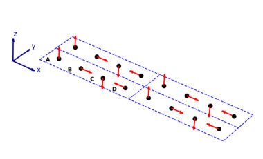 
Figure 1. p-wave magnet on a square lattice. The helical structure is along the x direction. Each unit cell has 4 sites: A, B, C, D. (a) Helix with spins in the zy plane (pMzy). (b) Helix with spins in the zx plane (pMzx).

📷 Fig 2

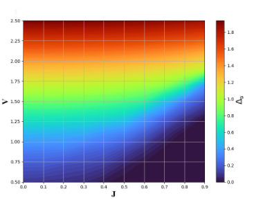 
Figure 2. Spin-singlet s-wave order parameter ∆s as a function of the magnetic coupling J and the superconducting coupling Vs, (a) for the pMzy plane orientation and (b) for the pMzx plane orientation.

📷 Fig 3

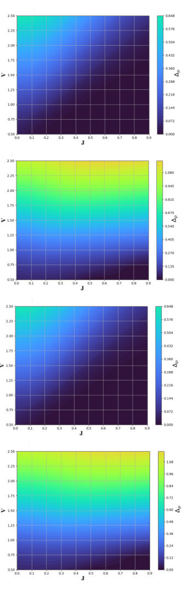 
Figure 3. Spin-triplet p-wave order parameter ∆p as a function of the magnetic coupling J and the superconducting coupling Vpx, Vpy in the pMzy plane orientation for (a) mixed-spin px-wave, (b) mixed-spin py-wave, (c) equal-spin px-wave, (d) equal-spin py-wave, and in the pMzx plane orientation for (e) mixed-spin px-wave, (f) mixed-spin py-wave, (g) equal-spin px-wave, (h) equal-spin py-wave.

📷 Fig 4

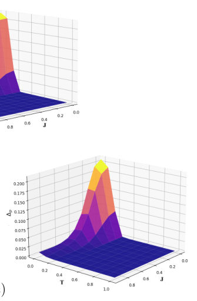 
Figure 4. For the pMzy plane orientation, the order parameter as a function of temperature T and magnetic coupling J is shown: (a) s-wave superconductivity, (b) mixed-spin px-wave superconductivity, and (c) equal-spin px-wave superconductivity.

📷 Fig 5

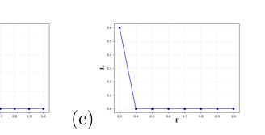 
Figure 5. For the pMzy plane orientation, Jc of the order parameter as a function of T for (a) s-wave superconductivity. (b) px-wave equal-spin, (c) px-wave mixed-spin.

**Summary.** This paper demonstrates that p-wave magnetic textures do more than just suppress conventional superconductivity; they can actually stabilize and promote spin-triplet p-wave pairing. By analyzing different magnetic helix orientations, the authors identify specific regimes where different superconducting symmetries coexist or compete, suggesting that unconventional magnets are promising platforms for realizing robust triplet superconductivity.

**Why it may be interesting.** not directly relevant

Detailed structure

**Main problem.** The study investigates the interplay, competition, and coexistence between unconventional p-wave magnetism and different superconducting symmetries (spin-singlet s-wave and spin-triplet p-wave).

**Main result.** The researchers found that p-wave magnetic order can actively promote and stabilize spin-triplet p-wave pairing, with specific magnetic helix orientations driving quantum phase transitions between different pairing symmetries.

**Method.** The study uses a self-consistent Bogoliubov-de-Gennes (BdG) approach to numerically solve the microscopic equations on a lattice.

**Model / system.** A p-wave magnet on a square lattice featuring a helical magnetic structure along the x-direction, including electron hopping, Zeeman-like magnetic coupling, and superconducting pairing terms.

**Key observables.** Pairing amplitudes for s-wave and p-wave channels (mixed-spin and equal-spin), total spin projection (Sz), and critical temperatures (Tc).

**Important parameters / regimes.** Magnetic coupling strength (J), magnetic helix orientation (pMzy vs. pMzx), temperature (T), and superconducting coupling strengths (Vs, Vp).

**Assumptions / limitations.** Mean-field approximation for superconductivity; periodic boundary conditions; square lattice geometry.

**Figures summary.** Figure 1 illustrates the two different magnetic helix configurations (pMzy and pMzx) on the square lattice.

**Paper structure.** The paper introduces the magnetic helix model, details the BdG methodology, analyzes the competition/coexistence of pairing symmetries under varying magnetic coupling, and discusses the implications for proximity effects and material realization.

Abstract

We investigate the interplay between unconventional magnetism and superconductivity in a model of a $p$-wave magnet on a square lattice. Using a self-consistent Bogoliubov-de-Gennes approach, we analyze the pairing amplitudes, competition, and coexistence of spin-singlet $s$-wave and spin-triplet $p$-wave pairings in the presence of a magnetic texture with a helical structure along the $x$ direction that is repeated in the $y$ direction. We find that the magnetic helix selectively stabilizes different pairing symmetries depending on its orientation and strength. In particular, mixed-spin $p_x$-wave pairing is enhanced at intermediate magnetic couplings and equal-spin $p_y$-wave pairing is robust and insensitive to all coupling intensities. When the multiple order parameters are simultaneously considered, we find regimes of coexistence and competition. Increasing the magnetic coupling drives two quantum phase transitions. The first from dominant spin-singlet $s$-wave to mixed-spin triplet $p_x$-wave pairings in a regime of coexistence. The second from spin-singlet $s$-wave and mixed-spin triplet $p$-wave pairings with total spin projection $S_z=0$ to dominant equal-spin triplet $p_y$-wave pairings with $S_z=\pm1$ in a regime of mutually exclusive superconducting phases. Our results demonstrate that $p$-wave magnetic order does not merely diminish spin-singlet $s$-wave superconductivity but can actively promote and stabilize spin-triplet $p$-wave pairing, both intrinsically and in proximity to spin-singlet $s$-wave superconductors. These findings highlight unconventional magnets as promising materials for realizing robust triplet superconductivity.

[↑ back to top](#top)

### [Durable Enhancement of $\mathbf{MoS_2}$ Single-Layer Photoluminescence by Ultraviolet Laser Treatment Under Ambient Conditions](http://arxiv.org/abs/2605.17363v1)

**Authors:** Mahan Bakhshikhah, Jiří Liška, Rahul Kesarwani, Jindřich Mach, Ondřej Červinka, Petr Dub, Jiří Spousta, Jan Přibyl, Jana Kalbáčová Vejpravová, Tomáš Šikola  
**Type:** experiment · **Category:** other · **PDF:** <https://arxiv.org/pdf/2605.17363v1>  
**Analysis basis:** full PDF text, analyzed in chunks

📷 Fig 1

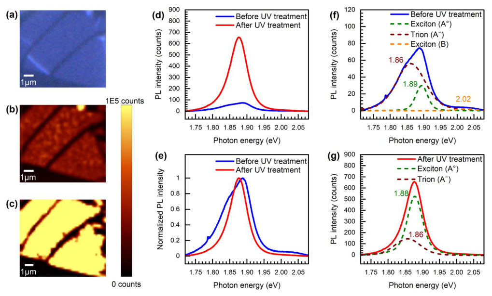 
Figure 1. Enhancement of PL for an exfoliated MoS2 single-layer flake treated by a UV laser

📷 Fig 2

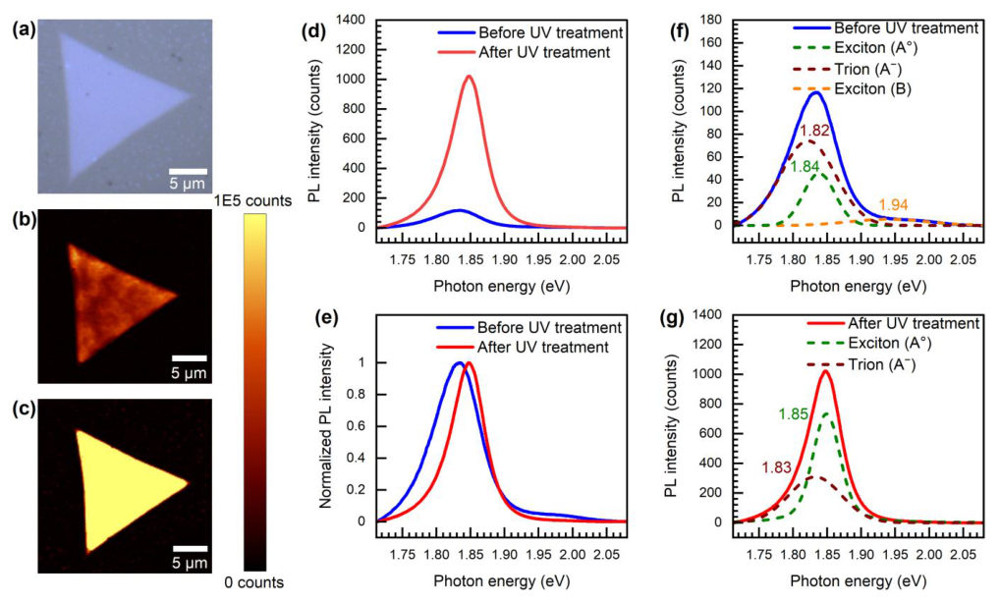 
Figure 2. Enhancement of PL for a CVD MoS2 single-layer domain treated by a UV laser

📷 Fig 3

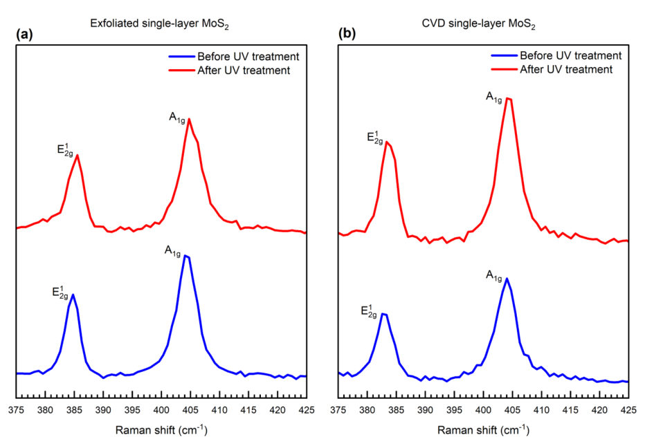 
Figure 3. Raman spectra of the exfoliated MoS2 single-layer and CVD MoS2 single-layer domain

📷 Fig 4

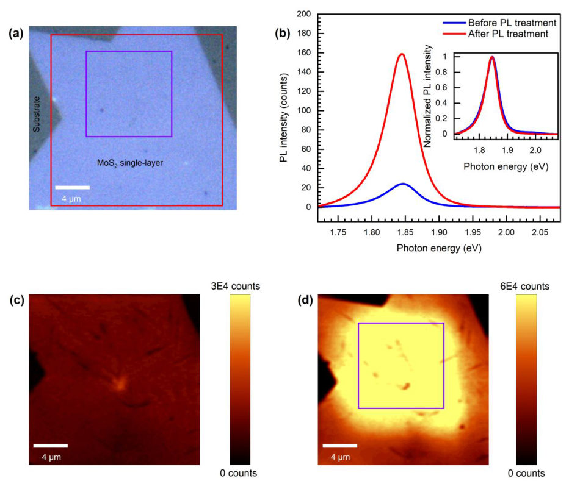 
Figure 4. Spatially selected PL treatment of a CVD MoS2 single-layer domain. (a) Optical image

📷 Fig 5

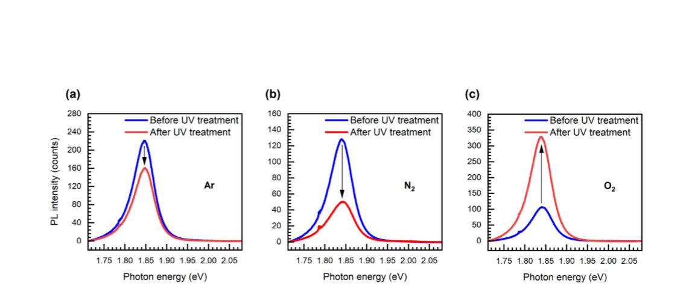 
Figure 5. Impact of Ar, N2, and O2 gas atmosphere on the performance of UV laser treatment of a

**Summary.** This paper demonstrates a method to significantly and durably boost the photoluminescence of single-layer MoS2 using a UV laser under ambient conditions. The process works by using oxygen to heal sulfur vacancies and convert trions into bright neutral excitons. This provides a reliable way to create high-performance, stable 2D materials for nanophotonic applications.

**Why it may be interesting.** not directly relevant

Detailed structure

**Main problem.** Achieving high-intensity, long-term stable photoluminescence (PL) in single-layer MoS2 by overcoming low quantum yield caused by sulfur vacancies and non-radiative recombination.

**Main result.** A non-destructive UV laser treatment under ambient conditions achieves up to an 8-fold enhancement in PL intensity by inducing oxygen chemisorption, which passivates defects and induces p-type doping.

**Method.** Continuous-wave UV laser irradiation (355 nm) of exfoliated and CVD-grown MoS2 flakes, combined with Raman spectroscopy, PL mapping, and controlled-atmosphere chamber studies.

**Model / system.** Single-layer molybdenum disulfide (MoS2) flakes, including both mechanically exfoliated and CVD-grown domains, placed on c-cut sapphire substrates.

**Key observables.** PL intensity (peak height and integrated area), PL spectral features (FWHM, trion-to-neutral exciton transition), Raman mode shifts (E2g and A1g), and surface roughness (RMS).

**Important parameters / regimes.** UV laser wavelength (355 nm), laser power (4 mW), atmospheric composition (O2, Ar, N2), and long-term stability duration (up to 72 days).

**Assumptions / limitations.** The enhancement is driven by oxygen-mediated passivation rather than purely thermal or structural damage effects.

**Figures summary.** Figure 1 shows PL maps and spectra for exfoliated MoS2 demonstrating intensity increase and spectral narrowing; Figure 2 shows similar enhancement in CVD MoS2; Figure 3 displays Raman blue shifts; Figure 4 demonstrates spatial control of the treatment; Figure 5 shows the necessity of oxygen for enhancement; Figure 6 tracks long-term stability.

**Paper structure.** The paper introduces the problem of low PL in MoS2, presents the UV treatment method and its dramatic enhancement effects, provides spectroscopic evidence for the mechanism (oxygen-induced p-doping and defect healing), demonstrates spatial precision and atmospheric dependence, and concludes with long-term stability and structural integrity analysis.

Abstract

Single-layer molybdenum disulfide ($MoS_2$) possesses significant potential for nanoscale optoelectronics, but achieving high-intensity, long-term-stable photoluminescence (PL) emission remains a challenge. In this work, we demonstrate a remarkably robust, more than 8-fold maximum enhancement in the PL intensity of exfoliated and CVD-grown single-layer $MoS_2$ via a non-destructive ultraviolet (UV) laser treatment method. This substantial increase in radiative efficiency is accompanied by a trion-to-neutral exciton transition in the PL signal and a corresponding blue shift of the Raman $E_{2g}^1$ and $A_{1g}$ vibrational modes, signaling successful electron depletion (p-doping) and formation of Mo-O bonds, respectively. Furthermore, we demonstrate precise spatial control over PL properties by confining PL treatment exclusively to the UV laser-treated area. Crucially, the enhanced PL performance shows exceptional longevity; the CVD sample and the exfoliated sample remained stable for the entire monitoring period (72 and 32 days, respectively) under ambient conditions. We further investigated UV laser treatment in a controlled-environment chamber under argon, nitrogen, and oxygen atmospheres, distinguishing the influence of oxygen as the PL treatment agent. These findings establish a reliable pathway for the permanent treatment of single-layer $MoS_2$ PL properties, an essential step toward practical, high-performance nanophotonic devices.

[↑ back to top](#top)

### [Formation of mechanical rogue waves](http://arxiv.org/abs/2605.18518v1)

**Authors:** Yasuhiro Miyazawa, Christopher Chong, Panayotis G. Kevrekidis, Jinkyu Yang  
**Type:** both · **Category:** other · **PDF:** <https://arxiv.org/pdf/2605.18518v1>  
**Analysis basis:** full PDF text, analyzed in chunks

📷 Fig 1

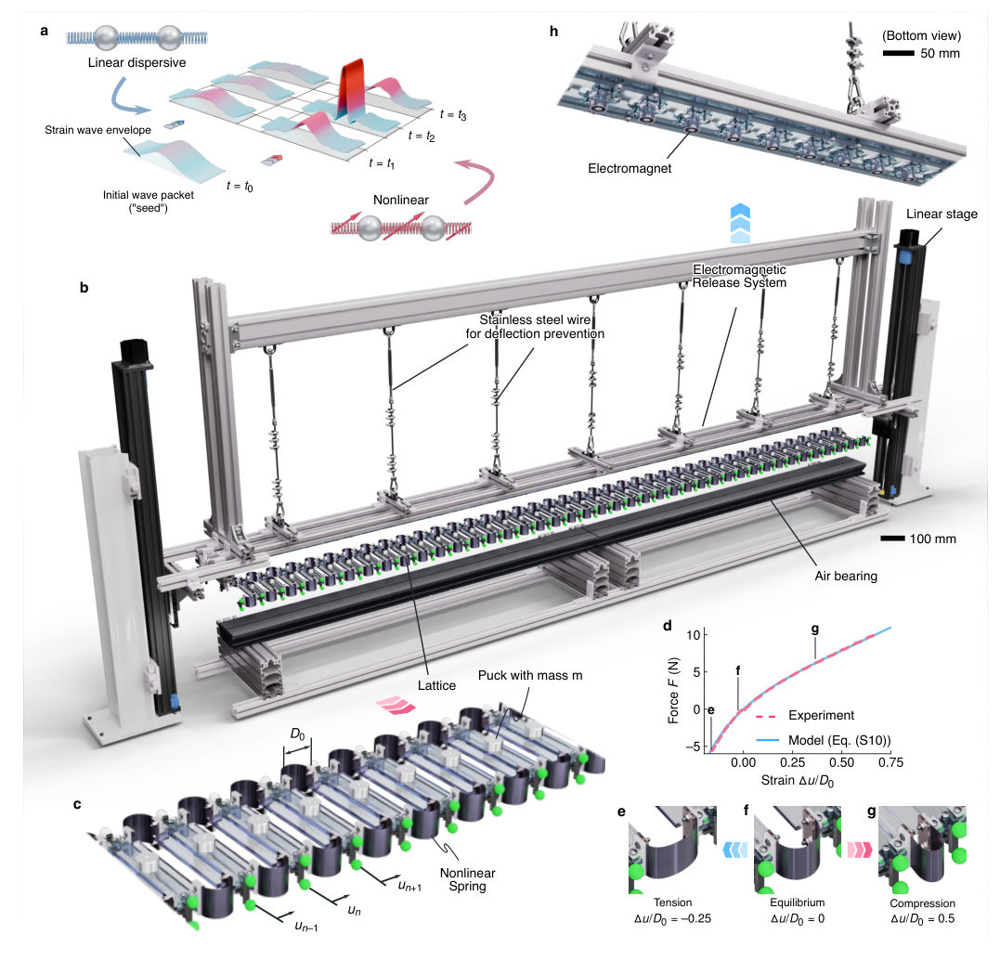 
Fig. 1. Schematic illustration of wave focusing and experimental setup. (a) Comparison of wave evolution in

📷 Fig 2

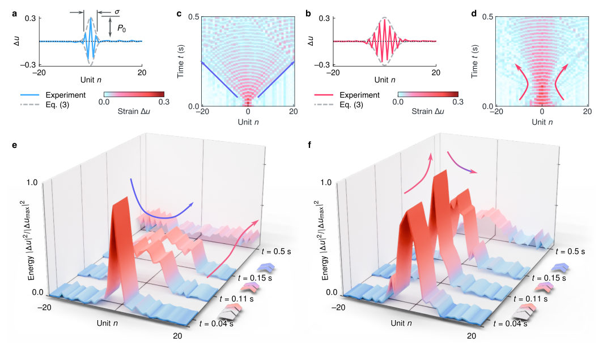 
Fig. 2. Experimental strain landscape in focusing and non-focusing scenarios. (a) Initial Gaussian profile of the

📷 Fig 3

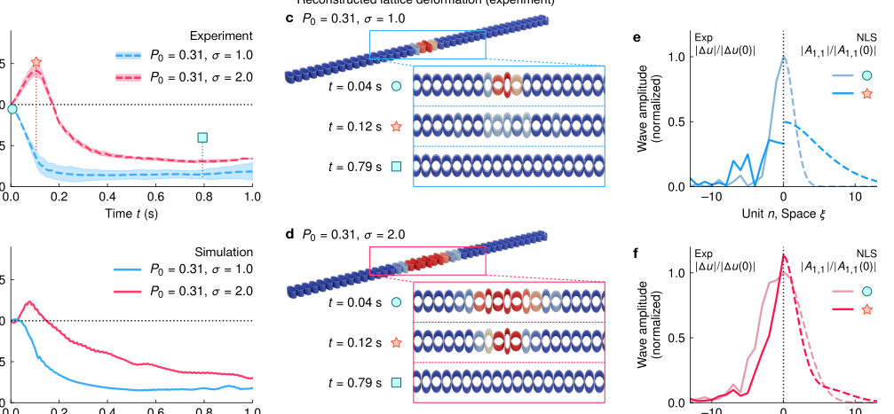 
Fig. 3. Localization characterization. Normalized inverse participation ratio (IPR) for narrow (σ = 1.0) and wide

📷 Fig 4

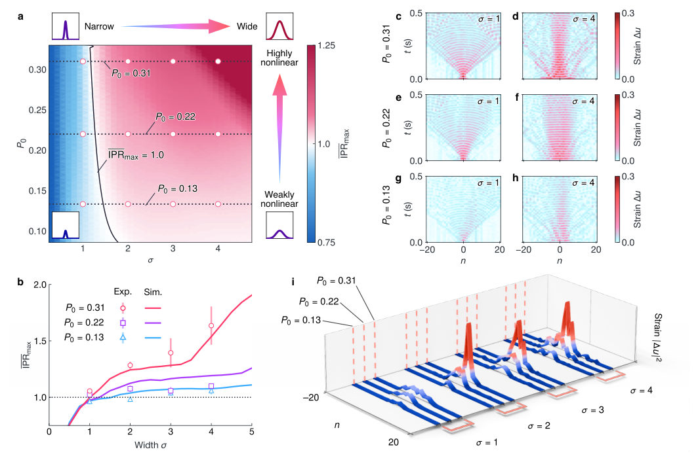 
Fig. 4. Parametric study of nonlinear wave focusing. (a) Variation of IPRmax in an initial condition parameter space

**Summary.** This paper reports the first experimental realization of mechanical rogue waves in a 1D nonlinear metamaterial lattice. It reveals that extreme wave localization is a synergistic effect requiring both high nonlinearity and a sufficiently wide initial energy reservoir to overcome dispersion. These findings provide a platform for studying transient nonlinear wave focusing for applications like energy harvesting and signal processing.

**Why it may be interesting.** not directly relevant

Detailed structure

**Main problem.** The experimental realization of mechanical rogue waves has been elusive due to challenges in controlling nonlinearity and overcoming energy dissipation. The study specifically investigates whether extreme energy focusing requires a narrow seed or a wide spatial energy reservoir.

**Main result.** The researchers demonstrate that the formation of mechanical rogue waves requires a synergy between high nonlinearity and a broad spatial energy reservoir; neither high amplitude nor wide initial width alone is sufficient to overcome dispersion.

**Method.** The study uses a 1D mechanical metamaterial lattice with an electromagnetic release system to prescribe initial strain profiles. Experimental results are validated against numerical simulations using the Nonlinear Schrödinger Equation (NLSE) and FPUT-type models.

**Model / system.** A 1D mechanical metamaterial lattice consisting of 41 nonlinear spring units (pucks) on a low-friction air-bearing support. The dynamics are modeled by the Fermi-Pasta-Ulam-Tsingou (FPUT) framework and the Nonlinear Schrödinger Equation (NLSE).

**Key observables.** Spatiotemporal evolution of the lattice, instantaneous spatial strain profiles, wave packet envelope amplitude, and the Inverse Participation Ratio (IPTR) as a metric for localization.

**Important parameters / regimes.** Initial peak strain amplitude (P0), initial Gaussian width (sigma), and the zone-boundary mode (k = pi).

**Assumptions / limitations.** The system is assumed to be in a Hamiltonian scenario where the dynamics can be approximated by the NLSE, and inherent dissipation is assumed to be low enough to allow for observable focusing.

**Figures summary.** Fig 1 shows the experimental setup and the asymmetric force-strain relationship. Fig 2 compares the spatiotemporal evolution and strain profiles of narrow vs. wide seeds. Fig 3 compares experimental IPR and lattice deformation with NLS predictions. Fig 4 presents a parametric study of IPR_max across the P0 and sigma parameter space.

**Paper structure.** Introduction of the rogue wave problem, description of the experimental metamaterial platform and electromagnetic release system, presentation of the numerical model (NLSE/FPUT), results comparing different initial conditions (narrow vs. wide), a parametric study of the localization threshold, and discussion of applications.

Abstract

Rogue waves, characterized by their abrupt and extreme localization in space and time, have evolved from maritime folklore to subjects of intense study across diverse fields, from hydrodynamics and nonlinear optics to plasmas and condensed matter physics. In mechanical systems, however, experimental realization remains elusive despite theoretical and numerical predictions. This gap stems from the stringent requirements for controllable nonlinearity, the high-fidelity initialization of the system, and the necessity to overcome inherent energy dissipation. Here, we report the experimental formation of mechanical rogue waves in a precisely engineered one-dimensional metamaterial lattice with tailored nonlinearity and minimal dissipative losses. Using a precision electromagnetic release system, we prescribe initial strain profiles that trigger a transition from dispersive decay to extreme wave focusing. Our parametric analysis reveals that the emergence of these extreme events is strictly contingent upon a synergy between high nonlinearity and a broad spatial energy reservoir within the initial seed. Crucially, neither factor alone is sufficient to overcome dispersion and trigger the observed focusing. These findings establish a robust platform for studying transient nonlinear wave focusing phenomena in mechanical systems and offer insights for harnessing extreme wave localization for applications such as energy harvesting, waveguiding, and mechanical signal processing.

[↑ back to top](#top)

### [Geometric symmetry and size-dependent skyrmion phase transitions in magnetic nanostructures](http://arxiv.org/abs/2605.17939v1)

**Authors:** J. Y. Wang, C. X. Zhao, Y. F. Duan, H. M. Dong  
**Type:** theory · **Category:** other · **PDF:** <https://arxiv.org/pdf/2605.17939v1>  
**Analysis basis:** full PDF text, analyzed in chunks

📷 Fig 1

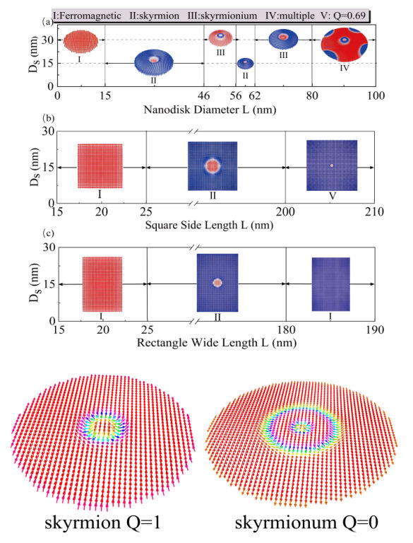 
Figure 1: The size-dependent magnetic topological structures with the diameter Ds of (a) a nanodisk, (b) a square, and (c) a rectangle. The inserts show schematics of magnetic topological structures with topological charge Q. The typical spin configurations, skyrmion and skyrmionum, are shown, respectively.

📷 Fig 2

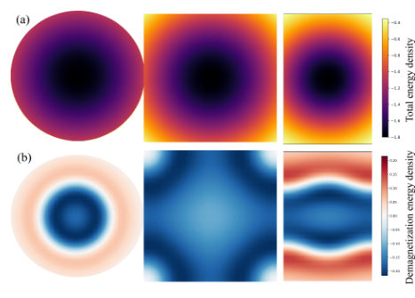 
Figure 2: The distributions of magnetic energy density (a) and the demagnetization energy density (b) in a nanodisk with a diameter of 50 nm, a square with 50 × 50 nm, and a rectangle with 50 × 75 nm without the magnetic field (B = 0).

📷 Fig 3

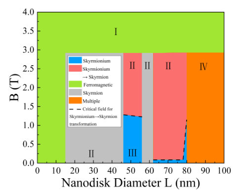 
Figure 3: The topological phase diagram of nanodisks as a function of a perpendicular magnetic field B and its diameter L.

📷 Fig 4

 
Fig. 3 illustrates the topological phase diagram in a nanodisk as a function of the perpendicular mag- netic field B and its diameter L. This diagram illus- trates the reconstruction of topological states induced by the magnetic field and highlights their key charac- teristics. The phase diagram features four distinct types of topological states: (i) Ferromagnetic state (I) prevails in regions with high magnetic fields (B &gt; 2.9 T) and small diameters (L &lt; 15 nm). In this state, the mag- netic moments are fully aligned with the magnetic field, thereby suppressing topological defects. (ii) The transi- tion from skyrmioniums to skyrmions (red) induced by

📷 Fig 5

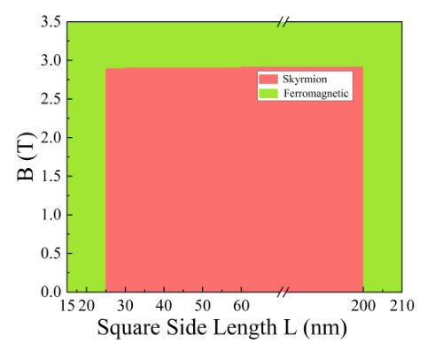 
Figure 4: The topological structure phase diagram of the magnetic square as a function of the perpendicular magnetic field B and the side length L.

**Summary.** This study demonstrates how the shape and symmetry of magnetic nanostructures can be used to engineer the stability of topological textures. It shows that while disks allow for complex multi-state configurations, asymmetric structures like rectangles are better for stabilizing simple skyrmions, providing a design principle for next-generation spintronic memory.

**Why it may be interesting.** not directly relevant

Detailed structure

**Main problem.** Investigating how geometric symmetry, size, and external magnetic fields regulate the stability and phase transitions of topological magnetic states like skyrmions and skyrmioniums in nanostructures.

**Main result.** Nanodisks with rotational symmetry enable complex topological transitions (skyrmionium, multi-states), whereas squares and rectangles exhibit topological suppression due to corner-induced demagnetization, though they stabilize skyrmions over a broader parameter range.

**Method.** Micromagnetic simulations using the GPU-accelerable MuMax3 package with energy minimization via the conjugate-gradient-based Relax routine.

**Model / system.** Magnetic nanostructures (nanodisks, squares, and rectangles) with a 1 nm thickness, modeled using a Hamiltonian including exchange, DMI, magnetic anisotropy, Zeeman, and demagnetization energies.

**Key observables.** Topological charge (Q), total magnetic energy density, and topological phase diagrams (B-L plots).

**Important parameters / regimes.** Magnetic anisotropy (Ku = 6 MJ/m3), DMI constant (D = 4.1 mJ/m2), saturation magnetization (Ms = 914 kA/m), and nanostructure dimensions (L).

**Assumptions / limitations.** Simulations are performed at zero temperature (T = 0 K), and the material parameters represent a theoretical limit for high-performance spintronics.

**Figures summary.** Phase diagrams for squares and rectangles as a function of field and size; energy density variations across different geometries; and the variation of total magnetic energy density as a function of size.

**Paper structure.** The paper introduces the problem of geometric influence on skyrmions, details the micromagnetic model and parameters, presents comparative phase diagrams for different shapes, analyzes energy density variations, and concludes with implications for spintronic applications.

Abstract

We investigate the interplay of geometric symmetry, size, and external magnetic fields in regulating individual skyrmion states within magnetic nanostructures. By analyzing nanodisks, nanosquares, and nanorectangles, we demonstrate that rotational symmetry in nanodisks enables rich topological phase transitions, from ferromagnetic states to skyrmions, skyrmioniums, and multi-states, as their diameter increases. In contrast, square and rectangular structures exhibit suppressed topological complexity due to corner-induced demagnetization effects and reduced symmetries. Under perpendicular magnetic fields, nanodisks show field-driven transitions between skyrmionium and skyrmion states. By leveraging asymmetry, square and rectangular nanostructures stabilize skyrmions over a broader parameter range than nanodisks. These findings highlight geometric symmetry as a critical design parameter for tailoring skyrmion stability and functionality in spintronic applications such as multi-state memory and reconfigurable logic devices.

[↑ back to top](#top)

### [Geometry-Driven Nonlinear Orbital Magnetoelectric Effect](http://arxiv.org/abs/2605.17462v1)

**Authors:** Jinxiong Jia, Zhenhua Qiao, Jian Wang  
**Type:** theory · **Category:** other · **PDF:** <https://arxiv.org/pdf/2605.17462v1>  
**Analysis basis:** full PDF text, analyzed in chunks

📷 Fig 1

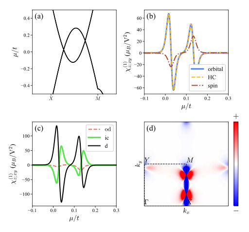 
FIG. 2. (a) Band dispersion for Eq. (12). (b) The extrin- sic nonlinear magnetization including orbital and spin com- ponents as a function of chemical potential µ. (c) The three components of extrinsic nonlinear orbital magnetization χ(1) z;xy as a function of chemical potential µ. (d) The k-resolved dis- tribution of the integrand of χ(1,d) z;xy for first two bands. Here, we use t′ = 0.08t, Jn = 0.6t, λ = 0.8t, T = 100K and τ = 10fs.

📷 Fig 2

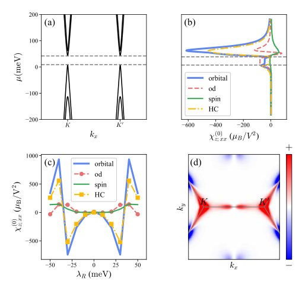 
FIG. 1. (a) Band dispersion for Eq. (11). (b) The in- trinsic NOME component χ(0) z;xx, its three contributions as a function of chemical potential µ. For comparison, we also plot the nonlinear spin magnetization component χs(0) z;xx, and the Hermitian connection of χ(0) z;xx termed as HC. (c) The Rashba SOC λR dependence of intrinsic NOME χ(0) z;xx at fixed µ = 50meV. (d) The k-resolved distribution of the integrand of χ(0,d) z;xx + χ(0,ic) z;xx for the third band. Parameters: t = 0.85eV, λR = 20meV, λ = 10meV, λso = 10meV, and T = 20K.

**Summary.** This paper proposes and theoretically describes a nonlinear orbital magnetoelectric effect that works in centrosymmetric materials where the linear version is forbidden. It identifies the quantum geometric (Hermitian connection) origin of the effect and demonstrates that it is detectable via magneto-optical Kerr measurements.

**Why it may be interesting.** not directly relevant

Detailed structure

**Main problem.** The paper investigates the Nonlinear Orbital Magnetoelectric Effect (NOME), which generates orbital magnetization quadratically in response to an electric field, specifically in centrosymmetric materials where the linear effect is forbidden.

**Main result.** The authors establish a gauge-invariant microscopic theory showing that NOME is driven by a Hermitian-connection structure and is permitted in a much broader range of magnetic point groups than the linear OME.

**Method.** The study uses an extended semiclassical formulation and Boltzmann equation approach to separate intrinsic and extrinsic contributions and employs magnetic point group symmetry analysis.

**Model / system.** The theory is applied to 2D materials, specifically utilizing a modified Kane-Mele model (honeycomb lattice) for intrinsic effects and a CuMnAs-like model for extrinsic effects.

**Key observables.** Orbital magnetization (delta M_c), intrinsic and extrinsic response tensors (chi), and the scaling of response with relaxation time (tau).

**Important parameters / regimes.** Relaxation time (tau), electric field strength (E = 10^5 V/m), and magnetic point group symmetries.

**Assumptions / limitations.** The analysis focuses primarily on 2D systems in the xy plane and assumes the validity of the relaxation time approximation.

**Figures summary.** Figure 1 shows band dispersion, intrinsic NOME components, and k-resolved integrand maps for the Kane-Mele model; Figure 2 shows the band dispersion for the CuMnAs model.

**Paper structure.** The paper introduces the NOME concept, develops a gauge-invariant microscopic theory, performs a symmetry analysis of the response tensor, provides specific model calculations (Kane-Mele and CuMnAs), and concludes with experimental feasibility estimates.

Abstract

We propose a nonlinear orbital magnetoelectric effect, which generates orbital magnetization quadratically in centrosymmetric materials where the linear orbital magnetoelectric effect is strictly forbidden. Using extended semiclassical formulation, we derive a gauge-invariant microscopic theory that separates intrinsic and extrinsic contributions and establishes their distinct dependence on the relaxation time, providing an experimental discriminator. In two-dimensional systems the nonlinear response is far less constrained by out-of-plane rotational symmetries than the linear orbital magnetoelectric effect, substantially enlarging the materials platform. Microscopically, the dominant contributions are governed by a Hermitian-connection structure. Finally, we estimate that the magnitude of the nonlinear orbital magnetoelectric effect lies within the sensitivity of state-of-the-art magneto-optical Kerr measurements.

[↑ back to top](#top)

### [Hydrostatic Pressure-Induced Evolution of the Superconducting Transition Temperature of Bi-2212: Insights from First-Principles Calculations](http://arxiv.org/abs/2605.18017v1)

**Authors:** Shuhong Tang, Hanyu Wang, Di Peng, Da-yong Liu, Zhi Zeng, and Liang-Jian Zou  
**Type:** theory · **Category:** strongly correlated electrons · **PDF:** <https://arxiv.org/pdf/2605.18017v1>  
**Analysis basis:** full PDF text, analyzed in chunks

📷 Fig 1

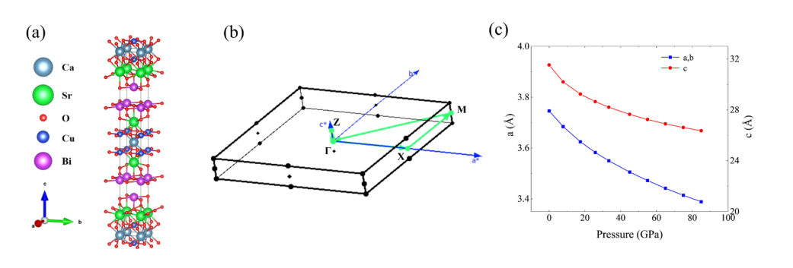 
FIG. 1. (a) Crystal structure of Bi-2212 in the body-centered tetragonal approximation (I4/mmm). (b) Corresponding Brillouin zone and high-symmetry path used in the band-structure calculations. (c) Pressure dependence of the optimized lattice parameters obtained from DFT structural relaxations.

📷 Fig 2

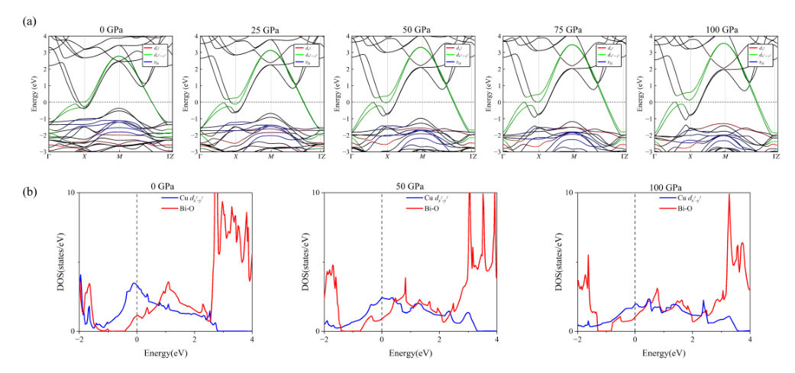 
FIG. 2. DFT+U electronic structure of Bi-2212 for the nominal δ = 0.5 case at selected pressures. (a) Band structures at P = 0, 25, 50, 75, and 100 GPa. (b) Corresponding densities of states at P = 0, 50, and 100 GPa. The onsite interaction is Ueff = 5 eV.

📷 Fig 3

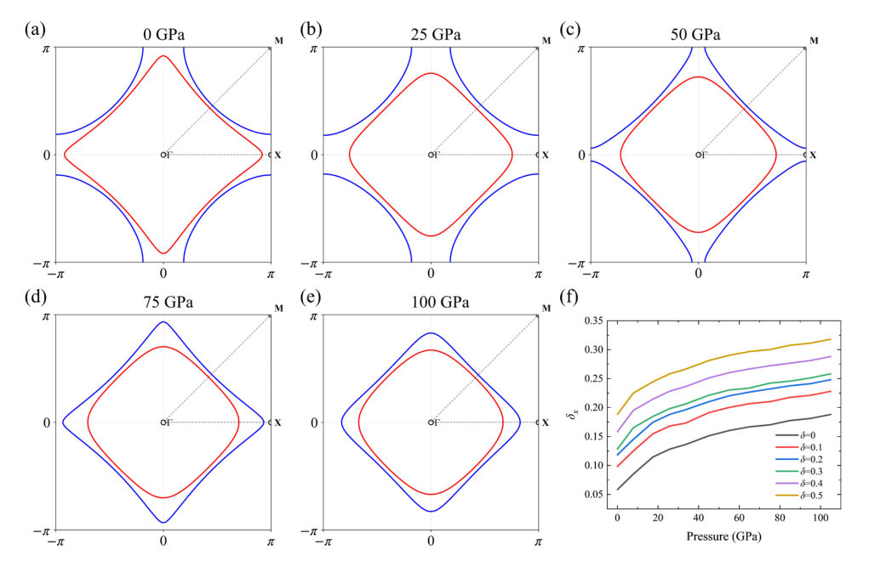 
FIG. 3. (a–e) Cu–O-derived Fermi surfaces of Bi-2212 from DFT+U for the nominal δ = 0.5 case at P = 0, 25, 50, 75, and 100 GPa. The changing enclosed area reflects the pressure-induced variation of the effective CuO2-plane hole concentration. (f) Pressure dependence of the effective CuO2-plane hole concentration δx for several nominal dopings δ.

📷 Fig 4

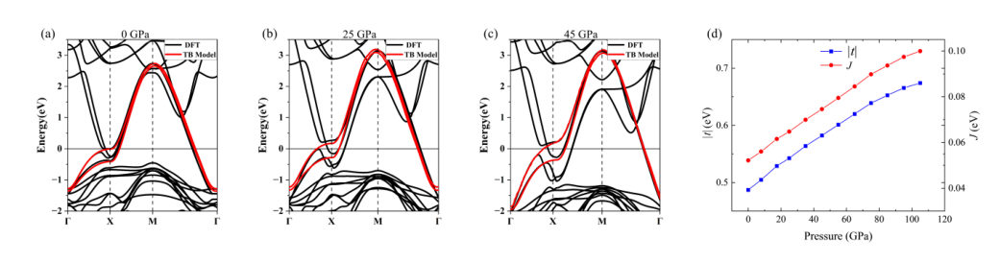 
FIG. 4. (a–c) Comparison between the DFT bands of Bi-2212 and the corresponding bilayer tight-binding/Wannier fits for the nominal δ = 0.5 case at P = 0, 25, and 45 GPa. The fitted Cu dx2−y2 bands are shown as red lines. (d) Pressure dependence of the magnitude |t| of the nearest-neighbor Wannier hopping and the superexchange parameter J.

📷 Fig 5

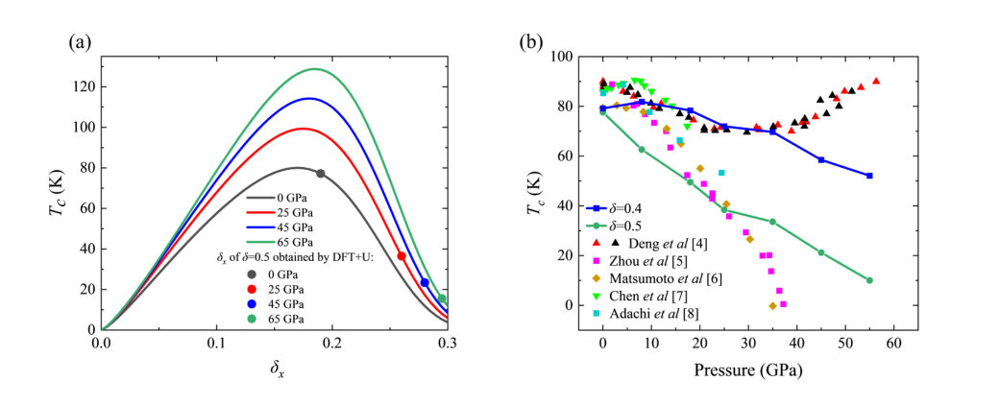 
FIG. 5. (a) Calculated Tc–δx curves of Bi-2212 at selected pressures, obtained from the SBMF+BKT scheme. The colored dots mark the DFT-derived CuO2-plane hole concentration δx(P) for the nominal δ = 0.5 sample. (b) Calculated Tc(P) curves for two nominally near-optimal samples, δ = 0.4 and δ = 0.5, compared with representative experimental data for near-optimal Bi-2212 under pressure [4–8].

**Summary.** This paper provides a unified theoretical explanation for the inconsistent experimental observations of Tc changes in Bi-2212 under pressure. It demonstrates that pressure induces a self-doping effect that moves the system along the Tc-doping dome, making the response highly dependent on the starting doping level. The findings suggest that underdoped samples are the best candidates for achieving higher Tc under pressure.

**Why it may be interesting.** not directly relevant

Detailed structure

**Main problem.** Resolving conflicting experimental reports regarding the evolution of the superconducting transition temperature (Tc) in Bi-2212 under hydrostatic pressure.

**Main result.** The study identifies a 'dual effect' where pressure enhances the pairing scale while simultaneously driving 'self-doping' (hole transfer from Bi-O to CuO2 layers), explaining that Tc evolution depends on the initial doping state.

**Method.** A combination of first-principles DFT calculations, Wannier-function fitting, and a many-body treatment using the slave-boson mean-field method and BKT theory.

**Model / system.** The physical system is the high-Tc cuprate Bi-2212, modeled using a low-energy bilayer single-orbital t-J model including intralayer and interlayer hopping and superexchange interactions.

**Key observables.** Superconducting transition temperature (Tc), effective CuO2-plane hole concentration (delta_x), and superfluid stiffness (K_phys).

**Important parameters / regimes.** Pressure (P), hole concentration (delta_x), hopping parameters (t, t', t_perp), and superexcharge (J).

**Assumptions / limitations.** The rigid-band approximation is used for doping, and the superexchange interaction J is assumed to scale with t^2/U with U kept fixed.

**Figures summary.** Fig 1 shows the crystal structure, Brillouin zone, and pressure dependence of lattice parameters; Fig 3 shows the evolution of the Fermi surface and hole concentration under pressure.

**Paper structure.** The paper introduces the experimental conflict, describes the DFT and t-J model construction, presents the results of pressure-induced self-doping and parameter renormalization, and concludes with a unified interpretation of Tc evolution.

Abstract

High-pressure experiments on Bi$_2$Sr$_2$CaCu$_2$O$_{8+x}$ (Bi-2212) have reported apparently conflicting evolutions of the superconducting transition temperature $T_c$, ranging from weak enhancement to strong suppression and even a proposed second superconducting dome. To clarify the origin of these discrepancies, we combine first-principles density functional theory calculations with a pressure-dependent low-energy bilayer model solved by the slave-boson mean-field method together with a Berezinskii-Kosterlitz-Thouless estimate of phase coherence. Our results show that hydrostatic pressure induces a pronounced self-doping effect in Bi-2212: holes are transferred from the Bi-O charge-reservoir layers to the CuO$_2$ superconducting planes, leading to a systematic increase in the effective CuO$_2$-plane hole concentration $δ_x$. At the same time, pressure enhances the pairing scale through the renormalization of the hopping and superexchange parameters. As a consequence, the pressure evolution of $T_c$ is governed by the competition between pressure-enhanced pairing and pressure-driven motion along the common $T_c$-$δ_x$ dome, making $T_c(P)$ highly sensitive to the initial doping state. Even samples with very similar ambient-pressure $T_c$ but slightly different initial doping can therefore display qualitatively different pressure responses. This provides a unified interpretation of a large part of the disparate high-pressure behavior reported for Bi-2212 and suggests that slightly underdoped samples are more favorable than ambient-pressure optimal samples for achieving improved superconducting performance under pressure.

[↑ back to top](#top)

### [Lattice Relaxation in Moiré Heterobilayers](http://arxiv.org/abs/2605.17805v1)

**Authors:** Christophe De Beule, Yiyang Lai, Liangtao Peng, Daniel Bennett, Shaffique Adam  
**Type:** theory · **Category:** other · **PDF:** <https://arxiv.org/pdf/2605.17805v1>  
**Analysis basis:** full PDF text, analyzed in chunks

📷 Fig 1

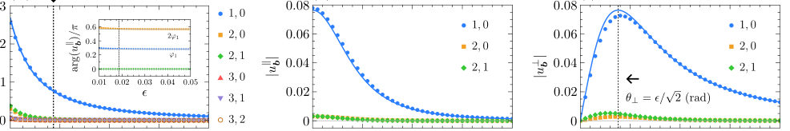 
FIG. 1. First-star analytical theory for (a) the relative in-plane displacement field u = u1 −u2 and (b) the layer center-of-mass field U = u1 + u2, for graphene on hBN due to lattice relaxation. Here, the magnitude is shown in units of the average lattice constant a = (a1 + a2)/2 with a1 &gt; a2. (c) First-star stacking potential with C3v = ⟨C3z, Mx⟩symmetry in configuration space from Eq. (22) for φ1 = 50◦. (d) Longitudinal Fourier components of u, where the dots are numerical solutions of the self-consistent equations given in Eqs. 14 and 15, and the curves give the one-shot result. The legend indicates the star following the notation of Table I. Shown as a function of lattice mismatch ϵ...

📷 Fig 2

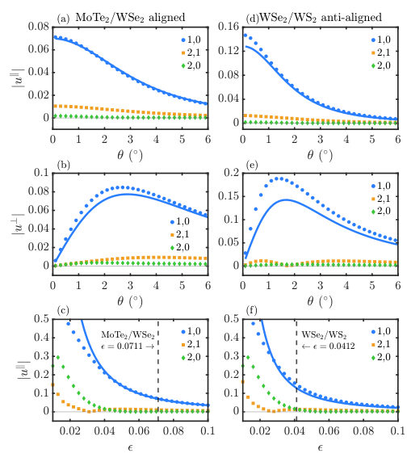 
FIG. 2. Acoustic displacement fields induced by atomic re- construction in moiré TMD heterobilayers. Here, we show the longitudinal and transverse Fourier components of the first re- ciprocal star for the in-plane displacement fields u = u1 −u2 where the dots are numerical solutions of the self-consistent equations given in Eqs. 14 and 15, and the curves give the one-shot analytical result. Shown as a function of the twist angle for aligned MoTe2/WSe2 in panels (a) and (b), and for anti-aligned WSe2/WS2 in panels (d) and (e). We also show the transverse component versus ϵ for aligned MoTe2/WSe2 in panels (c) and for anti-aligned WSe2/WS2 in panels (f) for θ = 0. The center-of-mass fields...

📷 Fig 3

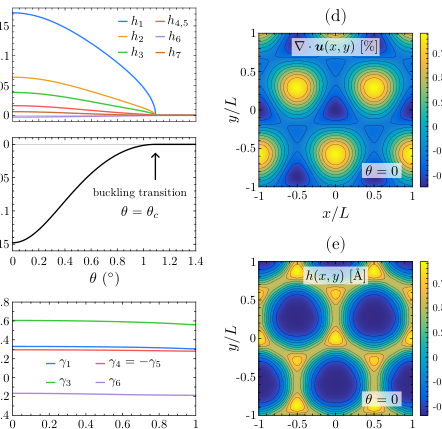 
FIG. 3. Buckling transition in moiré heterobilayers. Shown for graphene on hBN for κ = 1 eV and the parameters in Tables II and III. (a) Fourier amplitudes hn as a function of twist angle for a C3v buckling profile with up to 7 stars. (b) Relative energy gain due to buckling versus twist angle. (c) Phases of the Fourier components. The 2nd and 7th star are real by symmetry and not shown. (d) Divergence of the in- plane displacement field for graphene aligned to hBN (θ = 0) using the one-shot analytical result. (e) Buckling profile corresponding to (d) using the results from (a) and (c).

📷 Fig 4

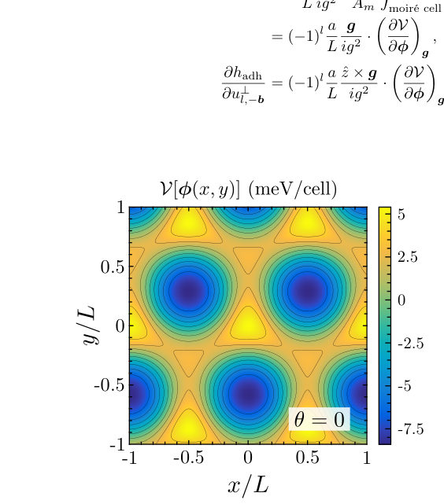 
FIG. 4. Stacking energy landscape (up to an overall constant) in units of meV per monolayer unit cell (using the average lattice constant). Shown for the relaxed moiré configuration ϕ(r) = ϵr + u(r) for graphene aligned on hBN. Here, we used the analytical result for the relaxed in-plane acoustic displacement fields. Parameters used are listed in Tables II and III of the main text.

📷 Fig 5

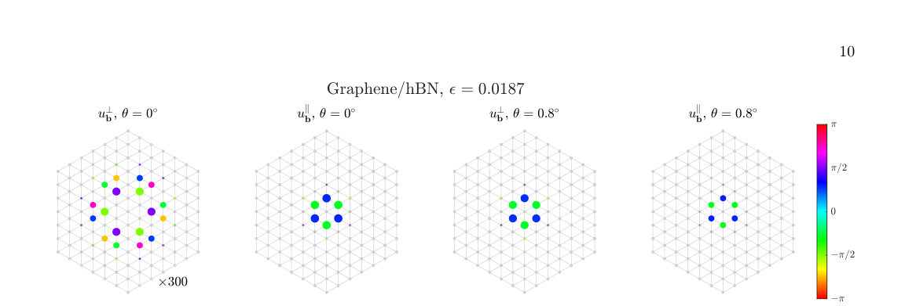 
FIG. 5. Fourier components of the relative displacement field u = u1 −u2 for graphene on hBN at θ = 0◦and θ = 0.8◦, with ϵ = 0.0187. The transverse and longitudinal components, u⊥ b and u∥ b, are shown up to the sixth shell. Dot size denotes |ub|, and color denotes the phase arg(ub). The indicated scale factors are applied to the dot sizes for visual clarity.

**Summary.** This paper provides a new analytical framework to understand how lattice mismatch and twist angle cause structural relaxation in moiré heterostructures. It successfully predicts both in-plane atomic shifts and the emergence of out-of-plane buckling, offering a simpler alternative to complex numerical simulations.

**Why it may be interesting.** not directly relevant

Detailed structure

**Main problem.** Developing an analytical theory for lattice relaxation and structural buckling in twisted moiré heterobilayers, accounting for lattice mismatch and different elastic constants.

**Main result.** The authors derive a perturbative analytical framework that accurately predicts in-plane displacement fields and identifies a buckling instability driven by compressive strain near alignment.

**Method.** The study uses continuum elasticity theory, Helmholtz decomposition, and a 'one-shot' perturbation approach, validated against numerical self-consistent solutions and DFT-derived parameters.

**Model / system.** The model focuses on twisted moiré heterobilayers, specifically graphene/hBN and 2H TMD heterobilayers (e.g., MoTe2/WSe2), treating them as isotropic continuous membranes with interlayer adhesion energy.

**Key observables.** In-plane displacement fields (longitudinal and transverse components), layer center-of-mass and relative displacements, and out-of-plane height profiles (buckling).

**Important parameters / regimes.** Lattice mismatch (epsilon), twist angle (theta), Lamé constants (lambda, mu), Poisson's ratio, and bending stiffness (kappa).

**Assumptions / limitations.** Layers are treated as isotropic continuous membranes; initial derivation neglects out-of-plane deformations; the 'one-shot' approximation assumes the ratio of adhesion to elastic energy is small.

**Figures summary.** Figure 1 shows displacement field magnitudes and stacking potential; Figure 3 illustrates the buckling transition and resulting height profile; Figure 4 shows the local stacking energy landscape; Figures 5 and 6 display Fourier components of displacement fields for various systems.

**Paper structure.** The paper introduces the problem of heterobilayer relaxation, develops the analytical continuum elasticity theory, applies the theory to specific systems (graphene/hBN and TMDs), investigates the buckling instability mechanism, and validates results against numerical methods.

Abstract

We develop an analytical theory for lattice relaxation in twisted moiré heterobilayers, accounting for lattice mismatch, twist, external biaxial heterostrain, and different elastic constants. Starting from continuum elasticity, we derive the self-consistent equations for the in-plane displacement fields and obtain simple perturbative expressions for the layer-resolved in-plane displacement fields induced by lattice relaxation. We apply our theory to graphene on hBN and representative 2H transition metal dichalcogenide heterobilayers, including MoTe$_2$/WSe$_2$ and WSe$_2$/WS$_2$. Our analytical results agree very well with full numerical solutions over experimentally relevant parameters. We further show that heterobilayers can exhibit a buckling instability near alignment, driven by compressive in-plane strain due to moiré relaxation. Our results provide a simple theoretical framework for incorporating lattice relaxation in realistic moiré heterostructures.

[↑ back to top](#top)

### [Multiple Superconducting Phases in Rhombohedral Heptalayer Graphene](http://arxiv.org/abs/2605.17890v1)

**Authors:** Chuanqi Zheng, Chushan Li, Chenyu Zhang, Kenji Watanabe, Takashi Taniguchi, Hao Yang, Dandan Guan, Liang Liu, Shiyong Wang, Yaoyi Li, Hao Zheng, Canhua Liu, Jinfeng Jia, Zhiwen Shi, Guorui Chen, Tingxin Li, Xiaoxue Liu  
**Type:** experiment · **Category:** strongly correlated electrons · **PDF:** <https://arxiv.org/pdf/2605.17890v1>  
**Analysis basis:** full PDF text, analyzed in chunks

📷 Fig 1

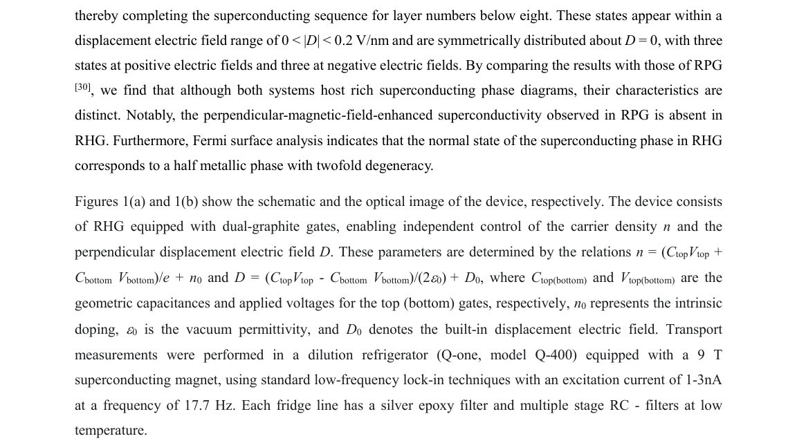 
Figure 1(c) shows the n-D phase diagram of the longitudinal resistivity ρxx at zero magnetic field. At the charge

📷 Fig 2

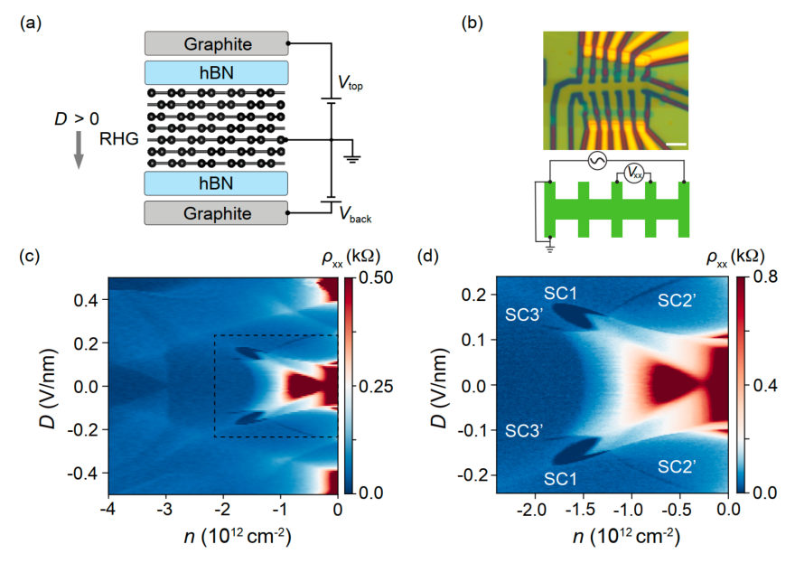 
Fig.1. The transport characterization of rhombohedral heptalayer graphene (RHG). (a) Schematic

📷 Fig 3

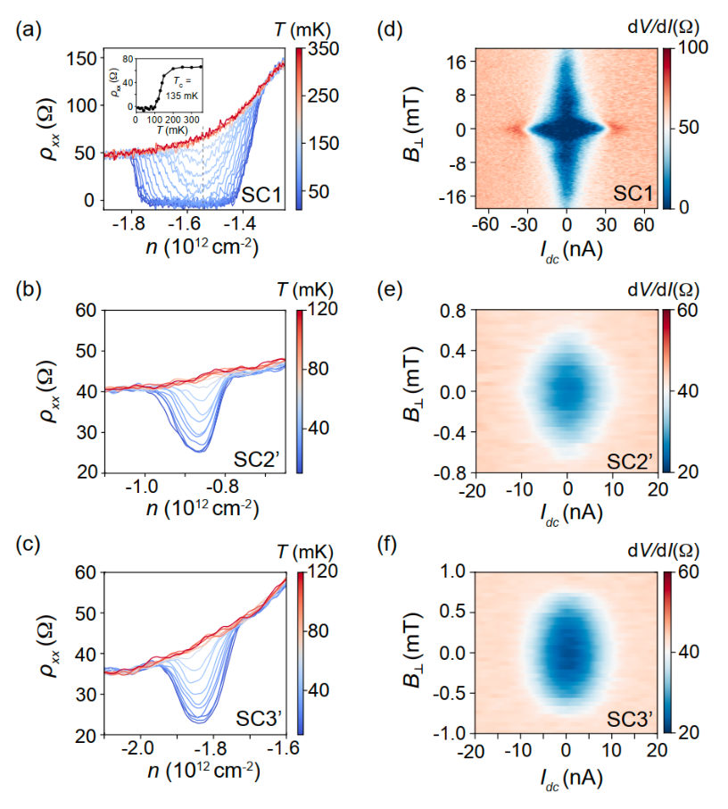 
Fig.2. The transport characterization of SC1, SC2’ and SC3’ states in RHG. (a)-(c) The

📷 Fig 4

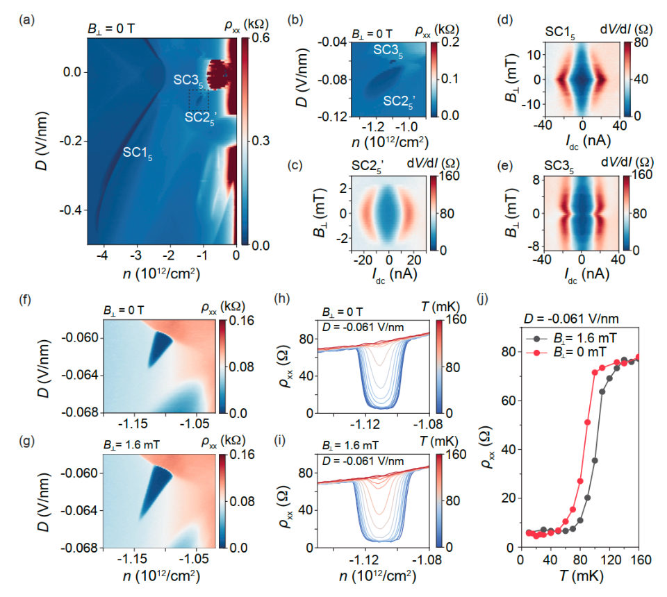 
Fig. 3. Phase diagram and superconductivity in a RPG. (a) Phase diagram of ρxx as a function of n and D at zero magnetic field. Two superconducting states, and one signature of superconductivity are observed and labeled as SC15, SC35, and SC25’ respectively. (b) Zoomed-in map of the region highlighted by the dashed line in (a). (c)-(e) Differential resistivity dV/dI as a function of Idc and perpendicular magnetic field B⊥ for SC15, SC25’ and SC35 states. (f), (g) Phase diagram of ρxx as a function of n and D for SC35 at B⊥ = 0 mT (f) and 1.6 mT (g), respectively. (h), (i) Temperature dependence of ρxx as a function of n at D = -0.061 V/nm for SC35, measured at B⊥ = 0 mT (h) and 1.6 mT (i),...

📷 Fig 5

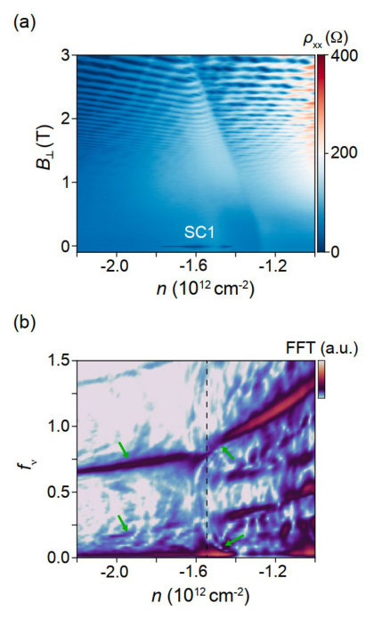 
Fig. 4. Fermiology analysis for the RHG device. (a) Landau fan diagram of ρxx measured at T = 10 mK and D = 0.157 V/nm. (b) The FFT analysis of the landau fan in (a), using data with 1 T &lt; B⊥ &lt; 3 T. The prominent frequency peaks are highlighted by green arrows. The dashed line marks the boundary between two different Fermi surfaces of the normal states. Two prominent peaks in the high density region satisfy | fv (1)- fv (2)| = 1/2, consistent with a half metallic phase. In the lower density region, the two prominent peaks roughly satisfy | fv (1) + fv (2)| =1, consistent with a PIP1 phase.

**Summary.** This paper reports the first observation of superconductivity in moiréless rhombohedral heptalayer graphene. It identifies multiple superconducting phases and demonstrates that these states emerge from a half-metallic normal state, providing new insights into the layer-dependent nature of superconductivity in rhombohedral graphene systems.

**Why it may be interesting.** not directly relevant

Detailed structure

**Main problem.** The study investigates the origin and characteristics of superconductivity in moiréless rhombohedral heptalayer graphene (RHG) and how it depends on layer number and electronic structure.

**Main result.** The researchers observed three symmetric superconducting phases in RHG at low displacement fields, with the strongest state (SC1) showing zero resistance and a half-metallic normal state origin.

**Method.** Transport measurements were performed in a dilution refrigerator using low-frequency lock-in techniques, alongside quantum oscillation and Landau fan diagram analysis to study fermiology.

**Model / system.** The system consists of moiréless rhombohedral heptalayer graphene (RHG) and pentalayer graphene (RPG) encapsulated in hBN and equipped with dual-graphite gates for independent control of carrier density and displacement electric field.

**Key observables.** Longitudinal resistivity (rho_xx), differential resistivity (dV/dI), critical temperature (Tc), and quantum oscillation frequencies (fv).

**Important parameters / regimes.** Carrier density (n), perpendicular displacement electric field (D), temperature (T), and perpendicular magnetic field (B_perp).

**Figures summary.** Fig 1 shows the device schematic and n-D phase diagrams for RHG; Fig 2 displays temperature dependence of resistivity and dV/dI; Fig 3 focuses on magnetic field response and dV/dI maps.

**Paper structure.** The paper introduces the RHG system, presents the discovery of multiple superconducting phases, compares the magnetic field response between RHG and RPG, analyzes the fermiology of the normal state via quantum oscillations, and concludes with implications for the origin of superconductivity in RMG.

Abstract

Crystalline rhombohedral multilayer graphene (RMG) has emerged as an ideal platform for studying unconventional superconductivity. Here, we report the observation of superconductivity in moiréless rhombohedral heptalayer graphene (RHG) at zero magnetic field. The superconducting phases emerge at low displacement electric fields (|D| < 0.2 V/nm) and are symmetrically distributed about D = 0, with one robust state exhibiting zero resistance and two weaker superconducting features. Comparisons with rhombohedral pentalayer graphene (RPG) reveal distinct perpendicular magnetic-field responses, and quantum oscillation measurements indicate that superconductivity in RHG arises from a half-metallic normal state. These results highlight the strong dependence of superconductivity on layer number and electronic structure in RMG systems and provide new insights into its microscopic origin.

[↑ back to top](#top)

### [New Source of Spin-hot spot in displaced silicon double quantum dots](http://arxiv.org/abs/2605.16947v1)

**Authors:** Sanjay Prabhakar  
**Type:** theory · **Category:** quantum information and computing · **PDF:** <https://arxiv.org/pdf/2605.16947v1>  
**Analysis basis:** full PDF text, analyzed in chunks

📷 Fig 1

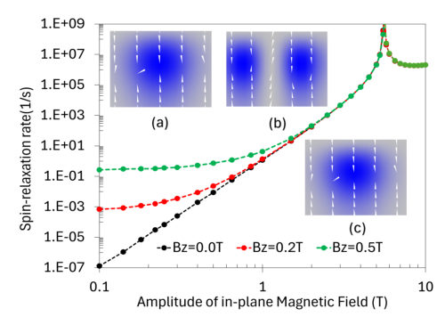 
FIG. 1. (Color online) Spin-relaxation rate versus amplitude of in-plane magnetic field in a single quantum dot in presence of out-of-plane magnetic fields at B0 = 0.0T (black), 0.2T (red), and 0.3T (green). Spin-hot spot can be observed in the vicinity of 5.5T of amplitude of in-plane magnetic fields, where spin relaxations are immune to out-of-plane magnetic fields, B0 &gt; 1.5. When B0 &lt; 1.5T, spin-relaxations are very sensitive to the out-of-plane magnetic fields. Insets (a), (b) and (c) are the probability density of three lowest electron spin states at the spin-hot spot (Bin = 5.75T, B0 = 0.2T) along with kinetic momentum density (white surface arrow). We chose ℓ0 = 25nm.

📷 Fig 2

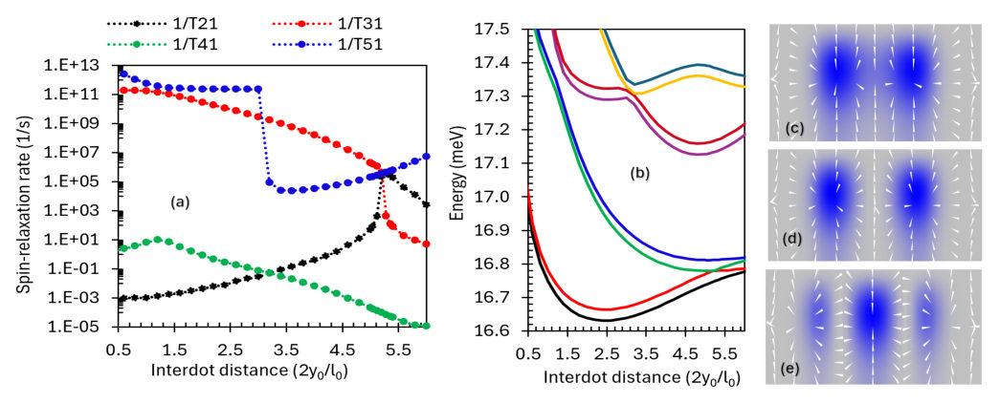 
FIG. 2. (Color online) Spin-relaxation rate versus inter-dot distances between double quantum dot is shown in (a). Spin-hot spot, so far not observed in the literature, can be seen in the vicinity of quantum dot displaced to 32nm from the origin due to level crossing of the bands seen in (b). The probability densities of ground, 3rd and 5th electron spin states at the spin-hot spot along with kinetic momentum density (white surface arrow) are shown in (c,d,e). The probability density of second and fourth states of double quantum dots looks exactly the same to (a) and (b) with slight variations due to spin-splitting behavior in presence of magnetic field, as seen in the inset plot of Fig. 1...

📷 Fig 3

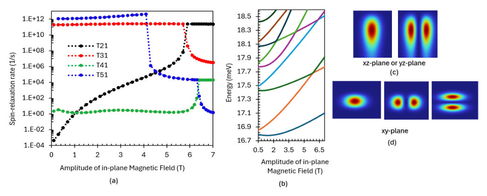 
FIG. 3. (Color online) (a) Spin-relaxation rate versus amplitude of in-plane magentic field in a double quantum dots separated at y0 = 10nm from the origin. Very unusual two spin-hot spot can be observed at 5.9T and 6.4T due to level crossing of the bands that is shown in Fig.(b). Probability densities of ground state, and 2nd excited state of the double dots in the xz-plane or yz-plane are shown in Fig.(c). Probability densities of ground state, 2nd excited state and 4th excited state of the double dots in the xy-plane are shown in Fig.(d). We chose ℓ0 = 25nm, B0 = 0.2T. In (c) and (d), we also chose Bin = 0.2T .

📷 Fig 4

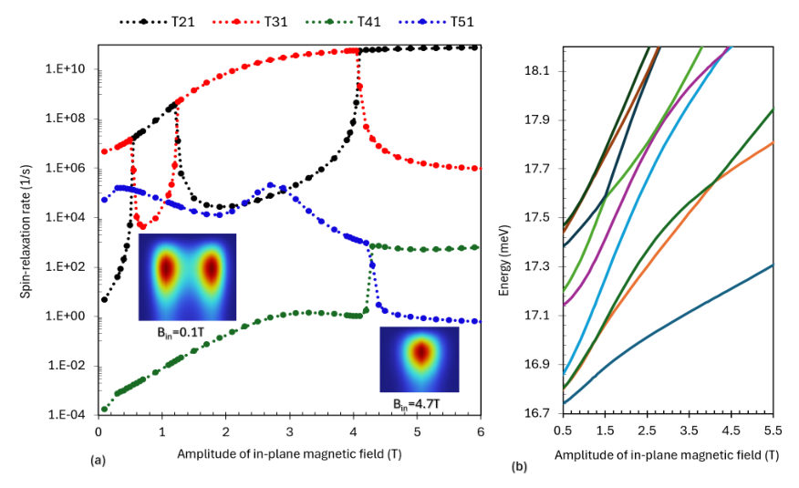 
FIG. 4. (Color online) (a) Spin-relaxation rate versus amplitude of in-plane magnetic field in a double quantum dots separated at y0 = 60nm from the origin. In addition to the unusual two spin-hot spot at 5.9T and 6.4T, oscillating spin-hot spot cat B = 0.5 and 1.2T can be observed due to level crossing of the bands that is shown in Fig.(b). Probability densities of ground state, and 2nd excited state of the double dots in the xz-plane or yz-plane are shown in Fig.(c). Probability densities of ground state, 2nd excited state and 4th excited state of the double dots in the xy-plane are shown in Fig.(d). We chose ℓ0 = 25nm, B0 = 0.2T. In (c) and (d), we also chose Bin = 0.2T .

**Summary.** This paper discovers that displacing silicon double quantum dots creates unique 'spin-hot spots' where spin relaxation is significantly reduced compared to single dots. These findings suggest that carefully tuned double quantum dot architectures can achieve much longer decoherence times, which is critical for scalable quantum computing.

**Why it may be interesting.** This work is highly relevant to open quantum systems as it identifies specific parameter regimes (spin-hot spots) where the coupling to the environment (phonons) is drastically suppressed, providing a blueprint for enhancing qubit coherence.

Detailed structure

**Main problem.** The study investigates the mechanisms of spin relaxation in silicon single and double quantum dots driven by acoustic phonon deformation potentials, specifically looking for new sources of spin-hot spots.

**Main result.** The authors identify a new, unusual spin-hot spot in displaced double quantum dots where spin-relaxation rates are three to four orders of magnitude lower than conventional single quantum dots, potentially enabling millisecond-range decoherence times.

**Method.** The researchers used Finite Element Method (FEM) simulations via COMSOL Multiphysics to diagonalize the Hamiltonian and calculate spin-relaxation rates using the Fermi Golden Rule.

**Model / system.** The system consists of silicon single and double quantum dots (SQDs and DQDs) under in-plane and out-of-plane magnetic fields, modeled with a Hamiltonian including orbital, Zeeman, Rashba, and Dresselhaus spin-orbit coupling terms.

**Key observables.** Spin-relaxation rate (1/T1), spin-relaxation time (T1), and decoherence time (T2).

**Important parameters / regimes.** Inter-dot separation (up to 60 nm), magnetic field strengths (low-field < 1T vs. high-field ~4.5T), and acoustic phonon deformation potentials.

**Assumptions / limitations.** The model assumes electron-acoustic phonon interaction is dominated by deformation potentials (dilatation and shear) and uses a 2D Hamiltonian approach.

**Figures summary.** Figures show spin-relaxation rates vs. inter-dot distance, band structure crossings at specific magnetic fields, and probability density plots of spin and orbital states in single vs. double dots.

**Paper structure.** The paper begins by analyzing spin relaxation in single quantum dots, progresses to the effects of spatial separation in double quantum dots, explores the impact of magnetic field regimes on spin-hot spots, and concludes with the implications for qubit stability.

Abstract

Controlling electron spins in double quantum dots allows individual electrons to be trapped and manipulated for next-generation solid-state qubit devices. In this paper, the study analyzes spin relaxation due to deformation potentials of acoustic phonon in single and double quantum dots under in-plane and out-of-plane magnetic fields, showing that in single quantum dots the relaxation rate is highly sensitive to low in-plane magnetic fields ($<1T$) but converges near a spin-hot-spot region. In a single quantum dot, the spin-hot spot arises from well-understood level crossings between singlet and triplet states. In double quantum dots, a new and unusual spin-hot spot appears as the dots are pulled apart from the origin, with spin-relaxation rates three orders of magnitude lower than conventional single quantum dots. In displaced quantum dots dominated by magnetic confinement, two distinct spin-hot spots appear at different in-plane magnetic field strengths, where spin-relaxation time varies from millisecond to picosecond. When quantum dots are separated by about 60 nm, calculations predict oscillations in spin-hot spots as the in-plane magnetic field changes. These unusual spin-hot spot oscillations occur at low magnetic fields ($<1T$), resulting in spin-relaxation rates about four orders of magnitude lower than those of conventional high-field spin-hot spots ($\approx 4.5T$). The extremely low spin-relaxation rate at the spin-hot spot enables the preparation of qubit superposition states for quantum computing and information processing.

[↑ back to top](#top)

### [Observation of a Mott quantum spin Hall insulator in twisted WSe2](http://arxiv.org/abs/2605.17335v1)

**Authors:** Yifei Jin, Yaqi Ma, Aoqian Zhang, Nan Zhang, Ulf Lampe, Ivana Wong, Kenji Watanabe, Takashi Taniguchi, Tze Kin Cheung, Ning Wang, Kaifei Kang  
**Type:** experiment · **Category:** strongly correlated electrons · **PDF:** <https://arxiv.org/pdf/2605.17335v1>  
**Analysis basis:** full PDF text, analyzed in chunks

📷 Fig 1

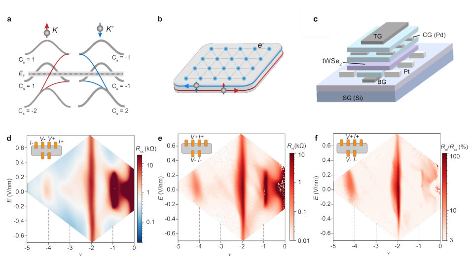 
Figure 1 | Mott quantum spin Hall phase in twisted WSe2. a, Schematics of the Mott quantum spin Hall (QSH) state. At half filling of the second moiré band (black dashed line denotes the Fermi energy, EF), strong electron correlations open a Mott gap. Two helical edge states (blue and red lines for different spin/valley) emerge in each valley: the first connects the first and third moiré valence bands, while the second connects the second and third moiré valence bands. b, Real-space illustration of the Mott QSH phase. In the bulk, carriers (blue dots) are localized on the triangular moiré lattice by strong Coulomb repulsion, forming a Mott insulating state. Spin-momentum– locked helical edge...

📷 Fig 2

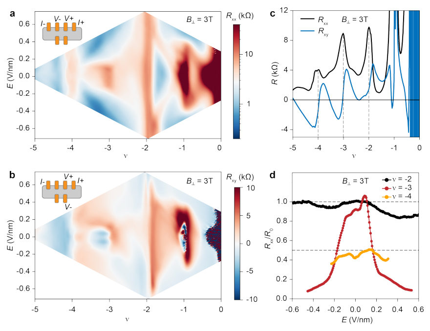 
Figure2| Emergence of the quantum spin Hall phase at 𝒗 = −𝟑 and 𝑩! = 3 T. a, b, Longitudinal sample resistance 𝑅"" (a) and Hall resistance 𝑅". (b) as a function of 𝑣 and 𝐸.

📷 Fig 3

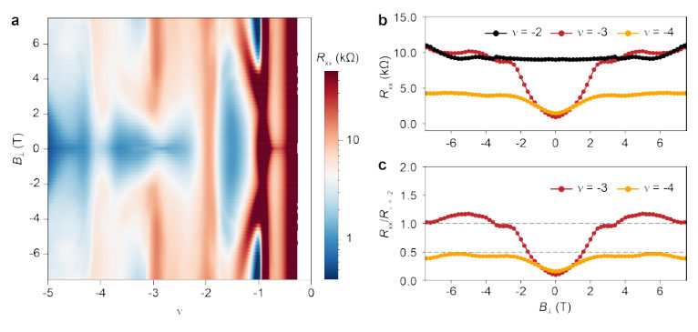 
Figure3| Magnetic field dependence of the quantum spin Hall effect at 𝒗 = −𝟑. a, 𝑅"" as a function of the out-of-plane magnetic field 𝐵! and moiré filling factor 𝑣. b, 𝑅"" as a function of 𝐵! at selected moiré filling factor of 𝑣 = −2, −3, and −4. c, Magnetic field dependence of the

📷 Fig 4

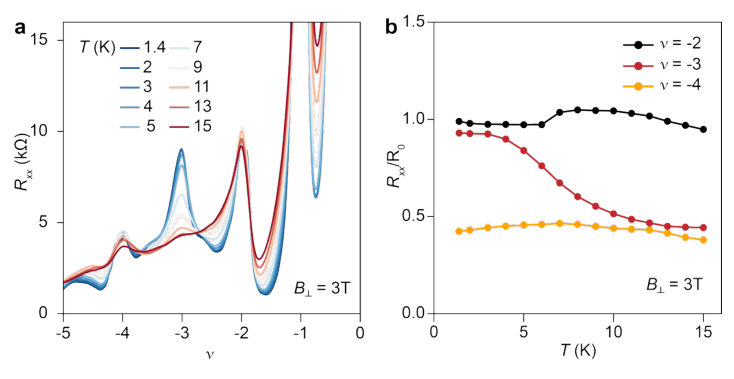 
Figure4| Temperature dependence of the Mott quantum spin Hall phase. a, Symmetrized

📷 Fig 5

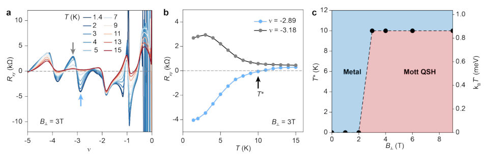 
Figure 5| Phase diagram of the Mott quantum spin Hall phase. a, Antisymmetrized Hall

**Summary.** The researchers discovered a new phase of matter in twisted WSe2 where a Mott insulator, driven by strong electron interactions, still supports topological edge transport. This 'Mott QSH insulator' is stabilized by an external magnetic field, showing that helical edge channels can survive in strongly correlated regimes. This finding provides a new way to create robust, interaction-resilient topological transport in moire materials.

**Why it may be interesting.** The paper demonstrates how strong interactions can be used to stabilize or manipulate topological edge states, which is relevant to the study of many-body dynamics and the robustness of topological phases in correlated systems.

Detailed structure

**Main problem.** Investigating the interplay between topology and strong Coulomb interactions to determine if a Mott insulating state can host robust Quantum Spin Hall (QSH) edge transport.

**Main result.** The observation of a magnetic-field-stabilized Mott QSH insulator at half-filling of the second moire band in twisted WSe2, where helical edge states persist despite strong correlations.

**Method.** Electrical transport measurements (local and nonlocal resistance) in quad-gated twisted WSe2 devices under varying magnetic fields, electric fields, and temperatures.

**Model / system.** A 2.29 degree twisted WSe2 (TMD) moire superlattice in a quad-gated heterostructure, characterized by a continuum model for K valley states with spin Chern numbers.

**Key observables.** Longitudinal resistance (Rxx), Hall resistance (Rxy), nonlocal resistance (Rnl), and in-plane magnetoconductance.

**Important parameters / regimes.** Moiré filling factors (nu = -1 to -4), twist angles (2.29 and 2.89 degrees), magnetic field (up to 7.5 T), and temperature (below 15 K).

**Assumptions / limitations.** The QSH states are protected by spin conservation rather than time-reversal symmetry, allowing robustness against magnetic fields.

**Figures summary.** Fig 1: Device geometry and schematic of Mott QSH state; Fig 2: Evolution of Rxx and Rxy with filling and electric field; Fig 3: Rxx dependence on magnetic field and emergence of the nu = -3 state; EDFs: Band structures and nonlocal resistance ratios.

**Paper structure.** Introduction to the problem of topology vs correlations, description of the experimental WSe2 platform, transport results showing the emergence of the Mott QSH state at nu = -3, validation via nonlocal and magnetic field dependence, and theoretical discussion of band topology.

Abstract

Quantum spin Hall (QSH) insulators and Mott insulators are conventionally regarded as distinct insulating phases, arising from band topology and strong Coulomb interactions, respectively. Here, we report the observation of QSH edge transport in a magnetic-field-stabilized Mott insulating state at half filling of the second moire band in a 2.29 degree twisted WSe2 device. This state exhibits a resistance plateau identical to that of the single-particle QSH state at full filling of the first moire valence band, indicating the same number of helical edge channels. Electrical transport measurements reveal nearly quantized resistance that is insensitive to vertical electric field, out-of-plane magnetic field, and temperature below 5 K. Pronounced nonlocal transport and strong negative in-plane magnetoconductance further support helical edge conduction, establishing robust edge transport in the strongly correlated regime. Temperature-dependent Hall measurements reveal a characteristic temperature scale of approximately 10 K, corresponding to an energy scale of about 1 meV. Our results demonstrate that spin-conserved QSH edge states can persist in a half filled, strongly correlated insulating phase and under external magnetic field, opening a route toward interaction-resilient topological transport in moire quantum materials.

[↑ back to top](#top)

### [Probing Dielectric Screening in van der Waals Heterostructures via Pressure-Tuned Exciton Rydberg Series](http://arxiv.org/abs/2605.18506v1)

**Authors:** Shalini Badola, Adlen Smiri, Thomas Pelini, Aditi Moghe, Tristan Riccardi, Amit Pawbake, Kenji Watanabe, Takashi Taniguchi, Iann C. gerber, Clement Faugeras  
**Type:** both · **Category:** other · **PDF:** <https://arxiv.org/pdf/2605.18506v1>  
**Analysis basis:** full PDF text, analyzed in chunks

📷 Fig 1

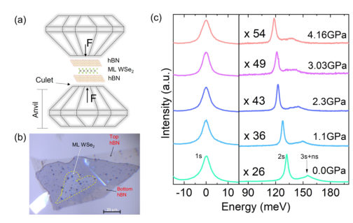 
Figure 1. a) Schematic of the experiment showing the dia- mond anvil cell with the vdW heterostructure exfoliated and transferred on the culet. The WSe2 ML is indicated with the yellow dashed line b) optical image of the vdW heterostruc- ture on the culet. c) Pressure evolution of the photolumines- cence for the encapsulated WSe2 monolayer showing the mod- ifications of the exciton Rydberg series. Spectra are shifted in energy to the 1s state energy for each pressure, being nor- malized with respect to the 1s state intensity and the excited states being scaled with the factor indicated for each pres- sure. ns denotes exciton excited states with principal quan- tum number higher than 3.

📷 Fig 2

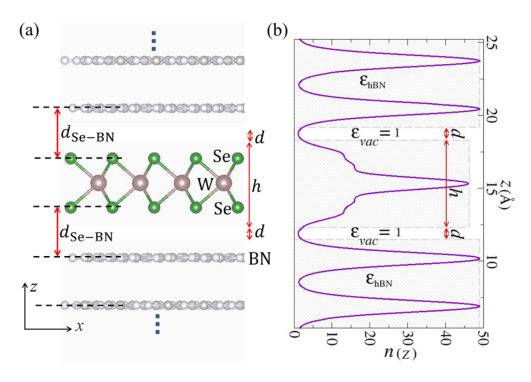 
Figure 2. a) Atomic structure of the WSe2 ML encapsulated in hBN. b) Planar-averaged electron density n(z) as a func- tion of the out-of-plane coordinate z. The profile reveals the electron distribution across the slab, with pronounced peaks at the atomic layers and a minimum in the interlayer region. The electron density n(z) near the minimum is used to define the boundaries of the interlayer region. Here, d and h are the interlayer distance and the WSe2 thickness, respectively.

📷 Fig 3

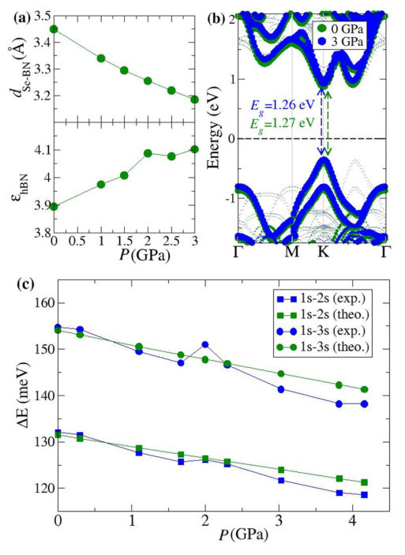 
Figure 3. a) Dielectric constant (ϵhBN) of the bulk hBN mate- rial and interlayer distance dSe−BN as a function of hydrostatic pressure P. b) Electronic band structure at P = 0 (green) and at P = 3 GPa (blue). c) Comparison between experimental data and theoretical predictions for the pressure dependence of the energy separations ∆E1s−2s and ∆E1s−3s of excitonic states in hBN-encapsulated WSe2 ML as a function of hydro- static pressure.

**Summary.** This paper demonstrates that the excited states of excitons in WSe2/hBN heterostructures can be used to probe changes in the surrounding dielectric environment under pressure. It shows that the observed Rydberg series compression is due to enhanced electrostatic screening rather than changes in the semiconductor's band structure. This establishes a new method for using 2D excitons as quantum sensors for dielectric metrology.

**Why it may be interesting.** not directly relevant

Detailed structure

**Main problem.** Determining whether the pressure-induced changes in the exciton Rydberg series in WSe2/hBN heterostructures are driven by modifications to the electronic band structure or by changes in the dielectric screening environment.

**Main result.** The observed compression of the exciton Rydberg series is primarily caused by enhanced dielectric screening due to the increasing dielectric constant of hBN and decreasing interlayer distance under pressure, while the WSe2 band structure remains largely stable.

**Method.** Low-temperature photoluminescence spectroscopy within a diamond anvil cell is combined with a microscopic dielectric model and Density Functional Theory (DFT) calculations.

**Model / system.** A monolayer of WSe2 encapsulated in hexagonal boron nitride (hBN) forming a vdW heterostructure, modeled using a quasi-2D Rytova-Keldysh-like potential that accounts for finite layer thickness and an interlayer gap.

**Key observables.** Exciton Rydberg series (1s, 2s, 3s), energy separations (1s-2s, 1s-3s), g-factor, and dark-bright energy splitting.

**Important parameters / regimes.** Hydrostatic pressure up to 3 GPa, interlayer distance (d), hBN dielectric constant (epsilon_hBN), and WSe2 thickness (h).

**Assumptions / limitations.** The electronic band structure (effective masses and band gap) of WSe2 is assumed to be insensitive to pressure up to 3 GPa, and the interlayer vacuum spacing scales with pressure similarly to the Se-BN separation.

**Figures summary.** Fig 1 shows the experimental setup and the pressure-induced shift/compression of the PL spectra; Fig 2 shows the atomic structure; Fig 3 shows the pressure dependence of the hBN dielectric constant and the stability of the WSe2 band structure.

**Paper structure.** The paper introduces the experimental setup and observations of the Rydberg series under pressure, presents a microscopic dielectric model to interpret the data, provides DFT verification of band structure stability, and concludes with the application of excitons as dielectric sensors.

Abstract

Excitons in two-dimensional semiconductors are directly exposed to the environment and are sensitive to the dielectric properties of their surrounding. Here, we show that the Rydberg series of excited states of excitons in a monolayer WSe$_2$ encapsulated in hexagonal boron nitride (hBN) can be used to probe the pressure-induced modifications of the surrounding dielectric properties. We propose a model based on the pressure induced evolution of the interlayer distances in this van der Waals heterostructure and on the bulk dielectric properties of hBN. This approach allows a direct measurement of the dielectric constant of pressurized hBN and establishes a new methodology for dielectric sensing.

[↑ back to top](#top)

### [Qumus: Realization of An Embodied AI Quantum Material Experimentalist](http://arxiv.org/abs/2605.18407v1)

**Authors:** Lihan Shi, Zhaoyi Joy Zheng, Xinzhe Juan, Yimin Wang, Ming Yin, Mayank Sengupta, Kristina Wolinski, Yanyu Jia, Jingzhi Shi, Derek Saucedo, Neill Saggi, Haosen Guan, Kenji Watanabe, Takashi Taniguchi, Ali Yazdani, Mengdi Wang, Sanfeng Wu  
**Type:** experiment · **Category:** other · **PDF:** <https://arxiv.org/pdf/2605.18407v1>  
**Analysis basis:** full PDF text, analyzed in chunks

📷 Fig 1

 
Fig. 1. Qumus AI architecture and fully robotic minilab. a, Defining characteristics of an AI experimentalist. b, Key self-evolving modules of Qumus, including LLM-agents, memory and knowledge systems, and skills including instrumental workflows and materials/devices realization recipes. c, Qumus architecture for efficient multi-agent collaboration and robust performance. d, A compact, fully robotic minilab consisting of vacuum- and temperature-controlled stages for 2D material mechanical exfoliation, optical flake search, flake transfer and stacking, along with robotic arms, storage modules, cameras, and microscope systems.

📷 Fig 2

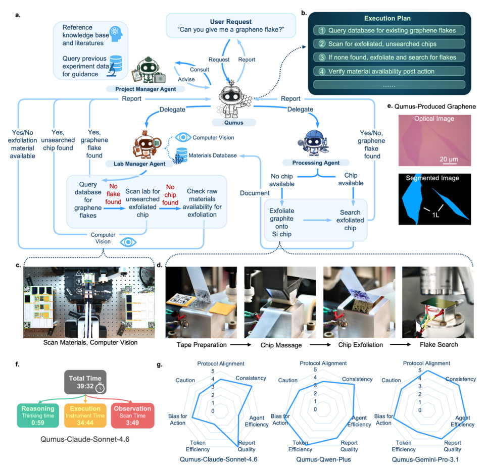 
Fig. 2. The first AI creation of 2D quantum materials and Qumus personality. a, A representative organizational response of Qumus and information flow chart, upon receiving a user request of a graphene flake. b, A representative plan book initiated by Qumus. c, Computer vision for identifying key objects during mechanical exfoliation. d, A series of instrumental performance realizing mechanical exfoliation and flake search under the optical microscope. e, A representative graphene flake created by Qumus. Top: Optical Image; bottom: corresponding segmentation. f, An example of total time and its distribution over reasoning, execution and observation, for completing the entire process of...

📷 Fig 3

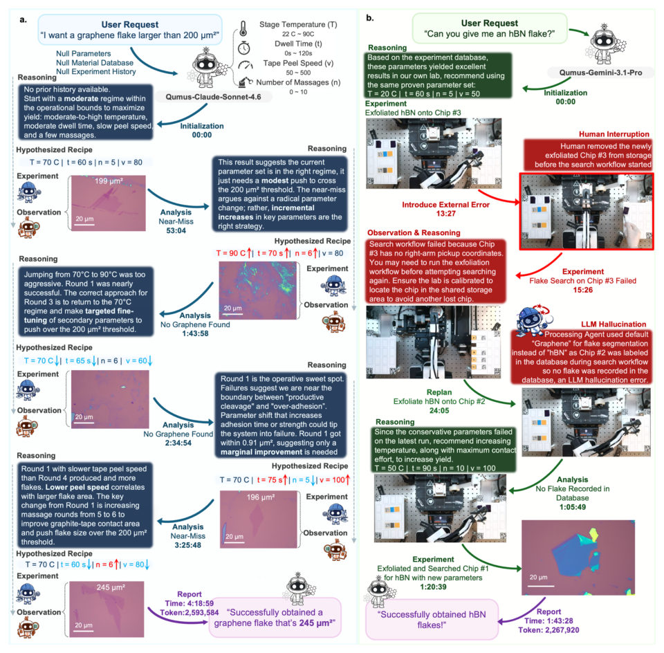 
Fig. 3. Qumus behaves as a closed-loop experimentalist and corrects errors autonomously. a, Summary of the performance and workflows of Qumus-Claude-Sonnet-4.6, upon receiving a user request. It shows that Qumus can iteratively complete the full process of reasoning, hypothesizing, planning, executing, observing, and analyzing to achieve a goal, with each loop testing a new set of hypothetical parameters based on observations from previous experiments. No human intervention during the entire process. b, Qumus-Gemini-Pro-3’s response to two errors. First, a human interruption removed the chip under active processing during an intermediate step, causing the workflow to fail. Qumus diagnosed...

📷 Fig 4

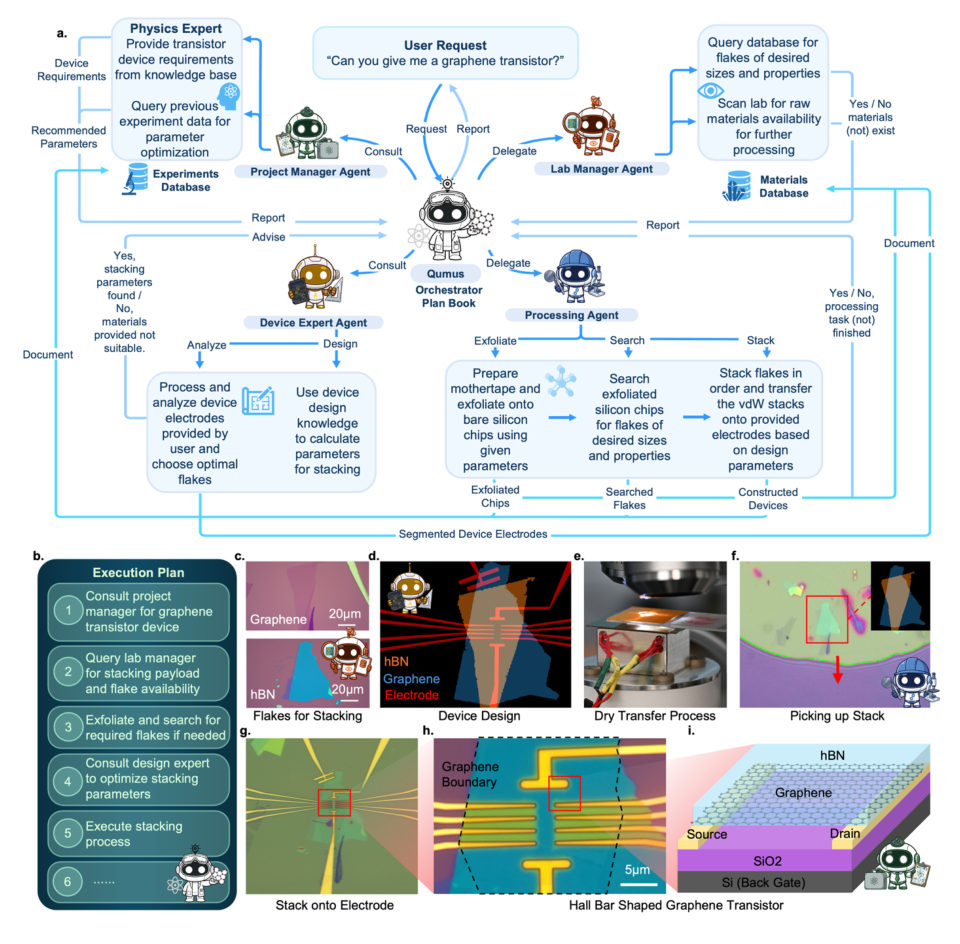 
Fig. 4. Multi-agent orchestration &amp; autonomous construction of complex devices. a, Workflow and information flow chart of Qumus orchestrating agents to complete the user request of constructing a graphene transistor device. b, Initial plan book generated by Qumus. c, Optical images of graphene and hBN flakes produced by the Processing Agent and stored in the Materials Database. d, Design layout created by the Device Expert using the user-provided metal electrodes, selected graphene and hBN flakes that meet the transistor device requirement. e, Image showing the Processing Agent manipulating the stamp to perform flake transfer using the 2D dry-transfer technique. f, Optical image showing the...

**Summary.** This paper introduces Qumus, an embodied AI system capable of autonomously performing the complex, multi-step experimental processes required to create 2D quantum materials. By integrating LLM-based reasoning with robotic hardware, the system can independently execute exfoliation, flake searching, and device stacking. This represents a significant step toward self-improving, autonomous laboratories for accelerated materials discovery.

**Why it may be interesting.** not directly relevant

Detailed structure

**Main problem.** The manual synthesis, identification, and assembly of 2D van der Waals structures are time-consuming, difficult to reproduce, and heavily dependent on expert intuition, creating a bottleneck in quantum materials research.

**Main result.** The development of Qumus, the first embodied AI quantum material experimentalist, which autonomously performs the full scientific cycle from hypothesis generation to the physical fabrication of graphene transistors.

**Method.** A multi-agent AI architecture (using LLMs like GPT, Gemini, etc.) integrated with a robotic mini-laboratory, utilizing computer vision (YOLOv8) for object detection and a closed-loop feedback system for error correction and experimental iteration.

**Model / system.** A robotic mini-laboratory consisting of a tape-transfer gantry, two robotic arms, a multi-magnification optical microscope, and temperature-controlled vacuum stages for the mechanical exfoliation and stacking of 2D materials.

**Key observables.** 2D flake thickness (via CIE-LAB color space), flake size/area, device functionality (field-effect transistor performance), and AI performance metrics (consistency, efficiency, and report quality).

**Important parameters / regimes.** Substrate heating temperature, heating dwell time, number of massage cycles, and tape peel-off speed.

**Assumptions / limitations.** The system assumes that high-level scientific reasoning can be effectively delegated to LLM-based agents and that physical tasks can be discretized into executable 'atom' and 'molecule' workflows.

**Figures summary.** Fig 1 shows the integrated AI architecture and physical hardware setup; Fig 2 illustrates the agentic workflow, plan generation, and the resulting graphene flake; Ext. Data figures detail the computer vision pipeline, object recognition via QR codes, and comparative analysis of different LLM personalities.

**Paper structure.** Introduction of the 2D materials bottleneck, description of the Qumus hardware and multi-agent software architecture, demonstration of autonomous graphene creation, demonstration of complex device fabrication, and evaluation of the AI's reasoning and efficiency.

Abstract

While modern Large Language Models (LLMs) and agentic artificial intelligence (AI) have demonstrated transformative capabilities in digital domains, the realization of embodied AI capable of real-world scientific discovery remains a difficult frontier. The advancements are hindered by the inherent complexity of integrating high-level reasoning, multimodal information processing and real-time physical execution. Here we introduce Qumus, the first AI quantum materials experimentalist. Physically embodied within a robotic mini-laboratory, Qumus is an intelligent, multimodal, and multi-agent system designed for the creation and nano-processing of atomically thin two-dimensional (2D) materials and stacked van der Waals (vdW) structures. Qumus autonomously navigates the full scientific cycle, from hypothesis generation and protocol planning to multi-step experimental execution, result analysis and reporting, acting as an experimentalist. Markedly, the system has achieved, for the first time, the AI-creation of graphene, as well as the first AI-fabrication of complex nanodevices including atomically thin field-effect transistors via vdW stacking. Qumus excels at these tasks by demonstrating autonomous error correction and closed-loop experimentation. Our results establish a generalizable framework for self-improving embodied AI systems that learn directly from the quantum world, opening a pathway toward accelerated discovery in quantum materials, electronics and beyond.

[↑ back to top](#top)

### [Spin and orbital mixing of edge states in a quantum Hall system proximitized by a superconductor](http://arxiv.org/abs/2605.18411v1)

**Authors:** S. Maji, M. P. Nowak  
**Type:** theory · **Category:** other · **PDF:** <https://arxiv.org/pdf/2605.18411v1>  
**Analysis basis:** full PDF text, analyzed in chunks

📷 Fig 1

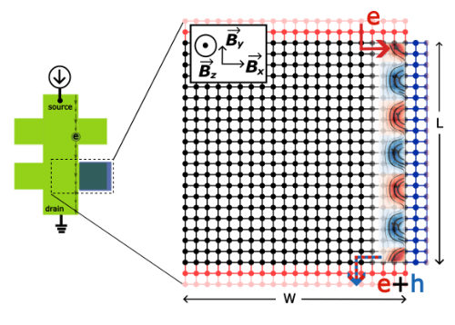 
Figure 1. The scheme of the considered system. A semi- conducting Hall bar (green) in the presence of perpendicular magnetic field hosts edge states. Blue region denotes a super- conducting contact. Zoom-in shows the system considered in the numerical calculation. On top and bottom we include two normal semi-infinite leads (red), while on the right edge we connect superconducting contact (blue). The electrons prop- agating on the QH edge mode forms CAES at the normal- superconductor interface. We plot resulting probability cur- rent at the edge, where colors correspond to its electron (red) and hole (blue) character.

📷 Fig 2

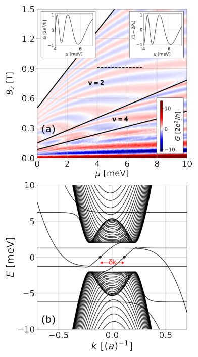 
Figure 2. (a) Conductance of normal-superconductor system in the QH regime versus the perpendicular magnetic field magnitude and chemical potential. Black lines separate the regions with different filling factor ν. The left inset of the plot shows a conductance cross-section at Bz = 0.912 T obtained for the µ values denoted in the conductance map, right inset shows the probability calculated from the analytical formula Eq. 5. (b) Band-structure of proximitized region with the dots denoting the CAES bands crossings zero energy obtained for µ = 5 meV and B = 0.912 T. Wave vector difference of the CAES pair is denoted by δk.

📷 Fig 3

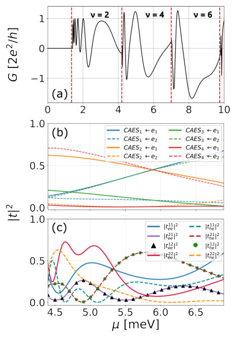 
Figure 3. (a) Conductance cross-section versus chemical po- tential µ marked with different ν regimes. (b) Occupation probability of different CAES states for different initial elec- tron edge modes in ν = 4 regime. (c) Components of electron and hole transmission probability in ν = 4 regime. The per- pendicular magnetic field is Bz = 0.343 T

📷 Fig 4

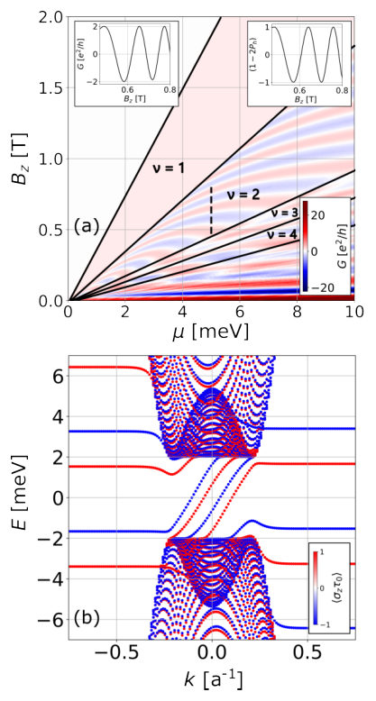 
Figure 4. (a) Conductance versus perpendicular magnetic field and chemical potential with the Zeeman interaction in- cluded. The left insets show conductance cross-section versus Bz at µ = 5 meV (left) and the probability calculated from the analytical formula Eq. 5 (right). (b) The band structure of the normal-superconducting system colored with the spin- polarization of the bands for µ = 5 meV, Bz = 0.6 T.

📷 Fig 5

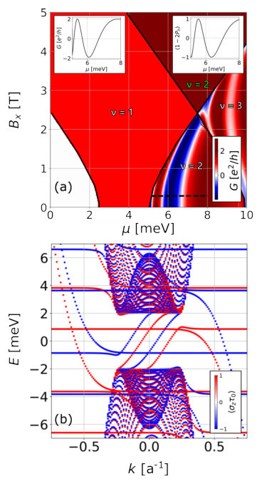 
Figure 5. (a) Conductance of a QH-superconductor system versus chemical potential and the magnitude of in-plane mag- netic field oriented in x-direction. The left inset of the map shows conductance cross-section versus µ at Bx = 0.3 T, right one shows the probability calculated from the analytical for- mula Eq. 5. (b) The band structure of the system plotted with spin-polarization for µ = 6 meV, Bz = 0.912 T, Bx = 0.3 T.

**Summary.** This paper explores how superconductivity and spin-orbit coupling interact to modify the edge states of a quantum Hall system. It reveals that Andreev reflection allows for the mixing of previously independent edge modes and that spin-orbit coupling can fundamentally alter transport through complex spin-mixing effects. These findings provide insight into the complex interplay of topology, superconductivity, and spin in 2D heterostructures.

**Why it may be interesting.** not directly relevant

Detailed structure

**Main problem.** The study investigates the formation, transport properties, and spin/orbital mixing of Chiral Andreev Edge States (CAES) in a quantum Hall system proximitized by a superconductor.

**Main result.** The authors demonstrate that Andreev reflection induces orbital mode mixing at higher filling factors and that the combination of Rashba spin-orbit interaction and in-plane magnetic fields drives complex spin mixing and conductance oscillations.

**Method.** Numerical modeling using the Bogoliubov-de Gennes equations implemented via the Kwant package and the Landauer-Büttiker approach for transport calculations.

**Model / system.** A two-dimensional electron gas (2DEG) in a multi-terminal Hall-bar geometry with a superconducting contact, modeled using a tight-binding Bogoli-de Gennes Hamiltonian including Zeeman and Rashba spin-orbit interactions.

**Key observables.** Non-local conductance, electron-to-electron and electron-to-hole transmission probabilities, and spin-polarization of bands.

**Important parameters / regimes.** Filling factors (v=1, 2, 4), perpendicular and in-plane magnetic fields, Rashba spin-orbit coupling strength, and chemical potential.

**Assumptions / limitations.** The analysis of transmission degeneracies assumes the system is at the zero-bias limit to utilize particle-hole symmetry.

**Figures summary.** Figure 1 shows the Hall bar schematic; Figure 2 displays conductance maps and dispersion relations; Figure 5 and 6 show conductance maps under in-plane fields and SOI; Figure 7 and 9 illustrate transmission probabilities and degeneracies.

**Paper structure.** The paper introduces the physical system and model, analyzes orbital mixing in the multi-mode regime, investigates the effects of Zeeman splitting and spin-orbit interaction on spin dynamics, and concludes with a symmetry analysis of transmission probabilities.

Abstract

We investigate the formation and transport properties of chiral Andreev edge states in a two-dimensional quantum Hall system proximitized by a superconductor. By numerically modeling the system using the Bogoliubov-de Gennes equations, we analyze the non-local conductance and transmission probabilities of multimode and spinful systems. We demonstrate that the Andreev reflection process induces a mixing of the quantum Hall edge modes at higher filling factors, a phenomenon strictly prohibited in clean, purely electronic systems. When incorporating the Zeeman interaction, we show that the Andreev edge states split into uncoupled spin species, maintaining spin orthogonality that prevents mixing between opposite spin sectors. Furthermore, we explore the impact of Rashba spin-orbit coupling. While the spin-orbit interaction alone causes slight spin depolarization, its combination with an in-plane magnetic field drives complex spin mixing among all chiral Andreev bands, fundamentally altering the conductance oscillations. Finally, we reveal that the electron transmission probabilities exhibit robust degeneracies, which emerge as a direct consequence of the unitarity constraints and the particle-hole symmetry of the system's scattering matrix in a magnetic field and the presence of spin-orbit interaction.

[↑ back to top](#top)

### [Strong-coupling anisotropic superconductivity in hexagonal HfRuAs from anisotropic Migdal-Eliashberg theory](http://arxiv.org/abs/2605.18098v1)

**Authors:** P. V. Sreenivasa Reddy, Guang-Yu Guo  
**Type:** theory · **Category:** other · **PDF:** <https://arxiv.org/pdf/2605.18098v1>  
**Analysis basis:** full PDF text, analyzed in chunks

📷 Fig 1

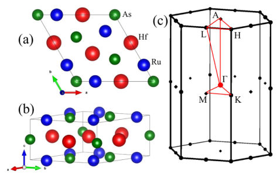 
FIG. 1. (a) A z-axis view, (b) side view of the crystal struc- ture of h-HfRuAs. (c) The bulk BZ of h-HfRuAs along with high symmetry point labels.

📷 Fig 2

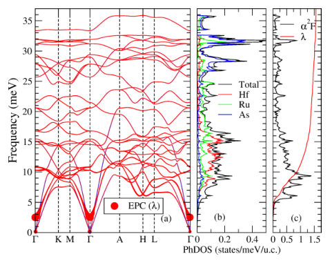 
FIG. 2. (a) Phonon dispersion relations along high-symmetry directions. Red circle size reflects the EPC strength. (b) Total and atom projected phonon DOS (PhDOS), (c) Eliash- berg spectral function (α2F) and accumulative EPC constant (λ(ω)) of h-HfRuAs.

📷 Fig 3

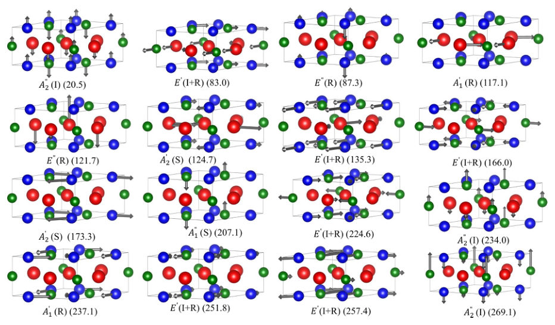 
FIG. 3. Displacement patterns for all the optical phonon modes of h-HfRuAs at the Γ point. Each panel shows the atomic vibration pattern associated with a specific irreducible representation. The optical activity of each mode is labeled as infrared active (I), Raman active (R), or silent (S). The frequencies shown inside the parentheses are in the unit of cm−1.

📷 Fig 4

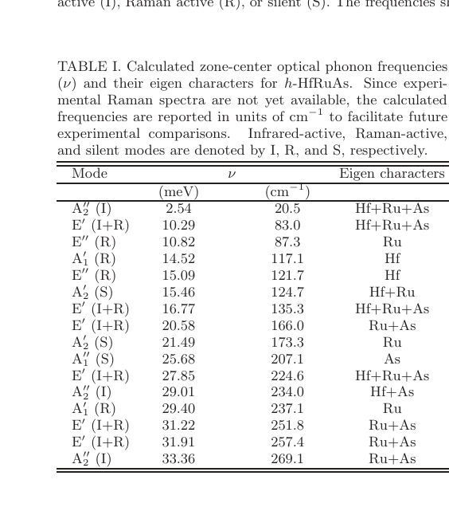 
Fig. 3, reveals that the atomic displacements associated with the A′′ 1, A′′ 2, and E′′ modes are predominantly ori- ented along the out-of-plane (z) direction. In contrast, the displacements corresponding to the A′ 1, A′ 2, and E′

📷 Fig 5

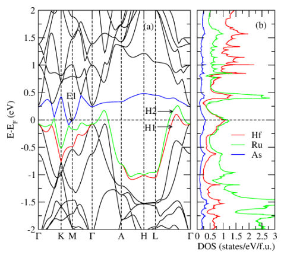 
FIG. 4. (a)Band structure of h-HfRuAs. Three bands which cross the EF are indicated with red, green and blue colours. The H1 and H2 indicates the hole nature and E1 indicates the electron nature of the Fermi surface. (b) Atom projected DOSs of h-HfRuAs.

**Summary.** This paper provides a first-principles theoretical investigation of the superconducting properties of hexagonal HfRuAs. It reveals that the material is a strong-coupling, anisotropic s-wave superconductor driven by low-frequency phonon modes. The study highlights significant momentum-dependent anisotropy in the superconducting gap across different Fermi surface sheets.

**Why it may be interesting.** not directly relevant

Detailed structure

**Main problem.** The study aims to resolve the lack of theoretical understanding regarding the superconducting pairing mechanism, momentum-dependent electron-phonon coupling, and the anisotropic gap structure in hexagonal HfRuAs.

**Main result.** The authors identify h-HfRuAs as a strong-coupling, phonon-mediated, anisotropic s-wave superconductor where low-frequency Hf and Ru vibrations drive the pairing.

**Method.** First-principles calculations using Density Functional Theory (DFT) and Density Functional Perturbation Theory (DFPT) combined with the anisotropic Migdal-Eliashberg equations solved via the EPW code and Wannier interpolation.

**Model / system.** The physical system is hexagonal HfRuAs (h-HfRuAs), a ternary intermetallic compound with a $Fe_2P$-type structure. The model uses anisotropic Migdal-Eliashberg theory to describe a multiband, phonon-mediated superconducting state.

**Key observables.** Electron-phonon coupling constant (lambda), superconducting transition temperature (Tc), superconducting gap (Delta), Eliashberg spectral function, and quasiparticle density of states.

**Important parameters / regimes.** EPC constant lambda approx 1.56, gap ratio 2Delta(0)/kBTc approx 4.2, Coulomb pseudopotential mu*c = 0.15, and logarithmic phonon frequency hbaromega_log approx 10.4 meV.

**Assumptions / limitations.** The Coulomb interaction is modeled using the empirical Morel-Anderson pseudopotential; the superconducting gap symmetry is assumed to be s-wave.

**Figures summary.** Fig 1: Crystal structure and Brillouin Zone; Fig 2: Phonon dispersion and Eliashberg spectral function; Fig 3: Atomic displacement patterns; Fig 4: Electronic band structure and DOS; Fig 5: Momentum-dependent Fermi velocity; Fig 6: Momentum-resolved EPC and SC gap distributions.

**Paper structure.** The paper introduces the problem of superconductivity in h-HfRuAs, details the DFT/DFPT and Migdal-Eliashberg computational framework, presents results on phonon-driven coupling and gap anisotropy, and concludes with a discussion on the implications for the TT'X family of compounds.

Abstract

We present a comprehensive theoretical investigation of the superconducting (SC) properties of hexagonal HfRuAs ($h$-HfRuAs) by solving anisotropic Migdal--Eliashberg (ME) equations with the inputs from \textit{ab initio} calculations of electronic structure, phonon dispersion and electron phonon coupling matrix elements. The calculated Eliashberg spectral function reveals strong electron--phonon coupling (EPC) with a constant $λ\approx 1.56$, dominated by low-frequency phonon modes associated primarily with Hf and Ru vibrations. The SC state is characterized by a single anisotropic gap with overall $s$-wave symmetry, as evidenced by the fully gapped quasiparticle density of states. The momentum-resolved EPC and SC gap exhibit pronounced anisotropy across different Fermi surface sheets, with the largest variations occurring on the hole-like bands. The SC gap is centered around $Δ\approx 2.9$ meV with a spread of $\sim 0.8$ meV, indicating significant multiband anisotropy. The resulting gap ratio $2Δ(0)/k_B T_c \approx 4.2$ exceeds the BCS weak-coupling limit, establishing $h$-HfRuAs as a strong-coupling superconductor. The calculated transition temperature, $T_c$, agrees in the order of magnitude with experiments. Overall, our results identify $h$-HfRuAs as a phonon-mediated, strongly coupled anisotropic superconductor and provide detailed insights into the role of momentum-dependent electron--phonon interactions in determining its SC properties.

[↑ back to top](#top)

### [Supercurrent spin Hall effect enabled nanopillar Josephson diodes](http://arxiv.org/abs/2605.17066v1)

**Authors:** Debashree Nayak, Dimple Rani, Prasanjit Samal, Kartik Senapati  
**Type:** both · **Category:** other · **PDF:** <https://arxiv.org/pdf/2605.17066v1>  
**Analysis basis:** full PDF text, analyzed in chunks

📷 Fig 1

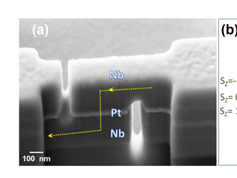 
Fig. 1 Origin of JDE from supercurrent Spin Hall effect(a) Scanning electron micrograph of the junction architecture shown for a Nb(160 nm)/Pt(30 nm)/Nb(160 nm) device. The dotted arrow indicates the current path across the nano-pillar junction (b) Schematic illustration of the accumu- lation of the Sz=-1 and Sz=+1 projections of the long range triplet component of the supercurrent, arising out of the interaction of the spin singlet Cooper pairs with strong SOC in Pt. This effect leads to a spin moment MS dictated by the magnitude and direction of the bias current IS. The phase difference between the superconducting Nb electrodes is determined by the net effect of the external field H and...

📷 Fig 2

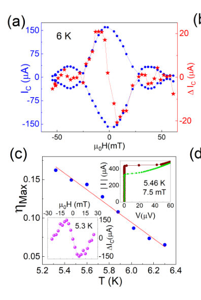 
Fig. 2 Observation of Josephson diode effect and its dependence on temperature and dPt.(a) Critical current Fraunhofer pattern of a Nb-Pt(20nm)-Nb nano junction extracted from current-voltage curves measured at various magnetic fields is plotted in the left hand side axis. The right hand side axis plots the difference in magnitude of the positive and negative critical currents, showing a clear field dependent diode effect. (b) Voltage across the same junction measured as a function of an in-plane magnetic field is compared in the left hand side axis, for +100µAmp and - 100µAmp bias currents. The difference ∆V = |V +|−|V −| between the absolute values of the voltages measured under positive...

📷 Fig 3

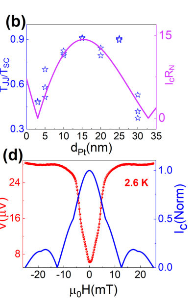 
Fig. 3 Signature of 0–π transition as a consequence of a spin moment in the Nb-Pt- Nb JJs)(a) Resistance as a function of temperature at zero field for a Josephson nano device with dPt = 30 nm, showing the superconducting transitions of the electrode at TSc and proximatization transition TJJ.Inset: I–V characteristics of the same JJ at zero magnetic field at 3.4K. No asymmetry is noted in this IV curve due to the zero field condition. (b)The junction transition temperature, normalized with the electrode transition temperature (TJJ/TSc) is plotted as a function of Pt thickness in the left hand side axis. Multiple junctions were measured at each thickness. The solid line, plotted on the right...

📷 Fig 4

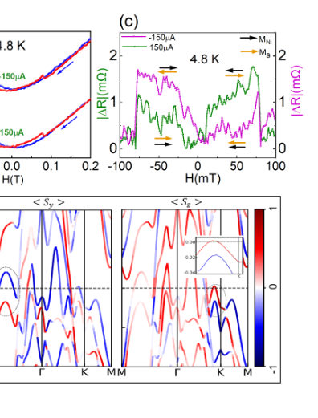 
Fig. 4 Spin valve like behavior in Nb/Pt/Ni/Nb junctions and spin polarized band structure at Nb-Pt interface(a) Resistance (R) as a function of temperature (T), showing the superconducting transition of the wide track at 8.9 K and the junction electrode at 8.3 K. (b) Resistance as a function of the applied magnetic field measured at 4.8 K are plotted for bias currents of +150 µA and −150 µA, in forward and backward magnetic field sweep conditions. (c) The magnitude of the resistance difference |∆R| = |R(Hforward) −R(Hbackward)|, extracted from Fig 4(b) is plotted as a function of magnetic field. The relative orientations of the induced spin moment MS and the Ni moment MNi are illustrated...

**Summary.** The researchers developed a new type of Josephson diode using a heavy metal Pt barrier that utilizes the supercurrent spin-Hall effect to induce non-reciprocity. This approach achieves significantly higher diode efficiency (17%) and operates at much higher temperatures (above 4 K) than previous Rashba-based methods. This provides a scalable, metallic architecture for future superconducting electronics.

**Why it may be interesting.** not directly relevant

Detailed structure

**Main problem.** Achieving high-efficiency, tunable Josephson diodes (JDs) that operate at higher temperatures than existing Rashba-based devices, which typically suffer from low efficiency (<10%) and require millikelvin temperatures.

**Main result.** Demonstrated Nb-Pt-Nb nanopillar Josephson junctions with diode efficiencies as high as 17% at temperatures above liquid Helium (up to 6 K), driven by the supercurrent spin-Hall effect.

**Method.** Experimental transport measurements (I-V, Fraunhofer patterns, V(H) curves) on FIB-milled nanopillars combined with first-principles DFT calculations of the Nb/Pt interface.

**Model / system.** Vertical Nb-Pt-Nb nanopillar Josephson junctions featuring a heavy metal Pt barrier with strong intrinsic spin-orbit coupling, where a supercurrent-induced spin moment is generated.

**Key observables.** Josephson diode efficiency (asymmetry in critical current), critical current Fraunhofer patterns, voltage-vs-magnetic field curves, and 0-pi transition signatures.

**Important parameters / regimes.** Pt barrier thickness (3-30 nm), operating temperature (up to 6 K), and external in-plane magnetic field (up to ~7.5 mT).

**Assumptions / limitations.** Calculations assumed epitaxial growth conditions for structural relaxation; the system is treated in the diffusive regime.

**Figures summary.** Fig 1: SEM micrograph and schematic of spin accumulation and phase difference. Fig 2: Fraunhofer patterns and asymmetry in critical current. Fig 3: Temperature dependence and 0-pi transition signatures. Fig 4: Electronic structure and spin-splitting calculations.

**Paper structure.** Introduction to JDE limitations, experimental fabrication of nanopillars, demonstration of high-efficiency diode effect, investigation of the physical origin via spin-valve and 0-pi transition analysis, and DFT-based electronic structure validation.

Abstract

In the recent years it has been possible to achieve diode-like, non-reciprocal current-voltage response in Josephson junctions, despite the intrinsic symmetry of the Josephson effect itself. This is typically achieved by incorporating Rashba spin-orbit coupling into the Josephson junction as a strong inversion symmetry breaking component, and external magnetic field as a tuneable time-reversal symmetry breaking component. However, the efficiencies of the external field tuneable Josephson-diodes have remained limited to less than 10 \%, often measured below 100 mK temperature. In this work we take a new approach where non-reciprocity is induced by intrinsic SOC in a heavy metal Josephson barrier via the predicted supercurrent spin-Hall effect. By measuring a series of Nb-Pt-Nb nanopillar junctions we demonstrated field tuneable Josephson diode efficiencies as high as 17\%, measured above liquid Helium temperature. This was possible by the realization of a net non-equilibrium spin segregation in the Pt barrier, due to the supercurrent spin-Hall effect in the Pt barrier, analogous to the normal spin-Hall effect. As the direction of the induced spin moment is determined by the bias current, an external magnetic field causes the associated phases to add with opposite signs for opposite current directions, resulting in a nonreciprocal supercurrent across the junction.

[↑ back to top](#top)

