
# arxiv digest (quant-ph + cond-mat) — 2026-05-20

*138 papers · 43 relevant · 2 highlighted*

## 🔥 Most relevant (43)

*Every paper with at least one nonzero topic score, sorted by best-matching score. 🔥 marks scores ≥4/5. Click the title to jump to the full entry below; click [arXiv] to open the paper page. `(secondary)` marks papers from de-prioritized cond-mat archives.*

Show 43 relevant papers

- [Beyond the Purcell Effect: Controlling Pure Quantum Dephasing with Spin Noise Metasurfaces](#paper-2605.20180) [[arXiv]](http://arxiv.org/abs/2605.20180v1) — 🔥 `spintronics-quantum-optics interface` **5/5** · 🔥 `QC/QI experiment` **4/5** · `correlated / nonlocal dissipation` **3/5** · `quantum optics experiment` **3/5** · `interference shaping light` **2/5**
- [Quantum effective action for dissipative semiclassical dynamics](#paper-2605.19643) [[arXiv]](http://arxiv.org/abs/2605.19643v1) — 🔥 `Keldysh / 2PI / non-Gaussian methods` **5/5** · `methods for driven-dissipative` **3/5** · `non-equilibrium dynamics` **3/5** · `Kondo & dissipative impurity` **2/5** · `correlated / nonlocal dissipation` **2/5**
- [Universal logic gates for coupled period-doubling systems](#paper-2605.19477) [[arXiv]](http://arxiv.org/abs/2605.19477v1) — 🔥 `driven-dissipative phase transition` **4/5** · `Keldysh / 2PI / non-Gaussian methods` **3/5** · `methods for driven-dissipative` **3/5** · `non-equilibrium dynamics` **3/5** · `Dicke superradiance` **2/5** · `Tavis-Cummings & cavity-many-emitter` **2/5** · `correlated / nonlocal dissipation` **2/5** · `non-equilibrium universality` **2/5**
- ⭐ [Detecting vortex motion through spatially correlated nonequilibrium noise](#paper-2605.18941) [[arXiv]](http://arxiv.org/abs/2605.18941v1) — 🔥 `non-equilibrium dynamics` **4/5** · `non-equilibrium universality` **3/5** · `spintronics-quantum-optics interface` **3/5** · `QC/QI experiment` **2/5** · `driven-dissipative phase transition` **2/5** · `methods for driven-dissipative` **2/5** · `quantum measurements` **2/5**
- [Finite-temperature crossover from coherent magnons to energy superdiffusion in the PXP model](#paper-2605.19281) [[arXiv]](http://arxiv.org/abs/2605.19281v1) — 🔥 `non-equilibrium dynamics` **4/5** · 🔥 `non-equilibrium universality` **4/5** · 🔥 `scars & prethermalization` **4/5** · `Rydberg arrays` **3/5** · `entanglement & information structure` **2/5**
- [Multi-mode Floquet NEGF method for driven quantum transport](#paper-2605.19296) [[arXiv]](http://arxiv.org/abs/2605.19296v1) `(secondary)` — 🔥 `Keldysh / 2PI / non-Gaussian methods` **4/5** · 🔥 `methods for driven-dissipative` **4/5** · 🔥 `non-equilibrium dynamics` **4/5** · `Kondo & dissipative impurity` **2/5** · `driven-dissipative phase transition` **2/5**
- [Spin-Induced Non-Markovian Time-Crystal-Like Dynamics and Fractal Scaling in the Bateman Dual Oscillator](#paper-2605.19917) [[arXiv]](http://arxiv.org/abs/2605.19917v1) — 🔥 `driven-dissipative phase transition` **4/5** · 🔥 `non-equilibrium dynamics` **4/5** · `non-equilibrium universality` **3/5** · `entanglement & information structure` **2/5** · `methods for driven-dissipative` **2/5**
- [Modified logarithmic Sobolev inequalities for Abelian quantum double models](#paper-2605.19640) [[arXiv]](http://arxiv.org/abs/2605.19640v1) — 🔥 `non-equilibrium dynamics` **4/5** · `entanglement & information structure` **3/5** · `driven-dissipative phase transition` **2/5** · `methods for driven-dissipative` **2/5** · `scars & prethermalization` **2/5** · `analog quantum simulation` **1/5**
- [Scalable Single-Step Generation of W States in 2D Superconducting Qubit Lattices](#paper-2605.18962) [[arXiv]](http://arxiv.org/abs/2605.18962v1) — 🔥 `QC/QI experiment` **4/5** · `entanglement & information structure` **3/5** · `non-equilibrium dynamics` **3/5** · `analog quantum simulation` **2/5** · `correlated / nonlocal dissipation` **2/5**
- [Signatures of Gaussian superconducting fluctuations in nonlocal noise magnetometry](#paper-2605.18970) [[arXiv]](http://arxiv.org/abs/2605.18970v1) — 🔥 `spintronics-quantum-optics interface` **4/5** · `Keldysh / 2PI / non-Gaussian methods` **3/5** · `correlated / nonlocal dissipation` **2/5** · `non-equilibrium dynamics` **2/5** · `quantum measurements` **2/5** · `QC/QI experiment` **1/5**
- [Subsystem relaxation and a calibrated sampling diagnostic for programmable quantum annealers](#paper-2605.19381) [[arXiv]](http://arxiv.org/abs/2605.19381v1) — 🔥 `QC/QI experiment` **4/5** · 🔥 `non-equilibrium dynamics` **4/5** · `methods for driven-dissipative` **2/5** · `non-equilibrium universality` **2/5** · `scars & prethermalization` **2/5**
- [Towards a Matrix Product Ansatz in Two Dimensions](#paper-2605.20160) [[arXiv]](http://arxiv.org/abs/2605.20160v1) — 🔥 `non-equilibrium dynamics` **4/5** · 🔥 `non-equilibrium universality` **4/5** · `driven-dissipative phase transition` **3/5** · `methods for driven-dissipative` **3/5**
- [Noise-induced Simulability Transition from Operator Scrambling](#paper-2605.18943) [[arXiv]](http://arxiv.org/abs/2605.18943v1) — 🔥 `entanglement & information structure` **4/5** · `driven-dissipative phase transition` **3/5** · `methods for driven-dissipative` **3/5** · `non-equilibrium dynamics` **3/5**
- [Collective charge measurement in quantum dot chains: controlling barrier occupation and tunneling current](#paper-2605.19001) [[arXiv]](http://arxiv.org/abs/2605.19001v1) — 🔥 `quantum measurements` **4/5** · `correlated / nonlocal dissipation` **3/5** · `non-equilibrium dynamics` **3/5** · `methods for driven-dissipative` **2/5**
- [Signatures of quantum noise in the operation of Deutsch's algorithm](#paper-2605.19047) [[arXiv]](http://arxiv.org/abs/2605.19047v1) — 🔥 `QC/QI experiment` **4/5** · `correlated / nonlocal dissipation` **3/5** · `quantum measurements` **3/5** · `spintronics-quantum-optics interface` **2/5**
- [Developing a photon-number-resolving detection chain for quantum communication protocols involving mesoscopic states of light](#paper-2605.19980) [[arXiv]](http://arxiv.org/abs/2605.19980v1) — 🔥 `QC/QI experiment` **4/5** · 🔥 `quantum optics experiment` **4/5** · `quantum measurements` **3/5**
- [Exact dynamics of a single-photon emitter in front of a mirror](#paper-2605.19442) [[arXiv]](http://arxiv.org/abs/2605.19442v1) — 🔥 `interference shaping light` **4/5** · `correlated / nonlocal dissipation` **3/5** · `methods for driven-dissipative` **2/5** · `non-equilibrium dynamics` **2/5**
- [Non-equilibrium quantum dynamics of interacting integrable models by Monte Carlo sampling Lehmann representations](#paper-2605.20065) [[arXiv]](http://arxiv.org/abs/2605.20065v1) — 🔥 `non-equilibrium dynamics` **4/5** · `entanglement & information structure` **2/5** · `methods for driven-dissipative` **2/5** · `non-equilibrium universality` **2/5** · `scars & prethermalization` **1/5**
- [Non-Gaussianity of random quantum states](#paper-2605.18986) [[arXiv]](http://arxiv.org/abs/2605.18986v1) — 🔥 `entanglement & information structure` **4/5** · `measurement-induced transitions` **3/5** · `Keldysh / 2PI / non-Gaussian methods` **2/5** · `non-equilibrium dynamics` **2/5**
- [Quantum Koopman Algorithms](#paper-2605.19054) [[arXiv]](http://arxiv.org/abs/2605.19054v1) — 🔥 `methods for driven-dissipative` **4/5** · `non-equilibrium dynamics` **3/5** · `correlated / nonlocal dissipation` **2/5** · `entanglement & information structure` **2/5**
- [Entropy Concentration and Universal Typicality for Weakly Almost i.i.d. Quantum Sources](#paper-2605.20092) [[arXiv]](http://arxiv.org/abs/2605.20092v1) — 🔥 `entanglement & information structure` **4/5** · `correlated / nonlocal dissipation` **2/5** · `non-equilibrium dynamics` **2/5** · `quantum measurements` **2/5**
- [Finite-temperature spin diffusion in the two-dimensional XY model](#paper-2605.20124) [[arXiv]](http://arxiv.org/abs/2605.20124v1) — 🔥 `analog quantum simulation` **4/5** · `QC/QI experiment` **3/5** · `non-equilibrium dynamics` **3/5**
- [Non-Markovianity in the Adapted Caldeira-Leggett model](#paper-2605.19753) [[arXiv]](http://arxiv.org/abs/2605.19753v1) — 🔥 `entanglement & information structure` **4/5** · `methods for driven-dissipative` **3/5** · `non-equilibrium dynamics` **3/5**
- [Ultra-Large-Capacity Passive Quantum Access Network Powered By Single Thermal Source](#paper-2605.20077) [[arXiv]](http://arxiv.org/abs/2605.20077v1) — 🔥 `QC/QI experiment` **4/5** · 🔥 `quantum optics experiment` **4/5** · `quantum measurements` **2/5**
- [Generalized Hydrodynamics of Bloch Oscillations in the Absence of a Lattice](#paper-2605.18957) [[arXiv]](http://arxiv.org/abs/2605.18957v1) — 🔥 `non-equilibrium dynamics` **4/5** · `analog quantum simulation` **3/5** · `Kondo & dissipative impurity` **2/5**
- [Mechanism of wavefunction collapse in measurements of separated quantum subsystems](#paper-2605.20111) [[arXiv]](http://arxiv.org/abs/2605.20111v1) — 🔥 `quantum measurements` **4/5** · `entanglement & information structure` **3/5** · `correlated / nonlocal dissipation` **2/5**
- [Spectral and transmission properties of multiple correlated quantum dots made simple](#paper-2605.20083) [[arXiv]](http://arxiv.org/abs/2605.20083v1) — 🔥 `Kondo & dissipative impurity` **4/5** · `non-equilibrium dynamics` **3/5** · `methods for driven-dissipative` **2/5**
- [Filling-Sensitive Spectral Complexity from Hilbert-Space Holonomy in Fragmented Non-Hermitian Systems](#paper-2605.19740) [[arXiv]](http://arxiv.org/abs/2605.19740v1) — 🔥 `scars & prethermalization` **4/5** · `driven-dissipative phase transition` **2/5** · `non-equilibrium dynamics` **2/5**
- [Terrestrial readiness campaign for space-to-ground quantum communications with a space-qualified entangled photon-pair system](#paper-2605.19689) [[arXiv]](http://arxiv.org/abs/2605.19689v1) — 🔥 `QC/QI experiment` **4/5** · 🔥 `quantum optics experiment` **4/5**
- [Fractonic Constraints and Magnetic Order in a Dipole-Conserving Spin Chain](#paper-2605.19421) [[arXiv]](http://arxiv.org/abs/2605.19421v1) — 🔥 `scars & prethermalization` **4/5** · `entanglement & information structure` **3/5**
- [Probing tunable Kerr nonlinearity in graphene Josephson junctions](#paper-2605.20155) [[arXiv]](http://arxiv.org/abs/2605.20155v1) `(secondary)` — 🔥 `QC/QI experiment` **4/5** · `quantum optics experiment` **3/5**
- [Drive-Only Interaction Engineering via Dynamical Freezing](#paper-2605.19114) [[arXiv]](http://arxiv.org/abs/2605.19114v1) — 🔥 `non-equilibrium dynamics` **4/5** · `methods for driven-dissipative` **2/5**
- [Finite-Precision Quantum Mechanics](#paper-2605.19706) [[arXiv]](http://arxiv.org/abs/2605.19706v1) — 🔥 `quantum measurements` **4/5** · `entanglement & information structure` **2/5**
- [Microcanonical Energy Sharing and a Page-like Curve for the Capacity of Entanglement](#paper-2605.19725) [[arXiv]](http://arxiv.org/abs/2605.19725v1) — 🔥 `entanglement & information structure` **4/5** · `non-equilibrium dynamics` **2/5**
- [On Performance and Limitations of NISQ Hardware for Simulations of Quantum Wave Packet Dynamics](#paper-2605.20078) [[arXiv]](http://arxiv.org/abs/2605.20078v1) — 🔥 `QC/QI experiment` **4/5** · `non-equilibrium dynamics` **2/5**
- [Quantum communications in continuous variable systems](#paper-2605.19602) [[arXiv]](http://arxiv.org/abs/2605.19602v1) — 🔥 `quantum measurements` **4/5** · `Keldysh / 2PI / non-Gaussian methods` **2/5**
- [Construction of three-qubit positive-partial-transpose entangled states of rank four](#paper-2605.19530) [[arXiv]](http://arxiv.org/abs/2605.19530v1) — 🔥 `entanglement & information structure` **4/5**
- [Efficient Fourier-Based Linear Combination of Unitaries and Applications in Quantum Optimization](#paper-2605.18985) [[arXiv]](http://arxiv.org/abs/2605.18985v1) — 🔥 `QC/QI experiment` **4/5**
- [Entangling gate performance and fidelity limits with neutral atom Förster resonances](#paper-2605.19245) [[arXiv]](http://arxiv.org/abs/2605.19245v1) — 🔥 `Rydberg arrays` **4/5**
- [Off-line quantum-advantage feature extraction for industrial production](#paper-2605.19801) [[arXiv]](http://arxiv.org/abs/2605.19801v1) — 🔥 `QC/QI experiment` **4/5**
- [Pauli Correlation Encoding for mRNA Secondary Structure Prediction: Problem-Aware Decoding for Dense-Constraint QUBOs](#paper-2605.20163) [[arXiv]](http://arxiv.org/abs/2605.20163v1) — 🔥 `QC/QI experiment` **4/5**
- [Photolithography-Only Fabrication of Transmons Using Double-Oblique Evaporation](#paper-2605.19590) [[arXiv]](http://arxiv.org/abs/2605.19590v1) — 🔥 `QC/QI experiment` **4/5**
- [The Marginal Problem for Density Operators](#paper-2605.19453) [[arXiv]](http://arxiv.org/abs/2605.19453v1) — 🔥 `entanglement & information structure` **4/5**

## ⭐ Highlighted (2)

*Papers by authors on your watch list. Click the title to jump to the full entry below; click [arXiv] to open the paper page.*

Show 2 highlighted papers

- ⭐ [Magnetic phases in the $J_{1}$-$J_{2}$ antiferromagnetic XY model on the honeycomb lattice](#paper-2605.18982) [[arXiv]](http://arxiv.org/abs/2605.18982v1) — A. G. Sotnikov
- ⭐ [Detecting vortex motion through spatially correlated nonequilibrium noise](#paper-2605.18941) [[arXiv]](http://arxiv.org/abs/2605.18941v1) — Rhine Samajdar, Sarang Gopalakrishnan

## All papers (85, sorted by relevance)

*Papers from quant-ph and your primary cond-mat archives (quant-gas, stat-mech, str-el, dis-nn). Highlighted papers (⭐) come first, then everything else sorted by topic-relevance score, highest first.*

### ⭐ [Detecting vortex motion through spatially correlated nonequilibrium noise](http://arxiv.org/abs/2605.18941v1)

**Highlighted author(s):** Rhine Samajdar, Sarang Gopalakrishnan  
**Authors:** Yifan F. Zhang, Rhine Samajdar, Sarang Gopalakrishnan  
**Type:** both · **Category:** strongly correlated electrons · **PDF:** <https://arxiv.org/pdf/2605.18941v1>  
**Analysis basis:** full PDF text, analyzed in chunks
**Topic relevance:** 🔥 `non-equilibrium dynamics` **4/5** · `non-equilibrium universality` **3/5** · `spintronics-quantum-optics interface` **3/5** · `QC/QI experiment` **2/5** · `driven-dissipative phase transition` **2/5** · `methods for driven-dissipative` **2/5** · `quantum measurements` **2/5**

↔ Scroll figures horizontally

<figure class="paper-figure-card">
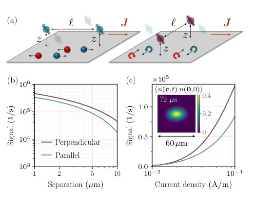
<figcaption class="paper-figure-caption"><b>Fig 1.</b> FIG. 1. Anisotropic response of charge carriers to an ap- plied current and the resulting noise covariance. (a) Electric carriers, electrons (blue) or holes (red), drift parallel to J, enhancing the noise covariance for NV pairs (teal) aligned along J (left); magnetic vortices feel a Magnus force perpen- dicular to J, enhancing the covariance for perpendicular pairs of NVs (purple, right). Each NV is positioned at a depth z above the sample, with in-plane separation ℓ. (b) Noise co- variance Γ(ℓ, z) at z = 100 nm and τ = 100 µs, versus ℓ, for perpendicular and parallel NV pairs. (c) The same versus current density J at ℓ= 5 µm. Inset: the vortex-charge correlator ⟨n(r, t) n(0, 0)⟩at a...</figcaption>
</figure>
<figure class="paper-figure-card">
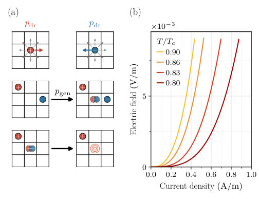
<figcaption class="paper-figure-caption"><b>Fig 2.</b> FIG. 2. (a) Update rules of the two-flavor SEP. With prob- ability pdr, particles drift along the direction set by their charge (+ˆx for +, −ˆx for −); otherwise they hop to one of the eight nearest neighbors uniformly. Hopping is rejected if the target site is occupied by a particle of the same charge but allowed if it hosts one of opposite charge. With prob- ability pgen, an empty site nucleates a ± vortex pair. Two opposite charges on the same site deterministically annihi- late. (b) Nonlinear I-V curve from Eq. (2) for a Nb thin film at T = 0.8, 0.83, 0.86, 0.9 Tc.</figcaption>
</figure>
<figure class="paper-figure-card">
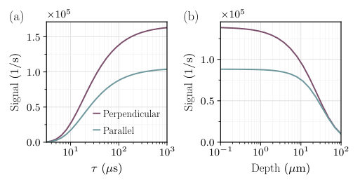
<figcaption class="paper-figure-caption"><b>Fig 3.</b> FIG. 3. Robustness of the predicted signal at fixed ℓ= 5 µm. (a) Γ versus the intrinsic NV lifetime τ, at z = 100 nm. The signal saturates for τ ≳100 µs, set by the noise correlation time, with the parallel/perpendicular anisotropy roughly con- stant across the experimentally relevant range. (b) Γ versus depth z at τ = 100 µs. The signal is approximately depth- independent in the regime z ≪ℓ, owing to a phase-space tradeoff (see text).</figcaption>
</figure>

**Summary.** This paper proposes a method to use NV-center magnetometry to distinguish between quasiparticle and vortex-driven transport in 2D superconductors. By measuring the anisotropy in spatially correlated magnetic noise, researchers can detect the perpendicular drift of vortices caused by the Magnus force. This provides a new experimental tool to study the nature of transport in anomalous metallic phases.

**Why it may be interesting.** The use of spatially correlated noise to probe the hydrodynamic fingerprints of topological excitations (vortices) provides a powerful template for studying non-equilibrium dynamics and transport in other many-body systems.

Detailed structure

**Main problem.** Distinguishing whether resistive transport in 2D superconductors near the BKT transition arises from the motion of normal-state quasiparticles or magnetic vortices.

**Main result.** The authors identify a directional fingerprint in spatially correlated magnetic noise: vortices drift perpendicular to the applied current due to the Magnus force, creating an anisotropic noise covariance that distinguishes them from parallel-drifting electric carriers.

**Method.** The study combines a renormalization-group treatment of vortex unbinding with a two-flavor stochastic exclusion process (SEP) simulation, mapped to magnetic field correlations measurable via NV center covariance magnetometry.

**Model / system.** The physical system consists of 2D superconductors (e.g., Nb thin films or monolayer TMDs) near the BKT transition, modeled using a mesoscopic SEP to capture vortex hydrodynamics and the Magnus force.

**Key observables.** Noise covariance (Gamma) measured at two nearby NV centers, specifically the anisotropy in covariance for NV pairs aligned parallel vs. perpendicular to the current.

**Important parameters / regimes.** Applied current density (J), temperature (T), vortex mobility, NV separation (l), and NV depth (z).

**Assumptions / limitations.** Assumes the 2D limit where the Pearl length exceeds all other scales, and that the NV depth is much smaller than the NV separation (z << l).

**Figures summary.** Fig 2(a) shows SEP update rules; Fig 2(b) shows nonlinear I-V curves; Fig 3(a) shows noise signal saturation with NV lifetime; Fig 3(b) shows depth-insensitivity of the signal.

**Paper structure.** The paper introduces the transport distinction problem, presents a theoretical framework using RG and SEP models, demonstrates the directional signature of vortex motion, and validates the signal's detectability with current NV magnetometry capabilities.

Abstract

Resistive transport near a superconducting phase can arise from the motion of normal-state quasiparticles or that of vortices. The conductivity alone does not distinguish between these mechanisms. We propose an unambiguous method for telling them apart, using the recently developed experimental tool of covariance magnetometry, which uses nitrogen-vacancy centers in diamond to probe real-time spatiotemporal correlations in magnetic noise. Our key insight is that, under an applied current, the underlying charge carriers leave a directional fingerprint in the spatially correlated magnetic noise above the sample: ordinary electric carriers drift parallel to the current, whereas vortices, owing to the Magnus force, drift perpendicular to it. The noise covariance detects this anisotropy and identifies the vortex-driven nature of transport. We compute the noise correlations expected for a representative thin-film superconductor and demonstrate that the anisotropic signal is well within the reach of current experimental capabilities.

[↑ back to top](#top)

### ⭐ [Magnetic phases in the $J_{1}$-$J_{2}$ antiferromagnetic XY model on the honeycomb lattice](http://arxiv.org/abs/2605.18982v1)

**Highlighted author(s):** A. G. Sotnikov  
**Authors:** I. V. Lukin, M. O. Luhanko, Yu. V. Slyusarenko, A. G. Sotnikov  
**Type:** theory · **Category:** strongly correlated electrons · **PDF:** <https://arxiv.org/pdf/2605.18982v1>  
**Analysis basis:** full PDF text, analyzed in chunks
**Topic relevance:** `entanglement & information structure` **2/5**

↔ Scroll figures horizontally

<figure class="paper-figure-card">
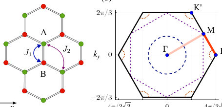
<figcaption class="paper-figure-caption"><b>Fig 1.</b> FIG. 1. (a) Honeycomb lattice with the two-site unit cell in the real-space representation with magnetic couplings J1 and J2. (b) Brillouin zone with high-symmetry points, some mani- folds for classically degenerate spiral states (dotted lines), and highlighted lines Γ-M and M-K, where one can expect sta- bility of the spiral states according to the 1/S expansion [4].</figcaption>
</figure>
<figure class="paper-figure-card">
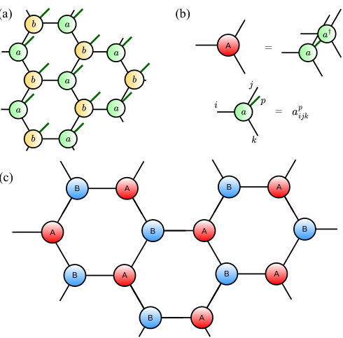
<figcaption class="paper-figure-caption"><b>Fig 2.</b> FIG. 2. (a) Honeycomb PEPS state with the two-site unit cell consisting of two rank-4 tensors a and b. (b) Definition of two- layer tensor A (the tensor B is defined analogously) necessary to compute the state norm and correlation functions. (c) Infinite tensor network representing the norm of the iPEPS wave function.</figcaption>
</figure>
<figure class="paper-figure-card">
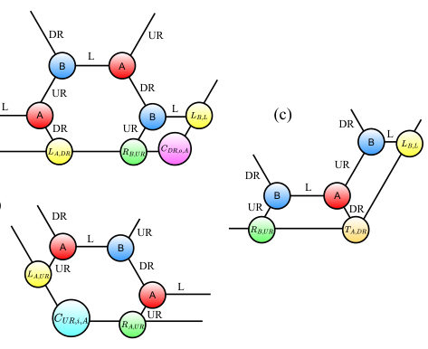
<figcaption class="paper-figure-caption"><b>Fig 3.</b> FIG. 3. Definitions of different boundary tensors appearing in the honeycomb CTMRG. The lattice directions are labeled as UR (Upper-Right), DR (Down-Right) and L (Left). All the tensors have also these labels, as well as label A or B, which represents the corresponing site tensor. Note that the main bMPS tensors L and R have three types of indices: edge indices connecting them to A or B tensors, indices adjacent to the edge index (with π/3 angle with edge index direction) and the last non-adjacent index. (a) Co matrix is placed on the intersection of two bMPS, and its indices are the indices of L and R tensors of these bMPS that are adjacent to the edge leg direction; (b) Ci matrices are...</figcaption>
</figure>
<figure class="paper-figure-card">
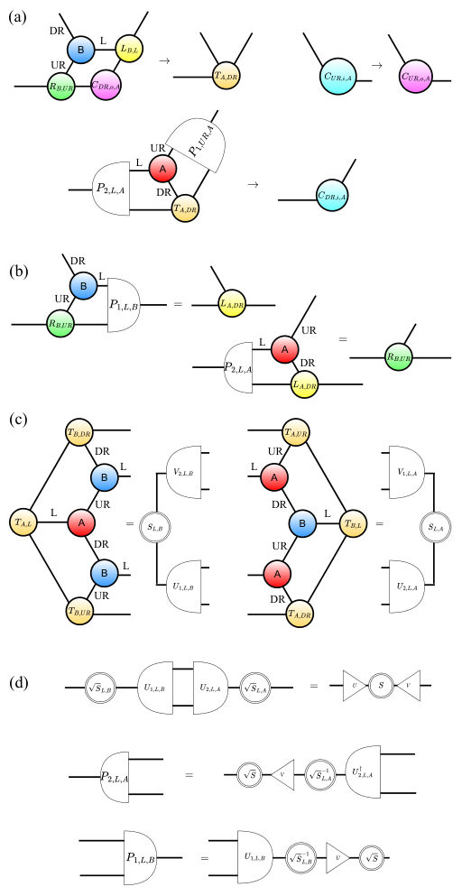
<figcaption class="paper-figure-caption"><b>Fig 4.</b> FIG. 4. Illustration of one step of the CTMRG update: (a) new tensors T are obtained from the previous matrices Co, new matrix Co is obtained from old Ci, and new Ci is deter- mined by old T (note that Ci, Co, and T are updated simulta- neously and not consequently); (b) update of the main bMPS tensors L and R with the introduction of projectors P; (c) to find the projectors P, we obtain the half-system environments and then decompose them with SVD decomposition; (d) The SVD tensors from the step (c) are employed to define the new projectors.</figcaption>
</figure>
<figure class="paper-figure-card">
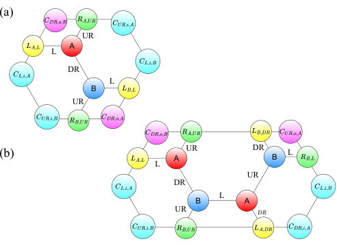
<figcaption class="paper-figure-caption"><b>Fig 5.</b> FIG. 5. Computation of correlation function with CTM ten- sors. It can be equivalently used to compute local reduced density matrices, where the physical bra and ket indices of the tensors A and B on the sites relevant for reduced den- sity matrix must be left uncontracted. (a) Computation of the correlation function (or the density matrix) between the two NN sites A and B. (b) Computation of the correlation function between the NN and NNN sites on the honeycomb lattice.</figcaption>
</figure>

**Summary.** This paper provides a detailed phase diagram for the J1-J2 XY model on a honeycomb lattice using advanced tensor network methods. It identifies several distinct magnetic phases, including an exotic Ising phase and an incommensurate spiral phase, and clarifies the competition between collinear and dimerized orders.

**Why it may be interesting.** not directly relevant

Detailed structure

**Main problem.** The study aims to determine the complete ground-state phase diagram and identify the nature of phase transitions in the J1-J2 antiferromagnetic XY model on a honeycomb lattice, specifically addressing uncertainties caused by strong quantum fluctuations.

**Main result.** The authors identified a sequence of magnetic phases: Néel, Ising, collinear, and incommensurate spiral phases. They found that the collinear phase is energetically preferred over the dimerized state and that the transition from the collinear to the spiral phase is second-order.

**Method.** The study uses a variational optimization of infinite Projected Entangled Pair States (iPEPS) with a spiral ansatz, utilizing a newly developed honeycomb-specific Corner Transfer Matrix Renormalization Group (CTMRG) algorithm and PyTorch-based automatic differentiation.

**Model / system.** A spin-1/2 antiferromagnetic XY model on a honeycomb lattice with nearest-neighbor (J1) and next-nearest-neighbor (J2) interactions.

**Key observables.** Ground-state energy, XY-plane magnetization (M_XY), Z-direction magnetization (M_Z), and the spiral wave vector (q).

**Important parameters / regimes.** The ratio of next-nearest-neighbor to nearest-neighbor coupling (J2/J1) and the tensor network bond dimension (D).

**Assumptions / limitations.** The accuracy is limited by the bond dimension (D = 5-6) used in the iPEPS ansatz.

**Figures summary.** Fig 1 shows the lattice geometry and Brillouin zone; Fig 2 illustrates the iPEPS ansatz and unit cell; Fig 3 and 4 detail the CTMRG algorithm and tensor updates; Fig 6 and 7 present the phase transitions and magnetization changes across different J2/J1 regimes.

**Paper structure.** The paper introduces the model and lattice, describes the development of the honeycomb CTMRG and spiral iPEPS method, presents the numerical results for the phase diagram and phase transitions, and concludes with a summary of the identified magnetic phases.

Abstract

We study ground-state properties and phase diagram of the $J_{1}$-$J_{2}$ antiferromagnetic XY model on the honeycomb lattice by means of the developed corner transfer matrix renormalization group algorithm with the two-site unit cell and the infinite spiral projected entangled pair states ansatz. We identify the main phases: Néel, Ising, collinear, and incommensurate spiral phases, as well as the transitions between them, as functions of the ratio $J_{2}/J_{1}$. In the regime of competing types of ordering, we show that the energies of the dimerized states are systematically higher than the energies in the collinear phase. This collinear phase transforms to the incommensurate spiral phase through the second-order phase transition upon a further increase of $J_2/J_1$.

[↑ back to top](#top)

### [Beyond the Purcell Effect: Controlling Pure Quantum Dephasing with Spin Noise Metasurfaces](http://arxiv.org/abs/2605.20180v1)

**Authors:** Wenbo Sun, Shoaib Mahmud, Wei Zhang, Runwei Zhou, Pronoy Das, Dan Jiao, Zubin Jacob  
**Type:** both · **Category:** quantum information and computing · **PDF:** <https://arxiv.org/pdf/2605.20180v1>  
**Analysis basis:** full PDF text, analyzed in chunks
**Topic relevance:** 🔥 `spintronics-quantum-optics interface` **5/5** · 🔥 `QC/QI experiment` **4/5** · `correlated / nonlocal dissipation` **3/5** · `quantum optics experiment` **3/5** · `interference shaping light` **2/5**

↔ Scroll figures horizontally

<figure class="paper-figure-card">
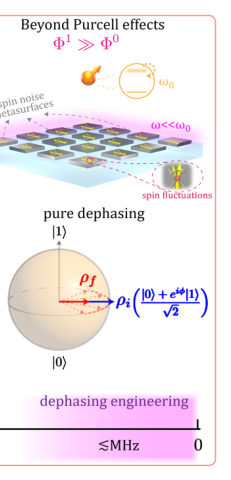
<figcaption class="paper-figure-caption"><b>Fig 1.</b> Fig. 1. Tailoring pure quantum dephasing with structured nanophotonic environments. (a) The Purcell effect manipulates spontaneous emission with cavity EM environments. (b) In contrast, we propose to control pure dephasing with ultra-subwavelength spin noise metasurfaces. (c) Spontaneous emission describes the radiative decay of excited states |1⟩. (d) Pure dephasing refers to the loss of phase coherence in superposition states 1 √</figcaption>
</figure>
<figure class="paper-figure-card">
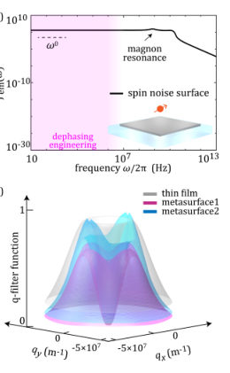
<figcaption class="paper-figure-caption"><b>Fig 2.</b> Fig. 2. Spin noise metasurfaces for pure quantum dephasing engineering. (a, b) Low- frequency dephasing noise spectrum 𝐽𝑒𝑚(𝜔) in (a) macroscopic microwave cavities and (b) the near-field of spin noise surfaces. The broadband enhancement of 𝐽𝑒𝑚(𝜔) ∼𝜔0</figcaption>
</figure>
<figure class="paper-figure-card">
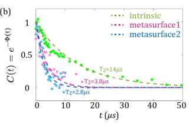
<figcaption class="paper-figure-caption"><b>Fig 3.</b> Fig. 3. Observing engineered spin dephasing dynamics near ultra-subwavelength spin noise metasurfaces. (a) A schematic of a diamond device with two lithographically defined CoFeB spin noise metasurfaces and ion-implanted shallow NV center ensembles. (b) Measured NV decoherence dynamics under Hahn echo. The NV coherence function 𝐶(𝑡) = 𝑒−Φ(𝑡) characterizes the dephasing dynamics near different spin noise metasurfaces. Decoherence time 𝑇2 is defined by the dephasing function Φ(𝑇2) = 1.</figcaption>
</figure>
<figure class="paper-figure-card">
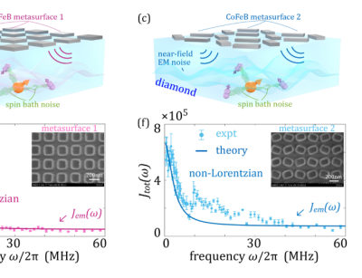
<figcaption class="paper-figure-caption"><b>Fig 4.</b> Fig. 4. Isolating metasurface-engineered dephasing noise spectrum 𝐽𝑒𝑚(𝜔) from other intrinsic dephasing noise. (a-c) Schematics of different dephasing noise sources in the diamond NV device, including nanophotonic dephasing 𝐽𝑒𝑚(𝜔) associated with spin noise metasurfaces and intrinsic dephasing 𝐽𝑠−𝑏(𝜔) connected to the V2 spin bath. (d-f) Total NV dephasing noise spectrum 𝐽𝑡𝑜𝑡(𝜔) = 𝐽𝑒𝑚(𝜔) + 𝐽𝑠−𝑏(𝜔) near different metasurfaces measured with the spectral decomposition techniques based on CPMG pulse sequences. Metasurface-engineered dephasing noise 𝐽𝑒𝑚(𝜔) leads to the non-Lorentzian behaviors and slowly-decaying tails at higher frequencies (≥10MHz) in (e) and (f). The solid lines are the theory...</figcaption>
</figure>

**Summary.** This paper presents a method to control the pure dephasing of NV center qubits using ferromagnetic metasurfaces. By engineering the low-frequency magnetic noise spectrum through nanophotonic structures, the researchers move beyond traditional Purcell-effect-based control of spontaneous emission. This establishes a new frontier for tailoring light-matter interactions in the near-field regime.

**Why it may be interesting.** It introduces a new paradigm for open quantum systems where the environment is engineered via near-field momentum filtering of evanescent waves rather than resonant cavity modes, offering a way to manipulate non-unitary dynamics.

Detailed structure

**Main problem.** The paper addresses the lack of control over pure quantum dephasing in spin qubits, moving beyond the well-studied Purcell effect which focuses on spontaneous emission.

**Main result.** The authors demonstrate that ultra-subwavelength ferromagnetic CoFeB metasurfaces can engineer the low-frequency (MHz) magnetic noise spectrum, effectively controlling the pure dephasing dynamics of NV centers.

**Method.** The study combines experimental Hahn-echo and CPMG pulse sequence measurements with a theoretical Volume Integral Equation (VIE) framework in reciprocal space to model the nanophotonic dephasing noise spectrum.

**Model / system.** The system consists of shallow nitrogen-vacancy (NV) center ensembles in diamond placed near periodic, ultra-subwavelength CoFeB (Cobalt-Iron-Boron) metasurfaces, modeled using the Landau-Lifshitz-Gilbert equation and a two-bath model (metasurface noise plus intrinsic spin-bath noise).

**Key observables.** Coherence function C(t), dephasing function Phi(t), decoherence time T2, and the dephasing noise spectrum J(omega).

**Important parameters / regimes.** MHz frequency range, ultra-subwavelength near-field regime, NV depth ~30 nm, CoFeB thickness ~5 nm, and high in-plane momentum (q >> k0) evanescent waves.

**Assumptions / limitations.** Neglecting explicit z-dependence in magnetic susceptibility due to the thinness of the CoFeB layer and approximating the demagnetization tensor as diag(0, 0, 1).

**Figures summary.** Figure 1 compares Purcell effect engineering to the proposed dephasing engineering; Figure 2 demonstrates the limitations of macroscopic cavities; Figure 4 shows the extraction of intrinsic diamond noise parameters.

**Paper structure.** The paper introduces the concept of dephasing engineering, describes the fabrication of the CoFeB metasurfaces and NV centers, presents the theoretical VIE framework for noise modeling, details the experimental spectral decomposition results, and concludes by comparing the metasurface approach to traditional cavity-based methods.

Abstract

One central theme in quantum photonics is tailoring the interactions between atoms/spins and their electromagnetic (EM) environments. Considerable effort has focused on engineering spontaneous emission by shaping EM environments, known as the Purcell effect. However, photonic environment control of pure dephasing, which is a complementary paradigm of non-unitary atom/spin couplings with EM environments, remains largely unexplored. Here, we introduce a nanophotonic approach to modify qubit pure dephasing dynamics. Unlike Purcell engineering that tailors photonic environments at qubit resonance frequencies (typically optical/near-infrared), we develop ultra-subwavelength spin noise metasurfaces for efficient broadband control of low-frequency (e.g., $\sim$MHz) photonic environments far off-resonant with atoms/spins for dephasing engineering. We experimentally demonstrate our approach using lithographically defined CoFeB metasurfaces and shallow nitrogen-vacancy (NV) centers in diamond. Instead of modified spontaneous emission, we observe modified NV pure dephasing dynamics near different spin noise metasurfaces. We further isolate metasurface-controlled dephasing from other dephasing mechanisms (e.g., spin bath) by measuring the NV ensemble dephasing noise spectrum with dynamical decoupling spectral decomposition techniques. Our results establish a new frontier in engineering quantum light-matter interactions with nanophotonic structures.

[↑ back to top](#top)

### [Quantum effective action for dissipative semiclassical dynamics](http://arxiv.org/abs/2605.19643v1)

**Authors:** Cesare Vianello, Andrea Bardin, Luca Salasnich  
**Type:** theory · **Category:** statistical mechanics · **PDF:** <https://arxiv.org/pdf/2605.19643v1>  
**Analysis basis:** full PDF text, analyzed in chunks
**Topic relevance:** 🔥 `Keldysh / 2PI / non-Gaussian methods` **5/5** · `methods for driven-dissipative` **3/5** · `non-equilibrium dynamics` **3/5** · `Kondo & dissipative impurity` **2/5** · `correlated / nonlocal dissipation` **2/5**

↔ Scroll figures horizontally

<figure class="paper-figure-card">
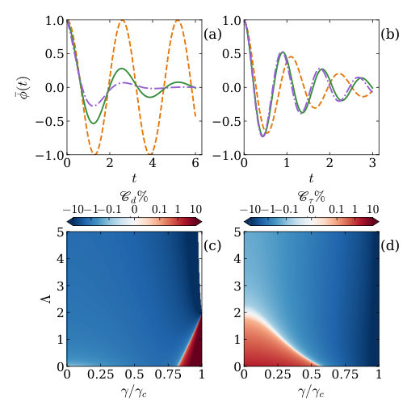
<figcaption class="paper-figure-caption"><b>Fig 1.</b> FIG. 1. Quantum corrections to the dynamics of the bosonic junction. (a) Phase dynamics for N = 100, Λ = 5, and γ = 0 (dashed orange), γ = 0.2γc (solid green), and γ = 0.4γc (dashed dotted violet), where γc = 2/ΩJ. (b) Phase dynamics for Λ = 50, γ = 0.1γc and N = 10 (dashed orange), N = 50 (solid green), N = 200 (dashed dotted violet). (c) Quantum correction Cd = ˜Ωd/Ωd −1 to the Josephson frequency for N = 50, as a function of γ/γc and Λ. (d) Quantum correction Cτ = ˜Γ/γΩ2 J −1 to the damping coefficient for N = 50, as a function of γ/γc and Λ.</figcaption>
</figure>

**Summary.** This paper develops a method to calculate quantum corrections to the semiclassical Langevin equation using the Schwinger-Keldysh formalism. It demonstrates that zero-point fluctuations modify the effective dynamics of macroscopic systems like Josephson junctions. These corrections are shown to be significant enough to be measurable in realistic experimental conditions.

**Why it may be interesting.** It provides a unified field-theoretic framework for understanding how quantum fluctuations modify classical dissipative dynamics, which is directly applicable to the precision control of superconducting qubits and the study of non-equilibrium dynamics in ultracold gases.

Detailed structure

**Main problem.** Deriving quantum corrections to the semiclassical Langevin dynamics of a dissipative system governed by a macroscopic degree of freedom.

**Main result.** The authors derive a generalized Langevin equation where quantum corrections to the effective potential and mass are determined by the zero-point energy of fluctuations, showing that these corrections can reach the percent level in superconducting and bosonic junctions.

**Method.** The study employs the Schwinger-Keldysh formalism and the quantum effective action approach, utilizing a one-loop approximation and Hubbard-Stratonovich transformation to compute corrections.

**Model / system.** The framework is applied to a general macroscopic particle in a potential subject to Ohmic damping, specifically focusing on the Resistively and Capacitively Shunted Junction (RCSJ) model and elongated bosonic junctions coupled to a phonon bath.

**Key observables.** Quantum-corrected oscillation frequency, decay rate (damping coefficient), and the variance of fluctuations.

**Important parameters / regimes.** Mass (m), damping coefficient (gamma), temperature (T), Planck's constant (hbar), Josephson frequency, and the low-temperature/weak-damping regime.

**Assumptions / limitations.** The derivation is limited to the one-loop level (first order in hbar) and assumes a local potential (adiabatic) approximation and an Ohmic dissipation environment.

**Figures summary.** Figure 1 illustrates phase dynamics under different damping and particle numbers, and plots the quantum correction factors for frequency and damping as functions of damping and interaction strength.

**Paper structure.** The paper progresses from a general Keldysh action derivation to a one-loop effective action, establishes a connection to the Ehrenfest theorem, and then applies the results to the RCSJ model and bosonic junctions.

Abstract

Using the quantum effective action in the Schwinger-Keldysh formalism, we derive quantum corrections to the semiclassical Langevin dynamics of a dissipative system governed by a macroscopic degree of freedom. We discuss the connection with the Ehrenfest theorem and show that, in the low-temperature and weak-damping regime, quantum corrections are determined by the zero-point energy of fluctuations evaluated at the classical underdamped frequency, closely paralleling the conservative case. We apply these general results to the resistively and capacitively shunted superconducting Josephson junction and to an elongated bosonic junction, where quantum corrections can reach the percent level under realistic conditions.

[↑ back to top](#top)

### [Universal logic gates for coupled period-doubling systems](http://arxiv.org/abs/2605.19477v1)

**Authors:** Emmanuel D. G. U, Roy D. Jara, Jayson G. Cosme  
**Type:** theory · **Category:** quantum information and computing · **PDF:** <https://arxiv.org/pdf/2605.19477v1>  
**Analysis basis:** full PDF text, analyzed in chunks
**Topic relevance:** 🔥 `driven-dissipative phase transition` **4/5** · `Keldysh / 2PI / non-Gaussian methods` **3/5** · `methods for driven-dissipative` **3/5** · `non-equilibrium dynamics` **3/5** · `Dicke superradiance` **2/5** · `Tavis-Cummings & cavity-many-emitter` **2/5** · `correlated / nonlocal dissipation` **2/5** · `non-equilibrium universality` **2/5**

↔ Scroll figures horizontally

<figure class="paper-figure-card">
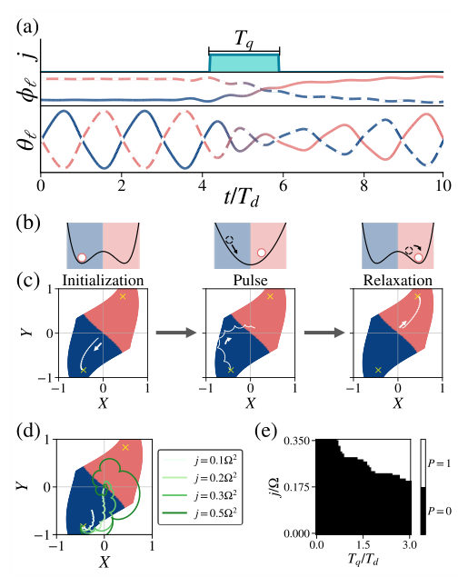
<figcaption class="paper-figure-caption"><b>Fig 1.</b> FIG. 1. (a) (Top panel) The coupling strength j between the two oscillators. (Middle panel) The absolute time phase ϕℓ and (Bottom panel) Exemplary dynamics of θℓfor the two os- cillators, demonstrating how the rapid coupling leads to a bit flip operation. The dashed (solid) lines represents the first (second) site. (b) Sketch of the potential landscape of the system and (c) dynamics of the system in the rotating-frame phase space during the (Left) initialization, (Middle) pulse, and (Right) relaxation periods. The dark-shaded (light- shaded) region corresponds to the basin of attraction for the 1-bit (0-bit), while the cross marker indicates the location of their respective period-doubled...</figcaption>
</figure>
<figure class="paper-figure-card">
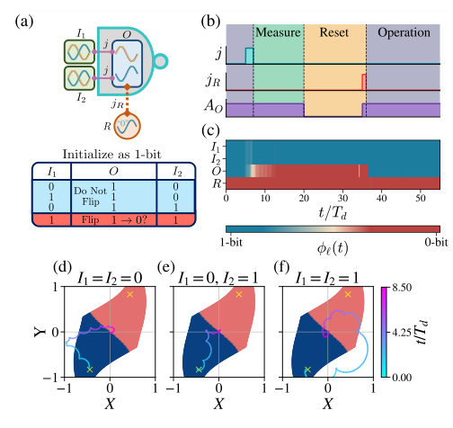
<figcaption class="paper-figure-caption"><b>Fig 2.</b> FIG. 2. (a) Sketch of the proposed logic architecture. (b) Protocol for the logic operation. (Top panel) The coupling strength j between the output and input sites. (Middle panel) The coupling strength jR between the output and ref- erence site. (Bottom panel) The driving amplitude AO for the output site. (c) Exemplary dynamics showing the ab- solute time phase ϕℓ(t) of each site during the logic opera- tion and the reset protocol. (d) - (f) Dynamics of O in the rotating-frame phase space while connected to I1 and I2 for all possible input configurations. The parameters used are {Ωd, A, γ, j} = {2.0Ω, 0.5, 0.2Ω, 0.3Ω2}.</figcaption>
</figure>
<figure class="paper-figure-card">
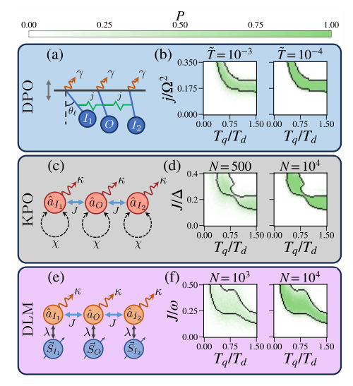
<figcaption class="paper-figure-caption"><b>Fig 3.</b> FIG. 3. Sketch of the (a) DPO network, (c) KPO network, and (e) DLM. Success probability of the logic gate opera- tion using the symmetry-broken states of the (b) DPO, (d) KPO, and (f) DLM as a function of the j, J, and Tq for various N and ˜T. The black outlines delineates the re- gions in which P = 1 in the noiseless limit ( ˜T = 0 and N →∞). The parameters used for the DPO are {Ωd, A, γ} = {2.0Ω, 0.5, 0.1Ω}. The parameters used for the KPO are {χ, p0, A0, κ} = {∆, 2.5∆, 0.6, 0.4∆}. The parameters used for the DLM are {ω0, ωd, λ0, A1} = {ω, 0.8ω, 0.9λc, 0.5}.</figcaption>
</figure>
<figure class="paper-figure-card">
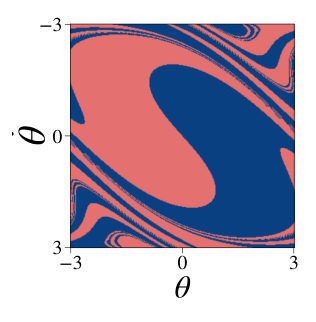
<figcaption class="paper-figure-caption"><b>Fig 4.</b> FIG. 1. Basins attraction for the two degenerate period-doubled states of the DPO in the lab frame. The parameters used are {Ωd, A, γ} = {2.0Ω, 0.5Ω, 0.2Ω}.</figcaption>
</figure>
<figure class="paper-figure-card">
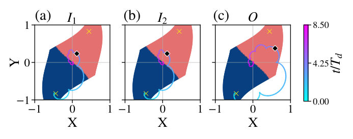
<figcaption class="paper-figure-caption"><b>Fig 5.</b> FIG. 2. Exemplary dynamics of the protocol calculating the NAND result for I1 = I2 = 1, showing how the two input sites can be flipped during an operation. The parameters used are {Ωd, A, γ, j} = {2.0Ω, 0.5, 0.2Ω, 0.3Ω2}.</figcaption>
</figure>

**Summary.** This paper proposes a method to perform universal logic operations using the stable, symmetry-broken states of driven-dissipative systems. By applying a single coupling pulse, the researchers show that NAND and NOR gates can be implemented in various models, including quantum Kerr oscillators and Dicke lattices, with high robustness to noise.

**Why it may be interesting.** It provides a bridge between non-equilibrium phase transitions (like discrete time crystals) and functional computation, offering a way to use symmetry-broken states in driven-dissipative systems for robust logic operations.

Detailed structure

**Main problem.** Developing a universal logic gate architecture (NAND and NOR) using classical information encoded in the period-doubled, symmetry-broken states of periodically-driven systems.

**Main result.** The authors demonstrate that a single-pulse protocol can implement universal logic gates across various platforms (DPO, KPO, and DLM) and show that these operations are robust against both thermal and quantum noise.

**Method.** The study uses mean-field approximations and the Truncated Wigner Approximation (TWA) to simulate dynamics, alongside Langevin equations to incorporate dissipation-induced fluctuations.

**Model / system.** The framework applies to networks of coupled dissipative parametric oscillators (DPO), Kerr parametric oscillators (KPO), and the Dicke lattice model (DLM) emulating discrete time crystals.

**Key observables.** Phase-space trajectories (X, Y), absolute time phase, phase difference (synchronization vs. anti-synchronative), and logic gate success probability.

**Important parameters / regimes.** Coupling strength (j or J), pulse duration (Tq), driving amplitude (A), dissipation rate (kappa), and particle number (N).

**Assumptions / limitations.** The mean-field approximation is assumed valid in the thermodynamic limit, and the protocol assumes the ability to perform a reset protocol to re-initialize the output node.

**Figures summary.** Figure 1 shows the basins of attraction and phase-space trajectories for bit-flips; Figure 2 illustrates the DPO network architecture and NAND gate dynamics; Figure 3 compares the validity regions (true vs. pseudo logic gates) across DPO, KPO, and DLM; Figure 4 shows the reset protocol and phase difference dynamics.

**Paper structure.** The paper introduces the concept of encoding bits in period-doubled states, describes the single-pulse logic protocol, presents the architecture for NAND/NOR gates, validates the protocol across three different physical models, and analyzes the impact of noise and dissipation.

Abstract

We propose a general architecture for universal logic operations using NAND and NOR gates on classical information encoded in period-doubled states of periodically-driven systems. The protocol involves applying a single pulse that simultaneously couple two input nodes with an output node. We show that the states of the nodes can be precisely controlled by tuning the coupling strength and pulse duration, allowing for robust logic gate operation. To highlight the universality of the protocol, we demonstrate its applicability on different systems, such as classical networks of dissi- pative parametric oscillators (DPO), quantum networks of Kerr parametric oscillators (KPO), and the periodically-driven open Dicke lattice model (DLM) emulating discrete time crystals (DTCs). We identify the parameter regimes in which the logic gate architecture is valid, and we showcase its robustness in the presence of fluctuations.

[↑ back to top](#top)

### [Finite-temperature crossover from coherent magnons to energy superdiffusion in the PXP model](http://arxiv.org/abs/2605.19281v1)

**Authors:** Shengtao Jiang, Jean-Yves Desaules, Marko Ljubotina, Thomas Scaffidi  
**Type:** theory · **Category:** statistical mechanics · **PDF:** <https://arxiv.org/pdf/2605.19281v1>  
**Analysis basis:** full PDF text, analyzed in chunks
**Topic relevance:** 🔥 `non-equilibrium dynamics` **4/5** · 🔥 `non-equilibrium universality` **4/5** · 🔥 `scars & prethermalization` **4/5** · `Rydberg arrays` **3/5** · `entanglement & information structure` **2/5**

↔ Scroll figures horizontally

<figure class="paper-figure-card">
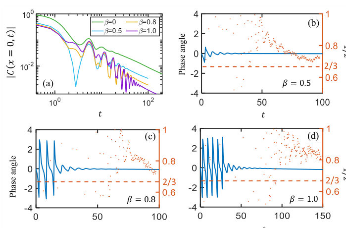
<figcaption class="paper-figure-caption"><b>Fig 1.</b> FIG. 1. Energy autocorrelator from infinite to moderately high temperatures. (a) On-site correlator for β = 0, 0.5, 0.8, 1.0, with a maximum χ = 512, 384, 384, 512, respectively. One can observe the transition from damped oscillatory behavior at short times to a power-law decay at later times. The crossover timescale increases rapidly with decreasing temperature. (b)–(d) Blue curves show the phase angle of the correlator, i.e. Arg[C(x = 0, t)], while orange points show the running exponent 1/zeff(t). The onset of hydrodynamic behavior can be observed both as a disappearance of the phase winding and as a “clustering” of 1/z points. (These two criteria give qualitatively the same trend of the...</figcaption>
</figure>
<figure class="paper-figure-card">
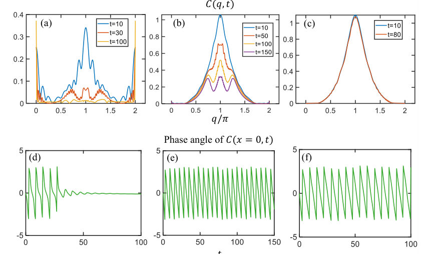
<figcaption class="paper-figure-caption"><b>Fig 2.</b> FIG. 2. Momentum-space and phase diagnostics of the finite-temperature crossover in the undeformed PXP chain with χ = 256. Top row: C(q, t) at representative times. Bottom row: phase angle of the on-site correlator C(0, t). At β = 1 the early-time dynamics is dominated by a peak near q = π, which gives way at later times to a weight near q = 0; simultaneously, the phase ceases to wind. At β = 3 and 6, the dynamics remain dominated by the q = π sector over the full simulated time window.</figcaption>
</figure>
<figure class="paper-figure-card">
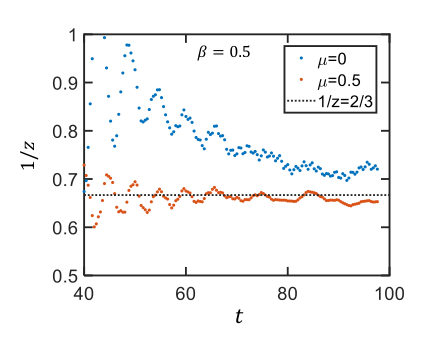
<figcaption class="paper-figure-caption"><b>Fig 3.</b> FIG. 3. Effect of the PNP deformation on the running expo- nent at intermediate temperature β = 0.5 with χ = 384. The moderate deformation µ = 0.5 yields a substantially cleaner plateau near the KPZ value 1/z = 2/3 than the undeformed case µ = 0.</figcaption>
</figure>
<figure class="paper-figure-card">
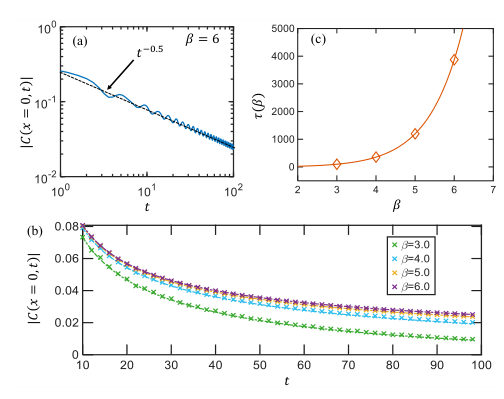
<figcaption class="paper-figure-caption"><b>Fig 4.</b> FIG. 4. Low-temperature coherent regime in the PXP chain with χ = 384. (a) At β = 6, the envelope of the on-site correlator follows the expected t−1/2 behavior. (b) For β = 3, 4, 5, 6, the on-site correlators (data points) are well fit by the damped oscillatory form in Eq. (13) (lines). (c) The activation time τ(β) = 1.7βe∆β as extracted from the fitting in (b). The diamonds correspond to the four temperatures in (b).</figcaption>
</figure>

**Summary.** This paper investigates how the PXP model transitions from coherent magnon dynamics to superdiffusive energy transport as temperature changes. It shows that the late-time KPZ-like behavior emerges from a transfer of spectral weight from high-momentum magnons to long-wavelength modes. This provides a microscopic link between identifiable quasiparticles and anomalous hydrodynamics.

**Why it may be interesting.** It provides a bridge between microscopic quasiparticle (magnon) physics and macroscopic anomalous hydrodynamics (KPZ), offering a way to understand how many-body scars and coherent structures relate to non-equilibrium transport.

Detailed structure

**Main problem.** Understanding the microscopic mechanism behind the emergence of superdiffusive energy transport (KPZ scaling) in the PXP model and how it connects to coherent magnon dynamics.

**Main result.** The study identifies a finite-temperature crossover where energy transport shifts from a short-time regime dominated by coherent pi-magnons to a long-time hydrodynamic regime characterized by superdiffusion (z=3/2) via a transfer of spectral weight from q=pi to q=0.

**Method.** Large-scale tensor network simulations using ITensor, specifically Time-Evolving Block Decimation (TEBD) and imaginary time evolution for thermal density matrices.

**Model / system.** The PXP chain, an effective Hamiltonian for Rydberg atom arrays in the strong blockade regime, featuring a constraint that prevents adjacent excitations.

**Key observables.** Energy density correlation function C(x, t), running decay exponent 1/z_eff(t), phase angle, and momentum-space correlation C(q, t).

**Important parameters / regimes.** Temperature (beta), chemical-potential deformation (mu), damping time scale tau(beta), and the scaling exponent z.

**Assumptions / limitations.** The short-time dynamics can be approximated by a single magnon band with an activated relaxation form.

**Figures summary.** Figure 1 illustrates the on-site correlator, phase angle, and running exponent for various temperatures, showing the disappearance of phase winding as temperature increases.

**Paper structure.** The paper introduces the PXP model and the problem of superdiffusion, presents numerical results showing the temperature-dependent crossover, analyzes the short-time magnon-dominated regime, discusses the long-time hydrodynamic regime, and concludes by reconciling the two regimes through spectral weight transfer.

Abstract

The PXP chain was recently shown to exhibit superdiffusive energy transport with Kardar-Parisi-Zhang-like scaling, $z\approx3/2$, joining a growing number of spin chains with this exponent. An understanding of how this anomalous hydrodynamics emerges from microscopics is, however, still lacking. In this work, we show that finite-temperature energy transport in this model provides a window into the emergence of superdiffusion. At finite temperature, the energy autocorrelation function exhibits a crossover from short-time coherent dynamics to long-time hydrodynamics. The short-time behavior is dominated by a single magnon band and can be understood analytically. In momentum space, this regime is characterized by spectral weight near $q=π$. The damping time $τ$, which separates the short-time magnon-dominated behavior from the late-time hydrodynamics, grows rapidly upon cooling, consistent with an activated form $τ(β)\sim βe^{Δβ}$ with a gap scale set by the magnon band. At longer times, the spectral weight transfers to $q=0$ and the running decay exponent drifts toward the superdiffusive value $z=3/2$. Finite-temperature energy transport therefore provides a bridge between microscopic magnon physics and late-time superdiffusion in the PXP model.

[↑ back to top](#top)

### [Spin-Induced Non-Markovian Time-Crystal-Like Dynamics and Fractal Scaling in the Bateman Dual Oscillator](http://arxiv.org/abs/2605.19917v1)

**Authors:** Partha Nandi, Giuseppe Vitiello  
**Type:** theory · **Category:** statistical mechanics · **PDF:** <https://arxiv.org/pdf/2605.19917v1>  
**Analysis basis:** full PDF text, analyzed in chunks
**Topic relevance:** 🔥 `driven-dissipative phase transition` **4/5** · 🔥 `non-equilibrium dynamics` **4/5** · `non-equilibrium universality` **3/5** · `entanglement & information structure` **2/5** · `methods for driven-dissipative` **2/5**

↔ Scroll figures horizontally

<figure class="paper-figure-card">
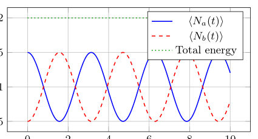
<figcaption class="paper-figure-caption"><b>Fig 1.</b> Figure 1. Time evolution of the occupation numbers of the two oscillator sectors. The blue and red curves oscillate with opposite phases, demonstrating coherent energy exchange, while the green curve indicates conservation of the total en- ergy of the full doubled system.</figcaption>
</figure>
<figure class="paper-figure-card">
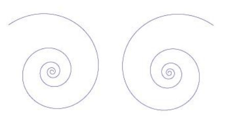
<figcaption class="paper-figure-caption"><b>Fig 2.</b> Figure 2. Trajectory in the complex plane illustrating the logarithmic spiral structure arising from the combined oscil- latory and scaling dynamics.</figcaption>
</figure>
<figure class="paper-figure-card">
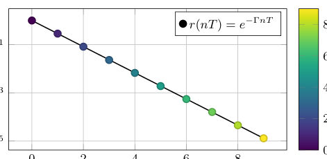
<figcaption class="paper-figure-caption"><b>Fig 3.</b> Figure 3. Discrete-time sampling of r(t) at t = nT. The color gradient indicates increasing n. The linear behavior in logarithmic scale reveals the underlying self-similar (fractal- like) scaling and the associated time-lattice structure.</figcaption>
</figure>
<figure class="paper-figure-card">
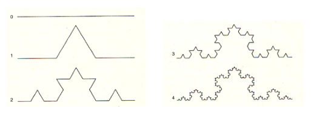
<figcaption class="paper-figure-caption"><b>Fig 4.</b> Figure 5. Successive stages in the construction of the Koch curve, illustrating the emergence of self-similar fractal struc- ture.</figcaption>
</figure>
<figure class="paper-figure-card">
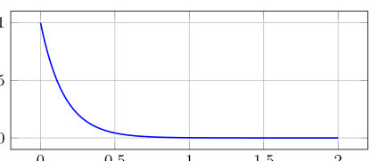
<figcaption class="paper-figure-caption"><b>Fig 5.</b> Figure 4. The ratio r(t+T)/r(t) = e−2πd as a function of the parameter s (with d ∝s). The dependence illustrates how the discrete scaling structure is controlled by the underlying dynamical parameter.</figcaption>
</figure>

**Summary.** This paper shows that a closed quantum system can exhibit persistent, periodic oscillations and fractal scaling through the interaction of damped and amplified oscillator sectors. By tracing over the amplified sector, the authors reveal that non-Markovian memory effects drive an emergent temporal order. This mechanism allows for time-crystal-like dynamics without the need for external driving or spontaneous symmetry breaking.

**Why it may be interesting.** It provides a novel mechanism for time-crystal-like behavior that bypasses conventional equilibrium no-go theorems by utilizing nonequilibrium, non-Markovian dynamics within a globally unitary framework.

Detailed structure

**Main problem.** Investigating whether a closed quantum system can generate persistent, time-crystal-like dynamics and fractal scaling without external periodic driving or equilibrium spontaneous symmetry breaking.

**Main result.** The authors demonstrate that non-Markovian memory effects and coherent energy exchange between damped and amplified sectors in a dual oscillator framework generate emergent temporal ordering and self-similar fractal trajectories.

**Method.** The study employs Dirac constraint analysis, Bogoliulyov transformations, and the reduced density matrix formalism to derive non-Markovian dynamics from a globally unitary Hamiltonian.

**Model / system.** A nonrelativistic (2+1)-dimensional Bateman dual oscillator system featuring spin-induced spatial deformation and a modified symplectic structure, described by a time-independent, Hermitian Hamiltonian with SU(1,1) algebraic properties.

**Key observables.** Subsystem occupation numbers, energies of the damped and amplified sectors, and the geometric trajectories of observables in the complex plane.

**Important parameters / regimes.** Oscillator frequency (Omega_0), dissipation/interaction strength (Gamma), non-commutativity parameter (theta), and the scaling exponent (d).

**Assumptions / limitations.** The system is treated as a closed, globally unitary system via a doubled degrees of freedom approach, assuming initially factorized states and a vacuum state for the amplified sector.

**Figures summary.** Figure 2 shows logarithmic spiral trajectories in the complex plane; Figure 3 illustrates discrete-time sampling and self-similar scaling of the radial distance; Figure 4 shows the ratio of radial distances.

**Paper structure.** The paper defines the spin-induced non-commutative phase space, constructs the Bateman dual oscillator Hamiltonian, quantizes the system using Dirac brackets, derives the non-Markovian reduced dynamics, and analyzes the resulting fractal and time-crystal-like temporal structures.

Abstract

Can a closed quantum system generate persistent time-crystal-like dynamics without external driving? Within the Bateman dual oscillator framework, we show that the answer is affirmative. We consider a nonrelativistic (2+1)-dimensional system in which spin-induced spatial deformation generates an effective Bateman oscillator structure. After quantization, the system is governed by a time-independent Hermitian Hamiltonian describing coherent coupling between damped and amplified oscillator sectors while preserving the total energy of the global doubled system. Tracing over the amplified sector, we derive an effective non-Markovian reduced dynamics for the observable subsystem. The resulting memory effects sustain persistent oscillations of subsystem observables and generate emergent time-crystal-like temporal ordering without external periodic driving or equilibrium spontaneous symmetry breaking. Since the oscillatory behavior originates from nonequilibrium reduced subsystem dynamics rather than equilibrium expectation values of the full Hamiltonian, the mechanism lies outside the assumptions of conventional no-go theorems for equilibrium time crystals. The same dynamics further exhibits logarithmic-spiral trajectories and self-similar fractal scaling, revealing a direct connection between coherent dissipative dynamics, non-Markovian memory effects, and emergent temporal ordering in a globally unitary quantum system. In this specific sense, "watching the growth" of these self-similar structures corresponds to observing the gradual formation of time-crystal-like ordering.

[↑ back to top](#top)

### [Modified logarithmic Sobolev inequalities for Abelian quantum double models](http://arxiv.org/abs/2605.19640v1)

**Authors:** Sebastian Stengele, Ángela Capel, Li Gao, Angelo Lucia, David Pérez-García, Antonio Pérez-Hernández, Cambyse Rouzé, Simone Warzel  
**Type:** theory · **Category:** quantum information and computing · **PDF:** <https://arxiv.org/pdf/2605.19640v1>  
**Analysis basis:** full PDF text, analyzed in chunks
**Topic relevance:** 🔥 `non-equilibrium dynamics` **4/5** · `entanglement & information structure` **3/5** · `driven-dissipative phase transition` **2/5** · `methods for driven-dissipative` **2/5** · `scars & prethermalization` **2/5** · `analog quantum simulation` **1/5**

↔ Scroll figures horizontally

<figure class="paper-figure-card">
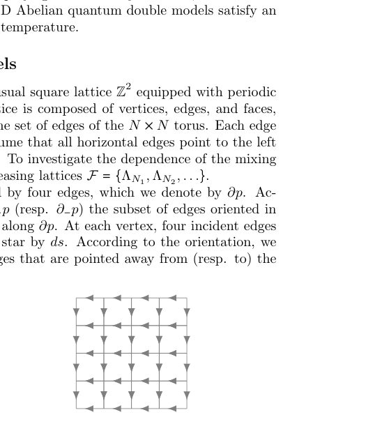
<figcaption class="paper-figure-caption"><b>Fig 1.</b> Figure 1: Left: the N × N lattice on the torus. Right: The orientation of the edges.</figcaption>
</figure>
<figure class="paper-figure-card">
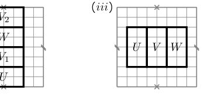
<figcaption class="paper-figure-caption"><b>Fig 2.</b> Figure 2: Three sets of overlapping rectangles. (i) The full torus is split into V2UV1 and V1WV2. Both rectangles still wrap around the torus. (ii) Splitting a rectangle that wraps around in one direction yields two new rectangles, which overlap on both ends. (iii) A rectangle that does not wrap around splits into two smaller ones with only one connected component in the overlap.</figcaption>
</figure>

**Summary.** The paper establishes that 2D Abelian quantum double models undergo rapid mixing under Davies Lindbladian dynamics at any positive temperature. By proving a modified logarithmic Sobolev inequality, the authors show that the system reaches thermal equilibrium in polylogarithmic time relative to the system size.

**Why it may be interesting.** This work provides a rigorous proof of rapid thermalization for a class of topological models, which is crucial for understanding the stability and dynamics of quantum memory and error-correcting codes under thermal noise.

Detailed structure

**Main problem.** Determining the mixing time of the Davies Lindbladian dynamics for 2D Abelian quantum double models and establishing whether they exhibit rapid mixing.

**Main result.** The authors prove that 2D Abelian quantum double models satisfy a modified logarithmic Sobolev inequality (MLSI) at any positive temperature, implying rapid (polylogarithmic) mixing.

**Method.** A multi-scale analysis approach using a Dobrushin-Shlosman type condition and a strong martingale condition for local conditional expectations to bound the MLSI constant.

**Model / system.** 2D Abelian quantum double models on an N x N square lattice (torus) with a commuting Hamiltonian consisting of star and plaquette operators, evolving under Davies Markov semigroup dynamics.

**Key observables.** Mixing time (in trace norm), spectral gap, MLSI constant, and relative entropy.

**Important parameters / regimes.** Inverse temperature (beta), system size (N), and group size (|G|).

**Assumptions / limitations.** The proof assumes translation invariance and that the jump rates satisfy a specific lower bound relative to the detailed balance condition; it also relies on the validity of the Dobrush and Shlosman condition.

**Figures summary.** Figure 1 illustrates the N x N lattice on a torus and edge orientations; Figure 2 shows different configurations of overlapping rectangles used in the multi-scale analysis.

**Paper structure.** The paper first characterizes the kernel and conditional expectations of the Lindbladian, then establishes the Dobrushin-Shlosman condition for the Gibbs state, and finally uses a multi-scale analysis to link a strong martingale condition to the MLSI constant.

Abstract

We establish rapid mixing for Davies Markov semigroups associated with 2D Abelian quantum double models at any positive temperature. A condition of Dobrushin-Shlosman (DS) type holds at any temperature, and we show that the latter implies a modified logarithmic Sobolev inequality for the Davies Lindbladian. A key step in the argument is to verify a strong martingale condition for the local conditional expectations of the Davies semigroup in the regime of validity of the DS condition.

[↑ back to top](#top)

### [Scalable Single-Step Generation of W States in 2D Superconducting Qubit Lattices](http://arxiv.org/abs/2605.18962v1)

**Authors:** João H. Romeiro, Federico A. Roy, Niklas Bruckmoser, Ivan Tsitsilin, Niklas J. Glaser, Christian M. F. Schneider, Gerhard B. P. Huber, Saya A. Schöbe, Johannes Schirk, Florian Wallner, Malay Singh, Julius Feigl, Leon Koch, Lasse Södergren, Max Werninghaus, Stefan Filipp  
**Type:** both · **Category:** quantum information and computing · **PDF:** <https://arxiv.org/pdf/2605.18962v1>  
**Analysis basis:** full PDF text, analyzed in chunks
**Topic relevance:** 🔥 `QC/QI experiment` **4/5** · `entanglement & information structure` **3/5** · `non-equilibrium dynamics` **3/5** · `analog quantum simulation` **2/5** · `correlated / nonlocal dissipation` **2/5**

↔ Scroll figures horizontally

<figure class="paper-figure-card">
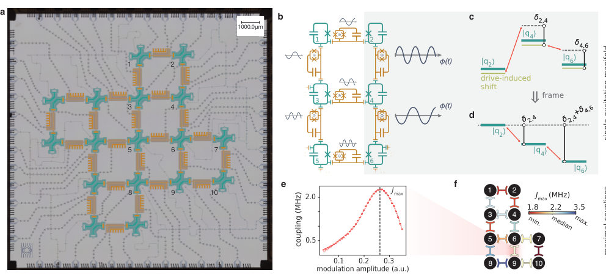
<figcaption class="paper-figure-caption"><b>Fig 1.</b> Fig. 1 Superconducting qubit device with parametrically-driven qubit chains. a False-coloured image of the processor, con- taining a total of 17 transmon qubits (cyan) and 24 tunable couplers (amber). Numbers indicate the subset of 10 qubits used in this work. b Circuit diagram showing the operation of a 3 × 2 register comprising qubits q1 through q6. Simultaneous AC flux modulations (insets) are applied near the difference frequency of the corresponding qubit pair. c Energy diagram of the single-excitation manifold, showing effective couplings (red) between qubits q2, q4 and q6. Parametric drives induce AC-Stark shifts (lime green) of the qubit lev- els (cyan). Black vertical lines...</figcaption>
</figure>
<figure class="paper-figure-card">
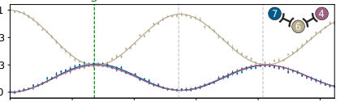
<figcaption class="paper-figure-caption"><b>Fig 2.</b> Fig. 2 Single-step W state generation in three-qubit chains. Diagrams show the single-excitation energy levels (cyan) with uniform couplings J (red). Detunings ∆±1 are equal in mag- nitude and follow either an a antisymmetric or b symmetric profile. c Population of the central qubit, initially prepared in its excited state, as a function of detuning magnitude. Contours highlight the parameter regions in which the central population is exactly one third. The state delocalisation D is shown for d antisymmetric and e symmetric Hamiltonians, with D = 1 corresponding to a W state. The fastest W state generation occurs at resonance R (magenta diamonds). Dashed lines indicate integer multiples of...</figcaption>
</figure>
<figure class="paper-figure-card">
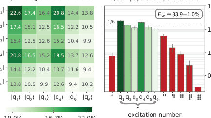
<figcaption class="paper-figure-caption"><b>Fig 3.</b> Fig. 3 Single-step W state generation in 2D lattices. a Construction of a L × M square lattice from two overlapping sets of 1D Hamiltonians, resulting in independent single-excitation dynamics along each direction. b Single-step generation of a 3 × 2 W state, with qubit q4 initially excited. Dynamics are shown sep- arately for rows (i) and columns (ii), with populations summed over the perpendicular direction. At the common synthesis time τ = 99 ns (grey vertical line), the excitation is maximally delo- calised along both axes (grey horizontal line). Fits (solid lines) include qubit dephasing and excitation loss. c Matrix elements of the reconstructed state ⟨qi| ρexp qj , showing...</figcaption>
</figure>
<figure class="paper-figure-card">
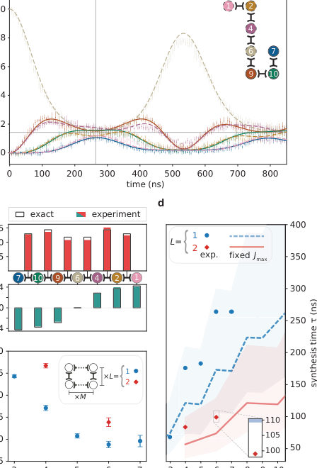
<figcaption class="paper-figure-caption"><b>Fig 4.</b> Fig. 4 W state generation in extended chains and scaling. a Single-step entanglement in a seven-qubit chain, with the cen- tral qubit q6 initialised in its excited state. The excitation spreads symmetrically across the chain, resulting in equivalent dynamics for qubit pairs equidistant from the centre. For visual clarity, fits are shown as dashed lines for the first four qubits and solid lines for the remaining three. b Fitted Hamiltonian parameters (solid bars) compared with the exact solution (wireframes). On-site ener- gies (cyan) exhibit an antisymmetric distribution with respect to the centre of the chain, while couplings (red) are symmetric in magnitude. c Average state fidelities...</figcaption>
</figure>
<figure class="paper-figure-card">
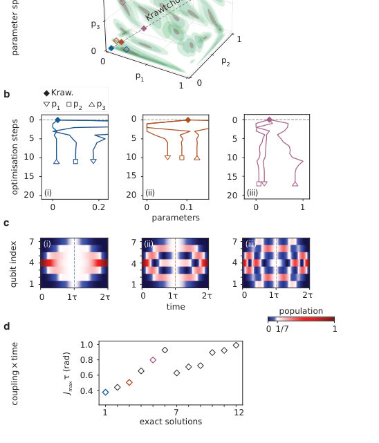
<figcaption class="paper-figure-caption"><b>Fig 5.</b> Fig. 5 Krawtchouk and exact solutions in a seven-qubit chain. a Parameter space for symmetry-preserving Hamiltoni- ans with a fixed linear spectrum. Isosurfaces show the W state fidelity obtained after one half-period τ, for an excitation ini- tialised in the central qubit. The standard Krawtchouk family (dashed line) is highlighted alongside three local optima (solid dia- monds), which achieve fidelities in the range 73.3 % to 94.4 %. Each local optimum is located near a distinct solution yielding exact W state generation (hollow diamonds). b Numerical optimisation ini- tialised at the highlighted Krawtchouk optima (solid diamonds), revealing the values of p1, p2 and p3 for the different...</figcaption>
</figure>

**Summary.** This paper presents a method to generate W states in superconducting qubit lattices in a single step, bypassing the need for slow, sequential gate sequences. By using simultaneous parametric drives, the researchers achieved fast entanglement distribution that scales efficiently in 2D. This approach significantly reduces the time required for entanglement generation, making it more robust against decoherence.

**Why it may be interesting.** This work is highly relevant for many-body dynamics and open quantum systems as it demonstrates a method to engineer complex, non-local Hamiltonian dynamics and explores the robustness of multipartite entanglement against dephasing and parameter fluctuations.

Detailed structure

**Main problem.** Generating large-scale multipartite entanglement, specifically W states, in superconducting architectures is difficult due to the high circuit depth and time overhead required by sequential two-qubit gates.

**Main result.** The authors demonstrated a scalable, single-step method to generate W states in 2D superconducting lattices, achieving a 6-qubit W state in a 3x2 lattice with 83.9% fidelity in just 99 ns.

**Method.** The protocol uses engineered simultaneous AC flux modulations to induce parametric exchange interactions, solving an inverse eigenvalue problem to determine the required couplings and on-site energies.

**Model / system.** A 2D superconducting transmon qubit lattice featuring 17 qubits and 24 tunable couplers, modeled using a single-excitation manifold Hamiltonian with time-dependent parametric drives.

**Key observables.** W state fidelity (Fw), state delocalization (D), qubit populations, and entanglement witness operators.

**Important parameters / regimes.** Coupling strengths (J) between 1.18 MHz and 3.5 MHz, synthesis time (tau), and the use of Krawtchouk Hamiltonian families for scaling.

**Assumptions / limitations.** The system is restricted to the single-excitation manifold; the rotating-wave approximation (RWA) is applied; errors are dominated by qubit dephasing and readout (SPAM) errors.

**Figures summary.** Fig 1 shows the 17-qubit processor and circuit diagram; Fig 2 illustrates 1D W state generation and energy levels; Fig 3 demonstrates 2D lattice construction and population dynamics; Fig 4 shows 1D scaling and performance; Fig 5 displays parameter space optimization and population dynamics.

**Paper structure.** The paper introduces the challenge of sequential gate overhead, presents the theoretical framework for single-step generation via the inverse eigenvalue problem, details the experimental implementation on a 2D transmon lattice, demonstrates results for both 1D chains and 2D lattices, and concludes with scaling analysis and error characterization.

Abstract

The reliable generation of multi-qubit entanglement is a prerequisite for large-scale quantum information technologies. In particular, W states are a valuable resource owing to their resilience under local loss or measurement. Nevertheless, preparing these states with sequential two-qubit gates often requires substantial time overhead. By contrast, engineered simultaneous interactions enable fast entanglement generation, even in qubit systems with limited nearest-neighbour connectivity. Here, we demonstrate a set of fast and robust operations for coherently distributing a single excitation across a lattice of arbitrary size, thereby directly generating W states from initial product states. In 2D lattices, the excitation propagates along both directions simultaneously, such that the total entanglement time scales only with the largest dimension. We exploit this property to prepare a six-qubit W state in a 3$\times$2 superconducting lattice within 99 ns, achieving a tomographic fidelity of 83.9$\pm$1.0%. We then extend the protocol to create entanglement across chains of up to seven qubits, with the largest W state generated in 264 ns with a fidelity of 79.6$\pm$1.3%.

[↑ back to top](#top)

### [Signatures of Gaussian superconducting fluctuations in nonlocal noise magnetometry](http://arxiv.org/abs/2605.18970v1)

**Authors:** Dror Orgad  
**Type:** theory · **Category:** strongly correlated electrons · **PDF:** <https://arxiv.org/pdf/2605.18970v1>  
**Analysis basis:** full PDF text, analyzed in chunks
**Topic relevance:** 🔥 `spintronics-quantum-optics interface` **4/5** · `Keldysh / 2PI / non-Gaussian methods` **3/5** · `correlated / nonlocal dissipation` **2/5** · `non-equilibrium dynamics` **2/5** · `quantum measurements` **2/5** · `QC/QI experiment` **1/5**

↔ Scroll figures horizontally

<figure class="paper-figure-card">
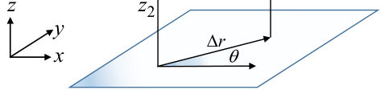
<figcaption class="paper-figure-caption"><b>Fig 1.</b> FIG. 1: The geometry of the two-dimensional system. The red dots indicate the positions of the NV centers used for the magnetic sensing. When an external current is present, it flows in the x direction.</figcaption>
</figure>
<figure class="paper-figure-card">
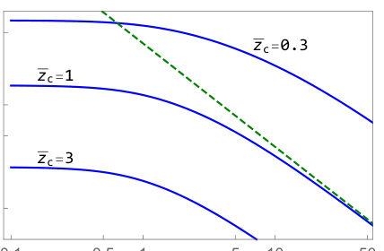
<figcaption class="paper-figure-caption"><b>Fig 2.</b> FIG. 3: ¯Seq zz = Seq zz/[(T/Tc)2S0] as a function of ¯ω for various values of ¯zc = √εzc/ξ0 and ∆r = 0. The dashed line depicts a ¯ω−1 behavior.</figcaption>
</figure>
<figure class="paper-figure-card">
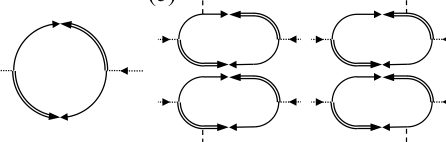
<figcaption class="paper-figure-caption"><b>Fig 3.</b> FIG. 2: (a) The vertices of the theory. Solid lines indicate G0(k, ω), while double lines stand for G∗ 0(k, ω). The dashed lines are associated with the electric potential. (b) The dia- gram for the equilibrium current-current correlator. (c) First order diagrams for the current-current correlator.</figcaption>
</figure>
<figure class="paper-figure-card">
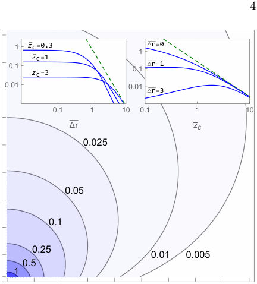
<figcaption class="paper-figure-caption"><b>Fig 4.</b> FIG. 4: Contour plot of Seq zz(ω = 0)/[(T/Tc)2S0] as a function of ¯zc = √εzc/ξ0 and ∆r = √ε∆r/ξ0. The left inset includes cuts as a function of ∆r, where the dashed line depicts a ∆r −3</figcaption>
</figure>
<figure class="paper-figure-card">
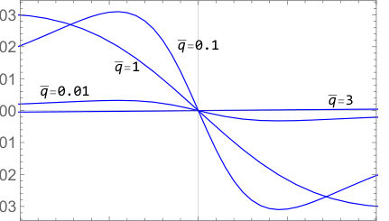
<figcaption class="paper-figure-caption"><b>Fig 5.</b> FIG. 5: Ineq(¯q, ϕ = 0, ¯ω) for the case η = 0.1, as a function of ¯ω for several values of ¯q.</figcaption>
</figure>

**Summary.** This paper calculates the magnetic noise signatures produced by Gaussian superconducting fluctuations in 2D and 1D systems. It demonstrates how these fluctuations can be distinguished from vortex dynamics through specific spatial and frequency patterns detectable by NV center magnetometry. The findings provide a roadmap for using nanoscale sensors to probe the nature of superconducting fluctuations in high-Tc materials.

**Why it may be interesting.** The paper explores the dynamics of a fluctuating order parameter and the resulting noise spectra, which is relevant to understanding non-equilibrium dynamics and the interaction between a quantum sensor and a many-body system.

Detailed structure

**Main problem.** Identifying testable signatures of Gaussian superconducting fluctuations in nonlocal magnetic noise to distinguish them from vortex-liquid-driven fluctuations.

**Main result.** The study predicts specific frequency, spatial, and angular dependencies of magnetic noise, including a quadrupolar structure under electric fields, which are detectable by NV center magnetometry.

**Method.** Analytical calculation of the two-point magnetic noise spectrum using the stochastic time-dependent Ginzburg-Landau (TDGL) theory and Green's functions.

**Model / system.** The model covers 2D superconducting systems (like cuprates and NbSe2) and 1D superconducting wires, utilizing the TDGL framework in the Gaussian approximation.

**Key observables.** Two-point magnetic noise spectrum (Szz), current-current correlations, and angular noise anisotropy.

**Important parameters / regimes.** Temperature relative to Tc, sensor height (zc), lateral separation (delta r), electric field strength (E), and coherence length (xi).

**Assumptions / limitations.** Gaussian approximation (neglecting the quartic term in free energy), particle-hole symmetry (or its breaking), and the use of the TDGL framework for critical dynamics.

**Figures summary.** Figure 1 shows the 2D system geometry and sensor positions; Figure 2 provides a diagrammatic representation of the theory; Figure 3 plots the dimensionless equilibrium noise spectrum versus frequency.

**Paper structure.** The paper introduces the problem of identifying fluctuations, develops the TDGL-based analytical framework for equilibrium and non-equilibrium noise, analyzes spatial and frequency scaling in 2D and 1D systems, and concludes with experimental detectability estimates using NV centers.

Abstract

We calculate the two-point magnetic noise spectrum arising from Gaussian superconducting fluctuations, a quantity directly measurable by spin qubit pairs such as nitrogen vacancy centers in diamond. The analysis utilizes the time-dependent Ginzburg-Landau theory, reflecting the direct contribution of fluctuating Cooper pairs to the current correlations and consequent magnetic noise. We treat both two-dimensional systems and wires, considering them in equilibrium and under a uniform electric field. The signal is expected to be strongest in high-temperature superconductors, and we contrast our findings with the predicted signatures of a vortex liquid to offer an additional route to elucidate the nature of fluctuations in these systems.

[↑ back to top](#top)

### [Subsystem relaxation and a calibrated sampling diagnostic for programmable quantum annealers](http://arxiv.org/abs/2605.19381v1)

**Authors:** Luis Lozano  
**Type:** both · **Category:** disordered systems and neural networks · **PDF:** <https://arxiv.org/pdf/2605.19381v1>  
**Analysis basis:** full PDF text, analyzed in chunks
**Topic relevance:** 🔥 `QC/QI experiment` **4/5** · 🔥 `non-equilibrium dynamics` **4/5** · `methods for driven-dissipative` **2/5** · `non-equilibrium universality` **2/5** · `scars & prethermalization` **2/5**

↔ Scroll figures horizontally

<figure class="paper-figure-card">
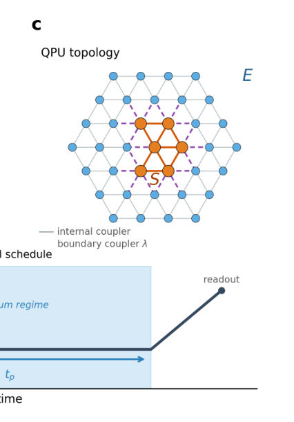
<figcaption class="paper-figure-caption"><b>Fig 1.</b> Figure 1: Reverse-anneal protocol and subsystem–environment partition. a, Energy-landscape concept: three distinct initial preparations of the subsystem (colored balls in different potential wells) converge to the same distribution under relaxing conditions after reverse annealing in the presence of a large on-chip environment. b, Reverse-anneal schedule. The system is initialized at s = 1 (classical), ramped to a pause point sp where quantum fluctuations are reintroduced (blue-shaded region), held for a time tp, and returned to s = 1 for readout. c, Schematic of the subsystem–environment partition on the QPU topology. The subsystem S (orange, |S| = 6) is a connected cluster of qubits; the...</figcaption>
</figure>
<figure class="paper-figure-card">
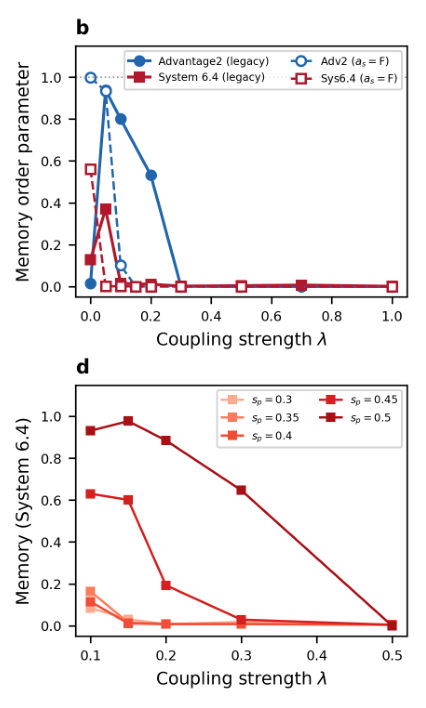
<figcaption class="paper-figure-caption"><b>Fig 2.</b> Figure 2: Subsystem relaxation with tunable environment. a, Memory order parameter M versus environment size |E| on both QPUs (sp = 0.4, λ = 0.5). b, Memory versus coupling strength λ (|E| = 50). Filled markers with solid lines: legacy SDK-default submission path. Open markers with dashed lines: regenerated on direct native-qubit submissions with auto scale=False (no chain couplers). The λ = 0 point is a decoupled control and is excluded from the monotonic crossover statement. c,d, Pause- depth sweeps on Advantage2 (c) and System 6.4 (d); lower sp shifts relaxation to weaker coupling. Plotted threshold values are nominal SDK-default quantities and inherit the auto scale systematic...</figcaption>
</figure>
<figure class="paper-figure-card">
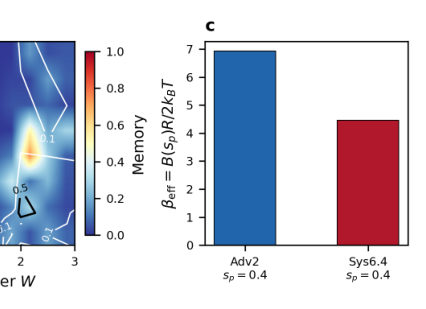
<figcaption class="paper-figure-caption"><b>Fig 3.</b> Figure 3: Disorder arrests relaxation. a, Memory order parameter versus disorder strength W on both QPUs (|E| = 50, λ = 0.5, sp = 0.4). Solid curves: legacy SDK-default submission path. Open triangles (dotted, red): a single-seed reproduction on Advantage system6.4 at the uniform torque compensation chain-strength path with auto scale=True, giving M = 0.54 at W = 1.5 versus the legacy 0.50. Memory rises sharply above W ≈1.5–2.0, indicating disorder-induced arrest of relaxation; the lower threshold on System 6.4 is consistent with its smaller βeff. Smaller fixed chain strengths (Supplementary Information) give weaker arrest, so the arrest magnitude here is specific to the legacy...</figcaption>
</figure>
<figure class="paper-figure-card">
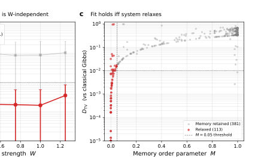
<figcaption class="paper-figure-caption"><b>Fig 4.</b> Figure 4: Effective thermal marginal. a, Fraction of relaxed disorder realizations (M ≤0.05) in the 10-seed disorder sweep (N = 12, |S| = 4, λ = 0.5, 3-regular logical graph, Advantage2). Relaxation fraction decreases from 10/10 at W = 0 to 4/10 at W = 1.25. b, Total-variation distance between the pooled subsystem marginal and the calibrated classical conditional Gibbs target at βeff = 7.219 vs disorder strength. Open circles: all 10 seeds; filled circles: relaxed subset only (error bars = s.d. across relaxed seeds). Gray band: finite-shot reference DTV ≃1</figcaption>
</figure>
<figure class="paper-figure-card">
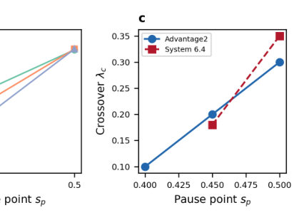
<figcaption class="paper-figure-caption"><b>Fig 5.</b> Figure 5: Classical and small-system controls. a, Comparison across system sizes at fixed sp = 0.4 and representative (λ, W) (see Supplementary Sec. 3 for the full Glauber and SVMC sweeps over system size, coupling strength and disorder). Glauber dynamics at the device temperature (gray diamonds) shows M = 1.0 everywhere. ED at sp = 0.4 (green triangles) shows decreasing memory with system size. The blue-shaded band indicates the QPU result for |E| ≥16 (M &lt; 0.01). b, ED memory versus pause depth sp for three system sizes. Stronger transverse field (lower sp) drives relaxation; weaker field preserves memory. c, Crossover coupling λc (approximate nominal thresholds, defined as the λ where M...</figcaption>
</figure>

**Summary.** This paper introduces a new diagnostic protocol to validate whether programmable quantum annealers are sampling from the intended thermal distribution. By using both a memory parameter and a distance-to-reference metric, the authors can detect 'wrong-basin' trapping that standard benchmarks miss. The work reveals that relaxation is driven by environment size and coupling strength but can be arrested by quenched disorder.

**Why it may be interesting.** This paper is highly relevant to open quantum systems and many-body dynamics as it characterizes how a finite-size environment acts as a non-universal bath and investigates the transition between memory-retaining and relaxed regimes in a programmable quantum device.

Detailed structure

**Main problem.** Determining the conditions under which reverse annealing erases initial-state memory in quantum annealers and developing a diagnostic to detect 'wrong-basin' dynamical trapping where the system relaxes but fails to reach thermal equilibrium.

**Main result.** The authors developed a two-observable diagnostic (Memory Order Parameter and Total Variation Distance) that successfully identifies non-thermal trapping; they also found that quenched disorder arrests relaxation and that QPU relaxation dynamics are better matched by non-local classical updates than local Glauber dynamics.

**Method.** The study uses reverse-annealing protocols on D-Wave Advantage2 and System 6.4 QPUs, comparing experimental subsystem marginals against calibrated Boltzmann references, exact diagonalization, and classical Monte Carlo (Glauber and Parallel Tempering) simulations.

**Model / system.** A subsystem of 6 qubits coupled to an environment of up to 50 qubits via programmable couplers, governed by a time-dependent transverse-field Ising Hamiltonian with longitudinal disorder.

**Key observables.** Memory Order Parameter (M), Total Variation Distance (DTV) to a conditional-Boltzmann reference, and effective inverse temperature (beta_eff).

**Important parameters / regimes.** Environment size (|E|), coupling strength (lambda), quenched disorder strength (W), pause depth (sp), and pause time (tp).

**Assumptions / limitations.** The analysis is limited to small subsystem sizes (N <= 12) for exact diagonalization comparisons, and the study focuses on subsystem-level dynamics rather than the global QPU state.

**Figures summary.** Figure 1 shows the reverse-anneal protocol and subsystem-environment partition; Figure 2 illustrates relaxation as a function of environment size, coupling, and pause depth; Figure 3 shows how disorder arrests relaxation; Figure 4 demonstrates the diagnostic's ability to separate relaxation regimes and identify trapping.

**Paper structure.** The paper introduces the problem of non-thermal trapping, describes the experimental setup and reverse-annealing protocol, presents the development of the two-observable diagnostic, analyzes the drivers of relaxation (size, coupling, disorder), compares QPU dynamics to classical local/non-local models, and concludes with a validation protocol.

Abstract

Programmable quantum annealers are used as open-system samplers, but it is unclear when reverse annealing erases preparation memory and what the readout represents. Here we implement a subsystem-environment protocol on two D-Wave quantum annealers, varying environment size, coupling, disorder, preparation, geometry and QPU generation. A six-qubit subsystem becomes initial-state independent when the environment is large or strongly coupled, while quenched disorder and atypical environment states arrest relaxation. Pairing the memory order parameter with the distance to a calibrated conditional-Boltzmann reference yields a diagnostic that flags rare wrong-basin trapping memory loss alone misses; memory-retaining conditions stay far from the reference (median 0.35). Relaxed ferromagnetic readouts are near-deterministic, so small distances there are a consistency check, not a thermometric test. In a mixed-frustration benchmark, the local-update model practitioners assume mispredicts QPU relaxation roughly sevenfold, whereas non-local classical sampling recovers it. We provide a subsystem-level validation protocol for quantum-annealer sampling.

[↑ back to top](#top)

### [Towards a Matrix Product Ansatz in Two Dimensions](http://arxiv.org/abs/2605.20160v1)

**Authors:** Chandraniva Guha Ray, Aikya Banerjee, P. K. Mohanty  
**Type:** theory · **Category:** statistical mechanics · **PDF:** <https://arxiv.org/pdf/2605.20160v1>  
**Analysis basis:** full PDF text, analyzed in chunks
**Topic relevance:** 🔥 `non-equilibrium dynamics` **4/5** · 🔥 `non-equilibrium universality` **4/5** · `driven-dissipative phase transition` **3/5** · `methods for driven-dissipative` **3/5**

↔ Scroll figures horizontally

<figure class="paper-figure-card">
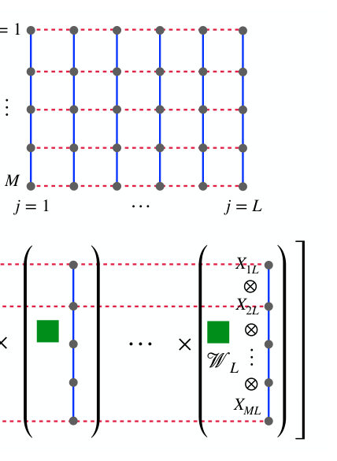
<figcaption class="paper-figure-caption"><b>Fig 1.</b> Figure 1. Schematic representation of MPA in 2D. A M × L square lattice with periodic boundary condition, like (a), is composed of L rods of M-sites each, connected by interactions (dashed lines in (b)). Each of the j-th rod {n1j, n2j, . . . , nMj} is represented by a string of matrix direct product X1j⊗X2j⊗. . . XMj of weight W| where Xij is a short-hand for Xsij. The matrix direct product string Q⊗ i Xij is written vertically, for visual appeal. The weight W| depends on the configuration of j-th rod, can be written, for an isotropic dynamics as Wj = Tr[X1jX2j . . . XMj].</figcaption>
</figure>
<figure class="paper-figure-card">
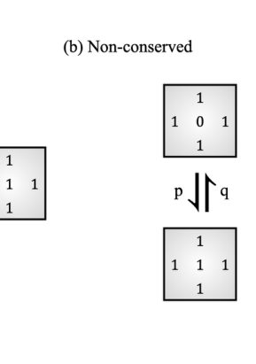
<figcaption class="paper-figure-caption"><b>Fig 2.</b> Figure 2. Dynamics of the non-conserved assisted exclusion model (NAEM) in 2D. (a) Conserved: a particle with exactly one neighbouring site vacant, move there at rate r. (b) Non-conserved: a particle may be created or annihilated at rates p and q respectively, only at sites which have all its four neighbours occupied.</figcaption>
</figure>
<figure class="paper-figure-card">
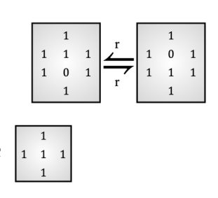
<figcaption class="paper-figure-caption"><b>Fig 3.</b> Figure 3. Steady-state dynamics of NAEM in 2D. In the steady state N00 = 0, and thus, neighbours of all vacant sites are occupied. The conserved part of the dynamics reduces to the following: Any (10) pair (in x and y direction) assisted by occupied neighbours can switch at rate r.</figcaption>
</figure>
<figure class="paper-figure-card">
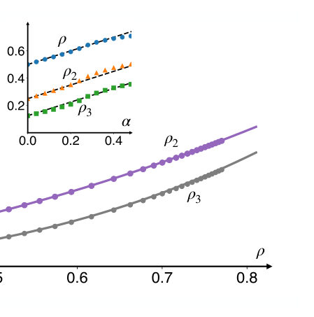
<figcaption class="paper-figure-caption"><b>Fig 4.</b> Figure 4. (a) ρ, ρ2 and ρ3 as a function of α, computed from Monte Carlo simulations of NAEM in 2D (symbols) on a 20 × 100 system are compared with Eq. (44). (b) ρ2 vs. ρ and ρ3 vs. ρ obtained following Eq. (46) (lines) matched well with the those obtained from simulations. Inset: for small α, ρ, ρ2 and ρ3 are linear in α as predicted by Eq. (47).</figcaption>
</figure>
<figure class="paper-figure-card">
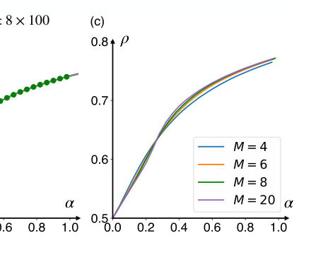
<figcaption class="paper-figure-caption"><b>Fig 5.</b> Figure 5. Density plots for M = 2m. Exact results (ρ versus α) for small M following Eq. (53) (solid lines), for (a) 4 × 100 and (b) 8 × 100 are compared with the same obtained from Monte-Carlo simulations (symbols). (c) Comparison of ρ versus α for different system size, M = 4, 6, 8 and 20. M = 20 is already in the large M limit.</figcaption>
</figure>

**Summary.** This paper presents a new mathematical framework to extend the Matrix Product Ansatz to two-dimensional stochastic systems. By applying it to a new model called NAEM, the authors find exact solutions for particle density and currents, revealing a specific type of absorbing phase transition and a link to equilibrium hard-core lattice gases.

**Why it may be interesting.** This work provides a rare exact solution for a 2D non-equilibrium system, which is highly relevant for understanding many-body dynamics and the development of tensor-network-like approaches for non-equilibrium steady states.

Detailed structure

**Main problem.** The difficulty of generalizing the Matrix Product Ansatz (MPA) from one dimension to two dimensions to find exact steady-state solutions for non-equilibrium stochastic processes.

**Main result.** The authors introduce a 2D MPA framework and apply it to the Non-conserved Assisted Exclusion Model (NAEM), demonstrating an absorbing phase transition with an order-parameter exponent of beta = 3 and a mapping to the equilibrium hard-square lattice gas.

**Method.** The study uses a 2D Matrix Product Ansatz where the lattice is treated as a series of rods, combined with a transfer matrix method and algebraic reduction of the master equation.

**Model / system.** The Non-conserved Assisted Exclusion Model (NAEM) on a 2D square lattice, featuring constrained hopping (assisted by neighbors) and local birth-death dynamics (at sites with all neighbors occupied).

**Key observables.** Steady-state particle density, density moments, particle currents (Jx, Jy), and the activity order parameter.

**Important parameters / regimes.** The birth-death ratio alpha (p/q), the hopping rate r, and the critical density rho_c = 1/2.

**Assumptions / limitations.** The 2D construction assumes a rod-like decomposition of the lattice and relies on the restriction of the configuration space to states where no two adjacent sites are vacant (N00 = 0).

**Figures summary.** Figure 1 shows the 2D MPA schematic; Figure 3 illustrates NAEM dynamics; Figure 5 shows density plots for different system widths; Figure 6 displays currents and activity as functions of alpha.

**Paper structure.** The paper introduces the 2D MPA framework, defines the NAEM model and its dynamics, provides the exact 1D and 2D mathematical solutions, analyzes phase transitions and scaling in the conserved limit, and concludes with a mapping to equilibrium lattice gases.

Abstract

Matrix product ansatz (MPA) is a powerful framework for constructing exact steady state weights of one dimensional non-equilibrium stochastic processes; but its generalization to higher dimensions is limited. Here, we introduce the MPA formalism for two dimensions (2D). As a concrete application, we introduce and exactly solve a non-conserved assisted exclusion model (NAEM) in one and two dimensions with constrained hopping and local birth-death dynamics: a particle can hop to a neighbouring site only when exactly one of its neighbouring sites is vacant, while creation and annihilation occur exclusively at sites whose neighbours are all occupied. The MPA yields exact steady-state weights and provides a systematic method to compute observables such as density moments and particle currents. In the particle-conserving limit, the system undergoes an absorbing phase transition at the critical density $ρ_c=\frac12$ with order-parameter exponent $β=3$. We further show that the steady state of the NAEM maps exactly onto the well-studied hard-square lattice gas with nearest-neighbour exclusion, thereby providing a nonequilibrium dynamical route to realizing equilibrium states of constrained lattice gases. Our work generalizes matrix-product methods beyond one dimension, establishing a systematic approach to exact solutions of interacting stochastic systems in 2D.

[↑ back to top](#top)

### [Noise-induced Simulability Transition from Operator Scrambling](http://arxiv.org/abs/2605.18943v1)

**Authors:** Neil Dowling, Xhek Turkeshi, Jacopo De Nardis, Guglielmo Lami  
**Type:** theory · **Category:** quantum information and computing · **PDF:** <https://arxiv.org/pdf/2605.18943v1>  
**Analysis basis:** full PDF text, analyzed in chunks
**Topic relevance:** 🔥 `entanglement & information structure` **4/5** · `driven-dissipative phase transition` **3/5** · `methods for driven-dissipative` **3/5** · `non-equilibrium dynamics` **3/5**

↔ Scroll figures horizontally

<figure class="paper-figure-card">
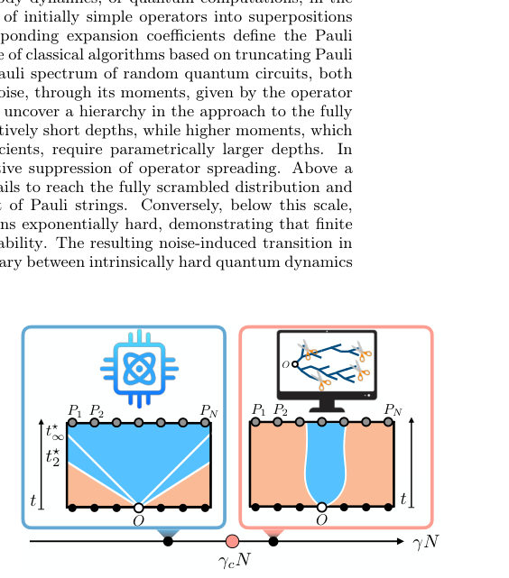
<figcaption class="paper-figure-caption"><b>Fig 1.</b> FIG. 1. Schematic evolution of the moments of the Pauli spec- trum, equivalently the operator stabilizer Rényi entropies. In the unitary case (left), different moments equilibrate at dis- tinct crossover times t⋆ 2 &lt; t⋆ 3 &lt; . . . &lt; t⋆ ∞, revealing a hierarchy in the approach to the fully scrambled, Haar-random regime. In the noisy case (right), increasing the error per cycle γN ar- rests this flow and drives the operator into a sparse, classically simulable phase that can be captured by Pauli-propagation al- gorithms.</figcaption>
</figure>
<figure class="paper-figure-card">

<figcaption class="paper-figure-caption"><b>Fig 2.</b> FIG. 2. Brickwork random circuits and RMPU. (Left) In a brickwork circuit, an initially local operator spreads through successive two-site gates U as the circuit depth t in- creases. Darker shapes represent conjugate gates U ∗. (Right). A random matrix product unitary is constructed by overlap- ping Haar-random blocks, each acting on a support of size r + 1, with neighboring blocks sharing an overlap of dimen- sion r. Both geometries can possibly be affected by noise, modeled by a noise channel N acting after each unitary gate (dotted boxes).</figcaption>
</figure>
<figure class="paper-figure-card">

<figcaption class="paper-figure-caption"><b>Fig 3.</b> FIG. 3. Equilibration of Pauli moments in noiseless 1D brickwork circuits. (Top) Second moment µ2 of the Pauli spectrum as a function of the circuit depth t. The black line is the Haar value µ2 Haar. (Bottom) Deviation of the second (µ2, left) and third (µ3, right) moments from their respective Haar values µ2 Haar and µ3 Haar. On the x-axis, the circuit depth is rescaled by the timescales (10) with τ given by eq. (11). Different sizes N define a crossover occurring at depth t/t⋆ k ≃ 1, consistent with Eq. (9). Data are obtained with the replica tensor-network (second moment) and exact diagonalization (third moment).</figcaption>
</figure>
<figure class="paper-figure-card">

<figcaption class="paper-figure-caption"><b>Fig 4.</b> FIG. 4. Pauli moments in noisy circuits. (Left) Normalized second moment µ2 for noisy Haar-random brickwork circuits with N = 7 qubits and varying error per cycle γN. For sufficiently weak noise, µ2 asymptotically approaches the Haar value (dotted line), whereas above a noise threshold it saturates at a value larger than the Haar prediction. The following panels focus on the region around circuit depth t = 2N (arrow). (Center) Deviation from Haar, ∣µ2 −µ2 Haar∣, at fixed depth t = N as a function of the noise accumulated per layer, γN. The deviation grows exponentially with γN. (Right) At depth t ≃N, the deviation from Haar, ∣µ2 −µ2 Haar∣, decays as e−κt. The decay rate κ, extracted from...</figcaption>
</figure>
<figure class="paper-figure-card">

<figcaption class="paper-figure-caption"><b>Fig 5.</b> FIG. 5. Pauli spectrum in noisy 2D circuits. Pauli spec- trum ΠO(u) (Eq. (4)) of an operator initially localized at the central site of a 3 × 3 lattice and time-evolved through a 2D noisy random quantum circuit of depth t with brickwork ge- ometry. The average is taken over 103 circuit realizations. (Left) For weak noise below the transition, γN ≃0.28, the distribution converges to the OPT distribution. (Right) For noise γN ≃1.05, which lies above the transition, the distribu- tion remains far from the OPT and exhibits persistent heavy tails decaying as ∼u−2. The 1D case shows analogous fea- tures.</figcaption>
</figure>

**Summary.** This paper identifies a phase transition in the complexity of quantum operators induced by local noise. It shows that while low noise levels allow for exponential complexity, sufficiently high noise arrests operator spreading, making the dynamics classically simulable. The findings connect operator scrambling properties directly to the threshold for classical simulation in noisy quantum circuits.

**Why it may be interesting.** This paper is highly relevant for researchers in open quantum systems and many-body dynamics as it provides a microscopic, analytical description of how dissipation competes with unitary scrambling to fundamentally alter the complexity of quantum evolution.

Detailed structure

**Main problem.** Determining the boundary between classically simulable and intractable quantum dynamics in the presence of local noise, specifically how noise affects the scrambling of operators and the Pauli spectrum.

**Main result.** The authors identify a noise-induced transition in operator complexity: above a critical error rate, noise arrests operator spreading into a sparse, simulable regime, whereas below this threshold, the system remains exponentially hard to simulate.

**Method.** The study uses Weingarten calculus for Haar-random averages, maps the circuit dynamics to an Ising-like statistical mechanics model, and employs replica tensor network contractions and Pauli truncation simulations.

**Model / system.** Random quantum circuits, specifically the Random Matrix Product Unitary (RMPU) model and 1D/2D brickwork circuits, subject to local depolarizing noise.

**Key observables.** Pauli spectrum distribution, Pauli moments (mu_k, nu_k), Operator Stabilizer Renyi Entropies (OSE), and Mean Squared Error (MSE) of Pauli truncation.

**Important parameters / regimes.** Error per cycle (gamma), circuit depth (t), number of qubits (N), and the scrambling time (tau).

**Assumptions / limitations.** The statistical mechanics mapping is strictly valid in the large-dimension limit (large d) where weights are positive definite; noise is modeled as local depolarizing channels.

**Figures summary.** Figure 1 shows the hierarchy of scrambling in noiseless circuits and the arrest of spreading in noisy circuits; Figure 2 illustrates the circuit architectures (brickwork and RMPU); Figure 5 and 6 demonstrate the Pauli spectrum convergence and the MSE transition across the critical noise threshold.

**Paper structure.** The paper introduces the problem of operator scrambling, defines the RMPU and noise models, develops a statistical mechanics mapping via Weingarten calculus, analyzes the noiseless scrambling hierarchy, identifies the noise-induced transition, and validates the results via numerical simulations and error scaling analysis.

Abstract

The complexity of simulating quantum many-body dynamics, or quantum computations, in the Heisenberg picture is governed by the scrambling of initially simple operators into superpositions of exponentially many Pauli strings. The corresponding expansion coefficients define the Pauli spectrum, whose structure controls the performance of classical algorithms based on truncating Pauli expansions. Here we determine the finite-depth Pauli spectrum of random quantum circuits, both in the noiseless case and in the presence of local noise, through its moments, given by the operator stabilizer Rényi entropies. In noiseless circuits, we uncover a hierarchy in the approach to the fully scrambled regime: low moments equilibrate at relatively short depths, while higher moments, which are sensitive to rare, large-amplitude Pauli coefficients, require parametrically larger depths. In noisy circuits, scrambling competes with an effective suppression of operator spreading. Above a critical error per cycle $γ_c N=\mathcal{O}(1)$, the operator fails to reach the fully scrambled distribution and remains supported on an atypically sparse subset of Pauli strings. Conversely, below this scale, we rigorously show that classical simulation remains exponentially hard, demonstrating that finite noise does not automatically imply classical simulability. The resulting noise-induced transition in operator complexity therefore delineates the boundary between intrinsically hard quantum dynamics and those that remain classically accessible.

[↑ back to top](#top)

### [Collective charge measurement in quantum dot chains: controlling barrier occupation and tunneling current](http://arxiv.org/abs/2605.19001v1)

**Authors:** Alok Nath Singh, Rafael Sánchez, Andrew N. Jordan  
**Type:** theory · **Category:** other · **PDF:** <https://arxiv.org/pdf/2605.19001v1>  
**Analysis basis:** full PDF text, analyzed in chunks
**Topic relevance:** 🔥 `quantum measurements` **4/5** · `correlated / nonlocal dissipation` **3/5** · `non-equilibrium dynamics` **3/5** · `methods for driven-dissipative` **2/5**

↔ Scroll figures horizontally

<figure class="paper-figure-card">

<figcaption class="paper-figure-caption"><b>Fig 1.</b> Figure 1. Scheme of the triple quantum dot coupled to two terminals (l = L, R) via tunneling rates γL. The energies of the singly-occupied quantum dots are represented: the central dot is split by ∆with respect to the other two, at ε. The nearest neighbor hopping is Ω. The QPC is capacitively coupled to all three dots with measurement strengths γL, γC, and γR respectively.</figcaption>
</figure>
<figure class="paper-figure-card">

<figcaption class="paper-figure-caption"><b>Fig 2.</b> Figure 2. Central dot occupation, ρCC (a), and TQD current, IT (b), plotted as a function of time. The initial state is |0⟩⟨0|. The black curve correspond to the ensemble-averaged evolution, and the colored curves are individual stochastic trajectories. For the latter, time averaging is done over a rectangular window of 0.1 Ω−1. Parameters: ΓL = 10 Ω, ΓR = 8 Ω, ∆= 10 Ω, γL = Ω, γC = 2 Ω, and γR = Ω.</figcaption>
</figure>
<figure class="paper-figure-card">

<figcaption class="paper-figure-caption"><b>Fig 3.</b> Figure 3. Steady-state central dot occupation (a) and TQD current (b) as a function of measurement strengths. Cases with different measurement-strength proportions, including uniform detection of all sites and local detection of individual sites, are plotted in different colors. Other parameters: ∆= 10 Ω, ΓL = 10 Ω, and ΓR = 8 Ω.</figcaption>
</figure>
<figure class="paper-figure-card">

<figcaption class="paper-figure-caption"><b>Fig 4.</b> Figure 5. Steady-state current enhancement IT/I0 versus detuning ∆for optimal-current readout described by Eq. (13). It is compared with three simpler measurement configurations where only the central dot is measured (γL = γR = 0): one with a variable strength of γ∗= 2 ∆(orange) and the other two with a fixed strength of 10 Ω(blue) and 15 Ω(green) The inset shows how the optimal current itself varies with ∆. Other parameters: ΓL = 10 Ω, ΓR = 8 Ω.</figcaption>
</figure>
<figure class="paper-figure-card">

<figcaption class="paper-figure-caption"><b>Fig 5.</b> Figure 4. Steady-state central dot occupation (a) and TQD current (b) as a function of the dephasing terms DLR and DRC. The star in panel (b) denotes the point where the current is maximized. ρ(0) CC and I(0) T denote the respective no-measurement values on the color bar. Other parameters: ∆= 10 Ω, ΓL = 10 Ω, and ΓR = 8 Ω.</figcaption>
</figure>

**Summary.** This paper demonstrates that spatially structured continuous measurement can be used to engineer transport in a triple-quantum-dot chain. By tuning the measurement strengths of a QPC, one can enhance the tunneling current and control the occupation of the central barrier dot. The study identifies an optimal measurement configuration and shows that near-optimal performance can be achieved with simple local readout.

**Why it may be interesting.** It provides insights into using measurement-induced dephasing as a control tool for transport, which is highly relevant to researchers working on open quantum systems and the control of quantum dynamics via backaction.

Detailed structure

**Main problem.** Investigating how continuous, global quantum measurement via a QPC affects nonequilibrium transport, specifically controlling barrier occupation and tunneling current in a triple-quantum-dot system.

**Main result.** Global measurement with structured dephasing can significantly improve barrier occupation and tunneling current, with an optimal configuration identified that maximizes steady-state current.

**Method.** The study uses a Stochastic Master Equation (SME) in Itô form and Lindblad superoperators to model the dynamics of the TQD under continuous monitoring and reservoir coupling.

**Model / system.** A triple-quantum-dot (TQD) chain (Left, Center, Right) acting as a discrete tunnel barrier, coupled to two thermal reservoirs and monitored by a Quantum Point Contact (QPC) with tunable measurement strengths.

**Key observables.** Particle current (It), central dot occupation (rho_CC), and measurement-induced dephasing rates (D_jk).

**Important parameters / regimes.** Tunneling rates (Gamma_L, Gamma_R), hopping (Omega), energy detuning (Delta), and measurement strengths (gamma_i).

**Assumptions / limitations.** Large voltage bias limit, Coulomb blockade regime (at most one electron), and the regime where Omega is much smaller than other energy scales.

**Figures summary.** Figure 1 shows the TQD schematic; Figure 4 plots central dot occupation and current as functions of dephasing rates; Figure 6 shows the time evolution of dot populations and current for individual trajectories and ensemble averages.

**Paper structure.** The paper introduces the TQD system and measurement scheme, defines the mathematical framework using SME, analyzes various measurement regimes (local vs. global, strong vs. weak), identifies optimal configurations for transport enhancement, and concludes with sensing potential.

Abstract

We investigate nonequilibrium transport in a triple-quantum-dot (TQD) system, where the central dot acts as a discrete tunnel barrier, subject to continuous monitoring by a quantum point contact (QPC) that is capacitively coupled to all three dots with independently tunable strengths. We show that this global measurement scheme affects transport in a qualitatively distinct manner from single-site measurement. By engineering structured dephasing, measurement provides a significant improvement in the barrier occupation and tunneling current. In the strong-measurement limit, the steady state becomes independent of the underlying Hamiltonian parameters, and the barrier occupation can approach 1/2 for suitable measurement configurations. We identify an optimal measurement configuration that maximizes the steady-state current and show that near-optimal performance can be achieved with a simple central-dot readout scheme.

[↑ back to top](#top)

### [Signatures of quantum noise in the operation of Deutsch's algorithm](http://arxiv.org/abs/2605.19047v1)

**Authors:** Małgorzata Strzałka, Katarzyna Roszak  
**Type:** both · **Category:** quantum information and computing · **PDF:** <https://arxiv.org/pdf/2605.19047v1>  
**Analysis basis:** full PDF text, analyzed in chunks
**Topic relevance:** 🔥 `QC/QI experiment` **4/5** · `correlated / nonlocal dissipation` **3/5** · `quantum measurements` **3/5** · `spintronics-quantum-optics interface` **2/5**

↔ Scroll figures horizontally

<figure class="paper-figure-card">

<figcaption class="paper-figure-caption"><b>Fig 1.</b> FIG. 1. Two cycles of Deutsch’s algorithm with decoherence. The end of the first run of the algorithm ends with the measurement of qubit A and is denoted by the vertical line. The Pauli-X gate is applied on qubit A only if the measurement outcome is |1⟩. Both qubits undergo decoherence right before the application of the two-qubit unitary functions ˆUfn. The decoherence process with the same environments is repeated in both cycles.</figcaption>
</figure>
<figure class="paper-figure-card">

<figcaption class="paper-figure-caption"><b>Fig 2.</b> FIG. 2. Conditional probabilities of measurement outcome after two cycles of Deutsch’s algorithm as a function of coher- ence parameter c (p00 - solid red lines; p01- dashed blue lines; p10 - dotted-dashed green lines; p11 - dottedu black lines). Left panels correspond to phase damping and right panels to quantum decoherence. Top panels show results for constant functions and bottom for balanced.</figcaption>
</figure>
<figure class="paper-figure-card">

<figcaption class="paper-figure-caption"><b>Fig 3.</b> FIG. 4. Probabilities of measurement outcome after two cy- cles of Deutsch’s algorithm performed on the quantum proces- sor as a function of the number of qubits between operational qubits (p00 - red circles; p01- blue squared; p10 - green tri- angles; p11 - black pentagons; filled markers always denote functions f0/1, while not filled denote f2/3). Panels on the left show probabilities obtained by decoherence channels, and panels on the right obtained directly on quantum computer. As previously, top panels show results for constant functions and bottom for balanced.</figcaption>
</figure>
<figure class="paper-figure-card">

<figcaption class="paper-figure-caption"><b>Fig 4.</b> FIG. 3. Probabilities of measurement outcome after two cy- cles of Deutsch’s algorithm as a function of coherence pa- rameter c (p00 - solid red lines; p01- dashed blue lines; p10 - dotted-dashed green lines; p11 - dotted, black lines). Left pan- els correspond to phase damping and right panels to quantum decoherence. Top panels show results for constant functions and bottom for balanced.</figcaption>
</figure>
<figure class="paper-figure-card">

<figcaption class="paper-figure-caption"><b>Fig 5.</b> FIG. 6. As Fig. 5, but for initially fully polarized nuclear spins, p = 1.</figcaption>
</figure>

**Summary.** This paper investigates how the quantum nature of environmental noise affects the performance of quantum algorithms. By running Deutsch's algorithm in multiple cycles, the authors demonstrate that quantum correlations in the environment lead to measurable differences in outcome probabilities compared to standard classical noise models. The findings are supported by both IBM Quantum processor experiments and simulations of NV center spin qubits.

**Why it may be interesting.** It provides a method to experimentally distinguish between classical noise models and true quantum-correlated noise by looking for signatures of environmental memory and back-action in multi-cycle quantum circuits.

Detailed structure

**Main problem.** Determining how the 'quantumness' of an environment (system-environment correlations and back-action) manifests in the results of quantum algorithms, specifically distinguishing between classical Kraus-based noise and full quantum noise models.

**Main result.** Running Deutsch's algorithm in two cycles reveals stark differences between classical and quantum noise models, specifically a qualitative change in measurement outcomes for constant functions and a slowing of decoherence for balanced functions. These effects were experimentally validated on an IBM Quantum processor.

**Method.** The authors compare a full density matrix approach (quantum environment) with a Kraus operator approach (classical environment) using two cycles of Deutsch's algorithm, with experimental validation on IBM superconducting qubits and theoretical simulations of NV center spin qubits.

**Model / system.** The study uses Deutsch's algorithm as a proxy for complex algorithms, applied to superconducting transmon qubits (IBM Heron r2) and NV center spin qubits interacting with a nuclear spin bath of 32 13C isotopes.

**Key observables.** Measurement probabilities of qubit A in the {0, 1} basis, conditional probabilities after one and two algorithm cycles, and decoherence factors.

**Important parameters / regimes.** Function types (constant vs. balanced), number of intervening qubits (N), decoherence time (t), and initial environmental polarization (p).

**Assumptions / limitations.** The noise is limited to pure dephasing; there is no energy exchange/relaxation; there are no initial correlations between the system and environment; and the environments for separate qubits are non-interacting.

**Figures summary.** Figure 1 shows the algorithm flowchart; Figures 2 and 3 compare conditional and absolute probabilities for classical vs. quantum noise; Figures 4-6 illustrate results for NV centers and varying qubit distances; Figures 7-9 detail the multi-cycle circuit and probabilities vs. decoherence time.

**Paper structure.** The paper introduces the problem of quantum vs. classical noise, defines the two-cycle Deutsch algorithm framework, presents the mathematical derivation for both noise models, provides experimental validation using IBM Quantum hardware, and extends the analysis to NV center spin systems.

Abstract

We use Deutsch's algorithm as a stand in for more complex quantum algorithms in order to determine how quantum properties of an environment manifest themselves in results that can be obtained on quantum computers. We model pure dephasing in two different ways; one keeps the full density matrix of the qubits and environments (quantum) while the other uses Kraus operators (classical). We find that a single run of the algorithm yields the same effect in both cases, but running the algorithm twice leads to stark differences. Taking correlations and interplay between different decoherence processes into account leads to a slowing of decoherence effects for balanced functions. For constant functions, the effect is much more pronounced, and there is a qualitative change in the dependence of measurement outcomes on decoherence. We present results obtained on one of the IBM Quantum processors, which fully reproduce the predicted effect regardless of the assumptions made in the derivation. We further illustrate the findings on NV center spin qubits, which show more complex behavior due to a small size of the environment.

[↑ back to top](#top)

### [Developing a photon-number-resolving detection chain for quantum communication protocols involving mesoscopic states of light](http://arxiv.org/abs/2605.19980v1)

**Authors:** Alex Pozzoli, Stefano Carsi, Andrea Abba, Alessia Allevi  
**Type:** experiment · **Category:** quantum information and computing · **PDF:** <https://arxiv.org/pdf/2605.19980v1>  
**Analysis basis:** full PDF text, analyzed in chunks
**Topic relevance:** 🔥 `QC/QI experiment` **4/5** · 🔥 `quantum optics experiment` **4/5** · `quantum measurements` **3/5**

↔ Scroll figures horizontally

<figure class="paper-figure-card">

<figcaption class="paper-figure-caption"><b>Fig 1.</b> FIG. 1. Sketch of the experimental setup used to measure TWB states of light (a) or coherent states of light (b). TWB: twin-beam, BF: band pass filter, AD: achromatic doublet, MF: multi-mode optical fiber, D: detection chain, BS: beam splitter, ND: neutral density filter. (c): block diagram of the detection chain. SiPM: silicon photomultiplier, PCB: printed circuit board, PSAU: power supply and amplification unit, Coax: coaxial cable, AMP: amplifier adapter board.</figcaption>
</figure>
<figure class="paper-figure-card">

<figcaption class="paper-figure-caption"><b>Fig 2.</b> FIG. 2. (a)-(c): Pulse height spectra as a function of the channel number corresponding to coherent states with different mean values (increasing from top to bottom). The employed detector is the model 25CS and the synchronous acquisition is operated at 1 MHz. (d): visibility v as a function of the peak number. The color encoding shows the correspondence between data in the left panels and those in the right panel. The dashed lines correspond to v = 1, 0.9, 0.5, 0.1.</figcaption>
</figure>
<figure class="paper-figure-card">

<figcaption class="paper-figure-caption"><b>Fig 3.</b> FIG. 3. Visibility v, in panel (a), and figure of merit (FoM), in panel (b), as a function of the peak number for different models of SiPMs operated at 3 kHz and a synchronous acquisition at 1 MHz with the 25CS. Light blue dots in panel (a) correspond to the curve in Fig. 2(d). The dashed lines in panel (a) correspond to v = 1, 0.9, 0.5, 0.1, while those in panel (b) to FoM = 1, 0.5. In both panels, lines between dots are used just to guide the eye.</figcaption>
</figure>
<figure class="paper-figure-card">

<figcaption class="paper-figure-caption"><b>Fig 4.</b> FIG. 4. Peak-to-peak distance ∆p−p, in panel (a), and standard deviation σ, in panel (b), in digital channel units as a function of the peak number for different models of SiPMs operated at 3 kHz and a synchronous acquisition at 1 MHz. In both panels, lines between dots are used just to guide the eye.</figcaption>
</figure>
<figure class="paper-figure-card">

<figcaption class="paper-figure-caption"><b>Fig 5.</b> FIG. 5. (a): Fano factor as a function of the number of photons, ⟨m⟩, measured in each TWB arm for the 25CS and 50CS. The two curves corresponding to the same tone of blue refer to two identical SiPMs, each detecting one arm of the TWB. (b) and (c): R and Γ, respectively, as a function of ⟨m⟩for the 25CS, 50CS, and 25PS. The lines between dots are used just to guide the eye. In all the panels, error bars are estimated as the standard error of the mean over four repetitions of 250000 acquisitions each.</figcaption>
</figure>

**Summary.** The researchers developed a digital-first detection chain using FPGAs to perform real-time signal processing on Silicon Photomultipliers. This system allows for high-fidelity photon-number resolution in the mesoscopic regime, outperforming traditional analog integrators and enabling the characterization of quantum correlations in high-intensity light states.

**Why it may be interesting.** This work is highly relevant to quantum optics and quantum information as it provides a scalable, high-speed hardware solution for detecting mesoscopic quantum states, which is critical for developing robust quantum networks and continuous-variable quantum communication.

Detailed structure

**Main problem.** Developing a stable, digital photon-number-resolving (PNR) detection chain for quantum communication protocols involving mesoscopic states of light, while overcoming SiPM limitations like pile-up and dark counts.

**Main result.** The implementation of an FPGA-based digital pipeline enables high-fidelity PNR detection for mesoscopic states, maintaining high visibility (v > 0.9) up to 15 photons and allowing for reconstruction of nonclassical correlations in twin-beam states.

**Method.** A digital signal processing pipeline using an FPGA for real-time baseline subtraction, digital deconvolution (pole-zero compensation), and charge integration is applied to signals from various SiPM models.

**Model / system.** The experimental platform consists of Silicon Photomultipliers (SiPMs) coupled to a 14-bit, 1 Gs/s digital acquisition system, using both classical coherent states and quantum twin-beam states generated via spontaneous parametric down-conversion.

**Key observables.** Visibility (v), Figure of Merit (FoM), Fano factor (F), correlation coefficients (R and Gamma), and photon-number distribution reconstruction.

**Important parameters / regimes.** Mesoscopic intensity regime (up to ~80 photons), pixel pitch (25 and 50 micrometers), acquisition rates (500 kHz to 20 MHz), and integration gate window (10-20 ns).

**Assumptions / limitations.** Uses Bernoullian detection models to relate detected photons to actual photon numbers; assumes the primary performance degradation at high photon numbers is due to peak overlap and pile-up.

**Figures summary.** Figure 1 shows the experimental setups and block diagram; Figure 2 displays pulse-height spectra and the decline of visibility with increasing photon number; Figure 3 compares visibility and FoM across different SiPM models and acquisition rates; Figure 5 illustrates the Fano factor and correlation parameters for different detectors.

**Paper structure.** The paper introduces the need for digital PNR detection, describes the hardware and FPGA-based digital pipeline, presents a systematic comparison of different SiPM models and acquisition modes, and evaluates the performance limits using classical and quantum light states.

Abstract

We present the characterization of a photon-number-resolving detection chain based on Silicon photomultipliers (SiPM) coupled to a 14 bit, 1 Gs\s digital acquisition system embedding an FPGA-based signal processing pipeline that performs real-time baseline subtraction, digital deconvolution, and charge integration. Three SiPM models manufactured by Hamamatsu are tested and compared in the mesoscopic intensity regime using both classical coherent states and quantum twin-beam states, enabling a systematic investigation of the effects of pixel pitch, pile-up, and photon detection efficiency on the detector performance.

[↑ back to top](#top)

### [Exact dynamics of a single-photon emitter in front of a mirror](http://arxiv.org/abs/2605.19442v1)

**Authors:** Mateusz Duda, Thomas Hartwell, Daniel Hodgson, Gin Jose, Pieter Kok, Almut Beige  
**Type:** theory · **Category:** quantum information and computing · **PDF:** <https://arxiv.org/pdf/2605.19442v1>  
**Analysis basis:** full PDF text, analyzed in chunks
**Topic relevance:** 🔥 `interference shaping light` **4/5** · `correlated / nonlocal dissipation` **3/5** · `methods for driven-dissipative` **2/5** · `non-equilibrium dynamics` **2/5**

↔ Scroll figures horizontally

<figure class="paper-figure-card">

<figcaption class="paper-figure-caption"><b>Fig 1.</b> FIG. 1. Diagram of a two-level quantum emitter near a partially-transparent mirror interface with reflection coeffi- cient rm and transmission coefficient tm. The emitter couples to the local electromagnetic field at x = 0 with coupling rate g, while d/2 denotes the distance between the emitter and the mirror.</figcaption>
</figure>
<figure class="paper-figure-card">

<figcaption class="paper-figure-caption"><b>Fig 2.</b> FIG. 2. Reabsorption processes contributing to the Dyson series term U2(t, 0) |e, 0⟩in Eq. (28). (a) Instant reabsorption at x = 0, corresponding to the first term in Eq. (28). (b) Reabsorption after the round-trip time d/c, corresponding to the second term in Eq. (28). In this case the amplitude of the state acquires the mirror reflection coefficient rm and the round-trip phase eiωed/c.</figcaption>
</figure>
<figure class="paper-figure-card">

<figcaption class="paper-figure-caption"><b>Fig 3.</b> FIG. 3. Two-level emitter excitation probability as a function of time (in normalized units), calculated using Eq. (52). Each panel shows results for three different reflection coefficients: rm = −1 (solid blue curves), rm = −0.5 (solid red curves), and rm = 0 (dashed black curves). The round-trip time is (a) ˜τ = 0.01, (b), (c) ˜τ = 1, and (d) ˜τ = 4. The transition frequency of the emitter is chosen such that the corresponding round-trip phases are (a), (b), (d) ˜ωe˜τ = π and (c) ˜ωe˜τ = 2π.</figcaption>
</figure>
<figure class="paper-figure-card">

<figcaption class="paper-figure-caption"><b>Fig 4.</b> FIG. 4. Approximate two-level emitter excitation probabil- ity in the Markovian regime [Eq. (57)] as a function of time. As in Fig. 3, we consider the reflection coefficients rm = −1 (solid blue curves), rm = −0.5 (solid red curves), and rm = 0 (dashed black curves). The round-trip time is ˜τ = 0.01, and the round-trip phases are (a) ˜ωe˜τ = π and (b) ˜ωe˜τ = 2π.</figcaption>
</figure>
<figure class="paper-figure-card">

<figcaption class="paper-figure-caption"><b>Fig 5.</b> FIG. 5. (a) Transition frequency shift ∆eff and (b) effec- tive decay rate Γeff as a function of the round-trip phase ˜ωe˜τ = ωed/c, calculated using Eq. (59). The reflection co- efficient of the mirror is rm = −1.</figcaption>
</figure>

**Summary.** This paper provides an exact analytical framework to describe how a mirror affects the emission of a single-photon emitter in a 1D waveguide. It demonstrates that the presence of the mirror induces non-exponential decay and non-Lorentzian spectra due to photon reabsorption. These findings are crucial for designing controlled photon-emitter interfaces in quantum technologies.

**Why it may be interesting.** This work provides an exact solution for a non-Markovian open quantum system, offering insights into how structured environments can be used for pulse-shaping and controlling emission rates in quantum networks.

Detailed structure

**Main problem.** Determining the exact non-Markovian dynamics of a single-photon emitter placed in front of a partially-transparent mirror, specifically how the mirror alters the emitter's decay profile and the photon wave packet's properties.

**Main result.** The authors derive an exact analytical solution showing that the emitter's decay is non-exponential due to photon reabsorption, and they identify regimes of enhanced (superradiant-like) or suppressed (subradiant-like) decay based on the round-trip phase and distance.

**Method.** The study employs a local-photon approach to solve the Schrodinger equation directly using a Dyson series expansion and validates the analytical results against numerical quantum trajectory simulations.

**Model / system.** A two-level quantum emitter is placed at a distance d/2 from a partially-transparent mirror in a one-dimensional waveguide, modeled by a Hamiltonian including emitter, field, and mirror interaction terms.

**Key observables.** Emitter excitation probability, photon wave packet spatial and spectral profiles, photoluminescence spectrum, and photon probability density.

**Important parameters / regimes.** Emitter-mirror distance (d), coupling rate (g), mirror reflection/transmission coefficients (r_m, t_m), and the photon round-trip time (d/c).

**Assumptions / limitations.** The emitter is a point-like two-level system, the mirror is infinitely thin, the system is restricted to the single-photon regime, and environmental decoherence is neglected.

**Figures summary.** Figure 1 shows the physical setup; Figure 2 and 9 illustrate reabsorption processes in the Dyson series; Figure 3 shows the transition from non-exponential to exponential decay; Figure 11 compares analytical results with numerical simulations.

**Paper structure.** The paper begins by defining the physical system and Hamiltonian, proceeds to derive the exact analytical dynamics using the Dyson series and an iterative approach, explores various physical regimes (Markovian vs. non-Markovian), and concludes with numerical validation and discussion of experimental relevance.

Abstract

Single-photon emitters in nanophotonic structures are a key building block for many photonic devices with quantum technology applications, like quantum sensors and quantum computers. In this paper, we determine the exact dynamics of a single-photon emitter in a one-dimensional waveguide terminated by a partially-transparent mirror interface, by solving the Schrodinger equation via a local-photon approach. In general, the evolution of the emitter is non-Markovian, characterized by a non-exponential decay profile. The decay can resemble an exponential after a time that is much larger than the emitter-mirror round-trip time and becomes exponential in the Markovian limit, where the round-trip time between the emitter and the mirror is neglected. We also derive the spatial and spectral profile of the emitted photon wave packet and demonstrate how its properties are altered by the environment.

[↑ back to top](#top)

### [Non-equilibrium quantum dynamics of interacting integrable models by Monte Carlo sampling Lehmann representations](http://arxiv.org/abs/2605.20065v1)

**Authors:** Riccardo Senese, Fabian H. L. Essler  
**Type:** theory · **Category:** numerical methods · **PDF:** <https://arxiv.org/pdf/2605.20065v1>  
**Analysis basis:** full PDF text, analyzed in chunks
**Topic relevance:** 🔥 `non-equilibrium dynamics` **4/5** · `entanglement & information structure` **2/5** · `methods for driven-dissipative` **2/5** · `non-equilibrium universality` **2/5** · `scars & prethermalization` **1/5**

↔ Scroll figures horizontally

<figure class="paper-figure-card">

<figcaption class="paper-figure-caption"><b>Fig 1.</b> FIG. 1. Comparison of ⟨σx j (t)⟩from MC (orange and dashed lines) and exact results from Ref. [75] (blue lines), start- ing from the GS of HTFIC(h0) and quenching h0 →h. (8) (QA) is sampled by running 10-50 Markov chains in paral- lel up to ℓmax = 106. (a) Quenches for L = 600, 3000, 5000 where (h0, h) = (1/3, 2/3) for the lower curves and (h0, h) = (2/3, 1/3) for the upper curves. NBog denotes the number of quasiparticles excited by the quench. (b) Quench with (h0, h) = (0.5, 0.99) (inset: same data on a log scale).</figcaption>
</figure>
<figure class="paper-figure-card">

<figcaption class="paper-figure-caption"><b>Fig 2.</b> FIG. 2. MC results from QA (8) and the full double sum (DS) (7) for ⟨ϕ(x, t)⟩in the shallow quench c = 0 →c = 0.2 (with density n = N/L = 1). The MC results are bench- marked against the prediction of the BBGKY hierarchy trun- cated at 1st,2nd and 3rd order (see Appendix B). The MC data is obtained by running 100 Markov chains in parallel with ℓmax = 106-107. (a) Real part. (b) Imaginary part.</figcaption>
</figure>
<figure class="paper-figure-card">

<figcaption class="paper-figure-caption"><b>Fig 3.</b> FIG. 3. MC predictions from QA (8) and DS (7) for the dynamics of ⟨ϕ(x, t)⟩in quenches from the BEC initial state (11) for a range of interaction strengths c and average densities n = N/L. The MC data are obtained by running 100-200 parallel Markov chains with ℓmax = 106-107. The shaded bands around the lines indicate uncertainty, as given by the standard error on the mean of all parallel Markov chains run. The curves shown are converged with L (see Appendix C). (a) Linear scale plot for Re[⟨ϕ(x, t)⟩] at fixed density n = 1 and varying c. (b) Log scale plot for | ⟨ϕ(x, t)⟩| at fixed density n = 1 and varying c. (c) Log scale plot for | ⟨ϕ(x, t)⟩| from QA, at fixed final interaction c and...</figcaption>
</figure>
<figure class="paper-figure-card">

<figcaption class="paper-figure-caption"><b>Fig 4.</b> Fig. 4 shows the stationary MC distributions of g{λ(j)} sampled in a single Markov chain run for both QA and DS, in the LL quench with c = 2, n = 1 (see SM for similar plots at c = 8). We observe that the vari- ance of the sampled g{λ(j)} decreases (as a power law, see Appendix D) with increasing L. This is compatible with our expectation (Appendix D) that for very large L all sampled g{λ(j)} are narrowly peaked around a single</figcaption>
</figure>
<figure class="paper-figure-card">

<figcaption class="paper-figure-caption"><b>Fig 5.</b> FIG. 4. Dots show QA and DS spectral weights (13) sampled in a single Markov chain run in the LL quench for c = 2, n = 1. E[. . .] denotes average over the largest-L dataset. (a) Results for QA. The average E[gO µ ] is compared with the restricted Yang-Yang entropy density s(res) YY [ρsp] of the saddle-point QA macrostate (see SM). (b) Results for DS, where the average E[gλ,µ] is compared with s(res) YY [ρsp] + E[gO µ ].</figcaption>
</figure>

**Summary.** The paper introduces a Monte Carlo sampling method to efficiently calculate the time-dependent dynamics of interacting integrable models. By sampling the Lehmann representation, the authors bypass the exponential complexity of the full sum, enabling the study of much larger systems and longer timescales. The method is successfully applied to the Lieb-Liniger model and validated against known exact results.

**Why it may be interesting.** This provides a powerful new numerical tool for studying the long-time dynamics of 1D quantum gases and integrable systems, specifically addressing the computational bottleneck of the exponential complexity in the Lehmann sum.

Detailed structure

**Main problem.** Determining the non-equilibrium dynamics of interacting integrable many-particle systems following quantum quenches is challenging due to the exponential growth of entanglement and the complexity of the Lehmann sum.

**Main result.** The authors present a Monte Carlo sampling scheme that evaluates the Lehmann representation for time-dependent expectation values, accessing much larger system sizes and longer times than existing methods while validating the Quench Action formalism.

**Method.** A Monte Carlo sampling scheme using the Metropolis-Hastings algorithm to sample eigenstates according to their spectral weight in both the Direct Sum and Quench Action representations.

**Model / system.** The study focuses on integrable models, specifically the Transverse-Field Ising Chain (TFIC) and the repulsive Lieb-Liniger (LL) model of bosons on a ring.

**Key observables.** Time-dependent expectation values of local operators, such as the order parameter and two-point correlation functions.

**Important parameters / regimes.** Interaction strength (c), system size (L), particle density (n), and quench protocols (e.g., h0 to h).

**Assumptions / limitations.** The method assumes a one-to-one correspondence between eigenstates and sets of integers/half-integers via Bethe equations; the sign problem may emerge for higher-order correlators or more general setups.

**Figures summary.** Figure 1 compares MC results with exact results for the TFIC order parameter; Figure 2 shows MC results for the LL model order parameter against BBGKY hierarchy; Figure 5 and 6 demonstrate convergence to the thermodynamic limit and power-law scaling of spectral weight variance.

**Paper structure.** The paper introduces the problem of non-equilibrium dynamics, presents the new Monte Carlo sampling scheme, benchmarks it against non-interacting models (TFIC) and the BBGKY hierarchy, applies it to the Lieb-Liniger model quench, and discusses the emergence of the sign problem and scaling behaviors.

Abstract

Determining the dynamics of interacting integrable many-particle quantum systems at finite times after homogeneous quantum quenches is a long-standing challenge. We present a Monte Carlo sampling scheme that numerically evaluates the Lehmann representation for time-dependent expectation values of local operators, allowing us to access system sizes and times significantly beyond the reach of existing methods. The approach accommodates both the full Lehmann sum and the Quench Action formalism. We benchmark against exact results for non-interacting lattice and continuum models and short-time results at weak interactions, finding excellent agreement. We apply the method to quantum quenches from a Bose-Einstein condensate in the repulsive Lieb-Liniger model and determine the time evolution of the order parameter for a wide range of interaction strengths. We discuss the emergence of a "sign problem" for more general dynamical correlators and setups.

[↑ back to top](#top)

### [Non-Gaussianity of random quantum states](http://arxiv.org/abs/2605.18986v1)

**Authors:** Filiberto Ares, Sara Murciano, Pasquale Calabrese  
**Type:** theory · **Category:** quantum information and computing · **PDF:** <https://arxiv.org/pdf/2605.18986v1>  
**Analysis basis:** full PDF text, analyzed in chunks
**Topic relevance:** 🔥 `entanglement & information structure` **4/5** · `measurement-induced transitions` **3/5** · `Keldysh / 2PI / non-Gaussian methods` **2/5** · `non-equilibrium dynamics` **2/5**

↔ Scroll figures horizontally

<figure class="paper-figure-card">

<figcaption class="paper-figure-caption"><b>Fig 1.</b> Fig. 1: Average entanglement entropy of the Gaussianized re- duced density matrix ρA,G for Haar random states as a func- tion of the subsystem size ℓin a system of L qubits. The symbols are the exact average over 100 random states. The solid lines are the analytic prediction in Eq. (16). In the inset, we plot E[Tr(Γ4 A)], which determines the O(2−2L) correction to Eq. (16). Symbols are the exact average over the same random states as in the main plot. Solid curves are Eq. (17).</figcaption>
</figure>
<figure class="paper-figure-card">

<figcaption class="paper-figure-caption"><b>Fig 2.</b> Fig. 2: Average non-Gaussianity for Haar random states of a subsystem of size ℓin a system of L qubits. The symbols are the exact average over 100 random states. The solid lines are the analytic prediction using Eqs. (6) and (16).</figcaption>
</figure>
<figure class="paper-figure-card">

<figcaption class="paper-figure-caption"><b>Fig 3.</b> Fig. 3: Eigenvalue distribution of the Gaussianized reduced density matrix ρA,G of Haar-random states in a system of L = 8 qubits and different subsystem sizes ℓ. The histograms show the distribution of the exact eigenvalues obtained from 104 random-state samples. The solid curves represent the ap- proximation in Eqs. (24)-(25). Dotted curves correspond to the log-normal distribution (26).</figcaption>
</figure>
<figure class="paper-figure-card">

<figcaption class="paper-figure-caption"><b>Fig 4.</b> Fig. 4: Average entanglement entropy of the Gaussianized re- duced density matrix ρA,G for U(1) Haar random states as a function of the subsystem size ℓin a system of L qubits at filling ν = 1/3. The symbols are the exact average over 100 random states. The solid lines are the analytic prediction in Eq. (30).</figcaption>
</figure>
<figure class="paper-figure-card">

<figcaption class="paper-figure-caption"><b>Fig 5.</b> Fig. 5: Average non-Gaussianity for U(1) Haar random states of a subsystem of size ℓin a system of L qubits at filling ν = 1/3. The symbols are the exact average over 100 ran- dom states. The solid lines are the analytic prediction using Eqs. (30) and (32). The inset zooms into the regime ℓ&lt; L/2, illustrating how the agreement with Eq. (33) (black dashed line) improves with increasing L.</figcaption>
</figure>

**Summary.** This paper provides an analytical derivation of the scaling of fermionic non-Gaussianity in random quantum states. It identifies a critical transition at the Page time, where the non-Gaussianity shifts from vanishing (or small/finite) to extensive, and shows how global U(1) symmetries modify this behavior.

**Why it may be interesting.** This work is highly relevant for many-body dynamics and open quantum systems as it provides a new diagnostic (non-Gaussianity) for characterizing quantum phases, such as measurement-induced phase transitions, and explores the complexity of preparing typical many-body states.

Detailed structure

**Main problem.** The paper aims to quantify the fermionic non-Gaussianity of typical quantum states and determine how this non-Gaussianity scales with subsystem size and global U(1) symmetries.

**Main result.** The authors find that for Haar-random states without symmetry, non-Gaussianity vanishes for subsystem sizes below half the total system size and becomes extensive for sizes above half; in the presence of U(1) symmetry, a small but finite non-Gaussianity persists even in the small subsystem regime.

**Method.** The study utilizes Weingarten calculus, Random Matrix Theory, and the decoupling inequality to compute averages of the relative entropy between reduced density matrices and their Gaussianized counterparts.

**Model / system.** The system consists of ensembles of Haar-random quantum states of qubit systems (size L), including both standard Haar-random states and states with a global U(1) symmetry, mapped to fermionic operators via the Jordan-Wigner transformation.

**Key observables.** Fermionic non-Gaussianity (defined as the difference in von Neumann entropies between the reduced density matrix and its Gaussianized version), Rènyi entropies, and the two-point correlation matrix.

**Important parameters / regimes.** Subsystem size (l), total system size (L), subsystem-to-system size ratio (l/L), Page time (l = L/2), and the U(1) filling fraction (nu).

**Assumptions / limitations.** The analysis focuses on the leading-order behavior in the thermodynamic limit (L approaching infinity) and assumes the use of the Haar measure for state sampling.

**Figures summary.** Figure 1 compares analytical predictions to exact averages for entanglement entropy and the fourth moment; Figure 2 shows the agreement of non-Gaussianity predictions with numerical averages; Figure 3 displays the eigenvalue distribution of the Gaussianized density matrix; Figure 6 illustrates non-Gaussianity scaling with different filling fractions.

**Paper structure.** The paper introduces the problem of non-Gaussianity, defines the mathematical framework using Weingarten calculus, analyzes the two regimes (l/L < 1/2 and l/L > 1/2) for both symmetric and non-symmetric ensembles, and concludes with discussions on potential applications to measurement-induced transitions and state preparation complexity.

Abstract

We study the fermionic non-Gaussianity in typical quantum states, focusing on Haar random states of qubits with or without a global $U(1)$ symmetry. Using the Weingarten calculus, we derive analytical predictions for the non-Gaussianity, defined as the relative entropy between the reduced density matrix and its Gaussianized counterpart. We identify two regimes controlled by the ratio between the subsystem and the system size, $\ell/L$. For $\ell/L < 1/2$, the non-Gaussianity vanishes in the absence of symmetries, because typical reduced density matrices are exponentially close to the maximally mixed state. In the presence of a global $U(1)$ symmetry, instead, it remains small but finite. By contrast, in the regime $\ell/L > 1/2$, the non-Gaussianity becomes extensive. These results establish the typical scaling of fermionic non-Gaussianity in random states and analyze how this is modified by the presence of global symmetries.

[↑ back to top](#top)

### [Quantum Koopman Algorithms](http://arxiv.org/abs/2605.19054v1)

**Authors:** David Jennings, Kamil Korzekwa, Matteo Lostaglio, Guoming Wang  
**Type:** theory · **Category:** quantum information and computing · **PDF:** <https://arxiv.org/pdf/2605.19054v1>  
**Analysis basis:** full PDF text, analyzed in chunks
**Topic relevance:** 🔥 `methods for driven-dissipative` **4/5** · `non-equilibrium dynamics` **3/5** · `correlated / nonlocal dissipation` **2/5** · `entanglement & information structure` **2/5**

↔ Scroll figures horizontally

<figure class="paper-figure-card">

<figcaption class="paper-figure-caption"><b>Fig 1.</b> FIG. 1. Carleman and nonlinear interaction picture convergence. Left: Region of Carleman convergence (gray) and lack thereof (black) for a 3D system described by Eq. (10) with parameters (ri, Xi, Ji,jk) as in Appendix S5 and x(0) = [1, x2, x3]. The nonlinear interaction picture numerically con- verges (error at NC = 3 is smaller than NC = 1) everywhere in the presented region. Top right: Dependence on trunca- tion errors ϵC (blue circles) and ϵK (red triangles) on NC for x(0) = [1, 1.4, 1.4] (red cross on the left). Truncation er- ror is the maximal Euclidean distance between the exact and approximate state during the whole evolution for t ∈[0, 0.1] (enough for equilibration). Bottom right:...</figcaption>
</figure>

**Summary.** This paper presents a new class of quantum algorithms called Quantum Koopman Algorithms that simulate dynamics by evolving an ensemble of observables. It achieves exponential speedups for simulating the covariance dynamics of large free fermion systems and introduces a method to simulate nonlinear classical systems more effectively than existing linearization techniques.

**Why it may be interesting.** It provides a powerful new toolkit for simulating open quantum systems and nonlinear dynamics, offering a way to bypass the exponential complexity of state-space evolution by exploiting the structure of observable-space dynamics.

Detailed structure

**Main problem.** Developing a unified quantum algorithmic framework (Quantum Koopman Algorithms) to efficiently simulate the dynamics of both linear quantum systems and nonlinear classical systems by evolving observables rather than states.

**Main result.** The authors introduce Dynamic-QKA and Spectral-QKA strands, demonstrating exponential speedups for free fermion covariance matrix dynamics and providing a novel nonlinear interaction picture that outperforms Carleman linearization for certain nonlinear systems.

**Method.** The framework uses unitary block-encoding of the Koopman generator, a nonlinear interaction picture for perturbative expansions, and a windowed quantum ODE-solver based on Kaiser-QPE for frequency extraction.

**Model / system.** The framework is applied to open quantum systems (specifically $N$ free fermions under Lindblad dynamics with quadratic Hamiltonians and linear jump operators) and nonlinear classical ODEs (such as population models with logistic growth).

**Key observables.** Covariance matrices, quadratic Majorana operators, dissipated heat, decay rates, and Koopman eigenfrequencies.

**Important parameters / regimes.** Gate complexity $O(	ext{polylog}(N))$, the $R$-number (measure of nonlinearity), spectral gap, and the late-time regime where decaying modes are suppressed.

**Assumptions / limitations.** Requires dynamical closure (an approximately closed set of observables), sparsity/locality of the generator, and that the target time and error are within polylogarithmic bounds of the system size.

**Figures summary.** Figure 1 shows a phase diagram comparing the convergence of Carleman vs. QKA methods; Figure S1 provides a flowchart for the QKA construction process.

**Paper structure.** The paper introduces the QKA framework, defines the two strands (Dynamic and Spectral), applies the framework to linear quantum systems (free fermions), extends it to nonlinear classical dynamics via a new interaction picture, and concludes with frequency extraction methods.

Abstract

We define an observable-space framework of Quantum Koopman Algorithms (QKAs) for simulating the dynamics of both linear quantum and nonlinear classical systems, based on approximately closed sets of observables and efficient coherent encodings of their Koopman-driven evolution. QKAs have two strands: Dynamic-QKA for the initial-value problem of observables dynamics, and Spectral-QKA for the eigenvalue analysis of the Koopman operator. We demonstrate the scope of the framework through several applications. First, for classes of $N$ free fermions linearly coupled to a bath, we construct quantum algorithms with gate cost $O(\mathrm{polylog}(N))$, an exponential improvement over classical methods, and use them to reconstruct heat flows and decay rates. Second, for nonlinear classical dynamics, we introduce a novel nonlinear interaction-picture quantum algorithm that enables perturbative expansions around solvable nonlinear reference flows, going beyond existing approaches that only apply to weakly nonlinear systems. Third, we develop spectral methods for extracting eigen-frequencies of late-time nonlinear dynamics, introducing a windowed quantum ODE-solver. Our results identify the Koopman-quantum interface as a natural setting in which quantum algorithms can exploit observable-space structure to simulate both classical and quantum dynamics.

[↑ back to top](#top)

### [Entropy Concentration and Universal Typicality for Weakly Almost i.i.d. Quantum Sources](http://arxiv.org/abs/2605.20092v1)

**Authors:** Nilanjana Datta  
**Type:** theory · **Category:** quantum information and computing · **PDF:** <https://arxiv.org/pdf/2605.20092v1>  
**Analysis basis:** full PDF text, analyzed in chunks
**Topic relevance:** 🔥 `entanglement & information structure` **4/5** · `correlated / nonlocal dissipation` **2/5** · `non-equilibrium dynamics` **2/5** · `quantum measurements` **2/5**

↔ Scroll figures horizontally

<figure class="paper-figure-card">

<figcaption class="paper-figure-caption"><b>Fig 1.</b> Low-resolution page preview, page 2</figcaption>
</figure>
<figure class="paper-figure-card">

<figcaption class="paper-figure-caption"><b>Fig 2.</b> Low-resolution page preview, page 3</figcaption>
</figure>
<figure class="paper-figure-card">

<figcaption class="paper-figure-caption"><b>Fig 3.</b> Low-resolution page preview, page 4</figcaption>
</figure>
<figure class="paper-figure-card">

<figcaption class="paper-figure-caption"><b>Fig 4.</b> Low-resolution page preview, page 5</figcaption>
</figure>
<figure class="paper-figure-card">

<figcaption class="paper-figure-caption"><b>Fig 5.</b> Low-resolution page preview, page 6</figcaption>
</figure>

**Summary.** This paper proves that quantum sources with significant global entanglement can still exhibit predictable, i.i.d.-like behavior if their local marginals converge to a common reference state. It establishes that fundamental tasks like data compression and hypothesis testing are robust to these correlations, with rates determined by the reference state's entropy. These results extend the applicability of information-theoretic laws to complex many-body systems and generalized Gibbs ensembles.

**Why it may be interesting.** This is highly relevant for many-body dynamics and open quantum systems as it provides a rigorous framework to predict the macroscopic behavior and measurement statistics of highly entangled, non-i.i.d. states using a simple reference state.

Detailed structure

**Main problem.** Investigating the information-theoretic properties, such as entropy concentration and typicality, for quantum sources that deviate from the standard i.i.d. assumption by allowing global correlations and entanglement.

**Main result.** The paper establishes a noncommutative weak law of large numbers and a universal entropy-concentration principle for weakly almost i.i.d. sources, proving that optimal compression rates and hypothesis testing exponents remain governed by the reference state's von Neumann entropy.

**Method.** The author uses mathematical tools including Schatten p-norms, the information-spectrum approach, and spectral projection techniques, alongside probabilistic tools like the Borel-Cantelli lemma and Chebyshev's inequality.

**Model / system.** The study focuses on sequences of multipartite quantum states (weakly almost i.i.d. sources) where fixed-size marginals converge to tensor powers of a reference state, including examples like Haar-random pure states and Generalized Gibbs Ensembles.

**Key observables.** Empirical averages of local observables, von Neumann entropy, smooth zero-Renyi entropy, and spectral sup-entropy rate.

**Important parameters / regimes.** The asymptotic limit as the number of sites n approaches infinity, the reference state rho, and the dimension d of the Hilbert space.

**Assumptions / limitations.** The theory assumes the 'weakly almost i.d.' condition, where local marginals converge to a reference state, and is formulated for finite-dimensional Hilbert spaces.

**Paper structure.** The paper begins by defining weakly almost i.i.d. sources, then establishes a noncommutative weak law of large numbers and an entropy-concentration principle, followed by applications to quantum data compression, asymmetric hypothesis testing, and thermodynamic typicality in many-body systems.

Abstract

Weakly almost i.i.d. quantum sources are sequences of multipartite states whose fixed-size marginals converge, on average, to tensor powers of a reference state, while allowing arbitrary global correlations and entanglement. We establish two concentration principles for such sources: a noncommutative weak law of large numbers for empirical observables, and a universal entropy-concentration principle showing asymptotic concentration on subspaces of exponential dimension governed by the von Neumann entropy of the reference state. These concentration principles provide a unified and conceptually transparent approach to several information-theoretic applications beyond the i.i.d. setting, including direct proofs of universal compression within classes of weakly almost i.i.d. sources sharing a common reference state, asymmetric quantum hypothesis-testing bounds, concentration results for macroscopic observables in quantum many-body systems including generalized Gibbs ensembles and for repeated local measurement statistics, as well as bounds on smooth- and spectral entropy quantities.

[↑ back to top](#top)

### [Finite-temperature spin diffusion in the two-dimensional XY model](http://arxiv.org/abs/2605.20124v1)

**Authors:** Erik Fitzner, Byungjin Lee, Junhyeok Hur, Minseok Kim, Benedikt Schneider, Jae-yoon Choi, Björn Sbierski  
**Type:** both · **Category:** quantum gases · **PDF:** <https://arxiv.org/pdf/2605.20124v1>  
**Analysis basis:** full PDF text, analyzed in chunks
**Topic relevance:** 🔥 `analog quantum simulation` **4/5** · `QC/QI experiment` **3/5** · `non-equilibrium dynamics` **3/5**

↔ Scroll figures horizontally

<figure class="paper-figure-card">

<figcaption class="paper-figure-caption"><b>Fig 1.</b> FIG. 1. Temperature dependence of the spin diffusion con- stant D for the square lattice XY model, see inset. Theo- retical results from Dyn-HTE (lines) are compared to FTLM (diamonds, on Lx × Ly lattice), the latter method is severely restricted by finite size effects for T ≲J where Dyn-HTE converges well in the number of included frequency moments rmax. The experimentally determined D (red dot) is signifi- cantly different from the theoretical T = ∞prediction but is in excellent agreement with the prediction at finite J/T ob- tained by independent correlation-based thermometry.</figcaption>
</figure>
<figure class="paper-figure-card">

<figcaption class="paper-figure-caption"><b>Fig 2.</b> FIG. 2. (a) Illustration of the spin diffusion experiment using hard-core bosons. A wall potential with height 44tBH is generated using a digital micromirror device (DMD). The total atom number is controlled by adjusting the offset potential in the left domain of the initial state through modification of the projected DMD pattern. (b) Time evolution of the system. The region of interest (ROI) for spin diffusion is 20 × 20. Raw fluorescence images with a photoncount color scale (top), averaged 2D densities (middle), and density profiles ⟨nx⟩averaged along the y-axis (bottom). The spin gradient is obtained from a linear fit (not shown) to ⟨nx⟩over the central 9 sites between the dashed lines....</figcaption>
</figure>
<figure class="paper-figure-card">

<figcaption class="paper-figure-caption"><b>Fig 3.</b> FIG. 3. Scaling of spin diffusion constant D(T) with lattice anisotropy Jy/Jx (inset). In the limit Jy/Jx ≪1, the dif- fusion constant follows a D/Jx ∝(Jy/Jx)−2 scaling for all temperatures investigated. For Jy/Jx ≳1 and Jx/T = 0, a crossover to D ∝(Jy/Jx)−1 is observed. Dashed/dash-dottes lines indicate analytical estimates based on Gaussian approx- imations, see End Matter for details.</figcaption>
</figure>
<figure class="paper-figure-card">

<figcaption class="paper-figure-caption"><b>Fig 4.</b> FIG. 4. Frequeny-resolved spin conductivity σ(ω) at T = ∞ for the isotropic square lattice XY model, computed using an increasing number of moments rmax. The spin diffusion constant D = limw→0 σ(ω)/χ is well-converged in rmax.</figcaption>
</figure>
<figure class="paper-figure-card">

<figcaption class="paper-figure-caption"><b>Fig 5.</b> FIG. 5. Deviations of σ(ω) from Gaussian behavior in the isotropic square lattice XY model. (a) Frequency dependence for different temperatures J/T. (b) The same data plotted as a function of w2 on a logarithmic scale, where a Gaussian appears linear. (c) Ratio of higher-order frequency moments to their Gaussian counterparts.</figcaption>
</figure>

**Summary.** This paper presents a combined theoretical and experimental study of spin diffusion in the 2D XY model. By using a new high-temperature expansion method and an optical lattice simulator, the authors achieve the first quantitative match between theory and experiment for 2D spin transport. This work validates the accuracy of large-scale quantum simulation platforms for studying many-body dynamics.

**Why it may be interesting.** It provides a breakthrough in the quantitative validation of 2D quantum simulators and demonstrates a new theoretical tool (Dyn-HTE) for studying transport in many-body chaotic systems.

Detailed structure

**Main problem.** Quantifying spin diffusion in the two-dimensional XY model at finite temperature and resolving discrepancies between previous experimental data and theoretical predictions.

**Main result.** Achieved excellent agreement between experimental measurements of the spin diffusion constant (D = 0.82(3)J) and theoretical predictions using the Dyn-HTE method, providing a quantitative validation of 2D quantum simulation platforms.

**Method.** The study combines a novel Dynamical High-Temperature Expansion (Dyn-HTE) theory with experiments using an optical lattice hard-core boson quantum simulator.

**Model / system.** A spin-1/2 XY model on a square lattice, implemented via an optical lattice of ultracold bosonic 7Li atoms in the hard-core boson regime.

**Key observables.** Spin diffusion constant (D), spin conductivity (sigma(omega)), dynamical structure factor (DSF), spin current, and density imbalance.

**Important parameters / regimes.** Dimensionless inverse temperature (J/T), coupling strengths (Jx, Jy), and the anisotropy regime (Jy/Jx).

**Assumptions / limitations.** The theory relies on the high-temperature expansion being accurate down to T approx J/4 and uses a continued-fraction representation for analytic continuation.

**Figures summary.** Figure 1 compares the temperature dependence of the spin diffusion constant across theory and experiment; Figure 4 shows the frequency-resolved spin conductivity and its convergence with expansion order.

**Paper structure.** The paper introduces the problem of 2D spin diffusion, presents the Dyn-HTE theoretical framework, describes the experimental setup using ultracold atoms, demonstrates the quantitative agreement between theory and experiment, and discusses scaling laws in anisotropic regimes.

Abstract

We present a combined theory-experiment study to quantify spin diffusion in the square lattice quantum spin-1/2 XY model at finite temperature. On the theory side, we leverage a recently developed dynamical high-temperature expansion method to faithfully capture the long spatiotemporal scales of the hydrodynamic regime. Experimental results are obtained from an optical lattice hard-core boson quantum simulator. The excellent agreement of spin diffusion constants marks a breakthrough in spin-transport beyond one dimension and for the quantitative validation of state-of-the-art quantum simulation platforms. We also provide theory predictions for future experiments on dynamic spin conductivity or anisotropy-induced integrability breaking.

[↑ back to top](#top)

### [Non-Markovianity in the Adapted Caldeira-Leggett model](http://arxiv.org/abs/2605.19753v1)

**Authors:** Luciano Manara, Andrea Smirne, Bassano Vacchini  
**Type:** theory · **Category:** quantum information and computing · **PDF:** <https://arxiv.org/pdf/2605.19753v1>  
**Analysis basis:** full PDF text, analyzed in chunks
**Topic relevance:** 🔥 `entanglement & information structure` **4/5** · `methods for driven-dissipative` **3/5** · `non-equilibrium dynamics` **3/5**

↔ Scroll figures horizontally

<figure class="paper-figure-card">

<figcaption class="paper-figure-caption"><b>Fig 1.</b> Fig. 1. Time evolution of a truncated coherent state for the free system Hamiltonian HS = ωS(a† SaS +1/2) (left) and in the presence of damping due to a thermal environment with coupling strength γ = 0.32 and bath temperature (see Eq.(27)) θ = 0.1 (right); both in units of ωS. The plots show the squared modulus of the wave-function as a function of position at different times, moving with time from left to right. These results benchmark validity of the ACL model for the description of the reduced dynamics.</figcaption>
</figure>
<figure class="paper-figure-card">

<figcaption class="paper-figure-caption"><b>Fig 2.</b> Fig. 2. Trace distance D(ρ(1) S (t), ρ(1) S (t)) (left) and square root of the Jensen-Shannon divergence q</figcaption>
</figure>
<figure class="paper-figure-card">

<figcaption class="paper-figure-caption"><b>Fig 3.</b> Fig. 3. Non-Markovianity N as defined in Eq.(20) for the two initial states in Eq.(26) with the trace distance as distinguishability quantifier, as a function of the coupling γ for different values of θ (left) and as a function of the temperature θ for different values of γ (right).</figcaption>
</figure>
<figure class="paper-figure-card">

<figcaption class="paper-figure-caption"><b>Fig 4.</b> Fig. 4. (Left panels) Trace-distance system-environment correlations D(ρ(1) SE(t), ρ(1) S (t) ⊗ρ(1) E (t))</figcaption>
</figure>
<figure class="paper-figure-card">

<figcaption class="paper-figure-caption"><b>Fig 5.</b> Fig. 5. System-environment correlations plus changes in the environmental state, i.e., r.h.s. of the bound in Eq.(25), (solid lines) and variation of the open-system states’ distinguishability, i.e., l.h.s. of Eq.(25), (dashed lines) as a function of the intermediate time s, for the trace distance, S(ρ(1), ρ(2)) 7→D(ρ(1), ρ(2)) (left panel), and the square root of the Jensen-Shannon divergence,</figcaption>
</figure>

**Summary.** This paper validates the Adapted Caldeira-Leggett model as an efficient tool for studying non-Markovianity and information backflow. It demonstrates that memory effects in this model arise from the interplay between system-environment correlations and changes in the environment's state. The results confirm the model's reliability for exploring the fundamental physics of quantum decoherence and memory.

**Why it may be interesting.** It provides a validated, computationally efficient framework for studying complex non-Markovian dynamics and the microscopic origins of memory effects in open quantum systems without needing full microscopic models.

Detailed structure

**Main problem.** The study investigates whether the computationally efficient Adapted Caldeira-Leggett (ACL) model can accurately reproduce the non-Markovian features and information backflow found in the standard Caldeira-Leggett model.

**Main result.** The ACL model is validated as a reliable proxy for studying memory effects, showing that information backflow is driven by a combination of system-environment correlations (sensitive to coupling strength) and changes in the environmental state (sensitive to temperature).

**Method.** The authors use a density matrix formalism to track system and environment degrees of freedom, comparing distinguishability quantifiers like trace distance and Jensen-Shannon divergence to quantify non-Markovianity.

**Model / system.** The system is a truncated harmonic oscillator interacting with a bosonic environment modeled via Hermitian random matrices from the Gaussian Unitary Ensemble (GUE). The Hamiltonian includes position coupling with strength gamma.

**Key observables.** Information backflow, system-environment correlations, environmental state distinguishability, and trace distance/Jensen-Shannon divergence.

**Important parameters / regimes.** Coupling strength (gamma), bath temperature (theta), and Hilbert space dimensions (Ns, Ne).

**Assumptions / limitations.** The environment is modeled using random matrices rather than a specific microscopic structure, and the system and environment are assumed to start in an uncorrelated (factorized) state.

**Figures summary.** Figure 1 demonstrates the validity of the truncated Hilbert space; Figure 2 shows the time evolution of trace distance; Figure 4 illustrates how correlations and environmental changes scale with coupling and temperature; Figure 5 compares the proposed upper bound to actual distinguishability variations.

**Paper structure.** The paper begins by defining the ACL Hamiltonian and validating it for decoherence, then moves to quantifying non-Markovianity via information backflow, analyzes the microscopic drivers (correlations vs. environmental changes), and concludes by comparing different distinguishability quantifiers.

Abstract

In this work, we investigate the non-Markovian features of the Adapted Caldeira-Leggett model, a computationally efficient framework recently proposed to capture the essential physics of the standard Caldeira-Leggett model. While this effective model has been previously validated for decoherence and einselection, its ability to reproduce memory effects remains to be explored. By exploiting the model's capability to explicitly track both system and environment degrees of freedom, we provide a detailed characterization of non-Markovianity through the lens of information backflow. We evaluate the buildup of system-environment correlations and the corresponding modifications of the environmental state, assessing a quantitative upper bound for the revival of distinguishability in the reduced dynamics. Our results, obtained by comparing different distinguishability quantifiers such as trace distance and the square root of the Jensen-Shannon divergence, show that while correlations are primarily sensitive to coupling strength, environmental state changes are more heavily influenced by temperature. Our analysis substantiates the physical interpretation of the distinguishability-based approach to non-Markovianity, and confirms this variant of the Caldeira-Leggett model as a reliable tool for exploring the microscopic origins of different fundamental phenomena in quantum mechanics.

[↑ back to top](#top)

### [Ultra-Large-Capacity Passive Quantum Access Network Powered By Single Thermal Source](http://arxiv.org/abs/2605.20077v1)

**Authors:** Yuehan Xu, Qijun Zhang, Xiaojuan Liao, Zidong Gao, Piao Tan, Xufeng Liang, Hanwen Yin, Peng Huang, Tao Wang, Guihua Zeng  
**Type:** both · **Category:** quantum information and computing · **PDF:** <https://arxiv.org/pdf/2605.20077v1>  
**Analysis basis:** full PDF text, analyzed in chunks
**Topic relevance:** 🔥 `QC/QI experiment` **4/5** · 🔥 `quantum optics experiment` **4/5** · `quantum measurements` **2/5**

↔ Scroll figures horizontally

<figure class="paper-figure-card">

<figcaption class="paper-figure-caption"><b>Fig 1.</b> Figure 1. Brief introduction to the TS-QAN. (a) Comparison between the coherent state network and the thermal state network. Mod. and Mux. correspond to the modulator and multiplexer, respectively. It is intended as an architecture-level illustration based on representative reported access-network demonstrations, rather than as a controlled comparison under matched hardware and symbol-rate conditions. (b) Implementation and topology of the thermal state network. With the thermal source and flat optical comb as the core, the thermal state network achieves point-to-multipoint QKD for 304 users.</figcaption>
</figure>
<figure class="paper-figure-card">

<figcaption class="paper-figure-caption"><b>Fig 2.</b> Figure 2. PM model of TS-QAN. It provides the correspondence between indices, where i ∈{1,2,··· ,NW} represents the index of the frequency modes, h ∈{1,2,··· ,NB} represents the index of the power-splitting branches, and i′ ∈{1,2,··· ,NW ·NB} represents the index of the users. The i′-th user is referred to as User i−h, where i = ⌊(i′ −1)/NB⌋+1, h = (i′ −1) mod NB +1, and equivalently i′ = (i−1)NB + h. The maximum number of users, that is, the network capacity, is N = NW · NB. In the schematic, the NW-mode selector denotes the passive frequency-allocation operation ˆUD, whose mode-domain matrix representation is Dfull. The NB-splitter denotes the physical cascaded beam-splitting operation...</figcaption>
</figure>
<figure class="paper-figure-card">

<figcaption class="paper-figure-caption"><b>Fig 3.</b> Figure 3. EB model of TS-QAN. In this schematic only, FA denotes the frequency-allocation stage, whose strict matrix representation is Dfull; CS denotes the cascaded-splitting stage, whose strict port-space matrix representation is UCBS; and RC denotes the residual user channel. The labels N2 W-Block and N2 WNB-Block denote Alice–Bob covariance blocks after the frequency-allocation and cascaded-splitting stages, respectively, rather than newly generated EPR pairs. The nM-EPR block and nM times heterodyne detection represent the trusted heterodyne detection model for the measured block M, where nM depends on the selected receiver-security policy. Alice corresponds to QLT, Eve corresponds to...</figcaption>
</figure>
<figure class="paper-figure-card">

<figcaption class="paper-figure-caption"><b>Fig 4.</b> Figure 4. Experimental setup of TS-QAN. In the WS, the gradient-colored fiber represents input, and the solid-colored fibers denote outputs. BS−1 and BS−2 are 10 : 90 1×2 BS and 1 : 99 1×2 BS, respectively, each equipped with a yellow input fiber, a purple high-power output fiber, and a green low-power output fiber. BS−3 is a 50 : 50 2×1 BS, featuring two orange input fibers and one yellow output fiber.</figcaption>
</figure>
<figure class="paper-figure-card">

<figcaption class="paper-figure-caption"><b>Fig 5.</b> Figure 5. Spectrum measurement of TS-QAN. (a) Multimode thermal state and vacuum state. When it was measured, the spectrometer operated in high-power setting with a minimum measurable power of −60 dBm. (b) Multimode coherent state. The resolution of the spectrometer is 1.8 pm. (c) Multiple single-mode tensor product states. When it was measured, the spectrometer operated in low-power setting with a minimum measurable power of −80 dBm.</figcaption>
</figure>

**Summary.** The paper proposes and experimentally demonstrates a passive quantum access network powered by a single thermal source. It achieves a massive capacity of 304 users and a 13 Gbps aggregate key rate, providing a scalable and low-complexity solution for integrating quantum security into modern telecommunication infrastructures.

**Why it may be interesting.** This work is highly relevant to quantum optics and open quantum systems due to its use of broadband thermal states, multi-mode Gaussian states, and the management of polychromatic phase-tracking and correlations in large-scale networks.

Detailed structure

**Main problem.** Current Quantum Key Distribution Access Networks (QANs) cannot meet the high-speed, large-capacity demands of modern classical networks, facing a trade-off between hardware complexity and signal loss.

**Main result.** Demonstrated a passive Thermal-State QAN (TS-QAN) supporting 304 users with an aggregate secret key rate of 13 Gbps, exceeding the 10 Gbps benchmark of classical networks.

**Method.** Uses the Glauber-Sudarshan P representation to treat broadband thermal states as Gaussian coherent-state ensembles and employs Electro-Optic comb beacons for polychromatic phase tracking.

**Model / system.** A passive optical network architecture (TS-QAN) consisting of a Quantum Light Transmitter (QLT) with a single thermal source, a distribution network using beam splitters and wavelength division multiplexers, and multiple Quantum Network Units (QNUs) using coherent detection.

**Key observables.** Aggregate secret key rate (SKR), excess noise, modulation variance, reconciliation efficiency, and spectral flatness.

**Important parameters / regimes.** 304 users, 13 Gbps aggregate SKR, 19 frequency modes, 5 THz bandwidth, and distances up to 30 km.

**Assumptions / limitations.** The analysis focuses on the asymptotic regime and assumes an 'all-measured' security policy; the model is a proof-of-principle and does not cover all possible correlated excess-noise attacks.

**Figures summary.** Fig 1 compares coherent vs. thermal state networks and illustrates the TS-QAN implementation; Fig 2 shows the Prepare-Measure model; Fig 3 depicts the Entanglement-Based model; Fig 4 details the experimental setup; Fig 5 shows spectral measurements.

**Paper structure.** The paper identifies the performance gap in QANs, proposes the TS-QAN architecture, develops the theoretical framework (PM and EB models), details the experimental implementation, and provides security and performance analysis.

Abstract

Quantum Key Distribution (QKD) provides secure keys for classical communications through one-time-pad (OTP) encryption with physical-law security. Advanced PON-based Classical Access Networks (CANs) support up to 256 users with a total rate of 10 Gbps (10-Gbps @ 256-users). The equivalent rate demand of OTP encryption requires QKD Access Networks (QANs) to reach comparable performance, yet state-of-the-art PON-based QANs remain far from this standard. To address this gap, we propose a passive Thermal-State QAN (TS-QAN) distributing polychromatic quantum randomness from a single thermal source and supporting 304 users with an aggregate secret key rate (SKR) of 13 Gbps (13-Gbps @ 304-users). This performance is enabled by three features. First, broadband thermal states with Bose-Einstein statistics can be represented, through the Glauber-Sudarshan representation, as high-bandwidth Gaussian coherent-state ensembles across frequency modes, eliminating many active modulators and quantum random number generators (QRNGs). Second, Electro-Optic (EO) comb beacons provide time-varying polychromatic phase tracking, so each frequency-mode thermal signal can be coherently measured with a Local Local Oscillator (LLO) aided by its beacon, without large-scale phase-locking networks. Third, state broadcasting allows each user to obtain independent final keys via reverse reconciliation after accounting for residual broadcast-induced correlations, expanding network capacity with small SKR losses. Experimentally, we verify a 13-Gbps @ 304-users TS-QAN using Continuous-Variable QKD (CV-QKD) under covariance-matrix-based network security analysis including multimode Holevo leakage and broadcast correlations. This work meets the SKR and capacity demands from CAN to QAN: 13-Gbps @ 304-users satisfies the 10-Gbps @ 256-users benchmark and provides a scalable solution for modern telecommunication systems.

[↑ back to top](#top)

### [Generalized Hydrodynamics of Bloch Oscillations in the Absence of a Lattice](http://arxiv.org/abs/2605.18957v1)

**Authors:** Stefano Scopa, Philip Zechmann, Michael Knap, Jacopo De Nardis, Alvise Bastianello  
**Type:** theory · **Category:** quantum gases · **PDF:** <https://arxiv.org/pdf/2605.18957v1>  
**Analysis basis:** full PDF text, analyzed in chunks
**Topic relevance:** 🔥 `non-equilibrium dynamics` **4/5** · `analog quantum simulation` **3/5** · `Kondo & dissipative impurity` **2/5**

↔ Scroll figures horizontally

<figure class="paper-figure-card">

<figcaption class="paper-figure-caption"><b>Fig 1.</b> FIG. 1. Phenomenology of Bloch oscillations.— Panel (a): An impurity interacting with a background gas under- goes periodic Bloch oscillations in real space when acceler- ated with a constant force. Panel (b): The single-impurity dispersion on top of the ground state is a periodic function of momentum. In the non-integrable case, the impurity expe- riences friction due to inelastic collisions with the continuum spectrum (purple shading), whereas friction is suppressed in the integrable case. Hydrodynamic Bloch oscillations persit at finite impurity density within generalized hydrodynamics.</figcaption>
</figure>
<figure class="paper-figure-card">

<figcaption class="paper-figure-caption"><b>Fig 2.</b> FIG. 2. Bloch oscillations for low impurity density.— We show the normalized impurity current ⟨ˆj↓⟩GHD/n↓gener- ated by the effect of the external force F, for different values of the dimensionless interaction γ and temperature Θ. We consider γ = 1 and Θ = 1 (black) as a reference, and vary al- ternatively the interaction (red) and the temperature (blue).</figcaption>
</figure>
<figure class="paper-figure-card">

<figcaption class="paper-figure-caption"><b>Fig 3.</b> FIG. 3. The weakly interacting limit.— We show the normalized impurity current in the center-of-mass frame ⟨ˆj↓⟩GHD/n↓−vcm for γ →0, starting from thermal states with Θ = 1, for different impurity densities n↓. Bloch oscillations are perfect in the absence of excitations beyond one-magnon quasiparticles, and spoiled in their presence: we also report the relative impurity density carried by these degrees of free- dom, (1 −n↓1-mag/n↓).</figcaption>
</figure>
<figure class="paper-figure-card">

<figcaption class="paper-figure-caption"><b>Fig 4.</b> FIG. 4. Bloch oscillations at finite interaction and impurity density.— We consider initial thermal states with fixed temperature Θ = 1 and interaction γ = 1, for different values of the impurity density. Panel (a) parallels Fig. 3, showing the impurity current for different values of n↓/n. For sufficiently large impurity density, two-magnon bound states are excited and appreciably renormalize the observed oscillation period. Inset: for small impurity density, curves converge to the zero-density impurity limit (dashed red line). In the right panels we follow the evolution of ρj corresponding to n↓/n = 0.4: panels (b.1), (c.1), and (d.1) show the evolution of the strings j = 0, j = 1, and j...</figcaption>
</figure>

**Summary.** This paper shows that Bloch oscillations can occur in a continuous gas without a physical lattice due to strong interactions. Using Generalized Hydrodynamics, the authors prove these oscillations are stable at finite temperature and density, though their frequency is modified by many-body excitations.

**Why it may be interesting.** It demonstrates how strong interactions in a continuum can mimic periodic lattice potentials, providing a new way to study Bloch physics in ultracold atom experiments using controllable impurity densities.

Detailed structure

**Main problem.** Investigating the emergence and stability of Bloch oscillations in a continuous, lattice-free system driven by a constant force.

**Main result.** The authors derive a Generalized Hydrodynamics (GHD) theory showing that Bloch oscillations persist at finite impurity density and temperature, with the oscillation period being renormalized by two-magnon bound states.

**Method.** The study uses Generalized Hydrodynamics (GHD) combined with the Thermodynamic Bethe Ansatz (TBA) and numerical simulations using the method of characteristics.

**Model / system.** The system is a 1D integrable two-component Yang-Gaudin model consisting of a host gas of fermions and a density of impurities subjected to a constant force.

**Key observables.** Impurity current, center-of-mass velocity, effective acceleration, and the evolution of the many-body Generalized Gibbs Ensemble (GGE).

**Important parameters / regimes.** Interaction strength (gamma), temperature (Theta), impurity density ratio (n_down/n), and force strength (F).

**Assumptions / limitations.** The numerical approach assumes a truncation of the string hierarchy (up to j=2) and uses a large rapidity cutoff.

**Figures summary.** Figure 1 compares single-impurity oscillations in integrable vs non-integrable cases; Figure 2 shows the effect of interaction and temperature on impurity current; Figure 3 illustrates frequency renormalization due to two-magnon bound states; Figure 4 shows the impact of varying impurity density.

**Paper structure.** The paper introduces the concept of lattice-free Bloch oscillations, presents the GHD framework applied to the Yang-Gaudin model, analyzes specific limits (low density, weak interaction, and impenetrable), and concludes with numerical verification of the stability of these oscillations.

Abstract

Objects subjected to a constant force generally increase their velocity over time. This expectation fails whenever their energy is a smooth and periodic function of momentum, resulting in periodic Bloch oscillations instead. Periodic dispersions, typical of lattice systems, can also emerge in continuum media through strong interactions. Here, we study the phenomenon of such Bloch oscillations in the absence of a lattice in a paradigmatic model of integrable quantum gases: the two-component Yang-Gaudin model. We derive a generalized-hydrodynamic theory of Bloch oscillations for a finite density of impurities embedded in a homogeneous interacting background, which we show to persist superimposed to a drift due to the acceleration of the center of mass. Moreover, we show the single-impurity oscillation period is renormalized at finite impurity density when two-magnon bound states are populated. Our results are relevant for ultracold atom experiments, where impurities can be created at controllable densities.

[↑ back to top](#top)

### [Mechanism of wavefunction collapse in measurements of separated quantum subsystems](http://arxiv.org/abs/2605.20111v1)

**Authors:** Gregory D. Scholes  
**Type:** theory · **Category:** quantum information and computing · **PDF:** <https://arxiv.org/pdf/2605.20111v1>  
**Analysis basis:** full PDF text, analyzed in chunks
**Topic relevance:** 🔥 `quantum measurements` **4/5** · `entanglement & information structure` **3/5** · `correlated / nonlocal dissipation` **2/5**

↔ Scroll figures horizontally

<figure class="paper-figure-card">

<figcaption class="paper-figure-caption"><b>Fig 1.</b> Fig. 1 Polarization relationships. The H-V axis showing the settings for the H′ and V ′ polarizers (dashed lines). The two polarization vectors and their antipodal partners are indicated by the bold arrows.</figcaption>
</figure>
<figure class="paper-figure-card">

<figcaption class="paper-figure-caption"><b>Fig 2.</b> Fig. 2 Geometric view of phase in wavefunctions. a. The coefficients of normalized state vectors ψA = α|0⟩A + β|1⟩A that differ by a global phase are antipodal points on the unit circle, (α, β) ∼−(α, β). b. Two distinct points in S1 A × S1 B that give equivalent vectors −ψA ⊗ψB in the corresponding tensor product space. The red point is (−αA, −βA, αB, βB) and the blue point is (αA, βA, −αB, −βB).</figcaption>
</figure>

**Summary.** This paper proposes that the 'collapse' of the wavefunction in entangled systems is driven by randomly encoded 'contextual phases' that determine local measurement outcomes. By treating measurement as an interference process within a quotient space, the author explains how correlations are maintained across separated subsystems without violating Bell's theorem or requiring non-local communication.

**Why it may be interesting.** It offers a potential mechanistic resolution to the EPR paradox and the measurement problem by reinterpreting collapse as an interference phenomenon, which is highly relevant to the foundations of quantum optics and open quantum systems.

Detailed structure

**Main problem.** The paper seeks to provide a physical mechanism for wavefunction collapse during the measurement of spatially separated entangled subsystems, addressing the ad hoc nature of the projection postulate.

**Main result.** The author proposes that a 'contextual phase' is randomly installed into entangled states, which directs the collapse of local superpositions to specific classical outcomes, thereby explaining correlations without requiring superluminal interaction.

**Method.** The work uses a mathematical framework involving quotient space theory and the expansion of entangled states into different 'classes' of state vectors to show how phase encoding determines measurement outcomes.

**Model / system.** The model focuses on entangled photon pairs in the singlet state (Psi-), as well as other maximally entangled states like GHZ and molecular excitons, treated within separated local Hilbert spaces.

**Key observables.** Polarization states (H, V, H', V'), Pauli operators (sigma_z tensor sigma_z, sigma_x tensor sigma_x), and transition dipole strength.

**Important parameters / regimes.** Contextual phases (randomly distributed), measurement basis settings, and the distinction between composite and separated subsystem regimes.

**Assumptions / limitations.** It is assumed that contextual phases are randomly fixed in an entangled state during its preparation.

**Figures summary.** Figure 1 illustrates polarization relationships; Figure 2a shows geometric analysis of phase equivalence; other figures illustrate the relationship between composite and separated systems.

**Paper structure.** The paper begins by defining the problem of collapse and nonlocality, introduces a mathematical model using quotient spaces and contextual phases, provides consistency tests for the proposal, and applies the mechanism to specific systems like photon pairs and GHZ states.

Abstract

The specific advance of this work is to propose a mechanism by which superpositions collapse during measurement of the separated subsystems of entangled quantum states. It is shown how the phase that locks together entangled states plays a special role in the measurement of isolated subsystems. This `contextual' phase is installed randomly into the entangled state, and decides the measurement outcomes for the subsystems by directing the collapse of each superposition to a particular classical outcome when a subsystem is measured. The measuring apparatus thus obtains a classical read-out of the quantum correlations embedded in an entangled state. More broadly, these results solidify the theory of measurement of quantum superpositions.

[↑ back to top](#top)

### [Spectral and transmission properties of multiple correlated quantum dots made simple](http://arxiv.org/abs/2605.20083v1)

**Authors:** Nahual Sobrino, Stefan Kurth  
**Type:** theory · **Category:** strongly correlated electrons · **PDF:** <https://arxiv.org/pdf/2605.20083v1>  
**Analysis basis:** full PDF text, analyzed in chunks
**Topic relevance:** 🔥 `Kondo & dissipative impurity` **4/5** · `non-equilibrium dynamics` **3/5** · `methods for driven-dissipative` **2/5**

↔ Scroll figures horizontally

<figure class="paper-figure-card">

<figcaption class="paper-figure-caption"><b>Fig 1.</b> Figure 1: Local spectral functions of a quadruple quantum dot in the Coulomb blockade regime. Top row: color maps of the local spectral functions γAll(ω)/4 as function of frequency ω and common gate voltage vl = v. The dashed horizontal line indicates the gate voltage v/γ = −12.5 used for the line cuts below. Bottom row: comparison of γAll(ω)/4 obtained from i-DFT (solid black) and from GCE (dashed red) at the gate voltage indicated in the top row. For the spectral peaks of the GCE results a Lorentzian broadening with parameter γ was used. Parameters (in units of γ): U1 = 5, U2 = 6.25, U3 = 7.5, U4 = 8.75, Ulm = 5, T = 0.5, t = 0.</figcaption>
</figure>
<figure class="paper-figure-card">

<figcaption class="paper-figure-caption"><b>Fig 2.</b> Figure 2: Local spectral functions of a quadruple quantum dot system with interdot hopping and CIM interaction Ul = Ulm = U in the Coulomb blockade regime. Top row: colour-map of γAll(ω)/4 as a function of frequency ω/γ and average gate voltage v/γ for each dot l = 1, . . . , 4. The individual gate voltages are vl = v + δl with shifts δl/γ = 2l. The dashed horizontal line indicates the gate voltage v/γ = −15 used for the line cuts below. Bottom row: comparison of All(ω)/4 obtained from i-DFT (solid black) and GCE (dashed red) at the gate voltage indicated in the top row. For the spectral peaks of the GCE results a Lorentzian broadening with parameter γ was used. Parameters (in units of γ):...</figcaption>
</figure>
<figure class="paper-figure-card">

<figcaption class="paper-figure-caption"><b>Fig 3.</b> Figure 3: Local spectral functions of multiple quantum dots without interdot hopping in the Kondo regime. (a) M = 2, (b) M = 3, and (c) M = 4: γAl(ω)/4 for each dot l obtained from i-DFT. A Kondo peak is visible near ω = 0. Insets: site occupations nl as a function of the common gate voltage v/γ; the vertical dashed line indicates the gate voltage at which the spectral functions are eval- uated. Parameters (in units of γ): Ulm = 2, T = 10−5; (a) U1 = 4, U2 = 6, v = −5; (b) U1 = 4, U2 = 6, U3 = 8, v = −10; (c) U1 = 4, U2 = 6, U3 = 8, U4 = 10, v = −15.</figcaption>
</figure>
<figure class="paper-figure-card">

<figcaption class="paper-figure-caption"><b>Fig 4.</b> Figure 4: Transmission spectral function T(ω) of a double quantum dot as a function of frequency ω and level detuning ∆ε/∆U, computed within i-DFT. Left: full (off-diagonal) coupling matrix, showing the quantum phase transition between a broad Kondo resonance (∆ε/∆U &lt; 1) and a suppressed zero-frequency transmission (∆ε/∆U &gt; 1). Right: line cuts of T(ω) for ∆ε/∆U = 0.92 and ∆ε/∆U = 1.04, compared with the NRG results of Ref. [59]. Parameters: U/γ = 15, ∆U = U/3, T = 3 · 10−6 U.</figcaption>
</figure>

**Summary.** This paper introduces an efficient i-DFT-based method to compute the spectral and transmission properties of multiple interacting quantum dots. It demonstrates that this approach can accurately capture complex many-body phenomena like the Kondo effect and quantum phase transitions with much lower computational cost than traditional methods. The framework is particularly useful for studying larger multi-dot systems where exact many-body solutions are numerically inaccessible.

**Why it may be interesting.** The paper provides a highly efficient numerical alternative to expensive many-body techniques like NRG or DMRG for studying the transport and spectral properties of multi-site correlated systems, which is directly relevant to many-body dynamics and open quantum systems.

Detailed structure

**Main problem.** Developing a computationally efficient framework to calculate the spectral and transmission properties of multiple correlated quantum dots, especially in regimes where many-body effects like the Kondo effect are significant.

**Main result.** The i-DFT framework successfully captures complex phenomena such as the Coulomb blockade, Kondo resonances, and quantum phase transitions at a fraction of the computational cost of traditional many-body methods.

**Method.** Steady-state density functional theory (i-DFT) using constructed exchange-correlation functionals and an 'ideal STM limit' to extract spectral properties.

**Model / system.** Multiple correlated quantum dots (M=2, 3, 4) connected to non-interacting metallic electronic reservoirs, modeled with a Hamiltonian including on-site and inter-site electron-electron interactions.

**Key observables.** Local spectral functions, transmission spectral functions, site densities, steady-state current, and differential conductance.

**Important parameters / regimes.** On-site energies, interdot hopping, interaction strengths (U, U'), temperature (T), bias voltage (V), and coupling/broadening matrices.

**Assumptions / limitations.** Use of the wide band limit (frequency-independent broadening), the ideal STM limit (infinitesimally weak probe coupling), and exchange-correlation functionals restricted to density-density interactions.

**Figures summary.** Figure 1 shows local spectral functions for a 4-dot system in the Coulomb blockade regime; Figure 2 illustrates spectral weight redistribution due to interdot hopping; Figure 3 displays Kondo resonances for various dot configurations; Figure 4 shows transmission spectral functions and the transition through a quantum phase transition.

**Paper structure.** The paper begins by defining the MQD Hamiltonian and the i-DFT framework, establishes the STM limit for extracting spectral properties, presents the construction of exchange-correlation functionals, validates the method against many-body benchmarks in the Coulomb blockade and Kondo regimes, and finally demonstrates its ability to capture quantum phase transitions and interference effects.

Abstract

Steady-state density functional theory, called i-DFT, is employed to compute spectral and transmission properties of general interacting nanoscale regions coupled to electronic reservoirs. Exchange-correlation functionals are constructed for different interactions and coupling geometries. The potential of the method is illustrated by applications to various multiple quantum dots from the Coulomb blockade to the Kondo regime, capturing phenomena such as quantum phase transitions. The results are in excellent agreement with many-body approaches at a fraction of the computational cost.

[↑ back to top](#top)

### [Filling-Sensitive Spectral Complexity from Hilbert-Space Holonomy in Fragmented Non-Hermitian Systems](http://arxiv.org/abs/2605.19740v1)

**Authors:** Jiong-Hao Wang, Maria Zelenayova, Christopher Ekman, Emil J. Bergholtz  
**Type:** theory · **Category:** statistical mechanics · **PDF:** <https://arxiv.org/pdf/2605.19740v1>  
**Analysis basis:** full PDF text, analyzed in chunks
**Topic relevance:** 🔥 `scars & prethermalization` **4/5** · `driven-dissipative phase transition` **2/5** · `non-equilibrium dynamics` **2/5**

↔ Scroll figures horizontally

<figure class="paper-figure-card">

<figcaption class="paper-figure-caption"><b>Fig 1.</b> FIG. 1. Filling-sensitive energy spectra. (a)-(c) Energy spectra of the fermionic model with (2) for system size L = 12. ν = ne/L is the filling factor with ne, L being the number of particles and sites, respectively. (a) Non-Hermitian case with g = 0.2 (green squares) and g = 1.0 (blue circles) at ex- act half-filling. The yellow triangles represent states with ex- actly the same energy for Hermitian and non-Hermitian cases and the stars indicate the states corresponding to the equiva- lent free fermion model with one fermion. (b) g-independent spectra with one particle removed from half-filling. (c) g- independent spectra with one particle added to half-filling. (d)-(f) Energy spectra for...</figcaption>
</figure>
<figure class="paper-figure-card">

<figcaption class="paper-figure-caption"><b>Fig 2.</b> FIG. 2. Schematic of the discrete holonomy. The Hilbert space constitutes a topological graph, with basis states corresponding to vertices (indicated by circles) and ˆDi and ˆD† i corresponding to directed edges (indicated by arrows). (a) Schematic of the diagonal similarity transformation ˜S. Each basis state is associated with a matrix element of ˜S as labeled, with ˆDi and ˆD† i corresponding to adding and subtracting a g in the exponent. (b) Schematic of a closed loop in the space of basis states. Each state is associated with a Z bundle, with transports ˆDi and ˆD† i corresponding to +1 and -1, re- spectively, analogous to holonomy in differential geometry, as detailed in the End...</figcaption>
</figure>
<figure class="paper-figure-card">

<figcaption class="paper-figure-caption"><b>Fig 3.</b> FIG. 3. Emergent open boundaries and NHSE. (a) Schematic of the EOBs. The gray box stands for the EOB, i.e., sites that no particles can hop across. ˜L is the num- ber of sites except those in the EOBs. (b) Demonstration of the NHSE of dipoles with respect to the EOB by spatial dis- tribution of the dipole density ρd = ⟨d† ˜id˜i⟩, with the dipole operator at composite site ˜i defined as d† ˜i := c† 2˜i−1c2˜i. Dipole density for right and left eigenvectors are shown by opaque and transparent lines, respectively, with the EOB indicated by gray. The results are obtained for the ground state of the Krylov sector containing |10 01 01 00 00 01 01 01⟩, with each composite site indicated by an...</figcaption>
</figure>
<figure class="paper-figure-card">

<figcaption class="paper-figure-caption"><b>Fig 4.</b> FIG. 4. Phase diagram of longer-range models. Phase diagram of complex and purely real spectra for (a) fermionic model with longer-range hopping (8) and (b) spin model with longer-range interaction (9). We take kmax = 3 in (a). The phase diagrams are symmetric about ν = 1/2 in (a) and M = 0 in (b) due to the symmetry. The filling factors and magnetization exactly on the phase boundaries (black lines) host real spectra. In (a), the largest (smallest) filling factor below (above) ν = 1/2 with real spectra is exactly ν = 1/5 when L is an integer multiple of 5. In (b), The minimal mag- nitude of M with real spectra is |M| = (L −1)/2 for odd L and |M| = L/2 + 1 for even L.</figcaption>
</figure>
<figure class="paper-figure-card">

<figcaption class="paper-figure-caption"><b>Fig 5.</b> FIG. 6. Strong and weak fragmentation. Scaling of the ratio of the dimension of the maximal Krylov sector within a symmetry sector to the total dimension of the symme- try sector, r = max({DK,i})/DK, as a function of system size L under PBCs. For the fermionic (spin) model, besides the particle-number (magnetization), dipole moment ˆP = P</figcaption>
</figure>

**Summary.** This paper demonstrates that the presence of complex energy spectra in fragmented non-Hermitian systems is determined by the discrete holonomy of the Hilbert space. It shows that complex spectra are restricted to highly symmetric sectors, while other sectors exhibit real spectra due to a trivial holonomy that allows mapping to a Hermitian limit. This discovery links many-body fragmentation, non-reciprocity, and emergent boundary effects through a unified geometric principle.

**Why it may be interesting.** It provides a new topological/geometric perspective (holonomy) on how global quantum numbers and Hilbert space fragmentation control the transition between real and complex spectra in non-Hermitian many-body dynamics.

Detailed structure

**Main problem.** The paper investigates the origin of spectral complexity (real vs. complex energy spectra) in fragmented non-Hermitian many-body systems and seeks a geometric principle to explain it.

**Main result.** The authors identify Hilbert-space holonomy as the governing principle, where non-trivial holonomy in the Krylov graph leads to complex spectra, while trivial holonomy allows a similarity transformation to a Hermitian limit, restoring real spectra.

**Method.** The study uses a geometric approach involving a Krylov graph (mapping Fock states to vertices and operators to edges), similarity transformations, and height-function arguments to analyze the topology of the Hilbert space.

**Model / system.** The study focuses on fragmented non-Hermitian many-body systems on 1D lattices with periodic boundary conditions, specifically including an interacting fermionic model and a spin-1 chain model with non-reciprocal hopping/interactions.

**Key observables.** Spectral reality (complex vs. real eigenvalues), spectral winding, non-Hermitian skin effect (NHSE), and fragmentation ratio.

**Important parameters / regimes.** Non-reciprocity parameter (g), filling factor (nu) for fermions, and magnetization (M) for spin chains.

**Assumptions / limitations.** The analysis assumes the system is in a fragmented regime where the Hilbert space is partitioned into isolated Krylov sectors.

**Figures summary.** Figure 2 shows the schematic of discrete holonomy and the gauge potential interpretation; Figure 3 illustrates emergent open boundaries and the skin localization of dipoles; Figure 5 shows the scaling of the fragmentation ratio.

**Paper structure.** The paper introduces the problem of spectral complexity, defines the models and the Krylov graph framework, presents the holonomy criterion for spectral reality, analyzes filling-sensitive effects in minimal models, extends the results to longer-range models, and concludes with implications for emergent boundaries and future directions.

Abstract

We show that Hilbert-space holonomy provides a geometric organizing principle for spectral reality in fragmented non-Hermitian many-body systems, complementary to conventional symmetry protection. In two minimal fragmented models, complex spectra can arise only within the most symmetric sectors: half filling in the fermion model and zero magnetization in the spin chain. Adding or removing a single particle, or flipping a single spin, renders the spectra entirely real despite unchanged periodic boundary conditions, reminiscent of boundary-condition sensitivity in systems with a non-Hermitian skin effect. We explain this by viewing nonreciprocal hopping amplitudes as a discrete gauge field on the Krylov graph: trivial holonomy permits a diagonal similarity transformation to the Hermitian limit, whereas nontrivial holonomy obstructs it and allows complex spectra. In certain regimes, trivial holonomy admits an emergent-boundary interpretation, and longer-range models exhibit finite real and complex regions governed by the same criterion.

[↑ back to top](#top)

### [Terrestrial readiness campaign for space-to-ground quantum communications with a space-qualified entangled photon-pair system](http://arxiv.org/abs/2605.19689v1)

**Authors:** Gianluca De Santis, Jia Boon Chin, Srihari Sivasankaran, Konstantin Kravtsov, Chin Chean Lim, Aitor Villar, Robert Bedington, Sana Amairi-Pyka, Eleni Diamanti, Alexander Ling, James A. Grieve  
**Type:** experiment · **Category:** quantum information and computing · **PDF:** <https://arxiv.org/pdf/2605.19689v1>  
**Analysis basis:** full PDF text, analyzed in chunks
**Topic relevance:** 🔥 `QC/QI experiment` **4/5** · 🔥 `quantum optics experiment` **4/5**

↔ Scroll figures horizontally

<figure class="paper-figure-card">

<figcaption class="paper-figure-caption"><b>Fig 1.</b> FIG. 1: Comparison of Secret Key Rate (SKR) versus distance for free-space polarization-entangled QKD systems over links up to 2 km. Data points represent reported results from the existing literature alongside the current study. The SKR values for both “This work” and Ref. [45] are calculated utilizing finite-size analysis with a 5-minute aggregation time.</figcaption>
</figure>
<figure class="paper-figure-card">

<figcaption class="paper-figure-caption"><b>Fig 2.</b> FIG. 2: Satellite image of the link between Al Wathba hill (Alice) and ADQOGS (Bob) in Abu Dhabi. Image from Google Maps.</figcaption>
</figure>
<figure class="paper-figure-card">

<figcaption class="paper-figure-caption"><b>Fig 3.</b> FIG. 3: Scheme of the deployed setup. ES: Polarization-entangled photon-pair source. WDM: Wavelength division multiplexer. QR: Quantum receiver. FSM: Fast Steering Mirror. DM: Dichroic mirror. QM: Quantum module. FAS/TS: Fine acquisition and tracking sensor.</figcaption>
</figure>
<figure class="paper-figure-card">

<figcaption class="paper-figure-caption"><b>Fig 4.</b> FIG. 4: Temporal evolution of system performance metrics. The left axis illustrates the quantum bit error rate, with the instantaneous 1-second resolution data plotted in light red and its corresponding 1-minute rolling mean in dark red. The right axis denotes the detected sifted pair rate in counts per second, scaled by 103. The instantaneous sifted pair rate is depicted in light blue and its 1-minute rolling mean in dark blue. The system’s performance remained stable over the whole measurement session.</figcaption>
</figure>
<figure class="paper-figure-card">

<figcaption class="paper-figure-caption"><b>Fig 5.</b> FIG. 5: Secret key rate performance of the free-space quantum link. (a) The asymptotic secret key rate calculated over the duration of the experimental run. The instantaneous rate (light green) exhibits fluctuations driven by atmospheric channel turbulence, while the 1-minute rolling mean (dark green) highlights the overall system stability. (b) Finite-size secret key rate evaluated as a function of the aggregated block size N, using the sharp finite-key bound (see Supplementary Materials). The solid blue curve shows the theoretical finite-key prediction, illustrating the impact of statistical finite-size effects for small datasets. The red marker corresponds to 1-second acquisition blocks...</figcaption>
</figure>

**Summary.** The researchers successfully tested a space-qualified quantum payload over a 1.8 km terrestrial link to prepare for the SpeQtre satellite mission. They achieved a high secret key rate of 7.56 kbps, proving that the ground and space segments are operationally compatible. The study also provides a realistic prediction of how these links will perform during actual satellite passes from Low Earth Orbit.

**Why it may be interesting.** This work is highly relevant to quantum optics and quantum networks as it demonstrates the practical implementation of entanglement distribution and the technical challenges of maintaining high-fidelity quantum states through atmospheric turbulence and high-loss channels.

Detailed structure

**Main problem.** Validating the terrestrial readiness of space-qualified hardware and ground station architectures for future satellite-based quantum key distribution (QKD) missions.

**Main result.** Demonstrated a high-rate (7.56 kbps) free-space QKD link using an engineering model of the SpeQtre satellite payload, establishing a performance baseline for future LEO satellite missions.

**Method.** Implemented the BBM92 protocol using polarization-entangled photon pairs over a 1.8 km horizontal free-space link, utilizing finite-key analysis and TLE-based simulations to extrapolate performance to LEO scenarios.

**Model / system.** A 1.8 km horizontal free-space link in Abu Dhabi using a space-qualified engineering model of the SpeQtre satellite payload (transmitter) and the Abu Dhabi Quantum Optical Ground Station (receiver) featuring an 80 cm telescope.

**Key observables.** Secret Key Rate (SKR), Quantum Bit Error Rate (QBER), sifted coincidence rate, and photon counts per channel.

**Important parameters / regimes.** SKR of 7.56 kbps, QBER of 4.78%, security parameter epsilon = 4e-16, and extrapolated LEO SKR of 4.3 bps.

**Assumptions / limitations.** Assumes standard BBM92 security framework, a 6 dB loss margin for atmospheric/tracking errors in LEO, and a fixed error correction efficiency of f = 1.2.

**Figures summary.** Figure 1 compares SKR vs. distance for various free-space systems; Figure 2 shows the physical link location; Figure 3 presents the experimental setup schematic; Figure 4 shows the temporal evolution of QBER and pair rates; a plot illustrates finite-key vs. asymptotic limits.

**Paper structure.** Introduction to space-based QKD challenges, description of the experimental setup and hardware, detailed methodology for QKD protocol and finite-key analysis, presentation of terrestrial experimental results, and LEO mission performance extrapolation via simulations.

Abstract

Realizing a global quantum internet relies on the deployment of robust satellite-based entanglement distribution links. While pioneering demonstrations have established the feasibility of such links, the transition to operational infrastructure demands the validation of robust, integrated space-to-ground architectures. Here, we report on a free-space Quantum Key Distribution experiment conducted over a 1.8 km free-space link using an engineering model of the quantum payload onboard the SpeQtre satellite and the Abu Dhabi Quantum Optical Ground Station. By implementing a BBM92 protocol with polarization-entangled photons, a secret key rate of approximately 7.56 kbps with a mean quantum bit error rate of 4.78%+-0.24% was produced. The deployed system featured spectral and spatial filtering approaches identical to those in the space segment, thus validating the link budget and background rejection capabilities under realistic atmospheric conditions. These results confirm the operational compatibility between the ground and space segments, establishing a critical performance baseline for the SpeQtre mission and future space-based, large-scale quantum networks.

[↑ back to top](#top)

### [Fractonic Constraints and Magnetic Order in a Dipole-Conserving Spin Chain](http://arxiv.org/abs/2605.19421v1)

**Authors:** Prabhakar, Giuseppe De Tomasi, Soumya Bera  
**Type:** theory · **Category:** strongly correlated electrons · **PDF:** <https://arxiv.org/pdf/2605.19421v1>  
**Analysis basis:** full PDF text, analyzed in chunks
**Topic relevance:** 🔥 `scars & prethermalization` **4/5** · `entanglement & information structure` **3/5**

↔ Scroll figures horizontally

<figure class="paper-figure-card">

<figcaption class="paper-figure-caption"><b>Fig 1.</b> FIG. 1. A schematic of the possible exchange of spins is shown here. Up spins are represented by filled circles, whereas down spins are shown as open circles. The spin exchange in (a) is not allowed because it involves the single spin exchange, and (b) is not allowed because it requires two spins of the same kind on the same site. Also, both (a) and (b) do not respect the dipole conservation. Only (c) and (d) respect the dipole conservation and represent the J term and γ term of our Hamiltonian given by Eq. (1).</figcaption>
</figure>
<figure class="paper-figure-card">

<figcaption class="paper-figure-caption"><b>Fig 2.</b> FIG. 2. Finite size phase diagram illustrating the transition between the paramagnetic, antiferromagnetic, and ferromag- netic phases of spin and doublon. The phase boundary is identified by four independent indicators: the static structure factor at q = π, the doublon static structure factor at q = π, the dipole moment, and the entanglement spectrum. Results obtained using DMRG for U ≥0 with L = 128, χ = 384, and for U &lt; 0, diagonalization is used with system size L = 28.</figcaption>
</figure>
<figure class="paper-figure-card">

<figcaption class="paper-figure-caption"><b>Fig 3.</b> FIG. 3. The static structure factor Os q=π is shown as a function of the interaction strength U for frustration strengths of γ/J = 0.0, 0.1, 0.2, 0.3, and 0.4. The corresponding dipole moment is shown in the inset of panel (a). Additionally, the dependence of Os q=π on γ is shown for various interaction strengths U/J = 0.0, 0.25, 0.5, 1.0, and 1.5, and the inset of panel(b) shows the corresponding dipole moment. The panel (c) illustrates the evolution of the four-spin static structure factor Od q=π as the interaction strength U at fixed γ. Conversely, the variation of Od q=π with the γ is shown for different interaction strengths in panel(d). The DMRG simulations are performed for a system...</figcaption>
</figure>
<figure class="paper-figure-card">

<figcaption class="paper-figure-caption"><b>Fig 4.</b> FIG. 4. Spin-spin correlator and doublon-doublon correlator as a function of distance r for U/J = 0.0, 0.5, 1.0 in panel(a) and (b)respectively for fixed L = 128 and χ = 384.</figcaption>
</figure>
<figure class="paper-figure-card">

<figcaption class="paper-figure-caption"><b>Fig 5.</b> FIG. 5. (a) The dipole correlator ⟨d+ x dx+r⟩c for γ/J = 0, U/J = 0 and γ/J = 0.4, U/J = 1.0 with x = L/2. The dashed line is a guide to the eye for the power-law decay ex- ponent 1/2. (b) Shows the same data in the disordered phase γ/J = 0.4, U/J = 2.5, an exponential decay of the correlation is highlighted with log-y scale. Inset of panel(b) shows the correlation length dependence on interaction strength. The dipole density ⟨d+ r dr⟩c for the same parameters is shown in (c) and (d). L = 128 and χ = 384 remains fixed.</figcaption>
</figure>

**Summary.** This paper explores the phase diagram of a 1D spin chain where dipole conservation prevents isolated spin movement. It reveals that these constraints can stabilize unique phases, such as a state where ordering occurs in spin pairs (doublons) rather than individual spins.

**Why it may be interesting.** The paper explores how fractonic constraints (dipole conservation) lead to unconventional magnetic order and Hilbert space fragmentation, which is highly relevant to the study of many-body dynamics and constrained quantum systems.

Detailed structure

**Main problem.** The study investigates the competition between dipole conservation, which imposes strong dynamical constraints, and Ising-type interactions that favor magnetic ordering in a 1D spin chain.

**Main result.** The authors discover an antiferromagnetic dipole-ordered ground state and identify phase transitions between paramagnetic, antiferromagnetic, and ferromagnetic phases, including a regime where spin and doublon ferromagnetism coexist.

**Method.** The study employs Density Matrix Renormalization Group (DMRG) and large-scale exact diagonalization, supplemented by analytical mapping to effective XXZ models and Bethe ansatz comparisons.

**Model / system.** A one-dimensional spin-1/2 chain featuring a Hamiltonian with pair-flip exchange (J), long-range exchange (gamma), and nearest-neighbor Ising interactions (U), subject to conserved total magnetization and dipole moment.

**Key observables.** Static spin and doublon structure factors, two-spin and four-spin correlation functions, entanglement entropy (and central charge extraction), and dynamical spin susceptibility.

**Important parameters / regimes.** Interaction strength (U/J), frustration/long-range parameter (gamma/J), and the mapping to the XXZ anisotropy parameter (Delta).

**Assumptions / limitations.** The mapping to the effective XXZ model is assumed to be valid only for certain parameter ranges (specifically breaking down for U/J approximately less than -0.98).

**Figures summary.** Figure 1 shows spin exchange processes; Figure 2 presents the finite-size phase diagram; Figure 6 shows structure factors as functions of gamma and U/J; Figure 7 displays entanglement entropy; Figure 8 illustrates the entanglement spectrum.

**Paper structure.** The paper introduces the dipole-conserving model, describes the Hamiltonian and symmetries, presents the numerical methods, details the phase diagram discovery through various order parameters, analyzes the mapping to XXZ models, and concludes with discussion on limitations and future work.

Abstract

This work investigates the competition between dipole conservation, which imposes strong dynamical constraints and prevents the propagation of isolated spin excitations, and Ising-type interactions that favor ordering. Specifically, we explore the ground state phase diagram of a one-dimensional spin chain in the presence of both fractonic constraints and interactions. Despite the kinetic constraints, the system stabilizes an antiferromagnetic dipole-ordered ground state, where the ordering occurs at the level of spin pairs rather than individual spins. At a large Ising interaction strength, the model undergoes a phase transition from a dipole-ordered phase to a spin antiferromagnetic phase. In contrast, for ferromagnetic Ising interactions, the model exhibits both antiferromagnetic and ferromagnetic dipole ordered phases. At sufficiently large negative interaction strength, the dipole ordered phase transitions to a ferromagnetic phase with conventional spin ferromagnetic order. To characterize these distinct phases, we employ density matrix renormalization group (DMRG) simulations alongside large-scale diagonalization. We analyze appropriate order parameters, along with features of the entanglement spectrum and dynamical spectral functions. In limiting cases, the observed transitions can be understood by mapping the dipole conserving model onto effective XXZ models in a restricted Hilbert space of composite spins.

[↑ back to top](#top)

### [Drive-Only Interaction Engineering via Dynamical Freezing](http://arxiv.org/abs/2605.19114v1)

**Authors:** Songbo Xie, Jiheng Duan, Sabre Kais  
**Type:** theory · **Category:** quantum information and computing · **PDF:** <https://arxiv.org/pdf/2605.19114v1>  
**Analysis basis:** full PDF text, analyzed in chunks
**Topic relevance:** 🔥 `non-equilibrium dynamics` **4/5** · `methods for driven-dissipative` **2/5**

↔ Scroll figures horizontally

<figure class="paper-figure-card">

<figcaption class="paper-figure-caption"><b>Fig 1.</b> FIG. 1. Conceptual illustration of freezing-induced interac- tion engineering between two qubits Q1 and Q2 with transi- tion frequencies ω1 and ω2, coupled with strength J12. An auxiliary modulator M with frequency ωm is coupled to Q1 with strength Jm1. Transverse drives applied to M realize two operating regimes: a drive at frequency ωoff d freezes M and suppresses the effective interaction between Q1 and Q2, while a drive at ωon d restores the interaction.</figcaption>
</figure>
<figure class="paper-figure-card">

<figcaption class="paper-figure-caption"><b>Fig 2.</b> FIG. 2. (a) Effective detuning between qubits 1 and 2, ∆′ 12, as a function of the drive frequency ωd. In the limits ωd →±∞, the detuning approaches ∆′ 12 →∓(ω1 −ω2). The interaction- on regime corresponds to ωd = ωon d , where ∆′ 12 = 0 and the qubits become resonant, while the interaction-off regime is chosen near ωd = ωoff d , where the detuning is near its maxi- mum. (b) Floquet quasienergy spectrum in the interaction- off regime obtained by sweeping ω2. Only the four negative- energy branches, with the modulator fixed in |goff m ⟩, are shown. No avoided crossing occurs at the operating point, indicating large effective detuning and suppression of the Q1Q2 interac- tion. (c) Floquet...</figcaption>
</figure>
<figure class="paper-figure-card">

<figcaption class="paper-figure-caption"><b>Fig 3.</b> FIG. 3. Single-parameter scans of the protocol performance. Each panel varies one parameter while keeping the others fixed: (a) Jm1, (b) Ω, (c) ω2, (d) J12, and (e) ωoff d . The blue curves show the interaction-on infidelity Ion obtained from full lab-frame simulations, while the orange curves show the interaction-off detuning-to-coupling ratio Roff ∆/J. Near the op- timal points, Roff ∆/J remains larger than 200, indicating strong suppression of the effective J12-mediated interaction in the interaction-off regime. Unless varied in the corresponding panel, the parameters are fixed at ω1 = 1, ω2 = 1.0017, Jm1 = 0.0035, J12 = 0.0001, Ω= 0.07, and ωoff d = 1.004, all in units of ωm. Red dashed...</figcaption>
</figure>
<figure class="paper-figure-card">

<figcaption class="paper-figure-caption"><b>Fig 4.</b> FIG. 4. Gate-time dependence of the interaction-on and interaction-off performance. The blue curve shows the opti- mized interaction-on infidelity Ion as a function of gate time, and the orange curve shows the corresponding interaction- off detuning-to-coupling ratio Roff ∆/J. For each point, J12 and ωoff d are fixed, and Ion is minimized over the remaining pa- rameters {Jm1, Ω, ω2}. The optimized Ion, together with its corresponding Roff ∆/J and Tgate, is then extracted to form the plotted data point. The performance in both regimes im- proves with increasing gate time.</figcaption>
</figure>

**Summary.** This paper proposes a new method to control qubit interactions using only microwave drives by 'freezing' an auxiliary qubit into a dressed state. This allows for switching between an interaction-on regime for iSWAP gates and an interaction-off regime for idling, without needing to tune qubit frequencies. The method is particularly promising for high-fidelity operations in fixed-frequency superconducting architectures.

**Why it may be interesting.** It presents a novel way to use auxiliary degrees of freedom and periodic driving to reshape effective Hamiltonians, which is highly relevant for controlling many-body dynamics and engineering specific interactions in driven open quantum systems.

Detailed structure

**Main problem.** The tension between needing strong native interactions for fast entangling gates and the need for simple, noise-free control that avoids frequency tuning or tunable couplers.

**Main result.** The introduction of a 'drive-only' interaction engineering paradigm using dynamical freezing that enables high-fidelity iSWAP gates and strong interaction suppression in fixed-frequency architectures.

**Method.** The authors use Floquet analysis, Rotating Wave Approximation (RWA) in the dressed eigenbasis, and ab initio lab-frame simulations to optimize gate parameters.

**Model / system.** A three-qubit architecture consisting of two target qubits (Q1, Q2) and one auxiliary modulator (M), where M is coupled to Q1 and Q1 is coupled to Q2 via a fixed exchange interaction, all subject to a transverse microwave drive.

**Key observables.** Average gate fidelity (Fin), interaction-on infidelity (Ion), and the detuning-to-coupling ratio (R_Delta/J) in the interaction-off regime.

**Important parameters / regimes.** Drive frequency (omega_d), drive amplitude (Omega), coupling strengths (J_m1, J_12), and qubit frequencies (omega_m, omega_1, omega_2).

**Assumptions / limitations.** The validity of the Rotating Wave Approximation (RWA) and the assumption that the modulator can be effectively 'frozen' in a dressed eigenstate.

**Figures summary.** Figure 4 illustrates the scaling of performance with gate time, showing that increasing gate time decreases infidelity and increases the interaction suppression ratio.

**Paper structure.** The paper introduces the problem of control tension, proposes the dynamical freezing mechanism, details the three-qubit model and Hamiltonian, performs parameter optimization via scans, presents performance results through lab-frame simulations, and concludes with the scalability of the protocol.

Abstract

Freezing is usually used to suppress unwanted dynamics, but it can also be used to engineer interactions. We introduce freezing-induced interaction engineering, a drive-only control paradigm in which dynamically freezing an auxiliary subsystem reshapes the effective Hamiltonian of the remaining degrees of freedom. As a concrete realization, we consider a three-qubit architecture where a driven modulator $M$ is coupled to one of two target qubits, $Q_1$, while $Q_1$ and $Q_2$ retain a fixed native exchange-type interaction. When $M$ is frozen in a dressed eigenstate, its projection renormalizes the local Hamiltonian of $Q_1$. This makes the dressed-frame detuning between $Q_1$ and $Q_2$ controllable by the drive frequency. The native interaction can then be switched between two regimes: an interaction-off regime with large dressed-frame detuning, and an interaction-on regime with resonant exchange. In the interaction-on regime, the protocol realizes an iSWAP gate using the native $Q_1Q_2$ coupling. Full lab-frame simulations show high-fidelity iSWAP dynamics and strong interaction suppression in the interaction-off regime. By combining native-coupling gate speed with drive-only operational simplicity, freezing-induced interaction engineering provides a route toward fast, drive-controlled entangling gates in fixed-frequency quantum architectures.

[↑ back to top](#top)

### [Finite-Precision Quantum Mechanics](http://arxiv.org/abs/2605.19706v1)

**Authors:** Abbas Edalat  
**Type:** theory · **Category:** quantum information and computing · **PDF:** <https://arxiv.org/pdf/2605.19706v1>  
**Analysis basis:** full PDF text, analyzed in chunks
**Topic relevance:** 🔥 `quantum measurements` **4/5** · `entanglement & information structure` **2/5**

↔ Scroll figures horizontally

<figure class="paper-figure-card">

<figcaption class="paper-figure-caption"><b>Fig 1.</b> Low-resolution page preview, page 2</figcaption>
</figure>
<figure class="paper-figure-card">

<figcaption class="paper-figure-caption"><b>Fig 2.</b> Low-resolution page preview, page 3</figcaption>
</figure>
<figure class="paper-figure-card">

<figcaption class="paper-figure-caption"><b>Fig 3.</b> Low-resolution page preview, page 4</figcaption>
</figure>
<figure class="paper-figure-card">

<figcaption class="paper-figure-caption"><b>Fig 4.</b> Low-resolution page preview, page 5</figcaption>
</figure>
<figure class="paper-figure-card">

<figcaption class="paper-figure-caption"><b>Fig 5.</b> Low-resolution page preview, page 6</figcaption>
</figure>

**Summary.** This paper proposes a new formulation of quantum mechanics called Interval Quantum Mechanics, where quantum states are represented as sets of possible density matrices rather than exact points. By accounting for finite measurement precision, the framework eliminates paradoxes like Schrödinger's cat and entanglement-based non-locality, reinterpreting them as epistemic updates. It also offers a scalable computational approach for tracking uncertainty in near-term quantum devices.

**Why it may be interesting.** It provides a rigorous, resource-aware framework for precision tracking and error analysis in NISQ-era hardware, treating finite measurement resolution as a fundamental feature rather than noise.

Detailed structure

**Main problem.** Standard quantum mechanics relies on unphysical infinite-precision idealizations (point states and sharp measurements) that lead to foundational paradoxes like Schrödinger's cat and entanglement-based non-locality.

**Main result.** The paper introduces Interval Quantum Mechanics (IQM), a framework where states are 'quantum parcels' (open sets of density matrices), which resolves quantum paradoxes by treating measurement as an epistemic geometric update and provides a monotonic measure of information gain.

**Method.** The author utilizes domain theory, geometric logic, and convex geometry to define states as weak* open sets (parcels) and uses Hilbert-Schmidt volume to quantify information gain and measurement-induced volume contraction.

**Model / system.** The model, Interval Quantum Mechanics (IQM), replaces point-like density matrices with 'quantum parcels' (single-parcels and double-parcels) defined by intervals of expectation values for a finite set of observables.

**Key observables.** Expectation intervals of Hermitian operators, CHSH expectation intervals, and fuzzy POVMs.

**Important parameters / regimes.** Measurement precision/resolution (eta), which interpolates between wave-like and particle-like behavior, and the Hilbert-Schmidt volume of the parcels.

**Assumptions / limitations.** Assumes a separable complex Hilbert space, the existence of a uniform lower bound on measurement probabilities, and that macroscopic observables define equivalence classes of microscopic states.

**Figures summary.** The notes mention a table comparing interpretations of QM (Copenhagen, Many-Worlds, QBism, and IQM) based on the nature of physical events and quantum states.

**Paper structure.** The paper introduces the problem of infinite-precision idealizations, develops the mathematical framework of IQM (parcels and double-parcels), proves properties of unitary evolution and measurement updates, demonstrates the resolution of foundational paradoxes, and discusses computational utility for NISQ hardware.

Abstract

Standard quantum mechanics is an idealisation based on infinite-precision objects: point states, exact probabilities, and sharp measurements. Yet every real experiment has finite resolution, and for macroscopic systems we never have access to the microscopic state. Following Heisenberg's call for a theory built only on observable quantities, and von Neumann's insight that a complete description of a macroscopic system is neither possible nor necessary, we elevate the macroscopic state to a fundamental concept.   We introduce Interval Quantum Mechanics (IQM), in which the state of a quantum system is never a point but a quantum parcel - a basic weak-star open set of density matrices defined by finitely many open expectation intervals. Such a parcel is the exact mathematical representation of the set of all microscopic states that are compatible with the measured values of a finite set of macroscopic observables.   We show that unitary evolution lifts to a deterministic flow on parcels, and that a finite-precision (fuzzy) measurement process is represented by a volume-contracting update that refines the initial parcel into a more constrained open set, strictly increasing the geometric information defined as the Hilbert-Schmidt volume of the parcel. By introducing a second impossible set, we obtain a double-parcel whose information increases monotonically - resolving the von Neumann entropy paradox.   The framework eliminates foundational puzzles without additional interpretational assumptions: wave-particle duality becomes a smooth trade-off; Schroedinger's cat is never in a literal superposition; and the spooky action at a distance of entanglement disappears, replaced by a purely epistemic geometric update. All empirical predictions of standard quantum mechanics are recovered exactly in the infinite-precision limit, which is never physically attained.

[↑ back to top](#top)

### [Microcanonical Energy Sharing and a Page-like Curve for the Capacity of Entanglement](http://arxiv.org/abs/2605.19725v1)

**Authors:** Raul Arias  
**Type:** theory · **Category:** statistical mechanics · **PDF:** <https://arxiv.org/pdf/2605.19725v1>  
**Analysis basis:** full PDF text, analyzed in chunks
**Topic relevance:** 🔥 `entanglement & information structure` **4/5** · `non-equilibrium dynamics` **2/5**

↔ Scroll figures horizontally

<figure class="paper-figure-card">

<figcaption class="paper-figure-caption"><b>Fig 1.</b> Figure 1: Microcanonical Page-like curve for the CoE in the Schwarzian+CFT toy model. We plot Cmc ent/√ECSch as a function of x = cL/(6πCSch). The curve has a single maximum at x = 2, corresponding to the point where the microcanonical modular-Hamiltonian fluctuations are largest.</figcaption>
</figure>

**Summary.** The paper demonstrates that a Page-like curve for the Capacity of Entanglement arises naturally from energy-sharing fluctuations in a microcanonical ensemble. By treating the system through thermodynamic response data, the authors show that the peak in entanglement capacity is a consequence of the microcanonical constraint rather than specific gravitational dynamics. This provides a universal statistical-mechanical mechanism for observing single-hump entanglement curves.

**Why it may be interesting.** It provides a purely thermodynamic, non-dynamical explanation for Page-like curves, which is relevant for understanding how entanglement fluctuations behave in many-body systems and finite reservoirs.

Detailed structure

**Main problem.** Identifying the simplest statistical-mechanical mechanism that produces a Page-like (single-hump) curve for the Capacity of Entanglement (CoE) in a bipartite system.

**Main result.** The CoE follows an effective heat capacity formula determined by energy-sharing fluctuations, which naturally produces a Page-like peak in the microcanonical ensemble as the radiation sector grows.

**Method.** The study uses microcanonical typicality, the Laplace method for saddle-point analysis, and a thermodynamic expansion of the modular Hamiltonian around equilibrium energy splitting.

**Model / system.** A bipartite system in a microcanonical ensemble with a fixed total energy, specifically a toy model consisting of a Schwarzian 'black-hole' sector coupled to a 2D CFT radiation sector.

**Key observables.** Capacity of Entanglement (CoE), entropy, and thermal heat capacities.

**Important parameters / regimes.** The effective size of the radiation sector (L), the dimensionless variable x (proportional to L), and the energy-sharing fluctuations.

**Assumptions / limitations.** The Hamiltonian is assumed to be effectively additive, and the results are derived within the thermodynamic regime using a leading-order approximation.

**Figures summary.** Figure 1 displays the dimensionless microcanonical Page-like curve for the Capacity of Entanglement.

**Paper structure.** The paper introduces the problem of CoE behavior, develops a universal formula based on energy-sharing fluctuations, applies this to a Schwarzian/CFT toy model, and compares microcanonical results to the canonical ensemble.

Abstract

We study the capacity of entanglement in the microcanonical ensemble for an effectively additive bipartite system. Using typicality and the block structure of the microcanonical reduced state, we show that in the thermodynamic regime the capacity is controlled by energy-sharing fluctuations and can be expressed purely in terms of standard thermal response data of the subsystems. As an illustration, we apply the result to a toy model consisting of a Schwarzian ``black-hole'' sector coupled to a two-dimensional CFT radiation sector. At fixed total energy, the growth of the radiation sector forces the common temperature to decrease, producing a smooth Page-like single-hump curve for the capacity. The construction is meant as a thermodynamic microcanonical mechanism for Page-like capacity curves, rather than as a complete dynamical evaporation calculation.

[↑ back to top](#top)

### [On Performance and Limitations of NISQ Hardware for Simulations of Quantum Wave Packet Dynamics](http://arxiv.org/abs/2605.20078v1)

**Authors:** Tamila Kuanysheva, Jonathan Andrade-Plascencia, Jayakrushna Sahoo, Brian Kendrick, Dmitri Babikov  
**Type:** both · **Category:** quantum information and computing · **PDF:** <https://arxiv.org/pdf/2605.20078v1>  
**Analysis basis:** full PDF text, analyzed in chunks
**Topic relevance:** 🔥 `QC/QI experiment` **4/5** · `non-equilibrium dynamics` **2/5**

↔ Scroll figures horizontally

<figure class="paper-figure-card">

<figcaption class="paper-figure-caption"><b>Fig 1.</b> Figure 1. Circuit depth as a function of the number of qubits (2–7) for a single time step of the time-evolution operator. Red curve corresponds to a full Pauli decomposition of the Hamiltonian, while blue curve represents the approach used in this work, where only the potential energy operator is expanded in Pauli-Z strings and the kinetic energy operator is implemented via the Quantum Fourier Transform (QFT). Circuits were transpiled for the IBM Torino backend.</figcaption>
</figure>
<figure class="paper-figure-card">

<figcaption class="paper-figure-caption"><b>Fig 2.</b> Figure 2. Time evolution of free-particle wave packet. Panels (a)-(d) correspond to simulations with 2 to 5 qubits, respectively. Symbols correspond to eight individual time-steps. Green curves represent results obtained from a classical emulator of a quantum computer. Blue, purple, and pink curves correspond to results obtained on IBM quantum processors: IBM Torino (Heron architecture), IBM Boston (updated Heron architecture), and IBM Miami (Nighthawk architecture), respectively. Yellow curves in panels (b-d) show results obtained using IonQ Forte 1 trapped-ion quantum computer.</figcaption>
</figure>
<figure class="paper-figure-card">

<figcaption class="paper-figure-caption"><b>Fig 3.</b> Figure 3. Quantum tunneling through a rectangular barrier. Panels (a)-(d) correspond to simulations with 2 to 5 qubits, respectively. Symbols correspond to eight individual time-steps. Green curves represent results obtained from a classical emulator of a quantum computer. Blue, purple, and pink curves correspond to results obtained on IBM quantum processors: IBM Torino (Heron architecture), IBM Boston (updated Heron architecture), and IBM Miami (Nighthawk architecture), respectively. Yellow curves in panels (b-d) show results obtained using IonQ Forte 1 trapped-ion quantum computer.</figcaption>
</figure>
<figure class="paper-figure-card">

<figcaption class="paper-figure-caption"><b>Fig 4.</b> Figure 4. Time evolution of a wave packet in a harmonic oscillator potential. Panels (a)-(d) correspond to simulations with 2 to 5 qubits, respectively. Symbols correspond to eight individual time-steps. Green curves represent results obtained from a classical emulator of a quantum computer. Blue, purple, and pink curves correspond to results obtained on IBM quantum processors: IBM Torino (Heron architecture), IBM Boston (updated Heron architecture), and IBM Miami (Nighthawk architecture), respectively. Yellow curves in panels (b) and (c) show results obtained using IonQ Forte 1 trapped-ion quantum computer.</figcaption>
</figure>

**Summary.** This paper investigates an efficient way to simulate 1D quantum wave packet dynamics on NISQ hardware by optimizing the representation of potential energy operators. By comparing IBM and IonQ platforms, the authors demonstrate that trapped-ion systems currently handle larger qubit counts with higher fidelity for these specific dynamical simulations.

**Why it may be interesting.** It provides a direct benchmark of how current NISQ architectures handle the time-dependent Schrodinger equation, which is critical for anyone developing algorithms for many-body dynamics or molecular simulations.

Detailed structure

**Main problem.** Evaluating the performance and limitations of NISQ hardware for simulating 1D quantum wave packet dynamics, specifically addressing the challenges of large circuit depth and inefficient Hamiltonian decomposition.

**Main result.** The study finds that while 2- and 3-qubit simulations are qualitatively accurate across platforms, larger qubit counts lead to significant fidelity decay in superconducting hardware, whereas trapped-ion (IonQ) hardware maintains better agreement with benchmarks.

**Method.** A split-operator approach using a first-order Trotter decomposition, where the kinetic energy is implemented via Quantum Fourier Transform (QFT) and the potential energy is expressed as a sum of commuting Pauli-Z strings to reduce scaling from O(4^n) to O(2^n).

**Model / system.** One-dimensional quantum wave packet dynamics involving free particle motion, tunneling through a potential barrier, and harmonic oscillator oscillations, implemented on 2 to 5 qubits using IBM (superconducting) and IonQ (trapped-ion) hardware.

**Key observables.** Wave packet width (sigma), tunneling probability (p), and the expectation value of position (r).

**Important parameters / regimes.** Qubit counts from 2 to 5 (spatial grids of 4 to 32 points), time evolution over eight time-steps, and atomic units (hbar = 1).

**Assumptions / limitations.** The use of a first-order Trotter decomposition introduces an error proportional to O(delta t^2), and the study is limited to one-dimensional dynamics.

**Figures summary.** Figure 1 compares circuit depth scaling; Figure 2 shows time evolution of a free particle; Figure 3 illustrates quantum tunneling; Figure 4 displays the time evolution of a harmonic oscillator across different qubit counts.

**Paper structure.** The paper introduces the problem of NISQ simulation efficiency, proposes a specialized Hamiltonian decomposition method, details the implementation of kinetic and potential operators, presents benchmarking results across different hardware platforms (IBM vs IonQ), and discusses the limitations of current hardware scaling.

Abstract

Digital quantum simulation offers a promising route for studying quantum dynamics, but efficient operator representations and circuit depth remain key challenges for near-term hardware. We investigate one-dimensional wave packet dynamics using a grid-based encoding of the wave function onto qubit registers. Time evolution is implemented via split-operator approach, with kinetic energy operator applied using Quantum Fourier Transform (QFT) with polynomial scaling and potential energy operator expressed through commuting Pauli-Z gates, improving accuracy and enabling incorporation of arbitrary discretized potentials. While the full Pauli decomposition of Hamiltonian scales exponentially as O(4^n ), the present approach reduces the operator scaling to O(2^n) for n qubits. We benchmark this approach on classical simulators and quantum hardware (IBM Quantum and IonQ) for two- to five-qubit implementations. For two- and three-qubit cases, all platforms qualitatively reproduce the benchmarked dynamics; at larger qubit counts, the IBM results deviate more strongly, whereas IonQ remains closer to the benchmark.

[↑ back to top](#top)

### [Quantum communications in continuous variable systems](http://arxiv.org/abs/2605.19602v1)

**Authors:** Michele N. Notarnicola  
**Type:** both · **Category:** quantum information and computing · **PDF:** <https://arxiv.org/pdf/2605.19602v1>  
**Analysis basis:** full PDF text, analyzed in chunks
**Topic relevance:** 🔥 `quantum measurements` **4/5** · `Keldysh / 2PI / non-Gaussian methods` **2/5**

↔ Scroll figures horizontally

<figure class="paper-figure-card">

<figcaption class="paper-figure-caption"><b>Fig 1.</b> Fig. 1. Phase space representation of Gaussian states: the vacuum |0⟩(a), a coherent state |α⟩ (b), α ∈C, a thermal state νth(¯n) (c), and a single-mode squeezed vacuum state |r⟩, r &gt; 0 (d).</figcaption>
</figure>
<figure class="paper-figure-card">

<figcaption class="paper-figure-caption"><b>Fig 2.</b> Fig. 2. (a) Setup of homodyne detection of quadrature xϕ = cos ϕ q + sin ϕ p. The signal interferes with a high-intensity LO |zeiϕ⟩at a balanced beam splitter, with z2 →∞; thereafter, photon- number detection is performed on both branches and the difference photocurrent ˆ∆is considered. (b) Setup of double homodyne (DH) detection. The incoming signal is divided into two parts at a balanced beam splitter, on which joint homodyne measurement of both quadratures qc and pd is performed.</figcaption>
</figure>
<figure class="paper-figure-card">

<figcaption class="paper-figure-caption"><b>Fig 3.</b> Fig. 3. (a) Scheme of weak-field homodyne (WH) detection employing a low LO, z2 &lt; ∞, and PNR(M) detection. The outcome is a pair of integer values n = (n1, n2), n1(2) = 0, . . . , M. (b) Homodyne-like (HL) detection, namely a WH scheme where we only consider the difference photocurrent ∆= −M, . . . , M at the output.</figcaption>
</figure>
<figure class="paper-figure-card">

<figcaption class="paper-figure-caption"><b>Fig 4.</b> Fig. 4. Plot of the Shannon capacities Cr, r = SH, DH, in Eq. (114), and the Gordon-Holevo capacity CH in (116) as a function of the mean received energy nS for zero excess noise photons nN = 0.</figcaption>
</figure>
<figure class="paper-figure-card">

<figcaption class="paper-figure-caption"><b>Fig 5.</b> Fig. 5. Schematic description of a quantum decision problem. A source encodes a classical symbol k = 0, . . . , M −1, generated with a priori probability qk ≤1, onto non-orthogonal quantum states ρk. The task is to design a quantum receiver, namely a POVM {Πj}j, j = 0, . . . , M −1, associated with a decision rule, that minimizes the decision error probability.</figcaption>
</figure>

**Summary.** This paper presents advancements in continuous-variable quantum communications, focusing on new receiver architectures for better state discrimination and novel CVQKD protocols. It introduces methods to mitigate channel loss using optical amplifiers and proposes a non-Gaussian approach to improve key generation rates. The research bridges the gap between fundamental quantum theory and practical, fiber-compatible quantum technologies.

**Why it may be interesting.** This work is highly relevant to quantum optics and open quantum systems researchers as it explores the interface of non-Gaussian measurements, quantum amplification, and the practical implementation of quantum-enhanced receivers in noisy, lossy environments.

Detailed structure

**Main problem.** The research addresses the enhancement of quantum communication performance and security, specifically focusing on improving quantum state discrimination and mitigating channel losses in continuous-variable quantum key distribution (CVQKD).

**Main result.** The work develops new hybrid receivers for BPSK discrimination that achieve quantum advantage and proposes a first-of-its-kind non-Gaussian CVQKD scheme using optimized state-discrimination receivers to enhance key generation rates.

**Method.** The author employs quantum decision theory, designing hybrid near-optimum and feed-forward receivers, and utilizes probabilistic shaping of discrete modulation (QAM) alongside noiseless linear amplification (NLA) for loss mitigation.

**Model / system.** The physical platform consists of continuous-variable (CV) systems using coherent-state encoding and quadrature measurements, compatible with standard fiber-optical communication technologies.

**Key observables.** Key generation rate (KGR), decision error probability, quadrature measurements, and photon-number resolving detection.

**Important parameters / regimes.** Channel loss, transmission distance, amplifier gain, phase noise, and quantum efficiency.

**Assumptions / limitations.** The security analysis relies on the optimality of Gaussian attacks theorem and considers both trusted-device and wiretap channel scenarios.

**Paper structure.** The paper progresses from the fundamental mathematical framework of open quantum systems to specific applications in quantum state discrimination (QSD) and then to advanced protocols and loss mitigation strategies in CVQKD.

Abstract

Nowadays, quantum communications provide a vast field of research in rapid expansion, with a huge potential impact on the future developments of quantum technologies. In particular, continuous variable systems, employing coherent-state encoding and quadrature measurements, represent a suitable platform, due to their compatibility with both the modulation and detection systems currently employed in standard fiber-optical communications. In this work, we address some relevant aspects of the field, and provide innovative results being also experimentally oriented. In particular, we focus on two relevant paradigms: quantum decision theory and continuous variable quantum key distribution (CVQKD). In the former case, we address the problem of coherent-state discrimination and design new hybrid receivers for binary phase-shift keying discrimination, obtaining a quantum advantage over conventional detection schemes, being also robust against typical experimental imperfections. In the latter scenario, we proceed in two different directions. On the one hand, we design new CVQKD protocols employing discrete modulation of coherent states, being a feasible solution compatible with the state of the art in optical communications technologies. On the other hand, we address the more fundamental problem of performing channel losses mitigation to enhance existing protocols, and investigate the role of optical amplifiers for the task. Finally, we make a first step towards a fully non-Gaussian CVQKD scheme by proposing, for the first time, the adoption of an optimized state-discrimination receiver, commonly adopted for quantum decision theory, within the context of CVQKD, obtaining a genuine quantum enhancement over conventional protocols.

[↑ back to top](#top)

### [Construction of three-qubit positive-partial-transpose entangled states of rank four](http://arxiv.org/abs/2605.19530v1)

**Authors:** Yonggang Cheng, Lin Chen  
**Type:** theory · **Category:** quantum information and computing · **PDF:** <https://arxiv.org/pdf/2605.19530v1>  
**Analysis basis:** full PDF text, analyzed in chunks
**Topic relevance:** 🔥 `entanglement & information structure` **4/5**

↔ Scroll figures horizontally

<figure class="paper-figure-card">

<figcaption class="paper-figure-caption"><b>Fig 1.</b> Figure 1: Three-qubit rank-four PPTES classification procedure</figcaption>
</figure>

**Summary.** This paper provides a complete classification and construction method for three-qubit entangled states of rank four that possess a positive partial transpose. It distinguishes between states that can be built from unextendible product bases and those that cannot, using a Lorentz-like invariant as a primary diagnostic tool.

**Why it may be interesting.** This work advances the fundamental understanding of multipartite entanglement and the mathematical structure of bound entanglement, which is critical for developing robust quantum information protocols.

Detailed structure

**Main problem.** The classification and construction of all three-qubit positive-partial-transpose entangled states (PPTES) of rank four under SLOCC-equivalence.

**Main result.** The authors classify rank-four PPTES into two types based on a Lorentz invariant (Type I with non-zero invariant, Type II with zero invariant) and provide explicit expressions and construction methods for both.

**Method.** The study uses the Lorentz invariant, SLOCC-equivalence, and Unextendible Product Bases (UPB) to categorize states, alongside algebraic techniques like characteristic sets and matrix analysis.

**Model / system.** A three-qubit quantum system focusing on rank-four density matrices that satisfy the PPT criterion.

**Key observables.** Lorentz invariant (I_rho), characteristic set (T_rho), and eigenvalues of the partial transpose.

**Important parameters / regimes.** Rank (specifically rank four), Lorentz invariant (I_rho), and a single complex parameter (t) for Type II states.

**Assumptions / limitations.** The analysis of Type I states assumes that the product vectors in the kernel are in general position.

**Figures summary.** Figure 1 is a flowchart illustrating the classification procedure for three-qubit rank-four PPTES based on the Lorentz invariant and kernel properties.

**Paper structure.** The paper begins with a classification framework based on the Lorentz invariant, moves to the construction of Type I states via UPB, provides explicit SLOCC-equivalent expressions for Type II states, and concludes with an analysis of the range of Lorentz invariants for n-qubit states.

Abstract

Multiqubit positive-partial-transpose (PPT) entangled states play an important role in quantum information theory. We characterize such states of minimum rank in three-qubit system, namely rank four. Depending on whether the Lorentz invariant is zero, we classify such states into two types. The PPT entangled states constructed by unextendible product bases (UPB) have nonzero invariants, which belong to type I. We provide a method to effectively determine whether a state can be constructed from UPB. For states with zero invariant, which belong to type II, we provide an explicit expression up to equivalence of stochastic local operations and classical communications (SLOCC). It turns out that we can represent them with only one complex parameter. We further study SLOCC-equivalence relation within the expression. We also investigate the Lorentz invariants of multiqubit states with rank less than three and analyze their range.

[↑ back to top](#top)

### [Efficient Fourier-Based Linear Combination of Unitaries and Applications in Quantum Optimization](http://arxiv.org/abs/2605.18985v1)

**Authors:** Almudena Carrera Vazquez, Daniel J. Egger, Stefan Woerner  
**Type:** both · **Category:** quantum information and computing · **PDF:** <https://arxiv.org/pdf/2605.18985v1>  
**Analysis basis:** full PDF text, analyzed in chunks
**Topic relevance:** 🔥 `QC/QI experiment` **4/5**

↔ Scroll figures horizontally

<figure class="paper-figure-card">

<figcaption class="paper-figure-caption"><b>Fig 1.</b> Figure 3. Penalty-based LCU basis circuit with a warm- started initial state and mixer [37], the cost operator H1 for the objective function corresponding to graph G, and an LCU basis layer for the cardinality constraint composed solely of RZ gates.</figcaption>
</figure>
<figure class="paper-figure-card">

<figcaption class="paper-figure-caption"><b>Fig 2.</b> Figure 2. The considered 3-regular graph and corresponding optimal subgraph (highlighted in green) for k = 4.</figcaption>
</figure>
<figure class="paper-figure-card">

<figcaption class="paper-figure-caption"><b>Fig 3.</b> Figure 4. Results for the 12-node densest k-subgraph simulations with a penalty term. (Left) Distribution of objective values obtained from samples of the different experiments, restricted to the range [−10, 4] for clarity. (Right) Corresponding distribu- tions restricted to feasible samples (unnormalized). Both panels also show “Exp. 1/Γ2”, representing the coherent distribution scaled by the sampling overhead from Experiment 2, thereby illustrating the theoretical lower bound for Experiment 2.</figcaption>
</figure>
<figure class="paper-figure-card">

<figcaption class="paper-figure-caption"><b>Fig 4.</b> Figure 5. XY-mixer-based LCU basis circuit with a warm- started initial state and mixer, the cost operator H1 for the objective function corresponding to graph G, and an LCU basis layer for the cardinality constraint composed solely of RZ and RY gates.</figcaption>
</figure>
<figure class="paper-figure-card">

<figcaption class="paper-figure-caption"><b>Fig 5.</b> Figure 6. Results for the 12-node densest k-subgraph simulations with XY-mixer. (Left) Distribution of objective values ob- tained from samples of the different experiments, restricted to the range [−10, 4] for clarity. (Right) Corresponding distributions restricted to feasible samples (unnormalized). Both panels also show “Exp. 1/Γ2”, representing the distribution of Experiment 1 scaled by the sampling overhead of Experiment 2, thereby illustrating the theoretical lower bound for Experiment 2.</figcaption>
</figure>

**Summary.** This paper presents a method to simplify complex quantum circuits by decomposing them into a linear combination of much simpler, hardware-friendly gates using Fourier transforms. By trading increased sampling requirements for reduced circuit depth and connectivity, the approach enables more practical execution of quantum optimization algorithms on near-term hardware.

**Why it may be interesting.** not directly relevant

Detailed structure

**Main problem.** The difficulty of implementing complex, high-connectivity quantum circuits (like those in QAOA) on near-term NISQ hardware due to high gate depth and connectivity requirements.

**Main result.** The development of an ancilla-free, Fourier-based Linear Combination of Unitaries (LCU) framework that replaces complex interactions with simpler single-qubit gate layers, trading circuit complexity for a polynomial sampling overhead.

**Method.** Using Discrete Fourier Transforms for diagonal unitaries and continuous Fourier expansion over the SU(2) group for non-diagonal permutation-invariant unitaries to decompose target unitaries into simpler components.

**Model / system.** The framework is applied to quantum optimization problems, specifically the densest k-subgraph problem, using Hamiltonians such as the XY-mixer and quadratic penalty terms on 12-qubit simulations and 106-qubit IBM superconducting hardware.

**Key observables.** Expectation values of the cost Hamiltonian, Conditional Value-at-Risk (CVaR), probability of sampling feasible solutions, and probability of sampling optimal solutions.

**Important parameters / regimes.** Sampling overhead (Gamma), risk level (eta), penalty factor (lambda), and the number of qubits (n).

**Assumptions / limitations.** The method assumes that in optimization, one only needs to sample high-quality bitstrings rather than the full output distribution; also assumes certain covariance matrices are sufficiently sparse for index tracking.

**Figures summary.** Figure 1 shows the LCU circuit implementation; Figure 2 illustrates the 12-node graph problem; Figure 3 shows the penalty-based LCU circuit; Figure 4 shows objective value distributions; Figure 5 shows the XY-mixer LCU circuit; Figure 6 shows distribution comparisons; Figure 7 shows cumulative distribution functions; Figure 8 visualizes the 106-node problem graph.

**Paper structure.** The paper introduces the ancilla-free LCU framework, develops the Fourier-based construction for diagonal and non-diagonal unitaries, establishes theoretical bounds on sampling cost, applies the method to QAOA for optimization (penalty and mixer approaches), and validates the approach via 12-qubit simulations and 106-qubit hardware experiments.

Abstract

We investigate ancilla-free linear combination of unitaries (LCU) as a framework for approximating complex quantum circuits. This is particularly effective for quantum optimization algorithms, where candidate solutions can be evaluated classically and the task is to sample high-quality bitstrings rather than reproduce the full output distribution. We show that Fourier-based LCU constructions efficiently decompose broad classes of diagonal and non-diagonal unitaries, replacing highly connected qubit interactions with single-qubit gate layers or significantly simpler structures at the cost of a polynomial sampling overhead. Applied to algorithms such as QAOA, this yields efficient, hardware-friendly decompositions of, for instance, cardinality-constraint penalties and the fully connected XY-mixer, while maintaining rigorous performance guarantees compared to fully coherent implementations. Furthermore, we establish a formal connection between Fourier-based quantum penalties and Lagrangian relaxation, offering a unified perspective on constraint handling. We validate our approach using exact statevector simulations of 12-qubit circuits and large-scale experiments on 106 superconducting qubits. Our results illustrate how approximate sampling via an LCU systematically trades circuit complexity for sampling overhead, extending the practical reach of near-term quantum optimization.

[↑ back to top](#top)

### [Entangling gate performance and fidelity limits with neutral atom Förster resonances](http://arxiv.org/abs/2605.19245v1)

**Authors:** S. A. Norrell, Y. Shen, M. Saffman, M. Otten  
**Type:** theory · **Category:** other · **PDF:** <https://arxiv.org/pdf/2605.19245v1>  
**Analysis basis:** full PDF text, analyzed in chunks
**Topic relevance:** 🔥 `Rydberg arrays` **4/5**

↔ Scroll figures horizontally

<figure class="paper-figure-card">

<figcaption class="paper-figure-caption"><b>Fig 1.</b> FIG. 1. (a) Two Rydberg atoms trapped in laser tweezers interact via the dipole-dipole Hamiltonian, resulting in many interaction eigenstates. (b) Atomic structure of a F¨orster resonance. When δA = −δB, the resonant exchange process |a⟩↔|α⟩ and |b⟩↔|β⟩occurs. (c) A F¨orster resonance shown in the pair basis with two interaction eigenstates |e1⟩and |e2⟩. In the inset, coherent oscillations between |ab⟩and |αβ⟩are shown. (d) Gate fidelity simulations under the one- and two-eigenstate models of a F¨orster resonance. Fidelity calculations differ by up to two orders of magnitude when using atomic models that include the F¨orster exchange interaction. The subscripts in the axis label describe...</figcaption>
</figure>
<figure class="paper-figure-card">

<figcaption class="paper-figure-caption"><b>Fig 2.</b> FIG. 2. Gate performance of rank-two interaction gate at finite Rabi frequency, breaking the rank-one η = 1+ π</figcaption>
</figure>
<figure class="paper-figure-card">

<figcaption class="paper-figure-caption"><b>Fig 3.</b> FIG. 3. Comparison of gate fidelities evaluated under one- or two-eigenstate models, with pulse sequences shown in the insets. (a) ARP gate. (b) π −2π −π gate (c) TO gate. Gate pulse sequences are optimized and evaluated for one- and two-eigenstate models. The pulses optimized under the one-eigenstate model are also evaluated under the two-eigenstate model, shown in green. Optimized pulses under each model at V ≈2π × 100 MHz are shown in the inset.</figcaption>
</figure>

**Summary.** This paper demonstrates that accounting for multiple interaction channels near Förster resonances significantly changes the predicted fidelity limits for neutral-atom entangling gates. By using a two-eigenstate model, the authors show that a new gate protocol can surpass previous fidelity bounds by 40% and that including exchange dynamics can improve predicted fidelities by orders of magnitude.

**Why it may be interesting.** It provides a more accurate theoretical foundation for designing high-fidelity gates in Rydberg platforms by accounting for previously neglected exchange dynamics and multi-state interference effects.

Detailed structure

**Main problem.** Standard one-eigenstate models for neutral-atom entangling gates fail to capture the complex dynamics and fidelity limits introduced by multiple interaction channels near Förster resonances.

**Main result.** The authors derive a new fundamental fidelity bound of F <= 1 - (pi/2)/(V*tau_R) using a two-eigenstate model, which represents a 40% improvement over previous limits and shows that exchange dynamics can increase predicted fidelable by up to two orders of magnitude.

**Method.** The study uses an analytical framework to develop a two-eigenstate model, mathematical proofs for fidelity bounds, and numerical optimization of pulse protocols including Adiabatic Rapid Passage (ARP), pi-2pi-pi, and Time-Optimal (TO) gates.

**Model / system.** The system consists of neutral atoms (e.g., Rubidium or Cesium) in laser tweezers utilizing Rydberg-mediated dipole-dipole interactions near Förster resonances, modeled by a two-eigenstate Hamiltonian involving resonant population exchange between pair states.

**Key observables.** Gate fidelity (F), Rydberg population (Pr), decay error (epsilon_decay), and phase errors.

**Important parameters / regimes.** Rydberg lifetime (tau_R), interaction strength (V), Rabi frequency (Omega), and the asymmetry parameter (o1) of the pair potential.

**Assumptions / limitations.** The proof assumes rank-two coupling to the Rydberg manifold; the largest Schmidt coefficient is assumed to be simple (non-degenerate).

**Figures summary.** Figure 1 visualizes the atomic setup and pair-state oscillations; Figure 3 compares gate fidelities under one- vs. two-eigenstate models for different protocols; Supplemental Figure 2 shows error scaling relative to resonance asymmetry.

**Paper structure.** The paper introduces the inadequacy of the one-eigenstate model, develops a two-eigenstate analytical framework, derives new fundamental fidelity bounds, evaluates specific gate protocols (ARP, pi-2pi-pi, TO), and analyzes the impact of imperfect resonances.

Abstract

Neutral-atom entangling gates are commonly analyzed with a single effective Rydberg-pair state, but near Förster resonances the pair manifold contains resonantly coupled interaction channels that change both the control landscape and the achievable fidelity. We develop a two-eigenstate model for this regime and show that when allowing for coupling to both pair states in the resonance, the gate fidelity is bounded by $\mathcal{F}\leq 1-(π/2)/(Vτ_R)$, for interaction strength $V$ and Rydberg lifetime $τ_R$. We construct a gate protocol that saturates this bound in the large-Rabi-frequency limit, improving the existing fidelity limit by approximately $40\%$. We also evaluate common gate protocols near Förster resonances and find that retaining the exchange dynamics increases predicted fidelities by up to two orders of magnitude over earlier treatments.

[↑ back to top](#top)

### [Off-line quantum-advantage feature extraction for industrial production](http://arxiv.org/abs/2605.19801v1)

**Authors:** Carlos Flores-Garrigos, Gabriel D. Alvarado Barrios, Qi Zhang, Anton Simen, Enrique Solano  
**Type:** both · **Category:** quantum information and computing · **PDF:** <https://arxiv.org/pdf/2605.19801v1>  
**Analysis basis:** full PDF text, analyzed in chunks
**Topic relevance:** 🔥 `QC/QI experiment` **4/5**

↔ Scroll figures horizontally

<figure class="paper-figure-card">

<figcaption class="paper-figure-caption"><b>Fig 1.</b> Figure 1: Off-line quantum-advantage feature extraction brings quantum-enhanced machine learning to real-world applications by combining quantum feature generation with fast, scalable classical inference, delivering measurable business value in seconds.</figcaption>
</figure>
<figure class="paper-figure-card">

<figcaption class="paper-figure-caption"><b>Fig 2.</b> Figure 2: Quantum-enhanced tree-genus classification on the TreeSatAI benchmark. (a) Coupling map of the IBM DQFE processor used for quantum feature encoding (156 nodes, 120 active qubits, heavy-hex topology). (b) Classification accuracy of three approaches: a classical baseline (ResNet-50 + RF), a full quantum pipeline (DQFE), and our Off-line DQFE, which matches the full quantum accuracy (87%) at one fifth of the quantum cost, surpassing the classical baseline by 3 pp. Classical and full-quantum results from [4].</figcaption>
</figure>

**Summary.** This paper introduces a framework to make quantum machine learning practical for industry by using a classical 'surrogate' to mimic quantum feature extraction. By training a classical model on a small subset of data processed by a quantum computer, the system can apply complex quantum-enhanced features to massive datasets at near-zero cost. This effectively moves the heavy lifting of inference from expensive quantum hardware to efficient classical hardware.

**Why it may be interesting.** not directly relevant

Detailed structure

**Main problem.** The high cost, latency, and queue times of quantum hardware make processing large-scale industrial datasets (millions of samples) via quantum feature extraction economically unfeasible.

**Main result.** The proposed 'quantum feature surrogate' framework achieves the accuracy of full quantum pipelines while reducing quantum executions by at least 5x, enabling millisecond-scale classical inference.

**Method.** A hybrid pipeline where a quantum processor generates non-linear features for a small, stratified subsample, and a classical Ridge regression model learns to map the original inputs to these quantum-induced representations.

**Model / system.** The framework utilizes IBM's 120-qubit Digitized Quantum Feature Extraction (DQFE) processor with a heavy-hex topology, employing a Hamiltonian-based embedding using a k-local spin-glass Hamiltonian and adiabatic dynamics.

**Key observables.** Single- and higher-body expectation values of Pauli Z operators (langle sigma^z_i rangle and k-body products).

**Important parameters / regimes.** Subsample size (e.g., 20%), regularization parameter (lambda) for the Ridge surrogate, and the number of qubits (120).

**Assumptions / limitations.** The effectiveness relies on the smoothness of the observable manifold induced by quantum dynamics, allowing a classical model to successfully interpolate the features.

**Figures summary.** Figure 1 illustrates the workflow from quantum generation to classical inference; Table 1 summarizes operational advantages; Table 2 compares accuracy across classical, full quantum, and surrogate regimes; Figure 2 shows the processor coupling map.

**Paper structure.** The paper introduces the industrial bottleneck, presents the quantum feature surrogate framework, details the quantum-classical hybrid methodology, demonstrates performance on satellite and healthcare benchmarks, and discusses operational impacts and limitations.

Abstract

Quantum computing is no longer a lab curiosity for academic research. Industrial processors exceeding 100 qubits are commercially accessible and, for the first time, can extract information from data in ways that classical algorithms struggle to match. The most direct way to monetize this capability for industrial production today is quantum feature extraction: turning raw business data (images, customer records, molecules, or sensor readings) into richer representations that outperform standard machine learning models. There is one obstacle, however, that stands between today's demonstrations and tomorrow's production systems: every sample of data costs a quantum computing execution. For a company with millions of customers, satellite images, or transactions per month, processing every sample on quantum hardware is simply not viable. This work introduces quantum feature surrogates, a framework developed by Kipu Quantum that breaks this bottleneck. The idea is intuitive though challenging: instead of asking the quantum computer to look at every single sample, we let it look at a small, carefully chosen subsample of the data, whose distribution faithfully represents the full set. A simple classical model, a surrogate, then learns the quantum-induced patterns and applies them to the rest of the dataset at near-zero cost. The quantum processor stops being a per-sample engine and becomes a teacher of representations, while production inference runs entirely on classical hardware.

[↑ back to top](#top)

### [Pauli Correlation Encoding for mRNA Secondary Structure Prediction: Problem-Aware Decoding for Dense-Constraint QUBOs](http://arxiv.org/abs/2605.20163v1)

**Authors:** Triet Friedhoff, Mihir Metkar, Wade Davis, Vaibhaw Kumar, Alexey Galda  
**Type:** both · **Category:** quantum information and computing · **PDF:** <https://arxiv.org/pdf/2605.20163v1>  
**Analysis basis:** full PDF text, analyzed in chunks
**Topic relevance:** 🔥 `QC/QI experiment` **4/5**

↔ Scroll figures horizontally

<figure class="paper-figure-card">

<figcaption class="paper-figure-caption"><b>Fig 1.</b> Fig. 1: Circuit ansatz under the layerwise parameterization adopted throughout this work: a single Ry angle θ(ℓ) is shared across all qubits within layer ℓ, and a single MS angle ϕ(ℓ) is shared across all entangling pairs in layer ℓ, yielding 2p + 1 trainable parameters at depth p. The MS-gate connectivity shown is the nearest-neighbor (NN) topology, i.e. a Hamiltonian path through the n qubits drawn here in the standard brickwork layout (alternating non-overlapping sublayers); the actual qubit pairs depend on the chosen ansatz topology (NN, Informed-k, Informed-2k, or All; see Sec. III-B).</figcaption>
</figure>
<figure class="paper-figure-card">

<figcaption class="paper-figure-caption"><b>Fig 2.</b> Fig. 2: Ansatz-topology comparison across four benchmark sequences at PAGD-K10 (layerwise parameterization, 20 seeds per topology). Each sequence is run at its designated depth p (Table I); the shaded background separates the p=2, p=4, and p=6 regions. Four topologies are compared: nearest-neighbor (NN), problem-informed top-k pairs (Informed-k), top-2k pairs (Informed-2k), and all n 2  pairs (All pairs). Panel (a): P(gap &lt; 1%) with Wilson 95% CI. Panel (b): median optimality gap with interquartile range (IQR; symlog y-axis).</figcaption>
</figure>
<figure class="paper-figure-card">

<figcaption class="paper-figure-caption"><b>Fig 3.</b> Fig. 3: Circuit-depth p selection across the six benchmark sequences (PCE, Informed-k ansatz, layerwise parameterization, 20 seeds per (m, p) configuration). Each subplot corresponds to one size class and shows the normalized median PAGD-K10 decoded gap as a function of p; the normalization rescales each sequence’s curve to [0, 1] by its own range so that the best- performing p sits at 0 and the worst at 1. Gray lines show individual sequences (annotated by m at the right edge), colored lines show the per-bin mean, and colored diamonds mark the minimum of the mean curve. Shaded vertical bands highlight the p value adopted for each size class in this work. The mean minimum lies on the shaded...</figcaption>
</figure>
<figure class="paper-figure-card">

<figcaption class="paper-figure-caption"><b>Fig 4.</b> Fig. 4: Decoder comparison across six benchmark sequences (PCE, layerwise parameterization, Informed-k, 20 seeds). Each sequence is evaluated at the circuit depth p that minimizes median gap for that problem size: p=2 for m≤120, p=4 for m=152, p=6 for m ∈{195, 240}. (a) Near-optimal recovery rate P(gap&lt;1%) with Wilson 95% CI. (b) Median optimality gap with IQR. Sign+LS: greedy sign-decode followed by best-improve local search. PAGD: σnoise=0.2, α=8, β=1.0; K restarts per decode. Ground truths verified by exact integer programming.</figcaption>
</figure>
<figure class="paper-figure-card">

<figcaption class="paper-figure-caption"><b>Fig 5.</b> Fig. 2 compares the four entangling topologies at PAGD-K10 on the four largest benchmarks (m ∈ {120, 152, 195, 240}). Two patterns emerge. First, the fully- connected All pairs topology is the weakest choice at m ∈ {120, 152, 195} (≤20% P(&lt;1%) at m=120, ≤5% at m ∈ {152, 195}; median gaps 11–54%), consistent with COBYLA struggling on the larger parameter count under the layerwise budget; at m=240 no topology achieves a sizeable P(&lt;1%). Second, Informed-k consistently minimizes the median de- coded gap relative to NN, and matches or beats NN on P(&lt;1%) at every size. The gain is largest where the QUBO connectivity is densest (m ≥152), and we adopt Informed-k as the default for all decoder...</figcaption>
</figure>

**Summary.** This paper introduces a new pipeline for mRNA secondary structure prediction using quantum computing, specifically focusing on efficient variable encoding and a specialized decoder for dense constraints. It demonstrates that trained quantum circuits can be successfully deployed on noisy, large-scale superconducting hardware to find near-optimal biological structures.

**Why it may be interesting.** not directly relevant

Detailed structure

**Main problem.** Improving mRNA secondary structure prediction by addressing the challenges of decoding continuous expectation values from Pauli Correlation Encoding (PCE) in dense-constraint QUBO problems.

**Main result.** The proposed Problem-Aware Guided Decoder (PAGD) achieves high near-optimal recovery rates (up to 100%) on simulated sequences and successfully scales to IBM Heron hardware, even recovering exact CPLEX optima for certain large-scale instances.

**Method.** The authors use Pauli Correlation Encoding (PCE) to compress variables, a QUBO-space sigmoid loss for training, and a new greedy decoding method (PAGD) that combines marginal energy reduction with a trained expectation-value prior.

**Model / system.** The problem is formulated as a Quadratic Unconstrained Binary Optimization (QUBO) problem representing mRNA base-pairing, implemented on IBM Heron superconducting processors using an 'Informed-k' ansatz topology.

**Key observables.** Expectation values of Pauli correlators (XX, YY, ZZ) and the energy gap relative to the CPLEX-calculated optimum.

**Important parameters / regimes.** Number of qubits (n), number of QUBO variables (m), circuit depth (p), number of decoder restarts (K), and nucleotide sequence length (L).

**Assumptions / limitations.** The method assumes that the mRNA secondary structure can be effectively mapped to a QUBO framework and that the learned priors from training can generalize to hardware deployment.

**Figures summary.** Figures include comparisons of ansatz topologies, the hardware-aware 'Informed-k' connectivity on the IBM heavy-hex architecture, and visual representations of the predicted mRNA secondary structure folds.

**Paper structure.** The paper introduces the mRNA prediction problem, details the PCE encoding and QUBO formulation, presents the new PAGD decoding method and sigmoid loss, evaluates performance on simulators, and demonstrates scalability on IBM Heron hardware.

Abstract

Pauli Correlation Encoding (PCE) compresses $m$ binary variables onto $n=O(m^{1/k})$ qubits by mapping them to commuting Pauli correlators, but its continuous expectation values must be decoded into feasible binary solutions, a challenge for dense-constraint problems. We apply PCE to mRNA secondary-structure prediction, formulated as a densely constrained QUBO, and train with a QUBO-space sigmoid loss thatpreserves the QUBO penalty structure. For decoding, we introduce the Problem-Aware Guided Decoder (PAGD), which scores candidate variable commitments by combining marginal QUBO energy reduction with a trained expectation-value prior and constraint-aware feasibility pruning. On six benchmark mRNA sequences (30-60 nt, 50-240 variables, 7-14 qubits), PAGD with 100 restarts achieves 75-100 percent near-optimal recovery, defined as $P(\mathrm{gap}<1\%)$, for sequences up to 152 variables, compared with 0-30 percent for a sign-rounding plus local-search baseline. On the 240-variable instance, trained PAGD reaches 50 percent $P(\mathrm{gap}<1\%)$ at 200 restarts, outperforming untrained-circuit and random-expectation-value controls. Hardware-scale tests extend the pipeline to three 102-105 nt instances (694-745 variables, 172,000-193,000 pair constraints, 23 qubits) on IBM Heron processors. The circuits transpile SWAP-free into 480 native two-qubit gates at depth 256, and PAGD decoded gaps on QPU runs match or beat simulator means for all three instances, including exact CPLEX-optimum recovery for one sequence. These results show that PCE-trained priors can survive deployment to noisy superconducting hardware at biologically relevant scale.

[↑ back to top](#top)

### [Photolithography-Only Fabrication of Transmons Using Double-Oblique Evaporation](http://arxiv.org/abs/2605.19590v1)

**Authors:** K. Aoyanagi, S. Abe, S. Chen, T. Inada, C. Kawai, Y. Mino, K. Nakamura, K. Nakazono, T. Nitta, K. Watanabe  
**Type:** experiment · **Category:** quantum information and computing · **PDF:** <https://arxiv.org/pdf/2605.19590v1>  
**Analysis basis:** full PDF text, analyzed in chunks
**Topic relevance:** 🔥 `QC/QI experiment` **4/5**

↔ Scroll figures horizontally

<figure class="paper-figure-card">

<figcaption class="paper-figure-caption"><b>Fig 1.</b> FIG. 1. Schematic illustration of the double-oblique evapora- tion concept. (a) Perspective view of the bilayer resist opening in the conventional oblique-angle evaporation geometry. (b) Corresponding top view of the resulting evaporated region. (c) Perspective view of the modified double-oblique evapora- tion geometry, in which the deposition direction is tilted not only with respect to the substrate normal but also with re- spect to the resist-pattern direction. (d) Corresponding top view of the resulting evaporated region.</figcaption>
</figure>
<figure class="paper-figure-card">

<figcaption class="paper-figure-caption"><b>Fig 2.</b> FIG. 2. Optical and SEM images of the fabricated double- oblique structure. (a) Optical micrograph of the bilayer resist pattern before evaporation, with the deposition direction in- dicated by the red arrows. (b) Optical micrograph of the cor- responding structure after evaporation and lift-off. (c) Low- magnification SEM image of the fabricated junction region. (d) High-magnification SEM image of the narrowed line seg- ment.</figcaption>
</figure>
<figure class="paper-figure-card">

<figcaption class="paper-figure-caption"><b>Fig 3.</b> FIG. 3. Room-temperature resistance as a function of de- signed linewidth. The plotted values were obtained after subtraction of the constant offset associated with the two- terminal measurement. Error bars indicate the standard de- viation of the corrected resistance for devices that were not classified as shorts (R ≤300 Ω) or open circuits (R ≥50 kΩ). The dashed line is a fit to R(w) = 84+66 −29/(w −0.35+0.08 −0.05)2, where R is in Ωand w is in µm.</figcaption>
</figure>
<figure class="paper-figure-card">

<figcaption class="paper-figure-caption"><b>Fig 4.</b> FIG. 4. Low-temperature characterization of the fabricated transmon qubit in a three-dimensional Al cavity at 20 mK. (a) Energy-relaxation measurement with a single-exponential fit, yielding T1 = 9.2(4) µs. (b) Ramsey measurement with a fit to a decaying oscillation, from which a dephasing time of approximately T ∗ 2 ∼0.4 µs is obtained.</figcaption>
</figure>

**Summary.** This paper presents a simplified fabrication technique for transmon qubits that uses standard photolithography instead of electron-beam lithography. By using a double-oblique evaporation geometry, the researchers successfully created small-scale Josephson junctions capable of supporting functional superconducting qubit operation.

**Why it may be interesting.** not directly relevant

Detailed structure

**Main problem.** The need for a scalable, high-throughput fabrication process for transmon Josephson junctions that avoids the resolution limits and slow speeds of electron-beam lithography.

**Main result.** Demonstrated a photolithography-only process using double-oblique evaporation that achieves junction areas of 10^4 nm^2 and produces functional transmon qubits with T1 ~ 9 us.

**Method.** A modified double-oblique aluminum shadow evaporation process using a bilayer resist stack and a 375 nm maskless aligner, utilizing geometric shadowing to create narrow junction regions.

**Model / system.** Superconducting transmon qubits based on Aluminum (Al) Josephson junctions integrated into a three-dimensional (3D) Aluminum resonant cavity, measured at 20 mK.

**Key observables.** Qubit transition frequency (f01), relaxation time (T1), dephasing time (T2*), junction resistance (R), and junction area.

**Important parameters / regimes.** Deposition tilt angle (theta = 60 degrees), in-plane angular offset (phi = 15 or 25 degrees), and resist thickness.

**Assumptions / limitations.** The geometric model for linewidth reduction assumes an idealized shadowing effect and ignores non-ideal effects like metal re-emission or accumulation on resist sidewalls.

**Figures summary.** Figure 1 shows the double-oblique evaporation concept; Figure 2 displays structural characterization via optical microscopy and SEM; Figure 3 plots room-temperature resistance as a function of designed linewidth.

**Paper structure.** Introduction of the fabrication problem, description of the double-oblique evaporation method, structural characterization of the junctions, room-temperature resistance screening, low-temperature qubit performance evaluation, and a geometric model in the appendix.

Abstract

We investigate a photolithography-only fabrication process for transmon Josephson junctions using a modified double-oblique evaporation geometry. Using a bilayer resist process and Al shadow evaporation, we fabricate junction structures and confirm by optical and scanning electron microscopy that the resulting narrowed crossing region reaches a geometrical area on the order of $10^4~\mathrm{nm}^2$, which lies in the size range relevant to qubit junction fabrication. Room-temperature resistance screening shows that the junction resistance falls within the target range for the present transmon design over a usable process window and exhibits a clear design dependence. We further implement fabricated junctions in transmon devices and evaluate them in a three-dimensional Al cavity at $20 \, \mathrm{mK}$, where we observe basic transmon qubit operation with $f_{01}$=4.865 GHz, $T_1 \sim 9 \, μ\mathrm{s}$, and $T_2^* \sim 0.4 \, μ\mathrm{s}$. These results demonstrate the feasibility of realizing functional transmon devices in a photolithography-only process using double-oblique evaporation.

[↑ back to top](#top)

### [The Marginal Problem for Density Operators](http://arxiv.org/abs/2605.19453v1)

**Authors:** Steffen Lauritzen, Piotr Zwiernik  
**Type:** theory · **Category:** quantum information and computing · **PDF:** <https://arxiv.org/pdf/2605.19453v1>  
**Analysis basis:** full PDF text, analyzed in chunks
**Topic relevance:** 🔥 `entanglement & information structure` **4/5**

↔ Scroll figures horizontally

<figure class="paper-figure-card">

<figcaption class="paper-figure-caption"><b>Fig 1.</b> Low-resolution page preview, page 2</figcaption>
</figure>
<figure class="paper-figure-card">

<figcaption class="paper-figure-caption"><b>Fig 2.</b> Low-resolution page preview, page 3</figcaption>
</figure>
<figure class="paper-figure-card">

<figcaption class="paper-figure-caption"><b>Fig 3.</b> Low-resolution page preview, page 4</figcaption>
</figure>
<figure class="paper-figure-card">

<figcaption class="paper-figure-caption"><b>Fig 4.</b> Low-resolution page preview, page 5</figcaption>
</figure>
<figure class="paper-figure-card">

<figcaption class="paper-figure-caption"><b>Fig 5.</b> Low-resolution page preview, page 6</figcaption>
</figure>

**Summary.** The paper addresses the quantum version of the marginal problem, identifying a trace-based obstruction to reconstructing global states from local marginals due to noncommutativity. It establishes that for chordal graphs, a unique maximum-entropy Markov completion exists if a specific trace condition is met. The study also quantifies the discrepancy between local and global information using relative entropy.

**Why it may be interesting.** This work provides fundamental insights into the compatibility of local quantum information, which is crucial for understanding the reconstruction of global states in quantum networks, many-body systems, and quantum error correction.

Detailed structure

**Main problem.** Determining the conditions under which a set of local reduced density operators (quantum marginals) can be extended to a global quantum state that satisfies a prescribed Markov structure on a chordal graph.

**Main result.** The authors prove that a quantum Markov completion exists if and only if a specific trace condition, Tr(T(R)) = 1, is satisfied for a logarithmic construction, and that when it exists, the completion is the unique maximum-entropy state.

**Method.** The study uses a noncommutative analogue of the junction-tree formula, information-theoretic tools like quantum relative entropy and mutual information, and variational principles to relate entropy gaps to divergence measures.

**Model / system.** The paper considers multipartite density operators acting on finite-dimensional Hilbert spaces, specifically focusing on the dependency structures defined by undirected chordal graphs.

**Key observables.** Quantum relative entropy, von Neumann entropy, quantum conditional mutual information, and the global quantum information gI(G)rho.

**Important parameters / regimes.** The trace of the logarithmic candidate T(R), the strictly positive regime of density operators, and the chordal graph structure.

**Assumptions / limitations.** The results are derived specifically for strictly positive (non-singular) density operators and focus on chordal graphs.

**Paper structure.** The paper begins by defining the quantum marginal problem and the logarithmic construction, then progresses to the two-clique case, extends the results to chordal graphs via induction, introduces a global information measure, and concludes with three-qubit Pauli counterexamples and proofs for the intersection property.

Abstract

We study when local reduced density operators, viewed as quantum marginals, can be assembled into a global quantum state with a prescribed Markov structure. The starting point is a canonical logarithmic construction $T(\mathcal R)$, the noncommutative analogue of the junction-tree formula for decomposable graphical models. Unlike in the classical case, this formal construction may fail: noncommutativity can prevent it from being a normalized state with the prescribed marginals. We prove that this obstruction is captured exactly by a trace condition. For two overlapping marginals, and for clique marginals on a chordal graph, the condition $Tr(T(\mathcal R))=1$ is equivalent to the existence of a quantum Markov completion. When it exists, the completion is unique, equal to $T(\mathcal R)$, and selected by the maximum-entropy principle. In the two-clique case, we also give an equivalent conditional-reconstruction characterization: the two natural one-sided sandwich reconstructions agree if and only if the trace condition holds. We introduce the global quantum information $gI(\mathcal{G})_ρ$ associated with a chordal graph $\mathcal G$ and show that it is a relative-entropy discrepancy from $ρ$ to the logarithmic candidate, with a trace correction when the candidate is not normalized. We also prove an intersection property for strictly positive quantum conditional independence. Three-qubit Pauli examples show that the quantum obstructions are real: local consistency, feasibility, Markov feasibility, and maximum entropy can all separate.

[↑ back to top](#top)

### [Induced transitions in non-Hermitian spin-boson models with time-dependent boundaries](http://arxiv.org/abs/2605.20019v1)

**Authors:** Andreas Fring, Marta Reboiro  
**Type:** theory · **Category:** other · **PDF:** <https://arxiv.org/pdf/2605.20019v1>  
**Analysis basis:** full PDF text, analyzed in chunks
**Topic relevance:** `non-equilibrium dynamics` **3/5** · `Kondo & dissipative impurity` **2/5** · `Tavis-Cummings & cavity-many-emitter` **2/5** · `correlated / nonlocal dissipation` **2/5** · `driven-dissipative phase transition` **2/5** · `methods for driven-dissipative` **2/5**

↔ Scroll figures horizontally

<figure class="paper-figure-card">

<figcaption class="paper-figure-caption"><b>Fig 1.</b> Figure 1. Instantaneous energies (a) and perturbatively corrected instantaneous energies (b) with α(t) = sin(2t), δ(t) = 0.2 + 0.1 cos(4t), Af = 0, Ab = 1 and κ(t) = 0.3 sin(0.4t).</figcaption>
</figure>

**Summary.** This paper explores a non-Hermitian spin-boson model where time-dependent squeezing is interpreted as a system with moving boundaries. It demonstrates that modulating non-Hermitian parameters can actively control transition probabilities that are otherwise induced by boundary motion. This offers a way to suppress or enhance quantum transitions through coherent interference.

**Why it may be interesting.** It provides a theoretical mechanism for controlling quantum transitions in equivalent Hermitian systems using non-Hermitian deformations, which is highly relevant for the control of open quantum systems and quantum optics.

Detailed structure

**Main problem.** Investigating how time-dependent non-Hermiticity and moving boundaries in a spin-boson model can be used to control transition amplitudes between bosonic sectors.

**Main result.** The study finds that while closed boundary protocols with constant parameters lead to vanishing first-order transition amplitudes, varying the non-Hermitian parameter during boundary motion allows for the suppression or enhancement of transitions via coherent interference.

**Method.** The authors use a time-dependent Dyson map containing squeezing and scaling transformations to map the non-Hermitian Hamiltonian to a Hermitian partner, applying perturbation theory to analyze energy shifts and transition probabilities.

**Model / system.** A time-dependent, non-Hermitian extension of the Schutte-Da Providencia spin-boson model, featuring an SU(2) spin degree of freedom coupled to a bosonic mode with complex, time-dependent couplings.

**Key observables.** Physical energy spectrum, transition amplitudes between bosonic sectors (specifically n to n +/- 2), and transition probabilities.

**Important parameters / regimes.** Squeezing parameter kappa(t), non-Hermitian parameter delta(t), complex coupling constants, and the boundary motion velocity.

**Assumptions / limitations.** The analysis is restricted to the 'admissible bounded regime' (Solution I) where the Dyson map is bounded and the physical energy spectrum remains real.

**Figures summary.** Figure 1(a) shows instantaneous energy levels illustrating real eigenvalues and ordinary level crossings; Figure 1(b) displays perturbatively corrected instantaneous energies.

**Paper structure.** The paper introduces the non-Hermitian spin-boson model, constructs a time-dependent Dyson map to find a Hermitian partner, interprets the squeezing as moving boundaries, performs perturbative analysis of energy shifts, and evaluates transition amplitudes under various boundary and non-Hermitian modulation protocols.

Abstract

We study a time-dependent non-Hermitian extension of the Schütte-Da~Providência spin-boson Hamiltonian with complex couplings. A time-dependent Dyson map containing a squeezing transformation maps the model, in an admissible bounded regime, to a Hermitian Hamiltonian with real instantaneous energy spectrum. The squeezing contribution generates a dilatation term allowing the Hermitian partner to be interpreted as a fixed-domain representation of a system with moving boundaries. While the fixed-boundary Hermitian model conserves $Q=N-S_0$ and forbids transitions between sectors differing by two bosonic quanta, the boundary motion opens such channels. For closed boundary protocols with constant background parameters the first-order integrated transition amplitude vanishes, reflecting the unitary nature of constant squeezing. Nontrivial transition control arises when the non-Hermitian parameter varies during the boundary motion, changing the dressed basis and allowing boundary-induced transitions to be suppressed or enhanced by coherent interference.

[↑ back to top](#top)

### [Planckian dissipation from classical hydrodynamics](http://arxiv.org/abs/2605.19450v1)

**Authors:** Laura Foini, Jorge Kurchan, Silvia Pappalardi  
**Type:** theory · **Category:** statistical mechanics · **PDF:** <https://arxiv.org/pdf/2605.19450v1>  
**Analysis basis:** full PDF text, analyzed in chunks
**Topic relevance:** `non-equilibrium dynamics` **3/5** · `non-equilibrium universality` **3/5** · `Keldysh / 2PI / non-Gaussian methods` **2/5** · `correlated / nonlocal dissipation` **2/5** · `entanglement & information structure` **1/5** · `scars & prethermalization` **1/5**

↔ Scroll figures horizontally

<figure class="paper-figure-card">

<figcaption class="paper-figure-caption"><b>Fig 1.</b> FIG. 1. Cartoon of the mechanism. Inside the hydrodynamic light cone |x| &lt; vt, correlators decay</figcaption>
</figure>
<figure class="paper-figure-card">

<figcaption class="paper-figure-caption"><b>Fig 2.</b> FIG. 2. Space-time portrait of the correlator C(x, t) of the telegraph equation (21) on a logarithmic</figcaption>
</figure>
<figure class="paper-figure-card">

<figcaption class="paper-figure-caption"><b>Fig 3.</b> Figure 2 shows the space-time structure of C(x, t) for λ = 0.35: the expected sharp light</figcaption>
</figure>
<figure class="paper-figure-card">

<figcaption class="paper-figure-caption"><b>Fig 4.</b> Figure 4 is the central numerical result. At λ = 1.75 and β = 6 we compute F(avt, t) = R gΩ(t −t′)C(avt, t′) dt′ for two ray slopes on either side of the critical value ac = 0.49</figcaption>
</figure>
<figure class="paper-figure-card">

<figcaption class="paper-figure-caption"><b>Fig 5.</b> FIG. 3. Cuts of the correlator. (a) Profile C(x, t0) at three fixed times, with the corresponding</figcaption>
</figure>

**Summary.** This paper demonstrates that Planckian dissipation emerges as a necessary condition to keep a classical hydrodynamic description consistent with the quantum fluctuation-dissipation theorem at low temperatures. By analyzing how quantum fluctuations 'blur' correlations, the authors show that the relaxation rate must scale with temperature to prevent the classical regime from vanishing. This reinterprets Planckian scaling not as a mysterious microscopic constraint, but as a requirement for the validity of hydrodynamic theories.

**Why it may be interesting.** It provides a novel, purely hydrodynamic perspective on the origin of universal Planckian timescales, suggesting they are a consistency requirement for effective classical descriptions of quantum many-body dynamics.

Detailed structure

**Main problem.** Investigating whether the emergence of Planckian dissipation (relaxation rates proportional to temperature) can be understood as a requirement for the self-consistency of classical hydrodynamics within a quantum framework.

**Main result.** The authors show that to maintain a finite classical hydrodynamic region as temperature approaches zero, the effective relaxation rate must satisfy a Planckian bound, meaning Planckian scaling is the price paid to keep a classical description valid.

**Method.** The study uses a blurring analysis where the quantum fluctuation-dissipation theorem is treated as a convolution of correlation functions with a Planckian-scale kernel, applied to various hydrodynamic equations.

**Model / system.** The paper analyzes phenomenological hydrodynamic models for a conserved density, including the diffusion equation, the telegraph equation, and the diffusive-telegraph equation.

**Key observables.** Symmetrized connected correlator C(x, t), response function R(x, t), integrated response Psi(x, t), and fluctuation-dissipation ratios X and X_FC.

**Important parameters / regimes.** Planckian frequency/scale (Omega = pi/hbar*beta), diffusion constant (D), relaxation rate (lambda), and light-cone velocity (v).

**Assumptions / limitations.** Assumes the existence of a light cone (Lieb-Robinson-like structure), late-time diffusive behavior, and that the hydrodynamic equations themselves are inherently classical.

**Figures summary.** Figure 1 provides a cartoon of the mechanism; Figure 3 shows spatial profiles and time evolution of the correlator; Figure 4 illustrates the crossover between classical and quantum regimes.

**Paper structure.** The paper introduces the problem of Planckian bounds, applies a blurring analysis to three hydrodynamic models, derives the critical ray separating classical and quantum regimes, and concludes with the derivation of the dissipation bound and connections to existing bounds like KSS.

Abstract

In this work we ask what the self-consistency of a classical hydrodynamic description imposes on a quantum system. The quantum fluctuation-dissipation theorem, when read in the time domain, acts as a blurring of the fine details of the correlation functions on a Plankian time-scale. We track this blurring along rays inside the light cone for three phenomenological hydrodynamic equations -- diffusion, telegraph and diffusive-telegraph -- and find that the interior of the cone splits into a classical region, where correlation and response satisfy the classical fluctuation-dissipation relation, and a quantum region, where they deviate sharply from it. Preserving a finite classical region as the temperature is lowered forces the effective relaxation rate to be at least Planckian, recovering bounds on diffusivity, equilibration time and shear viscosity. In this way, Planckian scaling of the diffusion constant emerges not as a quantum constraint on microscopic dynamics, but as the price a system pays to remain describable by classical hydrodynamics down to low temperatures.

[↑ back to top](#top)

### [Achieving High Filling of an Optical Lattice by Light-Assisted Redistribution of Atoms](http://arxiv.org/abs/2605.19115v1)

**Authors:** Lauren Weiss, Evan Yamaguchi, Claire Pritts, Tadej Mežnaršič, Cheng Chin  
**Type:** experiment · **Category:** other · **PDF:** <https://arxiv.org/pdf/2605.19115v1>  
**Analysis basis:** full PDF text, analyzed in chunks
**Topic relevance:** `QC/QI experiment` **3/5** · `analog quantum simulation` **3/5** · `non-equilibrium dynamics` **3/5** · `quantum optics experiment` **2/5**

↔ Scroll figures horizontally

<figure class="paper-figure-card">

<figcaption class="paper-figure-caption"><b>Fig 1.</b> FIG. 1. High filling of atoms in optical lattices by light- assisted redistribution. (a) Redistribution of atoms from a multiply occupied site to a vacant site enhances unity filling fidelity. (b) Site-resolved image of thermal atoms in the lat- tices with high filling fraction f = 0.80 within the central 217-site region (red dashed line). (c) Zoomed-in view of the region of interest. Lattice constant is a = 880 nm.</figcaption>
</figure>
<figure class="paper-figure-card">

<figcaption class="paper-figure-caption"><b>Fig 2.</b> FIG. 2. Control of filling fraction by optical pumping. In the LAC-cooling stage, an optical pumping (OP) beam is applied to the atoms in lattices for 125 ms. The filling fractions f are calculated from 20 repeated experiments within the 217- site central region. The OP beam is detuned relative to the |6S, F = 3⟩→|6P3/2, F ′ = 2⟩transition by δ. The OP inten- sities are I = 0.33Isat (open circles) and 1.2Isat (filled circles), where we obtain the optimum filling at ∆/2π =+9.9 MHz. The data is compared with the filling fraction without the LAC-cooling f = 0.55 (gray line) and the theoretical upper limit of filling fraction for a thermal gas with parity projection f = 0.5 (dashed line). Error...</figcaption>
</figure>
<figure class="paper-figure-card">

<figcaption class="paper-figure-caption"><b>Fig 3.</b> FIG. 3. Evidence of light-assisted redistribution of atoms. (a) In preparation atoms are depleted from two out of every five rows of the lattice sites with a digital micromirror device (DMD), indicated by the shaded green area. In LAC-cooling stage, OP beam (red waves) induces redistribution and radia- tive loss (blue arrow) in sites with multiple atoms. The final atomic distribution is detected with site-resolved imaging. (b) Single-shot images of atoms from the preparation (left), LAC- cooling stages with near-resonant OP (∆/2π = 4.3 MHz, mid- dle), and blue-detuned OP (∆/2π = 9.9 MHz, right). Green circles indicate sites emptied in the preparation. Lower panel shows the column-averaged...</figcaption>
</figure>
<figure class="paper-figure-card">

<figcaption class="paper-figure-caption"><b>Fig 4.</b> FIG. 4. Time evolution of light-assisted enhancement of fill- ing fractions in optical lattice. Optical pumping detuning is ∆/2π = -5.8 MHz (red), -1.3 MHz (black) and +9.9 MHz (blue) from the |6S1/2, F = 3⟩to |6P3/2, F ′ = 2⟩transition. (a) Filling fraction f in the central 217-site based on 20 site- resolved images. (b) Total atom number Ntot from absorption images. Lines are double-exponential fits based on our model [31]. Insets show the early time behavior.</figcaption>
</figure>
<figure class="paper-figure-card">

<figcaption class="paper-figure-caption"><b>Fig 5.</b> FIG. 5. Light-induced redistribution of atoms in the lattice by blue-detuned OP (∆/2π = 9.9 MHz, I = 1.2Isat). (a) Atomic distributions extracted from site-resolved fluorescence images with a short (left) and long (right) LAC-cooling stage. (b) Filling fraction f as a function of distance r from the trap center at t = 5.5 (yellow) and 245 ms (purple) based on 20 experimental shots. We compare the data with a Gaussian fit ¯n (blue line) to the tail of the t = 5.5 ms data (see text), the parity-projected distribution fp (red line), and the distribu- tion of the initially occupied sites fs (green line).</figcaption>
</figure>

**Summary.** The researchers developed a way to increase the density of atoms in an optical lattice by using light to push atoms from crowded sites into empty ones. This method avoids the need for complex individual atom rearrangement and significantly improves the uniformity of atom arrays for quantum simulation.

**Why it may be interesting.** This work provides a scalable, experimental method for preparing high-fidelity atom arrays and offers a platform for studying non-equilibrium many-body dynamics driven by light-induced interactions.

Detailed structure

**Main problem.** Achieving high, uniform filling fractions in optical lattice arrays is limited by light-assisted collisions (LACs) that typically result in parity-projected filling of only 50%.

**Main result.** By using a blue-detuned optical pumping beam, the researchers demonstrated a light-assisted redistribution process that increases single-atom filling fractions to 7-80% with over 50% atom retention.

**Method.** The team used a blue-detuned optical pumping beam during degenerate Raman sideband cooling to induce stochastic atom movement from multiply occupied sites to vacant neighboring sites.

**Model / system.** The experiment uses Cesium atoms in a 2D triangular optical lattice within a Quantum Matter Synthesizer, which integrates optical tweezers and a quantum gas microscope.

**Key observables.** Single-atom filling fraction (f), total atom number (N_tot), retention probability (beta), and atom number evolution over time.

**Important parameters / regimes.** Lattice constant of 880 nm, trap depth of 150 uK, blue-detuned optical pumping (9.9 MHz), and a retention probability of >50%.

**Assumptions / limitations.** The redistribution process is modeled using Poisson statistics for initial occupancy and a kinetic model of atom hopping/decay.

**Figures summary.** Figures show the spatial redistribution of atoms into DMD-cleared sites, the evolution of filling fractions and total atom numbers over time, and the asymmetry in filling efficiency between blue and red detuning.

**Paper structure.** The paper introduces the challenge of low filling, describes the experimental platform (Quantum Matter Synthesizer), details the light-assisted redistribution mechanism, presents results on achieved filling and atom retention, and provides a kinetic model for the redistribution dynamics.

Abstract

Scalable arrays of individual atoms provide an ideal starting point for quantum information and simulation experiments. However, their preparation is often limited by light-assisted collisions (LACs), which typically result in parity-projected filling fractions of $f \approx 0.5$. In this work we demonstrate a light-assisted redistribution process in the Quantum Matter Synthesizer that overcomes this constraint by stochastically moving atoms from multiply occupied lattice sites to neighboring vacant sites. Using a blue-detuned optical pumping beam during degenerate Raman sideband cooling, we achieve single-atom filling fractions of $70-80\%$. We find that over 50$\%$ of the atoms involved in radiative collisions are retained in the lattice. The redistribution process involves many LACs over an extended time as atoms diffuse to empty sites. Our demonstration offers a scalable and efficient pathway toward unity-filled atom arrays without the need for complex rearrangement protocols, with broad applicability to quantum simulation, precision measurements, and quantum information control.

[↑ back to top](#top)

### [Green's Function-Free Formalism of Projective Truncation Approximation](http://arxiv.org/abs/2605.19404v1)

**Authors:** Kou-Han Ma, Yue-Hong Wu, Ning-Hua Tong  
**Type:** theory · **Category:** strongly correlated electrons · **PDF:** <https://arxiv.org/pdf/2605.19404v1>  
**Analysis basis:** full PDF text, analyzed in chunks
**Topic relevance:** `Kondo & dissipative impurity` **3/5** · `Frenkel-Kontorova` **2/5** · `entanglement & information structure` **2/5** · `methods for driven-dissipative` **2/5** · `non-equilibrium dynamics` **2/5**

↔ Scroll figures horizontally

<figure class="paper-figure-card">

<figcaption class="paper-figure-caption"><b>Fig 1.</b> Low-resolution page preview, page 2</figcaption>
</figure>
<figure class="paper-figure-card">

<figcaption class="paper-figure-caption"><b>Fig 2.</b> Low-resolution page preview, page 3</figcaption>
</figure>
<figure class="paper-figure-card">

<figcaption class="paper-figure-caption"><b>Fig 3.</b> Low-resolution page preview, page 4</figcaption>
</figure>
<figure class="paper-figure-card">

<figcaption class="paper-figure-caption"><b>Fig 4.</b> Low-resolution page preview, page 5</figcaption>
</figure>
<figure class="paper-figure-card">

<figcaption class="paper-figure-caption"><b>Fig 5.</b> Low-resolution page preview, page 6</figcaption>
</figure>

**Summary.** This paper introduces a new 'Green's Function-free' way to perform the Projective Truncation Approximation for many-body systems. By treating the problem as an optimization of reduced density matrices rather than a dynamic Green's function problem, the authors achieve greater numerical stability and flexibility in handling complex interactions.

**Why it may be interesting.** It provides a more stable and flexible numerical framework for calculating both static and dynamical properties of many-body systems without the need for the spectral theorem, bridging the gap between variational RDM theory and dynamical correlation functions.

Detailed structure

**Main problem.** The existing Green's Function-based Projective Truncation Approximation (PTA) suffers from numerical instabilities, limitations in operator inner product flexibility, and difficulties addressing static operator components.

**Main result.** The authors develop a Green's Function-free formalism that reformulates PTA as a self-consistent theory for reduced density matrices (RDMs), transforming it from a dynamic theory into a state-targeting optimization problem.

**Method.** The method uses a linear truncation ansatz for the Heisenberg Equation of Motion and casts the PTA equations into an over-constrained optimization problem, connecting it to variational RDM theory.

**Model / system.** The framework is applicable to general many-body quantum and classical systems, specifically including interacting fermion systems, 1D nonlinear lattices, and the Kondo problem.

**Key observables.** Reduced density matrices (RDMs), static averages, Green's functions, spectral functions, time correlation functions, and excitation energies.

**Important parameters / regimes.** Temperature, electron filling, interaction strength, and the dynamic matrix M.

**Assumptions / limitations.** The EOM of basis operators can be accurately approximated by a linear combination of the same basis operators, and the system is in thermal equilibrium.

**Paper structure.** The paper introduces the problem of GF-based PTA, establishes the new GF-free formalism and the M matrix, analyzes physical constraints like N-representability, discusses the determination of M, and derives a generalized Wick's theorem.

Abstract

In previous works, the projected truncation approximation (PTA) was developed as a systematic and controlled method to truncate the equation of motion of Green's functions (GFs) for a given quantum or classical many-body Hamiltonian. The static averages are obtained self-consistently with the GF through the spectral theorem. In this work, PTA is reformulated as a self-consistent theory for the reduced density matrices (RDMs) without reference to GF. We separately discuss the issues of determining the dynamical matrix ${\bf M}$ and solving the physical quantities from it. The properties of ${\bf M}$ is clarified and the solution of PTA equations is cast into an over-constrained optimization problem. This makes connection of the present theory to the variational RDM theory. We discuss various issues of PTA under this formalism, including the scheme of alternative inner product, the generalized virial theorem, the generalized Wick's theorem, and the static component problem of PTA.

[↑ back to top](#top)

### [Rotational Quantum Tunneling of a Magnetic Dipole in a Superconducting Trap](http://arxiv.org/abs/2605.19125v1)

**Authors:** Francis J. Headley, Fabian Müller, Emre Köse, Tim Fuchs, Hendrik Ulbricht, Daniel Braun  
**Type:** theory · **Category:** other · **PDF:** <https://arxiv.org/pdf/2605.19125v1>  
**Analysis basis:** full PDF text, analyzed in chunks
**Topic relevance:** `spintronics-quantum-optics interface` **3/5** · `correlated / nonlocal dissipation` **2/5** · `methods for driven-dissipative` **2/5** · `non-equilibrium dynamics` **2/5** · `quantum measurements` **2/5**

↔ Scroll figures horizontally

<figure class="paper-figure-card">

<figcaption class="paper-figure-caption"><b>Fig 1.</b> FIG. 1. Sketch of the setup. A nanomagnet, ideally of spher- ical shape, with magnetic moment µ is trapped between two superconducting plates.</figcaption>
</figure>
<figure class="paper-figure-card">

<figcaption class="paper-figure-caption"><b>Fig 2.</b> FIG. 2. Energy spectrum (in units of Ek) of the external field-free rotor as function of the parameter v0. For v0 →0, one finds doubly degenerate angular momentum eigenstates, corresponding to clockwise or anti-clock wise rotation. The lowest one with angular momentum 0 is non-degenerate. For v0 ≳1.3, the two lowest energy levels remain under the po- tential barrier (straight black dotted line) and correspond to a tunneling-split ground state. For v0 ≫1, tunneling is ex- ponentially suppressed, leading to doubly degenerate states localized in one or the other well.</figcaption>
</figure>
<figure class="paper-figure-card">

<figcaption class="paper-figure-caption"><b>Fig 3.</b> FIG. 3. Energy eigenvalues E0 (blue surface) and E1 (orange surface) of the two lowest states, together with the approxi- mate lower potential-barrier height v0 −|hz| (green surface), plotted as functions of the dimensionless barrier-height pa- rameter v0 and the perpendicular-field parameter hz (with hx = 0). When the first excited level E1 rises above the green surface, the particle can classically surmount the lower barrier and the system exits the tunneling regime. The intersection curve of the E1 and barrier surfaces therefore delineates the boundary of the parameter region in which coherent tunneling between the two orientational wells is possible. For hz = 0, this crossing occurs...</figcaption>
</figure>
<figure class="paper-figure-card">

<figcaption class="paper-figure-caption"><b>Fig 4.</b> FIG. 4. Figs. (a), (b) and (c) describes the potentials without any external field, and with external fields parallel and per- pendicular to superconducting plates, respectively. First row of figures: Dimensionless potential as a function of θ for each scenario (dashed black) and the evolution of the state chosen to be an approximate Gaussian wave-packet for different times t = {0, 1.19, 2.38, 4.77} in units of 10−5 seconds (solid color). Second row of figures: Wave functions for the ground state, the first exited state and second excited states. The last row shows the evolution of the p+(t) unitary dynamics for different potential cases for an initial state chosen to be a Gaussian...</figcaption>
</figure>
<figure class="paper-figure-card">

<figcaption class="paper-figure-caption"><b>Fig 5.</b> FIG. 5. Visibility and tunneling rate for the rotational double- well system across the relevant parameter space. Figs. (a) and (b) show, respectively, the tunneling visibility and tun- neling frequency as functions of particle radius R and plate separation L in the external field-free case hx = hz = 0. Figs (c)–(e) display visibility density plots in the planes (v0, hz), (v0, hx), and (hz, hx), and (f) shows the correspond- ing tunneling frequency in the (hz, hx) plane. These plots summarize the experimentally viable regime for rotational quantum tunneling, highlighting the trade-off between strong localization in the two wells, finite tunnel splitting, and high oscillation visibility....</figcaption>
</figure>

**Summary.** The paper explores the quantum dynamics of a rotating nanomagnet in a superconducting trap. It provides a comprehensive hierarchy of decoherence mechanisms, finding that while gas scattering and SQUID back-action are negligible, mechanical vibrations are the main obstacle to observing rotational tunneling.

**Why it may be interesting.** This paper is highly relevant to open quantum systems and AMO physics as it provides a detailed analysis of how environmental coupling and symmetry-breaking perturbations affect the coherence of a macroscopic quantum degree of freedom.

Detailed structure

**Main problem.** Investigating the conditions for observing and preserving rotational quantum tunneling of a magnetic dipole trapped in a superconducting potential, specifically identifying dominant decoherence mechanisms.

**Main result.** The study identifies trap-center vibrations as the primary decoherence channel, while gas scattering, eddy currents, and SQUID back-action are found to be negligible. It also demonstrates that symmetry-preserving environmental couplings can protect tunneling visibility.

**Method.** The authors use a GKLS master equation approach with Born-Markov-secular approximations, exact diagonalization of the Hamiltonian, and analytical modeling of various noise sources (gas scattering, phonons, and seismic noise).

**Model / system.** A magnetic dipole (nanomagnet) trapped between two parallel superconducting plates, modeled as a 1D rotor with a periodic potential and external magnetic field control ($B_x, B_z$).

**Key observables.** Tunneling visibility, tunneling frequency, and right-well probability $p_+(t)$.

**Important parameters / regimes.** Barrier height ($v_0$), magnetic field strengths ($h_x, h_z$), particle radius ($R$), plate separation ($L$), and temperature ($T$).

**Assumptions / limitations.** Markovian dynamics, Born-Markov-secular approximations, and the heavy-particle limit for gas scattering.

**Figures summary.** Figure 1 shows the experimental setup; Figure 2 shows the energy spectrum vs. potential strength; Figure 3 shows energy levels and barrier height; Figure 5 shows parameter regimes for observable tunneling; Figure 6 shows the decay of tunneling probability; Figure 8 shows the phase diagram between tunneling and classical regimes.

**Paper structure.** The paper introduces the physical system and Hamiltonian, analyzes the energy spectrum and tunneling regimes, evaluates the impact of external magnetic fields on symmetry and visibility, quantifies various decoherence channels (gas, eddy currents, phonons, vibrations, and SQUID back-action), and concludes with experimental feasibility.

Abstract

We study the quantum dynamics of the rotational degree of freedom of a nano-magnet trapped in a superconducting trap. The nano-magnet is modeled as a magnetic dipole with magnetization pinned to the easy axis of the particle. The magnetic trap then leads to a potential barrier that hinders free rotation of the particle, but through which it can tunnel. We identified rest-gas scattering as the most important decoherence mechanism at low temperatures. A shape of the particle sufficiently close to perfect rotational symmetry about the rotational axis can protect the rotational tunneling against this decoherence mechanism, and we identify experimentally feasible parameter regimes where rotational tunneling should be observable.

[↑ back to top](#top)

### [Sensitivity Bounds of Multiparameter Metrology at Thermal Equilibrium](http://arxiv.org/abs/2605.19669v1)

**Authors:** Zhu Cao  
**Type:** theory · **Category:** quantum information and computing · **PDF:** <https://arxiv.org/pdf/2605.19669v1>  
**Analysis basis:** full PDF text, analyzed in chunks
**Topic relevance:** `quantum measurements` **3/5** · `analog quantum simulation` **2/5** · `entanglement & information structure` **2/5** · `exotic spin models in light-matter` **2/5**

↔ Scroll figures horizontally

<figure class="paper-figure-card">

<figcaption class="paper-figure-caption"><b>Fig 1.</b> FIG. 1. Dependence of the quantum Fisher information (QFI) on the coupling strength J. The blue, green, and red curves correspond to system sizes N = 10, 15, and 20, respectively. Thick lines represent the exact QFI, while thin lines indicate the corresponding bounds.</figcaption>
</figure>
<figure class="paper-figure-card">

<figcaption class="paper-figure-caption"><b>Fig 2.</b> FIG. 2. Dependence of the quantum Fisher information (QFI) on the local fields B1 and B2. The values corresponding to the color represents the QFI values. The plot shows that the QFI value is constant for a fixed B1 + B2 value.</figcaption>
</figure>

**Summary.** This paper establishes the fundamental limits of multi-parameter quantum sensing using probes at thermal equilibrium. It demonstrates that the Heisenberg limit is achievable and shows how precision scales with temperature and energy gaps, particularly near quantum phase transitions.

**Why it may be interesting.** It bridges the gap between dynamic and equilibrium metrology, providing fundamental limits for sensing parameters like local fields or coupling strengths using thermal states, which is highly relevant for quantum sensing and many-body physics.

Detailed structure

**Main problem.** Determining the fundamental sensitivity bounds and precision limits for multi-parameter quantum metrology when the quantum probe is in thermal equilibrium.

**Main result.** The work proves that the Heisenberg limit with respect to the number of probes can be achieved in equilibrium, and identifies that near quantum critical points, super-Heisenberg scaling can occur due to closing energy gaps.

**Method.** The author utilizes the Quantum Fisher Information (QFI) matrix, the Quantum Cramér-Rao Bound (QCRB), and the Kubo-Mori-Bogoliubov inner product to relate precision to Hamiltonian fluctuations.

**Model / system.** The study considers N-partite quantum probes in a Gibbs state (thermal equilibrium) with Hamiltonians encoding multiple parameters, including specific examples like the Ising model and continuous-variable bosonic systems.

**Key observables.** Quantum Fisher Information (QFI) matrix, Symmetric Logarithmic Derivative (SLD), and Hamiltonian fluctuations.

**Important parameters / regimes.** Inverse temperature (beta), number of probes (N), energy gap (delta), and energy constraints in continuous-variable systems.

**Assumptions / limitations.** The system is in thermal equilibrium (closed system); for continuous-variable systems, it is assumed that second moments are finite and energy per mode is bounded.

**Figures summary.** The notes mention a Figure 1, but no detailed description of its contents is provided in the extracted text.

**Paper structure.** The paper introduces the problem of equilibrium multi-parameter metrology, derives QFI bounds using covariance matrices, analyzes the low-temperature and critical regimes, and extends the framework to continuous-variable systems.

Abstract

Quantum metrology aims to enhance measurement precision beyond the classical limit by leveraging quantum resources. Unlike multi-parameter dynamic quantum metrology, many questions regarding multiparameter quantum metrology at thermal equilibrium remain elusive. In particular, the ultimate precision limits achievable in this equilibrium setting are not yet well understood. In this work, we examine the fundamental limits of estimating multiple parameters with a quantum probe at thermal equilibrium. We first show that the Heisenberg limit with respect to the number of probes can be achieved, and our bound coincides with the known single-parameter bound when only one parameter is estimated. We then consider the low temperature limit, revealing a qualitatively different behavior compared to the finite temperature case. We give an example to illustrate the usage of our main results. Finally, we show the conditions under which the sensitivity bound can be attained and the optimal measurements to achieve it.

[↑ back to top](#top)

### [Unitary discretization of the Koopman-von Neumann equation for quantum simulation of fluid and plasma dynamics](http://arxiv.org/abs/2605.19187v1)

**Authors:** Aleksandar Jemcov, Scott C. Morris  
**Type:** theory · **Category:** quantum information and computing · **PDF:** <https://arxiv.org/pdf/2605.19187v1>  
**Analysis basis:** full PDF text, analyzed in chunks
**Topic relevance:** `methods for driven-dissipative` **3/5** · `analog quantum simulation` **2/5** · `correlated / nonlocal dissipation` **2/5** · `non-equilibrium dynamics` **2/5**

↔ Scroll figures horizontally

<figure class="paper-figure-card">

<figcaption class="paper-figure-caption"><b>Fig 1.</b> FIG. 1. Worst-case norm ratio maxcorners ∥a(t)∥2/∥a(0)∥2 over all 2N corners of the support box ¯a ± 6σ: NS triad (◦), Euler triad (□), HM triad (△). NS and HM envelopes decay monotonically (Corollary 1); the Euler envelope holds at unity, consistent with exact conservation of ∥a∥2 2 in the inviscid limit.</figcaption>
</figure>
<figure class="paper-figure-card">

<figcaption class="paper-figure-caption"><b>Fig 2.</b> FIG. 2. Grid convergence for the NS triad (ν = 0.1, t = 0.5, n = 6 domain, K = M 3). Numbers at each point indicate M. (a) Error in ⟨E⟩= ⟨1</figcaption>
</figure>
<figure class="paper-figure-card">

<figcaption class="paper-figure-caption"><b>Fig 3.</b> FIG. 3. Domain sizing study at fixed grid count for the NS triad (M = 40, ν = 0.1, t = 0.5). The horizontal axis is the margin parameter n in h = a0,max + nσ. (a) Energy error relative to MC: large at small n (sponge contacts the initial condition) and at large n (resolution loss), with a minimum near n = 5–6. (b) Plost falls monotonically with n. The one-sided Gaussian tail (39) (dotted) underestimates the absorption throughout the range studied, with the gap dominated by sponge contact at small n and by residual numerical diffusion at large n. (c) σ/∆a decreases with domain extent; the dashed line marks σ/∆a = 1.</figcaption>
</figure>
<figure class="paper-figure-card">

<figcaption class="paper-figure-caption"><b>Fig 4.</b> Figure 4 shows KvN with MC (Ns = 100,000 trajecto- ries) over t ∈[0, 0.5]. Mean amplitudes agreed to within 0.1%; the modal kinetic energy ⟨E⟩and the phase-space norm ⟨Z⟩each tracked the MC reference to within 0.2%,</figcaption>
</figure>
<figure class="paper-figure-card">

<figcaption class="paper-figure-caption"><b>Fig 5.</b> FIG. 4. NS triad (M = 40, ν = 0.1, fourth-order SBP). (a) Mean amplitudes. (b) Modal kinetic energy ⟨E⟩= ⟨1</figcaption>
</figure>

**Summary.** The paper introduces a new way to simulate classical fluid and plasma dynamics on quantum computers by using a unitary version of the Koopman-von Neumann equation. By using a specific operator ordering and a specialized boundary treatment, the authors achieve exact probability conservation and efficient scaling. This allows for the simulation of complex turbulent systems without the massive memory overhead typically required by phase-space doubling methods.

**Why it may be interesting.** This is highly relevant for researchers in open quantum systems and quantum algorithms, as it provides a way to map classical dissipative/Hamiltonian dynamics onto unitary quantum circuits with efficient scaling and minimal ancilla use.

Detailed structure

**Main problem.** Developing a unitary discretization of the Koopman-von Neumann (KvN) equation that is suitable for quantum simulation of fluid and plasma dynamics without the high overhead of phase-space doubling or auxiliary degrees of freedom.

**Main result.** The authors propose a Weyl-ordered KvN generator and a summation-by-parts discretization that ensures exact discrete unitarity and probability conservation, validated against Monte Carlo simulations.

**Method.** The method uses Weyl-ordered operator symmetrization, periodic Summation-By-Parts (SBP) operators for discretization, and a split-step Kraus absorbing layer via Stinespring dilation to handle boundaries.

**Model / system.** The framework applies to spectrally truncated fluid and plasma dynamics, specifically using three-mode triad models: viscous Navier-Stokes, incompressible Euler, and Hasegawa-Mima drift-wave dynamics.

**Key observables.** Probability density functions (PDFs), statistical moments, modal kinetic energy, phase-space norm, and probability loss/retention.

**Important parameters / regimes.** Kinematic viscosity, wavevectors, interaction coefficients, damping rates, and grid resolution.

**Assumptions / limitations.** The velocity field must be real-valued to maintain anti-Hermiticity, and the primary SBP operator assumes a periodic domain requiring additional layers for finite domains.

**Figures summary.** Figure 1 shows the time history of the maximum norm ratio; Figure 2 presents grid convergence studies for the NS triad; Figure 3 illustrates domain sizing optimization; Figures 6 and 7 show the evolution of mean amplitudes and energy for Euler and HM triads.

**Paper structure.** The paper derives the Weyl-ordered generator, establishes the mathematical proof for exact discrete unitarity, introduces a Kraus layer for boundary management, and validates the scheme through convergence and conservation tests on three physical triad models.

Abstract

The Koopman--von Neumann (KvN) formulation of spectrally truncated fluid and plasma dynamics is considered as a potential approach for quantum computation. The KvN framework embeds the Liouville equation into a Hilbert space with norm-preserving, unitary evolution. Here, we propose a Weyl-ordered KvN generator along with a summation-by-parts discretization, which ensures that the resulting operators are exactly unitary as required for quantum computers. The Weyl-ordered KvN generator is derived as the unique anti-Hermitian operator symmetrization for real velocity fields. The formulation operates directly in the physical amplitude space without phase-space doubling, so the Heisenberg uncertainty principle does not constrain the grid resolution during evolution. This limitation re-enters only at the measurement stage on a quantum computer. Exact discrete unitarity is proved as a purely algebraic identity that holds regardless of grid resolution or stencil order. To manage boundaries, a split-step Kraus absorbing layer is introduced via a Stinespring dilation requiring only one ancilla qubit. Validation on three test cases spanning dissipative and Hamiltonian regimes (a viscous Navier--Stokes triad, an incompressible Euler triad, and a Hasegawa--Mima drift-wave triad) confirms fourth-order convergence and machine-precision unitarity.

[↑ back to top](#top)

### [Diffusive-to-Ballistic transition in a Persistent Random Walk](http://arxiv.org/abs/2605.20116v1)

**Authors:** Amit Pradhan, Reshmi Roy, Purusattam Ray  
**Type:** theory · **Category:** statistical mechanics · **PDF:** <https://arxiv.org/pdf/2605.20116v1>  
**Analysis basis:** full PDF text, analyzed in chunks
**Topic relevance:** `non-equilibrium dynamics` **3/5** · `non-equilibrium universality` **3/5** · `driven-dissipative phase transition` **2/5**

↔ Scroll figures horizontally

<figure class="paper-figure-card">

<figcaption class="paper-figure-caption"><b>Fig 1.</b> FIG. 1: Mean squared displacement ⟨x2(t)⟩for a persistent random walk with power law flip probability p(t) = c/tα</figcaption>
</figure>
<figure class="paper-figure-card">

<figcaption class="paper-figure-caption"><b>Fig 2.</b> FIG. 3: Finite time scaling of the displacement variance σ2 x = ⟨x2⟩−⟨x⟩2 computed over one half of the position distribu- tion. The data for 3 different times at t = 5000, 10000, 20000 collapse onto a single universal curve when plotted according to the proposed scaling form in Eq. (29).</figcaption>
</figure>
<figure class="paper-figure-card">

<figcaption class="paper-figure-caption"><b>Fig 3.</b> FIG. 2: Plot of the survival probability P∞(α) as a func- tion of 1/(α −1) in log-linear scale for α &gt; 1. The numeri- cal data are well described by the analytical form P∞(α) ∼ exp[−1/(α −1)] [Eq. (21) with c = 1 and ζ(α) ∼1/(α −1) near α = 1+], indicating that P∞decays continuously and exponentially as α →1+. The solid red line shows the best fit P∞(α) ≈1.3 exp[−1.01/(α −1)], in excellent agreement with the analytical prediction.</figcaption>
</figure>
<figure class="paper-figure-card">

<figcaption class="paper-figure-caption"><b>Fig 4.</b> FIG. 4: The Binder cumulant U is shown against α for dif- ferent times. The inset shows the data collapse of the binder cumulant for different times when α is scaled as (α −αc) ln t with αc = 1. The red dashed line indicates the transition at αc = 1 where the order of the curves change. These data are for time t = 100, 500, 1000 and 5000 as mentioned in the leg- ends of the main plot, averaged over 105 different realisations.</figcaption>
</figure>

**Summary.** This paper demonstrates that a persistent random walk undergoes a sharp dynamical transition between super-diffusive and ballistic motion when the velocity reversal probability decays as a power law with exponent alpha = 1. The transition is characterized by a change in the expected number of velocity reversals from diverging to finite, a result applicable to various active matter and stochastic transport systems.

**Why it may be interesting.** not directly relevant

Detailed structure

**Main problem.** Investigating the existence of a dynamical phase transition in a persistent random walk with time-dependent velocity reversal probabilities.

**Main result.** The study identifies a non-equilibrium dynamical transition at alpha = 1, separating a super-diffusive regime (alpha < 1) from a ballistic regime (alpha >= 1).

**Method.** Analytical approach using exact recursion relations, velocity correlations, and finite-time scaling analysis, supplemented by numerical simulations.

**Model / system.** A one-dimensional (and generalized d-dimensional) discrete-time persistent random walk where the probability of velocity reversal p(t) decays over time, specifically following a power law p(t) ~ t^-alpha.

**Key observables.** Mean squared displacement (MSD), velocity autocorrelation, Binder cumulant, displacement fluctuations, survival probability, and the fraction of trajectories that never flip.

**Important parameters / regimes.** The memory exponent alpha, the critical point alpha_c = 1, and the characteristic timescale t*.

**Assumptions / limitations.** The analysis assumes the asymptotic limit of large time (t -> infinity) and focuses on isotropic velocity space in higher dimensions.

**Figures summary.** Log-log plots of MSD vs. time for different regimes and scaling plots showing data collapse for the Binder cumulant and displacement fluctuations.

**Paper structure.** The paper introduces the model, derives exact recurrence relations for correlations, analyzes the three distinct transport regimes based on the power-law exponent, extends the findings to other decay protocols (exponential/linear), and validates results via numerical simulations and scaling analysis.

Abstract

We study persistent random walk with time dependent velocity reversal probabilities and identify a criterion for a non-equilibrium dynamical transition. As a representative example, we consider a power law reversal probability $p(t)\sim t^{-α}$ and show that the system undergoes a transition at $α=1$, separating a super-diffusive regime for $α<1$ from ballistic regime for $α\geq 1$. Using the results for velocity correlations and persistence statistics, together with finite time scaling of the Binder cumulant and displacement fluctuations, we characterize the transition and its properties in detail. We further argue that the transition is not limited to the power law form, but can also arise for several other time dependent reversal probabilities satisfying the same criterion. The transition persists in arbitrary spatial dimensions provided isotropy of the velocity space is preserved.

[↑ back to top](#top)

### [Enhancing ultracold atomic batteries using tunable interactions](http://arxiv.org/abs/2605.19439v1)

**Authors:** Duc Tuan Hoang, Thomas Busch, Thomás Fogarty  
**Type:** theory · **Category:** other · **PDF:** <https://arxiv.org/pdf/2605.19439v1>  
**Analysis basis:** full PDF text, analyzed in chunks
**Topic relevance:** `entanglement & information structure` **3/5** · `non-equilibrium dynamics` **3/5** · `analog quantum simulation` **2/5**

↔ Scroll figures horizontally

<figure class="paper-figure-card">

<figcaption class="paper-figure-caption"><b>Fig 1.</b> FIG. 1. Charger-mediated protocol using two-component bosons in 1D harmonic traps. (a) Initial state with the charger in the first excited state with stored work WC, and NB bosons in the ground state of the battery. After the coupling is ap- plied with strength gBC the combined system ρBC(t) evolves to (b) where the charger particle occupies its groundstate while the battery is excited with stored work WB.</figcaption>
</figure>
<figure class="paper-figure-card">

<figcaption class="paper-figure-caption"><b>Fig 2.</b> FIG. 2. (a) The total work stored in the battery WB (red curves) and the ergotropy EB (blue curves) as functions of the charging time t for NB = 2, n = 1 and ωC = 1 (off-resonance). The solid lines represent the numerical results, while the dash lines correspond to the predictions of the two-level model. (b) Same as (a), but for n = 3 with ωC determined from Eq. (B8) (resonance). (c) and (d) The passive-state probabilities λi and the battery-state probabilities pi corresponding to panel (a), for the n = 1 case. (e) and (f) Same as (c) and (d), but corresponding to panel (b), for n = 3. Here, the legend shows five values of n, where p0 denotes the population of the ground state, and pn...</figcaption>
</figure>
<figure class="paper-figure-card">

<figcaption class="paper-figure-caption"><b>Fig 3.</b> FIG. 3. (a) The value of |In| and (b) n|In| as the functions of n.</figcaption>
</figure>
<figure class="paper-figure-card">

<figcaption class="paper-figure-caption"><b>Fig 4.</b> FIG. 4. (a) The charging power evaluated at the time when the maximum energy transfer is achieved, plotted as a func- tion of the inter-species coupling strength gBC at the reso- nance value of ωC for n = 5. The circles denote numerical results obtained from exact diagonalization, while the solid lines represent the analytical prediction of the two-level model [Eq. (36)]. (b) The charging power as a function of the initial transferable energy in the charger WC, with gBC = 0.1. The circles show numerical results and the crosses show the an- alytical two-level model results. The dotted line connecting the analytical results at odd values of WC serves as a guide to the eye. In both panels, the...</figcaption>
</figure>
<figure class="paper-figure-card">

<figcaption class="paper-figure-caption"><b>Fig 5.</b> FIG. 6. (a)–(d) The amount of irreversible work generated during the charging process, evaluated at the time tmax, for different values of n. The black dash line indicates one percent of the initial energy in the charger. The labels follow the same convention as in Fig. 4.</figcaption>
</figure>

**Summary.** This paper demonstrates how the charging of a quantum battery can be optimized using many-body bosonic effects and tunable interactions. It shows that attractive intra-species interactions enhance charging power and that increasing particle number leads to a collective speedup in energy transfer.

**Why it may be interesting.** It provides a theoretical framework for optimizing energy storage in ultracold atom platforms by leveraging many-body effects and Feshbach resonances to control charging speed and efficiency.

Detailed structure

**Main problem.** Investigating the charging performance, efficiency, and energy-transfer dynamics of a many-body bosonic quantum battery driven by a harmonic-oscillator charger.

**Main result.** The study finds that many-body effects provide a power speedup scaling with the square root of particle number, and that tuning intra-species interactions (specifically attractive interactions) can significantly enhance charging power and reduce the quantum speed limit time.

**Method.** The authors use exact diagonalization for numerical simulations and derive an effective two-level model to provide analytical predictions in the weak-coupling regime.

**Model / system.** A one-dimensional system of two-component bosonic atoms in harmonic traps, where a single-particle charger interacts with a many-body battery via a tunable inter-species contact interaction (quench protocol).

**Key observables.** Stored work (W_B), ergotropy (E_B), charging power (P_W), irreversible work (W_irr), Quantum Speed Limit (QSL) time, and von Neumann entropy.

**Important parameters / regimes.** Particle number (N_B), trap frequencies (omega_B, omega_C), intra-species interaction strength (g_B), and inter-species coupling strength (g_BC).

**Assumptions / limitations.** The analytical two-level model is specifically valid in the weak-interaction/weak-coupling regime, and the charging process is modeled via a sudden quench (step function) of the interaction.

**Figures summary.** Figures show the scaling of overlap integrals with excitation number, the time-evolution of energy and entropy for different particle numbers, and the complex dynamics of state populations in the strong-coupling regime.

**Paper structure.** The paper introduces the quantum battery concept, develops a two-level model for weak coupling, compares bosonic and fermionic scaling, analyzes the impact of intra-species interactions (repulsive vs. attractive), and explores the strong-coupling regime.

Abstract

We study the charging performance of a one-dimensional, many-body bosonic quantum battery driven by a harmonic-oscillator charger, focusing on how many-body effects and intra-species interactions influence the energy-transfer dynamics. We show that by tuning the charger frequency, the system can reach a resonance condition where perfect energy transfer and maximal extractable work are achieved. In the weak-coupling limit this can be understood by approximating the battery-charger dynamics using an effective two-level model, which accurately predicts the maximum stored work, ergotropy, and optimal charging time. In this regime, many-body batteries exhibit enhanced charging power, reduced quantum speed limit (QSL) times, and comparable or lower irreversible work relative to single-particle batteries. We further examine the role of intra-species interactions: repulsive interactions inside the battery medium suppress performance, whereas attractive interactions can significantly enhance it, with both types of interactions generating additional charging resonances. Our results show that particle number and interaction control provide powerful tools for designing fast, efficient, and scalable quantum batteries, and point toward a feasible experimental implementation in ultracold-atom platforms.

[↑ back to top](#top)

### [Perturbative approach to the first law of quantum thermodynamics](http://arxiv.org/abs/2605.19941v1)

**Authors:** Mario Reis, Maron F. Anka, Vinicius Gomes de Paula, Clebson Cruz  
**Type:** theory · **Category:** statistical mechanics · **PDF:** <https://arxiv.org/pdf/2605.19941v1>  
**Analysis basis:** full PDF text, analyzed in chunks
**Topic relevance:** `methods for driven-dissipative` **3/5** · `non-equilibrium dynamics` **3/5** · `Keldysh / 2PI / non-Gaussian methods` **2/5**

↔ Scroll figures horizontally

<figure class="paper-figure-card">

<figcaption class="paper-figure-caption"><b>Fig 1.</b> FIG. 1. First- and second-order work, heat, and internal energy of our example. Parameters: ℏ= 1, ε = 0.3, ρ(0) 1 = 0.8, ρ(0) 2 = 0.2, E1 = 0, E2 = ω21/ω, and ω21 = 1.</figcaption>
</figure>

**Summary.** This paper uses perturbation theory to show that quantum coherence does not add a new term to the first law of thermodynamics but rather modifies the existing definitions of heat and work. By expanding the dynamics to second order, the authors connect macroscopic thermodynamic quantities directly to microscopic transition rates. This resolves long-standing debates about the energetic role of coherence in driven quantum systems.

**Why it may be interesting.** It provides a unified theoretical framework for understanding how quantum coherences drive energy exchange, which is crucial for the development of nonequilibrium quantum technologies and thermal machines.

Detailed structure

**Main problem.** Resolving the ambiguity in the quantum first law regarding whether quantum coherence constitutes an independent energy term or can be integrated into existing definitions of heat and work.

**Main result.** The authors demonstrate that quantum coherence does not require an independent energetic term but instead acts to modify and decompose into coherent components of heat and work, establishing a bridge to Fermi's golden rule at second order.

**Method.** A time-dependent perturbative framework using the interaction picture and Dyson series expansion of the density operator and propagator up to second order.

**Model / system.** An open quantum system (such as a qubit) described by a time-dependent Hamiltonian and a Lindblad master equation, specifically analyzed using a two-level system subject to a harmonic external perturbation.

**Key observables.** Internal energy, quantum work, quantum heat, quantum coherence, power, and transition rates.

**Important parameters / regimes.** Weak-coupling regime, slow-driving vs. fast-driving regimes, and the long-time/steady-state limit.

**Assumptions / limitations.** The analysis is restricted to the perturbative regime (small interaction strength) and assumes the initial density matrix is diagonal in the energy eigenbasis.

**Figures summary.** Figure 1 illustrates the temporal evolution of energetic contributions, showing oscillatory reversible dynamics for work and the emergence of irreversible, dissipative heat currents.

**Paper structure.** The paper begins by identifying inconsistencies in existing quantum thermodynamic frameworks, introduces a perturbative expansion method, analyzes first-order and second-order energy exchanges, and concludes by linking the results to microscopic transition rates.

Abstract

In quantum thermodynamics, the decomposition of energy exchanges into heat and work remains an open problem beyond weak-coupling and slow-driving regimes. Recent formulations have shown that quantum coherence introduces additional energy contributions whose thermodynamic interpretation is still under debate, raising fundamental questions about the structure of the quantum first law. In this work, we investigate this problem through a time-dependent perturbative framework applied to the first law of quantum thermodynamics. By expanding the thermodynamic quantities up to second order, we derive explicit perturbative corrections for work, heat, and coherence contributions. Our results show that the coherence term can be consistently decomposed into coherent heat and coherent work, demonstrating that quantum coherence does not require the introduction of an independent energetic contribution beyond heat and work. The formalism resolves inconsistencies associated with previous formulations of the quantum first law, including the interpretation of coherence contributions and their connection with entropy fluxes. At second order, the perturbative corrections become directly connected to transition rates governed by Fermi's golden rule, establishing a bridge between microscopic quantum transitions and macroscopic thermodynamic quantities. These results provide a physically transparent framework to investigate coherence-driven thermodynamic processes and offer new perspectives for the analysis of driven quantum systems and nonequilibrium quantum technologies.

[↑ back to top](#top)

### [Stochastic trajectories and excursions in a double quantum dot system](http://arxiv.org/abs/2605.20166v1)

**Authors:** Guilherme Fiusa, Pedro E. Harunari, Alberto J. B. Rosal, John M. Nichol, Gabriel T. Landi  
**Type:** theory · **Category:** statistical mechanics · **PDF:** <https://arxiv.org/pdf/2605.20166v1>  
**Analysis basis:** full PDF text, analyzed in chunks
**Topic relevance:** `methods for driven-dissipative` **3/5** · `non-equilibrium dynamics` **3/5** · `quantum measurements` **2/5**

↔ Scroll figures horizontally

<figure class="paper-figure-card">

<figcaption class="paper-figure-caption"><b>Fig 1.</b> FIG. 1. Schematic diagram of the double quantum dot with left and right reservoirs. Each dot has an energy gap given by a gate volt- age VgL for the left dot and VgR for the right dot. Two reservoirs, also labeled left and right, have a gradient of chemical potentials due to the source-drain bias voltage Vsd. The arrows indicate possible transitions of the system, and the dots are coupled via an effective parameter geff.</figcaption>
</figure>
<figure class="paper-figure-card">

<figcaption class="paper-figure-caption"><b>Fig 2.</b> FIG. 4. (a) Current and (b) Diffusion coefficient of the transport ob- servable ˆQR visualized in the Coulomb diamond Vg × Vsd. For both plots we considered (in units of MHz) g = 1, γ = 2π0.1, T = 1, U = 10.</figcaption>
</figure>
<figure class="paper-figure-card">

<figcaption class="paper-figure-caption"><b>Fig 3.</b> FIG. 3. (a) Average cycle, excursion, and residence times in log scale as a function of gate voltage Vg. (b) Variance of cycle, excursion, and residence times in log scale as a function of gate voltage Vg. For both plots, we fixed in units of MHz the following parameters: g = 1, γ = 2π0.1, T = 2, U = 10, and Vsd = 7.</figcaption>
</figure>
<figure class="paper-figure-card">

<figcaption class="paper-figure-caption"><b>Fig 4.</b> FIG. 5. Current of (a) Dynamical activity ˆ A and (b) Entropy produc- tion ˆΣ visualized in the Coulomb diamond Vg × Vsd. For both plots we considered (in units of MHz) g = 1, γ = 2π0.1, T = 1, U = 10.</figcaption>
</figure>
<figure class="paper-figure-card">

<figcaption class="paper-figure-caption"><b>Fig 5.</b> FIG. 6. Probabilities for the transport counting observable within an excursion visualized in the Coulomb diamond under the Coulomb blockade regime. Psuc represents P( ˆQR = 1), Pdis represents P( ˆQR = −1), and Pfail represents P( ˆQR = 0). Here we considered (in units of MHz) g = 1, γ = 2π0.1, T = 2.</figcaption>
</figure>

**Summary.** This paper introduces the 'stochastic excursions' framework to study the fine-grained dynamics of a double quantum dot. It shows how breaking trajectories into excursions reveals deep connections between transport, entropy production, and the fundamental bounds on current precision.

**Why it may be interesting.** It provides a powerful toolkit for analyzing non-equilibrium fluctuations and the fundamental limits of precision in mesoscopic transport, which is highly relevant to the study of open quantum systems and stochastic thermodynamics.

Detailed structure

**Main problem.** Characterizing the trajectory-level dynamics, thermodynamics, and transport properties of a double quantum dot system using the stochastic excursions framework.

**Main result.** The study demonstrates that the excursion framework allows for a detailed decomposition of noise and transport into successes, failures, and disasters, and shows how different uncertainty relations (TUR, KUR, CUR) bound the precision of thermodynamic and kinetic currents.

**Method.** The authors use a classical Markov master equation approach combined with the stochastic excursions formalism, which partitions trajectories into sub-trajectories (excursions) and applies the tilted matrix method and renewal theory.

**Model / system.** A double quantum dot (DQD) system with four possible states (|00>, |10>, |01>, |11>) coupled to two fermionic reservoirs, modeled via a Markovian master equation in the high-temperature limit.

**Key observables.** Charge current, dynamical activity, entropy production, dot populations, Fano factor, and excursion/residence times.

**Important parameters / regimes.** Gate voltage (Vg), source-drain bias (Vsd), inter-dot coupling (geff), tunneling rates (gamma), and Coulomb repulsion energy (U).

**Assumptions / limitations.** The system is treated in the high-temperature limit using a classical Markov master equation; certain analytical results are derived specifically for the Coulomb blockade regime.

**Figures summary.** Figure 1 shows the DQD schematic; Figure 2 illustrates stochastic trajectories and the excursion decomposition; Figures 3-5 present heat maps of current, noise, and activity within the Coulomb diamond; Figure 11 compares different uncertainty relations.

**Paper structure.** The paper introduces the excursion framework, applies it to a DQD model to analyze transport and noise, explores the classification of transport outcomes (success/fail/disaster), investigates state populations and correlations, and concludes with a discussion on the thermodynamics of precision and uncertainty relations.

Abstract

We investigate the trajectory-level dynamics of a double quantum dot system using the newly developed formalism of stochastic excursions. This approach extends full counting statistics by enabling a filtering of complex trajectories into sub-trajectories, which provide access to the intricate correlations between thermodynamic currents and excursion times. Counting observables are the main object of study in the stochastic excursion framework. Those are defined as a linear combination of transition counts multiplied by their assigned weights within one excursion. For three main counting observables -- charge current, dynamical activity, and entropy production -- we compute averages and noise contributions and show how they provide insights into the operation of the double quantum dot system. At the trajectory level, we analyze outcome distributions for transport and connect the results with trade-offs between successful and unsuccessful events that shape overall performance. We further introduce state observables, which depend on the state visited rather than the transition itself, and discuss the population of the two dots, as well as their correlations. Finally, we discuss thermodynamics of precision through thermo-kinetic uncertainty relations, showing how current precision in different regimes is fundamentally constrained either by entropy production or by dynamical activity. Altogether, our work is a case study that highlights the utility of the excursion framework as a toolkit to analyze many quantities of interest and to uncover the structure of nonequilibrium fluctuations. Moreover, it also suggests new avenues for refining uncertainty relations and understanding transport in mesoscopic systems.

[↑ back to top](#top)

### [Clifford symmetries in quantum many-body systems](http://arxiv.org/abs/2605.18966v1)

**Authors:** Charlie Nation, Rick P. A. Simon, Shreya Banerjee, Francesco Martini, Alessandro Ricottone, Federico Cerisola, Luca Dellantonio  
**Type:** theory · **Category:** numerical methods · **PDF:** <https://arxiv.org/pdf/2605.18966v1>  
**Analysis basis:** full PDF text, analyzed in chunks
**Topic relevance:** `non-equilibrium dynamics` **3/5** · `analog quantum simulation` **2/5** · `entanglement & information structure` **2/5**

↔ Scroll figures horizontally

<figure class="paper-figure-card">

<figcaption class="paper-figure-caption"><b>Fig 1.</b> FIG. 1. ˆH in Fig. 2 (left) and ˆHsym = ˆH1 + ˆH2 (right) written in the eigenbasis of the symmetry ˆS min found by our algorithm (main text). Opacity and colour are norm and phase, see colour bars.</figcaption>
</figure>
<figure class="paper-figure-card">

<figcaption class="paper-figure-caption"><b>Fig 2.</b> FIG. 3. Numerical results. (a) Times to find symmetry on physical models, see legend, main text, and [40]. (b-e) Study of the Heisen- berg XXZ model [38, 39], n = 6 instance in (b). Time (c) and RAM (d) used to find the ground state, and time required to evolve a Haar random [71] state (e). In (c-e), blue [red] indicates [non] exploita- tion of the symmetries found in (a). For the n = 6 example in (b), blue [red] solves the bottom [uppermost] systems, with seven [one] Hamiltonians with three, two and one qutrits – lightblue triangles [six qubits – green circles]. Unconnected dots in (e) show average times to evolve ˆHα individually, and full lines are asymptotic behaviours. Green shadows...</figcaption>
</figure>

**Summary.** This paper introduces an automated algorithm to find and exploit Clifford symmetries in many-body quantum systems using graph theory. By mapping Hamiltonians to graphs, the method identifies non-local symmetries that allow for massive reductions in the Hilbert space required for exact diagonalization. This enables the simulation of much larger systems, up to 1,000 qubits, with significantly reduced computational overhead.

**Why it may be interesting.** This is highly relevant for many-body dynamics as it provides a scalable, automated way to exploit hidden symmetries to perform much larger classical simulations of quantum systems than previously possible.

Detailed structure

**Main problem.** Finding and exploiting non-local Clifford symmetries in large-scale quantum many-body systems is traditionally difficult and relies on human intuition, limiting the ability to reduce computational complexity in simulations.

**Main result.** The authors developed an algorithmic approach using graph automorphism to automate the discovery of Clifford symmetries, enabling exact diagonalization for systems up to 1,000 qubits and providing speed-ups of up to 256x in memory and time.

**Method.** The method maps the Hamiltonian to a graph representation using the symplectic formalism of the Clifford group and employs graph automorphism algorithms to identify symmetries, followed by a basis transformation to minimize the qubit cost of the symmetry operator.

**Model / system.** The method is demonstrated on arbitrary many-body Hamiltonians, including random Pauli models, the Fermi-Hubbard ladder, the Transverse-Field Ising (TFI) ladder, and the Heisenberg XXZ model.

**Key observables.** Qubit cost Q(S) of the symmetry, ground state energy, and time evolution dynamics.

**Important parameters / regimes.** System size up to n = 1000 qubits; scalability is determined by the reduced qubit count Q(S_min) and the dimension of the symmetry sectors.

**Assumptions / limitations.** The efficiency of the approach depends on the existence of symmetries that can partition the system into small, disjoint components; the method is limited to Clifford symmetries.

**Figures summary.** Figure 1 illustrates symmetry-induced block-diagonalization; Figure 2 shows the mapping of a 2-qubit Hamiltonian to a graph with vertices, edges, and circuits; Figure 3 compares symmetry finding times across models and demonstrates performance gains in RAM and time for the Heisenberg XXZ model.

**Paper structure.** The paper introduces the problem of symmetry discovery, presents a graph-based algorithm leveraging the Clifford group, details the method for minimizing symmetry qubit cost, demonstrates scalability on various physical models, and discusses performance gains in exact diagonalization.

Abstract

Obtaining the symmetries of a model is a critical step towards developing an understanding and ultimately analytically or numerically solving the model. However, finding symmetries is generally extremely complicated, often being the result of insightful thinking. In this work, we complement human ingenuity with an algorithm. We leverage the classically efficient Clifford group to find symmetries for arbitrary many-body Hamiltonians via a graph representation. We demonstrate our method on random and physical Hamiltonians, with instances of up to one thousand qubits and demonstrate how our approach can provide deeper understanding of the model.

[↑ back to top](#top)

### [First-passage processes in a deterministic one-dimensional cellular automaton model of traffic flow](http://arxiv.org/abs/2605.19023v1)

**Authors:** Ofer Biham, Gilad Hertzberg Rabinovich, Eytan Katzav  
**Type:** theory · **Category:** statistical mechanics · **PDF:** <https://arxiv.org/pdf/2605.19023v1>  
**Analysis basis:** full PDF text, analyzed in chunks
**Topic relevance:** `non-equilibrium dynamics` **3/5** · `driven-dissipative phase transition` **2/5** · `non-equilibrium universality` **2/5**

↔ Scroll figures horizontally

<figure class="paper-figure-card">

<figcaption class="paper-figure-caption"><b>Fig 1.</b> FIG. 1. Illustration of the dynamics of the DSTF model. The horizontal coordinate represents the</figcaption>
</figure>
<figure class="paper-figure-card">

<figcaption class="paper-figure-caption"><b>Fig 2.</b> FIG. 2. Illustration showing an initial configuration of the 1D traffic model at time t = 0 and the</figcaption>
</figure>
<figure class="paper-figure-card">

<figcaption class="paper-figure-caption"><b>Fig 3.</b> FIG. 3. The time evolution of the traffic flow that emerges from the initial state shown in Fig.</figcaption>
</figure>
<figure class="paper-figure-card">

<figcaption class="paper-figure-caption"><b>Fig 4.</b> Fig. 2, where the records are marked by red dots and the times are marked by circles. The system</figcaption>
</figure>
<figure class="paper-figure-card">

<figcaption class="paper-figure-caption"><b>Fig 5.</b> FIG. 4. (a) Analytical results (solid line), obtained from Eq. (14), for the distribution P(TFS =</figcaption>
</figure>

**Summary.** This paper provides an exact analytical treatment of stopping statistics in a deterministic 1D traffic model. It characterizes the transition between free-flowing and congested phases through the lens of individual particle trajectories and first-passage time distributions.

**Why it may be interesting.** The mapping of deterministic particle dynamics to first-passage processes and record statistics is highly relevant to understanding relaxation and non-equilibrium phase transitions in many-body systems and driven-dissipative dynamics.

Detailed structure

**Main problem.** The paper investigates the transient dynamics and relaxation processes in a deterministic 1D cellular automaton model of traffic flow, specifically focusing on the statistical properties of individual car trajectories.

**Main result.** The authors derive closed-form expressions for the distributions of first-stopping and last-stopping times, and show that the system undergoes a continuous dynamical phase transition at density p=1/2 with quadratic divergence of relaxation time.

**Method.** The study employs a first-passage process framework, mapping traffic dynamics to 1D random walk record statistics and mountain landscapes, using combinatorial tools like Catalan and Lobb numbers and generating functions.

**Model / system.** A deterministic one-dimensional cellular automaton (DSTF model) equivalent to Wolfram's Rule 1rag, representing traffic flow on a 1D lattice with periodic boundary conditions.

**Key observables.** First-stopping (FS) times, last-stopping (LS) times, stopping probability P_S(t), number of stopping events N_S, and average velocity.

**Important parameters / regimes.** Car density p, lattice size L, and the critical density p_c = 1/2.

**Assumptions / limitations.** The model is deterministic (no stochasticity), assumes an infinite system limit for certain distributions, and focuses on random initial configurations.

**Figures summary.** Space-time diagrams of car movement, mappings of traffic to mountain landscapes, and comparisons between analytical results and large-scale simulations for various density regimes.

**Paper structure.** The paper introduces the DSTF model, establishes a mapping to random walk records, derives probability distributions for stopping events using combinatorics, analyzes the critical behavior and relaxation near p=1/2, and provides detailed statistical analysis of last-stopping times and event counts.

Abstract

We present analytical results for first-passage processes in a deterministic one-dimensional cellular automaton (CA) model of traffic flow. Starting at time $t=0$ from a random initial state with car density p, at every time step $t\ge 1$ each car moves one step to the right if the cell on its right is empty, and is stopped if it is occupied by another car. The model, which coincides with CA rule 184 in Wolfram's numbering scheme, exhibits a continuous dynamical phase transition at $p=1/2$, between a low-density free-flowing phase and a high-density congested phase. Using the framework of first-passage processes, we derive a closed-form expression for the distribution $P(T_{FS}=t)$ of first-stopping (FS) times, which is the probability that a randomly selected car will be stopped for the first time at time $t$. We also obtain a closed-form expression for the stopping probability $P_S(t)$, which is the probability that a randomly selected car will be stopped at time $t$. In the low-density phase of $0<p<1/2$, the probability $P_S(t)$ yields a closed-form expression for the distribution $P(T_{LS}=t)$ of last-stopping (LS) times, which is the probability that a randomly selected car will be stopped for the last time at time $t$, beyond which it will move freely indefinitely. In this regime, we analyze the relation between the LS time and the number of stopping events $N_S$ which take place up to that time. We present closed-form expressions for the joint distribution $P(T_{LS}=t,N_S=n)$, for the two conditional distributions that emanate from it and for the marginal distribution $P(N_S=n)$. These results provide insight on the time scales of congestion and relaxation in deterministic traffic flow from the point of view of individual cars. In a broader context, they provide insight on complex relaxation processes that involve many interacting particles, such as deterministic surface growth.

[↑ back to top](#top)

### [Quantum master equation approach for the multiphonon up-pumping model](http://arxiv.org/abs/2605.19770v1)

**Authors:** Jiong Cheng, Yanqiang Yang, Wenlin Li, Xun Li  
**Type:** theory · **Category:** statistical mechanics · **PDF:** <https://arxiv.org/pdf/2605.19770v1>  
**Analysis basis:** full PDF text, analyzed in chunks
**Topic relevance:** `non-equilibrium dynamics` **3/5** · `correlated / nonlocal dissipation` **2/5** · `methods for driven-dissipative` **2/5**

↔ Scroll figures horizontally

<figure class="paper-figure-card">

<figcaption class="paper-figure-caption"><b>Fig 1.</b> FIG. 1. Schematic diagram of the simplified multiphonon up-pumping model. Collective phonons extend from zero fre- quency to a cut off denoted ωD. The low frequency molecular vibrations below 2ωD are the doorway modes (Ω1, Ω2, Ω3 and Ω4) through which mechanical energy enters and leaves the molecule. Ω5 is a intramolecular vibration mode, which will be excited by phonons ad doorway modes.</figcaption>
</figure>
<figure class="paper-figure-card">

<figcaption class="paper-figure-caption"><b>Fig 2.</b> FIG. 2. The distribution functions S(ω) and |α(ω)|2</figcaption>
</figure>
<figure class="paper-figure-card">

<figcaption class="paper-figure-caption"><b>Fig 3.</b> FIG. 3. The long-time evolution of Ek (k = 1, 2, 3). Among them, the blue solid, red dotted and green dashed line repre- sents E1, E2 and E3 respectively. The inset figure plotting the initial value of Ek for different frequency, indicate that door- way modes near 300 cm−1 may receive the strongest driving. We choose γ = 0.36 cm−1, d = 1 cm−1.</figcaption>
</figure>
<figure class="paper-figure-card">

<figcaption class="paper-figure-caption"><b>Fig 4.</b> Fig. 1. The Hamiltonian of the system is given by</figcaption>
</figure>
<figure class="paper-figure-card">

<figcaption class="paper-figure-caption"><b>Fig 5.</b> FIG. 4. The dissipation rate as a function of the doorway mode frequency. The blue solid, purple dashed line repre- sents γk and ˜γk respectively. The environment temperature is 400 K.</figcaption>
</figure>

**Summary.** This paper develops a quantum master equation to describe how energy is transferred from a shocked phonon environment to high-frequency molecular vibrations in energetic materials. It identifies 'doorway modes' as critical intermediaries that facilitate energy up-pumping. The study reveals that the efficiency of this process depends on the matching between phonon spectral density and the frequencies of these intermediate modes.

**Why it may be interesting.** It provides a sophisticated application of open quantum system dynamics (Redfield-type master equations) to a non-equilibrium, non-thermal environment, illustrating how engineered or external driving can modulate energy transport through intermediate 'doorway' states.

Detailed structure

**Main problem.** The lack of a microscopic, fully quantum description of energy transfer and decoherence in energetic materials (EMs) subjected to external shock, specifically regarding how non-thermally excited phonons drive molecular vibrations.

**Main result.** The authors derive a quantum master equation showing that 'doorway modes' act as energy conduits, extracting energy from a shocked phonon bath to excite high-frequency molecular modes via an effective coherent drive and dissipation.

**Method.** A quantum master equation approach using mean-field, Born-Markov, and Rotating Wave Approximations (RWA) to trace out phonon bath degrees of freedom.

**Model / system.** A multiphonon up-pumping model where a continuous phonon bath (environment) is coupled to localized molecular vibrational modes (system) via a Hamiltonian containing phonon-vibration and vibration-vibration nonlinear couplings.

**Key observables.** Excitation numbers (populations) of vibrational modes, effective coherent driving strength (Ek), and dissipation rates (gamma_k).

**Important parameters / regimes.** Phonon density of states S(omega), Debye cutoff frequency (omega_D), phonon-vibration coupling strength, and non-thermal phonon distribution induced by shock.

**Assumptions / limitations.** The phonon bath is treated as a continuous environment in a Markovian regime; the use of mean-field approximation for phonons; and the energy-matching condition for the up-pumping process.

**Figures summary.** Fig 1 shows the model schematic with phonon and vibrational modes; Fig 2 plots phonon density of states and shock-induced occupation; Fig 3 shows the long-time evolution of driving strength; Fig 6 and 7 compare effective vs. ineffective energy transfer pathways.

**Paper structure.** The paper introduces the problem of energy transfer in EMs, proposes a quantum multiphonon up-pumping model, derives a quantum master equation via mean-field and Born-Markov approximations, performs numerical simulations to demonstrate energy extraction, and analyzes the efficiency of different vibrational pathways.

Abstract

A fully quantum multiphonon up-pumping model is proposed to characterize coherent energy transfer in energetic materials (EMs) subjected to external shock. After eliminating the degrees of freedom of the phonon bath within a mean-field approximation, we derive a quantum master equation governing the energy transfer among vibrational modes. Our analysis reveals that doorway modes of different frequencies undergo distinct levels of effective coherent driving and dissipation, induced by the shocked phonon environment. This not only clarifies the microscopic origin of coherent phonon generation, but also reveals the possibility of modulating such coherent driving and dissipation. Based on numerical simulations of a simplified model using the master equation, we demonstrate how doorway modes extract energy from the phonon environment and subsequently excite higher-frequency molecular vibrational modes. This work offers a renewed perspective for understanding the mechanisms of energy transfer in energetic materials.

[↑ back to top](#top)

### [Twisted light generates robust many-body states for practical quantum computing](http://arxiv.org/abs/2605.19873v1)

**Authors:** Ferney J. Rodriguez, Luis Quiroga, Neil F. Johnson  
**Type:** theory · **Category:** quantum information and computing · **PDF:** <https://arxiv.org/pdf/2605.19873v1>  
**Analysis basis:** full PDF text, analyzed in chunks
**Topic relevance:** `interference shaping light` **3/5** · `analog quantum simulation` **2/5** · `entanglement & information structure` **2/5**

↔ Scroll figures horizontally

<figure class="paper-figure-card">

<figcaption class="paper-figure-caption"><b>Fig 1.</b> FIG. 1. Schematic representation of the system. A twisted- light (TL) pulse is incident on two interacting charged elec- trons confined in a two-dimensional harmonic quantum dot, under a perpendicular magnetic field B. The chiral operators ˆaR and ˆaL destroy right- and left-circular orbital quanta of the relative motion, respectively.</figcaption>
</figure>
<figure class="paper-figure-card">

<figcaption class="paper-figure-caption"><b>Fig 2.</b> FIG. 2. Ground-state correlation-sector map. Heat map of the relative-motion ground state in the two-electron parabolic quantum dot as a function of the reduced magnetic field ωc/ω0 and the dimensionless interaction strength α. Each colored region identifies the angular-momentum (correlation) sector corresponding to the lowest relative energy (obtained in closed form in the 1/r2 interaction limit). The boundaries be- tween regions indicate level crossings where the ground state switches between correlation sectors. These correlation sec- tors form the ladder of internal states that twisted light ad- dresses selectively via the OAM/helicity selection rule dis- cussed in the main text.</figcaption>
</figure>
<figure class="paper-figure-card">

<figcaption class="paper-figure-caption"><b>Fig 3.</b> FIG. 3. Low-energy gap versus magnetic field: Calogero– Coulomb comparison in even/odd m sectors. The plotted quantity is the reduced low-energy gap ∆Egap/(ℏω0), defined as ∆Egap = E2 −E1, where E1 and E2 are the two lowest eigenenergies obtained from diagonalizing the relative-motion Hamiltonian at each value of ωc/ω0. Solid curves correspond to the inverse-square (Calogero) interaction (η = 2), while dashed curves correspond to the Coulomb case (η = 1). Re- sults are shown separately for the even-m and odd-m families.</figcaption>
</figure>
<figure class="paper-figure-card">

<figcaption class="paper-figure-caption"><b>Fig 4.</b> FIG. 4. Representative relative-motion spectrum and correlation-sector switches. Low-lying relative energies (in units of ℏω0) as a function of the reduced magnetic field ωc/ω0 at fixed interaction strength α = 1.25. Curves are labelled by the angular-momentum (correlation) sector m. Red squares mark the field values at which the ground state switches be- tween neighbouring correlation sectors (level crossings), con- sistent with the sector boundaries in Fig. 2.</figcaption>
</figure>
<figure class="paper-figure-card">

<figcaption class="paper-figure-caption"><b>Fig 5.</b> FIG. 5. Twisted-light excitation response as a correlation- sensitive readout proxy. Mean net change in the number of chiral excitations, ⟨∆Nexc⟩, plotted versus ωc/ω0 for several fixed pulse central frequencies ωT /ω0 (as indicated). Solid (dashed) curves correspond to the Coulomb (Calogero) inter- action model. Pronounced variations of ⟨∆Nexc⟩track reso- nance conditions and symmetry-allowed transitions under the selection rule ∆|m| = ±(l + σ), providing an experimentally oriented diagnostic of the underlying correlation-sector struc- ture.</figcaption>
</figure>

**Summary.** This paper proposes using light with orbital angular momentum to control many-body states in quantum dots, bypassing the limitations of standard uniform light. It provides an analytical framework for implementing single- and two-qubit gates using the unique selection rules of twisted light. The work establishes a scalable architecture for a photonic control layer in quantum computing.

**Why it may be interesting.** It bridges quantum optics (OAM/twisted light) with many-body physics, offering a novel way to use structured light as a control bus for interacting electrons and exploring the intersection of light-matter interaction and topological excitations.

Detailed structure

**Main problem.** Developing a practical quantum computing control primitive using twisted light (OAM) to address and manipulate many-body correlation sectors in quantum dots that are otherwise inaccessible to uniform dipolar probes.

**Main result.** The authors demonstrate that twisted light enables a unified photonic control layer for writing, reading, and scaling qubits by breaking Kohn's theorem to access internal electron correlations, providing a roadmap for single- and two-qubit gates.

**Method.** The study uses the analytically solvable Calogero (1/r^2) interaction limit as a symmetry skeleton, supplemented by 1/N expansion for N=3 systems and SU(1,1) algebraic frameworks to derive closed-form gate parameters.

**Model / system.** The system consists of few-electron (N=2 and N=3) semiconductor quantum dots in a 2D parabolic confinement under a perpendicular magnetic field, modeled using Calogero and Coulomb interaction potentials.

**Key observables.** Relative angular momentum quantum number (m), energy spectrum, chiral spectroscopic fingerprints, Rabi frequency, and transition matrix elements.

**Important parameters / regimes.** OAM index (l), helicity (sigma), interaction strength (alpha), magnetic field strength (omega_c/omega_0), and inter-dot distance (D).

**Assumptions / limitations.** Primary analytical results rely on the 1/r^2 Calogero limit; the two-qubit extension is proposed as a plausible extension rather than fully demonstrated; N=3 results rely on 1/N expansion approximations.

**Figures summary.** Figure 1 shows a schematic of twisted-light pulses interacting with electrons in a quantum dot; Figure 2 is a heat map of ground-state correlation sectors showing level crossings as a function of magnetic field and interaction strength.

**Paper structure.** The paper introduces the problem of accessing dark states, establishes the twisted-light selection rules, uses the Calogero model to define single-qubit gate parameters, proposes two-qubit entangling mechanisms, and provides a roadmap for scaling to N=3 topological systems.

Abstract

Twisted light carries orbital angular momentum (OAM) and can drive excitations of confined, interacting electrons that are dark to uniform dipolar probes. Here we show how this ``beyond-Kohn's-Theorem'' optical channel can become a concrete control primitive for quantum computing. Correlation sectors in few-electron quantum dots -- characterized by the relative angular momentum quantum number -- form a tunable ladder of many-body states that are robust in the limited sense of symmetry-protected selection rules and persistent chiral spectroscopic fingerprints; full topological gap protection requires three or more electrons. A twisted-light pulse with prescribed OAM index and polarization provides fast optical write, read, and scalable addressing of these sectors via the selection rule $Δ|m|=\pm(l+σ)$. In the analytically solvable Calogero ($1/r^2$) interaction limit, both the energy spectrum and the twisted-light matrix elements are closed-form functions of the interaction strength, allowing gate parameters (Rabi frequency, qubit frequency, anharmonicity, and leakage rates) to be written down explicitly. We map these results onto a universal single-qubit gate set, propose a concrete two-qubit entangling mechanism via state-dependent Coulomb coupling between adjacent dots, and identify the dominant decoherence channel (quadrupolar charge noise). A semi-analytic $N=3$ extension using the $1/N$ expansion provides a design-level scaffold for the topological roadmap, including quasihole sector addressing. The central operational message is that twisted light enables WRITE (pulse-create a correlation sector), READ (spectroscopically diagnose correlations), and SCALE (optical addressing via spatial light modulator) in a unified photonic control layer. Throughout, screened and Coulomb interactions preserve the same qualitative chiral fingerprints established in the solvable limit.

[↑ back to top](#top)

### [Non-perturbative measurements of two-point functions in quantum field theory](http://arxiv.org/abs/2605.18945v1)

**Authors:** Sebastian Holmén, T. Rick Perche  
**Type:** theory · **Category:** other · **PDF:** <https://arxiv.org/pdf/2605.18945v1>  
**Analysis basis:** full PDF text, analyzed in chunks
**Topic relevance:** `quantum measurements` **3/5** · `Keldysh / 2PI / non-Gaussian methods` **2/5** · `entanglement & information structure` **1/5**

↔ Scroll figures horizontally

<figure class="paper-figure-card">

<figcaption class="paper-figure-caption"><b>Fig 1.</b> Figure 1. The pointlike (blue), smeared (orange), and leading order multipole expansion (green) of the vacuum two-point function as a function of the ratio of the interactions space and time separation s by their characteristic size in spacetime ℓ.</figcaption>
</figure>
<figure class="paper-figure-card">

<figcaption class="paper-figure-caption"><b>Fig 2.</b> Figure 2. The two-point function for the Minkowski vacuum (blue), a thermal state at inverse temperature β = 50ℓ(red), and its multipole approximation (green) shown as a function of the detectors spatial or temporal separation s/ℓ.</figcaption>
</figure>
<figure class="paper-figure-card">

<figcaption class="paper-figure-caption"><b>Fig 3.</b> Figure 4. The two-point function for the Minkowski vacuum (blue), the coherent state of Eq. (37) with δ = 3</figcaption>
</figure>
<figure class="paper-figure-card">

<figcaption class="paper-figure-caption"><b>Fig 4.</b> Figure 3. The classical solution ϕ0(x) associated with the coherent state |g0⟩with δ = 3/2ℓin the (t, x) plane. The black dot denotes the event xi used in Fig. 4, which is fixed, and the dashed lines denote the placements later chosen for xj.</figcaption>
</figure>
<figure class="paper-figure-card">

<figcaption class="paper-figure-caption"><b>Fig 5.</b> Figure 5. The difference between the correlation function of the one-particle state for δ = 10ℓand the vacuum Wightman function in the (t, x) plane. The black dot denotes the event xi used in Fig. 6, which is fixed, and the dashed lines denote the placements of xj.</figcaption>
</figure>

**Summary.** This paper provides a way to reconstruct the fundamental correlations of a quantum field by measuring the correlations between a lattice of particle detectors. It moves beyond perturbative methods and provides a rigorous way to account for the physical size of detectors using a multipole expansion.

**Why it may be interesting.** not directly relevant

Detailed structure

**Main problem.** Developing a non-perturbative protocol to measure the two-point (Wightman) function of a quantum field using local probes and quantifying the errors introduced by finite-sized detectors.

**Main result.** The authors derive a protocol to reconstruct the field's two-point function from correlations between gapless Unruh-DeWitt detectors and show that the error from finite detector size scales as O(l^2).

**Method.** The study uses the Magnus expansion for non-perturbative time evolution and a spacetime multipole expansion in Riemann Normal Coordinates to approximate smeared field propagators.

**Model / system.** A massless Klein-Gordon field in Minkowski or curved (globally hyperbolic) spacetime interacting with a lattice of gapless Unruh-DeWitt (UDW) detectors modeled as qubits.

**Key observables.** Two-point correlation functions of Pauli operators (e.g., <sigma_i^y sigma_j^y>) and the smeared Wightman function.

**Important parameters / regimes.** Coupling strength (lambda), detector interaction size (l), spacetime separation (s), and the ratio s/l.

**Assumptions / limitations.** The Magnus expansion is truncated at second order, detectors start in the ground state, and the interaction region is modeled as a Gaussian-shaped spacetime smearing.

**Figures summary.** Figures compare point-like, smeared, and multipole expansion versions of the two-point function, and visualize classical field solutions for coherent states and wavepackets.

**Paper structure.** The paper begins by defining the state estimation problem, introduces the gapless detector model and the non-perturbative protocol, derives explicit detector correlations, and concludes with an error analysis using multipole expansions in various field states.

Abstract

We present a non-perturbative method through which local probes can access the two-point function of a quantum field within a region of spacetime. By considering a lattice of gapless particle detectors, we identified the probe observables that encode the field's two-point function. We quantify the discrepancies introduced by physical finite-sized interaction regions by performing a spacetime multipole expansion of the smeared two-point function. Our protocol expresses the two-point function entirely in terms of measurable detectors correlations, providing an operational notion of states in QFT.

[↑ back to top](#top)

### [Ancilla Assisted Quantum Process Tomography using Bound entangled states](http://arxiv.org/abs/2605.19182v1)

**Authors:** Gurvir Singh  
**Type:** theory · **Category:** quantum information and computing · **PDF:** <https://arxiv.org/pdf/2605.19182v1>  
**Analysis basis:** full PDF text, analyzed in chunks
**Topic relevance:** `entanglement & information structure` **3/5** · `quantum measurements` **2/5**

↔ Scroll figures horizontally

<figure class="paper-figure-card">

<figcaption class="paper-figure-caption"><b>Fig 1.</b> Low-resolution page preview, page 2</figcaption>
</figure>
<figure class="paper-figure-card">

<figcaption class="paper-figure-caption"><b>Fig 2.</b> Low-resolution page preview, page 3</figcaption>
</figure>
<figure class="paper-figure-card">

<figcaption class="paper-figure-caption"><b>Fig 3.</b> Low-resolution page preview, page 4</figcaption>
</figure>
<figure class="paper-figure-card">

<figcaption class="paper-figure-caption"><b>Fig 4.</b> Low-resolution page preview, page 5</figcaption>
</figure>
<figure class="paper-figure-card">

<figcaption class="paper-figure-caption"><b>Fig 5.</b> Low-resolution page preview, page 6</figcaption>
</figure>

**Summary.** This paper demonstrates that bound entangled states can be effectively used for Ancilla-Assisted Quantum Process Tomography. It provides an explicit construction of faithful PPT states and shows that these states can perform as well as certain Werner states in reconstructing quantum channels. The study also highlights that local filtering, while potentially enhancing entanglement measures, can be detrimental by making the states unsuitable for reliable reconstruction.

**Why it may be interesting.** This is interesting for researchers in quantum information and open quantum systems because it expands the known toolkit of usable quantum states for process characterization, showing that even non-distillable entanglement can be operationally useful.

Detailed structure

**Main problem.** The paper investigates whether bound entangled states (entangled states that are not distillable) can be used as faithful probes for Ancilla-Assisted Quantum Process Tomography (AAQPT).

**Main result.** The authors prove that certain bound entangled states can indeed be used for AAQPT, demonstrating that they can serve as faithful probes with performance comparable to certain Werner states.

**Method.** The study uses the Choi-Jamiołkowski isomorphism, the realignment criterion (CCNR) for entanglement detection, and numerical optimization via a see-saw procedure to analyze state properties.

**Model / system.** The work focuses on bipartite quantum systems in d x d dimensions, specifically examining families of states including Werner states, Isotropic states, and specifically constructed PPT (Positive Partial Transpose) entangled states.

**Key observables.** Faithfulness (invertibility of the realigned operator), trace norm of the realigned matrix, and the Schmidt number.

**Important parameters / regimes.** Local dimension (d), the parameter f for Werner states, and the parameter alpha for Isotropic states.

**Assumptions / limitations.** The analysis assumes the use of the realignment criterion for entanglement detection and focuses on the utility of states under the framework of AAQPT.

**Figures summary.** Figure 1 provides a schematic diagram illustrating the setup of the Ancilla-Assisted Quantum Process Tomography (AAQPT) procedure.

**Paper structure.** The paper begins by addressing an open question regarding the utility of bound entangled states, proceeds to provide an explicit construction of useful PPT states, analyzes the impact of local filtering operations, compares the performance of various state families (Werner, Isotropic, and bound entangled), and concludes with an appendix containing explicit density matrices.

Abstract

Lu \textit{et al.} [Ann. Phys. (Berlin) \textbf{534}, 2100550 (2022)] posed the question of whether bound entangled states can be used for ancilla-assisted quantum process tomography (AAQPT). In this work, we answer this question in the affirmative by explicitly demonstrating that certain bound entangled states can be used for AAQPT. We further show that, although local filtering operations may improve the trace norm of the realignment criterion, they are essentially ineffective for AAQPT, as they render the resulting states \emph{unfaithful} and therefore unsuitable for reliable process reconstruction. Further, we investigate the efficiency of bound entangled states for AAQPT and establish quantitative bounds by comparing their performance with Werner and isotropic states. Our results therefore provide a new application of bound entangled states in the context of ancilla-assisted quantum process tomography.

[↑ back to top](#top)

### [Causal Fisher-Information Inequalities: Classical Causal Model Falsification and Metrological Advantage](http://arxiv.org/abs/2605.19198v1)

**Authors:** Jeongho Bang, Su-Yong Lee  
**Type:** theory · **Category:** quantum information and computing · **PDF:** <https://arxiv.org/pdf/2605.19198v1>  
**Analysis basis:** full PDF text, analyzed in chunks
**Topic relevance:** `quantum measurements` **3/5** · `entanglement & information structure` **2/5**

↔ Scroll figures horizontally

<figure class="paper-figure-card">

<figcaption class="paper-figure-caption"><b>Fig 1.</b> FIG. 1. AI-assisted adversarial finite-data stress test. (a) Noisy coherent-qubit samples are processed by a classifier score estimator to certify bVK &lt; 0, while an AI-optimized modular classical causal adversary is trained to maximize its gain ratio under the same causal-path constraint. (b) Finite-shot certification phase diagram for K = 4, T = π/2, and readout error ϵr = 0.02; Ns denotes the number of independent shots assigned to each context. The color shows the delta-method significance Z = −bVK/SE(bVK); black contours mark Z = 3 and Z = 5. (c) The optimized classical adversary saturates the CFII frontier but remains at Γadv ≤1 within numerical precision; the adversary points...</figcaption>
</figure>
<figure class="paper-figure-card">

<figcaption class="paper-figure-caption"><b>Fig 2.</b> FIG. 2. Representative single-qubit landscapes for the generic setting (ϑ, φ) = (0.7π, 0.3π) with ˆσz readout. (a) V (θac, θcb) in Eq. (170) (clipped). (b) G(θac, θcb) in Eq. (174) (clipped), where G &lt; 0 certifies an operational precision advantage over the classical causal-path benchmark.</figcaption>
</figure>
<figure class="paper-figure-card">

<figcaption class="paper-figure-caption"><b>Fig 3.</b> Fig. 3 demonstrates that the gain is operationally attainable. For the deterministic point of Result S4, the endpoint likelihood is a simple binary fringe, and a maximum-likelihood estimator saturates the Cram´er–Rao bound asymptotically. The Monte- Carlo RMSE scaling shows the RMSE approaching 1/ p</figcaption>
</figure>
<figure class="paper-figure-card">

<figcaption class="paper-figure-caption"><b>Fig 4.</b> FIG. 3. Achievability of the advantage for the deterministic single-qubit point. Monte-Carlo RMSE of a simple MLE (markers) versus sample</figcaption>
</figure>
<figure class="paper-figure-card">

<figcaption class="paper-figure-caption"><b>Fig 5.</b> FIG. 4. Adversarial (split-optimized) classical benchmark for the representative single-qubit setting used in Fig. 2. Top: the ratio Γ(θab) = F(θab)/F (opt) cl (θab) from Eq. (188). The dashed line Γ = 1 is the most generous classical causal-path frontier once the split is optimized; Γ &gt; 1 certifies the split-robust causal-model collapse (Result S5). Bottom: the optimal split fraction λ⋆(θab) = θ⋆ ac/θab from Eq. (189).</figcaption>
</figure>

**Summary.** This paper introduces Causal Fisher-Information Inequalities as a tool to prove that certain statistical data cannot be explained by classical causal models. It shows that violating these inequalities is equivalent to discovering a metrological advantage where quantum systems achieve higher precision than any possible classical causal chain.

**Why it may be interesting.** It provides a new design principle for quantum sensing ('causal-model engineering') and links causal inference directly to the certification of quantum metrological resources.

Detailed structure

**Main problem.** The paper seeks to develop a unified framework for falsifying classical causal models and certifying metrological advantages using Causal Fisher-Information Inequalities (CFIIs).

**Main result.** The authors prove that violations of CFIIs rigorously falsify specific classical causal models and simultaneously serve as a resource certificate for precision levels unattainable by those classical models.

**Method.** The study uses a mathematical framework of Directed Acyclic Graphs (DAGs) and information resistance, supplemented by AI-assisted adversarial stress tests and numerical simulations of a noisy qubit.

**Model / system.** The framework is general but demonstrated using a single-qubit system undergoing coherent rotation under a Hamiltonian H = 1/2 sigma_x, subject to dephasing and readout error.

**Key observables.** Fisher Information (FI), Causal Fisher-Information Inequalities (CFII) witness, and the Gain Ratio (Gamma).

**Important parameters / regimes.** Additive parameter (theta), dephasing rate (gamma), readout error (epsilon_r), and number of shots (Ns).

**Assumptions / limitations.** The framework assumes classical causal models are defined by DAGs, conditional independence, and modular parameter dependence; it also assumes the parameter is additive across the causal path.

**Figures summary.** Figures show the crossing point of the gain ratio relative to dephasing, the scaling of statistical significance (Z-score) with shot count, and the calibration of the FI estimator.

**Paper structure.** The paper introduces the CFII framework, derives the causal-path series law for information resistance, demonstrates metrological gain through synergy, and validates the robustness of the witness using an AI-driven adversarial optimization approach.

Abstract

Fisher-information inequalities have recently been used as operational witnesses of nonclassical metrological behavior, but their physical meaning is often tied to a particular narrative, such as, segmented dynamics or discrete trajectories. We show that a broader interpretation is available and, in fact, more natural: once an experiment is assumed to admit a classical causal model specified by a directed acyclic graph, conditional independences, and modular parameter dependence, the corresponding Fisher informations are forced to obey causal Fisher-information inequalities (CFIIs). The backbone result is a causal-path series law: for an additive causal parameter that propagates through a classical path $A \to C \to B$, the inverse Fisher information behaves as an information resistance and must add in series. Consequently, any CFII violation is a rigorous falsification of the entire classical causal model class. We then show that the violation is automatically a metrological resource certificate, because it implies a precision that no member of the classical causal class can attain. The gain mechanism is identified as Fisher-information synergy, i.e. off-diagonal score correlations that classical modularity forbids. A single-qubit coherent-rotation example demonstrates the deterministic CFII violation, estimator-level achievability of the resulting gain, robustness against split-optimized classical benchmarks, and a chain-amplified advantage in long causal decompositions. Finally, an AI-assisted adversarial finite-data stress test shows that the witness remains certifiable under the realistic visibility loss and readout error, while optimized modular classical causal models saturate but do not cross the CFII frontier.

[↑ back to top](#top)

### [Proof of the absence of local conserved quantities in the Holstein model](http://arxiv.org/abs/2605.19606v1)

**Authors:** Fuga Ishii, Mizuki Yamaguchi  
**Type:** theory · **Category:** statistical mechanics · **PDF:** <https://arxiv.org/pdf/2605.19606v1>  
**Analysis basis:** full PDF text, analyzed in chunks
**Topic relevance:** `non-equilibrium dynamics` **3/5** · `scars & prethermalization` **2/5**

↔ Scroll figures horizontally

<figure class="paper-figure-card">

<figcaption class="paper-figure-caption"><b>Fig 1.</b> FIG. 1. Level-spacing statistics of the Holstein model (1). Panels (a) and (b) show the nonintegrable case ω = 0.5, while panels (c) and (d) show the integrable case ω = 0.0.</figcaption>
</figure>

**Summary.** The paper provides a rigorous mathematical proof that the 1D Holstein and Holstein-Hubbard models lack local conserved quantities beyond the Hamiltonian and fermion number. This establishes the nonintegrability of these fundamental electron-phonon models. The result extends the scope of known nonintegrability proofs to systems where fermions and bosons are coupled.

**Why it may be interesting.** This provides a rigorous foundation for assuming thermalization and non-integrability in electron-phonon systems, which is crucial for understanding transport and many-body dynamics in condensed matter.

Detailed structure

**Main problem.** Proving the absence of local conserved quantities (nonintegrability) in electron-phonon coupled systems, specifically the 1D Holstein and Holstein-Hubbard models.

**Main result.** The authors rigorously prove that for the 1D Holstein and Holstein-Hubbard models, there are no nontrivial local conserved quantities other than the Hamiltonian and the total fermion number operator.

**Method.** An algebraic proof using commutator analysis and operator basis expansion to show that the coefficients of potential k-local conserved quantities must vanish.

**Model / system.** The 1D Holstein model, which consists of itinerant fermions coupled to dispersionless phonons, and its extension, the Holstein-Hubbard model, which includes onsite Coulomb interactions.

**Key observables.** Local conserved quantities, level-spacing statistics (P(s) and P(r)), and energy-level distributions.

**Important parameters / regimes.** Hopping amplitude (t), electron-phonon coupling strength (g), phonon frequency (omega), and Coulomb interaction (U); nonintegrable regime where t, g, and omega are all non-zero.

**Assumptions / limitations.** The proof assumes the onsite nature of the electron-phonon coupling and focuses on k-local operators within the range 3 <= k <= L/2.

**Figures summary.** Figure 1 shows energy-level spacing statistics, comparing the Poisson distribution of the integrable regime (omega = 0) to the Gaussian Orthogonal Ensemble (GOE) statistics of the non-integrable regime (omega = 0.5).

**Paper structure.** The paper introduces the problem of nonintegrability, defines the Holstein and Holstein-Hubbard models, presents a three-step inductive algebraic proof using commutator analysis to classify and eliminate candidate operators, and concludes with numerical verification via level-spacing statistics.

Abstract

Absence of local conserved quantities, or \textit{nonintegrability}, is often assumed when discussing various phenomena in quantum many-body systems, such as thermalization and transport. However, no concrete proof of this property is known in electron--phonon coupled systems, a typical setting for condensed matter physics. In this paper, we show that the one-dimensional Holstein model has no nontrivial local conserved quantities other than the Hamiltonian itself and the total fermion number operator. We further show that the absence of nontrivial local conserved quantities also holds for the more general Holstein--Hubbard model. Our result has accomplished an advance in nonintegrability proofs by expanding their scope to systems in which particles with different statistical properties are mixed.

[↑ back to top](#top)

### [Quantum-enhanced distributed network sensing using multiple quantum resources](http://arxiv.org/abs/2605.19545v1)

**Authors:** Rui Zhang, Zi-Yu Zhou, Wen-Quan Yang, Ya-Feng Jiao, Xun-Wei Xu, Le-Man Kuang  
**Type:** both · **Category:** quantum information and computing · **PDF:** <https://arxiv.org/pdf/2605.19545v1>  
**Analysis basis:** full PDF text, analyzed in chunks
**Topic relevance:** `quantum measurements` **3/5** · `entanglement & information structure` **2/5**

↔ Scroll figures horizontally

<figure class="paper-figure-card">

<figcaption class="paper-figure-caption"><b>Fig 1.</b> FIG. 1: Schematic of DQN sensing of multiple phases with quantum catalysis. A (d + 1)-mode W-type entangled state |Ψw⟩is prepared by a d + 1-port network of input state generation consisting of beam splitters, Kerr nonlinear media, and photon number resolving detec- tors. The probe modes are then sent into a network of quantum catal- ysis with d + 1 local quantum catalysis modules, where the aj modes are locally catalyzed with the aid of the auxiliary catalysis modes b j prepared in the Fock state |m⟩, producing the catalyzed W-type en- tangled state |Ψcw⟩. The mode a0 serves as a reference, while the remaining d modes encode the local phase shifts ϕi (i = 1, . . . , d). After recombination...</figcaption>
</figure>
<figure class="paper-figure-card">

<figcaption class="paper-figure-caption"><b>Fig 2.</b> FIG. 2: (a)-(d) represents the relationship between the success prob- ability Pcwc with input quantum resources N and the transmissivity parameter θ for the catalysis photon numbers m = 1, 5, 10, 15, with a fixed number of quantum network nodes d = 5.</figcaption>
</figure>
<figure class="paper-figure-card">

<figcaption class="paper-figure-caption"><b>Fig 3.</b> FIG. 3: For the catalysis photon numbers m = 1, 5, 10, 20, (a) the average photon number ¯Ncwcof the transmissivity parameter θ for a given the input quantum resources N = 1 and the network nodes d = 5, and (b) ¯Ncws as a function of N for a given θ = 5π/12 and d = 5, and its comparison with ¯Nwc.</figcaption>
</figure>
<figure class="paper-figure-card">

<figcaption class="paper-figure-caption"><b>Fig 4.</b> FIG. 5: (a) The cooperation factor for global catalysis Rcwc−wc as a function of the transmissivity coefficient θ for different catalytic pho- tons m = 5, 6, 7 for given N = 1 and d = 2 and (b) The cooperation factor for partial catalysis Rpcwc−wc as a function of θ for m = 5, 6, 7 when N = 1, d = 2, and s = 1.</figcaption>
</figure>
<figure class="paper-figure-card">

<figcaption class="paper-figure-caption"><b>Fig 5.</b> FIG. 4: Effective QFI Hcwc (left panels, a–c) and corresponding gain factor Gcwc−wc(right panels, d–f) as functions of key system parame- ters. (a) Hcwc and (d) Gcwc−wc dependence on the number of catalytic photons m for different network nodes d = 1, 5, 10, 20, with fixed input resource N = 1 and beam splitter transmissivity θ = 5π 12. (b) Hcwc and (e) Gcwc−wc dependence on beam splitter paramete θ for m = 1, 5, 10, 15 and for m = 5, 10, 15, 20 respectively, with fixed d = 5 and N = 1. (c)Hcwc and (f) Gcwc−wc dependence on input re- source N for m = 1, 5, 10, 15 and for m = 5, 10, 15, 20 respectively, with fixed d = 5 and θ = 5π</figcaption>
</figure>

**Summary.** This paper proposes a method to boost the precision of distributed phase sensing by combining entanglement, squeezing, and quantum catalysis. It demonstrates that using these resources partially (on a subset of nodes) can outperform global application and that the synergy of all three resources allows for precision approaching the Heisenberg limit.

**Why it may be interesting.** It provides a novel strategy for distributed sensing by showing that 'partial' resource application can be more effective than 'global' application, and it identifies a counterintuitive regime where environmental loss can enhance metrological sensitivity.

Detailed structure

**Main problem.** Investigating how to enhance multiphase estimation in a distributed quantum network (DQN) by synergistically combining three types of quantum resources: quantum catalysis, entanglement, and squeezing.

**Main result.** The integration of all three resources provides superior sensing performance approaching the Heisenberg limit, with partial quantum catalysis outperforming global catalysis by concentrating non-Gaussian resources. Additionally, a 'loss-catalysis dual-enhanced sensitivity region' is identified where moderate photon loss can actually improve sensitivity.

**Method.** The study uses the Quantum Fisher Information Matrix (QFIM) and Quantum Cramér-Rao Bound (QCRB) to quantify precision, alongside a proposed practical homodyne measurement scheme and an experimental protocol using Kerr nonlinear media.

**Model / system.** A distributed quantum network (DQN) consisting of d+1 modes (d nodes plus one reference mode) using W-type entangled states, squeezed states, and photon-catalysis modules involving beam splitters and photon-number-resolving detectors.

**Key observables.** Quantum Fisher Information (QFI), success probability of catalysis (Pc), gain factor (G), cooperation factor (R), and average photon number (N).

**Important parameters / regimes.** Number of network nodes (d), number of catalytic photons (m), beam splitter transmissivity (theta), squeezing parameter (r), and photon loss parameter (eta).

**Assumptions / limitations.** Assumes pure state inputs for the derivation of the catalytic operator and ideal photon-number projection measurements; the experimental protocol is noted as being relatively inefficient.

**Figures summary.** Fig 1: Schematic of the DQN sensing scheme; Fig 2: Success probability vs. transmissivity; Fig 3: Average photon number vs. theta and N; Fig 4: Effective QFI; Fig 6: Sensitivity gain vs. number of catalyzed modes; Fig 9: QFI and gain factor vs. m, theta, and N; Fig 14: Sensitivity enhancement vs. theta and loss; Fig 17: QFI for catalytic coherent and squeezed states; Fig 18: Experimental setup schematic.

**Paper structure.** The paper introduces the DQN sensing problem, defines the three quantum resources, provides the mathematical framework for multi-photon catalysis, analyzes the synergy of resources in both ideal and lossy regimes, compares global vs. partial catalysis, and concludes with an experimental implementation protocol.

Abstract

We propose a theoretical scheme for quantum enhanced distributed network sensing, targeting multiphase estimation by leveraging multiple quantum resources. Specifically, we investigate the performance advantage in a distributed quantum network (DQN) for multiphase sensing by integrating three types of quantum resources(TQRs): quantum catalysis, entanglement, and squeezing. Our results reveal that employing all three TQRs leads to better sensing performance than using only two TQRs under both lossless and lossy conditions, with precision approaching the Heisenberg limit. We further demonstrate that partial quantum catalysis providesa stronger precision advantage than global catalysis in both ideal and noisy regimes. We identify a practical homodyne measurement scheme for globally and partially catalyzed multimode W type coherent states, whose measurement sensitivity can approach the corresponding quantum Cramer Rao bound. In this practical setting, partial catalysis also yields better measurement sensitivity than global catalysis. Moreover, under photon loss, both global and partial catalysis of multimode W type coherent states exhibit a loss catalysis dual enhanced sensitivity region. These findings highlight the quantum-enhanced advantages conferred by hybrid quantum resources for practical DQN sensing applications. Our work opens a way for realizing quantum-enhanced DQN sensing.

[↑ back to top](#top)

### [Quantum Magic Reveals CP Phases Invisible to Entanglement in Spin-0 Decays](http://arxiv.org/abs/2605.19117v1)

**Authors:** Nicolas Viaux, Ariel Norambuena, Pedro Orellana  
**Type:** theory · **Category:** quantum information and computing · **PDF:** <https://arxiv.org/pdf/2605.19117v1>  
**Analysis basis:** full PDF text, analyzed in chunks
**Topic relevance:** `entanglement & information structure` **3/5** · `quantum measurements` **1/5**

↔ Scroll figures horizontally

<figure class="paper-figure-card">

<figcaption class="paper-figure-caption"><b>Fig 1.</b> FIG. 2. (a) Standard QI measures (concurrence C, negativity N, von Neumann entropy S, CHSH bound, quantum Fisher information FQ), normalized to their maxima, collapse onto the same horizontal line independent of α (red band); the stabilizer R´enyi entropy M2/M max 2 (black) is the unique ex- ception. (b) Magic observables from 106 simulated pp →H → τ +τ −events: M2/M max 2 (black circles), 4 −WCP = sin2 4α (blue squares, quadratic in α), QCP = sin 4α (orange trian- gles, linear and signed). Shaded ±1σ bands at HL-LHC yield N = 3.5 × 104 ππ events [19]. Dotted verticals: α = 0, π/2 (CP-definite), π/4 (Clifford), π/8 (max magic).</figcaption>
</figure>
<figure class="paper-figure-card">

<figcaption class="paper-figure-caption"><b>Fig 2.</b> FIG. 3. Three-way comparison at HL-LHC (N ≈35,000 events), idealized spin-correlation baseline (cf. [12] for full-simulation). (a) Discovery significance Z(α): classical tomography (blue solid) and acoplanarity ϕ∗(red dashed), and magic witnesses QCP (orange solid), WCP (green dashed), are CP-sensitive; spectrum-based QI is CP-blind (Z ≡0, gray line); filled circles mark Z(π/8). (b) Events for 5σ discovery N5σ(α): all curves diverge at α = 0, π/2 (CP-conserving); QCP, WCP additionally vanish at the Clifford angle α = π/4 (stabilizer despite CP-mixed Yukawa). Dot-dashed line: HL-LHC yield; shaded wings: angles excluded at 68% CL by ATLAS. Filled circles: N5σ(π/8).</figcaption>
</figure>

**Summary.** This paper demonstrates that while standard entanglement measures cannot detect CP-mixing in certain particle decays, 'stabilizer magic' provides a way to resolve the CP phase. The authors propose new quantum-information-inspired witnesses that are highly efficient for detecting CP violation at the High-Luminosity LHC.

**Why it may be interesting.** It bridges the gap between high-energy particle physics (CP violation) and quantum information resource theory (non-Cliffordness/magic), demonstrating how computational complexity measures can serve as physical probes for fundamental symmetries.

Detailed structure

**Main problem.** Standard quantum information measures like entanglement entropy and negativity are 'CP-blind' in spin-0 to fermion-antifermion decays because the spin state remains maximally entangled regardless of the CP-mixing angle. The goal is to find an observable that can resolve the CP-induced spin phase.

**Main result.** The authors show that stabilizer magic (non-Cliffordness) can resolve the CP angle, specifically finding that a linear magic witness (QCP) is 14.3 times more efficient than a quartic one (WCP) for discovery at the HL-LHC.

**Method.** The study uses the resource theory of magic, specifically calculating the Stabilizer Renyi Entropy (SRE) and performing Monte Carlo simulations of Higgs decays at the HL-LHC.

**Model / system.** The system is a spin-0 particle decaying into a fermion pair (e.g., H to tau+tau-), modeled by a Lorentz-invariant Yukawa interaction with a CP-mixing angle alpha.

**Key observables.** Stabilizer Renyi Entropy (M2), Magic Witness WCP (quartic Pauli sum), Magic Witness QCP (linear-order amplitude), and acoplanarity angle.

**Important parameters / regimes.** CP-mixing angle alpha, High-Luminosity LHC (HL-LHC) event scales (approx 35,000 events), and the ultrarelativistic two-helicity limit.

**Assumptions / limitations.** The analysis assumes an ideal spin-0 to fermion-antifermion decay in the ultrarelativistic limit where the spin state is treated as a two-qubit system.

**Figures summary.** Figure 3 shows the expected discovery significance (Z) as a function of the CP-mixing angle alpha for various observables including QCP, WCP, and full tomography.

**Paper structure.** The paper introduces the problem of CP-blindness in entanglement measures, defines the physical system and Yukawa model, derives the closed-form Stabilizer Renyi Entropy, proposes new magic-based CP witnesses, and concludes with statistical sensitivity projections for the HL-LHC.

Abstract

All standard scalar quantum-information measures -- concurrence, negativity, entanglement entropy, the optimized CHSH bound, and quantum Fisher information -- are CP-blind in ideal \\ spin-0 $\to f\bar f$ decays because the two-qubit spin state is maximally entangled for every CP angle. We show that stabilizer magic, fixed in the physical Pauli frame of spin analysis, escapes this blind spot: the stabilizer Rényi entropy admits an exact closed form, vanishing at CP-definite and Clifford phases and peaking at maximal non-Clifford mixing. Two experimentally accessible, magic-inspired CP witnesses follow; the linear amplitude is $14.3\times$ more efficient than its quartic counterpart and reaches discovery-level sensitivity at the HL-LHC for $H\toτ^+τ^-$.

[↑ back to top](#top)

### [Detrimental Agnostic Entanglement: The Case Against Hardware-Efficient Ansätze for Combinatorial Optimization](http://arxiv.org/abs/2605.19827v1)

**Authors:** Tobias Rohe, Markus Baumann, Federico Harjes Ruiloba, Philipp Altmann, Gerhard Stenzel, Claudia Linnhoff-Popien  
**Type:** theory · **Category:** quantum information and computing · **PDF:** <https://arxiv.org/pdf/2605.19827v1>  
**Analysis basis:** full PDF text, analyzed in chunks
**Topic relevance:** `entanglement & information structure` **3/5**

↔ Scroll figures horizontally

<figure class="paper-figure-card">

<figcaption class="paper-figure-caption"><b>Fig 1.</b> Fig. 1: HEA architectures. The circuit illustrates a single layer (repeated L = 3 times) consisting of parameterized single- qubit rotations RX(ϕ), RZ(ϕ) followed by an entangling block. (a) In the crz ring configuration (shown), entanglement is mediated by controlled-RZ gates with variational parame- ters θ, allowing the optimizer to tune entangling strength. (b) The cnot ring variant (not explicitly pictured) replaces these with fixed CNOT gates, removing θ from the parameter set. This separation of ϕ and θ enables independent initialization strategies and the controlled study of entangling resources (see Sec. IV-D).</figcaption>
</figure>
<figure class="paper-figure-card">

<figcaption class="paper-figure-caption"><b>Fig 2.</b> Fig. 2: Validation of the two entanglement control mechanisms on the HEAs (averaged over random parameter initializations; shaded regions indicate one standard deviation). Left: Progressive CNOT gate deletion (where δ = 0 retains all CNOTs and δ = 1 removes all). Right: Controlled-rotation (CRot) parameter restriction (where ρ = 0 applies no restriction and ρ = 1 restricts all CRot parameters to zero).</figcaption>
</figure>
<figure class="paper-figure-card">

<figcaption class="paper-figure-caption"><b>Fig 3.</b> Fig. 3: Meyer–Wallach entanglement measure Q as a function of optimizer iterations. Faint lines show individual runs; bold lines indicate the per-configuration mean.</figcaption>
</figure>
<figure class="paper-figure-card">

<figcaption class="paper-figure-caption"><b>Fig 4.</b> Fig. 4: Aggregate and instance-level solution quality. (a) Distribution of approximation ratios per configuration. (b) Comparison of mean approximation ratio and most probable bitstring quality for QAOA and the product-state ansatz; ∆denotes the gap. (c)–(e) Instance-level correlation between entanglement summary statistics (final Q, peak Q, AUC of Q(t)) and approximation ratio for all HEA configurations; Pearson r and p-values reported per configuration.</figcaption>
</figure>
<figure class="paper-figure-card">

<figcaption class="paper-figure-caption"><b>Fig 5.</b> Fig. 5: Solution quality (approximation ratio) under controlled entanglement reduction and across problem structure. The dashed line marks the GW bound (αGW = 0.878). (a) Progressive CNOT deletion: performance increases monotonically with the fraction of removed gates. (b) CRot parameter restriction: performance is approximately flat while entanglement remains saturated (ρ ≲0.7) and rises once the angular budget restricts entanglement generation; at ρ = 1, deactivated CRZ gates are removed (see text). (c) Approximation ratio by number of global optima; bucket size = 20.</figcaption>
</figure>

**Summary.** This paper demonstrates that the unstructured entanglement found in standard hardware-efficient quantum circuits actually hinders the optimization of combinatorial problems. It shows that while the optimizer tries to suppress this 'agnostic' entanglement, successful algorithms like QAOA rely on entanglement that is specifically structured to match the problem's symmetry.

**Why it may be interesting.** not directly relevant

Detailed structure

**Main problem.** Investigating whether the entanglement present in Hardware-Efficient Ansätze (HEAs) helps or hinders the variational search for combinatorial optimization problems like MaxCut.

**Main result.** Problem-agnostic entanglement in HEAs is detrimental to performance, as the optimizer actively drives entanglement down to improve results; conversely, QAOA succeeds because its entanglement is structurally aligned with the problem Hamiltonian.

**Method.** The authors use two control mechanisms—CNOT gate deletion and CRZ parameter restriction—to monotonically reduce entanglement in HEAs and compare their performance against QAOA and product-state baselines.

**Model / system.** The study focuses on the MaxCut combinatorial optimization problem, modeled using a diagonal Ising Hamiltonian on Erdős–Rényi random graphs.

**Key observables.** Meyer-Wallach entanglement measure (Q), approximation ratio (alpha), KL divergence (expressibility), and entanglement trajectories Q(t).

**Important parameters / regimes.** Number of qubits (n=12), number of layers (p), edge density (p), and entanglement control factors (delta and rho).

**Assumptions / limitations.** The study assumes that for diagonal Hamiltonians, any entanglement in the final state represents a deviation from the target classical product state.

**Figures summary.** Figures validate entanglement control via gate deletion and parameter restriction, show the evolution of entanglement trajectories during training, and demonstrate the monotonic correlation between reduced entanglement and improved approximation ratios in HEAs.

**Paper structure.** The paper introduces the problem of entanglement in HEAs, presents new mechanisms for controlling entanglement, validates these mechanisms, compares HEA and QAOA performance, and concludes with a recommendation for problem-structured ansatz design.

Abstract

Variational quantum algorithms (VQAs) for combinatorial optimization routinely employ entangling gates as a default design choice, yet the role of entanglement, in its amount and structure, remains poorly understood. This gap is particularly consequential for problems governed by diagonal Hamiltonians, whose ground states are classical product states and therefore require no entanglement in principle, raising the fundamental question of whether and how entangling gates help or hinder the variational search. We investigate this question for MaxCut by introducing two complementary control mechanisms that provide smooth, monotonic control over hardware-efficient ansatz (HEA) entanglement as quantified by the Meyer-Wallach measure $Q$, and by benchmarking against QAOA as a problem-structured reference. Tracking the entanglement trajectory $Q(t)$ throughout VQA training reveals that when the ansatz grants the optimizer indirect control over entanglement through its parameters, it consistently drives entanglement down. In line with this tendency, a fully separable ansatz outperforms all entangled hardware-efficient configurations, establishing a monotonic relationship: less problem-agnostic entanglement yields better performance. In contrast, QAOA, whose entanglement is structurally derived from the problem Hamiltonian, maintains high entanglement yet achieves competitive solution quality, demonstrating that entanglement structure, not merely quantity, determines its utility. These findings suggest that HEAs for diagonal Hamiltonians are inappropriate and that variational approaches to combinatorial optimization should prioritize problem-structured circuit designs.

[↑ back to top](#top)

### [Precision probing of ionic-core transitions in alkaline-earth Rydberg atoms](http://arxiv.org/abs/2605.19466v1)

**Authors:** Mitsuki Odahara, Shinsuke Haze  
**Type:** experiment · **Category:** other · **PDF:** <https://arxiv.org/pdf/2605.19466v1>  
**Analysis basis:** full PDF text, analyzed in chunks
**Topic relevance:** `QC/QI experiment` **2/5** · `Rydberg arrays` **2/5** · `quantum measurements` **2/5** · `quantum optics experiment` **2/5**

↔ Scroll figures horizontally

<figure class="paper-figure-card">

<figcaption class="paper-figure-caption"><b>Fig 1.</b> FIG. 1. Ionic-core excitation and transfer of a Rydberg electron to high-ℓstates. (a) Schematic illustration of a Rydberg electron and the ionic core in a two-electron atom (Sr) is shown. (b) Rel- evant energy levels and excitation lasers are shown. The transition 5s1/2nℓ→5p1/2nℓcorresponds to a dipole transition of the ionic core. (c) Experimental sequence for the spectroscopy. EICE denotes the applied electric field during ionic-core excitation. (d) Calculated Stark structure in the vicinity of the 601D2 state (m = 0) is plotted. The pathway for population transfer from nD (nS) to nℓis indicated by a blue (red) line. ED (ES) denotes the electric field at which the nD (nS) state crosses...</figcaption>
</figure>
<figure class="paper-figure-card">

<figcaption class="paper-figure-caption"><b>Fig 2.</b> FIG. 2. High-resolution spectroscopy of an ionic-core transition. (a) Ionic-core spectrum for Rydberg electron in 60D, 61S and nℓstates are shown. The linewidth for nℓstate is 150 MHz. (b-e) Spectroscopy results for isotopes 88Sr, 86Sr, 84Sr and 87Sr resolving isotope shifts and hyperfine structure in ionic cores. Rydberg electron is prepared in 65ℓ. (f) Relevant hyperfine structure of the ionic core in 87Sr. (g,h) Isotope shift δν86,88 sp and hyperfine splitting ∆s for various nℓare plotted. The error bar corresponds to statistical uncertainty (1σ). The dashed lines indicate previously reported values from atomic ions [30, 31].</figcaption>
</figure>
<figure class="paper-figure-card">

<figcaption class="paper-figure-caption"><b>Fig 3.</b> FIG. 3. Evolution of the ionic-core excitation spectrum under transfer from nD to nℓstate and n-scaling of the linewidth. (a) Wide-range scan across the 5s1/2 →5p1/2 resonance for various EICE. The signal amplitude is magnified by a factor of 3 for EICE &lt; 2.5 V/cm for visibility. The broad component of the ion signal in the nD state is progressively concentrated toward the central peak as EICE is increased. The origin of a small peak at 9.5GHz has not yet been identified. (b) Concentration in the central component as a function of EICE. ES and ED corresponds to the crossing point of 61S and 60D with nℓbranches [see Fig. 1(d)]. (c) Comparison of spectra for the 40ℓand 65ℓstates with...</figcaption>
</figure>
<figure class="paper-figure-card">

<figcaption class="paper-figure-caption"><b>Fig 4.</b> FIG. 4. Direct comparison of ionic-core spectrum with a single ion’s signal. (a) Ionic-core excitation (70ℓ) is plotted together with the fluorescence signal from a single 88Sr+ ion. (b) The schematic of the linear Paul trap is shown. (c) Relevant energy diagram of Sr+ ion is illustrated. (d) An image of a single ion. (e) Frequency shift vs. n. The inset represents a zoom-in picture of data for n = 55−75 region.</figcaption>
</figure>
<figure class="paper-figure-card">

<figcaption class="paper-figure-caption"><b>Fig 5.</b> FIG. 5. Experimental setup. Strontium atoms are trapped in a magneto-optical trap. Three lasers, λ1,2,3, are used for excitation of cold atomic ensemble to Rydberg states and subsequent excitation of ionic-core transitions. Segmented-shaped plates are electrodes for controlling electric field in experiment. A blue square indicates mi- crochannel plate for ion detection.</figcaption>
</figure>

**Summary.** This paper presents a method to perform high-precision spectroscopy on the internal transitions of strontium ionic cores within Rydberg atoms. By using electric fields to drive the outer electron into high-angular-momentum orbits, the researchers suppressed autoionization and achieved unprecedented spectral resolution. This allows for the precise measurement of isotope shifts and hyperfine structures, providing a foundation for using core transitions as sensitive probes in atomic physics.

**Why it may be interesting.** This work demonstrates a powerful technique for quantum control of inner-core transitions, which can be used as a sensitive probe for electron-core interactions and as a tool for manipulating Rydberg atoms in quantum information applications.

Detailed structure

**Main problem.** The difficulty of performing precision spectroscopy on ionic-core transitions in alkaline-earth Rydberg atoms due to spectral broadening and frequency shifts caused by autoionization and perturbations from the outer electron.

**Main result.** The researchers achieved a reduction in linewidth by over two orders of magnitude using dynamical control of the Rydberg electron's orbit, enabling high-resolution measurements of isotope shifts and hyperfine splitting that match known values for bare ions.

**Method.** The team used an electric-field pulse with a linear ramp to transfer population from low-l to high-l Rydberg states, effectively decoupling the core from the outer electron, and compared the results to a single trapped ion frequency reference.

**Model / system.** The experimental platform involves ultracold strontium isotopes (84, 86, 87, and 88Sr) in a magneto-optical trap, utilizing a three-laser excitation scheme and a Paul trap for a single Sr+ ion reference.

**Key observables.** Isotope shifts, hyperfine splitting, linewidth scaling, and frequency shifts of the ionic-core transitions.

**Important parameters / regimes.** Principal quantum number (n=45-75), orbital angular momentum (l), electric field strength (E_ICE), and linewidth reduction of >2 orders of magnitude.

**Assumptions / limitations.** The ionic core is assumed to be effectively isolated and behave like a bare ion when the electron is in high-l states.

**Figures summary.** Figure 1 shows a schematic of the Rydberg electron and core; Figure 4 compares the core spectrum to a single-ion signal; Figure 5 depicts the experimental setup; Figure 6 presents a calculated Stark map near the 60D state.

**Paper structure.** The paper introduces the problem of core-electron interaction, describes the experimental setup and the dynamical control method, presents the results for isotope shifts and hyperfine splitting, validates the accuracy against trapped ions, and discusses linewidth scaling and future implications.

Abstract

We report precision spectroscopy of ionic-core transitions in alkaline-earth Rydberg atoms. We demonstrate high-resolution measurements of isotope shifts and hyperfine splitting of dipole transitions in ionic cores which have not been explored so far. A key element of this work is the reduction of the linewidth by more than two orders of magnitude enabled by dynamical control of Rydberg electron's orbit which significantly enhances the spectral resolution. Furthermore, to unambiguously identify the frequency shift, we directly compare core ion's spectrum with a signal from a single trapped ion serving as an ultimate frequency reference. This work provides an important foundation for quantum control of inner-core transitions, which offer an useful tool in manipulating Rydberg atom as well as a sensitive probe for electron-core interactions in atomic and molecular systems.

[↑ back to top](#top)

### [Capacity of multimode quantum Gaussian channels](http://arxiv.org/abs/2605.19749v1)

**Authors:** Maria Popławska, Marcin Jarzyna  
**Type:** theory · **Category:** quantum information and computing · **PDF:** <https://arxiv.org/pdf/2605.19749v1>  
**Analysis basis:** full PDF text, analyzed in chunks
**Topic relevance:** `correlated / nonlocal dissipation` **2/5** · `entanglement & information structure` **2/5** · `quantum measurements` **2/5**

↔ Scroll figures horizontally

<figure class="paper-figure-card">

<figcaption class="paper-figure-caption"><b>Fig 1.</b> Fig. 1. Scheme of a communication link involving a multimode Gaussian quantum channel. The transmitter prepares N signal modes with Gaussian modulation and the receiver receives K modes while the environment consists of M modes that are beyond control by either the transmitter or receiver. The channel couples signal and environmental degrees of freedom through matrices hse and hes, resulting in leakage of the signal energy into the environment. The receiver performs possible collective measurements on the output signal modes.</figcaption>
</figure>
<figure class="paper-figure-card">

<figcaption class="paper-figure-caption"><b>Fig 2.</b> Fig. 2. Holevo channel capacity as well as capacity of homodyne and heterodyne receiver for uniform and optimal power distribution as a function of number of modes assuming N = K for input power given by average number of photons P = 15 for the noiseless scenario (a), additive noise (b) and both additive and channel noise (c). The transmission coefficients of singular modes are taken as λk = 0.2 + 0.7 × k/N ∈[0.2, 0.9], k = 1, . . . , N. The corresponding optimal distribution of power between different modes for the Holevo capacity for N = 15 with singular modes transmission and noise indicated (d-f).</figcaption>
</figure>
<figure class="paper-figure-card">

<figcaption class="paper-figure-caption"><b>Fig 3.</b> Fig. 3. Capacity of a random passive optical channel as a function of the number of signal transmitter modes N. The total input power P = 15 is distributed equally among the N modes, and the number of receiver modes is K = N. The black curves represent the information capacity of the identity channel with the same parameters ξ, n.</figcaption>
</figure>
<figure class="paper-figure-card">

<figcaption class="paper-figure-caption"><b>Fig 4.</b> Fig. 4. Capacity of a random weakly active optical channel for different values of σ2, the variance used to sample squeezing parameters, for N = K = M (a), N = 1, K = M (b) and M = K = 1 (c) as a function of the number of modes for uniform power distribution among signal modes and ξ = 0, n = 0. For each number of modes, capacities were obtained from Monte Carlo averages over 1000 Haar-random realizations of U1, U2, and Gaussian samplings of R in (20).</figcaption>
</figure>

**Summary.** This paper provides explicit analytical formulas for the capacity of multi-mode quantum Gaussian channels, serving as a quantum analogue to classical MIMO systems. It demonstrates that increasing the number of modes improves capacity and provides exact results for random scattering scenarios. The study also compares the performance of different detection strategies like homodyne and heterodyne in the presence of noise.

**Why it may be interesting.** This work is highly relevant to quantum optics and open quantum systems as it provides fundamental limits for multi-mode Gaussian communication and explores the impact of environmental coupling and random scattering on quantum information transmission.

Detailed structure

**Main problem.** Determining the information capacity of multi-mode quantum Gaussian channels, specifically for optical MIMO systems, and analyzing how capacity scales with mode number and noise.

**Main result.** The authors show that increasing the number of modes under a fixed power constraint always enhances capacity, and they derive analytical formulas for the ensemble-averaged Holevo, homodyne, and heterodyne capacities in random passive and weakly active channels.

**Method.** The study uses quantum information theory (Holevo bound), Singular Value Decomposition (SVD) to decompose channels into subchannels, and Random Matrix Theory (Jacobi ensemble) to calculate expected capacities for random transformations.

**Model / system.** The model consists of bosonic Gaussian quantum channels representing optical communication links, involving signal modes, receiver modes, and environmental modes subject to passive (beam-splitting) or phase-insensitive (amplification) transformations.

**Key observables.** Holevo capacity, homodyne detection capacity, and heterodyne detection capacity.

**Important parameters / regimes.** Number of modes (N, K, M), input power constraint (P), transmission coefficients, thermal photon number (n), and additive noise (xi).

**Assumptions / limitations.** The analysis focuses on Gaussian states and channels, assumes minimal noise required by quantum mechanics, and treats active transformations as weak perturbations.

**Figures summary.** Figure 1 shows a schematic of the communication link; Figure 2 compares different detection capacities and power distributions under various noise scenarios; Figure 3 shows expected capacity for random passive channels; Figure 4 illustrates the impact of squeezing variance in active channels.

**Paper structure.** The paper introduces the multi-mode Gaussian channel model, derives capacity formulas using SVD and water-filling, extends the analysis to random passive transformations using the Jacobi ensemble, and finally discusses the effects of weak active transformations.

Abstract

We derive explicit formulas for the capacity of multimode quantum Gaussian channels which serve as a fundamental model for optical version of multiple-input multiple-output channels. We show that it is always optimal to increase the number of modes under fixed power constraint. We derive an analytical formula for the ensemble-averaged Holevo capacity in the case of random passive transformations. The analogous results are also obtained for capacities achievable under homodyne and heterodyne detection. We further discuss the generalization of the model to include weak active transformations.

[↑ back to top](#top)

### [Banded non-Hermitian random matrices, neural networks, and eigenvalue degeneracies](http://arxiv.org/abs/2605.19072v1)

**Authors:** Richard Huang, David R. Nelson  
**Type:** theory · **Category:** disordered systems and neural networks · **PDF:** <https://arxiv.org/pdf/2605.19072v1>  
**Analysis basis:** full PDF text, analyzed in chunks
**Topic relevance:** `driven-dissipative phase transition` **2/5** · `non-equilibrium dynamics` **2/5**

↔ Scroll figures horizontally

<figure class="paper-figure-card">

<figcaption class="paper-figure-caption"><b>Fig 1.</b> FIG. 1. The non-Hermitian SSH chain. The unit cells are la- beled j = 1, · · · , N, and each unit cell has an A site (red) and B site (blue). The intracell and intercell hopping parameters are t+ = t + δt and t−= t −δt, respectively. Furthermore, a parameter g biases the hopping. Finally, we independently assign each site to be excitatory or inhibitory using a param- eter σ ∈{±1}, chosen to be ±1 with equal probability.</figcaption>
</figure>
<figure class="paper-figure-card">

<figcaption class="paper-figure-caption"><b>Fig 2.</b> FIG. 2. The non-Hermitian ladder. The unit cells are labeled j = 1, · · · , N, and each unit cell has an A site (red) and B site (blue). The intracell and intercell hopping parameters are u and t, respectively. Furthermore, a parameter g biases the hopping, but only along the upper and lower sublattices. Finally, we independently assign each site to be excitatory or inhibitory using a parameter σ ∈{±1}, chosen to be ±1 with equal probability.</figcaption>
</figure>
<figure class="paper-figure-card">

<figcaption class="paper-figure-caption"><b>Fig 3.</b> FIG. 3. Eigenspectrum for the non-Hermitian SSH chain for t = 1 and δt = 0.25. As the non-Hermitian parameter g is increased, eigenvalues wander off the real axis. The band gap closes at gc = tanh−1(δt/t) ≈0.255.</figcaption>
</figure>
<figure class="paper-figure-card">

<figcaption class="paper-figure-caption"><b>Fig 4.</b> FIG. 5. More eigenspectra for the SSH chain with directional bias g and random sign disorder, given by Eq. (3) with N = 5000 unit cells and t = 1, δt = 0.25. Compared to Figure 4, the directional bias g is increased to larger values, which leads the four blue loops of extended states to expand. Upon increasing g to the exceptional value of g = gc ≈0.255 from Eq. (14), the four loops of extended states merge, with an exceptional point of order 2 at the origin. Increasing g further will eventually cause all states to delocalize.</figcaption>
</figure>
<figure class="paper-figure-card">

<figcaption class="paper-figure-caption"><b>Fig 5.</b> FIG. 4. Eigenspectra for the SSH chain with directional bias g and random sign disorder, given by Eq. (3) with N = 5000 unit cells and t = 1, δt = 0.25. The top plot corresponds to the case of random signs with no directional bias (g = 0), the middle plot has directional bias g = 0.2, and the bottom plot has g = 0.23. The eigenvalues are color-coded according to the inverse participation ratio of their eigenstates, given by Eq. (24). Initially, all states are localized, but the directional bias g delocalizes the states, starting from within each band, leading to the four blue loops of extended states.</figcaption>
</figure>

**Summary.** This paper explores how directional bias and random sign disorder compete to shape the complex spectra of non-Hermitian random matrices. It demonstrates that while disorder promotes localization, bias drives delocalization, leading to complex structures like loops of extended states and the persistence of special eigenvalue degeneracies.

**Why it may be interesting.** The study of non-Hermitian degeneracies (exceptional and diabolic points) and the transition between localized and extended states is highly relevant to understanding non-equilibrium dynamics and skin effects in open quantum systems.

Detailed structure

**Main problem.** The study investigates the interplay between directional bias, random sign disorder, and eigenvalue degeneracies in multi-banded non-Hermitian random matrices.

**Main result.** The authors find that directional bias drives a delocalization transition, creating loops of extended states in the complex plane, and that special degeneracies (exceptional and diabolic points) persist under disorder.

**Method.** The researchers use transfer matrix formalism, Lyapunov exponents, direct numerical diagonalization, and singular value analysis.

**Model / system.** The models are inspired by sparse neural networks with 1D circular topology, specifically a non-Hermitian SSH chain and a non-Hermimian ladder model featuring random sign disorder (Dale's Law).

**Key observables.** Eigenvalue spectrum (distribution and symmetry), localization/delocalization (via IPR and Lyapunov exponents), and types of degeneracies (exceptional vs. diabolic points).

**Important parameters / regimes.** Directional bias (g), random sign disorder (sigma), hopping strengths (t+, t-, u, t), and boundary conditions (periodic vs. open).

**Assumptions / limitations.** The connectivity follows a 1D topology, neurons are purely excitatory or inhibitory (Dale's Law), and the diagonal elements of the connectivity matrix are zero.

**Figures summary.** Schematics of the SSH and ladder models; eigenspectra of pure and disordered chains showing gap closing and degeneracy; plots of localization/delocalization via IPR and Lyapunov exponents; and comparison of periodic vs. open boundary conditions.

**Paper structure.** The paper introduces models inspired by neural networks, analyzes the spectral properties and degeneracies of the pure models, extends the study to include random sign disorder, compares the delocalization dynamics of the SSH and ladder models, and discusses the effects of different boundary conditions.

Abstract

We study two-banded, non-Hermitian random matrices inspired by sparse neural networks with a circular, 1d topology. We focus on two paradigmatic models, an SSH chain and a ladder model, which have both non-Hermitian directional bias and random sign disorder in the hoppings. The random sign disorder, which follows Dale's Law, leads to localization of the eigenstates, while the directional bias drives a delocalization transition in these states. The competition between disorder and directional bias results in rich eigenspectra with loops of extended states in the complex plane surrounded by regions of localized ones, and the eigenvalues are all confined to an annular region. Furthermore, the distinct band structures of the SSH chain and ladder model lead to different delocalization phenomena. Even in the absence of disorder, tuning the directional bias can lead to an eigenvalue degeneracy, which is an exceptional point for the SSH chain but a diabolic point for the ladder. In the presence of the disorder, these special eigenvalue degeneracies are preserved and also highlight key stages in the delocalization process. For both models, increasing the directional bias initially delocalizes states starting from within the bands. For the SSH chain, for large enough directional bias, the delocalized states open up a hole in the spectrum in the complex plane, similar to prior results for single band systems. But for the ladder model, as the directional bias is increased, the states delocalize in two stages, leading to two separate loops of extended states with localized states in between. The precise contours on which the extended states reside can be predicted from the Lyapunov exponents associated with products of random transfer matrices, in agreement with direct numerical diagonalization. Although we focus on periodic boundaries, results are discussed for open boundaries as well.

[↑ back to top](#top)

### [Collective excitations in quantum gravity condensates](http://arxiv.org/abs/2605.18977v1)

**Authors:** Andrea Calcinari, Adrià Delhom, Daniele Oriti  
**Type:** theory · **Category:** quantum gases · **PDF:** <https://arxiv.org/pdf/2605.18977v1>  
**Analysis basis:** full PDF text, analyzed in chunks
**Topic relevance:** `Keldysh / 2PI / non-Gaussian methods` **2/5** · `analog quantum simulation` **2/5**

↔ Scroll figures horizontally

<figure class="paper-figure-card">

<figcaption class="paper-figure-caption"><b>Fig 1.</b> FIG. 2. Effective Friedmann equation in the interacting theory (blue) and free theory (red), shown for a single collective mode ν of HO type (left panel) and SQ type (right panel). The qualitative behaviour remains unchanged when multiple normal modes are included, as shown by the analytics. Left: ω0 ν = 2, Bν = −2i, kν = 2.5. Right: ω0 ν = 0.4, Bν = 1, kν = 0.2. In both cases: vc = 0.5, C0 = 1, Nc = 5, N b ν = 2, vν = 1, λ = 0.001 (blue) and λ = 0 (red). Note that the sign of λ does not qualitatively affect the HO case, whereas it reverses the direction of the correction in the SQ case (as discussed below (74)). The vertical line in the right panel marks the time scale at which the...</figcaption>
</figure>

**Summary.** This paper applies the Bogolyubov theory of Bose-Einstein condensates to Group Field Theory to study quantum fluctuations in emergent spacetime. It identifies a new class of collective excitations called 'bogolons' that arise from interactions between atoms of geometry. These excitations provide the leading-order corrections to the expansion dynamics of the emergent universe.

**Why it may be interesting.** The paper provides a direct mathematical bridge between the physics of ultracold BECs and quantum gravity, using the Bogolyubov formalism to describe how many-body collective modes (phonons) can manifest as macroscopic geometric features in an emergent spacetime.

Detailed structure

**Main problem.** Understanding how quantum fluctuations and beyond-mean-field effects influence the emergence of continuous spacetime from discrete quantum-geometric degrees of freedom.

**Main result.** The authors demonstrate that interactions in a Group Field Theory (GFT) condensate lead to collective excitations, termed 'quantum-gravity bogolons,' and quantum depletion, which provide perturbative corrections to the emergent Friedmann cosmological dynamics.

**Method.** The study employs Bogolyubov theory, importing many-body techniques from Bose-Einstein Condensate (BEC) physics to a second-quantized GFT framework, including Bogolyubov transformations and Bloch-Floquet theory for mode diagonalization.

**Model / system.** A deparametrised Abelian Group Field Theory (GFT) model over $U(1)^4$ where spacetime is viewed as a hydrodynamic phase of 'atoms of geometry.' The dynamics are governed by a relational Hamiltonian using a massless scalar field as a clock.

**Key observables.** Macroscopic volume observable, quantum depletion, and collective excitations (bogolons).

**Important parameters / regimes.** Interaction coupling constant (lambda), number of atoms in the condensate, squeezing intensity rate, and the relational time (clock) variable.

**Assumptions / limitations.** The analysis assumes a weakly interacting, dilute regime, a simplified Abelian group structure, and that the kinetic couplings are invariant within specific mode chains.

**Figures summary.** Figure 1 shows the interaction structure and coupling of modes in chains; Figure 3 visualizes the bi-chain structure of interacting modes generated by group involutions; Figure 4 is not described.

**Paper structure.** The paper progresses from the general problem of spacetime emergence to a specific GFT model, implements Bogolyubov theory to study fluctuations, derives the diagonalization of the interacting Hamiltonian, and finally quantifies corrections to cosmological observables.

Abstract

A central open problem in quantum gravity is to understand how continuum spacetime emerges from quantum-geometric degrees of freedom in a background-independent setting. A many-body perspective suggests that spacetime emerges as a hydrodynamic phase of many atoms of quantum geometry. This idea underlies several approaches to quantum gravity, and it has been explicitly realised in the group field theory formalism. However, quantum fluctuations beyond the mean-field regime remain largely unexplored. We fill this gap by importing Bogolyubov theory to quantum gravity condensates, showing that leading beyond-mean-field effects manifest as collective excitations, in direct analogy with phonons in laboratory BECs. We implement the construction in a tractable group field theory model, where condensates of quantum-geometric atoms reproduce nonsingular expanding cosmologies, and derive the leading beyond-mean-field corrections to the emergent Friedmann dynamics. These results identify a new class of quantum-gravity excitations and establish a controlled bridge between microscopic quantum-gravitational dynamics, many-body collective phenomena, and signatures of spacetime emergence.

[↑ back to top](#top)

### [Diffusing diffusivity selects Pareto tail exponent in random growth with redistribution](http://arxiv.org/abs/2605.19464v1)

**Authors:** Maxence Arutkin, Alexandre Vallée  
**Type:** theory · **Category:** statistical mechanics · **PDF:** <https://arxiv.org/pdf/2605.19464v1>  
**Analysis basis:** full PDF text, analyzed in chunks
**Topic relevance:** `non-equilibrium dynamics` **2/5** · `non-equilibrium universality` **2/5**

↔ Scroll figures horizontally

<figure class="paper-figure-card">

<figcaption class="paper-figure-caption"><b>Fig 1.</b> FIG. 1. Standardized centered log-return distribution for the two-state diffusivity model fD(D) = β δ(D −Dlow) + (1 −β) δ(D −Dhigh). The plotted variable is z = [r − E(r)]/ p</figcaption>
</figure>
<figure class="paper-figure-card">

<figcaption class="paper-figure-caption"><b>Fig 2.</b> FIG. 2. Stationary complementary cumulative distribution P(X &gt; x) for the effective relative-wealth dynamics Eq. (22) with two-state diffusivity. Parameters are J = 1, Dlow = 0.12, Dhigh = 1.10, and β = 0.72, giving ¯D = 0.3944, αfast c = 1 + J/ ¯D ≃3.54, and αslow c = 1 + J/Dhigh ≃1.91. The colored curves are stationary numerical samples for differ- ent refresh ratios µr/J. The dashed and dotted black lines are asymptotic reference slopes x−αfast c and x−αslow c for the CCDF. As refresh becomes faster, the tail steepens toward the self-averaged Bouchaud–Mézard prediction; as refresh slows down, it broadens toward the high-diffusivity-controlled limit.</figcaption>
</figure>
<figure class="paper-figure-card">

<figcaption class="paper-figure-caption"><b>Fig 3.</b> FIG. 3. Stationary Pareto exponent αc as a function of the refresh ratio µr/J for the same two-state parameters as in Fig. 2: J = 1, Dlow = 0.12, Dhigh = 1.10, and β = 0.72. The curve is obtained analytically as the smallest root above unity of ∆α = 0. It connects the slow-refresh limit αslow c = 1+J/Dhigh ≃1.91 to the fast-refresh limit αfast c = 1+J/ ¯D ≃ 3.54, where ¯D = βDlow + (1 −β)Dhigh = 0.3944.</figcaption>
</figure>

**Summary.** This paper extends the Bouchaud-Mezard model by allowing the volatility of growth to fluctuate over time. It demonstrates that these fluctuations fundamentally change the power-law exponent of the wealth distribution, meaning the frequency of volatility changes is just as important as the average volatility itself.

**Why it may be interesting.** not directly relevant

Detailed structure

**Main problem.** Investigating how fluctuations in volatility (diffusing diffusivity) affect the stationary Pareto tail exponent in random multiplicative growth models with redistribution.

**Main result.** The stationary Pareto tail exponent is selected by the full statistics of the diffusivity process rather than just its mean, with the exponent interpolating between a high-diffusivity slow-refresh limit and a mean-diffusivity fast-refresh limit.

**Method.** The authors use Itô's formula for logarithmic transformation, a Fokker-Planck approach for the joint density, and a determinant method to find the roots of the amplitude matrix for the tail exponent.

**Model / system.** A many-agent system undergoing random multiplicative growth with a mean-field redistribution mechanism, where the diffusivity (volatility) is a stochastic process that changes at discrete jump times.

**Key observables.** Pareto tail exponent (alpha), log-returns, and wealth distribution.

**Important parameters / regimes.** Redistribution rate (J), diffusivity refresh rate (mu_r), drift (m), and diffusivity states (D_low, D_high).

**Assumptions / limitations.** Assumes independence of diffusivity across agents (mean-field approximation) and all-to-all connectivity for redistribution.

**Figures summary.** Figure 3 shows the stationary Pareto exponent as a function of the refresh ratio, demonstrating a continuous transition between the slow-refresh and fast-refresh limits.

**Paper structure.** The paper introduces the limitation of constant noise models, analyzes single-agent dynamics (short-time vs long-time), develops the many-agent Fokker-Planck framework, derives the tail exponent via the determinant method, and evaluates the asymptotic limits.

Abstract

Random multiplicative growth with redistribution generates stationary Pareto wealth tails in the Bouchaud-Mézard model, but assumes a fixed multiplicative noise intensity. This is restrictive for physical and financial growth processes, where volatility (diffusivity) is often fluctuating. We replace the constant noise intensity by a diffusing diffusivity and ask how these fluctuations select the Pareto stationary tail. For a geometric Brownian motion with diffusing diffusivity, the effect is transient: log-returns show non-Gaussian short-time statistics but self-average to a Gaussian form at long times. With redistribution, the same persistence becomes stationary. Agents remaining in high-diffusivity states dominate rare large-wealth events, so the Pareto exponent is not obtained by replacing the diffusivity by its mean. For a two-state diffusivity, an exact tail analysis gives a Pareto exponent interpolating between the high-diffusivity slow-refresh limit and the mean-diffusivity fast-refresh Bouchaud-Mézard limit.

[↑ back to top](#top)

### [Implementation of Finite state logic machines via the dynamics of atomic systems](http://arxiv.org/abs/2605.19273v1)

**Authors:** Dawit Hiluf Hailu  
**Type:** theory · **Category:** quantum information and computing · **PDF:** <https://arxiv.org/pdf/2605.19273v1>  
**Analysis basis:** full PDF text, analyzed in chunks
**Topic relevance:** `methods for driven-dissipative` **2/5** · `non-equilibrium dynamics` **2/5**

↔ Scroll figures horizontally

<figure class="paper-figure-card">

<figcaption class="paper-figure-caption"><b>Fig 1.</b> Figure 1. (Color online) (a) Energy level diagram of Pr3+:Y2SiO5 (b) The corresponding two- level system with detuning ¯h∆and coupling pulse ¯hΩ(t).</figcaption>
</figure>
<figure class="paper-figure-card">

<figcaption class="paper-figure-caption"><b>Fig 2.</b> Figure 2. (Color online) Numerical solutions for the case when ∆= 0. (i) When the population is initially prepared to be in the ground state |0⟩. (ii) When the population is initially prepared to be in the excited state |1⟩. Parameters in reduced units, Ω0 = 1.0, τ = 5.0, and σ = 1.0. Key: Solid line (blue) represents ρ00, dashed line (red) represents ρ11, dashed-dot line (green) denotes the real part of ρ01, and dotted line (magenta) indicates the Imaginary part of ρ01. Note that Re(ρ01) refers to the coherence in phase, while Im(ρ10) reflects the out-of-phase components.</figcaption>
</figure>
<figure class="paper-figure-card">

<figcaption class="paper-figure-caption"><b>Fig 3.</b> Figure 4. (Color online) Finite State machine where the outputs not only depend on the input but also rely on the state it is in.</figcaption>
</figure>

**Summary.** The paper proposes using the controlled dynamics of atomic systems, such as rare-earth-doped crystals, to implement classical finite-state logic like parity checkers. By mapping quantum state evolution to logic gates, it suggests a scalable computing model that could potentially offer polynomial complexity advantages over traditional classical architectures.

**Why it may be interesting.** It bridges classical automata theory with quantum control, offering a way to use the intrinsic dynamics of open quantum systems (like rare-earth ions) for logic operations, which is highly relevant for quantum optics and quantum information processing.

Detailed structure

**Main problem.** Developing an alternative computing paradigm to overcome the physical limits of semiconductor miniaturization by implementing classical Finite State Machines (FSM) using the dynamics of atomic systems.

**Main result.** Demonstrated that the continuous dynamics of a two-level (and scalable N-level) atomic system can emulate a Parity Checker FSM, with a potential reduction in computational complexity from exponential to polynomial.

**Method.** Used the Liouville equation, Wei-Norman method, and Sylvester formula to derive analytical solutions for the density matrix evolution, mapping quantum state transitions to classical logic truth tables.

**Model / system.** A two-level and N-level quantum system, specifically referencing rare-earth ions like Pr3+ doped in Y2SiO5, driven by time-dependent laser pulses (Gaussian profile) under the Rotating Wave Approximation.

**Key observables.** Density matrix population (diagonal elements) and coherence (off-diagonal elements) of the Bloch vector.

**Important parameters / regimes.** Rabi frequency (Omega), detuning (Delta), pulse area (pi/2), and coherence/decoherence time scales.

**Assumptions / limitations.** The system is treated as a two-level or N-level system; the output does not depend directly on the input (D=0); and the computation occurs faster than the decoherence rate.

**Figures summary.** Figure 1 shows the energy level diagram of Pr:YSO and its two-level representation; Figure 2 shows the numerical time evolution of populations and coherences for different initial states.

**Paper structure.** The paper introduces the post-Moore's Law motivation, proposes the FSM-atomic dynamics mapping, provides the mathematical framework for two-level and N-level systems, demonstrates a Parity Checker implementation, and discusses scalability and noise mitigation.

Abstract

Following the success of Moore's predictions, we are approaching a limit in the miniaturization of semiconductors for computing materials. This has led to the exploration of various research paths to develop alternative computing paradigms, such as quantum computing, 3D transistors, molecular logic, and continuous logic. In this context, we propose a novel approach in which the dynamics of a two-level atom is used to execute classical Boolean logic operations. Unlike traditional combinational logic circuits, where the output depends solely on the input, we suggest a finite-state machine-like computing model, where the output is influenced by both the input and the system's initial state. The proposed mechanism leverages the dynamics of a two-level quantum state, with information encoded in observable quantities. These observables, the density matrix's population (diagonal) and coherence (off-diagonal) elements, were analyzed using the Liouville equation. The selection of observables within the Liouville space allows us to encode more variables. Although environmental noise may cause some loss of encoded information, fast computations can still be performed before it dissipates. In addition, logic operations can be read in parallel, enabling complex computations. This system can also be scaled to an N-level configuration.

[↑ back to top](#top)

### [Non-Bloch Quantum Geometry of Non-Hermitian Systems](http://arxiv.org/abs/2605.19272v1)

**Authors:** Junsong Sun, Huaiming Guo, Bohm-Jung Yang  
**Type:** theory · **Category:** other · **PDF:** <https://arxiv.org/pdf/2605.19272v1>  
**Analysis basis:** full PDF text, analyzed in chunks
**Topic relevance:** `methods for driven-dissipative` **2/5** · `non-equilibrium dynamics` **2/5**

↔ Scroll figures horizontally

<figure class="paper-figure-card">

<figcaption class="paper-figure-caption"><b>Fig 1.</b> Figure 1. (a) Schematic of the non-Hermitian SSH model with nonreciprocal hopping. Each unit cell, indicated by the dashed box, contains two sublattices, A and B. (b) and (c) Absolute values of the energy spectrum as functions of t1 for different parameter choices. (d) and (e) show the correspond- ing real-space IQM (Qrs −,xx), non-Bloch IQM (QLR −,xx), and projected-position Wannier function spread (Ω(I) −,Ri) as a func- tion of t1 for the cases shown in (b) and (c), respectively. In (b) and (c), t2 = 1. The red-shaded region denotes the topo- logical phase, characterized by the Berry phase ϕ = π [see Eq. (6)], whereas the blue-shaded region denotes the topolog- ically trivial phase with ϕ...</figcaption>
</figure>
<figure class="paper-figure-card">

<figcaption class="paper-figure-caption"><b>Fig 2.</b> Figure 2. (a) Spatial profiles of |wR(I) −,Ri⟩for different values of δ, shown on a logarithmic scale along the y-axis. Solid and dashed lines denote the distributions on the two sublattices, respectively. δ = 0 corresponds to the Hermitian case. (b) Wannier center [x− Ri −Ri] as a function of t1. The parameters are the same as in Fig. 1(c).</figcaption>
</figure>
<figure class="paper-figure-card">

<figcaption class="paper-figure-caption"><b>Fig 3.</b> Figure 3. (a) and (b) Absolute value of the energy spec- trum and IQM as functions of t1, respectively, for the same set of parameters. The red and blue shaded regions indi- cate the topological and trivial phases, respectively. (c) Real part, upper panel, and imaginary part, lower panel, of f(x) at t1 = 0.3, corresponding to the topological phase. (d) Same as (c), but for t1 = 2, corresponding to the trivial phase. The vertical lines in (c) and (d) mark the Wannier centers ¯xm Ri = ⟨wL(I) m,Ri|ˆx|wR(I) m,Ri⟩defined by a pair of left and right projected-position Wannier functions.</figcaption>
</figure>

**Summary.** This paper establishes a unified framework for quantum geometry in non-Hermitian systems under open boundary conditions. It proves that the real-space integrated quantum metric is equivalent to the non-Bloch version defined on the generalized Brillouin zone. The results link the non-Bloch quantum metric to the spatial localization of Wannier functions in the presence of the non-Hermitian skin effect.

**Why it may be interesting.** This work provides a fundamental mathematical bridge between real-space localization and momentum-space geometry in non-Hermitian systems, which is crucial for understanding open quantum systems and non-equilibrium dynamics.

Detailed structure

**Main problem.** Developing a unified theory of quantum geometry for non-Hermitian systems under open boundary conditions, specifically addressing the breakdown of Bloch band theory due to the non-Hermitian skin effect.

**Main result.** The authors prove an exact equivalence between the real-space integrated quantum metric and the non-Bloch integrated quantum metric defined on the generalized Brillouin zone, and show that the latter represents the gauge-invariant part of the Wannier function spread functional.

**Method.** The study utilizes the non-Bloch band theory framework, employing the Generalized Brillouin Zone (GBZ) and biorthogonal basis construction to relate real-space properties to non-Bloch representations.

**Model / system.** A 1D non-Hermitian Su-Schrieffer-Heeger (SSH) model featuring nonreciprocal hopping and long-range nonreciprocal hopping under open boundary conditions.

**Key observables.** Integrated Quantum Metric (IQM), non-Bloch Berry phase, Wannier center, and Wannier spread functional.

**Important parameters / regimes.** Hopping parameters (t1, t2, t3), nonreciprocal/asymmetry parameters (gamma, delta), and the Generalized Brillouin Zone (GBZ) radius.

**Assumptions / limitations.** The analysis focuses on the long-chain limit to ensure the wavefunction vanishes at the boundaries.

**Figures summary.** Figure 1 shows the SSH model schematic, energy spectra, and IQM comparison; Figure 2 displays asymmetric Wannier function profiles and Wannier center shifts; Figure 3 shows energy spectra for phase identification; Supplemental figures illustrate GBZ shapes and spatial distributions of the biorthogonal product.

**Paper structure.** The paper introduces the non-Hermitian SSH model, establishes the mathematical equivalence between real-space and non-Bloch quantum metrics, analyzes the localization properties of non-Bloch Wannier functions, and concludes with the relationship between the spread functional and the skin effect.

Abstract

We formulate quantum geometry for non-Hermitian systems under open boundary conditions. By defining quantum-geometric quantities in both real-space and non-Bloch representations, we establish a unified framework beyond conventional Bloch band theory. Our central result is an exact equivalence between the real-space integrated quantum metric and a non-Bloch integrated quantum metric defined on the generalized Brillouin zone. We further introduce localized non-Bloch Wannier functions in the presence of the non-Hermitian skin effect and show that the non-Bloch integrated quantum metric gives the gauge-invariant part of their spread functional. These results establish quantum geometry as a natural framework for characterizing open-boundary non-Hermitian band structures and the localization properties encoded in skin modes.

[↑ back to top](#top)

### [Optimal Persistence Reveals Hidden Topology in Complex Energy Landscapes](http://arxiv.org/abs/2605.19785v1)

**Authors:** LI Zhenpeng  
**Type:** theory · **Category:** disordered systems and neural networks · **PDF:** <https://arxiv.org/pdf/2605.19785v1>  
**Analysis basis:** full PDF text, analyzed in chunks
**Topic relevance:** `non-equilibrium dynamics` **2/5** · `non-equilibrium universality` **2/5**

↔ Scroll figures horizontally

<figure class="paper-figure-card">

<figcaption class="paper-figure-caption"><b>Fig 1.</b> FIG. 1. Inverted-U profile of exploration efficiency for N = 128 at T = 0.10. Data points (red circles, error bars ±1σ from 500 realizations) with a Lorentzian fit (dashed gray curve): Γ(τp) = Γmax·2(τp/τ ∗ p )/[1+(τp/τ ∗ p )2], τ ∗ p = 8.0, Γmax = 1.379 (star). Three regimes: overdamped (blue, τp ≪τ ∗ p ), resonant (green, τp ∼τ ∗ p ), and ballistic (red, τp ≫τ ∗ p ). The ballistic limit Γ →0 as τp →∞is indicated.</figcaption>
</figure>
<figure class="paper-figure-card">

<figcaption class="paper-figure-caption"><b>Fig 2.</b> Figure 1 displays Γ(τp) for N = 128 at T = 0.10. A clear inverted-U emerges. The optimal persistence τ ∗ p = 8.0 marks the resonance where the walker’s persistence length matches the entropic bottleneck width. Three dynamical regimes are identified: overdamped (τp ≲2.0), where local jittering yields low efficiency (Γ ≲0.9); resonant (τ ∗ p = 8.0), where efficiency peaks at Γmax = 1.379; and ballistic (τp ≳20.0), where geodesic trajectories bypass the channel and Γ drops toward zero. This shape follows from a simple competition: scan- ning efficiency grows as ∝τp, while trajectory sparseness penalizes as ∝1/τp. Their product yields the Lorentzian form Γ(τp) = Γmax · 2(τp/τ ∗ p )/[1 + (τp/τ ∗...</figcaption>
</figure>
<figure class="paper-figure-card">

<figcaption class="paper-figure-caption"><b>Fig 3.</b> FIG. 3. Size-driven transition of optimal persistence at T = 0.05. Left axis (red circles): τ ∗ p vs N from 16 to 1024. A sharp transition occurs between N = 64 and N = 128 (gray shaded): τ ∗ p = 10 (N ≤64), 5 (128 ≤N ≤768), and pos- sibly 6 at N = 1024 (within uncertainties). Right axis (blue squares): mean level spacing ⟨∆λ⟩on a logarithmic scale, decreasing from 0.342 to 0.016. The horizontal dotted line marks ⟨∆λ⟩= 0.1, the threshold below which τ ∗ p drops from 10 to 5. For N ≥128, τ ∗ p saturates at 5 despite ⟨∆λ⟩contin- uing to decrease.</figcaption>
</figure>
<figure class="paper-figure-card">

<figcaption class="paper-figure-caption"><b>Fig 4.</b> FIG. 2. System size dependence of the inverted-U profile at T = 0.05. Γ vs τp for N = 16 to 1024 (markers/colors distin- guish N, see legend). The optimal persistence τ ∗ p shifts from 10 (N ≤64) to 5 (128 ≤N ≤768), with a possible rise to 6 at N = 1024 within statistical uncertainties. Dashed vertical lines mark τ ∗ p for each regime.</figcaption>
</figure>

**Summary.** This paper demonstrates that there is an optimal memory time for a random walker to efficiently navigate complex energy landscapes. By tuning this persistence time, one can detect hidden topological transitions and spectral crossovers in spin glass models.

**Why it may be interesting.** not directly relevant

Detailed structure

**Main problem.** Investigating how a persistent random walker explores complex energy landscapes and determining if an optimal persistence time exists to maximize exploration efficiency and reveal hidden topological transitions.

**Main result.** The exploration efficiency follows an inverted-U profile, where an optimal persistence time (tau_p*) reveals the landscape's topology; this optimal time undergoes a sharp transition driven by system size and temperature-dependent crossovers.

**Method.** Numerical simulations of underdamped Langevin dynamics combined with an analytical Renormalization Group (RG) framework and Random Matrix Theory (RMT) to model the canyon-finding rate.

**Model / system.** A p=2 spherical spin glass model with a Hamiltonian defined by a Gaussian Orthogonal Ensemble (GOE) matrix, subject to underdamped Langevin dynamics on a sphere.

**Key observables.** Canyon-finding rate (Gamma), optimal persistence time (tau_p*), effective canyon width (xi_eff), and mean level spacing (delta_lambda).

**Important parameters / regimes.** Persistence time (tau_p), temperature (T), system size (N), and the spectral gap (delta_lambda).

**Assumptions / limitations.** The landscape is modeled using GOE statistics, and the efficiency is modeled as a competition between boundary scanning and canyon crossing processes.

**Figures summary.** The notes imply figures showing the inverted-U profile of the canyon-finding rate, the jump in optimal persistence at N=128, and the scaling of efficiency with temperature.

**Paper structure.** The paper introduces the problem of landscape exploration, defines the spherical spin glass model and Langevin dynamics, presents the numerical results for efficiency profiles across different N and T, provides an analytical derivation using RG and RMT, and concludes with the general principle of optimal persistence.

Abstract

Infinite persistence marks the topological transition. For finite persistence, the canyon-finding rate Gamma(tau_p) on the p=2 spherical spin glass forms an inverted-U profile, peaking at an optimal tau_p^*. At low temperature (T=0.05), tau_p^* drops from 10 to 5 as N increases through 128, marking the discrete-to-quasi-continuous GOE crossover. For N=1024, the peak is flat between tau_p=5 and 6 within statistical uncertainties, preventing a more precise determination. For N>=128, the canyon width saturates at xi_eff=1, consistent with the measured tau_p^*=5 when beta=0.4. At higher temperatures (T>=0.15), tau_p^*=10 and beta(T) scales as 1/T, with temperature dependence entering only through v_th = sqrt(2T). For T=0.10 and N>=128, high-resolution scans give tau_p^*=8.0; for N<=64 at the same temperature, coarse scans place tau_p^* in the range 8-10. Thus, optimal persistence reveals the hidden topology of the landscape-a principle expected to be generic in disordered landscapes with entropic bottlenecks.

[↑ back to top](#top)

### [PEPSKit.jl: A Julia package for projected entangled-pair state simulations](http://arxiv.org/abs/2605.19960v1)

**Authors:** Paul Brehmer, Lander Burgelman, Zheng-Yuan Yue, Gleb Fedorovich, Jutho Haegeman, Lukas Devos  
**Type:** theory · **Category:** numerical methods · **PDF:** <https://arxiv.org/pdf/2605.19960v1>  
**Analysis basis:** full PDF text, analyzed in chunks
**Topic relevance:** `entanglement & information structure` **2/5** · `non-equilibrium dynamics` **2/5**

↔ Scroll figures horizontally

<figure class="paper-figure-card">

<figcaption class="paper-figure-caption"><b>Fig 1.</b> Figure 1: Bond environment tensor for (a) the simple update scheme (which can be decomposed to two disconnected positive parts NA, NB), (b) the full update scheme, and (c) one variation of neighborhood tensor update scheme, assuming that only tensors that are nearest neighbors of A, B contribute to the bond environment.</figcaption>
</figure>
<figure class="paper-figure-card">

<figcaption class="paper-figure-caption"><b>Fig 2.</b> Figure 2: Truncation of internal virtual bonds (red) in the 3-site cluster regarded as an open-boundary MPS in the simple update scheme with 3-site MPO gates. ˜λAB, ˜λBC are obtained by truncating λAB,λBC respectively.</figcaption>
</figure>
<figure class="paper-figure-card">

<figcaption class="paper-figure-caption"><b>Fig 3.</b> Figure 3: Finite temperature x-magnetization 〈Sx〉and energy per site E of the trans- verse field Ising model from Eq. (27) with J = 1/4 obtained using simple update with the same settings as the TeNeS simulations of Ref. 34. The Trotter evolution step is ∆β = 0.02 for the first 50 steps, 0.01 for the following 200 steps, and 0.1 for the final 10 steps. The bond dimensions are chosen in accordance with [34] at D = 10 for the iPEPO and χ = 16 for the CTMRG environment.</figcaption>
</figure>
<figure class="paper-figure-card">

<figcaption class="paper-figure-caption"><b>Fig 4.</b> Figure 4: Energy of the J1-J2 model at finite temperature for (a) J2/J1 = 0 and (b) J2/J1 = 0.5, obtained from simple update with SU(2) symmetry. The Trotter evolution step size is chosen at ∆β = 0.001. The bond dimensions are D ≈7 for the iPEPO, and χ = 21 for the CTMRG environment. HTSE labels the energy obtained from the high-temperature series expansion E = P</figcaption>
</figure>
<figure class="paper-figure-card">

<figcaption class="paper-figure-caption"><b>Fig 5.</b> Figure 5: Energies (a) and magnetizations (b) of the square lattice J1-J2 model at J2/J1 = 0.5. We compare the measurements obtained from gradient-based opti- mizations with simple update runs as well as optimization data of Hasik et al. [70]. The iPEPS optimizations were run at fixed CTMRG environment dimension after which observables were evaluated at an increased χ. The precise environment di- mensions for the observable evaluations were chosen in accordance with [70] at χ = (144,192,200,252,245,270) for the respective bond dimensions D = 3,...,8.</figcaption>
</figure>

**Summary.** The paper introduces PEPSKit.jl, a new Julia-based software package for simulating 2D quantum many-body systems using infinite projected entangled-pair states. It integrates advanced features like non-Abelian symmetries, automatic differentiation for optimization, and support for fermionic systems. The package aims to lower the entry barrier for researchers by providing a high-level, efficient, and composable framework for tensor network simulations.

**Why it may be interesting.** It provides a highly accessible, modern tool for many-body dynamics and ground-state studies, specifically leveraging Automatic Differentiation to simplify the implementation of complex variational algorithms in 2D.

Detailed structure

**Main problem.** The exponential growth of the Hilbert space in 2D quantum many-body systems makes exact simulations computationally prohibitive, and the high software barrier in the iPEPS field slows algorithmic development.

**Main result.** The authors present PEPSKit.jl, a Julia package that provides a unified, optimized framework for iPEPS simulations, demonstrating significant speedups via non-Abelian symmetries and successful validation against established benchmarks.

**Method.** The package utilizes infinite Projected Entangled-Pair States (iPEPS) with contraction via CTMRG or boundary-MPS, employing Automatic Differentiation (AD) for variational ground-state optimization and Trotter-based time evolution.

**Model / system.** The framework targets 2D quantum many-body systems in the thermodynamic limit, including spin models (e.g., $J_1$-$J_2$ model) and fermionic models (e.g., Fermi-Hubbard model) on square and triangular lattices.

**Key observables.** Energy per site, magnetization, transverse magnetization, and traces of operators.

**Important parameters / regimes.** Bond dimension (D for iPEPS, chi for environment), physical dimension (d), temperature (beta), and interaction strengths (e.g., $J_2/J_1$, $U/t$).

**Assumptions / limitations.** The current release is limited to finite-range Hamiltonians on square 2D lattices, and 2D tensor network contraction remains inherently approximate.

**Figures summary.** Figure 1 shows different bond environment approximations (SU, FU, NTU); Figure 2 illustrates a truncation procedure; Figures 3-5 compare package results for the Ising and $J_1$-$J_2$ models against TeNeS and HTSE; Figure 7 shows magnetization in the Fermi-Hubbard model; Figure 8 benchmarks CTMRG speedup using different symmetries.

**Paper structure.** The paper introduces the computational challenges of 2D systems, presents the PEPSKit.jl package features and technical implementation (AD, symmetries, contraction), validates the package through various physical models, and provides performance benchmarks for symmetry-based speedups.

Abstract

We present PEPSKit.jl, a Julia package for simulating two-dimensional quantum many-body systems with infinite projected entangled-pair states (iPEPS). PEPSKit.jl builds on the TensorKit.jl package for tensor computations and provides high-level algorithms for iPEPS simulations that support both Abelian and non-Abelian symmetries, as well as fermionic systems. This work gives an overview of the main package features, which include support for ground-state, time-evolution, and finite-temperature simulations in systems with different physical symmetries and lattice geometries. These capabilities are illustrated through various examples and technical benchmarks.

[↑ back to top](#top)

### [Tunable magnetotransport through kinetically hindered first-order phase transitions in an antiferromagnetic metal](http://arxiv.org/abs/2605.20020v1)

**Authors:** Jaime M. Moya, Scott B. Lee, Sudipta Chatterjee, Nitish Mathur, Grigorii Skorupskii, Connor J. Pollak, Leslie M. Schoop  
**Type:** experiment · **Category:** strongly correlated electrons · **PDF:** <https://arxiv.org/pdf/2605.20020v1>  
**Analysis basis:** full PDF text, analyzed in chunks
**Topic relevance:** `Kondo & dissipative impurity` **2/5** · `non-equilibrium dynamics` **1/5** · `scars & prethermalization` **1/5**

↔ Scroll figures horizontally

<figure class="paper-figure-card">

<figcaption class="paper-figure-caption"><b>Fig 1.</b> FIG. 1. Tunable phase fractions from kinetically hindered first-order phase transitions. Schematic mag- netic field–temperature H–T phase diagram for a disorder- broadened first-order phase transition between a high- temperature (HT) phase and a low-temperature (LT) phase, adapted from Ref. [11]. For illustration, the HT phase is taken to be ferromagnetic-like and the LT phase antiferromagnetic- like. The (H∗, T ∗) bands denote the supercooling lines, below which an infinitesimal fluctuation drives the system into the LT state. Crossing the (HK, TK) band before all (H∗, T ∗) bands are crossed kinetically arrests part of the HT phase, leaving it frozen in at temperature T0 well below the...</figcaption>
</figure>
<figure class="paper-figure-card">

<figcaption class="paper-figure-caption"><b>Fig 2.</b> FIG. 2. Phase diagram of CeCoGe3. (a) Magnetic field–temperature (H–T) phase diagram of CeCoGe3 for H ∥c, con- structed from features identified in isothermal magnetization M(H) (blue circles), temperature-dependent magnetization M(T) (red circles), and temperature-dependent heat capacity CP (triangles) measurements, and compared with previous results re- ported in Ref. [22]. See Supplementary Note 2 for details of how the phase boundaries were assigned. Features observed under near-zero-field conditions are labeled T1–T4 on cooling, while field-induced metamagnetic features are labeled B0–B5. The background color map shows ∆M, defined as the difference between the virgin M(H) curve...</figcaption>
</figure>
<figure class="paper-figure-card">

<figcaption class="paper-figure-caption"><b>Fig 3.</b> FIG. 3. Evidence for magnetic glass behavior in CeCoGe3. (a) Temperature-dependent magnetization M(T) measured below 10 K with µ0Hmeas ∥c = 1 T using the no- pause protocol (gray) and a pause protocol with a stop at Tp = 3 K (purple). No measurable difference is observed, in- dicating the absence of a memory effect under this protocol. (b) M(T) measured using µ0Hmeas ∥c = 1 T under the FCW protocol with either no pause (gray) or a pause at se- lected temperatures Tp between 3 K and 8 K. The memory effect appears as a local minimum in M(T) at Tp. (Inset) Time dependence of the remanent magnetization M after the field is switched off at Tp = 3 K. The data are plotted as M/M0 (blue circles),...</figcaption>
</figure>
<figure class="paper-figure-card">

<figcaption class="paper-figure-caption"><b>Fig 4.</b> FIG. 4. Field-cooling dependence of low-field properties. The magnetic field µ0H (blue, left axis) and temperature T (red, right axis) histories corresponding to the field-cooling protocols with µ0HF C = (a) 0 T, (b) 1 T, (c) 2 T, (d) 4 T, and (e) 7 T for which the isothermal magnetization M was measured for H ∥c at T = 3 K in (f–j), respectively. The dark (light) squares in (a–e) highlight the regions of decreasing (increasing) field, dH &lt; 0 (dH &gt; 0), for which M is plotted in (f–j) as solid (dashed) lines. (k–o) Field-dependent derivative dM/dH for the respective field-cooling procedures. The features associated with B∗ 2, B∗ 1, and B6 are highlighted in purple, orange, and green,...</figcaption>
</figure>
<figure class="paper-figure-card">

<figcaption class="paper-figure-caption"><b>Fig 5.</b> FIG. 5. Tunable electrical transport in CeCoGe3. The magnetic field µ0H (blue, left axis) and temperature T (red, right axis) histories corresponding to the field-cooling protocols with µ0HF C = (a) 0 T, (b) 1 T, (c) 4 T, and (d) 7 T, for which the magnetoresistance, calculated as ∆R/R (see text for details), was measured in (e–h). The field-cooling procedure dictates the magnetoresistance. The magnetoresistance was measured at T = 3 K for H ∥c and I ∥ab.</figcaption>
</figure>

**Summary.** This paper identifies a mechanism in the antiferromagnetic metal CeCoGe3 where a kinetically hindered first-order phase transition allows for the trapping of magnetic phases. By controlling the cooling field, researchers can program stable, multi-level resistance states, offering a promising platform for neuromorphic and in-memory computing.

**Why it may be interesting.** not directly relevant

Detailed structure

**Main problem.** The study aims to determine if the anomalous magnetotransport and magnetization in CeCoGe3 stem from a kinetically hindered first-order phase transition (KHFOPT) or an intrinsic spin-glass state, and to explore its potential for multi-level resistive switching.

**Main result.** The authors demonstrate that CeCoGe3 undergoes a kinetically hindered first-order transition where a high-temperature phase is trapped during cooling, creating a 'magnetic glass' that allows for stable, programmable, multi-level resistive states via field-cooling protocols.

**Method.** Experimental techniques include DC magnetotransport, isothermal magnetization, heat capacity, and single-crystal X-ray diffraction, alongside specialized cooling/heating in unequal fields (CHUF) and memory effect protocols.

**Model / system.** The system is CeCoGe3, a non-centrosymmetric, polar, tetragonal antiferromagnetic metal characterized by competing Kondo screening, RKKY exchange, and Dzyaloshinskii-Moriya interactions.

**Key observables.** Electrical resistance (longitudinal and anisotropic), magnetization (M), thermal hysteresis, the 'anomalous virgin curve', and the derivative dM/dH.

**Important parameters / regimes.** Applied magnetic field (H), temperature (T), kinetic arrest bands (HK, TK), and the relative volume fraction of coexisting magnetic phases.

**Assumptions / limitations.** The paper assumes that the observed glassiness is driven by kinetic arrest of a first-order transition rather than an intrinsic spin-glass ground state.

**Figures summary.** Figure 1 shows an H-T phase diagram with field-cooling paths; Figure 2 presents the crystal structure, magnetic phase diagram, and thermal hysteresis; Figure 4 illustrates the dependence of magnetization and resistivity on field-cooling protocols and the emergence of zero-field hysteresis.

**Paper structure.** The paper begins by introducing the motivation for multi-level memory, describes the CeCoGe3 material and its structural properties, presents the magnetic phase diagram and evidence for first-order transitions, uses memory tests to rule out spin-glass behavior in favor of kinetic arrest, demonstrates the tunability of resistance via field-cooling, and concludes with implications for neuromorphic computing.

Abstract

Controllable multilevel resistance states are of interest for memory technologies like neuromorphic computing, but robust materials platforms toward such behavior remain limited. Here, we show that the non-centrosymmetric antiferromagnetic metal CeCoGe$_3$ suggests one such route through a kinetically hindered first-order magnetic transition. Cooling through the kinetically hindered first-order transition in an applied magnetic field produces a magnetic glass state in which high- and low-temperature magnetic phases coexist. The relative fraction of these phases can be controlled by the applied field in which the sample is cooled, and the electrical resistance is directly sensitive to that fraction. As a result, it is demonstrated that CeCoGe$_3$ supports stable multilevel resistive states. These results identify kinetically hindered first-order phase transitions as a promising route towards controllable multilevel magnetoresistive states.

[↑ back to top](#top)

### [Unveiling Energetic Advantage in Superconducting Cat-Qubits Quantum Computation](http://arxiv.org/abs/2605.19854v1)

**Authors:** Pedro Ramos, Marco Pezzutto, Yasser Omar  
**Type:** theory · **Category:** quantum information and computing · **PDF:** <https://arxiv.org/pdf/2605.19854v1>  
**Analysis basis:** full PDF text, analyzed in chunks
**Topic relevance:** `correlated / nonlocal dissipation` **2/5** · `methods for driven-dissipative` **2/5**

↔ Scroll figures horizontally

<figure class="paper-figure-card">

<figcaption class="paper-figure-caption"><b>Fig 1.</b> FIG. 1: Cat-Qubit implementation. The memory, represented in blue, stores the state of the qubit, which is normally a quantum resonator with frequency ωa. The buffer, in red, is pumped at its resonance frequency ωb. The square with crosses is the ATS, which is pumped at frequency ωp = 2ωa −ωb to create the process of qubit stabilization. Taken from [31].</figcaption>
</figure>
<figure class="paper-figure-card">

<figcaption class="paper-figure-caption"><b>Fig 2.</b> FIG. 2: Pulse sequence of the quantum tomography protocol. Taken from [35].</figcaption>
</figure>
<figure class="paper-figure-card">

<figcaption class="paper-figure-caption"><b>Fig 3.</b> FIG. 3: Quantum Fourier Transform circuit. SWAP gates at the end are omitted. Taken from [43] .</figcaption>
</figure>
<figure class="paper-figure-card">

<figcaption class="paper-figure-caption"><b>Fig 4.</b> FIG. 4: Semiclassical QFT circuit with three qubits.</figcaption>
</figure>
<figure class="paper-figure-card">

<figcaption class="paper-figure-caption"><b>Fig 5.</b> FIG. 5: Energy consumption of the semiclassical QFT applied to three qubits for both microscopic (a) and macroscopic (b) levels, for an amplitude of the coherent state α = 3. The colored lines represent the average fidelity of the system after the QFT is performed.</figcaption>
</figure>

**Summary.** The paper investigates whether quantum computing can offer an energy-saving advantage over classical computing using a superconducting cat-qubit platform. It finds that for a specific range of qubit numbers, the energy required for quantum operations scales polynomially, allowing for an energetic advantage even before a temporal speedup is achieved.

**Why it may be interesting.** This paper is highly relevant to researchers in open quantum systems and quantum optics as it quantifies the energy-fidelity trade-offs in a dissipative bosonic system used for error-protected quantum computing.

Detailed structure

**Main problem.** Evaluating the energetic efficiency of the Semiclassical Quantum Fourier Transform on a superconducting cat-qubit platform compared to state-of-the-art classical supercomputers.

**Main result.** The study identifies a 'quantum energetic advantage' that emerges for systems with more than 26 qubits (in the macroscopic regime), notably appearing before any computational speed advantage.

**Method.** An optimization framework was developed to tune hardware parameters (stabilization rates, gate drives, and QEC distance) to minimize energy consumption while maintaining a target fidelity threshold.

**Model / system.** A superconducting cat-qubit architecture using bosonic two-component cat codes in a resonator, featuring an interaction Hamiltonian with a storage and buffer mode and two-photon-driven dissipation for stabilization.

**Key observables.** Total energy consumption (microscopic, macroscopic, and billed), average fidelity, and phase-flip error probability.

**Important parameters / regimes.** Qubit amplitude (alpha), stabilization/decay rates (kappa), gate drive amplitude (epsilon_z), code distance (d), and number of error correction cycles (Nb).

**Assumptions / limitations.** Assumes cryogenic systems operate at Carnot efficiency for the initial comparison; assumes the energy cost of initial state preparation is excluded; focuses on the Semiclassical QFT as a representative benchmark.

**Figures summary.** Schematics of the cat-qubit; heatmaps of energy and fidelity; plots showing exponential decay of fidelity and polynomial scaling of energy; and a comparison of energy/time scaling between quantum and classical systems.

**Paper structure.** The paper introduces the problem of energetic efficiency, describes the cat-qubit physical model and gate implementations, details the energy estimation framework and QEC protocols, presents the optimization results and scaling analysis, and concludes with a comparative study against classical supercomputers.

Abstract

Quantum computers are emerging as a promising new technology due to their ability to solve complex problems that exceed the capabilities of classical systems in terms of time. Among various implementations, superconducting qubits have become the leading technology due to their scalability and compatibility with quantum error correction mechanisms. Although time has traditionally been the primary focus, energetic efficiency is becoming an increasingly important consideration, especially with the possibility of a quantum energetic advantage. In this article, the energy consumption of the Semiclassical Quantum Fourier Transform was analyzed on a superconducting quantum computing platform based on cat qubits. Quantum error correction mechanisms were studied and considered in the energy estimations. The results show how the energy consumption scales with the number of qubits and how the most relevant parameters required for qubit stabilization, gate implementation, and error correction codes contribute to the overall energy usage. An optimization method was developed to tune these parameters with the goal of minimizing energy consumption while maintaining qubit fidelities above a given threshold. Additionally, a comparative study with state-of-the-art classical computers indicates a potential quantum energetic advantage for systems with more than 26 qubits, assuming cryogenic systems operating at Carnot efficiency, with this energetic advantage arising before any computational advantage. This behavior persists even when realistic cryogenic systems and control electronics are taken into account.

[↑ back to top](#top)

### [4D and 5D Layer Codes through Color Routing](http://arxiv.org/abs/2605.18961v1)

**Authors:** Andrew C. Yuan, Nouédyn Baspin  
**Type:** theory · **Category:** quantum information and computing · **PDF:** <https://arxiv.org/pdf/2605.18961v1>  
**Analysis basis:** full PDF text, analyzed in chunks
**Topic relevance:** `entanglement & information structure` **2/5**

↔ Scroll figures horizontally

<figure class="paper-figure-card">

<figcaption class="paper-figure-caption"><b>Fig 1.</b> FIG. 1. 3D Layer Code Example. Depicts the 3D layer code C constructed from input code A with parity checks XXI, ZZZ, where bred, grey, and blue layers denote X-check, qubit and Z-check layers, and green lines denote line defects between X- and Z-check layers connecting overlapping qubits.</figcaption>
</figure>
<figure class="paper-figure-card">

<figcaption class="paper-figure-caption"><b>Fig 2.</b> FIG. 2. Queue and Congestion. (a) depicts the projection of oblivious time-parametrized routes (colored) t 7→t × γ(t) ∈ ˆx× ˆa׈b onto the ˆa׈b plane. If the routes are independently and continuously routed, then the black triangle ▲∈ˆa × ˆb can have O(L) queue at some time t▲∈ˆx. (b) depicts using the ˆx axis to assign a distinct color for each AB route so that AB routes with the same color are decongested. Note that the colors of routes are for visualization and should not be confused with the color assignment, i.e., ˆx coordinate.</figcaption>
</figure>
<figure class="paper-figure-card">

<figcaption class="paper-figure-caption"><b>Fig 3.</b> FIG. 4. Color Routes. (a) denotes a fixed arrangement of qubits on the 2D grid [3]2 with axes ˆa׈b. (b)-(c) denotes the assignment of distinct colors ηX(x) ∈[2] to x-checks alongs ˆx axis so that AB(x) over x-checks with the same color has 1-congestion in the ˆa׈b plane. Note that the colors of checks are for visualization and should not be confused with the color assignment ηX(x). Similarly, (d)-(g) denotes the assignment of distinct colors ηZ(z) ∈[4] to z checks along the ˆz axis so that AB(z) over z-checks with the same color has 1-congestion in the ˆa × ˆb plane. Note that in (d), (e), although distinct check routes (layers) intersect, they do not interact with each other in the sense...</figcaption>
</figure>
<figure class="paper-figure-card">

<figcaption class="paper-figure-caption"><b>Fig 4.</b> FIG. 3. Shor Code. The grey circles denote qubits. The blue boxes denote X-checks, with lines denoting which qubits the check acts on, and similarly for red boxes, which denote Z- checks.</figcaption>
</figure>
<figure class="paper-figure-card">

<figcaption class="paper-figure-caption"><b>Fig 5.</b> Fig. 4b-4c. The case is similar for Z-checks with coloring ηZ(z) ∈[4] as depicted in Fig. 4d-4g.</figcaption>
</figure>

**Summary.** This paper presents a way to build high-dimensional quantum error-correcting codes (4D and 5D) by using a 'color routing' technique to prevent errors from accumulating. These codes are mathematically optimal because they reach the theoretical limits for error protection in higher dimensions, making them highly efficient for modular quantum architectures.

**Why it may be interesting.** not directly relevant

Detailed structure

**Main problem.** Generalizing the 3D Layer code construction to 4D and 5D dimensions while overcoming geometric congestion and maintaining local connectivity.

**Main result.** The authors introduce an explicit CSS code construction for 4D and 5D Layer codes that saturates the Bravyi-Penttila-Terhal (BPT) bounds and preserves the energy barrier of the input qLDPC code.

**Method.** The construction utilizes a new 'color routing' technique to resolve check layers and line defects, combined with algebraic topology (chain complexes and Mayer-Vietoris sequences) and graph coloring theorems.

**Model / system.** The model consists of higher-dimensional quantum error-correcting codes (CSS type) embedded in a D-dimensional hypercube, built from modular network patches and input qLDPC codes.

**Key observables.** Code distance (1-systolic distance), energy barrier, check weights, and edge/face congestion.

**Important parameters / regimes.** Dimension D (specifically 4 and 5), input code parameters [n, k, d], energy barrier delta, and maximum check weight.

**Assumptions / limitations.** The construction assumes a bounded maximum degree for the graphs and is currently limited to dimensions D=4 and D=5.

**Figures summary.** Figure 1 shows a 3D Layer code example; Figure 2 compares congestion in standard routing versus color routing; Figure 3 illustrates a Shor code embedding; Figure 4 demonstrates the 4D embedding process via spiral qubit arrangement and color assignment; Figure 5 shows cycle contraction in 4D; Figure 6 depicts Shor defects.

**Paper structure.** The paper begins with the introduction of the 4D/5D construction, followed by the technical introduction of color routing to solve congestion, then provides formal proofs for the preservation of distance and energy barriers using homological algebra, and concludes with discussions on 5D generalizations and higher-dimensional limits.

Abstract

We introduce and explicit Calderbank-Shor-Steane (CSS) code construction that generalizes the Layer codes to $D=4,5$ dimensions. Much like its predecessor, the present construction is based on embedding quantum low-density parity check (qLDPC) codes; from an $[[n,k,d]]$ code with energy barrier $Δ$, we obtain a $D=4,5$ dimensional Layer code with parameters $[[Θ(n^{D/(D-2)}), k, Θ(dn^{1/(D-2)})]]$ and energy barrier $Ω(Δ)$. Using good qLDPC codes as input, our construction saturates the $D=4,5$ dimensional BPT bounds exactly. The higher dimensional Layer Codes are modular, and thus well suited to architectures composed of modular network patches, despite our physical limitation to three dimensions. We overcome the hurdles encountered by previous generalization attempts through the use of \textit{color routing}, allowing us to resolve the structure of the check layers and line defects.

[↑ back to top](#top)

### [Electronic and Magnonic Properties of $g$-Wave Altermagnetism in Intercalated Transition Metal Dichalcogenides](http://arxiv.org/abs/2605.19162v1)

**Authors:** Shuyi Li, Adrian Bahri, Chunjing Jia  
**Type:** theory · **Category:** strongly correlated electrons · **PDF:** <https://arxiv.org/pdf/2605.19162v1>  
**Analysis basis:** full PDF text, analyzed in chunks
**Topic relevance:** `spintronics-quantum-optics interface` **2/5**

↔ Scroll figures horizontally

<figure class="paper-figure-card">

<figcaption class="paper-figure-caption"><b>Fig 1.</b> FIG. 1. Crystal structure and magnetic ground states of Fe1/4NbS2 and V1/3NbS2. a Crystal structure and mag- netic configuration of Fe1/4NbS2. b Crystal structure and magnetic configuration of V1/3NbS2. Brown, pink, green, and yellow spheres represent Fe, V, Nb, and S ions, respectively. Red and blue arrows penetrating the Fe and V ions indicate the local magnetic moments on those sites. The black and brown double arrows highlight the anisotropic hopping am- plitudes t3a and t3b, respectively.</figcaption>
</figure>
<figure class="paper-figure-card">

<figcaption class="paper-figure-caption"><b>Fig 2.</b> FIG. 2. Band dispersion of effective tight-binding models for Fe1/4NbS2 and V1/3NbS2. a and b The elec- tronic band structure along the chosen high-symmetry path in the first Brillouin zone. The parameters used are t2 = 1.5, t3 = 0.5, δt = 0.2, JS = 1, ϵ = 0, and µ = 0. The spin up and spin down bands are shown in red and blue, respec- tively. c and d False color plots of the spin-splitting energy ∆En(k) = En,↑(k) −En,↓(k) for the first pair of bands in the first Brillouin zone. e The first Brillion zone of Fe1/4NbS2 and V1/3NbS2.</figcaption>
</figure>
<figure class="paper-figure-card">

<figcaption class="paper-figure-caption"><b>Fig 3.</b> FIG. 3. Band dispersion of effective spin models for the Fe1/4NbS2 and V1/3NbS2 structures. a, c, e, and g The magnon band structure along the chosen high-symmetry path in the first Brillouin zone. The parameters used are J1 = −1.0, J2 = 4.0, J3 = −0.2, δJ = 0.1 and |Dz| = 0.2. The chiral branches + and −are shown in red and blue, respectively. b, d, f, and h False color plots of the chiral-splitting energy ∆E(k) = E+(k) −E−(k) for the 1st pair of bands in the first Brillouin zone.</figcaption>
</figure>
<figure class="paper-figure-card">

<figcaption class="paper-figure-caption"><b>Fig 4.</b> FIG. 4. Renormalized magnon band dispersion of the effective spin model for the Fe1/4NbS2 structure after 1/S correction. a Magnon band structures along the k path M–Γ′–M′. b Magnon band structures along the k path M– Γ–M′. The parameters are J1 = −1.0, J2 = 4.0, J3 = −0.2, δJ = 0.1, Dz = 0.2 and S = 1. The chiral branches + and −are shown in red and blue, respectively, while the bands with and without 1/S correction are represented by solid and dashed lines.</figcaption>
</figure>
<figure class="paper-figure-card">

<figcaption class="paper-figure-caption"><b>Fig 5.</b> FIG. 5. Dependence of the 1/S correction coefficients Ci for the magnon chiral splitting on effective spin model parameters in the Fe1/4NbS2 and V1/3NbS2 structures. (a) Dependence on J2, (b) dependence on J3, (c) dependence on δJ, and (d) dependence on Dz. The remain- ing parameters are fixed to J1 = −1.0, J2 = 4.0, J3 = −0.2, δJ = 0.1, Dz = 0.2, and S = 1. The coefficients C1 and C2, corresponding to the Fe1/4NbS2 and V1/3NbS2 structures, are shown in red and blue, respectively.</figcaption>
</figure>

**Summary.** This paper explores the emergence of g-wave altermagnetism in intercalated transition metal dichalcogenides. It demonstrates how the symmetry of spin splitting is tied to crystal-dependent hopping anisotropy and how magnetic anisotropy dictates the presence of chiral magnon structures. The work also quantifies how quantum fluctuations reduce the magnitude of these features without destroying their underlying symmetry.

**Why it may be interesting.** not directly relevant

Detailed structure

**Main problem.** Investigating the electronic and magnonic properties of g-wave altermagnetism in intercalated transition metal dichalcogenides, specifically focusing on how crystal symmetry, magnetic anisotropy, and quantum fluctuations influence spin splitting.

**Main result.** The study shows that g-wave electronic spin splitting originates from bond-dependent hopping anisotropy and that magnon chiral splitting is controlled by single-ion anisotropy, appearing in easy-axis but disappearing in easy-plane configurations. Furthermore, 1/S corrections from magnon-magnon interactions preserve the symmetry and nodal structure but reduce the magnitude of the splitting.

**Method.** The authors use effective tight-binding and spin models complemented by first-principles (DFT) calculations, employing linear spin-wave theory and 1/S expansion to account for quantum fluctuations.

**Model / system.** The physical systems are intercalated transition-metal dichalcogenides Fe1/4NbS2 and V1/3NbS2, modeled using an effective tight-binding Hamiltonian for electrons and a Heisenberg Hamiltonian with single-ion anisotropy for magnetic moments.

**Key observables.** Electronic spin-dependent band splitting, momentum-space nodal structures, magnon dispersion, and magnon chiral splitting.

**Important parameters / regimes.** Anisotropic hopping (delta t), exchange coupling (J), single-ion anisotropy (Dz), and the 1/S expansion parameter.

**Assumptions / limitations.** The magnetic properties are assumed to be well-described by a Heisenberg Hamiltonian with easy-axis anisotropy, and the electronic properties are captured by an effective tight-binding model.

**Figures summary.** Fig 1 shows crystal structures and magnetic configurations; Fig 2 relates to electronic/magnon properties; Fig 5 shows the dependence of 1/S correction coefficients on model parameters; Fig 6 displays spin-polarized electronic band structures.

**Paper structure.** The paper introduces the altermagnetic class, describes the specific intercalated TMD systems, details the electronic and magnetic models, presents results for electronic spin splitting, analyzes magnon dispersion and chiral splitting, and concludes with the impact of quantum fluctuations.

Abstract

Altermagnetism is a recently identified class of magnetic order characterized by unconventional momentum-dependent spin splitting in the absence of net magnetization, and understanding its electronic and magnetic properties is essential for revealing its fundamental physics and potential applications. In this work we investigate two intercalated transition-metal dichalcogenides, Fe$_{1/4}$NbS$_2$ and V$_{1/3}$NbS$_2$, as candidate altermagnetic materials by using effective tight-binding and spin models complemented by first-principles calculations. We show that the $g$-wave electronic spin splitting originates from bond-dependent hopping anisotropy, leading to material-dependent nodal structures. For the magnetic excitations, the emergence of chiral splitting in the magnon dispersion is controlled by single-ion anisotropy, which manifests as altermagnetic-like nodal structures when spins are oriented along an easy-axis. Conversely, this altermagnetic signature disappears when the spins are aligned in an easy-plane. Beyond linear spin-wave theory, we find that $1/S$ corrections from magnon--magnon interactions preserve the symmetry and nodal structure of the band splitting while generally reducing its magnitude, with strong antiferromagnetic exchange leading to a non-negligible renormalization of the chiral splitting. Our findings establish intercalated transition-metal dichalcogenides as promising platforms for understanding the interplay between crystal symmetry, non-relativistic spin splitting, and magnetic properties in altermagnets.

[↑ back to top](#top)

### [Informational blueprints reveal condition-dependent gene regulatory architectures](http://arxiv.org/abs/2605.19071v1)

**Authors:** Doruk Efe Gökmen, Rosalind Wenshan Pan, Tom Röschinger, Stephen Quake, Hernan Garcia, Rob Phillips, Vincenzo Vitelli  
**Type:** both · **Category:** disordered systems and neural networks · **PDF:** <https://arxiv.org/pdf/2605.19071v1>  
**Analysis basis:** full PDF text, analyzed in chunks
**Topic relevance:** `entanglement & information structure` **2/5**

↔ Scroll figures horizontally

<figure class="paper-figure-card">

<figcaption class="paper-figure-caption"><b>Fig 1.</b> Figure 1. From a nucleotide sequence to a constellation of binding sites. The spatial structure of the DNA double helix can be represented as a one-dimensional sequence of nu- cleotide letters (A, T, G, C). This is an act of coarse graining, one that discards the polymer-level physical degrees of free- dom while retaining the genetic information encoded in the base pair ordering. Here we take this one step further: we construct hyperletters from groups of nucleotide letters, each encoding the presence of a transcription factor binding site, and coarse grain the promoter sequence into a short vector T of such hyperletters. The result is a low-dimensional, in- terpretable representation of...</figcaption>
</figure>
<figure class="paper-figure-card">

<figcaption class="paper-figure-caption"><b>Fig 2.</b> Figure 2. Finding the binding site by optimal compression. (A) Schematic of a constitutive promoter with a known RNAP binding site. (B) A toy MPRA library: each row is a mutant sequence; bar plot gives the DNA and RNA read counts whose ratio defines expression µ. (C) A linear filter Λ is used to compress each sequence into a word T ∈{0, 1}. Two filters are compared: ΛG sits on the RNAP site, ΛB misses it. (D) The table lists expression and both compressed words for every mutant. Sliding a filter across the promoter and computing I(T : µ) at each position yields a trace that peaks at the RNAP site. Conditional distributions P(µ|T) obtained by counting from the table. The good filter TG...</figcaption>
</figure>
<figure class="paper-figure-card">

<figcaption class="paper-figure-caption"><b>Fig 3.</b> Figure 3. Resolving different TF binding sites by tuning the compression rate. Left panels: The mutual information between the sequence and the compressed word is plotted against the word length n, defining the rate of compression. Here, n corresponds to the number of binary variables Tν used to describe the promoter, and is much smaller than the genomic sequence length N. A small n forces high compression (squeezing features together), while a larger n relaxes the restriction, allowing distinct binding sites to be resolved. At small n, discrete jumps mark the resolution of each binding site; the curve then reaches a plateau once all sites are resolved, whose onset signals the number of...</figcaption>
</figure>
<figure class="paper-figure-card">

<figcaption class="paper-figure-caption"><b>Fig 4.</b> Figure 4. Extracting binding sites of synthetic promoters. Each panel shows a different regulatory architecture. The top bars depict the ground truth locations of binding sites, while the rows below show the optimized compression filters Λν. The color map indicates the weight values: blue represents positive weights and red represents negative weights. The relative signs encode the regulatory logic: repressors (red) appear with weights opposite to RNAP (blue), whereas activators (blue) share the same sign. The experimentally determined energy matrices for each binding site are shown alongside for comparison. (A) Constitutive promoter. A single filter Λ1 recovers the bipartite RNAP binding...</figcaption>
</figure>
<figure class="paper-figure-card">

<figcaption class="paper-figure-caption"><b>Fig 5.</b> Figure 5. Recovering regulatory architecture for arabinose operon from MPRA data. (A) Schematic of the araBAD promoter architecture. When arabinose is present, AraC binds two sites. (B) Information footprint showing mutual information I(bi : µ) at each position along the promoter in the presence of arabinose, showing at least five peaks. (C) Compressed information I(T ; µ) versus word length n plateaus at n = 3, correctly predicting three binding sites. In the absence of arabinose (red), the information remains small at all n, consistent with the loss of AraC-mediated activation. (D) In the presence of arabinose, the three optimised filters localise on the known binding sites, and the...</figcaption>
</figure>

**Summary.** The paper introduces a new algorithm called 'information blueprint' that identifies functional DNA binding sites by compressing nucleotide sequences into informative 'hyperletters.' By maximizing mutual information, the method can decode complex regulatory architectures, including DNA looping and overlapping binding sites, even in noisy experimental datasets.

**Why it may be interesting.** The method uses renormalization-group-inspired coarse-graining and information bottleneck principles to extract low-dimensional, interpretable features from high-dimensional, noisy, and complex data, which is highly relevant to many-body dynamics and effective field theories.

Detailed structure

**Main problem.** Identifying the genome-wide architecture of transcriptional regulation, specifically finding transcription factor binding sites within non-coding DNA without prior knowledge of their locations.

**Main result.** The development of an 'information blueprint' algorithm that uses optimal lossy compression to identify functional binding sites, successfully resolving complex regulatory motifs, overlapping sites, and DNA looping.

**Method.** A renormalization-group-inspired information bottleneck approach that uses a neural critic to maximize mutual information between compressed 'hyperletters' (collective coordinates) and gene expression levels.

**Model / system.** Bacterial genomes (E. coli) analyzed via Massively Parallel Reporter Assays (MPRA), using thermodynamic models of DNA-protein binding, including RNAP, repressors, and activators.

**Key observables.** Mutual information I(T:mu), gene expression levels (mu), nucleotide sequences (microstates), and hyperletters (macrostate coordinates).

**Important parameters / regimes.** Number of hyperletters (n), filter weights (Lambda), binding energies, noise levels, and the free energy cost of DNA looping.

**Assumptions / limitations.** Promoters are treated in isolation; the resolution of the blueprint is limited by the sampling depth of the mutation library.

**Figures summary.** Schematics of the information distillation process; toy models showing mutual information peaks at binding sites; staircase plots of information gain vs. word length; and demonstrations of resolving complex architectures like DNA looping and overlapping sites.

**Paper structure.** Introduction to the regulatory decoding problem; description of the Information Blueprint algorithm and optimization via neural critics; validation on synthetic thermodynamic models; application to experimental E. coli MPRA data; and analysis of robustness to noise and complex architectures like DNA looping.

Abstract

While coding regions in the genome have a direct interpretation in terms of protein products, significant fractions are non-coding and yet control essential biological functions. Unlike the genetic code, there is no "lookup table" that identifies where regulatory proteins, known as transcription factors (TFs), bind. Here, we extract these binding sites by distilling sequences of nucleotide letters into collective coordinates (hyperletters) representing the binding sites that are active under specific environmental conditions. Going beyond local information footprints between individual bases and expression levels, our $\textit{information blueprint}$ algorithm compresses the global information by optimising filters that simultaneously scan an entire promoter sequence. Inspired by renormalisation-group techniques, we identify TF binding sites as coarse-grained variables combining groups of correlated mutations with the highest collective impact on gene expression. We validate our approach on experimental data for $\textit{E. coli}$ and discover novel regulatory elements illustrating its deployment at scale across growth conditions.

[↑ back to top](#top)

### [Modular Self-Duality, Symmetrized Relative Entropy, and Bogoliubov--Kubo--Mori Susceptibility in Quantum Field Theory](http://arxiv.org/abs/2605.19106v1)

**Authors:** Rupak Chatterjee  
**Type:** theory · **Category:** other · **PDF:** <https://arxiv.org/pdf/2605.19106v1>  
**Analysis basis:** full PDF text, analyzed in chunks
**Topic relevance:** `entanglement & information structure` **2/5**

↔ Scroll figures horizontally

<figure class="paper-figure-card">

<figcaption class="paper-figure-caption"><b>Fig 1.</b> Low-resolution page preview, page 2</figcaption>
</figure>
<figure class="paper-figure-card">

<figcaption class="paper-figure-caption"><b>Fig 2.</b> Low-resolution page preview, page 3</figcaption>
</figure>
<figure class="paper-figure-card">

<figcaption class="paper-figure-caption"><b>Fig 3.</b> Low-resolution page preview, page 4</figcaption>
</figure>
<figure class="paper-figure-card">

<figcaption class="paper-figure-caption"><b>Fig 4.</b> Low-resolution page preview, page 5</figcaption>
</figure>
<figure class="paper-figure-card">

<figcaption class="paper-figure-caption"><b>Fig 5.</b> Low-resolution page preview, page 6</figcaption>
</figure>

**Summary.** This paper provides a rigorous mathematical link between the geometry of quantum state distinguishability and local physical observables in QFT. It shows that the curvature of relative entropy at points of modular symmetry directly determines the Bogoliubov-Kubo-Mori susceptibility. This connects abstract operator algebra theory to concrete quantities like boost-energy and the stress-energy tensor.

**Why it may be interesting.** not directly relevant

Detailed structure

**Main problem.** The paper seeks to develop a unified operator-algebraic framework to quantify state distinguishability and second-order response (susceptibility) in Quantum Field Theory (QFT) using modular self-duality.

**Main result.** The author establishes that the Hessian of the symmetrized Araki relative entropy at the modular self-dual point is proportional to the Bogoliubov-Kubo-Mori (BKM) Fisher information, providing an exact link between information geometry and local QFT observables.

**Method.** The study employs Tomita-Takesaki modular theory, the GNS construction, and the Weyl algebra formalism to perform second-order Taylor expansions of relative entropy functionals.

**Model / system.** The framework is applied to Type I (finite-dimensional qubit) prototypes and Type III (infinite-dimensional) local algebras in QFT, specifically free scalar fields on wedge regions and chiral U(1) currents on half-lines.

**Key observables.** Symmetrized Araki relative entropy, Bogoliubov-Kubo-Mori (BKM) susceptibility, and the local modular Hessian.

**Important parameters / regimes.** The deformation parameter g, the localization parameter t (spacetime region), and the inverse temperature beta for thermal extensions.

**Assumptions / limitations.** Assumes sufficiently regular (C2) state deformations, the vacuum representation (or thermal equilibrium), and the Reeh-Schlieder property.

**Paper structure.** The paper progresses from a Type I finite-dimensional prototype to a generalized Type III framework for QFT, followed by explicit physical realizations in scalar field and chiral current models, and concludes with extensions to finite-temperature regimes.

Abstract

We develop an operator-algebraic framework for modular self-duality, symmetrized relative entropy, and Bogoliubov--Kubo--Mori susceptibility of local states in quantum field theory. In finite dimensions, modular self-duality singles out fixed points at which a state coincides with its modularly reflected partner. At such points, the natural comparison functional is the symmetrized Umegaki relative entropy. It vanishes at coincidence, and its Hessian is governed by the Bogoliubov--Kubo--Mori quantum Fisher information along the reflected tangent direction. We then extend this fixed-point construction to the local type~III von Neumann algebras that arise in quantum field theory. Here, a local state is compared with the modular pullback of its commutant restriction, and the intrinsic comparison functional is the symmetrized Araki relative entropy. For sufficiently regular state deformations, the fixed-localization Hessian at the self-dual point defines a type~III Bogoliubov--Kubo--Mori susceptibility. This coefficient is obtained by evaluating the BKM bilinear form on the tangent selected by the modular pairing. Exact coherent-state realizations are obtained for the free scalar field on wedge algebras and for the chiral \(U(1)\) current on half-line algebras. In both examples, the comparison functional is exactly quadratic in the deformation parameter, and the susceptibility coefficients admit explicit boost-energy, stress-tensor, or half-line integral representations.

[↑ back to top](#top)

### [On the nature of entangling photons in horizon-induced decoherence](http://arxiv.org/abs/2605.19588v1)

**Authors:** Max Joseph Fahn, Alessandro Pesci  
**Type:** theory · **Category:** other · **PDF:** <https://arxiv.org/pdf/2605.19588v1>  
**Analysis basis:** full PDF text, analyzed in chunks
**Topic relevance:** `entanglement & information structure` **2/5**

↔ Scroll figures horizontally

<figure class="paper-figure-card">

<figcaption class="paper-figure-caption"><b>Fig 1.</b> Low-resolution page preview, page 2</figcaption>
</figure>
<figure class="paper-figure-card">

<figcaption class="paper-figure-caption"><b>Fig 2.</b> Low-resolution page preview, page 3</figcaption>
</figure>
<figure class="paper-figure-card">

<figcaption class="paper-figure-caption"><b>Fig 3.</b> Low-resolution page preview, page 4</figcaption>
</figure>
<figure class="paper-figure-card">

<figcaption class="paper-figure-caption"><b>Fig 4.</b> Low-resolution page preview, page 5</figcaption>
</figure>
<figure class="paper-figure-card">

<figcaption class="paper-figure-caption"><b>Fig 5.</b> Low-resolution page preview, page 6</figcaption>
</figure>

**Summary.** This paper addresses a paradox where quantum decoherence near a black hole horizon seems to violate thermodynamic laws. It concludes that the information-carrying photons do not cross the horizon as energy flux, but rather reside at the horizon, thus preserving the Clausius relation.

**Why it may be interesting.** not directly relevant

Detailed structure

**Main problem.** The paper investigates the apparent tension between horizon-induced decoherence and black hole thermodynamics, specifically how a system can lose coherence without violating the Clausius relation or the holographic entropy bound.

**Main result.** The authors propose that the tension is resolved because the 'entangling photons' do not cause a net energy flux across the horizon but instead 'hover' at the horizon, representing a modification of the field that stores information without requiring a large energy jump.

**Method.** The study uses a gedanken experiment approach, calculating the decoherence functional and average photon number by analyzing the electromagnetic field of a charged particle near a Killing horizon.

**Model / system.** An electrically charged microparticle in a spatial superposition of two positions near a Schwarzschild or Rindler horizon, modeled using an Unruh vacuum and a dipole-like electromagnetic field.

**Key observables.** Decoherence functional (D), average photon number (N), and energy associated with entangling photons (Delta E).

**Important parameters / regimes.** Surface gravity (kappa), superposition duration (T), charge (q), separation distance (d), and the mass of the black hole.

**Assumptions / limitations.** The system is treated as a charged microparticle; the observer is far from the horizon; the field is modeled as a top-hat function in time.

**Paper structure.** The paper identifies a thermodynamic paradox, sets up a model of a charged particle near a horizon, performs calculations for photon number and energy, compares these to thermodynamic bounds, and proposes a resolution via a 'hovering' photon mechanism.

Abstract

Recently, it was discussed how the presence of a Killing horizon induces decoherence on a quantum system in a superposition of states. Focusing on the case of an electrically-charged system with superposed positions, this would happen due to ``entangling'' photons crossing the horizon while carrying information on the superposition. Purpose of this essay is to investigate this process in connection with black hole thermodynamics and the ensuing entropy bounds. We show that an apparent tension arising with the latter is resolved provided the entangling photons, expressing a modification of the field at, as well as inside the horizon, do not give rise to a flux across it. The storage of information in this field, not retrievable from an outside observer, causes the superposition to decohere.

[↑ back to top](#top)

### [Orthogonal Decomposition of Discretization-Induced Transport-Information Cost under Rank-Deficient Parametrizations](http://arxiv.org/abs/2605.19505v1)

**Authors:** Koretaka Yuge  
**Type:** theory · **Category:** statistical mechanics · **PDF:** <https://arxiv.org/pdf/2605.19505v1>  
**Analysis basis:** full PDF text, analyzed in chunks
**Topic relevance:** `entanglement & information structure` **2/5**

↔ Scroll figures horizontally

<figure class="paper-figure-card">

<figcaption class="paper-figure-caption"><b>Fig 1.</b> Low-resolution page preview, page 2</figcaption>
</figure>
<figure class="paper-figure-card">

<figcaption class="paper-figure-caption"><b>Fig 2.</b> Low-resolution page preview, page 3</figcaption>
</figure>

**Summary.** This paper provides a geometric framework to handle cases where the mapping between parameters and physical coordinates is not invertible during discretization. It shows that the resulting loss of information can be mathematically split into parts that are visible and invisible to the chosen parameters. This clarifies how discretization affects the relationship between optimal transport and information geometry.

**Why it may be interesting.** not directly relevant

Detailed structure

**Main problem.** Addressing the breakdown of the transport-information correspondence when discretizing continuous probability distributions using rank-deficient parametrizations.

**Main result.** The discretization cost is decomposed into observable and unobservable components using an orthogonal projection, reinterpreting information loss as a geometric loss of observable transport directions.

**Method.** An orthogonal decomposition of the second-moment tensor via Frobenius projection and the use of a projection operator based on the Moore-Penrose pseudoinverse of the Jacobian.

**Model / system.** The framework considers the discretization of continuous probability distributions on an f-dimensional continuous support space using a bounded convex discretization cell.

**Key observables.** Discretization cost (Tr(Mx Omega)), Fisher metric, and the decomposed observable/unobservable components of the second-moment tensor.

**Important parameters / regimes.** Parametrization theta, Jacobian J, and the discretization scale d.

**Assumptions / limitations.** Assumes the discretization cost at the vanishing scale can be characterized by the Fisher metric and that the discretization cell is a bounded convex set.

**Paper structure.** The paper introduces the problem of rank-deficient parametrization in discretization, develops a mathematical framework for orthogonal decomposition using Frobenius projection, and concludes by interpreting the results in terms of partial observability and information loss.

Abstract

When we consider discretization of continuous probability distributions, it inevitably induces irreversible geometric distortion of local measure on the discretized support. While such discretziation-induced distortion is extrinsic to information geometry (IG) alone, we recently demonstrate that the discretization cost can be naturally characterized by the standard Kullback-Leibler (KL) divergence between continuous distributions as expectation of their infinitesimal parameter variations. The framework is based on the correspondence between optimal transport (OT) and IG, primarily requring the selected parameters directly identifiable with support coordinates. The present work extends the framework to more generalized parametrization theta, particularly the Jacobian between theta and support coordinates is rank-deficient, which generally results in breaking down the interpretation of the discretization-induced costs as information-geometric quantities. To address the problem, we here introduce an orthogonal decomposition of the second-moment tensor onto linear subspace for the covariance matrices generated by parameter fluctuations, based on Frobenius projection. The decomposition naturally separates the discretization cost into observable and unobservable components relative to the chosen parametrization. The present formulation provides a geometric framework for analyzing partial observability of discretization-induced transport-information costs and clarifies the role of parametrization-dependent information loss.

[↑ back to top](#top)

### [Quantum Entanglement Halves the Oblivious Update Bandwidth](http://arxiv.org/abs/2605.19248v1)

**Authors:** Sagar Dubey  
**Type:** theory · **Category:** quantum information and computing · **PDF:** <https://arxiv.org/pdf/2605.19248v1>  
**Analysis basis:** full PDF text, analyzed in chunks
**Topic relevance:** `entanglement & information structure` **2/5**

↔ Scroll figures horizontally

<figure class="paper-figure-card">

<figcaption class="paper-figure-caption"><b>Fig 1.</b> Low-resolution page preview, page 2</figcaption>
</figure>
<figure class="paper-figure-card">

<figcaption class="paper-figure-caption"><b>Fig 2.</b> Low-resolution page preview, page 3</figcaption>
</figure>
<figure class="paper-figure-card">

<figcaption class="paper-figure-caption"><b>Fig 3.</b> Low-resolution page preview, page 4</figcaption>
</figure>
<figure class="paper-figure-card">

<figcaption class="paper-figure-caption"><b>Fig 4.</b> Low-resolution page preview, page 5</figcaption>
</figure>
<figure class="paper-figure-card">

<figcaption class="paper-figure-caption"><b>Fig 5.</b> Low-resolution page preview, page 6</figcaption>
</figure>

**Summary.** This paper demonstrates that quantum entanglement can halve the communication cost required to update distributed data storage when the specific location of the update is unknown. By leveraging CSS codes and superdense coding, the authors provide a tight bound on the quantum bandwidth advantage in MDS-coded systems.

**Why it may be interesting.** not directly relevant

Detailed structure

**Main problem.** Optimizing the communication bandwidth required for 'oblivious updates' in distributed storage systems, where a single symbol in a stored file changes without the nodes knowing which symbol was modified.

**Main result.** The paper proves that using pre-shared quantum entanglement between helper nodes reduces the required update bandwidth by a factor of approximately two compared to the classical lower bound.

**Method.** The authors use CSS (Calderbank-Shor-Steane) stabilizer codes and the superdense coding principle to construct an entanglement-assisted protocol and establish a matching converse.

**Model / system.** An (n, k) MDS-coded distributed storage system over a finite field F_q, where k helper nodes share a pre-distributed entangled state and transmit qudits to a stale node.

**Key observables.** Quantum update bandwidth (measured in bits-equivalent) and syndrome extraction success rate.

**Important parameters / regimes.** n and k (MDS code parameters), alpha (per-node storage capacity), q (size of the prime field), and fidelity p of the shared state.

**Assumptions / limitations.** Assumes the use of MDS codes, integer-qudit dimensions, and the availability of pre-shared entanglement between helpers.

**Paper structure.** The paper introduces the oblivious update problem, establishes the classical lower bound, proposes a quantum protocol using CSS codes, provides a mathematical proof of achievability using the Schwartz-Zippel Lemma, proves optimality via the superdense coding bound, and verifies the results through large-scale algebraic simulations.

Abstract

We consider $(n,k)$ MDS-coded distributed storage over $\mathbb{F}_q$ with per-node storage $α$ symbols. For the oblivious update problem, where a single message symbol changes and neither helpers nor the stale node know which, the classical lower bound is $αk \log_2 q$ bits. We prove that when the $k$ contacted helpers share prior quantum entanglement, the update bandwidth is $\lceil α/2 \rceil \cdot k \log_2 q$ bits-equivalent, a factor approaching 2 reduction. For $α= 2$, a $[[k, k-2]]_q$ CSS code achieves bandwidth $k \log_2 q$ with one qudit per helper. For general $α$, a $[[\lceil α/2 \rceil k, \lceil α/2 \rceil k - α]]_q$ CSS code achieves the bound with $\lceil α/2 \rceil$ qudits per helper. The matching converse uses the superdense coding bound: the stale node holds all transmitted qudits and hence the entangled partners, so each helper's channel supports at most $D^2$ distinguishable signals for dimension $D$. The result holds for all $(n,k)$ pairs with sufficiently large prime $q$.

[↑ back to top](#top)

### [Translation-invariant quantum low-density parity-check codes from compactified fracton models](http://arxiv.org/abs/2605.19298v1)

**Authors:** Cassandra M. Hopkin, Victor V. Albert, Dominic J. Williamson  
**Type:** theory · **Category:** quantum information and computing · **PDF:** <https://arxiv.org/pdf/2605.19298v1>  
**Analysis basis:** full PDF text, analyzed in chunks
**Topic relevance:** `entanglement & information structure` **2/5**

↔ Scroll figures horizontally

<figure class="paper-figure-card">

<figcaption class="paper-figure-caption"><b>Fig 1.</b> FIG. 1: A classical code generated by the polynomial 1 + 𝑥+ 𝑦(Newman-Moore Code). Here, the site with coordinates 𝑗𝑘is indexed by 𝑥𝑗𝑦𝑘. The circles depict bits and the shaded triangles depict three body parity checks.</figcaption>
</figure>
<figure class="paper-figure-card">

<figcaption class="paper-figure-caption"><b>Fig 2.</b> FIG. 2: Twisted boundary conditions on a 2D lattice given by the equation 𝑥3 = 𝑦. We call the general procedure of applying twisted boundary conditions “compactification”; it can be thought of as a special case of a balanced product [62, Fig. 7].</figcaption>
</figure>
<figure class="paper-figure-card">

<figcaption class="paper-figure-caption"><b>Fig 3.</b> FIG. 3: The three fracton family trees that arise in F2, defined by the parities of the lengths of the two generating polynomials of the HGP parent.</figcaption>
</figure>

**Summary.** This paper establishes a unifying mathematical framework that connects various complex fracton models and quantum LDPC codes to a single higher-dimensional parent model. By treating lower-dimensional codes as 'compactifications' of higher-dimensional ones, the authors can derive new distance bounds and categorize codes into distinct family trees. This provides a systematic way to study the properties of translation-invariant quantum error-correcting codes.

**Why it may be interesting.** not directly relevant

Detailed structure

**Main problem.** The lack of a unifying framework to classify diverse fracton models and translation-invariant quantum low-density parity-check (qLDPC) codes.

**Main result.** The authors provide a unifying picture where a large family of translation-invariant codes (including A2BGA and BB codes) are viewed as compactifications of a higher-dimensional hypergraph product (HGP) fracton model.

**Method.** A mathematical framework using polynomial formalism and symplectic algebra to map lower-dimensional descendant codes to higher-dimensional parent HGP codes via twisted boundary conditions (compactification).

**Model / system.** The study focuses on translation-invariant quantum stabilizer codes, specifically fracton models (Type-I and Type-II), A2BGA codes, and Hypergraph Product (HGP) codes.

**Key observables.** Code distance, encoding rate, check weight, energy barriers, and transversal gate sets.

**Important parameters / regimes.** Check weight (w), check range, code distance (d), and the parity of generating polynomial lengths.

**Assumptions / limitations.** The parent HGP code must be indecomposable, and the compactification radius must be sufficiently large to preserve local structures.

**Figures summary.** Figure 1 shows the Newman-Moore code on a lattice; Figure 2 illustrates the compactification process from 2D to 1D; Figure 3 displays fracton family trees categorized by polynomial parity.

**Paper structure.** The paper introduces the problem of fracton classification, establishes a polynomial formalism for HGP codes, defines the compactification mechanism, proves theorems regarding indecomposability and distance bounds, and concludes with conjectures on logical gates and energy barriers.

Abstract

Quantum error-correcting codes with translation symmetry and local checks have been studied extensively, leading to a wide variety of fracton codes in three or more dimensions which lack a complete unifying picture. Recently, the study of translation-invariant codes with long-range checks has revealed impressive performance for small fixed-size instances in two dimensions. Here, we provide a unifying picture for a large family of translation-invariant codes, both local and long-range, that captures many fracton codes and all Abelian Two-Block Group Algebra (A2BGA) codes, including the Bivariate Bicycle (BB) codes. The balanced product structure of A2BGA codes leads to a local parent code that is a hypergraph product fracton model in a higher dimension. Different compactifications of a parent code produce a wide variety of descendant codes which provides a unifying picture for their properties. In particular, all BB codes with the same check weight are derived from a single parent hypergraph product fracton model. This construction allows us to extend Wang and Pryadko's code-parameter bounds for Generalized Bicycle codes to A2BGA codes. We conjecture that the transversal gates and energy barriers of the translation-invariant descendant codes are limited by those of their parent fracton models.

[↑ back to top](#top)

### [Work to insert a particle into an active fluid](http://arxiv.org/abs/2605.19026v1)

**Authors:** Freddy A. Cisneros, Alexandre Solon, Jordan M. Horowitz  
**Type:** theory · **Category:** statistical mechanics · **PDF:** <https://arxiv.org/pdf/2605.19026v1>  
**Analysis basis:** full PDF text, analyzed in chunks
**Topic relevance:** `non-equilibrium dynamics` **2/5**

↔ Scroll figures horizontally

<figure class="paper-figure-card">

<figcaption class="paper-figure-caption"><b>Fig 1.</b> Fig. 1: Instantaneous particle-insertion work distribution P(W) in a dilute system. The theoretical distribution in eq. (9) (solid line) is shown for W ∈(0, kσ2/2), alongside histograms of measured values (markers). A total of 6×104 work measure- ments were collected for each combination of dynamics, system type—Brownian particle (BP) or active particle (AP)—and protocol. Simulation parameters: τ = 10−3, ϕ = 5 × 10−2, σ = 1, k = 100, Pe = 20, and Deff = D = 3.33.</figcaption>
</figure>
<figure class="paper-figure-card">

<figcaption class="paper-figure-caption"><b>Fig 2.</b> Fig. 2: Particle-insertion work statistics for Brownian particles (BP, top row) and active particles (AP, bottom row) at finite switching times τ. (a), (d) Average work when the interaction length (σ-protocol) and interaction strength (k-protocol) are varied. (b), (e) Standardized work distributions for the k-protocol, compared to the normal distribution (black lines). (c), (f) Standardized work distributions for the σ-protocol, compared to the normal distribution (black lines). Statistics in (a), (d) were computed from 103 measurements, while 105 measurements were used for the standardized work distributions in (b), (c), (e), (f). Simulation parameters: ϕ = 0.3, σ = 1, k = 100, Pe = 20,...</figcaption>
</figure>
<figure class="paper-figure-card">

<figcaption class="paper-figure-caption"><b>Fig 3.</b> Fig. 3: Mean particle-insertion work W as a function of Peclet number Pe and packing fraction ϕ for the two protocols. Sim- ulations of BP (green markers) are shown at an arbitrary Pe on the left to compare with the small Peclet limit of AP. Solid black lines show the mean-field prediction WMF from eq. (11) for ϕ = 0.1. The black diamonds show the mean insertion work for a σ-protocol at ϕ = 0.1 in which the added particle is held fixed. All data points are computed from 3 × 103 independent realizations, giving statistical error bars that are smaller than the symbol sizes. Parameters: τ = 103, σ = 1, k = 100, and Deff = D = 3.33.</figcaption>
</figure>
<figure class="paper-figure-card">

<figcaption class="paper-figure-caption"><b>Fig 4.</b> Fig. 4: Schematic of the system partitioning. The system is divided into an interacting region, a non-interacting region of same size, and two interpolation regions each of width of L.</figcaption>
</figure>
<figure class="paper-figure-card">

<figcaption class="paper-figure-caption"><b>Fig 5.</b> Fig. 5: Comparison of particle insertion work and excess chemical potential: Vertical dashed lines in panels (a)–(c) indicate the interpolation regions. (a) Particle density ρ(x) for the Brownian particle (BP) dynamics. (b) Particle density ρ(x) for the active particle (AP) dynamics. (c) Polarity profile for the AP system. (d) Excess chemical potential µex(ρint) and average work W(ρint) for Brownian particle dynamics. (e) Average work W(ρint) and ˜µex(ρint) for the AP system under the σ protocol. (f) Dependence of ˜µex on interpolation width L for the case where N = 5093. Parameters: τ = 103, σ = 1, k = 100, v = 1, Deff = D = 3.33.</figcaption>
</figure>

**Summary.** This paper explores how the energy required to insert a particle into an active fluid behaves compared to equilibrium systems. It finds that activity makes the work protocol-dependent and causes a breakdown in the standard relationship between insertion work and steady-state density. This highlights the complex interfacial physics present in non-equilibrium active matter.

**Why it may be interesting.** not directly relevant

Detailed structure

**Main problem.** The study investigates whether the thermodynamic definition of chemical potential, based on the work required to quasi-statically add a particle, can be extended to non-equilibrium active fluids.

**Main result.** The average insertion work is protocol-dependent and decreases with activity, and while it matches equilibrium theory for Brownian particles, it diverges from steady-state density predictions in active systems due to interfacial effects.

**Method.** The authors use Euler-integrated Langevin dynamics simulations of Active Brownian Particles (ABPs) and compare two different insertion protocols (k-protocol and sigma-protocol) alongside a multi-region interface setup.

**Model / system.** A two-dimensional system of interacting Active Brownian Particles (ABPs) governed by overdamped Langevin equations, featuring self-propulsion, rotational diffusion, and short-range harmonic potentials.

**Key observables.** Work distribution P(W), average work <W>, Peclet number (Pe), packing fraction (phi), density profiles, and effective chemical potential.

**Important parameters / regimes.** Peclet number (Pe), packing fraction (phi), insertion protocol timescale (tau), and effective diffusion coefficient (D_eff).

**Assumptions / limitations.** The study assumes the absence of alignment interactions and compares active to Brownian dynamics by fixing the effective diffusion coefficient.

**Figures summary.** Figure 1 shows work distributions for fast insertion; Figure 4 depicts the four-region system setup; Figure 5 shows density and polarity profiles at interfaces and the divergence between insertion work and effective chemical potential in active systems.

**Paper structure.** The paper introduces the problem of non-equilibrium chemical potential, details the ABP model and insertion protocols, presents results on work distributions and activity dependence, and concludes by analyzing the divergence between insertion work and bulk density in coupled active fluids.

Abstract

The chemical potential is defined as the work to quasi-statically add a particle to an equilibrium system. Inspired by this definition, we investigate how the work to add a particle to an active fluid depends on the activity, density, and insertion protocol. We find that the average work is protocol dependent and decreases with activity. Moreover, the work fluctuations retain asymmetric non-Gaussian tails even for slow particle insertions. We then compare the average particle-insertion work to the steady-state densities observed when two active fluids are brought into diffusive contact and observe opposing trends between density and work.

[↑ back to top](#top)

### [Efficient Fault-Tolerant Ancilla Preparation for Quantum BCH codes via Cyclic Symmetry](http://arxiv.org/abs/2605.19471v1)

**Authors:** Kohei Yamamoto, Keisuke Fujii  
**Type:** theory · **Category:** quantum information and computing · **PDF:** <https://arxiv.org/pdf/2605.19471v1>  
**Analysis basis:** full PDF text, analyzed in chunks
**Topic relevance:** `Rydberg arrays` **1/5**

↔ Scroll figures horizontally

<figure class="paper-figure-card">

<figcaption class="paper-figure-caption"><b>Fig 1.</b> FIG. 1. Schematic overview of the proposed method. An example for the case t = 2 and m1 = m2 = 2 is shown.</figcaption>
</figure>
<figure class="paper-figure-card">

<figcaption class="paper-figure-caption"><b>Fig 2.</b> FIG. 2. Example of the strict-FT check for the quantum BCH code J127, 71, 9K. All w-fault errors with 2 ≤w ≤4 are considered. (a) Malignant-pattern check for X errors in the first step using a 2-to-1 protocol. (b) Malignant-pattern check for Z errors in the second step using a 3-to-1 proto- col. Starred locations denote transversal-CNOT errors that require additional checks because they can be amplified by the final transversal CNOT.</figcaption>
</figure>
<figure class="paper-figure-card">

<figcaption class="paper-figure-caption"><b>Fig 3.</b> FIG. 5. Success probability per distillation round for the con- ventional 3-to-1 and proposed 2-to-1 protocols for the quan- tum BCH [[31,11,5]] code. Red (blue) points correspond to the 3-to-1 (2-to-1) protocol, while circle (triangle) markers represent the first (second) step. The dashed and dotted lines indicate the theoretical lower bounds of the success probabil- ity for each step, calculated based on the probability that no errors occur at any detectable locations (see Appendix C for details). The proposed scheme achieves a higher success prob- ability due to the effective suppression of error events.</figcaption>
</figure>
<figure class="paper-figure-card">

<figcaption class="paper-figure-caption"><b>Fig 4.</b> FIG. 3. Weight distribution of residual X errors in the output state |0⊗11 L ⟩. The proposed protocol significantly sup- presses low-weight X errors compared to the conventional method. The black solid line represents the theoretical pre- diction 4mp/15 for an m-to-1 protocol.</figcaption>
</figure>
<figure class="paper-figure-card">

<figcaption class="paper-figure-caption"><b>Fig 5.</b> FIG. 4. Weight distribution of residual Z errors in the output state |0⊗11 L ⟩. The results align with an effective Z-error rate of 4p/15, indicating independence from the distillation protocol.</figcaption>
</figure>

**Summary.** This paper proposes an efficient method for preparing fault-tolerant ancilla states for quantum BCH codes by exploiting their inherent cyclic symmetry. By optimizing the distillation process, the authors significantly reduce the number of required physical qubits and improve error suppression, making high-rate error correction more practical for highly connected quantum hardware.

**Why it may be interesting.** not directly relevant

Detailed structure

**Main problem.** The high resource overhead required for fault-tolerant ancilla preparation in high-rate quantum BCH codes, specifically the lack of efficient methods to prepare logical Pauli states without introducing malignant errors.

**Main result.** A new framework leveraging the cyclic symmetry of BCH codes reduces the required ancilla qubits by more than half while achieving lower logical error rates and higher success probabilities compared to conventional distillation methods.

**Method.** A two-stage approach involving non-fault-tolerant preparation followed by an optimized entanglement distillation protocol that uses cyclic and Frobenius shifts to permute error patterns.

**Model / system.** Quantum BCH codes with lengths up to n=255, evaluated under a circuit-level noise model (depolarizing noise) and a code-capacity noise model, targeting highly connected platforms like neutral atom or ion trap systems.

**Key observables.** Logical error rates, spatial overhead (ancilla count), code rate, code distance, scaling threshold (p0), and success probability.

**Important parameters / regimes.** Code parameters (n, k, d), physical error rate (p), number of distillation rounds (m), and the error-correctable weight (t).

**Assumptions / limitations.** The analysis assumes a binary field (q=2), high or all-to-all connectivity, and that faults in transversal CNOT gates do not lead to significant error amplification.

**Figures summary.** Schematic comparison of conventional vs. proposed distillation; examples of malignant error patterns; weight distribution of residual errors; and plots showing the relationship between code rate and scaling threshold.

**Paper structure.** The paper introduces the challenge of BCH code ancilla preparation, defines the cyclic symmetry framework, details the optimized distillation protocol, provides numerical simulations and error analysis, and concludes with a performance comparison across various code parameters.

Abstract

One of the major challenges in realizing fault-tolerant quantum computers (FTQCs) is the requirement for a large number of physical qubits. To address this issue, high-rate quantum error correcting codes, which efficiently embed logical qubits into physical qubits, have recently attracted considerable attention. Among such codes, quantum BCH codes, which offer both high rates and large code distances, are promising yet underexplored candidates. However, no fault-tolerant ancilla preparation method specialized for this class had been established. We employ a two-stage approach (non-fault-tolerant preparation + entanglement distillation) for ancilla preparation. We then propose a framework for designing low-overhead distillation method that strategically leverages the cyclic symmetry of quantum BCH codes to determine which non-fault-tolerant circuits can successfully produce a fault-tolerant state. Numerical simulations on several high-performance quantum BCH codes up to 127 qubits demonstrate that our method achieves lower spatial overhead and logical error rates than conventional distillation circuits. Furthermore, we evaluated the logical error rates under a circuit-level noise model, and obtained performance benchmarks in realistic settings. This efficient state preparation technique is expected to contribute to the early realization of practical FTQCs, particularly on highly connected quantum platforms such as neutral atom systems.

[↑ back to top](#top)

## Other papers (29)

*Papers from primary archives without highlighted authors or any topic match. Click to expand.*

Show other papers

### [A Review of Galois Qudits](http://arxiv.org/abs/2605.18981v1)

**Authors:** Adam Wills  
**Type:** theory · **Category:** quantum information and computing · **PDF:** <https://arxiv.org/pdf/2605.18981v1>  
**Analysis basis:** full PDF text, analyzed in chunks

↔ Scroll figures horizontally

<figure class="paper-figure-card">

<figcaption class="paper-figure-caption"><b>Fig 1.</b> Low-resolution page preview, page 2</figcaption>
</figure>
<figure class="paper-figure-card">

<figcaption class="paper-figure-caption"><b>Fig 2.</b> Low-resolution page preview, page 3</figcaption>
</figure>
<figure class="paper-figure-card">

<figcaption class="paper-figure-caption"><b>Fig 3.</b> Low-resolution page preview, page 4</figcaption>
</figure>
<figure class="paper-figure-card">

<figcaption class="paper-figure-caption"><b>Fig 4.</b> Low-resolution page preview, page 5</figcaption>
</figure>
<figure class="paper-figure-card">

<figcaption class="paper-figure-caption"><b>Fig 5.</b> Low-resolution page preview, page 6</figcaption>
</figure>

**Summary.** This review provides a formal mathematical foundation for Galois qudits, showing that these higher-dimensional systems can be treated as collections of qubits. This equivalence allows researchers to use the powerful algebraic tools of finite fields to design advanced quantum error-correcting codes, such as Quantum Reed-Solomon codes, using existing qubit-based hardware.

**Why it may be interesting.** not directly relevant

Detailed structure

**Main problem.** The paper aims to formalize the mathematical framework of Galois qudits and demonstrate their utility in constructing and mapping quantum error-correcting codes.

**Main result.** The review establishes a formal isomorphism between the Pauli groups, Clifford hierarchies, and CSS codes of a single Galois qudit (dimension $q=2^s$) and a collection of $s$ qubits, specifically demonstrating how to construct Quantum Reed-Solomon codes.

**Method.** The author uses finite field theory over binary extension fields to define the Galois Pauli group and employs basis-dependent linear isomorphisms to map qudit operations and stabilizer tableaux to qubit-based operations.

**Model / system.** The system consists of $q$-dimensional quantum systems (Galois qudits) where the Pauli group encodes the arithmetic of a finite field $\mathbb{F}_q$, specifically focusing on the case $q=2^s$.

**Key observables.** Syndrome components (X and Z syndromes), stabilizer measurements, and error weights.

**Important parameters / regimes.** Dimension $q=2^s$, code parameters $(n, k, d)$, and the Clifford hierarchy level $k$.

**Assumptions / limitations.** The review is restricted to binary extension fields ($p=2$), regular (non-entanglement-assisted) stabilizer codes, and $\mathbb{F}_q$-linear stabilizer spaces.

**Paper structure.** The paper begins by defining Galois qudits and their Clifford hierarchy, moves to describing stabilizer tableaux and measurements, establishes the mathematical equivalence between qudits and qubits, proves the equivalence of CSS codes under this mapping, and concludes with the construction of Quantum Reed-Solomon codes.

Abstract

Galois qudits are $q$-dimensional quantum systems whose choice of Pauli group encodes the arithmetic of some finite field $\mathbb{F}_q$. They differ from the more familiar modular qudit, which are the same quantum system but whose choice of Pauli group are the clock and shift operators, which encode the arithmetic of integer addition and multiplication modulo $q$. Galois qudits are a useful mathematical construct that allow us to leverage the mathematical tools that are native to the larger qudit while only physically building smaller qudits. In particular, a Galois qudit of dimension $q = 2^s$ is exactly the same thing as a collection of $s$ qubits, not only in its Hilbert space, but also in its Pauli group, and Clifford hierarchy. This formalism has found a lot of utility recently in constructing quantum error-correcting codes over qubits with useful properties.   In this review, we build on existing literature to collect and formalise facts and proofs about Galois qudits over binary extension fields. We define them and their Clifford hierarchies, describe what it means to measure their Pauli operators, describe their stabiliser tableaux, formally define qudit-to-qubit mappings, and finally describe quantum Reed-Solomon codes.

[↑ back to top](#top)

### [Accelerated "on-the-fly" coupled-cluster path-integral molecular dynamics: Impact of nuclear quantum effects on an asymmetric proton](http://arxiv.org/abs/2605.19858v1)

**Authors:** Thomas Spura, Hossam Elgabarty, Thomas D. Kühne  
**Type:** theory · **Category:** numerical methods · **PDF:** <https://arxiv.org/pdf/2605.19858v1>  
**Analysis basis:** full PDF text, analyzed in chunks

↔ Scroll figures horizontally

<figure class="paper-figure-card">

<figcaption class="paper-figure-caption"><b>Fig 1.</b> Figure 1: Mean number of iterations required to converge the cluster and ˆΛ equations as a function of the predictor length K used in the amplitude extrapolation.</figcaption>
</figure>
<figure class="paper-figure-card">

<figcaption class="paper-figure-caption"><b>Fig 2.</b> Figure 2: Energy and force deviations along a CC-MD trajectory propagated with two iterations of the cluster equations and fully converged ˆΛ equations, relative to a retraced trajectory with fully converged CCSD and ˆΛ amplitudes.</figcaption>
</figure>
<figure class="paper-figure-card">

<figcaption class="paper-figure-caption"><b>Fig 3.</b> Figure 3: Partial C–H PCF obtained from the CC-MD and CC-PIMD simulations. The first peak corresponds to the intramolecular C–H bonds, while the broader contribution includes the carbon–shared-proton distance C–H+.</figcaption>
</figure>
<figure class="paper-figure-card">

<figcaption class="paper-figure-caption"><b>Fig 4.</b> Figure 4: Free-energy distribution, in kcal mol−1, of the shared proton in our CC-MD and CC-PIMD simulations as a function of the intermolecular O–O distance and the proton reaction coordinate ν.</figcaption>
</figure>
<figure class="paper-figure-card">

<figcaption class="paper-figure-caption"><b>Fig 5.</b> Figure 5: Partial O–H+ PCF obtained from the CC-MD and CC-PIMD simulations, decomposed into the contributions from the formaldehyde oxygen OCH2O and the water oxygen OH2O to the shared proton H+.</figcaption>
</figure>

**Summary.** The authors present a new, efficient numerical method for simulating molecular systems where both electron correlation and nuclear quantum effects must be treated accurately. By applying this to an asymmetric hydrogen bond, they demonstrate that neglecting either effect leads to incorrect predictions of proton positioning and NMR observables.

**Why it may be interesting.** not directly relevant

Detailed structure

**Main problem.** The high computational cost of performing 'on-the-fly' coupled-cluster molecular dynamics while simultaneously accounting for both electron correlation and nuclear quantum effects.

**Main result.** The development of an accelerated CC-PIMD method that makes correlated simulations feasible, revealing that electron correlation and nuclear quantum effects are comparable in magnitude and can act in opposite directions on proton-transfer coordinates.

**Method.** An accelerated 'on-the-fly' coupled-cluster path-integral molecular dynamics (PIMD) method using quantum ring-polymer contraction (qRPC), second-generation Car-Parrinello-like dynamics, and amplitude extrapolation.

**Model / system.** An asymmetric hydrogen bond involving a proton shared between a water molecule and a formaldehyde molecule.

**Key observables.** Proton-transfer reaction coordinate, covalent bond-length distributions, nuclear magnetic shielding tensors (isotropic shielding and anisotropy), and partial pair correlation functions.

**Important parameters / regimes.** Temperature of 300 K, 32 ring-polymer beads, and the Kelvin energy scale.

**Assumptions / limitations.** The method uses the CCSD approximation (truncation of excitations) and relies on a specific combination of three acceleration layers to maintain feasibility.

**Figures summary.** Figure 1 shows the reduction in iterations via predictors; Figure 6 shows isotropic shielding vs. reaction coordinate; Figure 7 shows the relationship between shielding and bond length; Figure 8 shows the decomposition of NMR response due to NQEs and correlation; Figure 9 compares NQE-induced shifts at HF and CC levels.

**Paper structure.** The paper introduces the computational challenge, details the three-layer acceleration method (qRPC, CP2G, and amplitude extrapolation), applies the method to an asymmetric hydrogen bond, analyzes the structural and NMR consequences of nuclear quantum effects, and discusses the interplay between correlation and quantum nuclear motion.

Abstract

We present an accelerated ``on-the-fly'' coupled-cluster path-integral molecular dynamics (PIMD) method for finite-temperature simulations in which electron correlation and nuclear quantum effects are treated simultaneously. The approach is based on our quantum ring-polymer contraction (qRPC) technique, in which the inexpensive Hartree-Fock potential is evaluated on the full ring-polymer, while the expensive coupled-cluster correction is evaluated on the centroid only. This qRPC decomposition is combined with a second-generation Car-Parrinello-like dynamics of the Hartree-Fock reference and a basis-consistent extrapolation of the coupled-cluster and de-excitation amplitudes. The combination of all three acceleration layers is essential for making correlated PIMD calculations feasible. We apply the method to a proton shared by water and formaldehyde. Relative to classical nuclei, nuclear quantum effects broaden covalent X--H bond-length distributions, reduce the bias of the shared proton toward formaldehyde, and shift the mean proton-transfer coordinate from 0.206 to 0.135A. The probability of finding the proton closer to formaldehyde decreases from 81.7$\%$ to 61.1$\%$. The corresponding nuclear magnetic shielding tensors show that electron correlation and nuclear quantum effects are of comparable magnitude and can act in opposite directions. These results demonstrate that predictive simulations of asymmetric hydrogen bonds require a simultaneous treatment of correlated electronic structure and nuclear quantum fluctuations.

[↑ back to top](#top)

### [Atomistic Modeling of Chemical Disorder in Materials: Bridging Classical Methods and AI-Assisted Approaches](http://arxiv.org/abs/2605.19124v1)

**Authors:** Jiayu Peng, Peichen Zhong  
**Type:** theory · **Category:** disordered systems and neural networks · **PDF:** <https://arxiv.org/pdf/2605.19124v1>  
**Analysis basis:** full PDF text, analyzed in chunks

↔ Scroll figures horizontally

<figure class="paper-figure-card">

<figcaption class="paper-figure-caption"><b>Fig 1.</b> Fig. 1. Conceptual distinction and coupling between chemical and structural disorder. Schematic illustration of disorder in solid materials along two conceptual axes: chemical disorder (horizontal axis), describing the extent to which different species occupy crystallographic sites in an ordered, correlated, or random manner, and structural disorder (vertical axis), showing deviations of atomic positions from an ideal periodic lattice. The lower schematics indicate a continuum of chemical ordering, ranging from a perfectly ordered crystal (left), to a partially disordered crystal with local correlations or chemical short-range order (middle), to a completely chemically disordered crystal as...</figcaption>
</figure>
<figure class="paper-figure-card">

<figcaption class="paper-figure-caption"><b>Fig 2.</b> Fig. 2. Comparing thermodynamic, experimental, and computational perspectives on chemical disorder. (a) Chemical disorder is fundamentally a statistical-mechanics problem, stemming from many possible site-occupancy microstates with various energies. Its equilibrium properties are governed by the competition between the enthalpy of mixing and configurational entropy, which gives rise to temperature- and composition-dependent order–disorder transitions. (b) Experiments examine chemical disorder primarily through ensemble- or time-averaged observables rather than a unique atomically resolved configuration. Key techniques, e.g., X-ray diffraction (XRD), transmission electron microscopy (TEM),...</figcaption>
</figure>
<figure class="paper-figure-card">

<figcaption class="paper-figure-caption"><b>Fig 3.</b> Fig. 3. Selected milestones in the development of computational methods for modeling chemically disordered materials. Chronological schematic illustrating essential methodological advances in modeling chemical disorder over nearly a century. Early computational approaches center on replacing explicit configurational complexity with effective averaged descriptions, which provide tractable mean-field or thermodynamic treatments of substitutional disorder without enumerating all atomic arrangements.81–83 A complementary line of development introduces more explicit configurational representations via cluster expansion (including its various implementations and extensions to more complex...</figcaption>
</figure>
<figure class="paper-figure-card">

<figcaption class="paper-figure-caption"><b>Fig 4.</b> Fig. 4. Conceptual differences among classical atomistic simulation methods for modeling chemical disorder. (a) Effective-medium and mean-field theories (e.g., VCA and CPA) replace explicit disorder with a single averaged periodic medium that can be handled within a periodic electronic-structure simulation framework, trading atomistic details for computational efficiency. In VCA, constituent atoms are merged into an average ionic potential, whereas in CPA, disorder is represented through an effective medium that reproduces configurationally averaged scattering behaviors. These methods intentionally smooth out the local configurational fluctuations that exist in real disorder. (b)...</figcaption>
</figure>
<figure class="paper-figure-card">

<figcaption class="paper-figure-caption"><b>Fig 5.</b> Fig. 5. Representative applications of classical atomistic simulation methods for modeling chemical disorder. (a) Cluster expansion–Monte Carlo can reveal persistent chemical short-range ordering in entropy-stabilized oxides at elevated temperatures.147 (b) In disordered rocksalts, cluster-expansion-based Monte Carlo simulations quantify local motifs that can affect Li transport, where 0-transition-metal-neighbored (0-TM) tetrahedral channels for facile Li ion migration are highlighted by green bonds.136 (c) A SCRAP-optimized 250-atom supercell for an equimolar TaNbMoWV random solid solution shows no short-range order in the first three nearest-neighbor shells, exhibiting local...</figcaption>
</figure>

**Summary.** This review addresses the fundamental mismatch between how chemical disorder is measured experimentally and how it is modeled in simulations. It outlines how AI can transform disorder from a modeling obstacle into a controllable variable for materials discovery. The authors propose a transition toward 'disorder-native AI' that can handle complex, ensemble-averaged configurations.

**Why it may be interesting.** not directly relevant

Detailed structure

**Main problem.** The 'representation gap' between experimental observations of ensemble-averaged chemical disorder and the requirement for explicit, discrete configurations in atomistic and AI-driven simulations.

**Main result.** The paper proposes a roadmap toward 'disorder-native AI,' where machine learning is used to bridge the gap between averaged experimental data and atomistic microstates by acting as both an accelerator for classical methods and an enabler of new disorder-aware representations.

**Method.** A review of classical statistical mechanics (Mean-field theories, Cluster Expansion, Monte Carlo) and modern AI-driven approaches (Machine Learning Interatomic Potentials, Generative Models, and Graph Neural Networks).

**Model / system.** Chemically disordered solids, including high-entropy alloys, ceramics, oxides, and solid electrolytes, where elements occupy crystallographic sites with varying probabilities.

**Key observables.** Phase stability, electronic structure, site occupancy, Warren-Cowley parameters, and configurational entropy.

**Important parameters / regimes.** Chemical short-range order (SRO), long-range order (LRO), enthalpy of mixing, and configurational temperature.

**Assumptions / limitations.** The review focuses on chemical (occupational) disorder rather than structural (positional) disorder, though it acknowledges their coupling.

**Figures summary.** Figure 1 shows the continuum of chemical and structural disorder; Figure 2 illustrates the competition between enthalpy and entropy and the experimental-simulation gap; Figure 3 provides a timeline of computational method evolution; Figure 4 illustrates effective-medium approximations.

**Paper structure.** The paper identifies the representation gap, reviews classical statistical mechanics methods (from mean-field to cluster expansion), evaluates AI as an accelerator for these methods, proposes AI as an enabler for disorder-native discovery, and concludes with a roadmap for future research.

Abstract

Chemical disorder, originating from the mixed occupation of crystallographic sites by multiple elements, is widespread in alloys, ceramics, and compositionally complex materials, where short- and long-range orderings can strongly influence properties. A central obstacle is the representation gap between experiments and simulations: experiments often report disorder as partial occupancies and ensemble-averaged behaviors, whereas atomistic simulations and AI workflows usually require fully specified configurations. Tackling this gap requires computational methods that convert averaged disorder descriptions into representative configurational ensembles while balancing cost, bias, and fidelity. This challenge has become more urgent in AI-driven computational discovery, where ignoring disorder may cause AI workflows to misrank stability, misjudge novelty, and misdirect experiments with too-idealized representations. This Review highlights how classical and AI-driven methods can bridge this representation gap. We assess the strengths and limitations of approaches spanning mean-field theories, cluster expansion, quasi-random approximations, Monte Carlo, and emerging schemes powered by universal interatomic potentials and generative models. We further highlight how AI can accelerate classical computational schemes by lowering the cost of microstate evaluation, configurational exploration, and atomistic-to-thermodynamic closure. We also emphasize how AI can enable disorder-native capabilities, including workflow triage, ordering-sensitive and alchemical representations, generative models of disordered structures and distributions, and kinetics-aware disorder prediction. Together, this framework outlines a practical roadmap toward disorder-native AI, which can transform chemical disorder from a representational obstacle into a controllable variable for realistic AI-accelerated materials discovery.

[↑ back to top](#top)

### [Band Structure and topology of a periodically deformed Kitaev honeycomb model](http://arxiv.org/abs/2605.20181v1)

**Authors:** Abdullah AlJishi, Ali AlSwaid, Moayad Ekhwan, Hocine Bahlouli, Raditya Weda Bomantara, Michael Vogl  
**Type:** theory · **Category:** strongly correlated electrons · **PDF:** <https://arxiv.org/pdf/2605.20181v1>  
**Analysis basis:** full PDF text, analyzed in chunks

↔ Scroll figures horizontally

<figure class="paper-figure-card">

<figcaption class="paper-figure-caption"><b>Fig 1.</b> FIG. 1. Lattice structure of the honeycomb Kitaev model. White and black sites form hexagons, with each site having x-, y-, and z-exchange interactions. We have colored x-bonds green, y-bonds blue,, and z-bonds red.</figcaption>
</figure>
<figure class="paper-figure-card">

<figcaption class="paper-figure-caption"><b>Fig 2.</b> FIG. 2. The figure shows the Jordan-Wigner path that was chosen to go through the lattice. We see that we move right in zig-zag lines. Any time we jump lines this is done by moving diagonally left and up.</figcaption>
</figure>
<figure class="paper-figure-card">

<figcaption class="paper-figure-caption"><b>Fig 3.</b> FIG. 4. The result of deformation by applying U on the lattice</figcaption>
</figure>
<figure class="paper-figure-card">

<figcaption class="paper-figure-caption"><b>Fig 4.</b> FIG. 5. The path for the Jordan-Wigner transform in the deformed lattice</figcaption>
</figure>
<figure class="paper-figure-card">

<figcaption class="paper-figure-caption"><b>Fig 5.</b> FIG. 7. The band structure of HU (light blue) and HS (black) and (Jx i,j, Jy i,j, Jz i,j) = (1, 1, 1)</figcaption>
</figure>

**Summary.** This paper explores how periodic lattice deformations can be used to engineer topological phases in the Kitaev honeycomb model. It demonstrates that the interplay between deformation and magnetic fields leads to complex topological transitions and new band features like flattening. The study also proposes a method to measure Chern numbers in the bulk using adiabatic pumping.

**Why it may be interesting.** not directly relevant

Detailed structure

**Main problem.** Investigating how periodic lattice deformations and magnetic fields combined affect the band structure and topological properties of the Kitaev honeycomb model.

**Main result.** Deformation induces new band gaps and can drive the system from a topologically trivial to a non-trivial phase when a magnetic field is present, alongside the discovery of multiple topological transitions and potential band flattening.

**Method.** The authors use a Majorana fermion representation and a specific Jordan-Wigner transformation to reduce the Hamiltonian to a quadratic form, followed by a perturbative approach for the magnetic field and Chern number calculations via Berry curvature integration.

**Model / system.** A Kitaev honeycomb model featuring spin-1/2 exchange interactions (Jx, Jy, Jz) subjected to a hexagonally symmetric, commensurate periodic deformation and an external magnetic field.

**Key observables.** Band structure, band gaps, Chern numbers, Berry curvature, and potential thermal Hall or Nernst-type responses.

**Important parameters / regimes.** Exchange couplings (Jx, Jy, Jz), deformation strength (t), magneto-elastic coupling (beta), and magnetic field strength (kappa).

**Assumptions / limitations.** The analysis focuses on the low-energy sector of the Hamiltonian, assumes a small deformation regime to preserve nearest-neighbor relations, and treats the magnetic field perturbatively.

**Figures summary.** The figures illustrate the Kitaev lattice structure, the Jordan-Wigner path, the applied deformation field, the enlarged unit cell, and various band structure comparisons showing gaps, crossings, and flatness.

**Paper structure.** The paper introduces the Kitaev model and deformation engineering, presents a simplified solution via Jordan-Wigner transformation, analyzes the deformed band structure, investigates topological transitions induced by magnetic fields, proposes bulk measurement methods via adiabatic pumping, and concludes with future directions.

Abstract

Motivated by the growing interest in spin liquids and topological phases, as well as the rise of deformation engineering, we study the combined effects of deformation and magnetic fields on the honeycomb Kitaev model. The Kitaev model, as one of the prototypical and exactly solvable spin liquid-hosting models, serves as a simple platform that demonstrates the rich physics one can expect at the intersection of deformation physics and quantum spin liquids. Our work builds on a simplified solution to the undeformed base model that we present. This simplified solution allows for a straightforward extension of our analysis to the deformed case. After incorporating periodic deformations into the Kitaev model (chosen for its similarity to moiré physics), we investigate the effects of a hexagonally symmetric deformation on the band structure. We find that deformation leads to a smaller Brillouin zone with new band gaps at the edges, indicating the potential for topological transitions. Finally, we introduce a magnetic field to break time-reversal symmetry and thereby allow for non-trivial topology. We find that, under specific parameter conditions, the magnetic field leads to multiple band-gap closings and openings. An investigation into topological properties reveals nontrivial Chern numbers and a plethora of topological transitions. Our results suggest possible thermal Hall or Nernst-type responses. We also suggest a potential bulk measurement approach for he Chern numbers and possible path to physical realization. Most importantly, our results serve as a demonstration of the rich phenomenology that can arise due to the interplay between deformation and spin-liquid physics.

[↑ back to top](#top)

### [Controlled expansion for correlated electrons with concentrated kinematics](http://arxiv.org/abs/2605.20171v1)

**Authors:** Pavel A Nosov, Eslam Khalaf, Patrick Ledwith  
**Type:** theory · **Category:** strongly correlated electrons · **PDF:** <https://arxiv.org/pdf/2605.20171v1>  
**Analysis basis:** full PDF text, analyzed in chunks

↔ Scroll figures horizontally

<figure class="paper-figure-card">

<figcaption class="paper-figure-caption"><b>Fig 1.</b> FIG. 1. a) Cartoon of the particle with momenta s ≪1 near the Γ point propagating on the background of fluctuat- ing local moments. b) Cartoon of the single-particle disper- sion that varies only in the ∼s region near the Γ point and has a finite bandwidth t0 ∼1. Arrows show an example of an on-shell scattering process that mixes itinerant degrees of freedom near Γ and the ”heavy” states in the rest of the Bril- louin zone.</figcaption>
</figure>
<figure class="paper-figure-card">

<figcaption class="paper-figure-caption"><b>Fig 2.</b> FIG. 2. a) Real-space depiction of various processes contributing to the single-particle Green’s function between two distant points (marked as red circles). The shaded blue region indicates the coordination volume accessible from a fixed site with volume 1/s2. Solid, dashed, and dotted lines represent different paths with zero, one, and two repeated sites, respectively. The sum over paths without repeated site visits is diagrammatically depicted in (b). The detour on the dashed path leads to a local self-energy correction Σ(1)(ω) ∼s2 (shown diagrammatically in (c)). The dotted path involves two repeated site visits and contributes to Σ(2)(ω, k/s) ∼s4 (depicted in (d)), which depends on...</figcaption>
</figure>
<figure class="paper-figure-card">

<figcaption class="paper-figure-caption"><b>Fig 3.</b> FIG. 3. Summary of results for transport in the modified Hubbard model with dispersion ξ = 1/(1+k2/s2)α, at large U and for hole doping δ = 1 −nphys. a) Crossover diagram for different transport regimes. ”QPs” stands for ”quasiparticles”. FL stands for ”Fermi liquid”. The region above the pink dashed line is characterized by an approximate relation |µ| ∼T. b) Normalized spectral function for T = 0.5 and δ = 0.05s2, and for different values of momenta parametrized via the dispersion ξ(k). Each curve is shifted vertically by 0.25ξ relative to zero. c) Normalized and rescaled spectral function at T = s2 and δ = 0.05s2. Horizontal lines depict the position of the chemical potential at this...</figcaption>
</figure>
<figure class="paper-figure-card">

<figcaption class="paper-figure-caption"><b>Fig 4.</b> FIG. 4. a,b) Leading perturbative O(s2) corrections to the static spin susceptibility χSzSz. The non-local contribution in panel (a) contains two local Γ(4) cumulants placed on different sites and connected by arbitrarily long lattice paths. The local contribution in panel (b) involves a Γ(6) cumulant and a single non-local lattice detour. Our diagrammatic notation is the same as in Fig. 2, and the white triangles represent the contraction of the external legs with the spin operator Sz. c) Hopping amplitude dressed by an infinite series of lattice detours (dual-fermion propagator). d) Four-point non-local vertex dressed by the infinite ladder of local Γ(4) cumulants. e) Momentum dependence...</figcaption>
</figure>
<figure class="paper-figure-card">

<figcaption class="paper-figure-caption"><b>Fig 5.</b> FIG. 5. Transport on the electron-doped side of the modified Hubbard model with concentrated dispersion ξ(k) = 1/(1 + k2/s2)α in the large-U limit, with filling parameterized as nphys = 2−δ′. a) Schematic crossover diagram showing the transport regimes as a function of temperature and electron doping away from full filling nphys = 2. FL stands for Fermi liquid. The region above the pink dashed line is characterized by an approximate relation |µ′| ∼T. b) Density of thermally active local moments as a function of temperature for several values of δ′. c) Imaginary part of the retarded self-energy at Ω= 0, normalized by the active-moment density. d) Quasiparticle peaks in the spectral function...</figcaption>
</figure>

**Summary.** The paper introduces a new controlled expansion technique for studying 2D strongly correlated systems where physics is concentrated in small regions of momentum space. This method enables the analytical calculation of complex properties like T-linear resistivity and spectral broadening, providing a new tool for understanding narrow-band materials like moiré heterostructures.

**Why it may be interesting.** not directly relevant

Detailed structure

**Main problem.** Standard perturbative expansions for 2D strongly correlated systems fail because long, self-returning hopping paths cause non-analytic spectral broadening. There is a need for a systematic, controlled expansion that can analytically compute transport and response functions in systems with concentrated momentum-space kinematics.

**Main result.** The authors develop a controlled s^2 expansion that allows for the analytical computation of response functions, identifying regimes such as a high-temperature bad metal with T-linear resistivity and a thermal FL* state. They also demonstrate the method's applicability to correlated-hopping models and Chern band models.

**Method.** A systematic expansion in a small parameter s^2, which measures the momentum-space area of concentrated kinematics. The method uses a dual-fermion-like approach, cumulant expansions, and diagrammatic resummation of self-avoiding paths.

**Model / system.** A general class of 2D lattice models with strong local interactions and concentrated kinematics, including the Hubbard model with concentrated dispersion, correlated-hopping models, and Chern band models motivated by twisted bilayer graphene.

**Key observables.** Spectral broadening, DC transport/resistivity, spin susceptibility, single-particle Green's functions, and electron-trion spectral functions.

**Important parameters / regimes.** Small parameter s^2 (kinematic concentration), temperature T, Hubbard interaction U, and bandwidth t0.

**Assumptions / limitations.** The expansion assumes s^2 << 1, where long, self-avoiding tunneling paths dominate over paths revisiting the same site; some derivations specifically assume the half-filling regime.

**Figures summary.** Figure 1 shows cartoons of particle propagation near the Gamma point and dispersion variation; Figure 2 depicts diagrammatic contributions to the current vertex.

**Paper structure.** The paper introduces the s^2 expansion and its real-space interpretation, establishes the diagrammatic rules and scaling laws, applies the method to the Hubbard model (identifying bad metal and thermal FL* regimes), extends it to correlated-hopping and Chern band models, and concludes with generalizations.

Abstract

We introduce a systematic expansion tailored to systems with strong local interactions and capable of computing response functions, including finite DC transport, analytically. The expansion is controlled by a small parameter $s^2$ that measures the area of the momentum space region where kinematics of the theory is concentrated. In real space, this corresponds to single-particle or correlated hopping terms with amplitudes that decay over a length scale $1/s$ and scale in magnitude as $s^2$ in two dimensions. In the limit $s^2\ll 1$, long, self-avoiding tunneling paths dominate over paths revisiting the same site. This enables systematic controlled calculations of various physical quantities. We illustrate the method with three applications. (i) A Hubbard model with concentrated dispersion: we analytically obtain spectral broadening which scales as $s^2$ and identify a high-temperature bad metal with $T$-linear resistivity coexisting with parametrically long-lived quasiparticles, as well as an intermediate-temperature "thermal FL*" with a small hole pocket that coexists with thermally disordered fluctuating local moments, all within a single controlled framework. (ii) A correlated-hopping model with interesting electron-trion dynamics. (iii) A model of Chern bands with concentrated Berry curvature, motivated by twisted bilayer graphene, which realizes a Mott semimetal where we compute the broadening for the electron and trion spectral functions. At the end, we discuss how our approach paves the way to addressing various challenging questions in strongly correlated systems and outline its various generalizations.

[↑ back to top](#top)

### [Deconfined Boundary Phase Transition of a Quantum Critical Heisenberg Model](http://arxiv.org/abs/2605.19011v1)

**Authors:** Chengxiang Ding, Long Zhang  
**Type:** theory · **Category:** strongly correlated electrons · **PDF:** <https://arxiv.org/pdf/2605.19011v1>  
**Analysis basis:** full PDF text, analyzed in chunks

↔ Scroll figures horizontally

<figure class="paper-figure-card">

<figcaption class="paper-figure-caption"><b>Fig 1.</b> FIG. 2. Boundary critical point. (a) Binder ratio Rv(Q, L) of the boundary VBS order parameter versus the tuning parameter Q for different lattice sizes. The solid curves are polynomial fitting. The intersection of these curves indicates a boundary transition. (b) The crossing point Qc(L) versus 1/L. The extrapolation according to Eq. (4) (solid curve) yields an estimate of the critical point Qc. Inset: Histogram of estimated Qc values from the resampling procedure. The standard deviation quantifies the statistical fluctuations. (c) The slope sv(Qc, L) versus L in the log-log scale. The solid line is the power-law fitting. Inset: Histogram of estimated ys values from the resampling...</figcaption>
</figure>
<figure class="paper-figure-card">

<figcaption class="paper-figure-caption"><b>Fig 2.</b> FIG. 3. Scaling dimensions of boundary order parameters at Qc. (a) Staggered spin correlation function, (b) static AF structure factor, (c) VBS structure factor, and (d) VBS order parameter versus the lattice size L in log-log scale. The solid curves are fitting functions according to the corresponding scaling relations. Insets: Histograms of the estimated values of scaling dimensions from the resampling procedure.</figcaption>
</figure>
<figure class="paper-figure-card">

<figcaption class="paper-figure-caption"><b>Fig 3.</b> FIG. 4. Order parameters on the boundary. (a) The staggered spin correlation function (−1)L/2C∥(L/2) and the static AF structure factor S(L) fitted with Eqs. (11) and (12) to extrapolate the squared AF order parameter m2 s. (b) The VBS structure factor Sv(L) fitted with Eq. (13) to extrapolate m2 v. (c) The squared order parameters m2 s and m2 v versus the tuning parameter Q. m2 s vanishes as Q →Q− c , while m2 v vanishes as Q →Q+ c , indicating a continuous AF-VBS transition on the boundary.</figcaption>
</figure>
<figure class="paper-figure-card">

<figcaption class="paper-figure-caption"><b>Fig 4.</b> FIG. 5. Boundary critical behavior in the VBS phase. (a) Staggered spin correlation function (−1)L/2C∥(L/2) versus L in the log-log scale. The solid lines are power-law fitting to extract the scaling dimension ∆s. The power-law decay of the ordinary class is drawn as the dashed line for comparison. (b) The extracted scaling dimension ∆s versus the tuning param- eter Q. The scaling dimension ∆ord s = 1.194 in the ordinary class [12, 39] is drawn as the dashed line for comparison.</figcaption>
</figure>

**Summary.** This paper studies a boundary phase transition in a 2D quantum critical Heisenberg model. It discovers a continuous transition from antiferromagnetic to valence-bond solid order at a specific critical value of a multi-spin interaction term. The results highlight how bulk criticality can mediate interactions that stabilize boundary order.

**Why it may be interesting.** This paper is interesting for many-body dynamics researchers because it explores how topological terms and long-range effective interactions can stabilize new phases of matter at a boundary, providing insights into deconfined criticality.

Detailed structure

**Main problem.** The study investigates the nature of boundary phase transitions in a (2+1)-dimensional quantum critical Heisenberg model, specifically looking for a deconfined transition between antiferromagnetic and valence-bond solid order.

**Main result.** The authors identify a continuous boundary transition at Qc = 0.310(11) from AF to VBS order, driven by the synergy between topological theta-terms and quasi-long-range effective interactions.

**Method.** Large-scale projective quantum Monte Carlo (QMC) simulations in the valence bond basis, utilizing finite-size scaling and resampling procedures for error estimation.

**Model / system.** A (2+1)D quantum critical Heisenberg model on a columnar dimerized square lattice with a dangling spin chain at an open boundary, featuring a multi-spin Q-term as a tuning parameter.

**Key observables.** Binder ratio (Rv), VBS order parameter (v), AF order parameter (staggered spin correlations), scaling dimensions (Ds, Dv), and static structure factors (S(L), Sv(L)).

**Important parameters / regimes.** Tuning parameter Q, critical point Qc = 0.310(11), critical exponent ys = 0.81(4), and lattice sizes L up to 96.

**Assumptions / limitations.** The bulk of the system is assumed to be maintained at its quantum critical point (J'/J approx 1.90951).

**Figures summary.** Figure 2(b,c) displays the Binder ratio and its slope used to determine the critical point Qc.

**Paper structure.** The paper introduces the model and the boundary transition problem, describes the QMC methodology, presents the identification of the AF and VBS phases, details the numerical extraction of critical exponents, and concludes with a discussion on the failure of extraordinary-log scaling forms.

Abstract

We investigate the boundary phases of a (2+1)-dimensional quantum critical Heisenberg model with a dangling spin chain. By introducing a multispin $Q$-term along the boundary, we drive a continuous boundary transition from an antiferromagnetic (AF) order to a valence-bond solid (VBS) order. Using large-scale quantum Monte Carlo simulations, we locate the critical point at $Q_{c}=0.310(11)$, and obtain the critical exponents at $Q_{c}$, including $y_{s}=0.81(4)$ and the scaling dimensions of AF and VBS order parameters $Δ_{s}=0.660(15)$ and $Δ_{v}=0.204(14)$. The weak long-range AF order for $Q<Q_{c}$ is stabilized by quasi-long-range effective interactions mediated by the critical bulk state, while the VBS phase restores the ordinary critical behavior. Our findings highlight the synergy between topological terms and quasi-long-range interactions in low-dimensional quantum many-body systems.

[↑ back to top](#top)

### [Geometric curvature driven by many-body collective fluctuations](http://arxiv.org/abs/2605.19820v1)

**Authors:** Alejandro S. Miñarro, Gervasi Herranz  
**Type:** theory · **Category:** strongly correlated electrons · **PDF:** <https://arxiv.org/pdf/2605.19820v1>  
**Analysis basis:** full PDF text, analyzed in chunks

↔ Scroll figures horizontally

<figure class="paper-figure-card">

<figcaption class="paper-figure-caption"><b>Fig 1.</b> FIG. 1. a Susceptibility response in terms of a particle–hole bubble diagram with bare (instantaneous) current vertices ˆjk(t −t′) = ˆjk(t)δ(t −t′), with particle-hole lines correspond- ing to Green’s functions ˆG determined self-consistently. b In P-T systems, the spectral and the geometrical Berry curva- tures derived from this diagram vanish at all momenta and frequencies, Ω(k, ω) = 0, ∀(k, ω) (section II A). c Diagram corresponding to the first-order expansion of susceptibility. The coupling to fluctuations generates non-local-time vertex corrections ˆjk(t −t′) ̸= ˆjk(t)δ(t −t′) and self-energy Σ(k, ω) with non-trivial momentum and frequency dependence, al- lowing nonzero spectral Berry...</figcaption>
</figure>
<figure class="paper-figure-card">

<figcaption class="paper-figure-caption"><b>Fig 2.</b> FIG. 2. In addition to time-non-local interactions (Figure 1), the origin of the geometric curvature generated by coupling to fluctuations is also related to the non-commutative properties of transverse quantum fluctuation operators and their propa- gation. We illustrate such effects in the plane of momentum and imaginary time, where spin ladder operators S+, S−are propagated between two endpoints (k1, τ1), (k2, τ2), where U(τ2 −τ1) is the propagator in momentum-(imaginary)time space. Due to the non-commutative characters of the opera- tors, a geometric phase is accumulated between the two paths, which, together with nonlocal time interactions, is at the ori- gin of the observed dynamical...</figcaption>
</figure>
<figure class="paper-figure-card">

<figcaption class="paper-figure-caption"><b>Fig 3.</b> FIG. 3. (a) Real part of the optical conductivity R [σxx(ω)] (left column) and the spectral function A(ω) = −1</figcaption>
</figure>
<figure class="paper-figure-card">

<figcaption class="paper-figure-caption"><b>Fig 4.</b> FIG. 4. (a) The geometric Berry curvature, given by Ωz(k) = πℜ[σxy(k, ω = 0)] (Equation 5), is mapped in the kx −ky plane of the Brillouin zone, with kz = 0 (left column) and kz = π</figcaption>
</figure>
<figure class="paper-figure-card">

<figcaption class="paper-figure-caption"><b>Fig 5.</b> FIG. 5. The geometric Berry curvature Ωz(k) = πℜ[σxy(k, ω = 0)] (assuming anisotropic intersite hopping amplitudes tz ̸= tx = ty) is mapped by projecting its values along different orientations, perpendicular to different planes: ky −kz (left column), kx −kz (middle) and kx −ky (right). These projections show that the regions with finite curvature are localized in momentum space along all orientations. Purple color in the regions of finite curvature corresponds to overlapping regions with positive (red) and negative (blue) curvatures. The maps are obtained for different orbital occupations of the t2g manifold, N = 1 (top row), N = 2 (middle) and N = 5 (bottom).</figcaption>
</figure>

**Summary.** This paper demonstrates that many-body collective fluctuations can dynamically generate a spectral Berry curvature even in systems where the bare band geometry is symmetric. By utilizing time-nonlocal interactions and non-commutative operators, these fluctuations create a detectable antisymmetric signal in inelastic scattering. The authors propose that RIXS is a key experimental tool to probe this emergent quantum geometry.

**Why it may be interesting.** It provides a deep look into how many-body dynamics and non-commutative fluctuation operators can generate emergent gauge structures (curvature) that are absent in single-particle band theory.

Detailed structure

**Main problem.** Determining whether many-body collective fluctuations can generate a detectable, dynamical geometric curvature in systems that possess parity and time-reversal symmetry.

**Main result.** The authors show that coupling to collective modes introduces time-nonlocal interactions and non-commutative properties that generate a finite spectral Berry curvature, which can be experimentally distinguished from bare band contributions via RIXS.

**Method.** The study uses the Matsubara formalism, Green's functions, and a diagrammatic expansion (second-order Born approximation) to analyze the antisymmetric part of the quantum geometric tensor and the RIXS scattering function.

**Model / system.** A $t_{2g}$ manifold model for heavy transition metal compounds (e.g., 4d-5d systems) featuring strong spin-orbit coupling, Jahn-Teller distortions, and electron-electron interactions.

**Key observables.** Spectral Berry curvature $\Omega(k, \omega)$, antisymmetric susceptibility $\chi_{as}$, and the antisymmetric RIXS scattering function $\Pi_{as}$.

**Important parameters / regimes.** Orbital filling ($N=1, 2, 5$), spin-orbit coupling strength ($\xi$), Jahn-Teller mode energies ($\sim 5	ext{--}10$ meV), and momentum transfer ($q$).

**Assumptions / limitations.** The use of the second-order Born approximation, the ultrafast collision approximation for RIXS, and the assumption of $P-T$ symmetric systems.

**Figures summary.** Figure 1 illustrates the transition from bare to dressed vertices and the emergence of curvature hotspots; Figure 2 shows the origin of phase accumulation via spin ladder operators; Figure 3 displays conductivity and spectral weight changes; Figure 4 maps momentum-space curvature; Figures 7-9 detail the RIXS experimental setup and the filtering of the antisymmetric signal.

**Paper structure.** The paper begins by defining the quantum geometric tensor and the problem of vanishing curvature in $P-T$ symmetric systems, then develops a many-body framework involving vertex corrections and time-nonlocality, followed by a symmetry analysis of the susceptibility, and concludes with a proposal for detecting these effects using RIXS spectroscopy.

Abstract

Quantum geometry characterizes the variation of wavefunctions in momentum space through their overlaps and relative phases, providing a general framework for understanding many transport and optical properties. It is generally formulated in terms of interband matrix elements, which, entering the response functions, allow obtaining experimental access to the quantum geometric tensor. Recently, it has been emphasized that quantum geometry can also be interpreted in terms of quantum dipole fluctuations in the ground state driven by interband mixing. Here, we extend this picture to include contributions from many-body collective fluctuations, in which propagators and response vertices are dressed dynamically by the interaction with collective modes. Focusing on the Berry curvature, we show that contributions from collective fluctuations can be experimentally distinguished from bare band-geometric contributions, via specific antisymmetric channels in inelastic scattering spectra. We further identify the non-commutative properties of transverse quantum fluctuations as well as non-local-time interactions as the generators of this dynamical curvature in the susceptibility response.

[↑ back to top](#top)

### [Hidden weak-pairing superconductivity of non-interacting anyons obeying $\frac{1}{3}$ statistics](http://arxiv.org/abs/2605.19036v1)

**Authors:** Zheng-Duo Fan, Ashvin Vishwanath, Zijian Wang  
**Type:** theory · **Category:** strongly correlated electrons · **PDF:** <https://arxiv.org/pdf/2605.19036v1>  
**Analysis basis:** full PDF text, analyzed in chunks

↔ Scroll figures horizontally

<figure class="paper-figure-card">

<figcaption class="paper-figure-caption"><b>Fig 1.</b> Low-resolution page preview, page 2</figcaption>
</figure>
<figure class="paper-figure-card">

<figcaption class="paper-figure-caption"><b>Fig 2.</b> Low-resolution page preview, page 3</figcaption>
</figure>
<figure class="paper-figure-card">

<figcaption class="paper-figure-caption"><b>Fig 3.</b> Low-resolution page preview, page 4</figcaption>
</figure>
<figure class="paper-figure-card">

<figcaption class="paper-figure-caption"><b>Fig 4.</b> Low-resolution page preview, page 5</figcaption>
</figure>
<figure class="paper-figure-card">

<figcaption class="paper-figure-caption"><b>Fig 5.</b> Low-resolution page preview, page 6</figcaption>
</figure>

**Summary.** This paper proposes a new weak-pairing mechanism for superconductivity in anyon gases, specifically for those arising from doped fractional Chern insulators. By showing that statistical gauge field fluctuations can drive pairing, the authors resolve a long-standing conflict between theory and numerical results regarding the edge physics of these superconductors.

**Why it may be interesting.** not directly relevant

Detailed structure

**Main problem.** The paper aims to resolve the discrepancy between previous theoretical predictions (integer chiral central charge c- = -2) and recent numerical results (c- = -1/2) regarding the nature of superconductivity in doped fractional Chern insulators.

**Main result.** The authors identify a new 'hidden' weak-pairing superconducting phase where the statistical gauge field fluctuations provide the pairing glue, yielding a chiral central charge of c- = -1/2, which aligns with numerical observations.

**Method.** The study employs a flux-attachment construction, parton mean-field theory, and Chern-Simons-Landau-Ginzburg theory to map anyons to composite fermions and analyze the pairing symmetry and topological response.

**Model / system.** A non-interacting gas of charge-e/3 anyons with exchange statistics theta = -pi/3, which arises naturally in doped fractional Chern insulators at filling 1/3 or 2/3.

**Key observables.** Chiral central charge (c-), Hall conductance (sigma_xy), thermal Hall conductance, and pairing symmetry (f-if physical superconductor).

**Important parameters / regimes.** Exchange statistics (theta = -pi/3), filling factors (nu = 1/3, 2/3), and the distinction between strong-pairing and weak-pairing regimes.

**Assumptions / limitations.** The density distribution respects projective lattice translation symmetry, and the derivation assumes an emergent continuous rotation symmetry not present in the microscopic lattice.

**Paper structure.** The paper introduces the problem of anyon superconductivity, develops a flux-attachment construction to map anyons to composite fermions, analyzes the pairing mechanism via gauge field fluctuations, compares strong-pairing and weak-pairing regimes, and concludes by resolving the chiral central charge discrepancy and discussing generalizations.

Abstract

We show that a non-interacting gas of charge-$e/3$ anyons with exchange statistics $θ=-π/3$ can superconduct through a hidden weak-pairing mechanism. Such an anyon gas arises naturally in doped fractional Chern insulators at filling $1/3$ or $2/3$, where projective lattice translations enforce three degenerate anyon pockets. Exploiting this three-pocket structure, we develop a flux-attachment construction in which the average statistical flux vanishes, thereby mapping the problem to three species of composite fermions (CFs) in zero effective magnetic field. We show that the anyon statistics itself, encoded in statistical gauge field fluctuations, supplies the pairing glue and drives the CFs into a $p-\mathrm{i}p$ paired state, which corresponds to a $f-\mathrm{i}f$ physical superconductor. The CF strong-pairing phase is adiabatically connected to Laughlin's picture of anyon superconductivity, where charge-$e/3$ anyons bind into charge-$2e/3$ molecules, which then lead to superconductivity. By contrast, the more natural weak-pairing phase of CFs realizes a distinct superconducting phase - its edge is characterized by a chiral central charge $c_-=-1/2$, in contrast to the prediction of integer $c_-$ for the anyon superconductor based on Laughlin's picture, thereby resolving the discrepancy between previous theories and recent numerical results. Our theory provides a natural framework for understanding superconductivity near fractional Chern insulators, as observed in recent experiments. Finally, we discuss extensions of our theory that predict new chiral superconductors adjacent to FCIs at other fillings.

[↑ back to top](#top)

### [High-fidelity molecular quantum logic gates resilient to interaction fluctuation](http://arxiv.org/abs/2605.19741v1)

**Authors:** Yan Lu, Xiao-Feng Shi  
**Type:** theory · **Category:** other · **PDF:** <https://arxiv.org/pdf/2605.19741v1>  
**Analysis basis:** full PDF text, analyzed in chunks

↔ Scroll figures horizontally

<figure class="paper-figure-card">

<figcaption class="paper-figure-caption"><b>Fig 1.</b> FIG. 1. The solid curve shows log10(infidelity) of the CZ gate, i.e., a two-qubit gate with a controlled phase φ = π, simulated with the pulse in Eq. (8). Here, the oscillation of the infidelity when varying J arises from the detuned nature of the Rabi cycles, which is a common feature in detuned Rabi oscillation [21]. The dashed curve shows the total time being in the DDI coupled states |e, ↑⟩and |↑, e⟩for the initial state |↑, ↓⟩; The initial state |↓, ↑⟩has the same td. When averaging over the four input eigenstates, the average time to state in a DDI-coupled state is td/2.</figcaption>
</figure>
<figure class="paper-figure-card">

<figcaption class="paper-figure-caption"><b>Fig 2.</b> FIG. 2. Round, triangle, and cross symbols show log10(infidelity) of the CZ gate with J given in Eq. (14), and ℓ/L = 0.04, 0.07 and 0.1, respectively. Here, ℓis the harmonic oscillator length and L the distance between the centers of the two tweezers. The initial states for the ˆa−mode of the motion are ˆa† −|vac−⟩, (1 + ˆa† −)|vac−⟩/ √</figcaption>
</figure>

**Summary.** This paper proposes a new method for performing high-fidelity quantum logic gates using polar molecules in optical tweezers. By using a specific microwave pulse sequence, the gate becomes insensitive to the fluctuations in interaction strength caused by molecular motion. This allows for highly accurate and tunable gates even in realistic, non-zero temperature experimental conditions.

**Why it may be interesting.** It addresses a critical bottleneck in molecular quantum computing—the coupling between internal qubit states and external motional degrees of freedom—and provides a robust protocol for high-fidelity operations.

Detailed structure

**Main problem.** The accuracy of entangling gates in optically trapped polar molecules is limited by fluctuations in dipole-dipole interactions (DDI) caused by molecular motion in the traps.

**Main result.** The authors propose a high-fidelity, tunable controlled-phase gate that is resilient to 25% DDI fluctuations and maintains fidelity above 0.9999 even under significant motional excitation.

**Method.** The study uses an effective spin-echo sequence of two global microwave pi pulses and a motional-mode separation technique to analyze the quantum mechanical influence of axial motion using QuTiP simulations.

**Model / system.** The system consists of two polar molecules (e.g., NaCs) in optical tweezers, modeled as 1D harmonic oscillators with three internal states per molecule coupled via dipole-dipion interactions.

**Key observables.** Gate fidelity, gate infidelity, and the time spent in DDI-coupled states (td).

**Important parameters / regimes.** DDI strength variation (up to 25%), ratio of harmonic oscillator length to trap separation (l/L), and microwave Rabi frequency (Omega).

**Assumptions / limitations.** Radial motion is neglected due to small position spread; molecules are assumed to be in ground or low-lying motional states; the trap is modeled as a 1D harmonic oscillator.

**Figures summary.** Figure 1 shows the log-scale CZ gate infidelity versus DDI strength and the time spent in coupled states; Figure 2 shows gate infidelity across different l/L ratios and motional states.

**Paper structure.** The paper introduces the problem of DDI uncertainty, describes the proposed microwave-pulse gate protocol, presents the motional-mode separation technique, and evaluates gate performance against DDI fluctuations and thermal motional states.

Abstract

Optically trapped polar molecules are promising for quantum information processing, yet the accuracy of an entangling molecular gate is limited by the uncertainty of dipole-dipole interactions~(DDI) from the molecular motion in traps. We show that two $π$ pulses of global microwave excitation can yield a high-fidelity controlled-phase gate when assisted by two single-qubit gates. The gate is resilient to the uncertainty of DDI because it does not rely on populating DDI-coupled states. Further, the controlled phase is fully tunable by varying the relative phase of the two global microwave pulses, and, hence, the gate can find applications in a wide range of quantum algorithms involving quantum Fourier transform. Moreover, we introduce a motional-mode separation technique to quantum mechanically study the influence of the molecular motion, which shows that the gate fidelity can be over 0.9999 with typical experimental conditions.

[↑ back to top](#top)

### [Higher-order Weyl nodes driven by helical magnetic order in EuAgAs](http://arxiv.org/abs/2605.19347v1)

**Authors:** Jian-Rui Soh, Ziming Zhu, Louis Withers, J. Alberto Rodríguez-Velamazán, Timur K. Kim, Oscar Fabelo, Anne Stunault, Daniil Yevtushynsky, Dharmalingam Prabhakaran, Shengyuan A. Yang, Andrew T. Boothroyd  
**Type:** both · **Category:** strongly correlated electrons · **PDF:** <https://arxiv.org/pdf/2605.19347v1>  
**Analysis basis:** full PDF text, analyzed in chunks

↔ Scroll figures horizontally

<figure class="paper-figure-card">

<figcaption class="paper-figure-caption"><b>Fig 1.</b> Figure 1. a The hexagonal unit cell of EuAgAs can be described by the P63/mmc space group. b The magnetic susceptibility of EuAgAs with the magnetic field (H) along the crystal a axis displays two anomalies, at TN1=12 K and TN2 ≃8 K.</figcaption>
</figure>
<figure class="paper-figure-card">

<figcaption class="paper-figure-caption"><b>Fig 2.</b> Figure 2. Unravelling the magnetic order of EuAgAs with neutrons and x-rays. a Temperature dependence of the q1 peak intensity obtained with resonant elastic x-ray scattering (REXS) and neutron diffraction (ND). b. Intensity of the q2 magnetic reflection measured with ND. c Temperature evolution of the reciprocal space location of the q1 and q2 reflections. d–g Scans along the line (1, 1, L) in reciprocal space at T = 10, 7, 5 and 2 K. The lines are fits to Gaussian (q1) and Lorentzian (q2) peak functions. The error bars in a–c correspond to the standard deviations on the peak fit parameters, and the errors in d–g are from counting statistics.</figcaption>
</figure>
<figure class="paper-figure-card">

<figcaption class="paper-figure-caption"><b>Fig 3.</b> Figure 1b shows the magnetic susceptibility of EuAgAs measured with the external magnetic field applied along the crystal a axis after cooling in zero field. The magnetic susceptibility exhibits two successive anomalies, one at TN1 = 12 K and the second at TN2 ≃8 K. These features are consistent with earlier measurements [10, 12, 13].</figcaption>
</figure>
<figure class="paper-figure-card">

<figcaption class="paper-figure-caption"><b>Fig 4.</b> Figure 4. First and second harmonics of the q1 magnetic peak. The scans are along the (0, 0, L) direction in recipro- cal space, and were measured with x-rays tuned to the Eu M5 absorption edge in the π →σ′ polarization channel. a The q1 = (0, 0, 0.5 + δ1) magnetic peak. b Second harmonics of the q1 peak.</figcaption>
</figure>
<figure class="paper-figure-card">

<figcaption class="paper-figure-caption"><b>Fig 5.</b> Figure 3. Determining the ground state magnetic order of EuAgAs using spherical neutron polarimetry. a Helical mag- netic structure with unit cell doubling along the crystal c axis. b The grey filled circles show the measured polarization matrices (P obs. ij ) for three magnetic reflections at T = 2 K. For each re- flection, the nine elements of the polarization matrix Pij from left to right correspond to ij = xx, xy, xz, yx, yy, yz, zx, zy, and zz. The red bars indicate the calculated polarization ma- trices (P calc. ij ) assuming a period-4 helical magnetic structure.</figcaption>
</figure>

**Summary.** This paper identifies a complex transverse helical magnetic order in EuAgAs that undergoes two successive phase transitions. Using a combination of neutron scattering and DFT, the authors predict that this magnetic structure induces higher-order Weyl nodes, establishing the material as a platform for studying the interplay between magnetism and topology.

**Why it may be interesting.** not directly relevant

Detailed structure

**Main problem.** The study aims to determine the elusive magnetic ground state of the hexagonal pnictide EuAgAs and understand how its helical magnetic order influences the electronic band structure, specifically the potential emergence of higher-order Weyl nodes.

**Main result.** The researchers identified a non-collinear, transverse helical magnetic structure with two successive phase transitions and predicted the emergence of effective higher-order Weyl nodes via DFT, although these features were not directly observable via ARPES due to a Fermi energy offset.

**Method.** The study combines experimental techniques including neutron diffraction, resonant elastic X-ray scattering (REXS), spherical neutron polarimetry, and ARPES with theoretical first-principles DFT calculations.

**Model / system.** The physical system is single-crystalline EuAgAs, a hexagonal pnictide (space group P63/mmc) characterized by the interplay between localized Eu 4f moments and itinerant electrons.

**Key observables.** Magnetic propagation vectors (q1 and q2), magnetic susceptibility, polarization matrices (Pij), and electronic band dispersion/Fermi surface topology.

**Important parameters / regimes.** Magnetic transition temperatures TN1 = 12 K and TN2 = 8 K; magnetic propagation vectors q1 and q2; Hubbard U = 5.0 eV for Eu 4f states.

**Assumptions / limitations.** The study assumes the applicability of the mechanism found in EuCuAs to the structurally related EuAgAs; DFT calculations assume a specific Hubbard U value to model correlations.

**Figures summary.** Fig 1 shows the crystal structure and magnetic susceptibility anomalies; Fig 2 shows the evolution of magnetic peaks in reciprocal space; Fig 3 presents neutron scattering data and polarization matrices confirming the helical model; Fig 4 shows soft X-ray REXS scans.

**Paper structure.** The paper introduces the material and problem, details the experimental and computational methods, presents the discovery of the magnetic phase transitions and helical structure, discusses the predicted topological electronic features, and concludes with the implications for magnetic topological semimetals.

Abstract

Magnetic topological semimetals provide a fertile ground for exploring how long-range magnetic order can alter electronic band structures and generate novel quasiparticles such as Weyl fermions. Here, we investigate the coupled magnetic and electronic structure of single-crystalline EuAgAs, a hexagonal pnictide whose magnetic ground state has remained elusive. Using neutron diffraction and resonant elastic X-ray scattering, we identify an unusual magnetic ordering sequence with two successive phase transitions at $T_\mathrm{N1} = 12$ K and $T_\mathrm{N2} = 8$ K. We observe two slightly different magnetic propagation vectors, one associated with $T_\mathrm{N1}$ and the other with $T_\mathrm{N2}$. Spherical neutron polarimetry reveals that the magnetic structure is a transverse helix aligned along the $c$ axis with a period that is approximately twice the $c$ lattice parameter. First-principles calculations for the helical phase predict subtle band folding effects and the emergence of effective higher-order Weyl nodes. These topological features appear near the calculated Fermi energy $E_{\mathrm{F}}$ which, however, lies above the position of $E_{\mathrm{F}}$ obtained from angle-resolved photoemission spectroscopy so could not be probed in this study.

[↑ back to top](#top)

### [Imaging stripe dynamics in trilayer nickelate La$_4$Ni$_3$O$_{10}$](http://arxiv.org/abs/2605.18954v1)

**Authors:** Uladzislau Mikhailau, Luke Rhodes, Siri A. Berge, Matthias Hepting, Masahiko Isobe, Carolina A. Marques, Pascal Puphal, Peter Wahl  
**Type:** experiment · **Category:** strongly correlated electrons · **PDF:** <https://arxiv.org/pdf/2605.18954v1>  
**Analysis basis:** full PDF text, analyzed in chunks

↔ Scroll figures horizontally

<figure class="paper-figure-card">

<figcaption class="paper-figure-caption"><b>Fig 1.</b> FIG. 1. Stripe orders in Mott insulators. (a) Generic phase diagram of the cuprate su- perconductors. Stripe fluctuations freeze into static stripe order close to x = 1/8. Inset shows a sketch of pinned stripe order, consisting of antiphase antiferromagnetic domains separated by lines of mobile charge. (b) Schematic phase diagram of La4Ni3O10 with pressure. Under ambient conditions, the compound behaves as a normal metal with a spin-density-wave-like transition at low temperature. Application of pressure triggers a structural phase transition which straightens out the Ni-O-Ni bonds, similar to La3Ni2O7, and high-temperature superconductivity is observed. (c) Crystal structure of La4Ni3O10...</figcaption>
</figure>
<figure class="paper-figure-card">

<figcaption class="paper-figure-caption"><b>Fig 2.</b> FIG. 2. Charge stripe order in La4Ni3O10 · (a) Large scale topography showing locally com- mensurate stripe order (Vs = 150 mV, Is = 30 pA). Inset shows a spatially averaged differential conductance spectrum g(V ) and its standard deviation over multiple unit cells of the stripe order. (b, c) Large scale topographies at positive and negative bias voltage and corresponding FFTs in the insets (Vs = 150, −150 mV, Is = 40 pA, taken in the same area with the same tip). (d-g) Con- stant height differential conductance maps g(V, r) of the charge order. Crosses indicate positions of nickel atoms. (h) Topography from a different area (Vs = −150mV, Is = 30 pA) where detailed tunneling spectra have...</figcaption>
</figure>
<figure class="paper-figure-card">

<figcaption class="paper-figure-caption"><b>Fig 3.</b> FIG. 3. Magnetic stripe order in La4Ni3O10. (a, b) Topographic images z(r, H) recorded with a spin-polarized STM tip in a magnetic field of µ0H = +/ −0.3T. A change in the stripe contrast can be clearly seen (Vs = 150mV, Is = 30pA). Images in (c, d) show the sum Σz(r, H) = (z(r, H)+ z(r, −H))/2 (c) showing only the charge order and the difference ∆z(r, H) = (z(r, H)−z(r, −H))/2 (d) exhibiting purely the magnetic contrast. Next to (c, d), we show the Fourier transformation, revealing a signal at q = 2/8, 4/8 and 6/8 for the charge contrast and at q = 1/8, 3/8 and 5/8 for the magnetic contrast. (e) shows the magnetic contrast superimposed on a Fourier filtered image of the nickel lattice for...</figcaption>
</figure>
<figure class="paper-figure-card">

<figcaption class="paper-figure-caption"><b>Fig 4.</b> FIG. 4. Stripe Dynamics (a-c) Small scale STM topographies taken with a non-magnetic tip before (a), when (b), and after (c) a stripe moved (Vs = 200mV, Is = 10pA). (d) Large scale STM topography showing tip induced stripe fluctuations (Vs = 100mV, Is = 30 pA). The cross depicts the position where the time resolved data was collected. (e) Time trace of the current showing telegraph noise originating from stripe fluctuations (V = 20mV). (f) Histogram of the current trace for different bias voltages V showing three fluctuating states taken with constant current (Is = 30 pA). (g) Dependence of the switching frequency on the bias voltage V in constant height mode after stabilizing the...</figcaption>
</figure>

**Summary.** This paper uses spin-polarized STM to image the intertwined magnetic and charge stripe orders in the trilayer nickelate La4Ni3O10. It finds striking similarities to cuprate superconductors, including a specific periodicity and a large energy gap. Notably, it demonstrates that tunneling electrons can induce atomic-scale dynamics in the stripe phase.

**Why it may be interesting.** not directly relevant

Detailed structure

**Main problem.** To investigate the nature of stripe order in the trilayer nickelate La4Ni3O10 and determine how closely its electronic and magnetic properties resemble those of cuprate superconductors.

**Main result.** The study reveals that stripes in La4Ni3O10 consist of intertwined magnetic and charge orders with a four-unit cell periodicity and a 66 meV gap, and demonstrates that tunneling electrons can trigger discrete phase slips in the stripe dynamics.

**Method.** Low-temperature spin-polarized scanning tunneling microscopy (SP-STM) and spectroscopy (STS) were used to visualize local distributions, complemented by DFT and tight-binding modeling.

**Model / system.** The physical system is the trilayer nickelate La4Ni3O10, a member of the Ruddlesden-Popper family exhibiting Mott-Hubbard physics and a complex interplay between magnetic and charge orders.

**Key observables.** Charge and magnetic stripe periodicity, energy gap (66 meV), ordering vectors (q), and stripe phase slip dynamics.

**Important parameters / regimes.** Temperature of 1.8 K, tunneling electron energy threshold of ~20 meV for phase slips, and a magnetic field of +/- 0.3 T.

**Assumptions / limitations.** The use of an imaginary defect potential in simulations to reproduce experimental defect appearance; the assumption that the observed dynamics are intrinsic rather than tip-induced artifacts.

**Figures summary.** Figure 1 shows phase diagrams and crystal structure; Figure 2 displays topography, differential conductance maps, and Fourier transforms identifying periodicity; Figure 3 presents magnetic stripe order via spin-polarized imaging; Supplemental figures detail DFT comparisons, electronic density maps, and stripe fluctuation dynamics.

**Paper structure.** The paper introduces the scientific motivation regarding nickelate-cuprate similarities, describes the experimental setup and sample preparation, presents the identification of charge and magnetic stripe order, details the discovery of stripe dynamics via phase slips, and concludes with a discussion on the implications for correlated electron physics.

Abstract

Since the discovery of high-temperature superconductivity in nickelate superconductors, it is an open question how closely the superconducting state resembles that of cuprate superconductors. One salient feature of the phase diagram of the high-temperature cuprate superconductors is stripe order. Despite their prevalence, real-space imaging has been limited to the charge sector. Here we use spin-polarised scanning tunnelling microscopy to visualize the local magnetic and charge distribution emerging due to a stripe order in the trilayer nickelate La$_4$Ni$_3$O$_{10}$. The stripe order exhibits a four unit cell periodicity, closely resembling that seen in cuprates, and opens a near-complete $\sim66\mathrm{meV}$ gap at the Fermi level. Crucially, discrete phase slips can be triggered by tunneling electrons above a $\sim 20\mathrm{meV}$ threshold, allowing imaging of stripe dynamics at the atomic scale. These results highlight the importance of correlation physics driving stripe-like orders in lanthanum nickelates with striking similarities to the cuprates.

[↑ back to top](#top)

### [Importance of nuclear quantum effects on the structure of supercooled water around its liquid--liquid critical point](http://arxiv.org/abs/2605.19175v1)

**Authors:** Michael Beerbaum, Julian Heske, Jure Gujt, Thomas D. Kühne  
**Type:** theory · **Category:** statistical mechanics · **PDF:** <https://arxiv.org/pdf/2605.19175v1>  
**Analysis basis:** full PDF text, analyzed in chunks

↔ Scroll figures horizontally

<figure class="paper-figure-card">

<figcaption class="paper-figure-caption"><b>Fig 1.</b> Figure 1. Average densities of the MD and PIMD simulations of water around the expected LLCP</figcaption>
</figure>
<figure class="paper-figure-card">

<figcaption class="paper-figure-caption"><b>Fig 2.</b> Figure 2. Effect of NQE on the radial distribution functions gOO(r), gOH(r), and gHH(r) of LDL-like</figcaption>
</figure>
<figure class="paper-figure-card">

<figcaption class="paper-figure-caption"><b>Fig 3.</b> Fig. 3. The average tetrahedral order parameter q4 lies between 0.75 and 0.83 across the</figcaption>
</figure>
<figure class="paper-figure-card">

<figcaption class="paper-figure-caption"><b>Fig 4.</b> Figure 3. Effect of NQE on the tetrahedral order parameter q4 (upper panels) and the Steinhardt</figcaption>
</figure>

**Summary.** This paper demonstrates that nuclear quantum effects are crucial for accurately describing the structure of supercooled water. It shows that including the quantum nature of hydrogen atoms smooths out the density signatures of the liquid-liquid phase transition, meaning classical simulations may overstate the sharpness of the transition.

**Why it may be interesting.** not directly relevant

Detailed structure

**Main problem.** Investigating whether nuclear quantum effects (NQE) significantly alter the structural and thermodynamic signatures used to identify the hypothesized liquid-liquid phase transition (LLPT) in supercooled water.

**Main result.** NQE broaden radial distribution functions and reduce tetrahedral order, leading to a smoother pressure dependence of density compared to the sharp transition seen in classical simulations.

**Method.** Comparison of classical molecular dynamics (MD) and path-integral molecular dynamics (PIMD) using a ring-polymer Hamiltonian approach.

**Model / system.** Supercooled water in the 'no man's land' regime, modeled using a flexible q-TIP4P/F-like water model parametrized via DFT-based calculations.

**Key observables.** Density, radial distribution functions (gOO, gOH, gHH), tetrahedral order parameter (q4), and Steinhardt order parameter (Q6).

**Important parameters / regimes.** Temperature range 140-240 K, pressure range 100-260 MPa, and 64 beads for the path-integral simulation.

**Assumptions / limitations.** The study assumes the validity of the q-TIP4P/F-like water model and uses the ring-polymer contraction approach to approximate long-range electrostatics.

**Figures summary.** Figure 1 shows density vs. temperature and pressure; Figure 2 compares radial distribution functions for LDL-like and HDL-like states; Figure 3 shows trends in tetrahedral (q4) and Steinhardt (Q6) order parameters.

**Paper structure.** The paper introduces the LLPT in supercooled water, describes the PIMD and classical MD methodology, presents results regarding density and structural changes, and concludes with the implications for interpreting phase transitions.

Abstract

Supercooled water is expected to exhibit a liquid--liquid phase transition between low- and high-density liquid states, possibly terminating in a liquid--liquid critical point in the experimentally difficult no man's land. Because the hydrogen atoms are light, nuclear quantum effects (NQE) may alter the structural signatures used to identify this transition. Here, we compare classical molecular dynamics and path-integral molecular dynamics simulations of a flexible q-TIP4P/F-like water model in the deeply supercooled regime. The classical simulations show a pronounced density change at 180 K between 180 and 220 MPa, whereas the path-integral simulations exhibit a smoother pressure dependence. Radial distribution functions and bond-order parameters show that NQE broaden pair correlations, reduce the tetrahedral order of the first hydration shell, and slightly increase the Steinhardt $Q_6$ parameter. These results demonstrate that NQE modify both low- and high-density liquid structures and therefore need to be included when interpreting structural signatures of the liquid--liquid transition in supercooled water.

[↑ back to top](#top)

### [Introduction to Higher Order Classical Dynamics: Pais-Uhlenbeck Model and Coupled Oscillators](http://arxiv.org/abs/2605.20094v1)

**Authors:** Cássius Anderson Miquele de Melo, Ivan Francisco de Souza  
**Type:** theory · **Category:** other · **PDF:** <https://arxiv.org/pdf/2605.20094v1>  
**Analysis basis:** full PDF text, analyzed in chunks

↔ Scroll figures horizontally

<figure class="paper-figure-card">

<figcaption class="paper-figure-caption"><b>Fig 1.</b> Figure 1. Schematic diagram of two coupled oscillators</figcaption>
</figure>

**Summary.** This paper provides a pedagogical introduction to the Hamilton-Ostrogradsky formalism for systems with higher-order derivatives. It demonstrates how complex higher-order models like the Pais-Uhlenbeck oscillator can be understood through simpler, equivalent coupled-oscillator systems. The work is intended to aid students in understanding the mathematical structures and instabilities, such as the Ostrogradsky instability, inherent in higher-order theories.

**Why it may be interesting.** not directly relevant

Detailed structure

**Main problem.** The lack of pedagogical literature and textbook coverage regarding the Hamilton-Ostrogradsky formalism for higher-order derivative theories and the associated physical instabilities.

**Main result.** The paper establishes a mathematical foundation for higher-order dynamics, proving the equivalence between the Pais-Uhlenbeck oscillator and a system of two coupled second-order oscillators.

**Method.** The authors use the Hamilton-Ostrogradsky formalism, a generalized Legendre transformation, and the order-raising technique to recast higher-order Lagrangians into a first-order Hamiltonian framework.

**Model / system.** The primary models are the Pais-Uhlenbeck oscillator (a fourth-order system) and a simplified system of two coupled masses and springs, as well as a 'Snap Oscillator' in the appendix.

**Key observables.** Canonical coordinates (Q1, Q2) and momenta (P1, P2), and the Hamiltonian (H).

**Important parameters / regimes.** Frequencies (omega and Omega), mass (m), coupling constant (k), and the epsilon parameter in the snap oscillator limit.

**Assumptions / limitations.** The systems are assumed to be 'regular,' meaning the Hessian matrix is non-singular (invertible).

**Figures summary.** Figure 1 provides a schematic diagram of the physical setup for the two coupled oscillators, showing masses and springs.

**Paper structure.** The paper begins with higher-order Lagrange equations, transitions to the Hamiltonian formalism, introduces a coupled oscillator model for intuition, analyzes the Pais-Uhlenbeck model, and concludes with a pedagogical exercise in the appendix.

Abstract

Most of the laws of Nature involve derivatives up to the second order. Ostrogradski was the first to seek a formulation of the equations of higher-order derivatives. He extended Hamilton's equations by considering Lagrangians that depend on higher-order derivatives of generalized coordinates. The Hamilton-Ostrogradski formulation served as the basis for later studies with higher-order derivatives. However, the Hamilton-Ostrogradski formalism is rarely discussed in textbooks or the pedagogical literature. This motivated us to show how the Hamilton-Ostrogradski formalism can be applied it to the Pais-Uhlenbeck oscillator. We hope that the approach presented in this work can serve as a basis for discussion in advanced classical mechanics courses.

[↑ back to top](#top)

### [Itinerant Nature of Spin-Density-Wave Order in Ruddlesden-Popper Nickelates](http://arxiv.org/abs/2605.20148v1)

**Authors:** Jiong Mei, Tianyang Xie, Kun Jiang  
**Type:** theory · **Category:** strongly correlated electrons · **PDF:** <https://arxiv.org/pdf/2605.20148v1>  
**Analysis basis:** full PDF text, analyzed in chunks

↔ Scroll figures horizontally

<figure class="paper-figure-card">

<figcaption class="paper-figure-caption"><b>Fig 1.</b> FIG. 1. Mirror-layer basis and effective interaction ver- tices. (a) Schematic mirror-layer basis for La3Ni2O7 and La4Ni3O10. Black dots denote Ni sites in the NiO2 layers, red dots indicate tilted apical oxygen positions along the ver- tical direction, and the shaded line marks the mirror plane. The labels t, m, and b denote top, middle, and bottom layers. (b) Schematic Feynman diagrams for the five four-fermion vertices retained in the effective interaction Hab I . Solid and dashed fermion lines denote the two retained bands a and b, respectively [39]. Momentum and spin labels are suppressed.</figcaption>
</figure>
<figure class="paper-figure-card">

<figcaption class="paper-figure-caption"><b>Fig 2.</b> FIG. 2. Mirror-odd interband SDW and collective spin excita- tions in La3Ni2O7. (a) Mirror-resolved Fermi surface from the low-pressure tight-binding model taken from Ref. [31]. Solid contours denote mirror-odd bands, while the dashed contour denotes the mirror-even band; the color scale indicates the orbital weight from dz2 to dx2−y2. The arrow Q1 marks the mirror-odd nesting channel retained in the main text. (b) Normal-state interband bare susceptibility between α and β bands, with dominant intensity near Q1 ≃(0, ±1.16π). (c) Transverse spin spectral function calculated in the result- ing commensurate interband SDW state, plotted along the high-pressure-phase Brillouin-zone path used for...</figcaption>
</figure>
<figure class="paper-figure-card">

<figcaption class="paper-figure-caption"><b>Fig 3.</b> FIG. 3. Mirror-selective nesting and collective spin excita- tions in La4Ni3O10. (a) Mirror-resolved Fermi surface from the high-pressure-cell tight-binding model fitted to Ref. [37]. The color scale indicates the orbital weight from dz2 to dx2−y2, and the arrow marks the nesting vector between the mirror-even α band and the mirror-odd β′ band. (b) Normal- state interband bare susceptibility in the α–β′ channel, with dominant intensity near Q1 ≃(0.62π, 0.62π). (c) Transverse spin spectral function calculated in the commensurate inter- band SDW state with Q = (2π/3, 2π/3). The color bar in panel (c) gives the spectral intensity on a logarithmic scale. Black dots denote RIXS...</figcaption>
</figure>
<figure class="paper-figure-card">

<figcaption class="paper-figure-caption"><b>Fig 4.</b> FIG. 4. Layer-resolved structure of the mirror-odd SDW and induced mirror-even 2Q CDW in La4Ni3O10 for the same Hartree-Fock solution as in Fig. 3(c). Black arrows denote the sign and relative magnitude of the spin modulation at Q, while red and blue circles denote opposite signs of the charge modulation at 2Q, with circle size indicating the relative am- plitude. The solid and dotted gray curves are guides to the Q spin harmonic and the 2Q charge harmonic, respectively. The outer-layer moments reverse under mirror reflection and the middle-layer moment is strongly suppressed, whereas the charge modulation is mirror even.</figcaption>
</figure>

**Summary.** This paper provides a unified itinerant description of magnetism in multilayer Ruddlesden-Popper nickelates. It demonstrates that spin-density-wave order arises from interband nesting between mirror-symmetric electronic sectors, explaining both the spin-wave-like excitations and the presence of intertwined charge textures.

**Why it may be interesting.** not directly relevant

Detailed structure

**Main problem.** Determining whether the magnetism in multilayer Ruddlesden-Popper nickelates (La3Ni2O7 and La4Ni3O10) originates from local-moment superexchange or an itinerant electron mechanism.

**Main result.** The study establishes that magnetism is fundamentally itinerant, driven by mirror-selective interband nesting between mirror-opposite bands, which naturally reproduces observed spin-wave-like excitations and induces intertwined charge density waves.

**Method.** The authors use a Hartree-Fock approach to determine the SDW ground state and the Random Phase Approximation (RPA) to calculate the transverse spin response and collective modes.

**Model / system.** The system consists of multilayer Ruddlesden-Popper nickelates (bilayer La3Ni2O7 and trilayer La4Ni3O10) modeled via a renormalized tight-binding Hamiltonian with a residual interaction model including interband density and exchange vertices.

**Key observables.** Transverse spin spectral function, SDW order parameter, interband susceptibility, and charge density wave (CDW) modulations.

**Important parameters / regimes.** Ordering wave vector Q = (0, pi), interaction strengths (g_alpha_beta), and mirror-even/odd electronic sectors.

**Assumptions / limitations.** The model assumes the SDW instability is driven by dominant interband nesting and treats certain bands as non-interacting charge reservoirs.

**Figures summary.** Figure 2 shows mirror-resolved band structure, interband susceptibility, and spin spectral functions compared to experimental data; Figure 3 illustrates mirror-selective nesting and collective excitations in the trilayer system.

**Paper structure.** The paper introduces the problem of nickelate magnetism, presents an itinerant model based on mirror symmetry, details the HF and RPA calculations, analyzes the results for bilayer and trilayer systems, and concludes with the implications for the origin of magnetism.

Abstract

The nature of magnetism in layered Ruddlesden-Popper nickelates remains a central open question, particularly in light of recent observations of spin-wave-like magnetic excitations in metallic multilayer compounds. Here, we develop a unified itinerant description of spin-density-wave (SDW) order and magnetic excitations in La$_3$Ni$_2$O$_7$ and La$_4$Ni$_3$O$_{10}$. The essential ingredient is the multilayer mirror structure of the NiO$_2$ blocks, which organizes the low-energy electronic states into mirror-even and mirror-odd sectors. We show that dominant interband nesting between mirror-opposite bands drives a mirror-selective itinerant SDW instability, whose collective modes naturally reproduce the experimentally observed spin-wave-like spectra. In La$_4$Ni$_3$O$_{10}$, the SDW further induces a secondary mirror-even charge density wave, yielding intertwined spin and charge textures. Our results demonstrate that magnetism in multilayer nickelates is fundamentally itinerant rather than local-moment in origin, and establish mirror-selective interband SDW order as a unifying organizing principle for magnetic correlations in these systems.

[↑ back to top](#top)

### [Nearly perfect Fermi surface nesting in hole-doped La$_3$Ni$_2$O$_7$ enables bulk superconductivity without pressure or strain](http://arxiv.org/abs/2605.19297v1)

**Authors:** Chengliang Xia, Jiale Chen, Hongquan Liu, Hanghui Chen  
**Type:** theory · **Category:** strongly correlated electrons · **PDF:** <https://arxiv.org/pdf/2605.19297v1>  
**Analysis basis:** full PDF text, analyzed in chunks

↔ Scroll figures horizontally

<figure class="paper-figure-card">

<figcaption class="paper-figure-caption"><b>Fig 1.</b> FIG. 1. (a) Crystal structure of La3−xSrxNi2O7 under ambient pressure (space group Amam,</figcaption>
</figure>
<figure class="paper-figure-card">

<figcaption class="paper-figure-caption"><b>Fig 2.</b> Figure 1(a) shows the crystal structure of La3−xSrxNi2O7 under ambient pressure. It</figcaption>
</figure>
<figure class="paper-figure-card">

<figcaption class="paper-figure-caption"><b>Fig 3.</b> FIG. 2. (a)-(b) DMFT-calculated spectral function based on the bilayer two-orbital model for</figcaption>
</figure>
<figure class="paper-figure-card">

<figcaption class="paper-figure-caption"><b>Fig 4.</b> FIG. 3. (a) The leading superconducting eigenvalue for La3−xSrxNi2O7 as a function of x.</figcaption>
</figure>
<figure class="paper-figure-card">

<figcaption class="paper-figure-caption"><b>Fig 5.</b> FIG. 4. The “dressed” orbital-resolved spin susceptibility eχν sp(q) for La3−xSrxNi2O7 with (a)-(b)</figcaption>
</figure>

**Summary.** This paper proposes that hole-doping La3Ni2O7 can induce bulk superconductivity at ambient pressure by creating a diamond-shaped Fermi surface pocket. This shape leads to nearly perfect nesting and enhanced antiferromagnetic spin fluctuations, providing a theoretical route to superconductivity without external pressure or strain.

**Why it may be interesting.** not directly relevant

Detailed structure

**Main problem.** The study seeks to identify a mechanism for achieving bulk superconductivity in Ruddlesden-Popper nickelates (La3Ni2O7) at ambient pressure, which currently only occurs under high pressure or compressive strain.

**Main result.** Hole doping induces a Ni-d3z2-r2-derived gamma pocket that, at x approx 0.4, becomes diamond-shaped and achieves nearly perfect Fermi surface nesting at Q = (pi, pi), significantly enhancing spin fluctuations and the superconducting eigenvalue.

**Method.** The authors use a combination of Density Functional Theory (DFT), Dynamical Mean-Field Theory (DMFT), and the Random Phase Approximation (RPA) to solve the linearized superconducting gap equation.

**Model / system.** The system is a hole-doped bilayer nickelate La3-xSrxNi2O7 in an orthorhombic Amam structure, modeled using a bilayer two-orbital model (Ni-d3z2-r2 and Ni-dx2-y2) with Slater-Kanomori interactions (U = 4 eV, JH = 0.5 eV).

**Key observables.** Superconducting eigenvalue (lambda), Fermi surface shape, nesting vector (Q), and spin susceptibility.

**Important parameters / regimes.** Hole doping level (x), specifically the regime x approx 0.4; nesting vector Q = (pi, pi); and interaction parameters U = 4 eV and JH = 0.5 eV.

**Assumptions / limitations.** The use of a bilayer two-orbital model to capture essential interblock interactions and the reliance on the RPA+DMFT framework for calculating the superconducting gap.

**Paper structure.** The paper introduces the problem of ambient-pressure superconductivity in nickelates, describes the computational framework (DFT+DMFT+RPA), details the evolution of the Fermi surface and nesting with doping, and concludes with the mechanism for enhanced superconductivity.

Abstract

The discovery of high-temperature superconductivity in Ruddlesden-Popper nickelates has drawn great attention. However, unlike cuprates and iron-based superconductors, Ruddlesden-Popper nickelates exhibit superconductivity either under high pressure in bulk samples or under compressive strain in thin films. Genuine bulk superconductivity under ambient pressure has remained elusive in these materials, precluding key measurements such as specific heat and superfluid density. In this work, we combine density-functional-theory, dynamical-mean-field-theory, and random-phase-approximation to solve the superconducting gap equation for bulk hole-doped bilayer nickelate La$_{3-x}$Sr$_x$Ni$_2$O$_7$ at ambient pressure. We find that hole doping induces a Ni-$d_{3z^2-r^2}$-derived $γ$ pocket on the Fermi surface, and serves as a tuning parameter for both its size and \textit{shape}. As $x$ approaches 0.4, the $γ$ pocket evolves from circular to diamond-shaped and expands to span half of the Brillouin zone, resulting in nearly perfect Fermi surface nesting with the optimal nesting vector $\textbf{Q} = (π, π)$. This, in turn, strongly enhances antiferromagnetic spin fluctuations and substantially increases the leading superconducting eigenvalue to a level at which superconductivity becomes experimentally observable. Our work provides both a robust mechanism and an experimentally feasible route to inducing the long-sought bulk superconductivity in La$_3$Ni$_2$O$_7$ without pressure or strain.

[↑ back to top](#top)

### [Quantum Accreditation with Non-Clifford Two-qubit Gates](http://arxiv.org/abs/2605.19205v1)

**Authors:** Andrew Jackson, Theodoros Kapourniotis, Animesh Datta  
**Type:** theory · **Category:** quantum information and computing · **PDF:** <https://arxiv.org/pdf/2605.19205v1>  
**Analysis basis:** full PDF text, analyzed in chunks

↔ Scroll figures horizontally

<figure class="paper-figure-card">

<figcaption class="paper-figure-caption"><b>Fig 1.</b> FIG. 1. Depiction of how we use ˆG normalizing Γ ˆG to twirl CPTP error E as in Eqn. (12)). Note that we use red gates to denote CPTP maps and blue gates to denote gates that are chosen randomly from a specific set. In this case, that set is Γ ˆG (drawn uniformly) for the gates on the right-hand of their respective sub-circuits, with the P′ j,k and Q′ j,k gates then selected to match them as in Eqn. (12). We abuse notation to display the CPTP maps as gates (depicting error) in a circuit. As mitigation, we highlight the CPTP maps in red, denoting that they are not unitaries.</figcaption>
</figure>
<figure class="paper-figure-card">

<figcaption class="paper-figure-caption"><b>Fig 2.</b> FIG. 2. Demonstration of how ˆτ1 and ˆτ2 gates effectively cancel – in the ideal case – throughout both the trap and target circuits in our new QAP, to effectively reduce the, to the trap and target circuits in Ref. [17].</figcaption>
</figure>
<figure class="paper-figure-card">

<figcaption class="paper-figure-caption"><b>Fig 3.</b> FIG. 3. Example non-cancellation of ˆτ gates (assuming all single qubit gates not trapped in the middle qubit are free to leave the shown subcircuit and cancel). To enable these circuit to effectively reduce to the circuits from the Protocol in Ref. [17], additional intervention is required (using ˆ∆and/or ˆ∆† gates).</figcaption>
</figure>
<figure class="paper-figure-card">

<figcaption class="paper-figure-caption"><b>Fig 4.</b> FIG. 4. Example cancellation of ˆτ gates, using ˆ∆† and Lemma 4 (assuming all single qubit gates on either end of wires are free to leave the subcircuit and cancel).</figcaption>
</figure>
<figure class="paper-figure-card">

<figcaption class="paper-figure-caption"><b>Fig 5.</b> FIG. 5. Example where the error fails to propagate due to a mis-match in the ˆτ gate and its inverses after the ˆZ gate.</figcaption>
</figure>

**Summary.** This paper extends quantum accreditation protocols to include non-Clifford two-qubit gates, which are native to many modern quantum processors. By introducing new twirling methods and gate-insertion techniques, the authors enable the verification of complex quantum circuits that were previously difficult to certify. This provides a scalable way to bound errors in the NISQ era.

**Why it may be interesting.** This is highly relevant for researchers in open quantum systems and quantum computing as it provides a formal method to verify the fidelity of non-Clifford operations, which are essential for the next generation of NISQ hardware.

Detailed structure

**Main problem.** Existing quantum accreditation protocols are limited to Clifford two-qubit gates, leaving a gap for verifying NISQ hardware that uses native non-Clifford gates like fSim or XY families.

**Main result.** The authors develop a scalable family of quantum accreditation protocols and error-twirling methods specifically for circuits containing non-Clifford, tau-decomposable, and XY-decomposable two-qubit gates.

**Method.** The framework uses a Quantum Accreditation Protocol (QAP) involving target and trap circuits, combined with a generalized twirling technique to reduce complex CPTP errors into manageable stochastic errors.

**Model / system.** The study focuses on NISQ-era quantum hardware using non-Clifford two-qubit gates (e.g., fSim, XY-interaction families) with noise modeled as CPTP maps applied after gates and state preparation.

**Key observables.** Total Variation Distance (TVD) between ideal and actual probability distributions, and the failure rate of trap circuits.

**Important parameters / regimes.** Confidence level (alpha), error detection probability (lower bound of 0.5), and the minimum looseness (theta).

**Assumptions / limitations.** Errors are assumed to be CPTP maps that can be effectively twirled into stochastic error; for XY-decomposable gates, it is assumed that twirling gates have identical error.

**Figures summary.** Figure 1 illustrates the twirling process; Figure 2 shows the cancellation of tau gates in trap circuits; Figure 3 demonstrates a failure case where tau gates do not cancel; Figure 12 shows the circuit equation for transformed Pauli gates.

**Paper structure.** The paper introduces the problem of non-Clifford accreditation, defines the mathematical framework for tau-decomposable and XY-decomposable gates, presents algorithms for constructing target and trap circuits, provides formal proofs for error twirling and gate cancellation, and concludes with discussions on limitations and future work.

Abstract

We develop a family of quantum accreditation protocols for quantum circuits with non-Clifford two-qubit gates. The latter includes families of gates such as the fSim and XY families of gates, native to existing hardwares. We provide practical and scalable protocols that upper-bound the total variation distance between the probability distributions of error-free and erroneous quantum computations. We also establish the robustness of our protocols to small perturbations and generalize Pauli twirling to non-Pauli single-qubit bases, which may be of independent interest.

[↑ back to top](#top)

### [Quantum algorithm for Discrete Gaussian Sampling](http://arxiv.org/abs/2605.20133v1)

**Authors:** Clémence Chevignard, Yixin Shen, André Schrottenloher  
**Type:** theory · **Category:** quantum information and computing · **PDF:** <https://arxiv.org/pdf/2605.20133v1>  
**Analysis basis:** full PDF text, analyzed in chunks

↔ Scroll figures horizontally

<figure class="paper-figure-card">

<figcaption class="paper-figure-caption"><b>Fig 1.</b> Low-resolution page preview, page 2</figcaption>
</figure>
<figure class="paper-figure-card">

<figcaption class="paper-figure-caption"><b>Fig 2.</b> Low-resolution page preview, page 3</figcaption>
</figure>
<figure class="paper-figure-card">

<figcaption class="paper-figure-caption"><b>Fig 3.</b> Low-resolution page preview, page 4</figcaption>
</figure>
<figure class="paper-figure-card">

<figcaption class="paper-figure-caption"><b>Fig 4.</b> Low-resolution page preview, page 5</figcaption>
</figure>
<figure class="paper-figure-card">

<figcaption class="paper-figure-caption"><b>Fig 5.</b> Low-resolution page preview, page 6</figcaption>
</figure>

**Summary.** This paper introduces a quantum algorithm for Discrete Gaussian Sampling that is quadratically faster than existing classical methods. By applying this sampler to lattice-based cryptographic problems, the authors derive improved quantum dual attacks on LWE and SIS, offering versions that optimize either speed or memory requirements.

**Why it may be interesting.** not directly relevant

Detailed structure

**Main problem.** Developing an efficient quantum algorithm for Discrete Gaussian Sampling (DGS) on lattices to improve quantum attacks on lattice-based cryptography.

**Main result.** The authors present a quantum algorithm based on quantum rejection sampling that achieves an asymptotic quadratic speedup over classical MCMC-based sampling and improves upon previous quantum dual attacks on LWE and SIS.

**Method.** The method utilizes quantum rejection sampling combined with a quantum version of Klein's sampling algorithm, employing quantum amplitude amplification and amplitude transduction to transform distributions.

**Model / system.** The mathematical framework involves $n$-dimensional lattices, $q$-ary lattices, and the quantum circuit model using the QRACM (Quantum Random Access with Classical Memory) model.

**Key observables.** Total variation distance between the prepared quantum state and the target Gaussian distribution; gate count complexity.

**Important parameters / regimes.** Gaussian width ($\sigma$), lattice dimension ($m$), precision parameter ($
u$), and the range parameter ($M$) for the sampling domain.

**Assumptions / limitations.** Assumes classical precomputation of QR decomposition; assumes the availability of quantum random access memory (qRAM) for certain attack variants; focuses on asymptotic complexity.

**Paper structure.** The paper introduces the DGS problem and its cryptographic significance, defines the mathematical framework of lattices and Gaussian distributions, presents the quantum Klein sampler and rejection sampling algorithms, proves complexity bounds and error analysis, and finally demonstrates applications to quantum dual attacks on LWE and SIS.

Abstract

Discrete Gaussian Sampling on lattices is a fundamental problem in lattice-based cryptography. It appears both in basic cryptographic primitives such as digital signatures and as an important cryptanalysis building block for solving hard lattice problems. In this paper, we show a quantum algorithm based on the quantum rejection sampling technique whose complexity is asymptotically quadratically faster than its classical counterpart in [Wang & Ling, IEEE Trans. Inf. Theory 2019]. Our sampler outputs a quantum state which can either be measured to get the desired distribution or be used directly as such in other quantum algorithms. By doing so, we derive two versions of quantum dual attacks that improve upon the previous ones in [Pouly & Shen, EUROCRYPT 2024]. The two versions are incomparable, each having distinct advantages (speed vs memory requirement). The second version is particularly interesting as it requires only polynomial classical and quantum memory, excluding the classical memory used in the preprocessing step of the Discrete Gaussian sampler. Our quantum Discrete Gaussian sampler can also be used to speed up the algorithm for solving the Short Integer Solution problem, in any norm, of [Bollauf, Pouly & Shen, ePrint 2026/225].

[↑ back to top](#top)

### [Quantum Algorithms for Nonlinear Differential Equations via Pivot-Shifted Carleman Linearization](http://arxiv.org/abs/2605.20071v1)

**Authors:** Ke Wang, Zikang Jia, Shravan Veerapaneni, Zhiyan Ding  
**Type:** theory · **Category:** quantum information and computing · **PDF:** <https://arxiv.org/pdf/2605.20071v1>  
**Analysis basis:** full PDF text, analyzed in chunks

↔ Scroll figures horizontally

<figure class="paper-figure-card">

<figcaption class="paper-figure-caption"><b>Fig 1.</b> Figure 1: Flowchart for the pivot-shifted Carleman linearization algorithm.</figcaption>
</figure>
<figure class="paper-figure-card">

<figcaption class="paper-figure-caption"><b>Fig 2.</b> Figure 2: Performance of the standard Carleman linearization and the PSC method on the logistic equation Eq. (86) with x0 = 0.5. (a), (c): Solution trajectories of the exact solution, Carleman, PSC with s = 0.5, and PSC with s = 1.2, at truncation orders N = 4 and N = 8, respectively. (b), (d): Corresponding pointwise errors on a semi-logarithmic scale. The standard Carleman method diverges in both cases due to the violated stability condition α(F1) = 1 &gt; 0. The PSC method with s = 0.5 also eventually diverges, as this pivot s lies outside the admissible region. The PSC method with s = 1.2 remains stable and achieves substantially lower error. (e): Error at the final time t = 10 as a...</figcaption>
</figure>
<figure class="paper-figure-card">

<figcaption class="paper-figure-caption"><b>Fig 3.</b> Figure 3: Performance of the standard Carleman linearization and the PSC method on the Lotka-Volterra equations with x0 = (0.5, 0.5)⊤, η = 1.0, and γ = 0.475. The benchmark solution is obtained via the RK45 solver. (a), (c): Phase-plane trajectories of the benchmark solution, Carleman, PSC with s = (0.5, 0.5)⊤, and PSC with s = (0.7, 0.3)⊤, at truncation orders N = 4 and N = 8, respectively. (b), (d): Corresponding ℓ2 norm errors over t ∈[0, 5] on a semi-logarithmic scale. The standard Carleman method diverges from the reference trajectory, while the PSC method remains stable; in particular, s = (0.5, 0.5)⊤achieves substantially lower error at both truncation orders. (e): ℓ2 norm error at...</figcaption>
</figure>

**Summary.** This paper introduces a new quantum algorithm for solving nonlinear differential equations by using a pivot-shift technique to stabilize the linearization process. It significantly extends the range of applicable nonlinear systems and improves the efficiency of simulating both stable and unstable dynamics on quantum hardware.

**Why it may be interesting.** not directly relevant

Detailed structure

**Main problem.** Addressing the instability and divergence of standard Carleman linearization when solving nonlinear ordinary differential equations on quantum computers.

**Main result.** The development of a pivot-shifted Carleman linearization framework that expands the class of solvable nonlinear systems, achieves exponential error decay for stable systems, and provides improved short-time convergence for unstable systems.

**Method.** A framework involving a pivot-shift transformation (u = x - s), a Lyapunov transform for stability control, and Carleman lifting to embed nonlinear dynamics into a higher-dimensional linear system solved via Quantum Linear System Algorithms (QLSA).

**Model / system.** n-dimensional quadratic nonlinear ordinary differential equations (ODEs) of the form d/dt x = F2(x tensor x) + F1 x + F0, with specific validation using the logistic equation and Lotka-Volterra predator-prey model.

**Key observables.** l2 error norm between simulated and reference trajectories, spectral abscissa, and quantum query complexity.

**Important parameters / regimes.** Truncation order (N), pivot state (s), simulation time (T), target precision (epsilon), and the spectral abscissa of the shifted linear part.

**Assumptions / limitations.** Requires block-encoding of coefficient matrices, efficient state preparation for the initial and pivot states, and assumes the existence of a stable region for long-time convergence.

**Figures summary.** Figure 1 shows the algorithmic pipeline flowchart; Figure 2 demonstrates stability and exponential error decay in the logistic equation; Figure 3 shows phase-plane trajectories and error decay for the Lotka-Volterra model.

**Paper structure.** The paper introduces the mismatch problem in nonlinear quantum simulation, proposes the pivot-shifted framework, details the mathematical transformations (shifting, Lyapunov, lifting), provides complexity analysis and convergence proofs, and validates the method with numerical experiments on the logistic and Lotka-Volterra equations.

Abstract

We develop a pivot-shifted Carleman linearization framework for quantum algorithms solving quadratic nonlinear ordinary differential equations. By shifting the dynamics by a pivot state prior to Carleman lifting, and combining this with a Lyapunov transform and rescaling, we enlarge the class of nonlinear systems that can be efficiently simulated on quantum computers. For systems that exhibit stability in the shifted coordinates, we establish long time convergence of the truncated Carleman embedding. We prove that the truncation order scales only logarithmically with the simulation time and target precision, and we derive end-to-end quantum query complexity bounds for preparing a state proportional to the final solution. By introducing a modified nonlinearity condition, this framework entirely removes the conventional lower bound requirement on the initial condition. For more general systems that remain unstable after shifting, we provide short time convergence guarantees that are similarly free from the initial condition constraints. Numerical experiments on the logistic and the Lotka-Volterra equations demonstrate that an appropriate pivot choice improves stability and accuracy, and yields exponential error decay with truncation order. These results show that pivot shifting provides a practical and theoretically justified route for extending Carleman-based quantum algorithms to a broader class of nonlinear dynamical systems.

[↑ back to top](#top)

### [Quantum Machine Learning for Cyber-Physical Anomaly Detection in Unmanned Aerial Vehicles: A Leakage-Free Evaluation with Proxy-Audited Feature Sets](http://arxiv.org/abs/2605.19233v1)

**Authors:** Carlos A. Durán Paredes, Javier E. León Calderón, Nicolás Sánchez Perea, German Darío Díaz, Camilo Segura Quintero  
**Type:** experiment · **Category:** quantum information and computing · **PDF:** <https://arxiv.org/pdf/2605.19233v1>  
**Analysis basis:** full PDF text, analyzed in chunks

↔ Scroll figures horizontally

<figure class="paper-figure-card">

<figcaption class="paper-figure-caption"><b>Fig 1.</b> Figure 1: Hub-and-spoke architecture of the experimental pipeline. The central hub implements the leakage-free preprocessing core: temporal ordering by TimeUS, K-block group-aware split, train-only scaling and balancing (RobustScaler →SMOTETomek), and mutual-information feature ranking under the three audit modes (full/loose/strict). From this hub, three model spokes are evaluated under identical seeds, splits, and budgets: (i) classical baselines (Logistic Regression, SVM-RBF, MLP, Random Forest, XGBoost), (ii) the standalone quantum DRU classifier (5 qubits, 2 layers, RxRyRz encoding with ring entanglement), and (iii) the hybrid family that augments XGBoost with raw, PCA, polynomial-2,...</figcaption>
</figure>
<figure class="paper-figure-card">

<figcaption class="paper-figure-caption"><b>Fig 2.</b> Figure 2: TLM:UAV anomaly classes along TimeUS. Each anomaly type is confined to one or two segments, with only three gap-defined episodes.</figcaption>
</figure>
<figure class="paper-figure-card">

<figcaption class="paper-figure-caption"><b>Fig 3.</b> Figure 3: F1 macro across paradigms, per feature mode. Classical models carry most of their performance from contextual proxies and degrade visibly from full to strict; the trained-DRU hybrid (rightmost) is the only model that improves under strict.</figcaption>
</figure>
<figure class="paper-figure-card">

<figcaption class="paper-figure-caption"><b>Fig 4.</b> Figure 4: ROC AUC across paradigms. Random Forest is the most proxy-robust classical baseline; the standalone DRU is competitive in full (0.76) but degrades sharply, indicating that its raw representation still benefits from contextual signals.</figcaption>
</figure>
<figure class="paper-figure-card">

<figcaption class="paper-figure-caption"><b>Fig 5.</b> Figure 5: False-alarm rate (FAR) on the normal class across paradigms. Under strict, the trained-DRU hybrid attains the lowest FAR (0.451), a key operational metric for an intrusion-style detector.</figcaption>
</figure>

**Summary.** This paper presents a rigorous, leakage-free framework for evaluating quantum machine learning in the context of UAV cybersecurity. It demonstrates that a hybrid quantum-classical model can maintain better performance when stripped of contextual proxies compared to traditional classical models. The work provides an open-source implementation for benchmarking quantum-enhanced analytics in aerospace systems.

**Why it may be interesting.** not directly relevant

Detailed structure

**Main problem.** Evaluating the true effectiveness of Quantum Machine Learning for UAV anomaly detection by preventing information leakage from temporal correlations and contextual proxies.

**Main result.** The trained-DRU hybrid model is the only architecture showing a directional increase in F1 macro when moving from feature-rich to proxy-free modes, achieving the lowest false-alarm rate.

**Method.** A leakage-free evaluation protocol using group-aware temporal splitting (B2) and a three-mode feature audit (full, loose, strict) to compare hybrid quantum-classical classifiers against classical non-linear baselines.

**Model / system.** The study uses the TLM:UAV benchmark dataset involving 12 sensor subsystems of an Unmanned Aerial Vehicle and a 5-qubit Data Re-uploading (DRU) circuit with 2 layers and ring entanglement.

**Key observables.** F1 macro, ROC AUC, and False-Alarm Rate (FAR).

**Important parameters / regimes.** 5 qubits, 2 layers, RxRyZ encoding, 30 trainable parameters, and 10 contiguous TimeUS blocks for temporal splitting.

**Assumptions / limitations.** The performance differences are noted to be within the inter-seed standard deviation, meaning the quantum advantage is presented as a directional signal rather than a statistically established difference.

**Figures summary.** Figure 3 illustrates the degradation of F1 macro across different paradigms, highlighting the unique performance stability of the trained-DRU hybrid.

**Paper structure.** The paper introduces the UAV anomaly detection problem, defines the leakage-free evaluation protocol and feature audit modes, presents the quantum and classical model architectures, details the experimental results comparing hybrid vs. classical performance, and concludes with implementation details.

Abstract

Unmanned aerial vehicles (UAVs) are cyber-physical systems whose attack surface spans networked avionics and on-board sensor fusion: a compromised GPS or battery module can mimic a benign mission segment and evade naive anomaly detectors. We present a leakage-free evaluation of quantum machine learning for UAV anomaly detection on the multi-sensor TLM:UAV benchmark. Three contributions support the study. (i) A group-aware temporal protocol (B2) partitions the dataset into ten contiguous TimeUS blocks and evaluates over ten seeds, eliminating the inflation produced by random stratified splits that mix neighbouring samples. (ii) A three-mode feature audit (full/loose/strict) quantifies how much accuracy stems from instantaneous physical signals versus contextual proxies (cumulative energy, battery state, GPS trajectory). (iii) A hybrid XGBoost + Data Reuploading (DRU) classifier is benchmarked against five paired non-linear controls (raw, PCA, polynomial-2, random-RBF, and an untrained DRU map) under identical budgets. The standalone DRU does not consistently match the strongest classical baseline across seeds; however, the trained-DRU hybrid is the only model whose mean F1 macro shifts upward from full to strict (+0.05), a directional signal that the per-seed standard deviations prevent from being interpreted as a statistically established difference. The trained-DRU hybrid also records the lowest mean false-alarm rate under proxy-free evaluation, subject to the inter-seed variance reported. We frame this as an incremental, reproducible quantum-enhanced hybrid benefit, and provide an open Qiskit 2.x implementation as a benchmark for cybersecurity analytics in NISQ-era aerospace systems.

[↑ back to top](#top)

### [Quantum-Native Maximum Likelihood Detection in Random Access Channel with Overloaded MIMO](http://arxiv.org/abs/2605.19389v1)

**Authors:** Hyoga Iizumi, Naoki Ishikawa, Shunsuke Uehashi, Kota Nakamura, Shusaku Umeda, Toshiaki Koike-Akino  
**Type:** theory · **Category:** quantum information and computing · **PDF:** <https://arxiv.org/pdf/2605.19389v1>  
**Analysis basis:** full PDF text, analyzed in chunks

↔ Scroll figures horizontally

<figure class="paper-figure-card">

<figcaption class="paper-figure-caption"><b>Fig 1.</b> Fig. 1: An example of a quantum circuit for GAS with an objective function E(x) = 2 −yi + x1 −3x2x3 + x1x2x3.</figcaption>
</figure>
<figure class="paper-figure-card">

<figcaption class="paper-figure-caption"><b>Fig 2.</b> Fig. 2: System model with M UTs and N receive antennas.</figcaption>
</figure>
<figure class="paper-figure-card">

<figcaption class="paper-figure-caption"><b>Fig 3.</b> Fig. 3: Quantum circuits to generate the initial state for π/2- BPSK (M = 1, τmax = 2).</figcaption>
</figure>
<figure class="paper-figure-card">

<figcaption class="paper-figure-caption"><b>Fig 4.</b> Fig. 4: The distribution of the optimal number of operators Lopt for each indicator with N = 2, M = 4, τmax = 1, P = 10−3</figcaption>
</figure>
<figure class="paper-figure-card">

<figcaption class="paper-figure-caption"><b>Fig 5.</b> Fig. 5: Comparison of query complexity showing the effects of the proposed search space reduction.</figcaption>
</figure>

**Summary.** This paper proposes a quantum algorithm to solve the high-complexity problem of signal detection in dense, overloaded wireless networks. By using Grover Adaptive Search and a specialized W-state preparation, the authors demonstrate a significant reduction in quantum computational resources while maintaining optimal detection accuracy.

**Why it may be interesting.** not directly relevant

Detailed structure

**Main problem.** The exponential computational complexity of optimal Maximum Likelihood Detection (MLD) in overloaded MIMO random access channels, which creates a trade-off between detection performance and complexity.

**Main result.** The proposed quantum-native detector achieves optimal detection performance while reducing the required Grover rotation count by up to 65% compared to conventional Grover Adaptive Search.

**Method.** The paper utilizes Grover Adaptive Search (GAS) combined with a W-state-based search space reduction technique and an adaptive parameter tuning strategy using channel indicators.

**Model / system.** An overloaded MIMO random access channel where multiple user terminals (M > N) transmit asynchronous signals with propagation delays and frequency deviations.

**Key observables.** Bit Error Rate (BER) and query complexity (number of Grover rotations in both classical and quantum domains).

**Important parameters / regimes.** Number of users (M), number of receive antennas (N), maximum propagation delay (tau_max), and modulation orders (BPSK, QPSK).

**Assumptions / limitations.** The proposed speedup assumes the availability of fault-tolerant quantum computing (FTQC) rather than NISQ-era devices.

**Figures summary.** Figure 1 shows the GAS quantum circuit; Figure 2 depicts the MIMO system model; Figure 4 illustrates the localization of the Grover operator distribution; Figure 5 compares query complexity; Figure 7 compares different initial threshold values; Figure 8 shows CDF of query complexity; Figure 10 shows symbol distribution in the complex plane.

**Paper structure.** The paper introduces the MIMO problem, proposes a quantum-native MLD formulation using GAS, details a search space reduction method via W-states, introduces an adaptive parameter tuning strategy for GAS, provides complexity analysis, and validates results through BER and query complexity simulations.

Abstract

In this paper, we propose a quantum-native formulation of maximum likelihood detection (MLD) for overloaded multiple-input multiple-output (MIMO) systems in a random access channel, where numerous user terminals share the same channel resource and asynchronously transmit signals. Classical linear detectors suffer from significant performance degradation in this scenario, whereas the exhaustive-search MLD achieves the optimal performance but incurs an exponential computational complexity. To overcome this trade-off, we formulate the MLD as a binary optimization problem and solve it via Grover adaptive search (GAS) -- a quantum exhaustive search algorithm offering quadratic speedup in fault-tolerant quantum computing. We then introduce a search space reduction technique to substantially decrease the required computational resources. In addition, we investigate efficient parameter settings for GAS through probability analysis to improve convergence performance. We demonstrate that the proposed detector achieves the optimal detection performance while reducing the required Grover rotation count to reach the solution by up to approximately 65% compared with the conventional GAS, showing its potential as a viable solution for future quantum-accelerated wireless systems.

[↑ back to top](#top)

### [QUTest: A Native Testing Framework for Quantum Programs](http://arxiv.org/abs/2605.19736v1)

**Authors:** José Campos  
**Type:** theory · **Category:** quantum information and computing · **PDF:** <https://arxiv.org/pdf/2605.19736v1>  
**Analysis basis:** full PDF text, analyzed in chunks

↔ Scroll figures horizontally

<figure class="paper-figure-card">

<figcaption class="paper-figure-caption"><b>Fig 1.</b> Low-resolution page preview, page 2</figcaption>
</figure>
<figure class="paper-figure-card">

<figcaption class="paper-figure-caption"><b>Fig 2.</b> Low-resolution page preview, page 3</figcaption>
</figure>
<figure class="paper-figure-card">

<figcaption class="paper-figure-caption"><b>Fig 3.</b> Low-resolution page preview, page 4</figcaption>
</figure>

**Summary.** QUTest is a new testing framework that brings assertions and execution configurations directly into OpenQASM 3 files using pragma comments. This eliminates the need for external Python test harnesses, making quantum circuit verification more portable, readable, and easier to integrate into continuous integration pipelines.

**Why it may be interesting.** not directly relevant

Detailed structure

**Main problem.** Quantum program testing currently suffers from a 'language gap' where OpenQASM 3 circuits must be verified using external Python-based test harnesses, leading to reduced portability, high maintenance, and high barriers to entry.

**Main result.** The authors present QUTest, a native testing framework that allows both programs and tests to exist as standard .qasm files, using pragma comments to embed assertions and configurations directly within the quantum code.

**Method.** The framework uses a pragma language (//% comments) to implement the Arrange/Act/Assert pattern, featuring a CLI for test discovery, a linter for syntax validation, and a preprocessing pass for function inlining.

**Model / system.** The framework is designed for OpenQASM 3 programs and supports ideal (noiseless) and noisy (depolarizing noise) simulators via Qiskit Aer.

**Key observables.** Statistical metrics (TVD, Hellinger distance, KL divergence, Chi-squared), quantum-state properties (fidelity, entanglement witnesses, entropy), and structural metrics (circuit depth, gate-set membership).

**Important parameters / regimes.** Single-qubit error rate p1 = 10^-3 and two-qubit error rate p2 = 10^-2 for the noisy model.

**Assumptions / limitations.** The current implementation is limited to the Qiskit runtime and relies on a function-inlining pass to bypass Qiskit's lack of native subroutine support.

**Figures summary.** The paper includes code listings comparing a traditional Python-based test harness to the new QUTest implementation using a Bell-state circuit.

**Paper structure.** The paper introduces the language gap problem, describes the QUTest framework architecture (pragmas, assertion types, and tooling), details the implementation (inlining and linting), and discusses future work including hardware integration and evaluation.

Abstract

Quantum programs are often shared as OpenQASM 3 circuits, but tests are still written in host languages such as Python with Qiskit. We present QUTest, a native framework in which both programs and tests are standard .qasm files. Tests follow the Arrange / Act / Assert pattern, while configuration, runtime requirements, and assertions are encoded as pragma comments (//%), preserving compatibility with existing OpenQASM tools. QUTest provides 12 assertion types spanning deterministic, statistical, quantum-state, and structural checks, plus a linter and an environment-aware mode for running the same test across selected runtime versions in isolated environments. Its CLI supports automatic test discovery, runtime compatibility checks, and XML reports for continuous integration. We describe the pragma language, implementation, and a planned evaluation using coverage and mutation testing.   QUTest is available at https://github.com/QBugs/qutest.   Video demo: https://youtu.be/FvgvsiAXuW0.

[↑ back to top](#top)

### [Relativistic Saturation of Coulomb-Limited Electron Coherence](http://arxiv.org/abs/2605.20141v1)

**Authors:** Yury A. Budkov  
**Type:** theory · **Category:** disordered systems and neural networks · **PDF:** <https://arxiv.org/pdf/2605.20141v1>  
**Analysis basis:** full PDF text, analyzed in chunks

↔ Scroll figures horizontally

<figure class="paper-figure-card">

<figcaption class="paper-figure-caption"><b>Fig 1.</b> FIG. 1. Relativistic electron propagation in a thermally fluctuating one-component plasma. Ionic density fluctuations create a correlated random electrostatic potential that induces stochastic phase shifts, suppresses transverse coherence, and leads to a universal localization–coherence scaling relation.</figcaption>
</figure>

**Summary.** The paper shows that increasing the energy of relativistic electron beams cannot indefinitely suppress phase noise caused by Coulomb disorder because the coupling constant reaches a relativistic saturation point. This implies that standard electron microscopy voltages are already near the optimal regime for minimizing decoherence. The fundamental scaling laws for coherence and localization remain robust even in the relativistic limit.

**Why it may be interesting.** It provides a fundamental limit to coherence preservation in high-energy particle beams, which is relevant for understanding decoherence in any system where relativistic motion and stochastic potentials intersect.

Detailed structure

**Main problem.** Investigating whether relativistic effects modify the theory of mutual coherence and localization for electron beams propagating through Coulomb-disordered media.

**Main result.** The effective coupling constant governing phase fluctuations saturates at a fundamental floor of 1/(2hbar*c) in the ultra-relativistic limit, implying that increasing beam energy yields diminishing returns for suppressing decoherence.

**Method.** The author uses a relativistic paraxial reduction of the Dirac equation and an eikonal approximation to derive a paraxial Schrodinger-like equation for the electron envelope spinor.

**Model / system.** Relativistic electron beams propagating through a thermally fluctuating one-component plasma (classical electrolyte) representing Coulomb-disordered media.

**Key observables.** Transverse coherence length (rho_c), single-particle localization length (l), and the phase structure function (D_phi(rho)).

**Important parameters / regimes.** Lorentz factor (gamma), Debye screening length (lambda_D), sample thickness (L), and the effective coupling constant (A_rel).

**Assumptions / limitations.** Weak field limit (|W| << E + mc^2), neglect of spin-dependent terms (spin-orbit and Darwin), and the eikonal (straight-line) approximation.

**Paper structure.** The paper begins by extending non-relativistic theory to the relativistic regime using the Dirac equation, derives a paraxial equation and a new coupling constant, analyzes the asymptotic behavior of coherence and localization, and concludes with implications for TEM experimental parameters.

Abstract

We show that the non-relativistic theory of mutual coherence and localization in Coulomb-disordered media can be extended to relativistic electron beams used in transmission electron microscopy (TEM). Starting from the Dirac equation, we derive a paraxial Schrödinger-like equation for the envelope spinor and obtain an effective coupling constant $A_{\rm rel}=(γ+1)/(2γ\hbar v)$ that governs the disorder-induced phase fluctuations. In the non-relativistic limit $γ\to1$ this reduces to $1/(\hbar v)$, while for ultra-relativistic electrons it saturates at $1/(2\hbar c)$. The universal relation between the transverse coherence length $ρ_c$ and the single-particle localization length $\ell$, namely $ρ_c\simλ_D\sqrt{\ell/L}$, remains unchanged. We compare the asymptotic behaviour of the phase structure function $D_φ(ρ)$ and the localization length in the non-relativistic and relativistic regimes, and show that the emergent algebraic decay of mutual coherence at large separations, analogous to the wave-structure-function asymptotics in turbulent media, persists in both cases. The results imply that standard TEM energies (100--300~keV) are already close to the optimal regime for minimizing Coulomb decoherence, and that further increasing the beam energy yields diminishing returns. While the asymptotic coherence decay is algebraic rather than exponential, the corresponding exponent can still be large for realistic experimental parameters, so the effect is primarily of conceptual and asymptotic significance.

[↑ back to top](#top)

### [Semiclassical periodic-orbit theory for quantum spectra](http://arxiv.org/abs/2605.19019v1)

**Authors:** Sebastian Müller, Martin Sieber  
**Type:** theory · **Category:** other · **PDF:** <https://arxiv.org/pdf/2605.19019v1>  
**Analysis basis:** full PDF text, analyzed in chunks

↔ Scroll figures horizontally

<figure class="paper-figure-card">

<figcaption class="paper-figure-caption"><b>Fig 1.</b> Fig. 1 The Feynman path integral extends over broken line paths like the one in this figure.</figcaption>
</figure>
<figure class="paper-figure-card">

<figcaption class="paper-figure-caption"><b>Fig 2.</b> Fig. 2 Correlation function and spectral form factor for the GUE and GOE</figcaption>
</figure>
<figure class="paper-figure-card">

<figcaption class="paper-figure-caption"><b>Fig 3.</b> Fig. 3 (a) Separation of two trajectories in the diamond billiard, illustrating sensitive dependence on initial conditions. (b) Long trajectory in the diamond billiard (50 reflections), illustrating ergodicity.</figcaption>
</figure>
<figure class="paper-figure-card">

<figcaption class="paper-figure-caption"><b>Fig 4.</b> Fig. 4 Orbits differing in a 2-encounter: Schematic sketch.</figcaption>
</figure>
<figure class="paper-figure-card">

<figcaption class="paper-figure-caption"><b>Fig 5.</b> Fig. 5 Orbits differing in a 2-encounter: Example in a hyperbola billiard. The right part of the billiard is cut off. On the left, a crossing is highlighted in orange. A third piece of trajectory happens to traverse the orange circle is well, but is not relevant for our considerations. On the right, the crossing is replaced by an avoided crossing.</figcaption>
</figure>

**Summary.** This didactic article provides a comprehensive derivation of Gutzwiller's trace formula starting from the Feynman path integral. It bridges the gap between classical periodic orbits and universal quantum spectral statistics, showing how semiclassical orbit summation reproduces Random Matrix Theory results.

**Why it may be interesting.** not directly relevant

Detailed structure

**Main problem.** The paper aims to provide a didactic derivation of the Gutzwiller trace formula and establish the connection between semiclassical periodic-orbit theory and the universal spectral statistics predicted by Random Matrix Theory (RMT).

**Main result.** The authors demonstrate that summing over classical periodic orbits and their encounters (pseudo-orbits) recovers the results of the supersymmetric sigma model and RMT, including the effects of time-reversal symmetry.

**Method.** The derivation utilizes the Feynman path integral, the stationary-phase approximation, and the analysis of encounter structures (links and vertices) within a semiclassical framework.

**Model / system.** The focus is on conservative, classically chaotic quantum systems, including billiard systems, quantum graphs, and many-body chaotic systems, with considerations for time-reversal invariance.

**Key observables.** Quantum energy levels, density of states, spectral correlation functions, and the spectral form factor.

**Important parameters / regimes.** Semiclassical limit (h-bar approaching zero), Heisenberg time, Ehrenfest time, and the stability matrix (trace of M).

**Assumptions / limitations.** The system is assumed to be in the semiclassical regime where classical actions are much larger than h-bar, and the stationary phase approximation assumes non-degenerate, isolated periodic orbits.

**Figures summary.** Figure 1 illustrates the Feynman path integral as broken line paths; Figure 2 compares correlation functions and form factors for GUE and GOE ensembles; Figure 9 and 10 show encounter diagrams and the connectivity of orbit segments.

**Paper structure.** The paper begins with a derivation of the trace formula from the path integral, moves to the construction of the semiclassical propagator, then develops the theory of spectral statistics via periodic orbits, explores the correspondence with the sigma model and RMT, and concludes with discussions on symmetries and deviations from universality.

Abstract

Gutzwiller's trace formula has a central place in quantum chaos because it provides semiclassical approximations for quantum energy levels in classically chaotic systems by linking them to classical periodic orbits. In this didactic article, we discuss a derivation of the trace formula starting from the Feynman path integral. We then describe how the trace formula is used to explain universal features in the distribution of the quantum energy levels that are described by random matrix theory, and we give an overview of related work.

[↑ back to top](#top)

### [Stringy T-duality on the lattice and the twisted Villain model](http://arxiv.org/abs/2605.19925v1)

**Authors:** Coraline Bacq, Alessio Caddeo, Saskia Demulder, Johanna Erdmenger  
**Type:** theory · **Category:** other · **PDF:** <https://arxiv.org/pdf/2605.19925v1>  
**Analysis basis:** full PDF text, analyzed in chunks

↔ Scroll figures horizontally

<figure class="paper-figure-card">

<figcaption class="paper-figure-caption"><b>Fig 1.</b> Figure 1: Comparative illustration of the ordinary, modified and twisted Villain con- straints. Left: in the Villain model, plaquette vorticity is measured by the integer curl q = ∆n. Middle: in the modified Villain model, flatness imposes q = ∆n = 0, suppress- ing vortices and yielding the exact dual-shift symmetry. Right: in the twisted model, the vortex constraint is shifted to q = ∆n = N by the cocycle N, so vorticity is fixed by the bundle data rather than set to zero.</figcaption>
</figure>
<figure class="paper-figure-card">

<figcaption class="paper-figure-caption"><b>Fig 2.</b> Figure 2: Gauge-fixed representative of the flat integer one-cochains on the periodic square lattice. For x0 the upper-right site, all links are gauged away except the representatives in (4.3): the red horizontal links carry ¯n(θ) 1 , while the blue vertical links carry ¯n(θ) 2 . The same convention is used for n(ψ), with ¯n(θ) 1,2 replaced by ¯n(ψ) 1,2 .</figcaption>
</figure>
<figure class="paper-figure-card">

<figcaption class="paper-figure-caption"><b>Fig 3.</b> Figure 3: Local deformation of the interface. On the left, γ separates Γ−from Γ+. On the right, γ′ is obtained by moving the interface across the central plaquette. The shaded region indicates the gauged side. The boundary links of the plaquette p0 are labeled clockwise as 0, 1, 2 and 3.</figcaption>
</figure>

**Summary.** This paper demonstrates that the complex topological features of stringy T-duality in curved backgrounds can be captured exactly on a lattice. By introducing the twisted Villain model, the authors show that the exchange of bundle curvature and flux is not merely an infrared phenomenon but is present at finite lattice spacing. This provides a robust lattice-level implementation of dualities involving non-trivial topological data.

**Why it may be interesting.** not directly relevant

Detailed structure

**Main problem.** Investigating whether stringy T-duality, specifically the exchange of bundle-flux in curved backgrounds, can be realized exactly at finite lattice spacing rather than only emerging in the infrared limit.

**Main result.** The authors construct a 'twisted Villain model' on a 2D lattice that captures the characteristic bundle-flux exchange of T-duality exactly and prove that the associated lattice defect is topological.

**Method.** The study utilizes lattice cochain calculus, Poisson resummation to derive dual actions, and a half-gauging procedure to derive and verify the lattice defect action.

**Model / system.** A lattice framework for non-linear sigma models on curved backgrounds with non-trivial circle fibrations, specifically using a twisted Villain model that couples a lattice fibre field to cochains encoding bundle connection and B-field components.

**Key observables.** Exchange of momentum and winding (in simple cases), bundle-flux exchange (in fibred cases), and the topological nature of the lattice defect.

**Important parameters / regimes.** Target space radius R (and its dual 1/R), Chern numbers (lambda), and H-flux (kappa).

**Assumptions / limitations.** The construction focuses on the Abelian fibre sector rather than a full discretization of the entire non-linear sigma model; it assumes the existence of a nowhere-vanishing Killing vector.

**Figures summary.** Figure 1 compares different vortex constraint regimes (Villain, modified Villain, and twisted); Figure 2 shows lattice representations of integer cochains; Figure 3 illustrates the local deformation of the interface to prove the defect is topological.

**Paper structure.** The paper begins by reviewing continuum T-duality, introduces the modified Villain model, constructs the new twisted Villain model for fibred backgrounds, derives the dual action via Poisson resummation, and concludes by analyzing the topological properties of the lattice defect via a half-gauging procedure.

Abstract

We address the question of whether dualities formulated in continuum field theory can be realised exactly at finite lattice spacing, rather than only emerging in the infrared. In this context, we construct a lattice framework for a genuinely stringy form of T-duality. We extend the exact lattice T-duality of the compact boson to curved backgrounds with non-trivial circle fibrations, where the duality is no longer exhausted by the familiar exchange of momentum and winding, but also involves global topological data. To this end, we define the twisted Villain model, which couples the lattice fibre field to cochains encoding the bundle connection and the fibre-horizontal component of the $B$-field. We realise this structure in lattice models for several fibred backgrounds and recover the characteristic bundle-flux exchange of T-duality. Using a half-gauging procedure, we derive the associated lattice defect action and show that it defines a topological defect. This establishes that the distinctive topological features of T-duality on curved manifolds can be captured exactly in a lattice model, implying that this duality is not tied to a particular continuum representation is present in lattice-regularised models.

[↑ back to top](#top)

### [The analysis of heat capacity of MnGe metallic helimagnet](http://arxiv.org/abs/2605.19088v1)

**Authors:** M. A. Anisimov, A. V. Bokov, A. V. Semeno, V. A. Sidorov, A. V. Tsvyashchenko  
**Type:** experiment · **Category:** strongly correlated electrons · **PDF:** <https://arxiv.org/pdf/2605.19088v1>  
**Analysis basis:** full PDF text, analyzed in chunks

↔ Scroll figures horizontally

<figure class="paper-figure-card">

<figcaption class="paper-figure-caption"><b>Fig 1.</b> FIG. 1. (Color online). Temperature evolution of zero- field heat capacity C(T ) of CoGe. Solid line displays the summary approximation by Eq.(1) or model I. Dashed lines of different colors present the decomposition analysis with the estimation of electronic (Cel) and phononic (Cph) components. Parameters of fitting are given in text. The inset illustrates zoom of low-temperature anomaly at TQ = 13.85 K.</figcaption>
</figure>
<figure class="paper-figure-card">

<figcaption class="paper-figure-caption"><b>Fig 2.</b> FIG. 2. (Color online). Temperature evolution of zero-field heat capacity C(T ) of MnGe. Solid line displays the summary approximation (a) by Eq.(1) or model I and (b) with additional contribution Csf(T ), caused by spin fluctuations (or model II). Dashed lines present the decomposition analysis with estimation of electronic, phononic and [in panel (b) only] additional spin-fluctuation components. Parameters of fitting are given in text. The inset in panel (b) illustrates magnetic term Cmag(T ) and the fit by Eq.(3), see Sect.2.3.</figcaption>
</figure>
<figure class="paper-figure-card">

<figcaption class="paper-figure-caption"><b>Fig 3.</b> FIG. 3. (Color online). Residual magnetic contribution Cres versus temperature, estimated for MnGe within model II. Lines (1)-(2) display approximation computed in the framework of mean-field theory, Eqs.(4)-(7). Among them the first one (1) corresponds to the case of S = 1/2 (R = 1, H0 = 0.97 a.u.), while the second one (2) shows the fit with S = 1 (R = 1, H0 = 1.59 a.u.). The inset illustrates temperature evolution of magnetic entropy change ∆Smag(T ) (solid symbols) together with the ∆Sres(T ) function (open symbols) computed from Eq.(8). Here dashed line corresponds to the value 0.43Rln(2), see Sect.2.4 for details.</figcaption>
</figure>

**Summary.** This paper provides a refined analysis of the heat capacity of the helimagnet MnGe, demonstrating that neglecting spin fluctuations leads to incorrect estimates of electronic and phononic properties. By including a specific spin-fluctuation term, the authors show that these fluctuations are a significant feature of the material's thermal properties across both magnetic and paramagnetic phases.

**Why it may be interesting.** not directly relevant

Detailed structure

**Main problem.** The study aims to accurately disentangle the electronic, phononic, and magnetic contributions to the zero-field heat capacity of the metallic helimagnet MnGe, avoiding errors caused by standard linear fitting methods.

**Main result.** The researchers identified a significant spin-fluctuation component that persists across a wide temperature range in both paramagnetic and magnetically ordered states, with a spin-fluctuation temperature of approximately 330 K.

**Method.** The authors used zero-field heat capacity measurements and applied an expanded model (Model II) that includes a logarithmic temperature-dependent term for spin fluctuations, alongside a Debye model for phonons.

**Model / system.** The primary system is MnGe, a noncentrosymmetric metallic helimagnet of the B20 family. The analysis also utilizes CoGe, an isostructural Pauli-paramagnetic Weyl semimetal, as a comparative reference.

**Key observables.** Electronic Sommerfeld coefficient (gamma), Debye temperature (Theta_D), spin-fluctuation temperature (theta_sf), and magnetic entropy change (delta S_mag).

**Important parameters / regimes.** Theta_D approx 350 K, theta_sf approx 330 K, Neel temperature (T_N) approx 160-170 K, and spin S = 1/2.

**Assumptions / limitations.** The phonon contribution is assumed to follow a single Debye model without the need for complex Einstein modes, and the spin-fluctuation term follows a specific logarithmic temperature dependence.

**Figures summary.** Figure 1 shows the temperature evolution of heat capacity for CoGe with its decomposition; Figure 2 compares Model I (electronic + phononic) and Model II (including spin fluctuations) for MnGe.

**Paper structure.** The paper introduces the problem of inaccurate heat capacity fitting, describes the experimental setup and models used for decomposition, presents the results for both MnGe and CoGe, and discusses the implications for magnetic entropy and spin fluctuations.

Abstract

Zero-field heat capacity of metallic helimagnet MnGe was analyzed based on the results of resistivity decomposition published previously by our group for the same crystal. Current procedure allowed identifying along with ($i$) electronic ($\tildeγ$ $\approx$ 7 mJ/mol$\cdot$K$^2$) and ($ii$) phononic ($Θ_D$ $\approx$ 350 K) components ($iii$) the additional term, caused by the presence of spin fluctuations (SFs). The last contribution was found to exist in a wide range of temperatures in both paramagnetic (PM) and magnetically ordered states. However, its amplitude appears to be significantly lower in comparison with phononic component. The obtained value of spin fluctuation temperature $θ_{sf}$(MnGe) $\approx$ 330 K correlates well with previous estimations, as well as with results of various experiments, which predict the existence of SFs in MnGe at least up to 250 $-$ 300 K.

[↑ back to top](#top)

### [The Thermodynamic Costs of Simple Linear Regression](http://arxiv.org/abs/2605.19195v1)

**Authors:** Samuel H. D'Ambrosia, Sultan M. Daniels, Michael R. DeWeese, Anant Sahai  
**Type:** theory · **Category:** disordered systems and neural networks · **PDF:** <https://arxiv.org/pdf/2605.19195v1>  
**Analysis basis:** full PDF text, analyzed in chunks

↔ Scroll figures horizontally

<figure class="paper-figure-card">

<figcaption class="paper-figure-caption"><b>Fig 1.</b> Fig. 1: Floating-point structure and Gaussian approximations. (1a) The structure of a floating- point number where each box represents one bit. The true bin size function ∆(x) is plotted on log-log scale for both midpoint (black solid curve) and floor quantization (blue dotted curve) with p = 10 and E = 4 along with the smooth approximation ∆s(x) (red dashed curve). (1b) shows the entropy of Xfp which is a discrete representation of the random variable X ∼N (0, σ2) that has been clipped and midpoint quantized onto a floating-point representation with precision p = 3 and various numbers of exponent bits E. The x-axis shows the standard deviation σ of the underlying continuous distribution....</figcaption>
</figure>
<figure class="paper-figure-card">

<figcaption class="paper-figure-caption"><b>Fig 2.</b> Fig. 2: Regimes where the approximations hold. (2a) Shows the exact discrete entropy of Xfp as p varies for each E when the underlying continuous random variable is X ∼N (0, 1). The approximation ˜H0 s(p) is also plotted as the dashed red line. Notice that the curves for E ≥4 are directly on top of each other, showing that ˜H0 s(p) is close to H(Xfp) when E is large enough to keep the probability of overflows and underflows low (see App. K). The approximation stays close to the true entropy with a large exponent and low precision. (2b) Shows the joint entropy of (Xfp, Yfp) where X ∼N (0, 1), ξ ∼N (0, 0.25) and Y = X + ξ. The approximation ˜Hs(Xfp, Yfp) is the red dashed line, and it again...</figcaption>
</figure>
<figure class="paper-figure-card">

<figcaption class="paper-figure-caption"><b>Fig 3.</b> Fig. 3: The Landauer cost for exact zero-intercept simple linear regression. Input and output states are floating-point numbers with p = 24 and E = 8. The candidate values of the SNR = w2σ2 x/σ2 ξ are 0.062, 0.25, 1, 4, and 25. (3a) The output model approximate entropy ˜Hw s ( ˆWfp), and its dependence on the number of data samples n. (3b) The approximate entropy difference rate between the input data and the output model for various values of n. The contribution of the precision of the data p plotted here is ∆EEx p /(kBT ln[2]n) = (2n −1)p/n as the gray dots. The joint entropy of the input data is plotted as the dashed horizontal lines for each SNR value.</figcaption>
</figure>
<figure class="paper-figure-card">

<figcaption class="paper-figure-caption"><b>Fig 4.</b> Fig. 4: Entropy dynamics of SGD. Input and output states are assumed to be single-precision floating-point numbers, with p = 24. Here ˆw0 = 1, σ2 x = 1, σ2 ξ = 1, η = 10−2, and B = 10. (4a) shows the approximate floating-point entropy of ˆW vs SGD step number k. (4b) shows the entropy difference between the input states and the SGD predictor at step k. Here the precision contribution is given by ∆ESGD p /(kBT ln[2]kB) = (2kB −1)p/(kB). The approximate joint entropy of an input sample ˜Hs(Xfp, Yfp) are the dashed lines corresponding to each w.</figcaption>
</figure>
<figure class="paper-figure-card">

<figcaption class="paper-figure-caption"><b>Fig 5.</b> Fig. 5: Optimal dataset size for the exact linear regression formula and for stochastic gradient descent. (5a) shows the profit gained versus the dataset size n for the exact linear regression formula uEx(n) given in Eq. (178). (5c) shows u′ Ex(n), the derivative of the profit function with respect to n as given in Eq. (180). (5b) shows the profit gained versus the dataset size n for SGD uSGD(n) given in Eq. (181). (5d) shows the derivative with respect to n of the profit gained versus the dataset size for SGD as given in Eq. (183). For the profit plots, the gold stars are the maximum values with respect to each algorithm’s feasible set for each value of ρJ. For the derivative plots, the...</figcaption>
</figure>

**Summary.** This paper quantifies the minimum energy required to train linear regression models by calculating the thermodynamic costs of processing quantized data. It reveals that the number of training samples and the precision of the hardware are the dominant drivers of energy dissipation.

**Why it may be interesting.** not directly relevant

Detailed structure

**Main problem.** Determining the fundamental thermodynamic and energetic lower bounds (Landauer costs) associated with training machine learning models, specifically simple linear regression and SGD.

**Main result.** The thermodynamic cost is primarily driven by the reduction in entropy from input to output, scaling linearly with the number of input data points and heavily influenced by floating-point precision.

**Method.** The authors apply Landauer's principle to quantized floating-point representations of Gaussian variables and use an Ornstein-Uhlenbeck process to model SGD dynamics.

**Model / system.** A digital computational framework using IEEE-754 floating-point arithmetic to perform simple linear regression on Gaussian-distributed datasets.

**Key observables.** Landauer cost (minimum energy/work), Shannon entropy of quantized variables, Mismatch Cost (MMC), and Signal-to-Noise Ratio (SNR).

**Important parameters / regimes.** Number of data points (n), floating-point precision (p), exponent bits (E), learning rate (eta), batch size (B), and Signal-to-Noise Ratio (SNR).

**Assumptions / limitations.** The computation is logically irreversible (inputs are erased); the system remains in thermal equilibrium; and floating-point bin sizes can be smoothed for analytical tractability.

**Figures summary.** Figures illustrate the structure of floating-point numbers, the accuracy of entropy approximations, the relationship between entropy and mean/variance, and the landscapes of mismatch costs for regression algorithms.

**Paper structure.** The paper progresses from defining the regression task and digital implementation to applying Landauer's principle, deriving entropy approximations for quantized Gaussians, and finally optimizing training parameters based on energy costs.

Abstract

The construction of models from data is a significant contributor to the energetic costs of computation. Because of this, understanding how foundational thermodynamic bounds apply to modeling algorithms will be increasingly important. Here, we study the thermodynamic costs of a basic and fundamental modeling algorithm: simple linear regression. Following Landauer, we approximate the thermodynamic lower bound on irreversibly performing both exact linear regression and linear regression via stochastic gradient descent as implemented on floating-point numbers. From this, we derive energycost aware scaling laws for the optimal dataset size for training a linear regression model given a generalization error dependent demand for inference. Additionally, we discuss a method to lower bound the entropy production from the mismatch cost for algorithms with continuous input variables.

[↑ back to top](#top)

### [Towards Fair Benchmarking of Quantum Transfer Learning for Visual Classification](http://arxiv.org/abs/2605.19417v1)

**Authors:** Nouhaila Innan, Saim Rehman, Muhammad Shafique  
**Type:** theory · **Category:** quantum information and computing · **PDF:** <https://arxiv.org/pdf/2605.19417v1>  
**Analysis basis:** full PDF text, analyzed in chunks

↔ Scroll figures horizontally

<figure class="paper-figure-card">

<figcaption class="paper-figure-caption"><b>Fig 1.</b> Fig. 1: Hybrid quantum-classical learning architecture and its spe- cialization to QTL. In the general hybrid model, classical layers can appear before the quantum module to reduce and structure input features, and after the quantum module to map measurement outcomes to predictions. The lower pipeline shows the QTL setting used in this work, where a frozen pretrained backbone is followed by feature projection, a quantum transfer head, and a classical readout.</figcaption>
</figure>
<figure class="paper-figure-card">

<figcaption class="paper-figure-caption"><b>Fig 2.</b> Fig. 2: Controlled benchmark protocol for evaluating QTL methods. The pipeline standardizes data processing, frozen-backbone feature extraction, quantum representation learning, hybrid training, and evaluation, while allowing each QTL family to differ in its encoding, circuit design, and measurement strategy.</figcaption>
</figure>
<figure class="paper-figure-card">

<figcaption class="paper-figure-caption"><b>Fig 3.</b> Fig. 3: F1 score comparison across QTL configurations on Fashion-MNIST and Ants &amp; Bees. Each bar represents one model variant, and colors indicate the corresponding QTL family. The side-by-side layout highlights dataset-dependent behavior: several DQN, QPIE, and PVCQTL variants reach closely matched F1 scores on Fashion-MNIST, while AE-CQTL provides the strongest F1 scores on Ants &amp; Bees.</figcaption>
</figure>
<figure class="paper-figure-card">

<figcaption class="paper-figure-caption"><b>Fig 4.</b> Fig. 4: Performance-cost trade-off across QTL configurations on Fashion-MNIST and Ants &amp; Bees. Each point represents one model configuration, with training time on the x-axis (log scale) and accuracy on the y-axis; numeric labels identify the corresponding variants, and the dashed line marks the Pareto frontier. Points closer to the upper-left region indicate a better balance between predictive performance and training cost.</figcaption>
</figure>
<figure class="paper-figure-card">

<figcaption class="paper-figure-caption"><b>Fig 5.</b> Fig. 5: Qubit-scaling behavior of QTL configurations on the two main benchmark datasets. Increasing the number of qubits from 4 to 6 improves some methods on Fashion-MNIST, while the same trend is weaker or reversed on Hymenoptera Ants vs Bees.</figcaption>
</figure>

**Summary.** This paper establishes a standardized framework to compare different Quantum Transfer Learning methods for image classification. It demonstrates that evaluating quantum machine learning solely on accuracy is insufficient, as high performance often comes at the cost of increased circuit complexity and training time. The work provides a resource-aware lens for selecting hybrid quantum-classical models under near-term constraints.

**Why it may be interesting.** not directly relevant

Detailed structure

**Main problem.** The lack of a fair, standardized, and resource-aware benchmarking methodology for evaluating Quantum Transfer Learning (QTL) methods for visual classification.

**Main result.** The study finds that no single QTL family dominates across all settings; performance is highly dependent on the dataset, encoding strategy, and circuit design, necessitating a trade-off analysis between accuracy and computational cost.

**Method.** A controlled benchmarking pipeline using a frozen ResNet18 backbone, standardized preprocessing, and a unified evaluation of five QTL families (DQN, QPIE, AE, PVC, and ED) across multiple datasets.

**Model / system.** A hybrid quantum-classical architecture consisting of a pretrained classical feature extractor, a feature projection layer, a parameterized quantum circuit (PQC) acting as a transfer head, and a classical readout layer.

**Key observables.** Classification metrics (accuracy, F1-score, precision, recall, ROC-AUC) and quantum observables (Pauli-Z expectation values).

**Important parameters / regimes.** Qubit count (4, 6, 9), circuit depth, number of trainable/quantum parameters, and training time.

**Assumptions / limitations.** The study assumes a NISQ-era setting with limited qubits and shallow depths, uses a frozen-backbone approach, and relies on classical simulations of quantum circuits rather than physical hardware.

**Figures summary.** Figure 1 shows the hybrid architecture; Figure 2 is a flowchart of the benchmark protocol; Figure 3 compares F1 scores across datasets; Figure 4 is a scatter plot of the accuracy-vs-training time trade-off; Figure 5 illustrates qubit-scaling behavior.

**Paper structure.** The paper introduces the benchmarking problem, defines the hybrid architecture and QTL families, details the controlled experimental protocol and datasets, presents comparative results across performance and efficiency metrics, and concludes with scaling analysis and future directions.

Abstract

Quantum Transfer Learning (QTL) offers a promising approach for visual quantum machine learning under near-term constraints, where limited qubit counts, shallow circuit depths, and costly hybrid optimization restrict end-to-end quantum training. In this setting, pretrained classical backbones can extract high-level visual features, while compact quantum modules operate as trainable classification heads. However, existing QTL results are difficult to compare because they often differ in datasets, preprocessing, backbone settings, qubit budgets, circuit designs, optimization choices, and reporting protocols. This work presents a controlled benchmarking methodology for evaluating representative QTL methods under a unified transfer-learning pipeline. The benchmark compares DQN-QTL, QPIE-QTL, AE-CQTL, PVCQTL, and ED-QTL under shared preprocessing rules, frozen-backbone settings, training conditions, and reporting metrics. The evaluation focuses on Fashion-MNIST and Hymenoptera Ants vs Bees as the two main datasets, while CIFAR-10 is used to provide additional configuration-level evidence on a harder natural-image task. Beyond predictive performance, the benchmark analyzes circuit size, trainable parameters, quantum parameters, training time, and architectural sensitivity to qubit count and circuit depth. The results show that no single QTL family dominates across all settings: performance depends on the dataset, encoding strategy, circuit design, and computational cost. These findings highlight the need for resource-aware QTL evaluation and provide guidance for selecting hybrid quantum-classical transfer models under near-term resource constraints.

[↑ back to top](#top)

### [Tracking Coupled Granular Temperature and Entropy Dynamics in Granular Materials via Dielectric Spectroscopy](http://arxiv.org/abs/2605.19560v1)

**Authors:** Sophia G. Krastana, Anthony N. Papathanassiou  
**Type:** experiment · **Category:** statistical mechanics · **PDF:** <https://arxiv.org/pdf/2605.19560v1>  
**Analysis basis:** full PDF text, analyzed in chunks

↔ Scroll figures horizontally

<figure class="paper-figure-card">

<figcaption class="paper-figure-caption"><b>Fig 1.</b> Fig. 1 Schematic representation of the powder holder assembly mounted on the lower horizontal electrode of a Marconi TJI 55 C/I dielectric loss tester. A hollow Teflon cylinder</figcaption>
</figure>
<figure class="paper-figure-card">

<figcaption class="paper-figure-caption"><b>Fig 2.</b> Fig. 2 (a) 𝑙𝑜𝑔𝑅𝑒𝑍 as a function of 𝑙𝑜𝑔𝑓. The curves are ordered in ascending 𝜑 from top to bottom, as indicated by the arrow. (b) 𝑙𝑜𝑔𝜎𝑑𝑐 as a function of 𝜑. A straight line fits the high</figcaption>
</figure>
<figure class="paper-figure-card">

<figcaption class="paper-figure-caption"><b>Fig 3.</b> Figure 2(a) illustrates the logarithm of the real part of the complex impedance (𝑙𝑜𝑔𝑅𝑒𝑍) as</figcaption>
</figure>
<figure class="paper-figure-card">

<figcaption class="paper-figure-caption"><b>Fig 4.</b> Fig. 3 logRe𝜀, as a function log𝑓 for a typical value of packing fraction, 𝜑= 0.23.</figcaption>
</figure>
<figure class="paper-figure-card">

<figcaption class="paper-figure-caption"><b>Fig 5.</b> Figure 4 presents the logarithmic dielectric relaxation time, log 𝜏(𝜑), as a function of</figcaption>
</figure>

**Summary.** This paper shows that the relaxation dynamics of compressed graphite powder follow a modified Adam-Gibbs law, similar to glass-forming liquids. By using dielectric spectroscopy, the researchers established a non-destructive way to track structural changes and thermodynamic properties in athermal granular materials.

**Why it may be interesting.** not directly relevant

Detailed structure

**Main problem.** Investigating whether the structural relaxation of athermal granular materials can be probed via thermally activated processes and if the Adam-Gibbs model for glass-forming liquids can be extended to these systems using Edwards' statistical thermodynamics.

**Main result.** The study demonstrates that the logarithm of the dielectric relaxation time scales with granular temperature and configurational entropy, validating a modified Adam-Gibbs relationship for granular matter.

**Method.** Broadband dielectric spectroscopy was used to measure complex impedance of compressed graphite powder, while volumetric changes were used to calculate packing fraction and thermodynamic variables.

**Model / system.** The system consists of an athermal granular medium made of compressed graphite powder (particle size <= 20 micrometers) analyzed using Edwards' statistical mechanics and a modified Adam-Gibbs model.

**Key observables.** Complex impedance (real and imaginary parts), electrical conductivity, capacitance, dielectric relaxation time, packing fraction, granular temperature, and configurational entropy.

**Important parameters / regimes.** Packing fraction (phi), granular temperature (Tc), configurational entropy (Delta Sc), and the transition between loose and compact states.

**Assumptions / limitations.** The structural relaxation of granular systems can be probed via electric charge hopping/trapping, and classical thermal variables can be substituted with granular equivalents in the Adam-Gibbs framework.

**Figures summary.** Fig 1 shows the experimental setup with electrodes and powder; Fig 2 shows frequency-dependent impedance and conductivity vs packing fraction; Fig 3 shows frequency-dependent permittivity.

**Paper structure.** The paper introduces the problem of applying the Adam-Gibbs model to athermal systems, describes the experimental setup and dielectric spectroscopy methods, presents the derivation of thermodynamic variables from volumetric data, and concludes with the validation of the scaling law and the utility of the method.

Abstract

In glass-forming liquids, structural dynamics are governed by configurational entropy and temperature, with dielectric relaxation time scaling alongside structural relaxation time as described by the Adam-Gibbs (AG) model. Under Edwards's athermal statistical thermodynamics, a modified AG law similarly governs granular matter, provided that granular temperature and configurational entropy are appropriately defined. This study investigates whether variations in the structural relaxation of granular systems can be probed via thermally activated processes, specifically electric charge hopping and trapping. By progressively reducing the volume of graphite powder to vary its packing fraction, we estimated relative configurational entropy and granular temperature from volumetric data, while evaluating electrical conductivity and capacity via impedance spectroscopy. We demonstrate that the logarithm of the dielectric relaxation time, derived from complex impedance, scales with granular temperature and entropy across both loose and compact states. Consequently, changes in the complex impedance resulting from packing fraction variations are tuned by granule configuration, strictly adhering to an AG-like relationship for thermal systems. These findings establish dielectric spectroscopy as a viable, non-destructive tool for tracing configurational dynamics in granular matter, analogous to its established use in polymers and glass formers.

[↑ back to top](#top)

### [Vortex order in magnetic frustrated GeNi$_2$O$_4$ and GeCo$_2$O$_4$ spinels](http://arxiv.org/abs/2605.20029v1)

**Authors:** K. Beauvois, J. Robert, M. Songvilay, J. Ollivier, B. Fåk, E. Ressouche, N. Qureshi, R. Ballou, S. Petit, S. Lenne, P. Manuel, S. DeBrion, P. Strobel, V. Simonet  
**Type:** both · **Category:** strongly correlated electrons · **PDF:** <https://arxiv.org/pdf/2605.20029v1>  
**Analysis basis:** full PDF text, analyzed in chunks

↔ Scroll figures horizontally

<figure class="paper-figure-card">

<figcaption class="paper-figure-caption"><b>Fig 1.</b> FIG. 1. (a) Structure of the spinel oxide of generic formula AB2O4 crystallizing in the cubic space group Fd¯3m. Ar- rangement of the tetrahedral site A (in purple) and of the octahedral site B (in blue). (b) Scheme of the exchange in- teractions up to the sixth neighbor, distinguishing the two third neighbor interactions J3 and J′ 3. (c-d) Sketches of the 3-k cuboctahedral stack spin arrangements described in refs [54, 101], declined in two forms from a global spin rotation: hedgehog (c) and circulating (d) Bloch-points structures. The Bloch points are elongated along a ⟨111⟩direction (diagonal of the cube) and shown in two different views. The four Bra- vais lattices are indicated by...</figcaption>
</figure>
<figure class="paper-figure-card">

<figcaption class="paper-figure-caption"><b>Fig 2.</b> FIG. 2. Left: Dynamical structure factor S( ⃗Q, ℏω) of GNO measured at T = 1.5 K. Measurements were performed on IN5 with a wavelength of 3 Å (a, b) and of 4.35 Å (c) and on Panther with an incident energy of 19 meV (d). (a) and (b) show constant energy cuts at ℏω = 1 meV and ℏω = 1.5 meV, respectively. (c) displays an ℏω vs ⃗Q-cut along the (h, h, h) direction and (d) shows the cut along the (2, 2, l) direction. Data were binned with a window ±0.1 meV. Right: Dynamical structure factor S( ⃗Q, ℏω) of GCO measured at T = 1.5 K on IN5 with a wavelength of 3 Å (e-g) and on Panther with an incident energy of 50 meV (h). Constant energy cuts are shown at ℏω = 3 meV (e) and ℏω = 4.5 meV (f). (g)...</figcaption>
</figure>
<figure class="paper-figure-card">

<figcaption class="paper-figure-caption"><b>Fig 3.</b> FIG. 3. Measured diffuse inelastic scattering for GNO (a-b) and GCO (c-d) in the correlated paramagnetic state respec- tively at T = 16 K and T = 30 K with 2 energy cuts at 0.3 and 1 times the gap of the ordered state. Data collected at T = 16 K and T = 30 K were binned using windows of ±0.1 meV and ±0.15 meV, respectively. Energy cuts calcu- lated with Monte-Carlo method at T/TN ≈1.35 for J1/J3=-1 (e), -2 (f), -3 (g) with g⊥/g∥=0.81, and for J1/J3=-3 (h), -4 (i) with g⊥/g∥=0.67.</figcaption>
</figure>
<figure class="paper-figure-card">

<figcaption class="paper-figure-caption"><b>Fig 4.</b> FIG. 4. J1/J3 phase diagrams for the pyrochlore lattice show- ing the stability region of the different ordered phases char- acterized by their propagation vector (000), (δδ0), (100) and ( 1</figcaption>
</figure>
<figure class="paper-figure-card">

<figcaption class="paper-figure-caption"><b>Fig 5.</b> FIG. 5. Measured (above on IN5 and below on Panther) and calculated dynamical structure factor S(⃗Q, ℏω) in GNO using the exchange constants and the single-ion anisotropy of Table I: ℏω vs ⃗Q-cut along several directions of the reciprocal space. The width of the calculated excitations was taken as the energy resolution. The white points on top of the experiments and calculations give the fitted energy positions of the experimental spin wave dispersion (see appendix).</figcaption>
</figure>

**Summary.** This paper demonstrates that the magnetic ground state in GeNi2O4 and GeCo2O4 spinels is a 2-k spin vortex crystal rather than a collinear structure. It shows how magnetic anisotropy transforms a 3-k Bloch-point structure into a 2-k vortex texture. This provides a new way to understand the formation of complex multi-k spin textures in frustrated antiferromagnets.

**Why it may be interesting.** not directly relevant

Detailed structure

**Main problem.** Determining the nature of the magnetic ground state and the complex exchange interactions in the frustrated spinels GeNi2O4 and GeCo2O4, specifically resolving whether the structure is a single-k collinear or a multi-k vortex crystal.

**Main result.** The study identifies a 2-k magnetic structure characterized as a short-period spin vortex crystal, which is induced by magnetic anisotropy acting on a predicted 3-k Bloch-point structure.

**Method.** Simultaneous modeling of single-crystal neutron diffraction and inelastic neutron scattering data using a Heisenberg Hamiltonian with long-range exchange interactions (up to 6th neighbor) and linear spin wave theory.

**Model / system.** The physical system consists of the GeB2O4 family of spinels (B=Ni, Co) featuring a pyrochlore lattice. The model uses a Heisenberg Hamiltonian including FM J1, AFM J3, and further interactions (J'3, J4, J6) along with single-ion anisotropy.

**Key observables.** Dynamical structure factor S(Q, h-omega), spin wave dispersion, magnetic Bragg peak intensities, and magnetic propagation vectors.

**Important parameters / regimes.** Exchange constants (J1 through J6), anisotropy factor (g-perp/g-parallel), and magnetic propagation vector k = (1/2, 1/2, 1/2).

**Assumptions / limitations.** The calculations for the Co compound did not account for potential structural distortions from cubic to lower symmetry which might drive the system toward a 1-k structure.

**Figures summary.** Figure 1 shows the spinel structure and exchange scheme; Figures 5-6 show spin wave dispersion; Figure 8 shows energy comparisons of 1-k, 2-k, and 3-k structures; Figure 9 illustrates Fourier component norms and orientations; Figure 12-14 show dynamic structure factor comparisons and symmetry analysis.

**Paper structure.** The paper introduces the spinel system, presents experimental neutron scattering data, details the Hamiltonian modeling approach, discusses the identification of the 2-k vortex structure, and concludes with a symmetry and phase stability analysis.

Abstract

In the search for new spin textures based on singular magnetic objects like Bloch-points or vortices, spinel compounds emerge as an interesting playground due to the interplay between magnetic anisotropy and complex interactions that extend well beyond first neighbors on a pyrochlore lattice. Based on an exploration of the exchange interaction phase diagrams of members of the Ge$B_2$O$_4$ family with $B$=Co and Ni, we show, using simultaneous modeling of inelastic neutron scattering measurements and single-crystal neutron diffraction data, that a 2-$k$ magnetic structure may be stabilized in these compounds. This leads to a short period spin vortex crystal, a variant induced by the magnetic anisotropy of the 3-$k$ Bloch-point structure predicted for isotropic spins. Our study rationalizes the formation of these multi-$k$ spin textures in frustrated antiferromagnets, as well as their anisotropy-dependent evolution.

[↑ back to top](#top)

## Secondary cond-mat archives

*Papers from cond-mat.mtrl-sci, mes-hall, other, soft, supr-con. These archives are de-prioritized — they appear at the end regardless of relevance score.*

### Relevant in secondary archives (16)

### [Multi-mode Floquet NEGF method for driven quantum transport](http://arxiv.org/abs/2605.19296v1)

**Authors:** Vahid Mosallanejad, Wenjie Dou  
**Type:** theory · **Category:** numerical methods · **PDF:** <https://arxiv.org/pdf/2605.19296v1>  
**Analysis basis:** full PDF text, analyzed in chunks
**Topic relevance:** 🔥 `Keldysh / 2PI / non-Gaussian methods` **4/5** · 🔥 `methods for driven-dissipative` **4/5** · 🔥 `non-equilibrium dynamics` **4/5** · `Kondo & dissipative impurity` **2/5** · `driven-dissipative phase transition` **2/5**

↔ Scroll figures horizontally

<figure class="paper-figure-card">

<figcaption class="paper-figure-caption"><b>Fig 1.</b> FIG. 1: (a) Schematic of a single mode, diagonal, driven coherent destruction of tunneling (CDT) in a two-level system (TLS). (b) Map of localization, square of the population imbalance ¯ PI 2, in presence of sinonasal off-diagonal drive.</figcaption>
</figure>
<figure class="paper-figure-card">

<figcaption class="paper-figure-caption"><b>Fig 2.</b> FIG. 2: Map of two-mode coherent destruction of current flow in a two-level system connected to the left and right terminals (a) for ω2 = 0.4825 ω1 and (b) for ω2 = 0.5175 ω1. (c) and (d) Corresponding maps of localization, obtained for the closed system.</figcaption>
</figure>

**Summary.** The paper introduces a new Floquet-NEGF method for calculating quantum transport in systems driven by multiple independent frequencies. It successfully extends the standard single-mode Floquet theory to a multi-mode framework, showing how additional driving frequencies can be used to control current suppression.

**Why it may be interesting.** This provides a powerful new tool for studying complex, multi-chromatic driving in open quantum systems, which is highly relevant for controlling transport and localization in quantum dots and molecular electronics.

Detailed structure

**Main problem.** Developing a non-perturbative, scalable computational framework to study electron transport in open quantum systems driven by multiple independent periodic frequencies (multi-mode driving).

**Main result.** The authors derive a multi-mode Floquet-NEGF method that transforms the Kadanoff-Bay1m equation into a solvable algebraic equation, demonstrating that secondary off-diagonal driving can significantly modify current suppression patterns.

**Method.** A non-perturbative Floquet-based Non-Equilibrium Green's Function (NEGF) approach using a mixed time-frequency transformation and multi-dimensional Fourier expansion to handle multi-mode driving.

**Model / system.** Open quantum systems such as molecular wires or two-level systems (TLS) coupled to non-interacting metallic reservoirs, subject to a time-dependent Hamiltonian with multiple periodic driving terms.

**Key observables.** Time-averaged particle current, time-averaged occupation (population), and localization/population imbalance.

**Important parameters / regimes.** Driving frequencies (omega1, omega2), driving amplitudes, chemical potentials, temperature, and coupling strength (Gamma).

**Assumptions / limitations.** The Hamiltonian is periodic or multi-periodic; the expansion of Green's functions is truncated to a finite range of Floquet indices; and the reservoirs are non-interacting.

**Figures summary.** Figure 1 shows a schematic of single-mode driving and maps of particle localization and current suppression patterns in a two-level system.

**Paper structure.** The paper begins by justifying the need for multi-mode NEGF, derives the two-mode Floquet-NEGF from the Kadanoff-Baym equation, generalizes the method to M-mode driving, and concludes by testing the method on current suppression and localization in a driven two-level system.

Abstract

We present a non-perturbative Floquet-based non-equilibrium Green's function (NEGF) method to study electron transport in a quantum system driven simultaneously by multiple independent terms (multi-mode). We first derive the two-mode Floquet NEGF based on two-step transformations of the retarded-advanced Green's function from the Kadanoff-Baym equation. This derivation proceeds by elaborating on the expectation values of the number and current operators. The two-mode Floquet NEGF is then extended to cases with multiple drivings. The method is tested by investigating current suppression in the presence of two drivings. We show that an extra sinusoidal off-diagonal driving can cause substantial modification to the current suppression, provided careful selection of the driving frequency. Consequently, we expect that the established method has broad applications in a wide range of open quantum systems driven by complicated drivings.

[↑ back to top](#top)

### [Probing tunable Kerr nonlinearity in graphene Josephson junctions](http://arxiv.org/abs/2605.20155v1)

**Authors:** Priyanka Samanta, Joydip Sarkar, Ashish Abhraham Samuel, Madhavi Chand, Kenji Watanabe, Takashi Taniguchi, Mandar M. Deshmukh  
**Type:** experiment · **Category:** quantum information and computing · **PDF:** <https://arxiv.org/pdf/2605.20155v1>  
**Analysis basis:** full PDF text, analyzed in chunks
**Topic relevance:** 🔥 `QC/QI experiment` **4/5** · `quantum optics experiment` **3/5**

↔ Scroll figures horizontally

<figure class="paper-figure-card">

<figcaption class="paper-figure-caption"><b>Fig 1.</b> FIG. 1. (a) The optical micrograph of the graphene Josephson junction device with a local graphite back gate. The marked parts correspond to the source (S), drain (D), and gate (G) electrodes, which were deposited using MoRe, a superconducting alloy. We also make two capacitors (C1 and C2) in series, which are in parallel to our Josephson junction. (b) The scanning electron micrograph shows a zoomed-in view of the JJ. The distance between the 2 electrodes is measured to be ∼280 nm. (c) The effective microwave circuit for our device can be modeled as a parallel LCR circuit directly coupled to a CPW transmission line for reflection measurements.</figcaption>
</figure>
<figure class="paper-figure-card">

<figcaption class="paper-figure-caption"><b>Fig 2.</b> FIG. 2. (a) A DC pseudo-4-probe measurement showing the effect of gate voltage (Vg) and DC bias (IDC) on the differential resistance (dV /dI) of the graphene JJ. (b) A microwave measurement showing the dependence of the resonance frequency on the applied gate voltage (Vg), where the color scale represents the magnitude of the reflection coefficient (|S11|2). (c) At Vg = 10 V and T = 20 mK, the device’s power-dependent response is characterized. The resonant frequency corresponding to each applied microwave probe power is extracted by tracking the dip in the |S11|2 signal. These extracted resonant frequencies are subsequently used to estimate the average photon number associated with each...</figcaption>
</figure>
<figure class="paper-figure-card">

<figcaption class="paper-figure-caption"><b>Fig 3.</b> FIG. 3. (a) The S11 magnitude response at a gate voltage of 10 V and a temperature of 20 mK is measured as a function of the applied DC bias in the low-power linear regime of the probe signal. At higher bias currents, the resonance feature is suppressed and eventually vanishes, indicating a switching of the junction from the superconducting to the normal state. (b) The power- dependent response of the device is measured at different DC bias (here 1.5 µA) and a gate voltage of 10 V at 20 mK. The resonant frequency corresponding to each applied microwave probe power is extracted by tracking the dip in the magnitude of the reflection coefficient (|S11|2). (c) The Kerr coefficient is extracted...</figcaption>
</figure>
<figure class="paper-figure-card">

<figcaption class="paper-figure-caption"><b>Fig 4.</b> FIG. 4. (a) The Kerr coefficient is extracted at different gate voltages, at a fixed temperature of 200 mK. (b) The Kerr coefficient is extracted as a function of temperature at a fixed gate voltage of 10 V. In both cases, the measurements are performed without a DC bias (IDC = 0 µA).</figcaption>
</figure>

**Summary.** This paper demonstrates that the Kerr nonlinearity in graphene Josephson junctions is highly tunable using gate voltage, temperature, and DC bias. By manipulating these parameters, the researchers show that the nonlinearity can be controlled over a significant range, providing a versatile platform for developing advanced quantum sensors and amplifiers.

**Why it may be interesting.** The ability to tune nonlinear coefficients (Kerr and cubic) via external knobs like DC bias and gating is highly relevant for designing parametric amplifiers and nonlinear elements in circuit QED and quantum optics.

Detailed structure

**Main problem.** The study aims to explore and control the tunable Kerr nonlinearity in graphene-based Josephson junctions to optimize their use in next-generation quantum amplifiers and sensors.

**Main result.** The researchers demonstrated that the Kerr nonlinearity can be tuned over a wide range (300 kHz to 1.2 MHz) using gate voltage, temperature, and DC bias, with the DC bias also enabling the engineering of cubic nonlinearity.

**Method.** The study uses microwave reflectometry on a lumped-element LC resonator to measure power-dependent resonance frequency shifts and DC pseudo-4-probe measurements to characterize differential resistance.

**Model / system.** The system is a planar SNS Josephson junction consisting of few-layer graphene encapsulated in hBN with MoRe electrodes, integrated into a coplanar waveguide (CPW) modeled as a parallel LCR circuit.

**Key observables.** Kerr coefficient (K), resonance frequency, differential resistance (dV/dI), and reflection coefficient (|S11|).

**Important parameters / regimes.** Gate voltage (Vg), temperature (T), DC bias current (IDC), and the inductive participation ratio (p).

**Assumptions / limitations.** The junction is modeled using the RCSJ model and a Duffing oscillator approximation for the nonlinear response.

**Figures summary.** Figure 1 shows the device architecture and circuit model; Figure 2 displays differential resistance maps and microwave resonance dependence; Table I compares the Kerr coefficient across different junction platforms.

**Paper structure.** The paper introduces the device architecture, details the experimental characterization of the junction, presents the results of tuning the nonlinearity via gate voltage, temperature, and DC bias, and concludes with a comparative analysis of different superconducting platforms.

Abstract

Josephson junction (JJ) is a key nonlinear element in superconducting devices such as qubits, amplifiers, and bolometers. Recently, gate-tunable JJs based on graphene and semiconductors have gained interest due to their rich Andreev physics and wide applications in circuit quantum electrodynamics devices. In addition to gate tunability, it offers many advantages over conventional JJs, such as exceptional thermal properties for bolometric sensors, magnetic-field compatibility, and operability at elevated temperatures above 1 K. Like conventional Al-AlOx-Al JJs, graphene JJs also act as nonlinear inductors, and at their heart lies the Kerr nonlinearity. Additionally, in graphene JJs, the nonlinearity is tunable via external knobs in a single device. However, a detailed exploration of the tunable Kerr nonlinearity in graphene JJs has never been performed. In this work, we study the dependence of the Kerr nonlinearity on gate voltage, temperature, and DC bias - an interesting knob that has been less explored. Using these parameters, we show that the magnitude of the Kerr coefficient can be tuned over a wide range, from 300 kHz to 1.2 MHz. Our work will be a valuable resource for further understanding of the nonlinearity in graphene JJs and for the design of next-generation amplifiers and sensors, with enhanced performance.

[↑ back to top](#top)

### [Nonlinear Stabilization of Non-Adiabatic Magnonic Dynamics](http://arxiv.org/abs/2605.19647v1)

**Authors:** A. M. Tishin  
**Type:** theory · **Category:** quantum information and computing · **PDF:** <https://arxiv.org/pdf/2605.19647v1>  
**Analysis basis:** full PDF text, analyzed in chunks
**Topic relevance:** `driven-dissipative phase transition` **3/5** · `non-equilibrium dynamics` **3/5** · `spintronics-quantum-optics interface` **3/5** · `methods for driven-dissipative` **2/5**

↔ Scroll figures horizontally

<figure class="paper-figure-card">

<figcaption class="paper-figure-caption"><b>Fig 1.</b> Figure 1. Long-term non-adiabatic dynamics and spectral localization in a 40-level Fock basis.</figcaption>
</figure>
<figure class="paper-figure-card">

<figcaption class="paper-figure-caption"><b>Fig 2.</b> Figure 2 presents the stress-test results over 100 operational cycles in a 100-level Fock basis.</figcaption>
</figure>
<figure class="paper-figure-card">

<figcaption class="paper-figure-caption"><b>Fig 3.</b> Figure 3. Scalability of the Non-adiabatic Compute Window as a function of magnetic damping</figcaption>
</figure>
<figure class="paper-figure-card">

<figcaption class="paper-figure-caption"><b>Fig 4.</b> Figure 4. Numerical verification of the non-adiabatic parametric excitation stability and the</figcaption>
</figure>
<figure class="paper-figure-card">

<figcaption class="paper-figure-caption"><b>Fig 5.</b> Figure 5. Universal phase map of non-adiabatic magnon dynamics.</figcaption>
</figure>

**Summary.** The paper proposes a method to stabilize non-adiabatic magnon dynamics in nanoscale ferrites using intrinsic nonlinearity to prevent uncontrolled energy growth. By using Co-doped YIG, the authors demonstrate that switching can occur at attojoule scales without spectral leakage. This provides a physical foundation for ultra-low-energy, high-frequency wave-based computing.

**Why it may be interesting.** It presents a novel way to use non-adiabaticity (usually a source of error) as a deterministic control tool, utilizing nonlinearities to map SU(1,1) dynamics onto a stable SU(2) computational subspace, which is highly relevant to open quantum systems and quantum control.

Detailed structure

**Main problem.** Controlling uncontrolled energy growth and spectral leakage in non-adiabatic magnonic systems to enable stable, low-energy, wave-based information processing.

**Main result.** The introduction of a nonlinear frequency regulator (U) suppresses parametric divergence and stabilizes the system into a bounded, low-occupancy, two-level computational regime.

**Method.** Numerical verification using a truncated 100-level Fock basis with 4th-order Runge-Kutta integration and Bogoliubov transformations.

**Model / system.** A quantum harmonic mode in nanoscale ferrite structures (specifically Co-doped YIG) governed by a time-dependent Hamiltonian featuring a nonlinear frequency regulator and parametric drive.

**Key observables.** Fock-state occupancy, Bogoliubov coefficients, non-adiabaticity parameter (eta), and switching energy density.

**Important parameters / regimes.** Non-adiabaticity parameter (eta) approx 1.2, nonlinear regulator (U) approx 0.12-0.5, switching energy of 22.2 aJ, and operational frequency of 50-100 GHz.

**Assumptions / limitations.** The system is treated as a single-mode approximation within a 20-nm cell; the efficiency comparison assumes specific thermal and cooling constraints.

**Figures summary.** The notes mention Figure 1 (Left) showing mean occupancy dynamics.

**Paper structure.** The paper progresses from the energy crisis in CMOS to the potential of magnonics, identifies the instability problem in non-adiabatic regimes, proposes the nonlinear stabilization via the eta-algorithm, verifies it with YIG:Co parameters, and concludes with a roadmap for large-scale architecture.

Abstract

We propose a nonlinear magnonic platform for bounded non-adiabatic parametric excitation in nanoscale ferrite structures. The approach is based on the η-algorithm, where the non-adiabaticity parameter quantifies the strength of the parametric drive, while the nonlinear frequency regulator U represents the anharmonic spectral detuning of the medium. Using Co-doped yttrium iron garnet (YIG:Co) as a representative material system, we analyze how nonlinear detuning suppresses uncontrolled parametric growth and drives the system toward a dynamically localized low-occupancy magnonic state. Numerical verification in truncated Fock bases shows that a finite regulator U can suppress leakage into higher-order modes and preserve bounded dynamics under non-adiabatic excitation. The experimentally reported absorbed energy density for ultrafast switching in YIG:Co corresponds to an estimated switching energy of approximately 22 aJ for a 20x20x10 nm3 cell, providing a physically relevant scale for low-energy resonant state formation. We further discuss the role of magnetic damping, exchange-gap confinement, and phonon transparency in maintaining coherent magnonic dynamics over multiple operation cycles. These results suggest that nonlinear self-limited non-adiabatic dynamics in ferrite nanostructures may provide a physical basis for low-energy wave-based information processing.

[↑ back to top](#top)

### [Self-Decelerating Bright Exciton-Polariton Solitons in Bound-State-in-Continuum Microcavities](http://arxiv.org/abs/2605.19913v1)

**Authors:** Xingran Xu, Chunyu Jia  
**Type:** theory · **Category:** other · **PDF:** <https://arxiv.org/pdf/2605.19913v1>  
**Analysis basis:** full PDF text, analyzed in chunks
**Topic relevance:** `non-equilibrium dynamics` **3/5** · `Keldysh / 2PI / non-Gaussian methods` **2/5** · `correlated / nonlocal dissipation` **2/5** · `driven-dissipative phase transition` **2/5** · `methods for driven-dissipative` **2/5**

↔ Scroll figures horizontally

<figure class="paper-figure-card">

<figcaption class="paper-figure-caption"><b>Fig 1.</b> Figure 1. Density distribution |ψ(x, t)|2, along with the dis- persion (b) and the emission (c) spectrum of the BIC po- laritons. Parameters are: η(0) = 0.5, k(0) = 0, Λ = −0.2, ¯R = 1.5, ¯γC = 1, and ¯γR = 40.</figcaption>
</figure>
<figure class="paper-figure-card">

<figcaption class="paper-figure-caption"><b>Fig 2.</b> Figure 2. Transport dynamics of BIC polaritons initialized with distinct states. (a1)-(a2) Density distributions of |ψ(x, t)|2 for initial amplitude η(0) = 1 and 0.3, respectively, with a fixed initial momentum k(0) = 0.4. (a3) Final position &lt; xf &gt; as a function of the initial amplitude η(0). (b1)-(b2) Density distributions |ψ(x, t)|2 for initial momenta k(0) = −0.2 and −0.4, respectively, with a fixed initial amplitude η(0) = 0.5. (b3) Final position as a function of the initial momentum k(0). Other parameters are: ¯γR = 40, ¯γC = 1, ¯R = 1.5 and Λ = −0.2.</figcaption>
</figure>
<figure class="paper-figure-card">

<figcaption class="paper-figure-caption"><b>Fig 3.</b> Figure 3. Transport dynamics of BIC polaritons with different materials parameters. (a1)-(a2) Density distributions of |ψ(x, t)|2 for Λ = −0.1 and −0.4, respectively, with a fixed ¯γR = 40. (a3) Final position &lt; xf &gt; as a function of ¯Λ. (b1)-(b2) Density distributions of |ψ(x, t)|2 for ¯γR = 50 and 30, respectively, with a fixed Λ = −0.2. (b3) Final position &lt; kf &gt; as a function of ¯γR. Other parameters are: ¯γC = 1, ¯R = 1.5, η(0) = 0.5, and k(0) = −0.4.</figcaption>
</figure>
<figure class="paper-figure-card">

<figcaption class="paper-figure-caption"><b>Fig 4.</b> Figure 4. Spatiotemporal density distribution |ψ(x, t)|2</figcaption>
</figure>
<figure class="paper-figure-card">

<figcaption class="paper-figure-caption"><b>Fig 5.</b> Figure 5. Spatiotemporal density distribution |ψ(x, t)|2</figcaption>
</figure>

**Summary.** This paper explores how Bound States in the Continuum can be used to stabilize and control exciton-polariton solitons in microcavities. It reveals that these engineered structures exhibit a unique self-deceleration behavior, eventually coming to a halt. This discovery offers a new mechanism for manipulating light-matter fluid dynamics in non-Hermitian systems.

**Why it may be interesting.** It provides new insights into controlling polaritonic flows and soliton transport using non-Hermitian engineering (BICs), which is highly relevant to open quantum systems and non-equilibrium dynamics.

Detailed structure

**Main problem.** Investigating the formation, stability, and transport dynamics of bright exciton-polariton solitons in microcavities engineered with Bound States in the Continuum (BICs) to overcome rapid radiative decay.

**Main result.** The study demonstrates that BIC-engineered dispersion enables a unique self-deceleration effect where solitons eventually halt at a final position, contrasting with the self-acceleration seen in standard systems.

**Method.** A Lagrangian variational approach is used with a sech-shaped wavefunction ansatz applied to a driven-dissipative Gross-Pitaevskii equation coupled to a reservoir rate equation.

**Model / system.** Exciton-polariton condensates in microcavities featuring BICs, modeled by a driven-dissipative Gross-Pitaevskii equation (GPE) coupled to an excitonic reservoir rate equation, characterized by negative effective mass and momentum-dependent loss.

**Key observables.** Soliton amplitude, central position, velocity (momentum), phase, dispersion spectrum, and emission spectrum.

**Important parameters / regimes.** Pump strength (P), decay rates (gamma_C, gamma_R), interaction strengths (g, g_R), BIC fitting parameter (Lambda), and initial momentum (k(0)).

**Assumptions / limitations.** Weak pumping condition (P approx P_th), large reservoir decay rate (gamma_R >> gamma_C), and treating reservoir dynamics as a perturbation.

**Figures summary.** Figure 1 shows the soliton density distribution and the BIC-induced dispersion and emission spectra; Figure 2 illustrates density distributions for different initial conditions and the dependence of the final position on initial amplitude and momentum; Figure 3 shows the effect of material parameters on stability.

**Paper structure.** The paper introduces the problem of radiative decay, describes the BIC-engineered system and the GPE-reservoir model, applies the variational method to derive analytical trajectories, presents results on self-deceleration and stability, and concludes with implications for non-Hermitian physics.

Abstract

We theoretically investigate the formation and dynamics of bright exciton-polariton solitons in systems engineered with Bound States in the Continuum. By employing a driven-dissipative Gross-Pitaevskii equation coupled with a rate equation for the excitonic reservoir, we demonstrate that BICs provide a robust platform for stabilizing the condensate against radiative decay. Using a Lagrangian variational approach, we derive analytical expressions for the trajectory and velocity of these bright solitonic excitations. We find that the propagation of these BIC-engineered structures exhibits distinct self-deceleration, eventually halting at a final position determined by the initial momentum and intrinsic system parameters. Furthermore, we analyze the dynamical stability of these solitons. Our findings offer valuable insights into the manipulation of polaritonic flows in non-Hermitian systems.

[↑ back to top](#top)

### [Periodic and quasiperiodic traveling waves in nonlinear lattices with odd elasticity](http://arxiv.org/abs/2605.18997v1)

**Authors:** Andrus Giraldo, Stefan Ruschel, Behrooz Yousefzadeh  
**Type:** theory · **Category:** statistical mechanics · **PDF:** <https://arxiv.org/pdf/2605.18997v1>  
**Analysis basis:** full PDF text, analyzed in chunks
**Topic relevance:** `non-equilibrium dynamics` **3/5** · `correlated / nonlocal dissipation` **2/5** · `driven-dissipative phase transition` **2/5** · `methods for driven-dissipative` **2/5**

↔ Scroll figures horizontally

<figure class="paper-figure-card">

<figcaption class="paper-figure-caption"><b>Fig 1.</b> FIG. 1. Wave propagation in a nonlinear lattice with odd elasticity. Panel (a) shows a schematic of the mechanical system (1) under consid- eration. Other panels present numerical simulations of (non-dimensionalized) systems (2) and (10), which govern oscillator displacements and the evolution of the corresponding envelope, respectively. More specifically, panels (b1), (c1)–(g1) display the displacement of the first oscillator (gray curve) alongside the solution of the envelope equation (purple curve). Remaining panels show spatiotemporal plots of the displacement xn, and the envelope 2An, respectively . In panels (b)(f), the size of the lattice is N = 14, while panel (g) corresponds to N =...</figcaption>
</figure>
<figure class="paper-figure-card">

<figcaption class="paper-figure-caption"><b>Fig 2.</b> FIG. 2. Dispersion relation of system (2) (neglecting nonlinearity) for different values of α. Shown are the real part (a) and imagi- nary part (b) of ω as defined in (4) as a function of wave number q. Each panel shows three curves for different values α = 0.49 (black, dashed), α = 0.545 (gray, dashed-dotted), and α = 0.61 (red, solid) – the three curves coincide visually in panel (a). The region of wavenumbers q with Im(ω) &lt; 0 (highlighted with red background) corresponds to wave numbers that result in exponen- tial amplitude growth for α = 0.61 (red, solid). The critical val- ues of q with Im(ω) = 0 are highlighted by black dotted lines for α = 0.61. Other system parameters are ζ = 0.05,...</figcaption>
</figure>
<figure class="paper-figure-card">

<figcaption class="paper-figure-caption"><b>Fig 3.</b> FIG. 3. Critical curve aH(q) (solid) in the (α,κ)-plane for param- eter values ζ = 0.05, κ = 0.1, β = 0. The vertical dashed line shows the locus of α∗= minq aH(q) ≈0.545. Horizontal dotted lines indicate intersection of the critical curve with wave numbers q = 2π/10,...,8π/10.</figcaption>
</figure>
<figure class="paper-figure-card">

<figcaption class="paper-figure-caption"><b>Fig 4.</b> FIG. 4. Numerical bifurcation diagram of periodic traveling waves in α, showing the L2-norm of the periodic profile, for β = 0 (a)– (b) and β = 0.1 (c)–(d) with N = 5 (left column) and N = 10 (right column). Points along solid lines correspond to (linearly) orbitally stable waves; points along dotted lines correspond to un- stable waves. Colors indicate wave number q = 2π/10 (purple), q = 4π/10 (blue), q = 6π/10 (orange), q = 8π/10 (green); cf. Fig. 3. Circle markers indicate Hopf bifurcations and diamond markers indicate torus bifurcations. Panels (e)–(f) show long-term behavior of simulations starting from near the periodic traveling waves with wave number q = 2π/5 at α = 0.6 with (e) N =...</figcaption>
</figure>
<figure class="paper-figure-card">

<figcaption class="paper-figure-caption"><b>Fig 5.</b> FIG. 5. Panels (a) shows the master stability curves of travel- ing waves in system (2) for (α,q) = (0.6,2π/5), panel (a1), and (α,q) = (0.8,2π/5), panel (a2). Here, the dark circles and solid dots denote the Floquet exponents λ for embeddings in lattices of sizes 5 and 10, respectively. Panel (b1) shows the bifurcation dia- gram in the (α,q) parameter plane, including the Hopf bifurcation curve (green), loci of torus bifurcations for Nmin = 5 (cyan), 10 (darker cyan), and 20 (darkest cyan), and the Eckhaus instability curves (blue). Panel (b2) presents an enlargement near the Eck- haus instability curves. Panels (c1)(c3) display the master stabil- ity curves near λ = 0 for traveling waves...</figcaption>
</figure>

**Summary.** This paper explores how nonreciprocal, 'odd' elasticity in nonlinear lattices enables the formation of periodic and quasiperiodic traveling waves. It provides a mathematical framework to predict when these waves become unstable due to lattice size or wavenumber changes. The findings are crucial for understanding wave propagation in active and dissipative materials.

**Why it may be interesting.** The study of nonreciprocal dynamics and broken symmetry in lattices is highly relevant to the development of active matter models and non-Hermitian physics, which has significant implications for driving energy transport in open many-body systems.

Detailed structure

**Main problem.** Investigating the existence, stability, and dynamics of periodic and quasiperiodic traveling waves in nonlinear lattices characterized by nonreciprocal (odd) elasticity.

**Main result.** The study identifies the onset of Eckhaus and torus instabilities and demonstrates that certain wave profiles can be stable across all finite lattice embeddings, establishing a unified framework for wave propagation in nonreciprocal dissipative systems.

**Method.** The authors use a Master Stability Framework with Floquet-Bloch decomposition, the Rotating Wave Approximation (RWA) for envelope dynamics, and numerical continuation via DDE-BIFTOOL.

**Model / system.** A 1D lattice of N coupled Duffing oscillators arranged in a ring, featuring nonreciprocal (asymmetric) elastic coupling that breaks action-reaction symmetry.

**Key observables.** Traveling wave profiles (periodic and quasiperiodic), Floquet exponents/spectrum, and the evolution of the wave envelope.

**Important parameters / regimes.** Nonreciprocity parameter (alpha), damping coefficient (zeta), nonlinearity (beta), coupling strength (kappa), and lattice size (N).

**Assumptions / limitations.** The analysis assumes a non-dimensionalized model where quadratic stiffness is negligible and the nonreciprocity parameter is restricted to the range 0 to 1.

**Figures summary.** Figure 1 shows system schematics and spatiotemporal simulations of different wave regimes; Figure 2 displays dispersion curves; Figure 4 presents bifurcation diagrams for linear and nonlinear cases; Figure 5 illustrates master stability curves and the Eckhaus instability boundary.

**Paper structure.** The paper introduces the concept of odd elasticity, defines the nonlinear oscillator model, performs linear stability analysis to find the Hopf bifurcation, applies the RWA to study wave envelopes and secondary instabilities (Eckhaus/torus), and concludes with a master stability analysis regarding lattice size effects.

Abstract

Discrete nonlinear systems support a rich variety of localized and extended wave phenomena, with their dynamics sensitively dependent on the symmetries of the underlying interaction forces within the lattice. Odd elasticity, emerging in effective models of active materials, breaks the action-reaction symmetry of the local interactions and gives rise to new wave behavior. We investigate the existence and stability of traveling waves in a nonlinear lattice with odd elasticity, where the coupling force between adjacent units depends asymmetrically on the deformations of the coupled units (nonreciprocal elastic coupling). We demonstrate the existence of periodic and quasiperiodic traveling waves and analyze their spectral stability using the master stability framework. In particular, we identify the onset of Eckhaus instability based on the curvature of the associated master stability curve. This approach enables a quantitative analysis of size effects, specifically the bounds on lattice sizes for which a given traveling wave is stable. The stability analysis for quasiperiodic waves is based on an effective description of the envelope of the response through a rotating wave approximation, which agrees well with direct numerical simulations. Our findings establish a unified framework for understanding wave propagation characteristics in nonlinear lattices, for both periodic and quasiperiodic wave profiles. We highlight, qualitatively and quantitatively, the role of nonreciprocal stiffness on the existence and stability of nonlinear traveling waves in dissipative systems, and discuss how localization and stability depend on the interplay between nonlinearity, dissipation and odd elasticity.

[↑ back to top](#top)

### [Tunable Phonon-Driven Magnon Spin Currents in Altermagnets](http://arxiv.org/abs/2605.19659v1)

**Authors:** Sofie Helene Ursin, Mathias Kläui, Kjetil M. D. Hals  
**Type:** theory · **Category:** other · **PDF:** <https://arxiv.org/pdf/2605.19659v1>  
**Analysis basis:** full PDF text, analyzed in chunks
**Topic relevance:** `Keldysh / 2PI / non-Gaussian methods` **3/5** · `non-equilibrium dynamics` **2/5** · `spintronics-quantum-optics interface` **2/5**

↔ Scroll figures horizontally

<figure class="paper-figure-card">

<figcaption class="paper-figure-caption"><b>Fig 1.</b> FIG. 1. Visualization of the complete reversal of the magnon spin current jz along the altermagnetic directions induced by tuning the phonon frequency ˜ω2(q). The colors associate se- lective phonon excitations with the resulting spin-current di- rections. (a) Spin currents generated by high-energy phonons. (b) Spin currents generated by low-energy phonons.</figcaption>
</figure>
<figure class="paper-figure-card">

<figcaption class="paper-figure-caption"><b>Fig 2.</b> FIG. 2. (a) A monolayer altermagnetic Lieb lattice. The unit cell contains three atoms: a spin-up, a spin-down, and a nonmagnetic atom. The four nearest-neighbor bonds con- nect each spin atom to the nonmagnetic atom, while no di- rect coupling occurs between the spin atoms. (b) Phonon mode ˜ω2(q) = ω(2) 0 p</figcaption>
</figure>
<figure class="paper-figure-card">

<figcaption class="paper-figure-caption"><b>Fig 3.</b> FIG. 3. Dimensionless spin current jz(q) = (4π2a/J1)J z(q) as a function of the phonon momentum q for three phonon spectra ˜ω2(q) = ω(2) 0 p</figcaption>
</figure>

**Summary.** This paper explores how lattice vibrations (phonons) can be used to drive and control spin currents in altermagnets. It reveals that tuning the frequency of phonons can flip the direction of the spin current, providing a potential mechanism for tunable terahertz spintronics.

**Why it may be interesting.** not directly relevant

Detailed structure

**Main problem.** The study investigates how selective phonon excitations can generate and control nonequilibrium magnon spin currents in altermagnets.

**Main result.** The researchers demonstrate that the resulting spin currents exhibit d-wave symmetry and that the spin current direction can be completely reversed by tuning the phonon frequency.

**Method.** The study uses the Keldysh Green's function formalism to perturbatively compute nonequilibrium magnon distributions and spin currents induced by single and two-magnon phonon processes.

**Model / system.** A two-dimensional altermagnetic Lieb lattice with C4v symmetry, featuring a three-atom unit cell and a magnon Hamiltonian including antiferromagnetic and anisotropic ferromagnetic exchange.

**Key observables.** Nonequilibrium magnon spin current (z-polarized spin current Jz)

**Important parameters / regimes.** Phonon frequency, phonon momentum (q), and altermagnetic exchange coupling (Delta J2)

**Assumptions / limitations.** Assumes the absence of spin-orbit coupling, radially isotropic exchange parameters, and treats phonon modes as classically coherent.

**Figures summary.** Figure 1 shows the reversal of spin current via frequency tuning; Figure 2 illustrates the Lieb lattice structure, phonon modes, and magnon band-splitting; Figure 3 displays the d-wave symmetry and sign reversal of the spin current.

**Paper structure.** The paper introduces the altermagnetic system, develops a microscopic theory for coupled magnon-phonon systems using Keldysh formalism, analyzes single- and two-magnon processes, and concludes with the identification of symmetry-governed fingerprints of altermagnetism.

Abstract

Altermagnets have recently attracted considerable interest due to their unique symmetry-governed spintronic properties. Here, we investigate phonon-induced magnon spin currents in a two-dimensional altermagnet. Starting from a microscopic theory of the coupled magnon-phonon system, we derive the nonequilibrium magnon distribution generated by selective phonon excitations. We show that the resulting spin currents exhibit a pronounced d-wave symmetry with respect to the phonon momentum. Moreover, the spin current along the altermagnetic directions can be completely reversed by tuning the phonon frequency. These findings establish altermagnets as promising platforms for realizing highly tunable, phonon-driven coherent terahertz magnon spin currents.

[↑ back to top](#top)

### [Near-Field Vibrational Energy Transfer for Mid-Infrared Upconversion in Plasmonic Nanogaps](http://arxiv.org/abs/2605.19498v1)

**Authors:** Avisekh Pal, Anju Sajan, Christopher Sumner, Eman Alharbi, Wolfgang Theis, Rohit Chikkaraddy  
**Type:** experiment · **Category:** other · **PDF:** <https://arxiv.org/pdf/2605.19498v1>  
**Analysis basis:** full PDF text, analyzed in chunks
**Topic relevance:** `correlated / nonlocal dissipation` **2/5** · `quantum optics experiment` **2/5** · `non-equilibrium dynamics` **1/5**

↔ Scroll figures horizontally

<figure class="paper-figure-card">

<figcaption class="paper-figure-caption"><b>Fig 1.</b> Figure 1: Donor-acceptor vibrational energy transfer enabling MIR upconversion. (a) Energy-level diagram illustrating MIR excitation (𝜆MIR = 4.55μm) of a BPTCN self-assembled monolayer (SAM), driving the -C≡N stretching vibration from the ground state |0⟩D to the first vibrationally excited state |1⟩𝐷. (b) The vibrational energy transfer from MIR-excited BPTCN to a nearby methylene blue (MB) molecule, leading to electronic excitation (|1⟩𝐴 →|0′⟩A) and upconverted emission (|0′⟩𝐴 →|0⟩A). (c) Cross-sectional schematic of the metal–insulator–metal (MIM) ring structure comprising Au film separated by a &lt;2nm SAM spacer, with methylene blue (MB) molecules located at the metal surface. (d)...</figcaption>
</figure>
<figure class="paper-figure-card">

<figcaption class="paper-figure-caption"><b>Fig 2.</b> Figure 2: Donor-acceptor mediated MIR-to-visible upconversion in MIM rings. (a) Photoluminescence (PL) spectrum of MB from an individual MIM ring under direct optical excitation at 633nm (25µW/µm2; red trace). Compared to the absorption spectrum of MB (blue) and the PL</figcaption>
</figure>
<figure class="paper-figure-card">

<figcaption class="paper-figure-caption"><b>Fig 3.</b> Figure 3: Role of -C≡N in vibrational energy transfer. (a) FTIR absorbance spectra of MB and three candidate donor molecules: BPTCN, BPT and TCNQ, drop-cast on a gold-coated silicon substrate. Both BPTCN and TCNQ exhibit a -C≡N stretching mode in the silent spectral zone (2000-2500cm-1), whereas BPT lacks this vibrational feature. (b) MIR-induced upconversion spectra for MIM rings functionalized with different donor SAMs: TCNQ (pink), BPTCN (purple), and BPT (grey). (c) Histogram of extracted MIR upconversion efficiencies for the three donor molecules and error bars indicate the standard error.</figcaption>
</figure>
<figure class="paper-figure-card">

<figcaption class="paper-figure-caption"><b>Fig 4.</b> Figure 4: Colloidal nanoparticle templates for MIM gaps for orientation-controlled donor–acceptor coupling. (a) Cross-sectional schematic of a nanoparticle-templated MIM nanocube cavity with MB emitters assembled on the surface. (b) Scanning transmission electron microscopy image of an Ag nanocube surrounded by a polyvinylpyrrolidone (PVP) shell (dashed outline), which defines the nanoscale gap thickness upon assembly. (c) Scanning electron microscopy image of template-stripped MIM nanocube structures, forming discrete MIM nanocube cavity. (d) SEM image of an MIM nanowire cavity, providing an elongated gap geometry. (e) Histogram of MIR upconversion efficiency for MIM nanocube cavity...</figcaption>
</figure>

**Summary.** This paper demonstrates a way to convert mid-infrared light into visible light using tiny gold gaps between molecules. By using extreme plasmonic confinement, the researchers were able to transfer vibrational energy faster than it could be lost to heat, enabling efficient upconversion.

**Why it may be interesting.** This work demonstrates the manipulation of molecular relaxation pathways using extreme light-matter coupling, which is highly relevant to the study of open quantum systems and the control of energy dissipation in nanophotonic environments.

Detailed structure

**Main problem.** Establishing a vibrational analogue to FRET in the mid-infrared (MIR) is difficult because ultrafast intramolecular vibrational redistribution (IVR) typically suppresses intermolecular energy transfer.

**Main result.** The researchers demonstrated MIR-to-visible upconversion with efficiencies exceeding 0.3% by using extreme plasmonic confinement in sub-2 nm nanogaps to redirect vibrational relaxation pathways.

**Method.** The team used a lithography-free, microsphere-assisted template-stripping process to create gold metal-insulator-metal (MIM) ring cavities and nanocubes, then performed SERS, FTIR, and photoluminescence spectroscopy.

**Model / system.** The system consists of metal-molecule-metal (MIM) nanogaps containing a self-assembled monolayer of vibrational donors (BPTCN or TCNQ) and electronic acceptors (Methylene Blue).

**Key observables.** Anti-Stokes photoluminescence (aS-PL), MIR-induced visible luminescence (MIRVAL) efficiency, SERS mapping, and vibrational mode correlation.

**Important parameters / regimes.** Sub-2 nm nanogaps, mode volumes approaching 10^-6 lambda^3, Purcell factors of 10^5-10^10, and the competition between transfer rate (Gamma_DA) and IVR (Gamma_IVR).

**Assumptions / limitations.** The upconversion is driven by non-equilibrium vibrational energy transfer rather than simple equilibrium heating.

**Figures summary.** Figure 1 shows energy-level diagrams for the donor-acceptor transfer process; other figures describe the fabrication of ring and nanocube structures and the experimental setup for light alignment.

**Paper structure.** The paper introduces the challenge of MIR energy transfer, describes the fabrication of plasmonic nanogaps, presents the experimental observation of upconversion, provides evidence against thermal heating, and concludes with a rate-equation model for the transfer efficiency.

Abstract

Förster energy transfer underpins modern photonics, yet establishing an analogous vibrational pathway in the mid-infrared (MIR) remains highly challenging, as sub-picosecond intramolecular vibrational redistribution (IVR) suppresses intermolecular coupling. Here we demonstrate vibrational donor--acceptor transfer in the MIR and subsequent upconversion to visible luminescence enabled by sub-2 nm plasmonic nanogaps. The extreme lateral field confinement in metal--molecule--metal ring cavities defined by self-assembled molecular spacers couples efficiently to in-plane molecular dipoles. Continuous-wave MIR excitation selectively populates $-\mathrm{C}\equiv\mathrm{N}$ vibrational donors, and plasmon-enhanced near-field coupling transfers this energy to nearby electronic acceptors, generating anti-Stokes visible emission under low power densities. Upconversion efficiencies exceeding $0.3\%$ are observed, limited by competition between the plasmon-mediated transfer rate and IVR. These results show that extreme plasmonic confinement can redirect molecular vibrational relaxation pathways, opening a route toward vibrational nanophotonics, intermolecular interactions for bioimaging, and room-temperature MIR detection based on molecular degrees of freedom.

[↑ back to top](#top)

### [An Energy Integration Free Kubo-Bastin Formula Decomposition](http://arxiv.org/abs/2605.19670v1)

**Authors:** Ousmane Ly  
**Type:** theory · **Category:** numerical methods · **PDF:** <https://arxiv.org/pdf/2605.19670v1>  
**Analysis basis:** full PDF text, analyzed in chunks
**Topic relevance:** `methods for driven-dissipative` **2/5** · `non-equilibrium dynamics` **2/5**

↔ Scroll figures horizontally

<figure class="paper-figure-card">

<figcaption class="paper-figure-caption"><b>Fig 1.</b> FIG. 1. Transverse and longitudinal conductivity of the 2D magnetic Rashba gas. Panel (a) shows the longitudinal conductivity σxx vs chemical potential µ. Panel (b) shows different contributions of the transversal conductivity. The calculation is performed at T = η = 0.1γ. The Hamiltonian parameters are taken as ∆= 0.2γ, α = 1.4γ. The conductivities are given in units of e2</figcaption>
</figure>

**Summary.** This paper introduces a new way to calculate transport properties in condensed matter systems without needing to numerically integrate over energy. By solving the energy integrals analytically, the method makes calculating Hall and longitudinal conductivities much faster and more accurate. This approach also helps resolve mathematical ambiguities in calculating responses in systems like flat bands.

**Why it may be interesting.** not directly relevant

Detailed structure

**Main problem.** The evaluation of Kubo-Bastin transport coefficients is computationally expensive due to the requirement for dual numerical integration over both the energy spectrum and momentum space.

**Main result.** The author proposes an energy-integration-free decomposition that performs energy integrals analytically, drastically reducing computational cost and resolving ambiguities in Green's function limits.

**Method.** An analytical reformulation of the Kubo-Bastin formula by expanding it in the system's eigenbasis to eliminate the need for numerical energy integration.

**Model / system.** A 2D magnetic Rashba gas described by a Hamiltonian including hopping, magnetic exchange energy, and Rashba spin-orbit coupling.

**Key observables.** Transversal (Hall) conductivity (sigma_xy) and longitudinal conductivity (sigma_xx).

**Important parameters / regimes.** Chemical potential (mu), temperature (T), and infinitesimal broadening (eta).

**Assumptions / limitations.** The derivation assumes generic periodic systems where the Hamiltonian can be expressed in an eigenbasis; the relativistic correction term (sigma_III) is not evaluated.

**Figures summary.** Figure 1(a) shows longitudinal conductivity vs. chemical potential, while Figure 1(b) illustrates the separation of Hall conductivity into surface, sea, and overlap contributions.

**Paper structure.** The paper introduces the computational problem of Kubo-Bastin integration, proposes an analytical reformulation in the eigenbasis, validates the method using a 2D magnetic Rashba gas model via the py4mulas package, and compares the results against established numerical formulations.

Abstract

Kubo formulae play a central role in modern spintronics and condensed matter physics, serving as the foundational ground for studying transport responses in the linear regime. In this work, we propose a reformulation of the widely used Kubo-Bastin decompositions that eliminates the need for numerical energy integration. By performing these integrations analytically for generic periodic systems, our approach drastically reduces computational cost and simplifies the evaluation of transport coefficients.

[↑ back to top](#top)

### [Ellipticity effects on diffusive magnon spin and heat transport in easy-plane ferromagnets](http://arxiv.org/abs/2605.19998v1)

**Authors:** Nicolas Vidal-Silva, Alejandro O. Leon  
**Type:** theory · **Category:** other · **PDF:** <https://arxiv.org/pdf/2605.19998v1>  
**Analysis basis:** full PDF text, analyzed in chunks
**Topic relevance:** `non-equilibrium dynamics` **2/5** · `spintronics-quantum-optics interface` **2/5**

↔ Scroll figures horizontally

<figure class="paper-figure-card">

<figcaption class="paper-figure-caption"><b>Fig 1.</b> Figure 1: Comparison of a macrospin trajectory with (thicker black curve) and without (thinner blue curve) ellipticity, obtained for βz = 1 and βz = 0, respectively. Other parameters are h = 1 and α = 0.0001. The left panel shows the magnetization trajectories of the magnetization vector  mx, my, mz </figcaption>
</figure>
<figure class="paper-figure-card">

<figcaption class="paper-figure-caption"><b>Fig 2.</b> Figure 2: Magnon dispersion relation (a) and magnon spin (b) as a function of the wavenumber, normalized lexK for circular (thinner blue) and elliptic (thicker black) magnons, obtained for βz = 0 and βz = 1, respectively. As this plot illustrates, the major role of introducing an ellipticity parameter is to rise the energy (ℏωk) and spin of low momentum magnons.</figcaption>
</figure>

**Summary.** This paper quantifies how the non-circular rotation of magnetization (ellipticity) modifies spin and heat transport in magnetic insulators. It reveals that while ellipticity can suppress spin transport in easy-plane ferromagnets, it consistently enhances heat transport. The study also clarifies that transport enhancements in thin films are likely due to reduced scattering rather than ellipticity itself.

**Why it may be interesting.** not directly relevant

Detailed structure

**Main problem.** Investigating how magnon ellipticity, caused by perpendicular magnetic anisotropy, affects the diffusive transport of spin and heat in easy-plane ferromagnets.

**Main result.** Ellipticity decreases magnon spin conductivity in easy-plane systems but increases magnon thermal conductivity in both easy- and hard-axis systems; the effect is significantly more pronounced in 2D than in 3D.

**Method.** The authors use the Landau-Lifshitz-Gilbert equation to derive dispersion relations and apply the Boltzmann transport equation within the relaxation time approximation and a perturbative expansion.

**Model / system.** The study focuses on magnetic insulators like Yttrium Iron Garnet (YIG) in easy-plane ferromagnets, modeled using a continuum description with Zeeman coupling, exchange interaction, and perpendicular magnetic anisotropy.

**Key observables.** Magnon spin conductivity, magnon thermal conductivity, magnon dispersion relation, and Spin Seebeck/Peltier coefficients.

**Important parameters / regimes.** Perpendicular magnetic anisotropy constant (beta_z), anisotropy field (G), external magnetic field (B), and dimensionality (2D vs 3D).

**Assumptions / limitations.** The analysis assumes a constant relaxation time, a linearized regime for small motions, and a quasi-equilibrium Bose-Einstein distribution due to fast scattering.

**Figures summary.** Figure 1 compares magnetization trajectories for circular and elliptical orbits; Figure 2 shows the magnon dispersion relation as a function of the wave vector for different anisotropy levels.

**Paper structure.** The paper begins with the derivation of the magnon dispersion and spin from the LLG equation, followed by the application of the Boltzmann transport equation to calculate conductivities, an analysis of dimensionality effects (2D vs 3D), and a discussion of the mathematical equivalence to parametric driving.

Abstract

When a magnetic material hosts spin-wave excitations, or magnons, the local magnetization can rotate in circular or elliptical orbits, the latter arising naturally in the presence of magnetic anisotropies transverse to the equilibrium magnetization. This article investigates the diffusive transport of elliptical magnons in easy-plane ferromagnets. Our analysis starts with the derivation of the magnon dispersion relation and magnon spin from the Landau-Lifshitz-Gilbert equation with a perpendicular magnetic anisotropy. Then, using the Boltzmann transport equation in the relaxation time approximation and perturbation analysis, the magnon-spin and magnon thermal conductivities are obtained, quantifying the magnon transport in the insulator. Our calculations demonstrate that, in both three- and two-dimensional systems, the effects of ellipticity on magnon transport coefficients result in an enhancement or a decrease, depending on whether magnets with a easy or hard perpendicular-to-plane axis are considered, respectively. On the other hand, our results predict an enhancement of the magnon heat transport for both easy- and hard-axis magnetic systems. Our study supports previous works on magnon ellipticity and makes a step towards clarifying its effect on magnon transport properties.

[↑ back to top](#top)

### [Harnessing hidden quantum metric response in a 2D magnet via nonlocal photovoltaic effect](http://arxiv.org/abs/2605.19238v1)

**Authors:** Yong Tan, Qian Hu, Rui-Chun Xiao, Hang Zhou, Yuqing Huang, Zelalem Abebe Bekele, Yongcheng Deng, Xuan Qian, Qikang Gan, Lei Wang, Yang Ji, Ding-Fu Shao, Lixia Zhao, Kaiyou Wang  
**Type:** both · **Category:** strongly correlated electrons · **PDF:** <https://arxiv.org/pdf/2605.19238v1>  
**Analysis basis:** full PDF text, analyzed in chunks
**Topic relevance:** `spintronics-quantum-optics interface` **2/5**

↔ Scroll figures horizontally

<figure class="paper-figure-card">

<figcaption class="paper-figure-caption"><b>Fig 1.</b> Fig. 1. Hidden quantum metric response probed by photocurrent. a, Illustration of</figcaption>
</figure>
<figure class="paper-figure-card">

<figcaption class="paper-figure-caption"><b>Fig 2.</b> Fig. 2. Detection of the hidden quantum metric response in a 5L-CrSBr. a, Top view</figcaption>
</figure>
<figure class="paper-figure-card">

<figcaption class="paper-figure-caption"><b>Fig 3.</b> Fig. 3. Spatial Mapping and layer dependence of the magnetic photovoltaic response. a,</figcaption>
</figure>
<figure class="paper-figure-card">

<figcaption class="paper-figure-caption"><b>Fig 4.</b> Fig. 4. Quantum-metric-driven reconfigurable, nonvolatile and probabilistic</figcaption>
</figure>

**Summary.** This paper demonstrates a way to harvest 'hidden' quantum geometric effects in centrosymmetric 2D magnets by using a non-local setup to separate compensating currents. This discovery expands the range of materials usable for quantum geometric physics and enables new types of nonvolatile, programmable, and probabilistic photodetectors.

**Why it may be interesting.** not directly relevant

Detailed structure

**Main problem.** The study addresses how to detect the 'hidden' quantum metric response in centrosymmetric 2D magnets, where the macroscopic quantum metric dipole is predicted to vanish due to inversion symmetry.

**Main result.** The researchers successfully used a non-local photovoltaic scheme to decouple and detect compensating currents, revealing a hidden quantum metric response that enables reconfigurable, nonvolatile, and probabilistic photodetection.

**Method.** The study combines experimental non-local photovoltaic spectroscopy and spatial mapping with first-principles DFT calculations and Wannier-based modeling to probe the quantum geometry of CrSBr.

**Model / system.** The physical system is a 2D magnetic semiconductor, CrSBr, in various thicknesses (up to 5 layers), capable of transitioning between antiferromagnetic and ferromagnetic states via external magnetic fields.

**Key observables.** Photovoltage (PV), photocurrent, magnetoreflectance spectra, and the quantum metric dipole (QMD).

**Important parameters / regimes.** Magnetic states (AFM vs. FM), layer thickness (2L to 5L), and magnetic field strength (B_pulse).

**Assumptions / limitations.** Calculations for quantum metric distributions assume specific interband transition energies (1.30 eV and 0.9 eV) corresponding to the first prominent BPVE peaks.

**Figures summary.** Figure 1 illustrates the vanishing vs. finite quantum metric current and the experimental non-local setup. Figure 2 shows the detection of the response across magnetic states. Figure 4 demonstrates the probabilistic and programmable switching of photoresponsivity and the sigmoidal tuning of photovoltage.

**Paper structure.** The paper introduces the symmetry challenge of vanishing QMD, presents the non-local experimental scheme in CrSBr, demonstrates the detection of the hidden response in different magnetic phases, and concludes with applications in probabilistic sensing and computing.

Abstract

The quantum geometry of Bloch wavefunctions underpins a wealth of emergent phenomena in quantum materials. Its imaginary part, the Berry curvature, has long been recognized as a key source for hallmark effects such as quantum Hall and topological phenomena, etc. The real part of quantum geometry, the quantum metric, has recently garnered considerable attention due to predictions of a range of unconventional nonlinear and nonequilibrium responses. Such responses usually vanish in centrosymmetric systems, largely restricting relevant studies to non-centrosymmetric materials. Here we challenge this convention by revealing that the vanished quantum metric response can survive in a hidden form. Using a non-local photovoltaic scheme in a layered magnetic semiconductor, we spatially separate mutually compensating photocurrents and thereby detect such hidden quantum metric response. We demonstrate this effect across distinct magnetic states and down to the ultrathin limit. Moreover, we realize reconfigurable, nonvolatile and probabilistic photodetection enabled by the quantum metric response. These results not only fundamentally expand the material landscape for quantum geometric physics, but also open new gateway to harvest the quantum geometric contributions for state-of-the-art nonvolatile reprogrammable sensing and computing applications.

[↑ back to top](#top)

### [Non-Hermitian thermoelectric transport in graphene: Tunable anomalous transmission through complex barriers](http://arxiv.org/abs/2605.19907v1)

**Authors:** Daniel A. Bonilla, Juan A. Cañas, J. C. Pérez-Pedraza, A. Martín-Ruiz  
**Type:** theory · **Category:** other · **PDF:** <https://arxiv.org/pdf/2605.19907v1>  
**Analysis basis:** full PDF text, analyzed in chunks
**Topic relevance:** `non-equilibrium dynamics` **2/5**

↔ Scroll figures horizontally

<figure class="paper-figure-card">

<figcaption class="paper-figure-caption"><b>Fig 1.</b> FIG. 1: Schematic setup. A monolayer graphene sheet is subject to a finite complex barrier V (x) = U + iW in the strip 0 &lt; x &lt; L (region II), while the potential vanishes outside (regions I and III). Scattering states are injected from the left and right reservoirs, with incidence angle ϕ measured with respect to the x axis.</figcaption>
</figure>
<figure class="paper-figure-card">

<figcaption class="paper-figure-caption"><b>Fig 2.</b> FIG. 2: Setup for a monolayer graphene sheet with a finite complex barrier. Red trajectories indicate scattering states injected from the left reservoir, which is in equilibrium at chemical potential µL and temperature TL; using flux normalization the reflected and transmitted amplitudes are rL and tL. Violet trajectories indicate states injected from the right reservoir, which is in equilibrium at µR and TR with amplitudes rR and tR.</figcaption>
</figure>
<figure class="paper-figure-card">

<figcaption class="paper-figure-caption"><b>Fig 3.</b> FIG. 3: Polar plots of the angular dependence of the transmission function T (E, ϕ) (blue, solid), the reflection function R(E, ϕ) (red, dashed), and the flux-balance term 1 + Γ(E, ϕ) (green, dotdashed), evaluated at E = µ, across a complex barrier of length L = 100 nm with U = 0 and W = 10 meV. The thick purple curve marks the unit circle.</figcaption>
</figure>
<figure class="paper-figure-card">

<figcaption class="paper-figure-caption"><b>Fig 4.</b> FIG. 4: Polar plots of the angular dependence of the transmission function T (E, ϕ) (blue, solid), the reflection function R(E, ϕ) (red, dashed), and the flux-balance term 1 + Γ(E, ϕ) (green, dotdashed), evaluated at E = µ, for a barrier of length L = 100 nm with U = 200 meV and µ = 80 meV. The purple curve marks the unit circle.</figcaption>
</figure>
<figure class="paper-figure-card">

<figcaption class="paper-figure-caption"><b>Fig 5.</b> FIG. 3 shows the angular dependence of the transmission and reflection functions defined in Eqs. (41) and (42), to- gether with the gain-loss factor defined in Eq. (39). For all three values of µ, the curves are symmetric under ϕ →−ϕ, but their magnitude grows strongly with chemical potential.</figcaption>
</figure>

**Summary.** This paper explores how adding gain or loss to a graphene barrier can tune its thermoelectric properties. It shows that while gain increases electrical current, loss is actually better for improving energy efficiency (ZT) by suppressing heat flow. The study provides a way to control transport features without changing the physical geometry of the device.

**Why it may be interesting.** The paper explores the physics of open quantum systems and non-unitary scattering, demonstrating how non-Hermitian dynamics can be used to control transport properties and break fundamental symmetries like gauge invariance.

Detailed structure

**Main problem.** The study investigates how non-Hermitian (complex) potential barriers in graphene affect thermoelectric transport, specifically focusing on the breakdown of flux conservation, gauge invariance, and the tuning of the thermoelectric figure of merit.

**Main result.** The imaginary part of the barrier redistributes angular flux and breaks the R+T=1 identity; while gain (W>0) enhances conductance, loss (W<0) is more effective at suppressing thermal conductance, thereby maximizing the thermoelectric figure of merit (ZT).

**Method.** The authors use the Landauer-Büttiker scattering framework and an exact analytical solution of the 2D Dirac-Weyl equation to calculate linear-response transport coefficients.

**Model / system.** A monolayer graphene sheet featuring a finite rectangular complex potential barrier (n-p-n type) where the potential V = U + iW includes an imaginary component representing gain or loss.

**Key observables.** Electrical conductance, thermal conductance, Seebeck coefficient, thermoelectric figure of merit (ZT), transmission (T), reflection (R), and the flux-balance term (Gamma).

**Important parameters / regimes.** Real barrier height (U), imaginary potential strength (W), chemical potential (mu), temperature (T), barrier width (L), and voltage/temperature bias partition (eta).

**Assumptions / limitations.** The complex potential is treated as a phenomenological effective description of environmental coupling or unresolved channels rather than a microscopic model; lattice thermal conductance is not included.

**Figures summary.** Schematic of the setup; polar plots showing angular dependence of T, R, and flux-balance; plots of transport quantities vs. chemical potential and W; and temperature dependence of thermoelectric coefficients.

**Paper structure.** The paper introduces the non-Hermitian Dirac-Weyl problem, derives the scattering matrix and flux-balance relations, analyzes the breakdown of gauge invariance and Onsager relations, and concludes with the tuning of thermoelectric performance and temperature-dependent behavior.

Abstract

We investigate thermoelectric transport in monolayer graphene across a finite complex barrier within a Landauer scattering framework. Solving the Dirac-Weyl problem exactly, we show that the imaginary part of the barrier renders the scattering matrix nonunitary and replaces the usual Hermitian flux conservation by a generalized flux-balance relation determined by the net gain or loss inside the barrier. In the Hermitian limit, the standard graphene $n$-$p$-$n$ barrier behavior is recovered, including perfect transmission at normal incidence and Fabry-Perot-type resonances. For a finite imaginary part, however, the same resonant channels are selectively attenuated or amplified, which significantly modifies both the angular response and the conductance profile. We further show that the lead-resolved conductances become dependent on the bias partition, providing a direct signature of the breakdown of gauge invariance in the effective two-terminal response. At finite temperature, the exact linear-response coefficients reveal a clear trade-off controlled by the imaginary part of the barrier: gain enhances both the electrical and thermal conductances, whereas loss suppresses the thermal conductance more efficiently and yields the largest thermoelectric figure of merit within the parameter range considered. These results demonstrate that complex barriers extend the range of transport behaviors accessible in graphene beyond the usual Hermitian $n$-$p$-$n$ junction. They also suggest a practical interpretation of the imaginary potential as an effective reduced description of unresolved source-sink channels or additional probes coupled to the device, particularly when a fully microscopic model of the environment is not available.

[↑ back to top](#top)

### [Secondary Collective Excitations in Intermediate to Strong-Coupling Superconductors](http://arxiv.org/abs/2605.20059v1)

**Authors:** Joshua Althüser, Götz S. Uhrig  
**Type:** theory · **Category:** strongly correlated electrons · **PDF:** <https://arxiv.org/pdf/2605.20059v1>  
**Analysis basis:** full PDF text, analyzed in chunks
**Topic relevance:** `Keldysh / 2PI / non-Gaussian methods` **2/5**

↔ Scroll figures horizontally

<figure class="paper-figure-card">

<figcaption class="paper-figure-caption"><b>Fig 1.</b> Figure 1. Plots of the gap function ∆(ε) (color scale) for different interaction strengths g with the Fermi level set to (a) EF = 0 and (b) EF = −0.5W. The columns depict the results for the (1) sc, (2) bcc, and (3) fcc lattice. The black dotted lines mark the chemical potential µ. The additional order parameter contribution in (b.2) has been discussed in detail in Ref. [27]. The bottom row (c) shows the numerically evaluated DOS (cf. App. E).</figcaption>
</figure>
<figure class="paper-figure-card">

<figcaption class="paper-figure-caption"><b>Fig 2.</b> Figure 2. Plots of the quasiparticle dispersion (8) for the (a,d) sc, (b,e) bcc, and (c,f) fcc lattice. The left group (a–c) displays the data for EF = 0, while the right group (d–f) displays the data for EF = −0.5W. Lines of different brightness represent different interaction strengths g as indicated in the legend. Panel (g) depicts the system’s true energy gap relative to the maximum value of the gap function. The six lines of different colors correspond to the cases shown in the upper panels.</figcaption>
</figure>
<figure class="paper-figure-card">

<figcaption class="paper-figure-caption"><b>Fig 3.</b> Figure 3. Plot of the computed spectral functions. The top row (a) depicts the spectral function AHiggs(ω), while the bottom row depicts APhase(ω). The individual columns contain the results for the three lattices, from left to right (1) sc, (2) bcc, and (3) fcc. The color scale represents the magnitude of the spectral functions. The x-axis indicates the interaction strength g. Mathematically, the subgap peaks are δ-peaks, which we represent by Gaussian bell curves of the same weight and the artificial width σ = 0.0005W. The peak at ω = 0 in APhase(ω) is an exception because it corresponds to the derivative of a δ-peak and is therefore plotted by the derivative of a Gaussian bell. The cyan...</figcaption>
</figure>
<figure class="paper-figure-card">

<figcaption class="paper-figure-caption"><b>Fig 4.</b> Figure 4. Same as Fig. 3, but with EF = −0.5W.</figcaption>
</figure>
<figure class="paper-figure-card">

<figcaption class="paper-figure-caption"><b>Fig 5.</b> Figure 5. True gap ∆true in units of the Debye frequency ωD at which the secondary modes emerge from the quasiparticle continuum. The filled markers correspond to Higgs modes, while the open ones correspond to phase modes. Panel (a) displays the data for the six investigated cases (three lattices, each at two Fermi levels). The colors correspond to the lattices, while the marker shape corresponds to different Fermi energies EF. The gray lines mark the averages, while the shading indicates the standard deviation. In panel (b), we show these averages as a function of the mode number. The gray lines are linear fits of the data. The distance in ∆true between the emergence of additional modes is...</figcaption>
</figure>

**Summary.** This paper demonstrates that strong-coupling superconductivity leads to the emergence of new, secondary collective excitations beyond the standard Higgs and Goldstone modes. These modes appear at regular energy intervals and are a universal feature of the intermediate-to-strong coupling regime, largely independent of the specific lattice geometry.

**Why it may be interesting.** The discovery of universal, predictable secondary modes and the nodal structure of their eigenoperators (reminiscent of the Hydrogen problem) provides deep insight into the many-body dynamics and collective oscillations of strongly coupled fermionic systems.

Detailed structure

**Main problem.** The study investigates the emergence and properties of secondary collective excitations (both phase and amplitude modes) in superconductors within the intermediate-to-strong-coupling regime.

**Main result.** The authors find that increasing coupling strength causes the Higgs mode to detach from the quasiparticle continuum and leads to the appearance of additional, long-lived secondary modes that follow a universal energy spacing pattern.

**Method.** The researchers use the iterated equations of motion (iEoM) approach and a continuous unitary transformation (CUT) derived Hamiltonian to compute response functions and spectral functions.

**Model / system.** The model consists of isotropic superconductors on various 3D Bravais lattices (sc, bcc, fcc) featuring an energy-transfer-dependent effective electron-electron interaction that accounts for retardation effects.

**Key observables.** Spectral functions (Higgs and Phase), gap function, density of states (DOS), quasiparticle dispersion, and eigenoperator amplitudes.

**Important parameters / regimes.** Coupling strength (g), Fermi level (Ef), bandwidth (W), and Debye energy (omega_D).

**Assumptions / limitations.** The study assumes a single Einstein phonon branch, neglects Coulomb interactions (using the Morel-Anderson pseudopotcal instead), and assumes expectation values are real.

**Figures summary.** Figures show the gap function and DOS across different lattices, quasiparticle dispersion and mode detachment, spectral functions for various lattices, and the nodal/amplitude structure of the eigenoperators.

**Paper structure.** The paper introduces the interaction model, describes the iEoM method, analyzes the weak-to-strong coupling transition, examines the impact of lattice geometry and particle-hole symmetry, and concludes with an analysis of the internal nodal structure of the secondary modes.

Abstract

Considering systematically derived energy-transfer-dependent effective electron-electron interactions leads to the appearance of secondary phase and amplitude modes in isotropic superconductors in the intermediate-to-strong-coupling regime. We study the implications of such interactions on Bravais lattices by computing the corresponding response functions using the iterated equations of motion (iEoM) approach. In the weak-coupling regime, we find the conventional, primary amplitude and phase modes at $ω=2Δ$ and $ω=0$, respectively. For intermediate coupling, the amplitude mode detaches from the quasiparticle continuum towards lower energies. Increasing the coupling further leads to additional, long-lived secondary collective excitations below the continuum. This phenomenon is largely independent of the underlying lattice and the specific Fermi level. The amplitude and phase modes couple if the system is not particle-hole symmetric. Additionally, we extend the method to compute eigenoperators, i.e., linear combinations of operators that excite each secondary mode specifically. We identify nodal structures in the coefficients for these eigenoperators reminiscent of wave functions in the Hydrogen problem.

[↑ back to top](#top)

### [Spectral fringes without subcycles in Schwinger pair production and Dirac materials](http://arxiv.org/abs/2605.19086v1)

**Authors:** I. A. Aleksandrov, M. A. Dorodnyi, E. D. Akimkina  
**Type:** theory · **Category:** other · **PDF:** <https://arxiv.org/pdf/2605.19086v1>  
**Analysis basis:** full PDF text, analyzed in chunks
**Topic relevance:** `non-equilibrium dynamics` **2/5**

↔ Scroll figures horizontally

<figure class="paper-figure-card">

<figcaption class="paper-figure-caption"><b>Fig 1.</b> Figure 1. Momentum distributions of the produced particles as a function of longitudinal momentum p∥for p⊥= 0 in scalar QED for (a) a Gaussian pulse and (b) a deformed pulse. The numerical results are obtained for a peak field E0 = 0.1Ec, where Ec = m2/|e| is the critical field strength. Pulse durations are τ = 5m−1 (solid), τ = 10m−1 (dotted), and τ = 20m−1 (dashed), corresponding to γ = 2.0, 1.0, 0.5, respectively. For clarity, curves are rescaled by the factors indicated in the panels.</figcaption>
</figure>
<figure class="paper-figure-card">

<figcaption class="paper-figure-caption"><b>Fig 2.</b> Figure 2. Turning-point trajectories for p = 0 in the first quadrant as γ is varied (deformed pulse). For γ ≪1, the dominant semiclassical contribution comes from the TP on the imaginary axis (red trajec- tory) that lies closest to the real axis. As γ approaches γ∗≃1.381, this TP rapidly migrates to i∞and becomes irrelevant, so that sev- eral remaining TPs acquire comparable weights; their interference produces pronounced fringes in the momentum spectrum. For clar- ity, only the 11 TPs closest to the origin are shown. The 10 initially subleading TPs form degenerate pairs at γ = 0 and, for γ ≫1, asymptote to the positions indicated by black circles. The full TP set is symmetric under...</figcaption>
</figure>
<figure class="paper-figure-card">

<figcaption class="paper-figure-caption"><b>Fig 3.</b> Figure 3. Longitudinal momentum distributions of the produced carriers in gapped graphene as a function of k∥for k⊥= 0 and ∆= 0.1 eV for (a) Gaussian and (b) deformed pulses. The field amplitude is E0 = 40 kV/cm. Pulse durations are τ = 20 fs (solid), τ = 30 fs (dotted), and τ = 50 fs (dashed), correspond- ing to γD = 1.25, 0.833, and 0.5, respectively. For clarity, curves are rescaled by the factors indicated in the panels.</figcaption>
</figure>
<figure class="paper-figure-card">

<figcaption class="paper-figure-caption"><b>Fig 4.</b> Figure 4. Dimensionless fringe-visibility measure ν for the deformed single-lobe pulse e(z) = exp(−z2 −z4) in the gapped-graphene Dirac model. Panel (a) shows ν in the (τ, ∆) plane at fixed field am- plitude E0 = 40 kV/cm. Panel (b) displays ν in the (τ, E0) plane at fixed gap parameter ∆= 0.1 eV. The red curves mark the nona- diabatic crossover γD = 1.0, along which the onset of pronounced oscillatory fringes is observed.</figcaption>
</figure>

**Summary.** This paper shows that interference fringes in particle production spectra do not require complex, oscillating electric fields but can arise from smooth, single-lobe pulses. By identifying a transition in complex-time turning points, the authors provide a universal mechanism applicable to both vacuum pair production and gapped graphene.

**Why it may be interesting.** not directly relevant

Detailed structure

**Main problem.** Investigating whether spectral interference fringes in particle production require structured, subcycle electric field pulses or can arise from smooth, single-lobe pulses.

**Main result.** The authors demonstrate that pronounced spectral fringes can emerge from smooth, carrier-free pulses due to a 'turning-point dominance transition' where subleading complex-time saddle points interfere.

**Method.** The study uses exact numerical solutions of the Quantum Kinetic Equations, semiclassical WKB/turning-point analysis, and complex-time analytic continuation.

**Model / system.** The paper analyzes (3+1)D scalar and spinor QED (Schwinger pair production) and a (2+1)D massive Dirac model representing gapped graphene on SiC.

**Key observables.** Longitudinal momentum spectra, energy-resolved carrier distributions, and the Keldysh parameter.

**Important parameters / regimes.** Keldysh parameter (gamma), pulse duration (tau), peak electric field (E0), and the turning-point dominance threshold (gamma*).

**Assumptions / limitations.** The validity of the WKB/semiclassical approximation and the assumption that the vector potential is a regular function of complex time.

**Figures summary.** Figure 1 compares momentum distributions for Gaussian and deformed pulses showing fringe emergence; Figure 2 illustrates complex-time turning point trajectories; Figure 3 shows momentum distributions in the Dirac model; Supplementary figures show energy-resolved spectra and robustness to zero-area pulse configurations.

**Paper structure.** The paper introduces the problem of spectral fringes, presents numerical results in QED, provides a semiclassical explanation via turning-point analysis, extends the mechanism to Dirac materials, and discusses experimental detection via pump-probe spectroscopy.

Abstract

Spectral fringes in Schwinger pair creation are usually attributed to structured driving, such as carrier oscillations, pulse trains, or multiple creation events. We show that pronounced fringes can arise even for smooth, carrier-free single-lobe electric-field pulses. Two bell-shaped profiles that are nearly indistinguishable in real time - a Gaussian pulse and a weakly deformed variant - produce qualitatively different longitudinal momentum spectra in the nonadiabatic crossover: the Gaussian spectrum remains smooth, whereas the deformed pulse develops strong fringes as the Keldysh parameter approaches unity. Exact numerical solutions in scalar and spinor QED agree with a semiclassical turning-point analysis and trace the effect to a turning-point dominance transition, where the leading saddle becomes irrelevant and subleading contributions interfere. We demonstrate the same mechanism in a solid-state Schwinger analog described by a gapped two-dimensional Dirac model relevant to epitaxial graphene on SiC, and discuss an energy-resolved pump-probe route to observing the predicted modulation.

[↑ back to top](#top)

### [Spin Hall effect and Berry curvature of gravitons from quantum field theory](http://arxiv.org/abs/2605.19817v1)

**Authors:** Ritsuki Ito, Kazuya Mameda, Naoki Yamamoto  
**Type:** theory · **Category:** other · **PDF:** <https://arxiv.org/pdf/2605.19817v1>  
**Analysis basis:** full PDF text, analyzed in chunks
**Topic relevance:** `Keldysh / 2PI / non-Gaussian methods` **2/5**

↔ Scroll figures horizontally

<figure class="paper-figure-card">

<figcaption class="paper-figure-caption"><b>Fig 1.</b> Low-resolution page preview, page 2</figcaption>
</figure>
<figure class="paper-figure-card">

<figcaption class="paper-figure-caption"><b>Fig 2.</b> Low-resolution page preview, page 3</figcaption>
</figure>
<figure class="paper-figure-card">

<figcaption class="paper-figure-caption"><b>Fig 3.</b> Low-resolution page preview, page 4</figcaption>
</figure>
<figure class="paper-figure-card">

<figcaption class="paper-figure-caption"><b>Fig 4.</b> Low-resolution page preview, page 5</figcaption>
</figure>
<figure class="paper-figure-card">

<figcaption class="paper-figure-caption"><b>Fig 5.</b> Low-resolution page preview, page 6</figcaption>
</figure>

**Summary.** This paper establishes a quantum field theoretic framework to show that gravitons experience a spin Hall effect in curved spacetime. It identifies that the Berry curvature of gravitons leads to a helicity-dependent splitting of energy currents, which is twice as large as the effect seen in photons. This provides a fundamental link between quantum field theory and the geometric transport properties of gravitational waves.

**Why it may be interesting.** not directly relevant

Detailed structure

**Main problem.** The study aims to provide a quantum field theoretic description of the geometric nature of gravitons, specifically investigating the emergence of Berry curvature and the spin Hall effect in curved spacetime.

**Main result.** The authors demonstrate that gravitons exhibit a spin Hall effect in curved spacetime due to helicity-dependent Berry curvature, with an energy Hall current splitting magnitude exactly twice that of photons.

**Method.** The researchers use the Wigner function formalism and quantum kinetic theory applied to the linearized Einstein-Hilbert action, employing a semi-classical expansion up to O(hbar).

**Model / system.** The system consists of massless spin-2 gravitons (right- and left-handed helicity states) propagating in a curved spacetime background, modeled using the quantum field theory of linearized gravity in the transverse-traceless gauge.

**Key observables.** Berry curvature, spin Hall energy current, chiral vortical effect, and the graviton energy-momentum tensor.

**Important parameters / regimes.** Graviton helicity (spin-2), momentum (q), Planck's constant (hbar) expansion, fluid vorticity, and gravitational potential.

**Assumptions / limitations.** The analysis assumes the validity of linearized gravity and the Einstein-Hilbert action, focuses on the O(hbar) semi-classical limit, and utilizes a weak-gravity/Newtonian approximation for specific demonstrations.

**Paper structure.** The paper begins with the construction of the graviton Wigner function, proceeds to derive the energy-momentum tensor and identify anomalous currents like the spin Hall effect, and concludes with a technical appendix detailing the algebraic expansion of the Wigner function and Berry curvature.

Abstract

Based on quantum field theory of linearized gravity, we formulate the Wigner function for right- and left-handed gravitons. By applying the Wigner transformation to the second-order metric perturbations in the graviton energy-momentum tensor obtained from the Einstein-Hilbert action, we demonstrate the emergence of the spin Hall effect of gravitons in curved spacetime. This effect originates from the Berry curvature of gravitons, which has opposite signs for right- and left-handed helicities, and leads to a helicity-dependent splitting of the graviton energy Hall current. The magnitude of this splitting is found to be exactly twice that of the corresponding spin Hall current for photons.

[↑ back to top](#top)

### [Spin Response Properties in Electronically Robust Ferromagnetic Strained $\text{CrSiSe}_3$ Monolayer under External Electric Fields](http://arxiv.org/abs/2605.20021v1)

**Authors:** S. Solihin, Ahmad R. T. Nugraha, Muhammad Aziz Majidi  
**Type:** theory · **Category:** strongly correlated electrons · **PDF:** <https://arxiv.org/pdf/2605.20021v1>  
**Analysis basis:** full PDF text, analyzed in chunks
**Topic relevance:** `spintronics-quantum-optics interface` **2/5**

↔ Scroll figures horizontally

<figure class="paper-figure-card">

<figcaption class="paper-figure-caption"><b>Fig 1.</b> Figure 1: Optimized geometrical structure of the unstrained CrSiSe3 mono- layer. Panels (a) and (b) display the top and side views of the atomic con- figuration, respectively. Panel (c) illustrates the corresponding 2D Brillouin zone along with the selected high-symmetry k-path (Γ-M-K-Γ) utilized for the momentum-resolved calculations.</figcaption>
</figure>
<figure class="paper-figure-card">

<figcaption class="paper-figure-caption"><b>Fig 2.</b> Figure 2: Spin-polarized band structures and the corresponding total density of states (DOS) of the 2.5% (top row) and 5% (bottom row) strained CrSiSe3 monolayer under various out-of-plane external electric fields: (a,e) 0 V/Å, (b,f) 0.1 V/Å, (c,g) 0.2 V/Å, and (d,h) 0.3 V/Å. The Fermi level is set to zero.</figcaption>
</figure>
<figure class="paper-figure-card">

<figcaption class="paper-figure-caption"><b>Fig 3.</b> Figure 3: One-dimensional distribution profiles of the charge Berry curvature (−Ωz) along the high-symmetry k-path for the strained CrSiSe3 monolayers under varying external out-of-plane electric fields. The left panel (a) and right panel (b) illustrate the 2.5% and 5.0% strained configurations, respectively. The global legend at the bottom defines the curves for each applied field strength.</figcaption>
</figure>
<figure class="paper-figure-card">

<figcaption class="paper-figure-caption"><b>Fig 4.</b> Figure 4: Frequency-dependent optical conductivity spectra of the strained CrSiSe3 monolayers under various external out-of-plane electric fields. The top row illustrates the symmetric (longitudinal) component, σxx(ω), for the (a) 2.5% and (b) 5.0% strained configurations, while the bottom row displays the antisymmetric (Hall) component, σxy(ω), for the (c) 2.5% and (d) 5.0% strained configurations. The global legend at the bottom defines the curves for each ap- plied field strength.</figcaption>
</figure>
<figure class="paper-figure-card">

<figcaption class="paper-figure-caption"><b>Fig 5.</b> Figure 6: Intrinsic spin Hall conductivity (SHC) as a function of Fermi energy for the strained CrSiSe3 monolayers under various out-of-plane external electric fields. The left panel (a) and right panel (b) illustrate the SHC spectra for the 2.5% and 5.0% strained configurations, respectively. The global legend defines the curves for each applied field strength. The horizontal gray dashed line in each panel denotes a reference SHC value of 1 (ℏ/e)(S/cm) to clearly visualize the field-induced transport enhancement.</figcaption>
</figure>

**Summary.** This paper investigates how electric fields can tune the spin properties of a CrSiSe3 monolayer without destabilizing its electronic structure. It demonstrates that while the charge-based properties are robust, the spin Hall conductivity and magnons can be actively controlled. This makes the material a promising candidate for stable, field-effect controlled spintronic and magnonic devices.

**Why it may be interesting.** not directly relevant

Detailed structure

**Main problem.** The study seeks to find 2D van der Waals magnets that satisfy the dual requirement of robust charge stability and highly tunable spin responses for spintronic applications.

**Main result.** The researchers discovered a 'beautiful paradox' where the charge sector (band gap, Berry curvature, and optical conductivity) remains robust against electric fields, while the spin sector (spin Hall conductivity and magnon excitations) is highly tunable.

**Method.** First-principles calculations using Density Functional Theory (DFT) with GGA+U and DFT-D3 corrections, combined with Wannier interpolation and the TB2J package for magnetic interactions.

**Model / system.** A strained CrSiSe3 monolayer (2.5% and 5.0% biaxial tensile strain) subjected to out-of-plane external electric fields up to 0.3 V/A.

**Key observables.** Indirect band gap, charge and spin Berry curvature, spin Hall conductivity, optical conductivity tensor, Magneto-Optical Kerr Effect (MOKE) spectra, and magnon dispersion.

**Important parameters / regimes.** Electric field strengths up to 0.3 V/A, tensile strain of 2.5% and 5.0%, and photon energies up to approximately 4 eV.

**Assumptions / limitations.** The monolayer is assumed to be on an insulating substrate with a refractive index of n=2; the use of the independent-particle approximation for transport properties.

**Figures summary.** Fig 1: Atomic structure; Fig 2: Spin-polarized band structures and DOS; Fig 4: Optical conductivity spectra; Fig 7: Kerr rotation and ellipticity spectra; Fig 8: Magnon dispersion evolution.

**Paper structure.** The paper introduces the material and problem, details the computational methodology, analyzes the stability of the electronic/charge sector, investigates the tunability of the spin/topological sector, explores the modulation of magnons, and concludes with the implications for spintronics.

Abstract

Integrating two-dimensional van der Waals magnets into field-effect spintronic devices requires robust charge stability and tunable spin responses. In this study, we investigate the electronic, topological, magnonic, and magneto-optical properties of the strain-engineered ferromagnetic $\text{CrSiSe}_3$ monolayer under out-of-plane external electric fields by using first-principles calculations. We find that for this material, the intrinsic charge sector, including the indirect band gap, charge Berry curvature, optical conductivities, and magneto-optical Kerr effect spectra, exhibits exceptional robustness against applied fields up to 0.3 V/$Å$. Conversely, the spin degrees of freedom demonstrate highly sensitive tunability. Electrostatic gating significantly modulates the spin Berry-like curvature, driving a non-monotonic enhancement in the spin Hall conductivity. Furthermore, external fields effectively tune collective magnon excitations by modifying microscopic Heisenberg exchange interactions. Such coexistence of robust charge immunity and flexible spin manipulation establishes the strained $\text{CrSiSe}_3$ monolayer as a promising platform for stable spintronic devices.

[↑ back to top](#top)

### [Ultrafast Nano-Imaging and Optical Control of Hyperbolic Phonon Polaritons at hBN/WS$_2$ Heterojunctions](http://arxiv.org/abs/2605.19408v1)

**Authors:** Kazuki Kamada, Keisuke Shinokita, Fanyu Zeng, Ryo Kitaura, Kenji Watanabe, Takashi Taniguchi, Alexander Paarmann, Masahiro Shibuta, Takashi Kumagai, Jun Nishida  
**Type:** experiment · **Category:** other · **PDF:** <https://arxiv.org/pdf/2605.19408v1>  
**Analysis basis:** full PDF text, analyzed in chunks
**Topic relevance:** `non-equilibrium dynamics` **2/5**

↔ Scroll figures horizontally

<figure class="paper-figure-card">

<figcaption class="paper-figure-caption"><b>Fig 1.</b> Figure 1. Ultrafast control of hyperbolic phonon polaritons. Hyperbolic phonon polaritons in hBN</figcaption>
</figure>
<figure class="paper-figure-card">

<figcaption class="paper-figure-caption"><b>Fig 2.</b> Figure 2. Demonstration of polariton imaging using broadband light pulse. (a) Experimental setup</figcaption>
</figure>
<figure class="paper-figure-card">

<figcaption class="paper-figure-caption"><b>Fig 3.</b> Figure 3. Ultrafast pump–probe imaging in WS2/hBN/SiO2 heterostructures. (a) AFM topography</figcaption>
</figure>
<figure class="paper-figure-card">

<figcaption class="paper-figure-caption"><b>Fig 4.</b> Figure 4. Ultrafast pump–probe imaging in hBN/WS2/SiO2 heterostructures. (a) AFM topography</figcaption>
</figure>
<figure class="paper-figure-card">

<figcaption class="paper-figure-caption"><b>Fig 5.</b> Figure 5. Numerical simulations by FEM. (a) Calculation geometry of WS2/hBN/SiO2 (left) and</figcaption>
</figure>

**Summary.** This paper presents a new ultrafast nano-imaging technique that overcomes the temporal-frequency trade-off in infrared microscopy. By using grating-based filtering, the authors successfully visualized how light-induced carriers in a WS2 layer can transiently control the properties of hyperbolic phonon polaritons in adjacent hBN.

**Why it may be interesting.** not directly relevant

Detailed structure

**Main problem.** Achieving simultaneous femtosecond temporal, nanoscale spatial, and fine spectral resolution to image and control the ultrafast dynamics of Hyperbolic Phonon Polaritons (HPhPs) in the infrared region.

**Main result.** The researchers demonstrated the direct observation of transient modulation of HPhPs in hBN/WS2 heterostructures, showing that photocarrier generation in WS2 can modulate the amplitude and wavelength of the polaritonic field.

**Method.** Ultrafast infrared scanning near-field optical microscopy (s-SNOM) using a grating-based spectral filtering technique and a phase-resolved pump-probe scheme.

**Model / system.** A van der Waals heterostructure consisting of WS2 (either CVD-grown bilayer or thick transferred layer) on hBN/SiO2, where visible-light pump excitation generates photocarriers in the WS2 layer.

**Key observables.** Near-field interference fringes, polaritonic wavelength (lambda_p), polaritonic amplitude, group velocity (vg), and differential near-field signal (Delta S2).

**Important parameters / regimes.** Mid-infrared probe frequencies (1425-1517 cm^-1), temporal resolution (~150 fs), carrier lifetime (~18 ps), and group velocity (~1.02 um/ps).

**Assumptions / limitations.** The photoexcited WS2 is modeled using a Drude-type dielectric response; the AFM tip is modeled as a dipole excitation source.

**Figures summary.** Fig 1: Schematic of ultrafast HPhP control. Fig 2: Experimental setup and HPhP dispersion in hBN. Fig 3: Pump-probe imaging in WS2/hBN showing transient states. Fig 4: Pump-probe imaging in hBN/WS2 showing wavelength shifts and fringe profiles.

**Paper structure.** The paper introduces the challenge of ultrafast polariton imaging, describes the grating-coupled s-SNOM experimental setup, validates the technique via dispersion mapping, demonstrates transient modulation in different heterostructure configurations, and provides FEM simulations to support the observed dielectric-driven dynamics.

Abstract

Manipulating nanoscale light-matter interactions on ultrafast time scales is indispensable for future polaritonic devices. Hyperbolic phonon polaritons (HPhPs) in van der Waals materials enable deep subwavelength confinement of electromagnetic fields in the infrared region and long-distance propagation of polaritonic waves. However, achieving ultrafast imaging and optical control of HPhPs remains a major challenge. Here, we demonstrate the direct observation of transient modulation of HPhPs induced by local photocarrier generation in WS$_2$/hBN heterostructures using ultrafast infrared scanning near-field optical microscopy. We implement grating-based spectral filtering of broadband near-field scattering to simultaneously achieve nanoscale and femtosecond spatiotemporal resolution together with fine spectral selectivity. This ultrafast nano-imaging technique reveals that photocarriers in WS$_2$ modulate the polaritonic field amplitudes and wavelengths of HPhPs in hBN. Theoretical simulations corroborate that these changes arise from photoinduced changes in WS$_2$ dielectric properties. This approach offers a versatile platform for exploring ultrafast polaritonic dynamics at the nanoscale.

[↑ back to top](#top)

### Other secondary papers (8)

Show other secondary papers

### [Geometry-Dependent Crack Interaction and Toughening in Graphene](http://arxiv.org/abs/2605.20017v1)

**Authors:** Suyeong Jin, Jung-Wuk Hong, Alexandre F. Fonseca  
**Type:** theory · **Category:** other · **PDF:** <https://arxiv.org/pdf/2605.20017v1>  
**Analysis basis:** full PDF text, analyzed in chunks

↔ Scroll figures horizontally

<figure class="paper-figure-card">

<figcaption class="paper-figure-caption"><b>Fig 1.</b> Figure 1: Geometry of graphene with varying crack width 2b and crack gap Wgap; total four single crack (SC) cases and 16 cases of dual crack (DC) are prepared for armchair (AC) and zigzag (ZZ) chirality, respectively. The single crack of length is 2a0 and each crack length of parallel cracks, 2a1, where 2a1 ≈a0, is separated by Wgap. A magnified view of the atomic structure surrounding the cracks is presented, where carbon and hydrogen atoms are depicted in cyan and blue, respectively.</figcaption>
</figure>
<figure class="paper-figure-card">

<figcaption class="paper-figure-caption"><b>Fig 2.</b> Figure 2: Stress-strain curves of armchair (AC) graphene structure with dual cracks under uniaxial tensile loading along the x-direction, simulated using the ReaxFF interatomic potential. Results are grouped by crack width (a) 2b = 0.614 nm, (b) 2b = 1.351 nm, (c) 2b = 2.579 nm, and (d) 2b = 3.807 nm. Each panel presents four dual-crack configurations with increasing inter-crack gap Wgap alongside the corresponding single-crack (SC) reference.</figcaption>
</figure>
<figure class="paper-figure-card">

<figcaption class="paper-figure-caption"><b>Fig 3.</b> Figure 3: Stress-strain curves of zigzag (ZZ) graphene structure with dual cracks under uniaxial tensile loading along the x-direction, simulated using the ReaxFF interatomic potential. Results are grouped by crack width (a) 2b = 0.567 nm, (b) 2b = 1.418 nm, (c) 2b = 2.694 nm, and (d) 2b = 3.970 nm. Each panel presents four dual-crack configurations with increasing inter-crack gap Wgap alongside the corresponding single-crack (SC) reference.</figcaption>
</figure>
<figure class="paper-figure-card">

<figcaption class="paper-figure-caption"><b>Fig 4.</b> Figure 4: Toughness of dual-crack (DC) graphene sheets as a function of crack gap Wgap. Panels show results for (a) armchair (AC) and (b) zigzag (ZZ) chiralities. Panels (c) and (d) show the corresponding toughness ratio EDC/ESC relative to the single-crack (SC) reference with the same crack width 2b, for AC and ZZ, respectively. The horizontal dashed line at unity in (c) and (d) indicates the SC reference level. Toughness is defined as the area under the stress–strain curve up to the fracture strain εf.</figcaption>
</figure>
<figure class="paper-figure-card">

<figcaption class="paper-figure-caption"><b>Fig 5.</b> Figure 5: Heat maps of (a,b) peak stress and (c,d) fracture toughness of DC graphene over the full 4 × 4 parameter matrix defined by crack width, 2b, and inter-crack gap, Wgap, for AC and ZZ chiralities. The crack-width levels (b1–b4) and crack gap levels (w1–w4) are arranged in ascending order. For each mechanical property, identical colour scales are used for the AC and ZZ panels to enable direct comparison between chiralities. Fracture toughness is defined as the area under the stress–strain curve up to the fracture strain, εf.</figcaption>
</figure>

**Summary.** This paper uses molecular dynamics to show that the width of cracks in graphene plays a crucial role in determining fracture toughness. By optimizing crack width and spacing, the toughness of graphene can be significantly enhanced, transitioning from brittle crack coalescence to a more ductile-like fracture mode.

**Why it may be interesting.** not directly relevant

Detailed structure

**Main problem.** The study investigates how the coupled effects of crack width and inter-crack spacing influence the fracture behavior, strength, and toughness of graphene.

**Main result.** Increasing crack width amplifies the sensitivity of mechanical properties to crack spacing, where wider cracks promote delayed ligament rupture and a twofold increase in toughness compared to single-crack systems.

**Method.** Molecular Dynamics (MD) simulations were performed using the ReaxFF interatomic potential and the LAMMPS package under uniaxial tensile loading.

**Model / system.** The system consists of graphene sheets (armchair and zigzag orientations) containing either a single crack or two parallel cracks with varying widths and inter-crack gaps.

**Key observables.** Peak stress, fracture strain, toughness (energy absorption), and normalized toughness/fracture-strain ratios.

**Important parameters / regimes.** Crack width (2b), inter-crack spacing (W_gap), and lattice chirality (Armchair vs. Zigzag).

**Assumptions / limitations.** The cracks are hydrogen-passivated to stabilize dangling bonds; the simulation uses a specific engineering strain rate of 10^8 s^-1.

**Figures summary.** Figure 1 shows the geometry of the crack configurations; Figures 2 and 3 present stress-strain curves for AC and ZZ graphene; Figure 4 plots toughness as a function of gap size; Figure 5 provides heat maps of peak stress and toughness.

**Paper structure.** The paper introduces the problem of crack geometry, describes the MD simulation setup and ReaxFF model, presents results on stress-strain relations and toughness for different chiralities, and concludes with a design map for crack geometry.

Abstract

The interaction between neighboring cracks has been shown to strongly influence the fracture behavior of graphene. While previous studies focused primarily on crack spacing, the role of crack width remains poorly understood. Here, computational simulations are performed to investigate the coupled effects of crack width and inter-crack spacing $(W_\text{gap})$ on the tensile response of graphene containing parallel cracks. The results show that increasing crack width amplifies the sensitivity of mechanical properties to crack spacing, leading to significant enhancement of peak stress, fracture strain, and toughness at sufficiently large $W_\text{gap}$. For narrow cracks, crack coalescence dominates and causes brittle failure. In contrast, wider cracks promote delayed ligament rupture, increased energy absorption and ductile-like fracture behavior. The normalized toughness and fracture strain exceed those of equivalent single-crack systems by more than twofold. A crack-geometry design map is proposed to identify regimes of crack coalescence, independent propagation, and enhanced toughness.

[↑ back to top](#top)

### [Optical control of conductivity type and valley polarization via persistent photoconductivity in (Pb,Sn)Se quantum wells](http://arxiv.org/abs/2605.19025v1)

**Authors:** Alexander Kazakov, Gauthier Krizman, Valentine V. Volobuev, Michał Szot, Wojciech Wołkanowicz, Chang-Woo Cho, Benjamin A. Piot, Tomasz Wojciechowski, Gunther Springholz, Tomasz Wojtowicz, Tomasz Dietl  
**Type:** experiment · **Category:** disordered systems and neural networks · **PDF:** <https://arxiv.org/pdf/2605.19025v1>  
**Analysis basis:** full PDF text, analyzed in chunks

↔ Scroll figures horizontally

<figure class="paper-figure-card">

<figcaption class="paper-figure-caption"><b>Fig 1.</b> FIG. 1. (a) Schematic of the experiment: green LED (on the right) is placed close to the (111)-oriented (Pb,Sn)Se/(Pb,Eu)Se QW heterostructure (on the left). (b) Schematically depicted 2D projection of the Brillouin zone, with bands at ¯Γ and three inequivalent ¯ M points. Illumina- tion of the QW with photons effectively changes the Fermi level EF of the system. Due to the biaxial strain, valleys in the ¯ M and ¯Γ are shifted on the energy scale relative to each other. Thus, illumination causes the system to switch between 3-valley degenerate 2DHG and 1-valley polarized 2DEG. Dif- ferent values of photon energies cause the shift of the Fermi level EF either up (case of ℏω2) or down (case...</figcaption>
</figure>
<figure class="paper-figure-card">

<figcaption class="paper-figure-caption"><b>Fig 2.</b> FIG. 2. (a) Temperature dependence of the longitudi- nal resistance Rxx measured in darkness and under illumi- nation. The divergence between the two traces grows upon cooling, with the resistance under illumination exhibiting a pronounced peak at low temperature. (b) Time evolution of Rxx at 1.7 K, demonstrating the persistent photoconductiv- ity effect. When the LED is switched on (ILED = 20 µA), the resistance rapidly evolves through the peak exhibiting first negative, and then positive photoconductivity. After the light is turned off, it remains in a metastable state for more than a day. (c) Temperature dependence of the PPC dynamics. With increasing temperature, the photoresponse slows...</figcaption>
</figure>
<figure class="paper-figure-card">

<figcaption class="paper-figure-caption"><b>Fig 3.</b> FIG. 3. (a) The evolution of the Hall resistance as a func- tion of cumulative illumination time. Each curve corresponds to a magnetotransport measurement performed after a short illumination period, revealing a systematic change of the Hall slope from hole-like to electron-like. (b) Extracted carrier density (n) and Hall mobility (µ) as functions of total il- lumination time. The sign change of n (with zero marked by a black horizontal line) confirms a transition through the charge neutrality point. (c) High-field magnetoresistance (MR) showing the evolution of Shubnikov–de Haas oscilla- tions. The annotated filling factors ν are labelled in white, with ‘+’ and ‘−’ indicating electron-like...</figcaption>
</figure>
<figure class="paper-figure-card">

<figcaption class="paper-figure-caption"><b>Fig 4.</b> FIG. 4. (a,b) Longitudinal resistance Rxx measured in magnetic fields up to 35 T (solid lines) demonstrates robust quantum Hall states in both the p-type (a) and n-type (b) regimes, characterized by nearly vanishing Rxx on the cor- responding plateaus. These states are well reproduced by the k · p model calculations (dashed lines) of the density-of- states (DOS) oscillations and corresponding LL fan diagram (c). Green dashed lines indicate the Fermi levels correspond- ing to the p- and n-type quantum Hall states shown in panels (a) and (b). (d) Calculated subband dispersions for the lon- gitudinal ¯Γ and oblique ¯ M valleys.</figcaption>
</figure>
<figure class="paper-figure-card">

<figcaption class="paper-figure-caption"><b>Fig 5.</b> FIG. 5. (a) False-color SEM image of the FET device fab- ricated from sample D, viewed at a tilt angle of 44◦. Gold (yellow) denotes the gate electrode and contacts, the insulat- ing HfO2 layer is shown in shaded grey, the 2D hole gas is highlighted in light violet, and the etched region appears in grey. The inset shows an L-shaped Hallbar. The black scale bar corresponds to 20 µm. (b) Gate-voltage dependence of the longitudinal resistance Rxx. An initial sweep up to +5 V induces gate leakage and leads to pronounced hysteresis. Be- yond this initial cycle, subsequent sweeps within the range –5 V to +3 V exhibit reversible characteristics. (c,d) Evolu- tion of resistance SdH oscillations as...</figcaption>
</figure>

**Summary.** This paper demonstrates that persistent photoconductivity can be used as a powerful, non-contact tool to optically gate the Fermi level in (Pb,Sn)Se quantum wells. This allows for the reversible tuning of conductivity type and valley polarization, providing a versatile platform for reconfigurable valleytronic devices.

**Why it may be interesting.** not directly relevant

Detailed structure

**Main problem.** The challenge of controlling charge carrier density, conductivity type, and valley polarization in IV-VI topological crystalline insulators without complex device processing.

**Main result.** Persistent photoconductivity (PPC) enables a 'contactless' optical gating method to switch (Pb,Sn)Se quantum wells from a 3-fold degenerate M-valley hole gas to a 1-valley polarized Gamma-valley electron gas.

**Method.** Magnetotransport measurements (up to 35 T) and spectral studies using LED and xenon lamp illumination to induce and control persistent changes in carrier density.

**Model / system.** (Pb,Sn)Se/(Pb,Eu)Se quantum wells grown on (111)-oriented BaF2 substrates, characterized by a type-I band alignment and tunable Fermi level via light-induced carrier transfer.

**Key observables.** Hall resistance (sign inversion), longitudinal resistance, carrier density, Hall mobility, valley polarization, and Shubnikov-de Hall oscillations.

**Important parameters / regimes.** Temperature (4 K to 300 K), magnetic field (up to 35 T), photon energy (0.25 to 3.1 eV), and Sn/Eu concentrations.

**Assumptions / limitations.** The PPC mechanism assumes specific energy positions for donor and acceptor defect states (likely Pb vacancies) in the barrier and quantum well.

**Figures summary.** Schematic of optical gating setup; Brillouin zone projection showing valley shifts; evolution of Hall resistance and carrier density; spectral response of photoconductivity; and a proposed mechanism for electron/hole transfer.

**Paper structure.** Introduction to the tuning problem, experimental setup and material growth, demonstration of PPC-induced conductivity switching, magnetotransport analysis of valley polarization, spectral dependence and reversal mechanism, and discussion of the defect-based model.

Abstract

The ability to tune the Fermi level of semiconductors is at the heart of modern electronics. Here, we demonstrate that persistent photoconductivity (PPC) enables tuning of carrier density, conductivity type, and, consequently, the valley polarization in (Pb,Sn)Se/(Pb,Eu)Se quantum wells. Illumination of these samples induces Fermi level shifts that convert the system from a threefold-degenerate $\bar{M}$-valley two-dimensional hole gas to a single $\barΓ$-valley-polarized electron gas with similar values of mobility. The optically induced state persists for more than $10^{3}$ minutes at cryogenic temperatures and enables stepwise optical gating without the need for device processing. These transitions are confirmed by the sign inversion of the Hall slope and the modification of quantum Hall plateau degeneracies measured in magnetic fields up to 35 T. Landau level $k\cdot p$ model calculations quantitatively reproduce the experimental data. Furthermore, studies of weak-field magnetoresistance demonstrate the significance of quantum localization phenomena at the transition between the weakly and strongly localized regimes in compensated narrow-gap semiconductors. Spectral studies allow us to identify the critical role of the barrier material and determine the photon energies that can reverse the PPC effect. The persistent light-induced upward shift of the Fermi level in the $p$-type quantum well is explained in terms of specific energy positions of donor and acceptor defect states in the studied system. Our results demonstrate that PPC is a powerful optical gating tool for the IV-VI quantum wells, a versatile platform for reconfigurable valleytronic architectures.

[↑ back to top](#top)

### [Orbital Stability of Smooth Traveling Solitary Waves to the Fornberg-Whitham Equation](http://arxiv.org/abs/2605.19906v1)

**Authors:** Xijun Deng, Stephane Lafortune, Zhisu Liu  
**Type:** theory · **Category:** other · **PDF:** <https://arxiv.org/pdf/2605.19906v1>  
**Analysis basis:** full PDF text, analyzed in chunks

↔ Scroll figures horizontally

<figure class="paper-figure-card">

<figcaption class="paper-figure-caption"><b>Fig 1.</b> Figure 1. Left: F versus ϕ for c = 2 and k = 5/6, with β = −5.2 as given by (2.5). The two critical points are labeled ϕ = ϕ1 = k and ϕ = ϕ2.</figcaption>
</figure>

**Summary.** This paper provides a rigorous mathematical proof for the orbital stability of certain smooth solitary waves in the Fornberg-Whitham equation. By analyzing the spectral properties of the system, the authors identify a specific range of wave speeds where these waves remain stable. This contributes to the understanding of nonlinear wave dynamics in non-integrable shallow water models.

**Why it may be interesting.** not directly relevant

Detailed structure

**Main problem.** The paper investigates the orbital stability of smooth traveling solitary wave solutions to the Fornberg-Whitham (FW) equation.

**Main result.** The authors prove that smooth solitary waves are orbitally stable for wave speeds in the interval c in (1, c0), where c0 is approximately 1.3333289.

**Method.** The study employs the Grillakis-Shatah-Strauss (GSS) stability framework, utilizing variational approaches, spectral analysis of the linearized operator, and numerical determination of a critical threshold.

**Model / system.** The Fornberg-Whitham equation, a non-integrable, nonlocal model for unidirectional shallow water waves that captures wave steepening and breaking via a Helmholtz operator.

**Key observables.** Orbital stability of solitary waves and the spectral properties (essential and point spectrum) of the linearized operator.

**Important parameters / regimes.** Wave speed (c), background parameter (k), and the critical threshold (c0 approx 1.3333289).

**Assumptions / limitations.** The analysis assumes the existence of smooth traveling waves and is restricted to the H1(R) space; it also assumes local well-posedness for the perturbed solutions.

**Figures summary.** Figure 1 shows a graph of the potential function F versus the wave profile phi, illustrating the critical points required for a homoclinic orbit.

**Paper structure.** The paper begins with the introduction of the FW equation, moves to the existence and characterization of smooth solitary waves, performs spectral analysis of the linearized operator, and concludes with the proof of orbital stability using the GSS framework.

Abstract

The Fornberg-Whitham (FW) equation was introduced by Fornberg and Whitham [Fornberg and Whitham, Phil. Trans. R. Soc. Lond. A (1978)] as a nonlocal model for unidirectional shallow water waves capable of capturing wave steepening and breaking. Despite its similarities with integrable shallow-water equations, the FW equation is not completely integrable. Nevertheless, the FW equation is part of the family of peakon-type models as it supports peaked traveling wave solutions. In this paper, we consider smooth solitary wave solutions to the FW equation. We use a variational approach to show that some are orbitally stable.

[↑ back to top](#top)

### [Polar optical scattering in ellipsoidal nanoclusters](http://arxiv.org/abs/2605.19686v1)

**Authors:** Hrach Nikoghosyan, Gor Nikoghosyan  
**Type:** theory · **Category:** other · **PDF:** <https://arxiv.org/pdf/2605.19686v1>  
**Analysis basis:** full PDF text, analyzed in chunks

↔ Scroll figures horizontally

<figure class="paper-figure-card">

<figcaption class="paper-figure-caption"><b>Fig 1.</b> Fig. 1. Scheme of the intraband relaxation transition at phonon resonance between the states of the substructure of the spectrum of the HOE QD.</figcaption>
</figure>
<figure class="paper-figure-card">

<figcaption class="paper-figure-caption"><b>Fig 2.</b> Fig. 2. Dimensional dependences of the coupling coefficient ) on for a</figcaption>
</figure>

**Summary.** This paper explores how the shape of ellipsoidal nanoclusters affects how electrons interact with optical phonons. It reveals that the specific geometry leads to anisotropic phonon emission and non-monotonic changes in coupling strength as the cluster size varies.

**Why it may be interesting.** not directly relevant

Detailed structure

**Main problem.** The study investigates how the specific geometry of highly oblate ellipsoidal nanoclusters influences electron-vibrational coupling and carrier relaxation processes via polar optical phonon scattering.

**Main result.** The research demonstrates that the geometry of the nanocluster dictates selection rules and relaxation rates, showing a non-monotonic size dependence of the coupling coefficient and identifying that chiral phonon emission is forbidden in symmorphic zinc blende structures.

**Method.** The authors use first-order perturbation theory and an analytical approach involving the separation of variables in a quasi-spherical coordinate system to solve the Schrödinger equation and calculate interaction matrix elements.

**Model / system.** The system consists of highly oblate ellipsoids of revolution (quantum dots) embedded in a microresonator, modeled using a continuous medium approach and a rectangular potential well of finite depth.

**Key observables.** Intraband relaxation rate, phonon emission direction anisotropy, and the electron-phonon coupling coefficient.

**Important parameters / regimes.** Degree of oblateness (epsilon), quantum numbers (n, m, l), phonon energy (LO), and microresonator dimensions (a_MR, c_MR).

**Assumptions / limitations.** The model assumes a symmorphic lattice structure, neglects phonon reflection from boundaries, neglects acoustic phonon relaxation, and assumes the electronic matrix element is constant within a unit cell.

**Figures summary.** Figure 1 shows a schematic of the intraband relaxation transition; Figure 2 plots the coupling coefficient dependence on microresonator size, illustrating interaction maxima.

**Paper structure.** The paper begins by defining the interaction Hamiltonian and coordinate system, proceeds to derive the interaction matrix elements using separation of variables, analyzes symmetry-based selection rules, and concludes with the discussion of size-dependent coupling and anisotropy.

Abstract

The influence of the specific geometry of three-dimensional confinement on electron- vibrational coupling in InAs/GaAs nanoclusters shaped as highly oblate ellipsoids of revolution is considered. Optical phonon relaxation processes are analyzed taking into account the law of conservation of angular momentum projection and the spatial symmetry of the dimensional confinement. The conditions for the emission of chiral optical phonons carrying orbital angular momentum along the structure's growth axis are analyzed. Intraband relaxation transitions with the emission of LO phonons with zero angular momentum, with characteristic anisotropy of the emission direction, leading to nonmonotonic size dependences for the e-ph coupling coefficient, are considered.

[↑ back to top](#top)

### [Prebiotic magnetite enables chirality-magnetic surface feedback](http://arxiv.org/abs/2605.19387v1)

**Authors:** Jose A. P. M. Devienne, Ziwei Liu, Clancy Z. Jiang, Nicholas J. Tosca, Thomas Ginnis, Dimitar D. Sasselov, Richard J. Harrison, S. Furkan Ozturk  
**Type:** both · **Category:** other · **PDF:** <https://arxiv.org/pdf/2605.19387v1>  
**Analysis basis:** full PDF text, analyzed in chunks

↔ Scroll figures horizontally

<figure class="paper-figure-card">

<figcaption class="paper-figure-caption"><b>Fig 1.</b> Figure 1. Magnetite formation under prebiotically plausible conditions. a Envisioned evaporative lake setting on early Earth, where magnetite likely formed via authigenic precipitation facilitated either by solar irradiation or nitrogen oxide from the decomposition of abiotic nitrogen fixation products [62]. As these magnetite particles form, they acquire a natural remanent magnetization under the geomagnetic field. b Experimental setup used to reproduce early Earth conditions and investigate magnetite formation under UV-facilitated synthesis (samples UV1 to UV3) and c via nitrite oxidation of Fe(II) (samples NUV8 and NUV9). Samples NUV5 to NUV7 were synthesized by mixing Fe(II) and Fe(III)...</figcaption>
</figure>
<figure class="paper-figure-card">

<figcaption class="paper-figure-caption"><b>Fig 2.</b> Figure 2. Different prebiotic synthesis routes produce magnetite within a range of sizes and morphologies. a Transmission electron microscopy imaging from a UV-synthesized sample (UV2) showing nearly equidimensional, approximately 250 nm size magnetite particles embedded in acicular chukanovite (Chk) and goethite (Go) structures. b and c are electron diffraction data confirming magnetite structure and the detected crystal planes. d Zoomed-in region (white square in a) from where energy dispersive spectroscopy (EDS) chemical maps were taken, highlighting regions rich in e iron and f oxygen. g X-ray diffraction illustrating the impact of absence (UV Off) and presence of Fe(II) oxidants (UV3,...</figcaption>
</figure>
<figure class="paper-figure-card">

<figcaption class="paper-figure-caption"><b>Fig 3.</b> Figure 3. Magnetic domain states in prebiotically plausible magnetite. a Different domain states obtained with micromagnetic modeling of individual magnetite particles with different sizes: single-domain (SD), single-vortex (SV), multi-vortex (MV) and multi-domain (MD) states. b First-order reversal curves measurements for samples UV2 (UV-driven synthesis), c NUV8 (NO2 -- driven synthesis at pH 8.0) and d NUV6 (Fe(II) and Fe(III) mixture without pH controlling). e Day plot [63] of the ratio between saturation remanent (Mrs) and saturation (Ms) magnetizations against the ratio between remanence coercivity (Bcr) and coercivity (Bc); light red, blue and green regions are those where SD, SV and...</figcaption>
</figure>
<figure class="paper-figure-card">

<figcaption class="paper-figure-caption"><b>Fig 4.</b> Figure 4. Chiral molecules can irreversibly remagnetize single-domain and single-vortex states in magnetite particles. a-c Changes in the magnetic domain structure of a 50 nm, single-domain cube of magnetite caused by a layer of spin-polarized molecules (red arrows at the top a,b and f,g) as the strength of the exchange interaction (Eexc) between the spin-polarized layer and magnetite is varied from 0 to 100 mev and back from 100 meV down to 0. a Initial SD state aligned with the [¯1,¯1,¯1] direction; b intermediate remagnetized SD state aligned with the [0,0,1] direction (i.e., almost fully aligned with the layer’s spin polarization); c final SD state aligned with the [¯1,¯1,1] direction...</figcaption>
</figure>

**Summary.** This paper demonstrates that magnetite produced via prebiotic chemical pathways possesses magnetic domain structures capable of irreversible remagnetization when interacting with chiral molecules. This discovery suggests a robust mechanism where magnetic minerals could have helped stabilize and amplify the emergence of biological homochirality on early Earth.

**Why it may be interesting.** not directly relevant

Detailed structure

**Main problem.** Investigating whether magnetite formed under prebiotic conditions can act as a persistent chiral agent to enable and amplify biomolecular homochirality via the Chiral-Induced Spin Selectivity (CISS) effect.

**Main result.** Prebiotically synthesized magnetite is dominated by single-vortex and multi-vortex states that undergo irreversible, exchange-driven remagnetization when interacting with spin-polarized molecules, providing a mechanism for a self-reinforcing chiral-magnetic feedback loop.

**Method.** The study combines geochemically plausible synthesis of magnetite (UV-driven and nitrite-mediated) with magnetic characterization (FORC, hysteresis) and 3D micromagnetic simulations (MERRI package).

**Model / system.** The system consists of prebiotic magnetite particles (SD, SV, MV, and MD states) interacting with spin-polarized homochiral compounds. The model uses a continuum micromagnetic approach incorporating an interfacial exchange-like surface energy density to represent the CISS effect.

**Key observables.** Magnetic domain states (SD, SV, MV, MD), coercivity, remanence, First-Order Reversal Curves (FORC), and magnetization switching/reversal.

**Important parameters / regimes.** Particle size (20 nm to 1.0 um), exchange energy (0.1 to 30 meV), molecular density, and geomagnetic field strength (uT-scale).

**Assumptions / limitations.** Simulations are quasi-static and do not explicitly include thermal activation; the molecular layer is modeled as a coarse-grained interfacial energetic bias.

**Figures summary.** Fig 1: Prebiotic lake environment; Fig 2: Magnetite synthesis pathways; Fig 3: Progression of magnetic domain states and experimental FORC data; Fig 4: Simulation of irreversible magnetization changes and exchange energy scales.

**Paper structure.** Introduction to homochirality origins, description of prebiotic synthesis pathways, characterization of resulting magnetite magnetic domains, micromagnetic modeling of spin-polarized interactions, and discussion of the proposed prebiotic feedback loop.

Abstract

The emergence of biomolecular homochirality requires both an initial symmetry-breaking event and a mechanism to amplify and preserve a chiral imbalance. Magnetic minerals have been shown to function as chiral agents through the chiral-induced spin selectivity (CISS) effect and may have enabled homochirality on early Earth, yet the magnetic properties of magnetite formed under realistic prebiotic conditions remain unexplored. Here we show that magnetite synthesized through two geochemically plausible pathways - UV-driven photo-oxidation and nitrite-mediated oxidation of Fe(II) - produces particles dominated by single-vortex and multi-vortex magnetic domain states. Magnetic measurements and electron microscopy confirm that these populations differ markedly from the nano-fabricated thin-film substrates conventionally used in previous CISS experiments. Using 3D micromagnetic simulations, we demonstrate that single-domain and vortex-state grains undergo irreversible, exchange-driven re-magnetization when interacting with spin-polarized homochiral compounds. This magnetic irreversibility provides a robust mechanism for storing and reinforcing weak chiral bias, suggesting that prebiotic magnetite could have contributed to the emergence and stabilization of persistent chiral bias on the early Earth.

[↑ back to top](#top)

### [Spin polarization enhancement in a single-layer Bi(1-x)Sb(x) alloy on Ag(111) via isovalent substitution](http://arxiv.org/abs/2605.20095v1)

**Authors:** Javier D. Fuhr, Polina M. Sheverdyaeva, Paolo Moras, J. Esteban Gayone, Hugo Ascolani  
**Type:** both · **Category:** other · **PDF:** <https://arxiv.org/pdf/2605.20095v1>  
**Analysis basis:** full PDF text, analyzed in chunks

↔ Scroll figures horizontally

<figure class="paper-figure-card">

<figcaption class="paper-figure-caption"><b>Fig 1.</b> Figure 1: Left: Schematic representation of the (3 × √</figcaption>
</figure>
<figure class="paper-figure-card">

<figcaption class="paper-figure-caption"><b>Fig 2.</b> Figure 2: (a) LEED pattern of the Bi-rich BixSb1−x single-layer surface acquired at an incident electron energy of 60 eV. Yellow circles highlight diffraction spots coinciding with the ( √</figcaption>
</figure>
<figure class="paper-figure-card">

<figcaption class="paper-figure-caption"><b>Fig 3.</b> Figure 3: (a) BE vs k∥photoemission spectra acquired along the [1¯10] direction (Γ–K) at a photon energy of 120 eV. The calculated sp band is shown as a orange solid line, and its Umklapp replicas as orange dashed lines. (b) Same as (a), but along the [11¯2] direction (Γ–M). In (a) and (b), the photoemission intensity is displayed in reversed grayscale (black corresponds to high intensity). (c) and (d) Projections of the bulk Ag states onto the (111) surface plane along the Γ–K and Γ–M directions, respectively.</figcaption>
</figure>
<figure class="paper-figure-card">

<figcaption class="paper-figure-caption"><b>Fig 4.</b> Figure 4: (a) and (c) BE vs k∥photoemission spectra of the Bi-rich (3× √</figcaption>
</figure>
<figure class="paper-figure-card">

<figcaption class="paper-figure-caption"><b>Fig 5.</b> Figure 6: (a) BE vs k∥photoemission spectra of the Bi-rich BixSb(1−x)/Ag(111) surface ac- quired with a photon energy of 120 eV along [11¯2] (Γ–M direction). The position of the ¯Y point of the aligned (3 × √</figcaption>
</figure>

**Summary.** This paper demonstrates that replacing heavy atoms with lighter isovalent elements in a 2D alloy can enhance spin polarization. By studying a Bi-Sb alloy on Ag(111), the authors provide a design principle for engineering Rashba-related systems via controlled chemical substitution.

**Why it may be interesting.** not directly relevant

Detailed structure

**Main problem.** Investigating how isovalent substitution of a heavier atom (Bi) with a lighter one (Sb) affects spin polarization and inversion symmetry breaking in a 2D surface alloy.

**Main result.** Incorporating Sb into a Bi-rich layer induces in-plane and out-of-plane asymmetries in the electronic potential, significantly enhancing spin splitting and spin polarization.

**Method.** The study combines angle-resolved photoemission spectroscopy (ARPES) and X-ray photoelectron spectroscopy (XPS) with density functional theory (DFT) calculations.

**Model / system.** A single-layer Bi(1-x)Sb(x) alloy with a rectangular 3xsqrt(3) reconstruction grown on an Ag(111) substrate.

**Key observables.** Surface-state band dispersion, spin polarization (in-plane and out-of-plane), and core-level binding energy shifts.

**Important parameters / regimes.** Bi-rich composition (approximately Bi2.8Sb1.2), 2/3 ML total coverage, and the atomic number difference between Bi and Sb.

**Assumptions / limitations.** The electronic structure can be modeled using a rectangular four-atom unit cell, and the effects of the substrate can be captured via an orbital-filtering model.

**Figures summary.** ARPES maps showing energy vs. momentum and identification of S1, S2, and S4 bands, along with constant-energy maps showing Fermi surface features and a saddle point.

**Paper structure.** The paper introduces the experimental system, details the structural and compositional characterization via STM, LEED, and XPS, presents the electronic structure mapping via ARPES, and uses DFT to explain the spin-polarization enhancement through symmetry breaking.

Abstract

Co-adsorption of Bi and Sb on Ag(111) at room temperature yields a single-layer Bi(1-x)Sb(x) alloy with a rectangular 3xsqrt(3) structure containing four atoms per unit cell (2/3 ML total coverage) and lacking long-range chemical order. We present an electronic structure study of this system combining angle-resolved photoemission spectroscopy (ARPES) and density functional theory (DFT) calculations. To investigate the effect of inversion symmetry breaking induced by substituting a heavier atom (Bi) with a lighter isoelectronic one (Sb) within a fixed crystallographic framework, we focused on a Bi-rich composition. ARPES measurements reveal four surface-state bands, in good agreement with DFT calculations based on a rectangular four-atom overlayer unit cell. DFT calculations further show that Sb incorporation induces both in-plane and out-of-plane asymmetries in the electronic potential, leading to sizable spin splitting and spin polarization of the overlayer bands. Although these effects are partially reduced by interaction with the substrate, they remain significant. Our work illustrates, through a concrete model system, a general principle: incorporating a lighter isovalent element can significantly enhance spin polarization, potentially offering a useful design guideline for understanding and engineering Rashba-related systems.

[↑ back to top](#top)

### [The Ultrafast Superconducting Diode Effect](http://arxiv.org/abs/2605.19675v1)

**Authors:** E. Wang, M. Chavez-Cervantes, J. Satapathy, T. Matsuyama, G. Meier, X. Zhang, L. You, F. Marijanovic, J. B. Curtis, E. Demler, A. Cavalleri  
**Type:** both · **Category:** other · **PDF:** <https://arxiv.org/pdf/2605.19675v1>  
**Analysis basis:** full PDF text, analyzed in chunks

↔ Scroll figures horizontally

<figure class="paper-figure-card">

<figcaption class="paper-figure-caption"><b>Fig 1.</b> Figure 1 | Quasi-DC and picosecond transport measurements of the superconducting vortex diode effect. (a) Schematic of field distribution in quasi-DC measurements on a NbN strip patterned with triangular notches along one edge, under a perpendicular external magnetic field Bext. Vortex penetration occurs at a lower current when Bext aligns with the current-induced field 𝐵±$!&quot; at the notched side, enhancing the local magnetic field. (b) Critical current densities for both current polarities measured at Bext = 0 (left), downward Bext (middle), and upward Bext (right). Inset: optical micrograph of the notched NbN strip; scale bar, 10 µm. (c) Schematic of field distribution in picosecond (ps)...</figcaption>
</figure>
<figure class="paper-figure-card">

<figcaption class="paper-figure-caption"><b>Fig 2.</b> Figure 2 | Bias-current modulation of the picosecond response. (a) Sample voltage as function of applied quasi-DC current density. Black dots denote the pre-pulse state prior to the application of picosecond current pulses (±Ips) in panels (b-d). (b-d) 1-Transmittance as a function of normalized transmitted peak current density under negative (left), zero (middle) and positive bias current Jbias (|±Jbias| = 0.97 Jc). Inset: Enlarged view of the zero-bias data.</figcaption>
</figure>
<figure class="paper-figure-card">

<figcaption class="paper-figure-caption"><b>Fig 3.</b> Figure 3 | Rectification of bipolar picosecond current pulses by a bias current Ibias. (a) Experimental schematic. The left pair of photoconductive switches (grey) are biased independently with positive and negative voltages. Two sets of laser pulses (each consisting of dual pulses separated by 10 ps) independently trigger the two switches, generating bipolar current pulses. The launched pulses propagate through the sample and are detected by one of the photoconductive switches on the right. (b) Time profile of the launched bipolar current pulse, measured using an adjacent photoconductive switch located to the left of the launch switch. (c-e) Time profiles of transmitted current pulses for...</figcaption>
</figure>
<figure class="paper-figure-card">

<figcaption class="paper-figure-caption"><b>Fig 4.</b> Figure 4| Bias-current-induced asymmetric depairing by +Ips and −Ips. (a) Left: Bogoliubov quasiparticle spectrum shifts under the combined application of a bias current +Ibias and +Ips. The supercurrent shifts the quasiparticle spectrum by ∆𝐸= ℏ𝑘% ∙𝑣&amp;, where 𝑘% is the Fermi momentum and 𝑣&amp; is the Cooper pair velocity. Under a positive current, the quasiparticle bands shift downward for positive wave vectors and upward for negative wave vectors. The equilibrium quasiparticle bands are shown as solid grey lines. The bands shifted by +Ibias alone are indicated by dashed grey line while the bands after further application of +Ips are shown by solid red lines. Right: same as left, but with the...</figcaption>
</figure>

**Summary.** This paper demonstrates a superconducting diode effect that operates at much higher speeds (up to 100 GHz) than traditional vortex-based methods. By utilizing current-induced Doppler shifts to trigger asymmetric Cooper pair depairing, the researchers achieved extremely low-energy, high-frequency rectification. This discovery provides a foundation for ultra-fast and energy-efficient superconducting logic and THz electronics.

**Why it may be interesting.** not directly relevant

Detailed structure

**Main problem.** The speed and dissipation limitations of conventional vortex-based superconducting diodes, which are restricted to MHz frequencies and are inherently dissipative.

**Main result.** Discovery of an ultrafast (100 GHz) superconducting diode effect in NbN films driven by Cooper pair depairing via Doppler-shifted quasiparticle spectra, achieving energy dissipation as low as a few fJ per cycle.

**Method.** Experimental use of picosecond current pulses generated via photoconductive switches and theoretical modeling using the Usadel equation within the BCS framework in the dirty limit.

**Model / system.** NbN (Niobium Nitride) thin films integrated into a coplanar waveguide, subject to a quasi-DC bias current and external magnetic field to induce non-reciprocal transport.

**Key observables.** Transmittance of picosecond pulses, critical current density (Jc), and energy dissipation per cycle.

**Important parameters / regimes.** 100 GHz signal frequency, 2 ps pulse widths, 10 ns polarity switching, and energy dissipation scales ranging from fJ to aJ.

**Assumptions / limitations.** The system is in the dirty limit of the BCS theory, and a finite Dynes broadening is used for numerical stability in simulations.

**Figures summary.** Figure 1 compares vortex-based vs. depairing-based transport; Figure 2/4 shows the Bogoliubov quasiparticle spectrum shift and simulated asymmetric depairing thresholds; Supplementary figures detail device geometry, temperature dependence, and calibration.

**Paper structure.** The paper introduces the limitation of vortex diodes, presents the experimental discovery of ultrafast depairing-based non-reciprocity, provides a microscopic theoretical validation using the Usadel equation, and concludes with energy dissipation and scalability analysis.

Abstract

Nonreciprocal transport is generally observed in superconductors in which time reversal and inversion symmetries are simultaneously broken. This effect, which may become one of the backbones for future superconducting electronics, arises because of asymmetric vortex transport in a magnetic field. However, vortex transport is also intrinsically dissipative and limited in speed. Here, we report on the discovery of ultrafast non-reciprocal transport in centrosymmetric superconductors. For NbN films biased with a quasi-DC supercurrent, picosecond current pulses with the same sign as the bias experience resistive impedance, whereas pulses of opposite polarity encounter an inductive response. Strikingly, the effect is at least three orders of magnitude faster than in conventional superconducting diodes, limited only by ultrafast current-induced depairing. We demonstrate rectification of a 100 GHz signal, with dissipation levels of a few fJ per cycle. We foresee potential for superconducting logic elements, operating at THz bit rates with aJ energy dissipation per operation.

[↑ back to top](#top)

### [Transconductance as a Probe of Valley Thermodynamics in Multilayer WSe$_2$](http://arxiv.org/abs/2605.19212v1)

**Authors:** Katsunori Wakabayashi, Souren Adhikary, Tomoaki Kameda  
**Type:** both · **Category:** other · **PDF:** <https://arxiv.org/pdf/2605.19212v1>  
**Analysis basis:** full PDF text, analyzed in chunks

↔ Scroll figures horizontally

<figure class="paper-figure-card">

<figcaption class="paper-figure-caption"><b>Fig 1.</b> FIG. 1. (a) Schematic of the WSe2 gate-all-around (GAA) field-effect transistor (bird’s-eye and cross-sectional views). (b) Near-degenerate K (light hole) and Γ (heavy hole) valence-band maxima in bilayer WSe2, separated by ∆KΓ ≈kBT at room temperature. (c) Increasing |VG| accumulates holes and shifts the population from K-dominant to Γ-dominant transport, modulating the effective mobility. (d) Schematic gm vs. VGS: the solid curve includes the valley-crossover contribution, while the dashed curve shows the reference without valley redistribution (gm,0). The continuous crossover near ∆KΓ ∼kBT leads to suppression (bilayer) or enhancement (trilayer) of gm.</figcaption>
</figure>
<figure class="paper-figure-card">

<figcaption class="paper-figure-caption"><b>Fig 2.</b> Figure 2 shows the resulting fΓ(VGS) and χv(VGS) for 1L, 2L, and 3L at T = 300 K and for 2L across tem- peratures. The bilayer displays a positive peak χpeak v ≈ 0.20 V−1 near threshold; the trilayer shows an opposite- sign peak of ≈−0.10 V−1; the monolayer (x ≈19) gives χv ≈0. These behaviors directly reflect the sign rule and the exponential suppression of fΓ at large positive x.</figcaption>
</figure>
<figure class="paper-figure-card">

<figcaption class="paper-figure-caption"><b>Fig 3.</b> FIG. 2. Γ-valley fraction fΓ [panels (a),(b)] and valley susceptibility χv = ∂fΓ/∂VGS [panels (c),(d)] vs gate voltage for WSe2 GAA FETs. (a),(c) Layer-number dependence at T = 300 K: bilayer (2L, ∆KΓ ≈kBT) shows a positive peak χpeak v ≈ 0.20 V−1 near threshold; trilayer (3L) yields χv &lt; 0, consistent with sgn(χv) = sgn(∆KΓ); monolayer (1L) is negligible. (b),(d) Temperature dependence of 2L (T = 100–500 K, blue to red; black: 300 K): the peak |χv| grows with decreasing T, approaching the intrinsic (4kBT)−1 bound.</figcaption>
</figure>
<figure class="paper-figure-card">

<figcaption class="paper-figure-caption"><b>Fig 4.</b> FIG. 3. Valley susceptibility χv and valley-crossover transconductance gm,v for WSe2 GAA FETs at T = 300 K, VDS = 50 mV. (a) Bilayer (∆KΓ = +26 meV): χv &gt; 0 (blue, left axis) drives gm,v &lt; 0 (red, right axis), suppressing gm. (b) Trilayer (∆KΓ = −49 meV): the sign reversal χv &lt; 0 yields gm,v &gt; 0, anomalously enhancing gm. Shaded regions indicate the sign of gm,v; dotted vertical lines mark the crossover voltage ∆KΓ ∼kBT. (c) Parametric correspondence (χv, gm,v) for both layers, with VGS encoded in color (plasma colormap, 0 to 1.8 V). The two layers occupy opposite quadrants, directly demonstrating the sign rule sgn(gm,v) = −sgn(∆KΓ).</figcaption>
</figure>
<figure class="paper-figure-card">

<figcaption class="paper-figure-caption"><b>Fig 5.</b> FIG. 4. Dimensionless valley susceptibility 4kBTχpeak v as a function of x = ∆KΓ/kBT. Solid lines: biaxial strain sweep at T = 300 K for 2L (red) and 3L (green). Open circles: tem- perature sweep at zero strain for 2L. Dotted curve: theoretical unscreened bound 4Φ(x) [Eq. (12)], which peaks at unity. All data lie ≈50× below the bound, reflecting the αS ≪1 electro- static screening penalty near threshold. The strain and tem- perature routes do not collapse onto a single curve because temperature simultaneously modifies x and relaxes screening. Vertical markers: x = 0 (sign reversal) and x = ln rDOS (op- timal condition).</figcaption>
</figure>

**Summary.** This paper shows that the transconductance in multilayer WSe2 transistors can be used to electrically probe the redistribution of carriers between different energy valleys. It identifies a specific nonlinear signature that distinguishes intrinsic valley thermodynamics from common device defects like interface traps. This provides a new way to study internal electronic degrees of freedom in 2D semiconductor devices.

**Why it may be interesting.** not directly relevant

Detailed structure

**Main problem.** Identifying the physical origin of non-monotonic transconductance in multilayer WSe2 transistors and distinguishing intrinsic valley-related transport from extrinsic effects like trap-state filling.

**Main result.** The authors demonstrate that transconductance carries a nonlinear signature of inter-valley carrier redistribution between K and Gamma valleys, which can serve as an electrical probe of valley thermodynamics.

**Method.** The study uses a theoretical framework decomposing transconductance into charge-accumulation and valley-crossover terms, combined with numerical differentiation of ID-VGS curves and statistical modeling using 2D Fermi-Dirac statistics.

**Model / system.** Multilayer WSe2 (bilayer and trilayer) Gate-All-Around (GAA) Field-Effect Transistors involving a two-valley model with K and Gamma valence-band maxima.

**Key observables.** Transconductance (gm), valley susceptibility (xv), valley fraction (f_Gamma), and subthreshold swing (SS).

**Important parameters / regimes.** Energy separation (Delta_K_Gamma), effective mass ratio (r_DOS), temperature (T), and the dimensionless parameter x = Delta_K_Gamma / k_B T.

**Assumptions / limitations.** Quasi-equilibrium assumption where intervalley scattering time is much shorter than carrier transit time; 2D Fermi-Dirac statistics; Boltzmann limit treatment for valley susceptibility.

**Figures summary.** Figure 3 shows valley susceptibility and the valley-crossover transconductance component for bilayer and trilayer WSe2, illustrating suppression in bilayers and enhancement in trilayers.

**Paper structure.** The paper introduces the problem of non-monotonic transconductance, develops a theoretical model for valley-crossover, provides a diagnostic method to distinguish intrinsic from extrinsic effects, and quantifies the thermodynamic response via valley susceptibility.

Abstract

Transconductance is a central figure of merit in field-effect transistors, typically governed by charge accumulation and carrier mobility. In multilayer WSe$_2$ transistors, however, it is shown to carry a nonlinear transport signature of inter-valley carrier redistribution between the $K$ and $Γ$ valleys. This valley-crossover contribution suppresses transconductance in bilayer WSe$_2$ and reverses sign in trilayer, while remaining absent in single-valley systems. Unlike extrinsic mechanisms such as trap-state filling or contact resistance, the anomaly leaves the subthreshold swing unchanged and cannot be reproduced within conventional single-valley transport models. Introducing the valley susceptibility $χ_v \equiv \partial f_Γ/\partial V_{\rm GS}$, bounded by an intrinsic thermodynamic limit $(4k_BT)^{-1}$, we quantify this response and show that it reaches ${\sim}0.20\,\mathrm{V}^{-1}$ in bilayer WSe$_2$ near threshold at room temperature. The sign, magnitude, and temperature dependence of the anomaly provide directly measurable fingerprints of valley thermodynamics, establishing transconductance as an electrical probe of internal electronic degrees of freedom and revealing a previously hidden nonlinear response in standard transistor measurements.

[↑ back to top](#top)

