
# arxiv digest (quant-ph + cond-mat) — 2026-05-21

*116 papers · 18 relevant · 1 highlighted*

## 🔥 Most relevant (18)

*Every paper with at least one nonzero topic score, sorted by best-matching score. 🔥 marks scores ≥4/5. Click the title to jump to the full entry below; click [arXiv] to open the paper page. `(secondary)` marks papers from de-prioritized cond-mat archives.*

Show 18 relevant papers

- [Multi-Qubit Entanglement of Unit Cell Pairs in SiMOS](#paper-2605.20781) [[arXiv]](http://arxiv.org/abs/2605.20781v1) — 🔥 `QC/QI experiment` **5/5** · `entanglement & information structure` **3/5** · `quantum measurements` **2/5**
- ⭐ [Benchmarking a machine-learning differential equations solver on a neutral-atom logical processor](#paper-2605.21276) [[arXiv]](http://arxiv.org/abs/2605.21276v1) — 🔥 `QC/QI experiment` **5/5** · 🔥 `Rydberg arrays` **4/5**
- [Symmetry-Protected Fast Relaxation and the Strong Quantum Mpemba Effect](#paper-2605.20930) [[arXiv]](http://arxiv.org/abs/2605.20930v1) — 🔥 `correlated / nonlocal dissipation` **4/5** · 🔥 `non-equilibrium dynamics` **4/5** · `methods for driven-dissipative` **3/5** · `Rydberg arrays` **2/5** · `analog quantum simulation` **2/5** · `driven-dissipative phase transition` **2/5** · `entanglement & information structure` **2/5** · `exotic spin models in light-matter` **2/5** · `non-equilibrium universality` **2/5** · `scars & prethermalization` **2/5**
- [Spin-polarized lasing in a photonic lattice](#paper-2605.20927) [[arXiv]](http://arxiv.org/abs/2605.20927v1) `(secondary)` — 🔥 `quantum optics experiment` **4/5** · `interference shaping light` **3/5** · `Tavis-Cummings & cavity-many-emitter` **2/5** · `analog quantum simulation` **2/5** · `correlated cavity matter` **2/5** · `driven-dissipative phase transition` **2/5** · `non-equilibrium dynamics` **2/5** · `spintronics-quantum-optics interface` **2/5**
- [Mean-field and fluctuation dynamics in off-resonant two-mode atom-field interactions](#paper-2605.20542) [[arXiv]](http://arxiv.org/abs/2605.20542v1) — 🔥 `Keldysh / 2PI / non-Gaussian methods` **4/5** · 🔥 `Tavis-Cummings & cavity-many-emitter` **4/5** · `entanglement & information structure` **3/5** · `methods for driven-dissipative` **3/5** · `non-equilibrium dynamics` **2/5** · `quantum measurements` **2/5**
- [Resource generation and dynamical complexities in open random quantum circuits](#paper-2605.20350) [[arXiv]](http://arxiv.org/abs/2605.20350v1) — 🔥 `entanglement & information structure` **4/5** · `correlated / nonlocal dissipation` **3/5** · `non-equilibrium dynamics` **3/5** · `driven-dissipative phase transition` **2/5** · `measurement-induced transitions` **2/5** · `methods for driven-dissipative` **2/5**
- [High-order harmonic generation from an atom in a disordered environment](#paper-2605.21223) [[arXiv]](http://arxiv.org/abs/2605.21223v1) — 🔥 `scars & prethermalization` **4/5** · `non-equilibrium dynamics` **3/5** · `methods for driven-dissipative` **2/5** · `correlated / nonlocal dissipation` **1/5** · `driven-dissipative phase transition` **1/5** · `entanglement & information structure` **1/5**
- [Observation of a tripartite quantum phase for coexisting extended, localized, and critical states](#paper-2605.21441) [[arXiv]](http://arxiv.org/abs/2605.21441v1) — 🔥 `analog quantum simulation` **4/5** · 🔥 `non-equilibrium dynamics` **4/5** · `non-equilibrium universality` **3/5** · `entanglement & information structure` **1/5**
- [Entangling Power: A Probe of Symmetry and Integrability in Quantum Many-Body Systems](#paper-2605.20661) [[arXiv]](http://arxiv.org/abs/2605.20661v1) — 🔥 `entanglement & information structure` **4/5** · `non-equilibrium dynamics` **3/5** · `analog quantum simulation` **2/5** · `scars & prethermalization` **2/5**
- [Strongly-coupled non-Markovian waveguide QED with input-output HEOM](#paper-2605.20703) [[arXiv]](http://arxiv.org/abs/2605.20703v1) — 🔥 `correlated / nonlocal dissipation` **4/5** · 🔥 `methods for driven-dissipative` **4/5** · `non-equilibrium dynamics` **3/5**
- [Entanglement Growth from Structured Initial States in Many-Body Localized Systems](#paper-2605.20656) [[arXiv]](http://arxiv.org/abs/2605.20656v1) — 🔥 `entanglement & information structure` **4/5** · 🔥 `non-equilibrium dynamics` **4/5** · `scars & prethermalization` **2/5**
- [Wasserstein Space of Quantum Chaos](#paper-2605.20995) [[arXiv]](http://arxiv.org/abs/2605.20995v1) — 🔥 `entanglement & information structure` **4/5** · `scars & prethermalization` **3/5** · `non-equilibrium dynamics` **2/5**
- [Coexisting Ballistic and Diffusive Heat Transport in Micrometer-Scale Molecular Junctions](#paper-2605.20517) [[arXiv]](http://arxiv.org/abs/2605.20517v1) `(secondary)` — 🔥 `non-equilibrium dynamics` **4/5** · 🔥 `non-equilibrium universality` **4/5**
- [Coherent Feedback Cooling of an Ultracoherent Phononic-Crystal Membrane at Room Temperature](#paper-2605.20902) [[arXiv]](http://arxiv.org/abs/2605.20902v1) — 🔥 `quantum measurements` **4/5** · 🔥 `quantum optics experiment` **4/5**
- [WSi weak link element with a non-sinusoidal current-phase relation](#paper-2605.20652) [[arXiv]](http://arxiv.org/abs/2605.20652v1) — 🔥 `QC/QI experiment` **4/5** · `quantum measurements` **2/5** · `quantum optics experiment` **2/5**
- [Boundary Geometry Turns Entanglement into Steering](#paper-2605.21245) [[arXiv]](http://arxiv.org/abs/2605.21245v1) — 🔥 `entanglement & information structure` **4/5** · `quantum measurements` **3/5**
- [Velocity-Controlled Directional Readout of Single Photons](#paper-2605.21206) [[arXiv]](http://arxiv.org/abs/2605.21206v1) — 🔥 `quantum measurements` **4/5** · `interference shaping light` **2/5**
- [Occupation Dynamics of Floquet-Volkov States and Spectral Sum Rule](#paper-2605.21339) [[arXiv]](http://arxiv.org/abs/2605.21339v1) `(secondary)` — 🔥 `non-equilibrium dynamics` **4/5**

## ⭐ Highlighted (1)

*Papers by authors on your watch list. Click the title to jump to the full entry below; click [arXiv] to open the paper page.*

Show 1 highlighted papers

- ⭐ [Benchmarking a machine-learning differential equations solver on a neutral-atom logical processor](#paper-2605.21276) [[arXiv]](http://arxiv.org/abs/2605.21276v1) — Antoine Browaeys

## All papers (57, sorted by relevance)

*Papers from quant-ph and your primary cond-mat archives (quant-gas, stat-mech, str-el, dis-nn). Highlighted papers (⭐) come first, then everything else sorted by topic-relevance score, highest first.*

### ⭐ [Benchmarking a machine-learning differential equations solver on a neutral-atom logical processor](http://arxiv.org/abs/2605.21276v1)

**Highlighted author(s):** Antoine Browaeys  
**Authors:** Pauline Mathiot, Elio Garnaoui, Axel-Ugo Leriche, Evan Philip, Boris Albrecht, Clémence Briosne-Fréjaville, Lorenzo Cardarelli, Antoine Cornillot, Gwennolé Cournez, Luc Couturier, Julius De Hond, Rebecca El Koussaifi, Thomas Eritzpokoff, Florian Fasola, Antonio Andrea Gentile, Casper Gyurik, Clotilde Hamot, Loïc Henriet, Gaétan Hercé, Michael Kaicher, Lucas Lassablière, François-Marie Le Régent, Edgar Leroux, Yohann Machu, Hadriel Mamann, Luis Ortiz, Annie Paine, Thomas Pansiot, Arnaud Peloquin, Francisco Ponciano, Julien Ripoll, Raja Selvarajan, Adrien Signoles, Henrique Silvério, Siddhy Tan, Marie Taouzinet, Selim Touati, Louis Vignoli, Antoine Browaeys, Pascal Scholl  
**Type:** both · **Category:** quantum information and computing · **PDF:** <https://arxiv.org/pdf/2605.21276v1>  
**Analysis basis:** full PDF text, analyzed in chunks
**Topic relevance:** 🔥 `QC/QI experiment` **5/5** · 🔥 `Rydberg arrays` **4/5**

📷 Fig 1

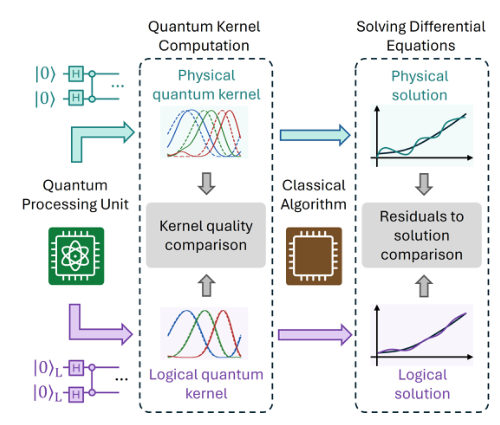 
FIG. 1. End-to-end benchmark comparing physical and logical quantum computations. We adopt a quan- tum kernel as the algorithmic routine to implement using ei- ther physical qubits or logical qubits. The performances upon implementation are compared both at an intrinsic level, in terms of attained kernel quality, as well as at an applicative level, when using the quantum kernel output to solve sets of differential equations within a hybrid quantum-classical framework.

📷 Fig 2

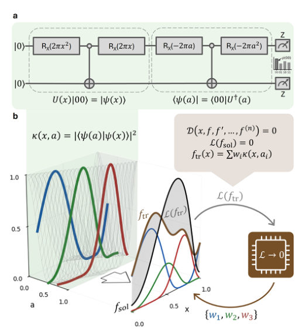 
FIG. 2. Solving differential equations using a quan- tum kernel. a. The quantum kernel κ(x, a) is computed by measuring the 00 bitstring probability p00 at the output of the displayed quantum circuit, which is equal to the inner product shown. b. Workflow of the differential equation solv- ing based on the computed quantum kernel via mixed-model regression. The quantum kernel κ(x, a) with three chosen pa- rameters {ai} (blue, green and red curve) is used as a basis to generate a trial function ftr. A loss function L evaluates the distance of ftr to the solution fsol of the equation formally defined by the differential operator D. L is then minimized using a classical algorithm to update the...

📷 Fig 3

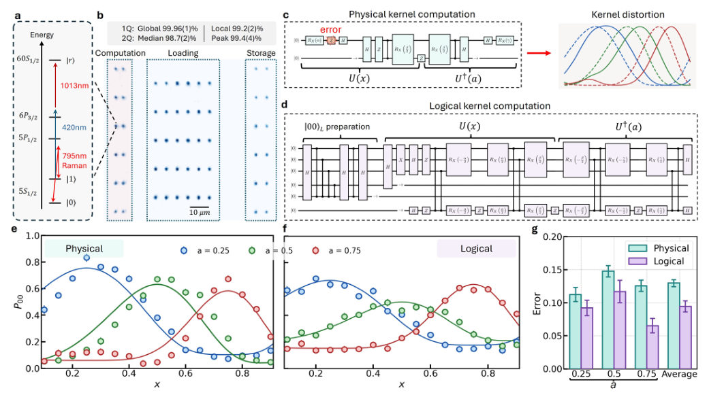 
FIG. 3. Quantum kernel computation using a neutral atom logical processor. a. Level diagram of the relevant atomic transitions used in this work. b. Average fluorescence imaging of the atom array. We divide the space into three zones: a computation zone, a loading zone, and a storage zone. c. Circuit used to compute the physical quantum kernel. Distortions in the kernel shape can be traced back to coherent errors in the gates execution. d. Circuit used to compute the logical quantum kernel. It consists of three parts: preparing the logical state |00⟩L = (|0000⟩+ |1111⟩)/ √

📷 Fig 4

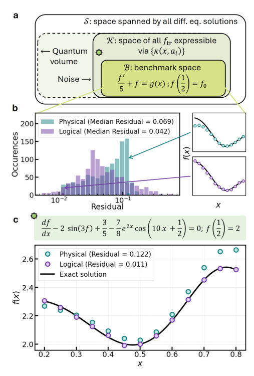 
FIG. 4. Solving differential equations using an experimentally-computed quantum kernel. a. In the space S spanned by all solutions of differential equations, up to a certain accuracy quantified by some residual, there is a subset K that can be expressed by the kernel, which is ex- pected to be enlarged by an increase in quantum volume and shrunk by processor error. A benchmark space B is defined within K b. Residual (normalized root-mean square error) while comparing the solution obtained using the kernel to the ideal solution for 1000 randomly generated differential equa- tions from B, along with a representative example. c. The kernel used to solve a nonlinear differential equation whose...

**Summary.** This paper demonstrates that a logical quantum processor can solve differential equations more accurately than a physical processor by using error detection to suppress kernel distortions. By implementing a [[4, 2, 2]] code on a neutral-atom platform, the researchers showed a significant reduction in the error of the final application-level solution. This highlights the importance of fault-tolerant architectures for practical quantum machine learning tasks.

**Why it may be interesting.** It demonstrates a practical application of error detection in a neutral-atom platform, showing how logical encoding can specifically target and suppress coherent errors that degrade algorithmic performance in quantum machine learning.

Detailed structure

**Main problem.** Benchmarking the performance of a machine-learning differential equation solver on a neutral-atom logical processor to determine if logical qubits can mitigate kernel distortions caused by hardware noise.

**Main result.** The logical implementation using a [[4, 2, 2]] error-detecting code systematically outperforms the physical implementation, significantly reducing kernel shape distortion and achieving much higher accuracy in solving non-linear differential equations.

**Method.** A hybrid quantum-classical workflow using quantum kernel methods and mixed-model regression to solve differential equations, compared across physical and logical qubit encodings.

**Model / system.** A neutral-atom quantum processor based on Rubidium-87 atoms in an optical tweezer array, utilizing Rydberg blockade for two-qubit gates and a zoning architecture for atom transport.

**Key observables.** Quantum kernel quality (probability p00), kernel distortion (shape and amplitude alterations), and the residual (NRMSE) of the differential equation solution.

**Important parameters / regimes.** Coherence times (T1 approx 5s, T2 approx 1.49s), gate fidelities (single-qubit approx 99.96%, CZ approx 98.7%), and the [[4, 2, 2]] error-detecting code.

**Assumptions / limitations.** The benchmark differential equations are chosen such that their solutions are expressible within the kernel's feature space; error models assume errors can be decomposed into Pauli and atom loss channels.

**Figures summary.** Figure 1 shows the end-to-end benchmark workflow; Figure 2 details the quantum kernel circuit and regression process; Figure 3 illustrates the atomic hardware, imaging, and error-corrected circuits; Figure 4 compares the distribution of residuals for linear and non-linear DEs; Supplementary figures detail error models, hardware stability, and proxy-phasing.

**Paper structure.** The paper introduces the benchmarking goal, describes the hardware platform and error-correcting encoding, details the machine-learning algorithm for solving DEs, presents the comparative results between physical and logical kernels, and concludes with an error analysis and discussion of future scaling.

Abstract

We report on a performance comparison between physical and logical computations on a prototypical machine-learning application: solving differential equations using quantum kernel methods. The algorithm is implemented on an atom-based logical quantum processor, both at the physical and logical levels. We show that the kernel estimated from the logical implementation performs better than its physical counterpart on relevant metrics. We observe how such performance improvement can be traced back to specific noise-induced errors detected by the chosen encoding. We apply the computed quantum kernel to the task of solving differential equations, confirming how the superior performance of a logical quantum kernel is retained also at an end-to-end applicative level. Our findings show that experimental validation of end-to-end protocols can already highlight the positive impact of fault-tolerant implementations despite their higher quantum resource count, and guide application-informed architectural choices.

[↑ back to top](#top)

### [Multi-Qubit Entanglement of Unit Cell Pairs in SiMOS](http://arxiv.org/abs/2605.20781v1)

**Authors:** Cameron Jones, Jonathan Y. Huang, Santiago Serrano, MengKe Feng, Gerardo A. Paz-Silva, Tuomo Tanttu, Paul Steinacker, Fay E. Hudson, Wee Han Lim, Nikolay V. Abrosimov, Hans-Joachim Pohl, Michael L. W. Thewalt, Andrew S. Dzurak, Andre Saraiva, Arne Laucht, Chih Hwan Yang  
**Type:** experiment · **Category:** quantum information and computing · **PDF:** <https://arxiv.org/pdf/2605.20781v1>  
**Analysis basis:** full PDF text, analyzed in chunks
**Topic relevance:** 🔥 `QC/QI experiment` **5/5** · `entanglement & information structure` **3/5** · `quantum measurements` **2/5**

📷 Fig 1

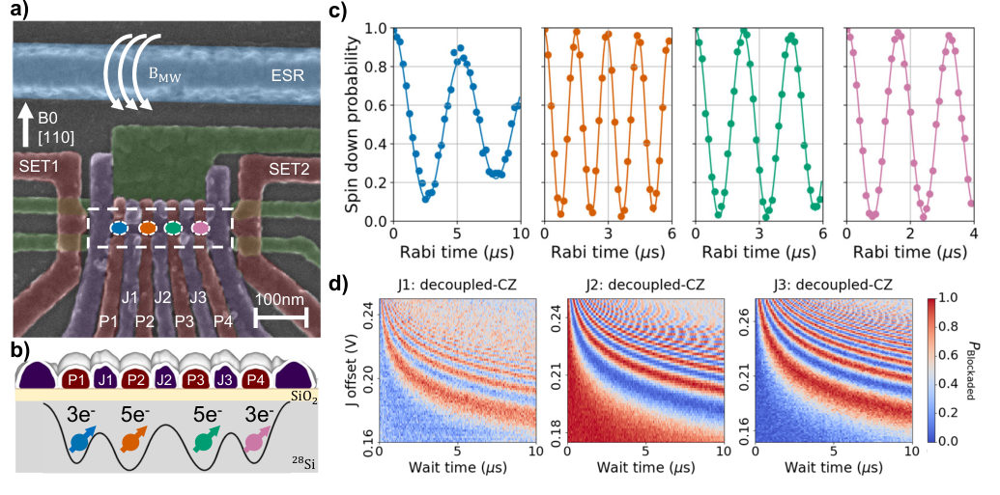 
Fig. 1 | Device overview and controllability. a, A false coloured scanning electron microscope image of a device similar to that used in this work. Green (barrier gates) are metallization layer 1, red (plunger gates) are layer 2, purple (J gates) are layer 3, and blue (ESR antenna) are layer 4. b, Schematic cross-section of the device in the dotted region of (a). Electrons are accumulated at the Si/SiOx interface under the plunger (P) gates. The device is operated in the (3,5,5,3) charge configuration. c, Single-qubit Rabi oscillations of the qubits Q1-Q4 corresponding to qubits under gates P1-P4 as a function of applied microwave pulse duration. d, Decoupled controlled phase oscillations...

📷 Fig 2

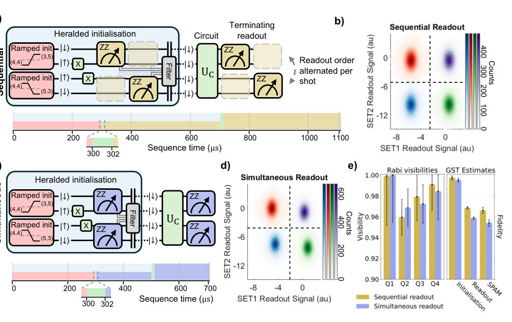 
Fig. 2 | Device operating sequence and readout techniques. a, Schematic diagram showing the sequence structure for a single-shot experiment using the sequential readout technique. The four-qubit heralded initialisation uses a real-time logic state filter that re-initialises the processor unless blockaded parity is measured in both DQDs. The order of both the initialisation and terminating readouts are interchanged each measurement shot. The total measurement time is displayed below, assuming a 10 µs control operation Uc. b, Two-dimensional readout histogram from GST experiments using sequential readout method. State classification thresholds are displayed as dotted black lines. See Extended...

📷 Fig 3

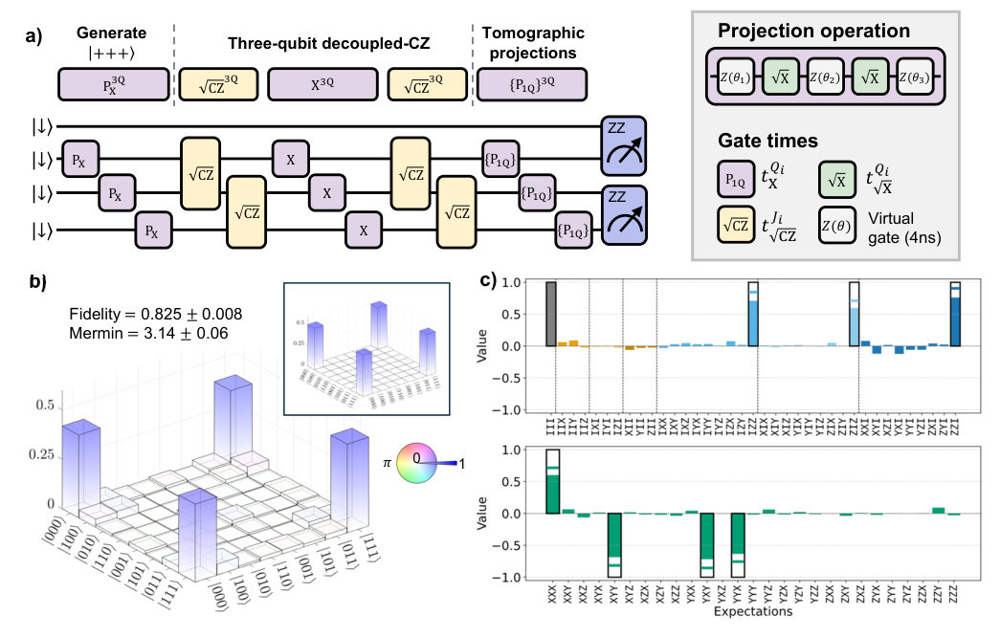 
Fig. 3 | Three-qubit entangled state measurements. a, Circuit used to generate a three-qubit cluster state (equivalent to the GHZ state up to local single-qubit gates) and perform state tomography. {P1Q} are the set of single-qubit pre-measurement rotations required to perform state tomography. Two-qubit operations {P2Q} are also used on Q3 and Q4 to obtain ZI/IZ measurements (see Extended Data Fig. 6b for circuit). b, Reconstructed density matrix. A local basis transformation has been applied in post-processing to represent it as the well-recognised GHZ state density matrix. The SPAM error associated with dephasing from the tomographic operations ({P1Q}/{P2Q}) is compensated for in both...

📷 Fig 4

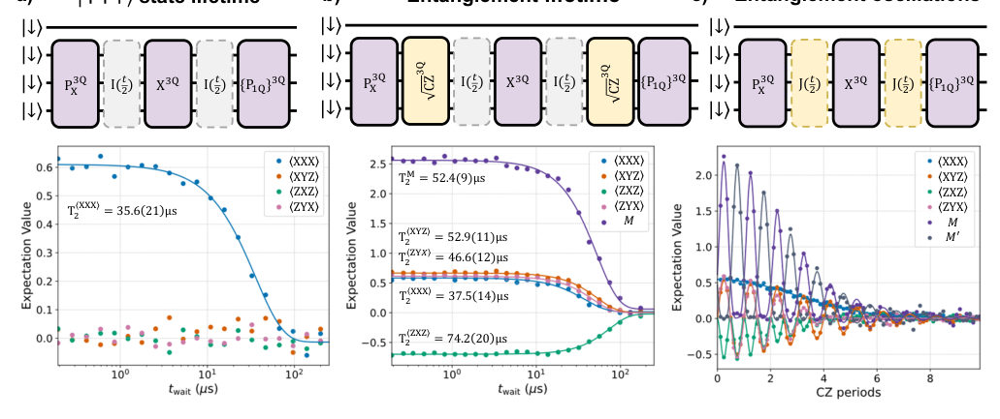 
Fig. 4 | Entanglement lifetime. a, T Hahn 2 -style measurement on the three qubit state |+++⟩measured by removing the CZ operations from the circuit in Fig. 3a and adding idle times. b, Mermin value as function of idle time, representing the longevity of the entanglement between the three qubits. This is measured by inserting wait times on either side of the refocusing pulses. c, Measurement of the oscillations in Mermin value when the exchange time is extended. Here the exchange time for both J2 and J3 are increased proportionally with each other. Error bounds on T2 values represent 1σ uncertainty.

**Summary.** This paper demonstrates a four-qubit SiMOS quantum processor that successfully generates and verifies three-qubit GHZ and cluster states. It achieves this by implementing parallelized readout and a specialized gate sequence that protects entanglement from dephasing. This work provides a significant step toward scaling silicon-based quantum computing using industry-standard CMOS techniques.

**Why it may be interesting.** The use of a laddered decoupling sequence to extend entanglement lifetime toward the Hahn-echo limit and the demonstration of multipartite entanglement in a scalable semiconductor architecture are highly relevant to open quantum systems and quantum network research.

Detailed structure

**Main problem.** Scaling SiMOS quantum dot processors beyond isolated double quantum dot unit cells by achieving high-fidelity coupling between unit cells and implementing efficient, parallelized initialization and readout.

**Main result.** Demonstrated a four-qubit SiMOS processor capable of generating maximally entangled three-qubit GHZ and cluster states, with entanglement lifetimes extended toward the Hahn-echo limit using a laddered decoupling sequence.

**Method.** The researchers used a decoupled-CZ (dCZ) gate set, FPGA-based heralded initialization, and parallelized Pauli spin blockade readout, while employing Gate Set Tomography and Mermin-witness operators for state verification.

**Model / system.** A four-qubit SiMOS (Silicon Metal-Oxide Semiconductor) processor consisting of a linear array of quantum dots in two coupled double quantum dot (DQD) unit cells, utilizing isotopically enriched silicon.

**Key observables.** Single- and two-qubit gate fidelities, Mermin witness values, coherence times (T2* and THahn), Rabi frequencies, and readout fidelity.

**Important parameters / regimes.** Larmor frequencies ~11.4 GHz, T2* between 4.8-6.2 us, THahn between 76.3-87.2 us, and two-qubit dCZ fidelities ~95.5-95.8%.

**Assumptions / limitations.** The dephasing is primarily driven by charge noise rather than hyperfine coupling; SPAM errors can be modeled and corrected via a uniform depolarizing channel.

**Figures summary.** Figures demonstrate the comparison of sequential vs. simultaneous readout, the calibration of detuning for parallel operation, the implementation of the laddered gate sequence, and the decay of Mermin values as a function of idle and exchange time.

**Paper structure.** The paper introduces the SiMOS platform, describes the architecture and control/readout hardware, details the gate implementation and decoupling strategies, presents the generation and verification of multi-qubit entanglement, and concludes with a discussion on scalability and noise sources.

Abstract

Spin qubits in silicon-MOS (SiMOS) quantum dots have recently demonstrated compatibility with existing industry standard CMOS fabrication techniques. These devices have routinely achieved single- and two-qubit gate fidelities above 99% and demonstrated highly entangled two-qubit Bell states in isolated double quantum dot (DQD) unit cells, however coupling between unit cells has remained challenging. In this work, we present a two unit cell, four-qubit SiMOS processor with universal controllability and fully parallelised state initialisation and readout. We use this processor to generate maximally entangled three-qubit states, including the Greenberger-Horne-Zeilinger (GHZ) state, and certify multipartite entanglement through violation of the classical Mermin-witness bound. By using a fully symmetric dynamically decoupled gate sequence to create our entangled states, we are able to preserve the lifetime of the entanglement beyond $T_2^*$, to a time limited instead by $T_2^\textrm{Hahn}$. These demonstrations pave a road to the scalable operation of larger SiMOS processors, and achieving high purity, long-lived multi-qubit entangled states in them.

[↑ back to top](#top)

### [Symmetry-Protected Fast Relaxation and the Strong Quantum Mpemba Effect](http://arxiv.org/abs/2605.20930v1)

**Authors:** Zijun Wei, Mingdi Xu, Yefeng Song, Yangqian Yan, Lei Pan  
**Type:** theory · **Category:** statistical mechanics · **PDF:** <https://arxiv.org/pdf/2605.20930v1>  
**Analysis basis:** full PDF text, analyzed in chunks
**Topic relevance:** 🔥 `correlated / nonlocal dissipation` **4/5** · 🔥 `non-equilibrium dynamics` **4/5** · `methods for driven-dissipative` **3/5** · `Rydberg arrays` **2/5** · `analog quantum simulation` **2/5** · `driven-dissipative phase transition` **2/5** · `entanglement & information structure` **2/5** · `exotic spin models in light-matter` **2/5** · `non-equilibrium universality` **2/5** · `scars & prethermalization` **2/5**

📷 Fig 1

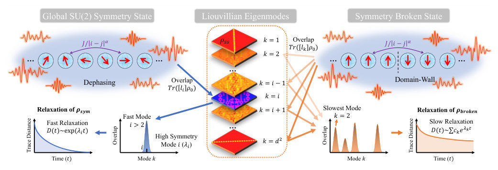 
FIG. 1. Schematic illustration of symmetry-protected Liouvillian relaxation. Left: A highly symmetric initial state couples exclusively to an isolated fast-decay Liouvillian mode in the same symmetry sector, producing single-channel exponential relaxation. Right: A symmetry-broken initial state projects onto multiple Liouvillian sectors, including slow modes, leading to slower relaxation and a hierarchy of dissipative timescales. This symmetry-filtered mode accessibility underlies the strong quantum Mpemba effect discussed below.

📷 Fig 2

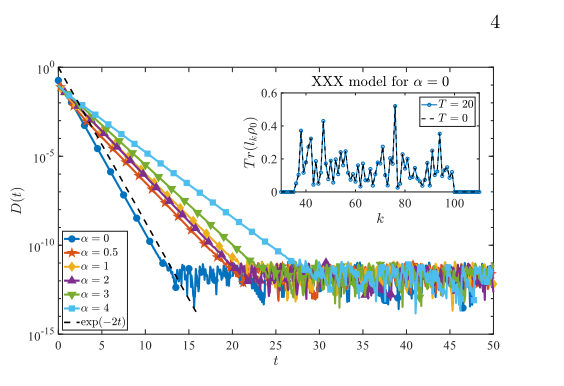 
FIG. 3. Emergence and disappearance of the strong quan- tum Mpemba effect. The dashed line denotes the universal symmetry-protected trajectory D(t) ∼e−2t of the ground state. Solid curves represent finite-temperature initial states for different interaction exponents α. For α &gt; 0, the initially farther ground state relaxes faster than thermal states and overtakes them, demonstrating a strong quantum Mpemba effect. In the all-to-all limit (α = 0), the relaxation trajec- tories collapse because the enlarged permutation symmetry generates a degenerate Liouvillian manifold at λ = −2. Inset: Spectral overlap showing both T = 0 and finite-temperature states occupy the same degenerate λ = −2...

📷 Fig 3

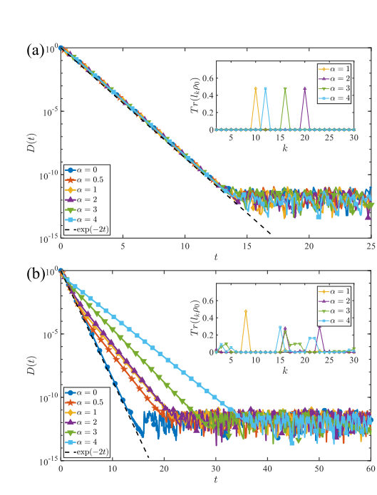 
FIG. 2. Ground-state relaxation dynamics in the long-range XXZ model (L = 8, J = 1). (a) In the SU(2)-symmetric XXX limit (∆= 1), the relaxation dynamics collapse onto the universal exponential law D(t) ∼e−2t for all interaction exponents α. The inset shows that the ground state overlaps exclusively with Liouvillian modes at λ = −2, demonstrating symmetry-selected access to an isolated fast-decay channel. (b) Breaking the symmetry through anisotropy (∆= 1.1) fragments the Liouvillian spectrum and activates multiple de- cay sectors, including slow modes. The resulting slow-mode overlap suppresses the relaxation dynamics and produces a pronounced interaction-range-dependent slowdown.

📷 Fig 4

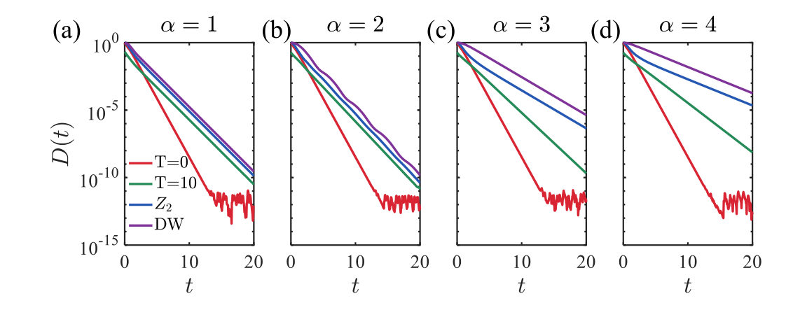 
FIG. 4. Interaction-range evolution and symmetry-breaking control of relaxation. The relaxation dynamics of the ground state (T = 0), thermal state (T = 10), Z2-symmetric state, and domain-wall state are shown for different interaction exponents: (a) α = 1, (b) α = 2, (c) α = 3, and (d) α = 4. The highly symmetric ground state remains dominated by the isolated fast-decay Liouvillian channel at λ = −2, whereas lower-symmetry states develop finite overlap with slow modes and therefore relax more slowly. The interaction range controls the separation between relaxation trajectories, while the hierarchy is fixed by symmetry-filtered Liouvillian accessibility.

📷 Fig 5

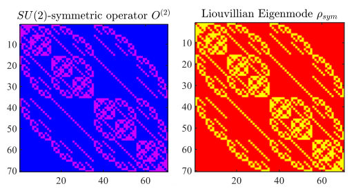 
FIG. 5. Matrix representation of the analytically constructed SU(2)-symmetric operator O(2) (left) and the numerically ob- tained Liouvillian eigenmode at λ = −2 (right). The identical structure confirms that the universal fast-relaxation channel is uniquely governed by the symmetry-protected mode O(2).

**Summary.** This paper identifies a mechanism where SU(2) symmetry protects a fast-decaying channel in a long-range XXZ spin chain. This protection causes a strong quantum Mpemba effect, where highly symmetric states relax much faster than less symmetric thermal states. The findings suggest that symmetry can be used to engineer and control relaxation dynamics in open quantum many-body systems.

**Why it may be interesting.** It provides a fundamental mechanism for controlling nonequilibrium pathways and many-body lifetimes in open quantum systems using symmetry as a control knob, which is highly relevant to the stability of states in trapped ions or Rydberg arrays.

Detailed structure

**Main problem.** Understanding how symmetry constrains dissipative relaxation in open many-body systems and identifying the microscopic origin of the strong quantum Mpemba effect.

**Main result.** The authors discover a symmetry-protected fast-decay channel in an XXZ spin chain where SU(2) symmetry allows certain states to bypass slow decay modes, leading to an anomalous relaxation speed where states farther from equilibrium relax faster than closer ones.

**Method.** Liouvillian spectral decomposition, symmetry analysis using SU(2) and permutation groups, and analytical derivation of exact Liouvillian eigenmodes.

**Model / system.** A long-range spin-1/2 XXZ spin chain subject to local dephasing noise, described by a Lindblad master equation with an interaction exponent alpha.

**Key observables.** Trace distance (D(t)) from the steady state and the spectral weight/overlap of initial states with Liouvillian eigenmodes.

**Important parameters / regimes.** Anisotropy parameter (Delta), interaction range (alpha), and temperature (beta).

**Assumptions / limitations.** The system is governed by a Markovian Lindblad master equation with local dephasing jump operators.

**Figures summary.** Figure 1 provides a schematic of the mechanism showing how symmetric states couple to a single fast mode while symmetry-broken states project onto slow modes; Figure 2 shows the ground state relaxation dynamics.

**Paper structure.** The paper introduces the problem of symmetry-constrained relaxation, presents the analytical identification of a fast-decay mode at the SU(2) point, explores the effect of symmetry breaking and interaction range, and concludes with the emergence of the strong quantum Mpemba effect.

Abstract

Understanding how symmetry constrains dissipative relaxation in open quantum many-body systems remains a central challenge in nonequilibrium physics. Here we uncover a symmetry-selective Liouvillian mechanism that protects an isolated fast-decay channel in a long-range XXZ spin chain subject to dephasing noise. At the \(SU(2)\)-symmetric point, highly symmetric initial states couple exclusively to an exact Liouvillian eigenmode with decay rate \(λ=-2\), producing universal exponential relaxation independent of system size and interaction range. Breaking the symmetry restores overlap with slow Liouvillian modes and substantially suppresses the relaxation dynamics. This symmetry-filtered mode accessibility naturally gives rise to a strong quantum Mpemba effect, where a state farther from the steady state relaxes anomalously faster than closer thermal states. Our results establish symmetry-protected fast relaxation as a mechanism for controlling nonequilibrium pathways in open quantum systems.

[↑ back to top](#top)

### [Mean-field and fluctuation dynamics in off-resonant two-mode atom-field interactions](http://arxiv.org/abs/2605.20542v1)

**Authors:** Luis Medina-Dozal, Alejandro R. Urzúa, Carlos A. González-Gutiérrez, José Récamier  
**Type:** theory · **Category:** other · **PDF:** <https://arxiv.org/pdf/2605.20542v1>  
**Analysis basis:** full PDF text, analyzed in chunks
**Topic relevance:** 🔥 `Keldysh / 2PI / non-Gaussian methods` **4/5** · 🔥 `Tavis-Cummings & cavity-many-emitter` **4/5** · `entanglement & information structure` **3/5** · `methods for driven-dissipative` **3/5** · `non-equilibrium dynamics` **2/5** · `quantum measurements` **2/5**

📷 Fig 1

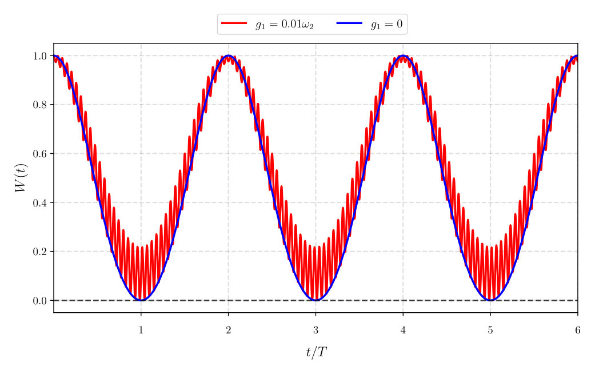 
Figure 1. Atomic inversion W(t) using the first order Magnus expansion. Hamiltonian parameters: ω2 = 1, ω1 = ω2/2, ωa = 0.98ω2, g2 = gopt 2 , α1 = α2 = 4. We see the slow frequency envelope when g1 = 0 (blue) and high frequency wiggles when g1 ̸= 0 (red). The time scale is given in terms of the period T = π/∆2.

📷 Fig 2

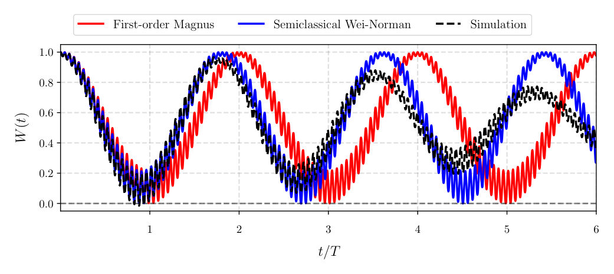 
Figure 2. Atomic inversion W(t) using: first order Magnus expansion (red), semiclassical Wei-Norman solution (blue), and numerical simulation (black). Hamiltonian parameters: ω2 = 1.0, ω0 = 0.98ω2, g1 = 0.01ω2, T ≈157.08, α1 = α2 = 4, ω1 = ω2/4. In the three cases, g2 = gopt 2 given by (22).

📷 Fig 3

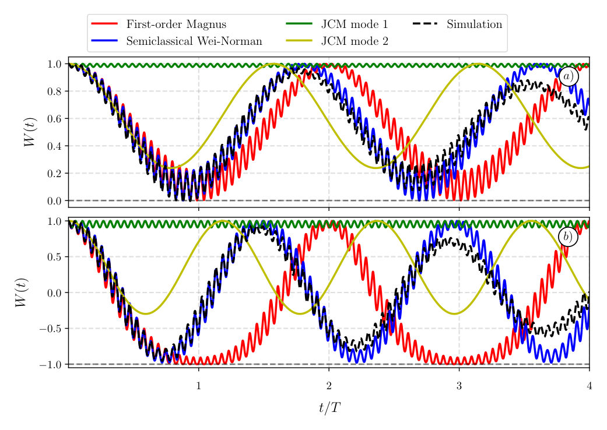 
Figure 3. Atomic inversion W(t) using first order Magnus expansion (red), semiclassical Wei-Norman (blue), numerical simu- lation (black), JCM mode 1 (green), and JCM mode 2 (yellow). Hamiltonian parameters: ω2 = 1.0, ωa = 0.98ω2, g1 = 0.01ω2, T ≈157.08, ω1 = ω2/4, g2 = 0.00196ω2 for Magnus, g2 = 0.00213ω2 for Wei-Norman, and g2 = 0.00195ω2 for the simulation. Panel a) α1 = α2 = 4, Panel b) α1 = α2 = 8.

📷 Fig 4

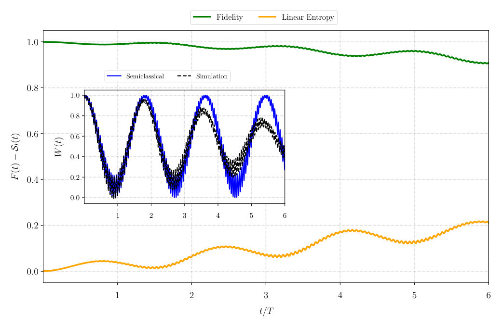 
Figure 4. Fidelity between Wei-Norman and quantum simulation, and linear entropy of the full quantum simulation. Param- eters: ω2 = 1.0, ω0 = 0.98ω2, g1 = 0.01ω2, T ≈157.08, ω1 = ω2/4, α1 = α2 = 4, g2 is the optimal g(opt) 2 = 0.00196ω2. The inset shows the evolution of the population inversions, whereas the main plot displays the fidelity F(t) in green and the linear entropy Sl(t) in orange.

📷 Fig 5

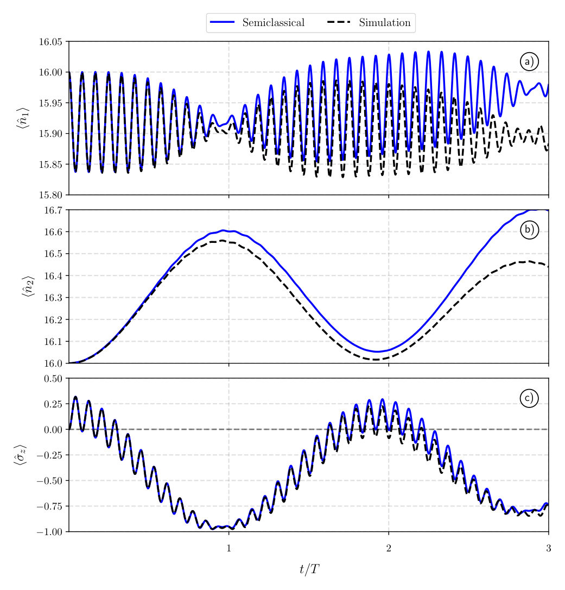 
Figure 5. Time evolution of field observables and atomic inversion under the approximate full-dynamics scheme compared with exact numerical simulation. Panels (a) and (b) show the mean photon numbers ⟨ˆn1(t)⟩and ⟨ˆn2(t)⟩, while panel (c) displays the atomic inversion ⟨ˆσz(t)⟩. The initial state is |Ψ(0)⟩= (Ce|e⟩+ Cg|g⟩) ⊗|α1, α2⟩with α1 = α2 = 4 and Ce = Cg = 1/ √

**Summary.** This paper presents an analytical approximation for the dynamics of a two-level system interacting with two off-resonant electromagnetic modes. By separating mean-field dynamics from quantum fluctuations, the method captures essential entanglement and back-action effects that standard semiclassical models miss. This allows for efficient study of complex multi-mode light-matter interactions.

**Why it may be interesting.** It provides a computationally efficient way to study complex atom-field interactions and entanglement generation in multi-mode cavity QED and circuit QED without requiring full quantum simulations.

Detailed structure

**Main problem.** The two-mode Jaynes-Cummings model lacks an exact analytical solution because its dynamical Lie algebra is infinite-dimensional, unlike the single-mode case.

**Main result.** The authors develop an approximation method that decomposes the dynamics into a solvable semiclassical component and a residual part treating quantum fluctuations, maintaining high fidelity even during entanglement.

**Method.** The approach uses a semiclassical reduction (replacing field operators with c-numbers) combined with a sequence of unitary transformations and the Magnus expansion to capture quantum correlations and back-action.

**Model / system.** A two-level system (atom) coupled to two independent quantized electromagnetic modes within the Jaynes-Cummings framework under the Rotating Wave Approximation.

**Key observables.** Atomic inversion, average photon number, quantum fidelity, atomic coherence, and linear entropy.

**Important parameters / regimes.** Off-resonant regime (large detunings), large field amplitudes (coherent states), and coupling strengths (g1, g2).

**Assumptions / limitations.** The method assumes sufficiently large photon numbers to justify the semiclassical substitution and is specifically optimized for the off-resonant regime.

**Figures summary.** Figure 2 compares different analytical approximations against numerical simulations; Figure 3 shows how two modes cooperatively achieve atomic inversion; Figure 4 and 5 illustrate the evolution of fidelity, linear entropy, and photon numbers.

**Paper structure.** The paper begins by defining the algebraic complexity of the two-mode JCM, introduces a decomposition strategy into semiclassical and fluctuation components, applies the Magnus expansion and Wei-Norman theorem for solutions, and validates the method via numerical comparison with the full quantum model.

Abstract

We study a two-level system coupled to two quantized electromagnetic modes within the Jaynes-Cummings framework. While the single-mode model is exactly solvable due to its conserved excitation number, yielding finite-dimensional invariant subspaces, the two-mode model extension presents a fundamental challenge: although the total excitation number remains conserved, each invariant subspace is infinite-dimensional, preventing a closed-form analytical solution. Our scheme separates the dynamics into a dominant, exactly solvable semiclassical component, the atom interacting with the mean fields of both modes, and treats the remaining quantum fluctuations through a sequence of unitary transformations that preserve essential quantum features. We validate our approach through direct comparison with numerical solutions, focusing on the non-resonant regime where multiple detunings give rise to rich interference effects and multi-timescale dynamics inaccessible to standard approximations. The method accurately reproduces atomic inversion, field observables, and fidelity over relevant timescales, while remaining computationally efficient.

[↑ back to top](#top)

### [Resource generation and dynamical complexities in open random quantum circuits](http://arxiv.org/abs/2605.20350v1)

**Authors:** Paranjoy Chaki, Arkaprava Sil, Priya Ghosh, Ujjwal Sen, Sudipto Singha Roy  
**Type:** theory · **Category:** quantum information and computing · **PDF:** <https://arxiv.org/pdf/2605.20350v1>  
**Analysis basis:** full PDF text, analyzed in chunks
**Topic relevance:** 🔥 `entanglement & information structure` **4/5** · `correlated / nonlocal dissipation` **3/5** · `non-equilibrium dynamics` **3/5** · `driven-dissipative phase transition` **2/5** · `measurement-induced transitions` **2/5** · `methods for driven-dissipative` **2/5**

📷 Fig 1

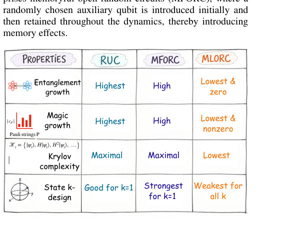 
Figure 1. Comparison of different classes of random quantum cir- cuits in terms of resource generation power and complexity mea- sures.

📷 Fig 2

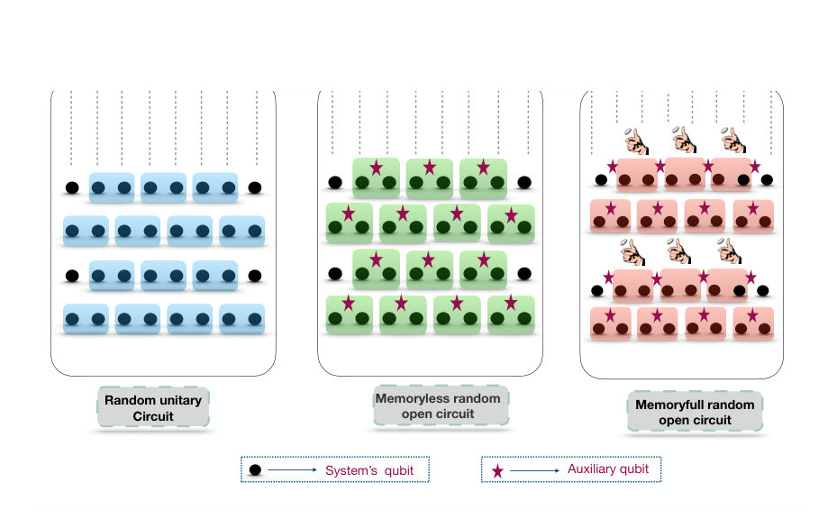 
Figure 2. Schematic diagram of closed and open random quantum circuit. In all three schematics, the black dots denote the qubits comprising the respective circuits. The left panel represents a unitary random circuit. In contrast, the middle panel illustrates a memoryless open random circuit, where no memory effects arise since the auxiliary qubits are discarded after each time step and replaced by fresh ones (sampled randomly). Finally, the rightmost panel depicts a memoryful open random circuit, in which the auxiliary qubits (sampled initially) are retained throughout the dynamics, thereby inducing memory effects. For all the random circuits, in the initial step, the map acts on the {1,...

📷 Fig 3

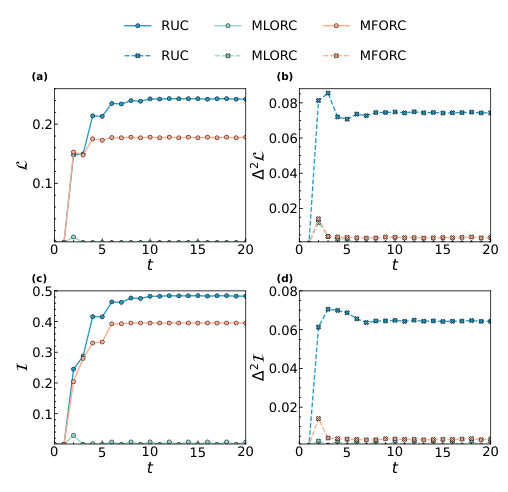 
Figure 3. Growth of entanglement and quantum mutual infor- mation with time step. (a) Describes the growth of entanglement (log-neg) for unitary, memoryless open random circuits, and memo- ryful open random circuits. The vertical and horizontal axes denote the log-neg (L) as the measure of entanglement and the time step t, respectively. The curves corresponding to unitary, MLORC, and MFORC are denoted by sky blue, green, and orange colors, respec- tively. (c) Shows similar behavior obtained for mutual information (I). We additionally plot the fluctuation arising in both entanglement ∆2LN and mutual information ∆2I for all three random circuits in (b) and (d), respectively. Here, the total...

📷 Fig 4

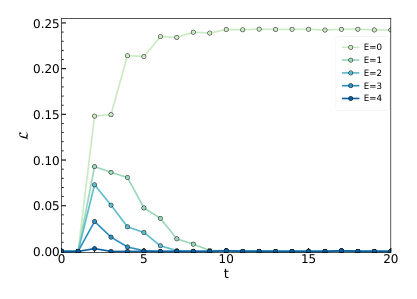 
Figure 4. Robustness of growth of entanglement under the ac- tion of MLORC. We present the behavior of the dynamical evolu- tion of the entanglement for different numbers of auxiliary systems, E = 0, 1, 2, 3, 4. The corresponding curves are distinguished by se- quential colors, as indicated in the legend. The system size is fixed at Ns = 8.

📷 Fig 5

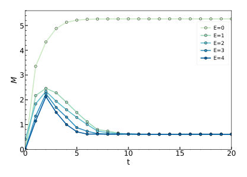 
Figure 6. Robustness of growth of non-stabilizerness under the action of a random memoryless open random circuit. Here, we plot the dynamical evolution of the SRE for different numbers of auxiliary systems, E = 0, 1, 2, 3, 4. The corresponding curves are distinguished by sequential colors, as indicated in the legend. Here, the system size of the system is considered to be Ns = 8.

**Summary.** This paper explores how environmental memory influences the growth of quantum resources and complexity in random circuits. It finds that while memoryless environments destroy entanglement, memoryful environments can sustain non-classical features and even enhance pseudorandomness compared to closed systems.

**Why it may be interesting.** It provides deep insights into how controlled environmental interactions (memory) can be used to manipulate the generation of non-classicality and chaos in open quantum systems.

Detailed structure

**Main problem.** Investigating how environmental memory affects the generation of quantum resources (entanglement, magic) and dynamical complexity (Krylov complexity, k-designs) in open random quantum circuits.

**Main result.** Environmental memory (MFORC) preserves entanglement and complexity, even outperforming closed systems in generating low-order k-designs, whereas memoryless environments (MLORC) cause entanglement to decay to zero while non-stabilizerness persists.

**Method.** Numerical simulations of random circuits using the Lanczos algorithm for Krylov complexity, trace distance for k-designs, and Rényi stabilizer entropy for non-stabilizerness.

**Model / system.** Three classes of random circuits: Random Unitary Circuits (RUC) for closed systems, Memoryless Open Random Circuits (MLORCO) with fresh auxiliary qubits, and Memoryful Open Random Circuits (MFORC) with retained auxiliary qubits.

**Key observables.** Logarithmic negativity, non-stabilizerness (magic), Krylov complexity, quantum state k-designs, mutual information, and fluctuations.

**Important parameters / regimes.** System size (Ns), number of auxiliary qubits, and the presence/absence of environmental memory.

**Assumptions / limitations.** The analysis is performed on relatively small system sizes (up to Ns=8) and focuses on accessible timescales for randomness generation.

**Figures summary.** Figure 1 compares circuit architectures and metrics; Figure 2 shows circuit diagrams; Figure 3 displays growth of entanglement and mutual information; Figure 5 shows SRE growth; Figure 7 shows Krylov complexity growth; Figure 8 shows trace distance for k-designs; Figure 9 illustrates GHZ-like vs W-state-like entanglement structures.

**Paper structure.** The paper introduces three circuit models, analyzes resource generation (entanglement and magic) from a resource-based viewpoint, evaluates dynamical complexity (Krylov and k-designs) from a statistical viewpoint, and concludes with the impact of memory as a control parameter.

Abstract

Realistic quantum devices are inherently open and often involve environments with memory. Here, we investigate quantum resource generation in two classes of random circuits, namely, memoryless open and memoryful open random circuits, and compare their behavior with the well-explored random unitary circuit model. We show that environmental memory qualitatively alters the dynamics: while unitary and memoryful circuits exhibit sustained growth and saturation of entanglement and non-stabilizerness (magic); memoryless dynamics leads to a distinct behavior where entanglement decays to zero after transient growth, even though non-stabilizerness remains non-zero, indicating the persistence of nonclassical features beyond entanglement. Consistently, Krylov complexity reveals suppressed spreading of quantum states in memoryless circuits, in contrast to strong growth in unitary and memoryful dynamics, which saturates at the maximum value. Finally, we show that memoryful circuits more effectively approach low-order quantum-state k-designs than the other two circuits. Closed dynamics are therefore usually the most resource-generating, but are ideal; realistic dynamics are open and seem to generate less, but if they possess memory, they can sometimes even outdo closed dynamics.

[↑ back to top](#top)

### [High-order harmonic generation from an atom in a disordered environment](http://arxiv.org/abs/2605.21223v1)

**Authors:** Simon His, Camille Lévêque, Jérémie Caillat, Richard Taïeb, Jonathan Dubois  
**Type:** theory · **Category:** disordered systems and neural networks · **PDF:** <https://arxiv.org/pdf/2605.21223v1>  
**Analysis basis:** full PDF text, analyzed in chunks
**Topic relevance:** 🔥 `scars & prethermalization` **4/5** · `non-equilibrium dynamics` **3/5** · `methods for driven-dissipative` **2/5** · `correlated / nonlocal dissipation` **1/5** · `driven-dissipative phase transition` **1/5** · `entanglement & information structure` **1/5**

📷 Fig 1

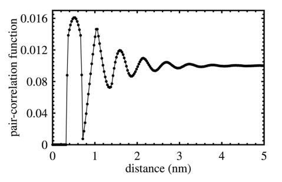 
Figure 1. Pair-correlation function, following the joint proba- bility distribution (10), as a function of the distance between two scatterers.

📷 Fig 2

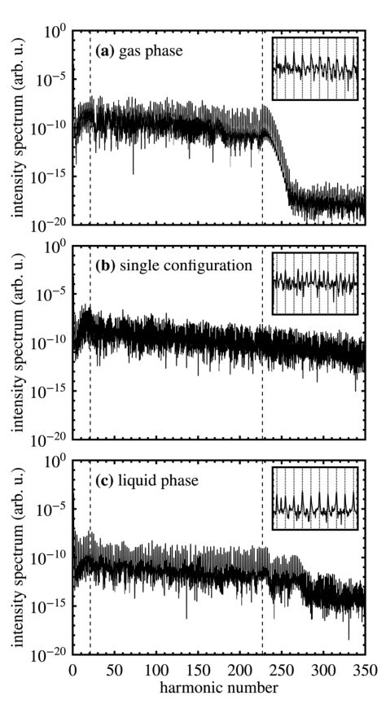 
Figure 2. HHG intensity spectra obtained from the modulus of the Fourier transform of (13) as a function of the harmonic number for a laser intensity 7.896 × 1014 W cm−2, a laser wavelength of 1030 nm, and a 2-11-2 trapezoidal envelope. (a) Gas phase with AE = 0 in Eq. (4). (b) Single configuration of the disordered environment (Nc = 1) and (c) liquid phase with a thousand configurations (Nc = 103), with AE = 0.8 a.u. and σE = 0.5 a.u. The vertical dashed lines indicate harmonics 21 and 227. The insets are zooms on the harmonics [150, 170] and intensities [10−15, 10−5]. The vertical dotted lines indicate the odd harmonics.

📷 Fig 3

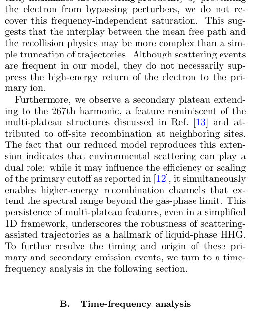 
Figure 3 shows a time-frequency map of the dipole ac- celeration d(t) in Eq. (13) for the gas phase (panel a) and the liquid phase (panel b). It corresponds to the modulus of the Gabor transform

📷 Fig 4

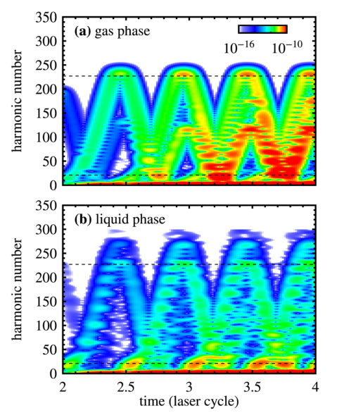 
Figure 3. Time frequency analyses of the harmonic of the dipole [see Eq. (14)] for (a) the gas phase and (b) the liquid phase. The parameters are the same as in Fig. 2.

📷 Fig 5

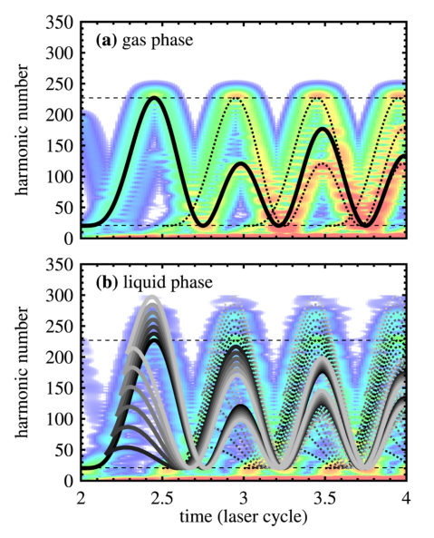 
Figure 4. Same as Fig. 3 but with the kinetic energies of the electron as a function of the recombination time in the SFA. The solid lines are for ionization during the first laser cycle after the plateau. The dotted line are for later times, i.e. they correspond to the solid line translated by integer multiples of the half-period. The different colors correspond to different distances of return site with |x(tr)| = ℓ: black is for the return at ℓ= 0, dark gray is at ℓ= a the mean inter-scatterer distance, lighter gray is ℓ= 2a, etc.

**Summary.** This paper studies how a disordered, liquid-like environment modifies high-order harmonic generation by inducing decoherence. It demonstrates that scattering from the environment leads to a secondary spectral plateau and the emergence of 'dynamic scars' where the electron density localizes around classical periodic orbits.

**Why it may be interesting.** It provides a mechanistic link between structural disorder and decoherence in a time-dependent framework, extending the concept of quantum scars from static systems to driven, open-system dynamics.

Detailed structure

**Main problem.** Investigating how a stochastically structured, disordered environment (simulating a liquid phase) affects high-order harmonic generation (HHG) and drives the transition from quantum to classical behavior.

**Main result.** The disordered environment induces global decoherence and a secondary HHG plateau due to off-site recombination, causing the electron probability density to localize around unstable classical periodic orbits (dynamic scars).

**Method.** Numerical solution of the 1D time-dependent Schrödinger equation using a symplectic integrator, combined with an ensemble average over stochastic configurations to represent the density matrix.

**Model / system.** A single atom with a soft-Coulomb potential in a 1D environment containing a stochastic distribution of Gaussian-well perturbers, driven by a strong laser field.

**Key observables.** HHG intensity spectra, harmonic amplitudes/cutoff, system purity, and photoelectron probability density.

**Important parameters / regimes.** Laser intensity (7.896e14 W/cm2), wavelength (1030 nm), mean inter-scatterer distance (10 a.u.), and ionization potential (0.90 a.u.).

**Assumptions / limitations.** The system is modeled in one dimension to isolate elastic scattering, and the environment is treated via ensemble averaging rather than a Markovian reservoir.

**Figures summary.** Figure 1 shows the pair-correlation function of the scatterers; Figure 6 illustrates the decay of purity over time; Figure 9 shows the spatial component of the flow for classical trajectories.

**Paper structure.** The paper introduces the problem of HHG in liquids, describes the 1D stochastic model and numerical methods, analyzes the resulting HHG spectra and decoherence dynamics, and concludes by linking the results to the concept of quantum scars.

Abstract

Using one-dimensional simulations analyzed through the lens of open quantum systems, we study the photoelectron's strong-field dynamics from an atom surrounded by a scattering environment stochastically structured. We theoretically investigate high-order harmonic generation from this situation. We show that local dephasing of the photoelectron wavepacket induced by elastic scattering leads to global decoherence. This drives a transition from quantum to classical behavior, as witnessed by the photoelectron probability density localizing around specific trajectories of the classical analog system: unstable periodic orbits. This phenomenon mirrors quantum scars traditionally observed in the eigenfunctions of time-independent systems, such as quantum billiards. Here, it emerges in-situ within a time-dependent framework, manifesting directly in the real-time dynamics from the ground state rather than solely through spectral analysis.

[↑ back to top](#top)

### [Observation of a tripartite quantum phase for coexisting extended, localized, and critical states](http://arxiv.org/abs/2605.21441v1)

**Authors:** Zhongshu Hu, Yajing Guo, Yu-Dong Wei, Bing-Chen Yao, Zhentian Qian, Xin-Chi Zhou, Bao-Zong Wang, Jianing Yang, Xuzong Chen, Shengjie Jin, Xiong-Jun Liu  
**Type:** both · **Category:** quantum gases · **PDF:** <https://arxiv.org/pdf/2605.21441v1>  
**Analysis basis:** full PDF text, analyzed in chunks
**Topic relevance:** 🔥 `analog quantum simulation` **4/5** · 🔥 `non-equilibrium dynamics` **4/5** · `non-equilibrium universality` **3/5** · `entanglement & information structure` **1/5**

📷 Fig 1

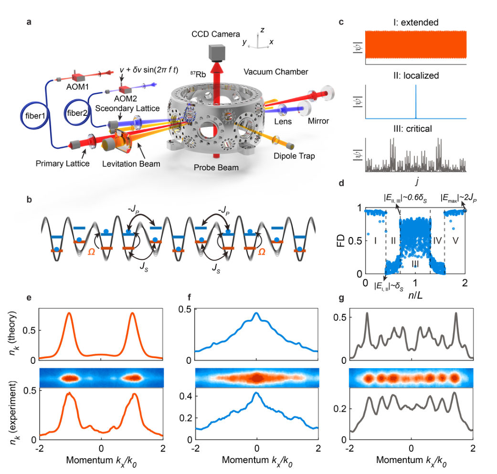 
Figure 1. Schematic of the incommensurately driven s-p orbital lattice and characteristic states. a, Experimental configuration. A Bose-Einstein condensate is loaded into a one-dimensional quasiperiodic optical lattice (along the x direction) generated by superimposing a primary (λ0 = 1064 nm) and a secondary (λ1 = 760 nm) lattice. Absorption imaging is performed along the z direction. The relative displacement of the lattices is controlled by modulating the driving frequency of the acoustic-optic modulator (AOM) for the secondary lattice. A levitation beam, shaped as a sheet along the x direction, provides a strong vertical gradient force to counteract gravity along the z direction, while...

📷 Fig 2

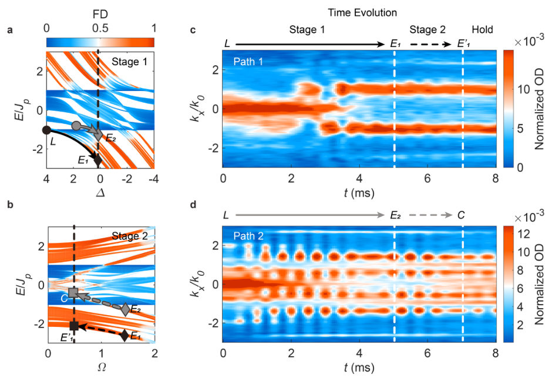 
Figure 2. Two-stage protocol for selective state preparation. a,b, Fractal dimensions (FDs) of all eigenstates as functions of the detuning ∆ (a) and coupling strength Ω(b), serving as schematic representations of the evolution of quantum states. The color scale denotes the FD, where Path 1 (black) and Path 2 (gray) represent the distinct evolutionary trajectories. Stage 1 is executed in (a) via an adiabatic frequency sweep (solid lines) to bridge the s-p orbital gap, while Stage 2 is performed in (b) through an amplitude ramp (dashed lines). In these processes, the initial localized state L evolves into intermediate extended states E1 and E2, respectively. Subsequently, E1 adiabatically...

📷 Fig 3

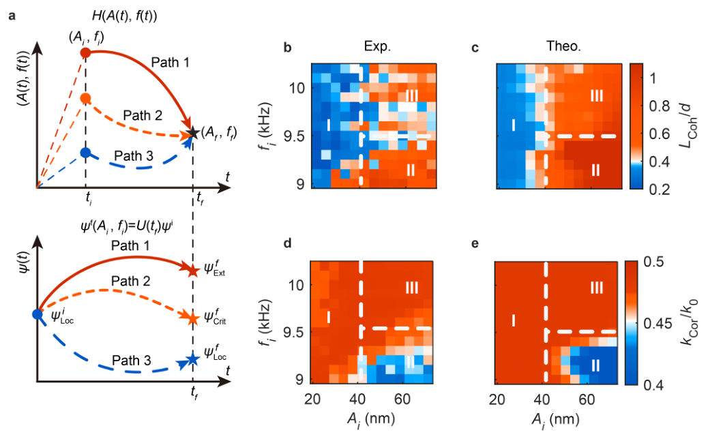 
Figure 3. Quantitative identification of the tripartite phase via characteristic lengths. a, Schematic illustration of the pathway dependence of the final states. The upper panel shows the trajectory in the (A, f) parameter space, and the lower panel depicts the corresponding state evolution ψ(t). All paths terminate at the same final Hamiltonian (Af, ff) (upper), with different choices of (Ai, fi) rendering different types of target high energy states (lower). b,c, Spatial coherence length LCoh from experiment (b) and simulation (c) as a function of the initial shaking frequency fi and amplitude Ai. LCoh quantifies spatial extent; its suppression in region I identifies the localized...

📷 Fig 4

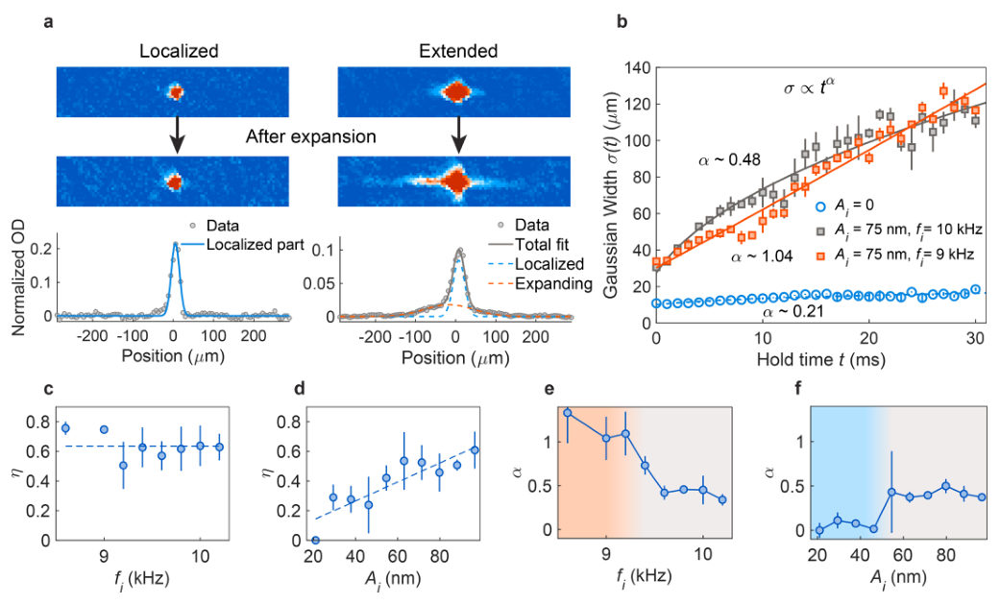 
Figure 4. Expansion dynamics. a, Bimodal Gaussian fit of the expanded atomic cloud. The upper panel shows the in-situ absorption image, while the lower panels present Gaussian fits to the corresponding one-dimensional density profiles. In the localized regime, the atomic cloud remains nearly stationary after sudden trap release and a 15 ms hold; a single Gaussian fit yields the cloud radius. In extended and critical regimes, significant expansion leads to a bimodal distribution. A bimodal Gaussian fit then determines the radii of both the expanding and localized components. b, Time evolution of the radii of three types of states. Radii are fitted to σ = σ0(1+t/t0)α [46] to extract the...

📷 Fig 5

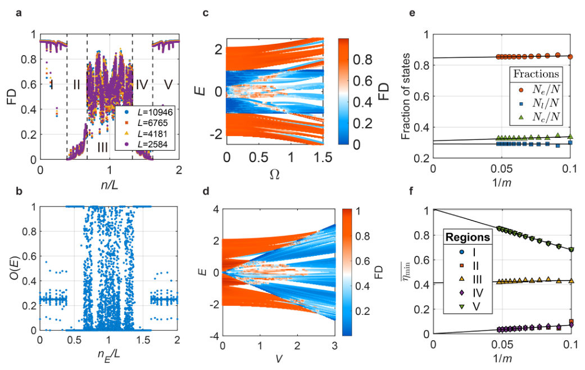 
Figure 1. Numerical results of the orbital quasiperiodic lattice model. a, Fractal dimension (FD) versus state index n for different system sizes L, with parameters V = Jp, Ω= 0.5Jp, ∆= 0, α = ( √

**Summary.** This paper reports the experimental observation of a tripartite quantum phase where extended, localized, and critical states coexist in an orbital optical lattice. By using a two-stage Floquet protocol, the authors successfully prepare and distinguish these states using momentum-space and real-space diagnostics. The work demonstrates how inter-orbital coupling can be used to engineer complex localization physics.

**Why it may be interesting.** It provides a versatile platform for studying unconventional critical phenomena, localization physics, and the transition between different types of quantum states using Floquet engineering.

Detailed structure

**Main problem.** The observation and characterization of a tripartite quantum phase where extended, localized, and critical states coexist over finite spectral windows in a quasiperiodic system.

**Main result.** The researchers experimentally realized and identified a tripartite phase in an orbital optical lattice, demonstrating that inter-orbital coupling creates incommensurately distributed zeros that drive the emergence of critical states.

**Method.** The study uses a two-stage Floquet engineering protocol (frequency and amplitude ramps) for state preparation, combined with Renormalization Group (RG) analysis for theoretical validation and expansion dynamics for transport characterization.

**Model / system.** Ultracold 87Rb atoms in a 1D quasiperiodically driven s-p orbital optical lattice, where s and p orbitals are coupled via Floquet modulation.

**Key observables.** Momentum distributions (via TOF), Fractal Dimension (FD), Spatial Coherence Length (L_Coh), Momentum-space Correlation Length (k_Cor), and expansion exponents (alpha).

**Important parameters / regimes.** Inter-orbital coupling (Omega), quasiperiodic modulation strength (delta_s, delta_p), shaking frequency (f), and shaking amplitude (A).

**Assumptions / limitations.** The system is treated as non-interacting (mean-field interactions are negligible), and the primary lattice is deep enough to justify a localized Wannier basis.

**Figures summary.** Fig 1: Experimental setup and visual comparison of wavefunctions; Fig 2: Fractal dimension and phase regions; Fig 3: State preparation pathways; Fig 5: Phase diagram via dual-space analysis; Fig 7: Momentum distribution micromotion; Fig 8: Expansion dynamics.

**Paper structure.** Introduction to the tripartite phase problem, experimental setup and Floquet engineering description, development of the two-stage preparation protocol, identification of the three phases using dual-space correlation lengths, verification via expansion dynamics and RG theory, and discussion of micromotion and robustness.

Abstract

The disordered quantum world hosts three fundamental types of states: extended, localized, and critical, of which the critical states are confined to fine-tuned critical points or mobility edges in randomly disordered systems. The tripartite phase, with all three types of states coexisting over finite spectral windows, represents a hallmark distinction between quasiperiodic and truly random systems in the localization physics. Here, we report the realization of this exotic phase in a quasi-periodically driven orbital optical lattice with ultracold atoms. The optical lattice with a quasiperiodic Floquet modulation coupling s and p orbitals is realized in experiment and shown to host the tripartite phase from exact theory. We develop a two-stage protocol to precisely prepare and detect the three types of quantum states. The characteristic exponents of these states are determined from expansion dynamics, showing their distinct universal transport properties. Our study marks a significant advancement in exploring unconventional critical phenomena and localization physics with ultracold atoms.

[↑ back to top](#top)

### [Entangling Power: A Probe of Symmetry and Integrability in Quantum Many-Body Systems](http://arxiv.org/abs/2605.20661v1)

**Authors:** Ian Low, Pallab Goswami  
**Type:** theory · **Category:** statistical mechanics · **PDF:** <https://arxiv.org/pdf/2605.20661v1>  
**Analysis basis:** full PDF text, analyzed in chunks
**Topic relevance:** 🔥 `entanglement & information structure` **4/5** · `non-equilibrium dynamics` **3/5** · `analog quantum simulation` **2/5** · `scars & prethermalization` **2/5**

📷 Fig 1

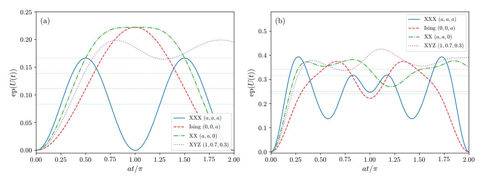 
FIG. 1: Instantaneous ep ep(U(t)) of the two-site Hamiltonian (6) as a function of time at/π for the XXX (solid), Ising (dashed), XX (dash-dotted), and XYZ (dotted) models. (a) Spin-1/2 (two-qubit, d = 2). (b) Spin-1 (two-qutrit, d = 3). For the XYZ model we use (ax, ay, az) = (1, 0.7, 0.3). Thin dashed horizontal lines indicate the time-averaged values ep.

📷 Fig 2

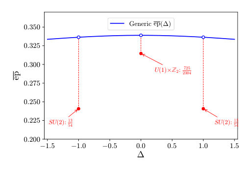 
FIG. 2: Time-averaged entangling power of the two-site spin- 1 XXZ model as a function of anisotropy ∆. The solid curve is the generic analytic formula, Eq. (18). At ∆= ±1 (SU(2) symmetry) and ∆= 0 (U(1) × Z2 symmetry), eigenvalue de- generacies result in the true ep (filled circles) dropping below the generic curve (open circles). Dashed lines indicate the magnitude of each dip.

📷 Fig 3

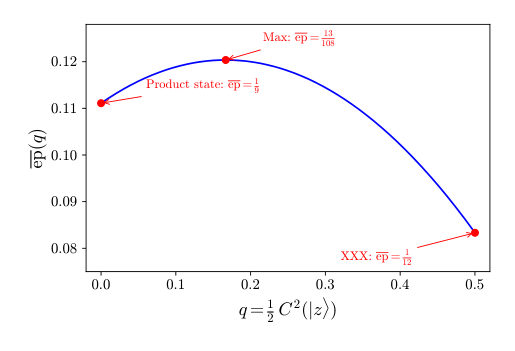 
FIG. 3: Time-averaged entangling power of the spin-1/2 isospectral family, Eq. (29), as a function of q = C2(|z⟩)/2, where C is the concurrence of the projector state |z⟩. The product-state limit (q = 0, ep = 1/9) and the XXX/Bell-state limit (q = 1/2, ep = 1/12) are marked, together with the max- imum at q = 1/6. The XXX model sits at the minimum of ep over the isospectral family.

📷 Fig 4

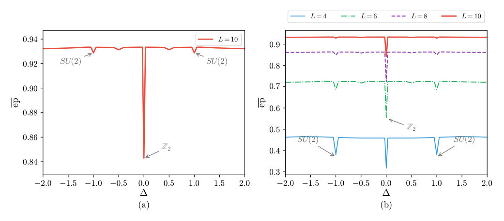 
FIG. 4: Time-averaged entangling power ep for the spin-1/2 XXZ chain as a function of anisotropy ∆. (a) L = 10 chain, shown on a scale to resolve the residual dip structure near saturation. (b) Overlay of L = 4 (solid blue), 6 (dash-dotted green), 8 (dashed purple), and 10 (solid red). The L = 2 case was already shown in Fig. 2. Root-of-unity fine structure at ∆= ±1/2 becomes visible for L ≥6.

📷 Fig 5

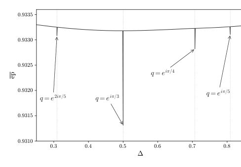 
FIG. 5: Dense scan of ep for the spin-1/2 XXZ chain at L = 10 over ∆∈[0.25, 0.85], resolving all four root-of-unity dips. Vertical dashed lines mark the exact algebraic locations.

**Summary.** This paper demonstrates that the ability of a quantum operator to generate entanglement can act as a probe for symmetry and integrability. By studying Heisenberg spin chains, the authors show that higher symmetry leads to a suppression of entangling power. The results bridge the gap between small-scale quantum gates and the thermodynamic limit of many-body systems.

**Why it may be interesting.** It provides a new operator-based diagnostic for detecting symmetry and integrability, which is highly relevant for characterizing the dynamics of programmable quantum simulators.

Detailed structure

**Main problem.** Investigating whether the entangling power of a unitary operator can serve as a dynamical diagnostic for symmetry and integrability in quantum many-body systems.

**Main result.** The study establishes that increasing symmetry suppresses entangling power, showing sharp dips at SU(2) and free-fermion points in finite chains, while the two-magnon S-matrix shows vanishing entangling power at SU(2) points.

**Method.** The authors use an efficient algorithm for computing time-averaged entangling power via the diagonal ensemble, alongside analytical derivations using the operator-state correspondence and the Bethe Ansatz.

**Model / system.** Anisotropic Heisenberg (XXZ, XXX, XYZ) spin chains of various sizes (two-site, finite-size, and thermodynamic limit) and the two-magnon S-matrix.

**Key observables.** Time-averaged entangling power (e_p), linear entropy, and the S-matrix scattering amplitudes.

**Important parameters / regimes.** Anisotropy parameter (Delta), spin magnitude (s=1/2, 1), system size (L), and rapidity (theta).

**Assumptions / limitations.** The analysis assumes Haar-random product states for the definition of entangling power and focuses on integrable sectors of the XXZ model.

**Figures summary.** Figure 1 shows instantaneous entangling power oscillations; Figure 3 illustrates the non-monotonic dependence of e_p on the isospectral parameter q; Figure 4 shows the scaling of the SU(2) dip with system size.

**Paper structure.** The paper introduces the entangling power concept, analyzes two-site models to establish a symmetry hierarchy, extends the study to finite-size XXZ chains, and concludes with the thermodynamic limit via the two-magnon S-matrix.

Abstract

The entangling power of a unitary operator quantifies its ability to generate entanglement from product states and provides a natural probe of quantum many-body dynamics. Entanglement extremization at points of enhanced symmetry has previously been observed in high-energy scattering. In this work we compute the time-averaged entangling power of anisotropic Heisenberg spin chains across two-site models and finite-size systems, as well as the entangling power of the two-magnon $S$-matrix in the thermodynamic limit. For two-site models we establish a monotonic hierarchy: the entangling power decreases as the symmetry group grows, reaching its minimum at the $SU(2)$ XXX point. Finite-size XXZ chains exhibit sharp dips at the $SU(2)$ points $Δ=\pm 1$ and the free-fermion point $Δ=0$, with the free-fermion dip decaying much more slowly with system size. In the thermodynamic limit, we decompose the two-magnon $S$-matrix into quantum logic gates -- Identity, SWAP, and $σ_z\otimesσ_z$ -- and show that the entangling power vanishes for all scattering energies at the $SU(2)$ points, where the $S$-matrix reduces to the Identity gate, while the free-fermion point achieves the maximum -- the opposite of the finite-size many-body behavior. The entangling power can serve as an {\em operator} diagnostic for symmetry and selected aspects of integrability in quantum simulations of spin-chain dynamics.

[↑ back to top](#top)

### [Strongly-coupled non-Markovian waveguide QED with input-output HEOM](http://arxiv.org/abs/2605.20703v1)

**Authors:** Neill Lambert, Yi-Te Huang, Yueh-Nan Chen, Paul Menczel, Franco Nori  
**Type:** theory · **Category:** other · **PDF:** <https://arxiv.org/pdf/2605.20703v1>  
**Analysis basis:** full PDF text, analyzed in chunks
**Topic relevance:** 🔥 `correlated / nonlocal dissipation` **4/5** · 🔥 `methods for driven-dissipative` **4/5** · `non-equilibrium dynamics` **3/5**

📷 Fig 1

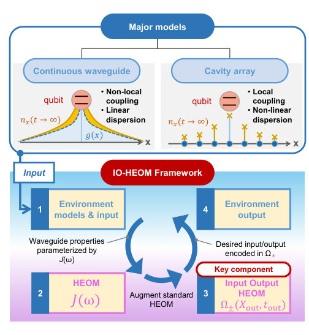 
Figure 1. In this work we study two examples of non- Markovian waveguide QED: a qubit coupled either to a con- tinous waveguide with non-local coupling (the blue shaded region) and linear dispersion (top left), or to a cavity ar- ray with local coupling (blue line) and non-linear dispersion (top right). By casting both cases into a standard open quantum systems framework, via the spectral density J(ω), we can treat these cases with the hierarchical equations of motion. To recover how the waveguide photon occupation nx(t) (yellow shaded region in the upper left figure, yellow crosses in the upper right figure) responds due to the interac- tion with the qubit we extend the recently developed...

📷 Fig 2

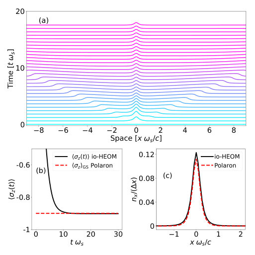 
Figure 2. Dynamics and steady state in Example 1, an Ohmic waveguide with linear dispersion and exponential cut- off. (a) We show the photon density nx(t)/∆x as a function of position xωs/c, offset on the y-axis to represent different times tωs. The lines are colored to make them easier to distinguish visually. The spatial extent of the waveguide is in principle infinite; we only show a finite region here. We use the Ohmic spectral density Eq. (19) with coupling strength λ = 0.39, exponential cutoff ωc = 2ωs, and zero temperature (T = 0). The initial condition is the waveguide in the vacuum and the qubit, at position x = 0, excited. We see two main features: a propagating wave front, moving...

📷 Fig 3

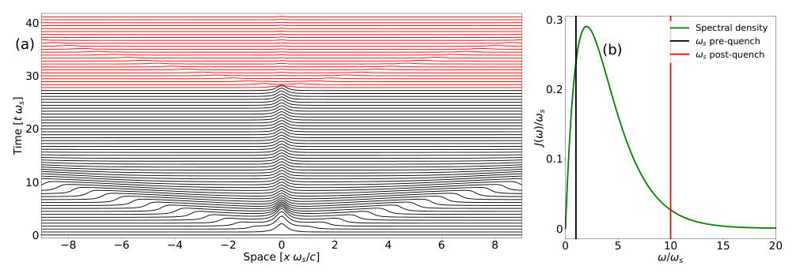 
Figure 3. We demonstrate how a quench of the qubit frequency can lead to emission of photons out of the (virtual) bound state, for the case when a qubit is coupled to an Ohmic waveguide with exponential cut-off and linear dispersion. (a) Photon density nx(t)/∆x as a function of position xωs/c, offset on the y-axis to represent different times tωs. The color of the curves distinguishes pre-quench (black) and post-quench (red) times. (b) The green curve shows the spectral density used in this example, an Ohmic spectral density with the same parameters as in Fig. 2. The vertical black line shows the qubit frequency pre-quench, and the vertical red line shows the frequency post-quench. As...

📷 Fig 4

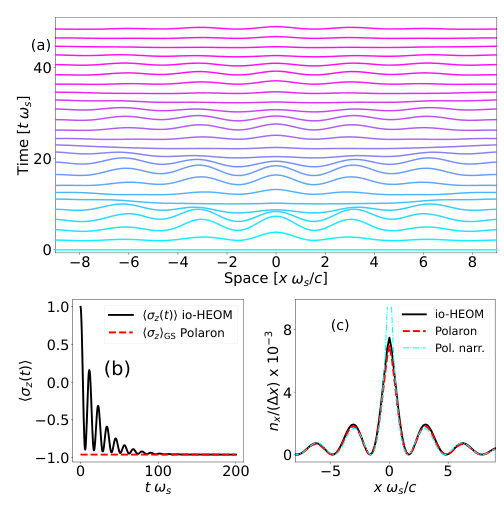 
Figure 4. Dynamics and steady state for Example 2, a qubit coupled to waveguide with Lorentzian-like spectral den- sity (due to very non-local coupling), and linear dispersion. (a) Photon density nx(t)/∆x as a function of position xωs/c, offset on the y-axis to represent different times tωs. We use the underdamped spectral density Eq. (29) with coupling strength λ = 0.4ω3/2 s , width Γ = 0.1ωs, resonance frequency ω0 = ωs, and zero temperature (T = 0). The initial condition is the waveguide in the vacuum and the qubit, at position x = 0, excited. In contrast to Fig. 2, the wavefront now ap- pears as a standing-wave, with peaks corresponding to the highly non-local coupling function g(x) in...

📷 Fig 5

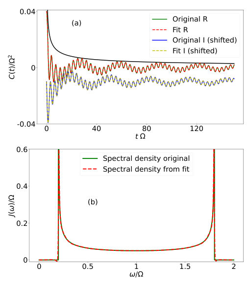 
Figure 5. Correlation Function Fitting for Example 3, a cavity-array waveguide. (a) We use a Prony method to fit the bath correlation function Eq. (37). The plot shows the real (“R”) and imaginary (“I”) parts of the original correlation function (solid curves) and of the the Prony fit result using seven exponentials (dashed curves). Note that the imaginary parts have been off-set downwards by 0.01/Ω2 for visual clar- ity. The black solid line represents the long-time envelope of Eq. (37), which is ∝g2 0/√πgct. (b) Original spectral den- sity Eq. (36) (solid curve), and spectral density reconstructed from the multi-exponential approximation of the correlation function via one-side Fourier...

**Summary.** This paper introduces the 'input-output Hierarchical Equations of Motion' (io-HEOM) to simulate strong-coupling dynamics in waveguide QED. It demonstrates how the method captures non-Markovian effects from both spatial non-locality and non-linear dispersion. The work is significant for its ability to model the dynamics of virtual photon release and persistent oscillations in structured environments.

**Why it may be interesting.** It provides a powerful, unified numerical tool (io-HEOM) for studying non-Markovian waveguide QED in regimes where standard approximations fail, specifically addressing complex phenomena like photon-atom hybridization and Van Hove singularities.

Detailed structure

**Main problem.** Modeling a single qubit in a 1D waveguide beyond the standard Markovian and perturbative approximations, specifically addressing non-Markovianity arising from non-local coupling and non-linear dispersion.

**Main result.** The developed io-HEOM method accurately captures non-Markovian dynamics, including the release of virtual bound photons during a qubit frequency quench and persistent oscillations due to Van Hove singularities in cavity arrays.

**Method.** The input-output Hierarchical Equations of Motion (io-HEOM) framework, supplemented by the Prony method for correlation function fitting and Silbey-Harris polaron theory for analytical validation.

**Model / system.** A single qubit interacting with a 1D waveguide, including both continuous waveguides with linear dispersion and 1D cavity arrays with non-linear dispersion.

**Key observables.** Photon density/occupation, qubit population, spatial photon profile, and renormalized qubit frequency.

**Important parameters / regimes.** Strong-coupling and ultra-strong-coupling regimes, spectral density (Ohmic and Lorentzian), and non-local coupling functions.

**Assumptions / limitations.** The multi-exponential ansatz for the bath correlation function is truncated at a finite hierarchy level, and the Prony method fits the correlation function only up to a fixed finite time.

**Figures summary.** Figure 1 provides a schematic of the two studied waveguide scenarios and the io-HEOM framework; Figure 2 shows photon density, qubit population, and steady-state profiles for an Ohmic waveguide; Figure 3 illustrates photon emission following a frequency quench; Figure 4 shows dynamics for a Lorentzian spectral density; Figure 5 demonstrates the Prony method for correlation function fitting; Figure 6 shows photon occupation and qubit dynamics in a cavity array.

**Paper structure.** The paper introduces the io-HEOM framework, applies it to a continuous waveguide with non-local coupling to study bound photons and photon release, extends the study to cavity arrays with non-linear dispersion, validates results using polaron theory, and discusses the numerical implementation via the Prony method.

Abstract

We consider the problem of modeling a single qubit in contact with a one-dimensional waveguide beyond the standard perturbative and Markovian approximations. Using the recently developed input-output hierarchical equations of motion (io-HEOM), we investigate multiple examples of such waveguides, characterized by different spectral densities. Our examples highlight that the io-HEOM method can accurately capture non-Markovianity in waveguide QED from two distinct origins. The first source of non-Markovianity is spatially non-local coupling between the qubit and the waveguide. By examining two examples with non-local coupling, we show how the coupling function affects the steady-state bound photons, and demonstrate the release of these photons when the qubit energy is quenched. The second source of non-Markovianity is non-linear dispersion. We illustrate this scenario using the example of a cavity array with point-like coupling, where the non-linear dispersion leads to persistent oscillations due to Van Hove singularities in the spectral density.

[↑ back to top](#top)

### [Entanglement Growth from Structured Initial States in Many-Body Localized Systems](http://arxiv.org/abs/2605.20656v1)

**Authors:** Chen Xu, Pengfei Zhang  
**Type:** theory · **Category:** disordered systems and neural networks · **PDF:** <https://arxiv.org/pdf/2605.20656v1>  
**Analysis basis:** full PDF text, analyzed in chunks
**Topic relevance:** 🔥 `entanglement & information structure` **4/5** · 🔥 `non-equilibrium dynamics` **4/5** · `scars & prethermalization` **2/5**

📷 Fig 1

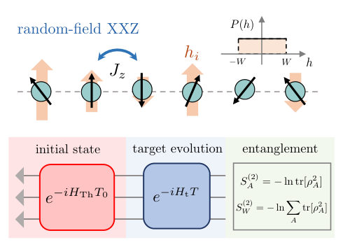 
FIG. 1. Schematic illustration of our setup. We consider the random-field XXZ model. In particular, we focus on struc- tured initial states prepared by evolving a product state un- der a chaotic Hamiltonian HTh for a finite time T0, followed by a quench to the target Hamiltonian Ht. We then compute both the entanglement entropy and the Wehrl-R´enyi entropy.

📷 Fig 2

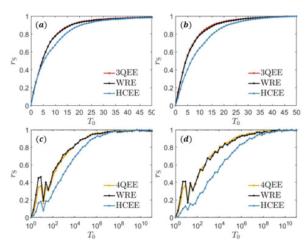 
FIG. 2. The evolution of the HCEE, nQEE, and WRE start- ing from the initial state prepared with T0 = 4.5, for a single realization of random fields. (a-b) Dynamics in the thermal- ized phase (W = 0.5) for system sizes L = 12 and L = 14, respectively. (c-d) Dynamics under the MBL Hamiltonian (W = 8) for system sizes L = 12 and L = 14, respectively.

📷 Fig 3

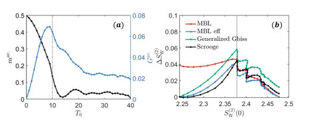 
FIG. 4. (a) The averaged local magnetization mav. and nearest-neighbor correlation Gav. in the initial state |ψini⟩for different preparation times T0 at system size L = 14. (b) A comparison between numerical results and the predictions of the generalized Gibbs ensemble and the Scrooge random-state ensemble for the net growth of the WRE at different T0. The dashed lines separate two distinct regimes of entanglement growth, as in Fig. 3.

📷 Fig 4

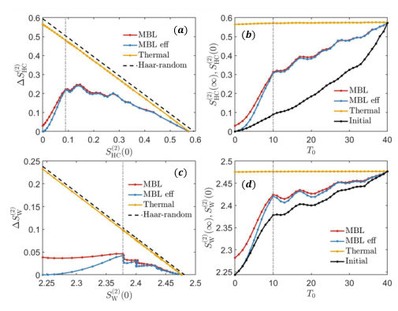 
FIG. 3. The total entanglement growth of both the HCEE and the WRE is shown for different Hamiltonians and initial states at system size L = 14, for a single realization of random fields. The initial-state entanglement is tuned by varying T0. In the numerics, the saturation value is estimated by evolving to a long time T = 1012. The black dashed line indicates the result for Haar-random states, while the gray dot-dashed lines serve as guides to the eye, separating two distinct regimes.

📷 Fig 5

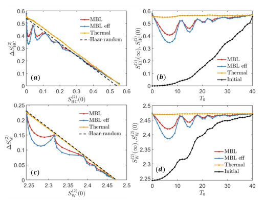 
FIG. 5. The total entanglement growth of both the HCEE and the WRE is shown for different Hamiltonians and initial states at system size L = 12, where we choose |ψ0⟩= | + x, +y, · · · , +x, +y⟩. Despite the oscillations observed in the MBL regime, the saturation values for both the MBL and thermal cases closely match those of Haar random states, as shown in the black dashed lines.

**Summary.** This paper explains why entanglement growth in MBL systems can first increase and then decrease when starting from structured states. By analyzing Wehrl-Rényi entropy, the authors show that this behavior is tied to the relaxation of local magnetization and inter-site correlations. The findings demonstrate that the specific polarization of the initial state is a key driver of entanglement dynamics.

**Why it may be interesting.** It provides a fine-grained understanding of how initial-state structure and local conserved quantities govern entanglement dynamics and complexity in non-equilibrium many-body systems.

Detailed structure

**Main problem.** The paper investigates the physical origin of non-monotonic entanglement growth in Many-Body Localized (MBL) systems when using structured initial states.

**Main result.** The authors identify two dynamical regimes: the first is driven by the relaxation of Local Integrable of Motion (LIOM) magnetization, and the second is driven by inter-site correlations. They show that the non-monotonicity is linked to the polarization of the initial state, disappearing for x/y-direction product states.

**Method.** The study uses numerical simulations of the XXZ model and a phenomenological LIOM-based model, supplemented by a Generalized Gibbs Ensemble (GGE) and a 'Scrooge ensemble' approach to analyze entanglement dynamics.

**Model / system.** A 1D quantum spin-1/2 random-field XXZ model with open boundary conditions, including both the microscopic Hamiltonian and a phenomenological model based on Local Integrals of Motion (LIOMs).

**Key observables.** Rényi entanglement entropy (HCEE and nQEE), Wehrl-Rényi entropy (WRE), local magnetization, and nearest-neighbor correlations.

**Important parameters / regimes.** Initial state preparation time (T0), disorder strength (W), and initial state polarization (z-direction vs. x/y-direction).

**Assumptions / limitations.** In the phenomenological model, higher-order many-body terms are neglected, and the LIOM operators are approximated by local spin operators.

**Figures summary.** Figures illustrate the non-monotonic entanglement growth for z-polarized states and show that the distinct two-regime separation disappears for x/y-polarized states.

**Paper structure.** The paper introduces the problem of non-monotonic entanglement, describes the model and initial state preparation, presents the analysis of entanglement growth regimes using WRE and EE, compares microscopic and phenomenological models, and concludes with implications and future directions.

Abstract

Understanding how complex entanglement structures emerge is a central problem in quantum many-body physics. Recent work by Zhang et al. has considered structured initial states prepared by evolving a product state under a chaotic Hamiltonian for a finite time before quenching to the target Hamiltonian. In this setup, total entanglement entropy growth in many-body localized systems exhibits two distinct regimes, first increasing and then decreasing as the initial entanglement is tuned. In this work, we identify the physical origin of this behavior by analyzing the dynamics of both the Rényi entanglement entropy and the Wehrl-Rényi entropy in the random-field XXZ model, the latter of which characterizes multipartite entanglement. We show that a similar non-monotonic dependence on the initial entanglement also appears in the net growth of the Wehrl-Rényi entropy for product states polarized along the $z$-direction. The first regime is governed by a finite magnetization associated with local integrals of motion, while the second reflects inter-site correlations. In contrast, for product states in the $x/y$-direction, the entanglement growth exhibits a monotonic decay. Our results provide a more fine-grained picture of how distinct initial-state properties shape entanglement dynamics in many-body localized systems.

[↑ back to top](#top)

### [Wasserstein Space of Quantum Chaos](http://arxiv.org/abs/2605.20995v1)

**Authors:** Koji Hashimoto, Norihiro Tanahashi, Kentaroh Yoshida  
**Type:** theory · **Category:** statistical mechanics · **PDF:** <https://arxiv.org/pdf/2605.20995v1>  
**Analysis basis:** full PDF text, analyzed in chunks
**Topic relevance:** 🔥 `entanglement & information structure` **4/5** · `scars & prethermalization` **3/5** · `non-equilibrium dynamics` **2/5**

📷 Fig 1

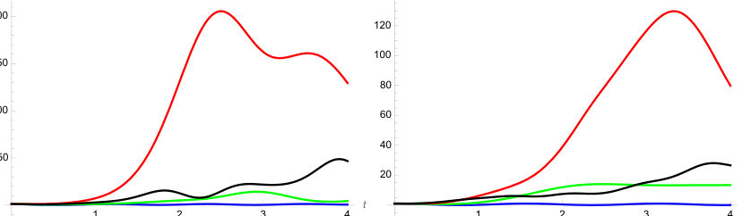 
Figure 1. The time evolution of the microcanonical out-of-time-order correlators (OTOCs) for the double-well case (a) and the partly flattened oscillator case (b). In both cases (a) and (b), the red lines grow exponentially in time, which is the scrambling phenomenon. For (a), the plotted one is for n = 0 (blue), n = 2 (green), n = 5 (red) and n = 9 (black), where n = 0, 1, 2, · · · labels the energy level of even parity states counted from the ground state. The n = 5 state has E = 0.088, which is close to the top of the potential hill. For (b), the plotted one is for n = 0 (blue), n = 2 (green), n = 4 (red) and n = 9 (black). The n = 4 state has E = 13.07, which is close to the plateau...

📷 Fig 2

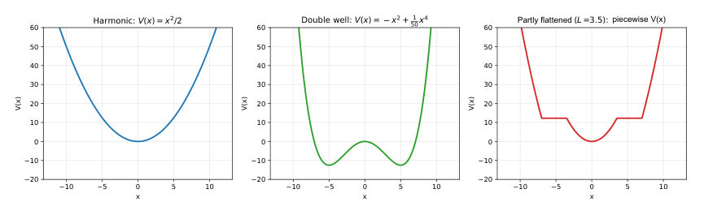 
Figure 2. One-dimensional potentials used in this section: harmonic, double-well, and partly flattened oscillator.

📷 Fig 3

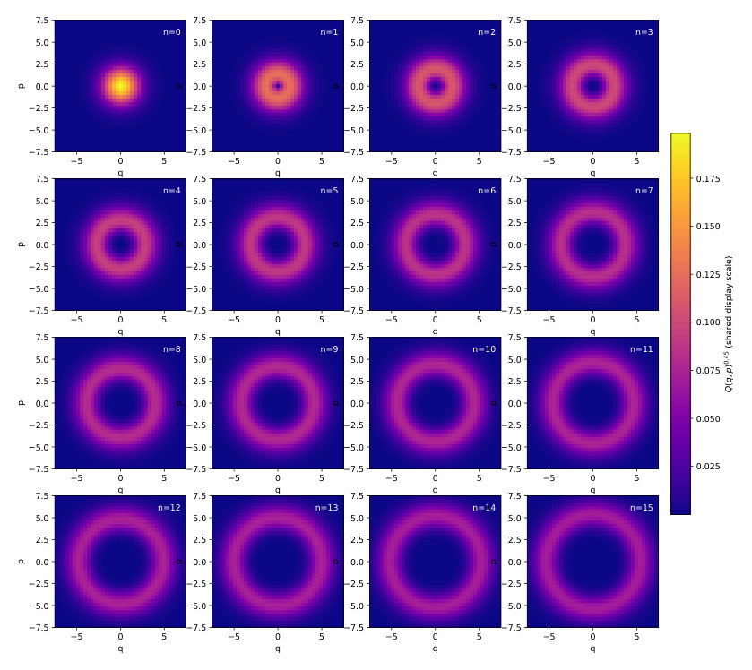 
Figure 3. Husimi Q-representation for 16 energy eigenstates: harmonic oscillator. From top-left to bottom right, the energy grows, and we labels them as n = 0, 1, · · · , 15.

📷 Fig 4

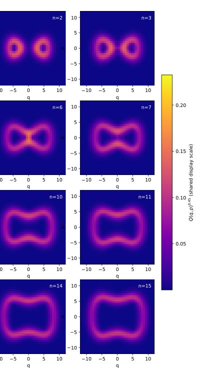 
Figure 4. Husimi Q-representation for 16 energy eigenstates: double-well.

📷 Fig 5

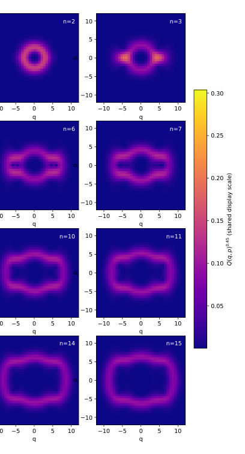 
Figure 5. Husimi Q-representation for 16 energy eigenstates: partly flattened oscillator.

**Summary.** This paper demonstrates that the geometry of the Wasserstein space of quantum states undergoes a dimensional reduction as a system becomes chaotic. By showing that quantum scrambling induces a folding structure in this space, the authors propose a new diagnostic for chaos and support the idea that holography emerges from such dimensional reduction.

**Why it may be interesting.** It provides a new geometric language (optimal transport) to unify diverse phenomena like quantum scars, Lyapunov exponents, and scrambling, while offering a potential geometric mechanism for the emergence of holographic spacetime.

Detailed structure

**Main problem.** Investigating the relationship between quantum chaos, quantum scrambling, and the geometric structure of the Wasserstein space of energy eigenstates.

**Main result.** The effective dimension of the Wasserstein space decreases as a quantum system becomes more chaotic, a process driven by a 'folding' structure induced by quantum scrambling.

**Method.** The authors use Sinkhorn-regularized optimal transport on Husimi Q-representations and apply the Gram-spectrum method with Multidimensional Scaling (MGS) to embed the Wasserstein distance into Euclidean space.

**Model / system.** The study utilizes several models: 1D potentials (harmonic oscillator, double-well, and partly flattened oscillator) and a 2D coupled harmonic oscillator with a quartic mixing term controlled by a coupling constant g.

**Key observables.** Effective dimension of Wasserstein space, Out-of-Time-Ordered Correlators (OTOC), Lyapunov exponent, and Gram-matrix eigenvalue decay constant B.

**Important parameters / regimes.** Coupling constant g (controlling integrability to chaos), Sinkhorn regularization parameter epsilon, and phase-space grid resolution.

**Assumptions / limitations.** The results are based on truncated harmonic oscillator bases and discretized phase-space grids; the authors note that higher energy levels may introduce more complex non-Euclidean geometry.

**Figures summary.** Figures show OTOC growth (scrambling), potential energy profiles, Husimi Q-representations in phase space, Wasserstein distance heatmaps, and 2D MDS embeddings showing line vs. folded structures.

**Paper structure.** The paper introduces the problem of dimensional reduction, presents 1D models to demonstrate scrambling-induced folding, analyzes the 2D coupled oscillator to show chaotic dimensional reduction, and concludes with a discussion on the holographic manifold hypothesis and numerical robustness.

Abstract

We find that the effective dimension of the Wasserstein space of energy eigenstates decreases as a quantum system becomes more chaotic. To demonstrate this, we study a quantum coupled harmonic oscillator system using Husimi Q-representations, to which Sinkhorn-regularized optimal transport is applied to construct an embedding geometry via the Gram-spectrum method. We also demonstrate that exponential OTOC growth, referred to here as quantum scrambling even in the absence of chaos, induces a folding structure in the emergent Wasserstein space, which may underlie the chaotic reduction of the Wasserstein dimension. At the separatrix (the scrambling point) of the inverted harmonic oscillator, the Wasserstein distance correctly captures the Lyapunov exponent. Furthermore, we discover that a branching structure in the Wasserstein space signals quantum scar states within the chaotic sea of phase space. Our optimal transport approach thus provides a new diagnostic for quantum chaos, quantum scrambling, quantum scars, and quantum Lyapunov exponents. The observed chaotic dimensional reduction also supports the recent conjecture [arXiv:2604.17649] that the Wasserstein space serves as an emergent holographic space through the manifold hypothesis, since chaoticity is a characteristic signature of black holes in holography.

[↑ back to top](#top)

### [Coherent Feedback Cooling of an Ultracoherent Phononic-Crystal Membrane at Room Temperature](http://arxiv.org/abs/2605.20902v1)

**Authors:** Luiz Couto Correa Pinto Filho, Yingxuan Chen, Frederik Werner Isaksen, Daniel Allepuz-Requena, Angelo Manetta, Dennis Henneberg Høj, Ulrich Busk Hoff, Alexander Huck, Ulrik Lund Andersen  
**Type:** experiment · **Category:** other · **PDF:** <https://arxiv.org/pdf/2605.20902v1>  
**Analysis basis:** full PDF text, analyzed in chunks
**Topic relevance:** 🔥 `quantum measurements` **4/5** · 🔥 `quantum optics experiment` **4/5**

📷 Fig 1

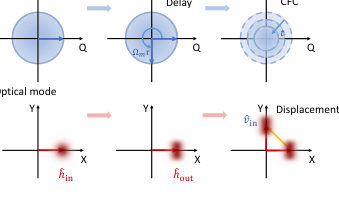 
Fig. 1. Conceptual scheme of CFC. (a) Experimental schematic. The probe beam ˆℎin is sent into the optomechanical cavity. After the optomechanical interaction between the horizontally polarized intracavity field ˆℎand the membrane, the reflected output beam ˆℎout is converted to vertical polarization and combined with a strong auxiliary beam ˆ𝑣aux on a beam splitter (BS) where a displacement operation is implemented to convert optical phase information into amplitude. The resulting field is then sent through a fiber delay and re-injected into the cavity, providing a coherent feedback force on the membrane. ˆ𝑣in and ˆ𝑣denote the annihilation operators of the input cooling beam and vertically...

📷 Fig 2

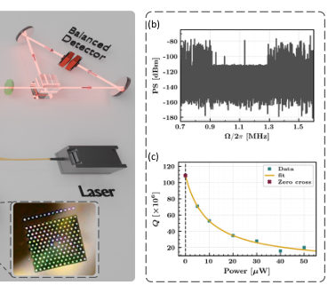 
Fig. 2. The experiment. (a) Experimental setup for CFC scheme. A horizontally polarized probe beam is injected into the cavity containing a membrane. The reflected beam is rotated to vertical polarization by using a FR and a HWP. A small portion is directed to a balanced homodyne detector for readout, while the main beam is combined with a strong auxiliary beam on a 90:10 BS for the displacement operation. The resulting field passes through a fiber delay line before being re-injected into the cavity to provide coherent feedback. LO, local oscillator. Inset: A camera image of the Si3N4 membrane showing the phononic-crystal pattern. (b) Phononic-crystal bandgap of the membrane around the...

📷 Fig 3

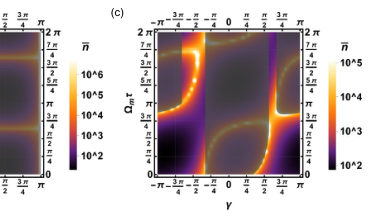 
Fig. 3. Numerical calculations of CFC. (a) Phonon occupation ¯𝑛versus the feedback delay Ωm𝜏and the cavity linewidth 𝜅under the on-resonance condition, showing the influence of the cavity linewidth on the optimal delay. (b) Phonon occupation ¯𝑛as a function of the feedback delay Ωm𝜏and displacement angle 𝛾for 𝜅= 2𝜋× 3.7 MHz, with both optical modes on resonance. The optimal parameters are found near Ωm𝜏≈𝜋/4 and 𝛾≈−𝜋/2. (c) Phonon occupation ¯𝑛for the experimentally detunings Δℎ= −0.06𝜅 and Δ𝑣= −1.11𝜅. The optimal displacement angle shifts toward −𝜋. The unshaded region indicates the parameter space satisfying the sufficient stability criterion. Calculations above are performed using the...

📷 Fig 4

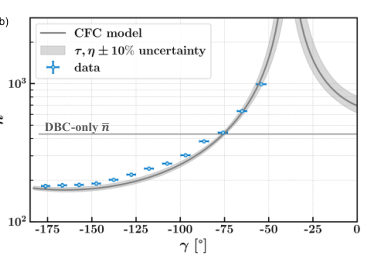 
Fig. 4. Experimental results of CFC. (a) Phase-quadrature power spectral densities (PSDs) of the reflected probe beam measured by homodyne detection. The blue trace (DBC1) shows the DBC spectrum with only the probe beam (cooling beam blocked) at a detuning Δℎ= −0.06𝜅and ∼50 µW input probe power. The green trace (DBC2) shows the spectrum with both probe and cooling beams (feedback signal blocked), showing enhanced DBC effect with Δ𝑣= −1.11𝜅and ∼270 µW input cooling power. The orange trace shows the spectrum with CFC with 𝛾= −153◦, Ωm𝜏= 0.24𝜋, and feedback efficiency 𝜂= 0.3. The grey trace shows the shot noise limit (SNL), normalized to 0.5. The dashed curves represent theoretical fits based...

📷 Fig 5

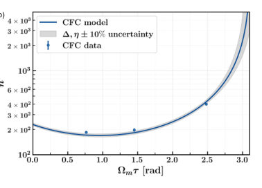 
Fig. 5. CFC as a function of detuning and delay. (a) Phonon occupation as a function of the probe detuning Δℎ/𝜅. The light grey curve shows the theoretical prediction for DBC, while the dark blue curve includes both DBC and CFC. The shaded grey area represents the uncertainty in phonon number estimated by including 10% variation in 𝜂and Ωm𝜏. Light and dark blue circles denote the experimental data for DBC and CFC, respectively. (b) Phonon occupation versus the delay Ωm𝜏with 𝛾= −0.85𝜋and Δℎ/𝜅= −0.06. The dark blue curve represents the theoretical prediction, and the shaded region shows the uncertainty considering 10% fluctuations in Δℎand 𝜂. Experimental data points (blue circles) agree well...

**Summary.** The researchers successfully demonstrated Coherent Feedback Cooling of a mechanical membrane at room temperature, achieving a massive reduction in phonon number. This approach overcomes the limitations of standard laser cooling in the sideband-unresolved regime and provides a roadmap for reaching the quantum ground state without cryogenics.

**Why it may be interesting.** This work is highly relevant to quantum optics and open quantum systems as it demonstrates a practical implementation of coherent feedback control to manipulate the steady-state of a macroscopic mechanical mode, bypassing the limits of measurement-based feedback.

Detailed structure

**Main problem.** The challenge of cooling macroscopic mechanical resonators to the quantum regime at room temperature, specifically overcoming the fundamental limits of dynamical backaction cooling in the sideband-unresolved regime.

**Main result.** Experimental demonstration of Coherent Feedback Cooling (CFC) on an ultracoherent membrane at room temperature, achieving a phonon occupation reduction from 5.5e6 to 166 and an effective temperature of 9.1 mK.

**Method.** An all-optical coherent feedback scheme where the optical probe field is re-injected after an engineered delay and displacement to provide a feedback force proportional to mechanical momentum.

**Model / system.** An optomechanical system featuring a high-Q silicon nitride density phononic-crystal membrane in a Fabry-Perot cavity, involving two optical polarization modes (horizontal and vertical) due to birefringence.

**Key observables.** Phonon occupation number, effective temperature, mechanical position power spectral density (PSD), and phase-space uncertainty area.

**Important parameters / regimes.** Mechanical frequency of 1.14 MHz, quality factor of 1.1e8, cavity linewidth of 3.7 MHz, and a cooling factor of 3.3e4.

**Assumptions / limitations.** The system is treated in the linearized regime; performance is currently limited by technical noise (laser-lock instability, frequency fluctuations) and in-loop optical losses.

**Figures summary.** Fig 1 shows the experimental schematic and phase-space evolution; Fig 3 shows numerical phonon occupation vs. delay/linewidth; Fig 6 shows predicted performance gains from upgrading coupling strength and reducing noise.

**Paper structure.** The paper introduces the problem of room-temperature quantum optomechanics, describes the experimental setup and CFC protocol, presents the experimental results for phonon reduction, discusses the impact of technical noise, and concludes with a predictive model for future system upgrades.

Abstract

Optomechanical systems provide a versatile platform for precision measurements and investigations of fundamental physics, where bringing macroscopic resonators into the quantum regime is a widely pursued goal. Achieving such quantum behavior of solid-state mechanical resonators at room temperature would greatly broaden their applications by removing the need for cryogenic environments. Reaching this goal requires efficient cooling of mechanical motion, among various laser cooling methods, dynamical backaction cooling (DBC) is widely utilized in experiments but fundamentally limited when operating in the sideband-unresolved regime. Coherent feedback cooling (CFC) can overcome this limitation, while avoiding state collapse and the electronic restrictions inherent to measurement-based feedback. Here, we experimentally demonstrate CFC using an ultracoherent density phononic crystal membrane. By combining CFC with strong DBC in a relatively narrow cavity, we achieve a phonon occupation reduction from $5.5\times10^{6}$ to $166\pm7$, corresponding to a cooling factor of $3.3\times10^{4}$ at room temperature, even with current experimental limitations. Our results show the potential of CFC for approaching the ground state of high-$Q$ membranes at room temperature.

[↑ back to top](#top)

### [WSi weak link element with a non-sinusoidal current-phase relation](http://arxiv.org/abs/2605.20652v1)

**Authors:** Sarah Garcia Jones, Trevyn F. Q. Larson, Sai Pavan Chitta, Heli Vora, Varun Verma, Sae Woo Nam, José Aumentado, Jens Koch, Raymond W. Simmonds, András Gyenis  
**Type:** both · **Category:** quantum information and computing · **PDF:** <https://arxiv.org/pdf/2605.20652v1>  
**Analysis basis:** full PDF text, analyzed in chunks
**Topic relevance:** 🔥 `QC/QI experiment` **4/5** · `quantum measurements` **2/5** · `quantum optics experiment` **2/5**

📷 Fig 1

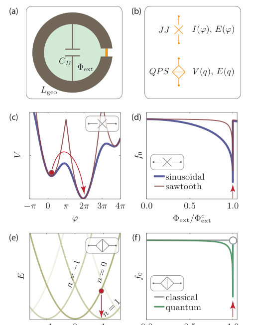 
FIG. 1. (a) Schematics of a flux-tunable LC-circuit with a weak link (orange). The geometric inductance of the loop due to the su- perconducting wire (brown) is Lgeo, and the shunting capacitance is CB. The green region indicates the external flux Φext piercing the loop. (b) Two different circuit elements modeling the weak link: a JJ with current-phase relation I(φ) and energy-phase relation E(φ), or a QPS with voltage-charge relation V (q) and energy-charge relation E(q). (c) In the JJ-description, the potential from a sinusoidal CPR has a corrugated shape (dark blue), while a sawtooth CPR results in a similar shape but with much higher well barriers (dark red). Red ar- rows indicate the...

📷 Fig 2

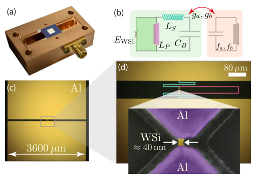 
FIG. 2. (a) RF-SQUID circuit coupled to a three-dimensional cop- per cavity. The RF-SQUID is patterned on a silicon chip suspended in a slot that is machined into the copper cavity and enclosed by an identical copper piece (not pictured). (b) Lumped element circuit di- agram. The red arrow refers to the coupling ga and gb between the cavity (orange) and the RF-SQUID (light green). The RF-SQUID de- vice is formed by a loop containing the weak link with energy EWSi and a parallel inductor Lp (pink). In addition, the device has a series inductor Ls (cyan), and a large capacitor CB. (c) Optical microscope image of the RF-SQUID device. The capacitor pads (yellow rectan- gles) are much larger...

📷 Fig 3

 
FIG. 3. (a) A series of toy-model potential landscapes as the external flux evolves. The state of the system is indicated by a phase parti- cle (black dot) in a local minimum in each panel. (b) Transmission data showing the resonance frequency as a function of applied mag- netic field and frequency f. The colored hexagons at various flux values refer to the potentials in (a). In this data set, flux is increased from around −1.5 to 2.5 Φ0, with a phase jump occurring at approx- imately 1.56 Φ0, labeled as Φc ext. The curvature of the resonance frequency response is relatively flat rather than sinusoidal, suggest- ing a more sawtooth-like current phase relation [see Fig. 1(d)]. (c), (d)...

📷 Fig 4

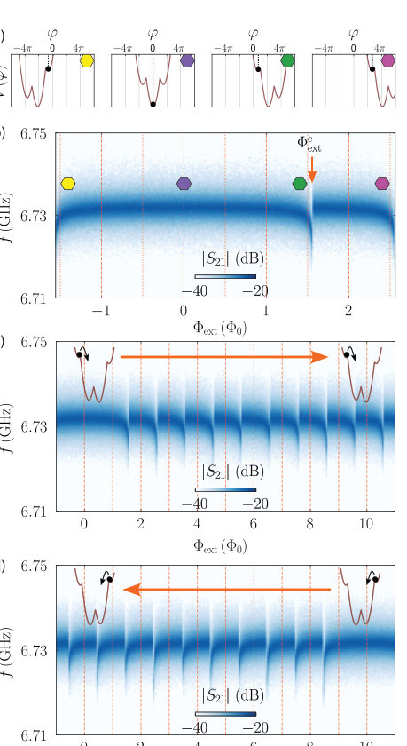 
Fig. 3(a). Given the large shunting capacitance and the large junction energy, we can describe the state of the system as a phase particle, represented by a black dot in Fig. 3(a). In this picture, the resonance frequency corresponds to the oscil- lation frequency of the particle, which depends on the local curvature of the well and the mass of the particle (capacitance

📷 Fig 5

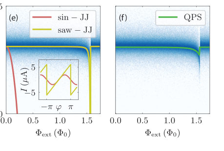 
FIG. 4. The lumped-element circuit model of the device, when the nanowire (dotted orange rectangle) is treated (a) as a JJ or (b) as a QPS. (c), (d) The potential energy of the circuits in the two cases (a) and (b), respectively. Because the circuit has three de- grees of freedom in the QPS case, the configuration space is three- dimensional. The colorbar ranges from 0 to 104 GHz in (c) and from 0 to 2 · 104 GHz in (d). (e), (f) The calculated resonance curves of the two circuits superimposed on the experimental data. The inset of (e) shows the corresponding CPRs of each JJ model. In (e), the parameters are ELP /h = 452 GHz, ELS/h = 568 GHz, ECσ/h = 7.4 MHz, ECδ/h = 0.97 GHz, where the...

**Summary.** This paper investigates the nonlinear properties of a tungsten silicide nanowire used as a weak link in a superconducting RF-SQUID. It demonstrates that the device follows a non-sinusoidal current-phase relation and shows that metastable flux states can be extremely long-lived. These findings suggest WSi is a promising material for developing new types of nonlinear superconducting quantum elements.

**Why it may be interesting.** This work is relevant for researchers in open quantum systems and quantum optics because it explores the control of decoherence and relaxation in highly nonlinear, metastable quantum states and demonstrates a platform for engineering non-standard energy-phase relationships.

Detailed structure

**Main problem.** The study aims to characterize the nonlinear behavior and current-phase relation (CPR) of a tungsten silicide (WSi) nanowire weak link to determine if it is better described by a non-sinusoidal Josephson junction model or a quantum phase slip (QPS) model.

**Main result.** The researchers demonstrated that the WSi weak link exhibits a non-sinusoidal, sawtooth-like CPR and found that both the skewed Josephson junction and QPS models can describe low-energy spectra, though differences emerge at higher energy levels. They also measured long-lived (up to one hour) metastable flux states.

**Method.** The study uses microwave spectroscopy and single-shot readout of flux-dependent resonance frequencies and relaxation times. Theoretical modeling involves circuit quantization, symplectic geometry for the QPS model, and the Born-Oppenheimer approximation.

**Model / system.** The physical system is an RF-SQUID containing a WSi nanowire weak link embedded in a three-dimensional copper cavity. The models considered are a Josephson junction with a skewed energy-phase relation and a quantum phase slip element acting as the electromagnetic dual.

**Key observables.** Resonance frequency (f) as a function of external magnetic flux, transmission amplitude (|S21|), and relaxation times of metastable persistent-current states.

**Important parameters / regimes.** Inductance ratio (beta), external magnetic flux (Phi_ext), skewness parameter (chi), kinetic inductance (Lk), and energy scales such as charging energy (Ec) and junction energy (Ej).

**Assumptions / limitations.** The study employs a semiclassical approximation for resonance frequency calculations and uses the Born-Oppenheimer approximation to treat high-energy modes as decoupled.

**Figures summary.** Figure 1 shows the device schematic and potential landscapes; Figure 2 and 3 present the experimental setup, device images, and flux-dependent resonance frequency data showing hysteresis; Figure 4 and 8 compare JJ and QPS models and energy spectra; Figure 9 shows the circuit models and numerical energy spectrum comparisons.

**Paper structure.** The paper introduces the need for nonlinearity in superconducting circuits, describes the fabrication and setup of the WSi RF-SQUID, presents experimental measurements of resonance frequency and hysteresis, compares the data against JJ and QPS theoretical models, and concludes with the measurement of metastable state lifetimes.

Abstract

Nonlinearity is an essential ingredient for encoding quantum states with non-uniform energy spacing, implementing coherent quantum gates, reading out qubits, amplifying, and mixing electromagnetic signals. In this work, we demonstrate the nonlinear behavior of a constriction fabricated from an amorphous, high-kinetic inductance material, tungsten silicide, embedded in a three-dimensional RF-SQUID. We find that the results are consistent with the weak link behaving as a Josephson junction with a sawtooth-like current-phase relation or a quantum phase slip element. Finally, we measure relaxation times of the metastable, persistent-current states trapped in the local minima of the potential.

[↑ back to top](#top)

### [Boundary Geometry Turns Entanglement into Steering](http://arxiv.org/abs/2605.21245v1)

**Authors:** Yu-Xuan Zhang, Jing-Ling Chen  
**Type:** theory · **Category:** quantum information and computing · **PDF:** <https://arxiv.org/pdf/2605.21245v1>  
**Analysis basis:** full PDF text, analyzed in chunks
**Topic relevance:** 🔥 `entanglement & information structure` **4/5** · `quantum measurements` **3/5**

📷 Fig 1

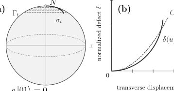 
FIG. 1. Boundary contact and quadratic inward defect. (a) Product-null boundary contact at N, with shrinking caps Γt. (b) The normalized inward defect δ(u) is bounded by a quadratic curve Cu2 for a representative product-null fam- ily.

📷 Fig 2

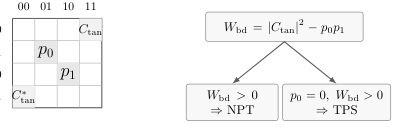 
FIG. 2. Minimal boundary witness. (a) The boundary data consist of the product-null population p0, the auxiliary popu- lation p1, and the tangential coherence Ctan. (b) The witness Wbd = |Ctan|2 −p0p1 detects the negative partial-transpose minor. At the product-null boundary, the theorem upgrades this NPT witness to two-way projective steering.

**Summary.** The paper demonstrates that for certain classes of quantum states, entanglement and EPR steering are equivalent due to a geometric scaling obstruction at the state space boundary. It provides a practical experimental witness for steering by measuring tangential coherence in states where the conditional state touches the Bloch sphere boundary.

**Why it may be interesting.** This is highly relevant for quantum information and quantum optics as it provides a new geometric way to certify steering and provides a method to upgrade entanglement witnesses into steering certificates using only local boundary data.

Detailed structure

**Main problem.** Investigating the conditions under which the gap between entanglement and Einstein-Podolsky-Rosen (EPR) steering closes, specifically looking for a mechanism where entanglement implies steering.

**Main result.** The authors identify a boundary-geometric mechanism where, on the product-null boundary of the state space, entanglement is equivalent to two-way projective steering. This collapse of the hierarchy applies to all entangled two-qubit rank-two states and certain rank-three states.

**Method.** The study uses boundary-scaling analysis of conditional states near the Bloch-sphere boundary and a mathematical proof involving the Radon-Nikodym theorem to demonstrate a scaling obstruction to Local Hidden State (LHS) models.

**Model / system.** The study focuses on bipartite quantum systems (specifically two-qubit states and general cuts X|Y) involving an untrusted party (Alice) and a trusted party (Bob), modeled using projective assemblages and Local Hidden State (LHS) models.

**Key observables.** Tangential coherence (h02 or b_t), inward defect (delta), and the boundary witness (W_bd).

**Important parameters / regimes.** The product-null boundary regime, where the kernel of the density matrix contains a product vector, and the scaling regime defined by first-order tangential displacement and second-order inward defect.

**Assumptions / limitations.** The primary results rely on the specific geometric condition of conditional states touching the boundary of the Bloch ball (product-null contact) and assume Alice's side is restricted to local unitaries.

**Figures summary.** Figure 1 illustrates boundary contact and the quadratic inward defect of conditional states; Figure 2 shows the boundary data (populations and coherence) and the boundary witness used to detect the NPT minor.

**Paper structure.** The paper begins by defining the gap between entanglement and steering, introduces the product-null boundary geometry, provides a mathematical proof of the scaling obstruction to LHS models, extends the results to higher-dimensional/multipartite cuts, and concludes with an experimental witness.

Abstract

Entanglement does not in general imply Einstein-Podolsky-Rosen steering. We identify a boundary-geometric mechanism that closes this gap on product-null boundary strata of two-qubit state space, where Bob's conditional states touch the boundary of the Bloch ball. The key obstruction is local: if a projective assemblage approaches a Bloch-sphere boundary contact with a first-order tangential displacement but only a second-order inward defect, then no finite-measure local-hidden-state model can reproduce it. For two-qubit states with a product vector in the kernel, this boundary contact is exactly the tangency of Bob's steering ellipsoid to the Bloch sphere. At such a product-null tangency, a single tangential coherence controls both partial-transpose negativity and the boundary-contact scaling obstruction. The same boundary minor gives a compact experimental witness: once the product-null contact is verified or guaranteed, the tangential coherence supplies the steering signal. Consequently, every entangled two-qubit rank-two state, and every entangled rank-three state whose null space is spanned by a product vector, is two-way projectively steerable. The same boundary idea extends to arbitrary steering cuts: the Bloch-sphere contact is replaced by a rank-deficient trusted conditional state, and support-kernel first-order coherence implies both NPT entanglement and projective steering.

[↑ back to top](#top)

### [Velocity-Controlled Directional Readout of Single Photons](http://arxiv.org/abs/2605.21206v1)

**Authors:** Mohamed Hatifi  
**Type:** theory · **Category:** quantum information and computing · **PDF:** <https://arxiv.org/pdf/2605.21206v1>  
**Analysis basis:** full PDF text, analyzed in chunks
**Topic relevance:** 🔥 `quantum measurements` **4/5** · `interference shaping light` **2/5**

📷 Fig 1

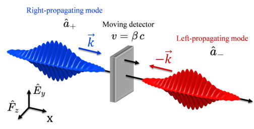 
Figure 1. Moving-detector geometry. A detector moving along +x with velocity v = βc probes two counterpropagating single-photon modes of the same laboratory frequency ω. The right-propagating blue mode is annihilated by ˆa+ and carries wave vector +k, while the left-propagating red mode is annihilated by ˆa−and carries wave vector −k. Although the detector is purely electric in its rest frame, its laboratory-frame response mixes electric and magnetic ampli- tudes and samples the two modes at the Doppler-shifted frequencies Ω± = γ(1 ∓β)ω. This is the origin of the velocity-dependent pho- todetection POVM derived below.

📷 Fig 2

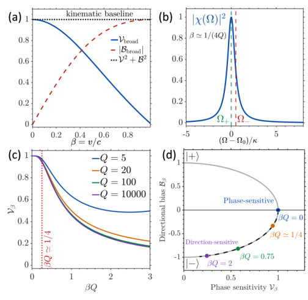 
Figure 2. Moving-detector photodetection and Doppler- enhanced directional readout. (a) Broadband limit. A detec- tor that is purely electric in its rest frame realizes, in the labora- tory frame, a velocity-fixed electric–magnetic readout. The visi- bility Vbroad decreases as the propagation bias |Bbroad| increases, while the ideal click effect satisfies V2 + B2 = 1. (b) Narrowband mechanism. A Lorentzian detector tuned near one Doppler-shifted component samples the two counterpropagating alternatives at dif- ferent detector-frame frequencies, Ω+ and Ω−. Propagation selec- tivity appears once the Doppler splitting resolves the linewidth. (c) Q-enhanced crossover. For a Lorentzian detector...

📷 Fig 3

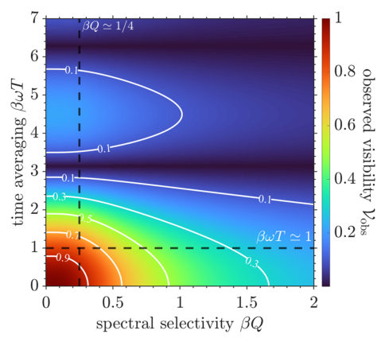 
Figure 3. Observed visibility in the presence of spectral selec- tivity and finite-time integration. The color map shows the visi- bility Vobs as a function of two dimensionless control parameters: the spectral-selectivity parameter βQ, proportional to the Doppler splitting in linewidth units, and the time-averaging parameter βωT, which measures the accumulated Doppler-beat phase during the de- tection window. The vertical dashed line marks the narrowband onset βQ ≃1/4 for a branch-tuned Lorentzian response, where the detec- tor begins to resolve the two propagation alternatives spectrally. The horizontal dashed line marks βωT ≃1, where finite-time integration begins to wash out the Doppler...

**Summary.** This paper shows that moving a detector relative to a photon can change the type of information extracted from a single-photon state. By using a narrowband detector, one can use the Doppler shift to switch from measuring interference to measuring propagation direction. This effect is operational and does not require decohering the photon itself.

**Why it may be interesting.** It provides a novel way to control measurement axes on a propagation qubit using kinematic motion and spectral selectivity, which is highly relevant for engineered quantum platforms like cQED and optomechanics.

Detailed structure

**Main problem.** Investigating how the uniform motion of a detector relative to an optical apparatus changes the measurement-theoretic properties (POVM) of single-photon detection, specifically the transition from phase-sensitive to direction-sensitive readout.

**Main result.** The paper demonstrates that detector motion, combined with finite spectral bandwidth, can transform a phase-sensitive measurement into a direction-sensitive one without decohering the photon, with the transition being enhanced by the detector's quality factor.

**Method.** The author uses the Glauber formulation of photodetection, Lorentz transformations of electromagnetic fields, and the theory of Positive-Operator-Valued Measures (POVM) to derive the single-click effect density.

**Model / system.** A single-photon state in two counterpropagating modes (+ and -) interacting with an electric Glauber detector moving at a constant velocity v along the x-axis, modeled with a Lorentzian spectral response.

**Key observables.** Instantaneous Fringe Visibility (V_beta), Directional Bias (B_beta), and Doppler-beat frequency (Delta_Omega).

**Important parameters / regimes.** Normalized velocity (beta), detector Quality Factor (Q), relative phase (phi), and the integration time window (T).

**Assumptions / limitations.** The detector is treated as having a Lorentzian susceptibility; the motion is assumed to be uniform; the analysis considers both broadband and narrowband limits.

**Figures summary.** Figure 1 illustrates the geometry of a detector moving along the x-axis probing two counterpropagating modes.

**Paper structure.** The paper introduces the problem of detector motion, establishes the Lorentz-transformed field model, derives the POVM for the moving detector, analyzes the broadband and narrowband (Q-enhanced) regimes, and discusses the effects of finite-time integration.

Abstract

Photodetection is usually treated in the frame in which the detector is at rest relative to the optical apparatus. We show that uniform motion of an electric Glauber detector changes the single-click POVM realized on two counterpropagating single-photon modes. Motion Doppler-shifts the alternatives in the detector frame; finite bandwidth then converts propagation direction into a detection bias without decohering the photon. For a Lorentzian response near one Doppler branch, the readout crosses from phase-sensitive to direction-sensitive with a quality-factor-enhanced onset. Finite-time integration adds Doppler-beat visibility loss, separating passive covariance from measurement change.

[↑ back to top](#top)

### [Quantum Simulation of Gauge Theories for Particle and Nuclear Physics](http://arxiv.org/abs/2605.20417v1)

**Authors:** Zohreh Davoudi  
**Type:** both · **Category:** quantum information and computing · **PDF:** <https://arxiv.org/pdf/2605.20417v1>  
**Analysis basis:** full PDF text, analyzed in chunks
**Topic relevance:** `QC/QI experiment` **3/5** · `Rydberg arrays` **3/5** · `analog quantum simulation` **3/5** · `entanglement & information structure` **3/5** · `non-equilibrium dynamics` **3/5** · `non-equilibrium universality` **2/5**

📷 Fig 1

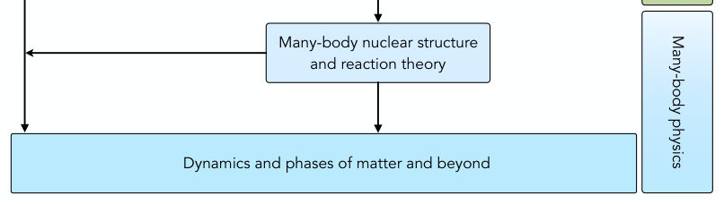 
Figure 1: A roadmap for leveraging quantum simulation and quantum computation in particle and nuclear physics.

📷 Fig 2

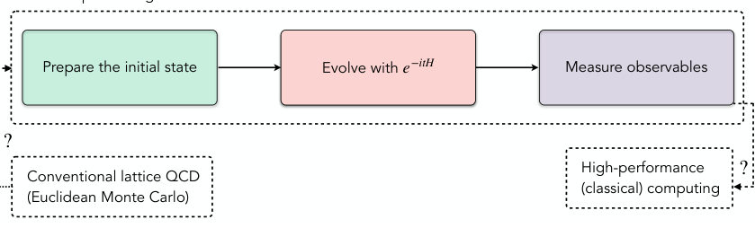 
Figure 2: Depicted are the quantum-simulation steps. Conventional lattice-QCD computations can inform and facilitate the state-preparation step, while high-performance (classical) computing will be needed to store and analyze vast quantum measurements. Time evolution can be accelerated by quantum processors, providing quantum advantage in many applications.

📷 Fig 3

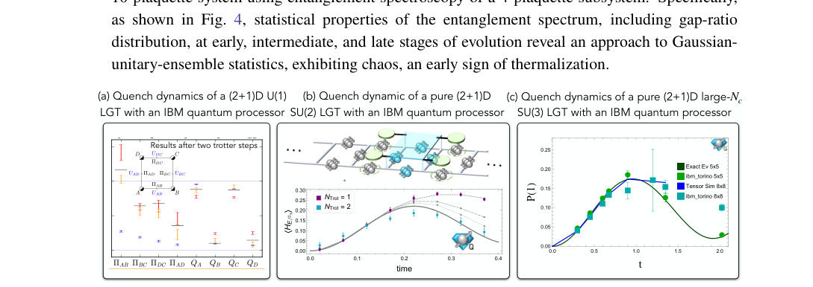 
Figure 3: Examples of nonequilibrium quench dynamics in select (2+1)D LGTs: (a) is adopted from Ref. [47], (b) from Ref. [48], and (c) from Ref. [49].

📷 Fig 4

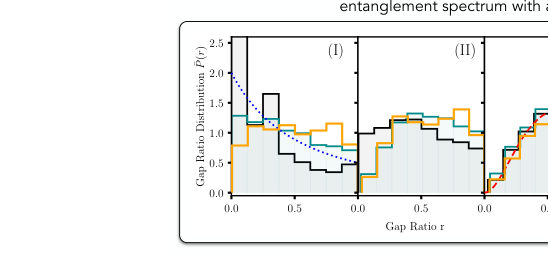 
Figure 4: Stages of thermalization dynamics in a (2+1)D 𝑍2 LGT learned from the nonequilibrium state’s entanglement spectrum. Plots are adopted from Ref. [51].

📷 Fig 5

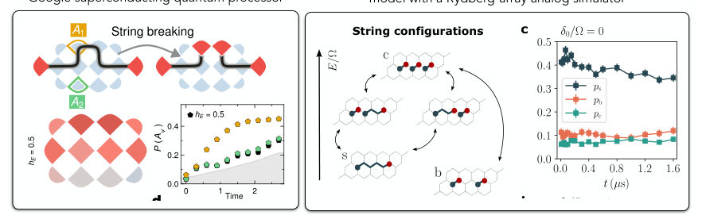 
Figure 5: Examples of false-vacuum decay and string breaking in quench dynamics in select LGTs: (a) is adopted from Ref. [52], (b) from Ref. [53], (c) from Ref. [54], and (d) from Ref. [55].

**Summary.** This paper reviews the development of quantum simulation techniques for lattice gauge theories to overcome the limitations of classical Monte Carlo methods. It highlights the synergy between quantum algorithms, hardware co-design, and classical high-performance computing in studying the fundamental dynamics of particle and nuclear physics.

**Why it may be interesting.** It demonstrates how quantum computing hardware (trapped ions, Rydberg arrays) can be used to simulate complex gauge dynamics and non-equilibrium phenomena that are classically intractable.

Detailed structure

**Main problem.** Classical lattice field theory faces exponential scaling bottlenecks, such as the fermion sign problem and the inability to access real-time dynamics, when studying dense matter and non-equilibrium processes.

**Main result.** Quantum simulation offers a polynomial-efficiency alternative for studying gauge theories, with recent progress demonstrating successful simulations of string breaking, particle production, and quench dynamics on various quantum hardware.

**Method.** A hybrid classical-quantum approach using digital (Trotterization, qubitization) and analog simulation techniques, integrated with classical HPC for state preparation and data analysis.

**Model / system.** Lattice Gauge Theories (LGTs) including the Standard Model, QCD, QED, and simpler models like the Schwinger model, U(1), and SU(N) in (1+1)D and (2+1)D, implemented on platforms such as superconducting circuits, trapped ions, and Rydberg arrays.

**Key observables.** Hadronic spectrum, S-matrices, scattering amplitudes, parton distribution functions (PDFs), entanglement entropy, and real-time correlation functions.

**Important parameters / regimes.** Lattice spacing, finite volume, chemical potential, temperature, and the truncation of the Hilbert space.

**Assumptions / limitations.** The necessity of truncating infinite-dimensional Hilbert spaces for continuous gauge groups and the reliance on heuristic algorithms for state preparation due to the lack of proven quantum advantage in generic state preparation.

**Figures summary.** The figures illustrate a roadmap from theory to simulation, a workflow for hybrid quantum-classical computing, examples of non-equilibrium quench dynamics, and specific results like string breaking, PDFs, and phase diagrams.

**Paper structure.** The paper motivates the quantum-computational LGT program, identifies the limitations of classical Monte Carlo, details the algorithmic and hardware strategies (digital, analog, and hybrid), reports on recent experimental successes, and discusses future challenges and opportunities.

Abstract

Lattice field theory, along with its algorithmic and hardware ecosystems, has been at the forefront of computational particle and nuclear physics. It continues to deliver impressive results on the hadronic spectrum, structure, decays, and reactions. Yet, this vigorous campaign has fallen short in addressing a range of problems involving dense matter and general dynamical phenomena. The reason is that such problems require an exponential scaling of computing time and space in system size. Quantum simulation, enabled by quantum-computing algorithms and hardware technology, promises a way forward by offering several polynomially efficient algorithms compared with their inefficient classical counterparts. Lattice gauge theorists have engaged in a multi-pronged program to leverage such new possibilities, and have steadily advanced the state of theory, algorithm, and hardware implementations and co-design. In this talk, I motivate the quantum-computational lattice-field-theory program; introduce the questions such a program is expected to address and the strategies it involves; report on recent progress; and end with a note on challenges and opportunities ahead.

[↑ back to top](#top)

### [Physical completion of the Navier-Stokes equations](http://arxiv.org/abs/2605.21357v1)

**Authors:** Samuel L. Braunstein  
**Type:** theory · **Category:** statistical mechanics · **PDF:** <https://arxiv.org/pdf/2605.21357v1>  
**Analysis basis:** full PDF text, analyzed in chunks
**Topic relevance:** `non-equilibrium dynamics` **3/5** · `Keldysh / 2PI / non-Gaussian methods` **2/5** · `correlated / nonlocal dissipation` **2/5** · `driven-dissipative phase transition` **2/5** · `methods for driven-dissipative` **2/5** · `non-equilibrium universality` **2/5**

📷 Fig 1

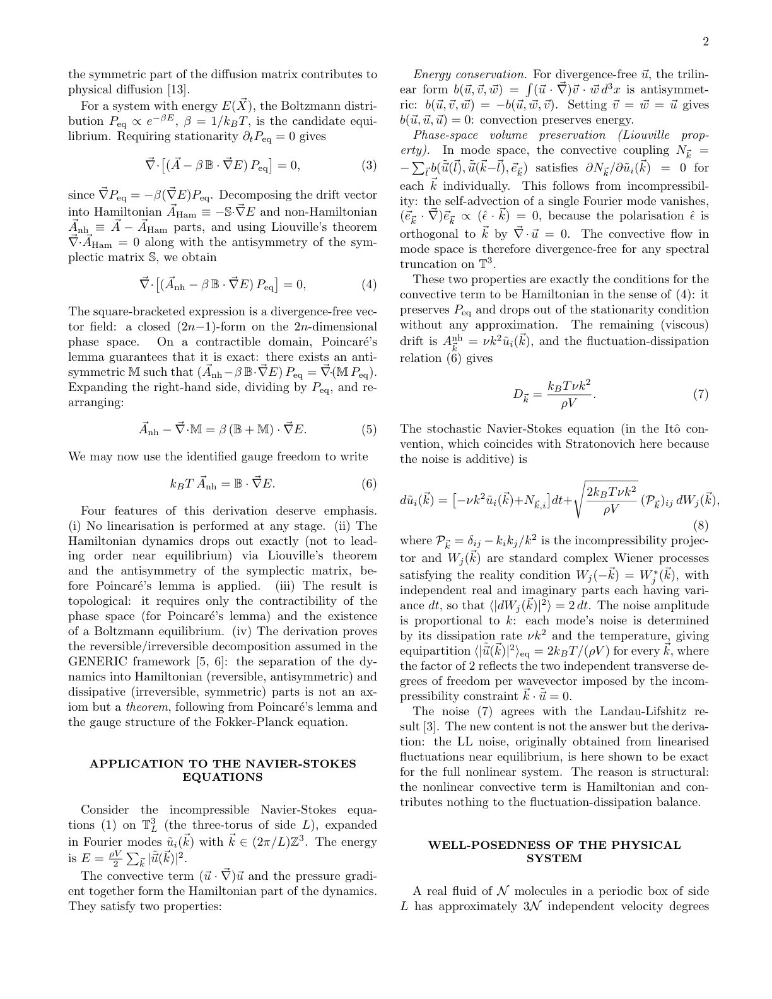 
Low-resolution page preview, page 2

📷 Fig 2

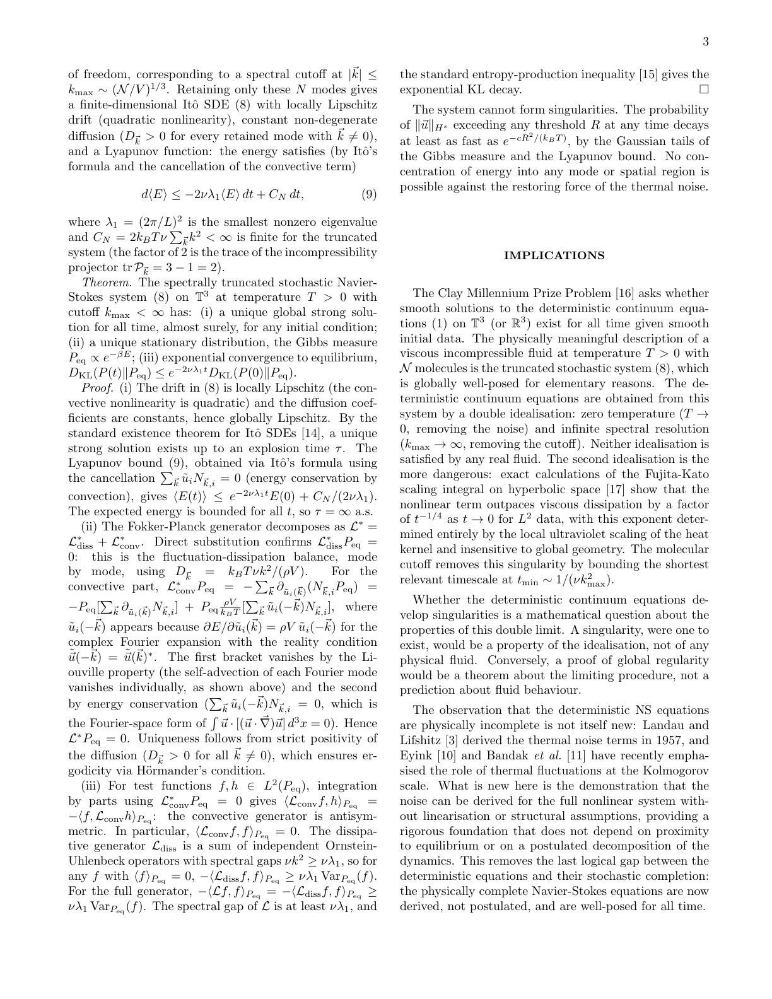 
Low-resolution page preview, page 3

📷 Fig 3

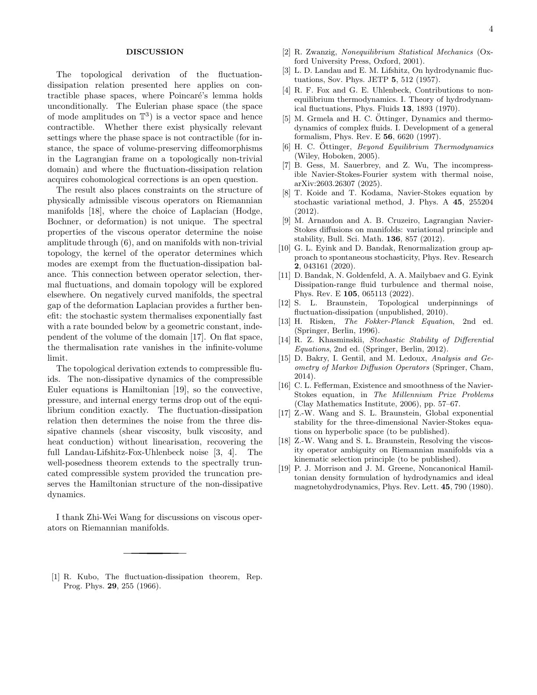 
Low-resolution page preview, page 4

**Summary.** This paper provides a rigorous derivation of the stochastic completion of the Navier-Stokes equations, showing that thermal noise is required to balance viscosity. It proves that by including a physical spectral cutoff, the system becomes globally well-posed and avoids the singularities predicted by the idealized, zero-temperature version of the equations.

**Why it may be interesting.** The derivation of exact fluctuation-dissipation relations without linearization and the use of topological arguments to ensure stability are highly relevant to the study of non-equilibrium dynamics and open quantum systems.

Detailed structure

**Main problem.** Addressing the physical incompleteness of the deterministic Navier-Stokes equations, specifically the lack of thermal noise to balance viscous dissipation and the potential for unphysical singularities.

**Main result.** The author proves that the fluctuation-dissipation relation is exact for the full nonlinear system and that a spectrally truncated stochastic Navier-Stokes system is globally well-posed with a unique Gibbs equilibrium.

**Method.** A topological argument using Poincaré's lemma on a contractible Eulerian phase space to derive the fluctuation-dissipation relation without linearization.

**Model / system.** A finite-dimensional, incompressible, viscous fluid at finite temperature modeled via stochastic differential equations on a three-torus with a molecular-scale spectral cutoff.

**Key observables.** Energy (E), probability distribution (P), and the diffusion matrix (D)

**Important parameters / regimes.** Viscosity (nu), temperature (T), density (rho), volume (V), and spectral cutoff (k_max)

**Assumptions / limitations.** The derivation assumes a contractible phase space (e.g., the Eulerian phase space on a torus) and the existence of a Boltzmann equilibrium.

**Paper structure.** The paper begins by identifying the inconsistency in deterministic Navier-Stokes, introduces a stochastic model with a spectral cutoff, applies Poincaré's lemma to derive the fluctuation-dissipation relation, demonstrates the Hamiltonian nature of the convective term, and concludes by proving global well-posedness and discussing the implications for the Clay Millennium Problem.

Abstract

The incompressible Navier-Stokes equations contain viscous dissipation but no thermal noise. I show, using a topological argument based on Poincaré's lemma, that the fluctuation-dissipation relation for the full nonlinear dynamics can be derived without the linearisation or structural assumptions that all previous derivations require. The nonlinear convective term is Hamiltonian (energy-preserving and phase-space-volume-preserving) and drops out of the Fokker-Planck equilibrium condition exactly, so the noise derived from linearised fluctuations near equilibrium is in fact exact for the full nonlinear system. This result proves, rather than assumes, the reversible/irreversible decomposition that the GENERIC framework postulates, provided Poincaré's lemma holds on the phase space. The resulting stochastic system, with a physical molecular-scale spectral cutoff, is trivially globally well-posed: a finite-dimensional stochastic differential equation with non-degenerate noise and a confining Lyapunov function. It has a unique Gibbs equilibrium and converges to it exponentially. The difficulty of the Clay Millennium Prize Problem arises entirely from two idealisations, zero temperature and infinite spectral resolution, neither of which is satisfied by any physical fluid.

[↑ back to top](#top)

### [Enhanced quantum metrology by criticality-assisted noncommutative preparation](http://arxiv.org/abs/2605.21219v1)

**Authors:** Ningxin Kong, Matteo G. A. Paris, Qiongyi He  
**Type:** theory · **Category:** quantum information and computing · **PDF:** <https://arxiv.org/pdf/2605.21219v1>  
**Analysis basis:** full PDF text, analyzed in chunks
**Topic relevance:** `Tavis-Cummings & cavity-many-emitter` **3/5** · `quantum measurements` **3/5** · `correlated cavity matter` **2/5** · `entanglement & information structure` **2/5** · `non-equilibrium dynamics` **2/5**

📷 Fig 1

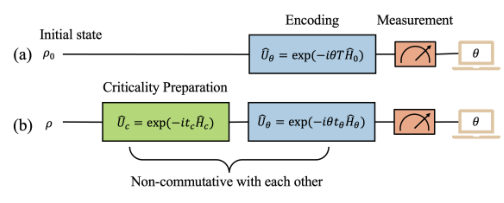 
FIG. 1. Schematic diagram of the quantum metrological protocols. (a) In the direct-encoding scheme, a single probe state ρ0 is directly subjected to the parameter-encoding operation ˆUθ for a total encoding time T. (b) In our CANP protocol, the probe ρ is first prepared by the critical operation ˆUc and subsequently acquires a dependence on the parameter θ through ˆUθ. The preparation and encoding durations are denoted by tc and tθ, respectively, with the total evolution time satisfying T = tc + tθ.

📷 Fig 2

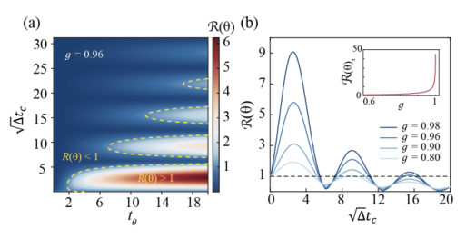 
FIG. 2. (a) QFI enhancement ratio R(θ) as functions of the critical-evolution time √

📷 Fig 3

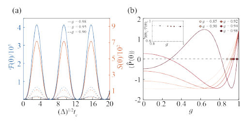 
FIG. 3. (a) Wigner–Yanase skew information S(θ) and the QFI F(θ) as functions of the critical-evolution duration √

**Summary.** This paper introduces a new protocol called CANP that uses quantum criticality to prepare states for enhanced parameter estimation. By separating the critical evolution from the parameter encoding, the method overcomes the limitations of previous schemes and allows for more versatile and efficient quantum sensing.

**Why it may be interesting.** It provides a new way to utilize phase transitions as a resource for sensing without being tied to the specific parameters of the phase transition itself, which is highly relevant for quantum metrology and many-body dynamics.

Detailed structure

**Main problem.** Existing quantum metrology schemes using criticality are limited because they are restricted to parameters present in the critical Hamiltonian and suffer from a narrow estimation range.

**Main result.** The authors propose a 'criticality-assisted noncommutative preparation' (CANP) protocol that uses critical evolution solely for state preparation, enabling enhanced sensitivity to a broader range of parameters and achieving higher precision at fixed energy and time costs.

**Method.** A two-stage protocol involving a preparation stage under a critical Hamiltonian followed by an encoding stage under a separate Hamiltonian, analyzed using the Quantum Fisher Information and Wigner-Yanase skew information.

**Model / system.** The framework is demonstrated using the Quantum Rabi model (describing a spin interacting with a bosonic mode) and the Lipkin-Meshkov-Glick (LMG) model.

**Key observables.** Quantum Fisher Information (QFI) and Wigner-Yanase skew information.

**Important parameters / regimes.** Critical parameter delta (proximity to criticality), total sensing time T, and the enhancement ratio R(theta).

**Assumptions / limitations.** The LMG model analysis assumes a low-excitation regime; the protocol's effectiveness relies on a specific algebraic noncommutativity relation.

**Figures summary.** Figure 1 provides a schematic comparison of the proposed protocol versus existing methods.

**Paper structure.** The paper introduces the CANP framework, establishes the algebraic conditions for enhancement, demonstrates the protocol using the Quantum Rabi and LMG models, and quantifies the metrological gain and scaling regimes.

Abstract

Quantum criticality is a resource for quantum-enhanced metrology, but existing schemes face intrinsic limitations. These arise because using criticality directly in the encoding dynamics restricts the accessible parameters to those explicitly supported by the critical Hamiltonian, and the requirement for critical conditions narrows the effective estimation range. To solve this, we introduce a general framework termed criticality-assisted noncommutative preparation (CANP). In this approach, critical evolution is employed as a state-preparation resource. We establish the underlying algebraic conditions and show that the intrinsic noncommutativity between the preparation and encoding operations leads to a genuine enhancement of the quantum Fisher information (QFI). Remarkably, this enhancement may be achieved at fixed total sensing time and energy cost. The effect is quantified by the Wigner-Yanase skew information, which measures noncommutativity and exhibits the same critical scaling as the QFI. We demonstrate effective use of CANP in the quantum Rabi and Lipkin-Meshkov-Glick models. Our results establish CANP as a robust technique to effectively implement criticality-enhanced quantum metrology.

[↑ back to top](#top)

### [Impurity-induced loss bursts from anomalous scale-free localization in a non-Hermitian dissipative lattice](http://arxiv.org/abs/2605.21034v1)

**Authors:** Hui Liu, Zhihao Xu  
**Type:** theory · **Category:** disordered systems and neural networks · **PDF:** <https://arxiv.org/pdf/2605.21034v1>  
**Analysis basis:** abstract only; PDF text extraction failed or PDF unavailable
**Topic relevance:** `Kondo & dissipative impurity` **3/5** · `non-equilibrium dynamics` **3/5** · `correlated / nonlocal dissipation` **2/5** · `driven-dissipative phase transition` **2/5** · `non-equilibrium universality` **2/5**

**Summary.** This paper demonstrates that impurities in a non-Hermitian lattice can cause anomalous scale-free localization and sudden bursts of dissipation. By tuning impurity strength, the system can be transitioned between different boundary condition regimes, allowing for controllable dissipation dynamics.

**Why it may be interesting.** It provides a new mechanism for controlling dissipation dynamics in non-Hermitian systems using impurities, which is highly relevant for designing open quantum systems and non-Hermitian topological photonics.

Detailed structure

**Main problem.** The study investigates how local impurities in a non-Hermitian dissipative lattice induce anomalous scale-free localization and unexpected bursts of dissipation.

**Main result.** The authors discover that impurities create an effective boundary that triggers 'loss bursts' (enhanced dissipation) even when wave packets are initially far away, characterized by an eigenenergy-dependent Lyapunov exponent.

**Method.** The study uses a local basis rotation to map the cross-stitch lattice onto an effective non-Hermitian Su-Schrieffer-Heeger (SSH) model and analyzes the spectral properties and eigenstate localization.

**Model / system.** A non-Hermitian dissipative cross-stitch lattice containing local impurities that act as tunable effective boundaries.

**Key observables.** Long-time integrated dissipation probability, Lyapunov exponent, and spectral loops.

**Important parameters / regimes.** Impurity strength (eta), which tunes the system between effective open-boundary-condition limits (eta -> 0 and eta -> infinity) and periodic-boundary-condition (eta = 1).

**Paper structure.** The paper identifies the model mapping, analyzes the localization properties of eigenstates, demonstrates the impurity-induced loss burst phenomenon, and extends the analysis to multiple impurities and nonreciprocal drift.

Abstract

We identify anomalous scale-free localization and the associated impurity-induced loss bursts in a non-Hermitian dissipative cross-stitch lattice. By a local basis rotation, the model is mapped onto an effective non-Hermitian Su-Schrieffer-Heeger lattice, where local impurities act as tunable effective boundaries. For the parameter choice considered here, tuning the impurity strength $η$ connects two effective open-boundary-condition-like limits, reached for $η\to0$ and $η\to\infty$, through generalized-boundary-condition regimes and the impurity-free periodic-boundary-condition point at $η=1$. For finite $η\notin\{0,1\}$, the spectral loops remain separated from the real-energy axis, while the eigenstates exhibit scale-free localization pinned by the impurity. Unlike conventional impurity-induced scale-free localization, the Lyapunov exponent depends explicitly on the eigenenergy, making the localization strength eigenstate dependent. We further show that this anomalous eigenmode structure produces an impurity-induced loss burst: the long-time integrated dissipation probability is strongly enhanced near an impurity-generated effective boundary even when the initial wave packet is far away. In the single-impurity case, the burst region consists of the impurity site and its adjacent effective-boundary site, and the effect occurs without imaginary-gap closing. For multiple impurities, local burst regions emerge around all impurities, while the dominant burst boundary is selected by the initial wave-packet position and the nonreciprocal drift direction. These results connect anomalous scale-free localization with controllable dissipation dynamics in non-Hermitian lattices.

[↑ back to top](#top)

### [PIQC: Scalable Distributed Quantum Computing via Photonic Integration of Designed Molecular Quantum Nodes](http://arxiv.org/abs/2605.21204v1)

**Authors:** Anna Aubele, Gregor Bayer, Tim R. Eichhorn, Tobias Hahn, Fedor Jelezko, Paul Mentzel, Philipp Neumann, Matthias Pfender, Martin B. Plenio, Alex Retzker, Simon Roggors, Alon Salhov, Jochen Scharpf, Tobias A. Schaub, Nico Striegler, Thomas Unden, Julia Zolg, Sella Brosh, Ilai Schwartz  
**Type:** both · **Category:** quantum information and computing · **PDF:** <https://arxiv.org/pdf/2605.21204v1>  
**Analysis basis:** full PDF text, analyzed in chunks
**Topic relevance:** `QC/QI experiment` **3/5** · `quantum optics experiment` **3/5** · `quantum measurements` **2/5** · `spintronics-quantum-optics interface` **2/5** · `entanglement & information structure` **1/5** · `non-equilibrium dynamics` **1/5**

📷 Fig 1

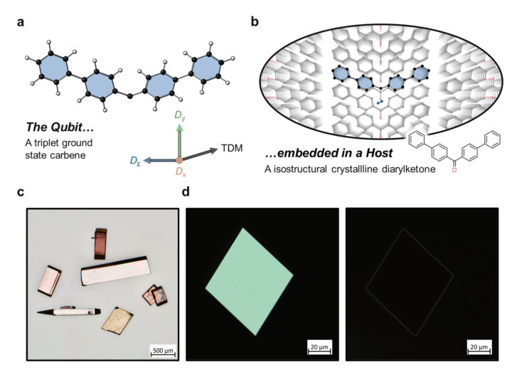 
FIG. 1. a, Molecular structure of the qubit together with the orientation of the ZFS tensor (Di) and optical transition dipole moment (TDM).7 b, Illustration of the embedding of the carbene and the nitrogen cleaved off via photoactivation of a diaryldiazomethane precursor in the crystalline lattice of ketone matrix.7 c, Representative crystals with a uniform 2.5 mol% doping rate shown in multiple orientations. Different colors stem from variations of the effective optical density along the viewing axis, scaling with crystal thickness and orientation.7 d, Polarization microscopy images of a submicron-thin crystal. Left: The crystal viewed at maximum brightness. Right: The crystal viewed with...

📷 Fig 2

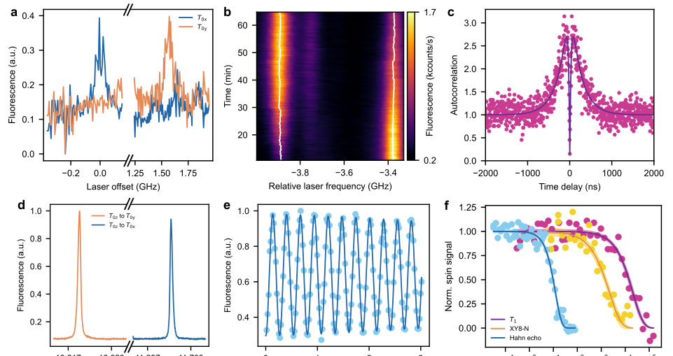 
FIG. 2. a, Excitation spectra of a single BiPhi molecule depending on the internal spin state. Each spin state has a different excitation frequency (and produces a different photon frequency), in this case separated by 1.563 GHz, thus enabling generation of photons entangled to the spin state. b, Longterm, repeated acquisition of fluorescence excitation spectra demonstrates spectral stability of the individual emitters with a standard deviation of the center frequency of about 2.6 MHz over one hour.7 c, Fluorescence autocorrelation measurement confirms the detection of a single emitter (g(2)(0) = 0.14).7 d, The optically detected magnetic resonance (ODMR) spectrum demonstrating almost full...

📷 Fig 3

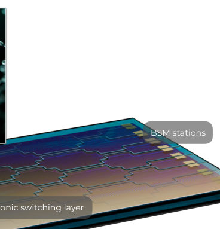 
FIG. 3. Illustration of a PIQC chip, including the qubit cells, photonic switching layer and BSM stations.

📷 Fig 4

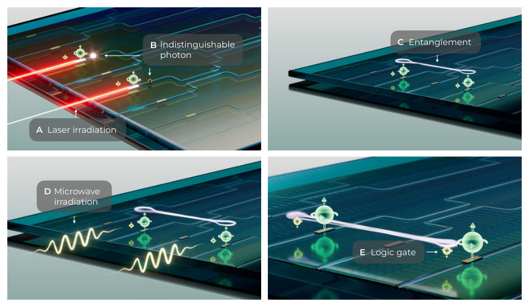 
FIG. 4. The process for generating a unversal two-qubit gate. Heralded entanglement is achieved with the following sequence: Laser irradiation (A) excites two BiPhi molecules, emitting an indistinguishable photon (B), which is then detcted in the BSM station. A successful detection of two photons according to the Barrett-Kok protocol, leads to heralded entanglement (C) between the two electron spins. Local electron-nuclear gate is then implemented by a MW irradiation sequence (D), performing a CNOT between the nuclear memory and electron spin. Finally, optical measurement of the electron spins teleports the logical 2-qubit gate (E) to the nuclear memory spins.

**Summary.** The paper introduces PIQC, a scalable architecture for distributed quantum computing that uses engineered organic molecules as quantum nodes. By combining molecular spin-photon interfaces with advanced Floquet-based error correction, the framework provides a pathway to large-scale, fault-tolerant quantum computing that is resilient to high photon loss.

**Why it may be interesting.** It bridges quantum optics and quantum information by showing how molecular engineering and photonic integration can implement complex Floquet-based error correction codes in a networked architecture.

Detailed structure

**Main problem.** The scaling of monolithic quantum architectures is limited by the difficulty of creating high-fidelity photonic interconnects and the high overhead of traditional error correction codes in distributed systems.

**Main result.** The authors propose the PIQC framework, which integrates designer molecular qubits, hybrid photonics, and 'Stairway Floquetification' of qLDPC codes to enable a scalable, loss-tolerant, and hardware-efficient distributed quantum computer.

**Method.** The work combines chemical engineering of carbene molecules, integration with thin-film lithium niobate (TFLN) photonics, and the theoretical application of ZX-calculus to transform high-weight qLDPC codes into periodic weight-two measurements.

**Model / system.** The platform consists of BiPhi (biphenyl) carbene molecular qubits embedded in an isosteric diarylketone crystalline host, integrated with TFLN optical resonators and photonic switching layers for Bell-state measurements.

**Key observables.** Electron spin coherence (T2), nuclear spin memory (Tn), photon emission rate into the Zero-Phonon Line (ZPL), and photon loss tolerance.

**Important parameters / regimes.** Electron spin coherence of ~2.2 ms, electron-nuclear gate times of ~1 us, photon loss tolerance up to 70%, and optical linewidth of ~38 MHz.

**Assumptions / limitations.** Assumes reasonable values for Purcell enhancement (Fp = 30) and effective microwave driving for gate implementation.

**Paper structure.** The paper introduces the scaling bottleneck of monolithic chips, presents the five-pillar PIQC architecture (molecular design, nuclear registers, hybrid integration, loss-tolerant protocols, and Floquetified qLDPC codes), and demonstrates the efficiency of the proposed error correction and hardware integration.

Abstract

There is a growing consensus that large-scale, fault-tolerant quantum computing (FTQC) necessitates high-fidelity photonic interconnects to overcome the scaling limits of monolithic architectures. However, most current platforms were not originally designed for native photonic connectivity and require significant engineering overhead. To overcome these fundamental hardware limitations, we recently introduced a rationally designed organic molecule that serves as an ideal quantum node, featuring a robust qubit-photon interface (QPI) and a long-lived nuclear-spin register. In this work, we present PIQC (Photonic Integrated Quantum Circuits), a distributed architecture designed to scale these molecular nodes into a functional quantum computer. The PIQC framework integrates five mutually reinforcing innovations: (i) Designer molecular qubits, i.e. carbene molecules in an isosteric host that provide millisecond-coherence electron spins with high spectral stability and spin-dependent optical emission, (ii) deterministic nuclear registers made of synthetically placed $^{13}$C or $^{14}$N labels that enable fast ($\sim 1~μ$s), high-fidelity electron-nuclear gates, (iii) hybrid photonic integration, which allows molecular films to seamlessly integrate with existing mature fabrication technologies, e.g. thin-film lithium niobate (TFLN), (iv) heralded entanglement protocols that can tolerate up to 70% photon loss, and (v) stairway Floquetification, i.e. high-rate quantum low-density parity-check (qLDPC) codes that are converted into Floquet codes, reducing syndrome extraction to weight-two Bell-pair measurements that match PIQC's networked hardware. PIQC offers a hardware-efficient, commercially viable pathway toward a utility-scale quantum computer based on distributed FTQC.

[↑ back to top](#top)

### [Quantum theory of a three-photon Kerr parametric oscillator](http://arxiv.org/abs/2605.21036v1)

**Authors:** Alessandro Bruno, Patrick P. Potts, Alexander Grimm, Matteo Brunelli  
**Type:** theory · **Category:** quantum information and computing · **PDF:** <https://arxiv.org/pdf/2605.21036v1>  
**Analysis basis:** full PDF text, analyzed in chunks
**Topic relevance:** `driven-dissipative phase transition` **3/5** · `Keldysh / 2PI / non-Gaussian methods` **2/5** · `entanglement & information structure` **2/5** · `methods for driven-dissipative` **2/5** · `non-equilibrium dynamics` **2/5**

📷 Fig 1

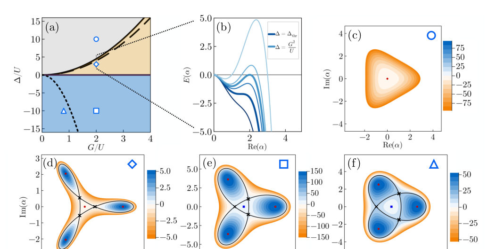 
FIG. 1. (a) Phase diagram of the three-photon Kerr parametric oscillator (3KPO), obtained from the meta-potential E(α, α∗). Different phases are color coded according to the number of local maxima of the meta-potential: single maximum (gray), four maxima (yellow) and three maxima (blue). The solid black curve corresponds to ∆= ∆thr, the dashed curve to ∆= G2/U and the dotted one to ∆= −9G2/U. The yellow region is characterized by metastability, with either a global maximum and three local maxima (G2/U ≤∆&lt; ∆th) or a local maximum and three global maxima (0 ≤∆&lt; G2/U). (b) Cuts of the meta-potential along Im(α) = 0 for G/U = 2 and different values of detuning, illustrating metastability. The...

📷 Fig 2

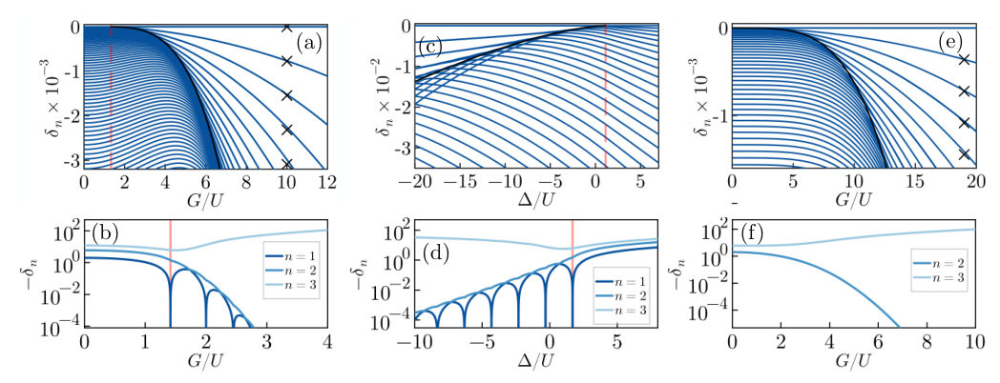 
FIG. 2. (a) Excitation spectrum δn = En −E0 of the 3KPO Hamiltonian Eq. (1) as a function of the three-photon pump for ∆= 2U. For sufficiently large pump amplitudes, the spectrum organizes in quasi-degenerate triplets. The dashed red line marks the threshold value Gth = 2 √

📷 Fig 3

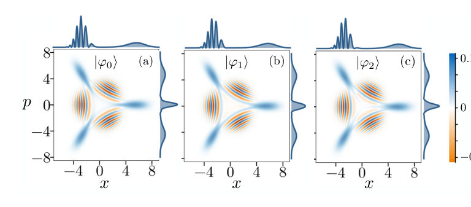 
FIG. 3. (a)-(c) Wigner function of the ground states |φ0⟩(a), |φ1⟩(b) and |φ2⟩(c), respectively given in Eqs. (6)-(8), for G/U = 4 and ∆= G2/U. The marginal probability distributions for position x = √

📷 Fig 4

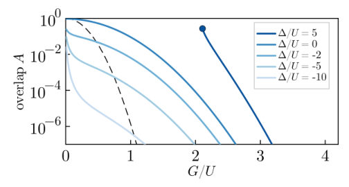 
FIG. 4. Magnitude A = |⟨ζk|ζk+1⟩| of the overlap between squeezed coherent states {|ζk⟩}k=0,1,2, as given by Eq. (20), for different values of detuning. The blue dot for ∆= 5U marks the threshold value G = Gthr, below which the squeezed coherent states are not defined. The dashed black curve corresponds to magnitude of the overlap evaluated at ∆= −9G2/U.

📷 Fig 5

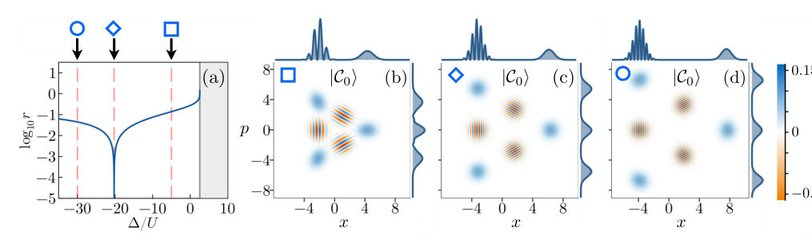 
FIG. 5. (a) Squeezing parameter Eq. (13) as a function of detuning for G = 1.5U. The squeezing vanishes for ∆= −9G2/U and diverges for ∆= ∆thr; the gray area marks the region ∆&gt; ∆thr with no multi-stability. (b)-(d) Wigner function of the k = 0 squeezed cat state |C0⟩ at the values of detuning specified by the dashed lines in panel (a). For vanishing squeezing, the Wigner function of a three-legged cat state (c) is recovered.

**Summary.** This paper explores the quantum dynamics of a three-photon Kerr parametric oscillator, characterizing its unique three-legged squeezed cat states. It demonstrates that these states can form a robust qutrit manifold protected against phase-flip errors. The study also shows how tuning the detuning allows for control over quantum squeezing and anti-squeezing.

**Why it may be interesting.** It provides a theoretical framework for higher-order parametric oscillators to create multi-component cat states, offering a path toward hardware-efficient, noise-biased qutrit encoding in superconducting circuits.

Detailed structure

**Main problem.** The study investigates the quantum properties, stability, and energy spectrum of a three-photon Kerr parametric oscillator (3KPO) to determine its potential for encoding protected quantum information.

**Main result.** The authors identify a ground-state manifold of three-legged squeezed cat states and demonstrate that the 3KPO can encode a Kerr-cat qutrit protected against phase-flip errors with a natural noise bias.

**Method.** The researchers use semiclassical analysis of a meta-potential, exact analytical solutions at specific detuning points, and numerical simulations of the master equation including single-photon loss.

**Model / system.** A single bosonic mode (Kerr oscillator) subject to a three-photon parametric drive, described by a Hamiltonian with Kerr nonlinearity (U), pump strength (G), and detuning (Delta).

**Key observables.** Energy spectrum, Wigner functions, squeezing parameter, displacement amplitude, and population dynamics under dissipation.

**Important parameters / regimes.** Three-photon pump strength (G), Kerr nonlinearity (U), pump-cavity detuning (Delta), and single-photon loss rate (kappa).

**Assumptions / limitations.** The analysis relies on the large-pump limit for certain approximations and assumes the system can be modeled via a master equation with specific dissipation channels.

**Figures summary.** Figure 1 shows the phase diagram and meta-potential stability; Figure 2 displays the energy spectrum and level crossings; Figure 3 presents Wigner functions for the ground state manifold; Figure 4 shows overlap dynamics; Figure 5 illustrates squeezing transitions; Figure 9 shows population evolution under loss; Figure 10 shows exact wavefunctions.

**Paper structure.** The paper begins with the identification of the 3KPO Hamiltonian and phase diagram, moves to the derivation of exact and approximate ground-state solutions, analyzes the energy spectrum and squeezing dynamics, and concludes with an investigation of stability and decoherence under dissipation for qutrit encoding.

Abstract

We investigate the quantum properties of a nonlinear Kerr oscillator driven by a three-photon pump. We derive both exact and approximate analytical expressions for the ground state of this interacting model. The exact solution arises at an exact spectral degeneracy, while the approximate solution describes regimes of quasi-degeneracy of the energy spectrum. In both cases, the threefold (quasi)degenerate ground-state manifold consists of quantum superpositions of three macroscopically distinct states. These states differ qualitatively from conventional three-component Schrödinger's cat states due to the presence of squeezing with a distinctive parametric dependence. By varying the detuning between the oscillator and the three-photon pump, we show that the squeezing can be enhanced, suppressed, or even reversed, leading to a squeezing-to-anti-squeezing transition. We analyze the generation and stabilization of these superposition states, their robustness against perturbations and analytically quantify the leakage to excited states. Our analysis elucidates how the three-photon Kerr parametric oscillator can be used to encode a Kerr-cat qutrit protected against phase-flip errors.

[↑ back to top](#top)

### [One-Dimensional Nonlinear Quantum Walks](http://arxiv.org/abs/2605.20464v1)

**Authors:** Yujia Shi, Thomas G. Wong  
**Type:** theory · **Category:** quantum information and computing · **PDF:** <https://arxiv.org/pdf/2605.20464v1>  
**Analysis basis:** full PDF text, analyzed in chunks
**Topic relevance:** `non-equilibrium dynamics` **3/5** · `analog quantum simulation` **2/5** · `entanglement & information structure` **2/5** · `scars & prethermalization` **2/5**

📷 Fig 1

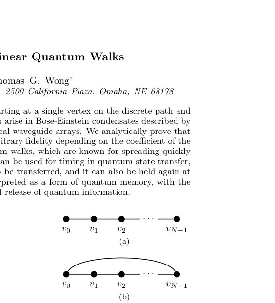 
FIG. 1. (a) The path graph of N vertices, i.e., PN, and (b) the cycle of N vertices, i.e., CN.

📷 Fig 2

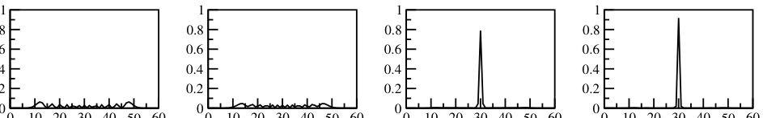 
FIG. 2. For the adjacency quantum walk on P61 initially at the middle vertex (i.e., v30), the probability distribution across all vertices at various times t = 0, 2, 4, 6, 8, 10 with various nonlinearity coefficients g = 0, 2.5, 5, 7.5.

📷 Fig 3

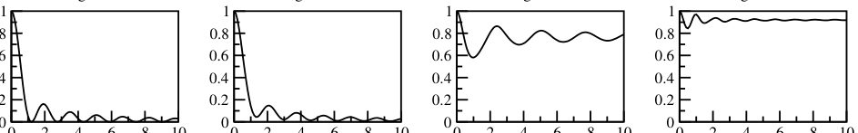 
FIG. 3. For the adjacency quantum walk on P61 initially at the middle vertex (i.e., v30), the probability at this middle vertex |ψ30(t)|2 as a function of time, for various nonlinearity coefficients g = 0, 2.5, 5, 7.5.

📷 Fig 4

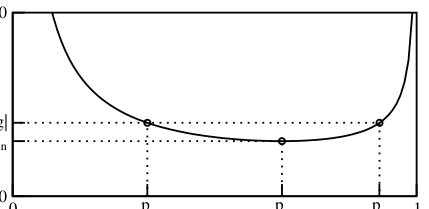 
FIG. 5. A plot of the function f(x) with (a) deg(vr) = 1 and (b) deg(vr) = 2. In both plots, the minimum of f(x) is labeled, along with where it equals |g| = 12.

📷 Fig 5

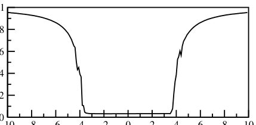 
FIG. 4. For adjacency quantum walks, the discrete approx- imation of the time-averaged probability ¯pr as a function of the nonlinearity coefficient g, using a total simulation time of T = 300 and M = 400 points for each. (a) is a quantum walk on P61 initially at the middle vertex (i.e., v30), (b) is a quantum walk on P61 initially at an endpoint v0, and (c) is a quantum walk on C61 where the initial vertex does not matter.

**Summary.** This paper demonstrates that cubic nonlinearity in 1D quantum walks can induce self-trapping, preventing the rapid spreading typical of linear walks. By analytically bounding the nonlinearity required for this effect, the authors show how this mechanism can be used to implement quantum memory and precisely time quantum state transfers.

**Why it may be interesting.** It provides a theoretical framework for using nonlinearity to control quantum information, specifically proposing a way to 'trap' and 'release' qubits, which is highly relevant to quantum state transfer and memory protocols in quantum optics and many-body dynamics.

Detailed structure

**Main problem.** The paper investigates the phenomenon of self-trapping in one-dimensional continuous-time nonlinear quantum walks and seeks to analytically determine the conditions for localization.

**Main result.** The authors analytically prove that sufficiently large cubic nonlinearity can trap a quantum walker at a single vertex, providing specific lower bounds for the nonlinearity coefficient g, and propose this as a mechanism for quantum memory and controlled state transfer.

**Method.** The study uses numerical simulations to observe probability distributions and an analytical approach involving energy conservation, the Cauchy-Schwarz inequality, and spectral norm bounds to derive trapping conditions.

**Model / system.** The model consists of a continuous-time quantum walk on 1D path and cycle graphs governed by a cubic nonlinear Schrödinger-type equation (Gross-Pitaevskii-like) with a Hamiltonian proportional to the negative adjacency matrix.

**Key observables.** Probability distribution at vertices, time-averaged probability at the initial vertex, and the nonlinearity coefficient g.

**Important parameters / regimes.** Nonlinearity strength g, lattice size N, vertex degree, and the transition from the linear regime (rapid spreading) to the nonlinear regime (self-trapping).

**Assumptions / limitations.** The derivation assumes the walker is not strictly localized or entirely removed (0 < p < 1) and relies on the spectral norm of the remaining adjacency matrix being at most 2.

**Figures summary.** Fig 1 shows the graph structures; Fig 2 demonstrates the transition from spreading to trapping in a path graph at different g values; Fig 3 plots the probability at the middle vertex over time.

**Paper structure.** The paper introduces the nonlinear model and its physical relevance, presents numerical evidence of self-trapping, provides an analytical derivation of the trapping bounds using energy conservation, and concludes with applications to quantum memory and state transfer.

Abstract

We explore a continuous-time quantum walk starting at a single vertex on the discrete path and cycle with a cubic nonlinearity. Such nonlinearities arise in Bose-Einstein condensates described by the Gross-Pitaevskii equation or by nonlinear optical waveguide arrays. We analytically prove that the nonlinear quantum walk can be trapped to arbitrary fidelity depending on the coefficient of the nonlinear term. This contrasts with linear quantum walks, which are known for spreading quickly in one dimension. We propose that this trapping can be used for timing in quantum state transfer, where a qubit is held at a node until it is ready to be transferred, and it can also be held again at the receiving node. This scheme can also be interpreted as a form of quantum memory, with the trap and transfer corresponding to the storage and release of quantum information.

[↑ back to top](#top)

### [Towards transistor-based quantum computing](http://arxiv.org/abs/2605.21045v1)

**Authors:** Y. -D. Liu, X. Xu, Q. -R. Wang, D. -S. Wang  
**Type:** theory · **Category:** quantum information and computing · **PDF:** <https://arxiv.org/pdf/2605.21045v1>  
**Analysis basis:** full PDF text, analyzed in chunks
**Topic relevance:** `entanglement & information structure` **3/5** · `exotic spin models in light-matter` **2/5** · `measurement-induced transitions` **2/5** · `quantum measurements` **2/5**

📷 Fig 1

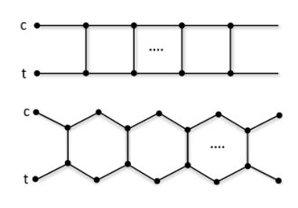 
Figure 2. Two-leg ladders to realize CZ gate. Top: square lattice; Bottom: honeycomb lattice. The control (c) and tar- get (t) qubits are on the left of the cluster. Time evolves towards the right.

📷 Fig 2

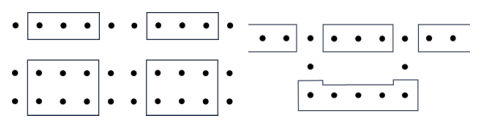 
Figure 3. Coupling among gates. Top left: coupling between qubit gates; Bottom left: coupling between CZ gates; Right: conditional gate. A box represents a bulk system. The chosen number of dots are only for illustration.

📷 Fig 3

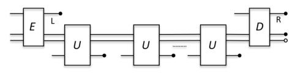 
Figure 4. The encoding structure for a ground state in a cluster phase. The double-line is the bond space, the black dots are qubits, and the small circle is the “junk space.”

📷 Fig 4

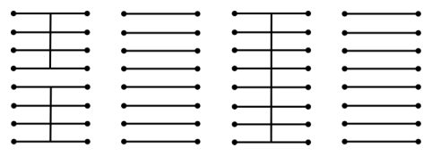 
Figure 5. An illustration of the quantum computer architec- ture with topological transistors. The horizontal direction is evolution time. Each wire with two end points is an anyonic ebit, and a group of four of them with a connecting vertical wire is a topological transistor, with each end point as an anyon (here referring to Majorana fermion). The width-eight array supports the entangling CX or CZ gate. Other ebits are used to realize anyonic teleportation via parity measure- ment. Qubit Clifford gates can be realized by braiding the four anyons in one column of a transistor.

**Summary.** The paper proposes a new quantum computing architecture called 'telesistors' that uses the intrinsic properties of symmetry-protected topological phases to implement protected quantum gates. By treating gates as physical components rather than just sequences of operations, this model offers improved modularity and integration. It provides a foundation for scalable, fault-tolerant quantum computing with reduced overhead.

**Why it may be interesting.** It bridges many-body physics and quantum computing by showing how topological properties of condensed matter phases (SPT/TOP order) can be directly leveraged as hardware-level protection for quantum gates.

Detailed structure

**Main problem.** Developing a universal quantum computing architecture that moves beyond standard qubit-based circuits by using a 'transistor-like' structure to store and execute quantum gates.

**Main result.** The authors propose 'telesistors' (teleportation-based quantum transistors) based on Symmetry-Protected Topological (SPT) order that provide high-fidelity Clifford gates with intrinsic physical protection and low overhead.

**Method.** The framework utilizes Matrix Product States (MPS), gate teleportation via measurement-induced processes, and the Choi state representation to implement a universal gate set (H, S, T, CZ).

**Model / system.** The architecture is based on SPT phases, specifically 1D and 2D cluster states, 1D Haldane phases, and 2D valence-bond solids, with quantum dots acting as junctions for edge modes.

**Key observables.** String order parameters, stabilizers, and gate fidelity/infidelity.

**Important parameters / regimes.** Z2 x Z2 symmetry, symmetry-breaking perturbation parameter (lambda), and the relationship between lattice width and length.

**Assumptions / limitations.** Edge ports are treated as zero-dimensional quantum dots; the T gate is not fully protected by symmetry; and the system requires precise control over the gate Hamiltonian.

**Figures summary.** Figure 1 shows a quantum transistor in MPS representation; Figure 2 illustrates two-leg ladder geometries (square and honeycomb) for CZ gates; Figure 3 shows coupling mechanisms; Figure 5 shows an array of anyonic ebits for a topological architecture.

**Paper structure.** The paper introduces the transistor concept, defines the mathematical framework using MPS and SPT order, details the realization of specific gates (H, S, CZ, T), discusses symmetry protection and error scaling, and concludes with comparisons to other quantum computing architectures.

Abstract

In this work, we propose and study in depth a universal quantum computing architecture based on a quantum construction of transistors. Our teleportation-based quantum transistors, called ``telesistors'', are ground states of systems with symmetry-protected topological order, hence suppress certain noises and provide high-fidelity Clifford gates without the need for active error correction. This physical protection, quantified by the string order parameters, serves as a low-overhead foundation upon which conventional fault-tolerant encoding (e.g., with stabilizer codes) can be built to achieve universal quantum computation. This architecture shows rich connections with current known architectures, and some desirable merits especially compared with the qubit-based circuits regarding modularity, integration, and program storage. Our study shows that it is plausible to realize it with current technology in the near future.

[↑ back to top](#top)

### [An Exponential Sample-Complexity Advantage for Coherent Quantum Inference](http://arxiv.org/abs/2605.21457v1)

**Authors:** Zhaoyi Li, Elias Theil, Aram W. Harrow, Isaac Chuang  
**Type:** theory · **Category:** quantum information and computing · **PDF:** <https://arxiv.org/pdf/2605.21457v1>  
**Analysis basis:** full PDF text, analyzed in chunks
**Topic relevance:** `entanglement & information structure` **3/5** · `quantum measurements` **3/5** · `measurement-induced transitions` **2/5**

📷 Fig 1

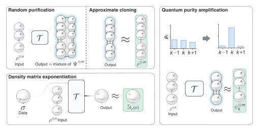 
Figure 2: The three coherent-inference examples stud- ied here: random purification and mixed-state cloning, quantum purity amplification, and density matrix expo- nentiation. In each case, coherent processing avoids the measurement-mediated bottleneck that limits incoherent protocols, leading to sample-complexity separations that scale with the local system size.

📷 Fig 2

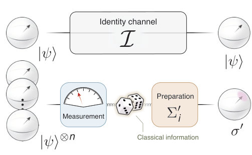 
Figure 1: Comparison between coherent and incoherent implementations of the identity task on an unknown pure state ρ = |ψ⟩⟨ψ|.

📷 Fig 3

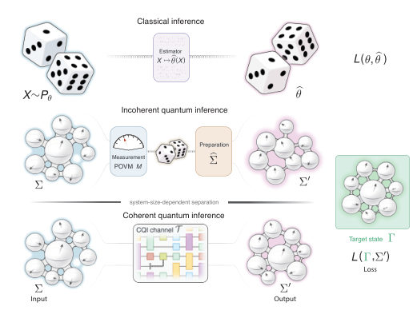 
Figure 3: Illustration of classical inference, incoherent quantum inference, and coherent quantum inference. In the classical setting, the random variable X ∼Pθ leads to an estimate bθ(X), with performance judged by a loss

**Summary.** This paper establishes a new theory of coherent quantum inference, proving that processing quantum data via coherent channels can avoid the exponential 'curse of dimensionality' found in measurement-based protocols. It shows that tasks like density matrix exponentiation can be performed with a number of copies that does not scale with the system dimension. This provides a significant theoretical advantage for quantum computing and state processing tasks.

**Why it may be interesting.** This is highly relevant for researchers in quantum optics and open quantum systems as it provides a fundamental limit on how efficiently quantum information can be processed and reconstructed without the loss of coherence caused by measurement.

Detailed structure

**Main problem.** The paper investigates whether coherent quantum inference (where the output is a quantum state) can achieve an exponential advantage in sample complexity compared to incoherent, measurement-based protocols.

**Main result.** The authors demonstrate that coherent protocols can achieve exponentially lower sample complexity than incoherent ones, specifically showing that tasks like Quantum Purity Amplification and Density Matrix Exponentiation can be dimension-independent, whereas incoherent protocols scale linearly with the Hilbert-space dimension.

**Method.** The study utilizes a mathematical framework involving Schur sampling, group twirling, and symmetry reduction, alongside de Finetti-type arguments to analyze the entanglement-breaking limit.

**Model / system.** The framework considers quantum channels acting on n copies of an unknown density matrix in a d-dimensional Hilbert space, specifically focusing on tasks like Random Purification, Quantum Purity Amplification, and Density Matrix Exponentiation.

**Key observables.** Sample complexity (n), infidelity, trace distance, and diamond norm.

**Important parameters / regimes.** Hilbert-space dimension (d), number of input copies (n), number of output copies (m), target error (epsilon), and spectral gaps between eigenvalues.

**Assumptions / limitations.** The loss functions are assumed to be jointly convex and Lipschitz continuous; the lower bounds specifically target incoherent or entanglement-breaking protocols.

**Figures summary.** Figure 3 illustrates the hierarchy of inference ranging from classical to incoherent quantum and coherent quantum protocols.

**Paper structure.** The paper introduces the concept of coherent quantum inference, establishes a unified framework for three representative tasks (RP, QPA, DME), provides mathematical proofs for risk convexity and symmetry reduction, and derives the exponential complexity separation between coherent and incoherent regimes.

Abstract

Standard quantum inference converts quantum data into classical outputs. We study an alternative inference setting in which the desired output is quantum, preserving coherence. Such settings include quantum purity amplification (QPA), mixed-state approximate purification or cloning, and density matrix exponentiation. We show that such protocols can achieve exponentially lower sample complexity than incoherent, measurement-mediated protocols. For QPA with principal eigenstate targets and $d$-dimensional inputs, coherent processing achieves error $\varepsilon$ using $O(1/\varepsilon)$ copies, versus the $Ω(d/\varepsilon)$ copies required by any incoherent protocol. Together, these sharp coherent-incoherent separations seed a theory of coherent quantum inference, with an entanglement-breaking limit identifying the optimal incoherent counterpart of each coherent protocol.

[↑ back to top](#top)

### [Chaos-Integrability Transition in the BPS Subspace of the $\mathcal{N}=2$ SYK Model](http://arxiv.org/abs/2605.20913v1)

**Authors:** Leon Miyahara, Shono Shibuya  
**Type:** theory · **Category:** statistical mechanics · **PDF:** <https://arxiv.org/pdf/2605.20913v1>  
**Analysis basis:** full PDF text, analyzed in chunks
**Topic relevance:** `entanglement & information structure` **3/5** · `non-equilibrium dynamics` **2/5** · `scars & prethermalization` **2/5**

📷 Fig 1

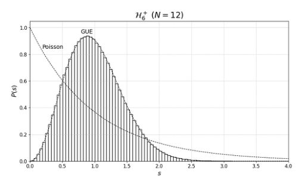 
FIG. 1. The nearest level spacing distribution for H+ f=6 in N = 2 SYK model. The histogram is obtained by averaging over 4000 realizations, while the dotted curves represent the Poisson and GUE Wigner-Dyson predictions. It agrees well with the GUE prediction.

📷 Fig 2

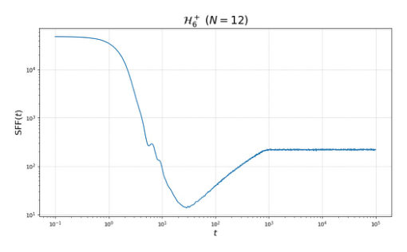 
FIG. 2. The SFF for H+ f=6 in N = 2 SYK model averaged over 4000 realizations. It exhibits a slope-ramp-plateau struc- ture reflecting the chaotic spectrum.

📷 Fig 3

 
Fig.2 shows a plot of the SFF computed using the spec- trum in H+ f=6. This characteristic behavior referred to as the slope-ramp-plateau is a sharp signal of quantum chaos. To investigate a possible chaos-integrability transition, we study the finite N crossover induced by a deformation

📷 Fig 4

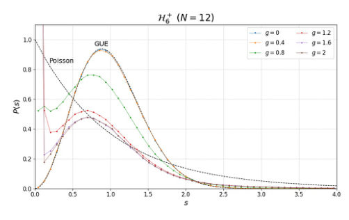 
FIG. 3. The nearest level spacing distribution for the de- formed model (12). Deviation of the distribution from GUE is shown as g increases. The average is taken over 4000 real- izations for each value of g.

📷 Fig 5

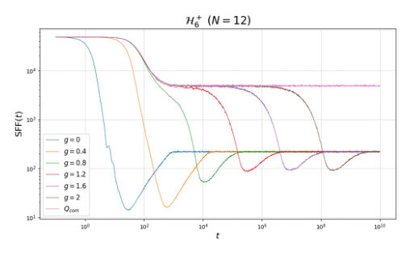 
FIG. 4. The SFF for the deformed model (12) averaged over 4000 realizations for each g. The plateau for Qcom alone arises from its degeneracy in the spectrum. As g increases, the ramp becomes small and approaches Qcom, indicating a loss of chaotic behavior.

**Summary.** The authors show that the transition from chaos to integrability is visible even when looking only at the BPS ground states of a supersymmetric SYK model. By analyzing spectral statistics, they find that the BPS sector undergoes a smooth crossover from random-matrix to Poisson behavior. This suggests that the chaotic properties of the full spectrum are imprinted on the BPS subspace.

**Why it may be interesting.** This paper is interesting for many-body dynamics researchers because it demonstrates how spectral signatures of chaos can be inherited by a specific protected subspace (BPS), providing a new way to probe many-body chaos.

Detailed structure

**Main problem.** The study investigates whether a chaos-integrability transition can be detected exclusively within the BPS (Bogomol'nyi-Prasad-Sommerfield) subspace of a supersymmetric model.

**Main result.** The BPS subspace exhibits a smooth crossover from random-matrix (GUE) statistics to Poisson statistics as the model transitions from a chaotic to an integrable regime.

**Method.** Numerical analysis of the spectrum of a projected operator onto the BPS subspace, using gap ratio, level-spacing distribution, and Spectral Form Factor (SFF) with Gaussian filtering.

**Model / system.** A deformed N=2 supersymmetric Sachdev-Ye-Kitaev (SYK) model that interpolates between a chaotic SYK limit and an integrable 'commuting' limit via a deformation parameter g.

**Key observables.** Average gap ratio <r>, nearest level-spacing distribution P(s), and Spectral Form Factor (SFF).

**Important parameters / regimes.** Deformation parameter g (controlling the transition), fermion number f, and system size N.

**Assumptions / limitations.** The analysis is performed at a finite N=12, and it is an open question if the crossover sharpens into a phase transition in the large N limit.

**Figures summary.** Figures show the transition of the gap ratio and level-spacing distribution from GUE to Poisson statistics, and the disappearance of the SFF ramp near g=1.2.

**Paper structure.** The paper introduces the deformed N=2 SYK model, defines the BPS subspace and the chaos-diagnostics framework, presents numerical results for the non-BPS and BPS sectors, and discusses implications and open questions.

Abstract

We study chaos-integrability transition purely within a BPS subspace of a specific supersymmetric model that interpolates between the chaotic $\mathcal{N}=2$ SYK model and an integrable $\mathcal{N}=2$ "commuting" SYK model. Using the framework of BPS chaos, we analyze the spectrum of an operator projected onto the BPS subspace. We numerically find that its spectral statistics exhibit random-matrix behavior near the SYK limit and smoothly transitions to Poisson statistics near the integrable limit. Our results provide a direct example of a chaos-integrability crossover diagnosed solely from BPS states.

[↑ back to top](#top)

### [Enhancing Phase Estimation in a Hybrid Interferometer via Kerr Nonlinearity and Photon Subtraction](http://arxiv.org/abs/2605.20893v1)

**Authors:** Lifen Guo, Qingqian Kang, Zekun Zhao, Jifeng Sun, Teng Zhao, Cunjin Liu, Xin Su, Liyun Hu  
**Type:** theory · **Category:** quantum information and computing · **PDF:** <https://arxiv.org/pdf/2605.20893v1>  
**Analysis basis:** full PDF text, analyzed in chunks
**Topic relevance:** `quantum measurements` **3/5** · `Keldysh / 2PI / non-Gaussian methods` **2/5** · `interference shaping light` **2/5**

📷 Fig 1

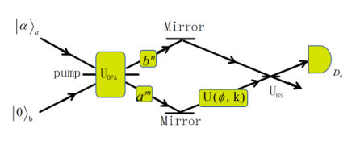 
FIG. 1. Schematic diagram of the proposed hybrid interferom- eter (HI) incorporating multi-photon subtraction (MPS). The interferometer is seeded with a coherent state |α⟩a and a vac- uum state |0⟩b. UOP A denotes the optical parametric amplifier, UBS stands for a 50:50 beam splitter, U(ϕ, k) represents the linear or Kerr nonlinear phase shifter, and Da is the homodyne detector on output mode a.

📷 Fig 2

 
Figure 1 shows the schematic of the proposed hybrid interferometer (HI) equipped with a phase shifter and local multi-photon subtraction (MPS). The HI consists of an OPA, a BS, and a phase shifter. The input states are a coherent state |α⟩a (where α = |α| eiθα denotes the coherent amplitude) and a vacuum state |0⟩b. For simplicity, we set θα = 0. Next, we briefly comment on the experimental feasibility of the optical scheme in Fig. 1. All key components are compatible with current quantum optical technology. For instance, OPA gains of g ∼1 −2 are routinely achieved in periodically poled crystals; strong Kerr nonlinearities with effective χ(3)

📷 Fig 3

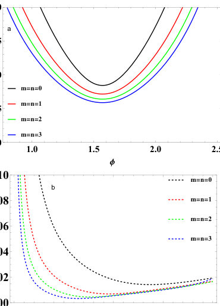 
FIG. 2. Phase sensitivity ∆ϕ1 (a) and ∆ϕ2 (b) of the HI ob- tained via homodyne detection as a function of the phase shift ϕ for photon-subtraction orders m = n = 0 (black), 1 (red), 2 (green), and 3 (blue). The parameters are set as α = 2 and g = 1. (a) Linear phase shifter (Scheme I, k = 1). (b) Kerr nonlinear phase shifter (Scheme II, k = 2).

📷 Fig 4

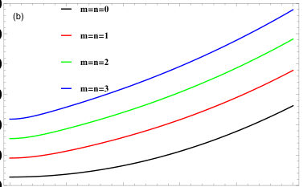 
FIG. 4. The total mean photon number N in the HI configu- ration as a function of (a) the gain factor g with α = 2, and (b) the coherent amplitude α with g = 1. The black, red, green, and blue lines correspond to photon-subtraction orders m = n = 0, 1, 2 and 3, respectively.

📷 Fig 5

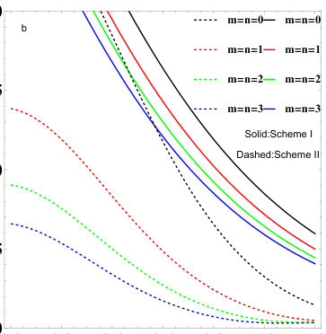 
FIG. 3. Optimal phase sensitivity of the HI for Scheme I (solid lines) and Scheme II (dashed lines) as functions of (a) the co- herent amplitude α with g = 1, and (b) the OPA gain factor g with α = 2. The black, red, green, and blue lines correspond to photon-subtraction orders m = n = 0, 1, 2 and 3, respectively.

**Summary.** This paper proposes a new method for high-precision phase estimation by combining Kerr nonlinearity with multi-photon subtraction in a hybrid interferometer. The scheme achieves super-Heisenberg scaling and remains robust against photon loss, outperforming existing linear and SU(1,1) architectures.

**Why it may be interesting.** It presents a way to achieve super-Heisenberg scaling in quantum metrology using non-Gaussian state engineering and nonlinear optics, which is highly relevant to quantum optics and precision sensing.

Detailed structure

**Main problem.** The challenge of achieving high-precision phase estimation in quantum metrology by overcoming the Standard Quantum Limit (SQL) and the conventional Heisenberg Limit (HL) while mitigating photon loss.

**Main result.** The integration of Kerr nonlinearity and multi-photon subtraction in a hybrid interferometer enables phase sensitivity to approach super-Heisenberg scaling (1/N^2) and provides enhanced robustness to decoherence.

**Method.** The authors use a generating function method to calculate expectation values and evaluate phase sensitivity via homodyne detection, analyzing Quantum Fisher Information (QFI) and the Quantum Cramér-Rao Bound (QCRB).

**Model / system.** A hybrid interferometer (HI) architecture consisting of an Optical Parametric Amplifier (OPA), a 50:50 beam splitter, and a phase shifter (either linear or Kerr nonlinear), utilizing coherent and vacuum states as inputs.

**Key observables.** Phase sensitivity (delta phi), Quantum Fisher Information (QFI), and the Quantum Cramér-Rao Bound (QCRB).

**Important parameters / regimes.** Coherent amplitude (alpha), OPA gain (g), photon-subtraction orders (m, n), and photon loss transmissivity (eta).

**Assumptions / limitations.** The model assumes a Kerr nonlinear phase evolution proportional to the squared photon number and uses a single-mode internal photon loss model via a fictitious beam splitter.

**Figures summary.** Figure 1 shows the HI schematic; Figure 4 shows mean photon number vs. gain and amplitude; Figure 9 shows QFI vs. gain; Figure 10 shows QCRB vs. gain and amplitude; Figure 11 shows lossy QCRB vs. transmissivity.

**Paper structure.** The paper introduces the problem of phase estimation, proposes a hybrid interferometer architecture with Kerr nonlinearity and photon subtraction, provides a mathematical framework for calculating sensitivity and QFI, compares linear vs. nonlinear schemes, and evaluates performance under lossy conditions.

Abstract

We propose a high-precision phase estimation scheme in a hybrid interferometer by synergistically combining a Kerr nonlinear phase shifter and multi-photon subtraction operations. Using a coherent state and a vacuum state as input resources, we systematically evaluate the phase sensitivity via homodyne detection and analyze the quantum Fisher information as well as the quantum Cramér-Rao bound under both ideal and lossy conditions. Our results show that the joint integration of Kerr nonlinearity and multi-photon subtraction yields remarkable advantages over either technique used alone. The proposed scheme enables the phase sensitivity to surpass the standard quantum limit, exceed the conventional Heisenberg scaling ($1/N$), and approach the super-Heisenberg scaling ($1/N^{2}$)-a direct consequence of Kerr nonlinearity. More precisely, the super-Heisenberg scaling $\propto $ $1/N^{2}$ is the ultimate precision limit permitted by the $k=2$ Kerr nonlinearity and does not violate the fundamental Heisenberg limit for linear phase accumulation. Even under moderate internal photon loss, the system maintains high precision and exhibits enhanced robustness to decoherence. The Kerr nonlinearity introduces an intensity-dependent phase shift proportional to the squared photon number, while multi-photon subtraction tailors non-Gaussian states to strengthen phase information extraction. Compared with existing schemes based on hybrid interferometers or SU(1,1) interferometers, our architecture achieves superior precision and stronger loss resilience. All components are experimentally accessible with current quantum optical technologies. This work provides a promising route for practical high-precision quantum metrology and quantum sensing.

[↑ back to top](#top)

### [Quantum Nonlocality and Device-Independent Randomness are Robust to Noisy Signaling Channels](http://arxiv.org/abs/2605.21293v1)

**Authors:** Kuntal Sengupta, Lewis Wooltorton  
**Type:** theory · **Category:** quantum information and computing · **PDF:** <https://arxiv.org/pdf/2605.21293v1>  
**Analysis basis:** full PDF text, analyzed in chunks
**Topic relevance:** `entanglement & information structure` **3/5** · `correlated / nonlocal dissipation` **2/5** · `quantum measurements` **2/5**

📷 Fig 1

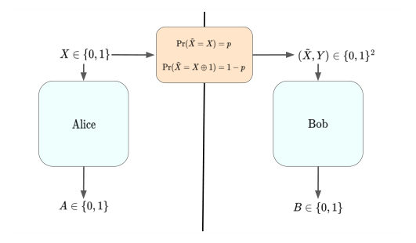 
FIG. 1. An illustration of the minimal Bell scenario in the presence of a one-way binary symmetric channel from Alice to Bob. Depending on the crossover probability 1 −p ∈(0, 1/2], a noisy copy of Alice’s input X is also an input to Bob’s device. When p = 1/2, Bob receives no information about Alice’s input and we recover the standard non-signaling Bell scenario, whereas when p = 1, Bob’s strategy can depend arbitrarily on Alice’s input.

📷 Fig 2

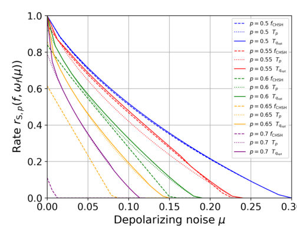 
FIG. 2. Comparison between different Bell expression when certifying DI randomness in the presence of one-way signal- ing and depolarizing noise. We consider a binary symmetric channel where the probability that Bob correctly receives a copy of Alice’s input is p ∈[1/2, 1). fCHSH denotes the CHSH functional, Tp denotes the new facet derived in this work (12), and Tqopt denotes the optimal choice from the family of ex- pressions Tq for q ∈(2/5, 1).

📷 Fig 3

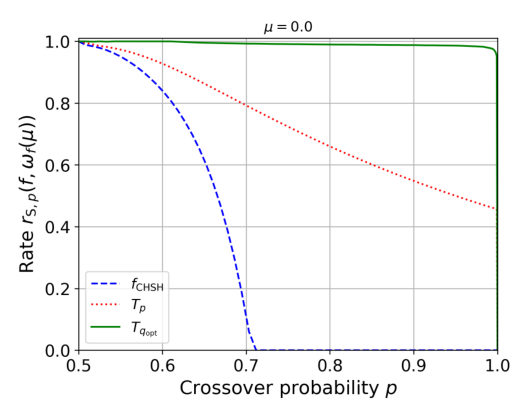 
FIG. 3. Comparison between different Bell expression when certifying DI randomness in the presence of one-way signaling only. The expressions fCHSH, Tp and Tqopt are as described in Fig. 2. For each Bell expression, the observed value is set equal to the maximum non-signaling quantum value, i.e., the value is generated from the strategy (21) with µ = 0 and the optimal measurement angles for the given Bell functional.

📷 Fig 4

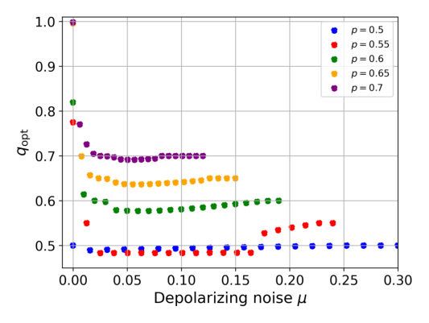 
FIG. 4. Value of the parameter q ∈(2/5, 1) that certifies the maximum randomness from the family of Bell expressions Tq as a function of depolarizing noise and the probability that Alice’s input is sent to Bob, p ∈[1/2, 1].

**Summary.** This paper proves that quantum nonlocality is robust to noisy signaling between parties. It identifies new Bell inequalities that outperform the CHSH inequality in certifying quantum correlations and randomness when input information is leaked through noisy channels.

**Why it may be interesting.** This work is highly relevant for quantum information theorists working on the security of device-independent protocols, as it provides a framework for understanding how physical imperfections like signal leakage affect the certification of entanglement and randomness.

Detailed structure

**Main problem.** Investigating whether quantum nonlocality and device-independent randomness certification are robust against violations of the non-signaling assumption, specifically when inputs are leaked via noisy communication channels.

**Main result.** The authors identify new Bell inequalities that certify non-signaling quantum correlations even under one-way and two-way noisy signaling, and demonstrate that these new inequalities are more robust to depolarizing noise than the standard CHSH inequality.

**Method.** The study uses a geometric approach to characterize the vertices and facets of the Local Hidden Variable (LHV) polytope, employing an interpolation technique for continuous parameters and Sum of Squares (SOS) decomposition for proving quantum bounds.

**Model / system.** A bipartite Bell scenario involving two parties (Alice and Bob) with binary inputs and outputs, where a noisy binary symmetric channel transmits a copy of one party's input to the other.

**Key observables.** Bell functionals (specifically $T_p$ and $W_{p,r}$), correlators $\langle A_x B_y 
angle$, and the rate of device-independent randomness generation.

**Important parameters / regimes.** Crossover probability/fidelity ($p, q, r, s$), measurement dependence parameter ($l$), and signaling strength ($\epsilon$).

**Assumptions / limitations.** The analysis focuses on the minimal Bell scenario (2 inputs, 2 outputs) and assumes projective measurements for self-testing claims.

**Figures summary.** Figure 1 illustrates the one-way signaling mechanism via a binary symmetric channel; Figure 4 shows the certification of randomness as a function of the noise parameter.

**Paper structure.** The paper begins by defining the noisy signaling model, proceeds to characterize the LHV polytope facets using interpolation, establishes mathematical equivalences between signaling and parameter-dependence models, and concludes with the derivation of new Bell inequalities and their robustness to noise.

Abstract

Given a pair of isolated devices that accept random binary inputs and return binary outputs, a user can deduce from the observed data alone if the underlying mechanism can be explained classically. Bell's theorem further states that a classical explanation can be ruled out if the devices perform certain measurements on an entangled quantum state, underpinning the security of cryptographic protocols that are device-independent (DI). For certain protocols, such as those performed in a tight space, it might be difficult to perfectly enforce the non-signaling assumption required in Bell's theorem. This prompts the question: is quantum nonlocality robust to such imperfections? We show that if a binary channel sends a noisy copy of one party's input to the other before any measurements take place, the answer is yes. We completely characterize the vertices and facets of the local polytope in this scenario, and identify Bell inequalities that certify non-signaling quantum correlations. This is possible even when a near perfect copy of the input is sent. We go on to show that the identified inequalities are more robust to depolarizing noise than the Clauser-Horne-Shimony-Holt inequality when certifying DI randomness in this scenario. In addition, we characterize the local polytope when both parties receive a noisy copy of each other's input and make similar conclusions, leaving many new potential Bell inequalities to be explored.

[↑ back to top](#top)

### [Semidefinite Programming for Optimal Quantum Cloning: A Computational Framework](http://arxiv.org/abs/2605.21274v1)

**Authors:** Jörg Hettel  
**Type:** theory · **Category:** quantum information and computing · **PDF:** <https://arxiv.org/pdf/2605.21274v1>  
**Analysis basis:** full PDF text, analyzed in chunks
**Topic relevance:** `entanglement & information structure` **3/5** · `methods for driven-dissipative` **2/5** · `quantum measurements` **2/5**

📷 Fig 1

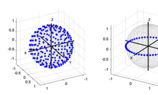 
Fig. 1 Various qubit distributions on the Bloch sphere used for numerical optimization.

📷 Fig 2

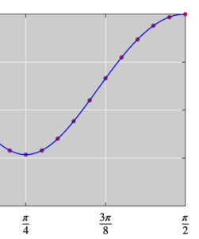 
Fig. 2 Numerically calculated fidelities (dots) compared to the analytical bound F opt(θ) (solid blue line).

📷 Fig 3

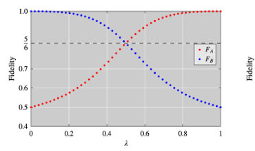 
Fig. 3 Numerically calculates fidelities for asymmetric cloning. Left for univeral and right for covari- ant cloning. For λ = 0.5 we find the values for the symmetric cloning.

📷 Fig 4

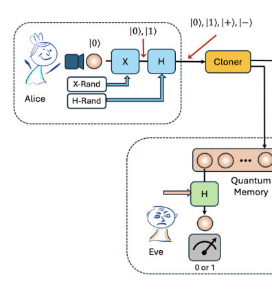 
Fig. 4 BB84 Cloning Attack: Alice sends random qubits in the states |0⟩, |1⟩, |+⟩, or |−⟩. Eve intercepts and clones the qubits, storing her copy in a quantum memory. Once Alice and Bob have sifted their key, Eve uses the basis information to measure her clones and reconstruct the key.

📷 Fig 5

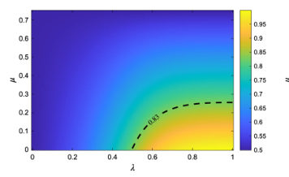 
Fig. 6 Left: Bob’s fidelity for the six-state protocol. The dashed line corresponds to the security limit FBob ≈0.832 (corresponding to QBER ≈12.6%). Right: Concurrence between Bob’s and Eve’s qubits, showing the presence of entanglement.

**Summary.** This paper introduces a computational framework using Semidefinite Programming to find explicit Kraus operators for various quantum cloning tasks. It bridges the gap between theoretical cloning limits and practical implementation by providing a systematic catalogue of usable operators. The utility of the method is demonstrated through a quantitative security analysis of the BB84 protocol under depolarizing noise.

**Why it may be interesting.** This is highly relevant for researchers in quantum information and open quantum systems as it provides a practical tool for designing and characterizing optimal quantum channels and analyzing eavesdropping attacks in noisy environments.

Detailed structure

**Main problem.** The paper addresses the lack of explicit, implementable operator representations for various quantum cloning scenarios, moving beyond theoretical limits to find practical Kraus operators.

**Main result.** The authors present a unified computational framework that provides a catalogue of explicit Kraus representations for universal, phase-covariant, asymmetric, and entanglement cloning, and apply it to analyze BB84 security under noise.

**Method.** The framework uses Semidefinite Programming (SDP) combined with the Choi-Jamiołkowski isomorphism to optimize CPTP maps and extracts Kraus operators via spectral decomposition.

**Model / system.** The study focuses on quantum cloning channels (M to N processes) including universal, phase-covariant, and asymmetric cloning, as well as entanglement cloning of two-qubit states.

**Key observables.** Fidelity (global and local), duality gap, Quantum Bit Error Rate (QBER), and concurrence.

**Important parameters / regimes.** Asymmetry parameter (lambda), depolarization strength (mu), and the size of the input state sampling set (S).

**Assumptions / limitations.** The framework is limited to finite-dimensional Hilbert spaces and assumes the accuracy of the optimization depends on the coverage of the chosen sampling set.

**Figures summary.** Figure 1 shows input state distributions on the Bloch sphere; Figure 2 compares numerical fidelities to analytical bounds; Figure 3 shows fidelity trade-offs in asymmetric cloning; Figure 4 depicts a BB84 cloning attack; Figure 5 plots Bob's fidelity against asymmetry and noise.

**Paper structure.** The paper introduces the optimization problem, details the SDP and Choi-matrix framework, presents a catalogue of cloning results, applies the framework to a BB84 security analysis, and discusses future extensions like symmetry reduction.

Abstract

While algebraic derivations establish theoretical limits for quantum cloning, practical implementations require explicit operator representations that are often unavailable analytically. We present a computational framework that reformulates cloning optimization as a search over completely positive trace-preserving maps using the Choi-Jamiolkowski isomorphism and Semidefinite Programming. The framework (i) numerically certifies global optimality through primal-dual strong duality and (ii) automatically extracts operational Kraus operators from the optimal Choi matrix via spectral decomposition. We systematically treat universal, phase-covariant, asymmetric, and entanglement cloning scenarios, providing -for the first time - a unified computational catalogue of explicit, implementable Kraus representations across all major cloning families, including higher-order processes and arbitrary input state distributions. As an application, we analyse optimal cloning attacks on BB84 under depolarizing noise, demonstrating how the extracted operators enable quantitative security analysis in realistic noisy quantum channels. An open-source implementation enables community validation and extension.

[↑ back to top](#top)

### [Software Between Quantum and Machine Learning -- And Down to Pulses](http://arxiv.org/abs/2605.21286v1)

**Authors:** Maja Franz, Melvin Strobl, Jonathan Hunz, Lukas Scheller, Lucas van der Horst, Eileen Kuehn, Achim Streit, Wolfgang Mauerer  
**Type:** theory · **Category:** quantum information and computing · **PDF:** <https://arxiv.org/pdf/2605.21286v1>  
**Analysis basis:** full PDF text, analyzed in chunks
**Topic relevance:** `entanglement & information structure` **3/5** · `methods for driven-dissipative` **2/5** · `non-equilibrium dynamics` **2/5**

📷 Fig 1

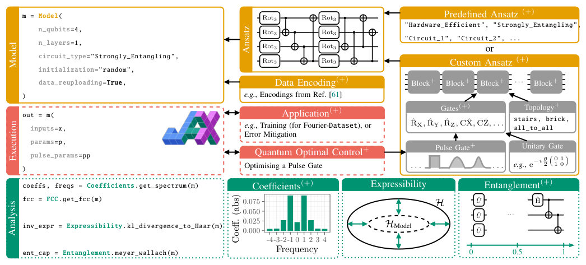 
Fig. 1: Overview of our contributions to QML-ESSENTIALS with + indicating novel additions, and (+) major changes. The code example in Python on the left-hand side describes the main functionality of the framework. The solid yellow blocks on the right hand show the possibilities for defining a quantum Fourier model, based on different ansätze and encodings. Dashed red blocks show the possibilities of utilising the execution of a model, which encompasses the JAX-based [32] classical simulation of a quantum circuit and its measurement. Different input, parameter and pulse parameter values open up possibilities for a variety of applications and QOC. Dotted green blocks correspond to built-in...

📷 Fig 2

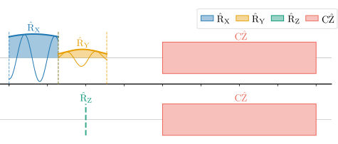 
Fig. 2: Pulse sequence diagram showing an ˆRX and ˆRY gate on the first-, a ˆRZ on the second, and a CˆZ gate on both qubits. Shaded areas show envelopes with carrier frequencies marked by thin lines. Vertical lines delimit the gate duration.

📷 Fig 3

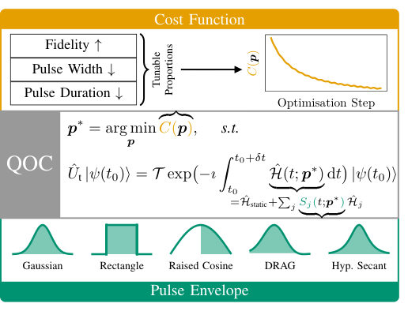 
Fig. 4: Overview of our QOC procedure to find optimal pulse parameters p∗by minimising some cost function C. Resulting pulse parameters determine, for instance, the amplitude, width or duration of the pulse envelope, for which the available possibilities are shown at the bottom. For an ideal optimisa- tion, the state after evolution with the constructed pulse gate matches that of the target unitary gate ˆUt.

📷 Fig 4

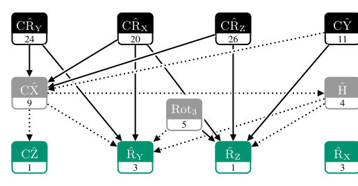 
Fig. 3: Overview of the connectivity between basis gates and composed gates. The line type (dotted/solid) represents the number of child gates (1/2) the parent gate depends on. Labels at the bottom of each node represent the total number of pulse parameters including redundancies.

📷 Fig 5

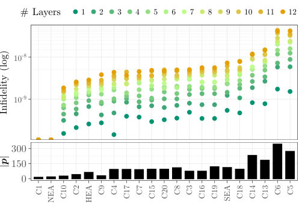 
Fig. 5: (top) Infidelities for all available ansätze, ordered by the mean infidelity over all numbers of layers. (bottom) the number of pulse parameters for each ansatz. Ansätze of the format C* are taken from Ref. [48]. The additional ansätze, NEA, SEA and HEA refer to a non-entangling, strongly- entangling and hardware-efficient ansatz, respectively. Note that the infidelity is zero for all layers of C1 and NEA.

**Summary.** The authors present QML-ESSENTIALS, a software framework that bridges the gap between abstract quantum circuits and low-level hardware control pulses. By integrating quantum optimal control with quantum machine learning, the tool allows researchers to optimize pulse parameters directly and analyze the spectral and entangling properties of quantum models. This enables more hardware-aware and efficient development of quantum machine learning algorithms.

**Why it may be interesting.** It provides a unified toolset for studying how the physical dynamics of control pulses directly influence the functional properties (like spectral bias and trainability) of quantum machine learning models, which is crucial for developing robust open quantum system controllers.

Detailed structure

**Main problem.** The gap between high-level, gate-based quantum machine learning (QML) abstractions and low-level, hardware-aware control pulses, which limits the ability to exploit hardware-specific features like error mitigation.

**Main result.** The development of the QML-ESSENTIALS software framework, which enables seamless integration of pulse-level modeling with QML methodologies, allowing for end-to-end optimization of pulse parameters and advanced Fourier-analytic diagnostics.

**Method.** A high-performance Python framework built on JAX that implements Quantum Optimal Control (QOC) techniques, differentiable quantum simulation, and a suite of metrics including Fourier coefficient correlation (FCC) and entanglement measures.

**Model / system.** The framework focuses on programmable quantum computing platforms, specifically superconducting qubits (transmons) modeled as periodically driven two-level systems with time-dependent Hamiltonians.

**Key observables.** Fourier spectrum (frequencies and coefficients), Fourier Coefficient Correlation (FCC), expressibility (KL-divergence), and entanglement measures (Entanglement of Formation, Concentratable Entanglement, and Meyer-Wallach).

**Important parameters / regimes.** Pulse parameters (amplitude, width, duration), gate infidelities, and circuit depth.

**Assumptions / limitations.** The framework assumes a closed quantum system for certain analyses and uses the Rotating-Wave Approximation (RWA) to reduce integration stiffness during pulse simulation.

**Figures summary.** Figure 1 shows a code example and the framework's structural hierarchy; Figure 2 illustrates pulse sequence diagrams; Figure 5 compares gate infidelity and pulse parameters against circuit depth; Figure 6 compares expressibility and FCC; Figure 8 compares various entanglement measures under noiseless and noisy conditions.

**Paper structure.** The paper introduces the motivation for bridging the gate-pulse gap, details the QML-ESSENTIALS software architecture and JAX-based simulation, describes the implementation of Quantum Optimal Control for pulse-level gates, presents benchmarking of QML ansatz properties (Fourier and entanglement metrics), and concludes with the framework's utility for future hardware-aware QML research.

Abstract

Contemporary quantum computing platforms remain, in essence, programmable physical systems whose control is typically mediated through unitary gate abstractions. While such abstractions provide a uniform interface, they obscure important aspects of the underlying hardware and may limit the exploitation of its full capabilities. Direct operation at the control-pulse level offers a more expressive and physically faithful paradigm, enabling, for instance, the implementation of tailored error-mitigation and optimisation strategies. However, this increased expressivity comes at the cost of greater quantum software development complexity, necessitating structured and accessible tooling.   We present a software framework, integrated within the QML-Essentials package, that extends quantum machine learning (QML) methodologies to encompass pulse-level modelling. By embedding quantum optimal control techniques within a QML setting, our approach enables the seamless combination of gate-based and pulse-level representations. The framework provides a comprehensive suite of modelling and analytical capabilities. In particular, we introduce composable ansatz constructions based on interchangeable building blocks, and support for end-to-end optimisation of pulse parameters. Motivated by the central role of quantum Fourier models, we further incorporate a range of Fourier-analytic diagnostics, complemented by extended measures of entanglement. All performance-critical components are implemented in a high-performance environment using JAX and supported by a dedicated quantum simulator. Taken together, the framework facilitates reproducible and systematic investigations, while bridging the conceptual and practical divide between abstract circuit models and hardware-aware optimisation. It provides a robust foundation for future developments at the intersection of QML and quantum control.

[↑ back to top](#top)

### [Collapse of the state vector and nonlocal correlations in quantum mechanics](http://arxiv.org/abs/2605.21243v1)

**Authors:** Grgeory D. Scholes  
**Type:** theory · **Category:** quantum information and computing · **PDF:** <https://arxiv.org/pdf/2605.21243v1>  
**Analysis basis:** full PDF text, analyzed in chunks
**Topic relevance:** `entanglement & information structure` **3/5** · `quantum measurements` **3/5**

📷 Fig 1

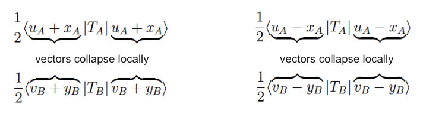 
FIG. 1. Summary scheme showing how the class 1 and class 2 representatives in the free

**Summary.** This paper proposes a 'contextual phase theory' to explain quantum measurement collapse and nonlocality as inherent features of the existing linear mathematical framework. By treating the wavefunction as an equivalence class of local representatives, the author shows that correlations and definite outcomes emerge naturally without needing non-local interactions. This provides a way to reconcile the statistical nature of quantum mechanics with the appearance of definite local results.

**Why it may be interesting.** It offers a novel theoretical perspective on the measurement problem and the interpretation of entanglement, which is fundamental to understanding the foundations of quantum information and the dynamics of entangled subsystems.

Detailed structure

**Main problem.** The paper seeks to provide a mechanistic explanation for the collapse of the state vector and the origin of nonlocal correlations in entangled systems without invoking ad hoc postulates or 'spooky action at a distance'.

**Main result.** The author demonstrates that the mechanism for state vector collapse and nonlocal correlations can be derived from the existing linear theory of quantum mechanics by using a 'contextual phase theory' that identifies how a single wavefunction encodes statistical outcomes.

**Method.** The approach utilizes an algebraic framework involving quotient spaces, free vector spaces, and a 'wave basis' to map entangled states in a tensor product space to local representatives in subsystem Hilbert spaces.

**Model / system.** The study focuses on bipartite entangled quantum systems (such as electrons or photons) described by a composite Hilbert space (HA ⊗ HB), specifically using the EPR/Bohm singlet state as a primary platform.

**Key observables.** Pauli operators (sigma_z, sigma_x), polarization (H/V), and correlation functions (expectation values of product operators).

**Important parameters / regimes.** Contextual phases (phi), measurement bases (x, y, z), and measurement angles (alpha, beta).

**Assumptions / limitations.** The theory assumes the standard postulates of quantum mechanics (unitary evolution and Born rule) and relies on the existence of a 'contextual phase class' within a covering space representation.

**Figures summary.** A summary scheme illustrating the workflow from a single wavefunction to the identification of representatives in a free vector space, their split into two classes, and their projection into local subsystem Hilbert spaces.

**Paper structure.** The paper progresses from defining the tensor product basis and algebraic construction to discussing how wavefunctions encode statistical outcomes, followed by the introduction of the contextual phase model and concluding with the derivation of collapse and nonlocality.

Abstract

It is shown how to obtain state vectors associated with measurements on the separated subystems of an entangled state, revealing how a single wavefunction encodes a set of statistical measurement outcomes. The result explains why measurements on the subsystems give definite outcomes and why measurements on one subsystem are correlated with those on the other. It is therefore concluded that the theory of quantum mechanics, without nonlinearities or \emph{ad hoc} assertions, can explain both the mechanism of state vector collapse and the reason for the paradoxical nonlocal correlations between separated subsystems.The theory also explains how quantum correlations, including correlations that violate Bell's inequality, are read out by classical measurements.

[↑ back to top](#top)

### [Field-tunable spin-valley transport in monolayer MoS$_2$](http://arxiv.org/abs/2605.20790v1)

**Authors:** Kamal Azaidaoui, Hocine Bahlouli, Clarence Cortes, David Laroze, Ahmed Jellal  
**Type:** theory · **Category:** other · **PDF:** <https://arxiv.org/pdf/2605.20790v1>  
**Analysis basis:** full PDF text, analyzed in chunks
**Topic relevance:** `non-equilibrium dynamics` **3/5** · `spintronics-quantum-optics interface` **2/5**

📷 Fig 1

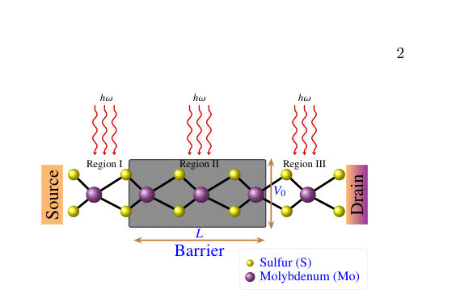 
FIG. 1. Schematic of the uniformly irradiated monolayer MoS2 junction. A rectangular electrostatic barrier of height V0 and width L is applied in region II, separating the source (region I) and drain (region III) leads.

📷 Fig 2

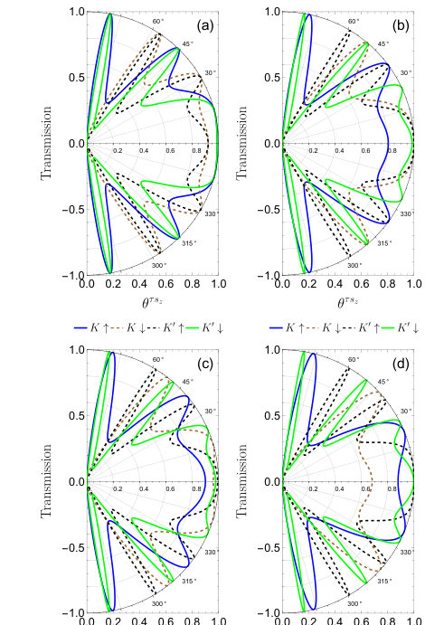 
FIG. 2. Spin- and valley-resolved transmission probability T τsz(θτsz) as a function of the incident angle θτsz in the K and K′ valleys. For E = 1.2∆, V0 = −2∆, L = 7 nm. (a) No laser. (b) ξ = 0, IL = 106 W/m2. (c) ξ = 0.5, IL = 106 W/m2. (d) ξ = 0.5, IL = 2 × 106 W/m2. The radial coordinate represents the transmission T τsz ∈[0, 1] and the angular coordinate represents the incident angle θτsz ∈ [−90◦, 90◦]. Blue (green) solid curves denote K ↑(K′ ↓), while brown (black) dashed curves denote K ↓(K′ ↑).

📷 Fig 3

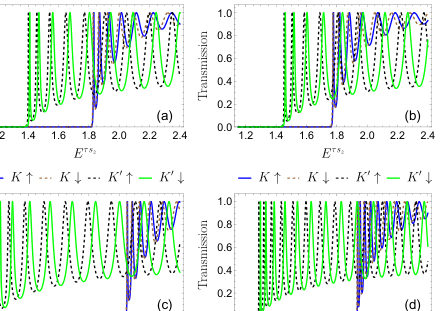 
FIG. 4. Spin- and valley-resolved transmission probability T τsz(Eτsz) as a function of the incident energy Eτsz in the K and K′ valleys. For V0 = 0.3∆, L = 7 nm, θτsz = 25◦. (a) ξ = 0, IL = 5 × 105 W/m2. (b) ξ = 0.5, IL = 5 × 105

📷 Fig 4

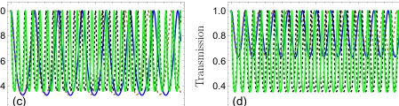 
FIG. 3. Spin- and valley-resolved transmission probability T τsz(L) as a function of the barrier width L in the K and K′

📷 Fig 5

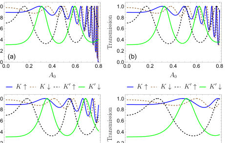 
FIG. 5. Spin- and valley-resolved transmission probability T τsz(A0) as a function of the laser-field amplitude A0 in the K and K′ valleys. For E = 1.2∆, V0 = 0.3∆, L = 10 nm, and θτsz = 25◦. (a) ξ = 0. (b) ξ = 0.3. (c) ξ = 0.5. (d) ξ = 0.8. Blue (green) solid curves denote K ↑(K′ ↓), while brown (black) dashed curves denote K ↓(K′ ↑).

**Summary.** This paper demonstrates how mid-infrared laser light can be used to optically tune the transport of electrons in MoS2. By adjusting the laser's intensity and polarization, researchers can switch the material between a valley filter and a resonance-selective conductor. This provides a potential pathway for creating reconfigurable valleytronic and spintronic devices.

**Why it may be interesting.** not directly relevant

Detailed structure

**Main problem.** Investigating how off-resonant, elliptically polarized laser driving can be used to control and switch spin-valley transport in monolayer MoS2 junctions.

**Main result.** The laser drive allows for an optical switch between broadband valley filtering and resonance-selective operation, even enabling a 'valley-selective switch-off' where the K valley is driven into an evanescent regime.

**Method.** High-frequency Floquet expansion to derive an effective static Hamiltonian, combined with a scattering formalism using spinor matching at the barrier interfaces.

**Model / system.** A monolayer MoS2 junction featuring a rectangular electrostatic barrier subject to off-resonant, mid-infrared, elliptically polarized light, modeled via a massive Dirac Hamiltonian with intrinsic spin-orbit coupling.

**Key observables.** Transmission probability, Landauer conductance, valley contrast, and spin-resolved conductance.

**Important parameters / regimes.** Laser amplitude (A0), polarization ellipticity (xi), barrier height (V0), barrier width (L), and photon energy (hbar omega).

**Assumptions / limitations.** The high-frequency, off-resonant regime where photon energy is larger than the spin-orbit coupling but smaller than the band gap (no real interband transitions).

**Figures summary.** Fig 1: Schematic of the junction; Fig 2: Spin/valley-resolved transmission vs. incident angle; Fig 3: Transmission vs. barrier width showing Fabry-Perot fringes; Fig 4: Transmission vs. energy showing threshold shifts; Fig 5: Regulation of Floquet dressing by laser amplitude; Fig 6: Transmission as a function of polarization ellipticity; Fig 8: Conductance vs. laser amplitude showing the K-valley switch-off.

**Paper structure.** The paper introduces the physical system and problem, describes the Floquet-engineered Hamiltonian and scattering model, presents numerical results regarding angular and energy-dependent transmission, explores the effects of laser intensity and polarization, and concludes with implications for valleytronic applications.

Abstract

We study field-controlled spin-valley transport in monolayer MoS$_2$ through a single electrostatic barrier and a uniform off-resonant elliptically polarized irradiation. Starting from the massive Dirac Hamiltonian with intrinsic spin-orbit coupling, we use a high-frequency Floquet expansion to obtain an effective static model with a laser-renormalized mass (gap) term. We solve the scattering problem by spinor matching and derive the exact analytic expression for the transmission. The numerical results show that the drive tunes both the spin-valley-dependent propagation threshold inside the barrier and the Fabry-Pérot phase, creating controllable pass/stop bands. By varying both the laser intensity (amplitude) and the polarization shape, we show that the same junction can be switched between broadband valley filtering and resonance-selective operation, and the valley contrast remains visible in the Landauer conductance. Our findings establish an efficient route for realizing optically reconfigurable valleytronic and spintronic functionalities in MoS$_2$.

[↑ back to top](#top)

### [Gravitational Entanglement in Optomechanics: Distinguishing Classical and Quantum Models](http://arxiv.org/abs/2605.20330v1)

**Authors:** Samuel Schlegel, Ankit Kumar, Tomasz Paterek, Borivoje Dakić  
**Type:** theory · **Category:** quantum information and computing · **PDF:** <https://arxiv.org/pdf/2605.20330v1>  
**Analysis basis:** full PDF text, analyzed in chunks
**Topic relevance:** `entanglement & information structure` **3/5** · `quantum measurements` **2/5**

📷 Fig 1

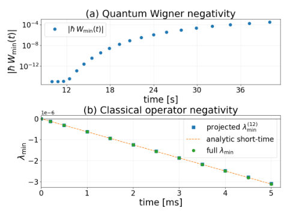 
Figure 1: Non-classicality of quantum dynamics and non- quantumness of classical dynamics. All plots are for the Newtonian potential truncated at the cubic term, V3(r), and the initial state is the product of two identical Gaussians. The markers denote numerically obtained data with parameters from Appendix C. (a) Quantum dynamics: Minimum value of the Wigner function | minr,p ℏW(r, p, t)| over long timescales, showing the emergence of phase-space negativity at the level of ∼10−4. (b) Classical dynamics: Smallest eigenvalue of the full Weyl operator λmin (green circles), and the smallest eigenvalue in the subspace spanned by the first and second excited states at short times λ(12) min (blue...

**Summary.** This paper demonstrates that standard optomechanical experiments using Gaussian states and quadratic potentials cannot distinguish between quantum and classical gravity. It proposes that detecting non-classicality requires probing higher-order potential terms or using non-Gaussian states, which significantly increases the required experimental precision and sample complexity.

**Why it may be interesting.** It addresses the fundamental challenge of verifying quantum gravity signatures and provides rigorous bounds on the experimental requirements needed to rule out classical phase-space mimics in optomechanical setups.

Detailed structure

**Main problem.** Distinguishing between truly quantum gravitational entanglement and classical models that can reproduce the same experimental signatures in optomechanical systems.

**Main result.** The authors show that classical models can mimic entanglement in the quadratic/Gaussian regime, and that detecting non-classicality requires moving to non-Gaussian states or higher-order (cubic) potential terms, which requires significantly more stringent experimental conditions.

**Method.** The study uses the Wigner-Weyl representation and Moyal evolution to compare quantum and classical dynamics, employing perturbative expansions and randomized quadrature measurements to estimate witness effectiveness and sample complexity.

**Model / system.** A system of two identical spherical masses in an optomechanical setup, modeled by a Hamiltonian containing a Newtonian potential expanded via multipole expansion to include cubic corrections.

**Key observables.** Wigner negativity, negativity of the Weyl operator, logarithmic negativity, quadrature measurements, and cross-axis correlations.

**Important parameters / regimes.** Mass (m), separation (L), gravitational coupling (omega), initial state width (sigma), and interaction time (t).

**Assumptions / limitations.** The analysis assumes the weak gravity regime allows for a truncated potential expansion and considers the feasibility of detecting signatures in the momentum tails of Gaussian states.

**Figures summary.** Figure 1 shows the emergence of phase-space negativity in the quantum dynamics.

**Paper structure.** The paper identifies the overlap problem between classical and quantum models, develops a mathematical framework using Wigner-Weyl transforms, analyzes specific witnesses for non-classicality and non-quantumness, and concludes with an assessment of experimental feasibility and sample complexity.

Abstract

Observation of gravitationally induced quantum entanglement is often interpreted as a direct evidence of non-classical gravity. While the form and the degree of non-classicality have been rigorously studied from a foundational perspective, classical models reproducing experimental signatures of such entanglement remain underexplored. Motivated by the experimental simplicity, nearly all existing optomechanical approaches assume Gaussian initial states, and due to the weakness of gravity the quantum Newtonian potential is truncated at the second order. However, this regime admits a classical description in terms of the Wigner-Weyl representation, including features typically associated with quantum entanglement. A clear distinction between classical and quantum predictions emerges only beyond this setting. We comprehensively analyze the possibilities and provide operational witnesses for detection of non-classicality via Wigner negativity, and detection of non-quantumness via negativity of the Weyl operator. Our results demonstrate that the experimental requirements on certifying gravitational entanglement are more stringent than previously anticipated.

[↑ back to top](#top)

### [High-Dimensional Carrier-Assisted Entanglement Purification Based on Mutually Unbiased Bases](http://arxiv.org/abs/2605.20958v1)

**Authors:** Zihua Song, Lin Chen, Yongge Wang  
**Type:** theory · **Category:** quantum information and computing · **PDF:** <https://arxiv.org/pdf/2605.20958v1>  
**Analysis basis:** full PDF text, analyzed in chunks
**Topic relevance:** `entanglement & information structure` **3/5** · `quantum measurements` **2/5**

📷 Fig 1

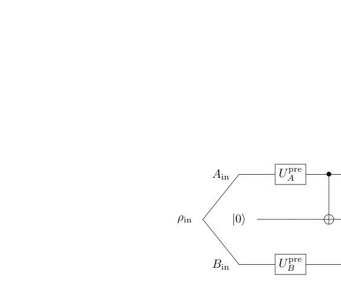 
Figure 1: Quantum circuit of the single-carrier CAEPP protocol

📷 Fig 2

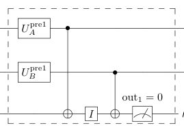 
Figure 2: Quantum circuit for two-round purification over noiseless channels

📷 Fig 3

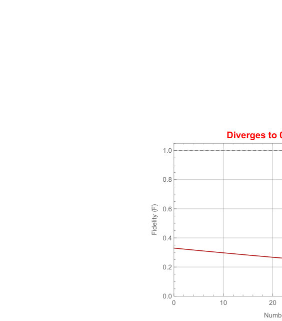 
Figure 3: Asymptotic fidelity FN of the single-carrier CAEPP without pre- processing. Inset parameters: p0 := p00, p1,2 := pX=1,2 and A := p1/(p1 + p2). For symmetric noise with A = 0.5, p0 = 0.33, and p1 = p2 = 0.335, the convergence threshold p0 &gt; max{p1, p2} is violated, causing the fidelity to strictly diverge to 0.

📷 Fig 4

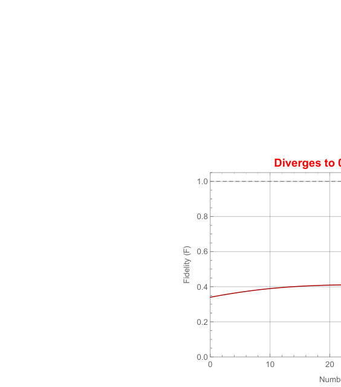 
Figure 5: Asymptotic fidelity FN without pre-processing. Under slightly asym- metric noise with A = 0.48 and the same initial p0 = 0.34, the marginal errors shift to p1 = 0.317 and p2 = 0.343. The threshold condition p0 &gt; max{p1, p2} is consequently violated, causing the fidelity to ultimately diverge to 0 despite p0 &gt; 1/3.

📷 Fig 5

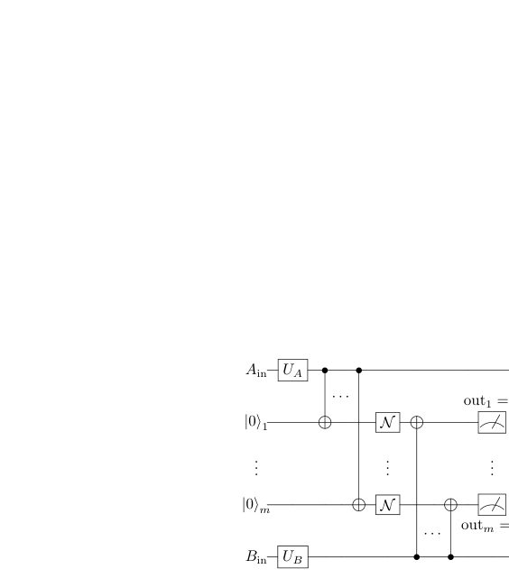 
Figure 8: Quantum circuit of the adaptive mCAEPP. Local Clifford gates UA and UB pre-align the maximum-error MUB axis Lmax with the primary Z-basis L1, followed by alternating-basis measurements.

**Summary.** This paper proposes a new method for purifying qutrit entanglement that overcomes the limitations of standard protocols under asymmetric noise. By using Mutually Unbiased Bases to rotate the error distribution, the authors prove that any state with initial fidelity above 1/3 can be purified to perfect fidelity. This provides a scalable and robust strategy for high-dimensional quantum communication.

**Why it may be interesting.** This is highly relevant for quantum networking and open quantum systems, as it provides a robust theoretical framework for maintaining high-dimensional entanglement in the presence of realistic, non-symmetric environmental noise.

Detailed structure

**Main problem.** The challenge of distilling high-dimensional (qutrit) entanglement under realistic, asymmetric Pauli noise, where standard protocols fail due to convergence bottlenecks caused by marginal X-error probabilities.

**Main result.** The introduction of an adaptive MUB-based pre-processing scheme allows the mCAEPPS protocol to deterministically achieve unit asymptotic fidelity for any two-qutrit Pauli channel, provided the initial fidelity is above 1/3.

**Method.** The authors use a stabilizer code framework (mCAEPP) combined with a deterministic pre-processing scheme using Mutually Unbiased Bases (MUBs) to rotate the qutrit phase space, establishing primary-axis error dominance.

**Model / system.** The system consists of two-qutrit (three-dimensional) systems subject to general asymmetric qutrit Pauli channels, modeled using generalized Pauli operators X and Z.

**Key observables.** Entanglement fidelity (p00), success probability (P_succ), and marginal error probabilities (X and Z error rates).

**Important parameters / regimes.** Initial fidelity threshold (p00 > 1/3), number of carrier qutrits (m), and number of purification rounds (n).

**Assumptions / limitations.** The initial state must be distillable (p00 > 1/3); the protocol assumes perfect local operations and requires channel tomography to determine the necessary MUB rotation.

**Figures summary.** Figure 1 shows the single-carrier CAEPP circuit; Figure 2 illustrates the two-round purification process; Figure 3 shows fidelity divergence; Figure 7 shows the scalable mCAEPP circuit; Figure 8 shows the adaptive mCAEPP circuit with MUB pre-processing.

**Paper structure.** The paper defines the stabilizer framework and CAEPP/mCAEPP protocols, identifies the convergence bottleneck in asymmetric noise, introduces the MUB-based pre-processing strategy, and provides mathematical proofs for error suppression and asymptotic convergence to unit fidelity.

Abstract

Distilling high-dimensional quantum entanglement under realistic, general asymmetric noise remains a formidable challenge. Standard entanglement purification protocols inevitably fail to satisfy convergence constraints under severe asymmetric noise. In this paper, we investigate carrier-assisted entanglement purification protocols, namely CAEPP and mCAEPP, for two-qutrit systems, demonstrating that without adaptive pre-processing, convergence is strictly bottlenecked by marginal $X$-error probabilities. To overcome this limitation, we introduce a deterministic pre-processing scheme based on mutually unbiased bases (MUBs). By actively rotating the qutrit phase space to establish primary-axis error dominance, we rigorously prove that the MUB-adapted mCAEPP deterministically yields unit asymptotic fidelity for any two-qutrit Pauli channel with initial fidelity $p_{00} > 1/3$.

[↑ back to top](#top)

### [Precision and Privacy in Distributed Quantum Sensing: A Quantum Fisher Information Duality](http://arxiv.org/abs/2605.20765v1)

**Authors:** Farhad Farokhi  
**Type:** theory · **Category:** quantum information and computing · **PDF:** <https://arxiv.org/pdf/2605.20765v1>  
**Analysis basis:** full PDF text, analyzed in chunks
**Topic relevance:** `quantum measurements` **3/5** · `entanglement & information structure` **2/5**

📷 Fig 1

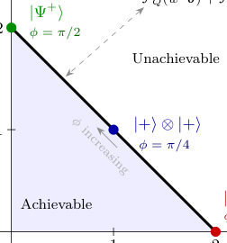 
FIG. 1. Precision-privacy Pareto frontier for N = 2 equa- torial probes, with ˆw =  1/ √

**Summary.** This paper proves that in distributed quantum sensing, maximizing precision for a specific target parameter automatically maximizes privacy for all orthogonal parameters. It demonstrates that GHZ states are optimal for achieving this 'privacy for free' by reaching the Heisenberg limit while zeroing out information in other directions.

**Why it may be interesting.** It provides a fundamental information-theoretic link between sensing sensitivity and data privacy, which is highly relevant for designing secure quantum networks and distributed sensing protocols in quantum optics and sensing.

Detailed structure

**Main problem.** Investigating the fundamental trade-off between estimation precision and parameter privacy in distributed quantum sensor networks.

**Main result.** The paper establishes a QFI duality where the sum of Fisher information for orthogonal sensing directions is bounded by N, implying that achieving Heisenberg-limited precision for a target parameter inherently provides privacy by nullifying information in orthogonal directions.

**Method.** The study uses the Quantum Fisher Information Matrix (QFIM) formalism, spectral decomposition, and the trace identity of the QFIM under local unitary encoding.

**Model / system.** A distributed network of N qubits (sensors) undergoing local phase encoding via local unitary operations U_j = exp(-1/2 i theta_j sigma_z).

**Key observables.** Quantum Fisher Information (QFI) for sensing directions, and the Quantum Fisher Information Matrix (QFIM).

**Important parameters / regimes.** Number of sensors (N), Heisenberg-limited precision (F_Q = N), Standard Quantum Limit (F_Q = 1), and the precision-privacy Pareto frontier.

**Assumptions / limitations.** The analysis assumes equatorial probe states, local unitary encoding, and an 'honest but curious' estimator who does not manipulate the probe state.

**Figures summary.** Figure 1 illustrates the precision-privacy Pareto frontier for N=2 equatorial probes, showing the linear relationship between QFI in orthogonal directions.

**Paper structure.** The paper introduces the precision-privacy problem, derives the QFI duality theorem, explores equality conditions for GHZ and equatorial states, and discusses the implications for multi-target sensing and privacy.

Abstract

We establish a quantum Fisher information (QFI) duality for distributed quantum sensor networks with local phase encoding. For any $N$-qubit probe state, where $N$ denotes the number of sensors, $F_Q(\boldsymbol{w}^\top \boldsymbolθ) + F_Q(\boldsymbol{v}^\top \boldsymbolθ) \leq N$ for all unit orthogonal sensing directions $\boldsymbol{w}$ and $\boldsymbol{v}$, with equality for all equatorial states when $N=2$ and for Greenberger--Horne--Zeilinger (GHZ) states when $N\geq 2$. Heisenberg-limited precision for direction $\boldsymbol{w}$, $F_Q(\boldsymbol{w}^\top \boldsymbolθ)=N$, saturates the bound and simultaneously forces zero QFI for all other independent directions. This can be interpreted as the condition for parameter privacy in distributed quantum sensing: attaining Heisenberg-limited precision for the sensing target renders all alternative privacy-intrusive estimations impossible.

[↑ back to top](#top)

### [Sampling Noise and Optimized Measurement Distribution in Imaginary-Time Quantum Dynamics Simulations](http://arxiv.org/abs/2605.20378v1)

**Authors:** Feng Zhang, Niladri Gomes, Joshua Aftergood, Thomas Iadecola, Yong-Xin Yao, Peter P. Orth  
**Type:** theory · **Category:** quantum information and computing · **PDF:** <https://arxiv.org/pdf/2605.20378v1>  
**Analysis basis:** full PDF text, analyzed in chunks
**Topic relevance:** `quantum measurements` **3/5** · `non-equilibrium dynamics` **2/5**

📷 Fig 1

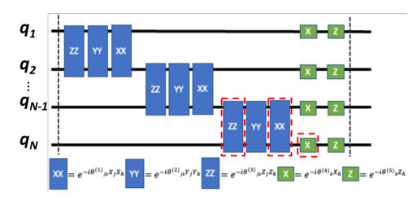 
FIG. 1. Schematic illustration of one layer of parametrized unitaries in the variational ansatz (8). The blue boxes repre- sent the two-qubit operators that are ordered sequentially to allow for unrestricted qubit correlations across a single layer. The single-qubit rotation gates are shown in green boxes. Each rotation gate has its own variational parameter. The dashed red boxes indicate the three operators that are not included in the final ansatz to remove an apparent singularity in the QGT Mµν.

📷 Fig 2

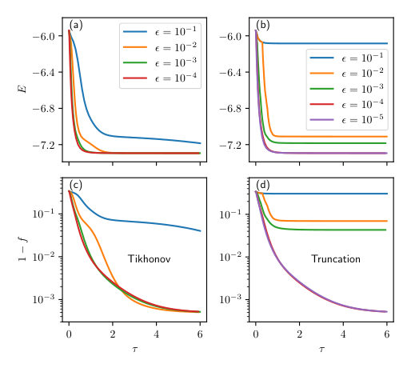 
FIG. 2. Energy E and infidelity 1 −f of noiseless VQITE for the critical TFIM with N = 6 spins. Tikhonov regularization [(a) and (c)] and eigenvalue truncation [(b) and (d)] are used, respectively, to solve the equations of motion.

📷 Fig 3

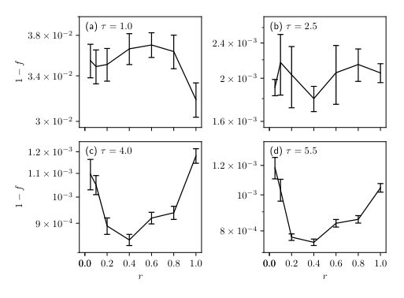 
FIG. 4. The infidelity 1 −f as a function of r for various times τ of noisy VQITE simulations of the critical TFIM with N = 6. We set Mave = 104. For each r, which controls the number of minimal shots via Mmin = rMave, the infidelity 1 −f is averaged over 50 independent runs with the error bar showing the error of the mean. We employ Tikhonov regularization with ϵ = 10−2 to solve the equations of motion.

📷 Fig 4

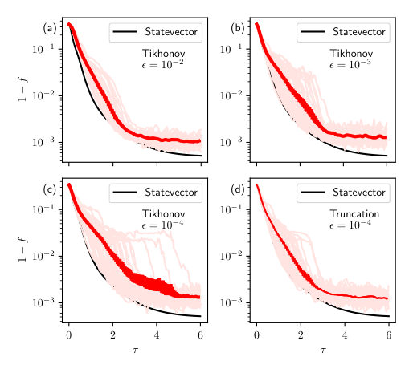 
FIG. 3. Wavefunction infidelity 1 −f as a function of imag- inary time τ in circuit simulations considering shot noise us- ing Tikhonov regularization with ϵ = 10−4 (a), 10−3 (b) and 10−2 (c), and using the eigenvalue truncation method with ϵ = 10−4 (d). We use M = 104 shots for each circuit measur- ing Dµν, Oµ and E± µ for a total shot budget of about 4 × 106

📷 Fig 5

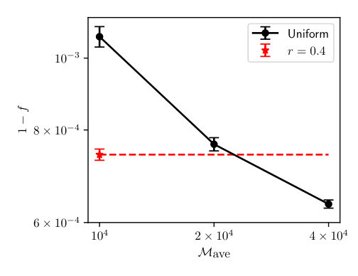 
FIG. 5. Infidelity 1−f as a function of Mave for uniform shot distribution for critical TFIM with N = 6 at τ = 5.5 (black points). The implementation of Algorithm 1 with r = 0.4 and Mave = 104 at the same τ is shown as the red star. The horizontal red dashed line indicates how many average measurements Mave are needed in the uniform case to achieve the same infidelity, signaling a cost reduction by about 50%. All data points are averaged over 50 independent runs.

**Summary.** This paper proposes a method to optimize measurement shot allocation in variational quantum dynamics to mitigate the effects of sampling noise. By using Tikhonov regularization and a strategic distribution of shots, the authors show that one can achieve higher simulation fidelity with significantly fewer total measurements. This provides a practical roadmap for more efficient ground-state preparation on near-term quantum devices.

**Why it may be interesting.** This paper is highly relevant for many-body dynamics as it provides practical, algorithmic solutions to the primary bottleneck (sampling noise) in performing quantum dynamics simulations on near-term NISQ hardware.

Detailed structure

**Main problem.** Addressing the impact of sampling noise (shot noise) on Variational Quantum Dynamics Simulations (VQDS), specifically regarding the instability of the Quantum Geometric Tensor inversion and the inefficient distribution of measurement shots.

**Main result.** The authors demonstrate that Tikhonov regularization provides robust stability for the equations of motion and that an optimized shot allocation strategy can reduce total measurement cost by more than a factor of two while improving state fidelity.

**Method.** The study uses noisy circuit simulations of 1D Ising models, comparing Tikhonov regularization against eigenvalue truncation and implementing a recursive shot-allocation algorithm that minimizes a cost function related to parameter update variance.

**Model / system.** One-dimensional quantum spin models, specifically the Transverse-Field Ising Model (TFIM) and the Mixed-Field Ising Model (MFIM), used for ground-state preparation via imaginary-time evolution.

**Key observables.** State fidelity, energy, Quantum Geometric Tensor (QGT) elements, and the condition number of the metric matrix.

**Important parameters / regimes.** Regularization parameter (epsilon), time step (delta t), total measurement budget (M_tot), and the shot distribution ratio (r).

**Assumptions / limitations.** The variational ansatz is assumed to be sufficiently expressive, the QGT matrix is assumed to be symmetric, and raw measurements are assumed to be independent.

**Figures summary.** Figure 1 shows the variational ansatz architecture; Figure 2 compares regularization performance; Figure 4 shows infidelity versus the shot distribution ratio; Figure 5 compares the efficiency of optimized vs. uniform shot allocation; Figure 6 shows performance across different evolution times.

**Paper structure.** The paper introduces the problem of sampling noise in VQDS, presents a comparison of regularization techniques, introduces a new recursive algorithm for optimized shot allocation, benchmarks this algorithm using noisy simulations of the TFIM, and discusses the broader applicability of the framework to other variational algorithms.

Abstract

Variational quantum dynamics simulations (VQDS) provide a promising route to simulate real- and imaginary-time quantum dynamics on noisy intermediate-scale quantum devices using fixed-depth circuits. However, their practical performance is strongly limited by sampling noise arising from a finite number of circuit measurements. In this work, we systematically investigate the impact of sampling noise on VQDS, with a focus on ground-state preparation in one-dimensional Ising spin models using imaginary time evolution. We compare different regularization strategies for stabilizing the equations of motion and show that Tikhonov regularization provides robust performance in noisy imaginary-time evolution. We then benchmark measurement-distribution strategies that allocate shots by minimizing a cost function that characterizes the error in solving the equation of motion. Using noisy circuit simulations, we demonstrate that such optimized shot allocation can significantly improve state fidelity and reduce the total measurement cost by more than a factor of two compared to uniform shot distributions. We observe that the best results are found if a sufficiently large number of measurements is guaranteed for all circuits, suggesting that a finite fraction of shots should be distributed evenly. Our results provide practical guidelines for implementing measurement-efficient variational quantum dynamics and ground-state preparation on near-term quantum hardware.

[↑ back to top](#top)

### [Symmetric dilations of Pauli channels and semigroups](http://arxiv.org/abs/2605.20907v1)

**Authors:** Marco Cattaneo  
**Type:** theory · **Category:** quantum information and computing · **PDF:** <https://arxiv.org/pdf/2605.20907v1>  
**Analysis basis:** full PDF text, analyzed in chunks
**Topic relevance:** `methods for driven-dissipative` **3/5** · `correlated / nonlocal dissipation` **2/5**

📷 Fig 1

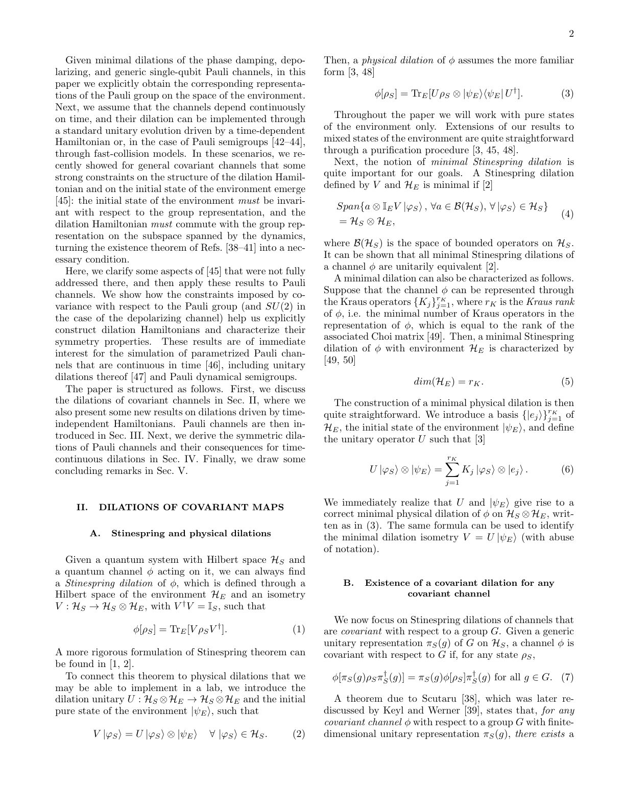 
Low-resolution page preview, page 2

📷 Fig 2

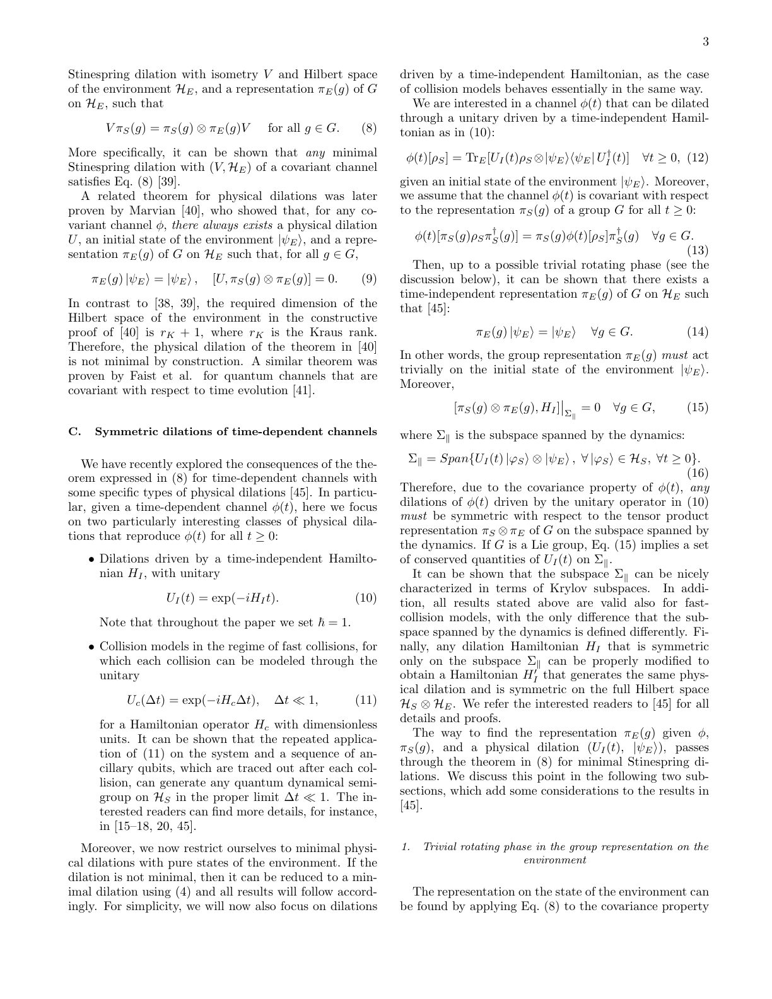 
Low-resolution page preview, page 3

📷 Fig 3

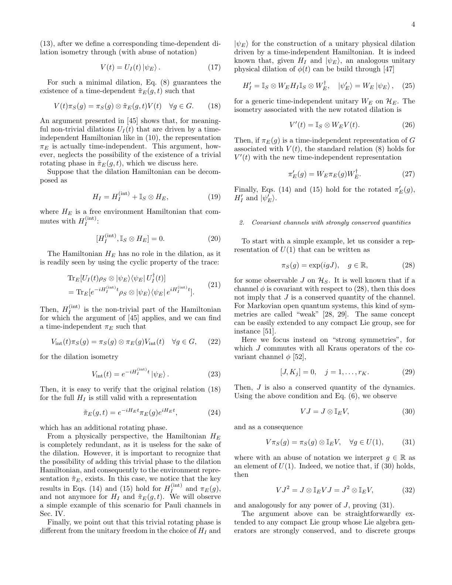 
Low-resolution page preview, page 4

📷 Fig 4

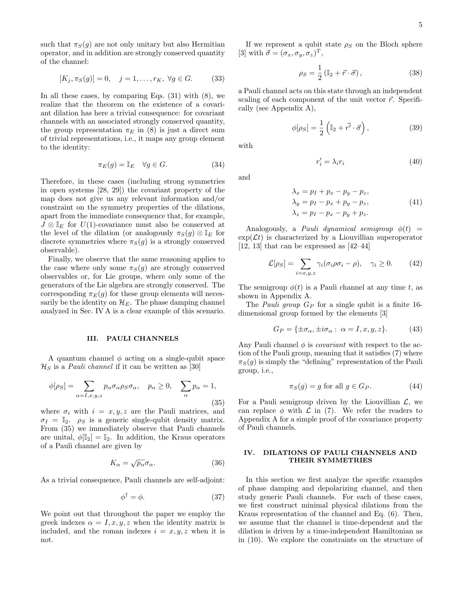 
Low-resolution page preview, page 5

📷 Fig 5

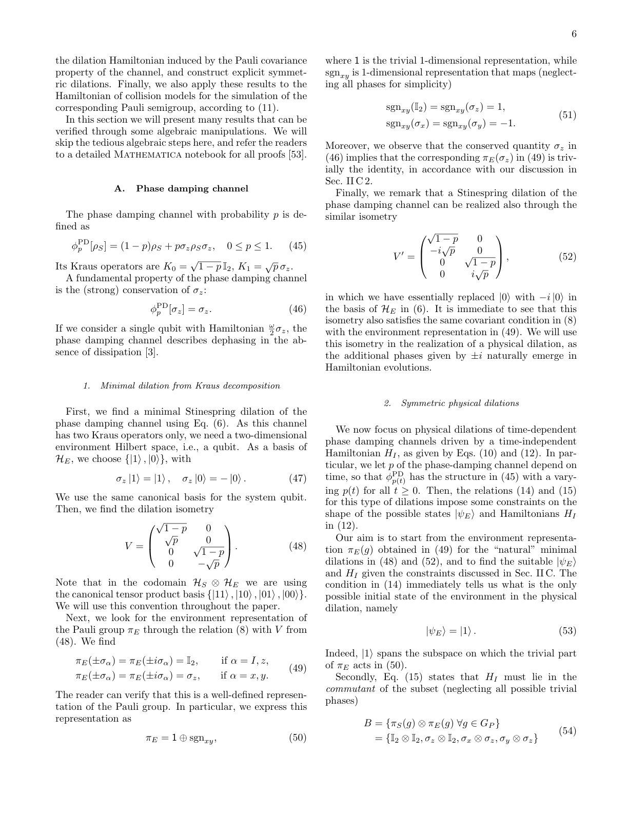 
Low-resolution page preview, page 6

**Summary.** This paper provides a systematic way to construct symmetric unitary dilations and collision models for Pauli channels. By leveraging the symmetry properties of the Pauli group, the author derives explicit Hamiltonians that can be used to simulate quantum noise in both laboratory settings and on quantum computers.

**Why it may be interesting.** This work is highly relevant for researchers in open quantum systems and quantum computing as it provides explicit protocols for simulating noise (Pauli channels) via unitary dynamics and collision models, which is essential for quantum error mitigation and hardware-efficient simulation.

Detailed structure

**Main problem.** The paper investigates the symmetry properties of Stinespring dilations for single-qubit Pauli channels and seeks to construct explicit, symmetric, time-dependent Hamiltonians and collision models that generate these channels and semigroups.

**Main result.** The author demonstrates that the covariance of Pauli channels imposes strong constraints on the dilation Hamiltonian and the initial environment state, allowing for the explicit construction of physical dilations for phase damping and depolarizing channels.

**Method.** The study utilizes the Stinespring dilation theorem, group representation theory (specifically the Pauli group and SU(2)), and the analysis of the Pauli commutant to derive Hamiltonian structures and environment representations.

**Model / system.** The models include single-qubit Pauli channels (phase damping and depolarizing), Pauli dynamical semigroups, and quantum collision models in the fast-collision limit, involving a system qubit coupled to an environment.

**Important parameters / regimes.** The fast-collision limit (delta t approaching 0), Kraus rank, and the scaling of interaction strength relative to the time step.

**Assumptions / limitations.** The focus is restricted to single-qubit Pauli channels, and the environment is assumed to be in a pure state.

**Paper structure.** The paper begins by exploring the symmetry properties of Stinespring dilations, moves to deriving representations of the Pauli group on the environment, then focuses on constructing time-dependent dilations and collision models, and concludes with explicit examples for specific Pauli channels.

Abstract

We explore the symmetry properties of Stinespring dilations of single-qubit Pauli channels, addressing both the generic case and the specific examples of phase damping and depolarizing channels. For each scenario, we derive the representation of the Pauli group acting on the Hilbert space of the environment. We then focus on dilations that are continuous in time and driven by a time-independent Hamiltonian, and on collision models that generate a Pauli dynamical semigroup in the limit of fast collisions. First, we complement some recent general results on these types of dilations (M. Cattaneo, Phys. Rev. A 111, 022209 (2025)) with some additions and clarifications, including the case of covariant channels with strongly conserved quantities. Next, we show that the covariance property of Pauli channels impose strong constraints on both the dilation Hamiltonian and the initial state of the environment, and demonstrate how these constraints can be exploited to explicitly construct the time-dependent dilations in all considered cases. Our results are relevant for the quantum simulation of Pauli channels via unitary dilations and of Pauli semigroups via collision models, both in the laboratory and on quantum computers.

[↑ back to top](#top)

### [Compact narrowband photon-pair generation by slow-light spectral engineering](http://arxiv.org/abs/2605.20447v1)

**Authors:** Ashwith Prabhu, Elizabeth A. Goldschmidt  
**Type:** theory · **Category:** quantum information and computing · **PDF:** <https://arxiv.org/pdf/2605.20447v1>  
**Analysis basis:** full PDF text, analyzed in chunks
**Topic relevance:** `interference shaping light` **3/5**

📷 Fig 1

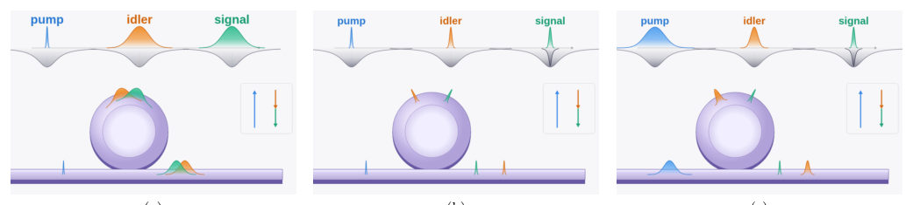 
FIG. 1. Schematic for SPDC in different regimes. For the bare cavity (a) a narrowband pump generates photons whose bandwidths match their respective cavity modes. For a cavity with a narrowed signal mode (b) a narrowband pump generates photons both whose bandwidths match the signal mode bandwidth, and (c) a broader pump generates a signal photon with bandwidth that equals its cavity mode and an idler photon with tunable bandwidth. Note: all pulse widths shown indicate the spectral width of the pulse.

📷 Fig 2

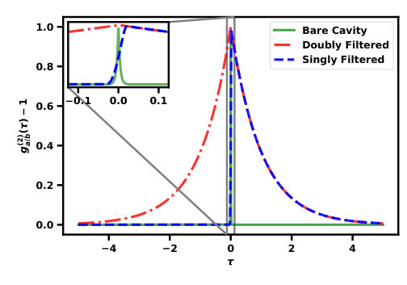 
FIG. 2. Normalized second order cross-correlation function as a function of the time different, τ, be- tween detecting the idler photon and the signal pho- ton. The value of g(2) a/b −1 is shown normalized to the peak value of (κ/4g|β|)2, which is the same for all curves. The time axes is in units of the filtered cor- relation time τc = ng/κ.

📷 Fig 3

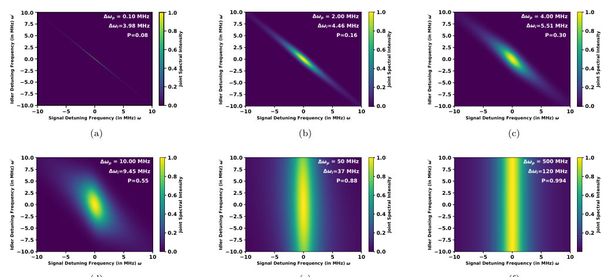 
FIG. 3. Normalized Joint Spectral Intensity with increasing pump bandwidth for a bare cavity width of 1 GHz and narrowed cavity width of 4 MHz. The signal bandwidth remains equal to the narrowed cavity width across all pump bandwidths. The pump bandwidth, ∆ωp, idler bandwidth ∆ωi, and purity, P, are noted on each plot.

📷 Fig 4

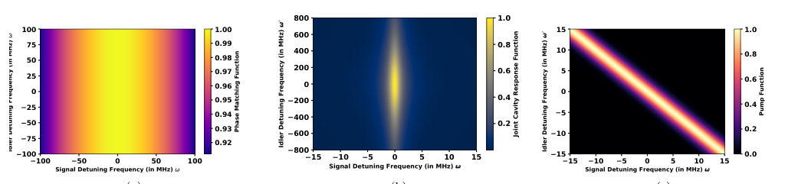 
FIG. 4. (a) Phase Matching Function (b) Joint Cavity Response Function with idler cavity width of 1 GHz and signal cavity width of 4 MHz (c) Pumping function with pump width of 6MHz

📷 Fig 5

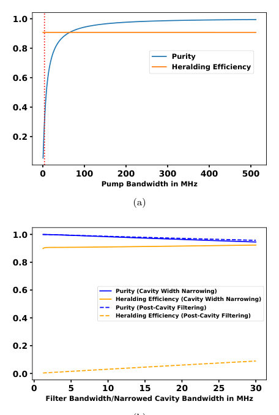 
FIG. 5. (a) Purity and heralding efficiency as a func- tion of pump bandwidth for a 1 GHz wide bare cavity and 68 MHz wide intra-cavity filter. Dotted vertical line denotes the narrowed cavity bandwidth. (b) Pu- rity and heralding efficiency for intra-cavity filtering and post-cavity filtering for equivalent signal photon linewidths. The pump bandwidth is fixed at 600 MHz

**Summary.** The paper proposes using an intra-cavity slow-light medium to narrow the bandwidth of photons generated via SPDC in integrated microrings. This method allows for the creation of narrowband photon pairs compatible with quantum emitters while maintaining high heralding efficiency and spectral brightness. It effectively increases the cavity's effective length without increasing its physical size.

**Why it may be interesting.** It provides a scalable solution for interfacing integrated photonics with quantum memories by using dispersion engineering to achieve MHz-scale bandwidths without the footprint of bulk optics.

Detailed structure

**Main problem.** The bandwidth mismatch between broadband nonlinear optical photon-pair sources and narrowband quantum emitters/memories, and the scalability challenge of using large bulk cavities to bridge this gap.

**Main result.** An intra-cavity slow-light filtering scheme enables narrowband photon-pair generation in integrated microrings without sacrificing heralding efficiency or spectral brightness.

**Method.** Analytical derivation using Langevin equations in the Fourier domain and numerical simulations of the joint spectral amplitude.

**Model / system.** Spontaneous Parametric Down-Conversion (SPDC) in erbium-doped thin-film lithium niobate (TFLN) microring resonators using a triply-resonant cavity configuration.

**Key observables.** Photon pair generation rate, spectral brightness, photon purity, heralsing efficiency, and second-order correlation function g(2)(tau).

**Important parameters / regimes.** Group index (ng), cavity linewidth (kappa), filter bandwidth (Delta), and the ratio of pump bandwidth to cavity bandwidth.

**Assumptions / limitations.** Continuous wave (CW) or broadband pumping below the optical parametric oscillation (OPO) threshold, and a Lorentzian-shaped intra-cavity filter.

**Figures summary.** Schematics of SPDC regimes, plots of joint spectral intensity (JSI) evolution with pump bandwidth, and comparisons of purity and heralding efficiency between intra-cavity and post-cavity filtering.

**Paper structure.** The paper introduces the bandwidth mismatch problem, proposes a slow-light filtering mechanism, develops a mathematical framework using Langevin dynamics, compares the proposed scheme to post-cavity filtering, and validates the results with numerical simulations using TFLN parameters.

Abstract

Efficiently generating photon pairs with high heralding efficiency and high single photon purity that are bandwidth matched to quantum emitters, quantum memories, and other matter-based qubits is critical for quantum networking applications. However, nonlinear optics-based sources require substantial spectral engineering to overcome the orders of magnitude bandwidth mismatch between those sources and qubit systems. A popular solution is cavity-enhanced spontaneous parametric down conversion (SPDC) where the cavity sets the photon bandwidth and simultaneously enhances the spectral brightness of the SPDC. Bulk, free-space configurations are generally required to achieve the MHz-scale bandwidths required to interface with most qubit systems. Replicating these in scalable integrated photonic architectures is an ongoing challenge due to the much higher propagation losses that limit the size and linewidth of chip-based resonators. We show here how an intra-cavity slow light medium, acting as an ultra-narrow filter, would enable narrowband photon pair generation in broadband cavities with high single photon purity and without compromising the heralding efficiency. We show that such metrics can be readily realized in erbium doped thin-film lithium niobate microrings using realistic design parameters.

[↑ back to top](#top)

### [Optimization of Secret Key Rate for BB84 under Collective Rotation Noise](http://arxiv.org/abs/2605.21140v1)

**Authors:** Wajiha Masood, Muhammad Waseem, Afshan Irshad  
**Type:** theory · **Category:** quantum information and computing · **PDF:** <https://arxiv.org/pdf/2605.21140v1>  
**Analysis basis:** full PDF text, analyzed in chunks
**Topic relevance:** `correlated / nonlocal dissipation` **2/5** · `entanglement & information structure` **2/5** · `quantum measurements` **1/5**

📷 Fig 1

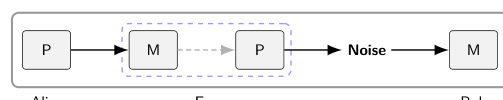 
Fig. 2. Representation of attacking strategy where Eve slides her devices near Bob’s lab [12]. Eve links her measurement and preparation devices by a lossless classical channel.

📷 Fig 2

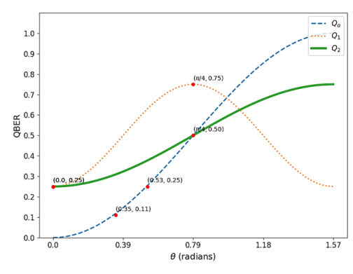 
Fig. 3. Comparing effect of rotation angle on QBER for different cases in presence of collective rotation noise[12]

📷 Fig 3

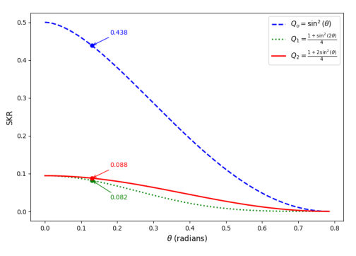 
Fig. 5. Determination of SKR under effect of collective rotation noise at an optimal value of 0.13 radians for three different scenarios; 1) With only noise in quantum channel, 2) With noise and eavesdropping in whole quantum channel, 3) With eavesdropping and noise present between Alice and Eve only.

📷 Fig 4

 
Fig. 4. Inquiring the information gained by Eve under the effect of collective rotation noise[12].

📷 Fig 5

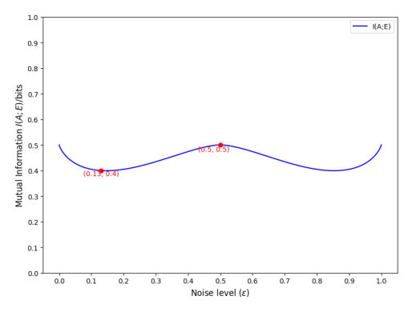 
Figure 4 shows mutual information as a function of noise level. It can be seen that the maximum information gained by Eve in presence of collective rotation noise is 0.5 bits of total bits, which is worst case from security perspective. At noise level ϵ = 0 and ϵ = 0.5, mutual infor- mation is 50% that means Eve successfully extracts half of the key bits. Another key observation is that at noise level of ϵ ≈0.13 Eve draws minimum mutual information of 0.4 bits. This leads to the idea that introduction of a calibrated amount of collective noise in channel can reduce Eve’s information extraction without any significant impact on the key rate.

**Summary.** This paper analyzes how collective rotation noise affects the security of the BB84 protocol. It proposes a noise engineering approach where a specific amount of noise is used to reduce an eavesdropper's information gain without significantly degrading the secret key rate. This provides a potential method for making quantum key distribution more resilient in realistic, noisy environments.

**Why it may be interesting.** This is relevant to researchers in quantum optics and open quantum systems as it explores how controlled environmental noise (collective rotation) can be leveraged to enhance the security of quantum communication protocols.

Detailed structure

**Main problem.** The study investigates the security performance of the BB84 quantum key distribution protocol under the influence of collective rotation noise, specifically looking for ways to optimize the secret key rate.

**Main result.** The authors identify a 'noise engineering' strategy where a specific noise level (theta approx 0.13 rad) minimizes Eve's information gain by 20% while maintaining a relatively stable secret key rate.

**Method.** The researchers use quantum information theory frameworks, including Shannon entropy and the Devetak-Winter bound, to analytically derive security parameters under intercept-and-resend attack models.

**Model / system.** The system is the BB84 protocol using four quantum states in the Z and X Pauli bases, subject to a collective rotation noise model represented by a unitary transformation U(theta) = cos(theta)I + i sin(theta)sigma_z.

**Key observables.** Quantum Bit Error Rate (QBER), mutual information between Alice and Eve I(A:E), and the Secret Key Rate (SKR).

**Important parameters / regimes.** Rotation angles theta and phi, noise parameter epsilon = sin^2(theta), and the sifting factor q = 1/2.

**Assumptions / limitations.** The analysis assumes the asymptotic limit for the key rate, a uniformly distributed bit sequence for Alice, and a simplified sifting factor.

**Figures summary.** Figure 1 and 2 show schematics of the attack models; Figure 3 compares QBER across different noise scenarios; Figure 4 shows the minimum of Eve's mutual information at a specific noise level; Figure 5 plots the SKR as a function of the rotation angle.

**Paper structure.** The paper introduces the problem of noise in QKD, defines the collective rotation noise model and attack scenarios, provides analytical derivations for security metrics, presents numerical results for QBER and information gain, and concludes with the noise engineering strategy.

Abstract

Practical quantum key distribution (QKD) systems operate under noise, but security of most protocols have been analyzed under ideal noiseless scenarios. In this work, we investigated security performance of BB84 protocol under effect of collective rotation noise. Using theoretical quantum information frameworks, we analyzed key security parameters including quantum bit error rate (QBER), mutual information and secret key rate (SKR). Security of protocol is studied under various eavesdropping scenarios based on intercept and resend attacks. Our results show that collective rotation noise has a significant impact on the information shared between the two parties. Particularly, we extended prior treatments by suggesting a noise engineering strategy where we identified a non-zero noise range where information accessed by Eve is minimized while corresponding SKR degradation remains relatively small. This analysis provide insights into robustness of BB84 protocol under realistic noisy channels and may contribute towards development of more resilient QKD systems.

[↑ back to top](#top)

### [Bowtie VarQTE: A Resource-Efficient Quantum State Preparation Primitive](http://arxiv.org/abs/2605.20331v1)

**Authors:** Marc Drudis, Alberto Baiardi, Mattia Chiurco, Francesco Tacchino, Stefan Woerner, Christa Zoufal  
**Type:** theory · **Category:** quantum information and computing · **PDF:** <https://arxiv.org/pdf/2605.20331v1>  
**Analysis basis:** full PDF text, analyzed in chunks
**Topic relevance:** `entanglement & information structure` **2/5** · `non-equilibrium dynamics` **2/5**

📷 Fig 1

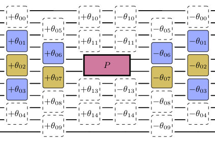 
FIG. 1: Construction of a bowtie circuit for gradient extraction of a variational parameter.

📷 Fig 2

 
FIG. 2: Infidelity I versus time for AQC (blue), VarQRTE (orange), and Trotter with twice the number of layers (green) on one-dimensional Heisenberg chains. Panel (a) shows results for N = 35 with L = 4 layers for AQC and VarQRTE and L = 8 for Trotter; panel (b) shows results for N = 50 with L = 3 layers for AQC and VarQRTE and L = 6 for Trotter.

📷 Fig 3

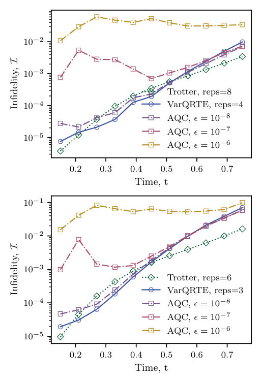 
Fig. 2 highlights how the infidelity between the pre- pared and the target states behaves throughout the evo- lution for: (a) an N = 35 qubit system with depth L = 4 for AQC as well as VarQRTE and L = 8 for Trotter, (b) N = 50 qubits with depth L = 3 for AQC as well as VarQRTE and L = 6 for Trotter. In both cases, AQC and

📷 Fig 4

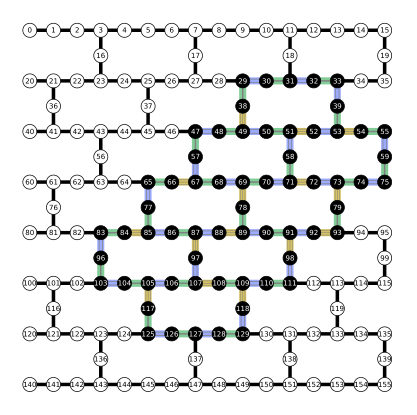 
FIG. 3: Quantum circuit ansatz. The blocks of gates (a) are applied to each colored edge (b) sequentially. The coloring of the edges and the sequence at which we apply the gates have been optimized to maximize expressibility while minimizing the light-cone sizes. If we denote the edges by Blue(B), Orange(O) and Green(G), we found the optimal sequence of gates to be: [G,B,O,B,G,B,O]. Furthermore, a final layer of single qubit rotations is added at the end of the circuit.

📷 Fig 5

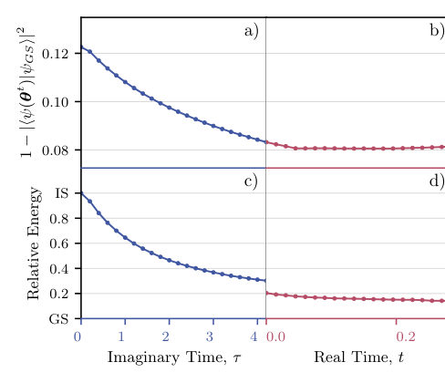 
FIG. 4: Energy estimates along the SKQD pipeline. Panel (a) shows the normalized energy E(τ) of the VarQITE trajectory computed with bowtie evaluation, starting from parameters that prepare the first determinant state of the Hamiltonian. Panel (b) shows the SKQD projected-energy estimate obtained from the cumulative support formed by sampling the real-time VarQRTE Krylov states {|ψtk⟩}: after each additional time point, we construct the reduced Hamiltonian HSM and report its ground-state energy. Energies are rescaled such that EGS = 0 and EIS = 1. Real-time evolution uses time step ∆t = π/∆E = 0.015 and each Krylov state is sampled with Nshots = 104 shots.

**Summary.** This paper introduces Bowtie VarQTE, a resource-efficient method for quantum state preparation that uses classical simulation of local light-cones to compute evolution parameters. It reduces the quantum measurement burden and improves numerical stability compared to existing variational methods. The framework is particularly effective for preparing physically structured states in 1D and 2D lattices.

**Why it may be interesting.** It provides a scalable way to prepare and evolve many-body states by intelligently partitioning tasks between classical and quantum processors, which is highly relevant for simulating many-body dynamics.

Detailed structure

**Main problem.** The high computational cost of evaluating the Quantum Geometric Tensor (QGT) and gradients in Variational Quantum Time Evolution (VarQTE), which leads to excessive quantum measurements and numerical instability.

**Main result.** The Bowtie VarQTE framework achieves comparable fidelity to Approximate Quantum Compiling (AQC) without requiring a classical representation of the target state, while significantly reducing quantum resource requirements by using classical simulation for local subcircuits.

**Method.** A hybrid framework that leverages the causal light-cone structure of parameterized circuits to decompose global evolution into smaller, classically tractable 'bowtie' subcircuits for exact evaluation of gradients and the QGT.

**Model / system.** The method is demonstrated on 1D Heisenberg chains, 2D square lattices, and 2D heavy-hex lattices using Hamiltonian Variational Ansätze (HVA).

**Key observables.** Infidelity, Quantum Geometric Tensor (QGT) entries, gradients, and energy estimates.

**Important parameters / regimes.** Circuit depth (L), number of qubits (N), light-cone size, and the strength of random disorder/perturbation.

**Assumptions / limitations.** The ansatz is assumed to consist of Clifford gates and parameterized Pauli rotations; the efficiency relies on the existence of local light-cones.

**Figures summary.** Figure 1 shows the bowtie circuit construction; Figure 2 plots infidelity vs. time; Figure 3 shows the HVA circuit and connectivity; Figure 4 illustrates the VarQTE+SKQD workflow; Figure 5 shows light-cone size distributions and runtime; Figure 6 compares SPSA error to Clifford approximation.

**Paper structure.** The paper introduces the Bowtie VarQTE framework, details the light-cone decomposition method, compares it against AQC and Trotter methods, evaluates computational scaling and FLOP counts, demonstrates application in a 2D SKQD pipeline, and analyzes the limitations of stochastic estimation methods.

Abstract

The preparation of quantum states is a fundamental requirement for many quantum algorithms. A native route to preparing physically structured states is based on short-time simulation of dynamical processes, such as real or imaginary time evolution. This work presents a resource-efficient framework for the approximation thereof with \textit{bowtie \ac{VarQTE}} which uses classical simulation where possible and quantum resources where necessary. We introduce a framework that leverages existing causal light-cones to minimize quantum resource requirements in the evaluation of gradient and quantum geometric tensor terms by utilizing classical simulation methods for causally relevant subcircuits. This in turn enables exact parameter updates according to McLachlan's variational principle and, thereby, improves numerical stability. We conduct a comparison with a state preparation method that is based on a tensor-network compiled Trotter algorithm: approximate quantum compilation (AQC). In recent work, this approach has shown impressive performance. However, its key-bottleneck is the necessity to have a classical (approximate) representation of the target state. Our numerical experiments indicate that bowtie VarQTE can achieve comparable fidelities without this requirement. We further illustrate how bowtie VarQTE can facilitate a state-preparation pipeline that combines the simulation of imaginary and real time evolution for a sample-based quantum algorithm. In fact, results on 2D systems show how bowtie VarQTE can reduce the quantum requirements compared to standard, sample-based Krylov diagonalization calculations.   Our results indicate that VarQTE is a promising primitive for the preparation of physically structured quantum states that reduces requirements on quantum resources by leveraging existing structures and the associated possibility of enabling classical simulations.

[↑ back to top](#top)

### [Ergotropy and Work Extraction in Quantum Heat Engines via Quantum Channels](http://arxiv.org/abs/2605.20969v1)

**Authors:** Indrajith VS, Disha Verma  
**Type:** theory · **Category:** statistical mechanics · **PDF:** <https://arxiv.org/pdf/2605.20969v1>  
**Analysis basis:** full PDF text, analyzed in chunks
**Topic relevance:** `methods for driven-dissipative` **2/5** · `non-equilibrium dynamics` **2/5**

📷 Fig 1

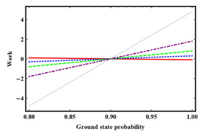 
Fig. 2: Work extracted as a function probabilitry distribution in ground state with difference in hot bath energy ∆h = 1 (red), 5 (blue), 10 (green), 20 (purple), 50 (grey).

📷 Fig 2

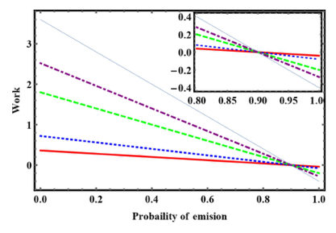 
Fig. 1: Work extracted form the thermal machine with γ = 0.1 (red), 0.2 (blue), 0.5 (green), 0.7 (purple), 1 (grey). Inset shows the magnified plot at f = 0.9.

📷 Fig 3

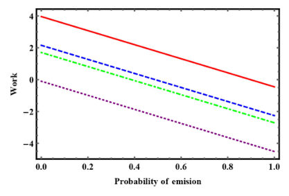 
Fig. 3: Work as function of probability of emission with pg = 0 (Dotted), 0.4 (Dot-Dashed), 0.5 (Dashed), 0.9 (Solid).

📷 Fig 4

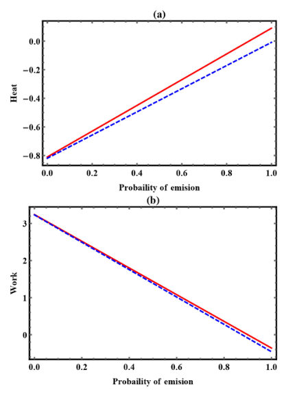 
Fig. 4: (a) Heat rejected for cyclic (solid), non-cyclic (dashed) as a function of probaility of emission. (b) Work done for cyclic (solid), non-cyclic (dashed).

📷 Fig 5

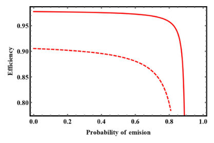 
Fig. 6: Efficiency for qubit (Solid) and qutrit (Dotted) system.

**Summary.** This paper analyzes how qubit and qutrit-based quantum heat engines perform when interacting with dissipative thermal environments. It demonstrates that multilevel qutrit systems offer superior work extraction and better resistance to decoherence than two-level qubits. The study highlights the trade-off between higher work output in qutrits and the potentially higher efficiency of qubits.

**Why it may be interesting.** This paper provides valuable insights into how increasing the dimensionality of a quantum system can be leveraged to improve the performance and resilience of quantum thermal machines against environmental noise.

Detailed structure

**Main problem.** Investigating work extraction and ergotropy in quantum heat engines (QHEs) under the influence of dissipative environments, specifically comparing the performance of qubit and qutrit working media.

**Main result.** Qutrit systems exhibit enhanced work extraction capability and greater robustness against decoherence compared to qubits, although qubits can achieve higher efficiency in certain regimes due to fewer dissipation channels.

**Method.** The study uses the Kraus operator formalism to model Generalized Amplitude Damping (GAD) channels and calculates thermodynamic quantities like work, heat, and ergotropy through density matrix evolution.

**Model / system.** The model consists of qubit (two-level) and qutrit (three-level) systems interacting with thermal reservoirs modeled via Generalized Amplitude Damping channels, involving unitary evolution stages and population redistribution.

**Key observables.** Work extraction (W), ergotropy, heat absorbed (Q1), heat rejected (Q2), population inversion, and efficiency.

**Important parameters / regimes.** Decoherence/damping parameter (gamma), emission probability (f), energy gaps (delta), and inverse temperatures (beta).

**Assumptions / limitations.** The GAD channel is assumed to preserve the diagonal structure of the density matrix, and the initial stage of the cycle assumes a unitary evolution that preserves populations.

**Figures summary.** Figures show work extraction as a function of emission probability and energy gaps, efficiency dependence on population distribution, and a comparison of ergotropy landscapes and difference maps between qubit and qutrit systems.

**Paper structure.** The paper introduces the QHE model, defines the GAD channel and system dynamics, presents the thermodynamic derivation for qubits, extends the analysis to qutrit systems, compares the two, and concludes with a discussion on robustness and efficiency.

Abstract

This paper explores quantum heat engines based on qubit and qutrit working media interacting with thermal environments through generalized amplitude damping (GAD) channels. We investigate how quantum channels can be employed to model heat absorption, dissipation, and work extraction in open quantum thermal machines, and derive the conditions required for positive work extraction. The effects of quantum correlations, emission probability, population redistribution, and system--environment interactions on the thermodynamic performance of the engine are systematically analyzed across different operational regimes. In addition, we examine the ergotropy of qubit and qutrit systems under dissipative dynamics to understand how environmental effects influence the maximum extractable work. Our results demonstrate that multilevel quantum systems exhibit enhanced work extraction capability and improved robustness against decoherence compared to two-level systems, providing further insight into the role of dissipative dynamics and quantum resources in realistic quantum thermodynamic devices.

[↑ back to top](#top)

### [Generalized quantum Stein's lemma for mixed sources](http://arxiv.org/abs/2605.20776v1)

**Authors:** Haruka Kanazawa, Hayata Yamasaki  
**Type:** theory · **Category:** quantum information and computing · **PDF:** <https://arxiv.org/pdf/2605.20776v1>  
**Analysis basis:** full PDF text, analyzed in chunks
**Topic relevance:** `entanglement & information structure` **2/5** · `quantum measurements` **2/5**

📷 Fig 1

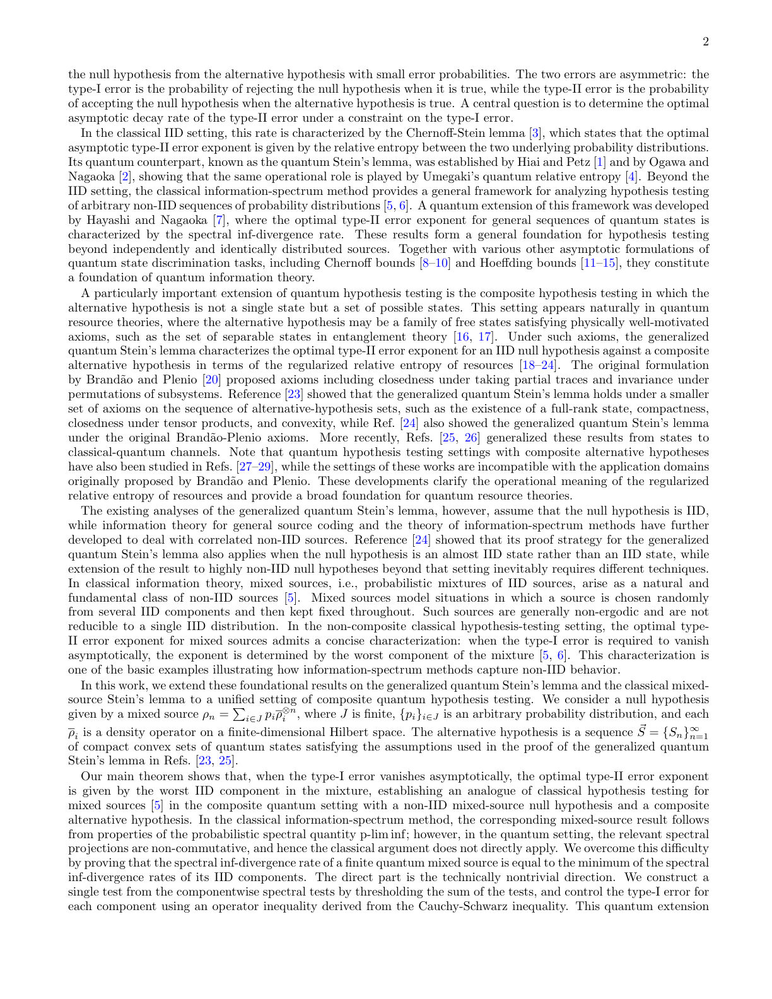 
Low-resolution page preview, page 2

📷 Fig 2

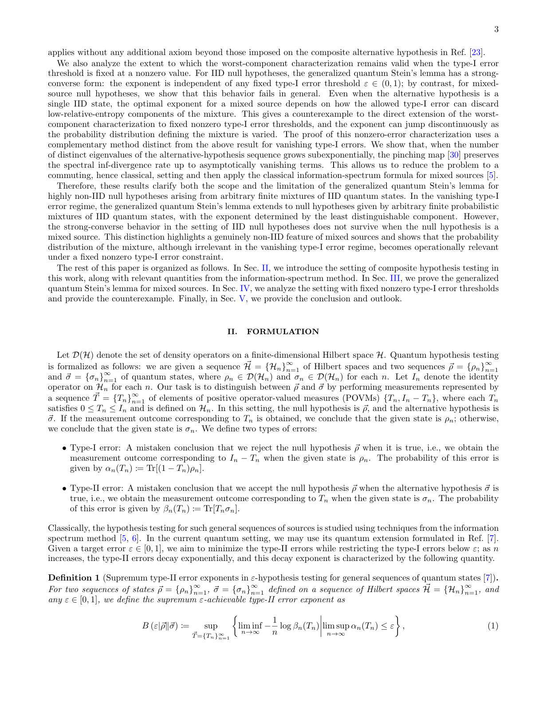 
Low-resolution page preview, page 3

📷 Fig 3

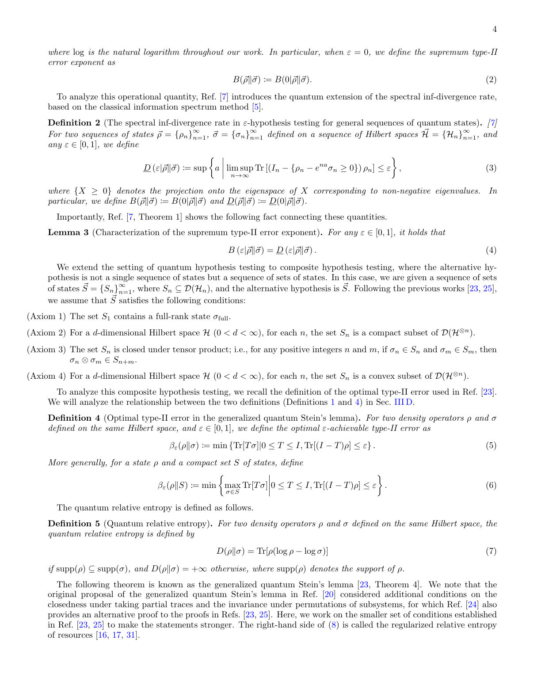 
Low-resolution page preview, page 4

📷 Fig 4

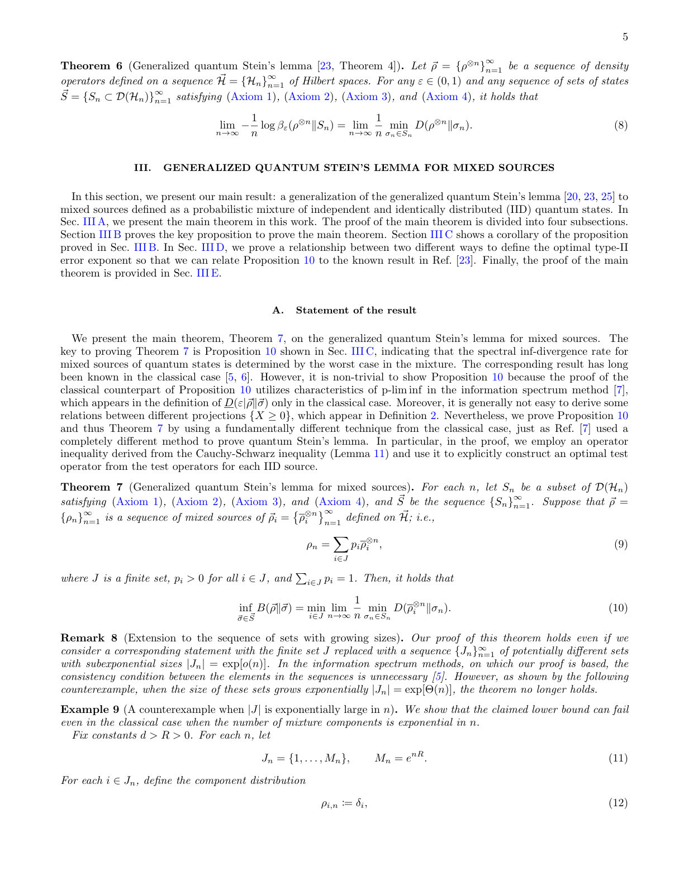 
Low-resolution page preview, page 5

📷 Fig 5

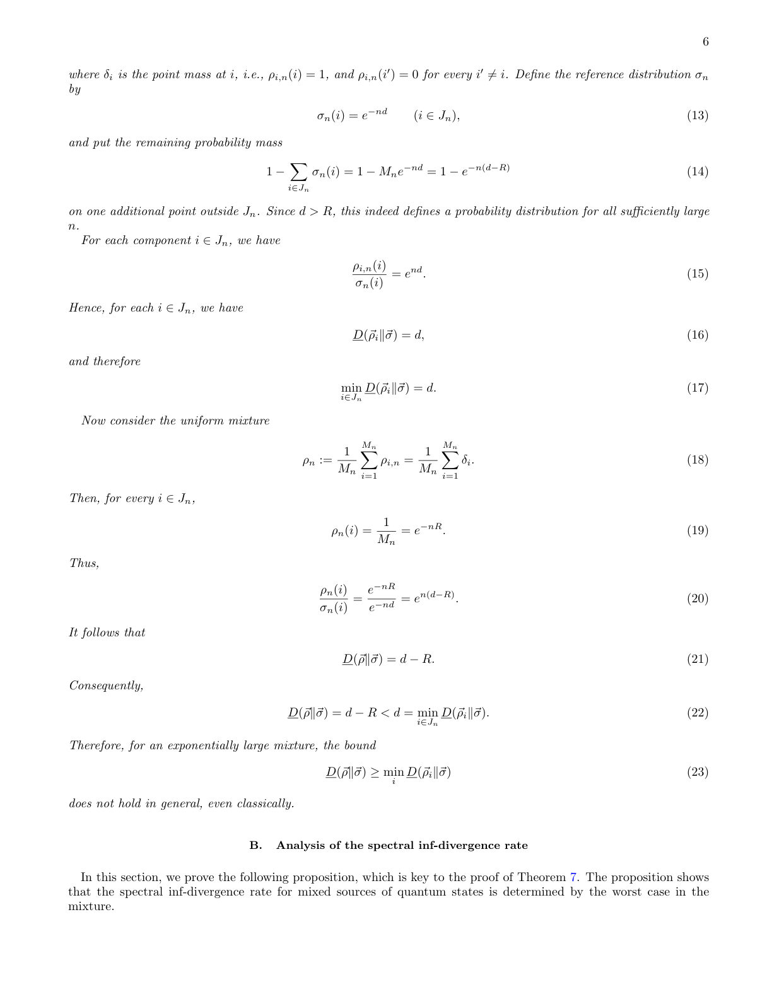 
Low-resolution page preview, page 6

**Summary.** This paper extends the quantum Stein's lemma to scenarios where the null hypothesis is a mixture of different IID quantum sources. It proves that while the error rate is determined by the hardest-to-distinguish component when the false alarm rate is zero, the specific weights of the mixture matter significantly when a fixed false alarm threshold is allowed.

**Why it may be interesting.** not directly relevant

Detailed structure

**Main problem.** The paper aims to generalize the quantum Stein's lemma to the case where the null hypothesis is a mixed source, specifically a finite probabilistic mixture of IID quantum states, and to determine the optimal asymptotic error exponents.

**Main result.** For vanishing type-I error, the optimal type-II error exponent is determined by the worst-case (least distinguishable) IID component in the mixture. However, for a fixed non-zero type-I error, this 'worst-component' characterization fails as the exponent becomes dependent on the mixture's probability distribution.

**Method.** The authors utilize quantum information-spectrum analysis, operator inequalities derived from the Cauchy-Schwarz inequality, and pinching maps to reduce non-commutative problems to commuting settings.

**Model / system.** The model involves quantum hypothesis testing between a null hypothesis consisting of a finite mixture of IID quantum states (rho_n = sum p_i * rho_i^n) and a composite alternative hypothesis consisting of sequences of compact convex sets of quantum states.

**Key observables.** Type-I error (alpha), Type-II error (beta), and the spectral inf-divergence rate.

**Important parameters / regimes.** The vanishing type-I error regime (epsilon = 0) versus the fixed non-zero type-I error regime (epsilon in (0, 1)), and the number of components in the mixture.

**Assumptions / limitations.** The results assume a finite number of components in the mixture and that the number of distinct eigenvalues in the alternative hypothesis grows subexponentially.

**Paper structure.** The paper introduces the problem of mixed-source hypothesis testing, proves the characterization of the error exponent for vanishing type-I error using spectral tests, provides a counterexample for the fixed type-I error regime, and uses pinching maps to analyze the non-commutative setting.

Abstract

The generalized quantum Stein's lemma characterizes the optimal asymptotic exponent of the type-II error in quantum hypothesis testing for an independent and identically distributed (IID) null hypothesis against a composite alternative hypothesis. Classically, a probabilistic mixture of IID sources arises as a natural generalization of IID sources, and, in the non-composite setting, the optimal type-II error exponent in hypothesis testing for such classical mixed sources is known to be characterized concisely by the worst-case component of the mixture. In this work, we extend these foundational results to composite quantum hypothesis testing where the null hypothesis is a mixed source, i.e., a probabilistic mixture of IID quantum states, and the alternative hypothesis is composite as in the generalized quantum Stein's lemma. When the type-I error vanishes asymptotically, we characterize the optimal type-II error exponent of this composite quantum hypothesis testing problem in terms of the worst-case component of the mixture, by developing techniques for the non-commutative quantum setting inspired by the classical information-spectrum analysis. We also show that the analogous characterization does not hold in general for a fixed nonzero type-I error threshold, by providing a counterexample beyond the vanishing type-I error regime. These results clarify the applicability of the generalized quantum Stein's lemma to highly non-IID null hypotheses arising from arbitrary finite probabilistic mixtures of IID quantum states.

[↑ back to top](#top)

### [Orbital-Angular-Momentum Entangled Photon Emission from Circular Currents in Semiconductor-Superconductor Structures](http://arxiv.org/abs/2605.20329v1)

**Authors:** Avi Koriat, Ankit Kumar, Alex Hayat  
**Type:** theory · **Category:** quantum information and computing · **PDF:** <https://arxiv.org/pdf/2605.20329v1>  
**Analysis basis:** full PDF text, analyzed in chunks
**Topic relevance:** `entanglement & information structure` **2/5** · `interference shaping light` **2/5**

📷 Fig 1

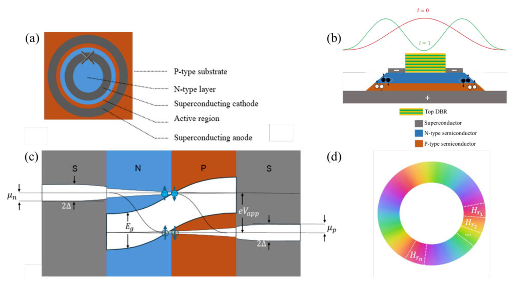 
FIG. 1 (a) Top view of the proposed structure with legend describing the different layers. (b) Side view of the structure with

📷 Fig 2

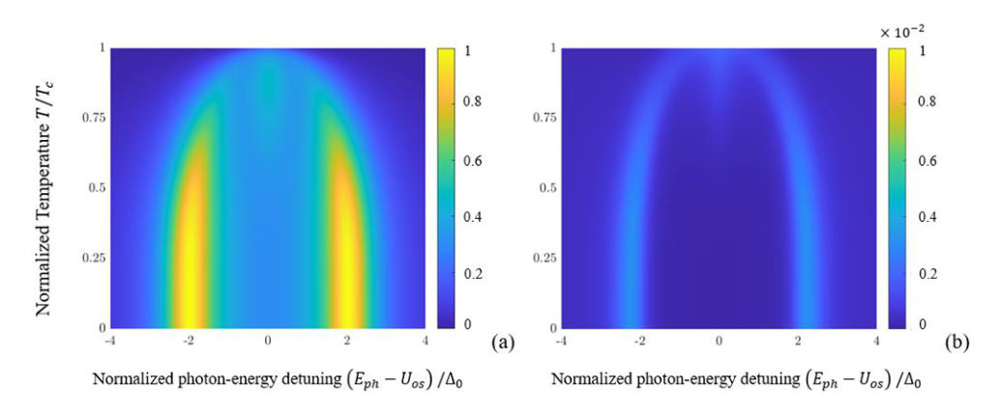 
FIG. 2 Two-photon rate as a function of photon-energy detuning and temperature; (a) For CP recombination process, and (b)

📷 Fig 3

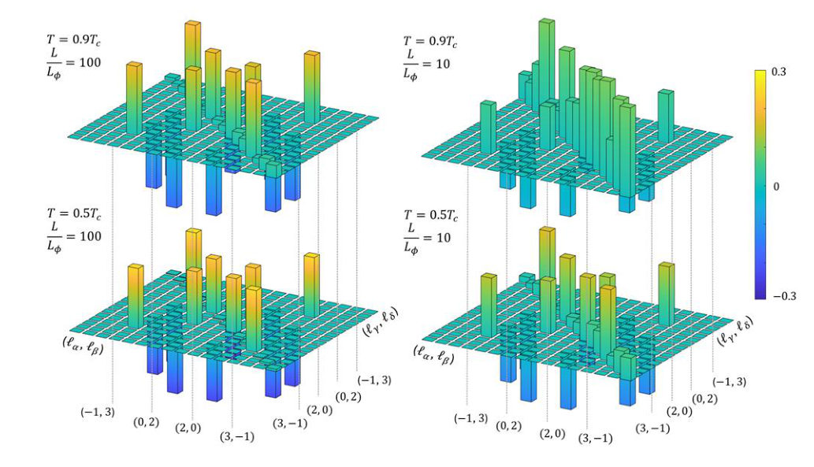 
FIG. 3 OAM density matrix 𝜌𝑙𝛼𝑙𝛽,𝑙𝛾𝑙𝛿 calculated for the case 𝑙𝑠= 2 with maximum detected OAM of |𝑙| = 3, (𝑚)𝛼,𝛽,𝛾,𝛿=

📷 Fig 4

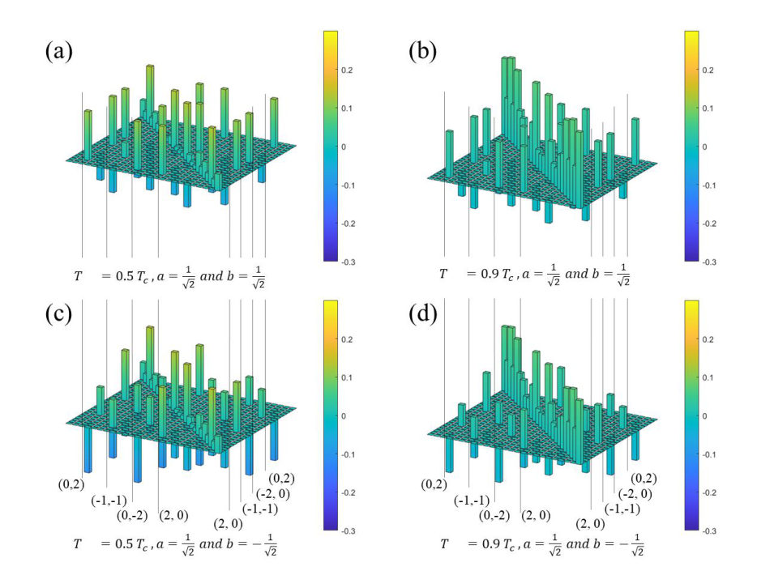 
FIG. 4 OAM density matrix 𝜌𝑙𝛼𝑙𝛽,𝑙𝛾𝑙𝛿 calculated for the superposition state |𝜓&gt; = 𝑎|↻&gt; +𝑏| ↺&gt;, with a maximum detected

📷 Fig 5

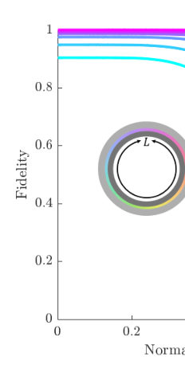 
FIG. 5 Fidelity between the emitted two-photon state and the two-photon Bell-state |𝜓𝑝ℎ⟩=

**Summary.** The paper theoretically demonstrates a method to generate OAM-entangled photon pairs from a superconducting LED by utilizing the spatial phase of a circular supercurrent. This mechanism allows for the direct mapping of superconducting qubit states onto photonic OAM modes, providing a potential interface for hybrid quantum networks.

**Why it may be interesting.** It proposes a novel mechanism for high-dimensional quantum state transfer between solid-state qubits and photonic modes, bridging the gap between superconducting circuits and quantum optics.

Detailed structure

**Main problem.** The need for a quantum interface to transfer quantum information from superconducting qubits (limited by local environment) to photonic channels (ideal for long-distance communication) using high-dimensional OAM encoding.

**Main result.** Demonstrated that a superconducting circular current can imprint its spatial phase onto emitted photon pairs, creating OAM-entangled photons that faithfully map the qubit's superposition state.

**Method.** Theoretical modeling using a combination of Ginzburg-Landau theory for the superconducting phase and BCS theory for the semiconductor recombination, utilizing Bogoliubov transformations and perturbation theory.

**Model / system.** A superconductor-semiconductor-superconductor (S-N-P-S) structure acting as a Superconducting LED (SLED), featuring a ring-shaped superconducting cathode and a disk-shaped anode with a p-n quantum well.

**Key observables.** Two-photon emission rate, OAM quantum numbers, photon-energy detuning, state purity, and Bell-state fidelity.

**Important parameters / regimes.** Winding number (ls), voltage bias (V), temperature (T/Tc), and the enhancement factor (L/Lphi) representing the ratio of device circumference to coherence length.

**Assumptions / limitations.** The model assumes a well-defined superconducting gap and relies on the ability to detect specific OAM modes; fidelity is sensitive to thermal excitations and gap narrowing.

**Figures summary.** Fig 1 shows the device architecture, side view with optical cavity, and band diagrams. Fig 2 displays the two-photon emission rate vs. detuning and temperature for CP and BQP processes. Fig 5 shows Bell-state fidelity as a function of temperature for different enhancement factors.

**Paper structure.** The paper introduces the scientific problem of platform bridging, describes the SLED device architecture and theoretical framework (GL and BCS), details the mathematical derivation of photon emission and OAM conservation, evaluates the impact of thermal quasiparticles on fidelity, and concludes with the implications for quantum communication.

Abstract

We theoretically demonstrate that a superconducting circular current induced in a semiconductor results in emission of orbital-angular-momentum (OAM) entangled photon pairs upon carrier recombination. Combining the macroscopic Ginzburg-Landau theory and the microscopic Bardeen-Cooper-Schrieffer (BCS) theory, we investigate the emission of a superconducting light-emitting diode (SLED) with a spatially varying phase profile in the superconducting order parameter. We show that in the active region of the SLED with a circular supercurrent, radiative recombination processes inherit the order parameter phase and result in photon pairs emitted into modes of different OAM quantum numbers. We demonstrate that coherent superposition of superconducting qubit eigenstates can also be mapped onto a coherent superposition of emitted photon states. We also show that other recombination processes due to thermally excited quasi particles do not significantly degrade the state purity. Our results introduce an original scheme for generating OAM-entangled photons enabling a new method of transmitting superconducting qubit information to photonic channels thereby bridging the gap between solid-state and photon-based platforms for quantum communications and information processing.

[↑ back to top](#top)

### [Decoy Statebased Time Synchronization](http://arxiv.org/abs/2605.20857v1)

**Authors:** Lukas Tiefenthaler, Hannah Thiel, Davide Rusca, Antia LamasLinares  
**Type:** both · **Category:** quantum information and computing · **PDF:** <https://arxiv.org/pdf/2605.20857v1>  
**Analysis basis:** full PDF text, analyzed in chunks
**Topic relevance:** `quantum optics experiment` **2/5** · `quantum measurements` **1/5**

📷 Fig 1

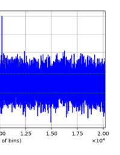 
Fig. 3. Normalized cross-correlation: A representative cross-correlation at a channel loss of -25 dB and a background rate of 𝑏𝑐𝑟= 1 · 104 Hz. The green dashed lines show the standard deviation of the cross-correlation. The block size used was 𝑛Alice = 1 · 106, and the quantum bit error rate (QBER) in this scenario was 21.1 %.

📷 Fig 2

 
Figure 4 shows the performance of the time synchronization as a function of the block size used. For the correct clock offset to be found successfully, Bob detects only a few hundred photons. With a channel loss of -25 dB and a backgroundrate of 𝑏𝑐𝑟= 1 kHz, the regime in which the clock recovery works reliably starts at a block size of 𝑛Alice = 5·105. To benchmark the robustness of the method, the performance of the clock synchronization is plotted as a function of the background rate in Fig. 5. Each simulation produces a binary result: 1 if the correct clock offset is identified and 0 otherwise. The performance score is obtained by averaging these binary outcomes over a centered sliding...

📷 Fig 3

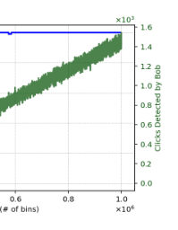 
Fig. 4. Cross-correlation performance as a function of block size: Simulated clock synchronization performance at a channel loss of -25 dB and a background rate of 𝑏𝑐𝑟= 1 kHz. The blue line shows the performance score of the clock synchronization, while the green curve shows the total detections by Bob.

📷 Fig 4

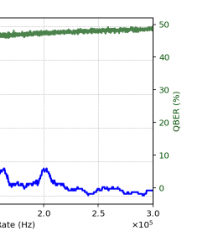 
Fig. 5. Cross-correlation performance as a function of background rate: Clock synchronization performance as a function of the background rate. The simulation is carried out at a channel loss of -25 dB and a block size of 𝑛Alice = 1 · 106. The blue line shows the performance score of the clock synchronization, while the green line represents the QBER.

📷 Fig 5

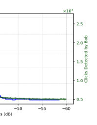 
Fig. 6. Cross-correlation performance as a function of channel loss: Clock synchronization performance as a function of channel loss. The blue line shows the performance score of the clock synchronization, while the green line represents the number of detections from Bob. Alice’s block size was 𝑛Alice = 5 · 107, with a background rate of 𝑑𝑐𝑟= 1 kHz and a maximum clock offset of ±3 ms.

**Summary.** This paper proposes a way to synchronize clocks in QKD systems by using the inherent randomness of the decoy states already present in the protocol. This eliminates the need for an extra classical channel, reducing the cost and complexity of quantum networks, especially for satellite-to-ground links.

**Why it may be interesting.** not directly relevant

Detailed structure

**Main problem.** Achieving precise clock synchronization between transmitter and receiver in QKD systems without the need for a dedicated classical physical channel, which is costly and increases system complexity.

**Main result.** The authors demonstrate a protocol-native synchronization method using existing decoy states that requires no protocol changes, and an enhanced method using bright pulses that extends synchronization capability to much higher channel losses (up to 59 dB).

**Method.** The method uses FFT-based cross-correlation of the random pattern of signal and decoy state intensities with the detected photon arrival times at the receiver.

**Model / system.** A simulated fiber-based and free-space QKD setup using the decoy-state BB84 protocol with time-bin encoding and weak coherent pulses at high repetition rates (up to 2.5 GHz).

**Key observables.** Photon arrival times, photon statistics, clock offset, Quantum Bit Error Rate (QBER), and synchronization performance score.

**Important parameters / regimes.** Mean photon numbers (signal vs. decoy), channel loss (up to 70 dB), repetition rate (up to 2.5 GHz), background rate, and detector dead time.

**Assumptions / limitations.** Assumes a 1-decoy or 2-decoy BB84 protocol where state intensity information is eventually made public; assumes frequency recovery (syntonization) is already addressed.

**Figures summary.** Fig 1 shows state encoding; Fig 2 illustrates the pulse sequence; Fig 6 shows cross-correlation performance vs. loss; Fig 7 shows the modified protocol with bright pulses; Fig 8-10 show the impact of bright pulse brightness and probability on performance.

**Paper structure.** The paper introduces the synchronization problem, proposes a protocol-native method using existing decoy states, introduces an enhanced method using bright pulses for high-loss scenarios, provides simulation results for both, and compares the performance against existing synchronization techniques.

Abstract

Time synchronization is a crucial requirement in quantum key distribution (QKD)8 protocols, ensuring accurate key generation via the correct assignment of bits of raw key and9 enabling eavesdropping detection via the precise recording of photon statistics. State-of-the-art10 experiments typically use an extra channel to synchronize the clocks of the transmitter and receiver11 via classical signals. In this work, we study the possibility of performing clock synchronization12 via the signals used for the key generation, which are already present in decoy-state-based BB8413 protocols.14 Without altering the protocol in any way, we use the different mean photon numbers of the15 signal and decoy states for time synchronization without a dedicated physical channel capable of16 clock synchronization. The proposed method relies only on the photons sent and received for17 key generation and does not require any change to the QKD protocol. The only change in the18 experiment is on the software level, thus making it very simple to implement.19 We demonstrate clock synchronization method in a simulation of a specific fiber-based QKD20 experiment. Like other decoy-state-based BB84 protocols, it is based on weak coherent pulses.21 In this simulation, we investigate the parameter space to find limits and optimal choices of our22 proposed method.23 In addition to the non-protocol-altering clock synchronization method, we also discuss an24 approach that significantly improves performance in lossy channels by introducing an additional25 decoy state with a very high mean photon number.26 By eliminating the need for an extra channel capable of clock synchronization, both methods27 proposed potentially reduce the complexity and cost of QKD systems and improve their agility

[↑ back to top](#top)

### [A Simple GPU-Accelerated Solver for the Schrödinger Operator with Applications to Ground States and Hamiltonian Simulation](http://arxiv.org/abs/2605.20491v1)

**Authors:** Xinyu Liu, Xiangxiong Zhang  
**Type:** theory · **Category:** numerical methods · **PDF:** <https://arxiv.org/pdf/2605.20491v1>  
**Analysis basis:** full PDF text, analyzed in chunks
**Topic relevance:** `analog quantum simulation` **2/5**

📷 Fig 1

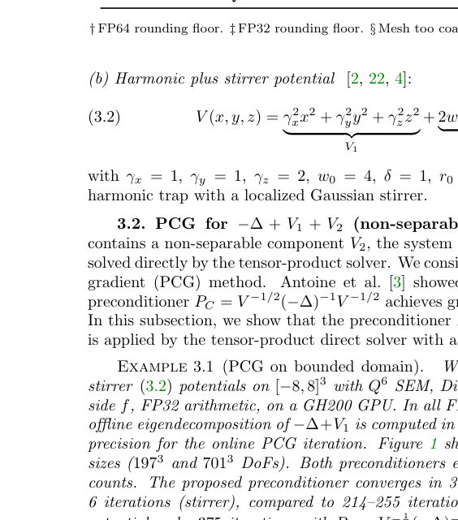 
Figure 1 also shows that the performance of the preconditioner (−∆+ V1)−1 is independent of both the domain size L and the mesh size h for the stirrer potential, while for the quartic potential, the iteration count grows with L.

📷 Fig 2

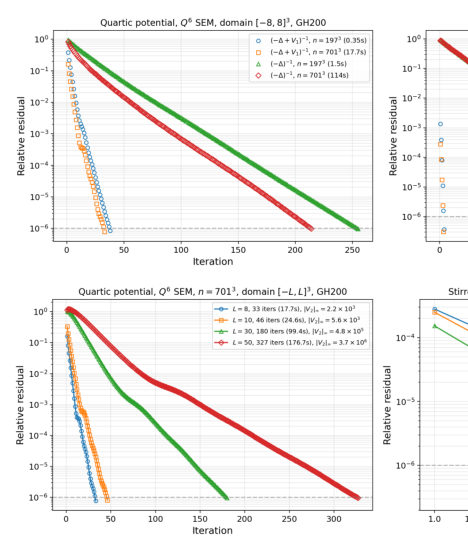 
Fig. 1. PCG convergence (relative residual vs. iteration) for (−∆+ V1 + V2) u = f, Q6 SEM, FP32, GH200. Top row: quartic potential (3.1) (left) and stirrer potential (3.2) (right), both at n = 7013, comparing the proposed preconditioner (−∆+ V1)−1 with the (−∆)−1 or PC. Bottom row: domain dependence of (−∆+ V1)−1 for the quartic potential (left, L = 8, 10, 30, 50) and the stirrer potential (right, L = 8, 10, 100). Total GPU time for each case is shown in the legend.

📷 Fig 3

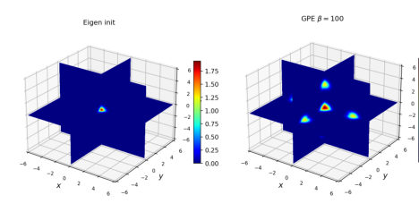 
Fig. 2. Cross-sections of u at x=0, y=0, z=0, plotted on [−6, 6]3. Q20 SEM, 1993 DoFs, computed on [−8, 8]3. Each panel uses its own color scale. Left: eigenfunction initial guess (linear ground state, β=0). Center: GPE ground state, β=100. Right: GPE ground state, β=1600.

📷 Fig 4

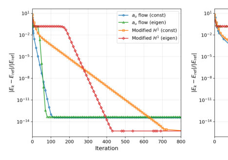 
Fig. 3. Comparison of au flow and modified H1 flow for β = 100, Q20 SEM, 5993 ≈2.1 × 108

📷 Fig 5

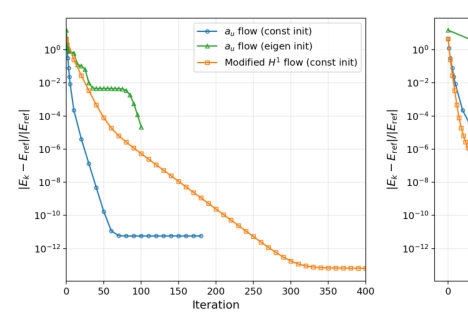 
Fig. 4. Comparison of au flow and modified H1 flow for β = 1600, Q20 SEM, 9993 ≈109

**Summary.** The paper introduces a highly efficient GPU-accelerated solver for the Schrödinger operator that scales exceptionally well to billions of degrees of freedom. By using a tensor-product preconditioner, the authors enable rapid ground state computation and Hamiltonian simulation for complex, non-separable, and high-dimensional quantum systems.

**Why it may be interesting.** This work provides a highly scalable computational framework for simulating many-body quantum dynamics and Bose-Einstein condensates, enabling the study of high-dimensional systems (up to 9D) that were previously computationally inaccessible.

Detailed structure

**Main problem.** Developing an efficient, GPU-accelerated solver for the Schrödinger operator, specifically addressing the loss of tensor-product structure when dealing with non-separable potentials.

**Main result.** The authors present a solver that achieves $O(N^{1+1/d})$ complexity and can invert operators with $10^9$ degrees of freedom in under one second on an NVIDIA A100. They also prove that the proposed preconditioner ensures grid-independent convergence and a bounded condition number.

**Method.** A tensor-product direct solver using per-axis eigendecomposition for separable potentials, combined with a Preconditioned Conjugate Gradient (PCG) method using the separable part as a preconditioner for non-separable potentials. The implementation uses the Spectral Element Method (SEM) and JAX on NVIDIA GPUs.

**Model / system.** The Schrödinger operator $H = -\Delta + V$, including separable and non-separable potentials, the Gross-Pitaevskii equation (GPE), and multi-body Coulomb Hamiltonians in 4D, 6D, and 9D.

**Key observables.** Ground state energy, eigenvalues, wavefunction profiles, and inter-particle correlations.

**Important parameters / regimes.** Dimension $d$, nonlinearity strength $eta$, mesh size $h$, domain size $L$, and the Coulomb singularity regularization parameter $\delta$.

**Assumptions / limitations.** The potential $V$ can be split into a separable part $V_1$ and a bounded non-separable part $V_2$; domains are primarily rectangular with homogeneous Dirichlet boundary conditions.

**Figures summary.** Figures show PCG convergence for various potentials, the evolution of ground state profiles as nonlinearity increases, and visual slices of particle densities in 6D and 9D systems.

**Paper structure.** The paper introduces the extension of the tensor-product solver to the Schrödinger operator, provides mathematical proofs for spectral clustering and preconditioner effectiveness, demonstrates high-performance GPU implementation, and applies the method to ground state computation (GPE) and high-dimensional Hamiltonian simulation.

Abstract

We extend the tensor-product direct solver from the Laplacian to the Schrödinger operator $-Δ+ V$. When the potential $V_1$ is separable, the operator $-Δ+ V_1$ is inverted or exponentiated at cost $O(N^{1+1/d})$ in $d$ dimensions via per-axis eigendecomposition. On a single NVIDIA A100 GPU, this costs less than one second for $10^9$ degrees of freedom in 3D. For non-separable potentials $V = V_1 + V_2$, the same solver provides a preconditioner $(-Δ+ V_1)^{-1}$ for the preconditioned conjugate gradient (PCG) method and a propagator for operator-splitting time integrators. For bounded $V_2$, we prove that the preconditioned operator has a bounded condition number and a clustered spectrum with at most finitely many outlier eigenvalues, independently of the mesh size, and also independently of the domain size when $V_1$ is a confining potential. This explains the mesh- and domain-independent PCG iteration counts observed in practice. We apply this method to ground state computation via inverse iteration for linear problems and via the $a_u$ gradient flow for Gross--Pitaevskii energy in 3D, and also Hamiltonian simulation via the approximated qHOP and Magnus-2 splitting methods from 3D to 9D on a single NVIDIA GH200 GPU.

[↑ back to top](#top)

### [Carrier-doping effect and anomalous transport properties in Ni-doped CeCoIn5 investigated by Hall resistivity measurements](http://arxiv.org/abs/2605.20685v1)

**Authors:** Ryosuke Koizumi, Hayao Fujimoto, Teppei Takahashi, Azumi Yashiro, Haruna Kawakami, Kazuki Ishii, Hinako Kosaka, Takeshi Hasegawa, Yusei Shimizu, Ai Nakamura, Dai Aoki, Kenichi Tenya, Makoto Yokoyama  
**Type:** experiment · **Category:** strongly correlated electrons · **PDF:** <https://arxiv.org/pdf/2605.20685v1>  
**Analysis basis:** full PDF text, analyzed in chunks
**Topic relevance:** `Kondo & dissipative impurity` **2/5**

📷 Fig 1

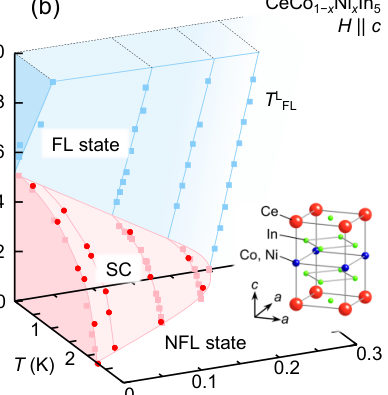 
FIG. 1. (a) Comparison of nominal (x) and actual (x′) Ni concentrations measured by the inductively coupled plasma mass spectrometry measurements. The experimental errors in the actual Ni concentration are smaller than the size of the markers, except at x = 0.3. (b) The H-T-x phase di- agram of CeCo1−xNixIn5 constructed using Hall resistivity data (circle markers), and previous electrical resistivity and magnetization data (square markers) for H ∥c [20, 53, 56]. T L FL denotes the crossover temperature between non-Fermi liquid (NFL) and Fermi liquid (FL) regions, estimated from the temperature dependence of the electrical resistivity ρ(T) [56]. The inset in Panel (b) shows the crystal...

📷 Fig 2

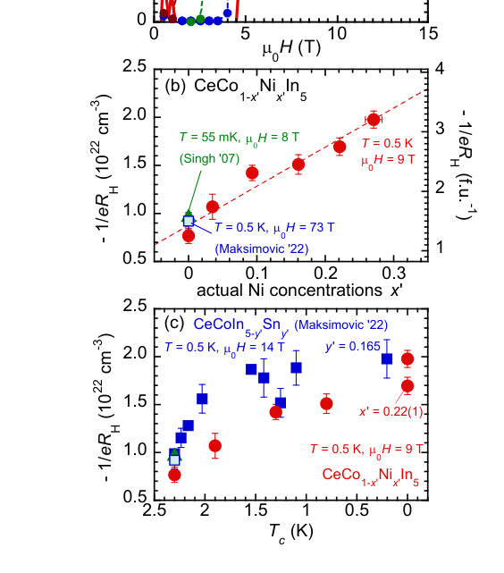 
FIG. 3. (a) The dependence of the Hall coefficient RH(H) on magnetic field and (b) the dependence of −1/eRH (e: elemen- tary charge) on the actual Ni concentration x′ at µ0H = 9 T and T = 0.5 K for CeCo1−xNixIn5, with x ≤0.3. In Panel (b), the left axis represents the values of −1/eRH per unit volume, while the right axis displays the values per formula unit. The dashed line indicates the fitting result of −1/eRH at µ0H = 9 T and T = 0.5 K. (c) −1/eRH at T = 0.5 K for CeCo1−x′Nix′In5 (µ0H = 9 T) and CeCoIn5−y′Sny′ (µ0H = 14 T) [60] plotted as a function of Tc, with actual concen- tration x′ and y′ as implicit parameters. The data for pure CeCoIn5 are taken from Refs. [14, 60] in Panels (a),...

📷 Fig 3

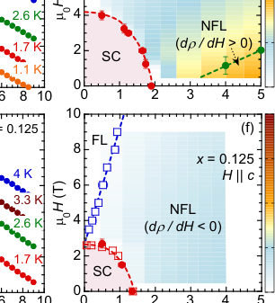 
FIG. 5. The magnetic field dependence of the electrical resis- tivity ρ(H) for CeCo1−xNixIn5, with (a) x = 0, (c) x = 0.04, and (e) x = 0.125. The arrows in Panels (a) and (c) indicate the field Hmax at which ρ(H) reaches a maximum. The H-T phase diagram of CeCo1−xNixIn5 for (b) x = 0, (d) x = 0.04, and (f) x = 0.125, constructed using current electrical resis- tivity data (closed circle markers) and the previous electrical resistivity data (open square markers) [20, 56]. T L FL is defined as the temperature where the electrical resistivity deviates from the T 2 behavior characteristic of the FL state. In Pan- els (b), (d), and (f), the color plots represent the magnitude of the Hall...

**Summary.** This paper demonstrates that Ni-doping in the heavy-fermion superconductor CeCoIn5 increases the electron carrier density and suppresses anomalous transport properties. The findings suggest that Ni modifies the electronic band structure rather than acting as a simple impurity, and that the suppression of Hall anomalies is decoupled from the quantum critical point at the upper critical field.

**Why it may be interesting.** not directly relevant

Detailed structure

**Main problem.** The study investigates how Ni-doping affects carrier density and the anomalous Hall resistivity features in the heavy-fermion superconductor CeCoIn5.

**Main result.** Ni-doping acts as an electron dopant that increases carrier density and suppresses the anomalous enhancement of the Hall coefficient near the upper critical field and in the low-field region.

**Method.** Hall resistivity and electrical resistivity measurements were performed on CeCo1-xNixIn5 single crystals using a PPMS across various temperatures and magnetic fields.

**Model / system.** The physical system is the heavy-fermion superconductor CeCo1-xNixIn5 (x <= 0.3), a compensated multi-band metal with a tetragonal structure exhibiting superconducting, non-Fermi liquid, and Fermi liquid phases.

**Key observables.** Hall coefficient (RH), Hall resistivity, carrier density (n), electrical resistivity (rho), and temperature derivatives of resistivity.

**Important parameters / regimes.** Ni concentration (x), temperature (T), magnetic field (H), and the crossover temperatures between NFL and FL states.

**Assumptions / limitations.** The estimation of carrier density assumes the high-field, low-temperature limit (0.5 K, 9 T) isolates the normal electronic contribution from anomalous terms.

**Figures summary.** Fig 1 shows Ni concentration agreement and the H-T-x phase diagram; Fig 2 displays the temperature dependence of RH and phase diagrams; Fig 3 shows RH field dependence and carrier density vs. Ni concentration; Fig 4 shows the suppression of RH anomalies with increasing x.

**Paper structure.** The paper introduces the Ni-doped CeCoIn5 system, details the experimental methods and sample characterization, presents the temperature and field dependence of Hall and resistivity data, analyzes the evolution of carrier density, and discusses the physical mechanisms behind the suppression of transport anomalies.

Abstract

We investigated the effects of Ni doping on carrier density and anomalous electrical transport properties in CeCo$_{1-x}$Ni$_x$In$_5$ ($x \leq 0.3$) by performing Hall resistivity measurements. The carrier density, estimated from the Hall coefficient $R_{\rm H}$ at a temperature of 0.5 K in high magnetic fields, increases linearly with $x$, indicating that the doped Ni ions act as electron dopants. In CeCoIn$_5$, the magnitude of $-R_{\rm H}$ is strongly enhanced at magnetic fields near the superconducting upper critical field $H_{c2}$ and in the low-field region above the superconducting transition temperature $T_c$. However, these anomalies are found to be significantly suppressed by Ni doping. Possible origins of this suppression in $-R_{\rm H}$ are discussed.

[↑ back to top](#top)

### [Combining non-parametric quantum states and MERA tensor networks for ground-state optimization](http://arxiv.org/abs/2605.21447v1)

**Authors:** Julian Schuhmacher, Alberto Baiardi, Francesco Tacchino, Ivano Tavernelli  
**Type:** theory · **Category:** numerical methods · **PDF:** <https://arxiv.org/pdf/2605.21447v1>  
**Analysis basis:** full PDF text, analyzed in chunks
**Topic relevance:** `entanglement & information structure` **2/5**

📷 Fig 1

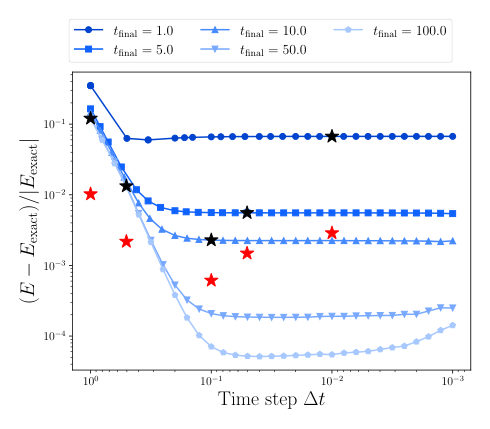 
FIG. 1: Relative energy error of a quantum circuit implementing the annealing for a system with N = 24 sites via a Trotter decomposition. For large time steps ∆t, the energy error is mainly due to the Trotter error. For small time steps ∆t, the Trotter error is small enough such that the energy error saturates at a finite, limiting value due to the finite annealing time tfinal. The black stars highlight the combination of final time tfinal and time-step ∆t, that results in the quantum circuit with the closest two-qubit gate depth to 200. The red stars represent the error obtained using the quantum state obtained by using the resulting quantum circuit within our proposed hybrid MERA, and by...

📷 Fig 2

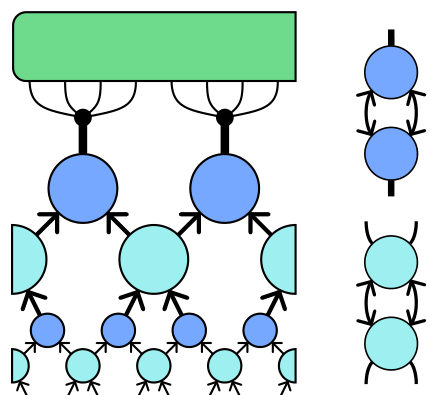 
FIG. 2: Hybrid MERA tensor network consisting of a quantum tensor (green), and two layers of the MERA. The black dots represent the fusion of the involved legs of the quantum tensor. The isometries in the MERA layers are highlighted in blue, while the unitaries are highlighted in teal. We use periodic MERA layers, which is depicted by the half-spheres for the unitaries at the edges. The contraction of the isometries and the unitaries with their respective complex conjugate over the legs with incoming arrows yields the identity, as shown in the figures on the right. The thickness of the bonds increases with their dimension.

📷 Fig 3

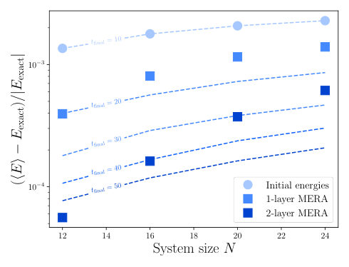 
FIG. 3: Ground-state energy obtained from quantum annealing (light blue circles) and subsequent improvement for a MERA with 1 (blue squares) and 2 (dark blue squares) layers for different system sizes N. The dashed line represent the energy obtained from quantum annealing with different final times tfinal.

📷 Fig 4

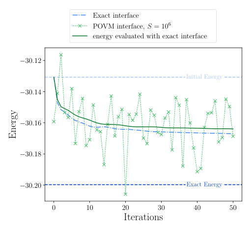 
FIG. 5: Optimization of a hybrid MERA applying a classical shadow interface to extract a classical representation of the QA state, and to contract it with the classical MERA layers. The dashed light (dark) blue line shows the QA (exact) energy. The dash-dotted blue line shows the energy optimization of the hybrid MERA when the interface is implemented exactly. The green lines show the energy optimization of the hybrid MERA when the classical shadow interface is used. For reference, the green solid lines show there energy of the hybrid MERA evaluated with the exact interface, using the MERA parameters obtained with the classical shadows.

📷 Fig 5

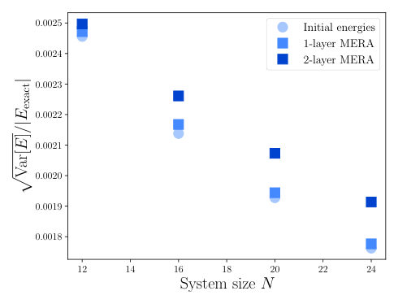 
FIG. 4: Variance of the energies obtained in figure 3 evaluated with S = 105 POVM samples for the state generated with QA (light blue circle), and for the same state combined with an optimized MERA with 1 (blue squares) and 2 (dark blue squares) layers.

**Summary.** The paper introduces a new hybrid tensor network method that uses classical shadows to connect a fixed quantum state from quantum annealing to a variationally optimized MERA network. This approach improves ground-state energy accuracy for the transverse-field Ising model without increasing quantum circuit depth. The method is shown to be robust against both shot noise and simulated hardware noise, offering a practical path toward quantum utility.

**Why it may be interesting.** This work is highly relevant for many-body dynamics and numerical methods as it provides a scalable strategy to bridge quantum hardware outputs with classical tensor network power, specifically addressing the bottleneck of state tomography and the barren plateau problem in hybrid algorithms.

Detailed structure

**Main problem.** The difficulty of efficiently representing many-body quantum wavefunctions in higher dimensions and the high resource overhead/trainability issues associated with optimizing the quantum components of hybrid tensor networks.

**Main result.** The proposed hybrid approach, combining non-parametric quantum annealing states with classical MERA, improves ground-state energy accuracy without increasing circuit depth and remains robust against both statistical and hardware noise.

**Method.** A hybrid architecture using classical shadows to interface a fixed quantum state (prepared via digital quantum annealing) with a variationally optimized classical MERA tensor network, optimized via Riemannian gradient descent.

**Model / system.** The transverse-field Ising model (TFIM) on 1D spin chains of up to 24 sites, implemented via second-order Trotterized quantum annealing.

**Key observables.** Ground-state energy approximation (relative energy error), energy variance, and operator locality/weight.

**Important parameters / regimes.** Annealing time (t_final), Trotter step size (delta t), MERA bond dimension (chi), number of MERA layers (l), and hardware noise scaling factor (eta).

**Assumptions / limitations.** The quantum annealing process assumes the system remains in the instantaneous ground state (adiabatic approximation), and the accuracy is inherently limited by the quality of the initial non-parametric state.

**Figures summary.** Figure 1 shows energy error vs. Trotter step; Figure 2 depicts the hybrid MERA architecture; Figure 3 compares energy reduction across system sizes; Figure 4 analyzes energy estimator variance; Figure 5 shows optimization trajectories; Figure 6 demonstrates robustness to hardware noise; Figure 7 shows the quantum circuit; Figure 8 shows operator locality transitions; Figure 9 shows variance by Pauli string weight; Figure 10 compares optimization protocols and bias.

**Paper structure.** The paper introduces the hybrid architecture, describes the quantum annealing and MERA components, details the classical shadow interface and Riemannian optimization, presents numerical results on energy accuracy and noise robustness, analyzes the impact of MERA on operator locality and variance, and concludes with a discussion on resource estimation and optimization bias.

Abstract

Hybrid tensor networks offer a promising route to enhance the expressivity of classical tensor network methods by incorporating quantum states prepared on a quantum computer. Existing approaches are limited by the variational optimization of the quantum component of the tensor network. In this work, we introduce an alternative strategy that combines a non-parametric quantum state prepared through quantum annealing and a classical isometric tensor network. The latter is variationally optimized while the former is used as a fixed, boundary tensor resource in the form of classical shadows. We demonstrate the feasibility of this approach through extensive numerical simulations on the transverse-field Ising model, showing that the optimization procedure remains robust under statistical and hardware noise. Moreover, our results indicate that our newly proposed setup improves the accuracy of the obtained ground state approximation compared to the original quantum simulation, without increasing the depth of the applied quantum circuits. Therefore, this setup offers a practical route to scale variational quantum algorithms towards the quantum utility scale.

[↑ back to top](#top)

### [Dynamical systems on ultra small-world networks](http://arxiv.org/abs/2605.21364v1)

**Authors:** Nirbhay Patil, Ada Altieri, Fabian Aguirre-Lopez  
**Type:** theory · **Category:** disordered systems and neural networks · **PDF:** <https://arxiv.org/pdf/2605.21364v1>  
**Analysis basis:** full PDF text, analyzed in chunks
**Topic relevance:** `non-equilibrium dynamics` **2/5**

📷 Fig 1

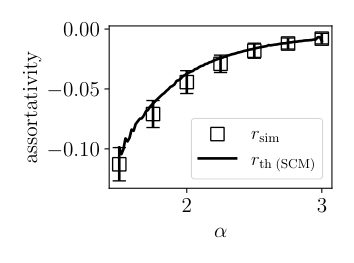 
Figure 1: The constraint that any node can have no more than N connections causes highly heteroge- neous networks to have non-trivial correlations, with a non-zero assortativity coefficients r without being constructed specifically to be assortative. Here we show that networks simulated for varying values of the pareto exponent α with fixed N = 4000 and C = 30 are forcibly negatively assorted. The theoretically ex- pected value of the assortativity is 0 if calculated using the statistically independent edge probability function Plin = km/CN, but including the effect of the hidden degrees PSCM(˜k(k), ˜m(m)) we are able to theoretically take into consideration this assortativity.

📷 Fig 2

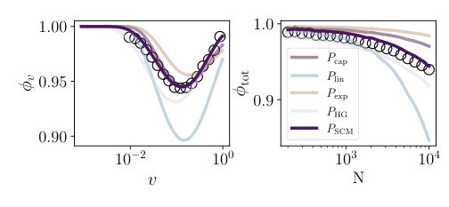 
Figure 2: We compare the predicted survival rate for the various assumptions of the joint distribution func- tion P(k, m) with α = 1.5, µ = −0.1, and σ = 0.3. On the left we plot the survival rate as a function of connectance v = k/N for C = 26, and N = 1162. On the right we show the total survival rate as a function of the system size, while varying C ∝ √

📷 Fig 3

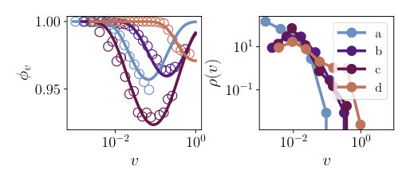 
Figure 3: Survival probabilities (left) as a function of connectivity v for µ = −0.1, σ = 0.3 for different networks obtained from [45]. The distributions of the connectances ρ(v) are given on right, and correspond to data from [41–44] in order from (a) to (d). Two of these were asymmetric/directed networks, for which we retained half the edges and made them undirected. The four networks have sizes N(a) = 1133, N(b) = 700, N(c) = 453, and N(d) = 434, with average degree C(a) = 9.6, C(b) = 18.3, C(c) = 9, and C(d) = 70.2. A power-law fit for each would give exponents α(a) = 1.18, α(b) = 0.46, α(c) = 0.66, and α(d) = 0.24.

📷 Fig 4

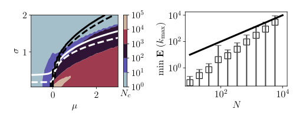 
Figure 4: On the left we plot the value of the system size Nc beyond which any stable system would neces- sarily have degrees of the same order as Nc for a power- law pareto exponent α = 1.5. This highlights the im- portance of degree correlations in different regimes of the phase space for different values of the system size. The dashed lines are the instability predictions to mul- tiple equilibria (white) and unbounded growth (black) without considering degree correlations, while the solid lines are the theoretical predictions including degree correlations. On the right we show for one set of values µ = −0.1, σ = 0.3 and α = 1.5, the maximum degree expected from a system where we set C to...

📷 Fig 5

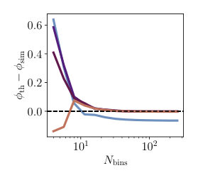 
Figure 5: For real networks, the theoretical results converge quite quickly, giving the same results for any Nbins &gt; 30.

**Summary.** This paper introduces a new theoretical framework to study dynamics on ultra small-world networks by accounting for the degree correlations caused by structural cut-offs. By mapping observed degrees to hidden degrees, the authors successfully predict species survival and stability in highly heterogeneous networks, showing much better agreement with simulations and real-world data than previous models.

**Why it may be interesting.** not directly relevant

Detailed structure

**Main problem.** Standard Heterogeneous Dynamical Mean-Field Theory (HDMFT) fails in 'ultra small-world' networks because it cannot account for the structural cut-offs and degree correlations (disassortativity) that arise in highly heterogeneous, finite-size networks.

**Main result.** The authors developed a framework using a Soft Configurational Model to map observed degrees to 'hidden degrees,' allowing for accurate prediction of species survival rates and stability in highly heterogeneous networks.

**Method.** The study employs Heterogeneous Dynamical Mean-Field Theory (HDMFT) combined with a maximum entropy ensemble (Soft Configurational Model) and generating functional analysis to derive effective single-species stochastic dynamics.

**Model / system.** The system is a Generalized Lotka-Volterra (GLV) model on highly heterogeneous, power-law distributed networks, where species interactions are stochastic and include competition or mutualism.

**Key observables.** Species survival rates, species abundance distributions, and linear stability of the equilibrium solutions.

**Important parameters / regimes.** Power-law exponent (alpha), mean interaction strength (mu), disorder strength (sigma), reciprocity (gamma), and average connectivity (C).

**Assumptions / limitations.** The theory assumes a sufficiently large average degree (C) to neglect higher-order terms in 1/C and uses a mapping between hidden and observed degrees to handle structural constraints.

**Figures summary.** Figure 1 shows how structural constraints force negative assortativity; Figure 2 compares survival rate predictions across different joint distribution assumptions; Figure 3 validates the theory against real-world networks; Figure 4 identifies critical system size for stability; Figure 5 demonstrates numerical convergence of the theory.

**Paper structure.** The paper introduces the failure of existing HDMFT in ultra small-world regimes, proposes a new framework using hidden degrees via the Soft Configurational Model, derives the effective single-species dynamics and stability conditions, and validates the approach using both simulated power-law networks and empirical real-world networks.

Abstract

Despite the knowledge that social, economical, and ecological networks are often of a small-world nature with inter-nodal distance growing even slower than logarithmically with system size, we often assume theoretical systems to be outside of this regime, to make them easier to treat analytically. Here we derive a framework to apply the powerful dynamical mean-field theory on highly heterogeneous networks that is able to account for more of the degree correlations naturally arising from network constraints, known as structural cut-offs. We apply this framework to the well-studied and understood disordered Lotka-Volterra model, and show typically reported observables such as survival rates and stability for these systems on ultra small-world networks. We find much better agreement for these variables for all ranges of exponents for simulated power-law networks as well as empirically sourced networks.

[↑ back to top](#top)

### [Equilibrium and dynamics of a three-state opinion model on a network of networks](http://arxiv.org/abs/2605.20979v1)

**Authors:** Irene Ferri, Albert Díaz-Guilera, Hiroki Sayama  
**Type:** theory · **Category:** statistical mechanics · **PDF:** <https://arxiv.org/pdf/2605.20979v1>  
**Analysis basis:** full PDF text, analyzed in chunks
**Topic relevance:** `non-equilibrium dynamics` **2/5**

📷 Fig 1

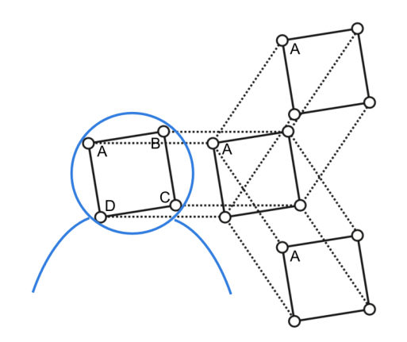 
FIG. 1. Representation of four agents with a 4-node ring- shaped internal belief topology and socially connected form- ing a star. Modified from [8].

📷 Fig 2

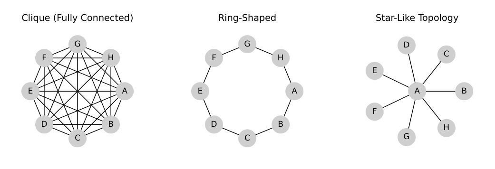 
FIG. 2. Illustration of the three network topologies used to model belief systems with a number of internal beliefs c = 10.

📷 Fig 3

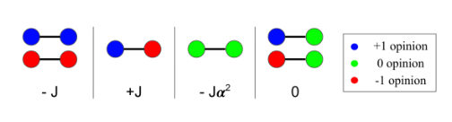 
FIG. 3. Contribution of a pair of interacting agents to the energy of the system.

📷 Fig 4

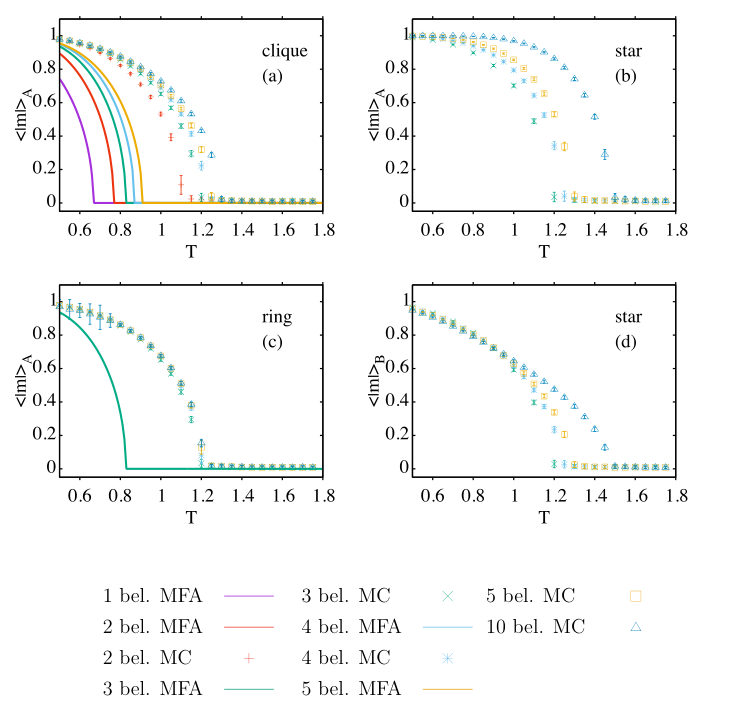 
FIG. 4. Magnetization curves for a particular belief as a function of temperature for each internal topology and different numbers of internal beliefs. Results obtained with MC simulations for a system of N = 104 agents, neutrality parameter α = 0, averaged over 100 repetitions with c · 104 MC steps. Comparisons with MFA results are shown for the clique and the ring.

📷 Fig 5

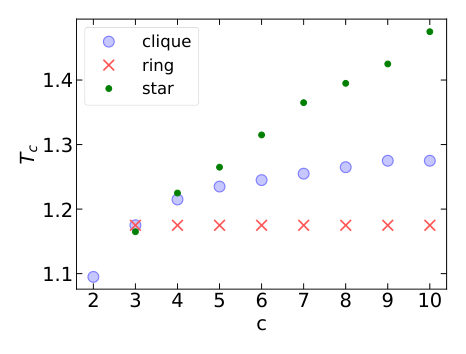 
FIG. 5. Critical temperature versus number of beliefs when α = 0 for the clique (blue circles), the ring (red crosses), and the star-like (green dots) agent types. Results obtained averaging 100 repetitions with systems of N = 104 agents.

**Summary.** This paper explores a multi-scale opinion model where agents possess their own internal networks of beliefs. It demonstrates that the internal arrangement of these beliefs (e.g., star vs. ring) fundamentally changes how social consensus or polarization emerges at different temperatures and neutrality levels.

**Why it may be interesting.** not directly relevant

Detailed structure

**Main problem.** Investigating how the internal topology of an individual's belief system (the organization of interconnected beliefs) influences collective opinion formation, social consensus, and phase transitions in a network of networks.

**Main result.** The critical temperature for consensus destabilization increases with the number of beliefs in star-like agents but saturates in ring and clique topologies; additionally, mixing different agent topologies leads to regime-dependent dominance where rings act as catalysts for extremist convergence.

**Method.** The study employs Mean-Field Approximation (MFA) to analytically derive order parameters and free energy, complemented by Metropolis Monte Carlo simulations to study zero-temperature dynamics and finite-temperature phase transitions.

**Model / system.** A three-state (positive, negative, neutral) opinion model on a multilayer graph where each agent has an internal belief graph (clique, ring, or star) and interacts with others via an external social graph. The Hamiltonian includes terms for social homophily and internal belief coherence, incorporating temperature to represent social agitation and cognitive dissonance.

**Key observables.** Net polarization (magnetization m), neutral fraction (n0), internal magnetization (M_int), internal energy (E_int), and critical temperature (Tc).

**Important parameters / regimes.** Neutrality parameter (alpha) controlling the weight of the neutral state, temperature (T) representing social agitation/dissonance, and the number of internal beliefs (c).

**Assumptions / limitations.** The external social network is assumed to be a fixed, fully connected graph; for star-like agents, the identity of the central hub belief is assumed to be the same across all agents.

**Figures summary.** Figure 1 visualizes agent belief topologies; Figure 2 shows the three internal network structures; Figure 3 illustrates energy contributions; Figure 4 shows order parameters vs. temperature; Figure 6 compares magnetization curves between MC and MFA; Figure 10 shows magnetization and neutrality distributions in mixed populations.

**Paper structure.** The paper introduces the network-of-networks model, defines the Hamiltonian and topologies, presents analytical Mean-Field results, validates them with Monte Carlo simulations, explores the effects of increasing belief count, analyzes zero-temperature dynamics/steady states, and concludes with the study of mixed-topology populations.

Abstract

Opinion formation models typically represent each individual as a single variable. However, in practice each individual holds interconnected beliefs whose internal organization may influence collective outcomes. To explore this dependence, we study a three-state opinion model on a network of networks in which each agent has an internal belief graph and interacts with other agents through an external social graph. Each belief can take two opposite polarized states or a neutral one and a neutrality parameter tunes the relative conviction of the neutral stance. We incorporate temperature into the model to account for external social agitation and for the tolerance of internal cognitive dissonance. We explore the stationary state and dynamics of the model using analytical approaches and Monte Carlo simulations on a fully connected external social graph, with internal belief topologies given by one-dimensional chains, cliques, and star-like structures, where there is a central core belief to which all other beliefs are connected. We find that the critical temperature at which the polarized consensus destabilizes increases with the addition of more beliefs to star-like agents but saturates in the case of ring- and clique-like internal topologies. We also consider binary mixtures of agents with different internal topologies in equal proportions, showing that the interplay between agents is regime-dependent, with the dominant topology depending on the value of the neutrality parameter.

[↑ back to top](#top)

### [Essentially singular limits of Jacobi operators and applications to higher-order squeezing](http://arxiv.org/abs/2605.21355v1)

**Authors:** Felix Fischer, Daniel Burgarth, Davide Lonigro  
**Type:** theory · **Category:** other · **PDF:** <https://arxiv.org/pdf/2605.21355v1>  
**Analysis basis:** full PDF text, analyzed in chunks
**Topic relevance:** `methods for driven-dissipative` **2/5**

📷 Fig 1

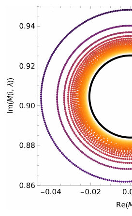 
Figure 1. Numerical plot of the values of the Weyl 𝑚-function 𝑀(𝑧, 𝜆) at 𝑧= i associated with the Jacobi operator 𝒥(𝜆) for different values of 𝜆&gt; 0, for the choice 𝑎𝑛= 3−3∕2√

📷 Fig 2

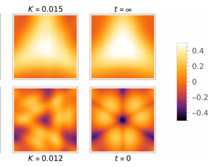 
Figure 2. Wigner functions of Ψ3,3(𝐾, 𝑇) (cf. Eq. (2.21)) for different values of 𝐾and fixed time 𝑇= 1, together with the limiting states Φ3(0, 𝑇) and Φ3(∞, 𝑇) (cf. Eq. (2.22)) corresponding to the two self-adjoint extensions with parameters 𝑡= 0 and 𝑡= ∞, respectively. Different subsequences converge to different limiting states.

📷 Fig 3

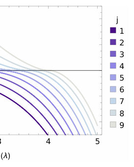 
Figure 3. Logarithmic plot of the eigenvalues 𝐸(𝑗)(𝜆) of the Jacobi operator 𝐽(𝜆), de- fined as in Definition 2.4, with coefficients 𝑎𝑛= 3−3∕2√

📷 Fig 4

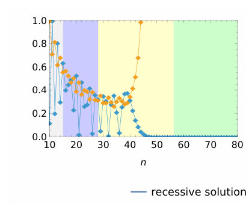 
Figure 4. Numerical evaluation of the dominant and the recessive solution of Eq. (3.5) for the family of Jacobi operators 𝐽(𝜆), defined as in Definition 2.4, with coefficients 𝑎𝑛= 4−1∕2√

📷 Fig 5

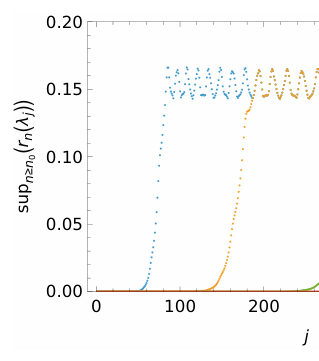 
Figure 5. Plot of sup𝑛≥𝑛0 𝑟 𝜆𝑗,i 𝑛, with 𝑟𝜆,𝑧 𝑛 defined in Eq. (4.229), for the sequence 𝜆𝑗= (10𝑗)−1 and different values of 𝑛0. The underlying Jacobi operator 𝐽(𝜆) is parametrized as in Definition 2.4 with the sequences (𝑎𝑛)𝑛∈ℕand (𝑓𝑛)𝑛∈ℕfrom Eq. (4.232). As predicted by Theorem 3.34, the ratios remain uniformly bounded from above by a constant independent of 𝜆𝑗. At the same time, for the displayed values of 𝑛0, the ratios remain uniformly bounded from below for sufficiently small 𝜆𝑗, indicating that the bound from Theorem 3.34 is saturated and that the correction factor 1∕6 is genuinely necessary.

**Summary.** The paper studies how Jacobi operators behave in a singular limit where the limiting operator is not essentially self-adjoint. It demonstrates that the specific way the limit is approached determines which self-adjoint extension is realized, providing a mathematical foundation for understanding higher-order squeezing in quantum optics.

**Why it may be interesting.** This is highly relevant for quantum optics and open quantum systems because it addresses the fundamental ambiguity in defining the dynamics of non-self-adjoint squeezing operators when the regularization term vanishes, showing that symmetry plays a key role in selecting physical extensions.

Detailed structure

**Main problem.** The paper investigates the 'essentially singular' limit of a family of Jacobi operators as a coupling parameter approaches zero, specifically when the limiting operator admits multiple self-adjoint extensions.

**Main result.** The authors prove that the strong resolvent limit depends on the chosen sequence of the coupling parameter, meaning different extensions can be reached via different sequences; in the context of quantum optics, this implies the limit does not pick a unique extension but identifies a subclass compatible with symmetry.

**Method.** The study employs discrete WKB methods, Airy-function asymptotics, and the analysis of the Weyl m-function to derive uniform bounds for eigenvectors and establish strong resolvent convergence.

**Model / system.** The mathematical model is a family of Jacobi operators on l2(N) with a scaling parameter lambda. The physical application involves higher-order squeezing operators in quantum optics, specifically regularized Hamiltonians of the form Ak,h(K) = (a_dagger)^k + K(a_dagger a)^h + a^k.

**Key observables.** Wigner functions of the squeezed vacuum state and the spectral properties (eigenvalues and resolvents) of the operators.

**Important parameters / regimes.** The coupling parameter lambda (or K) representing the strength of the diagonal/free-field term, the order of squeezing k, and the power of the number operator h.

**Assumptions / limitations.** The results rely on specific growth conditions for the Jacobi coefficients (a_n and b_n) and assume smoothness and analyticity for the construction of approximate solutions via the Langer transform.

**Figures summary.** Figure 1 shows a numerical plot of the Weyl m-function at a complex point, illustrating how the values spiral around a limit circle as lambda approaches zero.

**Paper structure.** The paper first establishes the mathematical framework for the essentially singular limit of Jacobi operators, provides technical proofs for eigenvector bounds using WKB and Airy asymptotics, and then applies these results to the selection of self-adjoint extensions in higher-order squeezing Hamiltonians.

Abstract

We study a family of Jacobi operators in which the diagonal entries are multiplied by a coupling parameter $λ\geq0$. Under suitable conditions, the operator is self-adjoint for every $λ>0$, while the formal limit at $λ=0$ is a symmetric Jacobi operator admitting a one-parameter family of self-adjoint extensions. A central ingredient of our analysis is the derivation of uniform bounds for square-summable generalized eigenvectors in the small-$λ$ regime, which combines discrete WKB methods with Airy-function asymptotics. Using these estimates, we analyze the limiting behavior $λ\to0$ in the strong resolvent sense, proving that for every sequence $λ_j\to0$ one can extract a subsequence along which the corresponding Jacobi operators converge to some self-adjoint extension of the limiting operator; conversely, every such extension can be obtained in this way. We call this behavior an essentially singular limit, by analogy with essential singularities in complex analysis.   As an application, we study higher-order squeezing operators arising in quantum optics. Using the connection with Jacobi operators, we show that when the relative strength of the free-field term tends to zero, different self-adjoint extensions of the squeezing operator are selected along different sequences. In particular, this limit does not single out a physically distinguished self-adjoint extension, but instead identifies a distinguished subclass of extensions compatible with the underlying symmetry.

[↑ back to top](#top)

### [Evidence of Quantum Machine Learning Advantage with Tens of Noisy Qubits](http://arxiv.org/abs/2605.21346v1)

**Authors:** Onur Danaci, Yash J. Patel, Riccardo Molteni, Evert van Nieuwenburg, Vedran Dunjko, Jan A. Krzywda  
**Type:** both · **Category:** quantum information and computing · **PDF:** <https://arxiv.org/pdf/2605.21346v1>  
**Analysis basis:** full PDF text, analyzed in chunks
**Topic relevance:** `quantum measurements` **2/5**

📷 Fig 1

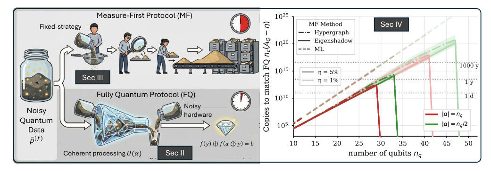 
FIG. 1. Framework for evaluating quantum advantage in learning from noisy quantum data. Left: Schematic of the two competing paradigms for the learning task described in the main text. A noisy quantum state ˜ρ(f) is prepared subject to a local error channel. The fully quantum protocol (Sec. II) coherently processes the state through a potentially noisy entangling measurement circuit to extract the parity bit b. In contrast, measure-first protocols (Sec. III) immediately measure nc copies of the state to build a classical representation for subsequent statistical inference. Right: Representative scaling of the number of state copies nc required by classical measure-first methods to match the...

📷 Fig 2

 
FIG. 2. Measurement circuit for two different concepts α.

📷 Fig 3

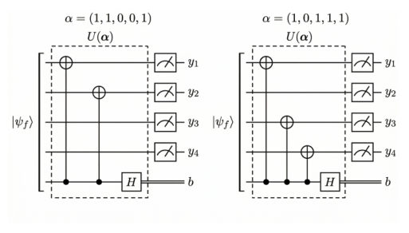 
Figure 3 presents the accuracy of the fully quantum protocol as a function of qubit number for all device mod- els. Extrapolating from simulations up to |α| = nq ≤22 (Appendix C), we observe a clear error transition in the nearest-neighbor devices (B and C): they shift from being gate-fidelity dominated at low |α| to idling-error domi- nated at |α| &gt; 10. In contrast, the all-to-all device (A)

📷 Fig 4

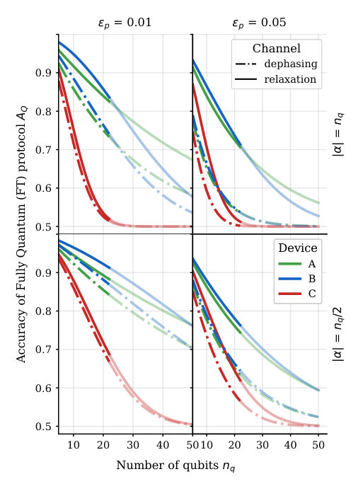 
FIG. 3. Accuracy of the fully quantum protocol un- der realistic hardware constraints. The expected ac- curacy AQ is shown as a function of qubit number nq for device models A, B, and C (distinguished by color) and for three state-preparation noise channels (dephasing, depolariz- ing, and relaxation, distinguished by line style). The columns compare high (ϵp = 0.05, left) and low (ϵp = 0.01, right) preparation-noise rates, while the top and bottom rows corre- spond to concept sizes |α| = nq and |α| = nq/2, respectively. These results are obtained by extrapolating simulations of Vm at nq ≤22 (darker lines) to larger system sizes using the factorized error model VQ = VpVmVr. See Appendix C...

📷 Fig 5

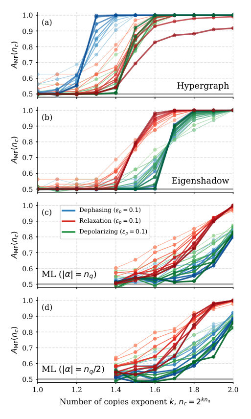 
FIG. 4. Sample complexity of measure-first protocols. The expected accuracy is plotted against the scaled copy- complexity exponent k, defined by nc = 2knq, at preparation- noise rate ϵp = 0.1. The panels show (a) the Hypergraph method, (b) the Eigenshadow method, and the ML method for (c) |α| = nq and (d) |α| = nq/2. Noise channels are dis- tinguished by color (blue: dephasing, red: relaxation, green: depolarizing), and increasing system size (nq = 5 to 15) is indicated by increasing color intensity and line thickness. Re- sults for smaller ϵp are shown in Fig. 16

**Summary.** This paper shows that quantum machine learning can outperform classical measurement-based strategies even with 30 to 40 noisy qubits. It demonstrates that the primary bottleneck for classical methods is the massive amount of data acquisition required, making quantum advantage accessible on near-term hardware.

**Why it may be interesting.** The paper provides a rigorous framework for predicting the onset of quantum advantage in noisy, near-term devices, which is critical for designing experiments in open quantum systems and evaluating the utility of NISQ-era hardware.

Detailed structure

**Main problem.** Determining whether the theoretical quantum advantage in Quantum Machine Learning (QML) persists at finite scales and in the presence of realistic hardware noise.

**Main result.** Demonstrated a clear performance separation between Fully Quantum and Measure-First protocols at a scale of 30 to 40 noisy qubits, where classical data acquisition would require months or years to match quantum performance.

**Method.** A scalable simulation pipeline for Fully Quantum protocols under hardware constraints, combined with a robust finite-size scaling extrapolation framework to predict large-scale performance.

**Model / system.** A learning task involving n-qubit binary phase-states subject to various noise channels including dephasing, depolarizing, and thermal relaxation, modeled across different hardware architectures (all-to-all and square-lattice connectivity).

**Key observables.** Sample complexity (number of state copies required), accuracy, and the visibility of the interference pattern.

**Important parameters / regimes.** Qubit number (n_q), Hamming weight of the target state (|alpha|), preparation noise rate (epsilon_p), and hardware-specific error rates.

**Assumptions / limitations.** The study uses a specific learning problem known to exhibit asymptotic advantage and assumes a phenomenological 1/n_q scaling for the extrapolation of classical resource requirements.

**Figures summary.** Schematics of FQ vs MF frameworks, scaling plots of state copies vs qubit number, accuracy curves under different noise channels, and validation plots for the extrapolation model.

**Paper structure.** Introduction of the QML advantage problem, description of the FQ and MF protocols, detailed noise and hardware modeling, simulation methodology, results for different noise channels, and a rigorous statistical validation of the extrapolation technique.

Abstract

Learning problems involving quantum data are natural candidates for demonstrating an advantage in quantum machine learning. Recent results indicate that, for certain tasks and under noiseless conditions, coherent processing of quantum data outperforms fixed-measurement schemes followed by classical processing. It remained uncertain whether this performance gap persists at a finite scale, and in the presence of noise that is unavoidable with current quantum devices. In this work, we present simulations and analysis of the performance of existing hardware on a learning problem known to exhibit asymptotic advantage, now subjected to noisy quantum data. Comparing coherent quantum processing directly against fixed-measurement schemes, our results demonstrate a clear performance separation at a scale of just 30 to 40 noisy qubits. Already at this scale, the fundamental bottleneck is no longer classical computation but data acquisition; matching the noisy coherent protocol with measure-first strategies would still require months or even years of measurements. By systematically evaluating hardware constraints such as state preparation, gate errors, readout errors, connectivity, and coherence times, we provide evidence that a demonstration of such a strong learning advantage is accessible on near-term devices.

[↑ back to top](#top)

### [Photon Efficiency of High-Dimensional Quantum Key Distribution](http://arxiv.org/abs/2605.21018v1)

**Authors:** Vera Uzunova, Marcin Jarzyna  
**Type:** theory · **Category:** quantum information and computing · **PDF:** <https://arxiv.org/pdf/2605.21018v1>  
**Analysis basis:** full PDF text, analyzed in chunks
**Topic relevance:** `entanglement & information structure` **2/5**

📷 Fig 1

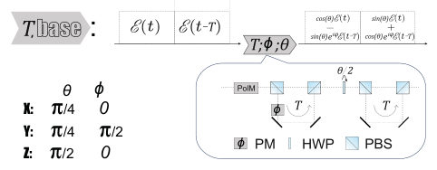 
FIG. 1. Encoding of multiple logical qubits into a single photon prepared as a superposition of temporal slots. Example is given for three qubits, m = 3. (a) The slot number written in the binary representation specifies the basis states of individual qubits. The presence of a photon in temporal slot with n = 3 corresponds to a product of qubit basis states |0⟩|1⟩|1⟩in computational basis. (b) The classical sequence of three bits can be equivalently encoded in 3 equatorial qubits states |ϕ2⟩|ϕ1⟩|ϕ0⟩by a light pulse in the time frame with the corresponding relative phase in each of the M slots. Transformation introduced by a cascade of interferometric stages (c). With a suitable choice of...

📷 Fig 2

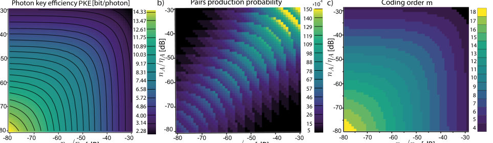 
FIG. 2. Optimal PKE (a), the corresponding the pair-production probability (b) and (c) coding order, as functions of the decoherence parameters in Alice’s and Bob’s channels nA/ηA and nB/ηB for the asymmetric four-state BBM92 protocol and visibility parameter is V = 0.98.

📷 Fig 3

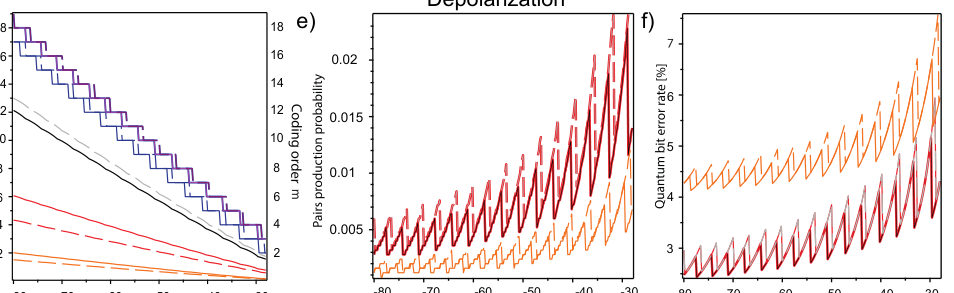 
FIG. 3. Optimal photon key efficiency (PKE) (a, d), the corresponding quantum bit error rate (QBER) (b, e), and the optimal pair-production probability (c, f) for different protocols. Panels (a–c) correspond to the dephasing channel model, while panels (d–f) correspond to the depolarizing channel model. The visibility parameter used for the calculation is V = 0.98. Thin black dashed lines show approximate analytical results.

📷 Fig 4

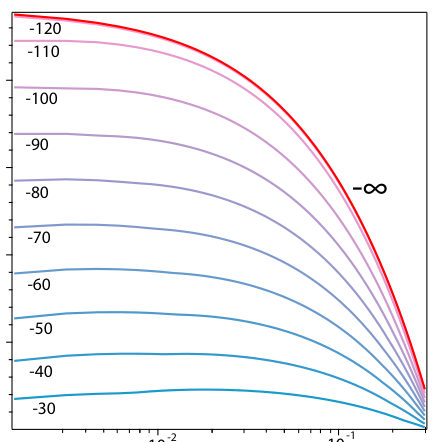 
FIG. 4. Photon key efficiency for asymmetric four-state BBM92 protocol with q = 1 as a function of pair production probability assuming dephasing channel with visibility V = 0.98. Numbers indicate the values of the noise parameter nb/η.

**Summary.** The study investigates how encoding multiple qubits into a single photon can maximize the secret key extracted per photon in satellite-based quantum communications. It finds that high-dimensional encoding significantly improves robustness against background noise and that optimal performance requires a finite, non-vanishing signal strength.

**Why it may be interesting.** This paper is highly relevant to quantum optics and open quantum systems researchers as it addresses the optimization of quantum communication protocols under realistic decoherence (dephasing and depolarization) and high-loss environments.

Detailed structure

**Main problem.** Optimizing the photon efficiency of entanglement-based Quantum Key Distribution (QKD) in photon-starved regimes, such as satellite-to-ground communications.

**Main result.** High-dimensional encoding (multiple qubits per photon) can increase the secret key rate by up to an order of magnitude, and the optimal efficiency is achieved at a finite photon pair production probability.

**Method.** Analytical derivation using the Lambert W function and numerical optimization of the secret key rate and Photon Key Efficiency (PKE) over source intensity and encoding order.

**Model / system.** Entanglement-based QKD protocols (BBM92 and SARG04) using temporal-slot encoding in a satellite-to-ground/free-space channel characterized by high loss and background radiation.

**Key observables.** Photon Key Efficiency (PKE), Quantum Bit Error Rate (QBER), and secret key rate.

**Important parameters / regimes.** Number of encoded qubits (m), pair production probability (p_pair), noise-to-transmission ratio (n/eta), and channel visibility (V).

**Assumptions / limitations.** Symmetric channels, low-noise regime (n/eta << 1), high-visibility measurements, and the use of the BBM92/SARG04 protocols.

**Figures summary.** Figure 1 illustrates the temporal-slot encoding mechanism; Figure 2 shows optimal PKE and pair production probability as functions of noise; Figure 3 compares PKE and QBER for dephasing and depolarizing channels; Figure 4 shows PKE scaling.

**Paper structure.** The paper introduces the problem of photon efficiency in satellite QKD, describes the high-dimensional temporal encoding scheme, presents the mathematical framework for calculating key rates under noise, provides analytical approximations for the low-noise regime, and concludes with numerical results and scaling laws.

Abstract

We investigate entanglement-based quantum key distribution protocols, with particular emphasis on their efficiency under realistic conditions of satellite quantum communications, where performance is limited by the low power of a received signal and background radiation. We focus on scenarios where each photon pair is used to encode multiple qubits in order to optimally utilize the weak signal. By optimizing over the source intensity and the number of encoded qubits we study the theoretical information limit for the QKD efficiency. We show that the optimal efficiency is attained for finite entangled photons pair production probability which is in contrast to conventional communication efficiency maximized in the limit of vanishing signal strength. The multiqubit encoding can enhance the secret key rate by up to an order of magnitude compared to single-qubit schemes.

[↑ back to top](#top)

### [Strain-Tuned Incommensurate Kekulé Spiral Order in Twisted Bilayer Graphene: a Quantum Many-Body Study](http://arxiv.org/abs/2605.20677v1)

**Authors:** Cheng Huang, Yves H. Kwan, Maksim Ulybyshev, Fakher F. Assaad, Laura Classen, Zi Yang Meng  
**Type:** theory · **Category:** strongly correlated electrons · **PDF:** <https://arxiv.org/pdf/2605.20677v1>  
**Analysis basis:** full PDF text, analyzed in chunks
**Topic relevance:** `Frenkel-Kontorova` **2/5**

📷 Fig 1

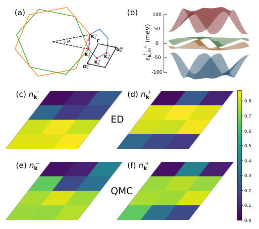 
Fig. 1. Strained Brillouin zones, shifted Dirac points, and occupa- tion number comparison between ED and approximated QMC. (a) Schematic Brillouin zones (green and orange hexagons) of two graphene layers with interlayer twist 𝜃and uniaxial heterostrain of ±𝜖s/2 for each layer. The corresponding strained moiré Brillouin zone (mBZ) in the 𝜂= + valley can be represented by the blue hexagon or black rhombus, with 𝚪the mBZ center, Gm 1,2 the moiré reciprocal lattice vectors, and K+ 1,2 the mBZ corners. The magenta ar- rows show the exaggerated deviations of the monolayer Dirac cones. (b) The low-energy moiré bands with strain 𝜖s = 0.6% for valley 𝜂= + and spin 𝑠=↑. See Fig. S1 for the...

📷 Fig 2

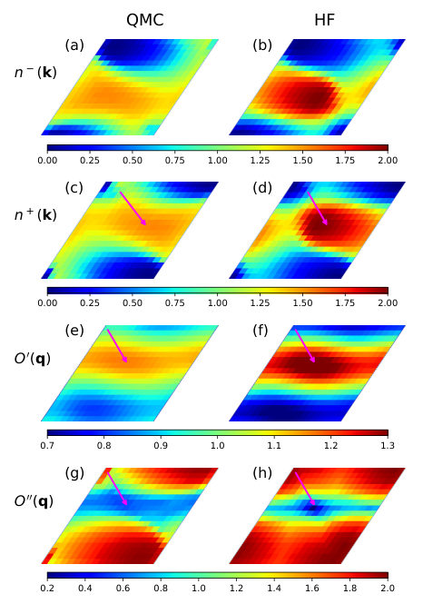 
Fig. 2. Occupation number 𝑛𝜂(k) and corresponding nesting diagnostics from QMC and HF at 𝜈= −2 with 𝑁k = 18 × 18 and strain strength 𝜖s = 0.6%. The left panels are the QMC data, where (a) and (c) show the occupation factor 𝑛𝜂(k). The magenta arrow in (c) points from the minimum in (a) to the maximum in (c). The magneta arrow in (e) [(g)] corresponds to the maximum [minimum] of 𝑂′(q) [𝑂′′(q)]. The right panels are the corresponding data for the HF ground state which has IKS wavevector qIKS = (7/18, 7/18).

📷 Fig 3

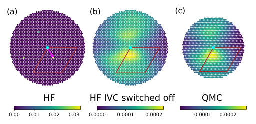 
Fig. 4. Intervalley structure factor 𝑆IKS(Q) from HF and QMC at 𝜈= −2 with 𝑁k = 18×18 and strain strength 𝜖s = 0.6%. (a) The HF solution has Bragg peaks corresponding to qIKS = (7/18, 7/18). The magenta arrow points to the peak and is the same as those in Fig. 2 (d), (f), and (h). The brown rhombus is the mBZ and the cyan dot indicates Q = 0. In (b), the IVC in the final HF density matrix has been artificially switched off when computing 𝑆IKS(Q). (c) 𝑆IKS(Q) from QMC.

📷 Fig 4

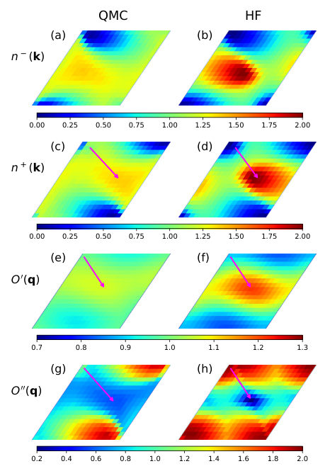 
Fig. 3. Occupation number 𝑛𝜂 k and corresponding nesting di- agnostics from QMC and HF at 𝜈= −2 with 𝑁k = 18 × 18 and strain strength 𝜖s = 0.3%. The left panels are the QMC data, where (a) and (c) show the occupation factor 𝑛𝜂(k). The magenta arrow in (c) points from the minimum in (a) to the maximum in (c). The magneta arrow in (e) [(g)] corresponds to the maximum [minimum] of 𝑂′(q) [𝑂′′(q)]. The right panels are the corresponding data for the HF ground state which has IKS wavevector qIKS = (8/18, 9/18).

📷 Fig 5

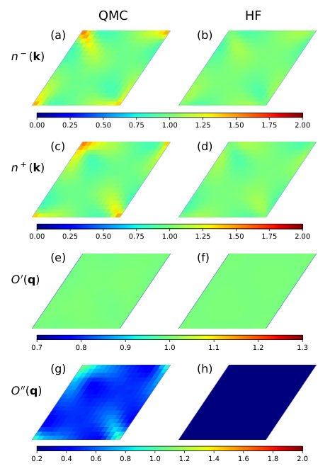 
Fig. 5. Occupation number 𝑛𝜂(k) and corresponding nesting diagnostics from QMC and HF at 𝜈= −2 with 𝑁k = 18 × 18 and strain strength 𝜖s = 0. The left panels are the QMC data, where (a) and (c) show the occupation factor 𝑛𝜂(k). Panels (e) and (g) correspond to 𝑂′(q) and 𝑂′′(q) respectively. The right panels are the corresponding data for the HF ground state which corresponds to a spin-polarized KIVC with q = 0.

**Summary.** This paper uses a combination of Quantum Monte Carlo and mean-field methods to study how strain drives a phase transition in twisted bilayer graphene. It specifically explores the emergence of the incommensurate Kekulé spiral state and how many-body effects influence its stability. The work provides a way to study complex phase diagrams in moiré systems despite the presence of the fermion sign problem.

**Why it may be interesting.** not directly relevant

Detailed structure

**Main problem.** Investigating the strain-induced phase transition from the Kramers intervalley coherent (KIVC) state to the incommensurate Kekulé spiral (IKS) state in twisted bilayer graphene at filling factor nu = +/- 2.

**Main result.** The study identifies a strain-tuned transition from KIVC to IKS order and demonstrates that the IKS state is a topologically constrained, intermediate-coupling phase, though many-body fluctuations may prevent long-range IKS order in the QMC simulations.

**Method.** A combined computational protocol using continuous field momentum-space Quantum Monte Carlo (QMC), Exact Diagonalization (ED), and Hartree-Fock (HF) mean-field theory.

**Model / system.** Twisted bilayer graphene (TBG) at the magic angle (theta approx 1.05-1.15 degrees) subject to uniaxial heterostrain, modeled using the interacting Bistritzer-MacDonald (BM) continuum model.

**Key observables.** Electron occupation number distribution n(k), intervalley structure factors (S_KIVC and S_IKS), nesting diagnostics (O' and O''), and single-particle Green's functions.

**Important parameters / regimes.** Twist angle theta = 1.15 degrees, filling factor nu = -2, strain strength epsilon_s (0% to 0.6%), and interlayer hopping parameters u0 = 80 meV, u1 = 110 meV.

**Assumptions / limitations.** The QMC method uses an approximation where the sampling weight is replaced by its absolute magnitude to mitigate the fermion sign problem; the model is projected onto the two central low-energy bands.

**Figures summary.** Figure 1 shows the effect of strain on Brillouin zones and Dirac cones; Figure 2 and 3 compare occupation numbers and nesting diagnostics between QMC and HF for different strain levels; Figure 4 shows the intervalley structure factor and the absence of Bragg peaks in QMC.

**Paper structure.** The paper introduces the problem of the TBG phase diagram, describes the computational protocol (QMC, ED, HF), validates the approximate QMC method, presents the results of the strain-induced KIVC-IKS transition, and discusses the implications of many-body fluctuations on long-range order.

Abstract

The understanding of quantum many-body states in twisted bilayer graphene at the magic angle has been greatly improved both in experiment and in theory. However, away from the exactly solvable chiral limit and the sign-problem-free charge neutrality point, the calculation of the ground state properties and the identification of the phase diagram are challenging due to the exponential increase in the complexity, which has rendered explanations of experimentally observed insulating and superconducting phases restricted largely to the perturbative level. Here we focus on the filling factors $ν= \pm2$ away from charge neutrality and address the question of the strain dependence of the interacting ground state. We adjust our continuous field momentum-space quantum Monte Carlo (QMC) method to treat the sign problem approximately, and perform a quantum many-body study together with exact diagonalization (ED) and Hartree-Fock (HF) mean field. Leveraging this combined protocol of QMC, ED, and HF, we investigate the strain-tuned transition from the Kramers intervalley coherent (KIVC) state to the incommensurate Kekulé spiral state (IKS). Our computational protocol sheds light on the KIVC-IKS transition in a projected correlated flat-band setting, and opens the door for further understanding of the rich phase diagram of twisted bilayer graphene and other strongly-correlated flat-band systems.

[↑ back to top](#top)

### [Temperature-induced optical enhancement near a localization transition](http://arxiv.org/abs/2605.21423v1)

**Authors:** Raul Liquito, Miguel Gonçalves, Bruno Amorim, Eduardo V. Castro  
**Type:** theory · **Category:** disordered systems and neural networks · **PDF:** <https://arxiv.org/pdf/2605.21423v1>  
**Analysis basis:** full PDF text, analyzed in chunks
**Topic relevance:** `non-equilibrium dynamics` **2/5**

📷 Fig 1

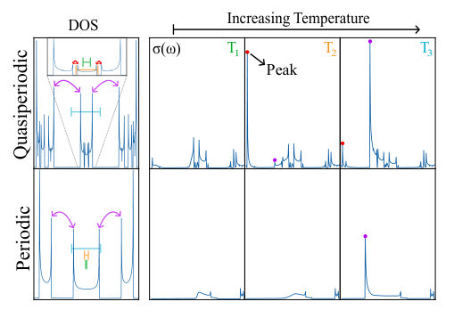 
Figure 2. Schematic representation of the regular part of the real optical conductivity as a function of frequency for increas- ing temperature T (left to right). The top row corresponds to the standard Aubry–André model, the bottom row to a purely periodic harmonic modulation with unit cell enlarged to 55 sites. In the density of states panels (DOS) the pur- ple and red arrows indicate the transitions associated with the corresponding resonance, the spacers show the width of kbT and are color coded to correspond to their temperatures (top right). The frequency scale is identical across all panels, and the conductivity scale is preserved. Curves correspond to W = 1.95 and T ∈{10−4; 4 ×...

📷 Fig 2

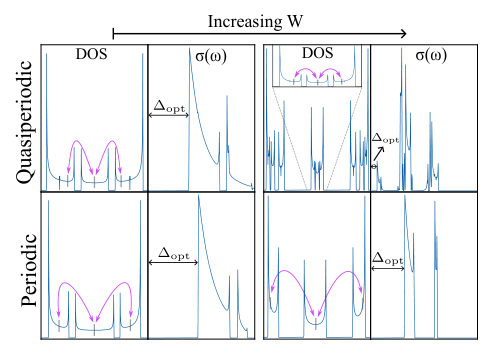 
Figure 1. Schematic representation of the regular part of the real optical conductivity as a function of frequency for increas- ing quasiperiodic potential strength W (left to right). The top row corresponds to the standard Aubry–André model, the bottom row to a purely periodic harmonic modulation with a 55-site unit cell. In the density of states panels (DOS) the purple arrows indicate the transitions associated with the corresponding optical gap ∆opt.

📷 Fig 3

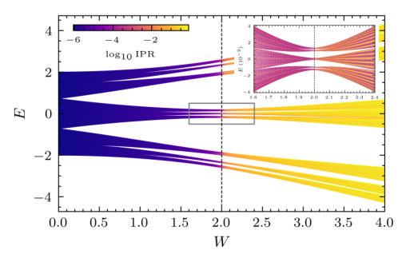 
Figure 3. Evolution of AA model energy spectra as a function of quasiperiodic potential strength W for a system size L = 610. The inset we plot the same information for a system size L = 6765, in the central region highlighted by the grey rectangular box. Notice the different energy (y-axis) scales of the main plot and inset. The color plot encodes the inverse participation ratio (IPR) of each eigenstate. The dashed black vertical line marks the metal-insulator transition of the AA model at W = 2.0.

📷 Fig 4

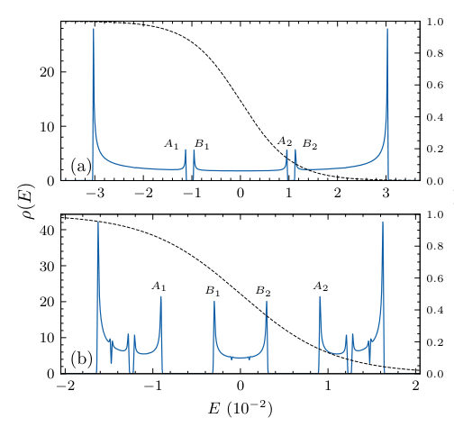 
Figure 4. The plots show the DOS of the central bands around E = 0. The dotted black curve is the Fermi Dirac function plotted for T ≈5 × 10−3. Some van Hove singularities are labeled to facilitate the results analysis. The density of states were computed from the exact eigenstates of the AA model for (a)W = 1.7 and (b)W = 1.9 and for a system size of L = 28657.

📷 Fig 5

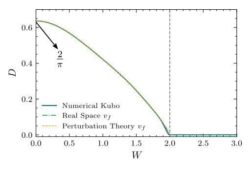 
Figure 5. Drude Weight (D) as a function of quasiperiodic potential strength (W) obtained with three different meth- ods. “Numerical Kubo” was obtained for a finite temperature of T = 5 × 10−4, a system size of L = 10946 via Krylov-Schur sparse methods. The “Real Space vF ” was obtained by numer- ically calculating the eigenstate at Fermi energy (E = 0) for a system size L = 514229 via via Krylov-Schur sparse methods (see Appendix. B). The “Perturbation Theory vF ” curve was obtained via perturbation theory for a system size L = 1597 truncated to order 100 (see Appendix. A). The dashed grey vertical line marks the metal insulator transition of the AA model at W = 2.

**Summary.** This paper investigates the optical response of the 1D Aubry-Andre model near its localization transition. It discovers that increasing temperature can significantly enhance low-frequency optical conductivity by activating transitions between van Hove singularities that are otherwise Pauli-blocked. This provides a new way to probe and control transport in quasiperiodic systems.

**Why it may be interesting.** This is interesting for many-body dynamics and quantum optics because it demonstrates how temperature can be used as a 'knob' to manipulate and enhance optical responses in non-trivial, fractal energy spectra.

Detailed structure

**Main problem.** The study addresses the lack of systematic analysis regarding finite-frequency optical conductivity near the metal-insulator transition in quasiperiodic systems, specifically how the optical gap and conductivity evolve.

**Main result.** The authors uncover a mechanism where finite temperature induces a strong enhancement of low-frequency optical conductivity by thermally activating Pauli-blocked transitions between resonant van Hove singularities.

**Method.** The researchers use numerical simulations of the Kubo-Greenwood formula, Krylov-Schur subspace methods for eigenstates, and non-degenerate perturbation theory to analyze transport and spectral properties.

**Model / system.** The study focuses on the 1D Aubry-Andre model, a tight-binding chain with a deterministic quasiperiodic potential characterized by hopping amplitude t and potential strength W.

**Key observables.** Optical conductivity (regular and Drude weight), optical gap, density of states (DOS), and Inverse Participation Ratio (IPR).

**Important parameters / regimes.** Potential strength (W), temperature (T), frequency (omega), and the incommensurability parameter (golden mean).

**Assumptions / limitations.** The perturbative framework is strictly valid in the weak-potential regime (W < 2t); the study assumes a single-particle formulation.

**Figures summary.** Figures show the evolution of optical conductivity and the optical gap with increasing potential strength and temperature, highlighting the emergence of resonant peaks and the closing of the gap.

**Paper structure.** The paper introduces the problem of quasiperiodic transport, describes the Aubry-Andre model and numerical methods, analyzes the zero-temperature optical gap evolution, details the temperature-induced enhancement mechanism via perturbation theory, and discusses scaling laws and localization.

Abstract

Quasiperiodic systems are an intermediate class of systems between periodic crystals and disordered systems, famously exhibiting metal-insulator transitions (MITs) even in one dimension. While their transport properties have been studied extensively, a systematic analysis of the finite-frequency optical conductivity near the critical point has been lacking. In this work, we carry out a detailed study of the optical conductivity in the paradigmatic Aubry-André model. We find that the zero-temperature low-frequency optical signal is strongly restructured by the quasiperiodic potential, exhibiting an optical gap that closes discontinuously as the system approaches the MIT. Most strikingly, we uncover a mechanism for a strong enhancement of the low-frequency finite temperature optical conductivity at certain resonant frequencies. This enhancement stems from the thermal activation of Pauli-blocked transitions between strongly resonant van Hove singularities. This mechanism provides new insight into finite-frequency transport in quasiperiodic systems and a new pathway for manipulating optical properties near a localization transition. Furthermore, our findings establish the optical response as a powerful, experimentally accessible tool for probing non-trivial quasiperiodicity effects.

[↑ back to top](#top)

### [Universal fusion category symmetries on tensor products of infinite-dimensional Hilbert spaces](http://arxiv.org/abs/2605.21327v1)

**Authors:** Ian Bunner, Corey Jones  
**Type:** theory · **Category:** other · **PDF:** <https://arxiv.org/pdf/2605.21327v1>  
**Analysis basis:** full PDF text, analyzed in chunks
**Topic relevance:** `entanglement & information structure` **2/5**

📷 Fig 1

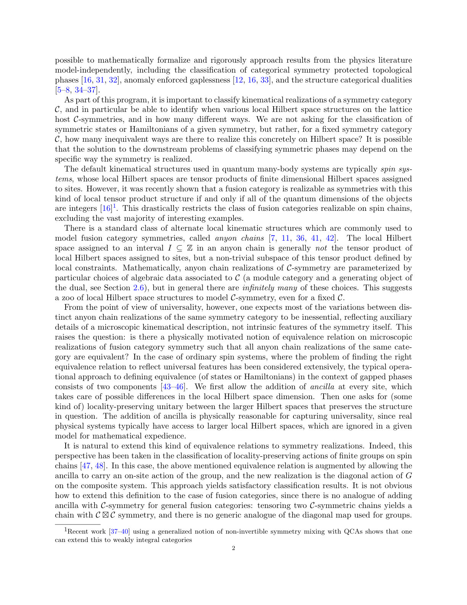 
Low-resolution page preview, page 2

📷 Fig 2

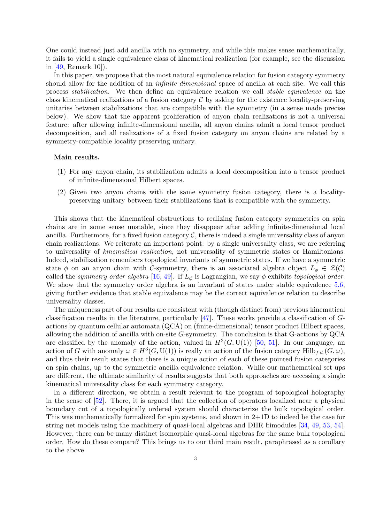 
Low-resolution page preview, page 3

📷 Fig 3

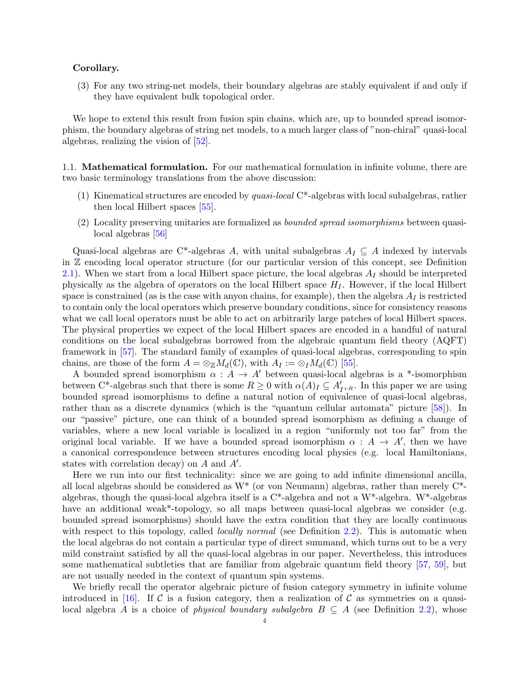 
Low-resolution page preview, page 4

📷 Fig 4

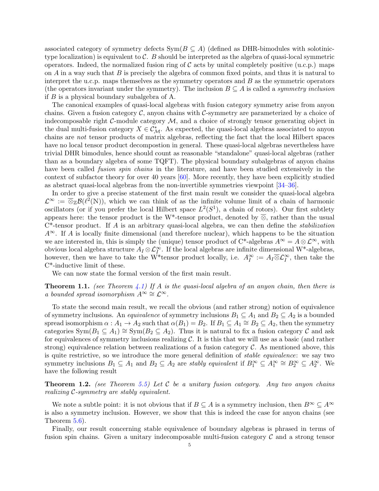 
Low-resolution page preview, page 5

📷 Fig 5

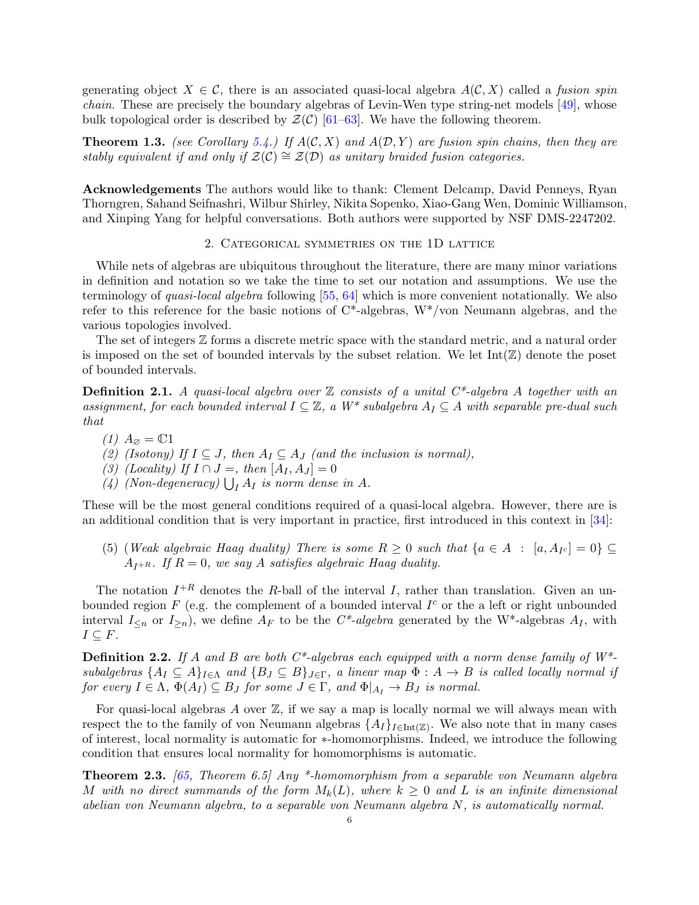 
Low-resolution page preview, page 6

**Summary.** This paper provides a universal classification for the kinematic realization of fusion category symmetries on 1D lattices. By introducing a stabilization process using infinite-dimensional ancilla, the authors show that all anyon chains realizing the same symmetry category are equivalent, effectively reducing a complex 'zoo' of models to a single stable equivalence class.

**Why it may be interesting.** not directly relevant

Detailed structure

**Main problem.** The paper aims to classify the different ways a fixed fusion category can be realized as a symmetry on a lattice (kinematical realization) and to resolve the 'zoo' of anyon chain variations using a physically motivated stable equivalence relation.

**Main result.** The authors prove that after stabilizing with infinite-dimensional ancilla, any anyon chain admits a local decomposition into a tensor product of infinite-dimensional Hilbert spaces, and for a fixed fusion category, there is a single stable equivalence class of symmetry realizations.

**Method.** The study utilizes the mathematical framework of quasi-local C*-algebras, W*-algebras, DHR theory, and the construction of W*-tensor categories via infinite-dimensional Hilbert space enrichment.

**Model / system.** The models studied are anyon chains and fusion spin chains (boundary algebras of Levin-Wen type string-net models) defined on 1D lattices, specifically utilizing infinite-dimensional Hilbert spaces and ancilla to achieve stabilization.

**Key observables.** Symmetry category, Drinfeld center, symmetry order algebra, and bounded spread isomorphism class.

**Important parameters / regimes.** The stabilization process via infinite-dimensional ancilla, the localization length R, and the strong tensor generator X.

**Assumptions / limitations.** The results assume the use of infinite-dimensional ancilla for stabilization and rely on the properties of unitary fusion/multi-fusion categories and local normality of the algebras.

**Paper structure.** The paper progresses from defining the mathematical requirements for symmetry (Haag duality, local normality) to constructing the 'standard model' of anyon chains, then moves to proving the universality of these realizations via stabilization, and concludes with the classification of fusion spin chains based on their bulk topological order.

Abstract

We show that anyon chains, after stabilizing with infinite-dimensional ancilla spaces, factorize locally as tensor products of infinite-dimensional Hilbert spaces. This implies that any unitary fusion category can be realized as symmetries on a tensor product of infinite-dimensional Hilbert spaces. We then show that any two anyon chains with the same symmetry category are related by a symmetry-compatible locality-preserving unitary after stabilizing with infinite-dimensional ancilla, showing that for a fixed fusion category, there is a single stable equivalence class of symmetry realizations on the lattice via anyon chains. As a corollary of our proof, we show that the physical boundary algebras of Levin-Wen type models are bounded spread isomorphic after stabilization if and only if they have the same bulk topological order.

[↑ back to top](#top)

### [Velocity collapse and non-conformal spiral phase in the sawtooth spin chain](http://arxiv.org/abs/2605.20343v1)

**Authors:** Nai Chao Hu  
**Type:** theory · **Category:** strongly correlated electrons · **PDF:** <https://arxiv.org/pdf/2605.20343v1>  
**Analysis basis:** full PDF text, analyzed in chunks
**Topic relevance:** `entanglement & information structure` **2/5**

📷 Fig 1

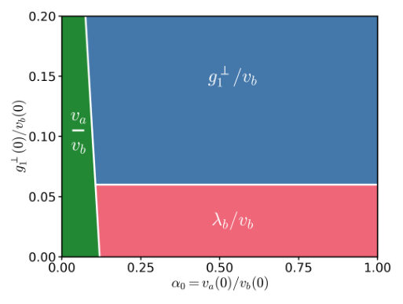 
FIG. 2. Schematic stopping-event diagram based on the numerical integration of the one-loop RG equations, with g⊥ 1 (0) = g2(0). In the green and pink regions, λa/va is the first dimensionless coupling to reach order one. Green denotes the local-critical candidate regime, where the apical veloc- ity subsequently reaches the velocity cutoff before the basal diagnostic λb/vb reaches order one. Pink denotes the com- plementary case, where λb/vb reaches order one before the velocity cutoff. Blue denotes WA/KT current-channel domi- nation through g⊥ 1 /vb.

📷 Fig 2

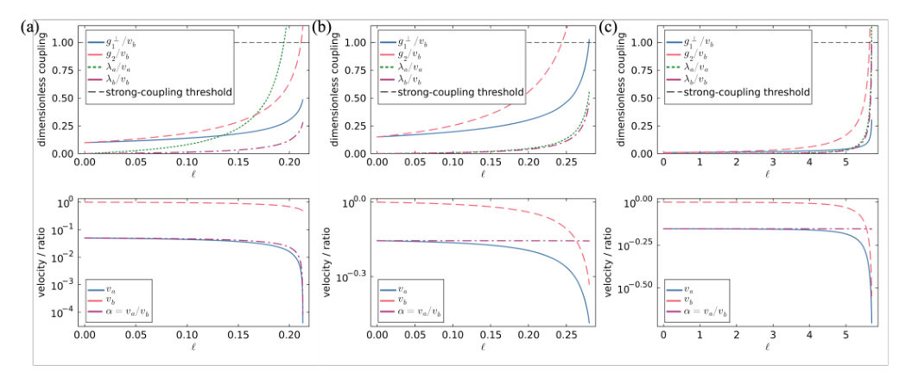 
FIG. 3. Representative trajectory at (a) α(0) = 0.05 and g⊥ 1 (0) = g2(0) = 0.1: The apical velocity is driven rapidly downward, while λa/va becomes the leading dimensionless coupling before the basal sector reaches its own strong-coupling scale; (b) α(0) = 0.7 and g⊥ 1 (0) = g2(0) = 0.15: the WA phase with g⊥ 1 /vb the leading dimensionless coupling; (c) α(0) = 0.7 and g⊥ 1 (0) = g2(0) = 0.01: a similarly gapped phase with both λs/vs the leading dimensionless couplings.

**Summary.** This paper explains why the spiral phase in the sawtooth spin chain appears to violate standard conformal field theory predictions. By showing that the apical spin velocity collapses due to a specific twist interaction, the authors provide a theoretical basis for the observed anomalous scaling and flat excitation bands.

**Why it may be interesting.** The discovery of a mechanism where energy scales decouple from spatial correlation lengths via velocity collapse provides new insights into non-conformal critical points and the emergence of local quantum criticality in 1D systems.

Detailed structure

**Main problem.** Resolving the numerical puzzle of the spiral phase in the sawtooth spin chain, where recent calculations show signatures (large central charge, slow scaling) inconsistent with standard conformal field theory.

**Main result.** The authors identify a 'velocity collapse' mechanism where a marginal twist interaction selectively reduces the apical spin velocity, leading to a state of local quantum criticality where the energy scale collapses independently of the spatial correlation length.

**Method.** A bosonization theory developed by embedding the sawtooth limit into an asymmetric zigzag ladder, combined with a two-velocity Renormalable Group (RG) analysis and Operator Product Expansion (OPE) techniques.

**Model / system.** A frustrated spin-1/2 sawtooth (delta) spin chain consisting of basal and apical spins with exchange interactions J1 and J2.

**Key observables.** Central charge (c), dynamical exponent (z), apical spin velocity (va), and apical backscattering interaction.

**Important parameters / regimes.** Velocity ratio (alpha = va/vb), exchange couplings (J1, J2), and the regime of extreme velocity asymmetry (va << vb).

**Assumptions / limitations.** The sawtooth limit is regularized by an auxiliary asymmetric zigzag ladder; the analysis assumes a controlled regime of large velocity asymmetry to allow for perturbative RG.

**Figures summary.** Figure 2 shows a phase diagram of different RG regimes (WZW, gap-opening, and local criticality); Figure 3 illustrates RG trajectories showing the rapid collapse of apical velocity and the dominance of specific couplings.

**Paper structure.** The paper identifies numerical anomalies, constructs a continuum theory via a zigzag ladder regularization, applies RG analysis to track velocity and coupling evolution, and concludes by characterizing the resulting local quantum critical phase.

Abstract

Recent matrix-product-state calculations show that the spiral phase in the sawtooth chain has numerical signatures that are difficult to reconcile with an ordinary conformal critical point: a large apparent central charge, slow dynamical scaling, nearly flat excitations, and no detectable dimerization. We develop a bosonization theory for this phenomenology by embedding the sawtooth limit in a zigzag ladder described by two coupled SU(2)$_1$ conformal field theories characterized by an extreme velocity ratio. We show that the sawtooth geometry cancels the leading staggered interaction, leaving a marginal twist interaction that selectively collapses the slow apical spin velocity. Crucially, as this velocity vanishes, the generated apical backscattering interaction diverges only in dimensionless units, causing the energy scale to collapse independently of the spatial correlation length. This mechanism naturally accounts for many of the numerical anomalies and we interpret the perturbative flow as an entrance to local quantum criticality in the strong-coupling regime.

[↑ back to top](#top)

### [What Lies Between Crystal and Randomly Packed Structures? A General Characterization of Non-Periodic Order](http://arxiv.org/abs/2605.20709v1)

**Authors:** Ian Douglass, Peter Harrowell  
**Type:** theory · **Category:** disordered systems and neural networks · **PDF:** <https://arxiv.org/pdf/2605.20709v1>  
**Analysis basis:** full PDF text, analyzed in chunks
**Topic relevance:** `entanglement & information structure` **2/5**

📷 Fig 1

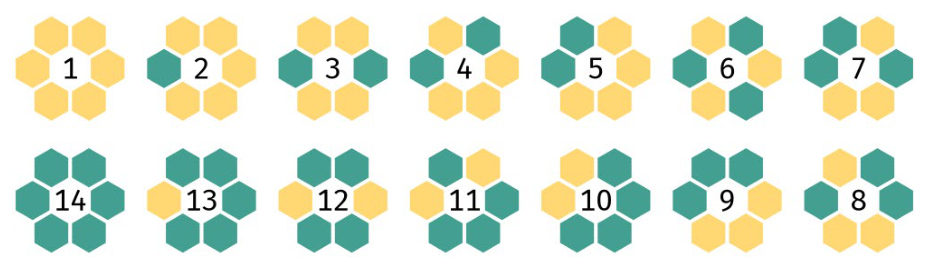 
Figure 1. The 14 distinct local structures (LS) in the Favored Local Structure model on the

📷 Fig 2

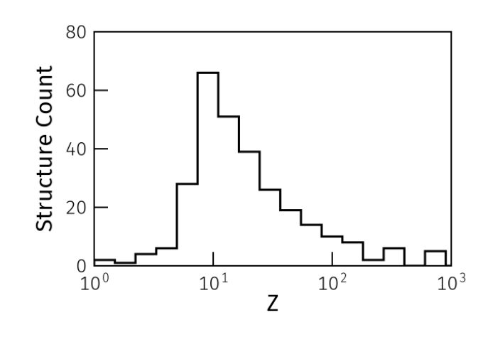 
Figure 2. The distribution of the unit cell size Z for the 287 crystal groundstates of the FLS

📷 Fig 3

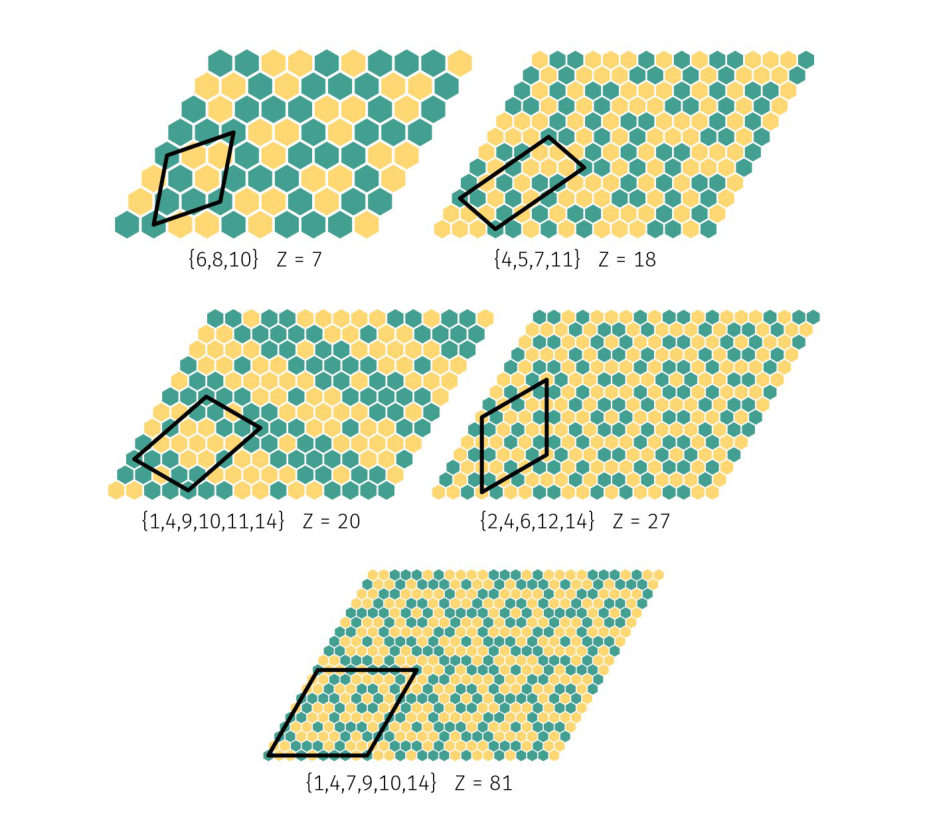 
Figure 3. Examples of the crystalline structures with the unit cell indicated. Each structure is

📷 Fig 4

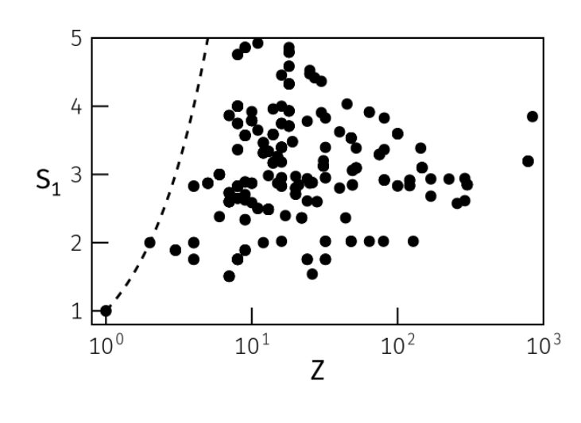 
Figure 4. Scatter plot of the diversity S1 as a function of the unit cell size logZ for the crystal

📷 Fig 5

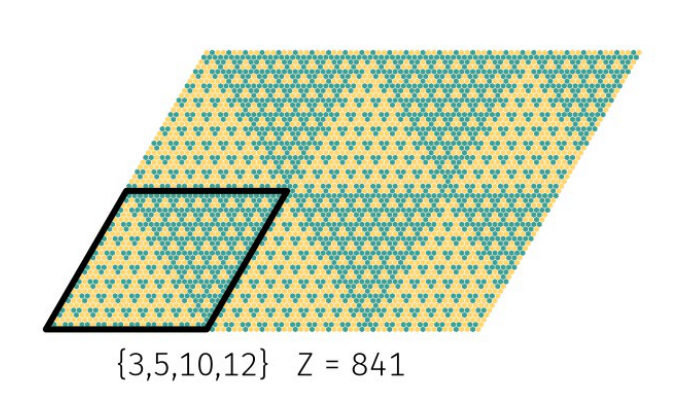 
Figure 5. The periodic groundstate of a ‘giant’ unit cell structure. The list of constituent local

**Summary.** This paper provides a general framework for identifying order in non-periodic materials by using 'structural selectivity' as a metric. By studying thousands of groundstates in a 2D lattice model, the authors demonstrate that a significant portion of non-periodic structures are not merely random but follow identifiable ordering principles.

**Why it may be interesting.** not directly relevant

Detailed structure

**Main problem.** The paper seeks to characterize the structural landscape between periodic crystals and random/amorphous solids, specifically investigating if non-periodic structures can be classified by underlying ordering principles.

**Main result.** The study finds that 96% of groundstate structures are non-periodic, and approximately 35% of these exhibit 'structural selectivity,' a signature of order that persists even at high structural diversity.

**Method.** The authors performed extensive simulations using simulated annealing (cooling) to identify groundstate structures for thousands of different Hamiltonian configurations.

**Model / system.** A 2D Favored Local Structure (FLS) model on a triangular lattice where each site is occupied by an A or B particle, and a many-body Hamiltonian assigns energy -1 to a user-selected set of 'favored' local structures.

**Key observables.** Structural diversity (S1, using Hill's numbers), structural selectivity, and computable information density (CID).

**Important parameters / regimes.** Structural diversity (S1), unit cell size (Z), and the number of distinct local structures (14).

**Assumptions / limitations.** The study focuses on groundstate structures to avoid thermal fluctuation complications; the results are based on a 2D lattice model which may not fully capture 3D off-lattice complexities.

**Figures summary.** Figure 1 shows the 14 possible local structures; Figures 7-8 show distributions of diversity for selective vs. non-selective structures; Figure 9 provides visual examples of different non-periodic selective categories; Figure 10 shows examples of disordered structures.

**Paper structure.** The paper introduces the problem of characterizing non-periodic order, describes the FLS model and simulation protocol, presents the results regarding the prevalence of non-periodicity and selectivity, classifies types of non-periodic order, and discusses limitations and future directions.

Abstract

In this paper we address the characterization of the structure of condensed materials, periodic and non-periodic. Carrying out an extensive study of over 7000 different groundstate structures of a 2D lattice model of binary packing, we find a predominance of non-periodic structures (over 96%) that extend across the entire range of possible diversities. These non-periodic structures are resolved by establishing whether a structure will accommodate or reject additional local structures. This property, structural selectivity, is treated as a signature of an underlying ordering principle. The major result of the paper is the determination that roughly 35% of the non-periodic structures are selective and, hence, ordered in some way. This selectivity extends up to a diversity of ~ 9, well beyond the upper threshold for diversity in periodically ordered states.

[↑ back to top](#top)

### [Q-SpiRL: Quantum Spiking Reinforcement Learning for Adaptive Robot Navigation](http://arxiv.org/abs/2605.20801v1)

**Authors:** Mohamed Khair Altrabulsi, Nouhaila Innan, Alberto Marchisio, Muhammad Kashif, Muhammad Shafique  
**Type:** both · **Category:** quantum information and computing · **PDF:** <https://arxiv.org/pdf/2605.20801v1>  
**Analysis basis:** full PDF text, analyzed in chunks
**Topic relevance:** `QC/QI experiment` **1/5**

📷 Fig 1

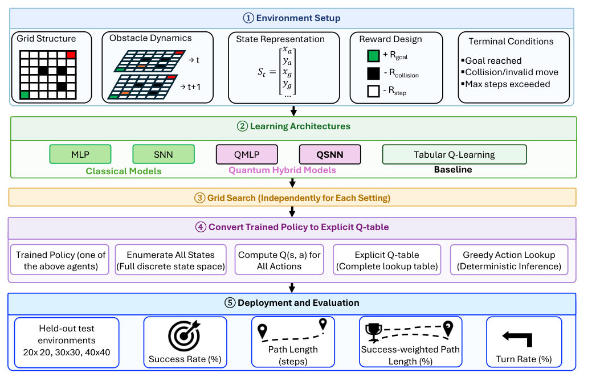 
Fig. 1: Overview of the proposed methodology pipeline. The framework begins with the definition of the navigation environment. It then considers multiple learning architectures, with the QSNN as the central quantum-enhanced model of this work. After independent hyperparameter selection through grid search, each trained policy is converted into an explicit Q-table for deterministic greedy inference. Final evaluation is carried out on held-out environments of different sizes using success rate, path length, success-weighted path length, and turn rate.

📷 Fig 2

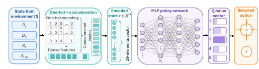 
Fig. 2: Architecture of the classical MLP.

📷 Fig 3

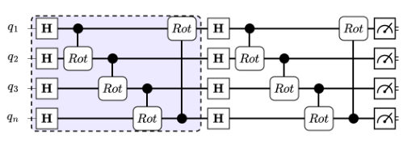 
Fig. 4: Variational quantum circuit, also referred to as a parameterized quantum circuit, used in both the QMLP and QSNN architectures. The circuit is composed of repeated variational blocks acting on n qubits, where the highlighted region represents a single layer L. Each layer consists of Hadamard gates, trainable controlled rotation gates, and entangling operations, and the full circuit is formed by stacking multiple such layers. Final measurements on all qubits produce the quantum features used by the hybrid model.

📷 Fig 4

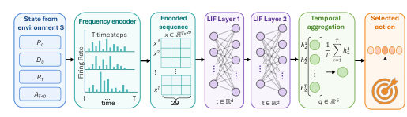 
Fig. 3: Architecture of the classical SNN.

📷 Fig 5

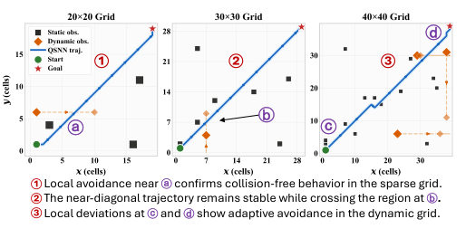 
Fig. 5: Example QSNN trajectories in the 20×20, 30×30, and 40×40 environments. Static obstacles are shown as dark cells, while dynamic obstacle motion is indicated by dashed traces.

**Summary.** This paper introduces Q-SpiRL, a framework that combines quantum variational circuits with spiking neural networks for robot navigation. It demonstrates that the quantum-enhanced spiking architecture outperforms classical and quantum-MLP models in navigating complex, dynamic environments. The study also proves that such hybrid policies can be successfully executed on real IBM quantum processors.

**Why it may be interesting.** not directly relevant

Detailed structure

**Main problem.** Developing adaptive robot navigation policies that can reliably navigate dynamic environments with static and moving obstacles while addressing the resource limitations of classical RL on embedded platforms.

**Main result.** The Quantum Spiking Neural Network (QSNN) achieves the best trade-off between task completion, efficiency, and smoothness, reaching up to a 99% success rate in complex settings and demonstrating feasibility on IBM quantum hardware.

**Method.** The researchers implemented a hybrid framework (Q-SpiRL) comparing five agent families, using a unified training pipeline and converting trained policies into deterministic Q-tables for fair evaluation.

**Model / system.** The central model is a Quantum Spiking Neural Network (QSNN) that integrates a variational quantum circuit (8 qubits, 3 layers) with a Deep Spiking Q-Network using Leaky Integrate-and-Fire neurons and Poisson encoding.

**Key observables.** Success Rate (SR), Success-Weighted Path Length (SPL), Path Length (PL), and Turn Rate (TR).

**Important parameters / regimes.** Environment scales (20x20, 30x30, 40x40), 8 qubits, 3 variational layers, 800 training episodes, and Adam optimizer parameters.

**Assumptions / limitations.** The evaluation assumes that converting policies to deterministic Q-tables eliminates stochasticity for fair comparison; the hardware evaluation is a single-episode feasibility check subject to noise.

**Figures summary.** Figure 1 shows the methodology pipeline; Figure 2 and 3 illustrate the MLP and SNN architectures; Figure 4 details the Variational Quantum Circuit; Figure 5 shows QSNN trajectories; Figure 6 shows a trajectory on real IBM hardware.

**Paper structure.** The paper introduces the navigation problem, details the Q-SpiRL framework and its five agent architectures, describes the simulation environments and evaluation metrics, presents quantitative results across different scales, and concludes with a hardware feasibility check on IBM quantum hardware.

Abstract

Adaptive robot navigation in dynamic environments requires policies that can reach the target reliably while producing efficient and stable trajectories. This paper presents Q-SpiRL, a quantum spiking reinforcement learning framework for obstacle-aware robot navigation. The framework develops and evaluates five agent families: tabular Q-learning, classical MLP, classical SNN, quantum-enhanced MLP (QMLP), and quantum-enhanced spiking neural network (QSNN). While all models are implemented under a unified training and evaluation pipeline, the QSNN is the central architecture of interest, as it combines spike-based temporal processing with variational quantum feature transformation. Experiments are conducted across three grid-world environments of increasing size, namely 20x20, 30x30, and 40x40, with both static and dynamic obstacles. Performance is assessed using success rate, success-weighted path length, path length, and turn rate under deterministic inference. Results show that QSNN achieves the strongest overall trade-off between task completion, trajectory efficiency, and motion smoothness, reaching up to 99% success rate while maintaining high path efficiency in the most challenging setting. Execution on IBM quantum hardware further demonstrates the feasibility of deploying the proposed hybrid policy under real-device conditions.

[↑ back to top](#top)

## Other papers (33)

*Papers from primary archives without highlighted authors or any topic match. Click to expand.*

Show other papers

### [Anisotropic Crystallization Kinetics and Interfacial Dynamics of Phase-Change Material Sb$_2$S$_3$ from Machine Learning Force Field Simulations](http://arxiv.org/abs/2605.20785v1)

**Authors:** Souvik Chakraborty, Wen-Qing Li, Yun Liu  
**Type:** theory · **Category:** disordered systems and neural networks · **PDF:** <https://arxiv.org/pdf/2605.20785v1>  
**Analysis basis:** full PDF text, analyzed in chunks

📷 Fig 1

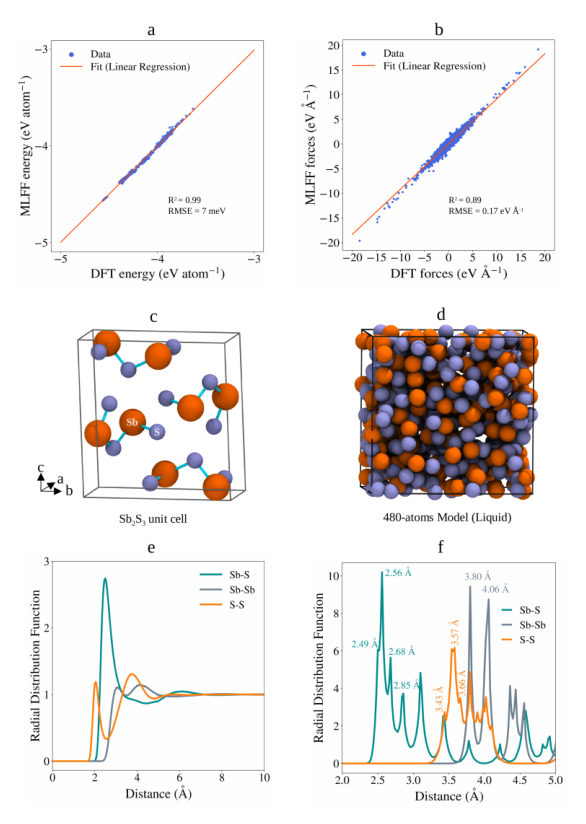 
Figure 1. Correlation of the training set energies (a) and x-component atomic forces (b) obtained at DFT level and MTP prediction. c) The typical Sb2S3 unit cell structure in the Pnma space group. The orange and ice blue spheres represent Sb and S atoms, respectively. The comparison of lattice parameters using DFT and MTP calculations is given in Table 1. d) Snapshot of the equilibrated liquid phase structure of Sb2S3 at 3000 K. e) Radial distribution functions (RDFs) for all atom pairs of liquid Sb2S3 model at 3000 K. Interatomic distances were computed (see Table 2) from the first peak position in the respective RDF plot. f) Radial distribution function of atom pairs for Sb2S3 crystal...

📷 Fig 2

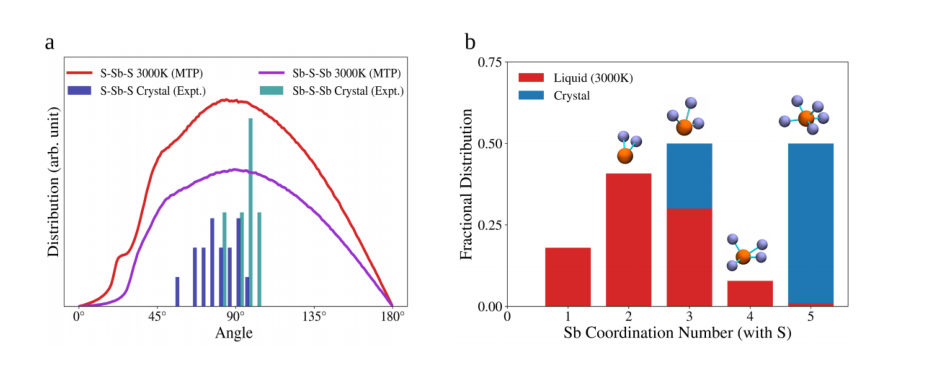 
Figure 2. a) Angle distributions in crystal (experimental[27]) and liquid phase (MTP, this work). b) Coordination number distributions (Sb with S) for crystal and liquid phases. The motifs for each coordination number (in liquid phase) are illustrated.

📷 Fig 3

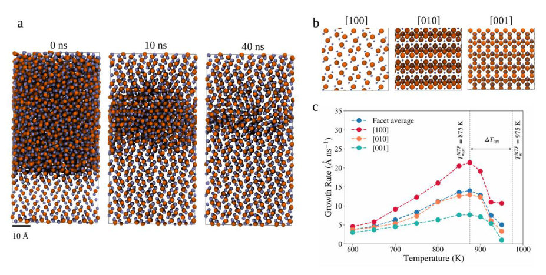 
Figure 3. a) Crystal growth simulation of the dual phase coexistence (DPC) model with 7680 atoms. The evolution of crystal growth (normal to [010] interface) is illustrated by the snapshots taken from simulation trajectory (700 K) at 0, 10, and 40 ns respectively. The final equilibrated box dimension is 46.04 Å × 90.74 Å × 47.10 Å. For other facets, the growth direction remained parallel to the respective elongated box vector. b) Snaps of the three types of facets of Sb2S3 crystal at crystal-liquid interfaces considered in this study. c) The growth rate as a function of temperature for three types of interfacial crystal facets [100], [010], and [001] respectively. The circles represent the...

📷 Fig 4

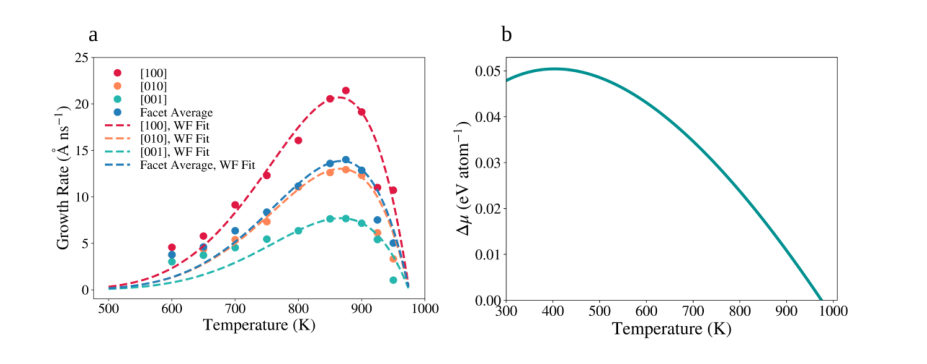 
Figure 4. a) Wilson-Frenkel fitting (Equation 2) of the growth rate data for all three facets and the facet average. The fitting curves are represented by the dashed lines. From the fitting, the activation energy barrier for growth (ΔEaWF) was computed. b) Free energy difference between crystal &amp; liquid (Δµ) as a function of temperature from Thompson-Spaepen formula (Equation 3).

📷 Fig 5

 
Figure 3a illustrates the crystal growth simulation using dual phase coexistence model at 700 K with (010) interfacial facet. The exact setup and details are described in the Models and Methods section. Figure 3b depicts the atomic arrangements at interfacial crystal plane for three

**Summary.** This paper uses machine learning force fields to perform large-scale simulations of the phase-change material Sb2S3. It reveals that the material's crystallization is governed by interface-controlled kinetics and highly anisotropic growth. These insights are crucial for improving the speed and efficiency of next-generation data storage and neuromorphic computing devices.

**Why it may be interesting.** not directly relevant

Detailed structure

**Main problem.** Understanding the atomistic-scale mechanisms, structural evolution, and anisotropic crystallization kinetics of the phase-change material Sb2S3 during the crystal-to-liquid phase transition.

**Main result.** The study finds that Sb2S3 crystallization is interface-controlled rather than diffusion-limited, with the [100] facet exhibiting the fastest growth due to strong covalent bonding along its 1D ribbon structure.

**Method.** Large-scale molecular dynamics simulations using a Machine Learning Force Field (MLFF) developed via the Moment Tensor Potential (MTP) approach and active learning.

**Model / system.** The physical system is the phase-change material antimony sulfide (Sb2S3), which transitions between a crystalline (Pnma space group) and an amorphous/liquid phase. The simulation uses a Dual Phase Coexistence (DPC) model with up to 7680 atoms.

**Key observables.** Lattice parameters, radial distribution functions (RDF), angular distribution functions (ADF), coordination numbers, crystal growth rates (Vg), and activation energies for growth and diffusion.

**Important parameters / regimes.** Activation energy for growth (0.55-0.57 eV), activation energy for diffusion (1.16-1.56 eV), melting point (975 K), and optimal undercooling (~100 K).

**Assumptions / limitations.** The accuracy of the results depends on the quality of the MTP training set; the study assumes the MLFF-MD workflow effectively bridges microscopic dynamics to macroscopic growth.

**Figures summary.** Figure 1 shows MTP training correlation, the Sb2S3 unit cell, and liquid phase snapshots/RDFs; Figure 2 displays angle and coordination number distributions for crystal and liquid phases.

**Paper structure.** The paper introduces the material and problem, describes the development and validation of the MTP machine learning force field, presents structural and kinetic results of the phase transition, and discusses the implications for device optimization.

Abstract

The phase-change material antimony sulfide (Sb$_2$S$_3$) relies on rapid and reversible phase transitions between crystalline and amorphous states, which are critical for their performance in data storage and photonics applications. In this work, a machine learning force field is developed based on the moment tensor potential approach, allowing us to understand the atomistic origin of the structural evolution and crystallization kinetics in Sb$_2$S$_3$ for the first time, by enabling large-scale molecular dynamics simulations (up to 7680 atoms for 40 ns). Sb$_2$S$_3$ shows anisotropic growth rates with the [100] facet exhibiting the fastest growth due to the strong Sb-S covalent bonding along its quasi-1D ribbon-like structure of its crystalline phase. The activation energy for crystal growth is found to be 0.55-0.57 eV, whereas that for diffusion is around 1.16-1.56 eV. The lower activation energy for crystal growth indicates that its heterogeneous crystallization is interface controlled rather than diffusion limited, unlike GST and GeTe with atomic attachment at the solid-liquid interface being energetically favoured over long range atomic transport. These findings provide key insights into the structural, thermodynamic, and kinetic properties of Sb$_2$S$_3$, paving the way for optimizing its functionality including switching speed, reliability, and energy efficiency.

[↑ back to top](#top)

### [Approximation Theory for Neural Networks: Old and New](http://arxiv.org/abs/2605.21451v1)

**Authors:** Soumendu Sundar Mukherjee, Himasish Talukdar  
**Type:** theory · **Category:** disordered systems and neural networks · **PDF:** <https://arxiv.org/pdf/2605.21451v1>  
**Analysis basis:** full PDF text, analyzed in chunks

📷 Fig 1

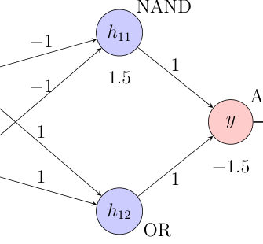 
Figure 2: A multilayer perceptron representing XOR. The numbers beside the edges denote the correspond- ing weights and the number below nodes denote the biases. The hidden layer transforms the input space into a feature space where the classes become linearly separable. The two hidden units/neurons represent- ing the NAND and OR gates. The outputs of these are then passed though another neuron that imple- ments the AND gate.

📷 Fig 2

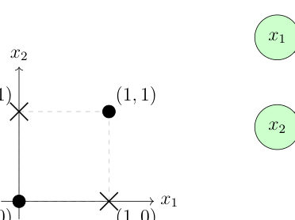 
Figure 1: Linear non-separability of XOR is visually evident in R2, where no single line can isolate the classes. Here, circles represent out- put 0, crosses 1.

📷 Fig 3

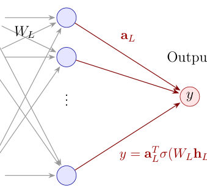 
Figure 3: Schematic of a feedforward neural network with L (hidden) layers.

📷 Fig 4

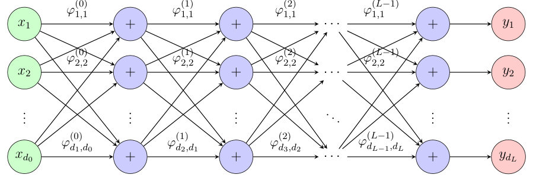 
Figure 4: Schematic of a KAN with L layers: each edge here represents a learnable (typically nonlinear) univariate function φ(l) j,i, and each blue node aggregates by summation. Thus, unlike FNNs, nonlinearities are associated with edges rather than nodes.

**Summary.** This survey provides a comprehensive overview of the mathematical foundations of neural network approximation theory. It details how depth and width influence the ability to represent complex functions and evaluates the emerging Kolmogorov-Arnold Network architecture. It is a significant resource for understanding the fundamental limits of machine learning architectures.

**Why it may be interesting.** not directly relevant

Detailed structure

**Main problem.** The paper surveys the mathematical theory of neural network approximation, specifically comparing the expressive power, parameter efficiency, and error rates of classical feedforward networks versus Kolmogorov-Arnold Networks (KANs).

**Main result.** It establishes that deeper architectures can achieve superior parameter efficiency for complex functions and provides quantitative error bounds for spline-based KANs, while noting that a definitive comparison of approximation rates between KANs and FNNs remains an open question.

**Method.** The survey reviews functional analytic proofs (e.g., Hahn-Banach, Riesz representation), Fourier analysis, and constructive methods using B-splines and tent functions to analyze approximation rates in Sobolev and Besov spaces.

**Model / system.** The paper discusses various neural network architectures, including Feedforward Neural Networks (FNNs) with ReLU/Sigmoidal activations and Kolmogorov-Arnold Networks (KANs) which utilize learnable univariate functions on edges.

**Key observables.** Approximation error rates, network width, network depth, and topological complexity of represented functions.

**Important parameters / regimes.** Network width (m), depth (L), grid size (G) for splines, and the smoothness (Holder/Sobolev) of target functions.

**Assumptions / limitations.** The analysis focuses on functions defined on compact subsets of R^d and assumes familiarity with functional analysis; it does not address optimization or statistical generalization.

**Figures summary.** Figure 1 shows the XOR problem as a case of linear non-separability; Figure 2 illustrates how a hidden layer enables linear separation; Figure 3 depicts a standard multi-layer perceptron architecture; Figure 4 shows the edge-based nonlinearity structure of KANs.

**Paper structure.** The paper provides a historical overview of universal approximation, moves into quantitative refinements regarding depth-width trade-offs, analyzes specific activation functions, explores the new KAN paradigm, and concludes with open theoretical challenges.

Abstract

Universal approximation theorems provide a mathematical explanation for the expressive power of neural networks. They assert that, under mild conditions on the activation function, feedforward neural networks are dense in broad function classes, such as continuous functions on compact subsets of $\mathbb{R}^d$, $L^p$ spaces, or Sobolev spaces. Over the past four decades, these qualitative universality results have evolved into a rich quantitative theory addressing approximation rates, parameter efficiency, and the role of architectural features such as depth and width. This survey presents several glimpses into this theory. We review classical density results for single-hidden-layer networks, as well as quantitative bounds that relate approximation error to network size and smoothness assumptions on target functions. Particular emphasis is placed on depth--width trade-offs and on results demonstrating that deeper architectures can achieve superior parameter efficiency for structured function classes. In addition to standard feedforward neural networks, we also review recent developments on Kolmogorov--Arnold Networks (KANs), which offer an alternative architectural paradigm and whose approximation-theoretic properties have begun to attract significant theoretical attention.

[↑ back to top](#top)

### [Circuits of Quantum Hashing and Quantum Fourier Transform for a Cactus as a Qubit Connectivity Graph](http://arxiv.org/abs/2605.20789v1)

**Authors:** Kamil Khadiev, Ilnur Valeev  
**Type:** theory · **Category:** quantum information and computing · **PDF:** <https://arxiv.org/pdf/2605.20789v1>  
**Analysis basis:** full PDF text, analyzed in chunks

📷 Fig 1

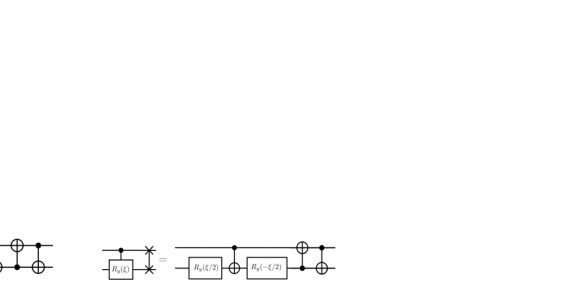 
Fig. 2. Representation of CRy, SWAP gates, and a pair CRy and SWAP gates using only basic gates.

**Summary.** This paper provides an efficient, polynomial-time method for building optimized quantum circuits for Quantum Hashing and QFT on cactus-structured quantum hardware. By solving a specific graph-theoretic path problem, the authors significantly reduce the number of CNOT gates required compared to previous methods.

**Why it may be interesting.** not directly relevant

Detailed structure

**Main problem.** Optimizing quantum circuit construction, specifically minimizing CNOT gate counts for Quantum Hashing and Quantum Fourier Transform (QFT), under restricted qubit connectivity constraints.

**Main result.** The authors present an O(n^3) algorithm to construct shallow circuits for cactus graph architectures, significantly reducing CNOT complexity compared to exponential-time algorithms for arbitrary graphs.

**Method.** The approach uses a solution to the 'Shortest non-simple 1-covering path' (1-SNSCPP) problem via dynamic programming on a tree-transformed cactus graph to guide qubit movement via SWAP gates.

**Model / system.** A quantum device where two-qubit gates are restricted by a 'cactus' connectivity graph, where any two simple cycles share at most one vertex.

**Key observables.** CNOT gate count (cost) and circuit depth.

**Important parameters / regimes.** Number of qubits (n), number of edges (m), path length (k), and the length of the input word (l).

**Assumptions / limitations.** The optimization results are specifically tailored to the cactus graph topology and assume the ability to implement SWAP and controlled rotation gates.

**Figures summary.** Figures illustrate shallow circuit architectures, gate decompositions (CRy, SWAP, CRd), comparisons between standard and optimized paths on cactus graphs, and the construction of auxiliary trees for the DP algorithm.

**Paper structure.** The paper introduces the problem of connectivity-constrained circuit optimization, defines the cactus graph model, presents a polynomial-time solution for the 1-SNSCPP problem using dynamic programming, applies this to Quantum Hashing and QFT, and provides complexity analysis and CNOT cost bounds.

Abstract

We present a quantum circuit implementation of the quantum hashing algorithm (quantum fingerprinting) for a quantum device with restrictions on the application of two-qubit gates by a qubit connectivity graph. We present an optimization technique for the shallow circuit for quantum hashing in the case of a cactus as a qubit connectivity graph. The algorithm has $O(n^3)$ complexity to build the circuit, where $n$ is the number of qubits and $m$ is the number of connections (edges) in the graph. It is improvement compared to the existing exponential-time algorithm in the case of arbitrary graphs. The algorithm uses solution for the shortest non-simple 1-covering path problem as a subroutine. We present an $O(n^3)$-time solution for this graph-theory problem in the case of a cactus. This result can be interesting independently. The algorithm also used for improving of the quantum circuit for Quantum Fourier Transform.

[↑ back to top](#top)

### [Competing anisotropies and phase transitions in the $q$-state clock model with a $p$-fold crystalline field](http://arxiv.org/abs/2605.20990v1)

**Authors:** Milan Žukovič  
**Type:** theory · **Category:** statistical mechanics · **PDF:** <https://arxiv.org/pdf/2605.20990v1>  
**Analysis basis:** full PDF text, analyzed in chunks

📷 Fig 1

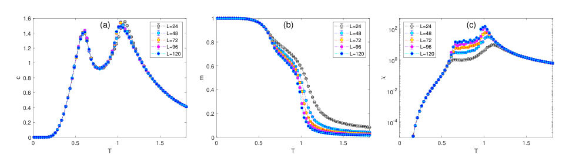 
Figure 1: Temperature dependencies of (a) the specific heat, (b) the magnetization and (c) the magnetic susceptibility of the isotropic six-state clock model, for various lattice sizes.

📷 Fig 2

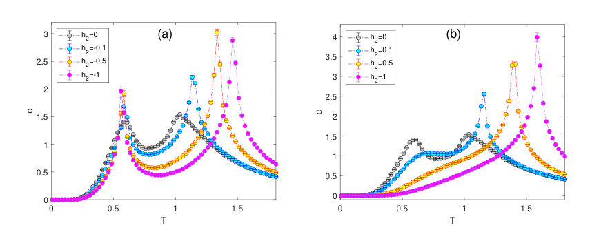 
Figure 2: Temperature dependencies of the specific heat for 푝= 2, 퐿= 72, and several (a) negative and (b) positive values of ℎ2 (ℎ2 = 0 case is also included for reference).

📷 Fig 3

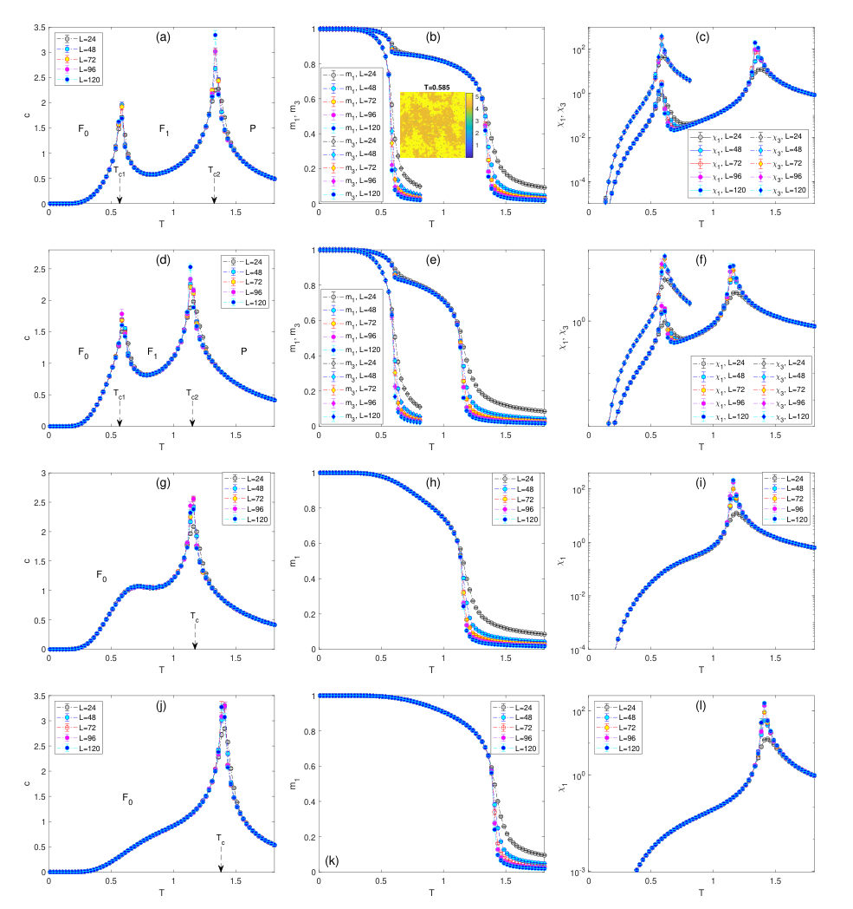 
Figure 3: Temperature dependencies of (a,d,g,j) the specific heat, (b,e,h,k) the magnetizations 푚1 and 푚3, and (c,f,i,l) the magnetic susceptibilities for 푝= 2, (a-c) ℎ2 = −0.5, (d-f) ℎ2 = −0.1, (g-i) ℎ2 = 0.1, (j-l) ℎ2 = 0.5, and various lattice sizes. 푇푐1 and 푇푐2 are the critical temperatures at the respective 퐹0 −퐹1 and 퐹1 −푃transitions for ℎ2 &lt; 0 and 푇푐denotes the critical temperature at the 퐹0 −푃transition for ℎ2 &gt; 0.

📷 Fig 4

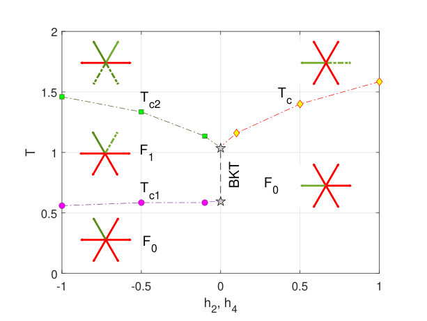 
Figure 4: Phase diagram for 푝= 2 and 4. 퐹0 and 퐹1 denote different FM LRO phases and BKT denotes the line of BKT transition points between 푇푐1 and 푇푐2 (marked by pentagrams) for ℎ푖= 0, 푖= 2, 4. In the schematic illustration of the characteristic spin states the green color represents the states selected by the symmetry-breaking field and thermal fluctuations with the dashed lines showing degenerate states.

📷 Fig 5

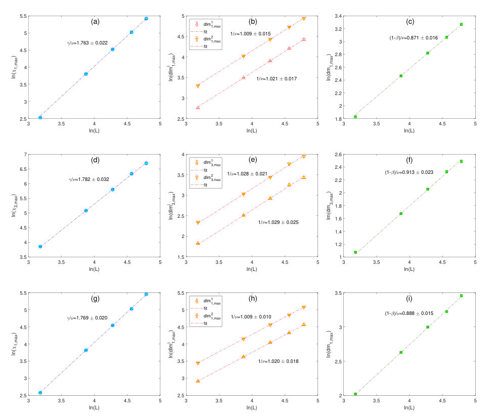 
Figure 5: FSS analysis for 푝= 2 of the quantities (a-c) 휒1, 푑푙푚푙 1, 푙= 1, 2, and 푑푚1 at the transition temperature 푇푐2, (d-f) 휒3, 푑푙푚푙 3, 푙= 1, 2, and 푑푚3 at the transition temperature 푇푐1, for ℎ2 = −0.5 and (g-i) 휒1, 푑푙푚푙 1, 푙= 1, 2, and 푑푚1 at the transition temperature 푇푐, for ℎ2 = 0.5.

**Summary.** This paper explores how adding a p-fold symmetry-breaking field to the 2D q-state clock model reshapes its phase diagram. It demonstrates that these fields can destroy the topological BKT phase and replace it with conventional long-range order, with the specific transition type depending on the competition between the intrinsic and imposed symmetries.

**Why it may be interesting.** not directly relevant

Detailed structure

**Main problem.** Investigating how competing discrete anisotropies (intrinsic Zq symmetry vs. external Zp crystalline fields) affect the phase transitions and the stability of the BKT phase in the 2D q-state clock model.

**Main result.** Even weak crystalline fields suppress the BKT phase and induce transitions to long-range order, with the phase diagram being governed by the competition between locking mechanisms rather than symmetry alone. Specifically, for q=6, p=2, the sign of the field determines whether there is a single transition (h2 > 0) or a two-step ordering process (h2 < 0).

**Method.** Monte Carlo simulations using the Metropolis algorithm combined with finite-size scaling (FSS) analysis to determine critical exponents and universality classes.

**Model / system.** A two-dimensional q-state clock model on a square lattice with an additional p-fold crystalline field term, described by the Hamiltonian H = -J sum cos(theta_i - theta_j) - hp sum cos(p*theta_i).

**Key observables.** Specific heat, generalized magnetizations (m1, m3), magnetic susceptibilities, and logarithmic derivatives of magnetization moments.

**Important parameters / regimes.** Temperature (T/J), crystalline field strength (hp), symmetry indices (p, q), and lattice size (L).

**Assumptions / limitations.** The study assumes the system is in the strong-anisotropy limit of generalized XY models and focuses on the interplay between discrete symmetries.

**Figures summary.** Figures show temperature dependence of specific heat, magnetization, and susceptibility for the isotropic model; phase diagrams and specific heat peaks for p=2 (showing single vs. double transitions); and FSS analysis of critical exponent ratios for p=3.

**Paper structure.** The paper introduces the model and the problem of competing anisotropies, details the Monte Carlo methodology, presents results for the p=2 case (distinguishing between positive and negative field strengths), analyzes the p=3 case (identifying Potts criticality), and concludes with a discussion on the instability of the BKT phase and the role of finite-size effects.

Abstract

We study the two-dimensional $q$-state clock model in the presence of an additional $p$-fold symmetry-breaking crystalline field using Monte Carlo simulations. While the pure clock model exhibits Berezinskii--Kosterlitz--Thouless (BKT) transitions for sufficiently large $q$, the effect of competing discrete anisotropies on this topological phase remains nontrivial. We show that even weak crystalline fields qualitatively modify the phase diagram by suppressing the BKT phase and inducing transitions to states with true long-range order. The resulting behavior depends sensitively on the interplay between the intrinsic $\mathbb{Z}_q$ symmetry and the imposed $\mathbb{Z}_p$ anisotropy. In particular, in the six-state clock model for $p=2$ we observe qualitatively different scenarios depending on the sign of the field: a single transition for $h_2>0$ and a two-step ordering process for $h_2<0$ with an intermediate ordered phase. For $p=3$, the system exhibits a direct transition consistent with three-state Potts criticality. These results demonstrate that the phase structure cannot be inferred from symmetry considerations alone, but is governed by the competition between distinct locking mechanisms. Our findings provide a discrete counterpart to the multi-frequency sine-Gordon description of generalized $XY$ models and illustrate how additional anisotropies reshape topological phase transitions in two dimensions.

[↑ back to top](#top)

### [Discernible signatures of fractionally charged anyons in a Pfaffian-Laughlin state](http://arxiv.org/abs/2605.21462v1)

**Authors:** Vadym Apalkov, Tapash Chakraborty  
**Type:** theory · **Category:** strongly correlated electrons · **PDF:** <https://arxiv.org/pdf/2605.21462v1>  
**Analysis basis:** full PDF text, analyzed in chunks

📷 Fig 1

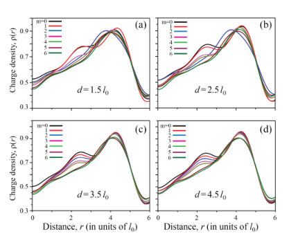 
FIG. 2. Electron density for a Pfaffian state coupled to a QD containing one electron. Different lines correspond to different values of the angular momentum of the system, as marked in each panel. For each angular momentum, m, the density is shown for the corresponding lowest state. The distance between the 2D layer and the QD layer is d = 1.5l0 (a), 2.5 l0 (b), 3.5 l0 (c), 4.5 l0 (d).

📷 Fig 2

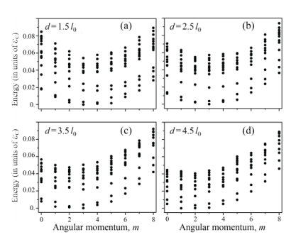 
FIG. 1. Energy spectra of a Pfaffian state coupled to a QD containing one electron. The distance between the 2D layer and the QD layer is d = 1.5l0 (a), 2.5 l0 (b), 3.5 l0 (c), 4.5 l0 (d). Only a few low-energy states are shown for each angular momentum, m.

📷 Fig 3

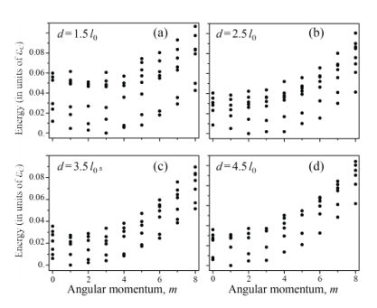 
FIG. 3. Energy spectra of a Pfaffian state coupled to a QD containing one electron and one hole. The distance between the 2D layer and the QD layer is d = 1.5l0 (a), 2.5 l0 (b), 3.5 l0 (c), 4.5 l0 (d). Only a few low-energy states are shown for each angular momentum, m.

📷 Fig 4

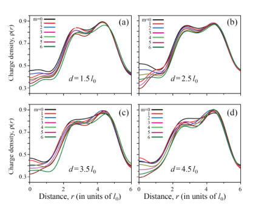 
FIG. 4. Electron density for a Pfaffian state coupled to a QD containing one electron and one hole. Different lines cor- respond to different values of the angular momentum of the system, as marked in each panel. For each angular momen- tum, m, the density is shown for the corresponding lowest state. The distance between the 2D layer and the QD layer is d = 1.5l0 (a), 2.5 l0 (b), 3.5 l0 (c), 4.5 l0 (d).

**Summary.** This paper proposes a theoretical method to detect e/4 anyons in the Pfaffian state by coupling the state to a quantum dot. By analyzing the energy dispersion and charge density, the authors show that the interaction between the dot and the fluid provides clear signatures of these elusive quasiparticles. This approach could potentially be verified using photoluminescence spectroscopy.

**Why it may be interesting.** not directly relevant

Detailed structure

**Main problem.** The study aims to identify discernible signatures of e/4 fractionally charged anyons in a Pfaffian-Laughlin state by investigating their energy dispersion and charge density distribution.

**Main result.** The authors observe clearly gapped energy branches in the energy spectra, where branch splitting is driven by inter-quasihole interactions, and estimate the e/4 quasihole creation energy to be approximately 0.014 epsilon_C.

**Method.** The researchers use exact diagonalization of the interaction Hamiltonian within a spherical geometry to calculate many-electron energy spectra and electron density distributions.

**Model / system.** A bilayer system consisting of a 2D electron layer in an incompressible Pfaffian state at filling factor nu = 1/2, coupled via Coulomb interactions to a nearby 2D quantum dot with a parabolic confinement potential.

**Key observables.** Energy dispersion, charge density distribution, and quasihole creation energy.

**Important parameters / regimes.** Filling factor nu = 1/2, magnetic field B = 15 T, interlayer distance d (ranging from 1.5l0 to 4.5l0), and Haldane pseudopotentials.

**Assumptions / limitations.** The electrons are assumed to be spinless due to large Zeeman energy, and the system is treated as a finite electron system.

**Figures summary.** Figure 1 shows energy spectra for a QD with one electron at various distances; Figure 2 shows electron density distribution for the one-electron case; Figure 3 shows energy spectra for a QD containing an exciton.

**Paper structure.** The paper introduces the problem of anyon identification, describes the theoretical model of a QD-coupled Pfaffian state, presents numerical results for energy spectra and density distributions for both electron and exciton-filled dots, and concludes with implications for PL spectroscopy.

Abstract

Understanding the nature of quasihole excitations, i.e., anyons that have fractional charge and statistics, has been a challenging problem in condensed matter physics. Our theoretical approach to this problem has been to consider a quantum dot, containing a few charged particles, coupled to the incompressible fluid. It has provided important insights into the energetics of Laughlin quasiholes. Photoluminescence (PL) spectroscopy studies of this system have been able to probe these quasiholes that have confirmed our expectations. Turning to the Pfaffian state, we now observe that such a system is also able to provide valuable information about the Pfaffian quasiholes, viz., the energy dispersion, the charge density distribution and the quasihole creation energy. The energy dispersion of e/4 quasiholes derived here, clearly reflect the interaction between the quantum dot and the incompressible Pfaffian state. PL spectroscopy experiments on the 5/2 Pfaffian-Laughlin state could perhaps shed light on the energetics of these elusive quasiparticles.

[↑ back to top](#top)

### [Distinct lattice and charge excitations in AV3Sb5 kagome superconductors](http://arxiv.org/abs/2605.20573v1)

**Authors:** Dongjin Oh, Stefan Enzner, Lennart Klebl, Harley D. Scammell, Julian Ingham, Tim Wehling, Giorgio Sangiovanni, Ronny Thomale, Ahmet Kemal Demir, Connor Occhialini, Dirk Wulferding, Ziqiang Wang, Andrea C. Salinas, Stephen D. Wilson, Riccardo Comin  
**Type:** both · **Category:** strongly correlated electrons · **PDF:** <https://arxiv.org/pdf/2605.20573v1>  
**Analysis basis:** full PDF text, analyzed in chunks

📷 Fig 1

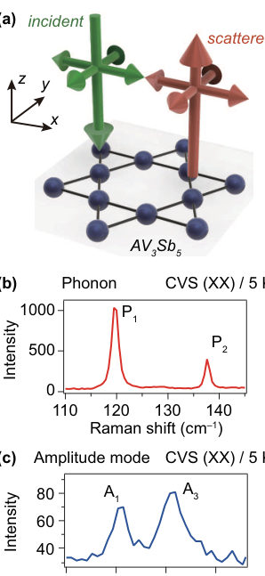 
FIG. 1. (a) Experimental geometry of polarization-resolved Raman spectroscopy. Green and red arrows indicate incident and scattered lights, respectively. (b) Phonon spectrum of CsV3Sb5 measured in parallel polarization (XX) geometry at 5 K. (c) CDW amplitude mode spectrum of CsV3Sb5 mea- sured in XX geometry at 5 K.

📷 Fig 2

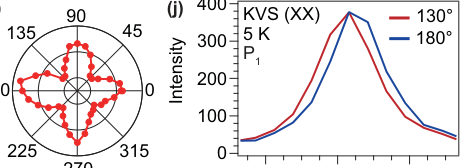 
FIG. 2. Polarization angle (θ)-dependent phonon frequencies of AV3Sb5. (a) θ-dependence of the P1 phonon frequency in CsV3Sb5. (b) Raw P1 phonon spectra measured at θ = 130◦

📷 Fig 3

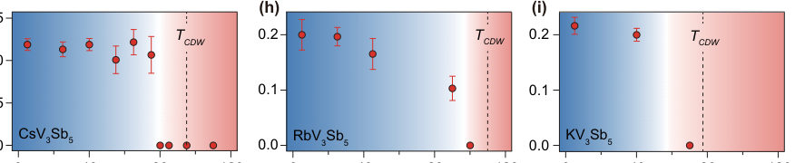 
FIG. 3. P1 phonon splitting of AV3Sb5 in CDW phase (a,b) Two Lorentzian function fitting results of XX Raman spectra of CsV3Sb5 measured at θ = 130◦(a) and θ = 180◦(b). The green and orange shaded areas indicate the spectral weights of the P1(1) and P1(2) phonons, respectively. The red solid curves and circles correspond to the integrated spectral weights of P1(1) and P1(2) phonons and the raw Raman data, respectively. (c) θ-dependent spectral weights of the P1(1) and P1(2) phonons, extracted from XX Raman spectra. Circles and solid curves represent experimental data and simulated results, respectively. (d-f) Corresponding plots for the XY Raman spectra of CsV3Sb5. All data were collected...

📷 Fig 4

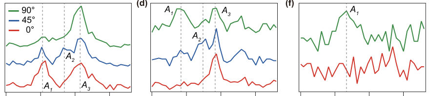 
FIG. 4. Amplitude mode spectra of AV3Sb5. (a) Angle-resolved polarized Raman spectra of CsV3Sb5. (b) Raw Raman spectra of CsV3Sb5. Red, blue and green curves correspond to measurements at polarization angles (θ) of 0◦, 45◦, and 90◦, respectively. Dashed lines indicate the peak positions of the amplitude modes. (c-f) Corresponding plots for RbV3Sb5 (c and d) and KV3Sb5 (e and f), respectively. The θ-dependent Raman spectra were measured in the XX polarization geometry with 2.33 eV photon energy.

**Summary.** This paper investigates the difference between lattice and charge excitations in AV3Sb5 kagome superconductors using polarized Raman spectroscopy. It finds that while the splitting of certain phonon modes is a universal feature across Cs, Rb, and K variants, the charge density wave excitations are highly material-dependent. This distinction provides new clues into how symmetry breaking emerges in these correlated electronic systems.

**Why it may be interesting.** not directly relevant

Detailed structure

**Main problem.** The microscopic origin of the distinct electronic symmetry-breaking phenomena and the material-dependent charge density wave (CDW) orders in AV3Sb5 (A=Cs, Rb, K) kagome superconductors remains elusive.

**Main result.** The study reveals that while the lifting of the E2g phonon degeneracy is a ubiquitous lattice anomaly across all three compounds, the collective CDW amplitude modes exhibit markedly different polarization dependences depending on the alkali-metal species.

**Method.** Angle-resolved polarized Raman spectroscopy (ARPRS) combined with first-principles calculations (DFPT) and an effective Hamiltonian model.

**Model / system.** The physical system is the family of AV3Sb5 (A=Cs, Rb, K) kagome superconductors, which feature both superconductivity and charge density wave phases with complex symmetry breaking.

**Key observables.** Phonon modes (E2g doublet splitting and A1g singlet), CDW amplitude modes, and polarization-resolved Raman spectra (XX and XY geometries).

**Important parameters / regimes.** Polarization angle (theta), temperature (T), Raman shift (cm-1), and phonon frequency modulation.

**Assumptions / limitations.** The analysis assumes the observed phonon shifts are due to spectral overlap of independent modes rather than experimental misalignment.

**Figures summary.** Fig 1 shows the experimental geometry and basic Raman spectra; Fig 2 demonstrates the fourfold modulation of the P1 phonon frequency across Cs, Rb, and K compounds; Fig 3 provides detailed Lorentzian fitting of the P1 phonon splitting.

**Paper structure.** The paper introduces the problem of symmetry breaking in AV3Sb5, presents experimental Raman spectroscopy results showing universal lattice anomalies and distinct charge dynamics, and concludes with theoretical modeling and implications for charge order structures.

Abstract

The kagome superconductor family AV3Sb5 (A=Cs, Rb, K) provides a rich platform for exploring diverse electronic symmetry breaking phenomena, including superconductivity and various forms of density wave orders. Although these compounds share the identical lattice structure in the normal state, they exhibit distinct forms of symmetry breaking upon entering the charge density wave (CDW) phase, and the microscopic origin of which remain elusive. Here, we investigate the lattice and charge degrees of freedom in AV3Sb5 using angle-resolved polarized Raman spectroscopy. Our comprehensive polarization-resolved measurements reveal that the lifting of the twofold-degeneracy of the E2g phonon mode in the CDW phase-previously reported only in CsV3Sb5 with a 3 GHz splitting-also appears ubiquitously in the other two compounds. In contrast, the collective CDW excitations exhibit markedly different polarization dependences depending on the alkali-metal species. These distinct behaviors in the lattice and charge channels provide crucial insight into the enigmatic material-dependent symmetry breaking phenomena that appear in the CDW phase. Furthermore, our experiments, together with first-principles calculations and an effective Hamiltonian model, shed light on the nature of the charge order structure in AV3Sb5 kagome superconductors.

[↑ back to top](#top)

### [Enhanced Reinforcement Learning-based Process Synthesis via Quantum Computing](http://arxiv.org/abs/2605.21213v1)

**Authors:** Austin Braniff, Fengqi You, Yuhe Tian  
**Type:** both · **Category:** quantum information and computing · **PDF:** <https://arxiv.org/pdf/2605.21213v1>  
**Analysis basis:** full PDF text, analyzed in chunks

📷 Fig 1

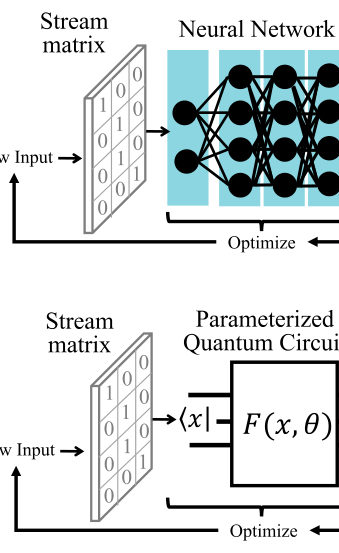 
Figure 1: An overview of the classical and quantum RL approaches for process design.

📷 Fig 2

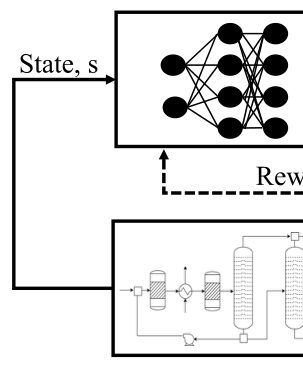 
Figure 2: Value-based deep reinforcement learning nomenclature for the present work.

📷 Fig 3

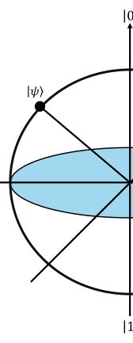 
Figure 3: Bloch sphere diagram for quantum state representation.

📷 Fig 4

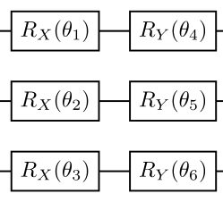 
Figure 4: Circuit diagram of a PQC.

📷 Fig 5

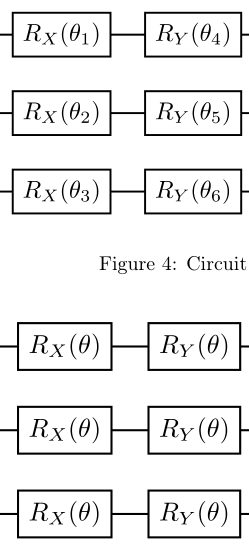 
Figure 5: Circuit diagram for a PQC layer.

**Summary.** This paper proposes a quantum reinforcement learning framework for optimizing chemical process flowsheets. By introducing new encoding strategies, it overcomes previous qubit scaling limitations, showing that quantum circuits can match classical performance with significantly fewer parameters.

**Why it may be interesting.** not directly relevant

Detailed structure

**Main problem.** The paper addresses the scalability bottleneck in using quantum reinforcement learning for combinatorial process synthesis, where previous qubit requirements scaled poorly with problem complexity.

**Main result.** The authors demonstrate that new state encoding algorithms decouple qubit requirements from problem size, allowing quantum-enhanced RL to achieve competitive performance and improved parameter efficiency compared to classical Deep Q-Networks.

**Method.** The work introduces a hybrid quantum-classical framework using Parameterized Quantum Circuits (PQCs) as value-function approximators, employing data re-uploading and multi-axis encoding strategies.

**Model / system.** The problem is modeled as a Markov Decision Process (MDP) for chemical process synthesis, specifically applied to a hydrodealkylation (HDA) reaction involving toluene, hydrogen, and methane.

**Key observables.** Performance metrics include the number of optimal, unique, and feasible solutions found, as well as the episode number of first discovery and total runtime.

**Important parameters / regimes.** Key parameters include qubit count, circuit depth, number of input features, rotation gate angles, discount factor, and learning rate.

**Assumptions / limitations.** The study assumes the HDA reaction occurs in the vapor phase with ideal vapor-liquid equilibrium and that the process synthesis can be discretized into a sequential decision-making task.

**Figures summary.** Figure 1 compares classical and quantum RL; Figure 2 shows RL nomenclature; Figures 3-6 illustrate the Bloch sphere, PQC architectures, and data re-uploading; Figures 8-10 show the RL workflow and specific encoding variants; Figure 11 shows an optimal flowsheet.

**Paper structure.** The paper introduces the process synthesis problem, defines the MDP framework, details the classical DQN baseline, presents the proposed quantum-enhanced RL variants and encoding strategies, evaluates performance across increasing design complexities, and concludes with a discussion on scalability and hardware limitations.

Abstract

In this work, we present quantum reinforcement learning (RL) as a solution strategy for process synthesis problems. Building on our prior work, we develop a generalized framework that formally poses process synthesis as a Markov decision process and introduces quantum-enhanced RL algorithms to solve it with improved scalability. Earlier implementations of quantum-based RL for process synthesis were limited by qubit requirements, which scaled poorly with problem complexity. This work overcomes this challenge by introducing state encoding algorithms to decouple qubit requirements from problem size. A classical RL-based solution strategy is used as a baseline to benchmark the quantum algorithms under identical training conditions. All algorithms are evaluated across a flowsheet synthesis problem of increasing unit counts to analyze their performance and scalability. Results show that all approaches are capable of identifying the optimal flowsheet designs in small design spaces. For moderate-scale unit counts, quantum approaches demonstrate competitive performance on a per-episode basis and improved efficiency on a per-parameter basis versus the classical RL benchmark. This work provides a foundation for future quantum computing applications within process systems engineering, establishes a controlled benchmark for comparing classical and quantum algorithms, and shows that the proposed quantum variants remain competitive for the process synthesis problem examined in this work.

[↑ back to top](#top)

### [Fermion condensation in a generalized Hatsugai-Kohmoto model with momentum-mixing Landau interactions](http://arxiv.org/abs/2605.21277v1)

**Authors:** Jan Heinrich, Andreas Rückriegel, Peter Kopietz  
**Type:** theory · **Category:** strongly correlated electrons · **PDF:** <https://arxiv.org/pdf/2605.21277v1>  
**Analysis basis:** full PDF text, analyzed in chunks

📷 Fig 1

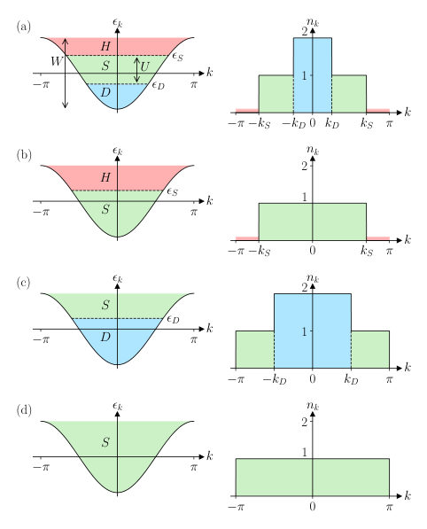 
FIG. 1. (a) Left figure: ground state occupation of a one- dimensional energy band in the phase HSD where all three types of occupations coexist in the band. Here and in all subsequent figures empty states (holes) are shaded red, singly occupied states are shaded green, and doubly occupied states are shaded blue. The horizontal dashed lines mark the Fermi energies ϵD and ϵS where the occupation changes discontin- uously. Right figure: momentum distribution in the HSD phase. The vertical dashed lines mark the positions of the Fermi momenta kD and kS. All wavevectors are measured in units of the inverse lattice spacing. (b)-(d) are analogous illustrations of the phases HS, SD, and S.

📷 Fig 2

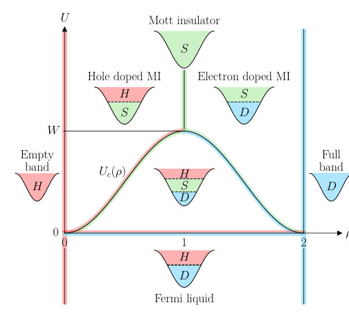 
FIG. 2. Phase diagram of the HK model as a function of the density ρ and the interaction U. The color coding indicates the occupancies of momentum states: holes (H, red), singly occupied states (S, green), and doubly occupied states (D, blue). The insets represent the corresponding band fillings.

📷 Fig 3

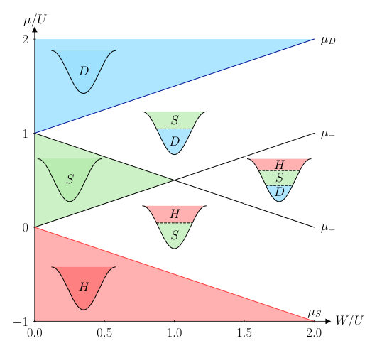 
FIG. 4. Phase diagram of the HK model as a function of the chemical potential µ/U and band width W/U in units of the interaction U. The thick black lines represent the chemical potentials µ+, µ−defined in Eq. (38). The thick red lines represents µS = −W/2, while the thick blue line represents µD = U + W/2.

📷 Fig 4

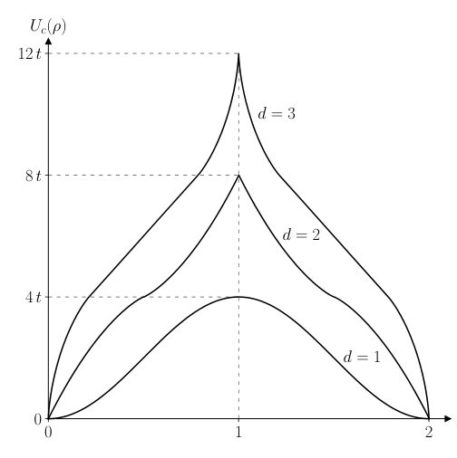 
FIG. 3. Critical interaction Uc(ρ) separating the HSD phase from the HS phase and the SD phase for a d-dimensional tight-binding dispersion of the type (37) in d = 1, 2, 3.

📷 Fig 5

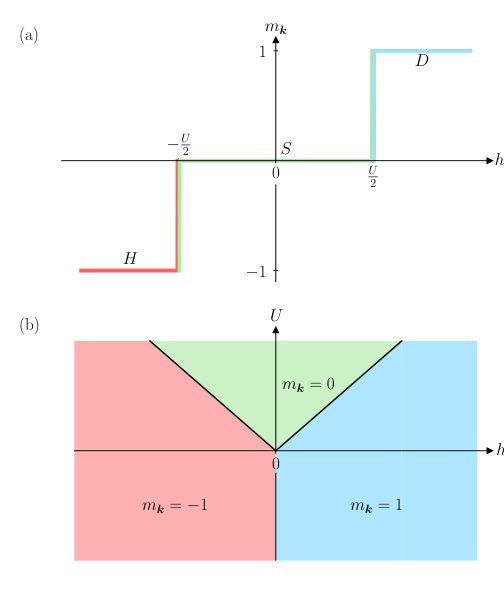 
FIG. 5. (a) Local magnetic moment mk = ⟨Sz k⟩of the pseu- dospin HK model (48) as function of the pseudomagnetic field hk. (b) Phase diagram of the HK model in the plane spanned by hk and U.

**Summary.** This paper explores how momentum-dependent interactions modify the electronic structure of the Hatsugai-Kohmoto model. It demonstrates that these interactions can induce a partially flat energy band, providing a theoretical mechanism for fermion condensation. The study also provides a mapping between the electronic model and a generalized Ising model.

**Why it may be interesting.** not directly relevant

Detailed structure

**Main problem.** Investigating whether momentum-mixing Landau interactions in a generalized Hatsugai-Kohmoto model lead to the emergence of a partially flat energy band (fermion condensation).

**Main result.** The study finds that momentum-mixing interactions smooth out magnetic domain walls in a pseudospin representation, resulting in a partially flat electronic band consistent with the fermion condensation scenario.

**Method.** The authors employ a self-consistent mean-field analysis and a pseudospin formulation that maps the model onto a generalized Ising model in reciprocal space.

**Model / system.** A generalized Hatsugai-Kohmoto (HKL) model describing electrons on a d-dimensional hypercubic lattice with kinetic energy, Hubbard-like interaction (U), and momentum-mixing Landau-type interactions.

**Key observables.** Momentum distribution (n_k), Fermi surfaces, energy dispersion, pseudomagnetization (m_k), and the excitation gap (Delta).

**Important parameters / regimes.** Interaction strength (U), bandwidth (W), particle density (rho), and momentum-mixing interaction parameters (f_kk').

**Assumptions / limitations.** The HKL model is not exactly solvable, necessitating a mean-field approximation; the interaction range is assumed to be finite in reciprocal space.

**Figures summary.** Figure 1 shows ground state configurations and momentum distributions for different phases (HSD, HS, SD, S); Figure 6 displays the local magnetic moment, effective magnetic field, and the phase diagram in the U vs. h_k plane.

**Paper structure.** The paper introduces the generalized HK model, develops a pseudospin mapping to an Ising model, performs a mean-field analysis to identify the fermion condensation phase, and concludes by proposing an exactly solvable variant of the model.

Abstract

The Hatsugai-Kohmoto (HK) model is an exactly solvable electronic lattice model where the interaction between electrons with opposite spin is diagonal in momentum space. We generalize the HK model by introducing momentum-mixing Landau interactions. Within a self-consistent mean-field analysis we find that the ground state of this model exhibits a partially flat energy band, in agreement with the fermion condensation scenario proposed by Khodel and Shaginyan [JETP Lett. 51, 553 (1990)]. Inspired by Andersons pseudospin formulation of BCS theory, we show that the HK model with Landau interactions can be mapped onto a generalized Ising model where each site of the reciprocal lattice hosts two Ising spins. In the pseudospin picture the emergence of a partially flat electronic band corresponds to the smoothing of a magnetic domain wall. Moreover, guided by the pseudospin picture, we propose an exactly solvable variant of the HK model which has a unique ground state for all densities.

[↑ back to top](#top)

### [Forced Gap Post-Selection for Quantum LDPC Codes and their Operations](http://arxiv.org/abs/2605.20346v1)

**Authors:** Adam Wills, Theodore J. Yoder, Isaac Chuang  
**Type:** theory · **Category:** quantum information and computing · **PDF:** <https://arxiv.org/pdf/2605.20346v1>  
**Analysis basis:** full PDF text, analyzed in chunks

📷 Fig 1

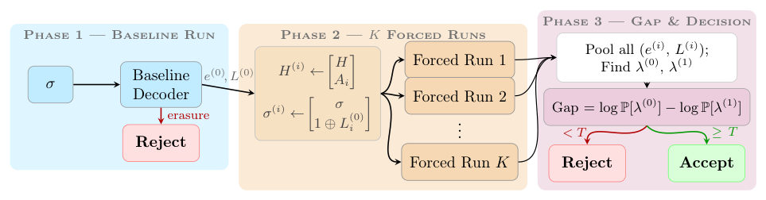 
Figure 1: Overview of the Forced Gap post-selection strategy. Phase 1 (blue): the decoder is run on syndrome σ to produce a baseline correction e(0) with logical class L(0) = A·e(0). If the decoder declares erasure the instance is immediately rejected. Phase 2 (amber): for each of the K logical observables (i = 1, . . . , K), a forced run solves the modified problem (H(i), σ(i)), where an extra row appended to the parity-check matrix constrains the i-th observable to the complementary outcome 1 ⊕L(0) i . Phase 3 (pink): the corrections from all runs are pooled; the two most-likely distinct logical classes λ(0), λ(1) are identified and their log-likelihood difference, the Gap, is computed....

📷 Fig 2

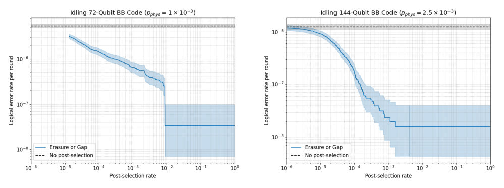 
Figure 2: Simulated error rates per round for the idling [[72, 12, 6]] code, and the [[144, 12, 12]] code under post-selection, at physical noise p = 10−3 and 2.5 × 10−3, respectively. The x-axis shows “Post- selection rate”, that is, the fraction of shots that are rejected, where a curve is generated by varying the threshold T. Both codes are simulated for 6 and 12 rounds of syndrome extraction, respectively, and the logical error rate is then normalised per round (we do not normalise by the number of logical qubits). The shaded regions are 95% confidence intervals. The flat horizontal sections on the right of both graphs indicate the regions where all shots have been post-selected that...

📷 Fig 3

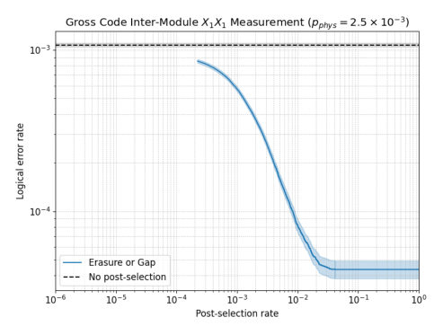 
Figure 3: Logical error rates of various surgery bicycle instructions [Yod+25] subject to post-selection under the forced gap strategy, all at physical noise p = 2.5 × 10−3. We present the logical error rate for the entire circuit, without normalising by the number of rounds. The number of syndrome extraction rounds that we used in our simulations of each gadget are shown above. These were chosen by optimality of the logical error rate for regular error correction without post-selection. For the in-module Y1 and inter-module X1X1 measurements, a higher number of rounds than 10, the circuit distance, was seen to give an improvement, although the differences observed were minimal.

**Summary.** The paper introduces a new post-selection strategy for quantum LDPC codes that significantly reduces logical error rates with minimal computational overhead. By forcing the decoder to explore complementary logical outcomes, the method identifies and rejects unreliable decoding shots. This approach is particularly effective for high-rate codes and is compatible with efficient, FPGA-friendly decoders.

**Why it may be interesting.** not directly relevant

Detailed structure

**Main problem.** Developing an efficient and lightweight post-selection strategy for high-rate quantum LDPC codes to reduce logical error rates without the high computational overhead of existing methods.

**Main result.** The proposed 'forced gap' strategy improves logical error rates by over a factor of 4 compared to previous strategies in the low post-selection regime (up to 1%) and scales linearly with the number of logical observables.

**Method.** A decoder-agnostic strategy involving a baseline decoding run followed by K additional runs where the decoder is forced to find corrections with complementary outcomes for each logical observable, using the Relay-BP decoder.

**Model / system.** Quantum Low-Density Parity-Check (LDPC) codes, specifically the 72-qubit and 144-qubit bivariate bicycle codes, under a circuit depolarizing noise model.

**Key observables.** Logical error rate, post-selection rate, and the 'Gap' (difference in log-likelihoods between the most-likely and second-most-likely logical classes).

**Important parameters / regimes.** Physical noise rates (p = 10^-3 and 2.5 x 10^-3), number of logical observables (K), and user-defined gap threshold (T).

**Assumptions / limitations.** The decoder is assumed to be able to operate on modified decoding instances; faults are assumed to occur independently; the 'Gap' is an approximation of the exact difference between logical class probabilities.

**Figures summary.** Figure 1 shows the flowchart of the forced gap strategy; Figure 2 plots logical error rates vs. post-selection rate for idling codes; Figure 3 shows logical error rates for various surgery instructions.

**Paper structure.** The paper introduces the problem of post-selection in high-rate LDPC codes, details the proposed forced gap algorithm, describes the Relay-BP decoder implementation and parameter optimization, presents benchmarking results on bivariate bicycle codes for both idling and surgery operations, and discusses future work regarding error floors and scaling.

Abstract

We develop a simple and general post-selection strategy for high-rate quantum codes that is transferrable across decoders. After an initial baseline run, the decoder is re-run once per logical observable, and forced in these latter runs to provide a solution where the given observable has the complementary outcome. Shots are rejected that find logically complementary solutions with similar likelihoods compared to the baseline. Using the Relay-BP decoder, we benchmark the strategy on the $72$-qubit and $144$-qubit bivariate bicycle codes, as well as surgery gadgets for the latter. In comparison to previous post-selection strategies, our results offer an improved logical error rate by over a factor of $4$ on the same circuit and physical error rate, and at the same rate of post-selection. Our strategies are also lightweight, relying only on FPGA-friendly belief propagation, whereas the previous best used repeated rounds of a high-latency BP-OSD decoder.

[↑ back to top](#top)

### [Giant nonlinear conductivity in 2D electron gas from substrate-induced dipolar scattering](http://arxiv.org/abs/2605.20699v1)

**Authors:** Dmitry V. Chichinadze, Alexander Seidel, Zohar Nussinov  
**Type:** theory · **Category:** strongly correlated electrons · **PDF:** <https://arxiv.org/pdf/2605.20699v1>  
**Analysis basis:** full PDF text, analyzed in chunks

📷 Fig 1

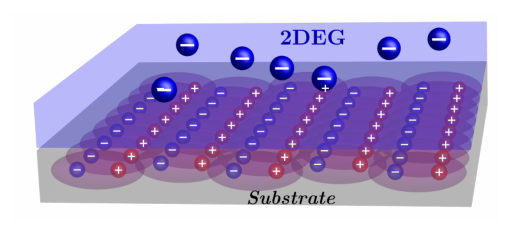 
Figure 1. Schematic of the physical system. Electrons in a 2D gas (blue) scatter from an array of electric dipoles (purple) originating from the substrate (gray).

📷 Fig 2

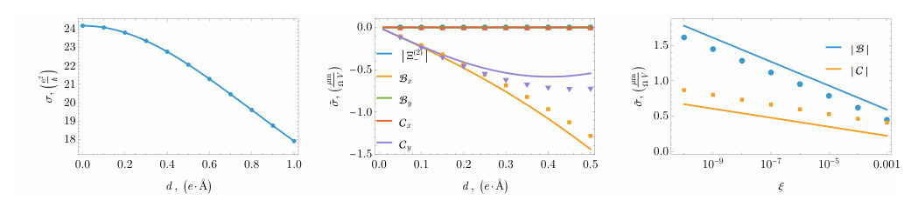 
Figure 2. (Left) Linear conductivity as a function of dipole moment. (Middle) Components of the nonlinear conductivity tensor as a function of dipole moment, consistent with the symmetry analysis. (Right) Nonzero components of the nonlinear conductivity tensor as a function of ξ (log-linear plot). Solid lines indicate the analytical solution, while scatter points show numerical solution obtained using method of iterations with Direct Inversion in the Iterative Subspace (DIIS) to enforce convergence. The minor discrepancy in ˜σ is due to the logarithmic accuracy of the analytical solution. We used m = 0.5me, τ = 10−11s, µ = 10−2eV, with dy = 0 for all panels; ξ = 10−8 in the left and middle...

**Summary.** This paper proposes that the unexpectedly large nonlinear conductivity in 2D materials arises from electrons scattering off periodic electric dipoles in the substrate. The mechanism relies on a mathematical singularity in the scattering gradients, which naturally predicts the observed scale of 1 micro-ohm/volt.

**Why it may be interesting.** not directly relevant

Detailed structure

**Main problem.** Existing theoretical frameworks cannot quantitatively explain the massive second-order nonlinear conductivities observed in 2D van der Waals heterostructures.

**Main result.** The authors identify a mechanism where electron scattering from a substrate-induced periodic dipole array leads to a singular enhancement of the nonlinear response due to logarithmic divergences in scattering probability gradients.

**Method.** The study uses a Boltzmann equation approach, T-matrix calculations to leading order in the dipole moment, and symmetry analysis to determine the conductivity tensor structure.

**Model / system.** A 2D isotropic Fermi gas in the xy-plane subject to both conventional short-range impurity scattering and a static periodic array of electric dipoles originating from a substrate.

**Key observables.** Linear conductivity (sigma) and nonlinear conductivity tensor components (specifically longitudinal response B and transverse Hall response C).

**Important parameters / regimes.** Dipole moment (d), impurity concentration (n_imp), Fermi momentum (kF), and the screening parameter (xi).

**Assumptions / limitations.** The 2D electron gas is assumed to be isotropic with a circular Fermi surface, and the dipole array is assumed to be periodic with uniform dipole moments and orientations.

**Figures summary.** Figure 1 shows a schematic of electrons in a 2D gas scattering from substrate dipoles. Figure 2 displays linear conductivity scaling with d^2, nonlinear tensor components as a function of d, and the logarithmic enhancement of nonlinear conductivity with the screening parameter.

**Paper structure.** The paper introduces the puzzle of giant nonlinearity, defines the physical model of dipole scattering, performs symmetry analysis, derives the nonlinear conductivity using the Boltzmann equation and T-matrix, and concludes with the identification of the singular enhancement mechanism.

Abstract

Despite a surge of interest in the nonlinear transport in 2D materials, a fundamental puzzle remains: existing theoretical frameworks are unable to quantitatively account for the giant nonlinear conductivities ($\gtrsim 1 \frac{μ\text{m}}{Ω\text{V}}$) recently reported in 2D van der Waals heterostructures. Here, we introduce a mechanism based on electron scattering from a substrate-induced periodic dipole array. We show that the strict kinematic constraints, inherent to 2D scattering, lead to a singular enhancement of the nonlinear response, fundamentally dictating a natural scale of $1 \frac{μ\text{m}}{Ω\text{V}}$.

[↑ back to top](#top)

### [Halving the cost of QROM](http://arxiv.org/abs/2605.20334v1)

**Authors:** Danial Motlagh, Matthew Pocrnic  
**Type:** theory · **Category:** quantum information and computing · **PDF:** <https://arxiv.org/pdf/2605.20334v1>  
**Analysis basis:** full PDF text, analyzed in chunks

📷 Fig 1

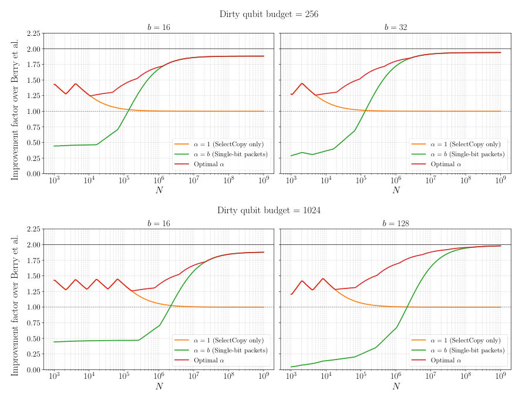 
FIG. 1. Cost comparison of our improved QROM against the previous state-of-the-art. We plot the improvement factor of our algorithm as a function of the number of elements N being loaded for different bitstring length b and number of available dirty qubits. We plot the improvement factor for the 2 ends of the spectrum α = 1 (orange) and α = b (green) in the parametric family of methods provided in this work as well as for the optimal choice of α (red). The jagged lines at the beginning correspond to the qubit unconstrained regime where the optimal λ does not yet make use of the entire dirty qubit budget.

📷 Fig 2

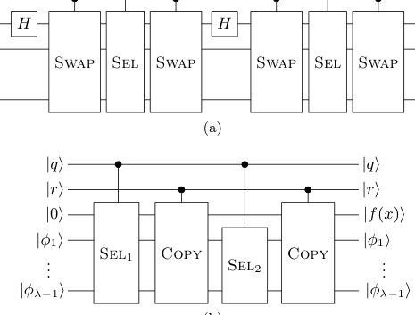 
FIG. 2. Comparison of the (a) “SelectSwap” QROM construction taken from Appendix A of Ref. [1] vs (b) our “SelectCopy” construction. Sel1 directly loads f(q, 0) into the clean register and f(q, r)⊕f(q, 0) into the rth dirty register for r = 1, ..., λ−1, Sel2 is similar but only goes over r = 1, ..., λ −1. This construction corresponds to α = 1 in the parametric family of methods provided in Section II D of this work.

📷 Fig 3

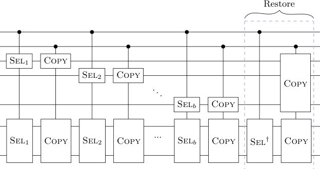 
FIG. 3. Our QROM construction with sequential bit packets for the case of α = b. Note that the dirty qubit registers, as well as the qubits in the output registers, are now depicted as single qubit registers. Sel and Copy operations are now loading and copying single qubit states into the output register per iteration. Recall that following Sel1 operation, each subsequent Selj loads the XOR between the new data and the prior bit in each dirty register. Finally, the “Restore” operation refers to the final dirty-qubit clean-up, which is then copied into the output register to return the desired output. This operation is detailed in Appendix B. This new construction is now available in...

📷 Fig 4

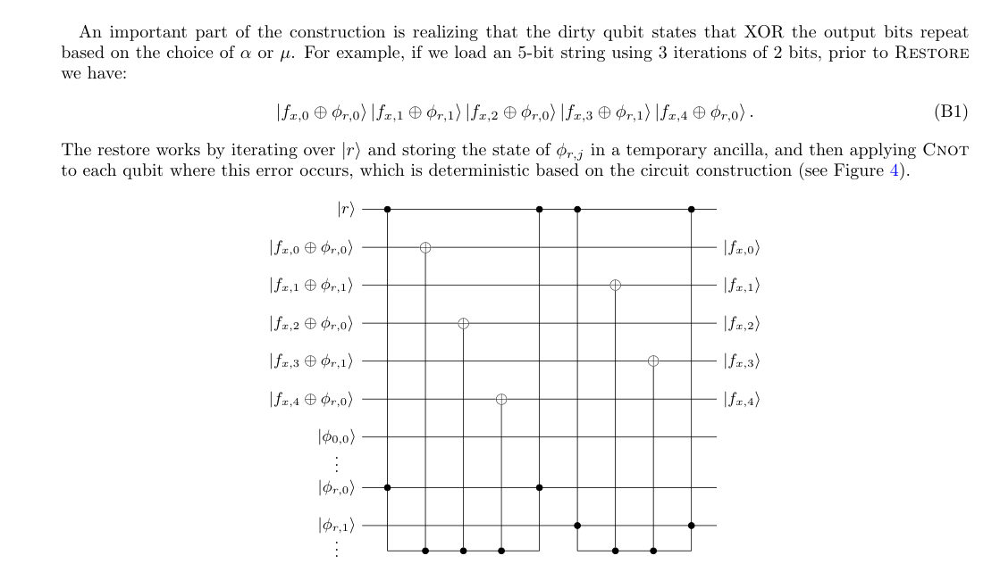 
FIG. 4. A circuit construction of the Copy operation required to perform the Restore operation highlighted outlined in Figure 3. The Sel† operation simply unloads the previous data loaded into the dirty qubits, and the final copy uses the dirty qubit registers to clean up the data register as shown. The control on the |r⟩register is taken to be a single qubit control on the corresponding sawtooth wire from the unary iteration circuit in Figure 10 of Ref. Of course, in the full operation, µ temp-ANDs must be initialized for each outcome from unary iteration [8].

**Summary.** This paper proposes a way to significantly reduce the gate complexity of the QROM subroutine, which is a major bottleneck in many quantum algorithms. By replacing the standard SelectSwap architecture with a SelectCopy approach, the authors effectively halve the Toffoli cost in certain regimes. This allows for much more efficient data loading using available dirty ancilla qubits.

**Why it may be interesting.** not directly relevant

Detailed structure

**Main problem.** The goal is to reduce the computational overhead, specifically the Toffoli gate cost, of the QROM (Quantum Read-Only Memory) subroutine in fault-tolerant quantum algorithms.

**Main result.** The authors achieve approximately a 50% reduction in the dominant Toffoli cost in the qubit-constrained regime, effectively matching the performance of clean-qubit QROM using dirty qubits.

**Method.** The paper introduces a 'SelectCopy' architecture to replace 'SelectSwap' and presents a parametric family of methods that treats a b-bit QROM as sequential smaller QROMs to optimize the cost based on available ancilla qubits.

**Model / system.** The work focuses on the algorithmic implementation of coherent table lookup (QROM) for loading N bitstrings of length b in superposition, utilizing both clean and dirty ancilla qubits.

**Key observables.** Toffoli gate count (non-Clifford cost) and the number of required ancilla qubits.

**Important parameters / regimes.** N (number of elements), b (bitstring length), lambda (sub-register parameter), and the availability of dirty vs. clean qubits.

**Assumptions / limitations.** Initial derivations assume N, b, and alpha are powers of 2; the efficiency is tied to the availability of dirty ancilla qubits.

**Figures summary.** Figure 1 compares the cost improvement of the new QROM against the previous state-of-the-art; Figure 2 shows circuit diagrams for the SelectCopy and SelectSwap constructions; Figure 4 illustrates the circuit for the Copy operation in the Restore process.

**Paper structure.** The paper identifies the QROM bottleneck, introduces the SelectCopy architecture, presents an optimization for the qubit-constrained regime, provides a parametric family of methods for cost interpolation, and concludes with a generalized theorem for non-power-of-2 parameters.

Abstract

Table lookup, often referred to as quantum read only memory (QROM), is one of the most widely used subroutines in quantum algorithms, and constitutes the majority share of algorithmic overheads in most practical applications of quantum computers. It involves the coherent loading of $N$ bitstrings of length $b$ in superposition, and naively has a non-Clifford cost of $N$ Toffolis. It is known that given access to $b\, λ$ dirty qubits, one can reduce the Toffoli cost of QROM to $2\frac{N}λ + 4b(λ- 1)$. In this work, we first present an optimization to reduce this cost to $2\frac{N}λ + 2b(λ- 1) + 2λ-6$ by replacing the ``SelectSwap" architecture with ``SelectCopy". We then provide a further optimization for the qubit-constrained regime where the Toffoli cost is typically $\sim 2\frac{N}λ$, and reduce it to $\sim (1+\frac{1}{b})\frac{N}λ$, cutting the cost by approximately $50\%$ and effectively matching the performance of clean-qubit QROM using dirty qubits for practical values of $b$. Lastly, we provide a parametric family of methods that allow the interpolation of the prefactor of the $\frac{N}λ $ term from $2$ to ($\, 1+\frac{1}{b}\,$) to obtain the best cost for different qubit availability regimes.

[↑ back to top](#top)

### [Hubbard-$U$-corrected electron-phonon interactions in strongly correlated materials via the finite-displacement method](http://arxiv.org/abs/2605.20985v1)

**Authors:** Jiale Chen, Youyou Tu, Chengliang Xia, Jin Zhao, Hanghui Chen  
**Type:** theory · **Category:** strongly correlated electrons · **PDF:** <https://arxiv.org/pdf/2605.20985v1>  
**Analysis basis:** full PDF text, analyzed in chunks

📷 Fig 1

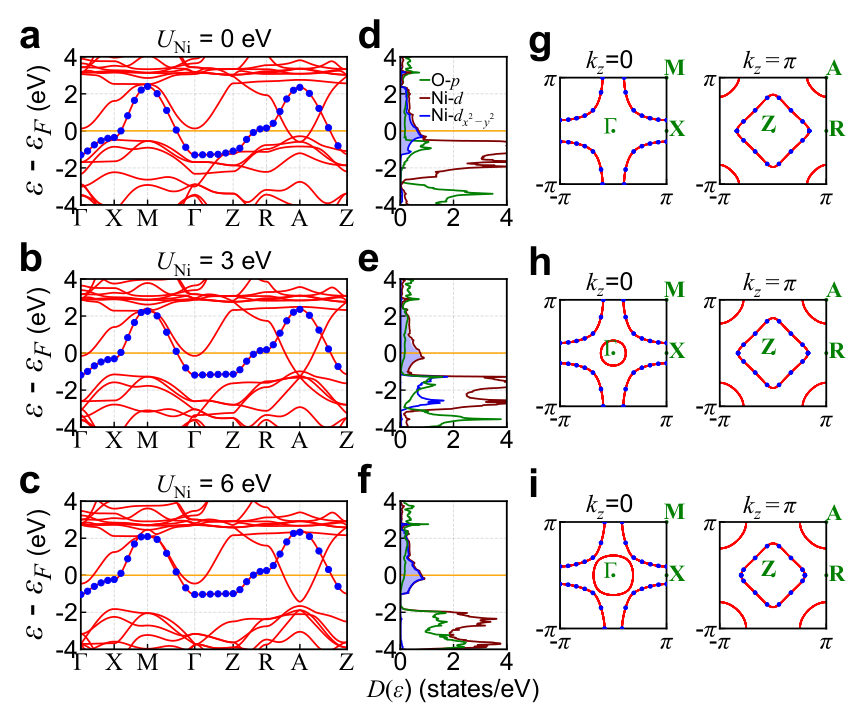 
Figure 1. Electronic properties of 20% hole-doped LaNiO2: (a-c) Band structure calculated at

📷 Fig 2

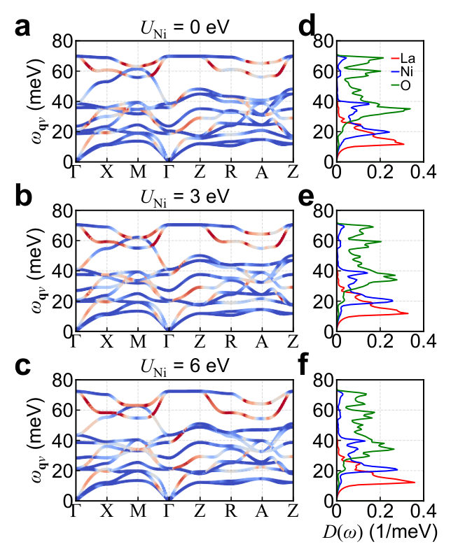 
Figure 2. Phonon properties of 20% hole-doped LaNiO2. (a-c) Phonon spectrum calculated at

📷 Fig 3

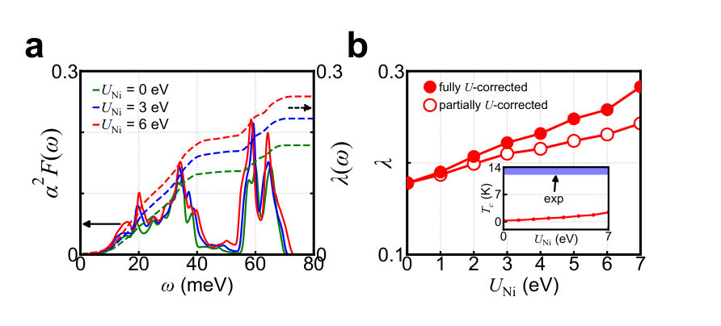 
Figure 3. Electron-phonon properties of 20% hole-doped LaNiO2. (a) Electron-phonon spec-

📷 Fig 4

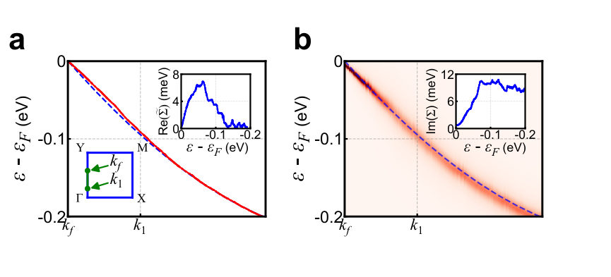 
Figure 4. Electronic self-energy of 20% hole-doped LaNiO2 that arises from the electron-

📷 Fig 5

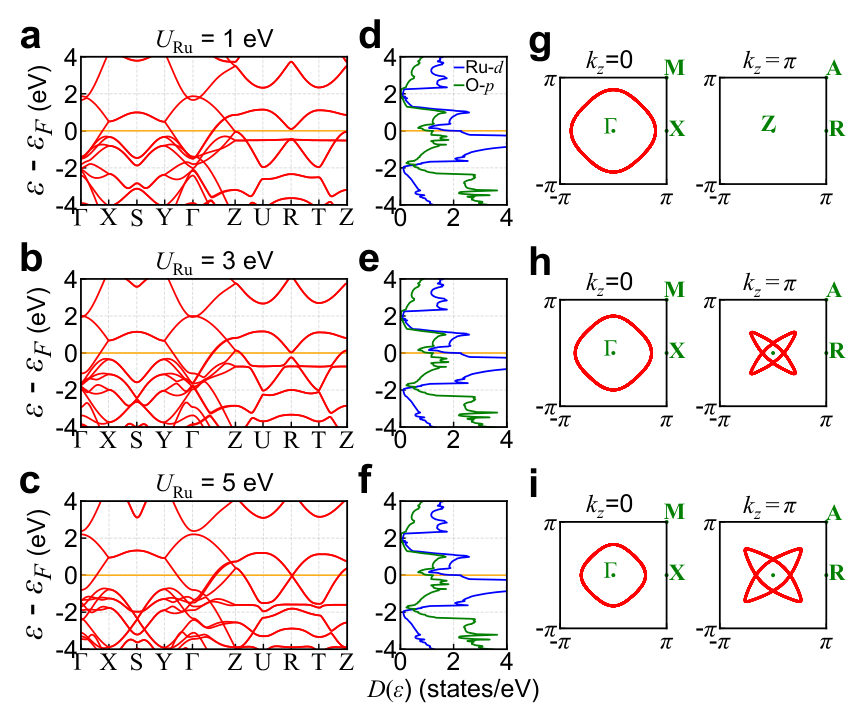 
Figure 5. Electronic properties of strained RuO2: (a-c) Band structure calculated at URu = 1,

**Summary.** This paper presents a new algorithm that consistently applies Hubbard-U corrections to both electronic and phonon properties in strongly correlated materials. By applying this to nickelates and ruthenates, the authors show that such corrections are vital for accurately predicting structural stability and electron-phonon coupling strengths. This work helps resolve discrepancies between previous theoretical predictions and experimental observations of superconductivity.

**Why it may be interesting.** not directly relevant

Detailed structure

**Main problem.** The study addresses the need for a consistent method to include Hubbard-U corrections in both electronic and lattice degrees of freedom to accurately model electron-phonon interactions in correlated materials.

**Main result.** The authors demonstrate that applying Hubbard-U corrections to the entire calculation (phonon spectrum and e-ph matrix elements) is essential to stabilize the structure of strained RuO2 and to reconcile theoretical e-ph coupling with experimental superconductivity temperatures in both nickelates and ruthenates.

**Method.** The researchers implemented an algorithm integrating the DFT+U method with the finite-displacement method using Numerical Atomic Orbital (NAO) basis sets to calculate phonons and electron-phonon g matrices.

**Model / system.** The study focuses on two prototypical correlated materials: 20% hole-doped infinite-layer nickelates (LaNiO2) and strained ruthenium dioxide (RuO2) thin films on TiO2 substrates.

**Key observables.** Electron-phonon coupling constant (lambda), phonon dispersion/spectrum, electron-phonon g matrices, superconducting transition temperature (Tc), and electronic self-energy.

**Important parameters / regimes.** Hubbard U parameters (U_Ni and U_Ru), hole-doping concentration, and substrate-induced strain.

**Assumptions / limitations.** The calculation of Tc assumes the Coulomb pseudopotential (mu*) is zero due to the explicit inclusion of the Hubbard U; the study also focuses on bands close to the Fermi level.

**Figures summary.** Figure 1 shows the evolution of electronic properties and Fermi surface for LaNiO2 with varying U; other figures illustrate the evolution of e-ph coupling, phonon DOS, and electronic self-energy.

**Paper structure.** The paper introduces the computational challenge, describes the implementation of the integrated DFT+U and finite-displacement algorithm, applies the method to LaNiO2 and RuO2 to analyze electronic and phonon-channel effects, and concludes with the necessity of self-consistent U-corrections.

Abstract

Although the density functional theory plus Hubbard $U$ correction method (DFT+U) is broadly used to study electronic structure of strongly correlated materials, the extension of this method to electron-phonon $g$ matrices has received limited attention. Here, we implement an algorithm that integrates DFT+U method with the finite-displacement method for the calculations of phonons and electron-phonon $g$ matrices. The Hubbard $U$ corrections are applied not only to electronic and phonon structures, but, more importantly, also to electron-phonon $g$ matrices. We demonstrate our algorithm in two prototypical correlated materials: infinite-layer nickelates LaNiO$_2$ and ruthenium dioxide RuO$_2$. We find that: i) While the Hubbard $U$ corrections weakly increase the electron-phonon interaction of 20% hole-doped LaNiO$_2$, its total electron-phonon coupling remains small and is insufficient to account for the observed superconducting transition temperature of about 10-30 K. Our results contrast with the recent work showing that the full GW corrections yield an elevated electron-phonon coupling of 20% hole-doped LaNiO$_2$ five times larger than its DFT value. We attribute this discrepancy to the differences in the Fermi surface topology between DFT+$U$ and GW methods. ii) The inclusion of Hubbard $U$ corrections eliminates the imaginary phonon modes of RuO$_2$ under strain on the TiO$_2$ substrate and substantially reduces the electron-phonon coupling. Our results alleviate the discrepancy between the reported large theoretical electron-phonon coupling and the low superconducting transition temperature observed experimentally. Our work provides an algorithm that fully includes the Hubbard $U$ corrections on electron-phonon properties of correlated materials, and highlights the importance of Fermi surface shape and correlation effects on phonon spectrum and electron-phonon $g$ matrices.

[↑ back to top](#top)

### [Interpreting Bohm quantum potentials in Computing quantum waves exactly from classical action](http://arxiv.org/abs/2605.20443v1)

**Authors:** Winfried Lohmiller, Jean-Jacques Slotine  
**Type:** theory · **Category:** other · **PDF:** <https://arxiv.org/pdf/2605.20443v1>  
**Analysis basis:** full PDF text, analyzed in chunks

📷 Fig 1

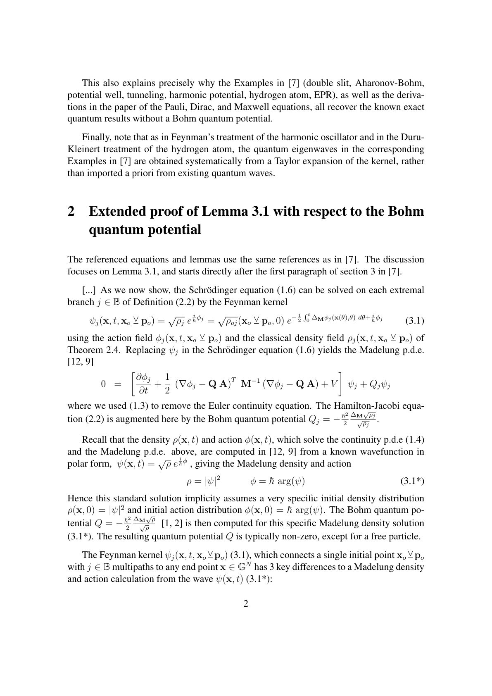 
Low-resolution page preview, page 2

📷 Fig 2

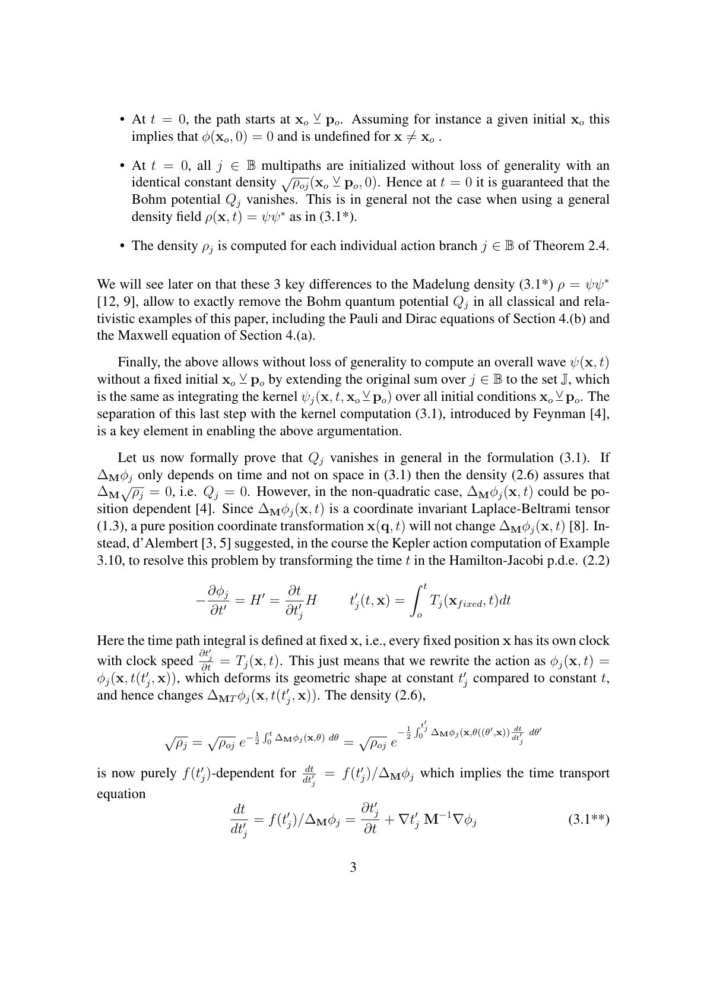 
Low-resolution page preview, page 3

📷 Fig 3

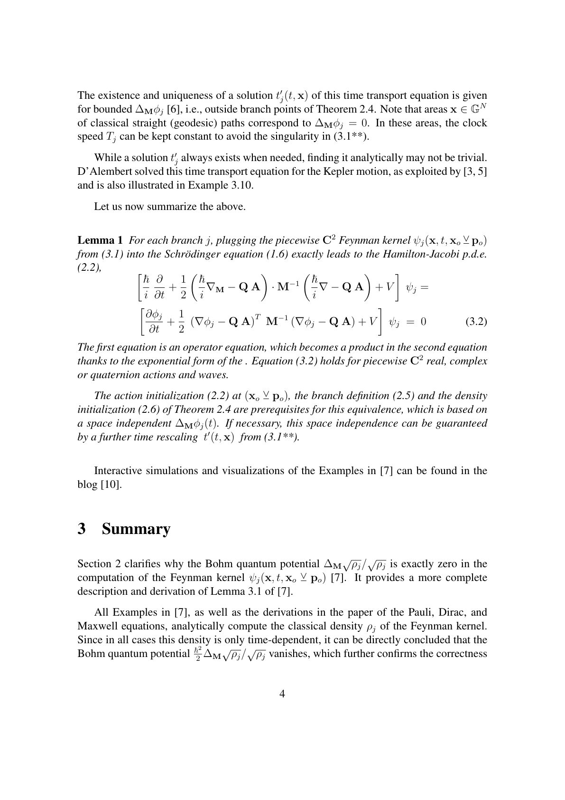 
Low-resolution page preview, page 4

📷 Fig 4

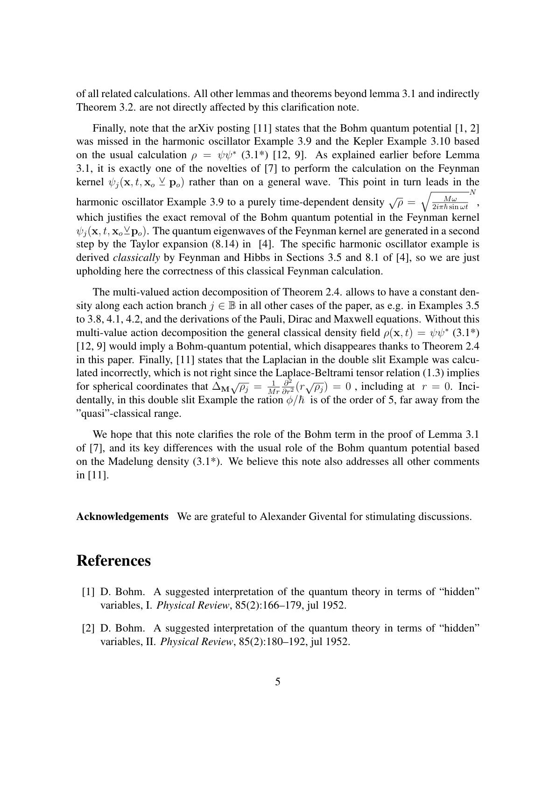 
Low-resolution page preview, page 5

📷 Fig 5

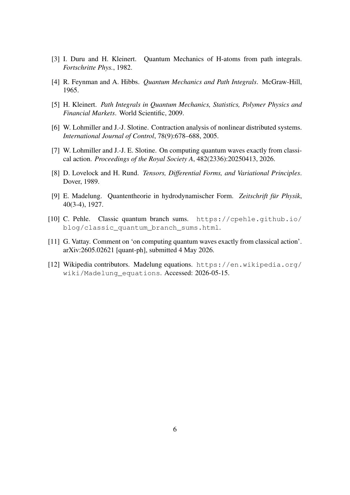 
Low-resolution page preview, page 6

**Summary.** This paper provides a mathematical clarification for a method used to compute exact quantum waves from classical action. It proves that while the Bohm quantum potential is present in standard Madelung equations, it vanishes in this specific computational framework without affecting the final quantum wave. This resolves a technical dispute regarding the completeness of the underlying mathematical derivation.

**Why it may be interesting.** not directly relevant

Detailed structure

**Main problem.** The paper addresses a technical critique claiming that a previous proof (Lemma 3.1) omitted the Bohm quantum potential term in the Madelung hydrodynamic equations.

**Main result.** The authors demonstrate that the Bohm quantum potential vanishes in their specific wave construction due to a specific initialization of density and action, and that the resulting overall wave remains independent of this computational initialization.

**Method.** The authors extend the previous proof by explicitly introducing the Bohm potential and using time rescaling to show the potential becomes zero when the Laplace-Beltrami operator is made space-independent.

**Model / system.** A mathematical framework for computing exact quantum waves from classical action using the Feynman kernel and Madelung partial differential equations.

**Key observables.** Action field (phi_j), classical density field (rho_j), and the resulting overall wave (psi).

**Important parameters / regimes.** The ratio of phi/hbar (noted as approximately 5 in a double-slit example); the regime is explicitly noted as being far from the quasi-classical limit.

**Assumptions / limitations.** The equivalence of operator and product forms of the Schrodinger equation relies on specific action and density initializations; the time transport solution is guaranteed only outside branch points.

**Paper structure.** The paper begins by addressing a specific technical critique regarding a missing Bohm potential, provides an extended mathematical proof to incorporate the term, explains the mechanism for its vanishing via time rescaling, and concludes by verifying the correctness of the approach using a double-slit example.

Abstract

The recent arXiv posting [11], commenting on the paper [7], argues that the proof of Lemma 3.1 in [7] is missing the Bohm quantum potential [1, 2] of the Madelung p.d.e. [9]. This short technical note extends the proof of Lemma 3.1 to introduce a Bohm quantum potential explicitly, and then shows why this term can be assumed to be zero in the wave construction, without loss of generality. The continuity p.d.e. and the Hamilton-Jacobi p.d.e., extended by the Bohm potential, are undisputed. However, the actual action and density solutions depend on their initialization at t = 0. In [7], this initialization is motivated by the Feynman kernel [4], which is fundamentally different from the standard initialization of the Madelung solution [9]. This in turn leads to different action and density solutions, and explains why in one case the Bohm quantum potential disappears and in the other does not. The resulting overall wave, however, is independent of this computational initialization.

[↑ back to top](#top)

### [Ligand-mediated Origin of Altermagnetic Spin-Splitting](http://arxiv.org/abs/2605.21284v1)

**Authors:** Luigi Camerano, Federico Bisti, Gianni Profeta  
**Type:** theory · **Category:** strongly correlated electrons · **PDF:** <https://arxiv.org/pdf/2605.21284v1>  
**Analysis basis:** full PDF text, analyzed in chunks

📷 Fig 1

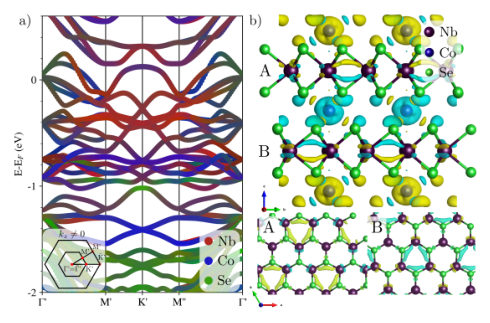 
FIG. 1. a) Atom-resolved projected band structure of Co1/4NbSe2 along high-symmetry lines for kz ̸= 0 from DFT calculations. The top-left inset shows the BZ of the system: primed labels denote points at kz ̸= 0, while barred labels refer to the NbSe2 BZ. b) Top panel: magnetization-density isosurfaces with the b axis aligned along the x direction. The labels A and B identify the two inequivalent 2H-NbSe2 layers in the unit cell. Bottom panel: top views of layers A and B, highlighting the induced magnetization on the Nb atoms.

📷 Fig 2

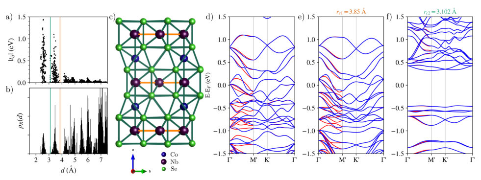 
FIG. 2. a) Absolute value of the hopping amplitudes as a function of interatomic distance. b) Histogram of the hopping amplitudes at a given distance. The orange and green lines mark the cutoff radii used in panels e) and f) (rc1 = 3.85 ˚A and rc2 = 3.102 ˚A, respectively). c) Unit cell of Co1/4NbSe2, where the bond colors indicate the hopping cutoff radius considered. d) Wannier-interpolated band structure along high-symmetry lines, where blue and red denote spin-up and spin-down channels, respectively. Panels e) and f) show the band structures obtained by retaining only hoppings between atoms within cutoff distances rc1 = 3.85 ˚A and rc2 = 3.102 ˚A, respectively.

📷 Fig 3

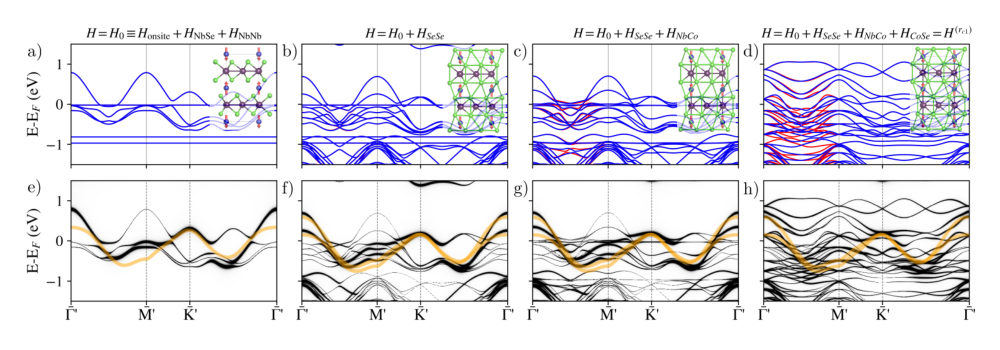 
FIG. 3. a–d) Wannier-interpolated band structures obtained by selectively excluding specific hopping terms: a) excluding Co–Se, Se–Se, and Co–Nb hoppings; b) excluding Co–Se and Co–Nb hoppings; c) excluding only Co–Se hoppings; and d) including all hoppings within the cutoff radius rc1 = 3.85 ˚A. The insets show the unit cell, where only the retained hoppings are indicated as bonds. e–h) Unfolded spectral weight projected onto the NbSe2 unit cell for the same cases shown in panels a–d. In panel e), the solid orange lines correspond to the DFT band structure of a NbSe2 monolayer. In panels f–h), the solid orange lines represent the band structure of 2H-NbSe2.

📷 Fig 4

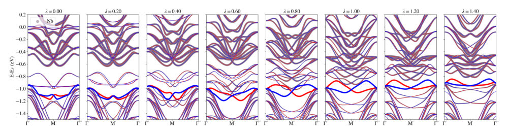 
FIG. 4. Spin-resolved band structure as a function of the strength of the Co–Se hopping parameter λ ∈[0, 1.4]. The size of the markers represents the projection weight on Nb atoms. The thicker bands highlight two representative states, chosen to track the evolution of the spin splitting.

**Summary.** This paper identifies that the spin-splitting in the altermagnet Co1/4NbSe2 arises from indirect hybridization via ligands rather than direct interaction between magnetic ions. By using Wannier-based Hamiltonian engineering, the authors demonstrate how anisotropy is transferred from cobalt to the itinerant niobium bands. This provides a microscopic blueprint for designing new altermagnetic materials for spintronics.

**Why it may be interesting.** not directly relevant

Detailed structure

**Main problem.** Identifying the microscopic, real-space origin of altermagnetic spin-splitting in the metallic state of the $g$-wave altermagnet Co1/4NbSe2.

**Main result.** The study reveals that altermagnetic spin-splitting is driven by ligand-mediated hybridization (specifically the Co-Se-Nb pathway) rather than direct magnetic-ion hopping.

**Method.** First-principles DFT calculations combined with Wannier Hamiltonian engineering and real-space decomposition of hopping channels.

**Model / system.** The $g$-wave altermagnet Co1/4NbSe2, an intercalated transition metal dichallycogenide, modeled using a Wannier-based tight-binding Hamiltonian.

**Key observables.** Spin-resolved band structures, spin polarization, magnetization density, and momentum-dependent spin-splitting.

**Important parameters / regimes.** Cutoff radii (rc1, rc2) for Hamiltonian truncation and a scaling parameter (lambda) for Co-Se hybridization strength.

**Assumptions / limitations.** The electronic structure can be accurately captured by a short-range tight-binding model derived from DFT.

**Figures summary.** Fig 1 shows atom-resolved band structure and magnetization density; Fig 2 displays hopping amplitudes and unit cell; Fig 3 illustrates the evolution of the spectrum as different hopping terms (Nb-Nb, Se-Se, Nb-Co, Co-Se) are included.

**Paper structure.** The paper introduces the altermagnetic system, presents DFT and Wannier-based electronic structure results, performs a real-space decomposition of the Hamiltonian to isolate hopping contributions, and concludes with the identification of the ligand-mediated mechanism.

Abstract

Altermagnets host spin-split electronic bands despite zero net magnetization, opening new routes for spintronics beyond conventional ferromagnets. Going beyond symmetry-based classifications, which specify allowed terms but not their hierarchy, here we use first-principles calculations and Wannier Hamiltonian engineering to uncover the microscopic bonding contributions of altermagnetic spin splitting in the $g$-wave altermagnet Co$_{1/4}$NbSe$_2$. We show that the splitting is captured by a short-range tight-binding model, establishing its local origin. By selectively controlling hopping channels, we demonstrate that the dominant contribution arises not from direct magnetic-ion hopping, but from ligand-mediated hybridization that transfers anisotropy to itinerant states. This identifies ligand-assisted coupling as the key mechanism of altermagnetic spin splitting and provides a microscopic bridge between minimal models and symmetry guided first-principles material searches, enabling real-space design of altermagnetic functionality.

[↑ back to top](#top)

### [Magnetism of single crystalline breathing pyrochlore spinel AgInCr4S8](http://arxiv.org/abs/2605.21122v1)

**Authors:** Andrew F. May, Christopher M. Pasco, V. O. Garlea, Karolina Gornicka, Matthias D. Frontzek, Xiaoping Wang, Pyeongjae Park, Andrew D. Christianson  
**Type:** experiment · **Category:** strongly correlated electrons · **PDF:** <https://arxiv.org/pdf/2605.21122v1>  
**Analysis basis:** full PDF text, analyzed in chunks

📷 Fig 1

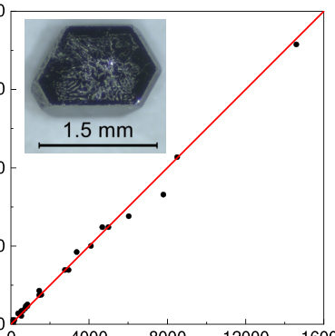 
FIG. 1. Fitted nuclear intensities from neutron diffraction data collected at T = 5 K for AgInCr4S8. Refinement assum- ing a fully ordered structure gives Rf-factor = 3.9% on 25 reflections. A picture of a typical single crystal is shown as an inset.

📷 Fig 2

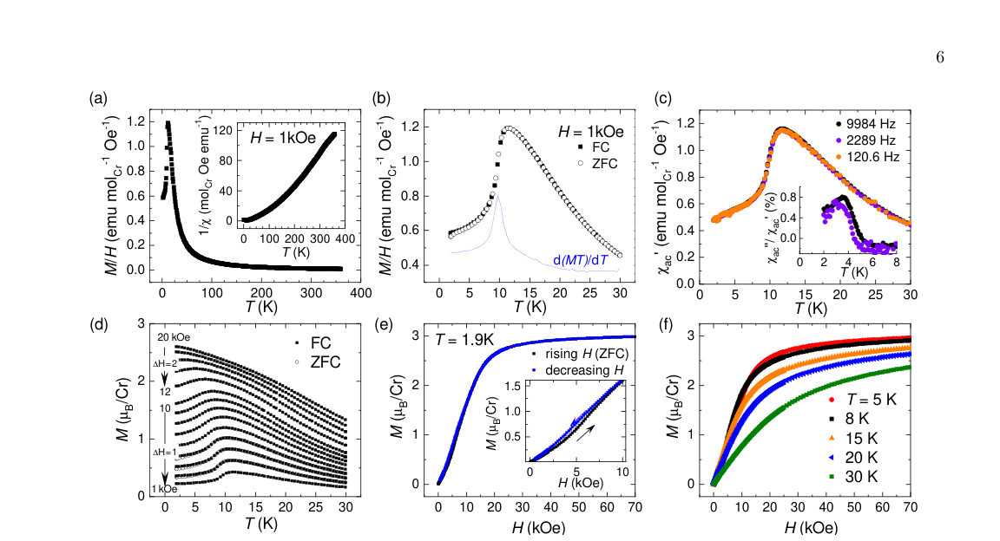 
FIG. 2. Magnetization data for H ∥[111]. (a) Magnetization versus temperature with inset showing the inverse susceptibility. (b) Magnetization near the magnetic ordering transition with derivative d(MT)/dT shown as a thin line that has a peak near 9.7 K. (c) The in-phase component of the ac magnetic susceptibility χ′ for various frequencies as provided in the legend, with inset showing a negligible out-of-phase χ′′ observed until a small χ′′ forms near 3.8 K. (d) Temperature-dependent magnetization for various applied fields as indicated. (e) Isothermal magnetization at 1.9 K with inset emphasizing a small region of hysteresis, and (f) isothermal magnetization at various temperatures as...

📷 Fig 3

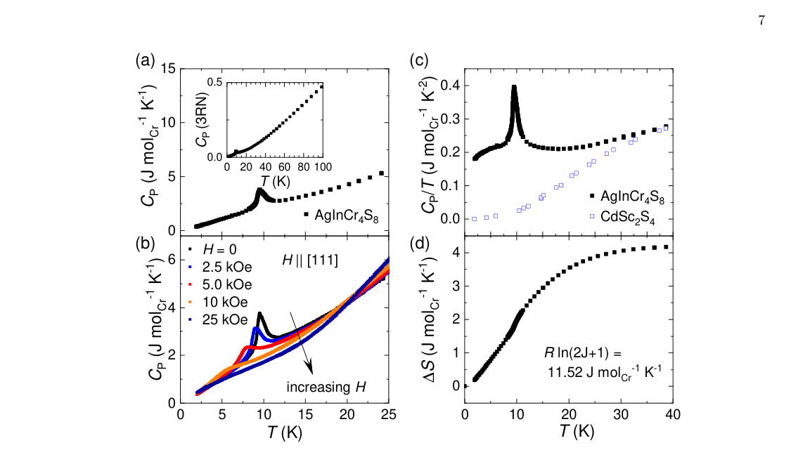 
FIG. 3. (a) Specific heat capacity of AgInCr4S8 with inset showing a smooth evolution across larger temperature range in units normalized to the expected Dulong-Petite limit, (b) specific heat capacity with field applied along [111], (c) temperature- normalized specific heat capacity including data for CdSc2S4 extracted from Ref. 33 that is utilized as a phonon background to estimate the magnetic specific heat of AgInCr4S8. (d) Entropy obtained by integrating the estimated magnetic contribution; a total entropy of the paramagnetic state is expected to be 11.52 J/mol/K per Cr3+ having J = 3/2.

📷 Fig 4

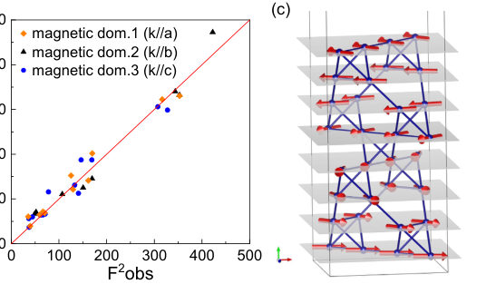 
FIG. 5. (a) Neutron diffraction intensity around the -2 -2 -2 nuclear Bragg peak showing four satellite peaks associated with the incommensurate magnetic order at T = 5 K characterized by propagation vector k = (0, 0, ±0.343). A weak intensity from a small secondary grain is observed to the lower left of the central peak. (b) Plot of observed vs calculated magnetic intensity for the fitted helical structure, which is shown in (c) for two lattice intervals along the k-vector. The spin structure consists of ferromagnetic layers of Cr moments with a modulation that follows the k-vector.

📷 Fig 5

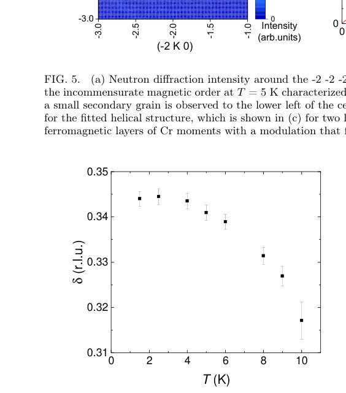 
FIG. 6. Incommensurate indexing δ as a function of tem- perature obtained via Gaussian fits to the magnetic (satellite) peaks near the nuclear (-1 -1 -1) and (-2 -2 -2) Bragg reflec- tions.

**Summary.** This paper characterizes the magnetic properties of the breathing pyrochlore spinel AgInCr4S8, revealing an incommensurate helical spin structure. It demonstrates how controlling sulfur stoichiometry during growth can transition the material from a spin-freezing regime to long-range antiferromagnetic order. The study provides key insights into how cation ordering and geometric frustration interact in these complex lattices.

**Why it may be interesting.** not directly relevant

Detailed structure

**Main problem.** The study investigates the magnetism and structural ordering of the breathing pyrochlore spinel AgInCr4S8, specifically focusing on the impact of Ag/In cation ordering and growth conditions on its magnetic ground state.

**Main result.** The researchers confirmed an incommensurate helical magnetic ground state with a propagation vector k = (0, 0, 0.343) and identified that excess sulfur during crystal growth promotes long-range antiferromagnetic order.

**Method.** The study uses chemical vapor transport for crystal growth, followed by single-crystal X-ray and neutron diffraction, AC/DC magnetization, and specific heat capacity measurements.

**Model / system.** The system is a single-crystalline breathing pyrochlore spinel AgInCr4S8, characterized by a non-centrosymmetric lattice with alternating large and small Cr3+ tetrahedra driven by Ag/In ordering.

**Key observables.** Néel temperature (TN), propagation vector (k), magnetic entropy, magnetic moment (mu_eff), and breathing ratio (Br).

**Important parameters / regimes.** TN approx 9.6 K, Weiss temperature approx 56.8 K, propagation vector delta = 0.343, and breathing ratio Br = 1.065.

**Assumptions / limitations.** The magnetic model assumes a circular helix with equal sine and cosine amplitudes and assumes equal domain populations for the three symmetry-related domains.

**Figures summary.** Fig 2 shows structural/growth details; Fig 3 shows specific heat and entropy; Fig 4 presents a magnetic phase diagram; Fig 5 displays neutron diffraction intensity maps and a helical structure schematic; Fig 6 shows the temperature dependence of the incommensurability parameter.

**Paper structure.** The paper begins with crystal growth and structural characterization, moves to magnetic property measurements (magnetization and specific heat), presents neutron diffraction results for the magnetic structure, and concludes with a discussion on growth-dependent stability and phase diagrams.

Abstract

Single crystals of \ce{AgInCr4S8} were grown by chemical vapor transport and crystallographic ordering of Ag/In that results in a breathing pyrochlore motif of Cr$^{3+}$ was verified by x-ray and neutron diffraction. Long-range antiferromagnetic order is observed below a Néel temperature of $T_{\mathrm N}$ $\approx$ 9.6 K. The magnetic properties are characterized using ac and dc magnetization, specific heat capacity, and single crystal neutron diffraction measurements. The specific heat data are characterized by a small lambda anomaly near 9.5 K and the estimated magnetic entropy reaches $\approx$ $\frac{1}{3}$ of the expected value by 3$T_{\mathrm N}$, suggesting significant short-range order in the paramagnetic phase. Single crystal neutron diffraction evidences an incommensurate spin structure with propagation vector $\textbf{\textit{k}}$ = (0,0,$δ$) and $δ$ = 0.343 at 5 K. The minimal model that accounts for the data consists of ferromagnetic layers of Cr atoms, with magnetic moments lying in the plane of the layers and modulating in the perpendicular direction to form a helical structure propagating along $\textbf{\textit{k}}$. This study represents a rare investigation of single crystals within the family of breathing pyrochlore materials.

[↑ back to top](#top)

### [Matching $A$ with $F$ in long-range QFTs](http://arxiv.org/abs/2605.21326v1)

**Authors:** Lorenzo Benfatto, Omar Zanusso  
**Type:** theory · **Category:** statistical mechanics · **PDF:** <https://arxiv.org/pdf/2605.21326v1>  
**Analysis basis:** full PDF text, analyzed in chunks

📷 Fig 1

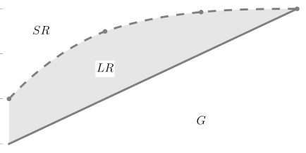 
Figure 2. The three different phases of the critical point in the long range Ising model. The dashed line is the curve s∗(d) = 2−ηSR(d), interpolated by with the known behaviors in the integer dimensions d = 1, 2, 3 and the perturbative expansion below d = 4.

**Summary.** This paper proves that the Renormalization Group flow for long-range, non-unitary scalar field theories follows a gradient structure up to the third loop order. By matching the RG-derived A-function with the sphere free-energy, the authors provide a perturbative proof of the F-theorem for these models. This establishes a fundamental connection between the flow of couplings and the thermodynamic properties of the theory at fixed points.

**Why it may be interesting.** not directly relevant

Detailed structure

**Main problem.** Investigating whether the Renormalization Group (RG) flow in non-unitary, long-range quantum field theories possesses a gradient structure and satisfies monotonicity theorems like the A-theorem and F-theorem.

**Main result.** The authors demonstrate that the RG flow of long-range multiscalar phi^4 theory satisfies a gradient structure up to the third loop order and show that the A-function can be matched to the sphere free-energy, providing a perturbative proof of the F-theorem at leading order.

**Method.** The study employs perturbative RG analysis up to the third loop order, conformal perturbation theory on a d-dimensional sphere, and Mellin-Barnes integral representations for evaluating Feynman diagrams.

**Model / system.** The model is a long-range multiscalar phi^4 theory characterized by power-law interactions, including specific cases like the long-range vector O(N) and hypercubic H_N models.

**Key observables.** Beta functions, A-function (conformal anomaly), F-function (sphere free-energy), Zamolodchikov's metric (C_IJ), and the RG metric (G_IJ).

**Important parameters / regimes.** Spacetime dimension d, interaction parameter s (where s = (d+epsilon)/2), coupling constants lambda, and the epsilon expansion parameter.

**Assumptions / limitations.** The analysis is restricted to the third loop order in perturbation theory and assumes the validity of the epsilon expansion near the critical dimension.

**Figures summary.** Not specified in the provided notes.

**Paper structure.** The paper begins by defining the gradient flow problem, proceeds to analyze the RG flow and beta functions of the long-range phi^4 theory up to three loops, computes the sphere free-energy and the metric on theory space, and concludes by matching these quantities to establish the F-theorem.

Abstract

Unitarity is often a crucial ingredient in establishing theorems -- such as the $A$-theorem -- on the irreversibility of the renormalization group flow. The strongest thesis of this type of theorems would be that there exists a scalar function $A$ and a positive definite metric $G_{IJ}$ in the space of couplings such that the renormalization group flow satisfies a gradient equation, $\partial_I A= G_{IJ}β^J$, in which case $A$ is locally monotonic along the flow. In this paper we consider the long-range multiscalar $φ^4$ theory, which is a nonunitary model that is believed to be conformally invariant at fixed points, and show that its renormalization group flow satisfies the gradient structure up to the third loop order in the coupling. We also show that $A$ and $G_{IJ}$ can be matched to the leading nontrivial order with the sphere free-energy $\tilde{F}$ and Zamolodchikov's metric $C_{IJ}$ of the corresponding conformal theory concentrating on the examples of the long-range vector $O(N)$ and hypercubic $H_N$ models. Our results imply a perturbative proof of the $\tilde{F}$-theorem at the leading nontrivial order. We conclude the paper discussing briefly whether this result should hold to the next orders in perturbation theory.

[↑ back to top](#top)

### [Memorisation, convergence and generalisation in generative models](http://arxiv.org/abs/2605.21402v1)

**Authors:** Antoine Maillard, Sebastian Goldt  
**Type:** theory · **Category:** disordered systems and neural networks · **PDF:** <https://arxiv.org/pdf/2605.21402v1>  
**Analysis basis:** full PDF text, analyzed in chunks

📷 Fig 1

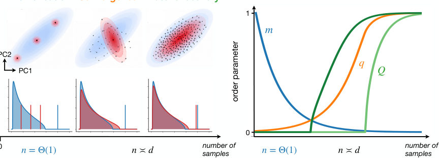 
Figure 1: Memorisation, convergence, and latent recovery in generative models. Left: We illus- trate three regimes in generative models by sketching the principal components (top) and the covariance spectra (bottom) of the true data distribution (blue) and a distribution learnt from n samples (red) in d dimensions. For very small data sets, n = Θ(1), the model does not learn a smooth approximation of the data distribution, but memorises the training set. As the number of training samples becomes comparable to the input dimension, n ≍d, the spectra continuously converge and independently trained models produce similar outputs given the same latents, as described by Kadkhodaie et al. [1]....

📷 Fig 2

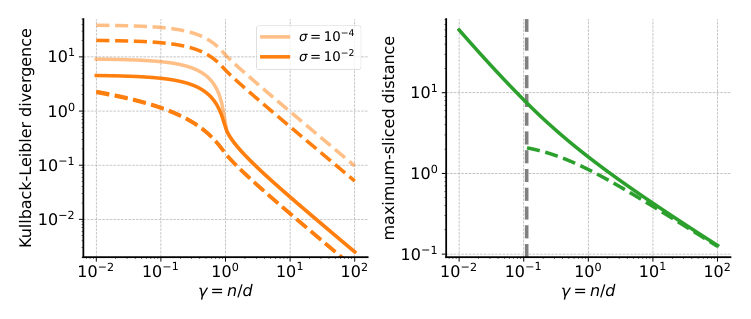 
Figure 2: Convergence and latent recovery govern different statistical distances between true and learnt distributions P⋆and ˆP. Left: Rescaled Kullback-Leibler divergence between P⋆and ˆP for two regularisation strengths σ, as a function of sample complexity γ = n/d, where n is the number of samples and d is the input dimension. The dashed lines show the upper and lower bounds of eq. (9), which only depend on the convergence overlap q. Right: Maximum-sliced distance between P⋆and ˆP (solid line), which decays asymptotically with the subspace overlap as √1 −Q, see eq. (10) (dashed line). Parameters: β = 4.

📷 Fig 3

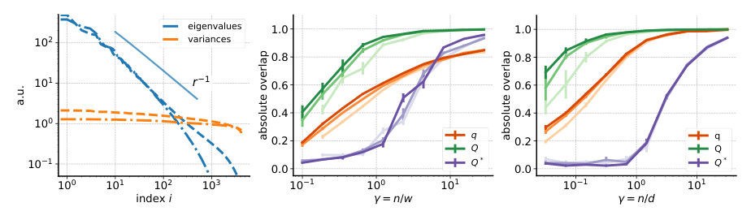 
Figure 3: A rotated subspace overlap identifies a phase transition on data with power-law spectrum. (a): Eigenvalues λi and variances ˆσ2 i = ˆΣii of the covariance matrix ˆΣ of CelebA images (dashed-dotted) and ImageNet patches (dashed) against their index i (image width w = 64). (b) Convergence overlap q and subspace overlap Q, eqs. (5) and (7), for a linear model fitted to CelebA images as a function of sample complexity γ = n/w for image widths w ∈{16, 32, 64} (increasingly dark lines). We also plot the rotated subspace overlap Q⋆that factors out the power-law decay of the spectrum, eq. (14). (c) The same order parameters as in (b) evaluated on the power-law data model from section 4.2...

📷 Fig 4

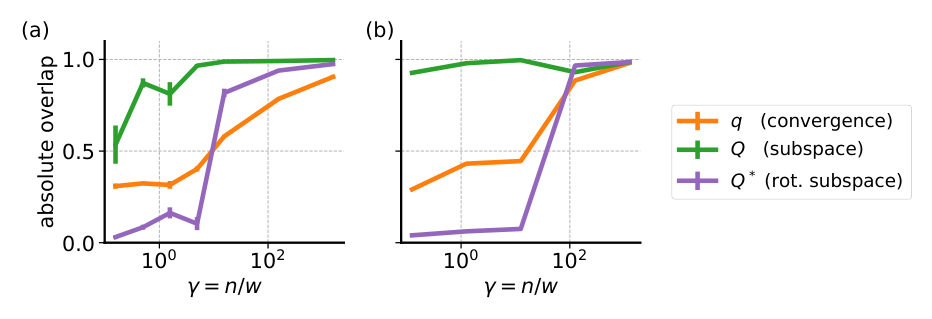 
Figure 4: Convergence and subspace recovery in diffusion models. We plot the convergence overlap q, the naïve subspace overlap Q and the rotated subspace overlap Q⋆in the Fourier basis, eqs. (5), (7) and (14) respectively, for images sampled from diffusion models trained on CelebA. (a) Images sampled from a vanilla UNet denoiser that we trained independently on increasing large disjoint subsets of CelebA. Average and error in the mean are computed over four runs per sample complexity, see section D for details. (b) Images sampled by Kadkhodaie et al. [1] from a blind denoiser [47] using the sampling algorithm of Kadkhodaie &amp; Simoncelli [48].

**Summary.** The paper provides a mathematical framework to show that generative models can learn to match the general statistics of a dataset (convergence) without necessarily recovering its key structural features (latent factors). It identifies a clear decoupling between these two stages of learning, which is crucial for understanding the true capabilities of diffusion models.

**Why it may be interesting.** not directly relevant

Detailed structure

**Main problem.** Investigating the transition from memorization to generalization in generative models and determining if model convergence is a reliable proxy for recovering underlying data structures.

**Main result.** Generalization decomposes into two decoupled objectives: matching the bulk of the data distribution (convergence) and recovering principal latent factors (subspace recovery), with the former occurring at lower sample complexity.

**Method.** Analytical characterization using Random Matrix Theory, specifically the Marchenko-Pastur law and the BBP transition, applied to spiked Wishart models and extended to power-law spectra.

**Model / system.** Linear generative models using a Gaussian process where the covariance is a spiked Wishart model (Sigma = I + beta * u * u^T), later extended to power-law spectral models and real-world datasets like CelebA and ImageNet.

**Key observables.** Memorization (m), Convergence overlap (q), Subspace recovery (Q), and Rotated subspace overlap (Q*).

**Important parameters / regimes.** Sample complexity ratio (gamma = n/d), signal-to-noise ratio (beta), regularization strength (sigma), and power-law exponent (alpha).

**Assumptions / limitations.** The primary analytical results rely on Gaussian approximations for both the data distribution and the generative models, and focus on the high-dimensional limit.

**Figures summary.** Figure 1 illustrates the three regimes (memorization, convergence, latent recovery) and the evolution of order parameters; Figure 3 shows the effectiveness of the rotated metric Q* in identifying phase transitions in power-law data.

**Paper structure.** The paper introduces the problem of memorization vs. generalization, develops an exact theory for linear Gaussian models using RMT, extends the framework to power-law spectra to account for real-world image statistics, and validates the findings using diffusion models and empirical datasets.

Abstract

Generative neural networks learn how to produce highly realistic images from a large, but finite number of examples - or do they simply memorise their training set? To settle this question, Kadkhodaie, Guth, Simoncelli and Mallat (ICLR '24) trained diffusion models independently on disjoint subsets of a dataset and showed that they converge to nearly the same density when the number of training images is large enough. This result raises two basic questions: how much data do you need for convergence, and what does convergence capture about learning the data distribution? Here, we address these questions by providing an exact analytical characterisation of the transition from memorisation to generalisation in linear generative models. We find that these models memorise at small load, while convergence emerges continuously when the number of samples is linear in the input dimension. Strikingly, we find that convergence is insensitive to recovery of the principal latent factors of the data, which are recovered in a sharp transition. After extending our approach to data with power-law spectra, we find the same distinction between convergence and latent recovery in our experiments with convolutional denoisers and in the data of Kadkhodaie et al. We thus show that generalisation in generative models decomposes into at least two distinct objectives: matching the bulk of the data distribution and recovering the principal latent factors. These objectives correspond to two different distances between true and learnt data distribution, and only the first one is captured by convergence.

[↑ back to top](#top)

### [Microscopic Nonaffine Deformation Theory of LAOS in Polymers](http://arxiv.org/abs/2605.21021v1)

**Authors:** Dario Nichetti, Alessio Zaccone  
**Type:** theory · **Category:** disordered systems and neural networks · **PDF:** <https://arxiv.org/pdf/2605.21021v1>  
**Analysis basis:** full PDF text, analyzed in chunks

📷 Fig 1

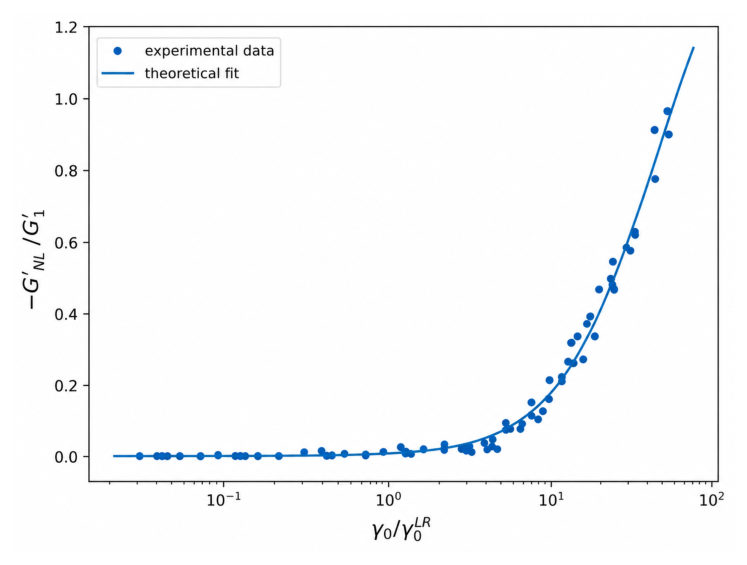 
Figure 1: Experimental master curve of the normalized nonlinear elastic contribution, NLI = −G′ NL/G′ 1, plotted as a function of the normalized strain amplitude γ0/γLR 0 . Symbols are experimental data from the literature [11], while the solid line is the theoretical crossover fit given by Eq. (83). The data include polymers with markedly different molecular architectures, including predominantly linear linear-low-density polyethylene (LLDPE), highly branched low-density polyethylene (LDPE), randomly branched emulsion-polymerized styrene–butadiene rubber (e- SBR), and solution-polymerized partially coupled styrene–butadiene rubber (s-SBR). Despite these architectural differences, the...

**Summary.** This paper provides a microscopic molecular basis for the nonlinear viscoelasticity observed in polymers during large-amplitude oscillations. It reinterprets the Nonlinearity Index as a measure of how structural constraints break down, linking polymer physics to the broader theory of nonaffine deformations in glasses.

**Why it may be interesting.** not directly relevant

Detailed structure

**Main problem.** Bridging the gap between tube-based polymer dynamics and the microscopic nonaffine theory of disordered elasticity to explain the origin of nonlinearities in Large-Amplitude Oscillatory Shear (LAOS).

**Main result.** The authors establish that the Nonlinearity Index (NLI) is a dynamic nonaffinity parameter measuring the transfer of elastic response from coherent tube elasticity to nonlinear relaxation channels, predicting a theoretical upper bound of |NLI|max = 3.

**Method.** The study uses a multiscale framework combining Fourier-transform rheology, nonaffine lattice dynamics, and a constraint-counting argument based on the eight-chain network model.

**Model / system.** The physical system consists of entangled polymer melts and concentrated solutions, modeled using a combination of Doi-Edwards tube theory and nonaffine deformation theory for amorphous solids.

**Key observables.** Nonlinearity Index (NLI), first-harmonic storage modulus (G'1), nonlinear modulus (G'NL), and the tube survival fraction (q).

**Important parameters / regimes.** Characteristic strain amplitude (gamma_c), maximum nonlinearity (Nmax), crossover exponent (m), and the nonaffine isostatic threshold.

**Assumptions / limitations.** The framework assumes a mapping between tube constraint loss and cage-breaking, and uses an eight-chain representation to estimate mechanical coordination.

**Figures summary.** The paper includes experimental master curves for the NLI, scaling plots of the modulus components, and a summary table of effective scaling regimes.

**Paper structure.** The paper introduces the problem of connecting tube theory to nonaffine elasticity, develops a mathematical framework for LAOS harmonics, proposes a crossover scaling law, performs experimental fitting, and concludes with a theoretical derivation of the NLI upper bound.

Abstract

We develop a molecularly motivated framework connecting large-amplitude oscillatory shear (LAOS) nonlinearities in entangled polymers to frequency-dependent nonaffine relaxation in disordered solids. The central idea is that the first harmonic in LAOS measures the residual phase-locked elastic response, whereas the higher harmonics encode the Fourier signature of strain-dependent nonaffine relaxation. The finite-amplitude modulus is interpreted as a local tangent stiffness of the evolving microstructure, in the spirit of elastoplastic and incremental nonaffine models. For entangled polymers, the analogue of the decreasing coordination number in cage-breaking theories of glass mechanics is identified not with the tube-orientation tensor itself, but with the fraction of surviving tube constraints. This distinction leads naturally to a crossover description controlled by a characteristic strain amplitude $γ_c$, rather than by universal fixed power-law exponents. The fitted value $N_{\max}\simeq1.72$ indicates that the present experimental data approach a strong but not fully saturated nonlinear state, remaining below the ideal limiting value predicted for complete constraint collapse. Finally, a constraint-counting argument combining an eight-chain affine network representation with the central-force nonaffine isostatic threshold gives a limiting estimate $|\mathrm{NLI}|_{\max}=3$. The results support the interpretation of the NLI as a Fourier-resolved dynamic nonaffinity parameter and establish a bridge between tube-based polymer dynamics, LAOS harmonic analysis, elastoplastic rheology, and microscopic nonaffine lattice dynamics.

[↑ back to top](#top)

### [Modeling and Resource Optimization for Quantum Oracles](http://arxiv.org/abs/2605.21380v1)

**Authors:** Zhihang Li, Bo Zhao, Chuanbing Han, Jie Zhao, Jinchen Xu, Guoqiang Shu, Yimin Gao, Woji He, Zheng Shan  
**Type:** theory · **Category:** quantum information and computing · **PDF:** <https://arxiv.org/pdf/2605.21380v1>  
**Analysis basis:** full PDF text, analyzed in chunks

📷 Fig 1

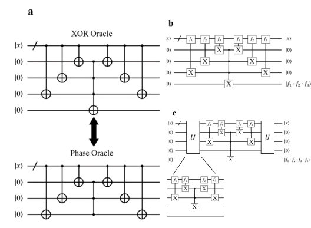 
Fig. 1. Framework for constructing quantum oracles using the qubit mul- tiplexing technique. (a) Conversion between XOR and phase oracles using multi-controlled X (MCX) and Z (MCZ) gates. (b) Evaluation of three constraint functions via qubit multiplexing. Each function is first encoded into an auxiliary qubit. The results are then merged onto a target qubit using an MCX gate, after which the auxiliary qubits are reset for reuse. (c) Hierarchical composition of single-function and multi-function oracles, where smaller modules are recursively combined into higher-level structures, thereby reducing the required number of auxiliary qubits.

📷 Fig 2

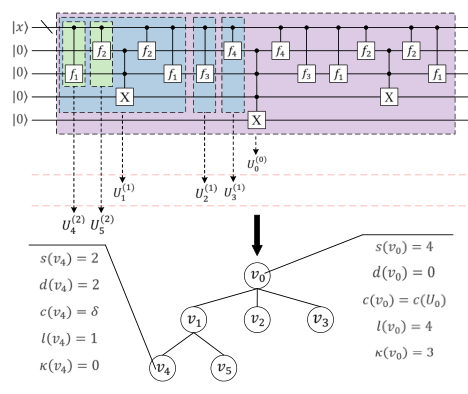 
Fig. 2. An illustrative example of the HRSE model representing an oracle structure with 4 constraint functions and 4 auxiliary qubits (m = 4, k = 4).

📷 Fig 3

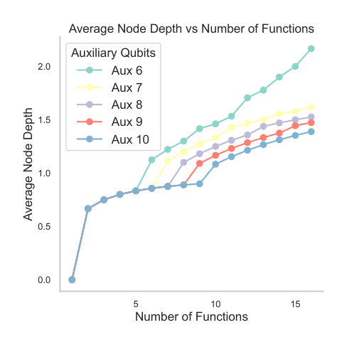 
Fig. 3. Average node depth versus the number of constraint functions for different auxiliary qubit counts. The curves represent results for auxiliary qubit counts k ranging from 6 to 10.

📷 Fig 4

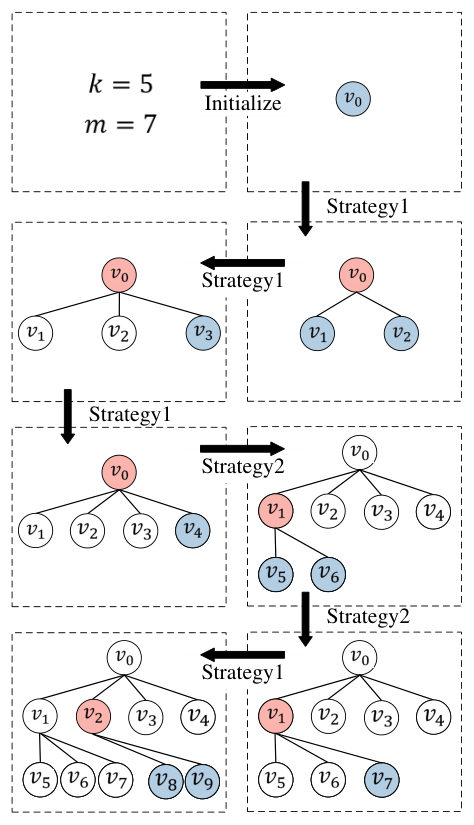 
Fig. 4. Incremental construction of the HRSE tree Tk(m) using the ASDT algorithm, illustrated with a small problem instance. At each step, the parent node selected for expansion by the ASDT strategy is highlighted in red, and the newly added child node is highlighted in blue. The iterative process continues until the tree contains 7 leaf nodes, corresponding to the 7 constraint functions to be implemented.

📷 Fig 5

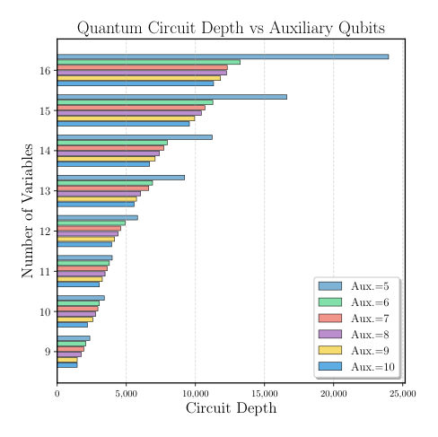 
Fig. 5. Space-depth trade-off of the ASDT algorithm. Bar groups correspond to different numbers of variables, while colors represent the number of auxiliary qubits. The experimental results demonstrate how the circuit depth decreases as more auxiliary qubits (i.e., greater space cost) are allocated, illustrating the trade-off between circuit depth and qubit count.

**Summary.** This paper introduces a new framework and algorithm for designing more efficient quantum oracles. By using a hierarchical recursive model, the authors can systematically balance the use of auxiliary qubits against circuit depth, significantly reducing the computational cost of essential quantum algorithms.

**Why it may be interesting.** not directly relevant

Detailed structure

**Main problem.** The optimization of quantum oracle construction to reduce resource overhead, specifically minimizing quantum gate complexity and circuit depth while managing the trade-off between qubit count and depth.

**Main result.** The proposed ASDT algorithm is theoretically proven to achieve optimal gate counts for a given number of qubits and experimentally reduces average quantum circuit depth by 53.99% compared to the W-cycle approach.

**Method.** The authors introduce the Hierarchical Recursive Synthesis-Evaluation (HRSE) model to formally describe oracle architectures and the Adaptive Space-depth Trade-off (ASDT) algorithm to optimize their structure.

**Model / system.** The work focuses on Boolean functions f: {0, 1}^n -> {0, 1} represented as quantum oracles, using a hierarchical tree-based model (HRSE) where nodes represent computation units and edges represent recursive containment.

**Key observables.** Quantum gate complexity (gate count), quantum circuit depth, and the optimization ratio compared to baseline methods.

**Important parameters / regimes.** Number of variables (n), number of auxiliary qubits (k/m), recursion depth (level), and the trade-off between space (qubits) and depth (time).

**Assumptions / limitations.** The model assumes the monotonicity of node size and that nodes with size 1 or 2 must be leaf nodes; it also focuses on the organization of functions rather than specific function encoding.

**Figures summary.** Figure 1 shows oracle conversion and qubit multiplexing; Figure 2 illustrates the HRSE model; Figure 3 plots node depth vs. function count; Figure 4 shows the ASDT algorithm execution; Figure 5 displays the space-depth trade-off bar graph.

**Paper structure.** The paper introduces the problem of oracle overhead, presents the HRSE mathematical model, details the ASDT algorithm and its optimality proof, provides experimental comparisons against the W-cycle approach, and discusses future optimization directions.

Abstract

Quantum computing has demonstrated its significant advantage over supercomputing for specific applications and shown promising prospect, such as machine learning, cryptography, finance, etc.. Quantum oracles are very common in many quantum algorithms and oracle resource consumption directly affects algorithm performance. However, existing oracle designs often exhibit high resource overhead and limited compatibility. Moreover, structured description tools and complexity analysis methods are lacked. In this work, we introduces a Hierarchical Recursive Synthesis-Evaluation (HRSE) model, enabling formal description and precise quantum gate complexity analysis of oracles. Based on this model, we propose an Adaptive Space-depth Trade-off (ASDT) algorithm for generating oracle structures under a fixed qubit constraint. We provide a theoretical proof showing that the ASDT algorithm achieves the optimal gate count for a given number of qubits. Experimental results show that the ASDT algorithm reduces the average quantum circuit depth by 53.99% compared with the W-cycle approach, with the number of variables being 10, 15, and 20, respectively.

[↑ back to top](#top)

### [Modeling phase separation in polymer-derived carbonitride ceramics through extended machine learning molecular dynamics](http://arxiv.org/abs/2605.20358v1)

**Authors:** Fabien Mortier, Sylvian Cadars, Olivier Masson, Mauro Boero, Guido Ori, Yun Wang, Samuel Bernard, Assil Bouzid  
**Type:** both · **Category:** disordered systems and neural networks · **PDF:** <https://arxiv.org/pdf/2605.20358v1>  
**Analysis basis:** full PDF text, analyzed in chunks

📷 Fig 1

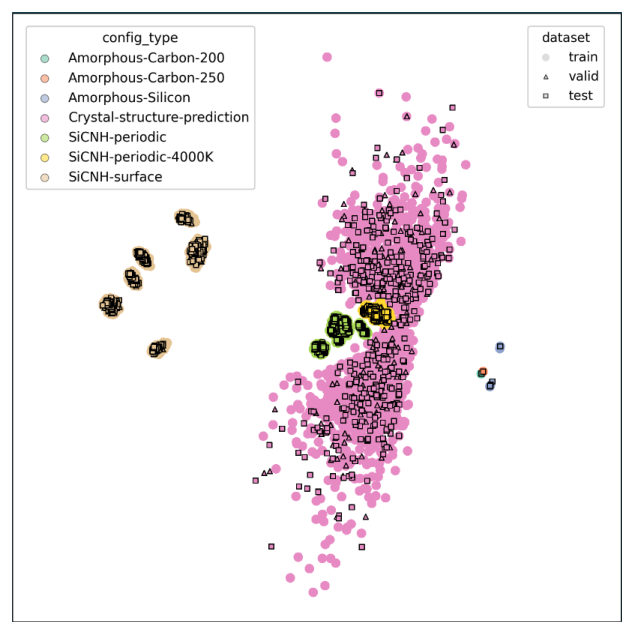 
FIG. 1: Multidimensional scaling 2D projection of the training database using Valle-Oganov fingerprints [50], demonstrating the structural diversity captured by the database. Each point represents a configuration, with colors indicating different classes of structures.

📷 Fig 2

 
FIG. 2: Evolution of the loss on the validation set during the training process. The figure shows the two stages of each training phase, with the initial focus on force optimization followed by energy refinement. Arrows indicate switches from the force-optimization to the energy-optimization stage.

📷 Fig 3

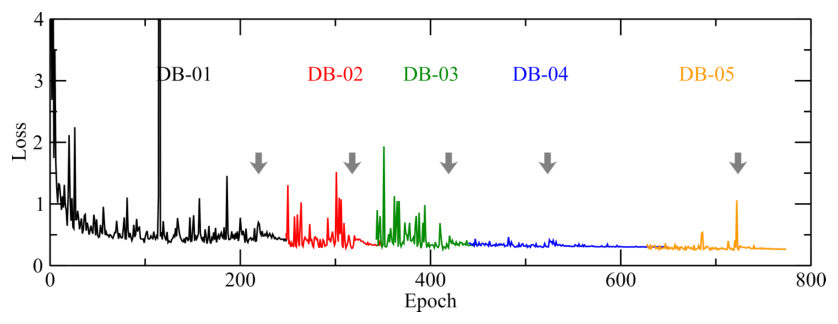 
Figure 3 shows the comparison between final MLIP predictions and DFT reference values for energies and forces across all configuration classes in the (previously unseen) test set. The performance of the potential is quantified using root mean square errors (RMSE) and relative RMSE (RRMSE) for each configuration class (see Table IV). The overall RMSE of the model are 12.4 meV/atom for energies and 149 meV/Å for forces, with a RRMSE of 10.2% for forces. By looking at configuration classes individually, we observe that RMSE on energies fall below 10 meV/atom and RMSE on forces are of the order of 100 meV/Å for SiCNH-periodic, SiCNH-surface, Amorphous-Carbon-200, Amorphous-Carbon-250 and...

📷 Fig 4

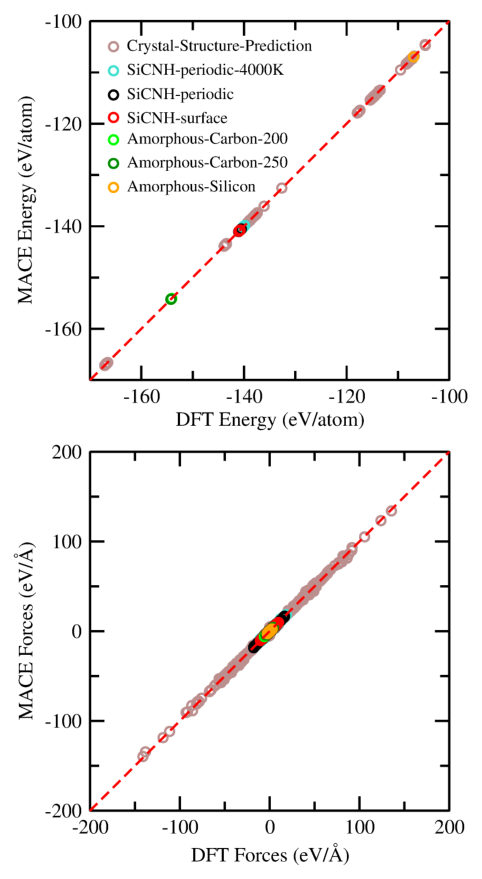 
FIG. 3: Comparison of MLIP-predicted energies and forces with DFT reference values for the test set.

📷 Fig 5

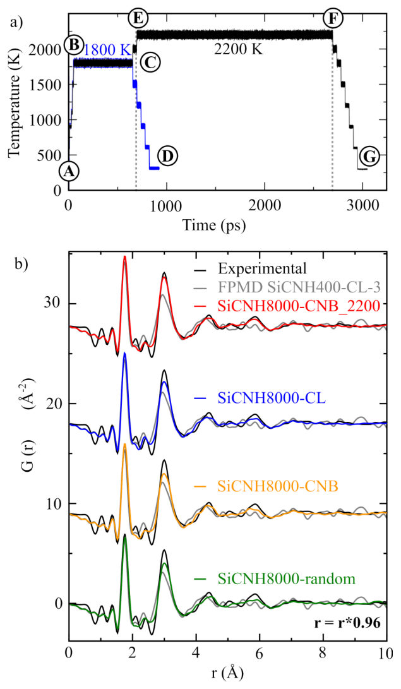 
FIG. 4: a) Thermal cycles applied to the 8000-atom models using the MLIP. The extended high-temperature thermal cycle shown in black was used to obtain the SiCNH8000-CNB_2200 model, while other models were obtained with the shorter thermal cycle shown in blue. b) Total pair distribution functions of the 8000-atom models compared to experimental data and FPMD SiCNH400-CL-3 from Ref. [30]. Simulated data use r values scaled by 0.96 for optimal alignment with experimental peaks (see text).

**Summary.** This paper presents a new machine learning interatomic potential that enables large-scale simulations of the thermal evolution of polymer-derived ceramics. It successfully captures the phase separation of carbon into graphene-like sheets within an amorphous SiCN matrix, providing a microscopic view of how structural defects mediate the formation of stable aromatic networks.

**Why it may be interesting.** not directly relevant

Detailed structure

**Main problem.** The difficulty of modeling the atomic-scale evolution and phase separation mechanisms of carbon domains within amorphous silicon carbonitride (SiCNH) ceramics during thermal processing.

**Main result.** The development of a highly accurate machine learning interatomic potential (MACE) that reveals how carbon domains nucleate and grow into graphene-like sheets via defect-mediated processes involving 5- and 7-member rings.

**Method.** Development of an equivariant machine learning interatomic potential (MACE) trained on a diverse database of 9,000+ configurations, followed by large-scale molecular dynamics simulations (8,000 atoms) and thermal annealing cycles.

**Model / system.** The physical system is a polymer-derived silicon carbonitride hydride (Si-C-N-H) ceramic, characterized by an amorphous SiCN matrix and a separate free-carbon phase.

**Key observables.** Atomic pair distribution functions (PDFs), structural motifs (carbon ring sizes, dimers, chains, and sheets), and local coordination numbers (Si, C, N).

**Important parameters / regimes.** Simulation scales of 8,000 atoms and nanosecond timescales; thermal annealing temperatures up to 2200 K; MLIP energy RMSE of 12.4 meV/atom.

**Assumptions / limitations.** The use of a DFT-based training set (PBE functional) assumes that the accuracy of the MLIP is sufficient to capture the complex chemical reactivity and long-range structural organization of the amorphous network.

**Figures summary.** The figures illustrate the structural diversity of the training database, the thermal annealing protocols, the evolution of carbon structural motifs (rings and chains), and the validation of the model against experimental pair distribution functions.

**Paper structure.** The paper identifies the limitations of previous computational methods, details the construction of a diverse training database and the MACE potential, describes the large-scale MD simulation protocols, presents the results of phase separation and carbon growth, and validates the findings against experimental scattering data.

Abstract

Polymer-derived ceramics combine the thermal stability of ceramics with the versatile properties of carbon domains, but modeling their atomic-scale evolution during processing remains elusive due to the limitations of traditional computational methods. To address this issue, here we develop and apply a machine learning interatomic potential for silicon carbonitride-based (Si-C-N-H) systems, trained on a diversified database of over 9000 configurations -including amorphous models, high-temperature states, surfaces, and crystal structure predictions - to capture the full complexity of these materials. This potential enables large-scale molecular dynamics simulations of 8000-atom systems revealing the atomic-scale evolution of the polymer-derived ceramic during thermal treatment. A key result of this work is the occurrence of a phase separation where carbon domains progressively nucleate from the amorphous SiCN matrix during thermal processing, forming distinct graphene-like sheets while preserving the integrity of the ceramic network. The resulting models reproduce the experimental atomic pair distribution functions with exceptional fidelity, validating our approach and providing microscopic explanations for the material unique combination of ceramic and graphitic properties. In this process, defective 5- and/or 7-member carbon rings, mediate the transformation to stable 6-member aromatic structures. These findings offer new atomic-scale insights into the thermal stability and structural transformation pathways of polymer-derived ceramics, while our methodology opens avenues for studying complex amorphous systems with first-principles accuracy at experimentally relevant scales.

[↑ back to top](#top)

### [Poles-zeros duality in semi-holographic Mott insulators](http://arxiv.org/abs/2605.20321v1)

**Authors:** Thomas Kögel, Alessio Caddeo, Amelie Pitters, Francesca Paoletti, Lorenzo Crippa, Giorgio Sangiovanni, René Meyer, Johanna Erdmenger  
**Type:** theory · **Category:** strongly correlated electrons · **PDF:** <https://arxiv.org/pdf/2605.20321v1>  
**Analysis basis:** full PDF text, analyzed in chunks

📷 Fig 1

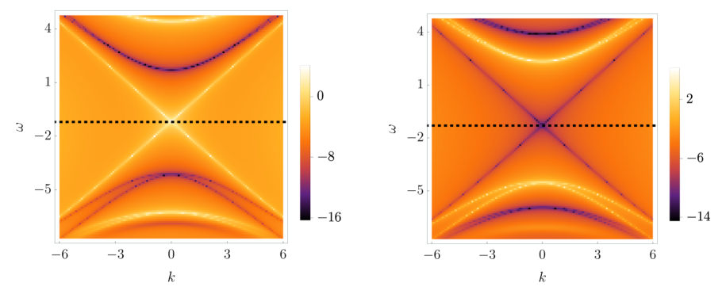 
Figure 2: Comparison of log | det GR(ω, k, η)| for opposite-sign values of the bulk coupling, η = 5 (metallic, in panel (a)) and η = −5 (Mott insulating, in panel (b)). Bright yellow regions indicate peaks in the quantity, while dark purple regions correspond to zeros. The horizontal dashed lines represent the Fermi level which is ωF ≈−1.2 for the metallic phase (left) while it is fixed in the middle of the gap, i.e. at ωF ≈−1.3 in the Mott insulator (right). The poles and zeros of | det GR(ω, k, η)| exhibit an approximate one-to-one correspondence over the displayed range of momenta and frequencies.

📷 Fig 2

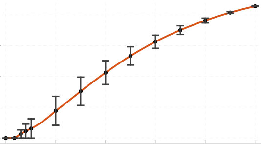 
Figure 5: For negative values of η, the system is a Mott insulator and here we plot its gap size as a function of η &lt; 0. The gap opens at η = −0.17 for the cutoff 10−2 and at η = −0.51 for the 10−5 cutoff. The datapoints are determined from the average of the result for the gap for the two different cutoffs, while the error bars are given by the deviation from the average. For larger negative values of η the two criteria converge towards the same value due to the spectral features becoming sharper.

**Summary.** This paper uses a semi-holographic framework to explain the poles-zeros duality observed in the transition to Mott-insulating phases. It shows that the zeros in the Green's function (Luttinger surfaces) arise from the poles of the self-energy, which are linked to collective excitations in a strongly coupled sector. The study provides a clear mapping between the insulating and metallic phases through the choice of holographic quantization.

**Why it may be interesting.** not directly relevant

Detailed structure

**Main problem.** Understanding the physical mechanism behind the poles-zeros duality in the Green's functions of Mott insulators and the emergence of Luttinger surfaces.

**Main result.** The authors demonstrate that a poles-zeros duality in the self-energy, driven by a bulk scalar coupling, induces an approximate duality in the single-particle Green's function, effectively mapping the Mott-insulating phase to a metallic phase.

**Method.** A semi-holographic approach using the AdS/CFT correspondence, involving the calculation of retarded Green's functions in an AdS Reissner-Nordstrom black hole background and analyzing the transition between standard and alternative quantizations.

**Model / system.** A semi-holographic model consisting of a fundamental Dirac fermion coupled to a strongly interacting large-N sector, where the latter is described by a 3+1D gravitational theory with a non-minimal scalar coupling.

**Key observables.** Retarded Green's function (G_R), self-energy (Sigma_R), spectral function (rho), and the determinant of the Green's function.

**Important parameters / regimes.** Non-minimal scalar coupling parameter (eta), large-N limit, chemical potential (mu), and temperature (T).

**Assumptions / limitations.** The large-N limit is used to treat the strongly coupled sector as a bath and neglect backreaction on the gravitational background; the probe approximation is applied to the bulk fermion.

**Figures summary.** Figure 1 shows the self-energy magnitude; Figure 2 compares the determinant of the Green's function; Figure 3 shows the determinant at k=0 identifying poles and zeros; Figure 4 relates the determinant to the self-energy; Figure 5 shows the Mott gap size vs eta; Figures 6 and 7 show the real and imaginary parts of the Green's function in the insulating and metallic regimes, respectively.

**Paper structure.** The paper introduces the problem of Green's function zeros, defines the semi-holographic model and its coupling, derives the analytical poles-zeros duality for the self-energy via quantization schemes, performs numerical analysis of the spectral functions and phase transitions, and discusses the physical implications and limitations.

Abstract

Inspired by the poles-zeros duality of Green's functions that appears in transitions into Mott-insulating phases in strongly correlated condensed matter systems, we propose a semi-holographic approach to Mott insulators. In this model, a fundamental fermion is coupled to a large-$N$, strongly interacting sector that generates a self-energy for the fundamental fermion's Green's function. This coupling amounts to a hybridization of the fundamental fermion with a strongly correlated fermionic composite. Within the holographic framework, at large $N$, the Green's function of the composite fermion naturally exhibits a poles-zeros duality. Zeros of the Green's function are caused by the poles of the self-energy that correspond to collective many-body excitations of the holographic strongly interacting sector. We calculate the spectral function of the fundamental fermion, from which we characterize the semi-holographic metallic and the Mott-insulating phases. In addition to the new physical interpretation of the zeros, our analysis yields a well-defined picture of the poles-zeros duality in terms of the freedom to choose between standard and alternative quantization in the strongly coupled sector.

[↑ back to top](#top)

### [PUBO Formulation for MST and Application to Optimum-Path Forest](http://arxiv.org/abs/2605.20637v1)

**Authors:** Guilherme E. L. Pexe, Lucas A. M. Rattighieri, Leandro A. Passos, Danilo S. Jodas, Douglas Rodrigues, Felipe F. Fanchini, João P. Papa, Kelton A. P. Costa  
**Type:** both · **Category:** quantum information and computing · **PDF:** <https://arxiv.org/pdf/2605.20637v1>  
**Analysis basis:** full PDF text, analyzed in chunks

📷 Fig 1

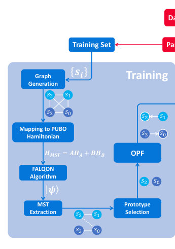 
Figure 1: Flow of the training and testing process for the OPF classifier using the FALQON algorithm. The

📷 Fig 2

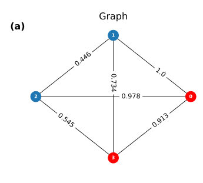 
Figure 2: (a) Example graph built from the Heart Disease dataset, where the vertices correspond to the dataset

📷 Fig 3

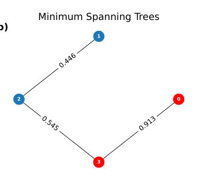 
Figure 3 presents the results of FALQON execution on the graph from Figure 2,

📷 Fig 4

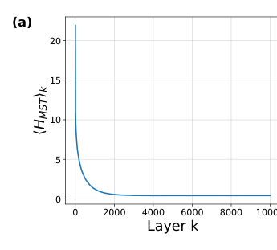 
Figure 3: Results of FALQON execution on the MST problem. (a) Evolution of the expected value of the

📷 Fig 5

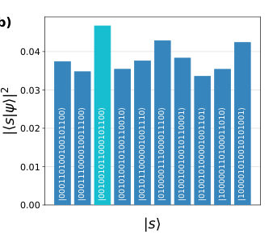 
Figure 4 shows the results of applying FALQON to the MST task formulated as

**Summary.** This paper proposes a quantum-inspired method to optimize the selection of prototypes in the Optimum-Path Forest classifier. By reformulating the Minimum Spanning Tree problem as a PUBO task and using the FALQON algorithm, the authors achieve performance parity with classical algorithms while improving scalability for quantum hardware. This demonstrates a potential path for using quantum optimization to enhance machine learning tasks.

**Why it may be interesting.** not directly relevant

Detailed structure

**Main problem.** The scalability of the Optimum-Path Forest (OPF) classifier is limited by the quadratic complexity of computing the Minimum Spanning Tree (MST) for large datasets. The authors seek to overcome this computational burden using a quantum-inspired optimization approach.

**Main result.** The proposed PUBO formulation using the FALQON algorithm achieves classification accuracies comparable to the classical Prim's algorithm while reducing the required number of qubits and auxiliary variables.

**Method.** The authors reformulate the MST problem as a Polynomial Unconstrained Binary Optimization (PUBO) task and apply the Feedback-Based Quantum Optimization (FALQON) algorithm for Hamiltonian minimization.

**Model / system.** The model is a supervised OPF classifier where training samples are represented as nodes in a fully connected graph with edge weights based on Euclidean distances. The problem is mapped to a PUBO Hamiltonian (H_MST) consisting of a penalty term to ensure a valid tree structure and a cost term to minimize total edge weight.

**Key observables.** Success rate of finding the ground state, frequency of the true solution in the top 10 most probable states, energy evolution (expectation value of the Hamiltonian), and probability distribution of the computational basis states.

**Important parameters / regimes.** Penalty parameters A and B, time step delta_t = 0.01, and 10,000 layers for FALQON convergence.

**Assumptions / limitations.** The study assumes that the MST can be effectively captured by a PUBO formulation and relies on small-scale dataset subsets for simulation due to current hardware/computational constraints.

**Figures summary.** Figure 1 shows the end-to-end process flowchart; Figure 2 displays a sample graph and its MST; Figure 3 shows energy decrease and probability distributions; Figure 4 compares QUBO results with different driver strategies; Figure 5 compares PUBO results.

**Paper structure.** The paper introduces the OPF framework, proposes a PUBO formulation for MST, describes the FALQON algorithm and its implementation, presents experimental results on various datasets comparing accuracy and execution time, and discusses limitations regarding scalability and local minima.

Abstract

The Optimum-Path Forest is a graph-based framework for designing classifiers that exploit inter-sample connectivity. A particular variant constructs decision boundaries based on prototypes computed by a Minimum Spanning Tree (MST) over the training data, which might become prohibitive for large-scale datasets. In this context, Quantum Machine Learning has emerged as a promising approach to overcome the high computational burden of combinatorial problems. We propose a quantum-inspired approach for prototype selection in OPF classifiers by reformulating the MST problem as a Polynomial Unconstrained Binary Optimization (PUBO) task and further employing the Feedback-Based Quantum Optimization (FALQON) algorithm for Hamiltonian minimization. The PUBO formulation reduces the need for qubits and eliminates the need for auxiliary variables, thereby addressing scalability constraints in current quantum hardware. Experiments on real-world datasets demonstrate that the FALQON-optimized MST achieves accuracies comparable to those of the classical Prim's algorithm while maintaining prototype quality. While FALQON occasionally reached local minima, it did not significantly impact the accuracy of the prototype selection process.

[↑ back to top](#top)

### [Q-SYNTH: Hybrid Quantum-Classical Adversarial Augmentation for Imbalanced Fraud Detection](http://arxiv.org/abs/2605.21164v1)

**Authors:** Adam Innan, Mansour El Alami, Nouhaila Innan, Muhammad Shafique, Mohamed Bennai  
**Type:** experiment · **Category:** disordered systems and neural networks · **PDF:** <https://arxiv.org/pdf/2605.21164v1>  
**Analysis basis:** full PDF text, analyzed in chunks

📷 Fig 1

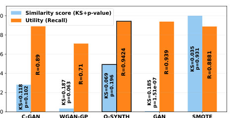 
Fig. 1: Motivation summary comparing distribution similarity and classification performance for five augmentation methods: C-GAN [18], WGAN-GP [19], GAN, SMOTE, and Q-SYNTH. The Similarity score (blue) is a single value in [0,1] formed by averaging two normalized signals: an inverted KS statistic (lower KS is better) and the KS p-value (higher is better). The Utility score (orange) is the downstream fraud Recall R in [0,1]. The figure is intended only as an intuitive summary of the fidelity–performance trade-off; all substantive comparisons in the paper rely on the raw metrics reported in the tables.

📷 Fig 2

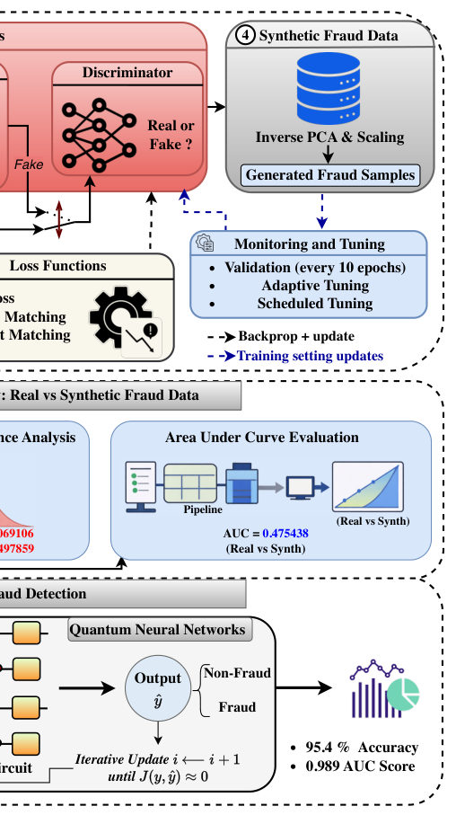 
Fig. 2: Overview of the proposed Q-SYNTH pipeline for fraud data generation and evaluation.

📷 Fig 3

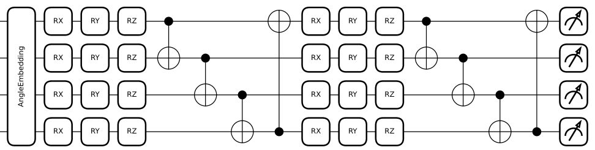 
Fig. 3: Quantum generator circuit. It starts with angle embedding, followed by trainable single-qubit rotations (RX, RY, RZ) and a ring of CNOT entangling gates. The circuit ends with Pauli-Z measurements on all qubits.

📷 Fig 4

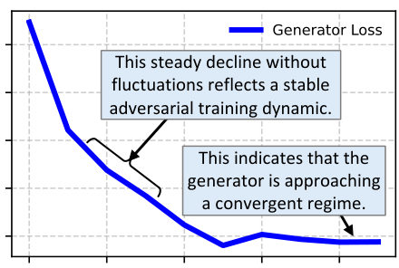 
Fig. 4: Generator loss over training epochs.

📷 Fig 5

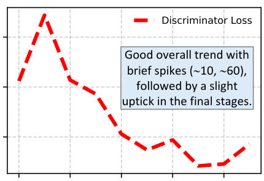 
Fig. 5: Discriminator loss over training epochs.

**Summary.** The paper introduces Q-SYNTH, a hybrid quantum-classical GAN designed to augment imbalanced datasets for fraud detection. It demonstrates that a quantum generator can produce synthetic samples that better match the real data distribution than classical GANs while remaining effective for downstream classification tasks.

**Why it may be interesting.** not directly relevant

Detailed structure

**Main problem.** Extreme class imbalance in credit card fraud detection causes supervised learners to favor the majority class, leading to poor recall for rare fraudulent transactions.

**Main result.** Q-SYNTH provides a favorable compromise between distributional fidelity and downstream performance, reducing marginal distribution mismatch compared to classical GANs while maintaining competitive fraud detection utility.

**Method.** A hybrid quantum-classical Generative Adversarial Network (GAN) where a parameterized quantum circuit (PQC) acts as the generator and a classical neural network acts as the discriminator.

**Model / system.** A hybrid architecture using a 6-qubit variational quantum circuit with a StronglyEntanglingLayers ansatz, implemented via PennyLane, to synthesize tabular fraud data.

**Key observables.** Kolmogorov-Smirnov (KS) statistics, Wasserstein distances, AUC-ROC for detectability, and downstream metrics including Precision, Recall, and F1-score.

**Important parameters / regimes.** Synthetic-to-real injection ratios (10%, 25%, 50%, 100%), dimensionality reduction to d=4, and adaptive regularization parameters (noise scale, label smoothing, and dropout).

**Assumptions / limitations.** Assumes data can be effectively represented in a bounded, low-dimensional continuous space; assumes the quantum generator's parameter efficiency is comparable to classical counterparts.

**Figures summary.** Figure 1 shows the trade-off between similarity and utility across different augmentation methods; Figure 2 outlines the end-to-end Q-SYNTH pipeline; Figure 3 details the quantum circuit architecture; Figures 4 and 5 show training loss trajectories; Figure 6 presents the ROC curve for synthetic sample detectability.

**Paper structure.** The paper introduces the problem of class imbalance, proposes the Q-SYNTH hybrid framework, details the architecture and preprocessing pipeline, describes the adversarial training and regularization methods, presents quantitative results on distributional fidelity and downstream detection, and concludes with scaling analysis and limitations.

Abstract

Credit card fraud detection is fundamentally challenged by extreme class imbalance, where fraudulent transactions are rare yet operationally critical. This imbalance often biases supervised learners toward the legitimate class, leading to high overall accuracy but weaker fraud-class recall and F1-score. This paper introduces Q-SYNTH, a hybrid classical--quantum generative adversarial framework in which a parameterized quantum circuit serves as the generator and a classical neural network serves as the discriminator. Q-SYNTH is designed for minority-class fraud synthesis in tabular data and is evaluated along two dimensions: statistical fidelity to real fraud samples and downstream performance for fraud detection. To this end, generated samples are assessed using distributional similarity measures based on Kolmogorov-Smirnov statistics and Wasserstein distances, real-vs-synthetic detectability measured by AUC-ROC, and downstream classification performance across both quantum and classical classifiers. Under the reported protocol, Q-SYNTH reduces marginal distribution mismatch relative to a classical GAN baseline while maintaining competitive downstream fraud-detection performance. Although SMOTE achieves the strongest feature-wise similarity and the classical GAN attains the highest downstream performance in several settings, Q-SYNTH offers a favorable compromise between distributional fidelity and downstream performance, supporting the feasibility of hybrid quantum augmentation for imbalanced fraud detection.

[↑ back to top](#top)

### [Quantifying Hyperparameter Transfer and the Importance of Embedding Layer Learning Rate](http://arxiv.org/abs/2605.21486v1)

**Authors:** Dayal Singh Kalra, Maissam Barkeshli  
**Type:** theory · **Category:** disordered systems and neural networks · **PDF:** <https://arxiv.org/pdf/2605.21486v1>  
**Analysis basis:** full PDF text, analyzed in chunks

📷 Fig 1

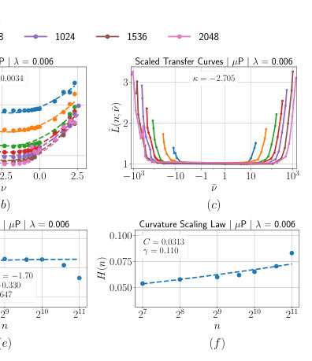 
Figure 1: Computing the three transfer metrics for µP. (a) Loss vs. log learning rate ν, with star marking the optimum ν∗(n), (b) Joint fit of the loss model (Equation (6), dashed lines), with a low predictability error E = 0.0034 , (c) Loss curves in the normalized coordinates (Equation (8)), with κ = −2.640 indicating robust transfer. (d-f) Scaling laws for optimal loss L∗(n), optimal log-learning-rate ν∗(n), and curvature H(n). In (d), the orange curve shows the best loss across parameterizations at each width, used for estimating the asymptotic loss gap R(∞).

📷 Fig 2

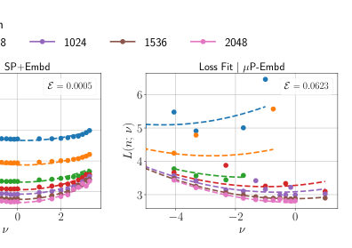 
Figure 2: Embedding layer learning rate is the critical difference between SP and µP. Loss vs. log learning rate ν across widths for: (a) SP with Θ(1/n) embedding learning rate; (b) SP modified to use Θ(1) embedding learning rate (SP+Embd); (c) µP modified to use Θ(1/n) embedding learning rate (µP-Embd). Speeding up the embedding in SP eliminates training instabilities and yields smooth, µP-like curves, while slowing it down in µP reintroduces SP-like instabilities. These interventions isolate the embedding learning rate as the primary driver of µP’s advantage, and show that training it fast enough is critical for stable training.

📷 Fig 3

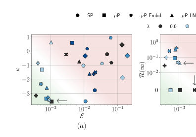 
Figure 3: Transfer metrics for parameterizations interpolating between SP and µP. Parameterizations with ‘+’ denote incremental changes from SP towards µP, while ‘−’ denotes changes from µP towards SP. Green and red regions indicate desirable and undesirable regimes, respectively. The orange arrow highlights SP+Embd (SP with Θ(1) embedding learning rate), which matches µP across all three metrics, suggesting the embedding layer learning rate is the primary driver of µP’s advantage.

📷 Fig 4

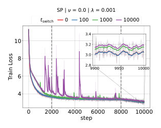 
Figure 4: (a) Reducing the embedding learning rate from Θ(1) to Θ(1/n) in µP at step tswitch causes a persistent loss gap that grows larger for earlier switches (inset). (b) Increasing it from Θ(1/n) to Θ(1) in SP at step tswitch eliminates training instabilities and improves performance over SP (tswitch = 104).

📷 Fig 5

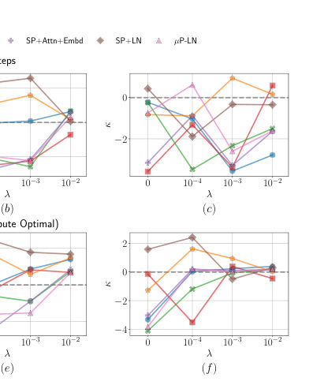 
Figure 5: Effect of weight decay on the three transfer metrics in the fixed-step (top) and fixed TPP (bottom) settings. In the fixed-step setting, weight decay improves predictability error E at the cost of asymptotic performance R(∞). In the TPP setting, stable parameterizations achieve near-zero R(∞), and landscape predictability trends are similar, but robustness κ degrades as weight decay increases.

**Summary.** This paper provides a formal framework to quantify how well hyperparameters can be transferred from small to large neural networks. It discovers that the success of the popular muP parameterization is largely due to its ability to stabilize the training of the embedding layer. The work also explores how weight decay affects the predictability and robustness of scaling laws.

**Why it may be interesting.** not directly relevant

Detailed structure

**Main problem.** The paper investigates the mechanisms behind hyperparameter transferability in neural networks, specifically comparing the effectiveness of Maximal Update Parameterization (muP) versus Standard Parameterization (SP) when scaling model width.

**Main result.** The authors identify that the primary driver of muP's superior learning rate transfer is the maximization of the embedding layer learning rate, which prevents training instabilities found in SP.

**Method.** The study uses a quantitative framework with three new metrics (scaling law fit quality, transfer robustness, and asymptotic loss penalty) and a series of 16 ablation studies on Transformer and CNN architectures.

**Model / system.** The study focuses on decoder-only Transformers and CNNs, analyzing scaling behavior as model width (n) increases, using the AdamW optimizer and the FineWeb-Edu dataset.

**Key observables.** Scaling law fit error (E), transfer robustness exponent (kappa), and asymptotic loss penalty (R(infinity)).

**Important parameters / regimes.** Model width (n), learning rate (eta), weight decay (lambda), and the abcd parameterization exponents controlling forward pass, initialization, and learning rate scaling.

**Assumptions / limitations.** Assumptions include a width-independent training horizon, the 'Full Alignment Assumption' for simplifying scaling exponents, and specific scaling for input/loss derivatives.

**Figures summary.** Figure 1 shows the calculation of transfer metrics; Figure 2 demonstrates how adjusting the embedding layer learning rate in SP mimics muP; Figure 3 shows transfer metrics across parameterizations; Figure 4 illustrates loss gaps and stability; Figure 5 shows the impact of weight decay in fixed-step and compute-optimal regimes.

**Paper structure.** The paper introduces a quantification framework for hyperparameter transfer, presents an ablation study isolating the embedding layer's role, provides a mathematical derivation of stability conditions for SGD and Adam, and concludes with an analysis of weight decay and compute-optimal scaling.

Abstract

Hyperparameter transfer allows extrapolating optimal optimization hyperparameters from small to large scales, making it critical for training large language models (LLMs). This is done either by fitting a scaling law to the hyperparameters or by a judicious choice of parameterization, such as Maximal Update ($μ$P), that renders optimal hyperparameters approximately scale invariant. In this paper, we first develop a framework to quantify hyperparameter transfer through three metrics: (1) the quality of the scaling law fit, (2) the robustness to extrapolation errors, and (3) the asymptotic loss penalty due to choice of parameterization. Next, we investigate through a comprehensive series of ablations why $μ$P appears to offer high-quality learning rate transfer relative to standard parameterization (SP), as existing theory is inadequate. We find that the overwhelming benefit of $μ$P relative to SP when training with AdamW arises simply from maximizing the learning rate of the embedding layer. In SP, the embedding layer learning rate acts as a bottleneck that induces training instabilities; increasing it by a factor of width to match $μ$P dramatically smooths out training while improving hyperparameter transfer. We also find that weight decay improves the scaling law fits, while, in the fixed token-per-parameter setting, it hurts the robustness of the extrapolation.

[↑ back to top](#top)

### [Random Matrix Spectra from Boltzmann-Weighted Lattice Ensembles](http://arxiv.org/abs/2605.21254v1)

**Authors:** Yaprak Önder, Abbas Ali Saberi, Roderich Moessner  
**Type:** theory · **Category:** disordered systems and neural networks · **PDF:** <https://arxiv.org/pdf/2605.21254v1>  
**Analysis basis:** full PDF text, analyzed in chunks

📷 Fig 1

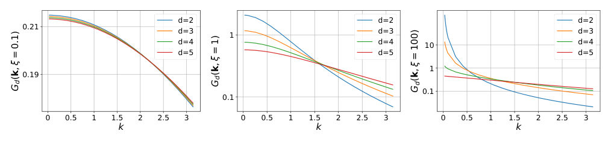 
FIG. 1: Behavior of V(k) plotted for d = 2, 3, 4, 5 for ξ = 0.1 (left), ξ = 1 (middle), and ξ = 100 (right). The propagator is normalized as shown in Eq. (III.25). In the ξ →0 limit, V(k) follows the Ornstein-Zernike form for all dimensions. As ξ →∞, the function has an IR divergence of the form 1/|k|d−4 for d &lt; 4, and −ln(|k|) for d = 4.

📷 Fig 2

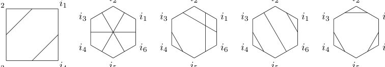 
FIG. 2: Distinct pairings (up to a symmetry factor) for the 4th and 6th moments of Wigner matrices. We have identified the matrix indices with the vertices and the matrix elements with the edges; pairings are indicated via lines connecting the edges inside the n-gon. Non-crossing pairings (4-ii,6-iii,6-iv in the figure) contribute at O(1) in the large-L limit, while crossing ones are suppressed.

📷 Fig 3

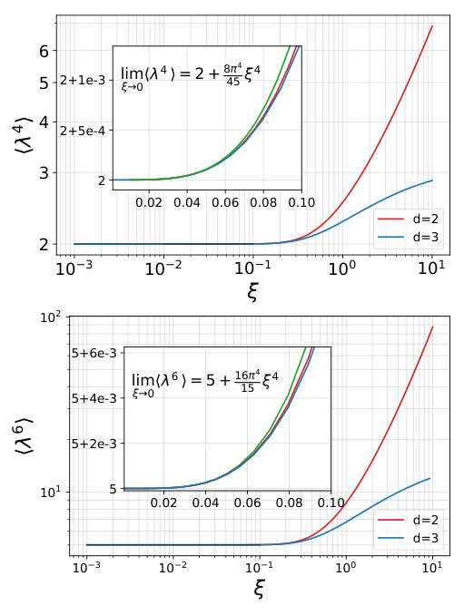 
FIG. 3: Fourth and sixth moments of the eigenvalue spectrum for T &gt; Tc as a function of ξ for d = 2, explicitly computed from the numerical integration of relevant terms as shown in Eqs. (IV.6),(IV.7). Insets indicate the limit ξ →0. Note that initial deviations are O(ξ4), which indicates that the moments are stable to small perturbations to the semicircle law.

📷 Fig 4

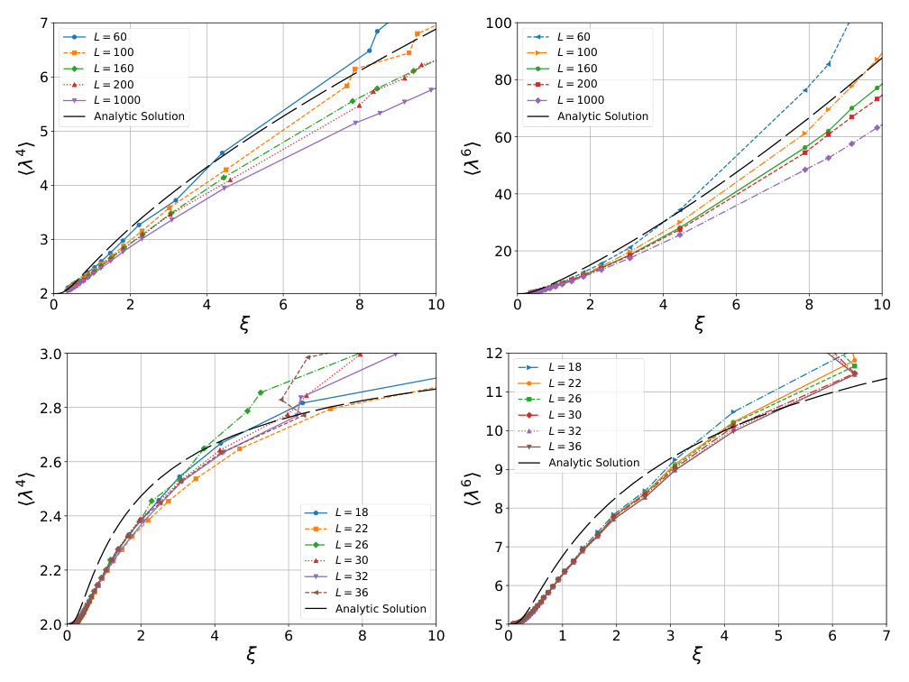 
FIG. 4: Fourth and sixth moments of the eigenvalue spectrum of Ising Model (top) and Gaussian EA spin glass (bottom) as a function of ξ, computed from Monte Carlo sampling. ξ is calculated by fitting the matrix of variances to the relevant propagator form. The black dashed line indicates the analytical solution shown in Fig. 3.

📷 Fig 5

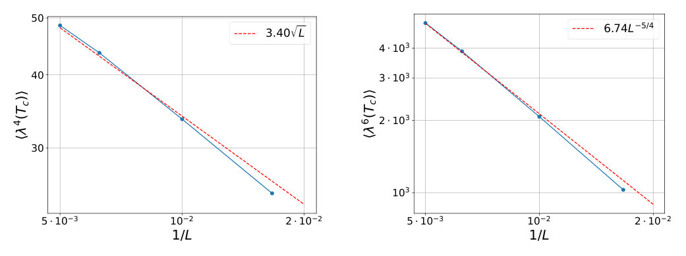 
FIG. 5: Scaling of the fourth and sixth moments of the eigenvalue spectrum at T = Tc for the Ising model as a function of system size, computed from Monte Carlo sampling. The results show good agreement with the scaling predictions from a moment method analysis, and the results for the fourth moment agree with [12].

**Summary.** This paper introduces a method to bridge statistical mechanics and random matrix theory by mapping lattice configurations to correlated matrix ensembles. It demonstrates that the eigenvalue spectrum of these matrices can quantitatively capture phase transitions and the evolution of spatial correlations.

**Why it may be interesting.** not directly relevant

Detailed structure

**Main problem.** Developing a random matrix framework to study statistical-mechanical lattice systems through spectral observables and determining if eigenvalue spectra can serve as probes for collective behavior and criticality.

**Main result.** The authors establish that the eigenvalue spectrum evolves from a Wigner semicircle law at high temperatures to model-dependent critical forms that reflect the underlying spatial correlation structure.

**Method.** The framework maps Boltzmann-weighted configurations to matrix ensembles using Wick-contraction expansions for moments and the Vector Dyson Equation (VDE) for the bulk density.

**Model / system.** The study focuses on d-dimensional hypercubic lattices, specifically the 2D ferromagnetic Ising model and the 3D Edwards-Anderson spin glass.

**Key observables.** Eigenvalue spectral distribution (bulk density), spectral moments, spectral edge, and the variance profile in momentum space.

**Important parameters / regimes.** Temperature (beta), correlation length (xi), system size (L), and the anomalous dimension (eta).

**Assumptions / limitations.** Assumes translational invariance, periodic boundary conditions, and uses a Gaussian/Wick approximation for off-critical regimes.

**Figures summary.** Figures show the variance profile V(k) across dimensions, the scaling of the fourth and sixth moments with correlation length, and the accuracy of the analytic spectral edge compared to Monte Carlo data.

**Paper structure.** The paper introduces the matrix construction, derives the momentum-space variance profile, applies analytical techniques (Wick expansion and VDE) to specific models (Ising and EA spin glass), and benchmarks results against Monte Carlo simulations.

Abstract

We introduce a random matrix framework for studying statistical-mechanical lattice systems through spectral observables. Equilibrium configurations sampled from a Boltzmann measure are mapped to matrix ensembles whose covariance structure is inherited from the spatial correlations of the underlying model. This construction maps real-space correlation functions to a momentum-space variance profile, providing a direct bridge between statistical-mechanical correlations and correlated random matrix ensembles. We derive this variance profile in finite-correlation-length and critical regimes, and compute spectral moments within a Wick-contraction expansion. A complementary self-consistent description of the bulk density is developed using the resolvent formalism. These analytical methods are benchmarked against Monte Carlo data for the two-dimensional Ising model and three-dimensional Edwards--Anderson spin glasses. In both cases, the spectra evolve from the semicircle law at high temperature to model-dependent critical forms reflecting the structure of correlations. The framework, therefore, provides a quantitative spectral route to probing collective behavior in ordered and disordered statistical systems, while also defining a class of physically motivated correlated random matrix ensembles.

[↑ back to top](#top)

### [Representability-Aware Neural Networks for Reduced Density Matrices: Application to Fractional Chern Insulators](http://arxiv.org/abs/2605.20326v1)

**Authors:** Justin B. Hart, Awwab A. Azam, Thomas Li, Yunxuan Li, Ye Bi, Haining Pan, Jiabin Yu  
**Type:** theory · **Category:** numerical methods · **PDF:** <https://arxiv.org/pdf/2605.20326v1>  
**Analysis basis:** full PDF text, analyzed in chunks

📷 Fig 1

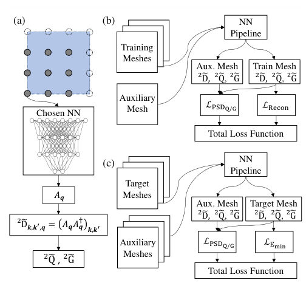 
FIG. 1. Schematic of Representability-Aware NN (a) The input of the NN involves the Bloch momenta on cer- tain momentum meshes. The input is passed through our chosen NN architecture, and the outputs are aggregated to form a tensor Aq in Eq. (8), which is in turn used to con- struct 2 ˜D, 2 ˜Q and 2 ˜G. This pipeline supports prediction on any L1 × L2 conventional or tilted mesh in any convention as the NN can be evaluated at arbitrarily dense or arbitrarily shaped momentum meshes in the first Brillouin zone (1BZ). (b) Loss function for the interpolation training. The NNs are trained on 2-RDMs on small meshes, where we provide true ˜D, ˜Q, and ˜G through the ED calculation. (c) Loss...

📷 Fig 2

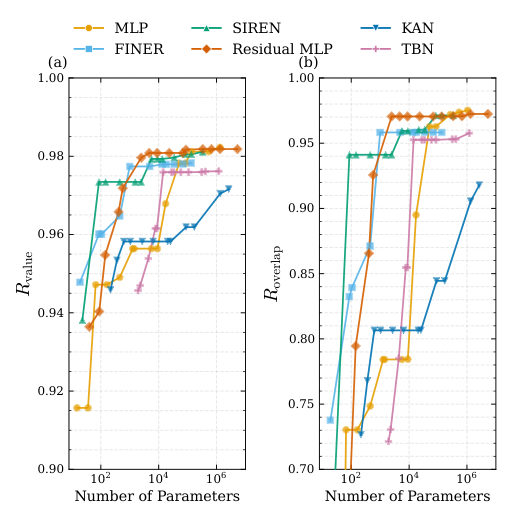 
FIG. 2. NN Parameter Efficiency for Interpolation of the 2-RDM of the one-band projected tMoTe2. We plot the NN architectures’ maximum achievable (a) Rvalue and (b) Roverlap at the indicated parameter count. The prediction is tested against ED on the conventional 6 × 6 mesh.

📷 Fig 3

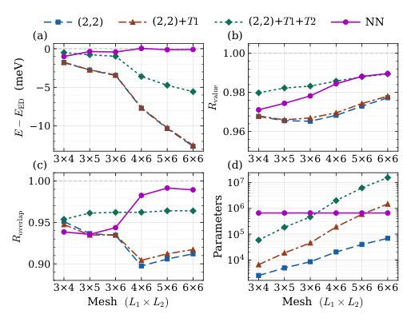 
FIG. 3. Comparison of BPSDP and NN Varia- tional Optimization for 2-RDM on several conven- tional meshes. We provide BPSDP incorporating (2, 2) (blue), BPSDP incorporating (2, 2) and T1 (brown), and BPSDP incorporating (2, 2), T1, and T2 (green). We also pro- vide the prediction of the NN variational optimization with all the listed meshes as target meshes (purple). We plot (a) E −EED with E the converged/predicted energy and EED the ED ground-state energy, (b) Rvalue against the ED results, and (c) Roverlap against the ED results over various conven- tional L1 × L2 meshes. In (d), we plot the required number of real parameters for the each calculation, in log-scale.

📷 Fig 4

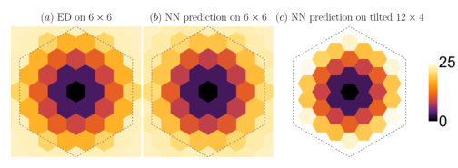 
FIG. 4. The plot of S(q) for the one-band projected tMoTe2. We plot S(q) from (a) the ED calculation on the conventional 6 × 6, (b) the prediction from NN variational optimization for the conventional 6 × 6 mesh, and (c) the prediction from NN variational optimization for the tilted 12× 4 mesh. Here we plot all |q| points that are smaller than half the length of the primitive reciprocal moiré lattice vector, the dahsed line labels the edge of the 1BZ, and all plots use the same color bar. Note that, we cap the color range at 25 to better visualize the behavior near the Γ point, and because of this color range, the outer part of (c) is out of range.

📷 Fig 5

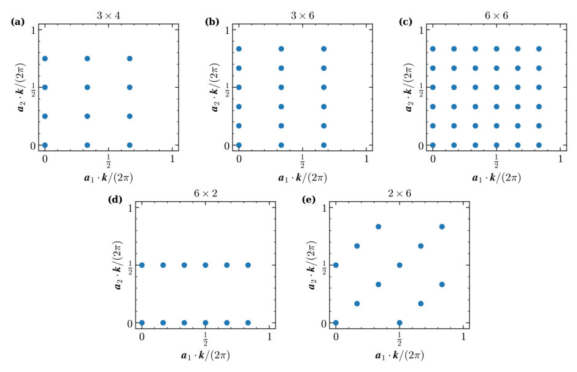 
FIG. 5. Visualization of the sampling of the 1BZin the conventional meshes (a-d) and the tilted mesh (e) with M =  1 1 0 1

**Summary.** The authors present a neural network framework designed to predict reduced density matrices by embedding physical N-representability constraints directly into the network. This approach allows for efficient interpolation of many-body properties across different momentum meshes and provides a highly parameter-efficient alternative to traditional semidefinite programming for studying fractional Chern insulators.

**Why it may be interesting.** not directly relevant

Detailed structure

**Main problem.** Developing an efficient way to predict two-particle reduced density matrices (2-RDMs) and many-body energies for large-scale strongly correlated systems without the exponential cost of Exact Diagonalization.

**Main result.** The proposed representability-aware neural network, specifically a residual MLP, achieves high accuracy in predicting 2-RDMs and ground-state energies with significantly fewer parameters than traditional semidefinite programming methods.

**Method.** A neural network framework that incorporates N-representability conditions (Hermiticity, antisymmetry, and PSD constraints) into its architecture and loss function, utilizing both interpolation-based training and variational optimization.

**Model / system.** A one-band projected many-body model of twisted bilayer MoTe2 (tMoTe2) at a 3.89 degree twist angle and 2/3 hole filling, featuring double-gate screened Coulomb interactions.

**Key observables.** Two-particle reduced density matrices (2-RDMs), many-body ground-state energy, many-body quantum metric, and static structure factor S(q).

**Important parameters / regimes.** Twist angle of 3.89 degrees, hole filling of 2/3, gate distance of 20 nm, and various momentum mesh sizes.

**Assumptions / limitations.** The implementation only enforces a subset of N-representability conditions because the full set is NP-complete.

**Figures summary.** Figure 1 shows the NN pipeline and loss function schematics; Figure 9 compares architecture performance via R-value and overlap; Figure 14 illustrates the scaling of accuracy against parameter count.

**Paper structure.** The paper introduces the representability-aware NN framework, evaluates various architectures (MLP, KAN, SIREN, etc.) using the Richardson model, applies the method to the tMoTe2 fractional Chern insulator, compares performance against BPSDP, and concludes with scaling and generalization results.

Abstract

We develop a representability-aware and interpolable neural network (NN) framework for predicting two-particle reduced density matrices (2-RDMs). The NN incorporates a subset of representability conditions through its architecture and loss function, and can operate on different momentum meshes, enabling evaluating the representability conditions across multiple meshes, which we call interpolated representability condition. The framework can be used either to predict 2-RDMs on large momentum meshes by interpolating exact results from small meshes, or as a variational 2-RDM ansatz optimized by energy minimization on arbitrary meshes. We apply this approach to the fractional Chern insulator in the one-band projected model of twisted bilayer MoTe$_2$ at twist angle $3.89^\circ$ and hole filling $2/3$. Trained on exact-diagonalization (ED) 2-RDMs from meshes with $12$ or $18$ momentum points using six different NN architectures, the best NN is the residual multilayer perceptron, which predicts the $6\times6$ 2-RDM with $97.07\%-98.18\%$ accuracy relative to the ED 2-RDM but predicts an energy $77.353$ meV above ED ground-state energy. We then variationally optimize the NN on several meshes including $6\times6$, predicting a $6\times 6$ energy of just $0.104$ meV below ED while maintaining $98.94\%-98.96\%$ accuracy. Compared with the conventional boundary-point semidefinite programming, which gives an energy $5.560$ meV below ED with $96.40\%-98.94\%$ accuracy, the NN achieves a more accurate energy and similar accuracy while using only less than 1/20 as many parameters. Eventually, we add a symmetric mesh of $48$ momentum points to the variational optimization of the NN, and provide a prediction of the many-body ground-state energy and the many-body quantum metric on that mesh.

[↑ back to top](#top)

### [Strange metallicity in the Kagome metal Ni$_3$In: a DMFT investigation](http://arxiv.org/abs/2605.21386v1)

**Authors:** Ruslan Mushkaev, Francesco Petocchi, Philipp Werner  
**Type:** theory · **Category:** strongly correlated electrons · **PDF:** <https://arxiv.org/pdf/2605.21386v1>  
**Analysis basis:** full PDF text, analyzed in chunks

📷 Fig 1

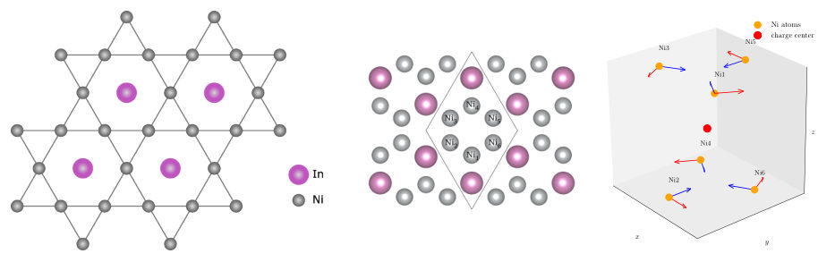 
FIG. 1: Panel (a): one of the Ni3In Kagome layers. Panel (b): shifted Ni3In unit cell. Panel (c): local orbital axes.

📷 Fig 2

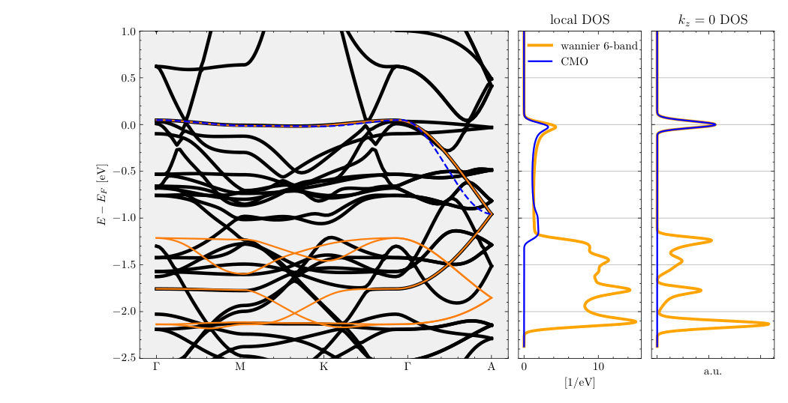 
FIG. 2: Left panel: DFT bandstructure (black) and 6 Wannier bands (orange), derived from a Ni-dxz Wannier Hamiltonian. The band derived from the CMO states is the blue dashed line. Middle and right panels: Full DOS for the 6-band and 1-band (CMO) models, and DOS calculated in the kz = 0 plane.

📷 Fig 3

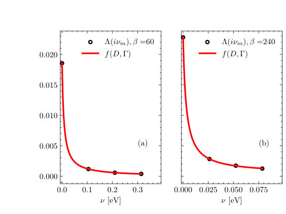 
FIG. 3: Drude fit of the current-current correlation func- tion for (a) β =60 and (b) 240 eV−1 (193 K and 48 K respectively).

📷 Fig 4

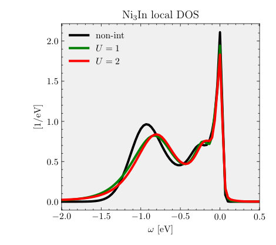 
FIG. 4: DMFT local density of states per spin for the one-band model of Ni3In for U = 1 eV and 2 eV, at β = 100 eV−1 (116 K). The black curve is the local DOS of the noninteracting model.

📷 Fig 5

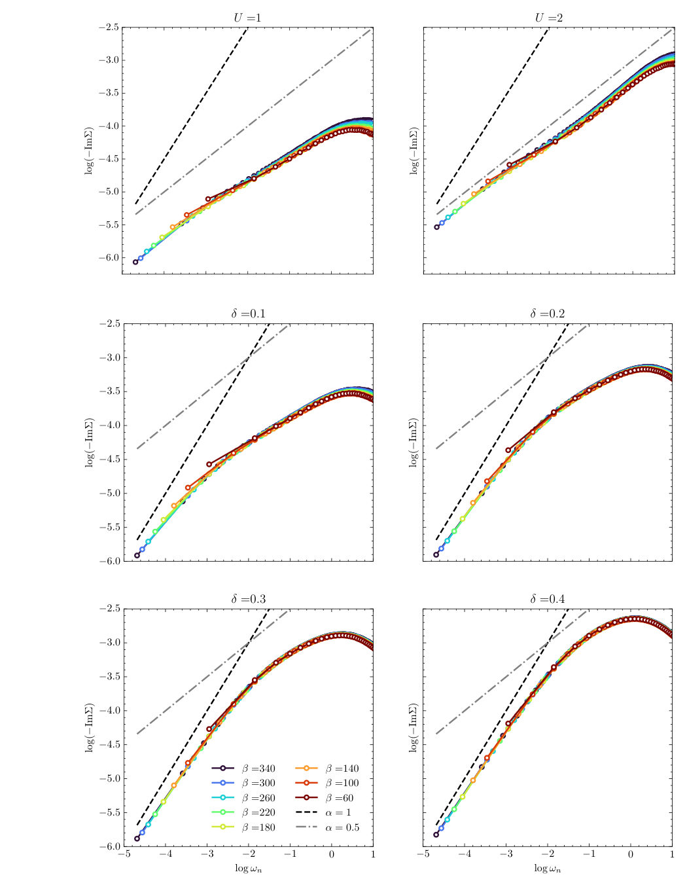 
FIG. 5: Local DMFT self-energies for Ni3In for different interactions and temperatures in the undoped case (top row) and for different doping values δ = 1.85 −n at U = 1 eV (second and third rows).

**Summary.** This paper uses DMFT to show that the strange metallicity in the Kagome metal Ni3In arises from a partially filled quasi-flat band. The researchers demonstrate that a single-band Hubbard model can capture the non-Fermi-liquid behavior and the crossover to a heavy Fermi-liquid regime upon hole doping. This provides a microscopic link between the Kagome lattice geometry and anomalous transport properties.

**Why it may be interesting.** not directly relevant

Detailed structure

**Main problem.** Investigating the microscopic origins of strange metallicity and the coexistence of localized and itinerant electronic degrees of freedom in the Kagome metal Ni3In.

**Main result.** The study finds that a single-band Hubbard model can reproduce the linear-in-T resistivity and non-Fermi-liquid behavior, which is driven by the presence of a partially filled quasi-flat band.

**Method.** Dynamical Mean Field Theory (DMFT) using a hybridization-expansion continuous-time Monte Carlo (CT-HYB) solver applied to a Hubbard model derived from DFT-based Wannier functions.

**Model / system.** The physical system is the Kagome metal Ni3In. The theoretical model is a minimal single-band Hubbard model on a stacked triangular lattice, constructed from Compact Molecular Orbitals (CMOs) to capture the electronic structure near the Fermi level.

**Key observables.** Temperature-dependent resistivity, imaginary part of the self-energy, local density of states (DOS), and static local spin susceptibility.

**Important parameters / regimes.** Hubbard repulsion U (1-2 eV), band filling (n approx 1.85), and temperature (32-193 K).

**Assumptions / limitations.** The resistivity calculation neglects vertex corrections within the DMFT approximation; the model is reduced to a minimal single-band Hubbard model.

**Figures summary.** Figure 1 shows the Ni Kagome layer and orbital axes; Figure 2 displays DFT bandstructure and DOS; Figure 10-11 illustrate the stacked triangular lattice model and orbital character of the CMO band; Figure 12 provides a numerical benchmark for resistivity.

**Paper structure.** The paper introduces the problem of strange metallicity in Ni3In, describes the construction of the Hubbard model from DFT/Wannier functions, presents DMFT results regarding self-energy and resistivity, explores the effects of hole doping, and concludes with a discussion on the role of the quasi-flat band.

Abstract

Strange metallicity, characterized by a linear temperature dependence of the resistivity, is observed in a broad range of correlated materials, including heavy-fermion compounds and cuprate superconductors. It has also recently been reported for the Kagome metal Ni$_3$In, where almost localized and itinerant electronic degrees of freedom coexist as a result of a partially flat band. We investigate the correlated electronic structure and transport properties of Ni$_3$In with dynamical mean field theory (DMFT) calculations performed on a minimal single-band Hubbard model, constructed from compact molecular orbitals. Despite the large band filling, even for moderate Hubbard repulsion, we observe a non-Fermi-liquid like frequency dependence of the self-energy, as well as the formation of local magnetic moments. With increased hole doping, a crossover to a heavy Fermi-liquid regime is found. We interpret these results in terms of an effective model for the partially filled narrow band near $k_z=0$.

[↑ back to top](#top)

### [Targeting Clause Type Distributions: a Picklock for Random Satisfiability Problems](http://arxiv.org/abs/2605.20328v1)

**Authors:** J. Schwardt, J. C. Budich  
**Type:** theory · **Category:** disordered systems and neural networks · **PDF:** <https://arxiv.org/pdf/2605.20328v1>  
**Analysis basis:** full PDF text, analyzed in chunks

📷 Fig 1

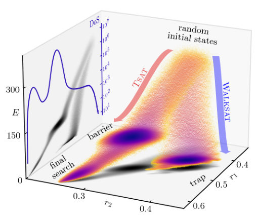 
FIG. 1. Illustration of Tsat and Walksat trajectories through clause-type distribution space (CTDS), starting from random initial states. The color corresponds to the log10 of the density of states (DoS), and for the Tsat trajectories we also show the accumulated DoS on the left (cf. Fig. 4). The grayscale projections are along the E and r2 axes and serve as a visual guide. Walksat does not reach the solution at E = 0 because it gets stuck in a vast local minimum of low-energy states (trap). The Tsat algorithm introduced in this article takes a completely different path and encounters a barrier be- fore entering a final search for the solution located near the bottom left.

📷 Fig 2

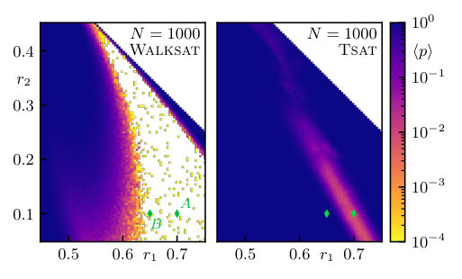 
FIG. 2. Average success probability ⟨p⟩of Walksat (left panel) and Tsat (right panel) for problems generated via Al- gorithm 2. At each point in CTDS we generate 102 instances with N = 1000 and α = 5, using 102 trials per instance and 300N flips per trial (cf. Appendix C for solver specific parameters). Even on the clearly distinguished critical line r2 = 3

📷 Fig 3

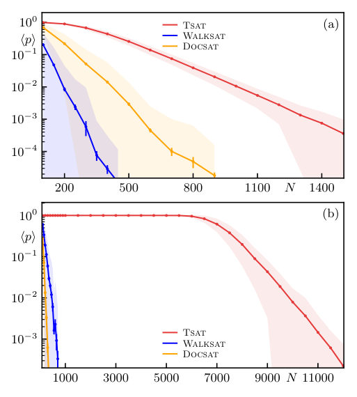 
FIG. 3. (a) Average success probability ⟨p⟩of an individual trial for Walksat, Docsat and Tsat for A = (0.7, 0.1) (103

📷 Fig 4

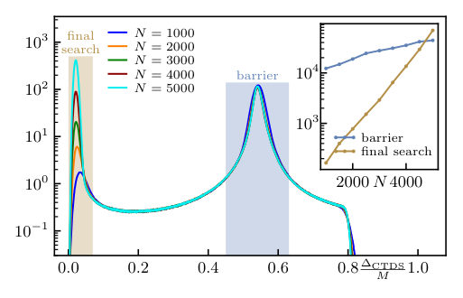 
FIG. 5. Setup as in Fig. 4, but at B = (0.65, 0.1). Away from the critical line the initial barrier appears to increase only linearly (note that the number of bins along the x-axis is ∝N, hence the coalescence of all lines). This explains why Tsat retains an average ⟨p⟩≈1 in Fig. 3(b) up to very large N; beyond N ≈5000 the final search phase becomes the bottleneck (see crossing in the inset), and thus eventually inhibits solubility.

📷 Fig 5

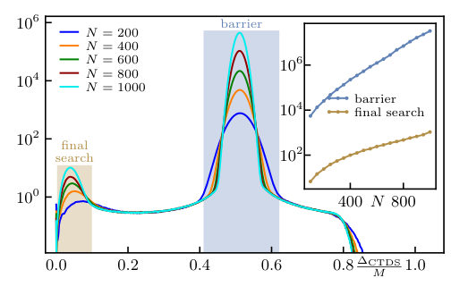 
FIG. 4. For varying size N, we run Tsat on 102 instances at A = (0.7, 0.1) for 102 trials each, with unlimited flips per trial (until a solution is found). The plot shows a histogram of the number of states x found at a certain distance-to-target (cf. Eq. 7), with random initial states situated on the right and solutions near ∆CTDS ≈0 on the left. With increasing N, two peaks emerge and the search is dominated by the time it takes to traverse the barrier at ∆CTDS/M ≈0.5. Outside the shaded regions marking the peaks all lines coalesce, indi- cating that navigating the CTDS takes O(N) time in those regions. The inset shows the total number of states in the two peaks as a function of N. Both...

**Summary.** The paper presents a new algorithm, Target-SAT, that significantly improves the ability to solve the hardest instances of random 3-SAT problems. By navigating through a specific parameter space of clause distributions, the algorithm overcomes a major complexity barrier that previously limited stochastic local search methods. This provides new insights into the landscape of computational hardness in frustrated systems.

**Why it may be interesting.** not directly relevant

Detailed structure

**Main problem.** Overcoming the computational hardness of random 3-SAT instances in the most difficult regime, characterized by a critical line of hard instances and a vast low-energy trap.

**Main result.** The introduction of the Target-SAT (TSAT) algorithm, which roughly triples the tractable problem size in the hardest regime and identifies a specific complexity barrier in the clause-type distribution space.

**Method.** A new Stochastic Local Search (SLS) heuristic called TSAT that uses statistical information from the Clause-Type Distribution Space (CTDS) to actively guide the search toward a target distribution.

**Model / system.** Random 3-SAT problems mapped to Ising spin Hamiltonians, representing strongly correlated many-body systems with rugged energy landscapes and frustrated magnetic interactions.

**Key observables.** Clause-Type Distribution (CTD), average success probability, energy (number of unsatisfied clauses), and scaling of runtime.

**Important parameters / regimes.** Clause density (alpha), clause-type distribution ratios (r1, r2), system size (N), and the critical parameter line.

**Assumptions / limitations.** The study focuses on random 3-SAT instances; the effectiveness of the algorithm on highly structured or practical non-random problems is not yet established.

**Figures summary.** Figure 1 shows search trajectories in the CTDS; Figure 2 compares success probabilities of Walksat and Tsat; Figure 3 shows scaling of success probability with N; Figure 4 shows the emergence of complexity barriers in state histograms; Figure 7 compares solved problem ratios across different regimes.

**Paper structure.** The paper introduces the problem of 3-SAT hardness, presents the TSAT algorithm, compares its performance against Walksat and complete solvers, analyzes the complexity barriers in the CTDS, and discusses scaling and limitations.

Abstract

Optimization problems such as the NP-complete 3-SAT provide an important benchmark for the difficult task of finding ground-states in strongly correlated many-body systems with rugged energy landscapes. The study of random 3-SAT problems as Ising spin Hamiltonians in statistical physics has yielded major insights including the existence of a satisfiability phase transition, and the prediction of a critical parameter line of particularly hard instances. Yet, progress on solving those instances has been scarce for several decades. Here, introducing the Target-SAT (TSAT) algorithm, we roughly triple the tractable problem sizes in the hardest regime, with an even greater improvement in a vast range of neighboring regions. By leveraging statistical information hidden in the combinatorial constraints of the problem, TSAT is actively guided in its stochastic local search toward a target within the relevant parameter space. Our analysis also explains why established local search algorithms are limited to relatively small system sizes due to a vast low-energy trap. Furthermore, we characterize the aforementioned critical line in terms of a dominant additional complexity barrier, whose exponential scaling is quickly overcome by TSAT only in the surrounding parameter space. With TSAT, the lead in solving the hardest known random satisfiability problems returns to the realm of stochastic local search algorithms.

[↑ back to top](#top)

### [Textured phase diagrams of featureless insulators](http://arxiv.org/abs/2605.20339v1)

**Authors:** Sashank Singam, Nick G. Jones, Abhishodh Prakash  
**Type:** theory · **Category:** strongly correlated electrons · **PDF:** <https://arxiv.org/pdf/2605.20339v1>  
**Analysis basis:** full PDF text, analyzed in chunks

📷 Fig 1

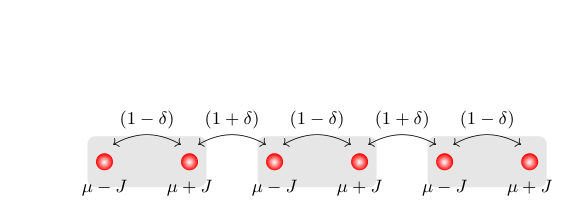 
FIG. 1. Schematic representation of the Rice-Mele model. (1±δ) represents staggered hopping amplitudes between even and odd bonds. µ ± J represents the staggered chemical po- tential on even and odd sites. The shaded boxes denote a choice of fiducial unit cell.

📷 Fig 2

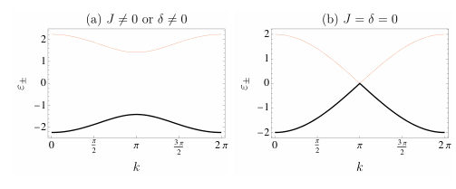 
FIG. 2. Single-particle energy dispersion of the Hamiltonian (1) (a) away from and (b) at the origin of the J-δ plane.

📷 Fig 3

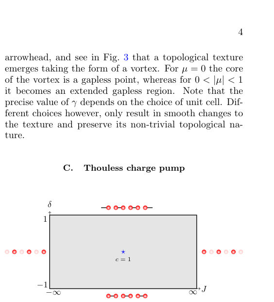 
FIG. 5. Phase diagram of Eq. (1) the different limits encap- sulated; as one takes a trajectory around the origin, we see a transport of charge by one unit cell which is central to the behaviour of the Thouless pump.

📷 Fig 4

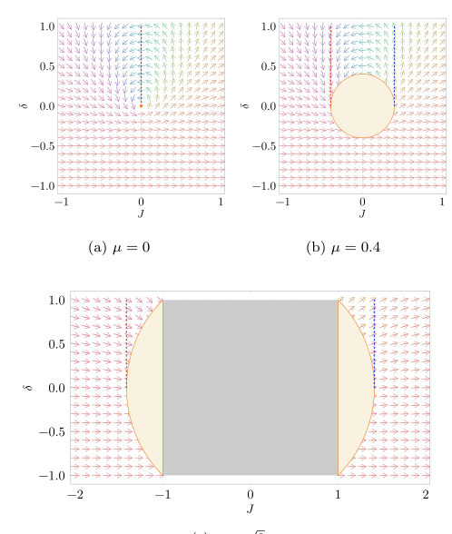 
FIG. 3. The textured phase diagrams of the Rice-Mele model (1). The insulating phase with a single filled band has a topo- logical texture similar to that of a vortex, exposed by plot- ting the Berry phase γ (numerically evaluated). The insulator with both bands filled or empty has no texture. The broken line indicates the presence of edge modes. For µ ̸= 0, the left and right edge modes are estranged and occur on different parts of the phase diagram as can be seen in (b), (c).

📷 Fig 5

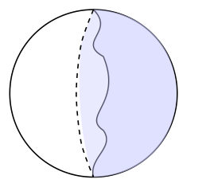 
FIG. 4. The image of ˆg mapping the BZ at an illustrative parametric point (J, δ) to a closed curve on S2. The col- ored cap denotes ˆg( ¯ M2) whose boundary gives us ˆg(∂¯ M2) = ˆg(S1 BZ) which is the domain of integration, by Stokes’ theo- rem, for computing the Berry phase.

**Summary.** This paper demonstrates that even 'featureless' insulators, which lack topological order, can possess highly structured phase diagrams filled with topological textures like vortices. By using a recursive construction method, the authors show how these textures and their associated edge modes generalize to higher dimensions and remain stable against interactions.

**Why it may be interesting.** not directly relevant

Detailed structure

**Main problem.** Investigating the existence of topological textures (vortices and higher-dimensional geometric invariants) within the phase diagrams of featureless, topologically trivial insulators.

**Main result.** The authors show that trivial insulating phases can host non-trivial topological textures in parameter space, where gap-closing diabolical points act as singularities and lead to robust, sometimes 'estranged' edge modes.

**Method.** The study uses a 'suspension construction' to generalize 1D models to higher dimensions, employing Berry-Bloch connections, Chern-Simons forms, and effective field theory (Dirac fermion Lagrangians) to compute topological invariants.

**Model / system.** Non-interacting, charge-conserving 'class A' fermions, specifically utilizing the 1D Rice-Mele model and its higher-dimensional 'ascendants' constructed via iterative stacking.

**Key observables.** Berry phases, higher-dimensional Chern-Simons forms, Chern numbers (C1, C2), and edge mode localization/robustness.

**Important parameters / regimes.** Staggered hopping (delta), staggered potential (J), chemical potential (mu), and interaction strength (U).

**Assumptions / limitations.** The primary focus is restricted to non-interacting fermion systems and the Altland-Zirnbauer symmetry class A.

**Figures summary.** Figure 1 shows the Rice-Mele model schematic; Figure 2 displays single-particle energy dispersion; Figure 22/23 show phase diagrams for the QWZ model and its ascendants.

**Paper structure.** The paper introduces the concept of textures in trivial phases, develops the 1D Rice-Mele model analysis, introduces the suspension construction for higher dimensions, applies effective field theory to study stability and edge modes, and concludes with a generalization to arbitrary dimensions and interacting spin systems.

Abstract

We study phase diagrams of charge-conserving `class A' non-interacting fermions, focusing on the trivial phase in various dimensions. Such phases are usually termed `featureless' to distinguish them from those others with either symmetry-broken or topological order. We show that the presence of non-trivial topological families of states, including charge pumps and their generalizations, results in phase diagrams being endowed with non-trivial topological textures that can be visualized through Berry phases and their higher-dimensional generalizations. We show that for non-interacting fermion systems with translation invariance, these `higher' Berry phases can be computed using integrals of non-abelian Chern-Simons forms of the Berry-Bloch connection over momentum and parameter spaces. Singularities in these textures correspond to gap-closing loci of `diabolical points', which represent the obstruction to contracting topologically non-trivial families of states, and bulk-boundary correspondence results in a locus of robust boundary modes that terminate at the bulk diabolical points. In the presence of finite chemical potential, we argue that the edge modes are generically robust without any need for fine-tuning for two and higher dimensions, whereas in one dimension they are `estranged' in the phase diagram, i.e. appearing at different parameter values for different edges. We demonstrate our results by constructing several microscopic models of non-interacting fermions. We argue stability to interactions and explore proximate phase diagrams by mapping to continuum field theories.

[↑ back to top](#top)

### [Thermodynamic and structural behavior of one-dimensional divalent patchy hard rods: Wertheim's first-order thermodynamic perturbation theory versus exact results](http://arxiv.org/abs/2605.21003v1)

**Authors:** Ana M. Montero, Andrés Santos, Péter Gurin, Szabolcs Varga  
**Type:** theory · **Category:** statistical mechanics · **PDF:** <https://arxiv.org/pdf/2605.21003v1>  
**Analysis basis:** full PDF text, analyzed in chunks

📷 Fig 1

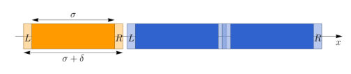 
FIG. 1. Schematic representation of divalent patchy hard rods of length σ aligned along the x-axis. Particles cannot overlap (i.e., x &gt; σ), but neighboring rods can form bonds when σ &lt; x &lt; σ + δ through the interaction between the right (R) site of the left particle and the left (L) site of the right particle. A monomer and a dimer are shown for illustration.

📷 Fig 2

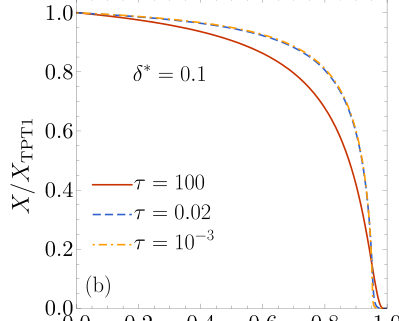 
FIG. 2. Density dependence of the ratios (a) p/pTPT1 and (b) X/XTPT1 for divalent patchy hard rods with δ∗= 0.1 and τ = 100, 0.02, and 10−3.

📷 Fig 3

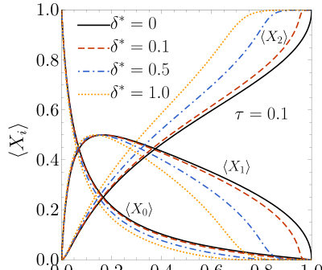 
FIG. 4. Fraction of free monomers (⟨X0⟩), terminal rods (⟨X1⟩), and internal rods (⟨X2⟩) as functions of density for τ = 0.1 and δ∗= 1, 0.5, 0.1, and 0 (sticky limit).

📷 Fig 4

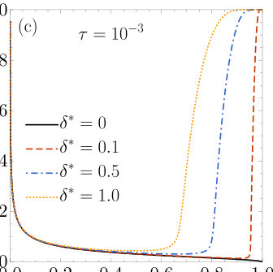 
FIG. 3. Density dependence of the pressure ratio p/pT for di- valent patchy hard rods with (a) τ = 100, (b) τ = 0.02, and (c) τ = 10−3. In each panel, the attractive ranges are δ∗= 1, 0.5, 0.1, and 0 (sticky limit).

📷 Fig 5

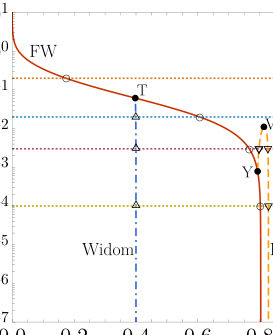 
FIG. 5. Structural diagram in the τ–ρ∗plane for divalent patchy hard rods with δ∗= 0.5. The FW line (solid curve) separates the regions of monotonic and oscillatory asymptotic decay of the pair correlation function. Below the FW line, the Widom line (dash-dotted curve) is defined as the locus of ab- solute maxima of the correlation length ξ in the monotonic regime. In the oscillatory regime, ξ may exhibit a weak lo- cal maximum followed by a local minimum; the locus of these extrema defines the ECO line (dashed curve). The horizontal dotted lines correspond to τ = 0.2, 0.02, 3 × 10−3, and 10−4. Circles, upward triangles, and downward triangles indicate the intersections with the FW, Widom,...

**Summary.** This paper provides an exact analytical treatment of 1D patchy hard rods to demonstrate where standard association theories fail. It reveals that finite-range interactions introduce complex structural transitions, such as the ECO line, which are absent in the simpler sticky-limit model.

**Why it may be interesting.** not directly relevant

Detailed structure

**Main problem.** The study investigates the accuracy of Wertheim's first-order thermodynamic perturbation theory (TPT1) for 1D divalent patchy hard rods and explores the structural complexity arising from finite-range interactions.

**Main result.** The authors show that while TPT1 is exact in the zero-range sticky limit, it fails for finite-range interactions; they identify new structural features like the ECO line and demonstrate that the high-pressure scaling of the correlation length changes depending on the interaction range.

**Method.** The authors use analytical derivations via the isothermal-isobaric ensemble and Laplace-pole analysis of the structure factor to compare exact solutions against TPT1 approximations.

**Model / system.** A one-dimensional system of divalent patchy hard rods with a hard-core diameter sigma and attractive square-well patches of width delta and depth epsilon located at the rod tips.

**Key observables.** Pressure, fraction of unbonded sites, pair correlation function, correlation length, and structural lines (Fisher-Widom, Widom, and ECO lines).

**Important parameters / regimes.** Rod length (sigma), interaction range (delta), well depth (epsilon), inverse stickiness (tau), and number density (rho).

**Assumptions / limitations.** The system is confined to a strictly 1D channel (single-file regime) preventing rotation or particle overtaking; the study focuses on the nearest-neighbor bonding limit.

**Figures summary.** Figure 1 shows a schematic of the 1D rods; Figure 2 compares exact vs TPT1 pressure; Figure 3 shows the density dependence of the pressure ratio; Figure 5 illustrates structural lines and correlation length behavior.

**Paper structure.** The paper introduces the 1D patchy model, derives exact thermodynamic and structural properties using Laplace transforms, compares these results to Wertheim's TPT1, and analyzes various structural regimes and asymptotic limits.

Abstract

We investigate the thermodynamic and structural properties of divalent patchy hard rods confined to a one-dimensional channel by modeling the bonding sites as attractive square-well (SW) patches located at the rod tips. The zero-range sticky limit is recovered by letting the well width vanish while keeping the stickiness parameter finite. While Wertheim's first-order thermodynamic perturbation theory (TPT1) becomes exact in this sticky limit, it fails for finite-range site-site interactions. We show that the theory can be made exact in one dimension by replacing the standard law of mass action with an exact relation between the density and the fraction of unbonded sites, together with an exact bonding free-energy contribution. Finite-range SW sites produce a richer structural behavior than sticky sites, including monotonic and oscillatory asymptotic decay of the pair correlation function, separated by the Fisher--Widom line. In the monotonic regime, the correlation length exhibits an absolute maximum defining the Widom line, while in the oscillatory regime it may display a local maximum and minimum, whose locus defines the ``Extrema of the Correlation length under Oscillatory decay'' (ECO) line. These features disappear in the sticky limit, where the system remains entirely in the oscillatory regime. We also show that the high-pressure behavior of the correlation length changes from $ξ\sim p^2$ for finite-range SW sites to $ξ\sim p^3$ in the sticky limit.

[↑ back to top](#top)

### [Thermodynamics of homogeneous Universes: de Sitter, Bonnor-Melvin and static Einstein](http://arxiv.org/abs/2605.21047v1)

**Authors:** G. E. Volovik  
**Type:** theory · **Category:** statistical mechanics · **PDF:** <https://arxiv.org/pdf/2605.21047v1>  
**Analysis basis:** full PDF text, analyzed in chunks

📷 Fig 1

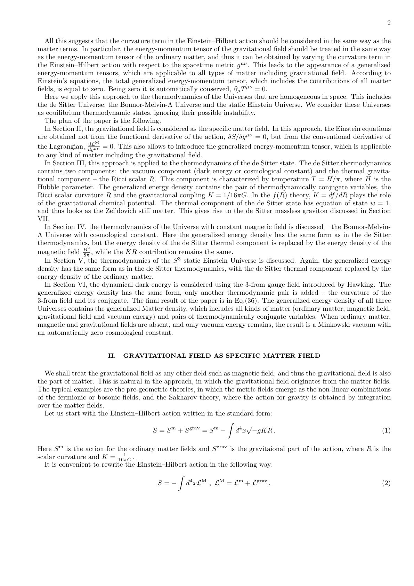 
Low-resolution page preview, page 2

📷 Fig 2

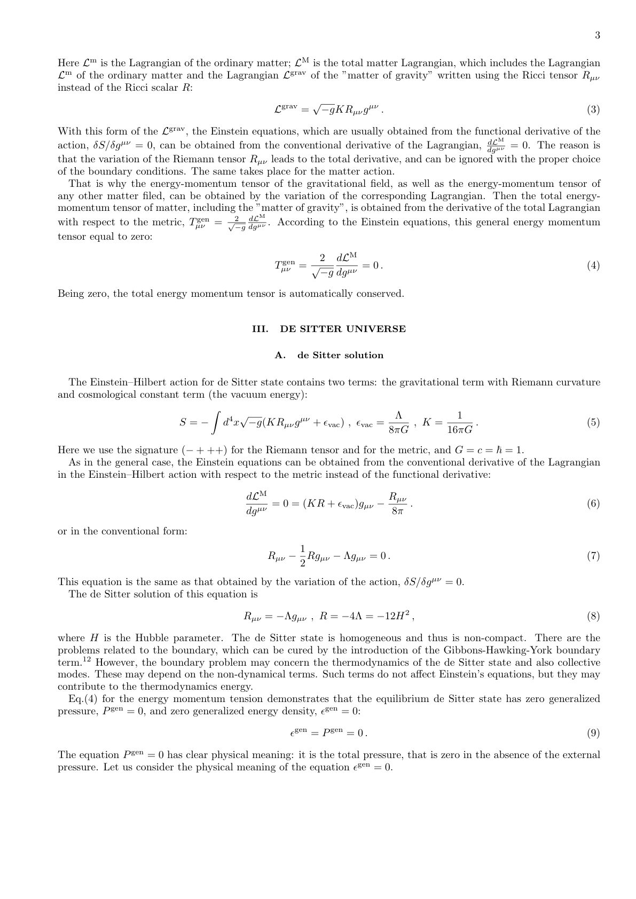 
Low-resolution page preview, page 3

📷 Fig 3

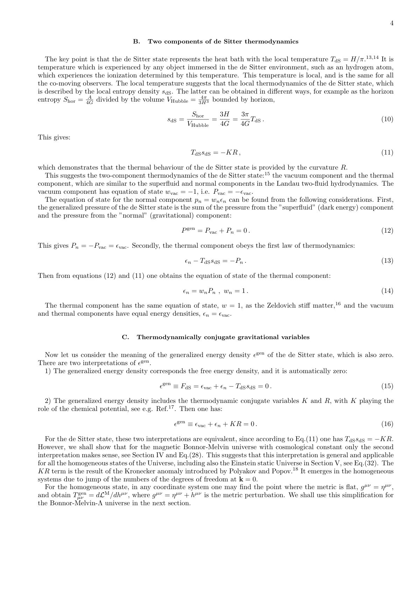 
Low-resolution page preview, page 4

📷 Fig 4

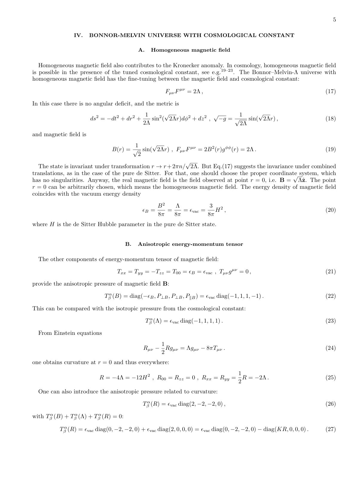 
Low-resolution page preview, page 5

📷 Fig 5

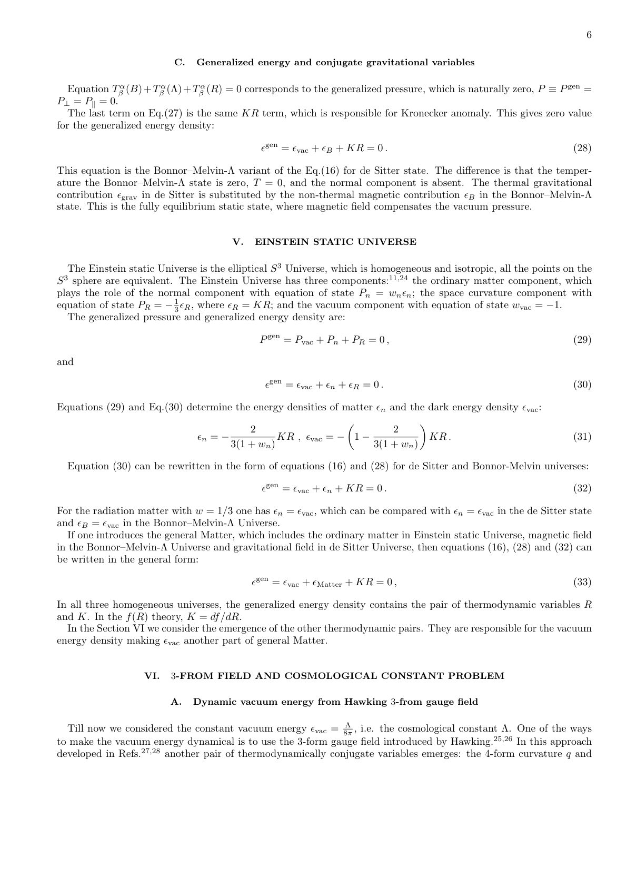 
Low-resolution page preview, page 6

**Summary.** This paper proposes a unified thermodynamic description for different types of homogeneous universes by treating the gravitational field as a matter field. It shows that the cosmological constant problem can be resolved via thermodynamic compensation in the Minkowski vacuum. Additionally, it identifies the de Sitter graviton as the second sound of a two-fluid system.

**Why it may be interesting.** The use of Landau's two-fluid hydrodynamics and the identification of gravitons as 'second sound' provides a deep connection between relativistic cosmology and the many-body physics of superfluids.

Detailed structure

**Main problem.** Investigating the thermodynamics of homogeneous universes (de Sitter, Bonnor-Melvin, and Einstein static) and addressing the cosmological constant problem through an emergent gravity framework.

**Main result.** The author demonstrates that these three distinct universes share identical thermodynamic properties and that the cosmological constant naturally vanishes in the Minkowski vacuum due to thermodynamic compensation.

**Method.** The paper employs a two-fluid hydrodynamic analogy (similar to Landau's superfluid model) and a generalized energy-momentum tensor construction within a pre-geometric/emergent gravity framework.

**Model / system.** The study considers three homogeneous cosmological models: the de Sitter Universe (vacuum energy + thermal gravity), the Bonnor-Melvin-Lambda Universe (magnetic field + vacuum energy), and the static Einstein Universe (ordinary matter + vacuum energy).

**Key observables.** Generalized energy density and pressure, temperature (Hubble-related), entropy density, and the speed of second sound.

**Important parameters / regimes.** Ricci scalar curvature (R), gravitational coupling (K), 4-form curvature (q), and the equation of state parameter (w).

**Assumptions / limitations.** The universes are treated as equilibrium thermodynamic states, and boundary effects in non-compact de Sitter space are ignored.

**Paper structure.** The paper begins by establishing the emergent gravity framework, proceeds to construct the thermodynamic formalism for the three specific universes, applies a two-fluid hydrodynamic analogy to identify gravitons as second sound, and concludes with the derivation of the zero cosmological constant in the Minkowski limit.

Abstract

In the theories, in which dynamic gravitational field emerges from the underlying matter fields, the gravitational field can be considered as a part of matter. Using this approach, we construct the thermodynamics of the homogeneous Universes -- the de Sitter Universe, the Bonnor-Melvin-$Λ$ Universe and the static Einstein Universe. It is demonstrated that although these three Universes have different types of matter fields (ordinary matter, magnetic field, gravitational field and vacuum energy), they have the same thermodynamic properties. Their energy densities obey the same equation, which contains the corresponding matter densities and the pairs of the thermodynamically conjugate variables. In Minkowski vacuum, where the ordinary matter and magnetic and gravitational fields are absent, this thermodynamic approach automatically leads to zero cosmological constant.

[↑ back to top](#top)

### [Unconventional Magnetism: Symmetry Classification, Hybrid-parity and Unconstrained-parity Classes](http://arxiv.org/abs/2605.21336v1)

**Authors:** Xun-Jiang Luo, Dan Li, Rui-Chun Xiao, Ding-Fu Shao, Lei Li, Mingliang Tian, Yugui Yao  
**Type:** both · **Category:** strongly correlated electrons · **PDF:** <https://arxiv.org/pdf/2605.21336v1>  
**Analysis basis:** full PDF text, analyzed in chunks

📷 Fig 1

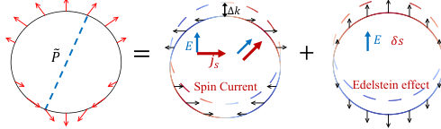 
FIG. 1. (a) Schematic illustration of the even-parity, odd-parity, hybrid-parity, and unconstrained-parity classes of UM. ˜P denotes the SSG symmetry that flips momentum. S(k) = (sx(k), sy(k), sz(k)) is the spin expectation value. E(k) is the energy at momentum k. (b) Illustration of a hybrid-parity spin texture and its decomposition into d-wave and p-wave channels along different spin directions, thereby leading to the spin current (js) and Edelstein effect under an applied electric field E.

📷 Fig 2

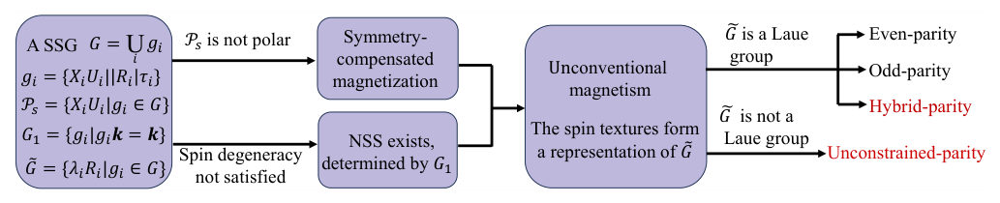 
FIG. 2. Flowchart illustrating the symmetry classification of UM. Starting from the SSG G, the derived point group Ps and G1 dictate the conditions for SCM and NSS, respectively. The spin textures form a representation of the point group ˜G. If ˜G is a Laue group, the spin texture acquires a definite parity, leading to even-, odd-, or hybrid-parity classes; if not, the unconstrained-parity class arises. Here λi = det(XiUi).

📷 Fig 3

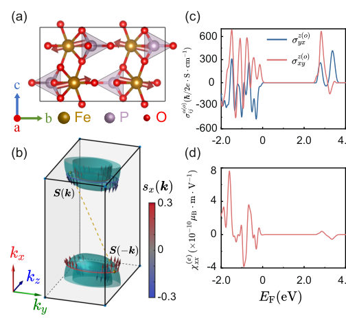 
FIG. 3. (a) Crystal structure and magnetic order of bulk FePO4. (b) Fermi surface of FePO4 at EF = −35 meV. The spin textures on the kx = ±0.5 Å−1 planes are plotted; arrows indicate the orientation of vector S(k), and the color encodes the out-of-plane spin component sx(k). (c) Calculated T-odd spin Hall conductivity σz(o) xy and σz(o) yx as a function of the Fermi energy EF . (d) T-even Edelstein susceptibility χ(e) xx as a function of EF .

📷 Fig 4

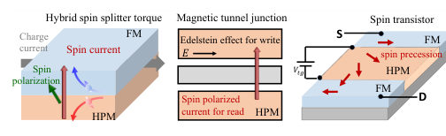 
FIG. 4. Proposed spintronic device architectures enabled by HPMs. (a) Hybrid spin-splitter torque: a charge current in- jected into an HPM/FM bilayer generates spin currents with multi spin polarizations components. (b) Magnetic tunnel junction: the top layer utilizes the Edelstein effect for electri- cal write operations, while the bottom HPM layer provides a spin-polarized readout current. (c) Spin transistor: an HPM channel sandwiched between ferromagnetic (FM) source (S) and drain (D) contacts; gate voltage Vtg modulates spin pre- cession in the HPM, enabling non-volatile logic functionality.

**Summary.** This paper establishes a new symmetry-based classification for unconventional magnetism, predicting the existence of hybrid-parity and unconstrained-parity magnets. It demonstrates that hybrid-parity magnets allow for the simultaneous occurrence of spin current and Edelstein effects, offering a new platform for multifunctional spintronic devices.

**Why it may be interesting.** not directly relevant

Detailed structure

**Main problem.** The paper seeks to complete the symmetry taxonomy of unconventional magnetism beyond the established even-parity (altermagnets) and odd-parity paradigms.

**Main result.** The authors identify two new magnetic classes, hybrid-parity magnets (HPMs) and unconstrained-parity magnets (UPMs), and demonstrate that HPMs enable the coexistence of spin current and Edelstein effects.

**Method.** The study uses Spin Space Group (SSG) theory for symmetry classification, combined with first-principles DFT calculations and tight-binding modeling to validate transport properties.

**Model / system.** The study focuses on symmetry-compensated magnets, using FePO4 as a prototypical example of a Type-I hybrid-parity magnet, and explores candidate materials identified via the MAGNDATA database.

**Key observables.** Non-relativistic spin splitting (NSS), spin current conductivity, Edelstein susceptibility, and spin texture parity.

**Important parameters / regimes.** Spin texture dimensionality (collinear, coplanar, noncoplanar), spin-splitting group (SSG) symmetries, and effective U parameter for Fe-3d orbitals.

**Assumptions / limitations.** The classification assumes the validity of the Spin Space Group framework and uses the constant relaxation-time approximation for transport calculations.

**Figures summary.** Figure 1 illustrates the four classes of unconventional magnetism and the decomposition of spin textures; Figure 2 provides a symmetry classification flowchart; Figure 3 shows the crystal structure and Fermi surface of FePO4; Figure 4 depicts proposed spintronic device architectures.

**Paper structure.** The paper begins with a symmetry-based classification of unconventional magnetism, introduces the new HPM and UPM classes, derives symmetry criteria for HPM types, validates these findings with DFT calculations on FePO4, and concludes with proposed spintronic applications.

Abstract

Unconventional magnetism has emerged as a transformative frontier in condensed matter physics. Such phases are characterized by substantial non-relativistic spin splitting (NSS) in symmetry-compensated magnets. They have been classified by the parity of their spin textures under momentum inversion, leading to the paradigms of altermagnets (even-parity) and odd-parity magnets. However, the full symmetry landscape remains largely unexplored. In this Letter, we present a systematic classification framework for unconventional magnetism based on the representation theory of the spin textures and the associated parity properties. Within this framework, we predict two previously unidentified classes beyond the established pure-parity categories: hybrid-parity magnets (HPMs) and unconstrained-parity magnets (UPMs), where the spin textures exhibit contrasting parities among their Cartesian components and the parity of the spin textures is ill-defined, respectively. We derive universal symmetry criteria that categorize HPMs into three distinct types. Importantly, by combining the spin splitting characteristics of altermagnets and odd-parity magnets, HPMs can enable the coexistence of the spin current and Edelstein effects. Taking FePO4 as an example, we perform first-principles calculations to demonstrate this coexistence. Finally, we discuss the potential applications of HPMs in spintronic devices. Our work provides a comprehensive symmetry classification of unconventional magnetism and establishes HPMs as a promising platform for multi-functional spintronics.

[↑ back to top](#top)

### [Unifying Plasticity in Ordered and Disordered Matter using Topological and Geometrical Descriptors](http://arxiv.org/abs/2605.20847v1)

**Authors:** Xin Wang, Yang Xu, Jin Shang, Yi Xing, Jie Zhang, Yujie Wang, Walter Kob, Matteo Baggioli  
**Type:** both · **Category:** disordered systems and neural networks · **PDF:** <https://arxiv.org/pdf/2605.20847v1>  
**Analysis basis:** full PDF text, analyzed in chunks

📷 Fig 1

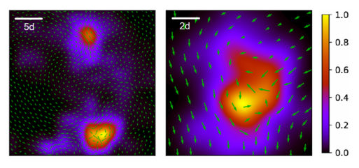 
FIG. 1. Defects in the displacement field. Representa- tive snapshots of the particle displacement field, overlaid on a heat map of the dislocation density |⃗α|, normalized by its maximum value. Left panel: 2D simulated Lennard-Jones glass with strain step ∆γ = 0.5%. Right panel: Experimen- tal 2D granular system with strain step ∆γ = 4.42%. In both panels, d denotes the particle diameter.

📷 Fig 2

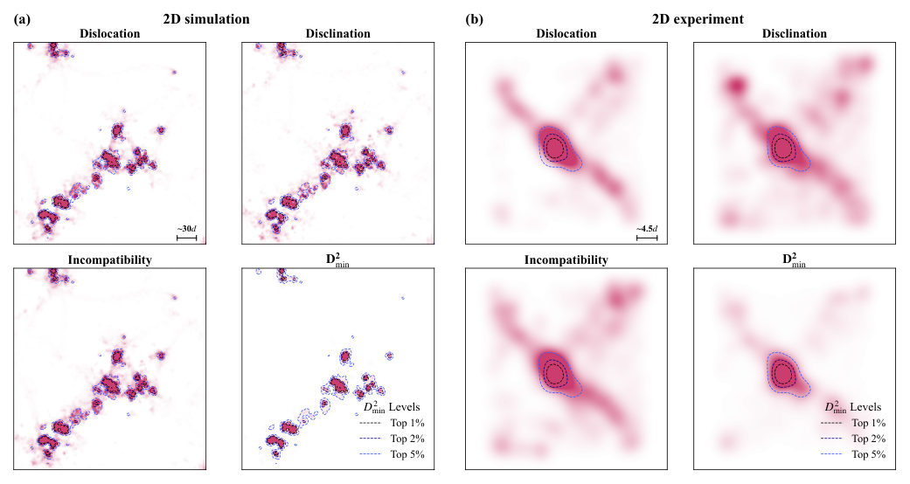 
FIG. 2. Comparison between defect densities and D2 min in 2D. Heat maps of the dislocation (3), disclination (5), and incompatibility (6) densities, together with D2 min. For the dislocation density, we plot |⃗α|. (a) 2D Lennard-Jones glass at strain γ = 3.38% with ∆γ = 0.02%. (b) 2D experimental granular system at γ = 4.64% with ∆γ = 0.113%. In both panels, the dashed contours indicate the top-percentile clusters of D2 min. In both systems, d refers to the particle diameter.

📷 Fig 3

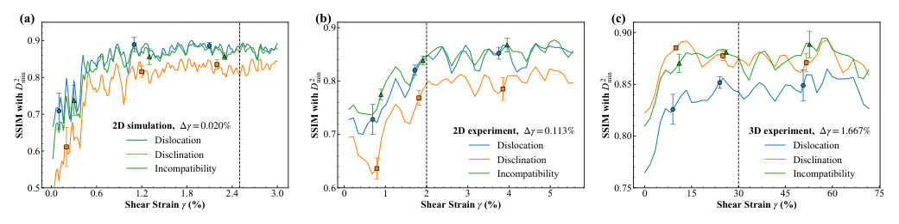 
FIG. 3. Quantifying the similarity between the fields. Structural similarity index measure (SSIM) as a function of strain for three different systems: (a) 2D simulation, (b) 2D experiment, and (c) 3D experiment. The solid lines represent averages over three independent samples, while the symbols show representative data with corresponding error bars. Vertical dashed lines indicate the location of the yielding transition.

📷 Fig 4

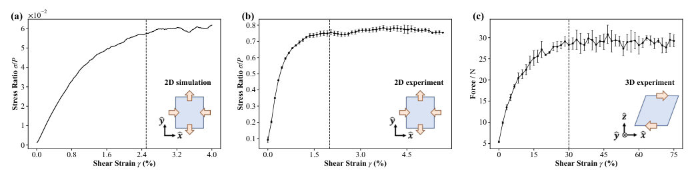 
FIG. 4. Mechanical properties under shear deformation. Stress ratio and force as a function of strain γ. (a) 2D simulation, (b) 2D experiment, and (c) 3D experiment. The insets show a schematic cartoon of the applied shear deformation for each case. In panels (a) and (b), σ denotes the shear stress and P the pressure. Vertical lines indicate the yielding strain.

📷 Fig 5

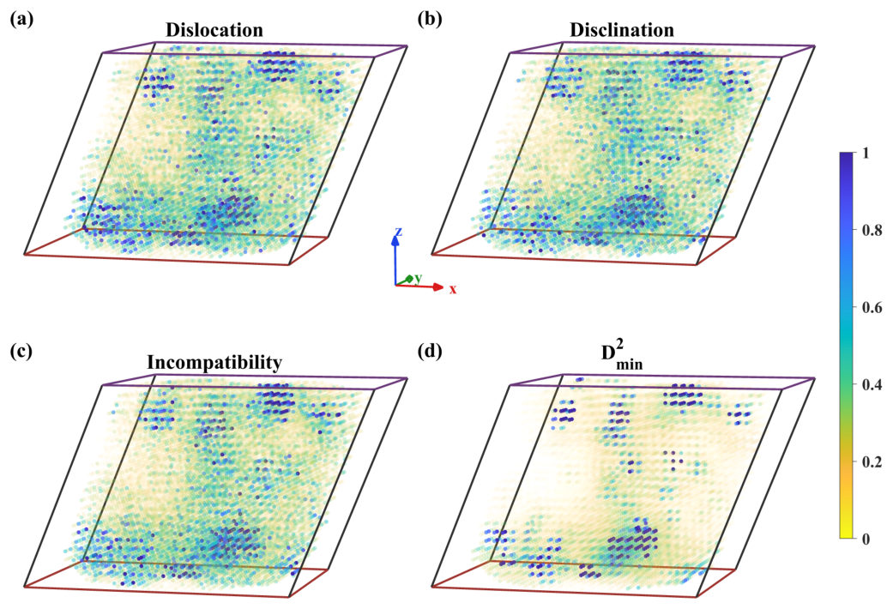 
FIG. 5. Comparison between defect densities and D2 min in 3D. Normalized norm of the (a) dislocation, (b) disclination, (c) incompatibility densities and (d) D2 min in 3D experimental granular system with γ = 38.33%. The samples are sheared in the x-direction.

**Summary.** This paper proposes a unified framework for understanding plasticity by applying continuous topological and geometric descriptors to both crystalline and amorphous materials. By treating defects as continuous fields rather than discrete singularities, the authors successfully bridge the gap between ordered and disordered systems. The findings show that these fields accurately predict plastic events and highlight the increasing importance of rotational defects in 3D systems.

**Why it may be interesting.** not directly relevant

Detailed structure

**Main problem.** The difficulty of identifying the specific regions responsible for plastic flow in amorphous solids due to the lack of long-range order and the absence of discrete topological defects like dislocations found in crystals.

**Main result.** The introduction of continuous dislocation, disclination, and incompatibility density fields provides a unified description of plasticity that correlates strongly with standard measures like D2min and reveals that rotational defects become dominant in 3D.

**Method.** The authors apply differential geometry to map particle displacement fields onto a grid, calculating continuous defect densities using the Nye tensor, Frank tensor, and Saint-Venant incompatibility tensor.

**Model / system.** The study utilizes 2D simulated Lennard-Jones glasses, 2D experimental photoelastic granular disks, and 3D experimental 3D-printed plastic sphere packings under shear.

**Key observables.** Dislocation density, disclination density, incompatibility density, D2min (non-affine squared displacement), and Structural Similarity Index Measure (SSIM).

**Important parameters / regimes.** Shear strain (pre-yield vs. post-yield regimes), particle diameter (d), and noise amplitude (R).

**Assumptions / limitations.** The approach treats discrete defects as continuous fields and assumes that the displacement field can be meaningfully interpolated onto a regular lattice.

**Figures summary.** Figure 1 shows displacement fields overlaid with dislocation density; Figure 2 compares defect densities to D2min in 2D; Figure 3 quantifies SSIM correlation as a function of strain in 2D and 3D; Figure 4 shows stress-strain response across different platforms.

**Paper structure.** The paper begins by defining the problem of plasticity in disordered matter, introduces the mathematical framework for continuous defect densities, presents results from 2D simulations and experiments, extends the findings to 3D systems, and concludes with a robustness analysis against noise and discretization.

Abstract

Identifying the regions responsible for plastic flow in amorphous solids remains an open problem, since structural disorder seems to prevent the direct application of concepts such as dislocations, topological defects that successfully describe irreversible deformations in crystalline systems. Here, we introduce fields of dislocation, disclination, and incompatibility densities, that reduce to the standard sources of plasticity in crystals and assess their predictive power in amorphous materials. We find that, in a simulated two-dimensional glass as well in two- and three-dimensional experimental granular systems, these fields exhibit strong spatial correlations with $D^2_{\text{min}}$, the standard measure used to locate plastic events under shear in disordered solids. Unlike $D^2_{\text{min}}$, these fields also allow to disentangle rotational and translational contributions to the plastic events, revealing that rotational defects becoming dominant in three dimensions. Our approach paves the way for a unified description of plasticity in crystalline and amorphous solids.

[↑ back to top](#top)

## Secondary cond-mat archives

*Papers from  mes-hall, other, soft, supr-con. These archives are de-prioritized — they appear at the end regardless of relevance score.*

### Relevant in secondary archives (14)

### [Spin-polarized lasing in a photonic lattice](http://arxiv.org/abs/2605.20927v1)

**Authors:** A. Herrero Otermin, N. Carlon Zambon, A. Bieganowska, F. Jabeen, L. Viña, C. Antón-Solanas  
**Type:** both · **Category:** other · **PDF:** <https://arxiv.org/pdf/2605.20927v1>  
**Analysis basis:** full PDF text, analyzed in chunks
**Topic relevance:** 🔥 `quantum optics experiment` **4/5** · `interference shaping light` **3/5** · `Tavis-Cummings & cavity-many-emitter` **2/5** · `analog quantum simulation` **2/5** · `correlated cavity matter` **2/5** · `driven-dissipative phase transition` **2/5** · `non-equilibrium dynamics` **2/5** · `spintronics-quantum-optics interface` **2/5**

📷 Fig 1

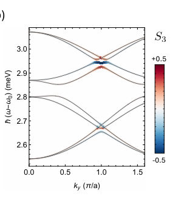 
Fig. 1. Sample design and simulated band structure of the staggered square lattice. (a) Schematic of the semiconductor microcavity used in this work. The structure consists of a 𝜆-thick GaAs cavity formed by two GaAs/AlAs distributed Bragg reflectors (20 and 24 DBR pairs) embedding a single In0.06Ga0.94As QW. The cavity spacer is patterned into a staggered square lattice of micrometer-scale mesas (∼2 × 3 𝜇m2) connected by narrow links that enable evanescent coupling between sites, forming a two-dimensional photonic lattice. Spin polarization of the gain medium via a circularly polarized nonresonant optical pump (𝜎±) enables lasing in an extended mode with a well-defined emission handedness....

📷 Fig 2

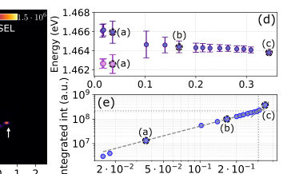 
Fig. 2. Nonlinear input-output response. (a–c) Energy- and momentum-resolved emission of the system as a function of increasing excitation power. (a) Low-density regime, showing the lower (LP) and upper (UP) polariton branches. The dashed white line in panel (a) indicates the exciton energy at 1.465 ± 0.001 eV. (b) Transition to the weak-coupling regime and onset of stimulated emission. (c) VCSEL regime. The arrows indicate the lasing from points in the dispersion relation with negative curvature. (d) Energy at the negative curvature points in the dispersion as a function of input power density; the error bars represent the full width at half maximum (FWHM) of the spectrum at these points....

📷 Fig 3

 
Fig. 3. Spatial coherence via Michelson interferometry in an extended lattice. Real space emission and 𝑔(1) measured in the polariton gas regime (a,b) and in the strong-coupling regime with a power of 0.29𝑃th and (c,d) VCSEL regime with a power of 1.15𝑃th. The intensity distribution in panels (a,c) is normalized to unity. The real space map of 𝑔(1) is extracted via off-axis holographic techniques.

📷 Fig 4

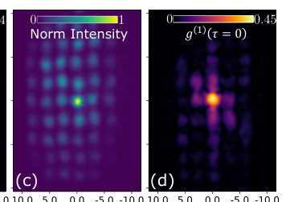 
Figure 3 shows the emission intensity and first-order spatial coherence 𝑔(1) maps at two excitation regimes: low density and above the lasing threshold, corresponding to pump powers of 0.29𝑃th and 1.15𝑃th for the panels (a,b) and (c,d), respectively. At low excitation power,

📷 Fig 5

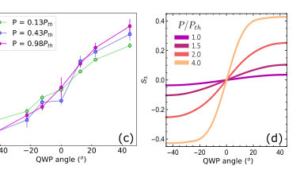 
Fig. 4. Spin injection in a photonic staggered-square lattice. (a/b) Map of 𝑆0𝑆3 in the dispersion relation under 𝜎± excitation at a fixed pump power density of 𝑃= 0.98𝑃th. The 𝑆0 intensity map has been normalized to unity (𝑆0) prior to the representation of the 𝑆0𝑆3 map, hence re-scaling its false color scale. The black rectangles in both panels indicate the region of interest where 𝑆3 is averaged for the data points represented in the next panel. (c) Average 𝑆3 as a function of the QWP angle of the excitation and the laser power density for three values, 0.13𝑃th, 0.43𝑃th and 0.98𝑃th. (d) Calculated degree of circular polarization of the emission as a function of the QWP angle according to...

**Summary.** This paper demonstrates how a 2D photonic lattice can be used to achieve spin-polarized lasing with extended spatial coherence. By controlling the pump polarization, the researchers can tune the handedness of the emitted light, providing a platform for spin-controlled coherent emission in large-scale optical systems.

**Why it may be interesting.** This work is highly relevant to quantum optics and open quantum systems as it demonstrates the manipulation of spin-polarized coherent states and the transition between different light-matter coupling regimes in an engineered lattice.

Detailed structure

**Main problem.** The study aims to develop a scalable, coherent light source with controllable polarization by engineering the photonic band structure of coupled microlaser arrays, addressing the loss of spatial coherence and multi-mode instabilities in large-area VCSELs.

**Main result.** The researchers demonstrated a transition from the strong-coupling (polariton) regime to the photon lasing regime in a 2D photonic lattice, achieving spin-controlled coherent emission where the light's circular polarization follows the pump's handedness.

**Method.** The work combines electron-beam lithography and wet etching to fabricate a GaAs/InGaAs microcavity lattice, followed by micro-photoluminescence, polarization-resolved spectroscopy, and Michelson interferometry, complemented by a two-mode spin-laser rate equation model.

**Model / system.** A 2D staggered square photonic lattice of rounded rectangular GaAs/InGaAs semiconductor microcavity mesas, which supports both exciton-polariton modes and photon lasing regimes.

**Key observables.** Energy- and momentum-resolved emission, full Stokes parameters (S0, S3), spatial coherence (g1), and Rabi splitting.

**Important parameters / regimes.** Lasing threshold (Pth ~ 0.3 mW/um2), Rabi splitting (3.35 meV), and TE-TM splitting (0.05 meV/um2).

**Assumptions / limitations.** The theoretical model assumes a minimal two-mode system and neglects gain saturation effects, which could potentially hide bistability or chaos.

**Figures summary.** Fig 1: Schematic of the lattice design; Fig 2: Nonlinear input-output response and transition to the weak-coupling regime; Fig 3: Spatial coherence maps; Fig 4: Polarization maps (S0S3) and the dependence of S3 on pump power and QWP angle.

**Paper structure.** The paper introduces the challenge of large-area VCSEL stability, describes the fabrication and design of the 2D photonic lattice, presents experimental evidence of the polariton-to-lasing transition, analyzes the spin-control of polarization, and concludes with a theoretical model validating the observed spin-injection dynamics.

Abstract

We characterize spin-polarized lasing in a two-dimensional photonic lattice fabricated from a GaAs/InGaAs semiconductor microcavity sample. The lattice is defined by a staggered arrangement of rounded rectangular micrometric mesas that laterally confine and couple the optical modes. Polarization-, angle-, and energy-resolved micro-photoluminescence measurements reveal the transition from the strong-coupling regime to photon lasing, accompanied by extended spatial coherence across several lattice unit cells. Under circularly polarized nonresonant excitation, the emitted light acquires a controllable circular polarization whose handedness follows that of the pump. These results establish photonic-lattice VCSELs as a platform for spin-controlled coherent emission in extended optical systems.

[↑ back to top](#top)

### [Coexisting Ballistic and Diffusive Heat Transport in Micrometer-Scale Molecular Junctions](http://arxiv.org/abs/2605.20517v1)

**Authors:** P. M. Martinez, O. Mateos-Lopez, J. C. Cuevas, J. G. Vilhena  
**Type:** theory · **Category:** statistical mechanics · **PDF:** <https://arxiv.org/pdf/2605.20517v1>  
**Analysis basis:** full PDF text, analyzed in chunks
**Topic relevance:** 🔥 `non-equilibrium dynamics` **4/5** · 🔥 `non-equilibrium universality` **4/5**

📷 Fig 1

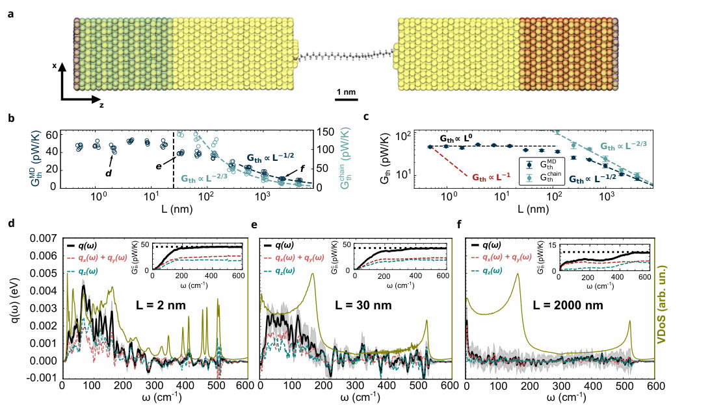 
FIG. 1. Ballistic-to-superdiffusive crossover and its spectral fingerprint in Au-alkane-Au junctions. a) Represen- tative Au-alkane-Au junction (310 K, 0.35 nN tension). Shading denotes harmonic restraints (gray) and thermal baths (green: 290 K, orange: 330 K). b) Total thermal conductance GMD th (navy, left axis) and intrinsic chain conductance Gchain th (cyan, right axis) as a function of chain length. Point dispersion is introduced for visualization purposes. c) Log-log plot of b). Dashed lines guide different scaling regimes: ballistic (L0), superdiffusive (L−2/3 or L−1/2), and diffusive (L−1). Error bars: standard deviation of 6 runs. d) Vibrational density of states (green) and...

📷 Fig 2

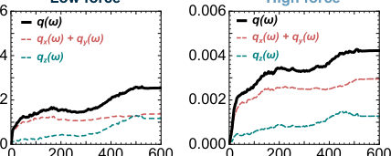 
FIG. 2. Enhancement of ballistic transport through mechanical pulling. a) Thermal conductance versus chain length under various applied tensions (averaged across 3 inde- pendent NEMD runs). Dashed lines indicate theoretical scal- ings for ballistic, superdiffusive, and diffusive regimes. Let- ters denote the specific systems detailed in (b) and (c). b) Cumulative thermal conductance for a representative 2 µm chain under low tension (⟨Fz⟩= 0.35 nN). The total con- ductance is decomposed in transverse (pink) and longitudinal (teal) components. c) Same as (b) for a highly stretched chain (⟨Fz⟩= 1.05 nN), showing the delayed onset of superdiffusion.

📷 Fig 3

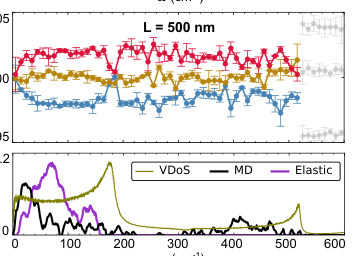 
FIG. 3. Chain thermalization and persistent non- interacting modes in Au-alkane-Au junctions. a) Tem- perature profiles versus normalized coordinate (z/L) for vary- ing chain lengths. ∆T is the boundary temperature jump. b) Normalized spectral temperature ¯T(ω) for a 30 nm chain at 0.1L (blue), 0.5L (yellow), and 0.9L (red). Grey points de- note modes contributing &lt; 0.5% to the total kinetic energy. Error bars: standard deviation over three 20 ns runs. c) Vi- brational density of states (green) and spectral heat current q(ω) (black) for the 30 nm chain, compared with the purely elastic limit (purple). d–g) As in (b,c) for 120 nm (d,e) and 500 nm (f,g) chains. The spatial splitting of ¯T(ω)...

**Summary.** This paper demonstrates that heat transport in micrometer-scale molecular junctions does not follow Fourier's law, instead exhibiting superdiffusive scaling. The divergence in thermal conductivity is driven by low-frequency acoustic modes that remain ballistic even at large scales. This finding highlights a fundamental coexistence of ballistic and diffusive transport in 1D momentum-conserving systems.

**Why it may be interesting.** The paper explores non-equilibrium transport and the breakdown of standard kinetic theory in 1D systems, which is highly relevant to understanding anomalous diffusion and universality classes in many-body dynamics.

Detailed structure

**Main problem.** Investigating the breakdown of Fourier's law and the validity of the Boltzmann transport equation in quasi-1D molecular systems, specifically looking for the emergence of superdiffusive heat transport.

**Main result.** The study finds that thermal conductivity diverges as L^{1/3}, following the Kardar-Parisi-Zhang universality class, due to the coexistence of a persistent ballistic channel (low-frequency modes) and a diffusive sector.

**Method.** Atomistic non-equilibrium molecular dynamics (NEMD) simulations combined with frequency-resolved spectral heat current decomposition and a 3-resistor model to isolate intrinsic conductance.

**Model / system.** Au-alkane-Au single-molecule junctions spanning lengths from 0.5 nm to 4 micrometers, modeled using the OPLS-AA force field for the molecular chain and EAM for the gold electrodes.

**Key observables.** Thermal conductance (G_th), thermal conductivity (kappa_th), spectral heat current q(omega), vibrational density of states (VDoS), and spectral temperature T(R; omega).

**Important parameters / regimes.** Chain length (0.5 nm to 4 um), temperature (310 K), mechanical tension (0.35 nN to 1.05 nN), and frequency-dependent transport regimes (ballistic, superdiffusive, diffusive).

**Assumptions / limitations.** Neglected Coulomb terms due to highly stretched conformations; reliance on classical molecular dynamics which may not capture all quantum effects at very low temperatures.

**Figures summary.** Schematic of the simulation setup; plots of thermal conductance and conductivity vs. length showing scaling regimes; spectral heat current and VDoS; and temperature profiles/spectral temperature analysis.

**Paper structure.** Introduction to the breakdown of Fourier's law; description of the NEMD simulation setup and molecular models; presentation of conductance scaling results; frequency-resolved analysis to identify the ballistic/diffusive coexistence; and discussion of universality and chemical insensitivity.

Abstract

Boltzmann transport theory, the standard framework for predicting thermal conductivity, assumes that every vibrational mode eventually scatters, acquiring a finite lifetime that yields a convergent, length-independent thermal conductivity: Fourier's law. Here we show that this assumption fails in a real molecular system. Through atomistic simulations of Au-alkane-Au single-molecule junctions spanning five orders of magnitude in length (0.5~nm to 4~$μ$m), we find that thermal conductivity never converges. Transport is ballistic for up to one hundred nanometers at room temperature, extending nearly two orders of magnitude beyond existing single-molecule measurements. Past this window, conductivity diverges as $L^{1/3}$, the scaling predicted by the Kardar-Parisi-Zhang universality class for momentum-conserving systems. Frequency-resolved decomposition of the heat current reveals the mechanism behind the divergence. Low-frequency acoustic modes never thermalize: protected by momentum conservation, they remain ballistic at every chain length, still carrying 50\% of the total heat current at $L = 2~μ$m. All other modes thermalize collectively as discrete vibrational states merge into scattering-active phonon bands with increasing length. Hence, the diverging conductivity emerges from the boundary between these coexisting transport regimes: as $L$ grows, the onset of scattering shifts progressively toward lower frequencies, suppressing the ballistic channel at a rate that sustains the $L^{1/3}$ divergence, leaving a finite contribution at every length. This coexistence of permanent ballistic and well-behaved diffusive transport, anticipated in abstract one-dimensional lattice models, survives the structural and chemical complexity of real micrometer-sized junctions.

[↑ back to top](#top)

### [Occupation Dynamics of Floquet-Volkov States and Spectral Sum Rule](http://arxiv.org/abs/2605.21339v1)

**Authors:** Xuanxi Cai, Changhua Bao, Benshu Fan, Haoyuan Zhong, Fei Wang, Shaohua Zhou, Tianyun Lin, Hongyun Zhang, Pu Yu, Peizhe Tang, Wenhui Duan, Shuyun Zhou  
**Type:** both · **Category:** other · **PDF:** <https://arxiv.org/pdf/2605.21339v1>  
**Analysis basis:** full PDF text, analyzed in chunks
**Topic relevance:** 🔥 `non-equilibrium dynamics` **4/5**

📷 Fig 1

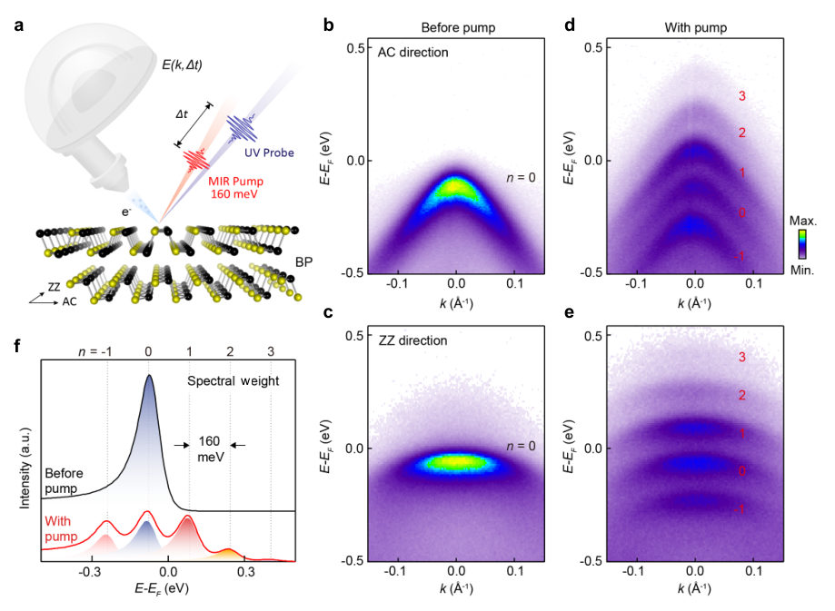 
Figure 1: Light-induced sidebands and spectral weight redistribution in black phosphorus upon below-gap pumping. (a) Schematic of TrARPES setup with MIR pumping. (b, c) Dispersion images measured at ∆t = −1 ps along the AC (b) and ZZ (c) directions. (d, e) Dispersion images measured at ∆t = 0 along the AC (d) and ZZ (e) directions. (f) EDCs at k = 0 for data in (c, e). The color-shaded areas are fitting peaks, which are used to extract the spectral weight for each individual peak. The pump has a photon energy of 160 meV and fluence of 0.5 mJ/cm2. The pump is p-polarized, with polarization along ZZ direction (ZZ-pump) for (d) and polarization along AC direction (AC-pump) for (e).

📷 Fig 2

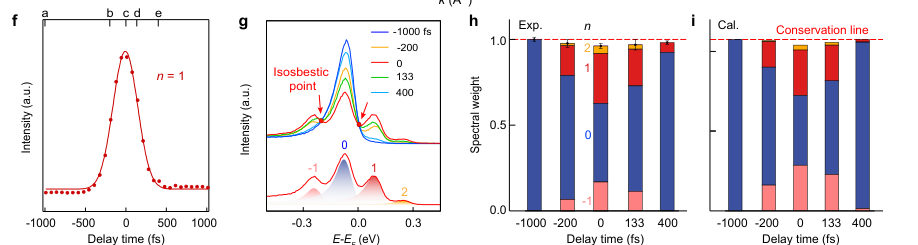 
Figure 2: Observation of spectral weight conservation in black phosphorus. (a-e) Dispersion images measured along the direction at 30◦from the AC direction of black phosphorus with p-pol. at different delay times. The pump photon energy is 160 meV, and the pump fluence is 0.32 mJ/cm2. (f) Intensity of n = 1 sideband as a function of the delay time. (g) EDCs at k = 0 from data in (a-e), and fitting of the EDC at ∆t = 0 (bottom curve). (h) Extracted spectral weight for different sidebands at different delay times from EDCs in (g). The error bars are for the total spectral weight and are estimated via standard uncertainty propagation from the fitting parameters. (i) Calculated spectral weight...

📷 Fig 3

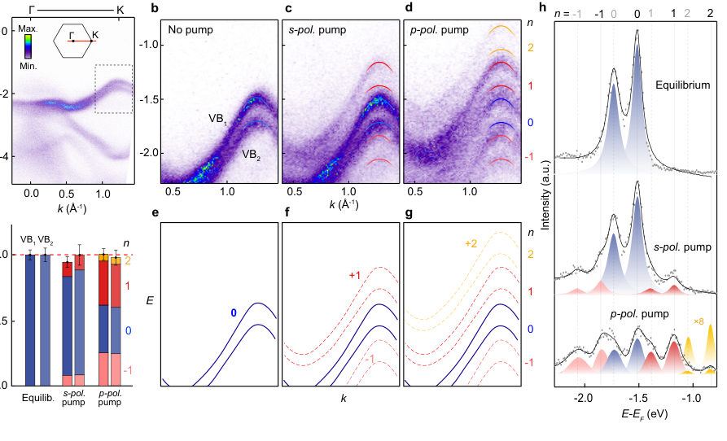 
Figure 3: Observation of spectral weight conservation in MoSe2. (a) Dispersion image of bulk MoSe2 measured along the Γ-K direction. The dashed box marks the band structure at the K valley, which is the main focus. (b-d) Dispersion images measured around the K valley without pump (b), with s-pol. (c) and p-pol. (d) pump. The pump photon energy is 311 meV and the pump fluence is 2.5 mJ/cm2. (e-g) Corresponding dispersions for data shown in (b-d). (h) EDCs at the K point for data shown in (b-d) and fitting results to extract the individual spectral weight. (i) Extracted spectral weight for different sidebands from EDC analysis in (h).

📷 Fig 4

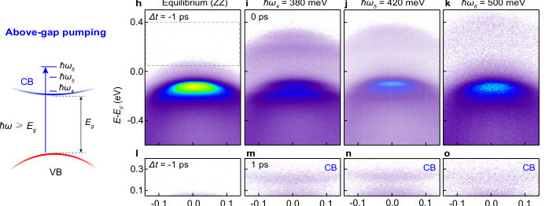 
Figure 4: Conservation of spectral sum rule upon below-gap pumping, and violation of spec- tral sum rule upon above-gap pumping in black phosphorus. (a, b) A schematic illustration for the band structure and pump photon energies below the band gap Eg (a) and above the band gap (b). (c-f) Dispersion images measured along AC direction at ∆t = −1 ps (c) and at ∆t = 0 ps with three different pump photon energies (d-f). The pump is ZZ-pump (p-pol.) and the pump fluences are 0.29, 0.26 and 0.20 mJ/cm2, respectively. (g) Extracted spectral weight at the Γ point from data in (c-f). (h-k) Dispersion images measured along the ZZ direction at ∆t = −1 ps (h) and at ∆t = 0 ps with three different pump...

**Summary.** This paper uses TrARPES to show that in semiconductors like black phosphorus, the total electron spectral weight is conserved when driving with below-gap mid-infrared light, despite the creation of multiple Floquet sidebands. This spectral sum rule is broken when the driving energy exceeds the bandgap, leading to direct interband transitions. These findings are crucial for controlling transient material properties via light-field engineering.

**Why it may be interesting.** The discovery of a spectral sum rule and the observation of population inversion in light-dressed states provide fundamental insights into the non-equilibrium dynamics of driven quantum systems and the conservation laws governing energy-periodic state redistribution.

Detailed structure

**Main problem.** Investigating the transient occupation dynamics of Floquet-Volkov states and determining the validity of a spectral sum rule in semiconductors under intense mid-infrared driving.

**Main result.** The study discovers that under below-gap driving, the total spectral weight of Floquet sidebands is conserved (a spectral sum rule), whereas this rule is violated during above-gap pumping due to interband transitions.

**Method.** Time- and angle-resolved photoemission spectroscopy (TrARPES) is used to measure spectral weight redistribution, complemented by Floquet theory and Bessel function approximations to model sideband intensities.

**Model / system.** The experimental system consists of two semiconductors, black phosphorus and 2H-MoSe2, subjected to mid-infrared (160 meV) pulse driving.

**Key observables.** Floquet-Volkov sidebands, spectral weight S(k), isosbestic points in Energy Distribution Curves (EDCs), and pump fluence.

**Important parameters / regimes.** Below-gap vs. above-gap pumping regimes, pump photon energy (160 meV), and pump fluence (up to 1.1 mJ/cm2).

**Assumptions / limitations.** The use of a Bessel function approximation neglects potential coupling with external baths, and the study does not cover the sub-cycle regime.

**Figures summary.** Figure 2 shows spectral weight conservation in black phosphorus; Figure 3 shows conservation in MoSe2 at the K valley; Figure 4 compares the conservation in below-gap driving to the violation in above-gap driving.

**Paper structure.** The paper introduces the problem of Floquet-Volkov dynamics, presents TrARPES experimental results for black phosphorus and MoSe2, demonstrates the spectral sum rule and its violation, and provides a theoretical framework using Floquet theory and Bessel functions to explain the observed weight redistribution.

Abstract

Time-periodic light fields can dress electronic states in quantum materials, forming Floquet states whose dynamic occupation determines transient material properties. Here by using time- and angle-resolved photoemission spectroscopy (TrARPES), we reveal the transient occupation of Floquet-Volkov states in two semiconductors, black phosphorus and MoSe$_2$. While the occupation of the light-induced sidebands, directly reflected by TrARPES spectral weight, strongly depends on the driving field, we find that the total spectral weight obtained by summing up all sidebands is conserved upon below-gap driving. Our work provides critical insights into the Floquet population dynamics, which are essential for light-field tailoring of transient material properties.

[↑ back to top](#top)

### [Huge ultrafast spin Seebeck effect mediated by laser-excited superdiffusive magnon currents](http://arxiv.org/abs/2605.21389v1)

**Authors:** Luca Mikadze, Peter M. Oppeneer, Markus Weißenhofer  
**Type:** theory · **Category:** statistical mechanics · **PDF:** <https://arxiv.org/pdf/2605.21389v1>  
**Analysis basis:** full PDF text, analyzed in chunks
**Topic relevance:** `non-equilibrium dynamics` **3/5** · `Keldysh / 2PI / non-Gaussian methods` **2/5** · `non-equilibrium universality` **2/5** · `spintronics-quantum-optics interface` **2/5**

📷 Fig 1

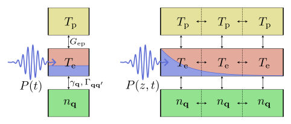 
Figure 1. Illustration of the method. (a) In the local (N+2)TM, the laser pulse P impinges on a metal film and heats the thermal electronic system Te homogeneously, which, in turn, is coupled to a thermal phonon bath Tp and nonther- mal magnon occupations nq. (b) The nonlocal (N+2)TM allows for a heterogeneous laser absorption profile resulting in temperature gradients. Transport occurs within each sub- system across the isolated film domain z ∈[0, L], and the subsystems exchange heat locally.

📷 Fig 2

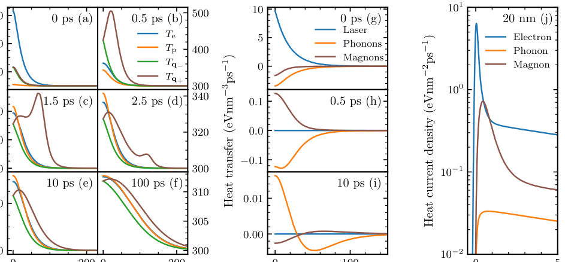 
Figure 2. Nonequilibrium electron, phonon, and magnon dynamics of a laser-excited bcc Fe(001) film of thickness L = 1 µm. (a)-(f) Temperature distributions at various times. Tq± denote the temperatures of the magnon modes at q± = 2π

📷 Fig 3

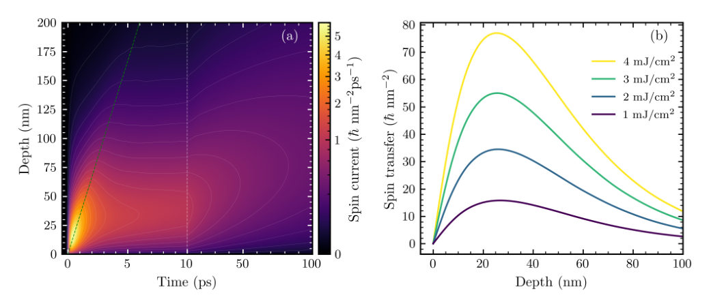 
Figure 3. Laser-excited magnonic spin currents in a 1 µm film. (a) Magnonic spin current density following irradiation with a 1 mJ/cm2 laser pulse. Note that the time axis is piecewise linear with a breakpoint at 10 ps and only the relevant first 200 nm are shown. The dashed green line from the origin to (6 ps, 200 nm) is a guide for the eye to identify the ballistic motion of the initial burst of magnons. (b) Magnonic spin transfer across every depth during the first 10 ps for fluences from 1 mJ/cm2 to 4 mJ/cm2.

📷 Fig 4

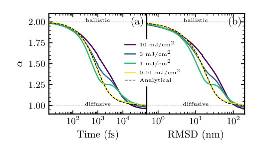 
Figure 4. Transition from ballistic to diffusive transport of magnons generated at the irradiated surface during the peak of the laser pulse. (a) The instantaneous transport exponent α as a function of elapsed time. (b) The instantaneous transport exponent as a function of the average propagated distance (root mean squared displacement).

📷 Fig 5

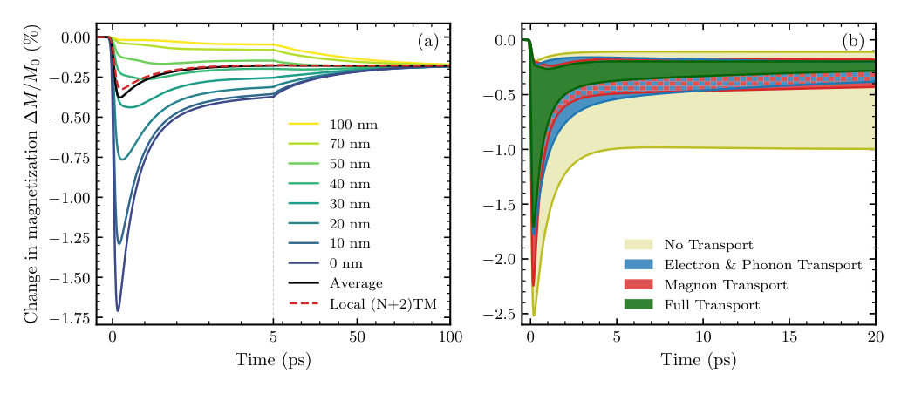 
Figure 5. Calculated demagnetization dynamics. (a) Depth-resolved relative change in magnetization for a 100 nm film. Note that the time axis is piecewise linear with a breakpoint at 5 ps, allowing both the short- and long-term dynamics to be seen clearly. (b) Comparison of demagnetization curves with various transport contributions included (L = 1 µm). Each color region depicts the range of demagnetization in z ∈[0, 40] nm.

**Summary.** The paper develops a new theoretical framework to describe how ultrafast laser pulses drive non-equilibrium magnon currents in iron films. It identifies a superdiffusive transport regime that produces a spin Seebeck effect much larger than previously predicted. This work provides a way to model complex, non-thermal transport processes in magnetic materials.

**Why it may be interesting.** The study provides a sophisticated treatment of non-equilibrium transport and the transition from ballistic to diffusive dynamics, which is highly relevant to the study of open quantum systems and non-equilibrium many-body dynamics.

Detailed structure

**Main problem.** Understanding the microscopic origin of ultrafast, non-equilibrium magnon transport and demagnetization in ferromagnetic metals beyond traditional diffusive models.

**Main result.** The discovery of a huge ultrafast spin Seebeck effect driven by a superdiffusive regime where magnon transport transitions from ballistic to diffusive.

**Method.** An ab initio-parameterized microscopic framework using the quantum Boltzmann equation to capture non-thermal magnon scattering and transport.

**Model / system.** Bcc Iron (Fe) thin films subjected to sub-picosecond laser excitation, modeled using an extended (N+2)-temperature model that incorporates non-thermal magnon populations.

**Key observables.** Magneto-optical Kerr angles (rotation and ellipticity), magnetization-versus-time curves, magnon spin current density, and transport exponent (alpha).

**Important parameters / regimes.** Sub-picosecond/femtosecond timescales, superdiffusive regime (1 < alpha < 2), and laser fluence (1 to 4 mJ/cm2).

**Assumptions / limitations.** Electrons and phonons are assumed to be internally thermalized; direct magnon-phonon coupling is neglected; higher-order magnon-magnon scattering is neglected.

**Figures summary.** Figure 1 illustrates the local and nonlocal (N+2)TM frameworks; Figure 2 shows temporal evolution of temperature profiles and heat currents; Figure 3 shows the magnonic spin current color map; Figure 4 shows the transport exponent evolution; Figure 6 compares simulation to experimental data and shows MOKE signals.

**Paper structure.** The paper introduces the limitations of the 3TM, presents the new (N+2)TM quantum Boltzmann framework, details the numerical implementation, analyzes temperature and magnetization dynamics, characterizes the superdiffusive transport regime, and validates the model against experimental MOKE data.

Abstract

Subpicosecond laser excitation of ferromagnetic metals induces strongly nonequilibrium dynamics involving scattering and transport of electrons, phonons, and magnons. Widely used theoretical approaches, such as the three-temperature model and diffusion equations, are ill-suited to capture these processes on ultrafast timescales. Here, we present an ab initio-parameterized microscopic framework that incorporates nonthermal magnon scattering and transport via the quantum Boltzmann equation. We apply this approach to simulate ultrafast laser-induced demagnetization in bcc Fe films. The model predicts an ultrafast spin Seebeck effect, characterized by a strong burst of fast-moving magnonic spin current reaching technologically relevant amplitudes. Furthermore, we identify a superdiffusive transport regime: a crossover from initially ballistic magnon transport to a diffusive regime at later times. To connect our theoretical predictions to experimentally accessible observables, we calculate the magneto-optical Kerr angles resulting from the predicted depth-resolved magnetization profiles. Our framework provides a route to describe ultrafast nonthermal magnon transport beyond diffusive models and will aid in the design and interpretation of time-resolved spin-transport experiments.

[↑ back to top](#top)

### [The dual Ginzburg-Landau theory for a holographic superfluid/superconductor: Critical dynamics](http://arxiv.org/abs/2605.20415v1)

**Authors:** Makoto Natsuume  
**Type:** theory · **Category:** statistical mechanics · **PDF:** <https://arxiv.org/pdf/2605.20415v1>  
**Analysis basis:** full PDF text, analyzed in chunks
**Topic relevance:** `non-equilibrium dynamics` **3/5** · `non-equilibrium universality` **3/5** · `Keldysh / 2PI / non-Gaussian methods` **2/5**

📷 Fig 1

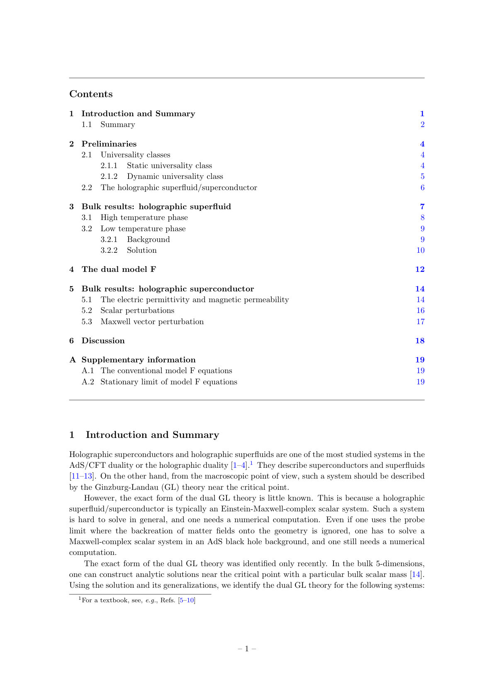 
Low-resolution page preview, page 2

📷 Fig 2

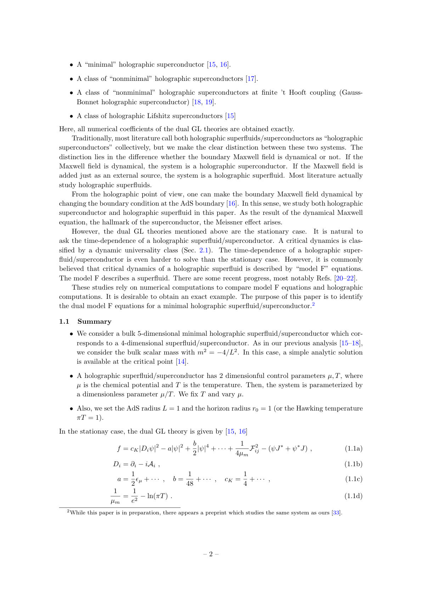 
Low-resolution page preview, page 3

📷 Fig 3

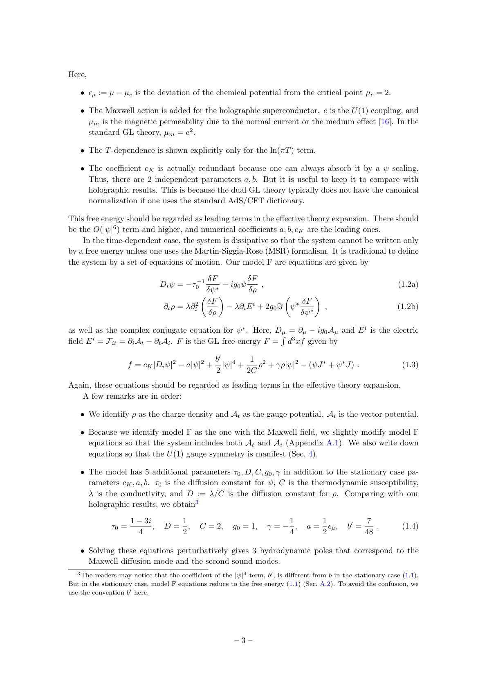 
Low-resolution page preview, page 4

📷 Fig 4

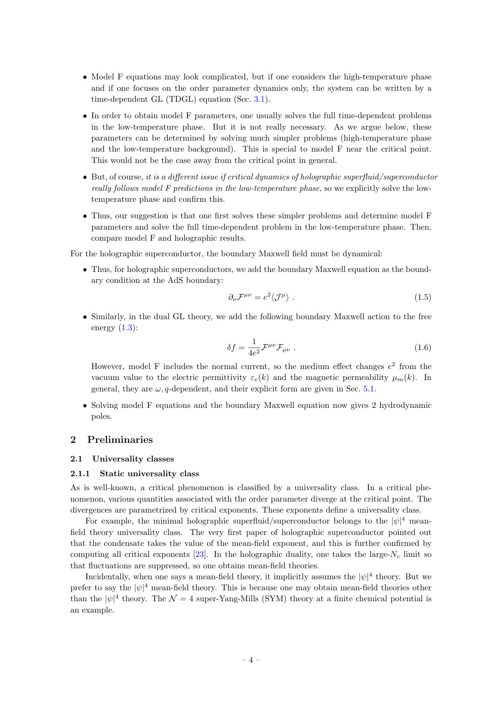 
Low-resolution page preview, page 5

📷 Fig 5

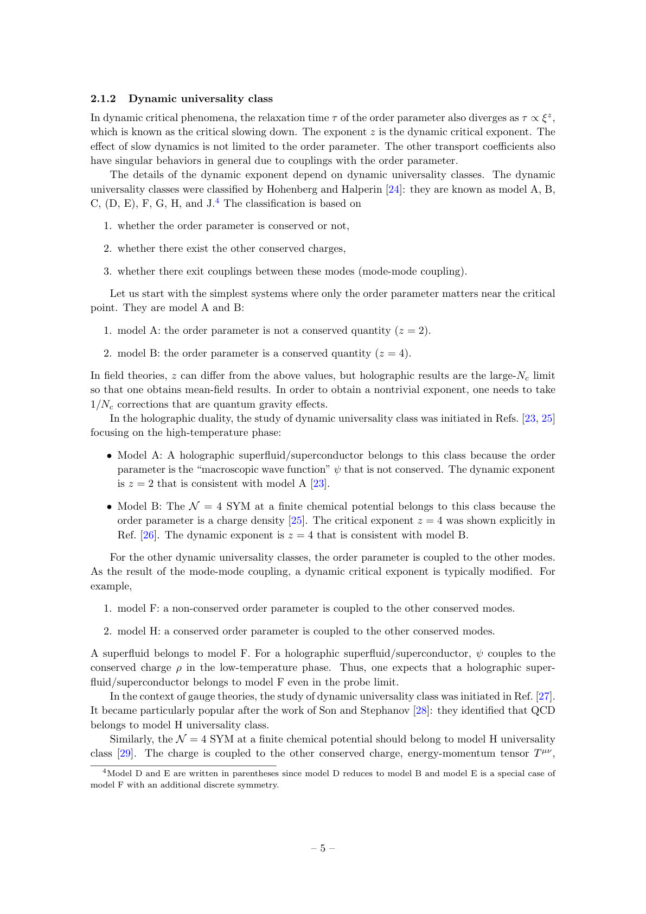 
Low-resolution page preview, page 6

**Summary.** This paper derives the exact Ginzburg-Landau parameters for the critical dynamics of holographic superconductors. By matching bulk holographic calculations to the Model F universality class, the author determines precise numerical coefficients for the system's time-dependent behavior.

**Why it may be interesting.** It provides an exact mapping of a holographic model to a known universality class (Model F), offering deep insights into the critical dynamics and transport coefficients of strongly coupled systems.

Detailed structure

**Main problem.** The paper aims to identify the exact dual Ginzburg-Landau theory and the specific 'model F' universality class parameters for the critical dynamics of holographic superconductors and superfluids.

**Main result.** The author successfully identifies the dual Model F equations and obtains exact numerical coefficients for parameters such as relaxation time, diffusion constants, and thermodynamic susceptibility.

**Method.** The study uses the AdS/CFT correspondence to solve bulk field equations in a 5D Schwarzschild-AdS black hole background using perturbation theory and the Martin-Siggia-Rose formalism.

**Model / system.** A 5-dimensional Einstein-Maxwell-complex scalar system in the probe limit, which is holographically dual to a 4-dimensional system exhibiting superconductivity/superfluidity.

**Key observables.** Hydrodynamic poles (Maxwell diffusion and second sound modes), electric permittivity, magnetic permeability, conductivity, and the dynamic critical exponent z.

**Important parameters / regimes.** Chemical potential (mu), temperature (T), the deviation from criticality (epsilon_mu), and the large-Nc limit.

**Assumptions / limitations.** The study assumes the probe limit (no backreaction on geometry), the large-Nc limit (suppressing fluctuations), and focuses on the low-energy, long-wavelength limit near the critical point.

**Paper structure.** The paper begins by defining the holographic model and the dual Ginzburg-Landau framework, proceeds to analyze the high-temperature phase dynamics, investigates the low-temperature phase and mode coupling, and concludes with the electromagnetic properties of the medium.

Abstract

Holographic superfluids/superconductors are one of the most studied systems in the AdS/CFT duality. In the low-energy, in the long-wavelength limit, they should be described by a Ginzburg-Landau theory. For critical dynamics, one expects that they belong to "model F" universality class. We consider a bulk 5-dimensional holographic superfluid/superconductor in the probe limit. For the holographic superconductor, we impose the boundary Maxwell equation to make the boundary Maxwell field dynamical. We identify the dual model F equations where numerical coefficients are obtained exactly.

[↑ back to top](#top)

### [Destructive interference of second harmonic generation in AA stacked MoTe$_2$/WSe$_2$](http://arxiv.org/abs/2605.21231v1)

**Authors:** Yiduo Wang, Yao Lu, Changshen Chen, Xiaotong Liao, Siyu Fan, Zhenyu Wang, Yaotian Liu, Subi Du, Yingze Jia, Ye Zhu, Yingwei Wang, Jun He, Song Liu, Jiawei Ruan, Zhen Chen, Kai-Qiang Lin, Yang Xu  
**Type:** both · **Category:** other · **PDF:** <https://arxiv.org/pdf/2605.21231v1>  
**Analysis basis:** full PDF text, analyzed in chunks
**Topic relevance:** `interference shaping light` **3/5** · `quantum optics experiment` **2/5**

📷 Fig 1

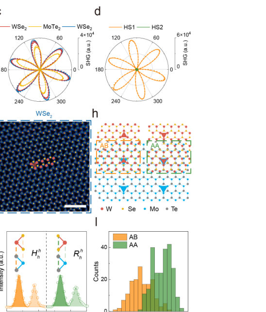 
FIG. 1. Identifying AA and AB stacking of MoTe2/WSe2 by multislice electron ptychography (MEP). (a) Optical micrograph of two isolated monolayer WSe2 flakes (outlined in red and blue) with identical crystal orientation, which are used to construct the heterostructure in (b). These flakes are sequentially picked up with a relative twist angle of 60° and stacked in a non-overlapping configuration. A subsequent MoTe2 flake is aligned and overlapped with the two WSe2 flakes using angle-resolved SHG before final assembly. (b), Optical micrograph of fully assembled device D1, encapsulated between top and bottom h-BN flakes and released onto a SiNx membrane with 2 μm holes for MEP measurements....

📷 Fig 2

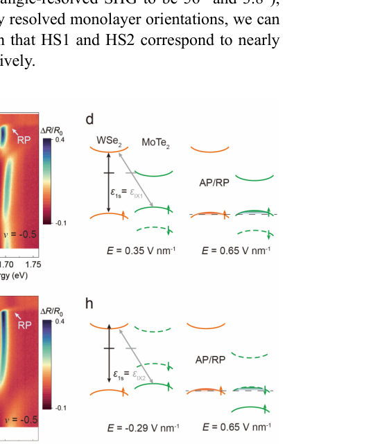 
FIG. 2. Exciton hybridization and band-alignment in AA or AB stacking MoTe2/WSe2. (a), (e), Doping-dependent reflectance contrast spectra at zero electric field (E = 0) near the energy of MoTe2 A1s exciton in (a) AA-stacked and (e) AB-stacked regions. Insets: angle-resolved SHG intensity used to identify the stacking configurations. Electric- field-dependent reflectance contrast near the energy of WSe2 A1s exciton in AA-stacked region at filling factors (b) ν = 0, (c) ν = -0.5, and in AB-stacked region at (f) ν = 0, (g) ν = -0.5. Dashed curves in (b) and (f) are the best fit to the two-level model. Arrows in (c) and (g) marks the hole-doped AP and RP. D, h, Schematic of interlayer and...

📷 Fig 3

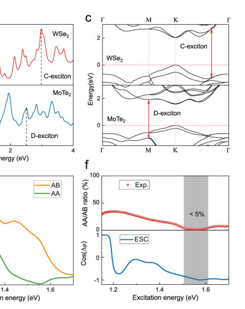 
FIG. 3. Excitation-energy-dependent SHG intensity and phase difference in MoTe2/WSe2. (a) Upper panel: Experimentally measured SHG intensity of WSe2 (red dots) and the calculated |χ(2)|2 from exciton-state-coupling (ESC) calculations (blue line) as a function of excitation photon energy. Lower panel: Corresponding data for MoTe2. (b) Upper panel: Calculated imaginary part of the dielectric function (ε2) for WSe2 from GW-BSE. Inset: k-space envelope function of the C exciton. Lower panel: Calculated ε2 for MoTe2. Inset: k-space envelope function of the D exciton. (c) Upper and lower panels: GW quasiparticle band structures of WSe2 and MoTe2, respectively. Transitions contributing to the C...

📷 Fig 4

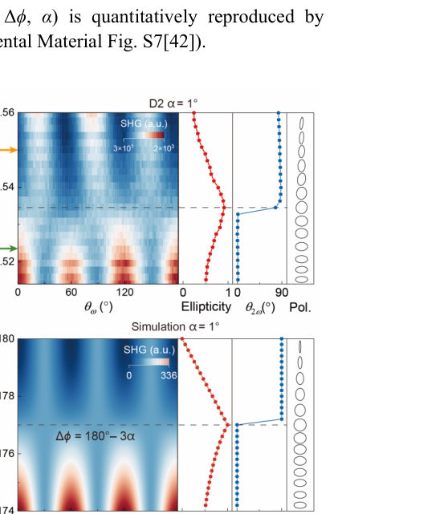 
FIG. 4. SHG polarization state manipulation in nearly AA stacked MoTe2/WSe2. (a) Schematics of SHG superposition from WSe2 and MoTe2 with a phase difference Δϕ and twist angle α. (b) The coherent synthesis of 𝐼‖(𝜃)) from two SHG fields of the WSe2 layer (red) and the MoTe2 layer (blue), characterized by angle misalignment 3α and phase difference Δϕ. The filled and empty lobes are contrasted to have opposite SHG fields. Representative polarization dependent SHG measurement of D2 (α = 1° region) with the excitation energy of (c) 1.523 eV and (d) 1.550 eV, where SHG power maxima Imax and minima Imin can be extracted. (e) Left panel: SHG (𝐼‖) as a function of excitation energy and polarization,...

**Summary.** This paper identifies that AA-stacked MoTe2/WSe2 heterobilayers exhibit unexpected destructive SHG interference caused by a phase difference between layer-specific exciton resonances. By tuning the twist angle and excitation energy, the researchers demonstrate precise control over the SHG polarization state, including the achievement of near-circular polarization. This work provides a new framework for engineering nonlinear optical functions in moiré materials.

**Why it may be interesting.** The discovery of a geometric polarization singularity and the ability to engineer nonlinear polarization states via interlayer phase engineering is highly relevant to the field of nonlinear quantum optics and the development of tunable photonic components.

Detailed structure

**Main problem.** The paper aims to resolve the ambiguity in stacking identification (AA vs. AB) in MoTe2/WSe2 heterobilayers and understand the origin of anomalous destructive Second Harmonic Generation (SHG) interference in AA-stacked configurations.

**Main result.** The authors demonstrate that AA-stacked MoTe2/WSe2 exhibits unconventional destructive SHG interference due to a pi phase difference in nonlinear susceptibility driven by distinct exciton resonances, and show that the SHG polarization can be controlled via twist angle and excitation energy.

**Method.** The study combines experimental techniques like Multislice Electron Ptychography (MEP) for atomic-resolution imaging, angle-resolved SHG spectroscopy, and reflectance contrast with theoretical GW-BSE calculations and a coherent superposition model.

**Model / system.** The system consists of MoTe2/WSe2 transition-metal dichalcogenide (TMDC) heterobilayers in AA and AB stacking configurations, encapsulated in hexagonal boron nitride (hBN). The optical response is modeled using a coherent superposition of electric fields from individual layers and a two-level Hamiltonian for exciton hybridization.

**Key observables.** SHG intensity, polarization ellipticity, polarization azimuth, Stokes parameters, MEP phase images, and exciton hybridization (energy anticrossing).

**Important parameters / regimes.** Stacking configuration (AA vs. AB), twist angle (alpha), interlayer phase difference (delta-phi), excitation photon energy, and vertical electric field (E).

**Assumptions / limitations.** The SHG susceptibility of the heterostructure is modeled as a linear combination of individual monolayer susceptibilities; a rigid redshift of the WSe2 spectrum is applied to account for stacking effects in calculations.

**Figures summary.** Figure 1 shows device fabrication and optical micrographs; Figure 2/3 details the SHG intensity, polarization states, and comparison between experimental and calculated dielectric functions; Supplemental figures include simulated electron microscopy images and polarization-dependent SHG models.

**Paper structure.** The paper begins with device fabrication and stacking identification via electron ptychography, moves to the investigation of anomalous SHG interference and its excitonic origin using spectroscopy and GW-BSE calculations, and concludes with the demonstration of polarization control and mapping of polarization trajectories on the Poincaré sphere.

Abstract

The stacking configuration of two-dimensional materials critically governs their optical and electronic responses. Monolayer transition-metal dichalcogenides (TMDC) lack inversion symmetry and exhibit exciton-enhanced second-harmonic generation (SHG). In TMDC bilayers, 60° (0°) stacking is conventionally expected to suppress (enhance) SHG owing to destructive (constructive) interference of the layer-resolved nonlinear polarizations. Here, we report an unconventional destructive SHG interference in nearly 0°-stacked (AA-stacked) MoTe2/WSe2 heterobilayers using two independent probes: atomic-resolution imaging and stacking-sensitive exciton hybridization measurements. Supported by ab initio GW and Bethe-Salpeter equation calculations, we show that distinct two-photon resonances associated with the WSe2 C exciton and the MoTe2 D exciton generate a nearly $π$ phase difference ($Δφ$) in their second-order nonlinear susceptibilities $χ^{(2)}$, leading to the anomalous destructive interference. We further demonstrate that in small-angle twisted MoTe2/WSe2, the SHG polarization state is governed by the interplay between twist angle $α$ and phase difference $Δφ$, and can be mapped onto trajectories on the Poincaré sphere. At excitation energies satisfying $Δφ$ + 3$α$ = 180°, the SHG output becomes nearly circularly polarized (ellipticity ~ 0.91) and undergoes an abrupt 90° azimuthal rotation, corresponding to a geometric polarization singularity in the parameter space. Our findings open new routes for exciton-resonance engineered nonlinear photonics and stacking-resolved optical functionality in moiré materials.

[↑ back to top](#top)

### [Lasing from SOI-integrated GaAsSb nanowires via resonator-driven optical feedback](http://arxiv.org/abs/2605.20832v1)

**Authors:** J. Zöllner, C. Doganlar, C. García Marcilla, S. Meder, G. Koblmüller, J. J. Finley  
**Type:** both · **Category:** other · **PDF:** <https://arxiv.org/pdf/2605.20832v1>  
**Analysis basis:** full PDF text, analyzed in chunks
**Topic relevance:** `quantum optics experiment` **3/5** · `interference shaping light` **2/5**

📷 Fig 1

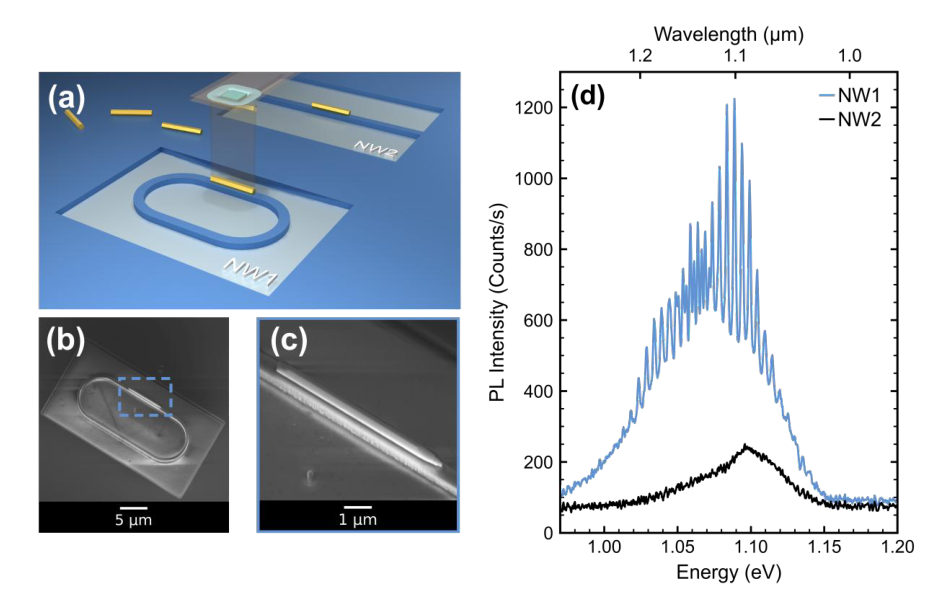 
Figure 1. Hybrid nanowire-resonator platform demonstrating self-driven optical feedback. (a) Schematic representation showing GaAsSb NW integration on two different Si photonic structures: NW1 positioned on a racetrack resonator arm and NW2 on a reference ridge waveguide. (b, c) SEM images of the fabricated racetrack resonator with integrated NW1, where (c) shows a magnified view demonstrating precise nanowire positioning on the Si waveguide. (d) Photoluminescence spectra comparison at a fixed pump fluence of 35 µJ/cm² revealing distinct spectral modulation in NW1 (blue) characteristic of resonator feedback, in contrast to the emission spectrum of NW2 (black) on the reference waveguide.

📷 Fig 2

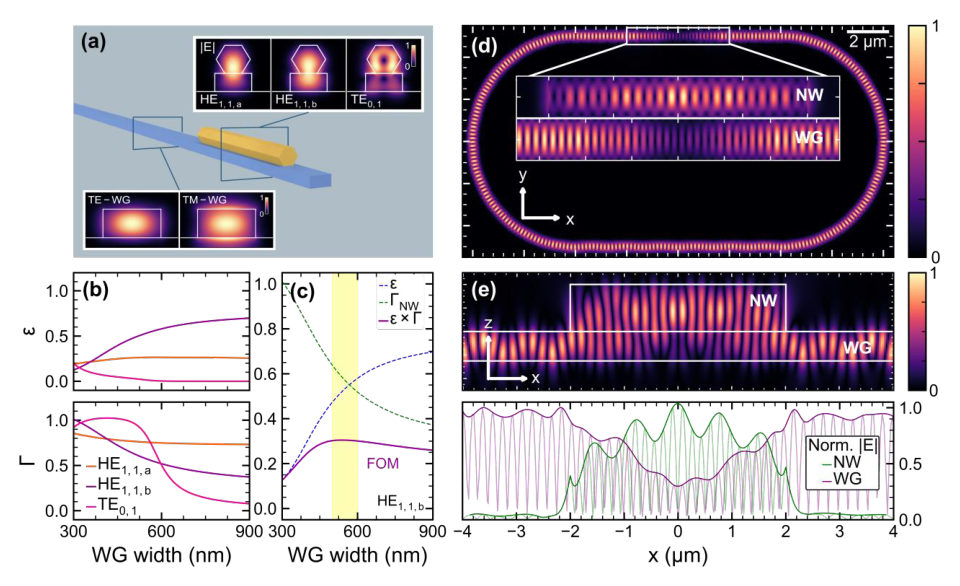 
Figure 2. Nanowire-waveguide coupling simulations (a) Schematic illustration of the hybrid nanowire–waveguide modes and the confined TE/TM guided modes of the silicon ridge waveguide. (b) Upper panel: Coupling efficiency of hybrid modes as a function of waveguide width for the three mode pairs: HE1,1,a → TM, HE1,1,b → TE, and TE0,1 → TE. Lower panel: Confinement factors Γ of the corresponding hybrid modes, illustrating the decreasing overlap with the NW gain medium for increasing waveguide widths. (c) Figure of merit (FOM = ε × Γ) combining coupling efficiency and confinement, with a maximum for the HE1,1,b → TE configuration at a waveguide width of 500 nm. (d) 3D FDTD simulation of the...

📷 Fig 3

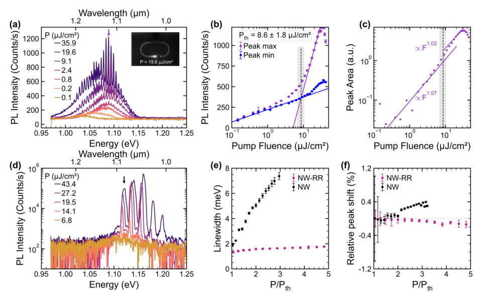 
Figure 3. Comparison between pump-fluence-dependent µ-PL measurements of an individual GaAsSb NW on sapphire versus on a racetrack resonator. (a) Spectra of a GaAsSb NW coupled to a racetrack resonator showing lasing emission at 10K. The dominant lasing peak is indicated by the purple arrow. Inset: microscope image of optically excited NW-resonator system. (b) Input–output characteristics of the dominant peak (purple) and adjacent spectral minima (blue), with the lasing threshold (dashed line) extracted from linear fits. (c) Log–log input–output characteristics showing the typical S- shaped curve of a laser. (d) Spectra of a standalone GaAsSb NW on sapphire at 10K, where optical feedback...

**Summary.** This paper demonstrates a method to integrate GaAsSb nanowires onto silicon racetrack resonators to create stable, low-threshold lasers. By using the silicon resonator to provide optical feedback, the researchers significantly reduced the laser linewidth and improved frequency stability. This approach provides a scalable path for integrating light sources into silicon photonic integrated circuits.

**Why it may be interesting.** The work demonstrates high Purcell enhancement and the use of a passive resonator to control the spectral properties of an active medium, which is highly relevant to cavity QED and the engineering of single-photon/single-mode light sources.

Detailed structure

**Main problem.** Achieving stable, low-threshold, and frequency-stable lasing from GaAsSb nanowires by overcoming the broad emission linewidths and spectral instability caused by weak optical feedback in conventional cavities.

**Main result.** Integrating GaAsSb nanowires onto SOI racetrack resonators provides strong resonator-driven optical feedback, reducing the emission linewidth by more than a factor of four and significantly enhancing spectral stability.

**Method.** The study uses deterministic transfer-printing to integrate nanowires onto silicon resonators, combined with 3D FDTD simulations for mode analysis and micro-photoluminescence spectroscopy for experimental characterization.

**Model / system.** A hybrid photonic platform consisting of GaAsSb nanowire gain media coupled via evanescent waves to a passive Silicon-on-Insulator (SOI) racetrack resonator.

**Key observables.** Lasing threshold (Pth), emission linewidth, spectral stability (peak shift), cavity Q-factor, Purcell factor, and photon lifetime.

**Important parameters / regimes.** Lasing threshold of 8.6 +/- 1.8 uJ/cm2, Q-factor exceeding 10^4, and linewidth reduction of >4x.

**Assumptions / limitations.** The analysis assumes the nanowire does not significantly degrade the silicon resonator's performance and that the transfer-printing process maintains high alignment accuracy.

**Figures summary.** Figure 1 shows the device architecture, SEM images, and PL spectra comparison; Figure 2 presents FDTD simulations of hybrid modes, coupling efficiency, and field distributions; Figure 3 displays pump-dependent PL spectra, input-output characteristics, and quantitative linewidth/stability comparisons.

**Paper structure.** The paper introduces the integration problem, describes the fabrication and transfer-printing method, presents numerical simulations of mode coupling, details experimental lasing measurements and stability analysis, and concludes with the implications for silicon photonics.

Abstract

Silicon photonic integrated circuits critically depend on compact on-chip light sources, for which nanowire (NW) lasers are an attractive solution. However, their practical implementation is often limited by broad emission linewidths and poor frequency stability resulting from weak optical feedback. Here, we integrate individual GaAsSb NWs by transfer-printing onto silicon-on-insulator (SOI) racetrack resonators to realize optical feedback at silicon-transparent wavelengths. Finite-difference-time-domain simulations reveal efficient coupling between the hybrid NW-waveguide mode and the fundamental TE resonator mode, with calculated cavity Q-factors exceeding 10$^4$. Experimentally, we observe feedback-induced lasing emission at a low threshold (P$_{th}$) of 8.6 $\pm$ 1.8 $μ$J/cm$^2$. Compared to identical NW lasers without SOI resonator, the linewidth is reduced by more than a factor of four at 3P$_{th}$ and remains stable below 1.8 meV up to 5P$_{th}$. Our results demonstrate NW-based light sources on SOI and show that tailored resonator designs enable improved linewidth control and frequency stabilization.

[↑ back to top](#top)

### [Stacking-order-dependent electronic properties of MoTe2/WSe2 moiré bilayers](http://arxiv.org/abs/2605.21233v1)

**Authors:** Zhongdong Han, Wenjin Zhao, Eegene Clara Chung, Chia-Hao Lee, Zui Tao, Zhengchao Xia, Yichi Zhang, Yiyu Xia, Jekwan Lee, Bowen Shen, Ariana Ray, Yu-Tsun Shao, Tingxin Li, Shengwei Jiang, Yihang Zeng, Kenji Watanabe, Takashi Taniguchi, David Muller, Kin Fai Mak, Jie Shan  
**Type:** experiment · **Category:** strongly correlated electrons · **PDF:** <https://arxiv.org/pdf/2605.21233v1>  
**Analysis basis:** full PDF text, analyzed in chunks
**Topic relevance:** `Kondo & dissipative impurity` **3/5**

📷 Fig 1

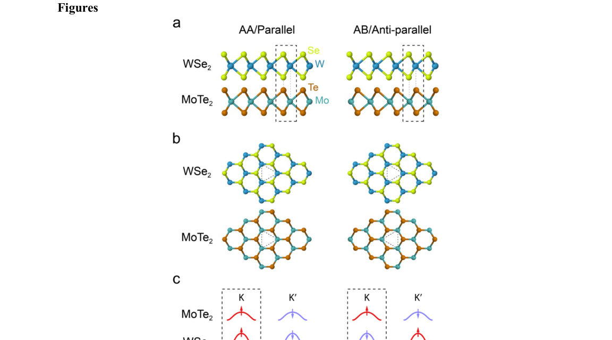 
Figure 1. Stacking order and moiré bands of angle-aligned MoTe2/WSe2 bilayers. a, Side view. b, Top view. The atoms are shown in blue (W), green (Se), cyan (Mo) and brown (Te). c, Spin-resolved topmost moiré valence bands from MoTe2 and WSe2. Left: AA-stacking with two layers parallel to each other; right: AB-stacking with two layers antiparallel to each other. In each valley (K/K’), electron spins (arrows) in the two layers are parallel (AA) or antiparallel (AB) due to spin-valley locking in monolayer TMDs. Interlayer hybridization is spin allowed for AA- stacking and spin forbidden for AB-stacking.

📷 Fig 2

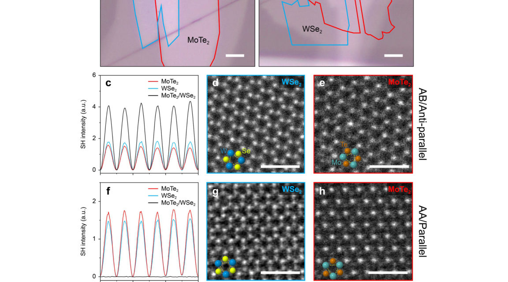 
Figure 2. Stacking order determination. a,b, Optical image of angle-aligned MoTe2/WSe2 sample 1 (a) and sample 2 (b) on PC stamps. The WSe2 and MoTe2 layers are outlined in blue and red, respectively. Scale bars are 5 µm. The WSe2 (MoTe2) layers were cut from the same flake. A 180° rotation was introduced in the two MoTe2 layers. SHG with excitation at 800 nm and STEM measurements were performed on both the isolated monolayer regions and the bilayer region (Methods). c-e, Characterization of sample 1. The SH intensity (c) exhibits a six-fold rotational symmetry as a function of the excitation polarization angle. The bilayer response is 2-3 times of that of each monolayer. ADF-STEM images...

**Summary.** This paper provides a definitive way to identify the stacking order in MoTe2/WSe2 moire bilayers using STEM-calibrated optical techniques. It reveals that AA-stacking enables interlayer hybridization, which is the key driver for observing Chern insulators and Kondo lattice physics in these materials.

**Why it may be interesting.** The paper explores how tuning structural symmetry and interlayer hybridization can induce topological phase transitions and Kondo-like physics in a moire lattice, which is highly relevant to many-body dynamics and synthetic quantum matter.

Detailed structure

**Main problem.** The electronic properties of MoTe2/WSe2 moire bilayers are highly sensitive to interlayer stacking order (AA vs. AB), but previous stacking assignments via optical SHG were unverified, leading to conflicting interpretations of topological and correlated states.

**Main result.** The authors calibrated SHG using STEM to accurately identify stacking orders and demonstrated that AA-stacking enables interlayer hybridization, which is essential for the emergence of Chern insulator, Mott insulator, and Kondo lattice physics.

**Method.** The study combines atomic-resolution STEM for structural verification, polarization-resolved SHG for optical characterization, and low-temperature magnetotransport and MCD spectroscopy to probe electronic phases.

**Model / system.** Angle-aligned MoTe2/WSe2 vertical heterobilayers forming a moire lattice with a 5 nm period, utilizing dual-gated architectures to control hole filling and perpendicular electric fields.

**Key observables.** Longitudinal and Hall resistance (Rxx, Rxy), Magnetic Circular Dichroism (MCD) response, Second Harmonic Generation (SHG) intensity, and Shubnikov-de Haas oscillations.

**Important parameters / regimes.** Hole filling factor (nu), perpendicular electric field (E), magnetic field (B), and interlayer hybridization strength.

**Assumptions / limitations.** The calibration assumes that the SHG interference patterns can be reliably correlated with the atomic-scale structural data obtained from STEM.

**Figures summary.** Fig 1: Schematic of moire bands and stacking-dependent spin alignment; Fig 2: Comparison of AA and AB stacking via optical and STEM imaging; Fig 3: Electronic phase diagrams showing the emergence of new states in AA-stacking.

**Paper structure.** Introduction of the stacking problem, structural characterization and SHG calibration via STEM, comparison of electronic phase diagrams for AA and AB stacking, and discussion of the physical implications for hybridization-driven phenomena.

Abstract

Transition metal dichalcogenide (TMD) moiré bilayers have realized a wide range of strongly correlated and topological phenomena. The physics in these materials is often sensitive to the interlayer stacking order. Polarization-resolved optical second harmonic generation (SHG) is the most used technique for stacking order characterization but unverified for most heterobilayers. Here we calibrate the optical SHG for angle-aligned MoTe2/WSe2 bilayers by the scanning transmission electron microscopy (STEM). We directly compare the transport and magnetic properties and the electronic phase diagram for two distinct stacking orders. With the calibrated stacking order assignment, we clarify the interpretation of earlier results, including the nature of the Chern insulator, mechanism of an electric-field-tuned metal-insulator transition at half band filling, and the Kondo lattice physics. Our work provides a consistent picture of the relation between the stacking order and the electronic properties of MoTe2/WSe2 moiré bilayers.

[↑ back to top](#top)

### [Dark solitons in the fractional NLS equation](http://arxiv.org/abs/2605.21271v1)

**Authors:** Almudena P. Márquez, Jesús Cuevas-Maraver, Panayotis G. Kevrekidis  
**Type:** theory · **Category:** other · **PDF:** <https://arxiv.org/pdf/2605.21271v1>  
**Analysis basis:** full PDF text, analyzed in chunks
**Topic relevance:** `Keldysh / 2PI / non-Gaussian methods` **2/5** · `non-equilibrium dynamics` **2/5**

📷 Fig 1

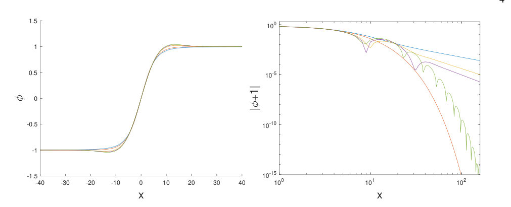 
FIG. 1. Profile of dark solitons in linear (left) and logarithmic scale (right) for different values of α. Blue, red, yellow, purple, and green lines correspond, respectively, to α = 1.7, α = 2, α = 3, α = 3.5, and α = 4.

📷 Fig 2

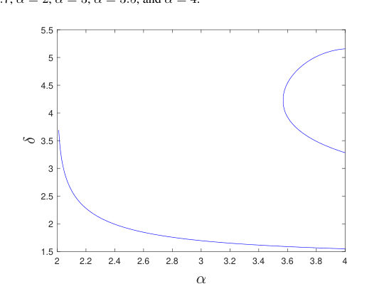 
FIG. 2. Dependence of the equilibrium distance between the dark soliton centers in a bounded pair δ on the L´evy index α &gt; 2. Notice the existence of two families (or three branches) interpolating between α = 2+ and α = 4. Additional branches emerge in the immediate vicinity of the biharmonic limit of α = 4, although given their exponential proximity to the biharmonic limit, we will not explore them here.

📷 Fig 3

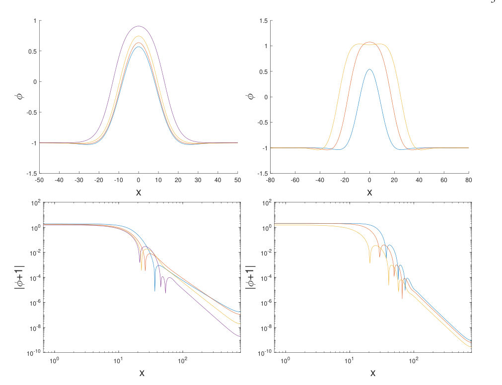 
FIG. 3. (Left panel) Profiles of the bound states in the first branch for α = 3.5 (blue line), α = 3 (red line), α = 2.5 (yellow line), and α = 2.1 (purple line). (Right panel) Profiles of the bound states for the lowest (blue line), second (red line) and third (yellow line) branches at α = 3.8. Bottom panels show in logarithmic scales the profiles in the top panels.

📷 Fig 4

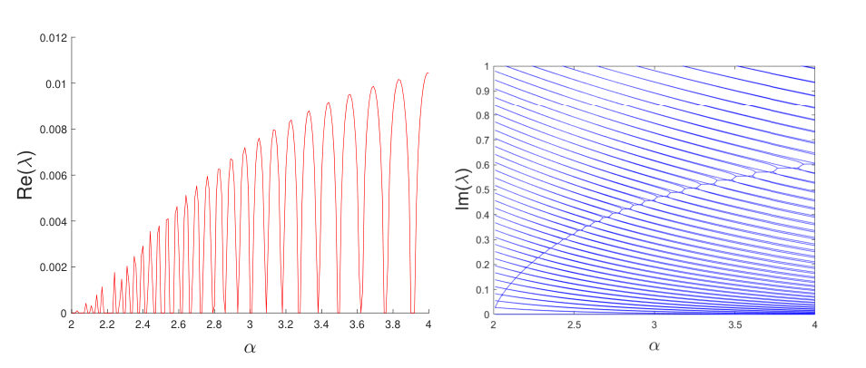 
FIG. 4. Dependence with α of the real (left panel) and imaginary (right panel) part of the spectrum for the lowest branch of bound states for α &gt; 2.

📷 Fig 5

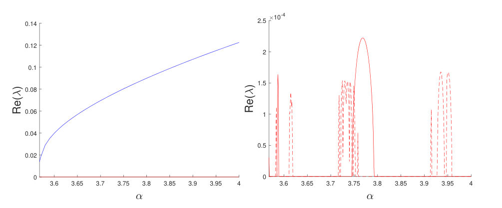 
FIG. 5. Dependence on α of the real part of the spectrum for the lower (left panel) and upper (right panel) branch of the second family of bound states. Dashed lines in the right panel correspond to a larger domain than full lines; in particular, the domain is [−L, L] with L = 320 and a discretization parameter h = 2/15.

**Summary.** This paper explores how fractional dispersion affects the stability and interaction of dark solitons. It reveals that unlike the standard NLS equation, all two-soliton bound states in the fractional regime are unstable, leading to complex behaviors like breathing orbits and soliton collisions.

**Why it may be interesting.** The discovery of unprecedented breathing orbits and the ability to model soliton interactions via reduced-order ODEs provides new insights into the complex dynamics of nonlinear waves in engineered dispersion landscapes, relevant to nonlinear optics and nonlinear wave physics.

Detailed structure

**Main problem.** The study investigates the existence, stability, and dynamics of dark fractional solitary waves and their bound states (solitonic molecules) within the fractional Nonlinear Schrödinger (NLS) equation.

**Main result.** The authors find that all branches of two-soliton equilibria in the fractional NLS setting are potentially unstable, exhibiting either oscillatory or exponential instabilities, and discover associated periodic breathing orbits.

**Method.** Numerical analysis using Fourier spectral methods, Floquet analysis for periodic orbits, and a variational approach using a three-parameter ansatz to approximate stationary states.

**Model / system.** A defocusing fractional Nonlinear Schrödinger (NLS) equation utilizing the Riesz fractional derivative, which allows for continuous interpolation between different dispersive regimes via the Lévy index alpha.

**Key observables.** Soliton profiles, stability eigenvalues (real and imaginary parts), Floquet multipliers, and the time-evolution of density and projection onto unstable eigenvectors.

**Important parameters / regimes.** The Lévy index alpha (controlling dispersion), soliton separation/offset delta, and the frequency omega.

**Assumptions / limitations.** The study assumes periodic boundary conditions (using soliton pairs to simulate single solitons), focuses on free space without external confinement, and uses an ansatz that fails to capture power-law tails.

**Figures summary.** Figures show dark soliton profiles across different alpha values, the dependence of equilibrium distance on alpha, eigenvalue spectra, and time-dependent density evolution showing breathing and collision dynamics.

**Paper structure.** The paper introduces the fractional NLS model, analyzes single soliton profiles, investigates the stability and branches of two-soliton bound states, explores the resulting breathing and collision dynamics, and concludes with a semi-analytical variational approximation.

Abstract

In the present work we consider the subject of dark fractional solitary waves in the realm of generalized (fractional) forms of the nonlinear Schrödinger (NLS) equation. While earlier studies have examined such states in the realm of real field theories, we showcase the existence and stability of individual dark solitary waves in such NLS settings and subsequently turn to two-soliton solutions. We find different branches of such two-soliton solution equilibria and contrary to the real field-theoretic setting all possible branches of two-soliton equilibria are found to be potentially unstable, although with different types of instabilities. Odd branches are potentially subject to oscillatory instabilities, while even branches are always exponentially unstable. The dynamics that results from the instabilities is also examined and is found to potentially feature breathing characteristics. This prompts us to seek and find associated periodic (breathing) orbits that are also unprecedented in this context, to the best of our knowledge. The effective particle-like dynamics of the solitary waves also prompts us to seek ordinary differential equation (ODE) descriptions to the dark soliton interaction dynamics. These are shown to hold promise toward providing us with effective reduced order models, indicating some potential directions for further investigation.

[↑ back to top](#top)

### [Spin Peltier effect in graphene](http://arxiv.org/abs/2605.21087v1)

**Authors:** Xin Theng Lee, Xin Hu, Yuya Ominato, Masahiro Tatsuno, Takeo Kato, Mamoru Matsuo  
**Type:** theory · **Category:** other · **PDF:** <https://arxiv.org/pdf/2605.21087v1>  
**Analysis basis:** full PDF text, analyzed in chunks
**Topic relevance:** `Keldysh / 2PI / non-Gaussian methods` **2/5** · `non-equilibrium dynamics` **2/5**

📷 Fig 1

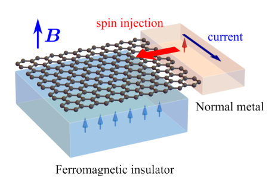 
FIG. 1. Schematic illustration of a graphene/ferromagnetic- insulator (FI) heterostructure. An external magnetic field B is applied perpendicular to the graphene plane. The spin Peltier effect is induced by spin accumulation in graphene, which can be, for example, driven by the spin Hall effect in an adjacent normal metal.

📷 Fig 2

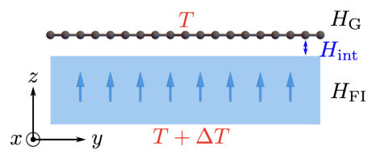 
FIG. 2. Schematic illustration of the FI-grphene junction.

📷 Fig 3

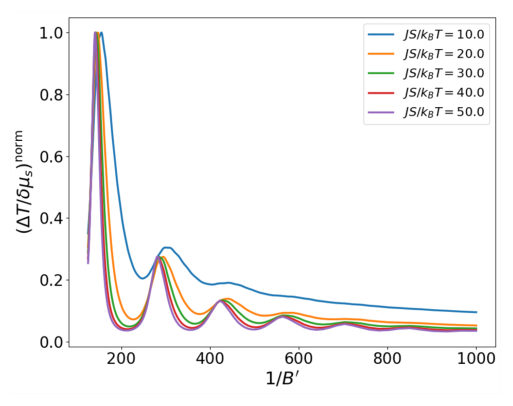 
FIG. 3. Quantum oscillation of the normalized temperature difference (∆T/δµs)norm = (∆T/δµs)/ max(∆T/δµs) plotted as a function of the inverse dimensionless magnetic field 1/B′. The lines correspond to different values of the temperature- control parameter JS/kBT = 10, 20, 30, 40, 50. The Landau- level broadening is fixed at Γ/JS = 1, with chemical potential µ/JS = 1. The oscillatory peaks originate from successive crossings of graphene Landau levels with the thermally active electronic window.

📷 Fig 4

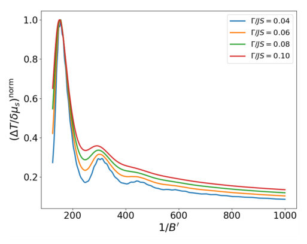 
FIG. 4. Quantum oscillation of the normalized temperature difference (∆T/δµs)norm = (∆T/δµs)/ max(∆T/δµs) plotted as a function of the inverse dimensionless magnetic field 1/B′. The lines correspond to different values of the Landau-level broadening parameter Γ/JS = 0.04, 0.06, 0.08, 0.1. The tem- perature control parameter is fixed at JS/kBT = 10, with chemical potential µ/JS = 1. The oscillatory peaks originate from successive crossings of graphene Landau levels with the thermally active electronic window.

**Summary.** This paper theoretically explores how spin accumulation in a graphene/ferromagnetic insulator junction generates a temperature difference. It demonstrates that the resulting thermal response oscillates with the magnetic field, providing a way to use thermal measurements to probe Landau levels.

**Why it may be interesting.** not directly relevant

Detailed structure

**Main problem.** Investigating the spin Peltier effect in graphene/ferromagnetic insulator heterostructures and determining if it can serve as a spectroscopic probe for Landau levels.

**Main result.** The spin Peltier response exhibits pronounced quantum oscillations as a function of the inverse magnetic field due to Landau level crossings, which can be used to detect discrete electronic energy levels.

**Method.** A microscopic formalism using the Keldysh formalism and second-order perturbation theory to analyze spin-flip scattering at the interface.

**Model / system.** A bilayer heterostructure consisting of monolayer graphene and a ferromagnetic insulator (FI) under a perpendicular magnetic field, modeled with a tight-binding Hamiltonian for graphene and a spin-wave approximation for the FI.

**Key observables.** Temperature difference (delta T) across the junction, spin current (jS), and energy current (jE).

**Important parameters / regimes.** Magnetic field (B), Landau level broadening (Gamma), interfacial exchange coupling (JS), and the temperature control parameter (JS/kBT).

**Assumptions / limitations.** Strong spin relaxation in the FI, the spin-wave approximation for magnons, and the neglect of the Zeeman term for electrons in favor of a larger exchange bias.

**Figures summary.** Figure 1 shows a schematic of the heterostructure; Figure 2 shows the junction schematic; Figure 3 demonstrates quantum oscillations in temperature difference vs. 1/B for different temperatures; Figure 4 shows the suppression of oscillations due to increased scattering rate.

**Paper structure.** The paper introduces the spin Peltier effect, defines the microscopic Hamiltonian and Keldysh-based formalism, derives the spin and energy currents, analyzes the temperature response under magnetic field quantization, and discusses the effects of temperature and broadening.

Abstract

In this work, we theoretically investigate the spin-Peltier effect in a heterostructure composed of graphene and a ferromagnetic insulator (FI). Using a microscopic formalism based on the characteristic spin-flip scattering length at the graphene/FI interface, we analyze how spin accumulation in graphene gives rise to a temperature difference across the junction. We show that, in the presence of an external magnetic field, the electronic spectrum of graphene is quantized into Landau levels, which strongly modifies the available spin-flip scattering channels. In particular, crossings between Landau levels significantly enhance the spin-flip scattering amplitude, leading to a pronounced amplification of the spin-Peltier response. Our results suggest that measurements of the spin-induced temperature difference in graphene-FI heterostructures can serve as a sensitive probe of discrete electronic energy levels. More broadly, this work provides a theoretical framework for understanding spin-driven thermal effects in hybrid systems combining Dirac materials and magnetic insulators.

[↑ back to top](#top)

### [Excitation-Energy-Selective Control of Hot-Carrier Cooling via a Resonant Optical-Phonon Bottleneck in Graphene](http://arxiv.org/abs/2605.20430v1)

**Authors:** Sachin Sharm, Elliott Walker, Rachael Myers-Ward, Jenifer Hajzus, Yijing Liu, Paola Barbara, Ioannis Chatzakis  
**Type:** both · **Category:** other · **PDF:** <https://arxiv.org/pdf/2605.20430v1>  
**Analysis basis:** full PDF text, analyzed in chunks
**Topic relevance:** `non-equilibrium dynamics` **2/5**

📷 Fig 1

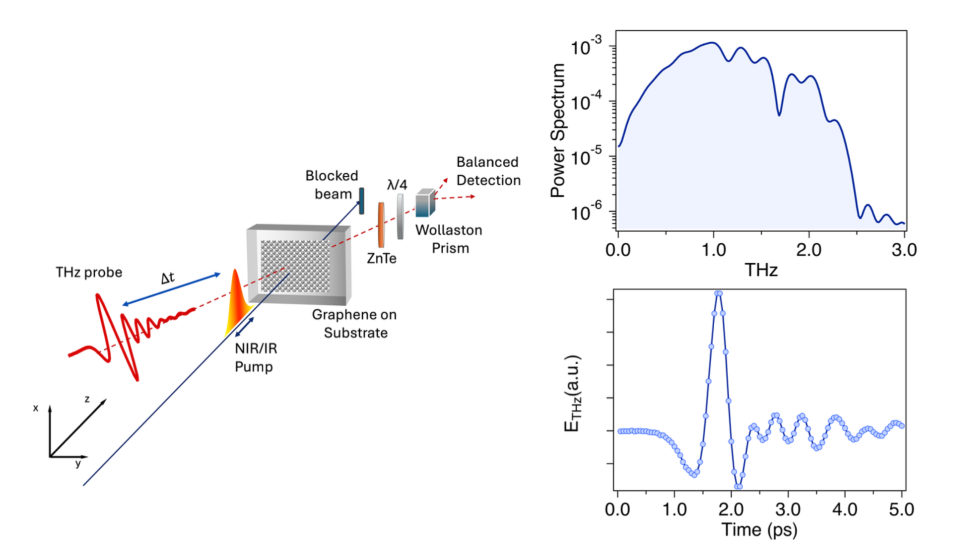 
Figure 1: (Left) Schematic of the THz pump-probe setup and the components for THz generation and detection. (Right) Time-domain THz waveform (bottom) and corresponding Fourier-transform spectrum (top), extending to 2.5 THz.

📷 Fig 2

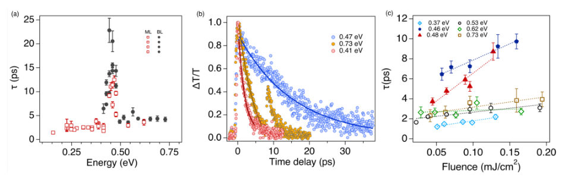 
Figure 2: (a) Relaxation time of photoexcited carriers in graphene as a function of excitation photon energy, extracted from pump-probe THz measurements. The relaxation time exhibits a pronounced non-monotonic dependence on photon energy. Energy-interval averaging yields mean lifetimes of ⟨τ⟩≈3.2 ps for E &lt; 0.42 eV and ⟨τ⟩≈3.8 ps for E &gt; 0.48 eV, indicat- ing predominantly fast relaxation outside the mid-energy region. In contrast, an anomalous energy-selective slowing of carrier relaxation emerges within a narrow spectral window be- tween ≈0.42 and 0.48 eV, where lifetimes increase to τ ≈10-25 ps (⟨τ⟩≈18 ps), reaching values up to ≈20 ps - nearly an order of magnitude longer than the...

📷 Fig 3

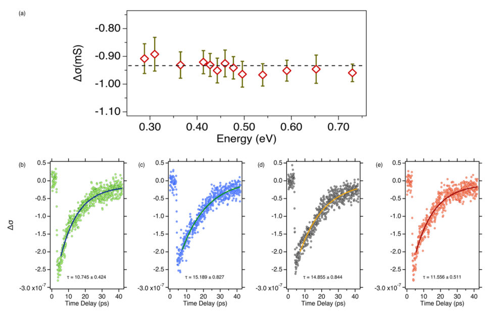 
Figure 3: (a) Energy-dependent photoinduced change in the THz conductivity, ∆σ, of graphene following ultrafast optical excitation. Each data point represents the average of the frequency-domain conductivity extracted from individual THz spectra collected at the corresponding pump photon energy. The traces (b – e) depict the dynamics of the photoin- duced conductivity that was extracted from the measured ∆T/T for energies approximately 0.42, 0.44, 0.45, and 0.47 eV respectively.

📷 Fig 4

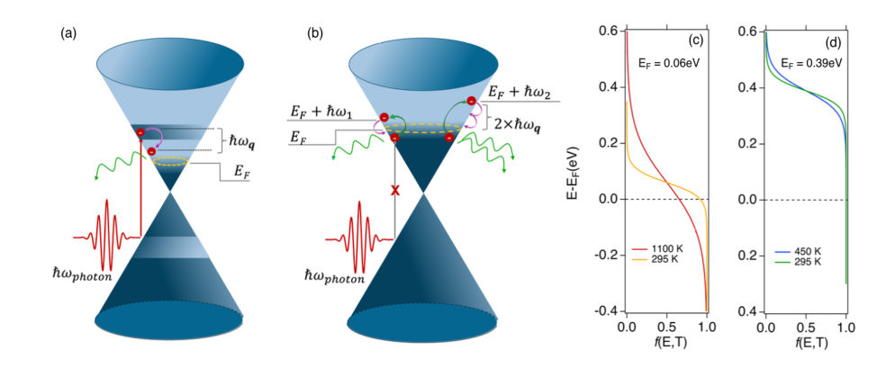 
Figure 4: Doping- and photon-energy-dependent carrier relaxation pathways in graphene. (a) Low-doping regime (EF = 0.06 eV), where Pauli blocking is absent and interband absorption is allowed. Photoexcitation with photon energies below the resonant window (ℏω &lt; 0.4 eV; red vertical arrow) generates electron-hole pairs. Carrier relaxation proceeds via emission of at most one optical phonon (ℏωOP ≈0.2 eV; purple curve) followed by decay into acoustic phonons (green wavy line), resulting in fast cooling on a few-picosecond timescale. b) High- doping regime (EF = 0.39 eV), where interband transitions are Pauli blocked for ℏω &lt; 0.4 eV and photoexcitation leads to intraband carrier heating (green...

📷 Fig 5

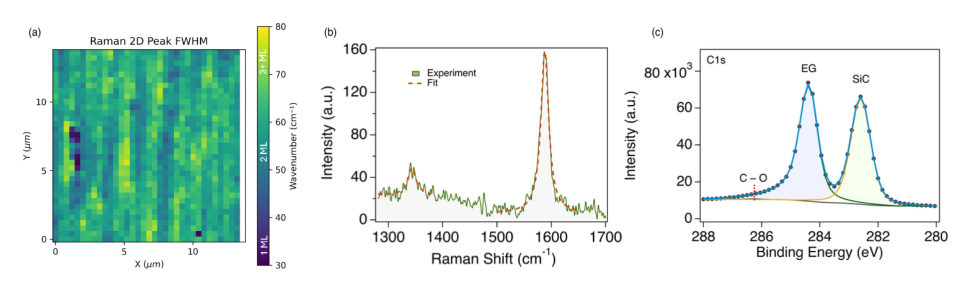 
Figure 5: Spectroscopic characterization of epitaxial graphene on 6H-SiC and CVD graphene on SiO2/Si. (a) Raman mapping based on the 2D-band linewidth of epitaxial graphene indicating that the film is predominantly bilayer graphene across the mapped region. (b) Raman spectrum of CVD monolayer graphene on SiO2/Si.(c) XPS C 1s core level spectrum of epitaxial graphene.

**Summary.** The researchers demonstrated that the cooling rate of hot carriers in graphene can be reversibly controlled by tuning the energy of the excitation light. This is achieved by triggering a resonant optical-phonon bottleneck that traps energy in the phonon system, providing a new way to engineer ultrafast energy flow in 2D materials.

**Why it may be interesting.** not directly relevant

Detailed structure

**Main problem.** Understanding and controlling the ultrafast hot-carrier relaxation dynamics in graphene, specifically identifying the mechanism behind an anomalous slowdown in carrier cooling at specific excitation energies.

**Main result.** The discovery of an energy-selective control mechanism where carrier lifetime increases by an order of magnitude (up to ~20 ps) within a narrow 0.42-0.48 eV window due to a resonant optical-phonon bottleneck.

**Method.** Mid-infrared pump-terahertz probe spectroscopy combined with an extended two-temperature model (TTM) to analyze energy exchange between electrons, optical phonons, and the lattice.

**Model / system.** The system consists of monolayer and bilayer graphene (CVD-grown on SiO2/Si and epitaxial on SiC). The theoretical framework is a three-subsystem energy-balance model involving the electronic system, a hot optical-phonon bath, and a thermal lattice reservoir.

**Key observables.** Carrier relaxation time (tau), photoinduced change in THz conductivity (delta sigma), and THz transmission change (delta T/T).

**Important parameters / regimes.** Excitation photon energy (0.22-0.73 eV), resonant window (0.42-0.48 eV), Fermi energy (0.06-0.39 eV), and optical-phonon lifetime.

**Assumptions / limitations.** The electronic system reaches a quasi-equilibrium Fermi-Dirac distribution on a sub-100 fs timescale before the probe pulse; the lattice temperature is assumed to be fixed at room temperature.

**Figures summary.** Fig 1 shows the THz pump-probe setup and waveforms; Fig 2 plots relaxation time vs. photon energy and time-resolved transmission; Fig 4 illustrates the three cooling regimes (low, resonant, and high energy); Fig 5 shows Raman and XPS characterization of the graphene samples.

**Paper structure.** The paper introduces the problem of carrier cooling, describes the experimental setup and material characterization, presents the discovery of the energy-dependent relaxation peak, develops a theoretical energy-balance model to explain the phonon bottleneck, and concludes with the implications for optoelectronic control.

Abstract

Understanding and controlling hot-carrier relaxation in graphene is crucial for advancing ultrafast optoelectronic and terahertz technologies. Here, we investigate carrier cooling dynamics in monolayer and bilayer graphene using mid-infrared pump pulses (0.22-0.73 eV) and terahertz probe pulses. We uncover a pronounced, reproducible, and non-monotonic dependence of the carrier relaxation time on excitation photon energy. Remarkably, within a narrow spectral window (0.42 to 0.48 eV), the carrier lifetime increases by an order of magnitude compared to a few picosecond-scale cooling observed at other energies. We show that this anomalous slowdown originates from a resonant enhancement of the optical-phonon lifetime, causing accumulation and reabsorption of hot optical phonons that suppress energy transfer to the lattice. All observed behaviors are captured within a unified carrier-phonon energy-balance framework, where excitation-energy-dependent variations of the effective optical-phonon decay pathway govern the cooling dynamics. These findings demonstrate excitation-energy-selective control of hot-carrier relaxation in graphene and provide new insight into non-equilibrium carrier-phonon interactions near the optical-phonon bottleneck.

[↑ back to top](#top)

### [Fröhlich-type Polarons in Isotopically Enriched Hexagonal Boron Nitride](http://arxiv.org/abs/2605.20428v1)

**Authors:** Ioannis Chatzakis, Timur Abdilov, Elliot Walker, Jaime Freitas, Song Liu, James H. Edgar  
**Type:** experiment · **Category:** other · **PDF:** <https://arxiv.org/pdf/2605.20428v1>  
**Analysis basis:** full PDF text, analyzed in chunks
**Topic relevance:** `quantum optics experiment` **2/5**

📷 Fig 1

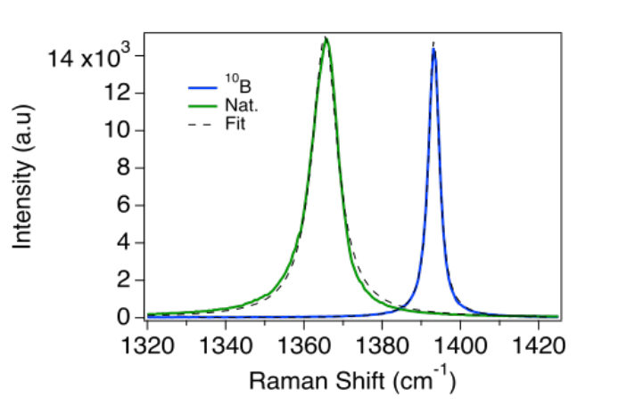 
Fig. 1 Raman spectrum for hexagonal boron nitride at 295 K. The green (natural) and blue (10B isotope enriched) lines are the experimental data, and the dashed lines are the fits with Lorentzian function. The peak positions are at 1365 𝑐𝑚−1 and 1393 𝑐𝑚−1 respectively.

📷 Fig 2

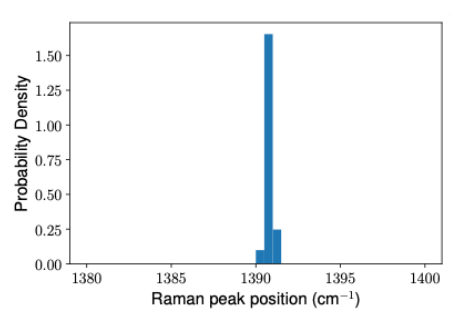 
Fig.2 (Left) Spatial Raman intensity map of the 𝐸2𝑔 mode of the 10B-enriched hBN crystal. The uniform contrast across the scanned region indicates high structural and isotopic homogeneity. (Right) Corresponding histogram of the Raman peak position extracted from the map, showing a narrow distribution centered at the characteristic phonon frequency. The small spread confirms the high spatial uniformity of the sample, which is essential for reliable quantitative analysis of exciton–phonon coupling.

📷 Fig 3

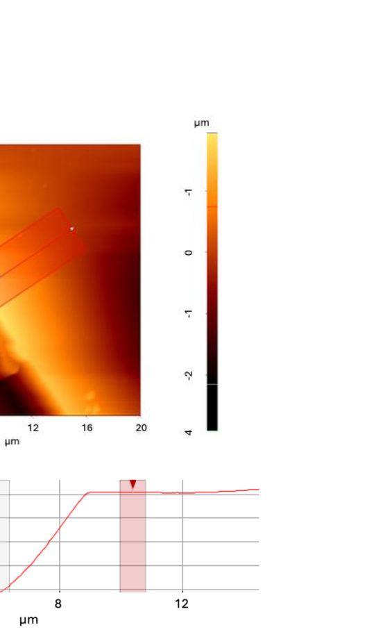 
Fig. 3 AFM image of the sample (top) and corresponding height profile (bottom) showing a thickness of ~4μm, confirming its three- dimensional character.

📷 Fig 4

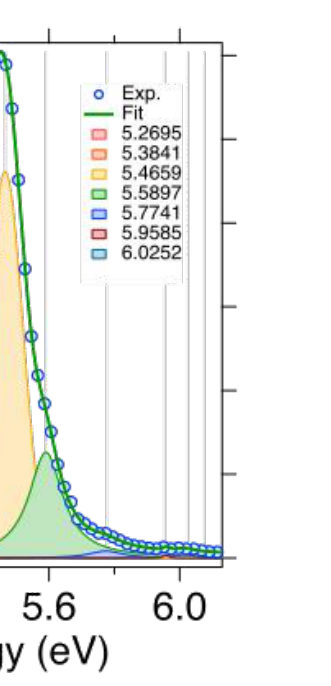 
Fig. 4 CL spectrum at 6 K. The large amplitude of the D series of lines in the ~ 5.2 to 5.77 eV range, compared to the peak amplitude above 5.8 eV, indicates the existence of structural defects. The positions of each emission band (in eV) are annotated with the corresponding colors.

📷 Fig 5

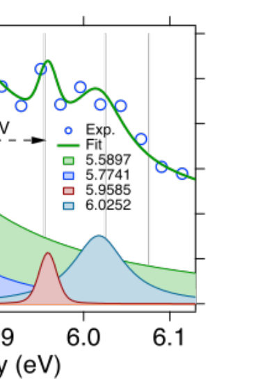 
Fig. 5 Expanded view of the high-energy region of Fig. 4. The green area highlights the transition located at ~5.56 eV. The brown color peak at ~ 5.95 eV corresponds to the indirect exciton, while its LO phonon mode replica, which appears at ~ 5.77 eV, is shown in blue. The transition at 6.02 eV is represented by the green-gray Lorentzian.

**Summary.** This paper demonstrates that enriching hBN with the lighter boron-10 isotope modifies the lattice dynamics and dielectric screening, leading to enhanced exciton binding energy and the formation of large Fröhlich-type polarons. By using cathodoluminescence, the researchers provide a quantitative measurement of exciton-phonon coupling strengths. This work establishes a foundation for engineering the optical and quantum properties of hBN through isotopic control.

**Why it may be interesting.** The study provides a direct quantitative characterization of how lattice engineering (isotopic substitution) can be used to tailor phonon-polaritonic and quantum-optical properties in 2D materials.

Detailed structure

**Main problem.** The quantitative determination of exciton-phonon interactions and the role of isotopic composition in defining the optical response of hexagonal boron nitride (hBN) remains incomplete.

**Main result.** The study reveals Fröhlich-type exciton-phonon coupling in boron-10-enriched hBN, demonstrating that isotopic engineering can increase exciton binding energy and enhance polaron formation.

**Method.** Low-temperature (6 K) cathodoluminescence (CL) spectroscopy was used to resolve exciton and phonon-replica peaks, complemented by Raman spectroscopy and AFM for structural characterization.

**Model / system.** The physical system is isotopically enriched (99.22 at% 10B) and natural-abundance hexagonal boron nitride (hBN), modeled using the Fröhlich interaction and Feynman's path-integral theory for polarons.

**Key observables.** Indirect exciton energy (5.95 eV), LO phonon replica detuning (184 meV), Fröhlich coupling constant (alpha), exciton binding energy, and phonon energy shifts.

**Important parameters / regimes.** Fröhlich coupling constant alpha = 0.159, exciton binding energy of 161 meV, polaron binding energy of ~48 meV, and exciton scattering time of ~97 fs.

**Assumptions / limitations.** The analysis assumes the validity of the Fröhlich interaction model for long-range coupling and uses the Kanaya et al. diffusion model for electron penetration depth.

**Figures summary.** Figure 1 shows Raman spectra comparing natural and 10B-enriched hBN; Figure 3 shows AFM thickness profiles; Figure 4 shows CL spectra with defect series; Figure 5 shows high-energy CL features; Figure 6 illustrates the phonon-mediated transition mechanism.

**Paper structure.** The paper begins with material synthesis and structural verification (Raman/AFM), proceeds to the identification of excitonic and defect-related spectral features via CL, and concludes with a quantitative analysis of exciton-phonon coupling and isotopic effects.

Abstract

Exciton-phonon interactions play a central role in defining the optical response of hexagonal boron nitride (hBN), yet their quantitative determination has remained incomplete. Here, we reveal the Fröhlich-type exciton-phonon coupling in boron-10-enriched hBN using low-temperature cathodoluminescence. We resolve the indirect exciton 5.95$\pm$0.02 eV together with its longitudinal optical (LO) phonon replica detuned by 184$\pm$56 meV, enabling the extraction of a Fröhlich coupling constant $α$=0.159 and a larger exciton binding energy of 161 meV, larger than previously reported values for natural-abundance hBN, which is attributed to isotope enrichment. The inferred polaron radius exceeds the lattice constant, indicating large-polaron behavior. We deduced an exciton scattering time ~of 97 fs, corresponding to a homogeneous linewidth of ~6.76 meV. We further obtain a polaron binding energy of ~48 meV and an effective mass of 1.045 $m_0$. These results provide a direct quantitative characterization of exciton-phonon coupling in isotopically engineered hBN and establish a foundation for tailoring its phonon-polaritonic and quantum-optical properties.

[↑ back to top](#top)

### [Probing Lattice Dynamics in Real-Space and Real-Time](http://arxiv.org/abs/2605.20631v1)

**Authors:** Navdeep Rana  
**Type:** both · **Category:** other · **PDF:** <https://arxiv.org/pdf/2605.20631v1>  
**Analysis basis:** full PDF text, analyzed in chunks
**Topic relevance:** `non-equilibrium dynamics` **2/5**

📷 Fig 1

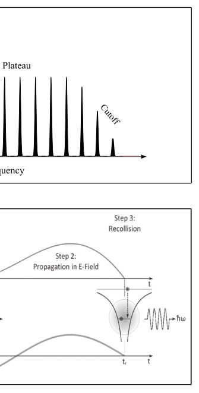 
Figure 1.1: (a) A representative high-harmonic spectrum from gaseous medium. (b) The three-step recollision mechanism of HHG from gases in real-space, adapted from Ref. (Thomson et al., 2013).

📷 Fig 2

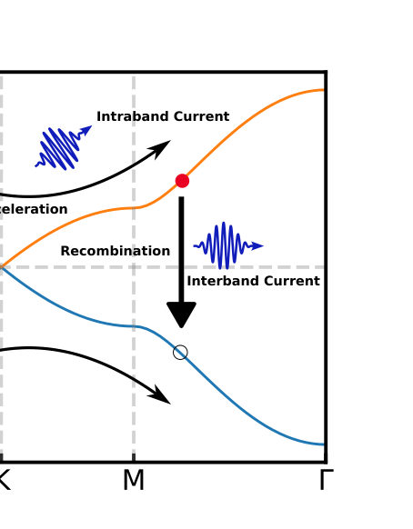 
Figure 1.2: The underlying mechanism of HHG in solids. The energy band structure of monolayer graphene along high-symmetry directions within two band picture in which the conduction (valence) band is shown by blue (orange) in momen- tum space.

📷 Fig 3

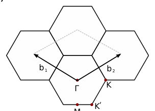 
Figure 2.1: Hexagonal honeycomb lattice structure of graphene. (a) Real-space structure of graphene with a1 and a2 as primitive lattice vectors. The A and B represent two non-equivalent atoms of graphene arranged in the honeycomb lattice. (b) Brillouin zone in the momentum space with Γ, M, K, and K′ as the high symmetry points.

📷 Fig 4

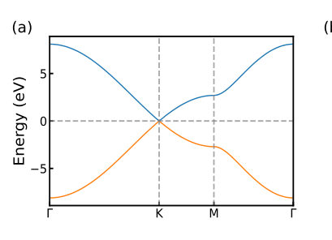 
Figure 2.2: Energy dispersion in graphene obtained by simulating the tight-binding Hamiltonian in Eq. (2.1.4). (a) Valence and conduction bands along the high-symmetry points in one dimension, and (b) energy band structure in three dimensional.

📷 Fig 5

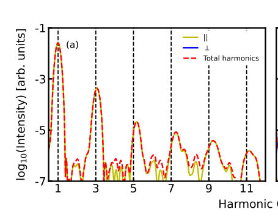 
Figure 2.3: High-harmonic spectra of monolayer graphene. (a) Red (blue) color corre- sponds to the polarization of emitted radiation parallel (perpendicular) to the polarization of the harmonic generating probe pulse. (b) Intra- and in- terband resolved high-harmonics.

**Summary.** This work explores using high-harmonic spectroscopy to sense the impact of lattice vibrations on electronic properties in solids like graphene. It also proposes a new method using inelastic scattering to image atomic-scale lattice dynamics in real-space and real-time.

**Why it may be interesting.** not directly relevant

Detailed structure

**Main problem.** The research aims to develop and validate methods for probing coherent lattice dynamics (phonons) in real-space and real-time, specifically investigating how these vibrations influence electronic responses in solids.

**Main result.** The study demonstrates that High-Harmonic Spectroscopy (HHS) can characterize phonon energy, polarization, and chirality via spectral sidebands, and shows that inelastic scattering techniques can serve as a viable alternative to time-resolved diffraction for imaging lattice dynamics.

**Method.** The work combines theoretical frameworks (tight-binding, DFT, and semiconductor-Bloch equations) with simulated and experimental comparisons involving High-Harmonic Spectroscopy (HHS) and inelastic scattering.

**Model / system.** The primary physical system is monolayer graphene, with secondary focus on silicon and germanium. Models include time-dependent tight-binding, dynamical matrix calculations, and Floquet Hamiltonians.

**Key observables.** High-harmonic spectra, sideband separation, phonon frequency, polarization, phase difference, chirality, dynamical structure factor, and response function.

**Important parameters / regimes.** Attosecond and femtosecond timescales, phonon frequency, atomic displacement amplitudes, and probe pulse polarization.

**Assumptions / limitations.** The study utilizes approximations such as the truncated expansion of band structure energy dispersion and the semiclassical three-step model for HHG.

**Figures summary.** Figures illustrate the HHG recollision mechanism, graphene band structures, phonon dispersion, high-harmonic spectra with sidebands, and real-space/time visualizations of lattice vibrations in silicon.

**Paper structure.** The thesis begins with the fundamentals of HHG in gases and solids, moves to the use of HHS to probe coherent phonon modes in graphene, and concludes with the development of inelastic scattering methods for 4D imaging of lattice dynamics.

Abstract

The coherent lattice vibrations significantly impact physical and chemical processes in solids, such as heat transfer, displacive phase transitions, and thermal conductivity. Thus, probing lattice dynamics in real-space and real-time is essential for understanding ubiquitous phenomena in solids. High-harmonic spectroscopy (HHS) has emerged as a preferred technique for investigating static and dynamic properties of solids on ultrafast timescales. Yet, despite these accomplishments, the applicability of HHS to probe the influence of coherent lattice vibrations on electronic responses has remained unexplored.   In this thesis, we explore the impact of coherent lattice dynamics on attosecond electronic responses in solids using HHS. We observe that coherent excitation of the in-plane phonon mode in graphene results in sidebands in the harmonic spectrum, separated by the frequency of the excited phonon mode. Additionally, we demonstrate the capability of HHS to characterize energy, polarization, phase difference, and the "chirality" of phonon modes. This thesis offers an avenue to probe phonon-driven processes in solids with sub-cycle temporal resolution.   In the later segment, our focus shifts toward probing coherent lattice dynamics in real-space and real-time. We demonstrate that inelastic scattering techniques, combined with theoretical analysis, yield comparable results to those from time-resolved diffraction and imaging measurements within pump-probe configurations. Our findings exhibit excellent agreement with results from a time-resolved diffuse x-ray scattering experiment. Our proposed method serves as an alternative to time-resolved diffraction and imaging methods for probing lattice dynamics in real-space and real-time with atomic-scale spatiotemporal resolution.

[↑ back to top](#top)

### [Pulse-Driven Reconfiguration of Fractional Polar Topology in Zr-Substituted Barium Titanate](http://arxiv.org/abs/2605.21368v1)

**Authors:** Florian Mayer  
**Type:** theory · **Category:** other · **PDF:** <https://arxiv.org/pdf/2605.21368v1>  
**Analysis basis:** full PDF text, analyzed in chunks
**Topic relevance:** `non-equilibrium dynamics` **2/5**

📷 Fig 1

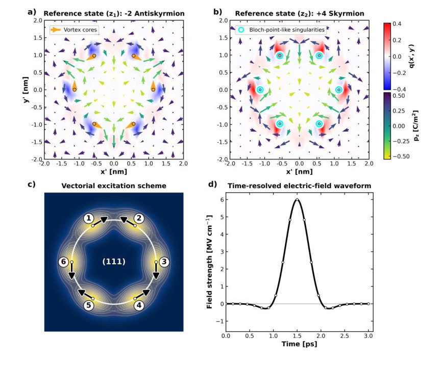 
Figure 1. Reference Q=−2/Q=+4 nanodomain texture and pulse-addressing protocol. (a) (111)-plane projection of the lower half of the doubled unit cell (z1), showing the Q=−2 antiskyrmionic slice with six localized −1/3 topological quarks. Orange vectors indicate the vortex-core dipoles. (b) Corresponding projection of the upper half (z2), showing the Q=+4 skyrmionic slice with six localized +2/3 topological quarks. Circled regions indicate Bloch-point-like singular conversion motifs. (c) Labeling of the six vortex cores used to define the binary pulse mask, together with a schematic of the tangential local excitation field. (d) Temporal profile of the electric-field pulse used for...

📷 Fig 2

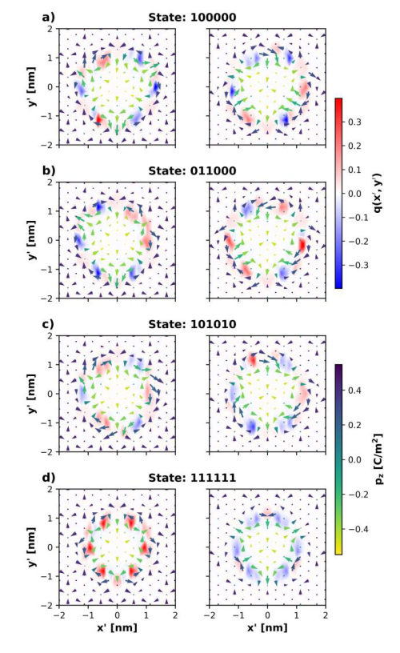 
Figure 2. Representative pulse-induced reconfiguration of the coupled topological nanodomain. Relaxed polarization fields and local topological charge densities in the two inequivalent (111) slices after application of selected pulse masks. Left and right panels show the lower (z1) and upper (z2) halves of the doubled unit cell, respectively. (a) Pulse mask 100000: excitation of vortex core 1. (b) Pulse mask 011000: simultaneous excitation of vortex cores 2 and 3. (c) Pulse mask 101010: simultaneous excitation of three alternating vortex cores. (d) Pulse mask 111111: complete inversion of the stacked Q=−2/Q=+4 texture into Q=+4/Q=−2.

📷 Fig 3

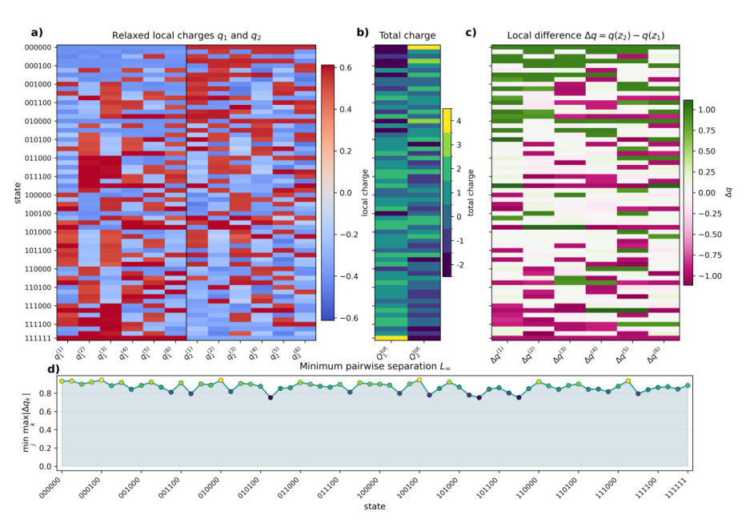 
Figure 3. Topological fingerprints of the full 26=64 pulse-mask set. (a) Sector-integrated local topological charges for all 64 pulse masks, including the 000000-reference state. The lower and upper (111) slices are represented by 𝑞1 (𝑛) and 𝑞2 (𝑛), respectively, with n=1, …,6. (b) Slice-integrated topological charges of the lower and upper halves of the doubled unit cell for all pulse masks. (c) Inter-slice sector-wise charge difference, 𝛥𝑞𝑛= 𝑞2 (𝑛) −𝑞1 (𝑛), for corresponding vortex positions. (d) Minimum 𝐿∞ distance of each state to its nearest neighbor among the 64 programmed states, demonstrating topological distinguishability of all programmed configurations.

📷 Fig 4

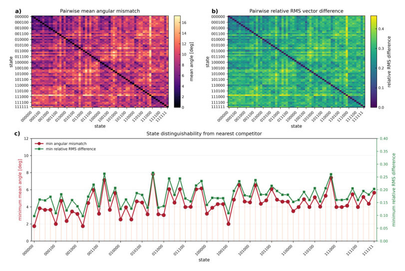 
Figure 4. Polarization-field distinguishability of the programmed states. All comparisons are based on time-averaged polarization fields obtained from the final 200 ps of the field-free relaxation and restricted to a cylindrical mask centered on the nanodomain axis. (a) Pairwise mean angular mismatch between all 64 programmed states. (b) Pairwise relative RMS vector difference between all 64 programmed states. (c) Minimum off-diagonal mean angular mismatch and minimum off- diagonal relative RMS vector difference for each state, quantifying worst-case structural distinguishability in polarization- field space.

**Summary.** This paper demonstrates through simulations that ultrafast electric pulses can reconfigure the fractional topological charge within a ferroelectric nanodomain. By applying specific pulse patterns to vortex cores, researchers can program the system into 64 distinct, stable, and distinguishable metastable states. This provides a computational foundation for using topological textures as a multi-state degree of freedom in future nano-electronic devices.

**Why it may be interesting.** not directly relevant

Detailed structure

**Main problem.** Investigating whether the internal fractional polar topology of a ferroelectric nanodomain can be actively and locally reconfigured using ultrafast electric-field pulses to serve as a programmable multistate degree of freedom.

**Main result.** All 64 possible pulse-mask configurations lead to distinct, stable, and distinguishable metastable topological configurations that persist for at least 1 ns in a cryogenic regime.

**Method.** Effective-Hamiltonian molecular-dynamics (EHMD) simulations using a first-principles-parameterized framework and a binary pulse-mask protocol.

**Model / system.** An ordered 12.5% Zr-substituted barium titanate (BT) nanodomain featuring a coupled Q = -2 antiskyrmionic and Q = +4 skyrmionic texture.

**Key observables.** Sector-resolved topological fingerprints, real-space polarization fields, local topological charge density, and pairwise mean angular mismatch.

**Important parameters / regimes.** Cryogenic temperature (10 K), picosecond pulse duration (0.45 ps), electric field amplitude (6 MV/cm), and nanodomain diameter (2.6 nm).

**Assumptions / limitations.** The study is a computational proof of concept performed in an idealized cryogenic setting and uses a simplified effective Hamiltonian approach rather than full atomistic complexity.

**Figures summary.** Figure 1 shows the nanodomain structure and topological quarks; Figure 3 displays topological charge fingerprints and inter-slice charge transfer; Figure 4 presents matrices of angular mismatch and RMS vector difference to demonstrate state distinguishability; Supplemental Figure S1 shows the potential-energy surface and switching path.

**Paper structure.** The paper defines the topological nanodomain structure, describes the pulse-driven switching mechanism and simulation protocol, quantifies the resulting 64 metastable states via topological and polarization metrics, analyzes the energetic barriers and thermal stability, and concludes with a proof of concept for topological reconfiguration.

Abstract

Polar topological textures in ferroelectrics can host internal structure beyond a single integer topological charge. Here, effective-Hamiltonian molecular-dynamics simulations are used to examine whether such internal fractional topology can be reconfigured by local electric excitation in ordered 12.5% Zr-substituted barium titanate. Chemical doubling along the polar axis stabilizes a coupled nanodomain texture consisting of alternating Q = -2 antiskyrmionic and Q = +4 skyrmionic slices, in which the local topological charge fragments into six -1/3 and six +2/3 localized contributions, denoted here as topological quarks, separated by Bloch-point-like singular conversion regions. Picosecond local electric-field pulses applied to selected vortex-core columns drive reconfiguration of the internal dipolar texture of a 2.6 nm nanodomain. Under a binary pulse-mask protocol addressing the six vortex cores, all 64 masks lead, within the chosen low-temperature simulation protocol, to distinct relaxed metastable configurations. The switching calculations are performed in a cryogenic regime, and the programmed states remain stable over at least 1 ns of field-free evolution on the simulation timescale. The resulting configurations are distinguishable both by sector-resolved topological fingerprints and by their real-space polarization fields. These results provide a computational proof of concept that fractional polar topology in a ferroelectric nanodomain can be locally reconfigured by ultrafast electric excitation and used as a multistate configurational degree of freedom in an idealized low-temperature setting.

[↑ back to top](#top)

### Other secondary papers (12)

Show other secondary papers

### [An AI-driven robotic system for two-dimensional hetero-assemblies](http://arxiv.org/abs/2605.20420v1)

**Authors:** Xiaoxi Li, Jinkun He, Haojie Liu, Xipeng Liu, Zewen Wu, Jing Li, Kai Zhao, Shan Li, Xingdan Sun, Xiaoxue Fan, Zhiren Xiong, Xingguang Wu, Xuanzhe Sha, Zhili Lin, Caixia Yang, Luosha Han, Jie Xu, Woye Pei, Kaining Yang, Jing Zhang, Xiaolong Feng, Tongyao Zhang, Zhu Liang, Kenji Watanabe, Takashi Taniguchi, Ming Tian, Neng Wan, Jing Zhang, Jianming Lu, Wenjing Hong, Zheng Vitto Han  
**Type:** experiment · **Category:** strongly correlated electrons · **PDF:** <https://arxiv.org/pdf/2605.20420v1>  
**Analysis basis:** full PDF text, analyzed in chunks

📷 Fig 1

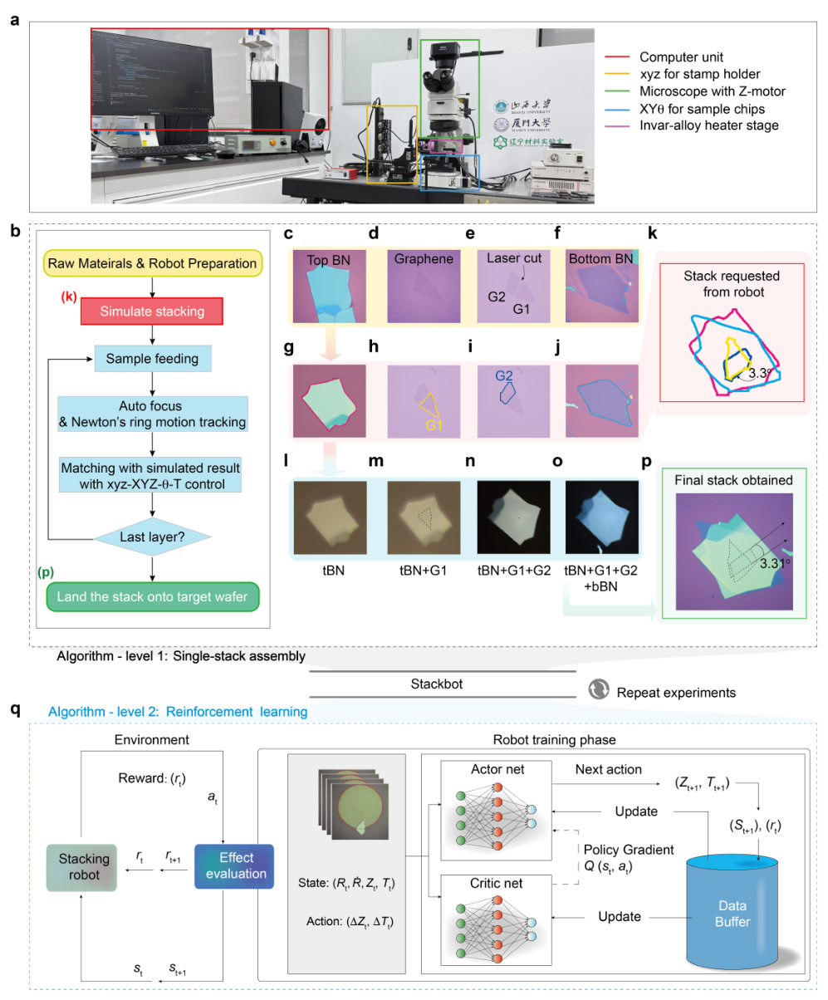 
Fig. 1 AI-assisted automation for the assembly of twistronic 2D materials. (a) Photograph showing the outfit of the general assembly of the machine. (b) Level-1 workflow for a single stack: the controller first simulates the target heterostructure from AI-recognized flake outlines (c-k). The system then performs auto-focus and Newton’s-ring tracking during approach (see Supplementary Video 1), while the PDMS stamp (xyz), the sample wafer stage (XYθ), the microscope focus (Z), and temperature (T) registers the live view to the simulated plan. The loop repeats layer-by-layer until completion (l-o), after which the stack is landed on the target wafer (p). (q) illustrates the so-called Level-2...

📷 Fig 2

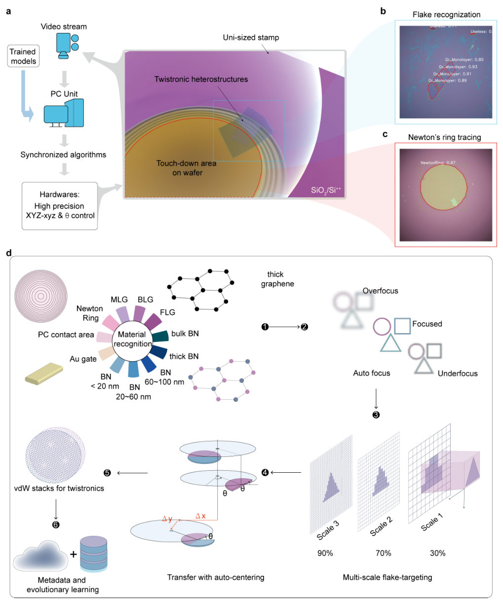 
Fig. 2 Pipelines of the synchronized algorithm and hardware in the stack-bot. (a) General view of the strategy of the stack-bot: machine-vision models are trained and fed to the program, while the algorithms drive hardware to execute multi-layered twistornic stacks as aimed The real-time monitoring of video stream is then sent back into the algorithm loop. Illustrations of (b) vdW flake recognition and (c) Newton’s ring tracing during the loop in (a). (d) Schematic of a pipeline of the detailed strategies applied in (a). First, material recognition of different vdW layered compound on SiO2 wafers are realized through the model training, and the auto-focus section tackles the visual tasks...

📷 Fig 3

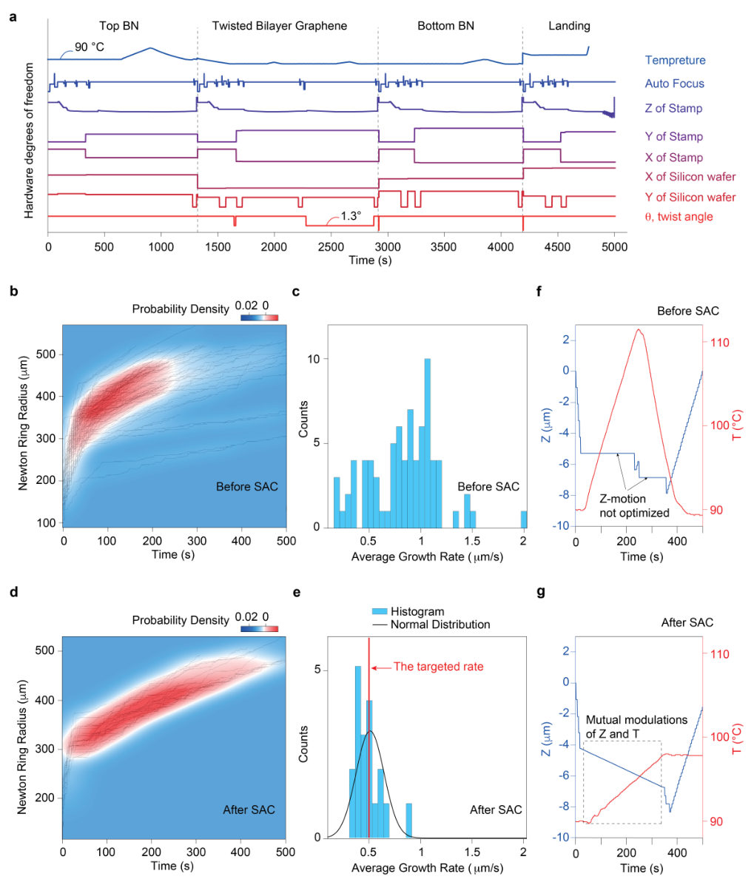 
Fig. 3 Reinforcement learning based on the metadata of vdW stacks. (a) Data logged in a single loop of stack assembly. All the XY-xyz-θ-Zoptical-T degrees of freedom are recorded along with the time axis, also accompanied with a video record in the metadata. (b) Probability density plotted for the Newton’s ring radius as a function of time, for a statistics of ∼70 stacks. After application of the secondary reinforcement learning (the SAC algorithm), the probability density of the Newton’s ring radius as a function of time are narrowly distributed in (c), with better control of the growth rate (i.e., the PDMS wavefront motion speed). Histogram of sample counts in their growth rates are...

📷 Fig 4

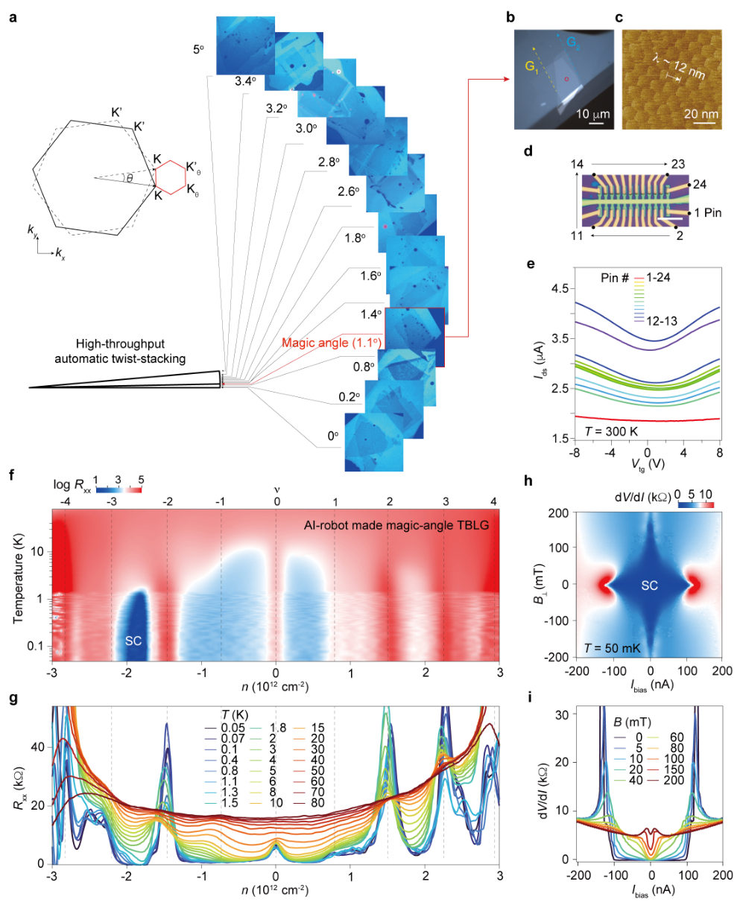 
Fig. 4 High-throughput fabrication of twistronic vdW heterostructures. (a) Demonstration of high-throughput auto-stacking of h-BN encapsulated TBLG over a span of twist angles from 0◦to 5◦. The inset shows the mini-Brillouin zone formed by the moiré superlattice. (b) Micrograph of a typical stack with a twist angle of 1.1◦, before encapsulation by the bottom h-BN. (c) The stack in (b) inspected by atomic force microscopy (AFM). The moiré pattern in real space has a wavelength of 12 nm, consistent with the expected value for 1.1◦. (d) Optical image of a typical device fabricated from the auto-assembled stack, with pin numbers marked. (e) Two-terminal field-effect curves measured across...

**Summary.** This paper presents an intelligent robotic system that automates the complex assembly of 2D van der Waals heterostructures using reinforcement learning. By achieving high-precision control over twist angles, the system successfully produced twisted bilayer graphene that exhibits magic-angle superconductivity. This technology enables high-throughput, scalable fabrication of moiré superlattices for studying emergent quantum phenomena.

**Why it may be interesting.** not directly relevant

Detailed structure

**Main problem.** The fabrication of 2D van der Waals twistronic heterostructures, such as twisted bilayer graphene, is currently a manual, low-throughput, and high-variability process that limits the exploration of moiré physics.

**Main result.** The development of an AI-driven robotic system that achieves high-precision, automated assembly of TBLG, successfully demonstrating unconventional superconductivity and correlated insulating states in robot-fabricated samples.

**Method.** An automated 'stack-bot' platform using a hierarchical computer-vision pipeline (YOLO and CRM) for flake recognition and a Soft Actor-Critic (SAC) reinforcement learning framework for self-optimizing motion and temperature control.

**Model / system.** An AI-driven robotic assembly system featuring 8 degrees of freedom (XY, xyz, theta, Z-optical, and Temperature) used to stack h-BN encapsulated twisted bilayer graphene (TBLG).

**Key observables.** Twist angle (theta), lateral displacement error, moiré wavelength, Newton's ring wavefront motion, longitudinal resistance (Rxx), and differential resistance (dV/dI).

**Important parameters / regimes.** Magic angle (~1.1 degrees), twist angle range (0 to 5 degrees), temperature (down to 50 mK), and magnetic field (up to 12 T).

**Assumptions / limitations.** The system assumes that the metadata from completed cycles (image residuals, drift, etc.) is sufficient for the reinforcement learning agent to optimize the assembly process.

**Figures summary.** Figure 1 shows the robotic system and the dual-level AI workflow; Figure 2 details the machine-vision and Newton's ring tracking pipeline; Figure 4 demonstrates high-throughput fabrication and the resulting electronic phase maps (superconductivity and insulating states); Extended Data figures provide statistical error distributions and algorithm details.

**Paper structure.** Introduction of the fabrication challenge, description of the robotic hardware and AI algorithms (Level-1 perception and Level-2 reinforcement learning), demonstration of high-precision assembly, physical validation via transport measurements in TBLG, and statistical analysis of fabrication accuracy.

Abstract

Nanomaterials stacked on-demand, such as rotationally assembled two-dimensional (2D) van der Waals (vdW) layered compounds, provides a versatile platform for quantum simulation and the exploration of exotic electronic phases. Currently, however, such nanoassemblies remain largely confined to inefficiency, manually operated process, limiting their potential for probing emergent physical phenomena. There is a pressing need in the field for high-precision, automated assembling techniques, especially for the scalable fabrication of 2D twistronic heterostructures. Here, we present an intelligent automation system dedicated to the fabrication of van der Waals stacks, following the state-of-the-art protocol for dry transfer of exfoliated 2D materials. The system further employs metadata generated from each automated stacking procedure to perform reinforcement learning, thereby continuously bettering its performances. As a concrete demonstration, we fabricate twisted bilayer graphene (TBLG) -- known for its challenging preparation -- and exhibit its unconventional superconductivity near the magic angle. Our work may pave the way for high-throughput fabrication of low-dimensional nanomaterials including twistronic heterostructures, where integrating data mining and artificial intelligence can accelerate the discovery of novel physical phenomena.

[↑ back to top](#top)

### [Designer Quantum States in Magnetic Topological Insulator Multilayers](http://arxiv.org/abs/2605.21287v1)

**Authors:** Deyi Zhuo, Han Tay, Cui-Zu Chang  
**Type:** both · **Category:** strongly correlated electrons · **PDF:** <https://arxiv.org/pdf/2605.21287v1>  
**Analysis basis:** full PDF text, analyzed in chunks

📷 Fig 1

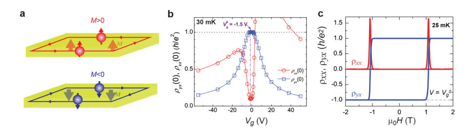 
Fig. 1| C = 1 QAH effect in uniformly Cr- and V-doped (Bi,Sb)2Te3 films. a, Schematic of a

📷 Fig 2

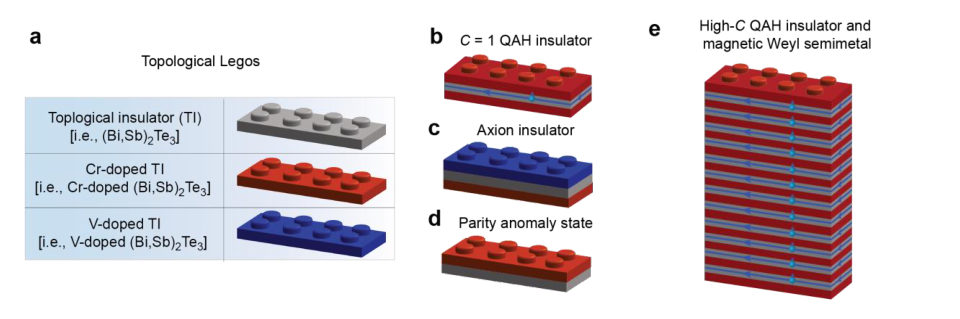 
Fig. 2| Topological Legos. a, Individual topological building blocks used to design quantum

📷 Fig 3

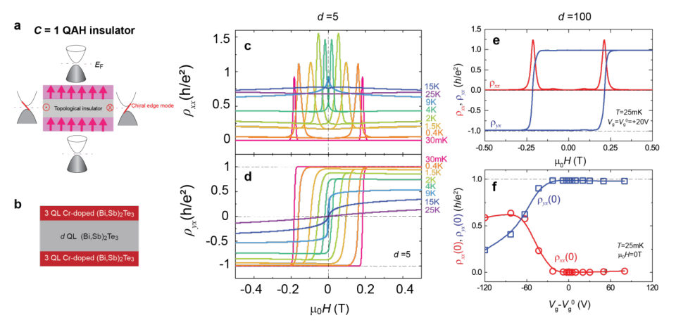 
Fig. 3| C = 1 QAH effect in magnetic TI trilayers. a, Schematic of a C = 1 QAH trilayer with a

📷 Fig 4

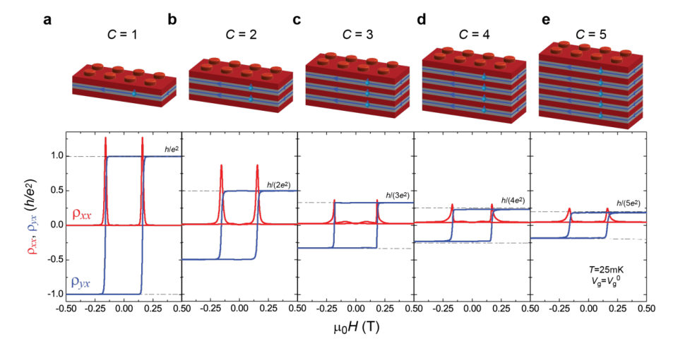 
Fig. 4| High-C QAH effect in magnetic TI multilayers. a-e, Top panels: Lego-style schematics

📷 Fig 5

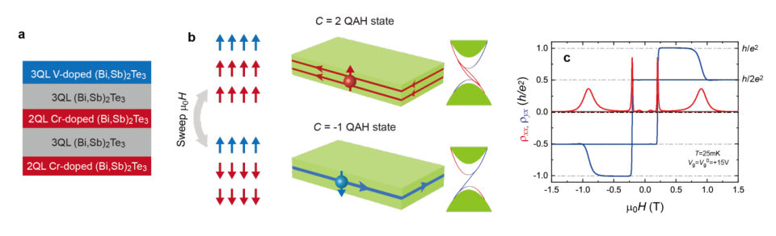 
Fig. 5| Engineering plateau phase transitions in magnetic TI multilayers. a, Side view of an

**Summary.** This review article details how magnetic topological insulator multilayers can be used as building blocks to design custom quantum states. By controlling layer thickness and magnetic doping, researchers can engineer complex phases like high-Chern-number insulators and axion insulators. This platform provides a versatile toolkit for studying topological magnetoelectric effects and 3D topological physics.

**Why it may be interesting.** not directly relevant

Detailed structure

**Main problem.** The challenge of engineering and controlling specific topological quantum states, such as high Chern number QAH states, axion insulators, and parity anomaly states, by manipulating the interplay between magnetism and topology.

**Main result.** The review demonstrates that magnetic TI multilayers act as 'topological Legos,' allowing for the precise engineering of designer quantum states, including high Chern number (C up to 5) states, axion insulators, and synthetic Weyl semimetals.

**Method.** The paper reviews experimental progress using Molecular Beam Epitaxy (MBE) for atomic-layer precision growth and transport measurements (Hall resistance and longitudinal resistance) to identify quantized states.

**Model / system.** Magnetic Topological Insulator (TI) multilayers and heterostructures, specifically using Cr-doped or V-doped (Bi,Sb)2Te3 layers combined with undoped (Bi,Sb)2Te3 layers as building blocks.

**Key observables.** Chern number (C), Hall resistance (rho_yx), longitudinal resistance (rho_xx), Hall conductance (sigma_xy), and magnetic exchange gaps.

**Important parameters / regimes.** Layer thickness (in Quintuple Layers), magnetic doping concentration, magnetization alignment (parallel vs. antiparallel), and interlayer coupling.

**Assumptions / limitations.** The review focuses on the regime of low temperatures (down to 25 mK) and assumes high-quality growth via MBE to minimize disorder.

**Figures summary.** Figure 1 shows the C=1 QAH effect in doped films; Figure 2 illustrates the 'Topological Legos' concept; Figure 3 details QAH in trilayers; Figure 4 shows high Chern number (C=1 to 5) engineering; Figure 5/6 covers phase transitions and SOT switching.

**Paper structure.** The paper begins with the realization of C=1 QAH effect, progresses to modulation-doped trilayers and high-C states, moves to mesoscopic devices and electrical switching, and concludes with the realization of axion insulators, parity anomaly states, and 3D topological phases.

Abstract

Magnetic topological insulators (TIs) provide a highly tunable platform for engineering quantum states that emerge from the interplay between topology and magnetism. In this review article, we summarize experimental progress over the past decade in designing magnetic TI multilayers by molecular beam epitaxy (MBE). By treating magnetically doped and undoped TI layers as topological Legos, we discuss how layer thickness, magnetic doping, heterostructure architecture, and stacking sequence can be used to control magnetic exchange gaps, interlayer coupling, and the Chern number C with atomic-layer precision. We first briefly review the realization of the C = 1 quantum anomalous Hall (QAH) effect in uniformly Cr-doped (Bi,Sb)2Te3 films in 2013 and uniformly V-doped (Bi,Sb)2Te3 films in 2015. We then discuss how Cr-doped and undoped (Bi,Sb)2Te3 layers can be combined to realize the C = 1 QAH effect in magnetically modulation-doped trilayers, including its extension into the three-dimensional (3D) regime. Next, we review the development of high-C QAH states, engineered plateau phase transitions, mesoscopic QAH devices, and electrical switching of chiral edge-current chirality. Finally, we discuss the realizations of axion insulator and C = 1/2 parity anomaly states in asymmetric magnetic TI trilayers. These advances establish magnetic TI multilayers as a versatile materials platform for creating new designer quantum states, including synthetic Weyl semimetal and QAH metal phases, and for probing the topological magnetoelectric effect in thick axion insulators and 3D QAH insulators.

[↑ back to top](#top)

### [Designing Magnetic Topological Insulator Trilayers for Highly-Efficient Spin-Orbit Torque Switching](http://arxiv.org/abs/2605.21297v1)

**Authors:** Ling-Jie Zhou, Deyi Zhuo, Han Tay, Zi-Jie Yan, Pu Xiao, Xiaoda Liu, Bomin Zhang, Cui-Zu Chang  
**Type:** experiment · **Category:** other · **PDF:** <https://arxiv.org/pdf/2605.21297v1>  
**Analysis basis:** full PDF text, analyzed in chunks

📷 Fig 1

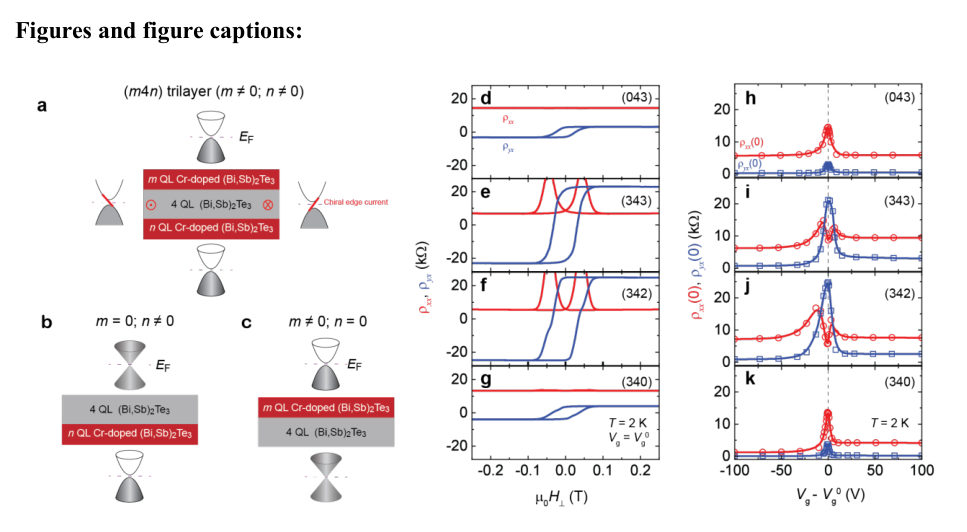 
Fig. 1| Transport results of magnetic TI (m4n) trilayers. a, Schematic of a (m4n) trilayer

📷 Fig 2

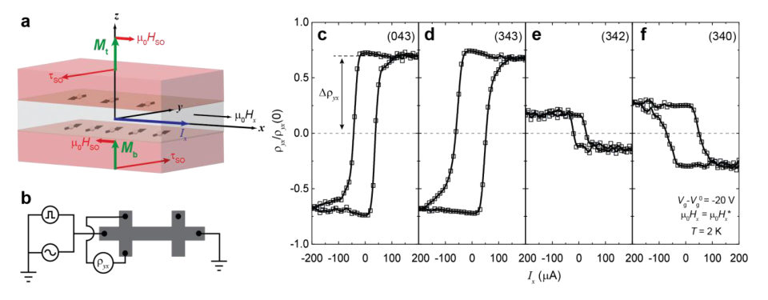 
Fig. 2| SOT switching in magnetic TI (m4n) trilayers. a, Schematic of SOT switching in a

📷 Fig 3

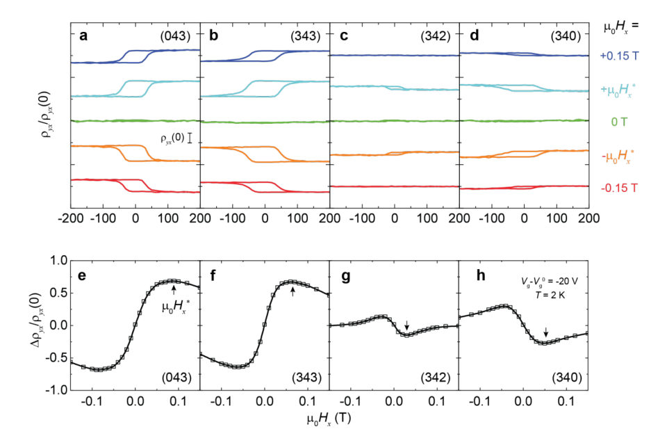 
Fig. 3| DC-pulse-induced SOT switching in magnetic TI (m4n) trilayers under different 0Hx.

📷 Fig 4

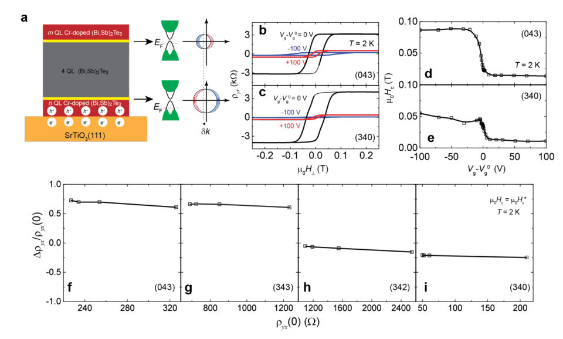 
Fig. 4| Origin of SOT switching in magnetic TI (m4n) trilayers. a, Left: Schematic of the

**Summary.** This paper demonstrates how to achieve efficient magnetization switching in magnetic topological insulator trilayers by leveraging substrate-induced chemical potential asymmetry. By controlling the heterostructure design and gating, the researchers show that the switching of edge current chirality in the Quantum Anomalous Hall state can be effectively manipulated. This work provides a pathway for developing energy-efficient spintronic logic and memory devices.

**Why it may be interesting.** not directly relevant

Detailed structure

**Main problem.** Understanding the mechanism behind Spin-Orbit Torque (SOT)-driven magnetization switching and the associated switching of edge current chirality in magnetic topological insulator trilayers.

**Main result.** The researchers identified that a substrate-induced charging effect from SrTiO3 creates an asymmetric chemical potential between the top and bottom layers, preventing SOT cancellation and enabling efficient magnetization reversal.

**Method.** Molecular Beam Epitaxy (MBE) was used to synthesize magnetic TI trilayers, followed by electrical transport measurements using DC current pulses and gate voltage tuning in a Physical Property Measurement System (PPMS).

**Model / system.** Magnetic topological insulator (mTI) trilayers consisting of Cr-doped (Bi,Sb)2Te3 layers separated by a 4 quintuple layer (QL) (Bi,Sb)2Te3 spacer, grown on heat-treated SrTiO3(111) substrates.

**Key observables.** Hall resistance (rho_yx), longitudinal resistance (rho_xx), Hall angle, and the normalized switching ratio (delta_rho_yx/rho_yx(0)).

**Important parameters / regimes.** Layer thicknesses (m, n), gate voltage (Vg), in-plane magnetic field (mu_0Hx), and chemical potential (Ef) asymmetry.

**Figures summary.** Fig 1 shows the trilayer/bilayer structure and transport results (rho_xx, rho_yx) vs magnetic field and gate voltage; Fig 2 illustrates the SOT switching process and the dependence of the switching ratio on pulse current.

**Paper structure.** The paper introduces the SOT switching problem in magnetic TIs, describes the MBE growth and device fabrication, presents transport measurements characterizing the QAH state, details the SOT switching experiments, and concludes with a mechanistic explanation based on substrate-induced chemical potential asymmetry.

Abstract

Spin-orbit torque (SOT) enables efficient electrical control of magnetization, offering a pathway towards low-power spintronic devices. Magnetic topological insulators (TIs), with spin-momentum-locked surface states and intrinsic ferromagnetism, provide a unique platform for realizing SOT switching of edge current chirality in quantum anomalous Hall (QAH) insulators. In this work, we employ molecular beam epitaxy to synthesize a series of magnetic TI trilayers with controlled layer thicknesses on heat-treated SrTiO3(111) substrates. Electrical transport measurements reveal that SOT-driven magnetization reversal and the associated switching of edge current chirality are governed by the SrTiO3(111) substrate-induced charging effect, which generates an asymmetric chemical-potential alignment between the top and bottom magnetic TI layers. Furthermore, we demonstrate that the switching polarity and efficiency can be tuned through heterostructure design, gate voltage, and in-plane magnetic field, consistent with SOT symmetry. These findings identify chemical potential asymmetry as the origin of the large SOT switching ratio in magnetic TI trilayers and establish a route for electrical control of edge current chirality in QAH insulators. This work advances the understanding of SOT switching mechanism in magnetic topological materials and paves the way for next-generation, energy-efficient QAH-based logic and memory devices.

[↑ back to top](#top)

### [Multiple Superconducting Phases in Palladium Deuteride Induced by Nuclear-Spin Isotope Effect](http://arxiv.org/abs/2605.20966v1)

**Authors:** Ryoma Kato, Ten-ichiro Yoshida, Riku Iimori, Masanobu Shiga, Yuji Inagaki, Takashi Kimura, Koichiro Ienaga, Tatsuya Kawae  
**Type:** experiment · **Category:** strongly correlated electrons · **PDF:** <https://arxiv.org/pdf/2605.20966v1>  
**Analysis basis:** full PDF text, analyzed in chunks

📷 Fig 1

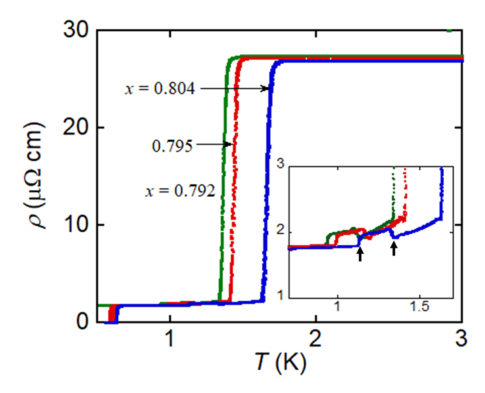 
FIG. 1: Temperature dependence of the resistivity in PdDx film for x = 0.792, 0.795, and 0.804. The inset shows the low-temperature behavior. A rectangular-shaped anomaly appears in the residual-resistivity region. For instance, TRL = 1.14 K and TRH = 1.36 K, as indicated by arrows, in PdD0.804.

📷 Fig 2

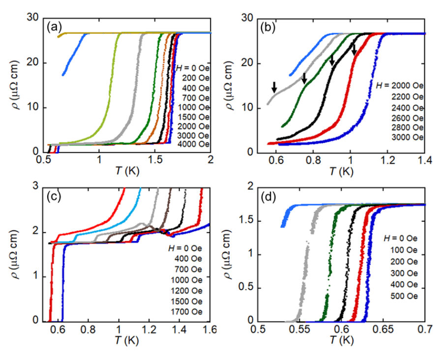 
FIG. 2: (a) The overall features for magnetic field dependence of the resistivity in the PdD0.804 film. The transition curve around Tc1 is broadened with increasing the magnetic field. (b) Magnetic field dependence of the resistivity between 2000 Oe and 3000 Oe, where magnetic fields are shown in increments of 200 Oe. A clear bend is visible at Tb in the temperature dependence of the resistivity, as indicated by arrows, between H = 2200 Oe and 2800 Oe. (c) Magnetic field dependence of the rectangular-shaped anomaly. (d) Magnetic field dependence of the resistivity around Tc2. A sharp drop in resistivity can be observed up to H = 400 Oe, whereas zero resistivity is no longer observed at 500...

📷 Fig 3

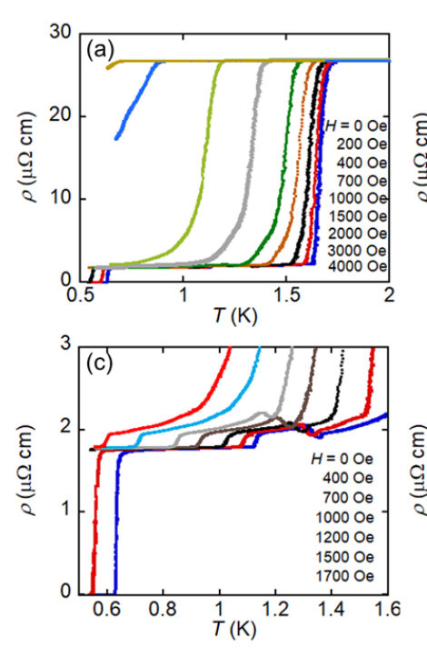 
Fig. 3(b) highlights the low-field region. Several anoma- lies are clearly observed in the ρ – H curves below T ∼1.0 K. At T ∼0.6 K, as the magnetic field increases, the resistivity rises steeply at H ∼500 Oe and reaches a nearly constant value of ∼1.76 µΩcm at HLC ∼610 Oe, which is consistent with the residual resistivity below the rectangular-shaped anomaly. Subsequently, the resistiv- ity remains nearly constant and then exhibits another sudden increase at HAL ∼1800 Oe. Notably, the magni- tude of this jump is ∼0.17 µΩcm, which is in good agree- ment with the resistivity drop at TRL associated with the rectangular-shaped anomaly. These observations suggest that the anomaly can be induced...

📷 Fig 4

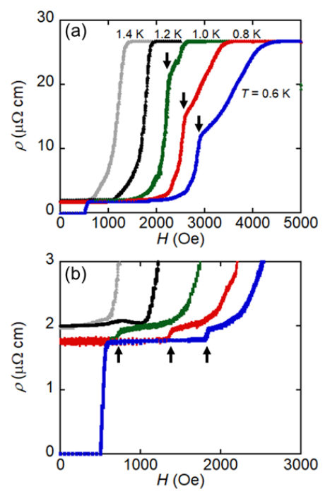 
FIG. 3: (a) An overview on the magnetic-field dependence of the resistivity at T ∼0.6 K, 0.8 K, 1.0 K, 1.2 K, and 1.4 K in the PdD0.804 film. A clear bend appears at HAH in the magnetic field dependence of the resistivity below the upper critical field, HUC, as indicated by arrows. (b) The low-field region is extended. The resistivity at T ∼0.6 K, 0.8 K, and 1.0 K increases sharply at HAL, as indicated by arrows, as the magnetic field increases.

📷 Fig 5

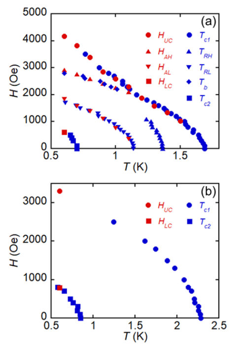 
FIG. 4: (a) The T - H phase diagram of the PdD0.804 film. and PdH0.870 film (b) [20]. The blue and red plots are ob- tained based on the ρ – T and ρ – H measurements.

**Summary.** This paper demonstrates that palladium deuteride exhibits multiple superconducting phases characterized by a unique resistivity anomaly, which is absent in palladium hydride. The researchers attribute this difference to the nuclear-spin isotope effect, suggesting that the superconducting order parameter in PdDx may have non-s-wave symmetry.

**Why it may be interesting.** not directly relevant

Detailed structure

**Main problem.** Investigating the origin of multiple superconducting phases in palladium deuteride (PdDx) and determining whether the difference from palladium hydride (PdHx) arises from mass-dependent tunneling or nuclear-spin isotope effects.

**Main result.** The study identifies a unique rectangular-shaped resistivity anomaly in PdDx that is absent in PdHx, concluding that the effect is driven by the nuclear-spin isotope effect (I=1 for D vs. I=1/2 for H) and suggesting non-s-wave pairing.

**Method.** The researchers used low-temperature absorption to prepare high-quality PdDx and PdHx thin films and performed temperature- and magnetic-field-dependent electrical resistivity measurements.

**Model / system.** The physical system consists of high-quality palladium deuteride (PdDx) and palladium hydride (PdHx) thin films where hydrogen/deuterium atoms occupy interstitial sites in the palladium lattice.

**Key observables.** Electrical resistivity (rho-T and rho-H), superconducting transition temperatures (Tc1, Tc2), and characteristic magnetic field values (HLC, HAL, HAH).

**Important parameters / regimes.** Nuclear spin (I=1 for deuterium, I=1/2 for hydrogen), deuterium concentration (x), and temperature/magnetic field ranges.

**Assumptions / limitations.** The authors assume the observed anomalies are intrinsic to the PdDx system rather than due to sample inhomogeneity or impurities.

**Figures summary.** Fig 1 shows resistivity-temperature curves highlighting the rectangular anomaly; Fig 3 shows resistivity-magnetic field dependence at various temperatures; Fig 4 presents the T-H phase diagrams comparing PdDx and PdHx.

**Paper structure.** The paper introduces the problem of multiple phases in PdDx, describes the experimental preparation of films, presents resistivity measurements showing the anomaly, compares PdDx to PdHx to isolate the nuclear-spin effect, and concludes with a theoretical hypothesis regarding non-s-wave pairing.

Abstract

We study the superconducting properties of high-quality PdD$_{x}$ films. The resistivity shows a sharp drop at $T$ $\sim$1.7 K, marking the superconducting transition. However, a finite resistivity persists and vanishes at $\sim$0.6 K. The temperature and magnetic-field dependences of the resistivity exhibit multiple anomalies within the superconducting state, revealing distinct superconducting phases. Such anomalies are absent in PdH$_{x}$ films. These results demonstrate a clear qualitative difference between the superconducting phase diagrams of PdD$_{x}$ and PdH$_{x}$, highlighting the role of nuclear-spin isotope effects.

[↑ back to top](#top)

### [Pressure-induced superconductivity in epitaxially-stabilized Pr$_3$Ni$_2$O$_7$ films](http://arxiv.org/abs/2605.20653v1)

**Authors:** Motoki Osada, Chieko Terakura, Hsiao-Yi Chen, Akiko Kikkawa, Masamichi Nakajima, Ryoma Asai, Jean-Baptiste Morée, Yusuke Nomura, Ryotaro Arita, Yoshinori Tokura, Atsushi Tsukazaki  
**Type:** both · **Category:** strongly correlated electrons · **PDF:** <https://arxiv.org/pdf/2605.20653v1>  
**Analysis basis:** full PDF text, analyzed in chunks

📷 Fig 1

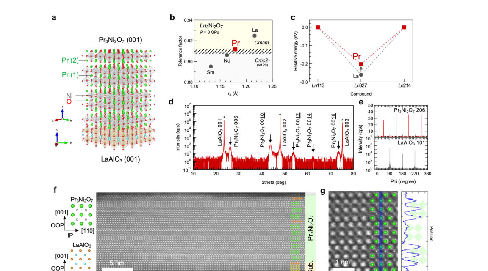 
Fig. 1| Epitaxial stabilization of Pr3Ni2O7 thin films. a, Crystal structure of Pr3Ni2O7 on LaAlO3. b, The modified tolerance factor for bilayer nickelates Ln3Ni2O7 plotted as a function of the A-site ionic radius rA,IX. Structural transition adapted from ref.29. c, Analysis of the relative stability of Ln3Ni2O7 (Ln = La, Pr) using Ln2NiO4 and LnNiO3 as reference systems. The DFT energy of Ln3Ni2O7 is compared to that of (1-x)Ln2NiO4 + xLnNiO3 at x = 0.5 (see Methods for details). d, X-ray 2theta-omega scan of ozone- annealed Pr3Ni2O7 thin film on LaAlO3 substrate. e, Phi scans of Pr3Ni2O7 206 and LaAlO3 101. f, High- angle annular dark-field (HAADF)-STEM image of Pr3Ni2O7 thin film on...

📷 Fig 2

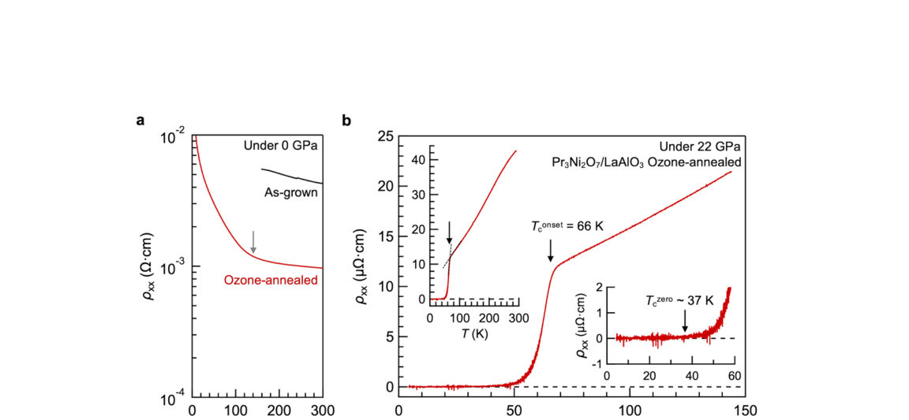 
Fig. 2 | Superconductivity of Pr3Ni2O7 films under high pressure and insulating behaviour at ambient pressure. a, Temperature dependence of resistivity for as-grown and ozone-annealed Pr3Ni2O7 films at ambient pressure. Arrow indicates a resistive kink. b, Temperature dependence of resistivity of ozone-annealed Pr3Ni2O7 film under 22 GPa. The left inset shows resistivity ranges up to 300 K. The two broken lines for estimation of the onset Tc. The right inset shows zero resistance at 37 K. Arrows indicate Tconset and Tczero.

📷 Fig 3

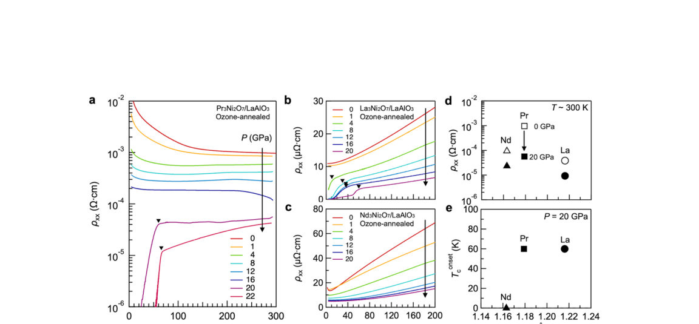 
Fig. 3 | Pressure-induced variations in temperature dependence of resistivity of ozone-annealed Ln3Ni2O7 films. Temperature dependent resistivity under various pressures for a, Pr3Ni2O7, b, La3Ni2O7, and c, Nd3Ni2O7 films on LaAlO3 substrate. d, resistivity changes of the Ln3Ni2O7 films for Ln = La, Pr, and Nd by applying 20 GPa at T = 300 K. e, Tc for Ln3Ni2O7 films under 20 GPa.

📷 Fig 4

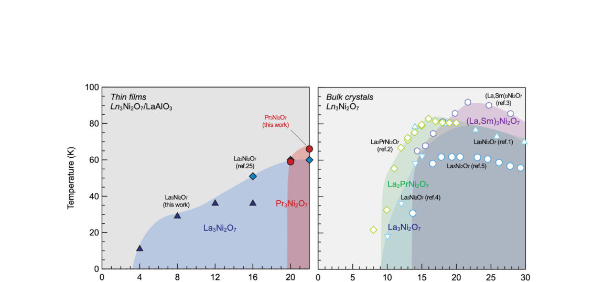 
Fig. 4 | T–P phase diagram of Ln3Ni2O7. T–P phase diagram for Ln3Ni2O7/LaAlO3 thin films (left) and Ln3Ni2O7 bulk crystals (right). (Left) Closed circles, triangles, and diamonds represent ozone-annealed Pr3Ni2O7/LaAlO3, La3Ni2O7/LaAlO3 thin films and as-grown La3Ni2O7/LaAlO3 thin films (ref.25), respectively. (Right) Open circles, upward and downward triangles, diamonds, hexagons indicate La3Ni2O7, La2PrNi2O7, and (La,Sm)3Ni2O7 bulk cystals (refs.1–5).

**Summary.** This paper demonstrates a method to stabilize otherwise unstable bilayer nickelates using epitaxial strain in thin films. It reports the discovery of pressure-induced superconductivity in Pr3Ni2O7 with a Tc of 66 K, providing a way to expand the family of high-Tc nickelates.

**Why it may be interesting.** not directly relevant

Detailed structure

**Main problem.** The difficulty of exploring new bilayer nickelates (Ln3Ni2O7) due to thermodynamic instability and the need to understand how lanthanide substitution and pressure influence superconductivity.

**Main result.** The researchers successfully used epitaxial stabilization to create Pr3Ni2O7 thin films, which exhibit pressure-induced superconductivity with an onset Tc of 66 K at 22 GPa.

**Method.** Thin films were grown via pulsed-laser deposition (PLD) on LaAlO3 substrates and subjected to ozone-annealing; structural characterization used XRD and STEM, while electronic properties were measured under high hydrostatic pressure up to 22 GPa.

**Model / system.** Epitaxially-stabilized Ln3Ni2O7 (where Ln = La, Pr, Nd) thin films, specifically focusing on the bilayer nickelate structure under high pressure and epitaxial strain.

**Key observables.** Superconducting transition temperature (T_c_onset and T_c_zero), temperature-dependent resistivity (rho_xx), and lattice parameters.

**Important parameters / regimes.** Pressure up to 22 GPa, lanthanide ionic radius, and epitaxial strain.

**Assumptions / limitations.** The use of DFT with the PBE functional and treating Pr 4f-orbitals as frozen core.

**Figures summary.** Fig 1: Epitaxial stabilization, crystal structure, and structural characterization (XRD, STEM). Fig 2: Resistivity vs temperature at ambient and high pressure. Fig 3: Comparison of resistivity changes across different lanthanide substitutions.

**Paper structure.** Introduction to nickelate instability, experimental methods for film growth and high-pressure transport, structural characterization and stability analysis, results of pressure-induced superconductivity, and a comparative discussion of lanthanide trends.

Abstract

The discovery of high critical-temperature $T_{\mathrm{c}}$ superconductivity in La$_3$Ni$_2$O$_7$ under high pressure has led to a rapid expansion of the $T_{\mathrm{c}}$ range through lanthanide $Ln$ substitution, and to ambient-pressure superconductivity in strained thin films, yet the exploration of new bilayer nickelates remains strongly constrained by thermodynamic stability. Beyond the difficulty of synthesis of bulk single-crystals, here we report on the pressure-induced high-$T_{\mathrm{c}}$ superconductivity in epitaxially-stabilized Pr$_3$Ni$_2$O$_7$ thin films. While the Pr$_3$Ni$_2$O$_7$ films exhibit insulating behaviour at ambient pressure regardless of ozone-annealing treatment, they show $T$-linear metallic transport and superconductivity reaching an onset $T_{\mathrm{c}}$ of 66 K and zero-resistance at nearly 40 K at 22 GPa. Furthermore, Nd$_3$Ni$_2$O$_7$, with the smaller rare-earth ion Nd, can also be stabilized, however, superconductivity is not observed in the measured pressure range. Epitaxial stabilization enables us to examine the dependence of $T_{\mathrm{c}}$ and the critical pressure $P_{\mathrm{c}}$ for superconductivity on the $Ln$ ion in $Ln_3$Ni$_2$O$_7$ ($Ln$ = La, Pr, Nd). These results suggest that a higher $P_{\mathrm{c}}$ is required for smaller $Ln$ ions, consistent with trends observed in bulk studies of $Ln$ substitution. This study demonstrates that epitaxial stabilization is a powerful technique to further expand the family of superconducting bilayer nickelates.

[↑ back to top](#top)

### [Probing topological phase transitions via nonlinear Hall response in strained moiré dice lattice](http://arxiv.org/abs/2605.21229v1)

**Authors:** Gourab Paul, Srijata Lahiri, Bilal Tanatar, Saurabh Basu  
**Type:** theory · **Category:** strongly correlated electrons · **PDF:** <https://arxiv.org/pdf/2605.21229v1>  
**Analysis basis:** full PDF text, analyzed in chunks

📷 Fig 1

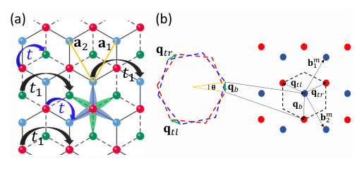 
FIG. 1. Schematic diagram of the monolayer dice lat- tice. (a) The blue, red, and green dots represent the A, B, and C sublattice atoms, respectively. The primitive lattice vectors are denoted by a1 and a2. The NN hopping am- plitude between A-B and B-C sublattice atoms is denoted by t, while the NNN hopping amplitude between A-A, B-B, and C-C subalattice sites is represented by t1. (b) Brillouin zones of the top and bottom layers of the TBDL, shown by blue and red dashed lines, respectively, rotated by a rela- tive twist angle θ with respect to each other. The corre- sponding moiré Brillouin zone (MBZ) is characterized by the

📷 Fig 2

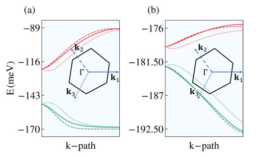 
FIG. 2. Band structures of TBDL at the magic angle in presence of a uniaxial strain Ep = 0.2%. Panel (a) presents the energy spectrum in the chiral limit of the system, while panel (b) shows the corresponding energy dispersions in the broken chiral symmetry regime (implemented by setting w1 = w2 = 60 meV), for the lowest band at the middle band edge and its nearest high energy band. The calculations are performed with ∆= 170 meV for panel (a) and ∆= 60 meV for panel (b). The energy dispersions along the three distinct C3 symmetric paths (Γ–M1, Γ–M2, and Γ–M3), represented by solid, dashed, and dotted blue lines, deviate from one another, indicating the breaking of C3 symmetry in the system....

📷 Fig 3

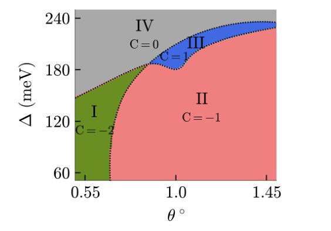 
FIG. 3. Chern number phase diagram for the lowest eigenstate of the middle sub-band. The figure shows emergent topological phases for the band index n = 162 of strained TBDL, as a function of the onsite mass ∆and the twist angle θ. The system has been strained weakly with the magnitude being E = 0.2%.

📷 Fig 4

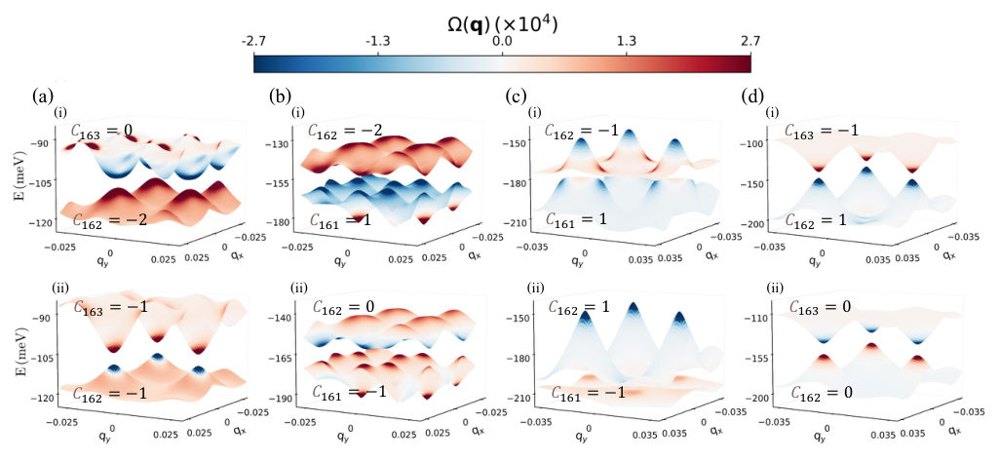 
FIG. 4. Changes in Berry curvature density across phase transition lines. The change in Berry curvature density across transitions lines from (a-i) Phase (I) →(a-ii) Phase (II), (b-i) Phase (I) →(b-ii) Phase (IV), (c-i) Phase (II) →(c-ii) Phase (III) and (d-i) Phase (III) →(d-ii) Phase (IV), corresponding to Fig. 3, has been shown. The analysis has been constrained mainly to the bands with index n = 161, 162 and 163, which reside at the edge of the middle sub-band. The reversal in the sign of Berry curvature density (across the vertical panels) at the band anti-crossing points correspond to the occurrence of band inversion due to gap closing. The system parameters for the different phases...

📷 Fig 5

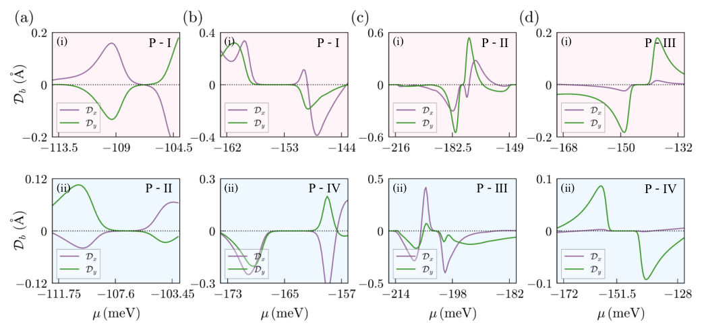 
FIG. 5. Reversal in the sign of BCD across topological phases. The rectangular components of BCD, namely Dx and Dy, flip their sign on transitioning from (a) Phase (I) →Phase (II), (b) Phase (I) →Phase (IV), (c) Phase (II) →Phase (III) and (d) Phase (III) →Phase (IV), as also represented in Fig. 4, thus making it an efficient probe to detect topological phase transitions in time reversal symmetric systems.

**Summary.** This paper demonstrates that the nonlinear Hall effect can be used to detect topological phase transitions in a twisted bilayer dice lattice where traditional Hall measurements fail due to time-reversal symmetry. By applying uniaxial strain, the researchers show that the Berry curvature dipole undergoes a sign reversal at phase boundaries, providing a clear experimental signature for band inversion.

**Why it may be interesting.** not directly relevant

Detailed structure

**Main problem.** Detecting and enumerating valley-specific topological phases in systems where time-reversal symmetry is preserved, which renders the conventional linear Hall effect ineffective.

**Main result.** The nonlinear Hall effect (NLHE) serves as an effective probe for topological phase transitions, exhibiting a characteristic sign reversal across phase boundaries and significant enhancement in the broken chiral symmetry regime.

**Method.** Numerical simulation using a continuum model based on the Bistritzer-MacDonald formalism to compute Berry curvature density, Chern numbers, and the Berry curvature dipole (BCD).

**Model / system.** A twisted bilayer dice lattice (TBDL) under applied uniaxial strain, modeled via a continuum Hamiltonian that includes interlayer hopping and broken symmetries (C3 and inversion).

**Key observables.** Nonlinear Hall response (NLHE), Berry curvature dipole (BCD) components (Dx, Dy), Chern number, and Berry curvature density.

**Important parameters / regimes.** Twist angle (theta), uniaxial strain (epsilon), staggered/onsite mass (Delta), carrier density (mu), and chiral symmetry regimes.

**Assumptions / limitations.** Neglect of spin-orbit coupling and specific assumptions regarding interlayer hopping hierarchy.

**Figures summary.** Fig 1: Schematic of dice lattice and moire Brillouin zone; Fig 2: Band structures under strain; Fig 3: Chern number phase diagram; Fig 4: Berry curvature density changes across phase transitions.

**Paper structure.** The paper introduces the problem of detecting topology in TRS systems, describes the strained TBDL model and symmetry breaking, presents numerical results for band structures and Chern phases, and demonstrates the NLHE as a diagnostic tool via BCD analysis.

Abstract

Valley polarized twisted bilayer dice lattice hosts topologically nontrivial flat bands far from charge neutrality due to broken time reversal symmetry, whereas the ones in the vicinity of it remain topologically trivial. However, when both valleys are taken into consideration, the time reversal symmetry is preserved, which poses a serious hindrance to enumerate the valley specific topological phases that rely on the detection of the Berry curvature. In this work, we demonstrate that such a twisted structure with an applied uniaxial strain exhibits a nonlinear Hall effect far from charge neutrality. We ascertain that the nonlinear anomalous Hall signals can serve as a probe for topological phase transitions associated with a specific energy state that is constrained to reside at the lower edge of the middle subband and controlled via a staggered mass. Specifically, we show that the nonlinear anomalous Hall response undergoes a sign reversal across the topological phase boundaries. By tuning the carrier density, we compute the nonlinear Hall response obtained from the Berry curvature dipole, both in the chiral limit, and also when the chiral symmetry is broken. It is further seen that the nonlinear Hall effect is significantly enhanced in the broken chiral symmetry regime.

[↑ back to top](#top)

### [Properties of the skyrmion crystal SkX-2 in the Heisenberg triangular lattice with scalar chirality](http://arxiv.org/abs/2605.21010v1)

**Authors:** H. Bocquet, C. J. Ganahl, M. Scheurer, P. M. Derlet, A. M. Läuchli  
**Type:** theory · **Category:** statistical mechanics · **PDF:** <https://arxiv.org/pdf/2605.21010v1>  
**Analysis basis:** full PDF text, analyzed in chunks

📷 Fig 1

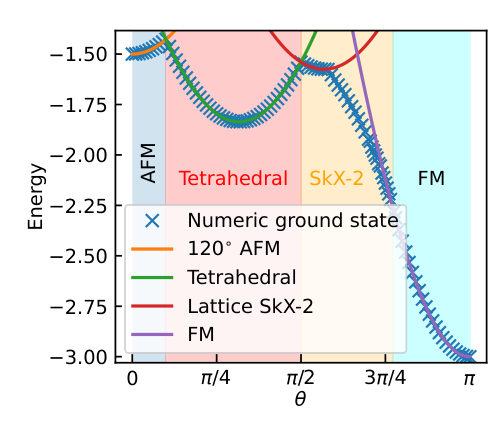 
FIG. 1. Ground-state energies per spin of the Hamiltonian in Eq. 1 as a function of θ = arctan(Jχ/J). The solid lines rep- resent analytical ground-state energy curves, and crosses are the numerical values obtained using a basin hopping proce- dure for a doubly periodic triangular spin lattices of various sizes (between 6 × 6 and 36 × 36 spins) to limit boundary effects (only minimal energy is provided). The background colors mark different phases, where the SkX-2 region contains both, the lattice SkX-2 and the free SkX-2.

📷 Fig 2

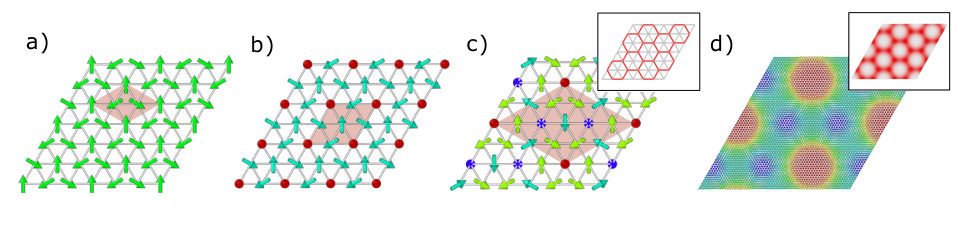 
FIG. 2. Schematic view of the spins for a) the 120° order, b) the tetrahedral order, c) the lattice SkX-2 and d) the free SkX-2 (q ≈0.002/a2). The magnetic unit cells are highlighted by the pink quadrilateres. The inset in panel c) describes the nearest neighbour bonds Si · Sj in the lattice SkX-2 – grey (red) is (anti-)ferromagnetic. This demonstrates the lattice symmetry breaking of the lattice SkX-2. The inset in panel d) shows the distribution of charge density according to Eq. 7 — red (white) corresponds to a positive (absence of) charge density. The charge is not localized about different centers like in SkX-1. Nevertheless, every white center lacking charge comes along with half a...

📷 Fig 3

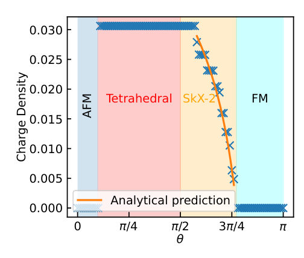 
FIG. 3. Topological charge density q as a function of θ for the ground state, whose energy is given in Fig. 2. The orange line corresponds to the charge density that minimizes the energy in the analytical model, as given by Eq. 12.

📷 Fig 4

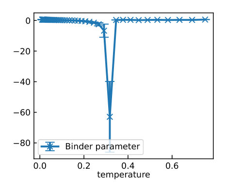 
FIG. 4. Binder parameter for the lattice SkX-2 order param- eter on the 240×240-spins triangular lattice for θ = 51π/100.

📷 Fig 5

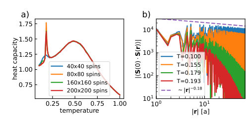 
FIG. 5. a) Heat capacity as a function of temperature for dif- ferent system sizes at θ = 1.96. The sharp peak that does not diverge with systems size at T = 0.17 indicates the presence of a distinct continuous feature. b) Spin-spin correlation func- tion at θ = 1.96 for different temperatures. The data up to a separation distance |r| = 70a indicates a change of behaviour from exponential to power law at T ≈0.17, suggesting the appearance of quasi-long range order persisting at least down to T = 0.10.

**Summary.** This paper explores a new type of skyrmion crystal (SkX-2) that is stabilized by scalar chirality rather than an external magnetic field. It details how this phase transitions between different types of order and how its melting is driven by the unbinding of topological defects. The work provides a complete picture of the phase diagram and thermal stability of these textures on a triangular lattice.

**Why it may be interesting.** The paper explores topological phase transitions (KTHNY and Z2-vortex unbinding) and the emergence of complex topological textures in a highly symmetric model, which is relevant to the study of many-body dynamics and topological order.

Detailed structure

**Main problem.** The study investigates the stability, phase transitions, and thermal properties of a specific type of skyrmion crystal, SkX-2, in a magnetic system without an external magnetic field.

**Main result.** The researchers identify a SkX-2 phase with two topological charges per unit cell and demonstrate that it undergoes a first-order transition in the lattice regime and a continuous KTHNY-type transition to a floating solid in the free regime.

**Method.** The study combines numerical optimization (basin hopping), Monte Carlo simulations (with replica exchange), and analytical approaches including Ginzburg-Landau theory and continuum expansion.

**Model / system.** A classical SO(3)-symmetric Heisenberg model on a triangular lattice, augmented with a scalar chirality interaction term.

**Key observables.** Topological charge density, magnetization, heat capacity, Binder cumulant, spin-spin correlation functions, and defect density (5-fold, 7-fold, etc.).

**Important parameters / regimes.** Exchange interaction (J), scalar chirality interaction (J_chi), and the parameter theta = arctan(J_chi/J).

**Assumptions / limitations.** The analysis assumes a classical spin model and uses a continuum expansion for the energy density and vortex energy derivations.

**Figures summary.** Figure 1 shows ground-state energies vs. theta; Figure 2 illustrates various spin configurations (AFM, tetrahedral, SkX-2, FM); Figure 4 shows the Binder parameter dip; Figure 5 shows heat capacity peaks; Figure 7 shows vortex energy scaling.

**Paper structure.** The paper begins with the identification of the SkX-2 ground state and its energy landscape, moves to the evolution of topological charge density via continuum expansion, then explores thermal phase transitions and defect-driven melting using Monte Carlo simulations, and concludes with analytical derivations of vortex energy.

Abstract

Skyrmion crystals have been primarily discovered under a magnetic field for materials with non-centrosymmetric interactions. More recent developments have investigated the stability of skyrmion crystals in itinerant magnets without magnetic field. In this study, we find that a type of skyrmion crystal with two topological charges per unit cell and no magnetization at the ferromagnetic point in reciprocal space, SkX-2, is naturally stabilized in an $SO(3)$-symmetric model with short-range interactions realized by the Heisenberg model on the triangular lattice with scalar chirality. We complement our numerical results with a theoretical analysis that quantitatively describes the transition from the ferromagnetic ground state to the SkX-2 and the evolution of the topological charge density. Despite the constraints given by the Mermin-Wagner theorem at finite temperature, the SkX-2 exhibits both a first-order phase transition associated with translation symmetry breaking and a continuous transition to a floating solid, depending on the charge density controlled by the model parameters. Finally, the tetrahedral phase supported by an antiferromagnetic interaction in our model is found to host $\mathbb{Z}_2$-vortices at finite temperature, suggesting the existence of an additional vortex topological transition.

[↑ back to top](#top)

### [Shear-Mode Raman Imaging of Ferroelectric Switching in Multilayer 3$R$-MoS$_2$](http://arxiv.org/abs/2605.21210v1)

**Authors:** Yulu Liu, Kenji Watanabe, Takashi Taniguchi, Xiaoxiang Xi  
**Type:** experiment · **Category:** other · **PDF:** <https://arxiv.org/pdf/2605.21210v1>  
**Analysis basis:** full PDF text, analyzed in chunks

📷 Fig 1

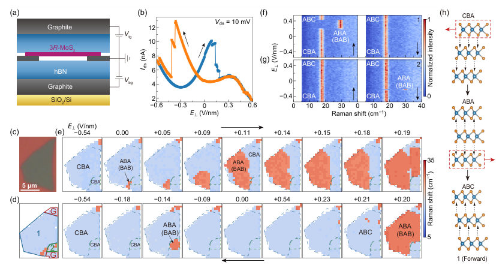 
FIG. 2. (a) Schematic of the dual-gate device. Positive electric field points in the upward direction. (b) Electric-field dependence of the source-drain current in a trilayer device. (c) Optical micrograph of the trilayer flake used in Device D35. (d) The corresponding Raman map of the frequency of the most intense shear mode branch, showing the initial domain distribution, with distinct regions labeled. (e) Raman maps showing the evolution of the domain distribution under a sequence of electric fields. (f),(g) Electric-field-dependent Raman spectra acquired at representative spots in Region 1 (f) and Region 2 (g). Arrows in (b) and (e)–(g) indicate the field-sweep direction. (h)...

📷 Fig 2

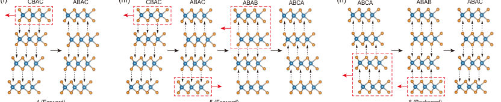 
FIG. 3. (a) Optical micrograph of the multilayer flake used in Device D34. (b) Raman map revealing thickness and initial domain distribution. (c) Raman maps showing the evolution of the domain distribution under a sequence of electric fields. (d)–(i) Electric-field-dependent Raman spectra acquired at representative spots in Regions 1–6, as marked in (c). (j),(k) Corresponding electric-field-dependent reflection-contrast spectra for Regions 2 and 3. Arrows in (c)–(k) indicate the field- sweep direction. (l)–(n) Illustrations of the switching pathway for Regions 4–6 in the forward or backward scan.

📷 Fig 3

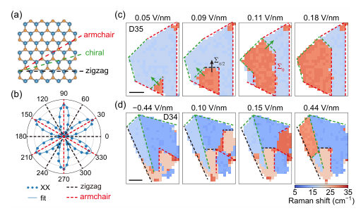 
FIG. 4. (a) Illustration of special directions in the MoS2 lattice. (b) Polarization-angle-dependent SHG intensity for a trilayer in the parallel configuration. The solid line fits I(θ) = I0 sin2(3θ), where θ is measured from the zigzag direc- tion. (c),(d) Raman maps in the forward scan for Devices D35 (c) and D34 (d), selected from Figs. 2 and 3, respectively. Scale bars: 3 µm. Sample edges, internal-segment bound- aries, and DWs are annotated using the line styles defined in (a). Arrows in (c) indicate domain expansion.

**Summary.** This paper uses Raman imaging to visualize how ferroelectric domains switch in 3R-MoS2 via interlayer sliding. It demonstrates that structural defects and boundaries act as pinning sites that control the pathways and stability of different stacking states. The work provides a non-invasive way to study the dynamics of domain walls in 2D sliding ferroelectrics.

**Why it may be interesting.** not directly relevant

Detailed structure

**Main problem.** Understanding the microscopic mechanism of ferroelectric switching in 3R-MoS2, specifically how domain walls and pinning sites influence interlayer sliding and polarization reversal.

**Main result.** The study establishes shear-mode Raman imaging as a tool to track switching, revealing that mechanical boundaries and pinning sites cause independent switching in different regions and create partially polarized end states.

**Method.** Shear-mode Raman spectroscopy and spatial mapping are used alongside second-harmonic generation (SHG) and dual-gate field-effect transistor measurements.

**Model / system.** Multilayer 3R-MoS2 (rhombohedral stacking) in a dual-gate field-effect transistor architecture, acting as a sliding ferroelectric.

**Key observables.** Shear-mode Raman frequency and intensity, source-drain current (Ids) hysteresis, and second-harmonic generation (SHG) orientations.

**Important parameters / regimes.** Vertical electric field (E_perp), domain wall orientations (zigzag, armchair, and chiral), and switching regimes (superlubric vs. pinned).

**Assumptions / limitations.** The Raman measurement timescale is much slower than the superlubric regime DW velocity, making intermediate states invisible in that regime.

**Figures summary.** Fig 1 shows Raman maps and stacking schematics; Fig 2 illustrates the device, current hysteresis, and Raman-detected domain evolution; Fig 3 and 4 detail domain wall orientations and the impact of structural steps.

**Paper structure.** The paper introduces the 3R-MoS2 system, describes the Raman imaging technique, presents experimental evidence of domain-dependent switching pathways, analyzes the role of structural boundaries and pinning, and concludes with the utility of Raman spectroscopy for studying sliding ferroelectrics.

Abstract

We use shear-mode Raman imaging to track ferroelectric switching in multilayer 3$R$-MoS$_2$. Within a single flake, mechanically segmented regions respond independently and follow distinct pathways. Partially polarized end states indicate that domain walls can reside between selected layer pairs, producing partial stacking transformations. The dwell time of intermediate states varies widely, indicating that pinning sites strongly influence the dynamics. Second-harmonic generation measurements further reveal three characteristic sample-boundary and domain-wall orientations, including a prevalent chiral direction near the zigzag-armchair bisector. These results provide a direct, noninvasive view of domain-wall-mediated switching in a prototypical sliding ferroelectric and identify pinning and exfoliation-created boundaries as key factors governing its dynamics.

[↑ back to top](#top)

### [Superconducting PdTe Thin Film Via Topotactic Transformation, Toward Topological Superconductors](http://arxiv.org/abs/2605.20437v1)

**Authors:** Hee Taek Yi, Min Ge, Renjie Xie, Colby J. Stoddard, David H. Yi, Xiaoyu Yuan, Xiong Yao, Seongshik Oh  
**Type:** experiment · **Category:** strongly correlated electrons · **PDF:** <https://arxiv.org/pdf/2605.20437v1>  
**Analysis basis:** full PDF text, analyzed in chunks

📷 Fig 1

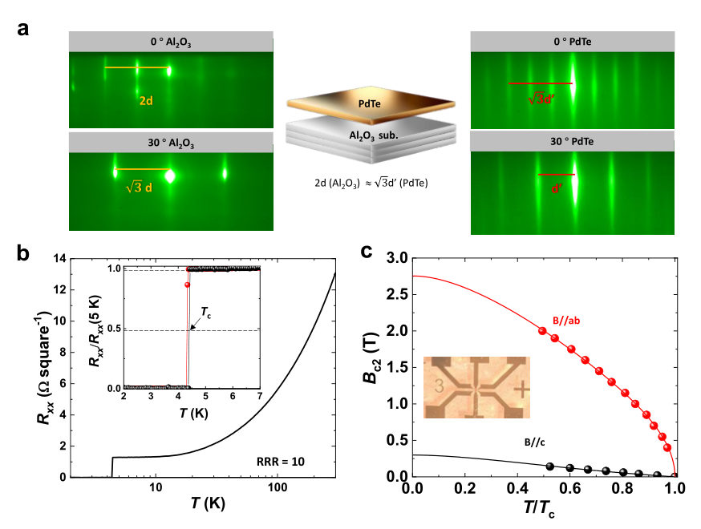 
Figure 1. RHEED and transport properties of a PdTe film. (a) RHEED patterns along two high-symmetry directions for a 40 nm-thick PdTe film (right panels) and an Al2O3 substrate (left panels). A lattice match is observed between 2d and √3d’ (see Figure S1, Supporting Information). (b) semi-log plot of the temperature-dependent longitudinal sheet resistance, Rxx, of a PdTe film. The inset shows an enlarged graph of the normalized Rxx versus temperature, measured on a 10 × 10 mm2 sample using the van der Pauw geometry. The dashed line indicates half the normal state resistance. Red symbols and line represent the remeasured Rxx(T) after 3 months of air exposure. (c) Upper critical fields...

📷 Fig 2

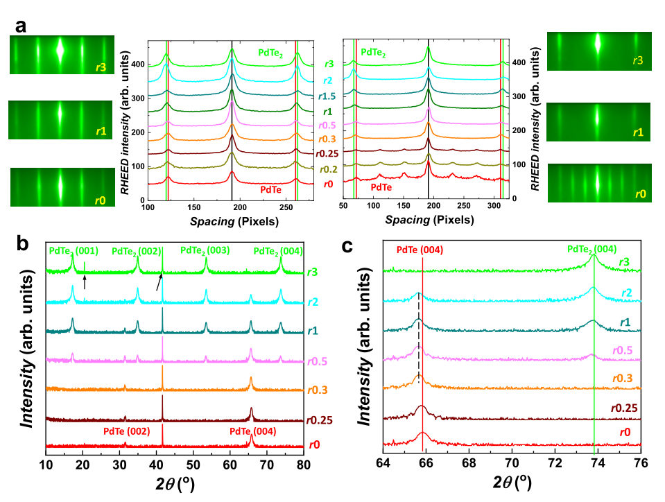 
Figure 2. RHEED spaces and XRD analysis of Pd-telluride samples with varying r values. (a) As the r- value decreases, the RHEED spacing reduces and saturates at r = 0.25. At this point, 1/3-order surface reconstruction peaks begin to emerge. The surface reconstruction peaks work as a barometer, indicating the completion of the topotactic transformation. (b) evolution of the (00n) XRD peaks as a function of r-values. The black arrows indicate the (00n) Al2O3 substrate peaks. (c) enlarged view of the (004) peaks corresponding to PdTe and PdTe2. Red and green vertical lines indicate the PdTe and PdTe2 (004) peak angles. The dashed black line shifted to a smaller angle suggests an enlarged...

📷 Fig 3

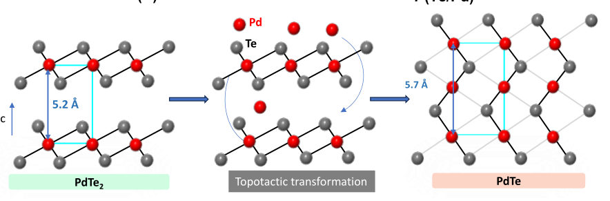 
Figure 3. Transport properties of Pd-telluride films with varying r values and a schematic of the topotactic transformation. (a) Normalized Rxx as a function of temperature for the samples as r varies. (b) Summary of Tc and RRR for the measured samples. Star symbols represent another sample prepared under an identical condition, demonstrating the reproducibility of the synthesis method. (c) A schematic of the topotactic transformation from PdTe2 to PdTe, driven by the diffusion of excess Pd ions in samples with r &lt; 1.

📷 Fig 4

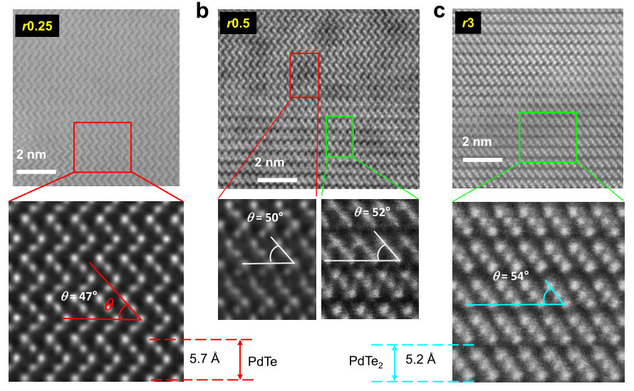 
Figure 4. STEM images of Pd-telluride films with varying r values. (a) r = 0.25 sample shows the PdTe structure with a stacking angle of 47°. (b) r = 0.5 sample exhibits two distinct regions: the upper region displays a PdTe-like stacking with an angle of 50°, while the lower region shows a PdTe2-like stacking with an angle of 52°, presumably due to some compositional mixing between the two phases. (c) r = 3 sample presents a stacking angle of 54°, characteristic of PdTe2.

**Summary.** The researchers developed a method to grow high-quality PdTe thin films using a topotactic transformation from a PdTe2 buffer layer. These films exhibit superconducting properties nearly identical to bulk crystals, providing a new platform for studying topological superconductivity and Majorana physics.

**Why it may be interesting.** not directly relevant

Detailed structure

**Main problem.** The difficulty in growing high-quality PdTe thin films with superconducting properties comparable to bulk crystals, which is essential for realizing topological superconductivity and Majorana zero modes.

**Main result.** High-quality, superconducting PdTe thin films were successfully grown via a topotactic transformation from a PdTe2 buffer layer, exhibiting a sharp superconducting transition (Tc = 4.43 K) and 2D superconducting behavior.

**Method.** Molecular Beam Epitaxy (MBE) was used to grow Pd on a PdTe2 buffer layer under Te-deficient conditions to drive a topotactic phase transformation.

**Model / system.** The physical system consists of PdTe thin films (NiAs-type structure) and PdTe2 buffer layers (CdI2-type structure) grown on Al2O3 (0001) substrates.

**Key observables.** Superconducting transition temperature (T_c), transition width, Residual Resistivity Ratio (RRR), upper critical field anisotropy (B_c2), and carrier mobility/density.

**Important parameters / regimes.** Te/Pd flux ratio (r), lattice constants, stacking angles, and the diffusivity ratio (eta).

**Assumptions / limitations.** The use of a multi-band Werthamer-Helfand-Hohenberg (WHH) model to fit upper critical field data and a four-carrier model to fit Hall effect data.

**Figures summary.** Figure 1 shows RHEED images, temperature-dependent resistance, and B_c2 anisotropy. Figure 2/3 details the phase evolution, structural changes, and transport properties as a function of the Te/Pd ratio. Figure 4 presents STEM images of stacking angles.

**Paper structure.** The paper introduces the motivation for PdTe films, describes the MBE growth and topotactic transformation mechanism, presents structural characterization (XRD, RHEED, STEM), details the transport and superconducting properties, and concludes with the implications for topological physics.

Abstract

Topological superconductors (TSCs) hosting Majorana zero modes (MZMs) offer a pathway to fault-tolerant quantum computation. PdTe is a promising TSC candidate due to its topological surface states and a reasonable superconducting critical temperature of ~4.5 K. However, it has been challenging to grow PdTe thin films with bulk-like superconducting properties. Here, we show that high-quality, superconducting PdTe thin films can be grown using molecular beam epitaxy (MBE). The films exhibit a sharp superconducting transition (T_onset = 4.43 K with transition width of 0.06 K), comparable to that of bulk crystals. This was made possible via a topotactic transformation from a PdTe_2 buffer layer to a PdTe phase by growing Pd on top under Te-deficient conditions. Structural and transport analyses confirm the NiAs-type structure of PdTe, as well as its two-dimensional superconducting behavior and excellent air stability. These findings suggest that the MBE-grown PdTe films and their heterostructures are a promising platform for topological superconductivity and Majorana physics.

[↑ back to top](#top)

### [The Topography Trap: Sifting Interlayer Excitons from Strain-Related Artifacts in Real-World 2D Hetrostructures](http://arxiv.org/abs/2605.20869v1)

**Authors:** Pablo Hernández López, Luka Pirker, Astrid Weston, Arijit Kayal, Rafael Nadas, Adrián Dewambrechies Fernández, Álvaro Rodríguez, Roman Gorbachev, Kirill I. Bolotin, Otakar Frank, Sebastian Heeg  
**Type:** experiment · **Category:** other · **PDF:** <https://arxiv.org/pdf/2605.20869v1>  
**Analysis basis:** full PDF text, analyzed in chunks

📷 Fig 1

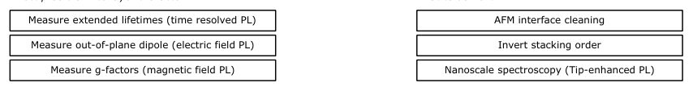 
FIG. 1. Screening protocol for interlayer exciton photoluminescence on TMDC-based

📷 Fig 2

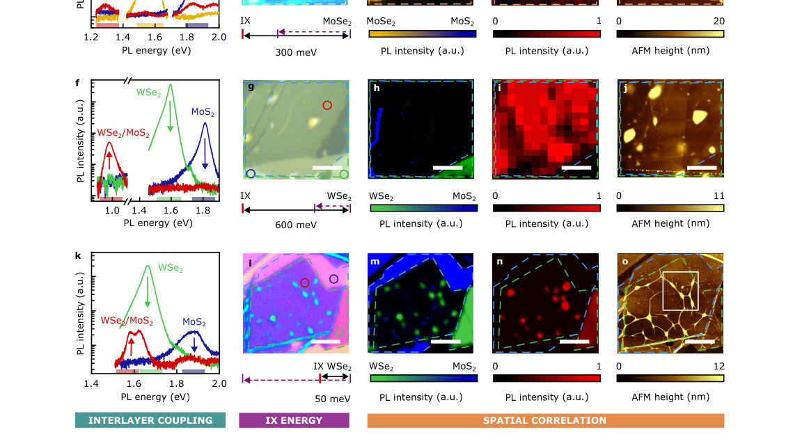 
FIG. 2. Screening interlayer excitons in TMDC-based heterostructures. Sequential

📷 Fig 3

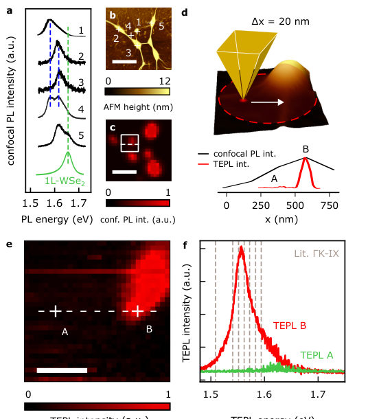 
FIG. 3. Resolving the topography trap with TEPL. TEPL provides the nanoscale spatial

📷 Fig 4

 
Figure 3f, the energy range of these strain-induced PL features almost perfectly matches the

**Summary.** This paper introduces a systematic protocol to distinguish true interlayer excitons from strain-induced artifacts in 2D heterostructures. By correlating spectroscopy with topography, the authors prove that certain widely reported excitonic species are actually signals from strained monolayers trapped in interface bubbles. This work provides a much-needed framework for reliable spectroscopic identification in the field of van der Waals materials.

**Why it may be interesting.** not directly relevant

Detailed structure

**Main problem.** The difficulty in distinguishing genuine interlayer excitons (IXs) from spurious signals caused by strain and topographical defects (bubbles/wrinkles) in 2D TMDC heterostructures.

**Main result.** The authors demonstrate that previously reported bright, momentum-indirect GammaK-IX in MoS2-WSe2 is actually a strain-induced artifact of WSe2 intralayer excitons, and they provide a decision-tree protocol to prevent such misidentifications.

**Method.** A three-step decision-tree protocol involving intralayer exciton quenching analysis, energy thresholding, and spatial correlation between photoluminescence (PL) and AFM topography, supplemented by Tip-Enhanced PL (TEPL).

**Model / system.** 2D transition metal dichalcogenide (TMDC) heterostructures, specifically MoS2-MoSe2 and MoS2-WSe2, featuring Type-II band alignment and topographical irregularities like bubbles and wrinkles.

**Key observables.** Photoluminescence (PL) intensity, emission energy, intralayer exciton quenching factor, AFM topography, and sub-diffraction-limited TEPL maps.

**Important parameters / regimes.** Twist angle, energy separation between peaks (threshold of 200 meV), quenching percentage (threshold of 90%), and strain levels (0.2-0.7%).

**Assumptions / limitations.** The protocol assumes that high quenching of intralayer excitons is a reliable proxy for efficient interlayer charge transfer.

**Figures summary.** Figure 1 shows the decision-tree protocol flowchart; Figure 2 demonstrates the application of the protocol to MoS2-MoSe2 and the identification of strain artifacts in MoS2-WSe2 via PL/AFM correlation; Figure 3 uses TEPL to resolve the nanoscale origin of the strain-induced signal.

**Paper structure.** Introduction of the identification problem, presentation of the three-step decision-tree protocol, experimental validation using MoS2-MoSe2, critical analysis/refutation of the GammaK-IX in MoS2-WSe2 using AFM and TEPL, and conclusion on the necessity of robust characterization.

Abstract

Novel excitonic phenomena emerging in transition metal dichalcogenide (TMDC) heterostructures belong to the most exciting topics in contemporary physics of van der Waals materials. Interlayer excitons (IXs) stand out among those due to their long radiative lifetimes and tunability by electric fields, strain, and twist angle. However, many ambiguities persist in the optical identification and manipulation of IXs, highlighting the need for reliable spectroscopic criteria that distinguish interlayer species from spurious signals. Here, we present a decision-tree protocol that evaluates interlayer coupling via intralayer exciton quenching and correlates photoluminescence (PL) with atomic force microscopy (AFM) to correctly assign room-temperature PL features in TMDC-based heterostructures. Applying this protocol, we identify momentum-direct IX between the K valleys of the two layers (KK-IX) in MoS2-MoSe2 and MoS2-WSe2 heterostructures at room temperature. In contrast, our protocol contests the reported bright, momentum-indirect, twist-angle-independent $Γ$K-IX in MoS2-WSe2. Comprehensive experimental data, including infrared and tip-enhanced photoluminescence (TEPL) with sub-diffraction-limited resolution, show no compelling evidence for this excitonic species, despite numerous reports. Instead, the spectroscopic features previously assigned to this $Γ$K-IX originate from locally strained WSe2 at topographical inhomogeneities of the heterostructure interface, underscoring the need for robust, spatially resolved characterization of real-world samples in this highly accessible field and providing a generally applicable framework for identifying interlayer excitons in 2D semiconductor heterostructures.

[↑ back to top](#top)

### [Tuning the low-energy band structure in twisted bilayer WSe2](http://arxiv.org/abs/2605.20671v1)

**Authors:** T. -H. -Y. Vu, O. J. Clark, N. H. Jo, J. Blyth, Q. Li, C. Jozwiak, A. Bostwick, J. B. Muir, L. Jia, J. A. Davis, I. Di Bernardo, A. Grubisic Cabo, K. Xing, W. Zhao, S. H. Ryu, S. H. Lee, Z. Mao, K. Watanabe, T. Taniguchi, B. A. Chambers, S. L. Harmer, E. Rotenberg, M. S. Fuhrer, M. T. Edmonds  
**Type:** experiment · **Category:** other · **PDF:** <https://arxiv.org/pdf/2605.20671v1>  
**Analysis basis:** full PDF text, analyzed in chunks

📷 Fig 1

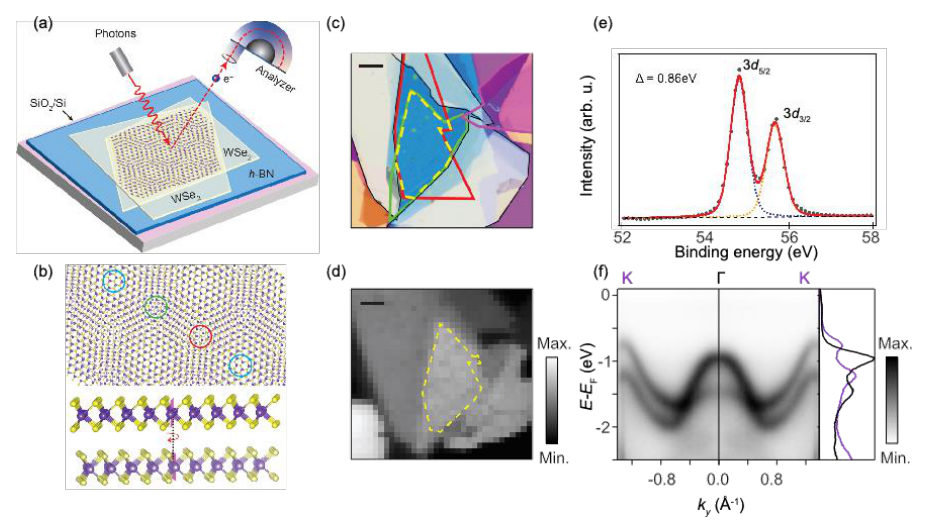 
Figure 1 - (a) Schematic nano-ARPES measurements on the twisted bilayer WSe2 device. (b)

📷 Fig 2

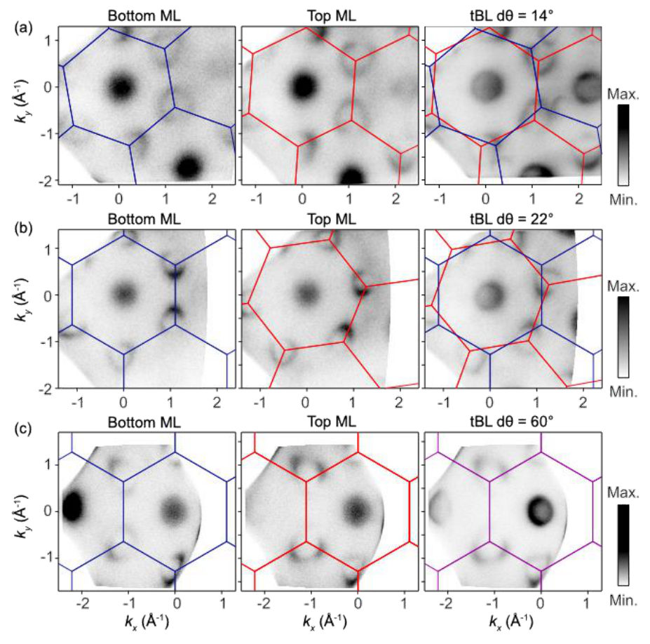 
Figure 2 - Determining the relative twist angles for homo-bilayer WSe2 devices. Bottom (left)

📷 Fig 3

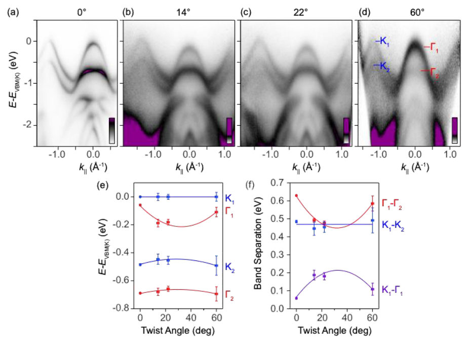 
Figure 3 - (a-d) High symmetry ARPES K- Γ-K band dispersions for four representative twisted

**Summary.** This paper demonstrates that the twist angle in bilayer WSe2 can be used to precisely tune the energy separation between different hole bands. This tuning capability allows for the control of band gaps and electron-phonon coupling efficiency in TMD-based electronic devices.

**Why it may be interesting.** not directly relevant

Detailed structure

**Main problem.** The study aims to understand how the twist angle in bilayer WSe2 tunes the low-energy electronic band structure, specifically the energy separation between the K and Gamma points.

**Main result.** The momentum positioning of the valence band maxima is independent of the twist angle, but the energetic separation between the K-point and Gamma-point hole bands can be tuned by over 100 meV via the twist angle.

**Method.** The researchers used nano-angle-resolved photoemission spectroscopy (nano-ARPES) with nanoscale spatial resolution to track electronic structure evolution.

**Model / system.** The physical system is a 2H-structured twisted bilayer WSe2 (a transition-metal dichalcogenide) van der Waals heterostructure.

**Key observables.** Momentum positioning of valence band maxima, energy separation between K and Gamma hole bands, band dispersion, and spin-orbit splitting.

**Important parameters / regimes.** Twist angle (ranging from 0 to 120 degrees), binding energy, and interlayer hopping channels.

**Assumptions / limitations.** The study assumes that the observed band shifts are driven by interlayer hopping of d-orbitals rather than moire-induced flat bands or correlated phases.

**Figures summary.** Figure 1 shows a schematic of the nano-ARPES setup; Figure 3 shows the K-Gamma energy separation findings; Supplementary Figure S1 shows band dispersions and Energy Distribution Curves (EDCs) with fitted peaks.

**Paper structure.** The paper introduces the problem of band tuning in TMDs, describes the experimental fabrication and nano-ARPES setup, presents the systematic measurement of band evolution across twist angles, discusses the underlying mechanism of interlayer hopping, and concludes with implications for electron-phonon coupling.

Abstract

Tuning the electronic structures of two-dimensional (2D) material-based heterostructures is of crucial importance for their use in functional next-generation electronics. Here, through angle-resolved photoemission spectroscopy with nanoscale spatial resolution (nano-ARPES), we systematically track the evolution of the near-Fermi-level electronic structure of bilayer WSe2 over a large range of twist angle. While the momentum positioning of the valence band maxima is independent of twist angle, we find that the energetic separation between the hole bands at the K point of the Brillouin zone and the higher binding-energy hole band at Γ can be varied in excess of 100 meV. We explore the mechanisms underpinning this evolution and discuss the implications for tuning both the size of the band gaps, and the efficiency of the spin-dependent electron-phonon coupling channels in homobilayer transition metal dichalcogenide devices.

[↑ back to top](#top)

### [Ultra-Confinement of Polaritons in Single Atomic Layer Ag Photonic Quantum Dots](http://arxiv.org/abs/2605.21345v1)

**Authors:** Xinyi Li, Tetyana Ignatova, Chengye Dong, Krishnan Mekkanamkulam Ananthanarayanan, Rinu Abraham Maniyara, Arpit Jain, Furkan Turker, Vinay Kammarchedu, Aida Ebrahimi, Joshua A. Robinson, Slava V. Rotkin  
**Type:** both · **Category:** other · **PDF:** <https://arxiv.org/pdf/2605.21345v1>  
**Analysis basis:** full PDF text, analyzed in chunks

📷 Fig 1

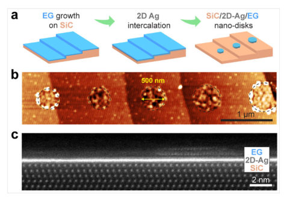 
Figure 1. Material composition of 2D-Ag/EG plasmonic structures. (a) Illustration of the

📷 Fig 2

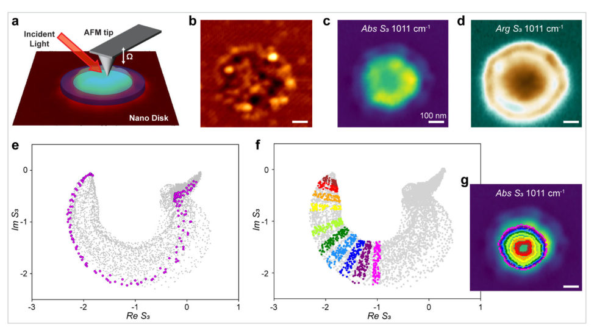 
Figure 2. Surface polariton waves revealed by eikonal analysis. (a) Schematics of sSNOM

📷 Fig 3

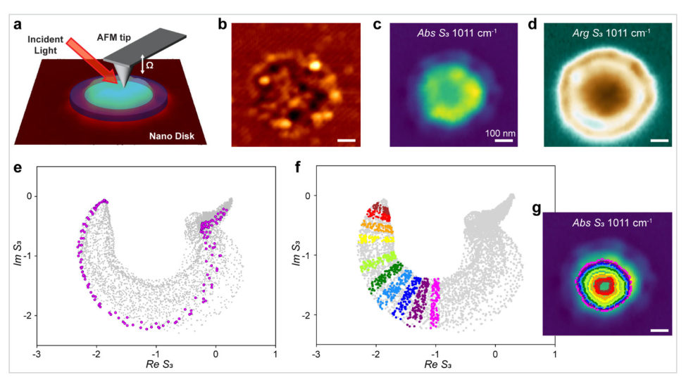 
Figure 2e shows the Argand plot, i.e., the correlation plot between imaginary and real parts

📷 Fig 4

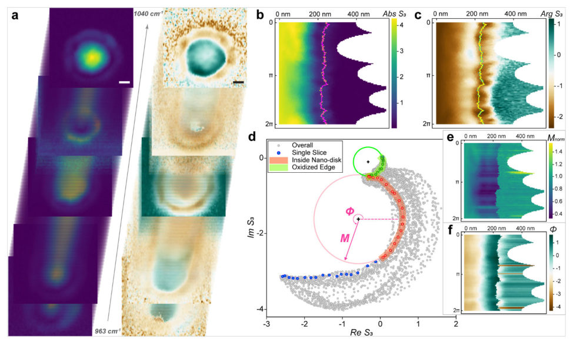 
Figure 3. Spectral analysis of eikonal wave model. (a) Sketch of the hyperspectral sSNOM

📷 Fig 5

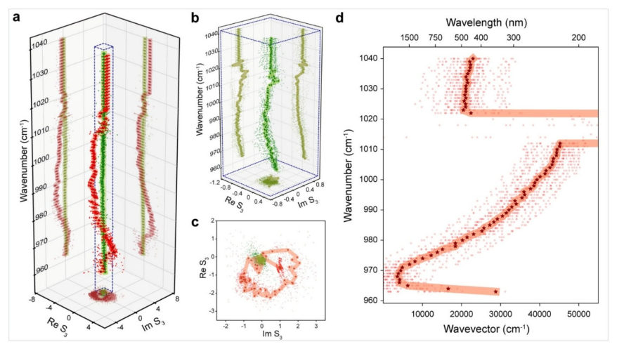 
Figure 4. Dispersion of material properties of bare Ag vs. oxidized belt. (a) 3D

**Summary.** The paper introduces a new analytical technique using Argand diagrams to study surface polaritons in nanostructures smaller than the polariton wavelength. It demonstrates that a single atomic layer of silver can ultra-confine electromagnetic fields in both vertical and lateral directions. This method overcomes the limitations of standard near-field microscopy in resolving wave properties in sub-diffraction-sized objects.

**Why it may be interesting.** not directly relevant

Detailed structure

**Main problem.** Quantitatively analyzing and extracting the propagation constant of surface polaritons in sub-diffraction-sized 2D nanostructures where standard sSNOM analysis fails due to lack of interference patterns and background interference.

**Main result.** Development of an eikonal-based analytical approach using Argand diagrams that successfully reveals the local propagation constant and demonstrates ultra-confinement of polaritons in both vertical (~lambda/50) and lateral (~lambda/40) directions.

**Method.** An eikonal-based representation of the surface polariton wave using Argand plots (real vs. imaginary parts of the sSNOM signal) to trace phase increments and identify wave properties via circular arc fitting.

**Model / system.** A 2D van der Waals heterostructure consisting of a single atomic layer of Silver (Ag) encapsulated by epitaxial graphene (EG) on a Silicon Carbide (SiC) substrate, patterned into nano-disks (photonic quantum dots).

**Key observables.** Third-harmonic demodulated sSNOM signal (amplitude and phase), local propagation constant (k_SP), and confinement factors.

**Important parameters / regimes.** Mid-infrared range (963-1040 cm^-1), nano-disk diameter < 1 um, vertical confinement ~lambda/50, lateral confinement ~lambda/40.

**Assumptions / limitations.** The photonic dot possesses axial symmetry (radial eikonal wave); the variation in amplitude is slow enough to be ignored when calculating the propagation constant.

**Figures summary.** Fig 1: Fabrication and atomic-scale morphology (STEM/AFM). Fig 2: sSNOM imaging and raw amplitude. Fig 3: Boundary identification and eikonal wave maps. Fig 4: Dispersion relations. Supplemental: Argand plots, validation against hBN/graphene, and gradient maps.

**Paper structure.** Introduction of the analytical challenge -> Fabrication and characterization of Ag/EG/SiC nanodisks -> Presentation of the eikonal/Argand analytical method -> Demonstration of confinement and boundary detection -> Validation of the method using different material systems and bulk comparisons.

Abstract

Light scattering by two-dimensional (2D) van der Waals heterostructures (vdWHs) is immense, especially given their infinitesimal volume, thus enabling strong light-matter interactions. Surface 2D polariton waves manifest through large concentration of electromagnetic field in vertical direction, normal to their propagation. By confining vdWH materials into 2D photonic shapes, one can manipulate and compress light in lateral directions. Scattering-type scanning near-field optical microscopy is a perfect tool for direct imaging of the propagating polaritons and studying the properties of confined polaritons in nanostructures. Though, thus far the quantitative analysis, such the wavelength extraction, has been challenged for confined polaritons by incapability of mapping of the wave period on sub-wavelength scale and difficulty of identifying an adequate substrate's "background" to subtract. Here, an analytical approach is developed to reveal the local propagation constant of confined polaritons under abovementioned constraints and map it with the sub-wavelength resolution. Applied to analysis of the SiC/2D-Ag/EG (epitaxial graphene) photonic nanostructures, the technique uncovered that the polaritons are highly confined in both vertical ($\simλ$/50) and lateral directions ($\simλ$/40) by 2D metal.

[↑ back to top](#top)

