
# arxiv digest (quant-ph + cond-mat) — 2026-05-22

*122 papers · 33 relevant · 1 highlighted*

## 🔥 Most relevant (33)

*Every paper with at least one nonzero topic score, sorted by best-matching score. 🔥 marks scores ≥4/5. Click the title to jump to the full entry below; click [arXiv] to open the paper page. `(secondary)` marks papers from de-prioritized cond-mat archives.*

Show 33 relevant papers

- [Entanglement Dynamics across a Monitored Quantum Point Contact](#paper-2605.22555) [[arXiv]](http://arxiv.org/abs/2605.22555v1) — 🔥 `entanglement & information structure` **4/5** · 🔥 `measurement-induced transitions` **4/5** · 🔥 `non-equilibrium dynamics` **4/5** · 🔥 `quantum measurements` **4/5** · `methods for driven-dissipative` **3/5** · `Keldysh / 2PI / non-Gaussian methods` **2/5** · `Kondo & dissipative impurity` **2/5** · `driven-dissipative phase transition` **2/5** · `non-equilibrium universality` **2/5**
- [Journey in quantum metrology and sensing from foundations to applications: a review](#paper-2605.21702) [[arXiv]](http://arxiv.org/abs/2605.21702v1) — 🔥 `quantum measurements` **4/5** · `QC/QI experiment` **3/5** · `correlated / nonlocal dissipation` **2/5** · `entanglement & information structure` **2/5** · `quantum optics experiment` **2/5** · `spintronics-quantum-optics interface` **2/5** · `Dicke superradiance` **1/5** · `Rydberg arrays` **1/5** · `Tavis-Cummings & cavity-many-emitter` **1/5** · `correlated cavity matter` **1/5** · `driven-dissipative phase transition` **1/5** · `methods for driven-dissipative` **1/5** · `non-equilibrium dynamics` **1/5**
- [Dissipation-Selected Resonant Fronts in a Driven-Dissipative Bose-Hubbard Lattice](#paper-2605.21900) [[arXiv]](http://arxiv.org/abs/2605.21900v1) — 🔥 `driven-dissipative phase transition` **4/5** · 🔥 `non-equilibrium dynamics` **4/5** · `Keldysh / 2PI / non-Gaussian methods` **3/5** · `analog quantum simulation` **3/5** · `correlated / nonlocal dissipation` **3/5** · `methods for driven-dissipative` **2/5** · `non-equilibrium universality` **2/5**
- [What We Talk About When We Talk About Dissipative Quantum Chaos](#paper-2605.21628) [[arXiv]](http://arxiv.org/abs/2605.21628v1) — 🔥 `methods for driven-dissipative` **4/5** · `Keldysh / 2PI / non-Gaussian methods` **3/5** · `driven-dissipative phase transition` **3/5** · `non-equilibrium dynamics` **3/5** · `Dicke superradiance` **2/5** · `Tavis-Cummings & cavity-many-emitter` **2/5** · `entanglement & information structure` **2/5** · `non-equilibrium universality` **2/5**
- ⭐ [Interaction-enabled metal-insulator phase transition in a driven quantum gas](#paper-2605.22449) [[arXiv]](http://arxiv.org/abs/2605.22449v1) — 🔥 `analog quantum simulation` **4/5** · 🔥 `driven-dissipative phase transition` **4/5** · 🔥 `non-equilibrium dynamics` **4/5** · `non-equilibrium universality` **3/5** · `entanglement & information structure` **2/5** · `scars & prethermalization` **2/5**
- [Monitored quantum transport through a disordered one-dimensional conductor](#paper-2605.22701) [[arXiv]](http://arxiv.org/abs/2605.22701v1) `(secondary)` — 🔥 `measurement-induced transitions` **4/5** · 🔥 `quantum measurements` **4/5** · `driven-dissipative phase transition` **3/5** · `methods for driven-dissipative` **3/5** · `non-equilibrium dynamics` **3/5**
- [Phase-tunable remote nonreciprocal charging in waveguide QED](#paper-2605.21909) [[arXiv]](http://arxiv.org/abs/2605.21909v1) — 🔥 `correlated / nonlocal dissipation` **4/5** · `interference shaping light` **3/5** · `Tavis-Cummings & cavity-many-emitter` **2/5** · `methods for driven-dissipative` **2/5** · `non-equilibrium dynamics` **2/5**
- [Testing Superpositions of Detector Trajectories](#paper-2605.21595) [[arXiv]](http://arxiv.org/abs/2605.21595v1) — 🔥 `analog quantum simulation` **4/5** · 🔥 `quantum optics experiment` **4/5** · `quantum measurements` **3/5** · `interference shaping light` **2/5**
- [Bottom-up open EFT for non-Abelian gauge theory with dynamical color environment](#paper-2605.22822) [[arXiv]](http://arxiv.org/abs/2605.22822v1) — 🔥 `Keldysh / 2PI / non-Gaussian methods` **4/5** · `correlated / nonlocal dissipation` **3/5** · `methods for driven-dissipative` **3/5** · `non-equilibrium dynamics` **2/5**
- [Multi-Modal Spectroscopy Theory for Ultrafast Control of Rabi Oscillations](#paper-2605.21923) [[arXiv]](http://arxiv.org/abs/2605.21923v1) — 🔥 `methods for driven-dissipative` **4/5** · `Tavis-Cummings & cavity-many-emitter` **3/5** · `non-equilibrium dynamics` **3/5** · `quantum measurements` **2/5**
- [Dual wavelength source of entanglement for space quantum communication](#paper-2605.22339) [[arXiv]](http://arxiv.org/abs/2605.22339v1) — 🔥 `QC/QI experiment` **4/5** · 🔥 `quantum optics experiment` **4/5** · `interference shaping light` **3/5**
- [Geometric Origin of the Non-Adiabaticity Parameter and Self-Limiting Instability in Driven Nonlinear Systems](#paper-2605.22796) [[arXiv]](http://arxiv.org/abs/2605.22796v1) — 🔥 `driven-dissipative phase transition` **4/5** · `non-equilibrium dynamics` **3/5** · `methods for driven-dissipative` **2/5** · `non-equilibrium universality` **2/5**
- [Optics-microwave entanglement and state teleportation mediated by a cavity magnomechanical system](#paper-2605.21754) [[arXiv]](http://arxiv.org/abs/2605.21754v1) — 🔥 `spintronics-quantum-optics interface` **4/5** · `entanglement & information structure` **3/5** · `correlated / nonlocal dissipation` **2/5** · `non-equilibrium dynamics` **2/5**
- [Ratchet Universality and optimal suppression of shot noise in biharmonically-driven tunnel junctions](#paper-2605.22412) [[arXiv]](http://arxiv.org/abs/2605.22412v1) — 🔥 `non-equilibrium dynamics` **4/5** · `non-equilibrium universality` **3/5** · `Keldysh / 2PI / non-Gaussian methods` **2/5** · `methods for driven-dissipative` **2/5**
- [Reduced Dynamical Maps in Finite Temperature Vibronic Coupling Models via Choi Matrices: Numerical Methods and Applications](#paper-2605.22459) [[arXiv]](http://arxiv.org/abs/2605.22459v1) — 🔥 `methods for driven-dissipative` **4/5** · `non-equilibrium dynamics` **3/5** · `Keldysh / 2PI / non-Gaussian methods` **2/5** · `entanglement & information structure` **2/5**
- [Matrix Product Operator Encodings of the Magnus Expansion and Dyson Series](#paper-2605.21597) [[arXiv]](http://arxiv.org/abs/2605.21597v1) — 🔥 `non-equilibrium dynamics` **4/5** · `methods for driven-dissipative` **3/5** · `entanglement & information structure` **2/5**
- [Multipolar exchange in a many-body homonuclear mixture of atoms in different internal states](#paper-2605.22375) [[arXiv]](http://arxiv.org/abs/2605.22375v1) — 🔥 `analog quantum simulation` **4/5** · `exotic spin models in light-matter` **3/5** · `entanglement & information structure` **2/5**
- [Practical Countermeasure Against Attacks Exploiting Detection Efficiency Mismatch in Quantum Key Distribution](#paper-2605.22580) [[arXiv]](http://arxiv.org/abs/2605.22580v1) — 🔥 `QC/QI experiment` **4/5** · `quantum optics experiment` **3/5** · `quantum measurements` **2/5**
- [Fidelity-Aware Frequency Allocation and Transpilation Co-Design for Tunable Coupler Quantum Systems](#paper-2605.21662) [[arXiv]](http://arxiv.org/abs/2605.21662v1) — 🔥 `QC/QI experiment` **4/5** · `methods for driven-dissipative` **2/5** · `quantum optics experiment` **2/5**
- [Gyromagnetic Quantum Friction in Rayleigh Vorticity Baths](#paper-2605.22135) [[arXiv]](http://arxiv.org/abs/2605.22135v1) `(secondary)` — 🔥 `spintronics-quantum-optics interface` **4/5** · `Kondo & dissipative impurity` **2/5** · `correlated / nonlocal dissipation` **2/5**
- [Optimal work extraction in measurement-based quantum Otto engines: Non-adiabaticity and generalized measurements can be beneficial](#paper-2605.22583) [[arXiv]](http://arxiv.org/abs/2605.22583v1) — 🔥 `quantum measurements` **4/5** · `methods for driven-dissipative` **2/5** · `non-equilibrium dynamics` **2/5**
- [Realizing tunable non-Hermitian skin effects in dynamical quantum systems via the relative phase between multiple time-periodic driving](#paper-2605.21959) [[arXiv]](http://arxiv.org/abs/2605.21959v1) — 🔥 `non-equilibrium dynamics` **4/5** · `driven-dissipative phase transition` **2/5** · `methods for driven-dissipative` **2/5**
- [Sudden death of entanglement, rebirth of magic](#paper-2605.22603) [[arXiv]](http://arxiv.org/abs/2605.22603v1) — 🔥 `entanglement & information structure` **4/5** · `methods for driven-dissipative` **2/5** · `non-equilibrium dynamics` **2/5**
- [Q-PhotoNAS: Hybrid Quantum Neural Architecture Search Framework on Photonic Devices](#paper-2605.22097) [[arXiv]](http://arxiv.org/abs/2605.22097v1) — 🔥 `QC/QI experiment` **4/5** · `quantum optics experiment` **3/5**
- [QuCtrl-BELL: A Compiler-Driven Sub-Microsecond Feedback Control Stack for Scalable Trapped-Ion Quantum Experiments](#paper-2605.22433) [[arXiv]](http://arxiv.org/abs/2605.22433v1) — 🔥 `QC/QI experiment` **4/5** · `quantum measurements` **3/5**
- [Signatures of quantum chaos in phonon-polariton billiards](#paper-2605.22753) [[arXiv]](http://arxiv.org/abs/2605.22753v1) `(secondary)` — 🔥 `scars & prethermalization` **4/5** · `quantum optics experiment` **3/5**
- [A journey through Flatland: What does the antiflatness of a spectrum teach us?](#paper-2605.21664) [[arXiv]](http://arxiv.org/abs/2605.21664v1) — 🔥 `entanglement & information structure` **4/5** · `non-equilibrium dynamics` **2/5**
- [Factorization rule for multitime correlations in non-Markovian open quantum systems](#paper-2605.22386) [[arXiv]](http://arxiv.org/abs/2605.22386v1) — 🔥 `methods for driven-dissipative` **4/5** · `non-equilibrium dynamics` **2/5**
- [Joint Unitarity and a Single Definite Outcome in a Quantum Measurement](#paper-2605.22551) [[arXiv]](http://arxiv.org/abs/2605.22551v1) — 🔥 `quantum measurements` **4/5** · `entanglement & information structure` **2/5**
- [Symmetry Breaking as Quantum Gate: Entropy and Weak Mixing Angle](#paper-2605.22070) [[arXiv]](http://arxiv.org/abs/2605.22070v1) — 🔥 `entanglement & information structure` **4/5** · `quantum measurements` **2/5**
- [Diagrammatic Monte Carlo for Fermionic Rényi Entanglement Entropy](#paper-2605.21632) [[arXiv]](http://arxiv.org/abs/2605.21632v1) — 🔥 `entanglement & information structure` **4/5**
- [Long-range nonstabilizerness of topologically encoded states from mutual information](#paper-2605.22424) [[arXiv]](http://arxiv.org/abs/2605.22424v1) — 🔥 `entanglement & information structure` **4/5**
- [Unified entropy entanglement](#paper-2605.22150) [[arXiv]](http://arxiv.org/abs/2605.22150v1) — 🔥 `entanglement & information structure` **4/5**

## ⭐ Highlighted (1)

*Papers by authors on your watch list. Click the title to jump to the full entry below; click [arXiv] to open the paper page.*

Show 1 highlighted papers

- ⭐ [Interaction-enabled metal-insulator phase transition in a driven quantum gas](#paper-2605.22449) [[arXiv]](http://arxiv.org/abs/2605.22449v1) — Manuele Landini

## All papers (72, sorted by relevance)

*Papers from quant-ph and your primary cond-mat archives (quant-gas, stat-mech, str-el, dis-nn). Highlighted papers (⭐) come first, then everything else sorted by topic-relevance score, highest first.*

### ⭐ [Interaction-enabled metal-insulator phase transition in a driven quantum gas](http://arxiv.org/abs/2605.22449v1)

**Highlighted author(s):** Manuele Landini  
**Authors:** Camilo Cantillano, Karthick Ramanathan, Zekai Chen, Ang Yang, Emilio Aguilera-Valdes, Lei Ying, Manuele Landini, Hanns-Christoph Nägerl, Yanliang Guo  
**Type:** experiment · **Category:** quantum gases · **PDF:** <https://arxiv.org/pdf/2605.22449v1>  
**Analysis basis:** full PDF text, analyzed in chunks
**Topic relevance:** 🔥 `analog quantum simulation` **4/5** · 🔥 `driven-dissipative phase transition` **4/5** · 🔥 `non-equilibrium dynamics` **4/5** · `non-equilibrium universality` **3/5** · `entanglement & information structure` **2/5** · `scars & prethermalization` **2/5**

📷 Fig 1

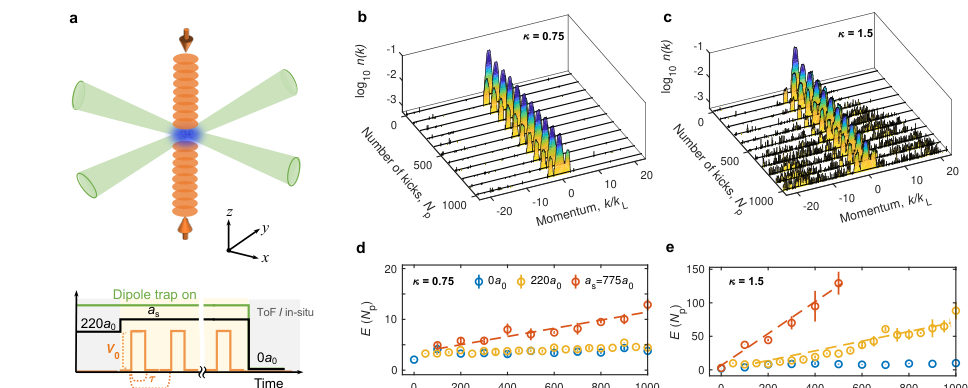 
Fig 1. Experimental setup and observation of localization and delocalization. a Schematics of the experimental setup (top) and of the protocol (bottom): The BEC (blue) confined in crossed trapping beams (green) is subjected to Np pulses of a vertically oriented optical lattice (orange) before undergoing ToF imaging or, alternatively, in-situ imaging. b, c, Momentum distribution n(k) plotted after applying a certain number of kicks Np for (b) κ = 0.75, as = 220 a0 and (c) κ = 1.5, as = 775 a0. d, e, Energy proxy E as a function of Np for 3 values of the scattering length as = 0 a0 (blue circles), 220 a0 (yellow circles), and 775 a0 (red circles) for (d) κ = 0.75 and (e) κ = 1.5. The dashed...

📷 Fig 2

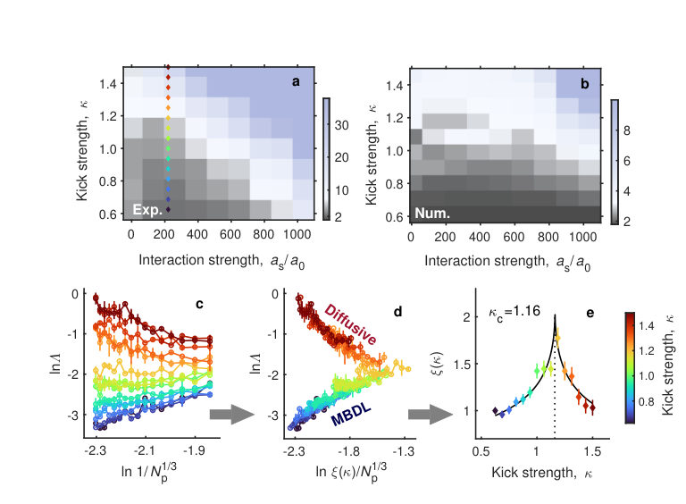 
Fig 2. Metal-insulator phase diagram and finite-time scaling analysis. a,b, Phase diagrams constructed from the measured (a) and the numerically determined (b) energy proxy E(Np) after Np =500 kicks as a function of κ and as. c, Scaling function ln Λ as a function of ln[1/N 1/3 p ] for different values of κ as measured at as = 220 a0. d, Data collapse in (c) onto a universal scaling function, with ln Λ plotted against the scaled quantity ln[ξ(κ)/N1/3 k ]. e, Extracted scaling parameter ξ(κ) as a function of κ, fitted by a Lorentzian (solid black line). The critical value of κc =1.16 is indicated by the dotted line.

📷 Fig 3

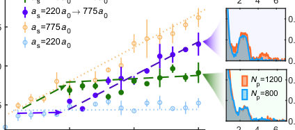 
Fig 3. Reversibility of the MBDL-to-delocalization phase transition. Evolution of E versus Np at κ = 0.75 for as = 220 a0 (blue circles), 775 a0 (orange circles), and in- teraction ramp-up from 220 a0 to 775 a0 (purple dots) and ramp-down from 775 a0 to 220 a0 (green dots) at Np = 400. The dashed and dotted lines are linear fits. The insets provide a comparison of n(k) at Np = 800 (blue line) and Np = 1200 (red line) for the loss of MBDL (case A), top) and the regain- ing of MBDL (case B), bottom).

📷 Fig 4

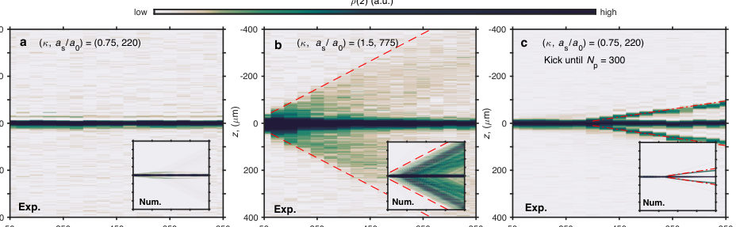 
Fig 4. Real-space dynamics for many-body QKR. Time evolution of the spatial density ρ(z) for (a) the MBDL case with (κ, as/a0) = (0.75, 220), for (b) the delocalized case with (κ, as/a0)=(1.5,775), and for (c) the MBDL case for which the kicking is stopped at Np = 300. Insets: Numerical simulation results under the same conditions as the experiment. The red dashed lines in (b) and the dashed-dotted lines in (c) indicate linear expansion for a speed corresponding to ±6.5ℏkL and ±2ℏkL, respectively, as a guide to the eye.

📷 Fig 5

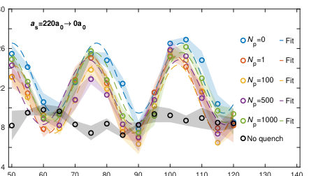 
Figure 5. Interaction quench. The width of the central peak σz is plotted as a function of hold time thold for ini- tial as = 220 a0 and κ = 0.75. The colored (grey) data are taken with (without) an interaction quench to as = 0 a0 af- ter Np kicks as indicated, ranging from zero to 1000. The dashed lines are sinusoidal fits to the oscillation data, giving 37.4(4) Hz after zero kicks and 36.3(3) Hz after 1000 kicks. For comparison, the trap frequency along the z-direction is determined to ωz/(2π) = 18.7(3) Hz via dipole-mode excita- tion measurements. The shaded areas reflect the standard deviation obtained from 3 repetitions.

**Summary.** The researchers experimentally observed a metal-insulator phase transition in a 3D driven Bose-Einstein condensate. By tuning interactions and driving strength, they identified a sharp boundary between a localized phase (MBDL) and a diffusive phase. This work clarifies how interactions and quantum coherence jointly govern transport in isolated many-body systems.

**Why it may be interesting.** It provides a direct experimental realization of a dynamical phase transition in a many-body system, demonstrating how interactions can actively reorganize Hilbert space to enable transport, which is fundamental to understanding the emergence of classicality and ergodicity.

Detailed structure

**Main problem.** Understanding the competition between quantum interference, which promotes localization, and interactions, which promote ergodicity and diffusion, in a driven many-body system.

**Main result.** Discovery of an interaction-enabled metal-insulator phase transition in a 3D quantum gas, characterized by a sharp dynamical boundary between many-body dynamical localization and diffusive energy absorption.

**Method.** Experimental implementation of a 3D Quantum Kicked Rotor using a Cesium BEC, combined with finite-time scaling analysis and interaction-quench tests to verify the transition's nature.

**Model / system.** A 3D quantum gas consisting of approximately 10,000 133-Cs atoms in a Bose-Einstein Condensate, subject to a periodic optical lattice pulse protocol (Quantum Kicked Rotor) with tunable s-wave scattering via Feshbach resonance.

**Key observables.** Momentum distribution n(k), energy proxy E(Np) (second moment of momentum distribution), and spatial density distribution.

**Important parameters / regimes.** Kick strength (kappa), interaction strength (as), number of kicks (Np), and pulse period (T).

**Assumptions / limitations.** The system is treated as a closed Floquet many-body system; the scaling analysis assumes an effective dimensionality of d=3.

**Figures summary.** Fig 1 shows the experimental setup and momentum distributions; Fig 2 presents the localization-delocalization phase diagram; Fig 3 demonstrates the reversibility of the transition via interaction ramps; Fig 5 shows interaction quench effects on peak width; Fig 6 shows energy proxy evolution at the critical point.

**Paper structure.** The paper introduces the problem of interaction vs. coherence, describes the 3D BEC experimental platform and QKR protocol, presents the mapping of the phase diagram and scaling analysis, demonstrates the reversibility of the transition, and concludes with the implications for the quantum-to-classical transition.

Abstract

Particle transport and energy flow are central for our understanding of a wealth of phenomena in physics and the natural sciences. Interactions are generically expected to promote ergodicity and diffusive behavior, yet quantum interference can arrest transport and prevent energy absorption, defying classical expectations. How interactions and quantum coherence compete remains a fundamental open question. Here, we experimentally investigate their interplay in a periodically driven, three-dimensional (3D) quantum gas with tunable interactions. Strikingly, we find that interactions give rise to a sharp dynamical boundary that separates localization from diffusive energy absorption. By tuning the driving amplitude and interaction strength, we map the localization-delocalization phase diagram and characterize the boundary via finite-time scaling. On the insulating side, we observe many-body dynamical localization (MBDL) for a wide range of parameters, finding arrested transport in momentum space. Near the boundary, transport becomes subdiffusive, whereas in the delocalized regime we observe classical diffusion, yielding a metal-insulator transition that we interpret in terms of localization in many-body Hilbert space. Our results exemplify an interaction-enabled dynamical phase transition in a closed Floquet many-body system and clarify how coherence and interactions jointly govern the quantum-to-classical transition.

[↑ back to top](#top)

### [Entanglement Dynamics across a Monitored Quantum Point Contact](http://arxiv.org/abs/2605.22555v1)

**Authors:** Anna Delmonte, Marco Schirò  
**Type:** theory · **Category:** statistical mechanics · **PDF:** <https://arxiv.org/pdf/2605.22555v1>  
**Analysis basis:** full PDF text, analyzed in chunks
**Topic relevance:** 🔥 `entanglement & information structure` **4/5** · 🔥 `measurement-induced transitions` **4/5** · 🔥 `non-equilibrium dynamics` **4/5** · 🔥 `quantum measurements` **4/5** · `methods for driven-dissipative` **3/5** · `Keldysh / 2PI / non-Gaussian methods` **2/5** · `Kondo & dissipative impurity` **2/5** · `driven-dissipative phase transition` **2/5** · `non-equilibrium universality` **2/5**

📷 Fig 1

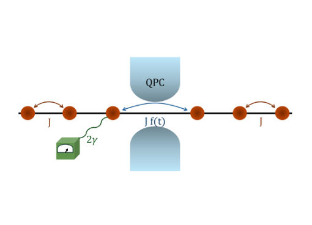 
Figure 1. Sketch of the system: two leads described by a tight-binding chain with hopping parameter J are connected via a quantum point contact opening according to f(t). A detector measures particle losses at the last site of the left lead with a rate 2γ.

📷 Fig 2

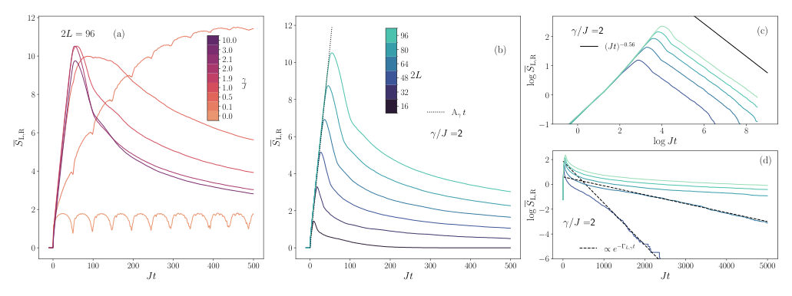 
Figure 2. Dynamics of the entanglement entropy between left and right lead. (a) Dynamics of the entanglement entropy for a chanin of 2L = 96 sites and several measurement strengths. The orange line corresponds to the unitary case γ/J = 0. (b) Comparison of the dynamics for different system sizes at γ/J = 2. The peak of the entanglement entropy scales linearly with the system size. The dotted line fits the initial linear regime. (c) Polynomial regime of the entanglement entropy at γ/J = 2, the solid black line represents a decay with a universal power (Jt)−0.56. The plot is in log-log scale. (d) Exponential regime at long times. The dashed lines represent the exponential fit of the curves for...

📷 Fig 3

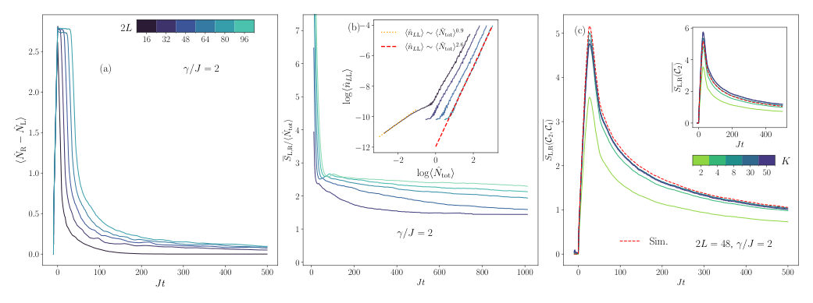 
Figure 3. (a) Dynamics of the particle imbalance between the two leads for different sizes, and γ/J = 2.0.(b) Ratio between the entanglement entropy and total density for γ/J = 2. In the inset, the total number of particle is plotted as a function of nLL, and the polynomial and exponential regimes of the entanglement entropy and density emerge respectively from the fits in dashed and dotted lines. (c) Entanglement entropy captured through the cumulants of the transported charge. The main plot considers cumulants C2, C4, while the inset considers solely C2. Results are shown for several truncations of the cumulant sum, as shown in legend.

**Summary.** This paper demonstrates that local monitoring of particle loss at a quantum point contact fundamentally changes entanglement growth from logarithmic to linear, followed by a decay. The study links these entanglement dynamics to charge depletion and provides an analytical quasiparticle framework to explain the transition.

**Why it may be interesting.** It provides a deep connection between measurement-induced dynamics, non-equilibrium transport, and the Page curve, offering a bridge between mesoscopic physics and the study of open quantum systems.

Detailed structure

**Main problem.** Investigating how continuous local monitoring of particle losses at a quantum point contact (QPC) reshapes the entanglement dynamics and charge transport compared to the unitary case.

**Main result.** Local monitoring transforms entanglement growth from logarithmic to a three-regime process: linear growth (volume-law), power-law decay, and eventual exponential decay to zero. This dynamics is driven by an emergent bias voltage created by the losses.

**Method.** The authors use a quantum jump protocol described by a stochastic Schrodinger equation and a Lindblad master equation, supplemented by a quasiparticle picture and full counting statistics (FCS) analysis.

**Model / system.** A quantum point contact connecting two metallic leads modeled as fermionic tight-binding chains with open boundary conditions, subject to a monitoring protocol that detects particle losses at a specific site.

**Key observables.** Entanglement entropy (S_L,R), particle imbalance, total charge depletion, and full counting statistics (FCS) of charge transfer.

**Important parameters / regimes.** Monitoring/dissipation rate (gamma/J), system size (L), and the hopping parameter (J).

**Assumptions / limitations.** The system is modeled as free fermions; the quasiparticle picture assumes entanglement production is a binomial process of fermion detection/non-detection.

**Figures summary.** Figure 1 shows the system schematic; Figure 2 displays entanglement entropy dynamics and its volume-law scaling; Figure 3 illustrates particle imbalance and the relationship between entanglement and total particle number.

**Paper structure.** The paper introduces the monitored QPC model, presents the numerical results for entanglement and charge dynamics, develops a quasiparticle-based analytical framework to explain the observed regimes, and connects the findings to experimental probes like FCS.

Abstract

We compute the entanglement dynamics across a monitored quantum point contact, where particle losses are recorded on a given site, and demonstrate how this single-site local monitoring substantially reshapes the entanglement production. Contrary to the unitary case, where entanglement entropy grows logarithmically in time, here we find first a linear growth, up to a maximum value displaying volume-law scaling, and then a slow decay to zero, as the system empties out. We capture this crossover using a quasiparticle picture, where the first linear growth arises due to an emergent bias voltage established by the losses, which eventually decays away as the system depletes. We connect our results to studies of the Page curve and to experimentally relevant probes, via full counting statistics of charge transfer across a subregion, with only a single channel to unravel leading to a favorable scaling of the postselection overhead. Natural platforms for this setting include mesoscopic systems and ultracold atoms.

[↑ back to top](#top)

### [Journey in quantum metrology and sensing from foundations to applications: a review](http://arxiv.org/abs/2605.21702v1)

**Authors:** Priya Ghosh, Tanoy Kanti Konar, Debraj Rakshit, Aditi Sen De, Ujjwal Sen  
**Type:** both · **Category:** quantum information and computing · **PDF:** <https://arxiv.org/pdf/2605.21702v1>  
**Analysis basis:** full PDF text, analyzed in chunks
**Topic relevance:** 🔥 `quantum measurements` **4/5** · `QC/QI experiment` **3/5** · `correlated / nonlocal dissipation` **2/5** · `entanglement & information structure` **2/5** · `quantum optics experiment` **2/5** · `spintronics-quantum-optics interface` **2/5** · `Dicke superradiance` **1/5** · `Rydberg arrays` **1/5** · `Tavis-Cummings & cavity-many-emitter` **1/5** · `correlated cavity matter` **1/5** · `driven-dissipative phase transition` **1/5** · `methods for driven-dissipative` **1/5** · `non-equilibrium dynamics` **1/5**

📷 Fig 1

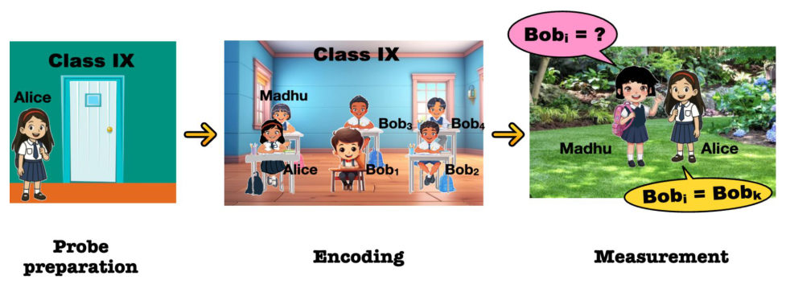 
FIG. 1. A cartoon illustration of the general idea behind a sensing protocol. Imagine Alice entering her first day of school with a completely unbiased and uncorrelated state of mind, analogous to an initially prepared probe state. As she interacts with her classmates, information from the environment becomes encoded into her (mental) state. In particular, among several boys denoted as Bobi, Alice gradually develops a preference toward one specific Bob, so that her internal state effectively carries information about a particular Bobi. Unaware of this process, her friend Madhu notices subtle changes in Alice’s behavior and attempts to infer which Bob has been encoded in Alice’s mind. If...

📷 Fig 2

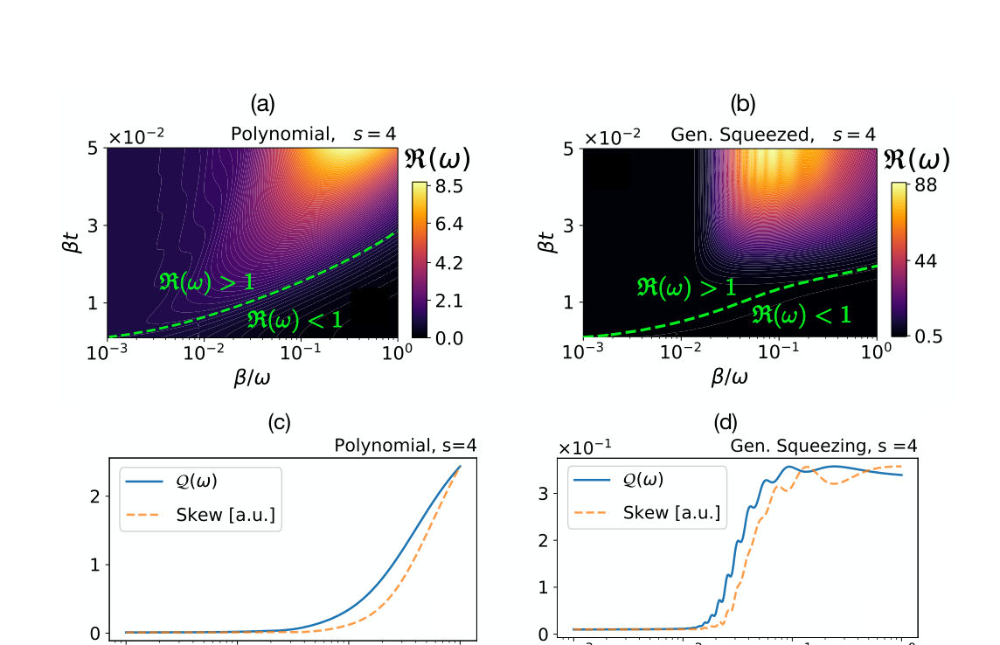 
FIG. 2. Nonlinear-enhanced frequency estimation [150]. Panels (a) and (b) show the ratio of QFIs, R(ω), as functions of the nonlinearity strength β/ω and time t for s = 4, corresponding to the polynomial and generalized squeezing cases, respectively. Both the figures demonstrate nonlinear enhancement in frequency sensitivity. Panels (c) and (d) depict the Wigner–Yanase skew information and the QFI as functions of β (for s = 4 and fixed βt = 0.05), illustrating the connection between degree of noncommutatiity and quantum sensing.

📷 Fig 3

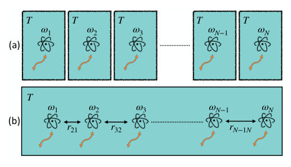 
FIG. 3. Schematic of thermometry protocols discussed in Ref. [244]. (a) Independent baths: each thermometer couples to a separate bath, yielding additive precision. (b) Common bath: all thermometers cou- ple to the same bath, leading to superadditive precision at low tem- peratures.

📷 Fig 4

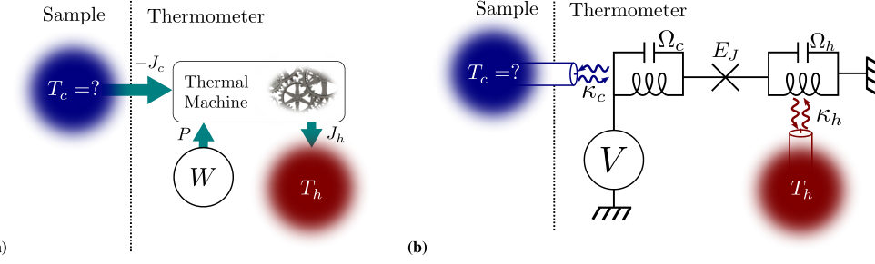 
FIG. 4. (a) A model-independent schematic representation of a quantum thermal machine operating as a thermometer. The temperature of the cold bath, Tc, is estimated by calibrating it against a known hot-bath temperature Th. Heat flows between the cold and hot reservoirs, while the thermal machine is operated near the Carnot point, where both the heat currents and power consumption vanish, i.e., P = Jc = Jh = 0. At this operating point, the cold-bath temperature can be inferred from the Carnot efficiency relation, η = ηC = 1−Tc

📷 Fig 5

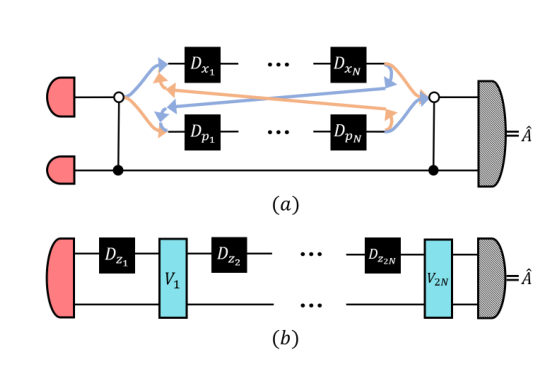 
FIG. 5. A schematic illustration of the key distinction between def- inite and indefinite causal order [365]. In the indefinite causal-order protocol considered in this work, the total position displacement op- erations Dx1Dx2 · · · DxN and momentum displacement operations Dp1Dp2 · · · DpN are applied in a coherent superposition of two al- ternative orders, with the ordering controlled by an auxiliary control qubit. Such a superposition of causal structures leads to a super- Heisenberg scaling of the quantum Fisher information, yielding a precision scaling of order 1/N 2(upper panel). In contrast, for the conventional definite-order scheme, where the sequence of opera- tions remains fixed,...

**Summary.** This review provides a deep dive into the field of quantum metrology, covering the mathematical foundations of parameter estimation and the transition from classical to quantum-enhanced precision. It connects theoretical breakthroughs, such as multi-parameter estimation and error-mitigation strategies, to diverse experimental platforms like superconducting qubits and NV centers. The paper serves as a roadmap for using quantum technologies to sense physical quantities with unprecedented accuracy.

**Why it may be interesting.** It provides a unified view of how quantum resources like entanglement and error correction can be leveraged for sensing, which is directly relevant to researchers in quantum optics, open quantum systems, and many-body dynamics.

Detailed structure

**Main problem.** The fundamental challenge of achieving maximum precision in parameter estimation (e.g., magnetic, electric, or gravitational fields) using quantum resources to surpass classical limits.

**Main result.** A comprehensive review tracing the evolution of quantum metrology from foundational frequentist and Bayesian estimation theories to advanced multi-parameter strategies and real-world experimental implementations.

**Method.** The review covers mathematical frameworks including Quantum Fisher Information (QFI), Cramér-Rao bounds (single and multi-parameter), and advanced strategies like quantum error correction-aided methods, reservoir engineering, and adaptive techniques.

**Model / system.** The review spans a vast range of platforms including optical setups, NV centers in diamond, superconducting circuits, trapped ions, ultracold atoms, and continuous-variable systems.

**Key observables.** Quantum Fisher Information (QFI), Mean Square Error (MSE), phase, frequency, temperature, and many-body phenomena like entanglement and phase transitions.

**Important parameters / regimes.** Standard Quantum Limit (SQL), Heisenberg Limit (HL), Super-Heisenberg scaling, and the distinction between unitary and noisy encoding processes.

**Assumptions / limitations.** Assumes regularity conditions for Cramér-Rao bounds, the invertibility of the Fisher Information Matrix, and the presence of finite resources.

**Paper structure.** The paper moves from classical estimation theory to quantum estimation frameworks (single and multi-parameter), progresses through different encoding scenarios (unitary vs. noisy) and advanced strategies, and concludes by connecting theory to specific applications and experimental platforms.

Abstract

We present a review on quantum metrology and sensing, from its foundations to current applications. Highlights of the review include consideration of both frequentist and Bayesian approaches to parameter estimation; single as well as multiparameter estimation; estimation for different encoding processes comprising unitary as well as noisy channels, quantum thermometry, and channels involving indefinite causal order; different estimation strategies incorporating also recent advances like quantum error correction-aided methods and reservoir engineering; usefulness of quantum Fisher information to detect resources; applications of quantum metrology in diverse arenas covering quantum many-body sensors, sensing protocols in atomic ensembles, atom-photon systems, and continuous-variable systems, quantum imaging, quantum illumination, atomic clocks and atom interferometry, etc; and experimental realizations of quantum sensors in different physical platforms.

[↑ back to top](#top)

### [Dissipation-Selected Resonant Fronts in a Driven-Dissipative Bose-Hubbard Lattice](http://arxiv.org/abs/2605.21900v1)

**Authors:** Wei-Guo Ma, Heng Fan  
**Type:** theory · **Category:** quantum gases · **PDF:** <https://arxiv.org/pdf/2605.21900v1>  
**Analysis basis:** full PDF text, analyzed in chunks
**Topic relevance:** 🔥 `driven-dissipative phase transition` **4/5** · 🔥 `non-equilibrium dynamics` **4/5** · `Keldysh / 2PI / non-Gaussian methods` **3/5** · `analog quantum simulation` **3/5** · `correlated / nonlocal dissipation` **3/5** · `methods for driven-dissipative` **2/5** · `non-equilibrium universality` **2/5**

📷 Fig 1

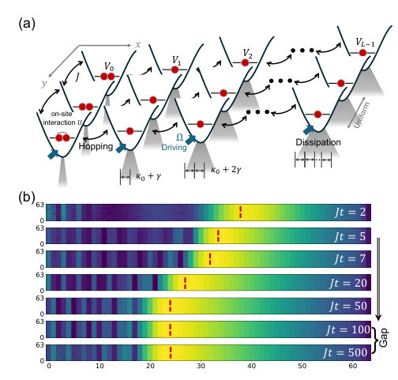 
FIG. 1. Setup and density front formation in a two- dimensional driven-dissipative Bose-Hubbard lattice. (a) Schematic of the model. The system consists of an array of nonlinear resonators with on-site interaction U, driven by a single-photon field Ωat frequency ωd. While the system remains uniform along the y-axis, it varies along the x-axis. Specifically, the linear Stark potential Fxj induces the detun- ing ramp, while the dissipation gradient κj = κ0 + γxj sets the spatially graded loss rate. Bosons hop between nearest neighbors at rate J. (b) Time evolution of the condensate density, showing the formation and pinning of the front (red dashed line). Brighter colors indicate higher local...

📷 Fig 2

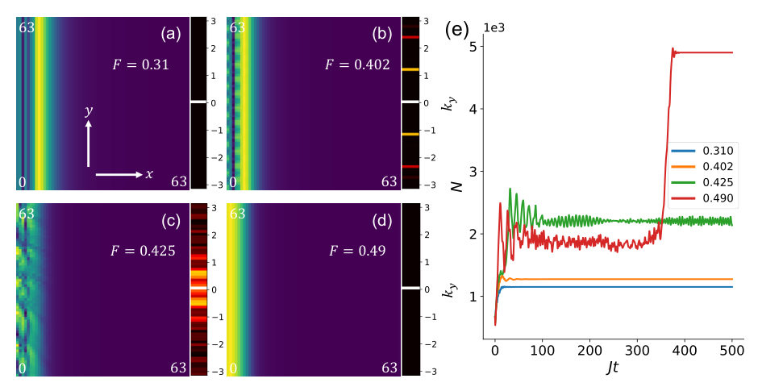 
FIG. 2. Long-time density profiles and transverse spectra at Jt = 500 for fixed dissipation gradient γ = 0.133 and baseline loss rate κ0 = 0.05, with the detuning-ramp slope F set by the Stark tilt. (a) A uniform pinned front at F = 0.31, with a dominant ky = 0 spectral component. (b) A pattern-locked front at F = 0.402, with discrete transverse harmonics. (c) A spatiotemporally chaotic state at F = 0.425, with broadband spectral mixing. (d) A minimum-loss-localized state at F = 0.49, again dominated by ky = 0. (e) Corresponding time evolution of the total particle number N for various F.

📷 Fig 3

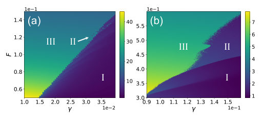 
FIG. 4. Generalized imbalance I mapped in the plane of detuning-ramp slope and dissipation-gradient strength, (F, γ). (a) and (b) correspond to the low- and high-γ sectors shown in Figs.3(d, b), respectively. The imbalance landscape reproduces the intricate structure observed in the center-of- mass diagram, confirming the sharp boundaries between the pinned, chaotic, and minimum-loss-localized phases. Notably, the discrete terraces are clearly resolved, providing evidence that the staircase depinning and dynamical transitions are in- trinsic features of the system.

📷 Fig 4

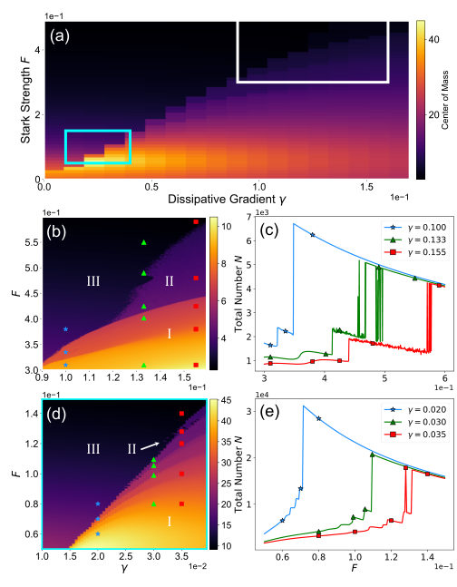 
FIG. 3. Dynamical phase diagram of the dissipation-selected front in the plane of detuning-ramp slope and dissipation- gradient strength, (F, γ), characterized by the center of mass. (a) Global phase map revealing sharp transition boundaries. (b, d) High-resolution scans of the (b) high-F, high-γ and (d) small-F, small-γ sectors. These diagrams delineate three distinct phases: I (pinned), II (chaotic), and III (minimum- loss-localized). The pinned phase manifests a characteristic staircase structure, which is progressively smoothed by in- creasing dissipation gradient γ. (c, e) Total particle number N versus F at fixed γ values corresponding to the sectors in (b) and (d). The traces...

**Summary.** This paper shows that spatially structured dissipation can be used to select and control nonlinear resonant fronts in a driven-dissipative Bose-Hubbard lattice. By tuning the dissipation gradient and detuning ramp, one can navigate between pinned, chaotic, and localized phases. This provides a mechanism for creating reconfigurable transport barriers in programmable quantum simulators.

**Why it may be interesting.** It demonstrates how engineered dissipation can act as a control knob for creating and stabilizing complex nonequilibrium structures like interfaces and transport barriers in bosonic lattices.

Detailed structure

**Main problem.** Investigating how spatially structured dissipation and a Stark-induced detuning ramp can be used to organize driven quantum matter and create reconfigurable transport barriers or nonequilibrium interfaces.

**Main result.** The study identifies a mechanism where a nonlinear resonance condition fixes a pinned density front, which can transition into pattern-locked states, spatiotemporal chaos, or localized states depending on the dissipation gradient and detuning slope.

**Method.** The authors use the generalized Gross-Pitaevskii equation (gGPE) for large-scale dynamics and the Truncated Wigner Approximation (TWA) to incorporate quantum fluctuations, supplemented by Bogoliubov-de Gennes stability analysis.

**Model / system.** A two-dimensional driven-dissipative Bose-Hubbard lattice subject to a single-photon drive, a linear Stark potential (detuning ramp), and a spatially graded loss rate.

**Key observables.** Local density, total particle number, center-of-mass, generalized imbalance, transverse spectra, and front width.

**Important parameters / regimes.** Stark tilt (F), dissipation gradient (gamma), hopping strength (J), interaction strength (U), and drive strength (Omega).

**Assumptions / limitations.** The TWA is assumed to be valid in the large-occupation regime, and the 2D dynamics are analyzed using a 1D reduction for the pinned-front regime.

**Figures summary.** Figure 1 shows a schematic of the model; Figure 3 presents global and high-resolution phase diagrams in the (F, gamma) plane, illustrating the staircase structure and particle number transitions.

**Paper structure.** The paper introduces the model and the concept of dissipation-selected fronts, develops the theoretical framework for front scaling and stability, presents a phase diagram of dynamical regimes, and concludes with the implications for interface engineering.

Abstract

Spatially structured dissipation organizes driven quantum matter beyond Hamiltonian control. We show that a dissipation gradient combined with a Stark-induced detuning ramp selects a nonlinear resonance slice in a two-dimensional driven-dissipative Bose-Hubbard lattice, producing a pinned density front in generalized Gross-Pitaevskii simulations. The underlying resonance condition fixes the front position, while its Airy-like profile obeys a width scaling set by tunneling stiffness and the effective detuning slope. Treating the front as an emergent interface explains how tuning the selected resonance toward the minimum-loss side yields Peierls-Nabarro depinning steps, discrete transverse pattern locking, spatiotemporal chaos, and minimum-loss localization. Center-of-mass and generalized-imbalance diagnostics map these outcomes into a dynamical phase diagram as detuning-ramp slope and dissipation-gradient strength vary. The results suggest structured dissipation as a mechanism for reconfigurable transport barriers and nonequilibrium interfaces in programmable bosonic lattices.

[↑ back to top](#top)

### [What We Talk About When We Talk About Dissipative Quantum Chaos](http://arxiv.org/abs/2605.21628v1)

**Authors:** Lucas Sá, Pedro Ribeiro, Sergey Denisov  
**Type:** theory · **Category:** statistical mechanics · **PDF:** <https://arxiv.org/pdf/2605.21628v1>  
**Analysis basis:** full PDF text, analyzed in chunks
**Topic relevance:** 🔥 `methods for driven-dissipative` **4/5** · `Keldysh / 2PI / non-Gaussian methods` **3/5** · `driven-dissipative phase transition` **3/5** · `non-equilibrium dynamics` **3/5** · `Dicke superradiance` **2/5** · `Tavis-Cummings & cavity-many-emitter` **2/5** · `entanglement & information structure` **2/5** · `non-equilibrium universality` **2/5**

📷 Fig 1

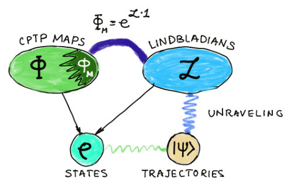 
Fig. 1 Objects of dissipative quantum chaos. Spectral properties of Lindblad operators L, CPTP maps Φ, and quantum states ρ(t) (especially asymptotic steady states ρss) are used to construct measures of integrability/chaoticity. Recently, ensembles of quantum trajectories generated by different unravelings [25, 37] of the same time-continuous open evolution have also started to be used for the same purpose. Note that all these objects are interrelated. For example, a density operator can be obtained by averaging over the ensemble of unravelled trajectories, and an important subclass of CPTP maps [38] is formed by maps ΦM that can be represented as ΦM = eL·1.

📷 Fig 2

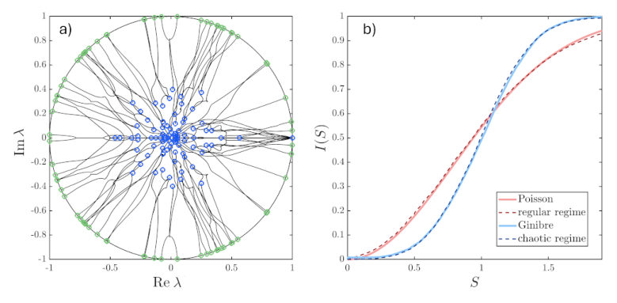 
Fig. 2 Reproduction of the results reported by Grobe, Haake, and Sommers in 1988 [39]. (a) Motion of the complex eigenvalues of the stroboscopic map (7) as the damping strength Γ is varied from 0 (green circles) to 0.4 (blue circles) in steps of 10−4. The eigenvalues are obtained for the even-parity sector in the chaotic regime. The parameters are S = 6, p = 2, k0 = 10, k1 = 8. (b) Integrated nearest- neighbour spacing distribution I(s). The spectra of the map are computed for S = 10, Γ = 0.1, p = 2, and 100 equidistant values of k0 ∈[10, 12]. The regular case corresponds to k1 = 0, while the chaotic one corresponds to k1 = 8. The distribution for the regular regime is compared with the...

📷 Fig 3

 
Figure 2 presents our reproduction of the key results reported in Ref. [39]. The left panel shows the dynamics of the eigenvalues of the stroboscopic map under a gradual increase of the dissipation strength Γ, in the chaotic regime. The eigenvalue trajectories reveal nontrivial dynamics, including collisions and the consequent formation of a cluster around zero (see Section 4.2 for a related discussion). These results served as inspiration for a recent work [42]. The right panel presents the main finding (as discussed above). These results are of foundational importance for DQC and therefore deserve an even more detailed discussion; see Section 9. Next year, in 1989, Grobe and Haake coined...

📷 Fig 4

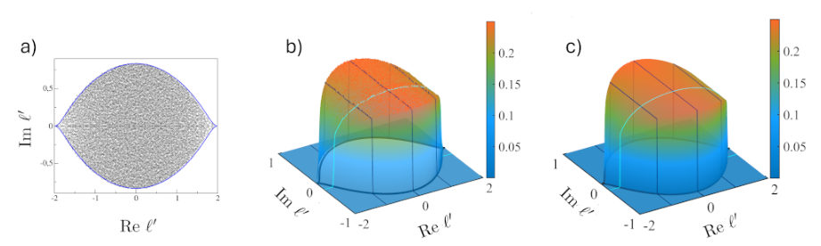 
Fig. 3 Spectral density of random Lindblad operators in the purely dissipative limit. (a) Rescaled eigenvalues ℓ′ = N(ℓ+ 1) of a single random Lindblad operator for N = 50 (the stationary eigenvalue ℓ1 = 0 is omitted). The solid contour shows the asymptotic boundary of the universal lemon-shaped support, Eqs. (13) and (14). (b,c) Probability density P(Re ℓ′, Im ℓ′) of the rescaled eigenvalues. Panel (b) presents the density obtained by sampling 104 random Lindblad operators for N = 100, while panel (c) shows the results obtained with the random-matrix model, Eq. (12). The dark blue contours indicate the lemon-shaped support. Note that the real eigenvalues were discarded when sampling random...

📷 Fig 5

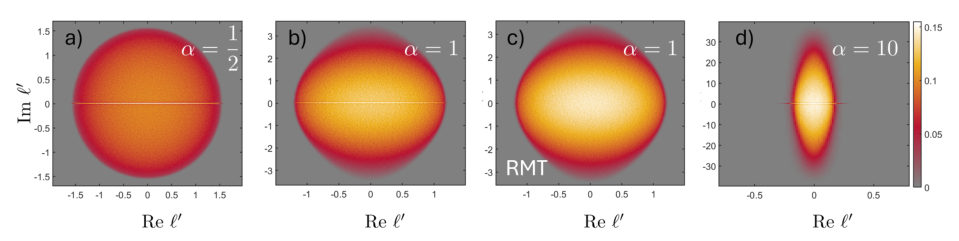 
Fig. 4 Spectral density of random Lindblad operators, Eq. (8), for different values of the weight α of the Hamiltonian contribution [69]. The panels show the density of the rescaled eigenvalues ℓ′ = N(ℓ+ 1). Panel (a) corresponds to the case α = 1/2, where the spectral support is expected to become a disk. Panel (b) shows the result for α = 1, which should be compared with the result for the RMT model shown in panel (c).

**Summary.** This paper reviews the emerging field of dissipative quantum chaos, focusing on how the spectral properties of open quantum systems can identify chaotic versus integrable dynamics. It connects non-Hermitian random matrix theory with physical models like the Lindblad equation to provide tools for characterizing non-unitary evolution. The work is significant for its ability to bridge the gap between quantum-to-classical transitions and the study of many-body open systems.

**Why it may be interesting.** It provides a comprehensive synthesis of how dissipation modifies the signatures of chaos, which is crucial for understanding decoherence and many-body dynamics in NISQ devices, ultracold atoms, and superconducting qubits.

Detailed structure

**Main problem.** The paper seeks to establish a theoretical framework for dissipative quantum chaos (DQC) by extending the concepts of Hamiltonian quantum chaos to open quantum systems, specifically focusing on distinguishing between integrable and chaotic regimes in non-unitary dynamics.

**Main result.** The authors review the recent revival of DQC, demonstrating that the spectral properties of Lindbladians and CPTP maps (such as level spacing statistics and complex spacing ratios) serve as robust signatures of chaos, while also addressing the nuances of the quantum-to-classical correspondence.

**Method.** The study utilizes Random Matrix Theory (non-Hermitian ensembles like Ginibre), spectral analysis of Lindblad operators, semiclassical approximations (such as the Truncated Wigner Approximation), and free probability theory.

**Model / system.** The review covers various models including the Lindblad master equation (GKLS form), CPTP maps, the dissipative quantum kicked rotor/top, and many-body systems like the Dicke model and Bose-Hubbard dimers.

**Key observables.** Spectral statistics (level spacing distributions, complex spacing ratios, cubic-level repulsion), steady-state density operators, Wigner/Husimi functions, and photon-emission statistics.

**Important parameters / regimes.** Dissipation strength (Gamma), Hamiltonian vs. dissipative weight (alpha), number of decay channels (rank R), and the semiclassical limit (large spin S or particle number N).

**Assumptions / limitations.** The framework assumes Markovian dynamics (Lindblad form) and relies on the validity of non-Hermitian Random Matrix Theory as a proxy for universal chaotic behavior.

**Figures summary.** Figure 1 illustrates the relationship between Lindblad operators, CPTP maps, and quantum states, highlighting how spectral properties are used to construct measures of chaos. Figure 4 shows the spectral density of random Lindbladians under varying Hamiltonian weights.

**Paper structure.** The paper follows a logical progression from the fundamental definitions of DQC and its historical development to the mathematical frameworks of Lindbladians and CPTP maps, followed by symmetry classifications, spectral signatures of chaos, semiclassical limits, and finally addressing challenges and discrepancies in the theory.

Abstract

Dissipative quantum chaos is an emerging theory that is expected to extend the ideas, concepts, and methodology of conventional Hamiltonian quantum chaos from coherent evolution to open quantum dynamics. The new theory should provide a set of tools to distinguish chaotic open quantum systems from integrable ones, as well as quantitative measures of their chaoticity (or, conversely, integrability). The foundations of this theory were laid in the late 1980s, and from the very start it was clear that, like its Hamiltonian predecessor, it had to be based on the spectral properties of the operators governing open quantum evolution. After these first steps, the field remained relatively quiet for many years and it is only over the last decade that the development of dissipative quantum chaos has received a strong boost, as confirmed by a large number of publications on this topic and, very recently, the first experiments performed to test its theoretical predictions. In this chapter, we review these recent developments and outline the basic foundations of dissipative quantum chaos.

[↑ back to top](#top)

### [Phase-tunable remote nonreciprocal charging in waveguide QED](http://arxiv.org/abs/2605.21909v1)

**Authors:** Meixi Guo, Jian Huang, Rui-Yang Gong, Xian-Li Yin, Guofeng Zhang  
**Type:** theory · **Category:** quantum information and computing · **PDF:** <https://arxiv.org/pdf/2605.21909v1>  
**Analysis basis:** full PDF text, analyzed in chunks
**Topic relevance:** 🔥 `correlated / nonlocal dissipation` **4/5** · `interference shaping light` **3/5** · `Tavis-Cummings & cavity-many-emitter` **2/5** · `methods for driven-dissipative` **2/5** · `non-equilibrium dynamics` **2/5**

📷 Fig 1

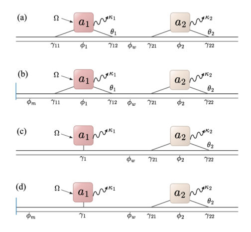 
FIG. 1. Schematic illustration of four different waveguide- mediated nonreciprocal QB configurations: (a) Open four- point model (4P), (b) Mirror-terminated four-point model (4P+M), (c) Open three-point model (3P), and (d) Mirror- terminated three-point model (3P+M). Each setup consists of two single-mode cavities (a driven charger and a remote QB) coupled to a one-dimensional waveguide. In the four-point designs (a,b), both cavity modes are coupled to the waveg- uide at two spatially separated points with waveguide cou- pling rates γ11, γ12, γ21, and γ22. In the three-point designs (c,d), the left cavity mode is configured as a small emitter and couples to the waveguide at a single point...

📷 Fig 2

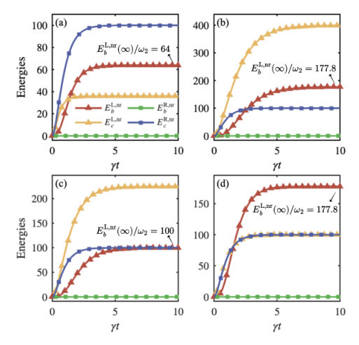 
FIG. 2. Nonreciprocal charging dynamics for different se- tups: (a) 4P, (b) 4P+M, (c) 3P, and (d) 3P+M. Curves show the time evolution of the scaled energies Eb/ωb and Ec/ωc under left- and right-mode driving. Here, ωb and ωc denote the frequencies of the QB and charger modes, respectively: under left-mode driving, ωb = ω2 and ωc = ω1, while under right-mode driving, ωb = ω1 and ωc = ω2. Red and yellow triangles denote the remote battery and driven-mode ener- gies under left-mode driving, EL,nr b and EL,nr c , respectively. Green and blue squares show the corresponding energies un- der right-mode driving; here ER,nr b denotes the energy stored in the remote receiver (the left mode a1),...

📷 Fig 3

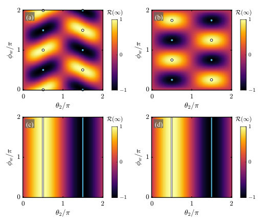 
FIG. 3. Contour maps of the steady-state nonreciprocal ra- tio R(∞) as a function of the QB coupling phase θ2 and the propagation phase ϕw. The white markers indicate parame- ter values for which R(∞) = 1, while the cyan-blue markers indicate parameter values for which R(∞) = −1. In panels (a) and (b), these conditions are marked by dots; in panels (c) and (d), they are marked by vertical lines. The setups cor- respond to (a) 4P, (b) 4P+M, (c) 3P, and (d) 3P+M. Other parameters used are the same as those in Fig. 2.

📷 Fig 4

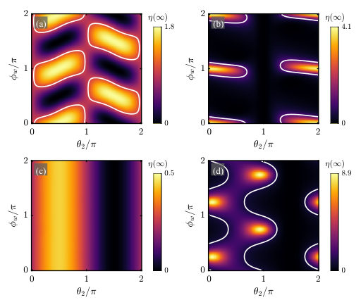 
FIG. 4. Relative storage ratio under left-mode driving. Color maps show the relative storage ratio η(∞) as a func- tion of phase θ2 and ϕw for (a) 4P, (b) 4P+M, (c) 3P, and (d) 3P+M. The white contour marks η = 1, separating battery- dominated storage (η &gt; 1) from charger-dominated storage (η &lt; 1). Other parameters used are the same as those in Fig. 2.

📷 Fig 5

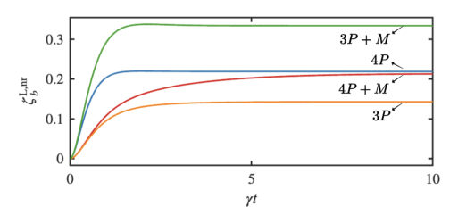 
FIG. 6. Extractable fraction of the stored energy under quadratic driving. Curves show the ratio ζL,nr b (t) as a function of γt for the four configurations: 4P, 4P+M, 3P, and 3P+M. Other parameters used are the same as those in Fig. 5.

**Summary.** This paper proposes a method to charge remote quantum batteries using waveguide-mediated interference instead of direct coupling. By tuning propagation and coupling phases, the researchers show how to achieve unidirectional, nonreciprocal energy flow. The study also reveals that quadratic driving can create non-passive battery states where work extractability (ergotropy) becomes a distinct metric from stored energy.

**Why it may be interesting.** It provides a versatile design principle for directional energy transfer in quantum networks using interference and reservoir engineering, which is highly relevant to open quantum systems and quantum optics.

Detailed structure

**Main problem.** Developing efficient protocols for remote quantum battery charging where the charger and battery are spatially separated, specifically overcoming the need for direct local Hamiltonian couplings and achieving unidirectional energy transfer.

**Main result.** The authors demonstrate that phase-tunable waveguide-QED architectures can realize nonreciprocal charging, with the 3P+M configuration achieving both perfect nonreciprocity and battery-dominated storage, while 3P setups offer distance-insensitive directionality.

**Method.** The study uses the SLH formalism to derive a quantum master equation and analyzes the time evolution of first and second moments under linear and quadratic driving regimes.

**Model / system.** A waveguide QED architecture consisting of two single-mode cavities (a driven charger and a remote battery) coupled to a 1D waveguide, exploring four configurations: 4P, 4P+M, 3P, and 3P+M (open and mirror-terminated).

**Key observables.** Nonreciprocal ratio (R), relative storage ratio (eta), stored energy (Eb), ergotropy (W), and anomalous second moments.

**Important parameters / regimes.** Propagation phases (phi_w), coupling phases (theta), waveguide coupling rate (gamma), driving amplitude (Omega), and cavity decay rates (kappa).

**Assumptions / limitations.** The system assumes a waveguide-mediated regime with no direct local interaction, negligible retardation effects, and small frequency mismatch between modes.

**Figures summary.** Figure 1 shows schematic illustrations of the four waveguide-QED configurations; Figure 2 shows time evolution of scaled energies; Figure 4 shows steady-state relative storage ratios.

**Paper structure.** The paper introduces the problem of remote charging, describes the waveguide-QED models and configurations, provides analytical derivations for the master equation coefficients, compares the performance of the four setups, and extends the analysis to quadratic driving and ergotropy.

Abstract

Remote quantum batteries require directional and controllable energy transfer between spatially separated quantum nodes, yet most existing protocols rely on direct charger-battery Hamiltonian couplings. Here we propose a phase-tunable waveguide-QED architecture for remote quantum-battery charging, in which a driven charger and a remote battery are coupled solely via engineered waveguide-mediated interference, without any direct local interaction. We systematically compare four configurations: two-giant-emitter and giant-small-emitter hybrids, each with open or mirror-terminated waveguides. By engineering the propagation and coupling phases, the waveguide-mediated coherent exchange interaction and collective dissipation can be balanced to suppress the backward channel while retaining a finite forward channel, thereby realizing cascaded-like unidirectional charging. Our analysis shows that nonreciprocity and storage efficiency can be independently engineered, offering design flexibility for different quantum network scenarios. The giant-small-emitter mirror-terminated configuration simultaneously achieves perfect nonreciprocity and battery-dominated storage, while both giant-small-emitter configurations exhibit distance-insensitive directionality. Extending the scheme to quadratic driving, we show that anomalous second moments render the battery state non-passive, making ergotropy a performance metric distinct from stored energy. These results establish phase-tunable waveguide networks as a versatile platform for remote quantum-energy transfer and provide design principles for directional and work-extractable energy storage in quantum networks.

[↑ back to top](#top)

### [Testing Superpositions of Detector Trajectories](http://arxiv.org/abs/2605.21595v1)

**Authors:** Cisco Gooding, Taylor Cey, Robert Mann  
**Type:** both · **Category:** quantum gases · **PDF:** <https://arxiv.org/pdf/2605.21595v1>  
**Analysis basis:** full PDF text, analyzed in chunks
**Topic relevance:** 🔥 `analog quantum simulation` **4/5** · 🔥 `quantum optics experiment` **4/5** · `quantum measurements` **3/5** · `interference shaping light` **2/5**

📷 Fig 1

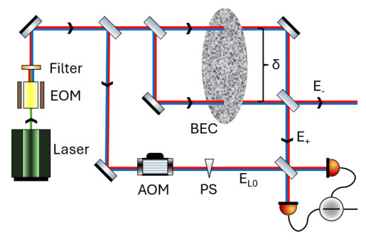 
FIG. 1. Experimental schematic for probing BEC density fluctuations from a superposition of detector locations sepa- rated by δ = |x1 −x2|. Prior to interaction, an electro-optic modulator (EOM) and a filter are used to prepare the mod- ulated laser field (17). Post-interaction, the laser probes are recombined in a beamsplitter, and the “sum” output E+ is heterodyned using a reference beam ELO, yielding the desired response function (25). An acousto-optic modulator (AOM) and a phase-shifter (PS) are incorporated in the reference beam to facilitate the heterodyne process [11].

**Summary.** The paper proposes an experimental setup using a Bose-Einstein Condensate to test the response of a particle detector in a superposition of locations. By using a modulated laser probe and heterodyne detection, the authors show it is possible to isolate the interference signal from the detector's trajectory. The study demonstrates that using squeezed light can significantly enhance the signal-to-noise ratio for this measurement.

**Why it may be interesting.** It bridges quantum field theory (Unruh effect) with experimental AMO physics, providing a concrete way to use BECs and quantum optics (squeezed light) to probe fundamental relativistic quantum phenomena.

Detailed structure

**Main problem.** Proposing a realizable experiment to detect and witness the superposition of detector trajectories by measuring the response of an Unruh-DeWitt detector to a relativistic quantum field.

**Main result.** The authors demonstrate that the interference signal (off-diagonal terms) can be isolated via heterodyne detection of a laser probe, achieving a signal-to-noise ratio of SNR >= 10 using squeezed light.

**Method.** The method involves using a modulated laser probe split into two branches that intersect a Bose-Einstein Condensate at two locations, followed by recombination and heterodyne detection to extract the difference-photocurrent power spectral density.

**Model / system.** An analogue system using a pancake-shaped Bose-Einstein Condensate (BEC) of 133Cs atoms to simulate a (2+1)-dimensional massless scalar field, with an Unruh-DeWitte detector model interacting with density fluctuations.

**Key observables.** The difference-photocurrent power spectral density and the total response function F(nu) containing the interference term.

**Important parameters / regimes.** Energy gap nu, coupling constant lambda, displacement delta, and the use of squeezed light to operate beyond the standard quantum limit.

**Assumptions / limitations.** Assumes the ability to implement specific parameter regimes in a 133Cs BEC and requires sufficient laser power for nondestructive continuous measurement.

**Figures summary.** Figure 1 provides a schematic of the experimental setup, including the EOM, BEC interaction points, beamsplitter recombination, and the heterodyne detection components.

**Paper structure.** The paper introduces the theoretical Unruh-DeWitt model, maps it to a BEC analogue system, details the experimental detection scheme using laser probes, calculates the expected signal and noise, and estimates the achievable SNR.

Abstract

We propose a realizable experiment to test the response of a particle detector prepared in a superposition of locations interacting with a relativistic quantum field. Using a beamsplitter to prepare two superposed branches of a modulated laser probe, these branches are directed to intersect a pancake-shaped Bose-Einstein condensate at two separate locations. The branches are then recombined with another beamsplitter. Heterodyning one of the outputs, the response function corresponding to an Unruh-deWitt detector in a superposition of locations interacting with a (2+1)-dimensional massless scalar field is shown to appear in the difference photocurrent power spectrum. Operating beyond the standard quantum limit using squeezed light, we estimate the signal-to-noise ratio $SNR\gtrsim 10$ for extracting the response function over a broad set of baseband frequencies.

[↑ back to top](#top)

### [Bottom-up open EFT for non-Abelian gauge theory with dynamical color environment](http://arxiv.org/abs/2605.22822v1)

**Authors:** Yoshihiko Abe, Kanji Nishii  
**Type:** theory · **Category:** statistical mechanics · **PDF:** <https://arxiv.org/pdf/2605.22822v1>  
**Analysis basis:** full PDF text, analyzed in chunks
**Topic relevance:** 🔥 `Keldysh / 2PI / non-Gaussian methods` **4/5** · `correlated / nonlocal dissipation` **3/5** · `methods for driven-dissipative` **3/5** · `non-equilibrium dynamics` **2/5**

📷 Fig 1

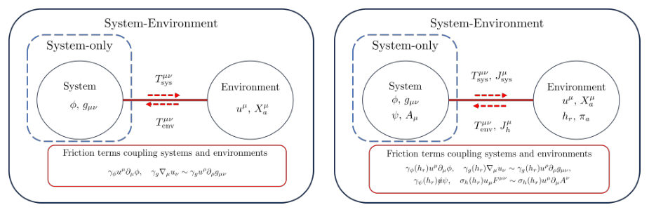 
Figure 1: Schematic pictures of the system-environment construction for the gravitational (left) and the non-Abelian (right) open EFT. The system fields exchange the energy-momentum and color charge with retained environmental sector described by the dynamical environmental vari- ables. The environmental currents are required to close the Ward identity and provide the non- vanishing charge exchange between the system and the environment. After integrating out the retained response variables with retarded boundary conditions, the reduced system-only descrip- tion acquires nonlocal dissipative and stochastic responses. However, the system-environment construction gives the local EFT...

**Summary.** The paper proposes a new way to describe dissipative non-Abelian plasmas by treating the environment as a dynamical color-charged sector. By keeping environmental variables explicit, the authors transform difficult non-local memory effects into a local, gauge-covariant theory. This framework successfully recovers standard results like Hard Thermal Loops while ensuring thermodynamic consistency.

**Why it may be interesting.** This work is highly relevant to researchers in open quantum systems as it provides a rigorous framework for 'Markovian embedding'—representing non-Markovian, non-local dynamics through an enlarged local system-environment model while preserving fundamental gauge symmetries.

Detailed structure

**Main problem.** Developing a local, gauge-covariant effective field theory (EFT) for non-Abelian gauge theories that accounts for non-local memory effects, dissipation, and fluctuations without violating fundamental symmetries like the color Ward identity.

**Main result.** The authors construct a 'bottom-up' open EFT where non-local and non-Markovian effects (such as Hard Thermal Loops) emerge naturally from a local, Markovian system-environment theory by explicitly retaining slow environmental response variables.

**Method.** The study uses the Schwinger-Keldysh formalism and a 'Markov embedding' approach, where environmental variables are integrated out using retarded boundary conditions to recover non-local kernels.

**Model / system.** A non-Abelian (Yang-Mills) gauge theory interacting with a dynamical color environment, modeled via a system-environment EFT featuring a color-frame variable, a Stueckelberg-like field, and a color-current sector.

**Key observables.** Color transport, color-charge storage, susceptibility, conductivity, relaxation, noise kernels, and the Hard Thermal Loop (HTL) induced current.

**Important parameters / regimes.** High-temperature non-Abelian plasmas, the collisionless limit, the relaxation rate (Gamma), and the Debye mass scale.

**Assumptions / limitations.** Assumes a separation of scales between soft modes and microscopic degrees of freedom, and a factorized initial density operator.

**Figures summary.** Figure 1 provides a schematic comparison between the proposed non-Abelian open EFT and a dissipative gravitational EFT, illustrating how energy-momentum or color charge is exchanged with the environment.

**Paper structure.** The paper reviews the Schwinger-Keldysh formalism and gravitational analogies, constructs the environmental color frame and sources, introduces the velocity-resolved hard response, and uses an appendix to demonstrate the dynamical KMS completion of the dissipative color response.

Abstract

We develop a bottom-up open effective field theory (EFT) for non-Abelian gauge theories within the Schwinger--Keldysh formalism. Instead of integrating out the environment completely and starting from a nonlocal influence functional, we retain the slow environmental response variables explicitly and construct a local system-environment EFT. The environmental sector is described by a dynamical color-frame variable, Stückelberg-like field, and an associated color-current sector, which gives the nontrivial interactions and dissipation between the system and the environment. The resulting construction provides a gauge-covariant Markov embedding of nonlocal and non-Markovian color response. After integrating out the retained environmental variables with retarded boundary conditions, the reduced system theory acquires nonlocal dissipative kernels and stochastic sources. We show that the hard thermal loop response arises naturally as a particular realization of the retained environmental response. Our framework provides a local open-EFT description of color transport, memory effects, and fluctuation-dissipation structure in non-Abelian plasmas, and offers a systematic starting point for dissipative Yang--Mills EFTs with dynamical environments.

[↑ back to top](#top)

### [Multi-Modal Spectroscopy Theory for Ultrafast Control of Rabi Oscillations](http://arxiv.org/abs/2605.21923v1)

**Authors:** J. W. Yu, H. B Wang, X. Q. Zhou, M. Tang, Z. B. Ni, X. T. Cheng, Y. Zhao, S. N Ding, J. Y. Yan, H. H. Zhu, C. H. Li, F. Liu, C. Y. Jin  
**Type:** theory · **Category:** other · **PDF:** <https://arxiv.org/pdf/2605.21923v1>  
**Analysis basis:** full PDF text, analyzed in chunks
**Topic relevance:** 🔥 `methods for driven-dissipative` **4/5** · `Tavis-Cummings & cavity-many-emitter` **3/5** · `non-equilibrium dynamics` **3/5** · `quantum measurements` **2/5**

📷 Fig 1

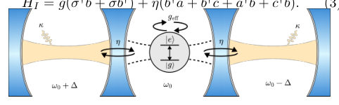 
FIG. 1. Schematic illustration of the TLS-three-cavity sys- tem. A two-level system (TLS) is embedded in the middle cavity and couples to its local photonic mode with strength g. The two lateral cavities are coupled to the middle cavity with strength η, and their resonance frequencies are tuned to ω0 + ∆and ω0 −∆, respectively. The supermode of the three-cavity system at ω0 is mainly distributed over the lateral cavities and nearly vanishes in the middle cavity when ∆= 0 (yellow shaded region). In contrast, when |∆| ≫η, the ω0 mode becomes localized in the middle cavity (black dashed outline). This detuning-controlled redistribution of the op- tical density of states (DOS) in the middle...

📷 Fig 2

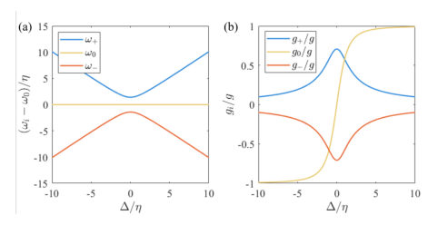 
FIG. 2. (a) Eigenfrequencies of the three supermodes as functions of the normalized detuning ∆/η. The central super- mode remains pinned at ω0 and is independent of ∆, whereas the upper and lower supermodes split symmetrically with in- creasing |∆|. (b) Effective coupling strengths between the TLS and the three supermodes. In particular, the TLS- central-supermode coupling strength geff can be tuned con- tinuously from −g to g by varying ∆, offering a significantly large tuning range.

📷 Fig 3

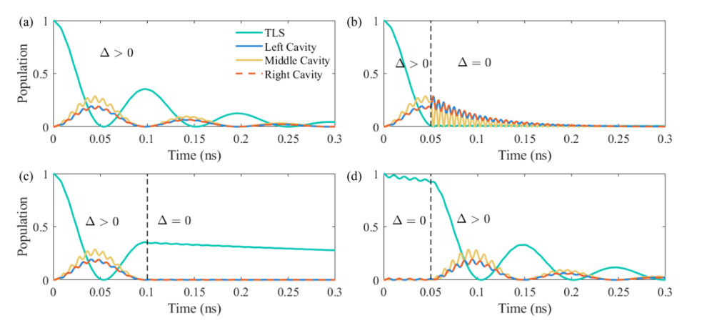 
FIG. 3. Numerical result for the Rabi oscillation of the occupation of the excited state of TLS and population of the three modes. The system is initially at the excited state of the TLS. In (a), the detuning is not changing during the entire process. In (b) and (c) the detuning is turned from 1.2η to 0 at the vertical dashed line, while in (d) the detuning is turned from 0 to 1.2η. The other parameters including coupling constants and dissipation rates are given in the text.

📷 Fig 4

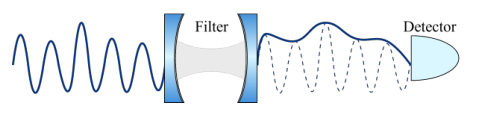 
FIG. 4. Schematic illustration of a time-resolved physical spectrum (TRPS) measurement. The emitted field is passed through a Lorentzian spectral filter, and the time-dependent intensity of the filtered signal is recorded by a sensor, yielding a frequency-resolved temporal profile of the emission.

📷 Fig 5

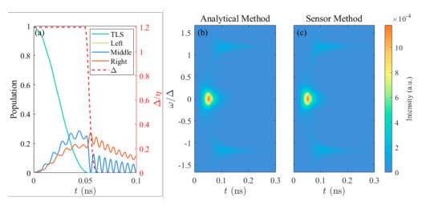 
FIG. 6. Validation of the sensor method under continuously time-dependent modulation. (a) Smooth switching of the de- tuning with a finite fall time of 3 ps (dashed line), together with the population dynamics of the TLS and cavity modes. (b)-(c) Comparison of the TRPS obtained from the analytical definition in Eq. (8) and the sensor method.

**Summary.** This paper introduces a new theoretical method to efficiently simulate the transient spectra of complex, time-dependent cavity QED systems. By using auxiliary 'sensor' modes, the authors bypass the high computational cost of traditional methods, allowing them to demonstrate how to switch Rabi oscillations on and off at ultrafast speeds by manipulating cavity detuning.

**Why it may be interesting.** It provides a computationally efficient framework for studying non-equilibrium dynamics in multi-mode systems and demonstrates a practical mechanism for ultrafast control of light-matter coupling, which is highly relevant to quantum optics and open quantum systems.

Detailed structure

**Main problem.** Achieving efficient, real-time control and characterization of light-matter interactions in multi-mode, nonstationary cavity QED systems, while overcoming the computational bottleneck of resolving transient spectra in the time domain.

**Main result.** The development of a generalized sensor method that enables efficient calculation of time-resolved physical spectra (TRPS) and demonstrates the ultrafast switching of Rabi oscillations via supermode redistribution.

**Method.** A generalized sensor method using weakly coupled auxiliary modes as frequency-selective probes to compute TRPS with linear scaling, alongside numerical simulations using the Lindblad master equation.

**Model / system.** A three-cavity scheme consisting of a two-level system (TLS) embedded in a middle cavity, coupled to two lateral cavities, described by a time-dependent Hamiltonian in the single-excitation subspace.

**Key observables.** TLS excited state population, cavity mode populations, and Time-Resolved Physical Spectrum (TRPS).

**Important parameters / regimes.** Coupling strengths (g, eta), detuning (Delta), dissipation rates (gamma, kappa), and the ratio g/eta.

**Assumptions / limitations.** The system operates in the strong coupling regime; the Rotating-Wave Approximation (RWA) is applied; the sensor coupling (epsilon) is kept weak to avoid perturbing intrinsic dynamics.

**Figures summary.** Fig 1: Schematic of the TLS-three-cavity system and supermode localization. Fig 2: Supermode eigenfrequencies vs detuning. Fig 5: Runtime scaling comparison of the sensor method vs analytical method. Fig 6: Validation of the sensor method. Fig 9-10: TRPS and population dynamics showing Rabi oscillation control and switching effects. Fig 11-12: Robustness analysis regarding detuning amplitude and switching time.

**Paper structure.** The paper introduces the three-cavably cQED problem, defines the Hamiltonian and supermode structure, proposes the sensor method for efficient TRPS calculation, validates the method against analytical benchmarks, and demonstrates the physical application of ultrafast Rabi oscillation control via detuning-controlled supermode redistribution.

Abstract

We propose a three-cavity scheme to realize full control of the emitter-cavity coupling strength in cavity quantum electrodynamics (cQED). The involvement of coupled oscillators gives rise to transient dynamics comprising multiple spectral components, which significantly increases the numerical cost to resolve the fluorescence spectrum in the time domain. A generalized sensor method is hence developed to simplify the calculation process for the characterization of nonstationary quantum dynamics. Multi-modal spectroscopy reveals the emergence, splitting, and disappearance of supermodes in real time. Based on the depletion of the zero-energy supermode, ultrafast switching of Rabi oscillations is demonstrated for time-domain multi-modal spectroscopy. These results exhibit a consistent picture from the spectral control of multiple oscillators to the quantum observation in ultrafast dynamics, which establishes the sensor method as a powerful theoretical tool for the ultrafast spectroscopy of cQED systems.

[↑ back to top](#top)

### [Dual wavelength source of entanglement for space quantum communication](http://arxiv.org/abs/2605.22339v1)

**Authors:** Valentin Dumas, Alek Lagarrigue, Tess Troisi, Gregory Sauder, Sebastien Tanzilli, Anthony Martin, Olivier Alibart  
**Type:** experiment · **Category:** quantum information and computing · **PDF:** <https://arxiv.org/pdf/2605.22339v1>  
**Analysis basis:** full PDF text, analyzed in chunks
**Topic relevance:** 🔥 `QC/QI experiment` **4/5** · 🔥 `quantum optics experiment` **4/5** · `interference shaping light` **3/5**

📷 Fig 1

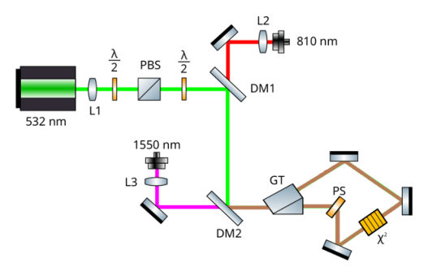 
FIG. 1. Schematic of the highly non-degenerate entangled photon pair source. The polarization dependent Sagnac con- figuration enables to exploit both energy-time and polariza- tion entanglement by exploiting the two counter propagating modes within the Sagnac loop. The periscope inside the in- terferometer (PS) applies a perfect 90◦polarization rotation on the three interacting wavelengths. The Glan-Thompson polarizer (GT) also acts as an achromatic polarizing beam- splitter defining the two counter-propagating modes focused into the periodically poled lithium niobate (PPLN). Further chromatic elements are used on individual modes such as two dichroic mirrors with cutoff respectively at...

📷 Fig 2

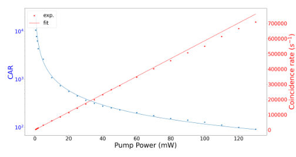 
FIG. 2. Evolution of the CAR and the coincidence rate in regard to the pump power. The CAR is fitted with the inverse of the pump power. This measurement is done exploiting the full range of optical power provided by our pump laser.

📷 Fig 3

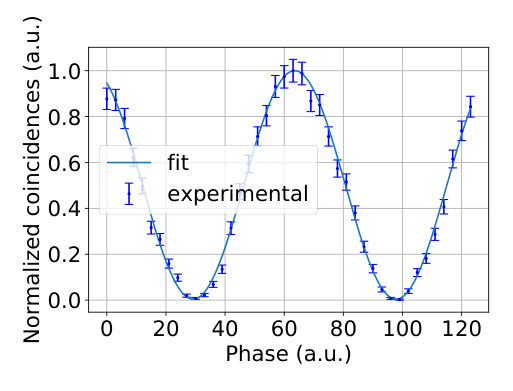 
FIG. 3. Energy-time entanglement fringes for the Franson- type experiment. The phase shift is expressed in Volt as we linearly controlled a piezo-electric stack mounted mirror. The measurement has been performed for a pump power of 35 mW

📷 Fig 4

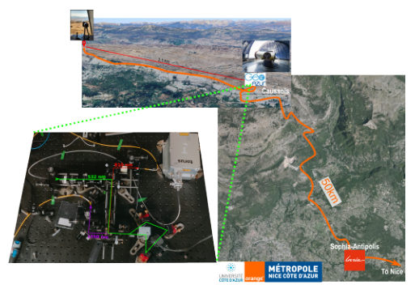 
FIG. 5. Hybrid QKD link with a 2.5km free space link be- tween a reflective collimator and the Observatoire de la Cˆote d’azur telescope.

📷 Fig 5

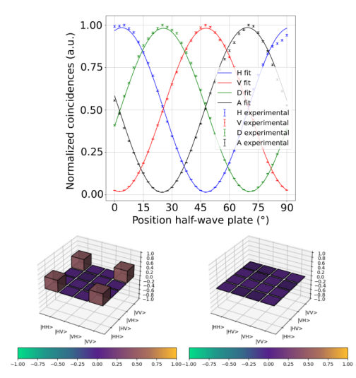 
FIG. 4. top : Raw polarization visibility of the bulk Sagnac source, in the horizontal (H), vertical (V), diagonal (D) and antidiagonal (A) linear polarization. The cos2 function used to fit the experimental data report a net visibility of 99.5% ± 0.1% for the H/V basis and 99.3% ± 0.1% for D/A basis. Bottom : Graphical representation of the real (left) and imaginary (right) parts of the density matrix extracted from experimental tomography measurements. The calculated pu- rity is 98, 1% while the fidelity to the Bell state | Φ+⟩reaches 99%.

**Summary.** The researchers developed a dual-wavelength entanglement source that operates at 810 nm and 1550 nm, specifically designed to link satellite-to-ground and fiber-based quantum networks. By using a Sagnac interferometer with a PPLN crystal, they achieved high-quality entanglement in both polarization and energy-time bases. This provides a scalable and robust component for future global quantum communication infrastructures.

**Why it may be interesting.** This work is highly relevant to quantum optics and quantum networks as it demonstrates a practical hardware solution for interfacing different quantum communication architectures using hyperentanglement.

Detailed structure

**Main problem.** The need for a quantum interconnect that bridges the gap between free-space (satellite) and fiber-based (terrestrial) quantum communication networks by providing a dual-wavelength entanglement source.

**Main result.** Demonstration of a robust, phase-stable source providing simultaneous polarization and energy-time entanglement at 810 nm and 1550 nm with high visibility (up to 99.5%) and high fiber coupling efficiency.

**Method.** Spontaneous Parametric Down-Conversion (SPDC) in a periodically poled lithium niobate (PPLN) crystal placed within a polarization Sagnac interferometer, followed by Franson-type interference and quantum state tomography.

**Model / system.** A bulk-scale experimental platform using a 532 nm pump laser, a 10 mm-long MgO-doped PPLN crystal, and a Sagnac interferometer configuration to generate non-degenerate photon pairs.

**Key observables.** Spectral brightness, entanglement visibility (polarization and energy-time), fiber coupling efficiency, heralding efficiency, and Coincidence-to-Accidental Ratio (CAR).

**Important parameters / regimes.** Wavelengths at 810 nm and 1550 nm; spectral brightness of 4800 pairs/s/mW/GHz; pump power up to 125 mW; entanglement fidelities near 99%.

**Assumptions / limitations.** Assumes a hybrid link loss of approximately 30 dB (15 dB free-space and 15 dB fiber) for the predicted secret key rate calculations.

**Figures summary.** Figure 1 shows the experimental setup; Figure 2 illustrates the evolution of CAR and coincidence rates with pump power; Figure 3 displays energy-time interference fringes; Figure 4 presents polarization visibility and the reconstructed density matrix.

**Paper structure.** The paper introduces the motivation for hybrid networks, describes the experimental Sagnac-based SPDC setup, details the characterization of entanglement degrees of freedom, provides a comparative analysis with other sources, and concludes with performance predictions for a hybrid QKD link.

Abstract

We report the demonstration of a bulk, intrinsically phase-stable source of polarization- and time-energy-entangled photon pairs at 810nm and 1550nm, directly coupled into single-mode optical fibers. This highly non-degenerate wavelength combination is well suited for hybrid quantum communication networks, enabling low-loss transmission in optical fibers at 1550nm while maintaining efficient free-space propagation and detection at 810nm. The source is based on spontaneous parametric down-conversion in a periodically poled lithium niobate crystal embedded in a polarization Sagnac interferometer, providing inherent stability and dual-degree-of-freedom entanglement.   We measure a spectral brightness of B = 4800 pair/s/mW/GHz, with fiber coupling efficiencies exceeding 0.48 at both wavelengths. The entanglement quality is characterized by high-visibility two-photon interference, yielding net visibilities of 0.995 in the polarization basis and 0.991 in the energy-time basis. These performances demonstrate a compact and robust entanglement source compatible with hybrid fiber/free-space quantum key distribution architectures, and suitable for future ground-to-satellite quantum communication links.

[↑ back to top](#top)

### [Geometric Origin of the Non-Adiabaticity Parameter and Self-Limiting Instability in Driven Nonlinear Systems](http://arxiv.org/abs/2605.22796v1)

**Authors:** A. M. Tishin  
**Type:** theory · **Category:** other · **PDF:** <https://arxiv.org/pdf/2605.22796v1>  
**Analysis basis:** full PDF text, analyzed in chunks
**Topic relevance:** 🔥 `driven-dissipative phase transition` **4/5** · `non-equilibrium dynamics` **3/5** · `methods for driven-dissipative` **2/5** · `non-equilibrium universality` **2/5**

📷 Fig 1

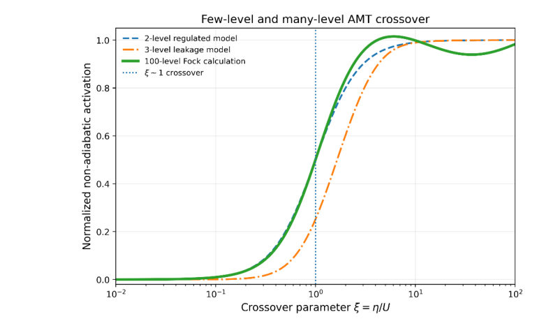 
Fig. 1. Few-level and many-level AMT crossover structure. The normalized non-adiabatic

**Summary.** This paper proves that the non-adiabaticity parameter represents the speed of quantum state evolution in the Fubini-Study metric. It shows that nonlinearity can act as a regulator that slows down this geometric speed, effectively preventing uncontrolled parametric instabilities.

**Why it may be interesting.** It provides a universal, local geometric criterion for stability in driven systems, which is highly relevant for controlling parametric amplification in quantum optics, superconducting circuits, and bosonic condensates.

Detailed structure

**Main problem.** Understanding the geometric origin of non-adiabaticity and the mechanism behind self-limiting instability in driven nonlinear bosonic systems.

**Main result.** The non-adiabaticity parameter is established as the instantaneous evolution speed in projective Hilbert space under the Fubini-Study metric, and a nonlinear regulator $U$ suppresses this speed to prevent uncontrolled growth.

**Method.** The author uses the Adiabatic Mode Transition (AMT) framework, a geometric derivation via the Fubini-Study metric, and mean-field approximations, validated by large-scale Fock-space numerical simulations.

**Model / system.** Driven nonlinear bosonic systems, such as nonlinear oscillators, magnetic resonators, or photonic cavities, modeled by a Hamiltonian with a parametric drive and a Kerr-like nonlinear regulator $U$.

**Key observables.** Non-adiabaticity parameter ($\eta$), effective non-adiabaticity ($\eta_{eff}$), Fubini-Study evolution speed, and mean occupation ($\langle n 
angle$).

**Important parameters / regimes.** Crossover parameter $\xi = \eta/U$, where $\xi < 1/4$ defines a stable, bounded regime and $\xi 	o 1$ leads to unstable growth.

**Assumptions / limitations.** The analysis utilizes an instantaneous vacuum state approximation and a mean-field approximation for calculating effective frequency.

**Figures summary.** The supplementary figures demonstrate the suppression of non-adiabatic activation and leakage in two- and three-level models, and prove numerical convergence of the results across different Hilbert-space truncations.

**Paper structure.** The paper introduces the geometric interpretation of non-adiabaticity, develops the self-limiting mechanism via nonlinear regulation, and provides numerical validation through multi-level and truncated Fock-basis models.

Abstract

We establish that the non-adiabaticity parameter has a direct geometric interpretation as the instantaneous evolution speed of a driven quantum state in projective Hilbert space under the Fubini Study metric. In contrast to conventional asymptotic approaches, the proposed framework provides a strictly local geometric criterion that allows non-adiabatic instability and its nonlinear suppression to be evaluated continuously at each stage of the driven evolution. We further show that an occupation-dependent nonlinear regulator Usuppresses the effective geometric evolution speed, leading to bounded low-occupancy dynamics. The resulting crossover parameter provides a compact criterion for self-limited non-adiabatic instability in driven nonlinear bosonic systems.

[↑ back to top](#top)

### [Optics-microwave entanglement and state teleportation mediated by a cavity magnomechanical system](http://arxiv.org/abs/2605.21754v1)

**Authors:** F. Engelhardt, A. V. Bondarenko, A. Metelmann, Ya. M. Blanter, S. Viola Kusminskiy, V. A. S. V. Bittencourt  
**Type:** theory · **Category:** quantum information and computing · **PDF:** <https://arxiv.org/pdf/2605.21754v1>  
**Analysis basis:** full PDF text, analyzed in chunks
**Topic relevance:** 🔥 `spintronics-quantum-optics interface` **4/5** · `entanglement & information structure` **3/5** · `correlated / nonlocal dissipation` **2/5** · `non-equilibrium dynamics` **2/5**

📷 Fig 1

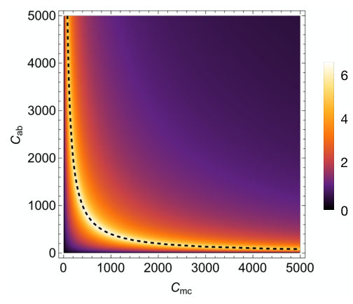 
FIG. 3. Logarithmic negativity EN as function of optome- chanical (Cab) and magnon-microwave (Cmc) cooperativity. The magnomechanical cooperativity was set to Cmb = 4×105

📷 Fig 2

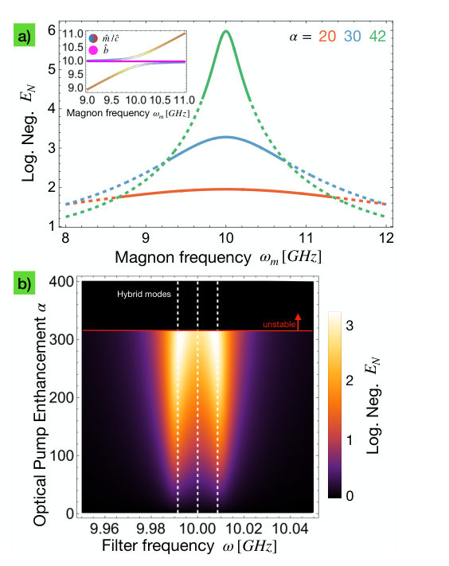 
FIG. 4. a) Output entanglement quantified in terms of the logarithmic negativity as a function of the magnon frequency ωm. We vary the optomechanical pump enhancement factor α, all other parameters are in accordance with Tab. II. Dotted lines indicate where the system becomes unstable. The inset shows the mode hybridisation as a function magnon frequency for the phonon-magnon-microwaves subsystem. In plot b), we reduce the magnon-microwave coupling to gmc = 18 MHz, and plot the logarithmic negativity both as a function of the filter center frequency ω, and the enhancement factor α. The re- duced coupling leads to a shift of the entanglement maxima in accordance with the changed hybrid mode...

📷 Fig 3

 
Fig. 4a) by plotting EN as a function of the magnon fre- quency and for different optomechanical coupling rates G, which define the strength of the pair-creation inter- action and can be increased by the optical pump power. As G increases, so does EN, while simultaneously the region of stability becomes more narrow. The largest G (α ≈42) puts the system in the maximum entangle- ment region, in agreement with Fig. 3. In Fig. 4b) we reduce the magnon-microwave coupling rate by one or- der of magnitude, which results in a shift of the regions

📷 Fig 4

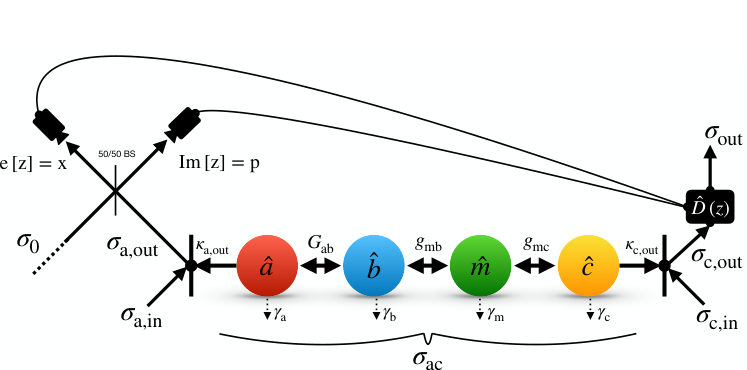 
FIG. 5. Sketch of the VBK transfer scheme [9, 10]. The coupled chain, containing optical photons (ˆa), phonons (ˆb), magnons ( ˆm) and microwaves (ˆc) generates a two-mode optics-microwave squeezed state σac. Teleportation of a state σ0 consists on performing a displacement in the output microwave σout conditioned on the result of a homodyne detection in the optical part, indicated by the amplitude z.

📷 Fig 5

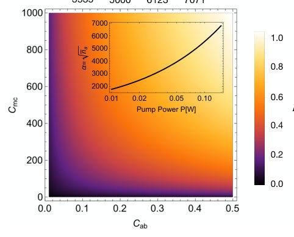 
FIG. 7. Steady state entanglement as a function of op- tomechanical (Cab) and magnon-microwave (Cmc) coopera- tivity, for the proposed disk-based setup. The magnomechan- ical cooperativity was set, based on numerical analysis, to Cmb = 4000. The inlet shows the enhancement factor α as a function of the pump power. The upper scale shows the factor α for three values of Cab. The values of the relevant parameters are given in Table I.

**Summary.** This paper proposes a two-stage magnomechanical converter to generate entanglement between optical and microwave photons. By using a YIG disk as a mediator, the system enables high-fidelity quantum state teleportation. The study demonstrates that this setup overcomes the efficiency bottlenecks found in single-stage frequency conversion models.

**Why it may be interesting.** It addresses a fundamental challenge in quantum networking: bridging the gap between optical-frequency flying qubits and microwave-frequency stationary qubits using a hybrid bosonic mediator.

Detailed structure

**Main problem.** Generating and distributing steady-state entanglement between optical and microwave photons to enable high-fidelity quantum state teleportation across vastly different frequency regimes.

**Main result.** The proposed two-stage magnomechanical converter can achieve a maximum teleportation fidelity of approximately 0.75 for coherent states and generates significant output entanglement without requiring matched cooperativities.

**Method.** The study uses Heisenberg-Langevin equations and a covariance matrix formalism to quantify entanglement (logarithmic negativity) and teleportation fidelity (VBK protocol) within a Gaussian framework.

**Model / system.** A hybrid magnomechanical system consisting of a micrometer-scale Yttrium Iron Garnet (YIG) disk coupled to an optical fiber and a microwave ring resonator, involving coupled optical, mechanical, magnon, and microwave modes.

**Key observables.** Logarithmic negativity (E_N), teleportation fidelity (F), and quantum steering (S).

**Important parameters / regimes.** Optomechanical and magnomechanical cooperativities, magnon frequency, optical pump enhancement, and thermal occupation (temperature).

**Assumptions / limitations.** The system is treated as a linearized Gaussian system; it assumes a blue-detuned driving scheme and neglects certain higher-order nonlinearities and optomagnonic couplings.

**Figures summary.** Figure 1 shows the device geometry; Figure 4 illustrates entanglement vs. magnon frequency; Figure 6 plots fidelity and entanglement against temperature and coupling efficiency; Figure 11 shows quantum steering alongside entanglement; Figure 12 displays spatial mode profiles.

**Paper structure.** The paper introduces the physical problem of frequency conversion, describes the hybrid magnomechanical setup and Hamiltonian, details the mathematical framework for entanglement and teleportation, presents numerical results for performance and stability, and concludes with a discussion of experimental feasibility.

Abstract

Generating usable output-entanglement in continuous variable systems can serve as a viable resource for improving applications in quantum information science. In this work, we show how to generate steady-state output-entanglement in a two-stage conversion setup between optical and microwave photon which employs resonantly coupled magnetic and mechanical excitations, as proposed in Phys. Rev. Applied 18, 044059 (2022). We show that the entanglement can be maximized for the same set of parameters which optimize the frequency-conversion efficiency, and that it can be leveraged for a teleportation-based state-transfer protocol for coherent input-states with fidelity close to unity. We propose an implementation based on an Yittrium Iron Garnet disk of micrometer scale, and use both simulation results and reasonable estimates to assess the performance under optimized conditions. We find a maximum teleportation fidelity of 0.75 for the proposed setup.

[↑ back to top](#top)

### [Ratchet Universality and optimal suppression of shot noise in biharmonically-driven tunnel junctions](http://arxiv.org/abs/2605.22412v1)

**Authors:** Pedro J. Martínez, Ricardo Chacón  
**Type:** theory · **Category:** statistical mechanics · **PDF:** <https://arxiv.org/pdf/2605.22412v1>  
**Analysis basis:** full PDF text, analyzed in chunks
**Topic relevance:** 🔥 `non-equilibrium dynamics` **4/5** · `non-equilibrium universality` **3/5** · `Keldysh / 2PI / non-Gaussian methods` **2/5** · `methods for driven-dissipative` **2/5**

📷 Fig 1

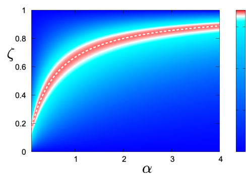 
FIG. 1: Diode efficiency ηac = I+ ac+I− ac I+ ac−I− ac ≡2Dc,c,α,θ=0(ζ) [cf.

📷 Fig 2

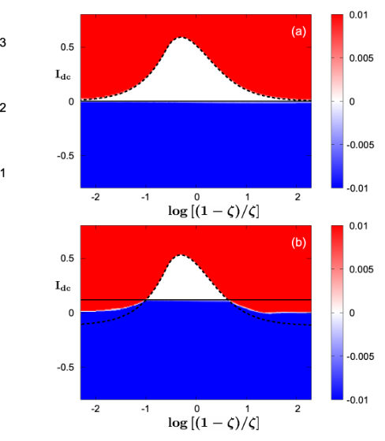 
FIG. 3: Josephson junction voltage VJJ versus Idc and log [(1 −ζ) /ζ] [cf. Eqs. (1) and (12)] for θ = θopt = π/2, α = 1, and Ic = 1.18. (a) I0 = 1.18 (η = 1, ideal diode). (b) I0 = 1.3 (when the ratchet effect occurs: VJJ &lt; 0 for Idc &gt; 0). The theoretically predicted boundaries of the superconduct- ing channel are also plotted in both cases [cf. Eq. (A10) in the Appendix].

📷 Fig 3

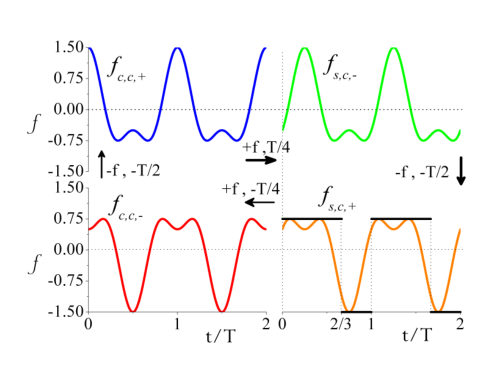 
FIG. 2: Functions fc,c,±(t) ≡cos (ωt) ± (1/2) cos (2ωt) and fs,c,±(t) ≡sin (ωt) ± (1/2) cos (2ωt) [cf. Eqs. (9)-(12)] repre- senting the optimal biharmonic waveform vs t over two peri- ods. The dichotomous waveform (thick solid line) represents the exact universal excitation waveform, while horizontal and vertical arrows indicate the symmetries that relate the differ- ent biharmonic representations.

📷 Fig 4

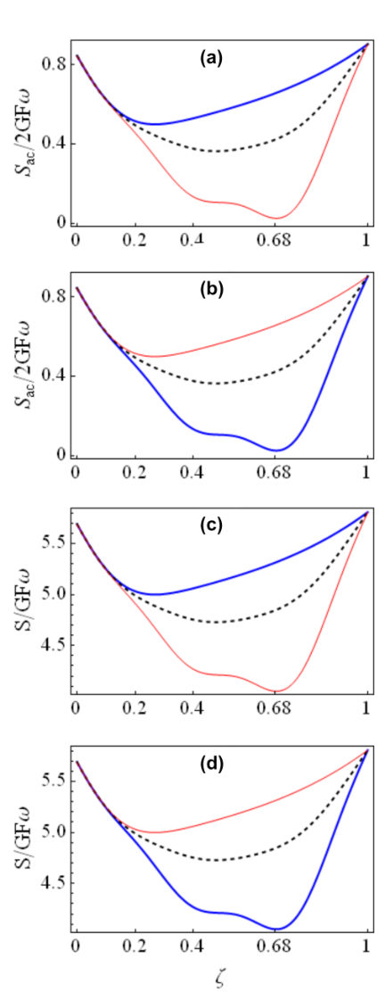 
FIG. 4: (a), (b) Excess noise Sac [cf. Eq. (6)] and (c), (d) current noise S [cf. Eq. (5)] as a function of the relative amplitude ζ for eVac/ω ≡e (Vac1 + Vac2) /ω = 8.1 [cf. Eq. (4)] and three values of the relative phase: φ = φopt ≡0 (thin line), φ = π/2 (dashed line), and φ = φopt ≡π (thick line). Versions (a) and (c) ((b) and (d)) correspond to eVdc/ω = 4 (eVdc/ω = −4).

**Summary.** This paper introduces the law of ratchet universality to explain why specific biharmonic driving waveforms optimize the superconducting diode effect and suppress shot noise. It demonstrates that a universal waveform maximizes transport efficiency while minimizing electron-hole pair generation. These findings have significant implications for the development of superconducting power electronics and quantum computing components.

**Why it may be interesting.** The discovery of a universal waveform for optimizing transport coherence and minimizing noise is highly relevant to quantum optics and open quantum systems, particularly for the efficient production of nonclassical photonic states.

Detailed structure

**Main problem.** The paper seeks to provide a theoretical justification for the 'magical' driving parameters that maximize the superconducting diode effect and minimize shot noise in biharmonically-driven tunnel junctions.

**Main result.** The authors establish the 'law of ratchet universality' (RU), which identifies a universal waveform that maximizes directed transport efficiency and minimizes excess quantum noise/electron-hole pair generation.

**Method.** The study uses the theoretical framework of the law of ratchet universality, applying perturbation theory, Bessel functions, and numerical simulations of overdamped dynamics and symmetry breaking.

**Model / system.** The system consists of superconducting tunnel junctions (TJs) and quantum conductors driven by biharmonic AC fields (fundamental and second harmonic) in the overdamped and adiabatic regimes.

**Key observables.** Diode efficiency, supercurrent rectification range, shot noise (current fluctuations), excess quantum noise, and probability of electron-hole pair creation.

**Important parameters / regimes.** Relative amplitude of harmonics (zeta), relative phase (theta/phi), driving frequencies (omega, 2omega), DC voltage/current, and temperature.

**Assumptions / limitations.** The analysis assumes an overdamped limit for the junction dynamics and focuses on the fast-driving or adiabatic regimes.

**Figures summary.** Figure 1 compares diode efficiency to RU predictions; Figure 2 shows optimal biharmonic waveforms and symmetry relations; Figure 3 illustrates the boundaries of the superconducting channel; Figure 4 plots excess and current noise as functions of relative amplitude.

**Paper structure.** The paper introduces the problem of unexplained optimal parameters, proposes the law of ratchet universality as a unifying principle, provides analytical derivations for optimal waveforms and noise suppression, and validates these findings through numerical simulations and comparison with previous experimental/numerical results.

Abstract

This Letter discusses two retrodictions of the law of ratchet universality which explain previous numerical and experimental results concerning the diode effect in conventional superconducting tunnel-junctions in one case, and controlled suppression of electron-hole pair generation in a tunnel junction in the other, both in the presence of biharmonic driving fields. Our study demonstrates that the ratchet universal driving field maximizes the diode's efficiency while yielding a maximal rectification range for the supercurrent, on the one hand, and optimally reduces the excess quantum noise with respect to the dc noise level, thus allowing for the efficient production of nonclassical photonic states. These results suggest that the ratchet universality law seems essential for any \textit{optimal} application of the ratchet effect, particularly in the contexts of superconducting integrated power electronics, electron quantum optics, and quantum computing.

[↑ back to top](#top)

### [Reduced Dynamical Maps in Finite Temperature Vibronic Coupling Models via Choi Matrices: Numerical Methods and Applications](http://arxiv.org/abs/2605.22459v1)

**Authors:** Raffaele Borrelli, Hideaki Takahashi  
**Type:** theory · **Category:** numerical methods · **PDF:** <https://arxiv.org/pdf/2605.22459v1>  
**Analysis basis:** full PDF text, analyzed in chunks
**Topic relevance:** 🔥 `methods for driven-dissipative` **4/5** · `non-equilibrium dynamics` **3/5** · `Keldysh / 2PI / non-Gaussian methods` **2/5** · `entanglement & information structure` **2/5**

📷 Fig 1

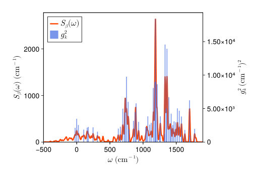 
Figure 1. Quantum noise spectral density and its interpolative-decomposition discretizations for site 1 of the subunit A of the FMO complex. The solid curve shows the continuous function from MD, while the sticks indicate the discrete frequencies and couplings employed in the TT prop- agation (50 effective modes).

📷 Fig 2

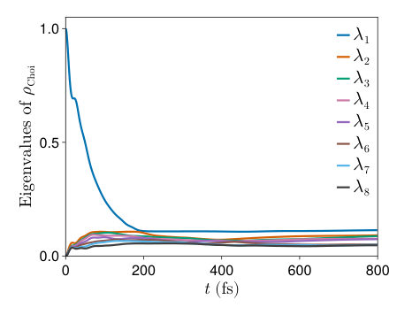 
Figure 3. Leading eigenvalues {λα(t)} of the normalized Choi state for the eight-site FMO model.

📷 Fig 3

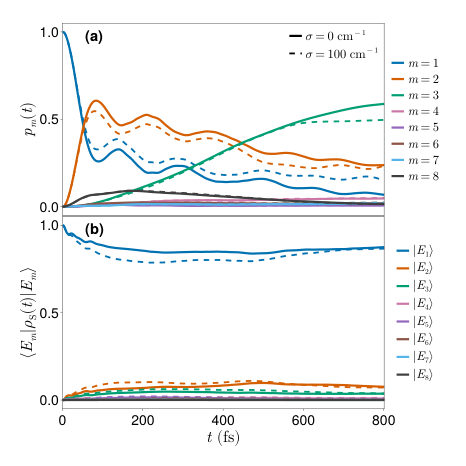 
Figure 2. Panel a: full line, site populations pm(t) = ⟨m|ρS(t)|m⟩for the eight-site FMO model starting from an initial excitation localized on site 1; dashed line, same dynam- ics but with a diagonal static disorder σ = 100 cm−1. Panel b: Excitonic state populations, ⟨Em|ρS(t)|Em⟩, for the same model, for |E1⟩as initial state; dashed line, same dynamics but with a diagonal static disorder σ = 100 cm−1.

📷 Fig 4

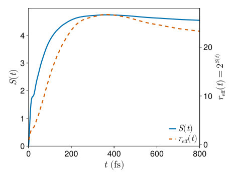 
Figure 4. Von Neumann entropy S(t) of the normalized Choi state ρChoi(t) (left axis) and effective rank reff(t) = 2S(t) (right axis).

📷 Fig 5

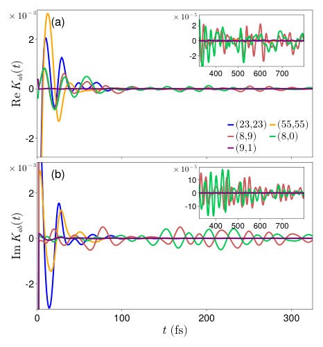 
Figure 5. Representative components of the Nakajima– Zwanzig memory kernel K(t) reconstructed from the discrete map sequence {Φn} via Eq. (37). The y-axis is scaled by 10−3

**Summary.** This paper presents a new computational framework that uses tensor networks and thermofield dynamics to efficiently calculate the full evolution of open quantum systems at finite temperatures. By representing the dynamics via Choi matrices, the method allows for the study of complex processes like decoherence and relaxation in molecular aggregates like the FMO complex. The approach also enables the reconstruction of memory kernels and long-time kinetic descriptions from short-time simulations.

**Why it may be interesting.** It provides a powerful, unified numerical tool for open quantum systems to capture full non-Markovian dynamics and memory effects in high-dimensional, finite-temperature environments using efficient tensor network techniques.

Detailed structure

**Main problem.** Efficiently constructing and analyzing reduced dynamical maps for complex system-bath models at finite temperature without the computational bottleneck of state-by-state propagation.

**Main result.** The development of a streamlined TFD-Choi-TT framework that allows for the construction of the full reduced dynamical map from a single unitary propagation in an enlarged Hilbert space.

**Method.** A combination of the Choi-Jamiołkowski isomorphism, Thermofield Dynamics (TFD) purification, and Tensor-Train (TT) representation with TDVP propagation.

**Model / system.** Linear vibronic coupling models applied to the Fenna-Matthews-Olson (FMO) photosynthetic complex, featuring site-specific structured spectral densities and static disorder.

**Key observables.** Reduced dynamical maps, Choi matrices, site/excitonic populations, memory kernels, and the Choi spectrum (to measure entanglement and relaxation).

**Important parameters / regimes.** Temperature (300 K), time window (up to 800 fs), and maximum TT rank (220).

**Assumptions / limitations.** Focuses on linear vibronic models and factorized initial conditions; accuracy is limited by the time window of the discretized bath correlation functions.

**Figures summary.** Figure 1 shows spectral density discretization; Figure 2 compares site populations with and without disorder; Figure 5 displays the decaying memory kernel; Figure 6 and 7 compare TTM extrapolation and Pauli master equation results against direct propagation.

**Paper structure.** The paper introduces the TFD-Choi-TT framework, details the numerical implementation using Tensor Trains and TDVP, applies the method to the FMO complex to analyze decoherence and relaxation, and demonstrates long-time extrapolation using the Transfer-Tensor Method.

Abstract

We present a streamlined implementation of a computational framework for constructing and analyzing reduced dynamical maps for complex system--bath models at finite temperature. The methodology is based on three established ingredients of quantum dynamics: the Choi--Jamiołkowski isomorphism for the representation of quantum channels, thermofield (TFD) purification of thermal environments, and tensor-train (TT) propagation of the resulting enlarged pure state. The reduced map is obtained from a single unitary propagation in a thermofield-doubled Hilbert space and represented in matrix form through the Choi--Jamiołkowski isomorphism. The TFD evolution is implemented in the TT representation, enabling efficient propagation of high-dimensional purified thermal states. We illustrate the methodology for exciton transfer in the Fenna--Matthews--Olson complex with site-dependent structured spectral densities represented by discretized bosonic environments. The resulting maps are used to analyze decoherence, relaxation, and finite-memory effects, and to assess the crossover to an effectively time-local description. The proposed approach provides a route to compute reduced propagators and to post-process them into memory kernels, transfer tensors, and effective kinetic rate descriptions for complex molecular systems.

[↑ back to top](#top)

### [Matrix Product Operator Encodings of the Magnus Expansion and Dyson Series](http://arxiv.org/abs/2605.21597v1)

**Authors:** Victor Vanthilt, Maarten Van Damme, Jutho Haegeman, Ian P. McCulloch, Laurens Vanderstraeten  
**Type:** theory · **Category:** numerical methods · **PDF:** <https://arxiv.org/pdf/2605.21597v1>  
**Analysis basis:** full PDF text, analyzed in chunks
**Topic relevance:** 🔥 `non-equilibrium dynamics` **4/5** · `methods for driven-dissipative` **3/5** · `entanglement & information structure` **2/5**

📷 Fig 1

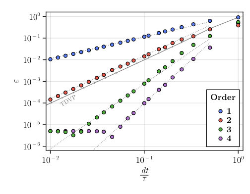 
FIG. 1. Benchmark for finite-system size. We plot the error measure ε [Eq. (79)] of the state evolved with the Dyson-MPO of different orders with respect to a quasi-exact simulation. We evolve the state |0⟩⊗L over one period of the Hamiltonian of Eq. (78). The quasi-exact simulation was generated with QuantumOptics.jl as a function of the time step.

📷 Fig 2

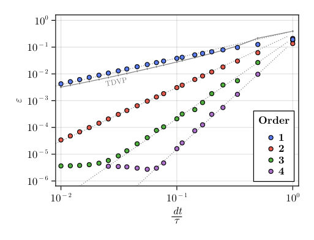 
FIG. 2. Benchmark for infinite-size system. We plot the error measure ε [Eq. (82)] of the state evolved with the Dyson-MPO of different orders, with respect to a TDVP simulation. We evolve the N´eel state over one period of the Hamiltonian of Eq. (80). The infinite-size TDVP simulation is performed with a time step of dt = 10−7.

📷 Fig 3

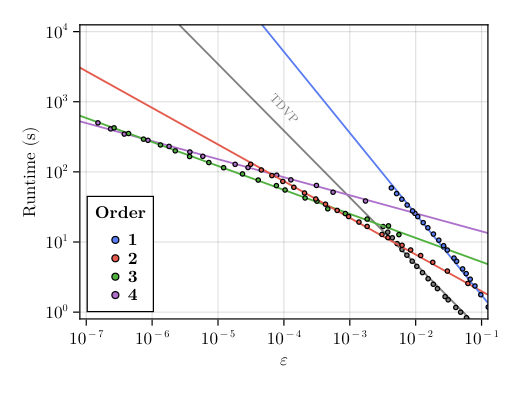 
FIG. 3. Runtime comparison. We compare the total runtime for the results of Fig. 2 as a function of the achieved accuracy.

📷 Fig 4

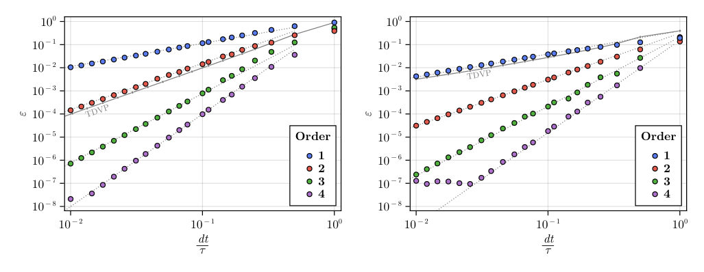 
FIG. 4. Finite-size benchmark (left) and infinite-size benchmark (right) using the most accurate wavefunction generated with the 4th order Dyson MPO with the smallest timestep as reference.

**Summary.** The paper introduces efficient MPO encodings for the Magnus expansion and Dyson series to simulate time-dependent quantum lattice models. By using novel compression and rewiring techniques, the authors achieve high-order accuracy with manageable bond dimensions, outperforming standard methods like TDVP in the runtime-accuracy trade-off.

**Why it may be interesting.** This is highly relevant for many-body dynamics as it provides a systematic, high-order method to simulate driven quantum systems (like Floquet systems) with much better efficiency than traditional time-stepping methods.

Detailed structure

**Main problem.** Efficiently simulating the real-time evolution of 1D quantum many-body systems under time-dependent Hamiltonians, specifically addressing the exponential growth of bond dimensions and the complexity of time-ordered expansions.

**Main result.** The authors develop new Matrix Product Operator (MPO) encodings for the Magnus expansion and Dyson series that are size-extensive, handle long-range interactions, and achieve an error scaling of O(dt^N).

**Method.** The method uses tensor network formalisms (MPS/MPO) to encode expansions, employing a 'rewiring' technique for the Dyson series and a 'row compression' algorithm to significantly reduce the MPO bond dimension.

**Model / system.** One-dimensional or quasi-1D quantum lattice models, including spin chains (e.g., Heisenberg XXZ) and models with time-dependent, non-commuting Hamiltonians.

**Key observables.** Trace distance (for finite systems) and a modified trace distance (for the thermodynamic limit) to measure error relative to reference states.

**Important parameters / regimes.** Bond dimension (D or chi), expansion order (N), time step (dt), and the interaction range (short-range to long-range).

**Assumptions / limitations.** The construction assumes injective MPS for uniqueness in the thermodynamic limit and relies on the truncation of MPO bond dimensions during compression.

**Figures summary.** Figure 1 and 2 show error scaling of O(dt^N) for finite and infinite systems; Figure 3 demonstrates the runtime-accuracy trade-off advantage over TDVP; Figure 4 shows high-accuracy benchmarks for the 4th-order Dyson MPO.

**Paper structure.** The paper begins with notation and a recap of time-independent MPO construction, followed by the Magnus expansion approach, the Dyson series approach, MPO compression techniques, and finally numerical benchmarking.

Abstract

We introduce a matrix product operator (MPO) encoding of the Magnus expansion and the Dyson series for one-dimensional quantum lattice models with time-dependent Hamiltonians. The MPO construction can be made accurate up to arbitrary order in the time step, it can be applied to both finite and infinite systems, and it can handle long-range interactions. The resulting MPO can be combined with state-of-the-art time evolution algorithms based on matrix product states, allowing for drastic improvements in simulating evolution under time-dependent Hamiltonians. Our MPO construction can also be used for the optimization of quantum circuits in the context of quantum simulation of time-dependent Hamiltonians.

[↑ back to top](#top)

### [Multipolar exchange in a many-body homonuclear mixture of atoms in different internal states](http://arxiv.org/abs/2605.22375v1)

**Authors:** M. Bulakhov, A. S. Peletminskii, Yu. V. Slyusarenko  
**Type:** theory · **Category:** quantum gases · **PDF:** <https://arxiv.org/pdf/2605.22375v1>  
**Analysis basis:** full PDF text, analyzed in chunks
**Topic relevance:** 🔥 `analog quantum simulation` **4/5** · `exotic spin models in light-matter` **3/5** · `entanglement & information structure` **2/5**

📷 Fig 1

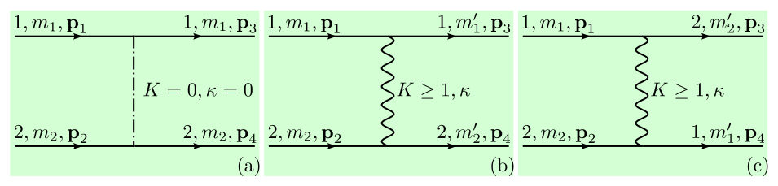 
Figure 1: Feynman diagrams of the interaction terms in the Hamiltonian, represented as an effective exchange of: (a) a virtual scalar particle, (b) a virtual photon without total angular momentum transfer, and (c) a virtual photon with total angular momentum transfer.

**Summary.** This paper introduces a generalized many-body Hamiltonian for ultracold atomic mixtures with different internal angular momentum states. By using spherical tensor operators, the authors provide a framework that captures all possible multipolar exchange processes. This approach offers a more universal and physically intuitive description than previous methods for studying high-spin quantum gases.

**Why it may be interesting.** It provides a mathematically robust and physically transparent tool for studying high-spin ultracold gases and multicomponent lattice models, moving beyond standard SU(N) models to include complex multipolar exchange.

Detailed structure

**Main problem.** The lack of a consistent theoretical framework to describe many-body interactions in homonuclear mixtures where atoms occupy internal states with different total angular momenta or other quantum numbers.

**Main result.** The development of a universal many-body Hamiltonian using irreducible spherical tensor operators that explicitly accounts for both the exchange of angular-momentum projections and the exchange of total angular momentum.

**Method.** The authors utilize the irreducible spherical tensor operator formalism, applying the Wigner-Eckart theorem, Clebsch-Gordan coefficients, and 6j symbols to decompose the interaction into multipolar exchange terms.

**Model / system.** A many-body system of interacting, indistinguishable, homonuclear ultracold bosonic and fermionic atoms in different internal quantum states, including specific cases like Helium, Strontium, Ytterbium, Erbium, and Dysprosium.

**Key observables.** Interaction amplitudes (U_12^F), scattering channels (F), and multipole components (scalar, dipole, quadrupole, etc.).

**Important parameters / regimes.** Total angular momentum (f), its projection (m), s-wave scattering regime, and weak external magnetic fields.

**Assumptions / limitations.** The system is in the regime of weak external magnetic fields and low-energy s-wave scattering; atoms are sufficiently distant to allow for a multipole expansion of the electromagnetic potential.

**Figures summary.** Figure 1 uses Feynman diagrams to represent the effective exchange of virtual particles, specifically a virtual scalar particle and a virtual photon without total angular momentum transfer.

**Paper structure.** The paper begins by defining the physical necessity of the new Hamiltonian, demonstrates the mathematical advantages of the spherical tensor approach over SU(N) frameworks, reproduces known results for equal angular momentum (Sec. 3), and presents new results for mixtures with different angular momenta (Sec. 4).

Abstract

We develop a general method for constructing the many-body Hamiltonian of pairwise interactions describing homonuclear mixtures of atoms occupying states with different total angular momenta or other quantum numbers. The advantage of the irreducible spherical tensor operator formalism is demonstrated: these operators give the Hamiltonian an explicit physical structure, account for all scattering channels, and include multipolar exchange interactions. The latter correspond to the exchange of both angular-momentum projections and the total angular momentum. Particular realizations of the general Hamiltonian, widely used in the physics of ultracold gases, are also analyzed. The resulting Hamiltonian provides a universal framework for investigating a broad range of quantum many-body phenomena in bosonic and fermionic atomic gases.

[↑ back to top](#top)

### [Practical Countermeasure Against Attacks Exploiting Detection Efficiency Mismatch in Quantum Key Distribution](http://arxiv.org/abs/2605.22580v1)

**Authors:** Ben J. Taylor, Peter R. Smith, James F. Dynes, Robert I. Woodward, Marco Lucamarini, R. Mark Stevenson, Andrew J. Shields  
**Type:** experiment · **Category:** quantum information and computing · **PDF:** <https://arxiv.org/pdf/2605.22580v1>  
**Analysis basis:** full PDF text, analyzed in chunks
**Topic relevance:** 🔥 `QC/QI experiment` **4/5** · `quantum optics experiment` **3/5** · `quantum measurements` **2/5**

📷 Fig 1

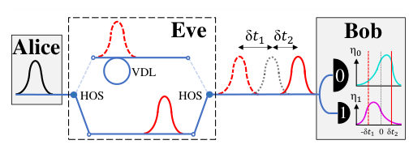 
FIG. 1. Conceptual schematic of a time-shift attack. HOS: high-speed optical switch; VDL: variable optical delay line. Eve shifts optical pulses generated by Alice in time by +δt1 or −δt2, chosen to maximise mismatch on Bob’s two non-identical detectors, the efficiencies of which vary uniquely in time.

📷 Fig 2

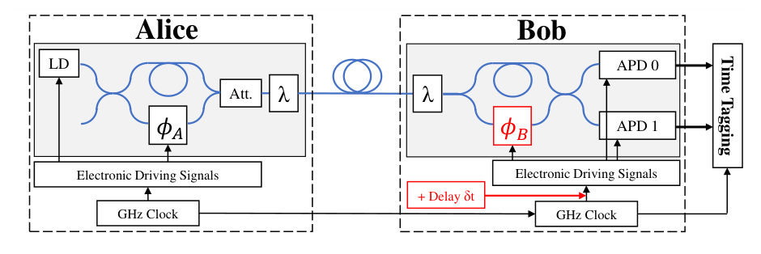 
FIG. 2. Key components for experimental characterisation of a fibre-based, GHz-clocked, phase-encoding QKD system’s vulnerability to a time-shift attack. We sweep values of a relative delay, with resolution δt = 4.5 ps, and add this to the global reference clock’s signal, which is then supplied to all active optical components in Bob, whilst recording counts from the APD outputs. LD: laser diode; ϕA, ϕB: phase modulators; Att.: attenuation; λ: narrow-wavelength filter, here at 1550.12 ± 0.04 nm.

📷 Fig 3

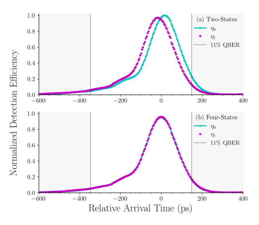 
FIG. 3. Normalized detection efficiency of APD 0 and APD 1 under time-shift relative to default, with steps of 4.5 ps across a range of 1 ns (full clock cycle), in both cases of (a) two-state and (b) four-state demodulation at Bob. We show bounds at which the QBER exceeded 11% on average, such that the protocol would have aborted outside the white central region. Each data point comprises 10Mb of total counts data.

📷 Fig 4

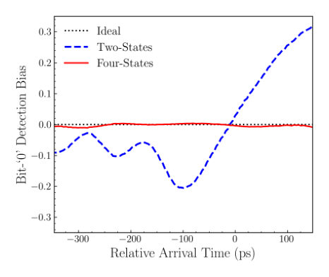 
FIG. 4. Bit-0 normalised detection bias across a 495 ps window, in increments of 4.5 ps. Whilst ideal APDs would exhibit no detection bias, the bias with two-states varies significantly, to a maximum of ≈30%. This data subset corresponds to the central region in Fig. 3, where average QBER was below 11%.

📷 Fig 5

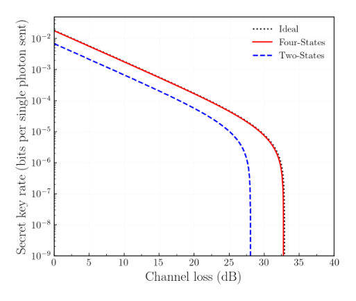 
FIG. 5. Asymptotic secret key rates (SKR) in bits per single photon sent against channel loss, accounting for detection efficiency mismatch. The four-state countermeasure recovers 97.1% of the ideal case of no mismatch, whilst the rate is reduced to 38.3% of ideal in the two-states case.

**Summary.** The paper demonstrates a practical way to protect high-speed quantum key distribution from attacks that exploit differences in detector efficiency. By using a four-state modulation technique, the researchers were able to almost entirely recover the secret key rate even when the system was under a simulated time-shift attack. This provides a robust, design-level defense for future scalable quantum communication networks.

**Why it may be interesting.** This work is highly relevant to quantum optics and quantum information researchers as it addresses the practical implementation of security protocols against hardware-level side-channel attacks in high-speed photonic networks.

Detailed structure

**Main problem.** Quantum Key Distribution (QKD) systems are vulnerable to side-channel attacks, specifically the time-shift attack, which exploits detection efficiency mismatches between the receiver's detectors.

**Main result.** The implementation of a four-state countermeasure on a GHz-clocked prototype recovers 97.1% of the ideal secret key rate, effectively mitigating the impact of detection efficiency mismatch.

**Method.** The researchers implemented a 'four-state Bob' setup that expands phase modulation from two to four phases to symmetrize detection events, and simulated attacks by introducing controlled time-delays.

**Model / system.** A GHz-clocked, fiber-based, phase-encoding, decoy-state BB84 QKD prototype using a gain-switched laser diode, asymmetric Mach-Zehnder interferometers, and InGaAs avalanche photodiodes.

**Key observables.** Quantum Bit Error Rate (QBER), Secret Key Rate (SKR), and detection efficiency mismatch between detectors.

**Important parameters / regimes.** 1 GHz clock rate, 4.5 ps time-shift resolution, and an 11% QBER threshold.

**Assumptions / limitations.** Assumes detectors have non-identical responses across degrees of freedom (time, frequency, polarization) and that the countermeasure does not introduce new side-channels like Trojan-horse attacks.

**Figures summary.** Figure 1 shows a schematic of the time-shift attack; Figure 2 details the experimental setup for characterizing vulnerability; Figure 3 illustrates the normalized detection efficiency and the effectiveness of the four-state method.

**Paper structure.** The paper introduces the vulnerability of QKD to time-shift attacks, describes the experimental implementation of the four-state countermeasure on a high-speed system, quantifies the security and performance recovery using numerical bounds, and discusses the broader implications for scalable QKD.

Abstract

We demonstrate a practical countermeasure against a well-known class of attacks on quantum key distribution (QKD) systems that exploit detection efficiency mismatch, where the receiver's detectors do not exhibit identical responses to incoming photons across all degrees of freedom. This class of quantum hacking strategies is broad and significantly includes the time-shift attack, which targets an arrival-time-dependent side channel at the receiver. The four-state countermeasure, previously only proven to be secure in theory, is implemented here on a GHz-clocked prototype QKD system and evaluated for its security and performance. We show that its presence enables almost complete recovery of the system's ideal secret key rate. Our results provide strong justification for adopting this countermeasure as a standard component in future scalable and practical QKD systems.

[↑ back to top](#top)

### [Fidelity-Aware Frequency Allocation and Transpilation Co-Design for Tunable Coupler Quantum Systems](http://arxiv.org/abs/2605.21662v1)

**Authors:** Dylan VanAllen, Evan McKinney, Israa G. Yusuf, Girgis Falstin, Gaurav Agarwal, Jason Pollack, Michael Hatridge, Alex K. Jones  
**Type:** both · **Category:** quantum information and computing · **PDF:** <https://arxiv.org/pdf/2605.21662v1>  
**Analysis basis:** full PDF text, analyzed in chunks
**Topic relevance:** 🔥 `QC/QI experiment` **4/5** · `methods for driven-dissipative` **2/5** · `quantum optics experiment` **2/5**

📷 Fig 1

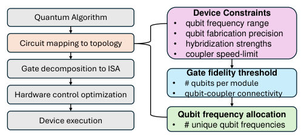 
Figure 1. High-level workflow for the co-design of quantum computer architectures [1].

📷 Fig 2

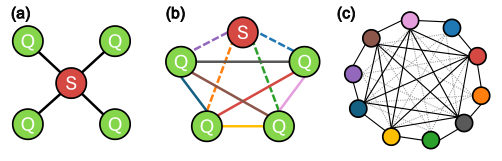 
Figure 2. (a) SNAIL-qubit coupling graph (b) 2Q conversion connectivity graph, with unique colored edges for activated exchanges. (c) Compatibility graph, with nodes as interac- tions and edges as interferences.

📷 Fig 3

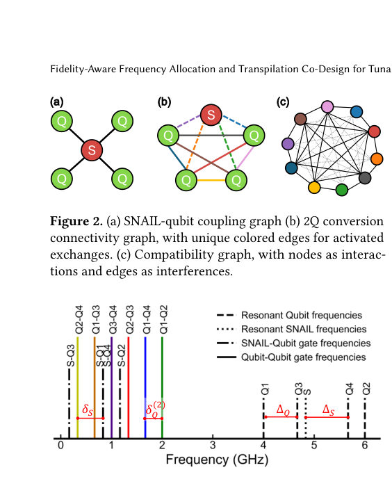 
Figure 3. Spectral positioning of a SNAIL and 4 qubit bare modes and their interacting resonant frequencies.

📷 Fig 4

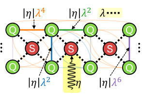 
Figure 4. In this diagram, the central SNAIL is driven with the target interaction denoted by a green edge. Spectator terms diminish based on how many orders of hybridization they are removed from the driven SNAIL. (Blue) Both qubits coupled to the driven SNAIL (in the same module); (Orange) One qubit directly coupled to the driven SNAIL; (Purple) Neither qubit directly coupled to the driven SNAIL.

📷 Fig 5

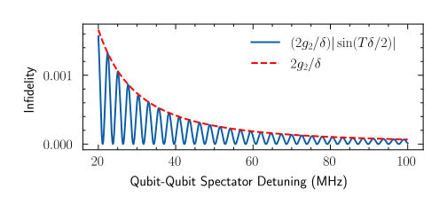 
Figure 5. Infidelity versus detuning for spectator amplitude with Rabi oscillations compared with spectator amplitude using Rabi magnitude bound.

**Summary.** The paper proposes a co-design strategy that simultaneously optimizes hardware frequency allocation and software circuit transpilation to mitigate errors in tunable-coupler quantum computers. By accounting for hardware-specific noise during the routing process, the proposed FINESSE algorithm significantly improves gate fidelity compared to standard compilers. This approach effectively manages the tension between high connectivity and the detrimental effects of frequency crowding.

**Why it may be interesting.** This is highly relevant for researchers in open quantum systems and quantum optics as it provides a rigorous framework for modeling how parasitic, non-local, and dissipative interactions (spectator errors and decoherence) impact the scalability of driven, multi-mode superconducting circuits.

Detailed structure

**Main problem.** The paper addresses the fundamental tradeoff between connectivity and gate fidelity in superconducting quantum architectures, specifically how frequency crowding in tunable-coupler systems leads to parasitic interactions and degraded performance.

**Main result.** The authors developed FINESSE, a noise-aware transpilation framework that achieves up to an 8.9% reduction in log-infidelity on SNAIL architectures and a 12.3% reduction on IBM Brisbane, demonstrating that joint optimization of frequency allocation and circuit mapping is superior to standard methods.

**Method.** The study uses an error-budgeting framework to model coherent and incoherent errors, a constrained optimization approach for frequency assignment, and a novel transpilation algorithm (FINESSE) that uses fidelity-weighted distances for SWAP selection.

**Model / system.** The research focuses on superconducting quantum architectures using SNAIL-based tunable couplers and transmon qubits, specifically modeling the 'Corral' module and evaluating performance on the 127-qubit IBM Brisbane heavy-hex processor.

**Key observables.** Gate fidelity, circuit depth, log-infidelity cost, and connectivity/edge count.

**Important parameters / regimes.** Pump strength (eta), qubit and SNAIL frequencies, detuning (delta), gate duration, and the fidelity-connectivity tradeoff limit (4 qubits per SNAIL).

**Assumptions / limitations.** The model assumes a weak-coupling approximation where spectator-induced errors are additive and uses a conservative amplitude bound for spectator interaction to avoid reliance on precise Rabi synchronization.

**Figures summary.** Figure 1 shows the co-design workflow; Figure 2 details the SNAIL-qubit coupling and compatibility graphs; Figure 3 illustrates spectral positioning; Figure 13 compares log-infidelity across algorithms; Figure 15 shows fidelity degradation with increasing edge count; Figure 16 compares performance on IBM Brisbane.

**Paper structure.** The paper follows a co-design logic: first establishing the hardware-level problem of frequency crowding and error modeling, then presenting a frequency allocation optimization, followed by the development of the FINESSE transpilation framework, and concluding with performance benchmarks on both SNAIL and IBM architectures.

Abstract

Frequency crowding is a fundamental limitation in superconducting quantum architectures, particularly in tunable-coupler systems. We present a framework that explicitly models both coherent spectator-induced errors and incoherent lifetime effects through an error budgeting approach. Using this model, we analyze how frequency crowding impacts gate fidelity as module size and connectivity scale, and formulate a constrained optimization problem to assign qubit and coupler frequencies under realistic separation and hardware constraints. We demonstrate scalable frequency allocation strategies that minimize spectator-induced errors. We further show that increasing qubit count and coupling density within a module leads to a fidelity-connectivity tradeoff. To explore the benefits at the system scale, we have developed a noise-aware transpilation approach called FINESSE, which minimizes error by selecting high-fidelity paths that satisfy connectivity via SWAP insertion while jointly optimizing downstream gate execution. We demonstrate this physics-informed architecture-transpilation co-design approach for a SNAIL-based third-order coupler that natively realizes the $\sqrt{iSWAP}$ basis with frequency aware gate fidelities. On SNAIL architectures, FINESSE achieves an average 8.9% reduction in log-infidelity cost and 6.8% reduction in circuit depth vs. SABRE. We also compare results on IBM Brisbane's architecture.

[↑ back to top](#top)

### [Optimal work extraction in measurement-based quantum Otto engines: Non-adiabaticity and generalized measurements can be beneficial](http://arxiv.org/abs/2605.22583v1)

**Authors:** Arunabha Das, Sayan Mondal, Debarupa Saha, Ujjwal Sen  
**Type:** theory · **Category:** statistical mechanics · **PDF:** <https://arxiv.org/pdf/2605.22583v1>  
**Analysis basis:** full PDF text, analyzed in chunks
**Topic relevance:** 🔥 `quantum measurements` **4/5** · `methods for driven-dissipative` **2/5** · `non-equilibrium dynamics` **2/5**

📷 Fig 1

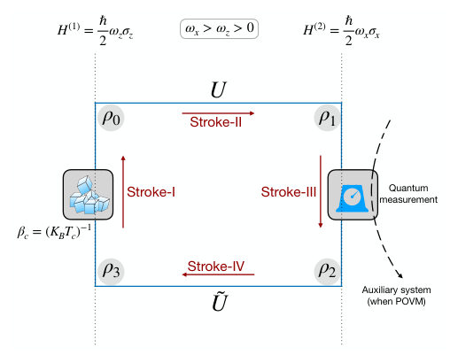 
Figure 1. Schematic diagram of the measurement-based quan- tum Otto engine. The measurement-based quantum Otto engine consists of four strokes. In Stroke-I, the working medium thermal- izes with a cold bath at temperature Tc. Stroke-II and Stroke-IV are unitary driving strokes, generated through adiabatic or non-adiabatic driving of the Hamiltonian. Since these strokes are entropy conserv- ing, they correspond to the work strokes of the cycle. Stroke-III is the measurement stroke, which replaces the hot-bath thermalization pro- cess present in the conventional Otto engine, where the system would otherwise interact with a bath at temperature Th &gt; Tc. The measure- ment can be either PVM or...

📷 Fig 2

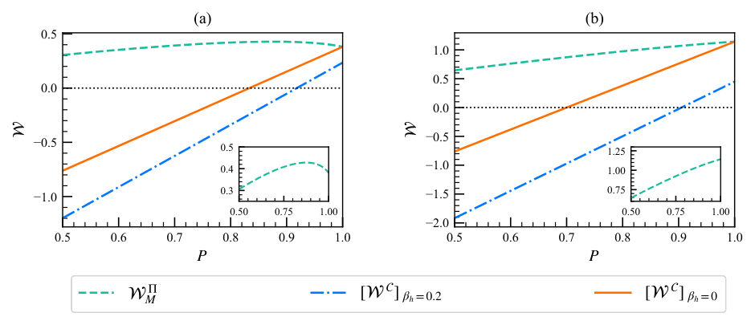 
Figure 2. Extractable work: comparison between the PVM-based and conventional two-bath Otto engines. The non-adiabatic work output, W, is plotted as a function of the non-adiabaticity parameter P, where P = 1 corresponds to the adiabatic limit. The dashed turquoise curve denotes the maximum extractable work from the PVM-based Otto engine, WΠ M, obtained after optimization over all measurement settings. For comparison, the work extracted from a conventional two-bath Otto engine is also shown for two hot-bath inverse temperatures: βh = 0.2 (dot-dashed blue) and βh = 0 (solid orange), represented by [WC]βh=0.2 and [WC]βh=0, respectively. Panels (a) and (b) correspond to two different...

📷 Fig 3

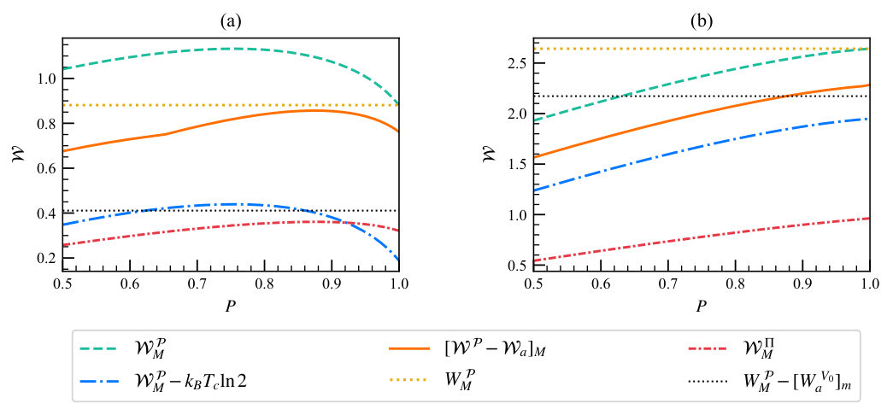 
Figure 3. Extractable work: comparison between the PVM-based and POVM-based Otto engines. The non-adiabatic work output, W, is plotted as a function of the non-adiabaticity parameter P, where P = 1 corresponds to the adiabatic limit. The turquoise dashed curve denotes the maximum extractable work from the POVM-based Otto engine, WP M, obtained after optimization over all measurement settings. At the adiabatic limit, i.e., P = 1, this curve touches with the analytically derived value, i.e., W P M, represented by the yellow-colored dotted horizontal line. The lower bound on the net work extractable from the optimal POVM-based Otto engine, after accounting for the auxiliary reset cost, is...

📷 Fig 4

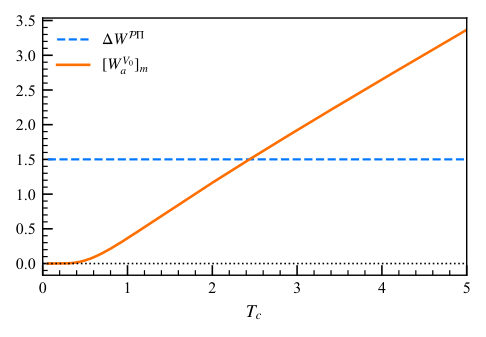 
Figure 4. Comparison between the advantage of the POVM-based engine over the PVM-based engine and the corresponding aux- iliary reset cost. The enhancement in work extraction offered by the POVM-based engine over the PVM-based engine is quantified by the difference between their respective optimal work outputs, ∆W PΠ [Eq. (41)], shown by the dashed blue curve. The solid or- ange curve represents the auxiliary reset cost, [W V0 a ]m [Eq. (44)], associated with reinitializing the auxiliary system required for im- plementing the POVM. Both quantities are plotted as functions of the cold-bath temperature Tc. The results are shown for the com- pression ratio γ = 2.5, corresponding to (ωx, ωz) =...

**Summary.** This paper explores how replacing a thermal reservoir with quantum measurements can optimize a quantum Otto engine. It finds that generalized measurements (POVMs) and non-adiabatic processes can increase work extraction and efficiency, even when the energy cost of resetting the measurement apparatus is considered.

**Why it may be interesting.** It provides fundamental insights into the thermodynamics of measurement-driven processes and demonstrates how controlling non-adiabaticity and measurement type can be used to optimize quantum heat engines.

Detailed structure

**Main problem.** Investigating the optimal work extraction and efficiency of measurement-based quantum Otto engines, specifically comparing PVM and POVM implementations under adiabatic and non-adiabatic regimes.

**Main result.** POVM-based engines can outperform PVM-based engines even after accounting for the thermodynamic cost of resetting the auxiliary system, and non-adiabaticity can enhance both work output and efficiency in certain compression regimes.

**Method.** Analytical optimization of measurement parameters and unitary operators, combined with numerical optimization using the dual annealing algorithm and Naimark's dilation theorem.

**Model / system.** A single-qubit working substance undergoing a four-stroke Otto cycle, where the hot-bath thermalization is replaced by quantum measurements (PVM or POVM) using an auxiliary system.

**Key observables.** Extractable work, efficiency, heat exchange, and net work output after accounting for auxiliary reset costs.

**Important parameters / regimes.** Compression ratio (frequency ratio), non-adiabaticity parameter (transition probability), cold bath temperature, and measurement basis angles.

**Assumptions / limitations.** The analysis is restricted to the non-inverted population regime and focuses on two-outcome POVMs implemented via a single auxiliary qubit.

**Figures summary.** Figure 1 shows the schematic of the measurement-based Otto cycle; Figure 2 plots extractable work versus non-adiabaticity; Figure 4 illustrates the trade-off between POVM work gain and auxiliary reset cost as a function of temperature.

**Paper structure.** The paper introduces the measurement-based engine model, analyzes the adiabatic limit for PVM and POVM, extends the analysis to the non-adiabatic regime, evaluates the thermodynamic cost of POVM implementation, and concludes with operational guidelines.

Abstract

Measurement-based quantum heat engines have attracted significant interest as alternatives to conventional thermal engines, as they replace the hot thermal reservoir with quantum measurements, thereby offering greater controllability and simpler implementation. Motivated by these advantages, we investigate a measurement-driven quantum Otto engine with a qubit working substance and study the optimal work extractable from such engines, including whether their performance can surpass that of conventional quantum Otto cycles. We analyze the engine in both the infinite-time (adiabatic) and finite-time (non-adiabatic) regimes, considering two distinct implementations obtained through optimization over all projection-valued measurements (PVMs) and over all two-outcome positive operator-valued measurements (POVMs). We show that measurement-based engines can outperform conventional quantum Otto engines within specific parameter regimes and that POVM-based engines can yield higher optimal work extraction than PVM-based ones. Furthermore, by incorporating the thermodynamic cost associated with resetting the auxiliary system required for POVM implementation, we demonstrate that the resulting net work output can still exceed that of PVM-based engines under suitable conditions on the spectral gaps and cold bath temperature. We also identify regimes in which non-adiabatic implementations can yield higher work output and efficiency than their adiabatic counterparts. Our study provides operational guidelines for designing improved measurement-driven quantum Otto engines.

[↑ back to top](#top)

### [Realizing tunable non-Hermitian skin effects in dynamical quantum systems via the relative phase between multiple time-periodic driving](http://arxiv.org/abs/2605.21959v1)

**Authors:** Huan-Yu Wang  
**Type:** theory · **Category:** other · **PDF:** <https://arxiv.org/pdf/2605.21959v1>  
**Analysis basis:** full PDF text, analyzed in chunks
**Topic relevance:** 🔥 `non-equilibrium dynamics` **4/5** · `driven-dissipative phase transition` **2/5** · `methods for driven-dissipative` **2/5**

📷 Fig 1

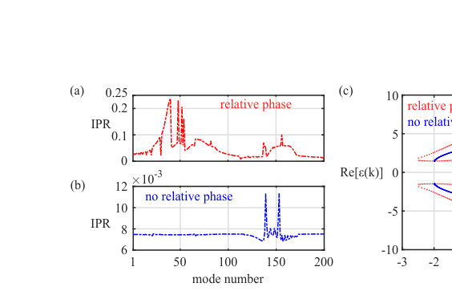 
FIG. 1. (a) For the dynamical system with multiple time-periodic driving, when the relative phase ϕ = π

📷 Fig 2

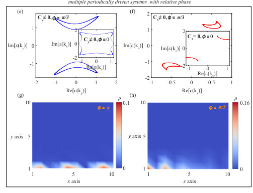 
FIG. 2. (a)-(b) For the static modified non-Hermitian QWZ model with γ = 2.0, v = 1.0, M = 1.0, non-zero winding formed by the momentum space energy spectrum {Re[E(ky)], Im[E(ky)]} can be observed with fixed kx = 1.5 in (a), and for all values of fixed ky, the momentum space spectrum encloses zero area in (b). (c-d) Correspondingly, NHSE in the square shape boundary conditions can only be observed with the down-edge localization in the 2D lattice. For the triangular shape boundary conditions, NHSE will be manifested at the hypotenuse side. (e)-(f) With the multiple time periodic driving and M = 1, γ0 = 2, γ1 = 1, v0 = 1, v1 = 2, ω = 3, the direction favored skin localization persists for ϕ...

📷 Fig 3

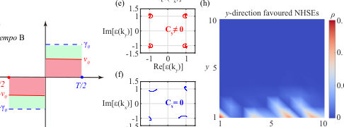 
FIG. 3. (a-b) The schematic picture of the quench driving formalism is shown, where the different (or same) tempo be- tween the two quenches depicted by (a) (or (b)) is similar to the case of setting relative phase ϕ = π 2 (or ϕ = 0). (c-d) In correspondence to the quench dynamics in (a) and T = 3, γ0 = 2, v0 = 1, NHSEs can only be observed in x direction with Cy ̸= 0 and fixed kx = 0.3. For all values of fixed ky, it is demonstrated Cx = 0. (e-f) When the quench formalism is changed to (b), localization direction of NHSEs gets altered and Cy ̸= 0, Cx = 0. (g) For the same param- eters in (a) and X-OBCs, Y-OBCs, the Floquet state with ϵ = −0.5169 −1.3071i is localized at the left edge of...

**Summary.** This paper shows that the relative phase between different periodic drives can be used to turn the non-Hermitian skin effect on or off. It also demonstrates that this phase can control the direction in which particles accumulate at the boundaries in 2D systems. This discovery offers a new way to engineer skin density profiles in platforms like optical lattices or circuit lattices.

**Why it may be interesting.** It provides a novel mechanism for Floquet engineering of non-Hermitian topology, offering a way to dynamically tune the spatial distribution of modes in open quantum systems.

Detailed structure

**Main problem.** Controlling the emergence and the localization direction of the non-Hermitian skin effect (NHSE) in dynamical quantum systems.

**Main result.** The relative phase between multiple time-periodic driving components can act as a switch to activate or deactivate NHSE and can alter the spatial direction of skin mode localization in higher dimensions.

**Method.** Floquet theory and Magnus expansion are used to analyze the long-time averaged effective Hamiltonian and the winding number topological invariant.

**Model / system.** Non-Hermitian quantum chains and 2D lattices (such as the NH-QWZ model) subject to multiple time-periodic driving (Floquet systems) with non-reciprocal tunneling.

**Key observables.** Winding number (C), Inverse Participation Ratio (IPR), and skin density profile.

**Important parameters / regimes.** Relative phase (phi) between driving components, driving frequency (omega), and tunneling amplitudes.

**Assumptions / limitations.** High-frequency limit (omega >> Hamiltonian scales) for the Magnus expansion; focus on PT-symmetric systems.

**Figures summary.** Figure 1 demonstrates the switching of NHSE on and off by tuning the relative phase and shows the corresponding change in the winding number.

**Paper structure.** The paper introduces the problem of NHSE control, presents a 1D model demonstrating phase-induced switching, extends the analysis to 2D systems for directional control, and discusses potential experimental realizations.

Abstract

We demonstrate how the relative phase between the multiple time periodic driving can decide the emergence and the favorable localization direction of non-Hermitian skin modes. For the static non-Hermitian quantum chain with parity time symmetry, non-Hermitian skin effects (NHSEs) can be prohibited. As the dynamical driving is turned on, NHSEs get artificially reactivated, where the relative phase can serve as the controlling switch by breaking the temporal symmetry constraints. Meanwhile, a change of relative phase can also alter the spatial structures of the long-time averaged effective Hamiltonian, which will consequently lead to the variation of skin localization direction for systems of higher dimensions. Our formalisms can be generally realized in diverse optical and mechanical platforms, and will pave the way for realizing tunable skin density profiles.

[↑ back to top](#top)

### [Sudden death of entanglement, rebirth of magic](http://arxiv.org/abs/2605.22603v1)

**Authors:** Chenfeng Cao  
**Type:** theory · **Category:** quantum information and computing · **PDF:** <https://arxiv.org/pdf/2605.22603v1>  
**Analysis basis:** full PDF text, analyzed in chunks
**Topic relevance:** 🔥 `entanglement & information structure` **4/5** · `methods for driven-dissipative` **2/5** · `non-equilibrium dynamics` **2/5**

📷 Fig 1

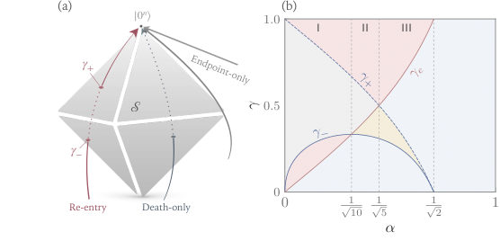 
FIG. 1. Trajectory classes and resource phase diagram. (a) Schematic stabilizer-polytope trajectories under local amplitude damping, all ending at the stabilizer vertex |0n⟩. Red denotes magic death and rebirth, equivalently entry into and exit from S, realized by the GHZ-X family solved in the main text and by an exact non- GHZ-X affine-plane slice in the SM. Blue denotes finite death with- out rebirth, realized by anti-W edges D2 3 and D3 4 . Gray denotes endpoint-only trajectories, with affine examples given by nonstabi- lizer real generalized-W inputs and curved examples such as D2 4

📷 Fig 2

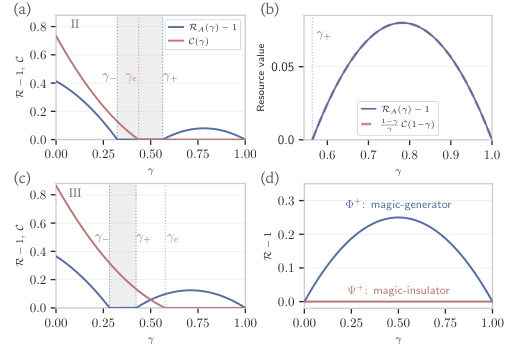 
FIG. 2. Magic–entanglement complementarity and Bell-state splitting. (a) Family-A trajectory in Regime II (α = 0.40). Magic (blue) dies at γ(2) − and is reborn at γ(2) + , after entanglement (red) vanishes at γ(2) e . Gray shading marks the stabilizer window. (b) Trajectory-level complementarity for the same parameters as in panel (a): RA(γ) −1 (blue line) coincides with the damping- reflected concurrence 1−γ

📷 Fig 3

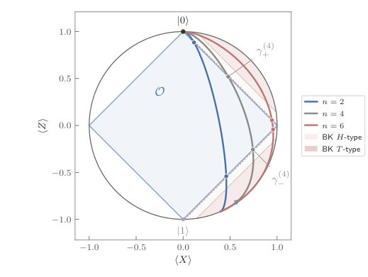 
FIG. 3. Single-qubit extraction and distillation windows. De- coded trajectories ˜ρ(γ) at α = 0.20 for n = 2, 4, 6 in the Bloch XZ plane. The rotated square is the stabilizer octahedron O. Each trajec- tory enters O at γ(n) − and exits at γ(n) + (labels shown for n = 4). Pink regions mark Bravyi–Kitaev sufficient distillation windows [14]: |H⟩-type x + |z| ≳1.015 (light), and after Clifford twirling |T⟩- type x + |z| &gt; 3/ √

📷 Fig 4

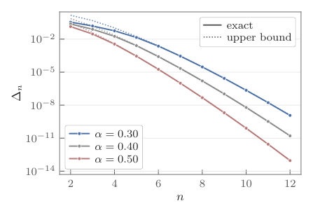 
FIG. 4. Super-exponential decay of the stabilizer window. Exact window width ∆n = γ(n) + −γ(n) − (solid lines with markers) against the analytical upper bound (C1) (dotted) for three initial amplitudes spanning the re-entrant regime. At all three amplitudes ∆n decays faster than any exponential in n, and the bound saturates the exact width within ∼10% for n ≳6.

**Summary.** This paper demonstrates that local amplitude damping can cause the 'sudden death' and subsequent 'rebirth' of magic in quantum states, even after entanglement has been lost. It reveals a fundamental symmetry between entanglement death and magic rebirth and provides a classification of stabilizer states based on their ability to generate magic under noise.

**Why it may be interesting.** It provides deep insights into the resource theory of magic and the non-intuitive behavior of quantum resources in open quantum systems, specifically how dissipation can act as a resource for generating non-stabilizer states.

Detailed structure

**Main problem.** Investigating the dynamics of entanglement and magic (non-stabilizerness) under local Markovian amplitude damping, specifically focusing on the phenomenon of magic rebirth after entanglement death.

**Main result.** The paper establishes that while entanglement is irreversibly lost under amplitude damping, magic can be 'reborn' after an initial period of disappearance, following a complementarity relation gamma_e + gamma_+ = 1. It also classifies stabilizer states into magic-generators and magic-insulators based on their Hamming-weight support.

**Method.** Analytical approach using Kraus operators, Stinespring dilation, and the stabilizer polytope framework, combined with mathematical tools like partial transposition and combinatorial enumeration.

**Model / system.** n-qubit systems, specifically the GHZ-type family and Bell states, subject to local Markovian amplitude damping channels.

**Key observables.** Magic robustness (R), concurrence (C), entanglement negativity, and stabilizer polytope membership.

**Important parameters / regimes.** Damping strength (gamma), number of qubits (n), initial state amplitude ratio (alpha/beta), and phase-twist angle (phi).

**Assumptions / limitations.** The noise model is restricted to local Markovian amplitude damping (non-unital) and certain phase-covariant channels.

**Figures summary.** Schematic of trajectories in the stabilizer polytope; plots of magic-entanglement complementarity; visualization of the super-exponential decay of the stabilizer window width; and threshold deformation as a function of phase.

**Paper structure.** The paper introduces the problem of magic vs. entanglement dynamics, analyzes the GHZ-X manifold under amplitude damping, establishes the complementarity relation, classifies stabilizer states into generators and insulators, and explores the asymptotic behavior and phase-twist effects.

Abstract

Local Markovian noise cannot bring entanglement back, but it can bring magic back. Unlike separability, stabilizer membership is not preserved by local channels, allowing dissipation to push states out of the stabilizer polytope as well as in. Under local amplitude damping, the $n$-qubit GHZ family $α|0^n\rangle+β|1^n\rangle$ ($0<α<β$) loses its magic at a lower damping strength $γ_-$ and regains it at a higher one $γ_+$, while entanglement is irreversibly lost at $γ_e$. This magic-entanglement complementarity, $γ_e+γ_+=1$ for every $n$, reflects a system-environment duality of amplitude damping and persists for a broader class of dissipative channels. For small $α$, the reborn magic resides in a fully separable state with all proper marginals stabilizer, yet parity-syndrome extraction concentrates it onto a single qubit for magic-state distillation. Local dissipation further divides pure stabilizer states into magic-generators and magic-insulators: at two qubits, the Bell state $|Φ^+\rangle$ generates magic immediately, while its Bell-state partner $|Ψ^+\rangle$ remains stabilizer. Together, magic and entanglement reveal a symmetry invisible to either alone.

[↑ back to top](#top)

### [Q-PhotoNAS: Hybrid Quantum Neural Architecture Search Framework on Photonic Devices](http://arxiv.org/abs/2605.22097v1)

**Authors:** Farah Elnakhal, Alberto Marchisio, Nouhaila Innan, Gabriel Falcao, Muhammad Shafique  
**Type:** both · **Category:** quantum information and computing · **PDF:** <https://arxiv.org/pdf/2605.22097v1>  
**Analysis basis:** full PDF text, analyzed in chunks
**Topic relevance:** 🔥 `QC/QI experiment` **4/5** · `quantum optics experiment` **3/5**

📷 Fig 1

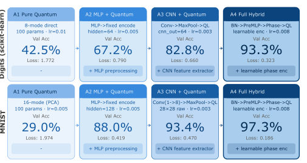 
Fig. 1: Motivation for automated architecture search in hybrid photonic QML. Both Digits (top) and MNIST (bottom) require four successive hand-designed attempts before reaching competitive accuracy. Each attempt is architecturally distinct from the last and requires its own training run.

📷 Fig 2

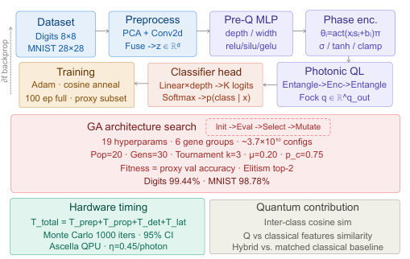 
Fig. 4: Q-PhotoNAS framework overview. Classical preprocessing (PCA + Conv2d) fuses inputs into z ∈Rd, which passes through a pre-quantum MLP and learnable phase encoder (θi = actϕ(xisi + bi) · π) before entering the photonic quantum layer (Merlin ML.QuantumLayer.simple [39]). A classical classifier head maps the Fock-basis output q to class probabilities. A genetic algorithm (pop=20, 30 generations) searches 19 hyperparameters across ∼3.7 × 1010 configurations, optimizing proxy validation accuracy. Hardware execution time is estimated via a first-principles model with Monte Carlo uncertainty quantification on the Quandela Ascella QPU.

📷 Fig 3

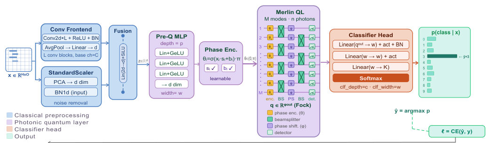 
Fig. 5: Sample PhotonicModel architecture: full forward pass from raw image x ∈RH×W to class prediction. Two parallel branches: (1) Conv Frontend with L blocks (Conv2d+ReLU+BN, base channels C), adaptive average pooling, linear projection to d; (2) StandardScaler+PCA compresses flattened image to d then BN1d. Concatenate and fuse via Linear(2d →d)+SiLU to z ∈Rd. Pre-Q MLP (depth p, width w, activation act) maps z higher. Phase Enc.: maps each xi to phase θi ∈(0, π) via trainable scale si, bias bi, activation actϕ ∈{σ, tanh, clamp}. Merlin QL is ML.QuantumLayer.simple [39] photonic circuit with M modes, n photons: encoding applies θ phases, beam splitter mixes modes, PS (ϕ) applies trainable...

📷 Fig 4

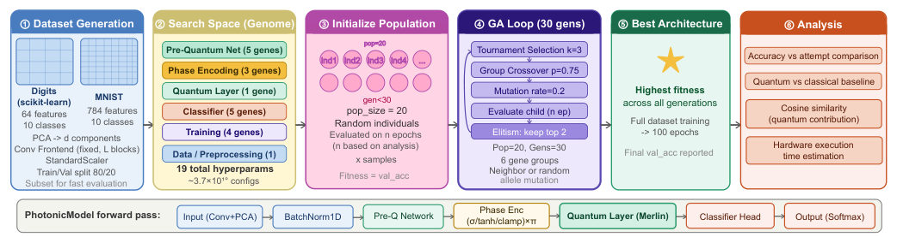 
Fig. 7: GA-based architecture search methodology. From dataset and search space through population evolution to the best architecture and analysis.

📷 Fig 5

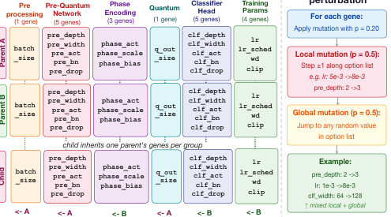 
Fig. 8: Group-based crossover example. Each group is chosen independently, giving 64 possible combinations per crossover.

**Summary.** The paper introduces Q-PhotoNAS, an automated framework for searching the optimal architecture of hybrid photonic quantum-classical neural networks. By using a genetic algorithm to jointly optimize classical and quantum components, the authors achieve state-of-the-art accuracy on image classification tasks. The study also quantifies the hardware-specific latency and the unique feature-extraction capabilities of the photonic layer.

**Why it may be interesting.** It presents an automated approach to optimizing variational quantum circuits on specific photonic hardware, specifically addressing the synergy between classical preprocessing and quantum phase encoding.

Detailed structure

**Main problem.** Designing effective hybrid photonic quantum-classical architectures is challenging due to a massive, interdependent design space involving classical preprocessing, quantum phase encoding, and photonic circuit structure.

**Main result.** The Q-PhotoNAS framework achieves high validation accuracies (99.44% on Digits, 99.78% on MNIST) and demonstrates that the photonic layer extracts non-redundant, complementary features to the classical pathway.

**Method.** A Neural Architecture Search (NAS) framework using a Genetic Algorithm (GA) to evolve 19 hyperparameters across six gene groups, combined with a learnable quantum phase encoding mechanism.

**Model / system.** A hybrid quantum-classical neural network targeting the Quandela Ascella photonic QPU, utilizing a 12-mode silicon nitride chip with thermo-optic phase shifters, directional couplers, and superconducting nanowire single-photon detectors.

**Key observables.** Photon-number probability vectors in the Fock basis, validation accuracy, inter-class cosine similarity, and hardware-estimated inference latency.

**Important parameters / regimes.** 19 hyperparameters including network depth/width, phase encoding scale and bias, learning rate, and 12-mode photonic circuit configuration.

**Assumptions / limitations.** The evaluation is primarily simulation-based using the Merlin backend; hardware latency estimates assume specific thermal-optic reconfiguration costs and photon loss rates.

**Figures summary.** Figure 1 shows the motivation for NAS via architecture complexity; Figure 2/3/5 illustrate the hybrid model pipeline and flow; Figure 4/7/8/9 detail the Q-PhotoNAS GA framework, including crossover and mutation; Figure 10 shows the hardware latency model.

**Paper structure.** The paper introduces the design challenge, describes the Q-PhotoNAS GA-based framework and learnable encoding, details the experimental setup/simulation, presents performance results on MNIST/Digits, performs quantum contribution analysis, and concludes with hardware latency estimations.

Abstract

Photonic quantum computing is a promising platform for scalable quantum machine learning, but designing effective hybrid architectures remains challenging under hardware and optimization constraints. Existing approaches rely on manually tuned architectures that fail to account for the collaboration between classical preprocessing, phase encoding, and photonic circuit structure, limiting both accuracy and hardware compatibility. In this paper, we propose a neural architecture search framework for hybrid photonic quantum-classical models that combines genetic algorithm-based search with learnable quantum phase encoding to systematically explore the joint design space of classical and quantum components. Our framework encodes 19 hyperparameters across six gene groups and evolves a population of hybrid architectures using group-based crossover, per-gene mutation, and elitism, evaluating each candidate on a short training budget before full retraining of the best found design. We evaluate our framework on two image classification benchmarks, Digits and MNIST, achieving final validation accuracies of 99.44% and 98.78%, respectively, with first-principles execution time estimates on the Quandela Ascella photonic QPU projecting single-image inference at 67 ms (Digits) and 149 ms (MNIST). Our quantum contribution analysis further shows that the photonic layer extracts non-redundant features orthogonal to the classical pathway, providing a measurable accuracy advantage over classical-only baselines. Our results demonstrate that automated architecture search is both practical and impactful for hybrid photonic systems, opening the way for systematic design space exploration of quantum AI on photonic devices.

[↑ back to top](#top)

### [QuCtrl-BELL: A Compiler-Driven Sub-Microsecond Feedback Control Stack for Scalable Trapped-Ion Quantum Experiments](http://arxiv.org/abs/2605.22433v1)

**Authors:** Junpeng She, Ruoyu Yan, Zhizhen Qin, Zhanyu Li, Zhongtao Shen, Zichao Zhou, Binxiang Qi, Luming Duan  
**Type:** both · **Category:** other · **PDF:** <https://arxiv.org/pdf/2605.22433v1>  
**Analysis basis:** full PDF text, analyzed in chunks
**Topic relevance:** 🔥 `QC/QI experiment` **4/5** · `quantum measurements` **3/5**

📷 Fig 1

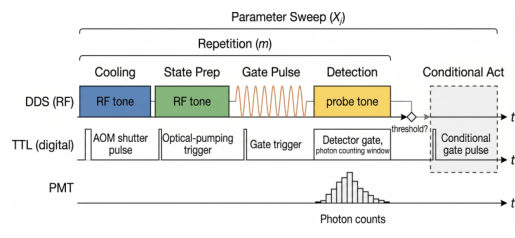 
Fig. 1. Canonical trapped-ion experiment sequence. Experiment comprises cooling, state preparation, a coherent gate pulse, and fluorescence detection. A threshold comparison on the photon count drives a conditional action at the board level. The shot repeats m times; an outer loop sweeps parameter Xj.

📷 Fig 2

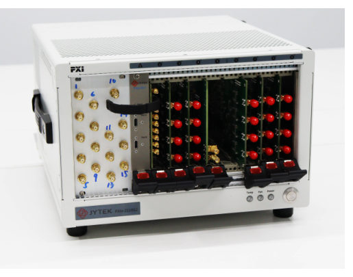 
Fig. 2. The QuCtrl-BELL hardware platform. All boards communicate via the PXIe backplane and the TCM star-bus broadcast network.

📷 Fig 3

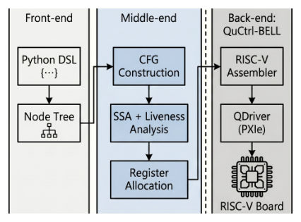 
Fig. 3. QuCtrl-BELL software architecture. The front-end (Python DSL and node tree) and middle-end (CFG, SSA, liveness, register allocation) are shared; the back-end below the dashed boundary provides hardware-targeted assembly generation and drivers.

📷 Fig 4

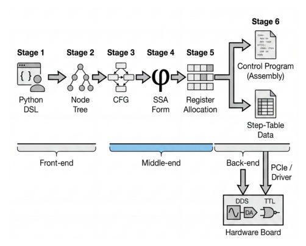 
Fig. 4. Bell’s six-stage compilation pipeline. Stages 1–2 are the front-end, Stages 3–5 the middle-end, and Stage 6 emits the control program and step- table data sent to hardware via PCIe.

📷 Fig 5

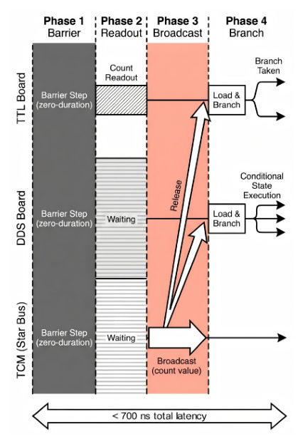 
Fig. 5. Cross-board synchronization for read_ttl: (1) barrier, (2) TTL photon-count readout, (3) TCM broadcast release, and (4) branch execution on each board. Total latency is below 700 ns without host round-trips.

**Summary.** The paper presents QuCtrl-BELL, a new compiler-driven software stack designed for scalable trapped-ion quantum control. By separating control logic from hardware parameters, it enables sub-700 ns feedback loops and efficient parameter sweeps. This architecture bridges the gap between user-friendly Python programming and the strict timing requirements of large-scale quantum experiments.

**Why it may be interesting.** This is highly relevant for AMO physicists as it provides the necessary classical control infrastructure for implementing complex, real-time feedback protocols essential for scalable trapped-ion gates and quantum error correction.

Detailed structure

**Main problem.** The challenge of scaling trapped-ion quantum computing requires a control system that provides both high-level software programmability and sub-microsecond, deterministic hardware feedback latency.

**Main result.** The QuCtrl-BELL stack achieves sub-700 ns end-to-end feedback latency by decoupling control flow from hardware state data, significantly reducing data transfer and memory pressure.

**Method.** A compiler-driven approach using a Python-embedded DSL that employs a six-stage transpilation pipeline (including CFG, SSA, and register allocation) to separate instruction streams from hardware step-tables.

**Model / system.** A distributed control platform for trapped-ion quantum computing based on a 9-slot PXIe chassis, featuring RISC-V processors, DDS/AWG boards, and a Trigger & Clock Manager (TCM) for star-topology synchronization.

**Key observables.** Feedback latency (measured at 690 ns), execution queue timing resolution (4 ns), and step-table compactness.

**Important parameters / regimes.** Sub-microsecond feedback threshold (<700 ns), 4 ns clock resolution, and 100 ns hardware broadcast delay.

**Assumptions / limitations.** The 700 ns synchronization overhead per readout event may limit throughput for high-frequency multi-round error correction; camera-based detection is not yet integrated into the compiler.

**Figures summary.** Figure 1 shows a standard trapped-ion experiment sequence; Figure 2 depicts the PXIe hardware architecture; Figure 3 and 4 detail the software architecture and compilation pipeline; Figure 5 illustrates the synchronization protocol; Figure 6 provides an oscilloscope trace confirming the 690 ns feedback latency.

**Paper structure.** The paper introduces the control tradeoff problem, describes the QuCtrl-BELL hardware and software architecture, details the six-stage compilation pipeline, presents performance evaluations regarding latency and memory efficiency, and concludes with future work.

Abstract

As trapped-ion quantum computing scales to larger qubit registers and more complex control protocols, classical control systems face a fundamental tradeoff: sub-microsecond board-level feedback requires tight hardware coupling, whereas maintainability and extensibility require clean, modular software abstractions. This paper presents QuCtrl-BELL (Bell), a compiler-driven software stack for trapped-ion quantum control. The design resolves this tradeoff by decoupling control flow -- including loops, branches, and synchronization -- from hardware state data. A Python-embedded domain-specific language (DSL) is lowered through a six-stage transpilation pipeline covering control flow graph (CFG) construction, static single-assignment (SSA) conversion, liveness analysis, and graph-coloring register allocation. The compiler generates deterministic distributed board-level programs and compact step-table data. A cross-board synchronization protocol supports feedback loops with latency below 700~ns without host intervention. Bell is deployed and evaluated on the QuCtrl-BELL platform (RISC-V + PXIe), demonstrating that a compiler-based infrastructure can provide programmability, deterministic timing, and modularity for scalable trapped-ion quantum control.

[↑ back to top](#top)

### [A journey through Flatland: What does the antiflatness of a spectrum teach us?](http://arxiv.org/abs/2605.21664v1)

**Authors:** Barbara Jasser, Daniele Iannotti, Alioscia Hamma  
**Type:** theory · **Category:** quantum information and computing · **PDF:** <https://arxiv.org/pdf/2605.21664v1>  
**Analysis basis:** full PDF text, analyzed in chunks
**Topic relevance:** 🔥 `entanglement & information structure` **4/5** · `non-equilibrium dynamics` **2/5**

📷 Fig 1

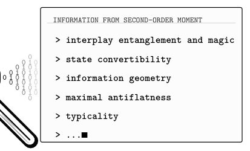 
Figure 1: On the left different profiles of the eigenvalues {λi}r i=1 of a given reduced density matrix, wiht λk ≥λj with k &lt; j, showing (from top to bottom) the constant uniform, exponentially decaying and maximum antiflat spectrum respectively. On the right, a non-exhaustive list of information that can be extracted from the second-order moment of the ES.

📷 Fig 2

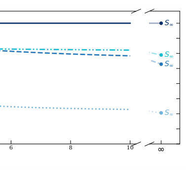 
Figure 2: R´enyi entropy curves Sα(ρA) for representative states in dA = 4 with spectra: Flat (0.25, 0.25, 0.25, 0.25); State A (0.4, 0.3, 0.2, 0.1); State B (0.7, 0.2, 0.08, 0.02); and State C (0.36, 0.34, 0.29, 0.01). FlatA states yield constant R´enyi curves, corresponding to vanishing R´enyi spread. The crossing between States A and C provides a visual indication that pointwise comparison of R´enyi entropies is insufficient; their incomparability under ≺AF is confirmed by the spread inequalities, since ∆1,2(A) &gt; ∆1,2(C) whereas ∆0.5,1(C) &gt; ∆0.5,1(A). This illustrates the partial nature of the antiflat ordering and shows that spec- tral steepness over a restricted range of α is not, by...

📷 Fig 3

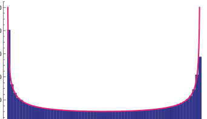 
Figure 4: Left. Probability density function of FA(ρ) for 2 qubits random pure states induced by the Haar measure, with the violet line representing the analytical result and the histogram depicting the numerical computation reasalized using Nsamples = 2 × 106. Right. Probability density function of FA(ρ) for 2 qubits random pure states induced by the Bures probability distribution, with the violet line representing the analytical result and the histogram depicting the numerical computation reasalized using Nsamples = 2 × 106.

**Summary.** The paper introduces a new framework to study the 'antiflatness' of quantum entanglement spectra, focusing on the fluctuations of eigenvalues rather than just their average. It establishes a new partial ordering for quantum states and proves that maximal spectral deviation is achieved by a specific class of 'jump' spectra. This provides a deeper tool for characterizing quantum correlations and resource theories.

**Why it may be interesting.** This is highly relevant for many-body dynamics and open quantum systems as it provides a new way to quantify the 'richness' of entanglement beyond simple entropy, specifically looking at how the internal structure of the entanglement spectrum evolves.

Detailed structure

**Main problem.** The paper aims to characterize the structural fluctuations within the entanglement spectrum of a quantum state by moving beyond standard average measures like purity or von Neumann entropy.

**Main result.** The authors introduce 'antiflatness' as a measure of spectral inhomogeneity and develop a new partial ordering called 'antiflat majorization' based on the Rényi entropy spread. They also identify a continuous Pareto frontier of extremal states that achieve maximal antiflatness.

**Method.** The study employs information geometry (escort distributions and Bregman divergences), mathematical proofs involving Lagrange multipliers and Zorn's Lemma, and statistical analysis of Haar, Bures-Hall, and t-doped Clifford random state ensembles.

**Model / system.** The framework focuses on bipartite quantum systems with reduced density operators, considering various random state ensembles and contexts such as topological order and many-body localization.

**Key observables.** Entanglement spectrum, Rényi entropy spread, Capacity of Entanglement, Linear Rényi spread, and Logarithmic antiflatness.

**Important parameters / regimes.** Rényi parameter (alpha), purity (Tr[rho^2]), dimension of the Hilbert space (dA), and the weight of the largest eigenvalue (r_max).

**Assumptions / limitations.** The study assumes bipartite structures and focuses on the properties of the reduced density matrix; it notes that standard majorization is structurally blind to the spectral fluctuations being studied.

**Figures summary.** Figure 1 illustrates different eigenvalue profiles (flat, decaying, and maximal antiflat) and summarizes information extractable from the second-order moment of the spectrum; Figure 2 shows Rényi entropy curves for different states.

**Paper structure.** The paper begins by defining antiflatness and the new partial ordering, moves to establishing the mathematical properties of the ordering and flatness-preserving operations, explores the geometric structure of the accessible antiflatness volume, and concludes with the identification of maximal antiflatness states and their statistical properties.

Abstract

We explore the concept of antiflatness to characterize the structural fluctuations within the entanglement spectrum of a quantum state (i.e., the spectrum of its reduced density operator). As a measure of the interplay between entanglement and magic, two fundamental quantum resources, antiflatness provides second-order information about quantum correlations that standard average measures fail to capture. Recognizing that standard majorization theory fundamentally orders states by purity and is structurally blind to spectral fluctuations, we introduce a novel partial ordering known as antiflat majorization, based on the Rényi entropy spread. We define Flatness-Preserving Operations (FPOs), establishing new necessary conditions for state convertibility. Furthermore, we unify different measures of antiflatness-such as Capacity of Entanglement, Linear Rényi spread, and Logarithmic antiflatness-using the frameworks of escort distributions and Bregman divergences. We prove that the Capacity of Entanglement can be expressed as a second derivative of the Kullback-Leibler divergence along the escort trajectory, connecting it with the Quantum Fisher Information. Finally, we demonstrate that absolute maximal antiflatness is not achieved by a single universal state, but rather by a continuous Pareto frontier of extremal states with jump spectra, and we analyze the typicality of these spectral fluctuations using Haar, Bures-Hall and t-doped Clifford random state ensembles.

[↑ back to top](#top)

### [Factorization rule for multitime correlations in non-Markovian open quantum systems](http://arxiv.org/abs/2605.22386v1)

**Authors:** Thomas K. Bracht, Moritz Cygorek  
**Type:** theory · **Category:** numerical methods · **PDF:** <https://arxiv.org/pdf/2605.22386v1>  
**Analysis basis:** full PDF text, analyzed in chunks
**Topic relevance:** 🔥 `methods for driven-dissipative` **4/5** · `non-equilibrium dynamics` **2/5**

📷 Fig 1

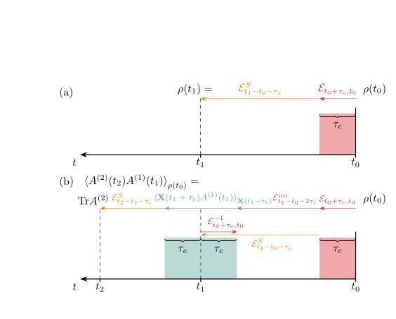 
FIG. 1. (a) The dynamical map for density matrix evolution becomes stationary after the memory time t ≥τc, which en- ables exact long-time extrapolation of non-Markovian dynam- ics. (b) Exact factorization of a two-time correlation function when t2 −t1 ≥τc, i.e., t1 and t2 differ by at least the memory time τc. Propagation over 2τ 2 c contains all information needed to reconstruct two-time correlations with arbitrary time ar- guments.

📷 Fig 2

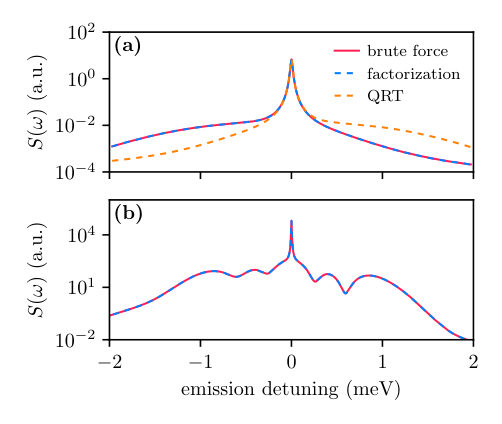 
FIG. 2. (a) Emission spectrum of a weakly cw-driven QD with non-Markovian coupling to phonons. Standard QRT predicts the phonon sideband on the wrong side of the zero-phonon line. Using factorization the complete information is con- tained in a temporal volume of τ 2 c . (b) Exemplary emission spectrum for resonant pulsed excitation.

📷 Fig 3

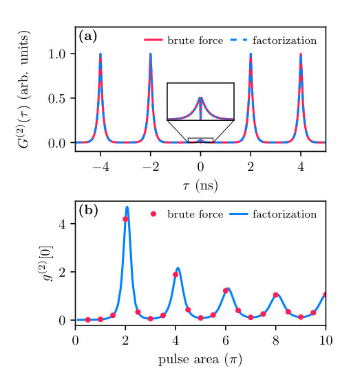 
FIG. 3. (a) Time-integrated second-order coherence for a res- onant pulse with σ = 5 ps and pulse area of π, resulting in g(2)[0] = 0.032. For other parameters, see appendix. (b) Ra- tio of photon counts stemming from a single pulse and subse- quent pulses at different pulse areas.

**Summary.** This paper presents a new exact factorization rule for calculating multitime correlation functions in non-Markovian systems. By breaking down complex n-time correlations into simpler lower-order parts, the method achieves massive computational speed-ups without sacrificing accuracy. This is particularly useful for studying the optical properties of quantum dots coupled to phonon environments.

**Why it may be interesting.** It provides a powerful computational shortcut for simulating complex non-Markovian dynamics, allowing for the efficient calculation of high-order correlations and spectra that were previously too expensive to compute.

Detailed structure

**Main problem.** Calculating multitime correlation functions in non-Markovian open quantum systems is computationally expensive because the breakdown of the Quantum Regression Theorem (QRT) requires long-time, brute-force simulations.

**Main result.** The authors derive an exact factorization rule that decomposes n-th order correlations into products of lower-order correlations, providing a speed-up of two to three orders of magnitude while maintaining exact accuracy.

**Method.** The method uses an eigenvector decomposition of the stationary dynamical map within a Markovian embedding framework to decouple time steps.

**Model / system.** The study focuses on non-Markovian open quantum systems with time-independent Hamiltonians and finite memory times, specifically using semiconductor quantum dots coupled to a super-Ohmic phonon bath as a primary example.

**Key observables.** Multitime correlation functions, emission spectra S(omega), second-order coherence G(2)(t, tau), and integrated second-order coherence g(2)[0].

**Important parameters / regimes.** Memory time (tau_c), phonon dynamics (picosecond scale), radiative decay (nanosecond scale), and temperature (4 K).

**Assumptions / limitations.** The Hamiltonian is time-independent, the initial system-environment state is an uncorrelated product, and the environment has a finite memory time.

**Figures summary.** Figure 1 illustrates the stationary dynamical map and the visual concept of factorization; Figure 2 compares the accuracy of the factorization method against brute-force and QRT for emission spectra; Figure 3 shows time-integrated second-order coherence.

**Paper structure.** The paper introduces the problem of non-Markovian correlations, derives the mathematical factorization rule using Liouvillian eigenbasis decomposition, applies the method to quantum dots coupled to phonons, and validates the efficiency and accuracy against brute-force simulations.

Abstract

Experiments performed on quantum systems often measure multitime correlation functions. When quantum systems are weakly coupled to their environment, the time evolution of such correlation functions can be reduced to that of the reduced density matrix by the quantum regression theorem (QRT). While no QRT is available for general non-Markovian open quantum systems, we show that for time-independent Hamiltonians and finite memory times $τ_c$, an exact factorization rule exists that relates higher-order multitime correlations to products of lower-order correlations. Consequently, all information needed to reconstruct $n$-time correlations is contained in a temporal volume of $\mathcal{O}(τ_c^n)$. On the example of quantum dots coupled to phonons, we demonstrate that this factorization makes numerical calculations of multitime correlations extremely efficient and even enables semianalytical solutions in systems where the standard QRT breaks down.

[↑ back to top](#top)

### [Joint Unitarity and a Single Definite Outcome in a Quantum Measurement](http://arxiv.org/abs/2605.22551v1)

**Authors:** Muxi Liu  
**Type:** theory · **Category:** other · **PDF:** <https://arxiv.org/pdf/2605.22551v1>  
**Analysis basis:** full PDF text, analyzed in chunks
**Topic relevance:** 🔥 `quantum measurements` **4/5** · `entanglement & information structure` **2/5**

📷 Fig 1

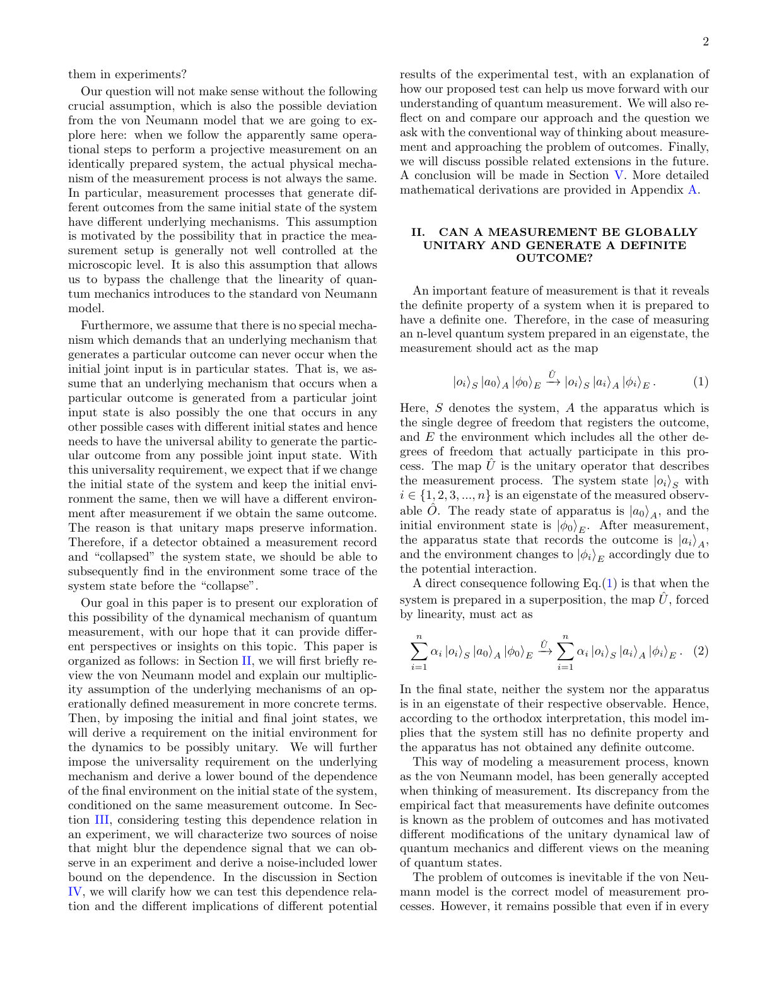 
Low-resolution page preview, page 2

📷 Fig 2

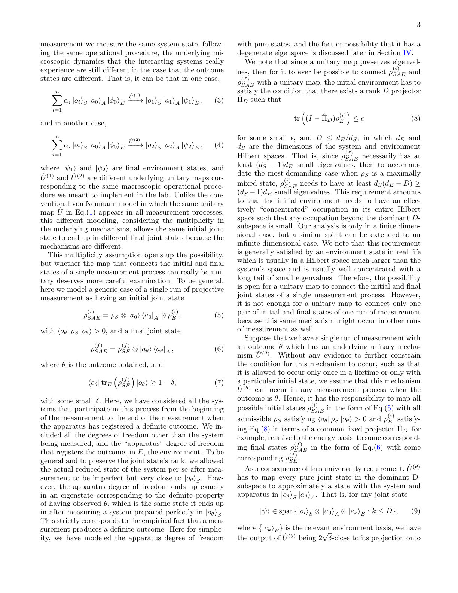 
Low-resolution page preview, page 3

📷 Fig 3

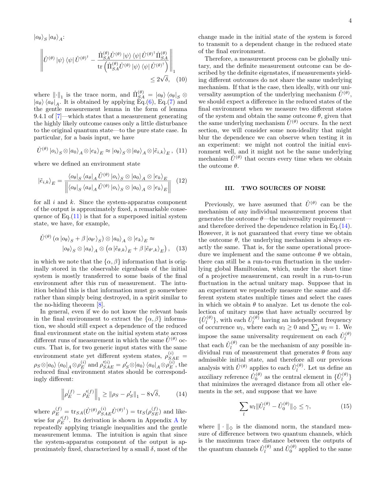 
Low-resolution page preview, page 4

📷 Fig 4

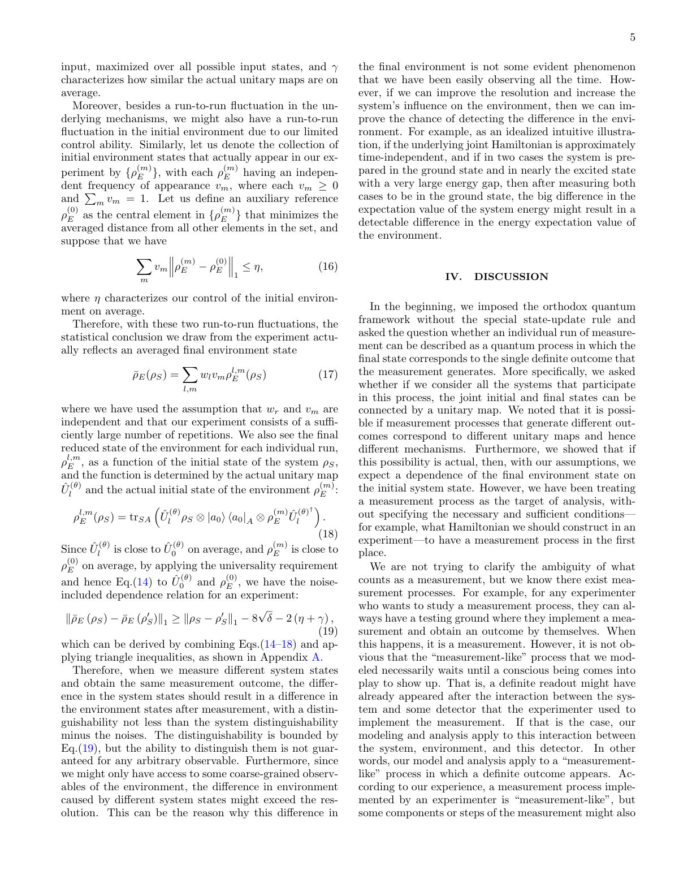 
Low-resolution page preview, page 5

📷 Fig 5

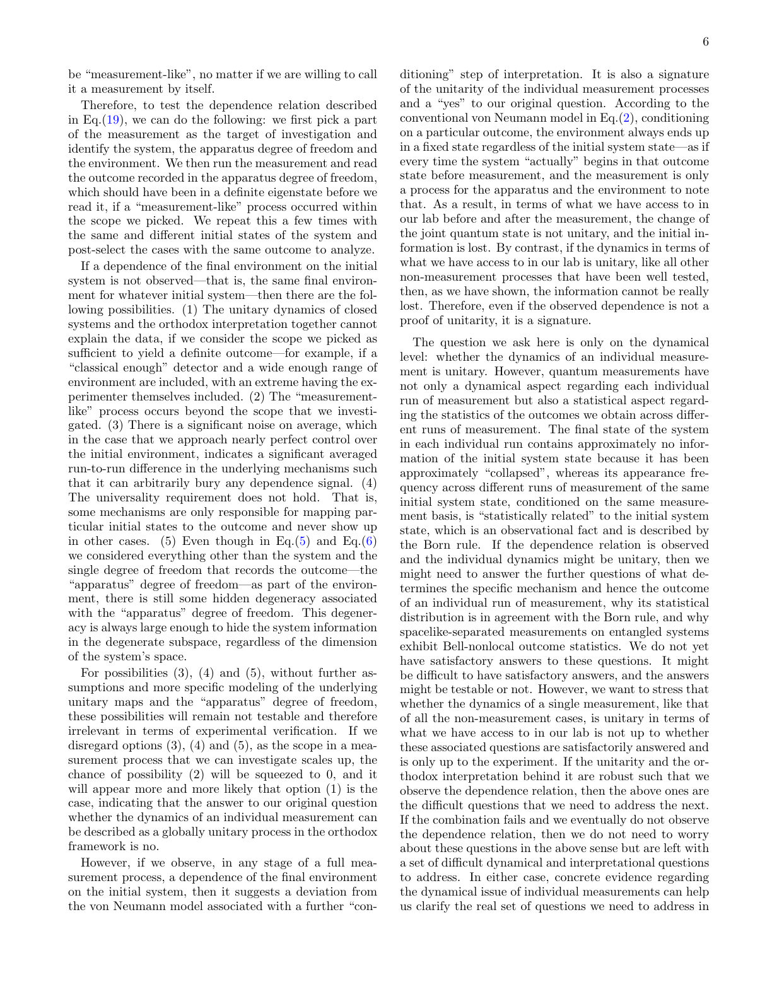 
Low-resolution page preview, page 6

**Summary.** This paper investigates whether a single quantum measurement run with a definite outcome can be described by a joint unitary evolution. It establishes that if such a unitary process exists, the final state of the environment must retain a trace of the initial system state. This provides a way to experimentally test the compatibility of unitary dynamics with the emergence of definite outcomes.

**Why it may be interesting.** It provides a concrete, experimentally testable criterion to distinguish between the standard von Neumann/conditioning interpretation and models where individual measurement runs are fundamentally unitary.

Detailed structure

**Main problem.** Resolving the discrepancy between the von Neumann measurement model, which predicts entangled states, and the empirical reality of single, definite measurement outcomes.

**Main result.** The author derives a lower bound on the dependence of the post-measurement environment state on the initial system state, providing an experimentally testable signature of unitary dynamics in individual measurement runs.

**Method.** The study uses mathematical tools such as the trace norm, diamond norm, and the gentle measurement lemma to analyze information transfer and derive bounds on state distinguishability.

**Model / system.** A tripartite system consisting of a measured system (S), a measurement apparatus (A), and an environment (E), where different measurement outcomes are driven by different underlying unitary maps.

**Key observables.** The trace distance between the reduced final states of the environment conditioned on the same measurement outcome.

**Important parameters / regimes.** delta (state deviation), eta (environment fluctuation), and gamma (unitary mechanism fluctuation).

**Assumptions / limitations.** The multiplicity assumption (different outcomes correspond to different unitaries) and the universality requirement (the mechanism for an outcome is independent of the input state).

**Paper structure.** The paper identifies the problem of outcomes, proposes an alternative unitary model with outcome-dependent maps, derives a mathematical lower bound for environment state dependence, and discusses experimental observability and noise limitations.

Abstract

We investigated the possibility that a single measurement run with a definite outcome is a joint unitary evolution of all the participating systems, and measurement runs with different definite outcomes correspond to different unitary maps. With reasonable assumptions, we derived a lower bound of the dependence of the environment after measurement on the state of the system before measurement, conditioned on the same measurement outcome. An experimental test of this dependence relation can either serve as evidence that the unitary dynamics and the definite outcome in the orthodox sense cannot be true together or suggest a deviation from the von Neumann measurement model plus a "conditioning" interpretational step.

[↑ back to top](#top)

### [Symmetry Breaking as Quantum Gate: Entropy and Weak Mixing Angle](http://arxiv.org/abs/2605.22070v1)

**Authors:** Qing-Hong Cao, Yandong Liu, Haotian Qi, Hao Zhang, Haoran Zhao  
**Type:** theory · **Category:** quantum information and computing · **PDF:** <https://arxiv.org/pdf/2605.22070v1>  
**Analysis basis:** full PDF text, analyzed in chunks
**Topic relevance:** 🔥 `entanglement & information structure` **4/5** · `quantum measurements` **2/5**

📷 Fig 1

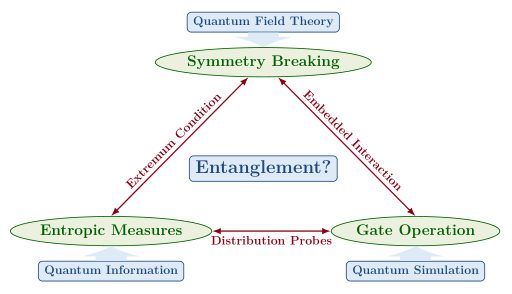 
FIG. 1: A unified theoretic framework establishing the correlation between QFT, QI and QS.

📷 Fig 2

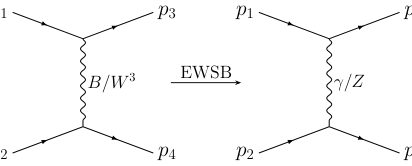 
FIG. 3: Scattering process mediated by different neutral current before and after the EWSB. The external legs of fermions also acquire finite mass after EWSB.

📷 Fig 3

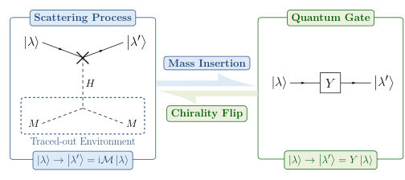 
FIG. 2: Mass insertion as scattering process mediated by Higgs is equivalent to quantum gate operating in the chirality basis.

📷 Fig 4

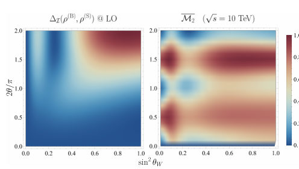 
FIG. 4: RMI ∆I  ρ(B), ρ(S) (left panel) and SRE M2 (right panel) in e−µ−→e−µ−scattering, showing their dependence on scattering kinematics and the weak mix- ing angle (θ, sin2 θW ). The quantities ∆I  ρ(B), ρ(S) and M2 are normalized to [0, 1] respectively.

📷 Fig 5

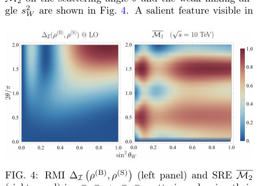 
Fig. 4 is that RMI exhibits a qualitatively different de- pendence on kinematics compared with SRE. For SRE constructed in the spin computational basis, Refs. [4, 8] show that perpendicular scattering (θ = π/2) plays a privileged role, as it does in the concurrence. In contrast, the ∆I  ρ(B), ρ(S) does not favor any particular scatter- ing orientation. As discussed in [9, 10], this distinction originates from the global Lorentz rotation relating the helicity and the fixed beam computational bases. Another notable feature is the emergence of a decoherence-like behavior in the forward-scattering re- gion. As seen in Fig. 4, RMI becomes increasingly insen- sitive to s2 W as θ →0. This...

**Summary.** This paper demonstrates that the variation in Rényi mutual information and stabilizer Rényi entropy in electroweak scattering follows the same dependence on the weak mixing angle. This shared behavior is explained by treating the Yukawa mass insertion as a quantum gate in chirality space. The results suggest that entropic measures can serve as a diagnostic tool for the chiral structure of particle interactions.

**Why it may be interesting.** It provides a novel bridge between high-energy particle physics and quantum information theory by interpreting fundamental symmetry breaking as a specific quantum gate operation acting on chirality space.

Detailed structure

**Main problem.** The paper investigates the relationship between electroweak symmetry breaking (EWSB) and quantum information theoretic measures, specifically looking for a correspondence between Rényi mutual information and stabilizer Rényi entropy.

**Main result.** The authors establish that RMI and SRE exhibit an identical dependence on the weak mixing angle after angular averaging, a correspondence traced to the Yukawa mass insertion acting as a -iY quantum gate in chirality space.

**Method.** The study uses helicity amplitude formalism, quantum state tomography to reconstruct density matrices, and angular averaging over the celestial sphere to evaluate entropic probes.

**Model / system.** The system consists of 2 to 2 elastic scattering processes (e.g., e- mu- to e- mu-) within the Standard Model framework, specifically focusing on neutral-current channels involving Z boson exchange across the EWSB transition.

**Key observables.** Rényi mutual information (RMI) in the helicity basis and stabilizer Rényi entropy (SRE) in the fixed beam basis.

**Important parameters / regimes.** Weak mixing angle (sin^2 theta_W), scattering angle (theta), and fermion coupling strengths (kappa_L, kappa_R); high-energy limit (sqrt(s) = 10 TeV).

**Assumptions / limitations.** The analysis uses the high-energy limit to isolate energy-independent contributions and assumes tree-level 2 to 2 elastic scattering.

**Figures summary.** Figure 1 shows a conceptual framework linking QFT and QI; Figure 2 depicts the Yukawa interaction as a quantum gate; Figure 3 illustrates the scattering process before and after EWSB; Figures 4 and 5 show the dependence of entropic measures on scattering angles and the weak mixing angle.

**Paper structure.** The paper introduces a unified framework for QFT and QI, describes the scattering model and the quantum gate interpretation of mass insertion, presents the calculation of entropic probes, analyzes the correspondence between RMI and SRE, and discusses the diagnostic role of these measures.

Abstract

We establish a correspondence between two independent entropic probes -- the variation of Rényi mutual information (RMI) across the electroweak symmetry breaking (EWSB) transition and the stabilizer Rényi entropy (SRE) -- in tree-level $2\to 2$ elastic scatterings. After angular averaging, the RMI (helicity basis) and the SRE (fixed beam basis) exhibit identical dependence on $\sin^2θ_W$ within each neutral-current channel. We trace this correspondence to a common physical origin that it's the Yukawa mass insertion acts as a $-\mathrm{i}Y$ quantum gate in chirality space. Minimizing entropies across all processes yields $\sin^2θ_W$ values matching purely axial vector-like couplings in $Z$ boson exchanged channel.

[↑ back to top](#top)

### [Diagrammatic Monte Carlo for Fermionic Rényi Entanglement Entropy](http://arxiv.org/abs/2605.21632v1)

**Authors:** Boyuan Shi  
**Type:** theory · **Category:** numerical methods · **PDF:** <https://arxiv.org/pdf/2605.21632v1>  
**Analysis basis:** full PDF text, analyzed in chunks
**Topic relevance:** 🔥 `entanglement & information structure` **4/5**

📷 Fig 1

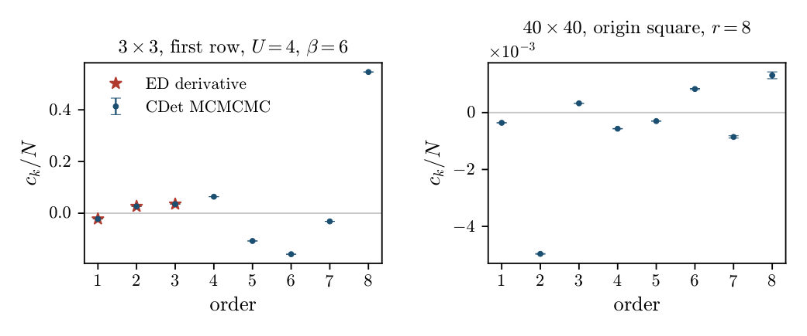 
FIG. 1. Order-by-order interaction corrections. Left: 3 × 3 benchmark with ED derivatives, shown as red stars, for the first three coefficients. Right: 40 × 40 production run for a periodic origin-square subregion with radius r = 8. The plotted values are coefficients of ln Z2[A]/N, not cumulative sums; the omitted zeroth-order terms are the free-system values −0.27507894 (left) and −0.04089329 (right).

**Summary.** This paper introduces a new Diagrammatic Monte Carlo method to directly compute Renyi entanglement entropy in interacting fermionic systems. By using a graded-swap representation and connected-determinant sampling, the method avoids the traditional sign problem and scales to much larger lattice sizes than exact diagonalization. This provides a powerful tool for studying entanglement in complex, strongly correlated regimes.

**Why it may be interesting.** not directly relevant

Detailed structure

**Main problem.** Developing a scalable numerical framework to calculate the Renyi entanglement entropy for interacting lattice fermions, specifically overcoming the sign problem and computational costs in 2D and finite-temperature regimes.

**Main result.** The authors successfully implemented a Diagrammatic Monte Carlo (DiagMC) framework that provides accurate order-by-order interaction corrections for large systems, validated against exact diagonalization for small clusters and applied to a 40x40 lattice.

**Method.** A direct diagrammatic Monte Carlo framework using a fermionic graded-swap representation, connected-determinant sampling (CDet), and a many-configuration Markov-chain Monte Carlo sampler.

**Model / system.** The repulsive Hubbard model on a square lattice with periodic boundary conditions, focusing on the entanglement of a square subregion A.

**Key observables.** Second Renyi entanglement entropy (S2) and its interaction-dependent coefficients.

**Important parameters / regimes.** Interaction strength (U), chemical potential (mu), inverse temperature (beta), and subregion size/geometry.

**Assumptions / limitations.** The primary computational bottleneck is memory usage rather than the conventional auxiliary-field sign problem; the method is oriented toward finite-size/finite-region calculations.

**Figures summary.** Figure 1 compares order-by-order CDet Monte Carlo coefficients against exact diagonalization for a 3x3 cluster and presents production results for a 40x40 lattice.

**Paper structure.** The paper follows a logical progression from the theoretical formulation of the graded-swap path integral to the derivation of the determinant expansion, followed by the description of the MCMC sampler, validation via benchmark, and finally large-scale production results.

Abstract

We develop a direct diagrammatic Monte Carlo framework for the Renyi entanglement entropy of interacting lattice fermions. The method starts from the fermionic graded-swap representation of Z_n[A]=Tr_Aρ_A^n, which converts the entropy problem into a replicated path integral with mixed temporal boundary conditions on the entangling region. In this representation the replica momenta are half-shifted, q_m=(2m+1)π/n, and the interaction expansion has a determinant form suitable for connected-determinant summation. We combine this expansion with a many-configuration Markov-chain Monte Carlo sampler to obtain order-by-order corrections for very large systems to very high orders. As a benchmark, we compare the order-by-order coefficients of a 3*3 Hubbard cluster with exact diagonalization. We then report a production calculation for a large periodic lattice with a square subregions. The dominant system-size limitation is therefore memory rather than a conventional auxiliary-field sign problem. The results provide a step toward diagrammatic calculations of fermionic entanglement observables in regimes where direct quantum Monte Carlo sampling is costly or sign-problem limited.

[↑ back to top](#top)

### [Long-range nonstabilizerness of topologically encoded states from mutual information](http://arxiv.org/abs/2605.22424v1)

**Authors:** David Aram Korbany, Tyler D. Ellison, David T. Stephen, Lorenzo Piroli  
**Type:** theory · **Category:** quantum information and computing · **PDF:** <https://arxiv.org/pdf/2605.22424v1>  
**Analysis basis:** full PDF text, analyzed in chunks
**Topic relevance:** 🔥 `entanglement & information structure` **4/5**

📷 Fig 1

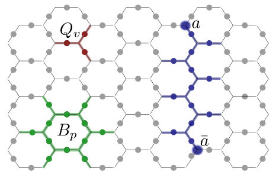 
Figure 4. Pictorial representation of the string-net lattice. The figure also shows the supports of the vertex, plaquette, and string operators.

📷 Fig 2

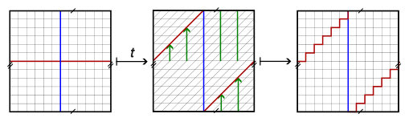 
Figure 5. Dehn twist on the torus implemented by a shear transformation (green arrows), followed by a local geometric deformation to restore the lattice. The coordinate grid rep- resents the connectivity of the lattice. Note that the shear transformation is a permutation where in the n-th column the vertices are shifted by n steps.

📷 Fig 3

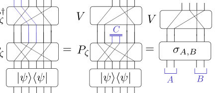 
Figure 6. Pictorial derivation of Eq. (56). We only show the “ket” layer. The horizontal double lines (colored) indicate a trace over ˜C on the left, and over C in the middle pannel.

**Summary.** The paper investigates how mutual information between disjoint regions on a torus can detect long-range nonstabilizerness in topological phases. It provides a complete classification for the Toric Code and shows that while the method is powerful, it has limitations in non-abelian systems. The results also impose fundamental constraints on which logical gates can be implemented fault-tolerantly.

**Why it may be interesting.** This work is highly relevant to many-body dynamics and quantum information as it provides a new information-theoretic tool to detect non-stabilizer resources in topological phases, which is crucial for understanding the limits of fault-tolerant quantum computing.

Detailed structure

**Main problem.** The paper aims to characterize and detect long-range nonstabilizerness (LRN) in topologically encoded states in 2D, specifically determining if mutual information can serve as a reliable diagnostic tool.

**Main result.** The authors prove that for the Z2 toric code, non-integer mutual information between non-overlapping regions containing non-contractible loops provides a full classification of LRN, whereas for non-abelian Fibonacci models, the method detects LRN for all but a finite subset of states.

**Method.** The study uses information-theoretic analysis of mutual information, modular transformations (S and T matrices) of the torus, and entropic uncertainty relations (Maassen-Uffink bound) to relate anyon properties to LRN.

**Model / system.** The research focuses on 2D topologically ordered systems defined on a torus, specifically the Z2 Toric Code and non-abelian string-net models like the doubled Fibonacci topological order.

**Key observables.** Mutual information (I), von Neumann entropy, and anyon labels/flux.

**Important parameters / regimes.** Shallow-depth local quantum circuits (depth O(polylog(L))), thermodynamic limit (N -> infinity), and modular group transformations.

**Assumptions / limitations.** The system is a regular 2D lattice; regions are sufficiently distant and large enough to encompass Wilson loop operators; the study focuses on minimal-entropy states.

**Figures summary.** Figure 1 shows Toric Code operators and non-contractible cycles; Figure 2 illustrates spatial regions A and B; Figure 3 shows Wilson loop operator mappings; Figure 4 depicts the string-net lattice; Figure 5 shows a Dehn twist via lattice shear; Figure 6 shows a pictorial derivation of trace equations.

**Paper structure.** The paper introduces LRN and the problem of 2D detection, establishes a theorem for LRN detection using mutual information, applies this to the Z2 Toric Code for full classification, extends the analysis to non-abelian string-net models, and concludes with implications for fault-tolerant logical gates.

Abstract

We study long-range nonstabilizerness (LRN), namely the obstruction to remove nonstabilizerness with shallow-depth local quantum circuits. In one-dimensional settings, the mutual information between disconnected spatial regions has proven to be a powerful tool to diagnose LRN. In this work, we focus on encoded states of two-dimensional topologically-ordered systems, and explore the ability of the mutual information to serve as a diagnostic of LRN. Focusing on the concrete setting of lattice models defined on a torus, we show that information about LRN can be gained from the analysis of the mutual information between non-overlapping regions containing non-contractible loops, and of the change of such mutual information under modular real-space transformations. We exemplify this idea in the toric code and the non-abelian string-net model with doubled Fibonacci topological order. In the former case, we show that the mutual information provides a full classification, certifying LRN for all encoded non-stabilizer states. In the latter case, instead, our approach does not lead to a full classification, as it detects LRN for all states except from a finite subset with special transformation properties under the modular group. Finally, we discuss how our results on LRN constrain the logical gates that can be implemented fault-tolerantly on the torus.

[↑ back to top](#top)

### [Unified entropy entanglement](http://arxiv.org/abs/2605.22150v1)

**Authors:** Wenxue Ren, Binghao Li, Ruiqun Niu, Yu Guo, Shuanping Du  
**Type:** theory · **Category:** quantum information and computing · **PDF:** <https://arxiv.org/pdf/2605.22150v1>  
**Analysis basis:** full PDF text, analyzed in chunks
**Topic relevance:** 🔥 `entanglement & information structure` **4/5**

📷 Fig 1

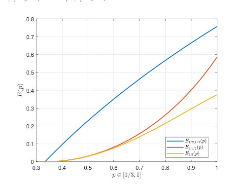 
FIG. 1: The comparison of E2,2(ρw), E2,1/2(ρw) and E1/2,1/2(ρw).

**Summary.** This paper introduces a generalized framework for entanglement measures based on 'unified entropy,' which encompasses Tsallis and Renyi entropies. It explores the properties of both (q,s) and (r,t) type entanglement, proving their monotonicity and monogamy while identifying specific measures that satisfy tight complete monogamy. The study provides a unified approach to understanding multipartite entanglement distribution.

**Why it may be interesting.** This work provides a generalized mathematical framework for quantifying entanglement, which is fundamental for understanding entanglement distribution and monogamy in multipartite quantum networks and many-body systems.

Detailed structure

**Main problem.** The paper aims to develop and characterize a unified theory of multipartite entanglement measures using the 'unified entropy' framework, specifically investigating the properties of (q,s) and (r,t) type entropy entanglement.

**Main result.** The authors prove that (q,s) entropy entanglement is an entanglement monotone and is monogamous, and they identify one specific global multipartite entanglement measure (GlMEM) that is both completely and tightly completely monogamous.

**Method.** The study employs mathematical frameworks involving the unified entropy definition, partition theory (coarsening relations), LOCC analysis, and the use of Schmidt decomposition and operator convexity.

**Model / system.** The study focuses on n-partite quantum systems consisting of finite-dimensional Hilbert spaces, specifically analyzing pure and mixed states, including the two-qubit Werner state as a benchmark.

**Key observables.** Unified entropy entanglement measures (E_{q,s}, E_{r,t}), Global Multipartite Entanglement Measures (GlMEMs), and Genuine Entanglement Measures (GEMs).

**Important parameters / regimes.** Entropy parameters (q, s, r, t) defining different regimes, such as 0 < r < 1 and q > 1, and the dimension of the subsystems.

**Assumptions / limitations.** The analysis of mixed states assumes the existence of an optimal decomposition via the convex-roof extension.

**Paper structure.** The paper introduces the unified entropy framework, defines bipartite and multipartite entanglement measures, establishes monotonicity and monogamy properties for different parameter regimes, compares different types of global measures, and provides analytical proofs for hierarchy violations.

Abstract

The unified entropy as a promotion of the von Neumann entropy exhibits distinct diversity which contains the Tsallis entropy, the Rényi entropy, the von Neumann entropy as special cases. The unified-($r,t$) entropy entanglement with $0<r<1$ and $0< t\leq 1$ was shown to be an entanglement monotone in literature. In this paper, we explore unified-($q,s$) entropy entanglement with $q>1$ and $qs\geq1$ and show that it is also an entanglement monotone and that both of them are monogamous. Going further, we present two kinds of global multipartite entanglement measures (GlMEMs) based on the unified entropy and each kind has two subclasses which are classified by the parameters $(q,s)$ and $(r,t)$. Consequently, from the view of the complete multipartite entanglement measure theory, we show that one of them is a complete multipartite entanglement monotone and is not only completely monogamous but also tightly completely monogamous, but the other three are even not complete. We also explore the genuine entanglement measures induced by the unified entropy and the relations with the bipartite entanglement and the global entanglement are discussed, respectively.

[↑ back to top](#top)

### [Modular Variables and the Limits of Phase Detectability in Open Quantum Systems](http://arxiv.org/abs/2605.22293v1)

**Authors:** S. V. Mousavi  
**Type:** theory · **Category:** quantum information and computing · **PDF:** <https://arxiv.org/pdf/2605.22293v1>  
**Analysis basis:** full PDF text, analyzed in chunks
**Topic relevance:** `entanglement & information structure` **3/5** · `quantum measurements` **3/5** · `correlated / nonlocal dissipation` **2/5** · `methods for driven-dissipative` **2/5** · `non-equilibrium dynamics` **2/5**

📷 Fig 1

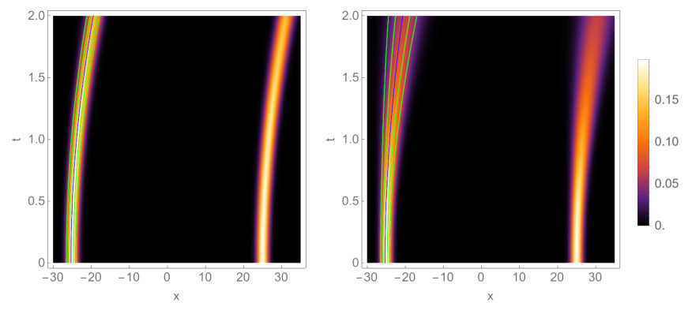 
FIG. 1: Density plots of the probability density for the Schr¨odinger dynamics (left) and the CL dynamics (right) at γ = 0.1 and T = 10. A representative set of Bohmian trajectories is superimposed. These trajectories follow the motion of the left wave packet, while the right wave packet remains empty. The middle blue trajectory corresponds to the wave-packet center. The remaining parameters are fixed as ¯h = m = kB = σ0 = 1, k = 0.1, L = 50, and g = −3.

📷 Fig 2

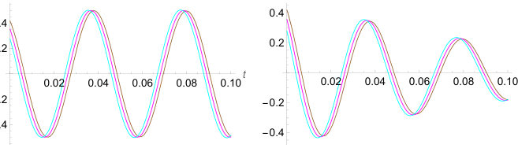 
FIG. 2: Local expectation value of the modular variable along Bohmian trajectories for a relative phase α = π/4 and three different Bohmian initial positions: X0 = −L/2 −2σ0 (brown), X0 = −L/2 (magenta), and X0 = −L/2 + 2σ0 (cyan). The left panel shows the Schr¨odinger dynamics [Eq. (34)], and the right panel shows the CL dynamics. The remaining parameters are ¯h = m = kB = σ0 = 1, k = 0.1, L = 50, g = −3, γ = 0.001, and T = 2.

📷 Fig 3

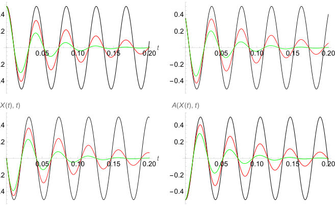 
FIG. 3: Local expectation value of modular variable along the Bohmian trajectory with initial position X0 = −L/2, shown for different values of the relative phase α: α = 0 (top left), α = π/4 (top right), α = π/2 (bottom left), and α = π (bottom right). In each panel, the black curve corresponds to the Schr¨odinger dynamics [Eq. (34)], while the red and green curves correspond to the CL framework with temperatures T = 2 and T = 5, respectively, and a relaxation rate γ = 0.001. The remaining parameters are ¯h = m = kB = σ0 = 1, k = 0.1, L = 50, and g = −3.

📷 Fig 4

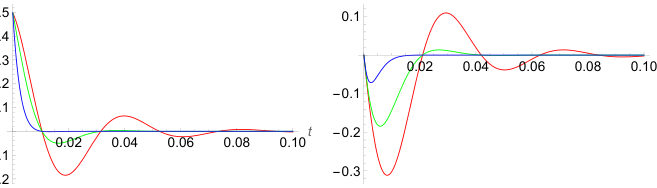 
FIG. 4: Expectation value of the modular variable of the first particle [Eq. (59)] for relative phases α = 0 (left panel) and α = π/2 (right panel). Colored curves correspond to the CL framework with relaxation rate γ = 0.005 and temperatures T = 2 (red), T = 5 (green), and T = 15 (blue). Other parameters are ¯h = m = kB = σ0 = 1, k = 0.1, g = −3 and L = 50.

**Summary.** This paper demonstrates that modular variables can act as sensitive probes for nonlocal phase information in quantum superpositions, even when wave packets are spatially separated and subject to environmental decoherence. While thermal noise reduces the signal amplitude, the phase information remains accessible, unlike with standard local observables. The study highlights the utility of modular operators in detecting quantum features in the presence of dissipation and gravity.

**Why it may be interesting.** It provides a novel way to access nonlocal phase information in open quantum systems where standard decoherence-related metrics like entanglement or coherence fail, offering a potential probe for gravity-induced effects in the presence of noise.

Detailed structure

**Main problem.** Investigating whether relative phase information in spatially non-overlapping quantum superpositions can be detected using modular variables in the presence of environmental noise and gravity.

**Main result.** Modular variables remain sensitive to the relative phase even when wave packets do not overlap, whereas standard local quantities and information-theoretic measures like entanglement fail to capture this phase. Thermal noise damps the signal amplitude, but the phase-sensitive structure remains robust.

**Method.** The study uses the Bohmian mechanics framework to compute local expectation values along particle trajectories and employs the Caldeira-Leggett master equation to model open-system dynamics.

**Model / system.** Gaussian wave-packet superpositions (single and two-particle systems) subject to a uniform gravitational field and coupled to a common environment modeled by the Caldeira-Leggett equation in the high-temperature limit.

**Key observables.** Modular operators (modular momentum and translation operators), probability density, probability current, and information-theoretic measures (coherence, entropy, and entanglement).

**Important parameters / regimes.** Spatial separation (L), gravitational acceleration (g), relaxation rate (gamma), temperature (T), and quantum statistics (Bose-Einstein, Fermi-Dirac, and Maxwell-Boltzmann).

**Assumptions / limitations.** High-temperature limit, Born-Markov approximation, Ohmic spectral density, and the regime of negligible spatial overlap between wave packets.

**Figures summary.** Figure 1 compares density plots of unitary vs. dissipative dynamics; Figure 2 shows the time evolution of local modular expectation values; Figure 3 demonstrates phase dependence for different relative phases; Figure 4 shows the impact of temperature and relaxation on two-particle modular signals.

**Paper structure.** The paper derives the equation of motion for the displacement operator, analyzes Gaussian wave-packet superpositions under unitary and dissipative dynamics, extends the analysis to multi-particle systems with different quantum statistics, and concludes by comparing modular variables to standard local observables.

Abstract

Modular variables serve as a striking example of quantum nonlocality, particularly in superpositions of wave packets that are spatially well separated, where the relative phase between components cannot be accessed through conventional local measurements. In this work, we explore the time evolution of Hermitian modular operators for Gaussian wave-packet superpositions under the influence of a uniform gravitational field. We consider both unitary dynamics governed by the Schrödinger equation and open-system dynamics described by the Caldeira-Leggett master equation in the high-temperature limit. Adopting the Bohmian interpretation of quantum mechanics, we compute local expectation values of these modular operators along individual particle trajectories. Our analysis shows that gravitational acceleration induces a time-varying modular signal, the expectation value of the modular observable, that remains sensitive to the relative phase between the separated wave packets. In contrast, standard local quantities such as the probability density and probability current, while modified by gravity, become insensitive to the relative phase in the regime of negligible spatial overlap. For a pair of particles coupled to a shared environment, we find that environment-induced correlations can modify the local modular expectation value observed for one particle, yielding a clear signature of environmental influence. However, the transfer of phase sensitivity via environment-generated entanglement to the modular signal of the distant particle remains negligible within the regime considered. We further demonstrate that conventional measures of coherence and entanglement do not capture the relative phase information in this non-overlapping regime.

[↑ back to top](#top)

### [Photon Anomalous Blockade in Waveguide Cavity QED with Atomic Mirrors](http://arxiv.org/abs/2605.21889v1)

**Authors:** Yang Xue, Yue Chang, Tao Shi, Yu-xi Liu  
**Type:** theory · **Category:** other · **PDF:** <https://arxiv.org/pdf/2605.21889v1>  
**Analysis basis:** full PDF text, analyzed in chunks
**Topic relevance:** `Tavis-Cummings & cavity-many-emitter` **3/5** · `correlated / nonlocal dissipation` **3/5** · `interference shaping light` **2/5** · `methods for driven-dissipative` **2/5** · `quantum measurements` **2/5**

📷 Fig 1

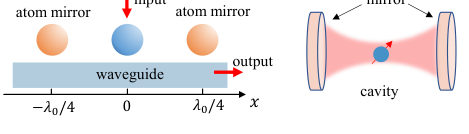 
FIG. 1. (a) Schematics for the waveguide cavity QED system in which two quantized atom mirrors (brown) and a medium atom (blue) are coupled to the waveguide. The medium atom located at xp = 0 is driven by a coherent light. The mirror and medium atoms are three identical two-level systems with the frequency ω0 corresponding to a wavelength λ0 of pho- tons. The waveguide cavity with the quantized atom mirrors is similar to the Fabry-Perot cavity with two parallel classical mirrors as schematically shown in (b).

📷 Fig 2

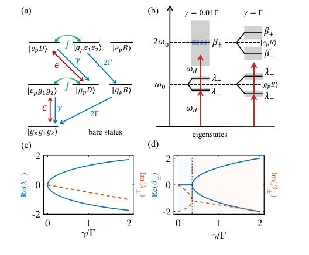 
FIG. 2. (a) The transition diagram of the system when a probe field is applied to the medium atom. Each red line with two arrows denotes the probe field induced transitions between states. Each blue line with single-arrow means the decay. Each green curve with two arrows means the waveg- uide induced mixing of two connected states. The coupling strength is J = √2Γγ. Here, the states |ep, D⟩= |ep⟩⊗|D⟩ and |gp, D⟩= |gp⟩⊗|D⟩include the branch of the dark state |D⟩, the states |ep, B⟩= |ep⟩⊗|B⟩and |gp, B⟩= |gp⟩⊗|B⟩in- clude the branch of the bright state |B⟩. (b) Energy spectrum of the system for different decay rates γ of the medium atom. The lower energy splitting (solid line) represents the...

📷 Fig 3

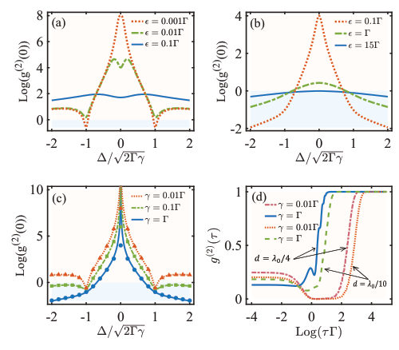 
FIG. 3. (a) and (b) Correlation functions g(2)(0) as a function of the detuning ∆/√2Γγ for different driving strengths ϵ. The decay rate of the medium atom is γ = 0.01Γ in (a) and γ = Γ in (b). (c) Correlation functions g(2)(0) obtained by the ana- lytical results (blue solid, green dashed and red dotted curves) and direct numerical calculations by solving master equation (blue points, green squares, and red triangles) for different medium-atom decay rates γ. (d) Correlation functions g(2)(τ) as a function of time τ for distances d = |xp −x1| = λ0/4 and d = λ0/10, with separation between two mirror atoms fixed at |x2 −x1| = λ0/2 and detuning ∆= Re(λ−) ≈√2Γγ.

**Summary.** This paper identifies a new type of photon blockade in waveguide cavity QED that works even in high-loss, weak-coupling environments. The effect is driven by the Quantum Zeno effect rather than traditional strong coupling. This discovery offers a potential pathway for creating robust single-photon devices using existing waveguide QED platforms.

**Why it may be interesting.** It provides a novel mechanism (Quantum Zeno effect) for photon blockade in dissipative regimes, which is highly relevant for developing robust single-photon sources in open quantum systems and waveguide-based quantum networks.

Detailed structure

**Main problem.** The study investigates the emergence of a photon anomalous blockade in a waveguide cavity QED system, specifically in the 'bad-cavity' regime where conventional blockade mechanisms are absent.

**Main result.** The authors discover that photon blockade can occur in a high-dissipation, weak-coupling regime due to the Quantum Zeno effect, and that this effect is robust against the position of the medium atom and can be enhanced by using N-atom mirrors.

**Method.** The researchers utilize both master equation and scattering theories, employing a non-Hermitian effective Hamiltonian and analyzing the system within single- and two-excitation subspaces.

**Model / system.** A waveguide cavity QED system consisting of a medium atom coupled to two quantized mirror atoms (or N-atom mirrors) within a waveguide, modeled using a Lindblad master equation and a non-Hermitian Hamiltonian.

**Key observables.** Second-order correlation functions g(2)(0) and g(2)(tau), photon statistics, and the energy spectrum (eigenvalues).

**Important parameters / regimes.** Decay rates of mirror atoms (Gamma) and medium atom (gamma), detuning (Delta), driving strength (epsilon), and the number of atoms in the mirror (N).

**Assumptions / limitations.** The analysis assumes a weakly driven probe field and applies the Markovian approximation.

**Figures summary.** Fig 1 shows the schematic of the waveguide cavity system and a comparison to a Fabry-Perot cavity; Fig 2 illustrates the transition diagram and the energy spectrum of the system.

**Paper structure.** The paper introduces the waveguide cavity QED setup, develops the theoretical framework using master equations and effective Hamiltonians, analyzes the single- and two-excitation subspaces to identify the blockade mechanism, explores scaling with N-atom mirrors, and discusses experimental feasibility.

Abstract

Waveguide cavity quantum electrodynamics (QED) with atomic mirrors is a growing research area of quantum optics and can be applied to quantum information processing. We here study the photon statistics of output fields from a waveguide cavity QED system, in which the waveguide is coupled to quantized mirror atoms and one driven medium atom. Our results show that the photon blockade can occur even for a bad atom cavity with large dissipation and small coupling between the medium atom and the cavity, in contrast to the small dissipation and the strong coupling of the medium atom to the cavity field for the conventional photon blockade or the quantum interference for the unconventional photon blockade in the cavity QED system. Utilizing both the master equation and scattering theories, we derive the condition under which the photon blockade occurs in weakly driven systems. We find that such photon anomalous blockade is due to the quantum Zeno effect and is robust against variations of the medium atom's position within the cavity. Our study paves a way to exploit the photon blockade and single-photon devices via the waveguide cavity QED.

[↑ back to top](#top)

### [One-photon communication in atomic media](http://arxiv.org/abs/2605.22797v1)

**Authors:** Zixiang Hong, John C. Schotland  
**Type:** theory · **Category:** quantum information and computing · **PDF:** <https://arxiv.org/pdf/2605.22797v1>  
**Analysis basis:** full PDF text, analyzed in chunks
**Topic relevance:** `entanglement & information structure` **3/5** · `Keldysh / 2PI / non-Gaussian methods` **2/5** · `Tavis-Cummings & cavity-many-emitter` **2/5** · `correlated / nonlocal dissipation` **2/5** · `quantum measurements` **2/5**

📷 Fig 1

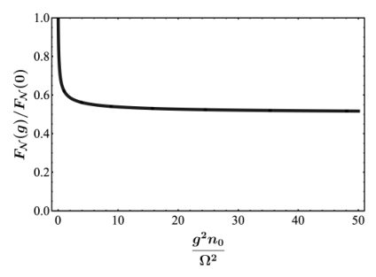 
Fig. 1. Coupling-dependence of normalized fidelity.

**Summary.** This paper quantifies how single-photon quantum information is lost when traveling through an atomic medium. It discovers that for certain types of noise, the loss of fidelity follows a universal pattern that remains bounded even at very high coupling strengths. This is significant for understanding the fundamental limits of quantum communication through matter.

**Why it may be interesting.** It provides a fundamental performance bound for quantum communication through atomic media and identifies a universal behavior for fidelity degradation that is robust against medium disorder.

Detailed structure

**Main problem.** Investigating how the interaction between a single photon and an atomic medium causes information loss and decoherence during transmission.

**Main result.** The authors establish a universal principle where normalized fidelity for erasure and dephasing channels decreases monotonically with coupling strength but is bounded from below by 1/2, a result that holds for both uniform and disordered media.

**Method.** The study uses quantum field theory to model the interaction and analyzes the degradation through the lens of specific quantum channels (erasure, dephasing, and depolarization) and Holevo information maximization.

**Model / system.** A quantized scalar electromagnetic field interacting with a collection of two-level atoms via a Hamiltonian including field, atomic, and interaction terms under the rotating wave approximation.

**Key observables.** Quantum channel fidelity, normalized fidelity, and channel capacity.

**Important parameters / regimes.** Atom-photon coupling strength (g), atomic density (n0), atomic resonance frequency (Omega), and photon wavevector (k0).

**Assumptions / limitations.** The model assumes a scalar field (ignoring polarization), uses the rotating wave approximation, and assumes the quantum channels are independent of the coupling strength's effect on phase.

**Figures summary.** Figure 1 illustrates the dependence of fidelity on the coupling strength.

**Paper structure.** The paper introduces the problem of photon transmission loss, defines the Hamiltonian and medium configurations, analyzes specific quantum channels, derives a universal fidelity formula, and discusses the asymptotic limits and implications for information capacity.

Abstract

We consider the problem of single-photon transmission through an atomic medium, using quantum channel fidelity to describe the resulting information loss. We find that the normalized fidelity decreases monotonically with coupling strength, establishing a performance bound for quantum communication through such media. Our results hold for several channel types and for deterministic and random media.

[↑ back to top](#top)

### [Electron modulation and ultrafast near-field imaging with vectorial laser fields](http://arxiv.org/abs/2605.22152v1)

**Authors:** J. Kuttruff, L. Möhrle, L. Ciorciaro, L. Schmidt-Mende, P. Baum  
**Type:** both · **Category:** other · **PDF:** <https://arxiv.org/pdf/2605.22152v1>  
**Analysis basis:** full PDF text, analyzed in chunks
**Topic relevance:** `interference shaping light` **3/5** · `quantum optics experiment` **3/5** · `non-equilibrium dynamics` **2/5** · `quantum measurements` **2/5**

📷 Fig 1

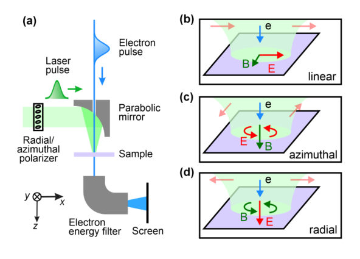 
Fig. 1. Setup and vectorial focal fields. (a) In an ultrafast electron microscope, a laser beam (green) is polarization-shaped by a liquid-crystal radial/azimuthal polarizer (rectangle with ellipses) and then tightly focused on a sample (purple). The electron pulses (blue) are overlapped with the laser beam and become modulated by the electromagnetic fields. An energy filter records the electron spectrum and produces energy-filtered images of the laser-driven specimen. (b) Illustration of the electromag- netic fields for a linear incoming polarization (faint red arrows). In the focus plane (purple), this linear polarization is mostly maintained (red and green arrows). (c) Electromagnetic...

📷 Fig 2

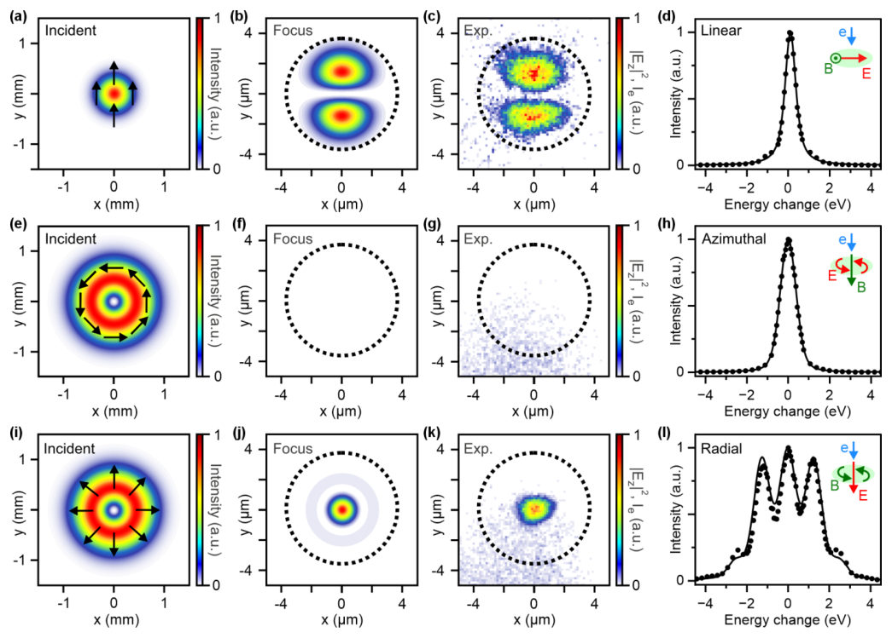 
Fig. 2. Electron modulation with vectorial focal fields. (a) Simulated spatial profile of the incident laser beam (colored data) for linear polarization along the y-axis (black arrows). (b) Focal distribution of the longitudinal electric field, cycle-averaged and squared. The two intensity lobes are oriented along the y-axis. There is no longitudinal component in the center of the beam. Dashed circle, guide to the eye. (c) Measured energy-filtered electron image (EFTEM) after interaction with the linear-

📷 Fig 3

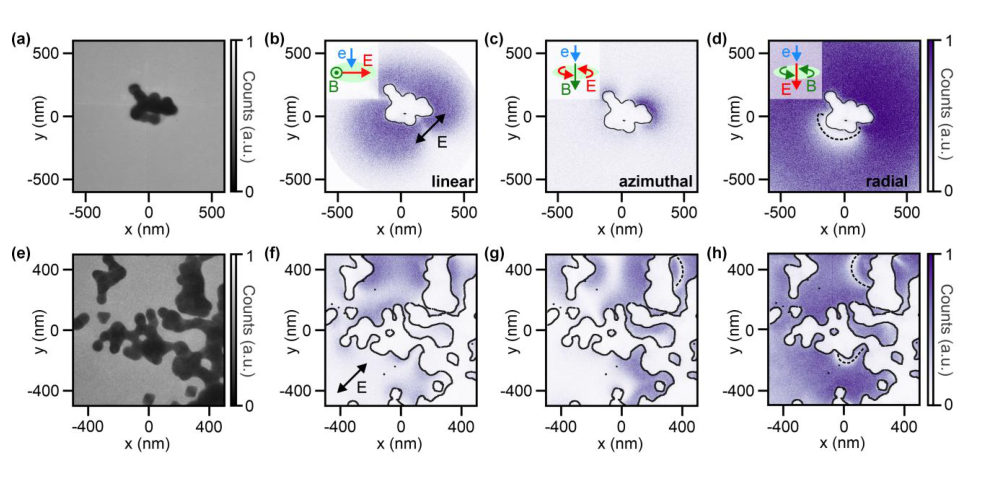 
Fig. 3. Interaction of vectorial focal fields with metallic mesostructures. (a) Transmission elec- tron microscopy image of a mesocrystal cluster, consisting of several self-assembled gold nanoparti- cles. Darker areas indicate stacking of nanoparticles. (b) Energy-filtered electron image (EFTEM) after interaction with linearly polarized light (black arrow). The dashed line indicates the outline of the cluster. (c) EFTEM image after interaction of the mesocrystal with an azimuthal focal field. (d)

**Summary.** This paper demonstrates a method to directly couple vectorial laser fields to electron beams using a thin membrane to break symmetry and reveal longitudinal field components. This enables both the coherent modulation of electron energy for attosecond science and high-resolution, sub-diffraction imaging of nanophotonic near-fields in metallic structures.

**Why it may be interesting.** This work is highly relevant to quantum optics and ultrafast science as it provides a method for the collinear generation of attosecond electron pulses and free-electron qubits using structured light.

Detailed structure

**Main problem.** Achieving direct, collinear, and tilt-free coupling between vectorial laser fields and electron beams to enable ultrafast electron modulation and near-field imaging.

**Main result.** The researchers demonstrated that longitudinal electric fields from radially polarized light can coherently modulate electron energy and provide sub-diffraction-limit imaging, while azimuthal polarization can probe 3D nanophotonic near-fields in metallic mesocrystals.

**Method.** The study uses an ultrafast transmission electron microscope integrated with a laser system and liquid-crystal polarizers, combined with Richards-Wolf vectorial diffraction simulations and energy-filtered TEM (EFTEM).

**Model / system.** The experimental platform consists of a 200 keV electron beam interacting with focused vectorial laser fields (linear, azimuthal, and radial) at a 50-nm SiN membrane, applied to both free electrons and gold nanoparticle mesocrystals.

**Key observables.** Electron energy spectra (energy gain/loss and sidebands), EFTEM images (real-space energy-filtered intensity), and longitudinal electric/magnetic field distributions.

**Important parameters / regimes.** 200 keV electron energy, 1030-nm laser wavelength, 250-fs pulse duration, 50-nm SiN membrane thickness, and sub-diffraction-limit spot sizes.

**Assumptions / limitations.** The interaction is modeled using a coherent interaction model where electron energy modulation is proportional to the squared amplitude of the longitudinal electric field.

**Figures summary.** Fig 1 shows the experimental setup and polarization-dependent field structures; Fig 2 compares simulated and measured electron energy spectra and EFTEM images; Fig 3 demonstrates the application to gold nanoparticle mesocrystals using various polarization states.

**Paper structure.** The paper introduces the problem of electron-light coupling, describes the experimental setup and polarization shaping, presents the fundamental demonstration of electron modulation with radial polarization, and extends the technique to imaging complex metallic mesostructures.

Abstract

Controlled interaction of laser light with electron beams is fundamental for ultrafast electron microscopy and electron-based quantum optics, yet their direct coupling is forbidden in free space. Here we use longitudinally polarized light at a thin membrane and show that the emerging focal fields can modulate the electron beam in a direct, coherent and linear way, without the need for nanostructured materials or slanted interaction geometries. Also, we use vectorial polarizations to excite and probe three-dimensional nanophotonic near-fields in metallic mesocrystals by coherent electron energy gain and loss. We find that longitudinal electric fields excite axial near-fields in a direct way while longitudinal magnetic fields excite oscillating ring currents via azimuthal electric fields. These possibilities enable tilt-free, collinear generation of attosecond electron pulses or free-electron qubits and provide novel imaging modes in ultrafast electron microscopy and metamaterial tomography.

[↑ back to top](#top)

### [Quasinormal mode quantization of bound and propagating photons in complex lightguiding nanostructures for integrated devices](http://arxiv.org/abs/2605.22153v1)

**Authors:** Robert Meiners Fuchs, Marten Richter  
**Type:** theory · **Category:** other · **PDF:** <https://arxiv.org/pdf/2605.22153v1>  
**Analysis basis:** full PDF text, analyzed in chunks
**Topic relevance:** `correlated / nonlocal dissipation` **3/5** · `methods for driven-dissipative` **3/5** · `Tavis-Cummings & cavity-many-emitter` **2/5** · `interference shaping light` **2/5**

📷 Fig 1

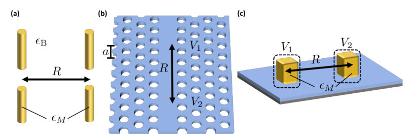 
Figure 1. Examples of different types of coupled QNM cavities separated by distance R in various types of background structures. (a) Metal dimers described by a Drude permittivity ϵM in a 3D homogeneous background medium ϵB [19, 29]. (b) Cavities V1, V2 on a photonic crystal with lattice constant a, side-coupled to the same periodic photonic crystal waveguide [38–40]. (c) Plasmonic nanoparticles V1, V2 described by the Drude permittivity ϵM near a planar surface [41, 42].

📷 Fig 2

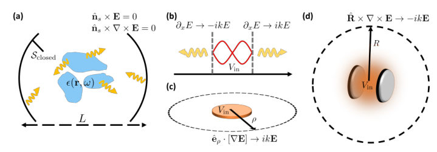 
Figure 2. (a) Closed cavity system. A scattering medium described by permittivity ϵ(r, ω) is placed inside a closed resonator of length L, so that waves will scatter back from the resonator surface, described by the boundary conditions in Eq. (9). (b)-(d) Cavity in a homogeneous background medium for 1D, 2D, and 3D, respectively. In 1D, the condition from Eq. (10) yields outgoing boundary conditions at the cavity surface [Eq. (12)]. For 2D (3D), we choose a circular (spherical) far-field surface for the integral from Eq. (13) [Eq. (8)], which yields the outgoing wave boundary conditions from Eq. (16) [Eq. (20)].

📷 Fig 3

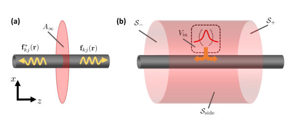 
Figure 3. (a) Sketch of a single cylindrical waveguide with forward (backward) propagating waveguide modes f (∗) kj (r) and infinite cross-section A∞over which the normalization of the waveguide modes is carried out [Eq. (22)]. (b) Sketch of a cavity coupled to the waveguide from (a) as its only loss channel. The field of the open cavity extends into the waveguide. Equation (8) is evaluated over a far-field surface Sside ∪S−∪S+, yielding the waveguide boundary conditions from Eq. (24).

📷 Fig 4

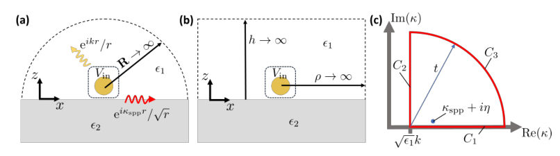 
Figure 4. Sketch of a cavity (here, a plasmonic particle) located near the planar interface between two different media ϵ1 ̸= ϵ2. (a) As our far-field surface for the boundary condition integral from Eq. (8), we chose a half sphere with radius R →∞. The far field takes different forms, depending on the direction in which the emission occurs. Far away from the surface, the waves behave like spherical waves the form eiκsppr/√r (red arrow) appear, similar to the 2D problem from Sec. 2.4. Here, κspp is the in-plane wavenumber of a surface plasmon polarition [cf. Eq. (30)]. (b) Same as before but with a cylindrical far-field surface with height h →∞and radius ρ →∞. (c) Integration path to...

📷 Fig 5

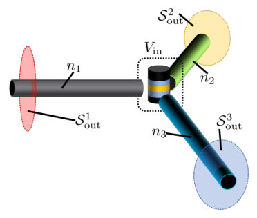 
Figure 5. Example for a system with separate background structures. A cavity is coupled to three semi-finite waveguides with different refractive indices n1/2/3. The waveguides can be made from different materials or have different cross-section profiles, thereby supporting very different waveguide modes (indicated by the different colors). If the waveguide modes do not extend into the outside medium [∆G ≈0, cf. Eq. (40)], the three waveguides can be treated separately and the cavity emission inside one of the waveguides obeys the boundary conditions for that waveguide alone [Eq. (24)]. Here, S1/2/3 out are the far-field infinite cross-sections through the different waveguides, used for...

**Summary.** This paper develops a rigorous theory for quantizing light in complex, lossy nanostructures like waveguides and surfaces. It provides a way to calculate how cavities and quantum emitters interact with each other and with propagating photons. This is crucial for the accurate simulation of integrated quantum optical devices.

**Why it may be interesting.** It provides a rigorous mathematical foundation for simulating open quantum system dynamics in realistic, lossy nanophotonic architectures, which is essential for designing integrated quantum photonic devices.

Detailed structure

**Main problem.** The lack of a rigorous quantization framework for quasinormal modes (QNMs) in complex, lossy, and structured lightguiding environments like waveguides and surfaces.

**Main result.** A generalized quantization scheme and derivation of boundary conditions for QNMs that accounts for structured backgrounds, including a system-bath Hamiltonian with rigorously defined coupling elements.

**Method.** The authors use the electromagnetic Green's function, Green's second identity, and a regularization scheme to transform diverging QNM fields into regularized, computable forms.

**Model / system.** Multiple interacting QNM cavities (e.g., metal dimers or photonic crystal cavities) coupled to quantum emitters and a non-bosonic bath of propagating photons in waveguides, surfaces, or 3D media.

**Key observables.** Complex eigenfrequencies, coupling elements, system-bath correlation functions, and QNM overlap matrices (intracavity and intercavity).

**Important parameters / regimes.** Complex eigenfrequencies (decay rates), separation parameter (distance between cavities), transfer factor (power transfer between cavities), and group velocity.

**Assumptions / limitations.** The medium is assumed to be absorptive, isotropic, inhomogeneous, and non-magnetic; the far-field divergence is addressed via a few-mode regularization approximation.

**Figures summary.** Figure 1 shows examples of coupled cavities in different environments (dimers, waveguides, surfaces); Figure 4 illustrates a cavity near a planar interface; Figure 5 demonstrates the decoupling of multiple waveguides.

**Paper structure.** The paper begins by deriving general boundary conditions for QNMs, extends these to specific geometries (1D, 2D, 3D, and waveguides), presents a quantization scheme for the system-bath Hamiltonian, and concludes with the calculation of overlap integrals and intercavity coupling.

Abstract

Open optical or plasmonic resonators are placed on and connected through surfaces or via waveguides, forming complex lightguiding nanostructures, e.g. for integrated photonic quantum devices. We derive general boundary conditions for quasinormal modes that account for the structure's specific geometry. We then present a general quantization scheme for multiple, interacting quasinormal-mode cavities coupled to quantum emitters and to a non-bosonic bath of propagating photons on waveguides or a surface. We derive a system-bath Hamiltonian with rigorously defined coupling elements that can be computed using Maxwell solvers, including light-matter coupling between the electromagnetic field and quantum emitters. We define system-bath correlation functions for an effective, bath-mediated, and time-delayed interaction between the quasinormal modes and quantum emitters, which is a main ingredient commonly used to simulate open quantum system dynamics.

[↑ back to top](#top)

### [Nonclassical Cutoff Fluctuations in Squeezed-Light-Driven High-Harmonic Generation](http://arxiv.org/abs/2605.21925v1)

**Authors:** Tsendsuren Khurelbaatar, R. T. Sang, Igor Litvinyuk  
**Type:** theory · **Category:** other · **PDF:** <https://arxiv.org/pdf/2605.21925v1>  
**Analysis basis:** full PDF text, analyzed in chunks
**Topic relevance:** `Keldysh / 2PI / non-Gaussian methods` **3/5** · `methods for driven-dissipative` **2/5** · `non-equilibrium dynamics` **2/5** · `quantum measurements` **2/5**

📷 Fig 1

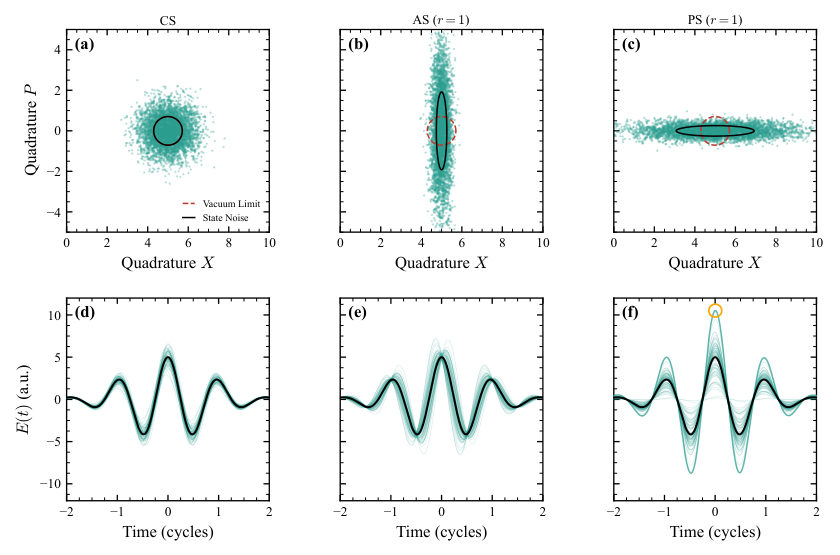 
FIG. 1. Wigner phase-space representation and stochastic field realizations. Top row: Wigner distributions for (a) a coherent state (CS), (b) an amplitude-squeezed state (AS, r = 1), and (c) a phase-squeezed state (PS, r = 1). Teal points are quadrature pairs (Xi, Pi) sampled from the corresponding Wigner distribution; solid black ellipses are the 1σ contours, and dashed crimson circles indicate the SQL. Bottom row: time-domain field realizations E(t) for (d) coherent, (e) amplitude-squeezed, and (f) phase-squeezed pulses. Thin teal lines show individual stochastic realizations; the solid black line is the mean field. In (f), a rare high-amplitude realization (highlighted in orange)...

📷 Fig 2

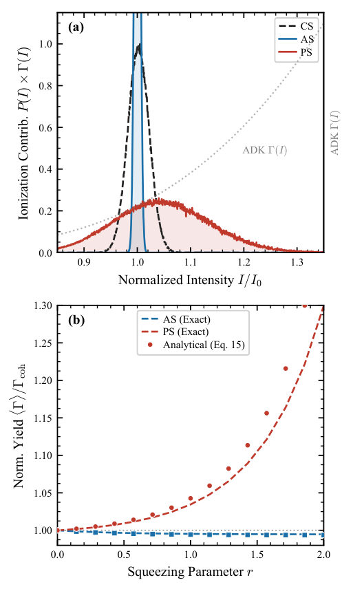 
FIG. 2. Statistical filtering of tunnel ionization. (a) Ion- ization contribution P(I)Γ(I) versus normalized intensity I/I0 for CS (black dashed), AS (blue), and PS (red shaded). The bare ADK rate Γ(I) (gray dotted, right axis) illustrates ex- ponential weighting toward rare high-intensity realizations. (b) Normalized ionization yield ⟨Γ⟩/Γcoh versus r, comparing numerical evaluation of Eq. (12) for AS (blue dashed) and PS (red dashed) with the analytical approximation Eq. (15) (filled symbols).

📷 Fig 3

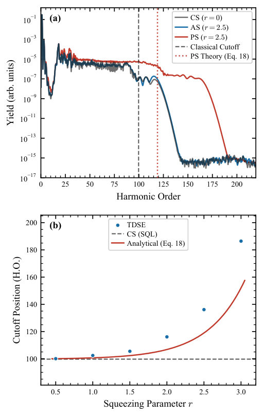 
FIG. 3. HHG cutoff extension under squeezed-field driving. (a) Ensemble-averaged HHG spectra for CS (black), AS (blue), and PS (red) drivers at r = 2.5. The classical cutoff Ip + 3.17Up(E0) (gray dashed) and the analytical stochastic prediction Eq. (18) (red dotted, PS Theory) are indicated. (b) Extracted cutoff position versus r from TDSE simulations (filled circles) and from the analytical prediction Eq. (18) (red solid) for the phase-squeezed (PS) case, with the coherent- state SQL reference (gray dashed).

📷 Fig 4

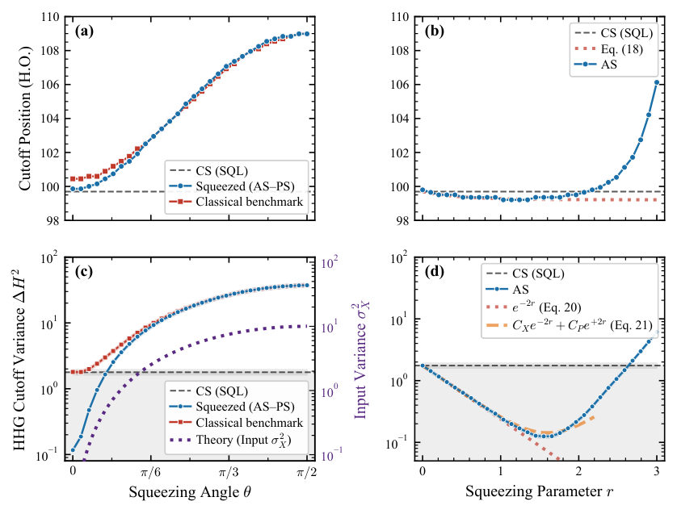 
FIG. 4. Quadrature-resolved HHG cutoff statistics. (a) Mean cutoff ⟨H⟩versus squeezing angle θ at fixed r = 1.5 for the squeezed state (blue circles) and the classical P ≥0 benchmark (dark red squares). The CS SQL reference is shown as a gray dashed line. (b) Mean cutoff versus r under amplitude squeezing (θ = 0) for AS (blue circles), the CS SQL reference (gray dashed), and the analytical prediction from Eq. (18) (red dotted curve). The exact TDSE diverges upward from the analytical model at extreme squeezing due to higher-order phase noise contributions. (c) HHG cutoff variance ∆H2 versus θ. The squeezed state (blue circles) descends well below the SQL at θ = 0 and remains sub-SQL over an...

**Summary.** This paper investigates how squeezed light can be used to control and certify quantum fluctuations in high-harmonic generation. It identifies a specific observable—the variance of the HHG cutoff—that acts as a self-calibrating witness for nonclassicality, even in uncertain nanoscale environments. The study reveals that amplitude squeezing can push these fluctuations below the standard quantum limit.

**Why it may be interesting.** It bridges quantum optics and strong-field physics by showing how quadrature-specific noise redistribution can be mapped onto macroscopic spectral observables, offering a way to detect nonclassicality without complex homodyne detection.

Detailed structure

**Main problem.** Determining how quantum fluctuations from squeezed-light drivers manifest in macroscopic high-harmonic generation (HHG) observables and identifying a robust 'Heisenberg witness' to certify nonclassicality in nanoscale geometries.

**Main result.** The authors demonstrate that amplitude squeezing suppresses the shot-to-shot variance of the HHG cutoff below the standard quantum limit, providing a self-calibrating witness that is independent of the absolute vacuum-field amplitude.

**Method.** A Wigner phase-space approach is used to map the quantum-optical driver onto a stochastic ensemble of time-dependent Schrodinger equation (TDSE) realizations, supplemented by analytical cumulant expansions and ADK theory.

**Model / system.** A 1D model atom (Argon) driven by a single-mode Gaussian squeezed coherent state in a nanoscale interaction regime where vacuum-field amplitude is significantly elevated.

**Key observables.** HHG cutoff position, HHG cutoff variance, and the normalized cutoff variance ratio relative to the Standard Quantum Limit (SQL).

**Important parameters / regimes.** Squeezing parameter (r), squeezing angle (theta), vacuum-to-driver amplitude ratio (~10^-2), and the Keldysh parameter (gamma < 0.5).

**Assumptions / limitations.** The analysis is restricted to a single-mode Gaussian framework and assumes an undepleted driving field and coherent phase locking.

**Figures summary.** Figure 1 shows Wigner distributions and time-domain field realizations for coherent, amplitude-squeezed, and phase-squeezed states; Figure 4 illustrates the dependence of the mean cutoff and variance on the squeezing angle and parameter.

**Paper structure.** The paper introduces the problem of quantum-to-classical mapping in HHG, describes the Wigner-based stochastic TDSE method, presents analytical derivations for cutoff fluctuations, and concludes with the identification of a robust Heisenberg witness.

Abstract

Strong-field high-harmonic generation (HHG) is conventionally described semiclassically, with the driving laser treated as a classical field. This approximation becomes insufficient in nanoscale interaction geometries, where extreme spatial confinement raises the vacuum-field amplitude to the ~10^-2 level relative to the driving-field amplitude. When the quantum fluctuations of the driving field are redistributed between conjugate quadratures by squeezing, they can be directly imprinted onto macroscopic HHG observables. To model this interaction, we employ a Wigner phase-space approach that maps the quantum-optical driver onto a stochastic ensemble of time-dependent Schrodinger equation realizations. Although each realization remains classically simulable, the sub-vacuum quadrature covariance structure of squeezed states cannot be reproduced by any field admitting a non-negative Glauber-Sudarshan P-representation. Within this single-mode Gaussian framework, we show that amplitude squeezing suppresses the shot-to-shot variance of the HHG cutoff below the standard quantum limit (SQL). To leading order in the vacuum-to-driver ratio, the normalized cutoff variance decays exponentially with the squeezing parameter, independent of the absolute vacuum-field amplitude and therefore robust against uncertainties in the effective nanoscale mode volume. A subleading phase-noise contribution from the anti-squeezed quadrature produces a variance minimum near r_opt ~ 1.6, providing a concrete experimental target. These results establish the HHG cutoff variance ratio as a nonlinear, self-calibrating Heisenberg witness in which sub-SQL scaling directly reflects the redistribution of quantum uncertainty in the driving field.

[↑ back to top](#top)

### [Photon blockade via three-body interactions: toward high-purity and bright single-photon sources](http://arxiv.org/abs/2605.21942v1)

**Authors:** Sheng Zhao, Peng-Bo Li  
**Type:** theory · **Category:** quantum information and computing · **PDF:** <https://arxiv.org/pdf/2605.21942v1>  
**Analysis basis:** full PDF text, analyzed in chunks
**Topic relevance:** `Tavis-Cummings & cavity-many-emitter` **3/5** · `methods for driven-dissipative` **2/5** · `non-equilibrium dynamics` **2/5** · `spintronics-quantum-optics interface` **2/5**

📷 Fig 1

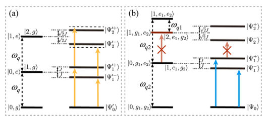 
FIG. 1. (a) The mechanism of CPB originated from energy-level anharmonicity. (b) Novel mechanism of PB based on three-body in- teraction, where no transition path exists between single-photon and two-photon states.

📷 Fig 2

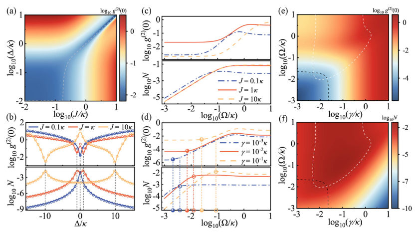 
FIG. 2. (a) Color map of log10 g(2)(0) versus normalized coupling J/κ and detuning ∆/κ. The dashed line marks the optimal detuning trajectory, corresponding to the minimal g(2)(0) at each fixed J/κ. (b) Variations of log10 g(2)(0) and log10 N with ∆/κ for different coupling strengths J. For (a) and (b), we take Ω= 0.1κ and γ = 0.1κ. (c, d) g(2)(0) and N versus Ωfor different (c) J (at γ = 0.1κ) and (d) qubit dissipation rates γ. Solid and open circles denote the rising inflection points of g(2)(0) and the saturation points of N, respectively. (e, f) Color maps of (e) log10 g(2)(0) and (f) log10 N in the Ω-γ parameter space at J = 0.1κ and ∆= 0. The black and white dashed contours indicate...

📷 Fig 3

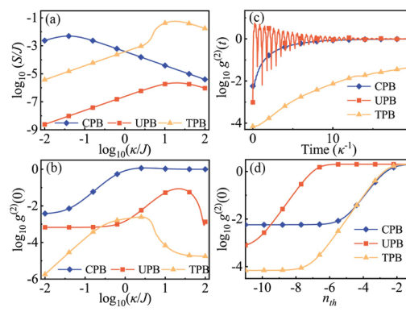 
FIG. 3. Performance comparison among TPB, CPB, and UPB. Scaled photon emission rate S/J and (b) log10 g(2)(0) versus log10(κ/J). (c) Time evolution of the time-delayed second-order correlation function log10 g(2)(t). (d) log10 g(2)(0) as a function of the thermal occupation number nth. Optimized JC-model parame- ters for CPB and UPB are detailed in the Supplemental Material [68].

**Summary.** This paper introduces a photon blockade mechanism based on three-body interactions between a bosonic mode and two qubits. This approach overcomes the traditional trade-off between photon purity and brightness, providing a robust method for generating high-quality single photons. The mechanism is applicable across various platforms, including superconducting circuits, magnonics, and optomechanics.

**Why it may be interesting.** It provides a novel way to bypass fundamental limits in quantum optics and circuit QED, offering a path toward high-performance single-photon sources that are robust to experimental imperfections like thermal noise and strong driving.

Detailed structure

**Main problem.** Existing photon blockade mechanisms, such as conventional and unconventional photon blockade, suffer from a fundamental trade-off where increasing brightness leads to decreased single-photon purity.

**Main result.** The authors propose a new photon blockade mechanism using three-body interactions that breaks the purity-brightness trade-off, enabling simultaneous high purity and high brightness while remaining robust against thermal noise.

**Method.** The study uses the Lindblad master equation to model system dynamics and employs the QuTiP package for numerical steady-state simulations, supplemented by analytical solutions in the two-photon subspace.

**Model / system.** A hybrid quantum system consisting of a single bosonic mode (photonic, magnonic, or phononic) coupled to two qubits via a three-body interaction term $J(a^\dagger \sigma^+_1 \sigma^-_2 + a \sigma^-_1 \sigma^+_2)$.

**Key observables.** Second-order correlation function $g^{(2)}(0)$ (purity) and average photon number $N$ (brightness).

**Important parameters / regimes.** Coupling strength $J$ relative to decay rate $\kappa$, driving Rabi frequency $\Omega$, detuning $\Delta$, and thermal occupation $n_{th}$.

**Assumptions / limitations.** The mechanism is presented within the context of a microwave photonic platform, though the authors assert its universality to other bosonic modes.

**Figures summary.** Figure 2 shows color maps of $g^{(2)}(0)$ and plots of $\log_{10} g^{(2)}(0)$ and $\log_{10} N$ as functions of detuning and coupling strength.

**Paper structure.** The paper introduces the problem of the purity-brightness trade-off, presents the three-body interaction model, provides analytical and numerical results demonstrating the breaking of the trade-off, discusses robustness against noise and driving strength, and concludes with applications to microwave platforms.

Abstract

Photon blockade is vital for single-photon generation, but current schemes with conventional and unconventional photon blockade face critical limitations like the purity-brightness trade-off, hindering the generation of high-performance single-photons. To overcome these limitations, we introduce a fundamentally new photon blockade mechanism by utilizing three-body interactions between a single photonic mode and two qubits. This kind of interaction intrinsically cuts off the excitation path to the two-photon state, resulting in a perfect photon blockade effect. The mechanism operates across a broad parameter range, free from the constraints of strong coupling or weak driving. Remarkably, it breaks the purity-brightness trade-off, enabling the simultaneous achievement of extreme purity and high brightness, both significantly outperforming previous mechanisms. Furthermore, this approach demonstrates robustness against thermal noise and avoids unwanted oscillations in the time-delayed correlation function. This work provides a path for generating high-purity, high-brightness, and robust single-photon sources, a key resource for quantum technologies.

[↑ back to top](#top)

### [Aggregation-Fragmentation Processes with Broken Detailed Balance](http://arxiv.org/abs/2605.22383v1)

**Authors:** P. L. Krapivsky  
**Type:** theory · **Category:** statistical mechanics · **PDF:** <https://arxiv.org/pdf/2605.22383v1>  
**Analysis basis:** full PDF text, analyzed in chunks
**Topic relevance:** `non-equilibrium dynamics` **3/5** · `driven-dissipative phase transition` **2/5** · `non-equilibrium universality` **2/5**

📷 Fig 1

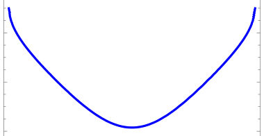 
FIG. 1. The exponent ρ as a function of the splitting param- eter r is implicitly determined by (47). The minimal value of the exponent given by (48) is reached in the symmetric case of splitting into equal halves: r = 1

📷 Fig 2

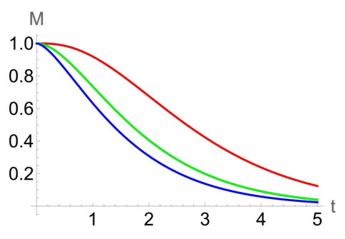 
FIG. 2. The mass density (top to bottom) for β = −1, −2, −3.

**Summary.** This paper provides a comprehensive analysis of aggregation-fragmentation models where detailed balance is broken. It characterizes the transition from stable nonequilibrium steady states to an explosive shattering regime where mass is lost to zero-mass particles.

**Why it may be interesting.** not directly relevant

Detailed structure

**Main problem.** The study investigates aggregation-fragmentation processes where the detailed balance condition is broken, specifically focusing on the properties of nonequilibrium steady states and the emergence of shattering transitions.

**Main result.** The paper identifies that for fragmentation rates scaling as mass^beta, a steady state exists for beta >= 0, while beta < 0 leads to an instantaneous shattering transition into 'dust'. It also provides exact solutions for the beta=1 case and asymptotic behaviors for the mass distribution tails.

**Method.** The author employs integro-differential equations, Laplace transforms, moment analysis, and asymptotic analysis to solve the master equations and determine the scaling properties of the cluster density.

**Model / system.** A continuous-mass aggregation-fragmentation model in a mean-field, well-mixed system where clusters merge at a mass-independent rate and fragment at rates scaling with mass as x^beta.

**Key observables.** Cluster mass distribution c(x, t), total cluster density N(t), and the n-th moments of the mass distribution M_n(t).

**Important parameters / regimes.** The fragmentation scaling exponent beta, the fragmentation rate ratio lambda, and the splitting parameter r for deterministic models.

**Assumptions / limitations.** The system is treated using a mean-field approach assuming a well-mixed system; aggregation rates are assumed to be mass-independent.

**Figures summary.** Figure 2 illustrates the evolution of mass density for different negative values of beta, showing the decay of mass due to shattering.

**Paper structure.** The paper begins with the investigation of random splitting models, moves to deterministic splitting models, analyzes the scaling regimes for beta >= 0, and concludes with the study of the shattering transition and mass loss for beta < 0.

Abstract

We study aggregation-fragmentation processes in which pairs of clusters can aggregate, and each cluster can break into two fragments. If the rates of aggregation and fragmentation do not depend on the masses, detailed balance does not hold, but nonequilibrium steady states can still be deduced from an exact solution for the Laplace transform. For models in which aggregation rates remain constant but fragmentation rates scale as $(\text{mass})^β$, detailed balance holds only when $β=1$. Away from this solvable case, we employ asymptotic techniques and show that when $β\geq 0$, the steady states share similarities with those from the mass-independent ($β=0$) model. An instantaneous shattering transition with continuous mass loss occurs when $β<0$.

[↑ back to top](#top)

### [Quantum Batteries in two-dimensional material-based Josephson Junctions](http://arxiv.org/abs/2605.22582v1)

**Authors:** V. Varrica, G. Gemme, F. M. D. Pellegrino, E. Paladino, M. Sassetti, D. Ferraro  
**Type:** theory · **Category:** quantum information and computing · **PDF:** <https://arxiv.org/pdf/2605.22582v1>  
**Analysis basis:** full PDF text, analyzed in chunks
**Topic relevance:** `Tavis-Cummings & cavity-many-emitter` **3/5** · `Dicke superradiance` **2/5** · `non-equilibrium dynamics` **2/5**

📷 Fig 1

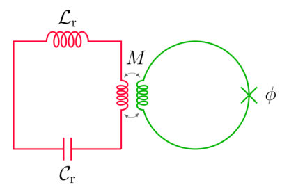 
Figure 1: Scheme of a resonant circuit (red), described as a lumped-element LC circuit with an induc- tance Lr and a capacitance Cr, playing role of a quantum charger. This LC circuit is coupled, through a mutual inductance M, with a ring containing a single short JJ (green), which represents the QB. Here, ϕ is the superconducting phase difference between the two superconducting leads.

📷 Fig 2

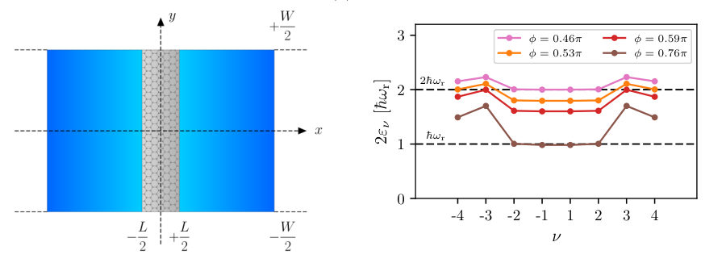 
Figure 2: (a) Top view of a Josephson junction formed by graphene covered by two superconducting leads (blue). The uncovered grey region represents the graphene stripe in the normal phase. In this picture, L represents the junction channel length along the x-direction and W is the width of the device along the y-direction. (b) The energy splitting of each ABSs pair evaluated at ϕ/π = 0.46 (pink), ϕ/π = 0.53 (orange), ϕ/π = 0.59 (red), ϕ/π = 0.76 (brown). Horizontal dashed lines indicate the energies ℏωr and 2ℏωr, which make it possible to identify the units tuned to single-photon or two- photon resonance conditions, respectively. Here, the index ν = ζm is expressed using negative (positive)...

📷 Fig 3

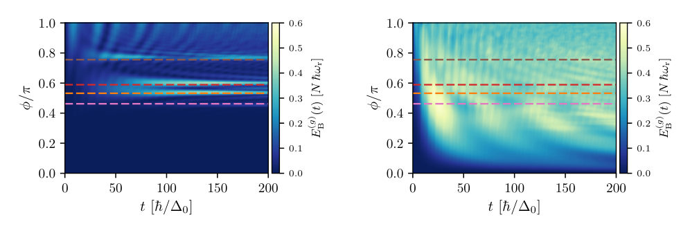 
Figure 3: Energy E(g) B stored in the QB system (in units of Nℏωr) as a function of the time and the superconducting phase difference ϕ, setting g = 0.1 (a) and g = 0.3 (b). In both panels, using the same scheme of colors used in Fig. 2(b), the dashed lines indicates the values of ϕ such that there are at least two pairs of ABSs which enable single-photon (ϕ = 0.76π, brown), or two-photon resonant processes (ϕ = 0.46π, pink), (ϕ = 0.53, orange), and (ϕ = 0.59 red). In all panels, the times are reported in units of ℏ/∆0. Other parameters are ℏωr = 0.75∆0, µ0 = 6.5ℏvF/L and W = 2L.

📷 Fig 4

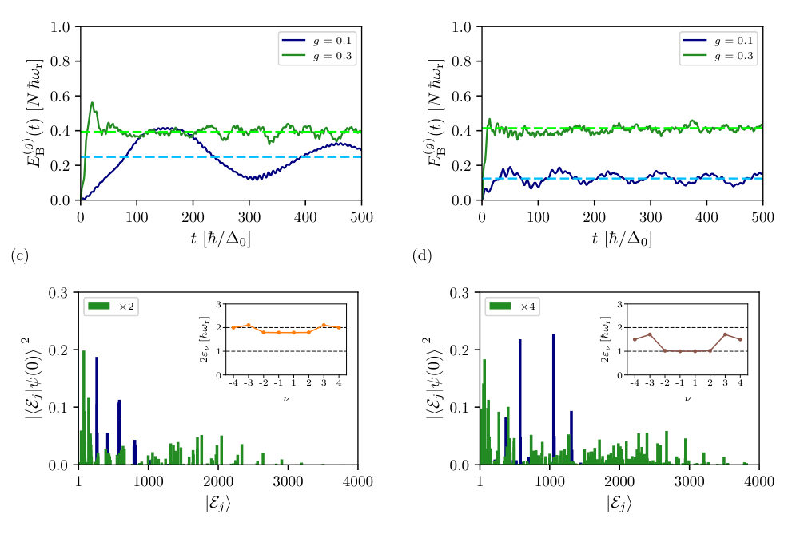 
Figure 4: Long-time behaviour of E(g) B (solid lines) evaluated at ϕ/π = 0.53 (a) and at ϕ/π = 0.76 (b). In both panels, time is expressed in units of ℏ/∆0, and the stationary values ¯E(g) B (dashed lines) are denoted in light green for g = 0.1 and in cyan for g = 0.3. (c)–(d) Bar plots illustrating the decomposition of the initial state |ψ(0)⟩, over the relevant subset of the eigenbasis {|Ej⟩}, corresponding to the cases shown in (a)–(b). To improve graphical readability, the green bars in (c) and (d) are scaled by a factor 2 and 4, respectively. In the insets, the distribution of the ABSs energy splittings is shown (as in Fig. 2(b)). In all panels, we compare two values of the coupling...

📷 Fig 5

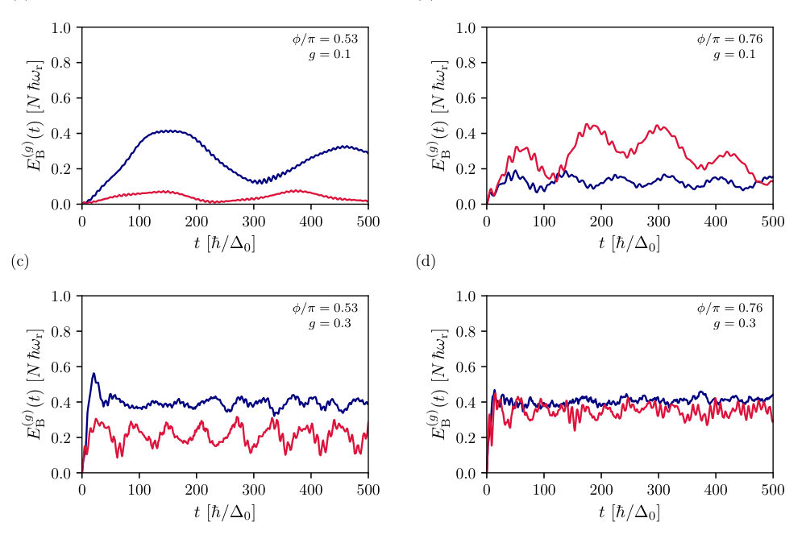 
Figure 5: Comparison between the time evolution of the energy stored in the QB system (in units of Nℏωr) obtained according to the complete Hamiltonian in Eq. (7) (blue solid lines) and the correspond- ing results computed discarding the longitudinal terms at first order in g (red solid lines), i.e., the one proportional to P z n(ϕ). We show the results for ϕ/π = 0.53 (a)–(c) and for ϕ/π = 0.76 (b)–(d). In panels (a) and (b) we report the case with g = 0.1, while in the panels (c) and (d) we set g = 0.3. In all panels, the times are reported in units of ℏ/∆0. Other parameters are ℏωr = 0.75∆0, µ0 = 6.5ℏvF/L and W = 2L.

**Summary.** This paper proposes a solid-state quantum battery using graphene-based Josephson junctions coupled to an LC resonator. It demonstrates that the presence of longitudinal coupling terms can be leveraged to enhance energy storage efficiency under specific resonance conditions. The study also compares different methods for charging the battery, such as modulating coupling strength versus tuning the superconducting phase.

**Why it may be interesting.** It explores how unconventional, non-Dicke interaction terms and non-identical two-level systems influence the performance of a quantum battery, which is highly relevant to open quantum systems and quantum thermodynamics.

Detailed structure

**Main problem.** Investigating the charging dynamics and energy storage efficiency of a solid-state quantum battery based on two-dimensional material-based Josephson junctions.

**Main result.** The study finds that longitudinal interaction terms, absent in the standard Dicke model, can enhance energy storage during two-photon resonance but act as a disturbance during single-photon resonance.

**Method.** Numerical diagonalization of the total Hamiltonian and perturbative analysis of the interaction picture to evaluate energy evolution and resonance conditions.

**Model / system.** A superconducting ring with a graphene-based Josephson junction (GJJ) inductively coupled to an LC resonator, where Andreev bound states act as non-identical two-level systems.

**Key observables.** Stored energy E_B(t), energy storage capacity C_B(phi), and charging power.

**Important parameters / regimes.** Coupling strength g, superconducting phase difference phi, transmission probability tau, and resonator frequency omega_r.

**Assumptions / limitations.** Short junction limit (L << xi), projection into the low-energy subspace of Andreev bound states, and use of a sudden quench protocol for charging.

**Figures summary.** Figure 1 shows the device schematic; Figure 2 illustrates the graphene junction and Andreev level splitting; Figure 9 compares different charging protocols.

**Paper structure.** The paper introduces the device architecture, defines the Hamiltonian and interaction terms, analyzes the impact of longitudinal coupling on single- and two-photon resonances, compares different charging protocols, and evaluates the role of energy distribution across channels.

Abstract

We investigate the solid-state implementation of a Dicke-like quantum battery consisting of a two-dimensional material-based Josephson junction inductively coupled to a resonator, using graphene as a representative example. In this configuration, Andreev bound states naturally act as non-interacting, energetically non-degenerate two-level systems, and the setup allows for both single-photon and two-photon resonant processes. The coupling between the LC-circuit flux and the supercurrent through the junction gives rise to peculiar longitudinal interaction terms that have no counterpart in the conventional Dicke model. These additional couplings can enhance energy storage for a proper range of parameters. The proposed architecture also enables an alternative, but equivalent, charging protocol that relies on tuning the superconducting phase difference across the junction.

[↑ back to top](#top)

### [Sensitivity Evaluation of SU(1,1) Interferometers with Arbitrary Input Probe State and Homodyne Detections](http://arxiv.org/abs/2605.22029v1)

**Authors:** Sonu Jana, Dhruv Baheti, Paul Grossiord, Fabien Bretenaker, Nadia Belabas, Syamsundar De  
**Type:** theory · **Category:** quantum information and computing · **PDF:** <https://arxiv.org/pdf/2605.22029v1>  
**Analysis basis:** full PDF text, analyzed in chunks
**Topic relevance:** `quantum measurements` **3/5** · `interference shaping light` **2/5** · `methods for driven-dissipative` **2/5**

📷 Fig 1

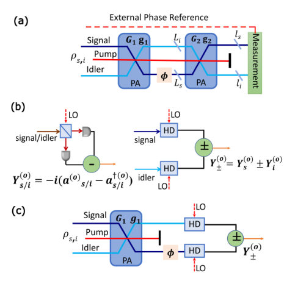 
Figure 1: (a) Schematic of a full SU(1,1) interfer- ometer. The beam splitters of a conventional Mach- Zehnder interferometer are replaced by parametric am- plifiers (PAs). A strong pump drives the first PA, which mixes the two modes (signal (s) and idler (i)) of an arbitrary two-mode input state ρs,i. After the first PA (characterized by g1 and G1 see main text), a phase shift ϕ = ϕ0 + δϕ is applied to one mode (signal) relative to the pump and the other mode (idler). Both modes, to- gether with the pump, then act as inputs to the second PA (characterized by g2 and G2). Internal and external losses are modeled by fictitious beam splitters placed in- side and outside the interferometer...

📷 Fig 2

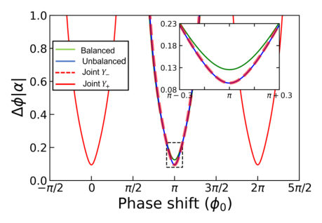 
Figure 2: Phase sensitivity as a function of the phase shift bias ϕ0 = ϕ −δϕ. The phase of the coherent in- put with respect to the external reference is taken to be zero. The plots correspond to balanced and joint homo- dyne configuration with PA gains G1 = G2 = 2 and an unbalanced single-port homodyne case with G1 = 2 and G2 = 5. The vertical axis is calibrated with respect to the phase shift sensitivity of a Mach-Zehnder interfer- ometer, which achieves ∆ϕ|α| = 1

📷 Fig 3

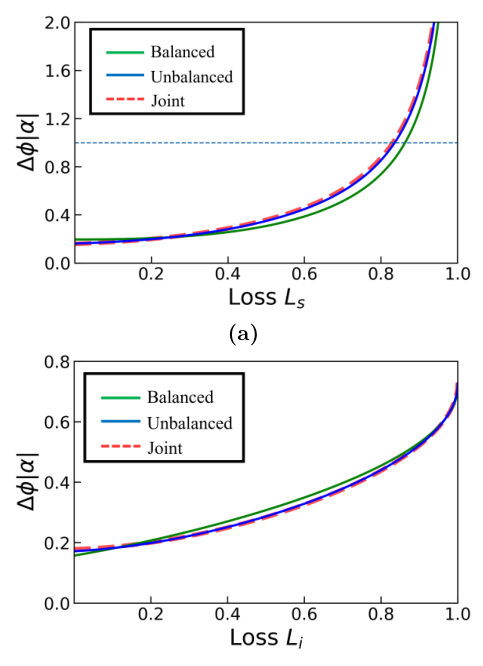 
Figure 3: Phase sensitivity as a function of asymmetric internal loss for the three detection schemes. Obtained from Eqs. 17 and 22. Gain values used for these plots: balanced gain configuration: G = 2; unbalanced gain configuration: G1 = 2, G2 = 5; joint homodyne de- tection: G = 2. Together, these plots illustrate the asymmetric impact of losses in the two arms. (a) The losses Ls in the signal arm are varied while the losses in the other arm are kept fixed (Li = 0.2). The dotted blue horizontal line corresponds to the phase shift sensi- tivity of a Mach-Zehnder interferometer which achieves ∆ϕ|α| = 1 (b). The losses Li in the idler arm are varied while the losses in the other arm remain...

📷 Fig 4

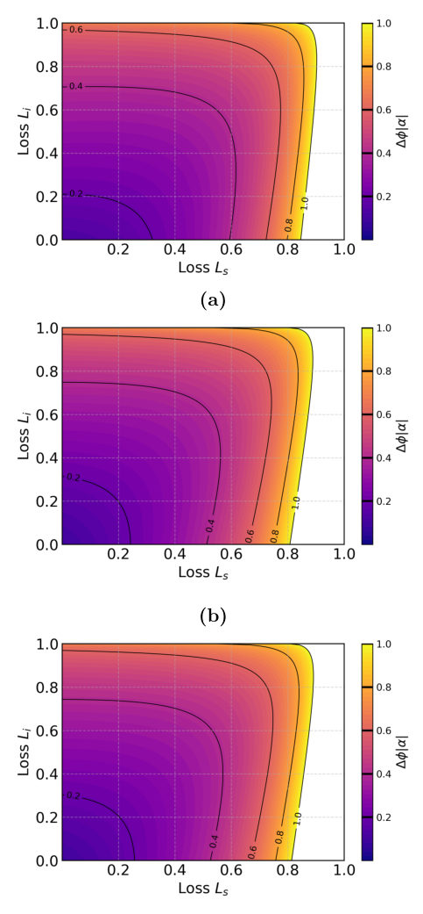 
Figure 4: Contour plot of the phase sensitivity versus losses in both arms of the SU(1,1) interferometer for (a) single-port detection with balanced gains (G = 2), (b) single-port detection with unbalanced gains (G1 = 2, G2 = 5), (c) joint homodyne detection with balanced gains (G = 2).

📷 Fig 5

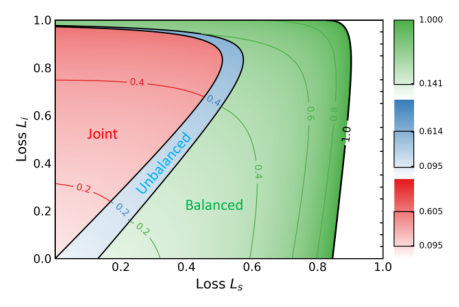 
Figure 5: Choice of the gain and detection configu- rations leading to the best sensitivity for varying val- ues of the losses Ls and Li. In each region, the displayed color corresponds to the best configuration. Green: single-port detection with balanced gains (G = 2); Blue: single-port detection with unbalanced gains (G1 = 2, G2 = 5); Red: joint homodyne detection with balanced gains (G = 2). The color becomes lighter when the sensitivity improves. This plot is based on the data of Fig. 4. All values are normalized to the case of the Mach-Zehnder interferometer probed with the same in- put state. Black boxes around color bars show the range of values used in the plot.

**Summary.** This paper establishes a unified theoretical framework to predict the phase sensitivity of SU(1,1) interferometers for any arbitrary input state. It identifies how different gain and detection configurations can be optimized to mitigate the degrading effects of internal and external optical losses. The findings provide a roadmap for achieving optimal quantum-enhanced sensing in practical, noisy environments.

**Why it may be interesting.** This work is highly relevant to quantum optics and open quantum systems as it provides a rigorous tool for designing loss-resilient quantum-enhanced sensors and understanding the interplay between amplification, squeezing, and decoherence.

Detailed structure

**Main problem.** Developing a generalized theoretical framework to evaluate the phase sensitivity of SU(1,1) interferometers using arbitrary two-mode input states and various homodyne detection schemes under the influence of internal and external losses.

**Main result.** The study provides a comprehensive analytical formulation showing that dark-fringe operation is more robust to external losses and identifies that single-port detection with balanced gains is highly robust to internal losses. It also proves that for certain inputs, the full SU(1,1) interferometer is equivalent to the truncated version under joint homodyne detection.

**Method.** The authors use a Heisenberg representation and Bogoliubov-type transformations to propagate field operators through the interferometer, deriving analytical expressions for quadrature variances and signal derivatives.

**Model / system.** The system consists of SU(1,1) interferometers (both full two-amplifier and truncated single-amplifier configurations) utilizing optical parametric amplifiers (PAs) and subject to models of internal and external optical losses.

**Key observables.** Field quadrature operators (X and Y), single-port homodyne detection outputs, and joint homodyne detection outputs (sum and difference of photocurrents).

**Important parameters / regimes.** Parametric amplifier gains (G, g), phase shift (phi), internal loss coefficients (L), external loss coefficients (l), and input state statistics (e.g., coherent state amplitude alpha).

**Assumptions / limitations.** Lossy modes are assumed to be initialized in the vacuum state; the analysis focuses specifically on homodyne detection rather than photon-counting.

**Figures summary.** Figure 1 shows the schematics of full, truncated, and lossy SU(1,1) interferometers and different detection schemes. Figure 2 compares phase sensitivity across different phase biases. Figure 5 provides a color-coded map of optimal configurations based on loss levels. Figure 6 illustrates sensitivity variation as a function of external losses for different detection ports.

**Paper structure.** The paper begins with a general derivation of interferometer transformations, followed by the evolution of field quadratures and statistical moments. It then evaluates sensitivity at bright and dark fringes, compares different gain regimes and detection strategies, and concludes with a specific application to coherent state inputs and a summary of optimal configurations under loss.

Abstract

We provide a general theoretical derivation of the phase sensitivity achieved by SU(1,1) interferometers under homodyne detection. The general expressions obtained accommodate arbitrary input states and include internal and external losses. In this systematic review, both full SU(1,1) interferometers with two parametric amplifiers and the truncated interferometers with only one parametric amplifier are examined. We investigate scenarios involving both single-output ports and joint homodyne detection, and consider parametric amplifiers with equal gains or with a boosted gain second amplifier. Our analytical formulation provides physical insight and understanding of the improvements in the sensitivity, which are shown to originate from noise reduction and/or signal amplification, depending on the configurations and practical implementations. Surprisingly, the configuration with single-output mode detection and parametric amplifiers with equal gains exhibits the highest robustness to very high internal losses. We finally apply this framework to a ubiquitous $|α,0\rangle$ input two-mode coherent probe state. This approach permits the comparison of different strategies and the optimization of the interferometer performance in the presence of losses. In particular, we determine which amplification and detection configurations provide the best performance, depending on the level of losses. This exemplifies how this general analytical approach provides a powerful tool to design quantum-enhanced interferometers and achieve optimal sensitivity with selected probe states and homodyne detection.

[↑ back to top](#top)

### [Computable lower bound of the parameterized entanglement monotone](http://arxiv.org/abs/2605.22165v1)

**Authors:** Ning Yang, Yu Guo, Shuanping Du  
**Type:** theory · **Category:** quantum information and computing · **PDF:** <https://arxiv.org/pdf/2605.22165v1>  
**Analysis basis:** full PDF text, analyzed in chunks
**Topic relevance:** `entanglement & information structure` **3/5** · `quantum measurements` **3/5**

📷 Fig 1

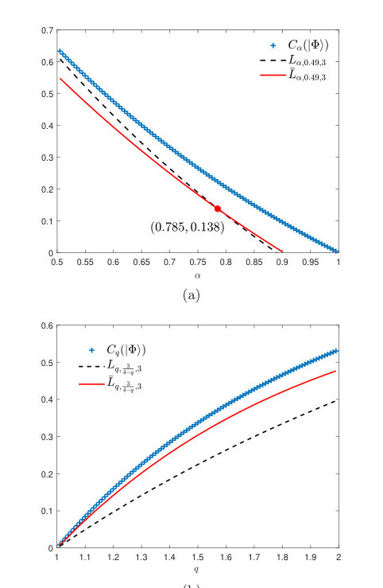 
FIG. 1. The comparison of (a) Cα and its lower bounds Lα,0.49,3, ¯Lα,0.49,3, and that of (b) Cq and its lower bounds Lq, 3 4−q ,3, ¯Lq, 3 4−q ,3 for |Φ⟩given in Eq. (27) with θ = 0.2.

📷 Fig 2

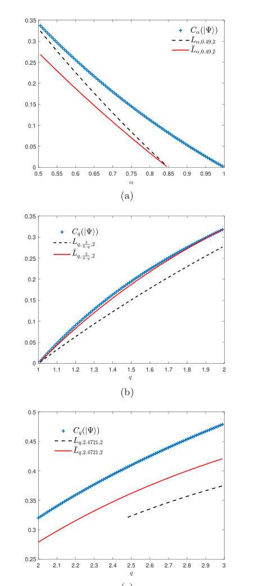 
FIG. 2. The comparison of the different lower bounds for |Ψ⟩given in Eq. (28) with θ = 0.2: (a) Cα, Lα,0.49,2, and ¯Lα,0.49,2; (b) Cq, Lq, 3 4−q ,2, and ¯Lq, 3 4−q ,2; (c) Cq, Lq,2.4721,2,

📷 Fig 3

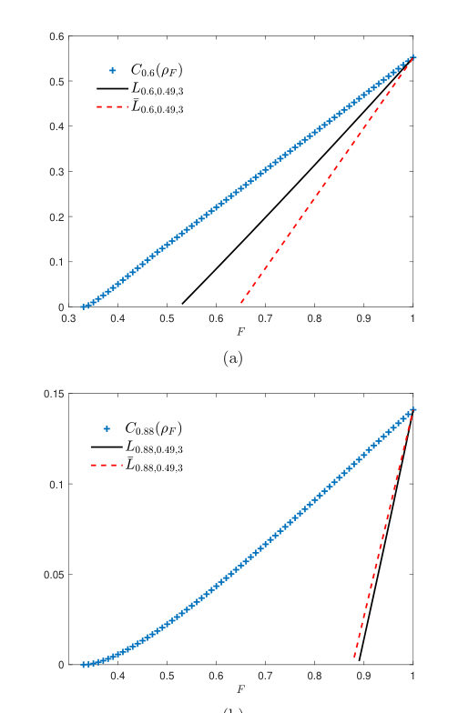 
FIG. 3. The comparison of Cα and its lower bounds Lα,0.49,3, ¯Lα,0.49,3 for the 3 ⊗3 isotropic state ρF with (a) α = 0.6 and (b) α = 0.88, respectively.

📷 Fig 4

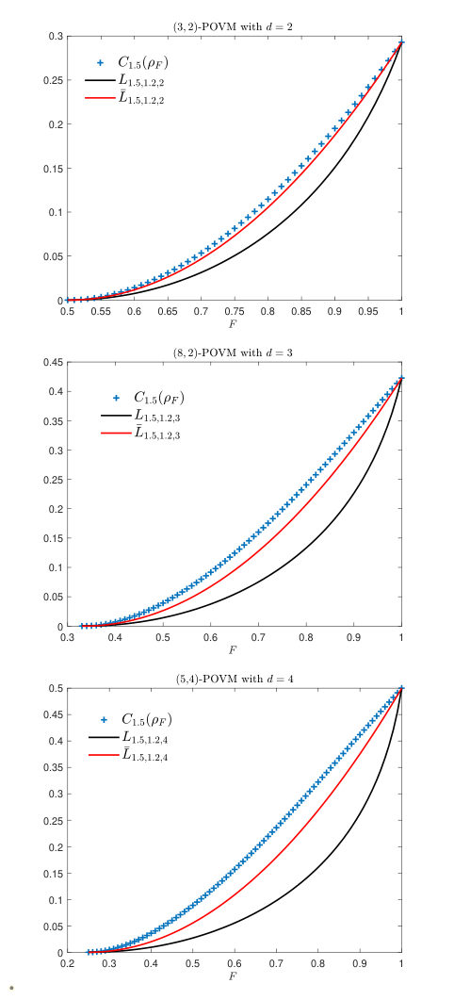 
FIG. 4. The comparison between C1.5(ρF ) and its lower bounds for the cases d = 2, 3, 4, respectively.

**Summary.** This paper develops computable lower bounds for a class of parameterized entanglement monotones, specifically q-concurrence and alpha-concurrence. By using a generalized (N, M)-POVM framework, the authors provide bounds that are tighter than standard PPT and realignment criteria. The work also includes analytical expressions for these measures in the case of isotropic states.

**Why it may be interesting.** This is relevant for quantum information theorists as it provides more efficient, measurement-based tools for quantifying entanglement in bipartite systems without requiring full state tomography or complex optimizations.

Detailed structure

**Main problem.** The difficulty of calculating faithful entanglement measures due to complex optimization processes leads to the need for computable lower bounds for parameterized entanglement monotones.

**Main result.** The authors derive new, tighter lower bounds for q-concurrence and alpha-concurrence using (N, M)-POVMs, which outperform existing bounds from PPT, realignment, and SIC-POVM criteria.

**Method.** The study employs informationally complete (N, M)-positive operator-valued measures, Lagrange multipliers for optimization, and convexity/concavity arguments to extend results from pure to mixed states.

**Model / system.** The research focuses on bipartite quantum states (two-qubit and two-qudit systems) and specifically analyzes isotropic states.

**Key observables.** q-concurrence (for q > 1) and alpha-concurrence (for 0 < alpha < 1).

**Important parameters / regimes.** Dimension d, power parameters q and alpha, and POVM parameters N and M.

**Assumptions / limitations.** The derivation assumes specific parameter regimes (e.g., 1 < q < 2, 1/2 < alpha < 1) and the existence of a twirling operator to reduce states to isotropic form.

**Figures summary.** Figures compare the proposed lower bounds against existing criteria (alpha-concurrence and q-concurrence) for pure and isotropic states, demonstrating the increased tightness of the new bounds.

**Paper structure.** The paper introduces the problem of entanglement estimation, defines the parameterized monotones, introduces the (N, M)-POVM framework, provides theorems for new lower bounds, compares performance against existing criteria, and derives analytical formulas for isotropic states.

Abstract

Although numerous measures of entanglement have been proposed so far, the calculation of a given faithful entanglement measure is a hard work since it is always involved in some optimization process. It is, therefore, important to estimate the lower bound of a given entanglement measure for an arbitrary quantum state. This results in a subject of intensive mathematical research. In particular, along this line, the lower bounds of concurrence or other measures that are induced from concurrence have been explored a lot. Here, we investigate the lower bounds of two kinds of entanglement monotones, i.e., $q$-concurrence ($q>1$) and $α$-concurrence ($0<α<1$), or termed the parameterized entanglement monotone together. We obtain, in the light of the informationally complete ($N$, $M$)-positive operator-valued measure [($N$, $M$)-POVM], the lower bounds for the case of $\frac12<α<1$, $1<q<2$ for two-qudit states, and the case of $2\leqslant q<3$ for two-qubit states. We list several examples which show that the lower bounds based on ($N$, $M$)-POVM outperform that of GSIC-POVM and SIC-POVM, and all these measurement based bounds are better then the ones induced by positive partial transpose (PPT) and realignment criteria in literature. In addition, we obtain an analytical formula of the parameterized entanglement monotone with $\frac12<α<1$ and $1<q<2$ for the isotropic state.

[↑ back to top](#top)

### [Adiabatic Quantum Phase Estimation](http://arxiv.org/abs/2605.22770v1)

**Authors:** Alexander Schmidhuber, Seth Lloyd  
**Type:** theory · **Category:** quantum information and computing · **PDF:** <https://arxiv.org/pdf/2605.22770v1>  
**Analysis basis:** full PDF text, analyzed in chunks
**Topic relevance:** `analog quantum simulation` **3/5** · `entanglement & information structure` **1/5** · `quantum measurements` **1/5**

📷 Fig 1

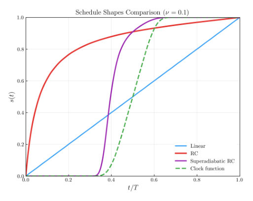 
FIG. 1. A visualization of three different schedule profiles: (a) The linear ramp profile s(t) = t/T. (b) The Roland- Cerf schedule (10) mirroring the behavior of the spectral gap. (c) The Roland-Cerf schedule reparametrized by a DC clock, which we call superadiabatic RC. Also shown is the behavior of the DC clock function, whose endpoint derivatives van- ish and which thereby near-exponentially suppresses diabatic transitions.

📷 Fig 2

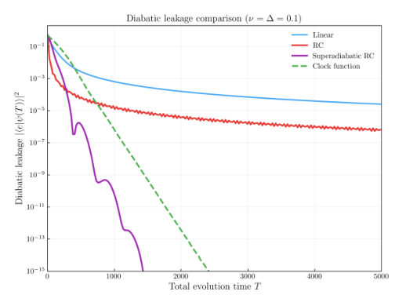 
FIG. 2. Numerical computation of the diabatic leakage via exact diagonalization of the two-level Hamiltonian (8). Four different schedules are considered: linear, Roland-Cerf, su- peradiabatic Roland-Cerf, and the DC clock function, which can be interpreted as the linear schedule reparametrized by the DC clock. While the linear and Roland-Cerf schedules yield a power-law decay, the reparametrized schedules sup- press diabatic transitions near-exponentially. Both RC-type schedules display St¨uckelberg oscillations arising from coher- ent interference between nonadiabatic transitions.

**Summary.** This paper introduces an adiabatic protocol for Quantum Phase Estimation that achieves optimal Heisenberg-limited scaling. By using a specialized 'superadiabatic' scheduling technique, the authors suppress errors exponentially, making adiabatic hardware a viable platform for high-precision phase estimation.

**Why it may be interesting.** This is highly relevant for researchers in quantum computing and open quantum systems as it provides a way to implement fundamental algorithms on analog/adiabatic hardware with optimal scaling and robustness to dephasing.

Detailed structure

**Main problem.** Developing an adiabatic version of Quantum Phase Estimation (QPE) that achieves optimal Heisenberg-limited scaling in both precision and failure probability while avoiding the deep circuits required by gate-based methods.

**Main result.** The authors present a superadiabatic adiabatic protocol using a Denjoy-Carleman clock that achieves near-exponential suppression of diabatic leakage, resulting in a total runtime of O(1/epsilon * log(1/delta)).

**Method.** The protocol uses a multi-stage adiabatic evolution with a reparameterized Roland-Cerf schedule and a non-quasianalytic Denjoy-Carleman clock to ensure vanishing derivatives at the boundaries of each stage.

**Model / system.** An n-qubit system with Hamiltonian Hs coupled to an m-qubit ancilla register, utilizing transverse fields, pairwise ZiZj interactions, and a coupling between the system energy and a single ancilla qubit.

**Key observables.** Diabatic leakage (transition probability), precision (epsilon), and failure probability (delta).

**Important parameters / regimes.** Precision epsilon, failure probability delta, adiabatic parameter A, and the number of stages m.

**Assumptions / limitations.** The Hamiltonian must be smooth (C-infinity) with vanishing derivatives at the endpoints, and the eigenvalues must remain separated by a minimum energy gap.

**Figures summary.** Figure 1 compares linear, Roland-Cerf, and superadiabatic schedules; Figure 2 shows numerical evidence that superadiabatic schedules suppress transitions exponentially compared to power-law decay in standard schedules.

**Paper structure.** The paper introduces the problem of adiabatic QPE, defines the multi-stage Hamiltonian model, develops the mathematical framework for superadiabatic estimates using Denjoy-Carleman clocks, proves leakage bounds and runtime complexity, and demonstrates applications to adiabatic Grover search.

Abstract

Quantum phase estimation (QPE) is a central algorithmic primitive that estimates eigenvalues of a Hamiltonian up to precision $ε$ in Heisenberg-limited time $T=Θ(1/ε)$. Standard gate-based implementations of QPE require deep controlled time-evolution circuits and are not native to analog hardware. Here, we present a simple adiabatic protocol for QPE that achieves (up to logarithmic factors) the optimal Heisenberg-limited scaling $T = O\left( \frac{1}ε \log\left(δ^{-1}\right)\right)$ in both the precision $ε$ and failure probability $δ$. By encoding eigenvalues in populations of computational basis states rather than complex phases, our approach is naturally robust against certain dephasing errors. The adiabatic protocol only requires the ability to couple a single ancilla qubit to the system Hamiltonian as well as pairwise couplings within the ancilla register.

[↑ back to top](#top)

### [Comment on "Entropic Costs of Extracting Classical Ticks from a Quantum Clock"](http://arxiv.org/abs/2605.21833v1)

**Authors:** Longyan Gong  
**Type:** theory · **Category:** statistical mechanics · **PDF:** <https://arxiv.org/pdf/2605.21833v1>  
**Analysis basis:** full PDF text, analyzed in chunks
**Topic relevance:** `quantum measurements` **3/5** · `non-equilibrium dynamics` **2/5**

📷 Fig 1

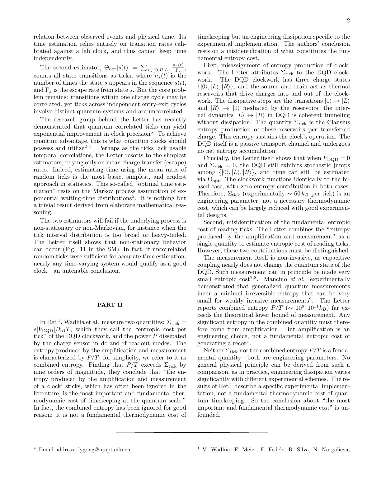 
Low-resolution page preview, page 2

📷 Fig 2

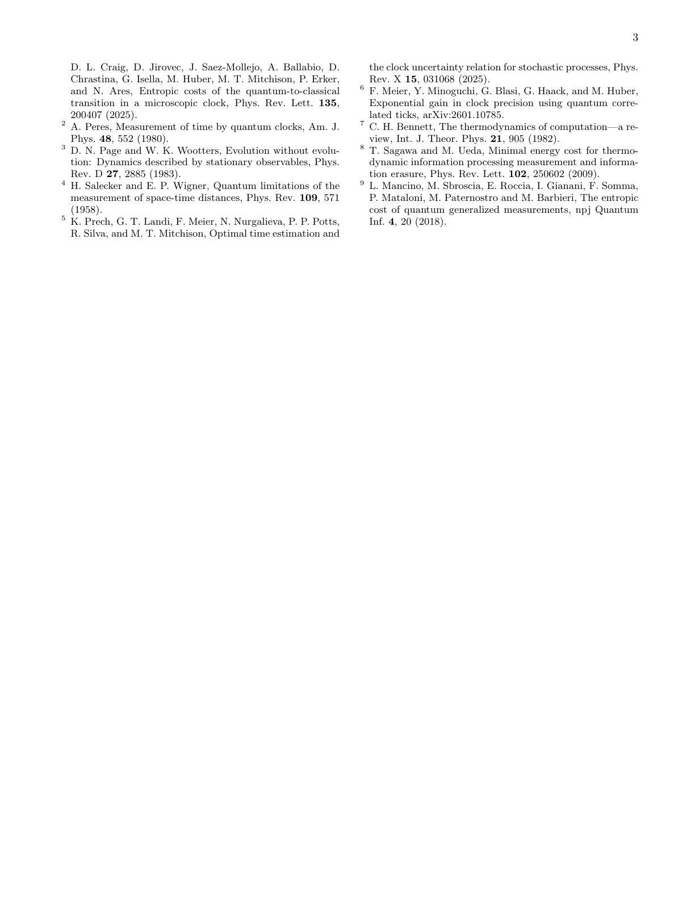 
Low-resolution page preview, page 3

**Summary.** This Comment argues that a recently reported quantum clock based on a double quantum dot is actually a classical system. The author shows that the reported entropic costs are merely consequences of experimental engineering, such as measurement amplification, rather than fundamental limits of quantum timekeeping.

**Why it may be interesting.** This is relevant for researchers in open quantum systems and non-equilibrium thermodynamics as it addresses the fundamental distinction between engineering dissipation and the intrinsic thermodynamic costs of quantum-to-classical information extraction.

Detailed structure

**Main problem.** The paper challenges the claim that a double quantum dot system functions as a quantum clock and disputes the reported fundamental thermodynamic costs of timekeeping.

**Main result.** The author demonstrates that the system exhibits classical behavior lacking intrinsic temporal correlations and that the reported entropy production is due to engineering dissipation rather than fundamental quantum timekeeping costs.

**Method.** The author performs a formal critique of the original work's thermodynamic analysis and statistical estimators, specifically analyzing the nature of entropy production and the role of measurement amplification.

**Model / system.** A double quantum dot (DQD) system acting as an open system exchanging charge and energy with a thermal environment, including charge sensors (dc and rf reflectometry).

**Key observables.** Entropy production per tick (Sigma_tick), combined entropy from amplification and measurement (P/T), and time estimators (Theta_net and Theta_opt).

**Important parameters / regimes.** Bias voltage (V_DQD) and the reported entropic cost of approximately 60 kB per tick.

**Assumptions / limitations.** The original work assumes DQD dynamics can be extended to coherent dynamics and relies on a Markov process assumption for the Theta_opt estimator.

**Figures summary.** Table I decomposes the DQD system into its constituent parts (DQD, sensors, and environment) to classify their quantum or classical nature.

**Paper structure.** The paper begins by identifying two primary flaws in the original Letter, then proceeds to critique the quantum nature of the device, followed by a critique of the statistical time estimation methods, and concludes with a rebuttal of the thermodynamic conclusions.

Abstract

A recent Letter by Wadhia et al. reports a realization of a quantum clock using a double quantum dot (DQD) [Phys. Rev. Lett. 135, 200407 (2005)]. This Comment identifies two fundamental issues: (I) the claimed ``quantum clock" exhibits only classical behavior and lacks intrinsic temporal correlations between ticks; it is not sufficient for accurate time as a good clock. (II) the thermodynamic analysis misassigns entropy production and conflates amplification with measurement; the reported combined entropy is an engineering dissipation, not a fundamental cost of quantum timekeeping.

[↑ back to top](#top)

### [Competing incommensurability, electronic correlations, and superconductivity in a hybrid transition metal dichalcogenide](http://arxiv.org/abs/2605.22522v1)

**Authors:** Jean C. Souza, Moshe Haim, Lorenzo Crippa, Hyeonhu Bae, Edanel Fishbein, Jonathan Ruhman, Binghai Yan, Amit Kanigel, Roser Valentí, Nurit Avraham, Haim Beidenkopf  
**Type:** both · **Category:** strongly correlated electrons · **PDF:** <https://arxiv.org/pdf/2605.22522v1>  
**Analysis basis:** full PDF text, analyzed in chunks
**Topic relevance:** `Frenkel-Kontorova` **3/5** · `Kondo & dissipative impurity` **2/5**

📷 Fig 1

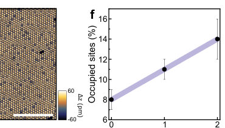 
Fig. 1 Intrinsic origin for undepleted CDW sites in 4Hb-TaS2. a Crystal structure of 4Hb- TaS2. b Representative topography taken at T = 4.2 K for xSe = 1%. c Representative dI/dV spectra of occupied and depleted CDW sites (red and blue lines, respectively) taken at T = 4.2 K for xSe = 1% (Vbias = 200 mV, Isp = 200 pA, VAC = 5 meV). d, e Representative topographies for xSe = 2%, 0%. All topographies were taken with Vbias = 100 mV and Isp = 50 pA, and the white scale bar is 20 nm. f Percentage of the total sites that are occupied as a function of Se doping, xSe. The statistical analysis is further described in the SM. The solid purple line is a linear fit.

📷 Fig 2

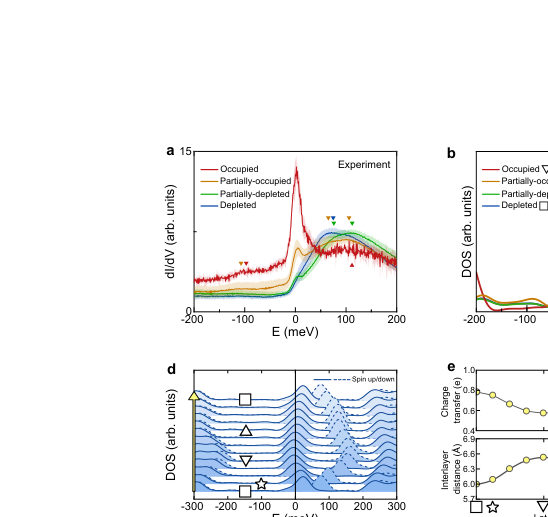 
Fig. 2 Modulation of the charge transfer and the hybridization strength by the lattice mismatch. a Clustered averages of four different types of spectra obtained at the same 1T surface (Vbias = 120 mV, Isp = 150 pA, VAC = 5 mV). The shaded margins represent the standard deviation for each spectrum. b DFT calculated DOS for the 1T layer of bilayer 1T/1H-TaS2 in selected lateral displacements (marked in c). The labels denote the experimental spectral archetypes; in the DFT calculations, they identify representative local registries with different residual fillings of the 1T- derived flat band. c Relative energy landscape ∆E for lateral displacement of a 1T layer on a fixed 1H layer. Energies...

📷 Fig 3

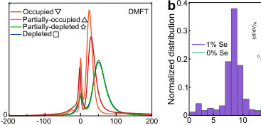 
Fig. 3 The origin of the screening metal. a DMFT calculated spectra on the 4 (meta) stable moir´e positions identified in DFT (marked by corresponding symbols in Fig. 2c). b Comparison between the ZBCP width for xSe = 0% and 1%. Around 400 occupied sites spectra were analyzed for xSe = 0% and about 600 sites for xSe = 1%. The inset shows representative ZBCP spectra from both sample types. c Asymmetry of the LHB and the UHB energy relative to EF for xSe = 1%. About 250 occupied spectra were analyzed.

📷 Fig 4

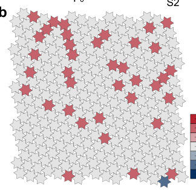 
Fig. 4 The effect of superconductivity on the breathing transition of the incommensu- rate potential. a Change of the enumerated ‘occupation level’ of the CDW sites ∆nocc between T = 4.2 K to T = 1.1 K for sample S1. Change of the ‘occupation level’, ∆nocc, for b µ0H = 0 T, c µ0H∥c = 1.7 T and d µ0H⊥c = 1.7 T in sample S2. The measurements were first taken at T = 4.2 K with the respective applied magnetic fields, then the sample was cooled down with the applied field for the measurements at T = 1.1 K. All samples had xSe = 0.

**Summary.** This paper identifies that an intrinsic incommensurate potential in 4Hb-TaS2 regulates electronic correlations and charge transfer between its 1T and 1H layers. This modulation creates a doped Mott regime and establishes a complex competition between the incommensurate landscape, charge-density waves, and superconductivity. The findings highlight the importance of bulk incommensurability in tuning many-body physics in hybrid materials.

**Why it may be interesting.** not directly relevant

Detailed structure

**Main problem.** The study aims to understand the origin of the electronic structure and the zero-bias conductance peak in the hybrid transition metal dichalcogenide 4Hb-TaS2, specifically investigating how incommensurate potentials and charge transfer influence electronic correlations and superconductivity.

**Main result.** The researchers discovered that an intrinsic incommensurate potential, caused by a 1.1% lattice mismatch between 1T and 1H layers, modulates interlayer hybridization and charge transfer, driving the system into a doped Mott regime where superconductivity competes with the incommensurate landscape.

**Method.** The study combines experimental Scanning Tunneling Microscopy (STM) and Spectroscopy (STS) with computational Density Functional Theory (DFT) and Dynamical Mean-Field Theory (DMFT) using a periodic Anderson model.

**Model / system.** The physical system is the bulk transition metal dichalcogenide polytype 4Hb-TaS2, consisting of alternating correlated 1T and metallic 1H layers. The theoretical model is a periodic Anderson model accounting for correlated d-orbitals and uncorrelated c-electrons.

**Key observables.** Zero-bias conductance peak (ZBCP), Upper and Lower Hubbard Bands (UHB/LHB), charge transfer (CT) magnitude, and spectral weight at the Fermi energy.

**Important parameters / regimes.** Lattice mismatch (~1.1%), Hubbard interaction (U = 100 meV), superconducting transition temperature (Tc approx 2.6 K), and Selenium doping concentration (x = 0% to 5%).

**Assumptions / limitations.** The computational approach uses a local-registry approximation for the incommensurate potential rather than a full moire supercell, and DMFT is applied to a simplified periodic Anderson model.

**Figures summary.** Fig 1 shows the crystal structure and STM topography; Fig 2 illustrates the modulation of charge transfer and hybridization by lattice mismatch; Fig 3 shows DMFT calculations of ZBCP and Hubbard band evolution; Fig 4 demonstrates the effect of superconductivity on CDW configuration transitions.

**Paper structure.** The paper introduces the hybrid TMD system, presents STM/STS evidence for an intrinsic incommensurate potential, uses DFT/DMFT to model the charge transfer and many-body effects, and concludes by discussing the competition between this potential and superconductivity.

Abstract

The engineering of superlattices in two-dimensional van der Waals materials has enabled the realization of rich phase diagrams hosting topological and strongly correlated phases. While incommensurability is widespread in three-dimensional systems, the role of moiré potentials in bulk materials remains largely unexplored. Here, using scanning tunneling microscopy, we demonstrate that a bulk transition-metal dichalcogenide polytype, 4Hb-TaS$_2$, hosts an emergent incommensurate potential between its alternating 1T and 1H layers. Interplay with a concomitant incommensurate charge-density wave suppresses the long-range order of this potential, leading to intricate coupling with electronic correlations in the doped 1T surface layer. Combining density functional theory with dynamical mean-field theory, we show that the lattice mismatch locally modulates the interlayer distance, thereby tuning both hybridization and charge transfer between the correlated 1T and metallic 1H layers. This redistribution of charge drives the system towards a doped Mott regime, in which the remaining local moments become self-screened, giving rise to a zero-bias resonance. We further find that bulk superconductivity competes with both the underlying landscape and the associated charge transfer. Our results establish incommensurate potentials as a previously overlooked ingredient in hybrid transition-metal dichalcogenides, highlighting their central role in the interplay between electronic correlations, charge-density-wave order, and unconventional superconductivity.

[↑ back to top](#top)

### [A2QTGN: Adaptive Amplitude Quantum-Integrated Temporal Graph Network for Dynamic Link Prediction](http://arxiv.org/abs/2605.21916v1)

**Authors:** Nouhaila Innan, M. Murali Karthick, Simeon Kandan Sonar, Vivek Chaturvedi, Muhammad Shafique  
**Type:** both · **Category:** quantum information and computing · **PDF:** <https://arxiv.org/pdf/2605.21916v1>  
**Analysis basis:** full PDF text, analyzed in chunks
**Topic relevance:** `QC/QI experiment` **3/5**

📷 Fig 1

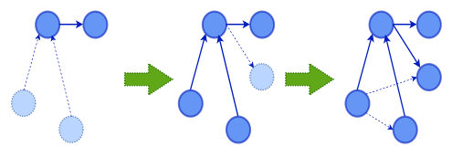 
Fig. 1: Dynamic graphs

📷 Fig 2

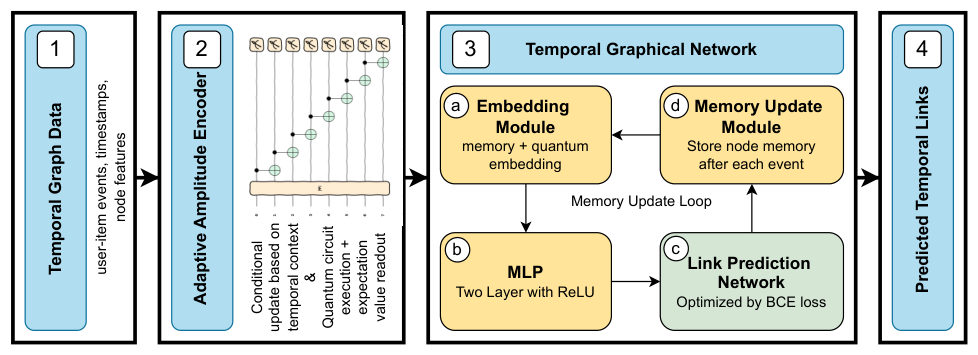 
Fig. 2: Pipeline of the A2QTGN methodology. The system processes a temporal interaction stream {(ut, vt, Xt, Ft, t)} and converts it into future link predictions through four coordinated modules: (a) temporal interaction data forming the discrete-time graph sequence Gt = (Vt, Et, Xt, Ft); (b) the AAE, which computes temporal feature variation ∆xi,t, derives the activity factor αi,t = σ(β∥∆xi,t∥2), and conditionally re-encodes the node into a quantum state |ψi,t⟩whose expectation values yield the embedding zi,t; (c) the TGN memory mechanism, where node memories mi,t are updated using the fused representation hi,t = NN([mprev i,t ∥zi,t]); and (d) the link prediction module, which scores...

📷 Fig 3

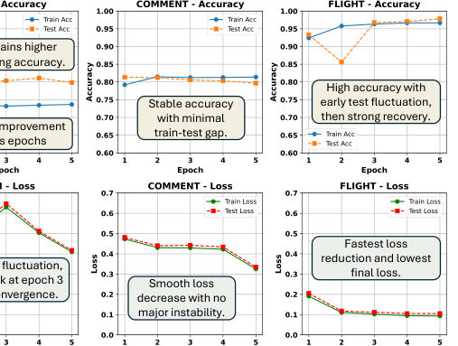 
Fig. 3: Performance convergence on various datasets.

**Summary.** This paper introduces a hybrid quantum-classical framework for predicting future interactions in evolving networks. By using an adaptive mechanism to only update quantum embeddings when significant changes occur, it reduces computational overhead and improves prediction accuracy. The model is shown to be effective even under the noisy conditions of near-term quantum hardware.

**Why it may be interesting.** not directly relevant

Detailed structure

**Main problem.** The challenge of performing efficient dynamic link prediction in evolving networks by overcoming the limitations of classical temporal graph models and the high computational cost of re-encoding quantum states at every timestep.

**Main result.** The A2QTGN framework achieves superior predictive performance across multiple temporal graph benchmarks and demonstrates robustness to noise and limited shot counts on real IBM quantum hardware.

**Method.** A hybrid quantum-classical approach using Adaptive Amplitude Encoding (AAE) to selectively update quantum embeddings only when temporal feature variations exceed a threshold, integrated with a Temporal Graph Network (TGN) backbone.

**Model / system.** A hybrid quantum-classical neural network architecture utilizing PennyLane for quantum circuit execution, specifically employing amplitude encoding on 8 qubits and evaluating performance on IBM quantum devices (e.g., ibm_torino).

**Key observables.** Expectation values of Pauli-Z operators, prediction accuracy, precision, AUC, and Mean Reciprocal Rank (MRR).

**Important parameters / regimes.** Activity factor (alpha), update threshold (tau), number of qubits (8), and measurement shot counts (100-shot vs 2048-shot).

**Assumptions / limitations.** The model assumes that temporal feature variations can be effectively captured by a threshold-based re-encoding strategy and that the quantum-classical interface can be optimized via gradient-based learning.

**Figures summary.** Figure 1 shows the concept of dynamic graphs; Figure 2 details the A2MTGN pipeline including the adaptive update loop; Figure 3 displays performance convergence curves; and various tables present ablation studies and hardware-aware performance metrics.

**Paper structure.** The paper identifies limitations in classical and static quantum graph models, proposes the A2QTGN architecture and its adaptive mechanism, details the experimental setup on various benchmarks, presents ablation studies on encoding and update strategies, and concludes with hardware-aware performance evaluations.

Abstract

Dynamic link prediction is important for modeling evolving interactions in complex systems, including social, communication, financial, and transportation networks. Classical temporal graph models capture sequential dependencies, but they may struggle to represent concurrent and rapidly changing node-edge interactions in large dynamic graphs. We propose A2QTGN (Adaptive Amplitude Quantum-Integrated Temporal Graph Network), a hybrid quantum-classical framework that combines adaptive amplitude encoding with a Temporal Graph Network backbone. The proposed mechanism represents node interaction features as quantum states and selectively refreshes amplitude embeddings based on temporal activity, preserving stable node states while emphasizing meaningful structural changes. This design reduces unnecessary quantum re-encoding and improves temporal representation for link prediction. Experiments on five Temporal Graph Benchmark datasets show that A2QTGN achieves strong predictive and ranking performance across diverse dynamic graphs. Ablation studies confirm the importance of both the quantum embedding module and the adaptive update strategy, while hardware-aware inference using a noisy backend and limited real-device execution supports the feasibility of near-term quantum-assisted temporal graph learning.

[↑ back to top](#top)

### [Geometric Construction of Optimal Teleportation Witnesses](http://arxiv.org/abs/2605.22226v1)

**Authors:** Yanning Jia, Fenzhuo Guo, Mengxuan Bai, Mengyan Li, Haifeng Dong, Fei Gao  
**Type:** theory · **Category:** quantum information and computing · **PDF:** <https://arxiv.org/pdf/2605.22226v1>  
**Analysis basis:** full PDF text, analyzed in chunks
**Topic relevance:** `entanglement & information structure` **3/5**

📷 Fig 1

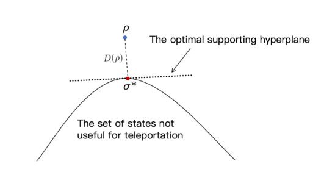 
FIG. 1: Geometric characterization. The set S of states not useful for teleportation is a convex set. For ρ /∈S, the closest point σ∗defines the distance D(ρ). The optimal supporting hyperplane at σ∗

📷 Fig 2

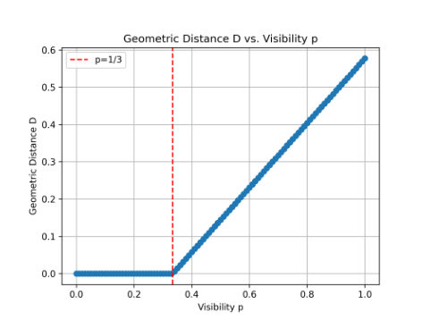 
FIG. 2: Geometric distance D(ρW (p)) of the two-qubit Werner states as a function of p. The distance becomes nonzero at the critical point p = 1/3, indicating that the state becomes useful for teleportation.

📷 Fig 3

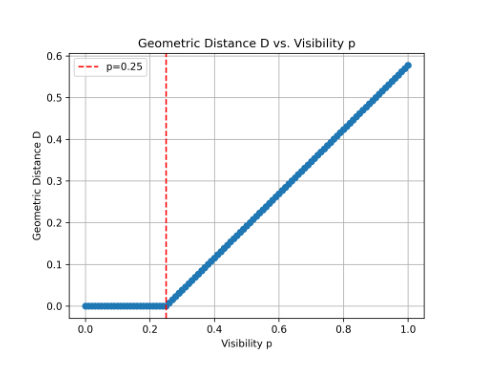 
FIG. 3: Geometric distance D(ρ(p)) of the maximally entangled mixed states as a function of p. The distance becomes nonzero at the critical point p = 0.25, indicating that the state becomes useful for teleportation.

📷 Fig 4

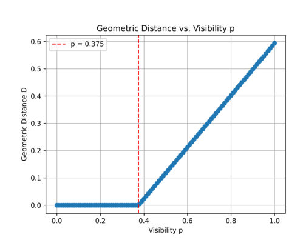 
FIG. 4: Geometric distance D(ρ(p)) of the NME states as a function of p. The distance becomes nonzero at the critical point p = 0.375, indicating that the state becomes useful for teleportation.

**Summary.** The paper introduces a geometric method to determine if a quantum state can provide a quantum advantage for teleportation. By calculating the shortest distance to a set of 'useless' states, the authors provide a necessary and sufficient criterion and a way to construct optimal witnesses for arbitrary two-qudit systems.

**Why it may be interesting.** This work provides a powerful tool for characterizing the operational utility of entanglement in higher-dimensional systems, which is essential for designing robust quantum networks and protocols.

Detailed structure

**Main problem.** Developing a systematic, constructive framework to identify whether an arbitrary two-qudit entangled state is useful for quantum teleportation, overcoming the limitations of existing criteria that are either restricted to qubits or only provide sufficient conditions.

**Main result.** The authors present a geometric method to construct optimal teleportation witnesses and establish that the shortest distance between a state and the set of useless states serves as a necessary and sufficient criterion for teleportation usefulness.

**Method.** A two-layer iterative cutting-plane algorithm is used to solve a convex semi-infinite programming problem, finding the projection of a target state onto the convex set of useless states via an outer-layer SDP and an inner-layer randomized fixed-point iteration.

**Model / system.** The study considers arbitrary bipartite two-qudit entangled states, specifically testing the method on two-qubit Werner states, two-qubit Maximally Entangled Mixed States (MEMS), and asymmetric two-qutrit non-maximally entangled states.

**Key observables.** Average teleportation fidelity, Maximal Entangled Fraction (MEF), and the geometric Frobenius distance D(rho) from the set of useless states.

**Important parameters / regimes.** The visibility parameter p, the dimension of the qudit system d, and the critical threshold pc where teleportation advantage begins.

**Assumptions / limitations.** The inner optimization layer uses a randomized fixed-point iteration which may converge to a local optimum, potentially providing a lower bound on the MEF.

**Figures summary.** Figure 1 illustrates the geometric construction of the witness via a separating hyperplane; Figures 2, 3, and 4 show the geometric distance D(rho) as a function of visibility p for Werner, MEMS, and qutrit states, respectively, marking the onset of usefulness.

**Paper structure.** The paper introduces the problem of teleportation usefulness, defines the geometric framework and the cutting-plane algorithm, presents the construction of the optimal witness, and validates the method through numerical applications to various two-qubit and two-qutrit state classes.

Abstract

Not all entangled states are useful for quantum teleportation. We present a geometric method to construct optimal teleportation witnesses, which provide operational necessary and sufficient criteria for identifying the teleportation usefulness of arbitrary two-qudit entangled states. Specifically, by developing a two-layer iterative cutting-plane algorithm to solve the shortest distance problem from the target state $ρ$ to the convex set $S$ of useless states, we obtain the projection point $σ^* \in S$ and then construct the optimal teleportation witness from the projection geometry. Moreover, the shortest distance $D(ρ)$ obtained during this construction also serves as a necessary and sufficient criterion for usefulness. We apply our method to identify the teleportation usefulness of three classes of entangled states.

[↑ back to top](#top)

### [Self-testing of exact entanglement embezzlement](http://arxiv.org/abs/2605.22713v1)

**Authors:** Samuel J. Harris  
**Type:** theory · **Category:** quantum information and computing · **PDF:** <https://arxiv.org/pdf/2605.22713v1>  
**Analysis basis:** full PDF text, analyzed in chunks
**Topic relevance:** `entanglement & information structure` **3/5**

📷 Fig 1

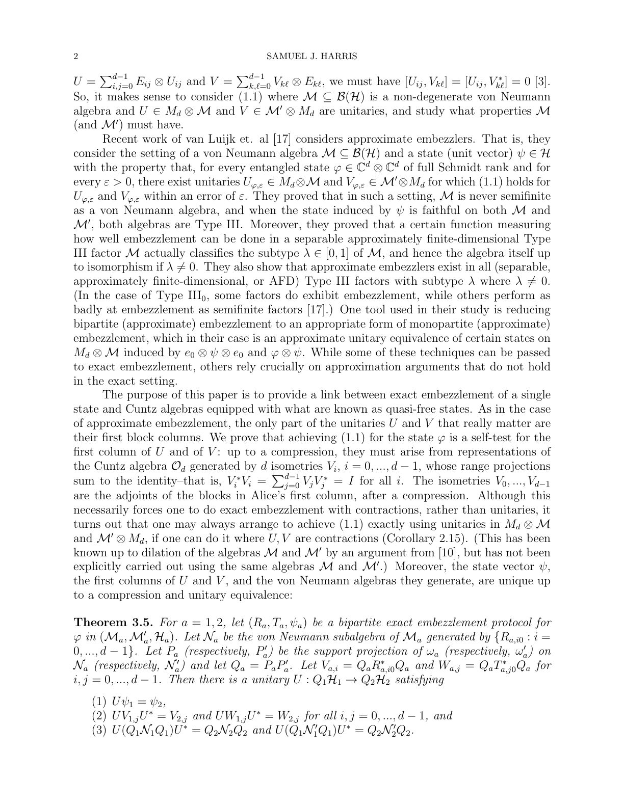 
Low-resolution page preview, page 2

📷 Fig 2

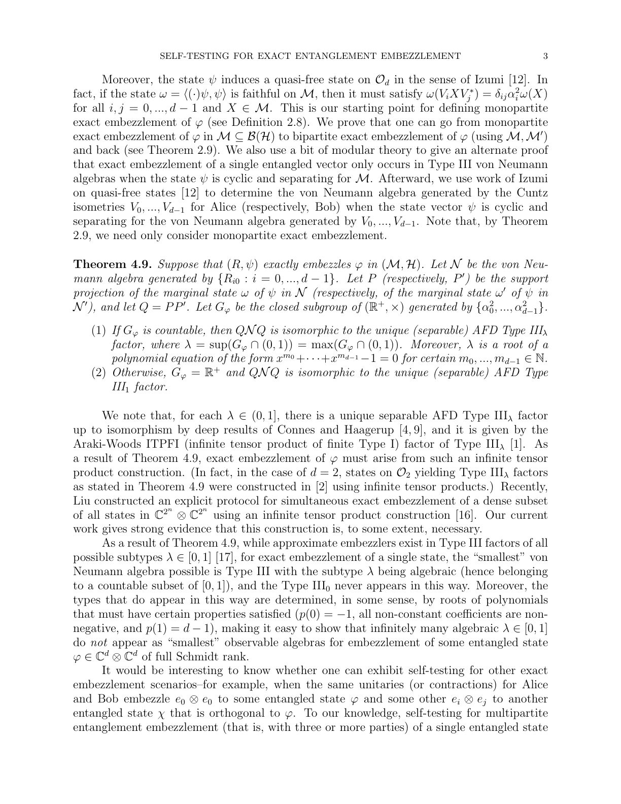 
Low-resolution page preview, page 3

📷 Fig 3

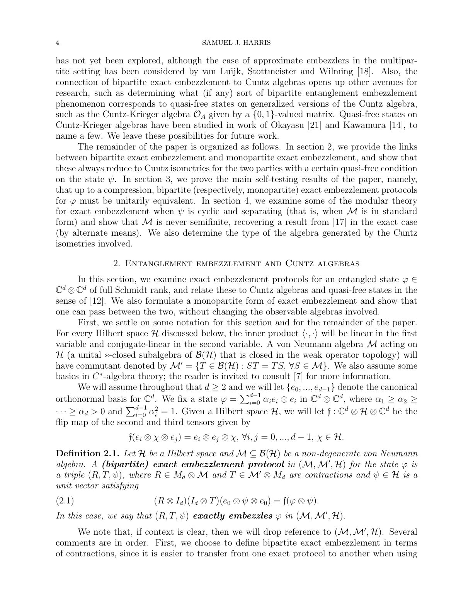 
Low-resolution page preview, page 4

📷 Fig 4

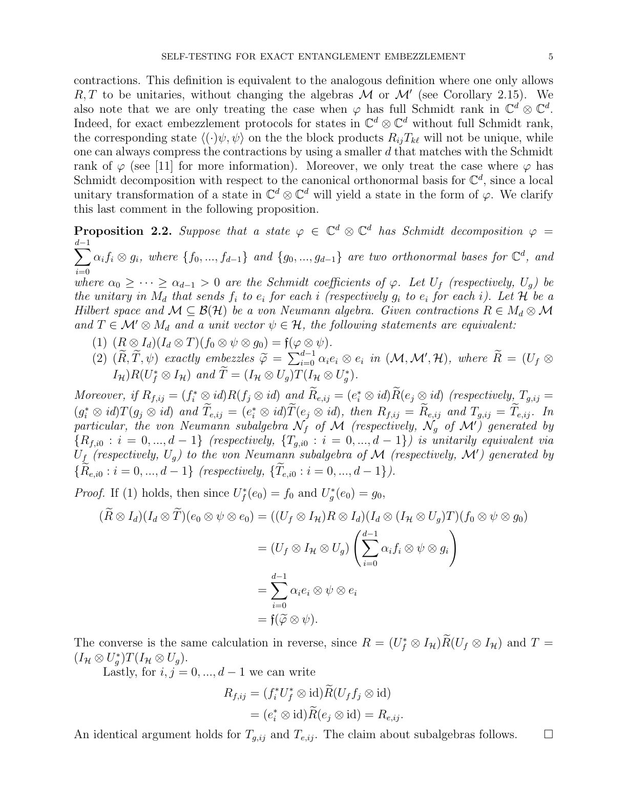 
Low-resolution page preview, page 5

📷 Fig 5

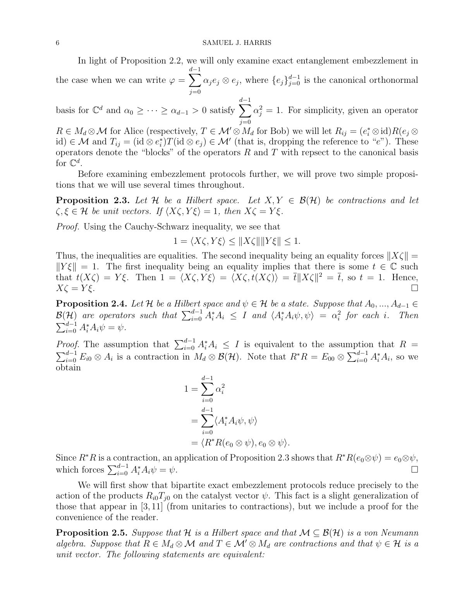 
Low-resolution page preview, page 6

**Summary.** This paper proves that exact entanglement embezzlement is a self-testing protocol for Cuntz isometries and a specific quasi-free state. It further characterizes the underlying von Neumann algebras as Type III factors, where the specific subtype is determined by the Schmidt coefficients of the embezzled state.

**Why it may be interesting.** This work provides deep mathematical insights into the resource theory of entanglement and the fundamental algebraic constraints required for exact entanglement manipulation, which is relevant to the study of infinite-dimensional quantum systems and open quantum systems.

Detailed structure

**Main problem.** The paper investigates the self-testing properties and algebraic structure of exact bipartite entanglement embezzlement protocols.

**Main result.** It proves that exact entanglement embezzlement acts as a self-test for Cuntz isometries and a unique quasi-free state, and classifies the resulting von Neumann algebras as AFD Type III_lambda or Type III_1 factors.

**Method.** The author employs operator algebra techniques, including von Neumann algebra theory, Cuntz algebra properties, modular theory (Tomita-Takesaki), and GNS representations.

**Model / system.** A bipartite entanglement embezzlement protocol where two parties use a shared catalyst state psi in a von Neumann algebra M and its commutant M' to obtain a target entangled state phi via local unitaries or contractions.

**Key observables.** Schmidt coefficients of the target state, modular operator eigenvalues, and the Connes spectrum.

**Important parameters / regimes.** Schmidt coefficients (alpha_i), dimension (d), and the parameter lambda for Type III_lambda factors.

**Assumptions / limitations.** The target state phi has full Schmidt rank; the von Neumann algebra M is non-degenerate; the marginal states are faithful.

**Paper structure.** The paper progresses from defining the bipartite embezzlement protocol and reducing it to a monopartite problem, to establishing the self-testing of Cuntz isometries via GNS representation, and finally using modular theory to classify the resulting von Neumann algebra types.

Abstract

We consider bipartite exact entanglement embezzlement with a catalyst state vector $ψ$ in a Hilbert space $\mathcal{H}$ using unitaries (or more generally, contractions). If $\mathcal{M} \subseteq \mathcal{B}(\mathcal{H})$ is a von Neumann algebra and $U \in M_d \otimes \mathcal{M}$ and $V \in \mathcal{M}' \otimes M_d$ are unitaries (or more generally contractions), then such a protocol is of the form $(U \otimes I_d)(I_d \otimes V)(e_0 \otimes ψ\otimes e_0)=\sum_{i=0}^{d-1} α_i e_i \otimes ψ\otimes e_i$, where each $α_i>0$ and $\sum_{i=0}^{d-1} α_i^2=1$. We show that any such protocol must arise from a unique state on the tensor product $\mathcal{O}_d \otimes \mathcal{O}_d$ of the Cuntz algebra with itself. As a result, we prove that exact entanglement embezzlement is a self-test for a collection of $d$ Cuntz isometries for each party and a unique quasi-free state on the Cuntz algebra $\mathcal{O}_d$ in the sense of \cite{Iz93}. Moreover, we use modular theory to show that the von Neumann algebra generated by the copy of $\mathcal{O}_d$ is the unique separable approximately finite-dimensional Type $\text{III}_λ$ factor for some $0<λ\leq 1$, where $λ$ can be determined by an algebraic condition on the Schmidt coefficients of the state $\varphi=\sum_{i=0}^{d-1} α_i e_i \otimes e_i$.

[↑ back to top](#top)

### [The relative entropy of magic and its nonadditivity](http://arxiv.org/abs/2605.22392v1)

**Authors:** Carolin Deckers, Justus Neumann, Hermann Kampermann, Dagmar Bruß  
**Type:** theory · **Category:** quantum information and computing · **PDF:** <https://arxiv.org/pdf/2605.22392v1>  
**Analysis basis:** full PDF text, analyzed in chunks
**Topic relevance:** `entanglement & information structure` **3/5**

📷 Fig 1

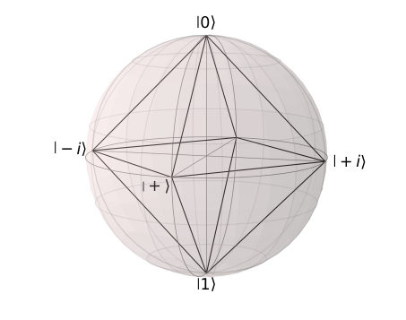 
FIG. 1: Bloch ball with stabilizer octahedron. The magic states are outside the stabilizer octahedron.

📷 Fig 2

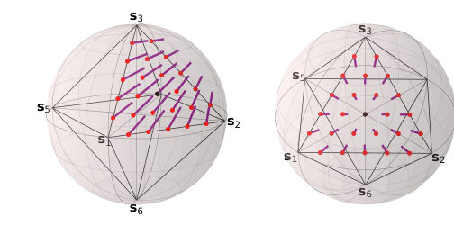 
FIG. 2: The purple lines are xρ(σ, t) for 0 &lt; t ≤tmax for some σ in the triangle spanned by s1, s2 and s3. The red circles represent the closest stabilizer states to the states on the purple line that they intersect. The stabilizer state at the center of the triangle is black. The intersection of the Bloch sphere and the purple line starting at the black dot is the T-state.

📷 Fig 3

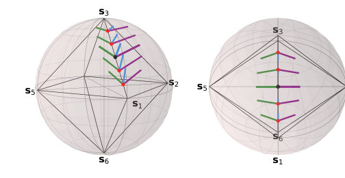 
FIG. 3: Magic states are represented by the lines starting at their closest stabilizer state (red circles) on the edge with vertices s1 and s3. The lines are the magic states for different values of c. For c = 1/ √

📷 Fig 4

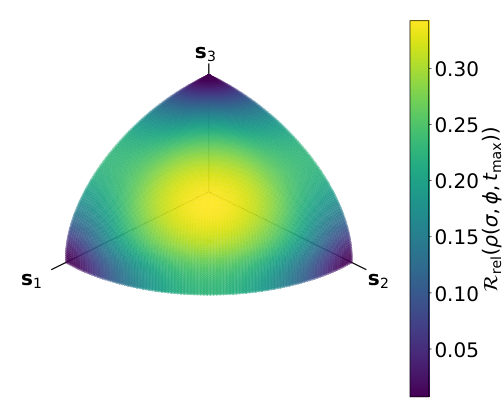 
FIG. 4: Relative entropy of magic Rrel(ρ(σ, ϕ, tmax)) determined by Eq. (23) for stabilizer states in the triangle with the vertices s1, s2 and s3 including the hyperplanes with −b ≤c ≤0 for the states on the edges.

📷 Fig 5

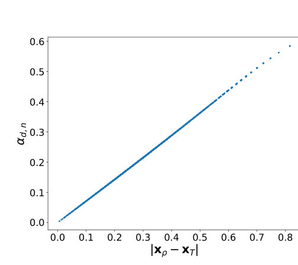 
FIG. 5: Angle αd,n between the purple lines of Fig. 2b and the normal vector of the triangle n = (1, 1, 1)/ √

**Summary.** This paper provides a rigorous geometric characterization of magic states in the resource theory of magic and proves that the relative entropy of magic is nonadditive for multi-qubit systems. This finding is significant for understanding how quantum resources scale in stabilizer-based quantum computing architectures.

**Why it may be interesting.** not directly relevant

Detailed structure

**Main problem.** The paper investigates the properties of the relative entropy of magic, specifically focusing on its geometric distribution in single-qubit systems and its nonadditivity in multi-qubit tensor product states.

**Main result.** The authors prove that the relative entropy of magic is nonadditive for an infinite class of n-qubit states where the magic states and their closest stabilizer states do not commute. They also characterize the symmetric arrangement of magic states around the faces of the stabilizer octahedron.

**Method.** The study uses the resource theory of magic, employing geometric approaches in the Bloch ball, analytical derivations using the Hadamard product, and a proof by contradiction to establish nonadditivity.

**Model / system.** The framework is the resource theory of magic applied to single-qubit and multi-qubit systems, where the set of free states is defined by the stabilizer polytope (the convex hull of stabilizer states).

**Key observables.** Relative entropy of magic (R_rel)

**Important parameters / regimes.** The parameter t representing the distance from a stabilizer state, the Bloch vector length, and the commutation relation between magic and stabilizer states.

**Assumptions / limitations.** The proof of nonadditivity assumes a specific class of states where at least two single-qubit magic states do not commute with their closest stabilizer states.

**Figures summary.** Fig 1 shows the stabilizer octahedron in the Bloch ball; Fig 2 and 3 illustrate the trajectories and tilting of magic states relative to stabilizer states on facets and edges; Fig 4 shows the distribution of relative entropy values on a facet; Fig 5 shows the linear correlation between the angle of inclination and the distance to T-states.

**Paper structure.** The paper begins by defining the resource theory and single-qubit geometry, moves to the analytical characterization of magic states and their symmetry, then presents a formal proof of the nonadditivity of the relative entropy of magic for multi-qubit systems, and concludes with conjectures and open questions.

Abstract

In most stabilizer-based quantum computing schemes, so-called magic states are a necessary resource for implementing non-transversal quantum gates. With the resource theory of magic, it is possible to analyze and quantify the generation of the non-stabilizer states. The relative entropy is a measure used in various resource theories. For single qubits, we characterize magic states and their closest stabilizer states by applying analytical results known from the relative entropy of entanglement and show that the magic states and their closest stabilizer states are arranged symmetrically around the states at the centers of the faces of the stabilizer octahedron. For tensor products of single-qubit states, we prove analytically that the relative entropy of magic is nonadditive in almost all cases.

[↑ back to top](#top)

### [Towards a quantum decision tree in a laser pumped four-level system](http://arxiv.org/abs/2605.21756v1)

**Authors:** Dawit Hailuf Hailu  
**Type:** theory · **Category:** quantum information and computing · **PDF:** <https://arxiv.org/pdf/2605.21756v1>  
**Analysis basis:** full PDF text, analyzed in chunks
**Topic relevance:** `analog quantum simulation` **2/5** · `correlated / nonlocal dissipation` **2/5** · `entanglement & information structure` **2/5** · `methods for driven-dissipative` **2/5** · `non-equilibrium dynamics` **2/5**

📷 Fig 1

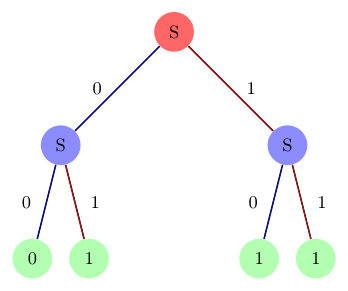 
FIG. 1: Decision tree representation of the OR logic gate. In this tree, the path taken through the nodes represents the decision-making process, where each path corresponds to evaluating the OR gate for a specific input combination. The paths correspond- ing to input 0 are shown in blue, while those for input 1 are shown in red.

📷 Fig 2

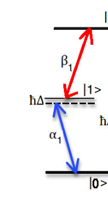 
FIG. 3: Four-level diamond-shaped, with coupling lasers. Blue pump laser, and red Stokes laser.

📷 Fig 3

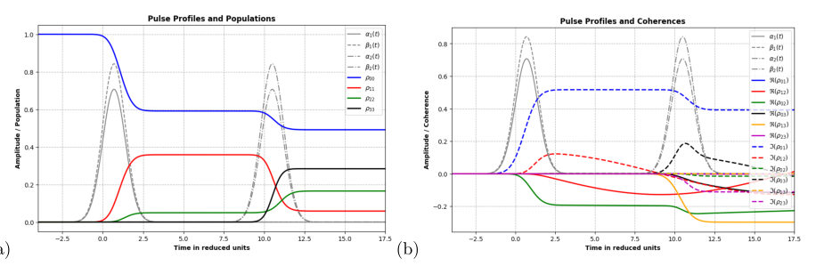 
FIG. 4: Plots of the (a) Time evolution of the pulse profiles and the populations of the four states in a four- level diamond-shaped quantum system. The pulses drive population transitions between connected states. The population initially resides in a state |0⟩, and as the pulses are applied, the population is cycled through the system, ultimately redistributing among the states. Time is presented in reduced units. (b) Time evolution of the pulse profiles and the real and imaginary parts of the coherences for a four-level diamond-shaped quantum system. The real (ℜ) and imaginary (ℑ) parts of the density matrix elements correspond to the coherences between the states, which evolve under the...

📷 Fig 4

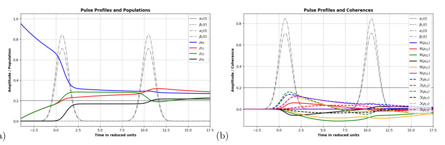 
FIG. 5: (a) Time evolution of pulse profiles and state populations in a four-level diamond-shaped quantum system with noise. The applied pulses induce population transfers between connected states. Initially, the population is in state |0⟩, and as the pulses interact with the system, the population cycles through the various states, eventually reaching a new equilibrium distribution. Time is expressed in reduced units. (b) Time evolution of pulse profiles and the real and imaginary components of coherences in the same system. The real (ℜ) and imaginary (ℑ) parts of the density matrix elements describe coherences between states, which evolve due to the pulses. Oscillations in the coherences...

📷 Fig 5

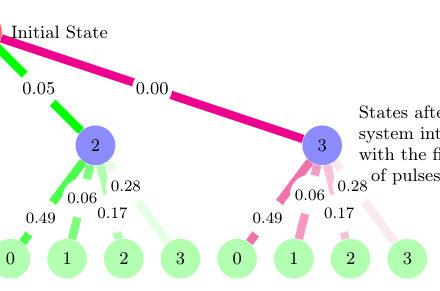 
FIG. 6: The proposed quantum tree with colored paths

**Summary.** This paper proposes a method to simulate quantum decision trees using a four-level atomic system driven by laser pulses. By controlling pulse amplitudes, the researchers can redistribute populations to mimic decision branches, offering a scalable approach for quantum-enhanced decision-making and optimization.

**Why it may be interesting.** It bridges quantum optics and quantum information by showing how specific atomic level configurations and pulse sequences can be engineered to perform algorithmic tasks like decision tree traversal, while also addressing the impact of environmental noise on quantum coherences.

Detailed structure

**Main problem.** Developing a framework to implement quantum decision trees using a laser-driven four-level atomic system to achieve computational advantages over classical decision-making.

**Main result.** The study demonstrates that controlled population redistribution in a diamond-shaped four-level system can effectively simulate the logic of a quantum decision tree, with potential scalability to N-level systems.

**Method.** The authors employ Lie-algebraic formalism (SU(4) group) and the Alhassid-Levine method to analyze system dynamics via a 15-dimensional vector representation of the density matrix.

**Model / system.** A four-level atomic system in a diamond-shaped configuration where states |0>, |1>, |2>, and |3> are coupled by pump lasers (alpha) and Stokes pulses (beta). The dynamics are governed by a time-dependent Hamiltonian under the Rotating Wave Approximation and a Liouville master equation.

**Key observables.** Population probabilities (diagonal elements of the density matrix) and coherences (off-diagonal elements).

**Important parameters / regimes.** Pulse amplitudes and temporal profiles (alpha_j(t), beta_j(t)), detunings, and decoherence rates (pure dephasing and population relaxation).

**Assumptions / limitations.** The system is initially in a pure ground state |0>; detunings are assumed to be equal; and the model considers the specific case of a diamond-shaped energy configuration.

**Figures summary.** Figure 1 shows an OR gate decision tree; Figure 2 presents a truth table; Figure 3 illustrates the diamond-shaped atomic coupling; Figure 4 shows time evolution of populations and coherences in an isolated system; Figure 5 shows the impact of dissipation; Figure 6 visualizes the proposed quantum tree.

**Paper structure.** The paper progresses from defining classical decision logic to proposing a quantum-mechanical emulation, establishing the SU(4) mathematical framework, analyzing the dynamics of isolated and dissipative systems, and discussing scalability and potential implementation in rare-earth-ion-doped crystals.

Abstract

In this study, we examine an innovative framework towards implementing quantum decision trees utilizing a laser-driven four-level system. We discuss a diamond-shaped atomic configuration, in which we apply Lie-algebraic formalisms to analyze the dynamics of the system. The system is perturbed by a Stokes pulse, represented as $β_j(t)$ (for $j=1,2$), which interacts with the atomic states $|0\rangle, |3\rangle$ and $|1\rangle, |2\rangle$. In addition, a pump laser, denoted as $α_j(t)$, couples the states $|0\rangle, |1\rangle$ and $|2\rangle, |3\rangle$. By employing pulse profiles that possess identical temporal behavior but differ in amplitude, one can effectively redistribute the population from the initial ground state to the other energy levels. This technique facilitates the mimicry of a quantum decision tree. We highlight that the proposed methodology is scalable to N-level systems, enhancing its adaptability and potential utility in quantum computing and various decision-making applications. We introduce a novel framework for implementing quantum decision trees using a four-level laser-driven atomic system. Employing a diamond-shaped energy configuration, we analyze system dynamics through Lie-algebraic methods. Using pulse profiles with identical temporal structures but varying amplitudes, we achieve controlled population redistribution among energy levels, effectively simulating a quantum decision tree. This methodology is scalable to systems of \(N\) levels, offering potential applications in quantum computing and decision-making processes.

[↑ back to top](#top)

### [Universalities of Defects in Quantum Field Theories](http://arxiv.org/abs/2605.21755v1)

**Authors:** Siwei Zhong  
**Type:** theory · **Category:** quantum gases · **PDF:** <https://arxiv.org/pdf/2605.21755v1>  
**Analysis basis:** full PDF text, analyzed in chunks
**Topic relevance:** `Keldysh / 2PI / non-Gaussian methods` **2/5** · `Kondo & dissipative impurity` **2/5** · `analog quantum simulation` **2/5** · `non-equilibrium universality` **2/5** · `entanglement & information structure` **1/5** · `non-equilibrium dynamics` **1/5**

📷 Fig 1

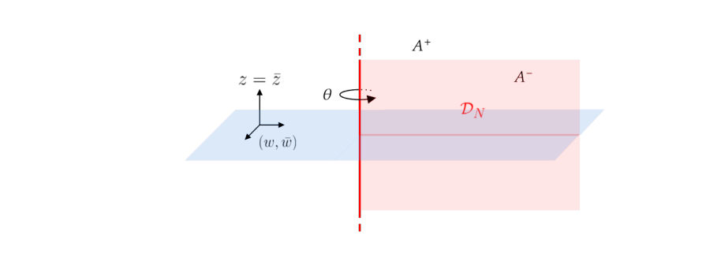 
Figure 2.1: The configuration of the conformal twist defect and the topological duality defect in R4. The vertical red line is the 2-dimensional twist defect, which is localized at w = ¯w = 0 and extends along the (z, ¯z) plane. The twist defect is attached to the 2- dimensional topological defect DN shown as the half-infinite red plane. This figure only displays the R3 slice defined by z = ¯z.

📷 Fig 2

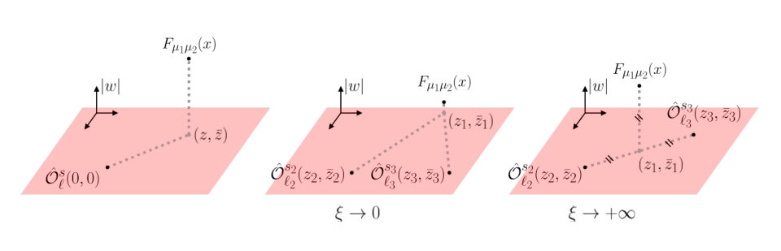 
Figure 2.2: DCFT two-point and three-point functions. The red plane represents the twist defect at w = ¯w = 0. Left: the bulk-defect two-point function ⟨F ˆOs ℓ⟩. Middle: the bulk- defect-defect three-point function ⟨F ˆOs2 ℓ2 ˆOs3 ℓ3⟩in the limit ξ →0, where the bulk point x approaches the defect. Right: the three-point function ⟨F ˆOs2 ℓ2 ˆOs3 ℓ3⟩in the limit ξ →+∞, where the projection of the bulk point onto the defect plane coincides with the midpoint between (z2, ¯z2) and (z3, ¯z3).

📷 Fig 3

 
Figure 2.2. It follows from the monodromy condition (2.37) that ⟨F ˆOs2 ℓ2 ˆOs3 ℓ3⟩= 0 unless s = s2 +s3 ∈ Z ± 1

📷 Fig 4

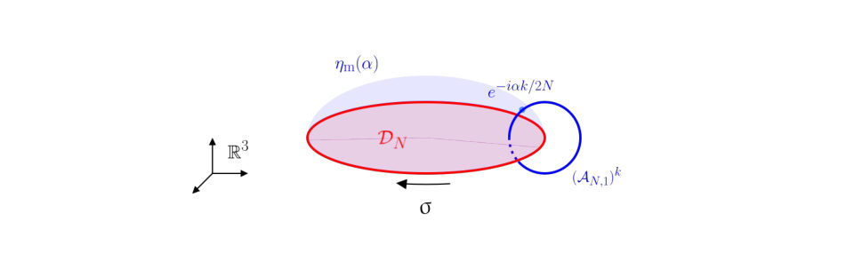 
Figure 2.3: The configuration of the anyonic brane (AN)k and the twist defect. The red circle denotes the twist defect defined on a Lorentzian cylinder. The red disk denotes the topological duality defect DN. The anyonic brane is shown as a blue circle, which links with the twist defect. The magnetic 1-form symmetry operator ηm(α) is shown as the blue surface. This figure only shows the spatial R3, and every defect except for ηm(α) extends in the time direction.

📷 Fig 5

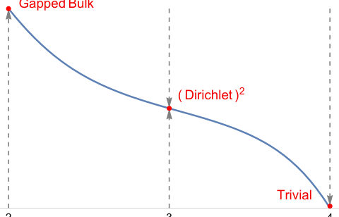 
Figure 2.4: IR-stable fixed points associated with bilinear defect deformations in the free theory. The blue curve shows how the fixed point depends on the spacetime dimension d, while the grey dashed arrow indicates the defect RG flow from the UV to the IR. Fixed points with physical interpretations in integer dimensions are marked in red.

**Summary.** This work explores how the long-distance behavior of defects in quantum field theories is governed by universal symmetry principles. It establishes effective field theory descriptions for complex objects like chiral defects and giant vortices in superfluids. The results show that microscopic details are often irrelevant to the macroscopic dynamics of these systems.

**Why it may be interesting.** It provides a deep connection between high-energy symmetry principles (like CFT and duality) and the emergent universal dynamics in many-body systems like ultracold atomic gases and superfluids.

Detailed structure

**Main problem.** Investigating the universal aspects of defect dynamics in quantum field theories, specifically focusing on how symmetry principles determine the infrared properties of boundaries, impurities, and vortices.

**Main result.** Demonstrates that defect dynamics (such as chiral defects in Maxwell theory and giant vortices in superfluids) are universally determined by symmetry, identifying new effective theories like Warped Conformal Field Theory (WCFT) for rotating superfluids.

**Method.** Uses symmetry-based analysis, Renormalization Group (RG) flows, Operator Product Expansion (OPE), and effective field theory approaches including the epsilon expansion.

**Model / system.** The work covers a variety of models including Maxwell theory with topological duality defects, O(N) models, and non-relativistic systems like atomic quantum gases and rotating 2D superfluids.

**Key observables.** Scaling dimensions, conformal weights, bulk-to-defect OPE coefficients, displacement and tilt operators, and particle density profiles.

**Important parameters / regimes.** UV and IR limits, codimension, conformal weights, angular velocity, and the large angular momentum limit (giant vortex regime).

**Assumptions / limitations.** Assumes translation symmetry perpendicular to the defect is broken and that scaling invariance is enhanced to conformal symmetry at fixed points.

**Figures summary.** Visuals include configurations of various defects, RG and phase diagrams, correlation functions, and physical profiles of particle density and eigenmodes.

**Paper structure.** The dissertation progresses from a general framework of defect dynamics in QFT to specific applications in Maxwell theory, O(N) models, and finally to non-relativistic systems like quantum gases and rotating superfluids.

Abstract

Defects are both physically rich objects and powerful tools in modern quantum field theory. They are extended operators, such as boundaries, impurities, and probe particles, embedded in many-body systems. In this dissertation, we study the universal aspects of defect dynamics from the perspective of symmetry principles. We bring together several themes, including defect renormalization group flows, effective string theory, and impurities in atomic quantum gases.

[↑ back to top](#top)

### [Emulation of Optically Interconnected Quantum Data Centers Topologies for Cost-Fidelity Benchmarking](http://arxiv.org/abs/2605.22267v1)

**Authors:** Seyed Navid Elyasi, Seyed Morteza Ahmadian, Rui Lin, Paolo Monti  
**Type:** both · **Category:** quantum information and computing · **PDF:** <https://arxiv.org/pdf/2605.22267v1>  
**Analysis basis:** full PDF text, analyzed in chunks
**Topic relevance:** `correlated / nonlocal dissipation` **2/5** · `entanglement & information structure` **2/5** · `methods for driven-dissipative` **2/5**

📷 Fig 1

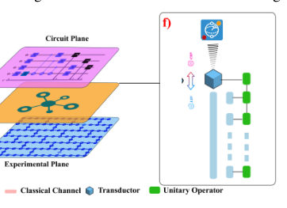 
Fig. 1. (a)–(c) Ring, line, and star QDC topologies. (d) Entanglement distribution via SWAP oper- ations. (e) Simulation layers: circuit, configuration, and experimental layers. (f) Collisional noise model for transduction and fiber effects.

📷 Fig 2

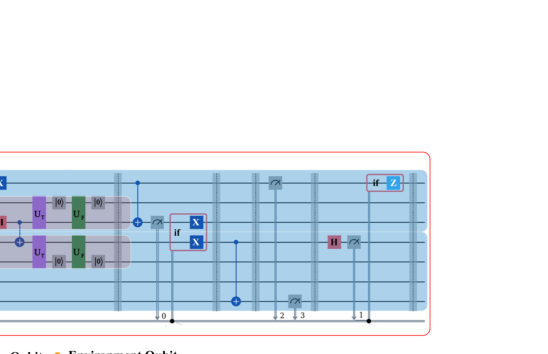 
Fig. 2. (a) GHZ-state circuit connecting processing qubits for QDC evaluation. (b) Cat-comm pro- tocol implementing the remote CNOT gate with noisy entanglement generation.

📷 Fig 3

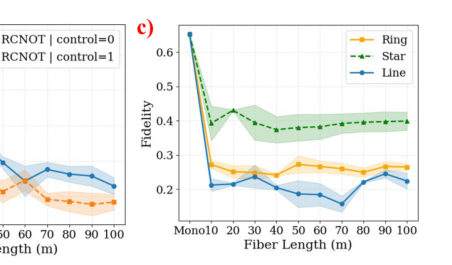 
Fig. 3. (a) Communication cost for GHZ-state execution across QDC topologies. (b) RCNOT fi- delity results based on the noise model. (c) Fidelity results for the GHZ circuit.

**Summary.** This paper uses a digital quantum computer to simulate different network architectures for quantum data centers. It finds that a star topology is the most efficient for balancing hardware cost with high-fidelity entanglement distribution. The study specifically highlights that transduction noise is the most significant hurdle for large-scale quantum interconnects.

**Why it may be interesting.** This work is highly relevant to researchers in open quantum systems and quantum optics as it quantifies how environmental coupling and photon loss impact the scalability of distributed quantum networks.

Detailed structure

**Main problem.** Evaluating the trade-off between interconnection cost and fidelity in different Quantum Data Center (QDC) topologies, specifically addressing how transduction and fiber noise impact distributed quantum computing.

**Main result.** The star topology provides the optimal trade-off between cost and fidelity, outperforming ring and line topologies by minimizing noise accumulation and SWAP operations. Transduction noise was identified as the primary driver of fidelity degradation.

**Method.** The study uses a digital quantum computer (IBM Quantum Torino) to emulate optically interconnected QPUs using a three-layer simulation framework (circuit, configuration, and experimental layers) and a collisional model for noise.

**Model / system.** The system consists of interconnected QPUs in ring, star, and line topologies, each containing processing, communication, and flying qubits. The noise is modeled via a collisional model with an interaction Hamiltonian between communication qubits and an environment qubit to simulate transduction and fiber loss.

**Key observables.** GHZ-state fidelity, RCNOT gate performance, and communication cost (number of entanglement links).

**Important parameters / regimes.** Transduction coupling strength (kappa = 0.5), fiber attenuation constant (0.0392 km^-1), and topology-specific link counts.

**Assumptions / limitations.** The noise is modeled using a Markovian evolution approach where the environment qubit is reset after each iteration.

**Figures summary.** Fig. 1 illustrates the QDC topologies, the simulation framework, and the collisional noise model; Fig. 2 details the GHZ-state circuit and the cat-comm protocol for RCNOT.

**Paper structure.** The paper introduces the QDC scalability problem, describes the physical model and noise implementation, details the emulation framework on IBM hardware, presents the comparative results of different topologies, and concludes with a cost-fidelity analysis.

Abstract

We emulate optically interconnected quantum processors in ring, star, and line topologies using a quantum computer. GHZ benchmarks show that the star provides the best trade-off between cost and fidelity under transduction and fiber noise.

[↑ back to top](#top)

### [How many systems can be dephased before the quantum switch becomes causally definite?](http://arxiv.org/abs/2605.22807v1)

**Authors:** Yassine Benhaj, Kuntal Sengupta, Cyril Branciard  
**Type:** theory · **Category:** quantum information and computing · **PDF:** <https://arxiv.org/pdf/2605.22807v1>  
**Analysis basis:** full PDF text, analyzed in chunks
**Topic relevance:** `correlated / nonlocal dissipation` **2/5** · `entanglement & information structure` **2/5** · `methods for driven-dissipative` **2/5**

📷 Fig 1

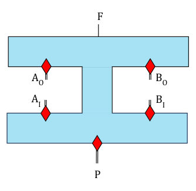 
FIG. 1. Any bipartite process matrix in which the global past P and both parties’ input and output systems are fully dephased becomes causally separable, even if the global future F is left coherent. The red diamonds illus- trate dephasing in a fixed basis, which makes their incom- ing and outgoing systems effectively classical (double- stroke wires).

📷 Fig 2

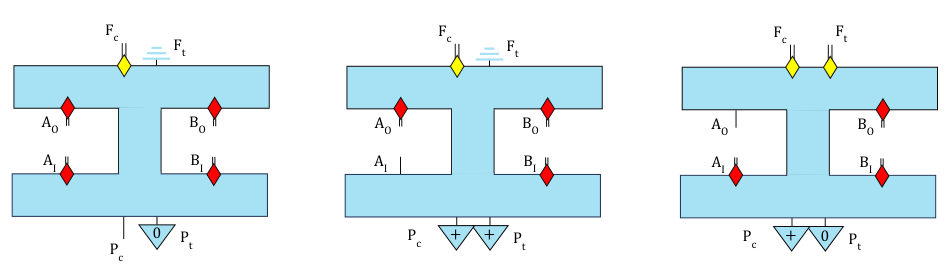 
FIG. 2. Three explicit constructions derived from a standard quantum switch showing that causal indefiniteness can survive when all but one systems are fully dephased – as long as the single remaining coherent system is not F. (Left) Only the past control system remains coherent: the past is decomposed as P = Pc ⊗Pt, with the target state fixed to |0⟩Pt while the control Pc remains open; both internal parties’ input and output systems are dephased in the computational (Z) basis (red diamonds), the future target Ft is traced out, and the future control Fc is dephased in the X basis (yellow diamond). (Middle) Only one party’s input system AI remains coherent: the past state is fixed to |+,...

**Summary.** This paper explores the limits of how much decoherence a quantum process with indefinite causal order can tolerate. It proves that as long as at least one system other than the 'future' system remains coherent, the process can maintain its non-classical, causally nonseparable nature. This demonstrates that indefinite causal order is surprisingly robust to the dephasing of multiple subsystems.

**Why it may be interesting.** This is highly relevant to researchers in open quantum systems and quantum information as it defines the fundamental limits of how much environmental noise (decoherence) a quantum-controlled causal structure can withstand before losing its non-classical advantages.

Detailed structure

**Main problem.** The paper investigates the robustness of causal nonseparability (indefinite causal order) against dephasing/decoherence, specifically determining how many quantum systems can be dephased before a process becomes causally separable.

**Main result.** The authors show that causal nonseparability persists if any single system other than the future system remains undephased, but vanishes if all systems are dephased or if only the future system remains coherent.

**Method.** The study uses the process matrix framework and Choi representation to analyze bipartite and multipartite processes, employing dephasing maps and semidefinite programming to test for causal nonseparability.

**Model / system.** The primary model is the Quantum Switch, a paradigmatic process with indefinite causal order, analyzed within the framework of bipartite and N-partite quantum circuits with quantum control (QC-QCs).

**Key observables.** Causal nonseparability vs. causal separability, and the presence or absence of quantum coherence in specific input/output slots.

**Important parameters / regimes.** Dephasing regimes (computational vs. diagonal bases) and the specific subsystems (past, future, input, and output) being subjected to decoherence.

**Assumptions / limitations.** The proofs rely on the assumption that specific subsystems are dephased in predefined bases and focus on the class of quantum circuits with quantum control.

**Figures summary.** Figure 1 illustrates the transition to causal separability when all systems or only the future system are coherent; Figure 2 shows explicit constructions where nonseparability persists despite high levels of dephasing.

**Paper structure.** The paper introduces the problem of causal nonseparability robustness, provides a mathematical proof for the bipartite case involving global past and future, generalizes these findings to N-partite quantum circuits via induction, and concludes with explicit examples of partially dephased processes that retain indefinite causal order.

Abstract

Quantum processes with indefinite causal order -- so-called causally nonseparable processes -- can exhibit various advantages over quantum circuits with a fixed or a well-defined causal structure. A natural question is how much nonclassicality is required for a process to display causal nonseparability. Here we address this by investigating how many systems can be dephased (or decohered) before this property vanishes. First, for bipartite processes with open past and future we show that if all systems are dephased, or if only the future system is kept undephased, then the process becomes causally separable. However, if any single system other than the future system remains undephased, then there exist processes that retain causal nonseparability. Next, we demonstrate a similar behaviour in the multipartite case, when restricted to the physically motivated class of quantum circuits with quantum control (QC-QCs). Namely, dephasing all systems or keeping only the future system undephased renders any QC-QC causally separable; while causal nonseparability can persist if any non-future system is left undephased.

[↑ back to top](#top)

### [Possible Topological Decoherence Transition in Relativistic Electron Beams Propagating through Coulomb-Disordered Media](http://arxiv.org/abs/2605.22316v1)

**Authors:** Yury A. Budkov  
**Type:** theory · **Category:** disordered systems and neural networks · **PDF:** <https://arxiv.org/pdf/2605.22316v1>  
**Analysis basis:** full PDF text, analyzed in chunks
**Topic relevance:** `Keldysh / 2PI / non-Gaussian methods` **2/5** · `driven-dissipative phase transition` **2/5** · `non-equilibrium universality` **2/5**

📷 Fig 1

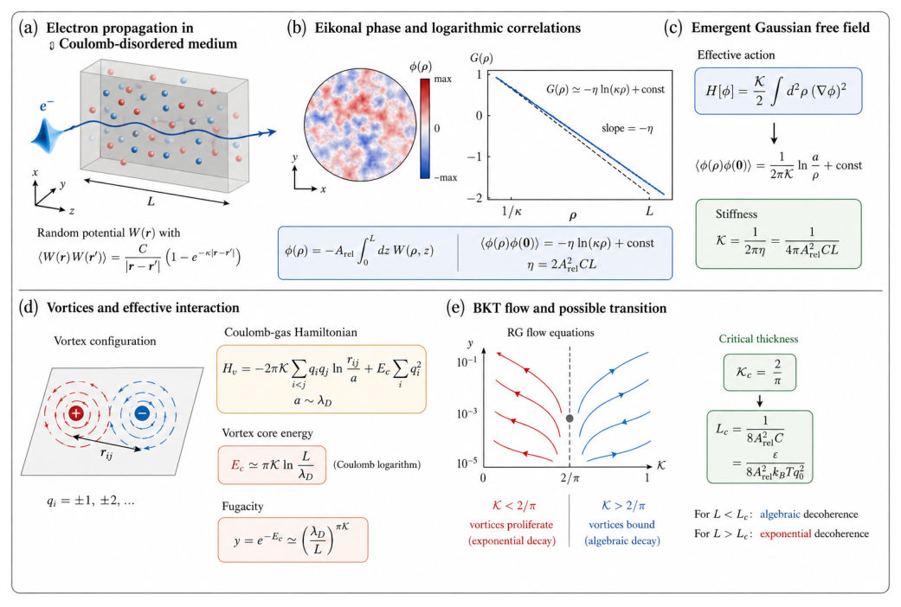 
FIG. 1. Schematic illustration of the emergence of an effective two-dimensional field theory for electron decoherence in a Coulomb-disordered medium and the possible Berezinskii–Kosterlitz–Thouless (BKT) scenario. (a) Relativistic electron propagation through a fluctuating Coulomb environment characterized by the screened correlation function K(r) = C

**Summary.** This paper proposes that electron beams passing through disordered media undergo a topological transition similar to the BKT transition. As the sample thickness increases, the system moves from algebraic to exponential decoherence due to the proliferation of phase vortices. This effect is potentially observable in liquid-cell or cryo-electron microscopy.

**Why it may be interesting.** It demonstrates how a 3D disordered medium can give rise to an emergent 2D topological phase transition (BKT) in the coherence properties of a probe beam, bridging disordered systems and topological physics.

Detailed structure

**Main problem.** Investigating the asymptotic behavior of mutual coherence in relativistic electron beams passing through Coulomb-disordered media and determining if a BKT-type topological phase transition occurs as a function of sample thickness.

**Main result.** The study identifies a critical sample thickness Lc that separates a regime of algebraic decoherence from one of exponential decoherence driven by the proliferation of free vortices.

**Method.** The author uses the eikonal approximation and a paraxial reduction of the Dirac equation, followed by a renormalization-group analysis of a 2D Coulomb gas model.

**Model / system.** A relativistic electron beam propagating through a 3D classical one-component plasma (Coulomb-disordered medium) such as aqueous electrolytes or cryogenic samples, modeled via a 2D Gaussian free-field action.

**Key observables.** Mutual coherence function gamma(rho) and phase structure function Dphi(rho).

**Important parameters / regimes.** Critical thickness Lc, effective stiffness K, propagation length L, and the Debye screening length lambda_D.

**Assumptions / limitations.** The phase is assumed to be compact (phi = phi + 2pi) to allow for vortices, and the potential is treated as a static Gaussian random potential.

**Figures summary.** Figure 1 shows a schematic of electron propagation through a fluctuating environment, the resulting logarithmic phase correlation, the mapping to a 2D Gaussian free field, and the introduction of vortex configurations.

**Paper structure.** The paper introduces the physical problem of electron beam decoherence, derives an effective 2D field theory from the eikonal approximation, applies renormalization-group analysis to a vortex gas model, and concludes with experimental implications for TEM.

Abstract

We show that the mutual coherence of a relativistic electron beam in a Coulomb-disordered medium is governed by an effective two-dimensional compact phase field with a logarithmic correlation function. The corresponding Gaussian free-field action exhibits a stiffness inversely proportional to the propagation length. When the compact nature of the phase is taken into account, the system supports vortex excitations that interact as a two-dimensional Coulomb gas. Renormalization-group analysis of this gas indicates the existence of a critical sample thickness $L_c$ at which a Berezinskii--Kosterlitz--Thouless (BKT) transition may occur, separating a regime of algebraic decoherence from one where free vortices proliferate and coherence is destroyed exponentially. The critical thickness is expressed through fundamental microscopic parameters and could be observed in transmission electron microscopy of liquid cells or cryogenic samples.

[↑ back to top](#top)

### [Thermodynamic Irreversibility of Training Algorithms](http://arxiv.org/abs/2605.21933v1)

**Authors:** Liu Ziyin, Yuanjie Ren, Adam Levine, Isaac Chuang  
**Type:** both · **Category:** disordered systems and neural networks · **PDF:** <https://arxiv.org/pdf/2605.21933v1>  
**Analysis basis:** full PDF text, analyzed in chunks
**Topic relevance:** `Keldysh / 2PI / non-Gaussian methods` **2/5** · `non-equilibrium dynamics` **2/5** · `non-equilibrium universality` **2/5**

📷 Fig 1

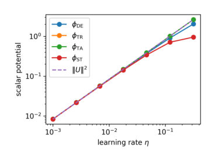 
FIG. 1. All four potentials agree with each other at a small learning rate. As the learning rates increase, they start to deviate, but still have the qualitative agreement that a higher learning rate corresponds to a higher potential, signaling that they are all qualitatively good metrics of irreversibility of the training process.

📷 Fig 2

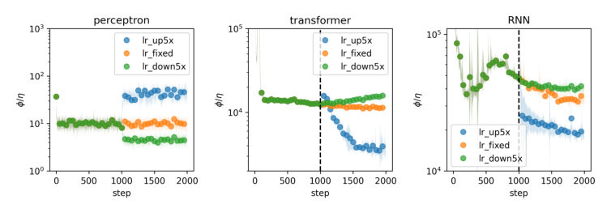 
FIG. 2. Anomalous fluctuation effect in transformer training dynamics. There is a qualitative distinction between the effect of changing the learning rate in a simple linear model (perceptron) and in nonlinear models such as transformers. In linear models, the classical optimization theory predicts an increase in the fluctuation of the gradient due to increased instability [22] – because there is a single local minimum, and so it is impossible for the model to move to a different, low-fluctuation model. In sharp contrast, the nonlinear-model experiments reported here show lower update fluctuation at larger learning rate, in agreement with the prediction of the irreversibility theory.

**Summary.** This paper establishes that different ways of measuring the irreversibility of AI training algorithms are mathematically equivalent at small learning rates. It demonstrates that the error introduced by discrete training steps creates an emergent force that pushes models toward more stable and robust regions of the loss landscape.

**Why it may be interesting.** The paper provides a rigorous mapping between the discrete-time optimization of neural networks and non-equilibrium stochastic thermodynamics, offering a way to treat learning dynamics as a driven particle system with emergent potentials.

Detailed structure

**Main problem.** The paper aims to characterize the thermodynamic irreversibility of deep learning training algorithms and understand how discretization errors act as an emergent force in the optimization landscape.

**Main result.** The authors prove that four different measures of irreversibility (discretization error, time-renormalization, time-reversal asymmetry, and entropy production) are equivalent to leading order in the learning rate. They also show that this irreversibility generates an emergent force that drives training toward stable, low-fluctuation regions.

**Method.** The work uses backward error analysis, renormalization group (RG) approaches to time-axis coarse-graining, and stochastic thermodynamics. Numerical validation is performed using Transformers, RNNs, and linear perceptrons.

**Model / system.** The system is modeled as a discrete-time stochastic Langevin process for neural network parameters, where the update rule is defined by a vector field (e.g., SGD or Adam) with a learning rate eta.

**Key observables.** Discretization error potential (phi_DE), time-reversal asymmetry (phi_TA), stochastic-thermodynamic entropy production (phi_ST), and update energy (eU_s).

**Important parameters / regimes.** Learning rate (eta), noise scale (sigma), and the Jacobian of the update field (J_U).

**Assumptions / limitations.** The update field is assumed to be smooth (C2 or C3) and possess a symmetric Jacobian (J_U = J_U^T). The analysis focuses on the small learning rate limit.

**Figures summary.** Figure 1 shows the qualitative and quantitative agreement between the four irreversibility potentials at small learning rates. Figure 2 illustrates 'anomalous fluctuations' in Transformers, where larger learning rates lead to lower update fluctuations.

**Paper structure.** The paper establishes a theoretical framework for irreversibility, proves the equivalence of four different metrics using backward error analysis and RG, analyzes the symmetry-breaking properties of the resulting emergent force, and provides numerical experiments on various neural architectures to validate the theory.

Abstract

The training algorithms for AI systems all introduce far-from-equilibrium dynamical processes, and understanding the irreversibility of these algorithms is a fundamental step towards understanding the learning dynamics of modern AI systems. In this work, we establish a general framework for defining and analyzing the irreversibility of training algorithms. We show that four different ways to characterize the irreversibility of dynamical processes are equivalent to leading order in the step size $η$: numerical backward error $φ_{\rm DE}$, time-renormalized correction $φ_{\rm TR}$, microscopic time reversal asymmetry $φ_{\rm TA}$, and the (regularized) stochastic-thermodynamic entropy production $φ_{\rm ST}$. The irreversibility gives rise to a time-reversal-symmetry-breaking emergent force that generically breaks non-isometric continuous reparametrization symmetries, preserves orthogonal symmetries, and leads to a universal preference for those learning trajectories that minimize the entropy production rate.

[↑ back to top](#top)

### [Balancing Quasi-Bragg Regime and Velocity Selectivity in Quantum-Enhanced Atom Interferometry](http://arxiv.org/abs/2605.21643v1)

**Authors:** Christian Miguel Karres, Daniel Derr, Enno Giese  
**Type:** theory · **Category:** other · **PDF:** <https://arxiv.org/pdf/2605.21643v1>  
**Analysis basis:** full PDF text, analyzed in chunks
**Topic relevance:** `Keldysh / 2PI / non-Gaussian methods` **2/5** · `quantum measurements` **2/5** · `entanglement & information structure` **1/5**

📷 Fig 1

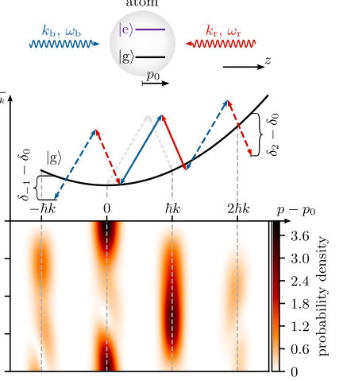 
Figure 1. First-order Bragg diffraction. (a) Schematic setup for Bragg diffraction. Counterpropagating lasers with wave numbers and frequencies 𝑘b,r and 𝜔b,r interrogate a two-level atom with internal energies ℏ𝜔g and ℏ𝜔e. (b) Kinetic energy of ground-state atoms dependent on the off-resonant momentum 𝑝−𝑝0. Arrows show two- photon processes induced by the counterpropagating lasers imparting momentum ℏ𝑘= ℏ𝑘b + ℏ𝑘r to the atom. The solid arrows depict a Doppler-detuned transition between the main momentum classes 𝑛= 0, 1. The resonant coupling is shown in dashed gray, and the colored dashed arrows display the coupling to adjacent classes 𝑛= −1, 2, which are detuned by 𝛿−1,2 −𝛿𝑛for atoms...

📷 Fig 2

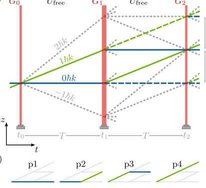 
Figure 2. (a) Space-time diagram of a Mach–Zehnder atom interfer- ometer driven by first-order Bragg diffraction in absence of external potentials. Beam-splitter 𝐺0,2 and mirror pulses 𝐺1 of duration 𝑡𝑗 create the main interferometer (solid lines). Between the laser pulses, the atoms propagate freely (𝑈free) for an interrogation time 𝑇. The interferometer is driven between the momentum classes 𝑛= 0 (blue) and 𝑛= 1 (green), where the colored dashed paths are introduced by the velocity-selective mirrors, creating additional exits displaced w. r. t. the main exit by 𝛿𝑧= ℏ𝑘𝑇/𝑚with atomic mass 𝑚. We assume the atomic clouds to be sufficiently localized such that the main exit is contained in Σ =...

📷 Fig 3

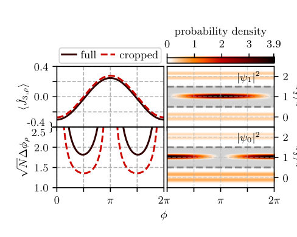 
Figure 3. (top left panel) Interference signals ⟨ˆ𝐽3,𝜌⟩obtained from scanning the interferometer phase 𝜙including (𝜌= H, full) and without (𝜌= Σ, cropped) the quasi-incoherent background signal for 𝑁= 1. The atom has initially a Gaussian momentum distribution, with standard deviation 𝜎𝑞= 0.05ℏ𝑘, centered at resonant momentum 𝑝0. The Rabi frequency is set to Ω0 = 0.1𝜔𝑘and the interrogation time to 𝑇= 103/Ω0. The cropped signal is slightly more centered around zero than the full signal, implying a decreased phase uncertainty (bottom left panel). (right) Spatial distribution of an atom directly after the MZI sequence in the momentum class 𝑛= 1 (top panel, |𝜓1|2) and 𝑛= 0 (bottom panel, |𝜓0|2)....

📷 Fig 4

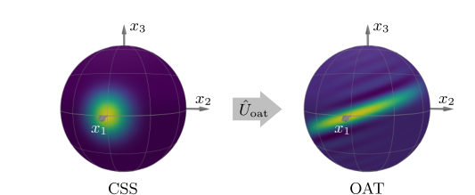 
Figure 4. (left) Angular-momentum Wigner distribution [72] of the CSS | 𝜋

📷 Fig 5

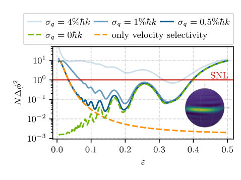 
Figure 5. MZI phase uncertainty 𝑁Δ𝜙2 normalized to SNL (red) and susceptible to velocity selectivity and parasitic diffraction to the adjacent momentum classes in dependence on the coupling strength 𝜀= Ω0/𝜔𝑘. The sphere shows the input equator-OAT state |𝜒−𝛼0⟩ for 30 atoms. The uncertainty is shown for numerically optimized twisting for optimal performance in an ideal MZI 𝜒0 ≈1.61 × 10−3, and 𝑁= 2 × 104 atoms that initially have a Gaussian momentum distribution of width 𝜎𝑞that is centered at the respective momentum class’ center. The uncertainty was calculated by determining the interferometric contributions from Tab. II up to the second order in 𝜀. Dashed lines show two special cases: (i)...

**Summary.** This paper investigates how the competing effects of parasitic diffraction and velocity selectivity limit the precision of atom interferometers. It shows that by balancing pulse duration and optimizing the orientation of entangled states, one can maintain sub-shot-noise sensitivity despite these loss mechanisms.

**Why it may be interesting.** It provides a rigorous analytical framework for understanding how fundamental atom-optics imperfections limit quantum-enhanced metrology, offering specific strategies like 'signal cropping' and state optimization to recover sensitivity.

Detailed structure

**Main problem.** The paper addresses the degradation of phase sensitivity in atom interferometry caused by the trade-off between parasitic diffraction in the quasi-Bragg regime and velocity selectivity in long-pulse regimes.

**Main result.** The authors demonstrate that sub-shot-noise sensitivity is achievable in an intermediate pulse duration regime and that the deleterious effects of higher-order diffraction can be mitigated by optimizing the input quantum state (e.g., OAT state inclination).

**Method.** A second-quantized perturbative approach using a Dyson series expansion and adiabatic elimination is used to derive the time evolution of momentum-class field operators.

**Model / system.** A Mach-Zehnder interferometer (MZI) using a two-level atomic ensemble subject to first-order Bragg diffraction with counterpropagating lasers, modeled via a multi-mode bosonic Hamiltonian.

**Key observables.** Interference signal (atom-number difference), phase uncertainty, atom loss, and transmission/reflection coefficients.

**Important parameters / regimes.** Rabi frequency (coupling strength epsilon), pulse duration, Doppler detuning, twisting strength (chi), and momentum distribution width.

**Assumptions / limitations.** The lasers are far-detuned from the atomic transition (allowing adiabatic elimination), the excited state is only virtually populated, and atom-atom interactions are negligible.

**Figures summary.** Fig 1 shows the experimental setup and energy-momentum diagrams for Bragg diffraction; Fig 2 shows the MZI space-time diagram; Fig 3 compares full vs. cropped signals and spatial distributions; Fig 4 shows Wigner distributions for CSS and OAT states; Fig 8 and 9 show phase uncertainty comparisons and optimization results.

**Paper structure.** The paper introduces the Bragg diffraction trade-off, develops a second-quantized perturbative framework for the MZI, analyzes the impact of velocity selectivity and parasitic loss, evaluates quantum-enhanced states (CSS and OAT), and concludes with optimization strategies for pulse shape and state preparation.

Abstract

Spin squeezing in atomic ensembles enables atom interferometry with sensitivities below the shot-noise limit, but the associated entanglement is highly susceptible to loss, making imperfections in atom optics a central limitation. Bragg diffraction is an established technique for driving transitions between atomic momentum states and enables large-momentum transfer through higher-order diffraction while preserving the internal state. However, it is intrinsically limited by two competing mechanisms: short light pulses induce parasitic diffraction into off-resonant orders beyond an effective two-level description, while long pulses face velocity selectivity. We derive analytical expressions in a second-quantized framework for the atom optics and phase uncertainty of a Mach-Zehnder interferometer including these effects. We demonstrate that sub-shot-noise scaling is achieved only in a regime of intermediate pulse duration. Furthermore, we show that deleterious effects of higher-order diffraction are partially mitigated by optimizing the input quantum state.

[↑ back to top](#top)

### [Three sins against physics by an exaggerated quantum information perspective](http://arxiv.org/abs/2605.22218v1)

**Authors:** Valerio Scarani  
**Type:** theory · **Category:** quantum information and computing · **PDF:** <https://arxiv.org/pdf/2605.22218v1>  
**Analysis basis:** full PDF text, analyzed in chunks
**Topic relevance:** `entanglement & information structure` **2/5** · `quantum measurements` **2/5** · `interference shaping light` **1/5**

📷 Fig 1

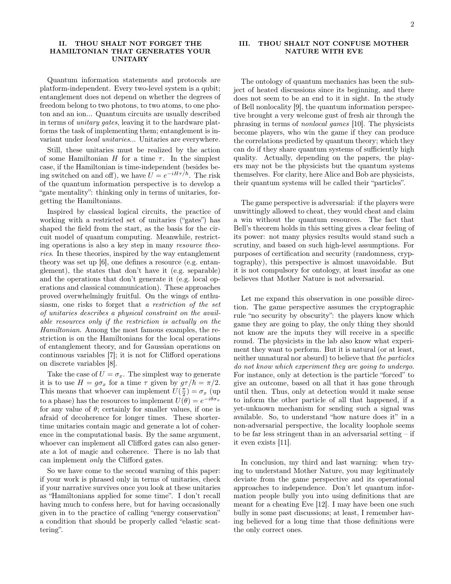 
Low-resolution page preview, page 2

📷 Fig 2

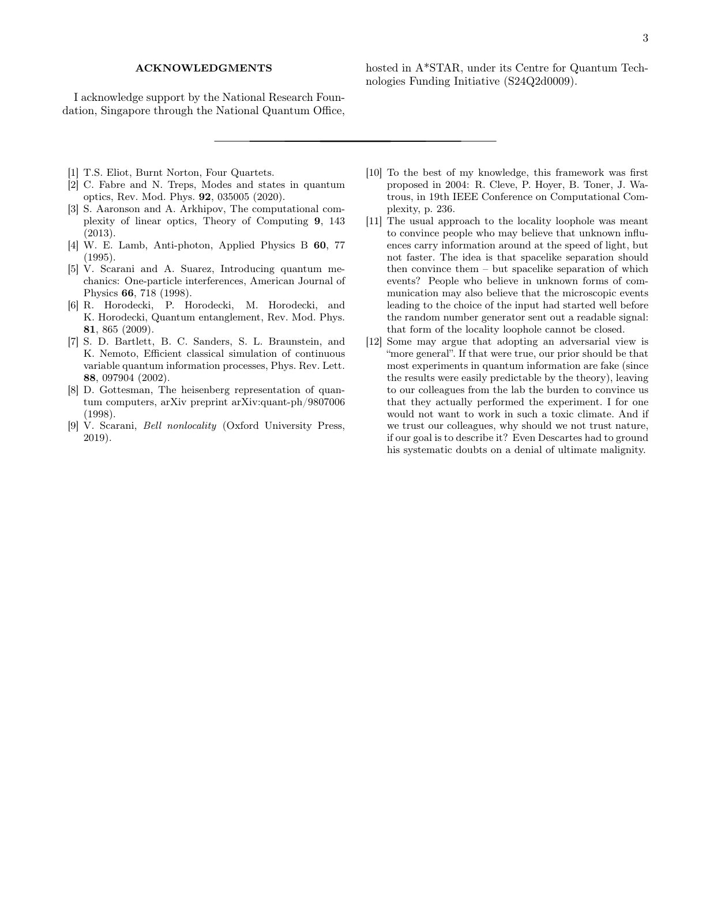 
Low-resolution page preview, page 3

**Summary.** This paper critiques the 'quantum information perspective' for potentially distorting our understanding of physics. It argues that focusing too heavily on gates, ignoring Hamiltonians, and treating nature as an adversary can lead to incorrect physical conclusions. The work serves as a foundational reminder to ground quantum information theory in underlying physical reality.

**Why it may be interesting.** It provides a critical perspective on the foundational assumptions used in quantum optics and quantum information, specifically regarding the physical reality of quantum resources versus classical wave phenomena.

Detailed structure

**Main problem.** The author addresses how an over-reliance on the quantum information perspective can lead to physical distortions, specifically by over-abstracting reality through gates, ignoring Hamiltonians, and adopting an adversarial view of nature.

**Main result.** The paper identifies three 'sins': confusing classical mode coherence with quantum state coherence, focusing on unitary gates while ignoring their underlying Hamiltonians, and treating physical discovery as an adversarial game.

**Method.** The author uses conceptual and philosophical analysis of quantum information frameworks, such as resource theories, nonlocal games, and quantum circuits, contrasted with fundamental principles of optics and quantum mechanics.

**Model / system.** The discussion covers optical systems (linear and non-linear interferometry, Maxwell's equations), quantum information models (qubits, Clifford gates, Fock space), and the relationship between unitary evolutions and Hamiltonians.

**Key observables.** First-order coherence (g1), second-order coherence (g2), photon counting statistics, and Bell nonlocality.

**Important parameters / regimes.** Single-photon regime (energy thresholds), Clifford operations, and the distinction between adversarial and non-adversarial settings.

**Assumptions / limitations.** The author critiques the assumption that an adversarial 'game' framework is the most appropriate way to understand the ontology of quantum mechanics.

**Paper structure.** The paper is structured around three main arguments (the 'sins'), followed by a concluding reflection on the philosophical implications of the adversarial view in experimental physics.

Abstract

I point out three ways in which the perspective of quantum information may lead to distorted claims about physics: forgetting that light does not need to be quantised to show coherence; ignoring the generators of unitary evolutions; and approaching the discovery of nature as a fight against an adversary.

[↑ back to top](#top)

### [Device-Independent Quantum Secret Sharing Protocol Enhanced by Advantage Distillation](http://arxiv.org/abs/2605.21880v1)

**Authors:** Yong-Hui Yang, Jian-Hong Shi, Hong-Wei Li, Hai-Long Zhang, Yun-Teng Yang, Yu-Bing Zhu, Yan-Yang Zhou  
**Type:** theory · **Category:** quantum information and computing · **PDF:** <https://arxiv.org/pdf/2605.21880v1>  
**Analysis basis:** full PDF text, analyzed in chunks
**Topic relevance:** `entanglement & information structure` **2/5** · `quantum measurements` **2/5**

📷 Fig 1

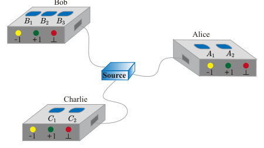 
FIG. 1. Schematic of the DI-QSS protocol. A central source prepares a large number of identical three-photon polarization-entangled GHZ states, which are then divided into three sequences, denoted as E1, E2 and E3. The photons in these three sequences are distributed to three remote users, Alice, Bob and Charlie, respectively. Each user independently chooses a measurement basis and obtains a measurement outcome of -1, +1 or no-click event (⊥).

📷 Fig 2

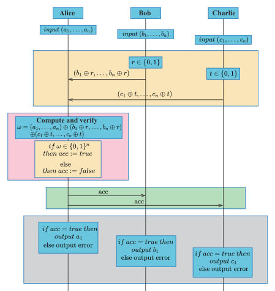 
FIG. 2. Flowchart of the tripartite advantage distillation pro- cedure. This figure illustrates the post-processing procedure of the advantage distillation technique in a tripartite DI-QSS protocol.

📷 Fig 3

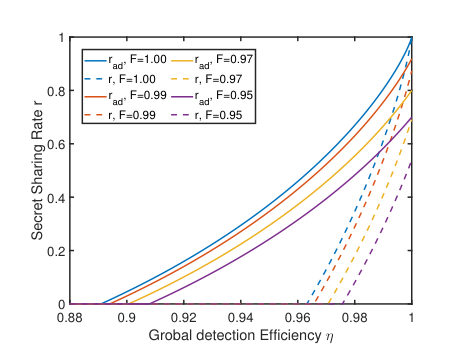 
FIG. 3. Comparison of the secret sharing rates (r) before and after advantage distillation under different fidelities. Dashed and solid lines respectively represent the protocol perfor- mance before and after advantage distillation under various fidelities. It can be intuitively observed that after applying advantage distillation, the η−r curves under all fidelities shift upward significantly

📷 Fig 4

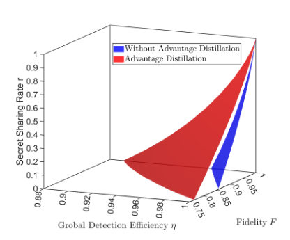 
FIG. 4. Three-dimensional plot of the secret sharing rate (r) versus the global detection efficiency (η) and fidelity (F) before and after applying advantage distillation. The blue surface (without advantage distillation) lies entirely below the red surface (with advantage distillation), indicating that the advantage distillation technique significantly enhances the secret sharing rate for any given combination of η and F. More importantly, the red surface maintains a positive secret sharing rate (r &gt; 0) even within regions of lower global detection rate and lower fidelity.

📷 Fig 5

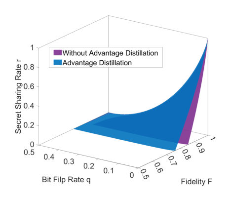 
FIG. 6. Three-dimensional surfaces showing the relationship between the secret sharing rate, bit-flip rate, and fidelity. The blue surface represents the protocol performance with advan- tage distillation, while the purple surface corresponds to the original protocol performance. The plot demonstrates that for any given fidelity F, the advantage distillation technique significantly enhances the protocol’s ability to generate secure secrets under higher bit-flip noise.

**Summary.** This paper proposes an enhanced device-independent quantum secret sharing protocol by adapting the advantage distillation technique to a three-party setting. The method significantly improves noise tolerance and extends the maximum secure communication distance over optical fibers. It demonstrates that integrating distillation with post-selection and noise pre-processing makes DI-QSS more practical for real-world quantum networks.

**Why it may be interesting.** This work is highly relevant to quantum optics and quantum networks as it provides a robust method to enhance the performance of multipartite entanglement-based protocols against realistic environmental decoherence and photon loss.

Detailed structure

**Main problem.** The practical implementation of Device-Independent Quantum Secret Sharing (DI-QSS) is severely limited by high requirements for detection efficiency, low noise tolerance, and short communication distances due to channel loss.

**Main result.** By extending the advantage distillation technique to a three-party setting, the authors significantly increased noise tolerance (from 10.17% to 28.49%) and extended the maximum secure fiber distance (from 0.16 km to 1.85 km).

**Method.** The authors redesigned a tripartite data interaction and verification procedure for advantage distillation and systematically integrated it with three strategies: noise pre-processing, post-selection, and a combination of both.

**Model / system.** A three-party DI-QSS protocol involving Alice, Bob, and Charlie connected to a central source distributing three-photon polarization-entangled GHZ states.

**Key observables.** Svetlichny polynomial (S_ABC), Quantum Bit Error Rate (QBER), secret sharing rate (r), global detection efficiency (eta), and entanglement fidelity (F).

**Important parameters / regimes.** GHZ state fidelity (F), global detection efficiency (eta), fiber attenuation (0.2 dB/km), and bit-flip probability (q).

**Assumptions / limitations.** The security analysis assumes Eve obeys the laws of quantum physics and focuses on collective attacks; the protocol relies on the violation of the Svetlichny inequality.

**Figures summary.** Figure 1 shows the protocol schematic; Figure 2 illustrates the advantage distillation flowchart; Figure 3 shows secret sharing rate vs. efficiency; Figure 4 is a 3D plot of rate vs. efficiency and fidelity; Figure 9 and 10 show performance vs. transmission distance under different noise levels.

**Paper structure.** The paper introduces the DI-QSS problem, describes the proposed tripartite advantage distillation framework, details three specific improvement strategies, presents numerical simulations comparing these strategies, and concludes with future directions.

Abstract

Device-independent quantum secret sharing (DI-QSS) provides high security by eliminating the need to trust devices, yet its practical performance is limited by channel loss and noise. This work extends advantage distillation from two-party quantum key distribution (QKD) to three-party DI-QSS, redesigning the corresponding data interaction and verification procedures. The technique is systematically applied to the basic protocol and three active improvement strategies: noise preprocessing, post-selection, and their combination. This approach enhances noise tolerance, reduces the required global detection efficiency threshold, and significantly extends the maximum secure communication distance. Numerical simulations demonstrate that for the basic protocol over fiber, the maximum secure distance increases from 0.16 km to 1.85 km, and the noise tolerance improves from 10.17% to 28.49%. The results show that generalizing advantage distillation to the three-party setting effectively strengthens the protocol's robustness and practicality, enhancing its adaptability to realistic noise and advancing the development of more reliable quantum secret sharing systems.

[↑ back to top](#top)

### [Minimal Permutation-Invariant Qudit Codes from Edge-Colorings of Complete Graphs](http://arxiv.org/abs/2605.22439v1)

**Authors:** Eric Kubischta, Ian Teixeira  
**Type:** theory · **Category:** quantum information and computing · **PDF:** <https://arxiv.org/pdf/2605.22439v1>  
**Analysis basis:** full PDF text, analyzed in chunks
**Topic relevance:** `Rydberg arrays` **2/5** · `entanglement & information structure` **2/5**

📷 Fig 1

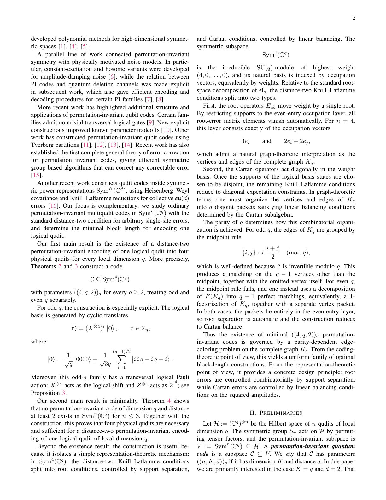 
Low-resolution page preview, page 2

📷 Fig 2

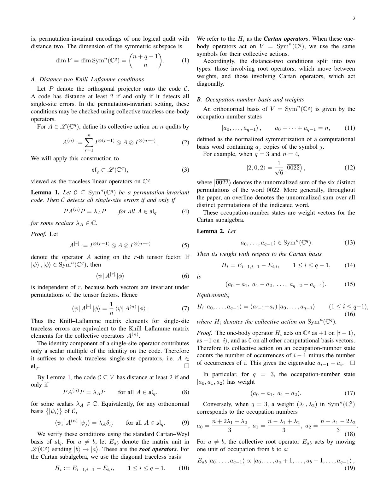 
Low-resolution page preview, page 3

📷 Fig 3

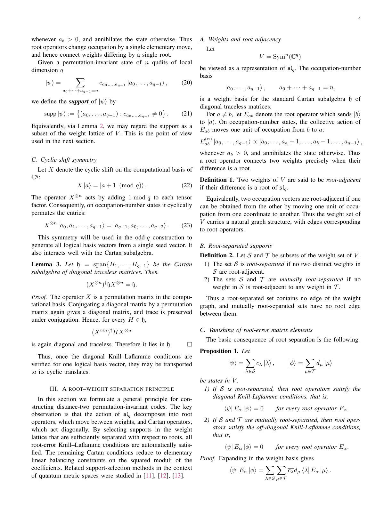 
Low-resolution page preview, page 4

📷 Fig 4

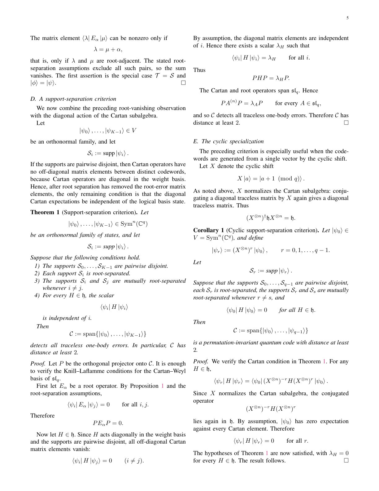 
Low-resolution page preview, page 5

📷 Fig 5

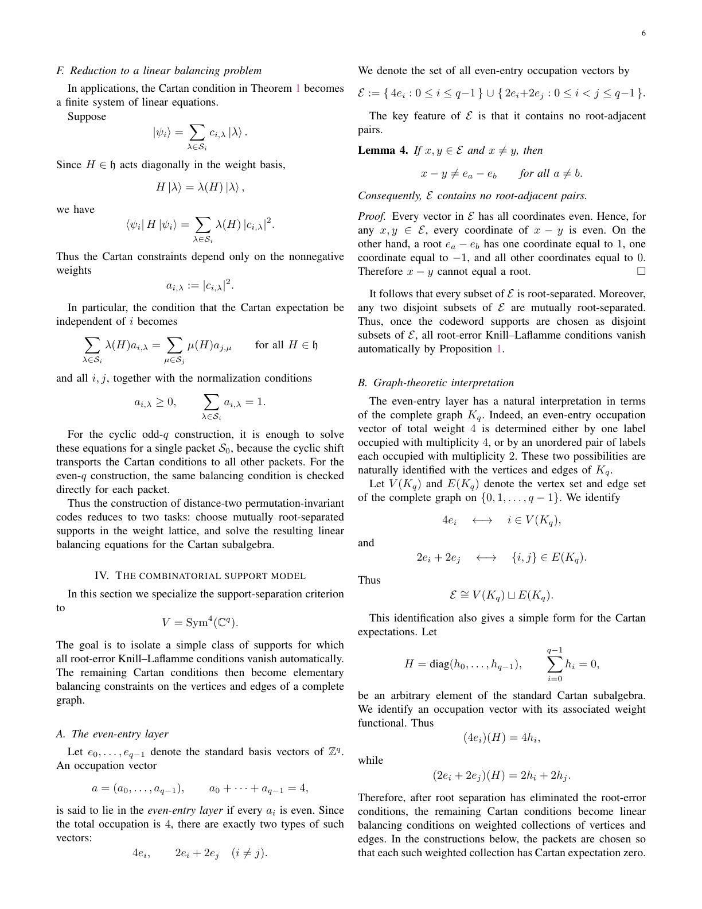 
Low-resolution page preview, page 6

**Summary.** This paper establishes that four physical qudits are both necessary and sufficient to encode one logical qudit with distance two within the symmetric subspace. The authors provide a universal construction for any dimension q by mapping the quantum error-correction requirements to combinatorial edge-coloring problems on complete graphs.

**Why it may be interesting.** This is highly relevant for quantum error correction in systems with inherent symmetries, such as trapped ions or Rydberg atoms, where permutation-invariant noise models are physically motivated.

Detailed structure

**Main problem.** Determining the minimum block length n required to construct permutation-invariant (PI) quantum codes that can encode one logical qudit of dimension q with distance d=2.

**Main result.** The authors prove that n=4 is the minimum block length required and provide a general construction for ((4, q, 2))_q codes for all q >= 2 using graph-theoretic edge-colorings.

**Method.** The study uses representation theory of SU(q), linear programming constraints, and a combinatorial reduction of the Knill-Laflamme conditions to edge-coloring problems on complete graphs.

**Model / system.** The system consists of n qudits of local dimension q restricted to the symmetric subspace (permutation-invariant subspace) of the total Hilbert space.

**Key observables.** Knill-Laflamme error-detection conditions, weight/occupation numbers, and Cartan/root operator expectation values.

**Important parameters / regimes.** Local dimension q, block length n, code distance d=2, and code dimension K=q.

**Assumptions / limitations.** The codes are restricted to the symmetric subspace and are designed specifically to detect single-site (one-body) traceless errors.

**Paper structure.** The paper begins by defining the problem of PI codes, uses linear programming to prove the non-existence of codes for n <= 3, then develops a construction for n=4 by decomposing error conditions into root and Cartan parts, and finally uses graph theory (edge-coloring and 1-factorization) to provide explicit constructions for both odd and even q.

Abstract

We study permutation-invariant quantum codes in the symmetric subspace $\mathrm{Sym}^n(\mathbb{C}^q) $ of $n$ qudits of local dimension $q$. For every integer $q\geq 2$, we construct a permutation-invariant code with parameters $((4,q,2))_q$. Thus four physical qudits suffice to encode one logical qudit with distance two in the symmetric sector for every local dimension. We also show, using linear-programming constraints for permutation-invariant quantum codes, that no permutation-invariant code of dimension $q$ and distance at least $2$ exists in $\mathrm{Sym}^n(\mathbb{C}^q)$ for $n\leq 3$. Hence four qudits are necessary and sufficient.   The construction has a simple representation-theoretic and combinatorial description. In the irreducible $\mathrm{SU}(q)$-module $\mathrm{Sym}^4(\mathbb{C}^q)$, the distance-two Knill-Laflamme conditions split into root and Cartan parts. By restricting supports to the even-entry occupation layer, all root-error conditions vanish automatically. The remaining Cartan conditions reduce to linear balancing constraints on packets of occupation vectors. These packets admit a natural graph-theoretic interpretation in terms of the vertices and edges of the complete graph $K_q$: for odd $q$, they are organized by the midpoint rule, while for even $q$, they are organized by a decomposition of $K_q$ into perfect matchings. In this way, the existence of minimal $((4,q,2))_q$ permutation-invariant codes is reduced to a parity-dependent edge-coloring problem on $K_q$.

[↑ back to top](#top)

### [Nonlinear Magnon Magnetic Moment Transport in Triangular-Lattice f-Wave Antialtermagnets](http://arxiv.org/abs/2605.22614v1)

**Authors:** Volodymyr P. Kravchuk, Kostiantyn V. Yershov, Bastián Pradenas, Robin R. Neumann, Rodrigo Jaeschke-Ubiergo, Ricardo Zarzuela, Jairo Sinova, Jeroen van den Brink, Alexander Mook  
**Type:** theory · **Category:** strongly correlated electrons · **PDF:** <https://arxiv.org/pdf/2605.22614v1>  
**Analysis basis:** full PDF text, analyzed in chunks
**Topic relevance:** `non-equilibrium dynamics` **2/5** · `spintronics-quantum-optics interface` **2/5**

📷 Fig 1

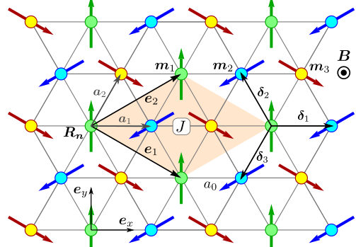 
FIG. 1. Triangular lattice of frustrated spins with J &gt; 0. Three uniformly magnetized sublattices m1, m2, and m3 are shown by different colors. The magnetic unit cell is deter- mined by the vectors e1 and e2 and is shown by the orange shading, while a1 and a2 represent the primitive basis vec- tors of the triangular lattice. The magnetic field B is applied perpendicularly to the lattice.

📷 Fig 2

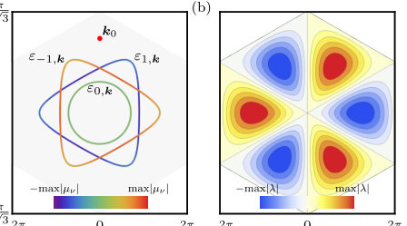 
FIG. 2. (a) – The isosurfaces of constant energy εν,k = ε0 are built from the dispersion relations in Eq. (5) for the case B = 0. The value of the magnon magnetic moment in Eq. (6) is shown by the color scheme. The 1st Brillouin zone (1.BZ) corresponding to the magnetic unit cell is shown in gray shad- ing. (b) – Distribution of the spin-splitting parameter λ de- fined in Eq. (7) over the 1.BZ demonstrates the f-wave char- acter of the magnon spectra.

📷 Fig 3

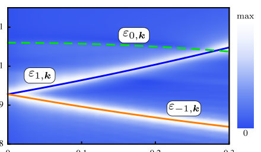 
FIG. 3. The effect of the Zeeman splitting of modes ε±1,k0(B) for the fixed wave vector k0 shown by the red dot in Fig. 2(a). Here, lines show the eigen-energies (5) while the magnon in- tensities obtained by means of the spin lattice simulations (see Appendix C for the details) are shown by the color scheme.

📷 Fig 4

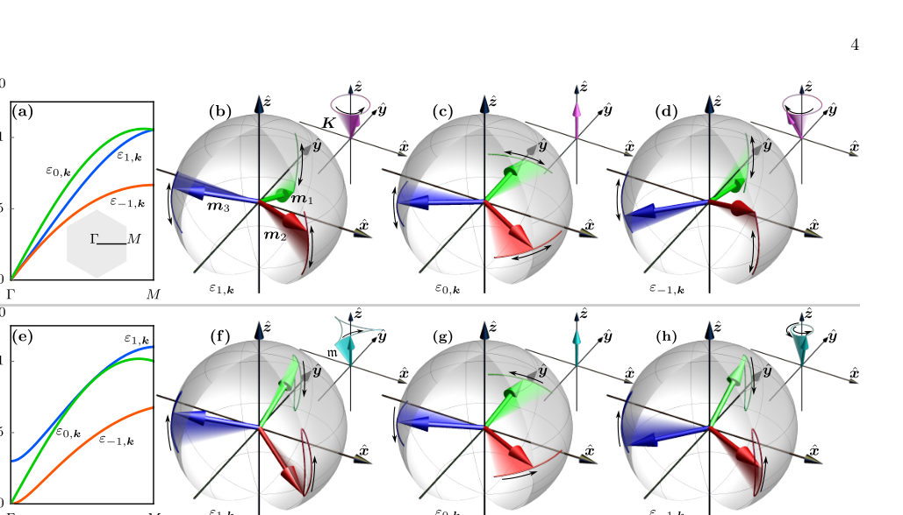 
FIG. 4. The influence of the applied magnetic field on the magnon modes is shown in terms of the dispersion relations, see panels (a) and (e), and in terms of the reconstructed single spin dynamics, see panels (b-d) and (f-h). The green, red, and blue arrows show three neighboring magnetic moments m1, m2, and m3 belonging to three different sublattices. The ground 120◦state lies in xy-plane. The insets show the dynamics of the vector spin chirality K and the total magnetization m for the cases without (upper row) and with (bottom row) an applied magnetic field, respectively. The applied field is B = 0.1B0 ˆz. For panels (b-d) and (f-h), the wave vector k = 10−3 ˆx/a0 is fixed and close to...

📷 Fig 5

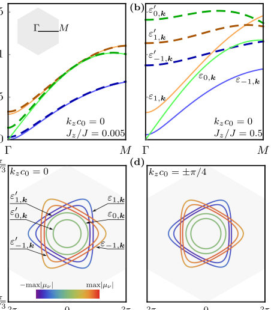 
FIG. 5. The influence of the interlayer coupling on the magnon spectra is shown in panels (a,b). The isosurfaces of the constant energy εν,k = 0.6ε0 for all six modes for the case Jz/J = 0.05 are shown in panels (c,d) for different val- ues of kz. The isosurface color shows the magnon magnetic moment. Magnetic field is B = 0.1B0 and B = 0 for panels (a,b), and (c,d), respectively.

**Summary.** This paper identifies a new class of f-wave antialtermagnets where magnons carry a magnetic moment perpendicular to the spin plane. It predicts that these systems will exhibit unique nonlinear thermal transport phenomena, such as the spin-splitter and Edelstein effects, which could be detected via Lorentz microscopy.

**Why it may be interesting.** not directly relevant

Detailed structure

**Main problem.** The study investigates spin excitations (magnons) in a triangular-lattice Heisenberg antiferromagnet to demonstrate that they carry a magnetic moment perpendicular to the spin-ordering plane, identifying the system as an f-wave antialtermagnet.

**Main result.** The researchers show that magnons in this system possess an out-of-plane magnetic moment and predict nonlinear thermal transport signatures, specifically the spin-splitter and Edelstein effects, in 3D-stacked versions of the lattice.

**Method.** The study employs the Holstein-Primakoff formalism, Nambu spinor representation, and the Boltzmann transport equation within the relaxation-time approximation, supplemented by Landau-Lifshitz spin-lattice dynamics simulations.

**Model / system.** A 2D triangular-lattice Heisenberg antiferromagnet with a 120-degree ground state, extended to a 3D stack of antiferromagnetically coupled layers (an antialtermagnet) under an external magnetic field.

**Key observables.** Magnon magnetic moment, spin-splitting parameter, spin current (spin-splitter effect), and net magnetization (Edelstein effect).

**Important parameters / regimes.** Exchange constants (J, Jz), magnetic field (B), temperature gradients (grad T), and the low-temperature/small-field limits.

**Assumptions / limitations.** The analysis assumes the validity of the harmonic approximation (linearized spin-wave theory), a constant temperature gradient, and the relaxation-time approximation for the Boltzmann equation.

**Figures summary.** Figures include schematics of the lattice, energy isolines and spin-splitting parameter distribution in the Brillouin zone, Zeeman-splitting of magnon modes, and dispersion relations under different magnetic field strengths.

**Paper structure.** The paper introduces the 2D triangular-lattice model, analyzes the symmetry and magnetic moment of magnons, extends the model to a 3D stacked antialtermagnet, and concludes by deriving nonlinear thermal transport coefficients and experimental signatures.

Abstract

We study the spin excitations in the frustrated coplanar 120-degree ground state of the triangular-lattice Heisenberg antiferromagnet and demonstrate that they carry a magnetic moment perpendicular to the plane in which the spins order, despite the ground-state sublattice moments having no out-of-plane component. The symmetry of the momentum dependence of the magnetic moment and energy of the magnons renders the system an odd-parity f-wave magnet. Extending this model to a stack of antiferromagnetically coupled triangular layers provides a realization of magnons in a three-dimensional f-wave antialtermagnet. We show that nonlinear thermal transport effects of magnons, such as Edelstein and spin-splitter effects, provide clear experimental signatures of magnons in f-wave antialtermagnets.

[↑ back to top](#top)

### [ATHENA: A Compiler For Optimized Scheduling In Distributed Quantum Computers](http://arxiv.org/abs/2605.21795v1)

**Authors:** Won Joon Yun, Dhilan Nag, Sneha Ballabh, Jiapeng Zhao, Eneet Kaur, Poulami Das  
**Type:** theory · **Category:** quantum information and computing · **PDF:** <https://arxiv.org/pdf/2605.21795v1>  
**Analysis basis:** full PDF text, analyzed in chunks
**Topic relevance:** `Rydberg arrays` **2/5** · `entanglement & information structure` **1/5**

📷 Fig 1

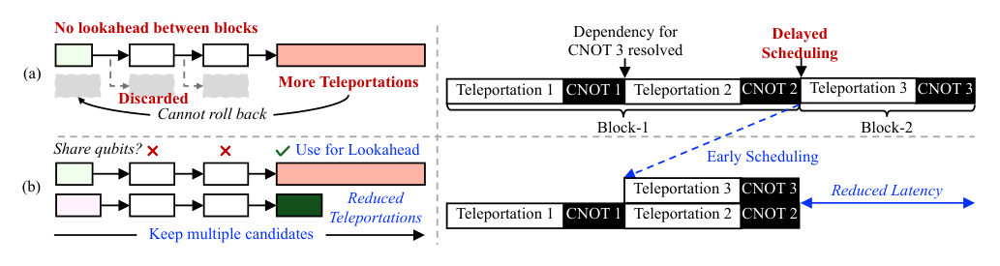 
Figure 1. (a) Current compilers have limited lookahead between blocks and commit to the schedule with fewest teleportations for each block while discarding the rest. They also defer scheduling future gates until preceding blocks complete. (b) Athena considers useful future blocks in its lookahead window and retains multiple candidate schedules. It also executes future operations and their teleportation early if EPR capacity is available.

📷 Fig 2

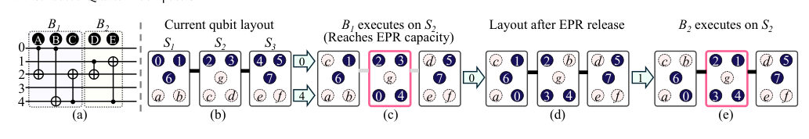 
Figure 2. DQC compilation for (a) first two blocks on (b) a 3-chip DQC using the state-of-the-art compiler QuComm [23]. QuComm groups first five CNOTs into two blocks, 𝐵1 and 𝐵2. (c) It selects 𝑆2 and relocates qubits 0 and 4 to execute 𝐵1, exhausting its EPR resources. (d) To free EPRs, QuComm relocates qubit 0 from 𝑆2 to 𝑆1. (e) It then relocates qubit 1 to 𝑆2 for 𝐵2.

📷 Fig 3

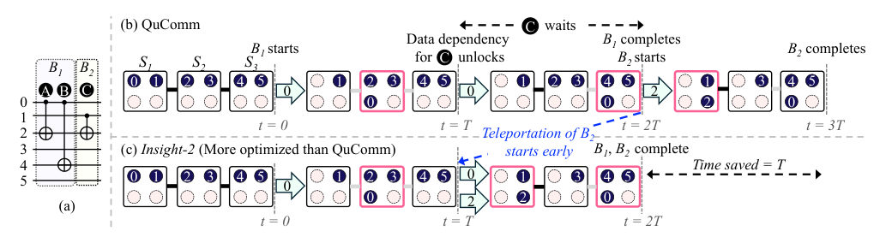 
Figure 3. (a) An example circuit with blocks 𝐵1 and 𝐵2. (b) Dependency for CNOT 𝐶is resolved after executing CNOT 𝐴. But QuComm does not schedule it until it reaches 𝐵2. The teleportation required is also scheduled only when the compiler realizes that it is necessary to schedule CNOT 𝐶. (c) In contrast, Athena relocates qubit 2 and schedules CNOT 𝐶as early as possible. This improves RELOCATE and CNOT concurrency and reduces overall program execution time.

📷 Fig 4

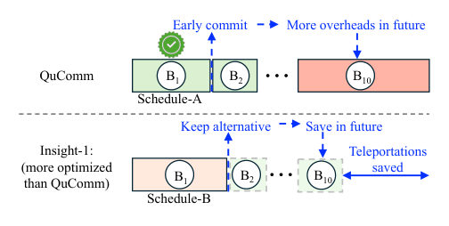 
Figure 4. QuComm selects Schedule-A for 𝐵1 because it costs fewer teleportations (illustrated by the box width in this Figure) than Schedule-B. But the qubit relocations from Schedule-A eventually cost more teleportations in the fu- ture block 𝐵10. In contrast, Athena also retains Schedule-B and continues to schedule subsequent blocks. This allows Athena to eventually arrive at a more optimized executable for block 𝐵10. This approach allows Athena to select block schedules that are locally sub-optimal but globally optimal (such as Schedule-B here).

📷 Fig 5

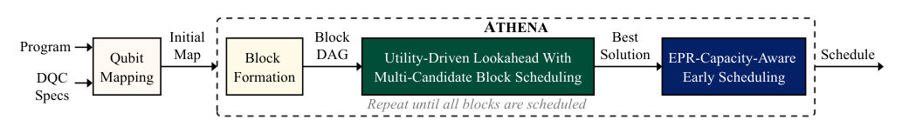 
Figure 5. Overview of Athena. It takes as input the program and initial qubit mapping and mainly focuses on instruction scheduling. This involves block formation (grouping operations into instruction blocks), an utility-driven lookahead-based scheduling involving multiple candidates, and optimizing teleportations via EPR-capacity-aware early relocate scheduling.

**Summary.** The paper presents ATHENA, a new compiler designed to optimize instruction scheduling in distributed quantum computers. By using a multi-candidate scheduling approach and early resource allocation, it significantly reduces the latency and teleportation overheads that currently bottleneck distributed quantum architectures.

**Why it may be interesting.** It addresses the fundamental architectural challenge of scaling quantum computers via modularity, specifically focusing on the interplay between entanglement resources (EPR pairs) and gate-level scheduling in atom-based distributed systems.

Detailed structure

**Main problem.** Distributed Quantum Computers (DQCs) suffer from high latency and error rates due to inefficient scheduling of non-local CNOT gates, which require costly qubit teleportation and EPR resource management.

**Main result.** The ATHENA compiler reduces teleportations by 34% on average and reduces program latency by 2x on average compared to state-of-the-art compilers like QuComm.

**Method.** ATHENA uses Utility-driven Lookahead with Multi-Candidate Block Scheduling (UMS) to avoid early commitment to sub-optimal schedules and EPR-Capacity-Aware Early Scheduling (EES) to increase concurrency by scheduling future operations early.

**Model / system.** A multi-chip Distributed Quantum Computer (DQC) architecture, specifically modeled on neutral-atom platforms using dual-species ($^{8TL}$Rb and $^{171}$Yb) for compute and communication qubits, featuring nearest-neighbor chip connectivity and finite EPR capacity.

**Key observables.** Teleportation count, program latency, program fidelity, and effective teleportation count ($T_{eff}$).

**Important parameters / regimes.** EPR capacity, latency-weighting parameter ($\alpha$), decay factor for lookahead ($eta$), and lookahead window size.

**Assumptions / limitations.** The lookahead window is limited to a manageable size (e.g., 4 blocks) to maintain computational tractability, and the solution tree is pruned to the top-$w$ candidates.

**Figures summary.** Figure 1 compares current compilers to ATHENA's approach; Figure 2 shows the QuComm compiler's logic; Figure 3 compares latency between QuComm and ATHENA; Figure 4 illustrates the 'early commitment' problem; Figure 7 shows the utility-driven lookahead process; Figure 9 shows solution tree pruning; Figure 10 illustrates the EES mechanism.

**Paper structure.** The paper introduces the problem of DQC scheduling inefficiencies, describes the ATHENA compiler architecture (including UMS and EES components), details the implementation on neutral-atom models, provides performance evaluations against the QuComm baseline using various quantum algorithms, and discusses scalability and future work.

Abstract

Distributed Quantum Computers (DQCs) enable large system sizes by connecting smaller chips via photonic interconnects. DQCs use teleportation to relocate qubits and execute CNOTs between qubits on different chips. However, non-local CNOTs are 4.3-7.7$\times$ slower and 4$\times$ more error-prone than local CNOTs within a chip, which degrades program fidelities. Existing compilers group CNOTs with overlapping qubits into blocks and collectively optimize teleportations for each block. However, block-level scheduling has two key drawbacks. First, it lacks lookahead ability across blocks because it selects the optimal schedule for one block before proceeding to the next. As a result, it cannot assess the impact of a teleportation on future blocks. Our studies show that naively expanding the lookahead window to include subsequent blocks does not address this issue. Second, existing approaches do not schedule future block operations or the teleportations they require until preceding blocks are fully scheduled, introducing delay and latency overheads.   We propose ATHENA, a DQC compiler that addresses these limitations using two key insights: Utility-driven Lookahead with Multi-Candidate Block Scheduling (UMS) and EPR-Capacity-Aware Early Scheduling (EES). UMS schedules a block by considering only useful future blocks in its lookahead window. A future block has utility if it shares overlapping qubits with the current block being scheduled. UMS also maintains multiple schedules during compilation, allowing it to defer commitment to globally sub-optimal schedules early in the compilation process. EES enables ATHENA to schedule future operations and their relocations early when EPR resources are available. Our evaluations show that ATHENA reduces teleportations by 34% on average and up to 65%, and reduces latency by 2$\times$ on average and up to 2.9$\times$ compared to the state-of-the-art.

[↑ back to top](#top)

### [A sharp interaction-degree threshold for simulating QAOA](http://arxiv.org/abs/2605.22758v1)

**Authors:** Ralfs Āboliņš, Andris Ambainis  
**Type:** theory · **Category:** quantum information and computing · **PDF:** <https://arxiv.org/pdf/2605.22758v1>  
**Analysis basis:** full PDF text, analyzed in chunks
**Topic relevance:** `entanglement & information structure` **2/5**

📷 Fig 1

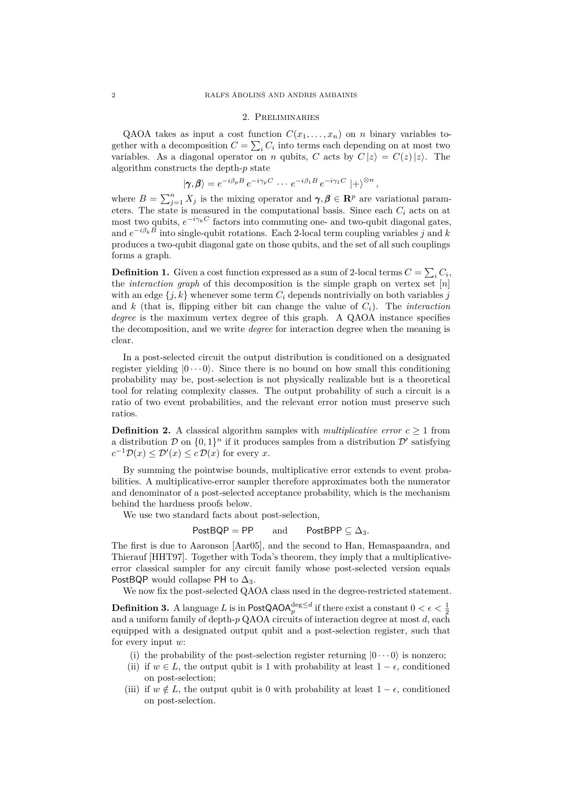 
Low-resolution page preview, page 2

📷 Fig 2

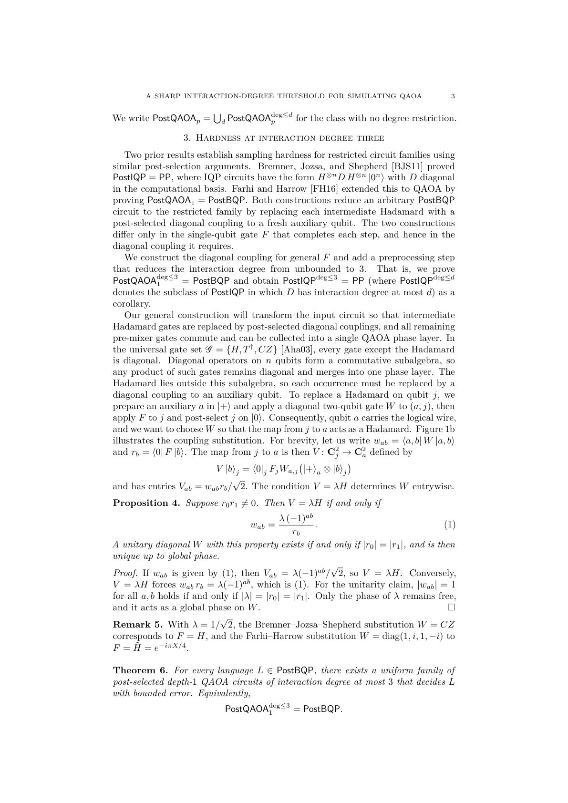 
Low-resolution page preview, page 3

📷 Fig 3

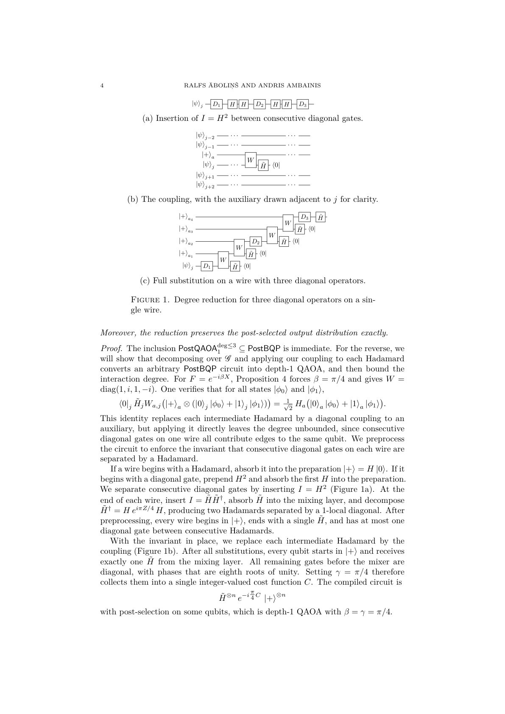 
Low-resolution page preview, page 4

📷 Fig 4

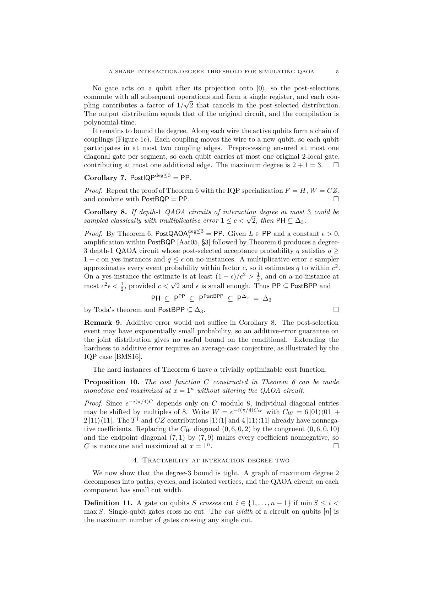 
Low-resolution page preview, page 5

📷 Fig 5

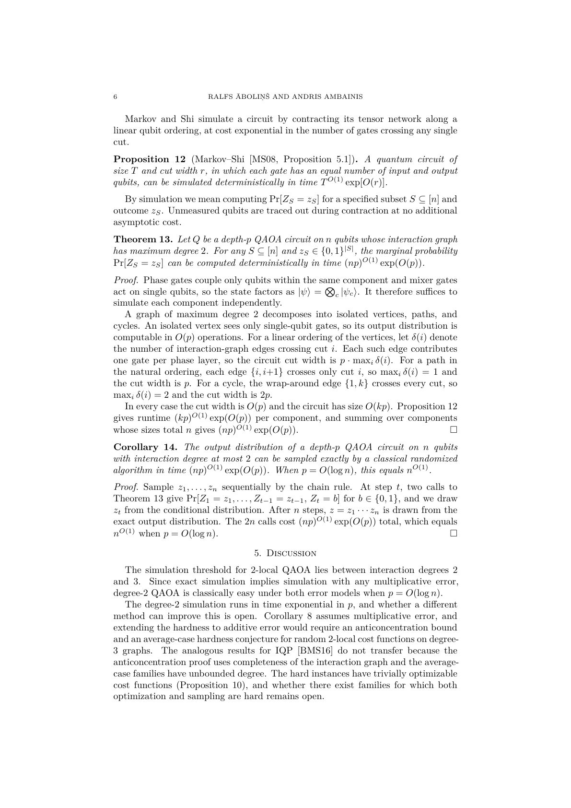 
Low-resolution page preview, page 6

**Summary.** This paper establishes a sharp complexity threshold for simulating QAOA based on the interaction degree of the cost function. It proves that while degree-2 QAOA is efficiently simulatable, degree-3 QAOA is classically hard to sample from, providing a fundamental boundary for quantum advantage in optimization algorithms.

**Why it may be interesting.** not directly relevant

Detailed structure

**Main problem.** The paper investigates whether there is a sharp threshold for the interaction degree of cost functions that determines the classical simulability of the Quantum Approximate Optimization Algorithm (QAOA).

**Main result.** The authors prove a sharp transition: at interaction degree 2, depth-p QAOA is classically simulatable in polynomial time for p = O(log n), whereas at degree 3, sampling from depth-1 QAOA is hard enough to collapse the polynomial hierarchy.

**Method.** The study uses complexity reductions from PostBQP to PostQAOA, circuit transformation techniques to bound interaction degrees, and the Markov-Shi algorithm for tensor network contraction.

**Model / system.** The model consists of depth-p QAOA circuits with 2-local cost functions defined on an interaction graph, utilizing a mixing operator B = sum of X_j.

**Key observables.** Marginal output probabilities and sampling distributions from the QAOA circuit.

**Important parameters / regimes.** Interaction degree (specifically the transition between degree 2 and 3), circuit depth p, and multiplicative error c.

**Assumptions / limitations.** The hardness result for degree 3 assumes a multiplicative error model; the simulation efficiency for degree 2 assumes p = O(log n).

**Figures summary.** Figure 1 illustrates the circuit preprocessing technique, showing how intermediate Hadamard gates are replaced by diagonal couplings to auxiliary qubits to bound the interaction degree.

**Paper structure.** The paper introduces the problem of interaction-degree thresholds, presents a preprocessing method for circuit transformation, proves the hardness of degree-3 sampling via complexity reduction, proves the tractability of degree-2 simulation using tensor network contraction, and discusses the distinction between sampling hardness and optimization advantage.

Abstract

We identify a sharp interaction-degree threshold for the classical simulation of QAOA with $2$-local cost functions. At degree $3$, classical sampling from depth-$1$ QAOA with small multiplicative error would collapse the polynomial hierarchy to its third level. At degree $2$, exact classical sampling from depth-$p$ QAOA on $n$ qubits runs in time $n^{O(1)}$ whenever $p = O(\log n)$. The hard degree-$3$ instances have trivially optimizable cost functions, so sampling hardness does not by itself imply a quantum optimization advantage.

[↑ back to top](#top)

### [A Utility-Driven Bounded-Confidence Model for Opinion Dynamics](http://arxiv.org/abs/2605.21844v1)

**Authors:** Alex Siebenmorgen, Juan G. Restrepo  
**Type:** theory · **Category:** statistical mechanics · **PDF:** <https://arxiv.org/pdf/2605.21844v1>  
**Analysis basis:** full PDF text, analyzed in chunks
**Topic relevance:** `non-equilibrium dynamics` **2/5**

📷 Fig 1

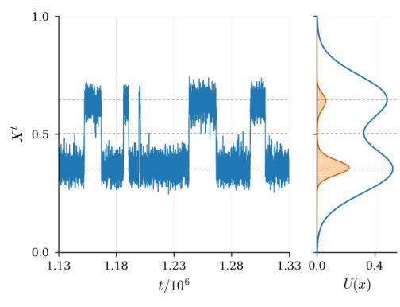 
FIG. 1. (Left) Mean opinion Xt versus t in a simulation with asymmetrically bimodal U(x) [Eq. (3)], N = 15, ∆= 0.02 and learning rate µ = 0.1. A single cluster forms and its mean opinion fluctuates around the two local maxima of U(x). (Right) Utility function U(x) (blue solid line) and empirical histogram for Xt (orange shaded area).

📷 Fig 2

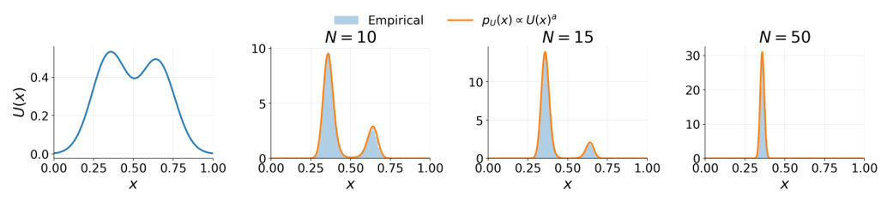 
FIG. 2. (Left panel) Bimodal utility function U(x) [see Eq. (3)]. (Right three panels) Empirical steady-state histograms (light blue shaded areas) and theoretical steady-state curves of the population mean X (orange solid curves) for N = 10, 15, 50 at fixed noise standard deviation ∆= 0.01 and learning rate µ = 1/2. The theoretical stationary density p∗(X) ∝U(X)a is obtained from Eq. (9). As N increases, the theory predicts and the simulations confirm localization of the density around the global utility maximum.

📷 Fig 3

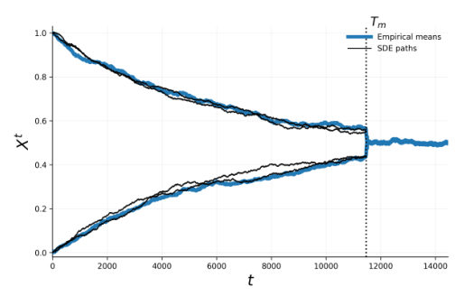 
FIG. 3. Comparison of simulated cluster mean trajectories (blue) and two simulated SDE paths (black).

📷 Fig 4

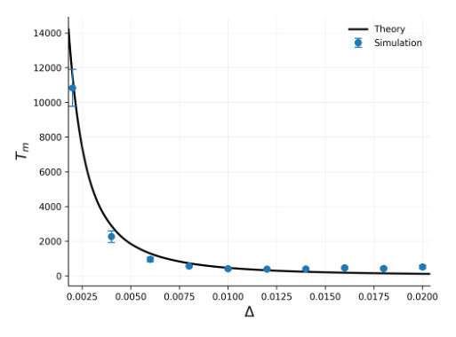 
FIG. 4. Numerically estimated average merging time Tm (blue circles) and the theoretical value from Eq. (19) (solid line). Error bars indicate the empirical standard deviation. Agreement is strongest in the weak-noise regime where the assumptions leading to Eq. (19) apply.

📷 Fig 5

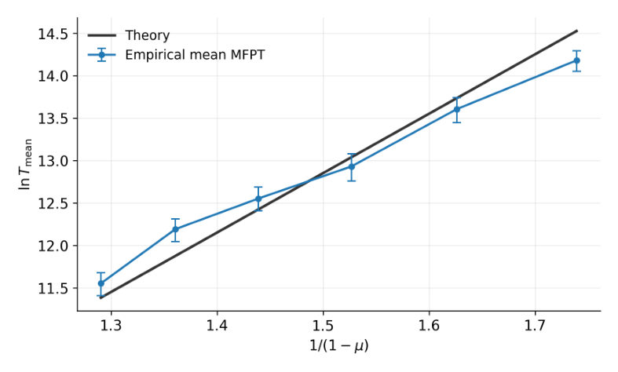 
FIG. 5. Comparison of theoretical and empirical µ dependence with error bars corresponding to the empirical standard deviation. Approximate linearity in 1/(1 −µ) indicates alignment between theory and simulation.

**Summary.** This paper develops an analytical framework for opinion dynamics where the desirability of certain states drives social influence. It shows that the system behaves like a thermodynamic system with an effective temperature, allowing for the prediction of opinion polarization and cluster merging using tools from statistical mechanics.

**Why it may be interesting.** not directly relevant

Detailed structure

**Main problem.** The paper investigates how a utility function (representing the desirability of certain states) influences the evolution, polarization, and clustering of opinions in a bounded-confidence social dynamics model.

**Main result.** The authors derive that the mean opinion follows a Gibbs-like stationary distribution proportional to U(x)^a, where the effective temperature is controlled by the system size and learning rate, and they provide analytical estimates for opinion switching and cluster merging times.

**Method.** The study uses a small-spread expansion to derive a low-dimensional stochastic differential equation (SDE) and employs the Fokker-Planck equation, Kramers escape theory, and Ornstein-Uhlenbeck processes for analytical descriptions.

**Model / system.** An agent-based model of N agents with continuous opinions in [0, 1], interacting via a bounded-confidence mechanism where updates are driven by an asymmetric rule based on a utility function U(x) and subject to additive noise.

**Key observables.** Mean opinion (Xt), cluster variance (sigma^2), stationary distribution (p*(x)), Mean First-Passage Time (MFPT) for switching, and cluster merging time (Tm).

**Important parameters / regimes.** Learning rate (mu), confidence bound (epsilon), number of agents (N), noise intensity (Delta), and the utility function landscape U(x).

**Assumptions / limitations.** The derivation assumes a single-cluster regime, a first-order expansion of the utility function around the mean, and that fluctuations are weakly anti-correlated.

**Figures summary.** Figure 1 shows time series of mean opinion fluctuations and comparisons between utility and empirical histograms; Figure 2 illustrates utility functions; Figure 5 validates the theoretical scaling of escape times against simulation data.

**Paper structure.** The paper introduces the utility-driven model, derives the SDE and stationary distribution for the single-cluster regime, analyzes metastability and switching in bimodal landscapes, calculates cluster merging dynamics, and validates results via numerical simulations.

Abstract

We introduce a utility-driven bounded-confidence model of opinion dynamics in which opinions associated with higher utility exert stronger social influence. In the regime where all agents belong to a single opinion cluster, we derive a stochastic differential equation for the mean opinion and show that its stationary distribution is Gibbs-like, with an effective potential determined by the utility landscape and an inverse temperature controlled by the learning rate and the number of agents. For multimodal utility functions, the dynamics exhibit metastability and spontaneous switching between competing opinion states. The reduced stochastic description also captures the evolution and merging of multiple opinion clusters, in agreement with agent-based simulations.

[↑ back to top](#top)

### [Algebraic locality and non-invertible Gauss laws](http://arxiv.org/abs/2605.21591v1)

**Authors:** Nicholas Holfester, Jonathan Sorce  
**Type:** theory · **Category:** other · **PDF:** <https://arxiv.org/pdf/2605.21591v1>  
**Analysis basis:** full PDF text, analyzed in chunks
**Topic relevance:** `entanglement & information structure` **2/5**

📷 Fig 1

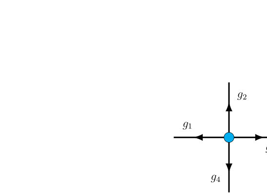 
Figure 2: The magnetic constraint g1g2g3g4 = e at a four-valent vertex. If edge j were directed inward instead of outward, one would replace gj with g−1 j .

📷 Fig 2

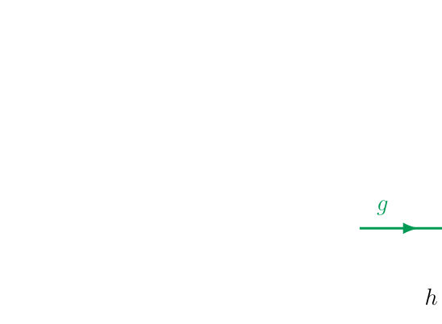 
Figure 4: A four-valent vertex with edge labels g, h, k, and ℓ. For the chosen orientations, the magnetic constraint is gh = kℓ. The green-tinted “g” and “ℓ” edges are in the region R.

📷 Fig 3

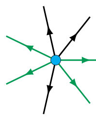 
Figure 5: Two seven-valent vertices, with the edges of R colored in green. The left vertex is cusped, while the right is not.

📷 Fig 4

 
Figure 6: If one tries to make a “continuum picture” of a cusped vertex by drawing a continuous region that includes all edges of R and excludes all edges of R′, this region must necessarily meet itself at a cusp, like in the right side of this figure.

📷 Fig 5

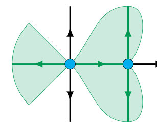 
Figure 7: Exchanging a region R for its collared version R+. Only one vertex of R is cusped, and this is the only one that gets new edges in R+.

**Summary.** This paper explores how non-invertible symmetries, such as those found in string-net models, affect the locality of physical operators on a lattice. It demonstrates that while standard locality principles like Haag duality can fail due to geometric 'cusps,' they can be recovered using a modified definition of local regions. This provides a rigorous foundation for understanding the algebraic structure of topological order with non-invertible symmetries.

**Why it may be interesting.** not directly relevant

Detailed structure

**Main problem.** The paper investigates the validity of algebraic locality principles, specifically Haag duality and disjoint additivity, in lattice models subject to non-invertible Gauss laws.

**Main result.** The authors show that non-invertible magnetic constraints violate exact Haag duality for 'cusped' regions, but a weak form of duality is restored by adding a 'collar' to the region. Exact locality is recovered for 'cuspless' regions, such as those on trivalent lattices.

**Method.** The study employs the framework of von Neumann algebras and the representation theory of finite-dimensional C*-Hopf algebras to analyze operator algebras within constrained subspaces.

**Model / system.** The models studied are 2+1D lattice gauge theories, specifically quantum double models and extended string-net models, where a magnetic constraint is imposed exactly via a non-invertible symmetry.

**Key observables.** Haag duality, disjoint additivity, Wilson line operators, and character operators.

**Important parameters / regimes.** The presence of non-invertible (non-group-like) symmetries and the geometric properties of the lattice (cusped vs. cuspless regions).

**Assumptions / limitations.** The analysis is restricted to bosonic algebras, closed lattices, and finite-dimensional C*-Hopf algebras with an involutive antipode.

**Figures summary.** Figures illustrate the geometric action of Wilson lines, the difference between cusped and cuspless vertices, and the construction of 'collared' regions to restore duality.

**Paper structure.** The paper introduces the problem of non-invertible Gauss laws, develops the Hopf-algebraic framework for magnetic constraints, provides counterexamples for Haag duality violation in cusped regions, proves weak duality/additivity for general regions, and demonstrates exact locality for trivalent lattices.

Abstract

We study algebraic locality principles on a 2+1D closed lattice in the presence of a Gauss law for a non-invertible symmetry. Prior work in arXiv:2509.03589 showed that when enforcing the Gauss law of an invertible symmetry, the principle of "Haag duality" is preserved exactly, and "disjoint additivity" is preserved after appropriate treatment of discreteness artifacts. Here we show that for a large class of non-invertible on-site symmetries, Haag duality is preserved exactly only for sufficiently nice, "cuspless" regions. For cusped regions, we instead have a weak form of Haag duality that requires adding a collar. Our results apply to double models with a purely magnetic constraint, and to the more general framework of constraints induced by the on-site action of a Hopf algebra. In particular, we treat a class of extended string-net models explicitly. We also demonstrate disjoint additivity for double models based on a group, and a weakened form of disjoint additivity in the setting of a general Hopf algebra.

[↑ back to top](#top)

### [Conductivity of a Non-Galilean--Invariant Fermi Liquid: Exact Solution of the Kinetic Equation](http://arxiv.org/abs/2605.21774v1)

**Authors:** Tatia Kiliptari, Vladimir I. Yudson, Dmitrii L. Maslov  
**Type:** theory · **Category:** strongly correlated electrons · **PDF:** <https://arxiv.org/pdf/2605.21774v1>  
**Analysis basis:** full PDF text, analyzed in chunks
**Topic relevance:** `Keldysh / 2PI / non-Gaussian methods` **2/5**

📷 Fig 1

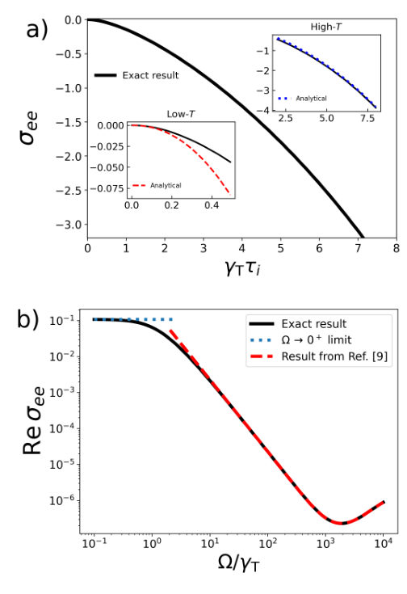 
FIG. 1: (a) ee contribution to the dc conductivity of a disordered FL, σee(0, T), as a function of γT τi in units of e2 and for Ω2 pτi/εF = 100. Main panel: exact solution, Eq. (2b). Top and bottom insets: high- and low-temperature limits, respectively. (b) Optical conductivity Re σee(Ω, T) of a disorder-free FL as a function of Ω/γT , in units of e2 and for T = 0.1Ωp = 0.01εF. . In both panels, dotted (blue) and dashed (red) curves correspond to analytical results.

**Summary.** This paper provides an exact solution for the conductivity of a non-Galilean-invariant Fermi liquid under various interaction models. It corrects previous misconceptions by demonstrating that electron-electron interactions influence transport only through the quasiparticle lifetime. The work also provides a way to access the optical response in the hydrodynamic regime, which is otherwise inaccessible via perturbation theory.

**Why it may be interesting.** not directly relevant

Detailed structure

**Main problem.** The paper aims to find an exact expression for the conductivity of a non-Galilean-invariant Fermi liquid across various temperature and frequency regimes, specifically clarifying the role of electron-electron interactions in current relaxation.

**Main result.** The authors derive an exact solution showing that electron-electron interactions affect conductivity solely through the quasiparticle scattering time, rather than a separate current relaxation rate, and provide the optical response in the hydrodynamic regime.

**Method.** The study solves the linearized semi-classical kinetic equation by mapping it onto an inhomogeneous Legendre-type differential equation and using the Eliashberg approximation for the Hertz-Millis model.

**Model / system.** A 2D non-Galilean-invariant Dirac system subject to both screened Coulomb interactions (treated via RPA) and $z=3$ Pomeranchuk critical interactions (Hertz-Millis model) in the presence of impurity scattering.

**Key observables.** DC resistivity, optical conductivity (real part), and quasiparticle scattering rate.

**Important parameters / regimes.** Frequency ($\Omega$), temperature ($T$), impurity scattering rate ($\gamma_i$), quasiparticle scattering time ($	au_{ee}$), and the Planckian scale ($\Omega \sim T$).

**Assumptions / limitations.** Neglect of exchange processes in the Coulomb model, neglect of mass renormalization in the Coulomb model, and the use of the Eliashberg approximation (local self-energy and small vertex corrections).

**Paper structure.** The paper begins by defining the kinetic equation and the physical models (Coulomb and Hertz-Millis), proceeds to the mathematical mapping onto a Legendre-type equation, derives the exact scaling form for conductivity, and concludes with an analysis of specific regimes (collisionless vs. hydrodynamic) and the role of mass renormalization.

Abstract

We obtain an exact expression for the conductivity of a disordered,   non-Galilean-invariant Fermi liquid by solving the kinetic equation with both screened Coulomb and $z=3$ Pomeranchuk critical interactions. While consistent with previous asymptotic results, our solution shows that electron-electron interactions enter the conductivity solely via the quasiparticle scattering time, $τ_\mathrm{ee}$. Accordingly, the crossovers between the collisionless and hydrodynamic regimes occur when $1/τ_\mathrm{ee}$ becomes comparable to the larger of the impurity scattering rate and the probe frequency, $Ω$. In addition, the exact solution yields the optical response in the hydrodynamic regime, $Ω\ll 1/τ_\mathrm{ee}$, which is inaccessible within perturbation theory. Near a $z=3$ Pomeranchuk quantum critical point, consistency between the kinetic-equation and Kubo approaches requires proper inclusion of mass renormalization within the Eliashberg approximation, which also ensures that the crossover between the collisionless and hydrodynamic regimes in the optical conductivity occurs at the Planckian scale $Ω\sim T$.

[↑ back to top](#top)

### [Directed extended-range percolation](http://arxiv.org/abs/2605.22646v1)

**Authors:** Wenbo Liu, Yiwen Zeng, Xueming Liu, Ginestra Bianconi  
**Type:** theory · **Category:** statistical mechanics · **PDF:** <https://arxiv.org/pdf/2605.22646v1>  
**Analysis basis:** full PDF text, analyzed in chunks
**Topic relevance:** `non-equilibrium universality` **2/5**

📷 Fig 1

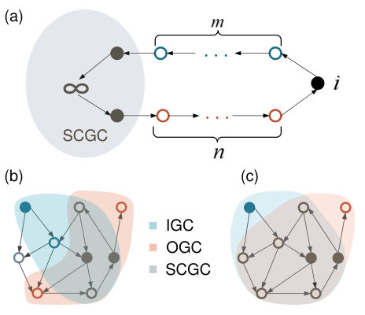 
FIG. 1. DERP message passing mechanism and net- work components.(a) Schematic of the DERP connectivity mechanism. Node i is trusted (filled circle), while the unfilled circles are untrusted relay nodes. If both m &lt; R and n &lt; R, node i connects to the SCGC through incoming and outgoing paths within range R and thus belongs to the SCGC together with the relay nodes. If only m &lt; R (only n &lt; R), node i and the corresponding relay nodes belong to the IGC (OGC). Spa- tial distribution of IGC, OGC, and SCGC in a representative network for R = 2 (b) and R = 3 (c), showing that increasing the interaction range expands all three giant components.

📷 Fig 2

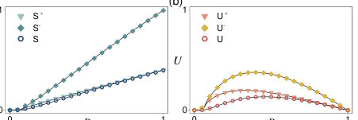 
FIG. 2. DERP dynamics in a real-world p2p net- work [26] (N = 10, 876, R = 2). Symbols denote numerical simulations, and solid lines represent theoretical predictions. Despite the inherent network asymmetry causing the sizes of IGC and OGC to be unequal, the theoretical fits remain ex- cellent.

📷 Fig 3

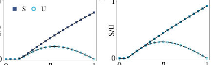 
FIG. 3. DERP dynamics in directed networks with varying degree correlations. Comparison of simulations (symbols) and theoretical predictions (solid lines) for UC (Poisson) (a) and MC (Poisson) (b) networks. The order pa- rameters S and U are shown as functions of p for R = 2. Network parameters are N = 20,000, c = 2.5. Data are aver- aged over 100 realizations.

📷 Fig 4

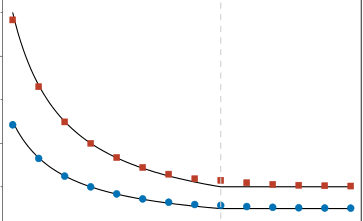 
FIG. 4. Dependence of the critical exponent β on the parameter γ for R = 2 in the DERP model. Critical exponent β as a function of γ for R = 2 in the DERP model. (a) In the UC (PL) model, a single transition occurs at γ = 3 (vertical dashed line). For γ &gt; 3, the system exhibits mean-field behavior. (b) In the MC (PL) model, four exponents (βS, βU, β± S , and β± U ) show boundaries at γ = 3 and γ = 4, becoming non-analytic at γ = 3. In both panels, symbols represent numerical simulations (N = 50, 000), and solid lines denote theoretical curves.

**Summary.** This paper explores a new model of directed extended-range percolation inspired by quantum communication. It demonstrates that network directionality can simplify the percolation problem and that degree correlations can lead to a vanishing percolation threshold in scale-free networks.

**Why it may be interesting.** not directly relevant

Detailed structure

**Main problem.** The paper investigates how network directionality and degree correlations affect the percolation threshold and critical behavior in extended-range percolation models.

**Main result.** The authors show that directionality reduces combinatorial complexity and that in maximally correlated scale-free networks, the percolation threshold can vanish for certain power-law exponents.

**Method.** The study uses a message-passing approach and linearization of recursive equations to derive analytical solutions, which are then validated using Monte Carlo simulations.

**Model / system.** The model is Directed Extended-Range Percolation (DERP), where connectivity between trusted nodes is enabled by directed paths of maximum length R, potentially using untrusted nodes as relays.

**Key observables.** Percolation threshold (pc), order parameters (S, U, S(+), U(+)), and critical exponents (beta, beta_S, beta_U).

**Important parameters / regimes.** Interaction range (R), power-law exponent (gamma), and degree correlations (Uncorrelated vs. Maximally Correlated).

**Assumptions / limitations.** The analytical derivation assumes locally tree-like structures and omits specific discussion of logarithmic corrections at the critical point gamma = 3.

**Figures summary.** Figure 1 illustrates the DERP mechanism; Figure 3 compares simulation results with theoretical predictions for order parameters; Figure 4 shows the dependence of the threshold on parameters; and supplementary figures show effective exponent plateaus and scaling plots.

**Paper structure.** The paper introduces the DERP model and its motivation, develops a message-passing framework for analytical solutions, analyzes critical behavior across different network topologies (UC and MC), and validates results via Monte Carlo simulations.

Abstract

While for standard percolation directionality is known to increase the combinatorial complexity of percolation, here we show that when connectivity is ensured by paths of length $R\geq 2$, network directionality, impeding backtracking, can significantly reduce the complexity of percolation. To illustrate this finding, we introduce Directed Extended-Range Percolation (DERP), defined directed networks with non-reciprocal edges, motivated by applications in quantum communication. In this framework, message transmission is enabled between trusted nodes separated by a directed path of length at most $R$. Using a message-passing approach, we show that directionality enables an exact determination of the percolation threshold and the anomalous critical indices on locally tree-like structures. On random directed networks we find that the critical behavior of DERP depends sensitively on degree correlations. These analytical predictions are corroborated by extensive Monte Carlo simulations, highlighting the profound impact of directionality and correlations on long-range connectivity in complex networks.

[↑ back to top](#top)

### [DMFT analysis of Hopfield network with plasticity](http://arxiv.org/abs/2605.22254v1)

**Authors:** Yoshinori Hara, Yoshiyuki Kabashima  
**Type:** theory · **Category:** disordered systems and neural networks · **PDF:** <https://arxiv.org/pdf/2605.22254v1>  
**Analysis basis:** full PDF text, analyzed in chunks
**Topic relevance:** `non-equilibrium dynamics` **2/5**

📷 Fig 1

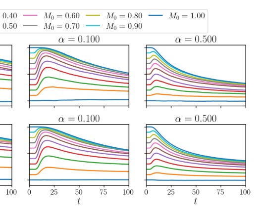 
FIG. 1: Time evolution of M t starting from different values of M 0 for kA = 0.

📷 Fig 2

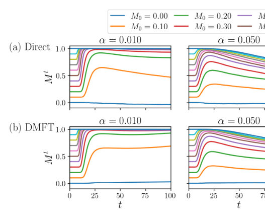 
Fig. 2. All other parameters are the same.

📷 Fig 3

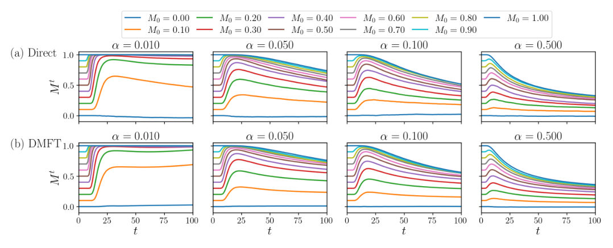 
Fig. 3 shows heat maps of the final overlap, with the initial overlap on the vertical axis and α on the

📷 Fig 4

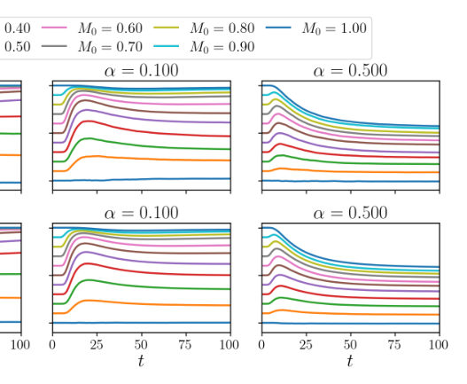 
FIG. 2: Time evolution of M t starting from different values of M 0 for kA = 3.0.

📷 Fig 5

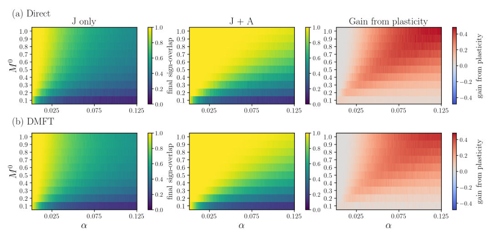 
FIG. 3: Comparison of heat maps of the final overlap obtained from direct simulation and DMFT for various initial overlaps M 0. In each row, the panels from left to right correspond to kA = 0, kA = 3.0, and their difference.

**Summary.** This paper studies how synapses that change alongside neurons affect memory in Hopfield networks. It finds that a moderate amount of plasticity helps the network remember patterns more robustly, but too much plasticity causes the network to mistakenly memorize the starting noise instead of the intended memory.

**Why it may be interesting.** not directly relevant

Detailed structure

**Main problem.** Investigating how online, activity-dependent synaptic plasticity affects the memory retrieval dynamics, capacity, and stability of Hopfield-type associative memory networks.

**Main result.** Moderate plasticity enhances retrieval by creating a positive delayed feedback that stabilizes the target memory, but excessive plasticity leads to 'cue-imprinting failure' where the network stabilizes spurious attractors based on the initial cue.

**Method.** The authors use the generating-functional formalism to derive a Dynamical Mean-Field Theory (DMFT) that reduces the many-body dynamics to an effective single-site stochastic process, which is then validated via large-scale numerical simulations.

**Model / system.** A fully connected Hopfield-type associative memory network where neural states and synaptic couplings coevolve. The model includes fixed Hebbian couplings and time-dependent plastic couplings that evolve via an online Hebbian update rule.

**Key observables.** Memory retrieval overlap (M), memory load (alpha), basin of attraction size, and integrated feedback kernels (Onsager and plastic components).

**Important parameters / regimes.** Plasticity strength (beta or kA), memory load (alpha), learning rate (gamma), and initial overlap (M0).

**Assumptions / limitations.** The analysis assumes the thermodynamic limit (N to infinity), a fully connected network architecture, and an odd activation function (tanh).

**Figures summary.** Figures show the time evolution of overlap, heat maps of the basin of attraction, comparison of DMFT with direct simulations, and the decomposition of feedback kernels into Onsager and plastic components.

**Paper structure.** The paper introduces the problem of coevolving dynamics, derives the DMFT using generating functionals, presents numerical validation, analyzes the mechanism of feedback-driven stabilization, and discusses the optimization of plasticity strength.

Abstract

We study a fully connected Hopfield-type associative memory network with online activity-dependent synaptic plasticity, where neural states and synaptic couplings coevolve during retrieval. Using the generating-functional formalism, we derive a dynamical mean-field theory (DMFT) in the large-system limit with extensively many stored random patterns, and show that the many-body dynamics reduces to an effective single-site stochastic process with colored Gaussian crosstalk noise and delayed feedback terms. Numerical solutions of the DMFT equations agree well with direct simulations. We find that moderate plasticity enlarges the basin of attraction and increases the maximum retrievable memory load by generating a positive delayed feedback that stabilizes retrieval against crosstalk noise. However, excessively strong plasticity causes the network to imprint the imperfect initial cue itself, leading to spurious attractors and degraded retrieval performance. Consequently, an optimal plasticity strength emerges from the trade-off between memory stabilization and premature cue imprinting. These results extend the DMFT description of associative memory to networks with coevolving neural and synaptic dynamics.

[↑ back to top](#top)

### [Ising surface defects can get dirty](http://arxiv.org/abs/2605.22628v1)

**Authors:** António Antunes, Apratim Kaviraj, Baishali Roy  
**Type:** theory · **Category:** disordered systems and neural networks · **PDF:** <https://arxiv.org/pdf/2605.22628v1>  
**Analysis basis:** full PDF text, analyzed in chunks
**Topic relevance:** `Kondo & dissipative impurity` **2/5**

📷 Fig 1

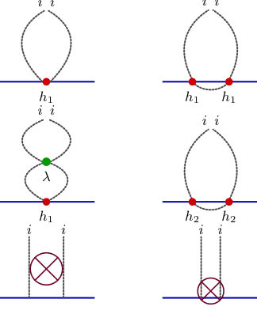 
FIG. 1: Defect Feynman diagrams for same replica. The crosses indicate counter terms.

📷 Fig 2

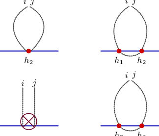 
FIG. 2: Defect Feynman diagrams for different replicas.

📷 Fig 3

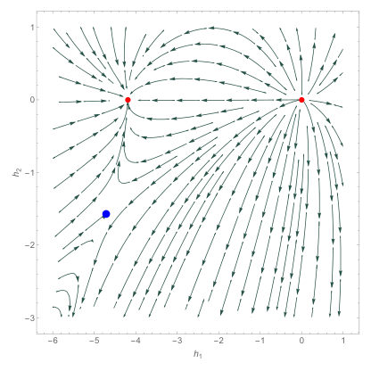 
FIG. 3: Flow plot for the surface defect RG flow. The two ordered fixed points are denoted by a red dot, and the disordered one by a blue dot.

📷 Fig 4

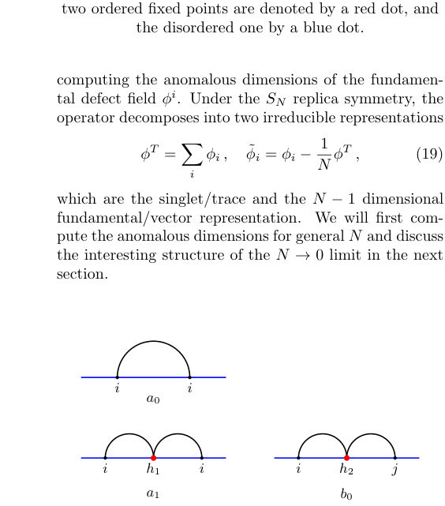 
FIG. 4: The diagrams contributing to ⟨ϕi(τ1)ϕj(τ2)⟩.

**Summary.** This paper explores how random magnetic fields on a surface can create new types of boundary conditions in critical systems. It specifically shows that these 'dirty' boundaries lead to the emergence of complex logarithmic structures in the theory's spectrum. This provides deeper insight into the interplay between disorder and criticality in the 3D Ising model.

**Why it may be interesting.** not directly relevant

Detailed structure

**Main problem.** The study investigates how localized random magnetic fields on a 2D surface defect affect the boundary conditions and stability of the 3D Ising universality class.

**Main result.** The authors identify a new 'dirty' boundary condition fixed point and demonstrate the emergence of logarithmic conformal field theory structures in the replica limit.

**Method.** The researchers use the replica method for disorder averaging combined with Renormalization Group (RG) analysis and one-loop perturbative expansion in 4-epsilon dimensions.

**Model / system.** A massless interacting scalar field theory (Wilson-Fisher fixed point) in 4-epsilon dimensions featuring a 2D surface defect subject to a Gaussian random magnetic field and a local temperature term.

**Key observables.** Anomalous dimensions of bilinear defect operators, scaling dimensions of local operators, and one-point correlation functions of bulk composite operators.

**Important parameters / regimes.** The expansion parameter epsilon, the number of replicas N (taking the N to 0 limit), and the defect couplings h1 and h2.

**Assumptions / limitations.** The analysis assumes the validity of the epsilon expansion and focuses on the co-dimension 1 limit for the physical 3D case.

**Figures summary.** Figure 1 shows Feynman diagrams for same-replica contributions; Figure 2 shows diagrams for different-replica contributions; Figure 3 displays an RG flow plot with fixed points; Figure 4 illustrates diagrams for defect correlation functions.

**Paper structure.** The paper introduces the model of surface defects, applies the replica method to handle disorder, performs RG calculations to find fixed points and stability, analyzes the resulting operator spectrum, and discusses the emergence of logarithmic structures.

Abstract

Real critical systems, such as uniaxial ferromagnets in the 3d Ising universality class, are constrained by boundaries and subject to random couplings. We consider the Wilson-Fisher fixed point in $4-ε$ dimensions subject to a random magnetic field localized on a two-dimensional surface, which becomes co-dimension 1 in the physical $ε\to1$ limit. Using the replica method for the disordered field, we find that the ordinary boundary condition is stable under disorder but also discover a non-trivial ``dirty" boundary condition which can be reached by tuning the disorder strength or the local temperature. We also investigate the logarithmic structure of the defect spectrum and how it emerges via the replica formalism.

[↑ back to top](#top)

### [MetaDNS: Enhancing Exploration in Discrete Neural Samplers via Well-Tempered Metadynamics](http://arxiv.org/abs/2605.21722v1)

**Authors:** Xiaochen Du, Juno Nam, Jaemoo Choi, Wei Guo, Sathya Edamadaka, Junyi Sha, Elton Pan, Yongxin Chen, Molei Tao, Rafael Gómez-Bombarelli  
**Type:** theory · **Category:** numerical methods · **PDF:** <https://arxiv.org/pdf/2605.21722v1>  
**Analysis basis:** full PDF text, analyzed in chunks
**Topic relevance:** `methods for driven-dissipative` **2/5**

📷 Fig 1

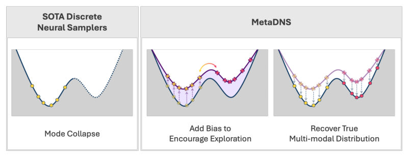 
Figure 1. Scheme for MetaDNS. (Left) State of the art (SOTA) discrete neural samplers suffer from mode collapse at low temperatures: samples concentrate in a single deep minimum of the multi-modal energy landscape. (Middle) MetaDNS adds a history-dependent bias potential (purple) that raises the energy in frequently visited regions, flattening the landscape and encouraging exploration across energy barriers to visit multiple minima. (Right) Samples drawn from the biased distribution are reweighted to recover the true multi-modal target distribution on the original energy landscape.

📷 Fig 2

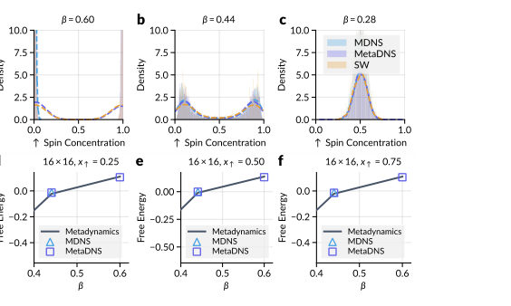 
Figure 2. Ising model results at L = 16: (a-c) Up-spin concen- tration distributions at three temperatures (β = 0.6, 0.44, 0.28). MetaDNS (ours) captures the full bimodal distribution at low tem- perature while MDNS suffers from mode collapse. (d-f) Free energy per site versus inverse temperature for x↑= 0.25, 0.5, and 0.75. Lack of samples at intermediate spin concentrations prevents MDNS from estimating free energies at low temperature.

📷 Fig 3

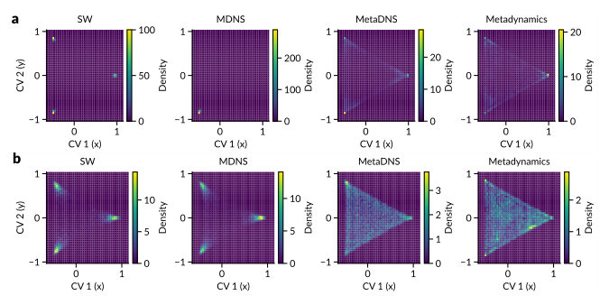 
Figure 3. Collective variable (CV) distributions for Potts (q = 3, L = 16) models at two temperatures: (a) low and (b) critical. 2D CV space (CV 1 vs. CV 2) comparing SW (ground truth), MDNS, MetaDNS (ours), and MCMC-based WT-MetaD. At low and critical temperatures, MDNS exhibits mode collapse, discovering only one of three modes. MetaDNS successfully covers all modes and interspace regions, matching WT-MetaD coverage.

📷 Fig 4

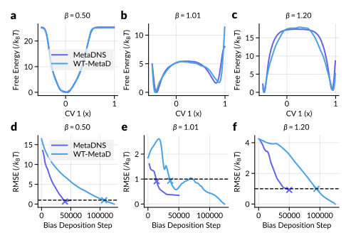 
Figure 4. Free energy profiles and convergence for Potts (q = 3) at L = 16 comparing MetaDNS (ours) with MCMC-based WT- MetaD. (a-c) Free energy profiles along CV 1 at high (β = 0.5), critical (β = 1.01), and low (β = 1.2) temperatures show- ing agreement with WT-MetaD. (d-f) Convergence speedup of MetaDNS over WT-MetaD at the same temperatures (RMSE vs. steps).

📷 Fig 5

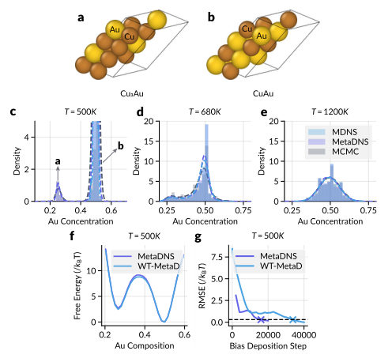 
Figure 5. Cu-Au alloy results at 4 × 4 × 4. (a-b) Crystal struc- tures of Cu3Au and CuAu ordered phases. (c-e) Au concentration distributions at 500K, 680K, and 1200K showing MDNS mode collapse at 500K, capturing only the xAu = 0.5 mode, whereas MetaDNS (ours) matches the ground truth. (f) Free energy profiles at 500K showing MetaDNS (ours) agreement with WT-MetaD. (g) Convergence speedup of MetaDNS over WT-MetaD at 500K (RMSE vs. steps).

**Summary.** This paper introduces MetaDNS, a method that adds a history-dependent bias to neural samplers to prevent them from getting stuck in single energy minima. This allows the sampler to explore complex landscapes and accurately calculate free energies for systems like alloys and spin models. It provides a significant speedup in both exploration and inference compared to classical Monte Carlo methods.

**Why it may be interesting.** not directly relevant

Detailed structure

**Main problem.** Discrete neural samplers like MDNS suffer from mode collapse and fail to explore high-energy barrier regions, preventing accurate free energy estimation and phase transition analysis.

**Main result.** The MetaDNS framework successfully overcomes mode collapse, enabling the reconstruction of free energy landscapes and achieving faster exploration and inference compared to traditional MCMC-based metadynamics.

**Method.** Integration of well-tempered metadynamics into discrete diffusion or autoregressive samplers using an adaptive, history-dependent bias potential along selected collective variables.

**Model / system.** The method is tested on the Ising model, the Potts model (q=3), and a Cu-Au binary alloy system using cluster expansion Hamiltonians.

**Key observables.** Magnetization, two-point correlation functions, energy distributions, gold concentration, free energy landscapes (PMF), and Jensen-Shannon divergence.

**Important parameters / regimes.** Inverse temperature (beta), bias factor (gamma), hill width (sigma), and initial hill height (h).

**Assumptions / limitations.** Assumes the neural sampler stays close to the biased target distribution and that the learning timescale is much faster than the bias update timescale.

**Figures summary.** Figure 1 shows the MetaDNS scheme; Figure 2 compares MDNS mode collapse vs MetaDNS in the Ising model; Figure 3 shows Potts model CV distributions; Figure 4 shows free energy convergence; Figure 5 illustrates Cu-Au alloy structures and concentration distributions; Figure 16 compares learning dynamics between MetaDNS and WT-MetaD.

**Paper structure.** The paper identifies the mode collapse problem in neural samplers, proposes the MetaDNS framework, details the mathematical integration of metadynamics with diffusion/autoregressive models, validates the method using Ising and Potts models, demonstrates application to the Cu-Au alloy, and performs sensitivity analyses on hyperparameters.

Abstract

Sampling from discrete distributions with multiple modes and energy barriers is fundamental to machine learning and computational physics. Recent discrete neural samplers like MDNS suffer from mode collapse and fail to sample high-energy barrier regions between modes, which is critical for free energy estimation and understanding phase transitions. We propose Metadynamics Discrete Neural Sampler (MetaDNS), a general framework integrating well-tempered metadynamics into discrete diffusion or autoregressive samplers. By maintaining an adaptive, history-dependent bias potential along selected low-dimensional coordinates, MetaDNS forces exploration of previously inaccessible regions, enabling free energy reconstruction infeasible with standard neural samplers due to a lack of high-energy samples. On challenging low-temperature benchmarks including Ising, Potts, and the copper-gold binary alloy, MetaDNS reproduces the thermodynamic distribution. Compared to MCMC-based metadynamics, MetaDNS also achieves comparable exploration requiring fewer bias deposition steps.

[↑ back to top](#top)

### [Posterior Collapse as Automatic Spectral Pruning](http://arxiv.org/abs/2605.22691v1)

**Authors:** Johannes Hirn  
**Type:** theory · **Category:** disordered systems and neural networks · **PDF:** <https://arxiv.org/pdf/2605.22691v1>  
**Analysis basis:** full PDF text, analyzed in chunks
**Topic relevance:** `driven-dissipative phase transition` **2/5**

📷 Fig 1

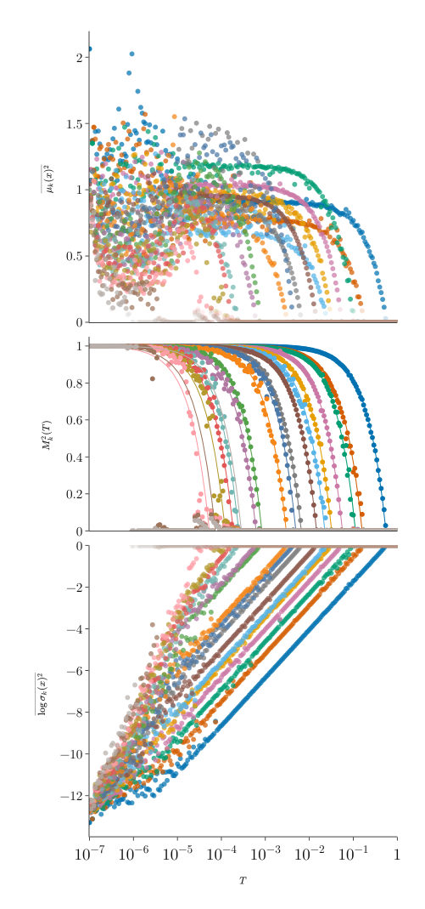 
Figure 1: Order-parameter collapse scan.

📷 Fig 2

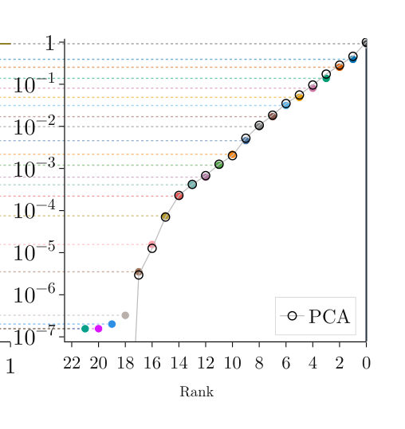 
Figure 2: Truncated distortion and rank pruning.

📷 Fig 3

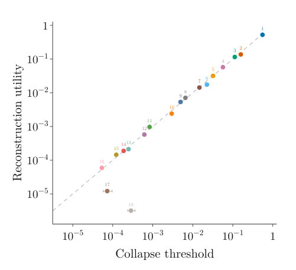 
Figure 3: Reconstruction utility vs collapse threshold.

📷 Fig 4

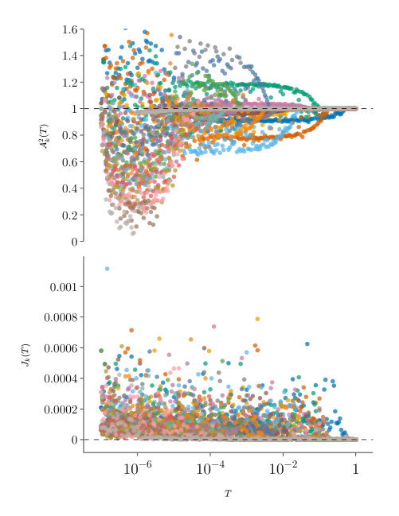 
Figure 4: WorldClim posterior-scale and Jensen-gap diagnostic for ranked latent modes.

**Summary.** This paper reframes the 'failure' of posterior collapse in VAEs as a useful feature that automatically prunes unimportant latent dimensions. By treating the regularization parameter as an effective temperature, the author shows that latent modes disappear in a predictable sequence based on their contribution to data reconstruction.

**Why it may be interesting.** not directly relevant

Detailed structure

**Main problem.** Reinterpreting posterior collapse in beta-VAEs from a training failure to a functional mechanism for automatic spectral pruning and identifying the relationship between latent mode collapse and reconstruction utility.

**Main result.** In linear Gaussian VAEs, the collapse threshold, reconstruction utility, and PCA explained variance coincide, demonstrating that increasing regularization triggers a predictable cascade of mode collapses.

**Method.** The author employs a Landau-style stability analysis to treat latent mode collapse as a phase transition and uses a beta-scan protocol to rank latent modes by their utility.

**Model / system.** The study focuses on beta-Variational Autoencoders (beta-VAEs), specifically analyzing the linear Gaussian case and testing the framework on the WorldClim global climatology dataset.

**Key observables.** Posterior signal fraction (M^2), collapse threshold (T_k), reconstruction utility (delta D_k), signal-to-noise ratio (SNR), and the Jensen gap.

**Important parameters / regimes.** Regularization strength (beta), effective temperature (T), and decoder variance (sigma^2_dec).

**Assumptions / limitations.** The primary theoretical derivation assumes a linear Gaussian VAE with a fixed isotropic decoder variance; the thermodynamic analogy is structural rather than a literal marginalization over microstates.

**Figures summary.** Figure 1 shows the collapse scan via posterior mean-square and signal fraction; Figure 2 compares truncated distortion to PCA; Figure 3 demonstrates the utility-threshold duality; Figure 4 shows posterior-scale and Jensen-gap diagnostics.

**Paper structure.** The paper introduces the problem of posterior collapse, develops a Landau-style stability theory for mode inactivation, establishes the duality between collapse and utility in Gaussian models, and validates these findings via experiments on the WorldClim dataset.

Abstract

We show that posterior collapse in $β$-VAEs implements automatic spectral pruning. A latent mode collapses if its contribution to reconstruction is below the cutoff set by $β$. Equilibrium solutions with different $β$ thus reveal a cascade of collapses as latent modes decouple from least to most useful.   We derive this as a consequence of the loss via a Landau stability analysis. We define a latent-rescaling-invariant order parameter that ranks active latent modes and whose collapse thresholds identify which effective variables to inspect first.   In the linear Gaussian case, the collapse spectrum, utility spectrum, and normalized PCA spectrum coincide, and each collapse follows a mean-field law. We test these predictions on the WorldClim dataset.

[↑ back to top](#top)

### [Quantum circuit design via dynamic Pauli constraints](http://arxiv.org/abs/2605.22744v1)

**Authors:** James R. Wootton, Merlin Incerti-Medici, Daniel Bultrini, Pierre Fromholz  
**Type:** theory · **Category:** quantum information and computing · **PDF:** <https://arxiv.org/pdf/2605.22744v1>  
**Analysis basis:** full PDF text, analyzed in chunks
**Topic relevance:** `quantum measurements` **2/5**

📷 Fig 1

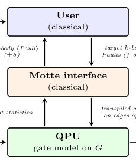 
FIG. 1. Generic structure of the Motte model. The user works in the Pauli-expectation vocabulary; the classical in- terface deduces the gate; the QPU executes it. Repeated for D circuit-depth layers before a final Z-basis measurement.

**Summary.** This paper proposes a new way to program quantum computers by specifying desired physical observables instead of complex gate sequences. It proves that this 'Motte model' is as powerful as the standard circuit model and provides a natural interface for NISQ-era algorithms like quantum imaginary time evolution.

**Why it may be interesting.** not directly relevant

Detailed structure

**Main problem.** The need for a software-oriented quantum computing interface that uses physically observable quantities (Pauli expectation values) rather than complex unitary matrices, specifically addressing the constraints of the NISQ era.

**Main result.** The authors introduce and prove the universality of the 'Motte model,' a framework where gates are specified by Pauli constraints, showing it is equivalent to the standard circuit model with polynomial overhead.

**Method.** The model uses k-body quantum state tomography to reconstruct reduced density matrices, which are then used to analytically deduce unitaries via eigenstate or density matrix transformations.

**Model / system.** A software-oriented model of quantum computation (the Motte model) acting as an interface for a standard gate-model QPU with N qubits and a connected coupling graph G.

**Key observables.** Pauli expectation values (X, Y, Z) and k-local Pauli correlators.

**Important parameters / regimes.** N (number of qubits), D (circuit depth), k (tomographic locality), and delta (statistical sampling error).

**Assumptions / limitations.** The underlying QPU is assumed to be noiseless for the theoretical definition, and statistical noise is assumed to be sufficient to lift eigenvalue degeneracies.

**Figures summary.** Figure 1 illustrates the Motte model workflow: user-provided Pauli targets lead to classical gate deduction, execution on a QPU, and iterative feedback via shot statistics.

**Paper structure.** The paper introduces the Motte model, establishes its computational universality (BQP equivalence), addresses the technical challenge of phase ambiguity in gate reconstruction, demonstrates practical applications like QITE and GHZ state preparation, and provides a complexity analysis.

Abstract

We introduce a novel software-oriented model of quantum computation motivated by the practical constraints of near-term quantum hardware. In this model, gates are specified by constraints expressed in terms of Pauli observables, with each disjoint layer of gates accompanied by a pairwise or $k$-local quantum state tomography of the device. We prove that the model is equivalent to the coupling-graph-restricted circuit model and hence universal for BQP, with a polynomial overhead: simulating a depth-$D$ circuit on $N$ qubits requires at most $O(D^2 N \log N)$ complexity. The model formalizes an idiom shared by existing work that ranges from quantum imaginary time evolution for the study of quantum systems to the use of quantum computers for procedural generation in games. It therefore provides a natural interface for designing quantum software entirely in terms of physically observable quantities, relevant for the NISQ era and into fault-tolerance.

[↑ back to top](#top)

### [Statistical Interpretation of the Procedures Measurement of Physical Quantities](http://arxiv.org/abs/2605.22264v1)

**Authors:** Pandiscia Carlo  
**Type:** theory · **Category:** other · **PDF:** <https://arxiv.org/pdf/2605.22264v1>  
**Analysis basis:** full PDF text, analyzed in chunks
**Topic relevance:** `quantum measurements` **2/5**

📷 Fig 1

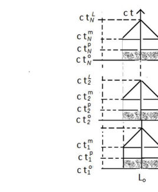 
Figure 1.1: N copies of the ensemble

📷 Fig 2

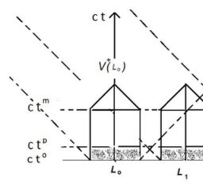 
Figure 1.2: N displaced copies of the ensemble

📷 Fig 3

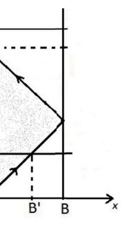 
Figure 1.3: Double cone

📷 Fig 4

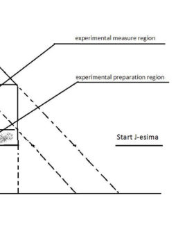 
Figure 1.4: Perturbative region of space

📷 Fig 5

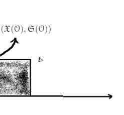 
Figure 1.5: Laboratory-type region

**Summary.** This paper provides a mathematical and conceptual synthesis of algebraic quantum theory and quantum probability. It argues for an operationalist approach where physical quantities are defined by their measurement procedures rather than purely abstract mathematical axioms. The result is a framework that maintains a connection between formal algebraic structures and empirical laboratory practice.

**Why it may be interesting.** not directly relevant

Detailed structure

**Main problem.** The paper seeks to bridge the gap between abstract algebraic quantum theory (such as C*-algebras) and the practical, operational reality of laboratory measurement procedures.

**Main result.** The author develops a conceptual framework that links algebraic formulations with quantum probability, demonstrating how a statistical model of measurement can lead to the reconstruction of algebraic structures like von Neumann algebras.

**Method.** The work uses a synthesis of existing models (von Neumann, Mackey, Segal) employing mathematical tools from measure theory, functional analysis, and operator algebra theory.

**Model / system.** The framework is based on a hypothetical 'Laboratory System' involving experimental procedures, measurement instruments, and a localized space-time region equipped with a clock.

**Key observables.** Physical quantities defined through measurement, including compatible/incompatible observables, joint spectra, and temporal evolution of observables.

**Important parameters / regimes.** L-uniform continuity of state transformations, spectral properties, and the distinction between axioms, postulates, and technical assumptions.

**Assumptions / limitations.** The laboratory is spatially limited; time is measured by an internal clock; and physical quantities are only considered to exist if an effective experimental measurement method is available.

**Paper structure.** The paper is structured into two main parts: Part I focuses on laboratories and experimental procedures (statistics, reproducibility, and entropy), while Part II establishes the mathematical framework for these procedures (Mackey's model, spectral properties, and algebraic interpretation).

Abstract

This work develops a conceptual framework for the foundations of quantum physics, linking two main approaches: the algebraic formulation and quantum probability. Rather than proposing new axioms or theories, the text reorganizes and synthesizes existing models, highlighting their assumptions, conceptual structures, and operational significance. The analysis begins with von Neumann's measurement theory and its subsequent developments by Mackey, emphasizing the role of experimentally feasible procedures and the need for a statistical model grounded in laboratory practice. The work adopts an operational perspective, according to which physical quantities are defined solely through experimental measurement methods, and the corresponding probabilistic measures are derived from measurement outcomes. The introduction critically examines the limitations of purely mathematical formulations - such as the algebraic method - when separated from experimental interpretation. The text argues for a clear distinction between axioms, postulates, and presuppositions, and for a reconstruction of quantum theory that respects both empirical constraints and conceptual clarity.   Overall, the goal is to provide a coherent path from operational principles to algebraic structures, offering a basis for an axiomatic reformulation of quantum mechanics that remains faithful to physical practice.

[↑ back to top](#top)

### [Superconductivity in doped spin multimer systems](http://arxiv.org/abs/2605.22128v1)

**Authors:** Ritsuki Hirabayashi, Masataka Kakoi, Ryota Ueda, Kazuhiko Kuroki, Tatsuya Kaneko  
**Type:** theory · **Category:** strongly correlated electrons · **PDF:** <https://arxiv.org/pdf/2605.22128v1>  
**Analysis basis:** full PDF text, analyzed in chunks
**Topic relevance:** `Kondo & dissipative impurity` **2/5**

📷 Fig 1

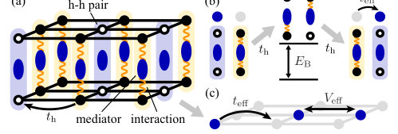 
FIG. 1. (a) Two layers coupled via mediators. (b) Second- order process that yields the effective hopping teff of a hole- hole (h-h) pair. (c) Effective hardcore boson model.

📷 Fig 2

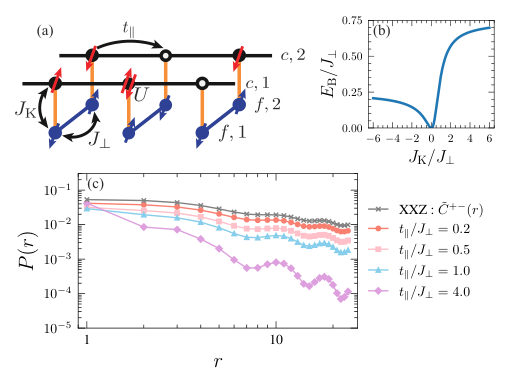 
FIG. 2. (a) Two-leg Kondo-Hubbard ladder and (b) binding energy EB when t∥= 0. (c) Pair correlation function P(r) for JK/J⊥= 2 at nh = 0.125, where eC+−(r) = α2C+−(r) is given by the transverse spin correlation function C+−(r) of the effective XXZ chain with the renormalization factor α = cos θ

📷 Fig 3

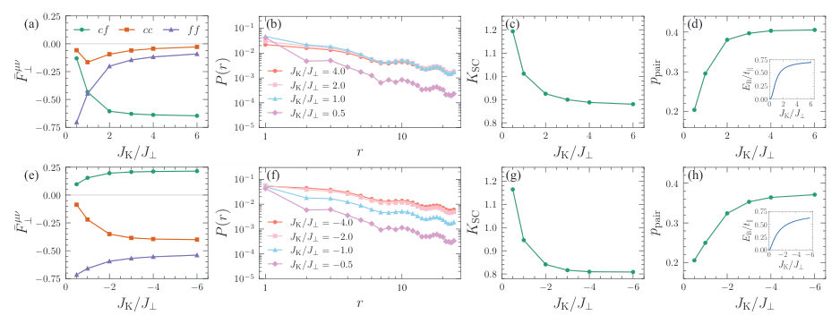 
FIG. 3. Comparison of the ground-state properties for JK &gt; 0 (upper panel) and JK &lt; 0 (lower panel), where t∥/J⊥= 1 is used in (a)-(d) while t∥/J⊥= 1/3 is used in (e)-(h) to equalize EB/t∥at |JK|/J⊥≫1. (a), (e) Spin correlations within a unit cell ¯F cc ⊥, ¯F ff ⊥, and ¯F cf ⊥, where the site-averaged values are plotted. (b), (f) Pair correlation function P(r). (c), (g) Decay exponent KSC of P(r). (d), (h) Fraction of paired holes among all holes ppair, where the insets present the binding energies in units of t∥.

📷 Fig 4

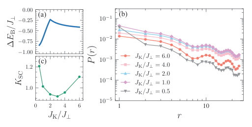 
FIG. 4. (a) Difference of the binding energies with and with- out the interchain hopping t⊥, where ∆EB for t⊥/J⊥= 0.5 and t∥= 0 is plotted. (b) Pair correlation function P(r) and (c) decay exponent KSC for t∥/J⊥= 1.0 and t⊥/J⊥= 0.5.

**Summary.** This paper shows that superconductivity can emerge in complex spin multimer systems through a robust pairing mechanism. By mapping the double Kondo lattice model to a hardcore boson model, the authors demonstrate that pair correlations persist even when moving away from the strong-coupling limit. This provides a general guideline for finding superconductivity in multi-orbital or multi-layer materials like nickelates.

**Why it may be interesting.** not directly relevant

Detailed structure

**Main problem.** Investigating the mechanism of pair formation and the robustness of superconductivity in doped spin multimer systems, specifically determining if pairing signatures persist away from the strong-binding-energy limit.

**Main result.** The authors demonstrate that hole-doped spin multimer systems exhibit a crossover from a BEC-like state to a more extended state while maintaining power-law pair correlations, and that these correlations are robust against variations in local spin structure provided the binding energy is sufficient.

**Method.** The study uses second-order perturbation theory to derive an effective hardcore boson model and employs the Density-Matrix Renormalization Group (DMRG) method for numerical simulations.

**Model / system.** A 1D double Kondo lattice model (a ladder structure) consisting of itinerant electrons interacting with localized spins via Kondo coupling ($J_K$) and interchain spin exchange ($J_{\perp}$).

**Key observables.** Binding energy ($E_B$), pair correlation function $P(r)$, spin gap ($\Delta_s$), and the decay exponent $K_{SC}$.

**Important parameters / regimes.** Kondo coupling ($J_K$), interchain spin exchange ($J_{\perp}$), intrachain hopping ($t_{\parallel}$), interchain hopping ($t_{\perp}$), and on-site Coulomb repulsion ($U$).

**Assumptions / limitations.** The system is analyzed in the limit of large $U$ and assumes the low-energy physics can be mapped onto a universal hardcore boson/XXZ model in the strong-binding-energy limit.

**Figures summary.** The figures likely illustrate the binding energy as a function of coupling, the power-law decay of pair correlations, and the mapping between the Kondo lattice and the XXZ model.

**Paper structure.** The paper introduces the problem of pairing in multi-spin systems, derives an effective Hamiltonian via perturbation theory, presents DMRG numerical results for pair correlations and binding energy, and discusses the universality and robustness of the findings.

Abstract

Binding energy, which quantifies pair formation, is a key factor in the emergence of superconductivity. Here, we show that even when multiple spins are complexly coupled, hole-doped systems, which can be mapped onto the universal hardcore boson model in the strong-binding-energy limit, exhibit promising signatures of superconductivity. We analytically and numerically demonstrate this concept in the double Kondo lattice model. Using the density-matrix renormalization group method, we show that a pairing state is maintained via a crossover even for parameters away from the strong-coupling regime. Additionally, we find that once binding energies are sufficiently generated, pair correlations develop similarly regardless of the details of local spin correlations. Our findings suggest useful guidelines for research on superconductivity.

[↑ back to top](#top)

## Other papers (24)

*Papers from primary archives without highlighted authors or any topic match. Click to expand.*

Show other papers

### [A Boundary-Layer Mechanism for One-Third Scaling in Online Softmax Classification](http://arxiv.org/abs/2605.22341v1)

**Authors:** Marcel Kühn, Yoon Thelge, Bernd Rosenow  
**Type:** both · **Category:** disordered systems and neural networks · **PDF:** <https://arxiv.org/pdf/2605.22341v1>  
**Analysis basis:** full PDF text, analyzed in chunks

📷 Fig 1

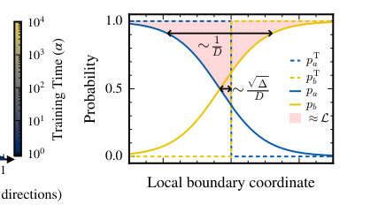 
Figure 1: Left: The 1/3 law appears not only in the test loss but also in the generalization error ϵg, i.e., one minus test accuracy. Middle: The model captures both the growth of the centered student-teacher alignment D and the rotational alignment to the teacher. Right: Near a teacher decision boundary, the late-time loss is controlled by the student boundary layer of width O(D−1). The generalization error is controlled by residual boundary fluctuations only of order √

📷 Fig 2

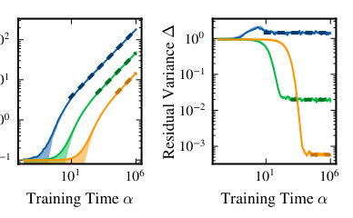 
Figure 2: Finite-N validation for fixed learning rates in the K = 3 online teacher–student model. The panels show the generalization error, centered overlap D, and residual variance ∆as functions of macroscopic time α = µ/N. The curves show representative seed trajectories, with envelopes indicating fluctuations across six simulation seeds. Within these fluctuations, the trajectories agree with the predicted power-law prefactors and exponents: D ∼α1/3, ∆approaches a learning-rate- dependent floor, and ϵg ∝ √

📷 Fig 3

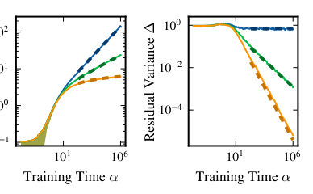 
Figure 3: Schedule dependence in the K = 3 online teacher–student model. For η(α) ∝α−γ, the theory predicts ϵg(α) ∼α−(2+γ)/6 for 0 ≤γ &lt; 1. Increasing γ slows the growth of the centered overlap, D ∝α(1−γ)/3 for γ &lt; 1, but decreases the residual variance, ∆∝η(α); the latter effect improves the classification-error exponent. The γ = 1 curve is a borderline case, where the adiabatic approximation for ∆breaks down. For reference, the adiabatic predictions of Eqs. (19) and (20) are also shown.

📷 Fig 4

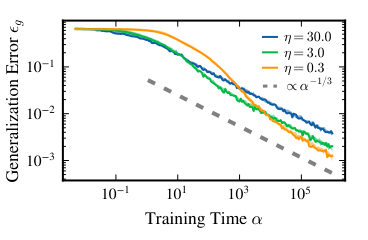 
Figure 5: Controlled departure from isotropic inputs. Inputs are Gaussian with diagonal covariance spectrum ⟨ξ2 i ⟩∼i−β, normalized so that the largest variance is one. Left: η = 0.5 is fixed and β is varied. Right: β = 1.0 is fixed and the learning rate is varied. Increasing β changes and lengthens the transient regime. The late-time decay remains consistent with the same boundary-layer asymptote, while smaller learning rates reduce asymptotic prefactors but can delay entry into the asymptotic regime.

📷 Fig 5

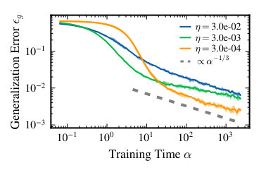 
Figure 5: Non-Gaussian robustness test using whitened pretrained features. A linear soft- max readout is trained online on whitened ViT features with teacher-generated labels. Whitening controls the covariance, while the feature distribution remains non-Gaussian. The teacher-generated labels avoid an early real-label performance floor and allow the late-time regime to be observed.

**Summary.** The paper provides a theoretical derivation of the 1/3 power-law scaling observed in online softmax classification. It demonstrates that this scaling arises from the dynamics of a boundary layer near decision boundaries. The authors also show that decaying the learning rate can improve the convergence exponent.

**Why it may be interesting.** not directly relevant

Detailed structure

**Main problem.** Understanding the origin of the 1/3 power-law scaling in the generalization error and test loss of online softmax classification.

**Main result.** The study identifies a boundary-layer mechanism where the mismatch between smooth softmax loss and hard labels drives a 1/3 scaling law, which can be improved toward 1/2 via learning rate annealing.

**Method.** Statistical physics of learning using order-parameter methodology in the thermodynamic limit, combined with boundary-layer asymptotic analysis and numerical simulations.

**Model / system.** A one-layer K-class teacher-student model using online stochastic gradient descent with Gaussian, correlated Gaussian, and whitened ViT features.

**Key observables.** Generalization error (epsilon_g), test loss (L_g), centered student-teacher alignment (D), and residual student variance (Delta).

**Important parameters / regimes.** Learning rate (eta) and its decay exponent (gamma), number of classes (K), and input covariance/anisotropy (beta).

**Assumptions / limitations.** Thermodynamic limit (N to infinity), permutation symmetry, fixed features, and the 'almost-perfect-learning' regime where the margin is large.

**Figures summary.** Figure 1 shows the 1/3 power law for loss and error; Figure 2 validates dynamics for K=3; Figure 3 shows the effect of learning rate schedules; Figure 5 shows robustness to input correlation; Figure 6 shows scaling with the number of classes; Figure 7 shows performance on whitened ViT features.

**Paper structure.** The paper introduces the scaling problem, derives the exact macroscopic dynamics for centered variables, provides an asymptotic boundary-layer evaluation to explain the 1/3 exponent, analyzes the effect of learning rate annealing, and concludes with robustness tests against non-Gaussian and correlated input distributions.

Abstract

Hard-label classification is usually trained with smooth surrogate losses, most prominently softmax cross-entropy. We isolate an asymptotic mechanism by which this mismatch between smooth surrogate and discrete labels produces power-law learning curves in an online teacher-student model. After subtracting the mean logit, the thermodynamic-limit dynamics close in centered variables: a growing centered student-teacher alignment $D$ and the residual student variance $Δ$. At late times, examples away from teacher decision boundaries are already classified confidently and contribute exponentially little. Only boundary layers of width $O(D^{-1})$ remain active, while the noise of fixed-learning-rate online gradient descent maintains a nonzero $Δ$. As a function of the training time $α$ the late-time solution yields a $α^{-1/3}$ power law not only for the test loss but also for the generalization error $ε_g$, i.e., one minus test accuracy. This is much slower than the $α^{-1}$ Bayes-optimal reference for the same model. We further show that learning-rate schedules can improve the generalization error towards a $ε_g \sim α^{-1/2}$ power law. Simulations support the predicted order parameter dynamics and learning curves. Controlled experiments with correlated Gaussian inputs and whitened pretrained features show that data structure can dominate transients. Therefore, our result is an asymptotic, complementary mechanism rather than an alternative to spectral explanations of neural scaling laws.

[↑ back to top](#top)

### [A Formal Basis for Quantum Cryptographic Exposure Measurement under HNDL Threat](http://arxiv.org/abs/2605.22569v1)

**Authors:** Matheus Rufino, Rafael Duarte Marcelino, Julio Smanioto Garcia  
**Type:** theory · **Category:** quantum information and computing · **PDF:** <https://arxiv.org/pdf/2605.22569v1>  
**Analysis basis:** full PDF text, analyzed in chunks

📷 Fig 1

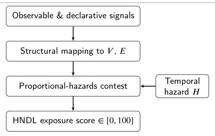 
Figure 1: Structural organisation of the HNDL exposure assessment problem. Observable and declarative signals are mapped to the structural variables 𝑉(vulnerability fraction) and 𝐸(operational exposure); the proportional-hazards contest (Hypotheses 1–3) and temporal hazard 𝐻(Definition 1) produce the exposure score of Eq. (8). The contribution of this paper is the structural form of the lower two stages; the signal-to-(𝑉, 𝐸) mapping is implementation-specific.

📷 Fig 2

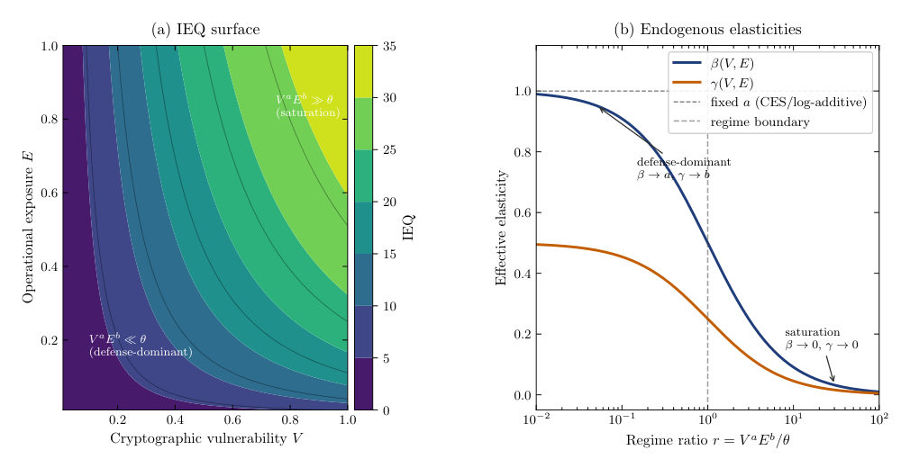 
Figure 2: Structural properties of the IEQ under Hypotheses 1–3 with 𝑎= 1.0, 𝑏= 0.5, 𝜃= 1.0, 𝐻= 0.6, 𝑀= 1.15. (a) IEQ surface over the (𝑉, 𝐸) unit square (Eq. (8)). Contour density reflects score sensitivity: high in the defense-dominant regime (𝑉𝑎𝐸𝑏≪𝜃, lower left) and low near saturation (𝑉𝑎𝐸𝑏≫𝜃, upper right). The observed range reflects the representative parameter 𝜃= 1.0; the full [0, 100] scale is realized at lower 𝜃values. (b) Endogenous elasticities 𝛽(𝑉, 𝐸) and 𝛾(𝑉, 𝐸) (Eq. (7)) as functions of the regime ratio 𝑟= 𝑉𝑎𝐸𝑏∕𝜃. The dashed horizontal line shows the fixed elasticity assumed by CES and log-additive specifications; the multiplicative family predicts elasticities that decrease...

**Summary.** This paper proposes a mathematically grounded way to quantify the risk of data being stolen today to be decrypted by future quantum computers. It demonstrates that risk assessment must account for the interaction between how vulnerable a cipher is and how accessible the data is, rather than just adding these risks together.

**Why it may be interesting.** not directly relevant

Detailed structure

**Main problem.** Developing a formal, structurally justified framework to measure quantum cryptographic exposure under the 'Harvest Now, Decrypt Later' (HNDL) threat.

**Main result.** The paper proves that an effective exposure score must be multiplicative rather than additive to capture the necessary interaction between cryptographic vulnerability and operational exposure, and that migration efficiency is highest in the low-exposure regime.

**Method.** The authors use a probabilistic contest model based on the Tullock Contest Success Function and proportional hazards, validated via structural specification diagnostics like the Vuong statistic and penalized splines.

**Model / system.** A probabilistic model of an adversarial contest where the probability of compromise depends on the relative rates of an attacker's effort (driven by quantum vulnerability and reachability) versus a defender's remediation rate.

**Key observables.** Quantum vulnerability fraction (V), operational exposure (E), and the Information Exposure Quotient (IEQ).

**Important parameters / regimes.** Adversarial attack rate (lambda_A), defender's rate of data-value decay (mu), temporal hazard (H), and the defense-attack intensity ratio (theta).

**Assumptions / limitations.** Assumes attack and defense are constant-rate exponential processes, and that cryptographic vulnerability and operational reachability are asymptotically independent.

**Figures summary.** Figure 1 shows the structural organization of the exposure assessment; Figure 2(a) displays the IEQ surface over the vulnerability-exposure plane; Figure 2(b) illustrates how elasticities decrease toward zero in the saturation regime.

**Paper structure.** The paper introduces the HNDL problem, defines a mathematical framework using a contest model, provides structural proofs for the functional form of exposure, performs statistical validation of the model, and concludes with migration strategy implications.

Abstract

An adversary copies your encrypted traffic today and waits for a quantum computer to decrypt it later. How exposed are you?   We show that the functional form of the answer is not merely a calibration choice -- it is structurally justified by three assumptions about adversarial production and value-decay dynamics. Under those assumptions, the HNDL compromise probability factorises into a temporal hazard, a multiplicative cryptographic-vulnerability and operational-exposure term, and a saturation denominator governed by the defense-attack intensity ratio; the marginal sensitivity to each dimension is endogenous to the organisation's position in the vulnerability-exposure plane, not a fixed global constant. Additive scoring frameworks cannot reproduce this structure because the interaction between cryptographic vulnerability and operational exposure is absent by construction, regardless of calibration. The resulting framework provides a structurally grounded basis for operational HNDL exposure prioritisation under partial observability.

[↑ back to top](#top)

### [Asymmetric quantum Rabi model, trap-dipole resonance, and quantum gates with optically trapped ultracold polar molecules](http://arxiv.org/abs/2605.22276v1)

**Authors:** Yan Lu, Xiao-Feng Shi  
**Type:** theory · **Category:** other · **PDF:** <https://arxiv.org/pdf/2605.22276v1>  
**Analysis basis:** full PDF text, analyzed in chunks

📷 Fig 1

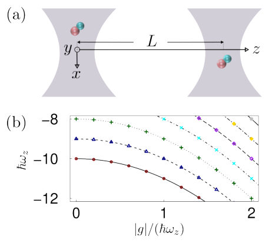 
FIG. 1. (a) Illustration of two optically trapped polar molecules in two traps separated by L along z. Due to the QM, the actual positions of the molecules are not necessarily at the centers of the traps. (b) The black curves show part of the numerically calculated eigenspectrum of the AQRM Hamiltonian in Eq. (13) as a function of g = −3J0ℓz/L when J0 = 10ℏωz. Motional quanta up to 60 are included in the numerical codes. The colored symbols show eigenspectrum with the analytical eigenstates given in Eq. (17). One can see that the numerical results match well with the analytical results.

📷 Fig 2

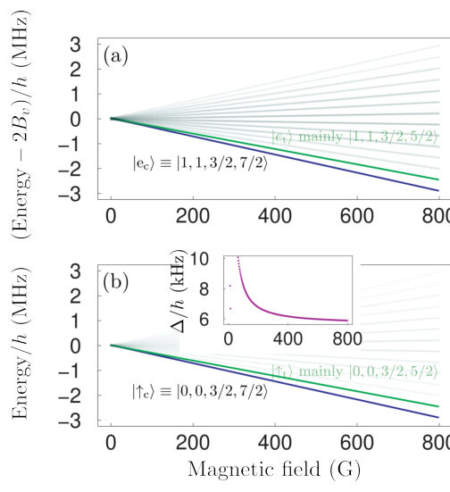 
FIG. 2. Feasibility to realize a nonzero ∆in Eq. (22). (a,b) shows the energy of the N = 1 and N = 0 rovibrational ground manifold of 23Na133Cs in zero electric field, where the energy in (a) is shifted by 2Bv with Bv the rotational constant of the rovibrational ground manifold.

📷 Fig 3

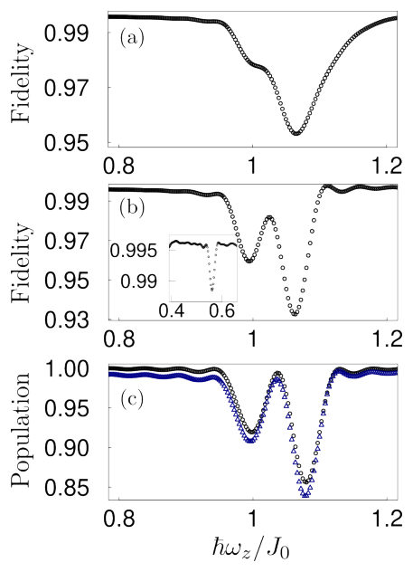 
FIG. 3. (a,b) Trap-dipole resonance signified by the fidelity drop of the CZ gate described around Eq. (31) when varying ωz with J0 = 20Ωµ fixed. Here, (g, ζz) = −(3, 6ℓz/L)ℓz/L and ℓz/L = 0.045 as from around Eq. (23), and the initial motional state is a thermal state with ⟨ˆa† zˆaz⟩= 2 in (a) and ˆa† z|vac⟩in (b). The two minima of the gate fidelity in (b) are at ℏωz ≈−η + ζz and −η −5ζz + 3g2

📷 Fig 4

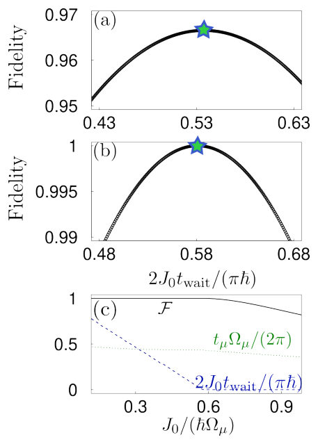 
FIG. 4. (a) Fidelity of the standard π-wait-π iSWAP gate [15] as a function of the wait time when the pulse area of the mi- crowave pulses is π. The maximal fidelity is 0.9665 at the star. (b) When the pulse area of the microwave pulses is 0.906π, the fidelity of the modified iSWAP can reach 1, marked by the star. In (a,b), Ωµ = 2π × 1.6 kHz and J0 = h × 0.37 kHz. (c) Fidelity, optimal pulse duration tµ and wait duration as a function of J0/(ℏΩµ) when J0 is fixed at h × 0.37 kHz. The optimal fidelity is unit when J0/(ℏΩµ) ∈(0.05, 0.58), with twait decreases to 0 at J0/(ℏΩµ) = 0.573.

📷 Fig 5

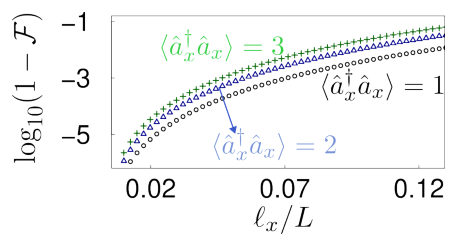 
FIG. 5. Logarithm of the infidelity of the one-pulse iSWAP gate as a function of ℓx/L with Ωµ = 2π × 0.641 kHz. Here, J0 = h × 0.37 kHz as analyzed below Eq. (33) according to the setup of Ref. [15]. The round, triangle, and cross sym- bols are data when the thermal motional state has one, two, and three quanta in the ˆax mode. To avoid trap-dipole res- onance, we set ωx = 2Ωµ so that the infidelity here is only due to the bare QM-DDI coupling. As in Fig. 3, motional states with up to 40 motional excitations of the ˆax mode are included in the quantum simulation of the in-trap motion via QuTip [28, 29]. Here, we show results below ℓ/L = 0.12 be- cause it is the largest value from recent...

**Summary.** This paper shows that the quantized motion of ultracold polar molecules in optical traps can be used to simulate the Asymmetric Quantum Rabi Model. It identifies a specific resonance that can degrade quantum gates and proposes optimized microwave pulse sequences to achieve high-fidelity entanglement despite motional effects.

**Why it may be interesting.** It connects fundamental light-matter interaction models (AQRM) to practical challenges in molecular quantum computing, specifically how motional degrees of freedom can be leveraged for new physics or must be mitigated for high-fidelity control.

Detailed structure

**Main problem.** Investigating how the quantized motion of ultracold polar molecules in optical traps affects dipole-dipole interactions, specifically regarding the emergence of new physical models and the fidelity of quantum gates.

**Main result.** The authors demonstrate that molecular motion realizes an Asymmetric Quantum Rabi Model (AQRM) and identify a detrimental 'trap-dipole resonance' that must be avoided, while also proposing high-fidelity iSWAP and controlled-phase gates.

**Method.** The study uses analytical techniques like Bogoliubov transforms and displacement operators alongside numerical simulations using QuTiP to evaluate gate fidelities and energy spectra.

**Model / system.** The system consists of two ultracold polar molecules (e.g., NaCs) trapped in optical tweezers, where the coupling between their internal two-level states and their quantized motional modes realizes the Asymmetric Quantum Rabi Model.

**Key observables.** Quantum gate fidelity, energy spectra (eigenvalues/eigenstates), and population transfer to motional states.

**Important parameters / regimes.** Dipole-dipole interaction strength (J0), trap angular frequency (omega_z), microwave Rabi frequency (Omega_mu), and the coupling parameter (g).

**Assumptions / limitations.** Molecules are near the rovibrational ground manifold, radial motion is neglected, and the study focuses on the axial component of motion.

**Figures summary.** Figure 1 illustrates the trapped molecules and compares numerical vs. analytical energy spectra; Figure 2 shows the feasibility of tuning energy separations; Figures 5 and 7 demonstrate high gate fidelities for iSWAP and controlled-phase gates under thermal motional states.

**Paper structure.** The paper introduces the QM-DDI coupling, derives the AQRM Hamiltonian, identifies the trap-dipole resonance, and then evaluates the performance of specific quantum gate protocols (iSWAP and CZ) under motional effects.

Abstract

Optically trapped ultracold polar molecules can have multiple long-lived states for coding quantum information, and can exhibit electric dipole-dipole interactions~(DDI) which enables entanglement generation. The general understanding on the quantized motion~(QM) of molecules in the traps is that it causes fluctuation of DDI. Here, we find that the molecular QM can realize an asymmetric quantum Rabi model, which is of specific importance in the study of fundamental physics. The molecular QM can also lead to an exotic trap-dipole resonance, resulting in excess population loss to uncoupled motional states, and, hence, should be avoided in a general quantum control over polar molecules. To examine the impact of QM on quantum computing based on polar molecules, we introduce two gate protocols, a fast iSWAP gate which can be realized by a global microwave pulse of pulse area smaller than $2π$, and a controlled-phase gate with an arbitrary controlled phase, and find that both gates can attain a high fidelity.

[↑ back to top](#top)

### [Berezinskii-Kosterlitz-Thouless-type Transition in Site Percolation on the Diamond Hierarchical Lattice](http://arxiv.org/abs/2605.22103v1)

**Authors:** Takehisa Hasegawa, Kazuki Wataya, Tomoaki Nogawa  
**Type:** theory · **Category:** statistical mechanics · **PDF:** <https://arxiv.org/pdf/2605.22103v1>  
**Analysis basis:** full PDF text, analyzed in chunks

📷 Fig 1

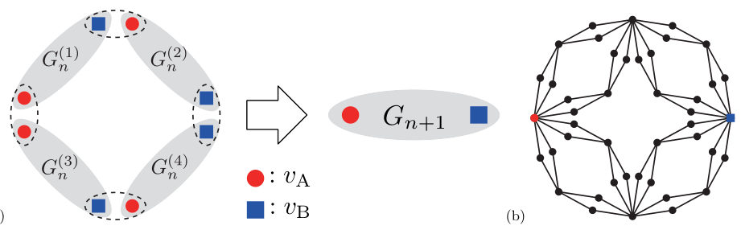 
FIG. 1. Construction of the DHL. (a) The graph Gn+1 is obtained by merging the roots of four copies of Gn as shown here. Two of the merged nodes become the roots of Gn+1, denoted by vA and vB. (b) Example of the fourth-generation graph G4.

📷 Fig 2

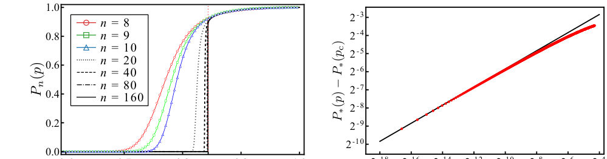 
FIG. 2. (a) Conditional contact probability Pn as a function of the occupation probability p for site percolation on the DHL. The thin red, green, and blue curves correspond to generations n = 8, 9, and 10, respectively. The dotted, dashed, dot-dashed, and solid curves correspond to the larger generations n = 20, 40, 80, and 160. The lines show analytical results obtained from the recursion relations, while the symbols represent Monte Carlo simulation data. As the generation n increases, Pn(p) becomes progressively sharper and, in the limit n →∞, exhibits a finite jump at the critical point pc (vertical dotted line), followed by a continuous increase for p &gt; pc. (b) Log-log plot of the...

📷 Fig 3

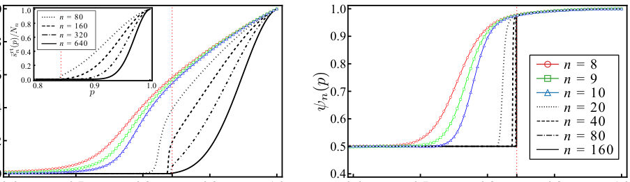 
FIG. 3. (a) Normalized mean root-cluster size ¯srt n (p)/Nn and (b) fractal exponent ψn(p) as functions of the occupation probability p for site percolation on the DHL. The thin red, green, and blue curves correspond to generations n = 8, 9, and 10, respectively. The dotted, dashed, dot-dashed, and solid curves correspond to the larger generations n = 20, 40, 80, and 160. The lines show analytical results obtained from the recursion relations, while the symbols represent Monte Carlo simulation data. In panel (a), the growth of ¯srt n (p)/Nn becomes increasingly suppressed over the entire range of p as the generation n increases. Inset of panel (a): normalized mean root-cluster size ¯srt n...

📷 Fig 4

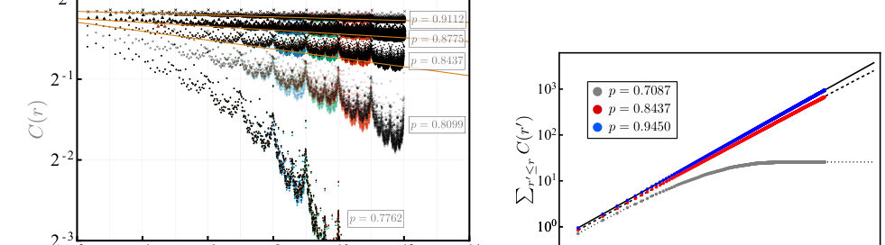 
FIG. 4. (a) Log-log plot of the correlation function C(r) as a function of the distance r from the root vA for site percolation on the DHL. Here, C(r) denotes the probability that a node at distance r from the root vA belongs to the root cluster. Monte Carlo simulation data obtained from 216 samples are shown, with different symbols representing different values of p. Blue, green, red, and black symbols correspond to generations n = 10, 11, 12, and 13, respectively. For p ≥pc, the data are consistent with a power-law decay over a broad range of distances. The solid lines are guides to the eye indicating the form C(r) ∼r−2[1−ψ(p)]. (b) Cumulative correlation function P

📷 Fig 5

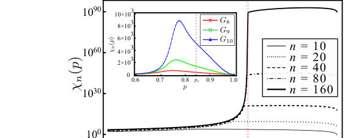 
FIG. 5. Susceptibility χn(p) as a function of p for site percolation on the DHL. The thin solid, dotted, dashed, dot-dashed, and thick solid lines correspond to generations n = 10, 20, 40, 80, and 160, respectively. The lines are obtained from the recursion relations. The susceptibility exhibits a pronounced maximum below the critical point pc. As the generation n increases, the peak height grows and its position shifts toward pc, while χn(p) remains large throughout the critical phase for p &gt; pc. Inset: comparison between the results obtained from the recursion relations (lines) and Monte Carlo simulation data (symbols) for smaller generations n = 8, 9, and 10, showing excellent agreement...

**Summary.** This paper demonstrates that site percolation on a diamond hierarchical lattice undergoes a BKT-type transition into a critical phase that lacks a giant cluster. It proves that exponential volume growth is not a prerequisite for critical phases, as the hierarchical structure and site dilution create persistent connectivity bottlenecks.

**Why it may be interesting.** not directly relevant

Detailed structure

**Main problem.** The study investigates whether exponential volume growth is necessary for the emergence of critical phases in percolation and explores the nature of the phase transition in site percolation on a finite-dimensional fractal network.

**Main result.** The authors discover a Berezinskii-Kosterlitz-Thouless (BKT)-type transition characterized by an essential singularity in the correlation length, where a critical phase exists without a giant percolating cluster.

**Method.** The research employs exact generating-function analysis, renormalization-group (RG) recursion relations, and finite-size scaling (FSS) analysis, supplemented by Monte Carlo simulations.

**Model / system.** The system is site percolation on a Diamond Hierarchical Lattice (DHL), a finite-dimensional fractal network with fractal dimension d_f = 2 constructed via a recursive replacement rule.

**Key observables.** Conditional contact probability (P_n), correlation length (xi), fractal exponent (psi), susceptibility (chi), and cluster-size distribution.

**Important parameters / regimes.** Occupation probability (p), critical threshold (p_c = 27/32), and the generation number (n) of the lattice.

**Assumptions / limitations.** The derivation of scaling relations assumes that degree-2 nodes provide the dominant contribution to the root-cluster mass and that the correlation function follows a power-law decay.

**Figures summary.** Figure 1 shows the recursive construction of the DHL; Figure 2 demonstrates the sharpening of contact probability at p_c and the square-root singularity; Figure 4-6 show scaling of correlation functions, susceptibility, and data collapse via FSS; Figure 7 shows cumulative cluster-size distribution scaling.

**Paper structure.** The paper begins with the lattice construction and model definition, followed by the derivation of exact generating functions and RG recursion relations, an analysis of the phase transition and critical exponents, and concludes with finite-size scaling validation and discussion of the physical mechanism.

Abstract

We study site percolation on the diamond hierarchical lattice, a finite-dimensional fractal network, using an exact generating-function analysis. In contrast to bond percolation, site percolation on this lattice does not undergo a transition from a nonpercolating phase to a percolating phase. Instead, the system exhibits a nonpercolating phase for $p<p_{\rm c}$ and a critical phase for $p>p_{\rm c}$. In the critical phase, the size of the largest cluster remains subextensive, scaling as $N^{ψ(p)}$, where the fractal exponent $ψ(p)$ varies continuously with $p$. By analyzing the renormalization-group recursion relation in the vicinity of $p_{\rm c}$, we show that the correlation length exhibits a Berezinskii-Kosterlitz-Thouless-type essential singularity, $ξ(p)\sim \exp \left({\rm const}/\sqrt{p_{\rm c}-p}\right)$ for $p \to p_{\rm c}^-$, which is further confirmed by finite-size scaling analyses showing excellent data collapse. These results demonstrate that critical phases in percolation can emerge even on finite-dimensional networks and that exponential volume growth is not necessary for such phases to appear. We argue that the critical phase on the diamond hierarchical lattice stems from site dilution remaining relevant under renormalization.

[↑ back to top](#top)

### [Chiral superconductors from parent states with non-uniform Berry curvature: Momentum-space vortices, BdG topology, and thermal Hall conductivity](http://arxiv.org/abs/2605.21618v1)

**Authors:** L. David Le Nir, Asimpunya Mitra, Yong Baek Kim  
**Type:** theory · **Category:** strongly correlated electrons · **PDF:** <https://arxiv.org/pdf/2605.21618v1>  
**Analysis basis:** full PDF text, analyzed in chunks

📷 Fig 1

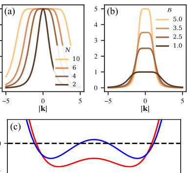 
FIG. 1. The Berry curvature distribution of the λN-model. ΩN,B(k) denotes the Berry curvature: (a) at a constant B = 1, increasing N results in broadening of the Berry curvature dis- tribution. The total flux enclosed by the momentum plane increases linearly with N: ΦN(∞) = 2π(N −1). (b) At a con- stant N = 5, increasing B results in the Berry curvature dis- tribution becoming more concentrated near the origin, with the total flux enclosed ΦN(∞) remaining constant. The max- imum of the Berry curvature distribution has a value of B oc- curring at the origin. (c) Two two different dispersions that we used in our study, having to distinct Fermi surface topolo- gies with circular and annular...

📷 Fig 2

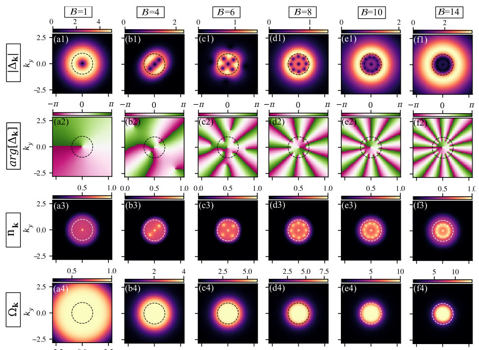 
FIG. 2. The variation of the magnitude |∆k| and phase arg[∆k] of the gap function, local occupation nk, and the Berry curvature distribution Ωk, as the width of the Berry curvature distribution is varied by changing B. These gap functions are calculated for parameters, N = 8 (for the λN model), U = 5, σ2 = 1. The circular Fermi surface is marked by the dashed lines. As B increases, more vortices are nucleated until a critical value is reached beyond which the number of vortices reach its upper bound. More details shown in Figs. 3, 6.

📷 Fig 3

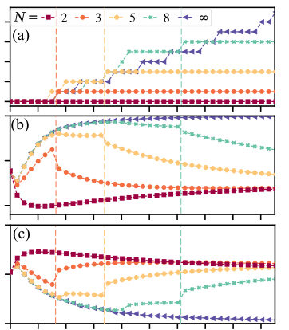 
FIG. 3. (a) The vortex number Q with increasing Bk2 F . For finite N, more vortices are nucleated with increasing Bk2 F , until vortex number saturation is reached when Q = 2N −3. The vertical dashed lines demarcate these two regions of vor- tex nucleation and vortex saturation. (b) The condensation energy δF = FSC −FN, shows shows jumps associated with vortex formation in (a), where the formation of vortices leads to a decrease in the condensation energy. Panel (c) shows the maximum value of the gap as these parameters are varied.

📷 Fig 4

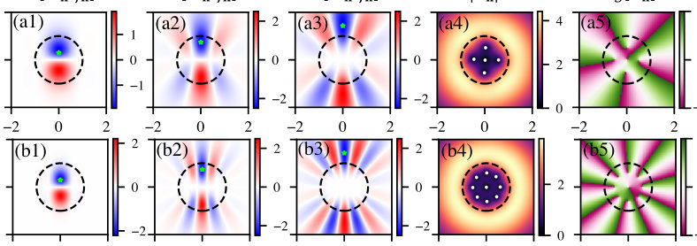 
FIG. 4. The real part of the Cooper vertex W(k∗, k) (Eq. 23) is shown in (a1)–(a3) for N = 4, B = 5.5, where k∗is fixed at the momentum marked by the green star and the dashed line denotes the Fermi surface. The corresponding gap magnitude |∆k|, and argument arg[∆k] are shown in (a4), and (a5). Row (b) shows the same for N = 6, B = 10. The vortices in abs[∆k] are represented by the white dots for clarity. For small values of k∗(column 1), one nodal plane is present in Re[W(k∗, k)] implying the formation of a winding +1 central vortex. For larger values of k∗(columns 2, 3), 2N −3 nodal planes appear implying the formation of additional momentum space vortices on a ring at larger values of k.

📷 Fig 5

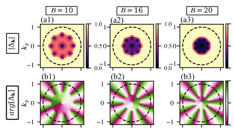 
FIG. 6. Columns (1)–(3) illustrate vortices migrating toward the origin with increasing B in the vortex number saturation regime. Row (a) displays the gap magnitude and row (b) its argument. Results are shown for N = 6, the Fermi surface is denoted by the dashed line.

**Summary.** This paper demonstrates that non-uniform Berry curvature in a parent band can drive the formation of vortices within the momentum-space superconducting gap. It establishes a topological link between the parent band's Chern number and the resulting BdG topology, suggesting thermal Hall measurements as a way to detect these momentum-space vortices.

**Why it may be interesting.** not directly relevant

Detailed structure

**Main problem.** Investigating how non-uniform Berry curvature in parent electronic states influences the emergence, topology, and experimental signatures of chiral superconductivity, specifically the formation of momentum-space vortices.

**Main result.** Non-uniform Berry curvature induces the nucleation of momentum-space vortices in the superconducting gap function, which lowers condensation energy and determines the BdG Chern number via the winding of a momentum-space phase current.

**Method.** Solving the full, non-linear BCS gap equation on a continuum Chern band using the $\lambda_N$-model and developing a gauge-invariant formulation for BdG Berry curvature.

**Model / system.** The $\lambda_N$-model, a tunable continuum platform for studying electronic states with non-uniform Berry curvature, motivated by rhombohedral graphene multilayers.

**Key observables.** Momentum-space vortices in the gap function, BdG Chern number, thermal Hall conductivity, and condensation energy.

**Important parameters / regimes.** Berry curvature strength (B), number of orbitals (N), interaction strength (U), interaction range ($\sigma$), and Fermi surface topology (circular vs. annular).

**Assumptions / limitations.** Assumes a single-band projected superconductor (class-D), neglects spin degrees of freedom, and assumes a large band separation to neglect inter-band processes.

**Figures summary.** Figure 1 shows Berry curvature distribution; Figure 2 displays the gap magnitude and phase; Figure 3 illustrates vortex number vs. Berry curvature strength; Figure 12/13 shows vortex number and condensation energy transitions; Figure 16 shows evolution in annular Fermi surfaces.

**Paper structure.** The paper introduces the problem of Berry curvature-induced superconductivity, defines the $\lambda_N$-model, presents the numerical solution of the gap equation, analyzes vortex nucleation and saturation regimes, derives the topological relation for the BdG Chern number, and discusses experimental signatures via thermal Hall effect.

Abstract

We investigate chiral superconductivity emerging from parent electronic states with non-uniform Berry curvature, motivated by recent experiments in rhombohedral graphene multilayers. Using the continuum $λ_N$-model-a tunable platform with independently controllable Berry curvature profiles-we solve the full BCS gap equation on a continuum Chern band beyond the weak-coupling limit. We find that a non-uniform Berry curvature of the parent band enriches the superconducting order parameter, leading to the formation of momentum-space vortices in the gap function away from high-symmetry points. By tuning the Berry curvature profile, we identify distinct regimes associated with vortex nucleation and vortex number saturation, and show that the nucleation of momentum-space vortices tends to lower the condensation energy. We then show analytically that the parent band Chern number constrains the number of momentum-space vortices that can nucleate in the gap-independent of details of the $λ_N$-model. We also provide a gauge-invariant formulation for computing the Bogoliubov-de Gennes (BdG) Berry curvature for continuum models, and find that it is determined by a momentum-space phase current. The winding of this current around vortices in the occupied region in turn determines the BdG Chern number. Finally, we discuss how thermal Hall measurements can be used to probe the formation of momentum-space vortices. Our results highlight the crucial role of Berry curvature in shaping chiral superconductivity, and offer guiding principles for its identification in systems such as rhombohedral graphene.

[↑ back to top](#top)

### [Completeness of the Klein-Gordon oscillator eigenfunctions via Hermite and Laguerre polynomials](http://arxiv.org/abs/2605.21791v1)

**Authors:** Kevin Hernández  
**Type:** theory · **Category:** other · **PDF:** <https://arxiv.org/pdf/2605.21791v1>  
**Analysis basis:** full PDF text, analyzed in chunks

📷 Fig 1

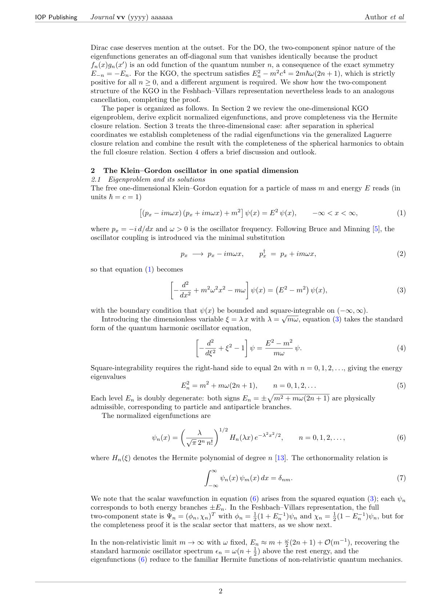 
Low-resolution page preview, page 2

📷 Fig 2

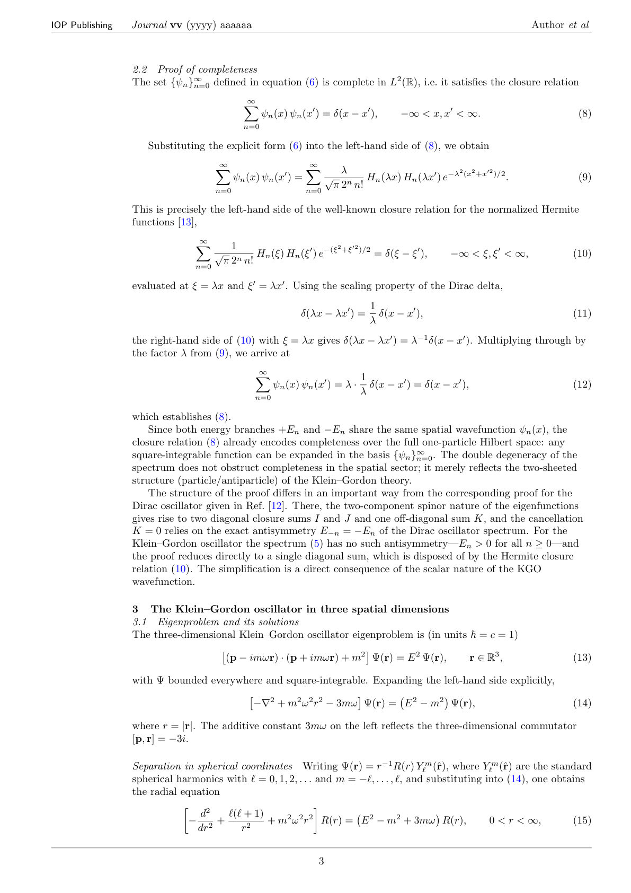 
Low-resolution page preview, page 3

📷 Fig 3

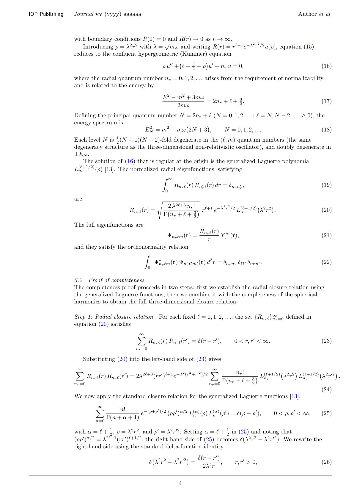 
Low-resolution page preview, page 4

📷 Fig 4

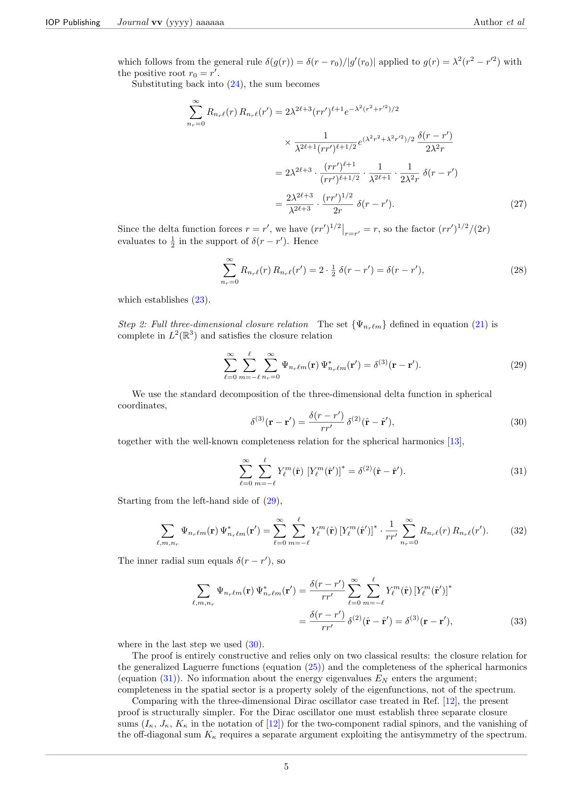 
Low-resolution page preview, page 5

📷 Fig 5

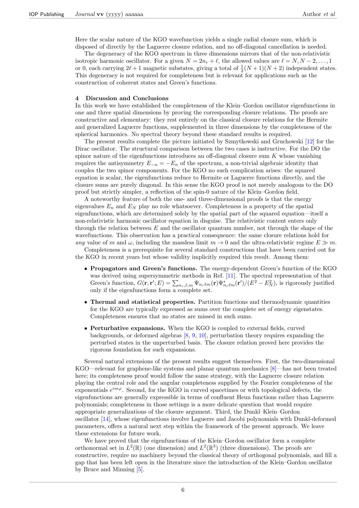 
Low-resolution page preview, page 6

**Summary.** This paper provides the rigorous mathematical proof that the eigenfunctions of the Klein-Gordon oscillator are complete in one and three dimensions. By linking the KGO to the properties of Hermite and Laguerre polynomials, it justifies the use of spectral representations for Green's functions and partition functions in relativistic scalar models.

**Why it may be interesting.** not directly relevant

Detailed structure

**Main problem.** The paper aims to establish the formal completeness (closure relations) of the Klein-Gordon oscillator (KGO) eigenfunctions in one and three spatial dimensions, filling a gap in the literature where such proofs existed for the Dirac oscillator but not the KGO.

**Main result.** The author proves that the KGO eigenfunctions form a complete orthonormal set in L2(R) and L2(R3) by reducing the problem to the known closure relations of Hermite and generalized Laguerre polynomials.

**Method.** A constructive proof approach is used, employing separation of variables, reduction to the confluent hypergeometric equation, and the application of properties of special functions and spherical harmonics.

**Model / system.** The system is the Klein-Gordon oscillator, a relativistic generalization of the harmonic oscillator for spin-0 particles, where the potential is introduced via minimal substitution p -> p - imw r.

**Key observables.** Energy eigenvalues (E_n^2 and E_N^2) and the energy spectrum degeneracy.

**Important parameters / regimes.** Mass (m), oscillator frequency (w), and the non-relativistic (m -> infinity) and massless (m -> 0) limits.

**Assumptions / limitations.** The particle is treated as a scalar field; the proof is limited to 1D and 3D spatial dimensions and does not cover 2D or curved spacetimes.

**Paper structure.** The paper presents a mathematical proof for 1D completeness using Hermite polynomials, followed by a 3D proof using radial Laguerre polynomials and angular spherical harmonics, concluding with a comparison to the Dirac oscillator and discussion of future extensions.

Abstract

Completeness of the Klein--Gordon oscillator eigenfunctions is proved in one and three spatial dimensions. The proofs establish the closure relations satisfied by the eigenfunctions and are based on standard properties of the Hermite and the generalized Laguerre polynomials, supplemented in three dimensions by the completeness of the spherical harmonics. The scalar nature of the Klein--Gordon field renders the argument strictly simpler than the analogous proof for the Dirac oscillator: no off-diagonal cancellation is required.

[↑ back to top](#top)

### [Concatenating Algebraic Codes over High-Rate Quantum LDPC Codes](http://arxiv.org/abs/2605.21898v1)

**Authors:** Adam Wills, Michael E. Beverland, Lev S. Bishop, Jay M. Gambetta, Patrick Rall, Vikesh Siddhu, Andrew W. Cross  
**Type:** theory · **Category:** quantum information and computing · **PDF:** <https://arxiv.org/pdf/2605.21898v1>  
**Analysis basis:** full PDF text, analyzed in chunks

📷 Fig 1

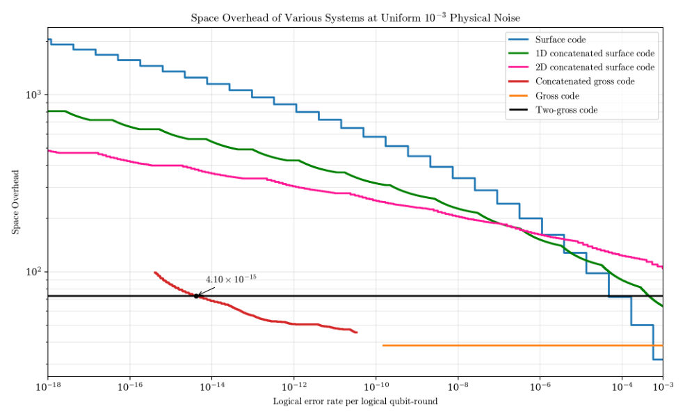 
Figure 1: The space overheads of various systems, allowing a maximum size of half a million physical qubits. Concatenation allows the gross code to work in the teraquop regime relevant for the execution of many large-scale quantum algorithms. There, it offers an improved space overhead versus the two-gross code, with several engineering benefits. We show the surface code, as well as the “yoked” (concatenated) surface codes from [Gid+25]. 1D and 2D concatenated surface codes have different layouts. The denser encoding of the latter makes the information harder to access. The concatenated gross codes have the same layout as the 1D concatenated surface codes.

📷 Fig 2

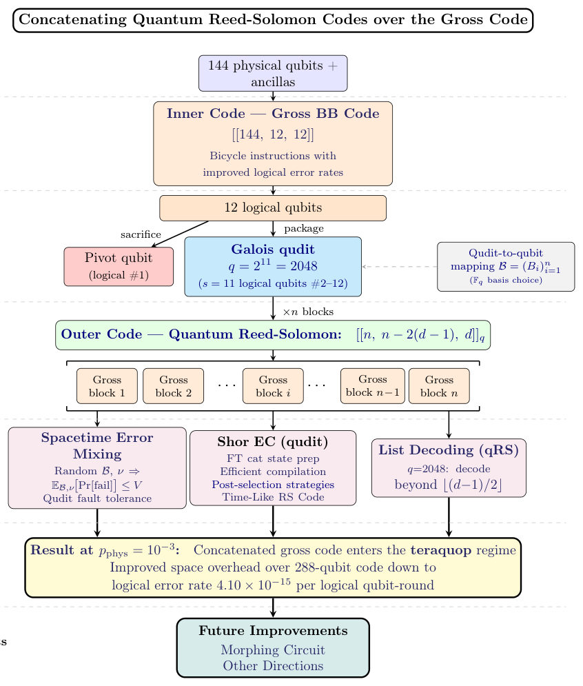 
Figure 2: An overview of the moving parts of the construction and analysis. Blue text is hyperlinked.

📷 Fig 3

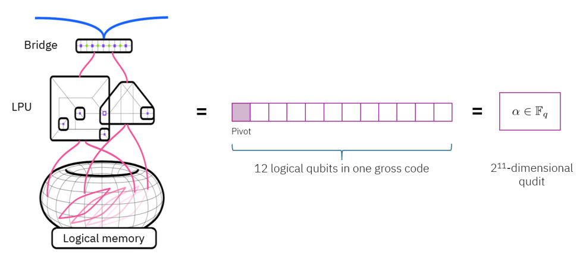 
Figure 3: This figure illustrates the key technical idea of packaging the logical information in one gross code into a higher-dimensional qudit. The first logical qubit, the pivot, is sacrificed to enable the logical operations required to operate the memory. The 11 non-pivot logical qubits become one larger 211-dimensional qudit.

📷 Fig 4

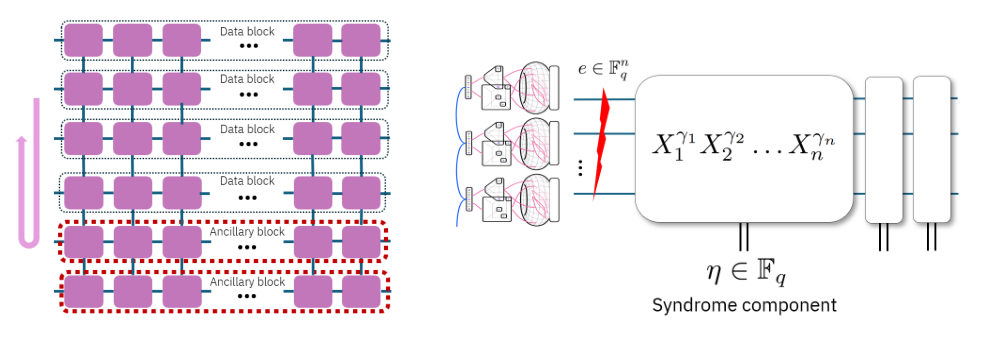 
Figure 4: The left-hand figure illustrates our global memory system. 2 rows of the system are sacri- ficed for the fault-tolerant generation of the cat states used for syndrome extraction of neighbouring outer codeblocks. These ancillary blocks move through the system over the course of time to extract the syndrome of other codeblocks. On the right, we illustrate a Z error affecting an outer codeblock, labelled by some vector e ∈Fn q , where Fq is the finite field of q elements. The syndrome compon- ent of the qudit X-stabiliser (γ1, γ2, . . . , γn) ∈Fn q , which is some value in Fq, is extracted using the appropriate qudit cat state which we will go on to define. Full preliminaries on...

📷 Fig 5

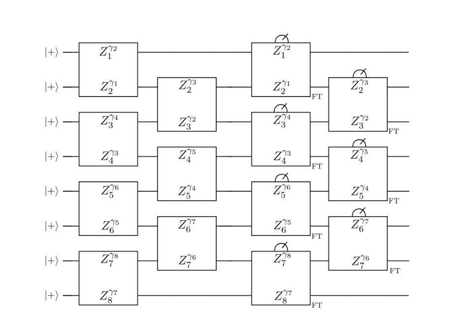 
Figure 5: Depiction of the fault-tolerant preparation and verification of the qudit cat state for n = 8 and R = 1. Every wire denotes a qudit, which may be imagined as the s non-pivot qubits of a cat state row gross code. The circuit proceeds via an initial non-fault-tolerant preparation, and then R rounds of fault-tolerant checking. Each set of n −1 measurements can be executed in two “layers”. In this diagram, all measurements are denoted by boxes. Those without meter symbols denote “measurement projections”, that is, measurements followed by the appropriate frame updates to ensure a trivial outcome. Those with meter symbols are not accompanied by frame updates following them. In this cat...

**Summary.** This paper proposes a new quantum error correction architecture that concatenates algebraic outer codes with high-rate quantum LDPC inner codes. By treating inner code blocks as large-alphabet 'Galois qudits,' the scheme overcomes correlated error issues and provides a scalable path to the teraquop regime with significantly reduced space overhead.

**Why it may be interesting.** not directly relevant

Detailed structure

**Main problem.** Scaling high-rate quantum LDPC codes is difficult due to the 'discrete family' problem and the presence of correlated errors within high-rate inner code blocks. The authors seek to achieve the 'teraquop regime' with efficient space overhead and robust fault tolerance.

**Main result.** The authors demonstrate that concatenating quantum Reed-Solomon outer codes over 'gross' inner codes allows access to the teraquop regime with lower space overhead than existing architectures. They also prove that a lightweight fault-tolerance scheme, which fails for qubits, is effective for large-alphabet qudits.

**Method.** The approach uses code concatenation where inner code blocks are treated as single logical Galois qudits. They employ list decoding, a 'time-like' Reed-Solomon protection for syndrome extraction, and a 'spacetime error mixing' technique to bound failure probabilities.

**Model / system.** A modular superconducting hardware architecture using Bivariate Bicycle (BB) codes, specifically the [[144, 12, 12]] 'gross' code, concatenated with quantum Reed-Solomon outer codes operating on large-alphabet Galois qudits (q=2048).

**Key observables.** Logical error rates, space overhead (physical-to-logical qubit ratio), and block weight of errors.

**Important parameters / regimes.** Physical noise rate of 10^-3, the teraquop regime (logical error rates of 10^-14 to 10^-13), and alphabet size q=2048.

**Assumptions / limitations.** Assumes catastrophic errors are predominantly localized to individual chips and that non-local connectivity costs scale non-uniformly with range and degree.

**Figures summary.** Figure 1 compares space overheads across various architectures (surface code, yoked surface codes, etc.) under a 500,000 physical qubit constraint, showing the concatenated gross code's path to the teraquop regime. Figure 4 illustrates the global memory system layout and the syndrome extraction process.

**Paper structure.** The paper introduces the problem of scaling qLDPC codes, proposes a concatenated architecture using Galois qudits, develops a fault-tolerant syndrome extraction protocol, provides a mathematical framework for error bounding via error mixing, and concludes with performance analysis in the teraquop regime.

Abstract

Different quantum error correction schemes trade off overhead, error suppression, and hardware connectivity. Code concatenation can relax these tradeoffs by using an outer code whose non-local connectivity is supplied by logical operations of an inner code rather than directly by hardware. Prior works showed that this can reduce memory overhead for local low-rate inner codes such as the surface code. Here, we study concatenation over non-local, high-rate inner codes. Such inner codes experience correlated errors among the many logical qubits in a single codeblock. We handle this by treating each block as a single logical Galois qudit, enabling concatenation with algebraic outer codes with excellent parameters and, crucially, list decoders. In particular, we consider a memory system formed by concatenating quantum Reed-Solomon outer codes over the gross code. For fault-tolerant syndrome extraction, we develop a Galois qudit Shor scheme using "time-like" Reed-Solomon protection against measurement errors. Interestingly, a lightweight fault tolerance scheme, that would fail for qubits, works well for large-alphabet qudits, suggesting a very different theory of fault tolerance for such qudits. The whole protocol is optimised via improved bicycle instruction logical error rates, novel compilation strategies, and recent decoder post-selection rules.   At uniform $10^{-3}$ physical noise, the concatenated gross code reaches the teraquop regime, which it previously could not access, with a lower space overhead than the $288$-qubit two-gross code, while offering several advantages from the engineering standpoint. Beyond our main case study, we believe the core ideas of Galois qudits, quantum Reed-Solomon outer codes, and list decoding, will prove generically powerful and highly transferable ideas across high-rate quantum architectures.

[↑ back to top](#top)

### [Dropout Universality: Scaling Laws and Optimal Scheduling at the Edge-of-Chaos](http://arxiv.org/abs/2605.21648v1)

**Authors:** Lucas Fernandez Sarmiento  
**Type:** both · **Category:** disordered systems and neural networks · **PDF:** <https://arxiv.org/pdf/2605.21648v1>  
**Analysis basis:** full PDF text, analyzed in chunks

📷 Fig 1

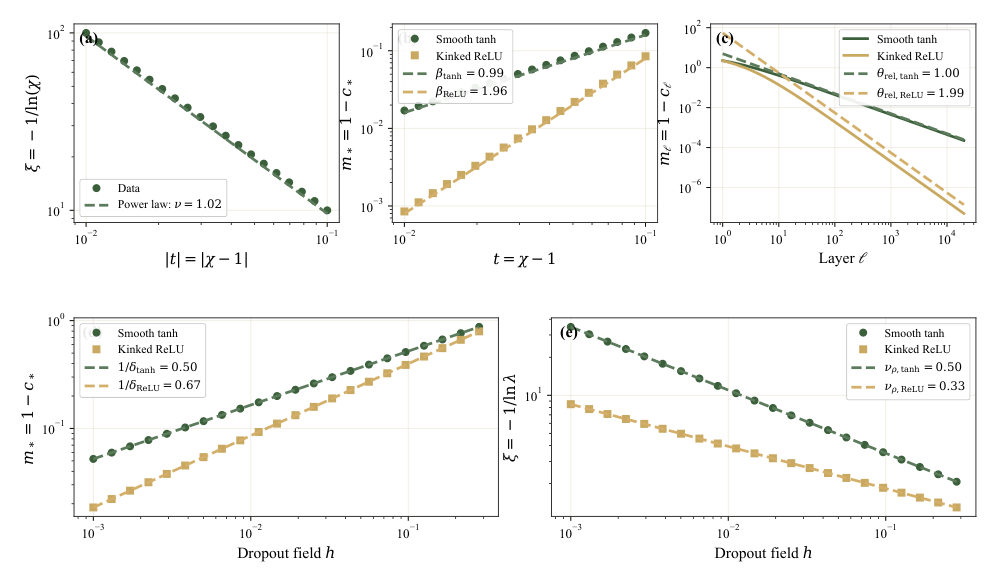 
Figure 1. Critical scaling for smooth (tanh) and kinked (ReLU) activation functions, comparing tuning at zero dropout to tuning at the edge-of-chaos using a dropout field. The top row compares the different critical exponents at zero dropout and probes critical detuning decay, while the bottom row explores on critical networks with non-zero dropout. As the variables grow, higher-order effects become comparable and the linearized theory departs from the full recursion.

📷 Fig 2

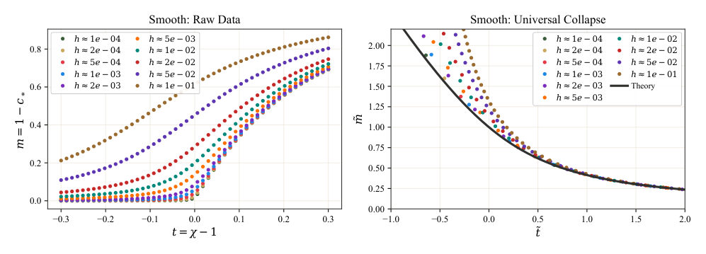 
Figure 2. Two-parameter crossover and scaling collapse of the dropout-deformed equation of state for the smooth universality class (tanh). Plots obtained using MFT recursion relations. The curves collapse onto a universal function after rescaling by ˜t and ˜m. The kinked counterpart is shown in Fig. 4.

📷 Fig 3

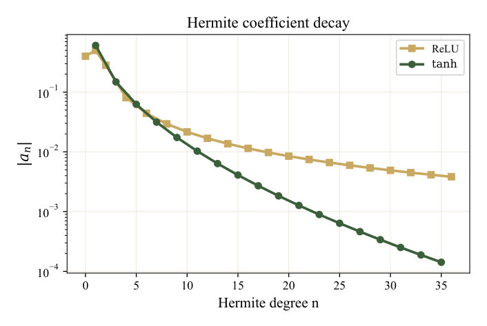 
Figure 3. Magnitude of Hermite coefficients |an| for ReLU versus tanh. ReLU exhibits a slow (power-law) decay, reflecting multi-scale support across Hermite degrees, while tanh decays rapidly and concentrates most spectral mass in the lowest modes.

📷 Fig 4

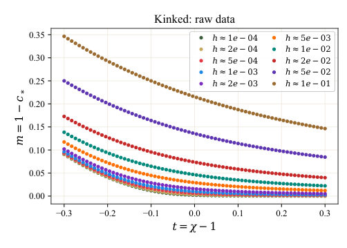 
Figure 4. Kinked counterpart to Fig. 1, showing the corresponding universal scaling collapse.

📷 Fig 5

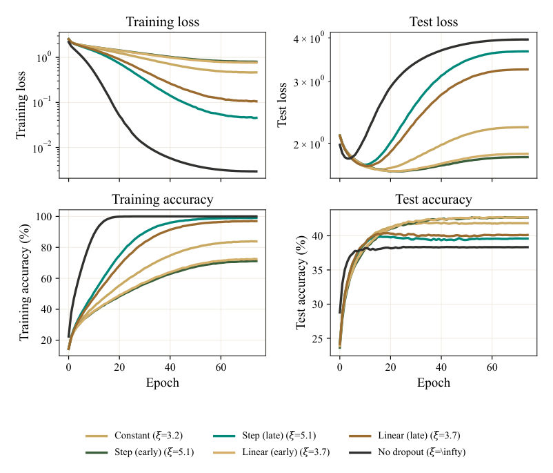 
Figure 5. Finite-width MLP training and test curves at fixed mean dropout budget ¯h (with 0 ≤hℓ≤hmax). We compare uniform dropout, linear ramps (increasing/decreasing with depth), and step schedules that concentrate dropout in either the first or last half of the network, together with the no-dropout baseline.

**Summary.** The paper provides a theoretical framework to understand how dropout shifts the critical point of signal propagation in deep networks. It discovers that activation function smoothness determines the network's universality class and proves that applying dropout more heavily to early layers optimizes performance by preventing rank collapse.

**Why it may be interesting.** not directly relevant

Detailed structure

**Main problem.** Understanding how dropout acts as a relevant perturbation that deforms the edge-of-chaos phase diagram and determining the optimal depth-dependent dropout schedule to prevent rank collapse.

**Main result.** Identified distinct universality classes for smooth vs. kinked activations and demonstrated that front-loading dropout (concentrating it in early layers) significantly improves generalization and prevents token diversity decay.

**Method.** Mean-field theory using a Landau-style expansion and renormalization group-like analysis of signal propagation, supplemented by numerical simulations on MLPs and Vision Transformers.

**Model / system.** Deep neural networks, specifically Multi-Layer Perceptrons (MLPs) and Vision Transformers (ViTs), analyzed in the infinite-width/large-channel limit.

**Key observables.** Order parameter (m), correlation length (xi), correlation susceptibility (chi), effective rank (participation ratio), and test loss/accuracy.

**Important parameters / regimes.** Dropout strength (h), detuning from criticality (t), activation function smoothness, and network depth/width ratio.

**Assumptions / limitations.** Assumes the large-width limit (L/N << 1) to control non-Gaussian corrections and i.i.d. Gaussian initialization.

**Figures summary.** Training curves for loss and accuracy under different schedules, visual comparisons of component-level ablations (Attention vs. MLP), and scaling collapse plots for different dropout strengths.

**Paper structure.** The paper introduces the problem of dropout-induced deformation of the critical point, develops a mean-field theory for smooth and kinked activation universality classes, derives scaling laws and optimal scheduling via variational calculus, and validates these predictions through empirical tests on MLPs and ViTs.

Abstract

We develop a mean-field theory of dropout as a perturbation of critical signal propagation at the edge of chaos. Dropout shifts the perfect-alignment fixed point, making the depth scale for information propagation finite even at critical initialization. We derive critical and crossover scaling laws for correlation decay and establish that smooth activations and kinked, ReLU-like activations constitute distinct universality classes, with different critical exponents and a universal two-parameter scaling collapse in detuning and dropout strength. The distinction traces to the analytic structure of the correlation map: smooth activations admit a Taylor expansion near perfect alignment, while kinked activations develop a branch point with universal non-analyticity. As a corollary, the framework yields saturated dropout profiles under fixed budget; a rank-flow tie-breaker then selects front-loaded schedules, substantially reducing held-out test loss at no extra computational cost, with accuracy gains as a consistent secondary effect. We test the predictions in MLPs and Vision Transformers and discuss CNN/ResNet extensions.

[↑ back to top](#top)

### [dSABRE: A SABRE-Style Router for Multi-Core Distributed Quantum Computers](http://arxiv.org/abs/2605.21960v1)

**Authors:** Sanjiang Li  
**Type:** theory · **Category:** quantum information and computing · **PDF:** <https://arxiv.org/pdf/2605.21960v1>  
**Analysis basis:** full PDF text, analyzed in chunks

📷 Fig 1

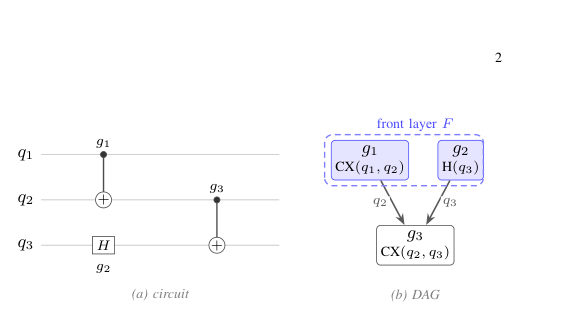 
Fig. 1. DAG for a three-gate circuit on qubits q1, q2, q3. CX(q1, q2) and H(q3) share no qubit and have no incoming edges, so both appear in the initial front layer F = {g1, g2} and may execute in parallel. CX(q2, q3) depends on both via qubits q2 and q3; it enters F only after g1 and g2 have been executed. Circuit depth is 2 (two sequential layers).

📷 Fig 2

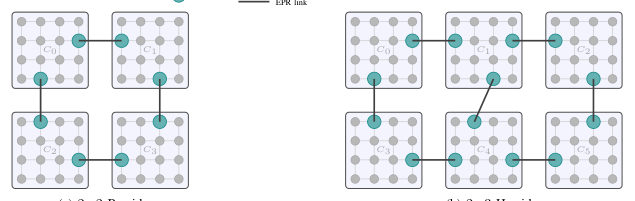 
Fig. 2. DQC architectures used in this paper (B-grid and H-grid families introduced by TELESABRE [15]). Small grey circles are qubits; teal circles are inter-core communication ports; bold lines are EPR-channel links between cores. Each core is a 4×4 grid. (a) 2×2 B-grid. (b) 2×3 H-grid.

📷 Fig 3

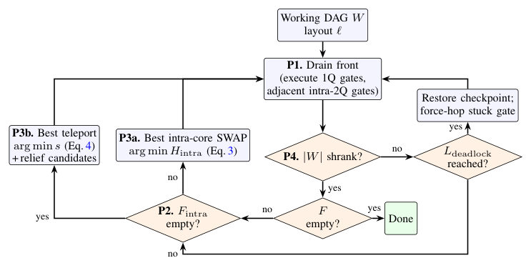 
Fig. 3. The DSABRE routing workflow. Each iteration drains the front layer (P1), classifies the remaining front into intra-core and inter-core gates (P2), applies one SWAP or one teleport (P3), and checkpoints when forward progress is made (P4).

📷 Fig 4

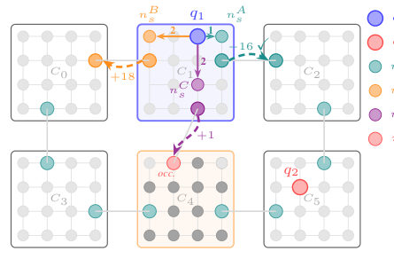 
Fig. 4. Running example for inter-core teleportation scoring (2×3 H-grid). Candidates A, B, and C below correspond row-by-row to Table I. Gate g = (q1, q2) has q1 in source core C1 (blue border) and q2 in target core C5. The router considers three candidates, each a triple (q1, cnext, (πs, πd)): A (teal) routes q1 towards C2; B (orange) routes towards C0, away from C5; C (violet) routes towards congested landing core C4 (orange border, fdst=2, where fdst counts free slots in cnext, not in ctgt). Step (1): intra-core SWAPs move q1 from p1 to staging slot ns (count shown on arrow). Step (2): a teleportation along link (πs, πd) delivers q1 to πd in cnext (dashed arc; score s annotated)....

**Summary.** The paper presents dSABRE, a new routing algorithm designed to optimize circuit execution on distributed quantum computers. By specifically addressing core congestion and optimizing the cost of inter-core entanglement, it significantly reduces the number of required EPR pairs compared to existing methods. This is crucial for scaling quantum computing architectures where remote entanglement is a bottleneck.

**Why it may be interesting.** not directly relevant

Detailed structure

**Main problem.** Minimizing the consumption of EPR pairs and intra-core SWAP operations when routing quantum circuits on a multi-core distributed quantum computer (DQC).

**Main result.** The dSABRE router reduces geometric-mean EPR consumption by 41-44% over TELESABRE and 16-68% over pytket-dqc, demonstrating high scalability up to 360 qubits.

**Method.** A SABRE-style, lookahead-driven routing algorithm using a five-term gate-centric teleportation score, a proactive congestion-relief mechanism, and a BFS-layer construction for the inter-core extended set.

**Model / system.** A multi-core distributed quantum architecture consisting of multiple small quantum processing units (cores) interconnected via EPR links, modeled as a weighted graph with high-cost inter-core edges.

**Key observables.** Geometric-mean EPR consumption, intra-core SWAP costs, and inter-core teleportation costs.

**Important parameters / regimes.** SWAP cost (c_swap), teleportation cost (c_tele), capacity penalty (c_cap), lookahead decay parameter (gamma), and core capacity/demand thresholds.

**Assumptions / limitations.** Assumes the initial layout and communication-primitive selection stages are handled by other parts of the compilation pipeline; assumes a fixed grid-of-grids topology.

**Figures summary.** Figure 1 shows a circuit representation; Figure 3 illustrates the dSABRE routing workflow; Figure 4 provides a running example of inter-core teleportation scoring on an H-grid; Table I details scoring for specific candidates.

**Paper structure.** The paper introduces the routing problem, describes the dSABRE algorithm and its scoring mechanisms, presents ablation studies to validate individual components, compares performance against state-of-the-art baselines, and demonstrates scalability via large-scale QFT circuits.

Abstract

Minimising EPR consumption is the dominant objective when routing a quantum circuit on a distributed quantum computer (DQC). We present dSABRE, a SABRE-style router for multi-core processors that, on each iteration of a lookahead-driven loop, first resolves any intra-core front-layer gates by SWAP scoring and only falls back to scoring inter-core teleportation candidates when the intra-core front is empty. Three mechanisms drive the improvement over the state of the art: a five-term gate-centric teleportation score that generalises the local SWAP heuristic to the inter-core setting, whose explicit capacity-penalty term keeps the scorer from teleporting into saturated cores; a proactive congestion-relief pass that redistributes idle qubits out of high-demand cores before deadlock; and a BFS-layer construction of the inter-core extended set that respects DAG dependencies layer by layer rather than mixing wires in topological order. Across 18 MQT-Bench circuits at 25, 36, and 64 logical qubits, dSABRE reduces geometric-mean EPR consumption by 41-44% over TeleSABRE and by 16-68% over the gate-teleportation-based pytket-dqc, using standard Qiskit SabreLayout for the initial layout. A large-circuit QFT sweep at 100-360 qubits confirms scalability. Code and online appendices are available at https://github.com/ebony72/dsabre.

[↑ back to top](#top)

### [Effect of Pb Substitution at the Mo site on the Magnetic Properties of the Polar Magnet Fe$_2$Mo$_3$O$_8$](http://arxiv.org/abs/2605.21841v1)

**Authors:** Takumi Shirasaki, Taichi Ishikawa, Shungo Nakayama, Hideki Kuwahara  
**Type:** experiment · **Category:** strongly correlated electrons · **PDF:** <https://arxiv.org/pdf/2605.21841v1>  
**Analysis basis:** full PDF text, analyzed in chunks

📷 Fig 1

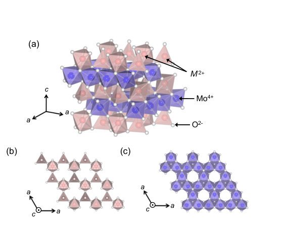 
Fig. 1. (a) Crystal structure of the M2Mo3O8 system (space group P63mc) visualized using VESTA [2]. The magnetic M2+ layers and Mo4+ layers are alternately stacked along the c-axis. (b) Honeycomb lattice formed by M2+ ions, occupying inequivalent octahedral and tetrahedral sites. (c) Kagome-like lattice formed by Mo4+ ions, in which three adjacent Mo ions form a spin- singlet trimer, rendering the layer non-magnetic.

📷 Fig 2

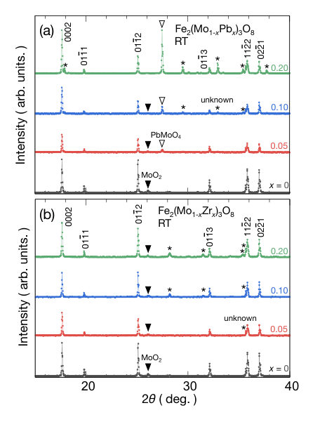 
Fig. 2. (a) Powder X-ray diffraction patterns of polycrystalline Fe2(Mo1−xPbx)3O8 at room temperature (RT). Black and white triangles indicate peaks from MoO2 and PbMoO4, respectively. Asterisks denote peaks from unidentified impurities. (b) Powder X-ray diffraction patterns of polycrystalline Fe2(Mo1−xZrx)3O8 at RT. Black triangles indicate MoO2 peaks, and asterisks denote unidentified impurity peaks.

📷 Fig 3

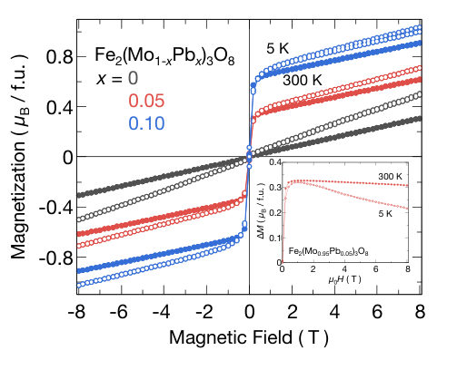 
Fig. 4. Magnetic field dependence of the magnetization for polycrystalline Fe2(Mo1−xPbx)3O8 (x = 0, 0.05, 0.10) at 5 K (open symbols) and 300 K (solid symbols). The inset shows the change in magnetization for x = 0.05 relative to the pristine x = 0 sample, ∆M = M(x = 0.05) −M(x = 0) (see text for details).

📷 Fig 4

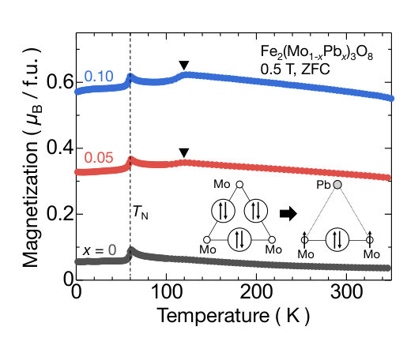 
Fig. 3. Temperature dependence of the magnetization for polycrystalline Fe2(Mo1−xPbx)3O8 (x = 0, 0.05, 0.10). The dashed line indicates the antiferromagnetic transition temperature (TN), and black triangles mark the magnetic anomalies observed for x = 0.05 and 0.10. The inset illustrates a schematic spin configuration model that effectively explains the experimental results when a single Pb ion substitutes into a Mo trimer. The up and down arrows enclosed in a circle indicate a spin-singlet pair (see text for details).

📷 Fig 5

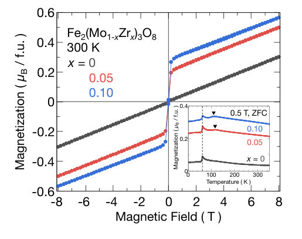 
Fig. 5. Magnetic field dependence of the magnetization for polycrystalline Fe2(Mo1−xZrx)3O8 (x = 0, 0.05, 0.10) at 300 K. The inset shows the temperature dependence of the magnetization measured under zero-field- cooled (ZFC) conditions. The dashed line and black triangles indicate TN and the magnetic anomalies, respectively.

**Summary.** This study demonstrates that substituting non-magnetic ions into the Mo sites of the polar magnet Fe2Mo3O8 breaks up spin-singlet clusters, creating active spins that induce room-temperature ferromagnetism. This approach provides a strategy for designing new magnetoelectric materials by controlling non-magnetic cluster states.

**Why it may be interesting.** not directly relevant

Detailed structure

**Main problem.** Investigating how substituting non-magnetic Pb4+ and Zr4+ ions into the Mo sites of the polar magnet Fe2Mo3O8 disrupts Mo spin-singlet trimers to induce new magnetic functionalities.

**Main result.** The disruption of Mo spin-singlet trimers induces active spins in the Mo layer, leading to the emergence of ferromagnetic-like behavior that persists up to room temperature.

**Method.** Solid-state reaction synthesis followed by powder X-ray diffraction (XRD) with Rietveld refinement and magnetic measurements using a vibrating sample magnetometer (VSM) up to 8 T.

**Model / system.** The system is the ternary transition-metal oxide Fe2Mo3O8, a polar magnet with a layered structure of magnetic Fe honeycomb lattices and non-magnetic Mo kagome lattices containing Mo4+ spin-singlet trimers.

**Key observables.** Magnetization (M) vs. temperature (T) and magnetic field (H), Neel temperature (TN), and magnetization increment (delta M).

**Important parameters / regimes.** Substitution level (x) from 0 to 0.20, Neel temperature TN approx 60 K, and effective spin S = 1/2 per active Mo ion.

**Assumptions / limitations.** The model assumes a single dopant ion severs two of the three spin-singlet bonds in a trimer, leaving one intact dimer with localized spins.

**Paper structure.** The paper introduces the material and the problem of Mo-site substitution, describes the experimental synthesis and structural characterization, presents magnetic measurement results showing emergent ferromagnetism, and provides a quantitative statistical model to explain the observed magnetization increase.

Abstract

The ternary transition-metal oxide Fe$_2$Mo$_3$O$_8$ is a polar magnet characterized by a layered structure of magnetic Fe honeycomb lattices and non-magnetic Mo kagome lattices. Whereas previous studies have primarily focused on the chemical substitution at the Fe sites to modulate the magnetic properties, the Mo sites have remained largely unexplored due to the strong spin-singlet trimerization of Mo$^{4+}$ ions. In this study, we investigated the effect of substituting non-magnetic Pb$^{4+}$ and Zr$^{4+}$ ions into the Mo sites to intentionally disrupt the Mo trimers. Our results reveal that the disruption of the Mo spin-singlet state induces active spins within the Mo layer, resulting in the emergence of a ferromagnetic-like behavior that persists even at room temperature. Quantitative analysis that takes into account the weight fraction of the main phase suggests an effective spin $S = 1/2$ state per active Mo ion upon trimer disruption. These findings demonstrate that controlling non-magnetic cluster states within a polar host via chemical substitution is a promising approach for designing room-temperature magnetoelectric materials.

[↑ back to top](#top)

### [Emergent magnetic and charge ordered phases in freestanding ultrathin \ce{LaVO3}](http://arxiv.org/abs/2605.22415v1)

**Authors:** Ashutosh Anand, Mukul Kabir  
**Type:** theory · **Category:** strongly correlated electrons · **PDF:** <https://arxiv.org/pdf/2605.22415v1>  
**Analysis basis:** full PDF text, analyzed in chunks

📷 Fig 1

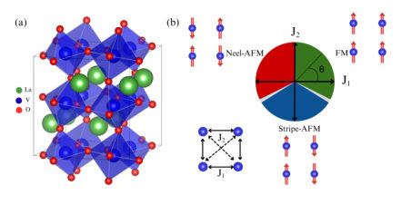 
Figure 1. (a) √

📷 Fig 2

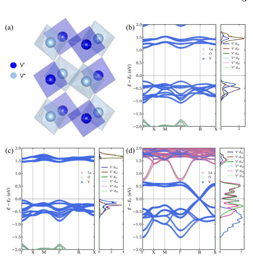 
Figure 2. (a) Representative crystal structure to illustrate spatial arrangement of V′ and V′′ atoms. Electronic structure evolution of C-AFM state across different lattice symetries (b) orthorhombic, (c) monoclinic and (d) cubic. Orthorhombic and monoclinic phase exhibits an insulating gap with pro- nounced orbital ordering, whereas cubic phase demonstrates a metallic nature and no orbital ordering.

📷 Fig 3

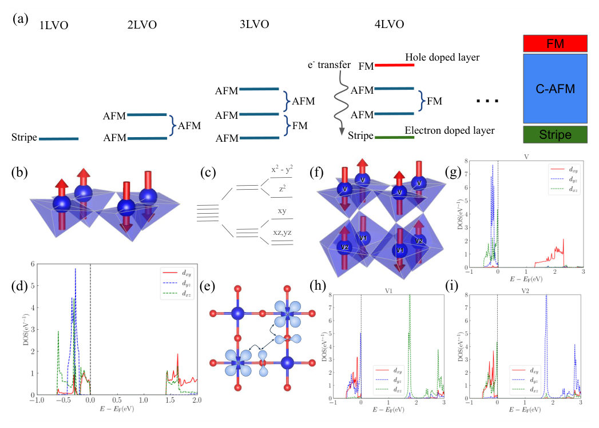 
Figure 3. (a) Schematic evolution of magnetic ground state in LaVO3 thin films as a function of thickness. (b) Structure of 1LVO with stripe-AFM configuration. (c) d-level splitting under a square pyramidal crystal field environment. (d) Projected DOS of V t2g manifold showing dominant dxz and dyz orbitals as expected, but also a finite dxy contribution. (e) Illsutration of dxy mediated next neighbor exchange pathway. (f) Structure of 2LVO along with projected DOS of V ions. (g) Vanadium ions on top layer show no orbital ordering and (h),(i) ions at the bottom layer show orbital ordering same as bulk.

📷 Fig 4

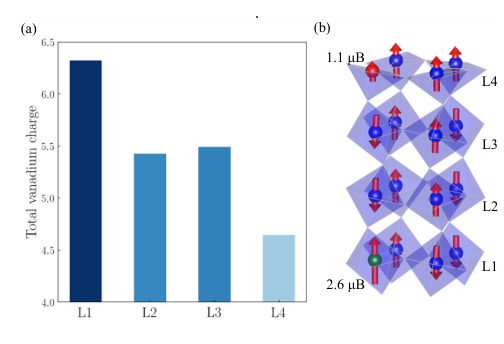 
Figure 4. (a) Layer resolved total vanadium charge across 4LVO layers, showing a clear charge redistribution between layers. (b) Structure of 4LVO, showing site selective nature of charge transfer, red and green sphere mark the sites that have lost and gained electrons.

📷 Fig 5

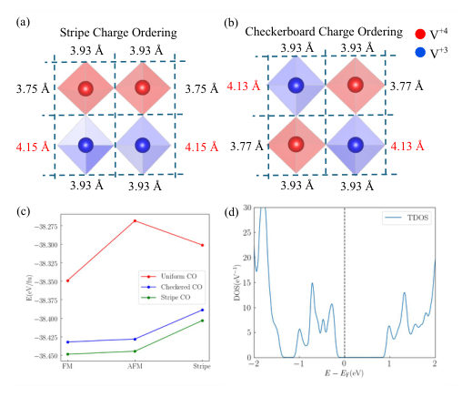 
Figure 5. (a) Stripe and (b) Checkerboard charge order- ing patterns at a doping concentration of 0.5h/fu. Sites with higher electron density have expanded octahedras while electron depleted sites have contracted octahedras, reflecting breathing mode distortions. (c) Relative energies of charge ordered states under different magnetic configuration. FM state in stripe charge ordering is energetically most favorable. (d)t2g projected DOS for V+3 and V+4.

**Summary.** This paper uses DFT and Monte Carlo simulations to show how the magnetic and electronic properties of LaVO3 change when it is thinned down to a monolayer. It discovers that thickness and charge transfer from polar catastrophes can induce new ferromagnetic and charge-ordered phases.

**Why it may be interesting.** not directly relevant

Detailed structure

**Main problem.** Investigating the intrinsic electronic and magnetic properties of freestanding ultrathin LaVO3 films, specifically how thickness and charge transfer drive emergent magnetic and charge-ordered phases.

**Main result.** The study reveals a thickness-dependent magnetic transition from bulk-like C-type AFM to stripe-AFM in monolayers, and identifies that polar catastrophe-driven charge transfer in thicker films creates FM and stripe-AFM surface states.

**Method.** Density functional theory (DFT) using VASP with a Hubbard U correction, supplemented by classical Monte Carlo simulations using the Vampire code.

**Model / system.** Freestanding ultrathin LaVO3 films ranging from monolayer to 8 layers, modeled with an orthorhombic/monoclinic perovskite structure and a Heisenberg model for magnetic interactions.

**Key observables.** Magnetic phases (C-AFM, stripe-AFM, FM, Neel-AFM), charge ordering patterns, magnetic moments, and exchange interaction parameters (J1, J2, J_perp).

**Important parameters / regimes.** Film thickness (1L to 8L), doping concentrations (0.5h/fu, 0.25h/fu, etc.), and Hubbard U = 3 eV.

**Assumptions / limitations.** The use of a classical Monte Carlo approach for magnetic transitions and the approximation of electron correlations via the DFT+U method.

**Figures summary.** Figure 1(a) shows the supercell structure; Figure 5 illustrates stripe and checkerboard charge ordering patterns and their relative energies.

**Paper structure.** The paper begins with the motivation of studying freestanding membranes, moves to the computational methodology, details the thickness-dependent magnetic transitions, explores polar catastrophe-driven charge transfer in thicker films, and concludes with an analysis of doping-induced charge ordering.

Abstract

Transition metal oxide perovskites are an ideal platform for exploring the interplay between spin, orbital, charge and lattice degrees of freedom. Among them, \ce{LaVO3} has been extensively studied in heterostructures and superlattices, where exotic phases have been reported. Motivated by the advances in freestanding oxide membranes, we investigate the intrinsic properties of freestanding ultrathin \ce{LaVO3} films using density functional theory. Our calculations reveal a sequence of magnetic phase transitions with thickness, starting from stripe-AFM in monolayer until the bulk like C-AFM is recovered. Beyond four layers, polar catastrophe driven charge transfer dopes the surface layers giving rise to stripe-AFM and ferromagnetic surface states while the central layers remain bulk like. We further explore this fact by studying charge doped monolayer, discovering that hole doping drives the system into ferromagnetic state. Doping also induced charge ordering in the system. A striped charge ordering pattern is observed at 0.5 h/fu, while a 3:1 stripe pattern emerges at 0.25 h/fu, indicating that the periodicity of the superstructure changes with doping concentration.

[↑ back to top](#top)

### [Equilibrium Stabilization of a Hidden Phase Like Metallic State in 1T-TaS2](http://arxiv.org/abs/2605.22292v1)

**Authors:** Turgut Yilmaz, Anil Rajapitamahuni, Suji Park, Houk Jang, Asish K. Kundu, Elio Vescovo  
**Type:** experiment · **Category:** strongly correlated electrons · **PDF:** <https://arxiv.org/pdf/2605.22292v1>  
**Analysis basis:** full PDF text, analyzed in chunks

📷 Fig 1

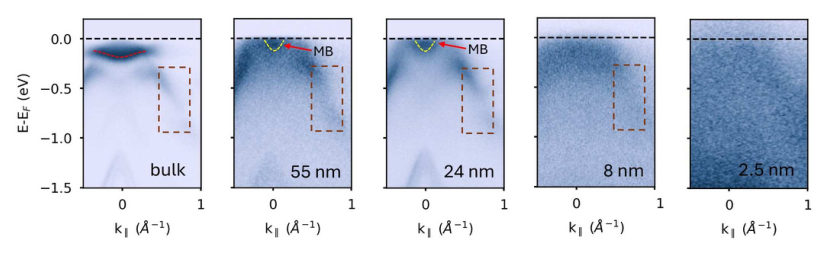 
Figure 1: Dimensional control of the electronic structure in 1T-TaS2. ARPES spectra along Γ–M are shown for bulk and exfoliated flakes with thicknesses of 55, 24, 8, and 2.5 nm. Bulk crystals exhibit the C-CDW state with a lower Hubbard band at ≈∼200 meV marked with red parabola with no spectral weight at EF. By contrast, 24 and 55 nm flakes display a shallow Γ-centered MB crossing EF marked with yellow dashed parabolas, consistent with stabilization of the HPLMS under equilibrium conditions. Thinner flakes show progressively degraded spectra: the 8 nm sample retains a broadened MB, while the 2.5 nm flake evolves into a fully gapped state with incoherent features marked with dashed black line....

📷 Fig 2

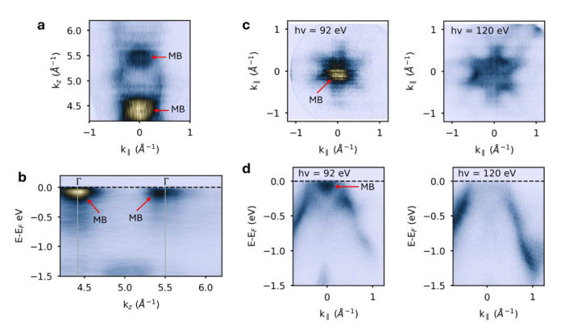 
Figure 2: kz periodicity and photon-energy dependence of the MB in exfoliated 25 nm thick 1T-TaS2. a, Fermi surface map in the (k∥, kz) plane showing strong intensity of the MB only at selected kz values. b, Corresponding E–kz dispersion highlighting the Γ-centered MB. c, Fermi surface maps at hν = 92 eV (kz ≈Γ) and 120 eV (kz ≈A), showing a bright pocket at Γ that vanishes at A. d, E–k∥dispersions at the same photon energies, reinforcing the photon-energy dependent modulation of MB. All ARPES data is recorded at 50 K sample temperature.

📷 Fig 3

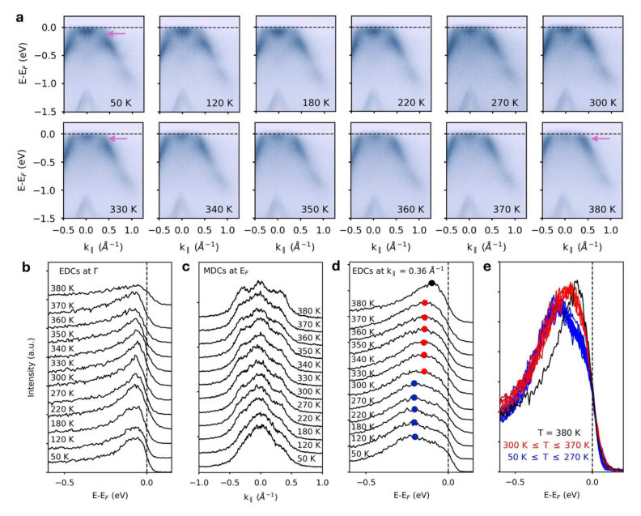 
Figure 3: Temperature-dependent ARPES of a 24 nm 1T-TaS2 flake. a, ARPES spectra along Γ–M recorded between 50 and 380 K. At low T, the MB coexists with a CDW-related suppression near 0.2–0.3 eV below EF , persisting up to 300 K. Above 300 K, the suppression weakens, and at 370–380 K the CDW feature collapses, leaving only a broadened MB. b, Energy distribution curves (EDCs) at Γ showing a sharp loss of MB spectral weight across 370 K. c, Momentum distribution curves (MDCs) at EF , integrated within 30 meV below EF, evolving from a broad MB-dominated profile at low T to distinct side-band peaks at high T. d, EDCs at k∥= 0.36 ˚A−1, where the CDW-related peak at ∼0.23 eV (blue markers) is...

📷 Fig 4

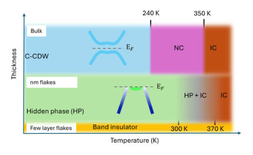 
Figure 4: Schematic phase diagram of 1T-TaS2 as a function of thickness and tem- perature. In bulk crystals, the well-known sequence of charge-density-wave (CDW) phases is recovered: commensurate (C-CDW, Mott insulating), nearly commensurate (NC), and incom- mensurate (IC), with the C-CDW transition occurring at ∼180 K on cooling and ∼240 K on warming. Nanometer-thick flakes bypass the bulk-like 240 K transition and instead stabilize a HPLMS that persists up to room temperature before evolving into a mixed HP+IC regime and finally the IC phase above ∼370 K. In the few-layer limit, the system becomes a band insulator with no clear CDW order. Band sketches illustrate representative electronic...

**Summary.** This paper demonstrates that the transient 'hidden' metallic phase of 1T-TaS2 can be stabilized as a stable equilibrium state by controlling the thickness of exfoliated flakes. This discovery provides a way to access and control competing electronic configurations in correlated materials without needing ultrafast laser excitation. The findings have significant implications for developing new phase-change technologies and quantum electronic devices.

**Why it may be interesting.** not directly relevant

Detailed structure

**Main problem.** The study aims to understand how to stabilize the metastable 'hidden' metallic phase of 1T-TaS2 in equilibrium and how electronic phases evolve with material thickness and temperature.

**Main result.** The researchers discovered that intermediate-thickness 1T-TaS2 flakes spontaneously host a stable, equilibrium metallic state (HPLMS) that mimics the transient hidden phase seen in bulk crystals under excitation.

**Method.** High-resolution angle-resolved photoemission spectroscopy (ARPES) was performed on mechanically exfoliated 1T-TaS2 flakes of varying thicknesses using the mu-ARPES technique.

**Model / system.** The physical system is 1T-TaS2 (tantalum disulfide), a layered transition metal dichalcogenide known for its complex charge density wave (CDW) and Mott insulating phases.

**Key observables.** Spectral weight at the Fermi level, metallic band (MB) intensity, hybridization gaps, Fermi surface maps, and energy-momentum (E-k) dispersions.

**Important parameters / regimes.** Material thickness (ranging from 2.5 nm to 55 nm), temperature (50 K to 380 K), and out-of-plane momentum (kz).

**Assumptions / limitations.** The study assumes the free-electron final-state approximation for determining out-of-plane momentum.

**Figures summary.** Figure 1 shows dimensional control and thickness-dependent spectra; Figure 2 illustrates kz periodicity and Fermi surface maps in 25 nm flakes; Figure 3 details temperature-dependent EDCs and MDCs; Figure 4 presents a schematic phase diagram as a function of thickness and temperature.

**Paper structure.** The paper introduces the problem of metastable phases, describes the experimental setup and sample preparation, presents thickness-dependent spectroscopic results, analyzes temperature-driven phase evolution, and concludes with a proposed phase diagram.

Abstract

Electronic phases that lie outside the equilibrium ground state offer a route to explore competing configurations in correlated materials. In 1T-TaS2, ultrafast excitation accesses a metallic hidden phase that is distinct from the commensurate insulating ground state. Here we use angle-resolved photoemission spectroscopy to show that an equivalent electronic configuration is stabilized in exfoliated intermediate-thickness 1T-TaS2 flakes, where it persists up to room temperature before evolving through a different sequence of electronic transitions. This equilibrium hidden-phase-like state hosts a metallic band with finite Fermi-level spectral weight while retaining the characteristic hybridization gaps associated with the star-of-David band folding. These results establish a platform for controlling competing electronic states in layered materials, with implications for both quantum science and phase change technologies.

[↑ back to top](#top)

### [GeneCS: Synthesizing Resource-Efficient Code Surgery for Arbitrary Quantum Stabilizer Codes](http://arxiv.org/abs/2605.21746v1)

**Authors:** Junyu Zhou, Ali Javadi-Abhari, Gushu Li  
**Type:** theory · **Category:** quantum information and computing · **PDF:** <https://arxiv.org/pdf/2605.21746v1>  
**Analysis basis:** full PDF text, analyzed in chunks

📷 Fig 1

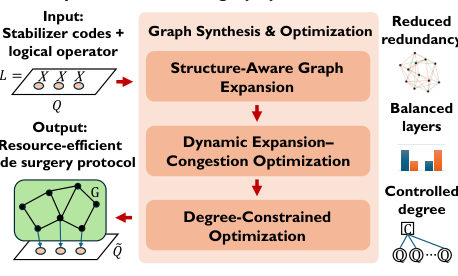 
Figure 1. Overview of GeneCS workflow

📷 Fig 2

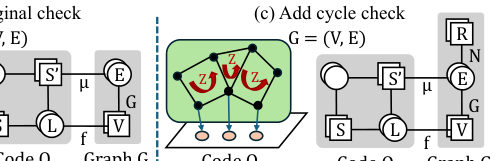 
Figure 3. Ancilla system represented as a graph.

📷 Fig 3

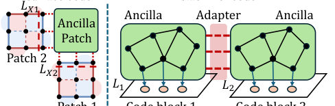 
Figure 4. Overview of code surgery construction

📷 Fig 4

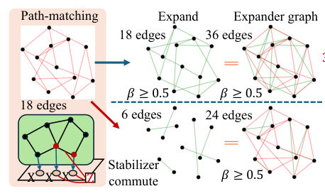 
Figure 6. Expand on path-matching graph. 𝛽: Cheeger con- stant.

📷 Fig 5

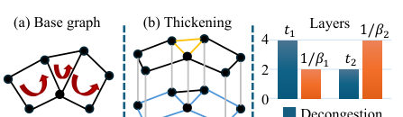 
Figure 7. Graph thickening and the trade-off between de- congestion and expansion

**Summary.** The paper introduces GeneCS, a compiler designed to automate the creation of efficient 'code surgery' protocols for quantum error correction. By treating the construction of ancilla systems as a graph optimization problem, it significantly reduces the physical qubit overhead required for logical operations without sacrificing error protection.

**Why it may be interesting.** not directly relevant

Detailed structure

**Main problem.** The high resource overhead (ancillary qubits and checks) required for performing fault-tolerant code surgery and cross-code communication between arbitrary stabilizer codes.

**Main result.** The GeneCS compiler achieves an average reduction of over 85% in ancillary qubits and checks for both single-code and cross-code operations while preserving logical error rates and scalability.

**Method.** A graph-based synthesis framework using three optimization strategies: structure-aware graph expansion, dynamic expansion-congestion optimization, and degree-constrained optimization via graph thickening and cellulation.

**Model / system.** The framework operates on quantum stabilizer codes, including topological codes (surface, color) and QLDPC codes (Bivariate Bicycle, Hypergraph Product, Quantum Tanner), modeled as low-dimensional chain complexes.

**Key observables.** Ancillary qubit/check overhead, code distance, logical error rate, and maximum stabilizer weight (degree).

**Important parameters / regimes.** Cheeger constant (expansion), congestion (edge overlap), and maximum qubit/check degrees.

**Assumptions / limitations.** The scalability results observed in surface codes are assumed to extend to other CSS stabilizer codes due to their locally repetitive structure.

**Figures summary.** Figure 1 shows the GeneCS workflow; Figure 2 maps surface codes to graphs; Figure 3 details graph modification; Figure 5-7 illustrate expansion, congestion, and graph thickening; Figure 9 shows logical error rate stability.

**Paper structure.** The paper introduces the code surgery problem, defines a graph-theoretic model for ancilla systems, presents the GeneCS compiler algorithms (expansion, congestion, and degree optimization), provides experimental benchmarks on various code families, and discusses scalability and error rate performance.

Abstract

Efficiently realizing logical operations on general stabilizer codes remains a long-standing challenge in fault tolerant quantum computing. While code surgery provides a general framework with provable guarantees by joint logical measurements, existing constructions are largely theoretical and incur substantial ancilla overhead in practice. In this work, we propose GeneCS, a resource-efficient compiler for synthesizing code surgery protocols for arbitrary stabilizer codes. Our approach leverages structure-aware optimizations to eliminate redundancy in graph construction, dynamically balance expansion and congestion, and incorporate code degree constraints. Experimental results show that GeneCS achieves an average reduction of over $85\%$ in ancillary qubits and checks for both single-code and cross-code logical operations, while preserving logical error rates. Moreover, our compiler scales to codes with more than $10^4$ qubits with an amortized compilation time of about one second per instance. These results enable practical logical operations and efficient cross-code communication, thereby supporting the deployment of modern QLDPC codes and heterogeneous quantum architectures.

[↑ back to top](#top)

### [Large-flavor route to a stable U(1) Dirac spin liquid on the maple-leaf lattice](http://arxiv.org/abs/2605.21587v1)

**Authors:** Yunchao Zhang, Andreas Feuerpfeil, Subir Sachdev, Ronny Thomale, Yasir Iqbal  
**Type:** theory · **Category:** strongly correlated electrons · **PDF:** <https://arxiv.org/pdf/2605.21587v1>  
**Analysis basis:** full PDF text, analyzed in chunks

📷 Fig 1

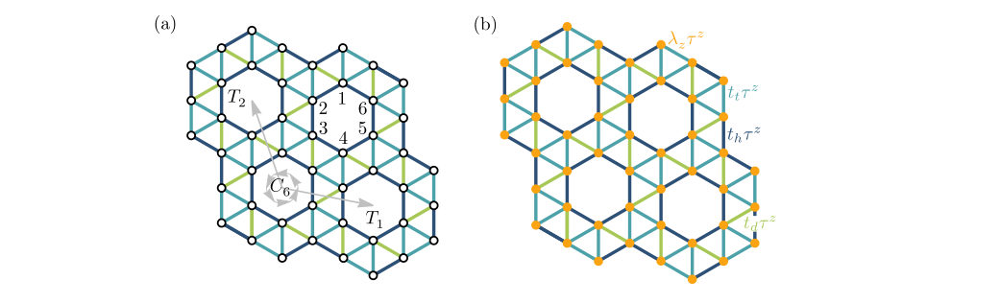 
FIG. 1. (a) Maple-leaf lattice and the generators of the microscopic space group used in the symmetry analysis. The unit cell contains six sites, and the relevant lattice symmetries are generated by translations T1, T2 and a sixfold rotation C6. (b) Pattern of mean-field amplitudes defining the uniform U(1) Dirac spin-liquid ansatz. The three inequivalent bond amplitudes are denoted by th, td, and tt.

📷 Fig 2

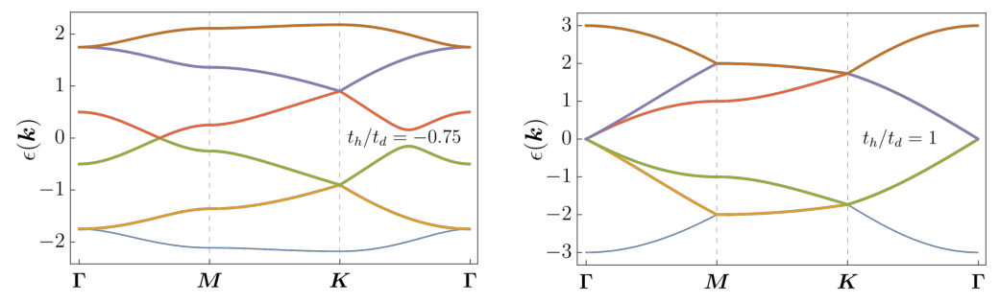 
FIG. 2. Mean-field spinon dispersions of the maple-leaf-lattice Dirac spin liquid obtained from the Hamiltonian in Eq. (10) at tt = 0. For th/td = −0.75 and at half-filling, the spectrum contains six Dirac nodes along the ΓM lines, related by C6 symmetry. This six-valley structure gives the infrared Nf = 12 QED3 theory studied in the main text. For comparison, at th/td = 1 the spectrum has two Dirac nodes at Γ; this distinct Nf = 4 mean-field DSL is unstable to infinitesimal changes of the hopping parameters.

**Summary.** This paper investigates whether a large number of fermion flavors can stabilize a U(1) Dirac spin liquid on the maple-leaf lattice. It identifies that the stability is not symmetry-protected but depends on the dynamical irrelevance of specific allowed monopoles. The work provides specific spectral predictions to guide numerical studies using exact diagonalization.

**Why it may be interesting.** not directly relevant

Detailed structure

**Main problem.** Determining the stability of a U(1) Dirac spin liquid (DSL) on the maple-leaf lattice against the proliferation of monopoles that could cause confinement.

**Main result.** The authors show that the maple-leaf lattice realizes a large-flavor QED3 theory with Nf=12, and while five spin-singlet monopoles are symmetry-allowed, their stability depends on whether they are dynamically irrelevant.

**Method.** Theoretical framework using fermionic parton construction, projective symmetry group (PSG) analysis, 't Hooft anomaly matching, and Wannier-center decomposition.

**Model / system.** A U(1) Dirac spin liquid on a frustrated maple-leaf lattice, described by an effective (2+1)D QED3 theory with Nf=12 Dirac fermions.

**Key observables.** Monopole quantum numbers (spin, lattice, and time-reversal), scaling dimensions of monopole operators, and symmetry-resolved spectral content.

**Important parameters / regimes.** Flavor number Nf=12, scaling dimension of the charge-one monopole (Delta_1), and hopping parameters (th, td, tt).

**Assumptions / limitations.** The stability of the phase is assumed to depend on the dynamical irrelevance of symmetry-allowed monopoles rather than symmetry protection.

**Figures summary.** Figure 1 shows the maple-leaf lattice structure and mean-field bond amplitudes; Figure 2 illustrates spinon dispersions and the Nf=4 regime.

**Paper structure.** The paper introduces the maple-leaf lattice as a large-flavor platform, derives the effective QED3 theory, performs a symmetry classification of monopoles, verifies anomaly matching, and provides numerical predictions for testing the phase.

Abstract

The $\mathrm{U}(1)$ Dirac spin liquid provides a useful organizing framework for frustrated magnets: it offers an algebraic parent state from which competing orders, confinement patterns, and low-energy spectral features can be understood. Whether such a state can occur as a stable ground state of a two-dimensional spin Hamiltonian remains an open question, because monopole events of the compact gauge field can proliferate and confine the spinons. Here, we show that the maple-leaf lattice provides a distinct route to this problem. Its Dirac spin liquid realizes QED$_3$ with $N_f=12$ Dirac fermions, substantially more than the $N_f=4$ theories of the triangular and kagome lattices. We classify the fundamental monopoles under the full microscopic symmetry group and find five charge-one spin-singlet monopoles that are trivial under lattice symmetries, time reversal, and spin rotation. The phase is therefore not protected by symmetry in the usual sense: its stability depends on whether these allowed monopoles are dynamically irrelevant. Available large-$N_f$ and Monte Carlo estimates place the charge-one monopole dimension close to the relevance threshold in $(2+1)$ dimensions, making the maple-leaf lattice a concrete large-flavor platform for testing the stability of compact QED$_3$ in a quantum magnet. The same monopole classification gives direct numerical predictions, identifying the symmetry sectors in which singlet, triplet, and quintet monopole excitations should appear. This provides a route to testing the $N_f=12$ Dirac spin liquid through symmetry-resolved exact diagonalization and variational studies of maple-leaf spin Hamiltonians.

[↑ back to top](#top)

### [Observation of Altermagnetic Order Switching in Bulk MnTe by Polarized Neutron Diffraction](http://arxiv.org/abs/2605.21616v1)

**Authors:** Zheyuan Liu, Shinichiro Asai, Shingo Takahashi, Hiraku Saito, Taro Nakajima, Takatsugu Masuda  
**Type:** experiment · **Category:** strongly correlated electrons · **PDF:** <https://arxiv.org/pdf/2605.21616v1>  
**Analysis basis:** full PDF text, analyzed in chunks

📷 Fig 1

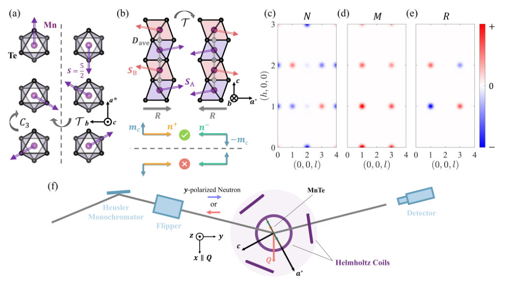 
FIG. 1. (a) Six altermagnetic domain states schematically shown for MnTe. The columns show orientational domain states related by a C3 rotation, and the rows show antiphase domain states related by time reversal T . (b) Two antiphase domain states (upper panel) with Néel vectors n+ and n−parallel to the a∗-axis. The NMI vector R aligns with the Néel vector and thus changes sign between the antiphase domain states. Spins are canted due to the alternating averaged DM vector Dave, leading to a finite net moment mc. The canting angle is exaggerated for illustration. The spin configuration in the lower panel is forbidden. Calculated structure factors of (c) nuclei, (d) spins, and (e) the scalar...

📷 Fig 2

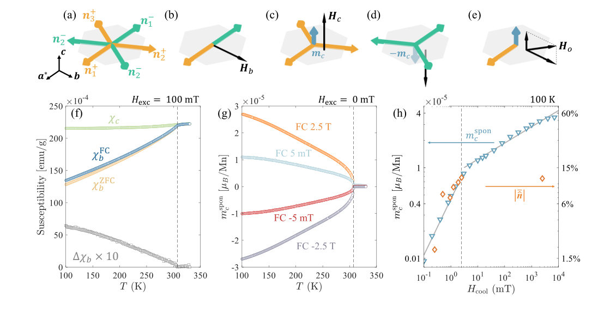 
FIG. 2. Schematics of (a) a multi-domain state in zero field, (b) a set of orientational domain states selected by an in-plane field Hb, (c), (d) Sets of antiphase domain states selected by an out-of-plane field Hc, and (e) a single-domain state selected by an oblique field Ho. (f) Magnetic susceptibilities of MnTe along the c-axis (χc, green), along the b-axis after ZFC (χZFC b , yellow), and along the b-axis after 5 T FC (χFC b , blue). The difference ∆χb = χFC b −χZFC b is scaled up by a factor of 10 and shown in gray. (g) Spontaneous WFM along the c-axis, mspon c , in MnTe. The excitation field during the measurement (Hexc) was zero. The data were collected upon warming. (h) Cooling-field...

📷 Fig 3

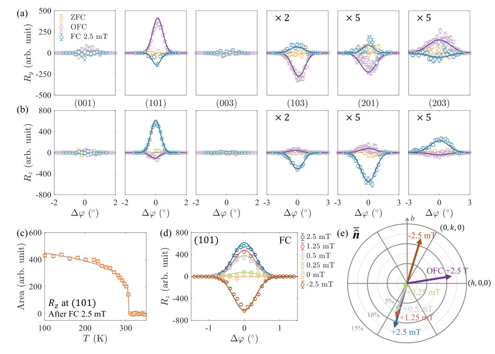 
FIG. 3. Components of the NMI vector, (a) Ry and (b) Rz, measured after ZFC, OFC, and FC at the Bragg peaks (001), (101), (003), (103), (201), and (203) at 100 K. Gaussian fits with areas fixed to the calculated values are shown as solid lines. The field in OFC setup was applied in the bc-plane as shown in Fig. 2(e), and the field in FC setup was applied in the c-axis. (c) Temperature dependence of Rz at (101) after 2.5 mT FC. A power-law fit is shown as a solid line. (d) Cooling-field dependence of Rz at (101) at 100 K. (e) Mapping of ˆn after each cooling condition in the ab-plane. The different orientations of ˆn in the FC and OFC setups result in opposite signs of Ry in (a) and Rz in (b).

📷 Fig 4

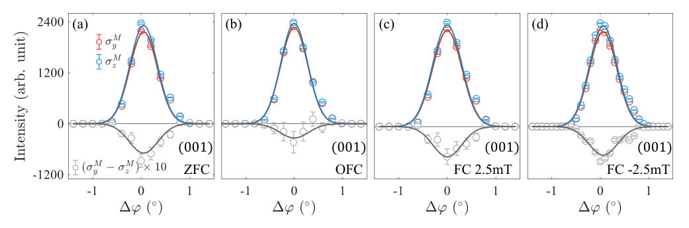 
FIG. 4. σM y (red) and σM z (blue) obtained using z-polarization after (a) ZFC, (b) OFC, (c) FC at 2.5 mT, and (d) FC at −2.5 mT at the pure magnetic Bragg peak (001) at 100 K. The difference σM y −σM z is scaled up by a factor of 10 and shown in gray. Gaussian fits with areas fixed to the calculated values are shown as solid lines.

**Summary.** This paper provides direct experimental evidence for the existence and controllability of altermagnetic order in bulk MnTe. By using polarized neutron diffraction, the authors show that the Néel vector can be manipulated with very small magnetic fields, which is a crucial step toward using altermagnets in spintronic devices.

**Why it may be interesting.** not directly relevant

Detailed structure

**Main problem.** Determining if altermagnetic order in bulk MnTe can be directly observed and controlled by external magnetic fields in the absence of net magnetization.

**Main result.** The researchers demonstrated that the altermagnetic Néel vector and the associated weak ferromagnetic moment (WFM) can be switched using milli-Tesla-scale magnetic field cooling, providing direct evidence of a net Néel vector in the bulk.

**Method.** Polarized Neutron Diffraction (PoND) in half-polarized mode was used to probe nuclear-magnetic interference terms, complemented by magnetic susceptibility and spontaneous magnetization measurements.

**Model / system.** The study focuses on bulk MnTe, a prototype altermagnet with a centrosymmetric hexagonal lattice (space group P63/mmc) and an A-type antiferromagnetic ground state.

**Key observables.** Nuclear-magnetic interference (NMI) vector R, weak ferromagnetic moment (WFM), Néel vector (n), and magnetic susceptibility.

**Important parameters / regimes.** Néel temperature TN = 307 K, magnetic field scales in the milli-Tesla range, and the presence of spin-orbit coupling (SOC).

**Assumptions / limitations.** The study assumes the WFM arises from an imbalance in antiphase domains rather than from domain walls.

**Figures summary.** Fig 1 shows the MnTe domain states and the NMI vector mechanism; Fig 2 illustrates Néel vector configurations and susceptibility/WFM measurements; Fig 3 presents the NMI vector components under different cooling conditions and their temperature dependence.

**Paper structure.** The paper introduces the concept of altermagnetism, describes the experimental setup for polarized neutron diffraction, presents the observation of NMI as evidence for the Néel vector, demonstrates domain switching via field cooling, and discusses the origin of the weak ferromagnetic moment.

Abstract

Altermagnetic order, characterized by the Néel vector, breaks time-reversal symmetry (TRS) even in the nonrelativistic limit. Although spin-polarized and anomalous transport phenomena emerge with this order, they are mutually compensated by TRS-connected antiphase domains with opposite Néel vectors. Here we employ polarized neutron diffraction to directly probe the altermagnetic order in MnTe. Pronounced nuclear-magnetic interference terms were observed, providing direct evidence of a net Néel vector in the bulk crystal. Moreover, a weak ferromagnetic moment (WFM), originating from relativistic spin-orbit coupling, was found to be coupled with the altermagnetic order. Both the altermagnetic order and the WFM can be switched by milli-Tesla-scale magnetic field cooling.

[↑ back to top](#top)

### [Persistence of asymptotic variance under transport: from hyperfluctuation to stealthy hyperuniformity](http://arxiv.org/abs/2605.22803v1)

**Authors:** Luca Lotz, Michael A. Klatt  
**Type:** theory · **Category:** disordered systems and neural networks · **PDF:** <https://arxiv.org/pdf/2605.22803v1>  
**Analysis basis:** full PDF text, analyzed in chunks

📷 Fig 1

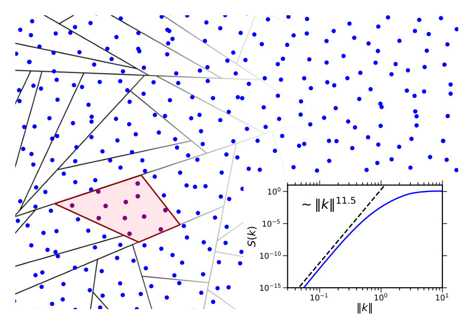 
Figure 1: Illustration of our construction of an isotropic point process that is hyperuniform with an exceptionally large scaling exponent. In black and fading out from left to right, we show a realization of a random fair tiling, i.e., a random division of space into cells of equal volume; specifically, a realization of a fair STIT; see Subsection 5.1. To obtain the point process shown in blue, we concentrate the mass that is uniformly distributed over each cell into n points while preserving the first p moments, i.e., satisfying (1.8). Here, n = 12 and p = 6; see the cell highlighted in red. By our main Theorem 4.13 about the persistence of p-uniformity under transport, this point process...

**Summary.** This paper provides a mathematical framework to understand how density fluctuations, ranging from hyperfluctuation to stealthy hyperuniformity, behave under random mass transport. It solves an open problem regarding the persistence of these fluctuations in dimensions d >= 3 and introduces new, efficiently simulatable point processes.

**Why it may be interesting.** not directly relevant

Detailed structure

**Main problem.** Determining the conditions under which the scaling of density fluctuations (p-uniformity) is preserved when a random measure undergoes a random transport process.

**Main result.** The authors establish a persistence theorem stating that p-uniformity is preserved under transport if the transport distance has a finite (d+p)-th moment and certain expansion terms are controlled.

**Method.** The study uses Fourier analysis of the Bartlett spectral measure, Taylor expansions of the transport kernel, and moment conditions on transport distance.

**Model / system.** The model involves stationary random complex measures on R^d, including point processes and mass-redistribution (transport) kernels that move mass from a source to a destination.

**Key observables.** p-uniformity exponent, asymptotic variance, Bartlett spectral measure, and structure factor.

**Important parameters / regimes.** Spatial dimension (d), hyperuniformity exponent (p), and transport distance moments.

**Assumptions / limitations.** The measures are assumed to be stationary (translation-invariant) and locally square-integrable; the expansion requires smoothness of test functions.

**Figures summary.** Figure 1 illustrates the construction of a random fair tiling and a resulting point process, demonstrating an isotropic process with a very high scaling exponent.

**Paper structure.** The paper begins by defining p-uniformity and transport kernels, develops a Taylor expansion for the destination measure, proves the main persistence theorem, and concludes with new point process constructions and an outlook on the converse statement.

Abstract

We introduce $p$-uniformity to characterize the scaling of density fluctuations in spatial random systems in $\mathbb{R}^d$, ranging from hyperfluctuation to stealthy hyperuniformity. Our central theorem establishes sufficient conditions to preserve $p$-uniformity under transport. The first condition, a finite $(d+p)$-th moment of the transport distance, allows for a Taylor expansion of the transport. The second condition controls the corresponding terms. We thus solve a previously stated open problem; indeed we extend it, since our result applies to a general $p$-uniform source in any dimension, and the source and transport may be dependent. As an application, we construct new classes of point processes that are isotropic and $p$-uniform with arbitrarily high $p$, and that can be simulated in linear time. We conclude with an outlook on a converse statement.

[↑ back to top](#top)

### [Reinforcement learning for ion shuttling on trapped-ion quantum computers](http://arxiv.org/abs/2605.22463v1)

**Authors:** Maximilian Schier, Lea Richtmann, Christian Staufenbiel, Tobias Schmale, Daniel Borcherding, Michèle Heurs, Bodo Rosenhahn  
**Type:** theory · **Category:** quantum information and computing · **PDF:** <https://arxiv.org/pdf/2605.22463v1>  
**Analysis basis:** full PDF text, analyzed in chunks

📷 Fig 1

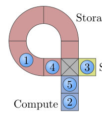 
FIG. 1. Layout of the CIRQLE ion trap chip, also called Q-chip. The shown sketch has a single storage ring with a capacity of 5 qubits, which is connected to the other two reg- isters with a junction. This ring acts like a carousel with empty or filled spots: it can only transport all stored qubits simultaneously through rotations. Some operations may only move empty spots through the junction. For example, in the given configuration, a clockwise rotation of the storage ele- ment does not move any qubit through the junction. It is likely that these operations are faster on real hardware than shuttling qubits through the junction. Our proposed method can handle this due to its Semi-Markovian...

📷 Fig 2

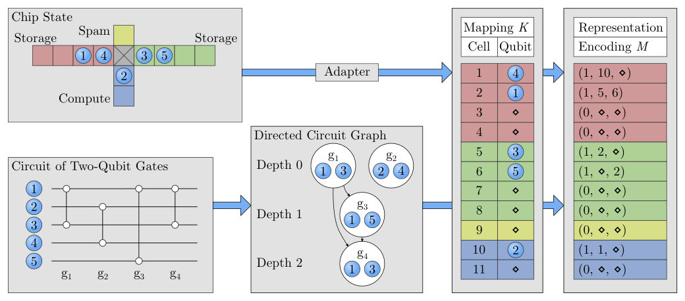 
FIG. 2. Proposed representation. The top left shows the chip state. A chip-specific adapter translates the chip state into a cell-qubit mapping, shown in the mapping table K on the right side. The rest of the observation encoding is chip-agnostic. The directed acyclic graph of two-qubit gates (middle) is constructed from the circuit (bottom left). The depth of each gate is determined. Finally, the encoding table M is constructed. Each row refers to a cell on the given chip. The first entry per row indicates presence of a qubit (0 if the cell is empty). The next entries within a row indicate the cell location of the other operands at increasing depth up to the lookahead. The special value...

📷 Fig 3

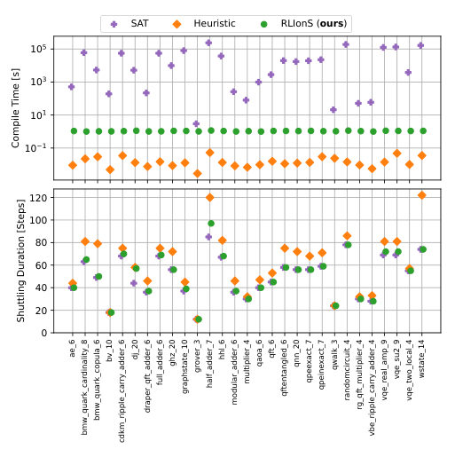 
FIG. 3. Comparison of ion shuttling durations using trajecto- ries optimized by different methods on the QVLS X-chip. For each type of problem within the MQT dataset, the largest ex- ample (the number at the end of the problem name indicates the qubit number) that could still be optimized by the SAT solver is shown. On average, the shuttling sequences gener- ated by our proposed RL compiler are 2.6 % worse than the optimal solutions of the SAT solver and 14.0 % better than those of the heuristic compiler. The SAT solver requires 12 h per problem on average, our approach 1.1 s.

📷 Fig 4

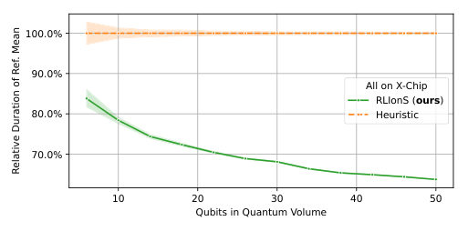 
FIG. 4. Comparison of ion shuttling duration of our pro- posed method to the reference heuristic compiler on the QVLS X-chip for increasingly difficult quantum volume circuits. Shaded areas indicate 95 % confidence intervals. With a com- parable inference time budget, our proposed compiler finds significantly more efficient ion shuttling trajectories. The ad- vantage of our approach increases from 16.2 % on small cir- cuits up to 36.3 % on the largest ones.

📷 Fig 5

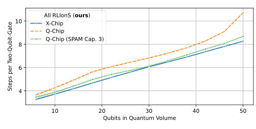 
FIG. 5. Ion shuttling duration for different architectures op- timized with our proposed RL method. Shaded areas indi- cate 95 % confidence intervals. All tested architectures are consistently optimized by our method. The generated shut- tling sequences for the standard Q-chip use significantly more steps per two-qubit gate than the X-chip for all tested prob- lem sizes. This can be mitigated by increasing the capacity of the SPAM zone from 1 to 3 qubits. Such exploratory design studies are very easy to perform using our method, as it does not require the development of new heuristics or other rules for new hardware.

**Summary.** The paper introduces RLIonS, a reinforcement learning-based compiler designed to optimize the movement of ions in QCCD-based quantum computers. By treating shuttling as a sequential decision problem, the method significantly reduces the number of required transport operations compared to existing heuristics. This reduction is crucial for executing larger quantum circuits within the limited coherence times of trapped-ion qubits.

**Why it may be interesting.** This work is highly relevant for the development of scalable quantum hardware, as it addresses the critical classical control bottleneck of managing qubit movement to maintain coherence in trapped-ion systems.

Detailed structure

**Main problem.** Optimizing ion shuttling sequences in QCCD-based trapped-ion quantum computers to minimize latency and overhead caused by qubit transport.

**Main result.** The proposed RLIonS reinforcement learning compiler achieves up to a 36.3% reduction in shuttling operations compared to state-of-the-art heuristics and remains near-optimal relative to exact SAT solvers.

**Method.** A reinforcement learning approach using Proximal Policy Optimization (PPO) and a ResNet architecture, formulated as a Semi-Markov Decision Process (SMDP) with a novel sinusoidal encoding for chip states.

**Model / system.** The study focuses on the Quantum Charge-Coupled Device (QCCD) architecture for trapped-ion quantum computing, specifically evaluating X-chip and Q-chip (storage ring) layouts.

**Key observables.** Number of shuttling operations (steps), shuttling duration, and compilation/inference time.

**Important parameters / regimes.** Circuit depth (k_lookahead), number of ions (up to 50), and the discount rate (beta).

**Assumptions / limitations.** The model assumes deterministic transitions between states and that gates beyond a specific lookahead depth do not influence immediate decisions.

**Figures summary.** Figure 1 shows the Q-chip layout; Figure 2 illustrates the RLIonS encoding pipeline from chip state to matrix; Figure 3 compares compile time and shuttling duration across methods; Figure 4 shows performance scaling with Quantum Volume; Figure 6 presents an ablation study on sinusoidal vs. linear encoding.

**Paper structure.** The paper introduces the shuttling bottleneck, describes the QCCD architectures, details the RLIonS RL framework (SMDP formulation and encoding), presents benchmarking against SAT and heuristic methods, provides ablation studies on encoding and rewards, and concludes with future directions.

Abstract

Scalable trapped-ion quantum computing is commonly realized with modular chips that feature distinct zones with specific functionalities, such as storage, state preparation, and gate execution. To execute a quantum circuit, the ions must be transported between these zones. This process is called ion shuttling. To achieve reliable computation results, the shuttling process must be optimized. However, as the number of ions increases, this becomes a high-dimensional optimization problem where optimal solutions cannot be computed efficiently. We demonstrate, to the best of our knowledge, the first use of reinforcement learning (RL) for the optimization of ion shuttling. RL is well-suited for such scenarios, as it enables learning a strategy through direct interaction with the problem. We show that our RL approach outperforms current state-of-the-art heuristic techniques, yielding a reduction in shuttling operations of up to 36.3 %. Furthermore, we show that our method is easily applicable to various chip architectures. Our approach offers a versatile method to study shuttling efficiency during chip design and, therefore, a highly relevant tool for future, more complex architectures.

[↑ back to top](#top)

### [Revisiting the high-field phase diagram of the topological cubic helimagnet SrFeO$_{3}$](http://arxiv.org/abs/2605.22517v1)

**Authors:** Masaki Gen, Shun Okumura, Shusaku Imajo, Taro Nakajima, Karel Prokes, Shunsuke Kitou, Yusuke Tokunaga, Yoichi Nii, Koichi Kindo, Yoshimitsu Kohama, Shintaro Ishiwata, Taka-hisa Arima  
**Type:** both · **Category:** strongly correlated electrons · **PDF:** <https://arxiv.org/pdf/2605.22517v1>  
**Analysis basis:** full PDF text, analyzed in chunks

📷 Fig 1

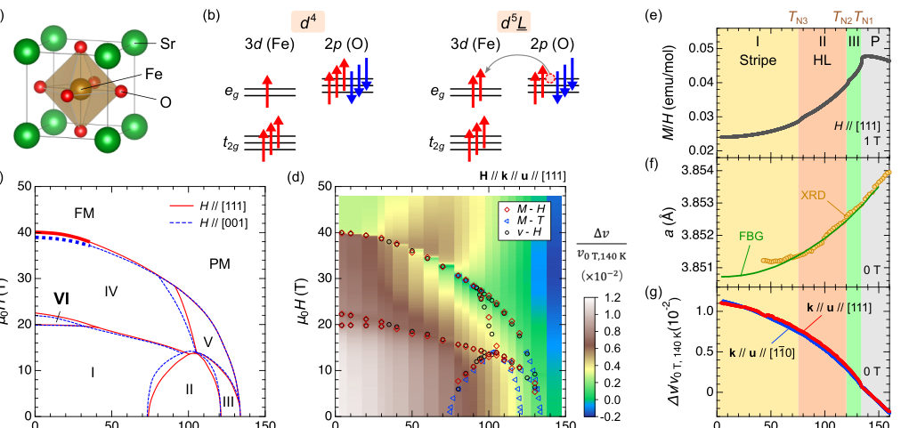 
FIG. 1. (a) Crystal structure of SrFeO3, llustrated using the VESTA software [71]. (b) Schematic electronic configurations of the 3d4 state (left) and the ligand-hole 3d5L state (right). (c) H–T phase diagram for H ∥[111] (red solid line) and H ∥[001] (blue dashed line). The definitions of phases I–V follow Ref. [38], whereas phase VI is newly discovered in the present study. “PM” denotes the paramagnetic phase. The phase boundaries drawn with thick lines indicate possible valence transitions from the 3d5L to the 3d4 state, as suggested by the anomalous magnetoelastic responses observed in this study. (d) Color map of the longitudinal sound velocity for k ∥u ∥[111], normalized to its value at...

📷 Fig 2

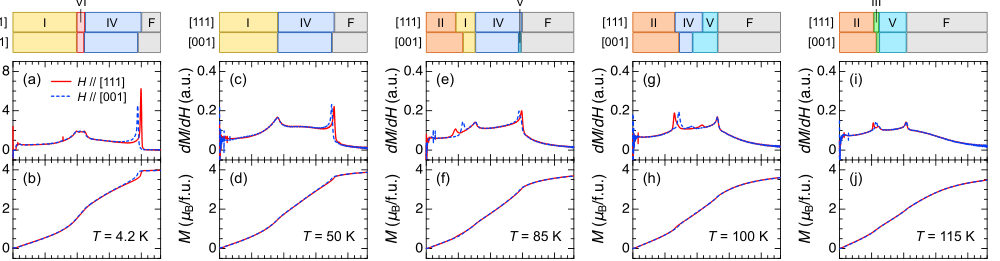 
FIG. 2. Magnetic-field dependence of M (bottom) and dM/dH (top) at 4.2 K (a, b), 50 K (c, d), 85 K (e, f), 100 K (g, h), and 115 K (i, j) for H ∥[111] (red solid line) and H ∥[001] (blue dashed line). Only data for the field-increasing process are shown. The top bars indicate the corresponding magnetic phase diagrams, where “F” denotes the forced FM (or paramagnetic) phase.

📷 Fig 3

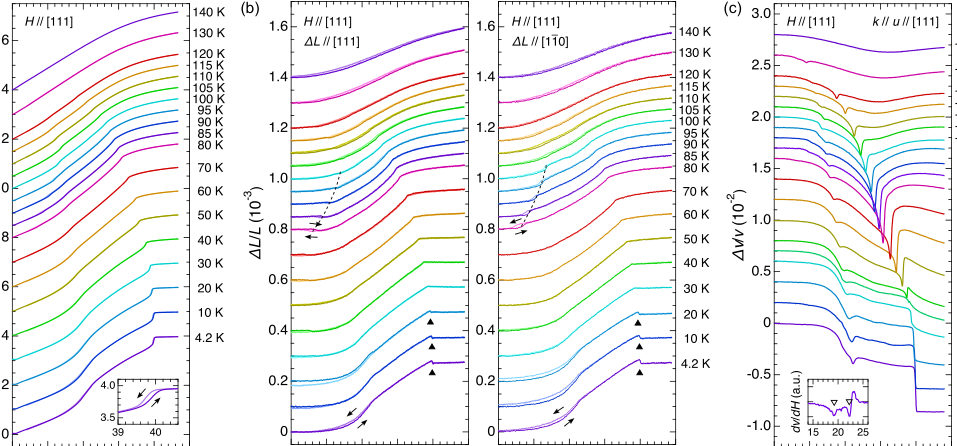 
FIG. 3. Magnetic-field dependence of magnetization (a), longitudinal (left) and transverse (right) magnetostriction (b), and the longitudinal sound velocity for k ∥u ∥[111] (c) measured at various temperatures for H ∥[111]. For clarity, the curves are vertically shifted except for T = 4.2 K. In panels (a) and (b), data for the field-increasing (decreasing) process are shown in dark (light) colors. Only data for the field-decreasing process are shown in panel (c). The inset of panel (a) shows an enlarged view of the M–H curve at 4.2 K near the saturation field. The inset of panel (c) shows the field-derivative of the sound velocity at 4.2 K, exhibiting a double-dip structure (denoted by...

📷 Fig 4

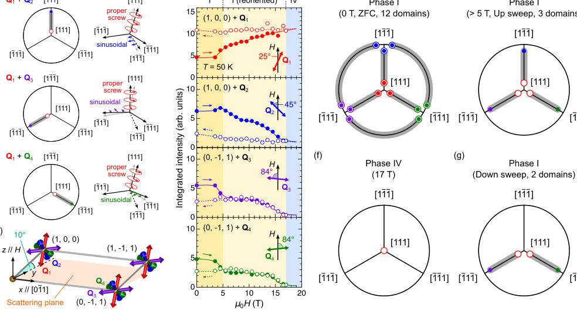 
FIG. 4. (a) Three types of Q-dependent domains in phase I that can be stabilized by applying a magnetic field along (near) the [111] axis. Although the neutron data alone do not uniquely distinguish between the sinusoidal and cycloidal modulations for the Q2–Q4 components, theoretical calculations predicted the emergence of a double-Q stripe phase composed of proper-screw and sinusoidal modulations. Each left panel shows stereographic projections of magnetic scattering peaks, where the filled and open circles represent magnetic reflections of the proper-screw and sinusoidal modulation, respectively. Each Q vector is slightly deviated from the ⟨111⟩axis. (b) Schematic illustration of the...

📷 Fig 5

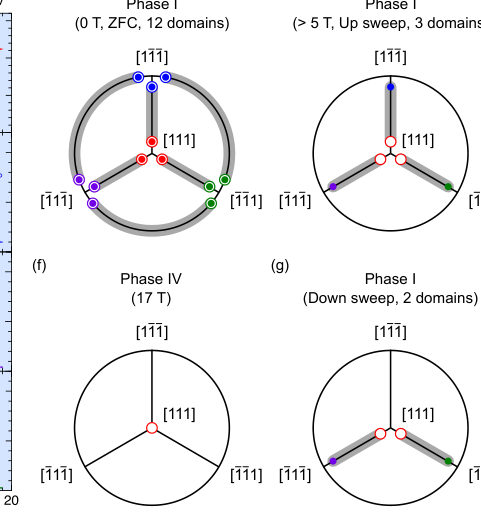 
Figure 4(c) shows the field dependence of the integrated in- tensities of the Q1–Q4 peaks, measured at 50 K after ZFC. We note that the expected triple-peak splitting [42], as men- tioned above, was observed as a single broadened peak due to the limited experimental resolution (Fig. S4 [67]). The initial

**Summary.** This paper revisits the complex magnetic phase diagram of the topological helimagnet SrFeO3 under high magnetic fields. It discovers a new intermediate phase and demonstrates that the transition to the forced ferromagnetic state involves a valence transition related to ligand-hole density redistribution. These findings highlight the critical role of electronic itinerancy in stabilizing complex multiple-Q magnetic structures.

**Why it may be interesting.** not directly relevant

Detailed structure

**Main problem.** Resolving the microscopic mechanism of multiple-Q phases in the topological cubic helimagnet SrFeO3 and understanding the field-orientation dependence of its magnetic phase diagram.

**Main result.** The study identifies a new intermediate-field phase (Phase VI) and provides evidence for a valence transition driven by the redistribution of ligand-hole density when entering the forced ferromagnetic phase.

**Method.** The researchers combined pulsed high-field magnetization, magnetostriction, and ultrasound measurements with single-crystal neutron scattering and Monte Carlo simulations using an effective spin Hamiltonian.

**Model / system.** The system is SrFeO3, a cubic perovskite itinerant magnet characterized by a ligand-hole 3d5L electronic configuration. The theoretical framework uses an effective bilinear-biquadratic spin Hamiltonian with cubic single-ion anisotropy.

**Key observables.** Magnetization (M), differential susceptibility (dM/dH), longitudinal and transverse magnetostriction, longitudinal sound velocity, and magnetic Bragg peak intensities (Q1-Q4).

**Important parameters / regimes.** Magnetic field strengths up to 50 T, temperatures down to 4.2 K, field orientations H || [001] and H || [111], and the modulation vector q approx 0.13 r.l.u.

**Assumptions / limitations.** The effective spin model assumes that the essential magnetic features can be captured by bilinear and biquadratic interactions and cubic anisotropy, while the valence transition is treated as a subtle redistribution of ligand-hole density.

**Figures summary.** Figure 1 shows the crystal structure; Figure 3 displays the metamagnetic transition, negative volume jump, and elastic anomalies; Supplemental figures show the evolution of neutron scattering profiles and integrated intensities of magnetic reflections.

**Paper structure.** The paper introduces the system and problem, details the experimental and computational methods, presents the reconstructed high-field phase diagram and new phase discovery, discusses the role of anisotropy and valence transitions, and concludes with a summary of the microscopic mechanism.

Abstract

The cubic perovskite SrFeO$_{3}$ is a prototypical centrosymmetric itinerant magnet that hosts a quadruple-${\mathbf Q}$ hedgehog-antihedgehog lattice and exhibits a complex magnetic-field-temperature phase diagram. Yet, the microscopic mechanism underlying the emergence of its versatile multiple-${\mathbf Q}$ phases remains unresolved. Here, we elucidate the field-orientation dependence of the magnetic phase diagram and establish an effective spin Hamiltonian for SrFeO$_{3}$ that incorporates a cubic single-ion anisotropy together with bilinear and biquadratic interactions in momentum space. In addition, we observe magnetoelastic signatures of a first-order valence transition upon entering the forced FM phase at 40 T, which would be attributed to the suppression of negative charge transfer. These findings emphasize the pivotal importance of electronic itinerancy arising from the formation of a ligand-hole band in stabilizing multiple-${\mathbf Q}$ phases.

[↑ back to top](#top)

### [Robust fluctuating intertwined charge stripes in the Emery model](http://arxiv.org/abs/2605.21585v1)

**Authors:** Rong Zhang, Sijia Zhao, Hong-Chen Jiang, Brian Moritz, Edwin W. Huang, Thomas P. Devereaux  
**Type:** theory · **Category:** strongly correlated electrons · **PDF:** <https://arxiv.org/pdf/2605.21585v1>  
**Analysis basis:** full PDF text, analyzed in chunks

📷 Fig 1

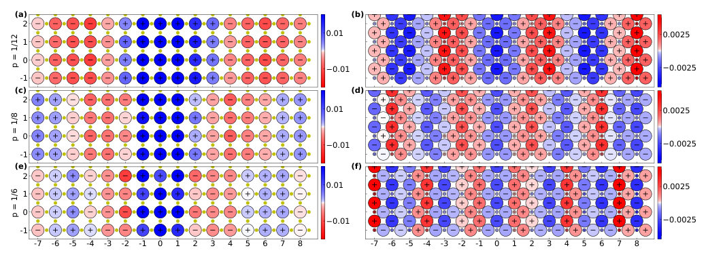 
FIG. 1. Doping dependence of DMRG spin and charge stripes Left (a, c, e): staggered spin-spin correlations on copper d orbitals for increasing hole dopings, in reference to the d orbital at (0, 0). Right (b, d, f): charge density fluctuation profiles ⟨ni,α⟩−⟨nα⟩, α = d, px, py, for each orbital plotted at their positions. The plotting convention and three-band parameters are the same as in Fig. S5. The doping dependence of the spin and charge stripe period is consistent with that in Fig. S5. The charge density fluctuation on py is generally stronger than that on px. Calculations were performed on a 24 × 4 or 32 × 4 cylinders, with the center 16 × 4 rungs shown here.

📷 Fig 2

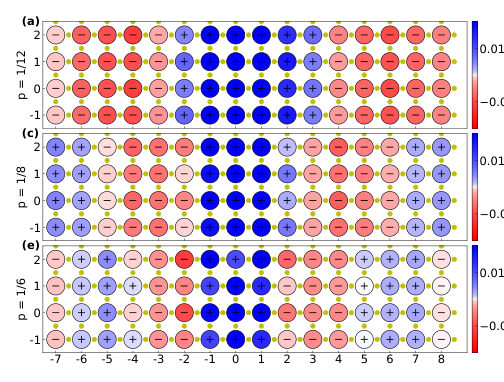 
Figure 1 shows the staggered spin correlation on cop- per (left) and spatial fluctuations of the charge density profile (right) from a DMRG calculation of the inner 16 rungs of a 24 × 4 (32 × 4 for 1/8 doping) cylinder at Udd = 6 eV, Upp = 0, ∆pd = 3 eV. The DMRG staggered spin correlations show a shorter spin stripe period with increasing hole doping. Charge accumulates near the AFM domain wall, while being depleted near the center of the cylinder. In panels (b, d, f), the charge densities on d, px, py orbitals vary concomitantly with a common periodicity, locking to half of the spin stripe period. This charge modulation is strongest on the py orbital and weakest on the d orbitals....

📷 Fig 3

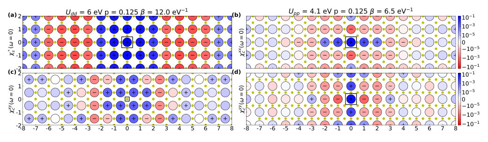 
FIG. 2. Real space patterns of DQMC spin and charge correlation functions (a) Staggered spin correlation function χ∗ s,ij(ω = 0), showing fluctuating spin stripe domains staggered across the length of the cylinder and running along the vertical direction. (b) Static charge correlation function between px orbitals χxx c (ω = 0), showing a tendency to form horizontal stripes due to the local perturbation on the x orbital. (c) Static charge correlation function between px and py orbitals χxy c (ω = 0), showing a tendency to form stripes along the vertical direction due to the lattice geometry, where “rivers of charge” would be pinned to the spin stripe domain walls. (d) Static charge...

📷 Fig 4

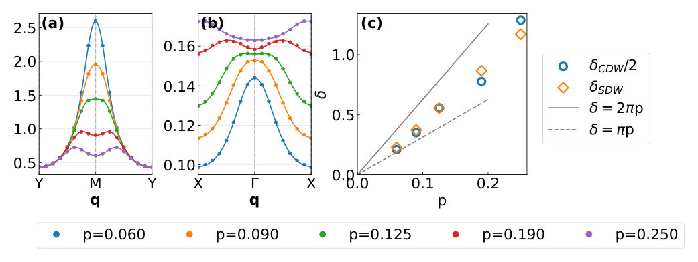 
FIG. 3. Momentum space DQMC spin and charge correlation functions on a 16 × 4 cluster with Upp = 0, Udd = 8.5 eV (a) Static spin correlation function χs(q, ω = 0). (b) Fourier transform of the static oxygen charge correlation function with respect to py, χyy c (q, ω = 0) + χxy c (q, ω = 0), In (a) and (b), the markers represent the data, and solid lines are fitted periodic double Lorentzian functions as defined in Ref. [23]. (c) The fitted modulation wavevectors of the spin density wave δSDW and half of the charge density wave δCDW/2 at each doping p, showing a Yamada-like relation. Similar plots for other model parameters are shown in Figs. S17 and S18.

📷 Fig 5

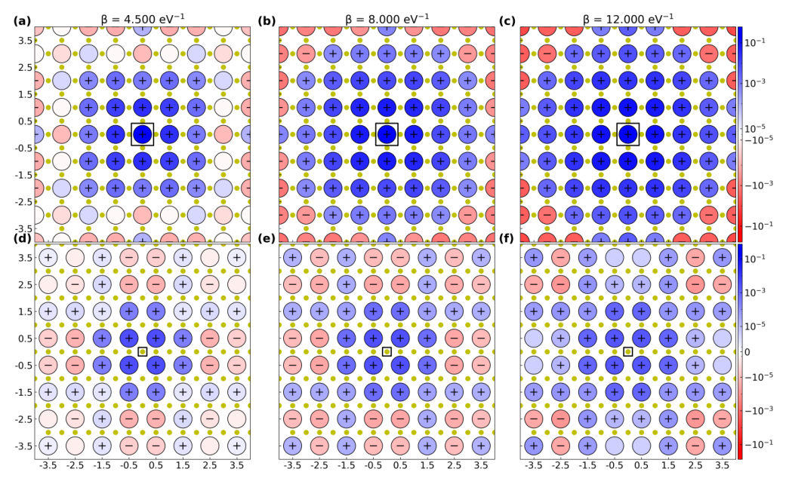 
FIG. 4. Temperature evolution of staggered spin-spin (a, b, c) and connected px −py-orbital charge-charge correlation (d, e, f) from a DQMC simulation on 8 × 8 system The shape of the spin stripe domain in the correlation function gradually evolves from square-like at high temperatures in (a) towards the diamond-like shape in (e). The diamond- like domain wall is the momentum space superposition of horizontal and vertical spin stripes extending in the direction of the Cu-O bonds, while the square-like domain wall is the momentum space superposition of the spin stripes in the two diagonal directions. Meanwhile, at β = 4.5 eV−1, the charge modulation tendency is strongest around (0, ±3), (±2,...

**Summary.** This paper uses DMRG and DQMC to show that the Emery model supports robust, intertwined charge and spin stripes. It specifically highlights how oxygen orbital structure contributes to charge modulation and how temperature-driven symmetry crossovers link nematicity to stripe formation.

**Why it may be interesting.** not directly relevant

Detailed structure

**Main problem.** The study investigates whether the low-energy physics of the single-band Hubbard model is equivalent to the multi-band Emery model and explores the nature of intertwined spin and charge stripes and nematicity within the Emery model.

**Main result.** The researchers confirm the presence of oxygen-centered charge stripes and demonstrate that cooling the system triggers a crossover from B2g to B1g symmetry-breaking tendencies, linking nematicity to charge stripes.

**Method.** The study utilizes complementary Density Matrix Renormalization Group (DMRG) for ground-state simulations and Determinant Quantum Monte Carlo (DQMC) for finite-temperature properties.

**Model / system.** The Emery model, a three-band Hubbard model representing the CuO2 plane, consisting of copper-centered d-orbitals and oxygen-centered p-orbitals.

**Key observables.** Static charge and spin correlation functions, bond-charge nematic susceptibilities (B1g and B2g), and kinetic energy anisotropy.

**Important parameters / regimes.** Parameters include hopping integrals (tpd, tpp), Hubbard repulsions (Udd, Upp), charge transfer energy (pd), and hole doping levels.

**Assumptions / limitations.** The DQMC simulations are limited by the fermion sign problem, which restricts the exploration of very low temperatures or high interaction strengths.

**Figures summary.** Figures show real-space DQMC patterns of spin and charge stripes, momentum-space correlations illustrating the Yamada relation, and the temperature evolution of symmetry-breaking modes.

**Paper structure.** The paper introduces the problem of model equivalence, describes the Emery model parameters, presents DMRG ground-state results, details DQMC finite-temperature findings regarding stripe evolution and nematicity, and concludes with the connection between orbital physics and stripe directionality.

Abstract

The single-band Hubbard model is one of the most extensively studied models in condensed matter physics, giving rise to intertwined spin and charge stripes that coexist with, or lie in the vicinity of, superconductivity in the phase diagram. However, whether the low energy physics of the single-band Hubbard model is fully equivalent to the multi-band (multi-orbital) Emery model remains an unsettled question. While the intertwined stripes and nematicity have been studied in the single-band Hubbard model, a comprehensive picture in the Emery model is lacking. In this paper, we focus on the less investigated intertwined charge stripes using complementary density matrix renormalization group (DMRG) and determinant quantum Monte Carlo (DQMC) techniques. Our ground state DMRG confirms the presence of the oxygen-centered charge stripes at a reduced amplitude in the Emery model parameter regime widely used in the study of intertwined stripes. Close analysis of the oxygen orbital structure of the static charge correlation function from DQMC reveals the charge stripe pattern in real-space, showcasing stronger charge density modulation on $p$-orbitals pointing along ``the rivers of charge'', consistent with DMRG. For the parameter set with the largest fermion signs, we managed to reach a temperature where the system first demonstrated tendencies to form purely unidirectional spin and charge stripes, and the $B_{1g}$ component becomes dominant in the bond-charge nematic susceptibility. This observation correlates with the doping dependence of the kinetic energy anisotropy, suggesting a close relation between the nematicity and charge stripes in the Emery model.

[↑ back to top](#top)

### [Shielded inner-shell transitions in atomic samarium for tests of fundamental physics](http://arxiv.org/abs/2605.22318v1)

**Authors:** R. Aramyan, D. Budker, V. A. Dzuba, V. V. Flambaum, S. G. Porsev, M. S. Safronova, O. Tretiak, K. Zhang  
**Type:** both · **Category:** other · **PDF:** <https://arxiv.org/pdf/2605.22318v1>  
**Analysis basis:** full PDF text, analyzed in chunks

📷 Fig 1

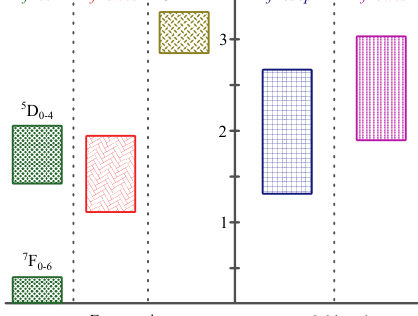 
FIG. 1. Known and relevant electronic configurations of samarium and their corresponding energy ranges. The ion- ization limit [17] is 45 519.69 cm−1. The 5D levels indicted in the figure are designated in [17] as 5D3.

📷 Fig 2

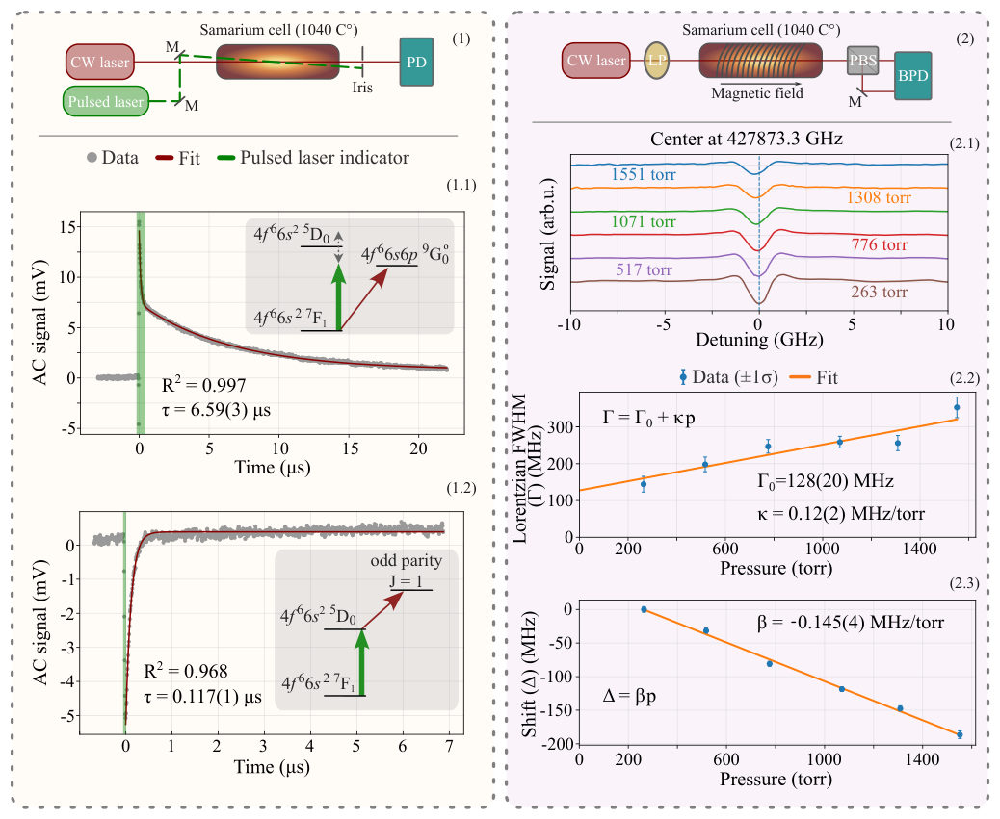 
FIG. 2. Spectroscopic level assignment and pressure-broadening measurement. (1) Setup for population-depletion and sequential-excitation spectroscopy. In (1.1), the positive transient signal reflects depletion of the 4f 66s2 7F1 population; in (1.2), the negative transient signal reflects induced absorption from the populated candidate upper state. The zero level denotes the AC baseline of the CW-probe signal. The decay times are likely limited by atomic transit in (1.1) and by optical pumping/depletion in (1.2). (2) Setup for pressure-dependent Faraday-rotation spectroscopy. All pressures were measured with an uncertainty of ±15 torr. M: mirror; PD: photodetector; LP: linear polarizer;...

📷 Fig 3

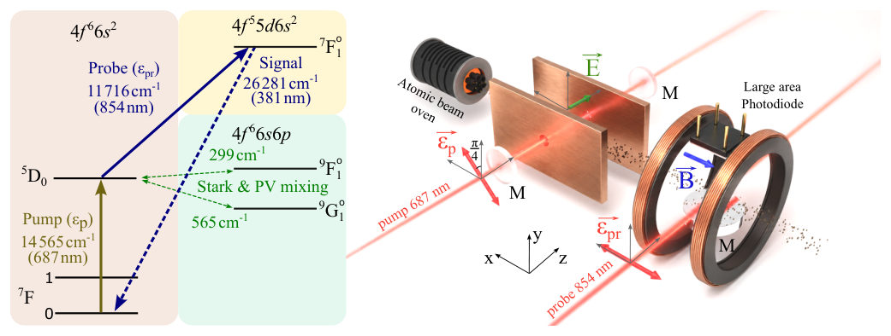 
FIG. 3. (a) Energy level diagram of samarium illustrating the atomic states relevant to the APV experiment, along with their energy separations. (b) Proposed experimental geometry: an atomic beam interacts with the pump (⃗εp) and probe (⃗εpr) fields in the presence of applied electric ( ⃗E) and magnetic ( ⃗B) fields; the 381 nm fluorescence signal is detected with a photodiode. M: mirror; the mirrors adjacent to the electrodes form a power-buildup cavity to enhance the optical path length.

📷 Fig 4

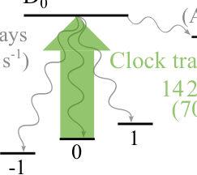 
FIG. 4. Candidate clock transition at 14 272 cm−1 (701 nm), along with the decay channels from the 5D0 state and their corresponding Einstein A coefficients.

**Summary.** This paper reports the first experimental identification of a previously unobserved inner-shell energy level in neutral samarium. The discovery is significant because the 4f shell is shielded from external perturbations, making samarium an ideal candidate for high-precision tests of parity violation and searches for variations in the fine-structure constant.

**Why it may be interesting.** This paper is highly relevant for AMO physicists as it presents a new atomic platform for precision spectroscopy, explores the interplay between atomic structure and fundamental symmetry tests, and discusses the feasibility of laser cooling and clock applications in a complex multi-electron system.

Detailed structure

**Main problem.** The search for physics beyond the Standard Model through low-energy tests of fundamental symmetries, specifically identifying and characterizing atomic transitions in samarium for parity violation studies.

**Main result.** The researchers successfully identified the previously unobserved 4f^6 6s^2 5D0 energy level in neutral samarium and demonstrated that its inner-shell nature provides a shielded, high-precision window for testing nuclear spin-dependent parity violation.

**Method.** The study combines dual-frequency-comb absorption spectroscopy and double-resonance population-depleation to identify energy levels, with many-body calculations (CI and MBPT) to predict transition properties and sensitivity coefficients.

**Model / system.** The physical system is neutral samarium (Sm) atoms in a high-temperature vapor cell, focusing on transitions involving the 4f inner-shell, specifically the 7F0 to 5D0 transition.

**Key observables.** Transition energy (14,564.90 cm-1), pressure broadening and shift, metastable lifetime, quality factor, and nuclear spin-dependent parity-violation amplitude.

**Important parameters / regimes.** Quality factor Q ~ 3x10^14, metastable lifetime ~ 120 ms, pressure broadening ~ 0.12 MHz/torr, and sensitivity coefficients for the fine-structure constant.

**Assumptions / limitations.** The theoretical calculations neglect QED corrections and assume a single-particle valence-nucleon model for estimating nuclear interaction constants.

**Paper structure.** The paper introduces the motivation for BSM tests, describes the experimental identification of the 5D0 level using frequency combs, presents the characterization of the 4f shell shielding via pressure studies, provides theoretical many-body calculations of transition properties, and concludes with proposed applications for parity violation and atomic clocks.

Abstract

Forbidden atomic transitions provide some of the most stringent low-energy tests of physics beyond the Standard Model, with sensitivity set by the interplay between the sought-for signals and systematics suppressed by symmetry. Here we identify the previously unobserved $4f^{6}6s^{2}\,{}^{5}$D$_{0}$ level of neutral samarium at $14\,564.90(2)\,\mathrm{cm}^{-1}$, opening the ${}^{7}$F$_{0}\rightarrow{}^{5}$D$_{0}$ inner-shell transition for precision spectroscopy. Candidate lines extracted from dual-comb absorption spectra were assigned using double-resonance population-depletion and sequential-excitation measurements. The observed pressure broadening, $0.12(2)\,\mathrm{MHz/torr}$, and pressure shift, $0.145(4)\,\mathrm{MHz/torr}$, indicate an inner-shell $4f$-transition shielded from external perturbations. Many-body calculations predict a $\sim\!120\,\mathrm{ms}$ metastable lifetime (quality factor $\mathcal{Q}\sim 3\times 10^{14}$), large sensitivity coefficients for variation of the fine-structure constant, and a nuclear-spin-dependent parity-violation amplitude comparable to that of cesium. Crucially, the $J=0\rightarrow J=0$ selection rule suppresses by symmetry both the nuclear-spin-independent parity-violation channel and the M1 and E2 backgrounds that complicated previous heavy-atom experiments, yielding a uniquely clean window onto the nuclear anapole moment. The two stable spin-$7/2$ isotopes of samarium provide a remarkable opportunity to largely cancel atomic-structure uncertainties by measuring the ratio of parity-violation effects in the two isotopes. These results establish neutral samarium as a platform for inner-shell precision spectroscopy and tests of physics beyond the Standard Model.

[↑ back to top](#top)

### [Spin Glass Mapping of the Parallel Minority Game](http://arxiv.org/abs/2605.22764v1)

**Authors:** Aryan Tyagi, Soumyaditya Das, Soumyajyoti Biswas, Anirban Chakraborti  
**Type:** theory · **Category:** disordered systems and neural networks · **PDF:** <https://arxiv.org/pdf/2605.22764v1>  
**Analysis basis:** full PDF text, analyzed in chunks

📷 Fig 1

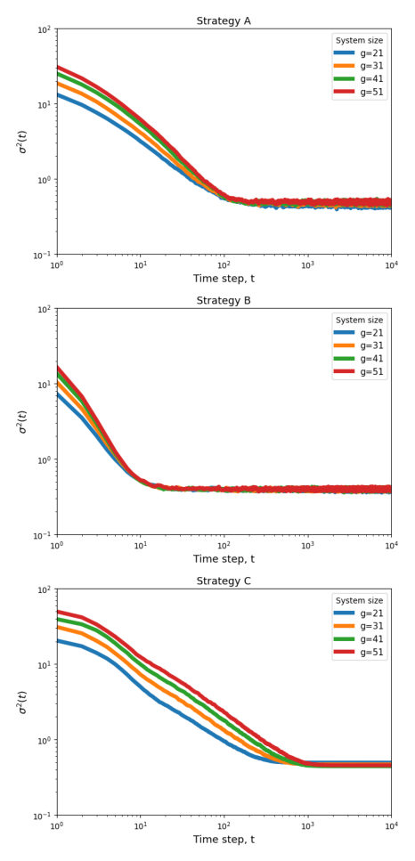 
FIG. 1. Variance evolution for D=101 and different values of g across time, for various strategies: A , B and C. The variance decreases initially and then stabilizes.

📷 Fig 2

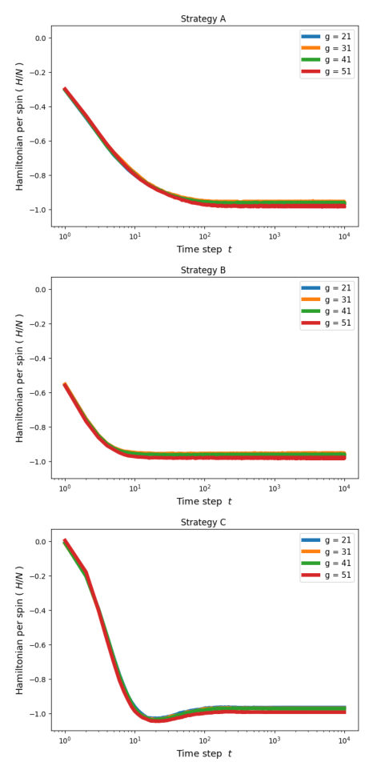 
FIG. 2. Time evolution of the Hamiltonian (Eg. 7) for D=101 and different values of g, various strategies: A , B and C. The Hamiltonian decreases and reaches a saturation indicat- ing convergence to local minima of the spin energy landscape.

**Summary.** This paper demonstrates that the optimization problem in the Parallel Minority Game is mathematically equivalent to finding the ground state of a Sherrington-Kirkpatrick spin glass. This mapping provides a theoretical framework to understand the emergence of glassy, sub-optimal states in resource allocation problems. It also reveals that the system's energy function can saturate much faster than the actual population variance.

**Why it may be interesting.** not directly relevant

Detailed structure

**Main problem.** The paper addresses the difficulty of minimizing population variance in the Parallel Minority Game (PMG) and seeks to understand the origin of 'frozen' sub-optimal configurations and glassy behavior in stochastic strategies.

**Main result.** The authors prove that minimizing population variance in the PMG is exactly equivalent to finding the ground state of an Ising spin glass (Sherrington-Kirkpatrick model) in the mean-field limit.

**Method.** The study uses a mathematical mapping that encodes agent choices as binary spin variables to transform the population variance formula into a quadratic Ising Hamiltonian.

**Model / system.** The system is the Parallel Minority Game (PMG), where N agents choose between two fixed locations from D possible sites. The problem is mapped to an Ising spin glass Hamiltonian with quenched random couplings (J_ij) and random fields (h_i).

**Key observables.** Population variance (efficiency metric), energy per spin (Hamiltonian value), and energy saturation time scales.

**Important parameters / regimes.** Number of agents (N), number of locations (D), target population (g), and switching probability (p_i).

**Assumptions / limitations.** The mapping assumes a mean-field limit; the analysis of strategies assumes specific rules for how agents update their choices based on population information.

**Figures summary.** Figure 1 shows the time evolution of population variance for different strategies and target populations; Figure 2 shows the evolution of the spin glass Hamiltonian energy reaching saturation.

**Paper structure.** The paper introduces the PMG problem, establishes the mathematical mapping to the Ising spin glass, analyzes the dynamics of different stochastic strategies, and discusses the implications of the energy-variance time scale discrepancy.

Abstract

The parallel minority game (PMG) extends the classical minority game to many choices, with each agent restricted to two predetermined alternatives. In this condition, minimizing the population variance across all choices is a complex combinatorial optimization problem. We show that this minimization is exactly equivalent to finding the ground state of an Ising spin glass in the mean-field limit, i.e., the Sherrington-Kirkpatrick model. By encoding the agent choices as spin variables, the variance becomes a quadratic Hamiltonian with quenched random couplings $J_{ij}$ and random fields $h_i$. This mapping reveals inherent frustration and connects the PMG to the well developed theory of spin glasses, providing a new perspective on the frozen, sub-optimal configurations observed in stochastic strategies.

[↑ back to top](#top)

### [The cell fluid model with Curie-Weiss interactions: special cases and analytical results](http://arxiv.org/abs/2605.22520v1)

**Authors:** O. A. Dobush, M. P. Kozlovskii, I. V. Pylyuk, R. V. Romanik, M. A. Shpot  
**Type:** theory · **Category:** statistical mechanics · **PDF:** <https://arxiv.org/pdf/2605.22520v1>  
**Analysis basis:** full PDF text, analyzed in chunks

📷 Fig 1

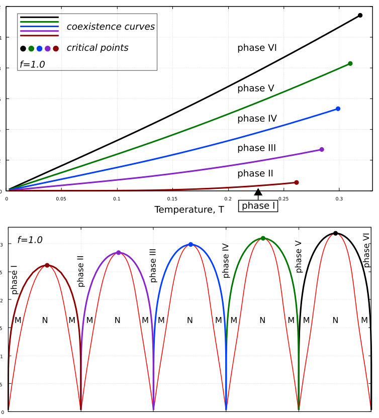 
Figure 1: Phase diagrams of the cell fluid model with Curie-Weiss-type interaction potential (5) with equal attraction and repulsion parameters, J1 “ J2. Fig. 1a: The pP ˚, Tq phase diagram showing the first five first-order phase transition lines separating six distinct phases with growing density. Each coexistence line terminates at its critical point (solid circle) on the right-hand side, labeled k “ 1, . . . , 5 in Table 1. Fig. 1b: The pT, ¯nq phase diagram displaying the phase coexistence lines (binodals) and boundaries of thermodynamically unstable regions (spinodals). The brown, purple, blue, green, and black solid curves indicate coexistence between phases I– II, II–III, III–IV,...

📷 Fig 2

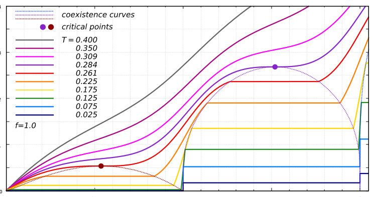 
Figure 2: The pP ˚, ¯nq phase diagram of the cell fluid model with equal attraction and repulsion parameters, J1 “ J2, showing pressure isotherms (solid lines) at ten values of the reduced temperature T listed in the legend. The first two coexistence lines (binodals) related to the three lowest-density phases are indicated by dotted curves. Their apex points correspond to the critical points labelled by k “ 1 and k “ 2 in Table 1. The horizontal segments of the isotherms in the subcritical region indicate discontinuous density jumps accompanying the first- order phase transitions.

📷 Fig 3

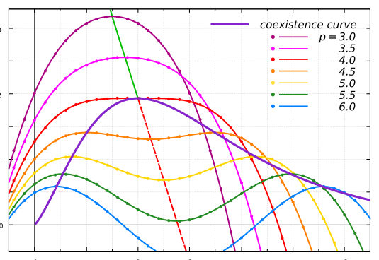 
Figure 3: Plots of the function Epµc; yq from (59) (thin solid curves) and Epyq at µ0 “ µc from (28) (dots) at seven values of the parameter p listed in the legend. For p ă pc “ 4, there is a simple single maximum. At p “ pc, the maximum becomes flat, corresponding to the critical point, with its height Ecpycq “ ln 2´1{2 from (58). For p ą pc, the central extremum smoothly becomes a minimum and two new symmetric maxima appear, signaling a two-phase coexistence. The plots are symmetric with respect to their central extremum positions ¯yp1q “ p{2. The straight inclined line given by (62) connects these extrema at ¯yp1q “ p{2 for all curves. The thick purple plot running through the side...

📷 Fig 4

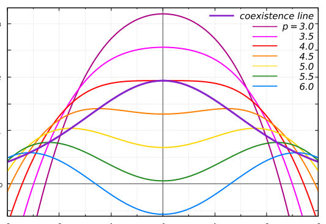 
Figure 4: Plots of the function ˆEpµc; sq from (71) at the same values of p as in Fig. 3. All curves are symmetric with respect to the s “ 0 axis as expected for the even function ˆEpµc; sq.

📷 Fig 5

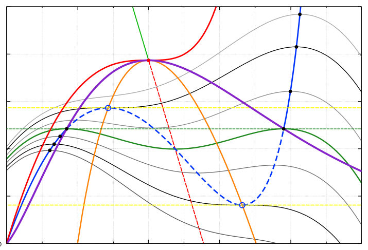 
Figure 5: The function Epyq from (49) at p “ 4.75 and f “ 10, for seven values of µ growing from 4.468 to 4.53. Gray curves show the full family, while selected ones are highlighted for µ “ µ1 » 4.478 and µ “ µ2 » 4.522 (black curves with inflection points marked by blue circles), and µ “ µc “ 4.5 (dark-green curve, with its two equal-height maxima connected by the green dashed horizontal line). The thick blue curve is the isotherm Eextp4.75; yq from (94), with its stable branches (marked by black dots) above the binodal. The thick red curve is the critical isotherm Eextp4; yq, passing through the critical point (red dot) at y “ 2. The thick purple curve is the binodal Emaxpµc; yq from...

**Summary.** This paper provides the first explicit analytical solutions for the phase behavior of a cell fluid model with competing long-range attraction and short-range repulsion. It establishes that the model recovers van der Waals-like behavior in certain limits and proves the mathematical stability of the system even at the boundary of thermodynamic collapse.

**Why it may be interesting.** not directly relevant

Detailed structure

**Main problem.** The paper seeks to provide explicit analytical results for the Cell Fluid Model (CFM) with Curie-Weiss interactions, specifically addressing the lack of analytical descriptions for phase behavior, critical parameters, and the convergence of the partition function at the boundary of thermodynamic stability.

**Main result.** The authors derive closed-form expressions for the equation of state, critical points, and phase curves (binodal/spinodal) in the strong-repulsion limit, and prove that the partition function remains convergent at the marginal stability boundary (J1 = J2).

**Method.** The study employs a grand-canonical ensemble approach using Laplace's method, asymptotic expansions of deformed exponential functions, and Landau expansion near the critical point.

**Model / system.** A Cell Fluid Model (CFM) where a macroscopic volume is divided into non-overlapping cubic cells. The Hamiltonian features a competition between global Curie-Weiss attraction (J1) and local, short-range, soft-core repulsion (J2) between particles in the same cell.

**Key observables.** Equation of state, critical point parameters (Tc, Pc, density), binodal and spinodal curves, order parameter, and pressure isotherms.

**Important parameters / regimes.** Coupling constants J1 (attraction) and J2 (repulsion); the ratio f = J2/J1; temperature T; and chemical potential mu.

**Assumptions / limitations.** The analysis primarily focuses on the thermodynamic limit (N -> infinity) and utilizes the large-f (strong-repulsion) approximation for several analytical derivations.

**Figures summary.** Phase diagrams showing coexistence lines and spinodal curves (P-T and density-T planes), pressure isotherms illustrating van der Waals loops, and plots of the energy function E(y) demonstrating the transition from single to double maxima.

**Paper structure.** The paper begins with the model definition and stability conditions, moves to the analytical derivation of the strong-repulsion limit and critical parameters, extends the analysis to the marginal stability case (J1=J2) via asymptotic expansion, and concludes with the construction of the full thermodynamic equation of state.

Abstract

Inspired by previous extensive numerical studies of a cell fluid model with Curie-Weiss interactions, we concentrate on some analytically tractable special cases in its description. The key ingredient of the model is a competition between global attraction and local repulsion interactions between particles with coupling constants $J_1$ and $J_2$, respectively. We provide analytical results in several limiting cases, including the ideal-gas limit $J_1=J_2=0$ and the strong-repulsion limit $J_2\gg J_1$. For $J_2\gg J_1$, a detailed analytical study is presented. We derive explicit expressions for the critical point parameters, the equation of state, and the binodal and spinodal curves in closed form. The equation of state is found to be in full agreement with that of the van der Waals lattice gas, and the order parameter satisfies the standard Curie-Weiss equation. In a neighborhood of the critical point, a Landau expansion is shown to have the same form and symmetry as that of the classical lattice gas within the mean-field approximation. Moreover, based on the explicit knowledge of a few leading terms in the asymptotic expansion of the deformed exponential function governing the physics of the cell model, we extend its validity range to include the marginal case of thermodynamic stability, $J_1=J_2$. In particular, this extension makes a consideration of the ideal-gas limit $J_1=J_2=0$ formally legitimate. For the generic marginal case $J_1=J_2\ne0$ systematically avoided in previous works, we present numerical data and phase diagrams that augment their findings for $J_2>J_1$.

[↑ back to top](#top)

### [Tunneling spectra of $\mathrm{TaO}_x$ junctions for van der Waals superconductors](http://arxiv.org/abs/2605.21631v1)

**Authors:** Yixuan Niu, Jun Cheng, Shiji Ding, Zhongxin Guo, Shang Wang, Chenglong Li, Meining Zhang, Peng Cai  
**Type:** experiment · **Category:** strongly correlated electrons · **PDF:** <https://arxiv.org/pdf/2605.21631v1>  
**Analysis basis:** full PDF text, analyzed in chunks

📷 Fig 1

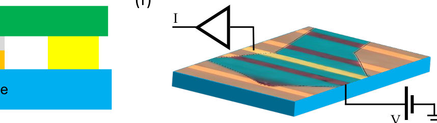 
Fig.1

📷 Fig 2

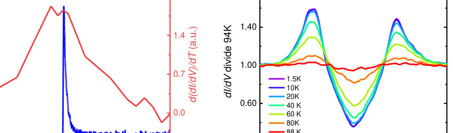 
Fig.2

📷 Fig 3

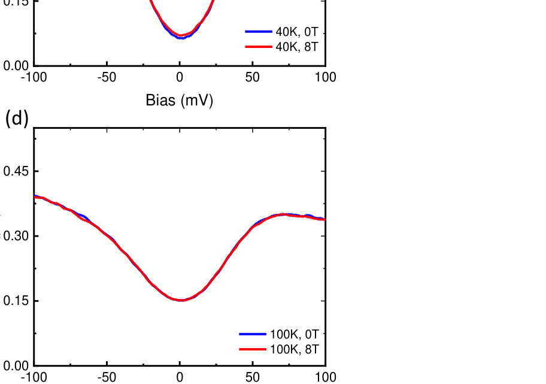 
Fig.3

📷 Fig 4

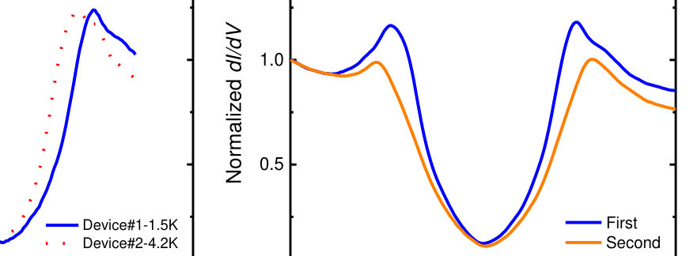 
Fig.4

**Summary.** This paper presents a new method for studying van der Waals superconductors using a stable, TaOx-based planar tunneling junction. The platform allows for high-precision spectroscopy across large temperature and magnetic field ranges, successfully replicating complex electronic features like the pseudogap seen in Bi2212. This provides a robust alternative to Scanning Tunneling Spectroscopy for probing the properties of 2D quantum materials.

**Why it may be interesting.** not directly relevant

Detailed structure

**Main problem.** The difficulty of performing high-quality, stable tunneling spectroscopy to track electronic evolution across temperature and magnetic fields in van der Waals superconductors, due to the limitations of Scanning Tunneling Spectroscopy (STS) and the technical hurdles of traditional planar junction barriers.

**Main result.** The development of a high-quality TaOx-based planar tunneling junction that successfully reproduces the intrinsic electronic signatures of Bi2212, such as the superconducting gap and pseudogap, with superior stability across wide temperature and magnetic field ranges.

**Method.** Magnetron sputtering was used to fabricate a TaOx-based barrier heterostructure, and planar tunneling spectroscopy was performed alongside transport measurements to analyze differential conductance and resistance.

**Model / system.** A planar tunneling junction architecture consisting of a multilayer stack (substrate, Au, Ta, TaOx) in contact with a van der Waals superconductor flake, specifically Bi2Sr2CaCu2O8+d (Bi2212).

**Key observables.** Differential conductance (dI/dV), superconducting energy gap (Delta_SC), transition temperature (Tc), pseudogap, and resistance-temperature (R-T) curves.

**Important parameters / regimes.** Temperature range (1.5 K to 250 K), magnetic field up to 8 T, and bias voltage.

**Assumptions / limitations.** The TaOx barrier is assumed to be sufficiently uniform and stable to act as a reliable proxy for ultra-high vacuum STS measurements.

**Figures summary.** Fig 1 shows the device fabrication workflow and architecture; Fig 2 displays temperature-dependent transport and spectroscopy data including Tc identification; Fig 3 shows the evolution of dI/dV spectra under varying temperature and magnetic fields; Fig 4 provides a comparative analysis of the TaOx junction against STS and AlOx junctions.

**Paper structure.** The paper introduces the technical challenge of spectroscopy in vdW materials, describes the fabrication of the TaOx-based junction, presents experimental validation using Bi2212 (including temperature and field dependence), and concludes with a comparison to established spectroscopic methods.

Abstract

Tunneling spectroscopy and its evolution are crucial for elucidating the intricate electronic structure and emergent phenomena in quantum materials.Nevertheless, high-quality measurements -- specifically those tracking evolution across temperature and external fields -- remain a formidable challenge. We have fabricated a high-quality $\mathrm{TaO}_x$-based planar tunneling junction by using magnetron sputtering for van der Waals (vdW) superconductors. Using the vdW superconductor $\mathrm{Bi}_2\mathrm{Sr}_2\mathrm{CaCu}_2\mathrm{O}_{8+δ}$ (Bi2212) as a benchmark, this platform yields high-quality tunneling spectra, reproducing the electronic signatures obtained from scanning tunneling spectra acquired from atomically clean surfaces under ultra-high vacuum conditions. This architecture enables high-precision spectroscopy across extensive temperature and magnetic field ranges, offering a universal strategy for probing the electronic structures of diverse two-dimensional systems and facilitating future explorations of material properties.

[↑ back to top](#top)

### [Zero-level $CCZ$ Distillation](http://arxiv.org/abs/2605.21867v1)

**Authors:** Tomohiro Itogawa, Yutaka Hirano, Yutaro Akahoshi, Keisuke Fujii  
**Type:** theory · **Category:** quantum information and computing · **PDF:** <https://arxiv.org/pdf/2605.21867v1>  
**Analysis basis:** full PDF text, analyzed in chunks

📷 Fig 1

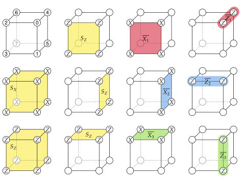 
FIG. 1: Geometric representation of the J8, 3, 2K code. Physical qubits are located at the vertices of the cube. The yellow cells and faces represent the X-type and Z- type stabilizer generators, respectively. The red, blue, and green faces and edges correspond to the logical op- erators.

📷 Fig 2

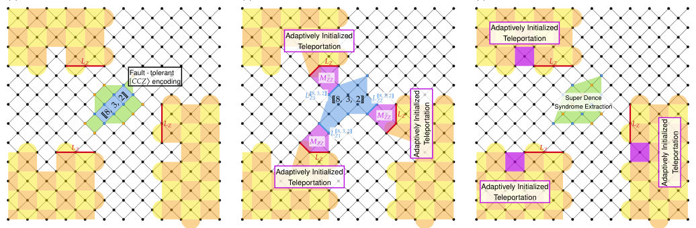 
FIG. 2: Overview of the proposed zero-level CCZ state distillation protocol. (a) Using a non-fault-tolerant encoding circuit and transversal CNOT gates between ancilla blocks, a |CCZ⟩state is prepared in the J8, 3, 2K code. Addition- ally, intermediate surface-code states are prepared for adaptively initialized teleportation (AIT). (b) AIT is performed by executing lattice surgery between the two-body logical operators of the J8, 3, 2K code and the three-body logical operators of the intermediate state. (c) While performing superdense syndrome extraction on the J8, 3, 2K code, the surface codes are completed through stabilizer measurements, thereby finalizing AIT.

📷 Fig 3

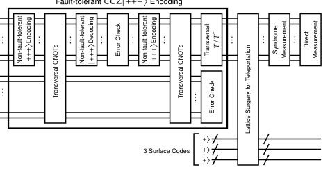 
FIG. 3: Overall structure of zero-level CCZ state dis- tillation. A non-fault-tolerant encoding/decoding circuit is used to prepare the state |+ + +⟩, and a verification procedure is then applied to obtain a fault-tolerant en- coding. Transversal T/T † gates are subsequently applied to implement the CCZ operation, after which the three logical qubits are teleported to three surface-code logical qubits.

📷 Fig 4

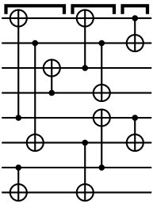 
FIG. 4: (a) Non-fault-tolerant |+ + +⟩encoding circuit, consisting of a depth-3 minimal sequence of CNOT gates. (b) Required qubit connectivity for the encoding circuit, compatible with strictly nearest-neighbor interactions on a two-dimensional square lattice.

📷 Fig 5

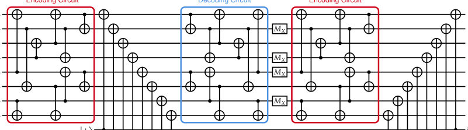 
FIG. 5: Fault-tolerant |+ + +⟩encoding circuit. The state is first encoded using the non-fault-tolerant circuit, followed by a transversal CNOT applied to ancilla qubits. The circuit is then decoded, and the four data qubits that were initially prepared in the |+⟩state are measured in the X-basis for verification. A second round of encoding and transversal CNOT is performed, and the output is accepted only when all measurement outcomes are +1.

**Summary.** This paper introduces a highly efficient 'zero-level' protocol for distilling CCZ magic states, significantly reducing the qubit and time overhead compared to standard methods. By leveraging a specific low-distance code and a new adaptive teleportation technique, it provides a practical path for implementing non-Clifford gates in early-stage fault-tolerant quantum computers.

**Why it may be interesting.** not directly relevant

Detailed structure

**Main problem.** The massive spatial and temporal overhead required for conventional magic state distillation (MSD) of non-Clifford gates like CCZ poses a bottleneck for scalable fault-tolerant quantum computation.

**Main result.** The authors propose a 'zero-level' distillation protocol that reduces space-time overhead by a factor of 5-10 compared to previous methods, achieving a logical error rate scaling as pL approx 300 * p^2.

**Method.** The protocol uses a J(8,3,2K) code to fault-tolerantly encode a CCZ state and introduces Adaptively Initialized Teleportation (AIT) via lattice surgery to transfer the state to surface-code logical qubits.

**Model / system.** A two-dimensional square lattice with nearest-neighbor interactions, specifically targeting architectures like superconducting qubits, using the J(8,3,2K) CSS code and surface codes.

**Key observables.** Logical error rate (pL), success probability, and space-time overhead.

**Important parameters / regimes.** Physical error rate p (analyzed at 10^-3 and 10^-4), circuit depth of 24, and a requirement of 22 physical qubits.

**Assumptions / limitations.** The use of a Clifford approximation for T/T-dagger gates is justified by the fact that they do not convert X/Y errors into Z errors in this specific code structure; the error model assumes depolarizing noise and single-qubit flip noise.

**Figures summary.** Fig 1 shows the J(8,3,2K) code geometry; Fig 2-3 illustrate the distillation protocol and AIT pipeline; Fig 4-5 detail the encoding circuit and connectivity; Fig 6-7 show the teleportation process; Fig 12-13 compare resource efficiency and error rates against existing methods.

**Paper structure.** The paper introduces the problem of CCZ distillation overhead, presents the zero-level protocol and AIT method, details the encoding and superdense syndrome extraction, provides numerical validation via Stim/Qulacs, and concludes with a resource comparison against conventional T-gate-based approaches.

Abstract

Magic state distillation is a key component of fault-tolerant quantum computation, as it enables the implementation of non-Clifford gates such as the $T$ gate and the $CCZ$ gate via gate teleportation. However, conventional distillation protocols require a large number of logical qubits and introduce substantial spatial and temporal overhead, posing a significant bottleneck for scalable fault-tolerant quantum computation. In this work, we propose a zero-level distillation protocol that efficiently generates a high-fidelity logical $CCZ$ magic state using only physical qubits on a two-dimensional square lattice with nearest-neighbor interactions. Our method leverages the transversal $T/T^\dagger$ operation of the $[[ 8,3,2 ]]$ code to fault-tolerantly encode the state $\overline{CCZ}|+++\rangle$, which is subsequently teleported to three surface-code logical qubits via lattice surgery. To enable teleportation between codes with different distances, we introduce adaptively initialized teleportation (AIT), a tailored initialization procedure for the surface code. Numerical simulations demonstrate that the logical error rate scales as $p_L \simeq 300 \times p^2$ with respect to the physical error rate $p$. For example, the proposed method improves the logical error rate by approximately one and two orders of magnitude at $p = 10^{-3}$ and $p = 10^{-4}$, respectively, compared to conventional seven-$T$-gate approaches. The distillation circuit requires only 22 physical qubits, 3 logical qubits, and a circuit depth of 24, reducing the space-time overhead by a factor of approximately 5-10 compared to previous methods. This result highlights the practicality of $CCZ$-state distillation in early fault-tolerant quantum computation and offers a new direction toward resource-efficient physical-level magic state distillation beyond conventional $T$-state generation.

[↑ back to top](#top)

## Secondary cond-mat archives

*Papers from  mes-hall, other, soft, supr-con. These archives are de-prioritized — they appear at the end regardless of relevance score.*

### Relevant in secondary archives (13)

### [Monitored quantum transport through a disordered one-dimensional conductor](http://arxiv.org/abs/2605.22701v1)

**Authors:** J. Sánchez Fernán, J. Tworzydło, C. W. J. Beenakker  
**Type:** theory · **Category:** disordered systems and neural networks · **PDF:** <https://arxiv.org/pdf/2605.22701v1>  
**Analysis basis:** full PDF text, analyzed in chunks
**Topic relevance:** 🔥 `measurement-induced transitions` **4/5** · 🔥 `quantum measurements` **4/5** · `driven-dissipative phase transition` **3/5** · `methods for driven-dissipative` **3/5** · `non-equilibrium dynamics` **3/5**

📷 Fig 1

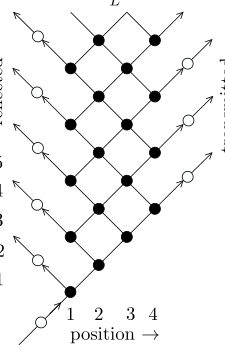 
FIG. 1. Representation on a 1+1 dimensional space-time lat- tice of transport through a single-mode disordered conductor. Scattering centra (extending over a length L) are indicated by filled circles, while open circles represent the ideal leads (no backscattering). Electrons enter the conductor from one end and are either reflected back or transmitted to the other end.

📷 Fig 2

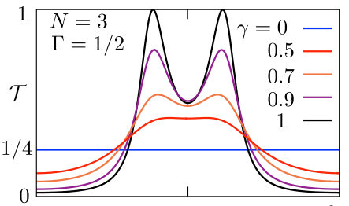 
FIG. 2. Scattering phase shift ϕ dependence of the transmis- sion probability T through N = 3 identical tunnel barriers in series, each with tunnel probability Γ = 1 −ρ = 1/2. The effect of decoherence with strength w = √1 −γ is computed from Eq. (6.6).

📷 Fig 3

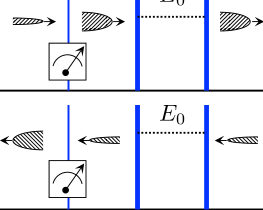 
FIG. 3. Illustration of reciprocity breaking by monitoring [26]. Shown is a three-barrier structure (blue) without left- right symmetry (a thin barrier at the left, two thick barriers at the right). Time-resolved monitoring (on a time scale τc) measures the outcome of the scattering by the thin barrier, broadening the wave packet of the transmitted electron (from eV to ℏ/τc). The broadened wave packet overlaps with the bound state E0 in between the thick barriers. This increases the transmission probability if monitoring happens before the electron reaches the thick barriers (panel a), but not if it happens after (panel b).

📷 Fig 4

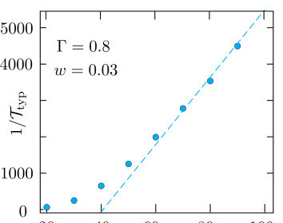 
FIG. 4. Reciprocal of the typical transmission probability Ttyp = eE[ln T ] as a function of conductor length L. The data points have been computed from Eq. (5.17) for tunnel prob- ability Γ = 0.8 and measurement strength w = 0.03. The expectation value E[ln T ] is an average over 104 random dis- order realizations. The dashed line is a linear fit to the large-L data, to show the crossover to the diffusive regime.

📷 Fig 5

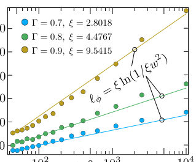 
FIG. 5. Coherence length ℓϕ as a function of 1/w2 for three values of the tunnel probability. The solid lines are given by Eq. (7.6), which in dimensionless units reads ℓϕ = ξ ln(1/ξw2). The localization length ξ is not fitted to this data, it is obtained independently from the exponential de- cay of Ttyp ∝e−L/ξ for w = 0.

**Summary.** The paper demonstrates that monitoring quantum transport in a 1D disordered wire suppresses Anderson localization, leading to a diffusive regime. It provides a quantitative scaling law for the induced coherence length and shows that the electron transport statistics remain binomial.

**Why it may be interesting.** This work is highly relevant to open quantum systems as it provides a rigorous master equation treatment of how continuous or periodic monitoring affects many-body transport and destroys quantum interference effects.

Detailed structure

**Main problem.** Investigating how environmental monitoring (time-resolved projective measurements) induces a transition from Anderson localization to classical diffusion in a one-dimensional disordered conductor.

**Main result.** Monitoring suppresses phase coherence, causing a crossover from exponential localization to Ohmic 1/L decay at a coherence length that scales logarithmically with the measurement interval.

**Method.** The authors develop a quantum master equation approach using Kraus operators and a 1+1 dimensional space-time lattice to track the many-particle density matrix evolution.

**Model / system.** A single-mode, one-dimensional electronic conductor with disorder, modeled as a series of scattering segments where decoherence is introduced via periodic projective measurements.

**Key observables.** Transmission probability (T), conductance (G), shot noise power, and full counting statistics (FCS) of transferred charge.

**Important parameters / regimes.** Conductor length (L), localization length (xi), phase coherence length (l_phi), measurement strength (w), and mean time between measurements (tau_phi).

**Assumptions / limitations.** The study assumes a low-voltage, linear response regime and a discrete-time evolution model.

**Figures summary.** Figure 1 shows a space-time lattice of the conductor; Figure 4 illustrates the crossover from exponential to linear decay in transmission; Figure 5 shows the logarithmic growth of coherence length with measurement strength; Figure 6/7 compare the master equation to the voltage probe model.

**Paper structure.** The paper introduces the master equation framework, applies it to study the transition from localization to diffusion, analyzes the scaling of the coherence length, compares the results to the Büttiker voltage probe model, and discusses reciprocity breaking.

Abstract

We formulate a quantum master equation for the many-particle density matrix of electrons propagating through a single-mode conductor, combining elastic scattering by disorder with time-resolved projective measurements that monitor the outcome of scattering events. The full counting statistics of transmitted electrons has a binomial distribution function, whose mean ${\cal T}$ and variance ${\cal T}(1-{\cal T})$ determine the conductance and shot noise power, respectively. Monitoring suppresses the phase coherence responsible for one-dimensional localization: The decay with conductor length $L$ of the typical transmission probability crosses over at $L\simeq \ell_φ$ from the exponential $e^{-L/ξ}$ (with localization length $ξ$) to the Ohmic $1/L$ decay. Numerical solution of the master equation gives, for weak monitoring, a logarithmic dependence $\ell_φ\simeq ξ\ln(v_{\rm F}τ_φ/ξ)$ of the coherence length $\ell_φ$ on the mean time $τ_φ$ between measurements.

[↑ back to top](#top)

### [Gyromagnetic Quantum Friction in Rayleigh Vorticity Baths](http://arxiv.org/abs/2605.22135v1)

**Authors:** Mamoru Matsuo, Ryotaro Sano, Ai Yamakage, Hiroshi Funaki, Tatsuhiko N. Ikeda  
**Type:** theory · **Category:** quantum information and computing · **PDF:** <https://arxiv.org/pdf/2605.22135v1>  
**Analysis basis:** full PDF text, analyzed in chunks
**Topic relevance:** 🔥 `spintronics-quantum-optics interface` **4/5** · `Kondo & dissipative impurity` **2/5** · `correlated / nonlocal dissipation` **2/5**

📷 Fig 1

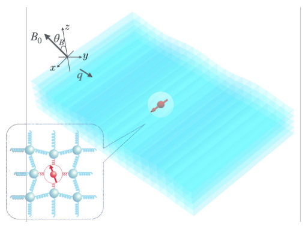 
FIG. 1. A near-surface spin-1/2 is located at a depth d below a traction-free surface (z = 0) of an elastic half-space. The spin couples linearly to the local lattice vorticity generated by Rayleigh surface acoustic waves with in-plane wave vector q. A static magnetic field B0 defines the quantization axis, tilted by an angle θB from the surface normal ˆz.

**Summary.** The paper identifies a new relaxation mechanism for spins near a surface called gyromagnetic quantum friction, driven by the vorticity of Rayleigh waves. Unlike thermal Raman relaxation, this process remains active at zero temperature due to zero-point fluctuations. This effect provides a way to use shallow spin sensors to detect acoustic quantum friction in solids.

**Why it may be interesting.** It identifies a fundamental, temperature-independent decoherence mechanism (quantum friction) driven by vacuum fluctuations of a mechanical bath, which is highly relevant to the design of surface-based spin qubits and quantum sensors.

Detailed structure

**Main problem.** Identifying an intrinsic, zero-temperature relaxation channel for near-surface spins caused by the vorticity of Rayleigh surface acoustic waves.

**Main result.** The discovery of 'gyromagnetic quantum friction,' a non-zero relaxation rate that persists even at zero temperature due to zero-point vorticity fluctuations, which can be used to detect surface acoustic waves.

**Method.** The authors use the Born-Markov approximation and Fermi's Golden Rule to calculate transition rates, alongside a spectral density analysis of quantized elastic modes.

**Model / system.** A single spin-1/2 (such as an NV center or quantum dot) located at a depth d below a traction-free, isotropic elastic surface, coupled to a bath of Rayleigh-wave vorticity and bulk phonons via a Barnett-type interaction.

**Key observables.** Longitudinal relaxation rate (T1 inverse), transverse coherence time (T2), and frequency renormalization.

**Important parameters / regimes.** Spin depth (d), Larmor frequency (omega_0), Rayleigh-evanescent length (l_R), and the Raman crossover temperature (T_x).

**Assumptions / limitations.** The medium is an infinite, isotropic, elastic half-space; the interaction is treated in the weak-coupling regime; and the Rayleigh surface contribution is assumed to dominate the bulk contribution for shallow spins.

**Figures summary.** A visibility map summarizing dominant relaxation regimes based on spin depth and temperature.

**Paper structure.** The paper introduces the spin-vorticity interaction, develops the quantization of the Rayleigh-wave bath, derives the spectral density and relaxation rates, compares the mechanism to Raman and g-modulation relaxation, and provides a benchmark analysis using diamond parameters.

Abstract

We identify an intrinsic zero-temperature relaxation channel for near-surface spins gyromagnetically coupled to Rayleigh-wave vorticity. This surface-mode contribution requires no thermal phonons, unlike Raman relaxation, and is fixed by Rayleigh vorticity rather than material-specific $g$-factor modulation. The Rayleigh-vorticity bath is super-Ohmic and evanescent with depth, producing field and depth scalings of spin relaxation. These scalings establish shallow spin sensors and hybrid surface-acoustic-wave spin interfaces as detectors of Rayleigh-wave acoustic quantum friction in solids.

[↑ back to top](#top)

### [Signatures of quantum chaos in phonon-polariton billiards](http://arxiv.org/abs/2605.22753v1)

**Authors:** Yinan Dong, Felix Liu, Ekrem Demirboga, Andrey Grankin, Dihao Sun, Yuchen Lin, Lukas Wehmeier, Matthew Fu, Cory R. Dean, Song Liu, James H. Edgar, Michael M. Folger, Victor M. Galitski, Dmitri N. Basov  
**Type:** both · **Category:** other · **PDF:** <https://arxiv.org/pdf/2605.22753v1>  
**Analysis basis:** full PDF text, analyzed in chunks
**Topic relevance:** 🔥 `scars & prethermalization` **4/5** · `quantum optics experiment` **3/5**

📷 Fig 1

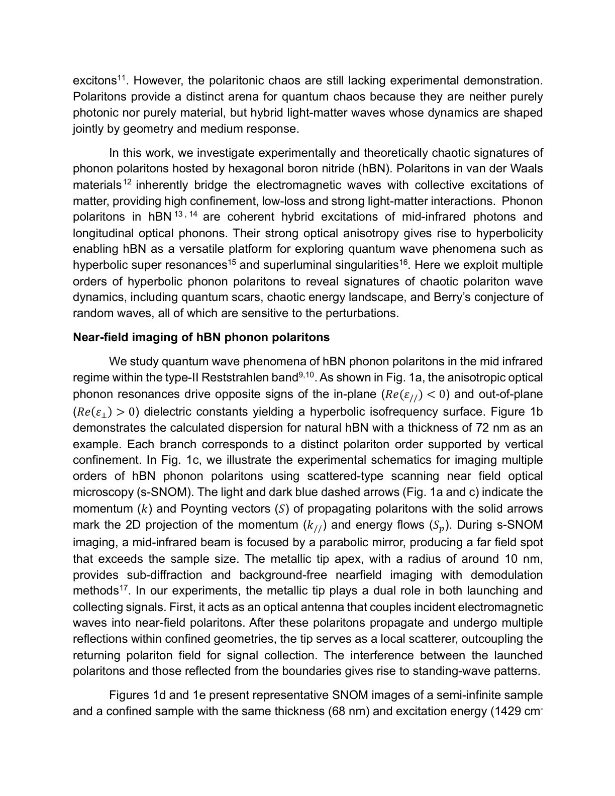 
Low-resolution page preview, page 2

📷 Fig 2

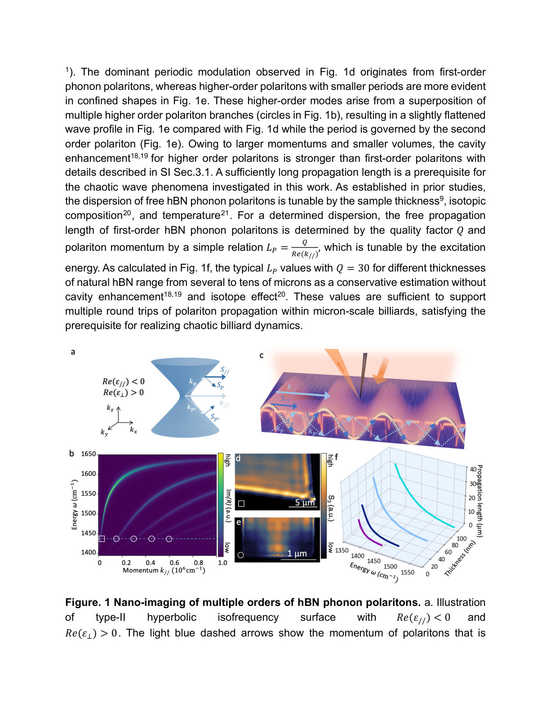 
Low-resolution page preview, page 3

📷 Fig 3

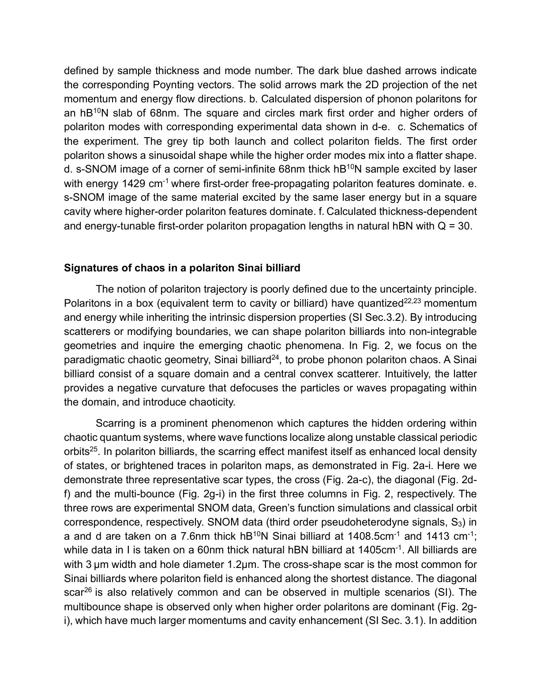 
Low-resolution page preview, page 4

📷 Fig 4

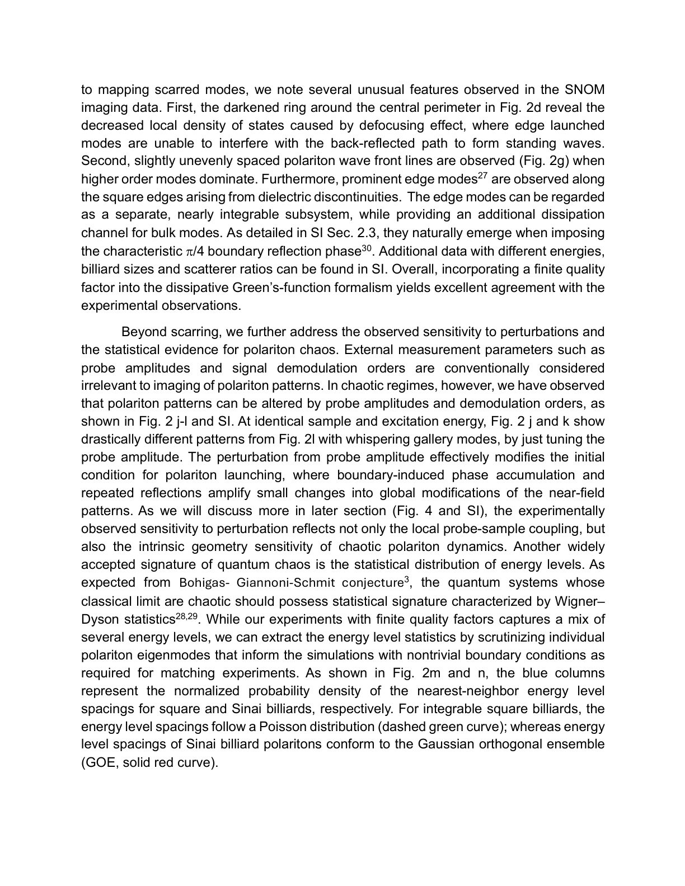 
Low-resolution page preview, page 5

📷 Fig 5

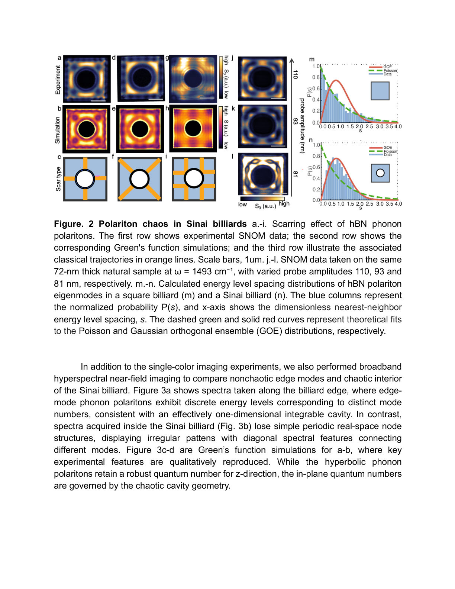 
Low-resolution page preview, page 6

**Summary.** This paper experimentally demonstrates quantum chaos in phonon-polariton billiards made of hBN. By varying the cavity geometry, the authors observe signatures like quantum scarring and the transition from Poisson to Wigner-Dyson statistics. This establishes these van der Waals materials as a versatile platform for studying complex wave dynamics.

**Why it may be interesting.** It provides an experimental platform for studying the transition between integrable and chaotic dynamics in a dissipative, hybrid light-matter system, relevant to quantum optics and open quantum systems.

Detailed structure

**Main problem.** Investigating the signatures of quantum chaos, such as quantum scarring and random-wave statistics, in hybrid light-matter phonon-polariton systems.

**Main result.** The study demonstrates the transition from Poisson to Wigner-Dyson level statistics and observes quantum scarring and Berry's random-wave conjecture in hBN polariton billiards.

**Method.** The researchers used s-SNOM for near-field imaging and developed a numerical framework based on the Helmholtz equation with generalized boundary conditions and Green's functions.

**Model / system.** The physical system consists of hyperbolic phonon-polaritons in hexagonal boron nitride (hBN) cavities with varying geometries, including square (integrable) and Sinai (chaotic) billiards.

**Key observables.** Local density of states (LDOS), polariton wave patterns (scars), energy level spacing distributions, and Fourier transforms of measured signals (momentum distribution).

**Important parameters / regimes.** hBN thickness, excitation energy, cavity geometry (integrable vs. chaotic), quality factor (Q), and probe amplitude.

**Assumptions / limitations.** The Maxwell equations are approximated by a scalar Helmholtz equation, and the boundary condition is approximated by expanding around normal incidence to maintain locality.

**Figures summary.** Figure 1 shows hBN polariton nano-imaging and dispersion; Figure 2 displays s-SNOM data, simulations of scarring, and level spacing statistics; Figure 3 compares edge modes to chaotic interiors; Figure 4 demonstrates Berry's conjecture via FFT.

**Paper structure.** The paper begins with experimental fabrication and imaging, moves to the development of a numerical Green's function framework for scattering, then presents the identification of quantum scars, energy level statistics, and the validation of Berry's conjecture.

Abstract

We use scanning near-field optical microscopy to image hyperbolic phonon polaritons in hexagonal boron nitride (hBN) billiards with integrable and chaotic geometries. In Sinai billiards, we observe irregular mode patterns consistent with quantum scarring, together with an unexpected sensitivity to weak probe perturbations. These random-wave features coexist with non-chaotic one-dimensional boundary modes arising from nontrivial polariton reflection at the billiard edge. As the billiard boundary becomes increasingly complex, the Fourier transforms of the measured signals evolve toward ring-like structures consistent with Berry's random-wave conjecture. We develop a numerical framework based on the Helmholtz equation with generalized boundary conditions that encode angle-dependent reflection phase shifts. The calculated level statistics exhibit a crossover from Poisson-like behavior in integrable billiards to Wigner-Dyson-like behavior in chaotic geometries, with small deviations from the canonical form arising from nonlinear boundary conditions that require self-consistent bulk-boundary analysis. Theoretical analysis based on dissipative Green's functions qualitatively reproduces the near-field data. These results establish mesoscopic van der Waals billiards as a rich platform for studying generalized chaotic dynamics of hybrid light-matter polaritons.

[↑ back to top](#top)

### [Klein tunneling of the laser coherence](http://arxiv.org/abs/2605.22033v1)

**Authors:** Konstantin Manannikov, Sagie Gadasi, Ekaterina Mironova, Eran Bernstein, Andrei Poliakov, Nir Davidson, Alexander N. Poddubny  
**Type:** theory · **Category:** other · **PDF:** <https://arxiv.org/pdf/2605.22033v1>  
**Analysis basis:** full PDF text, analyzed in chunks
**Topic relevance:** `correlated / nonlocal dissipation` **3/5** · `driven-dissipative phase transition` **3/5** · `non-equilibrium dynamics` **3/5** · `analog quantum simulation` **2/5** · `methods for driven-dissipative` **2/5**

📷 Fig 1

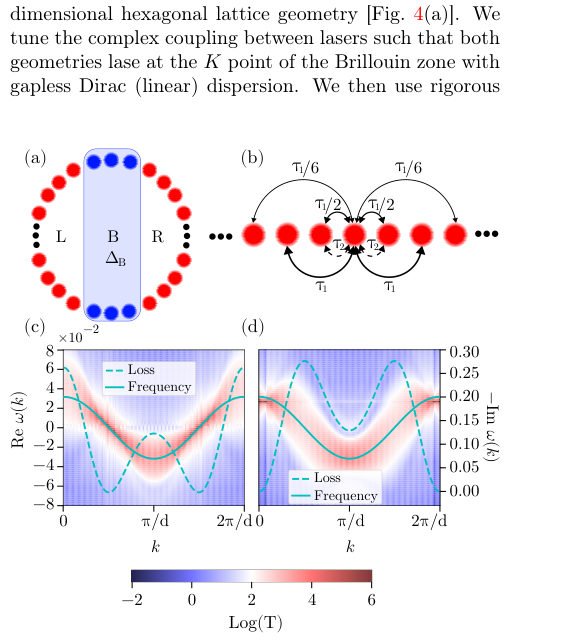 
FIG. 1. (a) One-dimensional array of N = 100 coupled lasers with periodic boundary condition (PBC) and double barrier composed of NB = 3 lasers with frequency detun- ing ∆B. L and R are the left and right regions of an array, respectively, and B is the frequency detuned barrier that sep- arates them. (b) A complex coupling scheme is implemented to achieve a minimal-loss lasing solution at k points with ei- ther linear or parabolic dispersion. Solid (dashed) lines de- note dissipative (dispersive) coupling coefficients. (c-d) Lines: analytical calculation of band structure (solid) and loss land- scape (dashed) obtained from diagonalizing the effective non- Hermitian Hamiltonian Hnn′....

📷 Fig 2

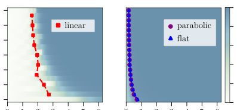 
FIG. 2. (a) Probability of de-synchronization for barrier width NB = 10 and different ∆B for τ1 &lt; 0 (linear disper- sion), τ1 &gt; 0 (parabolic dispersion) and τ2 = 0 (flat disper- sion). (b) Same as (a), but for a reduced basis of only the Nm = 4 lowest-loss modes. (c-d) Color map represents the localization of the first 4 eigenmodes of the coupling matrix for different barrier heights and widths for (c) τ1 &lt; 0 and (d) τ1 &gt; 0. Lines on color plots mark the desynchroniza- tion threshold, obtained from the non-linear simulation, and agree well with the linear localization transition. The calcula- tions were performed for N = 100 coupled lasers with periodic boundary conditions, p = 1.5, and γ =...

📷 Fig 3

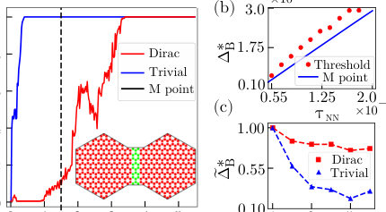 
FIG. 4. (a) Probability of desynchronization of the arrays left and right of the barrier for the trivial dispersion (blue dots) and for the Dirac dispersion (red dots). The dashed line indicates the position of the M point for the Dirac band structure. The inset shows the geometry of the laser array with a barrier in the middle, where green lasers are detuned by ∆B. (b) Dependence of critical barrier height for synchro- nization ∆∗ B on the nearest neighbor coupling value τNN. The blue line shows the frequency of the M point of the Brillouin zone. (c) Dependence of the normalized critical barrier height ˜∆∗ B(NB) = ∆∗ B(NB)/∆∗ B(1) on the width of the barrier, see Sec. S2 of Ref. [34] for...

📷 Fig 4

 
FIG. 3. (a-b): Band structure of honeycomb laser array. Pic- ture (a) shows the frequencies of two eigenvalues of the Bloch Hamiltonian, while the loss of these eigenvalues is on (b). The minimal loss solution is localized around K and K′ points and has a linear dispersion relation. (c,d): Near and far field of the laser array with the linear dispersion, confirming lasing around the K and K′ points and a chiral phase structure.

📷 Fig 5

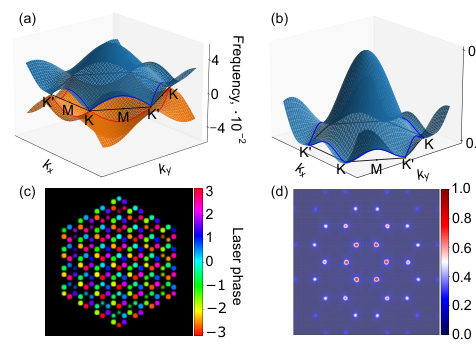 
Figure 3(a,b) shows the real (a) and imaginary parts (b) of ω(k) calculated by diagonalizing Eq. (6). The dispersion in Fig. 3(a) manifests characteristic Dirac cones, and the loss in Fig. 3(b) is minimized at the K points. Conversely, τNN = 0.1 and τNNN = 0.03i yield lasing at the Γ point of the Brillouin zone with parabolic (trivial) dispersion. Figure 3(c) shows the near field profile and Fig. 3(d) illustrates the far field, cal- culated as a Fourier transform of (c) in the form of E(k) = P

**Summary.** The study shows that laser arrays with linear (Dirac) dispersion can maintain frequency synchronization across much larger frequency barriers than those with standard parabolic dispersion. This enhanced robustness is attributed to the 'Klein tunneling' of laser coherence, where modes delocalize through the barrier.

**Why it may be interesting.** It demonstrates a direct analogy between a fundamental relativistic particle phenomenon (Klein tunneling) and the macroscopic synchronization of non-equilibrium, non-Hermitian classical oscillators, which is highly relevant to open quantum systems and quantum optics.

Detailed structure

**Main problem.** Investigating the robustness of frequency synchronization between two laser arrays separated by a spectrally detuned barrier, specifically exploring how different dispersion laws (linear/Dirac vs. parabolic) affect the synchronization threshold.

**Main result.** For linear (Dirac) dispersion, synchronization persists for barrier heights approximately an order of magnitude higher than for parabolic or flat dispersion, an effect interpreted as the Klein tunneling of laser coherence.

**Method.** Numerical solution of nonlinear laser rate equations (Lugiato-Lefever-type) combined with linear analysis via diagonalization of a non-Hermitian effective Hamiltonian.

**Model / system.** 1D and 2D (hexagonal/honeycomb) arrays of coupled lasers described by a non-Hermitian effective Hamiltonian including dispersive and dissipative coupling components.

**Key observables.** Probability of desynchronization (P_desync), nonlinear transmission of coherence (T), mode localization/delocalization, and complex eigenfrequencies (dispersion and loss).

**Important parameters / regimes.** Barrier height (delta_B), barrier width (N_B), pump rate (p/gamma), and dispersion type (linear/Dirac, parabolic, or flat).

**Assumptions / limitations.** The nonlinear lasing solutions can be approximated by linear combinations of the lowest-loss eigenmodes of the effective Hamiltonian.

**Figures summary.** Fig 1 shows the 1D setup, coupling scheme, and band structure/transmission; Fig 2 compares desynchronization probability across different dispersion regimes; Supplemental figures show mode loss, localization, and the effect of pump strength.

**Paper structure.** The paper introduces the synchronization problem in laser arrays, presents the 1D model and the discovery of enhanced synchronization via Klein tunneling, extends the findings to 2D honeycomb lattices, and provides a detailed analysis of mode localization and symmetry effects in the supplement.

Abstract

We study theoretically the lasing synchronization of the two arrays of lasers with the complex mode dispersion, separated by a spectrally detuned barrier. We demonstrate that for lasing at the Dirac point, the synchronization persists for an order of magnitude higher barriers than in the arrays with a usual parabolic dispersion or a purely dissipative coupling. We interpret this effect as the Klein tunneling of the laser coherence through the barrier. Our numerical findings are supported by an analysis of the delocalization of the linearized eigenmodes of the arrays, which enhances the synchronization.

[↑ back to top](#top)

### [Nonlinear Photonic Tripartite Phase](http://arxiv.org/abs/2605.21983v1)

**Authors:** Xiangrui Hou, Fangyu Wang, Zhaoxin Wu, Shuming Zhang, Shan-Zhong Li, Lei Ying, Haiqing Lin, Baile Zhang, Zhi Li, Shi-Liang Zhu, Zhaoju Yang  
**Type:** both · **Category:** disordered systems and neural networks · **PDF:** <https://arxiv.org/pdf/2605.21983v1>  
**Analysis basis:** full PDF text, analyzed in chunks
**Topic relevance:** `non-equilibrium dynamics` **3/5** · `analog quantum simulation` **2/5** · `non-equilibrium universality` **2/5** · `quantum optics experiment` **2/5**

📷 Fig 1

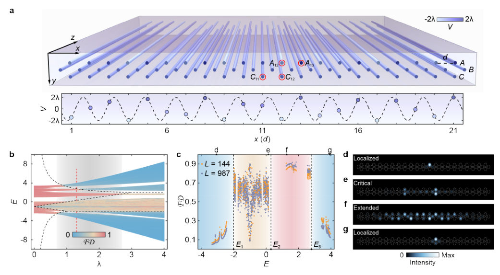 
FIG. 1. Experimental realization of a tripartite phase in a quasiperiodic diamond lattice. a, Schematic of the photonic waveguide array, where the quasiperiodic potential applied to sublattice A is depicted by the purple color gradient. The superimposed curve illustrates the on-site potential energy distribution. The red circles mark the selective excitation sites targeting the low-energy localized (A12), critical (C11), extended (C12), and high-energy localized (A13) states. b, Phase diagram for a system size of L = 987, with black dashed lines indicating mobility edges. c, Spectrum of the fractal dimension FD. The dependence of FD on energy E is plotted for a fixed disorder strength λ =...

📷 Fig 2

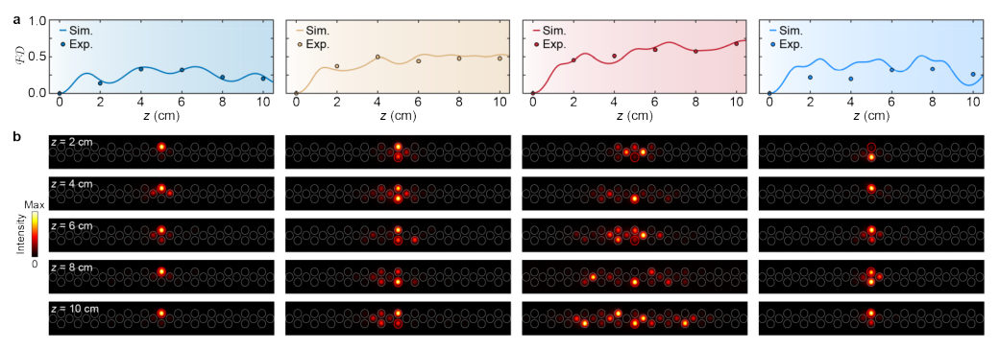 
FIG. 2. Dynamical signatures of the tripartite phase. a, Evolution of the fractal dimension FD as a function of propagation distance z. The experimental measurements (dots) are consistent with the numerical simulations (solid lines). b, Spatial intensity distributions measured at propagation lengths of z =2, 4, 6, 8, and 10 cm. The columns illustrate three distinct transport regimes: the localized state remains spatially confined (1st and 4th column), the critical state exhibits anomalous expansion (2nd column), and the extended state undergoes ballistic spreading (3rd column). Lattice parameters: system size L = 21, coupling strength J = t = 0.5 cm−1, and disorder strength λ = 1.3J.

📷 Fig 3

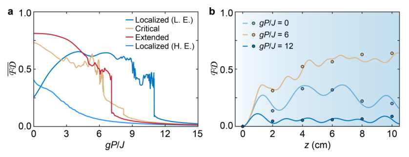 
FIG. 3. Interaction response in the tripartite phase. a, The time-averaged fractal dimension FD as a function of interaction strength, for the low-energy (L. E.) localized (A12), critical (C11), extended (C12), and high-energy (H. E.) localized (A13) states. The value is integrated over the propagation window z ∈[20, 50]cm. b, Dynamical evolution of the FD for the three interaction strengths. Experimental measurements (dots) show excellent agreement with numerical simulations (solid lines), confirming the non-monotonic transition. All parameters are consistent with Fig. 2.

📷 Fig 4

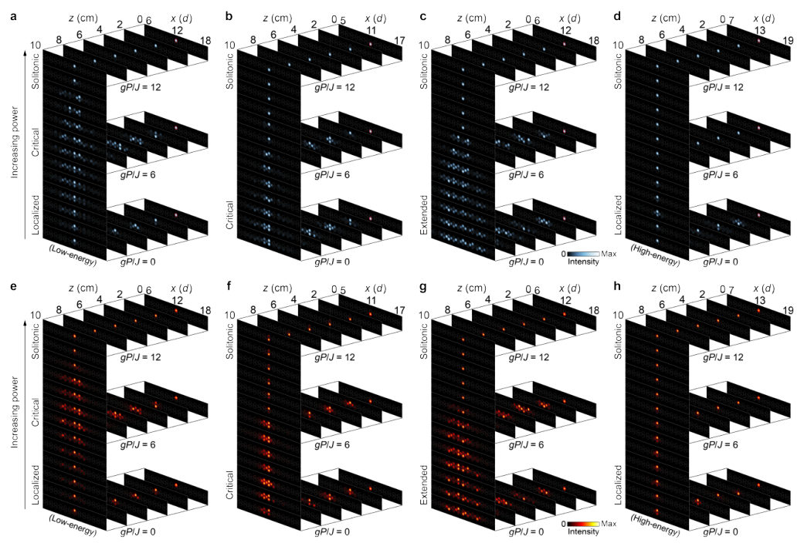 
FIG. 4. State-selective nonlinear transport and re-entrant localization. Numerical (a-d) and experimental (e-h) spatial intensity distributions for the low-energy localized state (a, e), critical state (b, f), extended state (c, g), and high-energy localized state (d, h). Each panel displays wavepacket profiles stacked vertically in ascending order of input power gP/J. A striking contrast is observed: the low-energy localized state (a, e) exhibits a unique non-monotonic anomalous transition (localization →critical transport →soliton), whereas the critical, extended, and high-energy localized states (b-d, f-h) undergo monotonic self-trapping, directly collapsing into the soliton regime. This...

**Summary.** This paper experimentally demonstrates a tripartite phase in a nonlinear quasiperiodic photonic lattice where localized, critical, and extended states coexist. It reveals that nonlinearity acts selectively, capable of driving low-energy localized states into a critical window before eventually inducing self-trapping. This discovery offers a mechanism for using interactions to control state access in quasiperiodic landscapes.

**Why it may be interesting.** It provides a rare experimental demonstration of a tripartite phase and shows how nonlinear interactions can be used as a dynamical tool to navigate between different localization regimes, which is highly relevant to many-body dynamics and controlled transport in disordered systems.

Detailed structure

**Main problem.** The study addresses the lack of experimental realization of a tripartite phase (coexisting localized, critical, and extended states) in quasiperiodic systems and investigates whether nonlinearity can provide controlled access to the critical window.

**Main result.** The researchers experimentally realize a tripartite phase in a nonlinear photonic lattice and discover a state-selective mechanism where weak nonlinearity 'thaws' low-energy localized states into the critical window, while stronger nonlinearity leads to self-trapping.

**Method.** The study uses femtosecond-laser-written waveguide arrays to implement a quasiperiodic diamond lattice, employing site-selective excitation and tracking wavepacket dynamics and fractal dimension evolution.

**Model / system.** A nonlinear quasiperiodic diamond photonic lattice implemented via waveguide arrays, governed by the discrete nonlinear Schrodinger equation with a quasiperiodic potential applied to one sublattice.

**Key observables.** Fractal Dimension (FD), Inverse Participation Ratio (IPR), wavepacket spatial intensity evolution, and energy-dependent transport regimes.

**Important parameters / regimes.** Disorder strength (lambda), nonlinearity strength (gP/J), and energy levels (low-energy vs. high-energy localized states).

**Assumptions / limitations.** The paraxial approximation is used to map spatial propagation in waveguides to temporal evolution in quantum systems.

**Figures summary.** Fig 1 shows the waveguide array schematic and excitation sites; Fig 2 visualizes spatial intensity evolution; Fig 3 displays the fractal dimension as a function of nonlinearity and its dynamical evolution; Fig 4 shows the monotonic drive of certain states into the soliton regime.

**Paper structure.** The paper introduces the experimental gap, describes the photonic lattice platform and Hamiltonian, presents the realization of the tripartite phase in the linear regime, explores the state-selective response to Kerr nonlinearity, and concludes with the underlying mechanism of spectral flow.

Abstract

Anderson localization is usually understood as a transition between extended and localized phases, with criticality confined to a single mobility edge. Recent advances predict that quasiperiodic systems can instead host a finite critical window bounded by mobility edges, in which localized, critical and extended states coexist. Yet both the experimental realization of this regime and whether interactions can provide controlled access to it remain unknown. Here, we realize such a tripartite phase in a nonlinear quasiperiodic photonic lattice and show that Kerr nonlinearity, acting as an effective interaction, enables state-selective access to the critical window. By tracking wavepacket dynamics, we distinguish localized, critical and extended transport regimes and uncover a state-selective response: rather than simply reinforcing localization through self-trapping, weak nonlinearity drives low-energy localized states into the critical window, whereas stronger nonlinearity restores localization. By contrast, critical, extended and high-energy localized states evolve monotonically towards self-trapped behaviour. Our results reveal a state-selective mechanism by which interactions provide controlled access to a pre-existing critical window in quasiperiodic systems.

[↑ back to top](#top)

### [Generation of Quantum Turbulence by Neutrino Cooling in Neutron Stars](http://arxiv.org/abs/2605.22768v1)

**Authors:** J. A. Sauls  
**Type:** theory · **Category:** statistical mechanics · **PDF:** <https://arxiv.org/pdf/2605.22768v1>  
**Analysis basis:** full PDF text, analyzed in chunks
**Topic relevance:** `non-equilibrium dynamics` **3/5** · `non-equilibrium universality` **3/5** · `driven-dissipative phase transition` **2/5**

📷 Fig 1

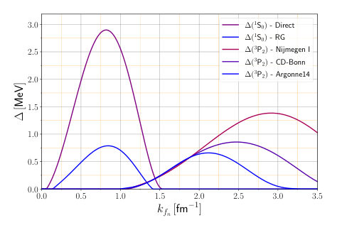 
FIG. 1. Neutron superfluid Gaps vs neutron Fermi wavenumber. Shown are calculated gaps for 1S0 pairing at densities above neutron drip up to kfn ≈1.5 fm−1 based on direct nuclear potentials reported in Ref. 22. The reduced 1S0 pairing gap is based on the one-loop renormalization group equations for interacting Fermi liquids from Ref. 23. At higher densities 3P2 superfluidity is predicted with some- what reduced pairing gaps in the inner core.24 N.B. The curves were generated from digitized data extracted from Fig. 2 of Ref. 22, Fig. 8 of Ref. 23 and Fig. 4 of Ref. 24.

📷 Fig 2

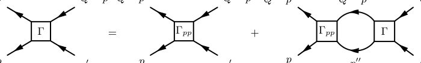 
FIG. 2. Cooper Pair Propagator. Γpp(p+Q, −p; p′ +Q, −p′) is the particle-particle irreducible vertex responsible for the binding of pairs of Fermions with nearly zero total four-momentum, Q ≪(pf, Ef).

📷 Fig 3

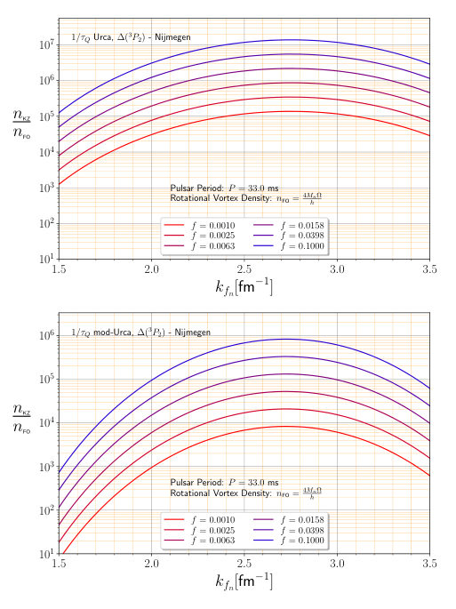 
FIG. 3. The aeral density of vortices generated by the KZM as a function of neutron Fermi wavenumber kfn, normalized by the areal density of equilibrium vortices for co-rotation at the Crab pulsar rotational velocity. The fraction f of ±2π phase windings at freeze out is varied between 10−3 −10−1. The quench rate through Tc is obtained from direct Urca neutrino cooling (top panel) and modified Urca neutrino cooling (bottom panel). The 3P2 gap and Tc are based on the Nijmegen-I potential from Ref. 24.

📷 Fig 4

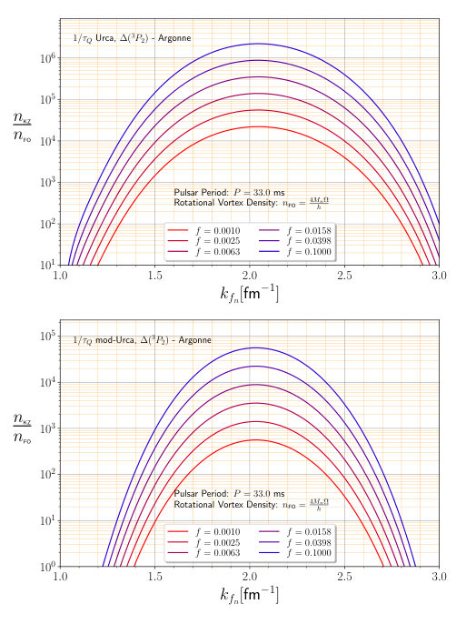 
FIG. 4. Same caption as that in Fig. 3 except the 3P2 gap and Tc are based on the Argonne potential from Ref. 24.

**Summary.** This paper demonstrates that the rapid neutrino cooling in young neutron stars acts as a thermal quench that triggers the Kibble-Zurek mechanism. This process generates a high density of quantized vortices, resulting in a state of quantum turbulence within the star's superfluid core. These findings have significant implications for understanding pulsar rotation and thermal evolution.

**Why it may be interesting.** The paper explores non-equilibrium phase transitions and the generation of topological defects via rapid quenches, which is highly relevant to the study of dynamics in many-body systems and the formation of defects in condensed matter.

Detailed structure

**Main problem.** Investigating whether the rapid, non-equilibrium neutrino cooling in young neutron stars triggers the generation of quantum turbulence through the formation of topological defects.

**Main result.** The application of the Kibble-Zurek mechanism (KZM) predicts that rapid cooling leads to a very high density of quantized vortices and loops, creating a random network of quantum turbulence in the neutron star interior.

**Method.** The author uses the Kibble-Zurek mechanism (KZM) and scaling relations derived from the Cooper pair fluctuation propagator to calculate vortex densities based on Urca and modified Urca cooling rates.

**Model / system.** The system is the interior crust and liquid core of a young neutron star, modeled as a quantum liquid mixture of neutron and proton superfluids and a relativistic electron liquid undergoing a second-order phase transition.

**Key observables.** Areal density of phase vortices (nv), inter-vortex spacing (dv), and the quench rate (1/tau_Q).

**Important parameters / regimes.** Neutrino cooling timescales (tau_Q), transition temperatures (Tc), pairing gaps (Delta), and neutron density (kfn).

**Assumptions / limitations.** The cooling is modeled as a temperature quench; the fraction of phase windings (f) is non-universal; the system is treated within the weak-coupling limit for pairing.

**Figures summary.** Figure 1 shows neutron superfluid pairing calculations; Figure 2 shows a diagrammatic representation of the Cooper pair propagator; Figure 3 and 4 show the areal density of vortices as a function of neutron density for different cooling processes and nuclear potentials.

**Paper structure.** The paper introduces the neutron star interior system, applies the Kibble-Zurek mechanism to the non-equilibrium phase transition, derives scaling relations from the Cooper pair propagator, calculates vortex densities for specific cooling mechanisms (Urca/modified Urca), and compares results to standard pulsar rotation models.

Abstract

The interior crust and much of the liquid core of neutron stars is believed to be a quantum liquid mixture of neutron and proton superfluids and a relativistic electron liquid. Quantized vortices in the neutron superfluid and quantized flux lines in the proton superconductor are topological defects of these hadronic condensates. I consider the formation of the superfluid state in young neutron stars under non-equilibrium conditions imposed by the neutrino cooling rate. The nonequilibrium phase transition implies that the onset of superfluidity is accompanied by the generation of quantized vortices based on the mechanism envisioned by Kibble in the context cosmic string formation in an evolutionary models of an expanding universe, and further developed by Zurek for nonequilibrium phase transitions in quantum liquids such as \Hefour. I discuss the Kibble-Zurek mechanism (KZM) and scaling relations for topological defect formation starting from the Cooper pair fluctuation propagator for temperatures approaching $T_c$. I then calculate the predicted vortex densities based on Urca and modified Urca cooling mechanisms in the cores of neutron stars for several models of the superfluid gap and transition temperature of the interior neutron superfluid. In all cases studied the KZM leads to a large density of topological defects in the condensate phase, which in 3D form a random network of vortex lines and loops, i.e. the generation of quantum turbulence.

[↑ back to top](#top)

### [Nonlinear frequency shift and bistability of magnon-polarons](http://arxiv.org/abs/2605.22157v1)

**Authors:** Kevin Künstle, Matthias Wagner, Philipp Knaus, Yannik Kunz, Ephraim Spindler, Katharina Lasinger, Matthias R. Schweizer, Philipp Pirro, John F. Gregg, Mathias Weiler  
**Type:** both · **Category:** other · **PDF:** <https://arxiv.org/pdf/2605.22157v1>  
**Analysis basis:** full PDF text, analyzed in chunks
**Topic relevance:** `spintronics-quantum-optics interface` **3/5** · `driven-dissipative phase transition` **2/5** · `non-equilibrium dynamics` **2/5**

📷 Fig 1

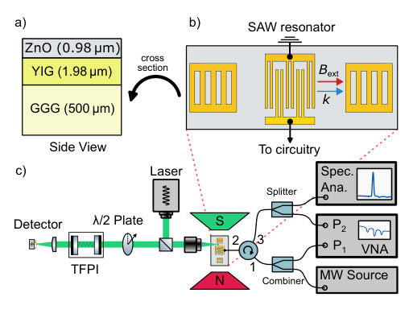 
FIG. 1. Schematic of the sample and measurement setup. (a) Heterostructure consisting of piezoelectric ZnO deposited on a YIG/GGG stack. (b) SAW resonator patterned on the ZnO layer; the device is identical to that studied in Ref. [13]. (c) Combined optical and electrical measurement setup. The sample is mounted in BV geometry inside an electromagnet, allowing simultaneous measurements of the electrical reflec- tion and the polarization-resolved BLS response of excited quasi-particles

📷 Fig 2

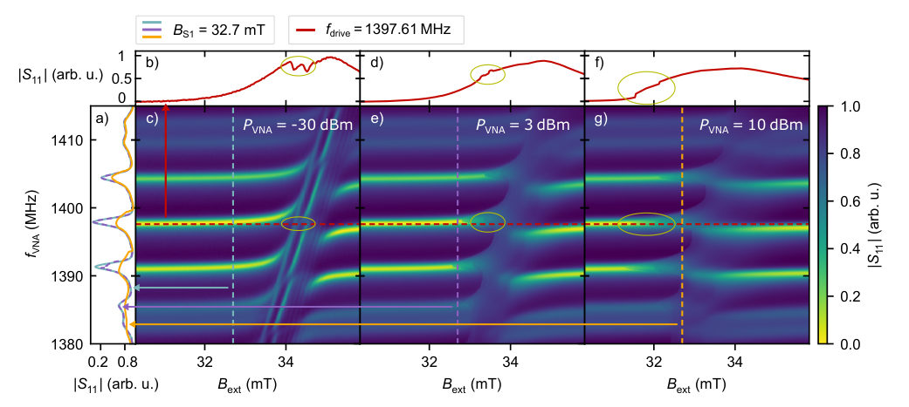 
FIG. 2. Power dependent VNA reflection |S11| measurements. (c,e,g) |S11| parameter colorcoded in dependence of Bext and fVNA for an applied VNA power of PVNA = −30 dBm, 3 dBm and 10 dBm respectively. Three high-Q SAW modes (horizontal light green features with reduced reflection) are visible and show a pronounced anticrossing with the BV-SW mode at PVNA = −30 dBm. With increasing PVNA, the hybridization branches broaden and move to lower Bext. In addition, the color- coded |S11| data develop step-like features that depend on both magnetic field and frequency. (a) Frequency line cuts at fixed BS1 = 32.7 mT (line colors correspond to the dashed lines in panels (c,e,g)). Compared to the...

📷 Fig 3

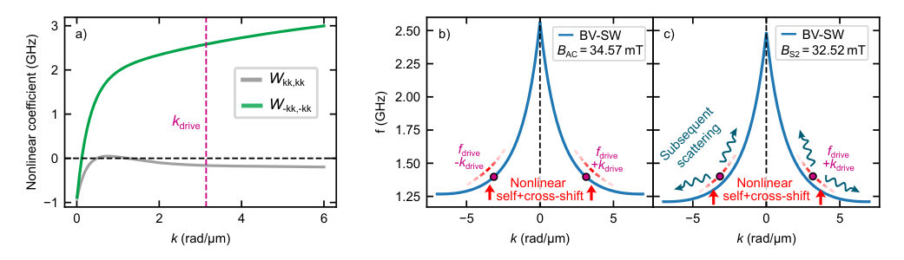 
FIG. 3. (a) Nonlinear self-shift Wkk,kk and cross-shift W−kk,−kk coefficient as a function of wave vector k. The purple dashed line corresponds to the k of the driving phonon, which in the linear regime resonantly couples to the magnon. (b,c) Calculated linear spin-wave dispersions for the BV-SW mode (blue). The purple circles mark the SAW-driven states. In (b), the drive is resonant with the BV-SW in the linear regime. With increasing power, the positive total nonlinear shift detunes the resonance condition, as indicated by the red arrows and dashed red lines. In (c), the drive is initially off-resonant (lower Bext) and is shifted into resonance by the positive total nonlinear frequency...

📷 Fig 4

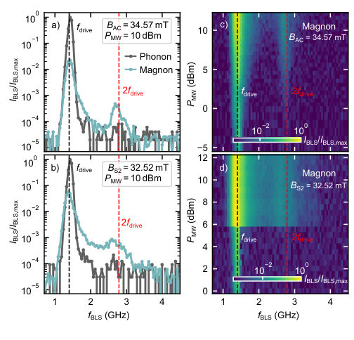 
FIG. 4. Observation of nonlinear processes using µBLS spec- troscopy. (a,b) Normalized µBLS intensity IBLS/IBLS,max as a function of fBLS measured in magnon and phonon polariza- tion at PMW = 10 dBm for two magnetic fields. The black and red dashed lines mark fdrive and 2fdrive, respectively. In (a), the field is tuned to the central anticrossing in the linear regime, and a nonlinear magnon signal is observed at 2fdrive. In (b), the field is below the linear anticrossing field, result- ing in a broad magnon spectrum, while a phonon signal is only present at fdrive in both cases. (c,d) IBLS/IBLS,max as a function of PMW and fBLS. In (c), resonant excitation at the anticrossing field leads to...

📷 Fig 5

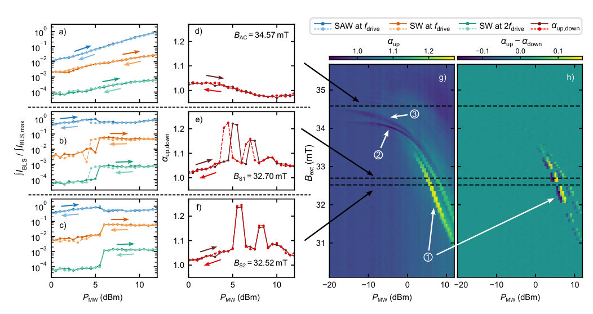 
FIG. 5. Bistability in the coupled magnon-phonon system revealed by hysteretic PMW sweeps in µBLS and SA measurements. (a-c) Normalized integrated µBLS intensities, R IBLS/ R IBLS,max, for the phonon mode at fdrive and the magnon modes at fdrive and 2fdrive, measured during upward and downward PMW sweeps at the indicated magnetic fields. (d-f) Corresponding spectrum-analyzer response, expressed as αup/down = dPSA/dPMW,up/down. At the anticrossing field, BAC = 34.57 mT, all signals evolve continuously and no pronounced hysteresis is observed [panels (a) and (d)]. At BS1 = 32.70 mT, a clear bistability appears: the phonon intensity at fdrive drops abruptly, while the magnon intensities at...

**Summary.** This paper demonstrates that in a SAW-driven resonator, the excitation of counterpropagating spin waves leads to a unique positive nonlinear frequency shift and bistable 'foldover' behavior. These findings provide a new mechanism for controlling magnon-phonon interactions and suggest potential for wave-based information processing and power-limiting devices.

**Why it may be interesting.** not directly relevant

Detailed structure

**Main problem.** The study investigates the origin of nonlinear frequency shifts and the emergence of bistability in strongly coupled magnon-phonon hybrids (magnon-polarons).

**Main result.** The researchers discovered that the nonlinear frequency shift is positive and dominated by a cross-shift term arising from the simultaneous excitation of counterpropagating spin waves (+k and -k) by the SAW resonator.

**Method.** The study combines microwave reflection measurements (VNA) with polarization-resolved micro-focused Brillouin light scattering (uBLS) and utilizes a vector Hamiltonian formalism for theoretical modeling.

**Model / system.** A magnetoacoustic resonator consisting of a YIG/ZnO heterostructure in a backward-volume magnetic configuration, where surface acoustic waves (SAWs) are strongly coupled to finite-wave-vector spin waves (SWs).

**Key observables.** Electrical reflection (S11), frequency-resolved magnon and phonon spectra, and power-dependent redistribution of magnon populations.

**Important parameters / regimes.** Strong-coupling regime (g/2pi = 5.05 MHz), acoustic wavelength (2 um), and magnetic field detuning relative to the anticrossing point.

**Assumptions / limitations.** The nonlinear dynamics are modeled using the vector Hamiltonian formalism for nonlinear spin-wave dynamics.

**Figures summary.** Fig 1 shows the device geometry and measurement setup; Fig 2 details the linear coupling and experimental parameters; Fig 3 presents nonlinear coefficients and calculated dispersion relations; Fig 4 and 5 illustrate the power-dependent nonlinear shifts, hysteretic power sweeps, and the resulting bistability/foldover behavior.

**Paper structure.** The paper begins with the experimental setup and linear regime characterization, moves to the observation of power-dependent frequency shifts and nonlinear scattering, provides a theoretical explanation via the vector Hamiltonian formalism, and concludes with the demonstration of bistability and potential applications.

Abstract

We investigate the nonlinear dynamics of strongly coupled surface acoustic waves (SAWs) and spin waves (SWs) in a magnetoacoustic resonator based on a YIG/ZnO heterostructure by combining microwave reflection measurements with microfocused Brillouin light scattering spectroscopy. In the linear regime, the electrical response reveals clear hybridization between standing SAW cavity modes and finite-wave-vector SWs, resulting in pronounced avoided crossings. At elevated drive powers, the hybrid system exhibits a strongly field-dependent nonlinear response characterized by a positive frequency shift of the driven SW mode. Using the vector Hamiltonian formalism for nonlinear spin-wave dynamics, we show that this shift is dominated by a cross-shift term. In our resonator geometry, this contribution becomes significant because the standing SAW cavity mode simultaneously excites counterpropagating SWs with wave vectors $+k$ and $-k$. For suitable field detuning, the nonlinear shift drives the SW mode into resonance with the SAW excitation, leading to a strong enhancement of the magnon population, broadband nonlinear scattering, and bistable foldover behavior. Beyond the foldover threshold, both the magnon and phonon responses stabilize. These results establish SAW-driven $k \neq 0$ magnon-phonon hybrids as a promising platform for nonlinear magnetoacoustics and wave-based information processing.

[↑ back to top](#top)

### [Anomalous acoustoelectric signatures of chiral superconductivity](http://arxiv.org/abs/2605.21936v1)

**Authors:** A. N. Osipov, V. N. Ivanova, V. M. Kovalev, I. G. Savenko  
**Type:** theory · **Category:** strongly correlated electrons · **PDF:** <https://arxiv.org/pdf/2605.21936v1>  
**Analysis basis:** full PDF text, analyzed in chunks
**Topic relevance:** `Keldysh / 2PI / non-Gaussian methods` **2/5** · `non-equilibrium dynamics` **2/5**

📷 Fig 1

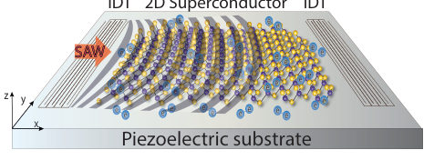 
FIG. 1. Schematic illustration of the system: A 2D super- conductor located on a piezoelectric substrate. Two inter- digital transducers (IDT) generate SAWs creating effective dragging potential for the excitations in the superconductor.

📷 Fig 2

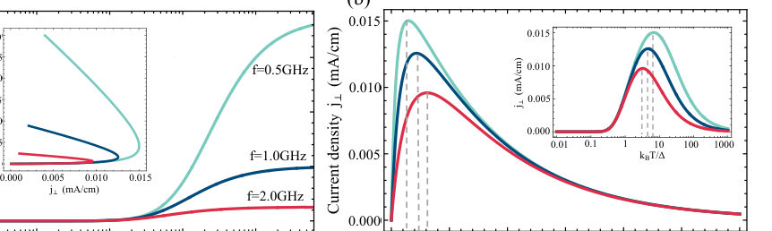 
FIG. 2. (a) Longitudinal component of electric current density j∥as a function of dimensionless parameter kBT/∆. Inset: parametric plot showing the ratio between j∥and j⊥for the frequencies fSAW = 0.5, 1, and 2 GHz. (b) Hall component j⊥ as a function of ∆/(kBT). Dashed vertical lines show the shift of the peak positions. Inset: semi-logarithmic scale.

📷 Fig 3

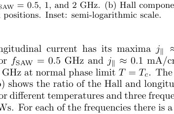 
Figure 3 shows a monotonic decay of both the lon- gitudinal and Hall current densities with increasing SAW frequency. To understand this dependence, let us collect the corresponding terms in the normal-state limit, which yields j ∼[1 + (Dpk2/w)]−2. The term Dpk2/w = (τDω)−1 represents a ratio between the acoustic wave period and the characteristic diffusion time τD = (Dpk2)−1. Since k ∝ω, the inverse diffusion time τ −1 D scales quadratically with frequency. This re- sult can be interpreted as follows: at higher acoustic fre- quencies, the diffusion response time becomes shorter. Rather than being dragged by the wave, the quasipar- ticles rapidly diffuse across the shortened wavelength,...

📷 Fig 4

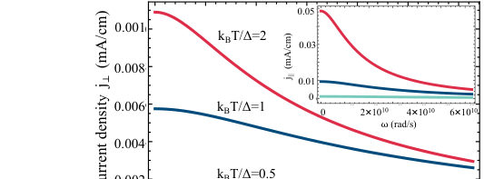 
FIG. 3. Frequency dependence of the current density com- ponents j⊥(main panel) and j∥(inset) for several values of the normalized temperature kBT/∆. The curves correspond to kBT/∆= 2, 1, and 0.5, respectively.

**Summary.** This paper proposes using Surface Acoustic Waves to detect chiral p-wave superconductivity in 2D materials. It demonstrates that the asymmetric scattering of quasiparticles generates a measurable transverse DC current. This provides a high-sensitivity electrical alternative to traditional optical methods for identifying unconventional pairing.

**Why it may be interesting.** not directly relevant

Detailed structure

**Main problem.** The difficulty of identifying chiral p-wave pairing symmetry in 2D superconductors using traditional optical probes due to low signal-to-noise and substrate interference.

**Main result.** The authors propose that the anomalous acoustoelectric effect, specifically a transverse DC current caused by skew scattering, serves as a robust electrical signature of chiral order parameters.

**Method.** A kinetic equation approach using the Boltzmann equation and T-matrix approach to analyze subgap dynamics and asymmetric scattering probabilities.

**Model / system.** A 2D chiral p-wave superconductor (such as MoS2 or twisted bilayer graphene) placed on a piezoelectric substrate where Surface Acoustic Waves (SAWs) induce a dragging potential.

**Key observables.** Transverse (Hall) current density, longitudinal current density, and the induced superconducting condensate phase difference across sample boundaries.

**Important parameters / regimes.** Superconducting gap (Delta), transition temperature (Tc), SAW frequency (omega), momentum relaxation time (tau_p), and the diffusive limit (kl << 1).

**Assumptions / limitations.** The system is in the diffusive limit, the SAW frequency is much smaller than the superconducting gap, and the acoustic wave velocity is much less than the Fermi velocity.

**Figures summary.** Figure 1 shows an experimental setup of a 2D superconductor on a piezoelectric substrate with IDTs; Figure 2 shows the longitudinal and Hall current densities as functions of temperature and gap magnitude.

**Paper structure.** The paper introduces the problem of detecting chiral pairing, proposes the acoustoelectric effect, develops the kinetic theory framework including skew scattering, derives the current density components, and discusses the experimental observability of the results.

Abstract

The identification of unconventional pairing in two-dimensional materials is a central challenge in modern condensed matter physics. While chiral p-wave superconductivity offers a promising platform for topological quantum computing, its detection remains elusive due to the inherent limitations of optical probes in the two-dimensional limit. We propose the anomalous acoustoelectric effect as a robust, alternative to optical signature of p-wave paring symmetry. We demonstrate that an acoustic wave induces a transverse dc current resulting in a measurable condensate phase difference on sample boundaries originating from the anisotropic scattering of quasiparticles in the absence of an external magnetic field. Crucially, the quasiparticle-mediated acoustoelectric response dominates near the critical temperature and, unlike the superconducting condensate, is not suppressed by electron-hole asymmetry factor. These results establish the anomalous acoustoelectric effect as a high-sensitivity electrical probe of the chiral order parameter, providing a tool for experimental detecting of unconventional pairing in superconductors.

[↑ back to top](#top)

### [Current-driven reduction of topological protection in multichannel superconductors](http://arxiv.org/abs/2605.22460v1)

**Authors:** Alfonso Maiellaro  
**Type:** theory · **Category:** strongly correlated electrons · **PDF:** <https://arxiv.org/pdf/2605.22460v1>  
**Analysis basis:** full PDF text, analyzed in chunks
**Topic relevance:** `entanglement & information structure` **2/5** · `non-equilibrium dynamics` **2/5**

📷 Fig 1

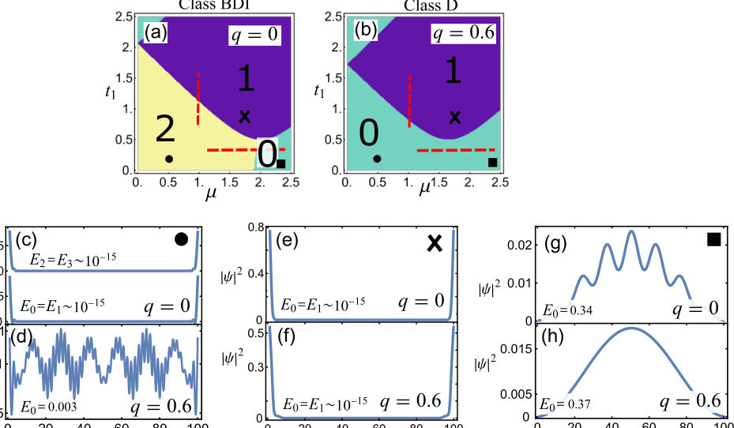 
FIG. 1. (a),(b): phase diagrams of the Kitaev ladder for ∆1 = 0.5, evaluated at q = 0 and q = 0.6, respectively. The color scale labels the corresponding topological sectors. Panels (c)–(h) display the probability densities of the lowest-energy BdG modes for representative points selected from the phase diagrams. The real-space calculations are performed on a ladder composed of two chains, each of length L = 100. The corresponding BdG energies of the modes are reported in the insets.

📷 Fig 2

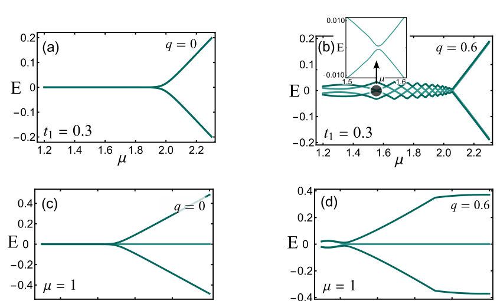 
FIG. 2. Panels (a) and (b) show horizontal cuts of the phase diagrams along the red lines indicated in Fig. 1(a) and 1(b), respectively, while panels (c) and (d) show the corresponding vertical cuts. In all panels, the four BdG eigenvalues closest to zero are plotted for a ladder composed of two chains, each of length L = 100. The spectra are shown both in the absence of current, q = 0, in panels (a) and (c), and in the current-carrying regime, q = 0.6, in panels (b) and (d). The interchain pairing is fixed to ∆1 = 0.5 in all panels.

📷 Fig 3

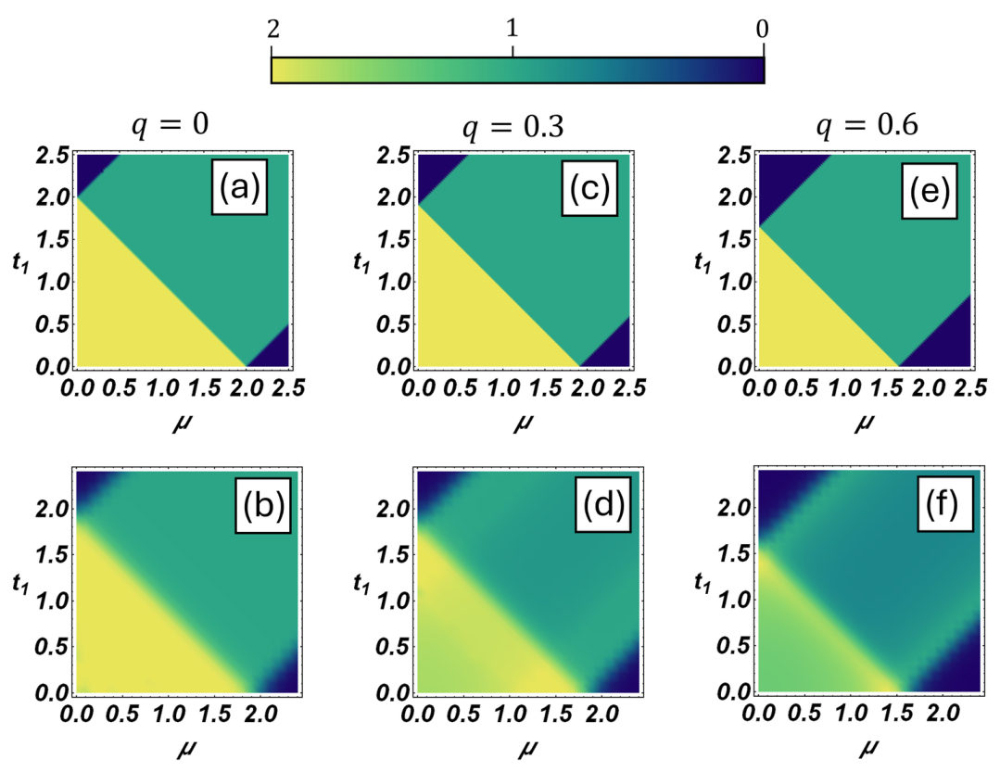 
FIG. 3. Panels (a), (c), and (e): phase diagrams obtained from the topological invariant in k-space introduced in Sec. II and for increasing values of the current flux q = 0, 0.3, and 0.6, respectively. Panels (b), (d), and (f): corresponding phase diagrams obtained from the edge–edge quantum conditional mutual information Iee. The agreement between the two sets of panels highlights the consistency between the momentum-space invariant and the real-space entanglement-based characterization. The entanglement calculations are performed on a ladder composed of two chains, each of length L = 50, with edge sizes fixed to LA = LB = 12 sites per chain.

📷 Fig 4

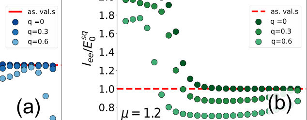 
FIG. 4. Panel (a) shows a horizontal cut, while panel (b) shows a vertical cut of the phase diagrams obtained from the edge–edge quantum conditional mutual information Iee in Fig. 3. The cuts are taken at fixed t1 = 0.7 in panel (a) and at fixed µ = 1.2 in panel (b). The dashed lines indicate the ideal quantized values corresponding to the different topological sectors. Deviations from these quantized plateaus become more pronounced as the current flux q increases, reflecting the growing relevance of finite-size effects.

📷 Fig 5

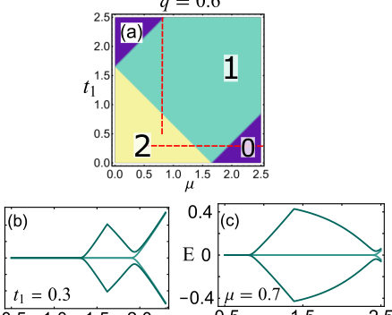 
FIG. 5. Panel (a) shows the phase diagram of Fig. 3 for ∆1 = 0 and q = 0.6, together with the horizontal and vertical cuts used to compute the spectra displayed in panels (b) and (c). Panel (b) shows the spectrum as a function of µ at fixed t1 = 0.3, while panel (c) shows the spectrum as a function of t1 at fixed µ = 0.7. In both cases, the four BdG eigenvalues closest to zero energy are plotted for a ladder composed of two chains, each of length L = 100. The agreement between the gap closings and the phase boundaries confirms the bulk– edge correspondence.

**Summary.** This paper demonstrates that injecting a charge current into a multichannel superconductor breaks time-reversal and chiral symmetries, which suppresses higher-order topological phases. It identifies that while the two-mode phase is fragile under current, it can be stabilized if the superconducting channels remain decoupled.

**Why it may be interesting.** not directly relevant

Detailed structure

**Main problem.** Investigating how a finite charge current induces symmetry breaking that reduces the topological protection and suppresses higher-multiplicity Majorana modes in multichannel superconductors.

**Main result.** The study shows that a finite current drives the system from the BDI class to the D class, making the two-mode topological phase fragile, unless the channels are decoupled (interchain pairing is zero).

**Method.** The authors use a real-space Hamiltonian approach, combining bulk topological invariants (Pfaffian) with real-space entanglement diagnostics like edge-edge quantum conditional mutual information (Iee).

**Model / system.** A Kitaev ladder model consisting of two coupled spinless p-wave superconducting chains with longitudinal and interchain hopping and pairing.

**Key observables.** Topological invariants (Z and Z2), Bogoli-de Gennes (BdG) energy spectra, Majorana Bound State (MBS) probability densities, and edge-edge quantum conditional mutual information (Iee).

**Important parameters / regimes.** Chemical potential (mu), longitudinal hopping (t), interchain hopping (t1), longitudinal pairing (Delta), interchain pairing (Delta1), and current-induced momentum (q).

**Assumptions / limitations.** The current is modeled via an effective Hamiltonian using a Peierls-like substitution (q-dependent phase factor).

**Figures summary.** Figure 1 shows phase diagrams comparing equilibrium and current-carrying regimes; Figure 2 shows energy spectra and mode densities illustrating the lifting of the two-mode configuration; Figure 3 shows the persistence of the two-mode phase when interchain pairing is zero; Figure 4 shows energy spectra as a function of chemical potential and interchain hopping.

**Paper structure.** The paper introduces the problem of current-induced symmetry breaking, defines the Kitaev ladder model and current-carrying Hamiltonian, presents bulk and real-space topological analysis, discusses the transition from BDI to D class, and concludes with the implications for superconducting nanostructures.

Abstract

We investigate the robustness of topological phases in a Kitaev ladder composed of two coupled superconducting chains under the perturbing influence of a finite charge current. By introducing an effective Hamiltonian depending on the quasiparticle momentum induced by the current, we show that the two-mode topological phase, present in the isolated ladder, is fragile against a finite current flux. To characterize this behavior, we combine bulk topological invariants with real-space diagnostics, including the edge-edge quantum conditional mutual information Iee, which provides an entanglement-based signature of topological order. Our results provide an effective framework to describe how current injection and measurement processes can affect topological protection in superconducting nanostructures.

[↑ back to top](#top)

### [Quantum-metric Bloch oscillations in weakly inhomogeneous electric fields](http://arxiv.org/abs/2605.22227v1)

**Authors:** M. Maneesh Kumar, Md Kaif Faiyaz, Sayan Sarkar, Amit Agarwal  
**Type:** theory · **Category:** other · **PDF:** <https://arxiv.org/pdf/2605.22227v1>  
**Analysis basis:** full PDF text, analyzed in chunks
**Topic relevance:** `Keldysh / 2PI / non-Gaussian methods` **2/5** · `non-equilibrium dynamics` **2/5**

📷 Fig 1

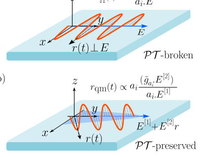 
FIG. 1. (a) Schematic of Berry-curvature-driven Bloch os- cillations in PT -broken systems. The wavepacket oscillates perpendicular to the applied homogeneous field (E). (b) Quantum-metric-induced Bloch oscillations in the presence of an inhomogeneous electric field. The resulting motion can have components both parallel and perpendicular to the ap- plied field.

📷 Fig 2

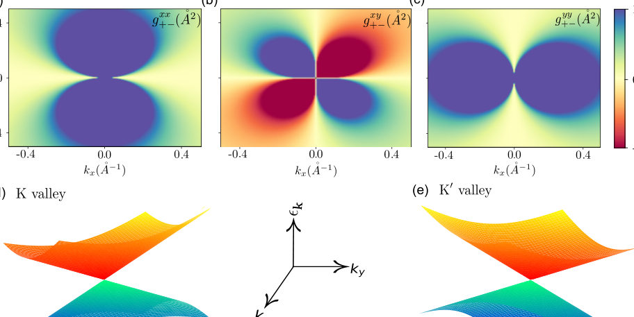 
FIG. 2. Panels (a)-(c) show the interband quantum-metric components gxx +−, gxy +−, and gyy +−, respectively, with + (−) denoting the conduction (valence) band. Panels (d) and (e) show the tilted Dirac cones at the K and K′ valleys, corresponding to η = +1 and η = −1 following Eq. (19). The parameters are vt = 0.2vF and ℏvF = 1 eV.

📷 Fig 3

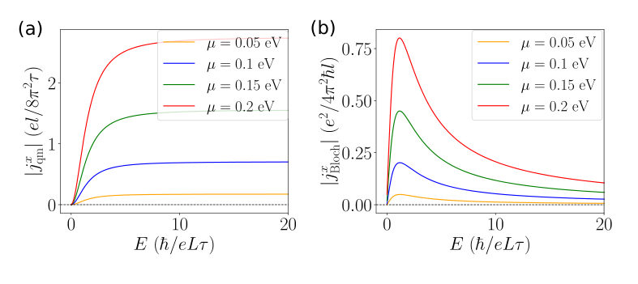 
FIG. 3. (a) Magnitude of the quantum-metric current jqm along ˆx for the tilted Dirac model [Eq. (19)] as a function of the applied field for various chemical potentials µ, with an inhomogeneous electric field applied along ˆx with a finite longitudinal gradient Exx. The current approaches a finite saturation in the high-field limit, implying a vanishing differential conductance and providing the main transport signature discussed in the text. Here L denotes the nearest-neighbor lattice spacing set by the primitive lattice vectors ai, and l is the sample length along the current direction. (b) Longitudinal conventional Bloch current versus field, showing negative differential conductivity...

📷 Fig 4

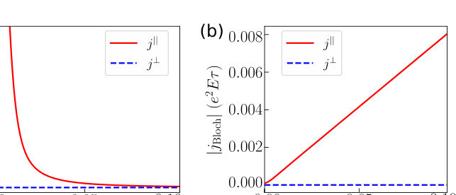 
FIG. 4. Panel (a) shows the longitudinal and transverse quantum-metric currents, j|| qme and j⊥ qme, as functions of the chemical potential (µ) for ˜E = (E1 + E11x) ˆx. Panel (b) shows the longitudinal and transverse Bloch currents, j|| Bloch and j⊥ Bloch, as functions of the chemical potential for the same field. The figure highlights that the quantum-metric response is strongest near charge neutrality and that tilt enhances the longitudinal current. The numerical parameters are η = 1, ℏvF = 1 eV, and vt = 0.2vF .

**Summary.** The paper demonstrates that an inhomogeneous electric field can drive Bloch-like oscillations through the quantum metric, even in the absence of Berry curvature. It shows that this quantum-metric-driven current behaves differently from conventional Bloch oscillations, specifically approaching a finite saturation in high fields. This provides a new mechanism for observing band-geometric effects in synthetic lattices.

**Why it may be interesting.** not directly relevant

Detailed structure

**Main problem.** Investigating whether a band-geometric analog of Bloch oscillations can exist in systems where the Berry curvature vanishes by utilizing the quantum metric.

**Main result.** A weakly inhomogeneous electric field introduces a distinct quantum-metric term to semiclassical dynamics, generating oscillatory real-space motion even when Berry curvature is zero.

**Method.** Extended semiclassical equations of motion for wavepacket dynamics and the semiclassical Boltzmann equation using a relaxation-time approximation.

**Model / system.** A tilted Dirac model used as an illustrative system, considering electrons in a periodic potential subject to a weakly inhomogeneous electric field.

**Key observables.** Real-space position (drift and oscillatory components), quantum-metric-induced current (longitudinal and transverse), and differential conductance.

**Important parameters / regimes.** Berry curvature, quantum metric, electric field gradient, static electric field, and chemical potential.

**Assumptions / limitations.** The electric field varies slowly over the wavepacket size (weak-gradient approximation) and the semiclassical wavepacket approximation is valid.

**Figures summary.** Figure 1 shows schematics of Berry-curvature-driven vs. quantum-metric-induced Bloch oscillations; Figure 2 shows quantum-metric components in a tilted Dirac model; Figure 3 compares the scaling of quantum-metric current (saturation) vs. conventional Bloch current (negative differential conductance).

**Paper structure.** The paper identifies the problem of Berry-curvature-independent oscillations, derives modified semiclassical equations of motion including field gradients, applies these to a tilted Dirac model, calculates transport signatures (current and conductance), and discusses experimental platforms like moire superlattices.

Abstract

Geometric analogs of Bloch oscillations studied so far have relied on Berry curvature. We show that a weakly inhomogeneous electric field adds a distinct quantum-metric term to semiclassical wavepacket dynamics, generating an oscillatory real-space contribution even when the Berry curvature vanishes. The associated transport response comprises an intrinsic and a scattering-time-dependent part. In the regime studied, the latter can dominate and approach finite saturation at high field when the relative field inhomogeneity is held fixed. A tilted Dirac model illustrates the mechanism. Realistic platforms will likely require synthetically engineered superlattices, with a finite quantum metric and an adequate band gap.

[↑ back to top](#top)

### [Signatures of the Quantum Geometric Dipole of Interlayer Excitons in Counterflow Conductivity](http://arxiv.org/abs/2605.22810v1)

**Authors:** Fanuel I. Mendez, Luis Brey, H. A. Fertig  
**Type:** theory · **Category:** strongly correlated electrons · **PDF:** <https://arxiv.org/pdf/2605.22810v1>  
**Analysis basis:** full PDF text, analyzed in chunks
**Topic relevance:** `Keldysh / 2PI / non-Gaussian methods` **2/5** · `non-equilibrium dynamics` **2/5**

📷 Fig 1

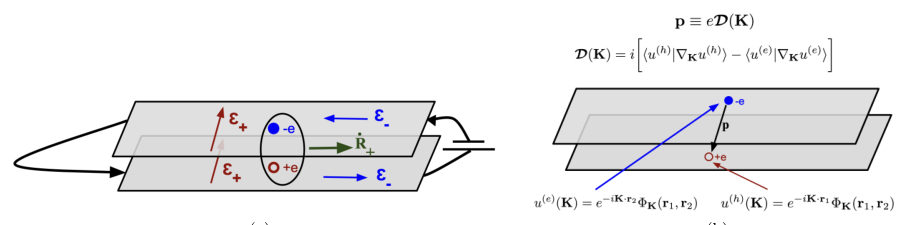 
Figure 1. (a) Schematic of interlayer exciton counterflow current in a bilayer system. Electric fields applied individually to the electron and hole layers give rise to symmetric (E+) and antisymmetric (E−) fields. In semiclassical equations of motion, the symmetric field couples to the quantum geometric dipole and drives the center of mass velocity ˙R+ whereas E−induces time evolution of the exciton center-of-mass momentum, impacting the exciton dipole moment. (b) Schematic of the dipole moment in a bilayer system. The quantum geometric dipole moment is a gauge-invariant quantity given by the difference of the Berry connections of the hole and electron, constructed from cell-periodic...

📷 Fig 2

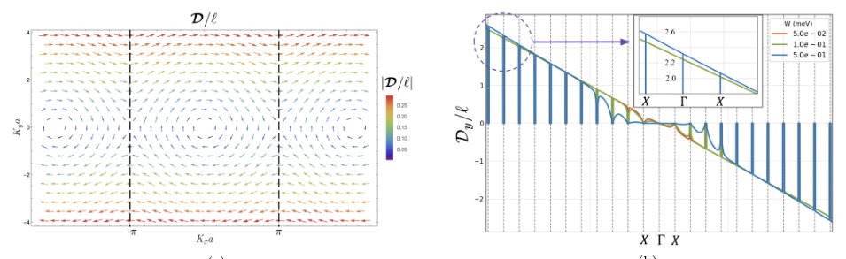 
Figure 2. Quantum geometric dipole Dn(K) of a magnetoexciton in a strong magnetic field in a periodic potential. (a) Vector plot of the QGD in a bilayer system in a unidirectional periodic potential for the lowest band (n = 0). (b) Band-projected QGD for fixed Ky = 0 for varying periodic potential strengths W (meV) in the extended zone scheme. In (b), the dashed vertical lines indicate avoided crossings where the QGD vanishes. Inset: Behavior of the QGD for large momentum magnitude in extended zone scheme. Parameters for (a): ℓ= 100 ˚A, d = 3 nm, a = 140 nm , κ = 3.76, W = 0.1 meV and Nc = 2. Parameters for (b): ℓ= 100 ˚A, d = 3 nm, a = 140 nm , κ = 3.76 and Nc = 20.

📷 Fig 3

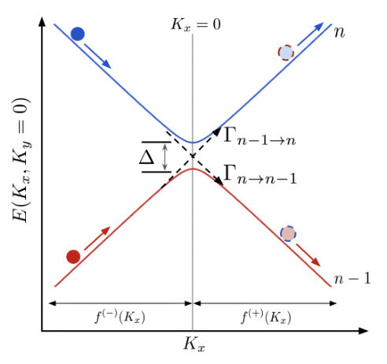 
Figure 3. Schematic an avoided crossing between two exciton bands at Kx = 0 with gap ∆. Arrows along each band indi- cate the direction of the exciton flow driven by E−. Dashed ar- rows crossing the gap represent the interband tunneling rates Γm→n and Γn→m. The distribution is divided into regions f (−)(Kx) and f (+)(Kx) corresponding to Kx &lt; 0 and Kx &gt; 0, respectively.

📷 Fig 4

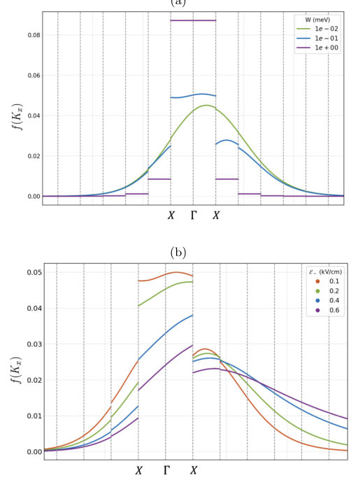 
Figure 5. Boltzmann distribution function in the extended zone scheme, for (a) E−= 0.1 kV/cm while varying different values of the periodic potential strength W, and (b) W = 0.09 meV for different values of the antisymmetric electric field E−. Other parameters are T = 10 K, ℓ= 100 ˚A, d = 3 nm, κ = 3.76, a = 140 nm, τ = 1 ps, N = 19 and nexc = 109 cm−2. Note discontinuities at avoided crossings, due to interband tunneling.

📷 Fig 5

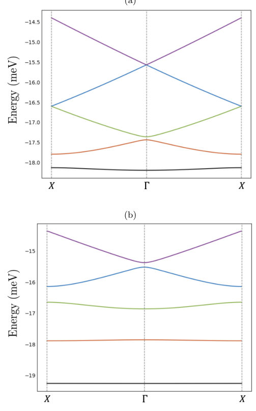 
Figure 4. Band structure En(Kx) for Ky = 0 for the low- est five bands of the magnetoexciton for (a) small periodic potential strength W = 0.09 meV and (b) large periodic po- tential strength W = 0.5 meV. The dashed vertical lines cor- respond to the avoided crossings at Kx = 0 and Kx = ±π/a. As W increases, the gaps open significantly and the lowest band becomes dispersionless. The parameters are: ℓ= 100˚A, d = 3 nm, a = 140 nm, κ = 3.76 and N = 19.

**Summary.** This paper demonstrates that the counterflow conductivity of interlayer excitons can serve as a tunable probe for their internal quantum geometric dipole. By manipulating periodic potentials and electric fields, one can observe how the quantum geometry of many-body excitations influences macroscopic transport.

**Why it may be interesting.** It provides a theoretical bridge between the abstract quantum geometry of many-body wavefunctions and measurable transport coefficients, which is highly relevant for understanding topological transport in correlated bilayer systems.

Detailed structure

**Main problem.** The paper investigates how the internal quantum geometric dipole (QGD) of interlayer excitons manifests in transport properties, specifically looking for experimental signatures in counterflow conductivity.

**Main result.** The authors show that the off-diagonal counterflow conductivity $\sigma_{xy}^{(CF)}$ is proportional to the gradient of the QGD with respect to momentum, and that this conductivity can be tuned by varying the periodic potential strength and the layer-antisymmetric electric field.

**Method.** The study employs a semiclassical Boltzmann transport approach including inter-band Landau-Zener tunneling and numerical diagonalization of a tridiagonal Hamiltonian in an extended zone scheme.

**Model / system.** A 2D bilayer system (such as TMDs or graphene heterostructures) in a strong perpendicular magnetic field, subject to a unidirectional 1D periodic potential (superlattice).

**Key observables.** Counterflow conductivity tensor components ($\sigma_{xy}^{(CF)}$, $\sigma_{yx}^{(CF)}$, $\sigma_{xx}^{(CF)}$, $\sigma_{yy}^{(CF)}$) and the Quantum Geometric Dipole (QGD).

**Important parameters / regimes.** Periodic potential strength ($W$), layer-antisymmetric electric field ($E_-$), dielectric constant ($\kappa$), magnetic length ($\ell$), and layer separation ($d$).

**Assumptions / limitations.** Strong magnetic field limit (lowest Landau level), high-temperature/dilute limit (ignoring BEC and exciton-exciton interactions), and neglect of electron/hole recombination.

**Figures summary.** Figure 1 shows schematics of exciton counterflow and the QGD definition; Figure 2 illustrates the QGD vector structure and its dependence on potential strength; Figure 3 shows interband tunneling at avoided crossings; Figure 4 displays exciton band structures; Figure 6 shows conductivity dependence on $\kappa$ and $E_-$.

**Paper structure.** The paper begins by defining the QGD and its relation to exciton polarization, moves to the semiclassical equations of motion and the Boltzmann transport framework, analyzes the effects of periodic potentials and electric fields on conductivity, and concludes with an appendix deriving the explicit QGD-conductivity link.

Abstract

Collective excitations of many-body electron systems can carry internal structure, supporting novel quantum geometric and topological properties. Among these are a quantum geometric dipole (QGD), which for excitons have direct significance as an internal polarization. For interlayer excitons of a bilayer system, this represents an in-plane dipole moment, which can be used to drive them with in-plane electric fields. In this work, we consider counterflow electric currents associated with driven excitons in such a bilayer system as a probe of their QGD structure. As a simple but non-trivial example, we analyze a structure with a one-dimensional periodic potential in a strong perpendicular magnetic field. The resulting magnetoexciton bands host QGD structure that distinguishes it from the exciton QGD of a uniform system. To model exciton transport we adopt a Boltzmann approach that includes inter-band tunneling, allowing us to consider non-equilibrium momentum distributions that result from strong layer-antisymmetric driving fields. We show how linear response to a layer-symmetric component of the driving fields provide information about the QGD, and that the broad QGD structure of the exciton bands can be probed by the varying the layer-antisymmetric field. Our results demonstrate that counterflow conductivity serves as a tunable probe of the internal quantum geometric structure carried by the interlayer excitons, connecting transport to the quantum geometry of many-body excitations.

[↑ back to top](#top)

### [Spin torque driven mode hybridization and band engineering in nanopatterned magnonic crystals](http://arxiv.org/abs/2605.21888v1)

**Authors:** Nikhil Kumar  
**Type:** theory · **Category:** other · **PDF:** <https://arxiv.org/pdf/2605.21888v1>  
**Analysis basis:** full PDF text, analyzed in chunks
**Topic relevance:** `spintronics-quantum-optics interface` **2/5** · `non-equilibrium dynamics` **1/5**

📷 Fig 1

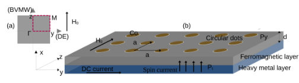 
FIG. 1. (a)First BZ for the structure shown in (b), with indicate high-symmetry points, Γ, Y , M and Z in the cen- tre and at the border of the first BZ. There are two direc- tions of the wave vector k along the bias magnetic field and perpendicular to it, i.e., the backward volume magnetostatic wave(BVMW) and Damon–Eshbach (DE) geometry, respec- tively. (b)Permalloy thin film interfaced with a heavy metal and patterned with a two-dimensional array of circular Co nanodots, thereby forming a bicomponent magnonic crys- tal(BMC) with spatially induced magnetic and spin-torque parameters. The thickness of the bicomponent magnonic crystal is d, the lattice constant is a. The magnetic field H0 is...

📷 Fig 2

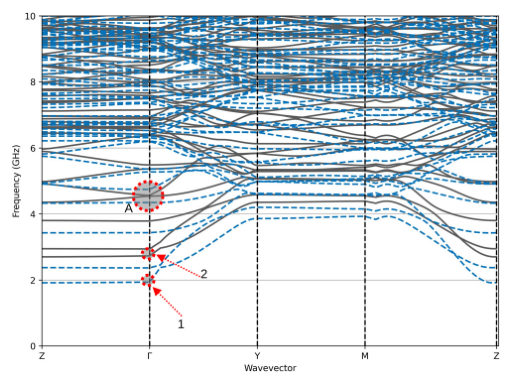 
FIG. 2. Magnonic band structure of 2D BMC with heavy metal layer interfaced with Py thin film calculated along the path in the first BZ shown in Fig. 1(a). The device is sat- urated along the z axis by the static external magnetic field µ0H0 = 15mT. The grey-coloured band structure is obtained without considering spin torque effects, and the blue-dotted band structure is obtained by incorporating the spin torque term in the PWM analysis. The capital letters A and B is the region of hybridization. The region A is enlarged in Fig. 4. The eigen mode profile for the point at 1 and 2 is depicted in Fig. 3.

📷 Fig 3

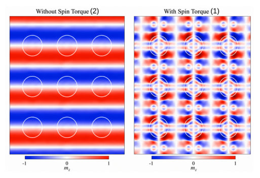 
FIG. 3. Magnon band resolved spin-wave eigenmodes profile corresponding to the selected points in the dispersion relation shown in Fig. 2(point 1 and 2).

📷 Fig 4

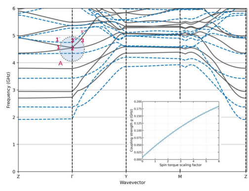 
FIG. 4. Magnonic band structures around the anti-crossings region, The zoomed version of band structure shown in Fig. 2. The coupling factor(g = ∆f/2) versus different spin torque scaling factor is shown as inset. The inset shows how the proposed spin-torque-induced magnonic crystal can be elec- trically tuned.

📷 Fig 5

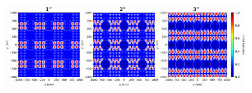 
FIG. 5. Spin wave eigen mod evolution at different point in the dispersion in Fig. 4 under periodic injection of effective spin torque term into magnonic lattice. The white circles show the regular pattern of Co dots placed in Py. The red and blue areas show how the phase and amplitude of the dynamic magnetisation are distributed.

**Summary.** This paper demonstrates how electrical current can be used to actively engineer the band structure of a magnonic crystal. By applying inhomogeneous spin-orbit torque, the researchers show they can induce mode hybridization and create tunable band gaps. This provides a pathway for developing programmable, reconfigurable magnonic and spintronic devices.

**Why it may be interesting.** not directly relevant

Detailed structure

**Main problem.** The study addresses the need for active, electrical control over spin-wave propagation and band structures in magnonic crystals, moving beyond passive systems.

**Main result.** The researchers demonstrate that inhomogeneous current-induced spin-orbit torque can induce band hybridization, create tunable hybridization gaps, and enable the reconfiguration of magnonic states through mode conversion.

**Method.** The study uses the Plane Wave Method (PWM) to solve the linearized Landau-Lifshitz-Gilbert (LLG) equation in the reciprocal lattice, applying perturbation theory to model the periodic spin-torque term.

**Model / system.** A 2D bicomponent magnonic crystal consisting of a Permalloy/heavy metal bilayer nanopatterned with a 2D array of Cobalt nanodots, modeled using the LLG equation with a field-like torque term.

**Key observables.** Spin-wave band structures, magnonic eigenmodes, hybridization gaps, avoided crossings (anticrossing), and mode profiles.

**Important parameters / regimes.** Current density (J), spin-torque scaling factor, saturation magnetization (Ms), lattice constant (a), and torque efficiencies (c_||, c_perp).

**Assumptions / limitations.** Neglected Gilbert damping and damping-like torque; assumed uniform static magnetization; used a linearized approximation for spin-wave dynamics; neglected magnetocrystalline anisotropy.

**Figures summary.** Fig 1 shows the crystal structure and Brillouin Zone; Fig 2 compares dispersion with and without spin torque; Fig 3 shows eigenmode profiles at the Gamma point; Fig 4 shows the evolution of the anticrossing gap; Fig 5 and 6 show the evolution of modes through hybridization.

**Paper structure.** The paper introduces the problem of active magnonic control, describes the bicomponent crystal system and the LLG-based mathematical model, presents numerical results using the Plane Wave Method regarding band engineering and mode hybridization, and concludes with implications for reconfigurable spintronic devices.

Abstract

Spin wave propagation and dynamic control are essential for reconfigurable magnonic and spintronic devices. Here, tunable mode coupling and band hybridisation are demonstrated in a nanopatterned bicomponent magnonic crystal consisting of a Permalloy/heavy metal bilayer patterned with a two dimensional array of Co nanodots. Using the plane wave method and the linearised Landau Lifshitz equation with a field like torque term, we show that inhomogeneous current induced spin torque produces periodic modulation of the magnonic frequency, enabling dynamic control of spin-wave dispersion. A pronounced avoided crossing between localised and propagating Damon Eshbach modes is observed, leading to tunable hybridisation gaps, band deformation, and enhanced mode mixing. The spin torque induced modulation enables controlled mode conversion and reconfigurable hybrid magnonic states, demonstrating efficient electrical tuning of nanoscale spin-wave dynamics.

[↑ back to top](#top)

### [Transport Enhancement and In Situ Control of Electronic Correlation via Photoinduced Modulation Doping of van der Waals Heterostructures](http://arxiv.org/abs/2605.22452v1)

**Authors:** Collin R. Sanborn, Son T. Le, Thuc T. Mai, Maria F. Munoz, Riccardo Torsi, Angela R. Hight Walker, Curt A. Richter, Samuel W. LaGasse, Aubrey T. Hanbicki, Adam L. Friedman  
**Type:** experiment · **Category:** strongly correlated electrons · **PDF:** <https://arxiv.org/pdf/2605.22452v1>  
**Analysis basis:** full PDF text, analyzed in chunks
**Topic relevance:** `non-equilibrium dynamics` **2/5**

📷 Fig 1

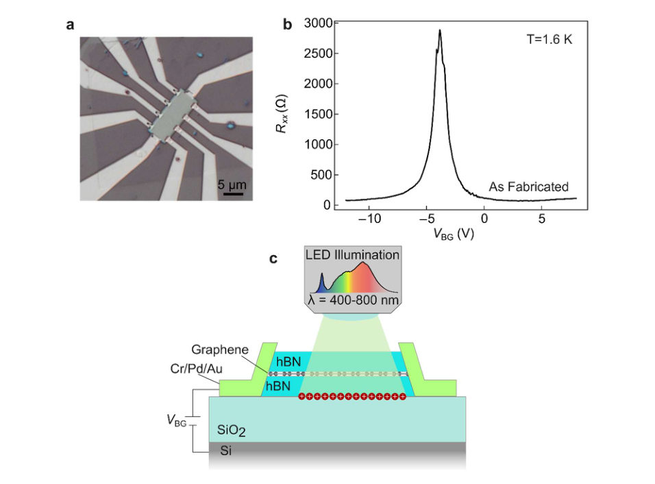 
Figure 1: (a) Optical Image of encapsulated graphene device used in this work, where heavily doped Si can be used as a global backgate. Devices were fabricated with standard dry transfer and electron beam lithography techniques. (b) Initial transfer curve measurement (T = 1.6 K) of the device, before any photodoping is applied. (c) Device and photodoping schematic. Under illumination, photoexcited carriers are trapped at the hBN-SiO2 interface, leading to long-lived modulation doping of the graphene channel.

📷 Fig 2

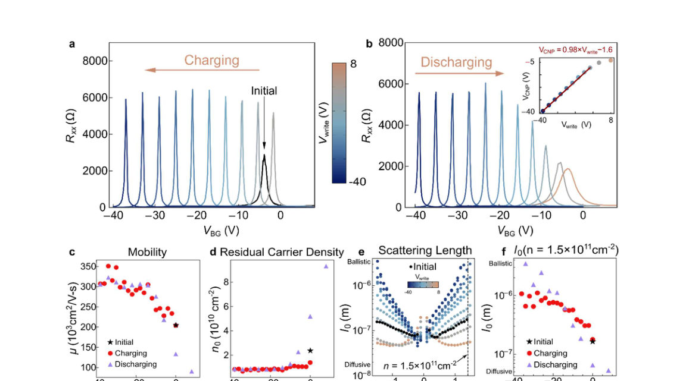 
Figure 2: (a) Transfer curve measurements of encapsulated graphene device on SiO2, with increasing magnitude of photodoping voltage Vwrite. (b) Measurements of the same device with descending photodoping voltage, including one measurement of positive Vwrite = 8 V, attempting to achieve p-type doping. Inset: CNP of the device can be controlled one-to- one with negative values of Vwrite. (c,d) Extracted mobility and residual carrier density from the curves in a and b, showing device enhancement upon photoannealing and photodoping. When discharging, the device can be brought back to its initial configuration and further doping degrades the mobility and continues to increase the residual...

📷 Fig 3

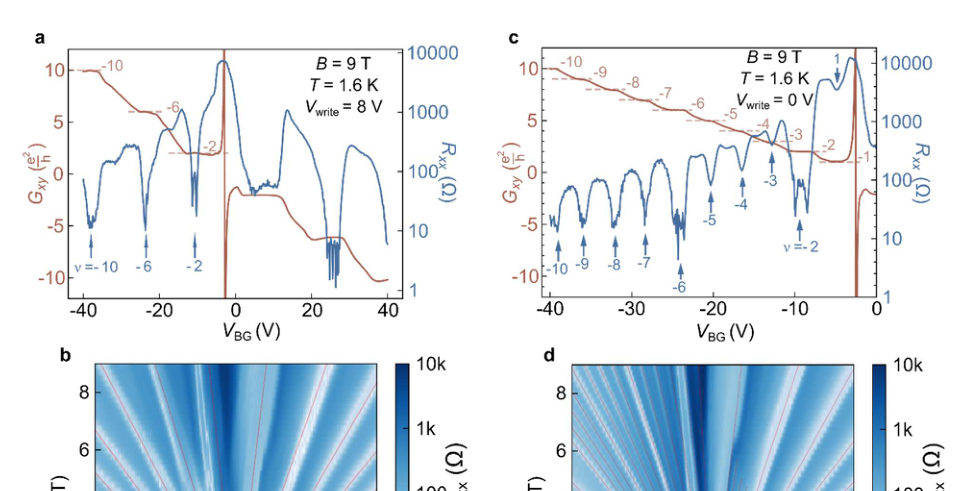 
Figure 3: Quantum Hall transport measurements before and after photoannealing the graphene device. (a) Hall conductivity (Red – left axis) and longitudinal resistance (Blue – right axis) for the device in the high disorder regime at 9 T and 1.6 K. These measurements show expected 4-fold degenerate plateaus in Gxy at filling factors of 2,6, and 10. Minima in Rxx are labelled with the corresponding filling factor in blue. (b) Landau fan diagram for the measurement in a, showing the evolution of Rxx as a function of magnetic field. (c) The same Quantum Hall measurements for the device after it is photoannealed. Both Hall conductivity and longitudinal resistance demonstrate complete degeneracy...

**Summary.** The researchers developed a way to use light to precisely control the number of electrons and the amount of disorder in graphene devices. This technique allows them to switch between different transport regimes and reveal complex quantum Hall states that were previously hidden by disorder. This provides a new, accessible tool for engineering high-quality 2D materials for studying correlated physics.

**Why it may be interesting.** The paper demonstrates a method to deterministically tune the strength of Coulomb interactions and disorder in a 2D system, which is highly relevant for studying many-body dynamics and the stability of correlated phases.

Detailed structure

**Main problem.** The need for precise, non-destructive, and in situ control over carrier concentration and electronic disorder in 2D van der Waals heterostructures to study fragile correlated states.

**Main result.** Demonstrated that photoinduced modulation doping can reversibly tune carrier density and mobility, enabling the transition from diffusive to quasi-ballistic transport and the observation of quantum Hall isospin ferromagnetic states.

**Method.** Using standard white light sources to induce charge trapping at the hBN-SiO2 interface (photodoping) and prolonged illumination to reduce disorder (photoannealing).

**Model / system.** hBN-encapsulated graphene Hall bar heterostructures on a SiO2 backgate, analyzed using Drude and Landauer transport models.

**Key observables.** Carrier mobility, carrier density, residual carrier density, scattering length, and Landau level degeneracy lifting.

**Important parameters / regimes.** Transition between diffusive and quasi-ballistic transport regimes; tuning of mobility between 200,000 and 300,000 cm2/V-s; magnetic fields up to 9 T.

**Assumptions / limitations.** The scattering model assumes 2D Coulomb disorder located at a distance of more than a few nm from the graphene channel.

**Figures summary.** Fig 1: Schematic of the device and photodoping mechanism. Fig 2: Transfer curves showing CNP shifts, mobility extraction, and reversible tuning of transport regimes. Fig 3: Quantum Hall measurements showing the emergence of split plateaus (degeneracy lifting) after photoannealing.

**Paper structure.** The paper introduces the photodoping technique, demonstrates its ability to control carrier density and reduce disorder via photoannealing, quantifies the transport improvements using Drude and Landauer models, and concludes by showing the emergence of many-body correlated states in the high-quality regime.

Abstract

Modulation doping, a well-established technique for traditional semiconductor heterostructures, is a promising approach for tailoring carrier concentration in 2D materials devices. In this letter we report on photoinduced modulation doping in hBN-graphene-hBN-SiO2 heterostructures utilizing standard white light sources and no additional fabrication complexity. We establish the use of this technique to both dope the channel material and to photoanneal devices, providing control over electronic doping and disorder in the graphene channel. We analyze the transport properties by employing Drude and Landauer transport models, highlighting the ability to reversibly tune the mobility and mean scattering length of the graphene with a high degree of accuracy. This tunability allows us to switch our device between the diffusive and quasi-ballistic transport regimes in situ. We utilize the exceptional control our technique provides over local disorder to realize quantum Hall isospin ferromagnetic states in a device whose initial quality would otherwise leave such states unobservable. These results demonstrate precise manipulation of carrier density and charge disorder in van der Waals heterostructures, providing a highly accessible approach to creating high-quality devices capable of realizing correlated electronic states.

[↑ back to top](#top)

### Other secondary papers (13)

Show other secondary papers

### [Antiferromagnetic Ordering Enhanced Magnetic Damping in Mn2Au/CoFeB Bilayers](http://arxiv.org/abs/2605.22382v1)

**Authors:** Donghang Xie, Haozhe Wang, Zhe Zhang, Zishuang Li, Jiahua Lu, Ronghua Liu, Jun Du, Bo Liu, Yu Yan, Liang He, Jing Wu, Rong Zhang, Bo Liu, Tiejun Zhou, Yongbing Xu, Xuezhong Ruan  
**Type:** experiment · **Category:** other · **PDF:** <https://arxiv.org/pdf/2605.22382v1>  
**Analysis basis:** full PDF text, analyzed in chunks

📷 Fig 1

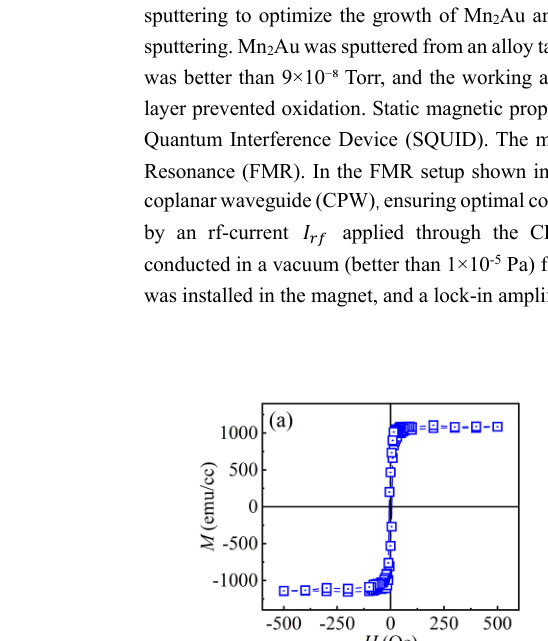 
FIG. 1. (a) In-plane magnetic hysteresis loop of Mn2Au(2)/CoFeB at RT. The saturation magnetization 𝑀𝑀𝑆𝑆 is 1140 emu/cc. (b) Temperature-dependent exchange bias field 𝐻𝐻𝐸𝐸𝐸𝐸 and increment of coercivity Δ𝐻𝐻𝐶𝐶.

📷 Fig 2

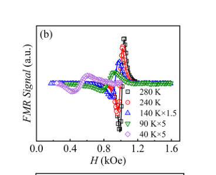 
FIG. 2. (a) Schematic illustration of the FMR setup. (b) FMR signals at 11 GHz 𝐻𝐻𝑟𝑟𝑟𝑟 for

📷 Fig 3

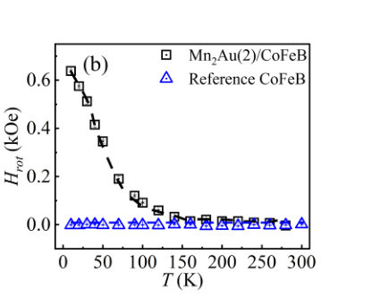 
FIG. 3. (a) Temperature-dependent magnetic damping 𝛼𝛼 of Mn2Au(2)/CoFeB,

📷 Fig 4

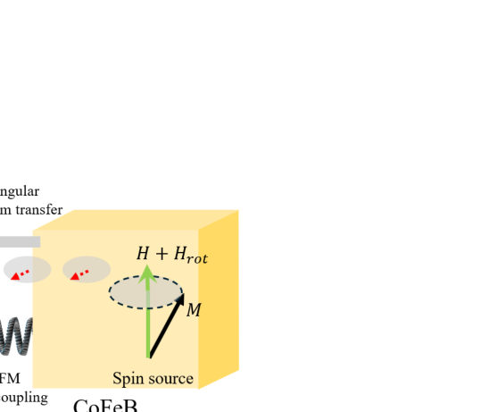 
FIG. 4. Schematic illustration of the physical mechanism of spin angular momentum transfer and dissipation in the Mn2Au(2)/CoFeB bilayer. Below 160 K, AFM order (represented by paired blue arrows in the Mn2Au layer) and AFM-FM exchange coupling (depicted as the spring between Mn2Au and CoFeB) are established and progressively enhanced with decreasing temperature. This leads to a synchronized increase of 𝐻𝐻𝑟𝑟𝑟𝑟𝑟𝑟 and efficient spin angular momentum transfer (illustrated by the gray span with the dashed red arrows moving from CoFeB into Mn2Au) and dissipation (illustrated by the randomly arranged dashed red arrows in Mn2Au), thereby enhancing the magnetic damping 𝛼𝛼.

**Summary.** The study investigates how the onset of antiferromagnetic ordering in ultrathin Mn2Au layers enhances the magnetic damping of an adjacent CoFeB layer. By ruling out spin pumping and two-magnon scattering, the authors demonstrate that the effect is driven by exchange-mediated spin angular momentum transfer. This provides critical insights for developing next-generation antiferromagnetic spintronic devices.

**Why it may be interesting.** not directly relevant

Detailed structure

**Main problem.** Understanding the mechanism behind the dramatic increase in magnetic damping and the emergence of rotatable anisotropy in Mn2Au/CoFeB bilayers as temperature decreases.

**Main result.** The increase in magnetic damping is attributed to enhanced spin angular momentum transfer from CoFeB to Mn2Au, mediated by AFM-FM exchange coupling that strengthens with the development of AFM ordering.

**Method.** Ferromagnetic Resonance (FMR) spectroscopy, SQUID magnetometry, and temperature-dependent analysis of magnetic properties.

**Model / system.** Mn2Au/CoFeB bilayers, specifically 2-nm and 4-nm thick Mn2Au layers on 4-nm CoFeB, studied across a temperature range from 10 K to 300 K.

**Key observables.** Magnetic damping (alpha), rotatable anisotropy field (Hrot), exchange bias field (Heb), Neel temperature (Tn), and saturation magnetization (Ms).

**Important parameters / regimes.** Temperature (10 K to 300 K), Mn2Au thickness (2 nm and 4 nm), and the critical temperature threshold (around 160 K for 2 nm films).

**Figures summary.** Fig 1 shows hysteresis loops and temperature dependence of exchange bias; Fig 2 presents the FMR setup and frequency-dependent resonance signals; Fig 4 provides a schematic of the spin angular momentum transfer mechanism.

**Paper structure.** The paper introduces the problem of AFM/FM dynamics, describes the experimental fabrication and characterization of Mn2Au/CoFeB, presents temperature-dependent FMR and SQUID results, rules out alternative mechanisms like spin pumping and two-magnon scattering, and concludes with a proposed physical mechanism for spin transfer.

Abstract

Antiferromagnets (AFMs) hold significant potential for spintronic devices owing to their insensitivity to external magnetic fields and the absence of stray fields. Beyond these inherent advantages, an AFM can manipulate the magnetic dynamics of a ferromagnet (FM) layer in AFM/FM bilayers, whereas the mechanism of such manipulation remains controversial. Here, we investigate the magnetic dynamics of AFM/FM Mn2Au/CoFeB bilayers via Ferromagnetic Resonance (FMR). It is found that the Néel temperature of 2-nm-thick Mn2Au is as low as ~40 K, in sharp contrast to that of bulk Mn2Au, which exceeds 1000 K. In the Mn2Au(2 nm)/CoFeB(4 nm) bilayer, the magnetic damping $α$ of the CoFeB layer increases from 0.013 to 0.047 as temperature decreases from 160 K to 10 K, accompanied by a synchronous increase in the exchange coupling field H_rot. Such an increase in $α$ is attributed to the enhanced spin angular momentum transfer from CoFeB to Mn2Au, mediated through AFM-FM exchange coupling between Mn2Au and CoFeB, which is enhanced by the Mn2Au antiferromagnetic ordering as the temperature decreases. Our study provides deeper insights into AFM/FM dynamics and spintronic storage technology.

[↑ back to top](#top)

### [Chiral Electromagnetic Surface Waves on Chern-Simons Interfaces](http://arxiv.org/abs/2605.21577v1)

**Authors:** Nemanja Kaloper  
**Type:** theory · **Category:** other · **PDF:** <https://arxiv.org/pdf/2605.21577v1>  
**Analysis basis:** full PDF text, analyzed in chunks

📷 Fig 1

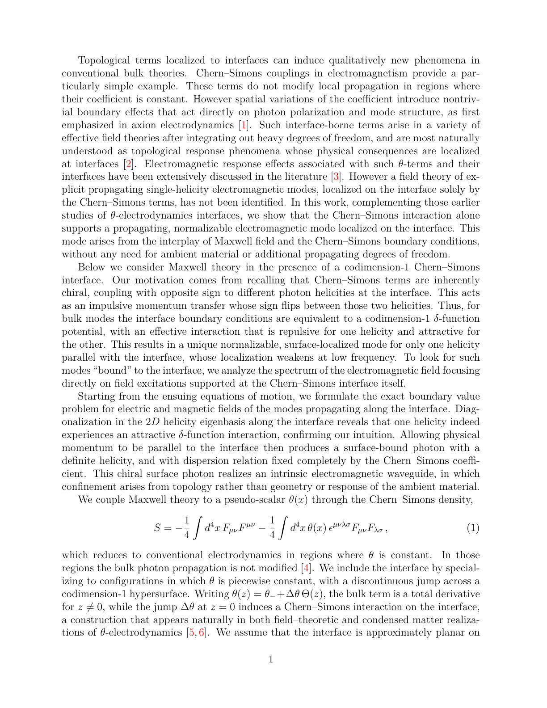 
Low-resolution page preview, page 2

📷 Fig 2

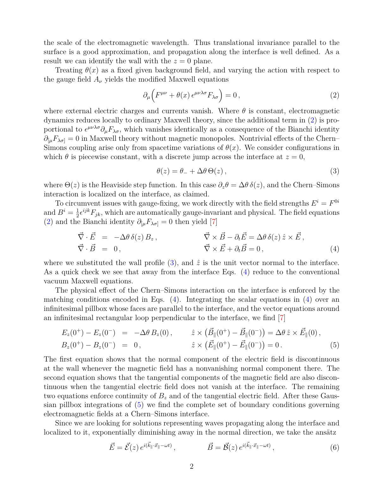 
Low-resolution page preview, page 3

📷 Fig 3

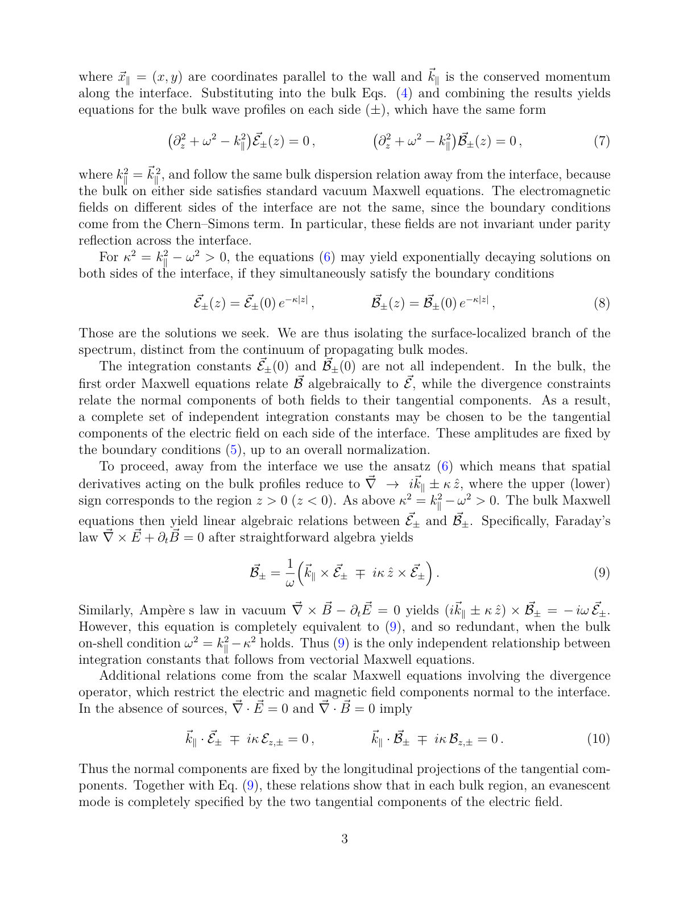 
Low-resolution page preview, page 4

📷 Fig 4

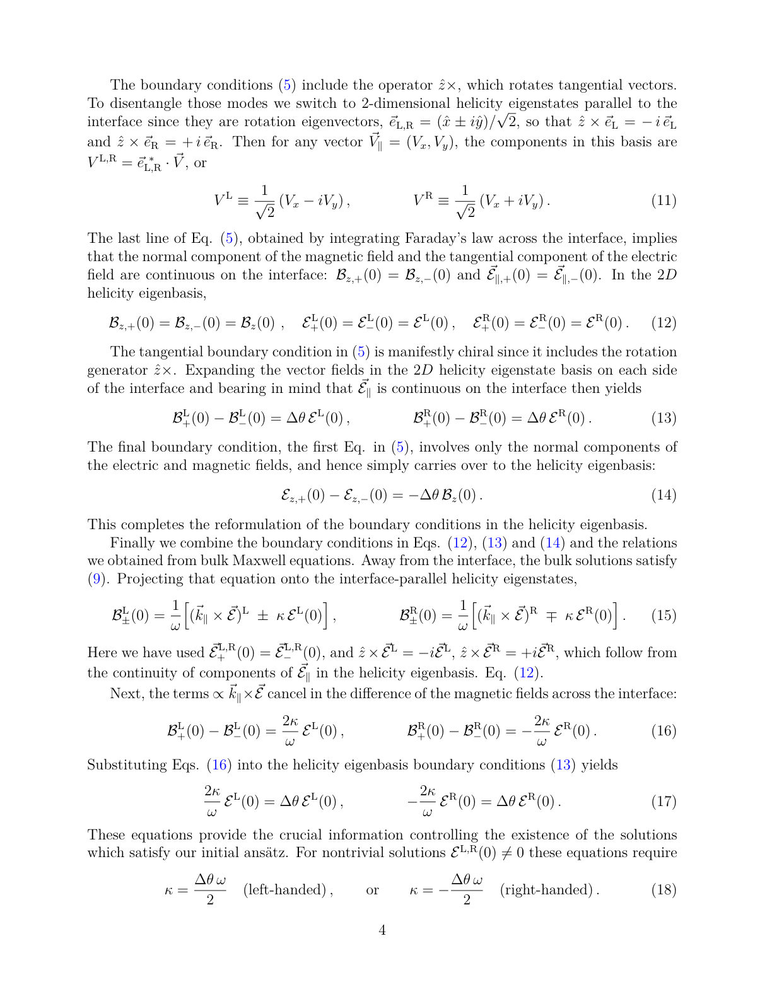 
Low-resolution page preview, page 5

📷 Fig 5

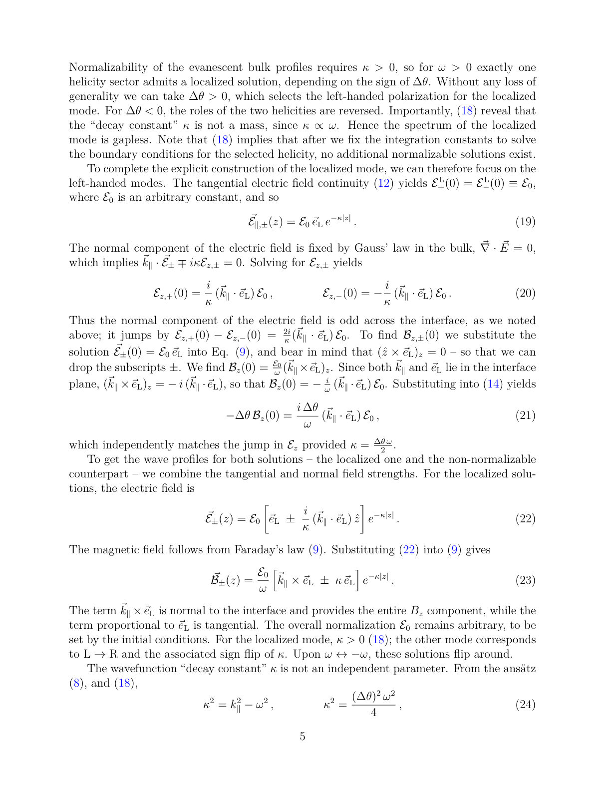 
Low-resolution page preview, page 6

**Summary.** This paper demonstrates that a topological Chern-Simons interface can intrinsically support chiral electromagnetic surface waves even in a pure vacuum. It shows that the interface acts as a frequency-independent waveguide for a single helicity of light, driven by topology rather than material properties.

**Why it may be interesting.** not directly relevant

Detailed structure

**Main problem.** The paper investigates whether a Chern-Simons interface between two regions of vacuum electrodynamics can support localized, chiral electromagnetic surface waves without the need for external material response or geometric confinement.

**Main result.** The study finds that the Chern-Simons interaction acts as an attractive delta-function potential for one photon helicity, creating a unique, gapless, and chiral surface photon with a frequency-independent index of refraction.

**Method.** The author solves the exact boundary value problem for Maxwell's equations by using a 2D helicity eigenbasis and applying Gaussian pillbox integration to derive matching conditions at the interface.

**Model / system.** The system is a 4D Maxwell theory featuring a codimension-1 (planar) interface where a pseudo-scalar theta field undergoes a discrete jump (delta-function potential).

**Key observables.** Photon helicity, dispersion relation, effective refractive index, and the time-averaged Poynting vector.

**Important parameters / regimes.** The Chern-Simons jump (delta-theta), frequency (omega), momentum parallel to the interface (k_parallel), and the UV cutoff scale.

**Assumptions / limitations.** The background theta field is treated as a fixed, non-dynamical background, the interface is assumed to be planar, and no external charges or currents are present.

**Paper structure.** The paper begins by defining the Chern-Simons interface model, proceeds to derive the modified Maxwell boundary conditions, solves the boundary value problem to identify the localized mode, analyzes the dispersion relation and energy transport, and concludes with a discussion on the UV limits of the theory.

Abstract

We show that Maxwell theory with a codimension-$1$ Chern-Simons interface supports chiral electromagnetic surface waves on the interface, even when the bulk theory on both sides is conventional vacuum electrodynamics in infinite space. Solving the exact boundary value problem we find that the Chern-Simons interaction acts with opposite sign on the two helicities oriented along the interface, giving rise to one normalizable mode localized on the interface. This mode is a gapless chiral surface photon with linear dispersion and a frequency-independent index of refraction set by the Chern-Simons coefficient. This mode exists despite the absence of ambient material response or geometric confinement.

[↑ back to top](#top)

### [Direct observation of the transverse near field of an edge excitation and associated slow secondary dynamics in a fractional quantum Hall state](http://arxiv.org/abs/2605.21989v1)

**Authors:** Yunhyeon Jeong, Akinori Kamiyama, John N. Moore, Takaaki Mano, Ken-ichi Sasaki, Yuuki Sugiyama, Tokiro Numasawa, Masahiro Hotta, Go Yusa  
**Type:** experiment · **Category:** strongly correlated electrons · **PDF:** <https://arxiv.org/pdf/2605.21989v1>  
**Analysis basis:** full PDF text, analyzed in chunks

📷 Fig 1

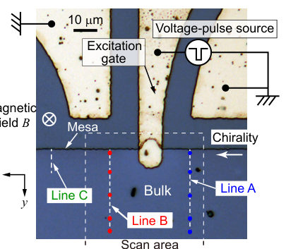 
FIG. 1. Optical microscope image of the measurement device. The excitation gate was driven by a voltage-pulse source (see SM for the details). The dashed rectangle labeled “Scan area” corresponds to Fig. 3. Lines A, B, and C indicate the measurement paths for Figs. 2 and 4. Grounded electrodes are part of coplanar waveguide structures [27].

📷 Fig 2

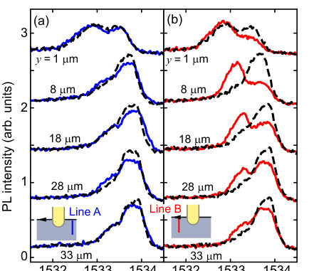 
FIG. 2. (a) and (b) Micro-PL spectra measured as snapshots at po- sitions along the 𝑦direction, perpendicular to the mesa boundary defined by 𝑦= 0: 𝑦= 1, 8, 18, 28, and 33 𝜇m. The delay time is 𝑡= −3.0 ns for both panels (see SM for more details). (a) Spec- tra measured along Line A, 16 𝜇m upstream from the center of the excitation gate. (b) Spectra measured along Line B, 16 𝜇m down- stream from the center of the excitation gate. The dotted curves show spectra measured without the excitation pulse. Insets in (a) and (b) schematically indicate the measurement locations (Lines A and B), as defined in Fig. 1. The pulse amplitude is ±100 mV for both pan- els. The spectra shown in (b) were...

📷 Fig 3

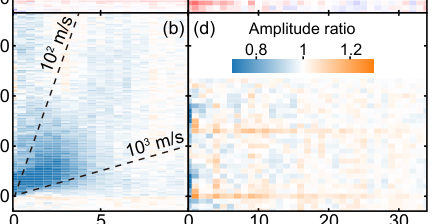 
FIG. 4. Triplet PL peak-energy shift [(a), (c)] and amplitude ratio [(b), (d)], shown as color maps as functions of 𝑦and 𝑡. Panels (a) and (b) were measured along Line C, ∼42 𝜇m downstream of the excitation gate, with 𝑇rep ∼52 ns; panels (c) and (d) were measured along Line B, 16 𝜇m downstream, with 𝑇rep ∼13 ns. The absolute origin of 𝑡is defined separately for the Line-C and Line-B measurements; see the SM for details. The voltage-pulse configuration and biasing conditions are described in the SM.

📷 Fig 4

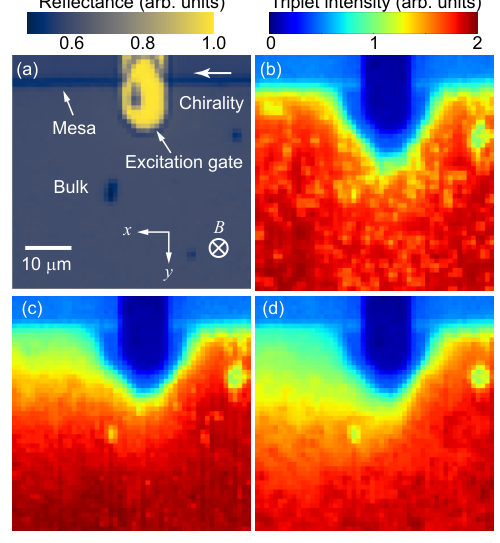 
FIG. 3. 51×50 𝜇m2 spatial maps measured in the region indicated as the scan area in Fig. 1. (a) Reflectance map acquired with the same optical setup at 40–50 mK; the yellow region indicates the excitation gate. (b)–(d) Triplet PL intensity maps of the same region measured as snapshots at 𝑡= −3.0 ns with an exposure time of 10 s. Here, the triplet PL intensity was obtained by integrating the PL spectrum over 1533.45–1534.70 meV, without spectral fitting. (b) Triplet PL intensity map recorded with no voltage pulse applied to the excitation gate. (c) and (d) Maps obtained with a bipolar voltage pulse applied to the excitation gate. The pulse amplitude is ±50 mV in panel (c) and ±100 mV in...

**Summary.** This paper uses time-resolved microscopy to observe the electromagnetic field of an edge excitation in a fractional quantum Hall state. It demonstrates that these excitations are not purely 1D but include a spatially extended, quasi-electrostatic near-field that reaches deep into the bulk. This reveals that edge-driven dynamics can trigger complex, multi-scale responses in the adjacent electronic fluid.

**Why it may be interesting.** not directly relevant

Detailed structure

**Main problem.** To determine the spatial and dynamical structure of edge excitations in fractional quantum Hall states, specifically whether edge magnetoplasmons are strictly 1D charge-density oscillations or involve spatially extended electromagnetic fields.

**Main result.** The study reveals that edge magnetoplasmons possess a long-range, nearly instantaneous transverse near-field extending over 30 micrometers into the bulk, alongside slower secondary bulk-side dynamics.

**Method.** Stroboscopic time-resolved photoluminescence (PL) microscopy and spectroscopy using a Ti:sapphire laser synchronized with electrically launched voltage pulses.

**Model / system.** A nu=1/3 fractional quantum Hall state in a 15-nm GaAs/AlGaAs quantum well at high magnetic field (14 T) and ultra-low temperatures (40-50 mK).

**Key observables.** Trion photoluminescence spectra (singlet and triplet peaks), triplet PL intensity maps, peak energy shifts, and amplitude ratios.

**Important parameters / regimes.** Filling factor nu=1/3, magnetic field 14 T, temperature 40-50 mK, voltage pulse amplitude +/- 50 to 100 mV, and repetition periods of 13 ns and 52 ns.

**Assumptions / limitations.** The linewidth parameter is assumed to be common to both singlet and triplet trion components to stabilize the spectral fitting.

**Figures summary.** Fig 1 shows the experimental schematic; Fig 2 displays PL spectra snapshots showing downstream spectral changes; Fig 3 shows spatial maps of PL intensity and reflectance; Fig 4 presents color maps of triplet peak energy shifts and amplitude ratios as functions of position and time.

**Paper structure.** The paper introduces the experimental setup and device geometry, presents the time-resolved spectroscopic results showing the transverse near-field, analyzes the temporal evolution and secondary dynamics, and concludes by discussing the implications for the nature of edge excitations.

Abstract

We report stroboscopic time-resolved photoluminescence (PL) microscopy and spectroscopy revealing the transverse near field of an edge excitation in a $ν=1/3$ fractional quantum Hall (FQH) state. Time-resolved $y$-$t$ maps reveal an immediate PL response extending more than $30~μ\mathrm{m}$ into the bulk transverse to the edge when the edge magnetoplasmon (EMP) passes the mesa boundary. The nearly instantaneous nature of this long-range response identifies it as the non-radiative, quasi-electrostatic near field, revealing the EMP as a spatially extended collective excitation rather than a strictly one-dimensional charge-density oscillation. We also observe secondary bulk-side responses distinct from the immediate transverse near-field response. The coexistence of these immediate and secondary responses shows that electrically launched edge excitations produce bulk-side dynamics on widely separated time scales.

[↑ back to top](#top)

### [Enrichment of rhombohedral stacking by mechanical exfoliation of graphite](http://arxiv.org/abs/2605.22282v1)

**Authors:** Krisztián Márity, Konrád Kandrai, Gergely Dobrik, Zsolt E. Horváth, Kristóf Németh Dániel, György Kálvin, Levente Tapasztó, Péter Nemes-Incze  
**Type:** experiment · **Category:** strongly correlated electrons · **PDF:** <https://arxiv.org/pdf/2605.22282v1>  
**Analysis basis:** full PDF text, analyzed in chunks

📷 Fig 1

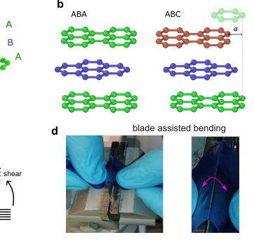 
Figure 1: Mechanically induced stacking rearrangement in graphite. a, Schematic of the rhombohedral (ABC) and Bernal (AB) stacking configurations in graphite, showing that bending can induce relative lateral displacement between adjacent graphene layers and thereby alter the local stacking order. b, Geometric pathway of stacking transformation by lateral sliding: successive in-plane displacement of one graphene layer converts AB stacking into the ABC configuration. c, Schematic of micromechanical exfoliation on a Si/SiO2 substrate. Shear and bending introduced during exfoliation can promote interlayer sliding and local stacking rearrangement. d, Blade- assisted bending applied to the...

📷 Fig 2

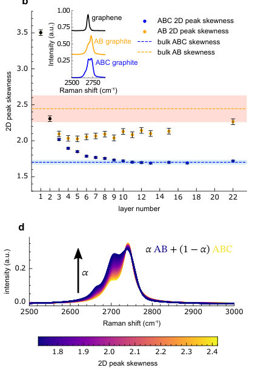 
Figure 2: 2D peak skewness for stacking sequence classification. a Representative 2D peak skewness maps on few-layer flakes showing distinguishable AB- and ABC-stacked domains. Insets: distributions of the characteristic size ( √

📷 Fig 3

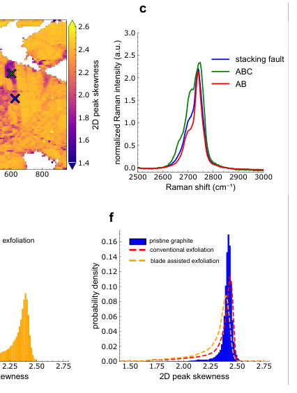 
Figure 3: Rhombohedral phase formation during the exfoliation step. a Representative 2D peak skewness map of pristine natural graphite and b of blade-assisted exfoliated graphite, showing an increased abundance of low-skewness regions. c Representative Raman 2D bands extracted from AB, ABC-like, and stacking-fault regions marked by colored crosses in panel b. d-f Comparison of the probability density distributions of the 2D skewness for conventionally exfoliated, blade-assisted exfoliated thick graphite samples, and pristine graphite.

📷 Fig 4

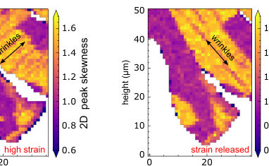 
Figure 5: Strain-induced evolution of stacking domains in graphite on a flexible sub- strate. a, Optical transmission image of the graphite flake exfoliated onto PVC. The optical con- trast was used to measure the thickness of the flake, corresponding to 14 graphene layers. b,c,e,f, Raman 2D-skewness maps of the same flake measured under different mechanical conditions: no strain (b), low strain (c), high strain (e), and after strain release (f). The maps reveal substantial evolution of the domain structure upon stretching, including domain displacement, the appear- ance of new domain boundaries, and the rearrangement of stacking-fault regions. For graphite on PVC, the 2D skewness was...

**Summary.** This paper demonstrates that a simple blade-assisted exfoliation technique can significantly increase the amount of rhombohedral (ABC) stacking in graphite. By using mechanical shear and bending, the researchers can create samples with much higher ABC content, providing a new way to study the correlated and topological phases associated with ABC-stacked flat bands.

**Why it may be interesting.** not directly relevant

Detailed structure

**Main problem.** The scarcity of rhombohedral (ABC) stacking in natural graphite limits the experimental study of its surface-localized flat bands and associated correlated and topological electronic phases.

**Main result.** Mechanical exfoliation and a novel blade-assisted exfoliation step significantly enrich the ABC stacking content in graphite, with thin flakes reaching up to 75% ABC area fraction.

**Method.** The study uses conventional and blade-assisted mechanical exfoliation (a tape-graphite-tape sandwich passed over a blade) combined with large-area Raman 2D-band skewness mapping and uniaxial strain application.

**Model / system.** The physical system is graphite, specifically focusing on the transition between Bernal (AB) and rhombohedral (ABC) stacking phases in thick flakes and few-layer graphene (FLG).

**Key observables.** 2D-band Raman skewness (gamma), ABC area fraction, Raman intensity, and wrinkle angles.

**Important parameters / regimes.** Layer number (3 to 22 layers), ABC area fraction, and applied uniaxial strain.

**Assumptions / limitations.** The study assumes that 2D-band skewness is a robust descriptor for stacking types that is resistant to strain-induced peak shifts.

**Figures summary.** Fig 1 shows schematics of AB/ABC stacking and the blade-assisted method; Fig 2 shows Raman 2D-band skewness as a function of layer number; Fig 3 compares Raman maps and skewness distributions across different preparation methods; Fig 4 shows optical and Raman maps of wrinkles; Fig 5 shows Raman maps of a 14-layer flake under varying strain.

**Paper structure.** The paper introduces the problem of ABC scarcity, describes the new blade-assisted exfoliation method, presents Raman-based quantification of stacking enrichment, details the mechanism of domain wall formation via wrinkles and shear, and demonstrates domain dynamics under strain.

Abstract

Rhombohedral (ABC) graphite hosts a surface-localized flat band that supports correlated and topological electronic phases, but its experimental study is limited by the scarcity of ABC stacking in natural graphite, which is dominated by Bernal (AB) stacking. Here we show that the routine mechanical exfoliation step itself enriches the rhombohedral content of graphite flakes, and that a simple blade-assisted exfoliation step, which introduces additional shear, amplifies the effect further. Using large-area Raman 2D-band skewness mapping we measure ABC content at area fractions of 3\% in the pristine source crystal, 16\% after conventional exfoliation, and 26\% after blade-assisted exfoliation for thick flakes. In thin flakes ($<20$ layers) the per-flake area fraction reaches 75\% in the upper tail of the distribution. Tracking individual flakes before and after blade-assisted exfoliation shows that wrinkles seed AB-ABC domain walls, and uniaxial strain can move these walls. Blade-assisted mechanical exfoliation therefore removes one of the bottlenecks to the preparation of ABC-rich graphite samples for studies of correlated and topological phases in rhombohedral graphite.

[↑ back to top](#top)

### [Fabrication and transfer of ultra-thin YBa$2$Cu$3$O$_{7-x}$ film on SrTiO$_3$ nanomembrane](http://arxiv.org/abs/2605.22303v1)

**Authors:** J. S. Madhira, G. Potemkin, D. Grützmacher, T. Schäpers, M. Lyatti  
**Type:** experiment · **Category:** strongly correlated electrons · **PDF:** <https://arxiv.org/pdf/2605.22303v1>  
**Analysis basis:** full PDF text, analyzed in chunks

📷 Fig 1

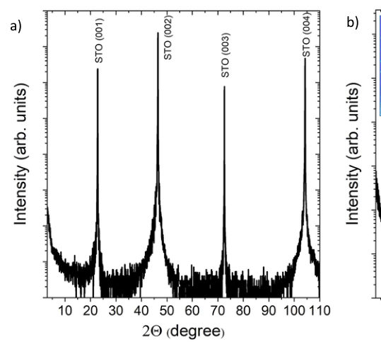 
FIG. 1. XRD 2Θ-Θ scans of (a) the STO/SCAO stack on the STO substrate and (b) the STO nanomembrane transferred onto the SiO2/Si substrate. Insert of panel (b) shows an optical image of the STO nanomembrane on the SiO2/Si substrate.

📷 Fig 2

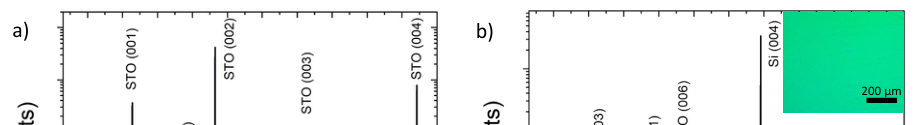 
FIG. 2. XRD 2Θ-Θ scans of the Au/YBCO/STO/SCAO stack on the STO substrate (a) and the Au/YBCO/STO stack transferred onto the SiO2/Si substrate (b). Insert of panel (b) shows an optical image of the Au/YBCO/STO heterostructure transferred onto the SiO2/Si substrate.

📷 Fig 3

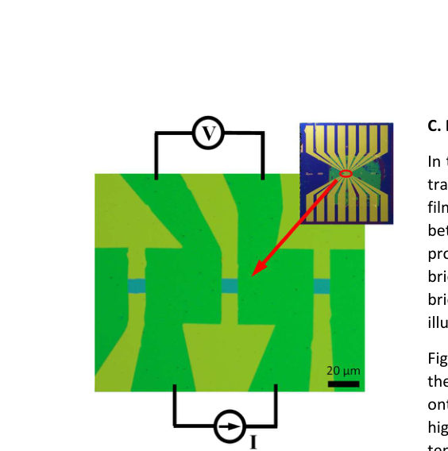 
FIG. 3. A false-color optical image of the Au/YBCO microbridges on the STO nanomembrane transferred onto the SiO2/Si substrate. The Au/YBCO film, the Au/YBCO microbridges, and the STO substrate are highlighted in green, blue, and yellow, respectively. Black dots are precipitates. The insert shows an optical image of a 10x10 mm SiO₂/Si chip with seven Au/YBCO microbridges on the STO nanomembrane, as well as gold current leads.

📷 Fig 4

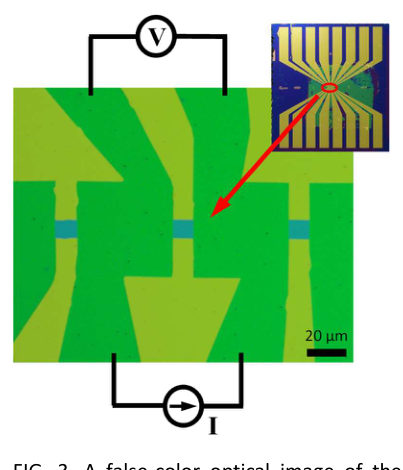 
Figure 4b shows the typical IV curve of an 8.7-µm-wide Au/YBCO bridge on the SiO2/Si substrate with critical current Ic of 8.6 mA. The critical current is determined using the 10 µV criterion. The critical current density of the bridges with the thickness d is calculated as Jc = Ic/W∙d, where W and d are the width and the thickness of the microbridge, respectively. The average critical current density of the 20-nm-thick Au/YBCO microbridges at T = 77.5 K is 4.5±0.4 MA/cm2 for the YBCO film sputtered on the STO layer with a mixed SrO/TiO2 surface termination obtained after STO layer deposition (Sample 1). When the surface of the STO layer is etched using buffered oxide etch (BOE) to obtain a...

📷 Fig 5

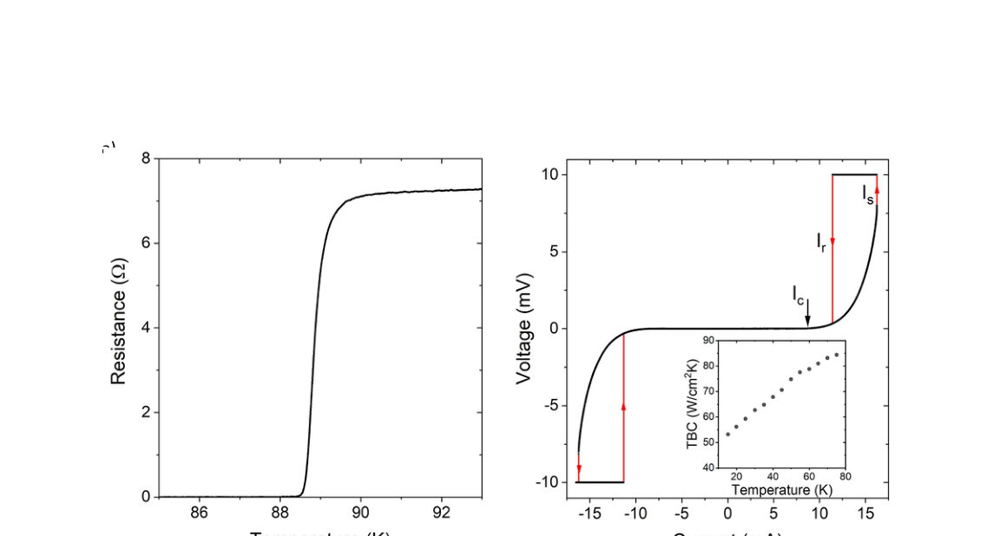 
FIG. 4. Superconducting properties of the Au/YBCO bridge on a SiO2/Si substrate. (a) Superconducting transition. (b) IV curve at T = 77.5 K. The red lines indicate the voltage switching.

**Summary.** The researchers developed a way to transfer ultra-thin high-temperature superconducting YBCO films onto silicon substrates using a nanomembrane technique. This process preserves the material's high-quality superconductivity and creates a thermal barrier that could improve the performance of single-photon detectors.

**Why it may be interesting.** not directly relevant

Detailed structure

**Main problem.** The need for a scalable fabrication method to integrate high-Tc superconductors like YBCO with standard silicon-based photonic architectures for applications like superconducting nanowire single-photon detectors.

**Main result.** Successful fabrication and transfer of ultra-thin YBCO films on STO nanomembranes to SiO2/Si substrates, maintaining high crystallinity and robust superconducting properties (Tc = 88.8 K) while significantly reducing thermal boundary conductance.

**Method.** High-pressure sputtering of YBCO/Au on an STO/SCAO bilayer, followed by the dissolution of the water-soluble SCAO sacrificial layer and a controlled transfer process using a pre-conditioned DGL polymer film.

**Model / system.** An ultra-thin (20 nm) YBa2Cu3O7-x (YBCO) film on a SrTiO3 (STO) nanomembrane, transferred onto a SiO2/Si substrate, forming a van der Waals interface.

**Key observables.** Critical temperature (Tc), critical current density (Jc), thermal boundary conductance (TBC), and X-ray diffraction (XRD) lattice constants.

**Important parameters / regimes.** YBCO thickness ~20 nm, Tc = 88.8 K, Jc = 6.8 MA/cm2 at 77 K, and TBC reduction of nearly two orders of magnitude.

**Assumptions / limitations.** The reduction in thermal boundary conductance is assumed to be the primary driver for enhanced stability of transient resistive states in the nanowires.

**Figures summary.** XRD scans of STO and the full YBCO/STO stack, AFM images of the surface, and the experimental procedure for the DGL-mediated transfer process.

**Paper structure.** The paper introduces the motivation for high-Tc SNSPDs, describes the fabrication and transfer protocol, presents structural and electrical characterization of the transferred films, analyzes the thermal boundary conductance, and concludes with the implications for photonic integration.

Abstract

The fabrication of free-standing ultra-thin films from high-temperature (high-Tc) superconductors is of great interest for the development of superconducting nanowire single-photon detectors with high operating temperatures. We successfully fabricate a millimeter-sized, high-quality, ultra-thin YBa$2$Cu$3$O$_{7-x}$ (YBCO) film on an SrTiO$_3$/Sr$_{1.5}$Ca$_{1.5}$Al$_2$O$_6$ (STO/SCAO) bilayer using high-pressure sputtering. The STO nanomembranes with the YBCO films are released by dissolving the water-soluble SCAO sacrificial layer and transferred onto the SiO2/Si substrate. X-ray diffraction confirms that STO and YBCO crystallinity is preserved following transfer onto SiO2/Si substrates. Microbridges patterned from the transferred YBCO films exhibit a critical temperature of 88.8 K and a critical current density of 6.8 MA/cm2 at 77 K, demonstrating robust superconducting transport after transfer. The thermal boundary conductance across the van der Waals interface between the STO nanomembrane with YBCO film and the SiO2/Si substrate, measured over 15-75 K, is significantly reduced compared to that of epitaxial YBCO film on bulk STO leading to modified energy relaxation and enhanced stability of transient resistive states. These results establish ultra-thin YBCO films on optically transparent STO nanomembranes as a platform for integrating high-Tc superconducting devices with SiO2/Si-based photonic structures.

[↑ back to top](#top)

### [Generation of an anomalous linearly dispersing spin-polarized band in Bi-based topological insulators](http://arxiv.org/abs/2605.22370v1)

**Authors:** Matthias Kronseder, Thomas Mayer, Jan Minár, Magdalena Marganska, Hedwig Werner, Florian Schmid, Rebeca Diaz-Pardo, Ivana Vobornik, Jun Fuji, Cornelia Streeck, Alexander Gottwald, Hendrik Kaser, Bernd Kästner, Christian H. Back  
**Type:** experiment · **Category:** other · **PDF:** <https://arxiv.org/pdf/2605.22370v1>  
**Analysis basis:** full PDF text, analyzed in chunks

📷 Fig 1

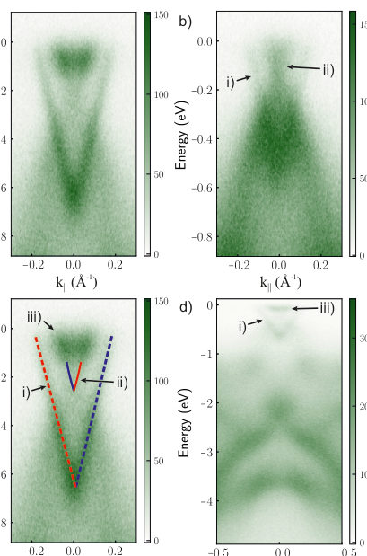 
FIG. 1. a) ARPES scan with Eph = 36eV and EF set to 0eV from a sample with (2)BS/(27)BSTS after a sputtering- heating cycle. The scan shows a faint TSS band structure in the background around -0.2eV. The main feature is, how- ever, the linearly dispersing band starting at around -0.65eV (ALS), and the extra features close to EF. b) The sister sam- ple with nominally the same stoichiometry and thickness was treated similarly and shows also the linearly dispersing bands spanning this time only an energetic range of 0.55eV, while the extra features close to EF is not seen. c) same plot as in a) but highlighting the different features: i) ALS, ii) ordinary TSS, iii) extra bands close to EF. d)...

📷 Fig 2

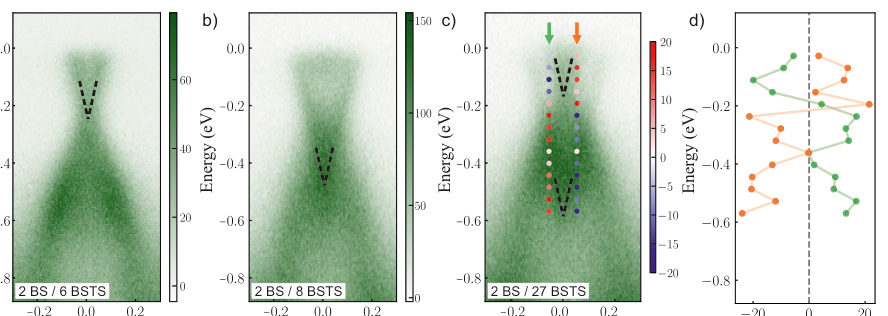 
FIG. 2. a-c) ARPES scans of samples with (2)BS and different thicknesses of the BSTS layer after sputtering-heating cycles: a) for a dBSTS = 6QL, b) 8QL and c) 27QL. For all plots the onset of the Dirac cone is highlighted by a dashed cone with the same size in all plots. In d) spin-polarization scans for two different in-plane wave vectors k∥= ±0.06˚A−1 is plotted, k∥&lt; 0 in green, k∥&gt; 0 in orange for the sample with dBSTS = 27QL. The same data is also overlaid in c) at the corresponding wavevectors and energies (marked with green and orange arrows) while the polarization in % is given by the colorbar in c).

📷 Fig 3

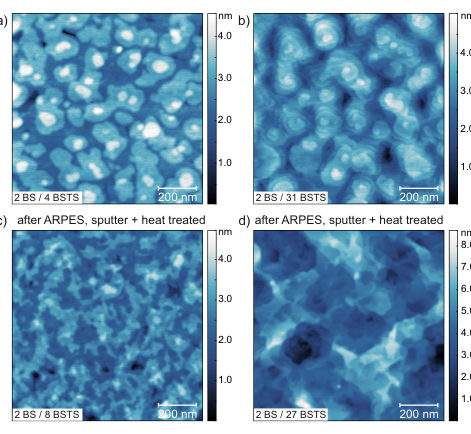 
FIG. 3. a) and b) show typical AFM scans directly after the MBE growth of samples with (2)BS and different thicknesses of the BSTS, a) for dBSTS = 4QL and b) dBSTS = 31QL. After the beamtime and hence after the sputter-heating cycles the roughness and especially the morphology changed, c) and d). c) shows the surface structure of the sample whose ARPES data is presented in Fig.2 b), and in d) the same for the ARPES data shown in Fig.2 c) or Fig.1 b).

**Summary.** This paper reports the experimental generation of a new, highly energetic, and spin-polarized electronic band in Bi-based topological insulators using ion bombardment and annealing. This 'anomalous' state is unique because it possesses a spin helicity opposite to the standard topological surface state and spans an unusually large energy range. The study provides a detailed investigation into the possible physical origins of this state, such as surface reconstruction or chemical changes.

**Why it may be interesting.** not directly relevant

Detailed structure

**Main problem.** The emergence of an unexpected, highly energetic, and spin-polarized electronic band (the ALS) in Bi-based topological insulators following surface treatment via ion bombardment and annealing.

**Main result.** The discovery of an 'anomaline linearly dispersing state' (ALS) that coexists with the regular topological surface state, possesses an opposite spin helicity, and spans a large energy range of ~650 meV with a Fermi velocity nearly identical to the regular TSS.

**Method.** The researchers used a 'sputter-heating cycle' (Ar-ion bombardment followed by annealing) on BSTS/Bi2Se3 heterostructures and characterized the electronic and structural changes using Spin-resolved ARPES, XPS, and AFM.

**Model / system.** The physical system consists of (Bi1-xSbx)2(Te1-ySey)3 (BSTS) / Bi2Se3 heterostructures grown on SrTiO3(111) substrates, subjected to surface modification via soft Ar-ion sputtering and annealing.

**Key observables.** Electronic band dispersion, spin-momentum locking (helicity), Fermi velocity (vF), energy range of the ALS, surface roughness, and chemical stoichiometry.

**Important parameters / regimes.** ALS energy range (~650 meV), Fermi velocity (approx. 5.1-5.3 x 10^5 m/s), and sputtering voltage (250-500 V).

**Assumptions / limitations.** The authors evaluate several models (Rashba 2DEG, TSS relocation, Bi-bilayer formation, etc.) but note that no single current model fully accounts for all observed properties.

**Figures summary.** Figure S1 shows the evolution of ARPES scans through different treatment stages: thermal decapping, sputtering (blurred scans), and annealing (improved contrast with the emergence of the ALS feature).

**Paper structure.** The paper introduces the problem of defect-induced states in TIs, describes the experimental generation of the ALS via surface treatment, presents the characterization of the new band's dispersion and spin properties, discusses the surface morphology changes, and evaluates various physical mechanisms for the origin of the ALS.

Abstract

We report the generation of an anomalous linearly dispersing, spin-polarized band in Bi-based topological insulator (TI) thin films, induced by soft Ar-ion bombardment followed by annealing. This extra band -- which we call the anomalous linearly dispersing state (ALS) -- is superimposed on the regular band structure including the topological surface state (TSS), spans an unusually large energetic range of up to ${\sim}\,\SI{650}{\milli\electronvolt}$ at the $Γ$-point, and appears near the Fermi energy. Spin-resolved measurements indicate spin-momentum locking with a helicity \emph{opposite} to that of the regular TSS. The Fermi velocity of the ALS, $v_\mathrm{F} = (5.1\pm 0.4)\times 10^{5}\,\frac m s$, is indistinguishable from that of the regular TSS, $(5.3\pm 0.5)\times 10^{5}\,\frac m s$. The observation is reproducible across samples of varying thickness and was confirmed at two independent synchrotron radiation facilities. We discuss different mechanisms for the physical origin of the observed ALS including sputtering-induced TSS relocation, bi-layer formation by,e.g., chalcogen removal, and high-index surface relocation.

[↑ back to top](#top)

### [High-throughput study of electrical conductivity in ordered metals](http://arxiv.org/abs/2605.22167v1)

**Authors:** Thalis H. B. da Silva, Hai-Chen Wang, Tiago F. T. Cerqueira, Simone Di Cataldo, Silvana Botti  
**Type:** theory · **Category:** disordered systems and neural networks · **PDF:** <https://arxiv.org/pdf/2605.22167v1>  
**Analysis basis:** full PDF text, analyzed in chunks

📷 Fig 1

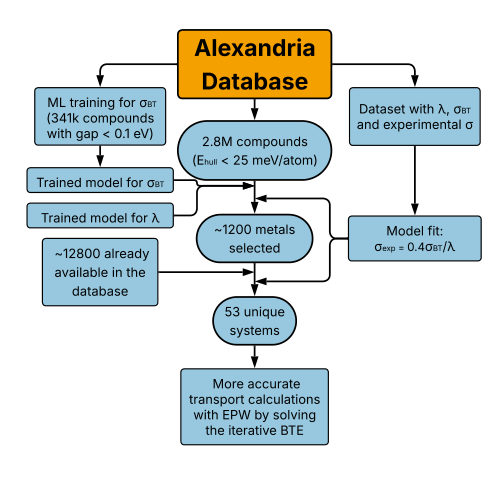 
FIG. 1. Schematic overview of the computational workflow employed in this study.

📷 Fig 2

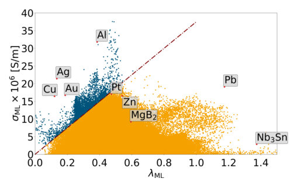 
FIG. 2. Electronic contribution to the electrical conductivity, σML, versus the superconducting electron–phonon coupling constant λML for compounds in the Alexandria database, as predicted by machine-learning models. Blue points represent compounds with σ &gt; 15 × 106 S/m, as identified by the fitted model.

📷 Fig 3

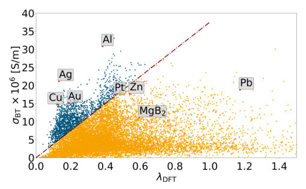 
FIG. 3. Electronic contribution to the electrical conductiv- ity, σBT, versus electron–phonon coupling λ for ∼12,800 com- pounds from the Alexandria Database and ∼1,200 additional ML-selected compounds, calculated using density functional theory with the PBEsol functional.

📷 Fig 4

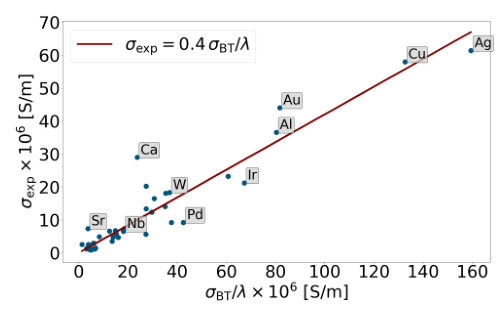 
FIG. 4. Symbolic regression of the experimental conductivity as a function of the calculated variables σBT and λ.

📷 Fig 5

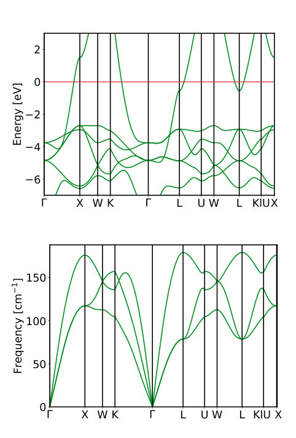 
FIG. 5. Electronic (top) and phonon (bottom) band struc- tures of Ag.

**Summary.** Researchers developed a high-throughput framework combining machine learning with first-principles calculations to screen 2.8 million metallic compounds for high electrical conductivity. They identified new intermetallic candidates that could rival aluminum's conductivity by using light elements to reduce electron-phonon scattering. The study demonstrates that ML can effectively bridge the gap between massive chemical searches and expensive, high-accuracy quantum mechanical simulations.

**Why it may be interesting.** not directly relevant

Detailed structure

**Main problem.** The challenge of efficiently predicting and optimizing electrical conductivity in metals across a massive chemical space of millions of compounds.

**Main result.** The study identifies several intermetallic candidates, such as LiBePt2, with predicted conductivities comparable to aluminum, and demonstrates that machine learning can accurately screen 2.8 million compounds.

**Method.** A multi-stage high-throughput workflow integrating machine learning surrogate models (ALIGNN) with ab initio calculations (DFT, BoltzTraP2, and EPW) to predict conductivity and electron-phonon coupling.

**Model / system.** The study screens approximately 2.8 million ordered inorganic metallic compounds from the Alexandria database, focusing on the interplay between electronic structure and electron-phonon scattering.

**Key observables.** Electrical conductivity (sigma), electron-phonon coupling constant (lambda), Fermi velocity (vF), and carrier density.

**Important parameters / regimes.** Distance to the convex hull (E_hull) <= 25 meV/atom for stability; conductivity threshold > 15 x 10^6 S/m.

**Assumptions / limitations.** The initial large-scale screening uses the constant relaxation-time approximation, which neglects material-specific scattering variations.

**Figures summary.** Figure 1 shows the computational workflow; Figure 2 illustrates the distribution of predicted conductivity vs. electron-phonon coupling; Figure 3 validates ML predictions against DFT; Figure 4 shows the fit of a derived empirical formula to experimental data.

**Paper structure.** The paper introduces the computational challenge, describes the multi-stage ML and ab initio workflow, presents the screening results and physical insights into high-conductivity mechanisms, and validates the models against experimental benchmarks.

Abstract

We present a computational framework that integrates machine learning with high-throughput \textit{ab initio} calculations to screen over 2.8 million compounds for metallic transport. We identify several intermetallic candidates with predicted high conductivities comparable to that of aluminum ($36.59 \times 10^6$~S/m). We perform full electron--phonon coupling calculations for the top-performing materials, yielding results in excellent agreement with available experimental data. Our analysis reveals that while the noble metals (Ag, Au, Cu) define the practical ceiling for conductivity due to their unique electronic structure and low scattering, compounds like $\text{LiBePt}_2$ can achieve comparable performance by utilizing valence electrons from light elements to shift high-scattering $d$-states beneath the Fermi level. This study not only identifies novel high-performance conductors but also demonstrates the predictive power of combining statistical learning with detailed ab initio calculations.

[↑ back to top](#top)

### [On the Riemann problem for the Adlam-Allen model](http://arxiv.org/abs/2605.22610v1)

**Authors:** Su Yang, Marco Calabrese, Vassilis Koukouloyannis, Panayotis G. Kevrekidis  
**Type:** theory · **Category:** other · **PDF:** <https://arxiv.org/pdf/2605.22610v1>  
**Analysis basis:** full PDF text, analyzed in chunks

📷 Fig 1

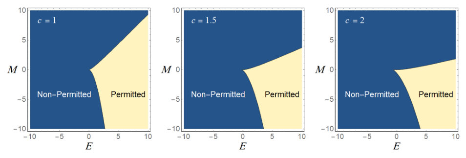 
Figure 1: Permitted (light-colored) and non-permitted (dark-colored) regions in the (E,M)-parametric space, for three choices of the speed, namely c = 1,1.5,2.

📷 Fig 2

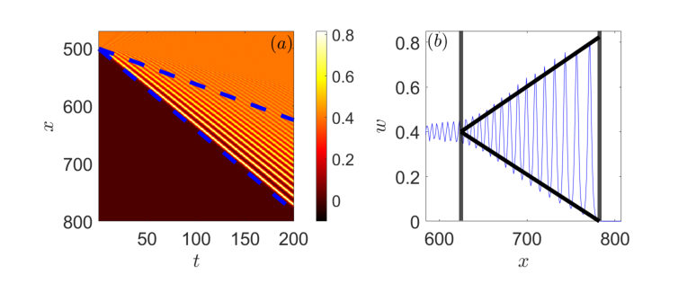 
Figure 2: The dispersive shock wave of the AA model (1.1). The panel (a) depicts the space-time evolution of the DSW, where the two dashed blue lines represent the theoretical predictions on the linear and solitonic edges of the DSW based on the DSW-fitting results. (b) shows the spatial profile of the DSW at t = 200 with background value w−= 0.4.

📷 Fig 3

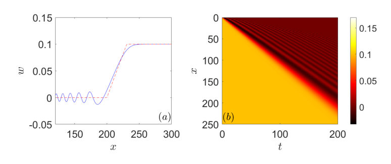 
Figure 3: The dynamics of the numerical rarefaction waves of the AA model (1.1). The panel (a) depicts the com- parison of the self-similar solution (6.3) (in dashed red) with the numerically observed rarefaction wave (in solid blue) at t = 200. Note that w−= 0 and w+ = 0.1. The panel (b) displays the spatio-temporal evolution dynamics of the numerical rarefaction wave of the AA model in Eq. (1.1).

📷 Fig 4

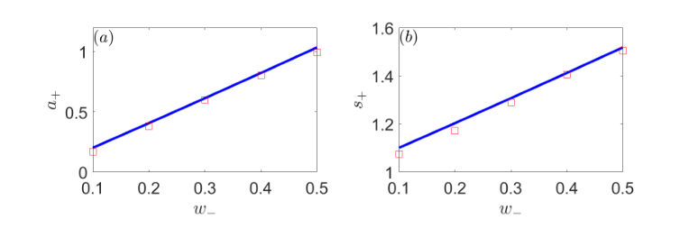 
Figure 4: The comparison of the solitonic-edge DSW features. The panel (a) depicts the comparison of the solitonic-edge amplitudes of the DSW while (b) shows that of the solitonic-edge speeds. The blue curves and dis- crete red squares represent the DSW-fitting theoretical predictions and the numerically estimated counterparts, respectively. Note also that w+ is always fixed to be zero, while the values of w−are varied within the interval of [0.1,0.5].

📷 Fig 5

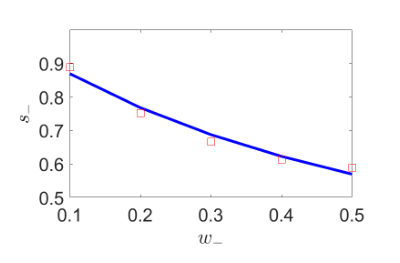 
Figure 5: The comparison of the linear-edge DSW speeds. The blue curve and red squares refer to the DSW-fitting theoretical prediction and the numerically computed counterparts, respectively.

**Summary.** This paper provides a systematic toolkit for analyzing shock wave dynamics in the Adlam-Allen model, a fundamental model for plasma physics. By using Whitham modulation theory and KdV reduction, the authors successfully predict the complex structures of dispersive shock waves and rarefaction waves. The results show that even simple asymptotic reductions can accurately capture the behavior of more complex nonlinear plasma waves.

**Why it may be interesting.** not directly relevant

Detailed structure

**Main problem.** The study investigates the formation and structure of rarefaction and dispersive shock waves (DSWs) in the Adlam-Allen model, specifically addressing the Riemann problem with jump initial data.

**Main result.** The authors demonstrate that the DSW-fitting method and the KdV reduction provide highly accurate theoretical predictions for the edge features and amplitudes of shock waves in the Adlam-Allen model.

**Method.** The research employs Whitham modulation theory, the DSW-fitting method, and a KdV asymptotic reduction, validated against numerical simulations using RK4 and pseudospectral methods.

**Model / system.** The Adlam-Allen model is a system of nonlinear partial differential equations describing hydromagnetic waves in cold, collisionless, magnetospheric plasmas.

**Key observables.** Dispersive shock wave (DSW) amplitudes, edge speeds (solitonic and linear), wavenumber, and rarefaction wave profiles.

**Important parameters / regimes.** The non-dissipative regime, the dispersionless limit, the small-amplitude/long-wavelength (KdV) limit, and the carrier density/magnetic field constants (R0, B0).

**Assumptions / limitations.** The KdV reduction is an approximation valid primarily for small-amplitude jumps, and the analysis focuses on the non-dissipative, one-dimensional case.

**Figures summary.** Figure 1 shows permitted parameter regions for traveling waves; Figure 2 shows space-time evolution of a DSW; Figure 3 shows rarefaction wave profiles; Figure 4 and 5 compare theoretical predictions for DSW edges against numerical data; Figure 6 compares the AA model directly to the KdV reduction.

**Paper structure.** The paper begins with the definition of the Adlam-Allen model and its physical context, followed by the derivation of traveling wave solutions and modulation equations, then moves to the analysis of the dispersionless limit and the DSW-fitting method, and concludes with a comparison between the full model and its KdV reduction via numerical validation.

Abstract

In the present work, we revisit the Adlam-Allen (AA) model in order to investigate its numerically observed rarefaction and dispersive shock waves that arise in numerical simulations of the Riemann problem associated with the model. On the one hand, we perform a direct analysis of the rarefaction and dispersive shock waves of the AA model via examining its corresponding dispersionless system and leveraging the DSW-fitting method to obtain theoretical predictions on various edge features of the dispersive shock waves. On the other hand, we review the KdV reduction of the AA model and utilize the KdV dispersive shock wave to approximate that of the AA model. Relevant numerical comparisons demonstrate the good performance of not only the direct analysis on the AA dispersive shock wave, but also of the approximation via the KdV DSW. These methodologies provide a systematic toolbox for analyzing the outcome of Riemann problems in not only this fundamental setting of cold plasmas but also potentially in related plasma-physics problems.

[↑ back to top](#top)

### [Quasiparticle GW for Superconductors: Toward a Unified Treatment of Electron-Phonon and Electron-Plasmon Couplings](http://arxiv.org/abs/2605.21700v1)

**Authors:** Catalin D. Spataru, Christopher Renskers, Elena R. Margine  
**Type:** theory · **Category:** strongly correlated electrons · **PDF:** <https://arxiv.org/pdf/2605.21700v1>  
**Analysis basis:** full PDF text, analyzed in chunks

📷 Fig 1

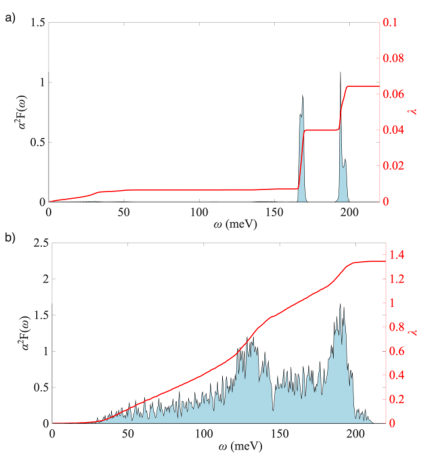 
FIG. 2. Calculated isotropic Eliashberg spectral function α2F (black line), and cumulative contri- bution to the electron-phonon coupling strength λ (red line) for: a) Doped monolayer graphene, and b) bulk Nb.

📷 Fig 2

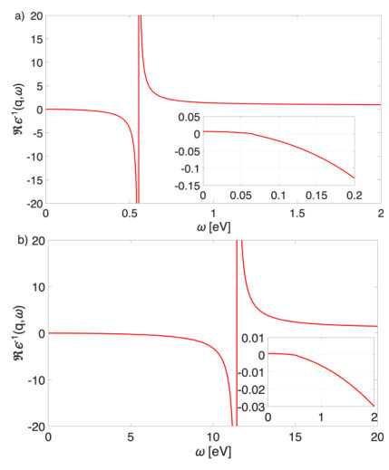 
FIG. 1. a) Real part of the inverse dielectric function of doped graphene for momentum q = 10−8 m−1. b) Real part of the inverse dielectric function of bulk Nb for momentum q = 10−9 m−1. The inset in each panel shows an enlarged view near ω = 0, where ℜϵ−1(ω) changes from positive to neg- ative.

📷 Fig 3

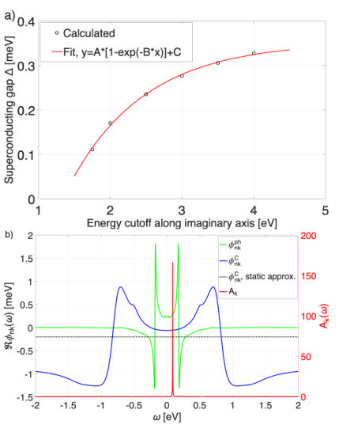 
FIG. 3. a) Superconducting properties of doped monolayer graphene calculated at T = 3 K within s-GW, as a function of the energy cutoff along the Matsubara imaginary-frequency axis. b) Anoma- lous (pairing) self-energy and spectral function (solid red line) for an electron with energy EQP nk ≈ 0.1 eV above the Fermi level in doped mono- layer graphene calculated within the s-GW at T = 3 K. Solid green and blue lines represent the phonon and Coulomb contributions to the anoma- lous self-energy. The dotted black horizontal line is the static-screening value ϕC,stat, obtained using Eq. (23) with all right-hand-side quantities taken from the converged s-GW solution.

📷 Fig 4

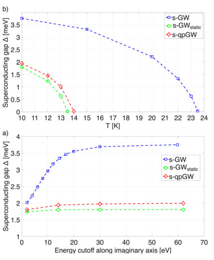 
FIG. 4. Superconducting properties of bulk Nb cal- culated within s-GW (black squares), static Eliash- berg (green circles), and s-qpGW (red diamonds). a) The superconducting gap parameter calculated at T = 10 K, as function of the energy cutoff along the Matsubara imaginary-frequency axis. b) The converged superconducting gap as function of tem- perature.

📷 Fig 5

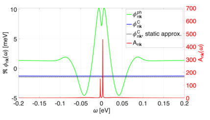 
FIG. 5. Anomalous (pairing) self-energy and spec- tral function (solid red line) for an electron with energy EQP nk ≈3 meV above the Fermi level in bulk Nb, calculated within the s-qpGW at T = 10 K. Solid green and blue lines represent the phonon and Coulomb contributions to the anoma- lous self-energy. The dotted black horizontal line is the static-screening value ϕC,stat, obtained using Eq. (23) with all right-hand-side quantities taken from the converged s-qpGW solution.

**Summary.** The authors present a new theoretical framework, s-qpGW, that allows for a unified treatment of electron-phonon and electron-plasmon couplings in superconductors. This method fixes the issue of 'spurious' superconductivity predictions in 2D materials found in previous GW approaches. It provides a parameter-free way to study how dynamical screening by plasmons influences the superconducting state.

**Why it may be interesting.** not directly relevant

Detailed structure

**Main problem.** The difficulty in accurately disentangling phonon-mediated and plasmon-mediated pairing mechanisms in 2D superconductors, and the failure of standard GW methods to avoid spurious superconductivity predictions.

**Main result.** The development of the s-qpGW framework, which correctly predicts the absence of superconductivity in doped monolayer graphene and provides a reliable way to capture dynamical Coulomb screening effects.

**Method.** An extension of the quasiparticle self-consistent GW (s-qpGW) method coupled with Eliashberg theory, using a QP-projection to suppress spurious pairing from high-energy plasmons.

**Model / system.** The study focuses on 2D materials (specifically doped monolayer and few-layer graphene, graphene superlattes, and rhombohedral trilayer graphene) and 3D bulk metals (Niobium).

**Key observables.** Superconducting transition temperature (Tc), superconducting gap (Delta), anomalous self-energy (phi), and mass renormalization function (Z).

**Important parameters / regimes.** Electron-phonon coupling strength (lambda), plasmon energy (omega_pl), Fermi energy (Ef), and the Coulomb pseudopotential (mu*).

**Assumptions / limitations.** Uses the Migdal approximation for electron-phonon coupling, the GW approximation for self-energy, and neglects vertex corrections and the incoherent part of the spectral weight.

**Figures summary.** Figures show the convergence of the superconducting gap in Nb with respect to Matsubara frequency cutoffs and the calculated superconducting gap in a 2D model system with enhanced density of states.

**Paper structure.** The paper introduces the scientific problem of pairing mechanisms in 2D, presents the new s-qpGW theoretical framework, benchmarks the method against bulk Nb and graphene, demonstrates the capture of dynamical screening, and discusses computational implementation via a plasmon-pole model.

Abstract

Superconducting two-dimensional materials, and in particular few-layer graphene, offer an exciting platform for low-power electronics, yet the origin of their unconventional superconductivity remains an open question. Prevailing theories, primarily rooted in the Bardeen-Cooper-Schrieffer (BCS) framework that assumes electron-phonon interactions are the main mechanism of superconductivity, struggle to account quantitatively for the observed phenomena. Recent studies point to a plasmonic pairing mechanism in graphene systems; however, disentangling the relative contributions of phonon- and plasmon-mediated pairing remains challenging due to the lack of a satisfactory first-principles framework capable of accurately capturing dynamical screening effects in the electronic channel. Here, we present a new theoretical framework that extends the quasiparticle self-consistent GW method to the superconducting phase by coupling it with the Eliashberg treatment of both phonon- and plasmon-mediated interactions. Our approach, termed "s-qpGW", is on par with the state-of-the-art Eliashberg theory of superconductivity when applied to bulk metals, and correctly predicts the absence of superconductivity in doped monolayer graphene. To differentiate s-qpGW from conventional Eliashberg approaches, we study a simple model system, graphene with an artificially enhanced density of states, and demonstrate that s-qpGW captures dynamical Coulomb screening effects in ways that standard BCS theory cannot.

[↑ back to top](#top)

### [Silicate cosmic dust grain collisions in the interstellar medium: A molecular dynamics study](http://arxiv.org/abs/2605.22225v1)

**Authors:** C. J. Esmerian, S. R. Hashemi, W. M. C. Sameera, W. Vlemmings, S. Andersson, T. J. L. C. Bakx, K. K. Knudsen, S. Aalto, G. Nyman  
**Type:** both · **Category:** other · **PDF:** <https://arxiv.org/pdf/2605.22225v1>  
**Analysis basis:** full PDF text, analyzed in chunks

📷 Fig 1

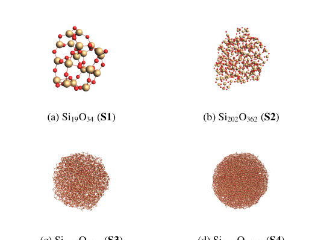 
Fig. 1: Silica SiO2 structure candidates relaxed at 10 K. The structures are obtained using the procedure detailed in Section 2.2.1.

📷 Fig 2

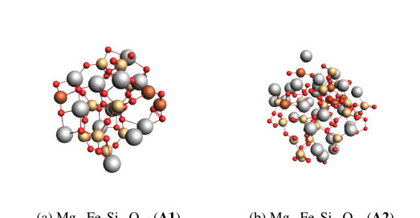 
Fig. 2: Astrodust structures optimized using the GFN1-xTB method. The structures are obtained using the procedure detailed in Section 2.2.2.

📷 Fig 3

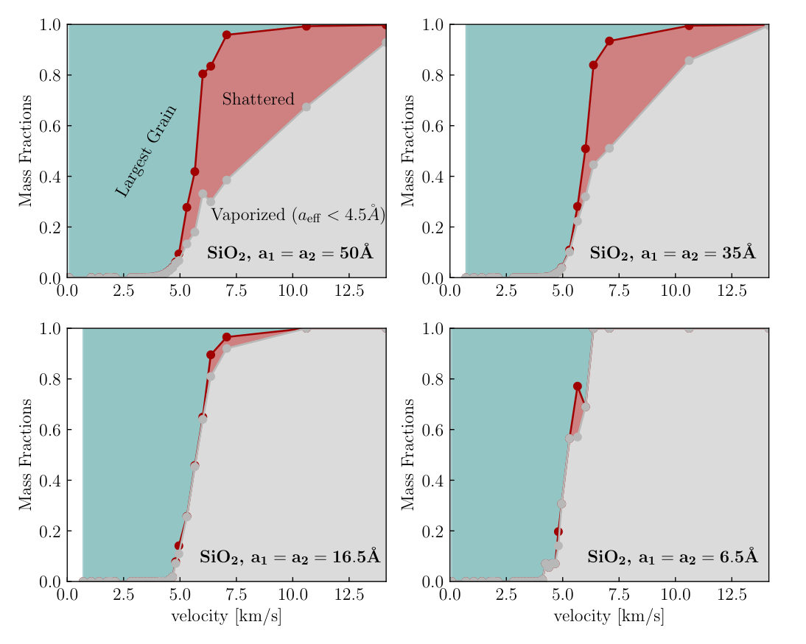 
Fig. 3: Collision outcomes for SiO2 grains of the same size as a function of impact velocity. Each panel shows the mass fractions, as a fraction of the total combined mass of initial particles, of the 3 main collision outcomes: the largest remaining grain (defined by mass, blue), shattered products smaller than the largest grain but larger than the vaporization limit (red), and the vaporized fraction of collision products smaller than our minimum grain size of 4.5Å (gray). Initial grain sizes are indicated by a1 and a2. The top left panel shows results for the S4–S4 simulations, top right for S3–S3, bottom left for S2–S2, and bottom right for S1–S1. White regions indicate velocities outside...

📷 Fig 4

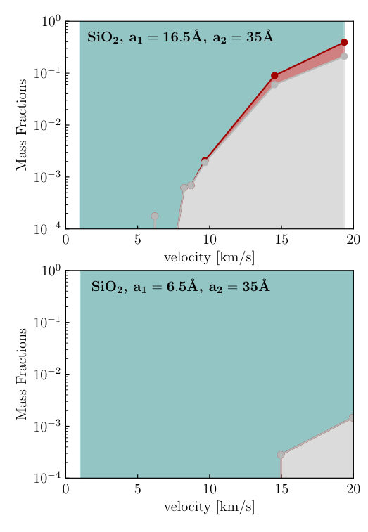 
Fig. 4: Same as Figure 3 but for SiO2 grains with different sizes. The top panel shows results for the S2–S3 simulations, the bot- tom for S1–S3.

📷 Fig 5

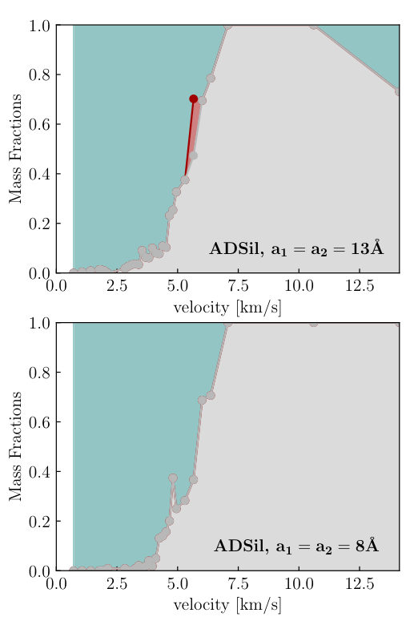 
Fig. 5: Same as Figure 3 but for astrodust silicate (ADSil) grains of the same size. The top panel shows results for the A2–A2 simulations, the bottom for A1–A1.

**Summary.** This paper uses molecular dynamics to show that interstellar silicate dust grains are more resistant to shattering during collisions than previously thought. By correcting an algebraic error in long-standing models, the authors provide updated velocity thresholds that suggest dust populations are more robust in the interstellar medium.

**Why it may be interesting.** not directly relevant

Detailed structure

**Main problem.** Determining the physical outcomes (shattering, vaporization, or coagulation) of high-velocity collisions between nanoscale silicate dust grains in the interstellar medium and correcting errors in existing analytical threshold models.

**Main result.** The study finds that silicate grains are more resilient to shattering than previously assumed, with updated thresholds around 6 km/s compared to the canonical 2.7 km/s, and identifies that previous models fail to accurately predict product size distributions.

**Method.** The authors use atomistic Molecular Dynamics (MD) simulations with ReaxFF and GFN1-xTB force fields, alongside a re-derivation of shock jump conditions to correct algebraic errors in classical analytical frameworks.

**Model / system.** The system consists of collisions between nanoscale silicate grains (amorphous SiO2 and 'astrodust' Mg-Fe-Si-O) with radii between 5 and 50 Angstroms at velocities of 0.1 to 20 km/s.

**Key observables.** Shattering and vaporization threshold velocities, mass fractions of shattered/vaporized material, and grain size distributions of the resulting products.

**Important parameters / regimes.** Collision velocity (0.1-20 km/s), grain radii (5-50 A), material composition (SiO2 and ADSil), and impact parameter (set to head-on).

**Assumptions / limitations.** The simulations focus on the lowest decade of ISM grain sizes and neglect nuclear quantum effects and nonadiabatic excited-state processes due to computational costs.

**Figures summary.** Figures show the initial grain structures, mass fractions of disrupted/vaporized grains as a function of velocity, the evolution of grain shape and radius, and the cumulative size distributions of shattered products compared to power-law models.

**Paper structure.** The paper introduces the problem of grain processing, describes the MD simulation setup and grain construction, presents results on mass fractions and size distributions, provides a mathematical correction to previous analytical shock models in an appendix, and concludes with the implications for ISM evolution.

Abstract

(abridged) We aim to predict the most important parameters for grain-grain collision outcomes for models of interstellar grain population evolution on astrophysical scales: the threshold velocity above which colliding grains shatter, the threshold for vaporization, and resulting distributions of grain sizes. We use molecular dynamics simulations which evolve the dynamics of each atom in a dust grain to explore the outcomes of collisions between silicate grains of radii $a \in [5,50]~Å$ at velocities $0.1-20$ km/s. We run simulations of grains with two materials: amorphous SiO$_2$ and an amorphous silicate of composition suggested by Draine \& Hensley (2021). With these simulations, we quantify the collision velocity dependence of shattered and vaporized mass fractions, and the resulting size distributions of shattering products. We find grain shattering thresholds are $\sim$6 km/s for both amorphous SiO$_2$ and astrodust material, which is a factor of $\sim$2 higher than the canonical value for silicates of 2.7 km/s from Jones et al. (1996). This discrepancy is mostly alleviated by correcting an error in the expression for these velocity thresholds derived in Tielens et al. (1994). We find that the size distributions of shattered products are generally not consistent with the power law distributions predicted by this previous model. We also find that their expression fails to predict the fraction of shattered or vaporized material observed in our numerical simulations. The model of Hirashita \& Kobayashi (2013) for the same quantities similarly fails to match the simulations. We provide updated shattering velocity thresholds for standard candidate grain materials to the astrophysics community. Broadly, our updated threshold velocities that astrophysical dust grains may be more robust to shattering in the interstellar medium than previously assumed.

[↑ back to top](#top)

### [Spintronic Neuromorphic Hardware Using Domain Wall Based Neurons and Quantized Synapses](http://arxiv.org/abs/2605.22625v1)

**Authors:** Sakshi Kiran Bandekar, Arnab Ganguly, Debanjan Polley, Debasis Das  
**Type:** both · **Category:** disordered systems and neural networks · **PDF:** <https://arxiv.org/pdf/2605.22625v1>  
**Analysis basis:** full PDF text, analyzed in chunks

📷 Fig 1

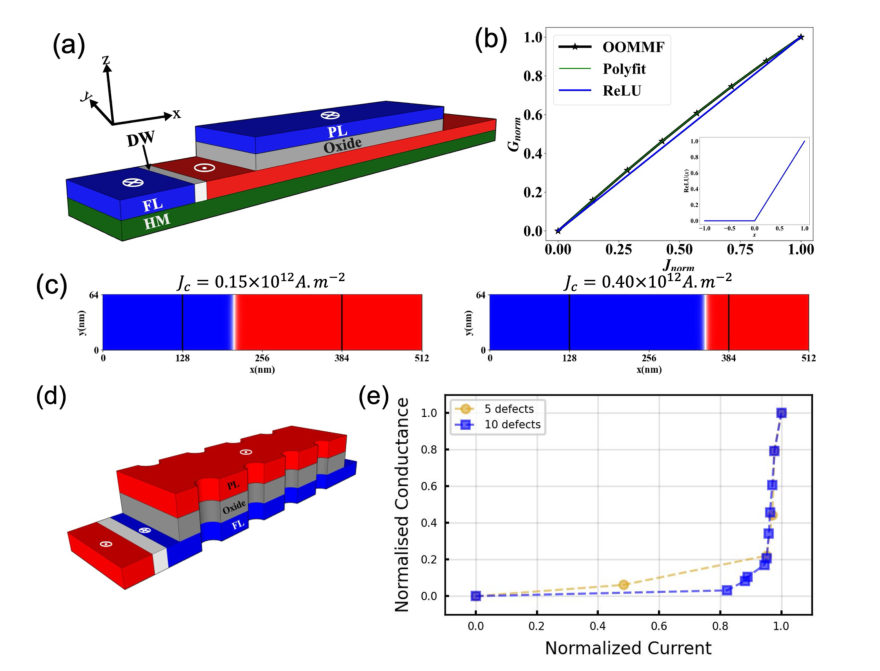 
FIG. 1. Schematic of the proposed spintronic devices to mimic both neuron and synapse. (a) Schematic 3D figure of the proposed neuron device; (b) Plot of normalized conductance vs. applied current density for the neuron, demonstrating ReLU-like activation function for the positive input. Inset shows the plot of the actual ReLU activation function for both positive as well as negative input values; (c) Two-dimensional color plot for mz on the x-y plane of the FL for Jc = 0.15 × 1012 and 0.40 × 1012 A/m2; 3D schematic of the proposed synapse device using symmetric (d) notch-type corrugation and (e) Plot of normalized conductance vs. the applied current density for the synapse using different...

📷 Fig 2

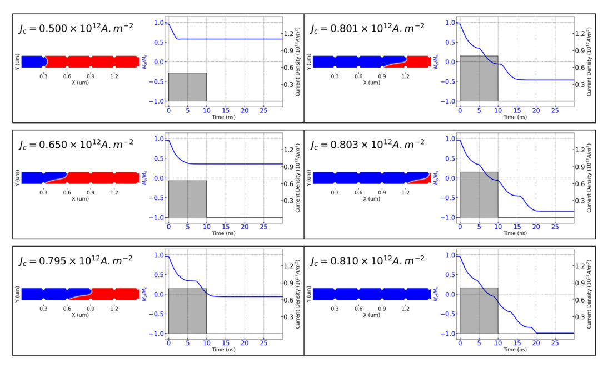 
FIG. 2. Domain wall dynamics through the corrugated magnetic nanotrack containing 5 symmetrical notches. The magnetization profile within the corrugated magnetic notches as a function of increasing current density of the 10 ns current pulse. The magnetization profile are shown in left and the corresponding time-resolved magnetization dynamics is shown at right at different current densities. The black-shaded region depicts the 10 ns current pulse with increasing current density. The step-like behaviour suggests the pinning of the domain wall at the engineered equidistant notches on the magnetic nanotrcak.

📷 Fig 3

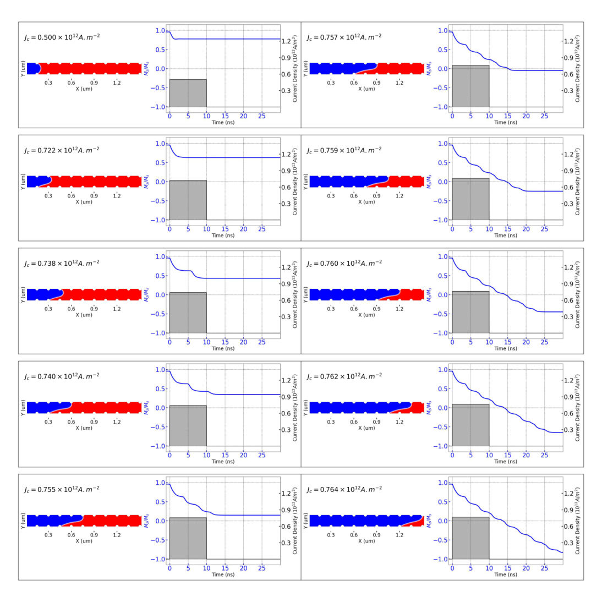 
FIG. 3. Domain wall dynamics through the corrugated magnetic nanotrack with 10 symmetrical notches. The magnetization profile within the corrugated magnetic notches as a function of increasing current density of the 10 ns current pulse are shown in left and the corresponding magnetization dynamics are shown in right at different current densities, the black-shaded region depicts the 10 ns current pulse with increasing current density in each case. The step-like behaviour suggests the pinning of the domain wall at the engineered equidistant notches on the magnetic nanotrack.

📷 Fig 4

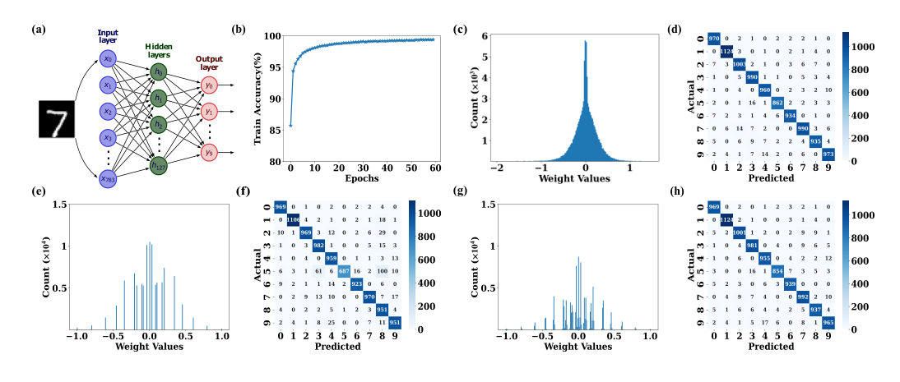 
FIG. 4. (a) Schematic of fully connected Neural Network for identifying MNIST dataset images, (b) plot of Training accuracy with epochs for FP32 weights, (c) FP32 synaptic Weight distribution from input to hidden layer, (d) Confusion Matrix for FP32 synaptic weights, (e) Synaptic weight distribution of input to hidden layer for pure quantized weights, (f) Confusion Matrix of pure quantized synaptic weights, (g) Synaptic weight distribution for the input to hidden layer fine tuning of the synaptic weights, (h) Confusion Matrix for the fine tuned synaptic weights.

📷 Fig 5

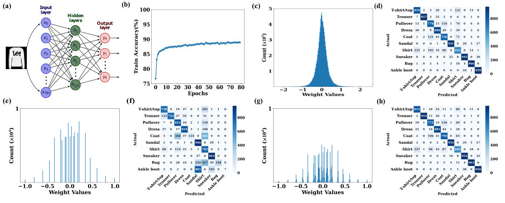 
FIG. 5. (a) Schematic of fully connected Neural Network for identifying Fashion MNIST dataset images, (b) plot of Training accuracy with epochs for FP32 weights, (c) FP32 synaptic Weight distribution from input to hidden layer, (d) Confusion Matrix for FP32 synaptic weights, (e) Synaptic weight distribution of input to hidden layer for pure quantized weights, (f) Confusion Matrix of pure quantized synaptic weights, (g) Synaptic weight distribution for the input to hidden layer fine tuning of the synaptic weights, (h) Confusion Matrix for the fine tuned synaptic weights.

**Summary.** This paper demonstrates a method to build neuromorphic hardware using the controlled movement of magnetic domain walls in spintronic devices. By using physical notches to pin domain walls, the authors created quantized synaptic weights that can perform image recognition tasks. This approach offers a path toward low-power, high-density AI hardware that mimics biological neural plasticity.

**Why it may be interesting.** not directly relevant

Detailed structure

**Main problem.** Developing energy-efficient spintronic hardware to overcome the von Neumann bottleneck by implementing artificial neurons and quantized synapses using domain wall dynamics.

**Main result.** The researchers successfully emulated ReLU activation and quantized synaptic weights using notch-induced domain wall pinning, achieving high accuracy on MNIST and Fashion MNIST datasets after fine-tuning.

**Method.** Micromagnetic simulations were performed using OOMMF and UBERMAG, while the neural network architecture was implemented and trained using PyTorch.

**Model / system.** The system consists of heavy metal/ferromagnet (HM/FM) heterostructure nanotubes where domain wall motion is driven by spin-orbit torque (SOT). Neurons use rectangular tracks for ReLU-like activation, and synapses use tracks with semicircular notches to create discrete pinning sites.

**Key observables.** Electrical conductance, domain wall position, magnetization profiles (mz), and neural network inference accuracy.

**Important parameters / regimes.** Current pulse durations of 3 ns (neuron) and 10 ns (synapse); FM layer thickness of 2 nm; DMI constant of 1-2 mJ/m2; current densities ranging from 0.1 to 0.81 x 10^12 A/m2.

**Assumptions / limitations.** The accuracy degradation is dependent on dataset complexity; the fine-tuning approach assumes that weight distributions in real hardware will fluctuate.

**Figures summary.** Figure 1 shows a 3D schematic of the neuron and conductance profiles; Figures 4 and 5 display the ANN architecture, weight distributions, and confusion matrices; Figure 6 shows misclassified images from Fashion MNIST.

**Paper structure.** The paper introduces the spintronic hardware problem, describes the physical model of the neuron and synapse, details the micromagnetic and neural network simulation methods, presents results for both FP32 and quantized weights, and concludes with a discussion on scalability and limitations.

Abstract

In this work, we simulate the functionality of artificial neuron and synapse using spin-orbit torque-based spintronic devices and implemented a fully connected artificial neural netwrok (ANN). These neuro-synaptic devices are emulated using transverse domain wall dynamics in a rectangular magnetic nanotrack comprised of heavy metal/ferromagnet (HM/FM) heterostructures. The ReLU activation function of the neuron has been mimicked using the domain wall motion induced by a 3 ns current pulse. The synapse has been modelled using current-induced domain wall (DW) dynamics through a corrugated HM/FM nanotrack under the influence of a 10 ns current pulse with varying current density. The semicircular corrugations are in the form of notches, which are symmetrically located on both sides of the nanotrack. By applying 10 ns current pulses of varying densities, we achieve controlled DW pinning, revealing a step-like motion caused by temporary pauses at each pinning center. The electrical conductance of the pinned DW across various pinning points, act as stable synaptic weights for our ANN. Furthermore, we observe a threshold-dependent delay effect where each depinning event is influenced by previous ones, successfully mimicking synaptic memory and adaptability in neuromorphic systems. The fully connected ANN has been modeled using the conventional float32 synaptic weights for the MNIST and Fashion MNIST datasets with an accuracy of ~97 % and ~86 %, respectively, which serves as a test bed of our neuromorphic simulations. With the aim of implementing a sparse and low memory footprint ANN, we quantize the trained synaptic weights into discrete quantized level and tested the network, which demonstrate an accuracy of ~95% and ~62%, for the MNIST and Fashion-MNIST dataset, respectively.

[↑ back to top](#top)

### [Topological semimetals: surface transport and spin effects](http://arxiv.org/abs/2605.22278v1)

**Authors:** E. V. Deviatov  
**Type:** both · **Category:** other · **PDF:** <https://arxiv.org/pdf/2605.22278v1>  
**Analysis basis:** full PDF text, analyzed in chunks

📷 Fig 1

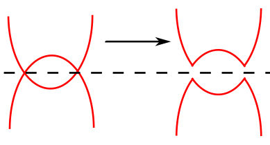 
FIG. 1. Schematic representation of the inversion of the bulk spectrum that occurs in some materials, such as Bi2Te3. In materials with band inversion, the hole band lies higher (in energy) than the electron one, precisely the opposite of the usual picture of the direct energy spectrum in a solid. Gen- erally speaking, there should be a line of intersection of the bands in momentum space (a nodal line), so the spectrum of the inverse system could be expected to be gapless (left dia- gram in the figure). However, the states on the nodal line are doubly degenerate in energy, and as it is usual in perturbation theory, any weak perturbation lifts the degeneracy and leads to repulsion of the...

📷 Fig 2

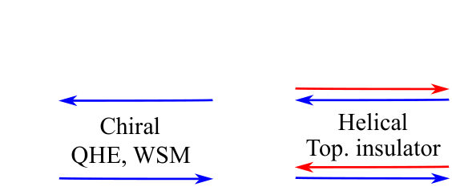 
FIG. 2. Edge state symmetry. Chiral edge states of the in- teger quantum Hall effect (QHE) [7] (left) and helical edge states of a two-dimensional topological insulator [11] (right). Each edge state of a topological insulator is a pair of QHE states propagating along the same edge of the sample in oppo- site directions [10] and, at the same time, spin-split due to the spin-momentum locking, as indicated by the different colors of the arrows. From the point of view of the edge state symme- try, a topological Weyl semimetal (WSM) is a generalization of the Chern insulator (the quantum Hall effect regime) to the three-dimensional case and zero external magnetic field [2].

📷 Fig 3

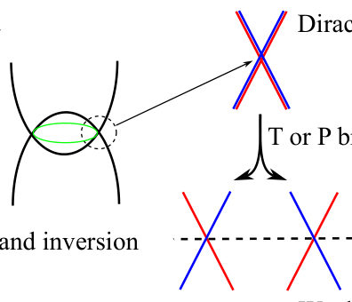 
FIG. 3. Formation of the bulk spectrum of a Weyl semimetal. Unlike a topological insulator (see Fig. 1), in the case of a topological semimetal, symmetry constraints imposed by the crystal lattice require the preservation of degeneracy at cer- tain points on the nodal line (marked in red), which are then called Dirac points. In a small neighborhood of the Dirac points, the spectrum is linear and spin-degenerate, i.e., a Dirac semimetal (for example, Cd3As2, NiTi2) is a three- dimensional analogue of graphene. For the Weyl spectrum, due to the violation of inversion symmetry P (e.g., in WTe2) or time reversal symmetry T (e.g., in Co3Sn2S2) in the crys- tal, each Dirac point, initially...

📷 Fig 4

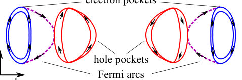 
FIG. 5. Schematic diagram of Fermi arcs in the surface Brilliant zone and spin-polarized spin pockets in the bulk spectrum for the nonmagnetic Weyl semimetal WTe2. In this material, due to the tilt of the Weyl cones (type II semimetal), bulk electrons and holes are present, similar to classical semimetals, along with counter-directed Fermi arcs on the surface connecting the projections of the Weyl nodes. The splitting line of the Weyl nodes coincides with the b-axis of the crystal, so the preferred direction of carrier propagation in counter-directed chiral arcs coincides with the a-direction in highly anisotropic WTe2. Arrows indicate spin projections, which are defined by the Weyl surface...

📷 Fig 5

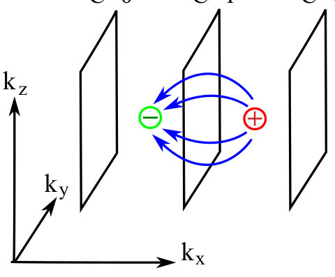 
FIG. 4. Representation of a three-dimensional Weyl semimetal as a stack of two-dimensional planes in momen- tum space [2]. For planes corresponding to kx values between the Weyl nodes, the Berry curvature is non-zero (the effective magnetic field Fn = ∇k×An is directed from one Weyl node to another). They are characterized by a non-zero Chern num- ber C ̸= 0. For each of these topologically non-trivial planes, one (C = 1) or more (for C &gt; 1) chiral one-dimensional edge states should be introduced, as is done for the usual regime of the integer quantum Hall effect in two-dimensional sys- tems. The sum of all one-dimensional chiral states forms a two-dimensional chiral surface state of the Fermi...

**Summary.** This review examines how the unique topological features of Weyl and Dirac semimetals, such as Fermi arcs and Berry curvature, manifest in electronic transport. It highlights how advanced experimental probes like the Josephson effect and nonlinear Hall measurements can isolate surface-state physics from bulk contributions. The findings suggest potential applications in high-frequency electronics and spintronics.

**Why it may be interesting.** not directly relevant

Detailed structure

**Main problem.** The central challenge is distinguishing topologically protected surface state contributions from the gapless bulk spectrum in transport measurements and understanding the origin of chiral surface states in Weyl semimetals.

**Main result.** The review demonstrates that superconducting proximity effects, spin-polarized transport, and the nonlinear anomalous Hall effect serve as powerful diagnostic tools to identify topological surface states in materials like WTe2, Co3Sn2S2, and GeTe.

**Method.** The paper reviews experimental techniques including ARPES for visualizing Fermi arcs, SNS junction measurements for Josephson current, and second-harmonic voltage measurements to isolate the nonlinear Hall effect.

**Model / system.** The study focuses on topological semimetals, specifically Weyl semimetals (WSMs), Dirac semimetals, and nodal-line semimetals, including specific materials like WTe2, Co3Sn2S2, and Fe3GeTe2.

**Key observables.** Hall resistance (linear and nonlinear), magnetoresistance, critical current (Ic), voltage-current (V-I) characteristics, and magnetization hysteresis loops.

**Important parameters / regimes.** Temperature ranges (30 mK to room temperature), magnetic field dependence, spin-momentum locking, and Berry curvature.

**Assumptions / limitations.** The difficulty in distinguishing surface transport from trivial bulk effects due to the gapless bulk spectrum is a primary experimental limitation.

**Figures summary.** Figures illustrate band inversion mechanisms, comparisons of chiral vs. helical edge states, the formation of Fermi arcs, the fabrication of contact patterns, and experimental V-I and Hall voltage characteristics.

**Paper structure.** The paper progresses from defining topological semimetals and their electronic structures to discussing specific transport phenomena including superconducting proximity effects, spin-dependent transport (spin valves), and the nonlinear anomalous Hall effect.

Abstract

For the solid state physics, recent interest to topological systems is mostly connected with topological semimetals, in particular, to Weyl ones as the most representative semimetal type. Like other topological materials, e.g. topological and Chern insulators, topological semimetals acquire topologically protected surface states with linear dispersion. In contrast to helical surface states in topological insulators, the surface states are chiral for Weyl semimetals, similarly to Chern insulators, which allows to consider Weyl semimetals as the three-dimensional analog of the quantum Hall effect regime. Weyl semimetals are also interesting for spin-dependent effects, due to the spin-momentum locking in the topological surface states. For topological semimetals, the main problem of transport investigations is to reveal the surface states contribution in the material with gapless bulk spectrum. Here, we present review of experimental results on charge and spin transport in topological semimetals: charge transport in different superconducting proximity devices; spin-dependent transport; magnetic response of the topological surface states; non-linear anomalous Hall effect as the direct manifestation of the non-zero Berry curvature in topological semimetals. Possible applications are also considered for this new class of topological materials.

[↑ back to top](#top)

### [Topologically Driven Giant Effective Spin Mixing Conductance in Antiferromagnetic FeSn/Py Heterostructures](http://arxiv.org/abs/2605.22180v1)

**Authors:** Kacho Imtiyaz Ali Khan, Nidhi Kandwal, Pankhuri Gupta, Deeksha Khandelwal, Akash Kumar, Johan Åkerman, Pranaba Kishor Muduli  
**Type:** experiment · **Category:** other · **PDF:** <https://arxiv.org/pdf/2605.22180v1>  
**Analysis basis:** full PDF text, analyzed in chunks

📷 Fig 1

 
Figure 1: (a) Schematic illustration of kagome side-view and top-view of the FeSn crystal struc- ture. (b) Rutherford backscattering spectrometry (RBS) spectrum of the FeSn thin film (open circles) along with the corresponding fit (solid red line). (c) X-ray reflectivity (XRR) spectrum of FeSn film, denoted by circle symbol and fitted with red line. The inset plot shows the zoomed-in view of XRR oscillations corresponds to the FeSn layer. (d) X-Ray Diffraction (XRD) spectra of Pt/FeSn/Py(10 nm), Pt(5 nm)/FeSn(30 nm), and Pt(5 nm)/Py(10 nm) film stack. The short dash vertical lines represent the 2θ positions of Bragg reflections corresponding to the respective planes of Pt, FeSn, and Py...

📷 Fig 2

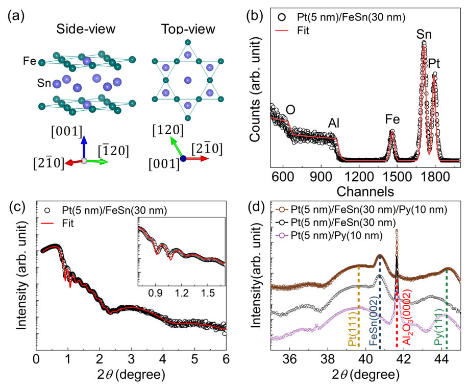 
Figure 2(a) and (b) show the FMR spectra for all thicknesses in FeSn/Py and ref-Py films measured at 4 GHz [insets represent the schematic of the film stack], respectively. These spectra were fitted with the derivative of the Lorentzian function, which consists of the symmetric and antisymmetric parts. [28, 29, 32] From the fitting, we extracted the resonance field (HR) and linewidth (∆H) as a function of f.

📷 Fig 3

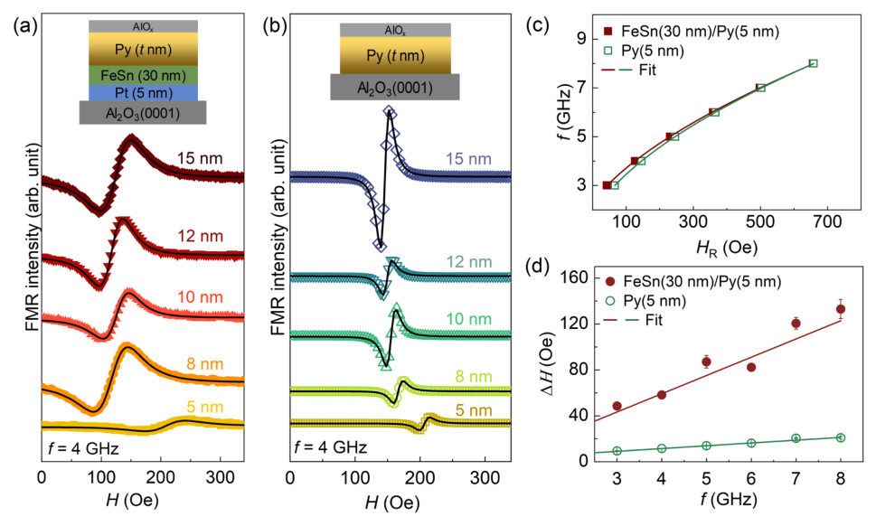 
Figure 2: Thickness-dependent ferromagnetic resonance (FMR) spectra measured at f = 4 GHz for (a) FeSn/Py(t nm) and (b) Py(t nm) films, where t = 15, 12, 10, 8, 5 nm. The insets show the schematic layer structures of the respective samples. (c) Dependence of the resonance frequency f on the resonance field HR for FeSn/Py(5 nm) heterostructure, along with the corresponding Py(5 nm) film. (d) Frequency dependence of the linewidth ∆H for the same samples. The symbols represent the experimental data, while the solid lines denote the fits.

📷 Fig 4

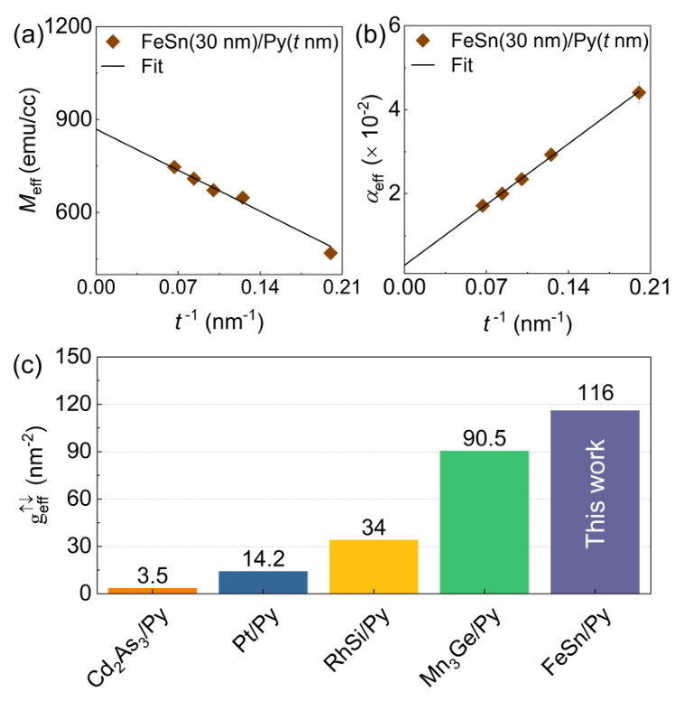 
Figure 3: Variation of (a) Meff and (b) αeff as a function of the inverse Py thickness (t) for FeSn/Py(t nm) films. The symbols represent the experimental data, while the solid black lines correspond to the fit using Eq. (3)&amp;(4). (c) Comparison of our extracted effective spin-mixing conductance (g↑↓ eff) with reported values for other Py-based bilayer heterostructures.

📷 Fig 5

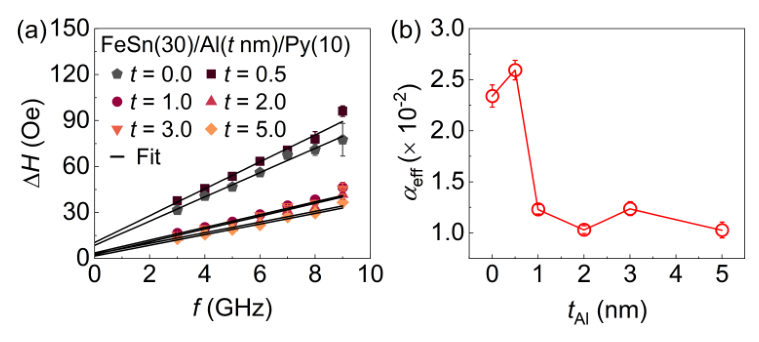 
Figure 4: (a) FMR linewidth ∆H versus f for increasing Al spacer for FeSn/Al(t nm)/Py(10 nm) trilayer heterostructures; solid lines are fit to the curve using Eqn. (2). (b) Extracted αeff as a function of Al spacer thickness.

**Summary.** This paper demonstrates that the kagome-derived topological surface states of the antiferromagnet FeSn enable a giant spin mixing conductance and highly efficient spin-to-charge conversion. This performance significantly outperforms conventional platinum-based spintronic interfaces. These findings suggest that topological semimetals are promising candidates for next-generation, energy-efficient spintronic devices.

**Why it may be interesting.** not directly relevant

Detailed structure

**Main problem.** The study investigates whether the topologically active [001]-kagome surface states of the antiferromagnetic semimetal FeSn can significantly enhance spin transport and spin-to-charge conversion compared to standard heavy-metal/ferromagnet interfaces.

**Main result.** The researchers report a giant effective spin mixing conductance of (116 +/- 7) nm^-2 in FeSn/Py heterostructures, which is nearly an order of magnitude higher than standard Pt/Py systems, attributed to the topological kagome surface.

**Method.** The study uses magnetron sputtering for heterostructure growth, Ferromagnetic Resonance (FMR) to extract spin dynamics, and Inverse Spin Hall Effect (ISHE) measurements to quantify spin-to-charge conversion.

**Model / system.** The physical system consists of epitaxial FeSn/Py (Ni80Fe20) heterostructures grown on Al2O3(0001) substrates, where FeSn is a kagome-lattice antiferromagnet featuring 3D Dirac fermions and 2D flat bands.

**Key observables.** Effective spin mixing conductance (g_eff_up_down), Gilbert damping (alpha), Inverse Spin Hall Effect voltage (V_ISHE), and spin-to-charge conversion efficiency (I_C).

**Important parameters / regimes.** Fe:Sn stoichiometry (52:48 at.%), Py thickness (5-15 nm), Al spacer thickness (0.5-5 nm), and Neel temperature (~368 K).

**Assumptions / limitations.** The study assumes the enhancement is interfacial, which is verified by the reduction in damping upon inserting an Al spacer layer.

**Figures summary.** Figure S1 shows the dependence of resonance frequency and linewidth on the resonance field and Py layer thickness for both FeSn/Py and reference Py stacks.

**Paper structure.** The paper introduces the topological properties of FeSn, describes the experimental growth and structural characterization (XRD, RBS, XRR), presents FMR and ISHE results to demonstrate giant spin mixing conductance, uses an Al spacer to prove the interfacial origin, and concludes with the implications for spintronics.

Abstract

The topological semimetal FeSn antiferromagnet, characterized by its kagome lattice, two-dimensional flat bands, and Dirac-like surface states, holds immense promise for spintronic applications. In this work, for the first time, we investigate the spin pumping behavior in epitaxial-FeSn/Py (Ni$_{80}$Fe$_{20}$) heterostructures. We report a giant effective spin mixing conductance (g$^{\uparrow \downarrow}_{\mathrm{eff}}$) of $(116\pm 7)$~nm$^{-2}$, which is nearly one order of magnitude higher than that of standard Pt/Py heterostructures. The insertion of a 3 nm Al spacer layer results in a two-fold reduction in the effective damping, confirming the interfacial origin of the large g$^{\uparrow\downarrow}_{\mathrm{eff}}$. Consistently, we observe an order-of-magnitude higher inverse spin Hall effect voltage in the FeSn/Py system compared to a reference Pt/Py film stack. We attribute the giant g$^{\uparrow\downarrow}_{\mathrm{eff}}$ to the direct interfacing of the Py layer with the topologically active [001]-kagome surface of epitaxial-FeSn. These findings establish the critical role of topologically active interfaces for advanced quantum-material-based spintronic devices.

[↑ back to top](#top)

