
# arxiv digest (quant-ph + cond-mat) — 2026-05-25

*102 papers · 28 relevant · 1 highlighted*

## 🔥 Most relevant (28)

*Every paper with at least one nonzero topic score, sorted by best-matching score. 🔥 marks scores ≥4/5. Click the title to jump to the full entry below; click [arXiv] to open the paper page. `(secondary)` marks papers from de-prioritized cond-mat archives.*

Show 28 relevant papers

- [Time crystals in cavity-BEC systems](#paper-2605.23881) [[arXiv]](http://arxiv.org/abs/2605.23881v1) — 🔥 `driven-dissipative phase transition` **5/5** · 🔥 `Tavis-Cummings & cavity-many-emitter` **4/5** · 🔥 `correlated cavity matter` **4/5** · 🔥 `non-equilibrium dynamics` **4/5** · `Dicke superradiance` **3/5** · `analog quantum simulation` **3/5** · `non-equilibrium universality` **3/5** · `Keldysh / 2PI / non-Gaussian methods` **2/5** · `correlated / nonlocal dissipation` **2/5** · `exotic spin models in light-matter` **2/5** · `methods for driven-dissipative` **2/5**
- [Non-Local and Non-Markovian Effects of a Microscopic Two-Level Defect in Superconducting Quantum Circuits](#paper-2605.23385) [[arXiv]](http://arxiv.org/abs/2605.23385v1) — 🔥 `QC/QI experiment` **5/5** · 🔥 `correlated / nonlocal dissipation` **4/5** · `Kondo & dissipative impurity` **2/5** · `entanglement & information structure` **2/5** · `non-equilibrium dynamics` **2/5**
- [Coherent dynamics in chaotic spin chains via interference-protected subspaces](#paper-2605.23873) [[arXiv]](http://arxiv.org/abs/2605.23873v1) — 🔥 `scars & prethermalization` **5/5** · 🔥 `non-equilibrium dynamics` **4/5** · `entanglement & information structure` **3/5**
- [Chaos to Synchronization and Dissipative Quantum Scarring in Open Coupled top-Dicke model in a Lossy Cavity](#paper-2605.22953) [[arXiv]](http://arxiv.org/abs/2605.22953v1) — 🔥 `Tavis-Cummings & cavity-many-emitter` **4/5** · 🔥 `driven-dissipative phase transition` **4/5** · 🔥 `scars & prethermalization` **4/5** · `Dicke superradiance` **3/5** · `correlated / nonlocal dissipation` **3/5** · `correlated cavity matter` **3/5** · `methods for driven-dissipative` **3/5** · `non-equilibrium dynamics` **3/5** · `quantum measurements` **2/5**
- [Quantum viscosity mechanism of the dissipative dynamics in the Dicke model expressed via Lindblad equation of motion](#paper-2605.23322) [[arXiv]](http://arxiv.org/abs/2605.23322v1) — 🔥 `Dicke superradiance` **4/5** · 🔥 `Tavis-Cummings & cavity-many-emitter` **4/5** · `correlated / nonlocal dissipation` **3/5** · `correlated cavity matter` **3/5** · `driven-dissipative phase transition` **3/5** · `methods for driven-dissipative` **3/5** · `non-equilibrium dynamics` **3/5** · `Keldysh / 2PI / non-Gaussian methods` **2/5**
- [Probing Chaos and Criticality with Observational Entropy and Finite-Resolution Measurements](#paper-2605.23585) [[arXiv]](http://arxiv.org/abs/2605.23585v1) — 🔥 `entanglement & information structure` **4/5** · 🔥 `non-equilibrium dynamics` **4/5** · 🔥 `quantum measurements` **4/5** · `non-equilibrium universality` **3/5** · `analog quantum simulation` **2/5** · `driven-dissipative phase transition` **2/5** · `measurement-induced transitions` **2/5** · `scars & prethermalization` **2/5**
- [Observation of associative-memory retrieval and spin-glass phases on a photonic quantum simulator](#paper-2605.22922) [[arXiv]](http://arxiv.org/abs/2605.22922v1) — 🔥 `QC/QI experiment` **4/5** · 🔥 `analog quantum simulation` **4/5** · 🔥 `exotic spin models in light-matter` **4/5** · 🔥 `quantum optics experiment` **4/5** · `driven-dissipative phase transition` **2/5** · `interference shaping light` **2/5** · `non-equilibrium dynamics` **2/5**
- [Scale-Invariant Open Quantum Systems](#paper-2605.22919) [[arXiv]](http://arxiv.org/abs/2605.22919v1) — 🔥 `Keldysh / 2PI / non-Gaussian methods` **4/5** · 🔥 `non-equilibrium universality` **4/5** · `driven-dissipative phase transition` **3/5** · `methods for driven-dissipative` **3/5** · `non-equilibrium dynamics` **3/5** · `Kondo & dissipative impurity` **2/5** · `entanglement & information structure` **2/5**
- [Quantum Fisher Information under decoherence with explicit wavefunctions](#paper-2605.22917) [[arXiv]](http://arxiv.org/abs/2605.22917v1) — 🔥 `methods for driven-dissipative` **4/5** · `entanglement & information structure` **3/5** · `Dicke superradiance` **2/5** · `Keldysh / 2PI / non-Gaussian methods` **2/5** · `driven-dissipative phase transition` **2/5** · `non-equilibrium dynamics` **2/5** · `quantum measurements` **2/5**
- [Entanglement-facilitated macroscopic cluster formation in quantum many-body dynamics](#paper-2605.22947) [[arXiv]](http://arxiv.org/abs/2605.22947v1) — 🔥 `entanglement & information structure` **4/5** · 🔥 `non-equilibrium dynamics` **4/5** · `Rydberg arrays` **2/5** · `analog quantum simulation` **2/5** · `non-equilibrium universality` **2/5** · `scars & prethermalization` **2/5**
- [Phase-dependent role of dissipation across the Aubry-André-Harper transition](#paper-2605.22966) [[arXiv]](http://arxiv.org/abs/2605.22966v1) — 🔥 `non-equilibrium dynamics` **4/5** · `driven-dissipative phase transition` **3/5** · `methods for driven-dissipative` **3/5** · `Keldysh / 2PI / non-Gaussian methods` **2/5** · `Kondo & dissipative impurity` **2/5** · `correlated / nonlocal dissipation` **2/5**
- [Quantum Quenches that Resemble Operator Growth](#paper-2605.23874) [[arXiv]](http://arxiv.org/abs/2605.23874v1) — 🔥 `entanglement & information structure` **4/5** · 🔥 `non-equilibrium dynamics` **4/5** · 🔥 `scars & prethermalization` **4/5** · `non-equilibrium universality` **3/5**
- [Entanglement entropy across the dynamical phase transition in the quantum $\mathcal{O}(N)$ model](#paper-2605.23600) [[arXiv]](http://arxiv.org/abs/2605.23600v1) — 🔥 `entanglement & information structure` **4/5** · 🔥 `non-equilibrium dynamics` **4/5** · `driven-dissipative phase transition` **3/5** · `non-equilibrium universality` **3/5**
- ⭐ [Interference of local-measurement histories](#paper-2605.23232) [[arXiv]](http://arxiv.org/abs/2605.23232v1) — 🔥 `quantum measurements` **4/5** · `entanglement & information structure` **3/5** · `correlated / nonlocal dissipation` **2/5** · `measurement-induced transitions` **2/5** · `non-equilibrium dynamics` **2/5**
- [A new Ising/tricritical-Ising interface: From ${W}_3$ symmetry to Rydberg atoms](#paper-2605.23848) [[arXiv]](http://arxiv.org/abs/2605.23848v1) — 🔥 `Rydberg arrays` **4/5** · `analog quantum simulation` **3/5** · `exotic spin models in light-matter` **3/5** · `entanglement & information structure` **2/5**
- [Information transfer along the causal lightcone of a brickwork quantum circuit](#paper-2605.23622) [[arXiv]](http://arxiv.org/abs/2605.23622v1) — 🔥 `entanglement & information structure` **4/5** · 🔥 `non-equilibrium dynamics` **4/5** · `methods for driven-dissipative` **2/5** · `scars & prethermalization` **2/5**
- [Unified resonant-manifold framework for dynamical quantum phase transitions](#paper-2605.22915) [[arXiv]](http://arxiv.org/abs/2605.22915v1) — 🔥 `non-equilibrium dynamics` **4/5** · `driven-dissipative phase transition` **3/5** · `non-equilibrium universality` **3/5** · `entanglement & information structure` **2/5**
- [Anomalous Decay of Quantum Resources: The Entanglement Sudden Death Mpemba Effect](#paper-2605.23197) [[arXiv]](http://arxiv.org/abs/2605.23197v1) — 🔥 `entanglement & information structure` **4/5** · `correlated / nonlocal dissipation` **2/5** · `methods for driven-dissipative` **2/5** · `non-equilibrium dynamics` **2/5**
- [Quantum Simulation of Energy Bifurcation and Z_2-Symmetry Restoration in Macroscopic Quantum Tunneling](#paper-2605.23413) [[arXiv]](http://arxiv.org/abs/2605.23413v1) — 🔥 `analog quantum simulation` **4/5** · `correlated cavity matter` **3/5** · `exotic spin models in light-matter` **2/5**
- [Estimating Green's functions with a robust quantum Arnoldi method](#paper-2605.22920) [[arXiv]](http://arxiv.org/abs/2605.22920v1) — 🔥 `Kondo & dissipative impurity` **4/5** · `methods for driven-dissipative` **2/5** · `non-equilibrium dynamics` **2/5**
- [Weak wave turbulence as a precursor to universal coarsening in a homogeneous Bose gas](#paper-2605.22906) [[arXiv]](http://arxiv.org/abs/2605.22906v1) — 🔥 `non-equilibrium dynamics` **4/5** · 🔥 `non-equilibrium universality` **4/5**
- [Localized Excitonic Emission in Wafer-Scale MOCVD-Grown GaSe 2D Nanosheets for Classical and Non-Classical Light Sources](#paper-2605.23418) [[arXiv]](http://arxiv.org/abs/2605.23418v1) `(secondary)` — 🔥 `quantum optics experiment` **4/5** · `QC/QI experiment` **3/5**
- [Quantum resource redistribution drives spectral splits in dense neutrino gases](#paper-2605.23584) [[arXiv]](http://arxiv.org/abs/2605.23584v1) — 🔥 `entanglement & information structure` **4/5** · `non-equilibrium dynamics` **3/5**
- [A Compilation Framework for Quantum Simulation of Non-unitary Dynamics](#paper-2605.23358) [[arXiv]](http://arxiv.org/abs/2605.23358v1) — 🔥 `methods for driven-dissipative` **4/5** · `non-equilibrium dynamics` **2/5**
- [Minimal Trade-off and Optimal Measurement for Multiparameter Quantum Estimation](#paper-2605.23514) [[arXiv]](http://arxiv.org/abs/2605.23514v1) — 🔥 `quantum measurements` **4/5** · `entanglement & information structure` **2/5**
- [Twirled Perfect Tensor Networks: Computationally covariant holographic tensor networks](#paper-2605.23670) [[arXiv]](http://arxiv.org/abs/2605.23670v1) — 🔥 `entanglement & information structure` **4/5** · `methods for driven-dissipative` **2/5**
- [Kondo singlet from ferromagnetic coupling: an analog of Anderson-Morel superconductivity in the magnetic channel](#paper-2605.23755) [[arXiv]](http://arxiv.org/abs/2605.23755v1) — 🔥 `Kondo & dissipative impurity` **4/5**
- [The negativity core of a 1+1D massless scalar quantum field](#paper-2605.23824) [[arXiv]](http://arxiv.org/abs/2605.23824v1) — 🔥 `entanglement & information structure` **4/5**

## ⭐ Highlighted (1)

*Papers by authors on your watch list. Click the title to jump to the full entry below; click [arXiv] to open the paper page.*

Show 1 highlighted papers

- ⭐ [Interference of local-measurement histories](#paper-2605.23232) [[arXiv]](http://arxiv.org/abs/2605.23232v1) — Yuval Gefen

## All papers (69, sorted by relevance)

*Papers from quant-ph and your primary cond-mat archives (quant-gas, stat-mech, str-el, dis-nn). Highlighted papers (⭐) come first, then everything else sorted by topic-relevance score, highest first.*

### ⭐ [Interference of local-measurement histories](http://arxiv.org/abs/2605.23232v1)

**Highlighted author(s):** Yuval Gefen  
**Authors:** Parveen Kumar, Igor V. Gornyi, Yuval Gefen  
**Type:** theory · **Category:** quantum information and computing · **PDF:** <https://arxiv.org/pdf/2605.23232v1>  
**Analysis basis:** full PDF text, analyzed in chunks
**Topic relevance:** 🔥 `quantum measurements` **4/5** · `entanglement & information structure` **3/5** · `correlated / nonlocal dissipation` **2/5** · `measurement-induced transitions` **2/5** · `non-equilibrium dynamics` **2/5**

📷 Fig 1

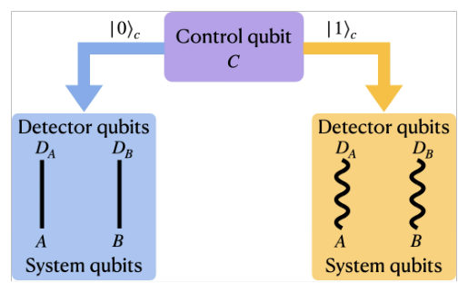 
Figure 1. Coherently controlled measurement histories. The control qubit C selects between two alternative branches of local measurements acting on system qubits A and B. The left (right) branch corresponds to the measurement-induced history conditioned on |0⟩C (|1⟩C). The respective solid and wiggly interaction lines denote that the local measurement Hamiltonians in the two branches may differ, corresponding to distinct measurement observables. After postselection of the control, amplitudes associated with the two histories interfere. This interference occurs within each fixed detector-readout sector, while different readout sectors remain orthogonal and combine incoherently.

📷 Fig 2

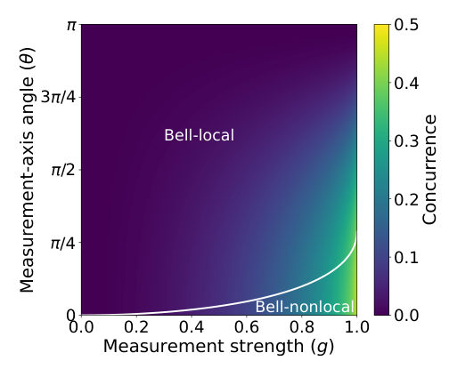 
Figure 2. Concurrence Cavg(g, θ) [cf. Eq. (16)] of the readout- averaged state for the two-qubit example, as a function of measurement strength g and angle θ. The solid white curve denotes the CHSH Bell-nonlocality boundary γ(g, θ) = 1, ob- tained from the Horodecki criterion for two-qubit states [58]. The figure shows two distinct regimes: an entangled but Bell- local region (γ ≤1) and a Bell-nonlocal region (γ &gt; 1), cf. Appendix D. Although entanglement is generated over a broad parameter range, the concurrence remains strictly below unity for all g and θ, consistent with the constraint im- posed by readout averaging.

**Summary.** The paper shows that interference between different sequences of local measurements can create entanglement between two qubits. While the entanglement is limited when measurement outcomes are averaged, the protocol can still produce Bell nonlocality, providing a new way to generate quantum correlations.

**Why it may be interesting.** This work is highly relevant for open quantum systems and quantum optics as it identifies a new mechanism for generating entanglement through non-unitary, measurement-driven dynamics, extending the concept of quantum interference beyond unitary evolution.

Detailed structure

**Main problem.** Investigating whether two different histories of quantum evolution, composed of local measurements, can interfere with each other to generate quantum correlations.

**Main result.** The authors demonstrate that interference between measurement-induced histories can generate entanglement and Bell nonlocality, even when the individual measurement branches are non-entangling.

**Method.** The study uses Kraus operators to describe measurement-induced evolution and employs a protocol involving an auxiliary control qubit to place measurement branches in a coherent superposition.

**Model / system.** A bipartite system of two qubits (A and B) initially in a separable state, subject to local generalized measurements controlled by an auxiliary qubit (C).

**Key observables.** Concurrence (to measure entanglement) and the CHSH parameter/Horodecki criterion (to measure Bell nonlocality).

**Important parameters / regimes.** Measurement strength (g), measurement-axis rotation angle (theta), and the postselection of the control qubit state.

**Assumptions / limitations.** The proof of the impossibility of maximal entanglement after averaging assumes that the resulting averaged state must be pure to reach maximal entanglement.

**Figures summary.** Figure 1 provides a schematic of the protocol, illustrating how a control qubit selects between two measurement branches on qubits A and B.

**Paper structure.** The paper introduces the problem of measurement-history interference, presents a protocol using a control qubit, analyzes entanglement generation in postselected and averaged regimes, provides a microscopic Hamiltonian derivation, and concludes with a mathematical proof regarding the limits of entanglement.

Abstract

The evolution of a quantum system comprises two fundamental processes--continuous unitary dynamics and stochastic measurement-induced jumps. The latter are often viewed as a source of decoherence. Can two histories of such an evolution, made up of local measurements, interfere with each other? Here, we answer this question in the affirmative. A manifestation of this interference is the generation of entanglement between two parts of the system that are individually coupled to distinct detectors. Specifically, we develop a protocol in which two alternative local measurement processes act on a pair of qubits, and show how interference of histories is generated under coherent control, leading to entanglement. Furthermore, we find that averaging over the detectors' readouts still results in an entangled (albeit not maximally entangled) state. Our results extend the notion of quantum interference beyond unitary evolution to genuinely measurement-driven dynamics, and identify limits on the generation of quantum correlations using interference of measurement histories.

[↑ back to top](#top)

### [Time crystals in cavity-BEC systems](http://arxiv.org/abs/2605.23881v1)

**Authors:** Jayson G. Cosme, Ludwig Mathey  
**Type:** theory · **Category:** other · **PDF:** <https://arxiv.org/pdf/2605.23881v1>  
**Analysis basis:** full PDF text, analyzed in chunks
**Topic relevance:** 🔥 `driven-dissipative phase transition` **5/5** · 🔥 `Tavis-Cummings & cavity-many-emitter` **4/5** · 🔥 `correlated cavity matter` **4/5** · 🔥 `non-equilibrium dynamics` **4/5** · `Dicke superradiance` **3/5** · `analog quantum simulation` **3/5** · `non-equilibrium universality` **3/5** · `Keldysh / 2PI / non-Gaussian methods` **2/5** · `correlated / nonlocal dissipation` **2/5** · `exotic spin models in light-matter` **2/5** · `methods for driven-dissipative` **2/5**

📷 Fig 1

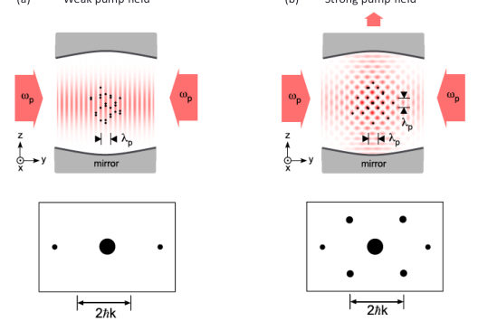 
FIG. 1. As the platform for creating time crystals, we consider a cavity-BEC system that is pumped from the transverse direction. For weak pump field, panel (a), the standing field of the retroreflected pump beam creates a weak optical lattice. In momentum space, shown in the lower panel, two side peaks are generated at ±2kez, in addition to the condensate peak at k = 0. The cavity is essentially silent. For a strong pump field, the system forms a superradiant state. The atoms form a checkerboard lattice, generating additional side peaks at ±key ± kez, shown in the lower panel. The cavity mode is activated, leading to photoemission through the semitransparent mirror. The transition from the...

📷 Fig 2

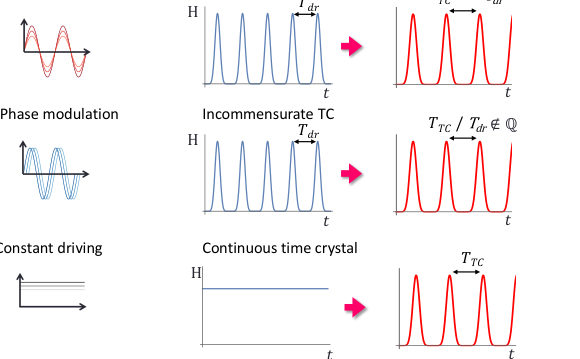 
FIG. 2. We discuss three time crystalline states, emerging in a cavity-BEC system. By modulating the intensity of the pump beam, we induce a commensurate, discrete time crystal. By modulating the phase of the pump beam, we induce an incommensurate time crystal. For continuous driving, we induce a continuous time crystal. These time crystalline states are defined via the time-dependent correlation functions of the cavity mode and specific atomic modes, as we discuss in this review.

📷 Fig 3

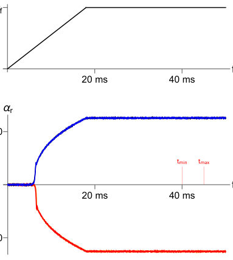 
FIG. 3. To illustrate the dynamical evolution in terms of trajectories, we show the linear ramp into the Dicke ordered state. In panel (a) we show the pump protocol, which is linear up to a time tramp = 18 ms, and constant after that at ϵp(t) = ϵf = 3.3. In panel (b) we show several trajectories αr(t), generated by the Heisenberg-Langevin equations Eqs. 9 –11. They display dynamical Z2 symmetry breaking, and then settle in one of the two ordered states.

📷 Fig 4

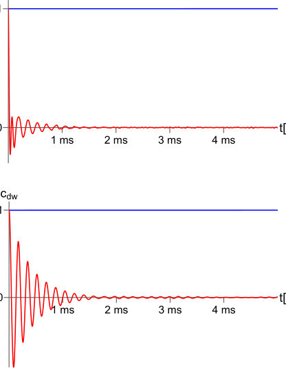 
FIG. 4. In panel (a) we show the real part of the correlation function of the photon mode cph(t) for the ordered (blue) and disordered state (red). The ordered state has been generated with ϵf = 3.3, based on the protocol shown in Fig. 3 (a), and the disordered state has been generated with ϵf = 0.3. In panel (b) we show the correlation function of the checker- board density order cdw(t) for the ordered (blue) and disor- dered state (red). The fast decay to zero for the disordered state, or to a non-zero value for long times, for the ordered state, indicates temporal short-range or long-range order, re- spectively.

📷 Fig 5

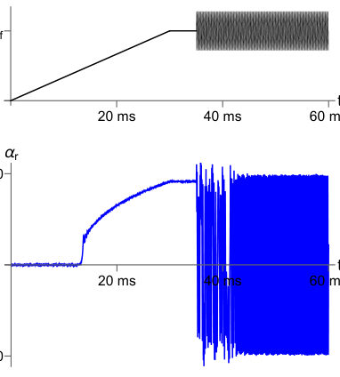 
FIG. 5. In panel (a) we display the ramp and driving protocol. The intensity is first ramped up to a value ϵf = 3.3 in the superradiant state. After that, the intensity is modulated, with a relative amplitude f0 = 0.28, and a driving frequency ωdr = 2π × 10 kHz. In panel (b) we display a trajectory of the real part of the photon field. After the intensity driving is turned on, the system first displays a transient regime, and then settles into a discrete time crystalline state, which is commensurate to the driving frequency. Specifically it is a period-doubling state.

**Summary.** This review paper explores the emergence of different types of time crystals in a Bose-Einstein Condensate coupled to an optical cavity. It demonstrates how varying the driving protocol (intensity, phase, or constant driving) can induce commensurate, incommensurate, or continuous time crystalline phases. The work highlights the utility of atom-cavity systems as powerful platforms for simulating complex dynamical phenomena.

**Why it may be interesting.** It provides a blueprint for using cavity-BEC systems as versatile quantum simulators for complex non-equilibrium phenomena and explores the emergence of exotic time-translation symmetry breaking in open quantum systems.

Detailed structure

**Main problem.** The study aims to identify, characterize, and classify three distinct types of time crystalline states (commensurate, incommensurate, and continuous) emerging in driven-dissipative cavity-BEC systems.

**Main result.** The authors demonstrate that cavity-BEC systems can host various time crystals, ranging from period-doubling states induced by intensity modulation to continuous time crystals occurring under constant driving, and show that long-range order is achieved in the thermodynamic limit.

**Method.** The study uses semiclassical dynamics via Heisenberg-Langevin equations, numerical integration with the Heun algorithm, and quantum-classical rescaling to investigate the thermodynamic limit.

**Model / system.** The system consists of a Bose-Einstein Condensate (BEC) inside a high-finesse optical cavity under transverse pumping, which can be mapped onto the open Dicke model using two-mode or three-mode expansions.

**Key observables.** Cavity mode photon correlation functions (c_ph), checkerboard density wave correlation functions (c_dw), and bond density wave correlation functions (c_bdw).

**Important parameters / regimes.** Pump intensity, cavity detuning, photon decay rate (kappa), and the atom number (N_a) used for scaling to the thermodynamic limit.

**Assumptions / limitations.** The system is treated in the dispersive regime where atoms occupy a single internal state, and the dynamics are approximated using a few-mode expansion (two-mode or three-mode).

**Figures summary.** Figures illustrate the physical regimes of the pump field, the momentum-space distribution of atoms, the driving protocols for different time crystals, trajectories of the cavity field, and parametric representations of correlation functions in the complex plane.

**Paper structure.** The paper begins by introducing the cavity-BEC platform and the Dicke transition, then progresses through the review of three specific time crystalline states (commensurate, incommensurate, and continuous) using increasing model complexity, and concludes with a summary of the characterization framework and the thermodynamic limit.

Abstract

The understanding of light-induced dynamical states continues to be a challenging and fruitful pursuit of science. This pursuit is supported by quantum simulation of dynamical phenomena, e.g., in ultracold atom systems. Typically, ultracold atom dynamics are read out destructively, via time-of-flight imaging, limiting a detailed analysis. However, atom-cavity systems provide a real-time readout of the photonic state via photon emission from the cavity, making the system ideally suited for the simulation of dynamical phenomena. Here, we review three distinct time crystalline states, predicted and realized in a cavity-BEC system. We give an example for each of them, based on minimal few-mode models. We characterize the time crystalline states via correlation functions of the cavity mode, and characteristic momentum modes of the condensate. This supports a clear distinction between these time crystals. More generally, the sequence of studies reviewed here, serves as a blueprint for setting up minimal models and their characterization, for dynamical phenomena.

[↑ back to top](#top)

### [Non-Local and Non-Markovian Effects of a Microscopic Two-Level Defect in Superconducting Quantum Circuits](http://arxiv.org/abs/2605.23385v1)

**Authors:** Yang Gao, Yujia Zhang, Huikai Xu, Pan Shi, Feiyu Li, Yaqing Feng, Weijie Sun, Jiayu Ding, Yang Liu, He Wang, Ruixia Wang, Zhen Yang, Yirong Jin, Haifeng Yu, Fei Yan  
**Type:** experiment · **Category:** quantum information and computing · **PDF:** <https://arxiv.org/pdf/2605.23385v1>  
**Analysis basis:** full PDF text, analyzed in chunks
**Topic relevance:** 🔥 `QC/QI experiment` **5/5** · 🔥 `correlated / nonlocal dissipation` **4/5** · `Kondo & dissipative impurity` **2/5** · `entanglement & information structure` **2/5** · `non-equilibrium dynamics` **2/5**

📷 Fig 1

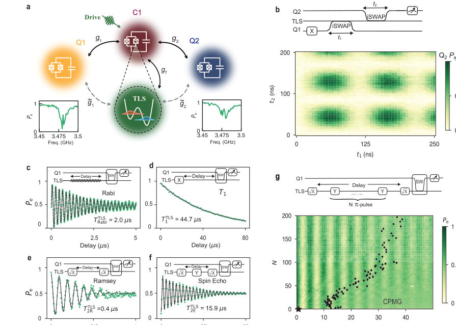 
FIG. 1. Characterization of a microscopic defect residing in a tunable coupler. a, Experimental setup: two transmon qubits (separated by more than 1 mm in physical distance) coupled via a frequency-tunable transmon coupler hosting a TLS within a Josephson junction. Effective TLS-qubit couplings (˜g1, ˜g2) arise from interactions mediated by the coupler (gT: TLS-coupler; g1,g2: qubit-coupler). Microwave pulses applied to the coupler directly drive the TLS via the cross-resonance effect. b, Verification of the shared TLS: sequential iSWAP operations transferring an excitation from Q1 to TLS to Q2 by tuning the qubits into resonance with the TLS. Maximum Q2 excitation is achieved when pulse...

📷 Fig 2

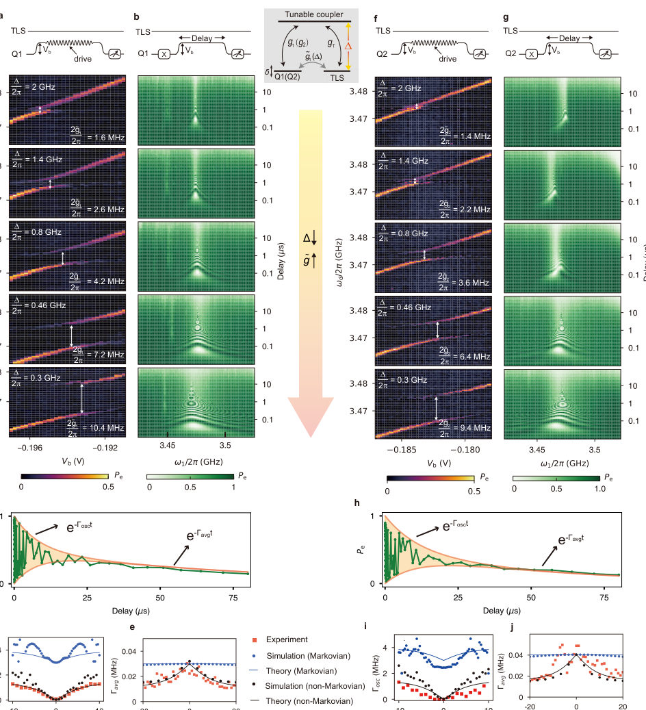 
FIG. 2. Coupler-assisted TLS-qubit coupling. a, Spectroscopy of Q1 versus flux bias (pulse sequence illustrated above) for varying coupler-qubit detunings ∆while Q2 is biased far away from the relevant region. Avoided crossings in the spectrum (top to bottom) demonstrate enhanced ˜g1 as ∆decreases, accompanied by TLS frequency shift due to level repulsion from the coupler. The corresponding level diagram is illustrated in the inset in the top center. b, Qubit dynamics under the T1 relaxation protocol for varying qubit frequencies near the TLS resonance (pulse sequence illustrated above). Increased coupling accelerates qubit-TLS energy exchange and broadens the spectral interaction range...

📷 Fig 3

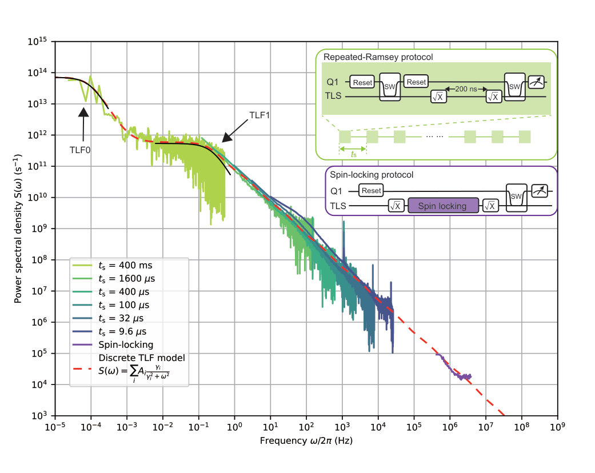 
FIG. 3. Power spectral density of the TLS dephasing noise. Multi-colored lines: noise PSD (0.1 mHz–10 kHz) derived from repeated Ramsey experiments of various sampling rates (1/ts). Purple dots: noise PSD (∼1 MHz) derived from spin- locking experiments. Red dashed line: added-up noise spectrum of several independent TLFs, with each Lorentzian spectrum plotted in black lines. Shown in the insets are the repeated-Ramsey and spin-locking protocols. We perform reset operations on both qubit and TLS when implementing the repeated-Ramsey protocol for high repetition rates (&gt;100 kHz). The delay time between two √

📷 Fig 4

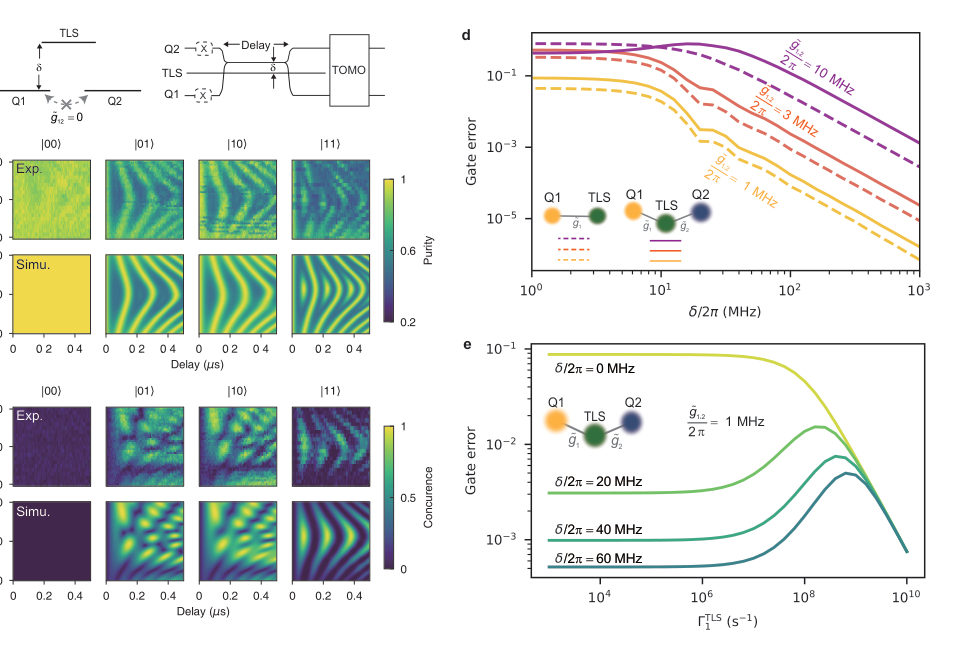 
FIG. 4. Correlated qubit dynamics induced by TLS. a, Pulse sequence to measure the concurrence and purity of a two-qubit system. First tuned the coupler to decouple the qubits, then qubits Q1 and Q2 are prepared in one of the initial states: |00⟩, |01⟩, |10⟩, or |11⟩. The qubits are next brought into resonance with TLS, δ represents the qubit frequency detuning from the TLS. After a variable delay, the two-qubit density matrix ρ is measured using state tomography. b, Purity and c, Concurrence derived from state tomography. The top row of subplots shows the purity and concurrence extracted from measured density matrices for each initial state under different detuning δ and delays, while the...

**Summary.** The study reveals that a single microscopic defect in a superconducting coupler can simultaneously affect multiple distant qubits. By tuning the coupler, the researchers controlled the defect's impact, uncovering non-local correlated errors and non-Markovian dynamics. This finding is crucial for designing scalable quantum computers where defects in coupling elements can act as shared error sources.

**Why it may be interesting.** This paper is highly relevant for open quantum systems researchers as it provides an experimental realization of non-Markovian, non-local noise and explores the transition between Zeno and anti-Zeno regimes in a multi-qubit architecture.

Detailed structure

**Main problem.** Investigating how a single microscopic two-level system (TLS) embedded in a tunable coupler induces non-local, non-Markovian, and correlated decoherence in spatially separated superconducting qubits.

**Main result.** The researchers demonstrated a shared TLS that couples to two distant qubits, showing that its impact can be tuned via the coupler frequency, leading to non-Markovian dephasing and correlated qubit dynamics.

**Method.** The study uses spectroscopy, time-domain iSWAP operations, noise spectroscopy (repeated Ramsey and spin-locking), and quantum process tomography on a 72-qubit superconducting processor.

**Model / system.** A superconducting quantum processor featuring two frequency-tunable transmon qubits connected via a frequency-tunable transmon coupler, with a single TLS located within the coupler's Josephson junction tunnel barrier.

**Key observables.** TLS frequency, coupling strengths (g1, g2, gT), coherence times (T1, T2), noise power spectral density (PSD), qubit purity, and concurrence.

**Important parameters / regimes.** Dispersive regime (large detuning), TLS frequency (~3.48 GHz), noise spectrum spanning 0.1 mHz to 1 MHz, and the Zeno/anti-Zeno regimes of TLS dissipation.

**Assumptions / limitations.** The TLS is assumed to be located within the coupler's junction barrier and follows a 1/f-like noise profile modeled by independent two-level fluctuators.

**Figures summary.** Figure 1 shows the experimental setup; Figure 3 displays the TLS dephasing noise power spectral density; Figure 4 illustrates the pulse sequence for measuring concurrence and purity.

**Paper structure.** The paper introduces the problem of TLS-induced decoherence, describes the experimental platform and TLS identification, details the measurement of non-local and tunable coupling, presents noise spectroscopy results, and concludes with implications for scalable architecture design.

Abstract

Microscopic two-level systems (TLS) -- ubiquitous atomic-scale defects in solid-state quantum devices -- are a dominant source of qubit decoherence, yet their role is often considered local and short-memoried. Here, we report the observation of a coherent TLS that couples simultaneously to two spatially distant superconducting qubits. The TLS is identified to reside within the tunable coupler linking the qubits, enabling controllability of the TLS-qubit coupling strength via coupler frequency -- a capability absent in earlier studies. This tunability allows us to systematically probe how TLS distorts qubit dynamics, revisiting the decoherence model in the presence of non-Markovian TLS dephasing noise. This is corroborated by the reconstructed $1/f$ noise spectrum of TLS frequency fluctuation spanning more than ten orders of magnitude (0.1\,mHz -- 1\,MHz) that reveals discrete fluctuator signatures. Quantum process tomography further unveils TLS-induced correlated qubit dynamics, highlighting the long-lived TLS as an effective source of non-Markovianity. Our findings expose a previously overlooked interaction mechanism in scalable quantum architectures: defects embedded in coupling elements can simultaneously affect multiple qubits with variable impact. Beyond immediate implications for system characterization and calibration, this situation provides a powerful testbed for studying defect-driven quantum dynamics, refining error suppression strategies, and advancing architecture design for scalable quantum technologies.

[↑ back to top](#top)

### [Coherent dynamics in chaotic spin chains via interference-protected subspaces](http://arxiv.org/abs/2605.23873v1)

**Authors:** Aron Kerschbaumer, Jean-Yves Desaules, Maksym Serbyn  
**Type:** theory · **Category:** statistical mechanics · **PDF:** <https://arxiv.org/pdf/2605.23873v1>  
**Analysis basis:** full PDF text, analyzed in chunks
**Topic relevance:** 🔥 `scars & prethermalization` **5/5** · 🔥 `non-equilibrium dynamics` **4/5** · `entanglement & information structure` **3/5**

📷 Fig 1

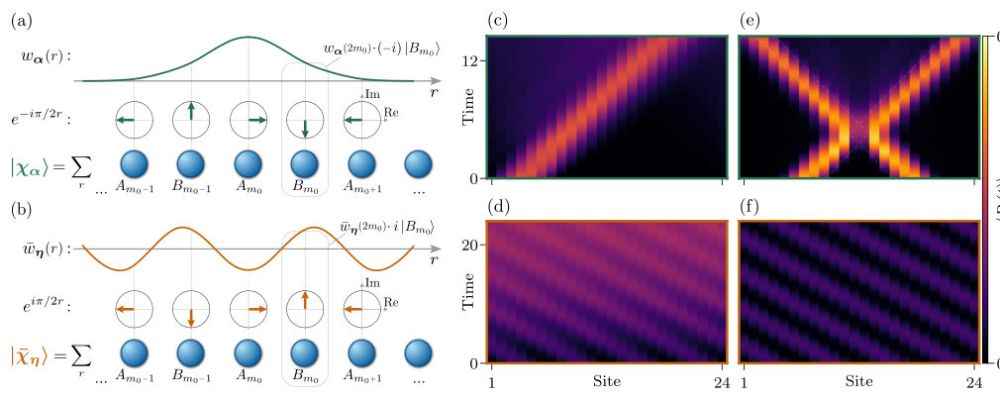 
FIG. 1. Coherent dynamics under time-evolution of H(g) PX on a chain with L = 24 sites. Schematic construction of (a) coherently propagating wavepacket |χα⟩and (b) scarred state |¯χη⟩. (c) Real-space dynamics for g = 0 of |χα⟩with α = (9, 4, −π/2). The defect propagates coherently to the right while slowly broadening in time, while the vacuum becomes only weakly perturbed. (d) Real-space dynamics for g = 0 for the scarred state |¯χη⟩with η = (2π/L, π/2) shows periodic but decaying revivals. (e) Collision between two wavepackets propagating in opposite directions for g = 10, given by the initial state |χα,β⟩with α = (13, 4, −π/2) and β = (13, 4, π/2). The quasiparticles interact nontrivially...

📷 Fig 2

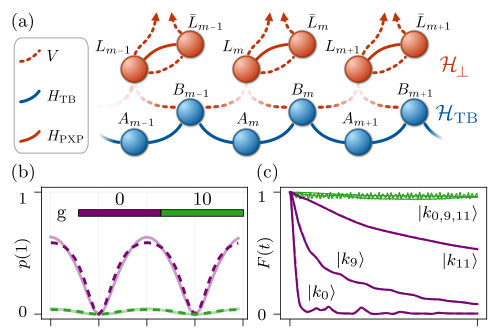 
FIG. 2. Leakage theory for time evolution under H(g) PX. (a) Schematic of interactions on relevant states for leakage the- ory. Inside HTB (blue), the dynamics is exactly TB-like, while leakage originates from V coupling the |Bm⟩states to H⊥ (red), which can cancel by destructive interference between neighboring amplitudes (visualized by fading of dashed lines). The additional HPXP term acts only nontrivially in H⊥and drives rapid oscillations in a small two-level subspace, thereby suppressing the accumulated leaked weight. (b) Average leak- age rate between t = 0 and t = 1 for TB momentum states |kn⟩, obtained numerically (solid) and from the analytical pre- diction (dashed) for L = 20...

📷 Fig 3

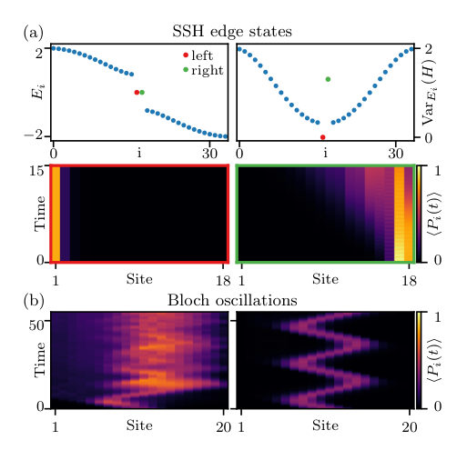 
FIG. 3. (a) SSH-like edge physics in the dimerized HPX,SSH spin chain with L = 18 and t1 = 0.6,t2 = 1.4. The top row shows the energy ⟨HPX,SSH⟩and variance Var(HPX,SSH) with regard to the eigenstates of ΠTBHPX,SSHΠTB with nonzero eigenvalues. The middle row shows the dynamics of the edge modes (exact form shown in End Matter) under HPX,SSH with g = 0 (left) and g = 10 (right). (b) Dynamics of |χα⟩with α = (21, 6, π/2) defined on L = 20 sites under evolution with Hg Bloch with F = 0.6. The left plot shows the evolution with g = 0 which leads only to initial signatures of the Bloch oscil- lations until leakage becomes too large, while the right plots with g = 10 shows clean and persistent...

📷 Fig 4

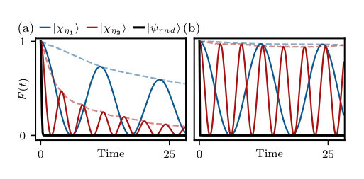 
FIG. 5. Scarred dynamics under time evolution with H(g) PX on a chain with L = 24 sites. (a) Fidelity, F(t) = |⟨ψ(0)|ψ(t)⟩|, for g = 0 and different initial states. The scarred state |¯χη1⟩, with η1 = (2π/L, π/2), is built from momentum states close to π/2 and shows pronounced revivals. The state |¯χη2⟩, with η2 = (6π/L, π/2), oscillates faster but with smaller fidelity peaks. In contrast, a random product state |ψr⟩rapidly ther- malizes. Dashed lines show the weight remaining in HTB, namely 1 −p(t) as defined in Eq. (8). (b) Fidelity dynamics for g = 10 for the same scarred states as in (a), showing al- most perfect revivals.

📷 Fig 5

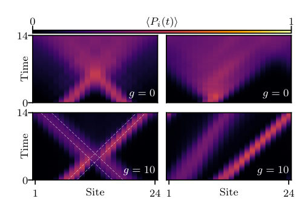 
FIG. 4. Dynamics of quasiparticles under time evolution with H(g) PX. (Top) Evolution without suppression (g = 0). In the left panel, the initial state |χα,β⟩is the same as in Fig. 1(e), but the quasiparticles rapidly decay after the colli- sion without leakage suppression. In the right panel, the state |χα⟩with α = (17, 4, −π/4) is centered around momentum −π/4 and quickly spreads incoherently. (Bottom) Evolution with two quasiparticles under leakage suppression (g = 10). The left panel shows a collision between quasiparticles of dif- ferent sizes, with α = (13, 4, −π/2) and β = (35, 8, π/2), displaying nontrivial interaction and approximate recovery of their shape with a phase shift after...

**Summary.** This paper introduces a way to find and stabilize non-thermal phenomena like quantum scars and chiral quasiparticles within chaotic spin chains using interference-protected subspaces. By adding a specific perturbation, the authors show that leakage into the chaotic bulk can be suppressed, allowing for persistent coherent dynamics. This work connects several disparate concepts like quantum cages and many-body scars into a single unified theory.

**Why it may be interesting.** It provides a new theoretical framework for engineering and stabilizing non-thermal, coherent dynamics (like quantum scars and topological modes) within otherwise chaotic many-body environments, which is highly relevant for controlling many-body dynamics.

Detailed structure

**Main problem.** Understanding the mechanism behind weak ergodicity breaking and how certain non-thermal states, such as quantum scars and chiral quasiparticles, can maintain coherence and evade thermalization in chaotic many-body systems.

**Main result.** The authors identify an interference-protected subspace in a family of chaotic spin chains where non-thermal phenomena are stabilized by destructive interference and rapid oscillations, providing a unified framework for scars, quantum cages, and topological edge modes.

**Method.** The study employs a quantitative leakage theory based on a Dyson expansion in the interaction picture, a tight-binding mapping of the protected subspace, and numerical simulations of real-space dynamics and fidelity.

**Model / system.** A family of local, chaotic spin-1/2 chains based on an inversion-symmetric version of the kinetically constrained East model, specifically a perturbed Hamiltonian H_PX with a stabilization term g*H_PXP.

**Key observables.** Real-space dynamics, fidelity revivals, leakage rate, entanglement entropy, local expectation values, and level-spacing statistics.

**Important parameters / regimes.** The stabilization strength g, momentum k, modulation frequency q, and blockade range alpha.

**Assumptions / limitations.** The analysis assumes the existence of a structured tight-binding subspace and uses a first-order Dyson expansion for the leakage theory.

**Figures summary.** Figure 1 shows wavepacket and scarred state constructions and chiral dynamics; Figure 2 illustrates leakage suppression mechanisms; Figure 4 compares quasiparticle decay at g=0 vs. stability at g=10; Figure 5 shows fidelity revivals; Figure 6 relates to the parent Hamiltonian construction.

**Paper structure.** The paper introduces the model and the concept of protected subspaces, develops a quantitative leakage theory, demonstrates various non-thermal phenomena (scars, chiral particles, edge modes), provides a stabilization mechanism via a perturbation term, and concludes by connecting these findings to broader frameworks like parent Hamiltonians.

Abstract

Generic quantum many-body systems are expected to thermalize, scrambling initial coherence while local observables relax to equilibrium values. Weak ergodicity breaking, often associated with quantum many-body scarring of homogeneous states, provides rare exceptions with long-lived coherence. We introduce a family of local spin-1/2 chains with a structured subspace that hosts a much broader range of nonthermal phenomena, such as scars, chirally propagating quasiparticles or approximate topological edge modes. These nonthermal phenomena happening at high energy densities can be understood via structured subspaces that are protected by destructive interference. We develop a quantitative leakage theory predicting which states retain coherence and suggest ways to improve the stability by inducing fast oscillations in the complement subspace. Our framework connects asymptotic scars, quantum cages, and parent-Hamiltonian constructions, and shows that weak ergodicity breaking in chaotic systems extends well beyond revivals of homogeneous initial states.

[↑ back to top](#top)

### [Chaos to Synchronization and Dissipative Quantum Scarring in Open Coupled top-Dicke model in a Lossy Cavity](http://arxiv.org/abs/2605.22953v1)

**Authors:** Debabrata Mondal, Sohan Pati, S. Sinha  
**Type:** theory · **Category:** other · **PDF:** <https://arxiv.org/pdf/2605.22953v1>  
**Analysis basis:** full PDF text, analyzed in chunks
**Topic relevance:** 🔥 `Tavis-Cummings & cavity-many-emitter` **4/5** · 🔥 `driven-dissipative phase transition` **4/5** · 🔥 `scars & prethermalization` **4/5** · `Dicke superradiance` **3/5** · `correlated / nonlocal dissipation` **3/5** · `correlated cavity matter` **3/5** · `methods for driven-dissipative` **3/5** · `non-equilibrium dynamics` **3/5** · `quantum measurements` **2/5**

📷 Fig 1

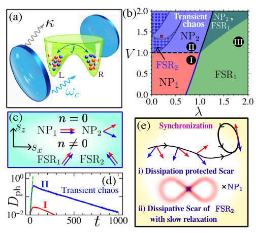 
FIG. 1. (a) Schematic of a two-component Bose-Josephson junction (BJJ) inside a cavity with photon frequency ωc and loss rate κ. (b) Phase diagram in λ−V plane for κ = 0.3, sum- marizing different dynamical regimes and fixed points. The stable regime of FSR2 for the isolated case κ = 0 is marked by blue star-filled area. The scar of unstable FSR2 in this work is shown at the coupling strength marked by red dot in (b). (c) Configuration of the fixed points schematically. (d) Dynamics of photonic decorrelator Dph exhibiting transient chaos in region II of panel (b). (e) Pictorial representation of synchronization and dissipative scarring phenomena.

📷 Fig 2

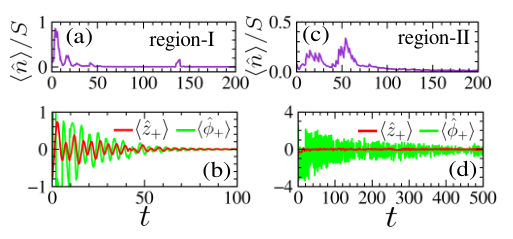 
FIG. 2. Synchronization and transient chaos: Dynam- ics of (a,c) average photon number ⟨ˆn⟩, (b,d) relative phase ⟨ˆϕ+⟩and ⟨ˆz+⟩for single quantum trajectory corresponding to region-I (a,b) at V = 0.5, λ = 0.5, and region-II (c,d) at V = 1.8, λ = 0.2 of the phase diagram in Fig.1(b), respec- tively. Parameter chosen: κ = 0.3, S = 6 and sufficient num- ber of Fock states to minimize truncation error. In this and the rest of the figures, we set ℏ= 1, measure energy (time) in units of J(1/J) and choose ωc = 1, J = 1.

📷 Fig 3

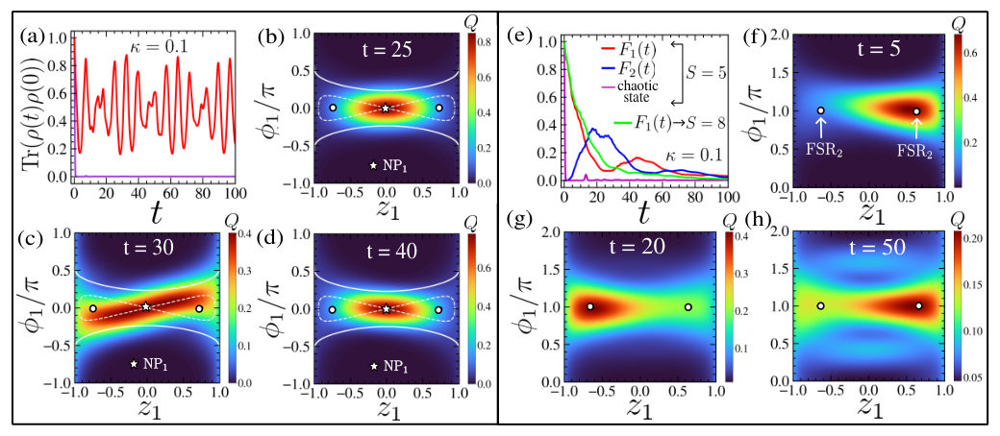 
FIG. 3. Quantum scarring phenomena of unstable NP1: (a) Dynamics of survival probability Tr(ρ(t)ρ(0)) and (b,c,d) Husimi distribution Q of reduced density matrix of one of the spins for three different times at V = 1.5, λ = 0.5. The purple and red lines correspond to the initial state representing a generic phase space point and unstable NP1, respectively. Quantum scarring phenomena of unstable FSR2: (e) Dynamics of the overlap corresponding to two branches of unstable FSR2 Fj(t) [see the main text], where (red, green) lines for j = 1 and blue line for j = 2. F1(t) corresponds to the survival probability. The green color line corresponds to S = 8. The purple line represents the survival...

**Summary.** This paper explores the dynamics of an open Dicke model where photon loss drives the system toward synchronization and regulates transient chaos. It identifies two distinct classes of dissipative quantum scars, one of which is protected from decay. The findings are relevant for controlling many-body states in cavity QED and Bose-Josephson junction platforms.

**Why it may be interesting.** It provides deep insights into how engineered dissipation can be used to control many-body dynamics, specifically by stabilizing synchronization and regulating chaos in open quantum systems.

Detailed structure

**Main problem.** Investigating how dissipation and photon loss influence non-equilibrium phenomena, specifically the stability of many-body quantum scars and the transition from chaos to synchronization.

**Main result.** The study identifies two types of dissipative quantum scarring: a protected type with persistent oscillations and a dissipative type with slow decay, while showing that photon loss induces spontaneous synchronization and suppresses transient chaos.

**Method.** The authors use a combination of classical stability analysis of equations of motion and quantum simulations via the stochastic wave-function (quantum trajectories) method within a Lindblad master equation framework.

**Model / system.** An open coupled-top Dicke model (OCTD) consisting of two interacting large spins coupled to a lossy cavity mode, which can be physically realized by a two-species Bose-Josephson junction in a cavity.

**Key observables.** Photon number, spin components, population imbalance, relative phase, survival probability, Husimi distributions, and a photon field decorrelator.

**Important parameters / regimes.** Spin magnitude (S), photon frequency (omega_c), photon loss rate (kappa), spin-cavity coupling (lambda), spin interaction (V), and tunneling (J).

**Assumptions / limitations.** The use of the large-spin limit (S to infinity) for classical dynamics and the decoupling approximation for deriving classical equations of motion.

**Figures summary.** Fig 1 shows the physical schematic and phase diagram; Fig 2 illustrates the decay of photon number and synchronization dynamics; Fig 3 demonstrates the two types of quantum scarring through survival probability and Husimi distributions.

**Paper structure.** The paper introduces the OCTD model and its physical realization, performs a classical stability and phase analysis, presents quantum simulation results regarding synchronization and chaos regulation, details the identification of two distinct scarring phenomena, and concludes with the connection to quantum tunneling.

Abstract

We present a variant of the Dicke model, termed as the open coupled-top Dicke model, which enables the exploration of rich non-equilibrium phenomena, particularly the fate of quantum scars in an open environment. This model can effectively be realized by coupling a two-species Bose-Josephson junction to a lossy cavity. Photon loss induces spontaneous synchronization via projection onto a dissipation-free subspace, along with transient chaos followed by restoration of synchronization and coherence. We identify two distinct scarring phenomena in the presence of dissipation. One remains protected, exhibiting persistent revivals, while the scar associated with the superradiant phase displays a dissipation-induced slow decay of the survival probability. Remarkably, for sufficiently small spin magnitude, the chaos-assisted macroscopic quantum tunneling is linked to the latter type of scarring. The results can be readily tested in ongoing cavity QED experiments and have broader applicability in other platforms.

[↑ back to top](#top)

### [Quantum viscosity mechanism of the dissipative dynamics in the Dicke model expressed via Lindblad equation of motion](http://arxiv.org/abs/2605.23322v1)

**Authors:** M. E. S. Beck, S. S. Seidov, S. I. Muhkin  
**Type:** theory · **Category:** other · **PDF:** <https://arxiv.org/pdf/2605.23322v1>  
**Analysis basis:** full PDF text, analyzed in chunks
**Topic relevance:** 🔥 `Dicke superradiance` **4/5** · 🔥 `Tavis-Cummings & cavity-many-emitter` **4/5** · `correlated / nonlocal dissipation` **3/5** · `correlated cavity matter` **3/5** · `driven-dissipative phase transition` **3/5** · `methods for driven-dissipative` **3/5** · `non-equilibrium dynamics` **3/5** · `Keldysh / 2PI / non-Gaussian methods` **2/5**

📷 Fig 1

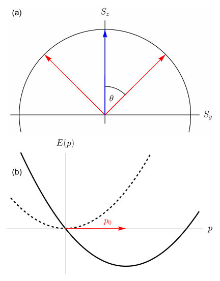 
FIG. 1: Schematic depiction of the rotated and shifted mini- mum energy coordinates of the Extended Dicke model on the superspin sphere and the p-coordinate. (Fig.1a) The blue ar- row indicates the superspin coordinate of the energy minimum in the normal phase / weak coupling regime on the superspin sphere. Red arrows depict the coordinates of the (degener- ate) minima energies in the superradiant / strong coupling regime. Compared to the minimum energy coordinate of the normal phase the minimum energy coordinates of the super- radiant phase are rotated by an angle θ. (Fig.1b) Energies associated to the (semi-classical) momentum-dependent part in the Hamiltonian (p2/2 −gpSy) at two...

📷 Fig 2

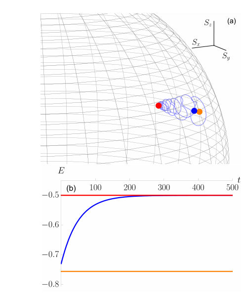 
FIG. 2: The semi-classical dynamics of the energy and spin coordinates of the Extended Dicke model under influence of a bare dissipator. (Parameters: ϵ = −1, ω = 1, EZ = 0.2, g = 0.46, κ1 = κ2 = 0.02). Here (Fig.2a) demonstrates the dynamics of the Sx,y,z-coordinates on a superspin sphere. The orange points represent the coordinates of the minimum energy of the semi-classical approximation of the Extended Dicke model. The red points represent the fixed points of the Lindbladian dynamics described by the Heisenberg equations of motion with Da[O] and DS+[O]-dissipators. The blue point represents the starting coordinates of the dynamics described by the system of equations Eq.(5). The initial...

📷 Fig 3

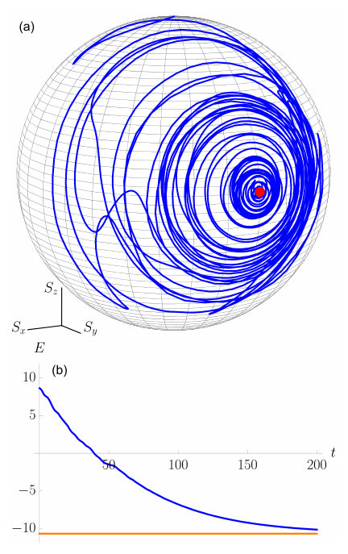 
FIG. 3: The semi-classical dynamics of the energy and super- spin coordinates of the Extended Dicke model under influence of a rotated dissipator as described by Eq.(12). (Parameters: ϵ = −1, ω = 1, EZ = 0.2, g = 0.46, κ1 = κ2 = 0.02). Here (Fig.3a) demonstrates the dynamics of the Sx,y,z-coordinates on a superspin sphere. The red points represent the coordi- nates of the minimum energy of the semi-classical approxima- tion of the Extended Dicke model and the fixed points of the system. The second graph (Fig.3b) represents the dynam- ics of the energy corresponding to the same trajectory, the blue curve. The orange line represents the minimum energy. One can see that if dissipation is...

**Summary.** The paper shows that standard Lindblad equations fail to describe relaxation in the Dicke model's superradiant phase because they do not account for the shift in the energy minimum. By deriving a 'dressed' master equation, the authors prove that the system can relax to its ground state and that a quantum viscosity persists even at absolute zero temperature.

**Why it may be interesting.** This paper is highly relevant for researchers in open quantum systems and cavity QED as it addresses a fundamental correction to the master equation formalism in the ultra-strong coupling regime and reveals a temperature-independent mechanism for quantum viscosity.

Detailed structure

**Main problem.** The failure of standard 'bare' Lindblad master equations to allow the Extended Dicke model to relax to its true ground state in the superradiant phase, and the origin of quantum viscosity in this regime.

**Main result.** The authors demonstrate that a 'dressed' Lindblad equation, using condensate-shifted operators, is required for proper relaxation to the energy minimum, and show that effective quantum viscosity persists even at zero temperature due to virtual excitations of the thermal bath.

**Method.** Quantum mechanical derivation of the Lindblad equation via coupling the system to a Caldeira-Leggett thermal bath, utilizing Holstein-Primakoff and Bogolyubov transformations, and applying a semi-classical approximation.

**Model / system.** The Extended Dicke Model (EDM) describing the interaction between an electromagnetic field and an ensemble of N two-level systems, coupled to a Caldeira-Leggett thermal bath of harmonic oscillators.

**Key observables.** Effective viscosity, energy dynamics, spin coordinates (Sx, Sy, Sz), and phase space coordinates (q, p).

**Important parameters / regimes.** Ultra-strong coupling (USC) regime, superradiant phase, zero-temperature limit (T -> 0), coupling strength g, and Zeeman energy E_Z.

**Assumptions / limitations.** Large spin limit (S >> 1), proximity to the energy minimum, neglect of tunneling, and the use of the Rotating Wave Approximation (RWA) to neglect rapidly oscillating inter-ladder transitions.

**Figures summary.** Figure 1b shows the rotation of energy minima and momentum shift; Figure 3a shows semi-classical spin dynamics aligning with the energy minimum; Figure 3b shows energy dynamics.

**Paper structure.** The paper first identifies the failure of bare dissipators in the superradiant phase, then provides a formal derivation of a dressed Lindblad equation using a thermal bath, analyzes the resulting quantum viscosity mechanism, and concludes with an appendix mapping the transformed operators.

Abstract

Quantum dissipation is studied in the superradiant phase of the Extended Dicke model. It is demonstrated analytically by quantum mechanical derivation of the Lindblad equation for the Dicke model in the superradiant state coupled to Caldeira-Leggett thermal bath, that the effective viscosity appearing in the semiclassical equations of motion of polaritonic condensate survives in the zero temperature limit T -> 0. The nonzero contribution to viscosity contains prefactor nB (ω, T ) + 1 with the Bose-Einstein function nB of harmonic oscillators in the thermal bath, indicating that virtual excitations of harmonic oscillators in the thermal bath coupled to the polaritons of Dicke model give rise to effective viscosity in the T -> 0 limit. Besides, it is demonstrated analytically, that correct expression for Lindbladian in the superradiant phase should be built using condensate-shifted creation and annihilation operators of the photons and pseudospin operators in Holstein-Primakoff representation of the coupled to photons two-level systems in order the system could relax to its minimum energy in T -> 0 limit due to thermal bath provided effective viscosity.

[↑ back to top](#top)

### [Probing Chaos and Criticality with Observational Entropy and Finite-Resolution Measurements](http://arxiv.org/abs/2605.23585v1)

**Authors:** J. Bharathi Kannan, Sreeram PG, M. S. Santhanam  
**Type:** theory · **Category:** statistical mechanics · **PDF:** <https://arxiv.org/pdf/2605.23585v1>  
**Analysis basis:** full PDF text, analyzed in chunks
**Topic relevance:** 🔥 `entanglement & information structure` **4/5** · 🔥 `non-equilibrium dynamics` **4/5** · 🔥 `quantum measurements` **4/5** · `non-equilibrium universality` **3/5** · `analog quantum simulation` **2/5** · `driven-dissipative phase transition` **2/5** · `measurement-induced transitions` **2/5** · `scars & prethermalization` **2/5**

📷 Fig 1

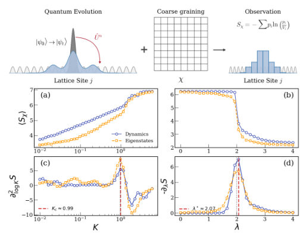 
FIG. 1. Top: Schematic of measuring observational en- tropy for a time-evolved state with coarse-graining length χ. Bottom: (a) quasi-momentum averaged observational entropy ⟨Sχ⟩of the QKR versus kick strength K. (b) Entropy acceler- ation Aχ(K), which peaks near the classical KAM threshold. (c) ⟨Sχ⟩of the Aubry-Andr´e model versus λ. (d) Entropy susceptibility ξχ(λ), which dips near the self-dual localization transition. In all panels, results from long-time dynamics and eigenstate averages are in close agreement.

📷 Fig 2

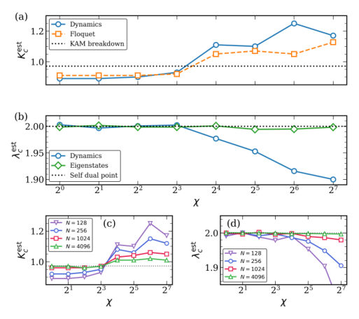 
FIG. 2. Critical-point estimates obtained from derivatives of the observational entropy as a function of the coarse-graining length χ. (a) Kest c for the quantum kicked rotor from the peak of the entropy curvature ∂2 K⟨Sχ⟩(b) Estimated λc for the Aubry-Andr´e model from the peak of the entropy sus- ceptibility −∂λ⟨Sχ⟩, comparing dynamical and eigenstate av- erages. Dotted lines denote the exact critical points. (c,d) Finite-size scaling of the corresponding estimates for differ- ent Hilbert-space sizes N. For experimentally relevant sizes (N = 128), OE already yields accurate critical points, which converge rapidly to the exact values as N increases.

📷 Fig 3

 
FIG. 3. Observational entropy growth and extracted Lya- punov exponents for the Quantum Kicked Rotor (QKR, left column) and Singular Kicked Rotor (SKR, right column). Top row: Time evolution of momentum-space (blue circles) and PGM phase-space (red squares) observational entropy SOE, with dashed line indicating the ehrenfest times corre- spondingly. Middle row: Lyapunov exponents λ as a func- tion of kick strength K and singularity parameter b. Black dashed lines show the classical maximal Lyapunov exponent λcl. Bottom row: Dependence of the extracted Lyapunov exponents on the number of coarse-graining cells Ncells (loga- rithmic scale), horizontal dashed line indicating the classical...

📷 Fig 4

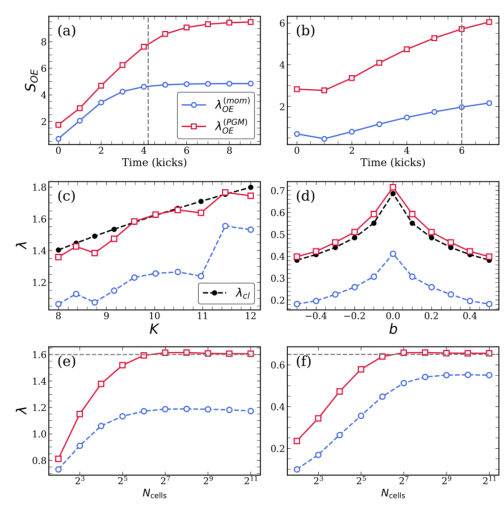 
Figure 4 quantifies the effect of finite measurement statistics on the extraction of the observable Lya- punov exponent from the PGM-based observational entropy. For each phase-space resolution Ncells, the exact PGM probabilities are sampled from a multi- nomial distribution using Nshots repetitions, and the resulting entropy is fitted within the shaded Ehrenfest window to obtain λ(PGM) OE . The top two panels show the time evolution of the observational entropy for two representative resolutions, Ncells = 26 (top) and

📷 Fig 5

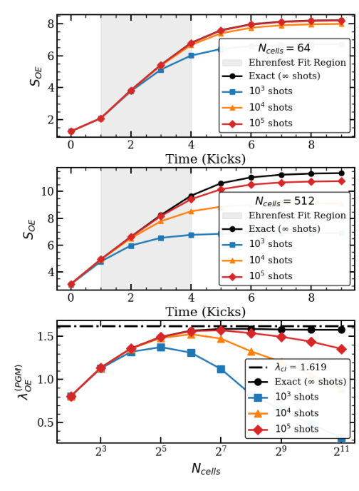 
FIG. 4. Effect of finite measurement statistics on the PGM- based observable Lyapunov exponent for the quantum kicked rotor at K = 10. Top and middle panels: time evolution of the observational entropy for Ncells = 26 and Ncells = 29, re- spectively. Shaded regions indicate the Ehrenfest-time fitting window used to extract λ(PGM) OE . Bottom panel: extracted λ(PGM) OE as a function of the number of phase-space cells for different numbers of measurement shots. Black circles denote the exact result and the dash-dotted line marks the classical Lyapunov exponent, λcl = 1.619. Increasing the number of shots extends the range of resolutions over which the PGM- based estimate converges to the...

**Summary.** The paper introduces 'Observational Entropy' as a scalable tool to detect quantum phase transitions and quantify chaos. By using coarse-grained measurements, the authors show that one can identify localization and the destruction of KAM tori while accurately recovering classical Lyapunov exponents. This framework is particularly useful for characterizing complex quantum systems where full state tomography is impossible.

**Why it may be interesting.** It provides a practical, information-theoretic bridge between classical chaos and quantum dynamics, offering an experimentally feasible way to probe complex dynamics in many-body systems and quantum simulators without full state reconstruction.

Detailed structure

**Main problem.** How to accurately characterize quantum chaos, ergodicity breaking, and localization transitions using scalable, finite-resolution measurements instead of full state tomography.

**Main result.** Observational entropy (OE) provides a unified diagnostic where its derivatives identify transition types (KAM destruction vs. localization) and its growth rate reproduces classical Lyapunov exponents.

**Method.** Coarse-graining probability distributions into macrostates and using a Pretty Good Measurement (PGM) correction to the Husimi phase-space distribution.

**Model / system.** The study utilizes the Aubry-Andre model for localization transitions and the Standard and Singular Kicked Rotors for studying the transition from integrable to chaotic dynamics.

**Key observables.** Observational Entropy (OE), entropy derivatives (susceptibility and curvature), and the observable Lyapunov exponent.

**Important parameters / regimes.** Coarse-graining resolution (chi), kick strength (K), non-analyticity exponent (alpha), Ehrenfest time, and measurement shot noise.

**Assumptions / limitations.** The accuracy of the method is limited by an intrinsic resolution bound and the statistical uncertainty arising from finite measurement shots.

**Figures summary.** Fig 1 shows the coarse-graining protocol and OE derivatives; Fig 2 demonstrates the accuracy of critical point estimates and finite-size scaling; Fig 3 compares momentum-space vs. phase-space OE growth and Lyapunov exponent extraction; Fig 4 illustrates the trade-off between resolution and shot noise.

**Paper structure.** The paper introduces the Observational Entropy framework, applies it to the Aubry-Andre and Kicked Rotor models to identify phase transitions, demonstrates its ability to quantify classical chaos via phase-space measurements, and analyzes the impact of finite resolution and shot noise.

Abstract

Coarse-grained measurements offer a scalable alternative to full state tomography for characterizing complex quantum dynamics. We show that observational entropy (OE), an information-theoretic entropy defined directly from finite-resolution measurement outcomes, provides a unified and experimentally accessible framework for quantifying chaos and probing criticality. From probing the insulator-metal crossover in the Aubry-Andre model to tracking the gradual destruction of Kolmogorov-Arnold-Moser tori in the Kicked Rotor, derivatives of OE provide an accurate and unified diagnostic of probing these transitions. In both cases, the critical points extracted from dynamical evolution and eigenstate analyses converge to the exact theoretical values once the observational resolution exceeds a finite threshold. In the chaotic limit, OE exhibits a linear behavior within the Ehrenfest time regime, and its slope defines an observable Lyapunov exponent. Using a Pretty Good Measurement correction to the Husimi phase-space distribution, this entropy-production rate quantitatively reproduces the classical Lyapunov exponent in both the standard and singular kicked rotors. Our results establish OE as a compact information-theoretic bridge between classical instability, quantum criticality, and realistic finite-resolution measurements.

[↑ back to top](#top)

### [Observation of associative-memory retrieval and spin-glass phases on a photonic quantum simulator](http://arxiv.org/abs/2605.22922v1)

**Authors:** Taira Giordani, Gennaro Zanfardino, Luca Leuzzi, Enrico Bonfissuto, Eugenio Caruccio, Gabriele Gasbarri, Mattia Bossi, Abhiram Rajan, Riccardo Albiero, Francesco Ceccarelli, Nicolò Spagnolo, Raffaele Santagati, Stefano Paesani, Marco Leonetti, Roberto Osellame, Giorgio Parisi, Giancarlo Ruocco, Fabrizio Illuminati, Fabio Sciarrino  
**Type:** experiment · **Category:** disordered systems and neural networks · **PDF:** <https://arxiv.org/pdf/2605.22922v1>  
**Analysis basis:** full PDF text, analyzed in chunks
**Topic relevance:** 🔥 `QC/QI experiment` **4/5** · 🔥 `analog quantum simulation` **4/5** · 🔥 `exotic spin models in light-matter` **4/5** · 🔥 `quantum optics experiment` **4/5** · `driven-dissipative phase transition` **2/5** · `interference shaping light` **2/5** · `non-equilibrium dynamics` **2/5**

📷 Fig 1

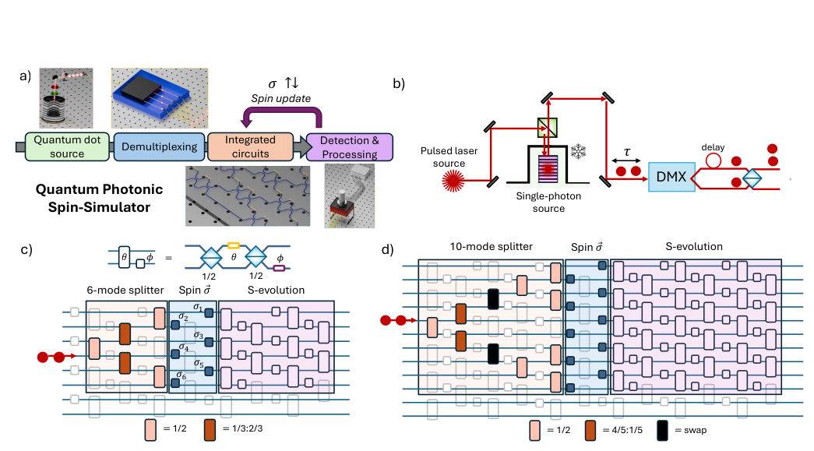 
Figure 2. Quantum photonic spin-simulator. a) Overview of QOLOSSUS’s overall apparatus. This setup includes a single photon source based on quantum dot technology and a time-to-space demultiplexing system (DMX) to synchronize two-photon states. The apparatus simulates spin dynamics within fully programmable integrated circuits. It also includes a detection and data processing stage to estimate the system energy and propose a new spin update according to the Metropolis algorithm. b) Details of the apparatus for the generation of the two-photon states. This stage comprises a pulsed laser to excite the quantum dot single photon source. The DMX system is followed by time delays to synchronize...

📷 Fig 2

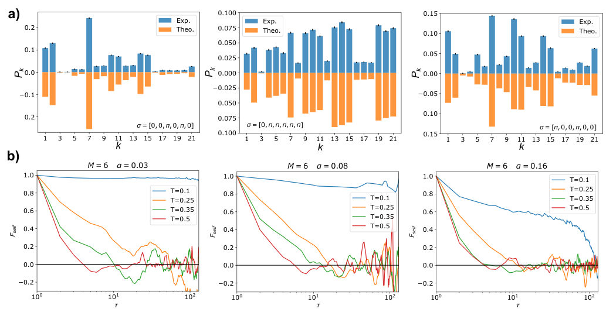 
Figure 3. Experimental characterization of the 6-spin simulator within the 8-mode integrated device. a) Two- photon output distribution for three different spin configurations, which are indicated in the plot, for a fixed S matrix. In blue, the expected distribution P theo; in orange, the experimental one P exp. The error bars in black derive from the Poissonian statistics of single-photon counts. The accordance with the theoretical distributions is quantified by the total variation distance (TVD) defined as 1

📷 Fig 3

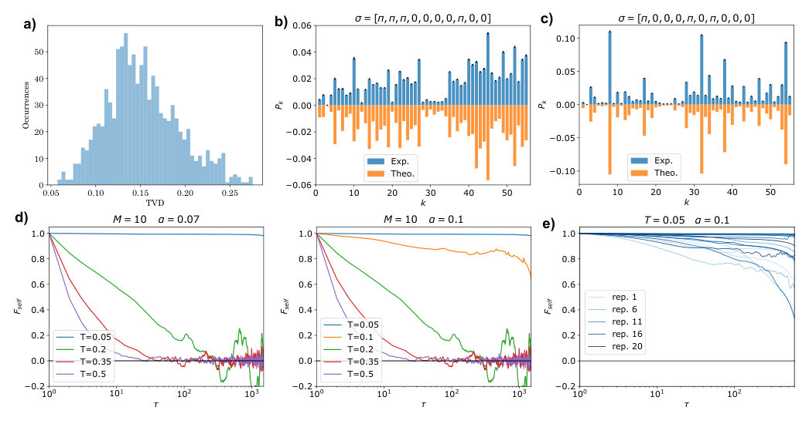 
Figure 4. Experimental characterization of the 10-spin simulator within the 12-mode integrated device. a) Histograms of the 1024 TVD values between the theoretical and the two-photon experimental distributions for each spin configuration and for a fixed 10 × 10 scattering matrix S. b-c) Details on the experimental two-photon distributions for two spin settings. TVD is 0.139 ± 0.002 in b) and 0.057 ± 0.002 in c). The uncertainties derive from the Poissonian statistics of the single-photon counts. d) Spin-spin autocorrelation function Fself(τ) = ⟨σ(t) · σ(t + τ)⟩for various temperatures of the MC simulation and different choices of the parameter α = NP /102. We selected NP = 7 (α = 0.07) and...

📷 Fig 4

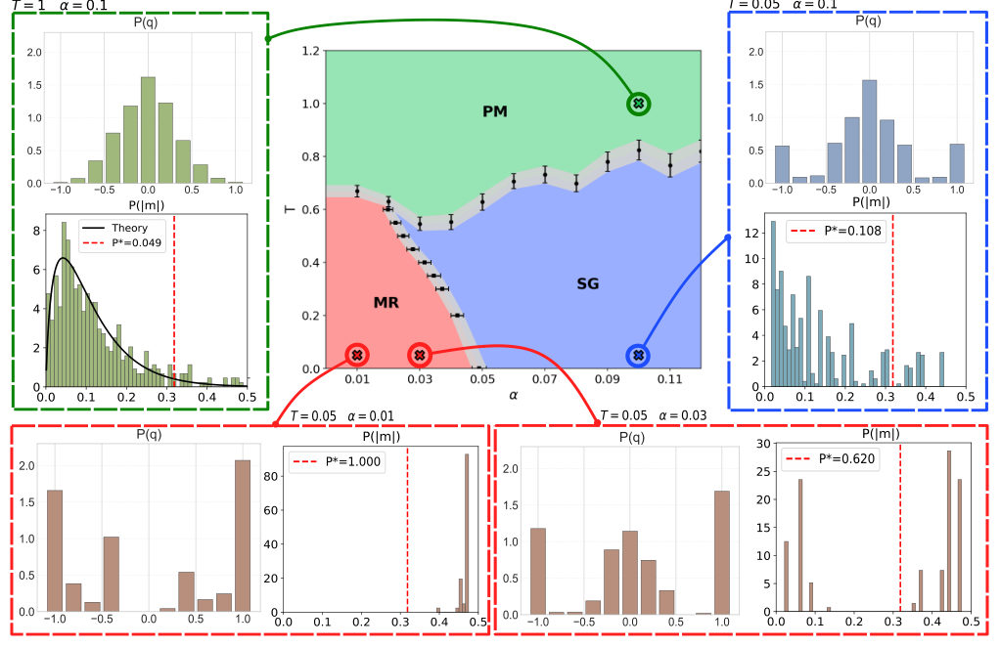 
Figure 5. Phase Diagram of the 10-spin simulator. The α vs T phase diagram was reconstructed from 360 simulated points obtained over 100 different disorder realizations, corresponding to distinct measured scattering matrices S. Specifically, for each point (α, T) and for each realization of S, Nrep = 100 independent replicas were generated to reconstruct the overlap distributions P(q) and the magnetization distribution P(|m|), from which the memory retrieval (MR, red), spin-glass (SG, blue), and paramagnetic (PM, green) phases were identified. In the P(|m|) plots the vertical line is |m|NP = 1/π (see text). The phase boundaries were determined by identifying the transition between phases...

📷 Fig 5

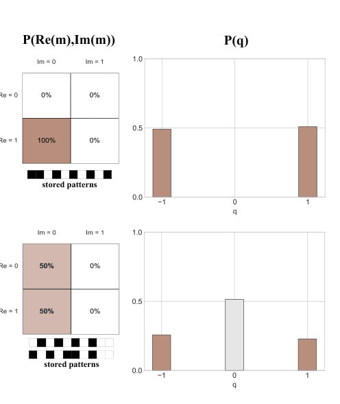 
Figure 6. Emulation of memory retrieval effects of the classical Hopfield model. Experimental results for a scat- tering matrix featuring two rows with entries ±1 up to an overall normalization factors. The photonic spin-simulator displays the typical magnetization and order parameter q be- havior expected for a 4-body Hopfield model with respectively 1 stored pattern (above) and 2 orthogonal stored patterns (be- low). The table on the left showcases the joint probability of Im(m) and Re(m): in both cases m is real and only takes val- ues m = ±1 and m = 0.

**Summary.** This paper presents an experimental photonic quantum simulator that emulates a generalized Hopfield neural network. By using two-photon interference, the platform successfully observes the transition between memory retrieval, spin-glass, and paramagnetic phases. This demonstrates the potential of photonic technologies to solve complex optimization and many-body simulation problems.

**Why it may be interesting.** This work demonstrates a powerful application of quantum optics and photonics for simulating complex many-body dynamics and phase transitions in disordered systems, bridging the gap between quantum hardware and statistical mechanics.

Detailed structure

**Main problem.** Simulating the complex, multi-synaptic interactions of large-scale neural networks and spin glasses is computationally expensive on classical hardware due to super-linear scaling.

**Main result.** The researchers experimentally demonstrated a photonic quantum simulator capable of identifying three distinct phases: memory retrieval, spin-glass 'black-out', and paramagnetic phases.

**Method.** The study uses a programmable photonic processor to implement Metropolis Monte Carlo sampling, where two-photon interference is used to evaluate the energy of spin configurations.

**Model / system.** A programmable quantum photonic simulator (QOLOSSUS) using 8- and 12-mode integrated circuits, implementing a $p=4$ body Hopfield Hamiltonian via two-photon processes.

**Key observables.** Memory overlap (bilinear magnetization $|m|$), spin-spin overlap between replicas ($q$), and spin-spin autocorrelation function.

**Important parameters / regimes.** Temperature ($T$), storage capacity ($\alpha$), and number of spins/modes ($M$).

**Assumptions / limitations.** The current implementation is limited to small-scale architectures (6- and 10-spin systems).

**Figures summary.** Figure 1 shows the simulator setup and the Metropolis optimization loop; Figure 2 details the experimental apparatus and photon-pair generation; Figure 5 presents the reconstructed $(\alpha, T)$ phase diagram; Figure 6 shows magnetization and overlap distributions for the emulated Ising-like model.

**Paper structure.** The paper introduces the computational bottleneck of classical neural network simulation, describes the photonic hardware and the mathematical mapping of the Hopfield model to photonics, details the experimental validation of the setup, presents the characterization of the phase diagram, and concludes with future scaling directions.

Abstract

Models of interacting complex systems provide the fundamental statistical physics reference frame for the study and the understanding of associative memories, machine learning, and the dynamics of neural networks. On the other hand, simulating complex multi-synaptic interactions on a classical hardware is computationally demanding due to the super-linear scaling of the system complexity. Photonic quantum technologies provide a promising solution to these limitations by leveraging on their inherent speed and parallel processing ability in order to simulate complex networks. Recently, a connection between multiphoton processes and generalized $p$-body Hopfield models has been theoretically established. Here, we design and demonstrate an experimental platform that exploits single photons distributed across a set of optical modes, in which controlled arrays of binary phase shifters act as Ising-like neurons. We focus specifically on a fully connected Hopfield Hamiltonian with four-body local interaction terms, realized via two-photon processes. Through quantum simulations on programmable photonic processors, the study identifies three distinct regimes: a memory retrieval phase, a spin-glass memory "black-out" phase, and a paramagnetic phase. Experimental results confirm successful memory retrieval at low storage capacities and temperatures, where the system consistently relaxes to fixed points with high memory overlap, effectively reconstructing the stored patterns. Future research will extend the platform design to investigate networks with local or dilute interactions, while advances in the realization of scalable photonic circuits will enable architectures that encompass very large numbers of interacting spins.

[↑ back to top](#top)

### [Scale-Invariant Open Quantum Systems](http://arxiv.org/abs/2605.22919v1)

**Authors:** Carlos Argüelles, Gabriela Barenboim, Gonzalo Herrera, Tanvi Krishnan, Héctor Sanchis  
**Type:** theory · **Category:** statistical mechanics · **PDF:** <https://arxiv.org/pdf/2605.22919v1>  
**Analysis basis:** full PDF text, analyzed in chunks
**Topic relevance:** 🔥 `Keldysh / 2PI / non-Gaussian methods` **4/5** · 🔥 `non-equilibrium universality` **4/5** · `driven-dissipative phase transition` **3/5** · `methods for driven-dissipative` **3/5** · `non-equilibrium dynamics` **3/5** · `Kondo & dissipative impurity` **2/5** · `entanglement & information structure` **2/5**

📷 Fig 1

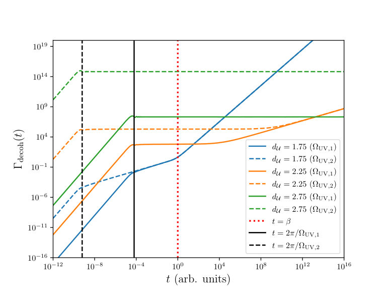 
FIG. 1: Decoherence functional Γdecoh(t) for the spectral density J(ω) = αωs, s = 2dU −3,

📷 Fig 2

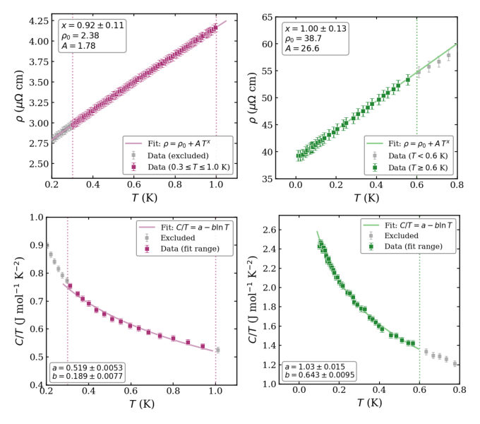 
FIG. 2: Heavy-fermion validation at dU = 3/2. Resistivity and specific heat independently

**Summary.** This paper establishes that all scale-invariant quantum environments are mathematically equivalent to 'unparticle' baths. It provides a generalized non-Markovian master equation that predicts new phase transitions in decoherence and thermalization across condensed matter, cosmology, and particle physics.

**Why it may be interesting.** It provides a universal, unified language for understanding non-Markovian dynamics across vastly different scales, from superconducting qubits and trapped ions to the early universe and high-energy astrophysics, while predicting new regimes of coherence protection.

Detailed structure

**Main problem.** Developing a complete theoretical framework for open quantum systems coupled to scale-invariant environments and proving that such environments are universally described by unparticle baths.

**Main result.** The authors prove a uniqueness theorem establishing that scale-invariant, Lorentz-invariant, and unitary environments are uniquely described by unparticle baths, and they identify a rich phase structure including thermalization and decoherence transitions.

**Method.** The work uses the Kallen-Lehmann spectral representation, path integral formalism (influence functionals), and conformal bootstrap to derive non-Markovian master equations and scaling laws.

**Model / system.** The framework applies to a system coupled to an unparticle bath characterized by a scaling dimension d_U, with specific realizations in the quantum Ising model, inflationary cosmology (de Sitter space), and high-energy astrophysical neutrinos.

**Key observables.** Decoherence rate (Gamma_decoh), spectral density J(omega), noise and dissipation kernels, resistivity, and specific heat scaling.

**Important parameters / regimes.** Unparticle scaling dimension (d_U), scaling dimension (Delta), temperature (T), and the spectral exponent (s).

**Assumptions / limitations.** Local coupling, Lorentz invariance, scale invariance, and unitarity.

**Figures summary.** The paper includes tables summarizing scaling exponents and dynamical regimes, and figures illustrating the relationship between unparticle dimensions and physical observables.

**Paper structure.** The paper begins with a proof of the uniqueness theorem, develops the mathematical formalism for non-Markovian dynamics, compares the framework to Caldeira-Leggett and Lindblad models, and concludes with applications to the Ising model, cosmology, and neutrino physics.

Abstract

We develop a complete theoretical framework for open quantum systems coupled to scale-invariant environments. We show that such environments are universally described by unparticle baths characterized by a single scaling dimension $d_{\mathcal{U}}$. This work provides the proof of the uniqueness theorem, the formalism of the resulting non-Markovian dynamics, and applications to several physical systems.   From the uniqueness theorem, we derive the non-Markovian memory kernels, the exact noise kernel including vacuum and thermal contributions, and a fractional generalization of the Caldeira-Leggett master equation for arbitrary $d_{\mathcal{U}}$. The scaling dimension governs a rich phase structure, including a thermalization transition at $d_{\mathcal{U}}=3/2$, the Ohmic boundary at $d_{\mathcal{U}}=2$, and a decoherence transition at $d_{\mathcal{U}}=5/2$ in the thermal regime, beyond which long-time quantum coherence is protected.   Three realizations are studied. For the quantum Ising model at criticality, coupling to the energy operator in $(1+1)$ dimensions gives $d_{\mathcal{U}}=3/2$, producing $1/f$ noise, while the $(2+1)$D case yields $d_{\mathcal{U}}\approx1.413$ from the conformal bootstrap. In inflationary cosmology, massless scalar and graviton baths in de Sitter spacetime give $d_{\mathcal{U}}=2$, predicting linear decoherence growth consistent with the quantum-to-classical transition. For high-energy astrophysical neutrinos, the decoherence rate $Γ_{\mathrm{decoh}}\propto \mathcal{B}(E,T_{\mathcal{U}})L^{5-2d_{\mathcal{U}}}$ provides an observable signature of the scaling dimension.   We also compare the framework with Caldeira-Leggett and Lindblad approaches, analyze the validity regimes, and discuss experimental implications for trapped-ion simulators, neutrino telescopes, and superconducting qubits.

[↑ back to top](#top)

### [Quantum Fisher Information under decoherence with explicit wavefunctions](http://arxiv.org/abs/2605.22917v1)

**Authors:** Francesco Musso, Vittorio Vitale, Sara Murciano  
**Type:** theory · **Category:** numerical methods · **PDF:** <https://arxiv.org/pdf/2605.22917v1>  
**Analysis basis:** full PDF text, analyzed in chunks
**Topic relevance:** 🔥 `methods for driven-dissipative` **4/5** · `entanglement & information structure` **3/5** · `Dicke superradiance` **2/5** · `Keldysh / 2PI / non-Gaussian methods` **2/5** · `driven-dissipative phase transition` **2/5** · `non-equilibrium dynamics` **2/5** · `quantum measurements` **2/5**

📷 Fig 1

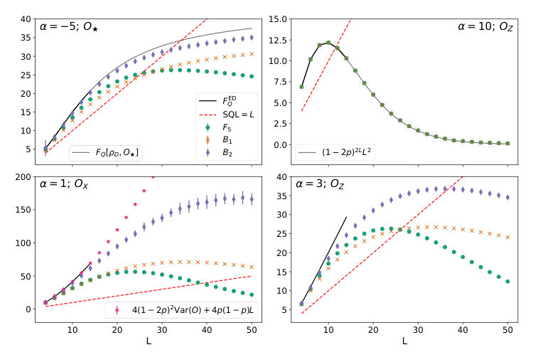 
FIG. 1. Numerical results on the bounds to the QFI for the dephased JG wave function for different values of α, corresponding to different regimes of the wave function, with local dephasing probability p = 0.05. The operators considered for the different values of α are the ones reported in Table I. The dashed line represents the SQL, i.e., the threshold that signals the presence of entanglement in the state. The solid line corresponds to the exact QFI, obtained via exact diagonalization for small system sizes. For α = 1 we also include the results for the values of the real QFI, by numerically computing the variance of the operator and get the QFI using Eq. 20 (the results for L &gt; 30 are...

📷 Fig 2

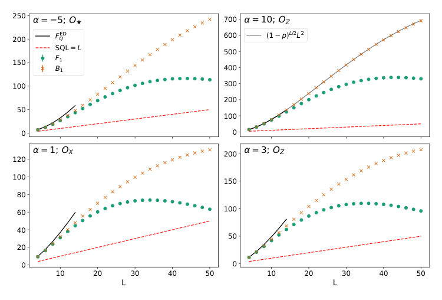 
FIG. 2. Numerical results on the bounds to the QFI for the damped JG wave function for different values of α, corresponding to different regimes of the wave function with decoherence strength p = 0.05. The operator considered for the different values of α are the ones reported in Table I. The dashed line represents the SQL, i.e., the threshold that signals the presence of entanglement in the state. The solid line corresponds to the exact QFI, obtained via exact diagonalization for small system sizes. For α = 10, B1 immediately saturates to the QFI (solid line) because the operator OZ is diagonal in the occupation basis and effectively reduces it to a low-rank state in the computation of the...

📷 Fig 3

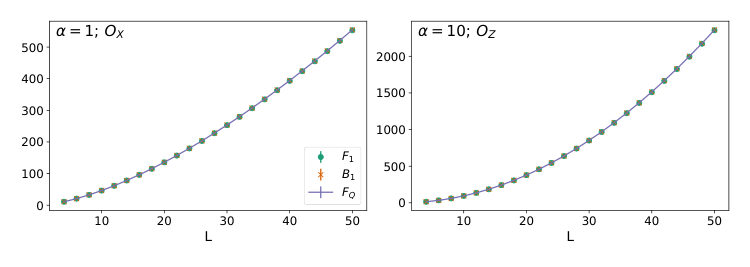 
FIG. 3. Numerical results for the bounds on the QFI of the depolarized JG wave function for α = 1, 10. For each value of α, we consider the operator reported in Table I, using the corresponding symbol. Here p = 0.05 denotes the strength of the depolarizing channel.

📷 Fig 4

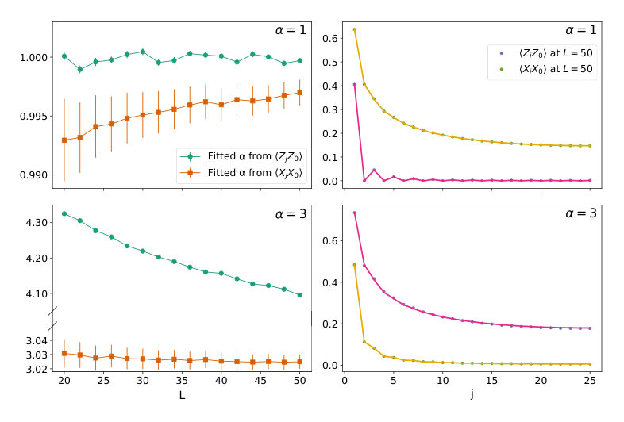 
FIG. 4. Correlation function of the JG wave functions in the critical regime. For α = 1, 3 we computed the correlation functions of Z and X for every L and fitted the results with expected behavior from Eq. A1 to check the agreement between the value of α use to construct the wave function and the one coming from the fit. In the left column the value of α coming from the fit is plotted against the system size, while on the right we report the values of the correlations at L = 50 with the corresponding fits.

📷 Fig 5

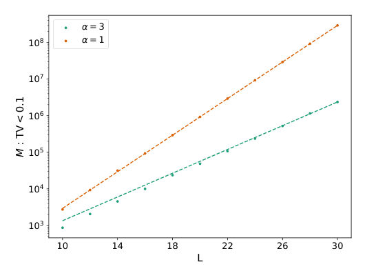 
FIG. 5. Number of the Markov chain samples of the JG distribution, for different values of α, required to get the total variation distance under the 0.1 threshold. The dashed lines represent an exponential fit aebL on the data. For α = 3, we get a = 32, b = 0.374, and for α = 1, we get a = 9, b = 0.575.

**Summary.** This paper introduces a Monte Carlo method to estimate the Quantum Fisher Information of many-body states subject to decoherence. By mapping QFI bounds to classical sampling, the authors enable the study of large-scale Jastrow-Gutzwiller states. The work characterizes how different noise channels affect the metrological scaling of these states across various physical regimes.

**Why it may be interesting.** It provides a scalable numerical framework for studying the metrological utility of many-body states under realistic noise, bridging the gap between pure-state theory and open-system many-body dynamics.

Detailed structure

**Main problem.** Efficiently estimating the Quantum Fisher Information (QFI) for many-body quantum states in the presence of decoherence, where direct evaluation requires full spectral resolution of the density matrix.

**Main result.** The authors develop an MCMC-based method to estimate QFI lower bounds with a 'slow' exponential computational cost, demonstrating that Jastrow-Gutzwiller wave functions can achieve metrological advantages even under noise.

**Method.** Mapping QFI lower bounds to expectation values over a classical probability distribution, enabling efficient estimation via Markov-chain Monte Carlo (MCMC) sampling.

**Model / system.** Jastrow-Gutzwiller (JG) wave functions on a periodic chain of L sites, which interpolate between GHZ-like, Dicke-like, and critical (Luttinger liquid) regimes via a parameter alpha.

**Key observables.** Quantum Fisher Information (QFI), staggered magnetization (Oz), transverse magnetization (Ox), and correlation functions.

**Important parameters / regimes.** System size (L), interaction parameter (alpha), noise strength (p), and noise channels (local dephasing, local amplitude damping, and global depolarizing).

**Assumptions / limitations.** The method assumes the wave functions are known analytically in the occupation-number basis; computational cost still scales exponentially with system size.

**Figures summary.** Figures show the convergence of QFI bounds under depolarizing noise, correlation functions in the critical regime, and the exponential growth of required MCMC samples with system size.

**Paper structure.** Introduction to QFI and the problem of decoherence; presentation of the MCMC mapping for JG wave functions; analysis of metrological scaling in different alpha regimes; evaluation of various noise channels; discussion of bound accuracy and computational complexity.

Abstract

We present a method to estimate the quantum Fisher information (QFI) of many-body quantum states in the presence of decoherence, where its direct evaluation requires the full spectral resolution of the density matrix. We show that, for many-body wave functions known analytically in the occupation-number basis, systematic lower bounds to the QFI can be mapped onto expectation values over a classical probability distribution defined by the wave function amplitudes. This mapping enables efficient estimation via Markov-chain Monte Carlo sampling, with a computational cost that scales as a `slow' exponential ($e^{b L}$ with $b \lesssim 0.6$) and remains manageable for system sizes well beyond exact diagonalization. We specify this framework to Jastrow-Gutzwiller wave functions. We characterize their metrological content by identifying the observables that maximize the QFI and the corresponding scaling with $L$. Then, we analyze the QFI under three physically motivated noise channels: local dephasing, local amplitude damping, and global depolarizing. We compare polynomial and Krylov-based lower bounds across these channels, relating their behavior to the effective rank of the noisy density matrix and to the structure of the operator generating the parameter encoding. The framework extends naturally to other analytically known wave functions and to a broader class of information-theoretic quantities beyond the QFI.

[↑ back to top](#top)

### [Entanglement-facilitated macroscopic cluster formation in quantum many-body dynamics](http://arxiv.org/abs/2605.22947v1)

**Authors:** Xiao Wang, Alexander Yosifov, Aditya Iyer, Jinzhao Sun  
**Type:** theory · **Category:** statistical mechanics · **PDF:** <https://arxiv.org/pdf/2605.22947v1>  
**Analysis basis:** full PDF text, analyzed in chunks
**Topic relevance:** 🔥 `entanglement & information structure` **4/5** · 🔥 `non-equilibrium dynamics` **4/5** · `Rydberg arrays` **2/5** · `analog quantum simulation` **2/5** · `non-equilibrium universality` **2/5** · `scars & prethermalization` **2/5**

📷 Fig 1

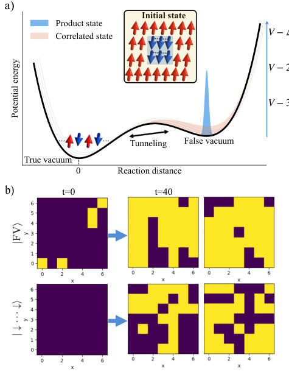 
FIG. 1: (a) The energy landscape of FV decay in the studied 2D Ising model. The horizontal axis is the Hamming distance relative to the TV state, while the vertical line is the prob- ability density, where the metastable well is characterised by energy levels V −n∆l, and ∆l is the energy bias (bulk gain) for a cluster of size l. The |ψ0⟩= N

📷 Fig 2

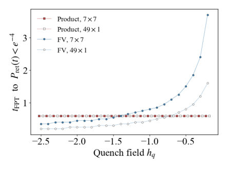 
FIG. 3: First-passage time tFPT for the return probability to fall below the threshold Pret(t) ≤e−4, comparing the 7×7 and 49 × 1 lattices for hq ∈[−2.5, −0.5]. As hq approaches zero from below, |FV⟩shows pronounced increase of tFPT, particu- larly in the 7×7 geometry, signalling enhanced metastability. In contrast, the results for |ψ0⟩are nearly identical for the two geometries.

📷 Fig 3

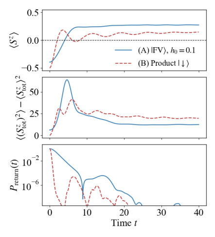 
FIG. 2: Real-time quench dynamics of the 2D Ising model on a 7 × 7 lattice, where the |FV⟩state is prepared with a small symmetry-breaking field h0 = 0.1. The bond dimension in this work is set as χ = 256. Top: time evolution of the average magnetisation ⟨Sz⟩. Middle: fluctuation of the total longitudinal magnetisation ⟨(Sz tot)2⟩−⟨Sz tot⟩2, proportional to the quantum Fisher information. Bottom: return probabil- ity, Eq. (4).

📷 Fig 4

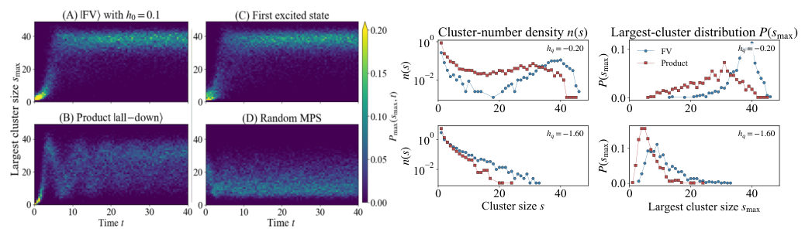 
FIG. 4: Time evolution of the largest-cluster distribution Pmax(smax, t) and percolation-oriented cluster observables on a 7 × 7 lattice. Left: the largest cluster size smax is extracted from projective Sz-basis snapshots at each time. (a) Evolution starting from the |FV⟩state and (b) the |ψ0⟩state. In the FV case, the weight rapidly concentrates at large smax ∼35–40, whereas |ψ0⟩shows a broader distribution with more pronounced intermediate-time oscillatory structure. The colour scale is capped at Pmax = 0.2, and larger values are saturated. (c) Evolution starting from the first excited state of the pre-quench Hamiltonian and (d) from a random MPS state with entanglement entropy comparable...

📷 Fig 5

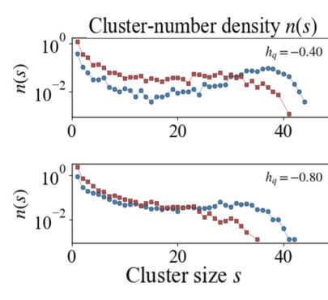 
FIG. 5: Extension of the percolation-oriented cluster observables results shown in Fig. 4 in the main text.

**Summary.** The study demonstrates that initial-state entanglement can prevent a quantum system from fragmenting into small, uncorrelated domains during a quench. By suppressing the nucleation of bubbles, specific pre-quench correlations stabilize large-scale connected structures, offering a way to protect global information without active error correction.

**Why it may be interesting.** It provides a novel perspective on 'passive protection' of information in many-body dynamics, showing that specific initial correlations can prevent fragmentation, which is highly relevant for the stability of states in programmable quantum simulators like Rydberg atom arrays.

Detailed structure

**Main problem.** Investigating how initial-state entanglement and correlation structures can provide passive protection for global information and stabilize macroscopic connected clusters during the decay of metastable states in quantum many-body systems.

**Main result.** Initial-state entanglement suppresses the proliferation of true-vacuum bubbles and stabilizes system-size clusters in 2D, a mechanism that depends on specific pre-quench correlation structures rather than just entanglement entropy.

**Method.** Numerical simulations of real-time dynamics using Tensor Network methods, specifically Matrix Product States (MPS) with the Time-Dependent Variational Principle (TDVP) on a 2D lattice mapped to a 1D chain.

**Model / system.** A 2D Transverse-Field Longitudinal Ising Model (TFLIM) on an open square lattice, undergoing a quantum quench following an inversion of the longitudinal field to study false-vacuum decay.

**Key observables.** Average magnetization, return probability, Quantum Fisher Information (magnetization fluctuations), cluster-number densities, and largest-cluster distributions.

**Important parameters / regimes.** Lattice dimensionality (1D vs 2D), transverse field strength (g), longitudinal field (h), and surface tension (sigma).

**Assumptions / limitations.** The 2D lattice is mapped to a 1D chain using snake ordering; classical simulation limits are reached at 7x7 lattice sizes.

**Figures summary.** Fig 1 shows the energy landscape and spin snapshots comparing product vs. entangled states; Fig 2 shows real-time magnetization and QFI dynamics; Fig 3 compares dimensionality effects; Fig 4 and 5 show cluster size distributions and the impact of correlation structures.

**Paper structure.** The paper introduces the problem of information preservation, describes the 2D TFLIM model and the false-vacuum decay process, presents numerical results comparing different initial states and dimensions, and concludes with the implications for passive protection of global structures.

Abstract

The capacity of a quantum many-body system to preserve global information -- encoded in the non-local correlations -- is a prerequisite for robust quantum computing. Unlike local degrees of freedom, large structures offer inherent resilience to noise, but their stability is often compromised by dynamical fragmentation and local excitations. In this work, we investigate under what initial conditions the quantum dynamics can sustain system-size cluster structures by examining false-vacuum decay dynamics in a 2D quantum Ising model. We find that while product states rapidly fragment into uncorrelated domains, initial-state entanglement suppresses the proliferation of true-vacuum bubbles and stabilises macroscopic connected clusters. We find that this passive stabilisation is not a mere consequence of entanglement entropy but rather depends on the specific pre-quench correlations. Our results establish a connection between initial-state preparation and the preservation of global structures, highlighting the role of entanglement for the passive protection of information in 2D quantum many-body simulation.

[↑ back to top](#top)

### [Phase-dependent role of dissipation across the Aubry-André-Harper transition](http://arxiv.org/abs/2605.22966v1)

**Authors:** Gerardo Suárez, Baptiste Debecker, Francesco Cosco, Francesco Plastina, François Damanet, Nicola Lo Gullo, Francesco Perciavalle  
**Type:** theory · **Category:** disordered systems and neural networks · **PDF:** <https://arxiv.org/pdf/2605.22966v1>  
**Analysis basis:** full PDF text, analyzed in chunks
**Topic relevance:** 🔥 `non-equilibrium dynamics` **4/5** · `driven-dissipative phase transition` **3/5** · `methods for driven-dissipative` **3/5** · `Keldysh / 2PI / non-Gaussian methods` **2/5** · `Kondo & dissipative impurity` **2/5** · `correlated / nonlocal dissipation` **2/5**

📷 Fig 1

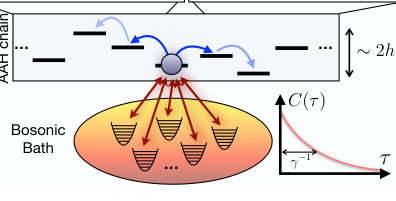 
Figure 1. Cartoon of the setup: a fermionic quasiperiodic chain is locally coupled at its central site to a bosonic bath, modeled as a non-Markovian environment with exponentially decaying correlations C(τ) and decay rate γ. Transport is controlled by system–bath parameters. In the extended phase, γ sets the spreading profile, uniform for large γ and non-uniform for small γ. In the localized phase, dissipation in- duces incoherent hopping, with γ mainly fixing the timescale rather than the spatial profile.

📷 Fig 2

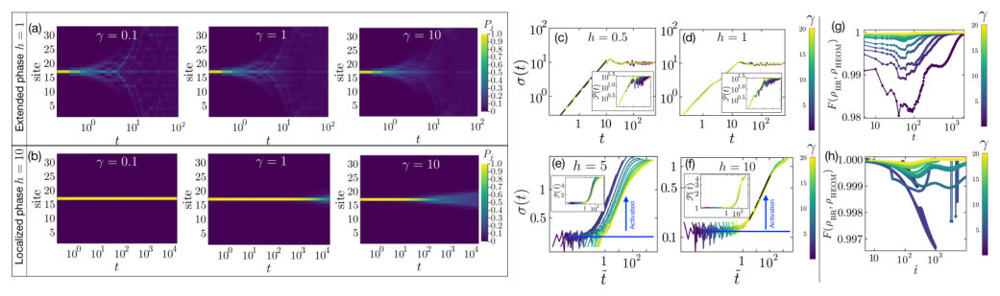 
Figure 2. Dynamics of a single particle in a dissipative AAH chain across the extended–localized transition. Panels (a) and (b) show the population dynamics in the extended phase (h = 1) and in the localized phase (h = 10), respectively, each for three different values of γ. Panels (c)–(f) display the RMSD, with the PPR shown in the insets, across the phase transition for different values of h. In each panel different values of γ are considered, as indicated by the color bars. In the localized phase, time is rescaled as ˜t = Γeff t, where Γeff = κγ2

📷 Fig 3

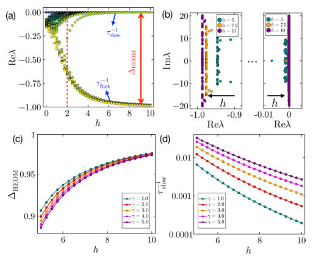 
Figure 3. Features of the HEOM spectrum across the extended-to-localized transition. (a) Real parts of LHEOM eigenvalues, showing clustering that identifies ∆HEOM, τ −1 fast, and τ −1 slow. Parameters: L = 15, γ = 2, tier= 6. (b) Real and imaginary parts of LHEOM eigenvalues in the localized phase for different h and L = 33, zoomed on fast and slow clusters. Parameters: γ = 2, tier= 6. For both panels (a) and (b), we consider the L2 eigenvalues of LHEOM with the largest real parts. (c),(d) ∆HEOM and τ −1 slow vs h in the localized phase for various γ. L = 15; tier= 8 (γ = 1), tier= 6 (γ = 2, 3), tier= 5 (γ = 4, 5). In all panels, κ = 2.

**Summary.** This paper explores how non-Markovian noise affects transport in the Aubry-André-Harper model. It demonstrates that while bath memory can fundamentally restructure transport in the delocalized phase, it only rescales the timing of transport in the localized phase. This identifies localization as a mechanism to filter out complex non-Markovian effects.

**Why it may be interesting.** This paper is highly relevant for researchers in open quantum systems and many-body dynamics as it reveals how environmental memory can be controlled or filtered by the underlying localization properties of a system, suggesting potential for bath engineering.

Detailed structure

**Main problem.** The study investigates how non-Markovian dissipation and bath memory affect transport dynamics across the Aubry-André-Harper (AAH) localization transition.

**Main result.** The authors find that the localized phase acts as a filter: in the extended phase, bath memory qualitatively reshapes transport patterns, whereas in the localized phase, memory effects primarily act as a renormalization of dynamical timescales.

**Method.** The study employs the Hierarchical Equations of Motion (HEOM) to capture non-Markovian dynamics and compares the results with Markovian (Lindblad/Bloch-Redfield) and semiclassical master equation approaches.

**Model / system.** A single spinless fermion in a 1D quasiperiodic AAH chain coupled to a bosonic bath at a central site, where the bath is modeled with an exponentially decaying correlation function.

**Key observables.** Root-Mean-Square Displacement (RMSD), Population Participation Ratio (PPR), population dynamics, and the spectrum of the dynamical generator.

**Important parameters / regimes.** Disorder strength (h), coupling strength (kappa), dissipation rate (gamma), bath frequency (omega_0), and the localization-delocalization transition point (h_c = 2J).

**Assumptions / limitations.** The localized regime analysis assumes a deeply localized limit where eigenstates are approximately site-localized and uses a truncated hierarchy for HEOM.

**Figures summary.** Figure 1 shows the schematic setup and the qualitative difference in transport; Figure 2 displays population dynamics and RMSD/PPR scaling across the transition; Supplemental figures compare HEOM with semiclassical and Markovian methods and show spectral clustering.

**Paper structure.** The paper introduces the AAH model and non-Markovian setup, presents the numerical HEOM results for transport in both phases, provides a theoretical derivation of the semiclassical master equation for the localized regime, and concludes with a comparison of different dynamical generators.

Abstract

We study transport across the Aubry-André-Harper localization transition in the presence of non-Markovian dissipation. For a single particle initially at the center of the chain, we show that bath memory (i.e., finite decay time of bath correlations) plays distinct roles in the two phases. In the extended phase, bath memory qualitatively reshapes the dynamical generator, thereby producing transport patterns that cannot be reduced to a simple rescaling of time. By contrast, in the localized phase, the bath activates motion between localized states and bath memory mainly renormalizes the dynamical timescales. Our results identify localization as a simple filter of non-Markovian effects: memory restructures transport in the extended regime, but survives mainly as a timescale renormalization in the deeply localized regime.

[↑ back to top](#top)

### [Quantum Quenches that Resemble Operator Growth](http://arxiv.org/abs/2605.23874v1)

**Authors:** Xiangyu Cao  
**Type:** theory · **Category:** statistical mechanics · **PDF:** <https://arxiv.org/pdf/2605.23874v1>  
**Analysis basis:** full PDF text, analyzed in chunks
**Topic relevance:** 🔥 `entanglement & information structure` **4/5** · 🔥 `non-equilibrium dynamics` **4/5** · 🔥 `scars & prethermalization` **4/5** · `non-equilibrium universality` **3/5**

📷 Fig 1

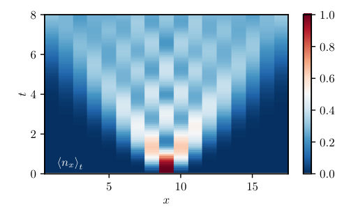 
FIG. 1. Expectation value of the local occupation number nx after a growth quench in the East-West model (4) of length L = 17 (open boundary conditions). The initial condition is obtained from the vacuum |0⟩⊗L by flipping the central spin to |1⟩. As a characteristic feature of growth quenches, this local perturbation of the false vacuum eventually destabilizes it everywhere. See Fig. 10 for more extensive numerical data.

📷 Fig 2

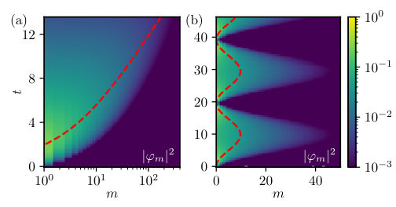 
FIG. 2. Time evolution on the Krylov tight binding model (37) with am = νm, bm = αm, with α = 1/2. (a) In the delocalized phase (ν = 0.95 &lt; 2α), the wave function delo- calizes exponentially.The dashed curves represent the spread complexity K(t). (b) In the localized phase, (ν = 1.05 &gt; 2α), the wave function is confined around the origin.

📷 Fig 3

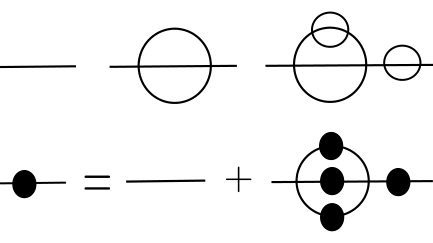 
FIG. 3. (a) Some lowest order melon diagrams that contribute to the SYK Schwinger-Dyson (SD) equation (66). (b) The recursion relation that is equivalent to the SD equation sums all the melon diagrams.

📷 Fig 4

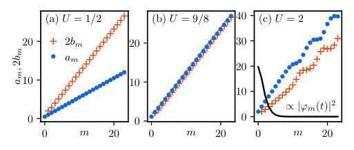 
FIG. 4. Lanzcos coefficients for the q = 3 SYK growth quench with J = 1 and values U/J below (a), near (b), and above (c) the Krylov localization transition (U/J)c ≈9/8, respectively. In the localized case (c) we also show the least localized Krylov chain wavefunction within a period.

📷 Fig 5

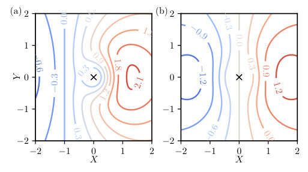 
FIG. 6. Contour plot of the semiclassical Hamiltonian h (92) on the unit sphere {(x, y, z) : x2 + y2 + z2 = 1}, represented by stereographic projection, (X, Y ) = (x/(1 + z), y/(1 + z)). The point z = 1 is at the origin (marked by a black cross) and the point z = −1 is at the infinity. Values of h are indicated on the contour lines. (a) g = 2, J = 1: the point z = 1 is surrounded by closed contour lines. (b) g = 0, J = 1: the point z = 1 is connected to infinity by a contour line X = 0.

**Summary.** This paper proves that the growth of local operators in quantum systems is mathematically equivalent to the dynamics of specific local quenches in constrained models. It predicts a phase transition between localized and delocalized regimes in Krylov space and shows how these dynamics can lead to interesting transport phenomena.

**Why it may be interesting.** It provides a new theoretical framework for studying non-equilibrium many-body dynamics and identifies a way to use simplified growth quenches to model complex operator spreading and scrambling.

Detailed structure

**Main problem.** Establishing a formal mathematical analogy between the dynamics of local operator growth in the Heisenberg picture and the evolution of growth quenches in kinetic constrained models.

**Main result.** The paper identifies a localization transition in Krylov and Fock space controlled by the ratio of Lanczos coefficients, and demonstrates that growth quenches can exhibit ballistic transport in physical space even when localized in Fock space.

**Method.** The study utilizes the Krylov (recursion) method, Lanczos algorithm, semiclassical analysis, and a mapping (dictionary) between operator dynamics and growth quench dynamics.

**Model / system.** The study focuses on kinetic constrained models (KCMs), specifically the 1D East-West model, and large-N solvable models inspired by the Sachdev-Ye-Kitaev (SYK) model.

**Key observables.** Lanczos coefficients (diagonal and off-diagonal), Lyapunov exponent, spread complexity, return amplitude, and total occupation number.

**Important parameters / regimes.** The localization threshold defined by the ratio |2alpha/nu|, where alpha and nu are the linear growth rates of the Lanczos coefficients.

**Assumptions / limitations.** The mapping is currently restricted to unitary dynamics and does not easily generalize to open quantum systems (Lindblad dynamics).

**Figures summary.** Figures illustrate the Motzkin path representation of moments, the spectral function of the Krylov chain, and the spacetime Green function showing ballistic spreading.

**Paper structure.** The paper begins by establishing a dictionary between operator growth and growth quenches, then moves to analyzing the localization transition using the Krylov method, explores large-N SYK-like models, and concludes with specific applications to the 1D East-West model.

Abstract

We study growth quenches, which are local quenches that may gradually destabilize a false vacuum in certain kinetic constrained quantum lattice models, such as the East-West model. We point out a formal analogy with the dynamics of a local operator in the Heisenberg picture. Exploiting this analogy, we obtain several results on growth quenches by adapting operator-dynamics concepts and methods. First, applying the Krylov approach (recursion method), we conjecture the linear growth of Lanzcos coefficients in generic quenches, $a_m \sim νm$ (diagonal), and $b_m \sim αm$ (off-diagonal), extending an operator growth hypothesis. We show that the growth quench dynamics is localized in both Krylov and Fock spaces when $|ν| > 2 α$, and derive a bound for the growth quench analogue of Lyapunov exponent $λ_L \le \sqrt{4 α^2 - ν^2}$ when $|ν| < 2 α$. Second, we realize the Fock localization in large $N$ solvable growth quenches inspired by Sachdev-Ye-Kitaev (SYK) models. The bound on Lyapunov exponent is saturated in large-$q$ SYK grow quench. By contrast, the growth quench is almost always Fock localized in a nonrandom all-to-all growth quench amenable to semiclassics. Finally, in the 1D East-West model, we interpret Fock space cage states as the existence of a conserved charge. We show that the latter has ballistic transport due to current conservation. Moreover, adding hopping with a fine-tuned amplitude induces a partial localization due to a flat band. Our work suggest growth quenches as a promising approach to realize non-equilibrium coherent phenomena in many-body systems.

[↑ back to top](#top)

### [Entanglement entropy across the dynamical phase transition in the quantum $\mathcal{O}(N)$ model](http://arxiv.org/abs/2605.23600v1)

**Authors:** Frederick del Pozo, Tangi Morvan, Irénée Frérot, Nicolas Cherroret  
**Type:** theory · **Category:** statistical mechanics · **PDF:** <https://arxiv.org/pdf/2605.23600v1>  
**Analysis basis:** full PDF text, analyzed in chunks
**Topic relevance:** 🔥 `entanglement & information structure` **4/5** · 🔥 `non-equilibrium dynamics` **4/5** · `driven-dissipative phase transition` **3/5** · `non-equilibrium universality` **3/5**

📷 Fig 1

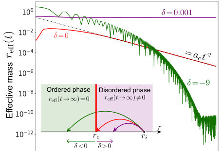 
FIG. 1. Effective mass reff(t) in dimension d = 3, obtained by numerically solving Eqs. (3) and (4) for δ = 0.001 (purple curve), δ = 0 (red curve) and δ = −9 (green curve), corre- sponding to quenches above, at, and below the critical point, respectively. Here we choose ri = 100 and u = 10, yield- ing a critical value rc ≃−0.43. The numerical simulations are performed for k ∈[0, 10Λ] and 105 points. The dashed line indicates the asymptotic behavior reff(t) = act−2, where ac = d

📷 Fig 2

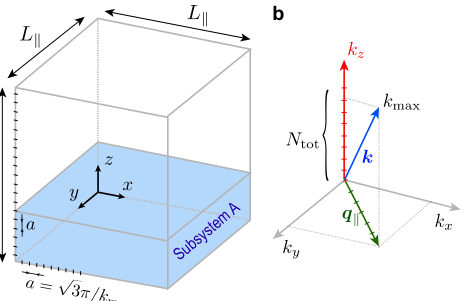 
FIG. 2. Panel (a) Spatial geometry considered in this work. We compute the entanglement entropy S(A|B) in the O(N) model by considering a parallelepiped subsystem A of vol- ume LL2 ∥with transverse extent L∥→∞. The system is numerically discretized, with a grid step a equal in each spa- tial direction and fixed by the maximum radial momentum kmax in panel (b). Panel (b) Corresponding discretization of momenta in the O(N) model. kz is discretized in Ntot steps within [−π/a, π/a], with Ntot setting the full system size Ltot = Ntota.

📷 Fig 3

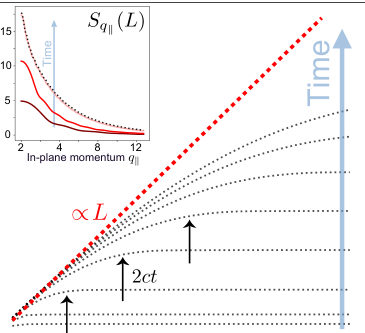 
FIG. 3. Main panel: Entanglement entropy per unit area as a function of subsystem size at increasing times after a quench into the ordered phase (δ = −1), showing the light- cone spreading of entanglement. Deep inside the light cone, L ≪2ct, the entropy becomes time independent and ap- proaches S(L, t) ∝L (red dotted line), displaying the volume- law scaling characteristic of entanglement spreading following the quench. Outside the light cone, L &gt; 2ct, where correla- tions have not yet propagated across the subsystem, the en- tropy instead obeys an area law, S(L, t) ∝L0, inherited from the initial ground state, while increasing linearly in time. Pa- rameters: u = 10, ri = 100, and N∥= Ntot...

📷 Fig 4

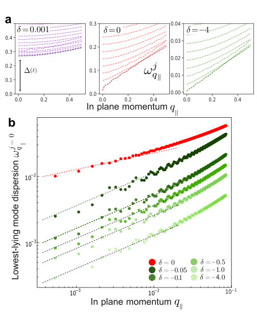 
FIG. 4. Panel a: Late-time entanglement spectrum ωj q∥as a function of q∥for three different quench depths: above (δ = 0.001), at (δ = 0) and below (δ = −4) the critical point of the DPT. The different dashed curves correspond to different entanglement modes j, with the dispersion of the lowest-lying mode j = 0 highlighted by the darker curve. Spectra are shown at finite time t = 200. The dispersion of the lowest- lying zero-mode at zero momentum, ∆(t) ≡ωj=0 q∥=0, defines the entanglement gap. Panel b: Momentum dispersion of the lowest-lying mode (j = 0) at low momentum in a log–log scale, for different quench depths δ and at a fixed long time t = 103 (while δ = 0 is shown for t = 104)....

📷 Fig 5

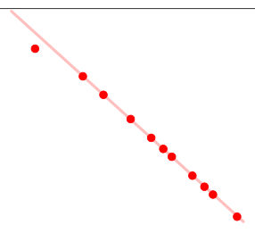 
FIG. 5. Prefactor of the entanglement dispersion, ω0 q∥/q1/2 ∥ with q∥→0, as a function of the quench depth |δ| into the or- dered phase (red dots). The values of this ratio are extracted from fits of the dispersion curves in Fig. 4b, performed at the time t = 103. The solid red curve corresponds to the algebraic fit 0.026|δ|−0.498. Parameters: ri = 100, u = 10, Λ = π/2, Ntot = 5 × 105, and Ns = 100.

**Summary.** This paper demonstrates that the dynamical phase transition in the quantum O(N) model leaves unique signatures in the subleading terms of the entanglement entropy and the structure of the entanglement spectrum. It shows that while the leading term follows a volume law, the subextensive logarithmic corrections and the scaling of entanglement modes change significantly at the critical point. This provides a way to identify dynamical phase transitions using entanglement-based observables.

**Why it may be interesting.** It provides universal fingerprints of non-equilibrium phase transitions through entanglement signatures, which is highly relevant for understanding many-body dynamics and the emergence of long-range correlations.

Detailed structure

**Main problem.** Investigating how a dynamical phase transition (DPT) in the quantum O(N) model manifests in the entanglement entropy and entanglement spectrum.

**Main result.** The DPT is revealed through subleading logarithmic corrections to the volume-law entanglement entropy and characteristic changes in the entanglement dispersion scaling (e.g., from q^1/2 to q^1/4).

**Method.** Analytical and numerical study in the large-N limit using a self-consistent Gaussian theory, the Williamson approach for entanglement spectrum, and an infinite-slab geometry.

**Model / system.** The quantum O(N) model in the large-N limit, specifically a system of O(N) bosons with quartic interactions in three spatial dimensions following a sudden mass quench.

**Key observables.** Entanglement entropy (EE), entanglement spectrum (ES), entanglement gap, and two-point correlation functions.

**Important parameters / regimes.** Quench depth (delta), dynamical exponent (alpha), subsystem size (L), and time (t).

**Assumptions / limitations.** The study relies on the large-N limit, which makes the dynamics integrable and solvable via Gaussian theory.

**Figures summary.** Figure 1 shows the quench phase diagram; Figure 3 illustrates light-cone spreading of EE; Figure 4 shows the entanglement gap scaling; Figure 6 shows data collapse for the inverse gap; Figure 9 displays the spatial structure of entanglement eigenvectors.

**Paper structure.** The paper introduces the model and quench protocol, establishes the numerical framework for entanglement calculation, analyzes the scaling of the entanglement spectrum and gap across the DPT, and concludes with the spatial structure of entanglement modes.

Abstract

We demonstrate that the dynamical phase transition of the quantum $\mathcal{O}(N)$ model at large $N$ leaves universal fingerprints in the infrared structure of the entanglement spectrum. While the leading contribution to the entanglement entropy at long time follows the conventional volume law associated with ballistic entanglement spreading, its subleading behavior sharply distinguishes the different dynamical regimes. Specifically, quenches at and below the critical point generate gapless low-energy entanglement modes together with logarithmic corrections to the long-time entanglement entropy, whose scaling is governed by the dynamical exponent of the transition. Using an infinite-slab bipartition geometry and exact numerical correlation functions in the large-$N$ limit, we characterize these scaling laws across the dynamical phase diagram and relate them to the emergence of long-range correlations during the post-quench dynamics. We further show that the entanglement eigenmodes themselves reveal characteristic signatures of the dynamical phase transition through their spatio-temporal structure and degeneracy properties.

[↑ back to top](#top)

### [A new Ising/tricritical-Ising interface: From ${W}_3$ symmetry to Rydberg atoms](http://arxiv.org/abs/2605.23848v1)

**Authors:** António Antunes, Junchen Rong  
**Type:** both · **Category:** other · **PDF:** <https://arxiv.org/pdf/2605.23848v1>  
**Analysis basis:** full PDF text, analyzed in chunks
**Topic relevance:** 🔥 `Rydberg arrays` **4/5** · `analog quantum simulation` **3/5** · `exotic spin models in light-matter` **3/5** · `entanglement & information structure` **2/5**

📷 Fig 1

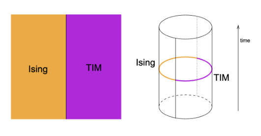 
FIG. 1: A conformal interface on the plane becomes defects separating two different quantum critical phases on a circle, after a conformal transformation.

📷 Fig 2

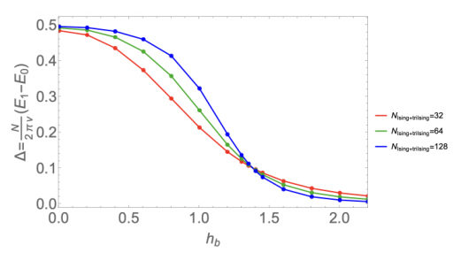 
FIG. 2: The phase transition on the Ising/TIM interface. The plot is symmetric with respect to hb = 0.

📷 Fig 3

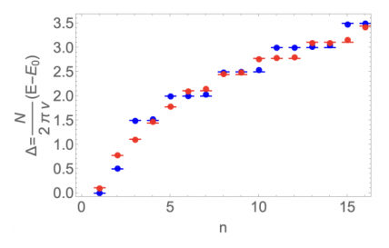 
FIG. 3: The states of Ising/TIM interface at critical coupling, which corresponds to the open-string channel spectrum of the folded theory. The small horizontal lines are the theoretical prediction, and the dots are the numerical data. The blue and red dots correspond to the Z2 even and odd sectors, respectively. The system size is NIsing + NTIM = 256.

📷 Fig 4

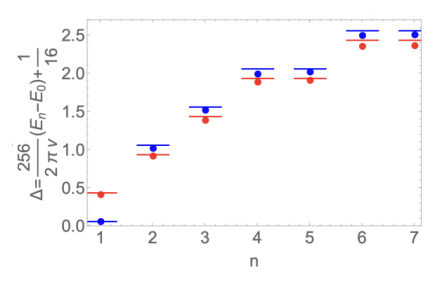 
FIG. 4: The open-string sector spectrum of mixed boundary conditions. We apply the FM boundary condition on one side and the factorized boundary condition C1 on the other side. The system size is NIsing + NTIM = 256. The blue and red dots correspond to the Z2 even and odd sectors, respectively.

📷 Fig 5

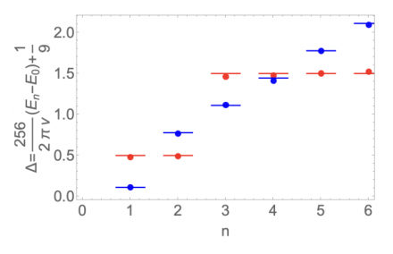 
FIG. 5: The open-string sector spectrum of mixed boundary conditions. We take the FM boundary condition on one side and the AFM boundary on the other side. The system size is NIsing + NTIM = 256. The blue and red dots correspond to the Z2 even and odd sectors, respectively.

**Summary.** This paper identifies a new type of conformal interface between two different universality classes, the Ising and Tricritical Ising models. It reveals that this interface possesses an emergent W3 chiral symmetry and proposes that these theoretical predictions can be tested using Rydberg atom arrays.

**Why it may be interesting.** It provides a concrete link between high-level algebraic structures (W3 symmetry) and controllable experimental platforms (Rydberg atoms), offering a way to study non-invertible symmetries and conformal interfaces in many-body systems.

Detailed structure

**Main problem.** The discovery and characterization of a new conformal interface between the Ising and Tricritical Ising universality classes, and the investigation of its emergent W3 chiral symmetry.

**Main result.** The authors identify a new conformal interface that exhibits an emergent W3 chiral symmetry and demonstrate that this interface can be experimentally realized using Rydberg atom arrays.

**Method.** The study combines theoretical Conformal Field Theory (CFT) analysis, including modular bootstrap and symmetry gauging, with numerical simulations using Matrix Product States (MPS) and DMRG.

**Model / system.** The system consists of interfaces between critical spin-chains, specifically the Ising and Tricritical Ising models, with a potential experimental implementation in Rydberg atom arrays in a ladder geometry.

**Key observables.** Energy spectrum of the Hamiltonian, scaling dimensions of operators, partition functions (closed and open string channels), and boundary state amplitudes.

**Important parameters / regimes.** Interface coupling strength (hb), critical coupling ratios (K*/J*), and Rydberg atom parameters such as detuning (delta) and Rabi frequency (Omega).

**Assumptions / limitations.** The analysis assumes the validity of the W3 symmetry and uses the k=1 specialization for the Ising/TIM interface; it also assumes the accuracy of specific modular S-transformation matrices from existing literature.

**Figures summary.** Figure 1 illustrates the conformal interface; Figure 4 shows the open-string sector spectrum for mixed boundary conditions; Figure 5 shows the spectrum for the W3 invariant state; Figure 7 compares the interface spectrum with the KW-twisted sector.

**Paper structure.** The paper begins by introducing the new Ising/TIM interface, moves to the theoretical derivation of the W3 symmetry and boundary state construction, presents numerical validation via MPS/DMRG, and concludes with the proposed experimental realization in Rydberg arrays.

Abstract

We consider interfaces between critical spin-chains in different universality classes, described in the continuum limit by defect/interface conformal field theory (DCFT/ICFT). We find a new conformal interface between the Tricritical Ising (TIM) and the Ising CFT. We also explore the possibility of its experimental realizations in the context of Rydberg atom arrays. Our analysis emphasizes non-invertible symmetries and consistency under modular transformations, and uses defect couplings and the defect spectrum -- including in the case of mixed boundary conditions -- to make sharp experimental predictions. The structure of the observables hinges on a newly discovered pattern of emergent ${W}_3$ chiral symmetry for the Tricritical-Ising/Ising interface.

[↑ back to top](#top)

### [Information transfer along the causal lightcone of a brickwork quantum circuit](http://arxiv.org/abs/2605.23622v1)

**Authors:** Shivansh Singh, Shane Dooley  
**Type:** theory · **Category:** quantum information and computing · **PDF:** <https://arxiv.org/pdf/2605.23622v1>  
**Analysis basis:** full PDF text, analyzed in chunks
**Topic relevance:** 🔥 `entanglement & information structure` **4/5** · 🔥 `non-equilibrium dynamics` **4/5** · `methods for driven-dissipative` **2/5** · `scars & prethermalization` **2/5**

📷 Fig 1

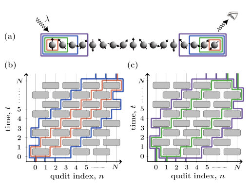 
FIG. 1. (a) We consider the problem of information trans- fer through a thermal Floquet chain of N + 1 qudits. Some information λ is initially encoded in the state of the first M qudits (the red, blue, green, purple boxes, for M = 1, 2, 3, 4, respectively), and estimated through measurement of the last M qudits at a later time. (b,c) We restrict to the class of Flo- quet models that can be mapped to brickwork circuits com- posed of two-qudit unitary channels ˆU2 = ˆU · ˆU † (gray boxes). Given the initial state ˆρ(λ)(0) = ˆρ(λ) in,M ⊗(ˆI/d)⊗(N−M+1) for small M, we can efficiently compute the reduced density ma- trix ˆρ(λ) out,M(t) of the last M qudits at the later time t = N on the...

📷 Fig 2

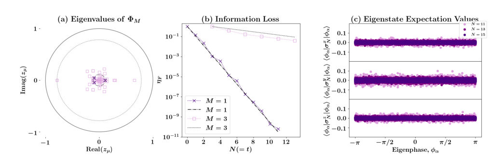 
FIG. 2. (a): The non-trivial eigenvalues zµ of Φ1( ˆU) and Φ3( ˆU) for a Haar-random unitary ˆU. All the eigenvalues lie inside the circle, i.e., |zµ| &lt; 1. (b): Since there are no peripheral eigenvalues, the evolution along the lighcone exhibits an unavoidable loss of information. The results are for a continuous parameter λ encoded in an input state ˆρ(λ) in,1(0) = eiλσz|+⟩⟨+|e−iλσz (for

📷 Fig 3

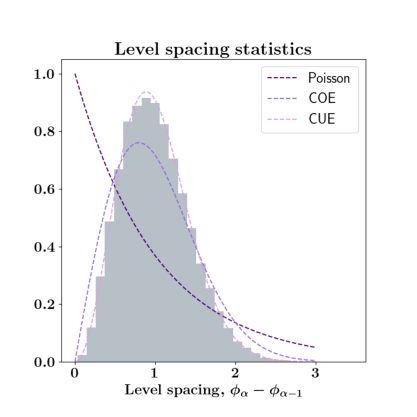 
FIG. 4. Level spacing statistics of the Floquet unitary ˆU, built with a Haar-random local unitary gate ˆU. The distribution of level spacings is consistent with that of the circular unitary ensemble (CUE).

📷 Fig 4

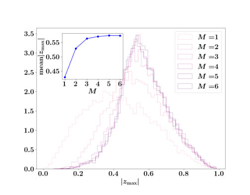 
FIG. 3. Distribution of |zmax| (the non-trivial eigenvalue of ΦM( ˆU) with largest magnitude) for an ensemble of 10000 Haar-random unitaries ˆU. Peripheral eigenvalues (|zmax| = 1) are extremely rare. The inset shows the mean of each distri- bution as a function of M, which saturates at a value smaller than unity as M increases.

📷 Fig 5

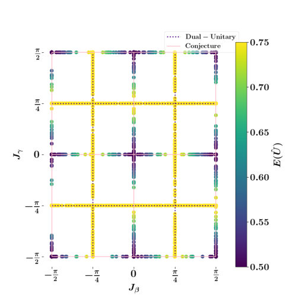 
FIG. 5. Numerical optimization of the nonlocal parameters, characterizing the two-qubit unitary, for the peripheral eigen- values of the map Φ2 composed of two qubit unitary. The conjecture states that Jα = π

**Summary.** This paper identifies that the ability to transfer information without loss through a quantum circuit depends on the presence of peripheral eigenvalues in the evolution channel. While dual-unitarity is required for simple qubit chains, larger subsystems or higher-dimensional qudits can achieve lossless transfer even in chaotic, thermalizing regimes.

**Why it may be interesting.** It provides a surprising link between the existence of non-dissipative information channels and quantum chaos, showing that thermalizing, non-integrable systems can still support perfect information transfer, which is highly relevant for quantum communication and remote sensing in many-body systems.

Detailed structure

**Main problem.** Investigating the conditions for lossless versus lossy information transfer and remote sensing of parameters along the causal lightcone of a brickwork quantum circuit.

**Main result.** Lossless information transfer is linked to the existence of peripheral eigenvalues (unit modulus) in the quantum channel, a requirement that is necessary for qubits (M=1) but can be relaxed for larger subsystems or higher-dimensional qudits, even in chaotic, thermalizing systems.

**Method.** The authors use a quantum channel framework ($\Phi_M$) to map many-body dynamics to the lightcone, employing spectral analysis of the channel, numerical optimization, and analytical constructions using the Poincaré recurrence theorem and Weyl's inequality.

**Model / system.** A one-dimensional open chain of $N$ qudits (qubits or qutrits) undergoing Floquet dynamics driven by a brickwork quantum circuit of alternating unitary layers.

**Key observables.** Trace distance (distinguishability), Quantum Fisher Information (QFI), information transfer ratios ($\eta_D, \eta_F$), and operator linear entropy.

**Important parameters / regimes.** Subsystem size $M$, local dimension $d$, non-local gate parameters ($J_x, J_y, J_z$), and the presence of peripheral eigenvalues ($|z|=1$).

**Assumptions / limitations.** The system is assumed to be in a high-temperature/maximally mixed state outside the encoded subsystem, and the dynamics are restricted to the brickwork circuit class.

**Figures summary.** Schematics of information encoding/recovery; plots of eigenvalue spectra and information decay rates; numerical optimization of gate parameters; and entanglement entropy analysis showing an absence of many-body scars.

**Paper structure.** The paper introduces the problem of information propagation, defines the brickwork circuit and quantum channel framework, analyzes the spectral conditions for information loss/preservation, extends the findings to larger subsystems and higher dimensions, and concludes by demonstrating that these lossless properties can coexist with quantum chaos and ETH.

Abstract

Understanding how local information propagates through many-body quantum systems is a central problem in nonequilibrium dynamics, with important implications for quantum communication, state transfer, and remote sensing. In this work, we investigate information transfer along a one-dimensional open chain of qudits, focusing on the task of recovering information initially encoded at one end via measurements performed at the opposite end. By restricting the dynamics to brickwork quantum circuits, and considering small $M$-qudit subsystems on the causal ``lightcone'' of the circuit, we obtain several results valid even for large system sizes $N$ or for nonintegrable global dynamics. Within this framework, lossless information transfer is linked to the existence of peripheral eigenvalues of a quantum channel $Φ_M$, which governs the evolution of the $M$-qudit local subsystem along the lightcone. We investigate conditions under which brickwork circuits admit such peripheral eigenvalues. For qubit chains and $M=1$, we show that the dual-unitary property is necessary, whereas for larger local subsystems ($M \geq 2$) or higher-dimensional qudits, this requirement can be relaxed. Perhaps surprisingly, we can use the peripheral eigenvalue condition to construct examples exhibiting lossless information transfer through chains of arbitrary system size $N$, even when the underlying circuit dynamics is nonintegrable and thermalising at long times.

[↑ back to top](#top)

### [Unified resonant-manifold framework for dynamical quantum phase transitions](http://arxiv.org/abs/2605.22915v1)

**Authors:** Jesse J. Osborne, Cheuk Yiu Wong, Jad C. Halimeh  
**Type:** theory · **Category:** statistical mechanics · **PDF:** <https://arxiv.org/pdf/2605.22915v1>  
**Analysis basis:** full PDF text, analyzed in chunks
**Topic relevance:** 🔥 `non-equilibrium dynamics` **4/5** · `driven-dissipative phase transition` **3/5** · `non-equilibrium universality` **3/5** · `entanglement & information structure` **2/5**

📷 Fig 1

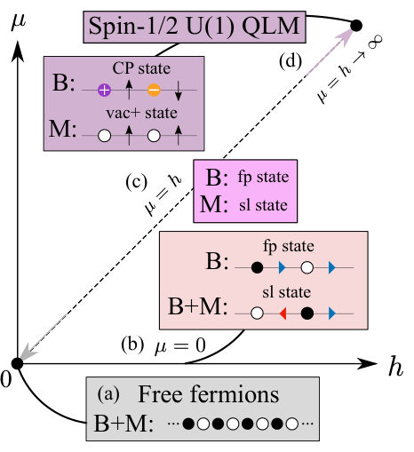 
FIG. 1. The parameter space of the Z2 LGT (1), emphasiz- ing the regimes characterized by the emergence of branch (B) and manifold (M) DQPTs for quenches of the fully-polarized (fp) and staggered-link (sl) initial states. We consider four parameter regimes: (a) µ = h = 0, the effective free-fermion limit, (b) the zero-mass regime µ = 0, (c) the mass-resonance regime µ = h, and (d) the infinite-mass limit µ = h →∞. As we approach (d), the dynamics of the Z2 LGT becomes that of the spin-1/2 U(1) QLM, quenching from the charge- proliferated (CP) and vacuum (vac) initial states (the positive vacuum is shown in the diagram). Black (white) circles repre- sent occupied (empty) matter sites [and...

📷 Fig 2

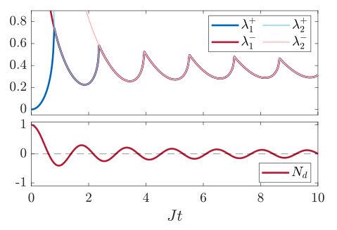 
FIG. 2. The evolution of the return rate (top) and particle number difference (bottom) of fully polarized/staggered-link state quenched to µ = h = 0 in the Z2 (1). At this point, the model is equivalent to the free-fermion model (4).

📷 Fig 3

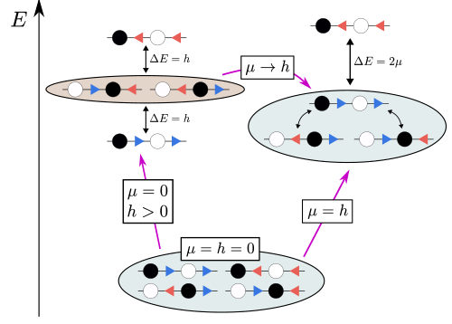 
FIG. 3. A schematic energy diagram of the different product- state configurations considered in the Z2 LGT, which forms the central organizing principle of this work. At µ = h = 0, all configurations are degenerate in energy, while adding a finite h separates the energies of the fully polarized states from the staggered-link states. In the mass-resonance regime µ = h, one of the fully polarized states is brought into resonance with the two staggered-link configurations, while the other remains energetically detuned.

📷 Fig 4

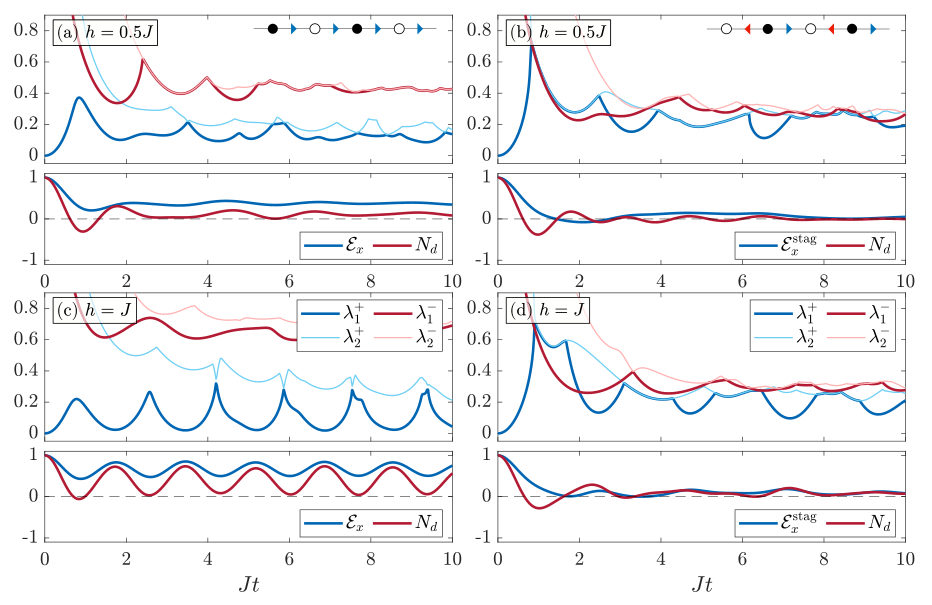 
FIG. 4. The evolution of the return rate (top panels) and electric flux and particle number difference (bottom panels) following the quench of the (a,c) fully polarized and (b,d) staggered-link initial states [illustrated in the upper right corner of the upper panel in (a) and (b), respectively] in the Z2 LGT to µ = 0 and (a,b) h = 0.5J and (c,d) h = J, obtained using infinite matrix product state numerics. We plot the first and second return rates with respect to the initial state λ+ 1,2 (blue curves), and its partner with flipped gauge sites λ− 1,2 (red curves), so that branch dynamical quantum phase transitions (DQPTs) occur when there is a crossing the two lowest return rates which have...

📷 Fig 5

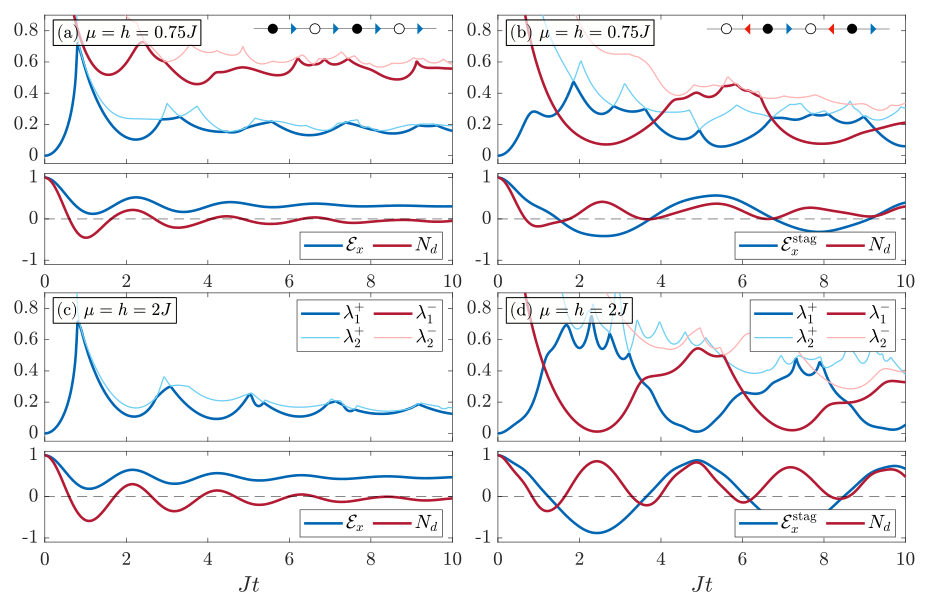 
FIG. 5. The evolution of the return rate (top panels) and electric flux and particle number difference (bottom panels) following the quench of the (a,c) fully polarized and (b,d) staggered-link initial states [illustrated in the upper right corner of the upper panel in (a) and (b), respectively] in the Z2 LGT at mass resonance to (a,b) µ = h = 0.75J and (c,d) µ = h = 2J.

**Summary.** This paper introduces a new framework to unify different types of dynamical quantum phase transitions by focusing on energy resonances between state manifolds. By studying a 1+1D lattice gauge theory, the authors show that the nature of these transitions depends on the multiplicity and symmetry of transitional states. This provides a way to use DQPTs as probes for the resonant connectivity of constrained quantum systems.

**Why it may be interesting.** It provides a fundamental mechanism for classifying non-equilibrium phase transitions based on energy structure and connectivity, which is highly relevant for understanding many-body dynamics and out-of-equilibrium criticality.

Detailed structure

**Main problem.** The lack of a comprehensive understanding of why different types of dynamical quantum phase transitions (DQPTs), such as regular vs. anomalous and manifold vs. branch, occur in specific many-body scenarios.

**Main result.** The authors propose a unified resonant-manifold framework where manifold DQPTs are driven by resonances within the initial state manifold, while branch DQPTs are driven by resonances with a transitional manifold of states.

**Method.** The study uses infinite Matrix Product State (iMPS) simulations with the Time-Dependent Variational Principle (TDVP) and spectral analysis of energy resonances.

**Model / system.** A 1+1D Z2 Lattice Gauge Theory (LGT) featuring dynamical matter fields, including terms for particle hopping (J), staggered fermion mass (mu), and external electric field strength (h).

**Key observables.** Fidelity (return rate to the initial state), electric flux, and particle number difference.

**Important parameters / regimes.** Fermionic mass (mu), electric field strength (h), hopping strength (J), and a bias term (delta).

**Assumptions / limitations.** The study focuses on the mass-resonance regime and assumes the dynamics can be captured by the connectivity of product-state manifolds in a constrained Hilbert space.

**Figures summary.** Figure 1 maps the parameter space of the Z2 LGT; Figure 4 shows the evolution of return rates and local observables for different electric field strengths; Figure 8 displays quench dynamics for fully polarized and staggered-link states.

**Paper structure.** The paper introduces the problem of DQPT classification, proposes the resonant-manifold framework, applies it to the Z2 LGT model, analyzes specific regimes (mass-resonance, large-h, and U(1) limit), and discusses the implications for understanding resonant connectivity.

Abstract

Dynamical quantum phase transitions (DQPTs) are an exciting paradigm of out-of-equilibrium criticality in many-body systems manifested in nonanalytic behavior in the return rate to the initial state following a sudden quench. While previous work has tried to distinguish between distinct types of DQPTs, such as regular and anomalous, or manifold and branch, a comprehensive understanding of why each type appears in a given scenario is still lacking. In this work, we propose a unified framework addressing this gap in terms of the energy structure of different product state configurations. In particular, while manifold DQPTs are governed by resonances within the initial state manifold, branch DQPTs are governed by resonances with a transitional manifold of states dynamically connected to the initial manifold by low-order processes. We show that the (ir)regularity of branch DQPTs is related to the multiplicity of this transitional manifold, and we also observe exotic periods of extended degeneracy in the return rate (beyond the conventional level crossing of a DQPT) which are also conditioned on the structure of this transitional manifold. We demonstrate this by studying quenches of two different configurations in the 1 + 1D Z_2 LGT to various parameter regimes. Our findings provide a dynamical mechanism underlying branch DQPTs and frames DQPTs as probes of resonant connectivity in constrained Hilbert spaces, paving the way to a more complete understanding of the multifaceted nature of dynamical criticality.

[↑ back to top](#top)

### [Anomalous Decay of Quantum Resources: The Entanglement Sudden Death Mpemba Effect](http://arxiv.org/abs/2605.23197v1)

**Authors:** Zhilong Liu, Zehua Tian, Jieci Wang  
**Type:** theory · **Category:** quantum information and computing · **PDF:** <https://arxiv.org/pdf/2605.23197v1>  
**Analysis basis:** full PDF text, analyzed in chunks
**Topic relevance:** 🔥 `entanglement & information structure` **4/5** · `correlated / nonlocal dissipation` **2/5** · `methods for driven-dissipative` **2/5** · `non-equilibrium dynamics` **2/5**

📷 Fig 1

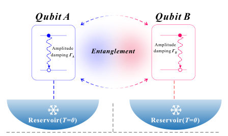 
FIG. 1. Schematic representation of the dissipative model. A bipar- tite system, consisting of two-level subsystems A and B, is initially prepared in an entangled state and subsequently undergoes local dissi- pation through independent zero-temperature reservoirs. Each system undergoes an amplitude damping process with a decay rate of ΓA and ΓB, respectively. Both systems are coupled to their own independent reservoirs maintained at zero temperature (T = 0).

📷 Fig 2

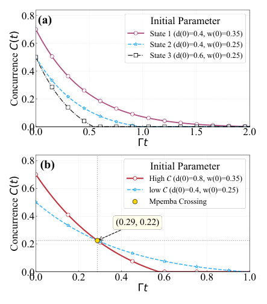 
FIG. 2. Decay of concurrence under symmetric dissipation ΓA = ΓB = 1. (a) Normal concurrence decay for three different initial states: d(0) = 0.4, 0.4, 0.6 and w(0) = 0.35, 0.25, 0.25, respectively. (b) Anomalous concurrence decay for two different initial states: d1(0) = 0.4, w1(0) = 0.25, and d2(0) = 0.8, w2(0) = 0.35. The yellow circle marks the crossing point at (0.29, 0.22) (coordinates rounded to two decimal places).

📷 Fig 3

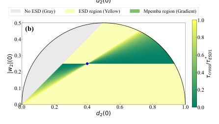 
FIG. 4. Phase diagrams: solid black semicircle is physical boundary (positivity condition). Grey area: no ESD. Green gradient: quantum Mpemba crossing. Yellow: ESD without Mpemba effect. Blue dot marks reference parameters (|w1(0)| = 0.4, d1(0) = 0.25). Panels: (a) symmetric dissipation (ΓA = ΓB = 1), (b) asymmetric dissipation (ΓA = 0.1, ΓB = 10).

📷 Fig 4

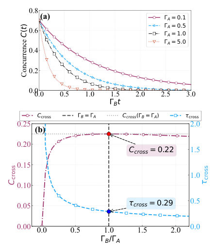 
FIG. 3. (a) Normal concurrence decay for four different initial states: ΓA=0.1(pink circle), 0.5(blue star), 1(black square), 5(orange triangle), respectively. w(0) = 0.35, d(0) = 0.4. (b) The Mpemba crossing of concurrence Ccross (pink circles) and the corresponding crossing time τcross (blue squares) vary with ΓB. The initial state parameters are fixed as: d1(0) = 0.4, w1(0) = 0.25 and d2(0) = 0.8, w2(0) = 0.35.

📷 Fig 5

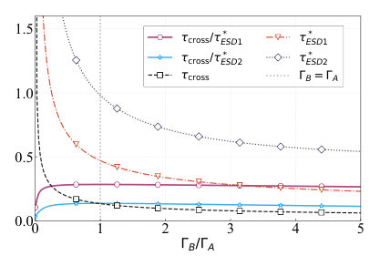 
FIG. 5. Characteristic timescales and their dimensionless ratios vary as the ratio ΓB/ΓA. The black dashed line (squares) represents the con- currence trajectory crossing time τcross. Orange dot-dashed line (down- ward triangles) and purple dotted line (diamonds) show ESD times τ∗ ESD1 and τ∗ ESD2 for two distinct initial states. Pink solid line (circles) and blue solid line (stars) give the corresponding ratios τcross/τ∗ ESD1 and τcross/τ∗ ESD2. Vertical grey dotted line marks symmetric dissipation (ΓB = ΓA).

**Summary.** This paper discovers a quantum version of the Mpemba effect where higher initial entanglement leads to faster entanglement sudden death. It provides an analytical framework to understand this anomalous decay and proves that the effect's existence is robust even when the dissipation rates of the two qubits are unequal.

**Why it may be interesting.** It provides new insights into the control of quantum resource lifetimes in dissipative environments and shows how environmental asymmetry affects the dynamics of entanglement decay.

Detailed structure

**Main problem.** The paper investigates the 'Entanglement Sudden Death (ESD) Mpemba Effect,' where a more strongly entangled initial state decays to a separable state faster than a more weakly entangled one.

**Main result.** The authors analytically derive the conditions for trajectory crossing and demonstrate that the boundaries of this anomalous Mpemba region are robust against environmental dissipation asymmetry.

**Method.** The study uses an analytical approach involving the Lindblad master equation, exact derivation of density matrix elements for X-states, and phase diagram mapping.

**Model / system.** Two independent two-level subsystems (qubits) interacting with local, zero-temperature bosonic reservoirs via pure amplitude damping (spontaneous emission) described by a Lindblad master equation.

**Key observables.** Concurrence (as a measure of entanglement), ESD time (tau*ESD), and crossing time (tau_cross).

**Important parameters / regimes.** Decay rates (Gamma_A, Gamma_B), initial state parameters (w(0), d(0)), and the dissipation asymmetry ratio (Gamma_B/Gamma_A).

**Assumptions / limitations.** Born-Markov and rotating-wave approximations are used; the environment is at zero temperature; the initial states are restricted to a specific class of X-states.

**Figures summary.** Fig 1 shows the dissipative model; Fig 2 compares normal decay vs. Mpemba crossing; Fig 3 shows the impact of asymmetric dissipation; Fig 5 plots characteristic timescales and their ratios as functions of the dissipation ratio.

**Paper structure.** The paper introduces the Mpemba effect analogy, defines the two-qubit dissipative model, provides analytical derivations for ESD and crossing times, analyzes the impact of dissipation asymmetry, and concludes with a phase diagram of the effect's boundaries.

Abstract

In classical thermodynamics, the Mpemba effect refers to the counterintuitive observation that hot water can freeze faster than cold water, manifesting as an anomalous crossing of dynamical trajectories. While analogues of this phenomenon have been explored in quantum radiative systems and spin-chain entanglement asymmetry, its connection to the finite-time decoupling of quantum correlations remains elusive. In this Letter, we uncover a distinct quantum Mpemba effect associated with entanglement sudden death (ESD). By analyzing two qubits interacting with local amplitude damping reservoirs, we demonstrate that a more strongly entangled initial state can experience a faster collapse into a separable state than a more weakly entangled one. We provide an exact analytical derivation of the trajectory crossover dynamics and the ESD time. Finally, we map the phase diagram of initial state parameters to delineate the regime where this anomalous entanglement Mpemba effect occurs, offering insights into the control of quantum resource lifetimes in dissipative environments.

[↑ back to top](#top)

### [Quantum Simulation of Energy Bifurcation and Z_2-Symmetry Restoration in Macroscopic Quantum Tunneling](http://arxiv.org/abs/2605.23413v1)

**Authors:** Masao Hirokawa  
**Type:** theory · **Category:** other · **PDF:** <https://arxiv.org/pdf/2605.23413v1>  
**Analysis basis:** full PDF text, analyzed in chunks
**Topic relevance:** 🔥 `analog quantum simulation` **4/5** · `correlated cavity matter` **3/5** · `exotic spin models in light-matter` **2/5**

📷 Fig 1

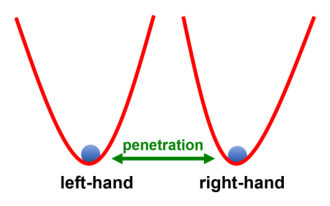 
FIG. 1. The system with two symmetric well potentials but no penetration exhibits degenerate ground states, leading to spontaneous symmetry breaking. However, once tunneling between the wells is incorporated, the symmetry is restored through the introduction of pseudo-particles known as instantons.

📷 Fig 2

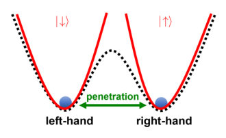 
FIG. 3. This figure illustrates a two-level approximation of the double-well potential V (x). The Hamiltonian for the red part

📷 Fig 3

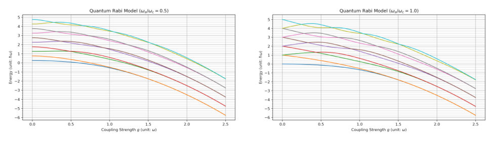 
FIG. 4. Energy levels of the lowest ten states in the quantum Rabi model as a function of the coupling strength g. The left and right panels show the cases for ωa = 0.5ω, ωc = ω and ωa = ωc = ω, respectively, where ω is a constant frequency. Here, ωa denotes the qubit transition frequency and ωc is the frequency of the single-mode boson.

📷 Fig 4

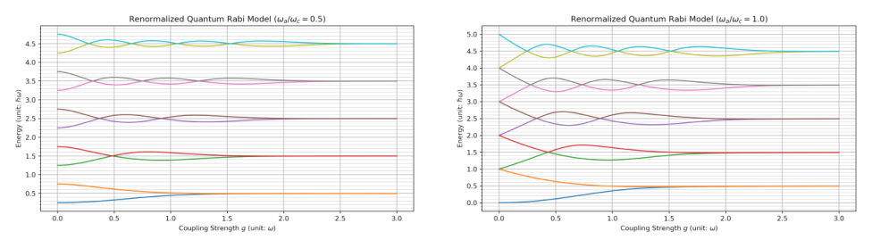 
FIG. 5. The first ten energy levels of the renormalized quantum Rabi model in the limit (LMT1). The qubit transition frequency, the frequency of the single-mode boson, and the coupling strength between them are denoted by ωa, ωc, and g, respectively. For a constant frequency ω, the left panel shows the energy levels for ωa = 0.5ω and ωc = ω, while the right panel displays the case where ωa = ωc = ω. At g = 0, the N = 2 SUSY is observed in the right graph, whereas it is absent in the left panel.

📷 Fig 5

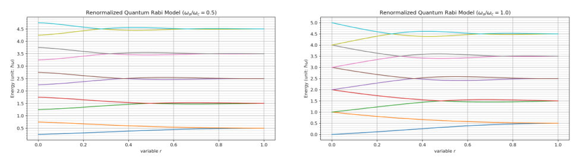 
FIG. 6. The first ten energy levels of the renormalized quantum Rabi model in the limit (LMT2). Here, the qubit transition frequency, the frequency of the single-mode boson, and the coupling strength between the qubit and the boson are denoted by ωa(r), ωc, and g(r) (0 ≤r ≤1), respectively. For a constant frequency ω, the left panel shows the energy levels for ωa(0) = 0.5ω and ωc = ω, while the right panel shows them for ωa(0) = ωc = ω. At r = 0 (i.e., g(0) = 0), the N = 2 SUSY can be found in the right panel, but not in the left panel.

**Summary.** This paper shows that the Quantum Rabi Model can be used to simulate macroscopic quantum tunneling and the restoration of Z2-symmetry. By mapping the model to a double-well potential, the author demonstrates how instanton-like effects drive energy bifurcation. This provides a potential experimental route to probe non-perturbative physics using quantum simulators.

**Why it may be interesting.** It provides a concrete bridge between light-matter interaction models (QRM) and fundamental non-perturbative phenomena like instantons and supersymmetry, offering a platform for simulating gauge theory-like physics in cavity QED.

Detailed structure

**Main problem.** The paper addresses the difficulty of experimentally verifying Macroscopic Quantum Tunneling (MQT) and its connection to instanton physics and Polyakov's energy bifurcation.

**Main result.** The author demonstrates that the Quantum Rabi Model (QRM) can serve as a quantum simulator for instanton-like effects, showing that tunneling restores Z2-symmetry and lifts ground-state degeneracy.

**Method.** The study uses unitary transformations to map the QRM onto an effective double-well potential and employs semiclassical approximations and Euclidean action calculations.

**Model / system.** The primary model is the Quantum Rabi Model (QRM), consisting of a two-level system (qubit) interacting with a single-mode boson (oscillator) with parity symmetry.

**Key observables.** Energy level splitting (E1 - E0), energy gap, and the classical Euclidean action of an effective instanton-like particle.

**Important parameters / regimes.** Qubit transition frequency (wa), boson frequency (wc), coupling strength (g), and the strong-coupling limit (g -> infinity).

**Assumptions / limitations.** The quantum motion in each potential well is assumed to be semiclassical, and the potential near minima is approximated as a harmonic oscillator.

**Figures summary.** Figure 1 illustrates symmetry breaking and restoration via instantons; Figure 2 shows the double-well potential; Figures 5 and 8 demonstrate the rapid decay of tunneling in specific mathematical limits.

**Paper structure.** The paper begins by establishing the MQT/double-well analogy, introduces a transformed QRM to reveal tunneling behavior, analyzes symmetry breaking/restoration via energy bifurcation, and concludes by discussing the implications for simulating complex field theories.

Abstract

Macroscopic quantum tunneling (MQT), a cornerstone of Leggett's program, is deeply linked with instanton physics, yet its experimental verification remains elusive. This Perspective demonstrates that the quantum Rabi model manifests observable, instanton-like effects via quantum simulation. In the MQT regime, qubit-boson interactions drive Polyakov's energy bifurcation, governing tunneling and spontaneous symmetry breaking. Mapping the quantum Rabi model onto an effective double-well potential reveals that while tunneling suppression induces spontaneous symmetry breaking, instanton-like contributions act to restore it. This mechanism enables experimental access to the classical Euclidean action of an effective instanton-like particle, offering a route to probe non-perturbative phenomena.

[↑ back to top](#top)

### [Estimating Green's functions with a robust quantum Arnoldi method](http://arxiv.org/abs/2605.22920v1)

**Authors:** Jacob S. Nelson, Andrew B. Baczewski  
**Type:** theory · **Category:** quantum information and computing · **PDF:** <https://arxiv.org/pdf/2605.22920v1>  
**Analysis basis:** full PDF text, analyzed in chunks
**Topic relevance:** 🔥 `Kondo & dissipative impurity` **4/5** · `methods for driven-dissipative` **2/5** · `non-equilibrium dynamics` **2/5**

📷 Fig 1

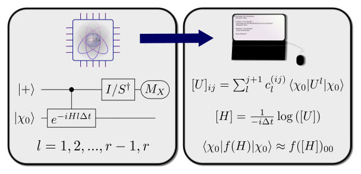 
FIG. 1. In the quantum Arnoldi method (ROQAM) a quantum computer is used to estimate expectation values ⟨χ0|U l|χ0⟩ for l = 1, 2, ..., r. These estimates are passed to a classical processor that builds [U]. This matrix is processed into [H], a representation of the Hamiltonian in the Arnoldi basis, which can be used to estimate expectation values of functions of [H].

📷 Fig 2

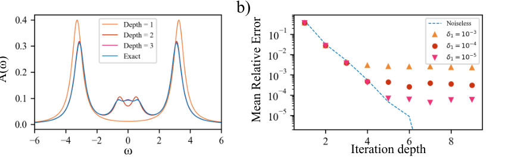 
FIG. 2. Estimating the Green’s function of a SIAM with 4 bath sites using the ROQAM. In a) we show the spectral function obtained from performing ROQAM with iteration depth 1, 2, and 3, and the exact spectral function. In each case the broadening parameter, γ, is set to 0.1 times the Hubbard bandwidth. In b) we show the mean relative error versus iteration depth for the ROQAM with and without finite-precision errors. We tested the ROQAM with three different levels of initial sampling precision (δ1) and find that the noisy estimates follow the noiseless error curves until hitting a noise floor where increasing the iteration depth no longer improves the error.

📷 Fig 3

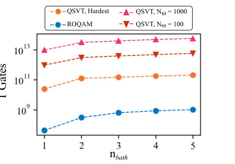 
FIG. 3. Aggregate T-gate count required to estimate the spectral function of the SIAM with 1 – 5 bath sites to be- low 1% mean relative error using the ROQAM and QSVT. For QSVT, we report estimates for Nω = 100 and Nω = 1000 equally spaced frequencies, and the single frequency with the highest T count. The ROQAM is multiple orders of magni- tude cheaper than the single hardest QSVT and it produces a converged estimate over the entire frequency interval.

📷 Fig 4

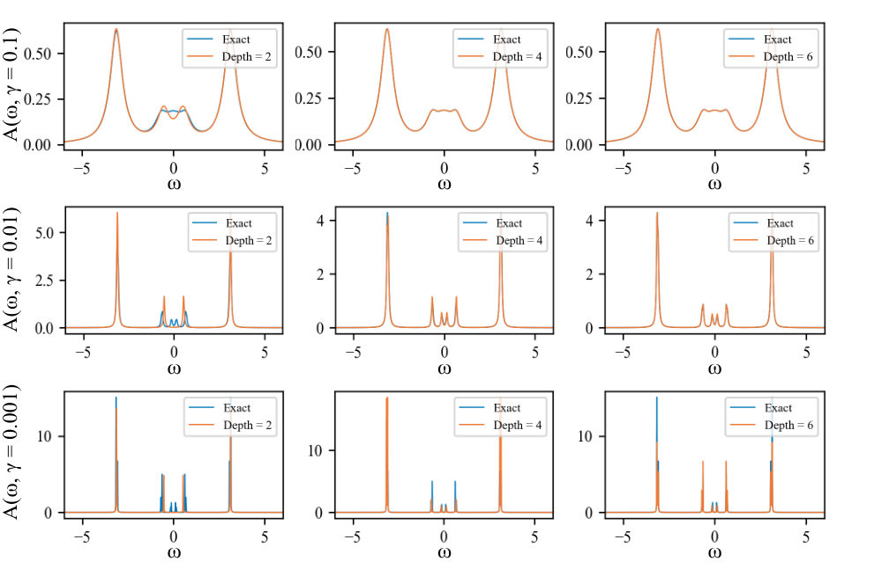 
FIG. 4. Estimates of the spectral function of SIAM with nbath = 4 with γ = 0.1 (top), 0.01 (middle) and 0.001 (bottom) in units of the Hubbard bandwidth. Each iterate adds 2 poles to the estimate of A(ω, γ). When the poles of A(ω, γ) are clustered near each other, increasing γ will combine these poles, requiring fewer iterates of the ROQAM to well approximate

📷 Fig 5

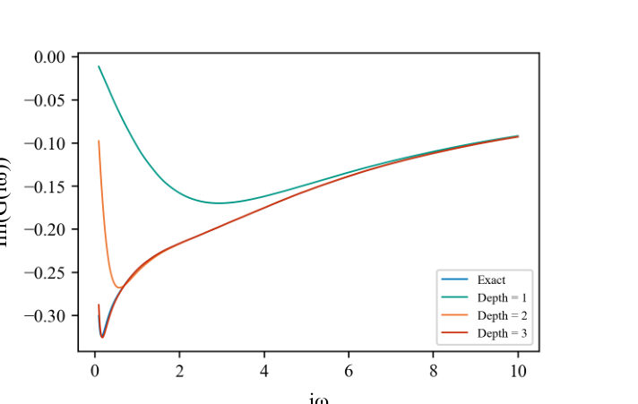 
FIG. 5. The estimates Im( ˆG(iω)) on the imaginary frequency axis (denoted iω). Because the poles of the Green’s function lie solely on the real frequency axis G(iω) is always smooth and continuous without the need for a broadening parameter. We see that after only 3 iterations Im( ˆG(iω)) begin to well approximate Im(G(iω)).

**Summary.** The paper introduces the Robust Quantum Arnoldi Method (ROQAM), a new quantum algorithm for computing Green's functions over entire frequency intervals. By using the time-evolution operator and orthogonal polynomials, the method achieves significant reductions in computational cost compared to existing techniques like QSVT. It is particularly effective for studying the spectral properties of strongly correlated models like the Anderson impurity model at both zero and finite temperatures.

**Why it may be interesting.** This is highly relevant for many-body dynamics as it provides a scalable quantum algorithm for computing spectral properties and Green's functions, which are fundamental to understanding the dynamics of correlated electron systems and open quantum systems.

Detailed structure

**Main problem.** Efficiently estimating single-particle Green's functions over intervals or multiple points on a quantum computer while overcoming the exponential growth of subnormalization factors and sensitivity to finite-precision errors.

**Main result.** The proposed Robust Quantum Arnoldi Method (ROQAM) provides a functional representation of Green's functions and outperforms Quantum Singular Value Transformation (QSVT) by multiple orders of magnitude in T-gate count for small-scale systems.

**Method.** A quantum adaptation of the Arnoldi method using orthogonal polynomials and the time-evolution operator U(dt) instead of the Hamiltonian directly to preserve the upper-Hessenberg structure and avoid subnormalization scaling.

**Model / system.** The method is demonstrated using the Single-Impurity Anderson Model (SIAM) in both zero-temperature (ground state) and non-zero temperature (Thermofield Double state) regimes.

**Key observables.** Single-particle Green's functions G(omega), spectral functions A(omega), and energy eigenvalues.

**Important parameters / regimes.** Krylov subspace dimension (r), time-step (dt), broadening parameter (gamma), subnormalization factor (lambda), and estimation precision (delta).

**Assumptions / limitations.** Assumes efficient access to a block-encoding of the Hamiltonian and that the initial state preparation is possible; neglects identity terms in the Jordan-Wigner transformation.

**Figures summary.** Figure 1 shows the ROQAM process schematic; Figure 2 displays spectral function estimates and error vs. iteration depth; Figure 3 compares T-gate counts between ROQAM and QSVT; Figure 4-7 show spectral function convergence and error behavior across different parameters; Figure 10-11 illustrate error scaling with subnormalization and error budget strategies.

**Paper structure.** The paper introduces the ROQAM algorithm, details the mathematical framework using orthogonal polynomials and unitary evolution, extends the method to finite temperatures via the TFD formalism, provides numerical validation using the SIAM, and concludes with resource estimation and error budget analysis.

Abstract

Many applications of Green's functions (GFs) require their evaluation over intervals or at multiple points, motivating quantum algorithms that return an efficiently computable functional representation rather than mere point estimates. We introduce a robust quantum Arnoldi method (ROQAM) that achieves this goal. Its robustness is derived from formulation in terms of orthogonal polynomials, which preserves the upper-Hessenberg structure of the projected matrices despite finite-precision estimation. We also show that as the iteration depth increases, the precision required for matrix-element estimation can be reduced. Resource estimates for the spectral function of a quantum impurity model indicate that ROQAM outperforms pointwise estimation via quantum singular value transformation by multiple orders of magnitude. Finally, we show that the ROQAM can be used to estimate GFs at nonzero temperatures using only a single Krylov subspace.

[↑ back to top](#top)

### [Weak wave turbulence as a precursor to universal coarsening in a homogeneous Bose gas](http://arxiv.org/abs/2605.22906v1)

**Authors:** Simon M. Fischer, Martin Gazo, Sebastian J. Morris, Nikolai Maslov, Haoyu Zhang, Jiří Etrych, Gevorg Martirosyan, Christoph Eigen, Zoran Hadzibabic  
**Type:** experiment · **Category:** quantum gases · **PDF:** <https://arxiv.org/pdf/2605.22906v1>  
**Analysis basis:** full PDF text, analyzed in chunks
**Topic relevance:** 🔥 `non-equilibrium dynamics` **4/5** · 🔥 `non-equilibrium universality` **4/5**

📷 Fig 1

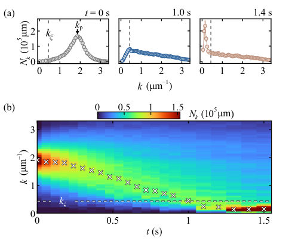 
FIG. 1. Momentum-space particle transport during far-from- equilibrium condensation in an isolated homogeneous Bose gas. The system starts (at time t = 0) in an incoherent low-energy state and condenses as it relaxes towards equilibrium. We show the evolution of the spectral population density Nk(k) = 4πk2nk(k), where nk is the momentum distribution; kp is the peak position of Nk, and kξ the inverse healing length. Here the gas density is n ≈2.8µm−3 and the scattering length a = 50a0, corresponding to kξ ≈0.43µm−1. (a) The condensate (spectral peak near k = 0) starts to form only after kp drops to ≈kξ. Here, we study the initial particle transport, to ≈kξ, and show that it corresponds to...

📷 Fig 2

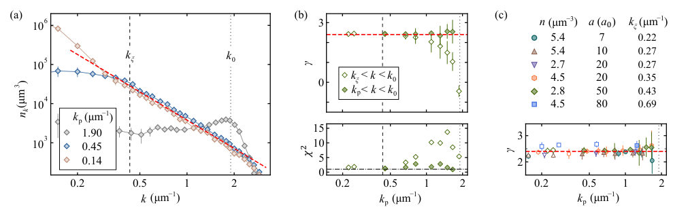 
FIG. 2. Emergence of the WWT power-law spectrum. (a) Momentum distribution nk for various relaxation times, corresponding to different kp, for n ≈2.8µm−3 and a = 50a0, so kξ ≈0.43µm−1; k0 ≈1.9µm−1 is the initial value of kp. Once kp drops to ≈kξ, in the spectral range kξ ≲k ≲k0 we observe a power-law nk ∝k−γ, with γ ≈2.4 (red dashed line), close to theoretical predictions (see text). (b) Fitted γ values and the corresponding χ2 (with the dot-dashed line showing χ2 = 1) for fits in two different spectral ranges: from kξ to k0 (open symbols) and from the instantaneous kp to k0 (solid symbols). In the former case, the fitted γ approaches 2.4 (horizontal dashed line) as kp approaches kξ...

📷 Fig 3

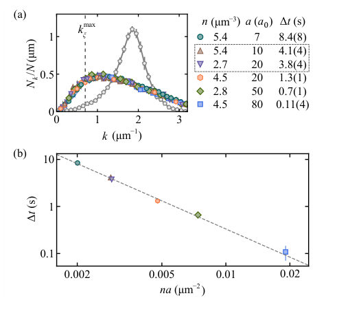 
FIG. 3. Characteristic particle-transport time. For different n and a (as in Fig. 2), we extract the time ∆t(n,a) for kp to drop from k0 ≈1.9µm−1 to ≈k0/2. (a) Nk normalized by the total atom number N, for kp ≈k0/2 and different (n,a) (colored symbols), and for our initial state (gray); the dashed line indicates the largest kξ. The fact that, as kp decreases, the Nk/N curves for different (n,a) remain the same shows that ∆t(n,a) fully captures the de- pendence of the dynamics on the interactions. Importantly, ∆t is the same (within errors) for the two systems with the same product na (triangles). (b) Plotting ∆t versus na, we find ∆t ∝(na)−2.0(1)

📷 Fig 4

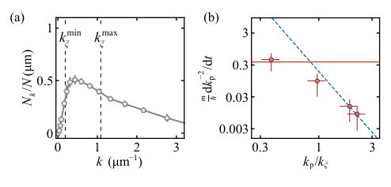 
FIG. 4. Connection to universal coarsening. In WWT, dk−2 p /dt is ∝(na)2 ∝k4 ξ. However, for kp ≪kξ, in the coarsening regime, it should be bounded by the universal speed limit, ≈0.37ℏ/m (see text), where m is the atom mass. (a) Here we first prepare a gas with n ≈3.7µm−3 and a = 90a0 in a state with kp ≈0.4µm−1, by evolving it from our initial state with kp ≈1.9µm−1, and then change a to different values in the range (7–240)a0, such that kξ varies from ≈0.19µm−1 to ≈1.1 µm−1 (dashed lines). (b) Ex- tracting dk−2 p /dt after the change of a and plotting it versus kp/kξ, we see how it bends away from the WWT scaling (dashed line) to- wards its speed limit (solid line).

**Summary.** This study experimentally demonstrates that the initial relaxation of a far-from-equilibrium Bose gas is governed by Weak Wave Turbulence. It shows that particle transport follows a universal power-law distribution and scaling laws that act as a precursor to the later stage of universal coarsening.

**Why it may be interesting.** This paper provides a direct experimental link between the kinetic regime of weak wave turbulence and the late-time universal coarsening dynamics, offering a complete picture of non-equilibrium many-body relaxation.

Detailed structure

**Main problem.** Understanding the relaxation and condensation dynamics of a far-from-equilibrium, homogeneous Bose gas, specifically identifying the universal description of the initial stage of particle transport that precedes universal coarsening.

**Main result.** The researchers demonstrate that the initial stage of particle transport follows a universal Weak Wave Turbulence (WWT) description, characterized by a power-law momentum distribution with exponent gamma = 2.4(1) and transport times scaling as (na)^-2.

**Method.** The study uses an experimental platform of 39K atoms in an optical box trap, evolving the gas by tuning the s-wave scattering length via Feshbach resonance and monitoring the time-dependent momentum distribution.

**Model / system.** A homogeneous, low-energy, far-from-equilibrium Bose gas of 39K atoms held in a cylindrical optical box trap with tunable density and interaction strength.

**Key observables.** Spectral population density N_k(k), momentum distribution n_k, peak momentum k_p, and the exponent gamma.

**Important parameters / regimes.** Density n, s-wave scattering length a, healing length xi, and the WWT vs. coarsening regimes.

**Figures summary.** Fig 3(a) shows identical N_k/N curves for different n and a; Fig 3(b) plots transport time delta t versus na; Fig 4(a) shows the evolution of the gas momentum distribution.

**Paper structure.** The paper introduces the problem of Bose gas relaxation, describes the experimental setup with 39K atoms, presents the observation of WWT scaling in momentum distributions and transport times, and concludes by showing the transition from WWT to the universal coarsening regime.

Abstract

Relaxation and condensation of an isolated low-energy Bose gas provide an ideal setting for the study of the universal features of far-from-equilibrium many-body dynamics and the emergence of long-range order. Conceptually, the emergence of such order involves two steps: the formation of local coherence, on a system-specific microscopic lengthscale, and the spreading of coherence, over lengthscales much larger than any microscopic scale. The latter is understood in terms of universal phase-ordering kinetics, or coarsening, characterized by an algebraic growth of the coherence length. Here, for a homogeneous Bose gas with tunable interactions, we show that the former also has a universal description, within the framework of weak wave turbulence (WWT). Specifically, the initial transport of particles to low momenta corresponds to an inverse turbulent cascade that is, in agreement with the WWT theory, characterized by a power-law momentum distribution, with exponent $γ= 2.4(1)$, and transport times ${\propto} (na)^{-2}$, where $n$ is the gas density and $a$ the $s$-wave scattering length.

[↑ back to top](#top)

### [Quantum resource redistribution drives spectral splits in dense neutrino gases](http://arxiv.org/abs/2605.23584v1)

**Authors:** Michael Hite, Pooja Siwach  
**Type:** theory · **Category:** numerical methods · **PDF:** <https://arxiv.org/pdf/2605.23584v1>  
**Analysis basis:** full PDF text, analyzed in chunks
**Topic relevance:** 🔥 `entanglement & information structure` **4/5** · `non-equilibrium dynamics` **3/5**

📷 Fig 1

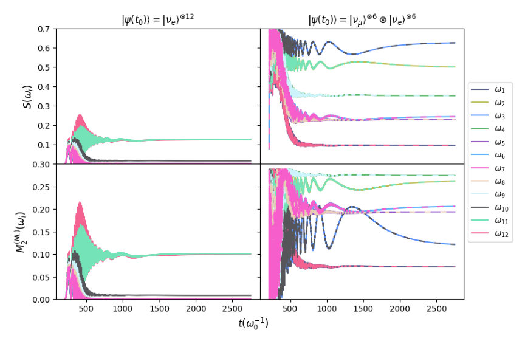 
FIG. 1. Dynamics of entanglement entropy(top panels) and non-local magic(bottom panels) for neutrinos with frequencies ωi for initial states |Ψ(t0)⟩= |νe⟩⊗12(right panels) and |νµ⟩⊗6 ⊗|νe⟩⊗6 (left panels).

📷 Fig 2

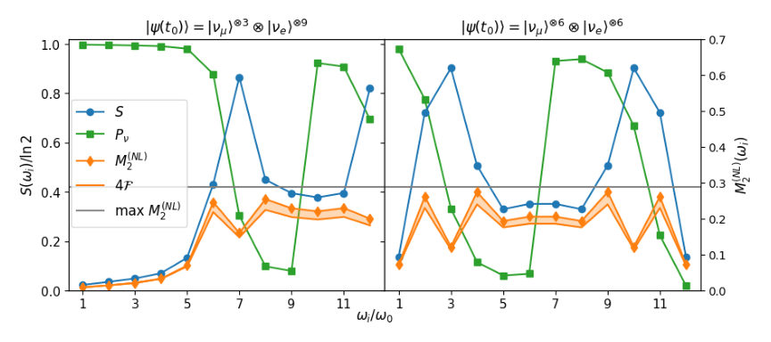 
FIG. 2. Asymptotic values of normalized entanglement entropy S, non-local magic M (NL) 2 , antiflatness 4F, and Pν for a 12 neutrinos system with initial configuration |Ψ(t0)⟩= |νµ⟩⊗3 ⊗|νe⟩⊗9 (left) and |Ψ(t0)⟩= |νµ⟩⊗6 ⊗|νe⟩⊗6 (right).

📷 Fig 3

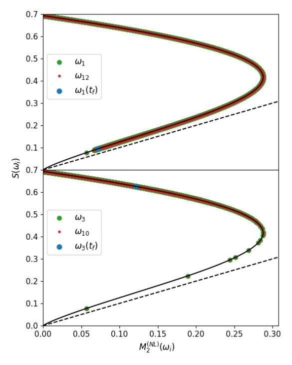 
FIG. 3. Dynamics of non-local magic and entanglement entropy of neutrinos with frequency modes ω1(ω12) and ω3(ω10) in phase space for the initial configuration |Ψ(t0)⟩= |νµ⟩⊗6 ⊗|νe⟩⊗6. The solid line comes from the constraint on the entanglement spectra that λ0 +λ1 = 1. The dashed line is at a 45◦angle to emphasize the position of arc in phase space. The final position of the entropy and magic are denoted by the blue dots on the arc.

📷 Fig 4

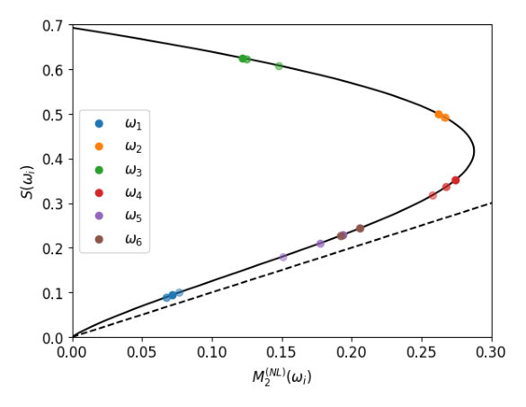 
FIG. 4. Dependence of non-local magic and entanglement entropy on bond dimension in the asymptotic limit for neutrinos with frequency modes ω1 through ω6 for the initial configuration |Ψ(t0)⟩= |νµ⟩⊗6 ⊗|νe⟩⊗6. Opacity is proportional to bond dimension, corresponding to max d = 64, 48, and 36 respectively.

📷 Fig 5

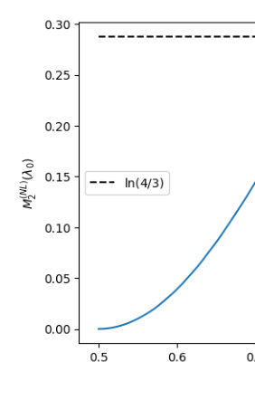 
FIG. 5. Equation B1 in the interval 1/2 ≤λ0 ≤1. It reaches its maximal value of ln(4/3) at λ0 = √

**Summary.** This paper demonstrates that the emergence of spectral splits in dense neutrino gases is driven by a specific redistribution of entanglement and non-local magic. By mapping these dynamics in a quantum resource phase space, the authors show that splits occur at the intersection of maximal entanglement and minimal non-local complexity. These findings provide a roadmap for optimizing both classical tensor network and future quantum circuit simulations of neutrino environments.

**Why it may be interesting.** It provides a quantitative link between abstract quantum information measures (like magic and entanglement) and observable astrophysical phenomena, offering insights into how complexity landscapes dictate the efficiency of many-body simulations.

Detailed structure

**Main problem.** The study investigates how the redistribution of quantum resources, specifically entanglement and non-local magic, drives the emergence of spectral splits in dense neutrino gases.

**Main result.** Spectral splits arise from a structured redistribution of quantum resources where bipartite entanglement is maximized and non-local magic is locally minimized, rather than from generic complexity growth.

**Method.** The authors use tensor network simulations, specifically Matrix Product States (MPS) with the Time-Dependent Variational Principle (TDVP) and Global Subspace Expansion (GSE).

**Model / system.** A dense, two-flavor N-neutrino system modeled by an all-to-all spin Hamiltonian in the mass basis, representing neutrino-neutrino forward scattering in core-collapse supernovae.

**Key observables.** Entanglement entropy, non-local magic (non-stabilizerness), MPS bond dimension, spectral splits (flavor swaps), and antiflatness.

**Important parameters / regimes.** Neutrino-neutrino interaction strength (mu), vacuum oscillation frequency (omega), system size (N=8, 12, 14), and initial flavor configurations.

**Assumptions / limitations.** The study focuses on the two-flavor sector and utilizes bond dimension truncation as a proxy for computational complexity.

**Figures summary.** Figures show the dynamics of entanglement and magic, trajectories in the entanglement-magic phase space, the relationship between resource metrics and bond dimension, and asymptotic values of flavor survival probability across different system sizes.

**Paper structure.** The paper introduces the problem of resource organization, describes the neutrino Hamiltonian and tensor network methods, presents results on resource redistribution and phase space dynamics, and concludes with implications for classical and quantum simulations.

Abstract

Whether a quantum many-body system can be efficiently simulated hinges not only on its size but also on how quantum resources are organized within it. We characterize the quantum resource landscape of collective neutrino oscillations using entanglement entropy, non-local magic, and matrix product state bond dimension. Using tensor network simulations of neutrinos in the two-flavor sector, we demonstrate that spectral splits--sharp energy-dependent flavor swaps--emerge precisely where entanglement entropy is maximized and non-local magic is minimized locally. This anticorrelation reveals that spectral splits arise not from generic resource growth but from a structured redistribution among flavor modes. The resource dynamics trace constrained arcs in the entanglement-magic phase space, bounded by entanglement spectrum normalization. These findings establish a direct, quantitative link between quantum resources governing computational complexity and astrophysical observables, informing the design of tensor network and quantum circuit simulations of dense neutrino environments.

[↑ back to top](#top)

### [A Compilation Framework for Quantum Simulation of Non-unitary Dynamics](http://arxiv.org/abs/2605.23358v1)

**Authors:** Qifan Huang, Minbo Gao, Li Zhou, Mingsheng Ying  
**Type:** theory · **Category:** quantum information and computing · **PDF:** <https://arxiv.org/pdf/2605.23358v1>  
**Analysis basis:** full PDF text, analyzed in chunks
**Topic relevance:** 🔥 `methods for driven-dissipative` **4/5** · `non-equilibrium dynamics` **2/5**

📷 Fig 1

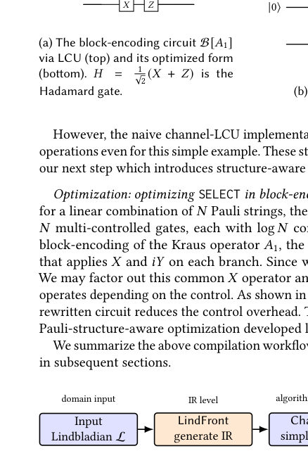 
Fig. 3. Compilation workflow for the motivating example.

📷 Fig 2

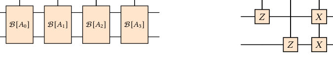 
Fig. 7. Two optimization targets in the LCU implementation pipeline: (a) the channel-level multiplexor over Kraus block-encodings, and (b) the block-encoding-level multiplexor over Pauli terms.

📷 Fig 3

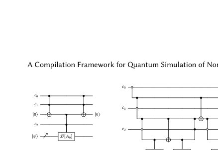 
Fig. 8. Flattening a 3- controlled gate.

📷 Fig 4

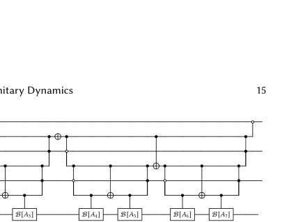 
Fig. 9. A channel-level SELECTC oracle with 8 Kraus operators after optimization by conditional flattening (unary iteration).

📷 Fig 5

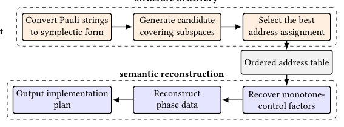 
Fig. 10. A sketched workflow of Technique II. The first stage assigns Pauli strings into low-cost control addresses by exploiting symplectic structure, while the second stage reconstructs a monotone-control decom- position and the associated phase information for the final implementation.

**Summary.** This paper introduces a new compilation framework that treats quantum channels as primary objects rather than decomposing them into unitaries prematurely. By using a specialized intermediate representation, it enables algebraic optimizations that drastically reduce the gate and ancilla overhead for simulating open quantum systems.

**Why it may be interesting.** It provides a specialized compilation infrastructure for simulating dissipative and decohering processes, which is essential for modeling realistic many-body dynamics and open quantum systems on near-term and fault-tolerant hardware.

Detailed structure

**Main problem.** Existing quantum compilers are optimized for unitary (closed-system) circuits, making them inefficient for simulating open-system dynamics where non-unitary quantum channels are the natural objects.

**Main result.** The proposed ChannelIR framework achieves up to a 99% reduction in gate count and significantly improves compilation scalability compared to traditional circuit-first Stinespring dilation methods.

**Method.** A channel-first compilation pipeline using a hierarchical intermediate representation (ChannelIR) that supports Kraus form and Pauli-sum structures, combined with algebraic rewriting and structure-aware circuit synthesis (LCU and channel-LCU).

**Model / system.** The framework models open quantum systems using Lindbladian master equations, representing continuous-time dynamics through Kraus operator-sum representations and short-time channel approximations.

**Key observables.** Gate count (CX, T, etc.), circuit depth, qubit count (width), and trace distance error.

**Important parameters / regimes.** Markovian dynamics, Lindbladian generators, and simulation error tolerances.

**Assumptions / limitations.** The dynamics are assumed to be Markovian, and the framework focuses on the high cost of non-Clifford (T) gates in fault-tolerant computing.

**Figures summary.** Figures illustrate the ChannelIR Kraus form, circuit optimization for block-encoding, the complete compilation workflow, the syntax of the IR, and performance comparisons of gate counts and simulation errors against theoretical bounds.

**Paper structure.** The paper introduces the problem of abstraction mismatch, presents the ChannelIR framework and its algebraic rewrite rules, details the LindFront frontend and circuit synthesis backend, provides formal proofs for rule correctness and optimization complexity, and concludes with benchmarks on Lindbladian simulation and scalability.

Abstract

Most quantum compilers assume programs are reversible unitary circuits. This fits closed-system algorithms, but not open-system simulation, where the natural program objects are quantum channels describing non-unitary dynamics. We present a channel-first compilation framework that treats channels as first-class compilation objects. Our core IR, ChannelIR, represents channels explicitly in Kraus form, a standard channel representation, with Pauli-sum structure, enabling algebraic rewrites before circuit synthesis. We instantiate the framework with LindFront, a frontend that lowers continuous-time Lindbladian generators to short-time channels, and a backend that compiles these channels to executable circuits with structure-aware optimizations. On Lindbladian and channel-simulation benchmarks, the optimized pipeline reduces gate count by up to 99% over an unoptimized channel-first baseline and scales better than circuit-first Stinespring compilation.

[↑ back to top](#top)

### [Minimal Trade-off and Optimal Measurement for Multiparameter Quantum Estimation](http://arxiv.org/abs/2605.23514v1)

**Authors:** Lingna Wang, Hongzhen Chen, Haidong Yuan  
**Type:** theory · **Category:** quantum information and computing · **PDF:** <https://arxiv.org/pdf/2605.23514v1>  
**Analysis basis:** full PDF text, analyzed in chunks
**Topic relevance:** 🔥 `quantum measurements` **4/5** · `entanglement & information structure` **2/5**

📷 Fig 1

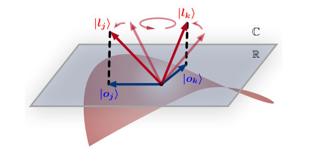 
Figure 1. Geometrical picture of the measurement incom- patibility. In the measurement basis {|m⟩}, {|oj⟩} are all real vectors while the vectors {|lj⟩} are in general complex. The incompatibility-induced trade-off is quantified by the Eu- clidean distances P

📷 Fig 2

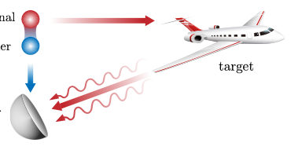 
Figure 2. Radar sensing of target’s range and velocity using entangled biphoton state.

📷 Fig 3

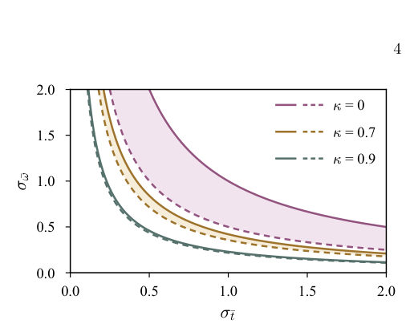 
Figure 3. Uncertainty relations in quantum radar using bipho- ton states with different amounts of entanglement (κ). Here the dashed lines denote the uncertainty relations obtained from QCRB and the solid lines denote the refined Arthurs- Kelly uncertainty relations, which is achievable for the simul- taneous estimation of range and velocity. The shaded areas illustrate the gap between the QCRB and the tight bound.

**Summary.** This paper establishes a new analytical bound that quantifies the precision loss in multiparameter quantum estimation caused by measurement incompatibility. It also introduces a systematic way to design optimal measurements that reach these limits, demonstrated through a refined uncertainty relation for quantum radar.

**Why it may be interesting.** It provides a fundamental tool for quantum metrology and sensing, specifically addressing how to optimize simultaneous measurements in the presence of non-commuting observables, which is critical for quantum-enhanced sensing technologies.

Detailed structure

**Main problem.** The fundamental difficulty in simultaneous multiparameter quantum estimation due to the incompatibility of optimal measurements, which creates a precision gap between achievable and ultimate quantum limits.

**Main result.** The derivation of a new tight analytical bound for the precision trade-off in pure state estimation and a systematic methodology for designing optimal measurements that saturate this bound.

**Method.** A geometric approach using the complex geometric tensor (combining QFI and Berry curvature) and an optimization strategy that models POVMs as projective measurements on an augmented system-ancilla state.

**Model / system.** The framework is applied to pure quantum states and specifically demonstrated using a quantum radar model involving entangled biphotons used for simultaneous range and velocity estimation.

**Key observables.** Quantum Fisher Information matrix (F_Q), imaginary part of the geometric tensor (F_Im), and the precision metric Gamma.

**Important parameters / regimes.** Number of parameters (n), entanglement parameter (kappa), and the eigenvalues (lambda_q) of the normalized incompatibility matrix.

**Assumptions / limitations.** The primary focus is on pure quantum states and the assumption that parameters are locally identifiable (invertible QFI).

**Figures summary.** Figure 1 provides a geometric visualization of measurement incompatibility; Figure 2 shows a schematic of a quantum radar setup; Figure 3 plots uncertainty relations for different entanglement levels.

**Paper structure.** The paper introduces the problem of measurement incompatibility, presents a new analytical bound for precision trade-offs, provides a constructive method for optimal measurement design, and validates the theory through a quantum radar application.

Abstract

A fundamental challenge in multiparameter quantum estimation arises from the incompatibility of optimal measurements for different parameters, leading to intricate precision trade-offs that obscure the understanding of ultimate quantum limits. Here, we present an approach that precisely quantifies these trade-offs for an arbitrary number of parameters encoded in pure quantum states. Our approach not only derives tight analytical bounds for the trade-offs induced by measurement incompatibility but also provides a systematic methodology to design optimal measurement strategies that saturate these limits. To demonstrate the practical significance of our findings, we apply our framework to quantum radar and obtain a refined Arthurs-Kelly relation that characterizes the ultimate performance for the simultaneous estimation of range and velocity with any given amount of entanglement. This showcases the transformative potential of our findings for a wide range of applications in quantum metrology, sensing, and beyond.

[↑ back to top](#top)

### [Twirled Perfect Tensor Networks: Computationally covariant holographic tensor networks](http://arxiv.org/abs/2605.23670v1)

**Authors:** Gurbir Arora, Matthew Headrick, Albion Lawrence, Martin Sasieta, Brian Swingle, Connor Wolfe  
**Type:** theory · **Category:** numerical methods · **PDF:** <https://arxiv.org/pdf/2605.23670v1>  
**Analysis basis:** full PDF text, analyzed in chunks
**Topic relevance:** 🔥 `entanglement & information structure` **4/5** · `methods for driven-dissipative` **2/5**

📷 Fig 1

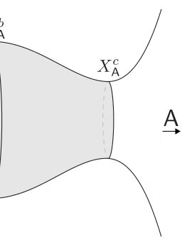 
Figure 1: A semiclassical python’s lunch in EWA (gray).

📷 Fig 2

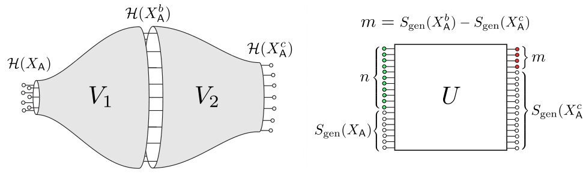 
Figure 2: Left: TN model of a python’s lunch, with three cuts associated with the minimal QES XA, bulge Xb A and constriction Xc A, whose Hilbert spaces are mapped by the two isometries V1, V2. Right: The map V = V1V † 2 viewed as a unitary U together with postselection onto the state |0⟩⊗m of the m qubits (in red). The amount of postselected and ancilla qubits is m = Sgen(Xb A) −Sgen(Xc A) and n = Sgen(Xb A) −Sgen(XA), respectively. Reconstructing the lunch amounts to finding an approximate unitary U0 that reproduces the measurement, which is famously hard.

📷 Fig 3

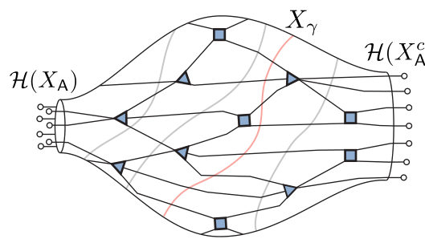 
Figure 3: A local TN model of the python’s lunch. In gray, a foliation γ of the TN with the associated max cut Xγ in red.

📷 Fig 4

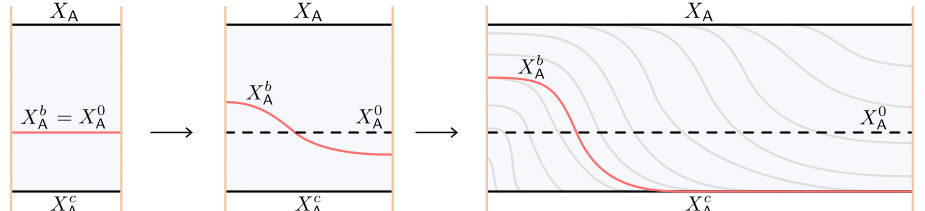 
Figure 4: A planar python’s lunch (in blue) delimited in the transverse direction by the spatial IR regulator. As the IR cutoff LIR is increased, the bulge undergoes a transition from the naive symmetric bulge to an extremal surface which spontaneously breaks the Z2 spatial reflection symmetry of the IR regulator. In the thermodynamic limit LIR →∞, the bulge hugs the constriction and they only differ at a finite distance from the cutoff. This produces a PLC exponent which is non-extensive in the system’s spatial volume. (Figure adapted from [48].)

📷 Fig 5

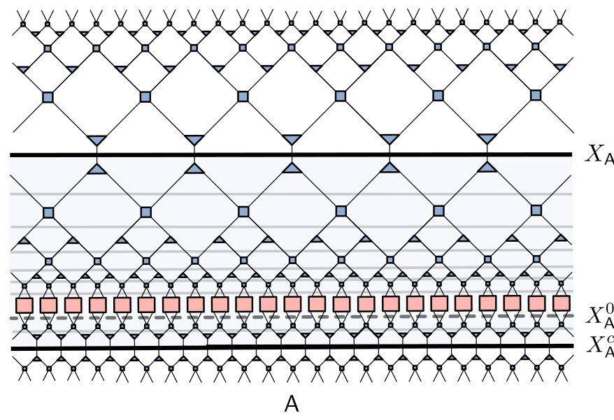 
Figure 5: TN model of a planar python’s lunch. Two MERA TFDs are contracted together at some radial cutoff by a chain of local unitaries (red boxes) associated with the thin matter domain wall. The map V defined by this TN admits a simple factorization V = V1V † 2 along the dashed cut. The grey lines denote a standard planar-symmetric foliation and associated contraction scheme. Because the number of postselections required is proportional to LIR, this way of contracting the network yields a complexity log CTN ∝LIR. This is parametrically larger than the PLC prediction.

**Summary.** The paper identifies that standard random tensor networks fail to accurately model the complexity predicted by the Python's Lunch Conjecture due to a lack of computational covariance. To fix this, the authors introduce 'twirled perfect tensor networks' which successfully recover the predicted complexity bounds and maintain holographic properties. This provides a more robust framework for studying the computational complexity of black hole interiors.

**Why it may be interesting.** not directly relevant

Detailed structure

**Main problem.** Investigating the discrepancy between the Python's Lunch Complexity (PLC) prediction and the complexity of generic tensor network models, specifically addressing the lack of computational covariance in standard random tensor networks.

**Main result.** The authors propose a new class of 'twirled perfect tensor networks' that satisfy computational covariance, thereby aligning the complexity of the network with the PLC prediction and obeying a lattice Ryu-Takayanagi formula.

**Method.** The study uses geometric analysis (min-max theory, Mean Curvature Flow), random matrix theory (Wishart matrix analysis, Marchenko-Pastur law), and complexity quantification via circuit complexity and isometry decomposition.

**Model / system.** The paper focuses on holographic tensor network models (including Random Tensor Networks, MERA, and MPS) representing the 'Python's Lunch' geometry in AdS/CFT, characterized by a bulge and a constriction in the entanglement wedge.

**Key observables.** Python's Lunch Complexity (PLC), entanglement entropy (von Neumann and generalized), circuit complexity, and the Morse index of extremal surfaces.

**Important parameters / regimes.** Large N limit, large bond dimension limit, Markov length, and the ratio of dimension between input and output ancilla qubits.

**Assumptions / limitations.** The analysis primarily focuses on time-symmetric settings and the regime where the area term dominates the generalized entropy; it also assumes a compact and connected manifold for geometric proofs.

**Figures summary.** Figure 1 shows the Python's Lunch geometry with minimal, bulge, and outermost surfaces; Figure 2 illustrates the tensor network model and the map as a postselected unitary; Figure 3 shows the foliation and cuts; Figure 18 compares different length scales.

**Paper structure.** The paper begins by identifying the failure of random tensor networks to match PLC predictions, introduces the concept of computational covariance, proposes the twirled perfect tensor network model, proves its properties using geometric and statistical tools, and concludes with discussions on limitations and implications for holography.

Abstract

We define a novel class of tensor networks motivated by the Python's Lunch Conjecture (PLC) in local tensor network models of the black hole interior. We start from the observation that, for extended black brane states with short-range correlations, the PLC predicts a complexity that is smaller than the upper bound for generic short-range correlated states. We argue that the PLC makes implicit assumptions about the fine structure of the relevant tensor networks modeling gravity that render them non-generic. We demonstrate this explicitly in random tensor network models of the python's lunch, where the exponential complexity is not generally controlled by the PLC exponent. We trace the difference with the PLC to a lack of "computational covariance" in random tensor networks: while the PLC is motivated by an ability to arbitrarily decompose space into low-complexity units provided certain basic rules are followed, we show that random tensor networks do not generically have this property. We propose another class of tensor networks built from what we call "twirled perfect tensors" that do satisfy the computational covariance property and have a complexity bounded by the PLC value. We still find a discrete limitation from local postselection that appears to be absent in gravity. Moreover, we show that this class of tensor networks combines desirable holographic features of perfect tensor networks and random tensor networks, for example, it obeys a lattice Ryu-Takayanagi formula for arbitrary boundary subregions. Though motivated by holography, these tensor networks provide a flexible framework with potential applications beyond quantum gravity.

[↑ back to top](#top)

### [Kondo singlet from ferromagnetic coupling: an analog of Anderson-Morel superconductivity in the magnetic channel](http://arxiv.org/abs/2605.23755v1)

**Authors:** Ewan Scott, Yaqi Chen, Michael Turaev, Tarkan Yzeiri, Chris Hooley, Krzysztof P. Wójcik, Michał P. Kwasigroch  
**Type:** theory · **Category:** strongly correlated electrons · **PDF:** <https://arxiv.org/pdf/2605.23755v1>  
**Analysis basis:** full PDF text, analyzed in chunks
**Topic relevance:** 🔥 `Kondo & dissipative impurity` **4/5**

📷 Fig 1

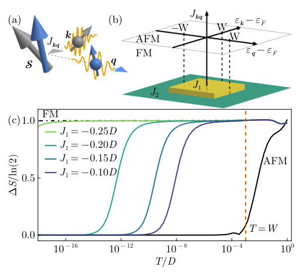 
FIG. 1. (a) Schematic illustration of an electron with momen- tum k scattering off a localized spin S to momentum spin q. (b) A plot of the assumed structure factor Jkq as a function of Bloch-state energies εk and εq. (c) Impurity contribution to entropy calculated from NRG for W = 10−3D, J2 = −0.5D and different J1. Lines denoted with AFM/FM correspond to J1 = J2 = ±0.5D.

📷 Fig 2

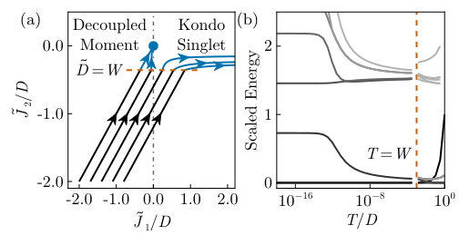 
FIG. 2. (a) RG trajectories in the J1, J2 plane with W = 0.1D. For visual guidance, the flow is schematically continued for ˜D &lt; W (blue lines). (b) numerical RG flow (rescaled energies of many-body eigenstates at even iterations) for J1 = −0.2D, J2 = −0.5D, W = 0.001D.

📷 Fig 3

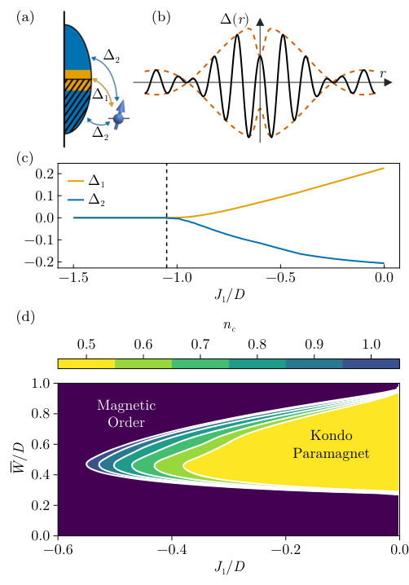 
FIG. 3. Mean-field solution for the lattice case: (a) A schematic illustration of the meaning of the two fields ∆1 and ∆2 that describe the hybridization between the local moments and the conduction sea in the mean-field approximation. (b) Schematic ∆(r) for a particular choice of ∆1 and ∆2 — the analog of the gap function in the Anderson-Morel model. (c) ∆1 and ∆2 as functions of J1 for J2 = −2D, nc = 0.9, W = 0.5D. The vertical dashed line indicates the onset of a non-zero solution. (d) competition between magnetic order and Kondo screening in the lattice, with J2 = −2D.

📷 Fig 4

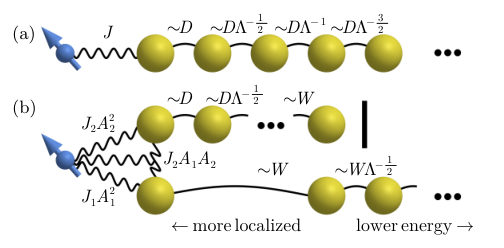 
FIG. 4. Illustration of effective NRG Hamiltonians: (a) con- ventional Wilson chain for Kondo model with Jkq = J . (b) Wilson chain corresponding to exchange interaction given by Eq. (5). Yellow balls indicate non-interacting sites, small blue ball – an impurity, wavy lines the Kondo interaction terms, and solid lines simple hopping terms.

📷 Fig 5

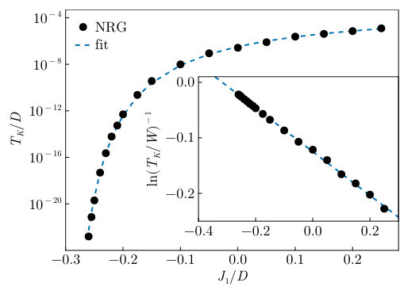 
FIG. 5. The Kondo temperature as a function of J1 for J2 = −0.5D and W = 0.001 calculated from NRG. The dashed line indicate the fit giving the values for αj in Eq. (6).

**Summary.** This paper shows that purely ferromagnetic exchange can lead to a Kondo singlet ground state if the coupling is energy-dependent. This mechanism is an analog of Anderson-Morel superconductivity and can lead to a heavy Fermi liquid state that is preferred over magnetic ordering.

**Why it may be interesting.** not directly relevant

Detailed structure

**Main problem.** Investigating whether a Kondo spin-singlet ground state can emerge from purely ferromagnetic (FM) spin-exchange coupling between a magnetic impurity and a conduction electron sea.

**Main result.** The authors demonstrate that an energy-dependent FM coupling can renormalize to an antiferromagnetic (AFM) coupling at low temperatures, leading to a Kondo singlet and a heavy Fermi liquid state in a lattice, effectively creating an 'inverted' Doniach phase diagram.

**Method.** The study employs perturbative Renormalization Group (RG) to analyze coupling flow and a specialized two-mode Numerical Renormalization Group (NRG) to study the strong-coupling regime.

**Model / system.** A Kondo model featuring a magnetic impurity coupled to a conduction sea via a non-separable, energy-dependent, and fully SU(2)-symmetric ferromagnetic exchange interaction $J_{kq}$. The model also considers a Kondo lattice of such impurities.

**Key observables.** Impurity entropy contribution, fixed-point spectrum, hybridization order parameter, and Kondo temperature ($T_K$).

**Important parameters / regimes.** Exchange couplings $J_1$ and $J_2$, energy window width $W$, bandwidth $D$, and Fermi energy $\epsilon_F$.

**Assumptions / limitations.** The interaction strength is reduced within a specific energy window $W$ around the Fermi level; the conduction band is treated as two distinct channels (one gapless, one gapped).

**Figures summary.** Fig 1 shows electron scattering and the structure of $J_{kq}$ and impurity entropy; Fig 2 shows RG trajectories; Fig 3 illustrates the hybridization fields and real-space hybridization dip; Fig 4 shows the modified Wilson chain; Fig 5 plots the Kondo temperature scaling.

**Paper structure.** The paper introduces the FM coupling problem, presents the energy-dependent Hamiltonian, details the RG and 2-mode NRG methodology, analyzes the single-impurity singlet formation, extends the results to the Kondo lattice (heavy Fermi liquid), and concludes with experimental realization routes.

Abstract

We consider magnetic impurities coupled to a conduction sea via a fully isotropic ferromagnetic spin-exchange term, the strength of which depends on the conduction-electron modes involved in the scattering. In the single-impurity case we show both analytically and numerically that there exists a parameter regime in which the conventional Kondo effect develops at low temperatures, leading to a singlet ground state. In the case of a lattice of impurities, we show that this leads to a heavy Fermi liquid state that is energetically favored over magnetic ordering in a broad parameter range. We argue that these effects are analogs of Anderson-Morel superconductivity, and discuss routes to their experimental realization.

[↑ back to top](#top)

### [The negativity core of a 1+1D massless scalar quantum field](http://arxiv.org/abs/2605.23824v1)

**Authors:** Jason Pye, Atharva Hingane, Robert H. Jonsson  
**Type:** theory · **Category:** quantum information and computing · **PDF:** <https://arxiv.org/pdf/2605.23824v1>  
**Analysis basis:** full PDF text, analyzed in chunks
**Topic relevance:** 🔥 `entanglement & information structure` **4/5**

📷 Fig 1

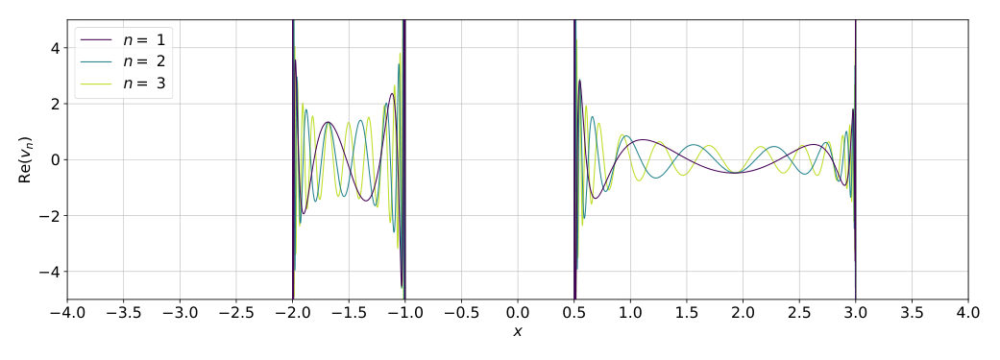 
FIG. 1: Smearing functions defining the negativity cores for the three modes with the largest contributions to the negativity for A = (−2, −1) and B = (0.5, 3).

📷 Fig 2

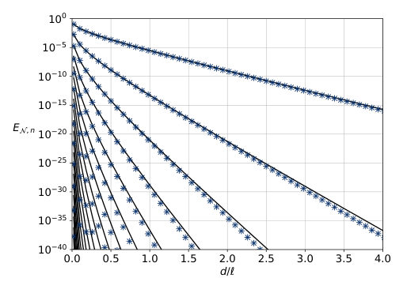 
FIG. 2: Numerical values of the contribution to logarithmic negativity of each eigenvalue of J

**Summary.** This paper provides an analytical solution for the entanglement between two disjoint intervals in a 1+1D massless scalar field. It identifies 'negativity cores,' which are the specific localized modes that constitute the entanglement. The results bridge the gap between local field theory and the geometric structure of quantum correlations.

**Why it may be interesting.** This work provides fundamental insights into the spatial structure of vacuum entanglement and the identification of specific field modes that carry correlations, which is highly relevant for understanding entanglement in continuous variable systems and quantum field theory.

Detailed structure

**Main problem.** The paper aims to provide a complete characterization of the entanglement structure between two bounded, spacelike-separated regions in a (1+1)-dimensional free massless real scalar field, specifically identifying the localized modes that carry the entanglement.

**Main result.** The authors derive closed-form analytical solutions for the logarithmic negativity and identify the 'negativity cores,' which are the specific localized field modes responsible for the entanglement.

**Method.** The study employs Gaussian state methods and a framework based on the Kähler structure of Gaussian states, reducing the problem to a boundary value problem in the complex plane involving the diagonalization of an integral operator.

**Model / system.** A (1+1)-dimensional free massless real scalar quantum field in its vacuum state, where the system consists of two disjoint, bounded intervals on the real axis.

**Key observables.** Logarithmic negativity (En) and negativity cores (localized smearing functions/modes).

**Important parameters / regimes.** The cross ratio (eta) characterizing the geometry, the ratio of separation to interval length (d/l), and the large separation (eta -> 0) and small separation (eta -> 1) regimes.

**Assumptions / limitations.** Observers are assumed to couple only to the derivatives of the field rather than the field amplitude, and the field is assumed to be in its vacuum state.

**Figures summary.** Figure 1 illustrates the spatial localization of the negativity cores by displaying the real part of the smearing functions for the first three modes.

**Paper structure.** The paper introduces the problem of vacuum entanglement, defines the (1+1)D scalar field model, presents the analytical derivation of the negativity and its mode decomposition using Gaussian state methods, validates the results with a lattice-based numerical model, and discusses asymptotic scaling regimes.

Abstract

Vacuum entanglement is a fundamental feature of quantum field theory exhibiting rich structure that is not completely understood. Here, we provide a complete characterization of the entanglement between two bounded spacelike-separated regions in a (1+1)-dimensional free massless real scalar field. Employing Gaussian state methods, we analytically compute the logarithmic negativity and construct closed-form solutions for the localized modes carrying it, called negativity cores. These results deepen our understanding of quantum fields and suggest extensions to higher dimensions and fermionic fields.

[↑ back to top](#top)

### [Multi-flux Aharonov-Bohm caging with tunable couplings](http://arxiv.org/abs/2605.23546v1)

**Authors:** Le-Chuan Wang, Sai Li, Jia Liu, Zheng-Yuan Xue  
**Type:** theory · **Category:** disordered systems and neural networks · **PDF:** <https://arxiv.org/pdf/2605.23546v1>  
**Analysis basis:** full PDF text, analyzed in chunks
**Topic relevance:** `analog quantum simulation` **3/5** · `non-equilibrium dynamics` **3/5** · `correlated / nonlocal dissipation` **2/5** · `driven-dissipative phase transition` **2/5** · `methods for driven-dissipative` **2/5** · `non-equilibrium universality` **2/5**

📷 Fig 1

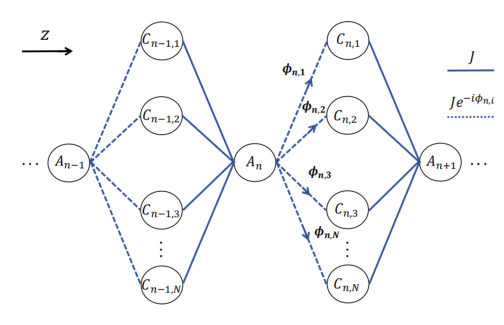 
FIG. 1. The interaction between the lattice sites An, Cn,i and An+1 is shown in the figure, where the solid line represents the strength to be a constant J. The dashed line indicates that there is a transition phase e−iϕn,i in the coupling between the lattice, and there are N paths(Cn,i ) between the adjacent sites An and An+1. The transmis- sion process of photons in the lattice is along the z direction.

📷 Fig 2

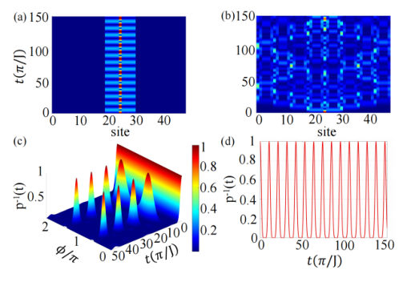 
FIG. 2. The lattice system we studied consists of 9 unit cells, 49 sites in total, and the initial state of |Ai⟩= |0, 0...1i...0⟩excited in the lattice. (a) The dynamics process of photon in the lattice reveals the perfect localization phenomenon; (b) The AB caging effect is absent, and the photon presents a transport process in the lattice; (c) The evolution law of IPN with the passage of time; (d) The IPN changes according to the time when the AB caging occurs.

📷 Fig 3

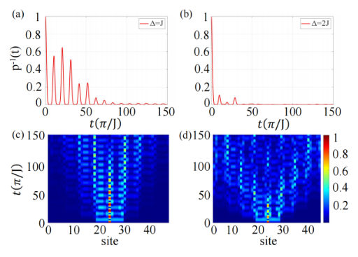 
FIG. 4. Time evolution of IPN for the different disoder strength. The time evolution of IPN for the case: (a) ∆= J and (b) ∆= 2J. The dynamics of photons in the lattice for the case: (c) ∆= J and (d) ∆= 2J.

📷 Fig 4

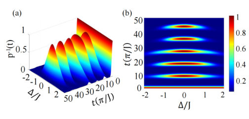 
FIG. 3. (a) By regulating the strength of disorder, the evolution pro- cess of the IPN according to time is observed. (b) The stereoscopic picture in (a) is transformed into a plane picture for observation, and the cage effect will be destroyed quickly when the strength of the disorder increases, at last the AB caging effect will disappaer.

📷 Fig 5

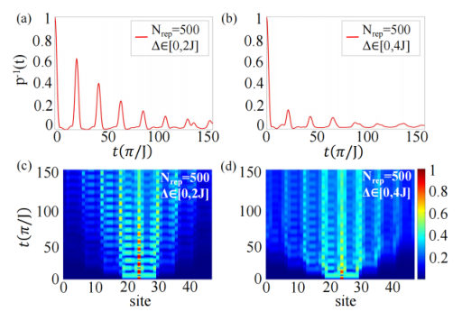 
FIG. 5. Time evolution of IPN for the different disoder strength and each case is calculated with 500 disorder realiztions. The time evolu- tion of IPN for the case: (a) ∆is randomly distributed between 0 and 2J. (b) ∆is randomly distributed between 0 and 4J. The dynamics of photons in the lattice for the case: (c) ∆is randomly distributed between 0 and 2J. (d) ∆is randomly distributed between 0 and 4J.

**Summary.** This paper proposes a method to achieve Aharonov-Bohm caging in lattices with multiple flux parameters, allowing for highly tunable wavefunction localization. It demonstrates that while this caging is a powerful tool for quantum simulation, it is sensitive to environmental perturbations like noise and dissipation. The findings are applicable to various platforms including photonics, superconducting qubits, and trapped ions.

**Why it may be interesting.** It provides a scalable framework for engineering flat-band localization and explores the 'inverse Anderson transition' where disorder enables transport, which is highly relevant to open quantum systems and many-body dynamics.

Detailed structure

**Main problem.** Investigating the universal conditions for Aharonov-Bohm (AB) caging in multi-flux lattices and exploring how this localization effect is destroyed by disorder, dissipation, and non-Hermitian effects.

**Main result.** The authors derive universal conditions for AB caging in multi-flux lattices and demonstrate that while the effect is robust to certain configurations, it is cumulatively destroyed by increasing on-site detuning, dissipation, or non-Hermitian hopping.

**Method.** The study uses theoretical derivation of eigenvalue equations in k-space combined with numerical simulations of photon dynamics and Lindblad master equations to analyze localization and transport.

**Model / system.** A 1D multi-flux lattice with tunable couplings and gauge fields, applicable to photonic lattices, superconducting circuits (circuit QED), and trapped-ion systems.

**Key observables.** Inverse Participation Number (IPN), IPN fluctuation (sigma), and group velocity (vg).

**Important parameters / regimes.** Transition phases (phi), coupling strength (J), disorder strength (Delta), dissipation rate (gamma), and non-Hermitian hopping strength (Gamma).

**Assumptions / limitations.** The physical realizations assume the validity of the rotating-wave approximation (RWA).

**Figures summary.** Fig 1 shows the lattice structure; Fig 2 displays numerical simulations of photon localization and transport; Fig 5 shows IPN time evolution under disorder; Fig 6 and 7 present phase diagrams and statistical localization criteria.

**Paper structure.** The paper introduces the AB caging concept, proposes a scalable protocol for multi-flux caging, validates it via numerical simulations, investigates the impact of disorder and dissipation, and discusses experimental implementations in quantum platforms.

Abstract

Aharonov-Bohm (AB) caging is the complete wavefunction localization effect in translational-invariant lattices induced by destructive phase interference. These phases originate from the gauge fields such as the penetrated magnetic fields, which are directly related to several novel topological quantum states of matter. Recently, this effect has demonstrated significant potential for applications in quantum simulation and topological quantum computation. Here, we propose a scalable protocol to derive universal conditions for AB caging with multi-flux. The numerical simulations validate the theoretical predictions by directly observing AB caging phenomena. We also investigate the breakage of the caging effect with onsite detuning. Our protocol can be directly tested in several quantum many-body platforms and provides an alternative approach for advancing quantum simulation of exotic state matter.

[↑ back to top](#top)

### [Quantum Ghost Spectroscopy Reveals Hidden Electronic Coherence in Molecular Aggregates](http://arxiv.org/abs/2605.23639v1)

**Authors:** Mingran Zhang, Yihe Xu, Vladislav V. Yakovlev, Zhedong Zhang  
**Type:** both · **Category:** other · **PDF:** <https://arxiv.org/pdf/2605.23639v1>  
**Analysis basis:** full PDF text, analyzed in chunks
**Topic relevance:** `non-equilibrium dynamics` **3/5** · `quantum optics experiment` **3/5** · `interference shaping light` **2/5** · `methods for driven-dissipative` **2/5** · `quantum measurements` **2/5** · `entanglement & information structure` **1/5**

📷 Fig 1

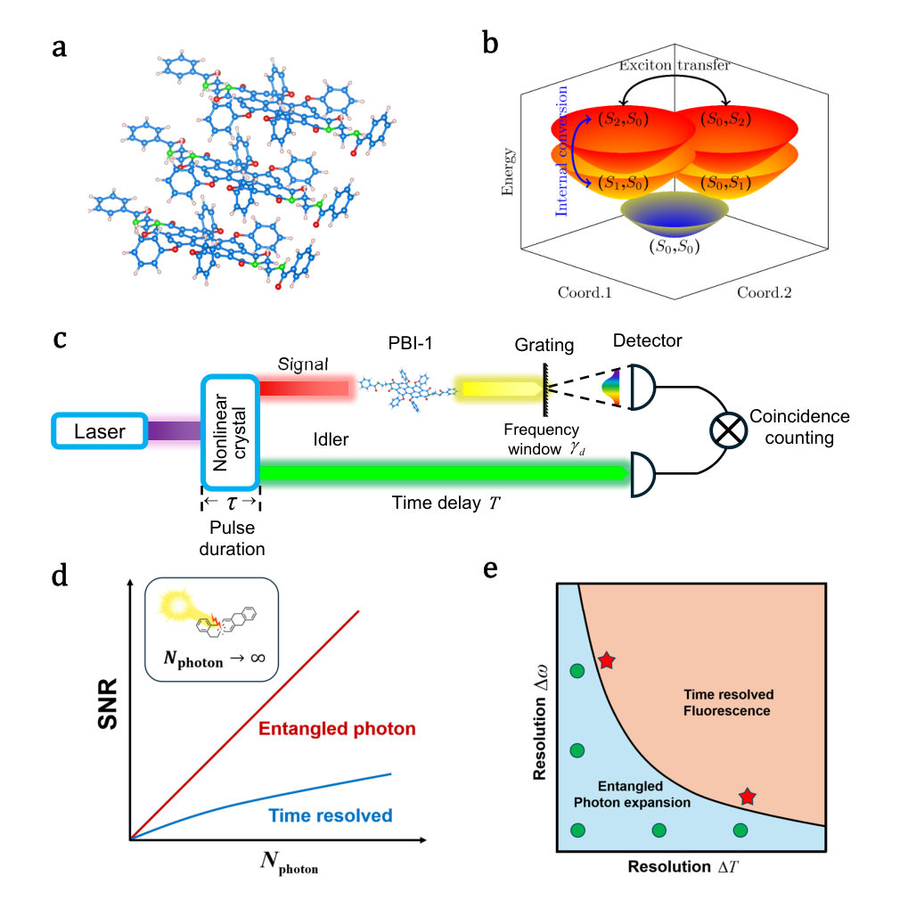 
Figure 1: Entangled-light spectroscopy. (a) Molecular structure of PBI-1 trimer. (b) Schematic diagram of involved PESs of PBI-1 molecule. (e1, e2) denotes a pair of nearest- neighbor monomers, one is in state e1 and the other is in e2. Coordinates 1 and 2 are the same vibrational mode inside monomer 1 and 2 respectively. (c) Proposed experimental setup. A pump pulse enters a nonlinear crystal to generate two light beams s (signal) and i (idler) which are entangled with an entanglement time τ. Signal photons, s, interact with molecules whereas photons in i arm propagate freely with a time delay T. With respect to s-arm photons, molecules emit fluorescence which is collected by an...

📷 Fig 2

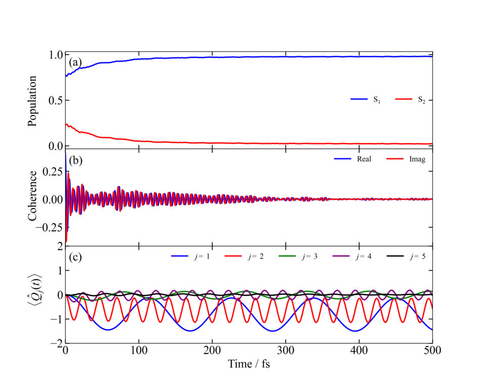 
Figure 2: Quantum dynamics of PBI-1 trimers. (a) Populations at S1 and S2 states. (b) Electronic coherence ρS1,S2. (c) Mean dimensionless position of the jth vibrational mode. Total evolution time is set to 500 fs with a step 0.166 fs.

📷 Fig 3

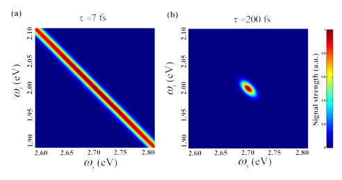 
Figure 3: Quantum correlation function |Φ(ωs, ωi)| between s and i photons. (a) Entangle- ment time τ = 7 fs (b) τ = 200 fs.

📷 Fig 4

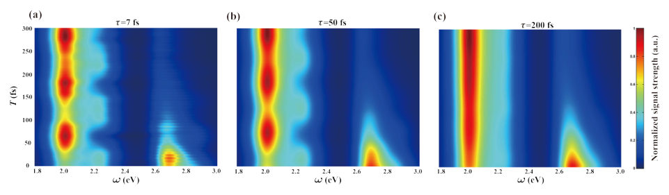 
Figure 4: Tr-QGS signal as a function of temporal gate parameter τ, where ω is emission frequency and T is the delay between s and i photons. (a) τ = 7 fs. (b) τ = 50 fs. (c) τ = 200 fs. Parameters are γ = 0.41 eV, ω+ =4.7 eV, in line with recent experiments.46 Molecular parameters are reproduced from Ref.44 The change of τ correlates to the three green circles in the horizontal line in Figure 1(e). All signals at ω &gt; 2.6 eV have been rescaled by a factor of 50.

📷 Fig 5

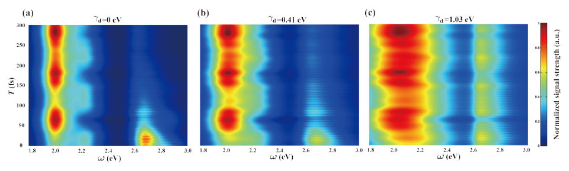 
Figure 5: Tr-QGS signal as a function of the spectral gate parameters. (a) γd = 0 eV. (b) γd = 0.41 eV. (c) γd = 1.03 eV. Parameters are τ = 7 fs, γ0 = 0.41 eV. Others are the same as Figure 4. The change of γd correlates to the three green circles in the vertical line in Figure 1(e).

**Summary.** This paper introduces a quantum ghost spectroscopy technique using entangled photons to overcome the Fourier uncertainty limit in ultrafast spectroscopy. By decoupling temporal and spectral resolutions, the authors reveal hidden electronic-to-vibrational coherence transfer in molecular aggregates. This approach provides a new way to observe high-frequency quantum dynamics that are otherwise obscured in classical measurements.

**Why it may be interesting.** It demonstrates a quantum-enhanced spectroscopic technique that bypasses fundamental classical limits (Fourier uncertainty) to resolve ultrafast nonadiabatic dynamics, which is highly relevant to quantum optics and open quantum systems.

Detailed structure

**Main problem.** Conventional ultrafast spectroscopy is limited by the Fourier uncertainty principle, creating a trade-off between temporal and spectral resolution that obscures hidden electronic and vibrational coherence dynamics.

**Main result.** Time-resolved quantum ghost spectroscopy (tr-QGS) using entangled photons enables independent control of time and energy scales, successfully revealing previously hidden 0.7 eV electronic coherence and the subsequent transfer to vibrational coherence.

**Method.** The study combines a theoretical framework for tr-QGS using fourth-order perturbative expansion with Time-Dependent Density Matrix Renormalization Group (TD-DMRG) simulations.

**Model / system.** The system consists of perylene bismide (PBI-1) trimers in a dilute solvent, modeled with a Hamiltonian including electronic states (S1, S2), five vibrational modes, and nonadiabatic vibronic coupling.

**Key observables.** Electronic coherence (rho_S1,S2), population dynamics (S2 to S1 internal conversion), and vibrational coherence (mode position dynamics).

**Important parameters / regimes.** Electronic energy difference of ~0.7 eV, temporal scales of 5-50 fs for electronic and 200-300 fs for vibrational coherence, and sub-shot-noise sensitivity.

**Assumptions / limitations.** The derivation relies on the validity of fourth-order perturbative expansion and assumes the initial state is created by the signal photon pulse.

**Figures summary.** Figure 1 shows the molecular structure, potential energy surfaces, and the tr-QGS experimental setup; Figure 2 shows coherence dynamics; Figure 6 illustrates the comparison between time- and frequency-gated signals.

**Paper structure.** The paper introduces the Fourier limitation problem, proposes the tr-QGS platform, details the TD-DMRG simulation methodology, presents results on population and coherence dynamics, and discusses broader applications.

Abstract

Ultrafast spectroscopy of molecular systems is fundamentally constrained by the Fourier uncertainty principle: high temporal resolution smears out electronic state signatures, while high spectral resolution obscures dynamic information. Here we overcome this limitation using time-resolved quantum ghost spectroscopy (tr-QGS) with entangled photon pairs, which enables independent control of temporal and spectral scales. We apply this approach to perylene bismide (PBI-1) trimers for energy transfer,by combining a quantum description of light-molecule interaction with time-dependent density matrix renormalization group (TD-DMRG) simulations. This explicitly includes five vibrational modes and nonadiabatic coupling between electronic states. Our simulations reveal that tr-QGS uniquely captures electronic coherence oscillating at 0.7 eV for >50 fs, a signature of nonadiabatic coupling that was obscured in conventional time-resolved fluorescence due to Fourier-limited broadening. Moreover, we observe a direct transfer from electronic to vibrational coherence at 200 fs, providing real-time visualization of vibronic relaxation pathways. The entangled photon correlation enables a sensitivity below the shot-noise limit and suppresses photobleaching artifacts that plague classical measurements. These results establish tr-QGS as a transformative tool for interrogating nonadiabatic dynamics in molecular aggregates, light-harvesting complexes, and photocatalysts, offering a route to reveal quantum coherence in chemistry with unprecedented time-energy precision.

[↑ back to top](#top)

### [Chirality-sensitive mobility and dissipation of Brownian motion on a helical landscape](http://arxiv.org/abs/2605.23803v1)

**Authors:** Debankur Bhattacharyya, Abraham Nitzan  
**Type:** theory · **Category:** statistical mechanics · **PDF:** <https://arxiv.org/pdf/2605.23803v1>  
**Analysis basis:** full PDF text, analyzed in chunks
**Topic relevance:** `non-equilibrium dynamics` **3/5** · `Keldysh / 2PI / non-Gaussian methods` **2/5** · `correlated / nonlocal dissipation` **2/5** · `methods for driven-dissipative` **2/5**

📷 Fig 1

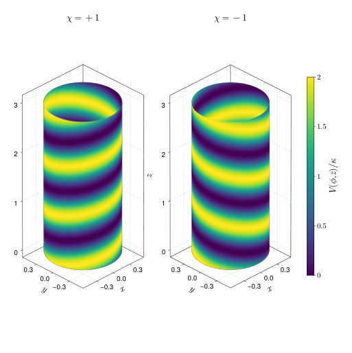 
FIG. 1: Plotted here for an example a helical potential landscape on a cylindrical manifold: V (ϕ, z; R, χ) = κ(1 −cos  ϕ −2πχz

📷 Fig 2

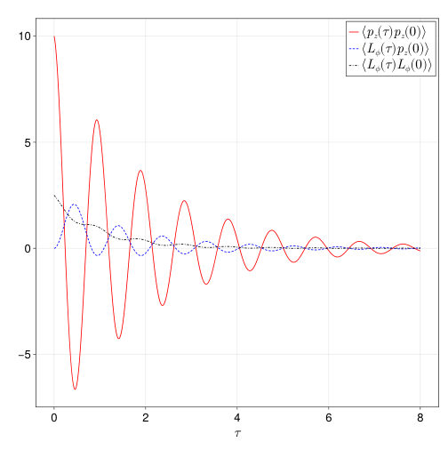 
FIG. 3: Time correlation functions of the momenta (Eq. (33) or Eq. (67)) for the isotropic case. At τ = 0 (equilibrium moments)the diagonal second moments show the expected equipartition, ⟨L2 ϕ⟩/R2 = ⟨p2 z⟩= β−1. The cross correlation function vanishes at τ = 0, illustrating the dynamic nature of the correlation between the linear and angular momenta. Parameters: β = 0.1, R = 0.5 and γϕ = γz = 1.

📷 Fig 3

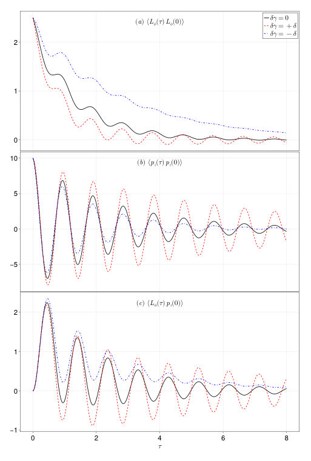 
FIG. 4: Effect of damping anisotropy in momentum time-correlation functions. Elements of the matrix S∞ p (τ) are plotted against dimensionless time τ using Eq. (67). To illustrate the effect of anisotropy we keep ¯γ = (γϕ + γz)/2 same as that of Fig. 3, then consider three different values of anisotropy coefficient δγ = (γϕ −γz)/2; which correspond to the isotropic case(δγ = 0, solid black lines), angular damping tilted (δγ = +δ, red dashed lines), axial damping tilted (δγ = −δ, blue dash-dot line). Panel(a): ⟨Lϕ(τ)Lϕ(0)⟩ against τ, panel (b): ⟨pz(τ)pz(0)⟩against τ and panel (c):⟨Lϕ(τ)p(0)⟩against τ. Parameters:β = 0.1, R = 0.5, χ = 1 with ¯γ = 1.0, δ = 0.5

📷 Fig 4

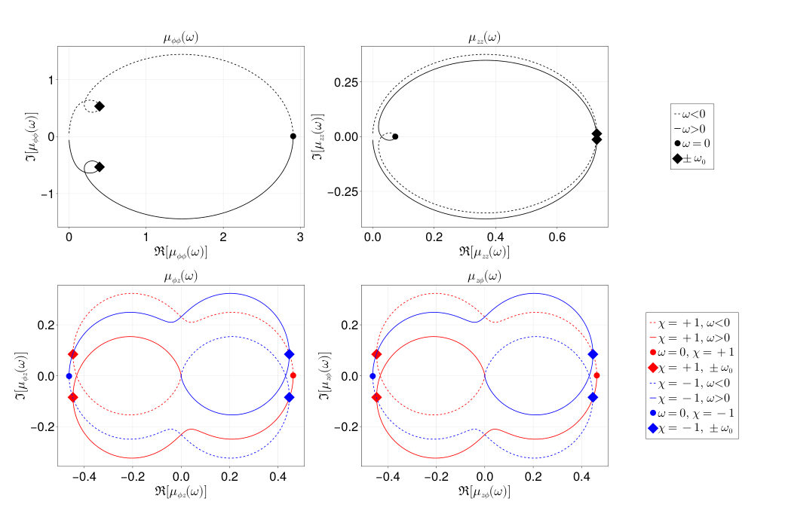 
FIG. 5: Nyquist plots for visualizing AC mobilities (Eq. (74)). Here we plot (R[µij(ω)], I[µij(ω)]) parametrically in the drive frequency ω. In these diagrams, at any point parametrized by drive frequency ω, the polar angle with respect to the positive real axis characterizes the phase response Φij(ω) and distance from the origin captures the amplitude response |µij(ω)|. |ω| is varied from 0 to 10ω0 for all branches of the plots. The ω = 0 (solid circular points) in the plots represents the represent the value of the DC mobility and sits on the real axis. The solid square points represent the values of ±ω0. The dotted lines (ω &lt; 0 branch) and solid lines (ω &gt; 0 branch) are mirror images of...

📷 Fig 5

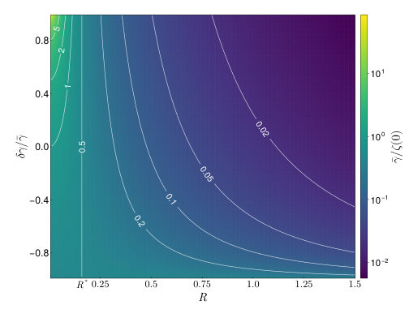 
FIG. 6: DC mobilities. The scaled mobility prefactor ¯γ/ζ(0) is plotted in terms of R and δγ/¯γ , where ¯γ = (γϕ + γz)/2, δγ = (γϕ −γz)/2. The DC mobilities are given as µDC ϕϕ = 4π2/ζ(0), µDC zz = 1/ζ(0) and µDC zϕ = µDC ϕz = 2πχ/ζ(0). The vertical white line corresponds to R = R∗= 1/2π where dependence on anisotropy vanishes and ¯γ/ζ(0) = 1/2.

**Summary.** This paper provides a complete analytical description of how a helical landscape affects the transport and dissipation of a Brownian particle. It demonstrates that the geometry of the landscape creates a direct link between axial and angular motion, which can be detected through cross-mobility and asymmetric energy absorption.

**Why it may be interesting.** The derivation of transport coefficients and dissipation in a non-stationary, non-equilibrium setting with broken symmetry is highly relevant to researchers studying open quantum systems and driven-dissipative dynamics.

Detailed structure

**Main problem.** Investigating how the helical geometry and damping anisotropy of a landscape influence the Brownian dynamics, mobility, and energy dissipation of an inertial particle.

**Main result.** The authors derive analytical expressions for the mobility tensor and show that chirality induces cross-response between axial and angular motion, as well as an asymmetry in energy dissipation.

**Method.** The study employs Langevin dynamics, linear response theory, and a projection operator approach to separate the dynamics into a stable subspace and a diffusive zero-mode.

**Model / system.** A classical Brownian particle with inertia moving in a 2D helical potential on a cylindrical surface, modeled using a harmonic well approximation and Langevin equations.

**Key observables.** Dynamical mobility tensor (diagonal and off-diagonal elements), momentum time-correlation functions, and energy dissipation rate.

**Important parameters / regimes.** Helix handedness (chirality), damping anisotropy, radius-to-pitch ratio, and temperature.

**Assumptions / limitations.** The potential is approximated as a harmonic well, the particle is structureless, and the system is treated within the framework of Markovian Langevin dynamics.

**Figures summary.** Figure 1 shows the helical potential landscape; Figure 4 shows momentum correlations; Figure 5 presents Nyquist plots of AC mobility; Figure 6 shows parametric variation of DC mobilities; Figure 7 shows energy dissipation absorption spectra.

**Paper structure.** The paper introduces the helical model, develops the stochastic framework using coordinate transformations, analyzes the isotropic and anisotropic damping regimes, derives the mobility tensor via linear response theory, and concludes with energy dissipation analysis.

Abstract

We study the Brownian dynamics and linear response of a particle with inertia moving in a 2-dimensional helical landscape imprinted on a cylindrical surface. In the harmonic well approximation, the deterministic motion separates into free propagation along the screw direction and harmonic motion in the transverse screw-normal direction. We show that for isotropic damping this simplification survives in the Langevin description, whereas anisotropic damping along the axial and angular directions couples the stochastic dynamics and destroys separability. The resulting anisotropic model is formulated as a linear Ornstein-Uhlenbeck process in phase space with a zero mode associated with diffusion along the screw coordinate, so that in an infinite system the full phase-space dynamics does not relax to a stationary distribution. To treat transport in this setting, we construct the stationary dynamics in the stable subspace obtained after projecting out the zero mode. This leads to a linear response theory for this system and yields closed analytical expressions for stationary time-correlation functions and the dynamical mobility tensor in both the time and frequency domains. The off-diagonal elements of the mobility tensor describe cross-response between axial forcing and angular motion, and between applied torque and axial transport. Consistent with time reversal symmetry, these cross mobilities are equal and provide a direct dynamical signature of the helical geometry. In addition, a simultaneous application of driving in both the axial and angular direction reveals asymmetry in energy dissipation rate due the helical landscape.

[↑ back to top](#top)

### [IntegrateUnitary.jl: A Julia package for symbolic integration over Haar measures](http://arxiv.org/abs/2605.23830v1)

**Authors:** Łukasz Pawela, Zbigniew Puchała  
**Type:** theory · **Category:** quantum information and computing · **PDF:** <https://arxiv.org/pdf/2605.23830v1>  
**Analysis basis:** full PDF text, analyzed in chunks
**Topic relevance:** `entanglement & information structure` **3/5** · `measurement-induced transitions` **2/5** · `methods for driven-dissipative` **2/5** · `non-equilibrium dynamics` **2/5**

📷 Fig 1

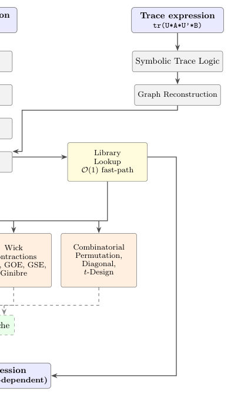 
Fig. 1. Architecture of IntegrateUnitary.jl. Scalar expressions follow the left path through normalization, substitution, expansion, and dispatch into the library lookup. Trace expressions are first analyzed by the symbolic trace logic, which reconstructs the Weingarten graph before entering the same dispatch stage. Common patterns are returned directly by the library lookup in O(1) time, while misses fall through to the specialized engines. Performance-critical internals (representation-theoretic quantities and Weingarten-related data) are memoized/cached for reuse.

**Summary.** The authors present IntegrateUnitary.jl, a new Julia package designed for the symbolic integration of random matrix ensembles. It automates the complex Weingarten calculus and Wick contractions needed for quantum information theory, offering a scalable and high-performance alternative to existing Python and Mathematica tools.

**Why it may be interesting.** This tool automates the complex combinatorial task of calculating averages over random unitaries, which is essential for studying quantum chaos, scrambling, and entanglement in many-body dynamics and random quantum circuits.

Detailed structure

**Main problem.** The need for an efficient, automated, and symbolic tool to perform integration over the Haar measure of various compact groups and random matrix ensembles, which is computationally difficult due to the combinatorial complexity of Weingarten calculus.

**Main result.** The development of IntegrateUnitary.jl, a Julia package that provides a unified, high-performance implementation for symbolic integration over $U(d)$, $O(d)$, $Sp(d)$, and other ensembles, achieving significant speedups over existing tools like Haarpy and RTNI.

**Method.** The package utilizes the Symbolics.jl ecosystem, implementing Weingarten calculus, Wick contractions, the Murnaghan-Nakayama rule, and symplectic-orthogonal duality, alongside a coordinate-free symbolic trace interface.

**Model / system.** The software targets random matrix ensembles including Unitary, Orthogonal, and Symplectic groups, Ginibre ensembles, Circular ensembles (CUE, COE, CSE), permutation groups, and unitary $t$-designs.

**Key observables.** Polynomial moments of matrix entries, trace-polynomial integrals, purity, entanglement entropy, and quantum information metrics.

**Important parameters / regimes.** Dimension $d$ (treated as a symbolic variable), polynomial degree $k$, and the large-$d$ asymptotic limit.

**Assumptions / limitations.** Exact symbolic integration is limited to polynomial degrees $2k \lesssim 12$; certain workflows require concrete integer dimensions; $SU(d)$ support is currently limited to balanced polynomials.

**Figures summary.** Figure 1 illustrates the software architecture and data flow for scalar and trace expressions; various tables compare performance benchmarks and scaling against other software packages.

**Paper structure.** The paper introduces the computational problem, describes the software architecture and core mathematical engines (Weingarten, Wick, etc.), presents performance benchmarks against existing tools, and demonstrates applications in quantum information tasks.

Abstract

Symbolic integration over the Haar measure of compact groups is a computational cornerstone in quantum information science and random matrix theory. We present \texttt{IntegrateUnitary.jl}, a comprehensive Julia package for computing exact expectations of polynomial functions over a wide range of compact groups ($U(d)$, $O(d)$, $Sp(d)$, and $SU(d)$ for balanced polynomials), circular and Gaussian ensembles, Ginibre ensembles, permutation groups, random pure states, and unitary $t$-designs. The package provides a fully open-source implementation of the Weingarten calculus and Wick contractions with broad symbolic-$d$ support for entry-wise and trace-polynomial integrals, while selected workflows currently require concrete integer dimensions (including higher pure trace moments $|\mathrm{tr}(U)|^{2k}$ for $k > 1$ and HCIZ with \texttt{SymbolicMatrix} inputs, and direct matrix-valued integration of \texttt{SymbolicMatrix}/\texttt{SymbolicMatrixProduct} expressions), automatic asymptotic expansions, a high-level symbolic trace interface that reconstructs Weingarten graphs from index-free expressions, and a bridge to \texttt{ITensors.jl} for tensor network averaging. We discuss the underlying algorithms, including the Murnaghan-Nakayama rule and symplectic-orthogonal duality, and demonstrate that the package efficiently handles high-degree moments and quantum information metrics.

[↑ back to top](#top)

### [Local-Observable-Guided Generative Quantum Circuits for Degenerate Ground Spaces](http://arxiv.org/abs/2605.23300v1)

**Authors:** Yiying Chen, Lingxia Zhang, Yanzheng Zhu, Kaiyan Yang, Xiao Zeng, Zizhu Wang  
**Type:** theory · **Category:** numerical methods · **PDF:** <https://arxiv.org/pdf/2605.23300v1>  
**Analysis basis:** full PDF text, analyzed in chunks
**Topic relevance:** `entanglement & information structure` **3/5** · `analog quantum simulation` **2/5** · `exotic spin models in light-matter` **2/5** · `quantum measurements` **2/5**

📷 Fig 1

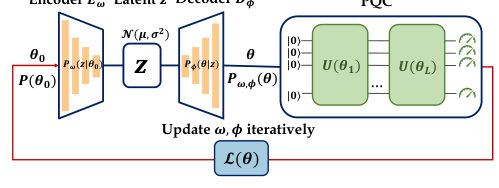 
FIG. 1: Generative quantum circuit architecture. The network consists of a classical generative model followed by a parametrized quantum circuit (PQC). The encoder Eω maps an input θ0 ∼P(θ0) to a low-dimensional latent distribution z ∼N(µ,σ2). The decoder Dϕ then converts z into circuit parameters θ ∼Pω,ϕ(θ), which configure a PQC with depth L. Measurements are then performed to obtain an energy-diversity objective, and the parameters (ω,ϕ) are updated iteratively.

📷 Fig 2

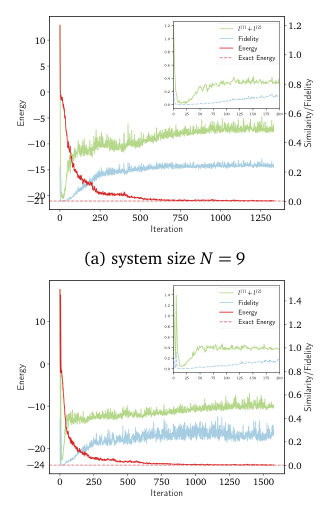 
FIG. 2: Training dynamics for the MG model. Shown are the batch-mean energy (red), the batch-mean pairwise fidelity (blue), and the sum of cosine similarities l(1) + l(2)

📷 Fig 3

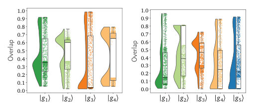 
FIG. 3: Overlap distributions of accepted states {|ψi〉}1500 i=1 with the MG ground-state basis {|gi〉}k i=1. The plots combine probability densities (the half-violin plot on the left) with quartile statistics (the box-and-whisker plot on the right box). The broad distributions indicate a diverse generated ensemble covering the full degenerate ground space.

📷 Fig 4

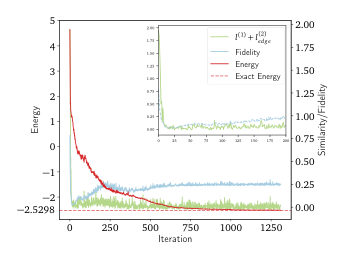 
FIG. 4: Training dynamics for the symmetry-encoded AKLT model at system size N = 10. Shown are the batch-mean energy (red), the batch-mean pairwise fidelity (blue), and the sum of cosine similarities l(1) + l(2) edge (green). The inset highlights the first 200 iterations. The dynamics exhibit an initial diversity-dominated spreading stage followed by an energy-dominated concentration into the degenerate ground space. Finally, the energy converges to the ground-state energy with low batch-mean pairwise fidelity.

📷 Fig 5

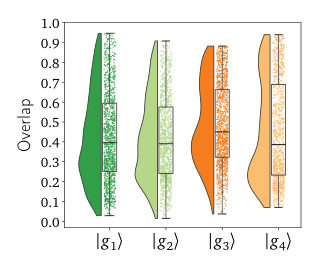 
FIG. 5: Overlap distributions of accepted states {|ψi〉}1500 i=1 with the symmetry-encoded AKLT ground-state basis {|gi〉}4 i=1 at system size N = 10. The half-violin plot represents the probability density, and the box-and-whisker plot summarizes the quartiles and spread. The broad distributions indicate that all basis directions are represented across the generated ensemble.

**Summary.** The paper introduces a generative quantum circuit framework designed to learn the entire degenerate ground-state space of many-body Hamiltonians. By optimizing an energy-diversity objective using local observables, the method avoids mode collapse and accurately captures the geometric structure of the ground-state manifold. It demonstrates high robustness to sampling noise and successful application to various spin-chain models.

**Why it may be interesting.** This work provides a scalable way to explore degenerate manifolds and topological ground spaces using local measurements, which is highly relevant for characterizing many-body phases in both simulated and near-term quantum hardware.

Detailed structure

**Main problem.** Recovering the full degenerate ground-state manifold of quantum many-body systems, which is challenging because existing methods often capture individual states but fail to represent the entire degenerate space without mode collapse.

**Main result.** The proposed hybrid generative quantum circuit successfully reproduces the full span and internal feature-space geometry of degenerate ground spaces in the Majumdar-Ghosh, AKLT, and spin-1 XXZ models, even under finite-shot noise.

**Method.** A hybrid framework combining a classical generative model (VGON) with a parameterized quantum circuit (PQC), using an energy-diversity loss function based on local observable correlators to prevent representation collapse.

**Model / system.** The study benchmarks on several 1D spin models: the spin-1/2 Majumdar-Ghosh model, the spin-1 AKLT model (with symmetry-encoded qutrit mapping), and the spin-1 XXZ chain at the first-order phase transition point.

**Key observables.** Local one-body magnetizations, nearest-neighbor two-body Pauli correlations, effective rank of the state matrix, ground-space overlap score, and principal angles.

**Important parameters / regimes.** Energy-diversity weight (lambda_2) annealing schedule, shot-adaptive training budget, and relative error tolerance (epsilon) for rank determination.

**Assumptions / limitations.** Benchmark certification is limited to system sizes accessible by Exact Diagonalization; numerical rank determination assumes a fixed relative error tolerance.

**Figures summary.** Figure 1 shows the generative architecture; Figure 2 illustrates training dynamics (energy vs. fidelity); Figures 8-9 show circuit ansatze for spin-1/2 and spin-1; Figures 10-15 present overlap decompositions and cosine-similarity heatmaps comparing exact vs. generated states.

**Paper structure.** Introduction to the degeneracy problem, description of the hybrid generative architecture and energy-diversity objective, detailed implementation of circuit ansatze for different spin models, benchmarking results on MG, AKLT, and XXZ models, and analysis of robustness under finite-shot noise.

Abstract

Searching for degenerate ground spaces in quantum many-body systems is central to understanding spontaneous symmetry breaking and topological order. Although existing numerical methods can approximate individual ground states with high accuracy, recovering the full degenerate space remains a substantial challenge. Here we tackle this problem using a hybrid generative quantum circuit that combines a classical generative model with an expressive parameterized quantum circuit (PQC). The classical model learns a distribution over PQC parameters, enabling the sampling of an ensemble of ground states, while the PQC ensures compatibility with quantum hardware. To promote both low energy and state diversity, we define an energy-diversity objective composed of an energy-minimization term and cosine-similarity penalties derived from local observable correlators. These local descriptors provide a scalable, measurement-efficient means of distinguishing distinct ground states. We benchmark the framework on the Majumdar-Ghosh model, the Affleck-Kennedy-Lieb-Tasaki model, and the spin-1 XXZ chain, which realize distinct mechanisms of degeneracy. In all cases, the method produces a diverse ensemble whose linear span accurately reproduces the target ground space, in some instances, it identifies an approximately orthogonal basis within the learned ensemble. We further show that the framework remains robust under shot-based estimation and can still recover the degenerate ground space with a reduced measurement budget.

[↑ back to top](#top)

### [Non-Hermitian Landau Levels](http://arxiv.org/abs/2605.23613v1)

**Authors:** Anton Montag, Tomoki Ozawa  
**Type:** theory · **Category:** other · **PDF:** <https://arxiv.org/pdf/2605.23613v1>  
**Analysis basis:** full PDF text, analyzed in chunks
**Topic relevance:** `non-equilibrium dynamics` **3/5** · `analog quantum simulation` **2/5** · `correlated / nonlocal dissipation` **2/5** · `methods for driven-dissipative` **2/5**

📷 Fig 1

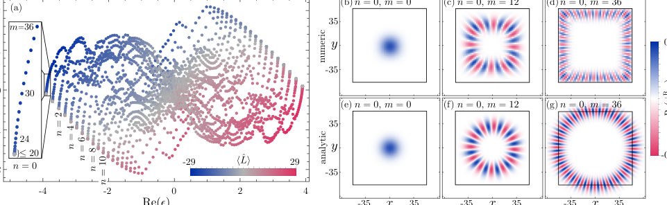 
Figure 1. Eigenvalues and right eigenstates of the non-Hermitian Harper-Hofstadter model on a 50 × 50 square lattice with lattice spacing a = 1 and the complex-valued magnetic field B = 0.1−0.001i. In panel (a) the complex-valued eigenenergies are plotted, where the color indicates the planar angular momentum calculated from the eigenstates. The first ten non-Hermitian Landau levels can be identified from the eigenvalue distribution. The inset shows that for larger m the numerical eigenenergy deviates from the analytical value as described in the text. To prove that this is indeed a finite-size effect we show the numerical eigenstates from three states from the lowest non-Hermitian Landau...

📷 Fig 2

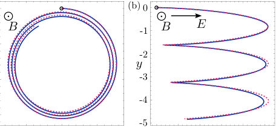 
Figure 2. Trajectories of the center of mass of Gaussian wave packets in presence of a complex-valued magnetic field. Their evolution is simulated on a 50 × 50 square lattice governed by the Harper-Hofstadter model with B = 0.1 −0.001i in the symmetric gauge with centered origin. The initial position is marked by a black circle. In panel (a) the spiral trajectory of a wave packet with finite initial velocity is shown in blue and compared to the solution of the semi-classical equation of mo- tion, plotted in red. In panel (b) the wave packet is initially at rest and an in-plane electric field E = 0.005ex is applied. The center of mass follows a skipping trajectory, shown in blue, and this...

📷 Fig 3

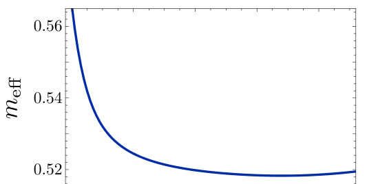 
Figure 3. Effective mass meff depending on wave packet width for a 50 × 50 square lattice for vanishing magnetic field.

**Summary.** This paper develops the theory of Landau levels in the presence of a complex-valued magnetic field. It demonstrates that such fields lead to complex energy spectra and spiral-shaped particle trajectories. The findings suggest new ways to implement non-Hermitian physics in platforms like topoelectrical circuits and ultracold atoms.

**Why it may be interesting.** This work is highly relevant for researchers in open quantum systems and many-body dynamics as it provides a fundamental framework for understanding how non-Hermiticity (via complex magnetic fields) alters topological features and transport properties like the Lorentz force.

Detailed structure

**Main problem.** The paper investigates the properties, topology, and dynamics of Landau levels in two-dimensional systems subject to a complex-valued perpendicular magnetic field.

**Main result.** The authors derive complex-valued, highly degenerate energy spectra and show that the imaginary part of the magnetic field induces a drag force, turning circular cyclotron motion into spiral trajectories.

**Method.** The study uses an algebraic approach with creation and annihilation operators, a biorthogonal formalism for non-Hermitian eigenstates, and numerical simulations of a non-Hermitian Harper-Hofstadter lattice model.

**Model / system.** A 2D system of charged particles in a complex magnetic field, modeled both in the continuum using a non-Hermitian Hamiltonian and on a square lattice via a non-Hermitian Harper-Hofstadter model.

**Key observables.** Complex eigenenergies, biorthogonal eigenstates, wave packet center-of-mass trajectories, and effective mass.

**Important parameters / regimes.** Complex magnetic field B = Re(B) + iIm(B), cyclotron frequency, magnetic length, and wave packet width.

**Assumptions / limitations.** The analysis assumes a semiclassical framework for wave packet dynamics and requires Re(B) > |Im(B)| for wavefunction square-integrability in the Landau gauge.

**Figures summary.** Figure 1 shows complex eigenenergies and numerical right eigenstates; Figure 2 displays wave packet trajectories (spiraling motion); Figure 3 shows effective mass as a function of wave packet width.

**Paper structure.** The paper begins with the formulation of the continuum theory and algebraic derivation of complex Landau levels, moves to the analysis of gauge dependence and localization, then transitions to lattice model simulations and semiclassical wave packet dynamics, and concludes with an investigation of effective mass dependence.

Abstract

We formulate non-Hermitian Landau levels in two-dimensional systems under a complex perpendicular magnetic field. In the symmetric gauge, we derive their discretely spaced, highly degenerate complex spectra and biorthogonal eigenstates, and clarify the role of non-unitary gauge transformations. A non-Hermitian Harper-Hofstadter lattice model confirms the continuum theory and reveals Gaussian wave packet dynamics governed by semiclassical equations with a complex Lorentz force, pointing to possible experimental realizations of complex magnetic fields.

[↑ back to top](#top)

### [The Floquet-Magnus expansion of unbounded operators](http://arxiv.org/abs/2605.23734v1)

**Authors:** Daniel Burgarth, Robin Hillier, Davide Lonigro, Leonhard Richter  
**Type:** theory · **Category:** other · **PDF:** <https://arxiv.org/pdf/2605.23734v1>  
**Analysis basis:** full PDF text, analyzed in chunks
**Topic relevance:** `non-equilibrium dynamics` **3/5** · `Tavis-Cummings & cavity-many-emitter` **2/5** · `methods for driven-dissipative` **2/5** · `scars & prethermalization` **2/5**

📷 Fig 1

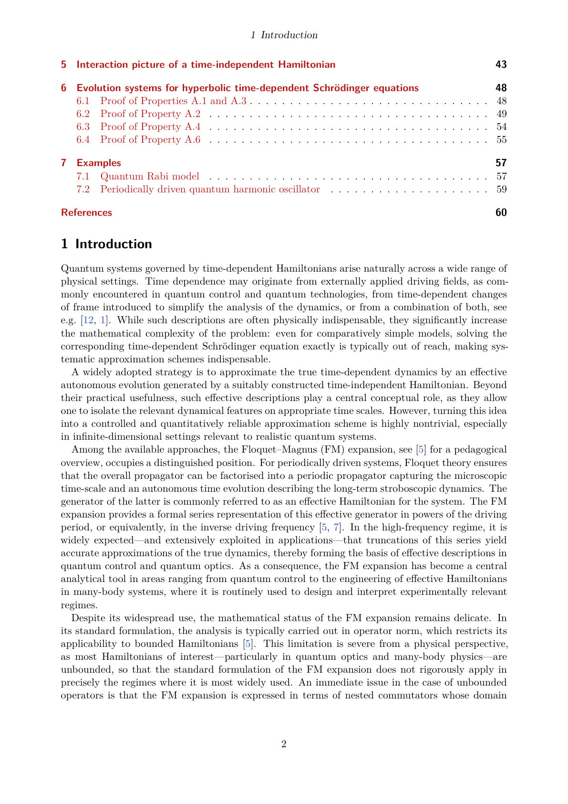 
Low-resolution page preview, page 2

📷 Fig 2

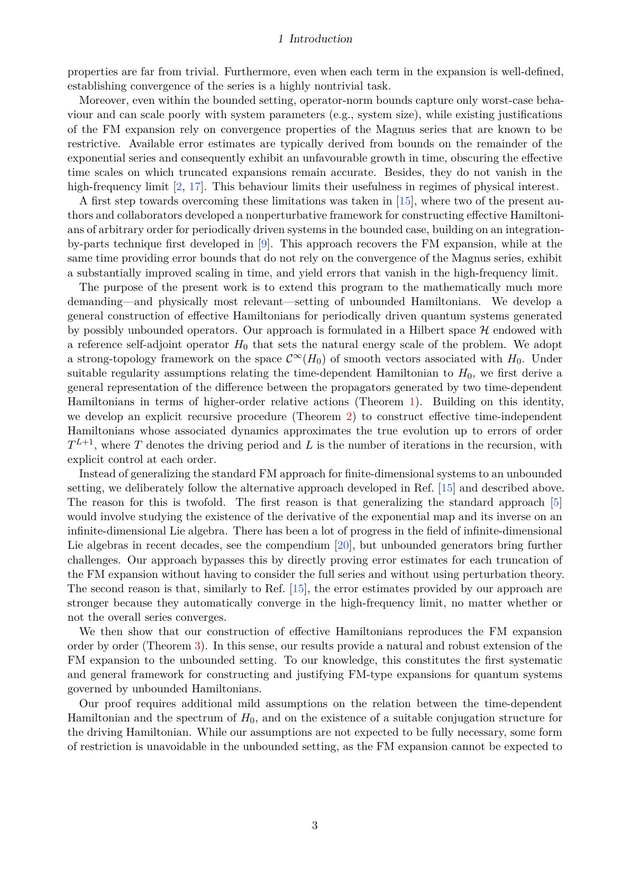 
Low-resolution page preview, page 3

📷 Fig 3

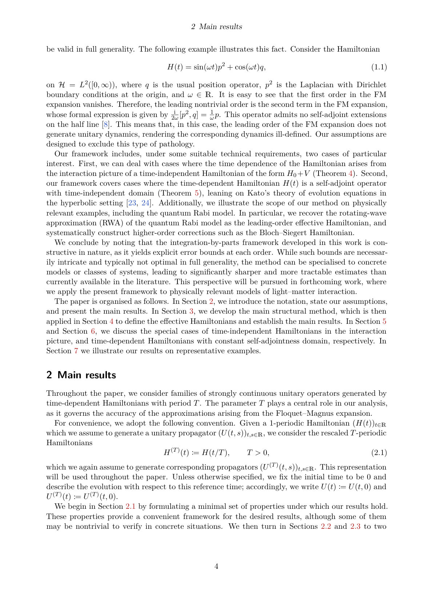 
Low-resolution page preview, page 4

📷 Fig 4

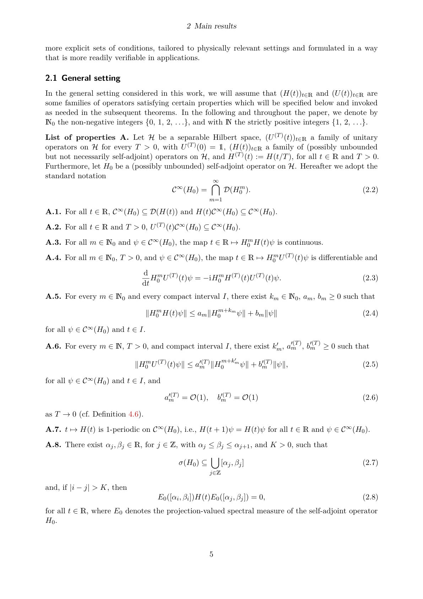 
Low-resolution page preview, page 5

📷 Fig 5

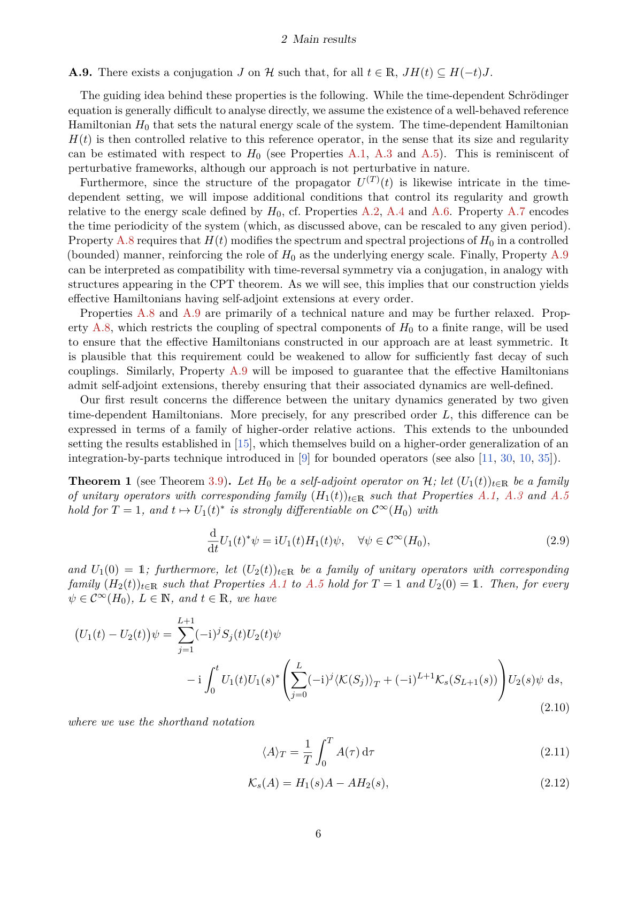 
Low-resolution page preview, page 6

**Summary.** This paper extends the Floquet-Magnus expansion from bounded to unbounded operators, allowing for a rigorous treatment of periodically driven quantum systems. It introduces a new construction that provides explicit error bounds in the high-frequency limit even when the expansion series itself does not converge. The method is successfully demonstrated on the quantum Rabi model and the driven harmonic oscillator.

**Why it may be interesting.** This provides a rigorous mathematical foundation for using effective Hamiltonians in quantum optics and many-body physics, where unbounded operators (like position/momentum or photon number) are standard, and offers improved error scaling in the high-frequency regime.

Detailed structure

**Main problem.** The standard Floquet-Magnus expansion is mathematically restricted to bounded Hamiltonians, making it difficult to rigorously treat physically relevant unbounded operators in periodically driven systems.

**Main result.** The authors develop a nonperturbative framework that extends the Floquet-Magnus expansion to a broad class of unbounded Hamiltonians, providing explicit error bounds that vanish in the high-frequency limit without requiring the convergence of the expansion series.

**Method.** An iterative integration-by-parts technique and a constructive framework based on Kato's theory of evolution equations are used to derive effective Hamiltonians and error estimates.

**Model / system.** The framework is applied to the quantum Rabi Hamiltonian in the interaction picture and a periodically driven quantum harmonic oscillator.

**Key observables.** Unitary propagators and the difference between exact and approximated dynamics.

**Important parameters / regimes.** The driving period (T), the high-frequency limit (T approaching 0), and the energy scale defined by a reference self-adjoint operator (H0).

**Assumptions / limitations.** The Hamiltonians must satisfy specific regularity and stability properties (Properties A.1-A.9 and C.1-C.7), including relative boundedness and well-defined commutator structures.

**Paper structure.** The paper introduces the problem of unbounded operators, presents a nonperturbative integration-by-parts framework, establishes theorems for error control and propagator difference, proves the construction reproduces the Floquet-Magnus expansion, and demonstrates the method via the quantum Rabi and driven harmonic oscillator models.

Abstract

The Floquet-Magnus expansion is a widely used tool to derive effective descriptions of time-periodic quantum systems by approximating their dynamics with a time-independent Hamiltonian. However, its standard formulation is, strictly speaking, restricted to bounded Hamiltonians. In this work, we extend its definition and analysis to a broad class of time-periodic unbounded Hamiltonians. Our approach is based on an a priori distinct nonperturbative framework for the construction of effective Hamiltonians, which we show to reproduce the Floquet-Magnus expansion. A particular strength of our framework is that it allows us to prove that the resulting effective dynamics approximates the original time evolution propagators to arbitrary order in the high-frequency limit without requiring convergence of the Floquet-Magnus expansion, a condition that is already highly restrictive even in the bounded setting. We illustrate the scope of the method on representative models: the quantum Rabi Hamiltonian in the interaction picture, and the periodically driven quantum harmonic oscillator.

[↑ back to top](#top)

### [Sequential Spatiotemporal Magnetic-Field Reconstruction via Quantum Hamiltonian Learning with NV-Center Spin-1 Hamiltonians](http://arxiv.org/abs/2605.23455v1)

**Authors:** Hiroshi Yamauchi, Sophie Colleen Stearn, Samuel Tovey  
**Type:** theory · **Category:** quantum information and computing · **PDF:** <https://arxiv.org/pdf/2605.23455v1>  
**Analysis basis:** full PDF text, analyzed in chunks
**Topic relevance:** `quantum measurements` **3/5** · `spintronics-quantum-optics interface` **3/5** · `methods for driven-dissipative` **2/5**

📷 Fig 1

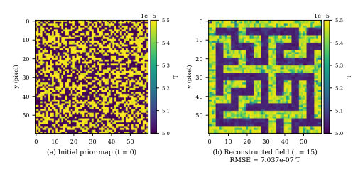 
FIG. 1. Recovery of spatial magnetic-field structure. (a) Initial prior map at t = 0, generated from a random Bernoulli initialization, showing no coherent global organization. (b) Reconstructed field at the final analyzed frame t = 15, ob- tained through sequential inference under the NV Hamilto- nian model, with RMSE = 7.037 × 10−7 T. The emergence of the maze-like structure demonstrates that the reconstruction is achieved through inference rather than direct observation.

📷 Fig 2

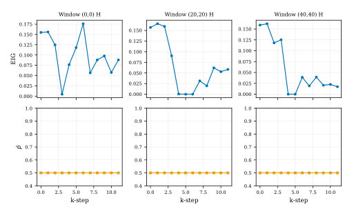 
FIG. 3. Representative k-step convergence behavior for three windows. Top row: expected information gain (EIG) as a function of k. Bottom row: corresponding empirical measure- ment probabilities ¯p. The EIG decreases across steps, while ¯p stabilizes after the early updates, consistent with local pos- terior concentration.

📷 Fig 3

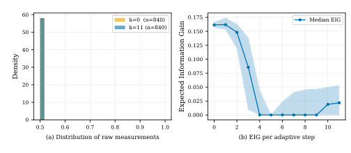 
FIG. 2. Adaptive measurement behavior. (a) Distribution of empirical measurement probabilities ˆp at the initial step (k = 0) and after adaptive updates (k = 11). (b) Expected information gain (EIG) as a function of the adaptive step k, showing rapid decay and saturation.

📷 Fig 4

 
Figure 3 shows the detailed convergence behavior for three representative windows. While all windows exhibit a general decrease in ex- pected information gain, the initial magnitude and de- cay rate differ across spatial locations. This indicates that the local identifiability of the field depends on the underlying field configuration within each window. In particular, windows with stronger local gradients ex- hibit higher initial EIG and faster convergence, whereas more homogeneous regions show lower initial information gain and slower convergence. This heterogeneity demonstrates that the adaptive in- ference mechanism naturally allocates measurement ef- fort according to local information...

📷 Fig 5

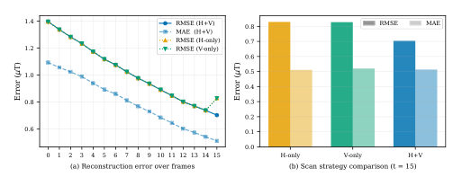 
FIG. 5. Reconstruction error and scan strategy comparison. (a) RMSE and MAE over frames for H+V scan. (b) Compar- ison of RMSE and MAE for H-only, V-only, and H+V scans at the final frame.

**Summary.** This paper proposes a method to reconstruct time-varying 2D magnetic fields by combining local quantum Hamiltonian learning with sequential Bayesian updates. Using NV-center spin-1 dynamics as a model, the authors demonstrate that while spatial structures can be recovered accurately, estimating global interaction parameters remains challenging due to parameter degeneracy and bias.

**Why it may be interesting.** It integrates Quantum Hamiltonian Learning with spatiotemporal Bayesian filtering, addressing the complex task of reconstructing global many-body parameters (J) and local fields simultaneously in a dynamic setting.

Detailed structure

**Main problem.** The sequential spatiotemporal reconstruction of a dynamic, 2D magnetic field from local, noisy, and overlapping observations using quantum sensors.

**Main result.** The framework successfully recovers large-scale spatial structures (maze-like patterns) with low RMSE, though the global coupling parameter J remains partially identifiable and biased.

**Method.** A sequential Bayesian inference framework using a particle-based Monte Carlo estimator and an adaptive control policy based on expected information gain and leakage-aware scoring.

**Model / system.** A nitrogen-vacancy (NV) center spin-1 system in diamond, modeled via a rotating-frame Hamiltonian that includes local magnetic field detuning, transverse strain, and long-range dipolar interactions.

**Key observables.** Ramsey-type readout operators, Classical Fisher Information (CFI), Quantum Fisher Information (QFI), and spin-1 leakage to the |-1> state.

**Important parameters / regimes.** Local magnetic field magnitudes (Bt), shared dipolar coupling parameter (J), and interrogation time (T).

**Assumptions / limitations.** The study uses a numerical 'trusted-simulator' (exact diagonalization) rather than hardware-in-the-loop; it assumes an idealized binomial shot model for measurements.

**Figures summary.** Figure 1 shows the transition from random prior to reconstructed field; Figure 2 shows decay of expected information gain; Figure 3 shows local convergence; Figure 4 tracks coupling J estimation; Figure 6 shows the impact of scan geometry (H vs V vs H+V).

**Paper structure.** The paper defines the spatiotemporal reconstruction problem, introduces the NV spin-1 Hamiltonian model, details the sequential Bayesian/SMC framework and adaptive control policy, presents numerical results on field reconstruction and coupling estimation, and discusses metrological trade-offs and limitations.

Abstract

We propose a quantum-Hamiltonian-learning-based sequential reconstruction framework for dynamic two-dimensional magnetic fields using a local likelihood model derived from a nitrogen-vacancy center spin-1 Hamiltonian. The latent field is not observed directly; instead, local measurements are generated through nitrogen-vacancy spin dynamics governed by local magnetic-field values and a shared dipolar coupling parameter. Sequential Bayesian updates over overlapping scan windows are combined with temporal posterior propagation to reconstruct the evolving field.   Numerical experiments on synthetic maze-like magnetic-field sequences show that the proposed method recovers the dominant spatial structure, achieving a root-mean-square error of \(7.037\times10^{-7}\,\mathrm{T}\) at the final frame. Adaptive diagnostics show decreasing expected information gain and stable local convergence. Fisher-information and leakage diagnostics reveal a sensitivity--leakage tradeoff under long-interrogation controls, and the implemented adaptive policy incorporates leakage-aware control scoring while leaving the likelihood itself unchanged. Combined horizontal and vertical scans improve reconstruction relative to single-direction acquisition. The shared coupling parameter \(J\) is only partially identifiable: its posterior becomes narrow but remains frame-dependent and biased.   At the final checkpoint, the coupling posterior reaches \(J_{\rm std}=87.0\,\mathrm{Hz}\), close to a finite-time product-state reference benchmark of \(73.3\,\mathrm{Hz}\), while remaining \(3.35\times\) above a gain-extrapolated ideal-state benchmark. The posterior mean, however, remains biased by \(326.9\,\mathrm{Hz}\), indicating that posterior concentration alone does not imply unbiased coupling identifiability.

[↑ back to top](#top)

### [Atom-Photon Bound States in Fractal Photonic Lattices: Localization Length and Anomalous Diffusion](http://arxiv.org/abs/2605.23625v1)

**Authors:** Florian Bönsel, Flore K. Kunst, Federico Roccati  
**Type:** theory · **Category:** other · **PDF:** <https://arxiv.org/pdf/2605.23625v1>  
**Analysis basis:** full PDF text, analyzed in chunks
**Topic relevance:** `correlated / nonlocal dissipation` **3/5** · `non-equilibrium dynamics` **2/5** · `non-equilibrium universality` **2/5**

📷 Fig 1

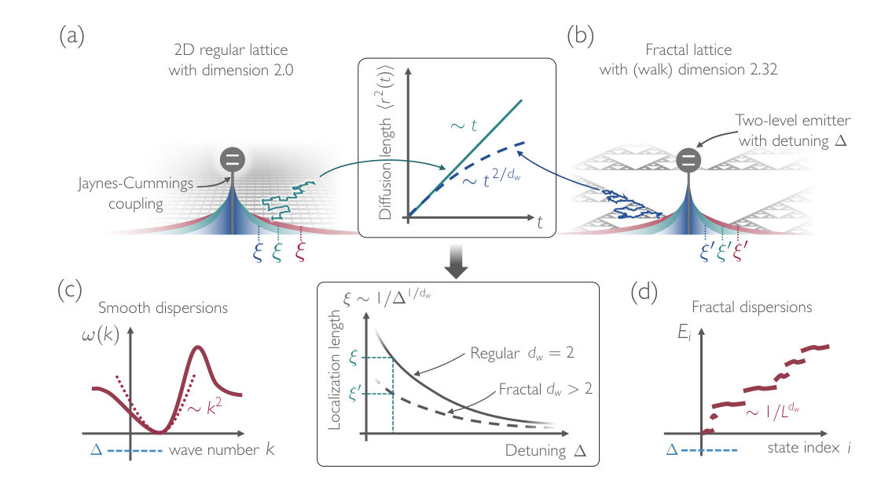 
Figure 1. Atom-photon bound states. Quantum emitters coupled to a regular (a) and fractal (b) photonic lattice. (c) In the regular case, a quadratic band edge ω(k) −ωedge ∼|k|2 yields the familiar scaling ξ ∼∆−1/2 for the localization length ξ of the atom-photon bound state, with ∆as the emitter detuning from the lower band edge. (d) In a fractal bath, translational invariance and ordinary bands are absent; instead the low-energy scaling is set by the walk dimension through E ∼L−dw, leading to the generalized law ξ ∼∆−1/dw, with the walk dimension dw (defined in the text). For a regular two-dimensional lattice, dw = 2 (and coincides with the spatial dimension), whereas for the Sierpi´nski...

📷 Fig 2

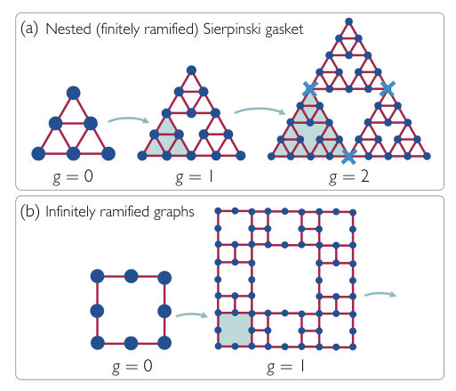 
Figure 2. Representative self-similar photonic graphs. Succes- sive generations g illustrate how nested finitely ramified (a) and infinitely ramified (b) fractals are created by iterating a local substitution rule. Nested fractals, such as Sierpi´nski gaskets, can be disconnected by removing finitely many ver- tices at each scale, here three sites for the b = 2 gasket [blue crosses for g = 2 in (a)], whereas Sierpi´nski carpets remain connected across arbitrarily many channels.

📷 Fig 3

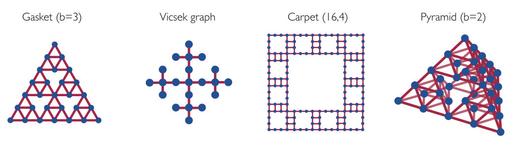 
Figure 3. Fractal photonic lattices. Graphs of second generation (g = 2) fractals considered in this work, along with the ones displayed in Fig. 2.

📷 Fig 4

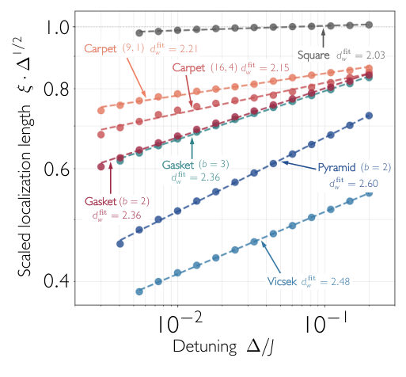 
Figure 4. Far-field localization length. The rescaled localiza- tion length ξ · ∆1/2 is shown as a function of detuning ∆. A horizontal line corresponds to the regular-lattice bench- mark ξ ∼∆−1/2, while systematic power-law drifts reveal the fractal exponent 1/dw. Data are extracted along the outer boundary of each fractal, where d(x, x0) coincides with the Euclidean arc length. The following generations are taken for the fractals: Gasket (b = 2): g = 7, Gasket (b = 3): g = 5, Carpet (9, 1): g = 5, Carpet (16, 4): g = 4, Pyramid: g = 6, Vicsek: g = 5, Square: L = 151 × 151 sites.

📷 Fig 5

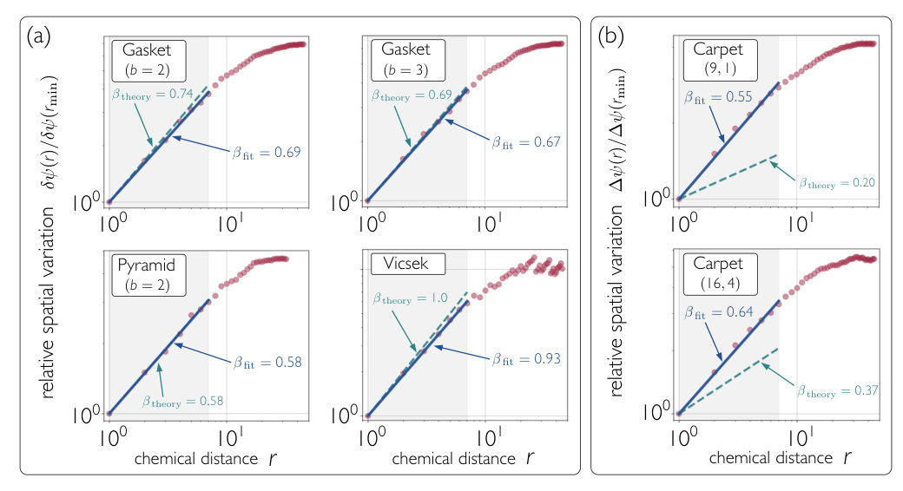 
Figure 5. Near-field scaling of atom-photon bound states. The quantity δψ(r)/δψ(rmin) with δψ(r) = |ψ(x0) −ψ(x)|

**Summary.** This paper demonstrates that the spatial extent of atom-photon bound states in fractal photonic lattices is governed by the fractal's walk dimension rather than standard effective mass. It provides a generalized scaling law for localization and shows how the near-field profile reflects the underlying fractal transport properties.

**Why it may be interesting.** It extends waveguide QED to non-translational invariant geometries and establishes a direct link between quantum bound-state profiles and classical anomalous diffusion exponents.

Detailed structure

**Main problem.** Investigating how the fractal geometry of a photonic bath reshapes the localization length and spatial profile of atom-photon bound states.

**Main result.** The far-field localization length scales as xi ~ Delta^(-1/dw), where dw is the walk dimension of the fractal, and the near-field amplitude follows an algebraic scaling related to fractal transport properties.

**Method.** Analytical derivation using the heat kernel and saddle-point approximation of the Green's function, complemented by numerical exact diagonalization on various fractal graphs.

**Model / system.** A two-level emitter coupled to a photonic bath arranged in self-similar fractal lattices (e.g., Sierpinski gaskets, carpets, and Vicsek graphs) described by a tight-binding Hamiltonian.

**Key observables.** Localization length (xi), detuning (Delta), near-field amplitude difference, and fractal dimensions (dw, ds, df).

**Important parameters / regimes.** Detuning from the spectral edge (Delta), walk dimension (dw), spectral dimension (ds), and the distinction between finitely ramified and infinitely ramified fractals.

**Assumptions / limitations.** The bath Hamiltonian is rendered Laplacian-like by compensating for connectivity inhomogeneities with on-site potentials; the study focuses on the regime near the lower spectral edge.

**Figures summary.** Figure 1 compares regular vs. fractal lattices and their dispersion/diffusion; Figure 4 shows the rescaled localization length scaling with detuning; Figure 5 illustrates near-field amplitude scaling for different fractal types.

**Paper structure.** The paper introduces the problem of atom-photon bound states in non-periodic media, develops an analytical framework using the heat kernel, provides numerical validation on various fractal geometries, and discusses the scaling of near-field and far-field regimes.

Abstract

We study atom-photon bound states seeded by two-level emitters coupled to self-similar photonic lattices. By expressing the photonic Green's function through the heat kernel, we show that the far-field localization length obeys $ξ\sim Δ^{-1/d_w}$, with the detuning $Δ$ from the lower spectral edge and the walk dimension $d_w$ of the underlying fractal. This scaling is controlled by anomalous diffusion and does not rely on translational invariance or a band-edge effective-mass approximation. Exact diagonalization on Sierpiński gaskets, pyramids, Vicsek graphs, and Sierpiński carpets confirms the far-field prediction once the bath Hamiltonian is rendered Laplacian-like by compensating the local inhomogeneity in the connectivities with on-site potentials. In the near field, the bound-state amplitude exhibits an additional algebraic variation. For nested finitely ramified fractals, the corresponding exponent agrees with the classical resistance/ first-passage scaling, whereas Sierpiński carpets display clear deviations from this simple law. Our results extend structured-bath waveguide QED to self-similar non-periodic geometries and connect bound-state profiles to transport exponents of the underlying fractal lattice.

[↑ back to top](#top)

### [Electron-Photon Spatial Entanglement in Coherent Cathodoluminescence](http://arxiv.org/abs/2605.23335v1)

**Authors:** Tatsuro Yuge, Ryo Okamoto, Takumi Sannomiya, Keiichirou Akiba  
**Type:** theory · **Category:** quantum information and computing · **PDF:** <https://arxiv.org/pdf/2605.23335v1>  
**Analysis basis:** full PDF text, analyzed in chunks
**Topic relevance:** `entanglement & information structure` **3/5** · `interference shaping light` **2/5** · `quantum measurements` **2/5**

📷 Fig 1

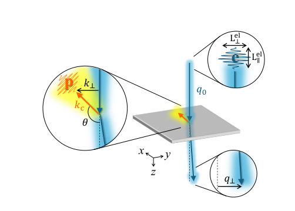 
FIG. 1. Illustration of coherent cathodoluminescence in transition radiation. The wave packet of an incident electron has central momentum ℏq0 in the z direction with the spatial widths Lel ⊥and Lel ∥in the transverse (xy) and longitudinal (z) directions, respectively. A photon in the radiation has a central wavenumber kc (wavelength λc = 2π/kc) in the direction of θ with the spectral width ∆λph. The electron undergoes a recoil to gain transverse momentum ℏq⊥.

📷 Fig 2

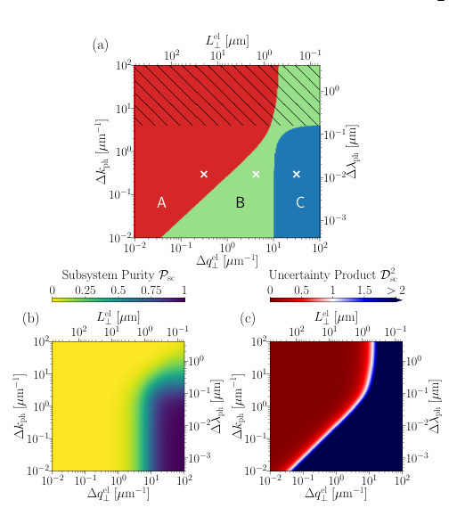 
FIG. 2. (a) Parameter regimes of entanglement in the scattered state |Ψsc⟩(Sec. III) of the electron–photon sys- tem. Regimes A (red), B (light green), and C (blue) are defined based on (b) subsystem purity Psc (Sec. IV A) and (c) uncertainty product D2 sc (Sec. IV B). Regime A corre- sponds to the wave-like entangled regime, where Psc &lt; 2/3 and D2 sc &lt; 1; Regime B to the particle-like entangled regime, where Psc &lt; 2/3 and D2 sc &gt; 1; and Regime C to the classical regime, where Psc &gt; 2/3 and D2 sc &gt; 1. The upper hatched re- gion indicates the entangled regime identified by the electron z-subsystem purity Pel z &lt; 2/3, i.e., entanglement between the electron’s z-degree of freedom and the...

📷 Fig 3

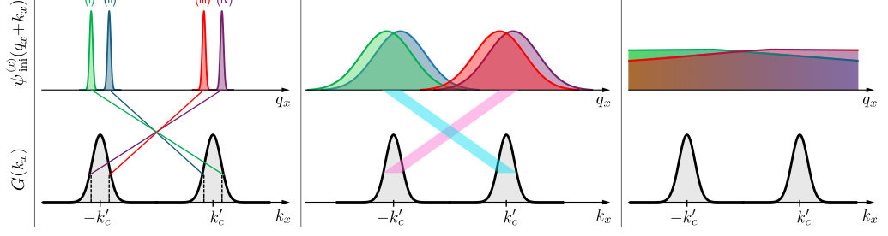 
FIG. 3. Schematic illustrations of the x-directional wavevector-space functions in Eq. (17) shown for the three regimes labeled A, B, and C in Fig. 2(a). The upper panels depict ψ(x) ini (qx+kx) for (i) kx = k′ c+∆kph, (ii) kx = k′ c−∆kph, (iii) kx = −k′ c+∆kph, and (iv) kx = −k′ c −∆kph. The lower panels depict G(kx). (a) Regime A, where ∆qel ⊥≪∆kph. The functions ψ(x) ini (qx + kx) of qx for different kx are distinguishable within each of the two peaks of G(kx), which leads to nearly one-to-one correlation (represented by thin lines): for each photon with kx, a corresponding electron with qx = −kx is correlated. (b) Regime B, where ∆kph ≪∆qel ⊥≪kc. The functions ψ(x) ini (qx + kx) for...

📷 Fig 4

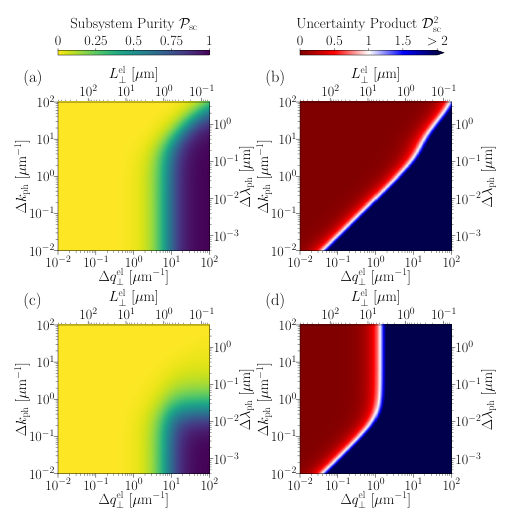 
FIG. 4. Entanglement measures of the scattered state |Ψsc⟩ for different values of Lel ∥, plotted as functions of ∆qel ⊥and ∆kph. Left panels [(a) and (c)] show the results for the sub- system purity Psc, and right panels [(b) and (d)] show those for the uncertainty product D2 sc. (a) and (b): Results for Lel ∥= 0.13 µm (∆qel ∥≃48.3 µm−1). (c) and (d): Results for Lel ∥= 13 µm (∆qel ∥≃0.483 µm−1). The other parameter values are the same as those in Fig. 2.

📷 Fig 5

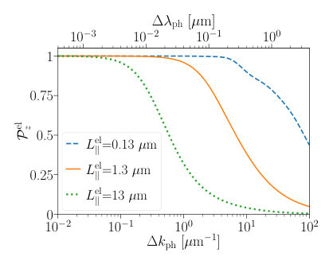 
FIG. 5. Subsystem purity Pel z of the electron’s z-degree of freedom in the scattered state |Ψsc⟩as a function of the luminescence spectral width ∆kph. The dashed, solid, and dotted curves correspond to Lel ∥= 0.13, 1.3 and 13 µm (∆qel ∥≃48.3, 4.83 and 0.483 µm−1), respectively. The other parameter values are the same as those in Fig. 2.

**Summary.** This paper develops a theoretical framework to quantify spatial entanglement between electrons and photons in coherent cathodoluminescence. It classifies the system into wave-like, particle-like, and classical regimes based on beam coherence and photon bandwidth. The findings provide a roadmap for using electron microscopy as a platform for quantum-enabled imaging and sensing.

**Why it may be interesting.** It provides a bridge between electron microscopy and quantum optics by treating electron-photon scattering as a source of continuous-variable entanglement, relevant to quantum imaging and sensing.

Detailed structure

**Main problem.** Quantifying the degree and nature of electron-photon spatial entanglement in coherent cathodoluminescence (CL) and determining how it depends on electron-beam properties like transverse coherence.

**Main result.** The study identifies three distinct entanglement regimes (wave-like, particle-like, and classical) and reveals that strong spatial entanglement emerges when the electron's transverse coherence length is large and the photon spectral width is optimized.

**Method.** A theoretical framework that reconstructs the scattered electron-photon state from the luminescence spectrum and evaluates entanglement using subsystem purity and an EPR-type uncertainty criterion.

**Model / system.** A single-electron beam interacting with a radiation field (specifically transition radiation) in a weak-coupling regime, modeled using a Hamiltonian for free electrons and photons with an interaction term.

**Key observables.** Subsystem purity (P_sc), EPR-type uncertainty product (D^2_sc), and joint probability distributions for position and wavevector.

**Important parameters / regimes.** Electron transverse and longitudinal coherence lengths (L_el_perp, L_el_parallel), photon spectral width (Delta_lambda_ph), and electron transverse wavenumber width (Delta_q_el_perp).

**Assumptions / limitations.** The system is translationally invariant in the transverse plane, the interaction is in the weak-coupling regime, and the momentum change of the electron is much smaller than its incident momentum.

**Figures summary.** Fig 1 illustrates the CL process; Fig 2 maps the entanglement regimes (A, B, C) against beam parameters; Fig 5 shows longitudinal entanglement via purity; Fig 6 shows joint probability distributions; Fig 7 examines the impact of phase uncertainty on the EPR criterion.

**Paper structure.** The paper begins by defining the interaction model and state reconstruction framework, proceeds to classify entanglement regimes using purity and EPR criteria, analyzes the influence of electron beam coherence, and concludes with an investigation into the impact of unknown phase factors.

Abstract

Electron-photon quantum entanglement in an electron microscope paves the way for a new quantum platform, enabling the integration of quantum functionalities into electron microscopy and opening opportunities for quantum imaging and quantum sensing at the nanoscale. To realize such a platform, it is crucial to understand the degree and nature of electron-photon entanglement in cathodoluminescence (CL). However, its dependence on electron-beam properties, particularly transverse coherence, remains unclear. Here, we present a theoretical framework describing the quantum state of an electron-photon pair generated in coherent CL, specifically for transition radiation. By expressing the scattered state directly via the luminescence spectrum, we evaluate the entanglement using both subsystem purity and an Einstein-Podolsky-Rosen-type criterion. These two measures enable a clear distinction between wave-like, particle-like, and classical regimes in terms of spatial and momentum entanglement in the electron-photon system. Our analysis identifies the roles of the electron's transverse and longitudinal coherence, as well as the photon's spectral width, and reveals the conditions under which strong spatial entanglement emerges. This unified perspective clarifies the nature of electron-photon quantum correlations in coherent CL, leading to quantum-enabled functionalities in electron microscopy.

[↑ back to top](#top)

### [Yukawa-Screened Bose-Star Condensation](http://arxiv.org/abs/2605.23206v1)

**Authors:** Jiajun Chen  
**Type:** theory · **Category:** quantum gases · **PDF:** <https://arxiv.org/pdf/2605.23206v1>  
**Analysis basis:** full PDF text, analyzed in chunks
**Topic relevance:** `non-equilibrium dynamics` **3/5** · `non-equilibrium universality` **2/5** · `scars & prethermalization` **2/5**

📷 Fig 1

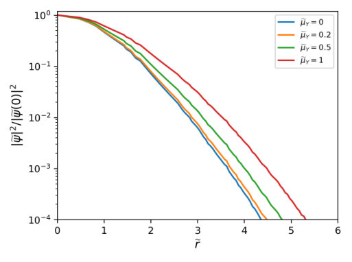 
FIG. 1. Static YSP Bose-star profiles obtained by imaginary- time relaxation for different Yukawa masses eµY . The profiles are normalized to the same central density to illustrate how Yukawa screening modifies the soliton structure. The case eµY = 0 corresponds to the ordinary Schr¨odinger-Poisson soli- ton.

📷 Fig 2

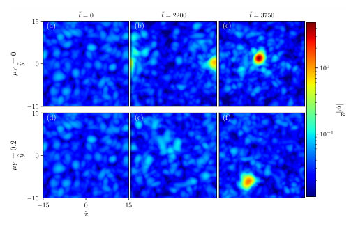 
FIG. 2. Snapshots of the projected density field for simula- tions with eL = 30 and f M = 20. The top row corresponds to the ordinary Schr¨odinger-Poisson case with eµY = 0, while the bottom row shows the Yukawa-screened evolution with eµY = 0.20. From left to right, the snapshots are taken at et = 0, et = 2200, and et = 3750, respectively.

📷 Fig 3

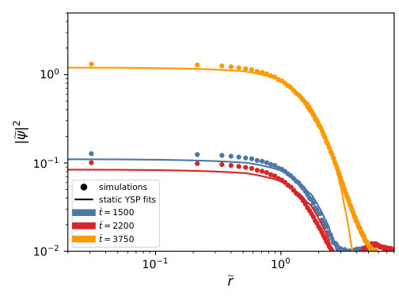 
FIG. 3. Spherically averaged density profiles for the simula- tion with eL = 30, f M = 20, and eµY = 0.20. Colored markers show density profiles extracted from simulations at different evolution times, et = 1500, 2200, and 3750. Solid curves denote the corresponding fitted static YSP ground-state solutions.

📷 Fig 4

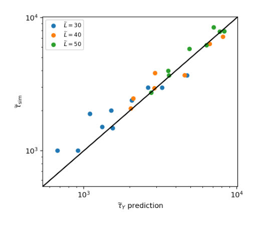 
FIG. 5. Comparison between the predicted condensation times and the measured simulation results for Yukawa- screened runs. The prediction is computed using Eq. 13 with a single fitted normalization coefficient. The solid black line denotes perfect agreement. Different colors correspond to dif- ferent box sizes eL.

📷 Fig 5

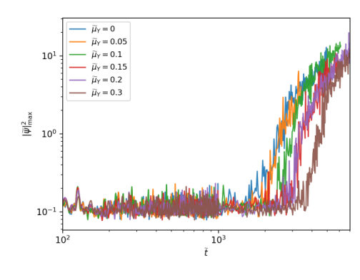 
FIG. 4. Evolution of the maximum density for simulations with box size eL = 30, total mass f M = 20, and different Yukawa screening mass eµY .

**Summary.** This paper explores how Yukawa-type screened interactions affect the formation of Bose-stars. It demonstrates that a finite interaction range delays the condensation process and results in less compact, broader density profiles. The findings are supported by both analytical kinetic theory and numerical simulations.

**Why it may be interesting.** This work provides insights into how modifying the range of interactions affects the relaxation dynamics and structural stability of many-body bosonic systems, which is highly relevant to the study of non-equilibrium dynamics in ultracold gases.

Detailed structure

**Main problem.** Investigating how finite-range Yukawa interactions modify the formation, internal structure, and condensation timescale of Bose-stars compared to the standard long-range Newtonian case.

**Main result.** Yukawa screening broadens the Bose-star density profile and systematically delays the condensation timescale by suppressing infrared kinetic relaxation.

**Method.** The study uses analytical derivation of a screened kinetic condensation formula and fully dynamical pseudospectral simulations with imaginary-time relaxation for ground-state profiles.

**Model / system.** A Yukawa-Schrödinger-Poisson (YSP) system representing a self-gravitating bosonic gas (such as axion dark matter) with a screened gravitational potential.

**Key observables.** Bose-star density profiles, condensation timescale, and projected density field snapshots.

**Important parameters / regimes.** Yukawa screening mass (mu_Y), boson mass (m), and the dimensionless screening parameter (e*mu_Y).

**Assumptions / limitations.** The Yukawa interaction is treated phenomenologically as a screened gravitational potential; the system is studied in a periodic box with homogeneous and isotropic initial conditions.

**Figures summary.** Figure 1 shows the broadening of static Bose-star profiles with increasing screening; Figure 2 displays density field snapshots demonstrating delayed formation; Figure 3 shows the evolution of density profiles; Figure 4 shows the evolution of maximum density; Figure 5 compares predicted vs. measured condensation times.

**Paper structure.** The paper introduces the YSP model, derives an analytical formula for screened kinetic condensation, presents static solutions for Bose-star profiles, details dynamical pseudospectral simulations, and concludes by validating the analytical predictions against numerical results.

Abstract

We study Bose-star formation in a Yukawa-Schrödinger-Poisson (YSP) system. A finite interaction range suppresses the infrared kinetic relaxation responsible for Bose-star condensation, modifying both the equilibrium Bose-star structure and the condensation timescale. We derive a screened kinetic condensation formula in which the ordinary gravitational Coulomb logarithm is replaced by a finite Yukawa transport logarithm. Static YSP solutions show that Yukawa screening broadens the Bose-star density profile relative to the ordinary Newtonian soliton. Fully dynamical pseudospectral simulations with homogeneous and isotropic initial conditions demonstrate that Yukawa screening systematically delays Bose-star condensation, in good agreement with the screened kinetic prediction after fitting a single overall normalization parameter.

[↑ back to top](#top)

### [Coverage Analysis of Rydberg Atom Quantum Receiver Arrays: A Stochastic Geometry Approach](http://arxiv.org/abs/2605.23214v1)

**Authors:** Dongnan Xia, Cunhua Pan, Hong Ren, Dongsheng Sui, Qihao Peng, Jiangzhou Wang  
**Type:** theory · **Category:** other · **PDF:** <https://arxiv.org/pdf/2605.23214v1>  
**Analysis basis:** full PDF text, analyzed in chunks
**Topic relevance:** `Rydberg arrays` **3/5** · `methods for driven-dissipative` **2/5** · `quantum measurements` **1/5**

📷 Fig 1

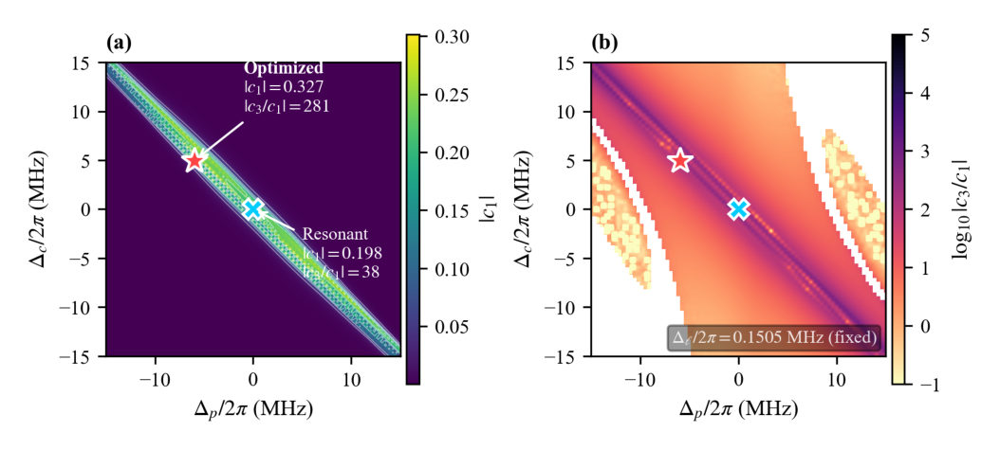 
Fig. 2. Detuning landscape for the default 133Cs configuration. Here ∆ℓis fixed at its optimized value, and the remaining parameters follow Table I. (a) Linear transduction gain |c1|. (b) Nonlinearity ratio |c3/c1| on a logarithmic scale. The star marks the optimized point, and the cross marks (∆p, ∆c) = (0, 0) with the same ∆ℓ.

📷 Fig 2

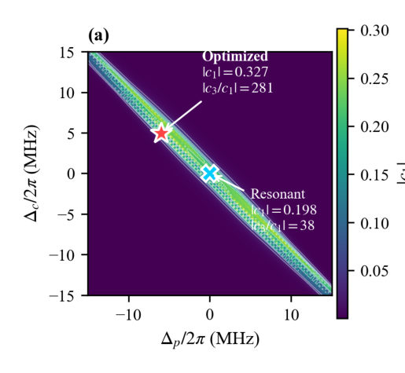 
Fig. 3(c) also plots the coverage as a function of λb, with λu = λb. For θ = 0 and 10 dB, the optimized RAQR attains higher coverage than the conventional receiver at low BS densities, while the advantage disappears as the network becomes denser. The two crossover points occur at λb ≈4.4×10−5 m−2 and λb ≈5.5×10−5 m−2, respectively. Beyond these points, the RAQR coverage falls steeply with λb, because Bussgang distortion scales as ¯σ6 in, i.e., cubically in λb, while the conventional noise grows only linearly. These crossovers indicate that the operating point should balance small-signal sensitivity with receiver linearity.

📷 Fig 3

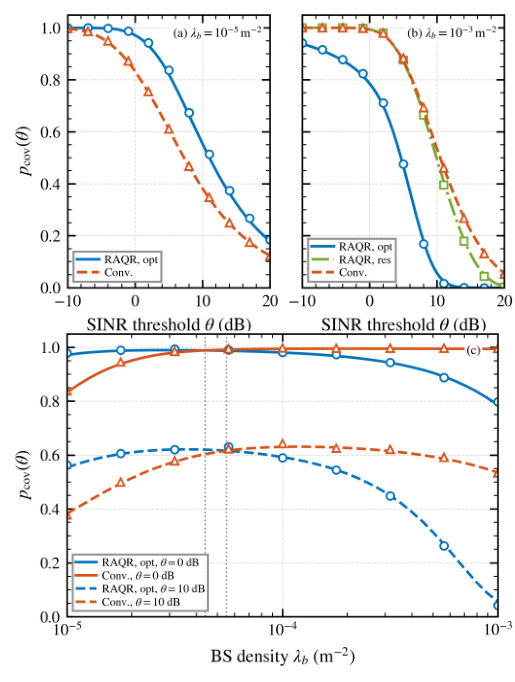 
Fig. 3. Coverage probability under the BS-density tradeoff with Mr = 10, λu = λb, and the remaining parameters taken from Table I. Lines denote analytical results, and open markers denote Monte Carlo simulations. (a) Cov- erage versus SINR threshold θ at λb = 10−5 m−2. (b) Coverage versus θ at λb = 10−3 m−2, including the resonant RAQR with all detunings set to zero. (c) Coverage versus BS density λb for θ = 0 and 10 dB.

📷 Fig 4

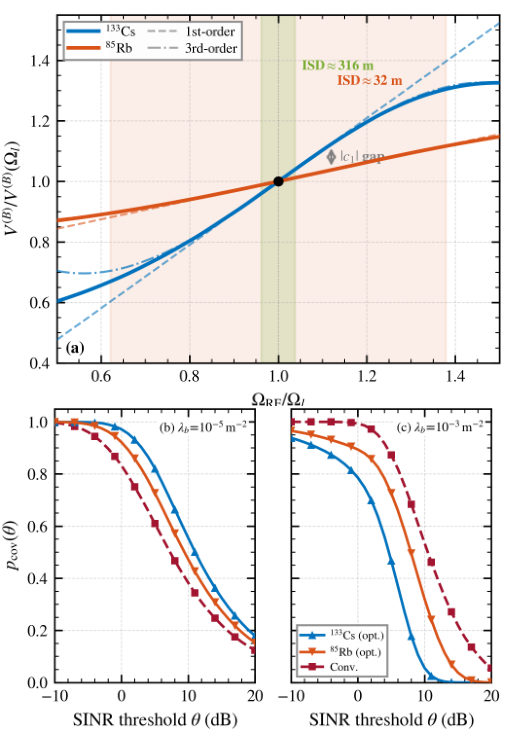 
Fig. 4. Comparison between 133Cs and 85Rb under the default system settings in Table I. (a) Normalized V (B) curves with first order and third order ap- proximations. The shaded bands indicate the typical range of ΩRF/Ωl caused by aggregate interference for λb = 10−5 and 10−3 m−2, corresponding to ISD ≈316 m and 32 m, respectively. (b) Coverage probability versus θ at λb = 10−5 m−2. (c) Coverage probability versus θ at λb = 10−3 m−2.

📷 Fig 5

 
Fig. 6 evaluates the coupling model of Section IV-C. In Fig. 6(a), we fix Mr = 10 and set λb = λu = 10−4 m−2. We compare the RAQR at the uncoupled point R = I with conventional arrays using receive correlation coefficients ϱ = 0.5 and ϱ = 0.7. The analytical curves follow the Monte Carlo markers closely. The largest absolute difference between analysis and Monte Carlo, taken over the three plotted curve pairs and the full θ grid, is 0.0364, or about 3.64 percentage points. As ϱ increases, the conventional receiver loses coverage. The unequal eigenvalues of R widen the effective channel gain distribution and raise the interference factor µI. Both effects reduce the usable array gain. The...

**Summary.** This paper analyzes the performance of Rydberg-based quantum receivers in wireless networks using stochastic geometry. It reveals a fundamental tradeoff where the advantage of low quantum noise is lost in dense networks due to nonlinear distortion from aggregate interference.

**Why it may be interesting.** It bridges microscopic open quantum system dynamics (Lindblad equation) with macroscopic network theory, exploring how nonlinearities in quantum transducers affect large-scale system reliability.

Detailed structure

**Main problem.** Determining whether the high sensitivity of Rydberg Atom Quantum Receivers (RAQRs) translates to improved network-level reliability in dense wireless deployments, specifically considering the impact of nonlinear distortion caused by aggregate interference.

**Main result.** RAQRs outperform conventional receivers in sparse, noise-limited networks, but in dense networks, nonlinear distortion (Bussgang distortion) can cause RAQR performance to fall below that of conventional receivers.

**Method.** The authors use a stochastic geometry approach with a Poisson Point Process, applying Bussgang decomposition to linearize the third-order nonlinear atomic response and deriving analytical expressions for coverage probability.

**Model / system.** A four-level ladder-type Rydberg atomic system (|1> to |4>) interacting with RF fields, modeled via the Lindblad master equation and a third-order complex baseband model including linear gain and cubic nonlinearity.

**Key observables.** SINR (Signal-to-Interference-plus-Noise Ratio), coverage probability, and effective noise.

**Important parameters / regimes.** Base station density (lambda_b), antenna array size (M_r), nonlinearity ratio (|c3/c1|), and path-loss exponent (alpha).

**Assumptions / limitations.** The input signal is assumed to be a circularly symmetric complex Gaussian process, and the network is modeled as a homogeneous Poisson Point Process.

**Figures summary.** Comparison of 133Cs and 85Rb performance; coverage probability vs. SINR threshold for various densities; impact of array scaling (M_r) and receiver correlation on coverage.

**Paper structure.** The paper moves from a microscopic atomic master equation to a macroscopic network-level coverage analysis, establishing a nonlinear baseband model, applying linearization techniques, and validating results via Monte Carlo simulations.

Abstract

Rydberg atomic quantum receivers (RAQRs) offer quantum-limited sensitivity and broadband tunability. It is not obvious whether this device-level advantage also improves network reliability, since in dense deployments, aggregate interference can push the atomic transducer out of its small-signal regime. This paper addresses the question by embedding the RAQR front end into a stochastic geometry (SG) coverage analysis. Starting with the atomic master equation and balanced coherent optical detection, we derive a third-order complex baseband model that retains both the linear gain and the leading cubic nonlinearity. A Bussgang decomposition converts the per-element nonlinear response into an equivalent linear gain plus a distance-dependent distortion noise. Using this equivalent model, we derive the post maximal-ratio combining (MRC) SINR and obtain tractable expressions for the conditional and spatially averaged coverage probabilities. The analytical results show that RAQRs outperform conventional receivers in sparse deployments. However, when the base station (BS) density becomes large, nonlinear distortion reduces this advantage and may make RAQRs perform worse. Simulation results validate the analytical expressions and confirm that the central design tradeoff is between linear gain and cubic nonlinearity.

[↑ back to top](#top)

### [Modeling the Quantum Photon Statistics in Hybrid Light-Matter Integrated Circuits](http://arxiv.org/abs/2605.23286v1)

**Authors:** Mathias Van Regemortel, Vincenzo Ardizzone, Eugenio Maggiolini, Armando Rastelli, Daniele Sanvitto, Thomas Van Vaerenbergh  
**Type:** theory · **Category:** quantum information and computing · **PDF:** <https://arxiv.org/pdf/2605.23286v1>  
**Analysis basis:** full PDF text, analyzed in chunks
**Topic relevance:** `interference shaping light` **3/5** · `methods for driven-dissipative` **3/5**

📷 Fig 1

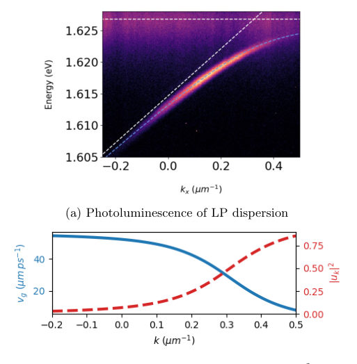 
Figure 1: The experimental LP dispersion in an AlGaAs waveguide with GaAs quantum wells and derived quantities. (a) Photoluminscence of the dispersion of the guided polaritonic mode extracted from an input/output diffraction grating; vertical axis shows the energy of the polariton mode while the horizontal axis is the wavevector along the propagation direction. (b) Group velocity vg (blue solid, left axis) and exciton fraction |uk|2 (red dashed, right axis) obtained from the dispersion in (a).

📷 Fig 2

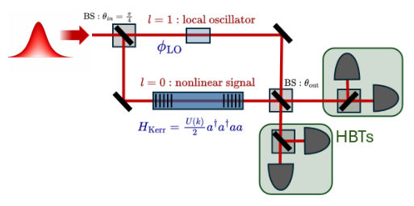 
Figure 2: The Mach-Zehnder interferometer setup for generating antibunched photon statistic. After the first 50 : 50 beam splitter (BS) coupler, one arm (the local oscillator) has a tunable phase shift ϕLO, while the other couples in the nonlinear waveguide. After the second coupler a HBT experiment is performed of the signal in the two arms, labeled with the mode index l = 0, 1.

📷 Fig 3

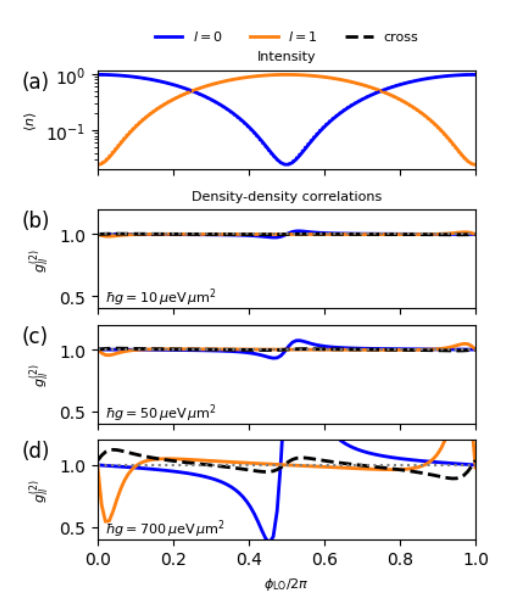 
Figure 3: Results for the out-coupled photon statistics of a BS with coupling θout = 0.2π, when modulating the MZI LO phase within the range ϕLO ∈{0, 2π} for an incoming pulse of |α|2 = 1 and 1 mm waveguide coupling at u2 k = 0.3 exciton fraction. (a) The varying output intensity across the two modes, on log-scale. (b)-(d) Intensity correlations, intra-mode (blue–orange, solid), cross-correlations (black, dot-dashed) and the coherent correlation for reference (gray, dotted), at the reported nonlinearities. Sub-Poissonian statistics, reaching g(2) ll &lt; 0.5 at ℏg = 700 µeV µm2 is observed in the antisymmetric output arm around ϕLO/2π ≈0.45, just below ϕLO = π

📷 Fig 4

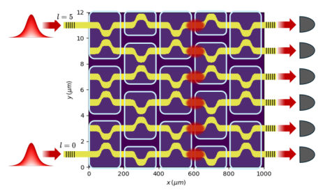 
Figure 4: The prototype architecture studied for the first experiments. It consists of L = 6 coupled waveguides, integrated in a 1 mm architecture consisting of D = 5 stacked layers of coupling gates. The signal is injected in waveguides l = 0 and l = 5 and the output signals of the waveguides are detected individually. It is assumed that all couplers are uniform across the circuit, but the circuit coupling J∆t and U∆t will rescale in function of the input wavevector k.

📷 Fig 5

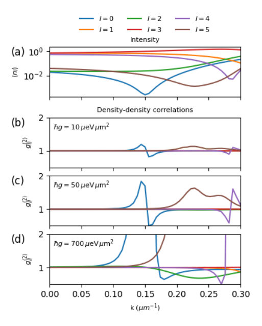 
Figure 5: The simulation results of a circuit of L = 6 waveguides and depth D = 5, for experimentally reported exciton interaction strengths, for zero losses and φrel = 0.6π. (a) The output pulse intensities (pulse photon number) for ℏg = 10µeV µm2 (indistinguishable from ℏg = [50, 700] µeV µm2). (b) The expected intra-pulse intensity-intensity correlations. Strong antibunched photon statistics is witnessed at low output intensities. In all cases, there is sharp crossover from antibunching to bunching statistics around the low-intensity values k ≈[0.15, 0.27] µm−1

**Summary.** This paper presents a new theoretical framework for predicting non-classical photon statistics in hybrid (Al)GaAs polaritonic integrated circuits. It demonstrates how engineered features like slow-light dispersion and MZI configurations can amplify photon antibunching and bunching. The work provides a roadmap for achieving quantum-level light manipulation on-chip.

**Why it may be interesting.** It provides a bridge between semiconductor device physics and quantum optics, offering a scalable framework for designing integrated quantum photonic circuits using nonlinear light-matter interactions.

Detailed structure

**Main problem.** The lack of a quantitative theoretical framework to connect realistic waveguide parameters to measurable non-classical photon statistics in hybrid light-matter integrated circuits.

**Main result.** The development of a comprehensive framework (qPIC) that predicts quantum signatures like photon antibunching and demonstrates that slow-light engineering can amplify nonlinearities to achieve non-Gaussian statistics.

**Method.** Mapping pulsed nonlinear waveguide dynamics onto a bosonic quantum circuit representation using the Matrix Product State Density Operator (MPDO) framework and Kraus operators for dissipation.

**Model / system.** Hybrid (Al)GaAs light-matter integrated circuits supporting exciton-polaritons, modeled via a Kerr-type Hamiltonian in both single-waveguide MZI and multi-mode coupled-waveguide architectures.

**Key observables.** Photon-number output statistics, second-order correlation function g(2)(0) (antibunching and bunching), signal intensity, and intensity-intensity correlation matrices.

**Important parameters / regimes.** Rabi splitting, exciton interaction constant, group velocity (v_g), Hopfield coefficients, and local oscillator phase.

**Assumptions / limitations.** 1-D longitudinal wavevector approximation, pulse envelope invariance over time, and local Fock-space truncation.

**Figures summary.** Figure 1 shows polariton dispersion and derived group velocity; Figure 2 depicts the MZI setup; Figure 7 illustrates the impact of losses on signal intensity and correlations; Figure 8 provides 2D maps of intensity and g(2) as a function of phase and mixing angle.

**Paper structure.** The paper introduces the problem of quantifying quantum statistics in polaritonic circuits, presents a new theoretical framework (qPIC), analyzes single-waveguide MZI configurations, extends the model to integrated multi-mode circuits, and discusses the benefits of slow-light engineering and the impact of losses.

Abstract

Strong light-matter coupling between a guided electromagnetic mode and an excitonic semiconductor transition gives rise to exciton-polaritons with optical nonlinearities far exceeding those of conventional photonic platforms. Utilizing these nonlinearities in the few-particle regime, where quantum signatures such as photon antibunching, sub-Poissonian statistics and non-trivial inter-mode correlations become accessible, is a central goal of integrated quantum photonics. Yet, a quantitative theoretical framework connecting realistic waveguide parameters to measurable non-classical photonic output is absent. Here, we present a comprehensive framework for predicting and benchmarking quantum photon statistics in polaritonic integrated circuits, using state-of-the-art experimentally achieved device parameters for (Al)GaAs waveguide platforms. By mapping the pulsed nonlinear waveguide dynamics onto a bosonic quantum circuit representation that explicitly incorporates dissipation, we identify experimentally accessible quantum signatures across two circuit configurations: a single waveguide in a free-space interferometric configuration and a fully integrated multimode coupled-waveguide circuit. We further show that slow-light engineering of the polariton dispersion offers a practical route to amplifying the effective nonlinearity, pushing quantum signatures beyond Gaussian statistics.

[↑ back to top](#top)

### [Inviscid scaling in the Kuramoto-Sivashinsky equation from functional renormalization group and direct numerical simulations](http://arxiv.org/abs/2605.23364v1)

**Authors:** Liubov Gosteva, Dipankar Roy, Nicolás Wschebor, Léonie Canet  
**Type:** theory · **Category:** statistical mechanics · **PDF:** <https://arxiv.org/pdf/2605.23364v1>  
**Analysis basis:** full PDF text, analyzed in chunks
**Topic relevance:** `non-equilibrium universality` **3/5** · `non-equilibrium dynamics` **2/5**

📷 Fig 1

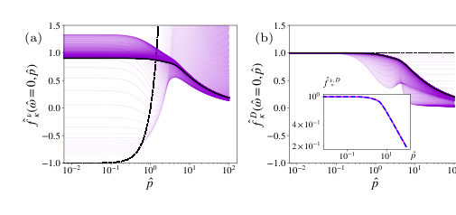 
FIG. 1. Evolution of the functions (a) ˆf ν κ and (b) ˆf D κ under the FRG flow, starting from the KS initial condition ˆf D Λ = 1, ˆf ν Λ = −1 + ˆp2 (black dashed lines) and reaching a fixed point when κ →0 (black solid lines correspond to κ/Λ = e−8). Inset of (b): Fixed point shape of ˆf ν κ(ˆω = 0, ˆp) (blue, dashed) and ˆf D κ (ˆω = 0, ˆp) (magenta, plain) recorded at κ/Λ = e−400. They are identical, which indicates that time-reversal symmetry emerges at large distances, and they identify with the KPZ fixed-point scaling function.

📷 Fig 2

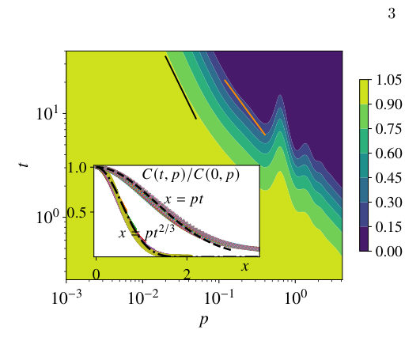 
FIG. 2. Two-point correlation function C(t, p)/C(0, p) from DNS, plotted in logscales. The function C(t, p) is computed for times t = n/4 with n = 0, 1, 2, . . . from the simulations. The black line indicates the KPZ scaling z = 3/2, and the orange one the IB scaling z = 1. Inset: Extracted scaling functions, in the KPZ range (p from 0.02 to 0.1, circles), using the scaling variable x = pt2/3; in the IB range (p from 0.12 to 0.3, crosses), using the scaling variable x = pt. They are compared with the exact Prah¨ofer-Spohn scaling function for the KPZ fixed point (dash-dotted line), and with the exact asymptotic scaling function (7) from FRG for the IB fixed point (dashed line).

📷 Fig 3

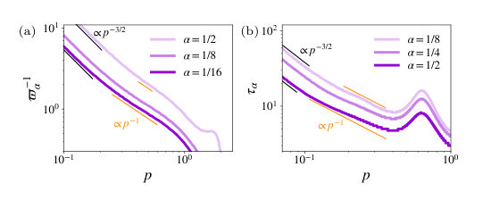 
FIG. 4. (a) Inverse of the decorrelation frequencies ϖα(p) from FRG; (b) decorrelation times τα(p) from DNS (see text for definition). Both show the IB scaling z = 1 over a range of intermediate momenta.

📷 Fig 4

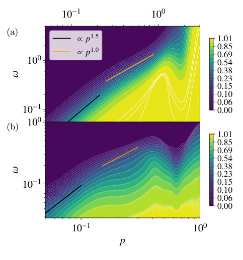 
FIG. 3. Correlation function C(ω, p)/C(0, p) (a) from FRG; (b) from numerics. The KPZ and IB scaling regimes are in- dicated by the black and orange guidelines.

**Summary.** This paper identifies a new intermediate scaling regime in the Kuramoto-Sivashinsky equation characterized by an inviscid Burgers exponent of z=1. This regime emerges because the effective viscosity vanishes as the system flows from its microscopic unstable state to its macroscopic KPZ state. The findings are robustly supported by both functional renormalization group theory and large-scale numerical simulations.

**Why it may be interesting.** not directly relevant

Detailed structure

**Main problem.** The identification and characterization of a previously overlooked intermediate scaling regime in the one-dimensional Kuramoto-Sivashinsky (KS) equation.

**Main result.** The discovery of an 'Inviscid Burgers' scaling regime with a dynamical exponent z=1, which exists at intermediate scales between small-scale non-universal behavior and large-scale KPZ scaling (z=3/2).

**Method.** The study employs Functional Renormalization Group (FRG) using the Wetterich equation and Next-to-Leading-Order approximation, complemented by Direct Numerical Simulations (DNS) using a pseudo-spectral method.

**Model / system.** The one-dimensional Kuramoto-Sivashinsky (KS) equation, which describes systems with negative viscosity and positive fourth-order dissipation, relevant to chemical turbulence, flame fronts, and surface roughening.

**Key observables.** Dynamical exponent (z), effective viscosity (nu_kappa), two-point correlation function C(t, p), and time-reversal symmetry emergence.

**Important parameters / regimes.** Negative microscopic viscosity (nu < 0), positive fourth-order term (tau > 0), and the transition from the IB regime (z=1) to the KPZ regime (z=3/2).

**Assumptions / limitations.** The use of a Next-to-Leading-Order (NLO) approximation within the FRG framework and the introduction of a noise term to facilitate the study of scaling regimes.

**Figures summary.** Figure 1 shows the evolution of FRG functions and the convergence to a fixed point; Figure 2 shows DNS correlation function data collapse; Figure 3 compares the Fourier transform of the correlation function between FRG and DNS.

**Paper structure.** The paper introduces the KS equation and the problem of intermediate scaling, presents the FRG framework and results showing the vanishing effective viscosity, validates these findings with DNS, and concludes with the implications for universality classes.

Abstract

We show that the one-dimensional Kuramoto-Sivashinsky (KS) equation features a scaling regime characterized by the dynamical exponent $z=1$ at intermediate scales between the large-scale Kardar-Parisi-Zhang (KPZ) scaling with $z=3/2$ and the small-scale non-universal behavior. This scaling regime is intrinsic to the KS dynamics since it arises from the vanishing of the effective viscosity when evolving from its microscopic negative KS value, to its macroscopic effective positive KPZ value. This vanishing of the viscosity deeply imprints the behavior of correlations at intermediate scales, which exhibit a universal $z=1$ scaling. This behavior pertains to the inviscid-Burgers universality class, which corresponds to the zero-viscosity fixed point of the KPZ equation. We evidence and characterize this so-far-overlooked scaling regime using both functional renormalization group and direct numerical simulations.

[↑ back to top](#top)

### [Quantum fluctuations in quartet superfluid of two-dimensional Fermi mixture](http://arxiv.org/abs/2605.23267v1)

**Authors:** Wei Wang, Yupeng Wang, Xiaoling Cui  
**Type:** theory · **Category:** quantum gases · **PDF:** <https://arxiv.org/pdf/2605.23267v1>  
**Analysis basis:** full PDF text, analyzed in chunks
**Topic relevance:** `Keldysh / 2PI / non-Gaussian methods` **3/5** · `analog quantum simulation` **2/5**

📷 Fig 1

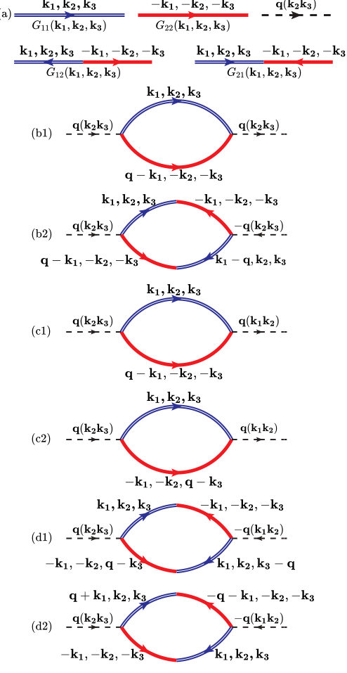 
FIG. 1. Diagrammatic representation of the Green’s func- tions (a) and typical elements in the fluctuation matrix M (b1-d2). In (a), we use a double blue (bold red) line with an arrow to denote the mean-field Green’s function G0 11 (G0 22) for the heavy (light) fermion, and the lines with two arrows repre- sent the mean-field anomalous Green’s functions G0 12 and G0 21. The dashed line represents a quartet fluctuation field with momentum q, within which the two unpaired heavy fermions carry momenta k2 and k3 (as labeled in the figure). (b1) and (b2) correspond to the elements in M11 and M21 when the two momenta {k2k3} are kept unchanged. These are also the typ- ical diagrams for quantum...

📷 Fig 2

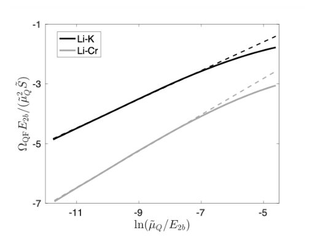 
FIG. 2. Thermodynamic potential of QSF from quantum fluctuations (ΩQF) as a function of ln(˜µQ), with ˜µQ being the reduced chemical potential of quartet bosons (see defi- nition in Eq.(26)). The solid and dashed lines correspond to numerical results based on Eq.(25) and an analytical fit based on Eq.(27), respectively. The black and gray colors respectively denote 6Li-40K and 6Li-53Cr systems with differ- ent heavy-light mass ratios. Here we take the energy unit as E2b = 1/(2mra2), and denote ˜S = S/a2.

**Summary.** This paper investigates quantum fluctuations in a 2D quartet superfluid made of one light and three heavy fermions. It demonstrates that including Gaussian fluctuations correctly recovers the expected bosonic equation of state in the deep binding limit. The work establishes a general framework for studying higher-order fermion correlations.

**Why it may be interesting.** It provides a theoretical framework for extending fluctuation theories from standard pairing to higher-order correlations, which is highly relevant for understanding many-body dynamics and complex cluster formation in ultracold gases.

Detailed structure

**Main problem.** The study aims to understand quantum fluctuations in a quartet superfluid (QSF) of 2D mass-imbalanced Fermi mixtures and to determine if these clusters behave as composite bosons in the deep binding limit.

**Main result.** The theory successfully reproduces the logarithmic dependence of the 2D equation of state in the deep binding regime, confirming that quartet clusters behave as composite bosons.

**Method.** The authors use a functional path integral approach with an extended Gaussian fluctuation theory that incorporates dominant four-body correlations.

**Model / system.** A two-dimensional (2D) Fermi mixture with mass imbalance (heavy and light fermions) in a (1+3) cluster configuration, specifically considering realistic examples like 6Li-40K and 6Li-53Cr.

**Key observables.** Thermodynamic potential (Omega), equation of state (EoS), gap equation, number equations, and the quartet chemical potential.

**Important parameters / regimes.** Mass imbalance (mh, ml), 2D scattering length (a), quartet binding energy (E4), and the deep binding limit (reduced chemical potential approaching zero).

**Assumptions / limitations.** The study focuses on the zero-temperature (T=0) ground state and assumes a specific heavy-to-light number ratio of 3:1.

**Figures summary.** Figure 1 shows diagrammatic representations of Green's functions and fluctuation matrix elements; Figure 2 plots the thermodynamic potential as a function of the logarithm of the reduced chemical potential for different mass-imbalanced systems.

**Paper structure.** The paper introduces the problem of quartet superfluidity, presents a mean-field theory for (1+3) clusters, extends this to Gaussian fluctuation theory, provides analytical results for the deep binding limit, and validates the theory with numerical simulations.

Abstract

We study quantum fluctuations in quartet superfluid (QSF) of two-dimensional (2D) fermion mixtures with mass imbalance. Here QSF is a high-order superfluid that corresponds to the condensation of ($1+3$) clusters, each consisting of a light fermion and three heavy ones. By incorporating the Gaussian fluctuations respecting dominant four-body correlations in this system, our theory successfully produces the logarithmic dependence of the 2D equation of state in the deep binding regime, thereby offering a correct physical picture of quartet clusters behaving as composite bosons. By extending the Gaussian fluctuation theory from pairing to quartet superfluids, our results shed light on quantum fluctuations in general fermion superfluids with arbitrarily high-order correlations.

[↑ back to top](#top)

### [Two Operational Principles Single Out Quantum Theory](http://arxiv.org/abs/2605.23217v1)

**Authors:** Kenji Nakahira  
**Type:** theory · **Category:** quantum information and computing · **PDF:** <https://arxiv.org/pdf/2605.23217v1>  
**Analysis basis:** full PDF text, analyzed in chunks
**Topic relevance:** `quantum measurements` **3/5** · `entanglement & information structure` **2/5**

📷 Fig 1

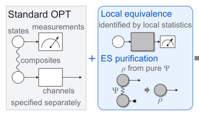 
FIG. 1. Schematic picture of the reconstruction. In a standard OPT, states, measurements, composites, and channels can in principle be specified separately. Once local equivalence and ES purification are imposed, these ingredients are fixed to the standard complex quantum structure: density matrices, POVMs, the Born rule, tensor- product composition, and CPTP maps.

**Summary.** This paper demonstrates that the entire mathematical structure of finite-dimensional quantum theory can be derived from just two operational principles. By showing that local equivalence and a specific form of purification rule out classical and real-valued theories, it provides a powerful reconstruction of the complex quantum formalism.

**Why it may be interesting.** This is highly relevant for researchers in quantum foundations and open quantum systems as it provides a fundamental justification for the use of density matrices, POVMs, and CPTP maps, showing they are necessary consequences of basic operational symmetries.

Detailed structure

**Main problem.** The paper seeks to determine if the standard complex quantum formalism can be uniquely derived from a minimal set of operational principles rather than being assumed as a single package.

**Main result.** The author proves that two operational principles—local input-output statistics identify channels and every state admits an equivalent-system purification—are sufficient to uniquely single out finite-dimensional complex quantum theory.

**Method.** The work uses a reconstruction approach within the framework of finite-dimensional Causal Operational Probabilistic Theories (OPTs), employing Euclidean Jordan Algebras and the classification of symmetric cones.

**Model / system.** The framework is an abstract, finite-dimensional Causal Operational Probable Theory (OPT) consisting of systems, states, measurements (POVMs), and channels (CPTP maps) defined within a strict monoidal category.

**Key observables.** Local input-output statistics, measurement outcomes, and probabilities.

**Important parameters / regimes.** Finite-dimensional systems, rank of the algebra, and informational dimension.

**Assumptions / limitations.** The theory assumes a finite-dimensional causal framework, the existence of deterministic effects, and the validity of the two proposed operational principles.

**Figures summary.** Figure 1 shows a schematic of the reconstruction process from a general OPT to quantum theory; Table I compares classical, real quantum, and complex quantum theories against the two postulates.

**Paper structure.** The paper follows a logical derivation: establishing the framework of OPTs, applying the two postulates to derive the geometry of state spaces (symmetric cones), proving the no-restriction hypothesis for measurements, and finally using the classification of Jordan algebras to identify the theory as complex quantum theory.

Abstract

Quantum theory combines density matrices, Born probabilities, tensor-product composites, positive-operator-valued measures (POVMs), and quantum channels. In a finite-dimensional causal operational theory, we prove that two postulates suffice: local input-output statistics identify channels, and every state admits an equivalent-system purification, unique up to reversible dynamics. The full complex quantum formalism follows; every consistent probability rule is realized as a POVM, so measurement no-restriction is derived rather than assumed.

[↑ back to top](#top)

### [Asymptotic Limits of Entanglement Distribution](http://arxiv.org/abs/2605.23443v1)

**Authors:** Piotr Masajada, Aby Philip, Alexander Streltsov  
**Type:** theory · **Category:** quantum information and computing · **PDF:** <https://arxiv.org/pdf/2605.23443v1>  
**Analysis basis:** full PDF text, analyzed in chunks
**Topic relevance:** `entanglement & information structure` **3/5**

📷 Fig 1

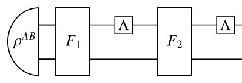 
Figure 1. Entanglement distribution through a noisy channel with intermediate repeater stations. An initial bipartite state ρAB is shared between parties A and B. Subsystem A is transmitted through a sequence of n noisy channel uses Λ, which may be understood as propagation through n successive transmission segments with inter- mediate stations located between Alice and Bob. After each channel use, the parties, possibly assisted by these intermediate stations, may apply an LOCC filter Fi. The figure illustrates the resulting state in Eq. (1) for n = 2.

**Summary.** This paper identifies a fundamental limit for quantum repeaters, proving that entanglement distribution over long distances is only possible if the channel allows for error correction. It quantifies the necessary resource overhead, showing that parallel channel uses must increase logarithmically with network length to prevent exponential entanglement loss.

**Why it may be interesting.** not directly relevant

Detailed structure

**Main problem.** Investigating the fundamental asymptotic limits of entanglement distribution in quantum networks, specifically determining the conditions under which entanglement can be preserved over arbitrarily long distances.

**Main result.** The authors establish a dichotomy: entanglement can be preserved asymptotically if and only if the channel admits a correctable subspace; otherwise, entanglement decays exponentially, requiring the number of parallel channels to scale at least logarithmically with the number of nodes.

**Method.** The study uses information-theoretic tools, including Kraus operator analysis, Stinespring dilation, and entanglement measures like concurrence and entanglement of formation, to derive scaling laws and trace distance bounds.

**Model / system.** A linear quantum network consisting of $n$ sequential noisy links (nodes) where each link is modeled as $m$ parallel uses of a qudit depolarizing channel.

**Key observables.** Entanglement of formation, concurrence, Schmidt rank, $G_k$-concurrence, and trace distance to the set of separable states.

**Important parameters / regimes.** The number of links $n$, the number of parallel channels $m$, the depolarizing parameter $p$, and the decay constant $\kappa$.

**Assumptions / limitations.** The derivation for logarithmic scaling assumes qudit depolarizing channels; the analysis focuses on finite-dimensional Hilbert spaces and the asymptotic limit where $n 	o \infty$.

**Figures summary.** Figure 1 illustrates the entanglement distribution process through a sequence of $n$ noisy channels with intermediate stations applying LOCC filters.

**Paper structure.** The paper begins by defining the network model and the problem of entanglement decay, followed by a proof of the fundamental dichotomy based on correctable subspaces, an analysis of exponential degradation in the absence of such subspaces, a derivation of the logarithmic resource lower bound for parallel channels, and a discussion of implications for quantum error-correcting codes.

Abstract

Reliable distribution of quantum entanglement over long distances is a central challenge in quantum information science, fundamentally limited by decoherence in noisy communication channels. In this work, we investigate the asymptotic limits of entanglement distribution across quantum networks utilizing intermediate repeater stations and local operations and classical communication (LOCC). We establish a strict dichotomy: the asymptotic preservation of entanglement over arbitrarily long distances is possible if and only if the underlying quantum channel admits a correctable subspace. For channels lacking such a subspace, we prove that the transmitted state converges exponentially fast to the set of separable states, rendering standard LOCC filtering insufficient. To counteract this exponential degradation, we analyze networks employing parallel channel uses per link. We derive a fundamental lower bound on the physical resource requirements, proving that for channels without a correctable subspace, the number of parallel channels per link must scale at least logarithmically with the number of intermediate stations to sustain a non-zero amount of entanglement. This theoretical limit serves as a stringent benchmark for quantum repeater architectures and underscores the necessity of advanced quantum error-correcting codes, such as qLDPC codes, which show promise in saturating this optimal resource scaling.

[↑ back to top](#top)

### [Non-Maximally Entangled States for Quantum Key Distribution in Underwater Channels: BBM92 Protocol via Kraus Operators](http://arxiv.org/abs/2605.23547v1)

**Authors:** Nour Rizk, Angélique Drémeau, Arnaud Coatanhay  
**Type:** theory · **Category:** quantum information and computing · **PDF:** <https://arxiv.org/pdf/2605.23547v1>  
**Analysis basis:** full PDF text, analyzed in chunks
**Topic relevance:** `correlated / nonlocal dissipation` **2/5** · `entanglement & information structure` **2/5** · `methods for driven-dissipative` **2/5** · `quantum measurements` **1/5**

📷 Fig 1

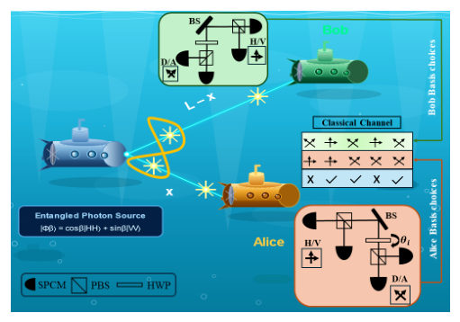 
Fig. 1: Schematic representation of the BBM92 QKD protocol in an underwater channel, in which the orientation θi of each HWP sets the angle of the associated measurement basis.

📷 Fig 2

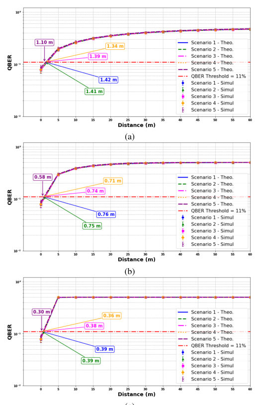 
Fig. 3: QBERBBM92-non-max vs. distance for different scenarios, with β = π/5 in (a) clear water, (b) coastal water, and (c) turbid water.

📷 Fig 3

 
Fig. 2: QBERBBM92-non-max vs. distance for different scenarios, with β = π/4, corresponding to the maximally entangled case, in (a) clear water, (b) coastal water, and (c) turbid water.

📷 Fig 4

 
Fig. 3 presents the QBER of the BBM92 protocol as a func- tion of the transmission distance for a non-maximally entangled state (β = π/5) in a non-turbulent underwater channel, considering three water types under five atmospheric scenarios. In all cases, the QBER increases with distance, while the achievable secure range is substantially reduced compared with the maximally entangled case shown in Fig. 2. This behavior reflects the lower robustness of non- maximally entangled states against propagation losses and noise, which makes the quantum correlations more vulnerable to environ- mental degradation. As a result, the protocol becomes more sensitive to both the optical properties of the...

📷 Fig 5

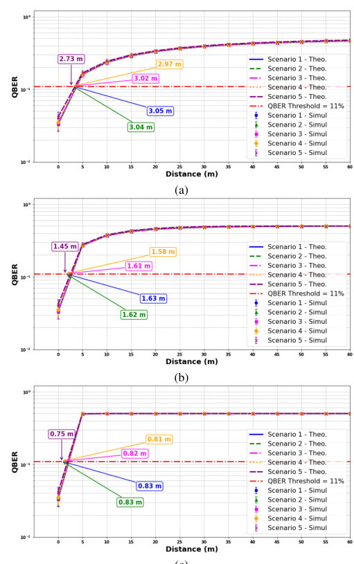 
Fig. 2 shows the QBER of the BBM92 protocol as functions of distance L for a maximally entangled state, for three types of water under five atmospheric scenarios. The correspondence between Monte Carlo simulations and analytical results validates proposed model. In all cases, the QBER increases with distance and ultimately becomes dominated by background-photon noise. As shown in Fig. 2(a), clear ocean water provides the longest secure transmission range among the three media. In this case, the QBER remains below the 11% security threshold up to approxi- mately 3.05 m in Scenario 1, whereas in Scenario 5 the threshold is reached at about 2.73 m. This performance is mainly due to the low...

**Summary.** This paper analyzes how underwater environmental factors like turbidity and background light affect the security of the BBM92 quantum key distribution protocol. It specifically quantifies the performance degradation when using non-maximally entangled states. The results highlight the severe limitations on secure communication distances in turbid waters.

**Why it may be interesting.** This paper is highly relevant to researchers in quantum optics and open quantum systems as it applies the Kraus operator formalism to model decoherence and photon loss in a complex, realistic environment.

Detailed structure

**Main problem.** Investigating the performance and security of the BBM92 entanglement-based QKD protocol in realistic underwater optical channels, specifically addressing the impact of non-maximally entangled states and channel degradation.

**Main result.** The study finds that increasing water turbidity and reducing the degree of entanglement both significantly decrease the secure transmission distance and Secret Key Rate (SKR).

**Method.** The authors derive closed-form analytical expressions for QBER and SKR using the Kraus operator formalism and validate these results through Monte Carlo simulations.

**Model / system.** An entanglement-based BBM92 QKD system where a source generates non-maximally entangled polarization states, propagating through an underwater channel modeled with amplitude-damping and depolarizing Kraus operators.

**Key observables.** Quantum Bit Error Rate (QBER) and Secret Key Rate (SKR).

**Important parameters / regimes.** Entanglement parameter (beta), water turbidity (clear, coastal, turbid), atmospheric/background noise levels, and transmission distance (L).

**Assumptions / limitations.** The source is a well-collimated laser beam with negligible divergence, and the primary channel effects considered are amplitude damping and depolarization rather than all forms of turbulence.

**Figures summary.** Fig 1 shows the protocol schematic; Fig 2 and 3 illustrate QBER vs. distance for different entanglement degrees and water types; Fig 4(b) shows the impact of reduced entanglement on the SKR.

**Paper structure.** The paper introduces the problem of underwater QKD, defines the physical model and Kraus-based channel, derives analytical expressions for error rates, validates them via Monte Carlo simulation, and evaluates performance across various environmental scenarios.

Abstract

Underwater optical channels pose significant challenges to the security and reliability of quantum communication systems due to absorption and scattering. In this paper, we investigate the BBM92 entanglement-based quantum key distribution (QKD) protocol under realistic underwater channel conditions. Photon pairs are prepared in non-maximally entangled states, and the underwater propagation medium is modeled as a quantum channel incorporating both amplitude-damping and depolarizing effects, described within the Kraus operator formalism. The protocol performance is evaluated in terms of quantum bit error rate (QBER) and secret key rate (SKR), analyzed as functions of the entanglement degree and channel degradation parameters. Closed-form analytical expressions for the QBER and SKR are derived for the proposed channel model and validated through Monte Carlo simulations. The proposed framework is then applied to various realistic underwater scenarios, considering different water types, namely clear ocean, coastal, and turbid water, as well as varying atmospheric conditions.

[↑ back to top](#top)

### [A General Quantum Speed Limit for Non-Hermitian Systems](http://arxiv.org/abs/2605.23250v1)

**Authors:** Zhanxi Wang, Xiaozhe Hao, X. X. Yi  
**Type:** theory · **Category:** quantum information and computing · **PDF:** <https://arxiv.org/pdf/2605.23250v1>  
**Analysis basis:** full PDF text, analyzed in chunks
**Topic relevance:** `correlated / nonlocal dissipation` **2/5** · `methods for driven-dissipative` **2/5** · `non-equilibrium dynamics` **2/5**

📷 Fig 1

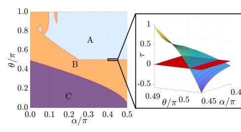 
FIG. 1: Left panel: ∆τ ′ = τ ′ comb −τ ′ G versus θ and α. Region A (blue) is for τ ′ comb &lt; τ ′ G, region B (orange) is for τ ′ comb &gt; τ ′ G, and region C (purple) is for τ ′ comb and τ ′ G having no solution. Right panel: ∆τ ′ with θ ∈[0.485π, 0.505π] and α ∈[0.4π, 0.45π]. The red region is plotted for reference, where ∆τ ′ = 0.

📷 Fig 2

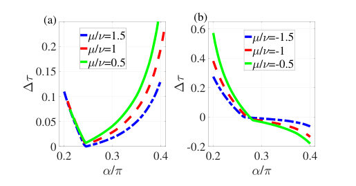 
FIG. 2: (a), ∆τ versus α/π for different µ/ν. Green solid line is for µ/ν = 0.5, red dotted line µ/ν = 1, and blue dashed dot line µ/ν = 1.5. (b) The same as in Figure (a) but with −µ/ν with respect to that in Figure (a).

📷 Fig 3

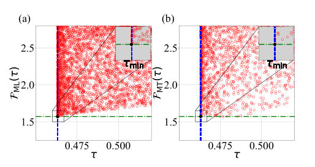 
FIG. 3: FML(τ) (a) and FMT(τ) (b) versus time τ. τ is the time for the quantum system to evolve from an initial state to its orthogonal ones. To plot this figure, we choose κ = 2.5 and η, ς = 1. The red points are for random initial states, the blue line corresponds to the shortest evolution time τmin = π

📷 Fig 4

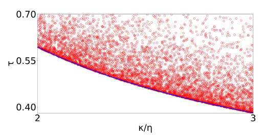 
FIG. 4: Upper and lower bound of the evolution time needed for the system from an initial states to its orthogonal states as a function of κ/η (ς = 1). The red points in the figure are obtained for randomly generated initial states. The blue solid line bounds the shortest evo- lution time τmin.

**Summary.** This paper establishes new fundamental limits on how fast a non-Hermitian quantum system can evolve to an orthogonal state. By extending the well-known MT and ML bounds to non-Hermitian dynamics, the authors identify the specific initial states that allow for the fastest possible evolution.

**Why it may be interesting.** This is highly relevant for researchers in open quantum systems and quantum optics, as it provides fundamental limits on the speed of state evolution in dissipative or gain-driven environments, which are central to non-Hermitian physics.

Detailed structure

**Main problem.** The paper aims to derive and establish tight, compact Quantum Speed Limit (QSL) bounds, specifically of the Mandelstam-Tamm (MT) and Margolus-Levitin (ML) types, for non-Hermitian quantum systems.

**Main result.** The authors derive two new, tighter bounds for non-Hermitian QSL that correspond to the MT and ML bounds in Hermitian systems and identify 'fastest initial states' (FIS) that achieve the minimum evolution time.

**Method.** The derivation utilizes biorthogonal basis theory and trigonometric inequalities applied to the real and imaginary parts of the state overlap within a non-degenerate non-Hermitian framework.

**Model / system.** A general non-degenerate non-Hermitian Hamiltonian with complex eigenvalues, including specific applications to a two-level system and a three-level PT-symmetric wireless power transfer (WPT) system.

**Key observables.** Quantum Speed Limit (tau), ML-type bound (F_ML), MT-type bound (F_MT), and Geometric-type bound (F_G).

**Important parameters / regimes.** Real and imaginary parts of eigenvalues (omega and gamma), the ratio of bounds (alpha), and the parameter delta for studying the approach to the shortest evolution time.

**Assumptions / limitations.** The system is assumed to be non-degenerate and the Hamiltonian is time-independent; a shifted Hamiltonian is used to ensure non-negative eigenvalues.

**Figures summary.** Figure 1 compares the difference between the combined QSL bound and the geometric bound against parameters theta and alpha, identifying regions of existence for solutions.

**Paper structure.** The paper introduces the QSL problem, develops the biorthogonal mathematical framework, derives the new MT and ML-type bounds, analyzes the tightness and saturation conditions of these bounds, and provides numerical illustrations using PT-symmetric systems.

Abstract

The quantum speed limit (QSL) refers to the maximum speed of a quantum system to evolve from an initial state to its orthogonal states. The bound on the QSL for Hermitian systems, for example the Mandelstam-Tamm (MT) and Margolus-Levitin (ML) as well as Sun-Zheng(SZ) bound, was studied respectively from the perspectives of average value and variance of the system Hamiltonian as well as the geometry of the system. While the compactness of the MT-type, ML-type and SZ-type bounds has been examined well for Hermitian systems, a compact QSL for non-Hermitian systems has not been well studied. In this work, based on the biorthogonal basis theory we derive two distinct and tighter bounds on the QSL for non-Hermitian systems, which correspond to the MT and ML bounds for Hermitian systems. We show that the shortest evolution time corresponding to the two bounds of the non-Hermitian system can be attained by certain initial states, showing the compactness and tightness of our bounds. These initial states dubbed fastest initial states(FIS) are different from that in Hermitian systems. A bound close to QSL for non-FIS is presented and comparison of our bound with others in literature is performed. To illustrate our results, we present a minimal non-Hermitian system to show QSL, and the condition for the shortest evolution time is derived analytically using the present theory.

[↑ back to top](#top)

### [Convexity and non-Markovianity of Weyl Maps](http://arxiv.org/abs/2605.23852v1)

**Authors:** Wen Xu, Vinayak Jagadish  
**Type:** theory · **Category:** quantum information and computing · **PDF:** <https://arxiv.org/pdf/2605.23852v1>  
**Analysis basis:** full PDF text, analyzed in chunks
**Topic relevance:** `entanglement & information structure` **2/5** · `methods for driven-dissipative` **2/5** · `non-equilibrium dynamics` **2/5**

📷 Fig 1

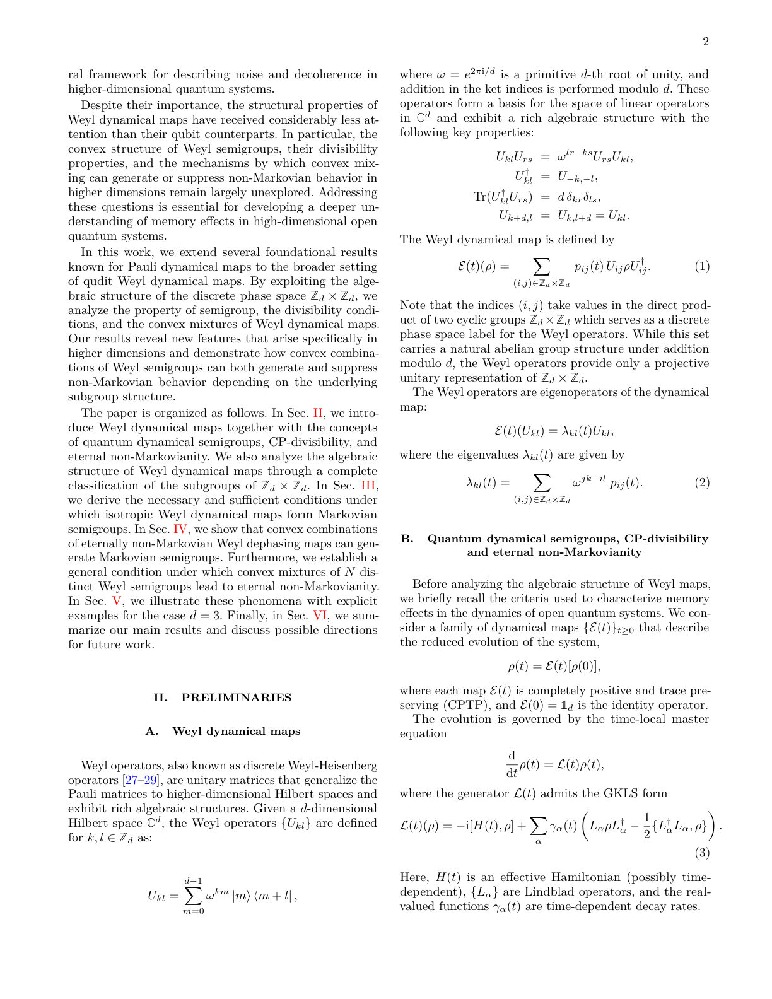 
Low-resolution page preview, page 2

📷 Fig 2

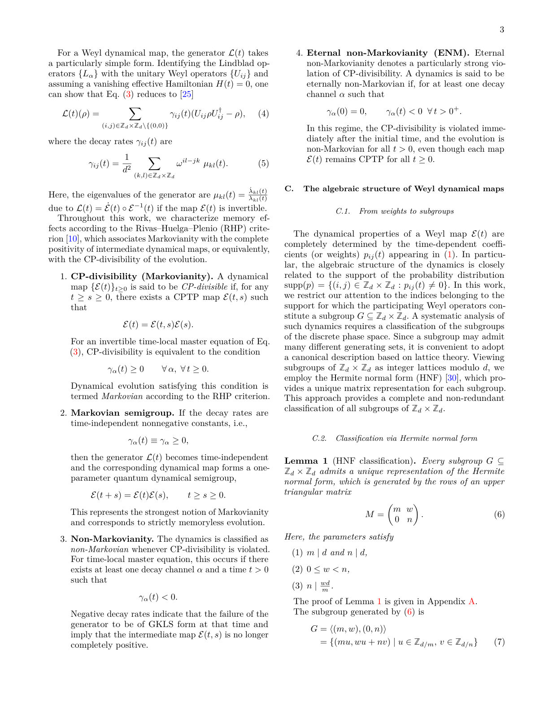 
Low-resolution page preview, page 3

📷 Fig 3

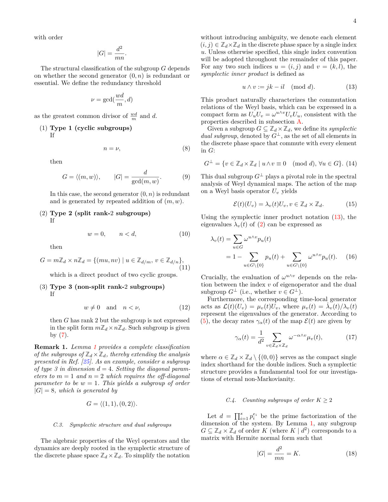 
Low-resolution page preview, page 4

📷 Fig 4

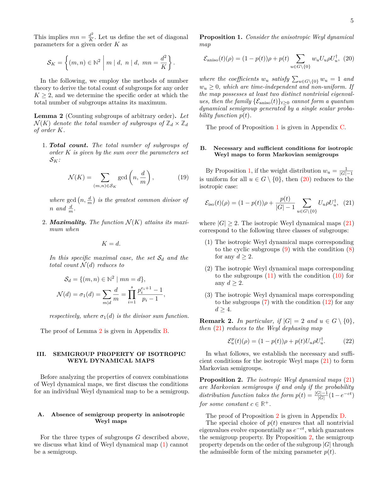 
Low-resolution page preview, page 5

📷 Fig 5

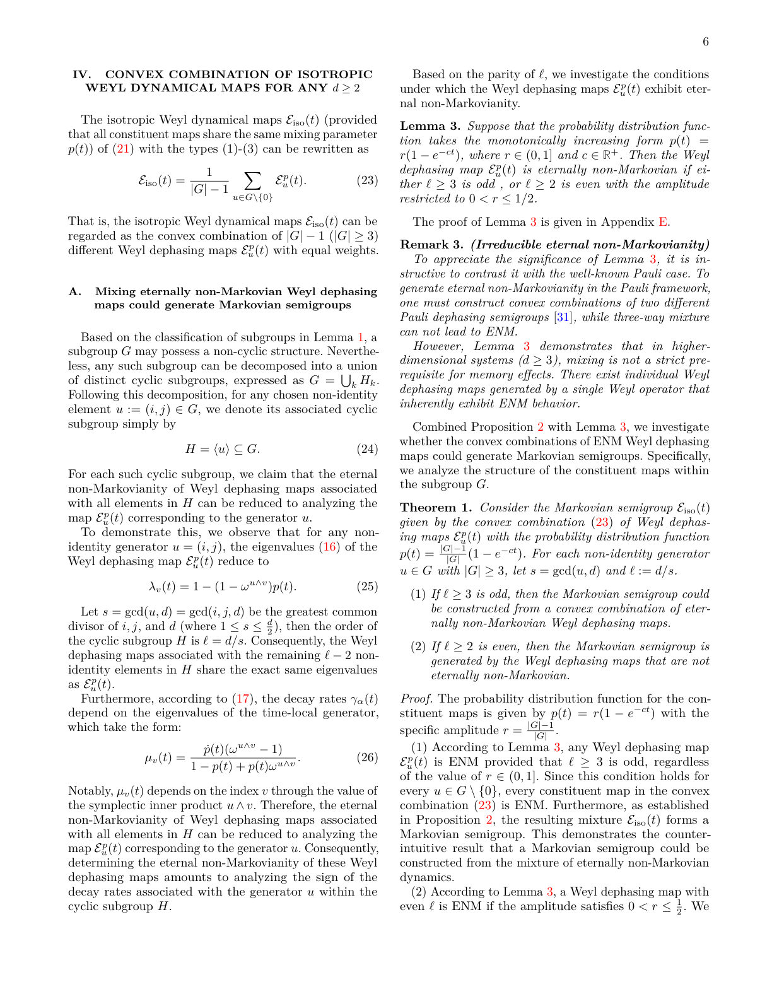 
Low-resolution page preview, page 6

**Summary.** This paper explores how the algebraic structure of discrete phase space influences quantum memory effects in higher-dimensional systems. It demonstrates that mixing non-Markovian maps can lead to Markovian dynamics and identifies new types of intrinsic, irreducible non-Markovianity in qudits.

**Why it may be interesting.** This work is highly relevant to researchers in open quantum systems as it extends the theory of non-Markovianity beyond the qubit Pauli framework and reveals counter-intuitive phenomena like the suppression of memory effects through mixing.

Detailed structure

**Main problem.** The paper investigates the emergence, generation, and suppression of non-Markovian dynamics in higher-dimensional (qudit) open quantum systems using Weyl dynamical maps.

**Main result.** The authors prove that convex combinations of eternally non-Markovian Weyl dephasing maps can generate Markovian semigroups, and they identify the existence of irreducible eternally non-Markovian maps in dimensions d >= 3.

**Method.** The study employs algebraic classification via the Hermite normal form, symplectic geometry, and number theory to analyze the subgroup structure of the discrete phase space Z_d x Z_d.

**Model / system.** The model consists of finite-dimensional qudit open quantum systems governed by Weyl dynamical maps acting on a d-dimensional Hilbert space, specifically focusing on Weyl dephasing maps.

**Key observables.** Decay rates (gamma_alpha(t)), which serve as the primary diagnostic for Markovianity and non-Markovianity.

**Important parameters / regimes.** Dimension (d), subgroup order (K), parity of the ratio l = d/s, mixing coefficients (x_k), and the probability distribution parameter (r).

**Assumptions / limitations.** The analysis focuses on cases where the effective Hamiltonian is zero and assumes specific functional forms for the probability distribution p(t).

**Paper structure.** The paper begins with an algebraic classification of Weyl maps using the Hermite normal form, proceeds to characterize Markovianity and semigroup properties of isotropic and anisotropic maps, analyzes the effects of mixing (convex combinations) on memory effects, and concludes with explicit qutrit examples.

Abstract

We investigate the emergence of non-Markovian dynamics in finite-dimensional open quantum systems governed by Weyl dynamical maps and their convex combinations. Using the Hermite normal form, we provide a complete classification of the subgroups of the discrete phase space $\mathbb{Z}_d \times \mathbb{Z}_d$, establishing the algebraic framework underlying the Weyl maps. We characterize isotropic Weyl dynamical maps that generate Markovian semigroups and show that anisotropic Weyl maps with nonuniform weight distributions cannot possess the semigroup property. Furthermore, we analyze the role of convexity in the generation and suppression of memory effects. Remarkably, we prove that convex combinations of eternally non-Markovian Weyl dephasing maps can generate Markovian semigroups, demonstrating that non-Markovianity is not additive under mixing. Conversely, we establish a general condition under which convex mixtures of $N$ distinct Weyl semigroups exhibit eternal non-Markovianity. In contrast to the qubit Pauli setting, we further identify the existence of irreducible eternally non-Markovian Weyl dephasing maps, namely, individual dynamical maps that display eternal memory effects without requiring any mixing mechanism. Finally, explicit qutrit examples illustrate the transition among Markovian, non-Markovian and eternally non-Markovian regimes. Our results uncover a fundamental connection among finite phase-space algebra, convex structures, and quantum memory effects, thereby extending the theory of non-Markovian dynamics beyond the Pauli framework.

[↑ back to top](#top)

### [Emergent heavy-tailed distributions from a Markovian random walk](http://arxiv.org/abs/2605.22933v1)

**Authors:** Henrique S. Lima, Evaldo M. F. Curado  
**Type:** theory · **Category:** statistical mechanics · **PDF:** <https://arxiv.org/pdf/2605.22933v1>  
**Analysis basis:** full PDF text, analyzed in chunks
**Topic relevance:** `Keldysh / 2PI / non-Gaussian methods` **2/5** · `non-equilibrium dynamics` **2/5** · `non-equilibrium universality` **2/5**

📷 Fig 1

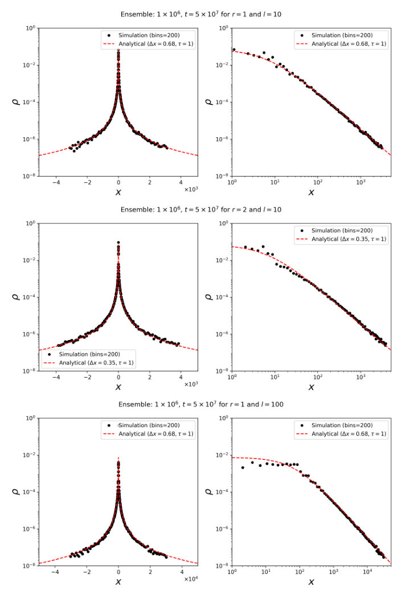 
Figure 1: Top left and right: ρ versus x for r = 1 and l = 10 on log-linear and log-log scales, respectively. Center left and right: ρ versus x for r = 2 and l = 10 on log-linear and log-log scales, respectively. Bottom left and right: ρ versus x for r = 1 and l = 100 on log-linear and log-log scales, respectively.

**Summary.** This paper demonstrates that power-law statistics, often thought to require complex non-local or memory-dependent processes, can emerge from a simple, local Markovian random walk. By using a position-dependent step size, the authors show that a scale-free distribution with a -2 exponent is a natural consequence of a local feedback loop. This provides a new microscopic foundation for understanding heavy-tailed phenomena in various complex systems.

**Why it may be interesting.** not directly relevant

Detailed structure

**Main problem.** Explaining how heavy-tailed (power-law) probability distributions emerge in complex systems without relying on non-local jumps or non-Markovian memory.

**Main result.** A strictly local, Markovian random walk with a position-dependent step size generates a robust, non-Gaussian stationary state with a power-law decay of |x|^{-2}.

**Method.** The authors use a combination of continuum limit derivations, Fokker-Planck equations, Itô calculus, and the Onsager-Machlup path-integral formalism, validated by large-scale GPU-accelerated numerical simulations.

**Model / system.** A one-dimensional, discrete-time, Markovian random walk where the step size increases deterministically as the walker moves away from the origin, creating a positive feedback loop.

**Key observables.** Stationary probability distribution (rho_st), mean-squared displacement (MSD), effective velocity, and effective acceleration.

**Important parameters / regimes.** l (spatial threshold), r (rule parameter), delta_x (spatial increment), and tau (time step).

**Assumptions / limitations.** The derivation assumes a specific Itô interpretation (step size determined by position before the increment) and a continuum limit approximation where k*s(x) is much less than 1.

**Figures summary.** Figure 1 displays the probability density versus position on log-linear and log-log scales for various parameters, visually demonstrating the power-law decay.

**Paper structure.** The paper introduces the problem of heavy tails, defines the Markovian random walk model, provides analytical derivations via the continuum limit and SDEs, presents numerical validation, and discusses the physical implications of the acceleration mechanism.

Abstract

The emergence of heavy-tailed statistics in complex systems is conventionally attributed to non-local stochastic jumps or non-Markovian memory. Here, we present a one-dimensional random walk where power-law behaviors arise instead from a strictly local, discrete-time Markovian mechanism. The step length is governed by a deterministic function of the walker's position, establishing a positive feedback loop that induces strong effective correlations along the trajectories. Through analytical derivations in the continuum limit and extensive numerical simulations, we show that this rule yields a robust, non-Gaussian stationary state. The exact analytical solution is obtained in the closed form of a symmetric, Lorentz-like distribution, $ρ_{\text{st}}(x) \propto (|x|/l+rΔx)^{-2}$, confirming asymptotic power-law tails that decay as $|x|^{-2}$ over six decades. Furthermore, by employing the Onsager-Machlup path-integral formalism, we demonstrate that effective velocity and acceleration acquire physical meaning along the shortest fluctuation trajectories. Crucially, we find that a non-zero initial acceleration acts as the fundamental mechanism driving the walker away from the origin, ensuring both the emergence of scale-free statistics and the normalizability of the stationary distribution. This minimal pathway provides a new microscopic foundation for the widespread $-2$ power law observed across multidisciplinary complex systems.

[↑ back to top](#top)

### [Exact versus tight-binding models in longitudinally modulated $\mathcal{PT}$-symmetric coupled waveguides](http://arxiv.org/abs/2605.23853v1)

**Authors:** Alonso Contreras-Astorga, José Israel Galindo-Rodríguez  
**Type:** theory · **Category:** other · **PDF:** <https://arxiv.org/pdf/2605.23853v1>  
**Analysis basis:** full PDF text, analyzed in chunks
**Topic relevance:** `analog quantum simulation` **2/5** · `methods for driven-dissipative` **2/5** · `non-equilibrium dynamics` **2/5**

📷 Fig 1

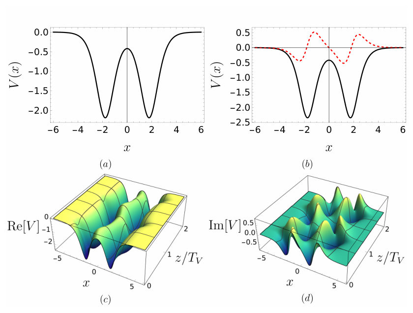 
FIG. 1. Real and imaginary parts of the propagation-distance-dependent PT -symmetric potential VS(x, z). Panels (a) and (b) depict transversal profiles associated with the limiting cases of the system: the strictly Hermitian potential (α = 0) and the propagation-distance-independent PT -symmetric potential (k3 →k1) (Re[V ] in black solid line and Im[V ] in red dashed line), respectively. Panels (c) and (d) show the full three-dimensional Re[V ] and Im[V ] over two spatial periods TV along the propagation axis z, showing the periodic modulation of the coupled waveguides and their balanced gain and loss. Parameters: k1 = 1, k2 = 1.1, k3 = 0.95, and α = 0.5.

📷 Fig 2

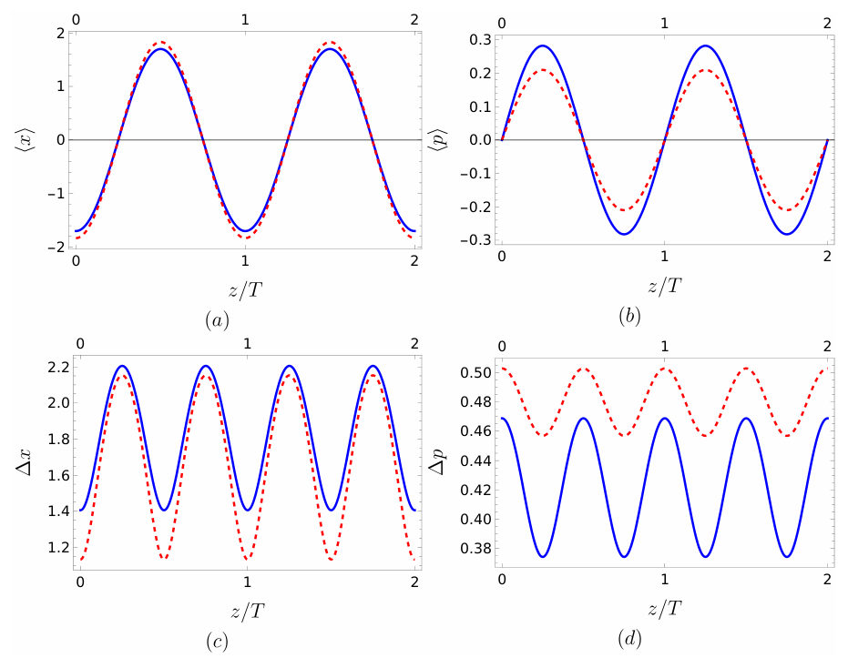 
FIG. 2. Evolution of the observables for the guided mode ψl, comparing the exact solution (blue solid line) with the tight-binding model (red dashed line). Panels show: (a) position expectation value, (b) momentum expectation value, (c) position standard deviation, and (d) momentum standard deviation.

📷 Fig 3

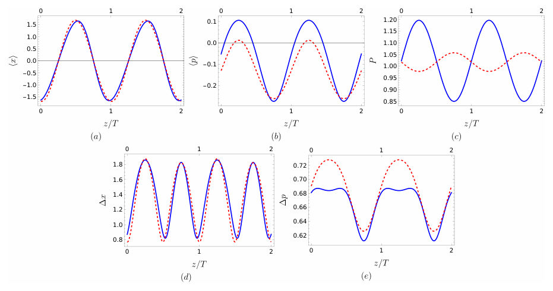 
FIG. 3. Dynamical evolution of the guided mode ψl for the exact (blue solid line) and approximated (red dashed line) models. Panels show the expectation values of (a) position, ⟨x⟩, (b) transverse momentum, ⟨p⟩, and (c) total power, P. Note the near-antiphase behavior of the power between the exact solution and the approximation. Panels (d) and (e) display the standard deviations of position, ∆x, and momentum, ∆p, respectively. These plots are generated using the localized states defined in Eq. (30).

📷 Fig 4

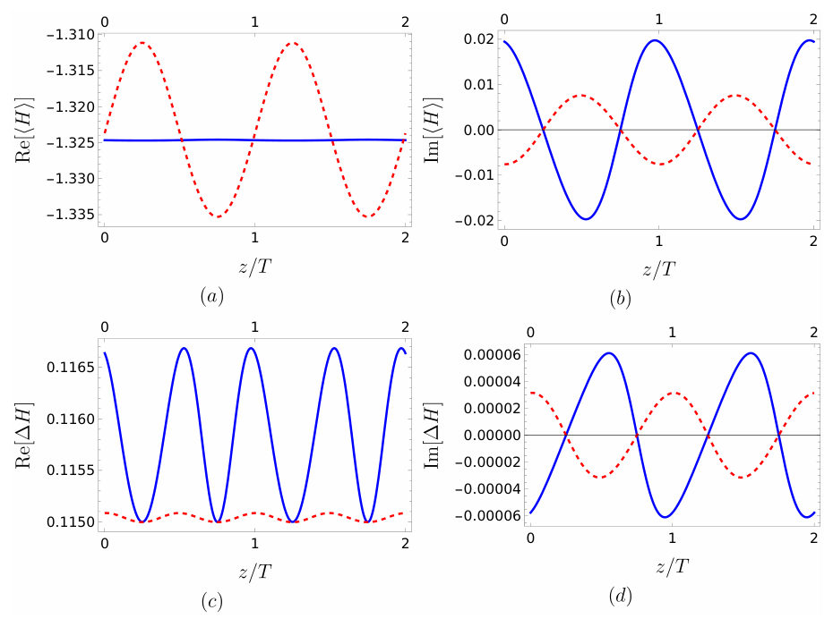 
FIG. 4. Analysis of the expectation value of the Hamiltonian for the exact (blue solid line) and approximated (red dashed line) guided mode ψl. Panels show the (a) real and (b) imaginary components of the Hamiltonian expectation value, ⟨H⟩, calculated using the standard Hermitian inner product. Panels (c) and (d) display the real and imaginary components of the Hamiltonian uncertainty, ∆H, respectively.

📷 Fig 5

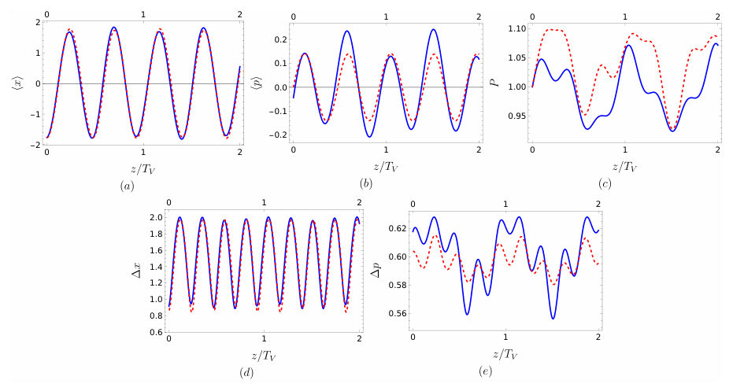 
FIG. 5. Dynamical evolution of the guided mode ψl for the exact (blue solid line) and approximated (red dashed line) solutions. Panels show the expectation values of (a) position, ⟨x⟩, and (b) transverse momentum, ⟨p⟩, along with (c) the total power, P. Panels (d) and (e) display the standard deviations of position, ∆x, and momentum, ∆p, respectively.

**Summary.** This paper investigates how well the widely used tight-binding approximation describes light propagation in PT-symmetric waveguides with longitudinal modulation. While the approximation is reliable for tracking spatial trajectories, it fails to accurately predict phase-sensitive quantities like power oscillations and spectral fluctuations. This provides a critical warning for using discrete models to study complex non-Hermitian evolution.

**Why it may be interesting.** This work is highly relevant to researchers in open quantum systems and quantum optics as it benchmarks a common approximation scheme used to study non-Hermitian dynamics and synthetic quantum systems.

Detailed structure

**Main problem.** Evaluating the validity and accuracy of the tight-binding (TB) approximation compared to exact analytical solutions in PT-symmetric coupled waveguide arrays, particularly under longitudinal modulation.

**Main result.** The TB model accurately reproduces spatial dynamics like position and beam width but fails to capture complex phase dynamics, exhibiting significant phase shifts in total power and inaccuracies in spectral broadening.

**Method.** The authors use second-order supersymmetric (Darboux) transformations to derive exact analytical solutions and compare them against a discrete tight-binding framework calibrated via a spectral matching method.

**Model / system.** A system of two PT-symmetric coupled optical waveguides with longitudinal modulation, modeled by a non-Hermitian paraxial wave equation with a complex, z-dependent refractive index profile.

**Key observables.** Position expectation value, transverse momentum, spatial uncertainty (delta x, delta p), total power, and Hamiltonian expectation values (real and imaginary parts) using the PT inner product.

**Important parameters / regimes.** Longitudinal modulation strength, gain/loss parameter (alpha), coupling strength (kappa), and wave-number parameters (k1, k2, k3).

**Assumptions / limitations.** The TB approximation assumes evolution is governed by discrete hopping between localized modes and is expected to converge as waveguide separation increases.

**Figures summary.** Figure 2 compares Hermitian evolution of spatial and momentum observables; Figure 3 compares PT-symmetric evolution, highlighting power phase shifts; Figure 4 and 6 analyze Hamiltonian expectation values and fluctuations.

**Paper structure.** The paper introduces the problem of TB validity, develops exact potentials using SUSY transformations, implements the TB approximation and calibration, and performs a comparative analysis of spatial and energetic dynamics.

Abstract

The tight-binding (TB) model is a widely adopted approximation scheme for describing light propagation in waveguide arrays. Despite its success, its validity in $\mathcal{PT}$-symmetric systems characterized by strong longitudinal modulation has not been rigorously benchmarked against exact analytical solutions. In this work, we address this gap by performing a comparative analysis between exact continuous solutions derived from $z$-dependent supersymmetric (SUSY) transformations and their corresponding discrete TB approximations. To achieve this, we develop a theoretical model for two PT-symmetric coupled waveguides subject to longitudinal modulation. We then evaluate the performance of the TB framework against the exact SUSY benchmark. Our results delineate the specific validity range of the TB approximation, demonstrating its proficiency in reproducing spatial intensity distributions. However, we also identify its limitations in accurately capturing the complex oscillatory phase dynamics inherent to this non-Hermitian evolution.

[↑ back to top](#top)

### [Interaction-Split Edge Spectral Flow and Neutral Triplet Boundary Modes in a C = 2 Hubbard Pump](http://arxiv.org/abs/2605.23769v1)

**Authors:** Yong-Feng Yang, Zhao-Rui Tian, Chen Cheng, Hong-Gang Luo  
**Type:** theory · **Category:** strongly correlated electrons · **PDF:** <https://arxiv.org/pdf/2605.23769v1>  
**Analysis basis:** full PDF text, analyzed in chunks
**Topic relevance:** `analog quantum simulation` **2/5** · `entanglement & information structure` **2/5** · `non-equilibrium dynamics` **2/5**

📷 Fig 1

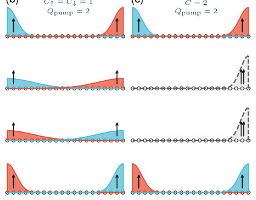 
FIG. 1. Schematic of interaction-reconstructed boundary spectral flow. (a) Spinful Hubbard chain at filling ρ = 2/3 with a period-three sliding onsite interaction [Eq. (1)]. The red profile denotes the modulated doublon cost; advancing ϕ translates the pattern. (b) Spin-degenerate Hartree/AAH reference pump. Independent spin channels exhibit simulta- neous edge spectral flow; red and blue packets denote electron- and hole-like edge excitations, while arrows indicate spin. (c) Full modulated Hubbard pump. The onsite repulsion recon- structs the boundary spectral flow. Between the two sepa- rated edge events, schematically labeled ϕ1 and ϕ2, the inter- mediate edge sector is a localized...

📷 Fig 2

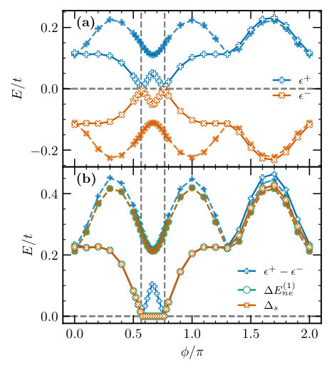 
FIG. 2. Interaction-split boundary spectral flow and neutral spin edge sector at ρ = 2/3. (a) Single-particle addition and removal energies, ϵ+ and ϵ−, versus the pumping phase ϕ. (b) Evolution of the spin-flip gap ∆s, the lowest neutral excitation gap ∆E(1) ne , and the fermion charge gap ϵ+ −ϵ−. Parameters are L = 72, period p = 3, and interaction strength U = 2.0. Filled markers with dotted lines denote periodic-boundary- condition results, while open markers with solid lines denote open-boundary-condition results. In (a), the periodic-chain addition/removal spectrum remains gapped throughout the pump cycle, whereas the open-chain addition/removal ener- gies approach zero at two...

📷 Fig 3

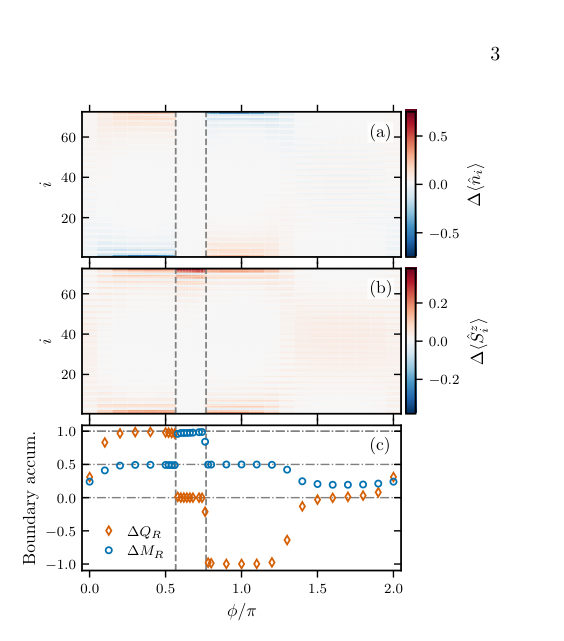 
FIG. 3. Real-space boundary spin-charge separation and neu- tral triplet modes. Spatiotemporal evolution of the boundary excitations over the pumping cycle ϕ. Real-space heatmaps of the (a) local charge (∆⟨ˆni⟩) and (b) spin (∆⟨ˆSz i ⟩) excitations across the 1D lattice. To strictly isolate the topological edge modes, observables are calculated as the difference between the macroscopic Sz tot = 1 spin-flip excitation and the singlet ground state. (c) Integrated charge accumulation ∆QR and magnetization ∆M z R strictly at the right boundary. The tem- poral alignment of the panels reveals the dynamic spatial de- coupling: between the two edge events, the boundary charge is temporarily...

📷 Fig 4

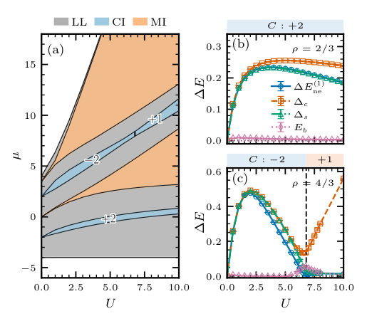 
FIG. 4. Ground-state phase diagram and filling-dependent topological pumps. (a) Global µ-U phase diagram of Eq. (1), showing gapless Luttinger-liquid (LL), correlated-insulating (CI), and Mott-insulating (MI) regimes. Numbers inside insu- lating lobes denote the many-body Chern number C. (b),(c) Extrapolated bulk gaps versus U at (b) ρ = 2/3 and (c) ρ = 4/3, obtained under periodic boundary conditions [32]. The plotted quantities are the charge gap ∆c, spin gap ∆s, lowest neutral gap ∆E(1) ne , and pair-binding energy Eb. The top strips indicate the many-body Chern number. At ρ = 2/3, the gapped pump remains in the C = +2 sector throughout the range studied. At ρ = 4/3, increasing U drives...

**Summary.** This paper shows that in a 1D Hubbard pump, strong interactions reconstruct the edge spectral flow, splitting it into two events and creating a localized neutral triplet mode. It also identifies a filling-dependent topological phase transition in the large-U regime. This discovery highlights how correlations can fundamentally alter topological transport properties beyond the single-particle prediction.

**Why it may be interesting.** It demonstrates a non-perturbative mechanism where interactions decouple spin and charge sectors at a boundary, providing a blueprint for creating neutral topological quasiparticles in correlated systems.

Detailed structure

**Main problem.** Investigating how strong electronic correlations reconstruct the boundary spectral flow and create neutral, spinful edge modes in a many-body Thouless pump.

**Main result.** The study reveals that interactions split the edge spectral flow into two distinct events and stabilize a neutral, spinful triplet-like boundary mode between them, demonstrating a breakdown of the single-particle mean-field picture.

**Method.** Density-Matrix Renormalization Group (DMRG) calculations using Matrix Product States (MPS) with finite-size scaling analysis.

**Model / system.** A 1D spinful Hubbard chain with a period-three spatial modulation of the on-site interaction strength $U_i(\phi)$.

**Key observables.** Many-body Chern number (C), charge gap ($\Delta_c$), spin gap ($\Delta_s$), neutral excitation gap, local charge and spin density, and integrated boundary charge/magnetization.

**Important parameters / regimes.** Hubbard interaction strength (U), chemical potential ($\mu$), pumping phase ($\phi$), and filling factor ($
ho = 2/3, 4/3, 1, 5/3$).

**Assumptions / limitations.** The study assumes the adiabatic limit for the pumping cycle and relies on the accuracy of DMRG for 1D systems.

**Figures summary.** Figure 1 introduces the model; Figure 3 shows real-space heatmaps of the spatiotemporal evolution of charge and spin excitations.

**Paper structure.** The paper introduces the modulated Hubbard pump, compares the full model to a Hartree reference, analyzes the $
ho=2/3$ regime for edge splitting and neutral modes, explores the $
ho=4/3$ regime for topological phase transitions, and concludes with broader implications for correlated topological transport.

Abstract

We show that a sliding spatial modulation of the on-site Hubbard interaction realizes a many-body Thouless pump whose boundary spectral flow is reconstructed by correlations. For a period-three Hubbard chain at filling $ρ=2/3$, density-matrix renormalization group (DMRG) calculations identify a correlated insulator with many-body Chern number $C=+2$, corresponding to two units of charge pumped per cycle. Its excitation spectrum separates the charge gap from the lowest neutral spin gap, revealing an interacting bulk response beyond a simple spin-degenerate band pump. Under open boundary conditions, this contrast becomes even more pronounced. A spin-degenerate Hartree/Aubry-André-Harper reference pump exhibits simultaneous edge flow in the two spin channels, whereas the full modulated Hubbard model suppresses the boundary doublon channel and splits the spectral flow into two distinct edge events. Between these events, the boundary charge is neutralized while a neutral, spinful triplet-like excitation is localized at the edge. The global $μ-U$ phase diagram reveals filling-dependent topology: the $ρ=2/3$ regime remains in the $C=+2$ sector, while $ρ=4/3$ regime undergoes a spin-gap-closing transition from a $C=-2$ pump to a distinct $C=+1$ topological Mott pump.

[↑ back to top](#top)

### [Multiphoton heralding generates large-amplitude squeezed Schrödinger cat states and parity-selective Fock superpositions from squeezed vacuum via an OPA](http://arxiv.org/abs/2605.23617v1)

**Authors:** Yusuf Turek, Ming-Yan Sun, Xiao-Xi Yao  
**Type:** theory · **Category:** quantum information and computing · **PDF:** <https://arxiv.org/pdf/2605.23617v1>  
**Analysis basis:** full PDF text, analyzed in chunks
**Topic relevance:** `entanglement & information structure` **2/5** · `interference shaping light` **2/5** · `quantum measurements` **2/5**

📷 Fig 1

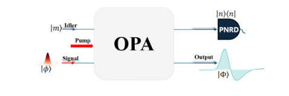 
Figure 1. Schematic of the non-Gaussian source using an op- tical parametric amplifier (OPA). Specific states |ϕ⟩– such as coherent, squeezed vacuum (SV) and small-amplitude Schrödinger cat (SC) states - are injected into the signal mode, while m-photon is input into the idler mode of the OPA. m-photon detection at the idler output port by the photon-number-resolving detection (PNRD) heralds the gen- eration of a non-Gaussian quantum state |Φ⟩at the signal out- put. The characteristics of the output state can be controlled by adjusting squeezing parameter r, input and detected pho- ton numbers n and m, and the gain g of the amplifier, respec- tively.

📷 Fig 2

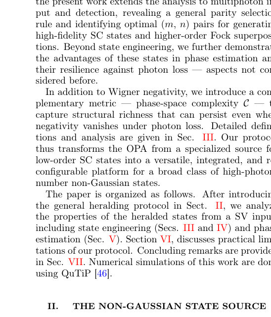 
Figure 1 illustrates a generic method for generating non-Gaussian states from Gaussian and non-Gaussian inputs. In our protocol, we consider general formalism of state engineering issues by taking Gaussian and non- Gaussian inputs into two input ports of an OPA. As shown in Fig. 1, m photon (|m⟩) and arbitrary state |ϕ⟩are plugged into the idler and signal modes of the OPA, then OPA produces two correlated output modes. The photon-number-resolving detection (PNRD) on the idler port naturally heralds a non-Gaussian state in the signal output port. Our scheme supports multiphoton heralding, so that a much broader class of non-Gaussian states can generated with various input states. The OPA in...

📷 Fig 3

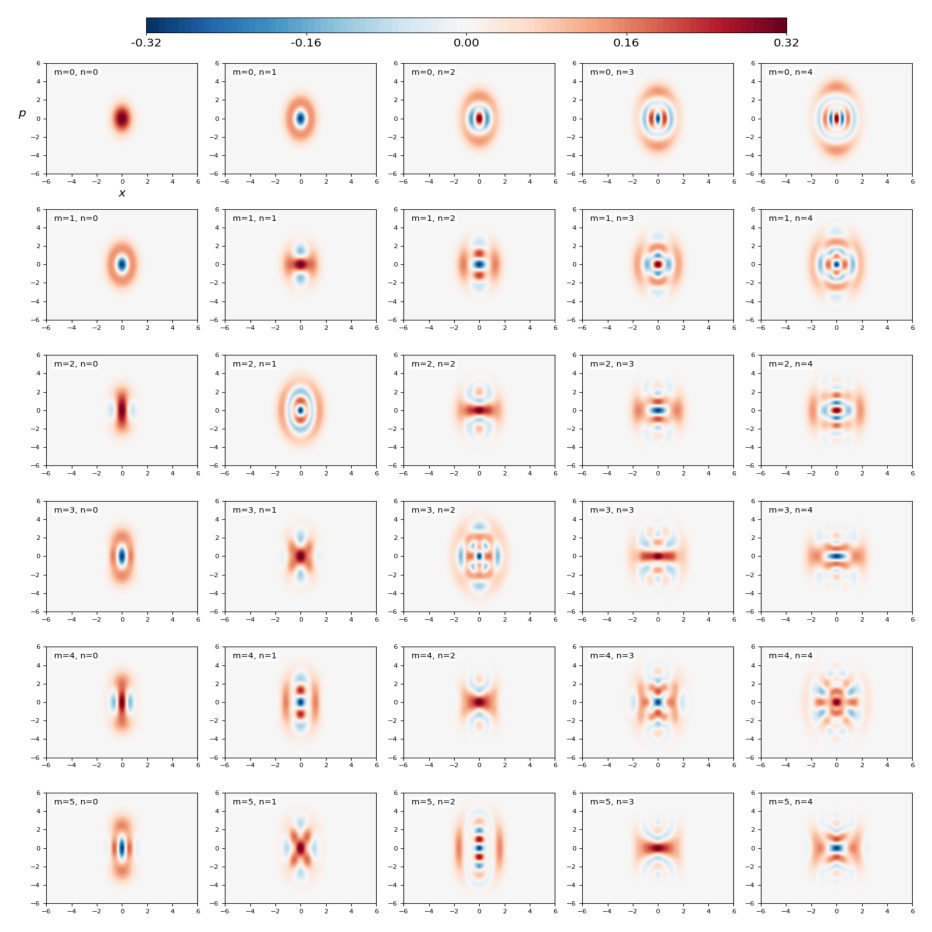 
Figure 2. Wigner functions of the signal output state |Ψ⟩sv,m,n for m = 0, 1, 2, 3, 4, 5 and n = 0, 1, 2, 3, 4 cases. Here we take r = 1.0 (≈8.69 dB), θ = φ = 0 and g = 1.5.

📷 Fig 4

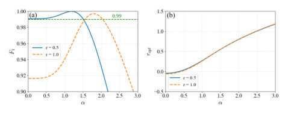 
Figure 4. (a) Optimal fidelity between the output state |Ψ⟩sv,1,2 and the target SOSC state |Ψπ⟩as a function of coherent amplitude of the target state for different squeezing parameters r. (b) Corresponding squeezing parameter γ of the target SOSC state that maximizes the fidelity in (a). The other parameters are the same as in Fig. 2.

📷 Fig 5

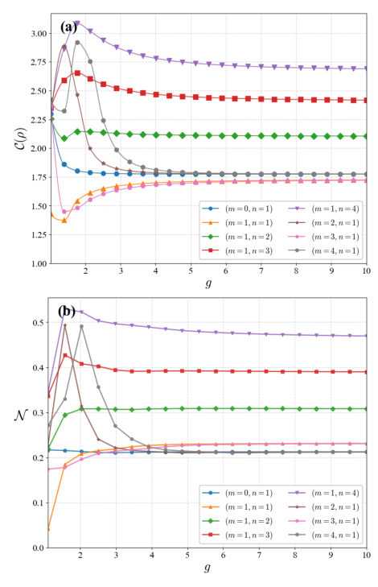 
Figure 3. Complexity C (a) and Wigner negativity volume N (b) as a function of OPA gain g with r = 1.0. The other parameters are the same as in Fig. 2.

**Summary.** This paper proposes a new method to create complex quantum states, such as Schrödinger cat states, using an optical parametric amplifier and multiphoton detection. This approach is much more efficient than traditional methods and produces states that are robust against photon loss. These states are highly valuable for advancing quantum computing and high-precision quantum sensing.

**Why it may be interesting.** It provides a scalable, high-efficiency protocol for engineering complex non-Gaussian states and GKP-like states, which are essential resources for fault-tolerant continuous-variable quantum computing and quantum-enhanced metrology.

Detailed structure

**Main problem.** The difficulty of generating high-fidelity, large-amplitude non-Gaussian states (like Schrödinger cat states) for continuous-variable quantum computing and metrology using conventional, low-efficiency photon-subtraction methods.

**Main result.** The authors propose an OPA-based multiphoton heralding scheme that efficiently generates large-amplitude squeezed Schrödinger cat states and parity-selective Fock superpositions with significantly higher success probabilities than beam-splitter methods.

**Method.** Numerical simulations using QuTiP to analyze an Optical Parametric Amplifier (OPA) setup, optimizing gain and squeezing parameters to achieve high-fidelity target states.

**Model / system.** An Optical Parametric Amplifier (OPA) acting as a two-mode squeezing unitary, where a squeezed vacuum is injected into the signal port and $m$ photons are injected into the idler port, with $n$ photons detected at the idler output.

**Key observables.** Wigner negativity, phase-space complexity (via Wehrl entropy and Fisher information), state fidelity, success probability, and Quantum Fisher Information (QFI).

**Important parameters / regimes.** Idler input photon number ($m$), detected photon number ($n$), OPA gain ($g$), input squeezing ($r$), and coherent amplitude ($\alpha$).

**Assumptions / limitations.** The system is subject to modeled photon loss and dephasing via the Lindblad master equation; detection efficiency is assumed to be 90%.

**Figures summary.** Schematic of the non-Gaussian source; Wigner functions for various $(m, n)$ configurations; plots of negativity and complexity vs. OPA gain; fidelity vs. amplitude; and QFI comparisons against SQL and HL limits.

**Paper structure.** The paper introduces the problem of non-Gaussian state generation, describes the OPA-based heralding mechanism and mathematical model, presents results for various photon-number configurations and their fidelity, evaluates robustness against loss and dephasing, and discusses applications in quantum metrology.

Abstract

We propose a multiphoton heralding scheme using an optical parametric amplifier (OPA) that converts squeezed vacuum into two families of non-Gaussian states: large-amplitude squeezed Schrödinger cat states and low-order parity-selective Fock superpositions. By injecting m photons into the idler port and detecting n photons at the output, effective high-order photon subtraction is realized in a single OPA device. The heralded states exhibit strong Wigner negativity and high phase-space complexity. Remarkably, under photon loss, the complexity remains substantial even after negativity vanishes, indicating a loss-resilient quantum resource. These states also surpass the Heisenberg limit in phase estimation. Our protocol establishes the OPA as a versatile platform for generating non-Gaussian states, with promising applications in loss-resilient quantum metrology and fault-tolerant quantum information processing.

[↑ back to top](#top)

### [Not all black holes decohere quantum superpositions](http://arxiv.org/abs/2605.23880v1)

**Authors:** Anna Biggs, Stefano Trezzi  
**Type:** theory · **Category:** other · **PDF:** <https://arxiv.org/pdf/2605.23880v1>  
**Analysis basis:** full PDF text, analyzed in chunks
**Topic relevance:** `Keldysh / 2PI / non-Gaussian methods` **2/5** · `correlated / nonlocal dissipation` **2/5** · `entanglement & information structure` **2/5**

📷 Fig 1

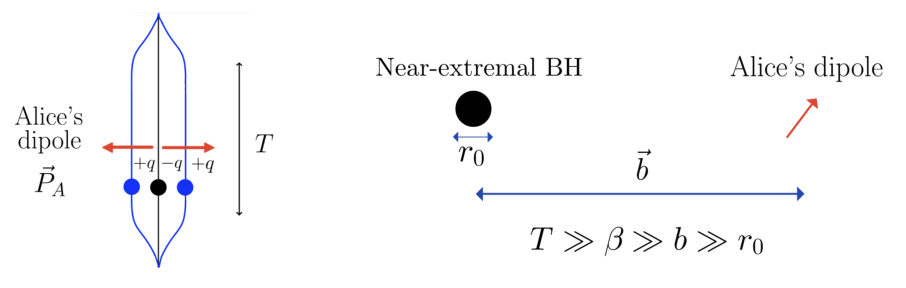 
Figure 1: Illustration of the quantum system in the black hole exterior (left) and the relevant scales in the problem (right). Alice’s state is the superposition of an electric dipole pointing in two opposite directions. We consider a low-energy, long-time limit where the black hole can be treated as a point particle in flat space.

📷 Fig 2

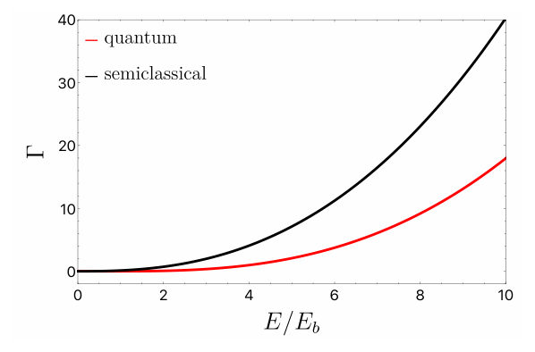 
Figure 2: Comparison of the semiclassical (B.9) (black) and Schwarzian-corrected (B.14) (red) predictions for the electromagnetic decoherence rate Γ as a function of the black hole energy above extremality E/Eb. On the vertical axis, the decoherence rate is expressed in units of E5 b e2q2d2r8 0b−6

📷 Fig 3

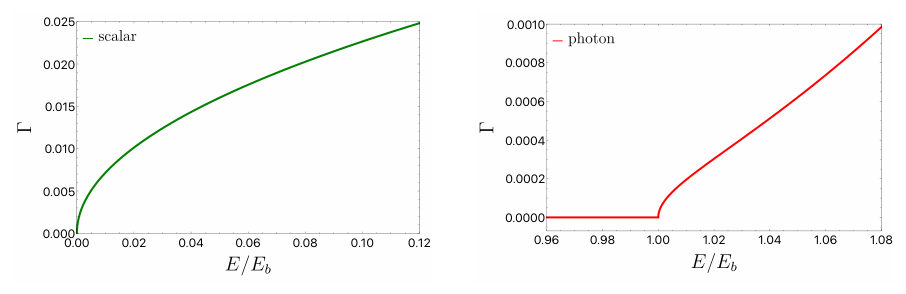 
Figure 3: The Schwarzian-corrected decoherence rate Γ as a function of E/Eb. We compare the case where the quantum system sources a scalar field (4.16) (left) and an electromagnetic field (B.14) (right). The energy window (4.12) where the decoherence rate vanishes extends up to E/Eb = 1 for the photon, while it is absent for the scalar. While higher order effects will give small modifications to the non-zero part of the curves, they do not modify the fact that Γ = 0 for E &lt; Eb in the electromagnetic case (cf. (4.19) and (4.21)). The scalar and electromagnetic decoherence rates are expressed in units of Ebj2 Ar2 0b−2 and E5 b e2q2d2r8 0b−6, respectively. As in Figure 2, one should not focus...

📷 Fig 4

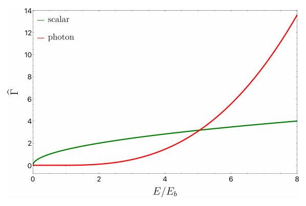 
Figure 4: Schwarzian-corrected decoherence rate of the ℓ= 0 scalar (4.16) (green) vs. ℓ= 1 photon (B.14) (red) as a function of E/Eb. Note that the electromagnetic decoherence rate surpasses the scalar one for E ≳5Eb.

**Summary.** This paper demonstrates that quantum gravity effects in near-extremal black holes can suppress the decoherence of external quantum systems due to a spin-induced energy gap. It reveals that, unlike the semiclassical prediction, certain black holes can be 'transparent' to quantum superpositions, thereby enhancing coherence.

**Why it may be interesting.** not directly relevant

Detailed structure

**Main problem.** The paper investigates whether the decoherence of a quantum system in the exterior of a near-extremal charged black hole is a universal feature or if quantum gravity effects can suppress it.

**Main result.** The authors show that for near-extremal black holes, a spin-induced energy gap causes the decoherence rate to vanish at late times for certain energy regimes, meaning quantum gravity effects actually enhance the coherence of the external system.

**Method.** The study uses a low-energy effective theory approach, employing gravitational path integrals, the Schwarzian action, and an expansion of the influence functional to calculate the evolution of the reduced density matrix.

**Model / system.** The system consists of a single electrically charged particle (a qubit/dipole) in a spatial superposition held stationary outside a near-extremal Reissner-Nordström black hole, with interactions mediated by the electromagnetic field.

**Key observables.** Decoherence rate (Gamma), absorption cross-section, and the evolution of the reduced density matrix.

**Important parameters / regimes.** Near-extremality, energy scale (Eb), spin-induced energy gap, Hawking temperature, and the low-frequency/late-time limits.

**Assumptions / limitations.** The particle's separation and recombination are performed slowly enough to neglect radiation emission; the analysis focuses on electromagnetic interactions and the Schwarzian regime.

**Figures summary.** Figure 1 illustrates the experimental setup; Figure 2 compares semiclassical and Schwarzian-corrected decoherence rates; Figure 3 compares decoherence rates for scalar and electromagnetic fields, highlighting the transparency window for photons.

**Paper structure.** The paper introduces the problem of black hole-induced decoherence, defines the physical model and effective theory, performs perturbative calculations of the decoherence rate, compares different field types (scalar vs. photon), and validates the quantum results by matching them to the semiclassical limit.

Abstract

We study the decoherence induced by near-extremal charged black holes on quantum systems in their exterior. Specifically, we analyze a thought experiment recently discussed in the literature, where the quantum system is a charged particle prepared in a spatial superposition. Near-extremal black holes are known to exhibit large quantum metric fluctuations of the near-horizon geometry at low temperatures. We show that, at late times, if the black hole is sufficiently close to extremality, these quantum gravity effects make the decoherence rate vanish. This phenomenon is due to a spin-induced energy gap in the quantum black hole spectrum. For energies above the gap, the decoherence rate becomes nonzero, but is still suppressed relative to semiclassical expectations, so these quantum gravity effects always enhance the coherence of the superposition.

[↑ back to top](#top)

### [Preisach Attention: A Hysteretic Model of Sequential Memory](http://arxiv.org/abs/2605.23603v1)

**Authors:** Piotr Frydrych  
**Type:** theory · **Category:** disordered systems and neural networks · **PDF:** <https://arxiv.org/pdf/2605.23603v1>  
**Analysis basis:** full PDF text, analyzed in chunks
**Topic relevance:** `driven-dissipative phase transition` **2/5** · `non-equilibrium dynamics` **2/5** · `non-equilibrium universality` **2/5**

📷 Fig 1

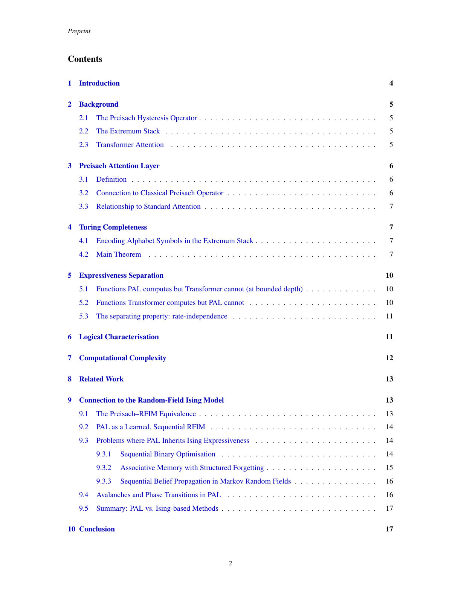 
Low-resolution page preview, page 2

📷 Fig 2

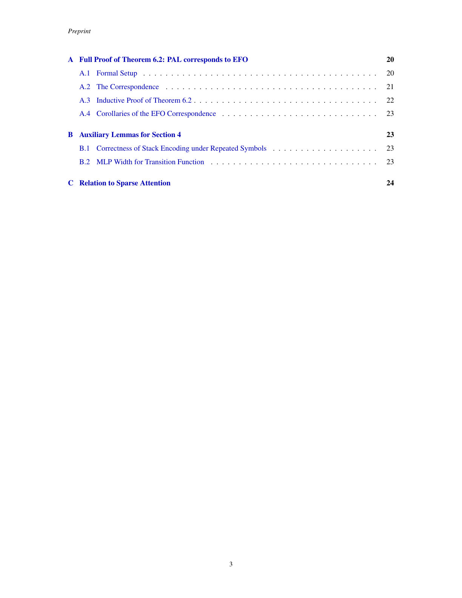 
Low-resolution page preview, page 3

📷 Fig 3

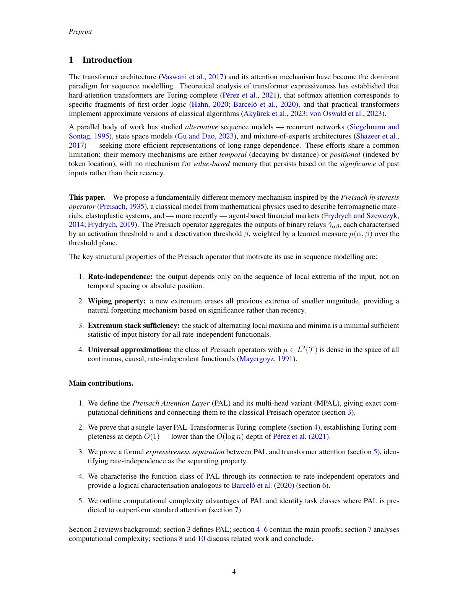 
Low-resolution page preview, page 4

📷 Fig 4

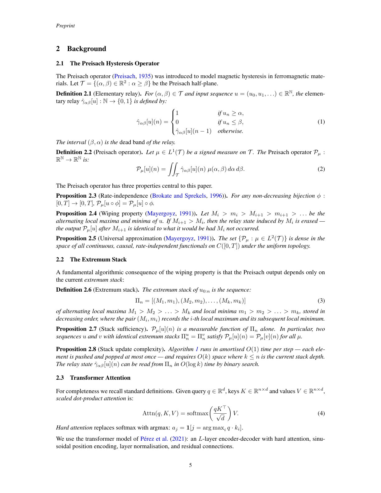 
Low-resolution page preview, page 5

📷 Fig 5

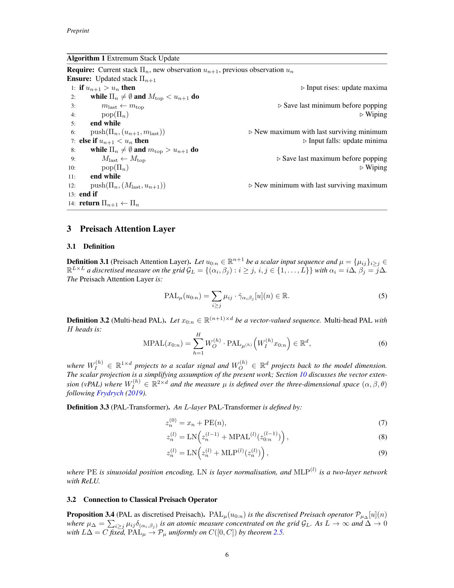 
Low-resolution page preview, page 6

**Summary.** This paper introduces a new neural network attention mechanism based on the physics of hysteresis (the Preisach model). It demonstrates that this architecture can process sequences more efficiently than Transformers for certain tasks and is theoretically capable of universal computation with minimal depth.

**Why it may be interesting.** The paper connects neural architecture design to the physics of hysteresis and the Random-Field Ising Model, specifically exploring phase transitions, avalanche dynamics, and the ability of a system to track historical extrema, which is highly relevant to non-equilibrium statistical mechanics.

Detailed structure

**Main problem.** The paper addresses the limitations of current sequence modeling architectures in handling long-range dependencies based on value significance rather than temporal recency, and explores the computational expressiveness of a new hysteretic attention mechanism.

**Main result.** The authors prove that the Preisach Attention Layer (PAL) is Turing-complete at O(1) depth and establish that its function class is incomparable to standard Transformers, specifically excelling at computing historical range statistics via rate-independence.

**Method.** The authors introduce the Preisach Attention Layer (PAL), which replaces softmax attention with a binary relay operator based on the Preisach hysteresis model, and use formal proofs involving 2-stack pushdown automata and Extremum First-Order Logic.

**Model / system.** The model is a Preisach Attention Layer (PAL) based on the classical Preisach hysteresis operator, which aggregates binary relays with learned activation/deactivation thresholds. It is also shown to be a sequential, non-equilibrium generalization of the mean-field Random-Field Ising Model (RFIM) at zero temperature.

**Key observables.** Extremum stack (local maxima and minima), relay activation states, and magnetization-like aggregate outputs.

**Important parameters / regimes.** Activation and deactivation thresholds (alpha, beta), Preisach measure (mu), sequence length (n), and disorder strength (Delta).

**Assumptions / limitations.** Assumes arbitrary precision arithmetic for Turing completeness proofs and requires smooth sigmoid relaxation of discontinuous relays for practical gradient-based training.

**Figures summary.** The notes do not provide specific descriptions of figures, but mention tables comparing complexity (Time/Memory) and expressiveness across architectures.

**Paper structure.** The paper introduces the PAL architecture, establishes its Turing completeness via 2-PDA simulation, proves expressiveness separation from Transformers using rate-independence, characterizes its logical framework via Extremum First-Order Logic, and establishes a physical equivalence to the Random-Field Ising Model.

Abstract

We introduce the Preisach Attention Layer (PAL), a novel sequence modelling architecture grounded in the classical Preisach hysteresis operator from mathematical physics. PAL replaces the softmax attention mechanism with a binary relay operator parameterised by learned activation and deactivation thresholds, maintaining a stack of local extrema as its internal state. A single-layer PAL-Transformer with O(1) depth is Turing-complete under arbitrary precision arithmetic, achievable through simulation of a two-stack pushdown automaton -- in contrast to the O(log n) depth required by standard hard-attention transformers. Second, we prove that the function classes computable by PAL and by the transformer are incomparable: PAL computes historical range statistics in O(1) layers that require O(log n) layers for transformers, while transformers support random-access retrieval that PAL cannot perform without auxiliary state. The separating property is rate-independence -- PAL responds only to the sequence of local extrema, not to absolute token positions or temporal spacing. Third, we show that the extremum stack constitutes a minimal sufficient statistic of the input history for all rate-independent functionals, providing a formal analogue of the wiping property in classical hysteresis theory. PAL is thus an efficient architecture for tasks with long episodic memory and weak positional dependence, with O(n log n) total inference cost versus O(n^2) for standard attention.

[↑ back to top](#top)

### [Lowest order Carleman linearization for steady state fluid flow simulations](http://arxiv.org/abs/2605.23380v1)

**Authors:** Luca Cappelli, Sauro Succi  
**Type:** theory · **Category:** quantum information and computing · **PDF:** <https://arxiv.org/pdf/2605.23380v1>  
**Analysis basis:** full PDF text, analyzed in chunks
**Topic relevance:** `analog quantum simulation` **2/5** · `methods for driven-dissipative` **2/5** · `non-equilibrium dynamics` **1/5**

📷 Fig 1

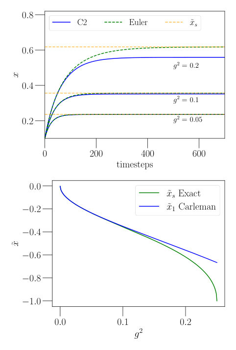 
FIG. 1: (a) Solution of the forced logistic equation (1) with Euler time-marching (green dotted line) and a second–order Carleman linearization (solid line) in three different dynamical scenarios (g2 = 0.05,0.1,0.2). The system evolves with ∆t = 0.01 over 700 timesteps, keeping b = 1, f = 1 and varying a accordingly to g2 = bf/a2. (b) Stationary solutions of the forced logistic ˜xs and of the second–order Carleman system ˜x1 as a function of g2. Both figures show that, as g2

📷 Fig 2

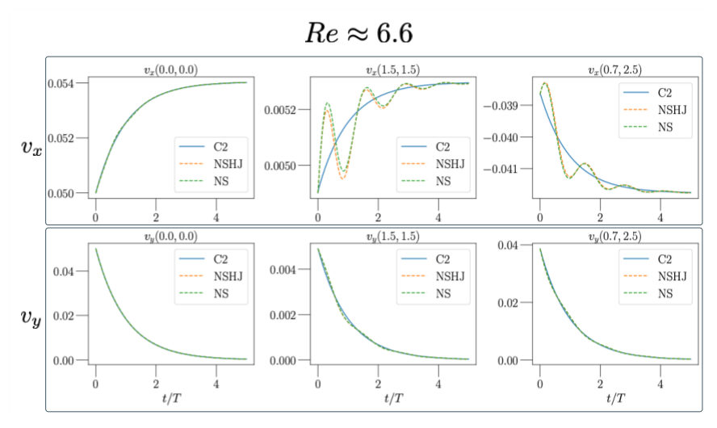 
FIG. 2: Evolution of the velocity field in three different spatial locations: P0 ≡(0,0), where the flow attains its peak amplitude; P1 ≡(1.5,1.5), which shows prominent oscillations and P2 ≡(0.7,2.5), where the flow attains negative values. The initial condition in Eq. (26), with (u0, f0) = (0.05,0.009), is evolved on a 64×64 grid for 2500 timesteps. The C2 scheme recovers the stationary states for both decaying and growing local velocities. The forced velocity field vx converges towards the Navier–Stokes solution with relative error ||v (C2) x −v (NS) x ||/||v (NS) x || = 3.2×10−4. Note that the C2 dynamics resembles a temporal filter by smoothing out time oscillations of vx at P1 and P2.

📷 Fig 3

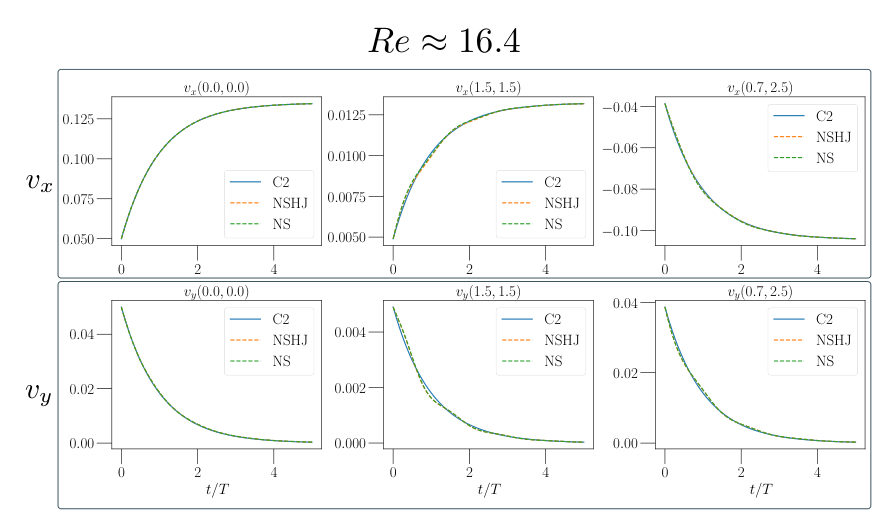 
FIG. 3: Evolution of the velocity field in three spatial locations of the previous figures. The initial condition in Eq. (26), with (u0, f0) = (0.05,0.0225) is evolved on a 64×64 grid over 2,500 timesteps. The C2 solution recovers the correct stationary state and the forced velocity field vx converges towards the Navier–Stokes solution with relative error ||v (C2) x −v (NS) x ||/||v (NS) x || = 1.9×10−4. In this scenario, the solution obtained with NSHJ perfectly matches the Navier-Stokes one, which is why the curves are virtually indistinguishable.

📷 Fig 4

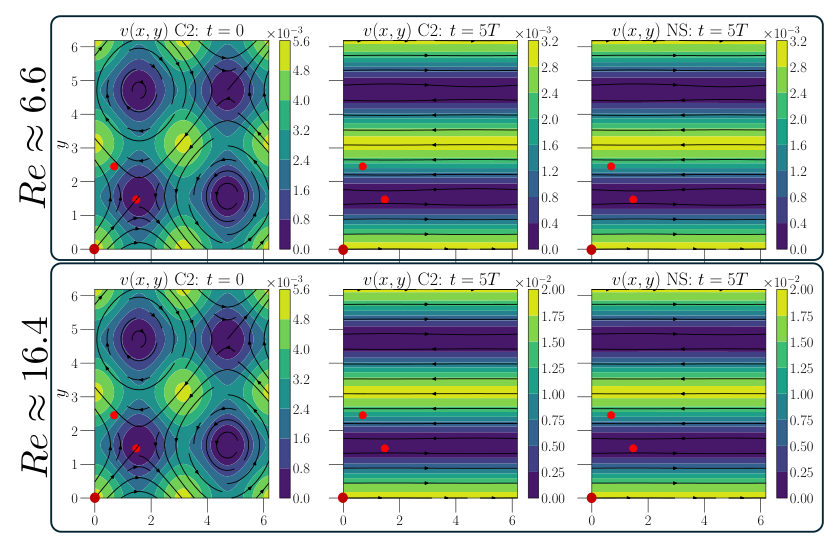 
FIG. 4: Amplitude and streamlines of the velocity field at t = 0 (left-most column) and at the stationary state t = 5T for the second–order Carleman system (center column) and Navier-Stokes (right-most column). The system refers to the initial conditions in Eq. (26), where each row corresponds to different Reynolds numbers. The red dots highlight the spatial locations chosen to represent the evolution of the velocity field in Figs. 2 and 3. At t = 5T, along the forced axis, C2 approximates Navier-Stokes with maximum absolute error of O(10−5) and mean L2 relative error ||v (C2) x −v (NS) x ||/||v (NS) x || of 3.2×10−4 with Re ≈6.6 and 1.9×10−4 with Re ≈16.4.

📷 Fig 5

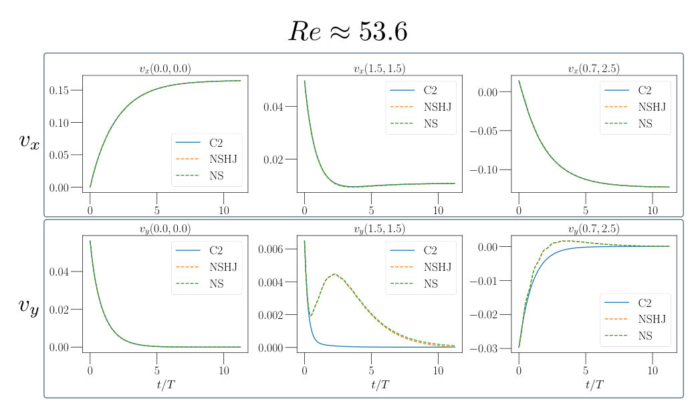 
FIG. 5: Evolution of the velocity field along the x–axis (top row) and the y–axis (bottom row). The figure refers to the initial condition in Eq. (28) evolved for 3000 timesteps, with ∆t = 0.03 on a 64×64 grid. We report the evolution in three spatial probes: (0,0) corresponding to the maximum, (0.7, 2.5) showing negative values and (1.5,1.5) where nonlinear effects are more pronounced. Again, C2 recovers correctly the stationary states of the Navier–Stokes equations, but not the detailed transient. Particularly, in (1.5,1.5) C2 completely misses the sudden rise of the signal. This suggests that, by its very nature, the C2 approximation is unable to capture sudden features of the flow...

**Summary.** The paper demonstrates that a second-order Carleman linearization can accurately recover the steady-state solutions of 2D fluid flows, even when it fails to capture the initial transient dynamics. This finding is significant because it provides a potential method for simulating nonlinear fluid dynamics on quantum computers by transforming them into a linear framework.

**Why it may be interesting.** This is interesting because it proposes a mathematical bridge (Carleman linearization) to map nonlinear classical fluid dynamics into a linear framework suitable for quantum algorithms, suggesting a path for 'quantum-centric' hybrid simulations of complex flows.

Detailed structure

**Main problem.** Addressing the incompatibility between the nonlinear structure of the Navier-Stokes equations and the linear framework required for quantum simulation, specifically investigating if low-order Carleman linearization can recover steady-state solutions.

**Main result.** The second-order Carleman truncation (C2) successfully recovers the steady-state (asymptotic) solutions of 2D forced fluid flows at moderate Reynolds numbers, acting as a temporal filter that smooths out high-frequency transients.

**Method.** The authors use Carleman linearization to transform nonlinear equations into a higher-order linear form, applying a second-order truncation (C2) and evaluating it via an explicit Euler time-marching scheme on the Navier-Stokes-Hamilton-Jacobi formulation.

**Model / system.** The study focuses on two-dimensional, incompressible, viscous fluid flows (specifically Kolmogorov-like flow) at moderate Reynolds numbers, using a forced logistic decay equation as an analytical toy model.

**Key observables.** Velocity field components (vx, vy), density (rho), scalar potential (chi), and L2 relative error of the velocity field.

**Important parameters / regimes.** Reynolds number (Re up to ~100), forcing amplitude (f0), viscosity (nu), and the growth parameter (g2) in the toy model.

**Assumptions / limitations.** The approximation is limited to moderate Reynolds numbers and cannot capture sudden changes or detailed features of the transient phase; it assumes the steady state is the primary target for recovery.

**Figures summary.** Figure 1 compares the evolution of the toy model to show steady-state recovery; Figures 2-4 demonstrate velocity field evolution and high-accuracy agreement between C2 and Navier-Stokes at low Re; Figures 5-6 show that while C2 recovers stationary states, it fails to capture sudden transient signal rises.

**Paper structure.** The paper begins with an analytical proof using a forced logistic toy model, moves to the application of the C2 approximation to 2D Navier-Stokes-Hamilton-Jacobi equations, presents numerical results for various Reynolds numbers, and concludes with implications for hybrid quantum-classical fluid simulations.

Abstract

It is shown that the lowest (second) order truncation of the Carleman linearization of the fluid equations (C2) recovers not only the initial transient of the time evolution but also its late stage, namely the steady-state solution. This asymptotic property is first proved analytically for the decaying logistic with external forcing and then shown to hold to a significant degree of accuracy also for the fairly more complex case of two-dimensional fluid flows at moderate Reynolds number. This time-asymptotic property opens interesting prospects for the simulation of steady-state solutions of the fluid equations on quantum computers.

[↑ back to top](#top)

### [Analysis of spin avalanches due to interplay of disorder and temperature](http://arxiv.org/abs/2605.23436v1)

**Authors:** Niharika Bhuyan, Diana Thongjaomayum  
**Type:** theory · **Category:** disordered systems and neural networks · **PDF:** <https://arxiv.org/pdf/2605.23436v1>  
**Analysis basis:** full PDF text, analyzed in chunks
**Topic relevance:** `non-equilibrium dynamics` **2/5** · `non-equilibrium universality` **2/5**

📷 Fig 1

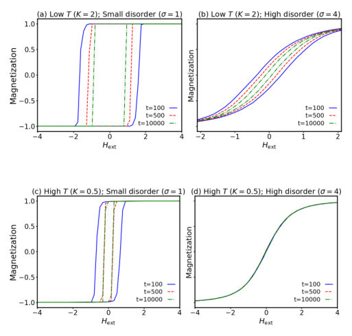 
FIG. 1. Hysteresis loops on 999×999 triangular lattice show- ing the effects of Monte-Carlo cycle, t= 100, 500, 1000, 10000 for different disorder σ and temperature T(= 1/K) regimes: a)Small disorder (σ = 1); Low T (K = 2) b)Large disorder (σ = 4); Low T (K = 2) c)Small disorder (σ = 1); High T (K = 0.5) d)Large disorder (σ = 4); High T (K = 0.5).

📷 Fig 2

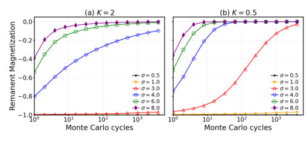 
FIG. 2. Disorder-dependent evolution of remanent magneti- zation versus Monte-Carlo cycles, t for a 999 × 999 triangular lattice at: a)K = 2 and b)K = 0.5 for σ = 1, 2, 3, 4, 6, 8 aver- aged over 20 disorder realizations.

📷 Fig 3

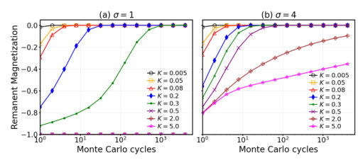 
FIG. 3. Remanence magnetization vs t for different tempera- tures K = 0.005, 0.05, 0.2, 0.3, 0.5, 2, 5 on the lower hysteresis loop at: a)σ = 1 and b)σ = 4.

📷 Fig 4

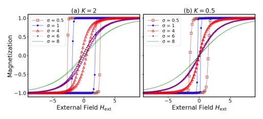 
FIG. 4. Hysteresis on a 999 × 999 triangular lattice for dif- ferent disorders(σ = 0.5, 1, 4, 6, 8) at t = 50 for fixed temper- atures: a)K = 2 and b)K = 0.5.

📷 Fig 5

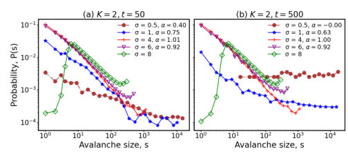 
FIG. 5. Probability distribution of avalanche sizes for a 999×999 triangular lattice at K = 2 of varying disorders(σ = 0.5, 1, 2, 4, 6, 8), obtained by averaging 1000 localized random field configurations for: a)t = 50 and b)t = 500.

**Summary.** This study examines how thermal fluctuations and disorder interact to influence the scaling behavior of spin avalanches in the Random Field Ising Model. It demonstrates that the characteristic power-law distributions found in zero-temperature models are suppressed by high temperature or high disorder. The findings provide insight into the stability of critical behavior in real-world, finite-temperature magnetic systems.

**Why it may be interesting.** not directly relevant

Detailed structure

**Main problem.** Investigating how the interplay between temperature and disorder affects the prevalence of power-law behavior in spin avalanches, bridging the gap between zero-temperature models and finite-temperature physical systems.

**Main result.** Power-law behavior survives only in regimes of low temperature or small to intermediate disorder; increasing temperature or disorder leads to the blurring of the power law and the development of a peaked distribution.

**Method.** Monte Carlo simulations using Glauber dynamics on a large 2D triangular lattice, with results averaged over multiple disorder configurations.

**Model / system.** The 2D Random Field Ising Model (RFIM) on a 999x999 triangular lattice with ferromagnetic nearest-neighbor interactions and a Gaussian random field.

**Key observables.** Magnetization, hysteresis loop width (coercivity), remanent magnetization, avalanche size distribution, and the power-law decay exponent (alpha).

**Important parameters / regimes.** Temperature (T), random field strength (sigma), relaxation time (t), and external magnetic field (Hext).

**Assumptions / limitations.** The system follows Glauber dynamics in contact with a heat bath; the random field is sampled from a Gaussian distribution.

**Figures summary.** Fig 1 shows hysteresis loop narrowing with increasing relaxation time; Fig 2 and 3 show the evolution of remanent magnetization; Fig 4 shows hysteresis loops at different temperatures; Fig 5 shows avalanche size distributions across different disorder and time scales.

**Paper structure.** The paper introduces the RFIM problem, describes the Monte Carlo methodology and model parameters, presents results regarding the effects of temperature, disorder, and relaxation time on magnetization and avalanches, and concludes with a comparison to experimental Barkhausen noise.

Abstract

The nonequilibrium zero-temperature Random Field Ising Model (RFIM) has been extensively studied to understand critical response and avalanches in disordered driven systems. The emergence of power-law behaviour is observed over a wide region around the critical point. These studies however, are confined to zero-temperature dynamics. We study the role of temperature, which is inevitable in real experiments, in the context of RFIM on triangular lattices. We explore the interplay of different parameters: temperature, random field strength, and relaxation time which affect the prevalence of power-law behaviour on the lattice. The results indicate that power-law survives only in the regime of low temperature or small and intermediate disorder. Variations in temperature and disorder have similar affects on the avalanche-size distribution, indicating their strong correspondence. We also discuss the process of blurring out of the power law on increasing temperature or disorder.

[↑ back to top](#top)

### [CV-QKD over Turbulence Channels with Virtual Photon Subtraction and Quantum Multiple-Symbol Detection for Underwater Quantum Communications](http://arxiv.org/abs/2605.23557v1)

**Authors:** Nour Rizk, Hesham S. Ibrahim, Angélique Drémeau, Arnaud Coatanhay  
**Type:** theory · **Category:** quantum information and computing · **PDF:** <https://arxiv.org/pdf/2605.23557v1>  
**Analysis basis:** full PDF text, analyzed in chunks
**Topic relevance:** `methods for driven-dissipative` **2/5** · `quantum measurements` **2/5**

📷 Fig 1

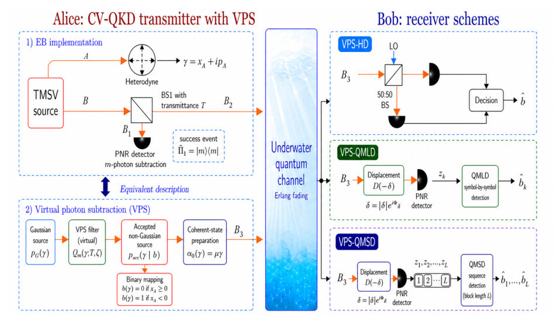 
Fig. 1. Schematic representation of the CV-QKD scheme with VPS over an underwater quantum channel (UQCs). Alice’s transmitter is shown through the EB photon-subtraction implementation and its equivalent prepare-and-measure VPS description. The received mode 𝐵3 is processed at Bob using one of three receiver schemes: VPS-HD, VPS-QMLD, or VPS-QMSD. 𝐵𝑆1: beam splitter; 𝛾: Alice’s measurement result; 𝜁: TMSV parameter; 𝑄𝑚(𝛾; 𝑇, 𝜁): postselection filter function.

📷 Fig 2

 
Fig. 2. QBER vs. distance for VPS-HD, VPS-QMLD, and VPS-QMSD over clear ocean water, under different marine turbulence conditions and different numbers of virtually subtracted photons 𝑚: (a) 𝜆= 𝜃= 3, 𝑚= 0 and 𝑚= 1; (b) 𝜆= 𝜃= 10, 𝑚= 0 and 𝑚= 1; (c) 𝜆= 𝜃= 3, 𝑚= 2 and 𝑚= 3; and (d) 𝜆= 𝜃= 10, 𝑚= 2 and 𝑚= 3.

📷 Fig 3

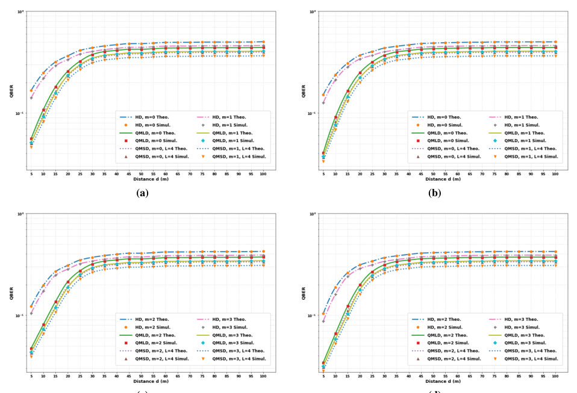 
Fig. 2 presents a comparison of the QBER between the proposed VPS-QMSD scheme and the VPS-QMLD and VPS- HD schemes for different underwater transmission distances "d" over a clear underwater channel with very low thermal noise (𝑁= 0.001), under different marine turbulence conditions (𝜆= 𝜃= 3 and 𝜆= 𝜃= 10), different numbers of virtually subtracted photons 𝑚, and quantum sequence length 𝐿= 4. The correspondence between Monte Carlo simulations and analytical results for all considered cases, validates the model. The agreement between the analytical results and the Monte Carlo simulations in all considered cases confirms the validity of the developed model and the accuracy of the derived...

📷 Fig 4

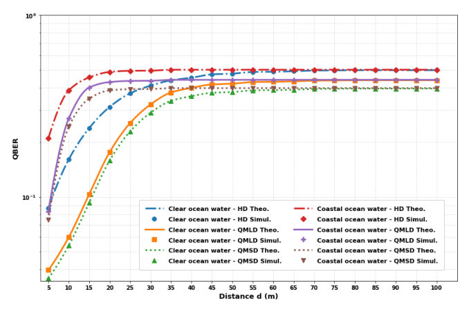 
Fig. 3. QBER vs. distance for VPS-HD, VPS-QMLD, and VPS-QMSD in clear ocean water and coastal ocean water, with 𝑁= 0.001, 𝜆= 𝜃= 10, 𝑚= 3, 𝐿= 4.

📷 Fig 5

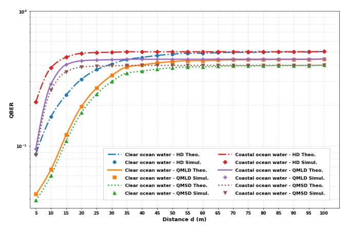 
Fig. 4. QBER vs. distance for VPS-HD, VPS-QMLD, and VPS-QMSD in clear ocean water and coastal ocean water, with 𝑁= 1, 𝜆= 𝜃= 10, 𝑚= 3, and 𝐿= 4.

**Summary.** This paper proposes an enhanced CV-QKD protocol for underwater communication by combining virtual photon subtraction with a multiple-symbol detection scheme. It demonstrates that processing blocks of symbols allows the receiver to mitigate turbulence-induced fading without needing channel state information. The study shows that this approach significantly reduces the error rate in both clear and coastal ocean environments.

**Why it may be interesting.** This paper is highly relevant to quantum optics and quantum information researchers interested in non-Gaussian state engineering (photon subtraction) and the development of robust quantum communication protocols in highly dissipative and fluctuating environments.

Detailed structure

**Main problem.** Improving the robustness of Continuous-Variable Quantum Key Distribution (CV-QKD) against severe underwater channel impairments, including high attenuation, scattering, and turbulence-induced fading.

**Main result.** The proposed Quantum Multiple-Symbol Detection (QMSD) scheme, combined with Virtual Photon Subtraction (VPS), provides the highest robustness against underwater turbulence, achieving the lowest Quantum Bit Error Rate (QBER) compared to Homodyne and QMLD schemes.

**Method.** The authors derive analytical, semi-closed-form expressions for QBER using mathematical techniques like Laplace transforms and hypergeometric functions, and validate these results using Monte Carlo simulations.

**Model / system.** An underwater CV-QKD system using a Two-Mode Squeezed Vacuum (TMSV) state, where Virtual Photon Subtraction is implemented via post-selection. The channel is modeled with the Beer-Lambert law for attenuation and an Erlang distribution to approximate turbulence-induced fading.

**Key observables.** Accepted-only Quantum Bit Error Rate (QBER), photon-counting statistics, and transmission probability.

**Important parameters / regimes.** TMSV squeezing parameter (zeta), photon-subtraction order (m), sequence length (L), turbulence parameters (lambda, theta), and water types (clear vs. coastal).

**Assumptions / limitations.** Turbulence is modeled using an Erlang distribution as an approximation of the log-normal model; the VPS is implemented via post-selection rather than physical hardware; the receiver does not require instantaneous Channel State Information (CSI).

**Figures summary.** Figure 1 shows the system schematic; Figure 2 compares QBER vs. distance for different detection schemes and photon-subtraction orders; Figure 3 compares performance in different water types; Figure 4 shows the impact of thermal noise; Figure 5 shows the impact of sequence length.

**Paper structure.** The paper introduces the underwater CV-QKD problem, describes the VPS-based transmitter and the three receiver configurations, provides the mathematical derivation of the QBER under Erlang fading, presents simulation results across various environmental parameters, and concludes with a summary of findings.

Abstract

Continuous-variable quantum key distribution (CV-QKD) is a promising approach for secure underwater quantum communications (UQCs), where propagation loss, scattering, turbulence, and receiver thermal noise can severely degrade the transmission of quantum states. In this paper, we propose an underwater CV-QKD system with virtual photon subtraction (VPS), implemented through post-selection of Alice's measurement outcomes, without requiring channel state information (CSI) at the receiver. Three VPS-based system configurations are analyzed, corresponding to homodyne detection (VPS-HD), quantum maximum-likelihood detection (VPS-QMLD), and quantum multiple-symbol detection (VPS-QMSD). System performance is evaluated in terms of the accepted-only quantum bit error rate (QBER), where underwater turbulence is modeled by an Erlang distribution. Analytical and semi-closed-form QBER expressions are derived for the three configurations and validated through Monte Carlo simulations for different water types and system parameters. The results show close agreement between analytical and simulation results and demonstrate that VPS-QMSD provides the best robustness against underwater turbulence, achieving the lowest QBER compared with VPS-QMLD and VPS-HD.

[↑ back to top](#top)

### [Absorbing Many-Body Correlations into Core-Optimized Orbitals](http://arxiv.org/abs/2605.22977v1)

**Authors:** Hao Zhang, Matthew Otten  
**Type:** theory · **Category:** numerical methods · **PDF:** <https://arxiv.org/pdf/2605.22977v1>  
**Analysis basis:** full PDF text, analyzed in chunks
**Topic relevance:** `entanglement & information structure` **2/5**

📷 Fig 1

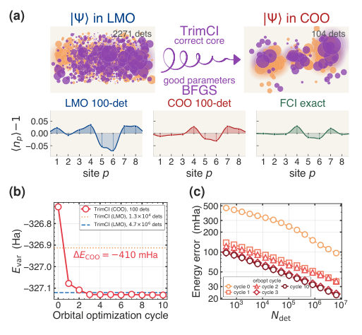 
FIG. 1. Core Optimized Orbitals (COO). (a) Illustration of orbital rotation: the same wavefunction |Ψ⟩(8-site Hubbard- on-graph approximate ground state, Fig. 5) needs 2271 dets in LMO (left) but only 104 in COO (right). Each point is a Slater determinant, placed by multidimensional scaling (MDS); area ∝|cI|, color by sign. Bottom row: site density deviation ⟨np⟩−1 for the LMO and COO 100-det approxima- tions vs the exact FCI. (b) Convergence of COO on a 100- determinant core for [Fe4S4] (54e, 36o), BS-1 (Fe1 ↑, Fe2 ↑, Fe3 ↓, Fe4 ↓broken-symmetry state). (c) Gain transfer: or- bitals frozen at cycles 0, 1, 2, 3, 10 and expanded to ∼107

📷 Fig 2

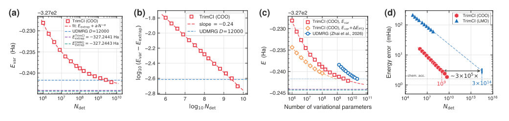 
FIG. 2. Compression of the [Fe4S4] (54e, 36o) ground state. (a) Evar versus Ndet for TrimCI + COO with the power-law fit E(Ndet) = Eextrap + a N −α det (dashed red); the UDMRG extrapolate of Ref. [17] is shown for comparison. (b) Log–log form of (a). (c) Variational energy on a common variational-parameter axis, with semistochastic PT2 corrections and the UDMRG benchmark. (d) |E −EFCI| versus Ndet for TrimCI in COO orbitals (red hexagons) and in the starting LMO basis (blue triangles), with power-law fits (dashed; COO slope −0.24, LMO slope −0.20). Dotted line: chemical accuracy (1.6 mHa).

📷 Fig 3

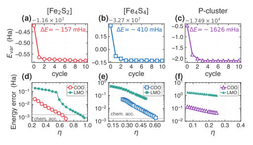 
FIG. 3. TrimCI + COO across the iron-sulfur se- ries. Columns: Fe2S2 (30e, 20o), Fe4S4 (54e, 36o), P-cluster (114e, 73o). (a)–(c) Phase 0: variational energy versus orbital-optimization cycle on a 100-determinant core. (d)– (f) Phase 1+2 expansion: |Evar −EFCI| versus the log- normalized parameter budget η ≡log10 Ndet/ log10 NFCI. Hollow system-color markers: TrimCI + COO; filled teal: TrimCI+LMO. Dotted line: chemical accuracy. FCI refer- ences and trajectory data in the SM.

📷 Fig 4

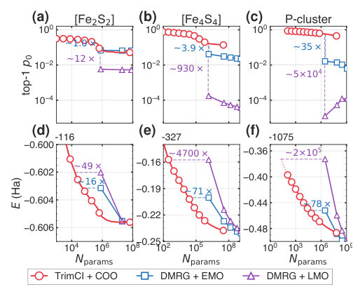 
FIG. 4. Compactness beyond entanglement minimiza- tion. Top row: dominant-determinant weight p0 ≡|cmax|2

📷 Fig 5

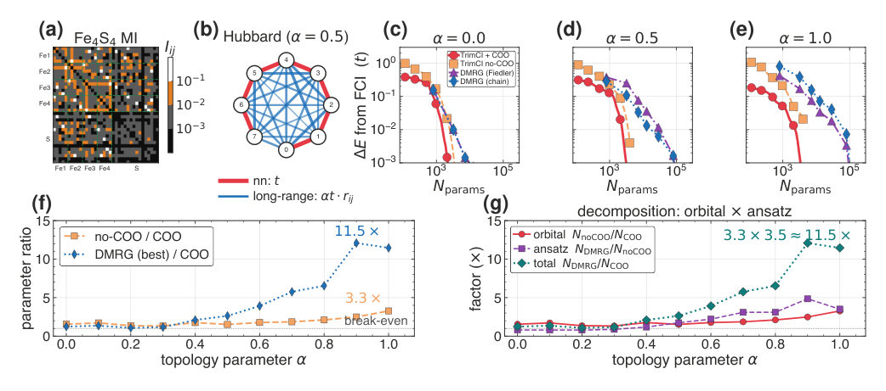 
FIG. 5. TrimCI + COO vs DMRG on a tunable Hubbard-on-graph model. (a) Orbital mutual information Iij of [Fe4S4] in COO orbitals, re-ordered by Fe localization (Fe1, Fe2, Fe3, Fe4, S; dashed green lines mark group boundaries). (b) Hubbard-on-graph schematic at α=0.5 (L=8, U/t=4): nearest-neighbor edges −t (red, open chain), non-nn edges −αt rij with rij ∼U[0.5, 1.5] (blue, width ∝|tij|). (c)–(e) ∆E from FCI versus Nparams for α = 0, 0.5, 1.0: TrimCI + COO (red), TrimCI no-COO (orange), DMRG with chain (blue) and Fiedler (purple) orderings. (f) Parameter ratio to reach ∆E &lt; 0.1 t: DMRG (best ordering)/COO grows from ∼1× (chain) to ∼12× (complete graph). (g) Decomposition of (f) into orbital...

**Summary.** The authors present a method called Core-Optimized Orbitals (COO) that significantly improves the efficiency of Configuration Interaction by optimizing the orbital basis to absorb dynamical correlation. This approach allows for ultra-large-scale simulations of complex multi-center systems, outperforming traditional tensor network methods in parameter efficiency.

**Why it may be interesting.** not directly relevant

Detailed structure

**Main problem.** The computational cost of simulating strongly correlated many-body systems scales with the number of variational parameters, making traditional Configuration Interaction (CI) methods too parameter-heavy for large-scale simulations.

**Main result.** The Core-Optimized Orbitals (COO) method achieves massive compression, reaching accuracies in [Fe4S4] that would require 3e14 determinants in a localized basis, and outperforms state-of-the-art DMRG by 10-100x in parameter efficiency for multi-center systems.

**Method.** A three-phase approach (Global Optimization, Local Refinement, and Fast Expansion) that co-optimizes a sparse CI wavefunction (TrimCI) with a single-particle orbital basis via orbital rotations.

**Model / system.** The study focuses on strongly correlated multi-center iron-sulfur clusters ([Fe2S2], [Fe4S4], and the P-cluster) and a tunable Hubbard-on-graph model used to analyze efficiency gains.

**Key observables.** Energy error relative to FCI, determinant count (N_det), orbital mutual information, and wavefunction compactness (dominant-determinant weight).

**Important parameters / regimes.** Determinant scales up to 5.12 billion; orbital rotation via matrix exponential of an antisymmetric matrix kappa; expansion growth factors.

**Assumptions / limitations.** Assumes that the orbital rotations learned from a small core are transferable to larger expansions and that the initial orbital guess (HF or LMO) is reasonably close to the ground state.

**Figures summary.** Visualizations of orbital rotation and wavefunction collapse; energy convergence and power-law scaling of error vs. determinant count; orbital mutual information showing entanglement across atomic centers; and energy spread of initial seeds into spin basins.

**Paper structure.** The paper introduces the COO method, details the three-phase TrimCI+COO workflow, demonstrates massive compression on iron-sulfur clusters, provides a theoretical decomposition of efficiency gains using a Hubbard-on-graph model, and describes the large-scale distributed GPU architecture used for billion-determinant calculations.

Abstract

The cost of simulating quantum many-body systems - on classical or quantum hardware - scales with the number of variational parameters, so progress at fixed computational budget hinges on more parameter-efficient ansätze. Configuration Interaction (CI) is widely dismissed as parameter-heavy; we show this verdict is an artifact of the orbital basis. Co-optimizing the orbital basis with a sparse CI wavefunction - a method we call Core-Optimized Orbitals (COO) - absorbs a large fraction of the dynamical correlation directly into the single-particle basis, cutting the determinant count by several orders of magnitude beyond the already compact TrimCI ansatz on which it builds. On [Fe$_4$S$_4$] (54e, 36o), a billion-determinant TrimCI+COO wavefunction reaches accuracy that would require $3\!\times\!10^{14}$ determinants in a localized basis. At matched accuracy, it is $8\times$ more compact than the largest unrestricted-DMRG benchmark ($25\times$ with PT2). Across the iron-sulfur series - from [Fe$_2$S$_2$] (30e,20o) to the P-cluster (114e,73o) - TrimCI+COO is $10$-$100\times$ more compact than SU(2)-adapted DMRG with entanglement-minimized orbitals at matched accuracy. A tunable Hubbard-on-graph model factorizes the advantage into an orbital-basis gain and an ansatz gain, the latter capturing multi-center entanglement that resists MPS localization. COO therefore changes the picture of CI efficiency: sparse CI with optimized orbitals can outperform state-of-the-art tensor networks on strongly correlated multi-center systems.

[↑ back to top](#top)

### [Automatic De-Quantization of Quantum Programs Using Constant Propagation](http://arxiv.org/abs/2605.22980v1)

**Authors:** Lian Remme, Alexander Weinert, Andre Waschk, Lukas Burgholzer, Robert Wille  
**Type:** theory · **Category:** quantum information and computing · **PDF:** <https://arxiv.org/pdf/2605.22980v1>  
**Analysis basis:** full PDF text, analyzed in chunks
**Topic relevance:** `quantum measurements` **2/5**

📷 Fig 1

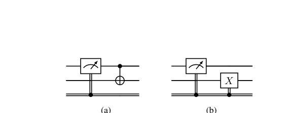 
Fig. 1: An example for a dynamic circuit. The left and right circuits are equivalent. The quantum control is removed in exchange for a classical condition on a gate.

📷 Fig 2

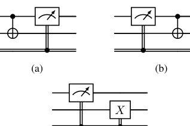 
Fig. 2: Measurement lifting in action: By commuting the measurement from Figure 2a forward to create the circuit in Figure 2b, a quantum control can be replaced with a classical control. This creates the circuit in Figure 2c and eliminates a costly two-qubit gate. All three circuits are equivalent.

📷 Fig 3

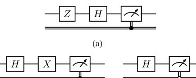 
Fig. 3: Hadamard lifting: By commuting Pauli and Hadamard gates, measurements can be lifted further, enabling more quantum resource reduction. To create the circuit in Figure 3b from Figure 3a, the Hadamard gate is lifted in front of the Pauli gate. Afterwards, the measurement is lifted in front of the Pauli gate and the result negated, to create Figure 3c. All three circuits are equivalent.

📷 Fig 4

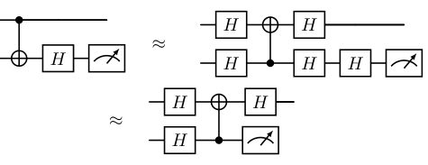 
Fig. 6: If we have a CNOT target followed by a Hadamard gate followed by a measurement, one can change this to a measurement following the control. First, the target and control is flipped by applying four new Hadamard gates, which changes the circuit from the first to the second one. Then, the two Hadamard gates after each other cancel out, yielding the third circuit.

📷 Fig 5

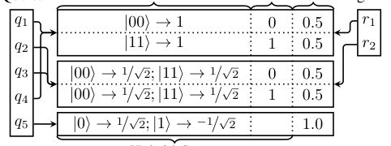 
Fig. 8: The union table that results from the circuit in Figure 7. Adapted from [4, Figure 3].

**Summary.** This paper introduces a compiler optimization technique called hybrid quantum-classical constant propagation that identifies and replaces unnecessary quantum gates with classical instructions. By tracking both quantum and classical information, the method reduces the resource burden on error-prone NISQ hardware. The approach is implemented in the MQT Core toolkit and shows significant promise for reducing multi-qubit gate counts in complex algorithms.

**Why it may be interesting.** not directly relevant

Detailed structure

**Main problem.** The need to optimize NISQ-era quantum circuits by reducing costly quantum operations and replacing them with more efficient classical computations.

**Main result.** The proposed hybrid quantum-classical constant propagation technique effectively reduces quantum gate counts and controlled gates, particularly when combined with measurement lifting, though it increases compilation time.

**Method.** A static analysis technique using a formal hybrid state model to track both quantum amplitudes and classical registers, implemented via the MQT Core compiler using MLIR.

**Model / system.** Dynamic quantum-classical circuits consisting of unitary gates, measurements, and resets, specifically targeting NISQ platforms like superconducting and trapped-ion QPUs.

**Key observables.** Quantum gate count, controlled gate count, and compilation duration.

**Important parameters / regimes.** Error rates of superconducting and trapped-ion hardware, and the N,M-representability limits used for abstract execution.

**Assumptions / limitations.** The optimization assumes the ability to implement dynamic circuits with classical-quantum feedback loops and relies on an artificial upper bound for state space complexity during analysis.

**Figures summary.** Figures illustrate circuit transformations for measurement and Hadamard lifting, the use of hybrid union tables for state tracking, and bar charts comparing resource reduction and compilation time across various algorithms.

**Paper structure.** The paper identifies the resource optimization problem, formalizes a hybrid quantum-classical machine state model, introduces specific optimization routines (constant propagation, measurement/Hadamard lifting), describes the MQT Core implementation, and evaluates performance using MQT Bench.

Abstract

Quantum computing promises to solve problems beyond the reach of classical computers, but today's quantum hardware is error-prone and much slower than classical hardware. Every quantum operation is costly, making it crucial to minimize quantum resource usage in near-term algorithms. Quantum resources should only be used when they are truly essential for quantum advantage, and not wasted on operations that can be efficiently handled by classical computation.   In this work, we focus on de-quantizing quantum operations to classical computation whenever possible. The approach we propose for this is hybrid quantum-classical constant propagation, an optimization which reduces quantum operations by trading them for fast, reliable classical instructions. This is done by tracking between quantum and classical states to identify and eliminate unnecessary quantum gates and controls.   We formalize a hybrid state model for quantum-classical constant propagation, implement our optimizations in the open-source MQT Core tool, and evaluate them on benchmark circuits.   The obtained results show that quantum-classical constant propagation can reduce costly multi-qubit operations, making quantum programs more practical and robust for near-term devices. This opens the door to new hybrid compiler strategies that leverage the best of both quantum and classical worlds.

[↑ back to top](#top)

### [Complementing Quantum Error Correction in Quantum Metrology via Swap Test](http://arxiv.org/abs/2605.23792v1)

**Authors:** Xiaodie Lin, Linxuan Li, Haidong Yuan  
**Type:** theory · **Category:** quantum information and computing · **PDF:** <https://arxiv.org/pdf/2605.23792v1>  
**Analysis basis:** full PDF text, analyzed in chunks
**Topic relevance:** `quantum measurements` **2/5**

📷 Fig 1

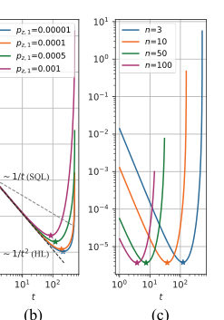 
Fig. 3: Scaling of the variance of the estimator ˆλ. (a) Variance behavior for different values of the parameter λ, with an initial local error rate of pz,1 = 0.0005 and a qubit number of n = 3. (b) Variance behavior for varying values of pz,1, where λ = 0.0005 and n = 3. (c) Variance behavior for different qubit numbers n, with fixed parameters λ = pz,1 = 0.0005. In each subplot, the minimal variance for each case is marked with a star. Additionally, the scaling for the standard quantum limit (SQL) and the Heisenberg limit (HL) are shown as gray and black dashed lines, respectively.

📷 Fig 2

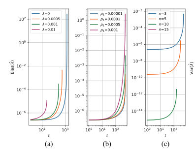 
Fig. 4: Error scaling of the estimator ˆλ under IIDP noise. Let pz,1 = px,1 = p1. (a-c) Bias behavior: Scaling of the bias for estimator ˆλ. Specifically, (a) shows the bias for various values of parameter λ, with a fixed initial local error rate p1 = 0.0005 and a qubit number of n = 3. (b) illustrates the bias as a function of p1, with λ = 0.0005 and n = 3. (c) displays the bias for different qubit numbers n, with fixed parameters λ = p1 = 0.0005. (d-f) Variance behavior: Scaling of the variance for estimator ˆλ. Specifically, (d) shows the variance for various values of parameter λ, with a fixed initial local error rate p1 = 0.0005 and n = 3. (e) illustrates the variance as a function of...

📷 Fig 3

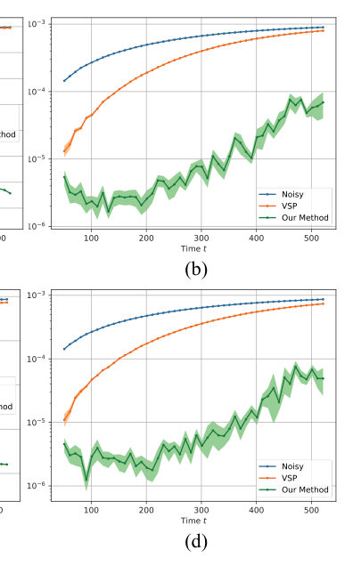 
Fig. 5: Single-parameter estimation errors for different methods. The absolute parameter estimation errors, |ˆλ −λ|, are shown for the original noisy (blue), VSP-based (orange), and our (green) methods. Panels (a) and (b) show results under dephasing noise, while (c) and (d) show results under IIDP noise. Performance is compared for infinite measurement shots ((a), (c)) and 106 shots ((b), (d)). In particular, numerical simulations in panels (b) and (d) are performed 10 times to compute the mean absolute errors and the corresponding 95% confidence intervals, represented by solid lines and shaded regions, respectively.

📷 Fig 4

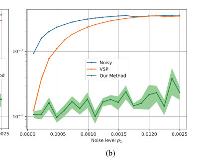 
Fig. 6: Multi-parameter estimation errors for different methods. The absolute parameter estimation errors, ∥ˆλ −λ∥1, are shown for the original noisy (blue), VSP-based (orange), and our (green) methods. Panel (a) shows results under dephasing noise, while (b) shows results under IIDP noise. For each scenario, numerical simulations were performed 10 times with 106 measurement shots to determine the mean absolute errors, indicated by solid lines, and their corresponding 95% confidence intervals, shown as shaded regions.

**Summary.** The paper introduces a swap test-based method to complement quantum error correction in quantum metrology. It specifically targets 'indistinguishable noise' that standard QEC cannot fix, providing a way to achieve Heisenberg-limited precision even under high noise levels. The proposed method outperforms existing virtual state purification techniques in both single- and multi-parameter estimation tasks.

**Why it may be interesting.** This paper is highly relevant for researchers in open quantum systems and quantum optics as it provides a practical strategy to extend the lifetime of quantum-enhanced sensing in the presence of non-correctable, indistinguishable noise.

Detailed structure

**Main problem.** Quantum metrology precision is limited by noise that is indistinguishable from the signal, which standard Quantum Error Correction (QEC) cannot address. Additionally, existing mitigation techniques like Virtual State Purification (VSP) suffer from significant noise accumulation over time.

**Main result.** The authors propose a swap test-based method that achieves Heisenberg scaling in precision and remains robust against noise accumulation. The method provides an unbiased estimator for parameters even under high levels of IID Pauli noise.

**Method.** A swap test-based protocol is used to estimate error rates directly, allowing for the construction of an analytical unbiased estimator for the target parameter. The method utilizes two copies of the noisy state to determine state overlap.

**Model / system.** The system consists of n-qubit GHZ-like probe states undergoing evolution under a Hamiltonian (single-parameter: H = lambda * sum(Z); multi-parameter: H = lambda1 * X...X + lambda2 * sum(Z)). The noise models include local dephasing and general Independent and Identically Distributed Pauli (IIDP) noise.

**Key observables.** The Pauli X operator expectation value from the swap test, the noisy expectation value of a target observable A, and the error rate p_odd.

**Important parameters / regimes.** Target parameter lambda, number of qubits n, evolution time t, local error rates p_z and p_x, and the Heisenberg and Standard Quantum Limits.

**Assumptions / limitations.** The analysis assumes the use of periodic QEC to reduce IIDP noise to effectively dephasing noise and uses first-order Taylor expansions for error scaling approximations.

**Figures summary.** Figure 1 illustrates the general quantum metrology scheme and state preparation; Figure 4 shows error scaling (bias and variance) under IIDP noise as functions of lambda, p_1, and n.

**Paper structure.** The paper introduces the problem of indistinguishable noise, proposes a swap test-based mitigation method, derives an analytical unbiased estimator, performs error scaling analysis (variance and bias), and validates the method through numerical simulations for single- and multi-parameter estimation.

Abstract

The precision and sensitivity achievable in quantum metrology are often compromised by the presence of noise. While quantum error correction has emerged as a promising strategy, it is ineffective in addressing noise that is indistinguishable from the signal. To address this challenge, virtual state purification was introduced as a complementary approach to quantum error correction. However, significant noise accumulation can impede its performance. To overcome this limitation, we propose a swap test-based method specifically designed to address indistinguishable noise, even under high noise levels. A systematic error-scaling analysis demonstrates that this method enables quantum-enhanced precision in certain scenarios. Furthermore, numerical simulations demonstrate that our method surpasses virtual state purification in both single- and multi-parameter estimation tasks. The significant improvements in precision across diverse settings underscore the robustness and practicality of our method for real-world applications.

[↑ back to top](#top)

### [Construction of EAQECCs with imperfect ebits](http://arxiv.org/abs/2605.23119v1)

**Authors:** Guanmin Guo, Ruihu Li  
**Type:** theory · **Category:** quantum information and computing · **PDF:** <https://arxiv.org/pdf/2605.23119v1>  
**Analysis basis:** full PDF text, analyzed in chunks
**Topic relevance:** `entanglement & information structure` **2/5**

📷 Fig 1

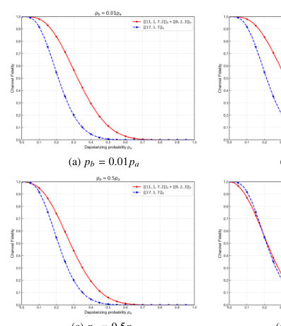 
Fig. 1 Comparative analysis of the Channel fidelity under four scenarios. We use the depolarizing rate pa and the Channel fidelity as the X and Y axes, respectively.

**Summary.** This paper extends the theory of entanglement-assisted quantum error correction to higher-dimensional qudit systems and incorporates the realistic scenario of noisy shared entanglement. It proves that if the shared entanglement is well-protected, these new codes can provide better error protection than standard stabilizer codes.

**Why it may be interesting.** not directly relevant

Detailed structure

**Main problem.** Generalizing the stabilizer formalism for Entanglement-Assisted Quantum Error-Correcting Codes (EAQECCs) from the binary case to the q-ary case while accounting for noise in the shared ebits.

**Main result.** The authors established a unified framework for constructing q-ary EAQECCs with noisy ebits (EAQECCs-Ne) and demonstrated that these codes can outperform standard stabilizer codes when ebit noise is sufficiently low.

**Method.** The study utilizes symplectic geometry over finite fields, the generalized Pauli group, and additive codes over quadratic extension fields to derive equivalent formulations and explicit code constructions.

**Model / system.** A quantum communication model involving a sender (Alice) and a receiver (Bob) using q-ary qudit systems, where both the transmitted qudits and the shared entanglement (ebits) are subject to depolarizing noise.

**Key observables.** Channel fidelity (approximate channel fidelity P(C))

**Important parameters / regimes.** q-ary dimension (q), code parameters [n, k, d; c], depolarizing rates for qudits (pa) and ebits (pb), and the entanglement degradation coefficient (lambda = pb/pa).

**Assumptions / limitations.** Assumes the existence of pre-existing entanglement between parties and relies on the mathematical properties of finite fields where q is a prime power.

**Figures summary.** Figure 1 provides a comparative analysis of channel fidelity versus the depolarizing rate pa under four different scenarios of ebit noise levels (ranging from pb = 0.01pa to pb = 0.99pa).

**Paper structure.** The paper introduces the problem of noisy ebits, develops a generalized stabilizer formalism using symplectic geometry and additive codes, provides explicit construction methods for new q-ary EAQECCs-Ne, and concludes with a performance comparison against standard stabilizer codes.

Abstract

We generalize the stabilizer formalism for entanglement-assisted quantum error-correcting codes with noisy ebits (EAQECCs-Ne) from the binary case to the general $q$-ary case, where $q$ is a prime power. By leveraging the structure of the generalized Pauli group over $\mathbb{F}_q$ and symplectic geometry over $\mathbb{F}_q^{2n}$, we establish a unified framework for constructing EAQECCs-Ne for qudit systems. Equivalent formulations in terms of symplectic geometry over $\mathbb{F}_q$ and additive codes over $\mathbb{F}_q^{2n}$ are derived. We further construct several families of $q$-ary EAQECCs with noise ebits and analyze their performance compared to optimal stabilizer codes. Our results demonstrate that under certain noise conditions, the proposed EAQECCs-Ne can outperform standard stabilizer codes with equivalent error-correcting capability, offering a promising approach for fault-tolerant quantum computation in high-dimensional quantum systems.

[↑ back to top](#top)

### [Enhancing Blood Cells Classification using Hybrid Quantum Neural Networks](http://arxiv.org/abs/2605.23324v1)

**Authors:** Guilherme Cruz, Nouhaila Innan, Alberto Marchisio, Gabriel Falcao, Muhammad Shafique  
**Type:** both · **Category:** quantum information and computing · **PDF:** <https://arxiv.org/pdf/2605.23324v1>  
**Analysis basis:** full PDF text, analyzed in chunks
**Topic relevance:** `QC/QI experiment` **2/5**

📷 Fig 1

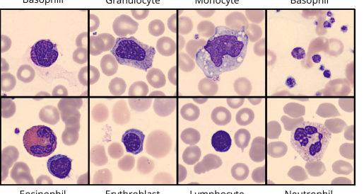 
Fig. 1. Representative examples of the eight classes in the PBC dataset.

📷 Fig 2

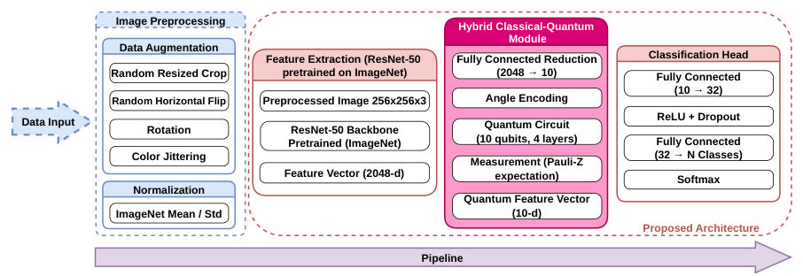 
Fig. 2. Overview of the proposed blood cell classification pipeline. The framework processes both the Blood Cell Images and PBC datasets through a common preprocessing and augmentation stage, followed by feature extraction using a pre-trained ResNet-50 backbone. The resulting 2048-dimensional feature vector is reduced to a 10-dimensional latent representation and passed to an HQNN composed of angle encoding, a variational quantum circuit with 10 qubits and 4 layers, and Pauli-Z measurement. The resulting quantum feature vector is then fed to a lightweight classification head for final blood cell type prediction.

📷 Fig 3

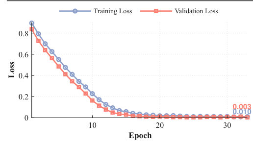 
Fig. 4. Training and validation loss curves of the HQNN model on the Blood Cell Images Dataset (4 Classes).

📷 Fig 4

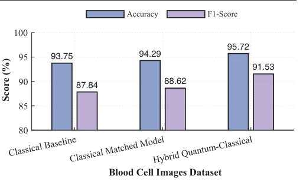 
Fig. 6. Comparison of overall accuracy and macro F1-score for the evaluated models on the Blood Cell Images Dataset.

📷 Fig 5

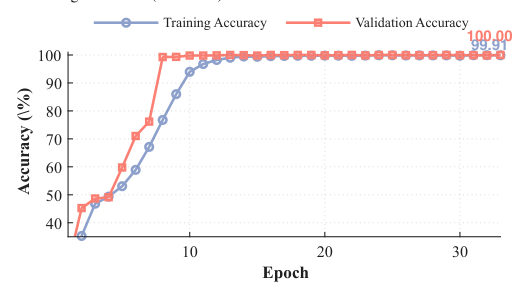 
Fig. 5. Training and validation accuracy curves of the HQNN model on the Blood Cell Images Dataset.

**Summary.** This paper demonstrates that Hybrid Quantum Neural Networks can enhance the classification of complex medical images, such as blood cells, by providing superior feature representation. The researchers show that the quantum component improves the separability of visually similar cell types and remains robust even when executed on noisy IBM quantum hardware.

**Why it may be interesting.** not directly relevant

Detailed structure

**Main problem.** The difficulty of accurately classifying microscopic blood cells due to subtle morphological variations and high intra-class similarity in medical imaging.

**Main result.** Hybrid Quantum Neural Networks (HQNNs) outperform both classical baseline and parameter-matched classical models, specifically improving macro F1-scores by up to 3.7% in challenging classes.

**Method.** A hybrid pipeline using a pre-trained ResNet-50 backbone for feature extraction, followed by a dimensionality reduction layer and a variational quantum circuit (VQC) for quantum-enhanced feature transformation.

**Model / system.** A 10-qubit variational quantum circuit using angle encoding (RY rotations) and a ring-structured CNOT entangling pattern, implemented via PennyLane and tested on both simulators and IBM quantum hardware.

**Key observables.** Accuracy, macro F1-score, precision, recall, and multiclass ROC-AUC.

**Important parameters / regimes.** 10 qubits, 4 variational layers, 2048-dimensional feature vector reduced to a 10-dimensional latent bottleneck.

**Assumptions / limitations.** The performance gains are attributed to quantum feature transformations rather than simple increases in parameter count; the study assumes the utility of the NISQ-era hardware for such tasks despite noise.

**Figures summary.** Figure 1 shows blood cell classes; Figure 2 is a pipeline flowchart; Figure 3 is a VQC schematic; Figures 4-5 show training convergence; Figures 6-12 present performance comparisons, confusion matrices, and per-class F1-scores.

**Paper structure.** The paper introduces the medical problem, describes the HQNN architecture and comparison framework, details the experimental setup on datasets and hardware, presents performance results across different models and data scales, and concludes with limitations and future directions.

Abstract

Accurate classification of microscopic blood cells is still a critical task in medical image analysis, where subtle variations and limited data can challenge conventional deep learning models. As such, we investigate in this work the potential of Hybrid Quantum-Classical Neural Networks (HQNNs) to enhance feature representation and improve classification performance in this domain. We propose a modular architecture combining a pre-trained ResNet-50 backbone with a low-dimensional latent bottleneck and a variational quantum circuit, enabling a direct comparison between quantum-enhanced and purely classical transformation mechanisms. To isolate the contribution of the quantum component, we evaluate three architectures: a HQNN model, a Classical Matched Model with an additional nonlinear transformation layer of comparable capacity, and a baseline model without an intermediate transformation stage. Experiments conducted on two publicly available blood cell datasets, namely the Blood Cell Images dataset and the PBC dataset, demonstrate that HQNNs consistently achieve superior or more balanced performance across evaluation metrics. In the Blood Cell Images Dataset, the proposed approach improves macro F1-score by up to 3.7% compared to classical baselines, while improving the F1-score from 98.54% to 98.69% in the more challenging 8-class scenario with near-saturated performance. Additional evaluation on IBM quantum hardware shows that the model remains robust under noise, with only a modest performance degradation relative to simulated results. These results indicate that quantum feature transformations can enhance discriminative representations, particularly in challenging classification scenarios, and highlight the practical potential of HQNN models for medical imaging tasks.

[↑ back to top](#top)

### [Generalized Shift Vector as the Intrinsic Dipole of Many-Body Correlated Electronic States](http://arxiv.org/abs/2605.23431v1)

**Authors:** Jiaming Hu, Sudipta Kundu, Zhichao Guo, Joshua J. P. Thompson, Wenbin Li, Hua Wang, Bartomeu Monserrat  
**Type:** theory · **Category:** strongly correlated electrons · **PDF:** <https://arxiv.org/pdf/2605.23431v1>  
**Analysis basis:** full PDF text, analyzed in chunks
**Topic relevance:** `non-equilibrium dynamics` **2/5**

📷 Fig 1

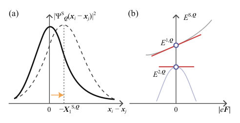 
FIG. 1. Schematics of the physical manifestations of the exciton shift vector. (a) Real-space shift of the (coarse-grained) probability density: the maximum peak is displaced from xi −xj = 0 (solid curve) to xi −xj = −XS,Q 1 (dashed curve). (b) Linear Stark effect of the exciton under a homogeneous electrostatic field F in a finite system. The state S = 1 (S = 2) possesses a finite (vanishing) shift vec- tor, and therefore exhibits (does not exhibit) a linear field response (red line) as the leading contribution at small |F |.

📷 Fig 2

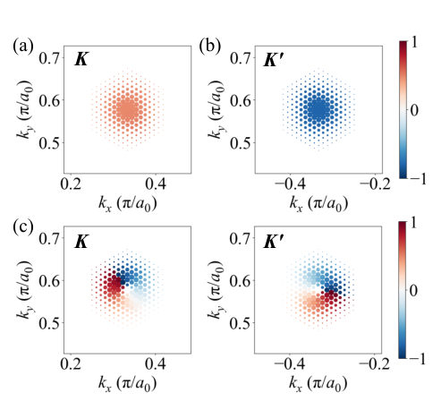 
FIG. 2. First-principles calculation of monolayer MoS2. The internal phase of x-direction exciton dipole arg(AS,0 cvk rb1 cv,k) of (a) 7th (b) 8th and (c) 11th lowest-energy exciton states (unit: π; b1 aligns with one of the lattice vectors ( √

**Summary.** This paper reinterprets the shift vector as an intrinsic dipole moment of a single many-body correlated state rather than a property of transitions between states. This unified framework encompasses various phenomena including excitonic and electron-phonon-mediated processes. It demonstrates that the shift vector captures essential phase information within many-body correlations.

**Why it may be interesting.** It provides a unified geometric and dipolar interpretation of many-body correlations, connecting internal phase coherence to observable transport and optical phenomena like the shift current.

Detailed structure

**Main problem.** Redefining the shift vector, a key quantity in nonlinear optics and transport, from a transition-based concept between two states to a fundamental intrinsic dipole property of a single many-body correlated state.

**Main result.** The authors establish that the shift vector is the intrinsic dipole moment of a correlated state, providing a unified framework that recovers optical, excitonic, and electron-phonon shift vectors as special cases.

**Method.** A theoretical derivation using many-body wavefunctions expanded in a Bloch-product basis, employing a branch-fixed approach to ensure gauge invariance and analyzing the expectation value of the electric dipole operator.

**Model / system.** Many-body correlated electronic states, specifically including N-particle states such as excitons (electron-hole pairs), Cooper pairs, trions, and biexcitons in periodic systems.

**Key observables.** Generalized shift vector (X_S), real-space joint probability density, linear Stark effect, and DC shift current.

**Important parameters / regimes.** Weak-correlation limit, two-band approximation, small-patch/short-range regime, and the phase-gradient of the many-body profile function.

**Assumptions / limitations.** Assumes smooth U(1) gauge transformations, neglects edge effects in extended systems, and utilizes a weak-hybridization/small-relative-momentum expansion.

**Figures summary.** Figure 1 shows schematics of real-space probability density displacement and the linear Stark effect; Figure 2 presents first-principles results for MoS2 illustrating the internal phase structure of different exciton states.

**Paper structure.** The paper introduces the shift vector problem, provides a many-body derivation of the generalized shift vector, proves gauge invariance, demonstrates the recovery of standard limits (optical/excitonic), and applies the framework to specific examples like MoS2 and Cooper pairs.

Abstract

Shift vectors play a central role in nonlinear optics and transport phenomena, where they are usually understood as charge-center shifts associated with transitions between quantum states. Here we show that the same geometric structure can be more fundamentally understood as the intrinsic dipole moment of a single correlated state. Our derivation clarifies the local and global aspects of gauge invariance, the origin of the phase-gradient term, and its connection to the internal coherence structure of many-body correlations. The single-state shift character appears both as a displacement of the real-space joint probability density and as a linear electric-field modification in energy space. Applying this framework to optically induced correlations, electron-phonon-mediated processes, and excitonic electron-hole states, we recover previously proposed shift vectors and the standard expression for the shift current as special cases. Our results establish a common physical foundation for shift vectors as intrinsic dipolar properties of correlated electronic states.

[↑ back to top](#top)

### [Indefinite probabilities in quantum spacetime: A deepening of unpredictability](http://arxiv.org/abs/2605.23862v1)

**Authors:** Vittorio D'Esposito, Giuseppe Fabiano, Domenico Frattulillo  
**Type:** theory · **Category:** other · **PDF:** <https://arxiv.org/pdf/2605.23862v1>  
**Analysis basis:** full PDF text, analyzed in chunks
**Topic relevance:** `quantum measurements` **2/5**

📷 Fig 1

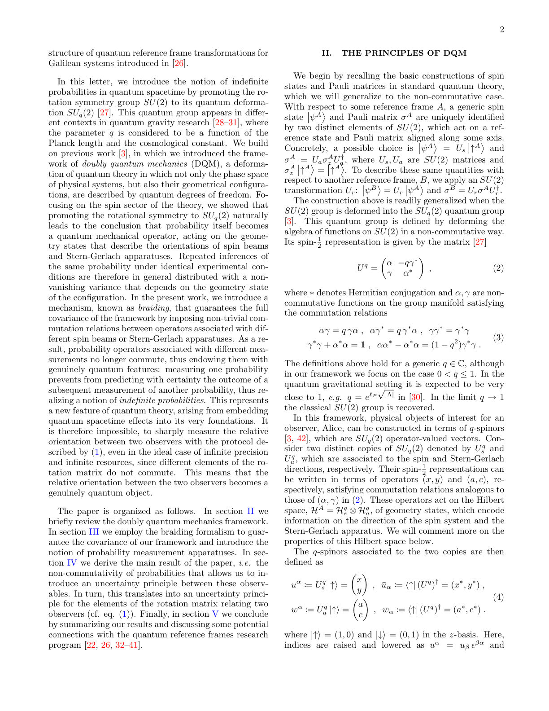 
Low-resolution page preview, page 2

📷 Fig 2

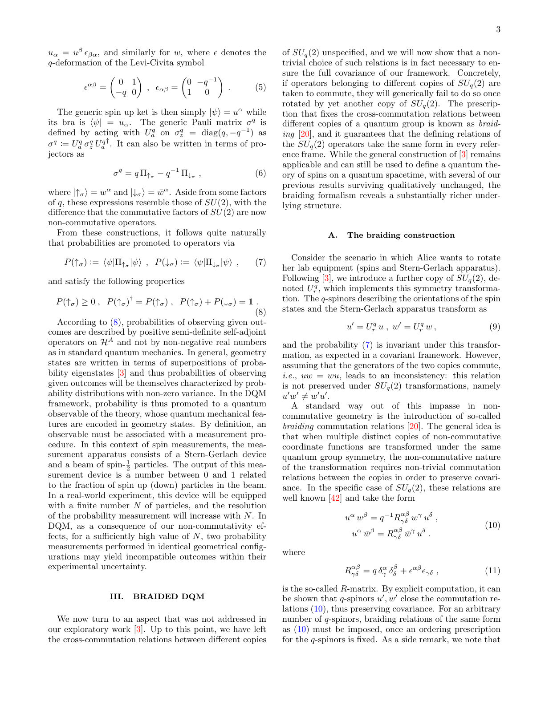 
Low-resolution page preview, page 3

📷 Fig 3

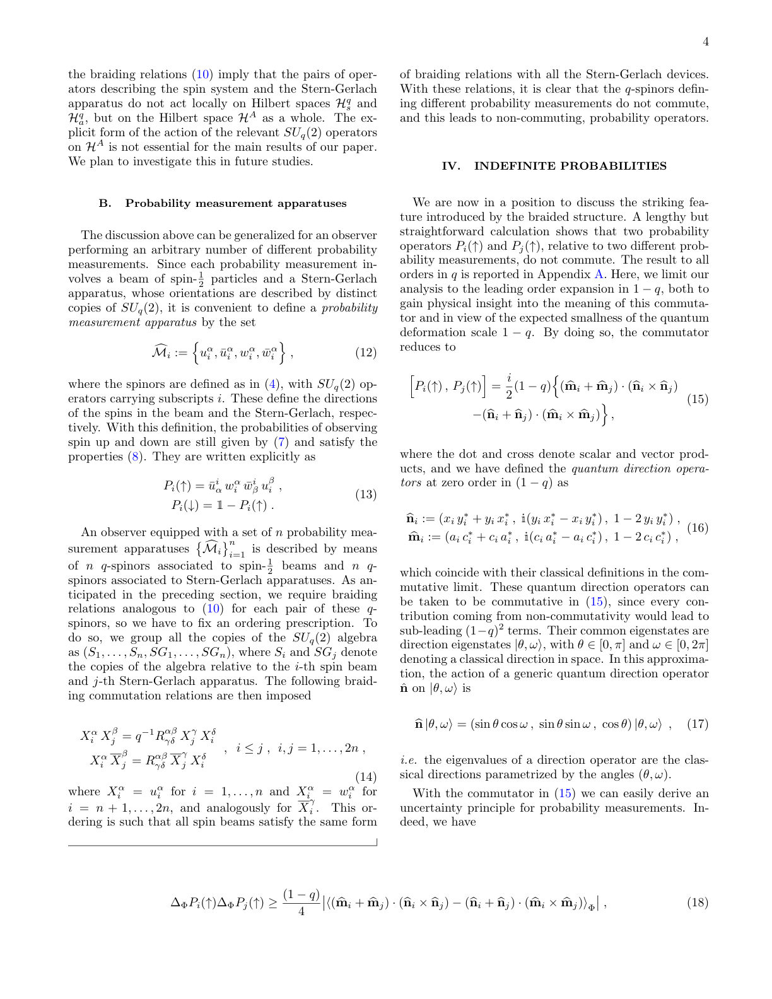 
Low-resolution page preview, page 4

📷 Fig 4

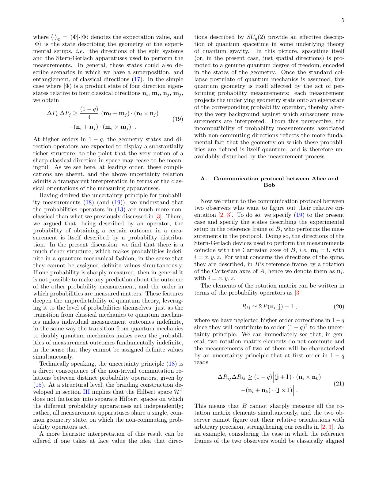 
Low-resolution page preview, page 5

📷 Fig 5

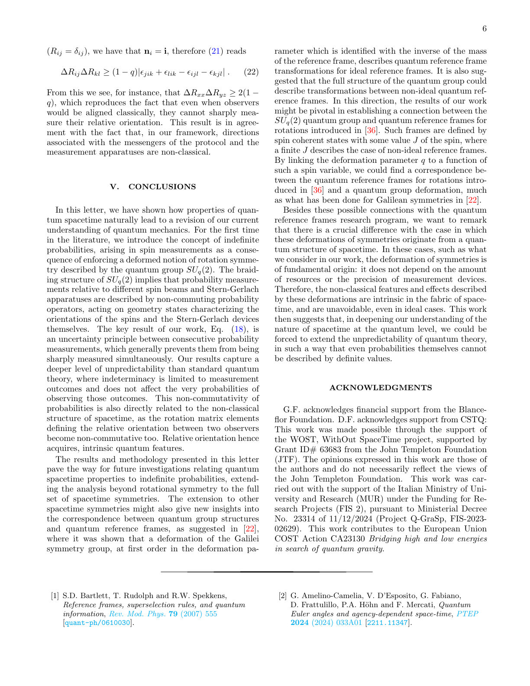 
Low-resolution page preview, page 6

**Summary.** This paper explores the concept of 'indefinite probabilities' arising from a non-commutative spacetime geometry. It shows that in a quantum-deformed universe, the probabilities of measurement outcomes do not commute, leading to a fundamental uncertainty in determining the relative orientation of different observers.

**Why it may be interesting.** not directly relevant

Detailed structure

**Main problem.** Investigating how non-commutative spacetime, modeled via the SUq(2) quantum group, leads to 'indefinite probabilities' where measurement outcome probabilities are non-commuting operators.

**Main result.** The authors derive an uncertainty principle for probability operators and rotation matrix elements, demonstrating that observers in a quantum-deformed spacetime cannot sharply measure their relative orientation.

**Method.** The study employs the algebraic framework of Doubly Quantum Mechanics (DQM) and braiding formalism using the R-matrix to compute commutators of probability operators in a leading-order expansion of the deformation parameter.

**Model / system.** A theoretical model of two observers (Alice and Bob) using spin-1/2 systems and Stern-Gerlach apparatuses within a non-commutative spacetime geometry described by the SUq(2) quantum group.

**Key observables.** Probability operators for spin outcomes (P(up) and P(down)) and rotation matrix elements (Rij) relating observer reference frames.

**Important parameters / regimes.** The deformation parameter q, which is related to the Planck length and cosmological constant, and the limit q -> 1 which recovers standard physics.

**Assumptions / limitations.** The analysis assumes the validity of the SUq(2) quantum group as an effective description of spacetime and relies on a leading-order expansion in (1-q).

**Paper structure.** The paper introduces the problem of non-commutative spacetime, presents the SUq(2) and DQM mathematical framework, derives the non-commutativity of probability operators via braiding, and concludes with the physical implications for observer orientation and uncertainty.

Abstract

Non-commutative spacetime and quantum groups have been argued to capture non-classical features of spacetime and its symmetries in the low-energy limit of quantum gravity. In this letter, we show that employing the $SU_q(2)$ quantum group to describe rotational symmetry for spin-$\frac{1}{2}$ systems and Stern-Gerlach apparatuses leads to the description of probabilities of outcomes of spin measurements in terms of non-commuting operators. As a result, we obtain an uncertainty principle between different probability operators, realizing a notion of indefinite probabilities. This is then reflected in the non-commutativity of the entries of the rotation matrix relating the reference frames of two observers, hence fundamentally preventing them from sharply measuring their relative orientation.

[↑ back to top](#top)

### [Multi-field Return Point Memory](http://arxiv.org/abs/2605.23781v1)

**Authors:** Nathaniel Croce, Hossein Salahshoor, D. Zeb Rocklin  
**Type:** theory · **Category:** disordered systems and neural networks · **PDF:** <https://arxiv.org/pdf/2605.23781v1>  
**Analysis basis:** full PDF text, analyzed in chunks
**Topic relevance:** `non-equilibrium dynamics` **2/5**

📷 Fig 1

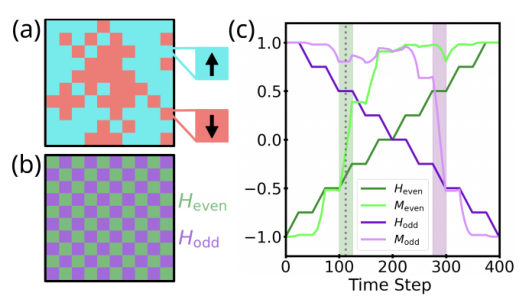 
FIG. 1. Application and behavior of system with two external fields. (a) An arbitrary snapshot of a 10×10 subset of a 100 × 100 spin configuration at time t = 112: light blue squares represent a positive spin at the site (+1) and light red squares represent a negative spin (-1). (b) The Heven (green) and Hodd (purple) fields are applied in a checkerboard pattern across the 10 × 10 lattice of spins. (c) Time evolution of the external fields Heven (dark green) and Hodd (dark purple) over time, and the corresponding magnetization at the even sites Meven (light green) and the odd sites Modd (light purple) when Heven and Hodd are applied to a 100 × 100 lattice of spins in the checkerboard...

📷 Fig 2

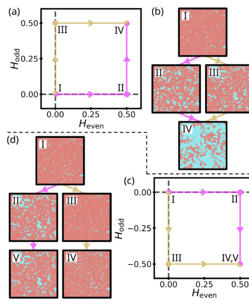 
FIG. 2. Commutativity and non-commutativity in a two field system. (a) Two systems begin from identical initial configurations (I) and evolve under distinct monotonic fields trajectories in the (Heven, Hodd) plane. Path 1 (pink) first increases Heven, and then increases Hodd, while Path 2 (yellow) reverses the order. Because both field components vary monotonically and reach the same final values, the re- sulting final configurations are identical (IV) as depicted in (b). The intermediate configurations (II,III) differ and ex- hibit no relation. (c) depicts a similar setup to (a) starting with two identical systems, but they now evolve under distinct non-monotonic field trajectories. Path 1...

📷 Fig 3

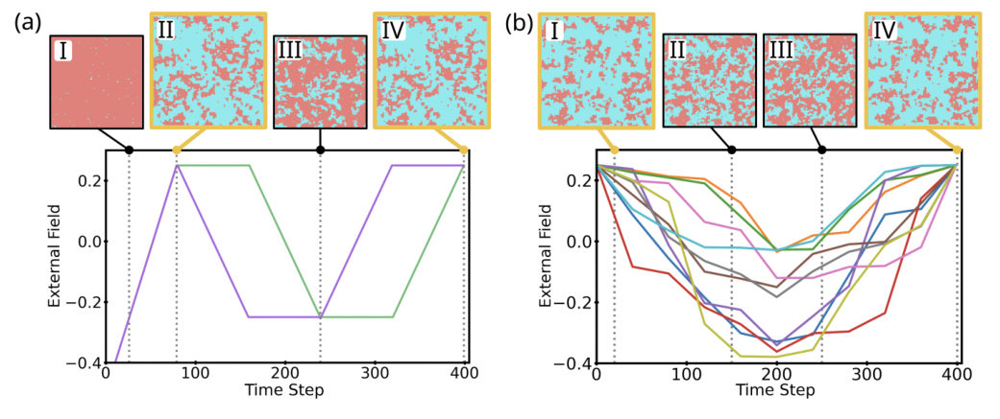 
FIG. 3. Demonstration of return point memory in two-field and multi-field system. (a) The external fields Heven (green) and Hodd (purple) fields evolve over time as shown. Both fields begin at large negative values and rapidly increase to pass through spin configuration I and reach spin configuration II. The fields then vary independently over time until reconverging to produce final configuration IV, which is identical to state II. Notice that Heven and Hodd never exceed the extrema reached during state I, consistent with the no-passing rule, and thus states II and III are less than I. (b) 100 × 100 external fields evolve over time (only 10 fields are depicted on the plot) and are applied...

📷 Fig 4

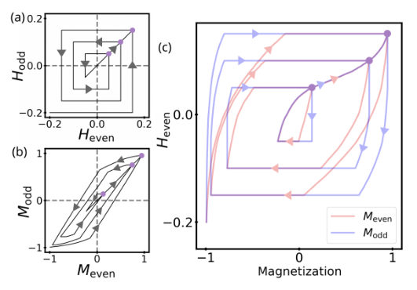 
FIG. 4. Repeated return-point memory effect via spi- ral control dynamics. (a) A 200 × 200 spin system evolves under a spiral trajectory plotted in the (Heven, Hodd) plane. (b) A resulting similar behaving spiral occurs as the system evolves when plotting the magnetization at the even sites and odd sites of the system in the (Meven, Modd) plane. (c) The behavior of Meven and Modd are each demonstrated individ- ually when plotted against Heven. The three purple points demonstrate instances of return point memory in the system between when the path first intersects a point during the in- ward spiral and when the point is intersected again during the final increase. Each instance of return...

**Summary.** This paper extends the concept of return-point memory from single-field to multi-field driving in disordered systems. It shows that while the order of applying different fields can lead to non-commutative behavior, the system can still be precisely controlled to return to exact previous microstates. This provides new insights into how complex, multistable physical systems can be trained or programmed.

**Why it may be interesting.** not directly relevant

Detailed structure

**Main problem.** Investigating whether return-point memory (RPM)—the ability of a system to return to a previous exact microstate—persists when a system is driven by multiple independent control fields rather than a single scalar field.

**Main result.** The authors prove that multi-field driving leads to return-point memory where bounded field excursions restore the system to a previous microstate, while also demonstrating that non-monotonic field trajectories introduce non-commutativity.

**Method.** The study uses numerical simulations of a zero-temperature Ising model and mathematical frameworks involving the 'no-passing' property and partial ordering of microstates.

**Model / system.** A multi-field Ising model (MFIM) which generalizes the zero-temperature random-field Ising model (RFIM), featuring ferromagnetic coupling and multiple time-dependent control fields applied to different subsets of sites (e.g., checkerboard patterns).

**Key observables.** Magnetization (specifically even and odd site magnetizations), microscopic spin configurations, and the degree of partial ordering between states.

**Important parameters / regimes.** Coupling constant J, disorder strength sigma, field trajectories (monotonic vs. non-monotonic), and the spatial pattern of field application.

**Assumptions / limitations.** The system is studied in the zero-temperature limit, meaning no thermal fluctuations are present and spins only flip to minimize energy.

**Figures summary.** Figure 1 shows spin configurations and checkerboard field application; Figure 3 demonstrates the restoration of microstates in two-field and large-scale 10,000-field systems; Figure 4 illustrates spiral trajectories in field space and the resulting periodic returns to specific magnetization states.

**Paper structure.** The paper introduces the problem of multi-field control, defines the multi-field Ising model Hamiltonian, analyzes monotonic vs. non-monotonic field paths, proves the existence of multi-field RPM, and explores complex spiral dynamics.

Abstract

Non-equilibrium systems display memory, a dependence not merely on their present environment but on previously applied fields. Multistable systems such as spin glasses, martensites and granular matter have exponentially many microstates consistent with an applied field, making their rich dynamics difficult to control. Control and order can be achieved through the concept of partial ordering, which we here generalize to systems subject to multiple control fields. We demonstrate, within the model system of the zero-temperature Ising model, that this leads to return-point memory, in which an applied sequence of fields restores the hysteretic system not only to a previous magnetization, but to a previous exact microstate. The multiplicity of fields grants more precise and complex control of the system, with different classes of operations displaying commutative and noncommutative behavior. This grants new insight into how physical systems can remember, learn, and be trained.

[↑ back to top](#top)

### [Orientable Surfactants on Thin Liquid Films: A Dynamic Density-Functional Theory Approach](http://arxiv.org/abs/2605.23789v1)

**Authors:** Toby Kay, Serafim Kalliadasis  
**Type:** theory · **Category:** statistical mechanics · **PDF:** <https://arxiv.org/pdf/2605.23789v1>  
**Analysis basis:** full PDF text, analyzed in chunks
**Topic relevance:** `non-equilibrium dynamics` **2/5**

📷 Fig 1

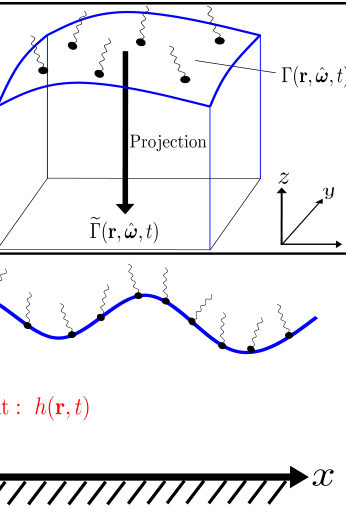 
Figure 1: Sketch of the profile geometry for a thin liquid film on a planar horizontal substrate.

**Summary.** This paper develops a new theoretical framework for modeling thin liquid films containing polar surfactants by accounting for their molecular orientation. By using Dynamic Density-Functional Theory, the authors show that surfactant alignment leads to a new form of generalized surface tension. This provides a more physically accurate way to describe the complex hydrodynamic stability of surfactant-laden interfaces.

**Why it may be interesting.** not directly relevant

Detailed structure

**Main problem.** Traditional thin-film models treat surfactants as symmetric, point-like particles, neglecting their amphiphilic, polar head-tail structure and the resulting effects on interfacial dynamics.

**Main result.** The authors derive a set of coupled evolution equations for film height, surfactant concentration, and polarization, uncovering a novel generalized surface tension that depends on both concentration and surfactant orientation.

**Method.** The study uses Dynamic Density-Functional Theory (DDFT) combined with a long-wave (lubrication) approximation and a moment-based closure approach to derive macroscopic transport equations from microscopic statistical mechanics.

**Model / system.** A thin liquid film on a planar horizontal substrate with a free surface containing insoluble, orientable, polar uniaxial surfactant particles undergoing Brownian motion.

**Key observables.** Film height (h), surfactant concentration (c), polarization field (P), and the alignment tensor (Q).

**Important parameters / regimes.** Translational diffusion tensor (parallel and perpendicular components), rotational diffusion coefficient, surface tension, and anchoring strength.

**Assumptions / limitations.** The model assumes a long-wave approximation, uses an adiabatic approximation for higher-order moments (slaving Q to P), and assumes surfactants are insoluble and confined to the interface.

**Figures summary.** Figure 1 provides a geometric sketch of the thin liquid film on a substrate with a defined coordinate system and the free surface height.

**Paper structure.** The paper begins by defining the physical system, moves to a microscopic DDFT derivation for uniaxial particles, applies a long-wave expansion and moment-based coarse-graining, derives the coupled evolution equations, and concludes by demonstrating thermodynamic consistency and reduction to known non-polar models.

Abstract

Thin liquid films are ubiquitous across many natural and engineering systems, including films which are laden with surface active molecules, i.e. surfactants. The presence of surfactants may have a destabilising effect on the film owing to their influence on surface tension, the so-called Marangoni effect, which in turn can induce flows in the film. Classical thin-film models for surfactant-laden films lead to paradigmatic gradient dynamics equations governing the film height and surfactant concentration and have been widely studied. However, in all these works, which are based on fluid dynamics or nonequilibrium thermodynamics, the shape of surfactants is neglected, and they have been treated as symmetric point-like particles. In general, this is a drastic oversimplification, as surfactants are amphiphilic with a polar head-tail structure. To account for this effect we use elements from the statistical mechanics of classical fluids, namely density-functional theory (DFT), and its dynamic extension (DDFT). Starting from DDFT and under the long-wave approximation, we derive the pertinent thin-film equations with the surfactants treated as polar uniaxial particles. These are equations which govern the film height, as well as the surfactant concentration and polarisation field. They preserve the gradient dynamics form by appropriately defining the free energy, which contains the usual interfacial contributions, as well as further contributions from the polarisation field. In doing so, we uncover a novel form of a generalised surface tension that is dependent on the surfactant polarisation as well as concentration, and show that it arises in a thermodynamically consistent way.

[↑ back to top](#top)

### [Sample-efficient benchmarking of shallow all-to-all random quantum circuits](http://arxiv.org/abs/2605.22909v1)

**Authors:** Gregory Bentsen, Bill Fefferman, Soumik Ghosh, Michael J. Gullans, Yinchen Liu  
**Type:** theory · **Category:** quantum information and computing · **PDF:** <https://arxiv.org/pdf/2605.22909v1>  
**Analysis basis:** full PDF text, analyzed in chunks
**Topic relevance:** `entanglement & information structure` **2/5**

📷 Fig 1

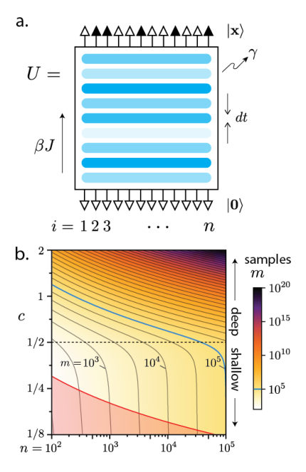 
FIG. 1. Brownian random circuit models gener- ate analytically tractable matrix ensembles with tun- able circuit depth βJ and noise rate γ. A system of n qubits initialized in |0⟩evolves under the Brownian circuit U (a, blue stripes) and produces an output bit- string |x⟩with probability q(x) = |⟨x| U |0⟩|2. Using the analytic expressions in Eq. (3) and (4) we plot the number m of bitstring samples (b) required to reliably estimate the nonlinear cross-entropy as a function of sys- tem size n and circuit depth 12βJ = c log n, with noise rate r = nγ/12J = 1. The requisite number of sam- ples m is linear in system size at shallow circuit depths c &lt; 1/2 and grows as a polynomial in n at larger...

📷 Fig 2

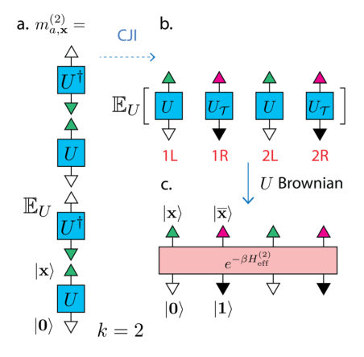 
FIG. 2. The Choi-Jamio lkowski isomorphism (CJI) and disorder averaging allow us to map the Brownian circuit sampling problem onto a quantum sta- tistical mechanics problem at inverse temperature β. We first apply CJI to convert quantities with multiple for- ward U and inverse U † evolutions (a, for k = 2) into an expectation value on multiple replicas (b) labeled 1L,1R,2L,2R. We then take the ensemble average over the disordered couplings Jαβ ij (t) which yields a Gibbs

📷 Fig 3

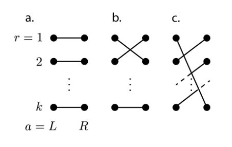 
FIG. 3. Ground states of the effective Hamilto- nian H(k) eff where each solid line represents a collection of spin singlets Nn i=1(|01⟩−|10⟩)irs,LR/ √

📷 Fig 4

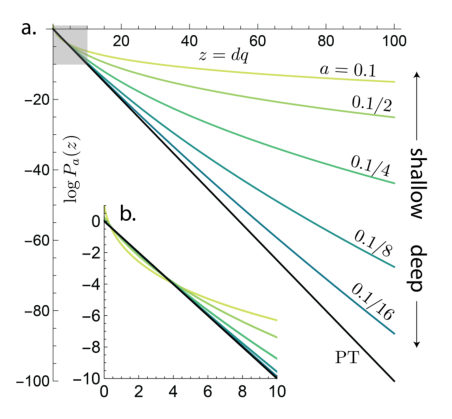 
FIG. 4. Brownian circuit ensembles converge to the Haar random matrix ensemble for increas- ing circuit depth 12βJ = −log a. The finite-depth Brownian sampling distributions Pa(z) for n = 100 qubits, plotted as a function of z = dq for depths a = 0.1, 0.1/2, . . . , 0.1/16 (yellow to dark green) con- verge to the infinite-depth Porter-Thomas (PT) distri- bution lima→0 Pa(z) ≡Q(z) = e−z (black). The inset (b) shows detail of the upper-left region (grey box).

📷 Fig 5

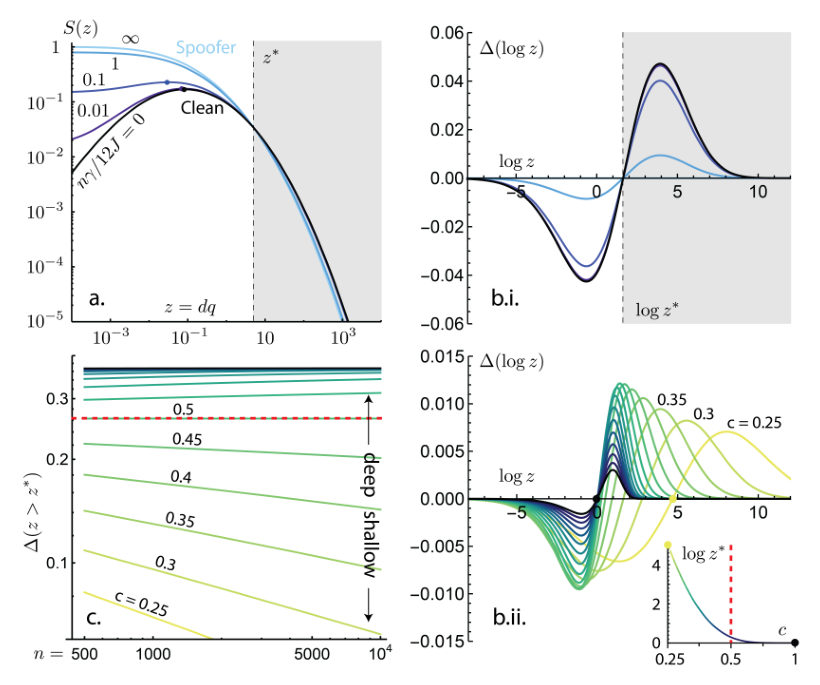 
FIG. 5. The heavy output generation classifier reliably distinguishes between a clean Brownian circuit, a noisy circuit, and the Harvard spoofing algorithm using only a single bitstring sample. The distribution S(z) over scores z = dq (a) shifts its weight about the decision boundary z∗as we tune the noise rate nγ/12J = 0, 0.01, 0.1, 1, ∞ (black to light blue), where n = 100 and a = 1/5. The clean system (γ = 0, black) exhibits ‘score repulsion’ with heavier weight at large scores z &gt; z∗(shaded gray) relative to the classical spoofing algorithm (γ →∞, light blue) whose distribution is dominated by low scores z &lt; z∗. The difference ∆(log z) in these two distributions, plotted versus the...

**Summary.** This paper proposes a new nonlinear cross-entropy metric to verify quantum advantage in shallow-depth random circuits. It proves that this metric is resistant to classical spoofing and is highly sample-efficient even in the presence of depolarizing noise. The work provides exact analytical solutions for these benchmarks using many-body physics techniques.

**Why it may be interesting.** not directly relevant

Detailed structure

**Main problem.** Existing benchmarks like linear cross-entropy (LXEB) for random circuit sampling can be classically spoofed by noise, making it difficult to verify quantum advantage in shallow-depth circuits.

**Main result.** The authors demonstrate that nonlinear cross-entropy (log XEB) provides a sample-efficient benchmark that can distinguish noisy quantum computers from classical spoofers, and they develop a HOG-based classifier with logarithmic sample complexity.

**Method.** The study uses the replica trick and large-n mean-field techniques applied to Brownian circuit ensembles, supplemented by numerical simulations of discrete Haar-random unitary circuits.

**Model / system.** The model consists of n-qubit all-to-all Brownian quantum circuits with single-qubit depolarizing noise, which can be mapped to a quantum statistical mechanics problem with an effective many-body Hamiltonian.

**Key observables.** Nonlinear cross-entropy (log XEB), Heavy Output Generation (HOG) fingerprints, and the variance of the XEB score.

**Important parameters / regimes.** Circuit depth (parameterized by a), system size (n), and noise rate (gamma).

**Assumptions / limitations.** The analysis assumes all-to-all connectivity and utilizes the large-n limit and the Brownian (continuous-time) approximation of discrete circuits.

**Figures summary.** Figure 1 shows the required number of samples for XEB estimation vs system size; Figure 2 illustrates the mapping to a statistical mechanics problem; Figure 6 shows numerical estimation of expected XEB and variance for discrete circuits.

**Paper structure.** The paper introduces the benchmarking challenge, defines the Brownian circuit model and its mapping to an effective Hamiltonian, derives analytic expressions for the nonlinear XEB and its variance using the replica trick, validates these results with numerical simulations of discrete circuits, and proposes a new HOG-based classifier.

Abstract

Random circuit sampling (RCS) remains one of the most competitive frameworks for demonstrating quantum advantage in near-term noisy intermediate-scale quantum (NISQ) hardware. Unfortunately, absent error-correction, existing benchmarks to characterize these experiments, like linear cross-entropy, have been classically spoofed due to noise. Because of this, there are interesting regimes, like shallow-depth random quantum circuits, where sampling is plausibly classically intractable, but no existing benchmark can distinguish between a noisy quantum computer and an adversarial classical spoofer. In this paper, we demonstrate that the nonlinear cross-entropy provides a sample-efficient benchmark for shallow-depth all-to-all random quantum circuits whose score cleanly separates noisy quantum computers from state-of-the-art classical spoofers, even in the presence of depolarizing noise. Further, we develop a binary classifier based on the notion of heavy output generation that features logarithmic sample complexity at short depth. Our evidence comes from exact analytic expressions for all-to-all Brownian circuit ensembles derived using replica tricks, and numerical simulations that corroborate these results for discrete Haar-random unitary circuits.

[↑ back to top](#top)

### [Selective Fermi-Level Pinning: A Design Strategy for Giant Rectification in Molecular Junctions](http://arxiv.org/abs/2605.23370v1)

**Authors:** Junnan Guo, Wenhui Fang, Jian Huang, Weikang Wu, Hui Li, Lishu Zhang  
**Type:** theory · **Category:** other · **PDF:** <https://arxiv.org/pdf/2605.23370v1>  
**Analysis basis:** full PDF text, analyzed in chunks
**Topic relevance:** `non-equilibrium dynamics` **2/5**

📷 Fig 1

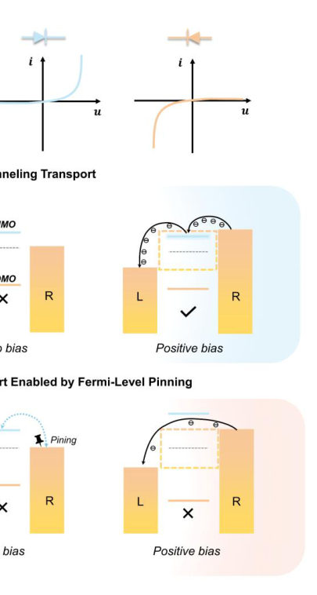 
Figure 1. Symmetric and asymmetric tunneling transport mechanisms. (a) Schematic illustration of a molecular rectifier with a functional molecule sandwiched between the left (L) and right (R) electrodes. (b) Idealized current-voltage (I-V) characteristics demonstrating the rectification behavior. (c) Energy-level alignment of a typical molecular junction exhibiting symmetric tunneling transport. (d) Schematic of the asymmetric tunneling transport enabled by selective Fermi-level pinning.

📷 Fig 2

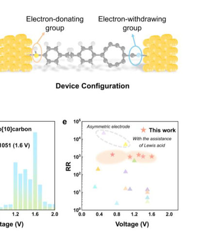 
Figure 2. Design strategy and rectification performance of cyclo[10]carbon-based junction. (a) Optimized geometries of 1,2-diphenylethane and cyclo[10]carbon. (b) Device configuration of 2D-cyclo[10]carbon junction. (c) Corresponding I-V characteristics. (d) Bias- dependent rectification ratios (RRs) extracted from the I-V curves. (e) Summary of the RRs in this work compared with reported single-molecule rectifiers in recent studies. Corresponding references and values are summarized in Table S1 of the Supplementary Information.

📷 Fig 3

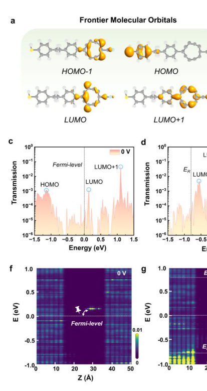 
Figure 3. Electronic structure and transport mechanism of 2D-cyclo[10]carbon junction. (a) Frontier molecular orbitals (FMOs) of the 2D-cyclo[10]carbon molecule. (b) Molecule-projected self-consistent Hamiltonian (MPSH) of the highest occupied molecular orbital HOMO and the lowest unoccupied molecular orbital (LUMO) within the device. (c- e) Transmission spectra at (c) 0 V, (d) -1.6 V, and (e) 1.6 V. (f-h) Projected local density of states (PLDOS) at (f) 0 V, (g) -1.6 V, and (h) 1.6 V. The white solid lines indicate the bias window defined by the electrochemical potentials of the left (𝐸𝐿) and right (𝐸𝑅) electrodes.

📷 Fig 4

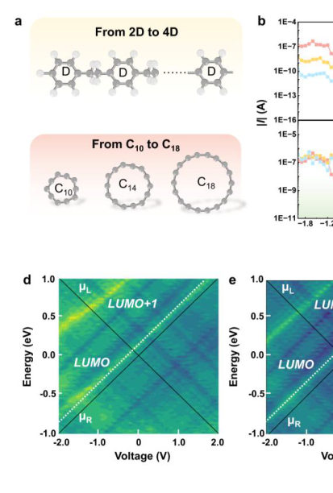 
Figure 4. Geometric Effects on rectification performance. (a) Schematic of structural evolution from 2D (two phenyl rings) to 4D (four phenyl rings) donors and from cyclo[10]carbon to cyclo[18]carbon acceptors. (b) I-V characteristics of molecular junctions with varying donor lengths and acceptor ring sizes. (c) Bias-dependent RRs for the corresponding molecular junctions. (d-f) Contour plots of the transmission spectra for (d) 2D-cyclo[10]carbon, (e) 3D-cyclo[10]carbon, and (f) 4D-cyclo[10]carbon junctions. The white dashed lines track the LUMO energy shift, and black solid lines indicate the bias window.

📷 Fig 5

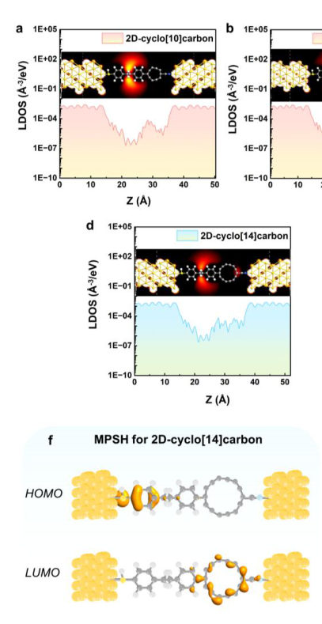 
Figure 5. Electronic states and potential distributions of molecular junctions. (a-e) Local density of states (LDOS) and electrostatic potential differences (EDPs, insets) for 2D-4D cyclo[10]carbon, 2D-cyclo[14]carbon, and 2D-cyclo[18]carbon junctions. (f, g) Device MPSH states of the HOMO and LUMO for (f) 2D-cyclo[14]carbon and (g) 2D- cyclo[18]carbon junctions.

**Summary.** The paper introduces a design strategy called 'selective Fermi-level pinning' to create highly efficient molecular rectifiers. By using asymmetric anchoring and specific molecular structures, the researchers show how to force transport through unoccupied orbitals, leading to rectification ratios as high as 10^3. This provides a general principle for engineering functional single-molecule electronic components.

**Why it may be interesting.** not directly relevant

Detailed structure

**Main problem.** Achieving high rectification ratios in single-molecule junctions by overcoming the intrinsic symmetry of resonant tunneling and complex interfacial energy-level alignment.

**Main result.** The proposal of a 'selective Fermi-level pinning' strategy that achieves giant rectification ratios exceeding 10^3 in cyclo[n]carbon-based junctions by breaking transport symmetry.

**Method.** Computational modeling using Non-Equilibrium Green's Function (NEGF) combined with Density Functional Theory (DFT) via the Quantum ATK framework.

**Model / system.** A donor-acceptor molecular junction featuring a non-coplanary long-chain donor (1,2-diphenylethane), a wide-bandgap acceptor (cyclo[n]carbon), and asymmetric anchoring groups (-SH and -CN) between gold electrodes.

**Key observables.** Rectification Ratio (RR), current-voltage (I-V) characteristics, transmission spectra, and energy-level alignment (HOMO/LUMO positions).

**Important parameters / regimes.** Bias window, HOMO-LUMO energy gap, and the electrostatic potential difference (EDP) across the junction.

**Assumptions / limitations.** The transport is primarily governed by the alignment of molecular frontier orbitals with the electrode Fermi levels under bias.

**Figures summary.** Figure 1 shows the schematic of the rectifier and the mechanism of asymmetric tunneling; Figure 2 presents the device configuration and I-V characteristics; Figure 3 details the electronic structure, including spatial orbital separation and transmission spectra; Figure 4 explores the effects of geometric changes.

**Paper structure.** The paper introduces the problem of symmetry in molecular junctions, proposes the selective Fermi-level pinning strategy, demonstrates the performance using cyclo[n]carbon systems, analyzes the impact of structural variations (donor length and ring size), and concludes with the robustness of the design.

Abstract

Molecular rectifiers are key functional components of molecular-scale integrated circuits, yet achieving high rectification ratios remains a longstanding challenge due to the intrinsic symmetry of resonant tunneling and the complexity of interfacial energy-level alignment. Here, we propose a rectifier design strategy based on selective Fermi-level pinning that breaks transport symmetry via pinning interactions between molecular frontier orbitals and electrodes. This framework enforces tunneling transport to be predominantly governed by unoccupied molecular orbitals, while substantially suppressing contributions from occupied states, thereby establishing a simplified and highly controllable rectification mechanism. The resulting cyclo[n]carbon-based molecular junctions exhibit giant rectification ratios exceeding 103, while retaining exceptional structural robustness against variations in both donor chain length and carbon ring size. This work reveals the critical role of selective Fermi-level pinning in molecular junctions and provides a general design principle for engineering functional single-molecule electronic devices.

[↑ back to top](#top)

### [Transition-state lattice modes and the breakdown of adiabatic tunneling for hydrogen and deuterium in bcc Nb](http://arxiv.org/abs/2605.23212v1)

**Authors:** P. Graham Pritchard, James M. Rondinelli  
**Type:** theory · **Category:** disordered systems and neural networks · **PDF:** <https://arxiv.org/pdf/2605.23212v1>  
**Analysis basis:** full PDF text, analyzed in chunks
**Topic relevance:** `Kondo & dissipative impurity` **2/5**

📷 Fig 1

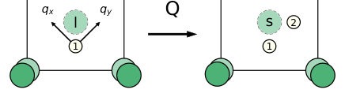 
FIG. 1. Schematic illustration of lattice order parameters defining the tunneling subspace. Nb atoms (green), degener- ate tetrahedral H sites (white circles), and degenerate saddle points (white triangles) and octahedral sites (white squares) are shown within fixed lattice configurations; displaced Nb po- sitions indicate lattice relaxation. Atoms with solid outlines lie in the same plane, while the dashed Nb atom is body-centered. The order parameter Q transforms a singly degenerate hy- drogen configuration (l) into a twofold-degenerate symmetric configuration (s) and subsequently into a second singly degen- erate configuration (r) that is not shown. The order parameter T distorts the...

📷 Fig 2

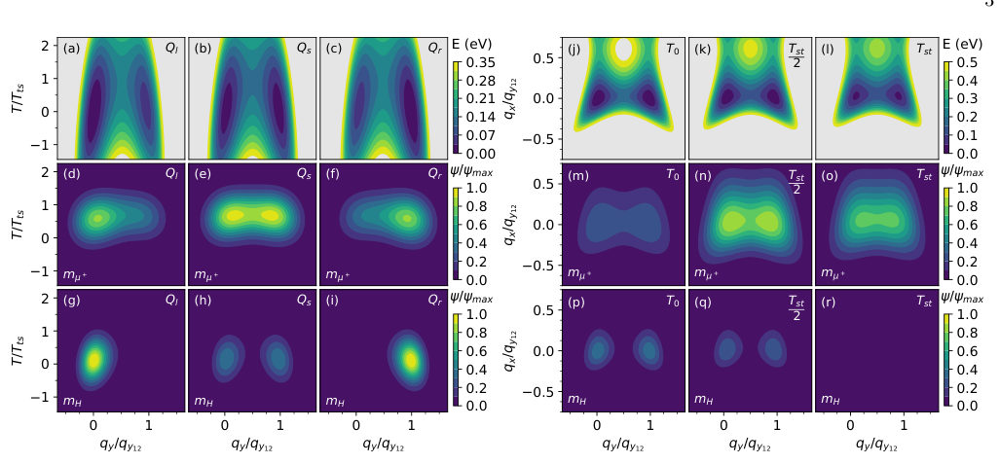 
FIG. 2. Contour plots of the potential energy surface and ground-state wavefunction for two light particle masses: m = mµ+ and m = mH. (a-i) Slices along the qy and T modes with qx = qz = 0, evaluated at three representative lattice configurations: (a, d, g) Q = Ql, (b, e , h) Q = Qs, (c, f, i) Q = Qr. (j-r) Slices along the qx and qy modes with qz = 0 and Q = Qs, shown at three values of the transition-state coordinate: (j, m p) T = T0 = 0, (k, n, q) T = Tst/2, and (l, o, r) T = Tst. Wavefunctions are normalized by their most probable value. Cubic spline interpolation is used to smoothly render the potential energy contours.

📷 Fig 3

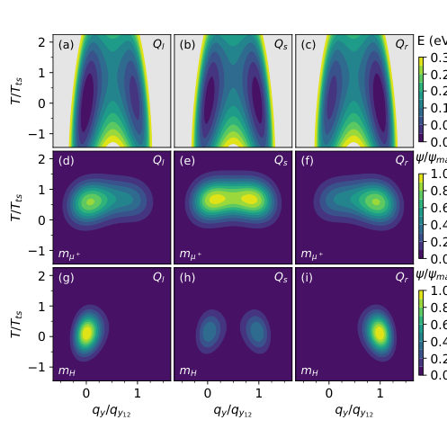 
Fig. 2a-i present contour plots of the potential energy surface and ground-state wavefunctions of O-trapped H along the qy and T modes for two light-particle masses: m = mµ+ and m = mH, with qx = qz = 0, and at three Q coordinates: Ql, Qs, Qr. As shown in Fig. 2a- c, the primary role of the Q mode is to symmetrize the minima of the double-well potential and reduce the barrier between degenerate hydrogen sites near transition-state configuration T = Tts. For m = mH, the ground state wavefunction remains localized in the two adjacent, self- trapped configurations at Q = Ql and Q = Qr, with suppressed population in the symmetric configuration Q = Qs. This behavior is consistent with earlier...

📷 Fig 4

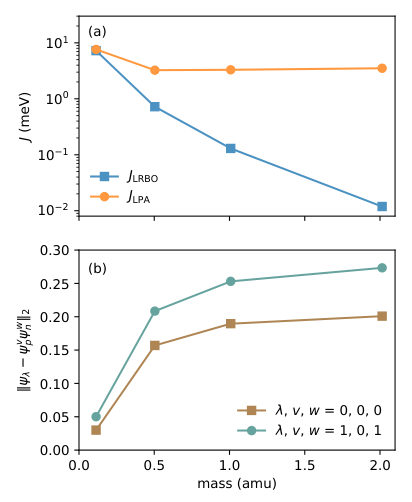 
FIG. 3. (a) Tunnel splittings (J) as a function of light- particle mass mp, computed using the lattice-renormalized Born-Oppenheimer (LRBO) model and light particle approxi- mation (LPA). (b) Deviation from wavefunction separability, ϵψ = ∥ψλ −ψv pψw n ∥2, of the LRBO (ψλ) and LPA wavefunc- tions (ψpψn), evaluated for ground and first-excited states. The LPA is satisfied only in the µ+ mass limit.

📷 Fig 5

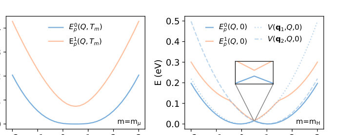 
FIG. 4. Adiabatic potential energy surfaces Ev p(Q, T) along the Q coordinate at fixed T. (a) Ground state (E0 p) and first-excited state (E1 p) potential energy surfaces along the Q mode for m = mµ with T set to its value at the local minimum Tm shown in Fig. 2. Well-separated energy levels characteristic of adiabatic behavior occur. (b) Corresponding surfaces for m = mH with T = 0, where only a small avoided crossing (inset) separates E0 p and E1 p near the symmetric configuration. The LRBO potential energies V (q1, Q, 0) and V (q2, Q, 0) for hydrogen localized at the two degenerate sites along the Q mode are also shown (see Fig. 1), illustrating the breakdown of adiabatic level...

**Summary.** This paper proves that the standard adiabatic approximation fails for hydrogen and deuterium tunneling in Niobium, showing instead that the process is a nonadiabatic, collective interaction with the lattice. This finding is crucial for understanding how interstitial defects contribute to decoherence in superconducting quantum circuits.

**Why it may be interesting.** The paper provides a rigorous microscopic foundation for understanding how defect-induced tunneling in solids contributes to decoherence in superconducting qubits, specifically through the modification of the quasiparticle density of states.

Detailed structure

**Main problem.** Investigating the validity of the adiabatic approximation (separation of light-particle and lattice dynamics) for hydrogen and deuterium tunneling in bcc Niobium.

**Main result.** The study demonstrates that adiabatic separation is only valid for extremely light particles like muons, whereas H and D tunneling is a fundamentally nonadiabatic, collective process mediated by anharmonic lattice couplings.

**Method.** The authors use a 5D Lattice-Renostormalized Born-Oppenheimer (LRBO) framework, solving a 5D Hamiltonian numerically using inputs from Density Functional Theory (DFT) and cubic spline interpolation.

**Model / system.** The system consists of interstitial hydrogen (H) and deuterium (D) trapped by oxygen impurities in a body-centered-cubic (bcc) Niobium (Nb) lattice, modeled via a 5D subspace including three interstitial modes and two lattice modes (Q and T).

**Key observables.** Tunnel splitting (J), wavefunction separability metric (epsilon_psi), and lattice-mode probability densities.

**Important parameters / regimes.** Mass regimes (H, D, and mu+), energy asymmetry (delta), and elastic energy cost (Ec).

**Assumptions / limitations.** The accuracy of the tunnel splitting calculation is approximately 60-70% of experimental values; the derivation assumes the self-trapped H is stable at one site in a fixed lattice.

**Figures summary.** Figure 1 shows a schematic of the tunneling subspace and lattice order parameters; Figure 2 presents potential energy surface and wavefunction contour plots for mu+ and H; Figure 5 displays lattice-mode probability density contours.

**Paper structure.** The paper introduces the problem of adiabaticity in Nb, describes the 5D LRBO model and DFT methods, presents results comparing H/D to mu+ mass limits, discusses the breakdown of the adiabatic approximation, and concludes with implications for qubit decoherence.

Abstract

Interstitial hydrogen and deuterium in body-centered-cubic metals constitute archetypal quantum tunneling systems. Their relevance has been renewed by the connection between hydrogenic tunneling in Nb and defect-induced decoherence in superconducting qubits, motivating a predictive microscopic theory. Existing theoretical treatments invoke an adiabatic separation between the light interstitial and the host lattice, an assumption whose validity has not been rigorously established for hydrogenic species. Here, we show that the experimentally measured tunnel splittings of O-trapped H and D in bcc Nb are quantitatively reproduced only within a five-dimensional (5D) Lattice-Renormalized Born-Oppenheimer (LRBO) framework. This approach treats three interstitial modes and two judiciously selected lattice modes, which includes a transition-state mode, on equal quantum footing. By recasting nested Born-Oppenheimer hierarchies within this same formalism and benchmarking against modern \textit{ab initio} potential energy surfaces, we show that adiabatic separation of the light particle from lattice dynamics is satisfied only in the positive-muon ($μ^{+}$) mass limit. In contrast, tunneling for H and D is fundamentally a collective, nonadiabatic process mediated by anharmonic lattice couplings. Finally, we show that the breakdown of adiabaticity can be anticipated from simple energy estimates involving the ground-state light-particle energy evaluated at a small number of fixed lattice configurations, providing a practical criterion for assessing the validity of adiabatic tunneling theories in other systems.

[↑ back to top](#top)

### [Fractionalization, emergent SU($N$) symmetries, and fragmentation in layered quantum spin-orbital models](http://arxiv.org/abs/2605.22908v1)

**Authors:** Pedro M. Cônsoli, Aayush Vijayvargia, Onur Erten  
**Type:** theory · **Category:** strongly correlated electrons · **PDF:** <https://arxiv.org/pdf/2605.22908v1>  
**Analysis basis:** full PDF text, analyzed in chunks
**Topic relevance:** `entanglement & information structure` **1/5** · `scars & prethermalization` **1/5**

📷 Fig 1

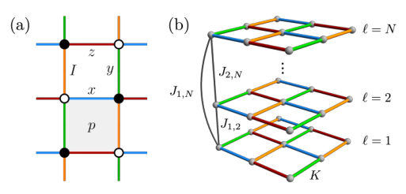 
FIG. 1. Schematics illustrating the spin-orbital model in Eqs. (1)-(3). (a) Section of a single square layer, showing the four different types of bonds, labeled x, y, z, and I, and high- lighting one of the two inequivalent types elementary square plaquettes. The two crystallographic sublattices, A and B, are represented by black and white sites, respectively. (b) Multilayer system of N identical layers stacked without any relative displacement.

📷 Fig 2

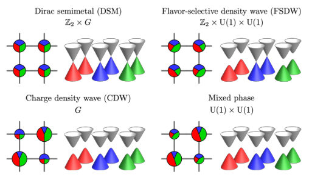 
FIG. 3. Four different phases obtained as mean-field solu- tions of the N = 3 Hubbard model with anisotropic interac- tions J12 = J23 = J and J13 = J′ at temperature T = 0. Each phase is identified by its residual symmetry and two schematics. On the left, we depict the spatial distribution of the flavor-resolved densities nµℓin terms of pie charts where the fractions of ℓ= 1, 2, 3 fermions are represented in red, blue and green, respectively. The diameter of any given disk is proportional to the total charge nµ = P

📷 Fig 3

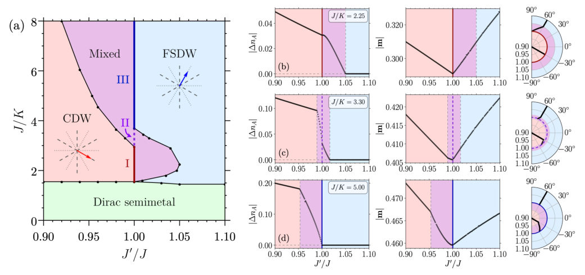 
FIG. 4. Mean-field results for the π-flux, N = 3 Hubbard model at half filling and with anisotropic interlayer (Hubbard) interactions J12 = J23 = J and J13 = J′. (a) Phase diagram obtained after finite-size scaling. The insets in the CDW and FSDW phases depict the direction within the m3-m8 plane (see also Fig. 2) is selected by the anisotropy J′/J. On the SU(3)-symmetric line J′/J = 1, the thick red line I marks a phase where CDW order coexists with a FDW with a residual SU(2)×U(1) symmetry. Meanwhile, regions II and III highlight extensions of the mixed and FSDW phases, respectively. (b-d) Evolution of mean-field parameters along horizontal cuts of the phase diagram corresponding to J/K =...

📷 Fig 4

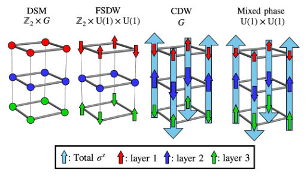 
FIG. 5. Representative ordering patterns for the four mean- field phases depicted in Fig. 3. Each phase is illustrated on a 2 × 2 cluster of the three-layer lattice. Small arrows in red, dark blue and green denote the on-site magnetizations ⟨σz iℓ⟩= 1−2niℓon layers ℓ= 1, 2, 3, respectively. In the DSM, all local moments vanish. The FSDW phase has opposite mo- ments on layers 1 and 3, with a vanishing column magnetiza- tion Zi = P

**Summary.** This paper explores how stacking quantum spin-orbital layers can lead to emergent SU(N) symmetries and complex phase diagrams. It identifies a phenomenon called magnetic fragmentation, where different degrees of freedom (spin and orbital) exhibit fundamentally different types of order. This provides a theoretical framework for understanding intertwined orders and fractionalized quantum critical points.

**Why it may be interesting.** not directly relevant

Detailed structure

**Main problem.** The study investigates fractionalization, emergent SU(N) symmetries, and the coexistence of unconventional symmetry-breaking orders in layered quantum spin-orbital models.

**Main result.** The authors demonstrate that these models can realize a variety of competing phases, including flavor-selective localization and 'magnetic fragmentation,' where the spin sector exhibits local order while the orbital sector remains a quantum liquid with nontrivial string order.

**Method.** The study employs a Majorana fermion parton construction to map the Hamiltonian to an N-component Fermi Hubbard model, followed by mean-field theory and finite-size scaling analysis.

**Model / system.** A family of layered quantum spin-orbital models consisting of N stacked square-lattice layers with Kitaev-type intralayer interactions and Ising-type interlayer spin couplings.

**Key observables.** Intralayer fluxes, string order parameters, local magnetizations, charge density wave (CDW) order parameter, and flavor-selective density wave (FSDW) order.

**Important parameters / regimes.** Number of layers (N), intralayer interaction strength (K), interlayer coupling constants (J), and the anisotropy ratio (J'/J).

**Assumptions / limitations.** The analysis uses a mean-field approximation for the interaction terms and assumes a fixed pi-flux gauge sector.

**Figures summary.** Figure 1(a) provides a schematic of a single square layer showing bond types and inequivalent plaquettes.

**Paper structure.** The paper introduces the layered spin-orbital model, performs a parton mapping to an N-flavor Hubbard model, analyzes the emergent SU(N) symmetry, computes the phase diagram for N=3 using mean-field theory, and concludes by mapping mean-field orders back to physical spin-orbital observables like magnetic fragmentation.

Abstract

We propose a family of layered quantum spin-orbital models as a platform to study fractionalization, unconventional forms of symmetry-breaking order, and their possible coexistence. The models are built by stacking $N$ layers of a square-lattice system in which Kitaev-type interactions promote the formation of a $\mathbb{Z}_2$ quantum spin-orbital liquid and coupling the different layers via Ising spin interactions. Using a parton construction, we show how, at low energies, these Hamiltonians can be mapped to $N$-component Fermi Hubbard models on a $π$-flux square lattice at half filling. We also demonstrate that the models acquire an emergent SU($N$) symmetry in the limit of equal all-to-all interlayer couplings and argue that, for $N>2$, the proximity to this limit offers the potential to realize an array of competing phases. To illustrate this point, we compute the zero-temperature phase diagram of the effective $N=3$ Hubbard model within mean-field theory and uncover rich phenomena, including intertwined orders and flavor-selective localization. Mapping back to the original degrees of freedom reveals that the ground states realize distinct forms of magnetic fragmentation, wherein the orbitals remain in a quantum liquid state whereas the spins can present conventional long-range order or nonlocal order characterized by a nontrivial string order parameters. We highlight possible extensions of our construction as well as its potential to provide concrete microscopic models for different fractionalized quantum critical points.

[↑ back to top](#top)

## Other papers (18)

*Papers from primary archives without highlighted authors or any topic match. Click to expand.*

Show other papers

### [A Two-Branch Finite-Field Construction for Regular CSS LDPC Bases](http://arxiv.org/abs/2605.23894v1)

**Authors:** Koki Okada, Kenta Kasai  
**Type:** theory · **Category:** quantum information and computing · **PDF:** <https://arxiv.org/pdf/2605.23894v1>  
**Analysis basis:** full PDF text, analyzed in chunks

📷 Fig 1

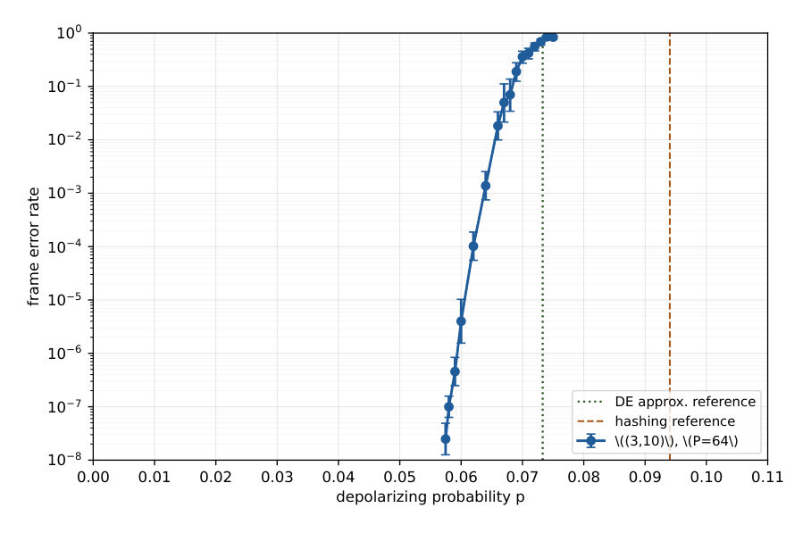 
Figure 1: FER of the 64-fold lift for the [[n, k, d]] = [[10240, 4108, 10 ≤d ≤32]] CSS code. The hashing line is the depolarizing-channel quantum hashing bound for the effective rate R = 4108/10240. The DE line is an approximate BP density-evolution reference for the regular (3, 10) ensemble.

**Summary.** This paper presents a systematic algebraic method to construct regular CSS quantum LDPC codes by using finite field cosets to manage parity-check matrix constraints. It demonstrates that this construction can produce large-scale, high-rate codes with excellent error-correction performance and verifiable distance properties.

**Why it may be interesting.** not directly relevant

Detailed structure

**Main problem.** The difficulty of constructing regular, finite-length CSS quantum LDPC codes that simultaneously satisfy the CSS commutation requirement, maintain high girth (avoiding short cycles), and suppress low-weight logical operators.

**Main result.** The development of a two-branch multiplicative-coset construction over finite fields that systematically produces regular CSS bases, demonstrated by a high-performance [[10240, 4108, 10 <= d <= 32]] code with an extremely low frame error rate at p=0.058.

**Method.** A two-stage design process involving a finite-field-based base matrix construction to fix degree distribution and initial girth, followed by a cyclic lifting stage using Circulant Permutation Matrices (CPM) subject to algebraic congruence constraints.

**Model / system.** The paper focuses on the construction and decoding of regular Calderbank-Shor-Steane (CSS) quantum low-density parity-check (QLDPC) codes under a depolarizing noise channel.

**Key observables.** Frame Error Rate (FER), minimum distance (d), code rate (R), and girth (specifically the exclusion of 4-cycles and 6-cycles).

**Important parameters / regimes.** Depolarizing probability p = 0.058, code parameters [[10240, 4108, 10 <= d <= 32], and (3, 10)-regularity.

**Assumptions / limitations.** The construction relies on sufficient (but not necessarily necessary) algebraic certificates for orthogonality and cycle exclusion; the distance certificate is a lower bound rather than an exact value.

**Figures summary.** Figure 1 shows a plot of the Frame Error Rate (FER) versus the depolarizing probability p, compared against the quantum hashing bound and a density evolution reference.

**Paper structure.** The paper introduces the construction problem, details the two-branch finite-field method for base matrices, describes the algebraic constraints for the lifting stage, provides a concrete high-performance example, and concludes with decoding performance evaluations.

Abstract

This paper develops a two-branch multiplicative-coset construction for regular Calderbank-Shor-Steane (CSS) quantum low-density parity-check base matrices. For a target column weight \(J\) and an even row weight \(L\), the method reduces regularity, CSS orthogonality, and same-type 4-cycle exclusion to explicit quotient-coset conditions over a finite field. A normalized exhaustive search for these conditions produces base matrices for several \((J,L)\) pairs, so the construction is not tied to a single degree distribution. The construction separates the finite-length design into two stages: the base matrix fixes the degree distribution and the first girth constraints, and a cyclic lift randomizes edge connections subject to exact algebraic checks. As a detailed example, we carry one \((3,10)\)-regular base through the lift and decoding stages. For this example, the selected 64-fold lift gives a code whose same-type Tanner graphs have girth at least eight, and it also excludes a specified weight-16 nondegenerate logical-support orbit. The resulting instance is a \([[10240,4108,\,10\le d\le32]]\) CSS code. For decoding, we use joint log-domain belief propagation together with low-complexity deterministic post-processing rules for small residual syndromes, including repairs for residual patterns with two unsatisfied checks. The frame error rate (FER) measurements provide finite-length decoding data for this detailed example; at depolarizing probability \(p=0.058\), the post-processing FER is \(1.0\times10^{-7}\).

[↑ back to top](#top)

### [Ancilla-Efficient QSAMPLE Preparation for Reversible Markov Chains](http://arxiv.org/abs/2605.23442v1)

**Authors:** Nicholas Zhao  
**Type:** theory · **Category:** quantum information and computing · **PDF:** <https://arxiv.org/pdf/2605.23442v1>  
**Analysis basis:** full PDF text, analyzed in chunks

📷 Fig 1

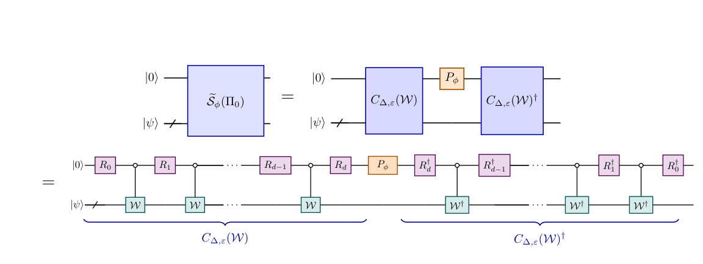 
Fig. 1. Structure of the GQSP-based selective-phase compiler e Sϕ(Π0). Top: the block-level gadget (left) equals the circuit C∆,ε(W)†(Pϕ ⊗I)C∆,ε(W) . Bottom: gate-level decomposition, consists of d controlled W gates interleaved with single qubit gates R0, . . . , Rd, which are parametrized by three parameters for higher generality [15]. The second half is the adjoint circuit C∆,ε(W)† with reversed sequence R† d, . . . , R† 0 and controlled W† gates. Here d = O(∆−1 W log(1/εW)).

📷 Fig 2

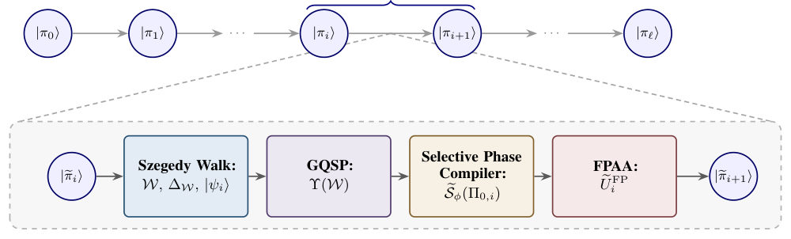 
Fig. 2. Architecture of the constant-ancilla QSAMPLE preparation algorithm. Top row: the cooling schedule advances through ℓstages of stationary states |π0⟩→· · · →|πℓ⟩. Bottom row: each transition |eπi⟩→|eπi+1⟩uses the qubitized Szegedy walk, to build a GQSP-based selective-phase compiler, to then use FPAA subroutine to transport the state.

📷 Fig 3

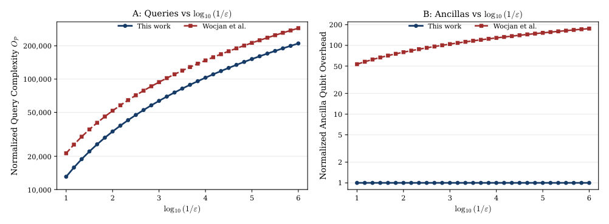 
Fig. 3. Fixed-benchmark comparison of the resource cost of our QSAMPLE framework against Wocjan et al. [4]. The benchmark is using an open-boundary ferromagnetic 2 × 4 Ising ladder under random-scan single-site heat-bath Glauber dynamics, with lazified Markov chain Pβi = (I + Gβi)/2, where Gibbs states are annealed through inverse temperatures βi ∈{0.0, 0.3, 0.6, 0.9, 1.2} (ℓ= 4 transitions). The horizontal axis is log10(1/ε), where ε is the trace distance error. Panel A shows our algorithm (blue) achieves lower asymptotic query complexity than [4] (red). Panel B shows the ancilla qubit on our working register remains constant, whilst [4] increases polylogarithmically.

**Summary.** This paper introduces a more efficient quantum algorithm for preparing quantum states that represent the stationary distributions of Markov chains. It achieves a significant reduction in the number of required ancilla qubits and improves the scaling of the computational cost relative to the overlap between states in a cooling schedule.

**Why it may be interesting.** not directly relevant

Detailed structure

**Main problem.** Developing an efficient quantum algorithm for preparing QSAMPLEs (coherent encodings of stationary distributions of reversible Markov chains) while minimizing ancilla qubit overhead and query complexity.

**Main result.** The authors present an end-to-end framework that reduces the working-register ancilla cost to exactly one qubit and improves the query complexity dependence on the minimum overlap from 1/p_min to 1/sqrt(p_min).

**Method.** The approach utilizes a Selective Phase Compiler built from Generalized Quantum Signal Processing (GQSP) and integrates it with Fixed-Point Amplitude Amplification (FPAA) to rotate through a sequence of stationary states.

**Model / system.** The framework targets reversible, ergodic Markov chains on a finite state space, with a specific application to preparing Gibbs distributions for an Ising ladder model.

**Key observables.** Trace distance (D_tr) and Total Variation Distance (d_TV) between the prepared and target distributions.

**Important parameters / regimes.** Minimum overlap (p_min), spectral gap (delta), phase gap (Delta_W), and the number of stages in the cooling schedule (l).

**Assumptions / limitations.** The Markov chains must be reversible and ergodic; the algorithm assumes oracle access to the transition matrix and known lower bounds on overlaps and spectral gaps.

**Figures summary.** Figure 1 shows the GQSP-based selective-phase compiler structure; Figure 2 illustrates the algorithm's progression; Figure 3 compares the proposed method's query complexity and ancilla overhead against previous frameworks.

**Paper structure.** The paper introduces the QSAMPLE problem, presents the new GQSP-based selective phase compiler, details the integration with FPAA for an end-to-end algorithm, provides a rigorous complexity analysis, and demonstrates application to Gibbs state preparation.

Abstract

Preparing quantum samples (QSAMPLES), coherent encodings of stationary distributions of reversible Markov chains, is a fundamental primitive in quantum sampling, particularly for quantum simulated annealing. A central limitation of existing phase-estimation-based frameworks is the ancilla qubit overhead. In this work, we present a new end-to-end framework requiring only one ancilla qubit in the working register. The key technical ingredient is a selective phase compiler circuit using one ancilla qubit, built from a generalized quantum signal processing (GQSP)-based projector onto the 1-eigenspace of the qubitized Szegedy walk. Embedding these selective phase compilers into the fixed-point amplitude amplification (FPAA) procedure and iterating yields a quantum algorithm that, given an initial state, oracle access, lower bounds on the overlaps between adjacent states, and lower bounds on the phase gaps, outputs a QSAMPLE within any desired trace distance and thus total variation distance. The query complexity scales inversely with the square roots of both the minimum overlap and the minimum spectral gap of the Markov chains across the cooling schedule, up to polylogarithmic factors. We also perform simulations to verify how our qubit and query complexity evolve with the trace distance, and how this work compares to the previous framework. These results establish two improvements over the previous framework by Wocjan and Abeyesinghe. First, the working-register ancilla cost is reduced to one. Second, by inserting our GQSP-based selective phase compiler into the FPAA procedure, we improve the QSAMPLE transport overlap dependence from inverse minimum overlap to inverse square-root minimum overlap, relative to their Grover pi-over-three fixed-point method. Finally, as a direct application, we apply the quantum algorithm to prepare a Gibbs QSAMPLE and obtain a rigorous complexity analysis.

[↑ back to top](#top)

### [Asymmetric Scaling Laws from Sparse Features](http://arxiv.org/abs/2605.23591v1)

**Authors:** John Sous, Michael Winer  
**Type:** both · **Category:** disordered systems and neural networks · **PDF:** <https://arxiv.org/pdf/2605.23591v1>  
**Analysis basis:** full PDF text, analyzed in chunks

📷 Fig 1

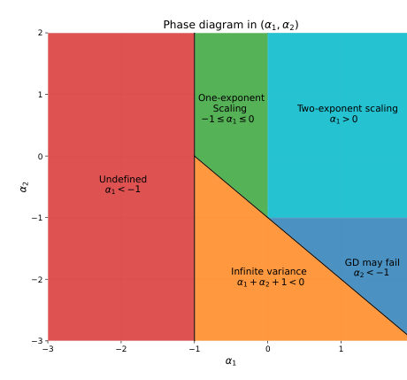 
Figure 1: Phase diagram in (α1, α2). Solid black lines mark the boundary beyond which the model is well defined. Within it we identify three regimes: symmetric one-exponent scaling, asymmetric two- exponent scaling, and a GD-failure regime with its own scaling law.

📷 Fig 2

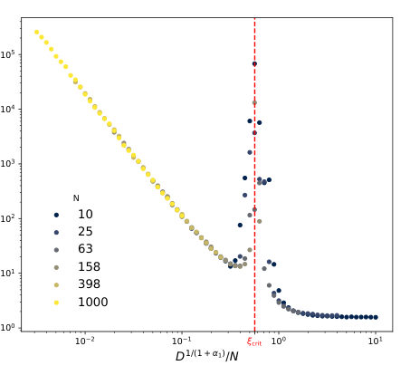 
Figure 2: Scaling collapse and double descent. We plot the rescaled loss ℓBayes ·NαN as a function of (DαD/NαN )1/αN , across a wide range of values for D, N, for fixed (α1 = 1.0, α2 = 0.3). All curves collapse onto a single universal function Sα1,α2, verifying a universal scale-invariant structure consistent with the predicted scaling law. A sharp peak emerges near ξcrit consistent with the double descent phenomenon at the interpolation threshold.

📷 Fig 3

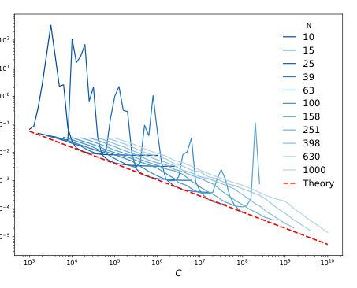 
Figure 3: Empirical scaling of loss with compute. Each curve corresponds to test loss ℓversus total compute C for a fixed model size N, with C varied by sweeping D, for fixed (α1 = 1.0, α2 = 0.3). The dashed line denotes the predicted compute-optimal scaling ℓ∗(C) ∼C−αC. The empirical loss converges toward this frontier at high compute, just past the double descent spike for each curve demonstrating agreement between theory and experiment.

📷 Fig 4

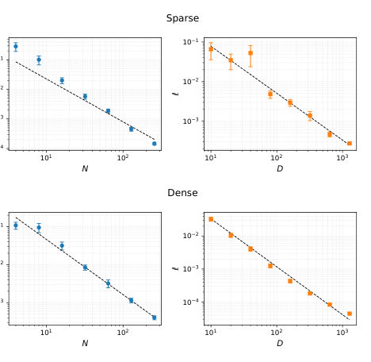 
Figure 4: Asymmetry persists under nonlin- earity. Test loss scaling under the ReLU feature map ϕ = σ(ux), trained with Nesterov + adaptive restart; (α1, α2) = (1.0, 0.3), 5 seeds. Top: sparse; bottom: dense. Left: N-sweep at D = 50,000; right: D-sweep at N = 8000. A single exponent α ≈1.5 (dashed lines, jointly fitted with separate intercepts) describes the sparse N-, dense N-, and dense D- sweeps. The sparse D-sweep requires its own shal- lower fit, αD ≈1.2, breaking the dense-baseline sym- metry αN = αD predicted by linear theory.

📷 Fig 5

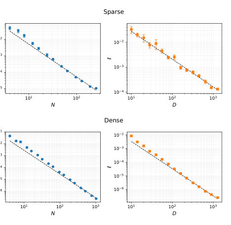 
Figure 5: Two-exponent scaling validates linear theory. Test loss scaling under the linear feature map ϕ(x) = ux, computed via the closed-form min- norm least-squares solution; (α1, α2) = (1.0, 0.3), 20 seeds. Top: sparse; bottom: dense. Left: N-sweep at D = 50,000; right: D-sweep at N = 16,000. A single exponent α ≈2.0 (dashed lines, jointly fitted with separate intercepts) describes the sparse N-, dense N-, and dense D-sweeps, in close agreement with the linear-theory prediction αN = α1 + α2 + 1 = 2.30. The sparse D-sweep requires its own shallower fit, αD ≈1.11, matching the predicted sparse exponent αD = (α1 + α2 + 1)/(α1 + 1) = 1.15 and breaking the dense-baseline symmetry αN = αD.

**Summary.** This paper identifies sparsity as the mechanism behind the asymmetric scaling laws observed in large-scale neural networks. It proves that sparse features cause the error to decay at different rates for model size versus dataset size, suggesting that increasing data is more efficient than increasing model capacity when features are sparse.

**Why it may be interesting.** not directly relevant

Detailed structure

**Main problem.** Explaining the origin of asymmetric scaling laws in neural networks, where the power-law exponents for model size and dataset size differ due to sparse feature activations.

**Main result.** The authors show that sparsity creates a bottleneck that induces a two-exponent scaling regime and shifts the compute-optimal strategy toward larger datasets rather than larger models.

**Method.** The study uses asymptotic analysis of Bayes-optimal loss, spectral analysis of the feature covariance matrix, and numerical experiments with linear and ReLU-activated random feature models.

**Model / system.** A random feature model where high-dimensional inputs have sparse activations following a power-law distribution and a variance structure controlled by sparsity and decay indices.

**Key observables.** Test loss scaling exponents (alpha_N, alpha_D), probability of gradient descent divergence, and compute-optimal frontier.

**Important parameters / regimes.** Sparsity index (alpha_1), variance decay index (alpha_2), model size (N), dataset size (D), and compute budget (C).

**Assumptions / limitations.** Assumes high-dimensional limits (M >> N, D), independent input coordinates, and a fixed random feature map (linear or ReLU).

**Figures summary.** Figure 1 shows a phase diagram in the (alpha_1, alpha_2) plane delineating scaling regimes and GD stability; Figure 4 compares test loss scaling for sparse vs. dense models under ReLU activation.

**Paper structure.** The paper introduces the sparse model, derives asymptotic scaling laws for under- and overparameterized regimes, analyzes compute-optimal resource allocation, investigates gradient descent stability, and validates findings via numerical experiments with nonlinear activations.

Abstract

We introduce a model for neural scaling laws under sparse activations. In the model, test loss is often dominated by rare coordinates that are never observed in the training input. This mechanism induces a novel bottleneck absent from dense models. We derive the asymptotic population loss in both the underparameterized and overparameterized regimes, and show that the loss exhibits a double-descent peak near the interpolation threshold -- where the number of parameters is just sufficient to fit the training data -- resulting in a loss curve governed by two distinct scaling exponents -- one for the overparameterized regime and one for the underparameterized regime -- with a gap determined by the degree of sparsity. Additionally, we derive a compute-optimal frontier that favors increasing dataset size over model capacity under fixed compute budgets. We also analyze gradient-descent dynamics and identify a scaling law for the probability that fixed-step gradient descent becomes unstable. We further show that the sparsity-induced effect persists under nonlinear activations.

[↑ back to top](#top)

### [Classical State Preparation for Variational Quantum Algorithms via Reinforcement Learning](http://arxiv.org/abs/2605.23138v1)

**Authors:** Gino Kwun, Dhanvi Bharadwaj, Gokul Subramanian Ravi  
**Type:** theory · **Category:** quantum information and computing · **PDF:** <https://arxiv.org/pdf/2605.23138v1>  
**Analysis basis:** full PDF text, analyzed in chunks

📷 Fig 1

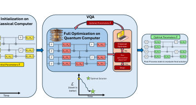 
Figure 1: Classical initialization for VQA.

📷 Fig 2

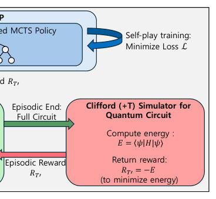 
Figure 2: Overview of our proposed neural-guided framework (CRiSP) for state preparation in VQAs. The HSS gate positioned before Rz(γ0) represents the action At−2. The environment depicts a multi- angle QAOA ansatz [41]. The circuit’s final state |ψ⟩is generated by setting γ0 = β0 = β1 = 0.

📷 Fig 3

 
Figure 3: Classical initialization accuracy for QAOA benchmarks. Asterisks (*) indicate tasks using the incremental horizon curriculum. The bar reflects the average accuracy, the error bar represents the standard deviation (std), and the points show results from three independent runs.

📷 Fig 4

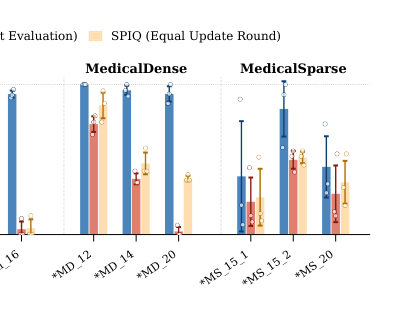 
Figure 3 summarizes the QAOA benchmark results, demonstrating that CRiSP consistently achieves higher energy accuracy than the competing approaches across all tasks (see Appendix B for numerical details). With an overall mean accuracy of 83.03% across 14 distinct tasks, CRiSP outperforms the evaluation-matched SPIQ baseline by a geometric mean (GeoMean) of 3.17× in average energy accuracy and 2.44× in best-achieved energy accuracy. Maximum improvements peak at 45.02× and 16.01×, respectively, on the MedicalDense_20 task. When matched by update rounds instead of evaluations, CRiSP continues to surpass SPIQ, achieving GeoMean improvements of 2.5× (average) and 2.15× (best), with maximum gains...

📷 Fig 5

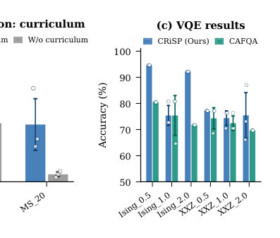 
Figure 4: (a) Training history of MaxCut_12 benchmark. Eopt and ESPIQ denote the ground-state and the best SPIQ energies, respectively. The shaded areas denote std across three seeds. (b) Ablation study with and without incremental horizon curriculum, showing CRiSP accuracy. (c) Initialization accuracy for VQE tasks. For (b) and (c), the bar indicates the average accuracy, the error bar displays std, and the points correspond to results from three independent runs.

**Summary.** This paper introduces CRiSP, an RL-based framework that uses Transformer-guided Monte Carlo Tree Search to efficiently find optimal Clifford gate sequences for initializing variational quantum circuits. By treating state preparation as a sequential decision-making problem, it significantly improves the starting energy for QAOA and VQE, helping to mitigate the effects of barren plateaus.

**Why it may be interesting.** not directly relevant

Detailed structure

**Main problem.** Variational Quantum Algorithms (VQAs) suffer from optimization bottlenecks like barren plateaus and local minima, and existing Clifford-based initialization methods struggle to scale with large circuit search spaces.

**Main result.** The CRiSP framework outperforms state-of-the-art Clifford initialization methods by a mean of 3.17x in average energy accuracy and 2.44x in best-achieved energy accuracy on QAOA benchmarks.

**Method.** A Reinforcement Learning framework using Neural-Guided Monte Carlo Tree Search (NG-MCTS) with a Transformer-based policy and an incremental horizon curriculum learning strategy.

**Model / system.** The study focuses on Variational Quantum Algorithms, specifically QAOA and VQE, applied to Hamiltonians such as MaxCut, Knapsack, and 1D Ising/XXZ models.

**Key observables.** Ground-state energy (E_opt) and approximation accuracy (E_best / E_opt).

**Important parameters / regimes.** System sizes up to 22 qubits, 1,370 parameters, and various coupling strengths J for the Ising and XXZ models.

**Assumptions / limitations.** The method assumes that the optimal initial state can be found by prepending a discrete Clifford prefix to a fixed parameterized rotation architecture.

**Figures summary.** Figure 1 shows the VQA initialization workflow; Figure 2 illustrates the CRiSP framework architecture; Figure 3 displays accuracy across QAOA benchmarks; Figure 4 shows training convergence and ablation studies for the curriculum strategy.

**Paper structure.** The paper introduces the VQA optimization problem, presents the CRiSP RL framework and MCTS implementation, details the curriculum learning strategy, provides numerical benchmarks on QAOA and VQE tasks, and concludes with limitations and future directions.

Abstract

Variational Quantum Algorithms (VQAs) potentially offer a pathway to practical quantum advantage, but their optimization is heavily hindered by barren plateaus and numerous local minima. While classically simulable Clifford circuits can warm-start VQAs to accelerate convergence, existing heuristic-based initialization methods struggle to scale within vast combinatorial search spaces. To overcome this bottleneck, we propose CRiSP (a Clifford Reinforcement Learning agent for State Preparation), a framework that formulates discrete prefix selection as a sequential decision-making problem. CRiSP utilizes Neural-Guided Monte Carlo Tree Search, driven by a Transformer-based policy trained via self-play, to insert learned Clifford gates before fixed parameterized rotations. This enables the construction of high-quality initial states entirely through polynomial-time classical stabilizer simulation without altering the underlying circuit architecture. By integrating a curriculum learning strategy that progressively expands the search horizon, the agent efficiently scales to deep circuits. Evaluated on QAOA benchmarks of up to $22$ qubits and $1{,}370$ parameters, CRiSP outperforms state-of-the-art Clifford initialization methods by a mean of $3.17\times$ (max $45.02\times$) in average energy accuracy and $2.44\times$ (max $16.01\times$) in best-achieved energy accuracy. Assessments on VQE tasks further demonstrate the framework's robustness and generalizability.

[↑ back to top](#top)

### [Exact solution of generalized gauge-invariant Ising chains with multi-spin interactions](http://arxiv.org/abs/2605.23228v1)

**Authors:** Pavel Khrapov, Stepan Shchurenkov  
**Type:** theory · **Category:** statistical mechanics · **PDF:** <https://arxiv.org/pdf/2605.23228v1>  
**Analysis basis:** full PDF text, analyzed in chunks

📷 Fig 1

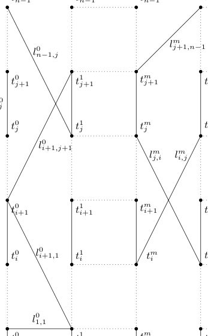 
FIG. 1: Interlayer interaction

📷 Fig 2

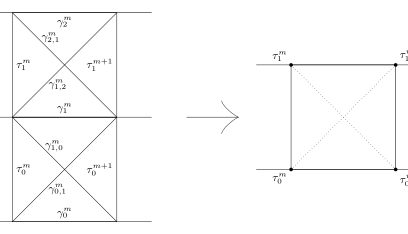 
FIG. 3: Transformation of the three-chain gauge-invariant model to the two-chain Ising model.

📷 Fig 3

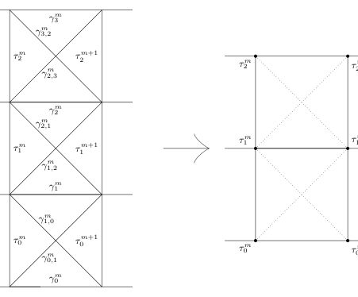 
FIG. 4: Transformation of the four-chain gauge-invariant model to the three-chain Ising model.

📷 Fig 4

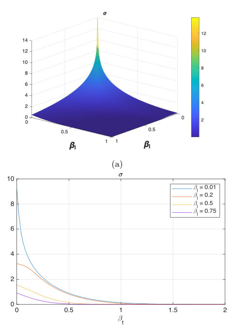 
FIG. 5: String tension (5a) hamiltonian (85) with βl ∈[0.001, 1] and βt ∈[0, 1] and plots (5b) with βt ∈[0, 1] , βl = 0.01, 0.2, 0.5, 0.75.

📷 Fig 5

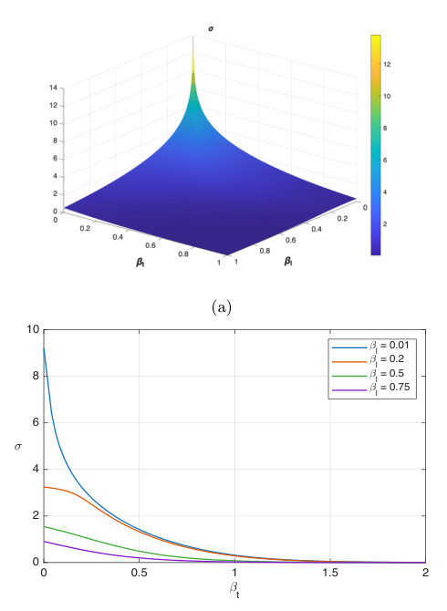 
FIG. 6: String tension (5a) with hamiltonian (85), without symmetry, with βl ∈[0.001, 1] and βt ∈[0, 1] and plots (5b) with βt ∈[0, 1] , βl = 0.01, 0.2, 0.5, 0.75.

**Summary.** This paper provides exact analytical solutions for a generalized class of gauge-invariant Ising models with multi-spin interactions. By using the transfer-matrix method, the authors characterize the phase structure of these models, specifically distinguishing between confinement and deconfinement regimes through the scaling behavior of Wilson loops.

**Why it may be interesting.** not directly relevant

Detailed structure

**Main problem.** Obtaining exact solutions for the partition function, correlation functions, and Wilson loops in generalized gauge-invariant Ising chains with multi-spin interactions.

**Main result.** The authors derive explicit analytical expressions for the partition function and gauge-invariant observables for n-chain models (n=1 to 4) and identify regimes of confinement (area-law) and deconfinement (perimeter-law).

**Method.** The transfer-matrix method is used alongside a two-step transformation involving the elimination of gauge redundancy and the reduction of the model to an effective Ising model.

**Model / system.** A class of generalized gauge-invariant n-chain Ising models (n=1, 2, 3, 4) on a strip lattice with Z2 local gauge symmetry and multi-spin interactions.

**Key observables.** Partition function, gauge-invariant correlation functions, and Wilson loops of arbitrary width.

**Important parameters / regimes.** Number of chains (n), link interaction strength (beta_l), plaquette interaction strength (beta_p), and the thermodynamic limit (L -> infinity).

**Assumptions / limitations.** The Hamiltonian is assumed to be translationally invariant and symmetric; the gauge group is Z2; explicit spectral formulas are limited to small n.

**Figures summary.** Figure 1 shows the strip lattice geometry; Figure 2/3/4 illustrate transformations between different chain models; Figure 7 shows Wilson loop exponent plots for different widths; Figure 8 shows the phase diagram via surface plots of the Wilson loop increment ratio.

**Paper structure.** The paper begins by defining the lattice and gauge group, proceeds to develop transformations for gauge redundancy elimination and model reduction, presents the transfer-matrix construction and spectral decomposition, and concludes with the analysis of Wilson loops and phase diagrams.

Abstract

In this work, exact solutions are obtained for a class of generalized gauge-invariant $n$-chain Ising models ($n=1,2,3,4$) with arbitrary multi-spin interactions that are invariant under the local $\mathbb{Z}_2$ gauge group. On a strip lattice of finite length $L$ and width $n$ with periodic or free boundary conditions, an explicit expression for the partition function is derived using the transfer-matrix method. Two successive transformations are developed: elimination of gauge redundancy and reduction of the original model to an effective $n$-chain Ising model with all possible interactions between neighboring vertical layers. On the basis of the spectral decomposition of the $2^n\times 2^n$ transfer matrix, general formulas are obtained for gauge-invariant correlation functions and Wilson loops of arbitrary width. For $n \le 3$, explicit expressions are derived in terms of eigenvalues and eigenvectors. A detailed analysis of the behavior of the Wilson loop is performed, which allows us to identify regimes exhibiting area-law (confinement-like) and perimeter-law (deconfinement-like) dependence. For specific Hamiltonians, the string tension is computed and the corresponding phase diagrams are constructed. The results generalize and substantially extend the classical works on the gauge-invariant Ising model.

[↑ back to top](#top)

### [Field evolution of the magnetic structure and spin Hamiltonian in Cs$_2$RuO$_4$](http://arxiv.org/abs/2605.23363v1)

**Authors:** S. D. Nabi, E. Ressouche, D. G. Mazzone, J. Lass, R. Sibille, Z. Yan, S. Gvasaliya, A. Zheludev  
**Type:** both · **Category:** strongly correlated electrons · **PDF:** <https://arxiv.org/pdf/2605.23363v1>  
**Analysis basis:** full PDF text, analyzed in chunks

📷 Fig 1

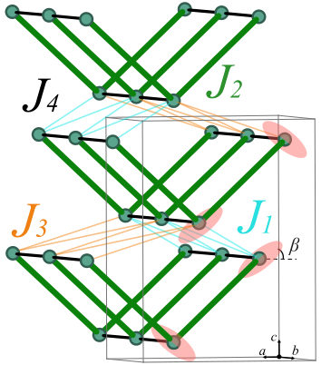 
FIG. 1. Schematic overview of interaction network in Cs2RuO4. J8 is left out for visibility. The anisotropy planes (rose) are only shown within the drawn unit cell (grey).

📷 Fig 2

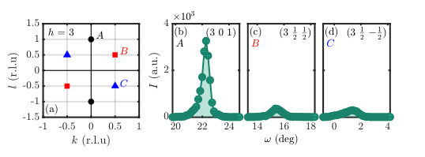 
FIG. 2. (3 k l)-plane illustrating the (3 0 ±1) peaks of the correctly aligned domain A (dots), and the rotated domains B (squares) and C (triangles). (b)-(d) show rocking curves on a non-overlapping (3 0 1) peak of domains A, B, and C, respectively. The (h k l) position on the top right indicates the indexation based on the alignment of crystallographic domain A.

📷 Fig 3

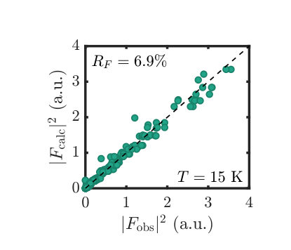 
FIG. 3. Calculated versus observed integrated intensities of nuclear Bragg peaks at T = 15 K.

📷 Fig 4

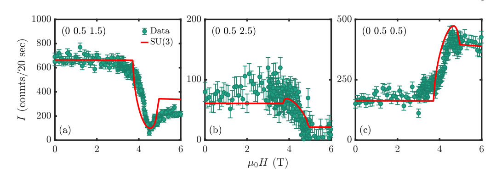 
FIG. 4. Background subtracted order parameter scans as a function of applied magnetic field along the b direction on magnetic Bragg peaks (a) (0 0.5 1.5), (b) (0 0.5 2.5), and (c) (0 0.5 0.5). Red lines indicate simulated scans using SU(3) spin wave theory. Peak (a) was measured on both instruments and scaled to match. (b) and (c) were only measured on D23.

📷 Fig 5

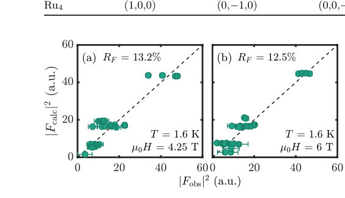 
FIG. 5. Calculated magnetic structure factors |Fcalc|2 ver- sus measured integrated intensities normalized by the Lorentz factor correction ∝|Fobs|2 at (a) 4.25 T and (b) 6 T. Dashed line indicates where the calculated and observed structure fac- tor coincide.

**Summary.** This paper provides a quantitative description of the magnetic phase transition in the frustrated quantum magnet Cs2RuO4 under an applied magnetic field. By combining neutron scattering with SU(3) spin-wave theory, the authors successfully resolved the exchange parameters of the spin Hamiltonian and confirmed the existence of a quantum critical point.

**Why it may be interesting.** not directly relevant

Detailed structure

**Main problem.** The study aims to track the field evolution of the magnetic structure in Cs2RuO4 across a quantum critical point and resolve previously undetermined exchange parameters in its spin Hamiltonian.

**Main result.** The researchers confirmed the continuous reorientation of the staggered moment from the b-axis to the c-axis across a QCP and used SU(3) spin-wave theory to uniquely determine the exchange interactions (J1, J2, J3, J4, J8) and anisotropy parameters.

**Method.** The study combines neutron diffraction and neutron spectroscopy with SU(3) generalized spin-wave theory calculations and least-squares fitting of excitation energies.

**Model / system.** The system is Cs2RuO4, a 4d (S=1) frustrated quantum magnet with a 3D exchange topology. The model uses a seven-parameter minimal Heisenberg Hamiltonian within an SU(3) spin-wave framework.

**Key observables.** Magnetic Bragg peaks, magnetic structure factors, neutron excitation spectra, and magnetization field scans.

**Important parameters / regimes.** Exchange interactions (J1, J2, J3, J4, J8), single-ion anisotropy (D and tilt angle beta), and the magnetic field strength (up to 6 T).

**Assumptions / limitations.** Assumed crystallographic domains are rotated exactly by +/- 60 degrees and that overlapping reflections occur at identical 2-theta.

**Figures summary.** Fig 1 shows the interaction network; Fig 2 displays peak positions and rocking curves for different domains; Fig 3 compares calculated vs observed nuclear intensities; Fig 7 shows constant-energy and energy-momentum projections of measured intensity.

**Paper structure.** The paper introduces the magnetic structure and interaction network, details the neutron diffraction and spectroscopy experimental setup, presents the nuclear and magnetic structure refinements, describes the SU(3) spin-wave modeling, and concludes with the resolved Hamiltonian parameters and field-induced phase evolution.

Abstract

We report neutron diffraction under applied magnetic fields and complementary zero-field neutron spectroscopy measurements on Cs$_2$RuO$_4$. Previous work [Phys. Rev. B. 112, 134436 (2025)] identified a spin-flop-like transition accompanied by a quantum critical point within the ordered phase, attributed to strong frustration between alternating single-ion anisotropy planes. Here, we quantitatively confirm the predicted field evolution of the magnetic structure using neutron diffraction. Furthermore, analysis of the excitation spectrum within an SU(3) spin-wave framework resolves previously undetermined parameters of the minimal spin Hamiltonian and lifts the associated degeneracies.

[↑ back to top](#top)

### [Hybrid Quantum-Classical Corrective Diffusion Modeling for Meteorological Downscaling](http://arxiv.org/abs/2605.23403v1)

**Authors:** Rui Wang, Edoardo Pasetto, Amer Delilbasic, Morris Riedel, Kristel Michielsen, Gabriele Cavallaro  
**Type:** both · **Category:** disordered systems and neural networks · **PDF:** <https://arxiv.org/pdf/2605.23403v1>  
**Analysis basis:** full PDF text, analyzed in chunks

📷 Fig 1

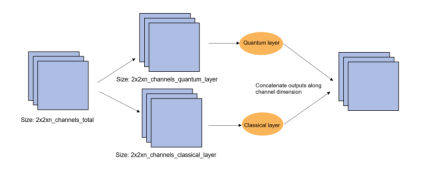 
Fig. 2: Processing scheme of the customized PyTorch class to handle the hybridization of the quantum and the classical layers. The input feature map is split along the channel dimension: the first n channels quantum layer := N//4 (with N being the number of qubits of the ansatz) channels are processed by the quantum channel layer, while the remaining channels are passed through a classical convolutional layer. The outputs of the quantum and classical branches are then concatenated along the channel dimension.

📷 Fig 2

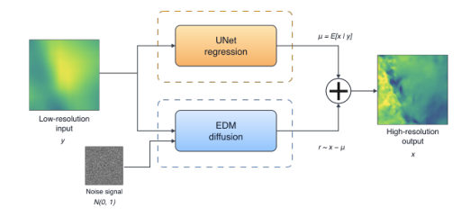 
Fig. 1: High-level schematic of the CorrDiff workflow pro- posed by Mardani et al. [19]. A low-resolution input is first mapped by a deterministic UNet regressor. The low-resolution input, noise signal, and regressor output are then passed to a diffusion model that predicts a residual correction. The final prediction is obtained by adding the residual to the regressor output.

📷 Fig 3

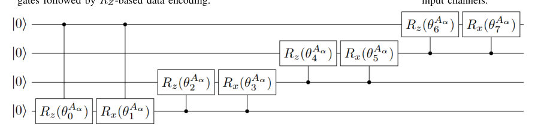 
Fig. 3: Overview of the HQConv ansatz. Panels (a)–(d) show the full circuit structure from [21], the encoding block, and the constituent A and B blocks. The HQConv ansatz uses 12 qubits and can therefore process three channels of a 2 × 2 input. In our implementation, this construction is generalized to any number of qubits that is a multiple of four, so that the number of processed channels is nqubits/4. For the special case of four qubits, corresponding to a single input channel, only block A is applied, since block B requires at least two channels.

📷 Fig 4

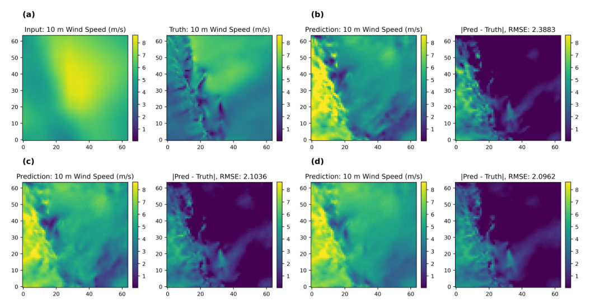 
Fig. 4: Representative 10 m wind-speed comparisons for the classical and hybrid CorrDiff models under matched bottleneck resolution. The conditioning input and truth are shown once for reference (a), while the CorrDiff rows display the prediction and residual fields for fully classical (b), Block-B-only ansatz with n_circuit=1 (nch = 3) (c), and Block-B-only ansatz with n_circuit=3 (nch = 9) (d). The qualitative comparison indicates that the hybrid bottleneck preserves the coarse flow organization while improving local structure relative to a classical model with the same bottleneck resolution.

📷 Fig 5

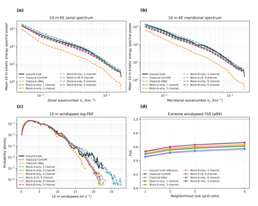 
Fig. 5: Structural realism and extreme-event localization di- agnostics on the 2020 validation set. (a,b) Directional 10 m kinetic-energy spectra along the zonal and meridional direc- tions. Low wavenumbers correspond to broad flow structures, while high wavenumbers correspond to smaller-scale variabil- ity. The deterministic UNet is strongly underpowered, whereas CorrDiff restores the missing multiscale variance but is slightly over-energetic in parts of the low-to-intermediate wavenumber range. The hybrid variants preserve the CorrDiff-like spectral slope. (c) The 10 m windspeed log-PDF shows that UNet under-represents the high-wind tail, CorrDiff produces the broadest far tail, and the...

**Summary.** This paper presents a hybrid quantum-classical diffusion model designed to improve the resolution of weather forecasts. By integrating variational quantum circuits into the bottleneck of a classical diffusion model, the authors demonstrate improved prediction of extreme wind events and better multivariate consistency, while also exploring the limitations of current quantum hardware.

**Why it may be interesting.** not directly relevant

Detailed structure

**Main problem.** Investigating whether hybrid quantum-classical variational circuits can improve the accuracy and physical realism of statistical downscaling for meteorological wind fields.

**Main result.** The hybrid model improves MAE and CRPS relative to the classical baseline, particularly in extreme event localization and multivariate consistency, though a generalization gap exists for out-of-distribution temporal shifts.

**Method.** A hybrid quantum-classical extension of the CorrDiff diffusion model is used, inserting variational quantum circuit layers (HQConv ansatz) into the bottleneck of a classical UNet.

**Model / system.** The system involves 10m wind components (u and v) from the HRRR-mini dataset, processed through a hybrid diffusion UNet architecture with quantum layers for latent-channel mixing.

**Key observables.** Mean Absolute Error (MAE), Continuous Ranked Probability Score (CRPS), kinetic-energy spectra, windspeed log-PDFs, and Fractional Skill Score (FSS) for extreme events.

**Important parameters / regimes.** Number of processed channels (n_ch = 1, 3, 9), quantum ansatz variants (Block-A, Block-B, A+B), and simulated vs. real hardware (JIQCER-5) noise levels.

**Assumptions / limitations.** Assumes that quantum circuits can act as effective nonlinear feature maps for latent-channel mixing and that the bottleneck-level hybridization is sufficient for performance gains.

**Figures summary.** Figure 1 shows the CorrDiff workflow; Figure 2 details the hybrid PyTorch implementation; Figure 3 breaks down the quantum ansatz; Figure 4 compares wind-speed maps; Figure 5 displays structural diagnostics like spectra and PDFs.

**Paper structure.** The paper introduces the downscaling problem, describes the hybrid architecture and quantum ansatz, presents a benchmarking framework, evaluates performance and structural realism, assesses noise robustness and hardware deployment, and discusses generalization gaps.

Abstract

Statistical downscaling is a crucial component of the weather modeling field, where high-resolution outputs must be reconstructed from coarse-resolution inputs with the full cost of dynamical refinement. In this work, we investigate a hybrid quantum-classical corrective diffusion model for probabilistic statistical downscaling of weather fields. The proposed model inserts variational quantum circuit layers into the most compressed bottleneck of the diffusion UNet while leaving the regression branch fully classical. This placement tests whether quantum circuits can act as compact nonlinear feature maps for latent-channel mixing. We evaluate intra-channel and cross-channel ansätze on 10m wind components. On the 2020 validation set, the hybrid models remain stable, preserve the large-scale spatial organization of the generated wind fields, and improve both MAE and CRPS relative to a classical corrective diffusion model in several configurations. Structural diagnostics further show that the hybrid variants preserve kinetic-energy spectra and windspeed distributions similar to its classical counterpart while producing controlled changes in tail behavior, extreme-windspeed localization, and joint wind field components structure. Backend studies on the 2020 validation set show negligible impact from simulated device noise at the tested circuit scale, whereas real-hardware deployment remains limited by qubit availability and execution fidelity. The 2021 out-of-distribution test shows that these in-distribution gains do not transfer uniformly under temporal shift, revealing a generalization gap that motivates future mitigation through stabilization and regularization. These results show that bottleneck-level quantum hybridization can make a nontrivial contribution to weather statistical downscaling, while also highlighting that circuit scale and hardware deployment remain key limiting factors.

[↑ back to top](#top)

### [Noise and Configuration Recovery Impact on Quantum Selected Configuration Interaction](http://arxiv.org/abs/2605.23697v1)

**Authors:** Nonia Vaquero-Sabater, Abel Carreras, Lukas Broers, Tomonori Shirakawa, Seiji Yunoki, David Casanova  
**Type:** both · **Category:** quantum information and computing · **PDF:** <https://arxiv.org/pdf/2605.23697v1>  
**Analysis basis:** full PDF text, analyzed in chunks

📷 Fig 1

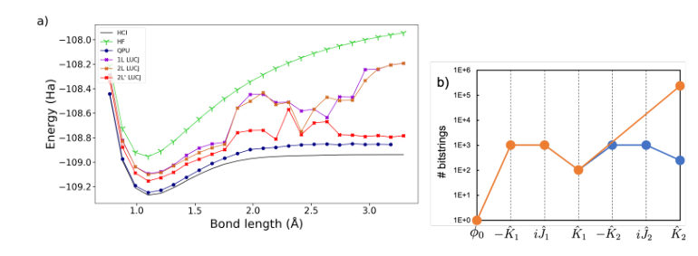 
Figure 1: (a) QSCI energy profiles for the N2 dissociation obtained by sampling with cc- pVDZ basis and (10e, 26o). Violet, brown and red lines represent the exact circuit simulation for 1, 2 and truncated-2 (2L’) layers respectively. Navy blue line are the data from the IBM experiment carried out in Ref. 20. (b) Size of the complete CI space generated after the application of the different terms of LUCJ up to L = 2 in equation 2 (blue) and skipping −ˆK2 and i ˆJ2, i.e., 2L’, in equation 7 (orange), obtained at 2.0 ˚A of interatomic distance.

📷 Fig 2

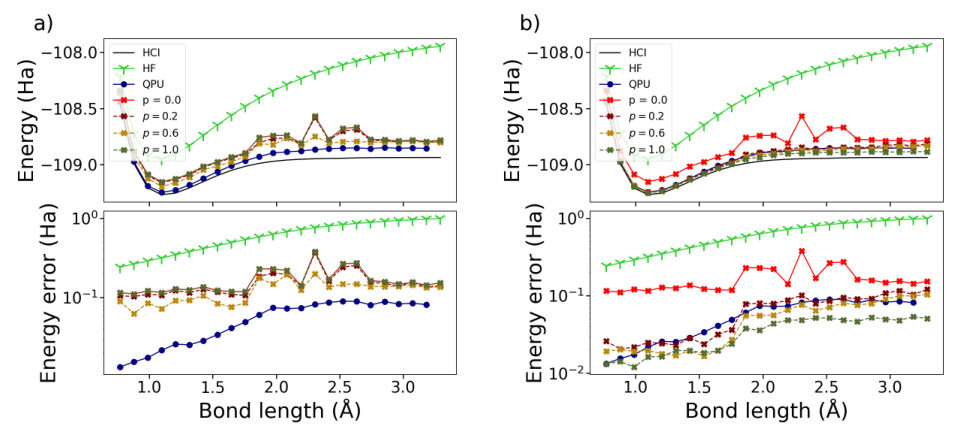 
Figure 2: N2 dissociation with cc-pVDZ basis and (10e, 26o). Maroon, gold and green lines represent exact results with different noise levels, from p = 0.2 (yellow) to p = 1 (red). The red line represents ORQA noiseless exact results. Figures (a) and (b) show the energies (up) and energy errors with respect to HCI (down) during the dissociation for configuration recovery iterations 0 and 5 respectively.

📷 Fig 3

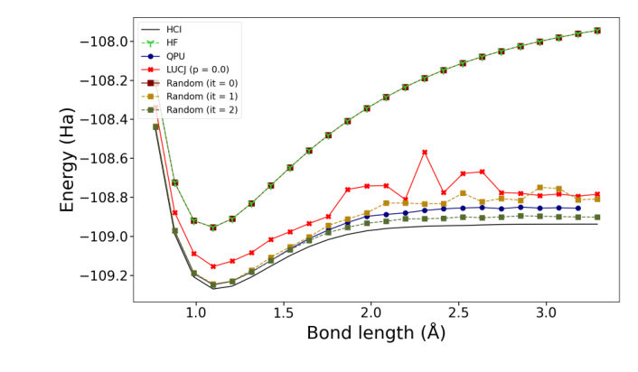 
Figure 3: N2 dissociation with cc-pVDZ basis and (10e, 26o). Maroon, gold and green lines represent the energy obtained using samples drawn from a uniform distribution at different configuration recovery iterations, 0, 1 and 2 respectively. For each distance, the number of configurations generated from the uniform distribution matches the number of configurations obtained from the exact simulation, plus the HF configuration.

📷 Fig 4

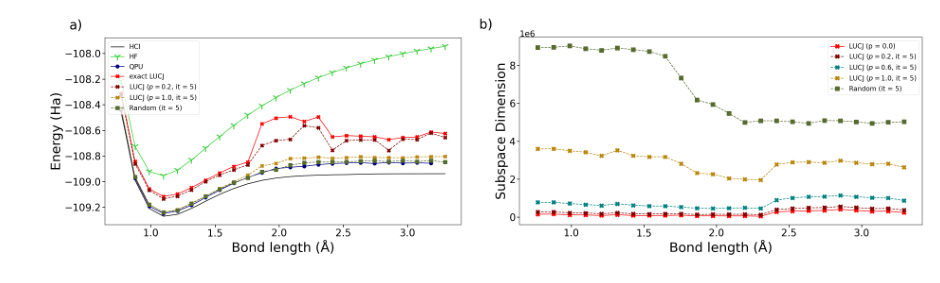 
Figure 4: Energy (a) and size of the generated CI space (b) along the N2 dissociation with cc-pVDZ basis and (10e, 26o) with subspace size determined by fixed number of collected determinants (i.e., 2000). Energies from noisy samples and uniform distribution are obtained from the recovered set of samples applying 5 recovery iteration steps.

**Summary.** This paper explores the performance of a hybrid quantum-classical method for electronic structure calculations. It demonstrates that while ideal quantum sampling is limited, the presence of noise and the use of classical configuration recovery can significantly improve the accuracy of energy estimations during molecular dissociation.

**Why it may be interesting.** It provides a counter-intuitive perspective on NISQ-era computing, suggesting that hardware noise can be a constructive resource for exploring large Hilbert spaces when paired with classical post-processing.

Detailed structure

**Main problem.** Investigating how hardware noise and configuration recovery procedures impact the performance of Quantum-Selected Configuration Interaction (QSCI) using the LUCJ ansatz.

**Main result.** The study reveals a 'noise paradox' where sampling noise can actually enhance Hilbert-space exploration, and that the configuration recovery process is the critical driver for achieving accurate energies.

**Method.** A hybrid quantum-classical approach using the LUCJ ansatz, comparing noiseless simulations, controlled noise models, and random sampling, all processed via an iterative classical configuration recovery algorithm.

**Model / system.** The dissociation of the Nitrogen molecule (N2) in a large active space (10 electrons in 26 orbitals) using the cc-pVDZ basis set.

**Key observables.** Ground-state CI energies, potential energy curves, configuration space compactness, and Hilbert-space exploration efficiency.

**Important parameters / regimes.** Interatomic distance (dissociation regime), noise level (parameter p), number of circuit layers, and number of recovery iterations.

**Assumptions / limitations.** The noise model is simplified to a single bit-flip parameter, and the study assumes the importance of the Hartree-Fock determinant in the subspace.

**Figures summary.** Figure 1 compares QSCI energy profiles for different LUCJ variants against reference standards; Figure 2 shows the impact of noise levels and recovery iterations on energy profiles; Figure 3 demonstrates how recovery drives random configurations toward accurate energies; Figure 4 correlates noise levels with the size of the explored Hilbert space.

**Paper structure.** The paper introduces the QSCI/LUCJ framework, presents benchmarks for N2 dissociation, analyzes the impact of noise on sampling, evaluates the efficacy of configuration recovery, and concludes with the synergy between noise and recovery.

Abstract

Quantum-selected configuration interaction (QSCI) is a promising hybrid quantum-classical approach in which a quantum device generates configurations for subsequent classical diagonalization. Here, we analyze the performance of QSCI combined with the local unitary cluster Jastrow (LUCJ) ansatz, focusing on the interplay between ansatz expressivity, sampling, noise, and configuration recovery. Using the dissociation of N2 in a large active space as a benchmark, we show that noiseless LUCJ sampling produces compact and biased configurational spaces, limiting the accuracy of the resulting CI energies, particularly in strongly correlated regimes. By introducing a simple noise model, we demonstrate that sampling noise can enhance Hilbert-space exploration by generating additional configurations beyond those supported by the ideal ansatz. When combined with configuration recovery, this leads to systematically improved energies. Moreover, recovery alone (starting from randomly generated configurations) can efficiently construct accurate CI spaces, highlighting its central role in QSCI.

[↑ back to top](#top)

### [Non-normal spectral signatures of instability in neural network training dynamics](http://arxiv.org/abs/2605.23476v1)

**Authors:** Souvik Ghosh  
**Type:** theory · **Category:** disordered systems and neural networks · **PDF:** <https://arxiv.org/pdf/2605.23476v1>  
**Analysis basis:** full PDF text, analyzed in chunks

📷 Fig 1

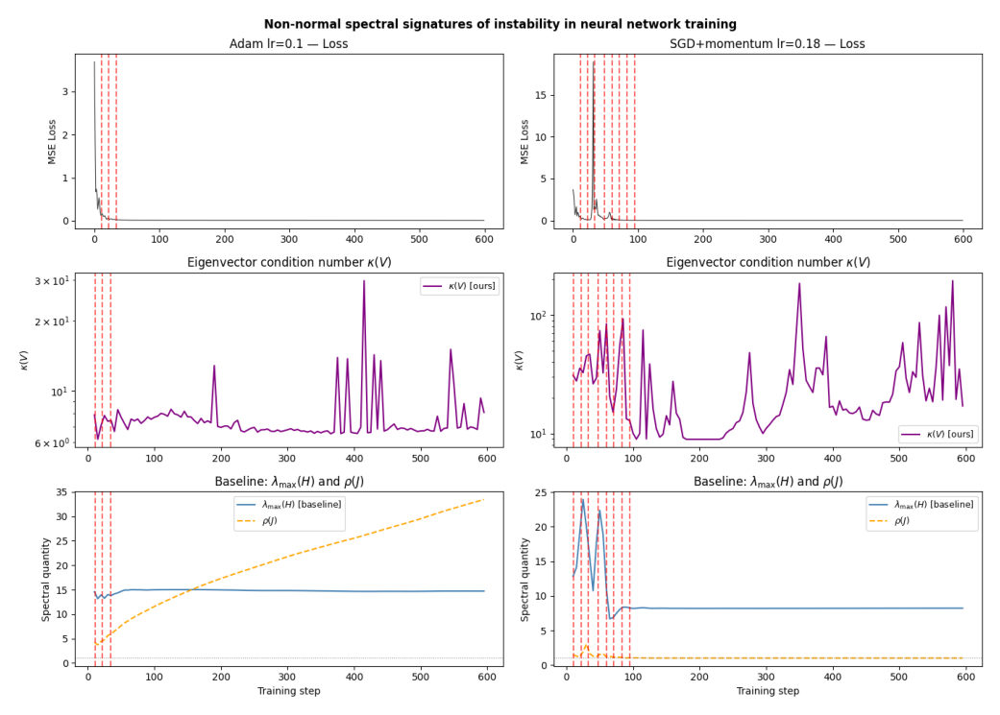 
FIG. 1. Non-normal spectral signatures of instability in neural network training. Left column: Adam optimizer (η = 0.1). Right column: SGD with momentum (η = 0.18, β = 0.9). Top row: Training loss; red dashed lines mark detected loss spikes. Middle row: Eigenvector condition number κ(Vt) (log scale); elevated by 5–50× during the instability phase (steps 15–95) for SGD+momentum. Bottom row: Spectral radius ρ(Jt) (orange dashed) and top Hessian eigenvalue λmax(Ht) (blue solid). For SGD+momentum, ρ(Jaug) remains in [1.00, 1.04] throughout, providing no separation between stable and unstable phases, while κ(Vt) separates them by approximately one order of magnitude. For Adam, ρ(Jt) grows...

📷 Fig 2

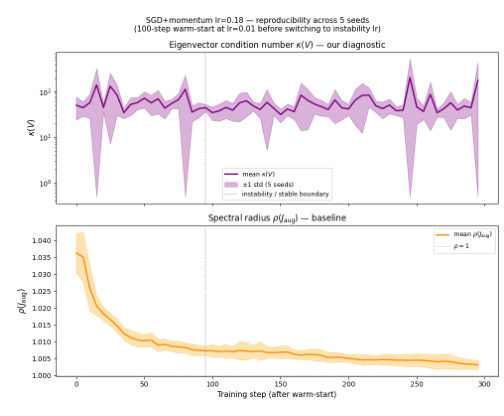 
FIG. 2. Reproducibility of the spectral radius result across five random seeds (SGD with momentum, η = 0.18, β = 0.9; 100-step warm-start at η = 0.01). Top: Eigenvector condition number κ(Vt) (mean ± 1 std); values of 30–100 are consistent with the stable-training baseline in Fig. 1. Bottom: Spectral radius ρ(Jaug) (mean ± 1 std) remains in [1.00, 1.04] through- out all five runs, confirming that ρ provides no instability sig- nal independent of initialization. The warm-start suppresses sharp loss spikes in this benchmark, so κ(V ) phase separation is not shown here.

📷 Fig 3

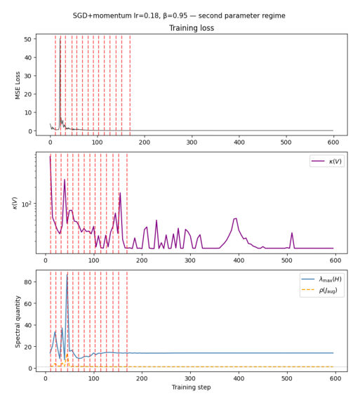 
FIG. 3. Non-normal precursor signal for SGD with momen- tum at β = 0.95, η = 0.18 (second parameter regime; same architecture and task as Fig. 1) Top: Training loss with 14 detected instability spikes (steps 10–169). Middle: κ(Vt) ele- vated at 50–103 during the instability phase, settling to 15–30 after convergence. Bottom: ρ(Jaug) peaks at 1.28 during the instability phase before returning to [1.00, 1.01] in the stable phase. The κ(V ) separation between phases (factor ∼30×) is consistent with the β = 0.9 result of Fig. 1, demonstrating robustness across momentum regimes.

**Summary.** This paper identifies that the instability in neural network training arises from the non-normal nature of modern optimizers. It demonstrates that traditional stability metrics like the spectral radius are insufficient, proposing instead that the eigenvector condition number can predict transient growth and loss spikes. This provides a new mathematical language for understanding optimization stability through the lens of non-Hermitian physics.

**Why it may be interesting.** not directly relevant

Detailed structure

**Main problem.** The lack of a rigorous operator-theoretic explanation for training instabilities like loss spikes and oscillatory convergence in deep neural networks, particularly why standard spectral radius criteria fail to predict them.

**Main result.** The authors prove that Adam and SGD with momentum are generically non-normal operators, and that the eigenvector condition number kappa(V) serves as a superior early-warning indicator for transient amplification compared to the spectral radius.

**Method.** Application of non-Hermitian operator theory, pseudospectral analysis, and the Kreiss matrix theorem to the linearized update maps of modern optimizers.

**Model / system.** The system consists of the training dynamics of deep neural networks, specifically modeled via linearized update operators for Adam (using a Hessian and diagonal preconditioner) and SGD with momentum (using an augmented state-space structure).

**Key observables.** Eigenvector condition number kappa(V), spectral radius rho(J), Kreiss constant K(J), epsilon-pseudospectrum, and Hessian sharpness.

**Important parameters / regimes.** Momentum parameter beta, learning rate eta, and the commutator [H, M] between the Hessian and preconditioner.

**Assumptions / limitations.** The analysis uses a quasi-static approximation for Adam (assuming the preconditioner evolves slowly) and focuses on the linearized regime of training dynamics.

**Figures summary.** Figure 1 shows training loss spikes alongside the elevation of kappa(V) during instability; Figure 2 demonstrates the reproducibility of the spectral radius failure across different random seeds.

**Paper structure.** The paper introduces the problem of instability, proves the non-normality of Adam and SGD, develops a pseudospectral stability framework, validates this with numerical experiments on two-layer networks, and discusses the connection to exceptional points and gradient clipping.

Abstract

Training instabilities in deep networks - loss spikes, oscillatory convergence, and gradient pathologies - are empirically prevalent but lack a rigorous operator-theoretic explanation. We show that the linearized update operators for practically used optimizers are generically non-normal: for Adam, non-normality is controlled by the commutator [H, M] between the Hessian and the diagonal adaptive preconditioner, while for SGD with momentum it arises from the augmented state-space structure of the update map. Applying non-normal stability theory to these operators, we derive a conservative pseudospectral precursor bound in which κ(V) serves as an early-warning indicator of transient amplification even when the spectral radius remains below one, and we establish that exceptional points of the update operator appear as the κ(V) -> \infty limiting case of this framework. Numerical experiments on two-layer networks confirm that the spectral radius ρ(J) provides no separation between stable and unstable training phases while κ(V) separates them by approximately one order of magnitude, complementing the classical sharpness criterion with a continuous severity measure of non-normal amplification. These results establish non-Hermitian operator theory as a useful and underexplored framework for neural network optimization stability, offering a diagnostic language and proof-of-concept benchmark for understanding adaptive optimization stability.

[↑ back to top](#top)

### [On the Approximate Non-Deterministic Degree of Total Boolean Functions](http://arxiv.org/abs/2605.23336v1)

**Authors:** Samruddhi Pednekar, Supartha Podder  
**Type:** theory · **Category:** other · **PDF:** <https://arxiv.org/pdf/2605.23336v1>  
**Analysis basis:** full PDF text, analyzed in chunks

📷 Fig 1

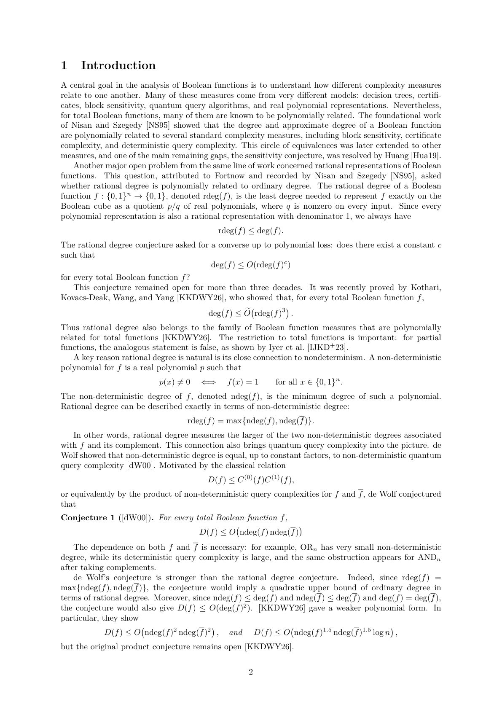 
Low-resolution page preview, page 2

📷 Fig 2

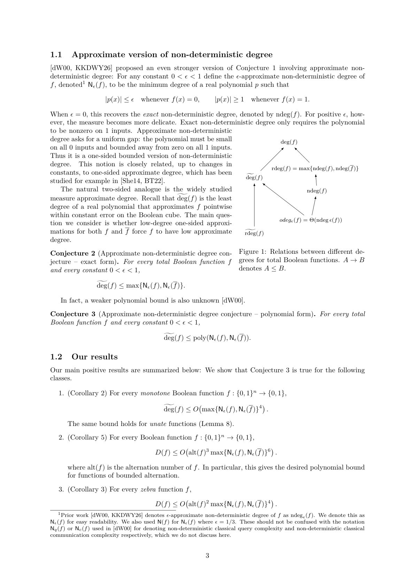 
Low-resolution page preview, page 3

📷 Fig 3

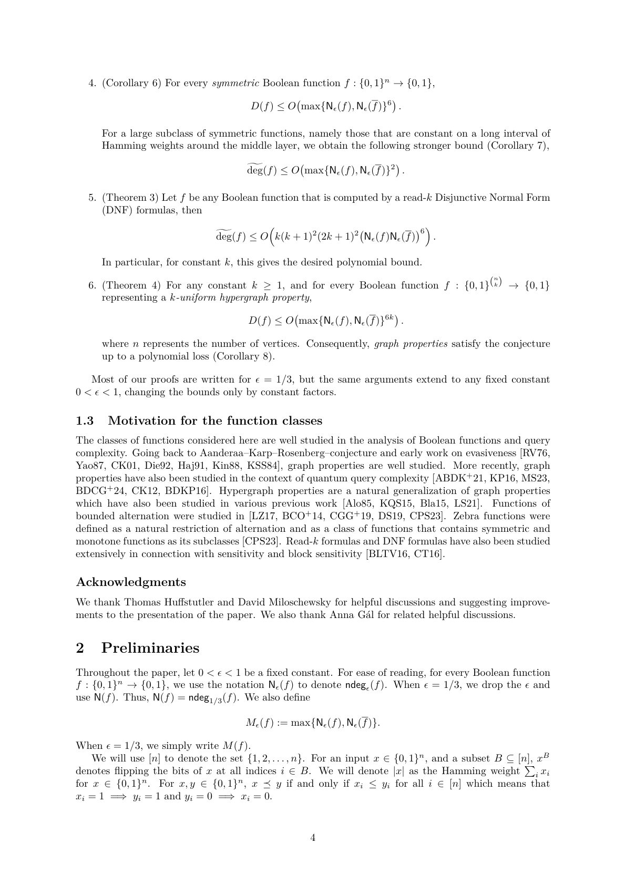 
Low-resolution page preview, page 4

📷 Fig 4

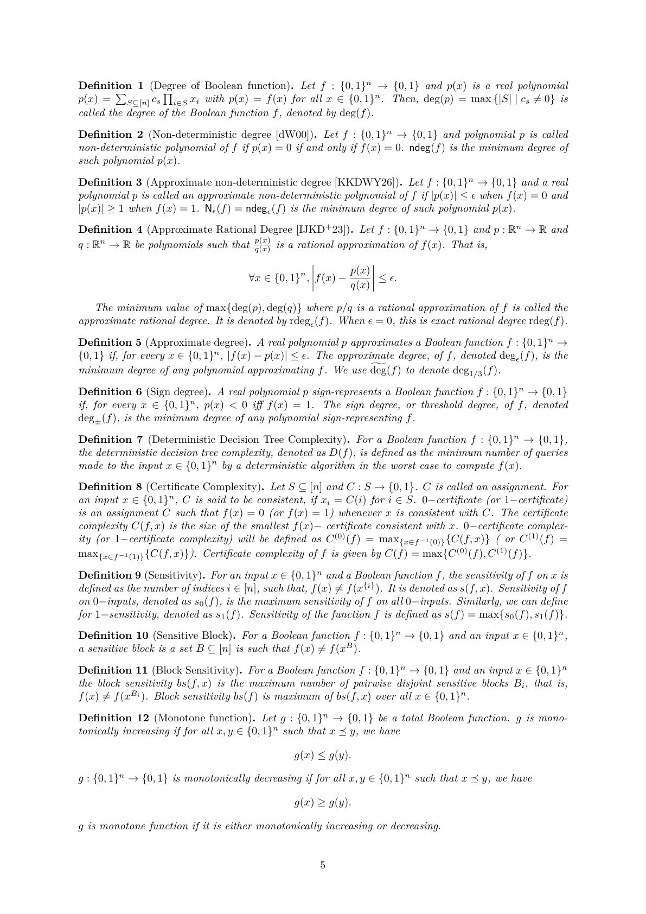 
Low-resolution page preview, page 5

📷 Fig 5

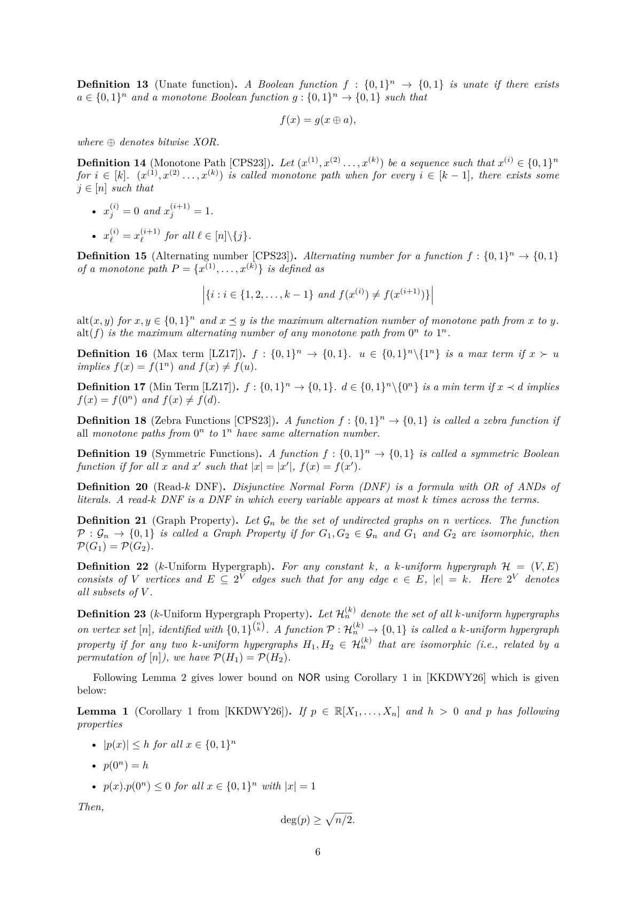 
Low-resolution page preview, page 6

**Summary.** This paper provides the first systematic progress on the conjecture that the approximate degree of a Boolean function is polynomially bounded by the joint approximate non-deterministic degrees of the function and its complement. It proves this relationship for several important classes of functions, including monotone, symmetric, and read-k DNF formulas. The work advances the understanding of the hierarchy of Boolean complexity measures.

**Why it may be interesting.** not directly relevant

Detailed structure

**Main problem.** The paper investigates the relationship between various complexity measures of total Boolean functions, specifically focusing on the 'Approximate Non-Deterministic Degree Conjecture'.

**Main result.** The authors establish the conjecture that the approximate degree is polynomially bounded by the joint approximate non-deterministic degrees of a function and its complement for several classes, including monotone, unate, symmetric, and read-k DNF functions.

**Method.** The work employs polynomial construction, variable restrictions, induction on alternation numbers, and graph-theoretic approaches to relate different complexity measures.

**Model / system.** The study is set in the domain of total Boolean functions f: {0, 1}^n -> {0, 1}, analyzing measures like approximate degree, rational degree, and decision tree complexity.

**Key observables.** Approximate non-deterministic degree (N_epsilon(f)), decision tree complexity (D(f)), certificate complexity (C(f)), and block sensitivity (bs(f)).

**Important parameters / regimes.** The error parameter epsilon (0 < epsilon < 1), alternation number (alt(f)), and the read-k parameter for DNF formulas.

**Assumptions / limitations.** The results are proven for specific classes of functions such as monotone, unate, and symmetric functions; the bounds for general functions depend on the alternation number.

**Figures summary.** A directed graph illustrating the polynomial relationships between various Boolean function complexity measures.

**Paper structure.** The paper introduces the conjecture, defines the mathematical framework of approximate non-deterministic degree, and then provides systematic proofs for various function classes (monotone, zebra, symmetric, DNF, and hypergraph properties) before discussing limitations and open questions.

Abstract

The approximate non-deterministic degree of a Boolean function $f$, denoted $\mathsf{ndeg}_ε(f)$ (written $\mathsf{N}_ε(f)$ for brevity), is the minimum degree of a real polynomial $p$ such that $0 \le |p(x)| \le ε$ whenever $f(x) = 0$, and $|p(x)| \ge 1$ whenever $f(x) = 1$. Unlike exact non-deterministic degree, which only requires the polynomial to be nonzero on $1$-inputs, this measure enforces a uniform gap: the polynomial must stay close to zero on all $0$-inputs and bounded away from zero on all $1$-inputs.   The rational degree conjecture, open for over three decades, was recently resolved by Kothari, Kovacs-Deak, Wang, and Yang, who showed that for every total Boolean function $f$, \[ deg(f) \le \widetilde O\!\left(\operatorname{rdeg}(f)^3\right). \]   In their paper, they explicitly propose a stronger conjecture: that approximate degree is polynomially bounded by $\mathsf{N}_ε(f)$ and $\mathsf{N}_ε(\overline{f})$ jointly, i.e., for every total Boolean function $f$ and every constant $0<ε<1$, \[ \widetilde{deg}(f) \le \operatorname{poly}(\mathsf N_ε(f), \mathsf N_ε(\overline f)). \]   This conjecture, if true, would imply a polynomial version of the rational degree result and bring us closer to resolving de Wolf's longstanding non-deterministic degree conjecture.   In this work, we make the first systematic progress on this problem, establishing the conjecture for several broad and natural function classes: monotone and unate functions, functions of bounded alternation number, symmetric functions, $k$-uniform hypergraph properties, and read-$k$ Disjunctive Normal Form (DNF) formulas.

[↑ back to top](#top)

### [Optimizing Parallel Execution of Commuting Pauli Product Rotations](http://arxiv.org/abs/2605.23738v1)

**Authors:** Sayam Sethi, Devika Nambisan, Jonathan Mark Baker  
**Type:** theory · **Category:** quantum information and computing · **PDF:** <https://arxiv.org/pdf/2605.23738v1>  
**Analysis basis:** full PDF text, analyzed in chunks

📷 Fig 1

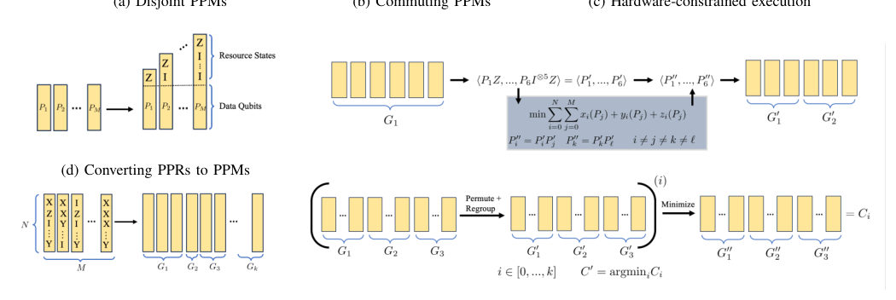 
Fig. 1: Overview of this work. (a) Pauli Product Measurements (PPMs) with disjoint supports, i.e., acting on disjoint qubits can be executed in parallel. (b) PPMs that commute can be executed in parallel. Note that even though the Pauli supports on both qubits anti-commute, their joint product commutes. (c) Execution of commuting PPMs on a surface code architecture. Since each logical qubit only has 2 access points (or ports), despite having 4 commuting measurements on the second qubit, we can only execute two out of the first three, increasing execution depth. (d) We convert PPRs that require a resource state to PPMs by adding a Z basis measurement on a unique resource state for each...

📷 Fig 2

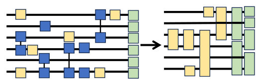 
Fig. 2: Compiling an input Clifford + Rz/T circuit into a sequence of PPRs. Here non-Clifford gates are coloured yellow, Clifford gates are coloured blue, and measurements are coloured green. Post PBC-compilation, we are left with a sequence of Pauli Product Rotations (PPRs) and a final set of measurements. For more information, see [11].

📷 Fig 3

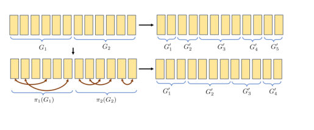 
Fig. 3: Clique reshuffling approach. The initial set of cliques are internally permuted which is then reconstructed to give a different set of cliques. When mapped to hardware, this may lead to a reduction in depth, e.g., 5 →4 in this example.

📷 Fig 4

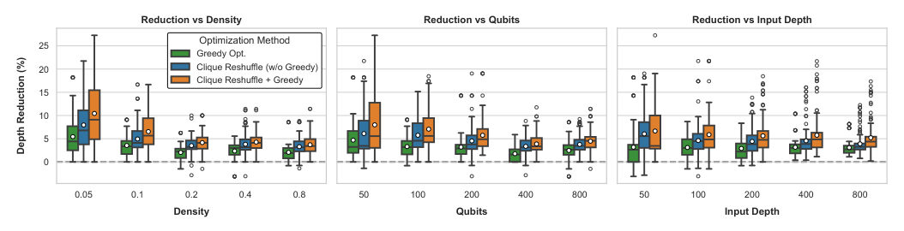 
Fig. 4: Algorithm sensitivity to different circuit parameters Depth reduction percentage of different strategies relative to the baseline across parameter sweeps. The sweep independently varies the density (left), number of qubits (center), and input depth (right) of randomly generated PPMs.

📷 Fig 5

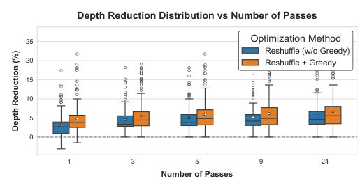 
Fig. 5: Sensitivity to the number of reshuffling passes.

**Summary.** This paper introduces two heuristics to reduce the execution depth of quantum circuits in fault-tolerant architectures by optimizing how commuting Pauli rotations are grouped under hardware port constraints. By reshuffling commuting groups and restructuring their generators, the authors demonstrate significant reductions in circuit depth on standard benchmarks.

**Why it may be interesting.** not directly relevant

Detailed structure

**Main problem.** Hardware constraints on the number of available X and Z ports per qubit in fault-tolerant architectures force the splitting of commuting Pauli Product Rotations, which increases total circuit depth.

**Main result.** The proposed combination of clique reshuffling and generator restructuring achieves an average reduction in hardware-limited circuit depth of 10-20%, with peak reductions of up to 50%.

**Method.** Two heuristics are proposed: clique reshuffling, which permutes commuting products to optimize group formation, and generator restructuring, which rewrites groups using equivalent sets to reduce per-qubit port pressure.

**Model / system.** The study focuses on Fault-Tolerant Quantum Computation (FTQC) using the surface code architecture with lattice surgery, specifically within the Pauli-Based Computing (PBC) framework.

**Key observables.** Circuit depth, Pauli weight, and port usage (X and Z edges per qubit).

**Important parameters / regimes.** Port budget (number of X/Z access points), Pauli density, qubit count, and circuit depth.

**Assumptions / limitations.** The optimization assumes the surface code with lattice surgery, assumes the input circuit is already compiled into PPMs, and assumes unconstrained routing.

**Figures summary.** Figure 1 outlines the problem of port-constrained execution; Figure 2 shows the compilation workflow; Figures 3-5 illustrate the mechanics and sensitivity of the reshuffling and greedy heuristics; Figure 6 shows depth reduction across various benchmarks; Figure 7 shows performance scaling with the number of available hardware ports.

**Paper structure.** The paper introduces the problem of depth inflation due to port limits, describes the proposed reshuffling and restructuring heuristics, presents a benchmarking study using QASMBench, and analyzes the scaling of performance with respect to port budget and circuit density.

Abstract

Fault-Tolerant Quantum Computation (FTQC) permits parallel execution of mutually commuting Pauli Product Rotations (PPRs), but per-qubit access point/port limits (e.g. two X and two Z edges on the surface code) force commuting groups that exceed the budget to be split, inflating circuit depth. We propose two heuristics for reducing this hardware-limited depth: 1. clique reshuffling, which permutes commuting products and re-forms port-constrained groups, and 2. generator restructuring, which rewrites each group as an equivalent generating set with reduced per-qubit port pressure. On QASMBench circuits compiled to PPRs, we combine the two heuristics and observe an average hardware-limited depth reduction of $10-20\%$ over a non-reordering baseline, with up to $50\%$ reduction. These observed gains scale with the per-qubit port budget and saturate near $20$ ports, suggesting these heuristics remain relevant as hardware exposes more access points.

[↑ back to top](#top)

### [Order-Disorder Tricriticality in $\mathrm{A}_n \mathrm{B}_n$ Star Polymer Melts](http://arxiv.org/abs/2605.23758v1)

**Authors:** Minhoon Kim, Wonjun Kang, Daeseong Yong, Junhan Cho, Jaeup U. Kim  
**Type:** theory · **Category:** statistical mechanics · **PDF:** <https://arxiv.org/pdf/2605.23758v1>  
**Analysis basis:** full PDF text, analyzed in chunks

📷 Fig 1

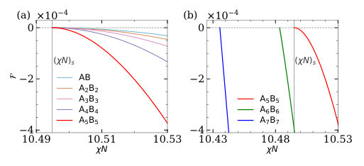 
FIG. 1. Phase-transition behavior of symmetric AnBn star polymer systems: (a) Second-order transitions for n ≤5. (b) First-order transitions for n ≥6. The vertical gray line marks (χN)s ≈10.495.

📷 Fig 2

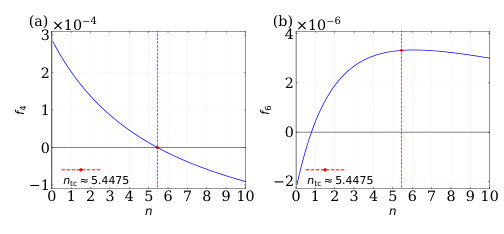 
FIG. 2. Coefficients of F as functions of n: (a) The quartic coefficient f4 vanishes and changes sign at n = ntc ≈5.4475. (b) The sextic coefficient f6 remains positive in the vicinity of n = ntc.

📷 Fig 3

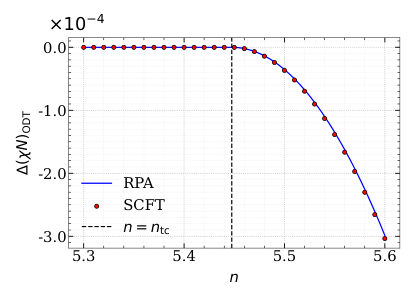 
FIG. 3. Comparison of the sixth-order RPA prediction for the phase boundary with the SCFT results.

**Summary.** This paper demonstrates that the architecture of a star polymer, specifically the number of arms, can act as a thermodynamic tuning parameter to induce tricriticality. By finding a specific arm number where the order-disorder transition changes from continuous to first-order, the study provides a rare analytically tractable example of architecture-induced phase transitions.

**Why it may be interesting.** not directly relevant

Detailed structure

**Main problem.** The study investigates the nature of the order-disorder transition (ODT) in symmetric star polymer melts and identifies the mechanism that drives the transition from second-order to first-order.

**Main result.** The authors analytically identify a tricritical arm number, n_tc approximately 5.4475, where the transition character changes, and show that the transition is driven by inter-arm correlations at the common junction.

**Method.** The researchers use a sixth-order free-energy expansion within the Random Phase Approximation (RPA) and validate the results using Self-Consistent Field Theory (SCFT) and Langevin Field Theory simulations.

**Model / system.** The system consists of incompressible melts of symmetric A_nB_n star polymers, where each star has n arms of type A and n arms of type B connected to a common junction, modeled using a Gaussian chain model.

**Key observables.** Order parameter (density modulation amplitude), phase boundary shift, and the quartic and sextic Landau coefficients.

**Important parameters / regimes.** Arm number (n), Flory-Huggins interaction parameter (chi*N), and composition fraction (f).

**Assumptions / limitations.** The model assumes incompressible melts and uses a mean-field framework (RPA and SCFT) within a Gaussian chain approximation.

**Figures summary.** Figure 1 shows free-energy curves illustrating continuous vs. discontinuous transitions; Figure 2 shows the vanishing and sign change of the quartic coefficient at the tricritical point.

**Paper structure.** The paper introduces the problem of transition character, develops a sixth-order RPA expansion, provides analytical predictions for the tricritical point and phase boundaries, validates these with SCFT, and discusses the physical origin via inter-arm correlations.

Abstract

Tricriticality usually requires tuning an additional thermodynamic parameter. Here we show that, in symmetric $\mathrm{A}_n\mathrm{B}_n$ star-polymer melts, the arm number $n$ itself plays this role and drives the order--disorder transition (ODT) from second order to first order. By developing a sixth-order free-energy expansion within the random phase approximation and comparing it with self-consistent field theory (SCFT) calculations, we analytically identify a tricritical arm number, $n_{\mathrm{tc}}\approx 5.4475$. For $n<n_{\mathrm{tc}}$, the lamellar ordering transition remains continuous and occurs at the spinodal point, $(χN)_{\mathrm{s}}\approx 10.495$. For $n>n_{\mathrm{tc}}$, the transition becomes first order, and $(χN)_{\mathrm{ODT}}$ shifts below $(χN)_{\mathrm{s}}$ with a quadratic dependence near the tricritical point. SCFT calculations confirm the predicted transition character and phase-boundary shift. The origin of this behavior is traced to inter-arm correlations generated by the common junction. We further show that the noninteger tricritical arm number can be effectively realized in binary mixtures of star polymers. This provides a rare analytically tractable example of architecture-induced tricriticality in a microphase-separating polymer system.

[↑ back to top](#top)

### [Phase diagram of the vortex state in an amorphous Re6Zr thin film exhibiting inverse melting](http://arxiv.org/abs/2605.23567v1)

**Authors:** Pritam Das, Subhamita Sengupta, Anjan Jana, Rishabh Duhan, Sulagna Dutta, Arghya Dutta, John Jesudasan, Vivas Bagwe, Pratap Raychaudhuri  
**Type:** experiment · **Category:** disordered systems and neural networks · **PDF:** <https://arxiv.org/pdf/2605.23567v1>  
**Analysis basis:** full PDF text, analyzed in chunks

📷 Fig 1

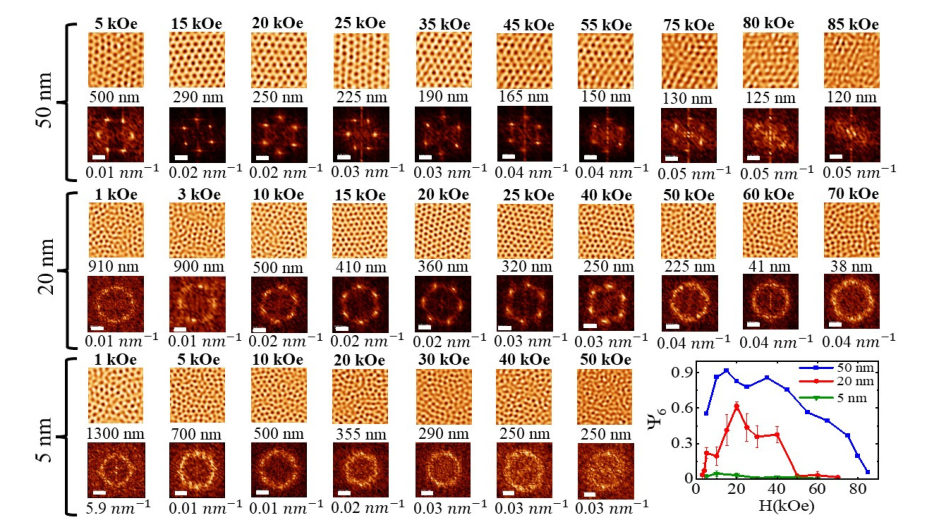 
Figure 1. Real-space STS conductance maps of vortex configurations (upper panels) and the corresponding

📷 Fig 2

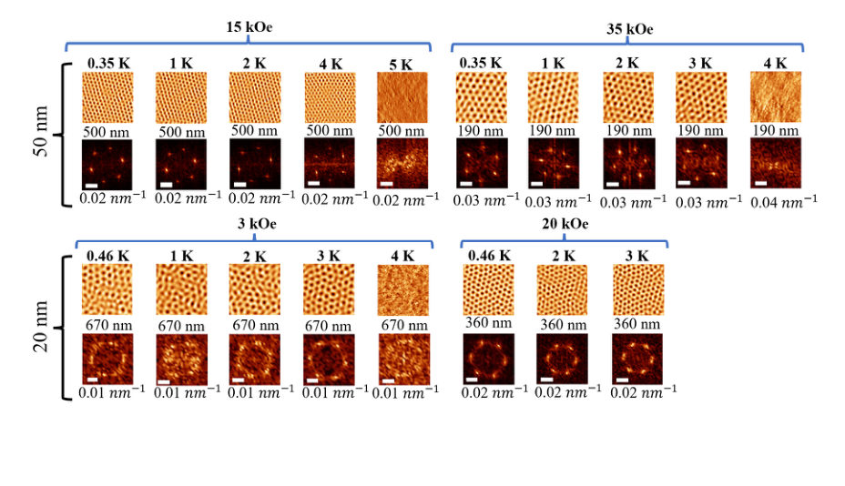 
Figure 2. Temperature evolution of vortex configurations (upper panels) and corresponding two-

📷 Fig 3

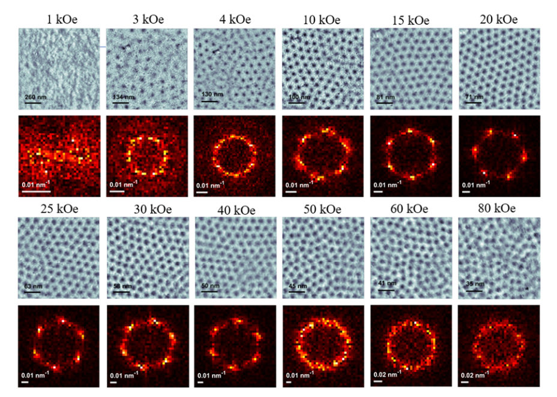 
Figure 3. Magnetic-field evolution of the summed vortex images and corresponding two-dimensional

📷 Fig 4

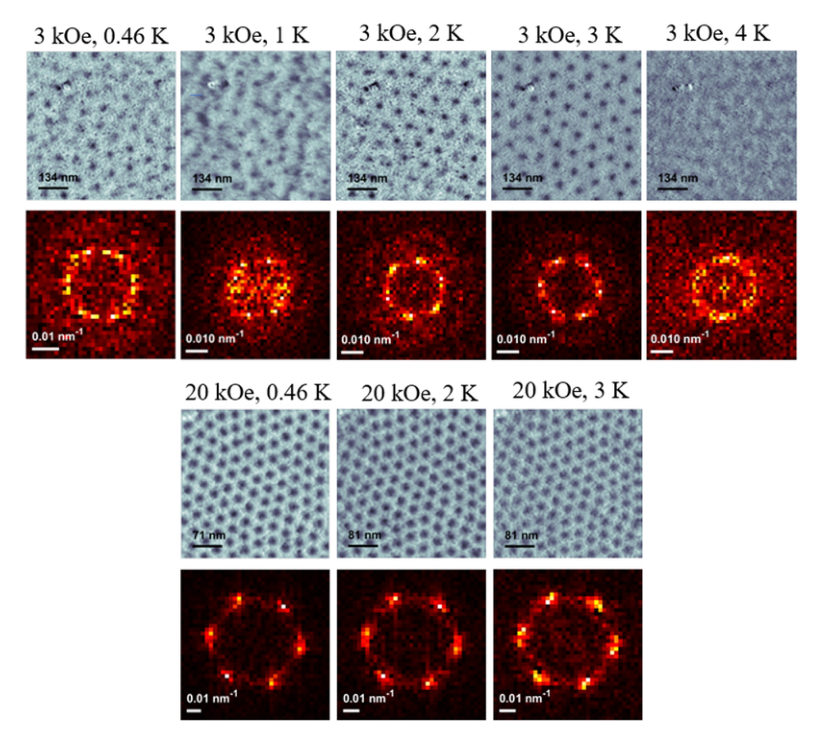 
Figure 4. Temperature evolution of the summed STM vortex maps and corresponding two-dimensional

📷 Fig 5

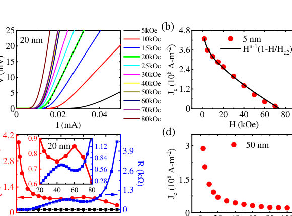 
Figure 5. Magneto-transport response of amorphous Re₆Zr films measured at 300 mK. (a) Representative

**Summary.** This paper maps the vortex phase diagram of amorphous Re6Zr thin films, revealing that the 'inverse melting' transition is highly sensitive to film thickness. It shows that intermediate thicknesses allow for a re-entrant phase where increasing temperature induces order, while extreme thicknesses favor either a permanent liquid or a stable solid state.

**Why it may be interesting.** not directly relevant

Detailed structure

**Main problem.** The study investigates the vortex state phase diagram in amorphous Re6Zr thin films, specifically focusing on the phenomenon of 'inverse melting' where a vortex liquid transitions into a crystalline solid as temperature increases.

**Main result.** The researchers demonstrate that the inverse melting transition is thickness-dependent: 5 nm films remain in a disordered liquid state, 20 nm films exhibit re-entrant liquid-solid-liquid behavior, and 50 nm films maintain a stable crystalline solid.

**Method.** The study employs Scanning Tunneling Spectroscopy (STS) for real-space imaging, magnetotransport measurements (R-T and I-V characteristics), and two-coil mutual inductance for AC magnetic screening.

**Model / system.** The physical system consists of amorphous Re6Zr (a-ReZr) thin films with varying thicknesses (5 nm, 20 nm, and 50 nm) in the Type II superconducting regime, where vortex dynamics are influenced by the competition between pinning, thermal fluctuations, and vortex-vortex interactions.

**Key observables.** Differential conductance maps (dI/dV), orientational order parameter (psi_6), 2D Fourier Transforms (2DFT), critical current density (Jc), resistance (R), and complex magnetic susceptibility (chi' and chi'').

**Important parameters / regimes.** Magnetic field (H), temperature (T), film thickness (5, 20, 50 nm), upper critical field (Hc2), and Maki parameter (alpha).

**Assumptions / limitations.** The transition is assumed to be broadened by quenched random disorder rather than being a sharp first-order transition; the Gittleman-Rosenbaum model is used to treat vortex motion as an overdamped harmonic oscillator.

**Figures summary.** Figure 1 shows STS conductance maps and 2D-FFTs for different thicknesses; Figure 2 shows temperature evolution of vortex configurations; Figure 5/6 shows I-V characteristics, Jc dependence, and resistance peaks; Figure 7 shows AC magnetic screening response (chi' and chi'').

**Paper structure.** The paper introduces the inverse melting phenomenon, describes the experimental setup and material preparation, presents thickness-dependent imaging and transport results, analyzes the phase boundaries and magnetic response, and concludes with a discussion on the interplay of dimensionality and disorder.

Abstract

In Type II superconductors, the vortex lattice can exhibit "inverse melting," transitioning from a liquid to a crystalline solid as temperature increases. While recently observed via scanning tunneling microscopy in a 20 nm thick amorphous Re6Zr thin film, this work investigates the corresponding d.c. transport and low-frequency magnetic screening responses. By identifying distinct signatures of these transitions and integrating scanning tunneling spectroscopy imaging, we construct a comprehensive vortex-state phase diagram in the magnetic field-temperature parameter space. Furthermore, we demonstrate that inverse melting is thickness-dependent: a 5 nm film retains an inhomogeneous liquid state, while a 50 nm film maintains a crystalline solid structure except near the upper critical field.

[↑ back to top](#top)

### [Pulsed thermal annealing enables switching of chiral antiferromagnetic order with a sub-millitesla field in Mn$_3$Sn](http://arxiv.org/abs/2605.23205v1)

**Authors:** Xiaokang Li, Jing Zhang, Xiaodong Guo, Zengwei Zhu  
**Type:** experiment · **Category:** strongly correlated electrons · **PDF:** <https://arxiv.org/pdf/2605.23205v1>  
**Analysis basis:** full PDF text, analyzed in chunks

📷 Fig 1

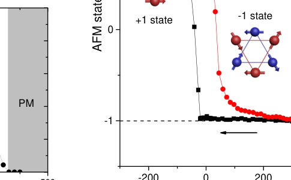 
Figure 1. Setup, chiral antiferromagnetic order and threshold field. (a) Schematic of the pulsed thermal annealing setup. (b) Field dependence of Hall resistivity at 250 K showing the AHE hysteresis, with the two Hall plateaus representing the positive and negative chiral antiferromagnetic states, respectively. (c) Temperature dependence of the threshold field B0 (the minimum magnetic field required to switch the octupole order at a given temperature), vanishing at TN around 425 K.

📷 Fig 2

 
Figure 1b shows the field dependence of ρzy at 250 K. The curve exhibits a clear AHE hysteresis loop, with a threshold field B0 ≈18 mT required to switch the octupole order between the +1 and −1 states (defined as the octupole vector pointing along +x or −x, respectively). As the temperature increases, the magnetic anisotropy that gives rise to B0 gradually weakens. We measured B0 as a function of temperature (Figure 1c) and found that it decreases monotonically, extrapolating to zero at TN ≈425 K. Above this temperature, the AHE vanishes entirely due to the paramagnetic phase transition. This behavior confirms that the energy barrier for switching the chiral antiferromagnetic order is...

📷 Fig 3

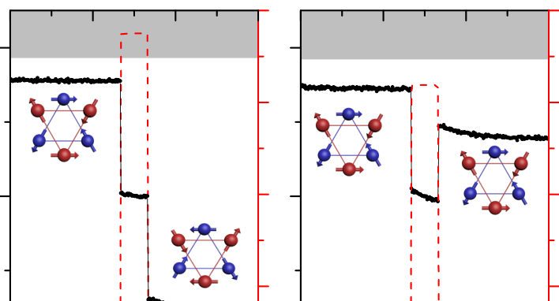 
Figure 3. Crossing TN is necessary. (a) Annealing at 438 K (above TN) with a 0.2 mT cooling field: the chiral antiferromagnetic order switches sign. (b) Annealing at 409 K (below TN) with a 0.2 mT cooling field: the chiral antiferromagnetic order does not switch sign. Instead, its original orientation is partially attenuated (as evidenced by a reduced AHE signal) but not reversed.

**Summary.** This paper demonstrates that heating Mn3Sn above its Neel temperature allows for the switching of its chiral antiferromagnetic order using extremely weak magnetic fields. This 'thermal softening' approach significantly reduces the energy barrier for magnetic manipulation. The findings suggest that thermal effects should be integrated with spin-torque mechanisms for efficient future spintronic device design.

**Why it may be interesting.** not directly relevant

Detailed structure

**Main problem.** The challenge of reliably switching the chiral antiferromagnetic order in the Weyl antiferromagnet Mn3Sn using minimal external magnetic fields.

**Main result.** By using pulsed thermal annealing to heat the material above its Neel temperature, the magnetic anisotropy barrier is removed (thermal softening), allowing switching with sub-millitesla fields.

**Method.** The researchers used pulsed thermal annealing on Mn3Sn single crystals on a resistive heater chip, monitoring the Anomalous Hall Effect (AHE) during heating and cooling in small magnetic fields.

**Model / system.** The physical system is the Weyl antiferromagnet Mn3Sn, which possesses a non-collinear 120-degree spin structure on a kagome lattice and a cluster magnetic octupole order.

**Key observables.** Anomalous Hall Effect (AHE) signal, Hall resistivity, and the threshold magnetic field (B0) required for switching.

**Important parameters / regimes.** Neel temperature (TN approx 425 K), magnetic field scales as low as 0.1 mT, and pulse duration/temperature rise in nanoscale devices.

**Assumptions / limitations.** The switching mechanism assumes that crossing the Neel temperature is necessary to erase the magnetic anisotropy barrier.

**Figures summary.** Figure 1 shows the experimental setup, AHE hysteresis, and the decrease of the threshold field near TN; Figure 2 shows the time evolution of the AHE signal during annealing and the switching ratio vs. cooling field; Figure 3 compares annealing results above and below TN.

**Paper structure.** The paper introduces the problem of AFM switching, describes the experimental setup for thermal annealing, presents the temperature dependence of the switching field, demonstrates the necessity of crossing TN, and provides a thermal model for device-scale applications.

Abstract

The manipulation of antiferromagnetic (AFM) order is a central theme in modern spintronics. In this work, we achieve reliable switching of the chiral AFM state in the Weyl antiferromagnet Mn$_3$Sn using a heat pulse combined with a very small magnetic field as small as 0.1 mT. By systematically measuring the anomalous Hall effect (AHE) in high-quality single crystals, we show that the field needed for switching decreases as the temperature approaches the Néel temperature $T_N$, and vanishes at $T_N$. Pulsed thermal annealing above $T_N$ followed by cooling in a tiny external field enables full and reproducible switching of the magnetic octupole order. Our results show that thermal softening (heating above $T_N$ to temporarily remove the magnetic anisotropy) is a key step that lowers the energy barrier to nearly zero. This allows an extremely weak directional field (like the effective field from spin-orbit torque in thin-film devices) to set the final magnetic state during cooling. We also provide a simple model to estimate the temperature rise in nanoscale devices under current pulses, giving practical guidance for device design. This work highlights that thermal effects are not a side issue but an important partner to spin torques, and suggests that future work should take both into account.

[↑ back to top](#top)

### [Reinforcement Learning for Microcanonical Graph Ensemble with Assortativity Constraints](http://arxiv.org/abs/2605.23285v1)

**Authors:** Hoyun Choi, Junghyo Jo, Deok-Sun Lee  
**Type:** theory · **Category:** disordered systems and neural networks · **PDF:** <https://arxiv.org/pdf/2605.23285v1>  
**Analysis basis:** full PDF text, analyzed in chunks

📷 Fig 1

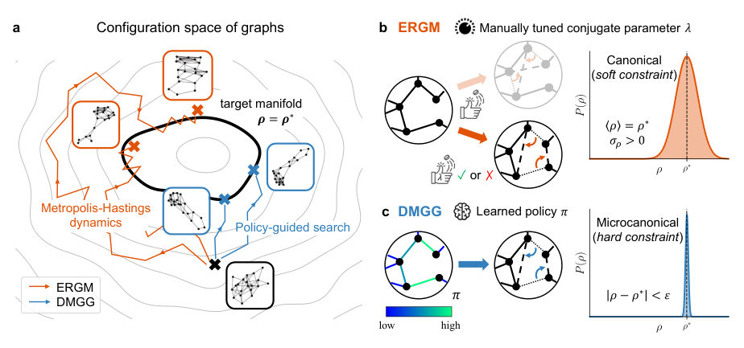 
Fig. 1 Comparison between canonical (ERGM) and microcanonical (DMGG) graph generation under assortativity ρ constraints. a, Schematic representation of ERGM and DMGG navigating the configuration space of graphs for a given degree sequence, where each contour line indicates a set of graphs sharing the same ρ. Starting from an initial graph, both ERGM and DMGG traverse the space through sequences of rewirings. ERGM approaches the target manifold {G|ρ(G) = ρ∗} via stochastic Metropolis–Hastings dynamics, whereas DMGG uses policy-guided search that reaches the constraint more efficiently. b, In ERGM, randomly sampled rewiring proposals are accepted or rejected according to the manually tuned...

📷 Fig 2

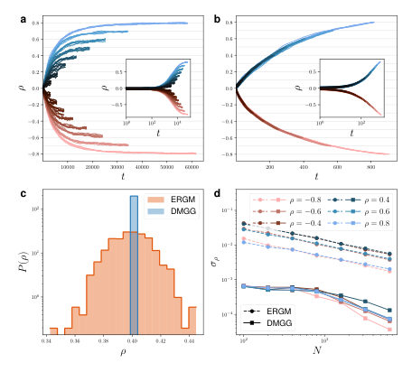 
Fig. 2 Convergence and precision in assortativity- constrained graph generation. a,b, Evolution of assor- tativity ρ during the generation process of ERGM and DMGG, respectively. Starting from an initial Erd˝os–R´enyi (ER) graph (N = 1000 and E = 3000) with neutral assor- tativity (ρ ≈0), five trajectories for each target (indicated by color) are shown. Insets illustrate the same trajectories on a logarithmic time scale. c, Distribution of ρ mea- sured over 1000 generated graphs with target assortativity ρ∗= 0.4. d, Standard deviation of assortativity σρ versus system size N, with the same color scheme as in a and b. Dashed lines with circle markers and solid lines with square markers...

📷 Fig 3

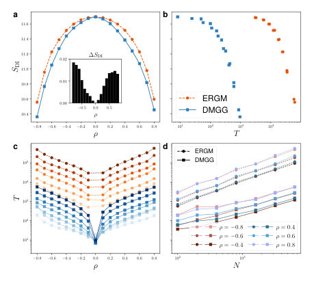 
Fig. 3 Configurational diversity and computa- tional efficiency of DMGG. a, Dyad-independent entropy SDI({pij}) measured in the ensembles generated by ERGM and DMGG, as a function of assortativity ρ. The inset shows the deviation for each ρ, ∆SDI ≡  SERGM DI −SDMGG DI  /SERGM DI . b, Parametric plot of SDI as a function of the number of required rewirings T, where each marker corresponds to the data for a distinct assorta- tivity in a. c, T as a function of target assortativity ρ with system sizes N = 100, 200, . . . , 6400 indicated by color gra- dient (light to dark). d, Scaling of T with system size N for fixed targets (colors). Dashed lines with circle markers and solid lines with...

📷 Fig 4

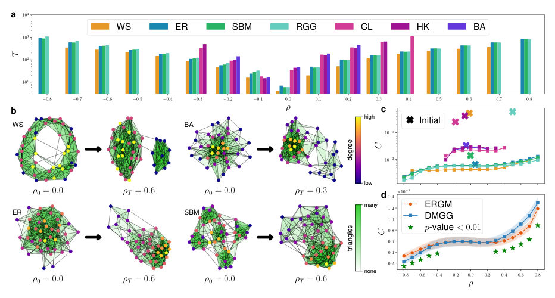 
Fig. 4 Generalization of DMGG across diverse graph families. a, Number of rewirings T required to reach target assortativity ρ in different initial topologies. Missing bars indicate target ρ values outside the physically feasible range of a given topology. b, Representative examples of graph transformation by DMGG. The initial graphs (left) with diverse topologies with assortativity ρ0 ≈0 are rewired into target configurations (right) with prescribed assortativities ρT . Node colors indicate relative degrees, and triangles contributing to the clustering coefficient C are shaded green. c, Average C of the generated ensembles from DMGG as a function of ρ, using the same color scheme as in a...

📷 Fig 5

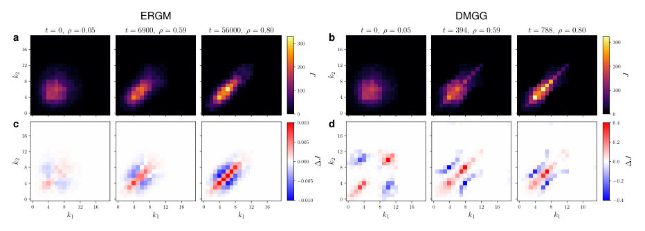 
Fig. 5 Rewiring strategies of ERGM and DMGG. Snapshots of the joint-degree matrix J (top row) and its expected change per rewiring ∆J (bottom row) during the generation process with target ρ∗= 0.8. a, c, ERGM dynamics driven by the Metropolis–Hastings process. b, d, DMGG dynamics driven by a policy-guided process.

**Summary.** This paper presents a deep reinforcement learning approach to generate random graphs with exact structural constraints. By treating graph rewiring as a policy-guided search, the method significantly outperforms traditional statistical mechanics-based sampling in both speed and precision. This allows for the creation of precise null models to study how specific network properties drive complex system functions.

**Why it may be interesting.** not directly relevant

Detailed structure

**Main problem.** The difficulty of efficiently generating microcanonical graph ensembles that satisfy hard structural constraints, such as a specific target assortativity, without the computational burden of parameter tuning or structural fluctuations.

**Main result.** The introduction of the Deep Microcanonical Graph Generator (DMGG), an RL framework that achieves target assortativity with much higher precision and an order of magnitude faster than traditional ERGM methods while preserving configurational diversity.

**Method.** A Reinforcement Learning framework using Proximal Policy Optimization (PPO) and a Graph Isomorphism Network (GIN) to perform directed, degree-preserving edge rewirings.

**Model / system.** Random graphs and complex networks with varying topologies (e.g., ER, BA, WS, SBM) characterized by a fixed degree sequence and a target assortativity coefficient.

**Key observables.** Assortativity (rho), clustering coefficient (C), dyad-independent entropy (SDI), and the joint-degree matrix (J).

**Important parameters / regimes.** Target assortativity (rho*), precision tolerance (epsilon), and the number of rewiring steps (T).

**Assumptions / limitations.** The framework assumes the ability to perform degree-preserving rewirings and focuses on the constraint of assortativity.

**Figures summary.** Figure 1 compares ERGM and DMGG dynamics; Figure 2 shows convergence trajectories and scaling of precision; Figure 3 evaluates ensemble diversity and rewiring cost; Figure 4 shows rewiring steps as a function of target rho and structural evolution; Figure 5 visualizes the joint-degree matrix and flux changes.

**Paper structure.** The paper identifies the limitations of canonical ensembles, introduces the DMGG RL framework, details the neural architecture and training process, benchmarks the model against ERGM in terms of speed and precision, and analyzes the scaling and structural implications of the generated ensembles.

Abstract

How network structure determines function is a fundamental question, and it can be investigated by graph ensembles with precisely controlled structural properties. Canonical approaches, formulated as exponential random graph models (ERGMs), enforce constraints only in expectation, allowing individual realizations to fluctuate around the target. Conversely, microcanonical ensembles impose hard constraints exactly, but practical sampling methods beyond fixing the degree sequence have remained out of reach. Here we introduce the Deep Microcanonical Graph Generator (DMGG), a reinforcement learning (RL) framework that transforms any given graph through degree-preserving rewirings to exactly reach a prescribed assortativity, which characterizes the degree--degree correlation of adjacent nodes. Instead of relying on the entropically dominated Metropolis--Hastings dynamics of the ERGM, DMGG employs a policy-guided search that maximally alters the joint-degree matrix. This eliminates exhaustive parameter tuning and accelerates generation by at least an order of magnitude while preserving configurational diversity. As DMGG generalizes across various graph sizes, sparsities, and topologies, it provides exact null models that allow for the quantitative isolation of secondary observables, such as the clustering coefficient. These results establish RL as a practical and powerful paradigm for generating hard-constrained graphs, opening avenues to investigate structure-function relationships free from ensemble artifacts.

[↑ back to top](#top)

### [SAFE ma-QAOA: Surrogate-Assisted and Fine-Tuning Enhanced Multi-Angle QAOA with Parameter Distillation](http://arxiv.org/abs/2605.23377v1)

**Authors:** Hyunwoo Kim, Youngseok Lee  
**Type:** theory · **Category:** quantum information and computing · **PDF:** <https://arxiv.org/pdf/2605.23377v1>  
**Analysis basis:** full PDF text, analyzed in chunks

📷 Fig 1

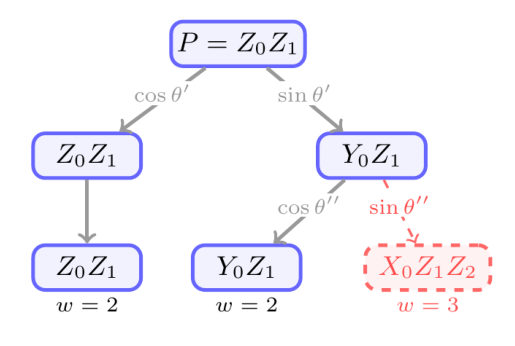 
Fig. 1. Pauli propagation example for the tracked Pauli word P = Z0Z1 under successive updates by RX0(θ′) and RZ0Z2(θ′′). The example shows the lower-weight branches retained by LWPP and the higher-weight branch discarded by the wmax = 2 truncation threshold.

📷 Fig 2

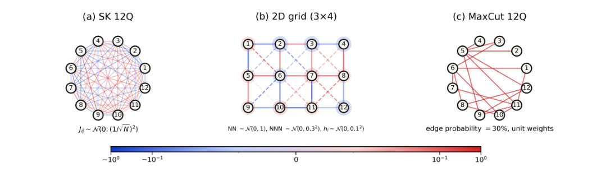 
Fig. 2. Problem families used in the experimental setup: a fully connected SK instance with 12 qubits, a two-dimensional square-lattice spin glass (abbreviated as 2D grid in figures and tables) on a 3 × 4 lattice, and a 12-qubit Max-Cut instance with 30% edge probability and unit weights.

📷 Fig 3

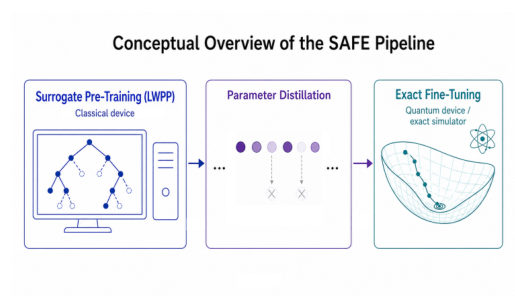 
Fig. 3. Conceptual overview of the SAFE pipeline: LWPP-based surrogate pre-training on classical hardware, followed by parameter distillation to identify a compact subspace, and final exact fine-tuning on quantum hardware or exact emulators.

📷 Fig 4

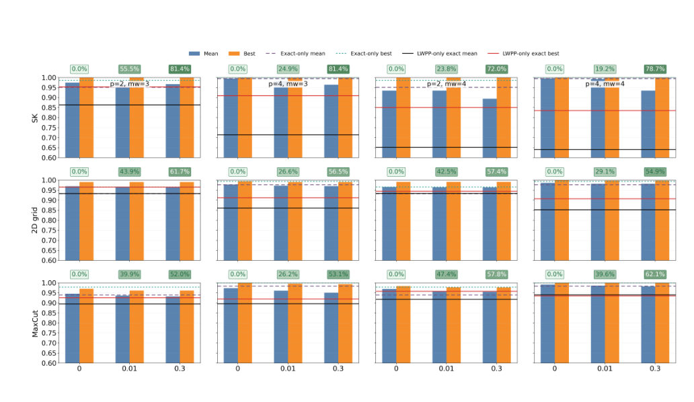 
Fig. 4. Overview of final approximation ratio performance after exact fine-tuning initialized with parameters obtained from LWPP pre-training under different distillation thresholds. Rows correspond to SK, 2D grid, and Max-Cut, and columns compare depths p = 2, 4 with LWPP truncation levels wmax = 3, 4. For each threshold, the bars report the mean and best final approximation ratios, the horizontal lines indicate the exact-only and LWPP-pre-training-only reference values, and the green labels show the average parameter reduction.

📷 Fig 5

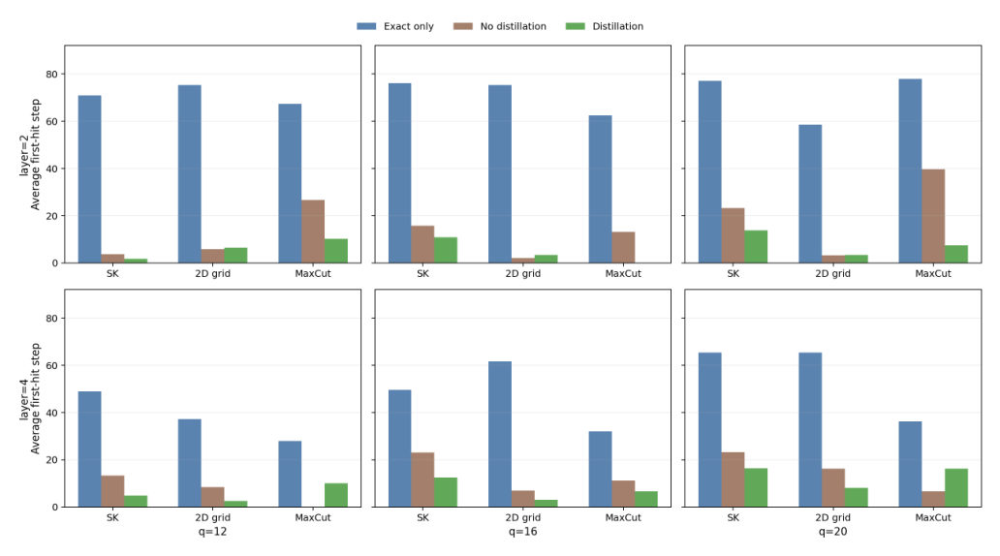 
Fig. 5. Average first-hit step required to reach 99% of each method’s own best normalized performance during exact fine-tuning. Rows compare depths p = 2 and p = 4, columns correspond to system sizes n = 12, 16, 20, and each panel reports SK, 2D grid, and Max-Cut results for exact-only, SAFE without distillation, and SAFE with distillation under wmax = 4 and a distillation threshold of 0.3. Lower values indicate faster convergence to the near-optimal regime.

**Summary.** This paper introduces the SAFE framework to optimize Multi-Angle QAOA by using a classical surrogate to pre-train parameters and a distillation step to prune unnecessary angles. This approach significantly reduces the quantum computational resources required for fine-tuning without sacrificing the quality of the final solution.

**Why it may be interesting.** not directly relevant

Detailed structure

**Main problem.** The high-dimensional parameter space of Multi-Angle QAOA (ma-QAOA) makes training computationally expensive and difficult due to the large number of required exact energy and gradient evaluations on quantum hardware.

**Main result.** The SAFE framework achieves a 64.3% reduction in active parameters and a 94.5% reduction in estimated QPU workload while maintaining high approximation ratios and accelerating convergence.

**Method.** A three-stage pipeline: (1) LWPP pre-training using a truncated classical surrogate, (2) parameter distillation to remove near-zero angles, and (3) exact fine-tuning using the full energy objective.

**Model / system.** The study evaluates ma-QAOA on Ising-type Hamiltonians, specifically the Sherrington-Kirkpatrick model, 2D square-lattice spin glasses, and Max-Cut problems on random graphs.

**Key observables.** Approximation ratio, first-hit step (convergence speed), and estimated QPU workload (ballpark cost).

**Important parameters / regimes.** Circuit depth (p), number of qubits (n), LWPP truncation weight (w_max), and parameter distillation threshold.

**Assumptions / limitations.** The effectiveness relies on the assumption that many rotation angles remain near zero (identity) after the surrogate pre-training stage.

**Figures summary.** Figure 1 shows the LWPP truncation process; Figure 2 visualizes the problem instances; Figure 3/4 shows approximation ratios across different settings; Figure 5 compares convergence speed; Figure 6 shows exact fine-tuning trajectories; Figure 7 compares energy gaps and cosine similarity.

**Paper structure.** The paper introduces the ma-QAOA bottleneck, presents the three-stage SAFE framework (pre-training, distillation, fine-tuning), evaluates the method on various spin glass and combinatorial models, and analyzes the efficiency gains in terms of parameter count and hardware workload.

Abstract

The multi-angle Quantum Approximate Optimization Algorithm (ma-QAOA) extends the Quantum Approximate Optimization Algorithm (QAOA) by assigning a larger number of independent variational parameters, thereby increasing expressivity and improving performance at low circuit depths. However, this larger parameterization makes training more difficult and requires repeated circuit evaluations for gradient-based optimization. In this work, we propose the Surrogate-Assisted and Fine-tuning Enhanced (SAFE) framework. SAFE first uses Low-Weight Pauli Propagation (LWPP) as a classical surrogate for pre-training ma-QAOA parameters before exact optimization. SAFE then applies parameter distillation, which removes angles that remain near zero after surrogate pre-training. Finally, SAFE performs exact fine-tuning by optimizing the remaining active parameters using the exact energy objective. We evaluate SAFE on instances of the Sherrington-Kirkpatrick model, two-dimensional square-lattice spin glass, and Max-Cut. SAFE with distillation provides the strongest overall results relative to exact-only: (i) a 64.3 percent reduction in active parameter count and (ii) a 94.5 percent reduction in estimated QPU workload. Within the SAFE workflow, adding distillation further reduces the optimizer steps to the near-optimal regime by 44.4 percent relative to without distillation. These results provide evidence that SAFE ma-QAOA can accelerate convergence to high-quality solutions while reducing the required quantum resources for exact fine-tuning, offering a resource-efficient route toward expressive ma-QAOA on NISQ hardware.

[↑ back to top](#top)

### [Thermodynamic stability of twisted domains in AgCrSe$_{2}$ thin films grown on lattice-matched YSZ(111) substrate](http://arxiv.org/abs/2605.23313v1)

**Authors:** Haruto Sato, Kota Mihara, Kenshin Inamura, Yusuke Tajima, Kazutaka Kudo, Jobu Matsuno, Junichi Shiogai  
**Type:** experiment · **Category:** strongly correlated electrons · **PDF:** <https://arxiv.org/pdf/2605.23313v1>  
**Analysis basis:** full PDF text, analyzed in chunks

📷 Fig 1

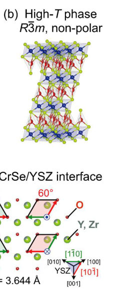 
FIG. 1. (single column) Sato et al.

📷 Fig 2

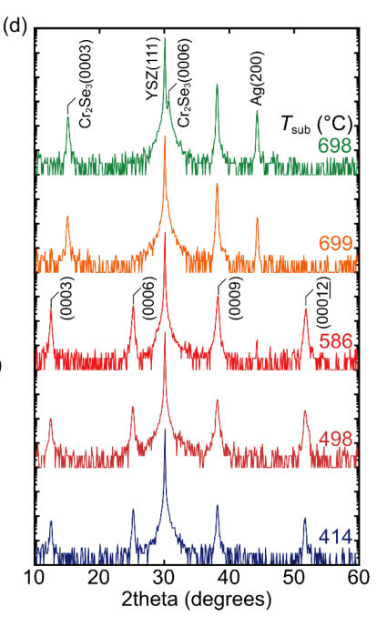 
FIG. 2. (double column) Sato et al.

📷 Fig 3

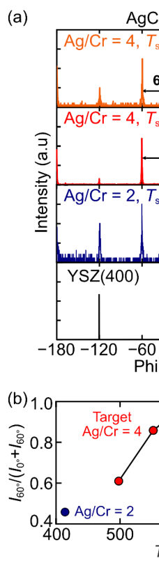 
FIG. 3. (single column) Sato et al.

📷 Fig 4

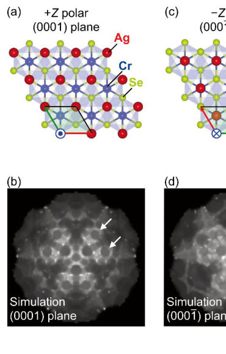 
FIG. 4. (double column) Sato et al.

📷 Fig 5

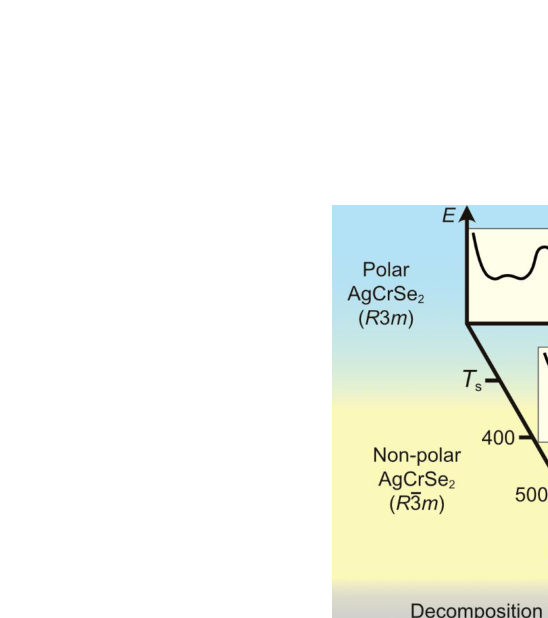 
FIG. 5. (single column) Sato et al.

**Summary.** This paper demonstrates how to suppress unwanted twisted domains in AgCrSe2 thin films by optimizing growth temperature and Ag/Cr ratios. By finding a critical temperature window, the authors achieved single-domain 60-degree oriented films, which is crucial for device applications.

**Why it may be interesting.** not directly relevant

Detailed structure

**Main problem.** The study aims to control structural domains (twisted and polar) in epitaxial AgCrSe2 thin films to utilize their intrinsic physical properties.

**Main result.** The researchers identified a critical growth temperature for achieving a single 60-degree domain and found that Ag-rich targets help maintain stoichiometry at higher temperatures.

**Method.** Pulsed-laser deposition (PLD) was used for growth, with structural characterization via XRD, AFM, EDX, and TOFLAS for polarity analysis.

**Model / system.** The system consists of AgCrSe2, a polar magnetic semiconductor with a rhombohedral lattice, grown epitaxially on a lattice-matched YSZ(111) substrate.

**Key observables.** In-plane domain orientation (0 vs 60 degrees), polar orientation (+Z vs -Z), surface roughness (RMS), and Ag/Cr stoichiometry.

**Important parameters / regimes.** Substrate temperature (Tsub), Ag/Cr target composition ratio, and the Ag re-evaporation-driven decomposition regime.

**Figures summary.** Fig 1: Crystal structure and domain schematics; Fig 2: Dependence of roughness and stoichiometry on temperature with morphology images; Fig 3: In-plane XRD phi-scans and temperature dependence of domain fraction; Fig 4: TOFLAS pole figures and atomic arrangement.

**Paper structure.** The paper introduces the material and domain problem, details the growth and characterization methods, presents results on stoichiometry and surface quality, analyzes the temperature-dependent domain dynamics, and concludes with polarity analysis via TOFLAS.

Abstract

Control of structural domains in epitaxial thin films of functional materials is a fundamental technique to utilize their intrinsic physical and chemical properties in solid-state devices. In this study, we report on suppression of twisted-domain formation in thin-film growth of polar magnetic semiconductor AgCrSe$_{2}$ using pulsed-laser deposition. In exploring concomitant optimized growth temperature and Ag/Cr composition ratio of supply, we find the critical growth temperature ($T\mathrm{_{sub}}$) for obtaining single 60$^{\circ}$ domain in c-axis oriented AgCrSe$_{2}$ thin film on a lattice-matched (111) plane of the yttria-stabilized zirconia substrate. At temperatures below and above the critical $T\mathrm{_{sub}}$, metastable 0$^{\circ}$ domain in addition to the 60$^{\circ}$ domain emerges, indicating delicate energy balance of thermodynamic stability for obtaining the single-domain structure. Surface structural analysis using time-of-flight low-energy atom scattering spectroscopy reveals the presence of two polar orientations along $+Z$ and $-Z$ directions. These findings provide valuable insights into the thin-film growth mechanisms for a family of two-dimensional compounds with rhombohedral lattices.

[↑ back to top](#top)

### [Tuning J$_1$-J$_2$ in Quasi-2D Triangular Lattice Antiferromagnet $α$-SrCr$_2$O$_4$ via Uniaxial Pressure](http://arxiv.org/abs/2605.23133v1)

**Authors:** Jazzmin Victorin, Shreenanda Ghosh, Seyed Koohpayeh, Chris Lygouras, Natalia Drichko  
**Type:** both · **Category:** strongly correlated electrons · **PDF:** <https://arxiv.org/pdf/2605.23133v1>  
**Analysis basis:** full PDF text, analyzed in chunks

📷 Fig 1

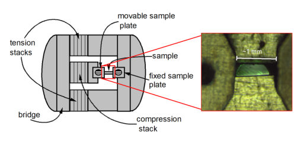 
FIG. 2. Schematic of CS100 Razorbill strain cell and optical microscope image of bar-shaped α-SrCr2O4 sample used for uniaxial pressure measurements.

📷 Fig 2

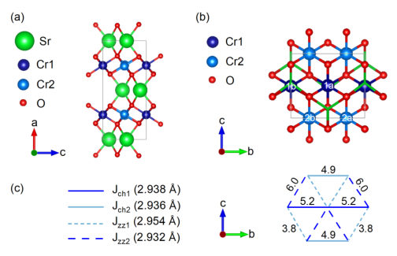 
FIG. 1. (a) Crystal structure of quasi-2D TLHAF α-SrCr2O4 out-of-plane. Light and dark blue spheres denote two in- equivalent Cr3+ sites. (b) The bc plane of α-SrCr2O4 with Sr atoms omitted for clarity. (c) Simplified schematic view of exchange interactions on triangular lattice of Cr3+ ions. Val- ues in schematic in units of meV.

📷 Fig 3

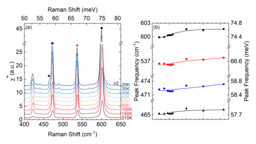 
FIG. 3. (a) Temperature dependence of α-SrCr2O4 sam- ple mounted in a strain cell in the spectral range of oxygen phonons between 400 and 650 cm−1. Unpolarized Raman spectra shifted along the y axis for clarity. (b) Frequencies of select oxygen-related phonons marked in panel (a). Solid lines are fits to symmetrical three-phonon coupling model (Eq. 3).

📷 Fig 4

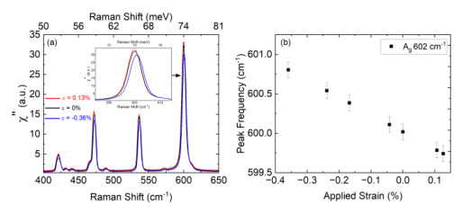 
FIG. 4. (a) Unpolarized Raman spectra of α-SrCr2O4 at 35 K in the strain cell at frequencies above 400 cm−1 at maxi- mum tensile pressure, zero pressure, and maximum compres- sive pressure. Inset: Ag 602 cm−1 phonon. (b) Peak Fre- quency of Ag 602 cm−1 phonon as a function of applied uni- axial pressure

📷 Fig 5

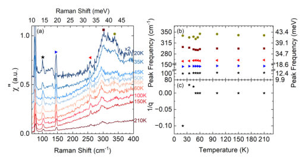 
FIG. 5. (a) Unpolarized temperature dependent Raman spec- tra of α-SrCr2O4 at frequencies below 400 cm−1 in the strain cell. Spectra shifted along the y axis for clarity. (b) Frequen- cies of select oxygen-related phonons marked in panel (a). (c) Temperature dependence of the electron-phonon coupling strength, 1/q, of Ag 102 cm−1 phonon.

**Summary.** This paper explores how applying uniaxial pressure can tune the magnetic frustration and anisotropy in the triangular lattice antiferromagnet alpha-SrCr2O4. By using Raman spectroscopy, the authors show that mechanical strain can shift magnetic excitation energies, providing a method to control the magnetic ground state. This work is significant for understanding how lattice distortions influence quantum magnetic phases.

**Why it may be interesting.** not directly relevant

Detailed structure

**Main problem.** Investigating the ability to tune the magnetic anisotropy and exchange interaction ratio (J2/J1) in a frustrated triangular lattice antiferromagnet using in-situ uniaxial pressure.

**Main result.** The study demonstrates that compressive pressure reduces magnetic anisotropy, while tensile pressure increases it, effectively tuning the frustration in the system. The researchers also confirmed efficient pressure transmission through shifts in Raman-active phonon frequencies.

**Method.** In-situ Raman spectroscopy was used under applied uniaxial strain via a piezoelectric cell, complemented by Linear Spin Wave Theory (LSWT) and two-magnon density of states calculations.

**Model / system.** The system is alpha-SrCr2O4, a quasi-2D S=3/2 triangular lattice Heisenberg antiferromagnet with an orthorhombic structure and incommensurate helical magnetic order below 43 K.

**Key observables.** Two-magnon excitations (at 15.5 meV and 40 meV), Raman-active oxygen phonon frequencies, phonon line shapes (Fano asymmetry), and Gruneisen parameters.

**Important parameters / regimes.** Exchange anisotropy ratio (J2/J1), Neel temperature (TN = 43 K), strain range (-0.41% to +0.16%), and Gruneisen parameter (gamma = 0.45).

**Assumptions / limitations.** Assumed a Poisson ratio of 0.2 and that phonon width temperature dependence follows the Klemens model; used the approximation of Linear Spin Wave Theory for magnon dispersion.

**Figures summary.** Fig 1: Crystal structure and exchange paths; Fig 2: Schematic of strain application; Fig 3: Temperature dependence of phonons in the strain cell; Fig 4: Raman spectra under different pressures; Fig 5: Temperature-dependent Raman spectra; Fig 7: LSWT calculations for spin wave dispersion and two-magnon DOS.

**Paper structure.** The paper introduces the frustrated triangular lattice problem, describes the experimental setup for uniaxial pressure Raman spectroscopy, presents the results of phonon frequency shifts to verify strain, details the observation of two-magnon excitation tuning, and concludes with theoretical spin-wave modeling to interpret the magnetic anisotropy changes.

Abstract

Triangular lattice antiferromagnets first attracted attention as a frustrated magnetic lattice which can serve as a platform to realize the resonating valence bond state. While the triangular lattice itself was shown to support classical 120 degree order, many theoretical phase diagrams suggest a quantum spin liquid state within a small range of parameters. One possible avenue to achieve such a state is to tune the anisotropy of the triangular lattice antiferromagnet by applying uniaxial pressure. This motivated our Raman scattering study of quasi-two-dimensional antiferromagnet $α$-SrCr$_2$O$_4$ under applied uniaxial pressure. Under ambient conditions, $α$-SrCr$_2$O$_4$ develops long-range helical magnetic order below T$_N$ = 43 K. We identify two-magnon excitations associated with this long-range antiferromagnetic order below T$_N$ at 15.5 meV and 40 meV by comparison with spin wave calculations. We observe the two features from the two-magnon excitation shift away from (towards) each other under applied tensile (compressive) pressure, indicating a decrease (increase) in anisotropy. Raman active phonons show a shift to higher (lower) frequencies under applied compressive (tensile) pressure, indicating efficient transmission of pressure and tuning of the lattice. We show spin wave and two-magnon density of states calculations under uniaxial pressure are consistent with our experimental results.

[↑ back to top](#top)

## Secondary cond-mat archives

*Papers from  mes-hall, other, soft, supr-con. These archives are de-prioritized — they appear at the end regardless of relevance score.*

### Relevant in secondary archives (7)

### [Localized Excitonic Emission in Wafer-Scale MOCVD-Grown GaSe 2D Nanosheets for Classical and Non-Classical Light Sources](http://arxiv.org/abs/2605.23418v1)

**Authors:** Bhabani Sankar Sahoo, Nils Fritjof Langlotz, Shachi Machchhar, Kartik Gaur, Robin Günkel, Max Bergmann, Naghmeh Ghadghooni, Aris Koulas-Simos, Jürgen Belz, Chirag Chandrakant Palekar, Maximilian Ries, Kerstin Volz, Stephan Reitzenstein, Imad Limame  
**Type:** experiment · **Category:** quantum information and computing · **PDF:** <https://arxiv.org/pdf/2605.23418v1>  
**Analysis basis:** full PDF text, analyzed in chunks
**Topic relevance:** 🔥 `quantum optics experiment` **4/5** · `QC/QI experiment` **3/5**

📷 Fig 1

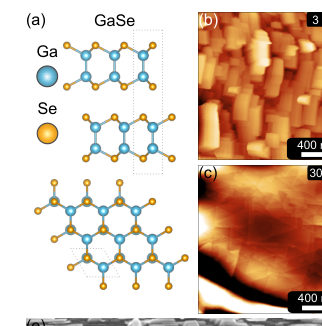 
Fig. 1 Structural Analysis of GaSe/GaP/Si. a) Side (top) and top (bottom) views of the GaSe crystal structure, generated using VESTA [40]. b) AFM image (2×2 µm2) showing out-of- plane GaSe nanosheets with a height of up to 262 nm, grown on a GaP/Si substrate after a 3-minute growth duration. The nanosheets exhibit preferential growth along the 〈111〉direction of the GaP substrate. c) AFM image (2×2 µm2) showing planar-trigonal GaSe flakes between taller vertical features, obtained after increasing the growth duration to 30 minutes. d) Raman spectra for the samples shown in (b) and (c), exhibiting characteristic vibrational modes of GaSe (highlighted in orange). An additional out-of-plane...

📷 Fig 2

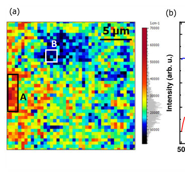 
Fig. 2 Spatially resolved Raman analysis of the 3-minute growth sample. a) Display of the integrated intensity of the A1 1g mode of GaSe. The curve was fitted with a Lorentzian lineshape and a 5th-order polynomial background. b) Mean Raman spectra extracted from the regions highlighted in a). Region A corresponds to large integrated peak areas (red curve), while region B corresponds to a weak signal intensity (blue curve).

📷 Fig 3

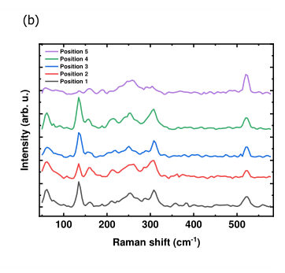 
Fig. 3 Spatially resolved Raman analysis of the 30-minute grown sample. a) Display of the integrated intensity of the 157 cm−1 mode of Ga2Se3. The curve was fitted with a Lorentzian lineshape and a 5th-order polynomial background. The map has been processed with a median denoising filter of 25 %. b) Raman spectra extracted from the linescan highlighted in a). Spectra were chosen such that they alternate between high-intensity and low-intensity regions of the 157 cm−1 mode.

📷 Fig 4

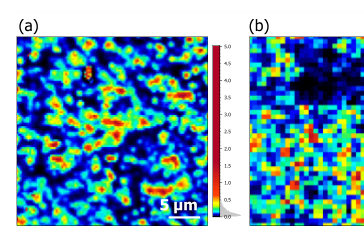 
Fig. 4 Room-temperature PL characterization of GaSe samples: a) PL map showing the integrated area of the PL bands of the 3 minute grown GaSe sample. b) PL map showing the integrated area of the PL bands of the 30 minute grown GaSe sample. c) Average PL spectra of the two samples.

📷 Fig 5

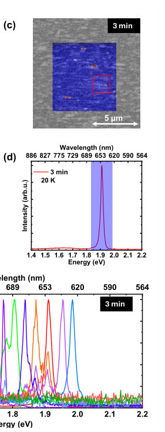 
Fig. 5 CL characterization of GaSe samples: a) CL intensity map of the 30-minute-grown GaSe sample at low temperature (20 K) with an exposure time of 100 ms. The red square indicates the region from which the spectrum was extracted. b) Extracted CL spectrum at 20 K from the selected area in (a), showing the emission peak of the 30 min-grown sample. c) CL intensity map of the GaSe sample grown for 3 min, with the red square marking the region used for spectral extraction. d) Corresponding extracted CL spectrum at 20 K from the selected region in (c), displaying the emission peak of the 3 min-grown sample. e) Overlaid CL spectra collected at different spots on the 3 min-grown GaSe sample,...

**Summary.** The study reports the wafer-scale MOCVD growth of GaSe nanosheets on GaP/Si substrates. It shows that by controlling growth time, the material can transition from a broadband classical light source to a high-quality single-photon emitter. This provides a scalable pathway for integrating quantum light sources into silicon-based photonic circuits.

**Why it may be interesting.** This work is highly relevant for quantum optics as it demonstrates a scalable, scalable-compatible method for generating non-classical light (single photons) using defect engineering in a 2D material platform.

Detailed structure

**Main problem.** The challenge of achieving wafer-scale, controllable growth of 2D semiconductors, specifically III-VI monochalcogenides like GaSe, for integration into scalable classical and quantum photonic technologies.

**Main result.** The authors demonstrated wafer-scale MOCVD growth of GaSe on GaP/Si that acts as both a broadband classical light source and a high-purity single-photon emitter ($g^{(2)}(0) = 0.15 \pm 0.10$) via defect-induced localization.

**Method.** Metal-organic chemical vapor deposition (MOCVD) was used for growth, followed by structural characterization (AFM, SEM, XRD, TEM) and optical analysis (micro-PL, TRPL, CL mapping, and HBT interferometry).

**Model / system.** The physical system consists of 2D Gallium Selenide (GaSe) nanosheets grown epitaxially on GaP/Si (100) substrates, featuring Se-Ga-Ga-Se tetralayers with c-axis orientation.

**Key observables.** Second-order correlation function $g^{(2)}(0)$, photon lifetime ($	au$), degree of linear polarization (DLP), photoluminescence energy (1.7-2.0 eV), and Raman vibrational modes.

**Important parameters / regimes.** Growth durations of 3 and 30 minutes; temperature range from 4 K to 100 K; laser power density threshold of $10^6$ W/cm$^2$; lattice mismatch $< 3\%$.

**Assumptions / limitations.** The emission is attributed to defect-induced localization rather than intrinsic excitonic recombination; the growth is assumed to be phase-pure despite minor $	ext{Ga}_2	ext{Se}_3$ traces.

**Figures summary.** Fig 1: Crystal structure, morphology (AFM/SEM), and Raman spectra. Fig 2: XRD patterns of the heterostructure. Fig 3: Temperature-dependent PL parameters. Fig 4: 30-min sample PL and polarization properties. Fig 5: Experimental spectroscopy setup. Fig 6: Power-dependent PL, temperature-dependent PL, polarization-resolved PL, TRPL decay, and $g^{(2)}(	au)$ correlation.

**Paper structure.** The paper begins with the MOCVD growth process and structural verification, moves to morphological and phase analysis of different growth regimes, investigates the spatial and spectral origin of light emission via PL and CL, and concludes with the quantum optical characterization of single-photon emission.

Abstract

Wafer-scale growth of two-dimensional semiconductors remains a key challenge for their integration into photonic technologies. While most studies of two-dimensional semiconductors have focused on transition metal dichalcogenides and their scalable fabrication, comparatively little attention has been given to III-VI monochalcogenides. Here, we report wafer-scale growth of gallium selenide (GaSe) by metal-organic chemical vapor deposition (MOCVD) and investigate its structural and optical properties for visible-range classical and quantum light emission. Two samples with thicknesses ranging from a few monolayers to several micrometers, controlled via the growth time, were investigated. The 30-minute grown sample yields intense, broad photoluminescence spanning 1.7--2.0$\,$eV, whereas the thinner 3-minute sample exhibits discrete narrow emission lines and single-photon emission with $(g^{(2)}(0) = 0.15 \pm 0.10)$. Remarkably, cathodoluminescence mapping reveals pronounced spatial localization of both spectrally narrow and broad emission centers. Together with temperature-dependent power-law analysis and Raman mapping, our results indicate defect-induced emission rather than intrinsic excitonic recombination. These findings establish wafer-scale MOCVD grown 2D GaSe as a platform for classical and non-classical light sources and highlight defect-engineered localization as a route toward scalable quantum photonics.

[↑ back to top](#top)

### [Adjoint inverse design of microresonator frequency combs](http://arxiv.org/abs/2605.23688v1)

**Authors:** Andrei Chuchalin, Alexey Tikan  
**Type:** theory · **Category:** numerical methods · **PDF:** <https://arxiv.org/pdf/2605.23688v1>  
**Analysis basis:** full PDF text, analyzed in chunks
**Topic relevance:** `interference shaping light` **2/5** · `methods for driven-dissipative` **2/5**

📷 Fig 1

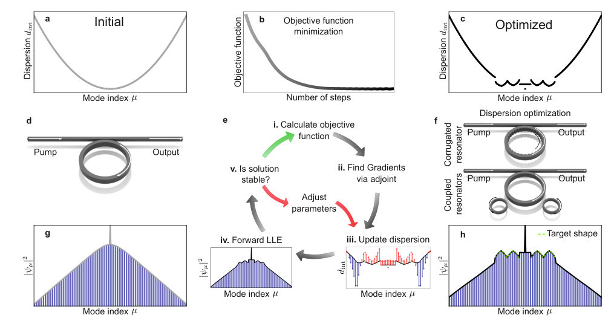 
Figure 1. Optimization algorithm. a, The initial parabolic dispersion profile corresponding to the sech-type solution shown in g. b, Convergence of the objective function to its minima over optimization steps. c, Optimized integrated dispersion profile, corresponding to the comb target shape shown in h. d, Schematic of the platform with microring resonator having anomalous quadratic dispersion. e, The optimization loop consisting of five steps. (i) The objective function is evaluated for a current comb spectrum. (ii) Gradients of the objective function with respect to dispersion are computed efficiently using the adjoint method. (iii) The dispersion is updated via gradient descent method....

📷 Fig 2

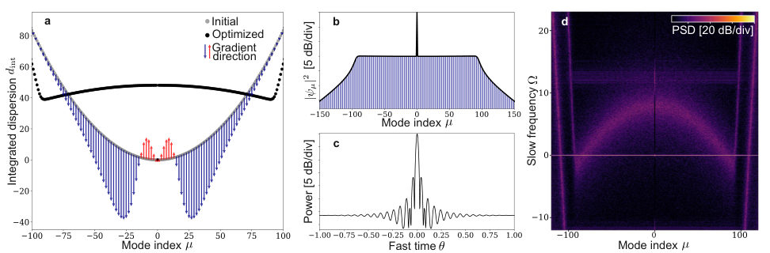 
Figure 2. Optimization of microcomb flatness. a, Initial (gray dots) and optimized (black dots) integrated dispersion profiles as functions of mode index; gradients evaluated at the first iteration of the algorithm. b, Intracavity microcomb spectrum corresponding to the optimized dispersion, showing a flat-top region spanning approximately 200 modes. c, Resulting intracavity dissipative soliton state in the normalized fast time domain. d, Nonlinear dispersion relation, obtained by evolving the comb state in slow time and taking the Fourier transform.

📷 Fig 3

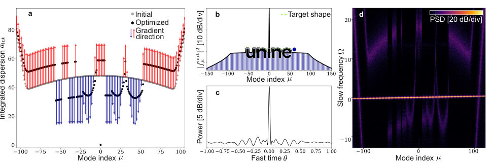 
Figure 3. Arbitrary shape optimization. a, Initial (gray dots) and optimized (black dots) integrated dispersion profiles as functions of mode index; gradients are evaluated at the first iteration. b, Output optical spectrum corresponding to the optimized dispersion, showing the UNINE logo. Green dashed line shows the target shape. c, Resulting dissipative soliton state in the bus resonator in normalized fast time domain. d, Nonlinear dispersion relation, obtained by evolving the comb state in slow time and taking the Fourier transform.

📷 Fig 4

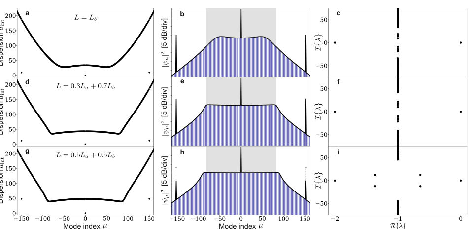 
Figure 4. Multi-objective optimization results. a, Integrated dispersion profile for the transfer objective function Lb. d,g Integrated dispersion profiles for the combined objective functions, where La (controlling flatness) and Lb are taken with different weights. b,e,h, Spectra corresponding to the resulting dispersion profiles shown in a,d,g respectively. The gray line shows the expansion of flat-top region when the weight for La is increased. In h, the dashed lines indicate the power of modes µ = ±150 from panel e for direct comparison. c,f,i, Graphs showing eigenvalues of Jacobian corresponding to the obtained solutions. All of the eigenvalues have nonpositive real parts thus showing...

**Summary.** This paper introduces an efficient inverse-design framework for microresonator frequency combs using the adjoint method. It allows researchers to move beyond manual tuning to directly engineer specific optical spectra, such as flat-top or custom-shaped combs, by optimizing the resonator's dispersion profile.

**Why it may be interesting.** The use of adjoint-based inverse design and automatic differentiation for controlling nonlinear wave dynamics is highly relevant to the development of customized light sources for quantum control and quantum state manipulation.

Detailed structure

**Main problem.** Traditional microresonator frequency comb design relies on inefficient, manual, and heuristic parameter sweeps that fail to find optimal spectral profiles.

**Main result.** The authors developed an adjoint-based inverse-design framework that efficiently optimizes the integrated dispersion profile to achieve spectrally flat, arbitrarily shaped, or multi-objective microcomb spectra.

**Method.** An adjoint-based gradient-evaluation method is used to compute the full gradient of an objective function with only two simulations, combined with gradient descent and automatic differentiation.

**Model / system.** The system consists of integrated microresonators (microrings) supporting dissipative Kerr solitons, modeled using the Lugiato-Lefever Equation (LLE) or its Fourier-domain Coupled Mode Equation (CME) version.

**Key observables.** Microcomb spectrum, spectral flatness, sideband-enhanced spectra (soliton Cherenkov radiation), and Nonlinear Dispersion Relation (NDR).

**Important parameters / regimes.** Integrated dispersion profile (dint), pump-cavity detuning, pump amplitude, coupling efficiency, and mode index.

**Assumptions / limitations.** The optimization uses a truncated basis of modes (555 modes) which is then scaled to higher resolutions (2055 modes) using quadratic tails.

**Figures summary.** Fig 1 shows the optimization flowchart and physical platform; Fig 2 demonstrates flat-top comb design and temporal waveforms; Fig 3 shows arbitrary shape synthesis (a logo); Fig 4 illustrates multi-objective optimization trade-offs.

**Paper structure.** The paper introduces the design challenge, presents the adjoint-based optimization framework, demonstrates applications in spectral flatness, arbitrary shape synthesis, and multi-objective optimization, and concludes with stability and scalability analysis.

Abstract

Microresonator frequency combs are key components for integrating optical devices into photonic circuits. They provide high stability, coherence, and low noise, even without external stabilization. Yet microcomb design remains largely heuristic: waveguide and resonator parameters are typically swept manually or semi-empirically, and the resulting spectra are evaluated only afterwards. This forward-design workflow is computationally costly, relies heavily on designer intuition, and does not generally identify optimal solutions. Here, we present an adjoint-based inverse-design framework for microresonator frequency combs that directly optimizes the comb spectrum with respect to pre-defined objectives. We demonstrate the power and flexibility of this approach by addressing three challenging problems: designing spectrally flat combs, synthesizing arbitrarily shaped comb spectra, and enforcing several performance metrics simultaneously through multi-objective optimization. Our results show that inverse design offers a systematic and efficient route to compact on-chip light sources with properties tailored to diverse applications.

[↑ back to top](#top)

### [Full-Scattering-Matrix Deterministic Phonon Boltzmann Transport Simulation](http://arxiv.org/abs/2605.23005v1)

**Authors:** Y. Sungtaek Ju  
**Type:** theory · **Category:** numerical methods · **PDF:** <https://arxiv.org/pdf/2605.23005v1>  
**Analysis basis:** full PDF text, analyzed in chunks
**Topic relevance:** `methods for driven-dissipative` **2/5** · `non-equilibrium dynamics` **2/5**

📷 Fig 1

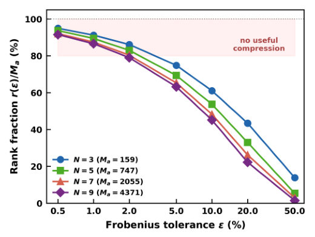 
Fig. 1 SVD incompressibility of Win. Rank fraction r(ε)/Ma required to achieve Frobenius tolerance ε, for N = 3, 5, 7, 9. The shaded region (r/Ma &gt; 80%) marks the regime with no useful compression. At ε = 1%, the required fraction is 87–91% at all grid sizes.

📷 Fig 2

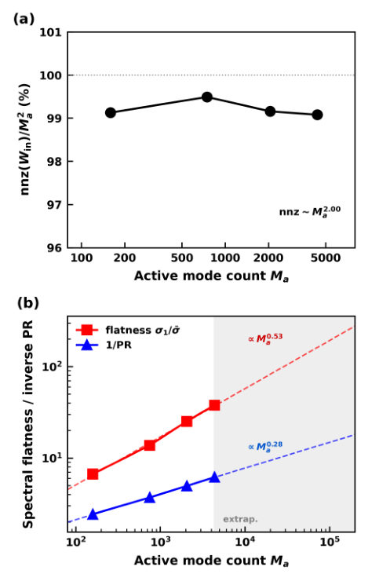 
Fig. 2 Spectral density and flatness scaling. (a) Non-zero entry fraction nnz(Win)/M2 a at threshold 10−4, showing &gt; 99% density with power-law nnz ∝M 2.00 a (R2 = 1.000). (b) Spectral flatness σ1/¯σ and 1/PR vs. Ma on log–log axes, growing as M0.53 a and M0.28 a respectively.

📷 Fig 3

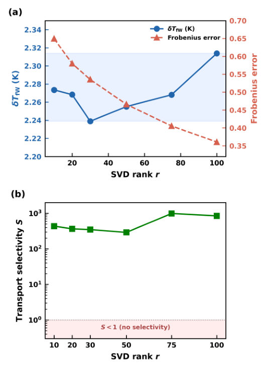 
Fig. 3 Transport selectivity of the SVD truncation (N = 5, FinFET). (a) δTfW (blue, left axis) and Frobenius error (red, right axis) vs. SVD rank r. Blue band: 3.3% spread in δT; Frobenius error varies 36–65%. (b) Transport selectivity S vs. r for the 3D FinFET at N = 5 (Table S6); values 55–120× throughout.

📷 Fig 4

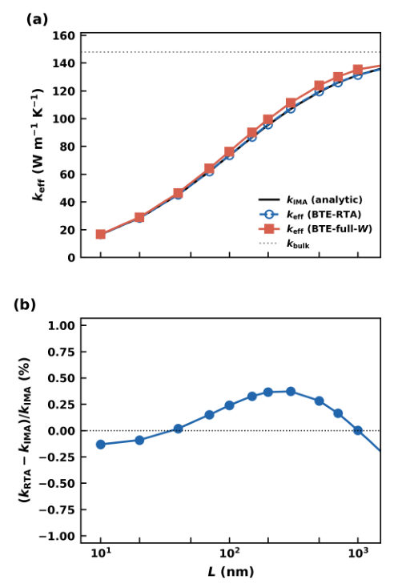 
Fig. 4 Validation: 1D slab BTE vs. exact analytic IMA reference. (a) Effective thermal conductivity keff vs. slab thickness L, log-linear axes. Filled red squares: BTE full-W solver (SVD r = 50). Open blue circles: BTE-RTA solver (N = 5, Nx = 100). Solid black line: analytic IMA reference Eq. (6). Dotted grey: kbulk = 148.0 W m−1 K−1. (b) Relative deviation (kRTA −kSond)/kSond vs. L. All values ≤0.37% over L = 10–1000 nm.

📷 Fig 5

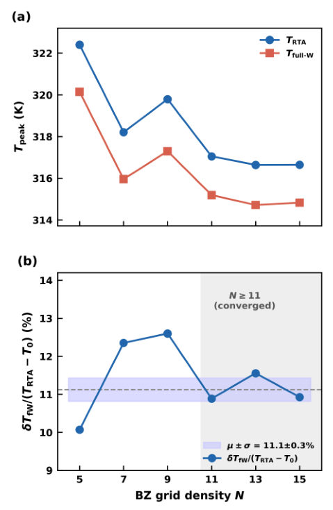 
Fig. 5 Brillouin zone grid convergence. (a) TRTA(N) (blue circles) and TfW(N) (red squares) vs. BZ grid density N. (b) Normalised correction δTfW/(TRTA −T0) vs. N; grey band marks the asymptote 11.1 ± 0.3% (N ≥11). The non- monotone behaviour at N = 7, 9 reflects the Γ-centred Monkhorst–Pack sampling artefact.

**Summary.** This paper presents a new numerical solver for the phonon Boltzmann Transport Equation that accurately includes the full scattering matrix without the massive computational cost usually required. It achieves this by exploiting the fact that the non-equilibrium part of the phonon distribution is low-dimensional, even when the scattering operator itself is complex. This enables more precise thermal modeling in nanoscale transistors.

**Why it may be interesting.** not directly relevant

Detailed structure

**Main problem.** The Relaxation-Time Approximation (RTA) in the phonon Boltzmann Transport Equation (BTE) fails to account for intermode energy redistribution, but incorporating the full scattering matrix is computationally prohibitive due to its high-rank, incompressible nature.

**Main result.** The authors discover that while the scattering matrix is incompressible, the non-equilibrium phonon distribution exists in a low-dimensional subspace, allowing for an efficient 3D BTE solver that captures a 11.2% correction to temperature rise over RTA.

**Method.** A deterministic 3D BTE solver using a finite-volume discretization and a hybrid architecture that combines dense spatial sweeps with low-rank SVD-based truncation of the in-scattering operator.

**Model / system.** Steady-state phonon Boltzmann Transport Equation (BTE) for nanoscale semiconductor structures, such as FinFET-like geometries, including three-phonon Normal and Umpland processes.

**Key observables.** Effective thermal conductivity, peak temperature rise, non-equilibrium distribution deviation, and transport selectivity.

**Important parameters / regimes.** Brillouin zone refinement levels, Knudsen number, device length (fin length), and scattering matrix rank.

**Assumptions / limitations.** The phonon transport is modeled in the ballistic and quasi-ballistic regimes using a linearized BTE and the Stillinger-Weber potential for scattering matrix elements.

**Figures summary.** The paper includes tables comparing scattering matrix properties (rank, spectral flatness), convergence tests for BZ grid density, and validation of temperature predictions in 3D FinFET structures.

**Paper structure.** The paper identifies the limitations of RTA, analyzes the incompressibility of the scattering matrix, proposes a low-rank solution-based solver, validates the method against 1D analytic solutions, and demonstrates application to 3D nanoscale devices.

Abstract

Solutions to the phonon Boltzmann transport equation under the relaxation-time approximation (RTA) are fundamentally limited in that they do not account for the off-diagonal elements of the scattering matrix, which encode intermode energy redistribution. We find that the phonon in-scattering matrix is globally incompressible, requiring nearly its full rank for any useful Frobenius accuracy. The incompressibility worsens as the Brillouin zone is refined. We show that, despite this difficulty, one can develop a computationally efficient 3D BTE solver incorporating the complete scattering matrix by leveraging our two structural discoveries: the non-equilibrium phonon distribution inhabits a remarkably low-dimensional subspace of mode space regardless of how many phonon modes exist, and the leading singular modes of the scattering operator align selectively with this transport-active subspace. Consequently, truncation incurs negligible transport error even under large norm error. The phonon streaming operator's mode-diagonal character further motivates a hybrid architecture that exploits these two properties. When applied to nanoscale structures emulating a fin field-effect transistor, our BTE solver quantifies a geometry-independent multiplicative correction to the temperature rise predicted under RTA. Our theoretical work and resulting BTE solver help enable rigorous study of phonon transport and systematic design of devices and structures in the ballistic and quasi-ballistic phonon transport regime.

[↑ back to top](#top)

### [Nonreciprocal conductance in uniformly dissipative devices](http://arxiv.org/abs/2605.23725v1)

**Authors:** Oliver Solow, Emil J. Bergholtz, Karsten Flensberg  
**Type:** theory · **Category:** other · **PDF:** <https://arxiv.org/pdf/2605.23725v1>  
**Analysis basis:** full PDF text, analyzed in chunks
**Topic relevance:** `methods for driven-dissipative` **2/5** · `non-equilibrium dynamics` **2/5**

📷 Fig 1

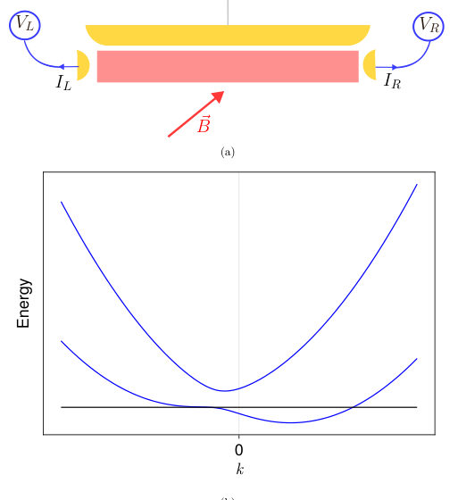 
FIG. 1. (a)A schematic of the nanowire in red connected to the leads in yellow. The magnetic field ⃗B is at some skewed angle compared to the spin-orbit direction. (b) Band struc- ture of Rashba nanowire with skewed magnetic field, with the Fermi level marked in black. The Fermi velocity is given by the slope of the dispersion at the Fermi level. This slope is sig- nificantly larger for the right-movers than for the left-movers.

📷 Fig 2

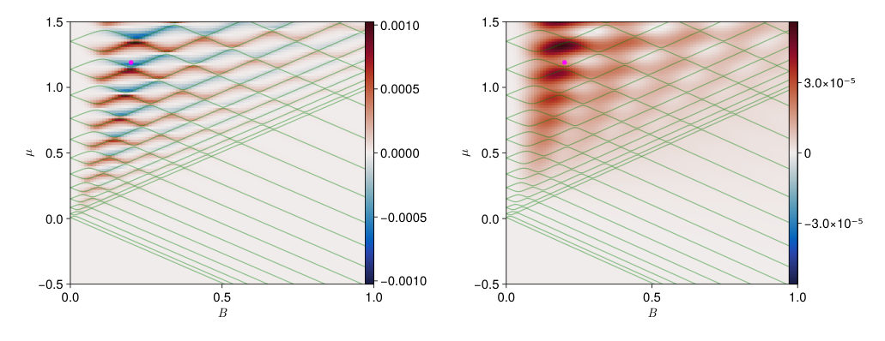 
FIG. 2. The nonreciprocity parameter ∆G as a function of chemical potential and Zeeman field for a dissipative Rashba nanowire of length L = 101 at two different dissipation strengths. The green lines are the eigenenergies of Eq.(8), and the magenta dot is the parameters for Figure 3. We note that there is both positive and negative nonreciprocity present for small dissipation strengths, while for large strengths there is only positive nonreciprocity. Parameters are m = 0.05, α = 0.2, θ = π

📷 Fig 3

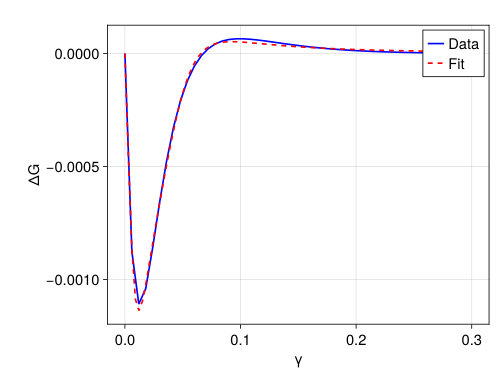 
FIG. 3. ∆G as a function of γ. The blue line is the numerical results, the dashed line is from a fit to (17). Parameters are as in Fig. 2, and B = 0.2, ω = 1.2.

**Summary.** This paper demonstrates that uniformly dissipative electronic circuits can exhibit nonreciprocal conductance due to asymmetric transmission times. By studying a Rashba nanowire with a skewed magnetic field, the authors show how interference and band structure asymmetry drive this effect. The study highlights that dissipation can qualitatively change the sign of conductance asymmetry.

**Why it may be interesting.** It provides a mechanism for nonreciprocal transport in non-Hermitian systems that does not rely on the Non-Hermitian Skin Effect, which is crucial for understanding transport in open quantum systems and dephasing in electronic circuits.

Detailed structure

**Main problem.** The paper investigates how uniform dissipation (non-Hermitian effects) affects measurable quantities like conductance, specifically determining the conditions for nonreciprocal conductance (G_LR != G_RL).

**Main result.** The authors show that nonreciprocal conductance arises from differences in transmission times between left- and right-moving electrons due to asymmetric dispersion relations, and that this effect can change sign depending on dissipation strength.

**Method.** The study uses an analytical approach relating the S-matrix of a two-terminal system to a multi-terminal system via frequency analytical continuation, supplemented by numerical simulations using the Quantica software package.

**Model / system.** A ballistic Rashba nanowire with a skewed magnetic field that breaks both inversion and time-reversal symmetry, coupled weakly to a third 'featureless' lead that introduces uniform dissipation.

**Key observables.** Nonreciprocal conductance difference (Delta G = G_LR - G_RL) and transmission times (tau_LR, tau_RL).

**Important parameters / regimes.** Dissipation strength (gamma), magnetic field strength (B), chemical potential (mu), and Rashba spin-orbit coupling (alpha).

**Assumptions / limitations.** The analysis focuses on the weak dissipation limit (gamma -> 0) and assumes the dissipation is uniform across the device.

**Figures summary.** Fig 1(a) shows the nanowire setup with a third lead; Fig 1(b) shows the asymmetric dispersion relation; Fig 2 displays the conductance difference as a function of system parameters.

**Paper structure.** The paper introduces the problem of nonreciprocity in dissipative systems, presents a general model of a Rashba nanowire, develops the theoretical link between conductance and transmission times, and then analyzes the dependence of the results on dissipation strength and magnetic field.

Abstract

When studying non-Hermitian electronic systems, an obvious question is how various non-Hermitian effects affect measurable quantities like the conductance. Here, we show that uniformly dissipative circuits can exhibit nonreciprocal conductance, meaning that the two nonlocal conductances are different. We describe how this happens through a difference in transmission times between left-moving and right-moving electrons. We consider a specific case of a dissipative Rashba nanowire with a skewed magnetic field, and show how this difference in transmission times comes about through interference inside the circuit, and how this is modified as the dissipation strength changes.

[↑ back to top](#top)

### [Graphene-based Photodetector with Engineered Hot Carrier Cooling Dynamics](http://arxiv.org/abs/2605.23646v1)

**Authors:** Yishu Huang, Anand Nivedan, Florian Ludwig, Bohai Liu, Michiel Debaets, Steven Brems, Hai I. Wang, Alessandro Principi, Dries Van Thourhout, Christian Haffner, Aron W. Cummings, Klaas-Jan Tielrooij  
**Type:** experiment · **Category:** other · **PDF:** <https://arxiv.org/pdf/2605.23646v1>  
**Analysis basis:** full PDF text, analyzed in chunks
**Topic relevance:** `quantum optics experiment` **2/5** · `non-equilibrium dynamics` **1/5**

📷 Fig 1

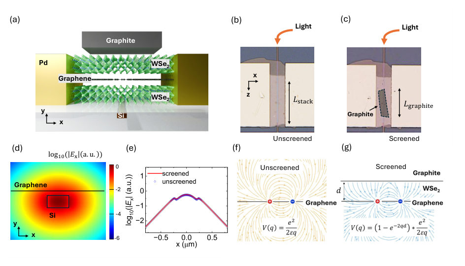 
Figure 1: (a) Schematic of the cross section of the measured device, consisting of WSe2- encapsulated graphene placed on a silicon waveguide, and a graphite screening layer on top. (b–c) Top view of the WSe2–graphene–WSe2 waveguide photodetector for the un- screened (b) and screened (c) cases. (d) Cross section of the optical field profile in the waveguide. (e) The optical field in graphene for the unscreened and screened cases. (f–g) Illustration of the physical mechanism behind the proximity screening effect, for the example of an electron and a hole, for the unscreened (f) and screened (g) case. The field lines are affected by the graphite layer, suppressing the strength of the carrier–...

📷 Fig 2

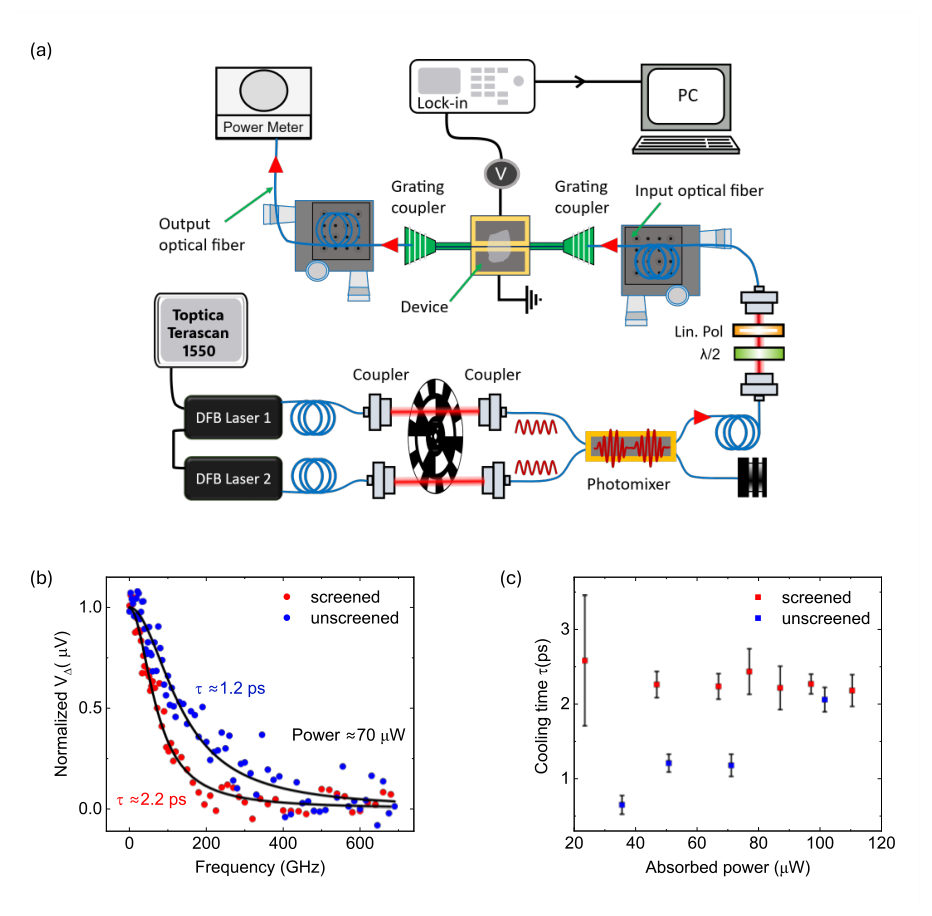 
Figure 2: (a) Schematic of the experimental setup. Two continuous-wave distributed feedback lasers with a tunable difference frequency are combined and coupled into the waveguide of the device via grating couplers. The incident light is mechanically modulated with a chopper, and the resulting mixing photovoltage (V∆) is detected using a lock-in amplifier. (b) Normalized, background-subtracted photovoltage response as a function of the heterodyne beat frequency. The data points represent the measured response for the device in the unscreened (blue circles) and screened (red circles) cases. The solid lines indicate Lorentzian descriptions used to extract the hot-carrier cooling time τ,...

📷 Fig 3

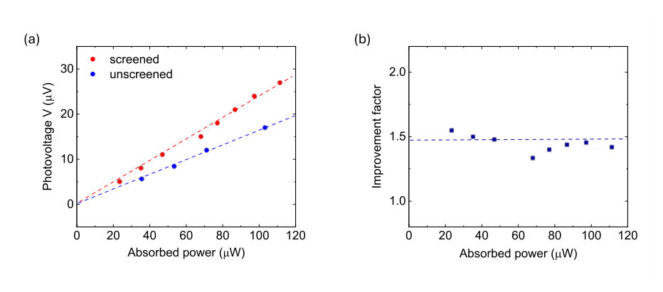 
Figure 3: (a) Measured photovoltage as a function of absorbed power for the device in the unscreened (blue circles) and screened (red circles) cases, with dashed lines indicating linear fits. (b) Improvement factor as a function of absorbed power, with the dashed line indicating the average value of ≈1.5.

**Summary.** This paper demonstrates a method to enhance graphene photodetectors by using a graphite layer to screen Coulomb interactions, which slows down hot-carrier cooling. This 'trapping' of heat leads to a significantly improved photothermoelectric response. The findings suggest a scalable way to improve integrated photonics components through engineered carrier dynamics.

**Why it may be interesting.** not directly relevant

Detailed structure

**Main problem.** The challenge of increasing the photoresponsivity of graphene-based photodetectors by controlling the cooling dynamics of hot carriers.

**Main result.** Introducing a graphite layer for proximity screening suppresses carrier-carrier scattering, increasing the hot-carrier cooling time by up to a factor of four and enhancing internal photoresponsivity by approximately 50%.

**Method.** The researchers used a heterodyne photomixing technique with two continuous-wave lasers to modulate absorbed power and measure the resulting carrier temperature oscillations via a lock-in amplifier.

**Model / system.** A waveguide-integrated photodetector consisting of a WSe2-graphene-WSe2 van der Waals heterostructure placed on a silicon optical waveguide, with an optional nearby graphite layer for proximity screening.

**Key observables.** Hot-carrier cooling time (tau), internal photoresponsivity, and photovoltage (V_delta).

**Important parameters / regimes.** Cooling time increase (2-4x), photoresponsivity enhancement (1.5x), wavelength (1550 nm), and the distance (d) between graphene and graphite.

**Assumptions / limitations.** The cooling is dominated by intrinsic optical phonon relaxation rather than hyperbolic phonon-mediated cooling due to the use of WSe2; the optical mode profile remains largely unchanged by the screening layer.

**Figures summary.** Figure 1 shows the device schematic, top/cross-section views, and the physical mechanism of proximity screening. Figure 2 displays the Lorentzian roll-off of the photovoltage response and the extracted cooling time versus power. Supplementary figures include material quality verification via Raman and AFM.

**Paper structure.** The paper introduces the problem of graphene photodetector performance, describes the device architecture and the engineering of the screening layer, details the photomixing experimental setup, presents the results showing enhanced cooling times and responsivity, and concludes with a discussion on the physical mechanism and future scaling.

Abstract

Graphene has emerged as a promising material for integration into silicon photonics, owing to its ultrafast and broadband photoresponse without the need for an external bias voltage. This photoresponse relies on the photo-thermoelectric effect created by hot carriers. A key factor underlying the performance of graphene photodetectors is the cooling dynamics of these hot carriers. In this work, we engineer these dynamics in a WSe2-graphene-WSe2 waveguide-integrated photodetector. In particular, by introducing proximity screening by a nearby graphite layer to this structure, we prolong the hot-carrier cooling time, leading to an enhanced photoresponse. We characterize the cooling dynamics under continuous-wave laser excitation by employing a photomixing technique, revealing an increase in the cooling time by up to a factor of four. Direct photoresponse measurements show that the internal photoresponsivity improves by approximately 50%. Together, these results demonstrate the potential of proximity screening to enhance the performance of graphene-based photodetectors on an integrated photonics platform.

[↑ back to top](#top)

### [Commensuration torques in double-moiré twisted trilayer hexagonal boron nitride and graphene heterostructures](http://arxiv.org/abs/2605.23492v1)

**Authors:** Youngju Park, Nicolas Leconte, Prathap Kumar Jharapla, Md Shaifullah, E. H. Hwang, Jeil Jung  
**Type:** theory · **Category:** other · **PDF:** <https://arxiv.org/pdf/2605.23492v1>  
**Analysis basis:** full PDF text, analyzed in chunks
**Topic relevance:** `Frenkel-Kontorova` **2/5**

📷 Fig 1

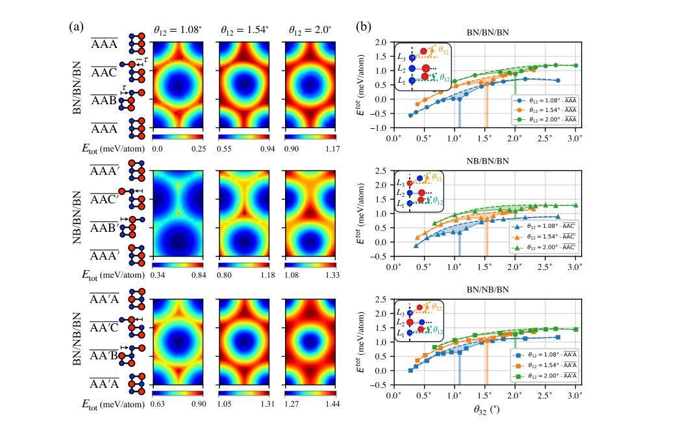 
FIG. 1. (color online) Sliding- and twist-angle-dependent total energies per atom (Etot) for t3BN systems. (a) Sliding-dependent energy maps for double-moir´e commensurate structures at θ12 = θ32 = 1.08◦, 1.54◦and 2.00◦for different relative orientations between the hBN layers. When sliding the top layer, the BN/BN/BN, NB/BN/BN, and BN/NB/BN structures are most stable for the AAA, AAC′, and AA′A configurations, respectively. The overline notation on a stacking label denote a configuration in which that local stacking is placed at the rotation center before applying the twist. Among these three, BN/BN/BN with the AAA rotation center has the lowest total energy. (b) Angle-dependent transition...

📷 Fig 2

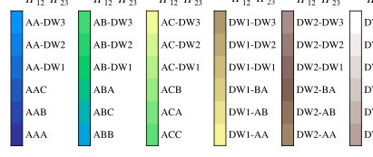 
FIG. 2. (color online) Sliding-dependent local stacking config- urations for both commensurate and incommensurate t3BN systems are shown for θ12 = 1.54◦. The local stacking config- urations after atomic relaxation are presented by color maps, which are divided into 36 sectors corresponding to local- stacking domains defined by the combined relative stackings at the two moir´e interfaces, IF12 and IF23, between the mid- dle/bottom and top/middle layers, respectively. For each in- terface, we adopt the six-sector classification of Ref. [39], con- sisting of three high-symmetry stacking configurations (AA, AB, BA (or AC)) and three intermediate domain walls (DW1, DW2, DW3). In the commensurate...

📷 Fig 3

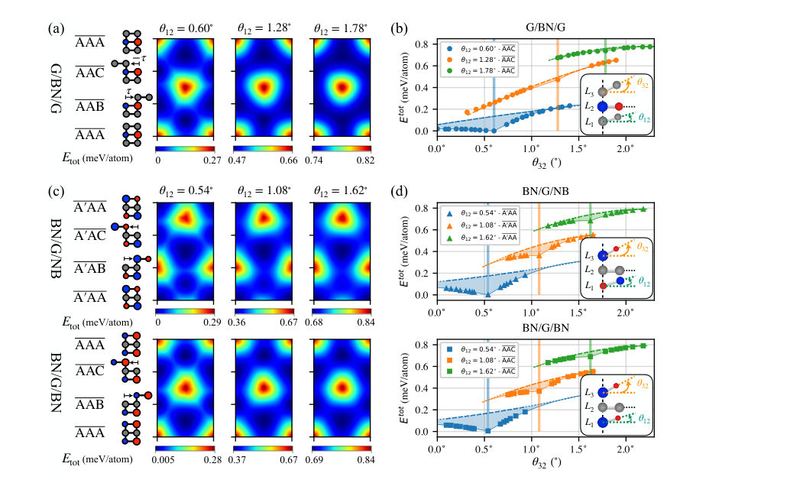 
FIG. 3. (color online) Total energies per atom for G/BN/G, BN/G/NB, and BN/G/BN systems as a function of sliding and top twist angle θ32 with respect to the middle layer. (a) Sliding-dependent energy maps for commensurate G/BN/G structures at θ12 = θ23 = 0.6, 1.28, 1.78◦show that the AAC configuration are the most stable and smaller twist angles yield lower total energies. (b) θ32-dependent transitions from incommensurate to commensurate G/BN/G structures, showing the local energy minima at the commensurate conditions (indicated by vertical lines). The curves to the left and right of each commensurate angle are extrapolated using parabolic fits, and we approximate reference total-energy...

📷 Fig 4

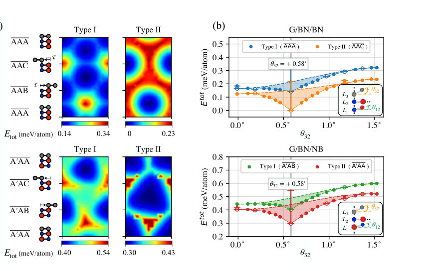 
FIG. 4. (color online) Total energies per atom for G/BN/BN and G/BN/NB systems as a function of (a) sliding and (b) the top-layer twist angle θ32 with respect to the middle layer. Each system is considered for two twist-angle combinations with bottom twist angles θ12 = ±1.20◦(type I and type II) and a common top twist angle θ32 = 0.58◦. All four cases exhibit local energy minima at the double-moir´e commensurate condition (indicated by vertical gray lines). For both stacking sequences, type II is energetically more favorable than type I, with the energy differences on the order of 0.1 meV/atom, and G/BN/BN is more stable than G/BN/NB by about 0.3 meV/atom. Unlike in the other systems,...

**Summary.** This paper explores how the alignment of two moiré interfaces in trilayer 2D heterostructures leads to 'angle-locking' via commensuration torques. It demonstrates that the overlap of favorable stacking regions stabilizes specific twist angles, providing a mechanism for controlling the structural and mechanical properties of moiré superlattices.

**Why it may be interesting.** not directly relevant

Detailed structure

**Main problem.** Investigating the energetic origins and stability of commensuration-driven torques and angle-locking in double-moiré trilayer heterostructures.

**Main result.** The study identifies that double-moiré commensuration creates local energy minima and restoring torques due to the enhanced overlap of low-energy stacking domains, with graphene/hBN systems potentially exhibiting global energy minima at specific angles.

**Method.** Large-scale atomistic relaxations using the LAMMPS molecular dynamics package with various interatomic potentials (Tersoff, REBO2, and DRIP force-fields) and electrostatic models.

**Model / system.** Trilayer heterostructures including twisted trilayer hBN (t3BN) homostructures and graphene/hBN heterolayers (e.g., G/BN/G, G/BN/BN) with varying twist angles and lattice mismatches.

**Key observables.** Total energy per atom, torque (angular derivative of energy), binding energy, and stacking configuration maps.

**Important parameters / regimes.** Twist angles (theta_12, theta_32), lattice mismatch, torque constants, and electrostatic interaction types (short-range vs. long-range).

**Assumptions / limitations.** Use of commensurate approximants to allow for periodic boundary conditions in incommensurate phases.

**Figures summary.** Figure 1 shows energy maps and energy variation vs. twist angle; Figure 2 illustrates local stacking configuration maps; Figure 3 displays sliding-dependent energy maps and binding energy trends for G/BN/G and related systems; Figure 4 shows total energy per atom evolution.

**Paper structure.** The paper introduces the problem of double-moiré stability, details the atomistic simulation methodology, presents results for t3BN homostructures, extends the analysis to graphene/hBN heterostructures, and discusses the role of electrostatic interactions and superlubricity.

Abstract

We study commensuration-driven torques and angle locking in double-moiré trilayer hexagonal boron nitride (hBN) and graphene heterostructures using large-scale atomistic relaxations. In twisted trilayer hBN (t3BN) homostructures, double-moiré commensuration ($θ_{12} = -θ_{23}$) give rise to local energy minima accompanied by torque sign reversals, signaling a restoring tendency toward the commensurate configuration. The corresponding binding energies are $\sim$0.2-0.3 meV/atom, originating from enhanced overlap of low-energy stacking domains, although the system is globally stable at zero twist. In contrast, in graphene/hBN heterolayers systems the global energy minimum can coincide with the double-moiré commensuration angle, particularly near $\sim$0.6$^{\circ}$, reflecting competition between lattice mismatch and interfacial relaxation. Incommensurate atomic structures have reduced stabilization due to suppressed overlap of low-energy stacking and have enhanced superlubricity due to spatial averaging of interfacial energies. These results establish double-moiré commensuration as a general, system-dependent mechanism for twist-angle stabilization, whose angular stability is characterized by the torque magnitude and binding energy. Coulomb electrostatic interactions further enhance the stabilization energy without changing the underlying physics.

[↑ back to top](#top)

### [Non-reciprocal Coulomb drag in a ballistic quantum wire](http://arxiv.org/abs/2605.22945v1)

**Authors:** Suyang Cai, Mingyang Zheng, Nathan Rao, Glen Gillia, Rebika Makaju, Sadhvikas J. Addamane, Dominique Laroche  
**Type:** experiment · **Category:** disordered systems and neural networks · **PDF:** <https://arxiv.org/pdf/2605.22945v1>  
**Analysis basis:** full PDF text, analyzed in chunks
**Topic relevance:** `non-equilibrium dynamics` **2/5**

📷 Fig 1

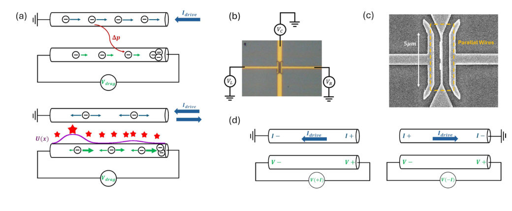 
FIG. 1. (a) Schematic illustrations of the reciprocal (top) and non-reciprocal (bottom) Coulomb drag signals. For reciprocal drag, momentum transfer via Coulomb interaction results in electron accumulation along the opposite direction of the current flow, generating an anti-symmetric signal that reverses upon current direction reversal. Non-reciprocal drag is induced by asymmetric scattering due to unequal potential barriers breaking translational symmetry. In this case, both energy fluctuations and momentum transfer from the electron-carrying current can generate a symmetrical drag signal upon current direction reversal. (b) Optical microscope figure of a typical laterally coupled lateral...

📷 Fig 2

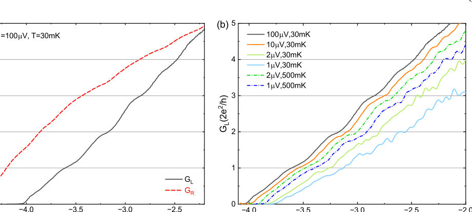 
FIG. 2. Quantum wires conductance. (a) Conductance of the left (right) wire as a function of the left (right) gate voltage at base temperature (T = 30 mK) and under Vbias = 100 µV, where left wire conductance is shown in solid black curve and right wire is shown in dashed red curve. The left wire is ballistic, with plateaus appearing at integer multiples of ( 2e2

📷 Fig 3

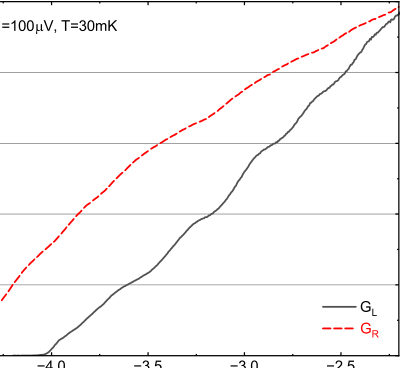 
Fig. 2(b), shows the ballistic left wire conductance for different bias voltage and temperature conditions. GL deviates significantly from the ballistic behavior at lower bias voltage, while elevated temperature leads to the re- covery of idealized plateau value. Such observations are consistent with previously reported experiments in ballis- tic wires [36–38] and has been attributed to the presence of weak disorder [39] or unavoidable potential barriers at the transition between the 2D and the 1D regime in physical devices [35].

📷 Fig 4

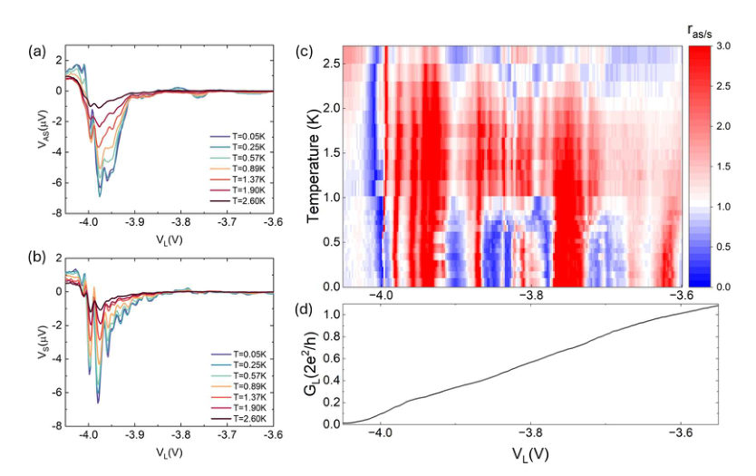 
FIG. 3. Coulomb drag signal. VL dependence of (a) the anti-symmetric (VAS) and (b) the symmetric (VS) drag voltage at various temperatures. The signal generally decreases as the temperature increases, and the two components of the signal have comparable peak amplitudes. The symmetric component has more oscillations due to an apparent higher sensitivity to disorder. (c) VL and temperature dependence of rAS/S, the ratio between reciprocal and non-reciprocal signal. The anti- symmetric component dominates over a wider regime at higher temperatures, as previously reported [23]. (d) VL dependence of GL. The antisymmetric signal dominates whenever a plateau or shoulder in the conductance GL is...

📷 Fig 5

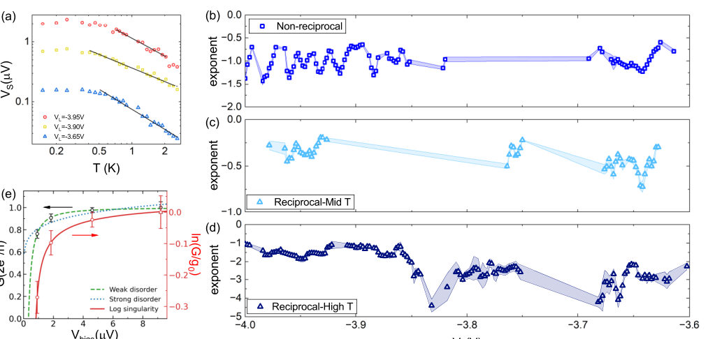 
FIG. 4. Fitting for temperature dependence of signal components. Bad fittings with R2 &lt; 0.85 or multiple points comparable with noise level are omitted and can be seen supplementary section IV. (a) Representative power-law fittings for the non- reciprocal signal for VL −−3.95 V (red circle), VL −−3.90 V (yellow square) and VL −−3.65 V (blue triangle). (b) VL dependence of power-law fitting parameters for non-reciprocal signal, where the error bars are the maximum change in slope if the final fitting range is narrowed by one data point from either the left or right end (the same as the error bars in (c) and (d)). The fitting parameters are clustered around -1. (c) VL dependence of power-law fitting...

**Summary.** The researchers found that even in ballistic quantum wires, a significant non-reciprocal Coulomb drag signal persists. They attribute this to low-energy disorder that breaks translational symmetry, challenging existing models that predict minimal non-reciprocity in pristine wires.

**Why it may be interesting.** The study explores the interplay between electron-electron interactions (Luttinger liquid physics) and disorder-induced rectification, which is relevant to understanding many-body dynamics in 1D systems.

Detailed structure

**Main problem.** Investigating the origin of the unexpectedly large non-reciprocal Coulomb drag component in nearly pristine, ballistic 1D quantum wires.

**Main result.** A non-reciprocal drag component comparable in strength to the reciprocal component is detected, likely arising from low-energy disorder/potential barriers that break translational symmetry.

**Method.** 1D Coulomb drag measurements were performed using a constant AC drive current and lock-in amplification in a GaAs/AlGaAs heterostructure device.

**Model / system.** A 7.2-micron long quasi-1D device with two parallel channels (one ballistic, one non-ballistic) created via Ti/Au top gates in a 2DEG.

**Key observables.** Drag voltage (reciprocal/antisymmetric and non-reciprocal/symmetric components), conductance (G), and temperature/bias voltage dependence.

**Important parameters / regimes.** Temperature (down to 30 mK), bias voltage, Luttinger liquid interaction parameter (Kc), and characteristic energy scales (Tc, T0).

**Assumptions / limitations.** The estimation of the interaction parameter assumes a specific model for Coulomb potential and 1D density; simple barrier transmission models are insufficient for a full description.

**Figures summary.** Fig 1 shows drag mechanisms and device schematics; Fig 2 shows conductance plateaus and gate voltage dependence under varying temperature and bias.

**Paper structure.** The paper introduces the drag mechanisms, describes the experimental device and measurement setup, presents conductance and drag data, analyzes temperature/bias dependence using various disorder models, and discusses the implications of the findings.

Abstract

1D-Coulomb drag serves as a platform for probing electron-electron interactions in 1D systems. Under the charge fluctuation formalism, the non-reciprocal component of Coulomb drag signal in mesoscopic devices is predicted to rely on the breaking of translational invariance due to intrinsic disorder. In this work, we report the measurement of a Coulomb drag device with a ballistic drag wire, allowing us to study the drag signal in nearly pristine quantum wires. Surprisingly, a non-reciprocal component with strength comparable to that of the reciprocal component is still detected across the measured regime, despite the drag wire being ballistic. We suggest that the non-reciprocal signal arises from low energy disorder in the device, which is consistent with the evolution of the drag wire's conductance at low biases voltages and temperatures. Additionally, the non-reciprocal component of the drag signal shows a power-law temperature dependence that coincides with a diffusive model, while the reciprocal component's temperature dependence cannot be explained under the existing framework. The bias voltage dependence of the drag wire conductance is fitted into three models to extract the interaction parameter and disorder level within the wire, but none of the models provides a fully self-consistent explanation for the data.

[↑ back to top](#top)

### Other secondary papers (8)

Show other secondary papers

### [Disorder-Induced Phase Transitions in Altermagnetic Josephson Junctions](http://arxiv.org/abs/2605.23607v1)

**Authors:** Chang-An Li  
**Type:** theory · **Category:** disordered systems and neural networks · **PDF:** <https://arxiv.org/pdf/2605.23607v1>  
**Analysis basis:** full PDF text, analyzed in chunks

📷 Fig 1

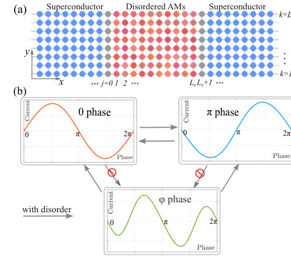 
FIG. 1. (a) Schematic of the disordered AMJJ in 2D. Two s-wave superconductor leads (blue color) with a phase differ- ence ϕ are connected by a disordered d-wave AM (dx2−y2- wave or dxy-wave) with a length of Lx (red color). The color variation indicates random onsite potentials at different lat- tice sites. There are normal metals at two interfaces with a barrier potential of Vb (gray color). Periodic boundary conditions are applied along y direction. (b) Sketch of the disorder-induced phase transitions between different phases of the AMJJ. Note that the transitions between 0 phase (red color) and π phase (blue color) are reciprocal, whereas the transition from φ phase (green color) to...

📷 Fig 2

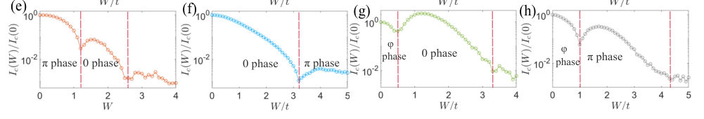 
FIG. 2. (a-d) Evolution of the CPR with increasing disorder strength W. In the clean limit with W = 0t, the AMJJ is in π phase for (a) with Lx = 16, 0 phase for (b) with Lx = 8, φ phase in (c) with Lx = 18, and φ phase in (d) with Lx = 14, respectively. (e-h) The critical supercurrent as a function of W corresponding to panels (a-d). Other parameters are Ly = 30, Vb = 2t, tJ = 0.3t, ∆= 0.1t, T = 0.05Tc, and µ = −2t. We have taken 5 × 103 disorder configurations for all plots.

📷 Fig 3

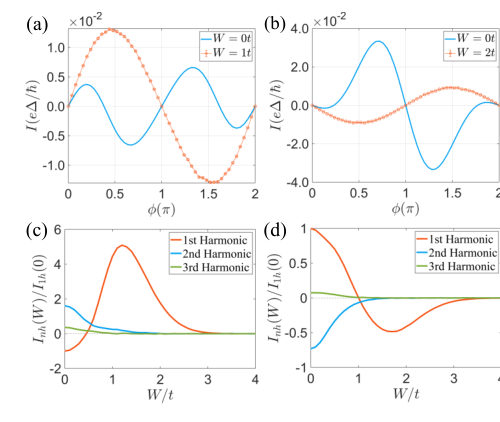 
FIG. 3. (a-b) CPRs of the AMJJ at different disorder strength W. Panel (a) demonstrates φ phase before the transition and 0 phase after the transition. The AM junction length is of Lx = 18. Panel (b) demonstrates φ phase before transition and π phase after transition. The AM junction length is of Lx = 14. (c-d) Corresponding harmonic components in CPRs as a function of W, corresponding to Fig. 2(c) and 2(d), respectively. Other parameters are the same as in Fig. 2.

📷 Fig 4

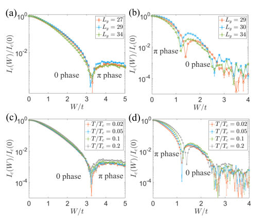 
FIG. 4. (a,b) The width dependence of critical supercurrent as a function of disorder strength W. The temperature is fixed at T = 0.05Tc and the junction length is Lx = 8. (c,d) The temperature dependence of critical supercurrent as a function of disorder strength W. The width of the junction is fixed at Ly = 34 and the junction length is Lx = 16. We have taken 1×104 disorder configurations for all plots. Other parameters are Vb = 2t, tJ = 0.3t, ∆= 0.1t, and µ = −2t.

📷 Fig 5

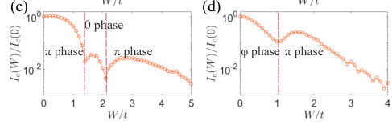 
FIG. 5. (a-b) Evolution of the CPR with increasing disorder strength W for dxy-wave AMs. In the clean limit, the AMJJ is in π phase for (a) with Lx = 12, and φ phase for (b) with Lx = 22. (c-d) The critical supercurrent as a function of W, corresponding to panels (a-b). Other parameters are Ly = 30, Vb = 2t, tJ = 0.3t, ∆= 0.1t, T = 0.05Tc, and µ = −2t. We have taken 5 × 103 disorder configurations for all plots.

**Summary.** This paper explores how disorder affects the stability of exotic superconducting phases in altermagnetic Josephson junctions. It finds that disorder can drive transitions between 0, pi, and phi phases by suppressing higher-order harmonics and reducing effective spin-splitting. These findings are crucial for understanding the potential for using altermagnets in functional superconducting devices.

**Why it may be interesting.** not directly relevant

Detailed structure

**Main problem.** The study investigates whether the exotic pi and phi phases in altermagnetic Josephson junctions (AMJJs) are stable against the presence of disorder found in real materials.

**Main result.** Disorder induces phase transitions between the pi and 0 phases and causes the anomalous phi phase to be highly fragile, eventually collapsing into 0 or pi phases. This is driven by the suppression of higher-order harmonics in the current-phase relation and the reduction of effective spin-split strength.

**Method.** The authors use a mean-field tight-binding Hamiltonian and the recursive Green's function method to calculate supercurrents, averaging results over thousands of disorder configurations.

**Model / system.** A two-dimensional d-wave altermagnetic Josephson junction consisting of two s-wave superconductor leads separated by a disordered d-wave altermagnet region.

**Key observables.** Current-phase relation (CPR), critical supercurrent (Ic), and Fourier harmonic amplitudes (I1h, I2h, I3h).

**Important parameters / regimes.** Disorder strength (W), junction length (Lx), altermagnetic hopping amplitude (tJ), superconducting gap (Delta), and temperature (T).

**Assumptions / limitations.** The model assumes a 2D square lattice and uses a mean-field approximation for the superconducting pairing.

**Figures summary.** Figures show the transition of the CPR from phi to 0 or pi phases and a Fourier analysis demonstrating the decay of higher-order harmonics.

**Paper structure.** The paper introduces the altermagnetic Josephson junction system, describes the tight-binding model and disorder implementation, presents numerical results regarding phase transitions and supercurrent suppression, and concludes with the physical implications of disorder on phase stability.

Abstract

Altermagnetic Josephson junctions (AMJJs) can host unconventional $π$ phase and $\varphi$ phase despite vanishing net magnetizations. Whether these phases are stable against disorder existing in real materials remains an open question. Here, we investigate impact of disorder on exotic phases in two-dimensional d-wave AMJJs. We show that disorder is able to induce phase transitions between the exotic $π$ and conventional 0 phases, accompanied by a strong suppression of critical current. This behavior is attributed to modifications of the tunneling Cooper-pair phase shift and superconducting decoherence. Remarkably, the anomalous $\varphi$ phase is highly fragile in presence of disorder and can be driven to either a $π$ phase or 0 phase in a nonreciprocal manner. Across such transitions, the first harmonic of current-phase relation changes sign, while the higher-order harmonics are rapidly suppressed. Our findings reveal the crucial role of disorder in tailoring distinct phases of AMJJs and shed new light on their potential functionalities.

[↑ back to top](#top)

### [Momentum-Resolved Tunneling Modulation Induced Giant Multistate Resistance in Antiferroelectric Multiferroic Junction](http://arxiv.org/abs/2605.23577v1)

**Authors:** Wei Yang, Yibo Xu, Shen Li, Jiangchao Han, Jiayou Chen, Juan-Carlos Rojas-Sánchez, Stéphane Mangin, Xiaoyang Lin, Weisheng Zhao  
**Type:** theory · **Category:** other · **PDF:** <https://arxiv.org/pdf/2605.23577v1>  
**Analysis basis:** full PDF text, analyzed in chunks

📷 Fig 1

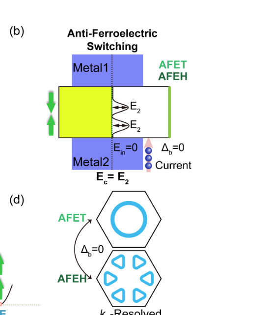 
Figure 1. Schematic Illustration of the Transport Mechanism in High-performance

📷 Fig 2

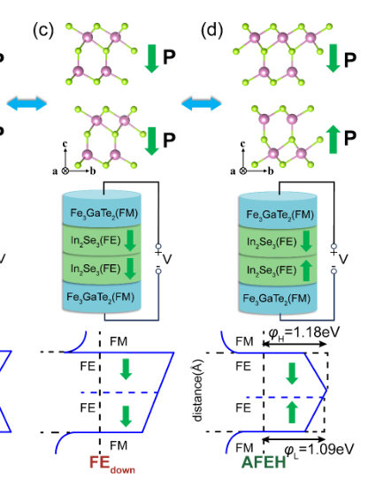 
Figure 2. Multi-State Storage Concept Based on AFE-MFTJ. (a) Atomic structure of the proposed

📷 Fig 3

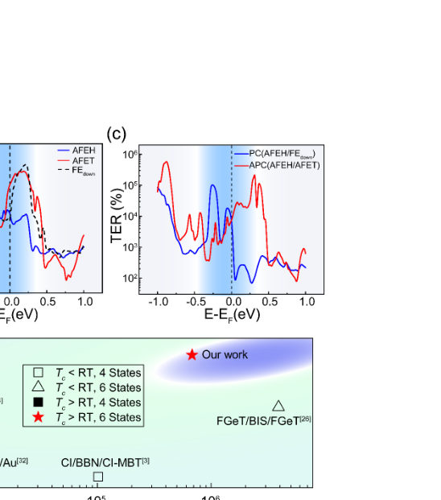 
Figure 3. Spin Transport in Fe3GaTe2/bilayer-In2Se3/Fe3GaTe2 AFE-MFTJ. (a) Spin polarization

📷 Fig 4

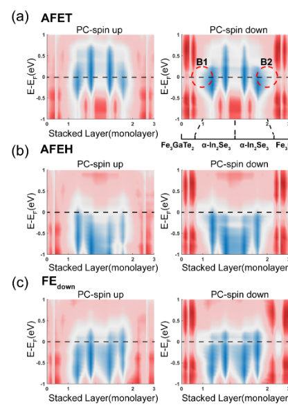 
Figure 4. Local Density of States (LDOS) Along the Transport Direction. (a)-(c) the LDOS, of tail-

📷 Fig 5

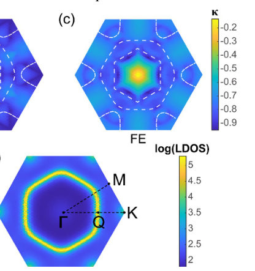 
Figure 5. AFE-Driven Modulation of Tunneling Channels and Spin-Resolved Filtering. (a)-(c) are

**Summary.** This paper proposes a new way to design multiferroic memory by using antiferroelectric transitions to modulate tunneling through momentum-space redistribution. This approach overcomes the traditional conflict between high-performance readout and low-power writing, achieving massive resistance changes at room temperature.

**Why it may be interesting.** not directly relevant

Detailed structure

**Main problem.** The fundamental trade-off in multiferroic tunnel junctions (MFTJs) where strong electric fields required for high tunnel electroresistance (TER) simultaneously impede efficient ferroelectric polarization switching.

**Main result.** The discovery of a dual mechanism in an antiferroelectric (AFE) junction that achieves giant TER (~7.6e3%) and TMR (>6.8e5%) by modulating momentum-resolved evanescent decay rates rather than just barrier height, enabling six non-volatile resistance states.

**Method.** First-principles calculations combining Density Functional Theory (DFT) with the Non-Equability Green's Function (NEGF) formalism.

**Model / system.** A van der Waals heterostructure consisting of ferromagnetic Fe3GaTe2 electrodes and a bilayer alpha-In2Se3 antiferroelectric/ferroelectric barrier.

**Key observables.** Tunneling electroresistance (TER), tunneling magnetoresistance (TMR), spin-resolved transmission spectra, and momentum-resolved decay rates.

**Important parameters / regimes.** Room temperature stability, six distinct resistance states, and switching barriers (approx. 34-37 meV for AFE vs 77 meV for FE).

**Assumptions / limitations.** Use of GGA-PBE functional with DFT-D3 dispersion corrections and a Hubbard U=0 approximation.

**Figures summary.** Figure 1 compares FE and AFE switching; Figure 2 shows atomic stacking and electrostatic profiles; Figure 3 presents spin polarization, TMR, and TER spectra; Figure 4 shows LDOS distributions; Figure 5 displays k-dependent decay rate distributions.

**Paper structure.** The paper introduces the MFTJ trade-off, describes the Fe3GaTe2/alpha-In2Se3/Fe3GaTe2 heterostructure, details the DFT+NEGF methodology, presents results on transport properties and momentum-resolved modulation, and concludes with the implications for multi-state memory.

Abstract

Multiferroic tunnel junctions (MFTJs), integrating ferroelectric and ferromagnetic functionalities within a single nanoscale device, hold significant promise for non-volatile, multi-state memory and innovative computing paradigms. In conventional MFTJs, tunneling resistance modulation relies primarily on ferroelectric (FE) polarization switching, which alters interfacial electric fields and shifts the Fermi level of adjacent ferromagnetic electrodes. However, achieving high tunnelelectroresistance (TER) through this approach demands strong built-in electric fields, which simultaneously hinder FE polarization switching, creating an intrinsic trade-off between reliable data reading and efficient writing. Here, we propose a dual mechanism that combines antiferroelectric (AFE) phase-transition modulation of the evanescent decay states with interfacial spin filtering based on $Fe_3GaTe_2$/bilayer-$In_2Se_3$/$Fe_3GaTe_2$ heterostructure. Beyond altering the electrostatic potential as in AFE-FE switching, the transitions between head-type and tail-type AFE states preserve the centrosymmetric potential profile yet fundamentally modulate the momentum-resolved distribution of evanescent decay rates across the Brillouin zone. When integrated with perfect spin filtering at the $Fe_3GaTe_2$/$α$-$In_2Se_3$ interface, this mechanism yields a giant TER (~$7.6\times10^3\%$), over 4 times that of conventional FE-based MFTJs, and a TMR exceeding $6.8\times10^5\%$, enhanced by two orders of magnitude over typical MFTJs. These mechanisms resolve the performance trade-off in MFTJs, enabling six distinct non-volatile resistance states at room temperature.

[↑ back to top](#top)

### [Nonlinear Wave Propagation in 1D Polycatenated Ring Chains](http://arxiv.org/abs/2605.23001v1)

**Authors:** Xiaoxiao Xiong, Reo Yanagi, Tingtao Zhou, Chiara Daraio  
**Type:** both · **Category:** other · **PDF:** <https://arxiv.org/pdf/2605.23001v1>  
**Analysis basis:** full PDF text, analyzed in chunks

📷 Fig 1

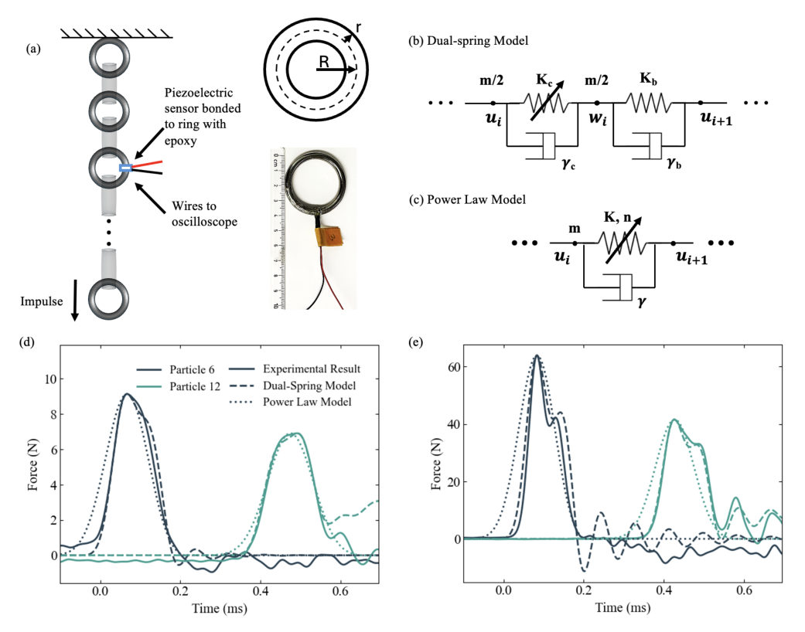 
FIG. 1: Experimental measurements and numerical modeling of nonlinear wave propagation in a 1D polycatenated ring chain. (a) Experimental setup: a vertical chain of 20 interlocked stainless steel rings. An impulse is generated by dropping the lowermost ring to impact its nearest neighbor, and the resulting wave is captured by piezoelectric sensors embedded in rings 6 and 12 from the impact site. Insets show (top) a schematic of a torus indicating the major radius R and minor radius r, and (bottom) a photograph of a ring with the embedded piezoelectric sensor. (b) Schematic of the hybrid dual-spring unit-cell model. (c) Schematic of the power-law model. (d, e) Comparison of the force-time...

📷 Fig 2

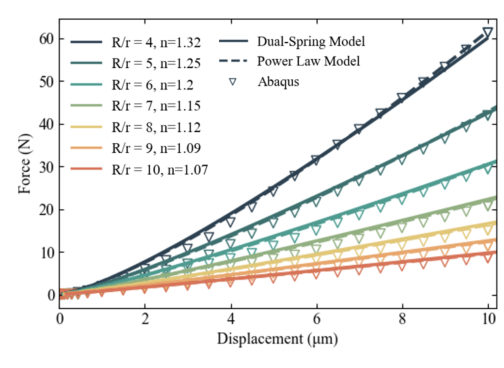 
FIG. 2: Study of the effect of ring aspect ratio R/r on the nonlinear contact exponent n. We simulate the contact between two rings with cross section radius r=2.5mm and vary the ring body radius R. For small forces and displacements, the contact theory with two springs (solid lines) and its power law fit (dashed lines) are consistent with finite element simulation in Abaqus (triangles).

📷 Fig 3

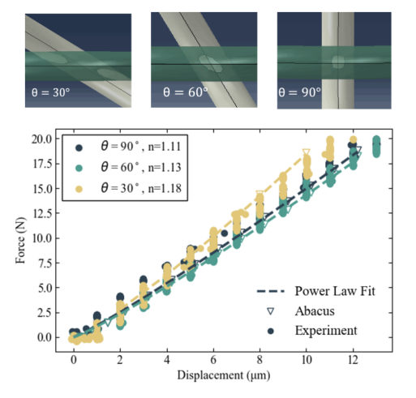 
FIG. 3: Study of the effect of ring contact angle θ on the nonlinear contact exponent n. Top: two rings in contact and the shape of their contact (shaded regions) for different angles θ = 90◦, 60◦, 30◦. Bottom: Comparison of the force-displacement relationship between two rings with aspect ratio R/r = 9 in contact at different angles. For small forces and displacements, the experimental results (solid circles) are consistent with finite element simulation in Abaqus (triangles).

📷 Fig 4

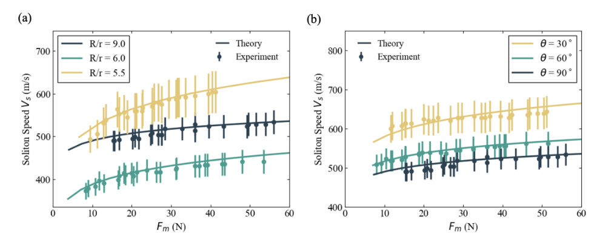 
FIG. 4: Comparison of experimental measurements (solid circle) of solitary wave speed Vs with theory predictions from Eqn. 8 (solid lines) for various ring geometric ratios (a) and contact angles (b).

**Summary.** This paper investigates nonlinear wave propagation in chains of interlocked rings, showing that unlike rigid granular crystals, these systems have tunable nonlinearity and intrinsic dispersion. By adjusting the geometry of the rings, one can control the wave speed and the nonlinear exponent, creating a designable platform for nonlinear dynamics.

**Why it may be interesting.** not directly relevant

Detailed structure

**Main problem.** Characterizing nonlinear wave dynamics in 1D chains of polycatenated (interlocked) rings and understanding how structural flexibility and geometry tune the system's nonlinearity.

**Main result.** The researchers demonstrated that polycatenated rings support nonlinear waves with a compact wavefront and trailing oscillations due to energy partitioning into bending modes, and that the nonlinearity exponent can be tuned via ring aspect ratio and contact angle.

**Method.** The study combines dynamic impact experiments with finite-element analysis (FEA) and discrete-particle simulations using both a dual-spring model and a simplified power-law model.

**Model / system.** A 1D vertical chain of interlocked stainless steel tori pretensioned by gravity, modeled as a discrete-particle system with nonlinear Hertzian contact and linear structural bending.

**Key observables.** Force-time profiles, wave speed (Vs), waveform morphology (leading wavefront vs. trailing oscillations), and effective contact exponent (n).

**Important parameters / regimes.** Ring aspect ratio (R/r), contact angle (theta), effective stiffness (K), effective mass (meff), and gravitational pretension.

**Assumptions / limitations.** The system is treated as a continuous medium using a long-wavelength approximation; the contact is modeled as Hertzian; and the rings are assumed to be in a perpendicular orientation.

**Figures summary.** Fig 1 shows the experimental setup and the dual-spring/power-law models; Fig 2 shows FEA results for different aspect ratios; Fig 4 compares experimental wave speeds to theoretical predictions.

**Paper structure.** The paper introduces the polycatenated system, describes the experimental and numerical models, presents results on waveform morphology and energy partitioning, demonstrates geometric tunability of nonlinearity, and provides an analytical derivation of wave speed scaling.

Abstract

We study the nonlinear wave dynamics of one-dimensional chains of polycatenated rings. These interlocked structures support amplitude-dependent nonlinear wave propagation driven by tensile activation and internal structural flexibility, unlike traditional granular crystals. Through dynamic impact experiments, finite-element modeling, and discrete-particle simulations of vertical chains pretensioned by gravity, we observe and explain nonlinear waves characterized by a compact leading wavefront followed by persistent trailing oscillations, which arise from energy partitioning into the rings' internal bending modes. Further, we demonstrate that the system's nonlinearity is not a fixed material constant. By altering the rings' geometric aspect ratio and contact angles, we can tune the effective contact exponent and the amplitude scaling of the wave speed. This work builds upon nonlinear wave propagation in classical granular crystals and establishes polycatenated systems as a highly tunable and designable platform to study and control nonlinear dynamics.

[↑ back to top](#top)

### [Optical Transmission of 2D Material with Quantum Anomalous Hall Effect](http://arxiv.org/abs/2605.23211v1)

**Authors:** Nathan Pravda, Oleg L. Berman, Klaus Ziegler  
**Type:** theory · **Category:** other · **PDF:** <https://arxiv.org/pdf/2605.23211v1>  
**Analysis basis:** full PDF text, analyzed in chunks

📷 Fig 1

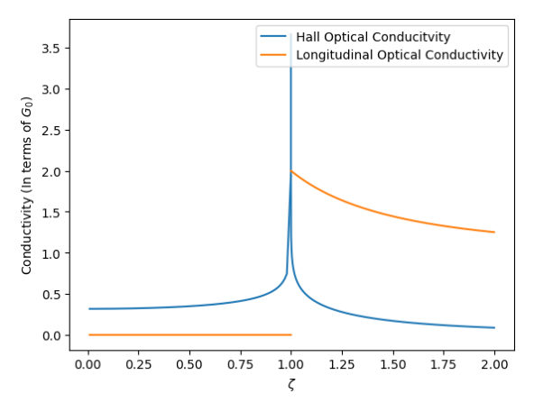 
Figure 1: The optical conductivities of a 2D material in units of G0 with a band gap 2m in the presence of the QAH effect as a function of the scaled frequency ζ = ℏω/2m.

📷 Fig 2

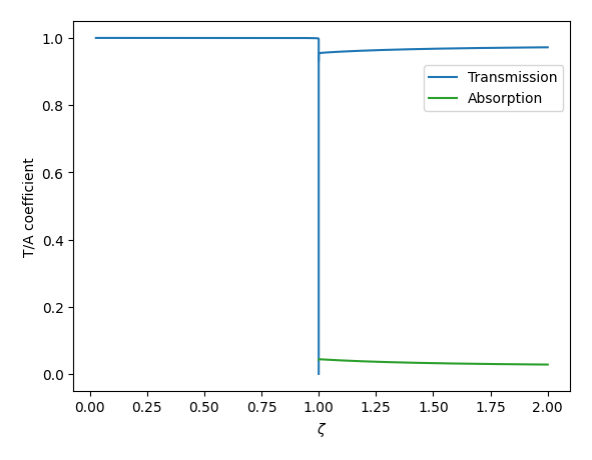 
Figure 2: Transmission and absorption coefficients of a 2D material with a band gap 2m in the presence of the QAH effect and an incident electromagnetic wave with the scaled frequency ζ = ℏω/2m.

📷 Fig 3

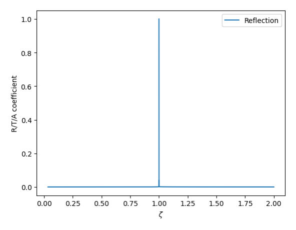 
Figure 3: Singular behavior of the reflection coefficient of a 2D material with a band gap 2m in the presence of the QAH effect.

**Summary.** This paper explores how the Quantum Anomalous Hall effect influences the light-matter interaction in 2D materials. It identifies a sharp transition in optical transparency at the bandgap energy and demonstrates that these optical properties can be used to accurately measure the material's bandgap.

**Why it may be interesting.** not directly relevant

Detailed structure

**Main problem.** The study investigates the frequency-dependent optical properties (transmission, reflection, and absorption) of 2D materials exhibiting the Quantum Anomalous Hall effect.

**Main result.** The optical response shows a universal behavior depending on the ratio of photon energy to bandgap energy, featuring a singular point of total reflection at the bandgap threshold and recovering graphene-like behavior as the gap vanishes.

**Method.** The authors use the Kubo formalism to derive optical conductivities and apply Maxwell's equations with boundary conditions at the 2D sheet to calculate electromagnetic coefficients.

**Model / system.** A two-band model of a gapped 2D material with intrinsic time-reversal symmetry breaking, characterized by longitudinal and antisymmetric Hall conductivities.

**Key observables.** Transmission (T), reflection (R), and absorption (A) coefficients.

**Important parameters / regimes.** Scaled frequency (zeta = h-bar*omega/2m), bandgap energy (2m), and the fine-structure constant (alpha).

**Assumptions / limitations.** Low temperatures where thermal fluctuations are negligible, an isotropic 2D sheet, and a focus on universal scaling rather than non-universal material parameters.

**Figures summary.** Figure 1 shows optical conductivities vs. scaled frequency; Figure 2 displays the evolution of T, R, and A coefficients; Figure 3 illustrates the singular jump in the reflection coefficient at the threshold.

**Paper structure.** The paper introduces the physical problem, defines the conductivity model using the Kubo formalism, derives the electromagnetic response coefficients, analyzes different frequency regimes (insulating vs. metallic), and discusses the limits of vanishing gaps.

Abstract

We study the optical properties of gapped two-dimensional materials which are subject to the quantum anomalous Hall effect. At sufficiently low temperatures the transmission, reflection and absorption coefficients are found to have a universal behavior that depends only on the ratio of the photonic energy and the gap energy. There is a singular behavior with total reflection when these energies are equal. In the limit of a vanishing gap we recover results for graphene, where the optical coefficients depend only on the fine-structure constant. The observed optical properties provide an accurate measurement of the bandgap.

[↑ back to top](#top)

### [Orbital Selective Dirac-like States in EuAgAs Revealed by Polarization Dependent ARPES and DFT](http://arxiv.org/abs/2605.23836v1)

**Authors:** Mohit Mudgal, Suman Nandi, Mohamed El Gazzah, Masashi Arita, Shin-ichiro Ideta, Nirmal J. Ghimire, Kenya Shimada, Anup Pradhan Sakhya  
**Type:** both · **Category:** strongly correlated electrons · **PDF:** <https://arxiv.org/pdf/2605.23836v1>  
**Analysis basis:** full PDF text, analyzed in chunks

📷 Fig 1

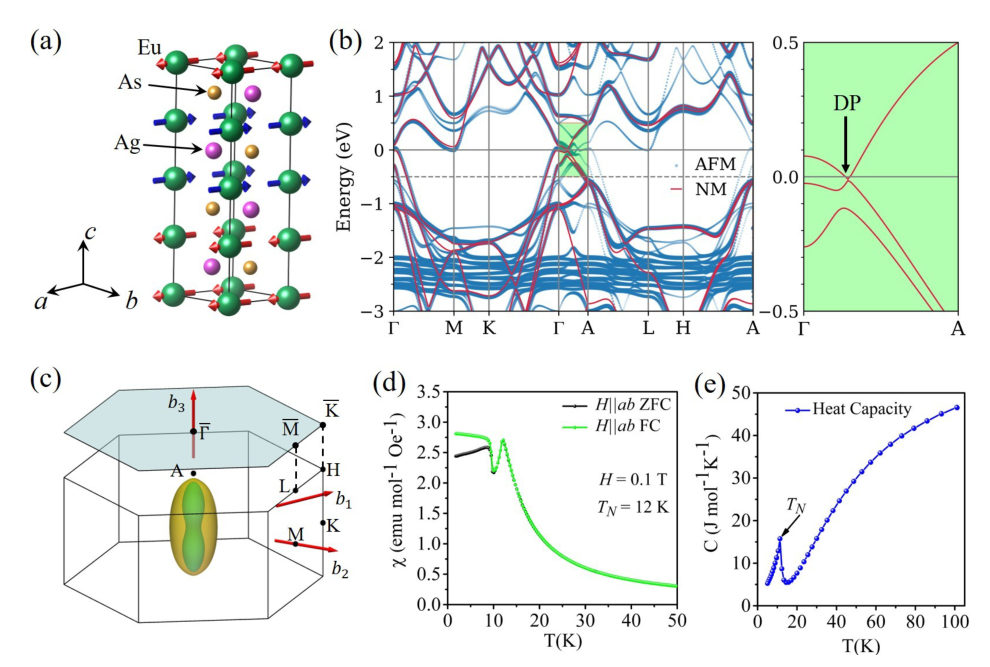 
FIG. 1. (a) Magnetic ground state structure of EuAgAs [29]. (b) Calculated electronic band structures of EuAgAs, including SOC for the AFM and NM phases, are shown in blue and red, respectively. The dashed line represents the shifted Fermi level. The right panel presents a zoomed in picture of (b) along the Γ- A direction, showing the DP near the Fermi level in the NM phase. (c) Schematic representation of the bulk and surface BZs with the corresponding high symmetry points indicated. (d) Temperature dependent magnetic susceptibility of EuAgAs measured under ZFC and FC conditions with a magnetic field (H = 0.1 T) applied parallel to the ab plane. (e) Temperature dependent heat capacity of...

📷 Fig 2

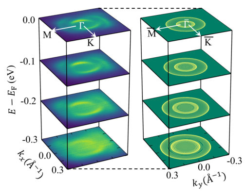 
FIG. 2. (Left panel) ARPES-measured Fermi surface and constant energy CECs at different binding energies acquired using a photon energy of 9 eV. The high symmetry directions are indicated. (Right panel) Corresponding DFT calculated surface projected Fermi surface and CECs showing the evo- lution of the electronic states with binding energy. The mea- surements were performed at the HiSOR BL-9A beamline at 9 K using p-polarized light.

📷 Fig 3

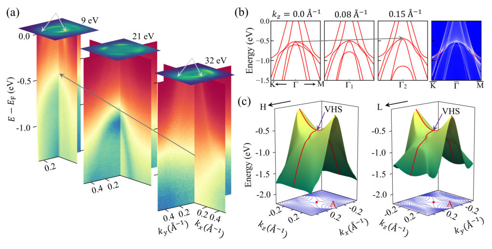 
FIG. 3. (a) ARPES-measured three dimensional band dispersions along the high symmetry directions M - Γ - M and K - Γ - K acquired at photon energies of 9 eV, 21 eV, and 32 eV. The corresponding Fermi surfaces measured at each photon energy are shown at the top of the three dimensional band dispersions. (b) Theoretically calculated electronic band dispersions along the K - Γ - M direction at different kz values. The right most panel represents the surface projected band structure. (c) Theoretically calculated band dispersions in kx-kz and ky-kz planes, revealing the vHS at Γ.

📷 Fig 4

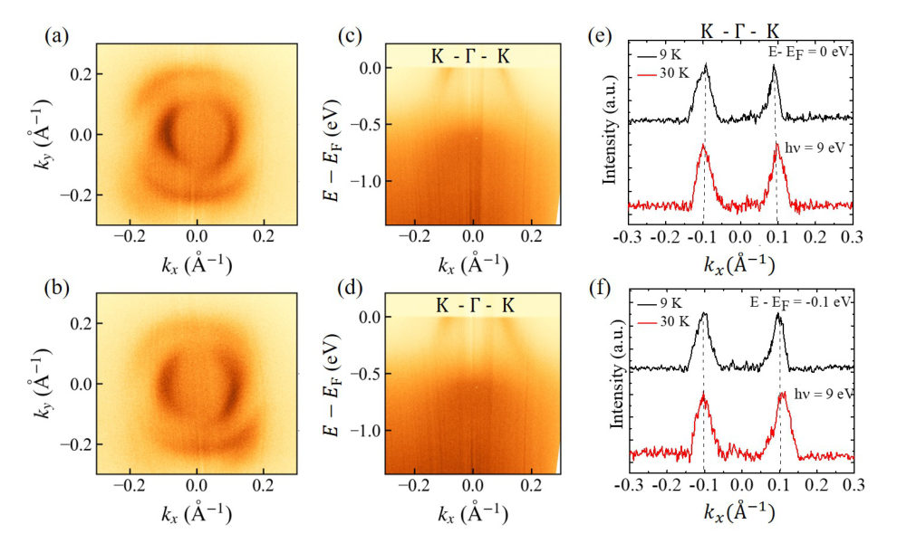 
FIG. 4. Temperature dependent CECs and electronic band dispersion of EuAgAs along the high symmetry direction K - Γ - K. ARPES measured CECs at E −EF = 0 eV acquired using a photon energy of 9 eV at temperatures of (a) 9 K and (b) 30 K. Experimentally measured band dispersions along the K - Γ - K direction at (c) 9 K and (d) 30 K. MDCs along the K - Γ - K direction at (e) E −EF = 0 eV and (f) E −EF = −0.1 eV, comparing the temperature evolution of the electronic structure across the AFM transition. All measurements were performed at the HiSOR BL-9A beamline using p-polarized light.

📷 Fig 5

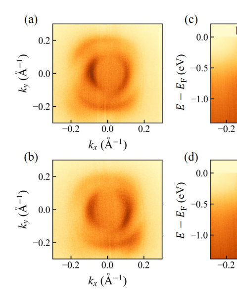 
Fig. 3(b) presents the theoretically calculated band dis- persions along the K -Γ- M direction at different kz values to understand the experimentally observed kz-dependent evolution. The right most panel of Fig. 3(b), showing the surface projected spectral function, qualitatively repro- duces the experimentally observed bands. With increas- ing kz, the upper portion of the hole like band gradually shifts toward higher energy, as indicated by the arrow in Fig. 3(b). This evolution signifies that the curvature of the band along the kz direction is opposite to that along the in plane kx and ky directions. Consequently, the band develops a saddle point like topology at the Γ point, giv- ing...

**Summary.** This paper uses polarization-dependent ARPES and DFT to reveal the orbital-selective electronic structure of the magnetic topological semimetal EuAgAs. It identifies Dirac-like states and a van Hove singularity that are robust against antiferromagnetic ordering. The findings provide crucial insight into how orbital symmetry and magnetism interplay in topological materials.

**Why it may be interesting.** not directly relevant

Detailed structure

**Main problem.** The study aims to investigate the electronic structure, orbital character, and the impact of antiferromagnetic ordering on the low-energy states of the magnetic topological semimetal candidate EuAgAs.

**Main result.** The researchers identified orbital-selective Dirac-like states and a higher-order van Hove singularity, finding that the low-energy electronic structure remains largely unaffected by the antiferromagnetic transition at 12 K.

**Method.** The study combines polarization-dependent and photon-energy-dependent ARPES with Density Functional Theory (DFT) calculations using the VASP package and Wannier90.

**Model / system.** The physical system is EuAgAs, a magnetic topological Dirac semimetal candidate with a hexagonal ZrBeSi-type structure and an antiferromagnetic ground state.

**Key observables.** Fermi surface mapping, constant energy contours, band dispersions, spectral intensity variations under different polarizations, and magnetic susceptibility.

**Important parameters / regimes.** Néel temperature (TN) approx 12 K, photon energies ranging from 9 to 32 eV, and temperature range from 9 K to 30 K.

**Assumptions / limitations.** The study assumes the validity of the DFT+U formalism for Eu 4f states and uses the GGA-PBE functional with spin-orbit coupling.

**Figures summary.** Fig 1 shows magnetic structure and calculated bands; Fig 2 compares experimental and theoretical Fermi surfaces; Fig 3 illustrates 3D band dispersions and van Hove singularities; Fig 4 shows temperature-dependent FS maps; Fig 5 demonstrates orbital-selective intensity modulation via polarization.

**Paper structure.** The paper introduces the material and its magnetic properties, presents experimental ARPES results (Fermi surface and dispersion), compares these with DFT calculations to identify orbital character, investigates the 3D nature of the bands, and discusses the stability of the electronic states across the magnetic transition.

Abstract

Magnetic topological semimetals provide a promising platform for emergent quantum phenomena driven by the interplay between magnetism and relativistic fermions, including anomalous transport effects and tunable topological phases. Here, we investigate the electronic structure and orbital character of EuAgAs, a magnetic topological Dirac semimetal candidate, using density functional theory (DFT) and polarization dependent angle resolved photoemission spectroscopy (ARPES). Fermi surface mapping and constant energy contours measured at 9 eV reveal ring like features that systematically expand with increasing binding energy, consistent with nearly linear low energy Dirac like dispersion. ARPES measurements at different photon energies hint at the presence of a van Hove singularity predicted by DFT calculations. Furthermore, this indicates that the photoemission matrix elements are highly sensitive to the excitation energy, allowing different photon energies to selectively probe distinct orbital characters. Polarization dependent ARPES measurements performed in s- and p-polarized geometries exhibit pronounced variations in spectral intensity, indicating symmetry selective orbital contributions to electronic states. These matrix element driven intensity modulations are well reproduced by DFT calculations. Furthermore, the observed Dirac like states remain nearly unchanged over the temperature range from 9 K to 30 K, suggesting that the magnetic ordering has minimal influence on the electronic structure. Our combined experimental and theoretical results provide detailed insight into the orbital selective electronic structure of EuAgAs and its implications for magnetic topological quantum states.

[↑ back to top](#top)

### [Quantum critical collapse of a pinned vortex glass](http://arxiv.org/abs/2605.23838v1)

**Authors:** David Perconte, Thibault Charpentier, Nikolaos Koutsopoulos, Kalpajit Roy, Nadjib Benchabane, Xiaoli Peng, Florent Blondelle, Frédéric Gay, Mikhail Feigel'man, Viktor Kabanov, Benjamin Sacépé  
**Type:** both · **Category:** disordered systems and neural networks · **PDF:** <https://arxiv.org/pdf/2605.23838v1>  
**Analysis basis:** full PDF text, analyzed in chunks

📷 Fig 1

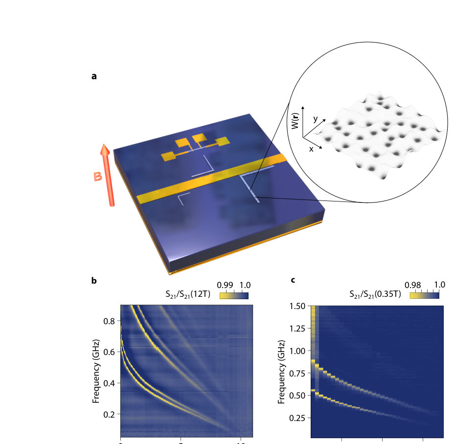 
FIG. 1: Superconducting plasmons in the mixed state. a, Device schematic. L-shaped a:InO resonators (grey) are capacitively coupled to a 50 Ωimpedance-matched gold feedline (center). The magnetic field is applied perpendicular to the substrate. An additional a:InO mesa, contacted by four DC probes, is used for resistance mea- surements (top). The inset illustrates the random pinning potential W(r) and the resulting vortex glass, represented as black circles. b, c, Microwave transmission S21, normalized to its normal-state value above the critical field, as a function of frequency and magnetic field for resonators DPRes2a and DPRes2b (b), and DPRes11a and DPRes11c (c). In b, higher harmonics...

📷 Fig 2

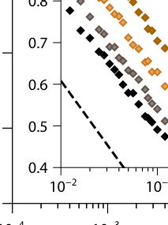 
FIG. 2: Interaction-induced collective pinning of the vortex glass. Normalized superfluid stiffness Θ(B)/Θ(0) as a function of normalized magnetic field B/BΘ c . Colors correspond to different disorder realizations (characterized by their sheet inductance): DPRes2a (red), DPRes9a (green), and DPRes11a (blue). DPRes2a and DPRes11a were measured with microwave powers of −103 dBm at low field and −83 dBm at high field, while DPRes9a was measured at −103 dBm throughout. The corresponding critical fields are BΘ c = 9.6 T, 5.6 T, and 0.44 T for DPRes2a, DPRes9a, and DPRes11a, respectively. Inset: Numerical simulations of Θ(B)/Θ(0) as a function of normalized vortex density n/nc (equivalently B/BΘ...

📷 Fig 3

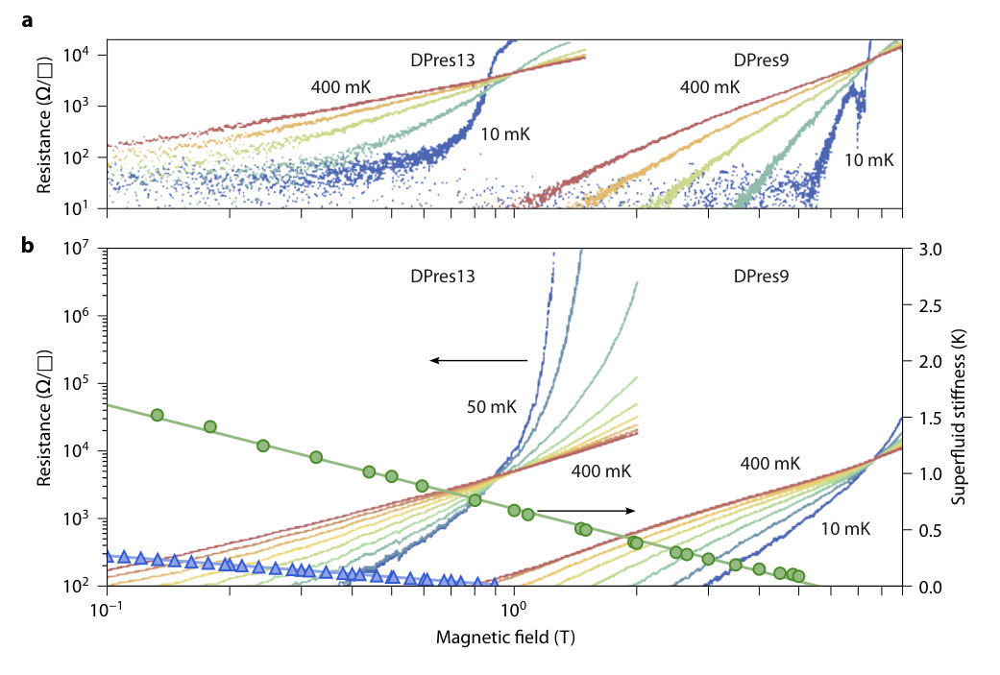 
FIG. 3: Magnetic-field-driven superconductor-insulator transition. a, Sheet resistance versus magnetic field measured in a current-bias configuration (0.1–1 nA) for samples DPRes9 and DPRes13 at temperatures ranging from 10 mK (blue) to 400 mK (red) in 100 mK steps. The anomalous kink in the 10 mK curve of DPRes9 is reproducible and could originate from low-temperature sensitivity to inhomogeneous current paths [23] in the narrow strip of the mesa Hall bar. b, Sheet resistance of the same samples measured in voltage bias, together with the corresponding superfluid stiffness (blue triangles and green circles) extracted from the on-chip resonators, as a function of magnetic field. The...

📷 Fig 4

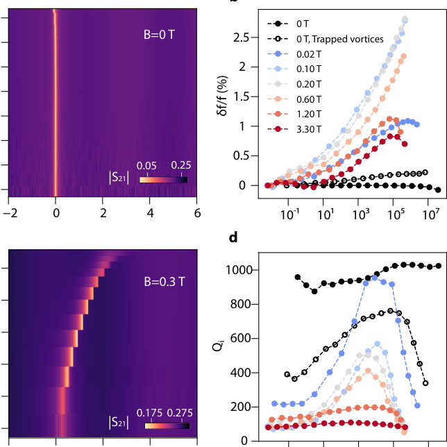 
FIG. 4: Positive Kerr nonlinearity and dissipation. a, c, Microwave transmission S21, in arbitrary units, as a function of photon number and frequency shift δf/f relative to the low-photon-number resonance frequency, at B = 0 T (a) and B = 0.3 T (c), for sample DPRes8. b, Relative frequency shift δf/f versus photon number, extracted at various magnetic fields. d, Internal quality factor Qi versus photon number, at various magnetic fields; the legend is the same as in b. In b and d, filled black circles correspond to measurements performed after zero-field cooling, whereas the open black circle corresponds to a measurement with trapped vortices. Measurements were performed at T = 0.01 K.

**Summary.** This paper demonstrates that in strongly disordered superconductors, the superfluid density is unexpectedly resilient to magnetic fields, decaying only logarithmically due to a collective pinning effect. It identifies a continuous quantum critical point at the transition to the insulator. The discovery of a positive Kerr effect in the vortex glass also suggests potential applications in quantum sensing.

**Why it may be interesting.** The study explores the dynamics of a many-body system (vortex glass) subject to competing random potentials and long-range interactions, which is highly relevant to the study of localization and collective dynamics in disordered many-body systems.

Detailed structure

**Main problem.** Understanding the mechanism behind the magnetic-field-driven superconductor-insulator transition (SIT) in strongly disordered superconductors and how the vortex glass state influences the collapse of superfluid stiffness.

**Main result.** The superfluid density decreases only logarithmically with the magnetic field due to a collective vortex-pinning mechanism where vortex-vortex interactions enhance pinning, eventually vanishing linearly at a continuous quantum critical point.

**Method.** The study combines plasmonic microwave spectroscopy of superconducting resonators with simultaneous DC transport measurements and numerical simulations of 2D logarithmically interacting particles in a random potential.

**Model / system.** The physical system consists of amorphous indium oxide (a:InO) thin films in a high-disorder, high-magnetic-field regime, modeled as a 2D assembly of vortices in a random pinning potential with logarithmic interactions.

**Key observables.** Superfluid stiffness (extracted from kinetic inductance), sheet resistance, critical current density, internal quality factor, and microwave transmission (S21).

**Important parameters / regimes.** Magnetic field (B), critical field (Bc), disorder strength (W), temperature (T ~ 10 mK), and vortex density (n/nc).

**Assumptions / limitations.** The London approximation for vortex interactions fails at high densities; the system is treated as effectively 2D due to the thin film geometry.

**Figures summary.** Figure 1 shows the resonator device and microwave transmission; Figure 2 displays superfluid stiffness decay across different disorder levels; Figure 3 shows magnetoresistance isotherms and the linear approach to the critical field; Figure 4 illustrates the positive Kerr nonlinearity and power-dependent dissipation.

**Paper structure.** The paper introduces the problem of the SIT, presents experimental microwave spectroscopy results showing anomalous logarithmic decay, proposes a 'cage model' for interaction-enhanced pinning, validates this with numerical simulations of vortex glasses, and concludes with observations of nonlinear electromagnetic responses.

Abstract

The interplay between disorder and vortex--vortex interactions in strongly disordered superconductors in a magnetic field can stabilize a vortex-glass state, characterized by strong pinning and the absence of positional order. Yet its role in the destruction of superconductivity at the field-driven superconductor--insulator transition has remained unresolved. Here we use plasmonic microwave spectroscopy of superconducting resonators patterned from amorphous indium oxide thin films to directly track the superfluid density up to the critical field $B_c$. We find an unexpected resilience of the superfluid density, which decreases only logarithmically over nearly three orders of magnitude in field, in stark contrast to the rapid power-law suppression expected for vortex lattices. We attribute this anomalously slow decay to a collective vortex-pinning mechanism counterintuitively enhanced by vortex--vortex interactions. The superfluid density then vanishes linearly at $B_c$, where independent magnetoresistance measurements identify a continuous quantum critical point, unlike the abrupt transition observed at zero field. We further uncover an exceptionally large nonlinear electromagnetic response of the vortex glass, manifested as a pronounced positive-Kerr effect with potential for quantum sensing. These results show how disorder controls the critical magnetic field and identify the vortex glass as the key intermediate state governing the magnetic-field-induced superconductor--insulator transition.

[↑ back to top](#top)

### [Self-organized formation of step-terrace structure in SrRuO3 thin films grown on mixed-terminated SrTiO3 (100) substrates](http://arxiv.org/abs/2605.23450v1)

**Authors:** Ryotaro Arakawa, Sachio Komori, Kotaro Tomita, Shunsei Komori, Masaaki A. Tanaka, Tomoyasu Taniyama  
**Type:** experiment · **Category:** other · **PDF:** <https://arxiv.org/pdf/2605.23450v1>  
**Analysis basis:** full PDF text, analyzed in chunks

📷 Fig 1

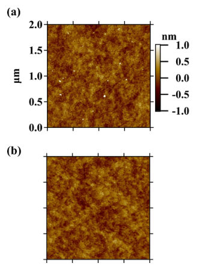 
Figure 1: Surface morphology of (a) as-received and (b) PLD-annealed (푇= 700◦C, 푃O2 = 100 mTorr, 푡= 120 min) STO substrates.

📷 Fig 2

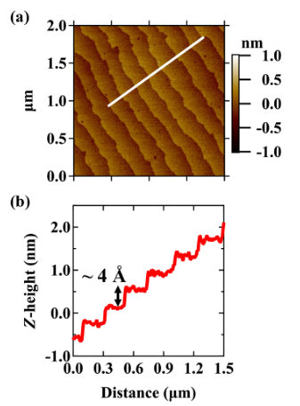 
Figure 2: Surface morphology of 34 nm-thick-SRO thin films on a bare STO substrate (푇= 725◦C, 푃O2 = 100 mTorr, 푡= 120 min). (a) AFM image and (b) line profile along the white solid line after plane-fit leveling.

📷 Fig 3

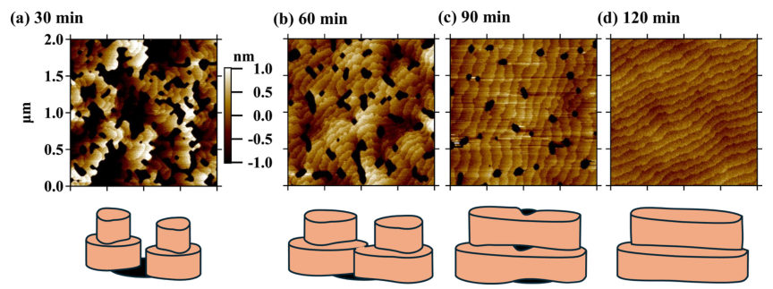 
Figure 3: Surface morphology of SRO/STO (푇= 700◦C, 푃O2 = 100 mTorr, 푑= 4.5 cm) and growth schematics of the self-organized step-terrace structure at different growth times: (a) 푡= 30 min, (b) 60 min, (c) 90 min, and (d) 120 min. The SRO film grown for 120 min has a thickness of approximately 34 nm. All AFM images are acquired over a 2 휇m×2 휇m scan area.

📷 Fig 4

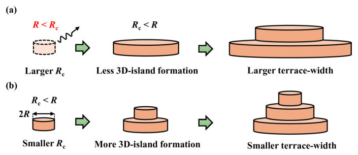 
Figure 4: Schematic illustration of island growth mechanisms at the SRO/STO interface at (a) 725◦C and (b) 700◦C.

📷 Fig 5

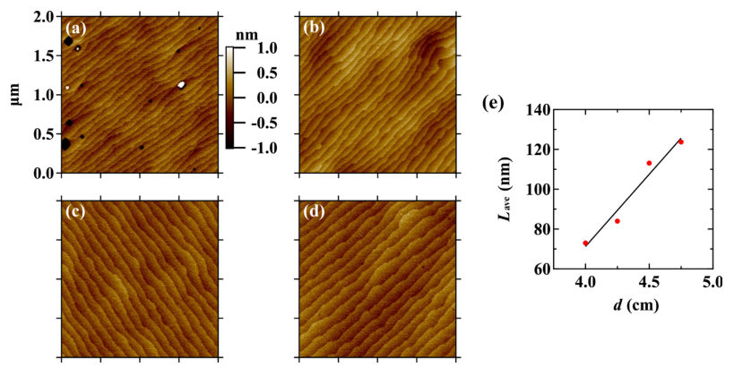 
Figure 5: Surface morphology of SRO/STO (푇= 700◦C, 푃O2 = 100 mTorr, 푡= 120 min, thickness ≈34 nm) for different target-substrate distances: (a) 푑= 4.0 cm, (b) 4.25 cm, (c) 4.5 cm, and (d) 4.75 cm. (e) Average terrace width 퐿ave as a function of 푑. All AFM images are acquired over a 2 휇m × 2 휇m scan area.

**Summary.** This paper demonstrates that SrRuO3 thin films can spontaneously form well-defined step-terrace structures when grown on untreated SrTiO3 substrates. By controlling growth parameters like temperature and distance, researchers can tune the surface morphology, which significantly improves the crystalline quality of subsequent layers like BiFeO3.

**Why it may be interesting.** not directly relevant

Detailed structure

**Main problem.** Understanding the mechanism behind the self-organized formation of step-terrace structures in SrRuO3 thin films grown on mixed-terminated SrTiO3 substrates and how to tune this morphology.

**Main result.** The study identifies a thickness-driven growth-mode transition from 3D island growth to step-flow growth, where the terrace width can be systematically tuned via substrate temperature and target-substrate distance.

**Method.** Pulsed Laser Deposition (PLD) was used for film growth, with surface morphology characterized by Atomic Force Microscopy (AFM), crystal structure analyzed via X-ray Diffraction (XRD) Reciprocal Space Mapping, and ferroelectric domains observed via Piezoelectric Force Microscopy (PFM).

**Model / system.** The experimental platform consists of SrRuO3 (SRO) thin films grown on mixed-terminated SrTiO3 (100) substrates using PLD, with subsequent layers of BiFeO3 (BFO) used to demonstrate the utility of the template.

**Key observables.** Average terrace width, step height, RMS roughness, crystal structure (c-axis alignment), and ferroelectric domain structure (71-degree domains).

**Important parameters / regimes.** Substrate temperature (700-725 C), target-substrate distance (4-4.75 cm), oxygen pressure (80-120 mTorr), and film thickness.

**Assumptions / limitations.** The self-organized structure is assumed to be an intrinsic feature of the growth process rather than inherited from the substrate preparation.

**Figures summary.** Figure 1 compares the morphology of as-received vs. annealed STO substrates; Figure 2 shows the AFM surface morphology and line profiles of SRO films.

**Paper structure.** The paper begins by establishing the substrate condition, describes the growth-mode transition from 3D islands to step-flow as thickness increases, details the tuning of terrace width via temperature and distance, and concludes by demonstrating improved BFO film quality on the engineered SRO template.

Abstract

Surface morphology of the substrate and bottom layers plays a critical role in the epitaxial growth of oxide thin films. Here, we report on the self-organized formation of a step-terrace structure in SrRuO3 (SRO) thin films grown using pulsed laser deposition on mixed-terminated SrTiO3 (100) substrates without any prior surface treatment. Atomic force microscopy observations reveal that SRO films initially grow in a three-dimensional island mode and subsequently undergo a transition to a step-flow growth mode through island coalescence as the film thickness increases, resulting in a well-defined step-terrace morphology with a step height consistent with the SRO unit-cell parameter. The average terrace width of the self-organized structure can be systematically tuned by varying the substrate temperature and the target-substrate distance, which we attribute to changes in the critical island radius that governs the nucleation behavior. To demonstrate the utility of this self-organized morphology, we show that BiFeO3 thin films grown on SRO films with such a step-terrace structure exhibit improved surface flatness and crystalline quality compared to those grown directly on bare SrTiO3 substrates. These findings provide a clear understanding of the mechanism of thickness-driven growth-mode transitions in perovskite oxide thin films under various growth conditions.

[↑ back to top](#top)

### [Surface States in Strain-Induced Nodal-Line Topological Semiconductors](http://arxiv.org/abs/2605.23000v1)

**Authors:** Vitaly N. Golovach, Alexander Khaetskii  
**Type:** theory · **Category:** other · **PDF:** <https://arxiv.org/pdf/2605.23000v1>  
**Analysis basis:** full PDF text, analyzed in chunks

📷 Fig 1

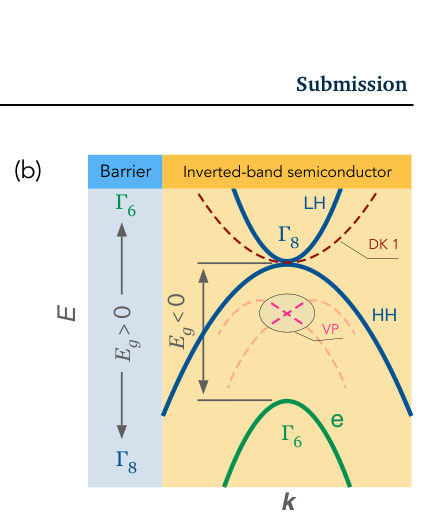 
Figure 1: (a) Interface geometry: an HgTe crystal capped by a barrier or exposed to vacuum at the surface z = 0. The lowering of point-group symmetry from C4v to C2v at the interface (hatched region, indicating symmetry change) is due to the Td crystal class of HgTe. This symmetry reduction entails a π/4 rotation of the coordinate system about the z-axis. Various states can exist at the interface: bulk standing waves Ψbulk(z), simple evanescent surface states ΨI(z), and oscillatory evanescent surface states ΨII(z). (b) Schematic energy diagram for the interface in (a), depicting the inverted band structure of bulk HgTe (solid lines). The Γ6 band lies deep below the chemical potential, while...

📷 Fig 2

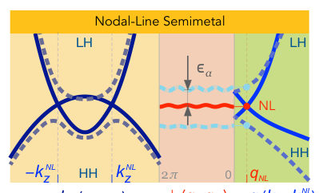 
Figure 2: Effect of strain and spin-orbit splitting on the Γ8 bands in HgTe: (a) Un- strained light-hole (LH) and heavy-hole (HH) bands. (b) A tensile strain (∆&gt; 0) mixes the bands and leads to the formation of an absolute gap (equal to a fraction of ∆) and transforms HgTe into a TI. (c) A compressive strain (∆&lt; 0) leads to band overlaps and transforms HgTe into a 3D Dirac semimetal with two Dirac points oc- curring at kz = ±kNL z and zero in-plane momentum (q = 0). (d) The two-fold spin degeneracy of the bulk bands is lifted by the linear-in-momentum Dresselhaus spin- orbit coupling in Eq. (3), which splits away the bulk bands denoted by thick dashed lines by an energy εα given in Eq. (6)....

📷 Fig 3

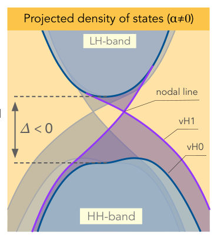 
Figure 3: (a) Projected density of states (PDOS) and surface states for ∆&lt; 0 in the absence of Dresselhaus spin-orbit interaction. The PDOS is bounded by two types of van Hove singularities, labeled vH0 and vH1. The singularity vH0 corresponds to the bulk spectrum at kz = 0, while vH1 forms an envelope function for the extrema of the bulk spectrum at finite kz ̸= 0. These linearly dispersing vH1 singularities converge to form a nodal point at q = 0. Two branches of Dyakonov-Khaetskii surface states, labeled “‘DK 1” and “DK 2”, emerge from this nodal point and disperse upward in energy [16]. (b) Projected density of states upon inclusion of the linear spin-orbit terms from Eq. (3). The PDOS...

📷 Fig 4

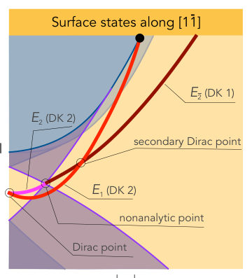 
Figure 4: Surface states along two high-symmetry directions of the wave vector q. (a) Case of q ∥[11]: The lower surface-state branch, E1(q), is identified as the DK 1 branch in Fig. 3(a). It is shifted to the right and deformed by the spin-orbit interaction. The upper branch, E2(q), begins as a DK 1 branch that is shifted to the left, forming a 2D Dirac point at q = 0. At the nodal line, it changes non-analytically into the branch E¯2(q), which is identified as a DK 2 branch. (b) Case of q ∥  1¯1  : Here, the lower branch E1(q) corresponds to the DK 2 branch in Fig. 3(a) and is similarly shifted to the right and deformed. The upper branch E2(q) initially appears as a DK 2 but undergoes a...

**Summary.** This paper provides a unified theoretical description of how surface states evolve through various topological phases in strained semiconductors. It specifically highlights how the bulk nodal line creates a unique non-analytic signature in the surface-state dispersion and spin texture.

**Why it may be interesting.** not directly relevant

Detailed structure

**Main problem.** The study investigates the evolution of surface states and their non-analytic properties across topological phase boundaries in strained, spin-orbit coupled semiconductors.

**Main result.** The authors demonstrate a unified picture of surface state evolution from 3D topological insulators to Weyl semimetals and reveal a topologically enforced non-analyticity (a 'kink' in dispersion) at the projected nodal line.

**Method.** The work uses an analytical approach based on a minimalistic Luttinger Hamiltonian model, incorporating strain via the Bir-Pikus Hamiltonian and spin-orbit coupling via Dresselhaus terms.

**Model / system.** The physical system consists of inverted-band-gap semiconductors like HgTe or alpha-Sn under strain, modeled using an extended Luttinger Hamiltonian that includes strain and bulk inversion asymmetry (BIA) terms.

**Key observables.** Surface-state energy dispersion, spin textures in momentum space, projected density of states (PDOS), and van Hove singularities.

**Important parameters / regimes.** Strain magnitude (tensile vs. compressive), spin-orbit coupling strength, Luttinger parameters, and the hierarchy of energy scales (e.g., 10 meV for Dirac physics vs. 3 microeV for Weyl physics).

**Assumptions / limitations.** The analysis utilizes the spherical approximation (gamma3 = gamma2) for certain calculations and assumes the preservation of pseudospin orthogonality via time-reversal symmetry.

**Figures summary.** Figure 1 shows the interface geometry and energy diagrams of the inverted band structure; Figure 4 illustrates surface-state dispersion branches and the emergence of secondary Dirac points along high-symmetry directions.

**Paper structure.** The paper introduces the topological phase diagram under strain, develops the mathematical framework using the Luttinger Hamiltonian, derives analytical solutions for surface states, and analyzes the resulting non-analyticities and density of states.

Abstract

This work explores the topological phase diagram of inverted-band-gap semiconductors under strain and spin-orbit coupling. Using a minimalistic Luttinger Hamiltonian model, we follow the transitions between a 3D topological insulator, a Dirac semimetal, a nodal-line semimetal, and a Weyl semimetal. Analytical and exact solutions for surface states are derived for high-symmetry directions as well as in several limiting cases. We demonstrate the continuous evolution of these surface states across phase boundaries, providing a unified picture that synthesizes previous literature. Specifically, we detail the progression from a Dirac to a nodal-line and then to a Weyl semimetal as spin-orbit coupling originating from bulk inversion asymmetry is introduced. A hierarchy of energy scales is established, defining the criteria for realizing these phases. Finally, we reveal a non-analyticity in the surface-state dispersion at the projected nodal line, originating from distinct, terminating patches of surface states with unique spin textures in momentum space.

[↑ back to top](#top)

