
# arxiv digest (quant-ph + cond-mat) — 2026-05-26

*193 papers · 48 relevant · 0 highlighted*

## 🔥 Most relevant (48)

*Every paper with at least one nonzero topic score, sorted by best-matching score. 🔥 marks scores ≥4/5. Click the title to jump to the full entry below; click [arXiv] to open the paper page. `(secondary)` marks papers from de-prioritized cond-mat archives.*

Show 48 relevant papers

- [Dynamical self-dual criticality in Fibonacci-monitored quantum Ising chains](#paper-2605.24086) [[arXiv]](http://arxiv.org/abs/2605.24086v1) — 🔥 `measurement-induced transitions` **5/5** · 🔥 `entanglement & information structure` **4/5** · 🔥 `non-equilibrium universality` **4/5** · `driven-dissipative phase transition` **3/5** · `non-equilibrium dynamics` **3/5** · `quantum measurements` **3/5** · `methods for driven-dissipative` **2/5**
- [Steady-state phases in long-range measurement-only quantum circuits](#paper-2605.25845) [[arXiv]](http://arxiv.org/abs/2605.25845v1) — 🔥 `measurement-induced transitions` **5/5** · 🔥 `entanglement & information structure` **4/5** · `driven-dissipative phase transition` **3/5** · `non-equilibrium dynamics` **3/5** · `non-equilibrium universality` **3/5** · `methods for driven-dissipative` **2/5** · `quantum measurements` **2/5**
- [Dissipative Time Quasicrystals from Multilevel Interference](#paper-2605.25667) [[arXiv]](http://arxiv.org/abs/2605.25667v1) — 🔥 `driven-dissipative phase transition` **5/5** · 🔥 `non-equilibrium dynamics` **4/5** · `Tavis-Cummings & cavity-many-emitter` **3/5** · `correlated / nonlocal dissipation` **3/5** · `Dicke superradiance` **2/5** · `methods for driven-dissipative` **2/5** · `non-equilibrium universality` **2/5**
- [Excitation density controlled regimes of collective light--matter dynamics](#paper-2605.24227) [[arXiv]](http://arxiv.org/abs/2605.24227v1) — 🔥 `Tavis-Cummings & cavity-many-emitter` **5/5** · `Dicke superradiance` **3/5** · `correlated cavity matter` **3/5** · `Keldysh / 2PI / non-Gaussian methods` **2/5** · `driven-dissipative phase transition` **2/5** · `methods for driven-dissipative` **2/5** · `non-equilibrium dynamics` **2/5**
- [Utility-scale quantum experiments using dynamic circuits to address collective dissipation in interacting qubits](#paper-2605.25830) [[arXiv]](http://arxiv.org/abs/2605.25830v1) — 🔥 `QC/QI experiment` **5/5** · 🔥 `correlated / nonlocal dissipation` **4/5** · `Dicke superradiance` **3/5** · `methods for driven-dissipative` **3/5** · `non-equilibrium dynamics` **2/5** · `quantum measurements` **2/5**
- [Dissipative preparation of injective tensor network states](#paper-2605.25089) [[arXiv]](http://arxiv.org/abs/2605.25089v1) — 🔥 `methods for driven-dissipative` **5/5** · `entanglement & information structure` **3/5** · `non-equilibrium dynamics` **3/5** · `analog quantum simulation` **2/5** · `driven-dissipative phase transition` **2/5**
- [Extracting Universal Entanglement Scaling from Mixed Fermionic Gaussian States via Entanglement Projected Entropy](#paper-2605.25102) [[arXiv]](http://arxiv.org/abs/2605.25102v1) — 🔥 `entanglement & information structure` **5/5** · `methods for driven-dissipative` **2/5** · `non-equilibrium dynamics` **2/5** · `non-equilibrium universality` **2/5**
- [Local Impurity Induced Growth and Scrambling in Clean Free Fermions](#paper-2605.24335) [[arXiv]](http://arxiv.org/abs/2605.24335v1) — 🔥 `entanglement & information structure` **4/5** · 🔥 `non-equilibrium dynamics` **4/5** · `Kondo & dissipative impurity` **3/5** · `driven-dissipative phase transition` **3/5** · `measurement-induced transitions` **3/5** · `non-equilibrium universality` **3/5** · `methods for driven-dissipative` **2/5** · `quantum measurements` **2/5**
- [Boson Sampling as a Probe of Chaotic and Integrable Quantum Dynamics](#paper-2605.25398) [[arXiv]](http://arxiv.org/abs/2605.25398v1) — 🔥 `QC/QI experiment` **4/5** · 🔥 `entanglement & information structure` **4/5** · 🔥 `quantum optics experiment` **4/5** · `analog quantum simulation` **3/5** · `non-equilibrium dynamics` **3/5** · `interference shaping light` **2/5**
- [Wave-particle duality of unpolarized photons](#paper-2605.25738) [[arXiv]](http://arxiv.org/abs/2605.25738v1) — 🔥 `QC/QI experiment` **4/5** · 🔥 `quantum measurements` **4/5** · 🔥 `quantum optics experiment` **4/5** · `entanglement & information structure` **3/5** · `interference shaping light` **2/5** · `spintronics-quantum-optics interface` **2/5**
- [Bit flips, saturation, and quantum chaos in dissipative cat qubits](#paper-2605.24100) [[arXiv]](http://arxiv.org/abs/2605.24100v1) — 🔥 `methods for driven-dissipative` **4/5** · `driven-dissipative phase transition` **3/5** · `non-equilibrium dynamics` **3/5** · `Keldysh / 2PI / non-Gaussian methods` **2/5** · `correlated / nonlocal dissipation` **2/5** · `entanglement & information structure` **2/5** · `quantum measurements` **2/5**
- [Phase-resolved multichannel quantum escape between limit cycles](#paper-2605.24122) [[arXiv]](http://arxiv.org/abs/2605.24122v1) — 🔥 `methods for driven-dissipative` **4/5** · `driven-dissipative phase transition` **3/5** · `non-equilibrium dynamics` **3/5** · `quantum measurements` **3/5** · `non-equilibrium universality` **2/5**
- [Dispersive readout of cavity-coupled solid-state sensor with near-unity readout fidelity](#paper-2605.25152) [[arXiv]](http://arxiv.org/abs/2605.25152v1) — 🔥 `Tavis-Cummings & cavity-many-emitter` **4/5** · 🔥 `quantum measurements` **4/5** · 🔥 `spintronics-quantum-optics interface` **4/5** · `methods for driven-dissipative` **2/5**
- [Minimally Destructive Fast Imaging of Single Atoms in an Optical Tweezer Array with Coherent Excitation](#paper-2605.24175) [[arXiv]](http://arxiv.org/abs/2605.24175v1) — 🔥 `QC/QI experiment` **4/5** · 🔥 `quantum measurements` **4/5** · 🔥 `quantum optics experiment` **4/5** · `Rydberg arrays` **2/5**
- [On the Relation Between String Order Parameters, Entanglement, and Dynamical Quantum Phase Transitions in Topological Dynamics](#paper-2605.25611) [[arXiv]](http://arxiv.org/abs/2605.25611v1) — 🔥 `entanglement & information structure` **4/5** · 🔥 `non-equilibrium dynamics` **4/5** · `driven-dissipative phase transition` **3/5** · `non-equilibrium universality` **3/5**
- [Dissipative acousto-mechanical parametric interface between high-overtone acoustics and flexural phonons](#paper-2605.24581) [[arXiv]](http://arxiv.org/abs/2605.24581v1) — 🔥 `correlated / nonlocal dissipation` **4/5** · `QC/QI experiment` **3/5** · `driven-dissipative phase transition` **2/5** · `non-equilibrium dynamics` **2/5** · `quantum optics experiment` **2/5**
- [Integrated photon-pair sources on periodically poled thin-film lithium tantalate](#paper-2605.24988) [[arXiv]](http://arxiv.org/abs/2605.24988v1) — 🔥 `QC/QI experiment` **4/5** · 🔥 `quantum optics experiment` **4/5** · `interference shaping light` **3/5** · `entanglement & information structure` **2/5**
- [Beyond Local Detailed Balance: Microscopic Rates Reshape Nonequilibrium Phase Behavior](#paper-2605.25406) [[arXiv]](http://arxiv.org/abs/2605.25406v1) — 🔥 `non-equilibrium dynamics` **4/5** · `driven-dissipative phase transition` **3/5** · `non-equilibrium universality` **3/5** · `methods for driven-dissipative` **2/5**
- [High fidelity preservation of photonic hyperentanglement in a free-space optical delay line](#paper-2605.25609) [[arXiv]](http://arxiv.org/abs/2605.25609v1) — 🔥 `QC/QI experiment` **4/5** · 🔥 `quantum optics experiment` **4/5** · `entanglement & information structure` **2/5** · `interference shaping light` **2/5**
- [Optimal Quantum Differential Privacy via Fisher Information Spectral Analysis](#paper-2605.24166) [[arXiv]](http://arxiv.org/abs/2605.24166v1) — 🔥 `QC/QI experiment` **4/5** · `correlated / nonlocal dissipation` **2/5** · `entanglement & information structure` **2/5** · `methods for driven-dissipative` **2/5** · `quantum measurements` **2/5**
- [Thermalization in Spatially Extended Open Quantum Systems: Local versus Global Markovian Evolution](#paper-2605.25760) [[arXiv]](http://arxiv.org/abs/2605.25760v1) — 🔥 `non-equilibrium dynamics` **4/5** · `correlated / nonlocal dissipation` **3/5** · `methods for driven-dissipative` **3/5** · `scars & prethermalization` **2/5**
- [Emergence of Triplet Superconductivity from Cavity Vacuum Fluctuations](#paper-2605.24439) [[arXiv]](http://arxiv.org/abs/2605.24439v1) `(secondary)` — 🔥 `correlated cavity matter` **4/5** · `non-equilibrium dynamics` **3/5** · `Tavis-Cummings & cavity-many-emitter` **2/5** · `driven-dissipative phase transition` **2/5**
- [Quantum Printing: Laguerre-Gaussian Beam Induced Topological Magnetic Textures](#paper-2605.24720) [[arXiv]](http://arxiv.org/abs/2605.24720v1) `(secondary)` — 🔥 `spintronics-quantum-optics interface` **4/5** · `non-equilibrium dynamics` **3/5** · `exotic spin models in light-matter` **2/5** · `interference shaping light` **2/5**
- [Algebraic Tomography of Non-Hermitian Floquet Systems from Observable Traces](#paper-2605.24555) [[arXiv]](http://arxiv.org/abs/2605.24555v1) — 🔥 `methods for driven-dissipative` **4/5** · 🔥 `non-equilibrium dynamics` **4/5** · `quantum measurements` **2/5**
- [Impact of Surface Treatment on Noise in PL-Measurements of Silicon Vacancies in 4H-SiC Lateral pin-Diodes](#paper-2605.24157) [[arXiv]](http://arxiv.org/abs/2605.24157v1) — 🔥 `QC/QI experiment` **4/5** · 🔥 `quantum optics experiment` **4/5** · `spintronics-quantum-optics interface` **2/5**
- [Non-monotonic evolution of multipartite entanglement under the Unruh effect](#paper-2605.24424) [[arXiv]](http://arxiv.org/abs/2605.24424v1) — 🔥 `entanglement & information structure` **4/5** · `Dicke superradiance` **2/5** · `correlated / nonlocal dissipation` **2/5** · `non-equilibrium dynamics` **2/5**
- [A DMFT approach to evaluate electronic frictional effects near solid surfaces of strongly correlated systems](#paper-2605.25320) [[arXiv]](http://arxiv.org/abs/2605.25320v1) — 🔥 `Kondo & dissipative impurity` **4/5** · `non-equilibrium dynamics` **3/5** · `correlated / nonlocal dissipation` **2/5**
- [Anderson Localization: A Floquet operator Krylov space perspective](#paper-2605.24115) [[arXiv]](http://arxiv.org/abs/2605.24115v1) — 🔥 `non-equilibrium dynamics` **4/5** · `entanglement & information structure` **3/5** · `scars & prethermalization` **2/5**
- [Quantum Dynamics of Interacting dissipative oscillators: A novel scheme](#paper-2605.24478) [[arXiv]](http://arxiv.org/abs/2605.24478v1) — 🔥 `non-equilibrium dynamics` **4/5** · `methods for driven-dissipative` **3/5** · `driven-dissipative phase transition` **2/5**
- [Self-Generated Chiral Rotation in Whispering-Gallery Optomechanics](#paper-2605.24185) [[arXiv]](http://arxiv.org/abs/2605.24185v1) — 🔥 `driven-dissipative phase transition` **4/5** · `non-equilibrium dynamics` **3/5** · `quantum measurements` **2/5**
- [Strong Eigenstate Thermalization from Mean-Ergodic Non-chaotic Dynamics](#paper-2605.24510) [[arXiv]](http://arxiv.org/abs/2605.24510v1) — 🔥 `non-equilibrium dynamics` **4/5** · `entanglement & information structure` **3/5** · `scars & prethermalization` **2/5**
- [A Variational Dissipative Framework for Quantum Algorithms](#paper-2605.25841) [[arXiv]](http://arxiv.org/abs/2605.25841v1) — 🔥 `methods for driven-dissipative` **4/5** · `non-equilibrium dynamics` **2/5** · `quantum measurements` **2/5**
- [Boundary $0/π$ logical subspace and bulk dynamical probes in flux-controlled anomalous Floquet quantum walks](#paper-2605.25792) [[arXiv]](http://arxiv.org/abs/2605.25792v1) — 🔥 `non-equilibrium dynamics` **4/5** · `analog quantum simulation` **2/5** · `entanglement & information structure` **2/5**
- [Dynamical susceptibility and quantum Fisher information in the Su-Schrieffer-Heeger model with Hatsugai-Kohmoto interactions](#paper-2605.25231) [[arXiv]](http://arxiv.org/abs/2605.25231v1) — 🔥 `entanglement & information structure` **4/5** · `analog quantum simulation` **2/5** · `non-equilibrium dynamics` **2/5**
- [Unified Flux Control Architecture for Fluxonium Qubits](#paper-2605.25948) [[arXiv]](http://arxiv.org/abs/2605.25948v1) — 🔥 `QC/QI experiment` **4/5** · `quantum measurements` **2/5** · `quantum optics experiment` **2/5**
- [Cascaded Four-Wave Mixing on Quantum Paraelectrics for On-chip Cryogenic Microcombs](#paper-2605.25112) [[arXiv]](http://arxiv.org/abs/2605.25112v1) `(secondary)` — 🔥 `QC/QI experiment` **4/5** · `quantum optics experiment` **3/5**
- [Native topological readout on qubit hardware: a Fibonacci-chain benchmark of measurement-compilation trade-offs](#paper-2605.25913) [[arXiv]](http://arxiv.org/abs/2605.25913v1) — 🔥 `QC/QI experiment` **4/5** · `quantum measurements` **3/5**
- [Bell State Analysis Provides an Optimal Basis Saturating the Quantum Cramer-Rao in Rotation Sensing](#paper-2605.24108) [[arXiv]](http://arxiv.org/abs/2605.24108v1) — 🔥 `quantum measurements` **4/5** · `entanglement & information structure` **2/5**
- [Evaluating System-Level Fidelity with Peaked Random Circuits](#paper-2605.25983) [[arXiv]](http://arxiv.org/abs/2605.25983v1) — 🔥 `QC/QI experiment` **4/5** · `correlated / nonlocal dissipation` **1/5** · `entanglement & information structure` **1/5**
- [Krylov Complexity for Plane Wave Matrix Model](#paper-2605.26055) [[arXiv]](http://arxiv.org/abs/2605.26055v1) — 🔥 `entanglement & information structure` **4/5** · `non-equilibrium dynamics` **2/5**
- [Programmable dipolar interaction geometry selects stripe-family order in a molecular lattice quantum simulator](#paper-2605.25019) [[arXiv]](http://arxiv.org/abs/2605.25019v1) — 🔥 `analog quantum simulation` **4/5** · `exotic spin models in light-matter` **2/5**
- [Pseudorandom Dynamics in the SYK Model and Cryptographic Censorship in JT Gravity](#paper-2605.25178) [[arXiv]](http://arxiv.org/abs/2605.25178v1) — 🔥 `entanglement & information structure` **4/5** · `non-equilibrium dynamics` **2/5**
- [Quantum non-demolition measurements as a practical primitive for fault-tolerant computation against biased noise](#paper-2605.24262) [[arXiv]](http://arxiv.org/abs/2605.24262v1) — 🔥 `quantum measurements` **4/5** · `spintronics-quantum-optics interface` **2/5**
- [Structural constraint on delayed-choice quantum eraser architectures](#paper-2605.24994) [[arXiv]](http://arxiv.org/abs/2605.24994v1) — 🔥 `quantum measurements` **4/5** · `entanglement & information structure` **2/5**
- [Transformer refined quantum sampling for strongly correlated electronic structure](#paper-2605.24617) [[arXiv]](http://arxiv.org/abs/2605.24617v1) — 🔥 `QC/QI experiment` **4/5** · `entanglement & information structure` **2/5**
- [QML-PipeGuard: Drift-Aware Behavioral Fingerprinting for Quantum Machine Learning Pipeline Integrity](#paper-2605.25066) [[arXiv]](http://arxiv.org/abs/2605.25066v1) — 🔥 `QC/QI experiment` **4/5** · `quantum measurements` **1/5**
- [Kernel Embedding for Operator-Valued Measures and Its Application to Quantum Tomography](#paper-2605.25146) [[arXiv]](http://arxiv.org/abs/2605.25146v1) — 🔥 `quantum measurements` **4/5**
- [Point-group symmetry analysis of many-electron wavefunctions on a quantum computer](#paper-2605.24824) [[arXiv]](http://arxiv.org/abs/2605.24824v1) — 🔥 `QC/QI experiment` **4/5**

## All papers (106, sorted by relevance)

*Papers from quant-ph and your primary cond-mat archives (quant-gas, stat-mech, str-el, dis-nn). Highlighted papers (⭐) come first, then everything else sorted by topic-relevance score, highest first.*

### [Dynamical self-dual criticality in Fibonacci-monitored quantum Ising chains](http://arxiv.org/abs/2605.24086v1)

**Authors:** Finn Eckstein, Harald Schmid, Quinten Preiss, Simon Trebst, Felix von Oppen, Guo-Yi Zhu  
**Type:** theory · **Category:** disordered systems and neural networks · **PDF:** <https://arxiv.org/pdf/2605.24086v1>  
**Analysis basis:** full PDF text, analyzed in chunks
**Topic relevance:** 🔥 `measurement-induced transitions` **5/5** · 🔥 `entanglement & information structure` **4/5** · 🔥 `non-equilibrium universality` **4/5** · `driven-dissipative phase transition` **3/5** · `non-equilibrium dynamics` **3/5** · `quantum measurements` **3/5** · `methods for driven-dissipative` **2/5**

↔ Scroll figures horizontally

<figure class="paper-figure-card">
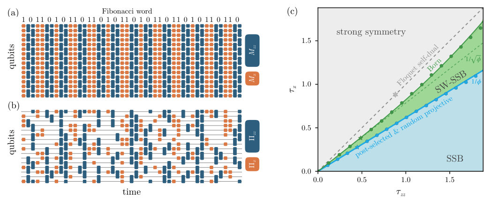
<figcaption class="paper-figure-caption"><b>Fig 1.</b> Figure 1. Quasiperiodically measured quantum Ising model. (a) Fibonacci circuit of weak measurements using Kraus operators Mx and Mzz for X- and ZZ measurements, respectively. Measurement outcomes are post-selected in protocol (I) and Born-averaged in protocol (II). (b) Random projective measurements with i.i.d. rates px, pzz (per layer) in the Clifford protocol (III). (c) Phase diagrams as a function of measurement strengths τx and τzz, extracted from the entanglement entropy. In the blue area, the 1D chain is long-range entangled for all three protocols. The post-selected protocol gives rise to spontaneous symmetry-breaking (SSB), while the Born and projective protocols exhibit weak...</figcaption>
</figure>
<figure class="paper-figure-card">
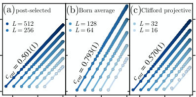
<figcaption class="paper-figure-caption"><b>Fig 2.</b> Figure 2. Monitored quantum criticality at late Fibonacci times. Shown is the entanglement entropy scaling for (a) post-selected tra- jectories, (b) Born trajectories, and (c) Clifford projective measure- ments as a function of the logarithmic chord distance R(l, L) = sin(πl/L). The fitted slopes indicate the effective entanglement scal- ing dimension cent of the underlying transition. In the post-selected case (a) the estimated value cent = 0.501(1) agrees with the Ising conformal field theory with central charge 1/2. For the weak Born measurements (b) the estimated value cent = 0.793(1) is in good agreement with the value cent = 0.795(1) found for the Floquet circuit in Ref. [7]. For the...</figcaption>
</figure>
<figure class="paper-figure-card">
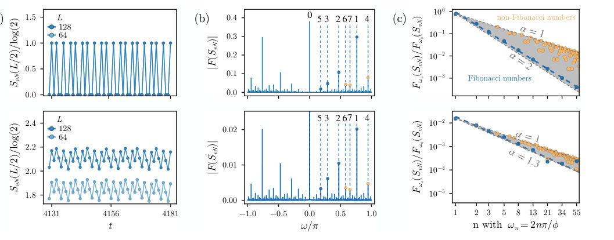
<figcaption class="paper-figure-caption"><b>Fig 3.</b> Figure 3. Entanglement dynamics and Fourier amplitudes in the Born-averaged protocol (II). Top panels show the projective measure- ment limit where the state oscillates between a GHZ state with ln 2 entropy and a paramagnetic state with zero entropy, following the Fibonacci word; the bottom panels are for finite measurement strength on the critical line with τx ≈0.3823, τzz ≈0.4856 (a) Half-cut entanglement entropy dynamics up to Fibonacci time f19 = 4181. (b) Fourier amplitudes of SvN(t), with frequency compactified within [−π, π]. Domi- nant peaks correspond to integer multiples of ωn = 2nπ/ϕ, such that the period is a fractional number of the golden ratio, 2π/ωn = ϕ/n. The transform is...</figcaption>
</figure>
<figure class="paper-figure-card">
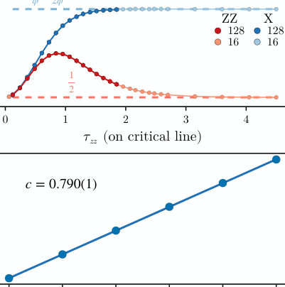
<figcaption class="paper-figure-caption"><b>Fig 4.</b> Figure 4. (a) Probability for a measurement correlation on the critical line. P(st = st+1) gives the probability that a measure- ment outcome stays the same in the next time step of the same kind. Mzz and Mx have distinct behavior due to their different occurrence. Dashed lines mark the projective-limit expectations PZZ = 0.5 and PX = 1 −1/ϕ + 1/(2ϕ). Data are for L = 128, 64, 32, 16 on the critical line of the Born average; L = 64, 32 overlap with L = 128. (b) Scaling of the Fourier peak at ω = 0 for weak mea- surement. Parameters correspond to a point on the Born-averaged critical line with τx ≈0.3823, τzz = 0.4856 (star in Fig. 1(c)). The entanglement scaling dimension cω=0 = 0.790(1) is...</figcaption>
</figure>
<figure class="paper-figure-card">
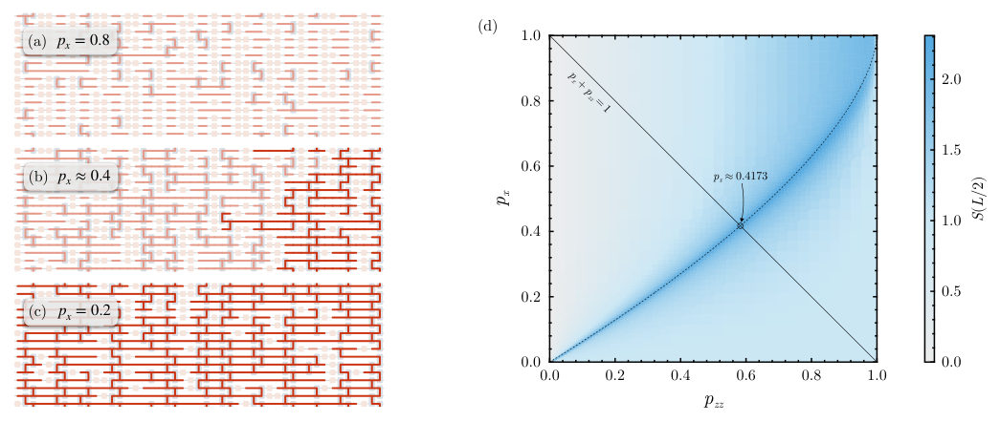
<figcaption class="paper-figure-caption"><b>Fig 5.</b> Figure 5. Bond-percolation transition in space-time (protocol III). (a–c) A ZZ projective measurement entangles two neighboring qubits and corresponds to a vertical link gluing the two sites; the qubit world lines stretch left to right. An X projective measurement disentangles a qubit and corresponds to a broken horizontal link. (d) Random projective-measurement phase diagram in p-space. The solid line marks px + pzz = 1, while the dashed line shows τx = τzz/ϕ projected into p-space via p = 1 −e−τ, visualizing the behavior at infinite τ. Simulation depth is fib17, averaged over 98, 304 random trajectories.</figcaption>
</figure>

**Summary.** This paper explores how quantum Ising chains behave when subjected to measurements following a Fibonacci sequence. It finds that a dynamical version of Kramers-Wannier duality emerges to predict phase transitions and identifies several distinct universality classes depending on the measurement protocol used.

**Why it may be interesting.** This paper is highly relevant for researchers in many-body dynamics and open quantum systems as it demonstrates how non-equilibrium, non-periodic monitoring can induce emergent symmetries and new universality classes in quantum critical systems.

Detailed structure

**Main problem.** Investigating the emergence of dynamical self-duality and the nature of phase transitions in quantum Ising chains subject to quasiperiodic (Fibonacci) measurement sequences.

**Main result.** The study identifies that dynamical self-duality organizes the phase diagram and predicts transition locations, revealing distinct universality classes for different measurement protocols, including a non-unitary CFT and 2D bond percolation.

**Method.** The authors use a combination of analytical techniques (Magnus expansion, transfer matrix, and statistical duality) and large-scale numerical simulations of quantum circuits to study entanglement scaling and phase boundaries.

**Model / system.** One-dimensional quantum Ising/Majorana chains subject to monitoring protocols (post-selection, Born-averaged, and Clifford projective) where measurements are arranged in a quasiperiodic Fibonacci sequence.

**Key observables.** von Neumann entanglement entropy, entanglement scaling dimension (c_ent), coherent information, and Fourier spectrum of entanglement fluctuations.

**Important parameters / regimes.** Measurement strengths (tau_x, tau_zz), measurement probabilities (p_x, p_zz), the golden ratio (phi), and system size (L).

**Assumptions / limitations.** The analysis assumes the relevance of the weak-measurement limit for certain derivations and relies on the irrelevance of quasiperiodicity at the critical point (RG-sense).

**Figures summary.** Figures illustrate the mapping of Clifford protocols to bond percolation, the phase diagrams for different measurement strengths, the stability of the critical exponent (nu), and the scaling of entanglement entropy and Fourier amplitudes.

**Paper structure.** The paper introduces the problem of quasiperiodic monitoring, defines the three measurement protocols, provides analytical derivations for the effective Hamiltonians and critical lines, presents numerical results for entanglement scaling and universality classes, and concludes with a discussion on the stability of the critical behavior.

Abstract

For the quantum phase transition in the transverse-field Ising chain, Kramers-Wannier duality not only protects its critical properties but also pinpoints the location of the phase transition. Its role in out-of-equilibrium, monitored dynamics, however, remains largely unexplored beyond time-periodic Floquet protocols where self-duality turns into a statistical average symmetry. Here we explore the emergence of dynamical self-duality in the absence of time-translation symmetry by investigating the monitored dynamics of one-dimensional Ising/Majorana chains where measurements are arranged in a quasiperiodic Fibonacci sequence. We find that the dynamical extension of this non-invertible symmetry to an out-of-equilibrium setting allows one to organize the dynamical phase diagram of entangled phases, both predicting the transition locations and protecting universal critical behavior. Analytically and numerically, we identify two distinct critical lines, both related to the golden ratio, for Born-rule weak measurements and for random Clifford projective measurements. The latter coincides with the transition of a pure imaginary-time evolution, which can be viewed as a post-selected trajectory. The universality classes of the long-time critical steady states at Fibonacci times are determined, while the transient dynamics between Fibonacci times is deformed by measurements, realizing dynamical measurement-altered quantum criticality in real time.

[↑ back to top](#top)

### [Steady-state phases in long-range measurement-only quantum circuits](http://arxiv.org/abs/2605.25845v1)

**Authors:** Bihui Zhu  
**Type:** theory · **Category:** quantum information and computing · **PDF:** <https://arxiv.org/pdf/2605.25845v1>  
**Analysis basis:** full PDF text, analyzed in chunks
**Topic relevance:** 🔥 `measurement-induced transitions` **5/5** · 🔥 `entanglement & information structure` **4/5** · `driven-dissipative phase transition` **3/5** · `non-equilibrium dynamics` **3/5** · `non-equilibrium universality` **3/5** · `methods for driven-dissipative` **2/5** · `quantum measurements` **2/5**

↔ Scroll figures horizontally

<figure class="paper-figure-card">
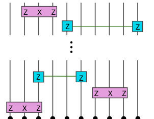
<figcaption class="paper-figure-caption"><b>Fig 1.</b> FIG. 1. Schematic of the long-range measurement-only quan- tum circuit. The circuit dynamics is driven by two types of measurements, the three-qubit cluster measurements and the ZZ measurements on two qubits.</figcaption>
</figure>
<figure class="paper-figure-card">
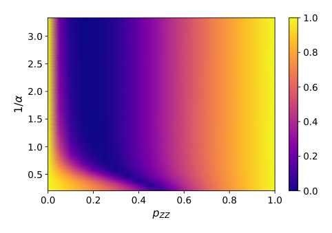
<figcaption class="paper-figure-caption"><b>Fig 2.</b> FIG. 2. Steady-state phase diagram of the long-range measurement-only circuit, characterized by max(OSSB, OSPT) (color bar).</figcaption>
</figure>
<figure class="paper-figure-card">
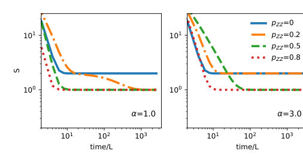
<figcaption class="paper-figure-caption"><b>Fig 3.</b> FIG. 3. Purification dynamics. The time-evolution of the full- system entanglement entropy S is plotted for two different ranges of the ZZ measurements, α = 1 (left) and α = 3 (right). Different lines represent the dynamics obtained at various different measurement probabilities pZZ.</figcaption>
</figure>
<figure class="paper-figure-card">
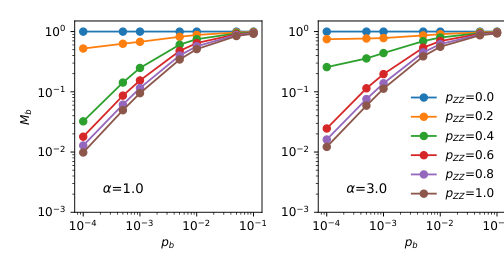
<figcaption class="paper-figure-caption"><b>Fig 4.</b> FIG. 4. Edge responses at the steady state when a bound- ary measurement perturbation is applied with probability pb, in a circuit with the two-qubit measurements of α = 1 (left) and α = 3 (right). Different colors represent the results ob- tained at different two-qubit measurement probabilities, rang- ing from pZZ = 0 to pZZ = 1.</figcaption>
</figure>
<figure class="paper-figure-card">
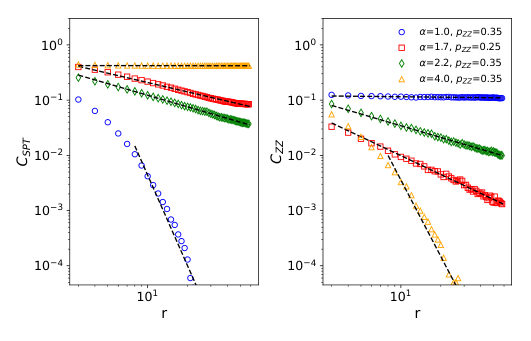
<figcaption class="paper-figure-caption"><b>Fig 5.</b> FIG. 7. Decay of string correlations CSPT (left) and con- nected spin-spin correlations CZZ (right), plotted in double logarithmic scale.</figcaption>
</figure>

**Summary.** The paper explores how the range of measurements in a 1D quantum circuit influences steady-state phases like SPT and SSB. It finds that long-range measurements can destroy topological order and induce a regime with entanglement scaling that exceeds the area law. This provides new insights into how non-local monitoring can be used to control many-body quantum states.

**Why it may be interesting.** This work is highly relevant for researchers in open quantum systems and many-body dynamics as it demonstrates how non-unitary, non-local measurements can engineer exotic phases and entanglement scaling beyond the area law without any unitary evolution.

Detailed structure

**Main problem.** Investigating how long-range connectivity and nonlocality affect the steady-state phase structure, entanglement scaling, and competition between topological and symmetry-breaking orders in measurement-only quantum circuits.

**Main result.** The study uncovers a rich phase diagram where SPT order persists for short-range measurements but is destabilized by long-range interactions, and identifies an intermediate regime with power-law correlations and entanglement that exceeds the area law.

**Method.** Numerical simulations using the stabilizer formalism and Gottesman-Knill theorem to evolve Clifford circuits, including finite-size scaling and edge-probe protocols.

**Model / system.** A 1D measurement-only quantum circuit consisting of competing two-qubit Ising-type measurements and three-qubit cluster measurements with a power-law distribution for the measurement range.

**Key observables.** SSB order parameter (O_SSB), SPT order parameter (O_SPT), string correlations, spin-spin correlations, half-chain entanglement entropy, and generalized topological entanglement entropy.

**Important parameters / regimes.** Measurement probability (p_ZZ), measurement range parameter (alpha), and system size (L).

**Assumptions / limitations.** The dynamics are restricted to the stabilizer formalism (Clifford operations), and the system is studied in the 1D limit.

**Figures summary.** Figure 1 shows the circuit architecture; Figure 2 presents the steady-state phase diagram; Figures 9 and 10 show the finite-size scaling of SPT and SSB order parameters.

**Paper structure.** The paper introduces the long-range measurement model, presents the steady-state phase diagram, analyzes the stability of SPT and SSB phases, explores entanglement scaling and correlation decay, and concludes with discussions on universality and higher-dimensional extensions.

Abstract

Measurements can drive quantum many-body systems into nontrivial steady states and induce interesting dynamical phase transitions, rendering measurement-only quantum circuits a useful platform for exploring quantum many-body phases beyond those of equilibrium Hamiltonian systems. Here we study a class of long-range measurement-only quantum circuits with competing two-qubit and three-qubit measurements. We demonstrate that these circuits exhibit rich steady-state structure and uncover a strong influence of the measurement range on the resulting phases. In particular, states with symmetry-protected topological (SPT) order can emerge with sufficiently short-range measurements beyond the nearest-neighbor limit. These states feature robust topological edge modes, which can also be detected from circuit dynamics. With longer-range measurements, an extended parameter regime emerges in which conventional order parameters are suppressed while spatial correlations remain nontrivial. Moreover, we show that in this circuit model sufficiently long-range measurements can produce significant entanglement with scaling beyond an area law despite the absence of any unitary evolution.

[↑ back to top](#top)

### [Dissipative Time Quasicrystals from Multilevel Interference](http://arxiv.org/abs/2605.25667v1)

**Authors:** Kang Shen, Xiangming Hu, Fei Wang  
**Type:** theory · **Category:** statistical mechanics · **PDF:** <https://arxiv.org/pdf/2605.25667v1>  
**Analysis basis:** full PDF text, analyzed in chunks
**Topic relevance:** 🔥 `driven-dissipative phase transition` **5/5** · 🔥 `non-equilibrium dynamics` **4/5** · `Tavis-Cummings & cavity-many-emitter` **3/5** · `correlated / nonlocal dissipation` **3/5** · `Dicke superradiance` **2/5** · `methods for driven-dissipative` **2/5** · `non-equilibrium universality` **2/5**

↔ Scroll figures horizontally

<figure class="paper-figure-card">
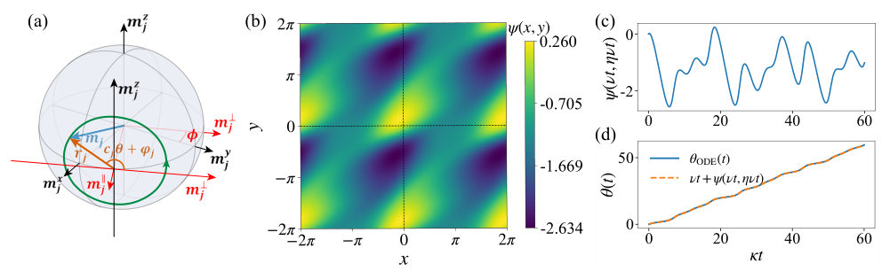
<figcaption class="paper-figure-caption"><b>Fig 1.</b> FIG. 1. (a) Schematic illustration of the collective Bloch vector mj on its Bloch sphere. The green circle shows the trajectory in the plane defined by e⊥and ez, with radius rj and phase cjθ+φj. (b) Color plot of the torus-periodic function ψ(x, y) over four adjacent unit cells to illustrate its two-dimensional periodicity. (c) Quasiperiodic signal ψ(νt, νt/ √</figcaption>
</figure>
<figure class="paper-figure-card">
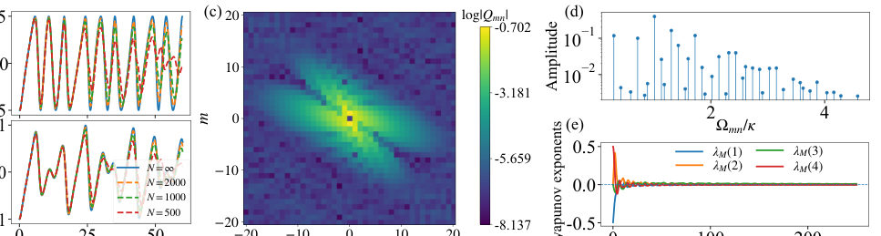
<figcaption class="paper-figure-caption"><b>Fig 2.</b> FIG. 2. (a),(b) Comparison between the thermodynamic-limit mean-field dynamics (N = ∞) and finite-N cumulant- expansion results for the order parameters mz 1 and mz 1 + mz 2, respectively. The finite-size trajectories progressively converge toward the thermodynamic-limit solution as the particle number increases. (c) Two-dimensional Fourier amplitudes log |Qmn| on the (m, n) lattice. (d) One-sided frequency spectrum showing the positions and amplitudes of the dominant quasiperiodic spectral lines at Ωmn = (m + ηn)ν; only lines with amplitudes larger than 0.5% of the maximum amplitude are displayed. (e) Time evolution of the maximal Lyapunov exponents for several representative trajectories...</figcaption>
</figure>

**Summary.** This paper shows that multilevel interference in a driven-dissipative system can spontaneously break time-translation symmetry to produce quasiperiodic motion. By using a four-level model, the authors demonstrate that an irrational ratio between transition branches leads to a time quasicrystal without needing external quasiperiodic driving. The dynamics are shown to be nonchaotic and characterized by a dense frequency spectrum.

**Why it may be interesting.** It provides a novel mechanism for generating complex temporal order (quasiperiodicity) through internal interference rather than external modulation, which is highly relevant for controlling non-equilibrium many-body dynamics and open quantum systems.

Detailed structure

**Main problem.** Investigating whether dissipative time-crystalline order can extend beyond periodic oscillations to achieve intrinsic quasiperiodic temporal order without external quasiperiodic driving.

**Main result.** The authors demonstrate that multilevel interference in a driven-dissipative ensemble can generate dissipative time quasicrystals, characterized by an irrational flow on a 2D torus and a dense frequency spectrum.

**Method.** The study employs mean-field theory in the thermodynamic limit, mapping the many-body dynamics to a scalar phase equation and using Fourier analysis and elliptic integrals to derive the frequency spectrum.

**Model / system.** A collectively driven-dissipative four-level ensemble of N identical atoms with two degenerate excited and two degenerate ground states, governed by a master equation with multiple transition branches.

**Key observables.** Collective Bloch vectors, order parameters (m_z1 and m_z1 + m_z2), scalar phase angle theta(t), and maximal Lyapunov exponents.

**Important parameters / regimes.** Coherent driving strength (omega), collective dissipation rate (kappa), and the irrational relative weight of the second transition branch (eta).

**Assumptions / limitations.** Thermodynamic limit (N to infinity), neglect of 1/N quantum fluctuations, and the assumption of a Diophantine condition for the irrationality of eta.

**Figures summary.** Figure 1 shows the trajectory of the Bloch vector, torus-periodic functions, and quasiperiodic signals; Figure 2 compares mean-field vs. finite-N dynamics, shows 2D Fourier amplitudes, and displays the decay of Lyapunov exponents.

**Paper structure.** The paper introduces the concept of time quasicrystals, defines the four-level driven-dissipative model, derives the mean-field reduction to a phase equation, analyzes the resulting quasiperiodic dynamics and frequency spectrum, and concludes with the stability and generalization of the mechanism.

Abstract

Boundary time crystals exhibit spontaneous breaking of continuous time-translation symmetry through persistent periodic oscillations in driven-dissipative many-body systems. Here, we show that multilevel interference provides a natural route beyond periodic order, enabling dissipative time quasicrystals without externally imposed quasiperiodic driving. We consider a collectively driven-dissipative four-level ensemble with two degenerate excited states and two degenerate ground states. In the thermodynamic limit, the exact mean-field dynamics reduces to an irrational flow on a two-dimensional torus, yielding quasiperiodic order parameters with discrete spectra generated by two incommensurate fundamental frequencies. Vanishing maximal Lyapunov exponents demonstrate that the nonlinear self-consistent dynamics remains nonchaotic. Our results establish a minimal interference-induced mechanism for time-quasiperiodic order and open a route toward higher-dimensional quasiperiodic dynamics in multilevel systems.

[↑ back to top](#top)

### [Excitation density controlled regimes of collective light--matter dynamics](http://arxiv.org/abs/2605.24227v1)

**Authors:** Wenxiang Ying, Abraham Nitzan  
**Type:** theory · **Category:** other · **PDF:** <https://arxiv.org/pdf/2605.24227v1>  
**Analysis basis:** full PDF text, analyzed in chunks
**Topic relevance:** 🔥 `Tavis-Cummings & cavity-many-emitter` **5/5** · `Dicke superradiance` **3/5** · `correlated cavity matter` **3/5** · `Keldysh / 2PI / non-Gaussian methods` **2/5** · `driven-dissipative phase transition` **2/5** · `methods for driven-dissipative` **2/5** · `non-equilibrium dynamics` **2/5**

↔ Scroll figures horizontally

<figure class="paper-figure-card">
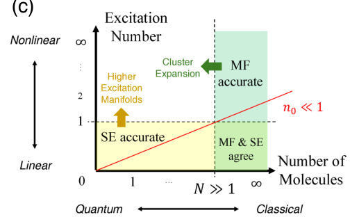
<figcaption class="paper-figure-caption"><b>Fig 1.</b> FIG. 1. The HTC model and dynamical regime map. (a) Schematic of a molecular ensemble coupled to a single cavity mode. (b) Coupling topology: the cavity mode cou- ples collectively to electronic transitions with single-molecule strength gc (collective Rabi splitting Ω= 2gc √</figcaption>
</figure>
<figure class="paper-figure-card">
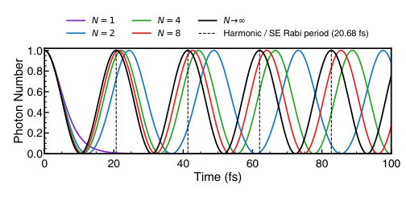
<figcaption class="paper-figure-caption"><b>Fig 2.</b> FIG. 2. Photon number dynamics |α(t)|2 of the TC model (cν = 0) calculated with MF for N = 1, 2, 4, 8, 104 with fixed α0 = 1, so Nexc ≡|α0|2 = 1 and n0 = 1/N decreases with increasing N. The large-N (small-n0) limit converges to the harmonic SE Rabi oscillation (dashed line), demonstrating the linear collective regime (N ≫1, n0 ≪1). Anharmonic Duffing dynamics is evident at small N (large n0).</figcaption>
</figure>
<figure class="paper-figure-card">
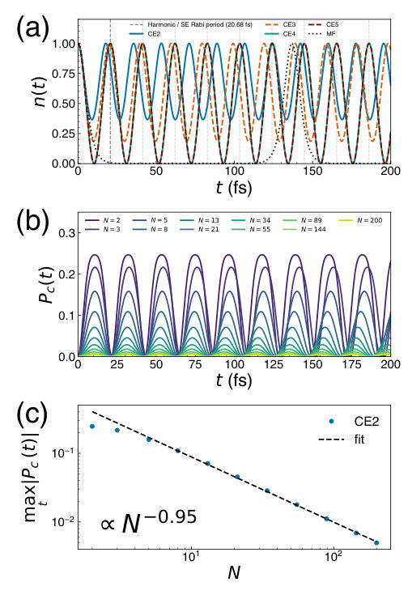
<figcaption class="paper-figure-caption"><b>Fig 3.</b> FIG. 3. Cluster-expansion dynamics and finite-N corre- lations. (a) Photon number dynamics n(t) from identity- constrained CE hierarchy (colored curves) for N = 1, Nexc = 1, initialized from |1⟩⊗|g⟩. The MF curve (black dots) uses the coherent-field counterpart with the same initial mean pho- ton number, |α0|2 = 1. Vertical dashed lines mark the har- monic/SE Rabi period, T = 20.68 fs. (b) Two-molecule cor- relation Pc = ⟨ˆσ+ i ˆσ− j ⟩−|⟨ˆσ− i ⟩|2 (i ̸= j) obtained using many- molecule CE2 for various N under the same one-photon ini- tial condition and fixed collective Rabi splitting Ω(so that gc ∼1/ √</figcaption>
</figure>
<figure class="paper-figure-card">
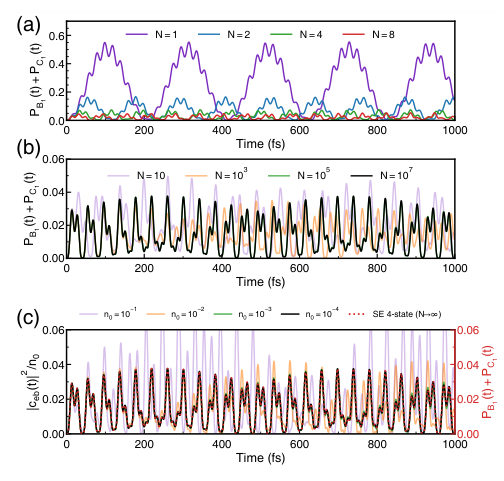
<figcaption class="paper-figure-caption"><b>Fig 4.</b> FIG. 4. Convergence of the bright vibrational mode dynam- ics. Here we take ν = Ω= 0.2 eV and cν = 20 meV. (a) Vibra- tionally excited population PB1(t) + PC1(t) for N = 1, 2, 4, 8 calculated in the SE approximation. (b) Same as (a), for N = 10, 103, 105, 107, convergence reached as N = 107 (black curve). (c) MF b-channel population |ceb(t)|2/n0 for decreas- ing n0 (colored curves) converges to the SE large-N bench- mark (red dashed curve), demonstrating MF–SE agreement in the linear collective regime.</figcaption>
</figure>
<figure class="paper-figure-card">
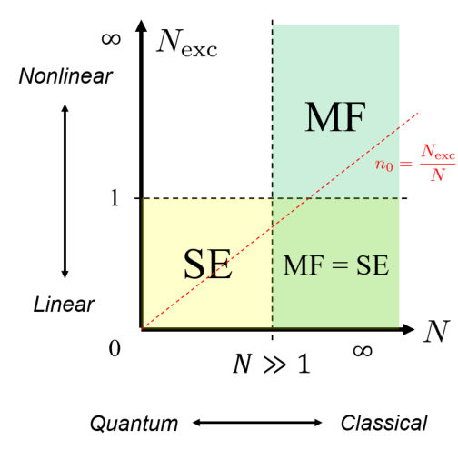
<figcaption class="paper-figure-caption"><b>Fig 5.</b> FIG. 5. TOC Graphic</figcaption>
</figure>

**Summary.** This paper identifies that the validity of common approximations in collective light-matter dynamics depends on both the number of molecules and the excitation density. It demonstrates that while the large-N limit can be described by mean-field theory, high excitation densities introduce nonlinearities described by a Duffing equation. The work provides a clear map to guide researchers in selecting appropriate theoretical models for molecular polaritons.

**Why it may be interesting.** It provides a fundamental diagnostic framework for choosing between semiclassical and quantum-mechanical descriptions in cavity QED and polaritonic systems, specifically clarifying how excitation density drives the transition to nonlinear dynamics.

Detailed structure

**Main problem.** The lack of clear delineation regarding the parameter regimes where mean-field (MF) and single-excitation (SE) approximations are valid for describing collective light-matter dynamics.

**Main result.** The authors establish a two-parameter regime map (based on molecule number N and excitation density n0) that identifies when MF and SE descriptions agree, diverge, or exhibit nonlinear dynamics.

**Method.** Theoretical analysis using the Tavis-Cummings and Holstein-Tavis-Cummings models, supplemented by cluster expansion to restore finite-N correlations and the use of the Duffing equation to describe nonlinearities.

**Model / system.** A collection of N identical two-level molecules coupled to a single cavity photon mode, including local harmonic vibrations (Holstein-Tavis-Cummings model).

**Key observables.** Photon number dynamics, molecular population dynamics, two-molecule correlations, and effective Rabi frequency.

**Important parameters / regimes.** Number of molecules (N), excitation density (n0 = N_exc/N), light-matter coupling strength (g_c), and vibronic coupling strength (c_v).

**Assumptions / limitations.** The agreement between MF and SE is specific to the joint limit of large N and low excitation density; the study focuses on the bright-sector dynamics.

**Figures summary.** Figure 1 shows a schematic of the molecular ensemble and the topology of the HTC model; Figure 3 shows photon number dynamics using the cluster expansion hierarchy; Figure 5 is a TOC graphic summarizing the core concept.

**Paper structure.** The paper introduces the problem of approximation validity, defines the two-parameter regime map using the Tavis-Cummings model, extends the analysis to include vibronic interactions via the HTC model, and concludes with the implications for various spectroscopic and dynamical applications.

Abstract

Theoretical descriptions of collective light--matter dynamics often rely on the mean-field (MF) or single-excitation (SE) approximations, yet the parameter regimes where they apply are rarely clearly delineated. Here we show that representative limiting regimes are characterized by two independent parameters: the number of molecules $N$ and the excitation number $N_{\rm exc}$. In the Tavis--Cummings model, when $N\gg 1$ and the excitation density $N_{\rm exc} / N \to 0$, MF and SE descriptions agree and yield linear collective dynamics, showing harmonic Rabi oscillations. At finite excitation density ($N_{\rm exc} / N \sim \mathcal{O}(1)$), the large-\(N\) limit remains accurately described by MF dynamics but becomes nonlinear in $N_{\rm exc} / N$, manifested by a Duffing equation for the cavity amplitude with anharmonic Rabi frequency. We further show that cluster expansion systematically restores finite-$N$ correlations beyond MF. When local vibronic interactions are included, the same linear collective limit is reached by both approximations, with SE reaching it through polaron decoupling and MF through linearization. This two-parameter regime map clarifies the limits in which different theoretical descriptions provide controlled descriptions of collective light--matter dynamics.

[↑ back to top](#top)

### [Utility-scale quantum experiments using dynamic circuits to address collective dissipation in interacting qubits](http://arxiv.org/abs/2605.25830v1)

**Authors:** Benjamin Tirado, Joana Fraxanet, Adrián Juan-Delgado, Javier Aizpurua, Ruben Esteban  
**Type:** both · **Category:** quantum information and computing · **PDF:** <https://arxiv.org/pdf/2605.25830v1>  
**Analysis basis:** full PDF text, analyzed in chunks
**Topic relevance:** 🔥 `QC/QI experiment` **5/5** · 🔥 `correlated / nonlocal dissipation` **4/5** · `Dicke superradiance` **3/5** · `methods for driven-dissipative` **3/5** · `non-equilibrium dynamics` **2/5** · `quantum measurements` **2/5**

↔ Scroll figures horizontally

<figure class="paper-figure-card">
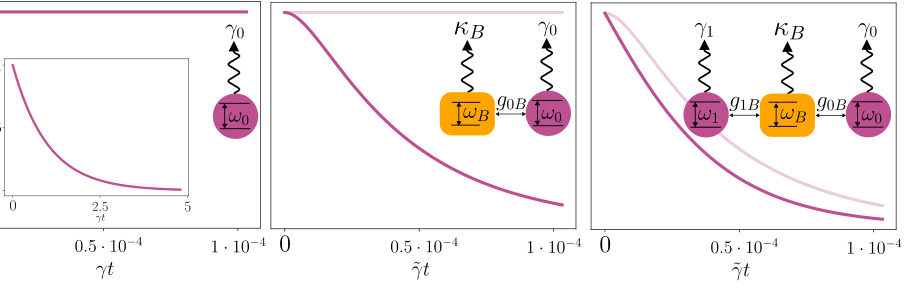
<figcaption class="paper-figure-caption"><b>Fig 1.</b> FIG. 1. Dissipative phenomena in systems of qubits coupled to a common external bath and modeling of the dynamics using quantum circuits. (a) Schematic of the coupling between the system of interest (S) and the external bath (B). The system of interest consists of n qubits, depicted as purple circles and modeled as two-level systems with transition frequencies ωi and spontaneous decay rates γi (i = 0, 1, ..., n −1). Each of the qubits is coupled with strength giB (i = 0, 1, ..., n −1) to a common external bath, depicted in yellow, which has a single mode of frequency ωB and a dissipation rate κB. (b) Schematic of the Trotterized quantum circuit modelling Markovian time evolution under...</figcaption>
</figure>
<figure class="paper-figure-card">
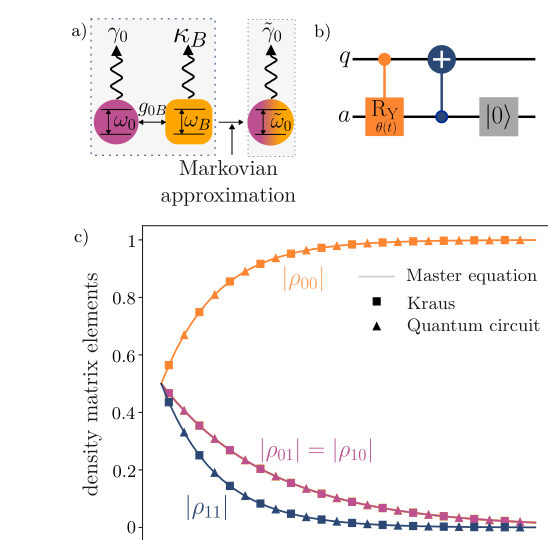
<figcaption class="paper-figure-caption"><b>Fig 2.</b> FIG. 2. Modeling of the dissipative dynamics of a qubit. (a) Schematic of the effective removal of the cavity through the Markovian approximation. The quantum emitter (purple sphere) is considered to be a two-level system with transition frequency ω0 and spontaneous decay rate γ0 and the cav- ity (blue sphere) has a single mode of frequency ωA and a dissipation rate of κA. Both the quantum emitter and the cavity are originally coupled with coupling strength g0B. Af- ter removing the cavity, the properties of the emitter (now pictured with a color gradient) are modified, resulting in a new effective frequency ˜ω0 and effective decay rate ˜γ0. (b) Time-parametric quantum circuit representing...</figcaption>
</figure>
<figure class="paper-figure-card">
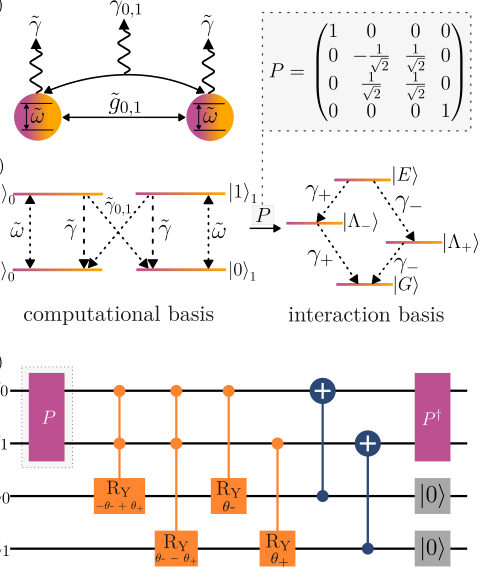
<figcaption class="paper-figure-caption"><b>Fig 3.</b> FIG. 3. Modeling of the collective dissipative dynamics of two qubits (representing two quantum emitters) coupled through a common environment (an optical cavity). (a) Schematic of the system after performing the effective removal of the cavity through the Markovian approximation, resulting in two inter- acting two-level systems labeled q0 and q1 and pictured as color-graded spheres. The Markovian approximation results in the modification of the properties of the quantum emitters (with new transition frequency ˜ω and decay rate ˜γ), and also in the emergence of a new effective coupling ˜g0,1 and a cross- dissipation term ˜γ0,1. (b) Energy level schemes of the com- putational (left) and...</figcaption>
</figure>
<figure class="paper-figure-card">
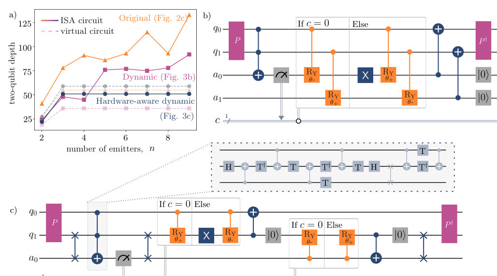
<figcaption class="paper-figure-caption"><b>Fig 4.</b> FIG. 4. Near-term hardware-aware transformation of the circuit in Fig. 3c. (a) Scaling with the number of emitters n of the two-qubit depth of the virtual (dashed lines) and ISA circuits obtained after transpilation (solid lines) for the original circuit in Fig. 3c (yellow triangles), the dynamic circuit in Fig. 4b (purple squares) and the hardware-aware dynamic circuit in Fig. 4c (blue circles). (b) Dynamic circuit that models the collective dissipation of two emitters. This circuit is the first adaptation of the original circuit in Fig. 3c into a dynamical circuit, which achieves a significant two-qubit depth reduction. Only two two-level systems representing the quantum emitters are...</figcaption>
</figure>
<figure class="paper-figure-card">
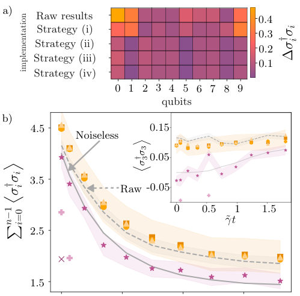
<figcaption class="paper-figure-caption"><b>Fig 5.</b> FIG. 5. Comparison of the performance of error suppres- sion and mitigation techniques in ibm basquecountry using the hardware-aware circuit in Fig. 4c extended to a chain of ten quantum emitters. (a) Colormap of the absolute error of the excited-state population of each system qubit qi, with i = 0, ..., 9 at ˜γt = 0.45. The error is obtained without dy- namical decoupling (raw results, first row) and for the four different strategies discussed in the main text: (i) XY4 se- quence on idle qubits while performing mid-circuit measure- ments (second row), (ii) XY4 sequence while performing mid- circuit measurements and resets (third row), (iii) XY4 during every operation (fourth row) and (iv)...</figcaption>
</figure>

**Summary.** The paper demonstrates utility-scale quantum simulations of collective dissipation in large interacting qubit chains using IBM's System Two processor. By combining dynamic circuits, hardware-aware transpilation, and advanced error mitigation like biased CDR, the authors successfully model complex dissipative dynamics in systems of up to 86 emitters. This approach provides a scalable route for studying many-body open quantum systems on near-term quantum hardware.

**Why it may be interesting.** This work is highly relevant as it provides a practical, scalable blueprint for simulating many-body open quantum systems (like superradiance) on NISQ hardware, bridging the gap between theoretical Lindblad dynamics and large-scale experimental execution.

Detailed structure

**Main problem.** Simulating the complex dissipative dynamics of large-scale interacting qubit chains on near-term quantum hardware, specifically addressing the challenges of collective decay and high circuit depth.

**Main result.** The authors successfully executed utility-scale experiments on the IBM System Two processor using up to 129 qubits, demonstrating that hardware-aware dynamic circuits and biased Clifford Data Regression (CDR) can accurately reproduce collective dissipative phenomena.

**Method.** The approach uses Trotterized evolution with ancilla-assisted dissipative channels, optimized via mid-circuit measurements, conditional gates, and hardware-aware transpilation. Error mitigation is achieved through dynamical decoupling and biased CDR, while classical validation is performed using a hybrid Monte Carlo-TEBD tensor-network method.

**Model / system.** A one-dimensional chain of interacting two-level quantum emitters coupled to a common Markovian bath, described by a Lindblad master equation featuring single-qupi decay and collective (cross-qubit) dissipation.

**Key observables.** Excited-state populations, density matrix elements (rho_00, rho_11, rho_01), and coherences.

**Important parameters / regimes.** Scales up to 86 emitters and 129 total qubits; largest circuits contain ~8,000 two-qubit gates; effective parameters include frequency (1.2045 eV), coupling (4.5 meV), and decay rates (9 meV).

**Assumptions / limitations.** The system is treated within the Markovian approximation and the weak-coupling limit, neglecting long-range interactions beyond nearest-neighbor coupling.

**Figures summary.** Figure 1 shows system-bath coupling and circuit architecture; Figure 2 demonstrates single-qubit decay validation; Figure 3 illustrates the interaction basis and two-qubit dynamics; Figure 4 compares circuit depth scaling for different transpilation strategies; Figure 5 evaluates error mitigation performance (ZNE and CDR); Figure 11 characterizes the IBM Heron r2 QPU metrics.

**Paper structure.** The paper begins by defining the problem of simulating open quantum systems, moves to the construction of the Trotterized circuit and basis transformation for collective decay, details the hardware-aware optimizations and error mitigation strategies, presents large-scale experimental results on IBM hardware, and concludes with classical validation using a hybrid tensor-network approach.

Abstract

Open quantum systems are central to quantum optics, condensed matter, and chemistry, yet their simulation remains challenging for both classical and near-term quantum hardware. In this work we implement and execute utility-scale quantum circuits that accurately reproduce the dissipative dynamics of interacting qubits. We consider a one-dimensional chain of many qubits weakly coupled to a common Markovian bath. The Markovian time evolution of the system is implemented through Trotterized evolution with the introduction of ancilla-assisted dissipative channels, including single-qubit and two-qubit dissipators to capture collective decay. Mid-circuit measurements, conditional gates, and hardware-aware transpilation significantly reduce circuit depth. We further implement a biased Clifford data regression (biased CDR), an error mitigation strategy that outperforms the uniform Cliffordization baseline and a variety of zero-noise extrapolation protocols. We execute large-scale quantum experiments of the dynamics of chains comprising up to 86 emitters on the IBM System Two \texttt{ibm\_basquecountry}. In order to do so, we use 129 total qubits (including ancillas), with the largest circuits contain about 8000 two-qubit gates. To validate these experiments we develop a classical Monte Carlo-Time-Evolving Block-Decimation (MC-TEBD) tensor-network method that incorporates reset operations through stochastic pure-state trajectories, obtaining very good agreement. The approach presented here opens a practical route for utility-scale quantum simulation of dissipative dynamics, enabled by dynamic circuits, targeted error mitigation, and tensor-network validation, and enables to tackle complex dynamics of systems such as quantum emitters in dissipative optical cavities.

[↑ back to top](#top)

### [Dissipative preparation of injective tensor network states](http://arxiv.org/abs/2605.25089v1)

**Authors:** Drishti Baruah, Georgios Styliaris, J. Ignacio Cirac, Rahul Trivedi  
**Type:** theory · **Category:** numerical methods · **PDF:** <https://arxiv.org/pdf/2605.25089v1>  
**Analysis basis:** full PDF text, analyzed in chunks
**Topic relevance:** 🔥 `methods for driven-dissipative` **5/5** · `entanglement & information structure` **3/5** · `non-equilibrium dynamics` **3/5** · `analog quantum simulation` **2/5** · `driven-dissipative phase transition` **2/5**

↔ Scroll figures horizontally

<figure class="paper-figure-card">
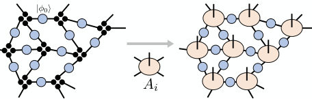
<figcaption class="paper-figure-caption"><b>Fig 1.</b> FIG. 1: Projected entangled pair state (PEPS) on an arbitrary graph. Each vertex hosts a local tensor with one physical index and virtual indices associated with incident edges.</figcaption>
</figure>
<figure class="paper-figure-card">
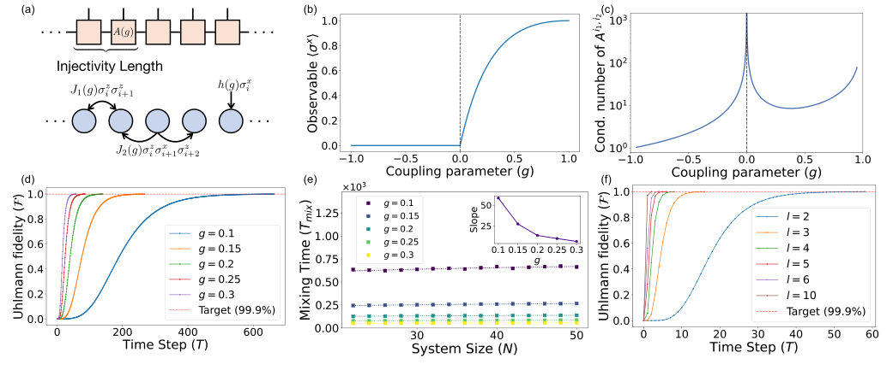
<figcaption class="paper-figure-caption"><b>Fig 2.</b> FIG. 2: Numerical study of the dissipative protocol beyond the high-injectivity assumption. (a) A schematic illus- trating the local 1D chain and the Parent Hamiltonian interactions. (b) Magnetization ⟨σx⟩as a function of the coupling g. The sharp discontinuity at g = gc = 0 signals a quantum phase transition into a GHZ-like critical state. (c) Condition number of the two-site blocked tensor Ai1,i2 as a function of the coupling g, diverging at the phase transition point g = 0 where the tensor becomes non-injective. (d) Fidelity convergence for a fixed block size l = 2 across different couplings g (N = 50, l = 2). (e) Logarithmic scaling of Tmix with system size N across different couplings...</figcaption>
</figure>

**Summary.** This paper presents a new class of dissipative protocols for the efficient preparation of injective tensor network states like MPS and PEPS. It achieves logarithmic scaling in system size, offering significant speedups over existing methods. The approach is particularly powerful because it is inherently robust to noise and initial state errors.

**Why it may be interesting.** This is highly relevant for researchers in open quantum systems and many-body dynamics as it provides a scalable, robust framework for preparing complex many-body states using engineered dissipation rather than fragile unitary evolution.

Detailed structure

**Main problem.** Efficiently preparing injective tensor network states, such as MPS and PEPS, on quantum devices using dissipative protocols that are robust to noise and initialization errors.

**Main result.** The authors construct continuous-time and discrete-time dissipative processes that prepare injective tensor networks in logarithmic time, providing an exponential speedup over previous dissipative schemes for 1D MPS and a polynomial/exponential speedup for higher-dimensional PEPS.

**Method.** The method uses engineered Lindbladian dynamics and quantum channels composed of local single-site and two-site operators designed to project shared edge states onto a target state.

**Model / system.** The study focuses on injective tensor network states (MPS and PEPS) defined on undirected graphs with bounded degree, utilizing a parent Hamiltonian approach where the target state is the unique ground state.

**Key observables.** Uhlmann fidelity, local energy expectation values, and the spectral gap of the parent Hamiltonian.

**Important parameters / regimes.** The injectivity/isometry parameter (delta), the graph maximum degree (d0), the dissipation strength (Gamma), and the system size (N).

**Assumptions / limitations.** The tensors must be injective, and for guaranteed rapid mixing in PEPS, they must satisfy a 'highly injective' or near-isometric condition.

**Figures summary.** Figure 1 illustrates a PEPS on an arbitrary graph; Figure 2 shows a specific MPS model, its phase transition, and the vanishing of the minimum singular value at the non-injective point.

**Paper structure.** The paper introduces the problem of state preparation, constructs continuous and discrete dissipative protocols, proves the uniqueness of the steady state, establishes rapid-mixing properties via energy decay arguments, and validates results with numerical simulations.

Abstract

The preparation of tensor network states is a fundamental prerequisite for a wide range of quantum simulation tasks. While many unitary protocols for preparing these states have been investigated, dissipative state preparation provides a powerful alternative since it can be robust to noise and initialization errors. In this paper, we construct both continuous-time and discrete-time geometrically local dissipative processes whose unique steady state is a given injective tensor network state. Our method prepares all injective matrix product states on $N$ sites to an error $\varepsilon$ in $O(\log (N/\varepsilon))$ time, yielding an exponential improvement over previously known dissipative preparation schemes. For two and higher-dimensional tensor network states, we prove that when the tensors of the state are \emph{highly injective}, the constructed dissipative processes are rapid-mixing i.e., they prepare a state $\varepsilon$-close to the $N$-site target state in $O(   \log (N/\varepsilon))$ time. For these states, our approach provides a polynomial speedup over known unitary methods for states defined on lattices and an exponential speedup for states on general bounded-degree graphs. We corroborate our theoretical results with numerical studies that indicate that the dissipative protocol can rapidly prepares states outside the high-injectivity assumption.

[↑ back to top](#top)

### [Extracting Universal Entanglement Scaling from Mixed Fermionic Gaussian States via Entanglement Projected Entropy](http://arxiv.org/abs/2605.25102v1)

**Authors:** Jia-Wen Tao, Hui-Ke Jin  
**Type:** theory · **Category:** statistical mechanics · **PDF:** <https://arxiv.org/pdf/2605.25102v1>  
**Analysis basis:** full PDF text, analyzed in chunks
**Topic relevance:** 🔥 `entanglement & information structure` **5/5** · `methods for driven-dissipative` **2/5** · `non-equilibrium dynamics` **2/5** · `non-equilibrium universality` **2/5**

↔ Scroll figures horizontally

<figure class="paper-figure-card">
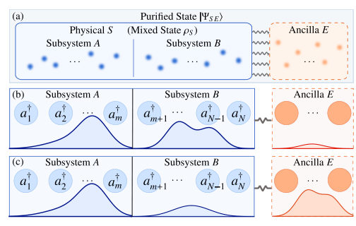
<figcaption class="paper-figure-caption"><b>Fig 1.</b> FIG. 1. (a) Purification picture underlying the entanglement pro- jected entropy. A mixed state ρS on the physical bipartition S = A⊕B is embedded into a pure state |ΨS E⟩on the enlarged Hilbert space A ⊕B ⊕E, such that ρS = TrE |ΨS E⟩⟨ΨS E|. (b),(c) Schematic illus- tration of the spatial filtering mechanism in Gaussian states. Blue circles denote physical fermionic modes in A and B, while orange circles denote ancilla modes in E. The curve drawn over subsys- tem A shows the spatial wavefunction amplitude of a single-particle entanglement mode ⃗χq on the sites in A, while the curve over B ⊕E shows the amplitude distribution of its unique purification partner ⃗ηq. The...</figcaption>
</figure>
<figure class="paper-figure-card">
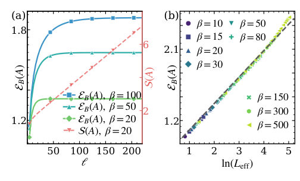
<figcaption class="paper-figure-caption"><b>Fig 2.</b> FIG. 2. Numerical verification of the universal CFT scaling in an infinite 1D free-fermion chain at finite temperature. (a) Projected entropy EB(A) (left axis, solid lines) and standard von Neumann en- tropy S(A) (right axis, red dashed line) as a function of the subsystem size ℓ. While S(A) exhibits an extensive thermal volume law (linear in ℓ), EB(A) cleanly removes this thermal background and saturates to a plateau for ℓ≫vFβ. (b) Data collapse of EB(A) against the ef- fective conformal length ln(Leff), with Leff defined in Eq. (11). Data from various inverse temperatures β collapse onto a single universal straight line. The dashed gray line indicates the analytical CFT pre- diction with...</figcaption>
</figure>
<figure class="paper-figure-card">
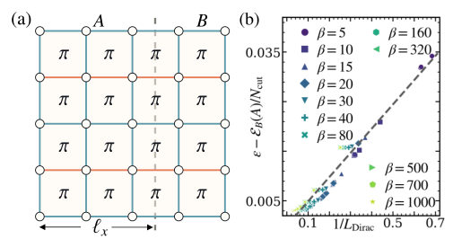
<figcaption class="paper-figure-caption"><b>Fig 3.</b> FIG. 3. (a) Half-filled π-flux model on a square lattice. Blue and red bonds denote hopping amplitudes −t and t, respectively, yielding a π flux per plaquette. The dashed line with length Ly marks the bipar- tition into A and B, with A a vertical strip of width ℓx. (b) Scaling of the bipartite EPE (subtracted by a constant) [ϵNcut −EB(A)] /Ncut versus 1/LDirac for different inverse temperatures β, with Ncut = 2Ly and LDirac defined in Eq. (16). The dashed line serves as a guide to the eye for the linear scaling form.</figcaption>
</figure>
<figure class="paper-figure-card">
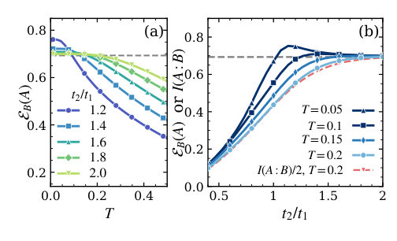
<figcaption class="paper-figure-caption"><b>Fig 4.</b> FIG. 4. Projected entropy in the SSH chain for a half-chain biparti- tion. (a) Temperature dependence of EB(A) for several values of t2/t1 in the topological regime. The dashed line marks ln 2. (b) Projected entropy EB(A) as a function of t2/t1 for several fixed temperatures. For comparison, half of the mutual information, I/2, at T = 0.2 is also shown as a dashed line, demonstrating its close agreement with EB(A) at T = 0.2.</figcaption>
</figure>

**Summary.** The paper introduces a new diagnostic called Entanglement Projected Entropy (EPE) designed to extract quantum correlations from mixed states. By filtering out the volume-law thermal background, EPE successfully recovers universal entanglement scaling in both 1D and 2D fermionic models. This allows for the identification of quantum signatures that are otherwise hidden by thermal fluctuations.

**Why it may be interesting.** This is highly relevant for many-body dynamics and open quantum systems as it provides a new tool to distinguish true quantum entanglement from thermal noise in mixed-state many-body systems.

Detailed structure

**Main problem.** Identifying spatial quantum correlations in mixed states is difficult because thermal/classical contributions to subsystem entropy scale with volume, obscuring boundary-sensitive entanglement signatures.

**Main result.** The authors introduce Entanglement Projected Entropy (EPE), a diagnostic that filters out extensive thermal backgrounds to recover universal entanglement scaling, such as the c/3 coefficient in 1D and universal scaling collapse in 2D.

**Method.** The method involves embedding mixed fermionic Gaussian states into a globally pure state via an ancilla environment and using a directional projection weight to isolate entanglement channels residing in the physical complement.

**Model / system.** The study focuses on mixed fermionic Gaussian states, specifically a 1D critical free-fermion chain and a 2D half-filled pi-flux model on a square lattice.

**Key observables.** Entanglement Projected Entropy (EPE), von Neumann entropy, Mutual Information, and the directional weight (w_q).

**Important parameters / regimes.** Inverse temperature (beta), central charge (c), UV cutoff (a), and the effective Dirac infrared length (L_Dirac).

**Assumptions / limitations.** The derivations and EPE formulation are specifically tailored to and limited to Gaussian fermionic states.

**Figures summary.** Figure 1(a) provides a schematic of the purification process where a mixed state is embedded into a larger pure state with an ancilla environment.

**Paper structure.** The paper introduces the EPE diagnostic, develops its mathematical framework for Gaussian states, provides a closed-form expression using the covariance matrix, and then applies it to 1D and 2D models to demonstrate its ability to recover universal scaling and topological signatures.

Abstract

Identifying spatial quantum correlations in mixed states is challenging because thermal mixed-state contributions obscure the entanglement encoded in subsystem entropy. Here, we introduce the entanglement projected entropy, a diagnostic for extracting boundary-sensitive quantum correlations from mixed fermionic Gaussian states. By resolving subsystem entropy into Gaussian entanglement channels and projecting their purification partners onto the physical complement, we obtain a closed-form expression in terms of the physical covariance matrix. In a one-dimensional free-fermion chain, it removes the volume-law mixed-state background and recovers the zero-temperature conformal scaling with the $c/3$ coefficient. In a two-dimensional half-filled $π$-flux model, it reveals a universal finite-temperature scaling collapse governed by an effective Dirac infrared length. These results establish entanglement projected entropy as a Gaussian spatial filter for boundary-sensitive quantum correlations hidden in mixed-state entropy.

[↑ back to top](#top)

### [Local Impurity Induced Growth and Scrambling in Clean Free Fermions](http://arxiv.org/abs/2605.24335v1)

**Authors:** Qucheng Gao, Vikram Ravindranath, Xiao Chen  
**Type:** theory · **Category:** statistical mechanics · **PDF:** <https://arxiv.org/pdf/2605.24335v1>  
**Analysis basis:** full PDF text, analyzed in chunks
**Topic relevance:** 🔥 `entanglement & information structure` **4/5** · 🔥 `non-equilibrium dynamics` **4/5** · `Kondo & dissipative impurity` **3/5** · `driven-dissipative phase transition` **3/5** · `measurement-induced transitions` **3/5** · `non-equilibrium universality` **3/5** · `methods for driven-dissipative` **2/5** · `quantum measurements` **2/5**

↔ Scroll figures horizontally

<figure class="paper-figure-card">
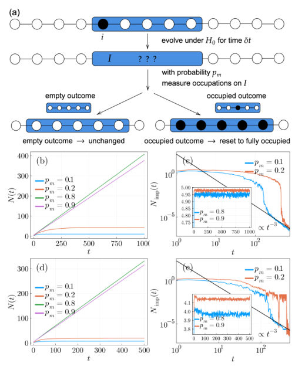
<figcaption class="paper-figure-caption"><b>Fig 1.</b> FIG. 1. Monitored model with feedback. (a) Schematic illustration of the protocol. At each time step, the system first evolves unitarily for a time interval δt = 0.5, after which measurements are performed at impurity sites with proba- bility pm. (b),(c) Boundary impurity: total particle number N(t) and impurity occupation Nimp(t). (d),(e) Bulk impurity: total particle number N(t) and impurity occupation Nimp(t). In (c) and (e), the main panels are shown on log-log scales for weak monitoring, while the insets show large pm on linear scales. The black solid lines indicate the power-law decay t−3. Here, L = 1000, and we average over 200 samples.</figcaption>
</figure>
<figure class="paper-figure-card">
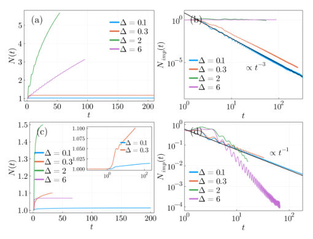
<figcaption class="paper-figure-caption"><b>Fig 2.</b> FIG. 2. Interacting particle model. (a),(b) Boundary im- purity: total particle number N(t) and impurity occupation Nimp(t). (c),(d) Bulk impurity: total particle number N(t) and impurity occupation Nimp(t). Results are shown for L = 400. In (b) and (d), the black solid lines indicate the power-law decays t−3 and t−1, respectively. The inset in (c) shows the small-∆data on a linear-log scale, highlighting the continued slow growth of N(t) over the accessible time win- dow.</figcaption>
</figure>
<figure class="paper-figure-card">
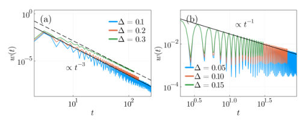
<figcaption class="paper-figure-caption"><b>Fig 3.</b> FIG. 3. Impurity-sensitive operator weight w(t) in the op- erator model with H = H0 + ∆NiNi+1. (a) Boundary im- purity, with i = 1 and O(0) = N1, for ∆= 0.1, 0.2, 0.3 and L = 400. (b) Bulk impurity, with i = L/2 and O(0) = NL/2, for ∆= 0.05, 0.10, 0.15 and L = 200. Solid and dashed lines indicate the power-law decays w(t) ∼t−3 in (a) and w(t) ∼t−1 in (b).</figcaption>
</figure>
<figure class="paper-figure-card">
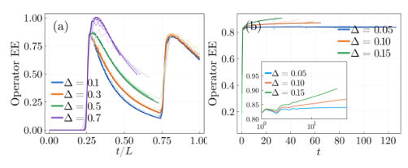
<figcaption class="paper-figure-caption"><b>Fig 4.</b> FIG. 4. Half-system operator entanglement entropy in the operator model. (a) Boundary impurity. (b) Bulk impurity. For small ∆, the entropy grows slowly. Inset: L = 200 data on a linear-log scale, highlighting the slow late-time growth. From light to dark colors: L = 50, 100, 150, 200. The late- time upturn in (a) near t/L ≃0.75 is a finite-size reflection effect from the opposite boundary.</figcaption>
</figure>

**Summary.** This paper demonstrates that a single local impurity can act as a branching source, driving a transition from particle saturation to sustained growth and operator scrambling in free-fermion chains. The dynamics are governed by the return probability of particles to the impurity, which varies depending on whether the impurity is in the bulk or at the boundary. The findings reveal how local interactions can generate complex many-body behavior in otherwise simple, integrable systems.

**Why it may be interesting.** It provides fundamental insights into how local perturbations can trigger many-body complexity and non-equilibrium phase transitions in simple systems, which is highly relevant to understanding non-equilibrium dynamics and open quantum systems.

Detailed structure

**Main problem.** Investigating whether a single local impurity can induce nontrivial dynamics, particle growth, and information scrambling in an otherwise clean, simple free-fermion system.

**Main result.** The study identifies a transition from a saturating regime to a sustained growth and scrambling regime, driven by the interplay between local impurity branching and the return probability of the bulk.

**Method.** The authors use a 'branching picture' analytical framework, large-scale MPS simulations using the ITensor library, and Laplace transform analysis of the single-particle propagator.

**Model / system.** One-dimensional clean free-fermion systems, including monitored models with measurement-and-feedback, unitary interacting particle models, and Heisenberg operator dynamics with local impurities.

**Key observables.** Total particle number N(t), impurity occupation N_imp(t), particle-production current J(t), impurity-sensitive operator weight w(t), and operator entanglement entropy.

**Important parameters / regimes.** Monitoring probability p_m, impurity coupling strength Delta, impurity location (boundary vs. bulk), and the power-law decay exponent alpha of the return kernel.

**Assumptions / limitations.** The branching picture is a heuristic analogy rather than a literal description of coherent quantum dynamics; the derivation relies on the spectrum being bounded and dispersion being quadratic.

**Figures summary.** Schematic of the monitored model protocol; plots of total particle number and impurity occupation showing saturation vs. linear growth; and plots of operator weight decay and entropy scaling.

**Paper structure.** Introduction of the impurity-induced growth problem, presentation of the monitored model and branching mechanism, analysis of unitary particle and operator models, investigation of scaling laws and dimensionality, and discussion of parity-breaking and topological effects.

Abstract

We study impurity-induced particle growth and scrambling in clean one-dimensional free-fermion systems. We show that a single local impurity can act as a branching source: particle or operator weight propagates coherently into the free bulk, returns to the impurity, and is locally converted into additional degrees of freedom. We develop this branching picture in three complementary settings: a monitored free-fermion model with feedback, a fully unitary interacting particle model, and Heisenberg operator dynamics with an interacting impurity. In the monitored model, we find a feedback-driven transition for both boundary and bulk impurities. In the unitary particle and operator models, a boundary impurity gives rise to an analogous transition from saturation to sustained growth and scrambling. These results reveal how a single impurity can generate complex many-body dynamics in an otherwise clean and free quantum system.

[↑ back to top](#top)

### [Boson Sampling as a Probe of Chaotic and Integrable Quantum Dynamics](http://arxiv.org/abs/2605.25398v1)

**Authors:** Yuancheng Zhan, Khen Cohen, Norman T. W. Koo, Kian Hwee Lim, Hui Zhang, Lingxiao Wan, Sanghoon Chae, Ai Qun Liu, Victor M Bastidas, Yaron Oz, Leong-Chuan Kwek  
**Type:** both · **Category:** quantum information and computing · **PDF:** <https://arxiv.org/pdf/2605.25398v1>  
**Analysis basis:** full PDF text, analyzed in chunks
**Topic relevance:** 🔥 `QC/QI experiment` **4/5** · 🔥 `entanglement & information structure` **4/5** · 🔥 `quantum optics experiment` **4/5** · `analog quantum simulation` **3/5** · `non-equilibrium dynamics` **3/5** · `interference shaping light` **2/5**

↔ Scroll figures horizontally

<figure class="paper-figure-card">
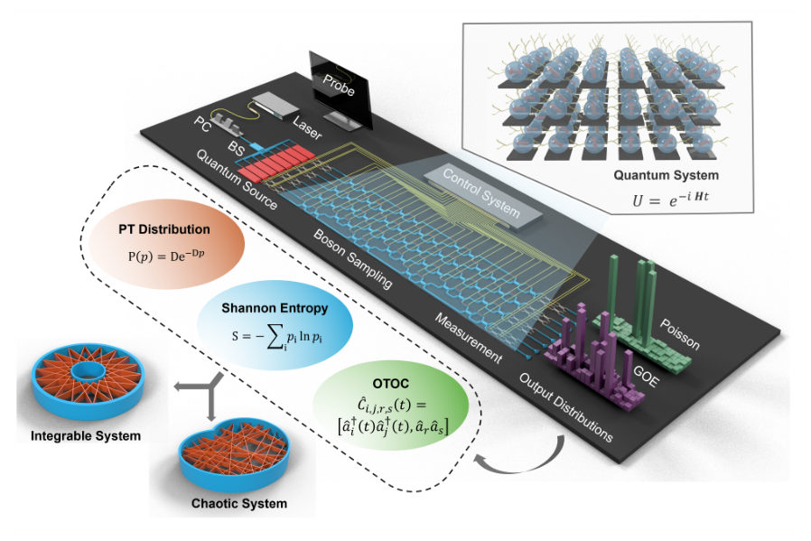
<figcaption class="paper-figure-caption"><b>Fig 1.</b> Fig. 1 Workflow for distinguishing chaotic and integrable dynamics using on-chip boson sampling. A quantum system undergoing unitary evolution U = e−iHt is mapped onto an integrated photonic platform, where Fock- state boson sampling is implemented using a pump laser, polarization controller (PC), beam splitter (BS), and spiral waveguides for photon-pair generation, followed by a programmable optical network and correlation measurements. The measured output probability distributions are then used to extract three quantitative indicators: the Wasserstein distance between the empirical distribution and the PT distribution, the Shannon entropy of the output distribution, and OTOC-equivalent...</figcaption>
</figure>
<figure class="paper-figure-card">

<figcaption class="paper-figure-caption"><b>Fig 2.</b> Figure 1 summarizes the overall workflow of this work. A quantum system undergoing unitary evolution U = e−iHt is mapped onto a programmable integrated photonic platform, where Fock-state boson sampling is implemented through photon-pair generation, programmable optical transfor- mations, and multiphoton correlation measurements. The time evolution of the resulting output probability distributions encodes information about the underlying dynamics and serves as experi- mentally accessible observables for probing quantum chaos. The measured statistics are subsequently analyzed using three complementary probes: PT statistics, Shannon entropy, and OTOC-equivalent observables, providing a...</figcaption>
</figure>
<figure class="paper-figure-card">
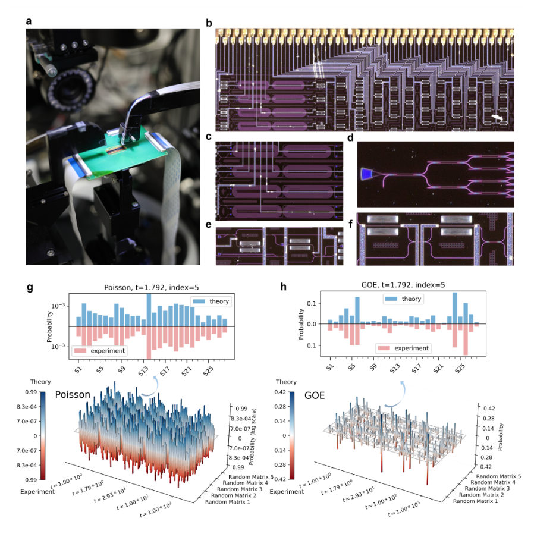
<figcaption class="paper-figure-caption"><b>Fig 3.</b> Fig. 2 Experimental implementation of the on-chip boson sampling platform. a, Schematic overview of the experimental setup integrating photon generation, manipulation, and measurement on a single photonic chip. b, The 8-mode reconfigurable photonic circuit. c, Spiral waveguide structures used for photon-pair generation via SFWM. d, 1-to-8 beam splitter network for distributing input light. e, AMZI is used for pump filtering. f, MZI structure. g, Integrable dynamics. Top: Enlarged view of the output probability distribution at t = 1.792, where blue and red bars denote the theoretical and experimental results, respectively. The full distribution consists of 28 two-photon basis states, labeled...</figcaption>
</figure>
<figure class="paper-figure-card">
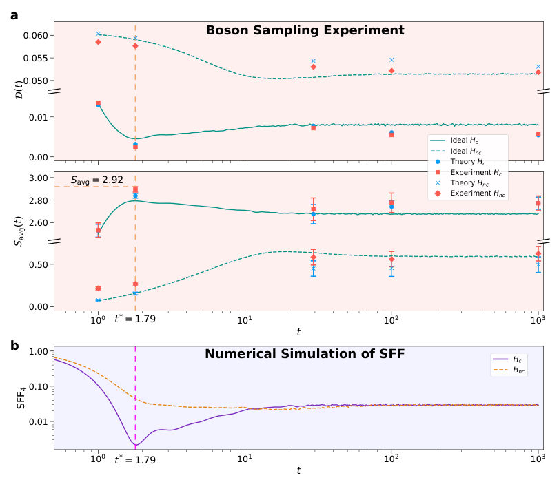
<figcaption class="paper-figure-caption"><b>Fig 4.</b> Fig. 3 Experimental results for the first two probes of chaos that are extractable from p(t), as well as the numerically simulated 4-point SFF for both Hc and Hnc. a, In the top panel, for both Hc and Hnc respectively, we study D(t) as defined in Eq. 4. In the bottom panel, for Hc and Hnc respectively, we study Savg(tk) as defined in Eq. 6. In these plots, we show the experimental results (red points) obtained by performing boson sampling on the unitaries on the photonic chip (see Appendix B for more details). The corresponding theoretical results assuming a ideal Boson Sampling on the same unitaries (blue points) are also plotted. In the bottom panel, the error bars are the standard error...</figcaption>
</figure>
<figure class="paper-figure-card">
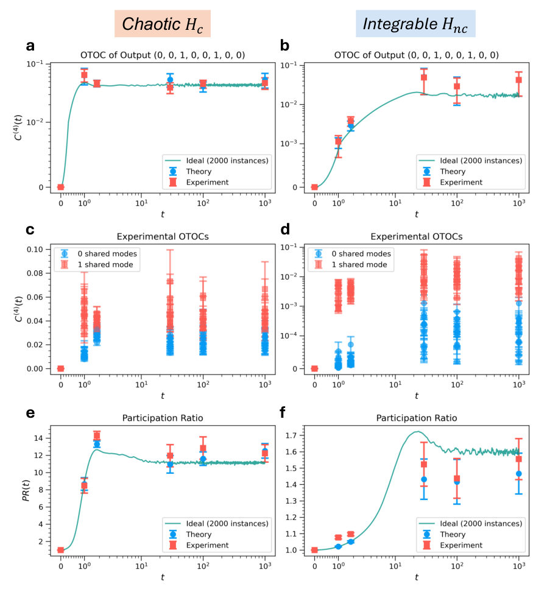
<figcaption class="paper-figure-caption"><b>Fig 5.</b> Fig. 4 Experimental results for the third chaos probe extracted from p(t). a,b, four-point OTOCs for the output configuration |01, 02, 13, 14, 05, 06, 07, 08⟩are shown for chaotic Hc and integrable Hnc. Experimental data are plotted in red, theoretical results assuming perfect Boson Sampling with the same unitaries in blue, and ideal curves averaged over 2000 instances in green. c,d, Experimental four-point OTOCs for Hc and Hnc are shown for all output configurations measured. Blue (red) points correspond to configurations with 0 (1) shared occupied modes with the input configuration. e,f, The participation ratios over all measured output configurations are shown for Hc and Hnc. Each data...</figcaption>
</figure>

**Summary.** This paper demonstrates that boson sampling on an integrated photonic chip can serve as a powerful diagnostic tool for quantum chaos. By measuring statistical signatures like Shannon entropy and Porter-Thomas distance, the authors successfully distinguish between integrable and chaotic quantum dynamics. This provides a scalable route for investigating complex, non-equilibrium quantum dynamics on programmable photonic platforms.

**Why it may be interesting.** This paper is highly relevant for researchers in quantum optics and many-body dynamics as it provides a scalable, hardware-integrated method to study information scrambling, operator growth, and the transition between integrability and chaos using bosonic interference.

Detailed structure

**Main problem.** The lack of a clear connection between programmable integrated photonic dynamics and established diagnostics for probing quantum chaos, specifically the need for a scalable method to distinguish between chaotic and integrable dynamics.

**Main result.** The researchers established Fock-state boson sampling as a practical probe of quantum chaos, demonstrating that three complementary probes (Porter-Thomas distance, Shannon entropy, and OTOC-equivalent observables) can successfully distinguish between integrable and chaotic dynamics on a silicon photonic chip.

**Method.** The work maps the temporal evolution of a quantum Hamiltonian onto the unitary transformations of a programmable photonic interferometer and uses statistical analysis of multiphoton interference patterns to extract chaos signatures.

**Model / system.** An 8-mode programmable silicon quantum photonic chip using spontaneous four-wave mixing for photon-pair generation and a reconfigurable network of Mach-Zehnder interferometers to implement unitary evolution $U(t) = e^{-iHt}$.

**Key observables.** Distance to Porter-Thomas statistics, Shannon entropy, OTOC-equivalent observables, Spectral Form Factor (SFF), and Participation Ratio (PR).

**Important parameters / regimes.** The parameter $\Lambda$ (or $\lambda$) which tunes the crossover between integrable (Poissonian) and chaotic (GOE) regimes, and the number of photons $N$ and modes $M$.

**Assumptions / limitations.** The use of non-number-resolving detectors requires post-selection of collision-free events, and the validity of the Porter-Thomas approximation assumes the ratio of lost configurations to total configurations is small.

**Figures summary.** Figure 1 shows the experimental workflow and mapping of dynamics; Figure 2 illustrates the photonic chip architecture and probability distributions; Figure 3 presents the temporal evolution of $D(t)$ and Shannon entropy alongside SFF simulations; Figure 4 shows the temporal evolution of specific output probabilities and the scaling of the participation ratio.

**Paper structure.** The paper begins by establishing the theoretical framework for mapping Hamiltonian dynamics to photon interference, describes the design and fabrication of the silicon photonic chip, introduces the three statistical probes for chaos, presents experimental validation of these probes, and concludes with scaling analysis and extensions to spin systems.

Abstract

Quantum technologies have become a powerful paradigm for quantum information and simulation, while quantum chaos plays a key role in understanding complex quantum dynamics. Integrated photonics offers unique advantages for quantum applications, including high-speed operation, scalability, and programmable unitary transformations. However, probing quantum chaos on integrated photonic platforms remains largely unexplored because a clear connection between programmable photonic dynamics and established chaos diagnostics is still lacking. In this work, we establish Fock-state boson sampling as a practical probe of quantum chaos by exploiting the sensitivity of multiphoton interference to the random-matrix properties of underlying single-particle unitary dynamics. More importantly, we design and fabricate a programmable silicon quantum photonic chip to experimentally implement this framework, achieving the first integrated-photonic demonstration of quantum-chaos probes based on boson sampling. Experimental results show that the three complementary probes proposed in this work, namely the distance to Porter-Thomas statistics, Shannon entropy, and Out-of-Time-Ordered-Correlator-equivalent observables, exhibit close agreement with theoretical predictions and consistently distinguish chaotic and integrable dynamics. Our work provides a scalable route for investigating complex quantum dynamics on programmable photonic platforms while leveraging the intrinsic advantages of boson sampling through multiphoton interference and complex output statistics.

[↑ back to top](#top)

### [Wave-particle duality of unpolarized photons](http://arxiv.org/abs/2605.25738v1)

**Authors:** Naofumi Abe, Keiichi Edamatsu  
**Type:** both · **Category:** quantum information and computing · **PDF:** <https://arxiv.org/pdf/2605.25738v1>  
**Analysis basis:** full PDF text, analyzed in chunks
**Topic relevance:** 🔥 `QC/QI experiment` **4/5** · 🔥 `quantum measurements` **4/5** · 🔥 `quantum optics experiment` **4/5** · `entanglement & information structure` **3/5** · `interference shaping light` **2/5** · `spintronics-quantum-optics interface` **2/5**

↔ Scroll figures horizontally

<figure class="paper-figure-card">
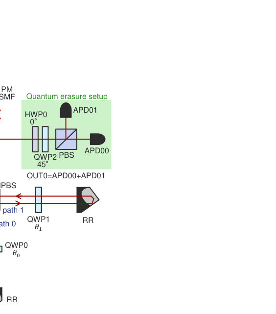
<figcaption class="paper-figure-caption"><b>Fig 1.</b> Fig. 1. Michelson interferometer setup that we used in our experiments. PMSMF: a polarization-maintaining single-mode fiber, NPBS: a non-polarizing beamsplitter, RR: retroreflectors, QWP(0–3): quarter-wave plates, HWP(0–1): half-wave plates, PBS: polarizing beamsplitters, APD(00–11): avalanche photodiodes. The green shaded areas represent the polarization-analyzing detectors used for the quantum erasure setup and the measurement of the path distinguishability. See the text for details.</figcaption>
</figure>
<figure class="paper-figure-card">
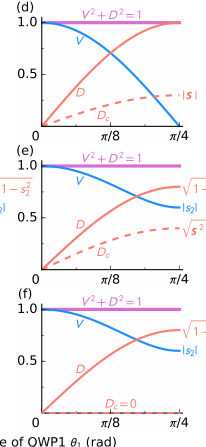
<figcaption class="paper-figure-caption"><b>Fig 2.</b> Fig. 2. The visibility 𝑉, the conventional path distinguishability 𝐷c, the redefined path distinguishability 𝐷, and 𝑉2 + 𝐷2 are depicted as functions of 𝜃1 (the fast axis angle of QWP1 in Fig. 1), which varies the WPI. Their behaviors are classified into six cases, (a)–(f), as described in the text.</figcaption>
</figure>
<figure class="paper-figure-card">
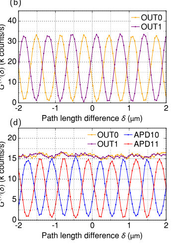
<figcaption class="paper-figure-caption"><b>Fig 3.</b> Fig. 3. Interference fringes (𝐺(1)) observed in the experiments using unpolarized single photons. (a) 𝐺(1) observed at OUT1 without QWP0 and QWP1. (b) 𝐺(1) observed at OUT0 (yellow) and OUT1 (purple) when WPI is completely absent (𝜃0 = 𝜃1 = 0◦). (c) Same as (b) but observed at APD10 (blue) and APD11 (red), which detect photons of OUT1 on the circular polarization bases. (d) 𝐺(1) observed at OUT0 (yellow), OUT1 (purple), APD10 (blue), and APD11 (red) when maximum WPI is added (𝜃0 = 0◦and 𝜃1 = 45◦).</figcaption>
</figure>
<figure class="paper-figure-card">
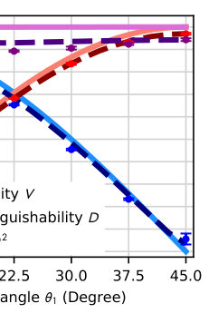
<figcaption class="paper-figure-caption"><b>Fig 4.</b> Fig. 4. Comparison of the measured and theoretical values of the visibility 𝑉(blue), the redefined path distinguishability 𝐷(red), and 𝑉2 + 𝐷2 (purple) as functions of 𝜃1 when 𝜃0 = 0◦. The markers indicate the measured data, which are accompanied by the error bars that indicate 95% confidence intervals. The solid curves indicate the ideal theoretical values. The dashed curves indicate the theoretical values taking account of the experimental imperfections (see text for details).</figcaption>
</figure>

**Summary.** This paper addresses the inaccuracy of the wave-particle duality relation when dealing with mixed-state quantum systems. By redefining distinguishability to include information shared with the environment, the authors demonstrate that the fundamental duality equality can be restored even for unpolarized photons. The findings were experimentally verified using single photons from an NV center in diamond.

**Why it may be interesting.** This is highly relevant for researchers in quantum optics and open quantum systems as it provides a fundamental correction to how complementarity and information retrieval are quantified when a system is entangled with its environment.

Detailed structure

**Main problem.** The conventional wave-particle duality (WPD) relation, V^2 + D^2 <= 1, fails to saturate for mixed-state which-way markers because the standard definition of distinguishability underestimates the total which-path information.

**Main result.** The authors introduce a generalized measure of distinguishability (D) that incorporates information shared with the environment, successfully restoring the saturated WPD equality (V^2 + D^2 = 1) for unpolarized photons.

**Method.** The study uses a purification-based framework to model mixed states and proposes an experimental method to quantify the new D using projective measurements on the which-way marker.

**Model / system.** A Michelson interferometer using single photons in a completely mixed (unpolarized) state, generated from a nitrogen-vacancy (NV) center in diamond, where photon polarization serves as the which-way marker.

**Key observables.** Interference fringe visibility (V), generalized distinguishability (D), conventional distinguishability (Dc), polarization coherence, and the likelihood of a which-way guess (L).

**Important parameters / regimes.** Unpolarized (completely mixed) polarization state, coherence length of 13.5 micrometers, and the rotation angles of waveplates used to induce which-path information.

**Assumptions / limitations.** The definition of D is primarily demonstrated for qubit-based systems (polarization); higher-dimensional generalizations are theoretically possible but computationally difficult.

**Figures summary.** Figure 1 shows the Michelson interferometer setup; Figure 3 displays interference fringes showing intrinsic coherence, the effect of which-path information, and the revival of fringes via quantum erasure.

**Paper structure.** The paper begins by identifying the failure of the standard WPD relation for mixed states, introduces a theoretical framework for a generalized distinguishability D using purification, describes the experimental setup with NV center photons, and concludes with experimental verification of the saturated WPD relation.

Abstract

Photons in a two-path interferometer best embody wave-particle duality (WPD), which is a core concept of quantum theory. So far, the WPD relation is commonly written as $V^2+D^2 \leq 1$, where $V$ is the interference fringe visibility and $D$ is path distinguishability, i.e., the distinguishability of which path a photon passed. This inequality is saturated only when the which-way marker (WWM), which embodies which-path information (WPI) via an internal degree of freedom of photons, such as polarization, is in a pure state. For mixed-state WWM, conventionally defined distinguishability underestimates the amount of WPI and thus does not saturate the WPD relation. Here, we introduce a generalized measure of distinguishability $D$ that properly quantifies the WPI and saturates the WPD relation for all pure- and mixed-state WWM within a purification-based framework. To this end, mixed-state WWM is treated as a result of entanglement formation between the WWM and an external degree of freedom, e.g., environment, and $D$ is defined so that it incorporates the total WPI shared between the WWM and the environment. We show that $D$ thus defined is experimentally quantifiable, independently of $V$, without access to the environment. We experimentally evaluate $V$ and $D$ using true single photons generated in the completely mixed (unpolarized) state, and thus verify the saturated WPD relation.

[↑ back to top](#top)

### [Bit flips, saturation, and quantum chaos in dissipative cat qubits](http://arxiv.org/abs/2605.24100v1)

**Authors:** Filippo Ferrari, Joachim Cohen, Vincenzo Savona, Fabrizio Minganti  
**Type:** both · **Category:** quantum information and computing · **PDF:** <https://arxiv.org/pdf/2605.24100v1>  
**Analysis basis:** full PDF text, analyzed in chunks
**Topic relevance:** 🔥 `methods for driven-dissipative` **4/5** · `driven-dissipative phase transition` **3/5** · `non-equilibrium dynamics` **3/5** · `Keldysh / 2PI / non-Gaussian methods` **2/5** · `correlated / nonlocal dissipation` **2/5** · `entanglement & information structure` **2/5** · `quantum measurements` **2/5**

↔ Scroll figures horizontally

<figure class="paper-figure-card">
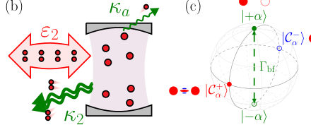
<figcaption class="paper-figure-caption"><b>Fig 1.</b> FIG. 1. Pictorial description of the Hamiltonian and dissi- pators stabilizing cat states. (a) Eq. (1) describes a memory (left resonator) coupled to a buffer (right resonator) via two- photon downconversion processes of strength g2. The buffer is driven with amplitude εb, and Kerr (Ka and Kb) and cross- Kerr (χ) nonlinearities are also present. Both resonators lose photon at rates κa ≪κb and dephasing at rate κϕ affects the a mode (not shown). (b) In the adiabatic limit, the evolution of the memory is captured by Eq. (4). κ2 is the two-photon dissipation rate and ε2 the two-photon drive amplitude. (c) The Bloch sphere defined for the single-mode system in (b) if κa = κϕ = 0. The coherent...</figcaption>
</figure>
<figure class="paper-figure-card">
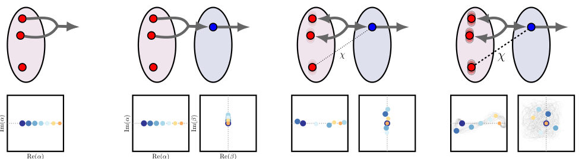
<figcaption class="paper-figure-caption"><b>Fig 2.</b> FIG. 2. Behavior of the system during a bit flip. Top: Sketch of the resonators. Bottom: simplified dynamics in the phase-space. (a) Single-mode approximation. Bit flips are regular, as the motion is constrained on a line connecting the coherent states of opposite phase. (b) In the adiabatic regime, the buffer instantaneously follows the memory, leading to an effective two-photon dissipation for the memory (unidirectional arrows in the scheme). The memory behaves as in the single-mode case, while the buffer only slightly moves from its stable position. (c) Outside of the adiabatic regime, the memory and buffer coherently exchange excitations (bidirectional arrows). Nonetheless, the dynamics...</figcaption>
</figure>
<figure class="paper-figure-card">
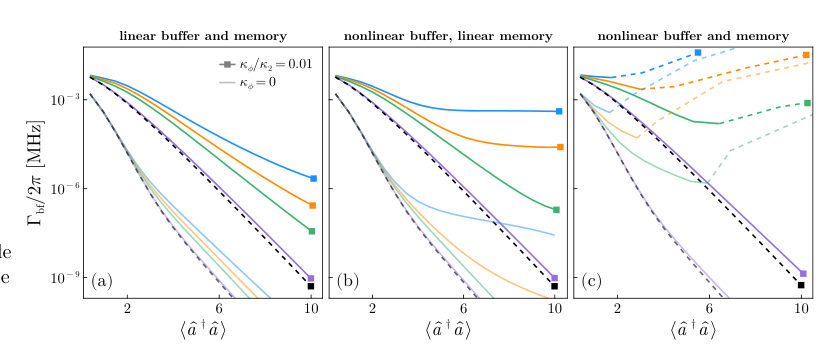
<figcaption class="paper-figure-caption"><b>Fig 3.</b> FIG. 3. Bit-flip error rate Γbf as a function of the photon-number in the memory. The total amount of nonlinearity of the system has been fixed to Ξ/2π = 1MHz (see the discussion in Sec. II B). We consider dephasing rates κϕ/2π = 10 kHz (darker lines ending with a square dot) and κϕ = 0 (lighter lines) We compare four regimes: (i) nonadiabatic (κb/2π = 1.44MHz, g2/2π = 0.6MHz, blue curves); (ii) barely nonadiabatic (κb/2π = 2.25MHz, g2/2π = 0.75MHz, orange curves); (iii) almost adiabatic (κb/2π = 4MHz, g2/2π = 1MHz, green curves); (iv) fully adiabatic (κb/2π = 100MHz g2/2π = 5MHz, purple curves). Using Eq. (5), in the single-mode limit all these correspond to κ2/2π = 1MHz. (a) Γbf in the...</figcaption>
</figure>
<figure class="paper-figure-card">
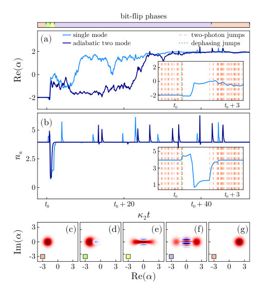
<figcaption class="paper-figure-caption"><b>Fig 4.</b> FIG. 4. Quantum trajectory |Ψ(t)⟩across a bit flip in the single-mode model (light-blue curves) and adiabatic two- mode system (dark-blue curves). Expectation value of (a) the bosonic field α = ⟨Ψ(t)|ˆa|Ψ(t)⟩and (b) photon num- ber na = ⟨Ψ(t)|ˆa†ˆa|Ψ(t)⟩. The insets show a zoom on the initial time of the bit flip event for the single-mode model; the red (green) vertical lines indicate two-photon (dephas- ing) jumps. Here t0 indicates the minimum of the photon number across the bit-flip. The colorbar distinguishes four different phases across the bit flip: coherent phase (sienna), fluctuation phase (yellow), vacuum phase (green) and cat-like phase (purple). (c-g) Wigner functions of...</figcaption>
</figure>
<figure class="paper-figure-card">
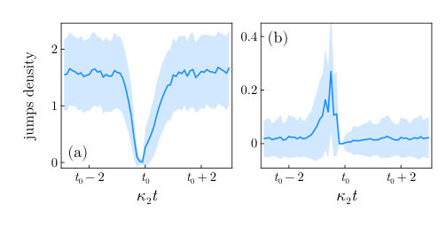
<figcaption class="paper-figure-caption"><b>Fig 5.</b> FIG. 5. Average occurrence of quantum jumps across bit-flip events for the single-mode system. The solid lines represent the mean density while the shaded-regions quantify the stan- dard deviation of: (a) 2-photon jumps (ˆa2); (b) dephasing jumps (ˆa†ˆa). Data are collected over 103 trajectories exhibit- ing a bit-flip, and t0 indicates the time when the minimum of the photon number is reached, that we take as a reference time to synchronize different quantum trajectories. Parame- ters as in Fig. 4.</figcaption>
</figure>

**Summary.** This paper explains why the error protection in cat qubits saturates at large photon numbers by showing that a single-mode description is insufficient. It demonstrates that the interplay between non-adiabatic dynamics and cross-Kerr nonlinearities triggers chaotic-like bursts during bit-flip events. The findings provide a way to quantitatively match experimental error rates using a two-mode model.

**Why it may be interesting.** It provides a deep connection between quantum error correction performance and the emergence of dissipative quantum chaos in open quantum systems, specifically showing how nonlinear mode-coupling destroys the protection of bosonic codes.

Detailed structure

**Main problem.** The paper investigates the physical origin of the saturation of bit-flip error rates in bosonic cat qubits, which prevents the exponential suppression of errors predicted by single-mode theory.

**Main result.** The authors identify that the breakdown of adiabaticity and the presence of nonlinearities (specifically cross-Kerr interaction) and dephasing lead to a transition from regular to chaotic-like bit-flip dynamics, causing the observed saturation.

**Method.** The study combines quantum-trajectory simulations, semiclassical analysis of equations of motion, and Liouvillian spectral methods (including Spectral Statistics of Quantum Trajectories) to analyze the system.

**Model / system.** A two-mode dissipative system consisting of a high-coherence memory mode and a strongly dissipative buffer cavity, described by a Lindblad master equation including two-photon processes, Kerr nonlinearities, and cross-Kerr interactions.

**Key observables.** Bit-flip rate (Liouvillian gap), photon number, Wigner functions, quantum trajectory topology, and spectral coefficients of Liouvillian eigenstates.

**Important parameters / regimes.** Photon number (cat size), coupling strength (g2), dissipation rates (ka, kb), cross-Kerr interaction (chi), dephasing (k_phi), and the adiabatic/non-adiabatic regime.

**Assumptions / limitations.** The model assumes the primary source of error saturation is the interaction between the memory and buffer modes rather than external noise sources not included in the two-mode model.

**Figures summary.** Figure 1 shows the system schematic; Figure 3 explores bit-flip scaling in different regimes; Figure 6 illustrates non-adiabatic bit-flips; Figure 11 compares experimental data to single-mode and two-mode models; Figure 19 shows spectral statistics and entropy of trajectories.

**Paper structure.** The paper introduces the problem of bit-flip saturation, presents a two-mode model, analyzes the breakdown of the adiabatic approximation and symmetry, explores the role of nonlinearities and dephasing, investigates the emergence of dissipative chaos via spectral statistics, and validates the findings against experimental data.

Abstract

Bosonic cat qubits promise hardware-efficient quantum error correction because their logical bit-flip rate is exponentially suppressed with the photon number of the cat state. However, several experiments report a saturation of this suppression at large photon numbers, thus limiting the achievable protection. Combining quantum-trajectory simulations, semiclassical analysis, and Liouvillian spectral methods, we investigate the properties of bit flips in realistic dissipative cat qubits, where a memory mode hosting quantum information interacts with a dissipative buffer cavity. We show that bit flips are dynamical processes inherently involving both the memory and buffer, and therefore cannot be captured by single-mode approximate descriptions. We identify a reflection symmetry, resulting in a phase-locking condition at the semiclassical level and for quantum trajectories, as the main requirement for regular bit-flip dynamics. Its breakdown is the origin of the saturation, and we find that it occurs when two conditions are met. First, the adiabatic approximation, where the state of the buffer instantaneously follows that of the memory, must not be valid, which typically happens at large photon numbers. Second, key parameters such as the cross-Kerr interaction and dephasing must be present, leading to irregular dynamics in which memory fluctuations are amplified by the buffer during bit flips. In this regime, we find that bit flips manifest as chaotic bursts within otherwise regular dynamics, as evidenced by both changes in the topology of quantum trajectories and in the Liouvillian spectrum and its associated eigenmodes involved in these switching events. Finally, we verify our predictions against experimental data, highlighting the detrimental role of dissipative chaotic behavior in bosonic error-correcting codes.

[↑ back to top](#top)

### [Phase-resolved multichannel quantum escape between limit cycles](http://arxiv.org/abs/2605.24122v1)

**Authors:** Caroline Nowoczyn, Ludwig Mathey, Kilian Seibold  
**Type:** theory · **Category:** statistical mechanics · **PDF:** <https://arxiv.org/pdf/2605.24122v1>  
**Analysis basis:** full PDF text, analyzed in chunks
**Topic relevance:** 🔥 `methods for driven-dissipative` **4/5** · `driven-dissipative phase transition` **3/5** · `non-equilibrium dynamics` **3/5** · `quantum measurements` **3/5** · `non-equilibrium universality` **2/5**

↔ Scroll figures horizontally

<figure class="paper-figure-card">
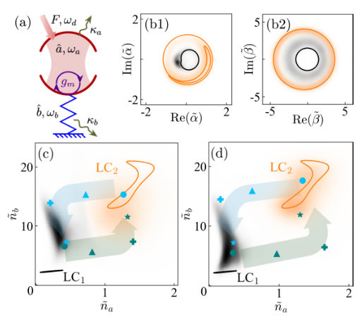
<figcaption class="paper-figure-caption"><b>Fig 1.</b> FIG. 1. Coexisting limit cycles and quantum switching in an optomechanical resonator. (a) Schematic of the driven optomechanical setup: a laser-driven cavity mode couples via radiation pressure to a mechanical oscillator. (b1,b2) The two coexisting limit cycles projected onto the complex coherent- amplitude phase spaces spanned by (Re(˜α), Im(˜α)) for the op- tical mode and (Re(˜β), Im(˜β)) for the mechanical mode. LC1 and LC2 obtained from the mean-field equations are repre- sented as black and orange solid lines, respectively. Colored density maps show empirical stationary phase-space densities reconstructed from quantum-jump trajectory ensembles for ℵ= 9, as described in Sec. II D. Black...</figcaption>
</figure>
<figure class="paper-figure-card">
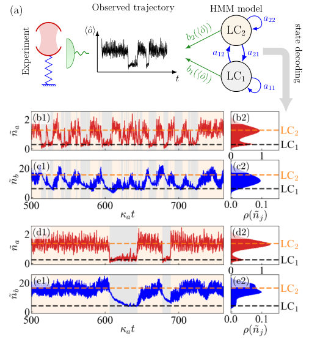
<figcaption class="paper-figure-caption"><b>Fig 2.</b> FIG. 2. State sequence inference, single-trajectory switching dynamics, and timescale separation of optical and mechan- ical populations. (a) Trajectories are analyzed with a hid- den Markov model (HMM) to extract the underlying state sequence. (b1, c1) Time traces of the trajectory-resolved rescaled expectation values ˜n(r) a , ˜n(r) b , obtained from a single quantum-jump trajectory at ℵ= 3. Red and blue indicate the cavity and mechanical populations, respectively. (d1, e1) Same quantities for ℵ= 9. Dashed horizontal lines indicate the mean populations of the metastable quantum states LC1 (black) and LC2 (orange). Black and orange shaded back- grounds show the state assignment to LC1 and...</figcaption>
</figure>
<figure class="paper-figure-card">
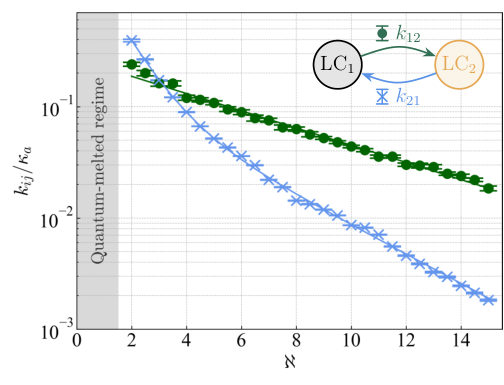
<figcaption class="paper-figure-caption"><b>Fig 3.</b> FIG. 3. Multichannel scaling of switching rates. Directional switching rates kij/κa between LCi and LCj as functions of the scaling parameter ℵ. The LC1→LC2 switching rate k12, shown in green, follows an approximately single-exponential Arrhenius dependence over the explored range of ℵ, consis- tent with activation through a single dominant escape corri- dor. The green solid line shows the fit to a single-exponential form for k12(ℵ) as given in Eq. (17), with fitted exponent S12 = 0.178 ± 0.004 and prefactor A12 = 0.267 ± 0.010. By contrast, the LC2→LC1 switching rate k21, shown in blue, ex- hibits pronounced curvature when plotted as log k21 versus ℵ, following a biexponential form that...</figcaption>
</figure>
<figure class="paper-figure-card">
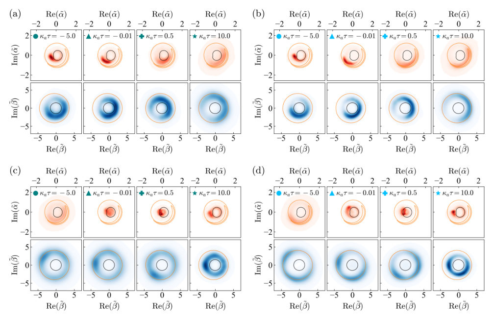
<figcaption class="paper-figure-caption"><b>Fig 4.</b> FIG. 4. Phase-space distributions of event-conditioned trajectories during limit-cycle switching events. Phase-space distri- butions conditioned on LC1→LC2 switching events for (a) ℵ= 3 and (b) ℵ= 9, and conditioned on LC2→LC1 switching events for (c) ℵ= 3 and (d) ℵ= 9. In each panel, upper and lower rows show the optical and mechanical phase spaces, respectively, with black and orange lines indicating the classical limit cycles LC1 and LC2, respectively. Columns correspond to increasing times relative to the switching event, illustrating the system before the switch (κaτ = −5.0), approaching the basin boundary (κaτ = −0.01), shortly after crossing (κaτ = 0.5), and after relaxation and...</figcaption>
</figure>
<figure class="paper-figure-card">
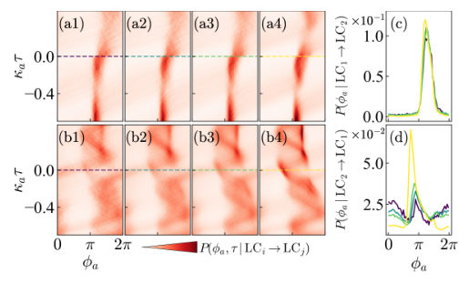
<figcaption class="paper-figure-caption"><b>Fig 5.</b> FIG. 5. Event-conditioned phase distributions during switching. Normalized event-conditioned phase distributions P(ϕa, τ | LCi →LCj) for LC1→LC2 in the upper row and LC2→LC1 in the lower row. Columns 1 −4 correspond to increasing fluctuations strengths, ℵ= 2.5, ℵ= 3.0, ℵ= 3.5, and ℵ= 9.0. (a1-a4) For LC1→LC2, the escape-phase distri- butions show strong phase localization and well-defined gate- way phases, independent of the fluctuation strength. (b1-b4) For LC2→LC1, the escape-phase distribution displays strong phase localization at small fluctuations (b4), and an emerg- ing additional broad region of escape phases as fluctuations increase (b4→b1). (c, d) Cuts at κaτ = 0, corresponding to...</figcaption>
</figure>

**Summary.** This paper investigates how quantum fluctuations drive transitions between two coexisting oscillatory states in an optomechanical system. It reveals that while one direction of escape is simple and localized, the other involves multiple competing pathways, a phenomenon termed 'multichannel quantum escape.' This discovery highlights the complex, phase-dependent geometry of metastability in driven-dissipative quantum systems.

**Why it may be interesting.** It provides a deep look into the non-equilibrium dynamics of open quantum systems, specifically how quantum fluctuations break the simplicity of classical escape by introducing multiple phase-dependent pathways, which is highly relevant to quantum optics and dissipative phase transitions.

Detailed structure

**Main problem.** Understanding the nature of quantum-induced switching (metastability) between coexisting limit cycles in driven-dissipative systems and characterizing the geometry of the resulting escape pathways.

**Main result.** The study identifies a directional asymmetry in escape: the small-amplitude cycle transitions via a single radial corridor with Arrhenius scaling, while the large-amplitude cycle involves multiple competing, phase-localized 'multichannel' escape corridors.

**Method.** The authors use quantum-jump trajectories (Monte Carlo wave-function method) combined with Hidden Markov Models (HMM) for trajectory segmentation and Kaplan-Meier estimators for survival analysis.

**Model / system.** A driven optomechanical resonator described by a Lindblad master equation, featuring a single optical mode coupled via radiation pressure to a mechanical mode, exhibiting two coexisting stable limit cycles in the semiclassical limit.

**Key observables.** Directional switching rates (k12, k21), event-conditioned phase distributions, optical and mechanical populations, and the phase-conditioned escape hazard.

**Important parameters / regimes.** The scaling parameter Aleph (controlling quantum-to-classical crossover), optical detuning, coupling strength, and dissipation rates (kappa_a, kappa_b).

**Assumptions / limitations.** Assumes a separation of timescales between fast intra-attractor relaxation and rare switching events, and assumes the switching process can be modeled as a Markovian process.

**Figures summary.** Figure 1 shows the optomechanical setup and phase-space projections of the limit cycles; Figure 3 compares switching rate scaling for both directions; Figure 5 illustrates the phase-localized vs. multimodal escape distributions; Figure 9-10 detail the HMM segmentation method.

**Paper structure.** The paper introduces the optomechanical system and the problem of limit-cycle switching, describes the quantum-to-classical scaling and trajectory methods, presents the HMM-based analysis of switching statistics, details the discovery of multichannel escape via phase-resolved analysis, and concludes with the connection to Liouvillian spectral properties.

Abstract

Driven-dissipative quantum systems can recover stable dynamical attractors in the semiclassical limit, including coexisting limit cycles. At finite fluctuation strength, this classical coexistence becomes quantum metastability: the corresponding oscillatory states undergo rare fluctuation-induced transitions. We demonstrate phase-resolved quantum escape between two such states in a driven optomechanical resonator. Unlike escape from fixed points, switching between extended attractors occurs across a periodic basin boundary and depends on the phase at which fluctuations approach it. Using quantum-jump trajectories across a controlled quantum-to-classical crossover, we reconstruct the escape geometry directly from switching events. Escape from the small-amplitude cycle proceeds through a single radial corridor and exhibits near-Arrhenius scaling, whereas escape from the large-amplitude cycle involves competing phase-localized corridors with distinct effective activation scales. The resulting curvature in the switching-rate scaling, together with event-conditioned phase distributions, identifies finite-fluctuation multichannel quantum escape between extended attractors.

[↑ back to top](#top)

### [Dispersive readout of cavity-coupled solid-state sensor with near-unity readout fidelity](http://arxiv.org/abs/2605.25152v1)

**Authors:** Hanfeng Wang, Shuang Wu, Matthew E. Trusheim, Avetik Harutyunyan, Dirk R. Englund  
**Type:** theory · **Category:** other · **PDF:** <https://arxiv.org/pdf/2605.25152v1>  
**Analysis basis:** full PDF text, analyzed in chunks
**Topic relevance:** 🔥 `Tavis-Cummings & cavity-many-emitter` **4/5** · 🔥 `quantum measurements` **4/5** · 🔥 `spintronics-quantum-optics interface` **4/5** · `methods for driven-dissipative` **2/5**

↔ Scroll figures horizontally

<figure class="paper-figure-card">
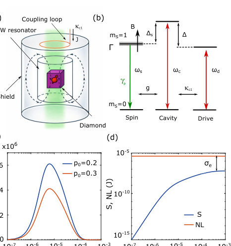
<figcaption class="paper-figure-caption"><b>Fig 1.</b> FIG. 1. NV-cQED dispersive readout. (a) Schematic of the NV-cQED system. A diamond containing an NV en- semble is placed at the center of a dielectric resonator. The cavity field α is detected via a coupling loop with an external coupling rate κc1. The system is enclosed within a microwave shield. (b) NV–cavity energy-level structure. (c) Time dy- namics of the cavity quadrature Im[α] for initial excited-state populations p = 0.2 (blue) and p = 0.3 (red). (d) Time dynamics of signal S (blue) and the product NL (red) as a function. The ratio of noise and signal is defined as the in- verse readout fidelity σe.</figcaption>
</figure>
<figure class="paper-figure-card">
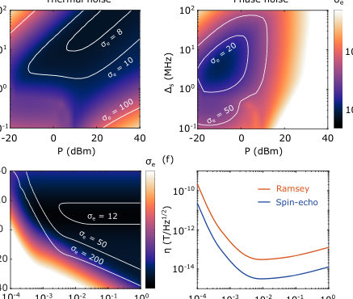
<figcaption class="paper-figure-caption"><b>Fig 2.</b> FIG. 2. Inverse readout fidelity and sensitivity perfor- mance. (a) Signal S (blue) and inverse readout fidelity σe (red) as functions of the spin–cavity detuning ∆s. Simula- tion parameters: κc = 2π × 130 kHz, κc1 = 2π × 130 kHz, gs = 2π × 0.019 Hz, N = 1015, and Γ = 2π × 330 kHz. Time-domain simulations are employed to capture the regime ∆s ∼Γ. Those parameters are accessible with experiments [23]. Solid line: σe limited by thermal noise. Dashed line: σe including phase noise. (b) Ratio R between phase noise and thermal noise as a function of input power P. (c,d) σe as a function of input power P and detuning ∆s with fixed measurement time t = 1 ms limited by thermal noise (c) or phase...</figcaption>
</figure>
<figure class="paper-figure-card">
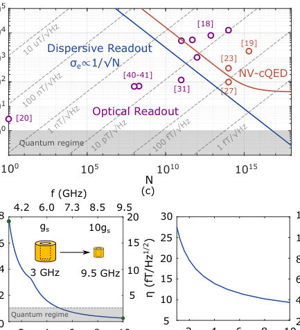
<figcaption class="paper-figure-caption"><b>Fig 3.</b> FIG. 3. Approaching SQL. (a) The inverse readout fidelity σe as a function of spin number N. The previous work based on the optically detected magnetic resonance is marked as purple. The continuous-wave readout initially exhibits a sen- sitivity scaling of σe ∝1/ √</figcaption>
</figure>

**Summary.** This paper proposes a dispersive readout technique for NV ensemble-based quantum sensors to overcome the limitations of spin saturation and power broadening. The method achieves near-unity readout fidelity and femtotesla-level sensitivity. Crucially, it shows that the readout sensitivity scales favorably with the number of spins, approaching the standard quantum limit.

**Why it may be interesting.** It provides a theoretical pathway to reach the Standard Quantum Limit in ensemble-based sensors and explores the nonlinear dynamics of the transition between the deeply dispersive and intermediate regimes in open quantum systems.

Detailed structure

**Main problem.** Existing continuous-wave cavity QED readout for NV ensemble sensors is limited by spin saturation and power broadening, preventing them from reaching the intrinsic spin-projection-noise limit.

**Main result.** The authors demonstrate a dispersive cQED readout technique that achieves near-unity readout fidelity and femtotesla-level magnetic sensitivity, with a scaling of sensitivity that improves as 1/N.

**Method.** A comprehensive Maxwell-Bloch framework using the quantum master equation and Lindbladian formalism is developed, supplemented by time-domain simulations to capture dynamics in the intermediate detuning regime.

**Model / system.** A solid-state quantum sensor consisting of a diamond NV ensemble coupled to a microwave cavity mode in a cQED configuration, described by a Hamiltonian involving cavity-probe detuning and collective spin-cavity coupling.

**Key observables.** Cavity quadrature (Im[alpha]), signal (S), inverse readout fidelity (sigma_e), and magnetic sensitivity (eta).

**Important parameters / regimes.** Single-photon coupling strength (gs), collective coupling (g), spin-cavity detuning (delta_s), cavity decay rate (kappa), and spin decoherence rate (Gamma).

**Assumptions / limitations.** The model assumes a homogeneous spin ensemble and utilizes an adiabatic approximation for spin coherence on timescales longer than the cavity or spin relaxation rates.

**Figures summary.** Fig 2 shows inverse readout fidelity; Fig 3(a) presents the semiclassical model, 3(b) plots fidelity and sensitivity against scaled coupling, and 3(c) shows the effect of increasing the cavity quality factor.

**Paper structure.** The paper introduces the limitations of current NV-cQED readout, presents a theoretical framework for dispersive readout, analyzes the dynamics and noise sources (thermal and phase), evaluates scaling with spin number and coupling strength, and discusses future experimental implications.

Abstract

Solid-state quantum sensors based on ensembles of nitrogen-vacancy (NV) centers in diamond have emerged as powerful platforms for high-precision metrology. Coupling the NV ensemble to a microwave cavity mode in a cavity quantum electrodynamics (cQED) configuration enables spin readout that surpasses the limitations of conventional optical detection, achieving sub-picotesla magnetic sensitivities. However, existing continuous-wave cQED approaches remain far from the intrinsic spin-projection-noise limit due to spin saturation and power broadening. Here, we introduce a dispersive cQED readout technique to overcome these fundamental limitations in NV ensemble sensing. We develop a comprehensive theoretical framework describing the dispersive interaction and analyze the time-domain dynamics of a strongly-coupled NV-cavity system. Our results indicate near-unity inverse readout fidelity and femtotesla-level sensitivity using a commercially available diamond NV ensemble. Importantly, the dispersive readout exhibits a distinct sensitivity scaling that improves as 1/N with increasing number of spins N, providing a practical pathway toward approaching the standard quantum limit for solid-state spin-ensemble sensors.

[↑ back to top](#top)

### [Minimally Destructive Fast Imaging of Single Atoms in an Optical Tweezer Array with Coherent Excitation](http://arxiv.org/abs/2605.24175v1)

**Authors:** Rei Yokoyama, Takumi Kashimoto, Kosuke Shibata, Yuki Kawamura, Toshi Kusano, Chih-Han Yeh, Reiji Asano, Yuma Nakamura, Tetsushi Takano, Yosuke Takasu, Yoshiro Takahashi  
**Type:** experiment · **Category:** other · **PDF:** <https://arxiv.org/pdf/2605.24175v1>  
**Analysis basis:** full PDF text, analyzed in chunks
**Topic relevance:** 🔥 `QC/QI experiment` **4/5** · 🔥 `quantum measurements` **4/5** · 🔥 `quantum optics experiment` **4/5** · `Rydberg arrays` **2/5**

↔ Scroll figures horizontally

<figure class="paper-figure-card">
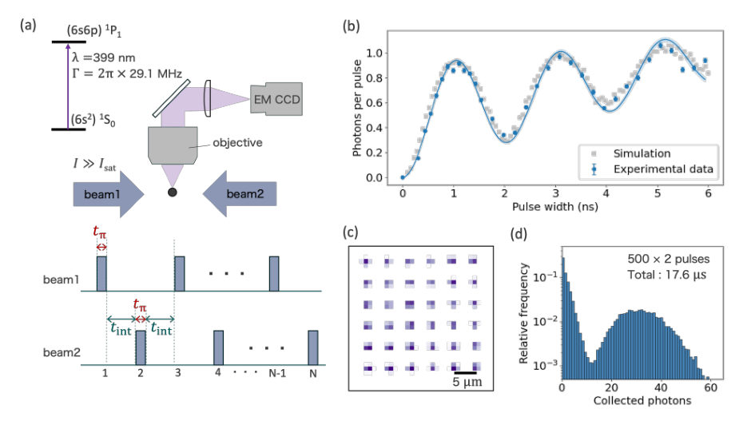
<figcaption class="paper-figure-caption"><b>Fig 1.</b> FIG. 1. Imaging of a 174Yb atom array with coherent excitation. (a) Schematic of the experimental setup and pulse sequence. An array of 174Yb atoms is addressed by a series of π-pulses resonant with the 1S0 ↔1P1 399 nm transition at an intensity I ≫Isat at intervals of tint. The spontaneously emitted photons are collected by a high NA = 0.6 and imaged onto an EM-CCD camera. Relevant energy levels and transition of 174Yb are shown on the upper left. (b) Observation of Rabi oscillations via fluorescence detection as a function of pulse width. The experimental data are represented by circles and the error bars are the 1-σ standard error of the mean. The fit of the data with the semiclassical...</figcaption>
</figure>
<figure class="paper-figure-card">
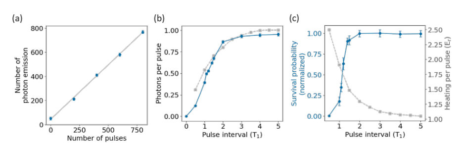
<figcaption class="paper-figure-caption"><b>Fig 2.</b> FIG. 2. Systematic investigation of the coherent excitation scheme. (a) Number of emitted photons measured as a function of the number of pulses. The detected photon counts are converted into the number of spontaneously emitted photons using the estimated photon collection efficiency of our imaging setup. The experimental data are represented by circles. A linear fit yields a emission rate of 0.90(2) photons per pulse. (b,c) Dependence of the emitted photon count per pulse (b) and normalized survival probability (c) on the pulse interval, using a sequence of 800 pulses. Suppression in both signals at shorter intervals indicates that stimulated emission occurs before spontaneous decay,...</figcaption>
</figure>
<figure class="paper-figure-card">
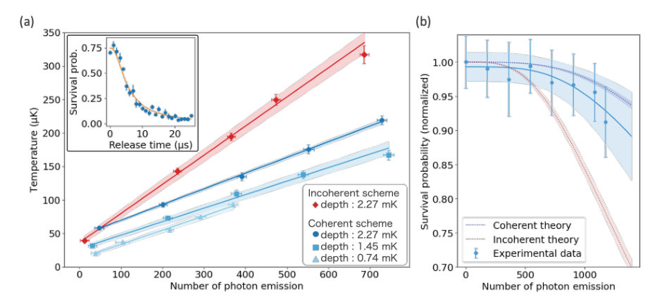
<figcaption class="paper-figure-caption"><b>Fig 3.</b> FIG. 3. Heating rates during imaging with coherent and incoherent excitation schemes. (a) Evolution of the atomic temperature as a function of the number of pulses, measured via the release-and-recapture method. Number of photon emission is extracted from detected counts by accounting for photon collection efficiency. The data with blue and red circles represent the results in the cases of coherent and incoherent excitation at the trap depth of 2.27 mK, respectively. For the coherent excitation scheme, the experiments are also performed at trap depths of 1.45 mK (blue square) and 0.74 mK (blue triangle) to investigate the effect of DFF. Inset: A representative measurement with the...</figcaption>
</figure>
<figure class="paper-figure-card">
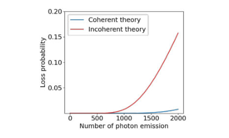
<figcaption class="paper-figure-caption"><b>Fig 4.</b> FIG. 4. Calculated loss probability as a function of number of photon emission with initial atomic temperature of 30 µK and trap depth of 2.27 mK. The blue (red) line represents the result of imaging with coherent (incoherent) excitation scheme.</figcaption>
</figure>
<figure class="paper-figure-card">
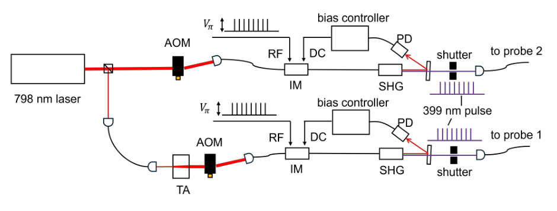
<figcaption class="paper-figure-caption"><b>Fig 5.</b> FIG. 5. Optical setup for the short and intense probe beams. See text for the basic configuration. The Intensity Modulators (IM) generate the sub-nano second pulses for 798 nm light through the pulse input with the voltage Vπ corresponding to the π-pulse from the RF ports, whereas the DC ports are used for the bias control to minimize leakage light. The shutters are placed before the input for the optical fibers. AOM, TA, RF, DC, SHG, and PD represents acousto-optic modulators, tapered-amplifiers, radio-frequency, direct current, second-harmonic-generation, and photo-detectors, respectively.</figcaption>
</figure>

**Summary.** This paper presents a new method for imaging single atoms in optical tweezers using coherent pi-pulses instead of traditional incoherent excitation. This approach significantly reduces heating and allows for extremely fast imaging in the microsecond regime. Such a technique is crucial for scaling up quantum computers based on neutral atom arrays by enabling faster error correction and higher-fidelity measurements.

**Why it may be interesting.** This work is highly relevant for researchers in quantum optics and AMO physics as it provides a way to bypass the fundamental heating limits of stochastic photon absorption, enabling much faster readout and higher-fidelity control in neutral atom quantum computing platforms.

Detailed structure

**Main problem.** Traditional fluorescence imaging of single atoms in optical tweezers causes significant heating due to the stochastic nature of photon absorption, which limits imaging speed and atom survival. The goal is to develop a minimally destructive, microsecond-scale imaging scheme that reduces heating.

**Main result.** The authors demonstrated a coherent excitation scheme using alternating pi-pulses that achieves a 99.89% imaging fidelity and a 98.80% survival probability in just 17.6 microseconds. This method reduces the heating rate to approximately half of that seen in traditional incoherent excitation schemes.

**Method.** The researchers used deterministic coherent excitation via a sequence of 1.1 ns-long pi-pulses from counter-propagating directions using a 399 nm UV laser. They employed a release-and-recapture method and an adiabatic trap-depth ramp-down technique to measure atomic temperature and heating rates.

**Model / system.** The experimental platform consists of Ytterbium-154 atoms trapped in a 2D optical tweezer array using 532 nm light. The imaging utilizes the 1S0 to 1P1 transition at 399 nm.

**Key observables.** Photon counts (integrated fluorescence), discrimination fidelity, survival probability, atomic temperature, and heating rate per photon.

**Important parameters / regimes.** Imaging duration of 17.6 microseconds, pi-pulse width of 1.1 ns, trap depth of 2.27 mK, and a 399 nm transition wavelength.

**Assumptions / limitations.** The analysis assumes the fluorescence per pulse is independent (atom starts in ground state) and uses a 1D model for the physics of atom escape from the trap.

**Figures summary.** Fig 1 shows the experimental setup and pi-pulse sequence; Fig 2 shows the linear dependence of photons on pulse number and the effect of pulse intervals on survival; Fig 3 compares heating rates and temperature evolution for coherent vs. incoherent schemes; Fig 4 shows calculated loss probability.

**Paper structure.** The paper introduces the problem of heating in atom imaging, describes the experimental setup and the proposed coherent pi-pulse scheme, presents results confirming coherent excitation via Rabi oscillations, compares heating rates between coherent and incoherent methods, investigates potential heating mechanisms like Dipole Force Fluctuation, and concludes with the implications for scalable quantum technologies.

Abstract

Ultracold neutral atoms in an optical lattice and an optical tweezer array offer highly-controllable quantum many-body systems, utilized for various quantum science and technology such as quantum computing, quantum metrology, and quantum simulation. By combining high-fidelity imaging of individual atoms, one can further enhance the capability of such experimental platforms as quantum gas microscopes, tweezer clocks, and tweezer-array-based quantum computers. In this work, we propose a minimally destructive single-atom imaging by deterministic coherent excitation of atoms with alternately applied pi-pulses from counter-propagating directions, mitigating the fundamental heating effect associated with the stochastic absorption process. Using ytterbium-174 atoms trapped in an optical tweezer array, we experimentally demonstrate fast and low-loss single-atom imaging with a discrimination fidelity of 99.89(5) % and a survival probability of 98.80(44) % in 17.6 microseconds. Importantly, our scheme exhibits the lower heating rate, about half of that of the former scheme utilizing the incoherent excitation. This fast and minimally destructive imaging scheme is beneficial for relaxing the requirement on the trap depth, thereby enabling scalable atom imaging across a wide range of quantum science platforms.

[↑ back to top](#top)

### [On the Relation Between String Order Parameters, Entanglement, and Dynamical Quantum Phase Transitions in Topological Dynamics](http://arxiv.org/abs/2605.25611v1)

**Authors:** Sirshendu Bhattacharyya, Szczepan Głodzik, Nicholas Sedlmayr  
**Type:** theory · **Category:** statistical mechanics · **PDF:** <https://arxiv.org/pdf/2605.25611v1>  
**Analysis basis:** full PDF text, analyzed in chunks
**Topic relevance:** 🔥 `entanglement & information structure` **4/5** · 🔥 `non-equilibrium dynamics` **4/5** · `driven-dissipative phase transition` **3/5** · `non-equilibrium universality` **3/5**

↔ Scroll figures horizontally

<figure class="paper-figure-card">
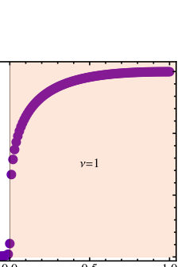
<figcaption class="paper-figure-caption"><b>Fig 1.</b> Figure 1. Plots of M vs δ for the SSH model in equilibrium for N = 103. One can see that in the topologically trivial phase, where ν = 0, M = 0. For the topologically non-trivial phase ν = 1 we find M ̸= 0.</figcaption>
</figure>
<figure class="paper-figure-card">
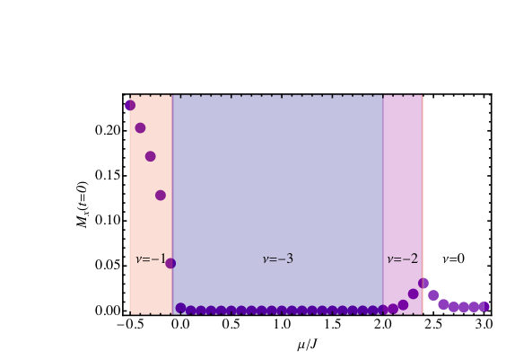
<figcaption class="paper-figure-caption"><b>Fig 2.</b> Figure 2. Plots of Mx vs µ for N = 1000 for the ground state of the extended Kitaev model with J = (1, 1, 1)J, ∆= (1.2, 1.4, 1.6)J. In the ν = −1 phase the string order parameter Mx ̸= 0 as expected. In all other phases it is zero. We note though that near the gap-closing point be- tween ν = −2 and ν = 0 finite size effects are large and Mx has still not fully converged to zero. In Fig. 3 we demonstrate the scaling of Mx for the representative points in the phase diagram we will use in the quenches.</figcaption>
</figure>
<figure class="paper-figure-card">
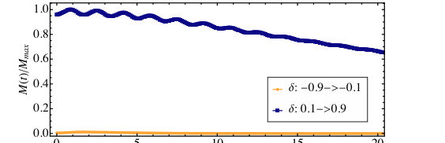
<figcaption class="paper-figure-caption"><b>Fig 3.</b> Figure 5. Plots of M(t) for quenches in the SSH model within topological phases, as marked on the panels. The system size is N = 200. Small oscillations can be seen, but no zeroes occur and similarly there are no DQPTs, and hence no such critical times.</figcaption>
</figure>
<figure class="paper-figure-card">
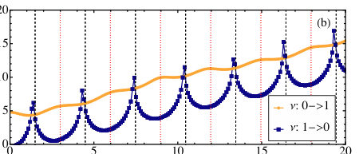
<figcaption class="paper-figure-caption"><b>Fig 4.</b> Figure 4. Plots of M(t) for quenches in the SSH model with |δ| = 0.4, as marked on the panels. The system size is N = 200. Vertical dashed black lines show the DQPT critical times and red dotted lines are plotted half way between the critical times as a visual aid. Panel (a) is the string order parameter rescaled by its maximum value, and panel (b) is the ln of the string order parameter. Zeroes are clearly visible in the non- trivial to trivial quench, ν : 1 →0 where δ : 0.4 →−0.4. The zeroes occur approximately at the DQPT critical times. The opposite quench shows small oscillations with a similar period, but no zeroes.</figcaption>
</figure>
<figure class="paper-figure-card">
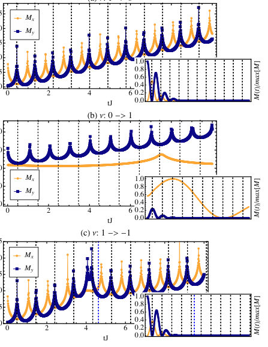
<figcaption class="paper-figure-caption"><b>Fig 5.</b> Figure 7. Plots of Mx,y(t) for different quenches, as labeled on the figures. Results are for the Kitaev chain with R = 1 and N = 350, see Sec. III A for details of the parameters. In- sets show Mx,y(t) rescaled by its maximum and main panels show the log to highlight location of the zeroes. Interesting to note in panel (a) is that both Mx(t) and My(t) have some interesting dynamics, despite the quench being ν : 1 →0, i.e. for two phase where Mx = 0 in both. See main text for further discussion. Vertical dashed lines show the DQPT critical times, with different colors referring to distinct critical momenta.</figcaption>
</figure>

**Summary.** This paper shows that the zeroes of string order parameters and entanglement spectrum crossings do not generally coincide with the critical times of dynamical quantum phase transitions. While some coincidences appear in simple models like the SSH model, more complex topological models reveal that these different types of dynamical criticality are fundamentally independent.

**Why it may be interesting.** This is highly relevant for many-body dynamics as it challenges the assumption that non-local order parameters or entanglement features can be used as universal proxies for identifying the precise timing of dynamical phase transitions.

Detailed structure

**Main problem.** The study investigates whether string order parameters (SOP) and entanglement spectrum crossings can serve as reliable experimental probes for the critical times of dynamical quantum phase transitions (DQPT) following a quantum quench.

**Main result.** The authors demonstrate that there is no general quantitative or qualitative connection between the critical times of DQPTs, SOP zeroes, and entanglement spectrum crossings, showing that these forms of dynamical criticality behave independently.

**Method.** The researchers use analytical derivations (Wick's theorem and Toeplitz determinants) and numerical simulations (diagonalization and finite-size scaling) to study the time evolution of observables after a sudden quench.

**Model / system.** The study focuses on one-dimensional topological models, specifically the Su-Schrieffer-Heeger (SSH) model and the extended Kitaev chain with varying winding numbers.

**Key observables.** String order parameters (Ox, Oy), entanglement spectra (eigenvalues and crossings), Loschmidt amplitude/echo, and return rate.

**Important parameters / regimes.** Dimerization parameter (delta), chemical potential (mu), winding number (nu), and system size (N).

**Assumptions / limitations.** The dynamics are studied under the assumption of an instantaneous (sudden) quench, and the models are limited to simple two-band chiral-symmetric systems.

**Figures summary.** Figures show equilibrium string order parameters, the time evolution of SOP and entanglement eigenvalues in the SSH model, and the lack of coincidence between critical times in the extended Kitaev chain.

**Paper structure.** The paper introduces the problem of connecting different dynamical criticalities, presents the SSH model as an initial case, extends the analysis to more complex Kitaev chains to test generality, and concludes by discussing the independence of these dynamical phenomena.

Abstract

Topological order is defined by topological invariants, rather than symmetries and local order parameters. Nonetheless some topological phases can be characterized by string order parameters and entanglement. In this article we study how string order parameters and entanglement spectra behave out-of-equilibrium following quenches in one dimensional topological models with $\mathbb{Z}$ invariants. Previously it has been suggested that string order parameters could serve as an experimental probe of dynamical quantum phase transitions. Despite the existence of clear zeroes in the order parameters at critical times, we show that in general there is no exact quantitative or qualitative connection with the critical times of dynamical quantum phase transitions. Another possible connection is of dynamical string order parameter zeroes and dynamical crossings at the center of entanglement spectra. Here we see that there can sometimes be a connection, but it is not typical. Again there is no general quantitative or qualitative connection. Each dynamical form of criticality behaves independently, though we do see that critical times tend to be of the same order of magnitude and give an argument for why this is the case. We also find that a string order parameter which labels one topological phase can undergo non-trivial dynamics even following a quench between \emph{other} topological phases. We elucidate where connections can be made, and where they result from a consideration of insufficiently general models. These results cast doubt on the idea of genuine dynamical phases following quenches in such models.

[↑ back to top](#top)

### [Dissipative acousto-mechanical parametric interface between high-overtone acoustics and flexural phonons](http://arxiv.org/abs/2605.24581v1)

**Authors:** Xun Ji, Huanying Sun, Longhao Wu, Qichun Liu, Yulong Liu, Mika A. Sillanpää, Tiefu Li  
**Type:** experiment · **Category:** quantum information and computing · **PDF:** <https://arxiv.org/pdf/2605.24581v1>  
**Analysis basis:** full PDF text, analyzed in chunks
**Topic relevance:** 🔥 `correlated / nonlocal dissipation` **4/5** · `QC/QI experiment` **3/5** · `driven-dissipative phase transition` **2/5** · `non-equilibrium dynamics` **2/5** · `quantum optics experiment` **2/5**

↔ Scroll figures horizontally

<figure class="paper-figure-card">
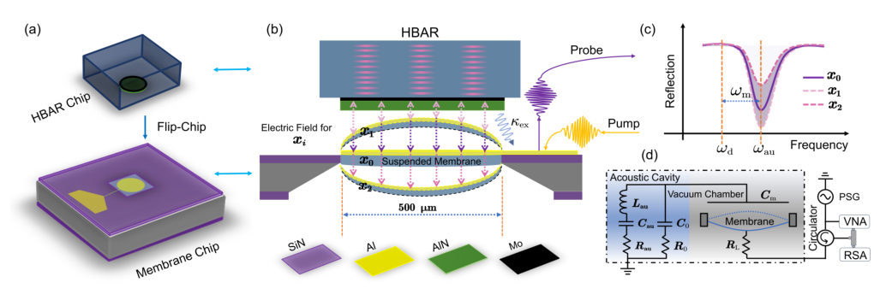
<figcaption class="paper-figure-caption"><b>Fig 1.</b> FIG. 1. (a) Schematic of the dissipative acousto-mechanical interface (not to scale), featuring a high-overtone bulk acoustic resonator (HBAR) and a SiN membrane mechanical resonator integrated via flip-chip bonding. (b) Conceptual illustration of the coupling: the flexural dis- placement of the membrane modulates the HBAR’s external dissipation rate κex. (c) Schematic of the probed reflection spectra |S11| for varying membrane displacements xi (x0 &lt; x1 &lt; x2). The varying attenuation directly manifests the dissipative coupling. (d) Equivalent lumped-element circuit and experimental configuration. All measurements are conducted at room temperature in a high-vacuum chamber. PSG: multi-channel...</figcaption>
</figure>
<figure class="paper-figure-card">
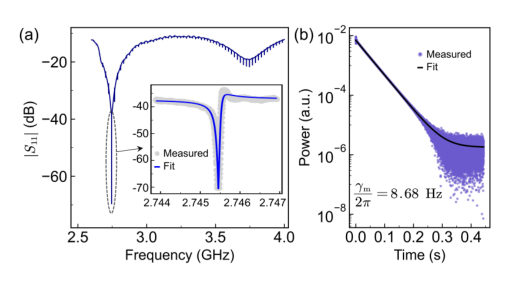
<figcaption class="paper-figure-caption"><b>Fig 2.</b> FIG. 2. (a) Microwave reflection spectra |S11| of selected HBAR modes. The inset shows a zoomed-in view of an acoustic mode along with its Lorentzian fit. (b) Ringdown measurement of the fundamen- tal flexural mechanical mode of the SiN membrane.</figcaption>
</figure>
<figure class="paper-figure-card">
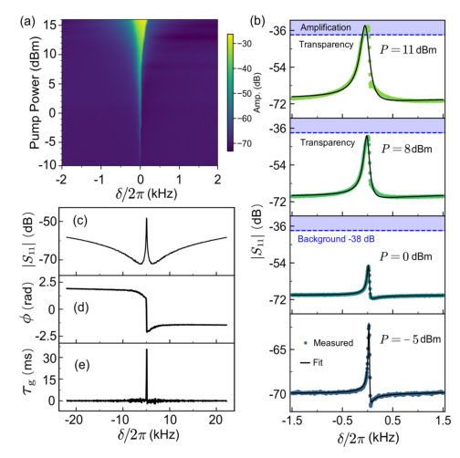
<figcaption class="paper-figure-caption"><b>Fig 3.</b> FIG. 3. (a) Reflection spectra |S11| of the AMIT window (color scale) as a function of red-detuned pump power. (b) Detailed view of the transition region from (a) for selected drive powers with the fitted AMIT (red lines). (c)–(e) Measured transparency window character- istics at a pump power of 3 dBm. (c) the transmission amplitude of the AMIT peak, (d) the accompanying steep phase dispersion, and (e) the resulting group delay τg calculated from the phase derivative.</figcaption>
</figure>
<figure class="paper-figure-card">
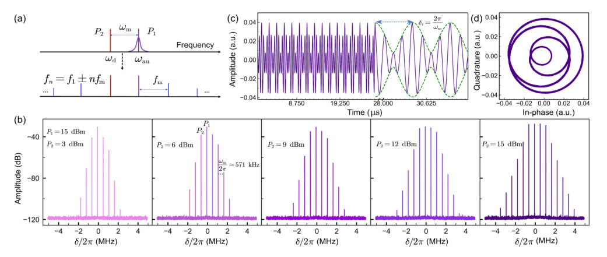
<figcaption class="paper-figure-caption"><b>Fig 4.</b> FIG. 4. (a) Schematics of the two-tone pumping configuration, consisting of a resonant drive (P1) and a red-sideband drive (P2 at ∆≈−ωm). (b) Evolution of the AFC spectra measured by RSA under varying pump powers, with P1 = 15 dBm fixed and P2 varied. Controllable tooth counts and equidistant sidebands are observed. (c) Time-domain trace of the in-phase component, exhibiting clear periodic oscillations with δt = 1.75 µs. (d) Lissajous figure reconstructed from the IQ amplitudes, where the closed and stable orbits verify the long-range phase coherence of the generated frequency combs.</figcaption>
</figure>

**Summary.** The researchers created a hybrid device that links high-frequency acoustic waves to low-frequency vibrations using a dissipative coupling mechanism. This setup allows for the generation of acoustic frequency combs and transparency windows at room temperature. It provides a scalable platform for future phononic information processing and quantum acoustics.

**Why it may be interesting.** It demonstrates a high-ratio dissipative coupling regime and room-temperature nonlinear phonon dynamics, which are highly relevant for developing scalable, on-chip quantum-classical interfaces and many-body phononic networks.

Detailed structure

**Main problem.** Achieving efficient nonlinearity and parametric interaction between high-frequency GHz HBAR modes and low-frequency sub-MHz flexural membrane modes for scalable phononic information processing.

**Main result.** Demonstration of a dissipative-dominated acousto-mechanical interface where the dissipative coupling strength is 20 times larger than the dispersive coupling, enabling acoustic frequency combs and induced transparency.

**Method.** A flip-chip assembly using microwave reflection spectroscopy (|S11|), two-tone driving, and time-domain analysis of I/Q components to observe nonlinear acoustic phenomena.

**Model / system.** A hybrid architecture integrating a high-overtone bulk acoustic wave resonator (HBAR) on sapphire with a low-frequency SiN membrane. The system is modeled using a modified Butterworth-Van Dyke circuit and a system-bath interaction Hamiltonian.

**Key observables.** Acousto-mechanically induced transparency (AMIT), acousto-mechanically induced amplification (AMIA), Kerr nonlinearity, and acoustic frequency combs.

**Important parameters / regimes.** HBAR frequency ~2.74 GHz, membrane frequency ~571.5 kHz, dissipative-to-dispersive coupling ratio ~20, and resolved-sideband regime at room temperature.

**Assumptions / limitations.** The system operates in the resolved-sideband regime and assumes the mechanical displacement primarily modulates the external dissipation rate.

**Figures summary.** The notes mention Figure 1 and Figure 4(d), which likely detail the device architecture and the verification of the modulation period matching the mechanical cycle.

**Paper structure.** The paper introduces the challenge of HBAR nonlinearity, describes the hybrid HBAR-membrane platform, presents the mathematical model for dissipative coupling, details the experimental observation of AMIT and frequency combs, and discusses scalability for quantum phononics.

Abstract

High-overtone bulk acoustic wave resonators (HBARs) promise advanced phononics, yet achieving nonlinearity remains challenging. We demonstrate a radiation-pressure-type parametric interaction between GHz HBARs and low-frequency flexural modes in a suspended silicon nitride membrane, where mechanical displacement modulates the external dissipation rate to enable dissipative acousto-mechanical coupling. Benefiting from the high quality factor, the system enters the resolved-sideband regime at room temperature, yielding acousto-mechanically induced transparency. We observe tunable Kerr nonlinearity and generate coherent HBAR frequency combs via two-tone driving. Notably, our dissipative coupling strength is 20 times larger than the dispersive coupling, the highest ratio among reported hybrid dissipative-dispersive coupling systems, resulting in the experimental observation of amplification in the reflection spectra under red-sideband driving. The ability to interface dense HBAR modes with a common mechanical resonator provides a scalable on-chip platform for multimode phononic information processing, with quantum phononics potentially achievable at sub-Kelvin temperatures.

[↑ back to top](#top)

### [Integrated photon-pair sources on periodically poled thin-film lithium tantalate](http://arxiv.org/abs/2605.24988v1)

**Authors:** Sakthi Sanjeev Mohanraj, Xiaodong Shi, Ran Yang, Lin Zhou, Di Zhu  
**Type:** experiment · **Category:** quantum information and computing · **PDF:** <https://arxiv.org/pdf/2605.24988v1>  
**Analysis basis:** full PDF text, analyzed in chunks
**Topic relevance:** 🔥 `QC/QI experiment` **4/5** · 🔥 `quantum optics experiment` **4/5** · `interference shaping light` **3/5** · `entanglement & information structure` **2/5**

↔ Scroll figures horizontally

<figure class="paper-figure-card">
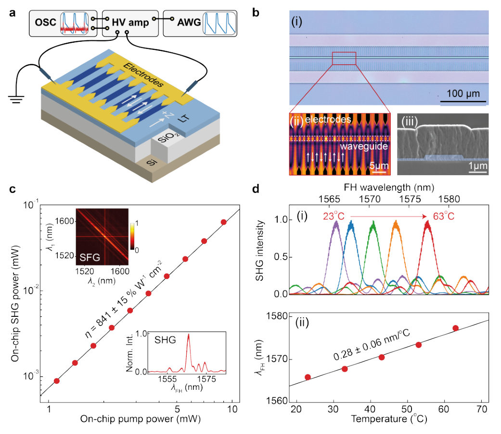
<figcaption class="paper-figure-caption"><b>Fig 1.</b> FIG. 1. Classical characterization of periodically poled lithium tantalate (PPLT) nanophotonic waveguide. a, (i) Schematic illustration of the electrical poling process on thin-film lithium tantalate (TFLT). AWG: arbitrary waveform generator, HV amp: high-voltage amplifier, OSC: oscilloscope. b, (i) Optical micrograph of the PPLT nanophotonic waveguide, (ii) second-harmonic generation (SHG) confocal micrograph of the inverted domains after waveguide fabrication, and (iii) scanning electron micrograph (SEM) of the waveguide cross-section. c, On-chip SHG power as a function of pump power with normalized conversion efficiency of 841 ± 15 %W−1cm−2 in a 3-mm-long PPLT waveguide. Insets: measured...</figcaption>
</figure>
<figure class="paper-figure-card">
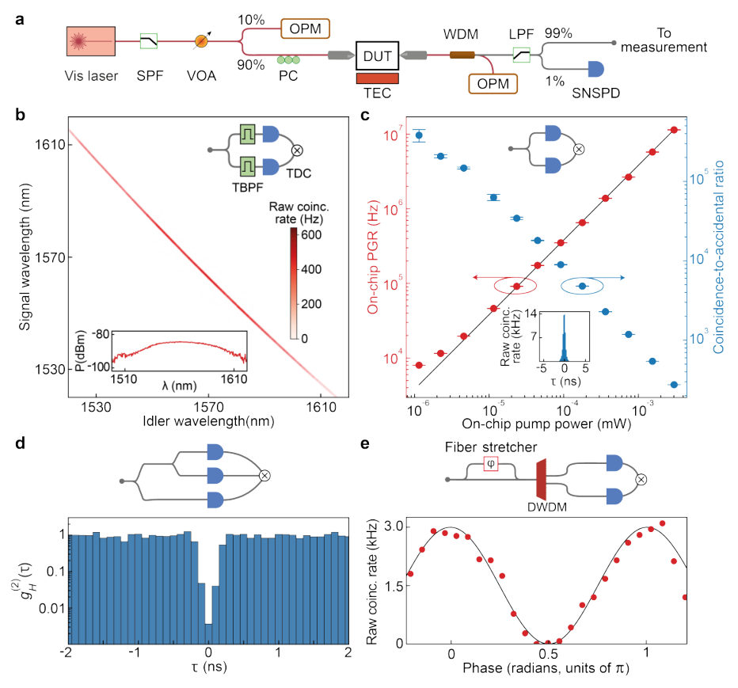
<figcaption class="paper-figure-caption"><b>Fig 2.</b> FIG. 2. Nonclassical characterization of PPLT nanophotonic waveguide. a, Measurement setup for photon-pair generation. Vis laser: visible laser, SPF: short-pass filter, VOA: variable optical attenuator, OPM: optical power meter, PC: polarization controller, DUT: device under test, TEC: thermoelectric cooler, WDM: wavelength division multiplexer, LPF: long-pass filter, SNSPD: superconducting nanowire single-photon detector. b, Joint spectral intensity of the photon pairs with insets of the detection scheme (top) and SPDC spectrum obtained by optical spectrum analyzer (bottom). c, On-chip photon-pair generation rate (PGR) and coincidence-to-accidental ratio (CAR) as a function of pump power,...</figcaption>
</figure>
<figure class="paper-figure-card">
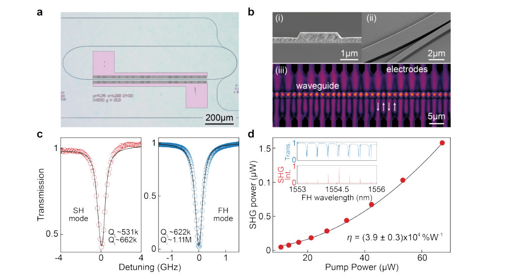
<figcaption class="paper-figure-caption"><b>Fig 3.</b> FIG. 3. Classical characterization of PPLT racetrack resonator. a, Optical micrograph of PPLT racetrack resonator. b, SEM images of (i) waveguide cross-section and (ii) ring-bus waveguide coupling region, and (iii) SHG confocal microscopy image of the periodically poled region. c, Normalized transmission spectra of the SH and FH modes along with their respective quality factors. d, On-chip SHG power as a function of pump power with the normalized conversion efficiency of (3.9 ± 0.3) × 104 %W−1. Insets: PPLT racetrack transmission around FH wavelength showing 50 GHz free spectral range (FSR) and normalized SHG spectrum showing the optimal phase-matching wavelength.</figcaption>
</figure>
<figure class="paper-figure-card">
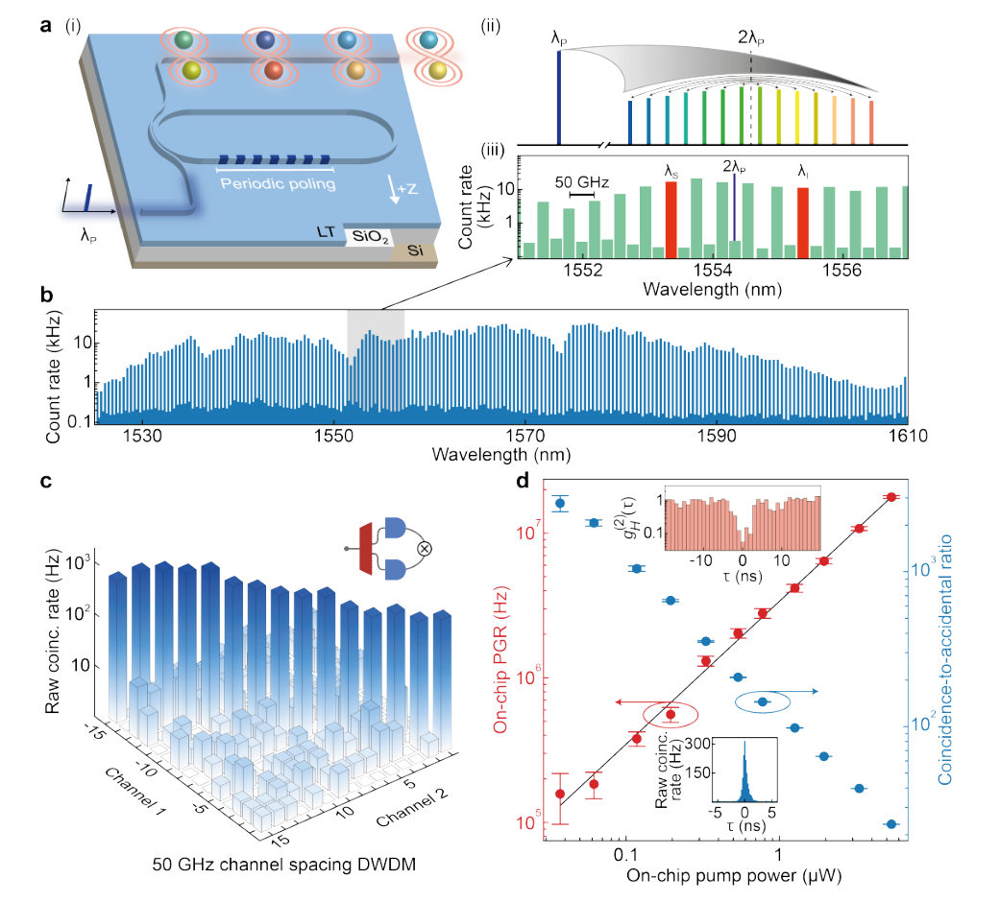
<figcaption class="paper-figure-caption"><b>Fig 4.</b> FIG. 4. Non-classical characterization of PPLT racetrack resonator. a, (i) Schematic illustration of cavity enhanced SPDC process in TFLT racetrack resonator. (ii) The pump at wavelength of λp gives rise to comb-like discrete photon pairs centered near 2λp. (iii) Zoomed-in section of a measured quantum frequency comb indicating the 50 GHz comb line spacing and the signal-idler pair chosen for the measurements. b, Measured quantum frequency comb in the PPLT racetrack. c, Joint spectral intensity of the photon pairs, reconstructed from correlations across 30 DWDM channels with 50 GHz frequency spacing, displaying strong frequency correlation. d, On-chip PGR (red) with pair generation...</figcaption>
</figure>

**Summary.** This paper reports the first demonstration of photon-pair generation via spontaneous parametric down-conversion on a thin-film lithium tantalate platform. By using periodically poled waveguides and resonators, the authors achieved high-purity single photons and high-fidelity entanglement. This establishes TFLT as a competitive material for integrated quantum photonic circuits and wavelength-multiplexed quantum communications.

**Why it may be interesting.** This work is highly relevant to quantum optics and quantum information because it establishes a new, high-performance integrated platform for generating entangled photon pairs and quantum frequency combs, essential for scalable quantum networks.

Detailed structure

**Main problem.** The lack of demonstrated spontaneous parametric down-conversion (SPDC) based photon-pair generation on the thin-film lithium tantalate (TFLT) platform, which is a promising candidate for scalable quantum light generation.

**Main result.** The authors demonstrated the first SPDC photon-pair generation in TFLT using both straight waveguides and racetrack resonators, achieving high-purity single photons and high-fidelity time-energy entanglement.

**Method.** The researchers used periodic poling for quasi-phase matching in TFLT, combined with electron-beam lithography and dry etching. Characterization involved SHG/SFG spectroscopy, joint spectral intensity reconstruction, and Franson-type interferometry.

**Model / system.** The experimental platform consists of periodically poled thin-film lithium tantalates (PPLT) in both traveling-wave (straight waveguides) and resonant (racetrack resonator) configurations.

**Key observables.** Photon-pair generation rate (PGR), coincidence-to-accidental ratio (CAR), heralded second-order correlation g2_H(0), Franson interference visibility, and joint spectral intensity (JSI).

**Important parameters / regimes.** Pair generation efficiency of 2.1 GHz mW^-1, CAR up to 3.8e5, g2_H(0) of 0.0018, and Franson visibility of 98.9%.

**Figures summary.** Fig 1: Fabrication process, device micrographs, and classical SHG/SFG characterization. Fig 2: Quantum characterization of waveguides including PGR and g2_H(tau). Fig 3: SHG power dependence. Fig 4: Quantum characterization of racetrack resonators.

**Paper structure.** The paper introduces the TFLT platform, details the fabrication and poling process, presents classical characterization of nonlinearities, demonstrates quantum photon-pair generation in waveguides, extends the demonstration to microresonators for frequency combs, and concludes with the platform's potential for quantum communications.

Abstract

Chip-integrated photon-pair sources based on spontaneous parametric down-conversion (SPDC) have emerged as a promising solution for scalable quantum light generation. Thin-film lithium tantalate (TFLT) is a compelling $χ^{(2)}$ platform, combining strong nonlinearity with a high optical-damage threshold, weak photorefractive response, and ferroelectricity that enables quasi-phase matching. However, SPDC-based photon-pair generation on TFLT has not yet been demonstrated. Here, we combine high-quality periodic poling with low-loss nanophotonic waveguides to realize photon-pair sources on TFLT in both traveling-wave and resonant configurations. In periodically poled straight waveguides, we achieve broadband photon-pair generation with high efficiency ($2.1~\mathrm{GHz}~\mathrm{mW}^{-1}$) and coincidence-to-accidental ratio (up to $3.8\times10^{5}$). We further confirm high-purity single-photon operation via heralded second-order correlation ($g^{(2)}_\mathrm{H}(0) = 0.0018 \pm 0.0002$) and high-fidelity time-energy entanglement through Franson interference (visibility of $98.9 \pm 0.5\%$). In periodically poled racetrack resonators, we map out a broad quantum frequency comb spanning the telecom C- and L-bands. By isolating individual frequency-correlated pairs, we measure a high spectral brightness of $11~\mathrm{GHz}~\mathrm{mW}^{-1}~\mathrm{GHz}^{-1}$. These results are competitive with the state of the art across $χ^{(2)}$ integrated platforms, positioning TFLT as a strong contender for integrated quantum light sources, with applications in wavelength-multiplexed quantum communications and photonic quantum information processing.

[↑ back to top](#top)

### [Beyond Local Detailed Balance: Microscopic Rates Reshape Nonequilibrium Phase Behavior](http://arxiv.org/abs/2605.25406v1)

**Authors:** Takahiro Kanazawa, Kyogo Kawaguchi, Kyosuke Adachi  
**Type:** theory · **Category:** statistical mechanics · **PDF:** <https://arxiv.org/pdf/2605.25406v1>  
**Analysis basis:** full PDF text, analyzed in chunks
**Topic relevance:** 🔥 `non-equilibrium dynamics` **4/5** · `driven-dissipative phase transition` **3/5** · `non-equilibrium universality` **3/5** · `methods for driven-dissipative` **2/5**

↔ Scroll figures horizontally

<figure class="paper-figure-card">
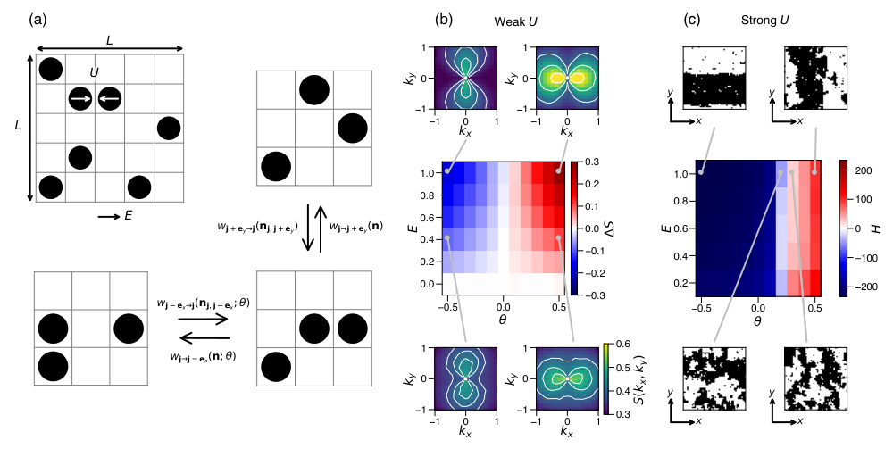
<figcaption class="paper-figure-caption"><b>Fig 1.</b> FIG. 1. Driven lattice gas parameterized by θ and qualitative steady-state phase diagrams. (a) We consider particles with onsite exclusion, nearest-neighbor attraction U, and external field E along the x axis. The parameter θ controls asymmetry in the hopping rate along the field direction, while preserving the same LDB. (b) Phase diagram for homogeneous states with weak attractive interaction (U = 0.5), represented by structure factor discontinuity ∆S . We also plot heatmaps of anisotropic structure factor S (k) at indicated parameter sets. (c) Phase diagram for phase-separated states with strong attractive interaction (U = 2), represented by the peak height H of structure factor, signed...</figcaption>
</figure>
<figure class="paper-figure-card">
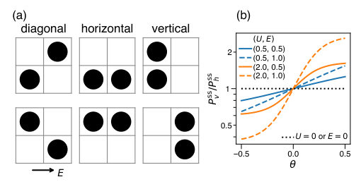
<figcaption class="paper-figure-caption"><b>Fig 2.</b> FIG. 2. θ-dependent configurational biases in the two-particle system with L = 2. (a) Diagonally, horizontally, and vertically aligned con- figurations. (b) Ratio of the steady-state probabilities for vertically and horizontally aligned configurations, Pss v /Pss h [Eq. (4)]. When U = 0 or E = 0, Pss v /Pss h = 1 for any θ.</figcaption>
</figure>
<figure class="paper-figure-card">
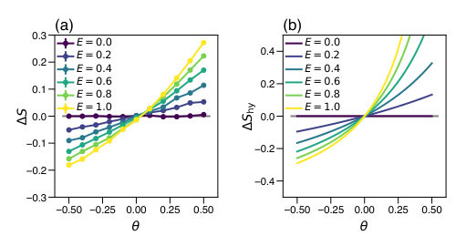
<figcaption class="paper-figure-caption"><b>Fig 3.</b> FIG. 3. θ-dependent anisotropy in long-range density correlation. (a) Discontinuity in the structure factor ∆S as a function of θ for various E, obtained numerically from lattice gas simulations. (b) Counterpart of (a), obtained analytically from fluctuating hydrodynamics.</figcaption>
</figure>
<figure class="paper-figure-card">
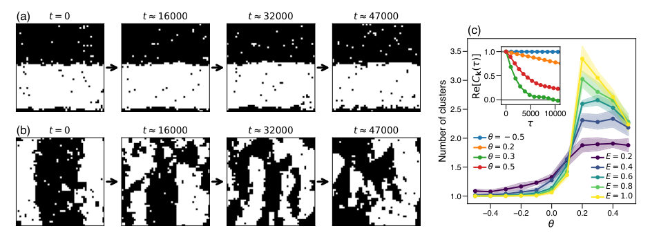
<figcaption class="paper-figure-caption"><b>Fig 4.</b> FIG. 4. θ-dependent morphology and stability of phase separation. (a), (b) Snapshots for typical dynamics at (a) θ = −0.5 (horizontally aligned stable pattern) and (b) θ = 0.5 (vertically aligned unstable pattern). (c) Total number of clusters in the steady state as a function of θ. The brightness suggests the strength of E, and the shadow for each curve indicates the standard deviation. Inset: for E = 1, we plot the autocorrelation of large-scale patterns, Re[Ck(τ)].</figcaption>
</figure>
<figure class="paper-figure-card">
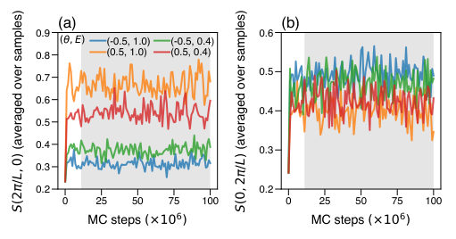
<figcaption class="paper-figure-caption"><b>Fig 5.</b> FIG. 5. Relaxation dynamics of structure factors with weak attrac- tive interactions. We plot the time evolution of the long-wavelength components of the structure factor S (k) [(kx, ky) = (2π/L, 0) for (a) and (0, 2π/L) for (b)] averaged over independent samples for the pa- rameter sets used in Fig. 1(b). The gray area suggests the time points used for averaging.</figcaption>
</figure>

**Summary.** The paper shows that in nonequilibrium systems, the specific form of microscopic transition rates can control macroscopic phase behavior, such as the orientation and stability of patterns. By tuning a parameter that preserves local detailed balance, the authors demonstrate a switch in the anisotropy of long-range correlations and pattern morphology. This highlights that nonequilibrium phase behavior is more sensitive to dynamical rules than equilibrium systems.

**Why it may be interesting.** This is relevant for many-body dynamics as it demonstrates that the specific choice of microscopic dynamical rules can fundamentally alter macroscopic steady-state properties and long-range correlations, even when the thermodynamic driving force is held constant.

Detailed structure

**Main problem.** Investigating whether the specific functional form of microscopic transition rates can reshape many-body phase behavior and pattern formation in strongly interacting nonequilibrium systems, even when those rates satisfy the same Local Detailed Balance condition.

**Main result.** The parameter theta, which tunes the asymmetry of hopping rates without violating LDB, can qualitatively change macroscopic phase behavior by reversing the sign of structure-factor discontinuity and switching the orientation and stability of phase-separated patterns.

**Method.** The study uses Monte Carlo simulations, a high-temperature expansion to derive effective interactions, and an approximate fluctuating hydrodynamic equation derived via a path-integral formalism.

**Model / system.** A two-dimensional driven lattice gas with hard-core exclusion and nearest-neighbor attractive interactions subject to an external driving field along the x-axis.

**Key observables.** Structure factor S(k) and its discontinuity at the origin, peak height of the structure factor, cluster analysis (number of connected components), and the autocorrelation function.

**Important parameters / regimes.** theta (asymmetry parameter), U (interaction strength), E (external field strength), and beta (inverse temperature).

**Assumptions / limitations.** The hydrodynamic derivation relies on a small wave vector expansion up to O(k^2) and assumes additive noise in the linearized regime.

**Figures summary.** Comparison of MC simulations and hydrodynamic predictions for the structure factor discontinuity, and snapshots showing stable horizontal patterns versus unstable, breaking vertical patterns.

**Paper structure.** The paper introduces the problem of rate-dependence in LDB systems, describes the parameterized lattice gas model, presents analytical results for two-particle systems, details the hydrodynamic derivation and high-temperature expansion, and concludes with simulation results validating the predicted phase behavior changes.

Abstract

Local detailed balance (LDB) is a central guiding principle for modeling nonequilibrium stochastic dynamics, yet it only constrains the ratio of forward and backward transition rates and does not fix the steady state. Although the functional form of rates under the same LDB has been shown to affect correlation properties in weakly interacting systems, whether it can reshape phase behavior in strongly interacting systems remains unclear. Here, for a two-dimensional driven lattice gas with attractive nearest-neighbor interactions, we consider hopping rates with a parameter that preserves the same LDB but tunes asymmetry along the driving force. We find that this parameter controls qualitative phase behavior: in the homogeneous phase, it reverses the sign of the structure-factor discontinuity and hence the anisotropy in long-range density correlations; in the phase-separated regime, it switches the orientation of anisotropic patterns and their long-time stability. Both effects are coherently captured by an approximate fluctuating hydrodynamic equation. The results demonstrate that, in contrast to equilibrium systems, nonequilibrium phase behavior depends on specific dynamical rules even when following the same LDB.

[↑ back to top](#top)

### [High fidelity preservation of photonic hyperentanglement in a free-space optical delay line](http://arxiv.org/abs/2605.25609v1)

**Authors:** Yu Guo, Arya Chowdhury, Pranay Tiwari, Jia Boon Chin, Anindya Banerji, Alexander Ling  
**Type:** experiment · **Category:** quantum information and computing · **PDF:** <https://arxiv.org/pdf/2605.25609v1>  
**Analysis basis:** full PDF text, analyzed in chunks
**Topic relevance:** 🔥 `QC/QI experiment` **4/5** · 🔥 `quantum optics experiment` **4/5** · `entanglement & information structure` **2/5** · `interference shaping light` **2/5**

↔ Scroll figures horizontally

<figure class="paper-figure-card">
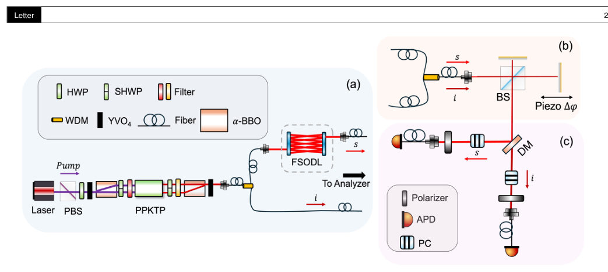
<figcaption class="paper-figure-caption"><b>Fig 1.</b> Fig. 1. Experimental setup for generation, propagation, and characterization of hyperentangled photon pairs in a free-space opti- cal delay line (FSODL). (a) Hyperentangled photon pairs are generated via spontaneous parametric down-conversion (SPDC) in a PPKTP crystal. The signal photon propagates through the FSODL, while the idler photon serves as a reference. (b) Energy-time entanglement is characterized using an unbalanced interferometer with a piezo controlled phase ∆φ. (c) Polarization correlations are measured using polarization analyzers for the signal and idler photons. PBS: polarization beam splitter; BS: beam splitter; PP- KTP: periodically poled potassium titanyl phosphate...</figcaption>
</figure>
<figure class="paper-figure-card">
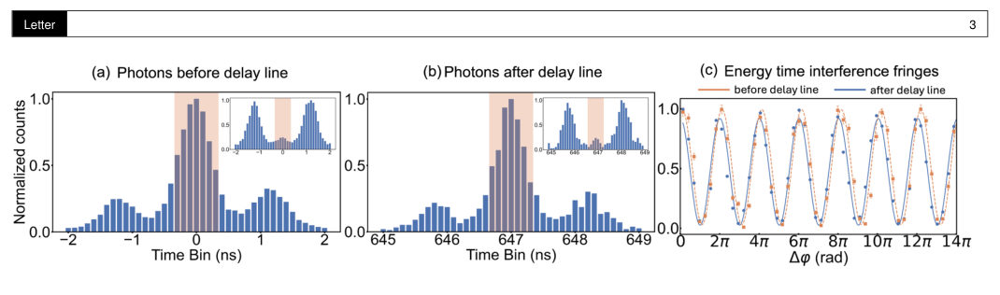
<figcaption class="paper-figure-caption"><b>Fig 2.</b> Fig. 2. Time-bin-resolved coincidence measurements demonstrating the preservation of energy-time entanglement after propaga- tion through the FSODL. (a) Coincidence histogram of the photons before the delay line under constructive interference, centered at zero time delay. The inset shows the corresponding histogram measured under destructive interference. (b) Coincidence histogram of the delayed photons after propagation through the delay line under constructive interference, centered at 647 ns. The shaded regions indicate the post-selection window used to extract coincidence counts for interference analysis. (c) Normalized coincidence counts as a function of the two-photon phase ∆φ for...</figcaption>
</figure>
<figure class="paper-figure-card">
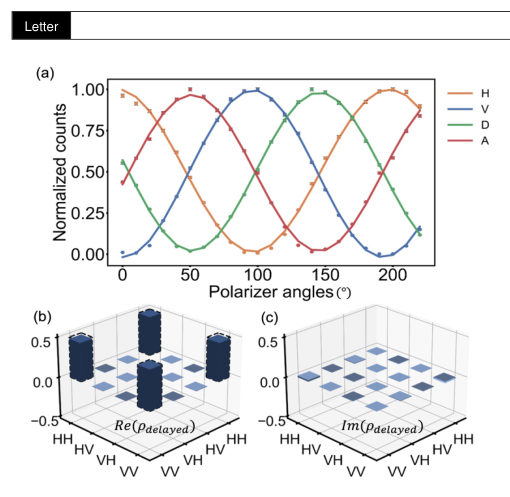
<figcaption class="paper-figure-caption"><b>Fig 3.</b> Fig. 3. Polarization entanglement characterization after prop- agation through the optical delay line. (a) Polarization corre- lation fringes measured in the H/V and D/A bases, showing high visibility sinusoidal oscillations. (b) Real part of the re- constructed two-photon polarization density matrix for pho- tons after the delay line. The dashed boxes indicate the struc- ture of a maximally entangled polarization state. (c) Imaginary part of the reconstructed density matrix after the delay line. The dominant diagonal elements and strong coherence terms between |HH⟩and |VV⟩are consistent with the preservation of a high fidelity polarization entangled state.</figcaption>
</figure>

**Summary.** This paper demonstrates that a free-space optical delay line can preserve hyperentangled photon states in both polarization and energy-time degrees of freedom for up to 647 ns. By using an all-reflective nested Herriott cell, the researchers achieved high-fidelity entanglement preservation, suggesting a scalable route for synchronization and multiplexing in quantum networks.

**Why it may be interesting.** This work is highly relevant to quantum optics and quantum networking as it provides a room-temperature, broadband alternative to cryogenic quantum memories for managing multi-DOF quantum states.

Detailed structure

**Main problem.** The challenge of maintaining simultaneous correlations across multiple degrees of freedom (hyperentanglement) in photon pairs for synchronization in quantum networks.

**Main result.** Demonstrated high-fidelity preservation of both polarization and energy-time entanglement after a 647 ns delay using a free-space optical delay line.

**Method.** The researchers used a nested Herriott cell for the delay and employed an unbalanced Michelson interferometer for energy-time analysis and quantum state tomography for polarization characterization.

**Model / system.** An experimental platform consisting of a type-0 PPKTP crystal pumped by a 405.2 nm laser to generate hyperentangled photon pairs at 780.0 nm and 842.6 nm, passed through an all-reflective nested Herriott cell delay line.

**Key observables.** Energy-time visibility, CHSH parameter (S), polarization state fidelity, and two-photon interference fringes.

**Important parameters / regimes.** 647 ns temporal delay, 93.9% energy-time visibility, CHSH parameter of 2.758, and a 30 THz bandwidth.

**Assumptions / limitations.** The energy-time visibility is partially limited by the intrinsic contrast of the analysis interferometer.

**Figures summary.** Fig 1 shows the experimental setup for SPDC, the delay line, and analyzers; Fig 2 displays coincidence histograms and interference fringes; Fig 3 presents polarization correlation fringes and reconstructed density matrices.

**Paper structure.** The paper introduces the problem of hyperentanglement synchronization, describes the experimental setup (SPDC source and Herriott cell), details the measurement techniques for different degrees of freedom, presents the results for entanglement preservation, and concludes with implications for quantum networks.

Abstract

Photonic hyperentanglement enables increased information capacity and enhanced functionality for quantum communication and networking. However, synchronization of hyperentangled photon pairs requires maintaining correlations simultaneously across multiple degrees of freedom (DOFs). The preservation of polarization and energy-time entanglement in hyperentangled photon pairs is demonstrated using a free-space optical delay line based on nested Herriott cells. After a delay of 647 ns, a two-photon interference visibility of 93.9(3)% is observed in the energy-time DOF, while a CHSH parameter of 2.758(5) is obtained in the polarization DOF. These results confirm that entanglement correlations in both DOFs are preserved after propagation through the delay line. They demonstrate that free-space optical delay lines are compatible with complex photonic quantum states and provide a promising route toward delay-based memories for synchronization and multiplexing in quantum networks.

[↑ back to top](#top)

### [Optimal Quantum Differential Privacy via Fisher Information Spectral Analysis](http://arxiv.org/abs/2605.24166v1)

**Authors:** Justice Owusu Agyemang, Jerry John Kponyo, Elliot Amponsah, Godfred Manu Addo Boakye  
**Type:** both · **Category:** quantum information and computing · **PDF:** <https://arxiv.org/pdf/2605.24166v1>  
**Analysis basis:** full PDF text, analyzed in chunks
**Topic relevance:** 🔥 `QC/QI experiment` **4/5** · `correlated / nonlocal dissipation` **2/5** · `entanglement & information structure` **2/5** · `methods for driven-dissipative` **2/5** · `quantum measurements` **2/5**

↔ Scroll figures horizontally

<figure class="paper-figure-card">
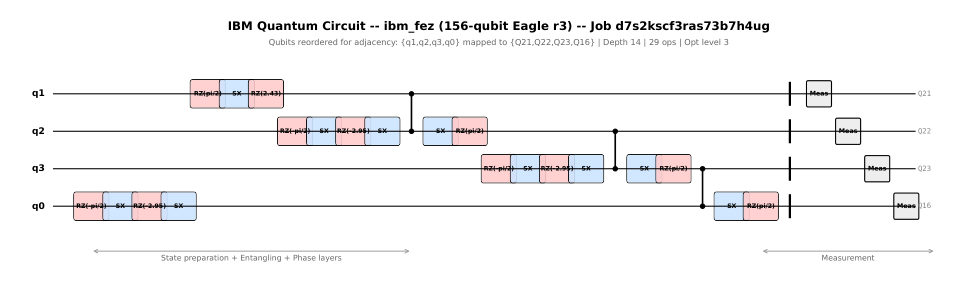
<figcaption class="paper-figure-caption"><b>Fig 1.</b> Figure 1: Quantum circuit transpiled for ibm_fez (156-qubit Eagle r3 processor) from IBM Quantum job d7s2kscf3ras73b7h4ug. The circuit encodes 4-dimensional classical data using the native gate set {RZ, SX, X, CZ, ID} at optimization level 3. Logical qubits {0, 1, 2, 3} are mapped to physical qubits {16, 21, 22, 23} on the heavy-hex topology, with CZ entangling gates placed according to the device’s nearest-neighbor connectivity. The rotation strengths α = [3.0, 1.0, 0.3, 0.1] create a 100:1 QFI eigenvalue condition number. The circuit has depth 14 with 29 operations and produces 8-bit measurement outcomes (2 classical bits per logical qubit).</figcaption>
</figure>
<figure class="paper-figure-card">
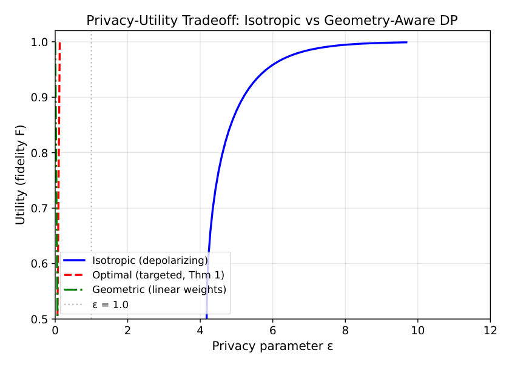
<figcaption class="paper-figure-caption"><b>Fig 2.</b> Figure 3: Privacy–utility tradeoff. The optimal targeted channel (red dashed) achieves substantially lower ε than isotropic depolarizing (blue solid) at the same utility. The geometric channel (green dot-dashed, linear weights) produces very small ε values but is overly conservative.</figcaption>
</figure>
<figure class="paper-figure-card">
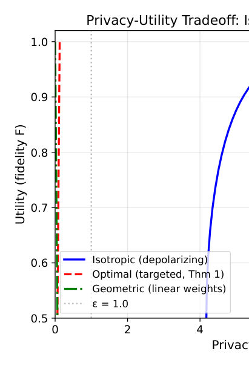
<figcaption class="paper-figure-caption"><b>Fig 3.</b> Fig. 5 presents the empirical privacy–accuracy Pareto frontier. The optimal channel dominates the low-ε regime (ε ∈[2, 4)), achieving 85% ac- curacy at ε = 2.3, a privacy level isotropic DP cannot match without exceeding ε &gt; 4.</figcaption>
</figure>
<figure class="paper-figure-card">
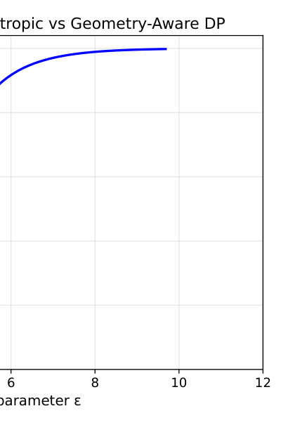
<figcaption class="paper-figure-caption"><b>Fig 4.</b> Fig. 7 demonstrates the QFI-aligned composition advantage. At practical noise levels (γ = 0.1), the advantage exceeds 2× by k = 20 layers and reaches 9× at k = 100. For lower noise (γ = 0.01), the crossover occurs at k = 163 lay- ers. The saturation value ε∗= (∆2/2)λmax/(cγ) decreases with increasing γ, representing the fun- damental privacy floor for infinitely deep circuits with aligned QFI structure.</figcaption>
</figure>
<figure class="paper-figure-card">

<figcaption class="paper-figure-caption"><b>Fig 5.</b> Fig. 6 and Table 1 quantify hardware noise impact. Across four noise regimes, hardware- induced fidelity loss ranges from 0.000 (ideal) to 0.041 (high: T1 = 50 µs, T2 = 30 µs, 1Q depo- larizing 10−3, 2Q depolarizing 3 × 10−2). The loss is modest, confirming that intentional DP noise dominates privacy protection for typical QML embeddings. However, for embeddings with λmax ≲0.1, hardware noise alone provides mean- ingful privacy amplification.</figcaption>
</figure>

**Summary.** This paper introduces a new framework for Quantum Differential Privacy that aligns noise with the geometric structure of quantum embeddings. By targeting the most sensitive directions in the Quantum Fisher Information spectrum, the method achieves much tighter privacy guarantees than standard methods. The work also reveals that certain types of hardware noise can be leveraged to amplify privacy.

**Why it may be interesting.** This is highly relevant for researchers in open quantum systems and quantum information, as it treats hardware decoherence (dephasing) not just as an error to be corrected, but as a potential resource for enhancing privacy in quantum machine learning.

Detailed structure

**Main problem.** Current Quantum Differential Privacy (QDP) frameworks use isotropic noise that ignores the anisotropic geometry of quantum embeddings, leading to suboptimal privacy-utility trade-offs.

**Main result.** The authors propose a geometry-aware noise allocation strategy aligned with the Quantum Fisher Information (QIM) eigenstructure, achieving significantly tighter privacy bounds and demonstrating that hardware dephasing can act as a constructive privacy resource.

**Method.** The paper uses spectral analysis of the QFI matrix, minimax optimization via KKT conditions, and adaptive estimation using Exponential Moving Averages (EMA) to design a metric-adapted quantum channel.

**Model / system.** The study utilizes 4-qubit parameterized quantum circuits (anisotropic and isotropic embeddings) and validates results on the 156-qubit IBM Quantum 'ibm_fez' processor and Qiskit Aer GPU simulations.

**Key observables.** Privacy parameter (epsilon), Quantum Fisher Information (QFI) eigenvalues, fidelity, and adversarial mutual information.

**Important parameters / regimes.** Privacy budget (epsilon), noise strength (gamma), maximum QFI eigenvalue (lambda_max), and the misalignment angle between dephasing and measurement bases.

**Assumptions / limitations.** Assumes a well-defined sensitivity (Delta) and specific properties of the quantum embedding manifold.

**Figures summary.** Figures demonstrate the privacy-utility tradeoff, the concentration of information leakage in the top QFI mode, the reduction of distinguishability in the minimum-QFI mode, and the impact of misaligned-basis dephasing on adversarial information.

**Paper structure.** The paper introduces the problem of suboptimal isotropic noise, develops a geometric framework using QFI spectral analysis, proves six principal theorems regarding optimal noise allocation, privacy-utility relations, and composition, and validates the theory through both large-scale simulations and IBM hardware experiments.

Abstract

The Quantum Fisher Information (QFI) metric governs a fundamental duality: it quantifies both how precisely a parameter can be estimated (metrology) and how distinguishable two quantum states are (privacy). We exploit this duality to establish a geometry-aware framework for quantum differential privacy (DP) that replaces isotropic depolarizing noise with direction-dependent noise aligned to the QFI eigenstructure of the quantum embedding. We prove six principal theorems: (1) the minimax-optimal mechanism concentrates the noise budget in the dominant QFI eigenmode, achieving $\varepsilon = (Δ^2/2)λ_{\max}(1-cγ)$ with $O(d/λ_{\max})$ advantage; (2) mixed-state QFI decomposition reveals that dephasing in the adversary's basis $\textit{increases}$ accessible information, while misaligned-basis dephasing provides constructive privacy amplification from hardware noise; (3) a tight privacy $-$ utility uncertainty relation $\varepsilon \cdot (1 - F) \ge \frac{Δ^2}{2}\frac{\operatorname{Tr}(F)}{d}$; (4) adaptive QFI estimation converging at $O(1/\sqrt{n})$ yields $1.92\times$ tighter bounds; (5) QFI-aligned composition saturates at $O(1)$ versus $O(k)$ for standard composition; and (6) hardware noise can be harnessed for privacy amplification. Adversarial vulnerabilities, Wasserstein guarantees, subspace projection, and a zero-knowledge audit protocol follow as corollaries. Results are validated on Qiskit Aer GPU simulations, IBM Quantum hardware (ibm_fez, 156 qubits), and against classical DP baselines, achieving equivalent utility at $\varepsilon \approx 0.001$ versus $\varepsilon \approx 4800$ for classical DP.

[↑ back to top](#top)

### [Thermalization in Spatially Extended Open Quantum Systems: Local versus Global Markovian Evolution](http://arxiv.org/abs/2605.25760v1)

**Authors:** Jorge Tabanera-Bravo, Massimiliano Esposito, Felipe Barra, Juan M. R. Parrondo  
**Type:** theory · **Category:** statistical mechanics · **PDF:** <https://arxiv.org/pdf/2605.25760v1>  
**Analysis basis:** full PDF text, analyzed in chunks
**Topic relevance:** 🔥 `non-equilibrium dynamics` **4/5** · `correlated / nonlocal dissipation` **3/5** · `methods for driven-dissipative` **3/5** · `scars & prethermalization` **2/5**

↔ Scroll figures horizontally

<figure class="paper-figure-card">
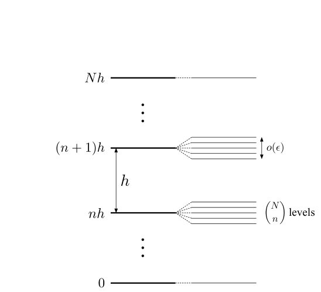
<figcaption class="paper-figure-caption"><b>Fig 1.</b> FIG. 1: Spectrum of the spatially extended system with Hamiltonian H given by Eq. (47). The energy levels of the local Hamiltonian Hloc are depicted as thick horizontal lines on the left. Their energy is nh, where n is the number of excitations, and their degeneracy is gn ≡ N n  . The perturba- tion ϵHint for ϵ ≪h splits these levels into gn non-degenerate eigenstates of H. Hence, the energy levels of H in Eq. (47) are grouped in bands with n excitations and gn non-degenerate levels.</figcaption>
</figure>
<figure class="paper-figure-card">
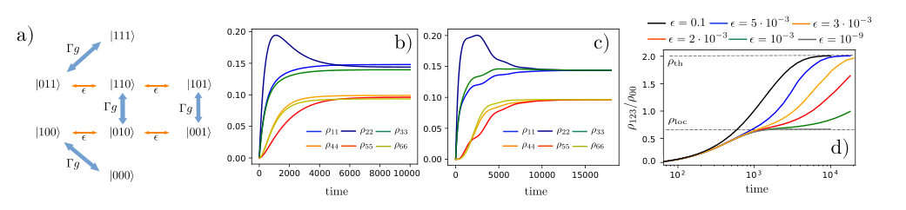
<figcaption class="paper-figure-caption"><b>Fig 2.</b> FIG. 2: Exact dynamics of the 3-qubit chain given by the Lindblad equation (7) with the exact collisional map (38): (a) Sketch of transitions between local states induced by i) the Hamiltonian Eq.(64) (orange arrows), and ii) by collisions with the reservoir (65) (blue arrows). (b,c) Evolution of the eigensate populations ρii for ϵ = 0.1 in (b) and ϵ = 5 × 10−5 in (c). (d) Occupation of the first band, ρ123 ≡ρ11 + ρ22 + ρ33, relative to the ground state, ρ00, for different values of ϵ. The two dashed gray lines give the value of the ratio for the global and local thermal states ρtherm, given by Eq. (72), and ρloc, given by (73), respectively. Other parameters: β = m = 0.1, g = 50, Γ = 1, σp...</figcaption>
</figure>
<figure class="paper-figure-card">
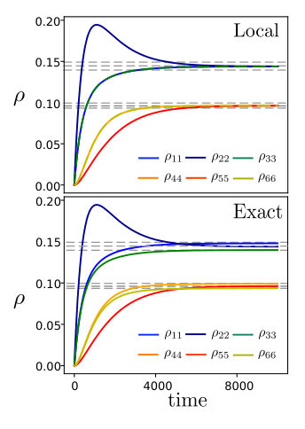
<figcaption class="paper-figure-caption"><b>Fig 3.</b> FIG. 4: Populations of the eigenstates of the chain Hamilto- nian as given by the exact map Eq. (38) (bottom panel) and the local limit Eqs. (54)–(56) (top panel). Observe that, in the local limit, the energy levels within the two bands do not thermalize, as expected. In this figure Γ = 1, with ϵ = 0.1. Other parameters are β = m = 0.1, g = 50, σp = 0.5 and h = 4.</figcaption>
</figure>
<figure class="paper-figure-card">
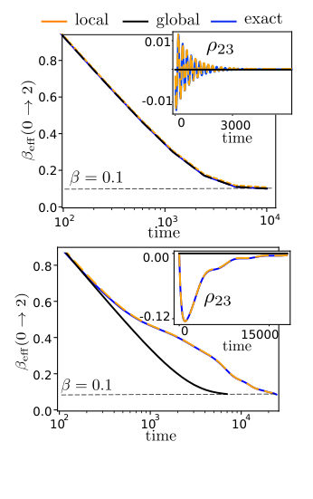
<figcaption class="paper-figure-caption"><b>Fig 4.</b> FIG. 3: The two plots depict the evolution of the inter-band temperature βeff(0 →2) and the intra-band coherence ρ23 (insets) for ϵ = 0.1 (top) and 3×10−3 (bottom). We show the results for the exact evolution, given by the map (38) (blue), the local limit which neglects terms of order Γϵ, Eqs. (54)–(56) (orange), and the global approximation based on wave packets with negligible momentum dispersion, Eq. (45) (black). The grey line indicates the temperature of the reservoir, which is β = 0.1. Other parameters are m = 0.1, g = 50, Γ = 1, σp = 0.5 and h = 4.</figcaption>
</figure>

**Summary.** This paper resolves the discrepancy between local and global Lindblad equations in extended quantum systems by using a collisional model. It demonstrates that a specific master equation can achieve both thermodynamic consistency and local dynamics, depending on the momentum dispersion of the bath. This work is significant for understanding how thermalization emerges in many-body systems.

**Why it may be interesting.** It provides a resolution to a fundamental conflict in open quantum systems theory, showing how a single framework can bridge the gap between local dissipative models and global secular approximations while preserving thermodynamic consistency.

Detailed structure

**Main problem.** Investigating the tension between local and global Markovian evolution in spatially extended open quantum systems, specifically addressing how to maintain thermodynamic consistency while capturing dynamical locality.

**Main result.** The authors derive a Lindblad equation from a collisional model that is both thermodynamically consistent (driving the system to a Gibbs state) and local at short times, identifying a crossover regime governed by the non-commuting limits of momentum dispersion and inter-qubit coupling.

**Method.** The study uses a collision model with repeated interactions between a qubit chain and a thermal reservoir, employing quantum scattering theory, Kraus representations, and perturbative analysis of the master equation.

**Model / system.** A spatially extended chain of N interacting qubits (e.g., an XX-model type Hamiltonian) coupled locally to a thermal reservoir via collisions with particles described by wave packets with specific momentum dispersion.

**Key observables.** Populations of energy eigenstates, coherences in the energy eigenbasis, and the stationary thermal state.

**Important parameters / regimes.** Inter-qubit coupling strength (epsilon), momentum dispersion of the bath (sigma_p), dissipation rate (Gamma), and inverse temperature (beta).

**Assumptions / limitations.** The Hamiltonian is assumed to have non-degenerate energy levels, the system is in the weak-coupling regime, and the reservoir interaction is localized at the first qubit.

**Figures summary.** A sketch of the transition processes (collisions vs. Hamiltonian evolution), evolution of eigenstate populations for different coupling strengths, and comparisons between local and global population dynamics.

**Paper structure.** The paper introduces the conflict between local and global dynamics, defines the collisional model and scattering framework, derives the master equations, analyzes the non-commuting limits of coupling and dispersion, and provides numerical verification using a 3-qubit chain.

Abstract

We investigate the dynamics of a qubit chain locally coupled to a thermal reservoir, modeled through repeated collisions with particles drawn from a heat bath. Under suitable conditions, the resulting Lindblad equation is thermodynamically consistent -- it drives the system toward thermal equilibrium -- while remaining local at short times. This framework reveals a crossover between the global Lindblad equation derived from the secular approximation in weak-coupling theory and the local dissipative models often employed in the literature, which generally fail to ensure thermodynamic consistency.

[↑ back to top](#top)

### [Algebraic Tomography of Non-Hermitian Floquet Systems from Observable Traces](http://arxiv.org/abs/2605.24555v1)

**Authors:** Syo Kamata  
**Type:** theory · **Category:** quantum information and computing · **PDF:** <https://arxiv.org/pdf/2605.24555v1>  
**Analysis basis:** full PDF text, analyzed in chunks
**Topic relevance:** 🔥 `methods for driven-dissipative` **4/5** · 🔥 `non-equilibrium dynamics` **4/5** · `quantum measurements` **2/5**

↔ Scroll figures horizontally

<figure class="paper-figure-card">
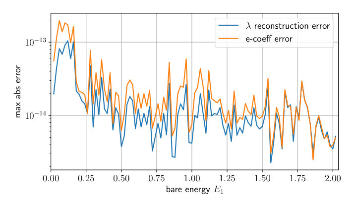
<figcaption class="paper-figure-caption"><b>Fig 1.</b> FIG. 1: Reconstruction errors for the DTQ3 from a single observable Oqub. The errors in the reconstructed eigenvalues and characteristic coefficients remain close to machine precision over the full scan, showing that a single observable channel already recovers the full GL(3, C) spectral skeleton.</figcaption>
</figure>
<figure class="paper-figure-card">
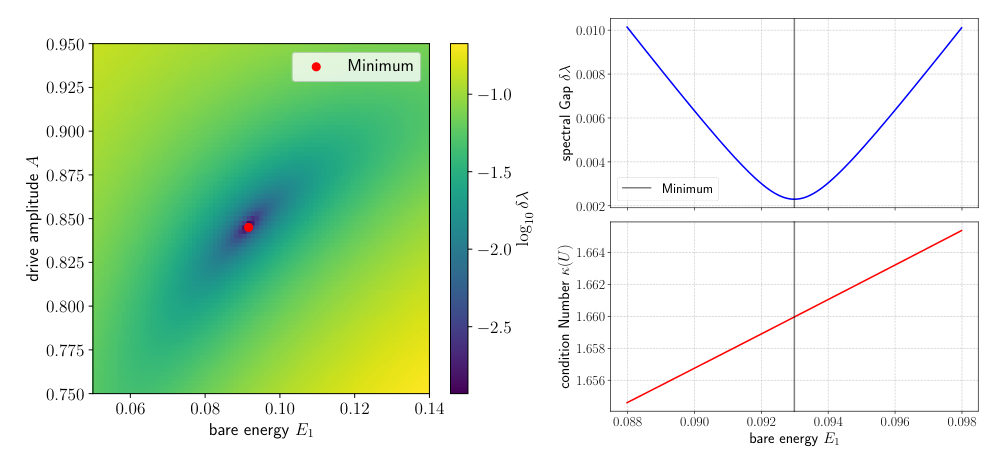
<figcaption class="paper-figure-caption"><b>Fig 2.</b> FIG. 2: Near-degeneracy point characterized in the two-parameter plane of the bare energy E1 and the drive amplitude A. (Left) Color plot of the minimal spectral gap δλ on a log10 scale. (Right) The E1-dependence of the spectral gap δλ and the matrix condition number κ(U) evaluated at a fixed drive amplitude A = 0.85, demonstrating the stable, DP nature of the degeneracy.</figcaption>
</figure>
<figure class="paper-figure-card">
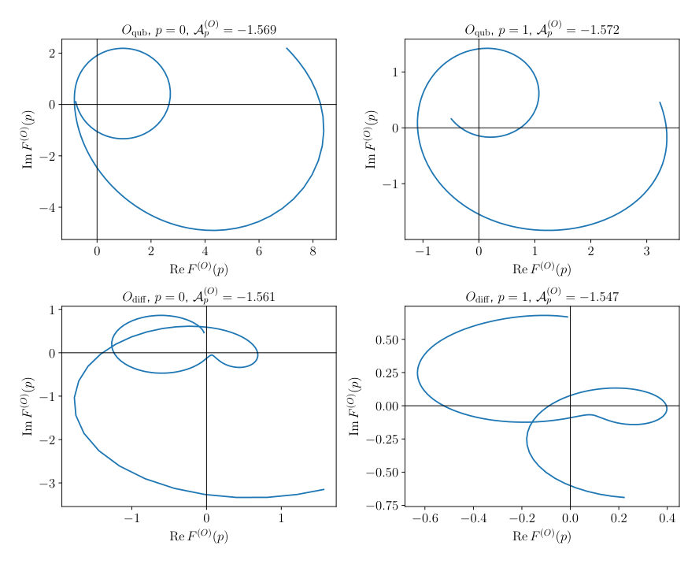
<figcaption class="paper-figure-caption"><b>Fig 3.</b> FIG. 3: Complex-plane trajectories of the ODSD F(O)(p) for p = 0 and p = 1 under the variation of the bare energy E1 ∈[0.02, 2.02]. We compare the total qubit population Oqub with the population difference Odiff. The continuous deformation of these loops under drive-induced dressing highlights the onset of severe destructive interference, serving as the geometric precursor to the quantized visibility jumps shown in Fig. 4.</figcaption>
</figure>
<figure class="paper-figure-card">
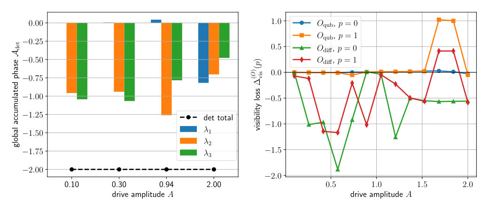
<figcaption class="paper-figure-caption"><b>Fig 4.</b> FIG. 4: (Left) Drive-induced redistribution of the mode-wise phase accumulation observed by Oqub as a function of the drive amplitude A. (Right) The visibility loss ∆(O) vis (p) for p = 0, 1 evaluated for the total population Oqub and the difference observable Odiff. The sharp, quantized steps in the visibility loss reflect winding-changing events where the continuous deformation of the dressing coefficients forces the complex trajectory of F(O)(p) to cross the origin, abruptly shedding a full 2π phase rotation.</figcaption>
</figure>
<figure class="paper-figure-card">
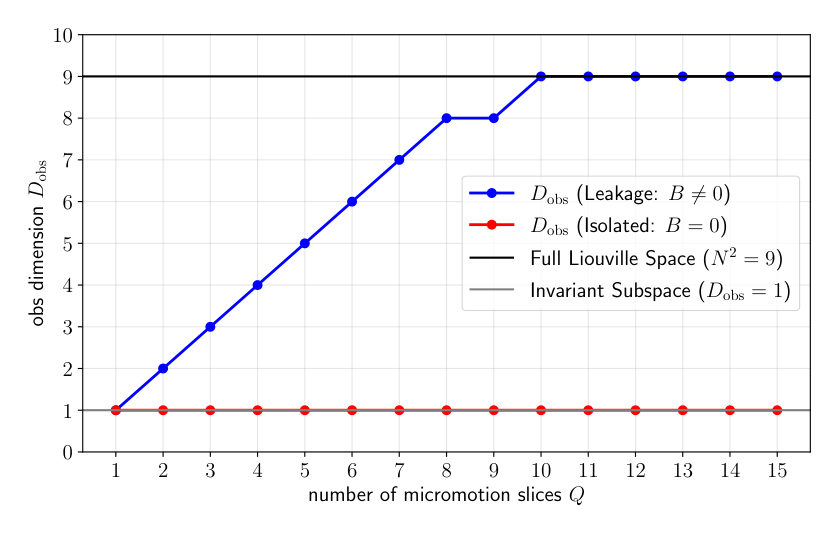
<figcaption class="paper-figure-caption"><b>Fig 5.</b> FIG. 5: Sampled observable dimension Dobs = rank(K0) in the DTQ3 model plotted against the number of micromotion slices Q. In the isolated qubit limit (B = 0), the observable remains trapped within a one-dimensional invariant sector (Dobs = 1). In contrast, turning on coherent leakage (B = 0.47) dynamically accesses the third level, triggering an algebraic expansion of the visible operator space that reaches the full qutrit operator-space dimension N 2 = 9.</figcaption>
</figure>

**Summary.** This paper introduces a method called Floquet algebraic tomography to reconstruct the underlying dynamics of non-Hermitian periodic systems from measurement traces. It distinguishes between the system's intrinsic spectrum and the effects of the chosen measurement probe, providing a way to identify spectral features like Exceptional Points even when parts of the system are hidden by symmetry.

**Why it may be interesting.** It provides a rigorous algebraic toolset for characterizing the dynamics of open, driven quantum systems (like transmons or topological chains) where only partial, stroboscopic measurements are available, specifically addressing the complex physics of Exceptional Points.

Detailed structure

**Main problem.** Developing an algebraic framework to reconstruct the spectral properties and monodromy matrix of non-Hermitian Floquet systems from limited, time-discrete observable trace data.

**Main result.** The authors establish a 'Floquet algebraic tomography' framework that separates intrinsic spectral features from observable-dependent dressing, proving that while certain parts of the dynamics may remain invisible due to symmetries, the 'visible' part of the monodromy matrix can be reconstructed using Cayley-Hamilton and Hankel methods.

**Method.** The framework utilizes Observable Trace Sequences (OTS), the Observable Resolvent, and Cayley-Hamilton recurrences, alongside Hankel matrix constructions and Prony-type methods for spectral reconstruction.

**Model / system.** Finite-dimensional non-Hermitian Floquet systems characterized by a monodromy matrix M in GL(N, C), with specific applications to a driven transmon qutrit and a finite non-Hermitian Floquet SSH chain.

**Key observables.** Observable Trace Sequence (OTS) defined as Tr(OM^n), observable resolvent, spectral determinant, and Dirichlet spectral data.

**Important parameters / regimes.** Spectral regimes including Simple Spectra (SS), Diabolic Points (DP), and Exceptional Points (EP); observable dimension and algebraic deficiency.

**Assumptions / limitations.** The system is finite-dimensional, the monodromy matrix is assumed to be stationary/time-periodic, and the observable O is independent of the discrete period index n.

**Figures summary.** Figure 9 demonstrates the growth of observable dimension as a function of micromotion slices, comparing clean, bond-disordered, and on-site-disordered configurations in an SSH chain.

**Paper structure.** The paper introduces the inverse problem of reconstruction, develops the algebraic framework (resolvent, determinant, and Dirichlet data), provides the reconstruction engine (Cayley-Hamilton and Hankel methods), addresses identifiability and symmetry-induced invisibility, and validates the theory with transmon and SSH chain examples.

Abstract

We formulate a framework of Floquet algebraic tomography for finite-dimensional non-Hermitian monodromy matrices from observable trace sequences $ζ_n^{(O)}={\rm Tr}(OM^n)$. Since these sequences are constrained by the characteristic polynomial of $M$, the inverse problem is a finite-dimensional algebraic reconstruction problem rather than a generic exponential fit. We organize the reconstruction through the observable resolvent, spectral determinant, and Dirichlet spectral data, separating the common spectral skeleton from observable-dependent dressing. Cayley--Hamilton and Hankel methods recover the similarity-invariant spectral data, while multi-observable and Liouville-space extensions connect the construction to realization theory and tomography reconstruction. We further clarify the limits of identifiability from restricted observable algebras: the data determine a visible representative, micromotion can enlarge the sampled visible operator space, and exact symmetries impose residual invisible sectors. Two examples, a driven transmon qutrit and a finite non-Hermitian Floquet SSH chain, demonstrate leakage-induced visibility expansion, observable-dependent phase response, EP-accessible branch geometry, and disorder/probe-dependent observable-dimension readouts.

[↑ back to top](#top)

### [Impact of Surface Treatment on Noise in PL-Measurements of Silicon Vacancies in 4H-SiC Lateral pin-Diodes](http://arxiv.org/abs/2605.24157v1)

**Authors:** Jannik H. Schwarberg, Fabian Magerl, Susanne Beuer, Alexander May, Christian Gobert, Martin Siebert, Christian Miersch, Heino Möller, Wolfgang Knolle, Chihang Luo, Jan F. Dick, Franziska C. Beyer, Mathias Rommel, Jörg Schulze  
**Type:** experiment · **Category:** quantum information and computing · **PDF:** <https://arxiv.org/pdf/2605.24157v1>  
**Analysis basis:** full PDF text, analyzed in chunks
**Topic relevance:** 🔥 `QC/QI experiment` **4/5** · 🔥 `quantum optics experiment` **4/5** · `spintronics-quantum-optics interface` **2/5**

↔ Scroll figures horizontally

<figure class="paper-figure-card">
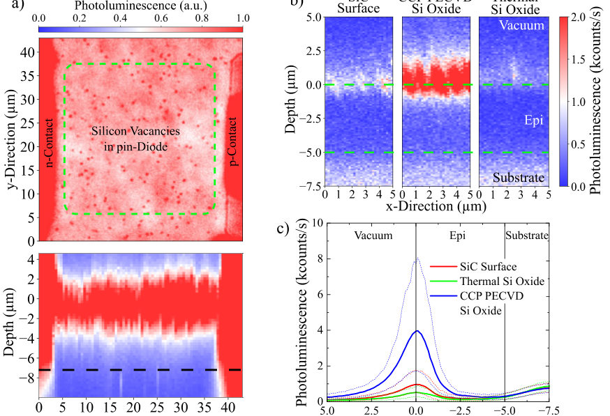
<figcaption class="paper-figure-caption"><b>Fig 1.</b> Figure 1. a) PL xy-scan (top) and depth scan (bottom) of a lateral 4H-SiC pin-diode produced in a</figcaption>
</figure>
<figure class="paper-figure-card">
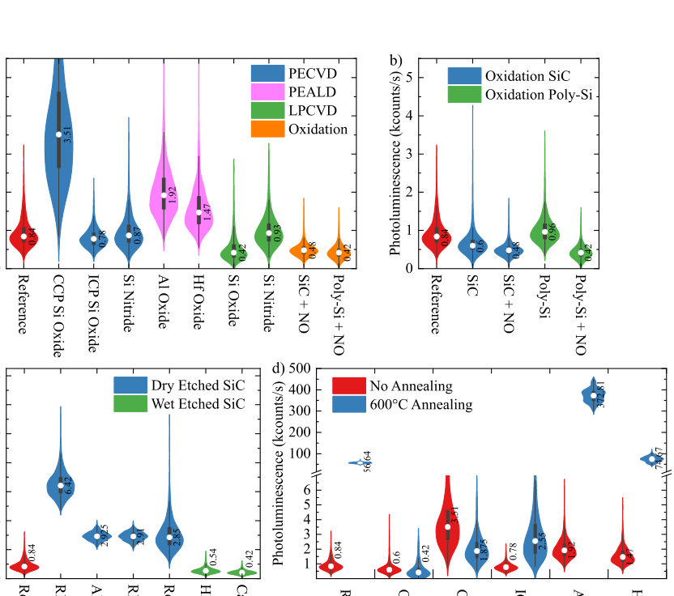
<figcaption class="paper-figure-caption"><b>Fig 2.</b> Figure 2. Violin plots of surface or interface PL of all processed samples grouped by a) passivation</figcaption>
</figure>
<figure class="paper-figure-card">
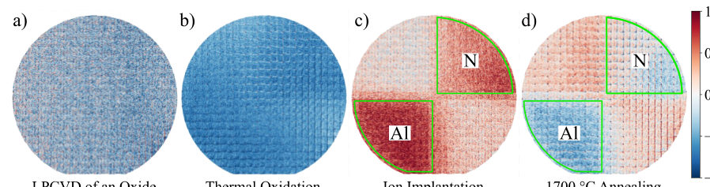
<figcaption class="paper-figure-caption"><b>Fig 3.</b> Figure 3. Difference between two wafer scans recorded before and after processing with a custom</figcaption>
</figure>
<figure class="paper-figure-card">

<figcaption class="paper-figure-caption"><b>Fig 4.</b> Figure 4. a) Schematic cross-sections of the three different types of processed pin-diodes (top:</figcaption>
</figure>
<figure class="paper-figure-card">
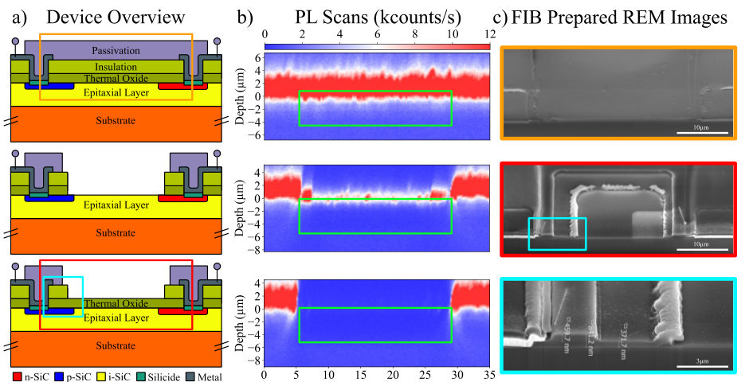
<figcaption class="paper-figure-caption"><b>Fig 5.</b> Figure 4a fabricated on 4H-SiC c-plane wafers. The green box highlights the SiC epitaxial layer</figcaption>
</figure>

**Summary.** This paper investigates how different semiconductor fabrication techniques impact the background noise of silicon vacancy emitters in 4H-SiC. By replacing plasma-based deposition with thermal oxidation and using atomic layer etching to heal surface damage, the authors significantly enhance the signal-to-noise ratio of the color centers. This progress is vital for integrating high-quality quantum emitters into mature, CMOS-compatible semiconductor platforms.

**Why it may be interesting.** This work is highly relevant to quantum optics and quantum information because it provides a practical roadmap for improving the spectral purity and signal strength of solid-state single-photon sources, which is essential for scalable quantum networks.

Detailed structure

**Main problem.** The background photoluminescence (PL) noise caused by conventional CMOS-compatible processing (e.g., plasma etching and PECVD deposition) masks the signal from silicon vacancy (V_Si) color centers in 4H-SiC, degrading their utility for quantum technologies.

**Main result.** The study demonstrates that using thermally grown oxides with NO annealing and combining RIE with ALE significantly reduces surface noise, achieving a signal-to-noise ratio (SNR) of up to 50 for deeper emitters and maintaining high electrical performance in lateral pin-diodes.

**Method.** The researchers compared various surface treatments (PECVD, ALD, thermal oxidation, RIE, ALE, and TMAH etching) using depth-resolved confocal PL spectroscopy, in-line wafer-scale PL mapping, and electrical I-V characterization.

**Model / system.** The experimental platform consists of 4H-SiC lateral pin-diodes on both c-plane and a-plane substrates, featuring silicon vacancy (V_Si) color centers generated via electron irradiation.

**Key observables.** Photoluminescence (PL) intensity, signal-to-noise ratio (SNR), second-order correlation function g(2), blocking voltage, and leakage current.

**Important parameters / regimes.** V_Si emission intensity (~8 kcounts/s), blocking voltage (up to 150 V), leakage current (< 10 pA/µm), and 730 nm excitation wavelength.

**Assumptions / limitations.** The paraxial approximation used in depth scans may slightly overestimate focal depth due to spherical aberration and high-angle refraction.

**Figures summary.** Figure 1 shows PL noise in standard CMOS processes; Figure 2 uses violin plots to compare various passivation and etching techniques; Figure 3 illustrates PL trends across different processing steps; Figure 4 presents the schematic of pin-diode designs and depth scans; Figure SI 2 compares surface damage between RIE, ALE, and hybrid RIE+ALE processes.

**Paper structure.** The paper introduces the problem of processing-induced noise, details the various surface treatment and fabrication strategies evaluated, presents the comparative results for optical and electrical performance, and concludes with recommendations for optimizing quantum-grade SiC devices.

Abstract

Silicon vacancies ($V_\mathrm{Si}$) in 4H-SiC are promising candidates for quantum technologies due to their long spin coherence times and integrability into mature semiconductor platforms. However, conventional CMOS-compatible processing introduces significant photoluminescence noise from passivation layers and crystal damage, degrading color center coherence and excitation linewidths. This work evaluates strategies to minimize such background noise. Thermally grown oxides with nitrogen monoxide annealing provide excellent low-noise passivation, remaining stable during subsequent $600\,^{\circ}\mathrm{C}$ thermal treatments. Furthermore, combining reactive ion etching with atomic layer etching eliminates ion-induced surface damage. Into lateral pin-diodes, used for stark shift and photoluminescent excitation linewidth tuning, a selectively etched optical window is integrated. These devices show ideal electrical properties -- blocking up to $150\,\mathrm{V}$ with leakage current below $10\,\mathrm{pA}/μ\mathrm{m}$ -- while significantly enhancing the $V_\mathrm{Si}$ environment. Single emitters in these pin-diodes show an increased signal-to-noise ratio of 15 for near-surface and of 50 for deeper emitters on both c-plane and a-plane wafers.

[↑ back to top](#top)

### [Non-monotonic evolution of multipartite entanglement under the Unruh effect](http://arxiv.org/abs/2605.24424v1)

**Authors:** Shu-Min Wu, Si-Han Shang, Si-Yu Liu, Rui-Yang Xu, Qianqian Liu, Xiao-Li Huang  
**Type:** theory · **Category:** quantum information and computing · **PDF:** <https://arxiv.org/pdf/2605.24424v1>  
**Analysis basis:** full PDF text, analyzed in chunks
**Topic relevance:** 🔥 `entanglement & information structure` **4/5** · `Dicke superradiance` **2/5** · `correlated / nonlocal dissipation` **2/5** · `non-equilibrium dynamics` **2/5**

↔ Scroll figures horizontally

<figure class="paper-figure-card">
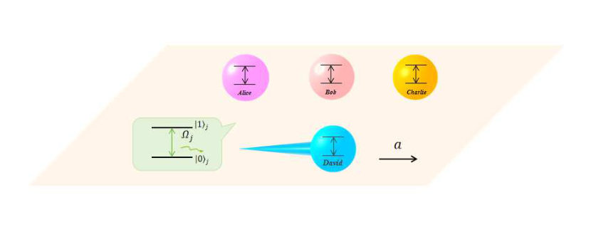
<figcaption class="paper-figure-caption"><b>Fig 1.</b> FIG. 1: Schematic setup of the tetrapartite Unruh–DeWitt detector system. Four observers (Alice, Bob,</figcaption>
</figure>
<figure class="paper-figure-card">
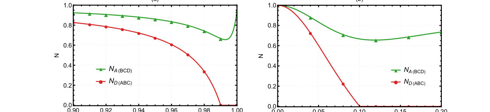
<figcaption class="paper-figure-caption"><b>Fig 2.</b> FIG. 2: Dependence of the 1 −3 bipartite entanglement NA(BCD) and ND(ABC) on the acceleration pa-</figcaption>
</figure>
<figure class="paper-figure-card">

<figcaption class="paper-figure-caption"><b>Fig 3.</b> FIG. 3: The π4-tangle as functions of the acceleration parameter q for fixed effective coupling ν2 = 0.01.</figcaption>
</figure>
<figure class="paper-figure-card">
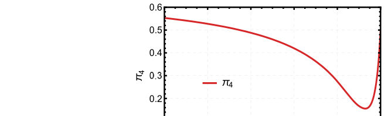
<figcaption class="paper-figure-caption"><b>Fig 4.</b> Fig.4 shows the dependence of the global multipartite entanglement measure π4 on the de-</figcaption>
</figure>
<figure class="paper-figure-card">
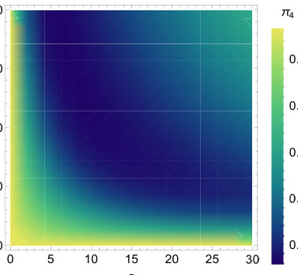
<figcaption class="paper-figure-caption"><b>Fig 5.</b> FIG. 4: The π4-tangle of the four-qubit Dicke state as functions of the interaction time ∆and the energy</figcaption>
</figure>

**Summary.** This paper shows that the Unruh effect can non-monotonically evolve and even enhance multipartite entanglement in Dicke states. It demonstrates that Dicke states are more robust against Unruh-induced decoherence than GHZ or W states, making them superior resources for quantum information tasks in relativistic settings.

**Why it may be interesting.** It challenges the conventional view of entanglement degradation and provides a mechanism (mode mixing) for entanglement enhancement, which is highly relevant for understanding decoherence and resource management in relativistic quantum information and open quantum systems.

Detailed structure

**Main problem.** The study investigates whether multipartite entanglement in Dicke states undergoes monotonic degradation under the Unruh effect and explores the robustness of these states compared to GHZ and W states.

**Main result.** The researchers found that tetrapartite entanglement exhibits a non-monotonic evolution, initially decreasing and then increasing toward a finite value, demonstrating that the Unruh effect can actually enhance multipartite entanglement in certain regimes.

**Method.** The study employs the Unruh-DeWitt detector model within the weak-coupling regime, using first-order perturbation theory and Bogoliubov transformations to calculate the time-evolved density matrix.

**Model / system.** A four-qubit Dicke state shared among four observers, where one detector (David) undergoes uniform acceleration in a massless scalar field in Minkowski spacetime while the others remain inertial.

**Key observables.** Tetrapartite entanglement (pi4-tangle), 1-3 bipartite entanglement (negativity), and 1-1 bipartite entanglement.

**Important parameters / regimes.** Acceleration parameter (q), detector energy gap (Omega), interaction time (Delta), and effective coupling strength (nu).

**Assumptions / limitations.** The detectors are modeled as two-level systems, the interaction is localized via a Gaussian-profile smearing function, and the system is treated within the weak-coupling approximation.

**Figures summary.** Figure 1 shows the experimental setup; Figure 2 illustrates the divergence in bipartite entanglement behavior between inertial and accelerated observers; Figure 3 and 4 demonstrate the non-monotonic 'dip and recovery' of the pi4-tangle as a function of acceleration, energy gap, and interaction time.

**Paper structure.** The paper introduces the problem of entanglement in non-inertial frames, describes the Unruh-DeWitt model and mathematical framework, presents results on bipartite and multipartite entanglement evolution, compares Dicke states to GHZ/W states, and discusses implications for relativistic quantum information.

Abstract

We investigate the behavior of tetrapartite entanglement in a four-qubit Dicke state under relativistic motion by employing the Unruh-DeWitt detector model, where one detector undergoes uniform acceleration. We show that the entanglement exhibits a non-monotonic evolution: it first decreases and subsequently increases toward a finite value as the acceleration grows. In contrast to the conventional view that the Unruh effect leads to a monotonic degradation of multipartite entanglement, our results demonstrate that it can instead enhance multipartite entanglement within a finite parameter regime. This behavior reveals a dual role of the Unruh effect in multipartite systems. Our findings therefore provide a refined understanding of relativistic multipartite quantum correlations, indicating that Dicke states constitute more robust multipartite quantum resources against Unruh-induced decoherence and may offer advantages for relativistic quantum information processing tasks.

[↑ back to top](#top)

### [A DMFT approach to evaluate electronic frictional effects near solid surfaces of strongly correlated systems](http://arxiv.org/abs/2605.25320v1)

**Authors:** Yunhao Liu, Wenjie Dou  
**Type:** theory · **Category:** strongly correlated electrons · **PDF:** <https://arxiv.org/pdf/2605.25320v1>  
**Analysis basis:** full PDF text, analyzed in chunks
**Topic relevance:** 🔥 `Kondo & dissipative impurity` **4/5** · `non-equilibrium dynamics` **3/5** · `correlated / nonlocal dissipation` **2/5**

↔ Scroll figures horizontally

<figure class="paper-figure-card">
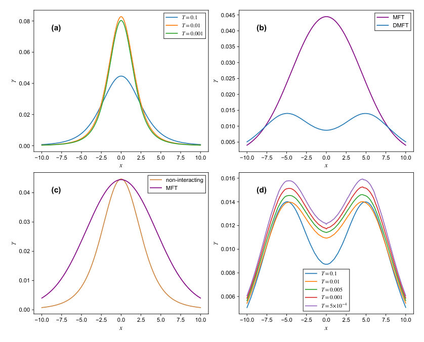
<figcaption class="paper-figure-caption"><b>Fig 1.</b> FIG. 1. (a) Electronic friction of the non-interacting lattice model (U = 0) as a function of position x. Only a single peak occurs in the electronic friction. (b) Electronic friction obtained from MFT and DMFT calculations at temperature T = 0.1. Due to electron-electron repulsions in the Hubbard model, DMFT successfully captures two peaks in the friction, whereas MFT fails to reproduce them. (c) Electronic friction of the non-interacting lattice model and the Hubbard-Holstein model obtained from MFT at temperature T = 0.1. Within MFT, the friction merely corresponds to a broadening of peak without el-el interactions, indicating that it still retains many single-particle features. (d)...</figcaption>
</figure>
<figure class="paper-figure-card">
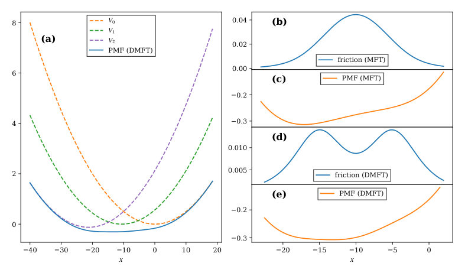
<figcaption class="paper-figure-caption"><b>Fig 2.</b> FIG. 2. (a) PMF and diabatic PESs as a function of position x. (b) and (c) Electronic friction and PMF as a function of position x according to MFT, respectively. (d) and (e) Corresponding results obtained from DMFT. The parameters are g = 0.075, ω = 0.1, t = 0.25, U = 1, Ed = g2</figcaption>
</figure>
<figure class="paper-figure-card">
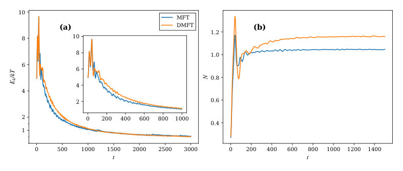
<figcaption class="paper-figure-caption"><b>Fig 3.</b> FIG. 3. The results from EF-LD. (a) average kinetic energy; (b) electronic population in the impurity. The parameters are g = 0.075, ω = 0.1, t = 0.25, U = 1, Ed = g2</figcaption>
</figure>

**Summary.** This paper demonstrates that Dynamical Mean-Field Theory is essential for accurately describing electronic friction and nonadiabatic dynamics at the interface of strongly correlated materials. It shows that mean-field approaches fail to capture critical electron-attachment resonances that emerge from electron-electron interactions. The findings have significant implications for understanding energy dissipation in molecular electronics and electrochemistry.

**Why it may be interesting.** The study provides deep insights into how strong electron-electron correlations and many-body resonances (like the Kondo effect) fundamentally alter energy dissipation and nonadiabatic dynamics in interfacial systems.

Detailed structure

**Main problem.** Evaluating electronic friction effects and nonadiabatic dynamics near the surfaces of strongly correlated systems, specifically addressing the failure of mean-field theories to capture many-body resonances.

**Main result.** DMFT predicts two distinct peaks in electronic friction due to electron attachment/detachment resonances in the presence of electron-electron interactions, whereas MFT fails to capture these features and incorrectly predicts electronic population evolution.

**Method.** The authors employ Dynamical Mean-Field Theory (DMFT) with the Full Density-Matrix Numerical Renormalization Group (FDM-NRG) as an impurity solver, combined with Electronic Friction-Langevin Dynamics (EF-LD) simulations.

**Model / system.** A two-dimensional Hubbard-Holstein model representing a molecule (impurity) interacting with a solid surface, including electron-electron interaction (U) and electron-phonon coupling (g).

**Key observables.** Electronic friction tensor, Potential of Mean Force (PMF), electronic population (N), and average kinetic energy (Ek).

**Important parameters / regimes.** Electron-electron interaction strength (U), electron-phonon coupling (g), hopping (t), and temperature (T).

**Assumptions / limitations.** The lattice self-energy is assumed to be local (DMFT approximation), the lattice is treated as a Bethe lattice, and the electronic bath is treated as a fast-relaxing reservoir (Markovian approximation).

**Figures summary.** Figure 1 shows electronic friction vs. position for U=0 at various temperatures; Figure 2 compares PMF and friction coefficients for MFT vs. DMFT; Figure 3 shows the time evolution of average kinetic energy and electronic population.

**Paper structure.** The paper introduces the problem of nonadiabaticity at interfaces, defines the 2D Hubbard-Holstein model, details the DMFT/FDM-NRG methodology, presents results for non-interacting and interacting regimes, compares MFT and DMFT dynamics, and concludes on the necessity of DMFT for correlated systems.

Abstract

Electronic friction-Langevin dynamics (EF-LD) provides an efficient framework for capturing nonadiabatic effects at solid surfaces, with particular relevance to electrochemistry and molecular electronics. In this work, we investigate electronic friction in the two-dimensional Hubbard-Holstein model employing dynamical mean-field theory (DMFT), where the full density-matrix numerical renormalization group (FDM-NRG) serves as the impurity solver. Our results are benchmarked against mean-field theory (MFT). DMFT yields two distinct peaks in the electronic friction, arising from electron attachment/detachment resonances with the solid Fermi level, whereas MFT is unable to capture this Fermi resonance. We further examine the dynamics of electronic friction via EF-LD simulations. Our simulations uncover significant discrepancies mainly in the electronic population evolution predicted by MFT versus DMFT, indicating that MFT is inadequate for describing nonadiabatic dynamics in strongly correlated systems. Thanks to its flexibility and computational efficiency, the proposed DMFT-based approach can be readily extended to a broad range of applications.

[↑ back to top](#top)

### [Anderson Localization: A Floquet operator Krylov space perspective](http://arxiv.org/abs/2605.24115v1)

**Authors:** Hsiu-Chung Yeh, Aditi Mitra  
**Type:** theory · **Category:** disordered systems and neural networks · **PDF:** <https://arxiv.org/pdf/2605.24115v1>  
**Analysis basis:** full PDF text, analyzed in chunks
**Topic relevance:** 🔥 `non-equilibrium dynamics` **4/5** · `entanglement & information structure` **3/5** · `scars & prethermalization` **2/5**

↔ Scroll figures horizontally

<figure class="paper-figure-card">
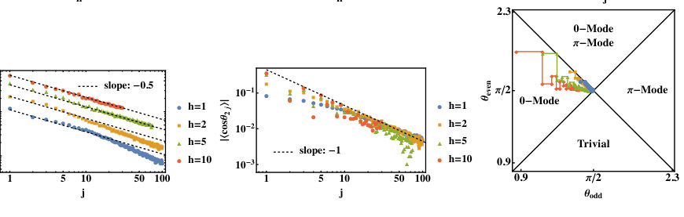
<figcaption class="paper-figure-caption"><b>Fig 1.</b> FIG. 1. Results for the Anderson model for L = 200 and T = 1.5, with disorder strengths h = 1, 2, 5, 10, averaged over 15,000 realizations. Top panels (x-axes are on a log-scale): the disorder-averaged autocorrelation saturates to a constant value at late times (left panel). The relative standard deviation of the autocorrelation also saturates at late times (middle panel). The disorder averaged cosine of the Krylov angles is shown in the right panel, where the odd/even angles approach π/2 from above/below. Bottom panels: log–log plots of the averaged cosines of the odd (left panel) and even (middle panel) Krylov angles. For strong disorder, ⟨cos θ2j−1⟩∼1/√j, while |⟨cos θ2j⟩| ∼1/j for all...</figcaption>
</figure>
<figure class="paper-figure-card">
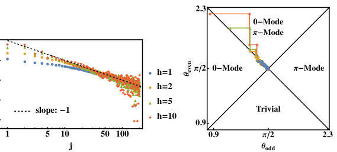
<figcaption class="paper-figure-caption"><b>Fig 2.</b> FIG. 2. The Krylov angles are computed from the disorder-averaged autocorrelation (upper left panel of Fig. 1) and shown in the left panel. In contrast to the results in Fig. 1, both the odd and even Krylov angles exhibit the same asymptotic power-law behavior, | cos θj| ∼1/j for large j (middle panel). Consequently, the trajectory of the Krylov angles in the phase diagram (right panel) lies along the diagonal. These results are consistent with the analytic solution for a constant autocorrelation which suggests a power-law localized 0-mode in Krylov space [10].</figcaption>
</figure>
<figure class="paper-figure-card">
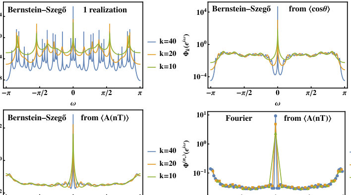
<figcaption class="paper-figure-caption"><b>Fig 3.</b> FIG. 3. Approximate spectral functions for the Anderson model obtained from different approximation schemes for L = 200, T = 1.5, h = 10. Top panels: Bernstein–Szeg˝o approximation (13) applied to a single realization (left panel) and to the average over 15,000 realizations of the cosine of the Krylov angles (right panel). Bottom panels: Approximate spectral function obtained from the Bernstein–Szeg˝o approximation (13) based on Krylov angles extracted from the disorder-averaged autocorrelation (left panel) ; truncated Fourier transform (16) computed from the disorder-averaged autocorrelation is evaluated only at (2n∗+ 1) discrete values of the frequencies: ω = 2mπ/(2n∗+ 1) with m = −n∗,...</figcaption>
</figure>
<figure class="paper-figure-card">
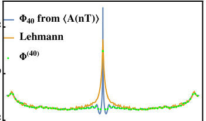
<figcaption class="paper-figure-caption"><b>Fig 4.</b> FIG. 4. Comparison of different methods for extracting the disorder-averaged spectral function. The bottom two panels of Fig. 3, corresponding to the Bernstein–Szeg˝o approxima- tion with k∗= 40 (Φ40) and the truncated Fourier transform with n∗= 40 (Φ(40)), are plotted together with the results obtained from the Lehmann representation (34), the latter averaged over 5000 realizations. All three methods show good agreement, while the Bernstein–Szeg˝o approximation more ef- ficiently captures the delta-function peak at ω = 0.</figcaption>
</figure>
<figure class="paper-figure-card">
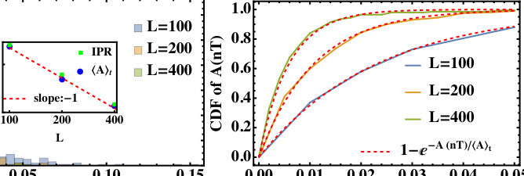
<figcaption class="paper-figure-caption"><b>Fig 5.</b> FIG. 5. Delocalized phase of the Aubry–Andr´e model with h = 1, T = 10, and system sizes L = 100, 200, 400. Top panels: autocorrelation (left), and the corresponding Krylov angles (right). Bottom panels: PDF of the autocorrelation (left) and the corresponding CDF (right). Both the PDF and CDF are computed from the first 200 time steps of the autocorrelation.</figcaption>
</figure>

**Summary.** This paper develops a Krylov space-based approach to study Anderson localization by treating continuous-time dynamics as a discrete-time Floquet problem. It introduces an efficient moment method for computing spectral functions and identifies clear numerical signatures for the localization-delocalization transition. The work provides a powerful tool for analyzing the long-time dynamics of disordered and quasi-periodic systems.

**Why it may be interesting.** This is highly relevant for many-body dynamics as it provides a new numerical framework for studying operator spreading and spectral properties in Floquet systems, which is a central theme in studying periodically driven quantum systems.

Detailed structure

**Main problem.** Investigating Anderson localization and the localization-delocalization transition in the Aubry-Andre model using an operator Krylov space perspective.

**Main result.** The study demonstrates that mapping continuous-time dynamics to a stroboscopic Floquet problem allows for efficient spectral reconstruction and identifies specific signatures of localization, such as the absence of a Porter-Thomas distribution and power-law decay of Krylov angles.

**Method.** The authors employ operator Krylov space methods, specifically the Arnoldi iteration and a more efficient 'moment method' to extract Krylov parameters from the discrete-time autocorrelation function.

**Model / system.** The primary models are the 1D Anderson model (disordered) and the Aubary-Andre model (quasi-periodic), mapped to an effective 1D Floquet transverse field Ising model.

**Key observables.** Autocorrelation function, Krylov angles (theta_j), spectral function, Inverse Participation Ratio (IPR), and Porter-Thomas distribution.

**Important parameters / regimes.** Disorder strength (h), stroboscopic time step (T), and system size (L).

**Assumptions / limitations.** The study focuses on non-interacting fermionic systems and assumes the validity of the stroboscopic approximation for studying long-time dynamics.

**Figures summary.** Figures show phase diagrams of the Floquet Ising model, disorder-averaged autocorrelation saturation, power-law decay of Krylov angles, and comparisons of different spectral reconstruction schemes.

**Paper structure.** The paper introduces the Krylov space mapping, compares numerical algorithms (Gram-Schmidt vs. Moment method), analyzes the localization-delocalization transition in the Anderson and Aubry-Andre models, and discusses the statistical properties of Krylov parameters and spectral functions.

Abstract

The problem of Anderson localization, as well as the single particle localization-delocalizaton transition of the Aubry-André model, is studied employing operator Krylov space methods. It is shown that even when the dynamics is generated by a Hamiltonian, studying the dynamics at stroboscopic rather than continuous times has its advantages. In particular, mapping the dynamics to an effective Floquet problem results in an operator Krylov space description where quantities such as the spectral function can be computed with fewer computational resources, while a moment method exists that allows for the extraction of Krylov parameters directly from the discrete time autocorrelation function. For stroboscopic dynamics, the operator Krylov space corresponds to the dynamics of an edge operator of an inhomogeneous Floquet transverse field Ising model, with the parameters of this effective model generated recursively. The Krylov parameters show disorder-averaged renormalization with their distribution narrowing as the recursion step increases. It is shown that a more physical spectral function is obtained from the Krylov parameters obtained from the disorder-averaged autocorrelation function, rather than the disorder-averaged Krylov parameters. The delocalized (localized) phase is shown to correspond to the appearance (absence) of a Porter-Thomas distribution, a ballistically propagating (localized) wavefront in operator Krylov space, and a smooth (discrete) Berstein-Szegö power-spectrum. The localization-delocalization transition is also demonstrated in operator Krylov space. A Porter-Thomas distribution is also observed at the critical point. The long-time dynamics and the inverse participation ratio at the critical point is shown to exhibit behavior consistent with a multi-fractal scaling with system size.

[↑ back to top](#top)

### [Quantum Dynamics of Interacting dissipative oscillators: A novel scheme](http://arxiv.org/abs/2605.24478v1)

**Authors:** Ronak Moradi, Fardin Kheirandish  
**Type:** theory · **Category:** other · **PDF:** <https://arxiv.org/pdf/2605.24478v1>  
**Analysis basis:** full PDF text, analyzed in chunks
**Topic relevance:** 🔥 `non-equilibrium dynamics` **4/5** · `methods for driven-dissipative` **3/5** · `driven-dissipative phase transition` **2/5**

↔ Scroll figures horizontally

<figure class="paper-figure-card">
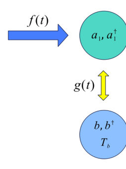
<figcaption class="paper-figure-caption"><b>Fig 1.</b> Figure 1: (Color online) Two interacting oscillators interacting with two thermal reservoirs with temperatures Tb and Tc. An external classical force with a time-dependent amplitude f(t) and frequency ωL is applied to the first oscillator</figcaption>
</figure>
<figure class="paper-figure-card">
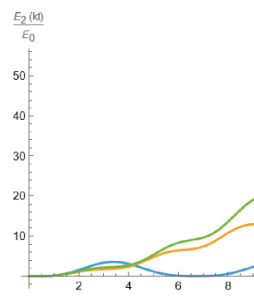
<figcaption class="paper-figure-caption"><b>Fig 2.</b> Figure 2: (Color online) The scaled energy of the right oscillator for different values of the scaled detuning △</figcaption>
</figure>
<figure class="paper-figure-card">
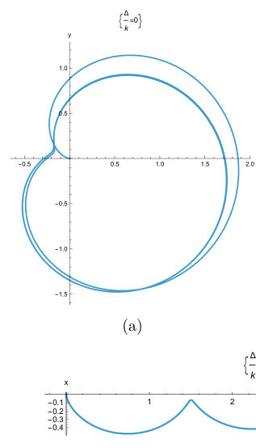
<figcaption class="paper-figure-caption"><b>Fig 3.</b> Figure 3: The locations of the maximum of the Husimi function of the right oscillator at zero temperature and in the presence of an external source with constant amplitude F and frequency ωL for the scaled detuning values △</figcaption>
</figure>
<figure class="paper-figure-card">
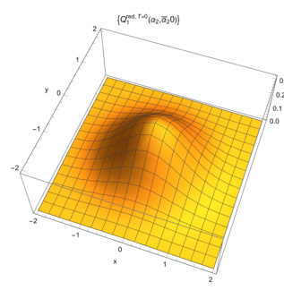
<figcaption class="paper-figure-caption"><b>Fig 4.</b> Figure 4: (a) Husimi function Qred 1 (α2, ¯α2, 0) at zero temperature. (b) Husimi function Qred 1 (α2, ¯α2, kt = π</figcaption>
</figure>
<figure class="paper-figure-card">
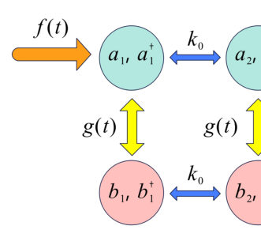
<figcaption class="paper-figure-caption"><b>Fig 5.</b> Figure 5: (Color online) n-interacting oscillators in a medium driven by a classical field f(t) applied to the first oscillator of the main system. The time-dependent coupling functions g(t) couple the main system to the bath oscillators. The strength of the interaction between the oscillators in the main system and the bath is determined by the parameter k.</figcaption>
</figure>

**Summary.** The paper develops a theoretical scheme to study how energy moves through a chain of interacting, dissipative oscillators under external driving. It reveals that resonance can prevent energy from growing without bound and that certain configurations can shield middle oscillators from energy increases. This work is significant for understanding energy transfer and localization in driven-dissipative quantum networks.

**Why it may be interesting.** This paper provides analytical insights into energy localization and unbounded energy gain in driven-dissipative networks, which is highly relevant to the study of open quantum systems and quantum transport.

Detailed structure

**Main problem.** Investigating the quantum dynamics, energy transfer, and energy localization in networks of interacting, dissipative quantum harmonic oscillators driven by an external classical field.

**Main result.** The study finds that in the off-resonance regime, the energy of the second oscillator grows unboundedly, whereas on resonance, it remains bounded and periodic; additionally, for a three-oscillator system, the middle oscillator exhibits an energy shielding effect.

**Method.** The authors use successive Bogoliubov transformations to diagonalize the Hamiltonian and solve the Heisenberg equations of motion, supplemented by phase-space analysis using Husimi Q-functions.

**Model / system.** A system of n interacting quantum harmonic oscillators coupled to thermal reservoirs and driven by an external classical force with frequency omega_L. The Hamiltonian includes nearest-neighbor interactions and time-dependent coupling to the bath.

**Key observables.** Oscillator energies, Husimi Q-functions, reduced Husimi functions, and reduced density matrix components in the number state basis.

**Important parameters / regimes.** Resonance vs. off-resonance (detuning), temperature (zero temperature vs. thermal reservoirs), and coupling strength g(t).

**Assumptions / limitations.** The model assumes Markovian evolution and specific initial states such as separable coherent and number states.

**Figures summary.** Figure 2 shows energy growth for different detunings; Figure 3 tracks the path of the Husimi function maximum; Figure 4 compares Husimi functions at different times; Figure 5 provides a schematic of the n-oscillator system.

**Paper structure.** The paper introduces the problem, defines the Hamiltonian for two and n oscillators, applies Bogoliubov transformations to solve the dynamics, analyzes energy and phase-space evolution, and provides detailed mathematical derivations in the appendices.

Abstract

We investigate the dynamics of interacting quantum harmonic oscillators coupled to thermal reservoirs under the influence of an external driving field. In a novel theoretical scheme, we first analyze the case of two interacting oscillators, each coupled to its own thermal reservoir, with an external source applied to the first oscillator. By diagonalizing the total Hamiltonian through successive Bogoliubov transformations, we obtain explicit expressions for the oscillator energies. A key finding is that off resonance, the energy of the second oscillator grows unboundedly, whereas on resonance, it remains bounded and periodic. We then derive the Husimi functions for both oscillators and the reduced Husimi functions for initially separable coherent and number states. The shift of the Husimi function's maximum away from the origin at zero temperature confirms continuous energy gain under specific parameter conditions. An explicit formula for the reduced density matrix components in the number state basis is also provided. Finally, we generalize the model to $n$ interacting oscillators in a thermal medium driven by a classical field. For the three-oscillator case, we show that on resonance, the energies of the first and third oscillators grow, while the energy of the second oscillator remains periodically bounded. These results offer insights into energy transfer and localization in coupled oscillator systems in thermal environments.

[↑ back to top](#top)

### [Self-Generated Chiral Rotation in Whispering-Gallery Optomechanics](http://arxiv.org/abs/2605.24185v1)

**Authors:** Mohamed Hatifi  
**Type:** theory · **Category:** other · **PDF:** <https://arxiv.org/pdf/2605.24185v1>  
**Analysis basis:** full PDF text, analyzed in chunks
**Topic relevance:** 🔥 `driven-dissipative phase transition` **4/5** · `non-equilibrium dynamics` **3/5** · `quantum measurements` **2/5**

↔ Scroll figures horizontally

<figure class="paper-figure-card">
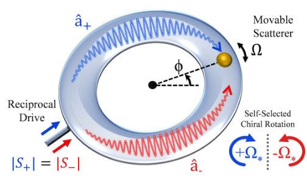
<figcaption class="paper-figure-caption"><b>Fig 1.</b> Figure 1. Schematic of angular-recoil backaction in a whispering-gallery-mode resonator. A localized movable scatterer at angular coordinate ϕ couples the two counterpropagating WGM modes a+ and a−, which are driven reciprocally with equal in- puts in amplitude |S+| = |S−|. A circulation-changing scattering event transfers angular momentum to the scatterer: a+ →a−gives ∆Lϕ = +2mℏ, while a−→a+ gives ∆Lϕ = −2mℏ. If the scatterer rotates with angular velocity Ω, the two scattering channels acquire opposite rotational Doppler shifts, ∆∓2mΩ. This Doppler imbalance changes the two recoil rates, producing a net torque on the scatterer. Above threshold, the reciprocal state Ω= 0 becomes unstable...</figcaption>
</figure>
<figure class="paper-figure-card">
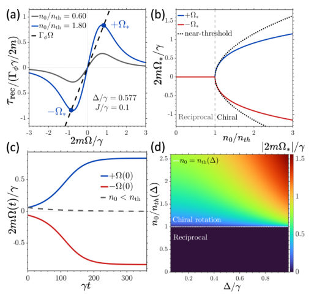
<figcaption class="paper-figure-caption"><b>Fig 2.</b> Figure 2. Reciprocal angular-recoil instability of a movable WGM backscatterer. (a) Reciprocal-drive recoil torque τrec(Ω), normalized by Γϕγ/(2m), as a function of the normalized rota- tional Doppler shift 2mΩ/γ, compared with the mechanical damp- ing torque ΓϕΩ. For n0 &lt; nth the only stable solution is Ω= 0, whereas for n0 &gt; nth two finite intersections Ω= ±Ω∗appear. Parameters in (a)–(c) are ∆/γ = 1/ √</figcaption>
</figure>
<figure class="paper-figure-card">
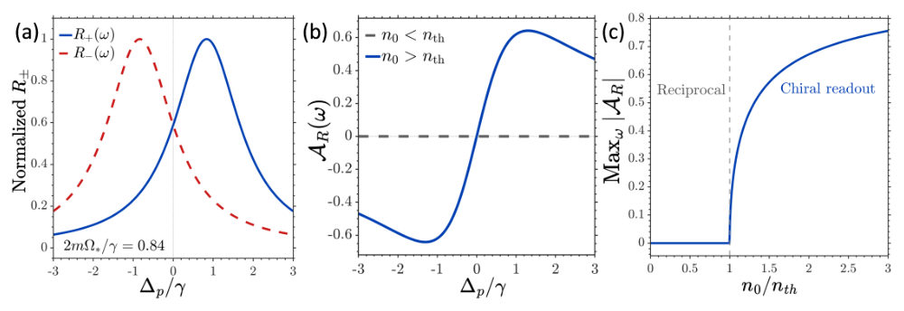
<figcaption class="paper-figure-caption"><b>Fig 3.</b> Figure 3. Optical readout of the mechanically chiral state. (a) Normalized backscattered spectra R+(ω) and R−(ω), for the two probe directions in the rotating phase.The selected angular velocity Ω∗Doppler-shifts the two backscattering channels in opposite directions, produc- ing resonances centered at detunings separated by 4mΩ∗. The plotted case has 2mΩ∗/γ = 0.84. (b) Directional backscattering asymmetry AR(ω) = [R+(ω) −R−(ω)]/[R+(ω) + R−(ω)] defined in Eq. (21). Below threshold, Ω∗= 0, and the asymmetry vanishes. Above threshold, the Doppler-split spectra produce an odd asymmetry in the probe detuning ∆p. (c) Maximum asymmetry maxω |AR| as a function of normalized photon number n0/nth....</figcaption>
</figure>

**Summary.** This paper shows how a movable scatterer in a whispering-gallery-mode resonator can spontaneously start rotating due to the recoil from backscattered photons. This process breaks the symmetry of the system, turning a passive mode-splitting effect into an active, self-generated chiral state. The resulting rotation can be detected through Doppler-split optical spectra.

**Why it may be interesting.** It presents a minimal mechanism for autonomous symmetry breaking and chiral optomechanics, which is highly relevant to researchers working on non-equilibrium dynamics and open quantum systems.

Detailed structure

**Main problem.** Investigating whether reciprocal optical driving in a whispering-gallery-mode resonator can induce spontaneous mechanical rotation (chiral state) without externally imposed handedness.

**Main result.** The study demonstrates that angular-recoil backaction from photon backscattering can create negative angular friction, leading to a symmetry-breaking pitchfork bifurcation into two steady-state rotations.

**Method.** The author uses a weak-scattering, adiabatic, driven-dissipative model based on Langevin/input-output equations and local stability analysis of the angular dynamics.

**Model / system.** A whispering-gallery-mode (WGM) resonator containing a localized, movable scatterer (an angular degree of freedom) subject to reciprocal bidirectional optical pumping.

**Key observables.** Time-averaged optical torque, steady-state angular velocity, backscattered spectra, and backscattering asymmetry.

**Important parameters / regimes.** WGM azimuthal index (m), optical detuning (Delta), backscattering rate (J), optical linewidth (gamma), and photon number (n0).

**Assumptions / limitations.** Weak-scattering limit (J << gamma), adiabatic regime, neglect of static pinning, and neglect of one-sided propulsion or external rotation.

**Figures summary.** Figure 1 shows a schematic of angular-recoil backaction; Figure 2 plots reciprocal torque vs. Doppler shift, steady-state angular velocity vs. photon number, and time-domain evolution.

**Paper structure.** The paper introduces the mechanism of angular-recoil backaction, presents a mathematical model of the WGM resonator, performs stability analysis to identify the bifurcation, and concludes with the optical readout of the chiral state.

Abstract

Backscattering in whispering-gallery-mode resonators is usually a passive mode-splitting mechanism produced by a fixed defect. Here, we show that, when the backscatterer is a mechanical angular degree of freedom, the same process becomes an angular-recoil backaction channel capable of generating chirality under reciprocal driving. A localized movable scatterer coherently converts photons between clockwise and counterclockwise whispering-gallery modes, transferring angular recoil in each circulation-changing event. In a weak-scattering driven-dissipative model, reciprocal bidirectional pumping gives zero net torque at rest, but rotation Doppler-shifts the two opposite scattering rates in opposite directions. For suitable detuning, this feedback produces negative angular friction, destabilizes the nonrotating reciprocal state, and selects one of two symmetry-related steady rotations. The threshold scales inversely with the square of the WGM azimuthal index. The mechanically chiral state produces a direction-dependent weak-probe response, visible as a Doppler splitting of the backscattered spectra, turning passive WGM mode splitting into a minimal mechanism for autonomous chiral optomechanics.

[↑ back to top](#top)

### [Strong Eigenstate Thermalization from Mean-Ergodic Non-chaotic Dynamics](http://arxiv.org/abs/2605.24510v1)

**Authors:** Avadhut V. Purohit, Harshit Sharma, Udaysinh T. Bhosale  
**Type:** theory · **Category:** statistical mechanics · **PDF:** <https://arxiv.org/pdf/2605.24510v1>  
**Analysis basis:** full PDF text, analyzed in chunks
**Topic relevance:** 🔥 `non-equilibrium dynamics` **4/5** · `entanglement & information structure` **3/5** · `scars & prethermalization` **2/5**

↔ Scroll figures horizontally

<figure class="paper-figure-card">
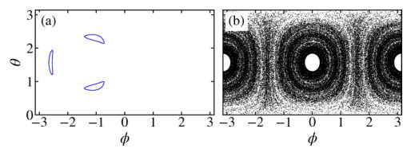
<figcaption class="paper-figure-caption"><b>Fig 1.</b> FIG. 1. The phase-space portrait for the initial point (𝜃0 = 1.0, 𝜙0 = −0.75) evolved for 105 kicks. Here, 𝑘𝑟= 1, (a) 𝑘𝜃= 0 and (b) 𝑘𝜃= 104. Blue dots indicate a period-3 cycle in the left panel. The right panel shows non-chaotic, mean-ergodic evolution of the same initial point illustrated with black dots.</figcaption>
</figure>
<figure class="paper-figure-card">
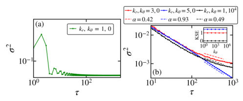
<figcaption class="paper-figure-caption"><b>Fig 2.</b> FIG. 2. The variance of time-averaged trajectory lengths Var𝜏(𝑙) plotted versus 𝜏using 𝑀= 100×100 equally spaced initial conditions from the phase-space. Panel (a) shows the non-mean-ergodic case (𝑘𝑟= 1, 𝑘𝜃= 0), where variance saturate to a non-zero value. Panel (b) shows mean-ergodic cases fitted with the power-law ⟨(Δ𝑙)2⟩𝜏∝ 𝜏−𝛼for two chaotic cases: red (𝑘𝑟= 3, 𝑘𝜃= 0) and blue (𝑘𝑟= 5, 𝑘𝜃= 0), together with the non-chaotic, mean-ergodic case: black (𝑘𝑟= 1, 𝑘𝜃= 104). The inset shows the KSE versus 𝑘𝜃for the initial condition (𝜋/2, −𝜋/2 −0.1). Black, red, and blue dots correspond to 𝑘𝑟= 1, 𝑘𝑟= 3, and 𝑘𝑟= 5, respectively.</figcaption>
</figure>
<figure class="paper-figure-card">
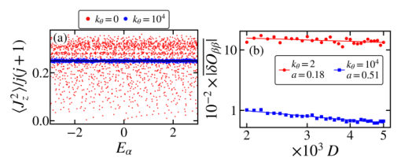
<figcaption class="paper-figure-caption"><b>Fig 3.</b> FIG. 3. (a) Expectation value of normalized observable 𝐽2 𝑧/𝑗( 𝑗+ 1) in the eigenstate |𝜙𝛼⟩plotted versus 𝐸𝛼in DKT for 𝑘𝑟= 1 and 𝑁= 2000. (b) Scaling of the average eigenstate-to-eigenstate fluctuations plotted against the Hilbert space dimensions 𝐷= 𝑁+ 1 for DKT at 𝑘𝑟= 1. For 𝑘𝜃= 104, fluctuations follow power-law |𝛿𝑂𝛽𝛽| ∝𝐷−𝑎.</figcaption>
</figure>
<figure class="paper-figure-card">
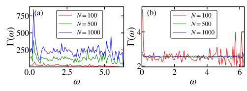
<figcaption class="paper-figure-caption"><b>Fig 4.</b> FIG. 4. Gamma versus 𝜔= |𝐸𝛼−𝐸𝛽| for 𝑘𝑟= 1, (a) 𝑘𝜃= 0 and (b) 𝑘𝜃= 104. Growing fluctuations indicate a non-Gaussian nature for small 𝑘𝜃. Whereas, convergence to 𝜔-independent value at large 𝑘𝜃 signals Gaussian statistics.</figcaption>
</figure>
<figure class="paper-figure-card">
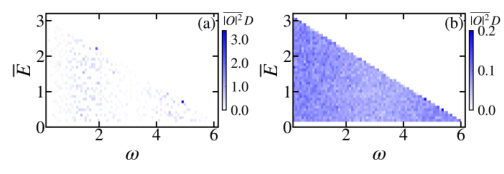
<figcaption class="paper-figure-caption"><b>Fig 5.</b> FIG. 5. Distribution of smooth function 𝑓O  ¯𝐸, 𝜔 2 = |𝑂|2𝐷plotted for off-diagonal elements of the DKT at 𝑘𝑟= 1 and 𝑁= 1000 to observe the dependence of temporal fluctuations on the transformed kick strengths. Panel: (a) 𝑘𝜃= 0 and (b) 𝑘𝜃= 104.</figcaption>
</figure>

**Summary.** This paper shows that strong thermalization (strong ETH) can occur in quantum systems even when the underlying classical dynamics are non-chaotic, provided they are mean-ergodic. By studying the Double Kicked Top model, the authors prove that ergodicity alone, rather than chaos, is sufficient to drive the emergence of Gaussian matrix element statistics and $D^{-1/2}$ scaling.

**Why it may be interesting.** This is highly relevant for many-body dynamics as it identifies a mechanism for 'chaos-free thermalization,' which could potentially serve as a resource for quantum computing by generating entanglement without the destructive effects of quantum chaos.

Detailed structure

**Main problem.** The paper investigates whether the strong Eigenstate Thermalization Hypothesis (ETH) can emerge from classical non-chaotic but mean-ergodic dynamics, addressing whether strong ETH is a quantum analog of ergodicity rather than specifically a consequence of chaos.

**Main result.** The authors demonstrate that a non-chaotic, mean-ergodic regime of the Double Kicked Top model exhibits strong ETH, characterized by Gaussian statistics in off-diagonal matrix elements and $D^{-1/2}$ scaling of diagonal fluctuations.

**Method.** The study employs classical analysis (phase-space portraits, KSE, and ergodicity testing) alongside quantum analysis (ETH ansatz testing, spectral form factor, and higher-order spacing ratio statistics).

**Model / system.** A many-body system derived from the Double Kicked Top (DKT) model, consisting of $N=2j$ spin-1/2 particles with all-to-all interactions, characterized by kick strengths $k_r$ and $k_{	heta}$.

**Key observables.** Diagonal and off-diagonal matrix elements of the observable $J_z^2 / [j(j+1)]$, Kolmogorov-Sinai entropy (KSE), von Neumann entropy, and spacing ratio statistics $r(	ilde{k})$.

**Important parameters / regimes.** Kick strengths $k_r$ (radial) and $k_{	heta}$ (angular); regimes include non-chaotic/non-ergodic, non-chaotic/mean-ergodic, and chaotic.

**Assumptions / limitations.** The analysis assumes the validity of the Floquet operator formalism and the applicability of von Neumann's mean-ergodic theorem to the classical limit.

**Figures summary.** Figures include phase-space portraits, plots of expectation values and fluctuations, distributions of matrix elements, and spectral diagnostics like the Spectral Form Factor and spacing ratio distributions.

**Paper structure.** The paper introduces the problem of ETH in non-chaotic systems, describes the DKT model, presents classical ergodicity and chaos analysis, moves to quantum ETH verification via matrix element statistics, and concludes with spectral and correlation-based proofs of integrability/chaos.

Abstract

We report an example of a many-body system, derived from the double kicked top (DKT), with non-chaotic yet mean-ergodic dynamics that displays \textit{strong} eigenstate thermalization hypothesis (ETH) in the quantum regime. The analysis addresses a key open question: whether \textit{strong} ETH is a quantum analog of ergodicity (or mean-ergodicity). Despite non-chaotic dynamics, the fluctuations of the diagonal matrix elements of an observable scale as $D^{-1/2}$, where $D$ denotes the Hilbert space dimension. Furthermore, the off-diagonal matrix elements show Gaussian statistics together with a smooth function $f_O(\bar{E}, ω)$ that becomes nearly uniform in the large-$k_θ$ domain. Our findings show that even mean-ergodic and non-chaotic systems can exhibit \textit{strong} ETH.

[↑ back to top](#top)

### [A Variational Dissipative Framework for Quantum Algorithms](http://arxiv.org/abs/2605.25841v1)

**Authors:** Yuan Yao, Ruipeng Xing, Yongjian Gu, Yiming Huang, Xiao Yuan  
**Type:** theory · **Category:** quantum information and computing · **PDF:** <https://arxiv.org/pdf/2605.25841v1>  
**Analysis basis:** full PDF text, analyzed in chunks
**Topic relevance:** 🔥 `methods for driven-dissipative` **4/5** · `non-equilibrium dynamics` **2/5** · `quantum measurements` **2/5**

↔ Scroll figures horizontally

<figure class="paper-figure-card">
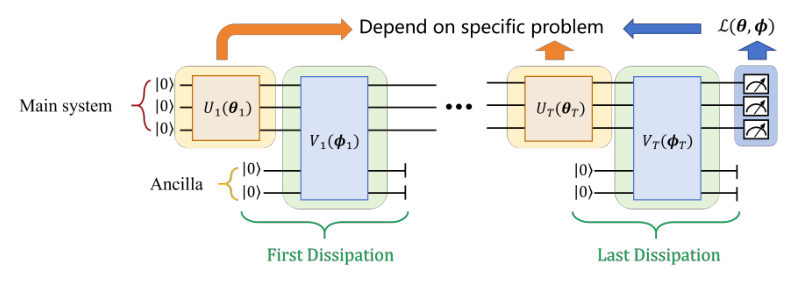
<figcaption class="paper-figure-caption"><b>Fig 1.</b> Figure 1: General architecture of the variational dissipative framework. The circuit combines a system-only variational module with an ancilla-assisted dissipative module.</figcaption>
</figure>
<figure class="paper-figure-card">
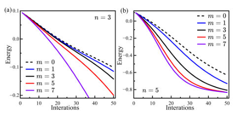
<figcaption class="paper-figure-caption"><b>Fig 2.</b> Figure 2: Training curves of the dissipative VQE with different numbers of ancillas. Panels (a) and (b) cor- respond to different main-system sizes. As the number of ancillas increases, the energy decreases faster during training and the final converged energy becomes lower, demonstrating improved convergence speed and varia- tional accuracy.</figcaption>
</figure>
<figure class="paper-figure-card">
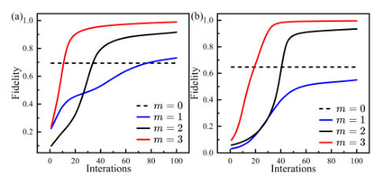
<figcaption class="paper-figure-caption"><b>Fig 3.</b> Figure 3: Fidelity recovery performance for different numbers of ancillas. Introducing dissipative ancillas sig- nificantly improves the fidelity beyond the initial input value, and increasing the number of ancillas generally leads to both faster recovery and a higher final fidelity.</figcaption>
</figure>
<figure class="paper-figure-card">
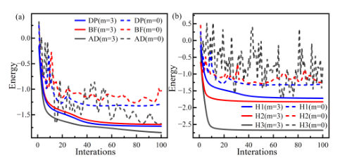
<figcaption class="paper-figure-caption"><b>Fig 4.</b> Figure 4: Robustness of the dissipative VQE across dif- ferent noise channels and Hamiltonians. (a) Compari- son under amplitude-damping, bit-flip, and depolarizing noise in the fully noisy setting. (b) Comparison for three representative Hamiltonians: an XX-type model in a transverse field, a transverse-field Ising model, and an XXZ-type model. In both cases, the dissipative VQE converges faster and reaches lower final energies than the ancilla-free baseline.</figcaption>
</figure>
<figure class="paper-figure-card">
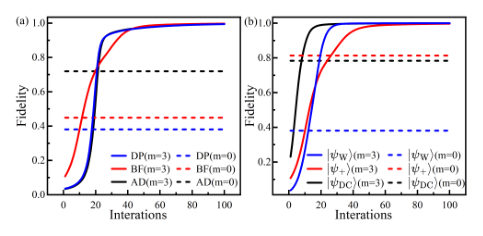
<figcaption class="paper-figure-caption"><b>Fig 5.</b> Figure 5: Fidelity recovery under different noise con- ditions and target states.Dashed lines denote the noisy input fidelities without dissipative recovery, while solid lines denote the results with variational dissipative re- covery. (a) Recovery of a dressed cluster target state un- der depolarizing, bit-flip, and amplitude-damping noise. (b) Recovery performance for three representative target states: the W state |ψW ⟩, the uniform superposition state |ψ+⟩, and the dressed cluster state |ψDC⟩. Unless otherwise specified, the simulations use n = 3 system qubits, m = 3 ancillas, learning rate lr = 0.8, dissipa- tive rounds T = 3, and noise strength p = 0.1.</figcaption>
</figure>

**Summary.** This paper introduces a new variational framework that incorporates engineered dissipation into quantum algorithms using ancilla-assisted channels. It demonstrates that these dissipative modules can be trained to both find ground states more efficiently and recover noisy states, potentially offering an exponential speedup in optimization complexity.

**Why it may be interesting.** This is highly relevant for researchers in open quantum systems as it treats dissipation not as a nuisance but as a programmable resource for state engineering and error mitigation, providing a bridge between reservoir engineering and quantum algorithm design.

Detailed structure

**Main problem.** Standard variational quantum algorithms are limited to unitary operations, which restricts the ansatz to pure states and makes them susceptible to noise-induced barren plateaus. The research seeks to expand the variational search space by incorporating controllable, nonunitary dissipative processes.

**Main result.** The authors propose a unified dissipative framework that uses ancilla-assisted engineered dissipation as a trainable resource to both improve ground-state energy convergence and perform state recovery. They theoretically demonstrate a conditional exponential advantage in iteration complexity over standard unitary VQAs under certain landscape conditions.

**Method.** The framework integrates trainable dissipative modules, realized via system-ancilla unitaries followed by ancilla reset and trace-out, into parameterized quantum circuits. The authors use the GKLS master equation, Stinespring dilation, and the Polyak-Lojasiewicz (PL) inequality to analyze convergence and complexity.

**Model / system.** The model consists of a system of n qubits coupled to an m-qubit ancilla register. The dynamics are described by a combination of system-only unitary layers and ancilla-assisted dissipative blocks, tested on spin Hamiltonians including XX-type, transverse-field Ising, and XXZ models.

**Key observables.** Ground-state energy expectation value, state fidelity, convergence speed (energy descent), and iteration complexity.

**Important parameters / regimes.** Number of system qubits (n), number of ancillas (m), number of dissipative rounds (T), noise strength (p), and learning rate (lr).

**Assumptions / limitations.** Relies on the Born-Markov approximation, the assumption that the dissipative objective satisfies the PL condition, and that ancillas are reset to the zero state before each dissipative block.

**Figures summary.** Figure 1 shows the general architecture; Figure 2 and 3 demonstrate improved energy convergence and fidelity recovery with increasing ancilla counts; Figure 4 and 5 show robustness across different noise channels and target states; Figure 7 illustrates ancilla saturation and a robustness plateau.

**Paper structure.** The paper introduces the limitation of unitary ansätze, proposes the dissipative framework, details the implementation for ground-state search and state recovery, provides numerical evidence of performance gains and robustness, and concludes with a mathematical complexity analysis comparing dissipative and unitary VQAs.

Abstract

Dissipation engineering has attracted growing interest as an approach to controlling open quantum systems through engineered system-environment interactions. Standard variational quantum circuits are usually built from unitary operations and therefore explore only a restricted family of states. To go beyond this limitation, we introduce a variational dissipative framework in which ancilla-assisted engineered dissipation is incorporated into parameterized quantum algorithms. In this framework, system-only variational layers are combined with trainable dissipative modules, so that the circuit can prepare a broader class of mixed states through ancilla-assisted nonunitary transformations. Within this framework, the same ancilla-assisted dissipative block is used in two representative settings with different objectives. For ground-state search, it is integrated into a dissipative variational quantum eigensolver to improve the convergence toward low-energy states. For state recovery, it is trained as a recovery channel to suppress preparation noise and enhance fidelity with the target state. In both cases, the block is realized through parameterized system-ancilla couplings followed by ancilla reset and trace-out. Our results show that engineered dissipation can be incorporated into variational quantum circuits as a reusable trainable primitive rather than treated only as a source of noise. In this sense, the proposed framework identifies ancilla-assisted dissipative channels as a concrete variational resource that can support both optimization and recovery tasks within a unified design.

[↑ back to top](#top)

### [Boundary $0/π$ logical subspace and bulk dynamical probes in flux-controlled anomalous Floquet quantum walks](http://arxiv.org/abs/2605.25792v1)

**Authors:** WeiCheng Ning, YanSheng Liu, XiaoXue Zhang, XiZheng Zhang  
**Type:** theory · **Category:** quantum information and computing · **PDF:** <https://arxiv.org/pdf/2605.25792v1>  
**Analysis basis:** full PDF text, analyzed in chunks
**Topic relevance:** 🔥 `non-equilibrium dynamics` **4/5** · `analog quantum simulation` **2/5** · `entanglement & information structure` **2/5**

↔ Scroll figures horizontally

<figure class="paper-figure-card">
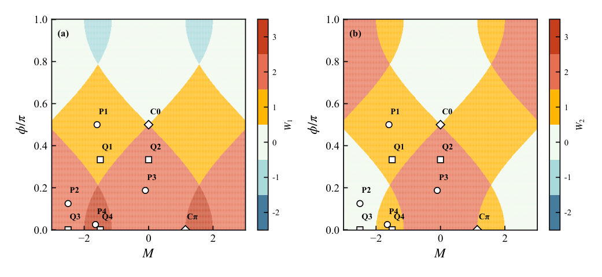
<figcaption class="paper-figure-caption"><b>Fig 1.</b> FIG. 1. Bulk topological phase diagram of the Floquet quantum walk for t1 = t2 = 1 and T = 2. Panels (a) and (b) show W1 and W2 evaluated on a high-resolution grid in the (M, ϕ) plane. The representative parameter sets used later in Figs. 2, 3, and 4 are written directly on the phase map. Circular markers denote the open boundary points Pj, square markers denote the frame-resolved bulk points Qj, and diamond markers denote the critical benchmarks C0 and Cπ. Every later numerical panel can therefore be traced back to a definite point in the bulk diagram.</figcaption>
</figure>
<figure class="paper-figure-card">
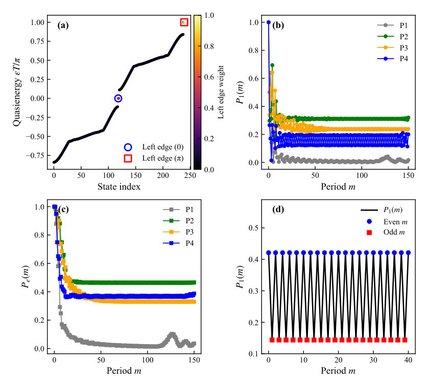
<figcaption class="paper-figure-caption"><b>Fig 2.</b> FIG. 2. Open-boundary edge spectrum and boundary dynamics. Panel (a) shows the quasienergy spectrum at P4 under open boundary conditions. The color scale gives the left edge weight in a fixed boundary window, and the highlighted markers identify the left edge states near 0 and π/T on the same boundary. Panel (b) shows the site-one probability P1(m) defined in Eq. (39) for the four points P1 to P4 defined in Fig. 1, with the initial state |Ψ(0)⟩= |1, A⟩. Panel (c) shows the boundary window probability Pe(m) defined in Eq. (39) for the same four points. Panel (d) shows the optimized doubled-period response at P4 for the phase matched state in Eq. (52). The continuous trace is P1(m) itself,...</figcaption>
</figure>
<figure class="paper-figure-card">
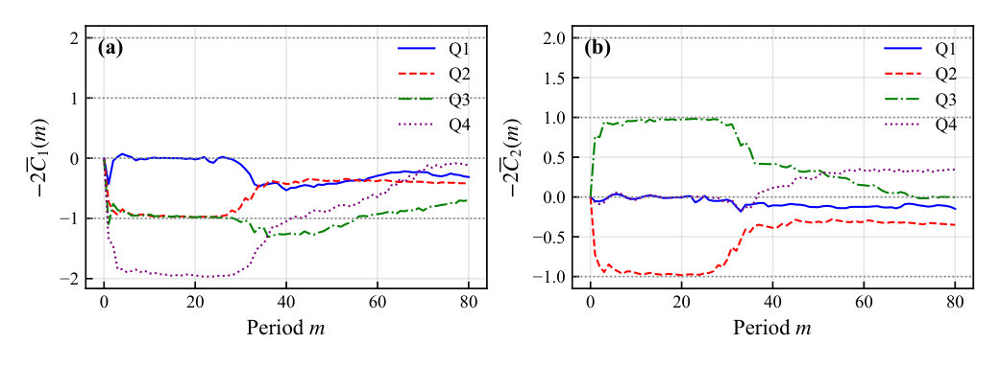
<figcaption class="paper-figure-caption"><b>Fig 3.</b> FIG. 3. Frame-resolved mean chiral displacement for the four representative bulk points Q1 to Q4 defined in Eq. (34). Panel (a) shows −2C1(m) in symmetric time frame 1 and panel (b) shows −2C2(m) in symmetric time frame 2. The dotted horizontal guides mark the quantized targets associated with the winding numbers. Over the pre-reflection time window the curves approach (W1, W2) = (0, 0) for the trivial point, (1, 1) for the 0-only point, (1, −1) for the π-only point, and (2, 0) for the coexistence point. The two-gap bulk topology is therefore dynamically resolved in the two symmetric time frames.</figcaption>
</figure>
<figure class="paper-figure-card">
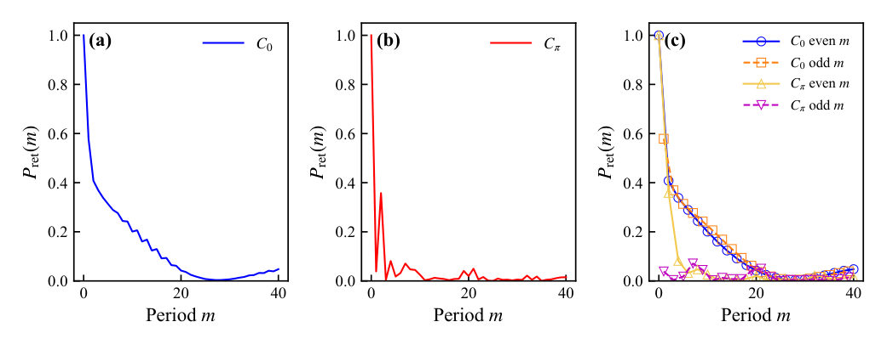
<figcaption class="paper-figure-caption"><b>Fig 4.</b> FIG. 4. Selected benchmark bulk critical dynamics for the two points defined in Eq. (35). Panels (a) and (b) show the return probability Pret(m) defined in Eq. (61) for the representative 0 gap benchmark C0 = (0, π/2) and the representative π gap benchmark Cπ = (π −2, 0). Panel (c) separates the even and odd subsequences for both benchmarks over the same short time window and compares the local stroboscopic fingerprints directly. The odd and even splitting is much stronger for the π gap benchmark, consistent with the leading expansion in Eq. (65). The benchmark figure is therefore focused entirely on the local stroboscopic evidence for the distinction between the two representative critical...</figcaption>
</figure>

**Summary.** This paper shows how a flux-controlled quantum walk can host a protected 0/pi logical subspace at its boundaries while allowing the bulk topology to be read out via dynamical probes. It identifies a unique doubled-period response in the coexistence sector and distinguishes between different topological gaps using local stroboscopic signatures. This suggests a robust route for implementing quantum-walk-based information primitives in driven microstructured lattices.

**Why it may be interesting.** It presents a unified framework for creating symmetry-protected quantum information primitives (edge qubits) and provides specific dynamical signatures for detecting anomalous Floquet topology in driven lattice systems.

Detailed structure

**Main problem.** Investigating whether a single microscopic family of driven lattices can simultaneously support a boundary logical subspace (0/pi edge qubit) and detectable bulk topological diagnostics via a flux-controlled protocol.

**Main result.** The authors demonstrate that a flux-controlled anomalous Floquet quantum walk provides a symmetry-protected boundary logical subspace with a doubled-period (2T) response and that the bulk topology can be dynamically resolved through frame-resolved mean chiral displacements.

**Method.** The study uses momentum-space Bloch spinors, Taylor expansions around critical gap-closing points, and numerical simulations of both periodic and open boundary condition chains.

**Model / system.** A one-dimensional, chiral, flux-controlled anomalous Floquet quantum walk realized in a driven bipartite lattice with a coin-dependent drift step and a momentum-dependent mixing step.

**Key observables.** Boundary local observables (site-one and boundary window projectors), frame-resolved mean chiral displacement, and local stroboscopic return probability.

**Important parameters / regimes.** Mass parameter (M), flux phase (phi), hopping amplitudes (t1, t2), and driving period (T).

**Assumptions / limitations.** The analysis assumes a clean system (pre-reflection window) and uses small-parameter expansions near gap-closing points.

**Figures summary.** Figure 1 shows the bulk topological phase diagram in the (M, phi) plane; Figure 2 displays the quasienergy spectrum at the edge; Figure 4 compares the return probability and stroboscopic response at the 0-gap and pi-gap benchmarks.

**Paper structure.** The paper introduces the microscopic model, defines the topological classification and phase diagram, analyzes the boundary logical subspace dynamics, and concludes with bulk dynamical probes and gap-specific stroboscopic signatures.

Abstract

We formulate a one-dimensional flux-controlled anomalous Floquet quantum walk and show that it admits a direct microscopic realization in a driven bipartite lattice. The walk consists of a coin-dependent drift step and a momentum-dependent coin mixing step, so the same evolution operator governs quasienergy bands, boundary modes, and bulk dynamics in real space. Because the walk is chiral, the quasienergy gaps at $0$ and $π/T$ carry independent topological information, which organizes trivial, $0$-only, $π$-only, and coexistence sectors in the $(M,φ)$ plane. In the coexistence sector, a $0$ mode and a $π$ mode reside on the same edge and span a natural boundary logical subspace. One Floquet period acts there as a relative phase operation and produces a clear $2T$ response in local boundary observables. In the bulk, the same anomalous Floquet structure is probed dynamically in two complementary ways. Frame-resolved mean chiral displacements approach the two winding numbers in the clean pre-reflection window of the symmetric time frames, while selected benchmark cuts at a representative $0$ gap closing and a representative $π$ gap closing exhibit distinct local stroboscopic responses, with the $π$ gap benchmark showing a much stronger odd-even alternation. The boundary logical subspace and the bulk dynamical probes are therefore organized within one flux-controlled anomalous Floquet quantum walk, suggesting a symmetry-protected route to quantum-walk information primitives in driven microstructured lattices.

[↑ back to top](#top)

### [Dynamical susceptibility and quantum Fisher information in the Su-Schrieffer-Heeger model with Hatsugai-Kohmoto interactions](http://arxiv.org/abs/2605.25231v1)

**Authors:** Sepide Mohamadi, Jahanfar Abouie  
**Type:** theory · **Category:** strongly correlated electrons · **PDF:** <https://arxiv.org/pdf/2605.25231v1>  
**Analysis basis:** full PDF text, analyzed in chunks
**Topic relevance:** 🔥 `entanglement & information structure` **4/5** · `analog quantum simulation` **2/5** · `non-equilibrium dynamics` **2/5**

↔ Scroll figures horizontally

<figure class="paper-figure-card">
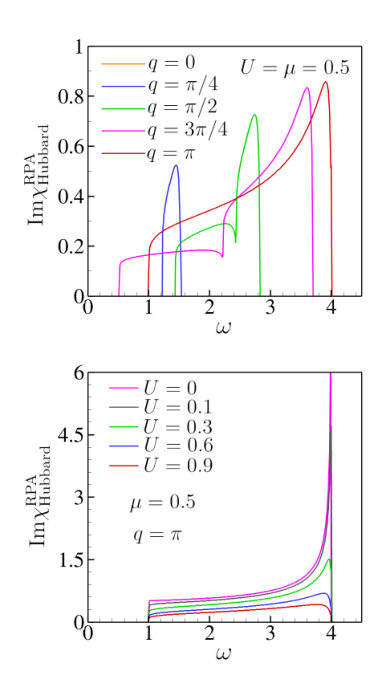
<figcaption class="paper-figure-caption"><b>Fig 1.</b> FIG. 1. Imaginary part of the dynamical spin susceptibility of the Hubbard model (energies are given in units of t). Top: ImχRPA(q, ω) for U/t = 0.5 and µ/t = 0.5, corresponding to half filling (µ = U/2), shown for several values of q. Bottom: ImχRPA(q = π, ω) for µ/t = 0.5 and different interaction strengths U/t.</figcaption>
</figure>
<figure class="paper-figure-card">
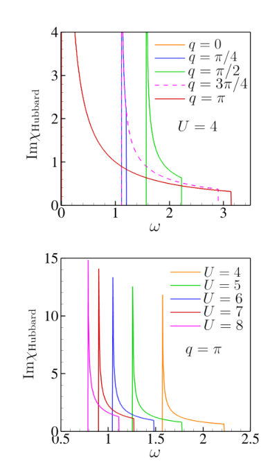
<figcaption class="paper-figure-caption"><b>Fig 2.</b> FIG. 2. Imaginary part of the dynamical spin susceptibility of the Hubbard model in the strong-coupling limit (energies are given in units of t). Top: Imχ(q, ω) for U/t = 4 (correspond- ing to J = t) for several values of q. Bottom: Imχ(q = π, ω) for different interaction strengths U/t.</figcaption>
</figure>
<figure class="paper-figure-card">
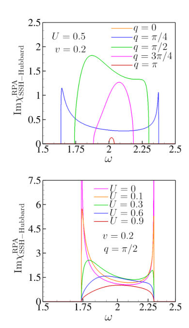
<figcaption class="paper-figure-caption"><b>Fig 3.</b> FIG. 3. Imaginary part of the dynamical susceptibility for the SSH–Hubbard model. Top panel: Imχ(q, ω) for fixed in- teraction strength U/w = 0.5 (with w = 1) and several wave vectors q, using v/w = 0.2. Bottom panel: Imχ(q, ω) at fixed wave vector q = π/2 for different values of the Hubbard in- teraction U.</figcaption>
</figure>
<figure class="paper-figure-card">
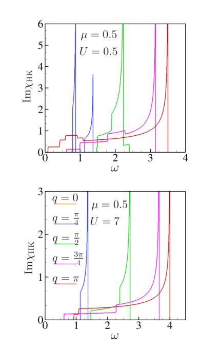
<figcaption class="paper-figure-caption"><b>Fig 4.</b> FIG. 4. Imaginary part of the dynamical spin susceptibility of the HK model for several wave vectors q. The chemical potential is set to µ/t = 0.5. Top: weak interaction, U/t = 0.5. Bottom: strong interaction, U/t = 7.</figcaption>
</figure>
<figure class="paper-figure-card">
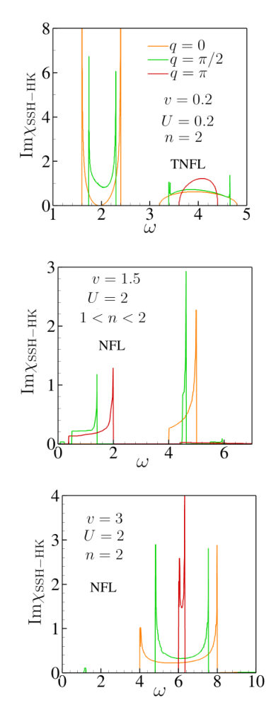
<figcaption class="paper-figure-caption"><b>Fig 5.</b> FIG. 5. Imaginary part of the dynamical spin susceptibility ImχSSH−HK(q, ω) as a function of frequency ω for selected wave vectors q. The intercell hopping amplitude is fixed at w = 1.</figcaption>
</figure>

**Summary.** This paper explores the dynamical properties of the SSH model when augmented with long-range Hatsugai-Kohmoto interactions. It demonstrates that while the Quantum Fisher Information can effectively distinguish between different particle filling sectors, it fails to detect topological phase transitions in uniform-density regimes. The work highlights how the interplay between dimerization and specific interaction types can create unique spectral features not found in standard Hubbard models.

**Why it may be interesting.** It provides an analytically tractable platform to study how long-range, momentum-diagonal interactions compete with topological band structures and how entanglement-related quantities like QFI can serve as probes for many-body phases.

Detailed structure

**Main problem.** The study investigates the dynamical response properties and the Quantum Fisher Information (QFI) in the Su-Schrieffer-Heeger (SSH) model with Hatsugai-Kohmoto (HK) interactions, specifically exploring the competition between topology and strong correlations.

**Main result.** The SSH-HK model shows qualitatively distinct behavior from Hubbard models, including a finite response at zero wave vector and a piecewise QFI structure that distinguishes integer from fractional filling sectors, though the QFI remains insensitive to topological transitions in uniform-density regimes.

**Method.** The authors leverage the exact solvability of the HK term to derive closed-form expressions for dynamical susceptibility and use the Random Phase Approximation (RPA) for comparison with Hubbard-type models.

**Model / system.** The primary model is the SSH-HK model, which combines the 1D dimerized SSH lattice (with alternating hopping amplitudes v and w) with momentum-diagonal, long-range Hatsugai-Kohmoto interactions.

**Key observables.** Dynamical spin and charge susceptibilities (Im chi), Quantum Fisher Information (QFI), spectral weight, and topological invariants (Zak phase).

**Important parameters / regimes.** Hopping amplitudes (v, w), interaction strength (U), wave vector (q), frequency (omega), and particle filling (n).

**Assumptions / limitations.** The comparison models (Hubbard and SSH-Hubbard) are treated within the Random Phase Approximation (RPA); the HK model is treated via its exact solvability.

**Figures summary.** Figures illustrate the evolution of dynamical susceptibility across different frequencies and wave vectors, the piecewise behavior of the QFI across different filling sectors, and the phase boundaries between trivial and topological phases.

**Paper structure.** The paper introduces the SSH-HK model, provides an analytical benchmark by comparing it to Hubbard-type models using RPA, derives closed-form expressions for the SSH-HK susceptibility, analyzes the QFI as a probe for filling sectors, and discusses the limitations of these probes in detecting topological transitions.

Abstract

We investigate the dynamical spin and charge susceptibilities and the associated quantum Fisher information in a class of interacting lattice models, with a primary focus on the Su-Schrieffer-Heeger model in the presence of Hatsugai-Kohmoto interactions. To provide a rigorous analytical benchmark, we contrast the response properties of the SSH-HK system with those of the single-band Hubbard and SSH-Hubbard models, treated within the random-phase approximation. While standard Hubbard-type interactions typically suppress excitation strength, we demonstrate that the SSH-HK model displays qualitatively distinct physical behavior arising from the interplay between SSH dimerization and the momentum-diagonal nature of the HK interaction. Leveraging the exact solvability of the HK term, we derive closed-form expressions for the dynamical susceptibility, revealing unique filling-controlled characteristics such as a finite response at zero wave vector and a pronounced restructuring of spectral weight across integer and fractional filling sectors. We show that the quantum Fisher information, defined as the frequency integral of the imaginary part of the susceptibility, serves as an efficient probe of these filling sectors, exhibiting distinct piecewise behavior that distinguishes integer from fractional fillings. Notably, our results indicate that the quantum Fisher information remains insensitive to topological transitions within uniform-density regimes, highlighting the limitations of standard dynamical response functions in characterizing band topology. These findings establish the SSH-HK model as a powerful analytical platform for exploring the competition between topology and strong correlations, demonstrating how dynamical susceptibilities and the quantum Fisher information provide complementary, experimentally accessible probes of many-body physics.

[↑ back to top](#top)

### [Unified Flux Control Architecture for Fluxonium Qubits](http://arxiv.org/abs/2605.25948v1)

**Authors:** Xianchuang Pan, Jiahui Wang, Tao Zhou, Yanbo Guo, Fei Wang, Ze Zhan, Liang Xiang, Zishuo Li, Lu Ma, Xizheng Ma, Huijuan Zhan, Tao Zhang, Kannan Lu, Xing Zhu, Guicheng Gong, Chunqing Deng, Tenghui Wang  
**Type:** experiment · **Category:** quantum information and computing · **PDF:** <https://arxiv.org/pdf/2605.25948v1>  
**Analysis basis:** full PDF text, analyzed in chunks
**Topic relevance:** 🔥 `QC/QI experiment` **4/5** · `quantum measurements` **2/5** · `quantum optics experiment` **2/5**

↔ Scroll figures horizontally

<figure class="paper-figure-card">
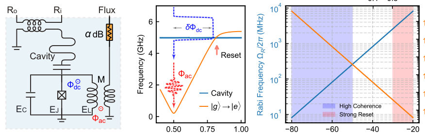
<figcaption class="paper-figure-caption"><b>Fig 1.</b> FIG. 1. Unified Flux Control Architecture. (a) Circuit schematic of a fluxonium qubit coupled to a single unified flux line. The control signals undergo a total attenuation of α before coupling to the qubit via a mutual inductance M. (b) Energy spectrum of the fluxonium and the readout cavity as a function of the external static flux Φdc. The dashed arrows illustrate the multiplexed control protocol at the half-flux sweet spot (Φdc = 0.5Φ0): a microwave pulse Φac drives the transverse |g⟩→|e⟩ transition for single-qubit gates, while a baseband pulse δΦdc longitudinally tunes the qubit frequency toward the cavity for rapid initialization. (c) Calculated Rabi frequency ΩR/2π (blue, left axis)...</figcaption>
</figure>
<figure class="paper-figure-card">
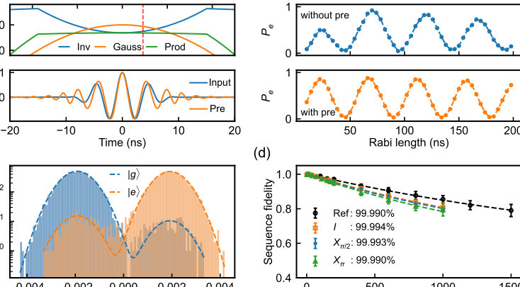
<figcaption class="paper-figure-caption"><b>Fig 2.</b> FIG. 2. Experimental Demonstration of Unified Flux Control. (a) Frequency- and time-domain illustration of the pre-distortion procedure. Top: the bounded inverse filter Hinv(f) (blue), the Gaussian low-pass transfer function Hgauss(f) (orange), and the resulting effective response Hprod(f) = Hgauss(f)Hinv(f) (green). Bottom: comparison between the target input waveform (blue) and the pre-distorted waveform generated by the AWG (orange). (b) Rabi oscillations measured without pre-distortion (top, blue) and with pre-distortion (bottom, orange). Pre-distortion restores high-contrast oscillations and enables nearly complete population transfer. (c) Histograms of the rotated readout signal...</figcaption>
</figure>
<figure class="paper-figure-card">
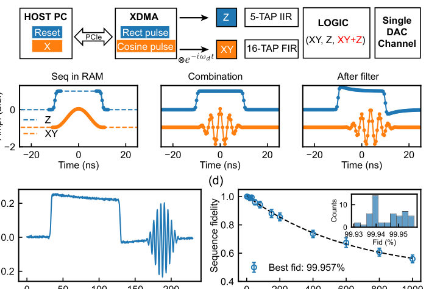
<figcaption class="paper-figure-caption"><b>Fig 3.</b> FIG. 3. Instruction-level Waveform Synthesis for Unified Flux Control. (a) Control architecture. A host PC sends instruction sequences via PCIe to the AWG, where waveform primitives are stored in onboard memory. The FPGA performs real-time modulation of the XY envelope at frequency ωd, applies digital filtering to the Z and XY paths (5-tap IIR and 16-tap FIR, respectively), and routes the resulting composite (XY +Z) waveform to a single DAC channel. (b) Waveform synthesis process. Left: stored primitives, including baseband flux edges and a resonant cosine envelope. Middle: assembled and modulated waveforms prior to filtering. Right: output waveforms after digital compensation. (c) Measured...</figcaption>
</figure>
<figure class="paper-figure-card">
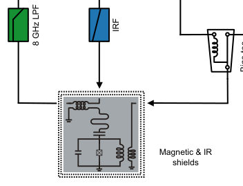
<figcaption class="paper-figure-caption"><b>Fig 4.</b> FIG. 4. Cryogenic Setup. Schematic detailing the low- temperature wiring inside the dilution refrigerator for unified control.</figcaption>
</figure>
<figure class="paper-figure-card">
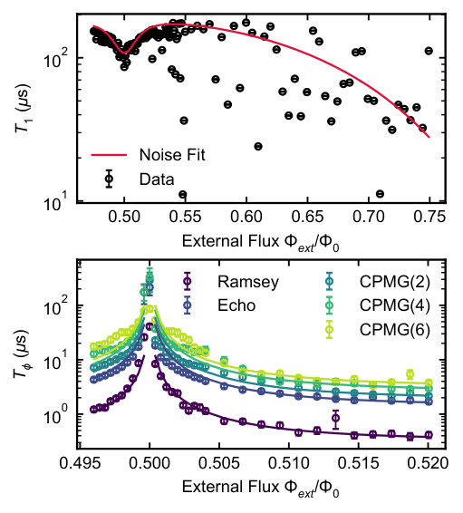
<figcaption class="paper-figure-caption"><b>Fig 5.</b> FIG. 5. Coherence vs. Flux. (a) Energy relaxation time T1 as a function of the external flux. (b) Pure dephasing time Tϕ extracted from Ramsey, Hahn echo, and CPMG sequences with varying numbers of refocusing π pulses as a function of the external flux.</figcaption>
</figure>

**Summary.** This paper presents a way to control fluxonium qubits using only one control line for both rotation and tuning, significantly reducing the amount of hardware needed per qubit. By using digital filters to fix the signal distortion caused by the necessary noise-suppression filters, the authors achieve extremely high gate fidelities and efficient qubit reset. This architecture provides a scalable path forward for building larger superconducting quantum processors.

**Why it may be interesting.** This work is relevant to open quantum systems and quantum optics researchers as it demonstrates a sophisticated method for managing the trade-off between environmental noise suppression (decoherence control) and strong-coupling-driven control (system manipulation) in a single-port architecture.

Detailed structure

**Main problem.** The scaling of superconducting quantum processors is limited by the hardware overhead of separate control channels for XY and Z operations, which also creates a conflict between needing high attenuation for coherence and low attenuation for rapid qubit reset.

**Main result.** The authors experimentally realize a unified flux control architecture for fluxonium qubits that achieves single-qubit gate fidelities exceeding 99.99% and active reset fidelity of approximately 98% using a single control channel.

**Method.** The approach uses frequency-selective cryogenic filtering combined with compensated waveform synthesis via FPGA-native instruction-level FIR/IIR filtering to correct for pulse distortion caused by the low-pass control line.

**Model / system.** The system consists of fluxonium qubits (superconducting circuits) coupled to a readout resonator, controlled via a single inductive flux channel that provides both transverse (AC) and longitudinal (DC) control.

**Key observables.** Coherence times (T1, T2, T2-echo), single-qubit gate fidelities, active reset fidelity, Rabi frequency, and pulse distortion/settling dynamics.

**Important parameters / regimes.** Coherence times > 100 us, gate fidelities > 99.99%, 20-ns gate durations, 92 MHz low-pass filter cutoff, and fluxonium parameters Ej/h = 4.5 GHz, Ec/h = 1.1 GHz.

**Assumptions / limitations.** The noise is modeled as frequency-independent white noise from the AWG and Johnson-Nyquist thermal noise; the microwave tail is assumed to be short enough that no additional correction is required.

**Figures summary.** Fig 1 shows the circuit schematic, energy spectrum, and control protocol; Fig 6 and 7 illustrate the characterization of quadrature distortions and the performance of the FIR-based waveform compensation.

**Paper structure.** The paper introduces the scaling bottleneck of control hardware, describes the unified fluxonium architecture, details the hardware-software compensation methods (filtering and synthesis), presents experimental validation of coherence and gate fidelity, and concludes with the scalability of the FPGA-based approach.

Abstract

Control architectures that reduce hardware overhead while maintaining high-fidelity operations are essential for the continued scaling of superconducting quantum processors. Here we experimentally realize a unified control architecture for fluxonium qubits, in which both transverse ($XY$) and longitudinal ($Z$) operations are implemented through a single flux-control channel driven by a single arbitrary waveform generator channel. This architecture imposes competing requirements on the shared control channel, which must simultaneously support low-frequency flux transmission for reset operations while strongly attenuating broadband noise near the qubit transition frequency. We address this challenge through frequency-selective cryogenic filtering together with compensated waveform synthesis that corrects the pulse distortion introduced by the filtered control line. Experimentally, this approach preserves coherence times above 100 $μ$s while enabling active reset with approximately 98% fidelity and 20-ns single-qubit gates with fidelities exceeding 99.99%. We further demonstrate FPGA-native instruction-level waveform synthesis based on reusable pulse primitives for unified flux control. These results establish unified flux control as a scalable architecture for fluxonium qubits that reduces control hardware overhead while preserving high-fidelity operation.

[↑ back to top](#top)

### [Native topological readout on qubit hardware: a Fibonacci-chain benchmark of measurement-compilation trade-offs](http://arxiv.org/abs/2605.25913v1)

**Authors:** Babatunde Moses Ayeni  
**Type:** both · **Category:** quantum information and computing · **PDF:** <https://arxiv.org/pdf/2605.25913v1>  
**Analysis basis:** full PDF text, analyzed in chunks
**Topic relevance:** 🔥 `QC/QI experiment` **4/5** · `quantum measurements` **3/5**

↔ Scroll figures horizontally

<figure class="paper-figure-card">
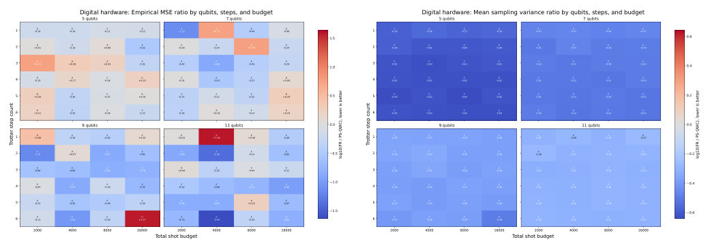
<figcaption class="paper-figure-caption"><b>Fig 1.</b> FIG. 2. Digital benchmark shown as realized estimator error versus covariance-aware sampling variance. Top row: noiseless empirical MSE and mean sampling variance. Bottom row: hardware empirical MSE and mean sampling variance. Lower values favor FR. The noiseless panels isolate the native sampling advantage; the hardware panels show where realized error partially “washes out” that advantage.</figcaption>
</figure>
<figure class="paper-figure-card">
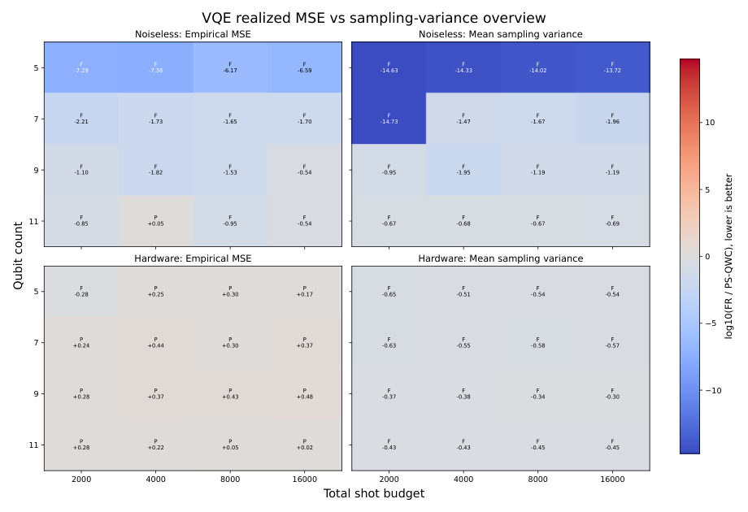
<figcaption class="paper-figure-caption"><b>Fig 2.</b> FIG. 3. Optimized-state VQE benchmark in the same realized-error-versus-sampling language used in the main text and also Figure 2. The noiseless comparison follows the native-measurement expectation, but the hardware comparison reverses on realized MSE while leaving the covariance-aware sampling advantage of FR intact.</figcaption>
</figure>
<figure class="paper-figure-card">
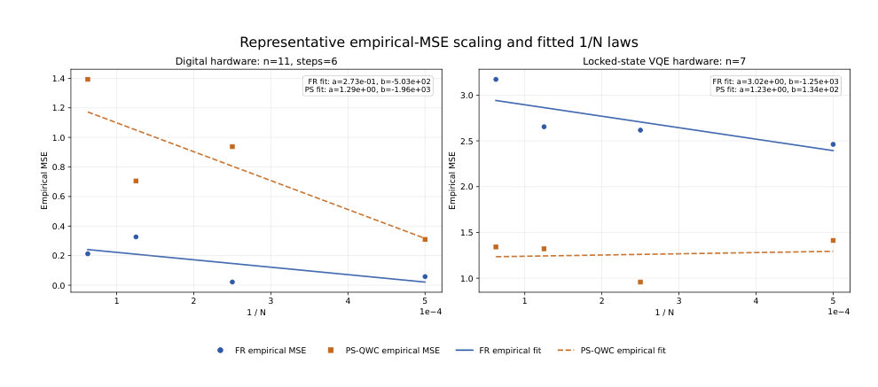
<figcaption class="paper-figure-caption"><b>Fig 3.</b> FIG. 4. Representative budget-scaling plots for one digital hardware cell and one optimized-state VQE hardware cell. Marker- only points show the empirical MSE at the sampled budgets, using circles for FR and squares for PSQWC. The overlaid solid FR and dashed PS-QWC lines are least-squares fits of the form αm + βm/N to the empirical mean-squared-error traces. The figure makes the fitted empirical-MSE scaling visible directly in the budget traces.</figcaption>
</figure>
<figure class="paper-figure-card">
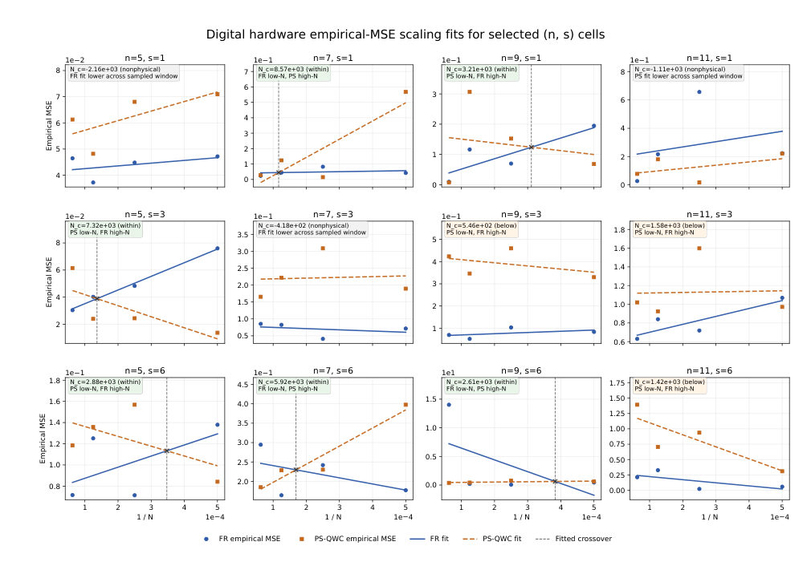
<figcaption class="paper-figure-caption"><b>Fig 4.</b> FIG. 5. Digital hardware empirical-MSE scaling fits for the selected cells (n, s) ∈{5, 7, 9, 11} × {1, 3, 6}. The point markers show the empirical MSE values for FR and PSQWC, while the solid and dashed lines show the fitted laws αm + βm/N, and dashed vertical lines mark fit positive-budget crossings that fall inside the sampled budget window. Panel annotations report the fitted crossing budget when it exists and indicate whether it lies below, within, or above the sampled range.</figcaption>
</figure>
<figure class="paper-figure-card">
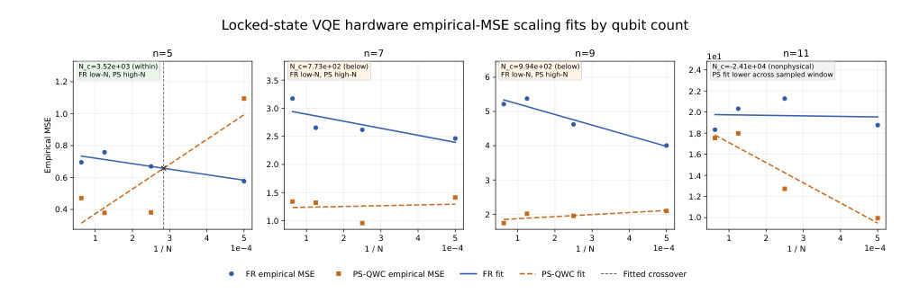
<figcaption class="paper-figure-caption"><b>Fig 5.</b> FIG. 6. Optimized-state VQE hardware empirical-MSE scaling fits for qubit counts n = 5, 7, 9, 11. Point markers show the empirical MSE values for FR and PSQWC, while solid and dashed lines show the fitted laws αm + βm/N, and dashed vertical lines mark fit positive-budget crossings that fall inside the sampled budget window. The VQE panels make clear that most fitted crossings for this workload already sit below the sampled budget range, consistent with the small fitted Nc values reported in the main text.</figcaption>
</figure>

**Summary.** This paper investigates whether measuring in the 'native' basis of a topological model is more efficient than standard Pauli-basis reconstruction on noisy quantum hardware. It finds that while native readout reduces sampling variance, the extra circuit depth required can introduce enough noise to make standard Pauli measurements more accurate for shallow variational circuits.

**Why it may be interesting.** not directly relevant

Detailed structure

**Main problem.** Determining the optimal measurement strategy for topological Hamiltonians on NISQ hardware by evaluating the trade-off between the sampling advantage of native (fusion) readout and the increased hardware error/bias introduced by additional compilation depth.

**Main result.** While native fusion readout (FR) provides a universal advantage in sampling variance, its advantage in Mean Squared Error (MSE) is diminished or reversed in shallow circuits (like VQE) due to hardware-induced noise from the additional basis-change gates.

**Method.** The study compares Fusion Readout (FR) against a Grouped Pauli (PSQWC) baseline using both noiseless simulations and experiments on the IBM 'ibm_pittsburgh' superconducting processor, employing MSE scaling analysis to identify crossover shot budgets.

**Model / system.** A one-dimensional Fibonacci anyon chain model using fusion-path encoding, featuring Hamiltonians with both braiding and fusion interactions ($H_{F3}$ and $H_{BF4}$), implemented on a heavy-hex superconducting qubit architecture.

**Key observables.** Fusion-channel projectors, local interaction terms, energy estimator Mean Squared Error (MSE), and covariance-aware sampling variance.

**Important parameters / regimes.** Qubit number (n=5 to 11), shot budget (N=2000 to 16000), Trotter step count (s=1, 3, 6), and the crossover shot budget (Nc).

**Assumptions / limitations.** The study assumes the Fibonacci anyons are modeled via fusion-space encoding rather than physical anyonic excitations, and the Pauli baseline is chosen for transparency rather than being the most aggressive possible estimator.

**Figures summary.** Figure 1 illustrates the basis change for native measurement; Figure 2 shows heatmaps of MSE and sampling variance ratios; Figure 3 compares VQE hardware benchmarks; Figure 4 displays MSE scaling fits; Figure 5 shows digital hardware MSE scaling; Figure 7 and 8 show correlations between measurement overhead and error ratios.

**Paper structure.** The paper introduces the motivation for native readout, defines the Fibonacci chain model and measurement strategies, presents results from noiseless simulations, details hardware benchmarks for digital Floquet and VQE circuits, and concludes with a scaling analysis of the crossover point between methods.

Abstract

Recent demonstrations of non-Abelian braiding of graph vertices on noisy intermediate-scale quantum (NISQ) superconducting processor, and the experimental realization of topological order in general on various quantum hardware platforms necessitate an important question: when does a native (topological) fusion readout genuinely help for topological anyonic Hamiltonians implemented on NISQ hardware? We use the Fibonacci anyons chain as a concrete model for understanding the trade-off between measurement cost and compilation cost in that setting. The comparison is made against a simple grouped-Pauli baseline, and is scored by a covariance-aware mean-squared-error (MSE) of the full energy estimator. We based our benchmark on two different important classes of quantum circuits, namely Floquet time-evolved and variational quantum eigensolver quantum circuits, with the underlying Hamiltonian consisting of both braiding and fusion interaction. Our analysis found that there is not a uniform best method across both problems: the fusion readout method performed better on Floquet-type circuits on both the MSE and covariance-aware sampling variance, while the grouped Pauli method performed better on VQE on the MSE but worse on sampling variance. We derive scaling laws, and compute shot-budget crossover points, where one method is operationally favored above the other. The relevance of this work extends beyond Fibonacci chains to two-dimensional topological models compiled on superconducting and other qubit-native platforms, and can be used as a guide in answering the question of when one should measure in the native operator basis of the target physics, or when it is better to fall back on Pauli-basis reconstruction.

[↑ back to top](#top)

### [Bell State Analysis Provides an Optimal Basis Saturating the Quantum Cramer-Rao in Rotation Sensing](http://arxiv.org/abs/2605.24108v1)

**Authors:** Zhuoran Bao, Daniel F. V. James  
**Type:** theory · **Category:** quantum information and computing · **PDF:** <https://arxiv.org/pdf/2605.24108v1>  
**Analysis basis:** full PDF text, analyzed in chunks
**Topic relevance:** 🔥 `quantum measurements` **4/5** · `entanglement & information structure` **2/5**

↔ Scroll figures horizontally

<figure class="paper-figure-card">
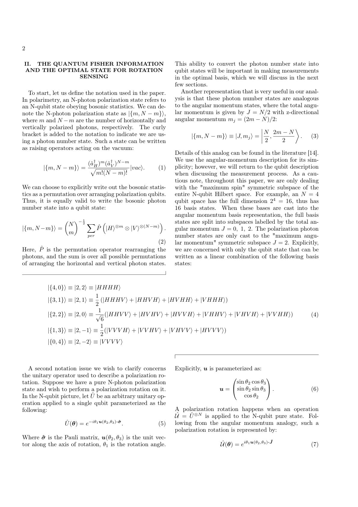
<figcaption class="paper-figure-caption"><b>Fig 1.</b> Low-resolution page preview, page 2</figcaption>
</figure>
<figure class="paper-figure-card">
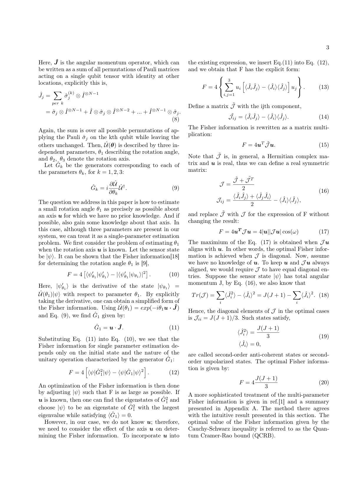
<figcaption class="paper-figure-caption"><b>Fig 2.</b> Low-resolution page preview, page 3</figcaption>
</figure>
<figure class="paper-figure-card">
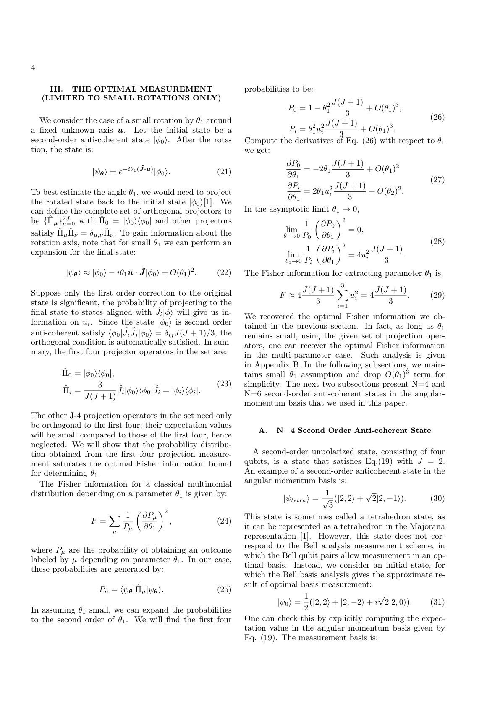
<figcaption class="paper-figure-caption"><b>Fig 3.</b> Low-resolution page preview, page 4</figcaption>
</figure>
<figure class="paper-figure-card">
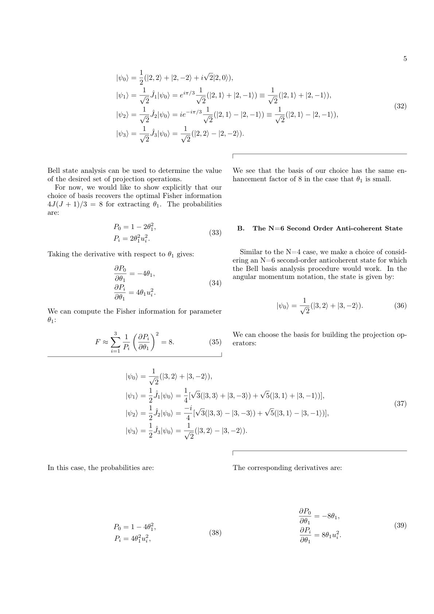
<figcaption class="paper-figure-caption"><b>Fig 4.</b> Low-resolution page preview, page 5</figcaption>
</figure>
<figure class="paper-figure-card">
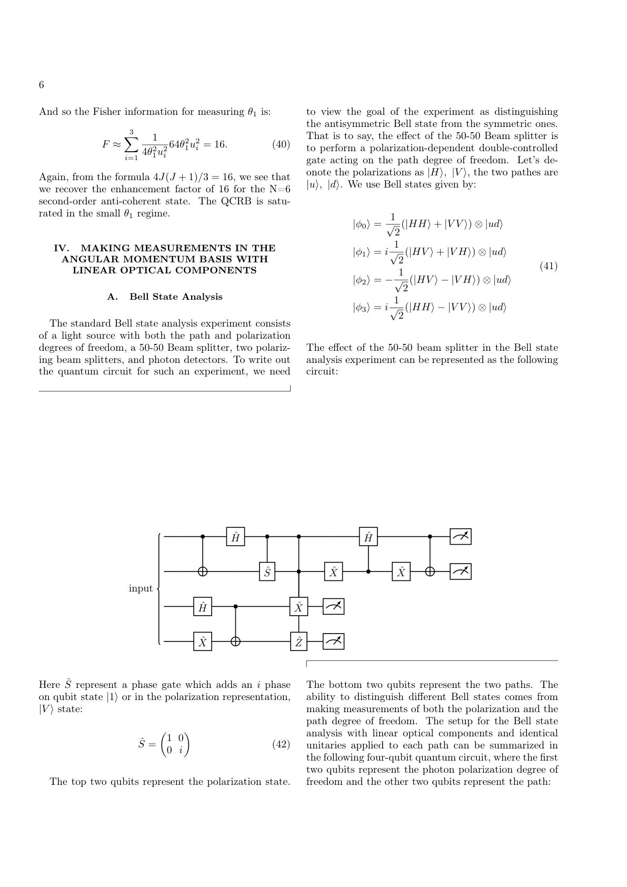
<figcaption class="paper-figure-caption"><b>Fig 5.</b> Low-resolution page preview, page 6</figcaption>
</figure>

**Summary.** The paper proposes a practical measurement scheme using Bell state analysis to estimate rotation angles around an unknown axis. It proves that this method can achieve the fundamental precision limits (QCRB) for N=4 and N=6 anti-coherent states in the small-angle regime. This overcomes the complexity of full state tomography for these highly entangled states.

**Why it may be interesting.** This is highly relevant to quantum optics and quantum information as it provides a practical, efficient measurement protocol for highly entangled states that are otherwise difficult to utilize for precision sensing.

Detailed structure

**Main problem.** The paper addresses the difficulty of extracting rotation angles in quantum sensing when using second-order anti-coherent states, which are known to be optimal but are complex to measure via standard tomography.

**Main result.** The authors demonstrate that a measurement scheme based on pair-wise Bell state analysis with an additional path degree of freedom can saturate the Quantum Cramer-Rao Bound for small rotation angles.

**Method.** The study uses a mathematical framework of angular momentum operators and Fisher information derivation, applying a small-angle approximation to evaluate the performance of Bell state projections.

**Model / system.** The system consists of N-photon polarization states (N-qubit/qupon states) in the symmetric subspace, specifically focusing on N=4 and N=6 second-order anti-coherent (unpolarized) states undergoing rotation around an unknown axis.

**Key observables.** Rotation angle theta_1, probabilities of Bell state projections, and the Fisher information matrix.

**Important parameters / regimes.** Small rotation angle regime (theta_1 -> 0), N=4 and N=6 photon numbers, and the rotation axis vector u.

**Assumptions / limitations.** The validity of the optimal measurement is demonstrated specifically in the limit of small rotation angles, neglecting higher-order terms of O(theta_1^3).

**Paper structure.** The paper begins by defining the problem of parameter extraction in rotation sensing, introduces the physical model of N-photon states and the rotation operator, develops the Fisher information derivation and optimization strategy, proposes a Bell state analysis measurement scheme, and concludes by demonstrating the saturation of the QCRB for N=4 and N=6 cases.

Abstract

The second-order anti-coherent state of light is known to saturate the Cramer-Rao Bound (QCRB) for rotation sensing around an arbitrary axis. However, due to the complexity of the state and the inefficiency of state tomography, parameter extraction remains an open problem. In this manuscript, we approach the problem of parameter extraction using pair-wise Bell state analysis with an additional path degree of freedom. Due to the transformation property of rotation, only the symmetric Bell states will show up in projection in the final state. We exploit this advantage to develop a scheme for extracting the rotation angle for N=4 and N=6 second-order anti-coherent states.

[↑ back to top](#top)

### [Evaluating System-Level Fidelity with Peaked Random Circuits](http://arxiv.org/abs/2605.25983v1)

**Authors:** Martin Brieger, Florian Krötz, Minh Chung, Dieter Kranzlmüller  
**Type:** both · **Category:** quantum information and computing · **PDF:** <https://arxiv.org/pdf/2605.25983v1>  
**Analysis basis:** full PDF text, analyzed in chunks
**Topic relevance:** 🔥 `QC/QI experiment` **4/5** · `correlated / nonlocal dissipation` **1/5** · `entanglement & information structure` **1/5**

↔ Scroll figures horizontally

<figure class="paper-figure-card">
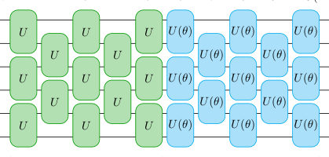
<figcaption class="paper-figure-caption"><b>Fig 1.</b> Fig. 1. Mirror architecture of the Peaked Random Circuits (PRCs) we use for benchmarking. The green and blue rectangles illustrate two-qubit unitary gates. We refer to the total number of layers as the circuit’s depth d.</figcaption>
</figure>
<figure class="paper-figure-card">
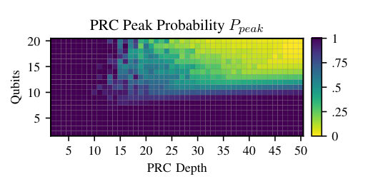
<figcaption class="paper-figure-caption"><b>Fig 2.</b> Fig. 3. Probability of the circuit to output the target, peak bitstring of our set of 931 PRCs by their number of qubits and depth. The values correspond to the results obtained in the optimization phase of circuit generation.</figcaption>
</figure>
<figure class="paper-figure-card">
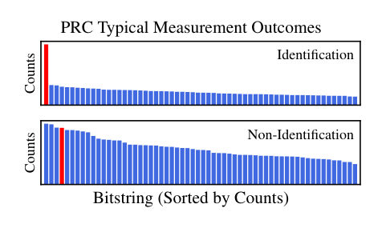
<figcaption class="paper-figure-caption"><b>Fig 3.</b> Fig. 2. Typical output histograms of PRCs obtained from several runs on a quantum device. The bar heights represent the frequencies of the measured bitstrings. The target bitstring is highlighted in red. In the upper panel, the most frequent result matches the target bitstring, illustrating identification. In the lower panel, a different bitstring peaks, demonstrating non-identification.</figcaption>
</figure>
<figure class="paper-figure-card">
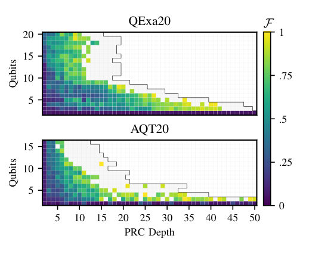
<figcaption class="paper-figure-caption"><b>Fig 4.</b> Fig. 4. Successful recoveries of the peaked bitstring by the circuits’ depth and number of qubits for the QExa20 superconducting device and the AQT20 ion- trap device. Colored cells indicate a matching peaked bitstring in at least three of five runs. Light-gray cells indicate non-identifications. White cells indicate skipped runs resulting from previously run, lower-depth circuits yielding non- identifications. The black line separates executed circuits from skipped ones. The colormap indicates the Fidelity Error F.</figcaption>
</figure>
<figure class="paper-figure-card">
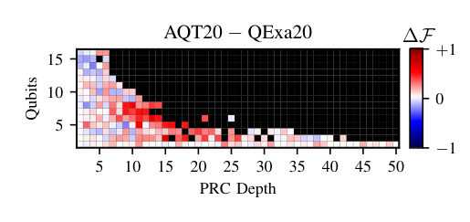
<figcaption class="paper-figure-caption"><b>Fig 5.</b> Fig. 5. Difference in the quality of peak identification between the AQT20 ion-trap device and the QExa20 superconducting device by the circuits’ depth and number of qubits. Colored cells indicate successful peak identifications of both devices. The colormap quantifies the difference in the Fidelity Error between the two devices: ∆F = FAQT 20 −FQExa20</figcaption>
</figure>

**Summary.** This paper introduces a new benchmarking framework using Peaked Random Circuits to evaluate the fidelity of NISQ quantum hardware. By comparing superconducting and trapped-ion processors, the authors demonstrate that PRCs can sensitively detect hardware-specific noise pathologies and provide a more robust metric for cross-platform comparison than Quantum Volume.

**Why it may be interesting.** It provides a new way to quantify how environmental noise and decoherence specifically wash out constructive interference patterns, which is highly relevant to the study of open quantum systems and the stability of many-body states.

Detailed structure

**Main problem.** The lack of architecture-agnostic performance metrics to compare diverse NISQ hardware platforms and the limitations of existing benchmarks like Quantum Volume in capturing system-level fidelity.

**Main result.** Peaked Random Circuits (PRCs) provide a high-precision, scalable benchmarking metric that is more sensitive to interference effects and noise than Quantum Volume, successfully distinguishing between superconducting and trapped-ion performance.

**Method.** The authors repurpose PRCs by optimizing a 'peaking half' of a mirror circuit to maximize a target bitstring probability and then apply this as a benchmark across varying qubit counts and depths.

**Model / system.** The study uses two commercial NISQ platforms: IQM's QExa20 (superconducting, square-lattice) and AQT's AQT20 (trapped-ion, all-to-all connectivity).

**Key observables.** Peak identification (binary success/fail), Peak Dominance (Rp), Relative Peakedness (Cexp), and Fidelity Error (F).

**Important parameters / regimes.** Qubit counts (n) from 2 to 20, circuit depths (d) from 2 to 50, and the number of shots (up to 1,000,000).

**Assumptions / limitations.** The target bitstring is known, the input is the all-zero state, and for odd-depth circuits, the random half is shortened to prevent diminishing peak probability.

**Figures summary.** Fig 1 shows the PRC mirror architecture; Fig 2 illustrates peak identification vs. non-identification via histograms; Fig 3 shows peak probability scaling; Fig 4 displays a 2D grid of successful/failed runs; Fig 5 shows a heatmap of performance differences between the two platforms.

**Paper structure.** The paper introduces the need for new metrics, describes the PRC architecture and optimization method, presents the benchmarking protocol on two hardware platforms, analyzes the results comparing superconducting and trapped-ion systems, and discusses limitations and future directions.

Abstract

Quantum computing is transitioning from experimental prototypes to commercially available turnkey systems, making architecture-agnostic performance metrics essential for cross-platform comparison. Peaked Random Circuits (PRCs) have recently been proposed as a viable path to demonstrate quantum advantage on NISQ devices: a quantum processor can reliably detect a single, peaked output state amid background noise, yet the circuits' characteristics render classical simulation infeasible. In this paper, we repurpose PRCs as a system-level fidelity benchmark. By successively running a matrix of PRCs with varying qubit counts and circuit depths, we quantify a system's ability to identify the deterministic peak despite cumulative noise, gate errors, and connectivity constraints. We apply the benchmark on IQM's superconducting and AQT's trapped-ion architectures. Our results show that PRCs provide a high-precision metric comparable to Quantum Volume while exhibiting greater sensitivity to interference effects. Consequently, PRCs enable a robust framework for assessing the computational reliability of NISQ hardware across platforms.

[↑ back to top](#top)

### [Krylov Complexity for Plane Wave Matrix Model](http://arxiv.org/abs/2605.26055v1)

**Authors:** Dibakar Roychowdhury  
**Type:** theory · **Category:** other · **PDF:** <https://arxiv.org/pdf/2605.26055v1>  
**Analysis basis:** full PDF text, analyzed in chunks
**Topic relevance:** 🔥 `entanglement & information structure` **4/5** · `non-equilibrium dynamics` **2/5**

↔ Scroll figures horizontally

<figure class="paper-figure-card">
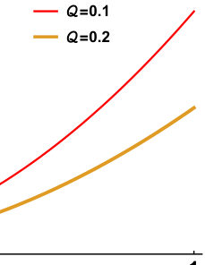
<figcaption class="paper-figure-caption"><b>Fig 1.</b> Figure 1. We plot early time growth in complexity for different values of the Coulmb charge Q.</figcaption>
</figure>
<figure class="paper-figure-card">
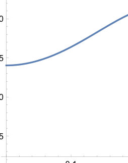
<figcaption class="paper-figure-caption"><b>Fig 2.</b> Figure 2. Plot the LO coefficient ζ with the Coulomb charge Q.</figcaption>
</figure>

**Summary.** This paper explores how mass deformation influences the growth of complexity in the BMN matrix model. It demonstrates that both state and operator complexities share a universal quadratic time-dependence at early stages and that Lanczos coefficients scale linearly with the mass parameter.

**Why it may be interesting.** not directly relevant

Detailed structure

**Main problem.** The paper investigates the growth of Krylov state complexity (KSC) and Krylov operator complexity (KOC) in the BMN Plane Wave Matrix Model, specifically focusing on how mass deformation affects complexity growth.

**Main result.** The study finds that Lanczos coefficients scale linearly with the mass deformation parameter (mu) and that early-time complexity growth exhibits a universal quadratic correction proportional to (mu^2 * t^2).

**Method.** The authors use Hamiltonian analysis and the Lanczos algorithm on reduced matrix models (N=3, N=4) in the large mass deformation limit.

**Model / system.** The BMN Plane Wave Matrix Model, which is a massive deformation of the BFSS matrix model describing membranes on an 11d pp-wave background, including reduced models like the Fuzzy Sphere and Coulomb potential models.

**Key observables.** Krylov state complexity (KSC), Krylov operator complexity (KOC), and Lanczos coefficients (a_n and b_n).

**Important parameters / regimes.** Mass deformation parameter (mu), Coulomb charge (Q), and the large mass deformation limit (mu -> infinity).

**Assumptions / limitations.** The analysis is restricted to the bosonic sector, assumes the large mass deformation limit, and utilizes the Weyl gauge (A=0).

**Figures summary.** Figure 1 shows the early-time growth of complexity for different models; Figure 2 illustrates the dependence of the complexity pre-factor (zeta) on the Coulomb charge (Q), showing a non-monotonic behavior.

**Paper structure.** The paper is structured into two main parts: the first analyzes Krylov state complexity using N=3 and N=4 reductions, and the second investigates Krylov operator growth, followed by a comparative analysis of scaling laws and early-time dynamics.

Abstract

We study Krylov complexity in BMN Plane Wave Matrix Model at large mass deformation. We consider various consistent reductions of the matrix model that allow us to perform a Hamiltonian analysis which leads to different notions of the Krylov complexity. In the first part of the paper, we study the Krylov state complexity considering systematic reduction of $N=3$ and $N=4$ representations of the matrix model, which reveals a universal characteristic scaling for the Lanczos coefficients and fix them completely in terms of the mass deformation parameter. In the second part of the paper, we study the Krylov operator growth in the matrix model and compute the corresponding Lanczos coefficients. In both cases, we observe a \emph{linear} scaling of Lanczos coefficients with the mass parameter. The early time growth in Krylov complexity receives quadratic correction due to the presence of the massive deformation in the matrix model. Our analysis reveals that such massive corrections appear at same order in time for both the notion of the Krylov complexity.

[↑ back to top](#top)

### [Programmable dipolar interaction geometry selects stripe-family order in a molecular lattice quantum simulator](http://arxiv.org/abs/2605.25019v1)

**Authors:** Chao Zhang  
**Type:** theory · **Category:** quantum gases · **PDF:** <https://arxiv.org/pdf/2605.25019v1>  
**Analysis basis:** full PDF text, analyzed in chunks
**Topic relevance:** 🔥 `analog quantum simulation` **4/5** · `exotic spin models in light-matter` **2/5**

↔ Scroll figures horizontally

<figure class="paper-figure-card">
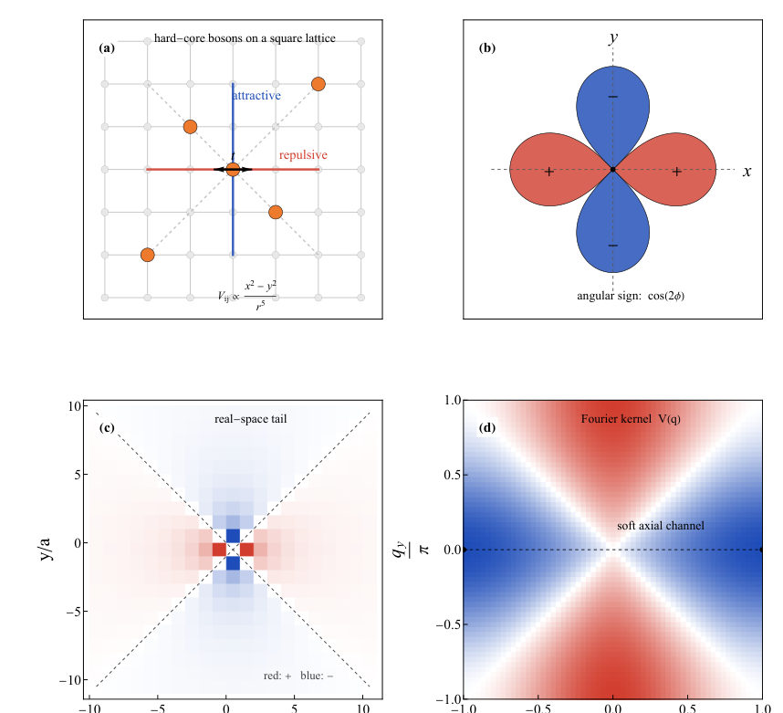
<figcaption class="paper-figure-caption"><b>Fig 1.</b> FIG. 1. Model and interaction geometry. (a) Hard-core bosons hop with amplitude t on a square lattice and interact through a long-range, sign-changing density interaction Vij = V(rij). Red and blue links indicate the repulsive and attractive axial sectors, while the dashed diagonals mark the nodal directions. (b) Angular part of the interaction, proportional to cos 2ϕ, illustrating its dx2−y2-like sign structure. (c) Representative real-space interaction window computed directly from Eq. (2); a sign-preserving compressed color scale is used for visibility, with warm and cool colors denoting positive and negative matrix elements, respectively. (d) Representative dense-grid momentum-space...</figcaption>
</figure>
<figure class="paper-figure-card">
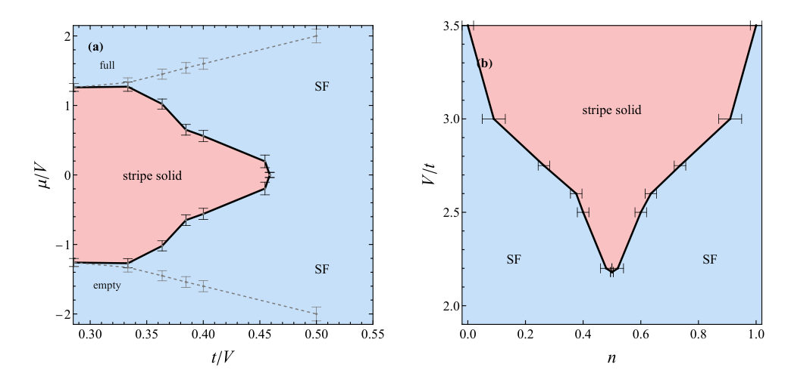
<figcaption class="paper-figure-caption"><b>Fig 2.</b> FIG. 2. Ground-state phase diagram. (a) Ground state phase diagram in the (t/V, µ/V ) plane. Blue and pink denote the superfluid and stripe-solid regimes, respectively; the solid black boundary is bracketed from the combined compressibility, superfluid-stiffness, and stripe-family diagnostics. Dashed curves indicate the crossover toward the trivial empty and full limits. (b) The same boundary replotted in the (n, V/t) plane, highlighting the particle-hole-related structure about half filling. The stripe lobe first appears near n = 1/2, broadens with increasing V/t, and closes near V/t = 2.18, as analyzed in Fig. 3.</figcaption>
</figure>
<figure class="paper-figure-card">
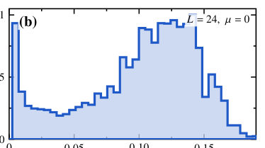
<figcaption class="paper-figure-caption"><b>Fig 3.</b> FIG. 3. First-order closure of the stripe-solid lobe at t/V ≃0.459. (a) L = 24 parameter sequence near half filling: the left axis gives the superfluid stiffness ρs, while the right axis gives the stripe-family structure factor S⋆ x. (b) Measurement-resolved normalized distribution of the fixed stripe structure factor Sℓ(π, 0) at µ = 0; the horizontal axis is the unscaled Sℓ(π, 0) value. The simultaneous dip in the averaged winding response, growth of the stripe structure fac- tor, and two-sector structure of this distribution indicate first- order switching near the lobe closure rather than a separate stable supersolid phase.</figcaption>
</figure>
<figure class="paper-figure-card">
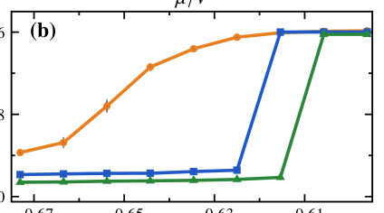
<figcaption class="paper-figure-caption"><b>Fig 4.</b> FIG. 4. System-size dependence of a representative stripe-solid boundary. Representative transition region at t/V ≃0.385 for L = 12, 24, 36, plotted as a function of µ/V . (a) Superfluid stiffness ρs; (b) stripe-family structure factor S⋆ x. The L = 12 response is broadened over several points, whereas the L = 24 and L = 36 curves show a much sharper jump, consistent with first-order behavior. Error bars denote statistical uncertainties; the drift of the jump position with L gives the finite-size uncertainty used when assigning the phase boundary in Fig. 2.</figcaption>
</figure>
<figure class="paper-figure-card">
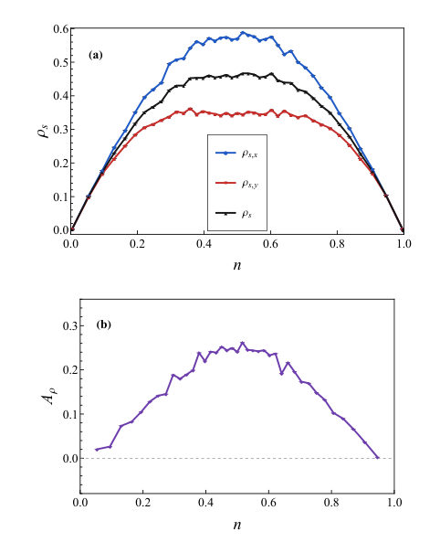
<figcaption class="paper-figure-caption"><b>Fig 5.</b> FIG. 5. Anisotropic superfluid response at larger hop- ping ratio, t/V = 0.5. Representative t/V = 0.5 case for L = 24, plotted against filling n, where hopping is relatively stronger than in the stripe-ordered regime and the system re- mains superfluid throughout the compressible window. (a) Directional superfluid stiffnesses ρs,x, ρs,y, and their average ρs. The superfluid response is finite over a broad interval and vanishes only near the trivial empty and full limits. A clear directional imbalance, ρs,x &gt; ρs,y, persists across most of the superfluid regime. (b) Stiffness anisotropy factor Aρ. It remains finite inside the superfluid window and decreases toward zero near the density...</figcaption>
</figure>

**Summary.** This paper studies how anisotropic, sign-changing dipolar interactions in a molecular lattice simulator drive the formation of a stripe-family ordered phase. It shows that the interaction geometry selects specific axial stripes and that the transition to this phase is a first-order process. The findings are linked to realistic experimental scales for NaCs polar molecules.

**Why it may be interesting.** It demonstrates how engineering the angular dependence of long-range interactions can be used as a primary tool to program complex many-body phases and density-wave patterns in programmable quantum simulators.

Detailed structure

**Main problem.** Investigating how programmable, non-axisymmetric, and sign-changing dipolar interaction geometries select specific density-ordering patterns (stripe-family order) in a molecular lattice quantum simulator.

**Main result.** The interaction geometry selects an axial (q,0) stripe-family where the wave vector evolves with filling, and the transition from superfluid to stripe-solid is identified as a first-order switching rather than a stable supersolid phase.

**Method.** Worm-algorithm path-integral quantum Monte Carlo (QMC) simulations, supported by a hard-core spin mapping and a Gutzwiller soft-mode diagnostic.

**Model / system.** A 2D square optical lattice of microwave-dressed polar molecules (specifically NaCs) modeled as a minimal hard-core Bose-Hubbard model with a non-axisymmetric, sign-changing dipolar tail.

**Key observables.** Directional superfluid stiffness anisotropy, structure factor S(q), compressibility, and measurement-resolved structure-factor histograms.

**Important parameters / regimes.** Ratio of hopping to interaction strength (t/V), chemical potential (mu), and lattice filling (n).

**Assumptions / limitations.** The use of a strict hard-core constraint (infinite onsite repulsion) and the deep-lattice/point-particle approximation.

**Figures summary.** Figure 1 shows the lattice interaction geometry; Figure 2 presents the ground-state phase diagram; Figure 7 shows Gutzwiller diagnostics for stripe period; Figure 8 shows real-space density maps.

**Paper structure.** The paper introduces the programmable interaction geometry, presents the numerical phase diagram and phase transition analysis, provides a Gutzwiller-based mechanism for stripe selection, and concludes with an experimental feasibility study for NaCs molecules.

Abstract

Microwave-dressed polar molecules offer a route to lattice quantum simulators in which the angular form of long-range dipolar interactions, not only their overall strength, can be engineered. We study this setting in a minimal hard-core Bose lattice model on a square optical lattice, with particles interacting through a sign-changing non-axisymmetric dipolar tail \mathcal V(\mathbf r)\propto (x^2-y^2)/(x^2+y^2)^{5/2} that is repulsive along one lattice axis and attractive along the other. Using worm-algorithm path-integral quantum Monte Carlo simulations, supported by a hard-core spin mapping and a Gutzwiller soft-mode diagnostic, we find two regimes controlled by t/V: at larger t/V the system remains superfluid but develops a pronounced directional stiffness anisotropy, while at smaller t/V it forms a stripe solid selected in the (q,0) axial family, corresponding to real-space stripes parallel to y. The leading ordering wave vector remains in this axial family but reorganizes with filling, showing that the robust ordered object is a family of stripe states rather than one fixed commensurate Bragg peak. Near the closure of the stripe lobe, averaged observables can mimic a narrow supersolid signal; measurement-resolved stripe structure-factor histograms instead reveal first-order switching between superfluid and stripe-solid sectors. NaCs lattice estimates place the relevant V/t window within reach of modest effective dressed dipole moments, linking the predicted stripe-family order and its experimental diagnostics to accessible molecular quantum-simulation scales.

[↑ back to top](#top)

### [Pseudorandom Dynamics in the SYK Model and Cryptographic Censorship in JT Gravity](http://arxiv.org/abs/2605.25178v1)

**Authors:** Pouya Golmohammadi  
**Type:** theory · **Category:** quantum information and computing · **PDF:** <https://arxiv.org/pdf/2605.25178v1>  
**Analysis basis:** full PDF text, analyzed in chunks
**Topic relevance:** 🔥 `entanglement & information structure` **4/5** · `non-equilibrium dynamics` **2/5**

↔ Scroll figures horizontally

<figure class="paper-figure-card">
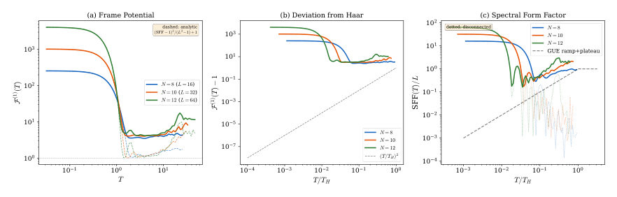
<figcaption class="paper-figure-caption"><b>Fig 1.</b> Figure 1: Numerical verification of the frame potential analysis for SYK4 with N = 8, 10, 12 (L = 16, 32, 64), averaged over 100–300 disorder realizations. (a) The first frame potential F(1)(T) computed directly from cross-realization averages of |tr(U † 1U2)|2 (solid), compared with the analytic formula (1.1) evaluated from the disorder-averaged SFF (dashed). (b) The deviation F(1)(T) −1 as a function of T/TH, showing the approach to the τ 2 = (T/TH)2 scaling predicted by (3.9) (dashed gray line). (c) The normalized spectral form factor SFF(T)/L, exhibiting the universal slope–dip– ramp–plateau structure. Solid lines show the connected SFF; dotted lines show the disconnected part.</figcaption>
</figure>

**Summary.** This paper demonstrates that the SYK model functions as a pseudorandom unitary that hides information from efficient observers, effectively realizing 'Cryptographic Censorship' in JT gravity. It shows that the existence of an event horizon is necessary to prevent an adversary from reconstructing the black hole interior. The work connects the growth of black hole complexity to the limits of quantum information reconstruction.

**Why it may be interesting.** It provides a deep link between computational complexity (pseudorandomness and hardness) and fundamental gravitational phenomena (event horizons and black hole interiors), which is highly relevant to researchers studying the intersection of quantum information and many-body dynamics.

Detailed structure

**Main problem.** Determining whether the SYK model acts as a gravitationally pseudorandom unitary (GPRU) and whether this pseudorandomness enforces the existence of event horizons in its JT gravity dual (Cryptographic Censorship).

**Main result.** The paper proves the SYK disorder ensemble is an approximate unitary k-design and, under the planted-SYK hardness conjecture, a GPRU, implying that typical states must have event horizons to prevent efficient reconstruction of the black hole interior.

**Method.** The author employs Weingarten calculus, random matrix theory, and complexity-theoretic frameworks like shadow tomography and the low-degree polynomial framework to analyze the SYK ensemble.

**Model / system.** The SYK model, consisting of N Majorana fermions with all-to-all q-body random interactions, and its holographic dual, JT gravity (2D dilaton gravity).

**Key observables.** Spectral Form Factor (SFF), k-th frame potential, regularized geodesic length of the maximal interior slice, and prediction fidelity.

**Important parameters / regimes.** Number of fermions (N), scrambling time (T_scr), Heisenberg time (T_H), and the security parameter (kappa).

**Assumptions / limitations.** The 'planted-SYK hardness conjecture' (computational indistinguishability from Haar) and random matrix universality.

**Figures summary.** Not specified in the provided notes.

**Paper structure.** The paper establishes the statistical properties of the SYK ensemble as a k-design, introduces the planted-SYK hardness conjecture to define GPRU status, proves the Cryptographic Censorship theorem via reconstruction limits, and links the results to the complexity equals volume conjecture.

Abstract

We argue that the SYK model provides a conditional realization of Cryptographic Censorship in JT gravity. By using the Weingarten calculus and random matrix universality, we prove that the SYK disorder ensemble is an approximate unitary $k$-design for all $k=\poly(N)$, with deviation controlled by the spectral form factor. We then formulate the planted-SYK hardness conjecture and provide evidence from spectral universality and the low-degree polynomial framework. Under this conjecture, the approximate design becomes a gravitationally pseudorandom unitary. Together with the efficient causal wedge reconstruction in JT gravity, this leads to the conclusion that typical states in the SYK microcanonical window must have event horizons in their bulk duals, with the horizonless fraction doubly exponentially small. We further identify the regularized geodesic length of the maximal interior slice as the explicit distinguishing operator. Its prediction gap grows linearly with time due to the stretching of the black hole interior, linking Cryptographic Censorship to the complexity equals volume conjecture.

[↑ back to top](#top)

### [Quantum non-demolition measurements as a practical primitive for fault-tolerant computation against biased noise](http://arxiv.org/abs/2605.24262v1)

**Authors:** Christophe Vuillot, Diego Ruiz, Jérémie Guillaud, Mazyar Mirrahimi  
**Type:** both · **Category:** quantum information and computing · **PDF:** <https://arxiv.org/pdf/2605.24262v1>  
**Analysis basis:** full PDF text, analyzed in chunks
**Topic relevance:** 🔥 `quantum measurements` **4/5** · `spintronics-quantum-optics interface` **2/5**

↔ Scroll figures horizontally

<figure class="paper-figure-card">
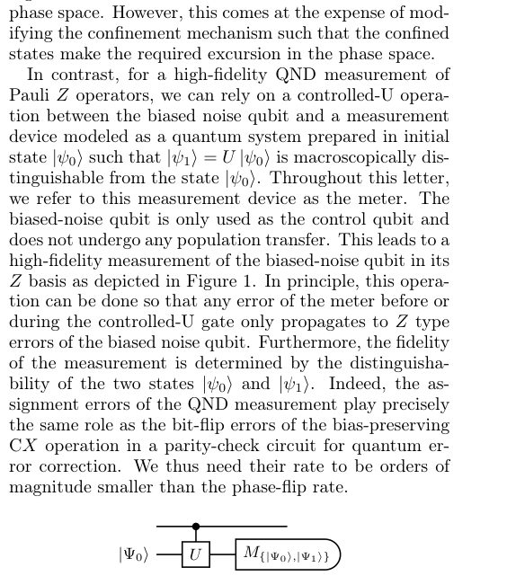
<figcaption class="paper-figure-caption"><b>Fig 1.</b> FIG. 1. Making a reliable QND Z measurement amounts to having access to a CU gate, a preparation of a state |Ψ0⟩and a reliable measurement distinguishing it from |Ψ1⟩= U |Ψ0⟩.</figcaption>
</figure>
<figure class="paper-figure-card">
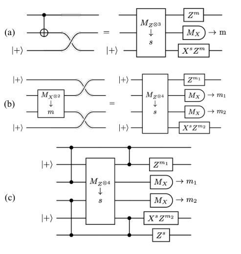
<figcaption class="paper-figure-caption"><b>Fig 2.</b> FIG. 2. (a) Circuit to implement a CX gate using a QND Z⊗3 measurement. Depending on the measurement outcome there is an X correction to be applied. In absence of a bias- preserving X gate, this correction can be stored in a Pauli frame. Moreover, the assignment error of the Z⊗3 measure- ment has to be as small as the bit-flip error probability for the protocol to preserve the bias. (b) Circuit to implement an X⊗2 parity check using a single QND Z⊗4 measurement. The measurement outcome is given by m = m1 ⊕m2. (c) Circuit to implement a ZXXZ measurement using a single QND Z⊗4 measurement. The measurement outcome is given by m = m1 ⊕m2. It can be obtained by conjugating the XX measurement in...</figcaption>
</figure>
<figure class="paper-figure-card">
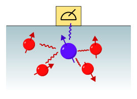
<figcaption class="paper-figure-caption"><b>Fig 3.</b> FIG. 3. Four nuclear spins (in red) are coupled to an electron spin (in blue) through hyperfine interaction and the electron spin undergoes an optical or electrical readout. Such a setup could be used to perform high-fidelity QND measurement of the Pauli operator Z4 between the four nuclear spin qubits which in turn can be used to perform the parity checks re- quired for biased-noise error correction as in Fig. 2.</figcaption>
</figure>
<figure class="paper-figure-card">
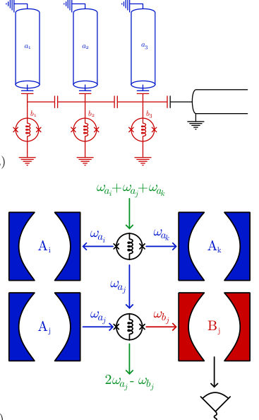
<figcaption class="paper-figure-caption"><b>Fig 4.</b> FIG. 4. High-fidelity QND readout of Z⊗3 between three sta- bilized cat qubits. As shown in plot (a), the setup consists of three dissipatively stabilized cat qubits coupled capacitively. Each cat qubit mode aj (in blue) is coupled to its buffer mode bj (in red). The Asymmetrically Threaded SQUIDs (ATS), represented by SQUIDs shunted in the middle by an induc- tance, ensure the nonlinear interactions between the cat qubit modes and the buffer modes. By applying dc magnetic fluxes of 0 and π in the two superconducting loops of the ATS, this element engineers a potential of the form (6). The j’th ATS is pumped with an ac drive at frequency 2ωaj −ωbj, ensuring effectively an exchange of two...</figcaption>
</figure>
<figure class="paper-figure-card">
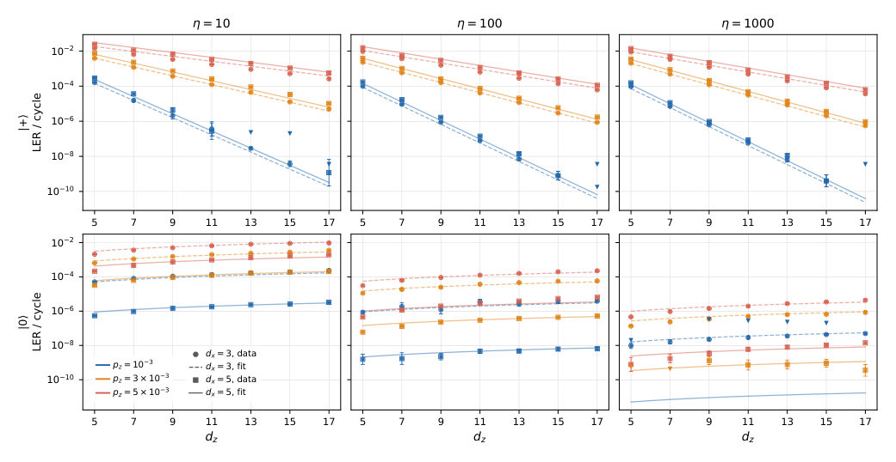
<figcaption class="paper-figure-caption"><b>Fig 5.</b> FIG. 5. Logical error rate per syndrome cycle of the XZZX surface code implemented with MZ4 measurements, as a function of dz. Top row: |+⟩memory (X-type logical). Bottom row: |0⟩memory (Z-type logical). Columns correspond to bias η ∈{10, 100, 103}. Colors indicate phase-flip rate pz (blue: 10−3; orange: 3×10−3; red: 5×10−3); solid and dashed lines correspond to dx = 3 and dx = 5, respectively. Downward triangles (▽) mark 95% Poisson upper bounds for tasks with zero observed errors. Thin lines show the power-law ansätze of Eqs. (11)–(B2).</figcaption>
</figure>

**Summary.** The paper proposes using multi-qubit QND Z-measurements as a practical alternative to difficult-to-implement bias-preserving CNOT gates. This approach allows for highly efficient error correction in platforms with biased noise, such as cat qubits and spin-based systems, significantly reducing the required qubit overhead.

**Why it may be interesting.** This is highly relevant for researchers in open quantum systems and quantum optics as it demonstrates how engineered dissipation and non-demolition measurements can be used as a fundamental building block for scalable, error-protected quantum architectures.

Detailed structure

**Main problem.** Existing approaches to exploit noise bias in fault-tolerant quantum computing rely on bias-preserving CNOT gates, which are experimentally difficult to implement and impossible in strictly 2D systems. The goal is to find a more accessible primitive that achieves similar hardware efficiency.

**Main result.** High-fidelity Quantum Non-Demolition (QND) multi-qubit Pauli Z measurements can replace bias-preserving CNOT gates, providing up to a 6x reduction in qubit overhead for XZZX surface codes at high noise bias. The scheme achieves phase-flip thresholds of approximately 1.25% for XZZX codes and 2.3% for repetition codes.

**Method.** The authors use circuit-level numerical simulations (via Stim and PyMatching) to evaluate error thresholds and qubit overhead. They also propose physical implementation protocols for multi-qubit Z-parity measurements using controlled-U operations and engineered dissipation.

**Model / system.** The paper targets platforms with biased noise (phase-flip > bit-flip), specifically solid-state nuclear spins coupled to electron spin ancillas and superconducting cat qubits stabilized via two-photon dissipation.

**Key observables.** Logical error rate (LER), phase-flip threshold, qubit overhead, and measurement assignment error.

**Important parameters / regimes.** Noise bias (eta) ranging from 10 to 10^8, phase-flip error rate (pz), and measurement weight (e.g., weight-4).

**Assumptions / limitations.** The assignment error of the QND measurement must be significantly smaller than the phase-flip error rate to preserve the noise bias.

**Figures summary.** Figure 1 shows the QND Z-measurement mechanism; Figure 2 shows a CNOT implementation using Z-measurements; Figure 4 illustrates the setup for cat qubits; Figures 15-19 detail XZZX surface code schedules and error rate comparisons.

**Paper structure.** The paper identifies the bottleneck of bias-preserving gates, proposes QND Z-measurements as a replacement, provides physical implementation paths for spin and superconducting systems, and quantifies performance gains through large-scale simulations.

Abstract

Leveraging noise bias, where phase-flip errors dominate over bit-flips, can drastically reduce the hardware overhead of fault-tolerant quantum computation, but existing approaches require bias-preserving CNOT gates whose implementation remains experimentally challenging and is provably impossible for strictly two-dimensional systems. We show that high-fidelity quantum non-demolition (QND) multi-qubit Pauli $Z$ measurements provide an equally powerful yet more accessible primitive. We demonstrate that such measurements can fully replace bias-preserving CNOT gates for compiling all operations required by bias-tailored error correction, including stabilizer measurements for repetition codes, XZZX surface codes, and LDPC codes. We propose concrete physical implementations of this primitive for two platforms: solid-state nuclear spins coupled to electron spin ancillas, and dissipatively stabilized superconducting cat qubits. Through circuit-level numerical simulations, we show that an asymmetric XZZX surface code implemented with weight-four QND $Z$ measurements achieves a phase-flip threshold of $\sim\!1.25\%$ and provides a qubit overhead reduction of up to $6\times$ compared to a bias-unaware surface code at noise bias $η= 10^4$. In the regime of very large bias, a repetition code with QND $Z$ measurements attains a threshold of $\sim\!2.3\%$ and achieves overhead comparable to that of a bias-preserving CNOT scheme, without requiring such a gate. Our results establish QND multi-$Z$ measurements as a practical and hardware-efficient route to fault-tolerant quantum computation for a broad class of biased-noise platforms.

[↑ back to top](#top)

### [Structural constraint on delayed-choice quantum eraser architectures](http://arxiv.org/abs/2605.24994v1)

**Authors:** Chakir Fikri  
**Type:** theory · **Category:** quantum information and computing · **PDF:** <https://arxiv.org/pdf/2605.24994v1>  
**Analysis basis:** full PDF text, analyzed in chunks
**Topic relevance:** 🔥 `quantum measurements` **4/5** · `entanglement & information structure` **2/5**

↔ Scroll figures horizontally

<figure class="paper-figure-card">
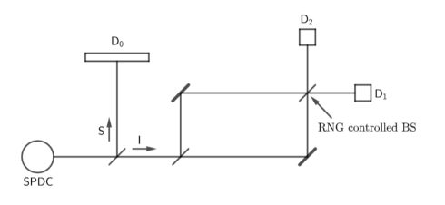
<figcaption class="paper-figure-caption"><b>Fig 1.</b> FIG. 2. Example of architecture II.</figcaption>
</figure>
<figure class="paper-figure-card">
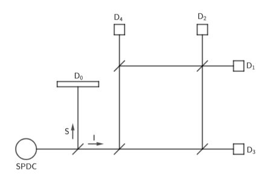
<figcaption class="paper-figure-caption"><b>Fig 2.</b> FIG. 1. Example of architecture I.</figcaption>
</figure>
<figure class="paper-figure-card">
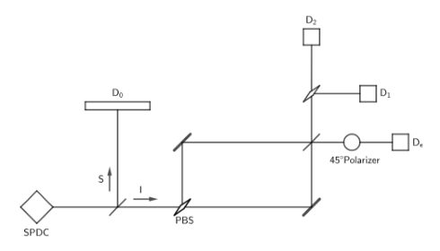
<figcaption class="paper-figure-caption"><b>Fig 3.</b> FIG. 3. Example of architecture III.</figcaption>
</figure>

**Summary.** This paper demonstrates that the seemingly paradoxical correlations in delayed-choice quantum eraser experiments are actually a result of incompatible structural assumptions. It proves that any realistic implementation must necessarily involve losses, non-deterministic routing, or coarse-graining to remain consistent with the independence of the measurement choice.

**Why it may be interesting.** It provides a fundamental structural explanation for the 'paradoxical' nature of DCQE, showing that losses are not just experimental flaws but a structural necessity to maintain causality and independence.

Detailed structure

**Main problem.** The paper addresses the apparent paradox in Delayed-Choice Quantum Eraser (DCQE) experiments, where measurement choices at a later time seem to correlate with earlier detection events.

**Main result.** The author proves a no-go theorem stating that four intuitive properties of idealized DCQE architectures—independence of choice, absence of losses, deterministic routing, and distinct conditional distributions—are mutually incompatible.

**Method.** A purely probabilistic analysis using elementary probability constraints and a framework of minimal compatibility relations between random variables, independent of specific quantum dynamics.

**Model / system.** A generic bipartite DCQE scenario involving a signal system (S) and an idler system (I), modeled via random variables for detection outcomes, experimental choices, and density operators.

**Key observables.** Detection positions (X), experimental settings (C), coincidence counts, and conditional detection distributions P(X|D).

**Important parameters / regimes.** Loss rate (p), probability of erasure choice (q), and the minimum loss rate threshold p_min = q^2/2.

**Assumptions / limitations.** The core derivation relies on the assumption of statistical independence between the choice and the signal detection (X is independent of C).

**Figures summary.** Figure 1 illustrates Architecture I (coarse-graining leading to interference cancellation); Figure 2 illustrates Architecture II (non-deterministic routing in a Mach-Zehnder setup).

**Paper structure.** The paper introduces the DCQE paradox, defines a probabilistic model for the system, presents a no-go theorem for idealized architectures, classifies DCQE schemes into three types based on which property they violate, and provides an analytical derivation of loss rate constraints.

Abstract

Delayed-choice quantum eraser (DCQE) experiments are often presented as challenging classical causal intuitions by correlating detection events with choices implemented at later times. While it is well understood that post-selection plays a crucial role in producing the observed interference patterns, the structural features underlying such correlations are rarely analyzed within a unified framework. In this work, we introduce a simple probabilistic constraint applicable to idealized DCQE architectures. We show that four intuitive properties -- statistical independence of the choice, absence of losses, deterministic routing conditioned on the choice, and distinct conditional detection distributions -- cannot be simultaneously satisfied. This incompatibility provides a transparent classification of DCQE schemes and clarifies how conditional interference patterns arise without invoking exotic mechanisms.

[↑ back to top](#top)

### [Transformer refined quantum sampling for strongly correlated electronic structure](http://arxiv.org/abs/2605.24617v1)

**Authors:** Xiongzhi Zeng, Ming Gong, Bowen Kan, Yi Fan, Huan Ma, Jianbin Cai, Yancheng Liu, Naibin Zhou, Tao Jiang, Shaojun Guo, Zhijie Fan, Zongkang Zhang, Yuan Li, Sirui Cao, Kai Yan, Xiaobo Zhu, Yi Luo, Honghui Shang, Zhenyu Li, Jian-Wei Pan, Jinlong Yang  
**Type:** both · **Category:** quantum information and computing · **PDF:** <https://arxiv.org/pdf/2605.24617v1>  
**Analysis basis:** full PDF text, analyzed in chunks
**Topic relevance:** 🔥 `QC/QI experiment` **4/5** · `entanglement & information structure` **2/5**

↔ Scroll figures horizontally

<figure class="paper-figure-card">
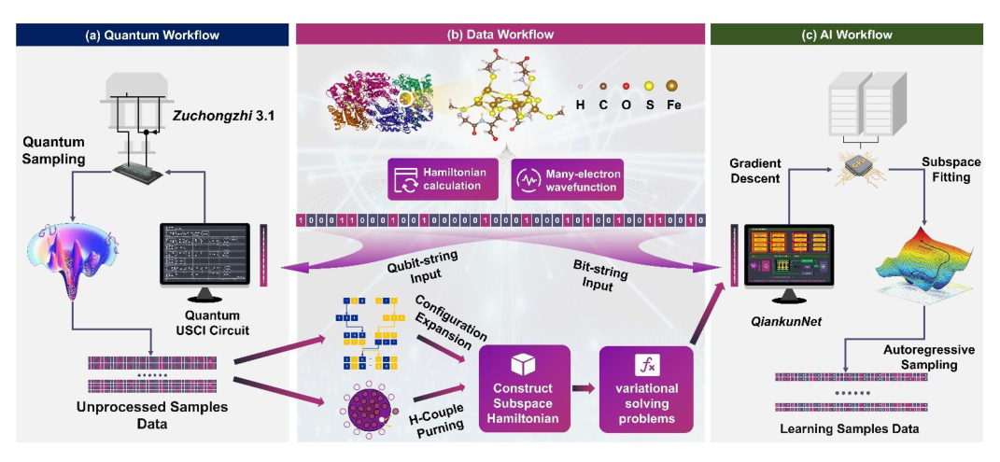
<figcaption class="paper-figure-caption"><b>Fig 1.</b> Fig. 1 QiankunNet-QSCI workflow. (a) Quantum workflow, in which a compact USCI ansatz is executed on quantum hardware to generate focused determinant samples. (b) Data workflow, where raw bitstrings are symmetry filtered, expanded, and assembled into a constrained subspace Hamiltonian. (c) AI workflow, in which QiankunNet is trained to denoise, complete, and refine the sampled wavefunction.</figcaption>
</figure>
<figure class="paper-figure-card">
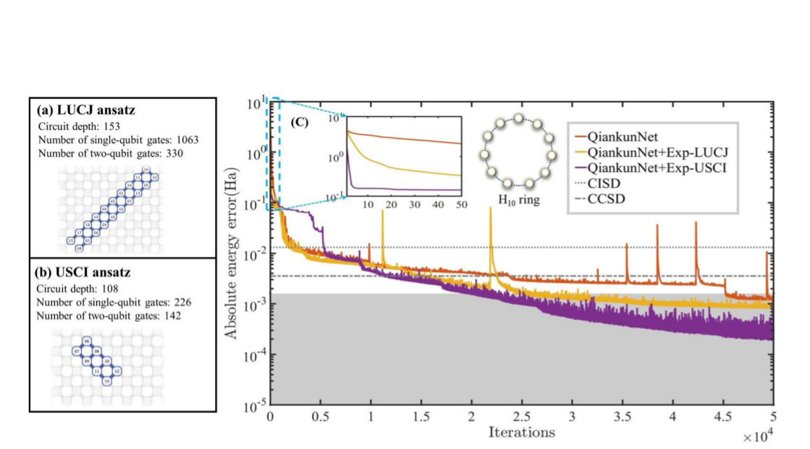
<figcaption class="paper-figure-caption"><b>Fig 2.</b> Fig. 2 Quantum Hardware Validation on H₁₀ Ring System. (a) Layout of the 20 qubits on Zuchongzhi 3.1 with the LUCJ entangler path highlighted in blue. (b) Qubit sub-lattice used for the 8-qubit USCI cluster highlighted in blue. (c) Absolute energy error versus iteration for QiankunNet with random initialization (orange), QiankunNet initialized with LUCJ (yellow), and QiankunNet initialized with USCI (purple). Energy errors from classical methods CISD (dotted line) and CCSD (dashed line) are provided for comparison. The shaded gray region marks the chemical accuracy threshold (1.6×10⁻³ Ha). The inset provides an enlarged view of the early iterations and the structure of H10 ring.</figcaption>
</figure>
<figure class="paper-figure-card">
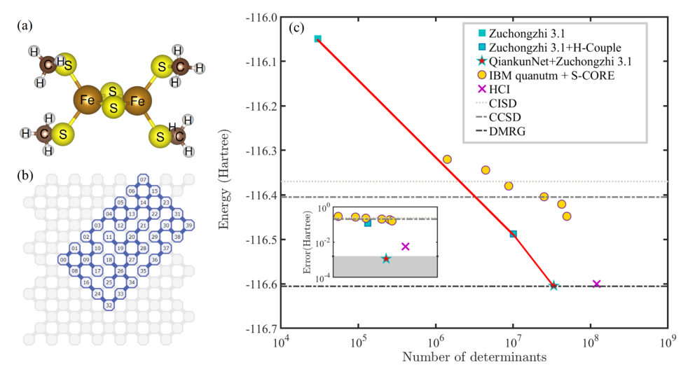
<figcaption class="paper-figure-caption"><b>Fig 3.</b> Fig. 3 Chemical-accuracy solution of the [2Fe-2S] cluster. (a) Molecular structure of the [Fe2S2(SCH3)4]2- cluster. (b) Qubit layout on Zuchongzhi 3.1 for the 40-qubit experiment. (c) Energy and absolute energy error (inset) versus the number of retained configurations. The number of determinants sampled for local energy calculation is used for QiankunNet. Hardware data for USCI-based sampling on Zuchongzhi 3.1 and LUCJ-based sampling on IBM hardware are shown together with classical baselines. The shaded region marks chemical accuracy (1.6×10⁻³ Ha). Quantum results: QiankunNet-QSCI (QiankunNet+Zuchongzhi 3.1: red star), Zuchongzhi 3.1 with USCI ansatz (Zuchongzhi 3.1: cyan squares) and...</figcaption>
</figure>
<figure class="paper-figure-card">
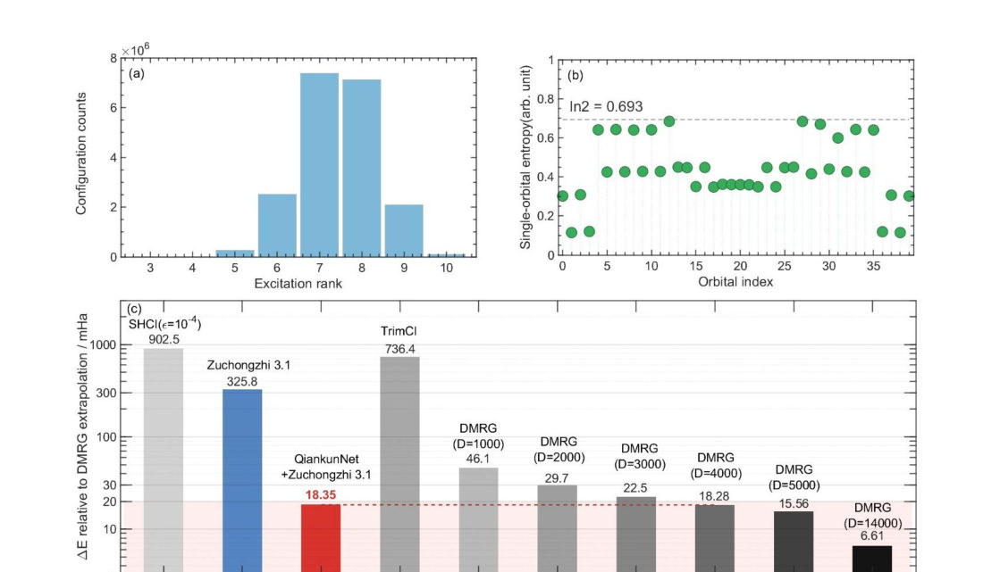
<figcaption class="paper-figure-caption"><b>Fig 4.</b> Fig. 4 Wavefunction analysis of the [2Fe-2S] ground state and benchmark comparison for the P-cluster. (a) Distribution of retained configurations by excitation rank relative to the Hartree-Fock reference. (b) Single-orbital entropies for the 40 spin orbitals. (c) Energy errors for the P-cluster CAS(114e,73o) model, referenced to DMRG extrapolation,31 using different models including SHCI (ϵ=10−4), TrimCI42, DMRG (D=1000, 2000, 3000, and 4000)30, DMRG (D=5000)43 and DMRG (D=14000)31.</figcaption>
</figure>

**Summary.** This paper presents a hybrid quantum-classical framework that uses a quantum processor to sample important electronic configurations and a Transformer neural network to refine the resulting wavefunction. It successfully demonstrates high-accuracy simulations of large, strongly correlated biological clusters that are challenging for classical computers.

**Why it may be interesting.** It demonstrates a powerful synergy between quantum hardware-native sampling and classical machine learning to overcome the limitations of NISQ noise and the exponential scaling of many-body wavefunctions.

Detailed structure

**Main problem.** Accurately simulating strongly correlated electronic structures on NISQ-era quantum hardware, which is hindered by noise, high measurement costs, and the exponential growth of the Hilbert space.

**Main result.** The QiankunNet-QSCI framework achieves chemical accuracy for a 40-qubit ferredoxin cluster and reaches 12-18 milli-Hartree agreement with DMRG for a massive 146-spin-orbital nitrogenase P-cluster.

**Method.** A hybrid quantum-classical approach using a Unitary Selected Configuration Interaction (USCI) ansatz for importance sampling on a quantum processor, followed by a Transformer-based neural network (QiankunNet) for denoising and wavefunction refinement.

**Model / system.** The study utilizes the Zuchongzhi 3.1 superconducting quantum processor to simulate various systems, including the H10 ring, the [2Fe-2S] ferredoxin active center, and the large-scale nitrogenase P-cluster (CAS(114e, 73o) active space).

**Key observables.** Ground-state energy, absolute energy error, excitation rank, single-orbital entropy, mutual information, and sampling enrichment factor.

**Important parameters / regimes.** Gate error rates (single-qubit ~0.1%, two-qubit ~0.6%), readout error (~0.6%), and the number of shots (up to 10^8).

**Assumptions / limitations.** The framework assumes a global depolarizing noise model and focuses on the importance of the chemically significant determinant sector.

**Figures summary.** Figure 1 shows the workflow stages (Quantum, Data, AI); Figure 2 validates the H10 ring; Figure 4c compares energy errors against classical methods and DMRG; supplementary figures show hardware metrics, circuit depths, and sampling distributions.

**Paper structure.** The paper introduces the scientific challenge, details the USCI quantum sampling and QiankunNet Transformer architecture, presents experimental implementation on Zuchongzhi 3.1, demonstrates scalability through various molecular benchmarks, and concludes with error analysis and future outlook.

Abstract

Although quantum computing offers a promising solution for strongly correlated system simulation, existing algorithms face significant bottlenecks on current noisy intermediate-scale quantum (NISQ) devices. Here, we introduce QiankunNet-QSCI, a hybrid quantum-classical framework that addresses this challenge by combining efficient quantum-sampling with a transformer neural network. An efficient unitary selected configuration Interaction (USCI) ansatz especially designed for quantum sampling is proposed to identify the most chemically significant electronic configurations on the Zuchongzhi 3.1 quantum processor. Subsequently, the transformer model QiankunNet learns from these sparse yet critical quantum data to infer and reconstruct the complete electronic wavefunction with high fidelity. Simulation of the challenging 40-qubit [2Fe-2S] ferredoxin active center achieves chemical accuracy. Simulation of the nitrogenase P-cluster in a 114-electron 73-orbital active space also reaches 12 milli-Hartree-level agreement with the best density matrix renormalization group (DMRG) result. QiankunNet-QSCI thus offers a practical route to accurate quantum-assisted electronic structure calculations on current devices.

[↑ back to top](#top)

### [QML-PipeGuard: Drift-Aware Behavioral Fingerprinting for Quantum Machine Learning Pipeline Integrity](http://arxiv.org/abs/2605.25066v1)

**Authors:** Esra Yeniaras  
**Type:** both · **Category:** quantum information and computing · **PDF:** <https://arxiv.org/pdf/2605.25066v1>  
**Analysis basis:** full PDF text, analyzed in chunks
**Topic relevance:** 🔥 `QC/QI experiment` **4/5** · `quantum measurements` **1/5**

↔ Scroll figures horizontally

<figure class="paper-figure-card">

<figcaption class="paper-figure-caption"><b>Fig 1.</b> Figure 1: System model and trust boundaries. The model owner declares a specification σA for the QML pipeline (encoding Uϕ, ansatz W(θ), and measurement M). The pipeline executes inside the execution environment, which in adversarial scenarios is under the control of an adversary A who may substitute the declared channel EA with EB = S ◦EA. The trusted verifier samples observables from OA, collects measurement outcomes, checks the observable contract against the reference specification, and produces an accept/halt/log-drift decision.</figcaption>
</figure>
<figure class="paper-figure-card">
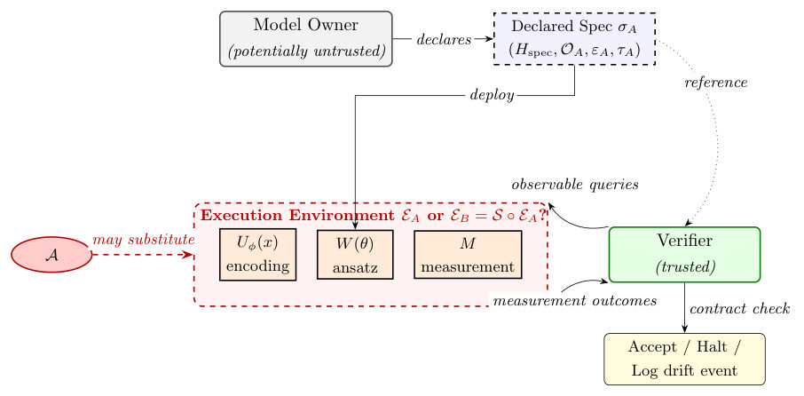
<figcaption class="paper-figure-caption"><b>Fig 2.</b> Figure 1 summarizes the system model and trust boundaries graphically. The diagram traces the path from the model owner’s declared specification through the execution environment to</figcaption>
</figure>
<figure class="paper-figure-card">
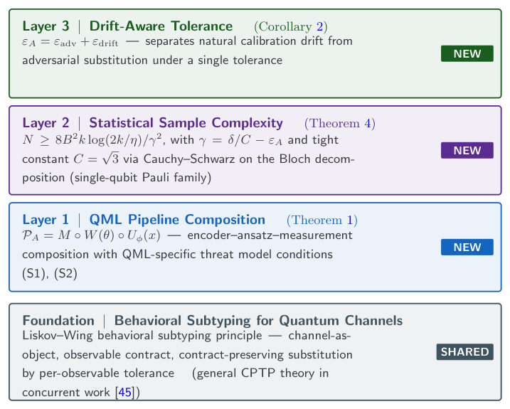
<figcaption class="paper-figure-caption"><b>Fig 3.</b> Figure 2: Theoretical-foundation stack for the framework. The bottom (shared) layer is the behavioral-subtyping discipline for quantum channels: channel-as-object, observable contract, and contract-preserving substitution by per-observable tolerance, developed at the general CPTP-channel level in concurrent work. The three upper layers (this paper) specialize this foundation to QML pipelines (Layer 1), add a finite-shot operational layer through Hoeffding concentration and a union bound together with a tight frame-bound constant C = √</figcaption>
</figure>
<figure class="paper-figure-card">
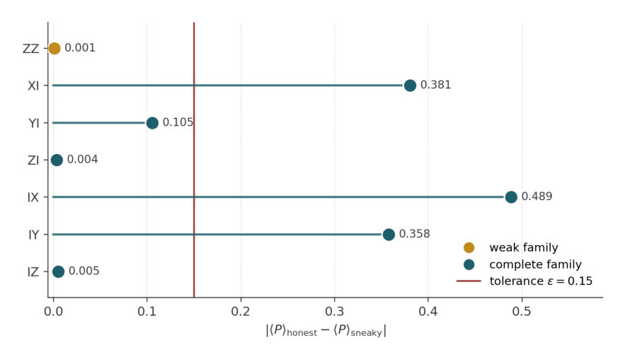
<figcaption class="paper-figure-caption"><b>Fig 4.</b> Figure 3: Per-observable deviation between the honest and sneaky channels on ibm fez, with tolerance εA = 0.15 marked by the vertical line. Observable labels follow the convention Pi ≡P ⊗I for i = 1 (qubit 1) and Pi ≡I ⊗P for i = 2 (qubit 2); the correlation ob- servable is labelled Z1Z2 ≡Z ⊗Z. The single weak-family observable Z1Z2 (amber) stays at the device noise floor (deviation 0.001), passing the weak contract. The complete family (teal) exposes the substitution: deviations of 0.36–0.49 on three of the X- or Y -rotated ob- servables, well beyond tolerance. The verifier halts under the complete contract while the weak contract accepts the substitute, reproducing the structural...</figcaption>
</figure>
<figure class="paper-figure-card">
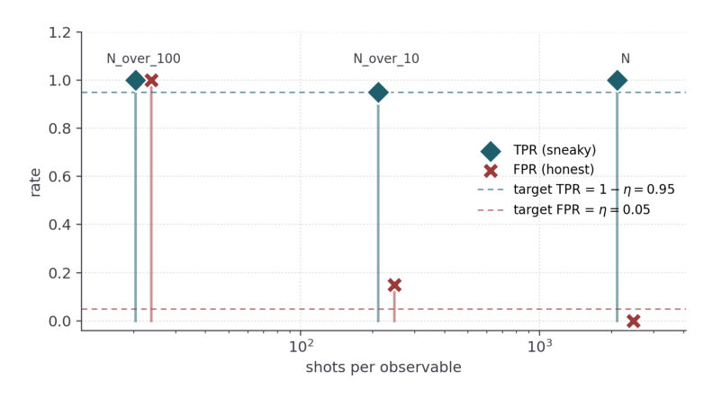
<figcaption class="paper-figure-caption"><b>Fig 5.</b> Figure 4: Empirical TPR (sneaky detection rate) and FPR (honest false-alarm rate) as a function of shot budget per observable, weakened sneaky construction (RZ(π/6) insertion), 20 trials per setting on the Aer simulator with the IBM Heron r2 noise model. At the Corollary 1 (sampled-reference) per-observable budget nO = 2,280 (total N = 13,680), TPR reaches 1.00 and FPR drops to 0.00, comfortably bracketing the target rates (TPR target 1 −η = 0.95, FPR target η = 0.05, shown as dashed lines). At reduced budgets the FPR climbs sharply (0.15 at nO/10, 1.00 at nO/100), indicating that statistical fluctuations rather than channel deviation are driving the verifier’s decisions; the apparent...</figcaption>
</figure>

**Summary.** This paper introduces a framework to verify that a quantum machine learning pipeline is executing the intended circuit rather than a substituted or degraded version. It provides a unified way to monitor for both malicious attacks and natural hardware noise using a lightweight measurement protocol. This is crucial for the secure deployment of QML in regulated cloud-based quantum services.

**Why it may be interesting.** not directly relevant

Detailed structure

**Main problem.** Ensuring the integrity of Quantum Machine Learning (QML) pipelines against both adversarial channel substitution and natural hardware calibration drift.

**Main result.** The QML-PipeGuard framework successfully detects 'sneaky' channel substitutions on IBM Heron hardware while distinguishing them from benign hardware drift within a calibrated tolerance.

**Method.** A contract-based framework using behavioral fingerprinting, where a vector of observable expectation values is compared against a declared specification using a predefined tolerance.

**Model / system.** The study focuses on QML pipelines (VQC, QSVM, QNN) implemented on the IBM Heron r2 processor (ibm_fez), modeling the quantum stage as a sequence of CPTP channels.

**Key observables.** A vector of observable expectation values, specifically using Pauli observable families (local Pauli, diagonal correlations, and full Pauli strings).

**Important parameters / regimes.** Calibrated tolerance (epsilon_A), adversarial separation (delta), frame-bound constant (C), and measurement shot budget (N).

**Assumptions / limitations.** Assumes the adversary controls the execution environment, the QML model is already trained, and the verifier possesses a trusted reference implementation.

**Figures summary.** Figure 1 shows the system model of trust between owner, environment, and verifier; Figure 4 visualizes the relationship between shot budget and error rates (TPR/FPR).

**Paper structure.** The paper introduces a threat model for QML integrity, proposes the QML-PipeGuard framework, provides mathematical theorems for detection and sample complexity, and validates the approach via hardware experiments on IBM processors.

Abstract

Quantum machine learning (QML) is moving from research prototypes to deployed cloud services. As QML enters regulated industries, the integrity of the quantum stage becomes a practical concern on two fronts: noisy hardware drifts at the channel level between recalibrations, and an adversary with control over the execution environment can substitute the declared quantum channel with a behaviorally similar but mathematically distinct one. Neither concern is covered by existing QML verification work on pulse-level noise, input drift, input-perturbation robustness, or device identity. We introduce QML-PipeGuard, a contract-based framework addressing both concerns under a single mathematical machinery. It characterizes a QML pipeline at runtime by its behavioral fingerprint, the vector of observable expectation values under a tomographically structured measurement family, and operates in two modes: drift-aware monitoring that absorbs benign calibration changes within a calibrated tolerance, and adversarial detection that catches channel substitution as a violation of an informationally complete observable contract. The framework contributes a pipeline-composition treatment of the encoder-ansatz-measurement channel with a QML-specific threat model (tight frame-bound C=sqrt(3) for the single-qubit Pauli family), a finite-shot sample-complexity bound, and a tolerance decomposition separating adversarial and natural-drift contributions. We validate the framework end-to-end on a two-qubit QSVM pipeline on the IBM Heron r2 processor (ibm_fez), with a sample-complexity validation on a noise-matched simulator. The prescribed measurement budget (about 1.4e4 shots) fits in a single batched job, the sneaky channel is detected with a wide safety margin while evading the weak contract, and the typical hardware drift sits within tolerance.

[↑ back to top](#top)

### [Kernel Embedding for Operator-Valued Measures and Its Application to Quantum Tomography](http://arxiv.org/abs/2605.25146v1)

**Authors:** Philipp Nikolas Mayer, Ho Yun  
**Type:** theory · **Category:** quantum information and computing · **PDF:** <https://arxiv.org/pdf/2605.25146v1>  
**Analysis basis:** full PDF text, analyzed in chunks
**Topic relevance:** 🔥 `quantum measurements` **4/5**

↔ Scroll figures horizontally

<figure class="paper-figure-card">
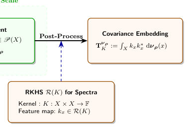
<figcaption class="paper-figure-caption"><b>Fig 1.</b> Fig 1. Pipeline of Quantum Covariance Embedding</figcaption>
</figure>
<figure class="paper-figure-card">
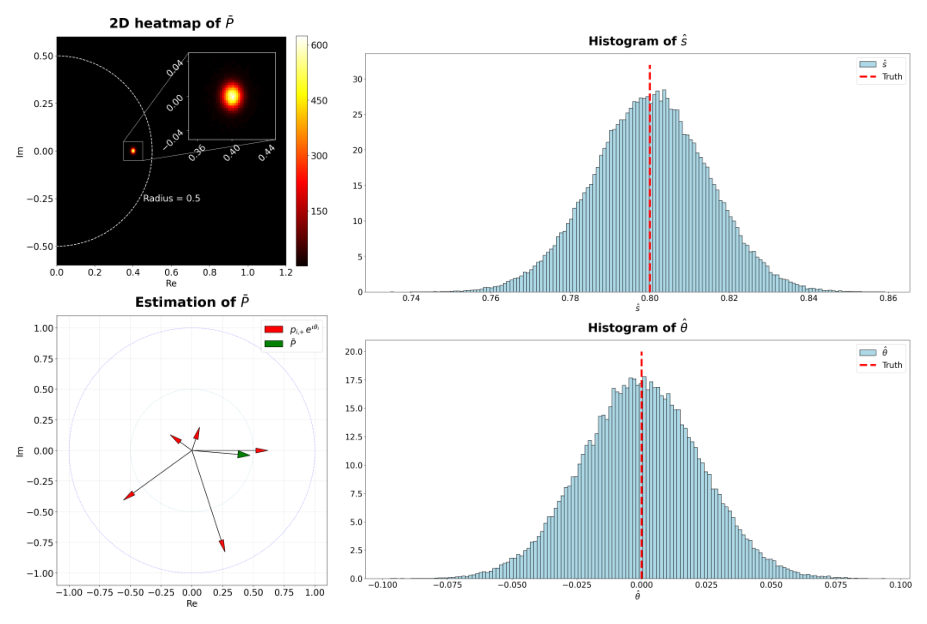
<figcaption class="paper-figure-caption"><b>Fig 2.</b> Fig 2. Estimation behavior with ρ = Diag[0.9, 0.1]. Bottom left: Single realization with n = 5 observables and r = 50 measurements per observable, showing pi,+eıθi ∈C and the resulting estimator ¯P. Top left: Two-dimensional histogram of ¯P over 105 repetitions with r = 50 measurements per n = 100 observables. Right: Histograms of ˆs and ˆθ, respectively; dashed red lines indicate the true parameter values s = 0.8 and θ = 0.</figcaption>
</figure>
<figure class="paper-figure-card">
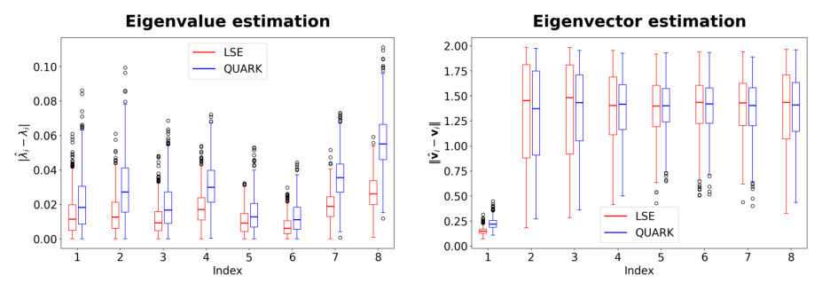
<figcaption class="paper-figure-caption"><b>Fig 3.</b> Fig 3. Spectral behavior of the LSE and QUARK estimator with kernel K, based on 1000 Monte Carlo repetitions. The boxplots are ordered by decreasing eigenvalue magnitude. Left: Absolute eigenvalue errors |ˆλLSE i −λi| (red) and |ˆλK i −λi| (blue). Right: Absolute eigenvector errors ∥ˆvLSE i −vi∥(red) and ∥ˆvK i −vi∥(blue).</figcaption>
</figure>
<figure class="paper-figure-card">
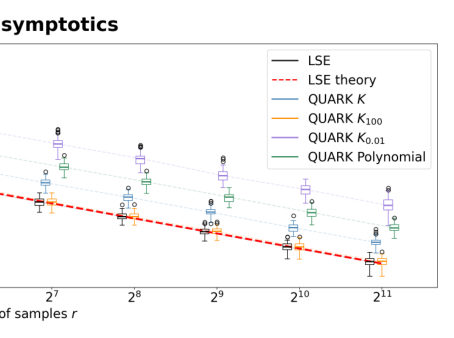
<figcaption class="paper-figure-caption"><b>Fig 4.</b> Fig 4. Asymptotic performances in terms of MSE of the LSE and various QUARK estimators.</figcaption>
</figure>
<figure class="paper-figure-card">
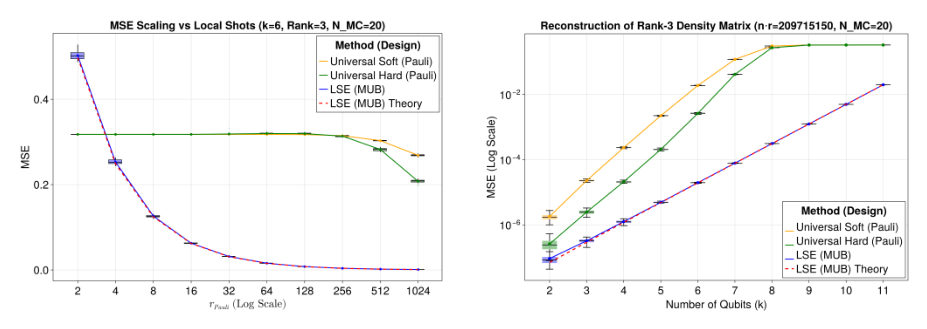
<figcaption class="paper-figure-caption"><b>Fig 5.</b> Fig 5. Comparison between the proposed LSE estimator with MUB design and the Universal soft and hard thresholding estimators of [15] with Pauli designs. Left: dependence on the number of samples per observable. Right: dependence on the dimension of the quantum Hilbert space.</figcaption>
</figure>

**Summary.** This paper develops a new kernel-based framework for quantum state tomography that avoids the need for sparsity assumptions. By embedding measurements into a Reproducing Kernel Hilbert Space, the authors create a method that is statistically optimal and accounts for the physical geometry of the measurement apparatus.

**Why it may be interesting.** It provides a rigorous statistical foundation for quantum tomography that is robust to noise and does not rely on the potentially biased assumption of Pauli sparsity, making it highly relevant for characterizing realistic, noisy quantum hardware.

Detailed structure

**Main problem.** The paper addresses the limitations of existing Quantum State Tomography (QST) methods, which often rely on basis-dependent sparsity constraints that can introduce bias in the dense regime and fail to account for the spectral geometry of physical hardware.

**Main result.** The authors introduce the Quantum Covariance Embedding (QCE) and the QUARK estimator, proving they achieve minimax optimal rates for density estimation and establishing that Unitary Designs are statistically superior to Pauli observables.

**Method.** The framework utilizes Reproducing Kernel Hilbert Space (RKHS) techniques, specifically a tensorized Bochner integral, to embed Positive Operator-Valued Measures (POVMs) into a feature space, combined with kernel regression.

**Model / system.** The study focuses on finite-dimensional quantum systems (qubits and qudits) described by density operators in a Hilbert space, using measurement models ranging from ideal PVMs to noisy POVMs.

**Key observables.** Positive Operator-Valued Measures (POVMs), Pauli matrices, and Unitary Designs.

**Important parameters / regimes.** Dimension of the Hilbert space (q), number of measurement shots (r), error rate (eta) for bit-flip noise, and kernel bandwidth (c).

**Assumptions / limitations.** The analysis assumes the use of characteristic kernels and focuses on finite-dimensional Hilbert spaces; it also assumes the existence of complete measurement designs for identifiability.

**Figures summary.** Figure 1 illustrates the QCE pipeline from microscopic states to macroscopic outcomes; Figure 7 shows spectral error comparisons between LSE and QUARK; Figure 8 plots the MSE decay of various estimators.

**Paper structure.** The paper begins by defining the mathematical framework for operator-valued kernel embeddings, moves to the construction of the Quantum Maximum Discrepancy metric, develops the QUARK estimator and its statistical properties (CLT, concentration inequalities), and concludes with numerical simulations comparing the new method to standard least-squares estimation.

Abstract

This paper introduces the Quantum Covariance Embedding, which embeds Positive Operator-Valued Measures into a tensor product of a Reproducing Kernel Hilbert Space and the quantum state space via a tensorized Bochner integral. This construction induces the Quantum Maximum Discrepancy that metrizes the space of quantum measurements. Applying this framework to Quantum State Tomography, we reformulate density estimation as a tensorized kernel regression, enabling optimal inference without the basis-dependent sparsity constraints that restrict existing methods. We develop a unified geometric design theory for quantum Gram superoperators, establishing that Unitary Designs are strictly E-optimal experimental designs and thus statistically superior to Pauli observables. For general structure-free estimation, we derive the exact minimax lower bound and prove that our tensorized estimators achieve this optimal rate. Furthermore, we introduce the QUAntum Regression with Kernels (QUARK) estimator to accommodate the spectral geometry of physical implementations, deriving central limit theorem and concentration inequalities. To facilitate practical estimation, we establish the exactness of trace-preserving projections and demonstrate efficient estimation under mutually unbiased bases via the fast Walsh-Hadamard transform.

[↑ back to top](#top)

### [Point-group symmetry analysis of many-electron wavefunctions on a quantum computer](http://arxiv.org/abs/2605.24824v1)

**Authors:** Rei Sakuma, Kenji Sugisaki, Shu Kanno, Toshinari Itoko, Hajime Nakamura  
**Type:** both · **Category:** quantum information and computing · **PDF:** <https://arxiv.org/pdf/2605.24824v1>  
**Analysis basis:** full PDF text, analyzed in chunks
**Topic relevance:** 🔥 `QC/QI experiment` **4/5**

↔ Scroll figures horizontally

<figure class="paper-figure-card">
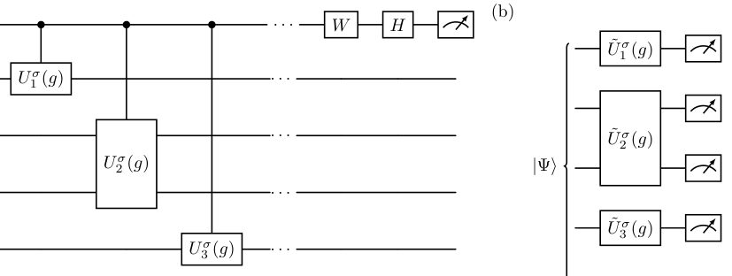
<figcaption class="paper-figure-caption"><b>Fig 1.</b> FIG. 1. Circuit diagrams for calculating ⟨Ψ|U(g)|Ψ⟩via the Hadamard test (a) and the proposed ancilla-free method (b). Here W = I, S† for Re⟨Ψ|U(g)|Ψ⟩and Im⟨Ψ|U(g)|Ψ⟩, respectively.</figcaption>
</figure>
<figure class="paper-figure-card">
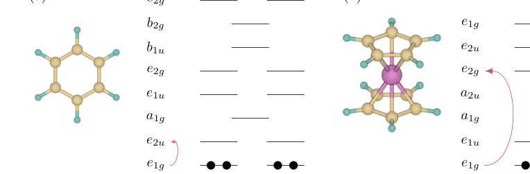
<figcaption class="paper-figure-caption"><b>Fig 2.</b> FIG. 2. Structures and Hartree-Fock one-particle energy diagrams of benzene (a) and staggered ferrocene (b). Filled circles denote occupied electrons in the Hartree-Fock ground-state configuration. Arrows indicate single excitations considered in this work.</figcaption>
</figure>
<figure class="paper-figure-card">
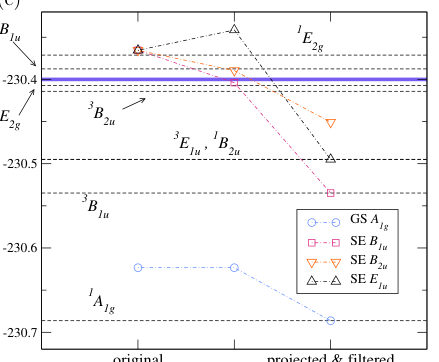
<figcaption class="paper-figure-caption"><b>Fig 3.</b> FIG. 3. (a) Weights wΓ for the Hartree-Fock ground-state (GS) and one single-excited state (SE) configurations of ben- zene. The inset shows a magnified view. (b) Sum of weights over the eight SE configurations (Eq. (27)). (c) Energy ex- pectation values of (i) original Slater determinant states, (ii) symmetry-projected states, and (iii) symmetry-projected and filtered states. The thick horizontal line shows the energy cut- off of the filter, and the dashed lines show the exact eigenen- ergies. The superscripts of the eigenstate labels denote total spin 2S + 1. Note that 3E1u and 1B2u eigenenergies are very close and indistinguishable on this scale.</figcaption>
</figure>
<figure class="paper-figure-card">
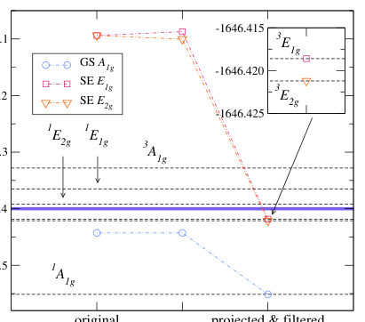
<figcaption class="paper-figure-caption"><b>Fig 4.</b> FIG. 4. Same as Fig. 3 but for ferrocene.</figcaption>
</figure>
<figure class="paper-figure-card">
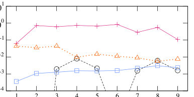
<figcaption class="paper-figure-caption"><b>Fig 5.</b> FIG. 5. Errors in the ground-state energy (a) and the A1g weight (b) of the UCJ and LUCJ functions in benzene.</figcaption>
</figure>

**Summary.** This paper presents a new quantum-classical hybrid method to analyze the point-group symmetries of many-electron wavefunctions without requiring ancilla qubits. By applying orbital rotations, the method efficiently calculates the weights of irreducible representations. The approach is successfully demonstrated on real IBM quantum hardware, showing that error mitigation can accurately recover symmetry properties in molecular simulations.

**Why it may be interesting.** It provides a practical framework for using molecular symmetries to reduce computational overhead and verify the accuracy of quantum simulations on near-term hardware.

Detailed structure

**Main problem.** The lack of practical, ancilla-free quantum algorithms for performing detailed point-group symmetry analysis of realistic many-electron wavefunctions.

**Main result.** The authors propose an ancilla-free hybrid method to calculate irreducible representation weights and demonstrate its efficacy on IBM's ibm_kawasaki device, achieving results within a few percent error using QESEM error mitigation.

**Method.** A quantum-classical hybrid approach using orbital rotations derived from representation matrix eigenvectors, combined with tensor-network-based state preparation (DMRG-to-brick-wall) and error mitigation techniques like ZNE and QESEM.

**Model / system.** Many-electron molecular systems, specifically benzene (D6h) and ferrocene (D5d), simulated using electronic structure models and implemented on a superconducting quantum processor.

**Key observables.** Weights of irreducible representations (w_Gamma), energy expectation values, and wavefunction infidelity.

**Important parameters / regimes.** Number of qubits (up to 32), number of circuit layers (L=6), regularization parameter (lambda = 0.005), and error mitigation strategies (ZNE, QESEM).

**Assumptions / limitations.** The study focuses on the spin-restricted case and utilizes DMRG-compressed wavefunctions for the hardware demonstration.

**Figures summary.** Figures show the optimization process for brick-wall ansatz construction, infidelity vs. circuit layers, and a comparison of symmetry weight estimation accuracy under different error mitigation regimes (No mitigation, ZNE, and QESEM).

**Paper structure.** The paper introduces the problem of symmetry analysis, proposes a new ancilla-free algorithm, validates it through numerical simulations of benzene and ferrocene, and concludes with a hardware demonstration on an IBM quantum device.

Abstract

A point group is a set of spatial symmetry operations in molecular systems and is an indispensable tool for analyzing molecular orbitals and spectroscopy experiments in chemistry. Several quantum algorithms to exploit this symmetry have been proposed, but practical implementations of point-group symmetry operations and the detailed symmetry analysis of realistic many-electron wavefunctions are still missing. In this work, we propose an ancilla-free hybrid method to analyze point-group symmetries of many-electron states, which works for both abelian and non-abelian groups. For a given wavefunction, our method calculates the projection weights of point-group irreducible representations by applying orbital rotations derived from the eigenvectors of the representation matrices, therefore it is applicable to arbitrary basis functions. The usefulness of our approach is demonstrated through numerical simulations of benzene and ferrocene molecules. Furthermore, we perform a hardware demonstration of the weight calculation of the ground state and the first excited state of benzene in $D_{2h}$ symmetry, using up to 32 qubits of IBM's \texttt{ibm\_kawasaki} device. By combining a tensor-network based encoding scheme and error mitigation techniques, we find the weights of irreducible representations for both states are faithfully reproduced within a few percent error. Our results suggest that the proposed method serves as a practical tool for analyzing symmetry properties of many-electron wavefunctions in realistic material simulations on near-term and early fault-tolerant quantum computers.

[↑ back to top](#top)

### [Rare events of small-noise Doob conditioned processes](http://arxiv.org/abs/2605.24537v1)

**Authors:** Iago N. Mamede, Francesco Coghi  
**Type:** theory · **Category:** statistical mechanics · **PDF:** <https://arxiv.org/pdf/2605.24537v1>  
**Analysis basis:** full PDF text, analyzed in chunks
**Topic relevance:** `methods for driven-dissipative` **3/5** · `non-equilibrium dynamics` **3/5** · `Keldysh / 2PI / non-Gaussian methods` **2/5** · `correlated / nonlocal dissipation` **2/5** · `driven-dissipative phase transition` **2/5** · `non-equilibrium universality` **2/5** · `quantum measurements` **2/5**

↔ Scroll figures horizontally

<figure class="paper-figure-card">
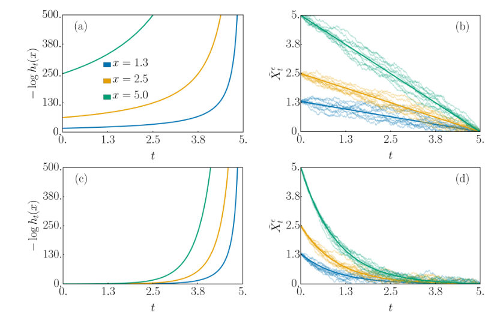
<figcaption class="paper-figure-caption"><b>Fig 1.</b> FIG. 1. Panels (a) and (c): rescaled time-dependent potentials −log ht(x) (for different initial positions) for Brownian bridge in Eq. (10) and OU bridge in Eq. (13). Panels (b) and (d): Doob conditioned trajectories ˜ Xϵ t representing instances, respectively, of the Brownian Bridge in Eq. (11) and Ornstein–Uhlenbeck bridge in Eq. (14). Solid lines represent typical realisations E[ ˜ Xϵ t ], while shaded areas include real trajectories within one standard deviation. Parameters: xf = 0, T = 5, ϵ = 0.01, σ = 1.</figcaption>
</figure>
<figure class="paper-figure-card">
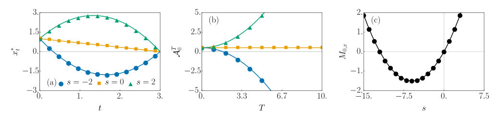
<figcaption class="paper-figure-caption"><b>Fig 2.</b> FIG. 2. Panel (a): Analytical optimal trajectories (44) (solid lines) compared with numerical solutions (markers) of Eq. (42) for exemplary values of the tilting parameter s. Panel (b): Analytical form of the area rate observable (45) (solid lines) compared with numerical optimisation (markers) of Eq. (42) then replaced in (40) for the same exemplary values of s as in panel (a). Panel (c): analytical SCGF M0,x(s) from Eq. (47) (solid line) and numerical SCGF from Eq. (42), shifted by ˆ M0,x(0) (markers). Parameters used: x = 1, xf = 0, and D = 1; T = 3 for panels (a) and (c).</figcaption>
</figure>
<figure class="paper-figure-card">
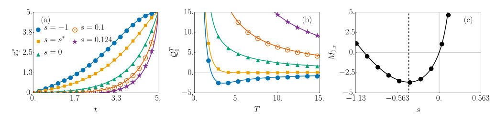
<figcaption class="paper-figure-caption"><b>Fig 3.</b> FIG. 3. Panel (a): Analytical optimal trajectories (53) (solid lines) compared with numerical solutions (markers) of the variational problem for exemplary values of the tilting parameter s. Panel (b): Semi-analytical form for the average rate of heat dissipation from Eq. (56) (solid lines) compared with numerical solutions (markers) for the same exemplary values of s as in panel (a). Panel (c): Semi-analytical SCGF from Eq. (28) compared with numerical solutions (markers). The dashed line marks the value s = sc, minimum of the SCGF. Parameters used: x = 0, xf = 5, and D = 1; T = 5 for panels (a) and (c).</figcaption>
</figure>
<figure class="paper-figure-card">
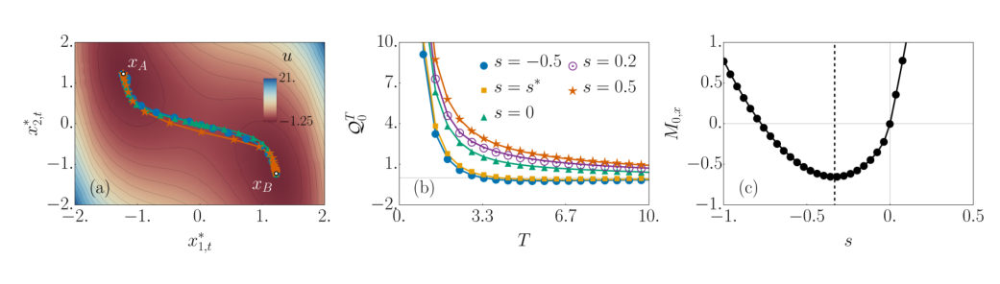
<figcaption class="paper-figure-caption"><b>Fig 4.</b> FIG. 4. Panel (a): Numerical solutions of instantons obtained solving the variational problem in Eq. (60) for exemplary values of the tilting parameter s. Panel (b): Numerical values for the mean rate of the heat dissipation from Eq. (38) using numerical instantons from (60). Panel (c): Numerical SCGF from Eqs. (28) and (60). The dashed line marks the minimum of the SCGF s = s∗. Parameters used: xA = (− p</figcaption>
</figure>

**Summary.** This paper provides a new way to study rare trajectories in noisy systems by avoiding the complex math of Doob transforms through a post-selection approach. It allows for the calculation of fluctuations in quantities like heat dissipation using an optimal-control framework. The method is validated through analytical models and applied to complex biomolecular landscapes.

**Why it may be interesting.** The development of a variational principle for conditioned trajectories is highly relevant for studying rare fluctuations and non-equilibrium transitions in open quantum systems and many-body dynamics.

Detailed structure

**Main problem.** Calculating the statistics and moment generating functions of path observables for Doob-conditioned processes in the small-noise, large-deviation regime.

**Main result.** The authors develop a framework to bypass the need for an explicit Doob h-function by treating the conditioned ensemble as a post-selected original process, yielding an optimal-control representation for the action.

**Method.** The study uses weak-noise large deviation theory, a WKBJ ansatz, and a Hamilton-Jacobi formulation to derive a variational principle for the leading exponential contribution to the generating function.

**Model / system.** The framework is applied to time-homogeneous diffusion processes (SDEs) with additive noise, specifically using Brownian bridges, Ornstein-Uhlenbeck processes, and a 2D biomolecular folding model.

**Key observables.** Moment generating functions, Scaled Cumulant Generating Function (SCGF), rate functions, dissipated heat, and accumulated area under the path.

**Important parameters / regimes.** Noise intensity (epsilon), terminal time (T), tilting parameter (s), and diffusion coefficient (D).

**Assumptions / limitations.** The noise is primarily assumed to be additive, the processes are Markovian and time-homogeneous, and the study focuses on the small-noise (epsilon -> 0) limit.

**Figures summary.** Figure 1 shows the Doob conditioning concept; Figure 2 compares analytical and numerical optimal trajectories and area rates for Brownian bridges; Figure 3 shows OU process trajectories, heat dissipation, and SCGF; Figure 4 presents numerical results for a 2D folding model including instantons and heat dissipation.

**Paper structure.** The paper begins by defining the problem of Doob conditioning and the difficulty of the h-transform, introduces a post-selection reinterpretation, develops the mathematical framework via Hamilton-Jacobi and optimal control theory, provides analytical benchmarks (Brownian bridge and OU process), and concludes with a numerical application to a biomolecular folding landscape.

Abstract

Doob fixed-time conditioning enables the sampling of rare trajectories of Markov processes by modifying the drift so that reaching a prescribed target at a given time is guaranteed. We study the statistics of this conditioned path ensemble through the moment generating function in the weak-noise large deviation regime. Since the Doob drift is rarely available in closed form, we reinterpret the conditioned ensemble as the original process post-selected on the terminal constraint, thereby avoiding explicit construction of the Doob transform. This viewpoint then yields an optimal-control representation for the leading exponential contribution to the generating function, expressed as a variational principle with terminal boundary conditions set by the Doob end-point constraint. We illustrate the framework with two analytical examples and with an application to heat dissipation of a minimal model of biomolecular folding.

[↑ back to top](#top)

### [Effect of slow bonds on current fluctuations in the symmetric simple exclusion process](http://arxiv.org/abs/2605.26069v1)

**Authors:** Soumyabrata Saha, Sandeep Jangid, Kapil Sharma, Tridib Sadhu  
**Type:** theory · **Category:** statistical mechanics · **PDF:** <https://arxiv.org/pdf/2605.26069v1>  
**Analysis basis:** full PDF text, analyzed in chunks
**Topic relevance:** `non-equilibrium dynamics` **3/5** · `Keldysh / 2PI / non-Gaussian methods` **2/5** · `methods for driven-dissipative` **2/5** · `non-equilibrium universality` **2/5** · `Kondo & dissipative impurity` **1/5**

↔ Scroll figures horizontally

<figure class="paper-figure-card">
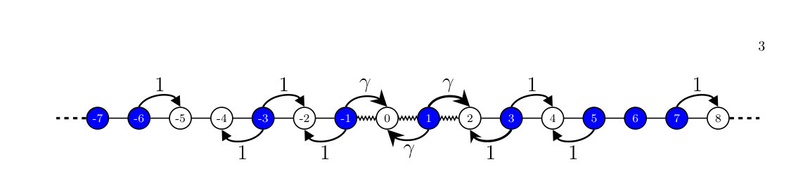
<figcaption class="paper-figure-caption"><b>Fig 1.</b> FIG. 1. Infinite-line SSEP: The SSEP on an infinite integer lattice with ℓlocalized defect bonds (zigzag line) placed around the bond between sites 0 and 1. Symmetric jump rates across the bonds are indicated, which is γ for the defect bonds and 1 for the rest. The schematic shows an example with three defect bonds placed around the origin. The empty circles indicate unoccupied sites while the filled circles indicate sites occupied by a particle.</figcaption>
</figure>
<figure class="paper-figure-card">
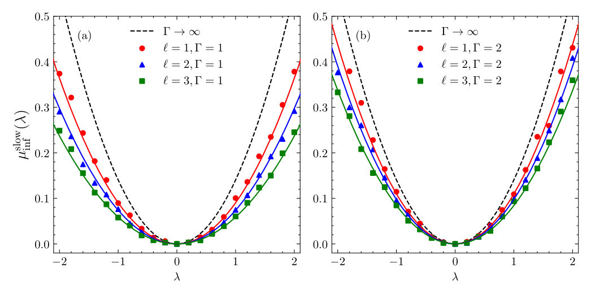
<figcaption class="paper-figure-caption"><b>Fig 2.</b> FIG. 2. Scgf for infinite SSEP: A quantitative comparison of the scgf (8) of the time integrated current QT across the origin for a half-filled (ρa(b) = 1/2) SSEP on an infinite one-dimensional lattice with ℓslow bonds with jump rates γ = Γ √</figcaption>
</figure>
<figure class="paper-figure-card">
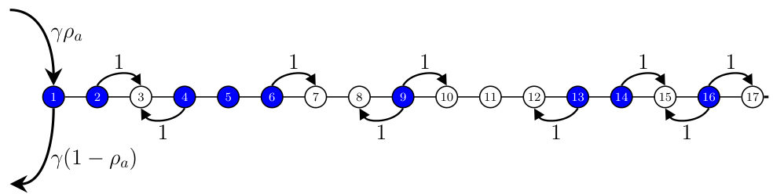
<figcaption class="paper-figure-caption"><b>Fig 3.</b> FIG. 3. Semi-infinite SSEP: SSEP on a positive integer lattice coupled to a reservoir of density ρa at the leftmost site through a bond whose jump rate is controlled by a parameter γ. In the bulk, jump rates are uniformly set to value one.</figcaption>
</figure>
<figure class="paper-figure-card">
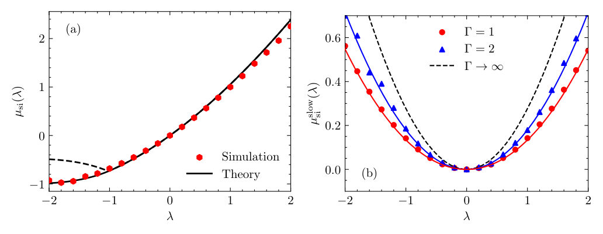
<figcaption class="paper-figure-caption"><b>Fig 4.</b> FIG. 4. Scgf for semi-infinite SSEP: (a) The scgf of current for the semi-infinite SSEP in the fast coupling regime (γ = 1) for densities (ρa, ρb) ≡(0.9, 0.1). The solid black line represents the theoretical result µsi(λ, ρa, ρb) = Rsi(ω(λ, ρa, ρb)) with (6), while the data points are obtained by a cloning algorithm with T = 500 and Nc = 50, 000. The dashed line represents the function 1</figcaption>
</figure>
<figure class="paper-figure-card">
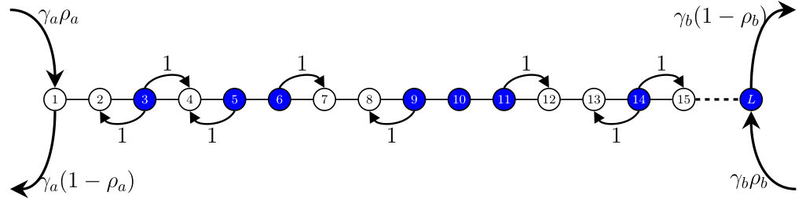
<figcaption class="paper-figure-caption"><b>Fig 5.</b> FIG. 5. Finite SSEP: SSEP on a finite lattice coupled to two boundary reservoirs of densities ρa and ρb with slow bonds.</figcaption>
</figure>

**Summary.** This paper provides exact analytical solutions for how localized bottlenecks affect current fluctuations in the SSEP model. It establishes that while the system is robust to small defects, a critical scaling regime exists where the slow bonds fundamentally change the macroscopic transport statistics.

**Why it may be interesting.** not directly relevant

Detailed structure

**Main problem.** Investigating how localized microscopic disorder, specifically 'slow bonds' with reduced hopping rates, modifies the large deviation statistics of particle current in the Symmetric Simple Exclusion Process (SSEP).

**Main result.** The authors derive exact expressions for the large deviation function of the current across three geometries (infinite, semi-infinite, and finite lattices) and identify a critical scaling regime where slow bonds act as a bottleneck.

**Method.** The study uses an extension of Macroscopic Flutuation Theory (MFT) and fluctuating hydrodynamics combined with a new coarse-graining scheme, validated by rare-event simulations using the cloning algorithm.

**Model / system.** The Symmetric Simple Exclusion Process (SSEP) on 1D lattices, where particles perform unbiased random walks with exclusion rules, featuring localized defect bonds with a reduced jump rate gamma.

**Key observables.** Large deviation function (LDF) and Scaled Cumulant Generating Function (SCGF) of the particle current (net particle flux).

**Important parameters / regimes.** Jump rate (gamma), number of slow bonds (l), system size (L), observation time (T), and the scaling parameter Gamma = gamma / sqrt(T) or gamma / L.

**Assumptions / limitations.** The analysis assumes that the large-scale properties can be captured by coarse-grained density fields and utilizes the additivity principle for decomposing the system.

**Figures summary.** Figure 1 shows a schematic of the SSEP lattice with defect bonds; Figures 2, 4, and 6 provide quantitative comparisons between theoretical SCGF results and numerical simulation data for different geometries.

**Paper structure.** The paper introduces the problem of slow bonds, presents exact results for three different lattice geometries (infinite, semi-infinite, and finite), provides a new coarse-graining derivation, and validates the analytical findings with numerical cloning simulations.

Abstract

The symmetric simple exclusion process (SSEP) is a paradigmatic model of classical non-equilibrium dynamics. Exact results for large deviations of particle current in the SSEP have been obtained in various settings using integrability-based methods. In this Article, we discuss how these results are modified in the presence of localized slow bonds. We consider three conventional geometries: (a) a finite one-dimensional lattice weakly coupled to unequal reservoirs at its boundaries, (b) a semi-infinite one-dimensional lattice weakly coupled to a boundary reservoir, and (c) an infinite one-dimensional lattice with localized slow bonds near the origin. For each case, we present exact expressions for the large deviation function of current and validate them through rare-event simulations based on the cloning algorithm. In connection with our results, we present an elementary derivation of the exact large deviation function for the current in the semi-infinite SSEP, complementing recent results obtained through more elaborate techniques.

[↑ back to top](#top)

### [Manipulation of information flow and thermodynamic performance in nonreciprocal quantum dot information engines](http://arxiv.org/abs/2605.24554v1)

**Authors:** Hao Feng, Junjie Liu  
**Type:** theory · **Category:** statistical mechanics · **PDF:** <https://arxiv.org/pdf/2605.24554v1>  
**Analysis basis:** full PDF text, analyzed in chunks
**Topic relevance:** `entanglement & information structure` **3/5** · `non-equilibrium dynamics` **3/5** · `correlated / nonlocal dissipation` **2/5** · `methods for driven-dissipative` **2/5**

↔ Scroll figures horizontally

<figure class="paper-figure-card">
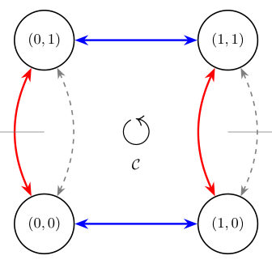
<figcaption class="paper-figure-caption"><b>Fig 1.</b> FIG. 1. Schematic representation of the cycle decomposi- tion in the state space of double-quantum-dot system. The four joint states (x, y) are connected by distinct particle ex- change processes. Horizontal blue solid lines denote particle exchange with the reservoir of X dot. Red solid (gray dashed) vertical curves correspond to particle exchanges with the left (right) reservoir of the Y dot. The global cycle C is composed specifically of the transitions marked by solid lines (i.e., the processes involving the X dot’s reservoir and the Y dot’s left reservoir). Local cycles C0 Y and C1 Y indicate internal transi- tions within the Y dot for a fixed state of X.</figcaption>
</figure>
<figure class="paper-figure-card">
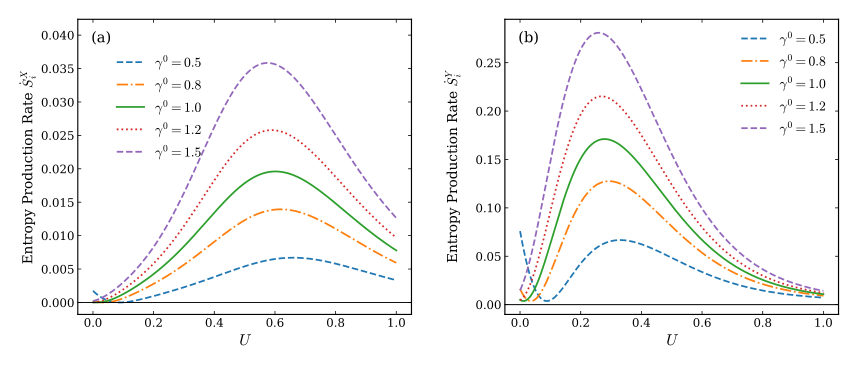
<figcaption class="paper-figure-caption"><b>Fig 2.</b> FIG. 2. Local entropy production rates as functions of the bare electron-electron coupling strength U with varying nonreciprocal ratio γ0 = Γ0+/Γ0−(see the variation convention in Table I). (a) Entropy production rate ˙SX i of the controller. (b) Entropy production rate ˙SY i of the working substance. All other tunneling rates are fixed to their reciprocal values given in Table I.</figcaption>
</figure>
<figure class="paper-figure-card">
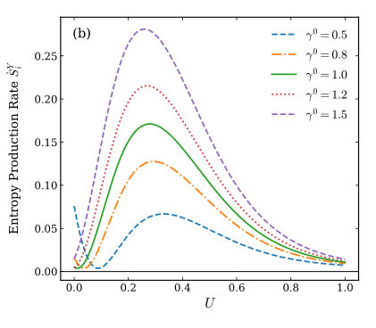
<figcaption class="paper-figure-caption"><b>Fig 3.</b> Figure 3 shows a set of representative results for the information current as a function of the bare electron- electron coupling strength with varying nonreciprocity ratios, chosen to illustrate that the continuous informa- tion flow can be substantially modulated by nonrecip- rocal dot-reservoir couplings. Several general features can be extracted from Fig. 3. First, for all represen- tative scans shown here, ˙I exhibits a single peak when varying the electron-electron coupling strength U. This non-monotonic behavior reflects the competition between correlation generation and kinetic suppression. In the weak-coupling regime, the state of one dot only weakly affects the transition...</figcaption>
</figure>
<figure class="paper-figure-card">
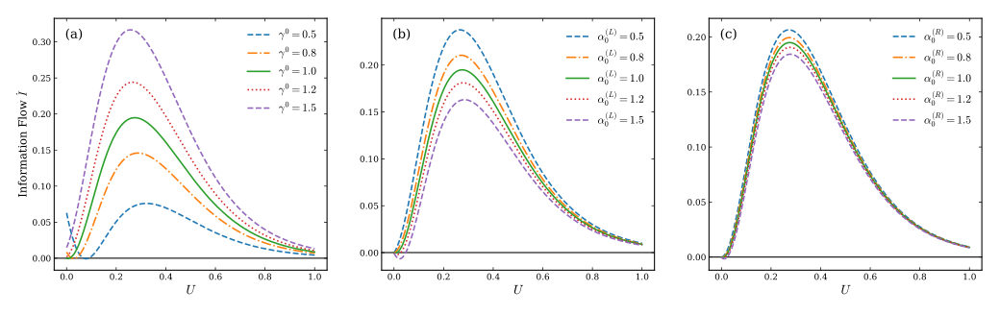
<figcaption class="paper-figure-caption"><b>Fig 4.</b> FIG. 3. Steady-state information flow ˙I as a function of the bare electron-electron coupling strength U. (a) Varying γ0, obtained by varying Γ0+, (b) Varying α(L) 0 , obtained by varying Γ(L) 0+ , and (c) Varying α(R) 0 , obtained by varying Γ(R) 0+ . All other tunneling rates are fixed to their reciprocal values given in Table I.</figcaption>
</figure>
<figure class="paper-figure-card">
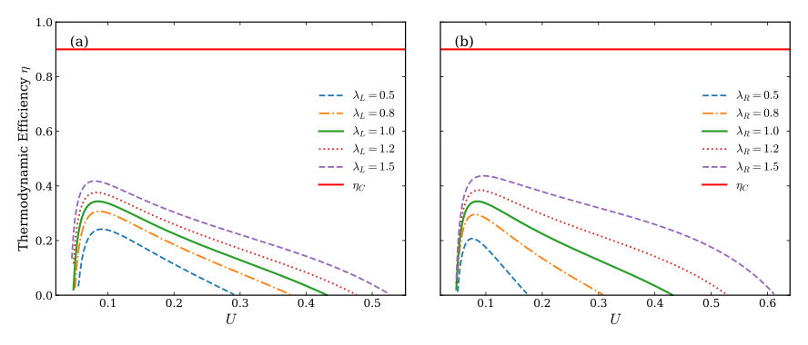
<figcaption class="paper-figure-caption"><b>Fig 5.</b> FIG. 4. Thermodynamic efficiency η under modulation of the renormalized electron-electron coupling strengths. (a) Varying U ′ L = λLU with λR = 1. (b) Varying U ′ R = λRU with λL = 1. In both plots, the reciprocal reference (green solid curve) corresponds to λL = λR = 1, and the horizontal red solid line denotes the Carnot efficiency ηC. Curves are shown only in the heat-engine operation regime. All other parameters are fixed to their default values given in Table I.</figcaption>
</figure>

**Summary.** This paper demonstrates that nonreciprocal couplings in a double-quantum-dot setup can actively regulate information flow and enhance the performance of an information engine. By mapping nonreciprocal dynamics to an effective reciprocal system, the authors show that breaking reciprocity serves as an effective control knob for optimizing power and efficiency.

**Why it may be interesting.** It provides a novel way to use broken reciprocity as a 'kinetic handle' to control information-to-work conversion, which is highly relevant for the design of open quantum systems and dissipative quantum engineering.

Detailed structure

**Main problem.** Investigating how nonreciprocal dot-reservoir couplings can be used as a control knob to manipulate information flow and optimize the thermodynamic performance of autonomous quantum dot information engines.

**Main result.** Nonreciprocity can significantly modulate inter-dot information flow, enhance power output, and broaden the heat-engine operating regime, while the efficiency remains bounded by the Carnot limit.

**Method.** The authors use a Markovian master equation approach and Schnakenberg network theory, employing a reparameterization strategy to map the nonreciprocal system onto an effective reciprocal system.

**Model / system.** A bipartite autonomous double-quantum-dot system where an upstream 'controller' dot (X) and a downstream 'working substance' dot (Y) are coupled via Coulombic repulsion and connected to separate reservoirs.

**Key observables.** Information flow (inter-dot), total and local entropy production rates, energy conversion (information-to-work), heat currents, and thermodynamic efficiency.

**Important parameters / regimes.** Nonreciprocity ratios (gamma and alpha), electron-electron coupling strength (U), temperatures (TX, TY), and chemical potential bias (delta mu).

**Assumptions / limitations.** The system is in the Markovian limit (weak dot-reservoir coupling) and assumes a bipartite condition where simultaneous jumps in both dots are restricted.

**Figures summary.** Figure 1 shows the transition network; Figure 3 displays information flow vs. coupling strength under varying nonreciprocity; Figure 4 and 5 show thermodynamic efficiency and power output vs. coupling strength; Figure 6 relates to entropy production.

**Paper structure.** The paper introduces the nonreciprocal engine architecture, develops a thermodynamic framework using a reparameterization mapping, analyzes the impact of nonreciprocity on information flow and entropy production, and concludes with numerical demonstrations of performance enhancement.

Abstract

Quantum information engines leverage information as a thermodynamic resource to facilitate energy conversion. In the operation of such engines, the information flow between the working substance and the controller is pivotal, however, strategies for its efficient manipulation remain largely unexplored. Here, we investigate an autonomous information engine based on a double-quantum-dot setup, where a downstream dot coupled to two reservoirs acts as the working substance, and an upstream dot coupled to a single reservoir serves as the controller. By extending the second law of thermodynamics to incorporate the effects of nonreciprocal couplings between the dots and their electronic reservoirs, we develop a thermodynamic framework that allows us to demonstrate that nonreciprocity can significantly modulate the inter-dot information flow, thereby providing a robust control mechanism. We show that the influence of nonreciprocity can be equivalently understood through a mapping to an effective reciprocal system upon a reparameterization of chemical potentials and the electron-electron coupling strength. We further analyze the impact of nonreciprocity on the engine's performance and operation regime. Our findings establish nonreciprocal coupling as an effective control knob for designing and optimizing quantum dot information engines, surpassing the capabilities of conventional reciprocal configurations.

[↑ back to top](#top)

### [Nonreciprocal Landau-Zener Tunneling in the Presence of Heat-Bath-Induced Colored Noise](http://arxiv.org/abs/2605.25008v1)

**Authors:** Yi Cao, Jie Liu  
**Type:** theory · **Category:** statistical mechanics · **PDF:** <https://arxiv.org/pdf/2605.25008v1>  
**Analysis basis:** full PDF text, analyzed in chunks
**Topic relevance:** `methods for driven-dissipative` **3/5** · `non-equilibrium dynamics` **3/5** · `Keldysh / 2PI / non-Gaussian methods` **2/5** · `correlated / nonlocal dissipation` **2/5**

↔ Scroll figures horizontally

<figure class="paper-figure-card">
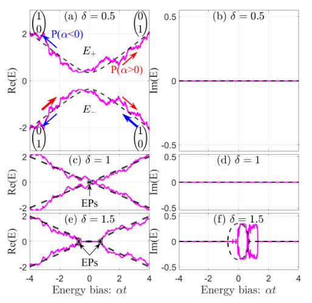
<figcaption class="paper-figure-caption"><b>Fig 1.</b> FIG. 1. Instantaneous energy levels for various nonreciproc- ity parameters. The black dashed line corresponds to the noiseless case, while the magenta solid line depicts the noisy counterpart. The red and blue arrows indicate the forward and backward LZ tunneling processes, respectively.</figcaption>
</figure>
<figure class="paper-figure-card">
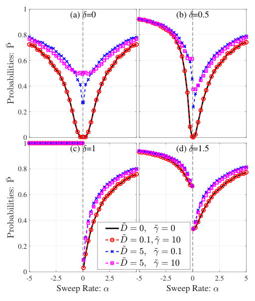
<figcaption class="paper-figure-caption"><b>Fig 2.</b> FIG. 2. Sweep-rate-dependent tunneling probabilities with various nonreciprocity parameters δ for different amplitudes and correlation times of colored noise.</figcaption>
</figure>
<figure class="paper-figure-card">
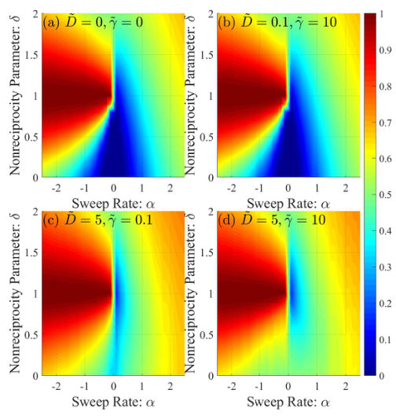
<figcaption class="paper-figure-caption"><b>Fig 3.</b> FIG. 3. Phase diagram of the tunneling probability with re- spect to the sweep rate and nonreciprocity parameter for dif- ferent amplitudes and correlation times of colored noise.</figcaption>
</figure>
<figure class="paper-figure-card">
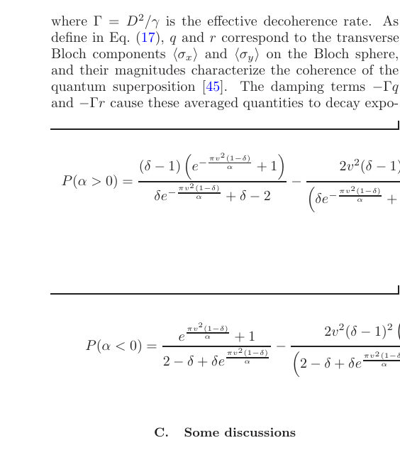
<figcaption class="paper-figure-caption"><b>Fig 4.</b> Figure 4 compares the approximate solutions in Eqs. (20) and (21), numerical results from the n = 0 subspace equations (19), and direct numerical solutions of the stochastic Schr¨odinger equation (3). As displayed in Figs. 4(a) and (b), the three sets of results agree well for sufficiently large γ and Γ. Keeping γ fixed, we vary parameter D to violate the condition Γ ≫1, as seen in Figs. 4(c) and (d). In this scenario, the approximate</figcaption>
</figure>
<figure class="paper-figure-card">
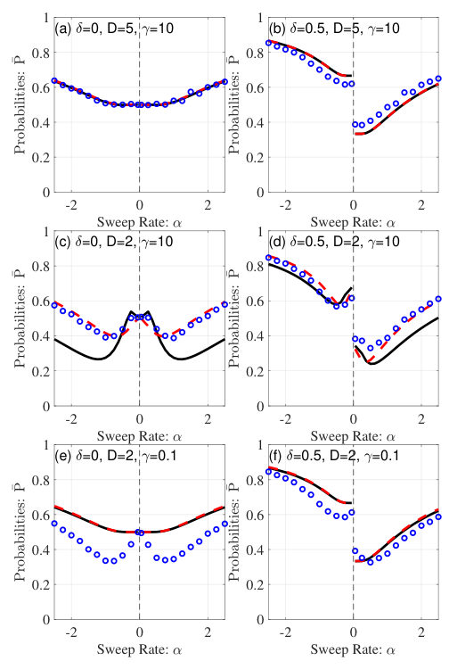
<figcaption class="paper-figure-caption"><b>Fig 5.</b> FIG. 4. Comparison of three types of solutions as functions of sweep rate: approximate solutions (black solid lines) given by Eqs. (20), (21), numerical solutions of the n = 0 subspace equation (red dashed lines) from Eq. (19), and direct nu- merical solutions of the stochastic Schr¨odinger equation (blue circles) from Eq. (3). The corresponding values of Γ: (a,b) Γ = 2.5; (c,d) Γ = 0.4; (e,f) Γ = 40.</figcaption>
</figure>

**Summary.** The paper explores how colored noise from a thermal bath influences nonreciprocal quantum tunneling. It demonstrates that while noise can break the symmetry of tunneling in certain regimes, the system remains robust against noise in the presence of strong nonreciprocity. This work is significant for understanding how environmental fluctuations affect non-Hermitian quantum dynamics.

**Why it may be interesting.** This paper provides deep insights into the interplay between non-Hermitian physics (exceptional points) and environmental decoherence, which is central to understanding the stability of non-reciprocal quantum devices and open quantum system dynamics.

Detailed structure

**Main problem.** Investigating how heat-bath-induced colored noise affects nonreciprocal Landau-Zener tunneling and the emergence of exceptional points.

**Main result.** Colored noise generally enhances tunneling under nonadiabatic sweeping and can break the reciprocity of tunneling in the adiabatic limit, though tunneling remains insensitive to noise in the high-nonreciprocity regime ($\delta > 1$).

**Method.** The study employs the stochastic Schrodinger equation, numerical Runge-Kutta and Heun schemes, and analytical techniques including the Wiener-Hermite expansion and Weber functions.

**Model / system.** A non-Hermitian two-level Landau-Zener model coupled to a heat bath modeled via a Drude spectral density, resulting in Ornstein-Uhlenbeck colored noise.

**Key observables.** Tunneling probability (forward and backward sweeps), ensemble-averaged tunneling probability, and instantaneous energy levels.

**Important parameters / regimes.** Sweep rate ($\alpha$), nonreciprocity parameter ($\delta$), noise amplitude ($D$), and noise correlation rate ($\gamma$).

**Assumptions / limitations.** Markovian approximation, classical limit ($\hbar 	o 0$), and the use of a steady-state approximation in the high-dissipation regime ($\Gamma \gg 1$).

**Figures summary.** Phase diagrams of tunneling probability as a function of sweep rate and nonreciprocity parameter for various noise amplitudes and correlation times; comparison of different numerical and analytical solution types.

**Paper structure.** Introduction of the nonreciprocal LZ model; derivation of the stochastic dynamics and noise model; numerical results for energy levels and tunneling; analytical derivation of tunneling probabilities in the white-noise and high-damping limits; discussion of physical implications.

Abstract

In this work, we investigate the effects of heat-bath-induced colored noise on nonreciprocal Landau-Zener tunneling. We perform numerical calculations of the instantaneous energy levels and find that noise induces stochastic fluctuations in these levels. Beyond such fluctuations, sufficiently large nonreciprocity parameters enable noise to further trigger the emergence of multiple exceptional points. The corresponding tunneling probability is significantly modified by colored noise. On the one hand, colored noise generally enhances the tunneling probability under nonadiabatic sweeping. On the other hand, it can break the reciprocity of Landau-Zener tunneling in the adiabatic limit. In particular, for large nonreciprocity parameters, the adiabatic tunneling probability is insensitive to noise and determined by exceptional points. We plot the phase diagram of tunneling probability as a function of the sweep rate and nonreciprocity parameter, for different amplitudes and correlation times of colored noise. Analytically, we derive the exact expression for the tunneling probability in the absence of noise and an approximate solution in the white-noise limit, employing Weber functions and the Wiener-Hermite expansion method. Some implications of our theory are discussed.

[↑ back to top](#top)

### [Influence of Quantum Decoherence on the Survival of Neutrino Oscillation Quantumness](http://arxiv.org/abs/2605.24654v1)

**Authors:** Jilali Loulijat, Abdallah Slaoui, Mohamed Gouighri, Berihu Teklu  
**Type:** theory · **Category:** quantum information and computing · **PDF:** <https://arxiv.org/pdf/2605.24654v1>  
**Analysis basis:** full PDF text, analyzed in chunks
**Topic relevance:** `entanglement & information structure` **3/5** · `correlated / nonlocal dissipation` **2/5** · `methods for driven-dissipative` **2/5** · `non-equilibrium dynamics` **2/5**

↔ Scroll figures horizontally

<figure class="paper-figure-card">
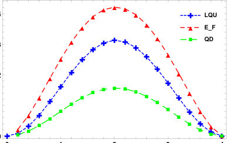
<figcaption class="paper-figure-caption"><b>Fig 1.</b> FIG. 1. Plots of Local Quantum Uncertainty, Quantum Discord, and Entanglement of Formation as functions of the traveled distance L in km for three experiments: (a) KamLAND, (b) MINOS, and (c) Daya Bay. The ultra-relativistic relation t ≃L is used only to translate the oscillation phase into a baseline variable.</figcaption>
</figure>
<figure class="paper-figure-card">
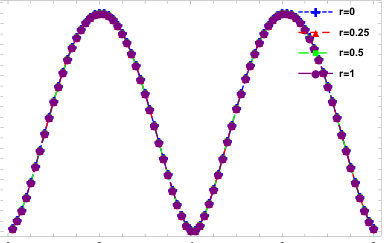
<figcaption class="paper-figure-caption"><b>Fig 2.</b> FIG. 2. Baseline dependence of the entanglement of formation un- der the experimentally constrained dephasing benchmark of Eq. (92), with r = Γ/Γ90 = 0, 0.25, 0.5, 1, in (a) KamLAND, (b) MINOS, and (c) Daya Bay.</figcaption>
</figure>
<figure class="paper-figure-card">
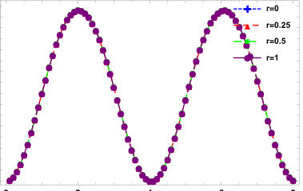
<figcaption class="paper-figure-caption"><b>Fig 3.</b> FIG. 3. Baseline dependence of quantum discord Q(ρAB) under the experimentally constrained dephasing benchmark of Eq. (92), with r = Γ/Γ90 = 0, 0.25, 0.5, 1, in (a) KamLAND, (b) MINOS, and (c) Daya Bay.</figcaption>
</figure>
<figure class="paper-figure-card">
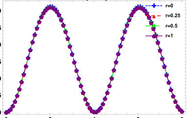
<figcaption class="paper-figure-caption"><b>Fig 4.</b> FIG. 4. Baseline dependence of LQU U(ρAB) under the experi- mentally constrained dephasing benchmark of Eq. (92), with r = Γ/Γ90 = 0, 0.25, 0.5, 1, in (a) KamLAND, (b) MINOS, and (c) Daya Bay.</figcaption>
</figure>

**Summary.** This paper applies quantum information metrics to study how neutrino flavor oscillations lose their 'quantumness' due to environmental dephasing. It demonstrates that quantum discord can persist even when entanglement vanishes and shows that mixing angles are the primary drivers of correlation strength. The study uses real-world experimental data from KamLAND, MINOS, and Daya Bay to benchmark these effects.

**Why it may be interesting.** It provides a concrete application of open quantum system dynamics and quantum information theory (discord and LQU) to a high-energy particle physics system, demonstrating how non-classical correlations serve as diagnostics for decoherence.

Detailed structure

**Main problem.** The study investigates how environmental dephasing affects the survival and dynamics of quantum correlations (entanglement, discord, and local quantum uncertainty) in neutrino oscillations.

**Main result.** The researchers find that while dephasing suppresses all quantumness measures, quantum discord remains more robust than entanglement, and the strength of these correlations is primarily driven by mixing angles rather than baseline length.

**Method.** The authors use an effective two-qubit description of two-flavor neutrino oscillations and apply a Lindblad-based dephasing channel to quantify the decay of quantum correlations.

**Model / system.** A two-flavor neutrino oscillation model treated as a bipartite two-qubit system, subjected to a phase-damping (dephasing) channel using Kraus operators and the Lindblad master equation.

**Key observables.** Entanglement of Formation (EOF), Quantum Discord (QD), Local Quantum Uncertainty (LQU), and neutrino survival/transition probabilities.

**Important parameters / regimes.** Mixing angles (theta_12, theta_13, theta_23), mass-squared differences, baseline distances (L), neutrino energy (E), and the Lindblad damping parameter (gamma).

**Assumptions / limitations.** The study is restricted to a two-flavor oscillation framework and assumes a specific phase-damping model with energy-independent dephasing benchmarks.

**Figures summary.** Figures show the baseline dependence of EOF, QD, and LQU for the KamLAND, MINOS, and Daya Bay experiments under different fractions of the experimental dephasing bound.

**Paper structure.** The paper begins by mapping neutrino oscillations to a two-qubit system, defines quantum correlation measures, applies a dephasing model, benchmarks the results against specific neutrino experiments, and concludes with a sensitivity analysis.

Abstract

This study examines the dynamics of quantumness in two-flavor neutrino oscillations subjected to a dephasing channel, using representative oscillation parameters associated with the KamLAND, MINOS, and Daya Bay experiments. We analyze three complementary quantum-correlation measures-entanglement of formation (EOF), quantum discord (QD), and local quantum uncertainty (LQU)-within an effective two-qubit description. In the unitary case, all three measures display oscillatory behavior controlled by flavor mixing, and their amplitudes are strongly shaped by the relevant mixing angle. MINOS exhibits the largest correlations because $θ_{23}$ is close to maximal, KamLAND shows intermediate values associated with the solar sector, and Daya Bay yields smaller correlations due to the relatively small value of $θ_{13}$. Under dephasing, the off-diagonal coherence terms are suppressed and the three quantifiers decrease accordingly, while QD remains non-zero in regimes where entanglement is weak. For pure states, LQU satisfies $\mathcal{U}=\mathcal{C}^2$ and therefore tracks entanglement monotonically, whereas QD provides a broader witness of non-classical correlations. These results provide a compact quantum-information description of two-flavor neutrino oscillations in both coherent and dephased regimes. We also quantify the sensitivity of these observables to oscillation and decoherence parameters, showing that their main added value relative to flavor probabilities is their direct response to off-diagonal coherence loss.

[↑ back to top](#top)

### [Transition from Collective to Local Radial Motional Modes in a Tapered Paul Trap](http://arxiv.org/abs/2605.25125v1)

**Authors:** Manika Bhardwaj, Moritz Göb, Bogomila S. Nikolova, Bernd Bauerhenne, Peter A. Ivanov, Kilian Singer  
**Type:** experiment · **Category:** other · **PDF:** <https://arxiv.org/pdf/2605.25125v1>  
**Analysis basis:** full PDF text, analyzed in chunks
**Topic relevance:** `QC/QI experiment` **3/5** · `analog quantum simulation` **2/5** · `non-equilibrium dynamics` **2/5** · `quantum optics experiment` **2/5**

↔ Scroll figures horizontally

<figure class="paper-figure-card">
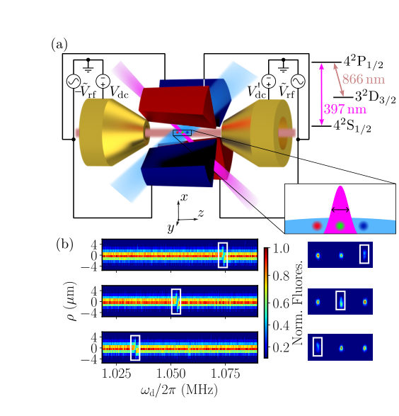
<figcaption class="paper-figure-caption"><b>Fig 1.</b> FIG. 1. (a) Schematic depiction of the experiment. The ta- pered ion trap consists of two pairs of rf electrodes, here shown in red and blue, supplied with an rf voltage with a relative phase of π. Axially, the ions are confined by dc voltages to the golden endcap electrodes. The spatially broad beam de- picted in light blue is used for imaging and excitation of the motion of all three calcium ions. The additional magenta narrow beam depicts the focused beam used to excite the middle ion. Both lasers are close to the Doppler transition of 40Ca+ at 397 nm. Additionally a repumper at 866 nm is aligned through the hollow center of the endcap electrodes, here depicted in light red. The inset...</figcaption>
</figure>
<figure class="paper-figure-card">
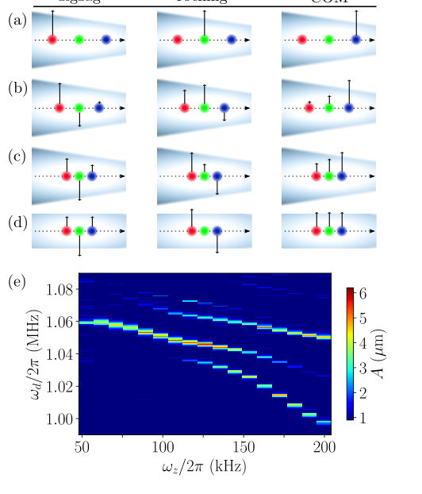
<figcaption class="paper-figure-caption"><b>Fig 2.</b> FIG. 2. Illustration of radial eigenmode oscillations of a ta- pered trap at axial confinements of 40 kHz (a), 125 kHz (b), and 200 kHz (c), compared to the radial eigenmode oscilla- tions of a linear trap (d). (e) Plot of the sum of the oscilla- tion amplitudes of the three ions at each ωd over the measured range of ωz, while the middle ion is driven with the intensity- modulated focused beam. The outer ions couple to the middle ion with increasing ωz, exciting oscillations at different eigen- frequencies.</figcaption>
</figure>
<figure class="paper-figure-card">
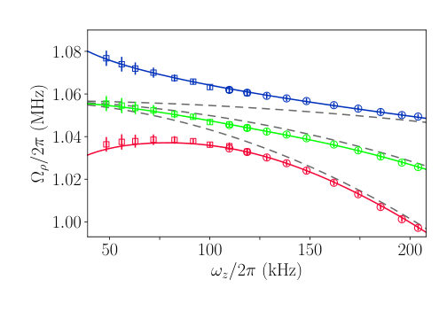
<figcaption class="paper-figure-caption"><b>Fig 3.</b> FIG. 3. Radial eigenmode frequencies Ωρ of the three ions at different axial confinements ωz. The squares and circles repre- sent the broad and focused beam measurements respectively, with the error bars denoting the standard deviation. The upper blue (middle green, lower red) solid lines depict the theoretical predictions of the highest (middle, lowest) eigen- frequency of the three ion crystal. At low axial confinements, the colors correspond to the local oscillations of each ion as depicted in Fig. 1. The gray dashed lines illustrate the eigen- modes for a linear Paul trap.</figcaption>
</figure>
<figure class="paper-figure-card">
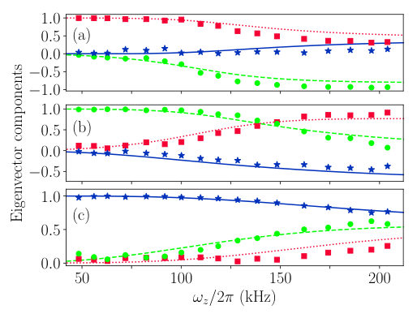
<figcaption class="paper-figure-caption"><b>Fig 4.</b> FIG. 4. The eigenvector components of the three ions at dif- ferent axial confinements ωz. Blue stars, green dots and red squares are the experimental values of the eigenvector compo- nents of the ion on the apex of the taper, middle ion and the ion on the open side of the taper, respectively. The blue-solid, green-dashed and red-dotted lines are the theoretical values of the eigenvector components, corresponding to the respective ions (Fig. 1). At higher axial confinements the zigzag (a), the rocking (b) and the COM radial modes (c) are observed.</figcaption>
</figure>

**Summary.** This paper demonstrates how the geometry of a tapered Paul trap can be used to tune the coupling between ions, driving a transition from independent local oscillations to collective modes. By varying axial confinement, the researchers mapped the transformation of radial eigenmodes. This provides a platform for studying controlled quantum transport and defect formation in ion chains.

**Why it may be interesting.** This work is highly relevant for studying phonon localization, modified heat transport, and the development of nonlinear radial modes for continuous-variable quantum computing in ion-based systems.

Detailed structure

**Main problem.** Investigating the transition from collective radial motional modes to individual (local) radial oscillations in a tapered Paul trap by varying axial confinement.

**Main result.** The researchers experimentally observed a complete transformation of radial eigenfrequencies and eigenvectors, demonstrating that increasing axial confinement reduces frequency gaps and enables the transition from localized to collective phonon behavior.

**Method.** The team used sinusoidal modulation of laser intensity to drive oscillations and an iCCD camera for detection, comparing experimental radial eigenfrequencies and eigenvectors with a theoretical model based on a Taylor approximation of the trap potential.

**Model / system.** A tapered Paul trap containing three 40Ca+ ions, where the trap geometry creates an axial position-dependent radial confinement, allowing for a transition between decoupled and coupled regimes.

**Key observables.** Radial eigenfrequencies, eigenmode eigenvectors (ion participation), and oscillation amplitudes.

**Important parameters / regimes.** Axial trapping frequency (47 kHz to 205 kHz), radial trapping frequency (~1 MHz), and the funnel length (1.81 mm).

**Assumptions / limitations.** The theoretical model uses a Taylor approximation of the potential around equilibrium positions and assumes a 1D chain of ions.

**Figures summary.** Fig 1 shows the trap schematic and examples of local excitations; Fig 2 shows the progression of oscillations from local to collective; Fig 3 plots radial eigenfrequencies vs. axial confinement; Fig 4 shows eigenvector components (ion participation) across the transition.

**Paper structure.** The paper introduces the tapered trap geometry, describes the experimental setup and measurement protocol, presents the results of the mode transition and frequency divergence, compares findings to theoretical predictions, and discusses implications for quantum transport and nonlinear dynamics.

Abstract

With coupled detuned oscillators, either individual or collective oscillations are observable. The latter is used in quantum information processing in linear Paul traps. Here, we study the transition from collective radial modes at stronger axial confinements into individual radial oscillations at low axial confinements in a tapered Paul trap. The eigenmodes are experimentally studied in detail in the transition regime and compared with theoretical predictions. The features studied will enable investigation of modified heat transport phenomena and defect formation in trapped ions.

[↑ back to top](#top)

### [Unsupervised learning for the systematic identification of nondispersive wave packets in driven helium](http://arxiv.org/abs/2605.25324v1)

**Authors:** Juan M. Scarpetta, Gustavo A. Parra, Alejandro González-Melan, Javier Madroñero  
**Type:** theory · **Category:** disordered systems and neural networks · **PDF:** <https://arxiv.org/pdf/2605.25324v1>  
**Analysis basis:** full PDF text, analyzed in chunks
**Topic relevance:** `methods for driven-dissipative` **3/5** · `non-equilibrium dynamics` **3/5** · `scars & prethermalization` **2/5**

↔ Scroll figures horizontally

<figure class="paper-figure-card">
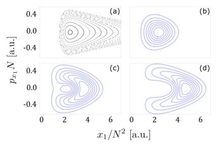
<figcaption class="paper-figure-caption"><b>Fig 1.</b> FIG. 1: Husimi distributions of the ground (b), first excited (c), and second excited (d) frozen planet states in the sixth series. The ground state is localized near the equilibrium position of the outer electron. Excited FPS exhibit localization around higher-energy periodic orbits of the classical configuration (a).</figcaption>
</figure>
<figure class="paper-figure-card">
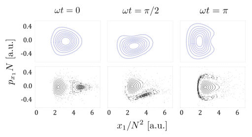
<figcaption class="paper-figure-caption"><b>Fig 2.</b> FIG. 2: Husimi distributions of a nondispersive wave packet below the sixth ionization threshold at different phases of the driving field (top), computed at F = 3.9 × 10−6 a.u., Fst = 0, and ω = 0.00088 a.u.. The bottom panel shows the corresponding classical phase-space structure for the driven FPC.</figcaption>
</figure>
<figure class="paper-figure-card">
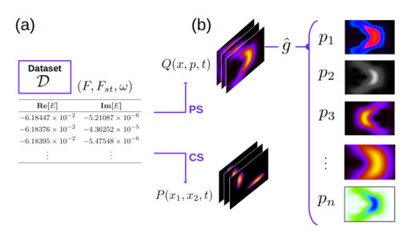
<figcaption class="paper-figure-caption"><b>Fig 3.</b> FIG. 3: Schematic representation of the generated database. (a) For each parameter combination (F, Fst, ω), approximately 50 distinct states are computed and represented in both configuration space (CS) and phase space (PS). (b) Each image undergoes data augmentation through random transformations ˆg sampled uniformly from the complete set of photometric and geometric transformations with probability pi.</figcaption>
</figure>
<figure class="paper-figure-card">
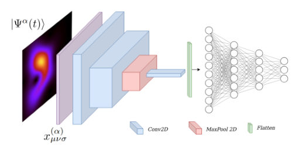
<figcaption class="paper-figure-caption"><b>Fig 4.</b> FIG. 4: Schematic of the CNN architecture mapping quantum states to Rn via representation learning.</figcaption>
</figure>
<figure class="paper-figure-card">
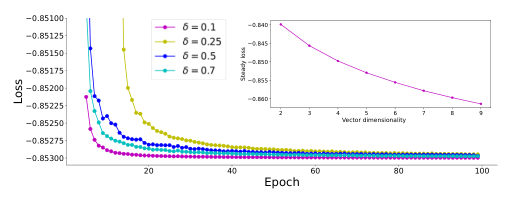
<figcaption class="paper-figure-caption"><b>Fig 5.</b> FIG. 5: Process of minimizing the cost function as a function of different values of the learning rate δ. Inset shows how the steady loss changes as the n dimension of the output vector increases.</figcaption>
</figure>

**Summary.** The paper presents an unsupervised machine learning framework to automatically identify nondispersive wave packets in driven helium atoms. By using a convolutional neural network to embed quantum state distributions, the method successfully clusters and recovers physically significant states like frozen planet states without manual labeling. This establishes representation learning as an effective tool for analyzing complex, high-dimensional quantum datasets.

**Why it may be interesting.** This work demonstrates a powerful application of unsupervised representation learning to automate the discovery of complex, long-lived quantum structures in driven, strongly correlated systems, which is highly relevant for studying non-equilibrium dynamics and quantum-classical correspondence.

Detailed structure

**Main problem.** The difficulty of systematically identifying nondispersive wave packets (NDWPs) and frozen planet states in driven helium due to the vast, multidimensional parameter space and the need for manual inspection of complex spectral data.

**Main result.** An unsupervised learning approach using a Convolutional Neural Network (CNN) successfully automates the identification of NDWPs by clustering quantum states in a low-dimensional embedding, recovering known regimes without prior labeling.

**Method.** The authors use a CNN to construct a low-dimensional embedding of quantum state probability distributions (images) in configuration and phase space, followed by K-means clustering and PCA for classification.

**Model / system.** A driven helium atom modeled as a three-body Coulomb problem in an asymmetric collinear configuration, subjected to a linearly polarized monochromatic driving field and a static electric field.

**Key observables.** Configuration-space density, Husimi distributions (phase-space representation), quasienergies (real and imaginary parts), and classical Poincaré sections.

**Important parameters / regimes.** Driving frequency (omega), driving field amplitude (F), static field strength (Fst), and angular momentum (L).

**Assumptions / limitations.** Infinite nuclear mass approximation, dipole approximation, and length gauge treatment; the continuum spectrum is discretized due to finite basis representation.

**Figures summary.** Figure 1 shows Husimi distributions of frozen planet states; Figure 2 shows NDWP phase-space evolution; Figure 3 details the database and data augmentation; Figure 4 shows the CNN architecture; Figures 5-7 illustrate the training loss, embedding visualization, and 5D clustering; Figures 8-10 show the comparison between quantum and classical structures and the temporal evolution of wave packets.

**Paper structure.** The paper introduces the problem of NDWP identification, describes the physical model of driven helium, details the construction of the dataset and the CNN architecture, presents the results of the unsupervised clustering and validation against physical parameters, and concludes with limitations and future directions.

Abstract

Nondispersive wave packets in driven helium are long-lived quantum states that follow classical resonant orbits without spreading. Their identification typically requires detailed analysis of phase-space structures and extensive exploration of parameter regimes. In this work, we introduce an unsupervised learning approach to automate the identification of physically relevant states in the driven helium atom. Using a Floquet-based description, quantum states are computed and represented as probability distributions in configuration and phase space, which serve as input to a convolutional neural network that constructs a low-dimensional embedding of the data. Clustering in the embedding space reveals distinct classes of quantum states. By combining geometric analysis, physical parameter inspection, and time-evolution studies, we identify clusters corresponding to frozen planet states and nondispersive wave packets. The method successfully recovers known NDWP regimes without prior labeling, demonstrating that the learned representation captures physically meaningful structures in a systematic and automated manner. These results establish unsupervised representation learning as an effective tool for the systematic analysis of complex quantum datasets.

[↑ back to top](#top)

### [Causal Order Cannot Be An Observable](http://arxiv.org/abs/2605.25302v1)

**Authors:** Declan Maguire, Fabio Costa  
**Type:** theory · **Category:** quantum information and computing · **PDF:** <https://arxiv.org/pdf/2605.25302v1>  
**Analysis basis:** full PDF text, analyzed in chunks
**Topic relevance:** `quantum measurements` **3/5** · `correlated / nonlocal dissipation` **2/5** · `entanglement & information structure` **2/5**

↔ Scroll figures horizontally

<figure class="paper-figure-card">
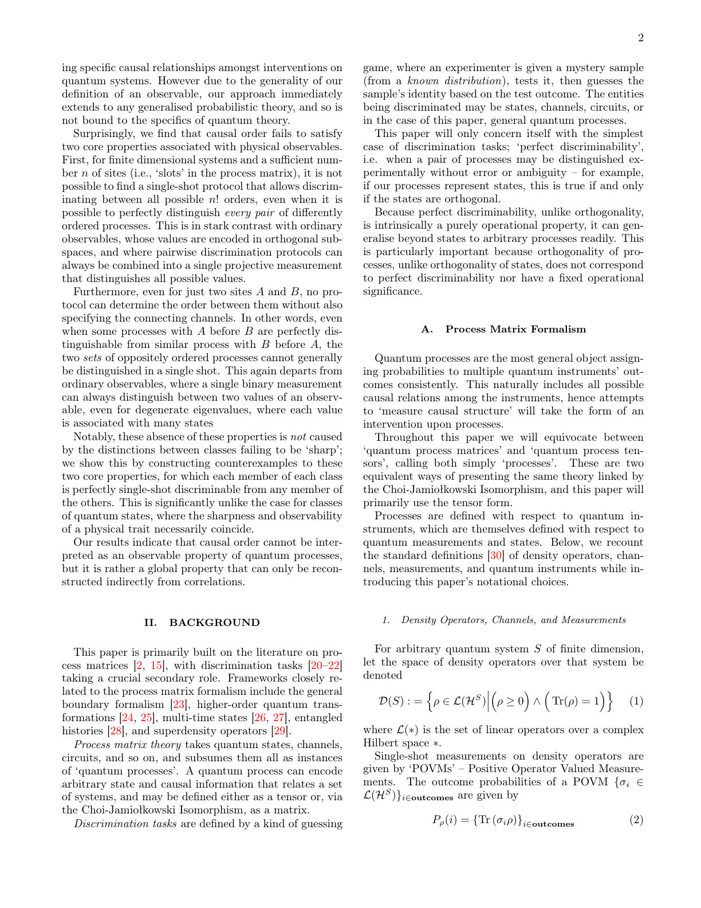
<figcaption class="paper-figure-caption"><b>Fig 1.</b> Low-resolution page preview, page 2</figcaption>
</figure>
<figure class="paper-figure-card">
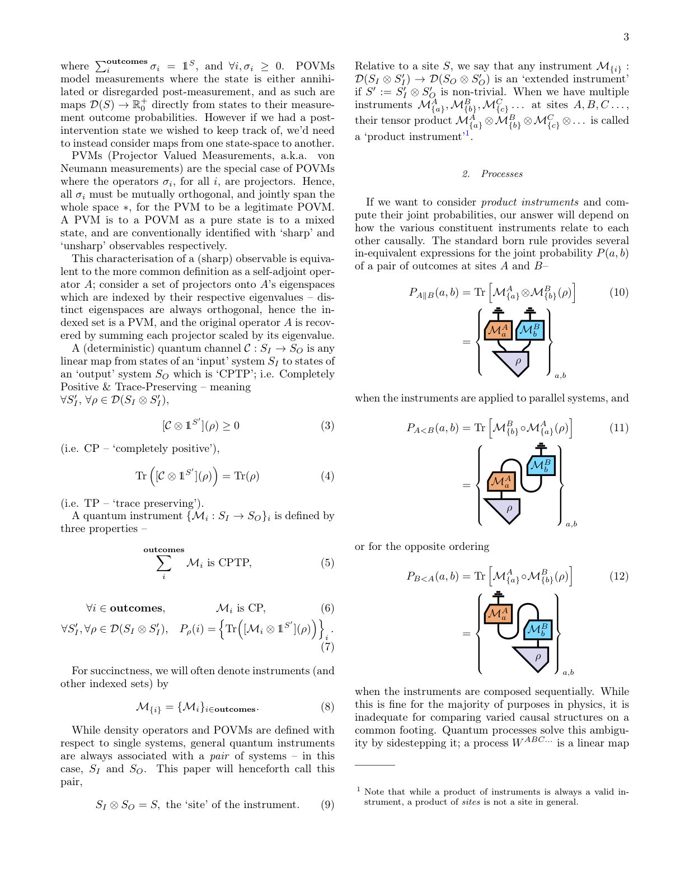
<figcaption class="paper-figure-caption"><b>Fig 2.</b> Low-resolution page preview, page 3</figcaption>
</figure>
<figure class="paper-figure-card">
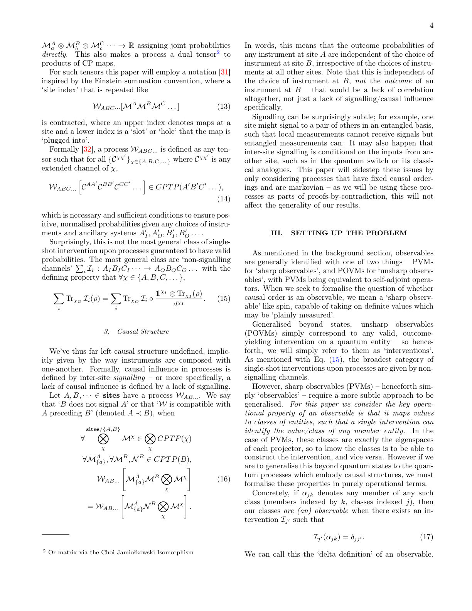
<figcaption class="paper-figure-caption"><b>Fig 3.</b> Low-resolution page preview, page 4</figcaption>
</figure>
<figure class="paper-figure-card">
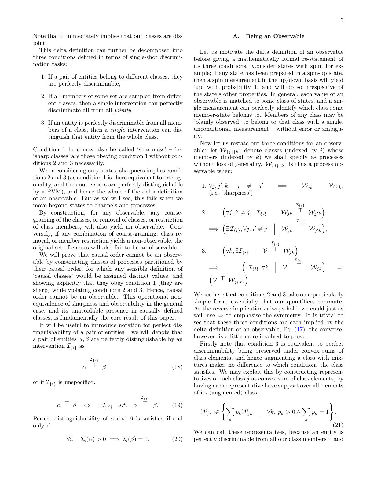
<figcaption class="paper-figure-caption"><b>Fig 4.</b> Low-resolution page preview, page 5</figcaption>
</figure>
<figure class="paper-figure-card">
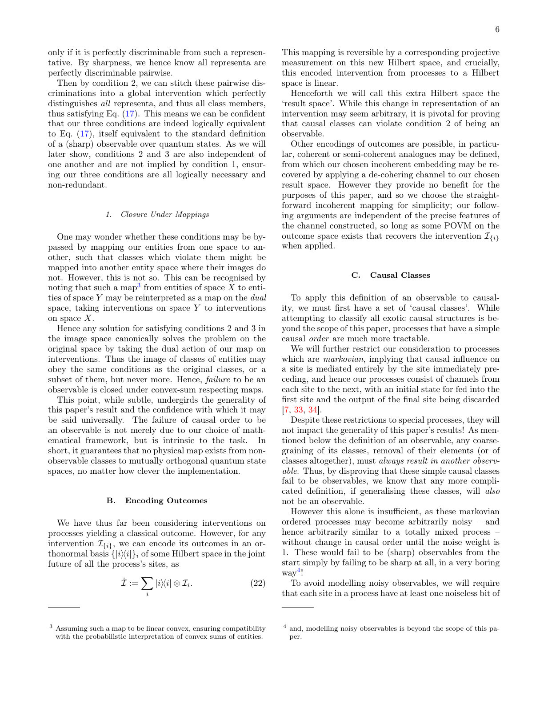
<figcaption class="paper-figure-caption"><b>Fig 5.</b> Low-resolution page preview, page 6</figcaption>
</figure>

**Summary.** The paper demonstrates that causal order cannot be treated as a standard quantum observable because, unlike quantum states, the ability to distinguish individual causal orders does not guarantee the ability to distinguish them jointly or via mixtures. This suggests that causal structure is a global property reconstructed from correlations rather than an independent property that can be measured directly.

**Why it may be interesting.** This is highly relevant for researchers in open quantum systems and quantum networks, as it challenges the fundamental way we understand the measurement and reconstruction of causal structures in quantum-mechanical settings.

Detailed structure

**Main problem.** Investigating whether causal order in quantum processes can be formally treated as a physical observable that can be measured via single-shot discrimination tasks.

**Main result.** The authors prove that causal order cannot be interpreted as an observable because the necessary conditions for observability (specifically joint and class-wise distinguishability) are violated for quantum processes.

**Method.** The authors construct an operational definition of observables based on three conditions of discrimination tasks and use a proof-by-contradiction approach involving process matrices and dimensionality arguments.

**Model / system.** The study uses the quantum process matrix formalism, focusing on Markovian quantum processes and channels that encode causal structures, including scenarios with permuted sites.

**Key observables.** Causal order, sharpness (perfect distinguishability), and joint distinguishability of process classes.

**Important parameters / regimes.** Number of sites (n), local dimension (d), and the scaling bound d >= (n!)^(1/4n).

**Assumptions / limitations.** The processes are assumed to be Markovian and causally strict; the analysis focuses on single-shot discrimination tasks.

**Paper structure.** The paper begins by defining an operational framework for observables via discrimination tasks, then introduces the process matrix formalism, proceeds to prove violations of the three required conditions using specific constructions of permuted processes and channels, and concludes by discussing the implications for the relationship between quantum and geometric causality.

Abstract

Recent developments in the formalisation of quantum causal structures have made it possible to test and compare hypotheses about causal structure empirically, rather than being a-priori assumptions. Such differences in causal structure may be leveraged to distinguish between the processes they belong to, akin to distinguishing between quantum states known to belong to different eigenspaces of an observable. So how far this analogy can be pushed? Can causal order be interpreted as a kind of observable? Can it be measured?   To this end we construct a completely operational definition of observables in terms of `discrimination tasks'. This begins with some base set of classes (analogous to a quantum observable's eigenspaces) before we impose three conditions on how these classes relate under discrimination tasks. These conditions recover the properties of a standard observable, letting us apply this definition to non-state entities such as quantum processes, which naturally encode causal structure.   These conditions can be described in plain language as (1) `members of any class are perfectly distinguishable from members of any other' (i.e. our classes are `sharp'), (2) `entities perfectly distinguishable pairwise are all perfectly distinguishable by a joint intervention', and (3) `if all members of a class are perfectly distinguishable from an entity, then the whole class is perfectly distinguishable from it jointly'.   By analysing classes of quantum processes having strict causal orders, we find causal classes which are sharp but violate condition 2, and classes which violate condition 3. This implies that causal order cannot be an observable.   We note cases in the literature which claim to prove the opposite, and discuss them. We find their analyses presume special circumstances equivalent to conditions (2) and (3), and so do not contradict our own findings.

[↑ back to top](#top)

### [Code-agnostic bosonic noise suppression with hybrid rotations](http://arxiv.org/abs/2605.24540v1)

**Authors:** Saurabh U. Shringarpure, Siheon Park, Sungjoo Cho, Yong Siah Teo, Hyukjoon Kwon, Srikrishna Omkar, Hyunseok Jeong  
**Type:** theory · **Category:** quantum information and computing · **PDF:** <https://arxiv.org/pdf/2605.24540v1>  
**Analysis basis:** full PDF text, analyzed in chunks
**Topic relevance:** `interference shaping light` **3/5** · `correlated / nonlocal dissipation` **2/5** · `quantum measurements` **2/5**

↔ Scroll figures horizontally

<figure class="paper-figure-card">
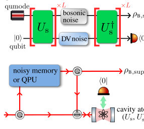
<figcaption class="paper-figure-caption"><b>Fig 1.</b> FIG. 1. Bosonic noise suppression with (a) conditional rota- tion (condrot) gates and (b) a series of compositions of conditional displacements and the conditional rotation gates. We shall refer to the unitary with L layers by the notation “[PQP-condrot]L” for convenience. The conditional rotation gate of (a) is optimally the controlled-Fourier gate described in the main text. (c) An optical cir- cuit implementing conditional rotations through the dispersive inter- actions between a single atom in a cavity and traveling waves. Two circulators route the CV mode around the loop, and a time-dependent optical switch redirects the beams onto a cavity containing an atom to implement the noise...</figcaption>
</figure>
<figure class="paper-figure-card">
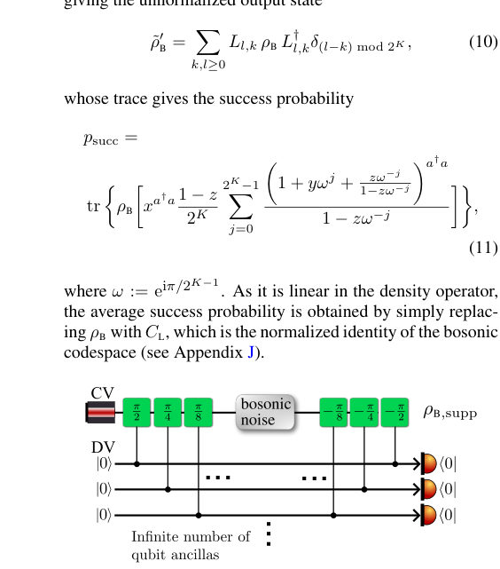
<figcaption class="paper-figure-caption"><b>Fig 2.</b> FIG. 2. Multiqubit extension for converting thermal or Gaussian displacement noise, assumed to be solely between the suppression unitaries, into a mixture of Fock-diagonal noise. For pure photon loss, this setup furnishes a coherent Fock damping on the input so that the output is an attenuated pure state.</figcaption>
</figure>
<figure class="paper-figure-card">
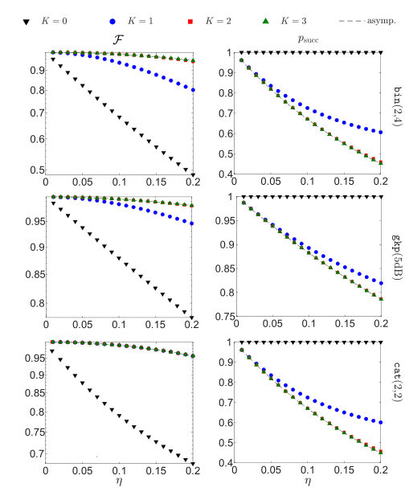
<figcaption class="paper-figure-caption"><b>Fig 3.</b> FIG. 3. Average suppression performances as a function of the pho- ton loss rate η for varying numbers of DV ancillas K. The solid lines (K = 1, 2, 3) demonstrate rapid convergence toward the theoretical asymptotic limit. Perfect ancillas have been assumed in order to fo- cus on the effects of adding the ancillas alone here.</figcaption>
</figure>
<figure class="paper-figure-card">
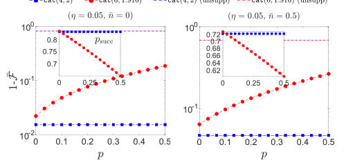
<figcaption class="paper-figure-caption"><b>Fig 4.</b> FIG. 4. Comparison of average suppression performance with conditional Fourier (CF) gates between a like (even)-parity code bin(2, 4) and an opposite-parity bosonic code: cat(6, 1.916), both of which have similar average Gaussian moments of the photon- number distribution (⟨a†a⟩∼= 4, ⟨(a†a)2⟩∼= 20, ⟨a2⟩= 0) with respect to the state CL. The former is more resilient to the compos- ite amplitude and phase damping qubit noise of equal strengths p. The dashed and dot-dashed lines represent their respective, roughly identical performances without suppression. These are flat because no ancillas were used. Insets show average success probability.</figcaption>
</figure>
<figure class="paper-figure-card">
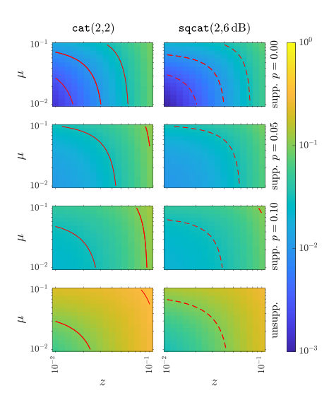
<figcaption class="paper-figure-caption"><b>Fig 5.</b> FIG. 6. Average infidelity of the eigenstates of the single-qubit Paulis encoded on the two-component cat code with coherent ampli- tude of 2 or cat(2,2) and the same with an additional 6dB of squeez- ing along the real axis applied to the cat codewords, sqcat(2,6dB), with our suppression protocol with a single DV ancilla affected by various damping noise strengths and without suppression. The CV noise is characterized by the loss parameter µ and the gain parameter z = 1 −1/G. The squeezed cat code retains its advantage over the bare cat code after suppression, demonstrating that active squeezing and the present CF-based protocol can be used in tandem.</figcaption>
</figure>

**Summary.** The paper introduces a code-agnostic protocol to suppress bosonic noise in traveling modes by using a hybrid CV-DV interferometer. By sandwiching noise between controlled-Fourier gates, the protocol reduces error scaling from linear to quadratic. The method is versatile, working for various bosonic codes and extending to qutrit ancillas to handle complex noise environments.

**Why it may be interesting.** This work is highly relevant to quantum optics and open quantum systems as it provides a hardware-efficient, passive method to reshape noise channels and improve the fidelity of bosonic encodings using hybrid CV-DV interactions.

Detailed structure

**Main problem.** Physical-level noise in traveling bosonic modes, such as photon loss, thermal excitation, and Gaussian displacement noise, acts as a critical bottleneck for scalable quantum information processing.

**Main result.** The authors propose a code-agnostic, hybrid CV-DV interferometer that suppresses noise effects from linear to quadratic scaling without active error correction or destructive measurements.

**Method.** A feedback-free protocol using a single qubit (or qutrit) ancilla and two controlled-Fourier (CF) gates that sandwich the noise channel to induce destructive interference of error terms.

**Model / system.** A hybrid continuous-variable (CV) and discrete-variable (DV) system, applicable to platforms like cavity/circuit QED and trapped ions, involving bosonic modes (qumodes) and qubit or qutrit ancillas.

**Key observables.** Success probability (p_succ), average fidelity (F), and infidelity (1-F).

**Important parameters / regimes.** Loss rate (mu), amplification gain (G), thermal noise rate (eta), mean photon number (n_bar), and ancilla damping strength (p).

**Assumptions / limitations.** Assumes the ancilla is initialized; assumes noiseless CF gates for the ideal case; assumes the ancilla damping channels commute.

**Figures summary.** Figure 1 shows the hybrid interferometer setup and optical circuit implementation; Figure 2 illustrates the multi-ancilla extension; Figure 3 shows average suppression performance; Figure 4 compares parity-based code resilience; Figure 5 shows performance vs. ancilla damping; Figure 6 compares squeezed vs. bare cat codes; Figure 9/10 show the qutrit extension.

**Paper structure.** The paper introduces the noise problem, presents the core single-ancilla CF-gate protocol, extends the method to multi-ancilla and qutrit systems, analyzes performance for various bosonic codes (cat, GKP, binomial), and evaluates the protocol in quantum communication/teleportation scenarios.

Abstract

Physical-level noise on traveling bosonic modes remains a critical bottleneck for scalable quantum information processing. We show that for any single-mode bosonic code (qumode) corrupted by thermal or Gaussian displacement noise at loss rate $μ$ and amplification $G$, a hybrid continuous-discrete-variable (CV-DV) interferometer using a single qubit ancilla and two controlled-Fourier (CF) gates sandwiching the noise channel suppresses its effects from linear to quadratic scaling. This is achieved without active error correction or destructive measurements of the encoded state, maintaining high success probabilities $\geq 0.5$ when $μG \leq 0.5$. When supplemented with multiple ancillas, the protocol converts photon loss into coherent Fock-damping, and thermal or displacement noise into a mixture of Fock-diagonal noise. The protocol is entirely code-agnostic. For the special case of $2^K$-fold rotation-symmetric bosonic codes, it simplifies to conventional error detection and projection with $K$ ancillas. Suppression with simple gates and few ancillas demonstrates a clear hardware-efficient advantage over previously proposed ``bypass'' schemes, where quantum information transferred to the DV ancillas is readily corrupted by ancilla noise. Finally, we extend the protocol to a qutrit DV ancilla. This demonstrates resilience to both CV noise and composite DV damping noise, achieving a truly hybrid noise suppression scheme that operates effectively even on CV encodings lacking a well-defined photon-number parity syndrome.

[↑ back to top](#top)

### [Lattice polarons with extended interactions](http://arxiv.org/abs/2605.25202v1)

**Authors:** Enrique I. Ramírez-Juárez, Genaro Lopez-Olivera, Luis A. Peña Ardila, Arturo Camacho-Guardian  
**Type:** theory · **Category:** quantum gases · **PDF:** <https://arxiv.org/pdf/2605.25202v1>  
**Analysis basis:** full PDF text, analyzed in chunks
**Topic relevance:** `analog quantum simulation` **3/5** · `Keldysh / 2PI / non-Gaussian methods` **2/5** · `Kondo & dissipative impurity` **2/5**

↔ Scroll figures horizontally

<figure class="paper-figure-card">
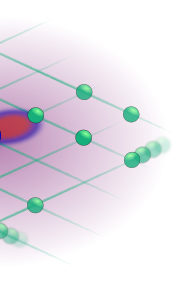
<figcaption class="paper-figure-caption"><b>Fig 1.</b> Figure 1: Schematic illustration of a lattice polaron in a two-dimensional optical lattice. The central blue sphere represents the impurity, while the surrounding green spheres denote the bosonic medium localized on lattice sites. Non-local interactions can lead to dark impurity states.</figcaption>
</figure>
<figure class="paper-figure-card">
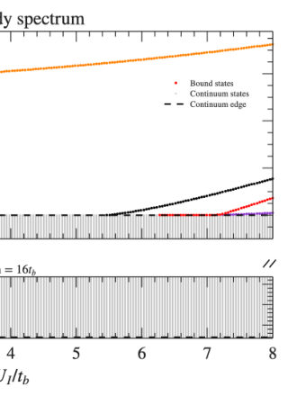
<figcaption class="paper-figure-caption"><b>Fig 2.</b> Figure 2: Scattering states of the two-body problem. The gray points correspond to scattered states. The orange dots correspond to a repulsive bound state from the on-site interaction whereas the black (two degenerate) and red dots correspond to secondary repulsive bound arising from the nonlocal interactions.</figcaption>
</figure>
<figure class="paper-figure-card">
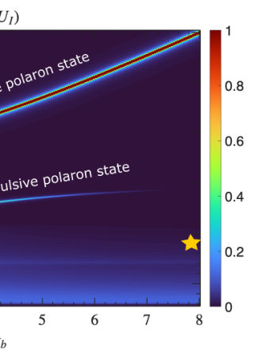
<figcaption class="paper-figure-caption"><b>Fig 3.</b> Figure 3: Spectral function A(ω) of a lattice polaron for fixed on-site interaction U0 = 12tb, shown as a function of frequency ω/tb and nearest-neighbor interaction UI/tb.</figcaption>
</figure>
<figure class="paper-figure-card">
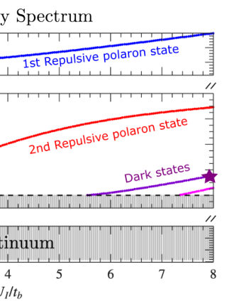
<figcaption class="paper-figure-caption"><b>Fig 4.</b> Figure 4: Eigenenergy spectrum obtained from the Chevy ansatz for a lattice polaron with fixed on-site interaction U0 = 12tb, as a function of nearest-neighbor interaction UI/tb.</figcaption>
</figure>
<figure class="paper-figure-card">
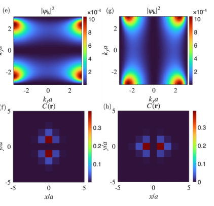
<figcaption class="paper-figure-caption"><b>Fig 5.</b> Figure 5: Momentum-space wave function (top row) impurity-boson spatial corre- lation(bottom row) for the four high-lying polaron states (a)-(b) Correspond to the highest polaron state for UI/tb = 2.0. (c)-(d) show the wave function and impurity- boson spatial correlation for the second highest polaron branch for UI/tb = 2.0. From (e)-(h) we show for two degenerate states featuring a dipole-like structure in real space for or UI/tb = 8.0. These cases correspond to the eigenstates marked by the stars in Fig. 3 and Fig. 4.</figcaption>
</figure>

**Summary.** This paper explores how non-local interactions in a 2D lattice change the nature of polarons. It discovers that these interactions create new quasiparticle branches and 'dark' states that cannot be seen in standard spectral measurements due to symmetry. These findings suggest new ways to use quantum microscopy to detect hidden quantum states.

**Why it may be interesting.** It reveals 'hidden' many-body states that are invisible to standard spectroscopy but detectable via site-resolved microscopy, providing a new way to probe complex quasiparticle structures in engineered quantum systems.

Detailed structure

**Main problem.** Investigating how extended, non-local interactions in a lattice modify the structure of polarons and whether they generate new, spectroscopically invisible 'dark' quasiparticle states.

**Main result.** The study identifies that nearest-neighbor interactions induce additional repulsive polaron branches and 'dark' impurity states that are orthogonal to the bare impurity, possessing nontrivial dipolar spatial symmetries.

**Method.** A Chevy-type variational approach restricted to a single bosonic excitation, supplemented by a T-matrix approach for benchmarking and symmetry analysis.

**Model / system.** A single mobile impurity in a 2D square optical lattice coupled to an ideal Bose-Einstein Condensate (BEC) at zero temperature, featuring strong on-site repulsion and tunable nearest-neighbor interactions.

**Key observables.** Energy eigenvalue spectrum, spectral function A(omega), polaron wave functions, and impurity-boson spatial correlations.

**Important parameters / regimes.** On-site repulsion (U0/tb fixed at 12), tunable nearest-neighbor interaction (UI/tb), and lattice geometry (2D square).

**Assumptions / limitations.** The variational ansatz is limited to at most one bosonic excitation, and the bosonic medium is treated as an ideal gas at zero temperature.

**Figures summary.** Figure 1 shows a schematic of the lattice polaron; Figure 2 displays the two-body scattering spectrum with various bound states; Figure 3 shows the spectral function as a function of frequency and interaction strength; Figure 4 identifies dark states in the energy spectrum; Figure 5 illustrates momentum-space wave functions and real-space spatial correlations; Figure 6 compares the T-matrix and Chevy ansatz spectral functions.

**Paper structure.** The paper introduces the problem of extended interactions, describes the 2D lattice polaron model and variational method, presents two-body scattering results, analyzes the many-body spectrum and the emergence of dark states, discusses spatial symmetries, and concludes with experimental implications.

Abstract

Lattice impurities have recently emerged as a platform in which polarons unveil new quantum many-body states absent in free space and can serve to probe strongly correlated matter. In this work, we investigate two-dimensional lattice polarons with strong on-site repulsion and tunable nearest-neighbor interactions using a variational approach including up to one excitation of the medium. We show that extended interactions qualitatively modify the quasiparticle structure beyond the conventional attractive and repulsive polaron picture. A direct analysis of the eigenvalue spectrum reveals the presence of dark impurity states, orthogonal to the bare impurity and therefore spectroscopically dark. These states exhibit nontrivial internal structure, including dipolar symmetries in real space. Our results demonstrate that long-range interactions generate multiple quasiparticle excitations with distinct symmetry properties, highlighting the crucial role of interaction range and lattice geometry. This work opens new avenues for probing hidden quasiparticle states in lattice systems through spectroscopic and wave-function-resolved measurements.

[↑ back to top](#top)

### [Topological metal-insulator transitions in one-dimensional non-Hermitian quasicrystals: beyond PT-symmetry](http://arxiv.org/abs/2605.25072v1)

**Authors:** Guangjie Zhang, Bing Shao, Longwen Zhou, Jiangbin Gong, Weiwei Zhu  
**Type:** theory · **Category:** disordered systems and neural networks · **PDF:** <https://arxiv.org/pdf/2605.25072v1>  
**Analysis basis:** full PDF text, analyzed in chunks
**Topic relevance:** `driven-dissipative phase transition` **3/5** · `non-equilibrium dynamics` **2/5** · `non-equilibrium universality` **2/5**

↔ Scroll figures horizontally

<figure class="paper-figure-card">
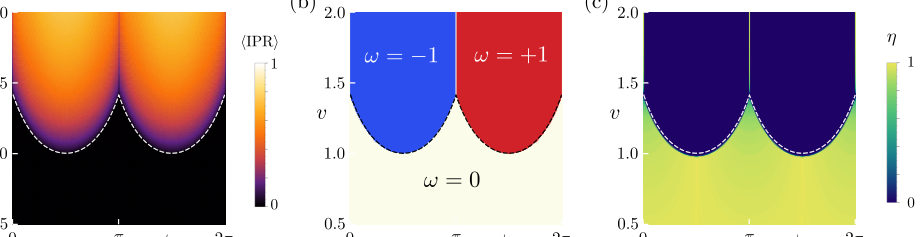
<figcaption class="paper-figure-caption"><b>Fig 1.</b> FIG. 2. Phase diagrams for topological triple phase transitions. (a) Localization phase diagram: averaged IPR, ⟨IPR⟩, as a function of v and ϕ. Dark (bright) regions correspond to extended (localized) phases. (b) Topological phase diagram: winding number ω as a function of v and ϕ. (c) Degeneracy phase diagram: degeneracy rate η as a function of v and ϕ. In numerical simulations, the system size is set to L = F15 = 610. Two eigenenergies E1 and E2 are considered degenerate if their distance |δE| ≡|E1 −E2| is less than 10−5. Dashed lines denote phase boundaries obtained analytically.</figcaption>
</figure>
<figure class="paper-figure-card">
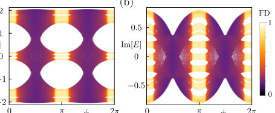
<figcaption class="paper-figure-caption"><b>Fig 2.</b> FIG. 3. Energy spectrum as a function of the relative phase shift ϕ, with the fractal dimension Γ of the corresponding eigenstates overlaid. (a) Real parts of the spectrum Re(E). (b) Imaginary parts of the spectrum Im(E). The amplitude is fixed at v = 1.2. In numerical simulations, the system size is set to L = F15 = 610.</figcaption>
</figure>
<figure class="paper-figure-card">
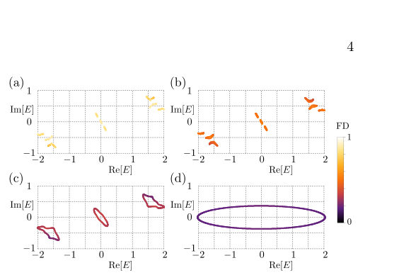
<figcaption class="paper-figure-caption"><b>Fig 3.</b> FIG. 4. Complex energy spectra for different relative phase shifts ϕ, with the fractal dimension Γ of the corresponding eigenstates overlaid. (a) ϕ = 0, (b) ϕ = 0.14π, (c) ϕ = 0.2π, and (d) ϕ = 0.5π. The modulation amplitude is fixed at v = 1.2. In numerical simulations, the system size is set to L = F15 = 610.</figcaption>
</figure>
<figure class="paper-figure-card">
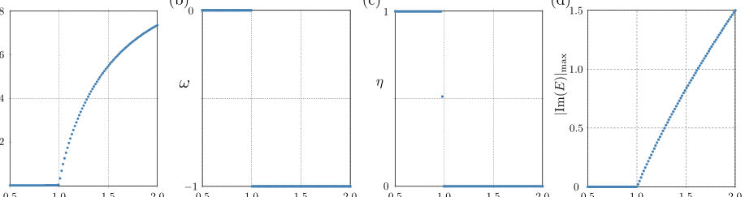
<figcaption class="paper-figure-caption"><b>Fig 4.</b> FIG. 5. Topological metal-insulator transitions in the PT -symmetric case with ϕ = π/2. (a) Localization-delocalization transition: averaged IPR, ⟨IPR⟩, vs v. (b) Topological transition: winding number ω vs v. (c) Degeneracy-breaking transition: degeneracy rate η vs v. (d) PT transition: maximum imaginary part of eigenenergies |Im(E)|max vs v. In numerical simulations, the system size is set to L = F15 = 610. Two eigenenergies, E1 and E2, are considered degenerate if their distance |δE| ≡ |E1 −E2| is less than 10−5.</figcaption>
</figure>
<figure class="paper-figure-card">
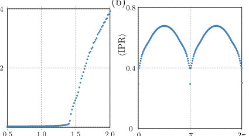
<figcaption class="paper-figure-caption"><b>Fig 5.</b> FIG. 6. Localization-delocalization transition for ϕ = 0. (a) Averaged IPR, ⟨IPR⟩, as a function of v for ϕ = 0. (b) ⟨IPR⟩ as a function of ϕ for v = 1.8. In numerical simulations, the system size is set to L = F15 = 610.</figcaption>
</figure>

**Summary.** This paper explores phase transitions in non-Hermitian quasicrystals where PT-symmetry is not preserved. It demonstrates that such systems can undergo simultaneous transitions in localization, topology, and spectral degeneracy. The study reveals that non-Hermiticity introduces new types of localization behavior beyond what is seen in PT-symmetric or Hermitian systems.

**Why it may be interesting.** This work is highly relevant for researchers in open quantum systems and many-body dynamics as it reveals how non-Hermiticity and the lack of PT-symmetry can fundamentally alter the nature of phase transitions and localization behavior.

Detailed structure

**Main problem.** The study investigates how the absence of parity and time-reversal (PT) symmetry affects topological metal-insulator transitions in one-dimensional non-Hermitian quasicrystals.

**Main result.** The authors identify a triple phase transition involving localization, topology, and degeneracy-breaking in general non-PT-symmetric regimes, and distinguish between localization driven by non-Hermitian skin effects and localization analogous to Hermitian systems.

**Method.** Numerical simulations using rational approximations of the golden ratio via Fibonacci numbers, combined with analytical approaches like similarity transformations and winding number calculations via twisted boundary conditions.

**Model / system.** A one-dimensional non-Hermitian quasiperiodic tight-binding model (a non-Hermitian Aubry-André-Harper model) featuring a complex potential with a relative phase shift and asymmetric nearest-neighbor couplings.

**Key observables.** Inverse Participation Ratio (IPR), Fractal Dimension (FD), spectral winding number (omega), degeneracy rate (eta), and maximum imaginary part of eigenenergies.

**Important parameters / regimes.** Potential strength (v), relative phase shift (phi), and the asymmetric coupling ratio (alpha).

**Assumptions / limitations.** The system is studied in the thermodynamic limit using large Fibonacci-sized lattices to approximate the irrational quasiperiodic potential.

**Figures summary.** Phase diagrams for IPR, winding number, and degeneracy rate; plots of IPR as a function of potential strength and phase shift to demonstrate localization transitions.

**Paper structure.** The paper introduces the non-PT-symmetric model, presents the numerical and analytical methods for identifying phase boundaries, details the discovery of the triple phase transition, explores special PT-symmetric and TR-symmetric limits, and concludes with a discussion of the distinct localization mechanisms.

Abstract

One-dimensional non-Hermitian quasicrystals with parity and time-reversal (PT) symmetry can simultaneously exhibit localization-delocalization transition, topological phase transition, and PT-symmetry-breaking transition. This motivates this work to investigate how the absence of PT symmetry impacts topological metal-insulator transitions in non-Hermitian quasicrystals. We propose a non-Hermitian quasiperiodic model that generally does not preserve PT symmetry and demonstrate that, in most parameter regions, such a system supports triple phase transitions that encompass localization, topology, and degeneracy-breaking. The system may also exhibit a particular type of localization-delocalization transition analogous to the Hermitian case, namely, without activating topological phase transitions or degeneracy-breaking transitions. Our work extends the topological metal-insulator transitions previously studied in PT-symmetric systems to a more general class of non-Hermitian setting, and further reveals that non-Hermitian systems can host distinct types of localization behavior.

[↑ back to top](#top)

### [Analysis of Critical Points in a Permutation Model on Hierarchical Lattices by Real-Space Renormalization Group](http://arxiv.org/abs/2605.25683v1)

**Authors:** Ryuki Ito, Taisei Matsuo, Masayuki Ohzeki  
**Type:** theory · **Category:** statistical mechanics · **PDF:** <https://arxiv.org/pdf/2605.25683v1>  
**Analysis basis:** full PDF text, analyzed in chunks
**Topic relevance:** `entanglement & information structure` **3/5** · `measurement-induced transitions` **2/5**

↔ Scroll figures horizontally

<figure class="paper-figure-card">
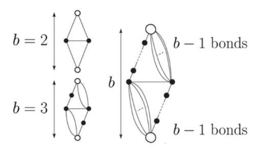
<figcaption class="paper-figure-caption"><b>Fig 1.</b> Fig. 1. Unit lattice. White circles denote boundary spins, and black circles denote internal spins to be summed over in the real-space renormalization.</figcaption>
</figure>
<figure class="paper-figure-card">
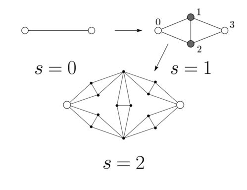
<figcaption class="paper-figure-caption"><b>Fig 2.</b> Fig. 2. Examples of hierarchical lattices with b = 2. The iterative construc- tion generates the entire lattice.</figcaption>
</figure>
<figure class="paper-figure-card">
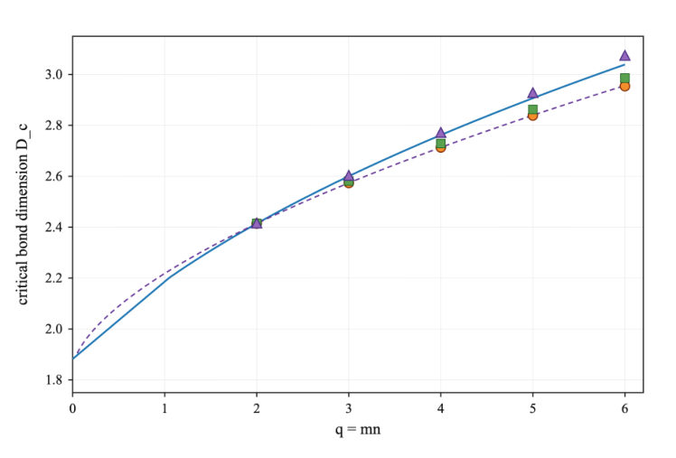
<figcaption class="paper-figure-caption"><b>Fig 3.</b> Fig. 3. (Color online) Critical points obtained by RSRG on hierarchical lattices. Orange circles, green squares, and purple triangles denote the RSRG results for b = 2, 3, 4, respectively. The blue solid curve denotes the duality-analysis prediction, and the purple dashed curve is a power-law guide to the b = 2 data. The replica-limit estimates discussed in the text are obtained from the b = 3 data.</figcaption>
</figure>
<figure class="paper-figure-card">
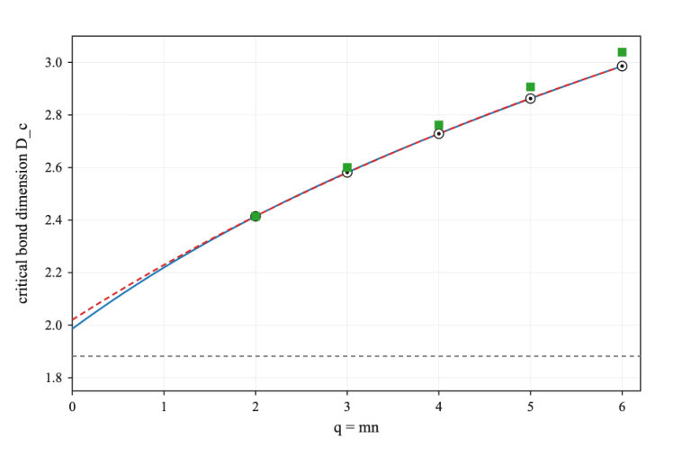
<figcaption class="paper-figure-caption"><b>Fig 4.</b> Fig. 4. (Color online) Extrapolation of the b = 3 RSRG critical points. Open circles denote RSRG results, green squares denote the finite-q duality-analysis values, the blue solid curve is the fourth-order polynomial fit, the red dashed curve is the rational-function fit, and the gray dashed horizontal line is Ohzeki’s duality estimate in the replica limit, D(RTN) c = 1.88201.</figcaption>
</figure>

**Summary.** This paper uses real-space renormalization group methods to study phase transitions in permutation models that are linked to entanglement transitions in random quantum circuits. It provides a rigorous numerical validation of duality-based predictions and identifies the most reliable mathematical methods for extrapolating results to the critical replica limit.

**Why it may be interesting.** not directly relevant

Detailed structure

**Main problem.** Determining the critical points of the ferromagnetic-paramagnetic phase transition in the permutation model and estimating the transition point in the replica limit (q -> 0) which corresponds to the entanglement entropy transition in random tensor networks.

**Main result.** The study finds that RSRG results for hierarchical lattices are broadly consistent with duality-based predictions, while identifying that a rational function is the most robust extrapolation scheme for reaching the replica limit.

**Method.** Exact real-space renormalization group (RSRG) calculations on self-dual hierarchical lattices combined with various numerical extrapolation techniques (polynomial, power-law, and rational functions).

**Model / system.** A classical permutation model where spins are elements of the symmetric group S_q, with a Hamiltonian based on the cycle-counting function of permutations.

**Key observables.** Critical bond dimension (Dc), critical coupling (Kc), and the diagnostic function G_N(D) used to identify RG flow direction.

**Important parameters / regimes.** Number of replicas (q = mn), bond dimension (D), interaction strength (J), and the hierarchical lattice branching parameter (b).

**Assumptions / limitations.** The reduction of the full duality relation to a single scalar equation for the principal Boltzmann factor is assumed, and the accuracy of the extrapolation to the q -> 0 limit is subject to systematic uncertainty.

**Figures summary.** Figure 1 shows the unit lattice structure; Figure 2 illustrates hierarchical lattices for different generations; Figure 3 plots critical points (Dc) vs q for various b values compared to duality predictions; Figure 4 visualizes the extrapolation of data toward the q -> 0 limit.

**Paper structure.** The paper introduces the permutation model and its connection to quantum entanglement, describes the RSRG method on hierarchical lattices, presents numerical results for various q and b, compares these results to duality predictions, evaluates different extrapolation schemes using a benchmark Ising model, and concludes with future directions.

Abstract

The permutation model is a classical spin system where elements of the symmetric group interact with one another. The partition function of this model is directly related to the entanglement structure of random quantum circuits and random tensor networks. In these contexts, the entanglement entropy undergoes a transition between area-law and volume-law scaling, depending on the model parameters. This transition point has attracted considerable attention. In the present work, we investigate the ferromagnetic-paramagnetic phase transition of the permutation model, which corresponds to the entanglement entropy transition. Using exact real-space renormalization group calculations on self-dual hierarchical lattices, we numerically determine finite-replica critical points for (q=mn=2,...,6). We compare the results with the duality prediction based on the Fourier transform of the symmetric group and then extrapolate the b=3 data toward the replica limit $mn\to0$, where the effective dimension is two. The comparison supports the duality-based estimate while also clarifying the systematic uncertainty associated with the extrapolation formula.

[↑ back to top](#top)

### [Benchmark for Quantum Teleportation with Non-Uniform Prior Distributions](http://arxiv.org/abs/2605.24861v1)

**Authors:** Tomáš Opatrný, Allison Brattley, Kunal K. Das  
**Type:** theory · **Category:** quantum information and computing · **PDF:** <https://arxiv.org/pdf/2605.24861v1>  
**Analysis basis:** full PDF text, analyzed in chunks
**Topic relevance:** `quantum measurements` **3/5** · `entanglement & information structure` **2/5**

↔ Scroll figures horizontally

<figure class="paper-figure-card">
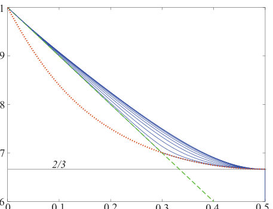
<figcaption class="paper-figure-caption"><b>Fig 1.</b> FIG. 1. Mean fidelity for no-entanglement teleportation of a single qubit using projection on different axes θ0 as a function of the mean number of excitations ⟨n⟩of Eq. (3). The green dashed line corresponds to the “do-nothing” strategy as in Eq. (4). The red dotted line is teleportation using projection on the direction of prior knowledge, without averaging over the prior distribution. The top-most solid blue line corresponds to θ0 = π/2, and the lines move down in steps of π/16. The bottom solid blue line overlapping with the green dashed and red dotted lines corresponds to θ0 = 0.</figcaption>
</figure>
<figure class="paper-figure-card">
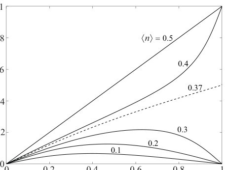
<figcaption class="paper-figure-caption"><b>Fig 2.</b> FIG. 2. Optimum estimated angle ˜θ as a function of the de- tected angle θM for a single qubit POVM scheme, as in Eq. (16), for various distributions of prior knowledge character- ized by the values of ⟨n⟩. The dashed line corresponds to n0 ≃0.37, the turning point between monotonous increase and non-monotonous behavior.</figcaption>
</figure>
<figure class="paper-figure-card">
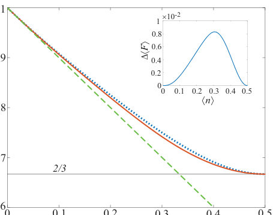
<figcaption class="paper-figure-caption"><b>Fig 3.</b> FIG. 3. Comparison of the mean fidelity for no-entanglement teleportation of a single qubit, with prior knowledge using POVM detection and projective measurement. The solid red line is the mean fidelity using a POVM as in Eq. (19), and the blue dashed line uses projective measurement on σx as in Eq. (10). The inset displays the difference between the two lines. The “do-nothing” strategy is included as a green dashed line for comparison. The mean fidelity limit of 2/3 for no prior distribution is marked as a thin black line.</figcaption>
</figure>
<figure class="paper-figure-card">
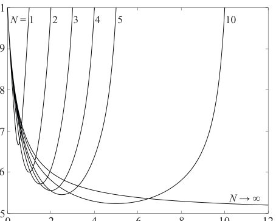
<figcaption class="paper-figure-caption"><b>Fig 4.</b> FIG. 4. Maximum mean fidelities achieved with no entangle- ment for different qubit numbers N as a function of the mean number of excitations ⟨n⟩. The curves correspond to, from left to right, N = 1, 2, 3, 4, 5, 10, and N →∞, as given by Eqs. (B11) and (24), respectively.</figcaption>
</figure>

**Summary.** This paper shows that if you have prior knowledge about the states being teleported, the standard benchmarks for proving quantum advantage are too low. By using a von Mises-Fisher distribution, the authors derive new, higher fidelity thresholds that account for non-uniform input distributions.

**Why it may be interesting.** This is highly relevant for quantum optics and quantum information as it redefines the criteria for claiming 'quantum advantage' in realistic scenarios where input states are not perfectly unknown.

Detailed structure

**Main problem.** Establishing reliable fidelity benchmarks for quantum teleportation when input states are drawn from non-uniform prior distributions, rather than the standard uniform distribution.

**Main result.** The study demonstrates that standard fidelity thresholds (like 2/3 for qubits) can significantly underestimate the classical limit when prior knowledge exists, and that optimal teleportation strategies require specific measurement axes related to the distribution's concentration.

**Method.** The authors use Bayesian inference and optimization to derive analytical expressions for mean fidelity, comparing projective measurements and Coherent Spin POVMs.

**Model / system.** The model includes single qubits on the Bloch sphere and multi-qubit systems modeled as spin coherent states, with input states following a von Mises-Fisher distribution.

**Key observables.** Mean fidelity (average fidelity of the teleportation process).

**Important parameters / regimes.** Concentration parameter (kappa), mean number of excitations (n), and particle number (N).

**Assumptions / limitations.** The results are derived specifically for spin coherent states and von Mises-Fisher distributions.

**Figures summary.** Figure 1 plots mean fidelity against mean excitations for different projection axes; Figure 2 shows the optimal estimated angle versus detected angle; Figure 3 compares different measurement strategies against the 2/3 baseline; Figure 4 shows multi-particle fidelity scaling.

**Paper structure.** The paper introduces the problem of non-uniform priors, develops the mathematical framework using Bayesian methods for single and multi-qubit systems, compares measurement strategies (projective vs. POVM), and provides analytical derivations in the appendix.

Abstract

Quantum teleportation should surpass maximum fidelity thresholds possible with local measurements and classical communications. Benchmarks have been established when states are drawn from a uniform distribution of qubits or coherent states of harmonic oscillators. These are not applicable when there is prior knowledge about the input that skews the distribution. We determine the highest mean fidelity achievable for teleportation of states without using entanglement but drawn from a non-uniform prior distribution, specifically a von Mises - Fisher distribution. Using Bayesian methods, we derive benchmark functions for single qubit teleportation that utilize projective measurement on specific axes on the Bloch sphere. We demonstrate that similar results can be achieved with a coherent spin positive operator-valued measure (POVM), based upon heterodyne detection. These methods are then used to derive corresponding benchmarks for teleporting multi-qubit systems that we model as spin coherent states, covering the full range of particle number $N\in [1, \infty)$. The results show that fidelity thresholds to declare quantum advantage can be significantly higher than is typically assumed with uniform distribution.

[↑ back to top](#top)

### [Generalising gravitationally induced decoherence beyond linear environmental interactions in a microscopic quantum mechanical toy model](http://arxiv.org/abs/2605.25936v1)

**Authors:** Max Joseph Fahn, Renata Ferrero, Kristina Giesel, Roman Kemper  
**Type:** theory · **Category:** other · **PDF:** <https://arxiv.org/pdf/2605.25936v1>  
**Analysis basis:** full PDF text, analyzed in chunks
**Topic relevance:** `methods for driven-dissipative` **3/5** · `non-equilibrium dynamics` **2/5**

↔ Scroll figures horizontally

<figure class="paper-figure-card">
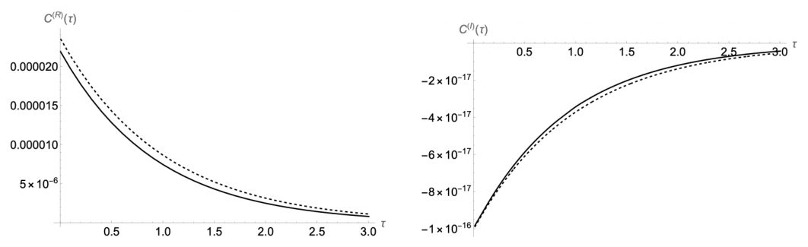
<figcaption class="paper-figure-caption"><b>Fig 1.</b> FIG. 1. Numerical evaluation of the real and imaginary part with parameters T = 0.9K, η = 10−8s, g = 0.1, Ω= 1Hz. These are obtained by taking the real/imaginary part of (3.55) after having numerically integrated over ω. The dashed line is the behaviour at vanishing parameter µ0, while the continuous line is the full numerical result at µ0 = 10.</figcaption>
</figure>
<figure class="paper-figure-card">
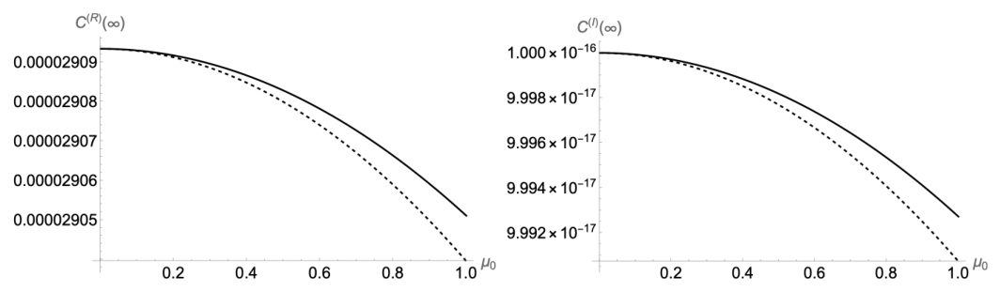
<figcaption class="paper-figure-caption"><b>Fig 2.</b> FIG. 2. Numerical evaluation of the real and imaginary decoherence factors with parameters T = 0.9K, ˜η = 10−8√s, ˜g = 0.1√s, Ω= 1Hz for varying values of the parameter µ0. The sums in (3.79) and (3.83) has been truncated at kmax = 100. The dashed lines represent the analytic series expansion in (3.63) (left) and (3.65) (right), while the continuous lines correspond to the numerical results. We observe that the series expansion is in very good agreement for small values of the parameter µ0.</figcaption>
</figure>
<figure class="paper-figure-card">
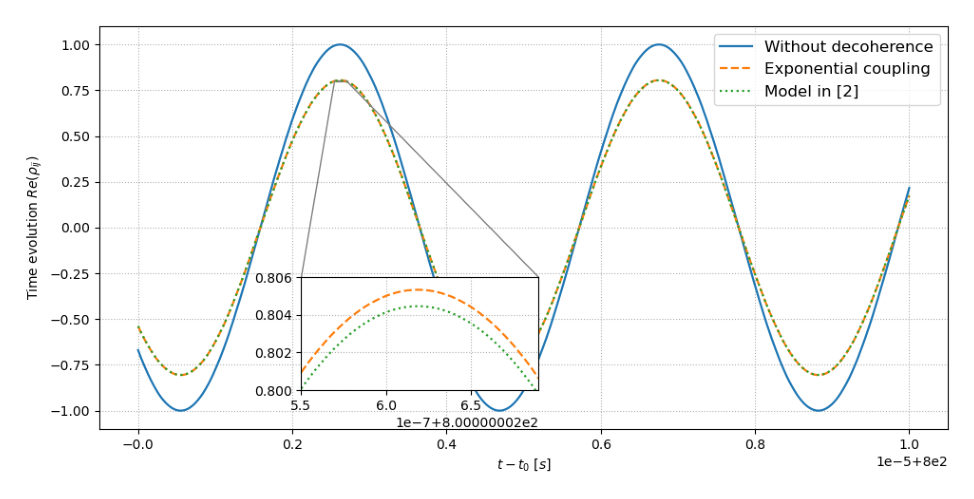
<figcaption class="paper-figure-caption"><b>Fig 3.</b> FIG. 3. The time evolution of Re[ρij(t)] given in (4.10) is plotted for varying time t −t0 and a constant energy difference Ej−Ek = 10−9 eV, ˜g = 0.1√s, ˜η = 2·10−17√s, µ0 = 1 10 πβℏ</figcaption>
</figure>

**Summary.** This paper extends existing models of gravitationally induced decoherence by replacing linear position coupling with non-linear Weyl element coupling. It introduces a new method for calculating environmental correlations that is compatible with polymer quantum mechanics and shows that the model reduces to standard decoherence models in the limit of small Weyl parameters.

**Why it may be interesting.** This work is highly relevant to researchers in open quantum systems as it provides new mathematical tools (STFT) for calculating correlation functions in non-linear regimes and bridges the gap between standard Schrödinger quantization and Loop Quantum Gravity-inspired polymer quantization.

Detailed structure

**Main problem.** Generalizing models of gravitationally induced decoherence to include non-linear environmental interactions, specifically moving beyond linear coupling to position operators to accommodate polymer quantum mechanics.

**Main result.** The authors derived a renormalized master equation for a Weyl-element coupling model and demonstrated that it recovers standard linear decoherence models in the small-parameter limit while providing a framework for polymer quantization.

**Method.** The study employs two analytical approaches: using Wick's theorem with annihilation/creation operators and a Short-Time Fourier Transform (STFT) method, alongside Taylor expansions and renormalization techniques.

**Model / system.** A microscopic quantum mechanical toy model where a system of interest is coupled to a thermal bath of harmonic oscillators via non-linear Weyl elements (sine-like coupling).

**Key observables.** Environmental correlation functions (one-point and two-point), density matrix elements, and the decoherence/dissipation rate.

**Important parameters / regimes.** Weyl parameter (mu_0), coupling strength (g), inverse temperature (beta), and high-frequency cutoff (Omega).

**Assumptions / limitations.** The environment is a bath of harmonic oscillators, the system Hamiltonian is time-independent with a discrete spectrum, and the master equation is truncated at the second order in the coupling parameter.

**Figures summary.** Figure 3 shows the time evolution of the real part of the density matrix elements, comparing unitary evolution, the zeroth-order linear model, and the higher-order exponential coupling model.

**Paper structure.** The paper defines the non-linear interaction Hamiltonian, develops dual calculation methods (Wick's theorem and STFT) for correlation functions, generalizes the spectral density, validates the Markov approximation, and concludes with the derivation and solution of the renormalized master equation.

Abstract

We generalise the quantum mechanical toy model for gravitationally induced decoherence presented in Xu, Blencowe (2022) and Domi et al. (2024). In contrast to earlier formulations, in which the Hamiltonian of the system of interest is linearly coupled to the position operators of the oscillators in the environment, we consider an interaction formulated in terms of Weyl elements of the environment's position operators. This extension is motivated by polymer quantum mechanics, in which Weyl elements are fundamental operators, as well as by the possibility of generating non-linear interactions through suitable truncations of the exponential Weyl elements. Here we focus on a sinus-like coupling that is still quantised using the Schrödinger representation and, in the limit of a small Weyl parameter, reproduces the conventional linear interaction. To derive the corresponding master equation, we developed two complementary methods for the analytical calculation of the environmental correlation functions. The first utilises Wick's theorem for thermal expectation values in conjunction with annihilation and creation operators, while the second is based on the short-time Fourier transform and completely avoids the use of annihilation and creation operators, making it more readily transferable and generalisable to a polymer quantisation. Both approaches yield identical results. We further generalise the spectral density required for the exponential coupling structure. A numerical analysis shows that the environmental correlation functions decay rapidly with time, which supports the validity of the Markov approximation. Using a Taylor expansion in the Weyl parameter, we show that the first-order term reproduces the decoherence model of Xu, Blencowe (2022) and Domi et al. (2024). Finally, we derive the solution to the renormalised master equation.

[↑ back to top](#top)

### [Multiple fidelities and joint numerical range](http://arxiv.org/abs/2605.24360v1)

**Authors:** Pei Li, Bang-Hai Wang  
**Type:** theory · **Category:** quantum information and computing · **PDF:** <https://arxiv.org/pdf/2605.24360v1>  
**Analysis basis:** full PDF text, analyzed in chunks
**Topic relevance:** `entanglement & information structure` **3/5** · `quantum measurements` **2/5**

↔ Scroll figures horizontally

<figure class="paper-figure-card">
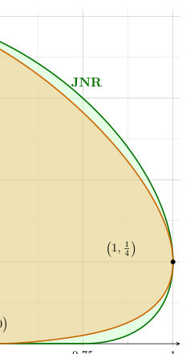
<figcaption class="paper-figure-caption"><b>Fig 1.</b> Figure 1. Comparison of the JNR and the JSNR for reference states |Ψ1⟩= |00⟩ and |Ψ2⟩= | + +⟩, where c = 0.25 and cA = cB = 0.5. The JNR boundary is the conic (x1 + x2 −3</figcaption>
</figure>

**Summary.** The paper establishes a rigorous geometric framework to determine when a set of product-state fidelities can successfully detect entanglement. It identifies that detection power depends on the local overlap of reference states or the existence of completely entangled subspaces. This provides a blueprint for constructing effective entanglement witnesses in arbitrary dimensions.

**Why it may be interesting.** This provides a systematic, geometric method for designing optimal entanglement witnesses, which is highly relevant for experimental verification of entanglement in bipartite and multipartite quantum systems.

Detailed structure

**Main problem.** Determining the conditions under which a set of reference product states can effectively detect entanglement using multiple fidelities.

**Main result.** The authors derive a necessary and sufficient criterion for effective entanglement detection: either a pair of reference states must have nontrivial local inner product moduli on both subsystems, or the orthogonal complement of the span of the reference states must be a completely entangled subspace.

**Method.** A geometric approach utilizing the Joint Numerical Range (JNR) and the Joint Separable Numerical Range (JSNR) combined with algebraic geometry and subspace analysis.

**Model / system.** Bipartite quantum systems with arbitrary local dimensions (dA x dB) using reference pure product states to certify the entanglement of a target state.

**Key observables.** Multiple fidelities (expectation values of product-state projectors) and local fidelities (moduli of local inner products).

**Important parameters / regimes.** Local inner product moduli (cA and cB), global fidelity (c), and the structure of the orthogonal complement of the reference state span.

**Assumptions / limitations.** The reference states are assumed to be linearly independent product states; the analysis of the JSNR boundary is specifically addressed for product-state projectors.

**Figures summary.** A comparison between the JNR and JSNR for two reference product states, illustrating the JNR boundary as a conic section and the JSNR as a symmetric, piecewise-segment boundary.

**Paper structure.** The paper introduces the problem of multiple fidelity entanglement detection, develops a geometric framework using JNR and JSNR, provides necessary and sufficient criteria for k=2 and k>2 cases, demonstrates collective effectiveness using unextendible product bases, and characterizes the JSNR geometry for two product states.

Abstract

We investigate the effectiveness of entanglement detection based on multiple fidelities via the geometry of the joint separable numerical range. When all reference states are product states, we derive a necessary and sufficient criterion for such detection: either some pair of reference states has nontrivial moduli of the local inner products on both subsystems, or the orthogonal complement of the span of the reference states is completely entangled. We further show that there exist sets of reference product states for which no proper subset is effective for entanglement detection, whereas the full set is. A typical example of this phenomenon is provided by unextendible product bases. Moreover, for a pair of reference product states on a bipartite system with arbitrary local dimensions, we characterize both the joint numerical range and the joint separable numerical range, showing that the joint separable numerical range is determined solely by their local fidelities, as illustrated by a representative two-qubit example. Our results offer a systematic approach to designing effective entanglement witnesses and lay the groundwork for extensions to higher-dimensional and multipartite scenarios.

[↑ back to top](#top)

### [Quantum Sensing and Quantum Error Correction: Two Sides of the Same Coin](http://arxiv.org/abs/2605.24120v1)

**Authors:** Zhuoran Bao, Daniel F. V. James  
**Type:** theory · **Category:** quantum information and computing · **PDF:** <https://arxiv.org/pdf/2605.24120v1>  
**Analysis basis:** full PDF text, analyzed in chunks
**Topic relevance:** `quantum measurements` **3/5** · `entanglement & information structure` **2/5**

↔ Scroll figures horizontally

<figure class="paper-figure-card">
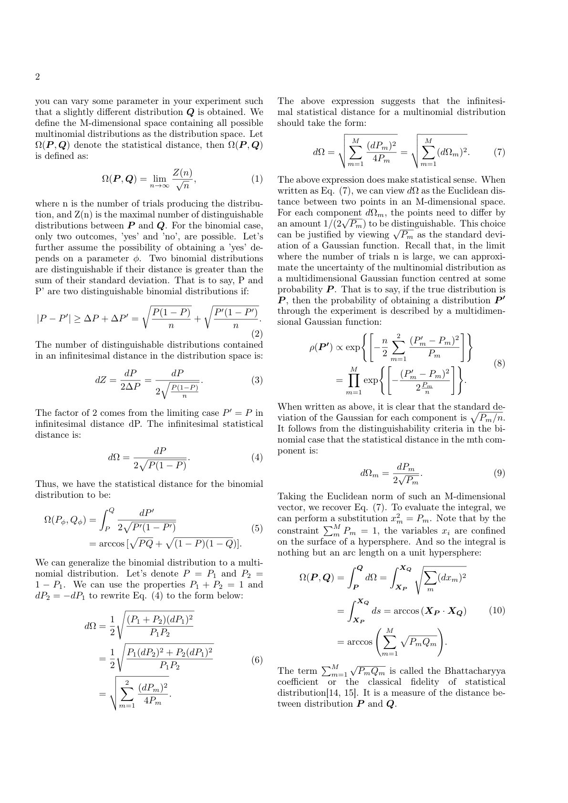
<figcaption class="paper-figure-caption"><b>Fig 1.</b> Low-resolution page preview, page 2</figcaption>
</figure>
<figure class="paper-figure-card">
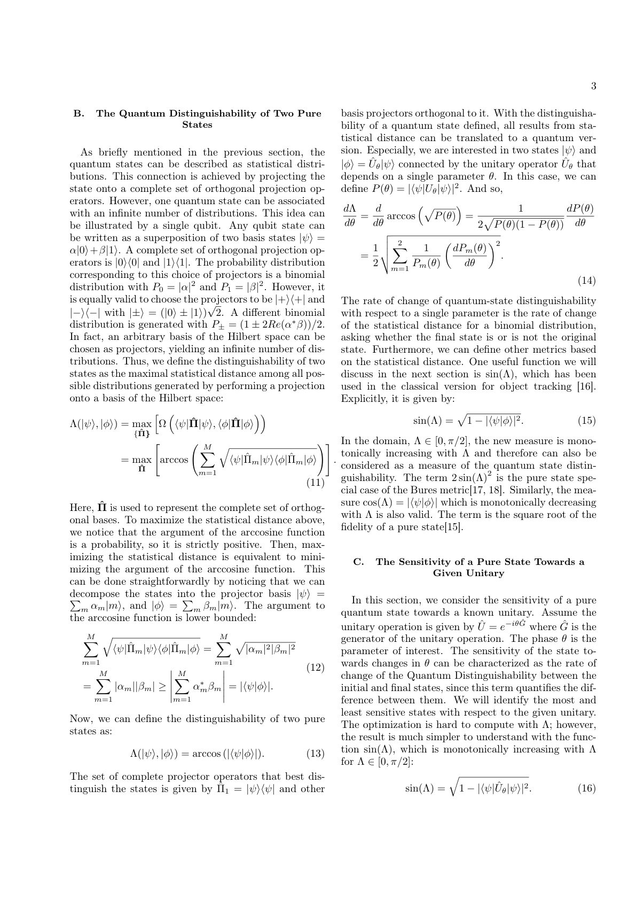
<figcaption class="paper-figure-caption"><b>Fig 2.</b> Low-resolution page preview, page 3</figcaption>
</figure>
<figure class="paper-figure-card">
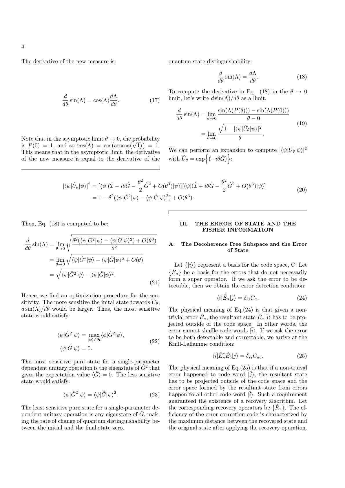
<figcaption class="paper-figure-caption"><b>Fig 3.</b> Low-resolution page preview, page 4</figcaption>
</figure>
<figure class="paper-figure-card">
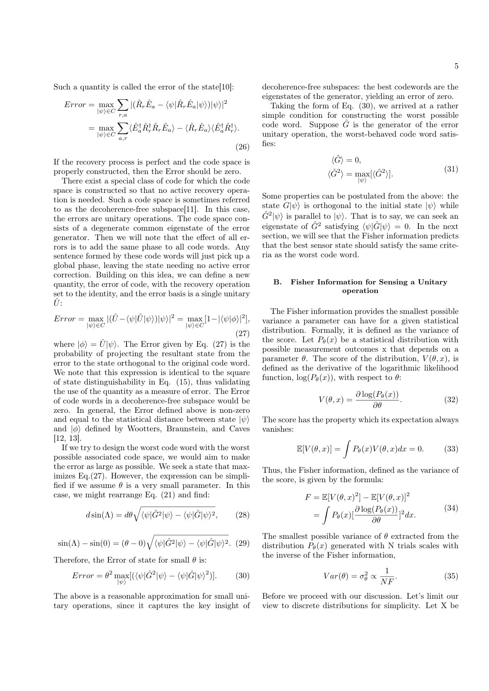
<figcaption class="paper-figure-caption"><b>Fig 4.</b> Low-resolution page preview, page 5</figcaption>
</figure>
<figure class="paper-figure-card">
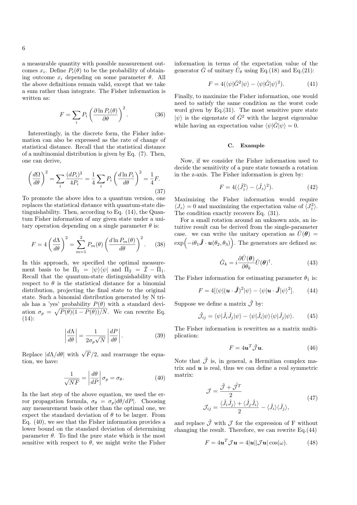
<figcaption class="paper-figure-caption"><b>Fig 5.</b> Low-resolution page preview, page 6</figcaption>
</figure>

**Summary.** The paper demonstrates that quantum sensing and quantum error correction are two sides of the same coin, as the states most sensitive to a parameter are mathematically identical to the states most susceptible to errors. By linking Fisher Information to error metrics, the authors provide a method to construct optimal sensor states using principles from error-correcting codes.

**Why it may be interesting.** This work provides a unified theoretical framework that allows researchers to use the well-established tools of quantum error correction to design more robust and sensitive quantum sensors, which is highly relevant for quantum metrology and precision spectroscopy.

Detailed structure

**Main problem.** Establishing a formal mathematical link between the sensitivity of a quantum state in parameter estimation (quantum sensing) and its vulnerability to unitary errors (quantum error correction).

**Main result.** The authors prove that the most sensitive states for rotation sensing and the worst-case codewords for error correction are governed by the same mathematical criteria, specifically maximizing the expectation value of the generator squared.

**Method.** The study uses statistical distance (Wootters' distance) and Fisher Information to relate state distinguishability to fidelity and error metrics, utilizing the Wigner-Eckart theorem and irreducible tensor operators for angular momentum calculations.

**Model / system.** The paper focuses on angular momentum (spin) systems undergoing unitary rotations, specifically exploring the construction of second-order anti-coherent states and the use of Absorption-Emission (AE) codes.

**Key observables.** Fisher Information, fidelity, Bures metric, angular momentum components (Jx, Jy, Jz), and the error of the state.

**Important parameters / regimes.** Rotation angle (theta), total angular momentum (J), and the generator of the unitary transformation (G).

**Assumptions / limitations.** The derivations primarily focus on pure quantum states and rely on a small-angle approximation (theta approaching zero) for the error-correction analysis.

**Paper structure.** The paper begins by establishing a mathematical connection between distinguishability and statistical distance, moves to a sensitivity analysis of unitary errors, demonstrates the symmetry between optimal sensing and worst-case error, and concludes with the construction of specific optimal sensor states using angular momentum algebra.

Abstract

Quantum metrology has been making amazing progress in the past decades. It is always in researchers' interest to search for new optimal states that improve parameter estimation. In this paper, we point out a connection between the code's error correcting capacity and its ability to act as a sensor. We backed our claim by providing an example that relates the Absorption emission code to the sensor state for arbitrary state rotation. It is hoped that, in building such a unified theory, one can draw inspiration from error correction to develop promising quantum sensors.

[↑ back to top](#top)

### [Response of a dipolar BEC to Laguerre-Gaussian beam driven STIRAP](http://arxiv.org/abs/2605.26094v1)

**Authors:** Deepu Singh, Hari Sadhan Ghosh, Arpana Saboo, Soumyadeep Halder, Sonjoy Majumder  
**Type:** theory · **Category:** quantum gases · **PDF:** <https://arxiv.org/pdf/2605.26094v1>  
**Analysis basis:** full PDF text, analyzed in chunks
**Topic relevance:** `non-equilibrium dynamics` **3/5** · `interference shaping light` **2/5**

↔ Scroll figures horizontally

<figure class="paper-figure-card">
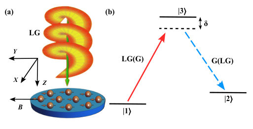
<figcaption class="paper-figure-caption"><b>Fig 1.</b> FIG. 1. (a) Schematic of a Laguerre-Gaussian (LG) beam propagating along the z-axis and interacting with a dipolar Bose-Einstein condensate (dBEC) confined in the x-y plane. The dipole moments are aligned by an external magnetic field applied along the y-direction. (b) Schematic of the electronic states considered, in a lambda (Λ) configuration. Specifi- cally, the states of interest are |1⟩and |2⟩, which represent the states associated with the two-component dipolar Bose- Einstein condensate (dBEC). |8, −8⟩is |1⟩and |8, −7⟩is |2⟩ [51]. These two states are coupled, via |3⟩, through detuned Gaussian (G) and Laguerre-Gaussian (LG) laser pulses. In this work, two laser pulse sequences are...</figcaption>
</figure>
<figure class="paper-figure-card">
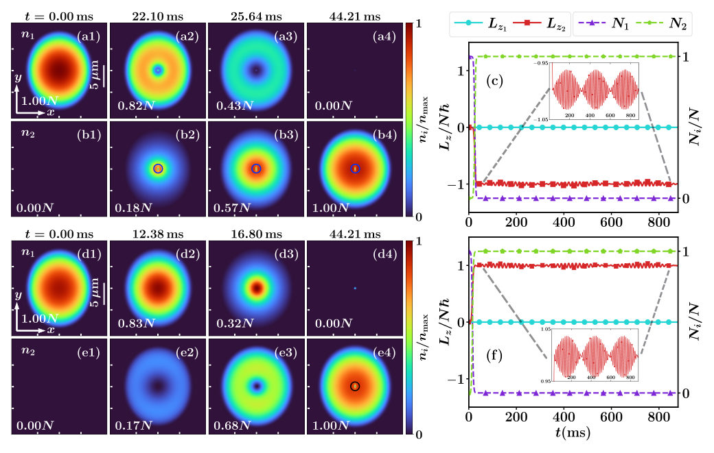
<figcaption class="paper-figure-caption"><b>Fig 2.</b> FIG. 2. Time-resolved density distributions of the condensate are displayed in panels (a1–a4) and (d1–d4) for atoms in state |1⟩, and in panels (b1–b4) and (e1–e4) for atoms in state |2⟩. In panels (b1–b4), a vortex of charge −1 is generated in Ψ2 by LG beam, while (e1–e4) correspond to the case of a +1 vortex. During the evolution, the population of Ψ2 increases steadily. In the −1 vortex (blue circle) case, atoms are initially transferred from Ψ1 to Ψ2 near the trap center, whereas for the +1 vortex (black circle) case, the transfer begins predominantly at the outer region of the trap. Time evolution of the angular momentum Lzi and atom populations Ni in both states is shown in panel (c)...</figcaption>
</figure>
<figure class="paper-figure-card">
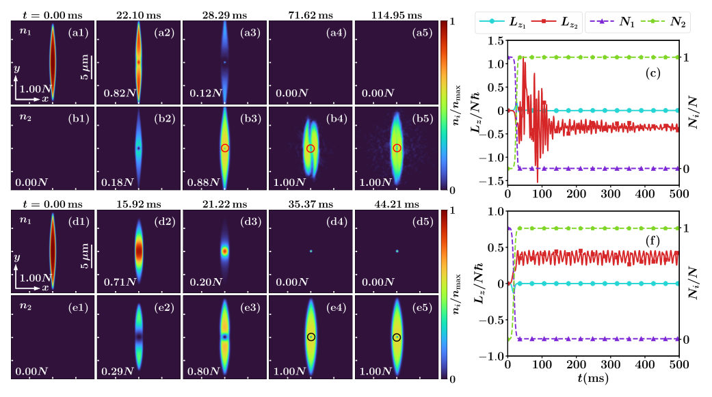
<figcaption class="paper-figure-caption"><b>Fig 3.</b> FIG. 3. Time-resolved density distributions of the condensate are displayed in panels (a1–a5) and (d1–d5) for atoms in state |1⟩, and in panels (b1–b5) and (e1–e5) for atoms in state |2⟩. In panels (b1–b5), a vortex of charge −1 is generated in Ψ2 by LG beam, while (e1–e5) correspond to the case of a +1 vortex. During the evolution, the population of Ψ2 increases steadily. In the −1 vortex (red circle) case, atoms are initially transferred from Ψ1 to Ψ2 near the trap center, whereas for the +1 vortex (black circle) case, the transfer begins predominantly at the outer region of the trap. Time evolution of the angular momentum Lzi and atom populations Ni in both states is shown in panel (c)...</figcaption>
</figure>
<figure class="paper-figure-card">
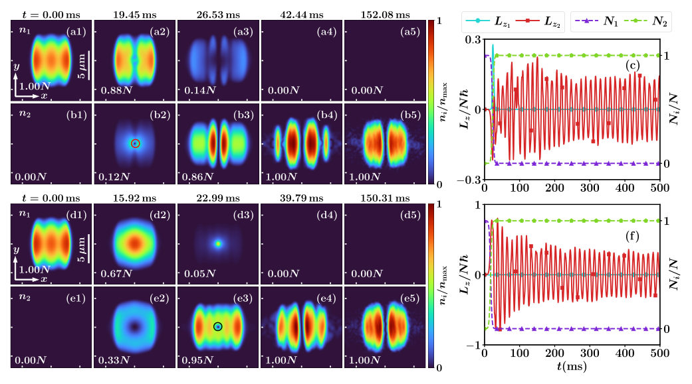
<figcaption class="paper-figure-caption"><b>Fig 4.</b> FIG. 4. Time-resolved density distributions of the condensate are displayed in panels (a1–a5) and (d1–d5) for atoms in state |1⟩, and in panels (b1–b5) and (e1–e5) for atoms in state |2⟩. In panels (b1–b5), a vortex of charge −1 is generated in Ψ2 by LG beam, while (e1–e5) correspond to the case of a +1 vortex. During the evolution, the population of Ψ2 increases steadily. In the −1 vortex (red circle) case, atoms are initially transferred from Ψ1 to Ψ2 near the trap center, whereas for the +1 vortex (black circle) case, the transfer begins predominantly at the outer region of the trap. Time evolution of the angular momentum Lzi and atom populations Ni in both states is shown in panel (c)...</figcaption>
</figure>
<figure class="paper-figure-card">
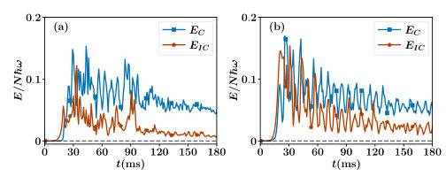
<figcaption class="paper-figure-caption"><b>Fig 5.</b> FIG. 5. Time evolution of the compressible energy EC and incompressible energy EIC for the supersolid phase for (a) the G-LG pulse sequence and (b) LG-G pulse sequence of state |2⟩.</figcaption>
</figure>

**Summary.** This paper explores how the orbital angular momentum of laser beams can be transferred to a dipolar Bose-Einstein condensate using the STIRAP technique. It demonstrates that the stability of the resulting quantized vortices is highly sensitive to whether the condensate is in a superfluid, droplet, or supersolid phase. The findings offer a versatile method for engineering topological states in quantum gases.

**Why it may be interesting.** It provides a theoretical framework for using coherent light-matter coupling to manipulate topological defects and probe the stability of exotic phases like supersolids and droplets in dipolar gases.

Detailed structure

**Main problem.** Investigating the efficiency of transferring orbital angular momentum (OAM) from Laguerre-Gaussian beams to a dipolar Bose-Einstein condensate via the STIRAP protocol and how this transfer is affected by different interaction-driven phases.

**Main result.** The study finds that vortex nucleation and angular momentum retention depend on the BEC phase: stable vortices form in the superfluid phase, while the supersolid phase can lead to vortex expulsion depending on the magnetic field orientation.

**Method.** Numerical simulations using a set of Raman-coupled extended Gross-Pitaevskii equations (eGPE) including the Lee-Huang-Yang correction to account for quantum fluctuations.

**Model / system.** A quasi-two-dimensional trapped dipolar Bose-Einstein condensate consisting of two hyperfine states coupled via an intermediate state in a Lambda-configuration, subject to long-range dipole-dipole interactions and short-range contact interactions.

**Key observables.** Population transfer efficiency, angular momentum transfer, vortex topological charge, density profiles, and collective modes (scissors and quadrupole modes).

**Important parameters / regimes.** Superfluid, droplet, and supersolid phases; magnetic field orientation (parallel vs. perpendicular to beam propagation); pulse sequences (G-LG and LG-G); and trap anisotropy.

**Assumptions / limitations.** Adiabatic elimination of the intermediate excited state due to large detuning; use of a quasi-2D approximation for the LHY correction; and a mean-field framework.

**Figures summary.** Figure 1 shows the experimental schematic of the LG beam and the three-level system; Figure 2 and 4 illustrate time-resolved density distributions and vortex generation; Figure 5 tracks the evolution of collective modes and energy components.

**Paper structure.** The paper introduces the STIRAP-driven OAM transfer problem, describes the eGPE model and LHY correction, analyzes the dynamics across superfluid, droplet, and supersolid phases, and concludes with the implications for engineering vortex states.

Abstract

Coherent light-matter coupling via STIRAP can offer a versatile route to nucleate quantized vortices in Bose-Einstein condensates, yet its efficacy in dipolar condensates remains an open question. Can the orbital angular momentum of a Laguerre-Gaussian beam be coherently transferred to a dipolar BEC via STIRAP? We investigate this for a quasi-two-dimensional trapped dipolar condensate using co-propagating Gaussian and Laguerre-Gaussian laser beams. The interplay between long-range dipole-dipole interactions and short-range contact interactions enables access to three interaction-driven phases: superfluid, droplet, and supersolid. We find that the amount of angular momentum transferred from the optical field to the dipolar condensate, along with the nucleation and persistence of vortices, depends strongly on the underlying phases of the dipolar BEC. In the superfluid, STIRAP achieves near-complete population transfer and nucleates a stable, long-lived quantized vortex. In the droplet phase, although the vortex remains pinned within the density profile, the angular momentum is partially retained and oscillatory, accompanied by droplet fragmentation and recombination. In the supersolid phase, when the external magnetic field is oriented perpendicular to the LG beam's propagation direction, the emergence of a modulated density distribution along with a slight reduction in inter-droplet coherence leads to vortex delocalization and eventually expels it along the field direction, yielding a vanishing average angular momentum. However, reorienting the magnetic polarization along the beam propagation direction restores efficient angular momentum transfer and stabilizes the vortex within the supersolid phase. Overall, our results demonstrate a versatile route to engineer vortex states and probe collective excitations in dipolar Bose gases via coherent light-matter coupling.

[↑ back to top](#top)

### [Strategic Non-Shareability of Quantum Correlations](http://arxiv.org/abs/2605.25516v1)

**Authors:** Fumin Wang  
**Type:** theory · **Category:** quantum information and computing · **PDF:** <https://arxiv.org/pdf/2605.25516v1>  
**Analysis basis:** full PDF text, analyzed in chunks
**Topic relevance:** `entanglement & information structure` **3/5** · `quantum measurements` **2/5**

↔ Scroll figures horizontally

<figure class="paper-figure-card">
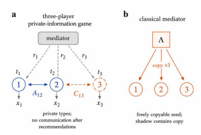
<figcaption class="paper-figure-caption"><b>Fig 1.</b> Fig. 1 Strategic non-shareability of mediated correlations. a, Three-player private- information game. Players 1 and 2 form the authorized pair; player 3 is a potential colluder. The mediator distributes private recommendations ri conditional on private types ti, and players cannot communicate after receiving recommendations. The authorized score A12 rewards the authorized pair, while the collusive leakage score C13 measures the colluder’s correlation with player 1. b, A classical mediator implements correlations via a shared hidden variable Λ, which can be freely copied to player 3; the collusive shadow SC(P12) therefore contains a relabelled copy of the authorized behavior. c, A quantum...</figcaption>
</figure>
<figure class="paper-figure-card">
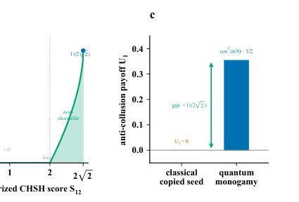
<figcaption class="paper-figure-caption"><b>Fig 2.</b> Fig. 2 Exact CHSH score-certified anti-collusion frontier. a, Authorized–collusive CHSH frontier. The Toner–Verstraete monogamy inequality S2 12+S2 13 ≤8 bounds the simultaneously attain- able scores. The dashed diagonal S13 = S12 represents copied-seed inheritance available to classical mediators, and the shaded region is the regime where the colluder cannot match the authorized</figcaption>
</figure>
<figure class="paper-figure-card">
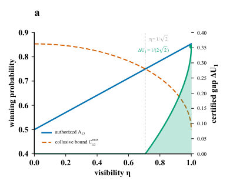
<figcaption class="paper-figure-caption"><b>Fig 3.</b> Fig. 3 Noise-induced transition and finite-data certification. a, Werner-noise scan of the certified anti-collusion gap. The authorized winning probability A12(η) and the score-certified col- lusive upper bound Cmax 13 (η) cross at the CHSH threshold η = 1/ √</figcaption>
</figure>
<figure class="paper-figure-card">
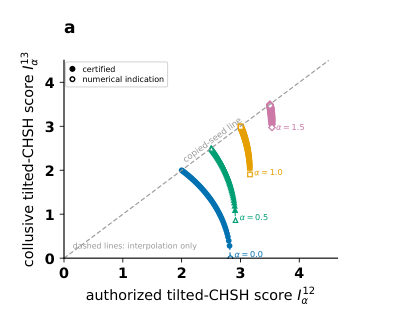
<figcaption class="paper-figure-caption"><b>Fig 4.</b> Fig. 4 NPA upper envelopes for tilted-CHSH collusive vulnerability. a, Level-2 NPA upper bounds on the collusive tilted-CHSH score I13 α as a function of the authorized score I12 α for α ∈ {0.0, 0.5, 1.0, 1.5}. Markers show finite-level NPA upper bounds; dashed connecting lines are visual interpolation only and do not represent certified frontiers. Filled markers are grid points satisfying the certificate criteria of Supplementary Table 1; open markers are numerical indications and are not used as certified upper bounds. The dashed diagonal is the copied-seed reference. b, Sanity check at α = 0, where tilted CHSH reduces to standard CHSH. Level-2 NPA values agree with the analytic...</figcaption>
</figure>

**Summary.** This paper develops a framework to quantify how quantum correlations can prevent third-party collusion. It demonstrates that quantum entanglement provides a unique 'anti-collusion power' that classical shared randomness lacks, specifically identifying the threshold where Bell non-locality enables certified security.

**Why it may be interesting.** It provides a quantitative resource theory for entanglement monogamy, framing it as a measurable 'shareability deficit' which is highly relevant for securing quantum networks and device-independent protocols.

Detailed structure

**Main problem.** Quantifying the 'strategic non-shareability' of quantum correlations, specifically measuring the degree to which a mediator's coordination can be protected from an outside colluder in adversarial settings.

**Main result.** The paper proves that anti-collusion capacity equals the total-variation distance to the collusive shadow and identifies the CHSH Bell local bound as the sharp onset of positive certified anti-collusion power.

**Method.** The study uses a geometric approach based on total-variation distance, the NPA hierarchy (level-2 SDP relaxation) for bounding vulnerability, and Hoeffding-based protocols for finite-data certification.

**Model / system.** A tripartite setup involving an authorized pair (Players 1 and 2) and a potential colluder (Player 3), utilizing both classical hidden-variable models and quantum models (including Werner states and tilted-CHSH inequalities).

**Key observables.** CHSH score (S12), collusive leakage score (C13), anti-collusion capacity (CAC), and collusive vulnerability.

**Important parameters / regimes.** CHSH score (s), visibility parameter (eta) for Werner states, and the tilt parameter (alpha) for tilted-CHSH inequalities.

**Assumptions / limitations.** Assumes no-signalling consistency and finite alphabets; results for the CHSH slice rely on the Toner-Verstraete monogamy inequality.

**Figures summary.** Figure 1 visualizes the three-player game and classical vs. quantum collusion; Figure 2 shows the transition of anti-collusion power with noise; Figure 3 displays the Hoeffding-based certification and visibility thresholds; Figure 4 presents NPA upper bounds for tilted-CHSH inequalities.

**Paper structure.** The paper introduces the concept of strategic non-shareability, defines the mathematical framework of the collusive shadow, provides analytical proofs for the CHSH case, extends the analysis to tilted-CHSH via NPA hierarchy, and concludes with finite-data certification protocols.

Abstract

Correlations distributed by a mediator are usually valued for the coordination they enable between authorized agents, but in adversarial settings a more decisive property is whether the same coordination can be inherited by an outside colluder without disturbing the authorized marginal. Classical shared randomness is freely copyable, so a hidden seed coordinating two agents can be duplicated for a third; entanglement is constrained by monogamy, which can forbid such lossless extensions in strongly nonlocal regimes. We turn this asymmetry into an operational resource for private-information games. For a fixed authorized behavior $P_{12}$, we define its \emph{collusive shadow} as the set of relabelled behaviors a colluder can reproduce in any admissible tripartite extension preserving $P_{12}$, and we identify \emph{strategic non-shareability} with the distance from this shadow. We prove that, on finite alphabets, the game-optimized anti-collusion capacity equals the total-variation distance to the shadow; a fixed game provides a task-specific separating witness, while optimization over relabelled games recovers the full distance. In the CHSH score slice, Toner--Verstraete monogamy yields the exact certified frontier, so the Bell local bound $S_{12}=2$ is the sharp onset of positive certified anti-collusion power, saturating at $1/(2\sqrt{2})$ for the maximally entangled CHSH strategy. Classical hidden-variable mediators have zero capacity in this slice. We complement these results with two operational tools: a Hoeffding-based finite-data certification protocol that turns observed Bell scores into confidence-bounded anti-collusion certificates, and a level-2 NPA semidefinite relaxation that extends certified upper envelopes to tilted Bell inequalities. These results recast entanglement monogamy as a measurable shareability deficit for quantum-mediated strategic networks.

[↑ back to top](#top)

### [Toward General Quantum Control with Physics-Informed Large Language Models](http://arxiv.org/abs/2605.26021v1)

**Authors:** Yusheng Zhao, Han Wang, Xin Liu, Xinjie Song, Jixi He, Lingwei Song, Yuanhe Ji, Ken Deng, Runqing Zhang, Zhiguo Huang, Ling Qian, Jize Han, Di Luo  
**Type:** theory · **Category:** quantum information and computing · **PDF:** <https://arxiv.org/pdf/2605.26021v1>  
**Analysis basis:** full PDF text, analyzed in chunks
**Topic relevance:** `methods for driven-dissipative` **3/5** · `quantum measurements` **2/5**

↔ Scroll figures horizontally

<figure class="paper-figure-card">
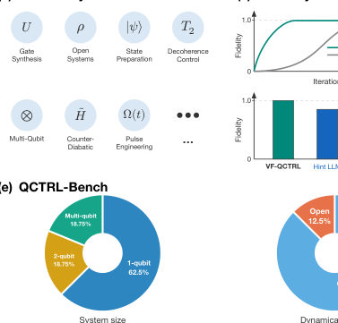
<figcaption class="paper-figure-caption"><b>Fig 1.</b> Fig. 1: Visual summary of VF-QCTRL and QCTRL-Bench. (a) VF-QCTRL framework. Simple LLM and Hint LLM directly generate numerical pulse amplitudes, whereas VF-QCTRL provides a physics-informed large language model framework for general quantum control that combines symbolic reasoning with optimization to propose analytic control ans¨atze and coherently refine their parameters through feedback (b) Universality. Representative quantum control tasks included in QCTRL-Bench across diverse systems and dynamics. (c) Accuracy and efficiency. VF-QCTRL achieves higher fidelities and faster convergence than classical optimization and prompt-only LLM baselines. (d) Interpretability. Classical optimizers...</figcaption>
</figure>
<figure class="paper-figure-card">
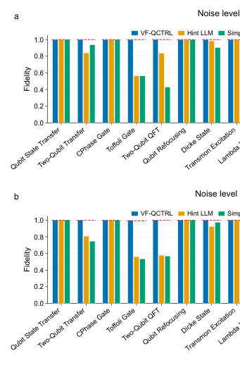
<figcaption class="paper-figure-caption"><b>Fig 2.</b> Fig. 2: Per-task best fidelity on QCTRL-Bench: VF-QCTRL versus classical and pure-LLM baselines. (a) Noiseless regime (σ = 0); the classical baseline (red dashed segment per task) is the established classical optimizer for each task (Methods, Section 3.3). (b) Calibration-noise regime (σ = 0.02); the classical baseline is exposed to the same calibration noise as VF-QCTRL. The details is documented in Methods, Section 3.4.</figcaption>
</figure>
<figure class="paper-figure-card">
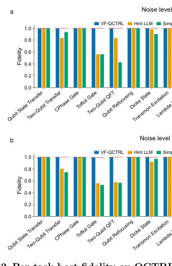
<figcaption class="paper-figure-caption"><b>Fig 3.</b> Figure 2(a) summarizes the benchmark accuracy in the noiseless setting (σ = 0) across all sixteen QCTRL-Bench tasks. We compare VF-QCTRL against two classes of baselines: established classical baselines for each task reported in the literature (e.g. GRAPE, CRAB, Krylov and reinforcement learning; see Methods, Section 3.3), and two prompt-only LLM baselines, namely Simple LLM and Hint LLM. Across the benchmark, VF-QCTRL consistently achieves high-fidelity control, reaching F ≥0.94 on every task and achieving near-unit fidelity (F ≥0.9999) on nine tasks (Figure 1b). Compared with classical optimization baselines, VF-QCTRL matches or approaches the strongest classical result on 15 out of 16...</figcaption>
</figure>
<figure class="paper-figure-card">
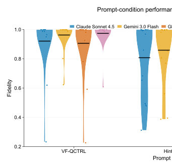
<figcaption class="paper-figure-caption"><b>Fig 4.</b> Fig. 3: Distribution of per-task best fidelity at σ = 0.02 across LLM-driven methods. Each violin shows the 16 per-task best fidelities for one (model, method) cell: four models (Claude Sonnet 4.5, Gemini 3.0 Flash, GPT-OSS-120B, Qwen 3.5 Plus) × three methods (VF-QCTRL, Hint LLM, Simple LLM), giving 12 violins. Per-task fidelity convention: for VF-QCTRL, the best-of-iteration value from a single repetition per task (n = 1); for Hint LLM and Simple LLM, the best across n = 5 independent repetitions per task. Overlaid scatter points show the 16 individual per- task fidelities; the horizontal black tick inside each violin marks the mean. VF-QCTRL violins concentrate near F = 1 across all four...</figcaption>
</figure>
<figure class="paper-figure-card">
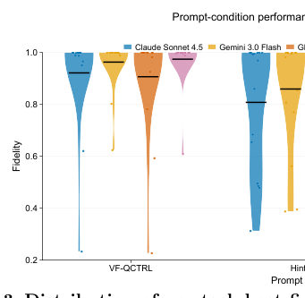
<figcaption class="paper-figure-caption"><b>Fig 5.</b> Figure 3 stratifies the same σ = 0.02 results by the underlying LLM, showing per- task fidelity distributions for each (method, model) cell. VF-QCTRL violins concentrate near F = 1 with per-model mean fidelity in the 0.91–0.98 range across all four models, while Hint LLM and Simple LLM violins broaden into long low-fidelity tails reaching F ≈0.3–0.5 with per-model means dropping to 0.75–0.90; symbolic protocol proposal thus compresses the cross-model spread from approximately 0.12 in fidelity under the prompt-only baselines to 0.06 under VF-QCTRL. Across all three methods the four LLMs rank consistently as Qwen 3.5 Plus &gt; Gemini 3.0 Flash &gt; Claude Sonnet 4.5 &gt; GPT-OSS-120B, but VF-QCTRL...</figcaption>
</figure>

**Summary.** This paper introduces VF-QCTRL, a framework that uses physics-informed large language models to propose interpretable, analytic quantum control pulses. By combining symbolic reasoning with numerical optimization, it outperforms or matches classical methods in both noiseless and noisy environments. The approach is training-free and highly scalable across various quantum platforms.

**Why it may be interesting.** It presents a novel way to bridge symbolic physical reasoning with numerical optimization, potentially automating the discovery of robust control protocols for complex open quantum systems and many-body dynamics.

Detailed structure

**Main problem.** Designing high-fidelity quantum control protocols is difficult due to complex optimization landscapes, hardware noise, and the uninterpretability of traditional numerical solvers.

**Main result.** The VF-QCTRL framework achieves performance competitive with or exceeding state-of-the-art classical solvers, providing interpretable analytic control ansatze that are robust to calibration noise.

**Method.** A physics-informed LLM framework that uses a Proposal Agent to generate symbolic control ansatze and a Reflection Agent to provide feedback, followed by SPSA-based numerical refinement of coefficients.

**Model / system.** A general framework applicable to diverse systems including single- and multi-qubit systems, closed and open quantum dynamics, Transmon qubits, and NMR spin systems.

**Key observables.** Fidelity (state and gate overlap), query efficiency, robustness to calibration noise, and pulse-resolution scaling.

**Important parameters / regimes.** Calibration noise levels (sigma = 0.02), pulse duration (T), time discretization (Nt), and coupling strengths (J).

**Assumptions / limitations.** The framework assumes that control pulses can be represented by a constrained symbolic grammar and that the LLM can reason about physical principles like counter-diabatic driving.

**Figures summary.** Figure 1 illustrates the VF-QCTRL architecture and benchmark composition; Figure 2 compares fidelity across tasks in noiseless and noisy regimes; Figure 3 shows fidelity distributions under noise; Figure 5 shows alignment with analytical counter-diabatic protocols; Figure 6 shows convergence trajectories; Figure 7 compares token efficiency.

**Paper structure.** The paper introduces the limitations of current methods, presents the VF-QCTRL architecture (Proposal, Reflection, and Refinement agents), introduces the QCTRL-Bench, evaluates performance across various tasks and noise regimes, and discusses scaling and interpretability.

Abstract

Quantum control is essential for quantum information science and technology, yet designing high-fidelity control protocols remains challenging due to complex optimization landscapes, hardware noise, and long pulse sequences. Existing numerical solvers often require problem-specific engineering and produce opaque control amplitudes, while naive large language models (LLMs) lack the physical consistency and long-horizon precision for reliable quantum control synthesis. Here we introduce VF-QCTRL, a physics-informed large language model framework for general quantum control that combines symbolic reasoning with optimization to propose analytic control ansätze and coherently refine their parameters through feedback. To systematically evaluate LLM-driven quantum control, we develop QCTRL-BENCH, a benchmark spanning sixteen tasks across single- and multi-qubit systems, closed and open quantum dynamics, noiseless and noisy settings, and both analytic and numerical protocols. Across the benchmark, VF-QCTRL demonstrates strong universality, accuracy, efficiency, and interpretability: it applies to generic quantum control systems without task-specific training, achieves performance competitive with or exceeding state-of-the-art conventional solvers in both noiseless and noisy regimes with query efficiency, exhibits favorable inference-time scaling and pulse resolution scaling, and derives physically interpretable analytical protocols directly from prompts. Our results establish physics-informed LLM-based quantum control as a promising paradigm for accurate, efficient, interpretable, and training-free quantum control protocol design across a broad range of quantum systems.

[↑ back to top](#top)

### [Hybrid Quantum-Classical Machine Learning Algorithms for Multi-Output Time-Series Forecasting at Utility Scale](http://arxiv.org/abs/2605.24252v1)

**Authors:** Mackenson Polché, Varun Puram, Aditi Lal, Weronika Golletz, Joan Étude Arrow, Vardaan Sahgal, Kumar Ghosh, Giorgio Cortiana, Corey O'Meara  
**Type:** both · **Category:** quantum information and computing · **PDF:** <https://arxiv.org/pdf/2605.24252v1>  
**Analysis basis:** full PDF text, analyzed in chunks
**Topic relevance:** `QC/QI experiment` **3/5** · `quantum measurements` **1/5**

↔ Scroll figures horizontally

<figure class="paper-figure-card">
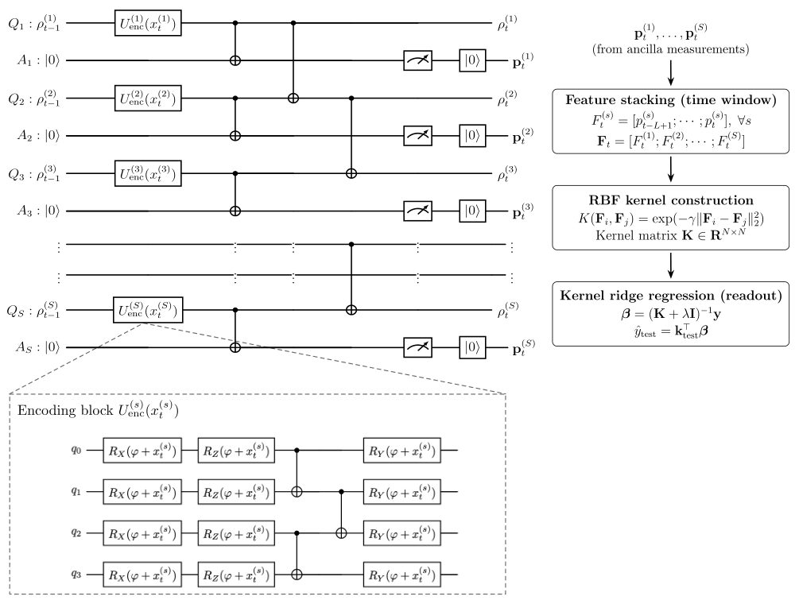
<figcaption class="paper-figure-caption"><b>Fig 1.</b> FIG. 1. Circuit-level view of the proposed Kernelized Quantum Reservoir with repeated measurement. Each input stream 𝑥(𝑠) 𝑡 is encoded into its system register (𝑞𝑠,0, . . . , 𝑞𝑠,𝑛𝑞−1) via a parametrized encoding unitary 𝑈(𝑠) enc. Intra-stream entangling gates propagate information within each register, while inter-stream couplings between boundary qubits introduce cross-stream interactions. Each system qubit is then coupled to a corresponding ancilla qubit (𝑎𝑠,0, . . . , 𝑎𝑠,𝑛𝑞−1), and only the ancillas are measured at each timestep. Repeated measurements</figcaption>
</figure>
<figure class="paper-figure-card">
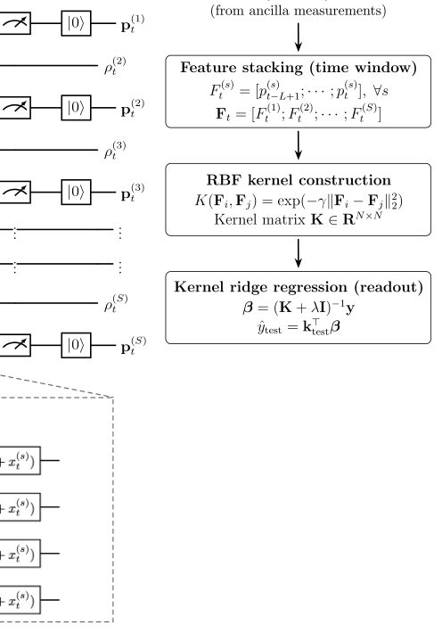
<figcaption class="paper-figure-caption"><b>Fig 2.</b> Fig. 1, these interactions act (i) within each individual series, and (ii) across neighboring series. Let 𝑞𝑠,𝑛𝑞−1 denote the tail qubit of series 𝑠and 𝑞𝑠+1,0 the head qubit of the next series 𝑠+1. Two-qubit entangling gates are applied along these links. The resulting reservoir unitary is</figcaption>
</figure>
<figure class="paper-figure-card">
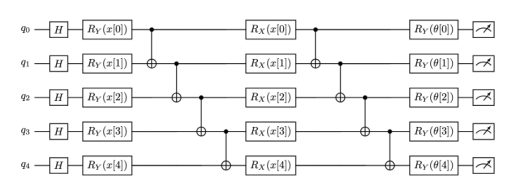
<figcaption class="paper-figure-caption"><b>Fig 3.</b> FIG. 2. Hardware-efficient feature map used in the QGP model with 𝑛𝑞= 5 qubits. The circuit alternates data encoding, entanglement, and data re-uploading, producing the state |𝜓(𝑥)⟩used in the projected kernel.</figcaption>
</figure>
<figure class="paper-figure-card">
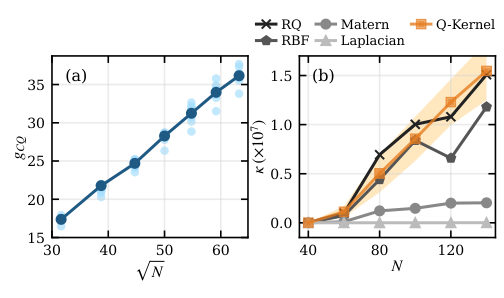
<figcaption class="paper-figure-caption"><b>Fig 4.</b> FIG. 3. (a) Geometric difference 𝑔𝐶𝑄between the quantum kernel constructed via the fidelity-based feature map and the classical Laplacian kernel as a function of √</figcaption>
</figure>
<figure class="paper-figure-card">
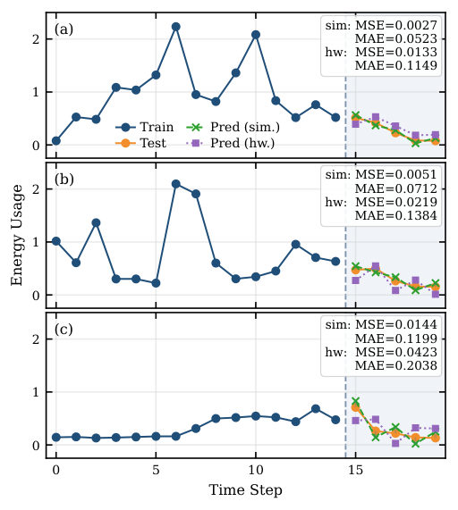
<figcaption class="paper-figure-caption"><b>Fig 5.</b> FIG. 4. KQRC-RM experiments: Forecasting results for the repre- sentative triplet: (a) Customer 4, (b) Customer 8, and (c) Customer 11, comparing predictions obtained with the MPS simulator and real quantum hardware. The dashed vertical line marks the end of the training window, and the shaded region indicates the 5-step forecast horizon.</figcaption>
</figure>

**Summary.** This paper demonstrates the application of hybrid quantum machine learning to large-scale energy demand forecasting. It shows that while quantum kernels can significantly outperform classical ones in simulation, real-world hardware noise currently limits the practical advantage on NISQ devices.

**Why it may be interesting.** not directly relevant

Detailed structure

**Main problem.** Investigating the feasibility and performance of hybrid quantum-classical machine learning algorithms for multi-output time-series forecasting of energy consumption at a utility scale.

**Main result.** The QGP model achieved a 62.01% MAE reduction on simulator and 40.37% on hardware compared to classical GP, while KQRC-RM showed significant improvement on simulator but performance degradation on hardware due to device noise.

**Method.** Two hybrid frameworks were tested: Kernelized Quantum Reservoir Computing with Repeated Measurement (KQRC-RM) and Projected Quantum Kernel Gaussian Process (QGP) using local reduced-state statistics.

**Model / system.** The experiments were performed on the IBM marrakesh superconducting quantum processor and an MPS simulator, using a Smart Meter dataset of 103 residential electricity consumption time-series.

**Key observables.** Mean Absolute Error (MAE), Mean Squared Error (MSE), geometric difference (gCQ), and model complexity (kappa).

**Important parameters / regimes.** 100+ qubit scales (114 qubits for KQRC-RM, 100 qubits for QGP), number of system qubits per customer, and hardware noise parameters (T2 dephasing and CZ gate error).

**Assumptions / limitations.** The QGP model assumes conditional independence across outputs; hardware performance is limited by NISQ-era noise, decoherence, and readout errors.

**Figures summary.** Figure 1 shows the KQRC-RM circuit; Figure 2 shows the QGP feature map; Figure 3 displays geometric difference and model complexity; Figure 4 compares simulator vs hardware trajectories; Figure 5 shows per-horizon MAE; Figure 6 shows MSE for 5-customer groups; Figure 7 benchmarks against classical baselines; Figure 8 maps hardware noise; Figure 9 shows energy profiles and customer grouping; Figure 10 shows error vs qubit scaling; Figure 11 shows training loss and forecasting results; Figures 12-13 map the hardware noise landscape.

**Paper structure.** The paper introduces the forecasting problem, describes the two hybrid quantum architectures (KQRC-RM and QGP), details the experimental setup on IBM hardware and simulators, presents performance benchmarks against classical models, analyzes the impact of hardware noise, and concludes with scalability and utility-scale findings.

Abstract

Multi-output time-series forecasting in energy systems is challenging because of nonlinear dynamics, multi-scale seasonality, and strong dependencies across correlated series. In this work, we investigate two hybrid quantum-classical frameworks for multi-stream time-series forecasting on a real Smart Meter dataset comprising 103 household electricity consumption time-series, with experiments executed on the $ibm\_marrakesh$ superconducting quantum processor. The first model, Kernelized Quantum Reservoir Computing with Repeated Measurement (KQRC-RM), combines coupled quantum reservoirs, ancilla-assisted repeated measurement, and kernelized readouts to model temporal dynamics and cross-stream correlations jointly. For a 3-stream time-series input and output, the KQRC-RM model using 114 qubits achieves an MAE of 0.0811 on MPS simulator (36.92\% improvement over its classical analog) whereas performance degrades to an MAE of 0.1524 on hardware. The second, a Projected Quantum Kernel Gaussian Process (QGP), replaces fidelity-based kernels with projected kernels constructed from local reduced-state statistics. Using a topology-aware 100-qubit QGP model to predict 100 multi-output time-series values, we observe 49\% of time-series outputs achieve high-accuracy predictions (MAE $<0.15$), with an average MAE of $0.082$ for this low-error group. The medium-error regime (MAE $0.15$-$0.35$) has an average MAE of $0.229$, while the high-error regime (MAE $>0.35$) has an average MAE of $0.664$. Overall, this reduces the average MAE relative to the classical GP baseline by 62.01\% on MPS simulator and 40.37\% on hardware. Together, these results demonstrate the feasibility of hybrid quantum machine learning for multi-input, multi-output time-series forecasting at the 100+ qubit scale on NISQ devices.

[↑ back to top](#top)

### [Geometric phases of reduced states in the transverse-field Ising chain](http://arxiv.org/abs/2605.24645v1)

**Authors:** Chiragkumar R. Vasani, Erik Sjöqvist  
**Type:** theory · **Category:** statistical mechanics · **PDF:** <https://arxiv.org/pdf/2605.24645v1>  
**Analysis basis:** full PDF text, analyzed in chunks
**Topic relevance:** `entanglement & information structure` **3/5**

↔ Scroll figures horizontally

<figure class="paper-figure-card">
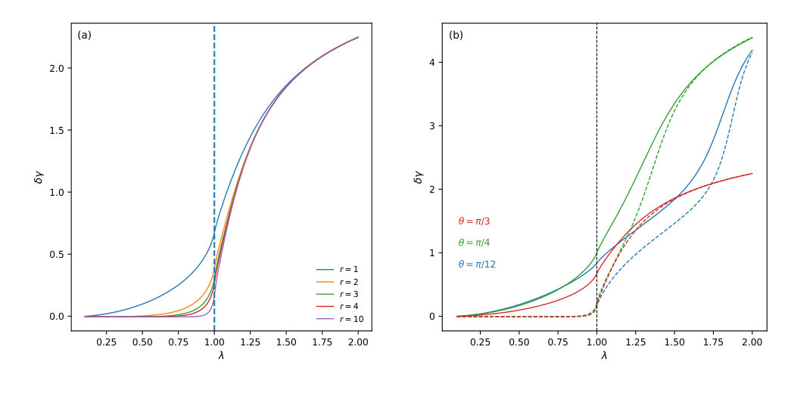
<figcaption class="paper-figure-caption"><b>Fig 1.</b> FIG. 1. (a) shows the interferometric GP deviation δγ(r, θ) ≡δγ measured on the two-site reduced density matrix of the transverse-field Ising chain as a function of the control parameter λ at θ = π</figcaption>
</figure>
<figure class="paper-figure-card">
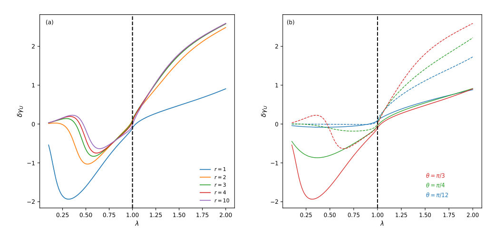
<figcaption class="paper-figure-caption"><b>Fig 2.</b> FIG. 2. (a) shows the Uhlmann phase deviation δγU(r, θ) ≡δγU measured on the two-site reduced density matrix of the transverse-field Ising chain as a function of the control parameter λ at θ = π 3 for various r. (b) shows δγU as a function of λ for θ = π 3, π</figcaption>
</figure>
<figure class="paper-figure-card">
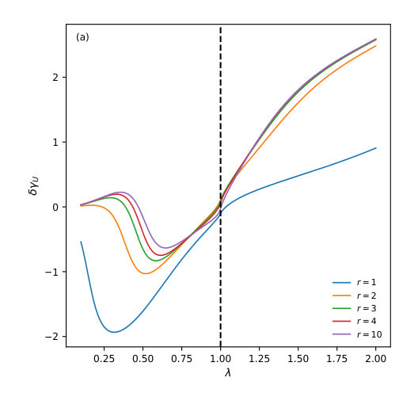
<figcaption class="paper-figure-caption"><b>Fig 3.</b> Figure 3 presents a comparison between the interferometric GP deviation δγ and the Uhlmann phase deviation δγU near the quantum critical point λc = 1 for different inter-site dis- tances r. It is evident that both GPs capture the underlying</figcaption>
</figure>
<figure class="paper-figure-card">
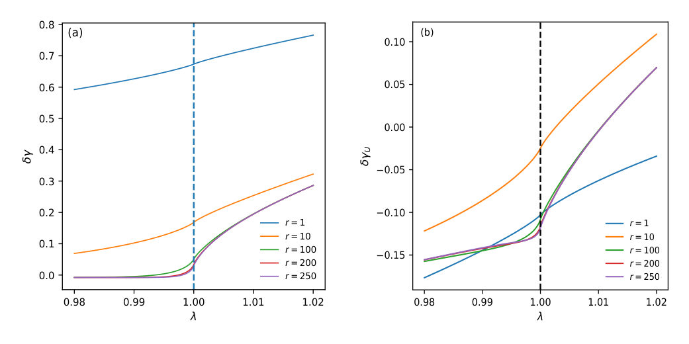
<figcaption class="paper-figure-caption"><b>Fig 4.</b> FIG. 3. (a) shows the interferometric GP deviation δγ(r, θ) ≡δγ and (b) shows the Uhlmann phase deviation δγU(r, θ) ≡δγU, measured on the two-site reduced density matrix of the transverse-field Ising chain. The two GPs are shown as functions of the control parameter λ at θ = π</figcaption>
</figure>

**Summary.** This paper compares the interferometric and Uhlmann geometric phases as indicators of quantum phase transitions in the transverse-field Ising model. It demonstrates that the interferometric phase is a superior order parameter because it correctly reflects the absence of long-range correlations in the paramagnetic phase. The work highlights how different geometric definitions respond uniquely to many-body critical fluctuations.

**Why it may be interesting.** This is interesting for many-body dynamics and open quantum systems because it explores how geometric structures in mixed-state density matrices encode information about quantum criticality and long-range correlations.

Detailed structure

**Main problem.** The study investigates whether two types of geometric phases for mixed quantum states—the interferometric geometric phase and the Uhlmann phase—can serve as effective order parameters to identify quantum phase transitions.

**Main result.** The interferometric geometric phase deviation is found to be a more reliable indicator of the quantum phase transition in the transverse-field Ising model than the Uhlmann phase, as it vanishes for large spin separation in the paramagnetic phase.

**Method.** The authors use Jordan-Wigner, Fourier, and Bogoliubov transformations to diagonalize the Hamiltonian and calculate two-site reduced density matrices via Toeplitz determinants, then compute the geometric phases using local unitary rotations and the purification method.

**Model / system.** The transverse-field Ising chain, an exactly solvable model with a Hamiltonian consisting of nearest-neighbor Ising interactions and a transverse magnetic field.

**Key observables.** Interferometric geometric phase deviation (delta gamma), Uhlmann phase deviation (delta gamma_U), magnetization, and spin-spin correlation functions.

**Important parameters / regimes.** Transverse field strength (lambda), inter-site distance (r), and rotation angle (theta).

**Assumptions / limitations.** The study focuses on the zero-temperature ground state in the thermodynamic limit (N to infinity).

**Figures summary.** Figure 1 shows the interferometric phase deviation as a function of lambda for various distances; Figure 2 shows the Uhlmann phase deviation dependence on lambda, distance, and angle; Figure 3 compares the sensitivity of both phases near the critical point.

**Paper structure.** The paper introduces the problem of geometric phases as order parameters, describes the Ising model and the mathematical framework for density matrices, presents the calculation of both geometric phases, compares their behavior across the phase transition, and concludes with a discussion on their inequivalent structures.

Abstract

Geometric phases have been extensively investigated in a wide range of quantum systems, often revealing deep connections to the underlying topology of many-body states. In this work, we examine two geometric phases defined for mixed quantum states$-$the interferometric geometric phase and the Uhlmann phase$-$extracted from two-site reduced density matrices of the transverse-field Ising model with nearest-neighbor interacting spins. By applying coordinated local unitary rotations to the spins, we compute the geometric phases associated with the two-site states across the critical point. We find that the interferometric phase is a more reliable indicator of the quantum phase transition in this model than the Uhlmann phase.

[↑ back to top](#top)

### [Global quantum phase estimation via hybrid quantum--classical learning](http://arxiv.org/abs/2605.25049v1)

**Authors:** Qingchuan Yang, Xianing Feng, Lianfu Wei  
**Type:** theory · **Category:** quantum information and computing · **PDF:** <https://arxiv.org/pdf/2605.25049v1>  
**Analysis basis:** full PDF text, analyzed in chunks
**Topic relevance:** `quantum measurements` **3/5**

↔ Scroll figures horizontally

<figure class="paper-figure-card">
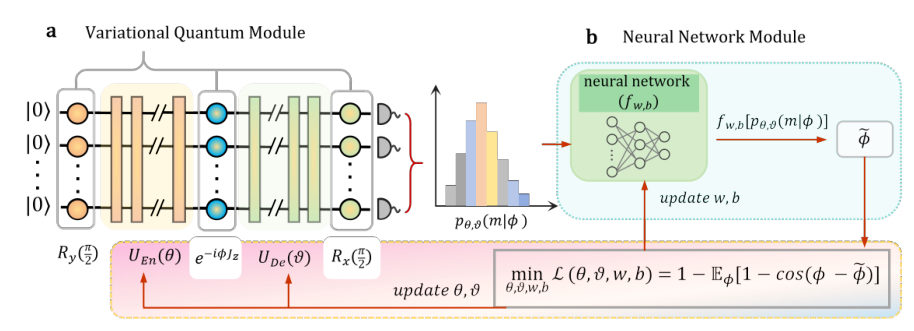
<figcaption class="paper-figure-caption"><b>Fig 1.</b> Figure 1: Joint quantum–classical framework for global phase estimation. a Variational quantum module: a shallow interferometric circuit produces the measurement distribution pθ,ϑ(m|ϕ). b Classical inference module: a neural network outputs the phase estimate ˜ϕ using a circular representation. All parameters are jointly optimized over the full periodic domain.</figcaption>
</figure>
<figure class="paper-figure-card">
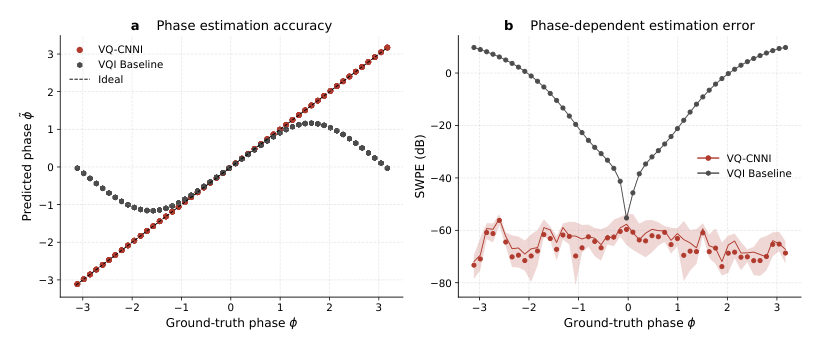
<figcaption class="paper-figure-caption"><b>Fig 2.</b> Figure 2: Global phase estimation and error distribution. a Predicted phase ˜ϕ versus ground-truth phase ϕ across 20 independent runs. Markers indicate mean predictions, and the dashed line denotes the ideal relation ˜ϕ = ϕ. VQI baseline exhibits strong deviations and branch folding away from its operating point, whereas VQ-CNNI preserves a monotonic global mapping. b Squared wrapped phase error (SWPE) as a function of ϕ. Solid lines show the median across runs, shaded regions indicate interquartile ranges, and markers denote mean values. VQ-CNNI maintains uniformly low error across the full phase domain.</figcaption>
</figure>
<figure class="paper-figure-card">
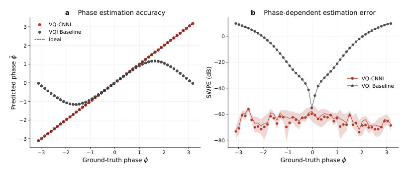
<figcaption class="paper-figure-caption"><b>Fig 3.</b> Fig. 2 reveals the distinction between the shallow VQI baseline and the Softsign-based VQ-CNNI across the full phase range. As shown in Fig. 2a, the VQI baseline estimates phase accurately only near its operating point, while predictions away from this region exhibit strong nonlinearity and branch folding, where distinct phases map to similar outputs. This behavior reflects limited global distinguishability. By contrast, VQ-CNNI preserves a monotonic mapping across</figcaption>
</figure>
<figure class="paper-figure-card">
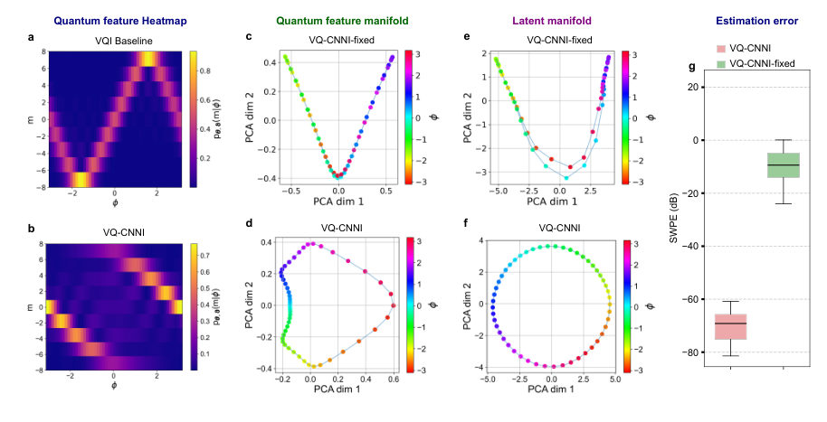
<figcaption class="paper-figure-caption"><b>Fig 4.</b> Figure 3: Quantum feature embeddings and latent manifolds under different optimization strategies. a,b Quantum feature heatmaps for the VQI baseline (a) and jointly optimized VQ-CNNI (b). VQI exhibits oscillatory repeating patterns, whereas VQ-CNNI produces an ordered phase evolution with strongly suppressed overlap between distant phases. c,d PCA visualizations of the quantum feature manifolds for VQ-CNNI-fixed (c) and jointly optimized VQ-CNNI (d). e,f Corresponding latent manifolds (PCA projections of the decoder’s penultimate layer features) for VQ-CNNI-fixed (e) and jointly optimized VQ-CNNI (f). g SWPE distributions across all test phases.</figcaption>
</figure>
<figure class="paper-figure-card">

<figcaption class="paper-figure-caption"><b>Fig 5.</b> Figure 3 reveals the distinction between locally optimized variational interferometry and globally learnable phase estimation. The shallow VQI baseline trained using BMSE minimization produces oscillatory and repeating measure- ment patterns (Fig. 3a), such that distant phases frequently generate similar measurement statistics. As a result, the corresponding quantum feature manifold lacks global organization and does not support stable inversion across the full periodic domain. By contrast, the jointly optimized VQ-CNNI produces an ordered quantum feature embedding with strongly suppressed phase overlap (Fig. 3b). The corresponding PCA visualization reveals a globally organized manifold...</figcaption>
</figure>

**Summary.** This paper presents a hybrid quantum-classical neural network approach to achieve global quantum phase estimation without the typical loss of precision or phase ambiguity. By jointly training a shallow quantum circuit and a classical decoder, the method creates a well-conditioned, globally invertible mapping across the full 2pi phase range. The study highlights that the symmetry of the classical activation functions is crucial for maintaining stable and accurate estimation.

**Why it may be interesting.** It provides a novel way to use machine learning to overcome the precision-dynamic range trade-off in quantum sensing, specifically by optimizing the geometric structure of the quantum-classical interface.

Detailed structure

**Main problem.** The fundamental trade-off in quantum metrology between high local precision and a large unambiguous dynamic range, which often leads to phase ambiguity or 'branch folding' in standard variational interferometers.

**Main result.** The introduction of a hybrid quantum-classical neural network interferometer (VQ-CNNI) that achieves global phase estimation over the full [-pi, pi) range with high precision by jointly optimizing quantum encoding and classical decoding.

**Method.** End-to-end joint optimization of a shallow parameterized quantum circuit and a classical neural network using a circular loss function and analyzing the geometric conditioning of the learned representation.

**Model / system.** A hybrid variational quantum-classical neural network interferometer (VQ-CNNI) utilizing a shallow Ramsey-type quantum circuit with unitary evolution U = exp(-i * phi * Jz) and projective measurements of population imbalance.

**Key observables.** Squared Wrapped Phase Error (SWPE), Quantum Fisher Information (QFI), Decoding Jacobian (J), and measurement statistics p(m|phi).

**Important parameters / regimes.** Phase range [-pi, pi), quantum circuit parameters (theta, vartheta), neural network weights and biases, and activation functions (e.g., Softsign, Tanh).

**Assumptions / limitations.** The performance advantage is attributed to the joint optimization of the hybrid architecture rather than increased quantum circuit depth.

**Figures summary.** Fig 1: VQ-CNNI pipeline; Fig 2: Comparison of predicted vs. ground-truth phase and SWPE for VQI vs. VQ-CNNI; Fig 3: Visualization of quantum feature and latent manifolds; Fig 4: Evolution of QFI and SWPE during training; Fig 5: Impact of activation function symmetry on SWPE and Jacobian statistics.

**Paper structure.** The paper introduces the VQ-CNNI architecture, details the joint optimization method and circular loss function, compares performance against a VQI baseline, analyzes the geometric conditioning of the learned features, investigates the role of activation function symmetry, and concludes with the implications for programmable quantum metrology.

Abstract

Achieving both high precision and large dynamic range remains a central challenge in quantum metrology, as improving local sensitivity typically reduces the unambiguous estimation range. Variational quantum interferometers enhance precision but are generally limited to narrow operating regimes. Here we introduce a hybrid variational quantum--classical neural network interferometer (VQ-CNNI), where a shallow quantum circuit encodes phase-dependent measurement statistics and a neural network performs nonlinear phase reconstruction. Joint optimization enables accurate and unambiguous phase estimation over $[-π,π)$ without loss of precision. We show that this performance requires co-optimization of quantum encoding and classical decoding. Visualization of the learned representation geometry links global estimation to well-conditioned measurement statistics across the full phase range, enabling stable inversion. Odd-symmetric activations further improve robustness by promoting global consistency. These results suggest that global quantum metrology can be understood through the learnability of the quantum--classical representation, providing a practical route to programmable interferometers with both high precision and large dynamic range.

[↑ back to top](#top)

### [Sideband fingerprints of antibunched light in cascaded quantum wave mixing](http://arxiv.org/abs/2605.25828v1)

**Authors:** R. D. Ivanovskikh, W. V. Pogosov, A. A. Elistratov, A. Yu. Dmitriev, T. R. Sabirov, A. V. Vasenin, S. A. Gunin, O. V. Astafiev  
**Type:** theory · **Category:** other · **PDF:** <https://arxiv.org/pdf/2605.25828v1>  
**Analysis basis:** full PDF text, analyzed in chunks
**Topic relevance:** `interference shaping light` **2/5** · `methods for driven-dissipative` **2/5** · `non-equilibrium dynamics` **2/5** · `quantum measurements` **2/5**

↔ Scroll figures horizontally

<figure class="paper-figure-card">
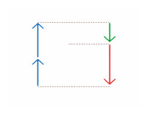
<figcaption class="paper-figure-caption"><b>Fig 1.</b> Figure 1: Schematic representation of a multiphoton process generating the −3𝛿𝜔side peak. Blue arrows indicate absorption of photons at the probe drive frequency 𝜔pr. Green arrows correspond to the source frequency 𝜔s. The red arrow denotes emission at the mixed frequency 2𝜔pr −𝜔s, which corresponds to the −3𝛿𝜔component in the rotating frame.</figcaption>
</figure>
<figure class="paper-figure-card">
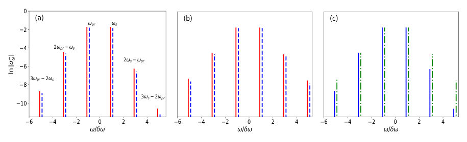
<figcaption class="paper-figure-caption"><b>Fig 2.</b> Figure 2: (a) QWM spectrum in the antibunching regime. The analytical result (red solid line) is compared with the numerical solution of the stationary cascaded equations (blue dashed line). (b) The same comparison in the coherent-filtering regime. (c) Analytical comparison of the antibunching spectrum (blue solid line) and the coherent-filtering spectrum (green dash-dotted line). In both cases 𝛾pr = 5, 𝜀pr = 0.2, and 𝜀s = 0.1. In the coherent-filtering case 𝛾s = 25, whereas in the antibunching case 𝛾s = 1.</figcaption>
</figure>
<figure class="paper-figure-card">

<figcaption class="paper-figure-caption"><b>Fig 3.</b> Figure 3: Dependence of the normalized side-peak amplitudes on the source linewidth: (a) +3𝛿𝜔, (b) −5𝛿𝜔, and (c) +5𝛿𝜔. Red solid lines show numerical results obtained from the stationary cascaded equations. Blue dashed lines show the antibunching asymptotes, and green dashed lines show the coherent-filtering limit. The normalized amplitude is 𝑆𝑛𝛿𝜔 pr = ⟨𝜎pr −⟩𝑛𝛿𝜔/ ⟨𝜎pr −⟩coh 𝑛𝛿𝜔is the 𝛾s →∞value.</figcaption>
</figure>
<figure class="paper-figure-card">
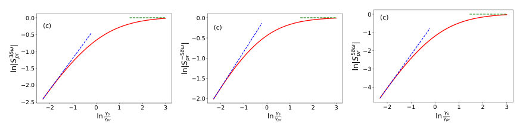
<figcaption class="paper-figure-caption"><b>Fig 4.</b> Figure 3 shows the crossover between the two regimes. For small 𝛾s/𝛾pr, the +3𝛿𝜔and −5𝛿𝜔peaks follow the linear laws (47) and (48), while the +5𝛿𝜔peak follows the quadratic law (49). For large 𝛾s/𝛾pr, all three normalized amplitudes saturate to unity, as expected in the coherent-filtering regime. The numerical results therefore confirm both the analytical side-peak formulas and the physical interpretation in terms of antibunching-induced suppression of multiphoton source pathways.</figcaption>
</figure>

**Summary.** This paper develops a theory showing that the sideband peaks in quantum wave mixing can act as a fingerprint for antibunched light. It demonstrates that by tuning the linewidth ratio of a source and probe qubit, one can observe the parametric suppression of specific multiphoton pathways. This allows for the frequency-domain identification of the photon statistics of microwave radiation.

**Why it may be interesting.** It provides a novel spectroscopic method to characterize the quantum nature of itinerant light using nonlinear wave mixing, which is highly relevant for characterizing photon statistics in circuit QED and open quantum systems.

Detailed structure

**Main problem.** Developing an analytical theory to use cascaded quantum wave mixing (QWM) as a spectroscopic tool to identify the photon statistics (specifically antibunching) of incident microwave radiation.

**Main result.** The study establishes that the sideband hierarchy in QWM provides a frequency-domain fingerprint of antibunched light, where higher-order sidebands are parametrically suppressed based on the linewidth ratio of the source and probe.

**Method.** The authors use a weak-drive Taylor expansion and a Neumann series expansion of the stationary cascaded master equation, validated by numerical solutions of the full dynamics.

**Model / system.** A cascaded waveguide-QED system consisting of a source qubit and a probe qubit coupled unidirectionally to a one-dimensional microwave waveguide, modeled using a cascaded master equation.

**Key observables.** Probe coherence, probe inversion, and the amplitudes/frequencies of the QWM sideband hierarchy.

**Important parameters / regimes.** The ratio of decay rates (gamma_s/gamma_pr), the dimensionless cascaded coupling (alpha), and the drive amplitudes (Omega_s, Omega_pr).

**Assumptions / limitations.** The theory assumes a weak-drive regime, a stationary (steady-state) approximation, and negligible back-action from the probe to the source.

**Figures summary.** Figure 1 shows a schematic of multiphoton processes; Figure 2 compares analytical and numerical QWM spectra in the antibunching and coherent-filtering regimes; Figure 3 illustrates the scaling of side-peak amplitudes as a function of the source linewidth.

**Paper structure.** The paper introduces the problem of using QWM for photon statistics, presents the analytical framework using a master equation and Taylor expansion, discusses the two physical limits (coherent-filtering vs. antibunching), provides numerical validation, and concludes with the diagnostic utility of the sideband hierarchy.

Abstract

Quantum wave mixing on a single superconducting qubit produces a hierarchy of coherent side peaks associated with elastic multiphoton scattering pathways. In a cascaded source--probe geometry these pathways become sensitive to the photon statistics of the radiation emitted by the source qubit. We develop an analytical theory of this effect starting from the cascaded master equation in the weak-driving regime. In the coherent-filtering limit $γ_{\rm s}\ggγ_{\rm pr}$, the standard coherent--coherent wave-mixing hierarchy is recovered. In the opposite limit $γ_{\rm pr}\ggγ_{\rm s}$, side peaks associated with multiphoton absorption from the antibunched source field are parametrically suppressed. Numerical solutions confirm the analytical scaling laws. The resulting sideband hierarchy provides a frequency-domain fingerprint of antibunched itinerant microwave light.

[↑ back to top](#top)

### [The peculiar response of Kelvin-Voigt chains with a free end](http://arxiv.org/abs/2605.24467v1)

**Authors:** Rupayan Saha, Matthias Krüger  
**Type:** theory · **Category:** statistical mechanics · **PDF:** <https://arxiv.org/pdf/2605.24467v1>  
**Analysis basis:** full PDF text, analyzed in chunks
**Topic relevance:** `Frenkel-Kontorova` **2/5** · `correlated / nonlocal dissipation` **2/5** · `methods for driven-dissipative` **2/5** · `non-equilibrium dynamics` **2/5**

↔ Scroll figures horizontally

<figure class="paper-figure-card">
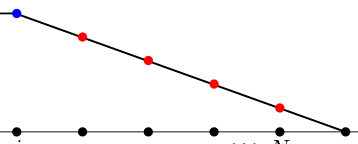
<figcaption class="paper-figure-caption"><b>Fig 1.</b> FIG. 1. Displacement profile in a massless undamped harmonic chain of length N, with left end free and the right end (site N + 1) fixed. Lower dots show the sites in absence of external forces, where xl = 0 for all l. Upper dots sketch the positions after application of an external force f acting on site j. This yields xl = xj for all l &lt; j, implying a staircase form of the response matrix.</figcaption>
</figure>
<figure class="paper-figure-card">
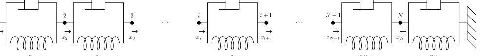
<figcaption class="paper-figure-caption"><b>Fig 2.</b> FIG. 2. Schematic diagram of the model in Eq. (1), consisting of N interacting DoFs with nearest-neighbor interaction κi, and relative friction γi. The left end is free while the right end is fixed, xN+1 = 0. The model thus represents a chain of Kelvin-Voigt units [23–25].</figcaption>
</figure>
<figure class="paper-figure-card">
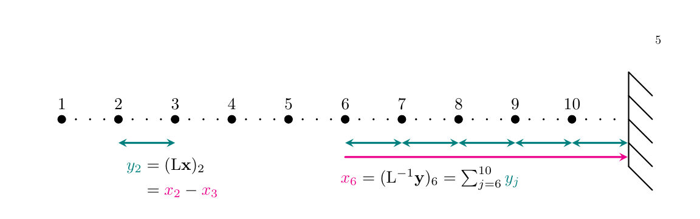
<figcaption class="paper-figure-caption"><b>Fig 3.</b> FIG. 3. Schematic for eigenmodes, exemplarily for N = 10. Left part of sketch demonstrates the eigenmode i = 2 via application of L, see Eq. (19). Right part of sketch illustrates action of L−1 to obtain x6 from eigenmodes, see Eq. (20).</figcaption>
</figure>
<figure class="paper-figure-card">
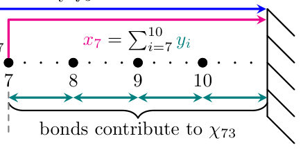
<figcaption class="paper-figure-caption"><b>Fig 4.</b> FIG. 4. Schematic for the susceptibility χij in Eq. (26), quantifying the response at site i to a force at site j, exemplarily for N = 10. A force acting on j = 3 yields, via Eq. (16), a finite force Fl for l ≥3, so that these bonds show a response to the force. On the other hand, the response at site i = 7 is found from the bonds with l ≥7, see Eq. (20). Hence, the susceptibility χ73 = χ37 has contributions from bonds l ≥max{7, 3}, i.e., l ≥7.</figcaption>
</figure>
<figure class="paper-figure-card">
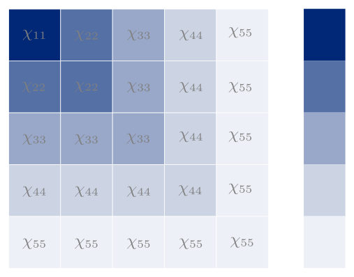
<figcaption class="paper-figure-caption"><b>Fig 5.</b> FIG. 5. Susceptibility matrix, exemplary for N = 5. The color-code gives the number of bonds contributing to the respective element χij according to Eq. (26). Any element χij equals a diagonal entry, i.e., χij = χji = χll with l = max {i, j}.</figcaption>
</figure>

**Summary.** This paper provides an exact solution for the dynamics of heterogeneous, overdamped 1D chains with relative friction. It reveals a counter-intuitive 'X-ray vision' effect where the mechanical response is insensitive to intermediate chain properties and establishes how different subspaces of the system govern steady-state versus relaxation behaviors.

**Why it may be interesting.** not directly relevant

Detailed structure

**Main problem.** The paper addresses the analytical treatment of heterogeneous, overdamped, one-dimensional harmonic chains with momentum-conserving dissipation, specifically focusing on the mechanical response when a free end is present.

**Main result.** The authors find that such chains exhibit an 'X-ray vision' property where the response of a particle to a force is independent of the material properties between them, and they demonstrate a decomposition of the state space into free and constrained subspaces governing steady-state and relaxation dynamics.

**Method.** The study uses an exact analytical diagonalization of the drift operator via a forward-difference transformation to map site variables to bond variables.

**Model / system.** A 1D Kelvin-Voigt chain consisting of $N$ harmonically coupled particles with nearest-neighbor stiffness and momentum-conserving (relative) friction, featuring one free end and one fixed end.

**Key observables.** The response matrix (susceptibility) $\chi_{ij}(t)$, steady-state velocity, and relaxation/recoil motion.

**Important parameters / regimes.** Overdamped limit, momentum-conserving dissipation, rank-deficient interaction matrices (free bonds), and the distinction between steady-state and relaxation regimes.

**Assumptions / limitations.** The dynamics are assumed to be overdamped ($m 	o 0$) and the dissipation is strictly momentum-conserving (relative friction).

**Figures summary.** Figure 1 shows the staircase displacement profile in an undamped chain; Figure 2 illustrates the Kelvin-Voigt model; Figure 3 depicts the forward-difference operator $L$ and its inverse; Figure 4 visualizes the susceptibility matrix; Figure 7 shows a viscoelastic fluid between parallel plates.

**Paper structure.** The paper introduces the problem of heterogeneous chains, defines the Kelvin-Voigt model and its mathematical framework, presents the analytical diagonalization method, derives the 'X-ray vision' response property, discusses the decomposition of state space into free and constrained subspaces, and applies the results to a viscoelastic fluid between plates.

Abstract

We exactly solve a model of a heterogeneous chain of overdamped, harmonically coupled particles with momentum-conserving dissipation. Despite being governed by a non-symmetric drift operator, the system admits an analytical diagonalization by use of a forward-difference transformation. In case of one free end, the response matrix shows a peculiar staircase form: the response of particle i to a force acting on particle j is independent of the properties and the length of the chain-part between i and j. For rank-deficient interaction matrices, the state space is decomposed into free and constrained subspaces. We demonstrate that this separation has clear physical consequences: the free subspace governs steady state responses, while the constraint subspace governs the relaxation after cessation of forcing. These results establish a framework for analyzing heterogeneous overdamped dynamics with momentum conservation.

[↑ back to top](#top)

### [Thermodynamics of classifiers](http://arxiv.org/abs/2605.24365v1)

**Authors:** Yoshihiko Hasegawa  
**Type:** theory · **Category:** statistical mechanics · **PDF:** <https://arxiv.org/pdf/2605.24365v1>  
**Analysis basis:** full PDF text, analyzed in chunks
**Topic relevance:** `correlated / nonlocal dissipation` **2/5** · `entanglement & information structure` **2/5** · `non-equilibrium dynamics` **2/5** · `quantum measurements` **2/5**

↔ Scroll figures horizontally

<figure class="paper-figure-card">
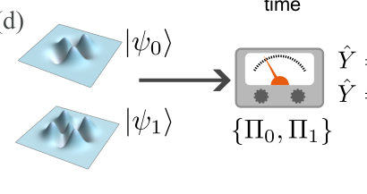
<figcaption class="paper-figure-caption"><b>Fig 1.</b> FIG. 1. Schematic illustration of binary classification. (a) Classical setting: the classifier predicts the label ˆY (x) ∈ {0, 1} from an input sample x drawn from overlapping class- conditional distributions corresponding to Y = 0 and Y = 1. (b) Markov process state setting. The classifier predicts the label from the final state of the Markov process. (c) Markov process trajectory setting. The classifier predicts the label from a trajectory drawn from the Markov process. (d) Quan- tum setting: the classifier performs a measurement Π0, Π1 on an input quantum state |ψ0⟩or |ψ1⟩and outputs the predicted label ˆY ∈{0, 1}.</figcaption>
</figure>

**Summary.** This paper establishes fundamental lower bounds on the minimum error achievable in binary classification tasks based on thermodynamic quantities. It proves that reducing classification error requires increasing thermodynamic costs like entropy production. The results extend from classical Markov processes to quantum systems, relating error to Hamiltonian variance.

**Why it may be interesting.** It provides a fundamental link between information processing accuracy and physical dissipation, which is highly relevant for understanding the thermodynamic limits of open quantum systems and the precision of quantum state discrimination.

Detailed structure

**Main problem.** Establishing a fundamental thermodynamic trade-off between classification error (Bayes error) and thermodynamic costs such as entropy production and dynamical activity.

**Main result.** The study derives lower bounds on the Bayes error in binary classification, showing that higher thermodynamic costs enable lower error, while vanishing costs lead to random guessing (error of 1/2).

**Method.** The author uses stochastic thermodynamics, information theory (Bhattacharyya coefficient, Pinsker inequality), and the Cramér-Rao inequality to link precision to dissipation.

**Model / system.** The models include continuous-time Markov processes on finite state spaces for classical classification and closed quantum systems evolving under class-dependent Hamiltonians for quantum classification.

**Key observables.** Bayes error (P_err), entropy production (Sigma), dynamical activity (A), and Hamiltonian variance.

**Important parameters / regimes.** The limits where entropy production or dynamical activity vanish, and the regime of uniform priors.

**Assumptions / limitations.** Assumes local detailed balance for Markov processes, identical initial states for both classes, and uncoupled dynamics for the two-process construction.

**Figures summary.** Figure 1 provides schematic illustrations of four classification settings: classical machine learning, Markov process state-based, Markov process trajectory-based, and quantum state discrimination.

**Paper structure.** The paper introduces the problem of error-cost trade-offs, develops classical bounds using Markov processes and entropy/activity, extends these to trajectory-based classification, provides a quantum generalization via the Helstrom bound, and concludes with mathematical appendices for detailed derivations.

Abstract

The Landauer principle bridges the energetic cost and information processing, showing that irreversible computation inevitably demands energy dissipation. As energy demands from computation continue to rise, approximate computing has attracted considerable attention. Approximate computing is based on the idea that energy consumption can be reduced by sacrificing computational accuracy. This raises a fundamental question about the relationship between error and thermodynamic cost in information processing. In this study, we derive the error-cost trade-off in the binary classifier by considering classification based on Markov processes. We obtain the lower bounds on the Bayes error in terms of thermodynamic costs such as entropy production and dynamical activity. Our results show that when entropy production or dynamical activity vanishes, the Bayes error reaches $1/2$, equivalent to random guessing, while greater thermodynamic costs enable lower error. This establishes a fundamental trade-off between error and cost in information processing by thermodynamic systems. Because the Bayes error provides the lowest achievable error among all possible classifiers, the classification error cannot fall below the obtained bounds given the entropy production or dynamical activity. We also discuss the quantum generalization and show that the Bayes error of the quantum classifier is bounded from below by the variance of the Hamiltonian.

[↑ back to top](#top)

### [Beyond Gaussian Statistics in Polymer Melts: Statistical Masking of Persistent Local Constraints](http://arxiv.org/abs/2605.25989v1)

**Authors:** José A. Martins  
**Type:** both · **Category:** statistical mechanics · **PDF:** <https://arxiv.org/pdf/2605.25989v1>  
**Analysis basis:** full PDF text, analyzed in chunks
**Topic relevance:** `Keldysh / 2PI / non-Gaussian methods` **2/5** · `non-equilibrium dynamics` **2/5** · `non-equilibrium universality` **2/5**

↔ Scroll figures horizontally

<figure class="paper-figure-card">
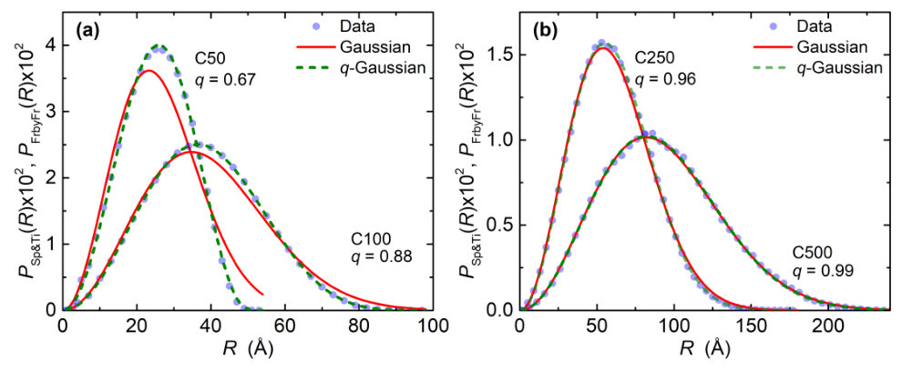
<figcaption class="paper-figure-caption"><b>Fig 1.</b> FIG. 1. Data histogram for the end-to-end distances of the different polymer systems and fits with a Gaussian, Eq. (1), and q-Gaussian, Eq. (8). (a) C50 and C100, (b) C250 and C500. The entropic index q values are indicated. The fit quality parameters are provided in Table III and supplementary material, Table S1.</figcaption>
</figure>
<figure class="paper-figure-card">
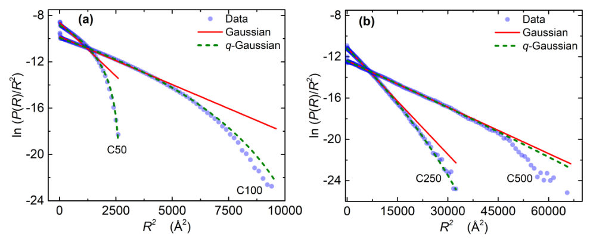
<figcaption class="paper-figure-caption"><b>Fig 2.</b> FIG. 2. Linearity test in R2. Plots of the logarithm of the reduced density as a function of R2 and fits with the Gaussian (a) and q-Gaussian (b) as described in Fig. 1. Eq. (3) describes the Gaussian fit (solid line) and Eq. (15) describes the q-Gaussian fit. Notice the tail in all systems and superimposed fit with the q-Gaussian, except for the C500 system. Note that a plot of lnq  Pq(R)/R2 vs. R2, should yield a straight line for C50–C250, according to Eq. (15)–supplementary material, Fig. S2.</figcaption>
</figure>
<figure class="paper-figure-card">
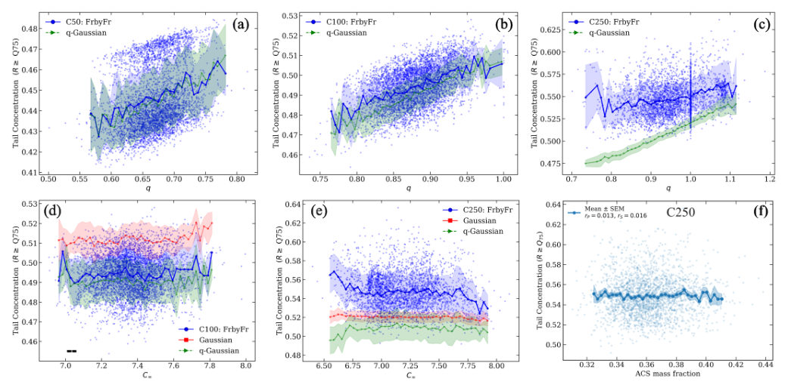
<figcaption class="paper-figure-caption"><b>Fig 3.</b> FIG. 3. Tail concentration of the last data quartile (R ≥Q75) for the different polymer systems. Blue symbols represent individual simulation snapshots (frame-by-frame, FrbyFr). The solid blue line and shaded band show the binned mean ±1 SEM. Panels (a), (b) and (c) represent the correlations between the tail concentration and q for C50, C100 and C250, respectively. Panels (d) and (e) illustrate the absence of correlation between the tail concentration and the characteristic ratio C∞for C100 and C250, respectively. Panel (f) shows the analogous result for the ACS mass fraction, illustrated for C250; the Pearson and Spearman correlation coefficients are rP = 0.013 and rS = 0.016,...</figcaption>
</figure>
<figure class="paper-figure-card">
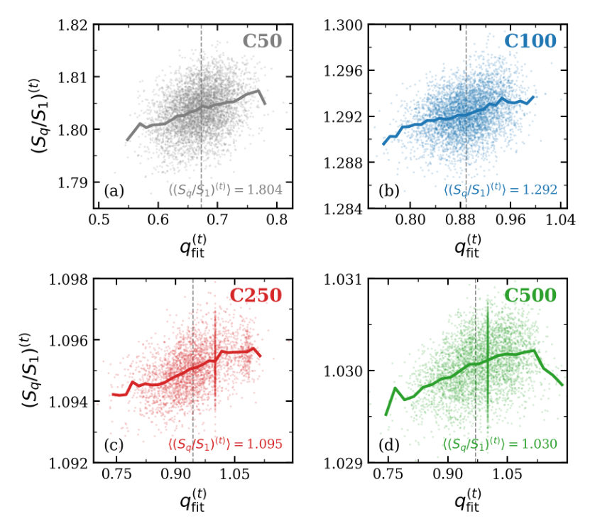
<figcaption class="paper-figure-caption"><b>Fig 4.</b> FIG. 4. Entropy non-extensivity quantified by the ratio  Sq/S1 (t) as a function of the entropic index q(t) fit for: (a) C50; (b) C100; (c) C250; and (d) C500. The time-weighted mean ⟨(Sq/S1)(t)⟩is indicated in each panel. As in Fig. 3, each data point represents an individual simulation</figcaption>
</figure>
<figure class="paper-figure-card">
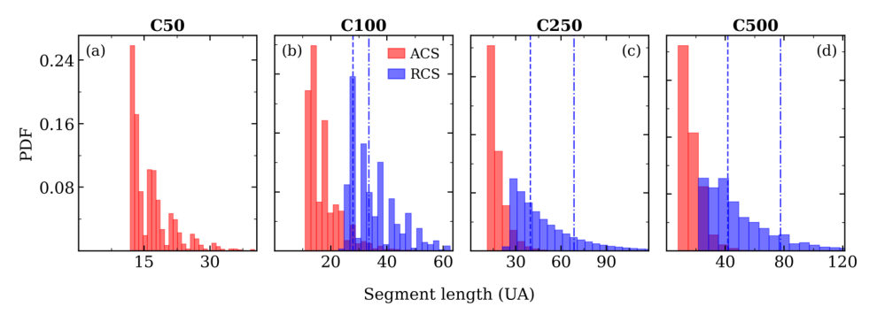
<figcaption class="paper-figure-caption"><b>Fig 5.</b> FIG. 5. Segment length distributions in terms of united atoms (UA) for ACS (red) and RCS (blue) in all four systems. C50 has no RCS segments. Only RCS segments containing at least two Kuhn segments (nseg ≥2nk) are included. The x-axis in UA units is directly proportional to the molar mass of the segment (M = nUA × 14.03 gmol−1 for polyethylene), so the distributions are the same as those in Fig. S6 in the supplementary material, expressed in different units. The vertical dashed and dash-dotted lines mark Mn,RCS and Mz,RCS from Table IV, converted to UA units. The distributions decay following a Flory-like form, with an increasing number of RCS segments per chain as chain length increases.</figcaption>
</figure>

**Summary.** This paper demonstrates that the transition from non-Gaussian to Gaussian statistics in polymer melts is not due to the disappearance of local structural heterogeneities, but rather because increasing chain length adds enough random segments to mask the underlying aligned segments. Using Tsallis statistics, the author quantifies this as a reduction in the entropic index q toward unity.

**Why it may be interesting.** The study explores the emergence of extensive (Boltzmann-Gibbs) statistics from non-extensive (Tsallis) regimes via a masking mechanism, which is conceptually relevant to understanding how local correlations and non-equilibrium features are lost in large-scale many-body systems.

Detailed structure

**Main problem.** Understanding the molecular mechanism behind the recovery of Gaussian statistics in long polymer chains and determining if this transition results from the erasure of local conformational heterogeneities.

**Main result.** The transition to Gaussian behavior is a statistical masking effect where the accumulation of random conformational segments (RCS) obscures persistent, non-Gaussian aligned chain segments (ACS), rather than the erasure of those segments.

**Method.** Atomistic molecular dynamics simulations of polyethylene melts combined with a statistical analysis using the Tsallis non-extensive framework and q-Gaussian distributions.

**Model / system.** Polyethylene melts with varying chain lengths (C50 to C500) modeled as a 3D mosaic of Aligned Chain Segments (ACS), Random Conformational Sequences (RCS), and Chain Ends (CE).

**Key observables.** End-to-end distance distribution P(R), entropic index q, entropy ratio S_q/S_1, tail concentration T2, and non-Gaussianity parameter alpha2.

**Important parameters / regimes.** Chain length (N), entropic index (q), Kuhn scale, and the mass fraction of ACS.

**Assumptions / limitations.** The q-Gaussian model is applied within the range 0 < q < 5/3 to ensure finite moments in 3D; the system is studied in the NpT ensemble.

**Figures summary.** Figures show segment length distributions for ACS and RCS, the evolution of end-to-end distance distributions P(R) across chain lengths, and the relationship between the entropy ratio and the number of Kuhn segments per RCS.

**Paper structure.** The paper introduces the problem of non-Gaussianity in short chains, defines the structural model (ACS/RCS), presents the mathematical framework of Tsallis statistics, details the MD simulation methodology, analyzes the evolution of the entropic index q and entropy ratio with chain length, and concludes with the 'statistical masking' hypothesis.

Abstract

Short polymer chains exhibit clear deviations from Gaussian end-to-end distance statistics, yet the molecular mechanism by which Gaussian behavior is recovered in long chains remains unestablished. Atomistic molecular dynamics simulations of polyethylene melts reveal that conformational heterogeneity persists at the Kuhn scale across all chain lengths, consisting of a mosaic of slow-relaxing, extended aligned chain segments (ACS) and coiled segments -- random conformational sequences (RCS) and chain ends (CE). We show that the end-to-end distance distributions for both unentangled and entangled chains are accurately described by a $q$-Gaussian function, with the entropic index $q$ increasing systematically from $0.67$ (C50) to $0.99$ (C500). This evolution tracks the emergence and accumulation of RCS segments, which are absent in short chains, establishing $q$ as a quantitative ``heterogeneity index''. The $q < 1$ values are a signature of non-extensive statistics, with the ratio of Tsallis to Boltzmann-Gibbs entropy ($S_q/S_1$), computed directly from simulation data without fitting, decreasing from $1.80$ (C50) to $1.03$ (C500). Crucially, we demonstrate that Gaussian recovery does not result from the erasure of Kuhn-scale heterogeneities, as ACS domains persist in all chain lengths above the critical mass ($\approx 35\%$). Instead, the transition to Gaussian statistics is a statistical masking effect, where the accumulation of independent RCS segments progressively obscures the non-Gaussian signatures of the persistent ACS domains.

[↑ back to top](#top)

### [Collective deformation of anisotropic particles with internal pulsation](http://arxiv.org/abs/2605.25744v1)

**Authors:** Luca Casagrande, Alessandro Manacorda, Etienne Fodor  
**Type:** theory · **Category:** statistical mechanics · **PDF:** <https://arxiv.org/pdf/2605.25744v1>  
**Analysis basis:** full PDF text, analyzed in chunks
**Topic relevance:** `driven-dissipative phase transition` **2/5** · `non-equilibrium dynamics` **2/5** · `non-equilibrium universality` **2/5**

↔ Scroll figures horizontally

<figure class="paper-figure-card">
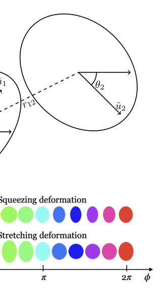
<figcaption class="paper-figure-caption"><b>Fig 1.</b> Figure 1. Parametrization of anisotropic deformable particles. (a) Each ellipse has four degrees of freedom: (i) the position r = (x, y) of their center that evolves in two dimensions, the orientation θ of the long axis l, and the internal degree of freedom ϕ that controls either the long or short axis, respectively l(ϕ) and s(ϕ) [Eqs. (4) and (5)]. (b-d) Elliptical deformation as a function of the internal phase ϕ ∈[0, 2π). For squeezing (resp. stretching) deformation, particles are round (resp. most elliptical) in their maximum size (green, ϕ = π/2), and most elliptical (resp. round) in their minimum size (dark blue, ϕ = 3π/2).</figcaption>
</figure>
<figure class="paper-figure-card">
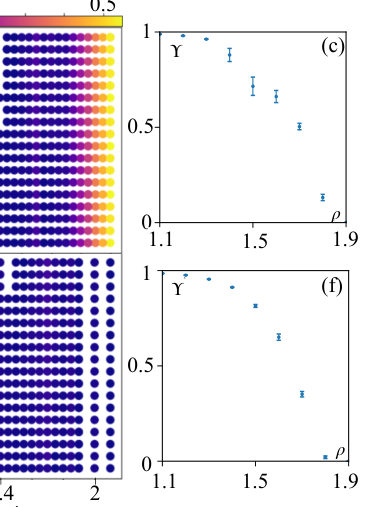
<figcaption class="paper-figure-caption"><b>Fig 2.</b> Figure 2. Phase diagrams in terms of synchronisation Rϕ [Eq. (7)], nematic order Rθ [Eq. (8)], and current Υ [Eq. (9)] for squeezing and stretching deformation models (resp. top and bottom rows). Both models feature arrest, cycle, and wave states in comparable parameter regimes. Only the squeezing deformation model entails a nematic phase (Rθ ≃1) at a very high density. Parameters: ω = 10, λ = 0.1, L = 100, l0 = 0.5. Panels (c,f): ε = 10.</figcaption>
</figure>
<figure class="paper-figure-card">
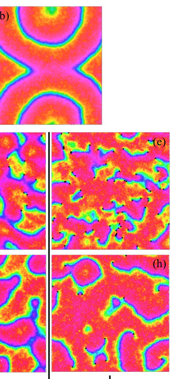
<figcaption class="paper-figure-caption"><b>Fig 3.</b> Figure 3. (a,b) Patterns observed in the squeezing deformation model for (ρ, ε) = (1.8, 16), see black diamond in Fig. 2(a). (c-h) Increasing the deformation constant λ [Eqs. (4-5)] makes wavefronts thinner for squeezing and stretching deformation models (resp. top and bottom rows), and yields topological defects marked with black triangles: upwards for clockwise-rotating defects, and downwards for counterclockwise-rotating defects. At λ = 0.1, defects form in the squeezing deformation model, but none appear in the stretching deformation model. Parameters: ρ = 1.74, ε = 7.5, ω = 10, l0 = 0.5.</figcaption>
</figure>
<figure class="paper-figure-card">
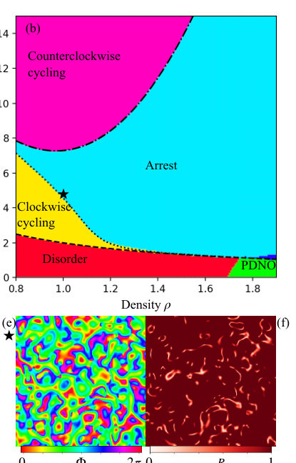
<figcaption class="paper-figure-caption"><b>Fig 4.</b> Figure 4. Hydrodynamic phase diagrams for the cases of (a) squeezing and (b) stretching deformation models. Black lines delinate the regions of existence of disordered (PDNO refers to phase disorder with nematic order), arrested, and cycling (clockwise and counter-clockwise) states at ν = 0; see dashed [Eq. (28)], dotted and dash-dotted [Eq. (29)], and solid [Eq. (30)] lines. To first order in ν, the linear stability analysis of the fixed-points reveals that nematic order emerges at a smaller density for squeezing than for stretching deformation. Profile of the synchronisation field fϕ = RϕeiΦ [Eq. (11)] obtained from numerical integration of hydrodynamics [Eq. (24)] for (c,d) the squeezing...</figcaption>
</figure>

**Summary.** This paper investigates how the shape-changing pulsations of anisotropic particles lead to complex collective behaviors like deformation waves and nematic order. By comparing squeezing and stretching modes, it demonstrates how internal particle dynamics can drive large-scale pattern formation in active matter.

**Why it may be interesting.** not directly relevant

Detailed structure

**Main problem.** Understanding how the anisotropic deformation of pulsating particles affects their collective properties and the emergence of deformation waves in dense assemblies.

**Main result.** The study identifies various collective states including arrested, cycling, and deformation wave phases, showing that squeezing-type deformation uniquely allows for a nematic phase at high densities.

**Method.** The authors use numerical simulations of overdamped Langevin dynamics and derive a hydrodynamic description through a coarse-graining procedure and perturbative approach.

**Model / system.** A 2D system of N anisotropic, pulsating, active particles (ellipses) with internal degrees of freedom including position, orientation, and an internal phase.

**Key observables.** Phase synchronization (R_phi), nematic order (R_theta), current (Upsilon), and topological charge of defects (kappa).

**Important parameters / regimes.** Particle density (rho_0), synchronization strength (epsilon), deformation amplitude (lambda), and internal driving frequency (omega).

**Assumptions / limitations.** The hydrodynamic model assumes constant density, neglects position-based interactions in simplified dynamics, and uses an analytical approximation for interparticle distance.

**Figures summary.** Figure 1 illustrates particle parametrization and deformation modes; Figure 2 shows phase diagrams for squeezing and stretching modes; Figure 4 presents hydrodynamic phase diagrams and numerical profiles of synchronization fields showing waves and defects.

**Paper structure.** The paper introduces the physical problem and particle model, presents numerical simulations and phase diagrams, derives a hydrodynamic description via coarse-graining, performs linear stability analysis, and concludes with a discussion of results and limitations.

Abstract

Capturing the emergence of deformation waves in contractile living tissues is a challenge that has recently been tackled with models of actively deformable particles. Inspired by the anisotropic deformation of cardiomyocytes in cardiac tissues, we examine how the pulsation of elliptical particles affects their collective properties in dense assemblies. We introduce two types of deformation where the eccentricity of each particle is subject to a periodic drive, and examine the interplay between nematic order and synchronized deformation via a systematic phase diagram. We derive a hydrodynamic description through a coarse-graining procedure, and show that it qualitatively captures the main collective states of the microscopic dynamics. Overall, our model provides key insights into how an active anisotropic deformation yields waves that self-organize into various dynamical patterns.

[↑ back to top](#top)

### [Exact Variance and Fano Factor for Arbitrary Level Crossings in Stationary Gaussian Processes](http://arxiv.org/abs/2605.25278v1)

**Authors:** Shivang Rawat, Flaviano Morone, David J. Heeger, Stefano Martiniani  
**Type:** theory · **Category:** statistical mechanics · **PDF:** <https://arxiv.org/pdf/2605.25278v1>  
**Analysis basis:** full PDF text, analyzed in chunks
**Topic relevance:** `methods for driven-dissipative` **2/5** · `non-equilibrium dynamics` **2/5** · `quantum measurements` **2/5**

↔ Scroll figures horizontally

<figure class="paper-figure-card">
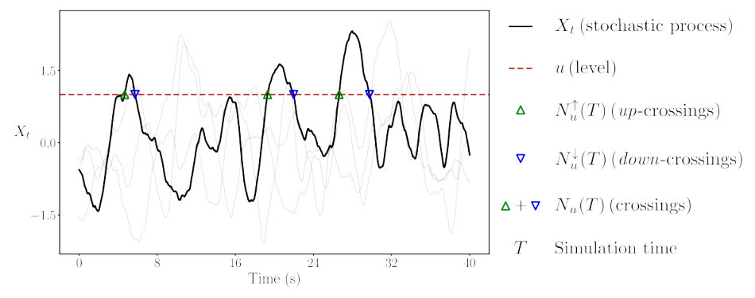
<figcaption class="paper-figure-caption"><b>Fig 1.</b> Fig. 1. Illustration of level crossing events for a stationary Gaussian process. We plot the sample paths of a stationary Gaussian stochastic process Xt generated by the stochastic damped harmonic oscillator model, which is detailed in Section III-A. The model parameters are set to ω0 = 1.0, ϑ = 1.0, and ζ = 0.5, yielding a process variance r(0) = ϑ/ω2 0 = 1.0. One prominent realization of Xt is shown as a black curve, with other realizations depicted in gray, all over the time interval [0, T]. The horizontal dashed red line indicates the constant threshold level u = 1.0. Upcrossings, defined as instances where Xt = u and its time derivative ˙Xt &gt; 0, are denoted by N↑ u(T) and marked with...</figcaption>
</figure>
<figure class="paper-figure-card">
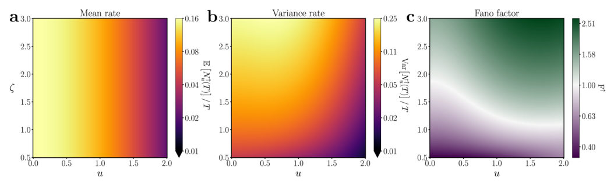
<figcaption class="paper-figure-caption"><b>Fig 2.</b> Fig. 2. Mean rate, variance rate, and Fano factor of upcrossings for the stochastic damped harmonic oscillator as functions of level u and damping ratio ζ. We plot (a) the mean rate of upcrossings E[N↑ u(T)]/T; (b) the variance rate of upcrossings Var[N↑ u(T)]/T; and (c) the upcrossing Fano factor F↑ for the stochastic damped harmonic oscillator across various combinations of threshold (u) and damping constant (ζ). The natural oscillation frequency is fixed at ω0 = 1.0 and the temperature at ϑ = 1.0, resulting in a process variance r(0) = ϑ/ω2 0 = 1.0. Color bars indicate the magnitude of the respective quantities on a logarithmic scale. All plotted values are calculated using the...</figcaption>
</figure>
<figure class="paper-figure-card">
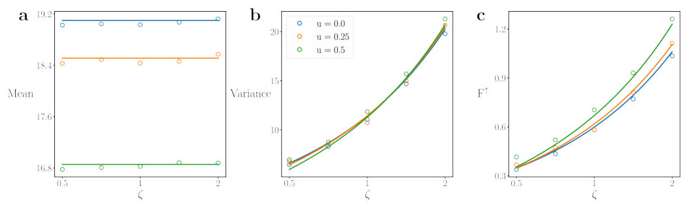
<figcaption class="paper-figure-caption"><b>Fig 3.</b> Fig. 3. Comparison of analytical formulae with numerical simulations for the stochastic damped harmonic oscillator. We plot (a) the mean number of upcrossings E[N↑ u(T)]; (b) the variance of upcrossings Var[N↑ u(T)]; and (c) the upcrossing Fano factor F↑as a function of the damping ratio ζ for three different threshold levels, u = 0.0, 0.25, 0.5. Solid lines represent the analytical solutions derived in this work, while circles denote results obtained from numerical simulations. The model parameters were fixed at ω0 = 1.0 Hz and ϑ = 1.0, for a total simulation time of T = 120 s for each trial. For the numerical simulations, we used a discretization time step dt = 0.01 × (slowest timescale...</figcaption>
</figure>
<figure class="paper-figure-card">
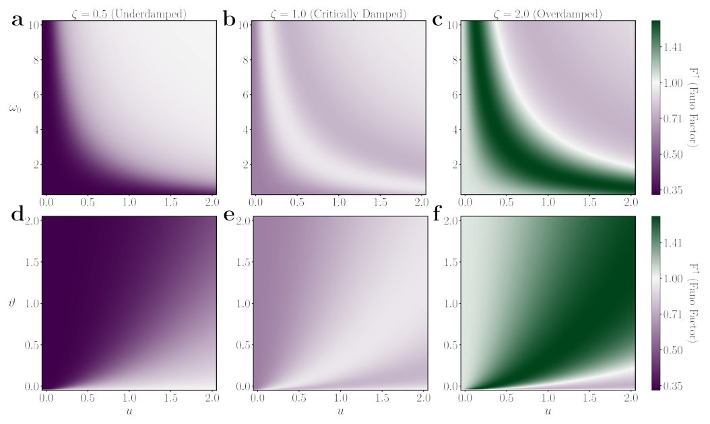
<figcaption class="paper-figure-caption"><b>Fig 4.</b> Fig. 4. Fano factor landscapes for the stochastic damped harmonic oscillator across different parameter regimes. We plot the analytical upcrossing Fano factor (F↑) for the stochastic damped harmonic oscillator across various parameter configurations. (a–c) Fano factor as a function of the natural frequency ω0 and threshold level u, for a fixed temperature ϑ = 1.0 and different damping ratios: (a) underdamped ζ = 0.5; (b) critically damped ζ = 1.0; and (c) overdamped ζ = 2.0. (d–f) Fano factor as a function of the temperature (noise strength parameter) ϑ and threshold level u, for a fixed natural frequency ω0 = 1.0 and the same damping ratios: (d) underdamped ζ = 0.5; (e) critically damped ζ...</figcaption>
</figure>
<figure class="paper-figure-card">
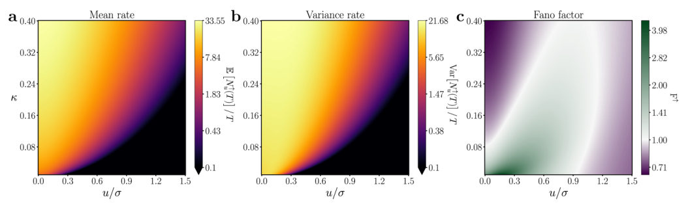
<figcaption class="paper-figure-caption"><b>Fig 5.</b> Fig. 5. Mean rate, variance rate, and Fano factor of upcrossings for a mean-reverting process driven by Ornstein-Uhlenbeck noise. We plot (a) the mean rate of upcrossings E[N↑ u(T)]/T; (b) the variance rate of upcrossings Var[N↑ u(T)]/T; and (c) the upcrossing Fano factor F↑for a mean-reverting process with characteristic timescale τe, driven by Ornstein-Uhlenbeck (OU) noise with correlation time τf; this system is described by Eq. (31). The plots illustrate the dependence on two dimensionless parameters: the normalized threshold u/σ and the timescale ratio κ = τf/τe. We set the standard deviation of the input OU noise σ = 1.0 and its correlation time τf = 3 ms. Note that the resulting...</figcaption>
</figure>

**Summary.** This paper solves the long-standing problem of finding exact analytical formulas for the variance and Fano factor of level crossings in Gaussian processes. It demonstrates that while the mean crossing rate only depends on local properties, the variance captures the full correlation structure, allowing one to distinguish between clustered and regular crossing events.

**Why it may be interesting.** This is highly relevant for researchers studying open quantum systems or quantum optics where Gaussian noise and fluctuations drive transitions, as it provides tools to characterize the temporal clustering of quantum jumps or signal crossings.

Detailed structure

**Main problem.** Deriving exact analytical expressions for the variance and Fano factor of level crossings at arbitrary thresholds in stationary Gaussian processes, moving beyond the mean-rate predictions of the traditional Kac-Rice formula.

**Main result.** The authors provide closed-form, single-integral expressions for the variance and Fano factor, revealing how the full temporal correlation structure determines whether crossings cluster (super-Poissonian) or are regular (sub-Poissonian).

**Method.** The derivation uses the Kac-Rice formula, variable transformations (such as a pi/4 rotation of velocity variables), and the evaluation of asymmetric Gaussian integrals using the error function and Owen's T function.

**Model / system.** The framework applies to smooth, stationary, zero-mean Gaussian processes, with specific applications to stochastic damped harmonic oscillators and mean-reverting processes driven by Ornstein-Uhlenbeck noise.

**Key observables.** Number of upcrossings, total crossings, variance of crossings, and the Fano factor (ratio of variance to mean).

**Important parameters / regimes.** Threshold level (u/sigma), damping ratio (zeta), natural frequency (omega_0), and correlation decay parameters (alpha).

**Assumptions / limitations.** The stochastic process must be stationary, Gaussian, and smooth (twice-differentiable).

**Figures summary.** Figure 1 shows sample paths of an oscillator with identified crossings; Figure 2 shows the dependence of the Fano factor on the damping ratio; Figure 3 validates analytical results against numerical simulations; Figure 4 shows heatmaps of the Fano factor for the SDHO; Figure 5 shows Fano factor plots for the RQ process.

**Paper structure.** The paper introduces the limitation of the Kac-Rice formula, presents Theorems for the mean and variance of upcrossings and total crossings, applies these to specific models (SDHO, OU-driven, RQ processes), and provides a rigorous mathematical appendix containing the integral derivations and lemmas.

Abstract

Understanding the statistics of level crossings in stochastic processes is crucial across many scientific disciplines. The traditional Kac-Rice formula gives the mean rate of level crossings and has found broad use. However, that mean rate captures only a coarse summary of the crossing process. It depends entirely on local properties of the stochastic process at a given instant and is therefore blind to the correlation structure of the process over time. To understand whether crossing events, such as neuronal spikes, tend to cluster in time, spread apart, or exhibit more complex temporal organization, one must go beyond the mean rate and study higher-order crossing statistics. Here we go beyond the mean by deriving the exact analytical formulae for the variance and Fano factor of arbitrary level crossings in smooth stationary Gaussian processes. Our exact solution reveals how the full temporal correlation structure dictates whether crossings cluster or become regular. In systems with oscillatory correlations, such as a stochastic damped harmonic oscillator, a recent crossing suppresses an immediate subsequent one, producing sub-Poissonian statistics. However, as damping increases and oscillations disappear, a large and slow excursion above the threshold can produce multiple closely spaced crossings, yielding super-Poissonian statistics. In purely relaxational, non-oscillatory systems, such as a mean-reverting process driven by Ornstein-Uhlenbeck noise, the competition between the timescales of the driving noise and system relaxation produces a richer landscape, including reentrant transitions between sub- and super-Poissonian statistics as the threshold level is varied. Taken together, the exact variance and Fano factor derived here complement the Kac-Rice mean rate, enabling more robust parameter estimation and model selection across any setting where Gaussian processes are used.

[↑ back to top](#top)

### [Rounding Almost Commuting Hamiltonians](http://arxiv.org/abs/2605.26096v1)

**Authors:** Islam Faisal, Anand Natarajan, Alexander Poremba  
**Type:** theory · **Category:** quantum information and computing · **PDF:** <https://arxiv.org/pdf/2605.26096v1>  
**Analysis basis:** full PDF text, analyzed in chunks
**Topic relevance:** `analog quantum simulation` **2/5** · `entanglement & information structure` **2/5** · `non-equilibrium dynamics` **2/5**

↔ Scroll figures horizontally

<figure class="paper-figure-card">
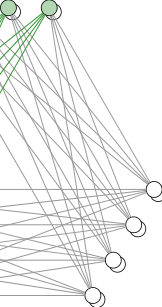
<figcaption class="paper-figure-caption"><b>Fig 1.</b> Figure 2: The commutation graph of the 3-qubit triangle Hamiltonian. The vertices represent matrices from the local Pauli expansion of each Hamiltonian term; the top and bottom layers indicate the two sets of pos- sible expansions (depending on the qubit), and the edges represent near- commutation across Hamiltonian terms, as in (18), (19) and (20). For each qubit, our rounding procedure selects a pivot with a large spectral gap (e.g., the red vertex) and uses it to pinch all of the relevant vertices belonging to the same qubit (e.g. the green vertices). While vertices belonging to the same cluster are not required to commute, we also choose to pinch within clusters to exploit transitivity:...</figcaption>
</figure>

**Summary.** This paper introduces a new algorithm to transform almost-commuting 2-local qubit Hamiltonians into exactly commuting ones with controlled error. This technique allows for the extension of complexity results from the commuting regime to the almost-commuting regime and provides practical speedups for quantum Gibbs sampling and Hamiltonian simulation.

**Why it may be interesting.** This is highly relevant for many-body dynamics and quantum algorithms, as it provides a way to treat physically realistic, non-commuting systems using the more tractable framework of commuting Hamiltonians, potentially accelerating simulations.

Detailed structure

**Main problem.** Developing a way to efficiently round 2-local qubit Hamiltonians with almost-commuting terms to nearby exactly commuting Hamiltonians while preserving locality.

**Main result.** The authors provide a deterministic, linear-time algorithm that maps an epsilon-almost commuting 2-local Hamiltonian to a commuting one with an error bound of O(m * epsilon^{1/6}), extending NP-containment results to the almost-commuting regime.

**Method.** A 'gap or snap' algorithmic approach using a pinching superoperator and local pivots to force commutation, combined with a 'snapping' step to handle nearly-degenerate terms.

**Model / system.** 2-local qubit Hamiltonians where the commutator of any two local terms is bounded by epsilon.

**Key observables.** Ground energy approximations, Gibbs state trace distance, and Hamiltonian simulation error.

**Important parameters / regimes.** epsilon (commutator norm), m (number of terms), delta (energy gap/precision), and eta (spectral gap threshold).

**Assumptions / limitations.** The results are specific to 2-local qubit systems and assume the Hamiltonian is provided as an explicit classical string of local terms.

**Figures summary.** Figure 1 shows the locality-preserving transformation on a 2D lattice; Figure 2 depicts a commutation graph for a 3-qubit triangle; Figure 3 illustrates a 3-qubit triangle Hamiltonian example.

**Paper structure.** The paper introduces the problem of almost-commuting Hamiltonians, presents a locality-preserving rounding algorithm using a gap-or-snap technique, proves error bounds and complexity implications (NP-containment), and demonstrates applications in Gibbs sampling and Hamiltonian simulation.

Abstract

Commuting Hamiltonians lie at the boundary between classical constraint satisfaction and quantum many-body physics, exhibiting rich quantum structure while remaining more tractable than general noncommuting models. In contrast, physical Hamiltonians are rarely exactly commuting, which naturally motivates the study of almost commuting Hamiltonians. Despite their relevance, the implications of approximate commutation are only poorly understood.   In this work, we show how to efficiently approximate any almost commuting $2$-local qubit Hamiltonian by a commuting one: we give a locality-preserving algorithmic rounding technique that maps any $2$-local Hamiltonian $H=\sum_{i=1}^m h_i$ with $\|[h_i,h_j]\| \leq ε$ to a nearby Hamiltonian $\hat{H}$ whose terms pair-wise commute, and which is within overall distance $\|H-\hat{H}\| = O(m\,ε^{1/6})$. As a consequence, we show that $δ$-approximations to the ground energy for $ε$-almost commuting $2$-local qubit Hamiltonians lie in $\mathsf{NP}$ when $δ\gg mε^{1/6}$, extending the classical containment well beyond the commuting setting. Finally, we present two applications of our rounding framework: Gibbs sampling and fast Hamiltonian simulation for almost commuting systems.

[↑ back to top](#top)

### [Self-consistent analysis of the Kuramoto model with higher-order interactions](http://arxiv.org/abs/2605.24701v1)

**Authors:** Chanin Kumpeerakij, Juan G. Restrepo  
**Type:** theory · **Category:** statistical mechanics · **PDF:** <https://arxiv.org/pdf/2605.24701v1>  
**Analysis basis:** full PDF text, analyzed in chunks
**Topic relevance:** `driven-dissipative phase transition` **2/5** · `non-equilibrium dynamics` **2/5** · `non-equilibrium universality` **2/5**

↔ Scroll figures horizontally

<figure class="paper-figure-card">
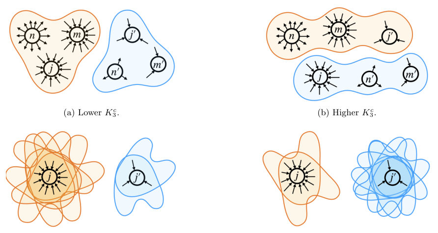
<figcaption class="paper-figure-caption"><b>Fig 1.</b> Figure 1: Effect of hypergraph structure on Kc 3. (Top panels) Nodes {n, m, j} have high values of Vn, Um, Uj, respectively (e.g., by having large dyadic degrees), while nodes {n′, m′, j′} have low values of Vn′, Um′, Uj′. Configurations where hyperedges couple oscillator triplets {n, m, j} and {n′, m′, j′} (a) have lower values of Kc 3 than those where those hyperedges couple other triplets, {n, m, j′} and {n′, m′, j} (b). (Bottom panels) Visualizations of hypergraphs where triadic and dyadic degrees are either correlated (c) or anti-correlated (d).</figcaption>
</figure>
<figure class="paper-figure-card">
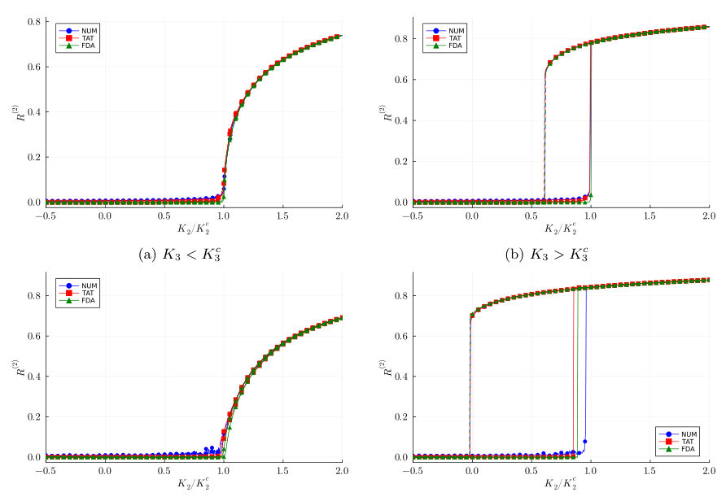
<figcaption class="paper-figure-caption"><b>Fig 2.</b> Figure 2: Global order parameter R(2) as a function of K2/Kc 2 for uniform (top) and power-law (bottom) degree distributions (N = 20, 000, ⟨kn⟩= 500). Panels (a) and (c) show the weak triadic coupling regime (K3 &lt; Kc 3), while (b) and (d) show the strong triadic coupling regime (K3 &gt; Kc 3). Solid and dashed lines denote forward and backward parameter sweeps, respectively.</figcaption>
</figure>
<figure class="paper-figure-card">
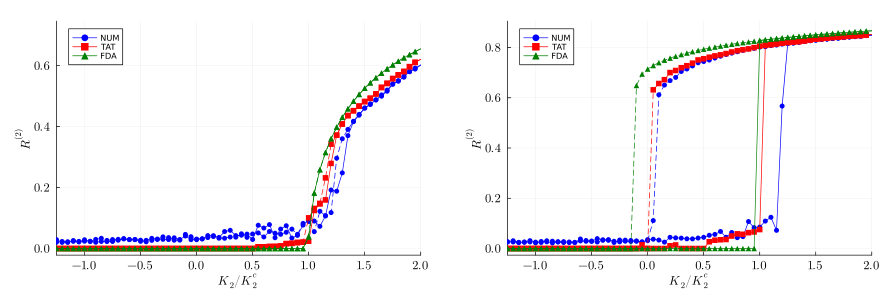
<figcaption class="paper-figure-caption"><b>Fig 3.</b> Figure 3: Examples of small network experiments with N = 1000, ⟨k⟩= ⟨q⟩= 25, γ = 2.5 with kMAX = 125.</figcaption>
</figure>
<figure class="paper-figure-card">
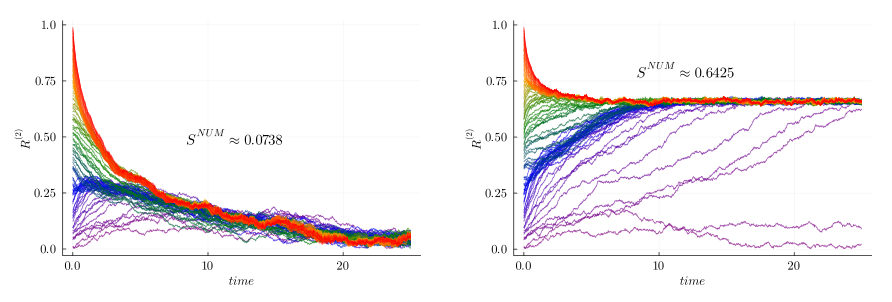
<figcaption class="paper-figure-caption"><b>Fig 4.</b> Figure 4: Synchronization response S calculated for a power-law degree distribution with γ = 3.0 and N = 3000. The dyadic coupling is fixed at K2 = 0.95Kc 2. (a) shows the system below the onset of bistability with K3 = 0.5Kc 3, where the order parameter remains near zero. (b) shows the system in the bistable regime with K3 = 1.25Kc 3.</figcaption>
</figure>
<figure class="paper-figure-card">
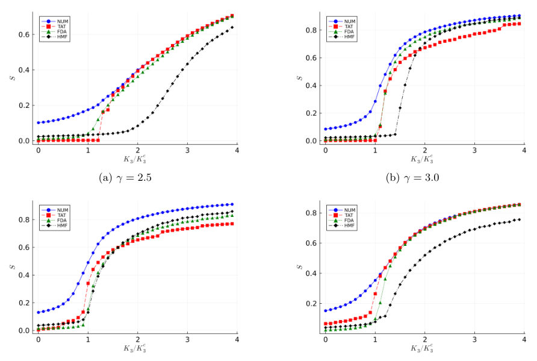
<figcaption class="paper-figure-caption"><b>Fig 5.</b> Figure 5: Synchronization response S (indicating bistability) for different degree distributions as a function of K3/Kc 3. Panels (a)-(c) show power-law distributions, while (d) shows the uniform case.</figcaption>
</figure>

**Summary.** This paper provides a new analytical framework to study synchronization in systems with multi-body interactions. It reveals that the stability of the synchronized state can be controlled by tuning the structural correlations between pair-wise and triplet-wise connections in a hypergraph.

**Why it may be interesting.** not directly relevant

Detailed structure

**Main problem.** Developing a self-consistent analytical framework to understand synchronization transitions, bistability, and explosive synchronization in the Kuramoto model with higher-order (triadic) interactions on hypergraphs.

**Main result.** The authors derive a hierarchy of approximations (TAT, FDA, HMF) and show that the onset of bistability depends on the correlation between the dyadic adjacency matrix eigenvectors and the triadic interaction structure.

**Method.** A self-consistent analytical framework using a hierarchy of approximations (Time-Averaged Theory, Frequency Distribution Approximation, and Heterogeneous Mean-Field) combined with perturbative expansion and numerical simulations.

**Model / system.** A generalized Kuramoto model of coupled phase oscillators on hypergraphs, featuring both dyadic (pair-wise) and triadic (three-body) interactions with intrinsic frequencies drawn from a distribution.

**Key observables.** Global and local order parameters (dyadic and triadic), critical coupling strengths (K2 and K3), and synchronization response (S).

**Important parameters / regimes.** Dyadic and triadic coupling strengths (K2, K3), intrinsic frequencies (omega), hypergraph degree distributions, and eigenvector correlations.

**Assumptions / limitations.** Assumes a single synchronization cluster, neglects pair correlations, assumes statistical independence between frequencies and local order parameters, and assumes a symmetric frequency distribution.

**Figures summary.** Figures illustrate how triplet arrangement and degree correlations affect the bistability threshold, compare the accuracy of different approximation schemes (TAT, FDA, HMF) against simulations, and demonstrate structural control of synchronization via hypergraph rewiring.

**Paper structure.** The paper introduces the higher-order Kuramoto model, develops a hierarchy of three analytical approximations (TAT, FDA, HMF), uses perturbative expansion to find critical thresholds, validates the theory via numerical simulations on various hypergraph topologies, and demonstrates how network rewiring can control synchronization regimes.

Abstract

The Kuramoto model with higher-order interactions has recently been shown to exhibit bistability, explosive synchronization transitions, and rich collective dynamics. Existing analytical approaches, however, typically rely on all-to-all coupling or mean-field approximations of the underlying hypergraph structure. While these methods describe typical networks in the thermodynamic limit, they generally fail to capture the effects of finite hypergraph and oscillator frequency realizations. To address this limitation, we develop a self-consistent analytical framework for the Kuramoto model with dyadic and triadic interactions on hypergraphs. We introduce generalized local order parameters that capture the combined effects of dyadic and triadic phase correlations, and derive a hierarchy of approximation schemes for the local and global synchronization order parameters. Using these approximations, we determine critical coupling strengths for the onset of synchronization and bistability. In particular, we show that the critical triadic coupling strength governing the onset of bistability depends on correlations between the eigenvectors of the dyadic adjacency matrix and the triadic interaction structure. Numerical simulations on homogeneous and heterogeneous hypergraphs validate the theory and illustrate the distinct regimes of applicability of the approximation schemes.

[↑ back to top](#top)

### [Sensitivity to perturbations in the three-dimensional Anderson model](http://arxiv.org/abs/2605.25594v1)

**Authors:** Piotr Tokarczyk, Lev Vidmar, Anatoli Polkovnikov, Patrycja Łydżba  
**Type:** theory · **Category:** disordered systems and neural networks · **PDF:** <https://arxiv.org/pdf/2605.25594v1>  
**Analysis basis:** full PDF text, analyzed in chunks
**Topic relevance:** `entanglement & information structure` **2/5** · `non-equilibrium dynamics` **2/5** · `scars & prethermalization` **2/5**

↔ Scroll figures horizontally

<figure class="paper-figure-card">
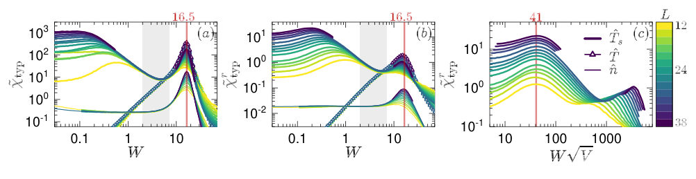
<figcaption class="paper-figure-caption"><b>Fig 1.</b> FIG. 1. (a) ˜χtyp and (b) ˜χr typ as functions of W. Panel (c) shows the same results as panel (b), but plotted versus W √</figcaption>
</figure>
<figure class="paper-figure-card">
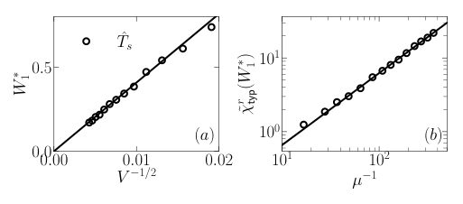
<figcaption class="paper-figure-caption"><b>Fig 2.</b> FIG. 2. The weak-disorder crossover. (a) The finite-size scal- ing of W ∗ 1 . (b) ˜χr typ evaluated at W ∗ 1 and plotted against µ−1. All results were established from second-order polynomial fits to numerical results from Fig. 1(b). Lines in (a) and (b) are least-squares fits of cx and bxa to V ≥183, respectively. We obtain c ≈41 and a ≈0.98.</figcaption>
</figure>
<figure class="paper-figure-card">
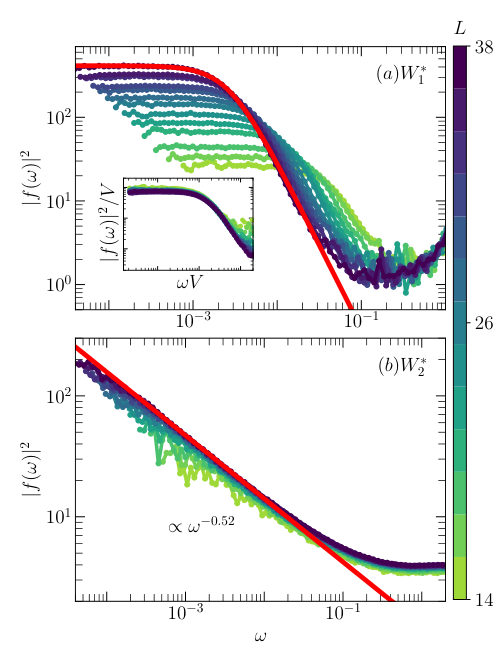
<figcaption class="paper-figure-caption"><b>Fig 3.</b> FIG. 3. The spectral functions for the 3D Anderson model near (a) the weak-disorder crossover and (b) the Anderson lo- calization transition. Results are obtained from 20% of eigen- states in the middle of the spectrum and averaged over five disorder realizations. The inset in (a) demonstrates the recov- ery of system-size independence when plotting |f(ω)|2/V as a function of ωV . Red curves in panels (a) and (b) show the least-squares fits to the data with V = 383, using the forms C/(ω2 + Γ2) and b ω−a, respectively. We obtain Γ ≈0.0027 and a ≈0.52.</figcaption>
</figure>
<figure class="paper-figure-card">
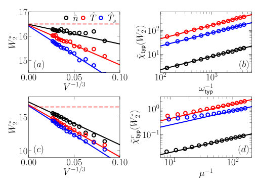
<figcaption class="paper-figure-caption"><b>Fig 4.</b> FIG. 4. The Anderson localization transition. Results in (a,b) and (c,d) were established from second-order polynomial fits to numerical results from Figs. 1(a) and 1(b), respectively. (a,c) The finite-size scaling of W ∗ 2 . (b) ˜χtyp evaluated at W ∗ 2 and plotted versus ω−1 typ. (d) ˜χr typ evaluated at W ∗ 2 and plotted versus µ−1. Lines in panels (a,c) and (d) are least- squares fits of dx + c and bxa, respectively. These fits are performed for V ≥183 [with the exception of ˆn in panels (a,b), where V ≥303 is considered]. For ˆTs, ˆT, ˆn, we obtain c = 16.42, 16.45, 16.48 in (a), c = 16.66, 16.76, 17.23 in (c) and a = 0.546, 0.567, 0.554 in (b). Lines in panel (d) are guides to the eye...</figcaption>
</figure>
<figure class="paper-figure-card">
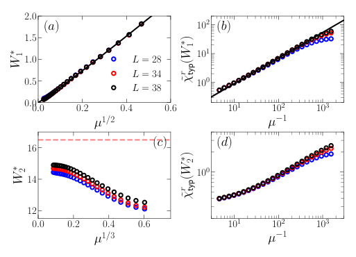
<figcaption class="paper-figure-caption"><b>Fig 5.</b> FIG. 6. The weak-disorder crossover: (a) the peak position, W ∗ 1 , versus µ1/2, and (b) the peak height, ˜χr typ(W ∗ 1 ), versus µ−1. The Anderson localization transition: (c) the peak po- sition, W ∗ 2 , versus µ1/3 and (d) the peak height, ˜χr typ(W ∗ 2 ), versus µ−1. We consider V = 283, 343 and 383. All results were obtained from second-order polynomial fits to numerical data, analogous to those shown in Fig. 5. The black lines in (a,b) show the least-squares fits of bxa applied to the power- law regions (moderate µ) of the plots for V = 383. The red dashed line in (c) marks the expected W ∗ 2 ≈16.5.</figcaption>
</figure>

**Summary.** This paper demonstrates that fidelity susceptibility can identify two distinct transitions in the 3D Anderson model: a crossover to quantum chaos and the Anderson localization transition. It connects the scaling of these susceptibility peaks to the fractal nature of critical eigenstates and identifies distinct nonergodic regimes in the localized phase.

**Why it may be interesting.** It provides deep insights into how sensitivity to perturbations can act as a diagnostic for ergodicity-breaking transitions and the emergence of non-ergodic behavior, which is highly relevant to many-body dynamics and the study of localization.

Detailed structure

**Main problem.** The study investigates the sensitivity of single-particle eigenstates to perturbations in the 3D Anderson model, specifically looking for quantitative signatures of the Anderson localization transition and the weak-disorder crossover.

**Main result.** The fidelity susceptibility exhibits two distinct peaks: one at weak disorder signaling a crossover to quantum chaos, and another at the critical disorder strength associated with Anderson localization. The scaling of these peaks is linked to the fractal dimension of the critical wavefunctions.

**Method.** Numerical simulation using finite-size scaling on cubic lattices up to L=38, employing regularized fidelity susceptibility with a frequency cutoff and spectral analysis of the spectral function.

**Model / system.** The 3D Anderson model, a non-interacting single-particle model on a cubic lattice with nearest-neighbor hopping and uncorrelated on-site disorder.

**Key observables.** Fidelity susceptibility (typical and average), regularized fidelity susceptibility, spectral function, level spacing ratio (r-parameter), and fractal dimension (d2).

**Important parameters / regimes.** Disorder strength (W), frequency cutoff (mu), system size (V), and the critical disorder strength (W2 approx 16.5).

**Assumptions / limitations.** Assumes the validity of single-particle Eigenstate Thermalization Hypothesis (ETH) in the chaotic regime and assumes the perturbation is a local operator.

**Figures summary.** Figures illustrate the spectral function behavior (Lorentzian broadening vs. power-law decay), the distribution of fidelity susceptibilities (P(chi)), and the scaling of typical vs. average susceptibility.

**Paper structure.** The paper introduces the fidelity susceptibility as a diagnostic tool, describes the 3D Anderson model, analyzes the weak-disorder crossover and the localization transition, discusses the scaling of peaks in relation to wavefunction fractality, and explores nonergodic regimes in the localized phase.

Abstract

We investigate the fidelity susceptibility, which quantifies the sensitivity of single-particle eigenstates to perturbations, in the three-dimensional Anderson model. As a function of disorder strength $W$, it exhibits two distinct peaks. The first peak signals a crossover at weak disorder strength from plane-wave states to single-particle quantum chaos, and its position shifts toward $W\to 0$ in the thermodynamic limit. The second peak emerges, to high numerical accuracy, at the critical disorder strength associated with the Anderson localization transition. We further show that the divergence of the first peak is maximal, scaling as the square of the inverse frequency cutoff, whereas the divergence of the second peak is submaximal. We relate the latter suppression to the fractal structure of single-particle eigenstates at criticality. We discuss two distinct scenarios that give rise to the peaks in the fidelity susceptibilities. Moreover, studying the scaling of typical fidelity susceptibilities above the Anderson transition, we find evidence of two distinct regimes of nonergodic behavior.

[↑ back to top](#top)

### [Time optimal quantum state engineering](http://arxiv.org/abs/2605.24781v1)

**Authors:** Sam Edmunds, Obinna Abah  
**Type:** theory · **Category:** other · **PDF:** <https://arxiv.org/pdf/2605.24781v1>  
**Analysis basis:** full PDF text, analyzed in chunks
**Topic relevance:** `Tavis-Cummings & cavity-many-emitter` **2/5** · `methods for driven-dissipative` **2/5** · `non-equilibrium dynamics` **2/5**

↔ Scroll figures horizontally

<figure class="paper-figure-card">
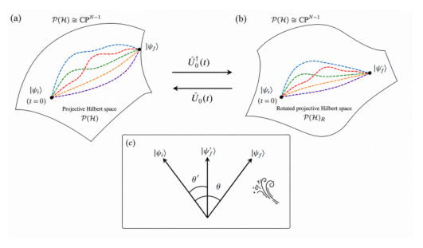
<figcaption class="paper-figure-caption"><b>Fig 1.</b> FIG. 1. Schematic of the possible trajectories of the quantum state |ψ(t)⟩through the ray space/projected space P(H) ∼= { |ψ⟩∈H : ⟨ψ|ψ⟩= 1 }/U(1) in the (a) Schr¨odinger picture and (b)interaction picture. Moving between these two frames via the rotation ˆU0(t) can lead to a ”favourable wind” i.e the length of the paths connecting the initial |ψi⟩and |ψf⟩ may decrease. This is depicted in (c) where a favourable wind decrease the Bures angle θ = 2 arccos | ⟨ψi|ψf⟩| to θ′ = 2 arccos | ⟨ψi|ψ′ f⟩|, where ψ′ f = ˆU † 0(t) |ψf⟩.</figcaption>
</figure>
<figure class="paper-figure-card">
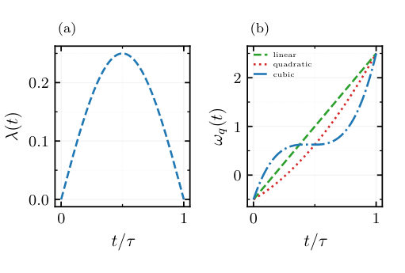
<figcaption class="paper-figure-caption"><b>Fig 2.</b> FIG. 2. (a) The time-dependent coupling λ(t), Eq. (12), as a function t/τ for λ0 = 0, λm = ωc/4 and ϕ = 0. (b) The qubit driving frequency ωq(t), Eq. (13), as a function of t/τ for different driving profiles, see Eq. (14). The parameter used are ωi =−ωc/2, ωf = 5ωc/2, α = 0.5 and β = 2.</figcaption>
</figure>
<figure class="paper-figure-card">
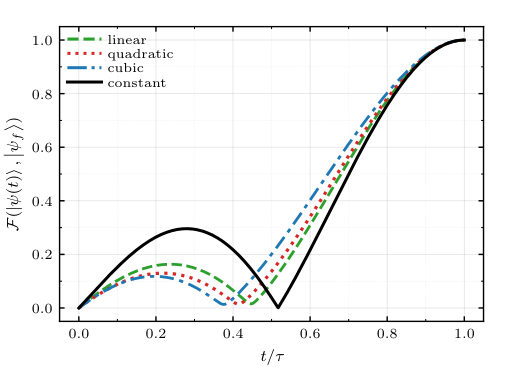
<figcaption class="paper-figure-caption"><b>Fig 3.</b> FIG. 4. The instantaneous fidelity F(t) = |⟨ψf|ψ(t)⟩|2 be- tween the evolved state |ψ(t)⟩and the target states |ψf⟩= 1 √</figcaption>
</figure>
<figure class="paper-figure-card">
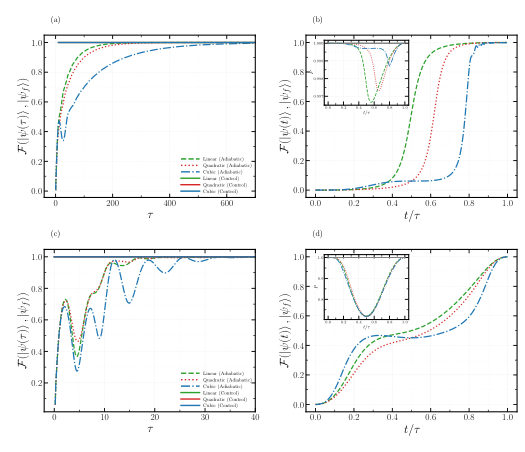
<figcaption class="paper-figure-caption"><b>Fig 4.</b> FIG. 3. The target state F(|ψ(τ)⟩, |ψi⟩) = | ⟨ψ(τ)|ψf⟩|2 and the instantaneous fidelity F(|ψ(t)⟩, |ψf⟩) = | ⟨ψ(t)|ψf⟩|2 is plotted as a function of τ and t/τ for τ = 1000 respec- tively for different driving profiles. Panel (a) and (b) [(c) and (d)] show the weak-coupling [strong-coupling] regime of Rabi model for transfer of initial state |ψi⟩= |e, 0⟩to the target state |ψf⟩=|g, 1⟩with and without control. The green-dashed curves corresponds to the linear driving, the red-dotted curves represent the quadratic driving, and the blue-dashed-dotted curve is the cubic driving. Parameters used are ωi = −ωc/2, ωf =5ωc/2, λ0 =0, α=0.5, and β =2. For the coupling proto- col; λm = ωc/10 (panel (a)...</figcaption>
</figure>
<figure class="paper-figure-card">
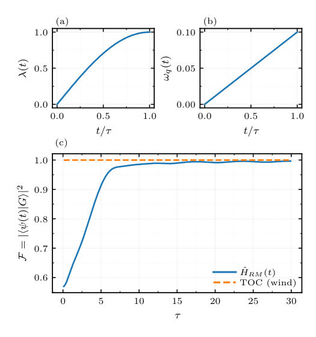
<figcaption class="paper-figure-caption"><b>Fig 5.</b> FIG. 5. (a) The time-dependent coupling protocol, Eq. (20), (b) the qubit driving frequency (linear case, j = 1), Eq. (14), and (c) the target state fidelity F(τ) = |⟨ψf|ψ(τ)⟩|2 as a function of time. We used parameters ωi = 0, ωf = ωc/10, λ0 = 0, and λm = ωc to obtain |ψ(τ)⟩by evolving |ψi⟩= |g, 0⟩ towards |G⟩= 1</figcaption>
</figure>

**Summary.** This paper presents a time-optimal control method called 'quantum wind' to rapidly generate nonclassical states like Fock and cat states in light-matter systems. By operating at the quantum speed limit, the protocol minimizes exposure to decoherence and reduces the energy required for state preparation. This approach offers a highly efficient and robust alternative to traditional adiabatic methods for quantum technologies.

**Why it may be interesting.** It provides a powerful shortcut-to-adiabaticity framework that optimizes the trade-off between speed, energy cost, and robustness, which is highly relevant for controlling hybrid quantum platforms and managing decoherence in open quantum systems.

Detailed structure

**Main problem.** The challenge of efficiently generating highly nonclassical states, such as Fock and Schrödinger cat states, without the long preparation times and decoherence risks associated with conventional adiabatic protocols.

**Main result.** The authors demonstrate that a 'quantum wind' control method enables the deterministic generation of nonclassical states at the quantum speed limit with unit fidelity, providing increased robustness against environmental noise and reduced energetic costs.

**Method.** The study employs the quantum brachistochrone formalism and a 'quantum wind' control strategy, which is a shortcut-to-adiabaticity (STA) method, to find optimal paths in the projective Hilbert space.

**Model / system.** The research focuses on light-matter systems described by the time-dependent Jaynes-Cummings and quantum Rabi models, involving the interaction between a bosonic cavity mode and a two-level qubit.

**Key observables.** Fidelity, Wigner phase-space distributions, Bures angle, quantum speed limit (Mandelstam-Tamm bound), and energy resource (control cost).

**Important parameters / regimes.** Coupling regimes (weak, strong, deep-strong, and extreme strong coupling), normalized coupling strength (eta), evolution time (tau), and environmental noise parameters (cavity dissipation, qubit relaxation, and dephasing).

**Assumptions / limitations.** The model assumes the validity of the Bloch-Redfield master equation with partial secularization and neglects the Lamb-shift contribution.

**Figures summary.** Figure 1 shows state trajectories in projective Hilbert space; Figure 2 illustrates driving protocols; Figure 8 demonstrates target-state infidelity across various environmental conditions.

**Paper structure.** The paper introduces the problem of state engineering, defines the quantum brachistochrone and quantum wind control framework, applies these methods to the Jaynes-Cummings and Rabi models across various coupling regimes, evaluates the protocol's robustness against decoherence using the Bloch-Redfield master equation, and concludes with an analysis of energy efficiency and speed limits.

Abstract

The efficient generation of highly nonclassical quantum states is essential for emerging quantum technologies, yet it remains challenging due to decoherence and the long preparation times associated with conventional adiabatic protocols. Here, we employ time-optimal control methods based on the quantum brachistochrone formalism to engineer nonclassical states in light--matter systems described by the time-dependent Jaynes--Cummings and quantum Rabi models. We demonstrate the deterministic generation of Fock states and highly entangled Schrödinger cat states at unit fidelity, and characterize their nonclassical properties through joint Wigner phase-space distributions. We further show that the wind control generates these non-classical states at speed limit which leads to a reduced energetic cost and robustness against dissipation, relaxation, and dephasing across a broad range of environmental conditions. Our results establish time-optimal control as an efficient and experimentally feasible approach for fast and nonclassical state engineering in hybrid quantum platforms.

[↑ back to top](#top)

### [First-passage time distribution of a Brownian particle harmonically confined in a viscoelastic bath](http://arxiv.org/abs/2605.25215v1)

**Authors:** Brandon R. Ferrer, Juan Ruben Gomez-Solano  
**Type:** both · **Category:** statistical mechanics · **PDF:** <https://arxiv.org/pdf/2605.25215v1>  
**Analysis basis:** full PDF text, analyzed in chunks
**Topic relevance:** `correlated / nonlocal dissipation` **2/5** · `non-equilibrium dynamics` **2/5**

↔ Scroll figures horizontally

<figure class="paper-figure-card">
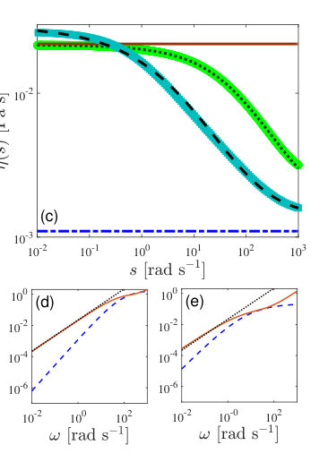
<figcaption class="paper-figure-caption"><b>Fig 1.</b> Figure 1. (a) Section of 40 min of the stochastic time evolution of the coordinate 𝑥of the position of a spherical colloidal particle (radius 𝑎= 1.0 𝜇m) trapped in an aqueous micellar solution (temperature 𝑇= 22◦C) by optical tweezers at constant power (𝑃≈0.1 mW). (b) Equilibrium probability density function of the coordinate 𝑥of the same particle (vertical bars), experimental profile of the optical trapping potential (○), and the corresponding quadratic fit (solid line), from which the stiffness of this harmonic trap is calculated: 𝜅= 1.77×10−7 N m−1. (c) Viscosity as a function of the real Laplace frequency 𝑠&gt; 0 of the polymer (○) and the micellar solution (□), where the dotted and dashed...</figcaption>
</figure>
<figure class="paper-figure-card">
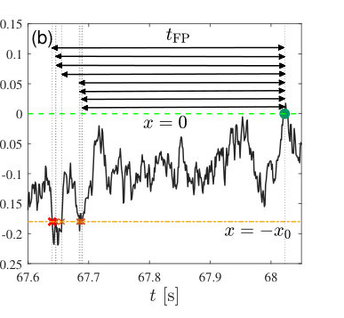
<figcaption class="paper-figure-caption"><b>Fig 2.</b> Figure 2. (a) Example of the determination of first-passage events of a colloidal bead optically trapped in the micellar solution by a harmonic potential of stiffness 𝜅= 1.77 × 10−7 N m−1, whose durations allow to statistically sample stochastic values of 𝑡FP. Given the initial position 𝑥0 = 0.18 𝜇m (dotted-dashed line) and the target point 𝑥= 0 (dashed line), a first passage event is detected, like the trajectory segment comprised between the thick red cross (initial position) and the green circle (target). Multiple returns of the particle to the initial position (thin orange crosses) can be considered as starting points of 5 additional first-passage events provided that they eventually...</figcaption>
</figure>
<figure class="paper-figure-card">
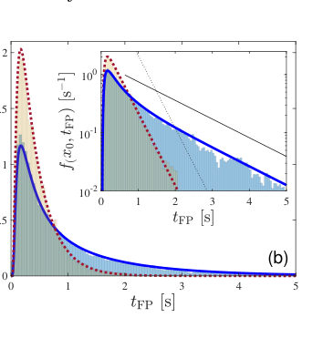
<figcaption class="paper-figure-caption"><b>Fig 3.</b> Figure 3. (a) Probability density function of the first-passage time to reach the target located at 𝑥= 0 of a particle optically trapped in water at two distinct values of the trap stiffness: 𝜅= 2.13 × 10−7 N m−1 (blue bars), and 𝜅= 1.33 × 10−6 N m−1 (red bars) starting from the initial position 𝑥0 = 0.1 𝜇m. The thick solid and thick dotted lines represent the theoretical curves calculated using Eq. (16) for these two values of 𝜅, respectively. (b) Probability density function of the first-passage time to reach the target at 𝑥= 0 of a particle optically trapped in the glycerol/water mixture at two distinct values of the trap stiffness: 𝜅= 3.06 × 10−7 N m−1 (blue bars), and 𝜅= 1.19 × 10−6 N...</figcaption>
</figure>
<figure class="paper-figure-card">
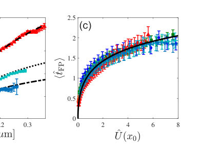
<figcaption class="paper-figure-caption"><b>Fig 4.</b> Figure 4. (a) MFPT to the target located at 𝑥= 0 as a function of the initial position 𝑥0 of a particle optically trapped in water that was experimentally determined (symbols) and calculated using Eq. (21) (lines) at different values of the trap stiffness: 𝜅= 2.13 × 10−7 N m−1 (orange ○, dashed line), 𝜅= 5.75 × 10−7 N m−1 (green □, dotted line), and 𝜅= 1.33 × 10−6 N m−1</figcaption>
</figure>
<figure class="paper-figure-card">
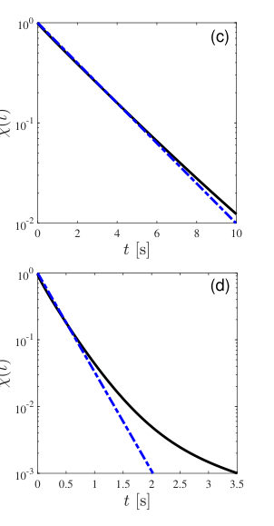
<figcaption class="paper-figure-caption"><b>Fig 5.</b> Figure 5. [(a)-(b)] Probability density function of the first-passage time to the target 𝑥= 0, 𝑡FP, of a colloidal bead optically trapped in the polymer solution, starting from 𝑥0 = 0.1 𝜇m, at two different values of the trapping stiffness: (a) 𝜅= 1.88 × 10−7 N m−1, and (b) 𝜅= 1.39 × 10−6 N m−1. The experimental data are represented as vertical bars. The thick dotted and thick solid lines represent the theoretical curves computed by means of Eq. (16) assuming a constant viscosity of the polymer solution (𝜂= 𝜂0 = 0.0216 Pa s), and Eq. (15) including its frequency-dependent viscosity ̃𝜂(𝑠) plotted in Fig. 1(c), respectively. Insets: semi- log representations of the main plots. The thin dotted...</figcaption>
</figure>

**Summary.** This paper provides a theoretical and experimental framework to understand how the memory effects in a viscoelastic bath alter the first-passage time of a trapped particle. It shows that unlike in simple viscous fluids, the statistics in viscoelastic media depend on the trap stiffness and exhibit long-lived, non-exponential tails. This work is significant for understanding stochastic processes in complex, non-equilibrium environments.

**Why it may be interesting.** The study of non-Markovian dynamics and memory kernels is highly relevant to open quantum systems, where environmental correlations and non-Markovianity significantly affect decoherence and relaxation processes.

Detailed structure

**Main problem.** Investigating the first-passage time (FPT) properties of a Brownian particle in both Markovian (viscous) and non-Markovian (viscoelastic) environments.

**Main result.** The authors derived a general expression for the FPT probability density function in viscoelastic baths and demonstrated that the mean first-passage time can exceed that of a Newtonian fluid with the same zero-shear viscosity due to non-exponential tails.

**Method.** Theoretical derivation using the overdamped generalized Langevin equation and Laplace transforms, validated by experimental measurements of colloidal beads in optical tweezers.

**Model / system.** A single micrometric spherical bead trapped in a harmonic potential within various fluids, including Newtonian (water, glycerol/water) and viscoelastic (polymer and micellar) solutions.

**Key observables.** First-passage time distribution (PDF), Mean First-Passage Time (MFPT), and survival probability.

**Important parameters / regimes.** Trap stiffness (kappa), initial position (x0), friction memory kernel, zero-shear viscosity, and the dimensionless potential energy.

**Assumptions / limitations.** The dynamics are assumed to be overdamped (neglecting inertia), and the fluid is assumed to be in thermal equilibrium and homogeneous.

**Figures summary.** Figure 1 shows particle trajectories and complex viscosity; Figure 2 illustrates the experimental FPT counting method; Figure 3 compares experimental and theoretical PDFs for Newtonian fluids; Figure 4 shows MFPT vs. initial position; Figure 6 and 7 demonstrate the breakdown of universal scaling and the impact of viscoelasticity on the FPT distribution.

**Paper structure.** The paper begins with the theoretical derivation of the FPT distribution using the generalized Langevin equation, followed by the experimental setup using optical tweezers, the characterization of various fluids via microrheology, a comparison of Newtonian and non-Newtonian results, and finally an analysis of the impact of trap stiffness and energy scales.

Abstract

We investigate theoretically and experimentally the first passage-time properties of a spherical Brownian particle that is harmonically trapped at thermal equilibrium in a fluid at constant temperature. By using the overdamped version of the generalized Langevin equation, we derive a general expression for the probability density function of the time that the particle takes to reach for the first time the minimum of the potential starting from an arbitrary position. We show that such a first-passage time distribution can be implicitly expressed in terms of the friction memory kernel that encodes the interaction of the particle with its surroundings, and correctly reduces to previously found expressions in the case of a Markovian viscous bath. We validate our theoretical results by measuring the first-passage time of colloidal beads optically trapped in non-Markovian baths such as viscoelastic polymer and micellar solutions, as well as in a viscous glycerol/water mixture and water, which behave as Markovian media, having quantitative agreement with the derived expressions. In particular, we find that the mean first-passage time in a viscoelastic bath can surpass that in a viscous medium of the same zero-shear viscosity due to the emergence of slowly decaying tails in the first-passage time probability density of the former.

[↑ back to top](#top)

### [Non-Hermitian Twisting Theory under the open boundary condition](http://arxiv.org/abs/2605.25386v1)

**Authors:** Chen-Hao Zhao, Jia-Rui Li, Yuping Tian, Wei-Jiang Gong  
**Type:** theory · **Category:** disordered systems and neural networks · **PDF:** <https://arxiv.org/pdf/2605.25386v1>  
**Analysis basis:** full PDF text, analyzed in chunks
**Topic relevance:** `methods for driven-dissipative` **2/5** · `non-equilibrium dynamics` **2/5**

↔ Scroll figures horizontally

<figure class="paper-figure-card">
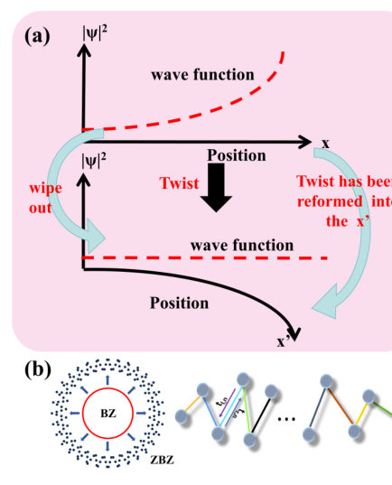
<figcaption class="paper-figure-caption"><b>Fig 1.</b> FIG. 1: Schematic of lattice twisting and the Zahlen Bril- louin zone (ZBZ). (a) The metric of the non-reciprocal Hamiltonian is modified (see text) to absorb the ex- ponential growth of the wavefunction into the coordi- nate, removing the accumulated twisting and restoring a Bloch-wave form via a LST. (b) The Brillouin zone is discretized to incorporate nonreciprocity, defining the ZBZ.</figcaption>
</figure>
<figure class="paper-figure-card">
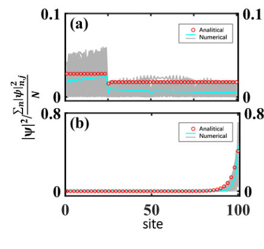
<figcaption class="paper-figure-caption"><b>Fig 2.</b> FIG. 2: Schematic of twisting accumulation. The local scaling transformation On (red circle) captures the cu- mulative effect of lattice twisting, which underlies the NHSE. Two representative cases are shown: (a) H1 = t1(c† A,ncB,n +h.c.)+t2(c† B,ncA,n+1 +h.c.)+γc† A,13cB,13 − γc† B,13cA,13, tr,25 →(t1 −γ), tl,25 →(t1 + γ), tr,n = tl,n = t1, with a single nontrivial twisting T25, and (b) H2 = PN−1 n=1 [t1(c† A,ncB,n + h.c.) + t2(c† B,ncA,n+1 + h.c.)]−PN/2 n=1 γc† ncn+1+PN n=N/2+1 γc† n+1cn, with region- dependent global twisting. The grey line and cyan line are the wavefunction densities and wavefunction den- sity profiles for H1 and H2. Parameters N=100, t2=1, t1 = 0.9; H1: γ = 2, H2: γ =...</figcaption>
</figure>
<figure class="paper-figure-card">
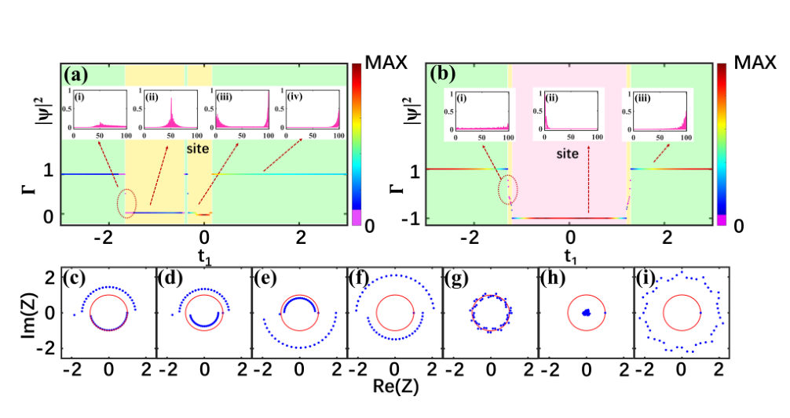
<figcaption class="paper-figure-caption"><b>Fig 3.</b> FIG. 3: Multiple-channel skin effect (MCSE) in non-periodic system H2 and quasi-periodic system H3 (H3 = P</figcaption>
</figure>

**Summary.** This paper extends the theory of the Non-Hermitian Skin Effect to nonperiodic and disordered systems using a new site-resolved 'twisting' framework. It introduces the Zahlen-Brillouin Zone and discovers a multiple-channel skin effect arising from competing nonreciprocal sites. This provides a universal way to diagnose non-Hermitian physics in both crystalline and amorphous media.

**Why it may be interesting.** It provides a universal framework for understanding non-Hermitian localization in the absence of translational symmetry, which is highly relevant for studying open quantum systems and non-equilibrium dynamics in disordered environments.

Detailed structure

**Main problem.** The Generalized Brillouin Zone (GBZ) description of the Non-Hermitian Skin Effect (NHSE) is limited to translationally invariant systems, failing to account for localization in disordered, quasiperiodic, or amorphous lattices.

**Main result.** The authors develop a site-resolved theory that introduces the Zahlen-Brillouin Zone (ZBZ) and identifies a Multiple-Channel Skin Effect (MCSE) where competing nonreciprocal sites lead to complex localization patterns.

**Method.** A Local Scaling Transformation (LST) is used to absorb nonreciprocity into coordinates, alongside a new metric-state correspondence (MSC) principle and a local lattice twisting parameter (Tn).

**Model / system.** Generic nonreciprocal lattices, including periodic, nonperiodic, and quasi-periodic (modulated) systems, described by a Hamiltonian with asymmetric intracell hoppings.

**Key observables.** Local lattice twisting (Tn), Global skin index (Gamma), and the Maximal Normalized Cumulative Twisting Weight.

**Important parameters / regimes.** Unidirectional Twisting (UT) regime, Competing Twisting (CT) regime, and the Antagonistic vs. Complete phases.

**Assumptions / limitations.** The theory assumes the existence of a metric operator and a local scaling transformation that can map the non-Hermitian Hamiltonian to a Hermitian counterpart.

**Figures summary.** Figure 1 illustrates the LST and ZBZ discretization; Figure 2 shows the localization profiles; Figure 3 displays the skin index and ZBZ distribution for non-periodic and quasi-periodic models.

**Paper structure.** The paper introduces the limitation of GBZ, develops the LST and ZBZ framework, defines the local twisting parameter, classifies NHSE phases (UT vs CT), and establishes the metric-state correspondence.

Abstract

The non-Hermitian skin effect (NHSE) is a hallmark of non-Hermitian system, yet its generalized Brillouin zone (GBZ) description is restricted to periodic systems. We develop a site-resolved theory via a local scaling transformation (LST), introducing local twisting $T_n$ to quantify metric operator $ξ$ nontriviality. This elucidates the NHSE's origin and uncovers the generalized multiple-channel skin effect (MCSE). Exploiting $T_n$'s translational independence, we define the Zahlen-Brillouin Zone (ZBZ), extending non-Hermitian band theory to nonperiodic and disordered lattices. Furthermore, we unify the $ξ$ with GBZ Riemannian geometry, establishing the metric and state correspondence (MSC) as the principle for real-space localization. With a global skin index $\mathbfΓ$ for phase transitions, our results provide a universal paradigm for non-Hermitian physics in both crystalline and amorphous media.

[↑ back to top](#top)

### [QCommE2E: An Open-Source Simulation of End-to-End Quantum Communication Systems](http://arxiv.org/abs/2605.24723v1)

**Authors:** Omar Alnaseri  
**Type:** theory · **Category:** quantum information and computing · **PDF:** <https://arxiv.org/pdf/2605.24723v1>  
**Analysis basis:** full PDF text, analyzed in chunks
**Topic relevance:** `methods for driven-dissipative` **2/5** · `quantum measurements` **2/5**

↔ Scroll figures horizontally

<figure class="paper-figure-card">
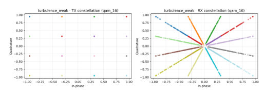
<figcaption class="paper-figure-caption"><b>Fig 1.</b> Fig. 1. Constellation diagram for the weak-turbulence configuration. Left: transmitted 16-QAM surrogate constellation. Right: corresponding received constellation.</figcaption>
</figure>
<figure class="paper-figure-card">
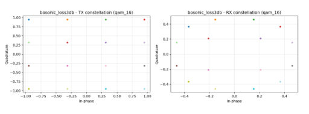
<figcaption class="paper-figure-caption"><b>Fig 2.</b> Fig. 3. Constellation diagram for the bosonic channel with 3dB loss configura- tion. Left: transmitted 16-QAM surrogate constellation. Right: corresponding received constellation.</figcaption>
</figure>
<figure class="paper-figure-card">
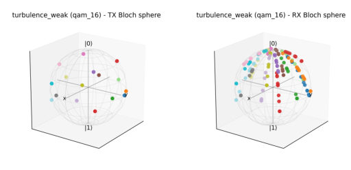
<figcaption class="paper-figure-caption"><b>Fig 3.</b> Fig. 2. Block spheres for the weak-turbulence configuration. Left: transmitted 16-QAM surrogate constellation. Right: corresponding received constellation.</figcaption>
</figure>
<figure class="paper-figure-card">
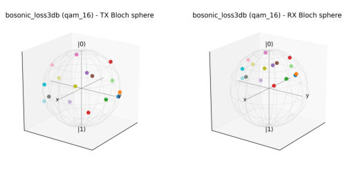
<figcaption class="paper-figure-caption"><b>Fig 4.</b> Fig. 4. Block spheres for the bosonic channel with 3dB loss configuration. Left: transmitted 16-QAM surrogate constellation. Right: corresponding re- ceived constellation.</figcaption>
</figure>

**Summary.** This paper introduces QCommE2E, an open-source simulation framework designed for modeling end-to-end quantum communication systems. It provides a unified way to simulate various quantum channels and evaluate performance metrics like BER and SER. The framework is particularly useful for designing and benchmarking novel quantum communication architectures.

**Why it may be interesting.** It provides a unified software tool for simulating open quantum systems and noise models (CPTP maps) in the context of quantum communication, which is highly relevant to quantum optics and network design.

Detailed structure

**Main problem.** The lack of a comprehensive, open-source, and tutorial-oriented simulation framework capable of integrating heterogeneous quantum channels (qubit-based and bosonic surrogates) for end-to-end quantum communication system analysis.

**Main result.** The development of QCommE2E, a modular Python-based simulation framework that successfully demonstrates a unified pipeline for comparing various quantum channel degradation mechanisms using 16-QAM modulation.

**Method.** A modular end-to-end pipeline (Modulator -> Transmitter -> Channel -> Receiver -> Metrics) using a density-matrix interface and a Pretty Good Measurement (PGM) detector.

**Model / system.** A quantum communication link utilizing density-matrix representations of quantum states, incorporating channels such as Depolarizing, Dephasing, Erasure, Bosonic (truncated), Turbulence, and PMD surrogates.

**Key observables.** Bit Error Rate (BER), Symbol Error Rate (SER), constellation diagrams, and Bloch sphere representations.

**Important parameters / regimes.** 16-QAM embedding, 4000 symbol benchmark, 3dB bosonic loss, and various channel-specific noise parameters.

**Assumptions / limitations.** The 16-QAM embedding is an engineering approximation rather than a full physical model; the bosonic channel is restricted to a low-dimensional (dim=2) subspace; the system is assumed to be memoryless.

**Figures summary.** Figures 1 and 2 illustrate the impact of weak turbulence on 16-QAM constellations and Bloch spheres, while Figures 3 and 4 show the effects of 3dB loss in a bosonic channel.

**Paper structure.** The paper introduces the software motivation, details the mathematical interface and channel implementations, demonstrates a benchmark channel-comparison workflow, and concludes with future work directions.

Abstract

This paper presents QCommE2E as an open-source simulation framework for end-to-end quantum communication systems, with explicit tutorial emphasis. The primary objective is to develop a comprehensive framework that includes transmitters, receivers, communication channels, performance metrics, and visualization tools, to facilitate the systematic design, configuration, and analysis of experimental simulations for novel quantum communication architectures. As the primary use case, we walk through the current quantum channel comparison, which maps textbook quantum-information channels and reduced optical-fiber/free-space surrogates into a single executable benchmark. We describe the common density-matrix interface, the matched modulation and detection chain, and the exact role of the channel classes Depolarizing Channel, Dephasing Channel, Erasure Channel, Bosonic Channel, Turbulence Channel, and PMD Channel. We also explain the current visualization layer, which projects received states onto constellation and Bloch representations for qualitative inspection. To keep the implementation-faithful, we provide a summary of the baseline execution, which uses a square 16-QAM embedding, a pretty-good-measurement detector constructed from the same reference-state codebook, and BER/SER. Finally, we position the channel-comparison as an entry point for broader future work, including equalization, quantum autoencoder, learning-based, and system-level algorithm integration.

[↑ back to top](#top)

### [Resonant interactions in the $α$-FPUT lattice with site-dependent coefficients](http://arxiv.org/abs/2605.24268v1)

**Authors:** Lorenzo Migliorelli, Giovanni Dematteis, Sergio Chibbaro, Miguel Onorato  
**Type:** theory · **Category:** statistical mechanics · **PDF:** <https://arxiv.org/pdf/2605.24268v1>  
**Analysis basis:** full PDF text, analyzed in chunks
**Topic relevance:** `non-equilibrium dynamics` **2/5** · `scars & prethermalization` **2/5**

↔ Scroll figures horizontally

<figure class="paper-figure-card">
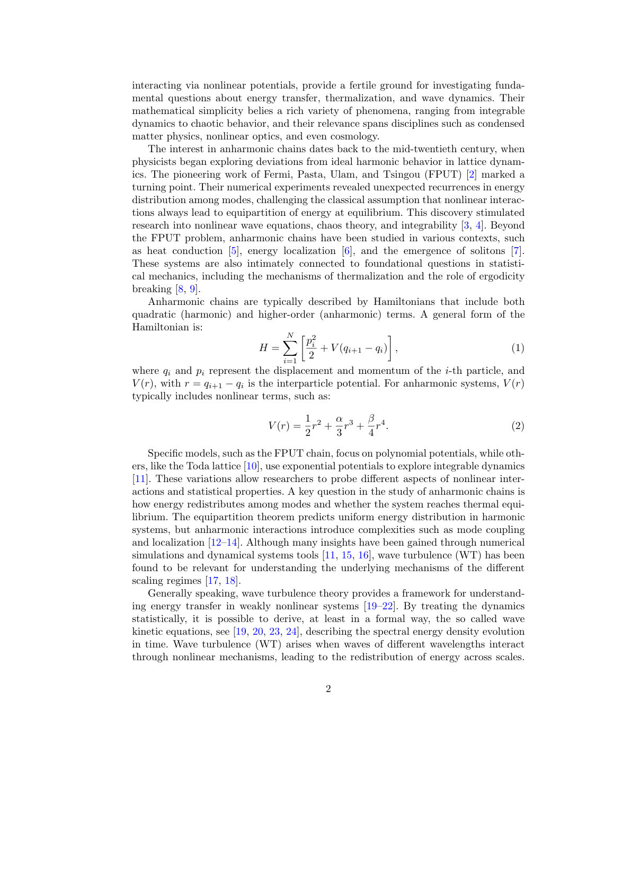
<figcaption class="paper-figure-caption"><b>Fig 1.</b> Low-resolution page preview, page 2</figcaption>
</figure>
<figure class="paper-figure-card">
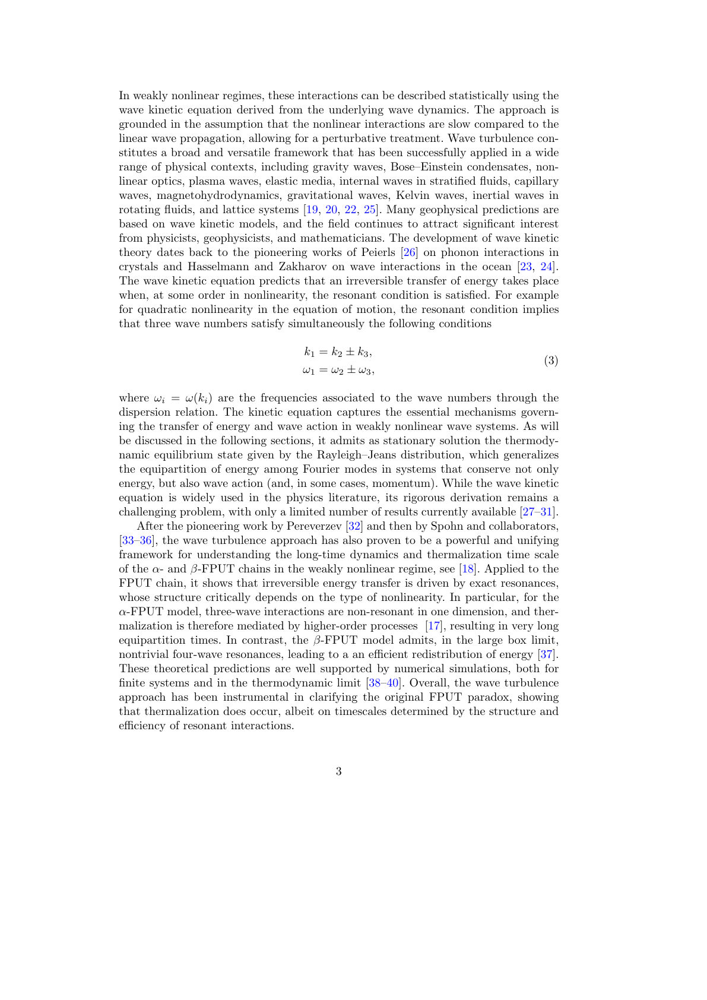
<figcaption class="paper-figure-caption"><b>Fig 2.</b> Low-resolution page preview, page 3</figcaption>
</figure>
<figure class="paper-figure-card">
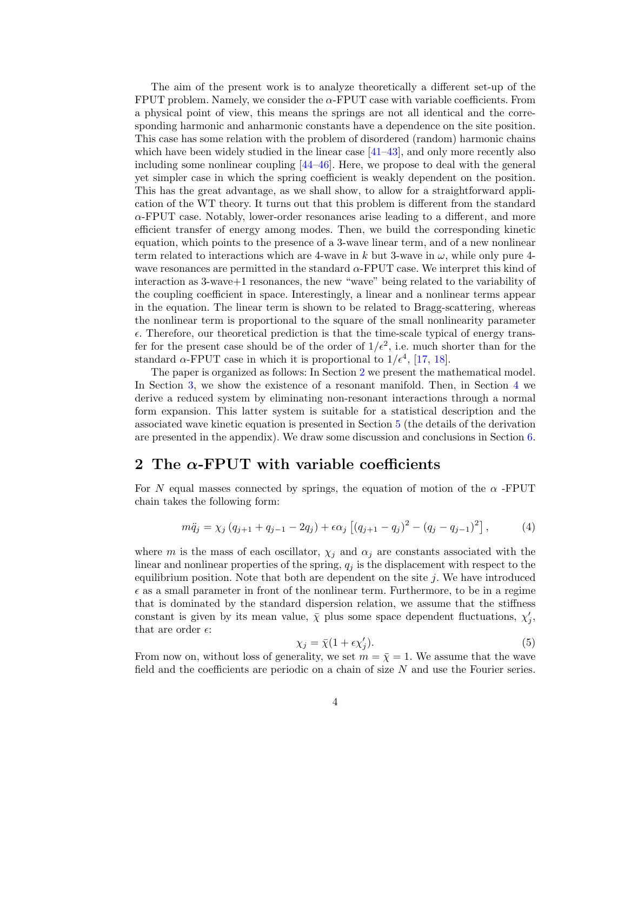
<figcaption class="paper-figure-caption"><b>Fig 3.</b> Low-resolution page preview, page 4</figcaption>
</figure>
<figure class="paper-figure-card">
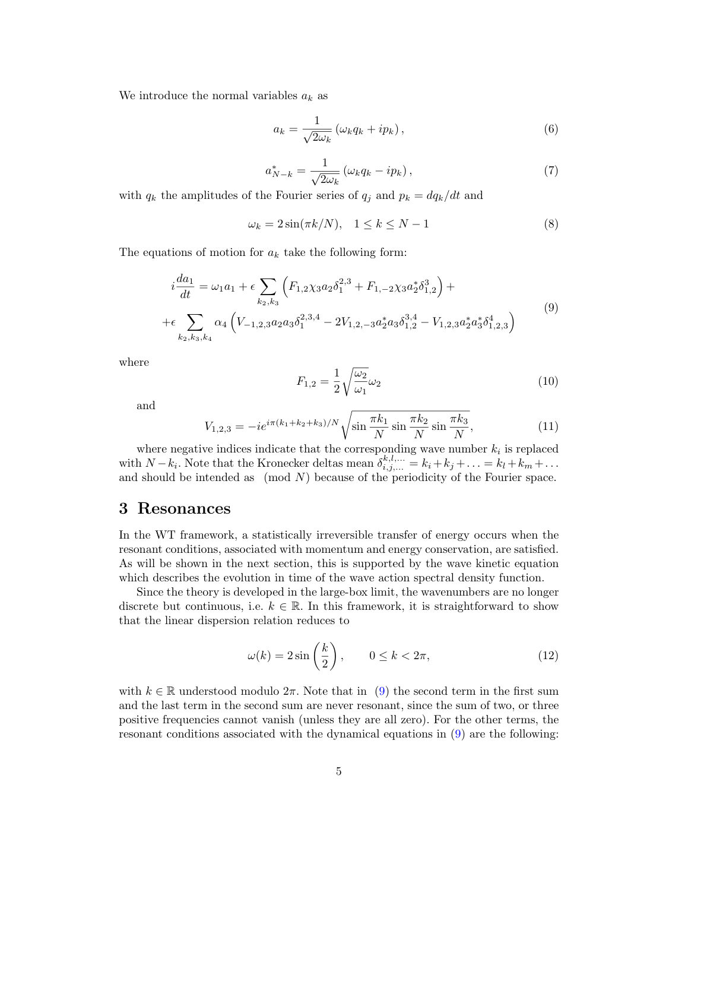
<figcaption class="paper-figure-caption"><b>Fig 4.</b> Low-resolution page preview, page 5</figcaption>
</figure>
<figure class="paper-figure-card">
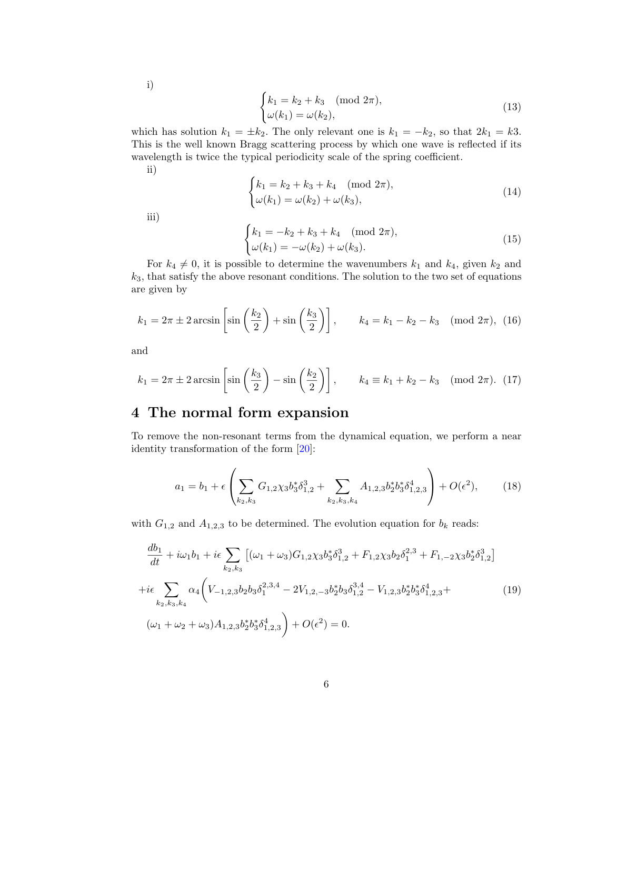
<figcaption class="paper-figure-caption"><b>Fig 5.</b> Low-resolution page preview, page 6</figcaption>
</figure>

**Summary.** This paper explores how spatial variations in the properties of a nonlinear 1D chain can accelerate the process of thermalization. By using wave turbulence theory, the authors demonstrate that site-dependent coefficients create new resonance channels that allow energy to redistribute much faster than in a uniform lattice.

**Why it may be interesting.** not directly relevant

Detailed structure

**Main problem.** Investigating how spatial modulation of spring stiffness and nonlinear coefficients in an alpha-FPUT lattice affects energy transfer, resonant manifolds, and the thermalization timescale.

**Main result.** The derivation of a new wave kinetic equation shows that spatial modulation creates a non-trivial resonant manifold, leading to significantly faster thermalization (1/epsilon^2) compared to the standard case (1/epsilon^4) and introducing a Bragg-scattering mechanism.

**Method.** Wave Turbulence theory using a perturbative treatment, normal form expansion (near-identity transformation), and Wick decomposition in the large-box limit.

**Model / system.** A one-dimensional alpha-Fermi-Pasta-Ulam-Tsingou (alpha-FPUT) lattice with site-dependent spring stiffness and nonlinear coefficients.

**Key observables.** Wave-action spectral density function, spectral energy density evolution, and thermalization timescales.

**Important parameters / regimes.** Small nonlinearity parameter epsilon, site-dependent stiffness chi_j, and nonlinear coefficient alpha_j.

**Assumptions / limitations.** Weak nonlinearity (epsilon << 1), weak spatial modulation of coefficients (order epsilon), and the large-box limit (L -> infinity).

**Paper structure.** The paper introduces the site-dependent alpha-FPUT model, applies Wave Turbulence theory and normal form expansion to derive a modified wave kinetic equation, analyzes the resulting resonant manifolds (including Bragg scattering), and discusses the implications for thermalization rates and the approach to the Rayleigh-Jeans equilibrium.

Abstract

The wave turbulence framework has proven to be an effective tool for analyzing certain features of nonlinear energy transfer in one-dimensional nonlinear chains. In this work, we extend this approach to the $α$-FPUT problem when the spring stiffness $χ$ and the nonlinear coefficient $α$ are site-dependent. Although three-wave interactions are non-resonant for constant coefficients, their spatial modulation gives rise to a non-trivial resonant manifold. In this framework, we derive a new kinetic equation that suggests the possibility of substantially faster thermalization with respect to the constant coefficient case. The new kinetic equation includes also an extra term that can be associated to the Bragg-scattering mechanism, which promotes the isotropization of the wave-action spectral density function.

[↑ back to top](#top)

### [Scaling features for the stress fluctuations in the OFC model](http://arxiv.org/abs/2605.25884v1)

**Authors:** Naveen Kumar, Rahul Chhimpa, Avinash Chand Yadav  
**Type:** theory · **Category:** statistical mechanics · **PDF:** <https://arxiv.org/pdf/2605.25884v1>  
**Analysis basis:** full PDF text, analyzed in chunks
**Topic relevance:** `non-equilibrium dynamics` **2/5** · `non-equilibrium universality` **2/5**

↔ Scroll figures horizontally

<figure class="paper-figure-card">
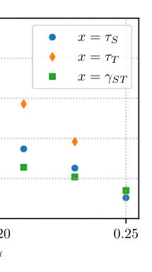
<figcaption class="paper-figure-caption"><b>Fig 1.</b> Figure 1. The OFC model on a square lattice: The critical exponents characterizing avalanche properties in the OFC model on a square lattice with α, a parameter capturing the level of local dissipation. When α = 0.25, the dynamics are locally conservative. τS and τT are the avalanche size and duration exponents, and γST = (τT −1)/(τS −1) describes scaling behavior of average size with duration. When the local dissipation increases (or α decreases), γST increases. We also note that τA ≈τS, where τA is the avalanche area exponent.</figcaption>
</figure>
<figure class="paper-figure-card">
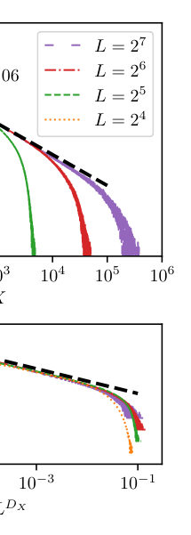
<figcaption class="paper-figure-caption"><b>Fig 2.</b> Figure 2. The OFC model: (a) The probability distribution for the size area difference X = S−A for different system size L with locally conservative OFC dynamics α = 0.25. The total number of avalanches is 109. About 61.25% of events for L7 have X = 0 or the same size and area values. The dashed straight line guides the slope value. (b) The data collapse plot with DX = 3.1 and DXτX = 3.3. The estimated value of the size area difference exponent is τX = 1.06.</figcaption>
</figure>
<figure class="paper-figure-card">
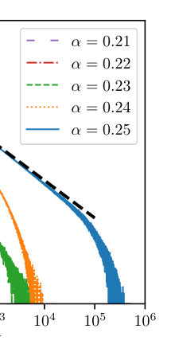
<figcaption class="paper-figure-caption"><b>Fig 3.</b> Figure 3. Same as figure 2(a) but with different values of the dissipation parameter α. The system size is L = 27. Notice that the power-law scaling feature of X disappears when the local dissipation level drastically increases.</figcaption>
</figure>
<figure class="paper-figure-card">
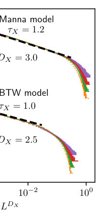
<figcaption class="paper-figure-caption"><b>Fig 4.</b> Figure 4. Same as figure 2(b) but for the BTW and Manna sandpile models on a square lattice. The system size values and the number of avalanches are the same as in figure 2(a).</figcaption>
</figure>
<figure class="paper-figure-card">
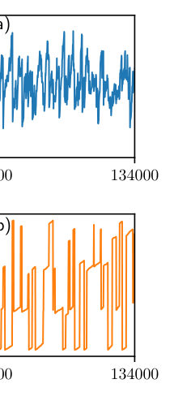
<figcaption class="paper-figure-caption"><b>Fig 5.</b> Figure 5. For the OFC model with α = 0.25: (a) A typical signal for the total stress fluctuations η(t) with a system size L = 26. (b) A portion of the local stress fluctuations.</figcaption>
</figure>

**Summary.** This paper explores new scaling properties in the OFC model of earthquakes, finding that a power-law distribution exists for the difference between avalanche size and area only in the conservative limit. It also demonstrates how local dissipation fundamentally changes the dynamic exponent of stress fluctuations from ballistic to diffusive behavior.

**Why it may be interesting.** not directly relevant

Detailed structure

**Main problem.** The study investigates new scaling features in the Olami-Feder-Christensen (OFC) model, specifically the probability distribution of the difference between avalanche size and area, and the power spectra of stress fluctuations.

**Main result.** In the conservative OFC model, the difference between avalanche size and area follows a power-law distribution, a feature that vanishes in the dissipative regime. Additionally, the dynamic exponent shifts from nearly ballistic to diffusive behavior as dissipation increases, with local stress exhibiting 1/f noise.

**Method.** Numerical simulations using an efficient algorithm with active site tracking and 1D array conversion, combined with finite-size scaling (FSS) analysis and power spectra analysis via Fast Fourier Transform (FFT).

**Model / system.** The Olami-Feder-Christensen (OFC) model, a cellular automata model of seismic activity on a 2D square lattice with open boundary conditions, which exhibits self-organized criticality.

**Key observables.** Avalanche size (S), area (A), difference (X = S - A), duration (T), local and total stress fluctuations, and power spectra.

**Important parameters / regimes.** Dissipation parameter (alpha), where alpha = 0.25 is locally conservative and alpha < 0.25 is locally dissipative.

**Assumptions / limitations.** The model assumes uniform driving and specific redistribution rules that distinguish it from standard sandpile models.

**Figures summary.** Figure 1 shows critical exponents as a function of alpha; Figure 2 shows the probability distribution and data collapse of X; Figure 3 shows the impact of decreasing alpha on P(X, L); Figure 4 compares X scaling in BTW and Manna models; Figures 5 and 6 show stress signals and their power spectra.

**Paper structure.** The paper introduces the OFC model and its parameters, presents the analysis of the size-area difference (X), compares these findings to BTW and Manna models, analyzes the power spectra of stress fluctuations, and concludes with the implications of dissipation on dynamics.

Abstract

We consider the Olami-Feder-Christensen (OFC) model on a square two-dimensional lattice with open boundary conditions. The model exhibits self-organized criticality and explains the Gutenberg-Richter law observed for earthquakes. A parameter $α$ controls the level of local dissipation: $α< 0.25$ corresponds to locally dissipative and $α= 0.25$ marks locally conservative dynamics. The avalanche size distribution follows a decaying power-law, with a non-universal critical exponent. Here, we examine the probability distribution of the difference between avalanche size and area. This quantity remains unexplored despite being of significant interest in earthquakes. We find a power-law with a scaling exponent close to one in the conservative OFC model. The scaling feature vanishes even for the physically relevant case $α= 0.21$. To examine the robustness of such features, we also examine the same quantity in the BTW and Manna sandpile models on a square lattice. We find that the power-law behavior survives for these systems due to locally conservative dynamics. We further examine the local and total stress fluctuations in the OFC model for both locally conservative and dissipative dynamics. The finite-size scaling analysis of the power spectra for the stress fluctuations reveals qualitatively the same but quantitatively significantly different behavior. The dynamic exponent describing the divergence of the correlation time with system size changes from nearly ballistic in the conservative to diffusive behavior in the locally dissipative dynamics with $α= 0.21$. The local stress also exhibits a signature of nearly canonical $1/f$ noise in the intermediate regime, and $1/f^2$-type scaling dominates the high-frequency regime.

[↑ back to top](#top)

### [Towards a nuclear isomer quantum battery](http://arxiv.org/abs/2605.24935v1)

**Authors:** Ying-Bo Gao, Fu-Quan Dou  
**Type:** theory · **Category:** quantum information and computing · **PDF:** <https://arxiv.org/pdf/2605.24935v1>  
**Analysis basis:** full PDF text, analyzed in chunks
**Topic relevance:** `methods for driven-dissipative` **2/5** · `non-equilibrium dynamics` **2/5**

↔ Scroll figures horizontally

<figure class="paper-figure-card">
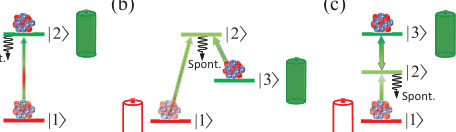
<figcaption class="paper-figure-caption"><b>Fig 1.</b> FIG. 1. Schematic of the NIQBs setup. (a) Schematic of a two level nuclear system, composed of the ground state |1⟩and an excited state |2⟩(isomeric state) of the nucleus. All popula- tion in |1⟩denotes an empty battery, while complete popula- tion in |2⟩corresponds to a fully charged state. (b) Schematic of nuclear three-level Λ and (c) ladder-type schemes, consist- ing of the nuclear ground state |1⟩and two different energy levels of excited states |2⟩and |3⟩(isomeric state). All pop- ulation in |1⟩means an empty battery, and a fully charged state is achieved with complete population in |3⟩.</figcaption>
</figure>
<figure class="paper-figure-card">
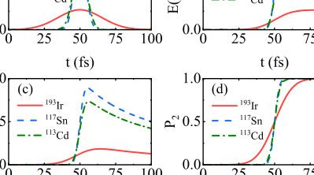
<figcaption class="paper-figure-caption"><b>Fig 2.</b> FIG. 2. (a) The pulse shape controlled by π-pulse, (b) the time evolution of the stored energy E(t) (in units of eV ), (c) the average charging power P(t) (in units of W), and (d) the population of the target state for three selected two-level nuclear systems: 193Ir,117Sn, and 113Cd.</figcaption>
</figure>
<figure class="paper-figure-card">
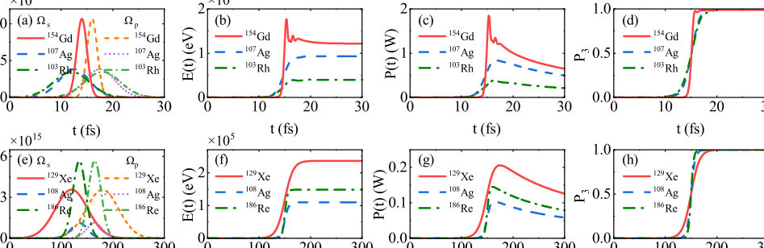
<figcaption class="paper-figure-caption"><b>Fig 3.</b> FIG. 3. (a), (e) The pulse shape controlled by STIRAP, (b), (f) time evolution of the stored energy E(t) (in units of eV ), (c), (g) the average charging power P(t) (in units of W) and (d), (h) the population P3 of the target state |3⟩for selected three-level nuclear systems: Λ-type of 154Gd, 107Ag and 103Rh (a–d) and ladder-type of 129Xe, 108Ag and 186Re (e–h), respectively.</figcaption>
</figure>
<figure class="paper-figure-card">
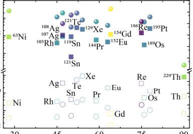
<figcaption class="paper-figure-caption"><b>Fig 4.</b> FIG. 4. The stable stored energy (in units of eV ) and the maximum average charging power (in units of W) of three- level NIQBs and QBs for typical nuclei and the corresponding atom, respectively. Z denotes the neutron number of a nu- cleus. Solid squares and solid circles correspond to the stored energy and average charging power of NIQBs, respectively; hollow squares and hollow circles denote the same parameters for QBs. Colors indicate the lifetimes of the nuclear isomeric states.</figcaption>
</figure>

**Summary.** The paper proposes a new class of quantum batteries using nuclear isomers to achieve unprecedented energy density and power. By utilizing X-ray Free Electron Lasers to drive transitions in nuclear systems, these batteries can store much higher energy levels than atomic versions and maintain that energy for much longer periods.

**Why it may be interesting.** It presents a novel application of nuclear physics to quantum thermodynamics, demonstrating how extremely long-lived metastable states can overcome the decoherence and energy-density limits typical of atomic-scale quantum batteries.

Detailed structure

**Main problem.** Existing quantum batteries based on atomic or molecular systems suffer from low energy density and rapid self-discharging due to short excited-state lifetimes.

**Main result.** Nuclear Isomer Quantum Batteries (NIQBs) can achieve energy storage and charging power enhancements of up to 10^6 and 10^11, respectively, compared to atomic systems, with lifetimes extending up to 10^5 years.

**Method.** The study uses a density matrix approach with a master equation to model coherent population transfer (NCPT) and STIRAP driven by X-ray Free Electron Laser (XFEL) pulses.

**Model / system.** The system consists of nuclear ensembles in two-level, Lambda-type, and ladder-type configurations using various isotopes (e.g., 193Ir, 117Sn, 129Xe). The Hamiltonian includes nuclear energy levels and interaction with an external XFEL field.

**Key observables.** Stored energy (E), average charging power (P), ergotropy (W), energy extraction ratio (R), and system purity (P).

**Important parameters / regimes.** Energy scales of 10^5 eV to hundreds of keV; charging power in the Watt scale; interaction times on the femtosecond scale; lifetimes from microseconds to 10^5 years.

**Assumptions / limitations.** The framework assumes the use of XFEL as a charger and focuses on regimes where spontaneous emission is negligible for most isotopes due to long isomeric lifetimes.

**Figures summary.** Figure 1 shows schematic setups for two-level, Lambda, and ladder-type NIQBs. Supplemental figures include contour plots of energy and extraction ratio versus laser intensity and energy extraction plots.

**Paper structure.** Introduction of the NIQB concept, description of the nuclear energy level configurations, mathematical framework for charging dynamics and energy metrics, comparative analysis between nuclear and atomic systems, and discussion of optimization and limitations.

Abstract

Quantum batteries (QBs) -- quantum devices governed by the principles of quantum mechanics -- hold great promise for next-generation energy storage. However, most existing research efforts focus on atomic or molecular systems featuring low-energy and short-lived energy levels, leaving the exploitation of high-energy, ultra-stable nuclear energy levels for energy storage as a critical unaddressed challenge. Here, we propose an innovative design of referred to as nuclear isomer quantum batteries (NIQBs), whose energy storage unit is typically composed of two-level and three-level nuclei incorporating nuclear isomers. The charging dynamics is driven by the interaction between the nuclear system and x-ray free electron laser (XFEL). Compared to QBs based on atomic systems, NIQBs deliver substantial performance enhancements, with stored energy and average charging power enhanced by factors of $10^{1}$--$10^{6}$ and $10^{6}$--$10^{11}$, respectively, and a markedly extended lifetime range spanning from microseconds to $10^5$ years. Notably, the vast majority of NIQBs enable complete energy extraction as their excited-state lifetimes exceed the laser-nuclear interaction time, rendering spontaneous emission negligible. The proposed NIQBs framework is compatible with diverse nuclear systems, enabling tailored nucleus selection for varied operating conditions. Our results provide a feasible pathway toward realizing high-performance QBs with superior energy-storage efficiency.

[↑ back to top](#top)

### [Wideband Balanced Photodetectors for Classical and Quantum Light Detection from Optical, EUV, to X-rays](http://arxiv.org/abs/2605.24199v1)

**Authors:** Ivan Ryger, Terry Brown, Dina S. Eissa, Chen-Ting Liao  
**Type:** experiment · **Category:** other · **PDF:** <https://arxiv.org/pdf/2605.24199v1>  
**Analysis basis:** full PDF text, analyzed in chunks
**Topic relevance:** `quantum measurements` **2/5** · `quantum optics experiment` **2/5**

↔ Scroll figures horizontally

<figure class="paper-figure-card">
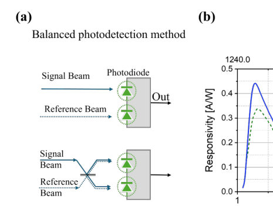
<figcaption class="paper-figure-caption"><b>Fig 1.</b> Fig. 1. (a) The basic concept of balanced photodetection in a direct (top) and homodyne (bottom) measurement. (b) Intrinsic spectral responsivity of existing silicon-based photodiodes (AXUV, SXUV) that can detect near-infrared, visible, ultraviolet, EUV, and SXR spectral ranges of light (~1- 1,100 nm). Responsivity is measured by photocurrent output in Amperes given optical power input in Watts (A/W) at different wavelengths. Solid blue line: nominal specifications of AXUV100 from the manufacturer; dash green line: nominal specifications of SXUV100 from the manufacturer; red circles: experimentally measured data via NIST provided calibration service on a AXUV100 photodiode.</figcaption>
</figure>
<figure class="paper-figure-card">
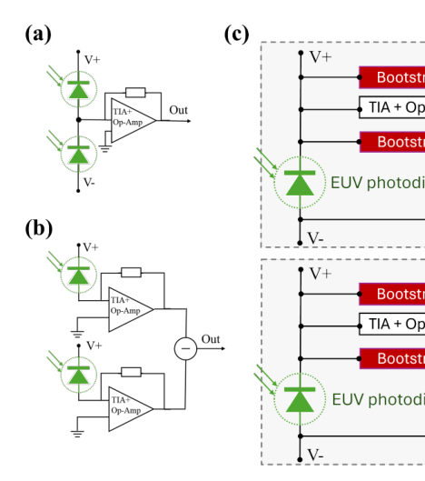
<figcaption class="paper-figure-caption"><b>Fig 2.</b> Fig. 2. (a) Balanced photodetection based on current-subtracting-first design. (b) Balanced photodetection based on variable-gain-first design. (c) Our designed photodetector system for optical, EUV, to soft X-ray spectral ranges. (d) Photograph of our fabricated photodetector system (only one photodetector is shown). (e) Simplified schematic circuit diagram of the photodetector.</figcaption>
</figure>
<figure class="paper-figure-card">
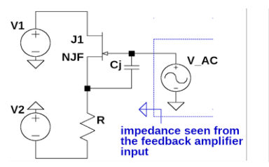
<figcaption class="paper-figure-caption"><b>Fig 3.</b> Fig. 3(a). Fundamental bootstrap circuit concept and its impedance seen by the rest of the circuitry. NJF: N-channel JFET. (b) Bootstrap circuit biased by a constant current source formed by a Widlar current mirror. Photodiode junction is represented by capacitance Cj. Additional components R1, R2, and C2 suppress the noise contribution of the shot noise originating from the diode junction of Q1 and reduce the voltage gain of Q2, reducing the base resistance noise contribution. NPN: negative-positive-negative transistor.</figcaption>
</figure>
<figure class="paper-figure-card">
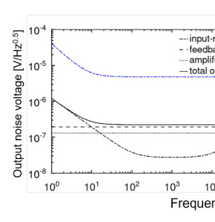
<figcaption class="paper-figure-caption"><b>Fig 4.</b> Fig. 4. Calculated minimal attainable noise floor without considering photodiode capacitance. Dash-line: thermal resistor noise limit, dots- amplifier current noise contribution. Blue dash-dot: output-referred voltage noise, dark solid line: calculated current noise spectral density referred to the amplifier input. Dark dash-dot line: contribution of the amplifier voltage noise multiplied by the noise transfer function of the external circuitry.</figcaption>
</figure>
<figure class="paper-figure-card">
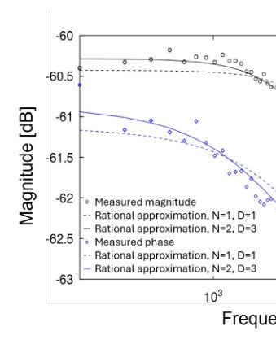
<figcaption class="paper-figure-caption"><b>Fig 5.</b> Fig. 5. Experimental measured voltage transfer function (TF) magnitude (black; left vertical axis) and phase (blue; right vertical axis) for the high-GΩ value feedback resistor. Solid symbols are measured data points; lines fitting by rational polynomial approximation, numerator (N; N = 1 or 2) and denominator (D; D = 1 or 3) degrees.</figcaption>
</figure>

**Summary.** This paper presents a new electronic architecture for photodetectors that allows for high-speed, low-noise measurements in the EUV and soft X-ray regimes. By using a JFET-based bootstrapping technique, the researchers overcame the bandwidth limitations typically caused by high detector capacitance. This enables more sensitive quantum-noise-limited measurements for applications in X-ray spectroscopy and EUV lithography.

**Why it may be interesting.** not directly relevant

Detailed structure

**Main problem.** The high junction capacitance of large-area silicon photodiodes in the EUV and soft X-ray regimes creates a bandwidth-noise trade-off that limits high-speed, low-noise detection.

**Main result.** The authors developed a wideband bootstrapped transimpedance amplifier architecture that achieves a six-fold extension in signal-to-noise limited bandwidth and a noise floor of 13 fA/sqrt(Hz).

**Method.** The design uses a JFET-based bootstrapping network to isolate photodiode capacitance and a grounded field plate to tune parasitic capacitance for high common-mode rejection.

**Model / system.** The experimental platform consists of a balanced photodetector system using silicon-based AXUV and SXUV photodiodes, featuring a bootstrapped transimpedance amplifier (TIA) with a JFET interface and an active load.

**Key observables.** Input-referred noise floor, signal-to-noise limited bandwidth, Common-Mode Rejection Ratio (CMRR), and spectral responsivity.

**Important parameters / regimes.** Spectral range from 1 nm to 1,100 nm, noise floor of 13 fA/sqrt(Hz), CMRR exceeding 30 dB up to 100 kHz, and junction capacitance reduction via reverse biasing.

**Assumptions / limitations.** Assumes performance in the EUV-SXR range is comparable to optical results if readout conditions are maintained; notes that thermal management is required for long-term stability.

**Figures summary.** Fig 1 shows the concept of balanced detection and spectral responsivity; Fig 2 compares detector architectures and shows the circuit diagram; Fig 10/11 illustrate the field plate mechanism and the resulting CMRR performance.

**Paper structure.** The paper introduces the detection gap in short-wavelength regimes, details the electronic architecture of the bootstrapped TIA, describes the capacitance management techniques (reverse bias and field plate), presents experimental noise and bandwidth characterization, and discusses thermal and practical implementation challenges.

Abstract

The rapid development of coherent short-wavelength light sources in the extreme ultraviolet (EUV) and soft X-ray (SXR) regimes has created a growing need for advanced optoelectronic detection capabilities, particularly for quantum-noise-limited measurements, microelectronics and semiconductor metrology, and emerging quantum information applications. However, extending balanced photodetection to these wavelength regimes is severely hindered by a fundamental bandwidth-noise trade-off imposed by the exceptionally large junction capacitance of EUV-SXR silicon photodiodes. Here, we report a novel wideband photoreceiver architecture that overcomes this bottleneck via a bootstrapped transimpedance amplifier design. By leveraging a low-noise junction field-effect transistor interface, we effectively isolate the photodiode capacitance and suppress the apparent input capacitance seen by the core amplifier. Combined with active compensation of parasitic feedback reactance, this architecture mitigates the conventional trade-off between detector active area and signal bandwidth. Experimentally, we achieved a system-level input-referred noise floor of 13 $fA/\sqrt{Hz}$, closely approaching theoretical thermal limits. Furthermore, we achieved a six-fold extension in signal-to-noise limited bandwidth and, through the implementation of a novel grounded field plate, demonstrated a common-mode rejection ratio (CMRR) exceeding 30 dB up to 100 kHz. This highly scalable, silicon-based architecture effectively bridges the short-wavelength detection gap, establishing a robust experimental platform for next-generation quantum-noise-limited and quantum-enhanced X-ray measurement, as well as ultra-sensitive inspection and metrology applications in high-numerical-aperture EUV lithography.

[↑ back to top](#top)

### [Characterizing emergent multi-scale dynamics in colloidal nanoparticle gels](http://arxiv.org/abs/2605.26083v1)

**Authors:** William D. Brackett, Zachary M. Sherman, Felix Lehmkühler, Thomas M. Truskett, Delia J. Milliron  
**Type:** both · **Category:** disordered systems and neural networks · **PDF:** <https://arxiv.org/pdf/2605.26083v1>  
**Analysis basis:** full PDF text, analyzed in chunks
**Topic relevance:** `non-equilibrium dynamics` **2/5** · `non-equilibrium universality` **1/5**

↔ Scroll figures horizontally

<figure class="paper-figure-card">
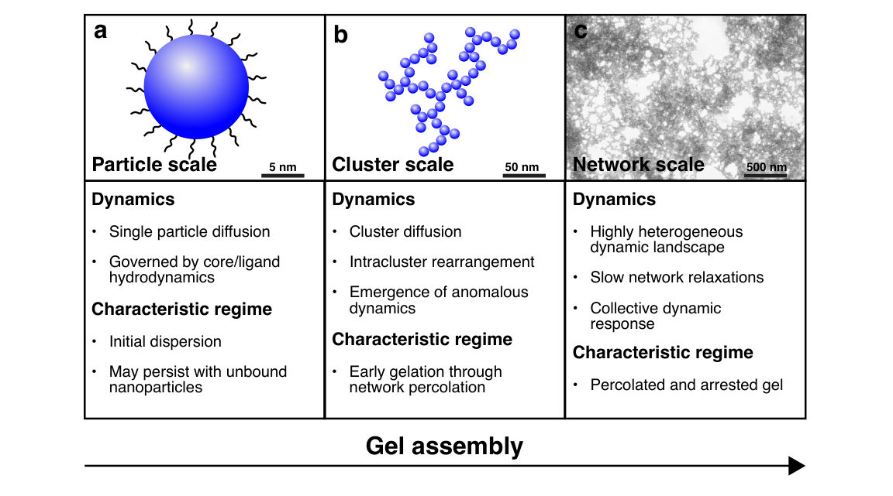
<figcaption class="paper-figure-caption"><b>Fig 1.</b> FIG. 1. Emergent dynamics and structural scales during NP gelation from (a) dispersion to (b)</figcaption>
</figure>
<figure class="paper-figure-card">
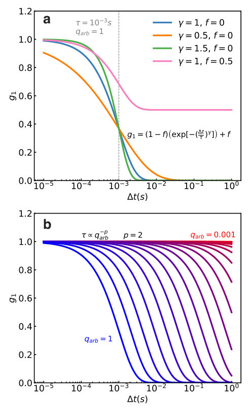
<figcaption class="paper-figure-caption"><b>Fig 2.</b> FIG. 2. Calculated intermediate scattering functions for (a) relaxation time, τ = 10−3s at arbitrary</figcaption>
</figure>
<figure class="paper-figure-card">
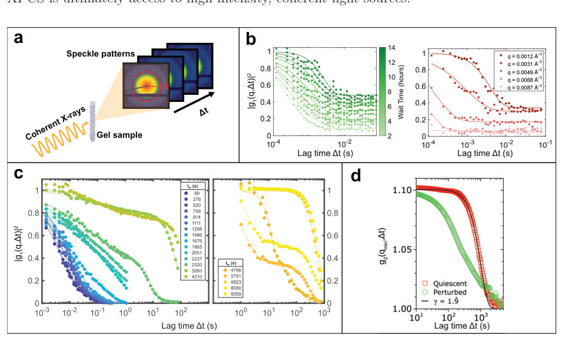
<figcaption class="paper-figure-caption"><b>Fig 3.</b> FIG. 3. (a) Schematic of XPCS. Adapted from [172]. (b) Evolution of single stretched correlation</figcaption>
</figure>
<figure class="paper-figure-card">
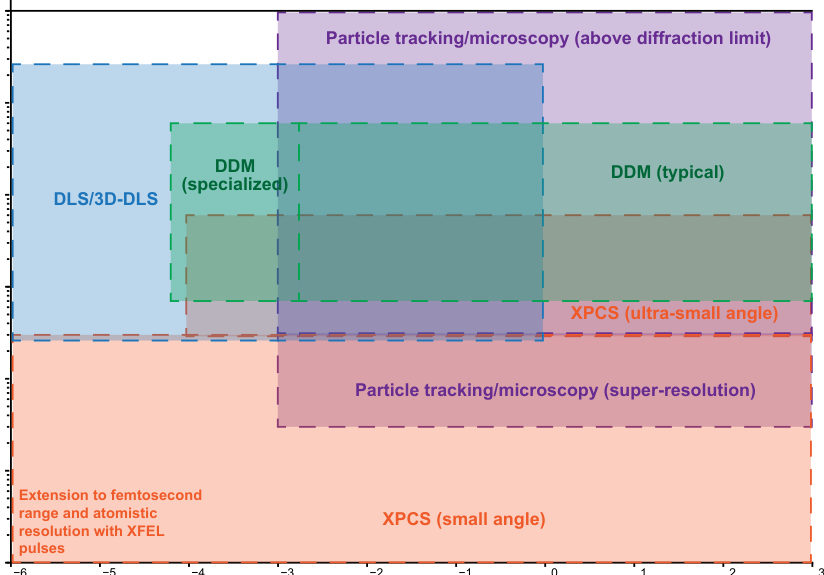
<figcaption class="paper-figure-caption"><b>Fig 4.</b> FIG. 4. Approximate spatiotemporal limits for individual experimental dynamic characterization</figcaption>
</figure>
<figure class="paper-figure-card">
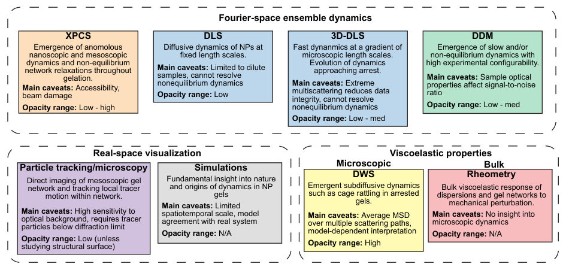
<figcaption class="paper-figure-caption"><b>Fig 5.</b> FIG. 5. Comparison of major techniques used to characterize soft matter dynamics with respective</figcaption>
</figure>

**Summary.** This perspective paper outlines how to bridge the gap between nanoscopic particle interactions and macroscopic gel properties. It emphasizes the integration of X-ray Photon Correlation Spectroscopy with rheology and simulations to characterize the multi-scale dynamics of nanoparticle networks. The goal is to transition from observing gelation to the intentional design of adaptive, programmable soft materials.

**Why it may be interesting.** The study of structural arrest, anomalous diffusion, and the emergence of heterogeneous dynamics in these classical systems provides a macroscopic analog to many-body localization and non-equilibrium phase transitions in quantum systems.

Detailed structure

**Main problem.** The lack of a unified understanding of how nanoscopic interactions and hierarchical processes across multiple length and time scales translate into the macroscopic mechanical and structural properties of colloidal nanoparticle gels.

**Main result.** The paper proposes a framework for moving from descriptive studies to the programmable design of nanoparticle gels by integrating multi-scale dynamics (particle, cluster, and network scales) using advanced X-ray techniques and complementary probes.

**Method.** The authors discuss the use of X-ray Photon Correlation Spectroscopy (XPCS) and in situ rheo-XPCS to probe nanoscopic motion, alongside complementary techniques like DLS, microscopy, and coarse-grained simulations.

**Model / system.** The physical system consists of colloidal nanoparticle (NP) gels, including metallic, semiconductor, or insulating NPs, which can form fractal networks (DLCA/RLCA), attractive/repulsive glasses, or depletion gels through tunable interparticle interactions.

**Key observables.** Intensity correlation functions (g2, g1), intermediate scattering function (F(q, delta t)), relaxation time (tau), stretching/compression exponent (gamma), and nonergodicity factor (f).

**Important parameters / regimes.** Nanoparticle size, ligand grafting density, surface charge, volume fraction, bond strength, and spatiotemporal scales ranging from 5 nm to 500 nm.

**Assumptions / limitations.** Assumes Gaussian electric field distributions for the Siegert relation and assumes ergodicity in certain regimes, while explicitly addressing nonergodic/aging dynamics.

**Figures summary.** Figure 1 illustrates the hierarchy of NP gel assembly from single particle diffusion to cluster rearrangement and network-wide relaxation. Figure 2 shows calculated field correlation functions for different dynamics (anomalous, localized) and the scaling of relaxation time with the wavevector.

**Paper structure.** The paper begins by defining the scientific problem of multi-scale dynamics in NP gels, describes the physical hierarchy of the system, details the experimental and computational platforms (specifically XPCS), establishes the mathematical framework for analyzing scattering data, and concludes with a perspective on the future of programmable soft matter design.

Abstract

Colloidal gels assembled from nanoparticles (NPs) are a versatile class of soft network-based materials capable of rich dynamic, mechanical, and even optical or magnetic responses to stimuli. Understanding how their hierarchically organized processes relate to macroscopic network properties remains a broad and unresolved problem in soft matter physics. The mechanisms of gel formation can depend sensitively on the pathway and the nature of NP interactions, thus far preventing a unified theoretical bridge between nanoscopic interactions and structural evolution and network dynamics. Indirect measurement of dynamics using light-scattering techniques provides an experimental means to quantify underlying particle and network motion. X-ray photon correlation spectroscopy (XPCS) has emerged as a powerful tool for probing nanoscopic motion in nanoparticle gels, but alone cannot resolve the full spatiotemporal spectrum of dynamics that drive gelation, aging, and network mechanical properties. While in situ rheo-XPCS enables simultaneous probing of nanoscale and bulk mechanical responses, complementary light scattering, microscopy, or simulations can extend spatiotemporal characterization and, consequently, understanding of NP gel network physics. Implementing a modular model platform with tunable primary nanoparticle features allows systematic variation of nanoscopic characteristics that drive emergent gel responses and inform the development of theoretical models for a wide range of soft, dynamic, nanostructured materials. The rapid expansion of XPCS capabilities at fourth-generation light sources, combined with complementary tools and robust model systems, positions the field to move beyond descriptive fundamental studies toward the design of nanoparticle gels with adaptive and programmable behaviors.

[↑ back to top](#top)

### [Detectability Limits for Intra-Block Temporal Drift in Finite-Key Entanglement-Based QKD](http://arxiv.org/abs/2605.24230v1)

**Authors:** Rafael Duarte Marcelino, Julio Smanioto Garcia, Matheus Rufino  
**Type:** theory · **Category:** quantum information and computing · **PDF:** <https://arxiv.org/pdf/2605.24230v1>  
**Analysis basis:** full PDF text, analyzed in chunks
**Topic relevance:** `quantum measurements` **2/5** · `entanglement & information structure` **1/5**

↔ Scroll figures horizontally

<figure class="paper-figure-card">
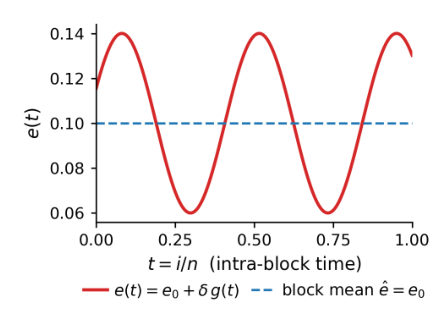
<figcaption class="paper-figure-caption"><b>Fig 1.</b> Fig. 1: Illustration of mean-preserving intra-block drift. The error probability e(t) oscillates within the block while its integral over the block remains equal to the baseline e0. A monitor that inspects only the block average ˆe cannot distinguish this trajectory from a stationary one, motivating the partial-sum approach developed in Section 2.</figcaption>
</figure>
<figure class="paper-figure-card">
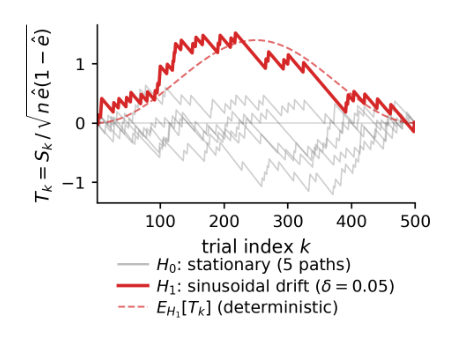
<figcaption class="paper-figure-caption"><b>Fig 2.</b> Fig. 2: Partial-sum process Sk under H0 (grey) and under a mean-preserving sinusoidal alterna- tive H1 (red). Under H0 the process fluctuates as a bridge with Sn = 0; under H1 it develops a system- atic excursion of order δnA(g) before returning to zero. The CUSUM statistic Tn captures the maxi- mum of |Sk|, which separates the two distributions once δ√n A(g) exceeds the null fluctuation scale.</figcaption>
</figure>
<figure class="paper-figure-card">
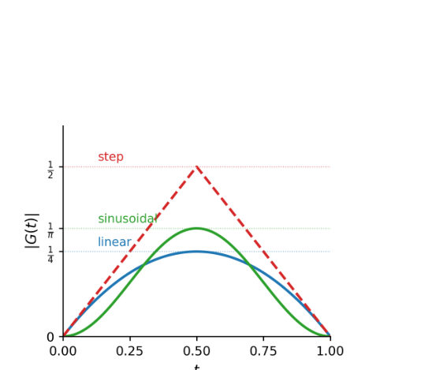
<figcaption class="paper-figure-caption"><b>Fig 3.</b> Fig. 3: Cumulative drift profiles G(t) = R t 0 g(u) du for the three normalized drift families. The signal constant A(g) = supt |G(t)| equals the maximum vertical excursion of each curve: 1/4 for linear (blue), 1/π for sinusoidal (green), and 1/2 for step (red). The ordering A(gstep) &gt; A(gsin) &gt; A(glin) directly predicts the sensitivity ordering of the CUSUM test.</figcaption>
</figure>
<figure class="paper-figure-card">
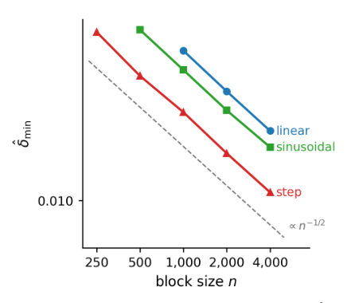
<figcaption class="paper-figure-caption"><b>Fig 4.</b> Fig. 4: Empirical detectability threshold bδmin vs. block size n (log–log scale) at baseline error rate e0 = 0.05. All three drift families—linear (blue circles), sinusoidal (green squares), step (red triangles)—decay parallel to the dashed reference line ∝n−1/2, confirming Theorem 2.3. The verti- cal separation encodes the model-dependent signal constant A(g): step drift concentrates energy at the block boundary, yielding the largest A(g) and hence the smallest bδmin.</figcaption>
</figure>
<figure class="paper-figure-card">
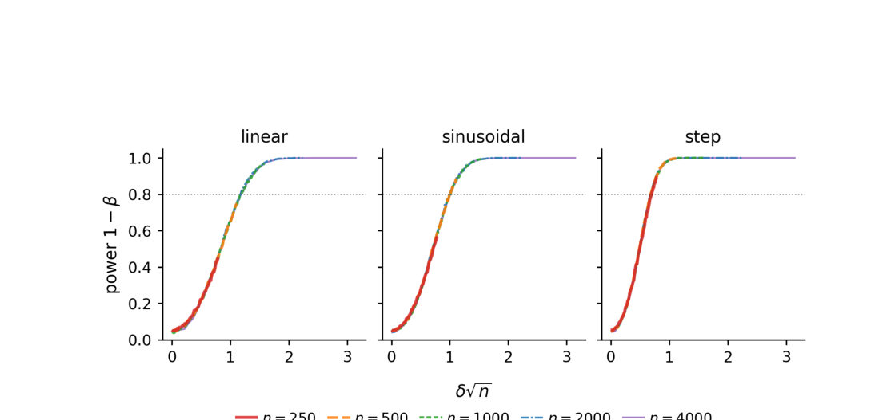
<figcaption class="paper-figure-caption"><b>Fig 5.</b> Fig. 5: Scaling collapse: power as a function of the rescaled amplitude δ√n for e0 = 0.05, shown separately for each drift family. Each curve corresponds to a block size n ∈{250, 500, 1000, 2000, 4000}, distinguished by color and line style (see legend). Curves align closely onto a single master curve in each panel, confirming that δ√n is the universal scaling variable. Residual spread near the transition region, most visible for n = 250 (red, plotted on top), reflects finite-sample effects that diminish as n grows. The horizontal shift between panels reflects the model-dependent signal constant A(g): the step profile (right) transitions at smaller δ√n than the linear profile (left),...</figcaption>
</figure>

**Summary.** This paper establishes the fundamental statistical limits for detecting temporal fluctuations in QKD error rates that do not change the overall average error. It proves that the minimum detectable drift amplitude scales with the square root of the block size and shows that a CUSUM-based monitoring approach is optimal for this task.

**Why it may be interesting.** not directly relevant

Detailed structure

**Main problem.** Determining the statistical limits for detecting intra-block temporal drift in entanglement-based Quantum Key Distribution (QKD) where the drift is mean-preserving and thus invisible to global-average error rate tests.

**Main result.** The authors derive a minimax optimal scaling for the minimum detectable drift amplitude, finding that delta_min = Theta(n^{-1/2}), and demonstrate that a calibrated CUSUM statistic achieves this rate.

**Method.** The study uses a minimax hypothesis-testing framework, applying the functional Central Limit Theorem and Donsker's theorem for the upper bound and Kullback-Leibler divergence for the lower bound, verified via Monte Carlo simulations.

**Model / system.** The system is an entanglement-based QKD protocol (E91-type) where the error rate is modeled as a sequence of Bernoulli trials subject to mean-preserving temporal perturbations (linear, sinusoidal, or step profiles).

**Key observables.** Quantum Bit Error Rate (QBER), Bell-violation statistics, and the partial-sum process (S_k).

**Important parameters / regimes.** Block size (n), baseline error rate (e_0), significance level (alpha), target power (1-beta), and the signal functional A(g).

**Assumptions / limitations.** The drift is assumed to be mean-preserving (the integral of the perturbation over the block is zero) and constrained by a Lipschitz bound for physical regularity.

**Figures summary.** Figure 1 shows drift trajectories; Figure 2 visualizes the partial-sum process; Figure 6 illustrates the statistical trade-off between estimation variance and drift resolution.

**Paper structure.** The paper introduces the problem of intra-block drift, defines the mathematical model and drift classes, provides theoretical proofs for the minimax bounds, presents numerical simulations for different drift profiles, and concludes with a discussion on the fundamental resolution limits.

Abstract

We study the statistical detectability of intra-block temporal drift in finite-key entanglement-based quantum key distribution, with particular relevance to E91-type parameter estimation and monitoring. Drift is modeled as a mean-preserving Lipschitz perturbation of Bernoulli observables, capturing structured temporal variation that is invisible to global-average tests. For a block of size $n$ and confidence levels $(α,β)$, we formulate a minimax hypothesis-testing problem and define the minimal detectable amplitude. We derive matching lower and upper bounds yielding $δ_{\min}(n,α,β)=Θ(n^{-1/2})$: if $nδ^2 \to 0$, no level-$α$ procedure can guarantee nontrivial uniform power over the admissible drift class, whereas a calibrated CUSUM statistic detects drift at the matching scale. Explicit constants for linear, sinusoidal, and step profiles, together with simulations, confirm the predicted scaling collapse. The result quantifies a finite-block monitoring-resolution limit and is distinct from composable security certification.

[↑ back to top](#top)

### [Semiclassical Propagation and the Dynamics of Configuration Space](http://arxiv.org/abs/2605.24373v1)

**Authors:** V. S. Morales-Salgado  
**Type:** theory · **Category:** other · **PDF:** <https://arxiv.org/pdf/2605.24373v1>  
**Analysis basis:** full PDF text, analyzed in chunks
**Topic relevance:** `Keldysh / 2PI / non-Gaussian methods` **2/5** · `entanglement & information structure` **1/5**

↔ Scroll figures horizontally

<figure class="paper-figure-card">
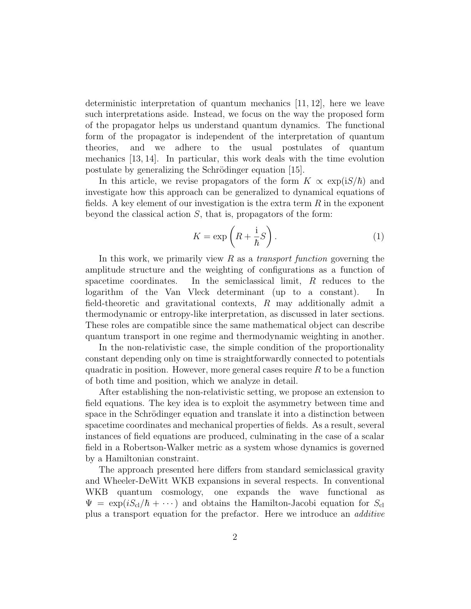
<figcaption class="paper-figure-caption"><b>Fig 1.</b> Low-resolution page preview, page 2</figcaption>
</figure>
<figure class="paper-figure-card">
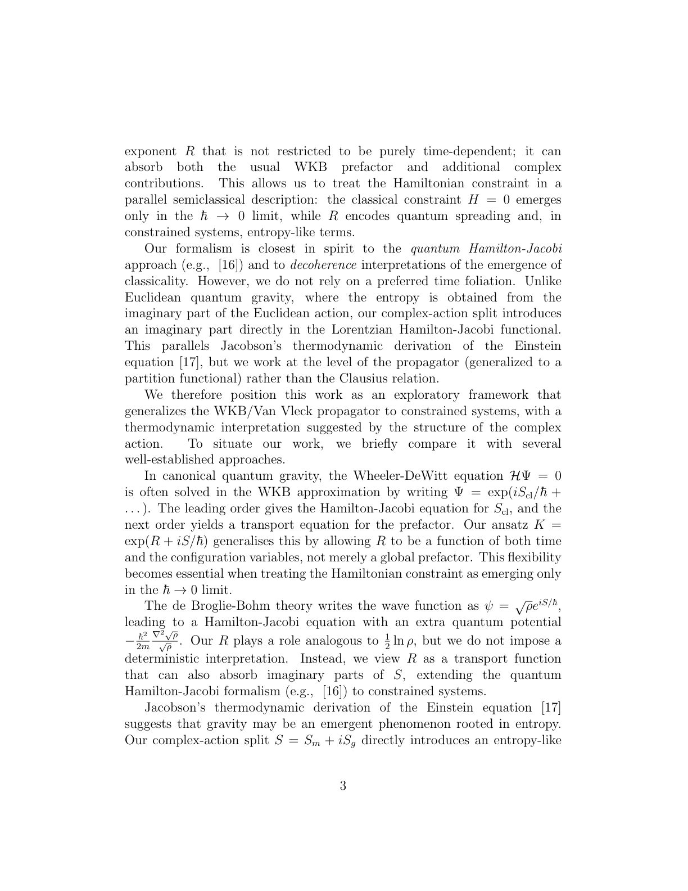
<figcaption class="paper-figure-caption"><b>Fig 2.</b> Low-resolution page preview, page 3</figcaption>
</figure>
<figure class="paper-figure-card">
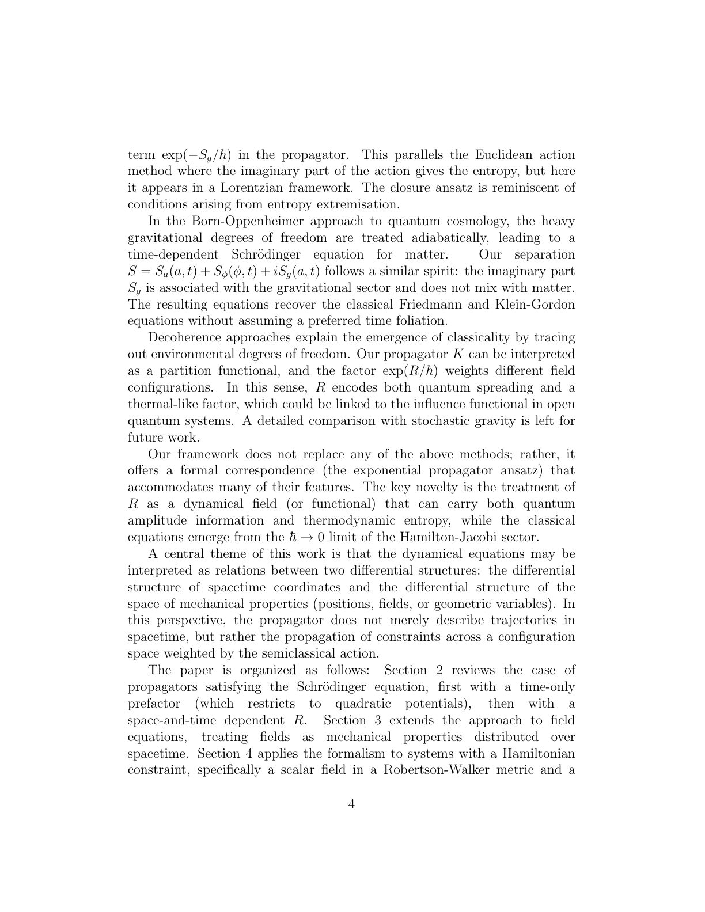
<figcaption class="paper-figure-caption"><b>Fig 3.</b> Low-resolution page preview, page 4</figcaption>
</figure>
<figure class="paper-figure-card">
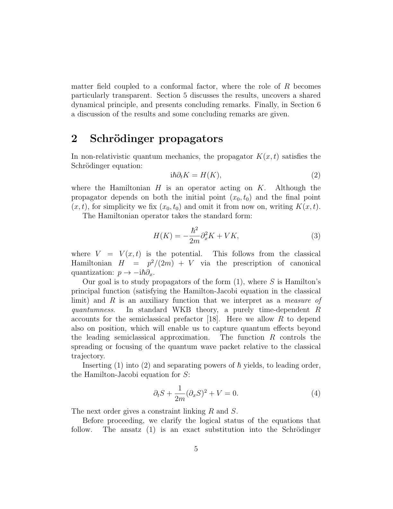
<figcaption class="paper-figure-caption"><b>Fig 4.</b> Low-resolution page preview, page 5</figcaption>
</figure>
<figure class="paper-figure-card">
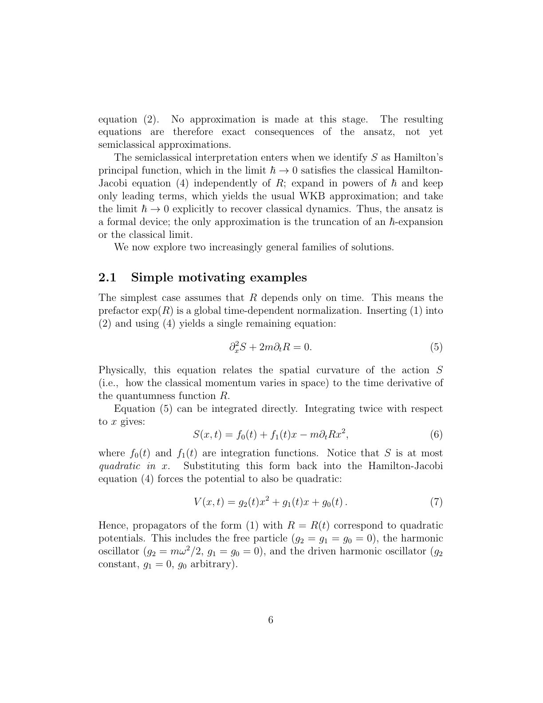
<figcaption class="paper-figure-caption"><b>Fig 5.</b> Low-resolution page preview, page 6</figcaption>
</figure>

**Summary.** This paper proposes a generalized semiclassical propagator that uses an additional real exponent to represent quantumness and entropy. It demonstrates that this formalism can unify quantum dynamics, field theory, and the thermodynamic interpretation of gravity in cosmological models.

**Why it may be interesting.** not directly relevant

Detailed structure

**Main problem.** Investigating a generalized semiclassical ansatz for the quantum propagator where an additive exponent R is introduced to serve as a measure of quantumness and entropy.

**Main result.** The framework successfully recovers classical dynamics (Hamilton-Jacobi, Friedmann, and Klein-Gordon equations) in the limit h -> 0 and provides a link between the imaginary part of the action and gravitational entropy.

**Method.** A semiclassical expansion of a generalized exponential ansatz K = exp(R + iS/h) applied to Schrödinger, Klein-Gordon, and Dirac equations, as well as minisuperspace models.

**Model / system.** The study covers non-relativistic quantum mechanics (harmonic oscillators), quantum field theory (scalar and Dirac fields), and quantum cosmology (Robertson-Walker minisuperspace).

**Key observables.** The quantumness function R, the classical action S, and the functional momentum density.

**Important parameters / regimes.** The reduced Planck constant h, the scale factor a, the cosmological constant Lambda, and the semiclassical limit h -> 0.

**Assumptions / limitations.** The classical action S is assumed to satisfy the Hamilton-Jacobi equation, and the expansion is truncated at the leading order in h.

**Paper structure.** The paper begins with non-relativistic particle models, extends the formalism to field theories (scalar and spinor), applies the ansatz to constrained cosmological systems, and concludes with a conceptual discussion on the thermodynamic connection to gravity.

Abstract

This work explores the non-relativistic quantum propagator $K(x,t)$ as a solution of the Schrödinger equation. We suppose that the propagator takes the form ${\rm exp}\left(\frac{\mathrm{i}}{\hbar}S+R\right)$, generalizing the usual WKB ansatz by allowing an additive exponent $R$ whose role as a measure of quantumness is investigated. Since $S$ is subject to the assumption that it is a solution of the Hamilton-Jacobi equation, here we are further interested in the role of $R$ and its interpretation as a measure of quantumness. Several systems are studied as concrete examples to illustrate this approach. Furthermore, a proposal to generalize it for fields is put forward. This is tested for some simple systems. Finally, the possibilities to use this approach for the case of systems whose dynamics are controlled by the Hamiltonian constraint are analyzed.

[↑ back to top](#top)

### [Thermal Spin Polarization Driven by Nuclear Spin-Orbit Coupling in Neutron Star Pasta](http://arxiv.org/abs/2605.25067v1)

**Authors:** Hiroyuki Tajima, Yuta Sekino, Hiroshi Funaki, Shota Kisaka, Nobutoshi Yasutake, Mamoru Matsuo  
**Type:** theory · **Category:** other · **PDF:** <https://arxiv.org/pdf/2605.25067v1>  
**Analysis basis:** full PDF text, analyzed in chunks
**Topic relevance:** `Keldysh / 2PI / non-Gaussian methods` **2/5** · `non-equilibrium dynamics` **1/5**

↔ Scroll figures horizontally

<figure class="paper-figure-card">
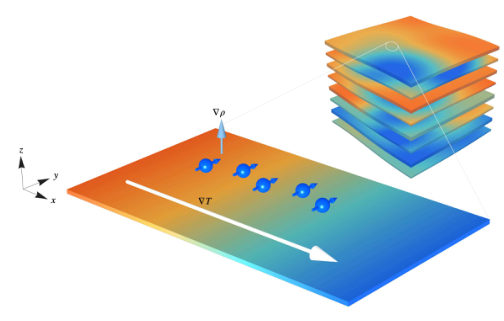
<figcaption class="paper-figure-caption"><b>Fig 1.</b> FIG. 1. Schematic illustration of the thermal Rashba- Edelstein mechanism on a slab-pasta surface: the surface- normal density gradient ∇ρ and nuclear spin-orbit coupling generate a Rashba-like field for surface neutrons, and an in- plane thermal drive ∇T produces a surface spin polarization.</figcaption>
</figure>
<figure class="paper-figure-card">
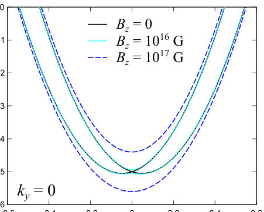
<figcaption class="paper-figure-caption"><b>Fig 2.</b> FIG. 2. Dispersion relation Eκ(k⊥) of the surface neutrons measured from the continuum bottom of the extended modes, where we set ∆ǫ = 5 MeV, at αs = −2 MeV · fm, and ky = 0. The magnetic fields are taken as Bz = 0, 1016 G, 1017 G.</figcaption>
</figure>
<figure class="paper-figure-card">
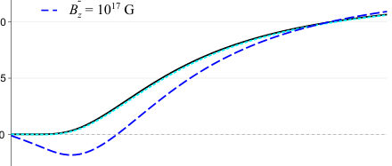
<figcaption class="paper-figure-caption"><b>Fig 3.</b> FIG. 3. Normalized Edelstein susceptibility m∗χxy/τ at the surface of nuclear pasta as a function of the temperature T , where αs = −2 MeV · fm and µ⊥= 5 MeV. The magnetic field is taken as Bz = 0, 1016 G, 1017 G.</figcaption>
</figure>
<figure class="paper-figure-card">
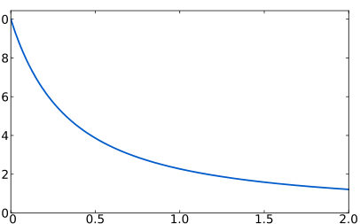
<figcaption class="paper-figure-caption"><b>Fig 4.</b> FIG. 4. Integral I(a/ξ) = 2 R 1 0 dx x2a/ξ</figcaption>
</figure>

**Summary.** This paper explores how the density gradients at the surface of nuclear pasta in neutron stars create a Rashba-type spin-orbit coupling. It shows that temperature gradients can drive spin polarization via a mechanism analogous to the Rashba-Edelstein effect in spintronics. This provides a new way to understand spin dynamics and angular momentum in extreme astrophysical environments.

**Why it may be interesting.** not directly relevant

Detailed structure

**Main problem.** Investigating how density gradients at the surface of nuclear pasta in neutron stars generate spin polarization via nuclear spin-orbit coupling, specifically through a thermal Rashba-Edelstein effect.

**Main result.** The authors demonstrate that a thermal gradient can induce in-plane spin polarization even in the absence of a magnetic field, establishing a link between neutron star physics and solid-state spintronics.

**Method.** The study employs an effective two-band model, second-order perturbation theory for self-energy, and a semiclassical description of non-equilibrium distribution functions to derive Edelstein susceptibility.

**Model / system.** The system consists of surface-localized neutrons near the interface of nuclear pasta in a neutron star crust, modeled using a Hamiltonian that includes kinetic energy, a mean-field potential, a Rashba-type nuclear spin-orbit interaction, and a Zeeman term.

**Key observables.** Surface spin polarization, spin-momentum locking, band dispersion, and Edelstein susceptibility.

**Important parameters / regimes.** Effective Rashba coupling strength (alpha_s), magnetic field strength (up to 10^17 G), temperature gradients, and momentum relaxation time.

**Assumptions / limitations.** Single-mode approximation for surface modes, plane wave approximation for extended modes, and a Woods-Saxon-like distribution for the neutron density profile.

**Figures summary.** Figure 1 shows a schematic of the thermal Rashba-Edelstein mechanism; Figure 2 displays band dispersion and susceptibility; Figure 4 shows a dimensionless integral related to the effective spin-orbit coupling strength.

**Paper structure.** The paper introduces the physical problem of neutron star pasta, develops an effective two-band Hamiltonian with spin-orbit coupling, derives the Edelstein susceptibility using semiclassical methods, and analyzes the effect of temperature and magnetic fields.

Abstract

We discuss anomalous spin polarization on the surface of nuclear pasta in a neutron star, driven by a nuclear spin-orbit interaction. We present an effective two-band model of surface-localized neutrons near the nuclear pasta. The central point is the emergence of a Rashba-type spin-orbit hybridization generated by the neutron--nucleus spin-orbit force in the presence of the strong density gradient normal to the pasta surface. Starting from a single-particle Hamiltonian with a central potential and a standard nuclear spin-orbit interaction, we show that the surface spin polarization occurs due to the thermal inhomogeneity even in the absence of a magnetic field. Our study links neutron-star physics and solid-state spintronics and would contribute to understanding the interplay between spin dynamics and strong magnetic fields.

[↑ back to top](#top)

### [A particle-resolved rheological study of chirality transfer and odd transport](http://arxiv.org/abs/2605.25136v1)

**Authors:** Rémi Goerlich, Alexander P. Antonov, Kristian Stølevik Olsen, Lorenzo Caprini, Christian Scholz, Hartmut Löwen, Yael Roichman  
**Type:** both · **Category:** statistical mechanics · **PDF:** <https://arxiv.org/pdf/2605.25136v1>  
**Analysis basis:** full PDF text, analyzed in chunks
**Topic relevance:** `non-equilibrium dynamics` **2/5**

↔ Scroll figures horizontally

<figure class="paper-figure-card">
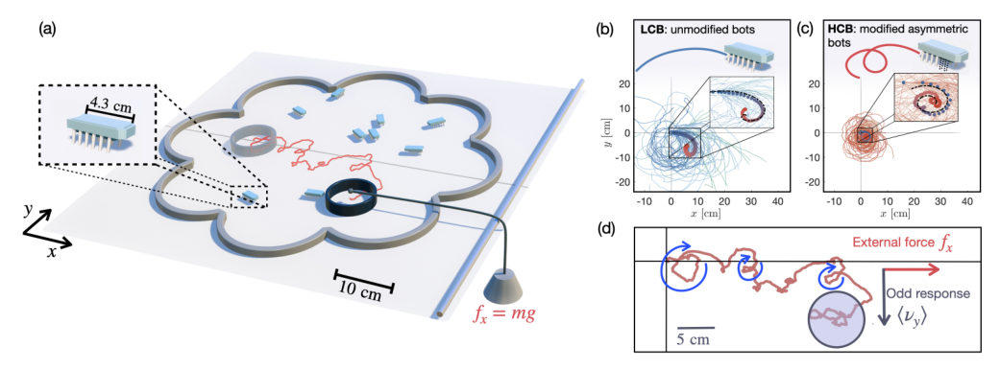
<figcaption class="paper-figure-caption"><b>Fig 1.</b> FIG. 1. (a) Schematic representation of the experimental setup. A passive tracer (hollow 3D-printed polylactic acid cylinder) is immersed in a 2D bath of self-propelled chiral particles (bristle-bot, shown in the zoomed inset) enclosed in a RA = 20 cm-radius arena, whose flower-shaped edge is designed to reduce boundary accumulation. A mass m is attached to the passive tracer and hung outside the arena, applying a constant external force fx kept aligned with the x-axis. The tracer is set into motion by collisions with the bath particles, and undergoes a diffusing trajectory shown in red from an initial tracer position indicated in light color. (b,c) Trajectories of the environmental chiral...</figcaption>
</figure>
<figure class="paper-figure-card">
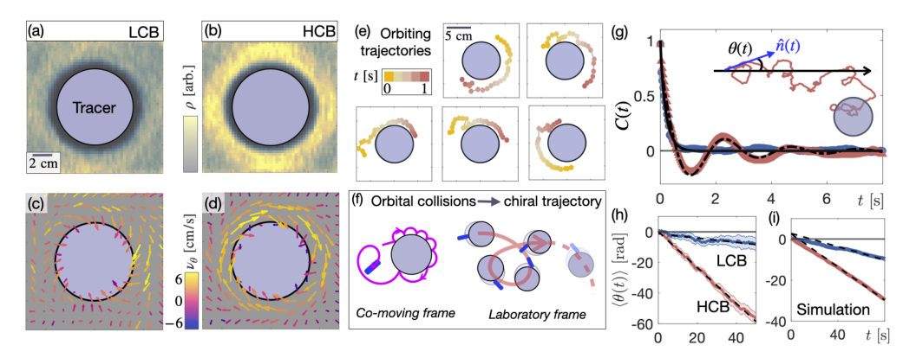
<figcaption class="paper-figure-caption"><b>Fig 2.</b> FIG. 2. Dynamics of the tracer, from local interactions to chirality transfer. (a)-(b) Local relative density of bots around the tracer in the LCB (a) and HCB (b), measured in a co-moving frame centered on the diffusing passive tracer. (c)-(d) Local mean velocity flow around the tracer [color coding the projection ⟨νθ⟩along the azimuthal direction θ]. (e) Short illustrative snapshots of orbital trajectories (1 second) measured in the co-moving frame. (f) Proposed mechanism at play: orbital radius of bot comparable with tracer radius, rc ∼RT, the bath particle has a significant persistence length and enter in an orbiting and tapping regime, with time-ordered clockwise collisions. This leads...</figcaption>
</figure>
<figure class="paper-figure-card">
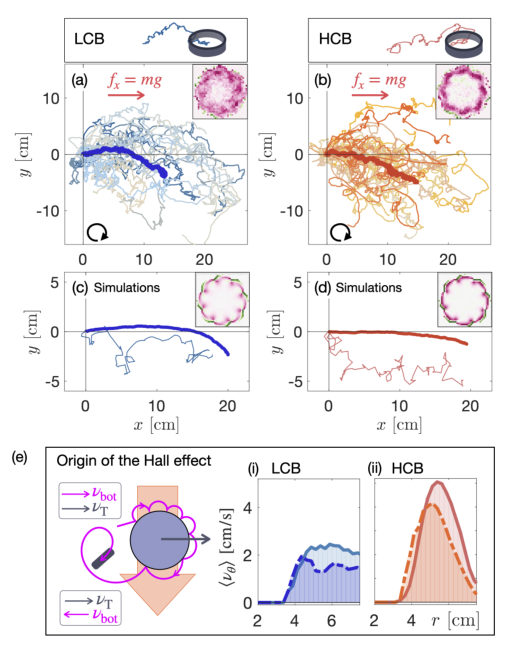
<figcaption class="paper-figure-caption"><b>Fig 3.</b> FIG. 3. Spontaneous Hall effect (odd transport) of a passive tracer in a chiral bath under an external force. (a)-(b) Recorded trajectories of the passive tracer in the chiral active bath together with the ensemble averaged trajectory (thick lines) both in the LCB (b, blue lines) and in the HCB (c, red lines). The transverse response of the pas- sive tracer is revealed by its mean drift towards negative y, orthogonal to the applied force. In the inset, we reproduce the azimuthal velocity field given in Fig. 6 (see Methods, rul- ing out the effect of global edge current in the HCB since in that case, the fluid in the bulk is static. (c)-(d) Mean trajec- tory measured on an ensemble of 5000...</figcaption>
</figure>
<figure class="paper-figure-card">
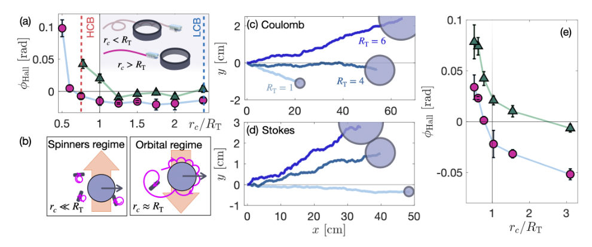
<figcaption class="paper-figure-caption"><b>Fig 4.</b> FIG. 4. (a,b) Lengthscale-induced reversal of Hall effect, numerical simulations. (a) Hall angle ϕHall measured in many-body numerical simulations with periodic boundary conditions for varying chirality rc and a tracer of fixed radius RT with Stokes friction (green triangles) and dry (Coulomb) friction (pink circles), as in the experiment. The vertical dashed line underline the values of rc of the LCB and HCB (blue and red respectively) used in the experiment. The data are shown with a 3-sigma errors estimated with a bootstrapping method in the linear fitting of the odd response trajectories. (b) Illustrations of two regimes of chiral bath particles: (left panel) for very high chirality (rc...</figcaption>
</figure>
<figure class="paper-figure-card">
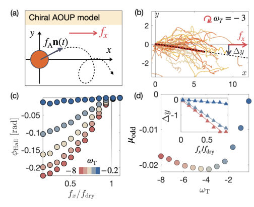
<figcaption class="paper-figure-caption"><b>Fig 5.</b> FIG. 5. Minimal model of a single chiral ac- tive Ornstein-Uhlenbeck particle (chiral AOUP). (a) Schematic representation of the minimal model capturing the orbiting regime. The tracer particle is driven by an effec- tive chiral active force fAn(t), where n(t) follows a chiral Ornstein-Uhlenbeck process, and is subjected to a constant external force fx along the x-axis under nonlinear dry fric- tion. (b) Ensemble of 1000 simulated trajectories generated via the chiral AOUP model [Eq. (1)] for parameters τp = 0.25, fA = 2, fx = 1, and fdry = 3, using the Euler-Maruyama integration method with a time step dt = 10−2 and total du- ration t = 50. The ensemble-averaged trajectory (thick red line)...</figcaption>
</figure>

**Summary.** This paper demonstrates how chirality can be transferred from an active environment to a passive object, leading to a spontaneous Hall-like transverse motion. It reveals that nonlinear friction is the key mechanism that rectifies chiral fluctuations into macroscopic transport. The findings suggest potential applications in the selective sorting of particles based on their size.

**Why it may be interesting.** not directly relevant

Detailed structure

**Main problem.** Understanding the microscopic mechanisms behind chirality transfer and the emergence of 'odd transport' (a Hall-like transverse drift) in a passive tracer embedded in a chiral active bath.

**Main result.** The study identifies that local collisions transfer chiral dynamics to the tracer and that nonlinear (Coulomb) friction rectifies these fluctuations into a macroscopic transverse response, which is non-monotonic with respect to the chirality radius.

**Method.** A combination of table-top experiments using active 'bristle-bots', many-body numerical simulations, and a reduced coarse-grained chiral active Ornstein-Uhlenbeck particle (AOUP) model.

**Model / system.** A 2D active granular bath of self-propelled 'bristle-bots' (active particles) containing a passive, symmetric 3D-printed tracer, subject to an external driving force and nonlinear substrate friction.

**Key observables.** Hall angle (phi_Hall), odd mobility (mu_odd), tracer trajectory autocorrelation functions, and local velocity/density fields around the tracer.

**Important parameters / regimes.** Ratio of chirality radius to tracer radius (r_c/R_T), chirality (omega), driving force (f_x), and the type of friction (Coulomb vs. Stokes).

**Assumptions / limitations.** The system is treated as a 2D active bath; the collision-induced reorientation can be modeled via a single-collision experiment; the friction is primarily governed by nonlinear substrate effects.

**Figures summary.** Fig 1 shows the experimental setup and bot/tracer trajectories; Fig 2 illustrates local density and velocity flows around the tracer; Fig 4 shows the Hall angle as a function of the r_c/R_T ratio; Fig 6 characterizes individual bot dynamics and chirality.

**Paper structure.** The paper introduces the phenomenon of chirality transfer, describes the experimental and simulation platforms, analyzes the mechanism of collision-induced transport, explores the role of nonlinear friction, and concludes with implications for particle sorting.

Abstract

Chirality, or the breaking of mirror symmetry, appears across all scales in nature, from molecular conformations to the dynamics of bacterial collectives. Environments composed of such symmetry-breaking constituents can give rise to emergent physical phenomena, particularly in the transport and response of embedded tracers. Yet it remains unclear how chiral environments influence such tracers and through which microscopic mechanisms anomalous responses emerge. Here, we present a particle-resolved study of these systems, demonstrating chirality transfer and odd transport of an object embedded in a chiral active bath. In a rheological experiment, a symmetric passive tracer is driven through collisions with the particles of a non-equilibrium chiral bath. Combining table-top experiments, many-body simulations, and a reduced coarse-grained theory, we demonstrate that local collisions transfer chiral active dynamics to the tracer, which displays circular trajectories. We show that the same mechanism gives rise to a systematic transverse drift under a constant pulling force. Crucially, we identify nonlinear friction as an essential factor that rectifies these transferred chiral active fluctuations into a macroscopic odd response. Our results reveal a microscopic mechanism for odd transport in chiral active matter and provide general insights into transverse transport in driven non-equilibrium systems.

[↑ back to top](#top)

### [Accelerated Simulation Algorithms for Extreme First-Passage Problems with General Emission Profiles](http://arxiv.org/abs/2605.25295v1)

**Authors:** Emmanuel Akame Mfoumou, David Holcman  
**Type:** theory · **Category:** statistical mechanics · **PDF:** <https://arxiv.org/pdf/2605.25295v1>  
**Analysis basis:** full PDF text, analyzed in chunks
**Topic relevance:** `methods for driven-dissipative` **2/5**

↔ Scroll figures horizontally

<figure class="paper-figure-card">
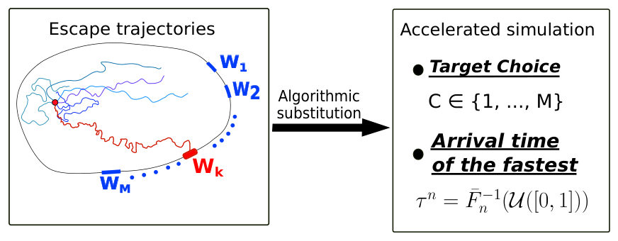
<figcaption class="paper-figure-caption"><b>Fig 1.</b> Fig. 1: Substituting Brownian Simulations with Extreme Escape Statistics. This schematic illustrates the core idea of the algorithm: replacing the computationally intensive simulation of Brownian trajectories up to the first escape event with the independent sampling of two random variables — the arrival time τ and the escape target C — from precomputed probability distributions.</figcaption>
</figure>
<figure class="paper-figure-card">
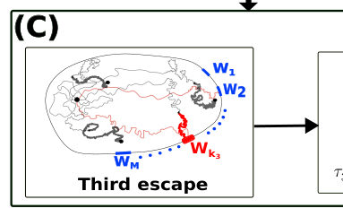
<figcaption class="paper-figure-caption"><b>Fig 2.</b> Fig. 2: Iterative Sampling of Successive Escape Events. Recursive procedure used to sim- ulate the first k = 3 escape events: given the arrival time τk of the k-th escape, τk+1 is sampled conditionally, reflecting the decreasing number of particles in the system.</figcaption>
</figure>
<figure class="paper-figure-card">
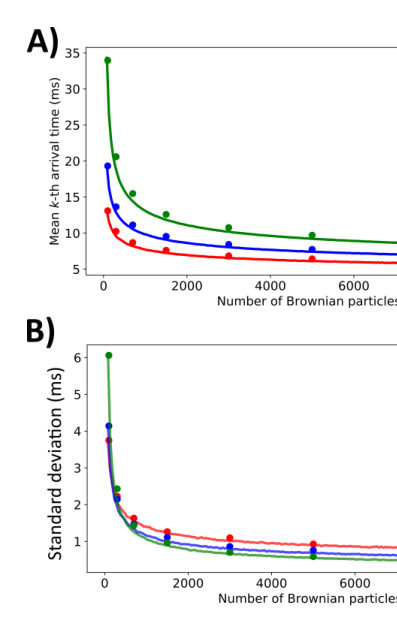
<figcaption class="paper-figure-caption"><b>Fig 3.</b> Fig. 3: Arrival Times of the k-th Particle : Stochastic Simulation vs Ac- celerated Algorithm realizations. The markers are averages over simulations and the lines are average over algorithm realizations for the mean (A) and the variance (B) in one dimension.</figcaption>
</figure>
<figure class="paper-figure-card">
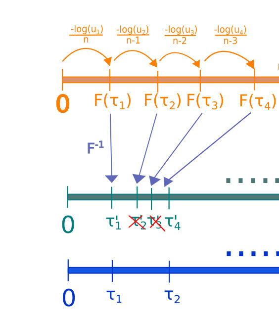
<figcaption class="paper-figure-caption"><b>Fig 4.</b> Fig. 4: Arrival Time Sampling under Uniform Killing. Each Brownian particle is assigned an exponential lifetime. Candidate escape times generated by the recursive inverse transform method are rejected if they exceed the corresponding killing time. Surviving events are retained and sorted by arrival.</figcaption>
</figure>
<figure class="paper-figure-card">
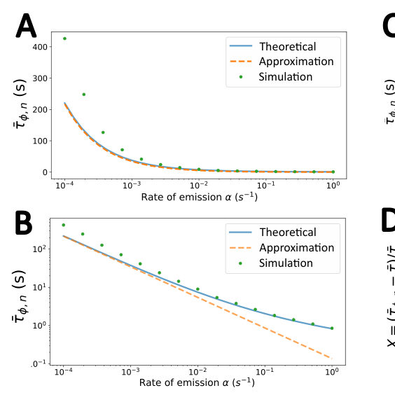
<figcaption class="paper-figure-caption"><b>Fig 5.</b> Fig. 5: Asymptotic behavior of the MFAT in the slow and fast emission regimes vs accelerated simulations. The slow regime is plotted for N = 1000 in A and B in different scales. The asymptotic approximation (eq. 3.2 dotted curve) agrees well with theoretical formula (eq. 2.4) for small α limit. Discrepancies appear as α →0, due to the approximation of short-time asymptotics for the expression of S(t) beyond their validity range. The fast regime is plotted for N = 1000 in C and D where the relative difference between the fast emission regime and the instantaneous one is shown.</figcaption>
</figure>

**Summary.** This paper introduces a highly efficient algorithm for simulating the earliest arrival events in large populations of diffusing particles. By using asymptotic distributions instead of full trajectory tracking, it achieves orders-of-magnitude speedups for complex scenarios like temporal injection and multi-target competition. This is particularly useful for modeling signal initiation in molecular and biological systems.

**Why it may be interesting.** not directly relevant

Detailed structure

**Main problem.** Simulating extreme first-passage events, where the first among a large population of diffusing particles reaches a target, is computationally prohibitive using standard Brownian dynamics.

**Main result.** The authors developed an accelerated, trajectory-free simulation framework that generates the first k arrival times with a runtime scaling linearly with k and independent of the total particle number N.

**Method.** A recursive inverse transform algorithm that exploits short-time asymptotic expansions of single-particle survival probabilities and utilizes the Lambert W function for explicit inversion.

**Model / system.** Brownian motion of N independent particles in 1D, 2D, and 3D bounded domains with localized absorbing targets, including extensions for time-dependent emission profiles and particle killing.

**Key observables.** First arrival times, order statistics of arrival times, Mean First Arrival Time (MFAT), and splitting probabilities.

**Important parameters / regimes.** Number of particles (N), number of arrivals (k), diffusion coefficient (D), geodesic distance (delta), emission rate (alpha), and killing rate (gamma).

**Assumptions / limitations.** The framework assumes the existence of known or computable short-time asymptotic approximations for the single-particle survival probability and that targets are small and well-separated.

**Figures summary.** Figure 1 shows the core concept of replacing trajectories with sampling; Figure 2 illustrates the recursive sampling procedure; Figure 3 shows validation against Brownian simulations; Figure 5 compares MFAT in slow/fast regimes; Figure 6 shows the impact of particle killing on arrival distributions.

**Paper structure.** The paper introduces the computational challenge, presents a recursive algorithm for instantaneous emission, extends the framework to time-dependent injection and particle killing, provides analytical scaling for MFAT, and validates the method against traditional Brownian dynamics.

Abstract

Fastest arrival events, where the first among many diffusing particles reaches a target, are central in triggering signal initiation in molecular stochastic systems. Classical approaches to simulate such events rely on full trajectory generation of all particles, leading to prohibitive computational costs in the large particle number regime. In this work, we present a general simulation framework for efficiently generating order statistics of arrival times by exploiting asymptotic first-passage distributions. This framework applies to diffusion processes in bounded domains with localized absorbing targets, for which short-time first-passage asymptotics are available, such as Brownian motion in dimensions one, two, and three. Starting with the case of instantaneous emission, we derive and implement a recursive inverse transform algorithm to simulate the first $k$ arrivals without tracking particle trajectories. We extend this algorithm to time-dependent emission profiles via an iterative approach, enabling the simulation of extreme statistics in systems with temporal injection, ranging from rapid to prolonged emission. Additionally, we provide asymptotic estimates of the mean fastest arrival time. To conclude, the present acceleration algorithm which bypasses Brownian simulations of trajectories can be used for spatial reaction networks, rare event detection, or diffusion-controlled activation.

[↑ back to top](#top)

### [Analytic Origin of Green-Function Compression in the Intermediate Representation](http://arxiv.org/abs/2605.24814v1)

**Authors:** Takahiro Misawa  
**Type:** theory · **Category:** numerical methods · **PDF:** <https://arxiv.org/pdf/2605.24814v1>  
**Analysis basis:** full PDF text, analyzed in chunks
**Topic relevance:** `methods for driven-dissipative` **2/5**

↔ Scroll figures horizontally

<figure class="paper-figure-card">
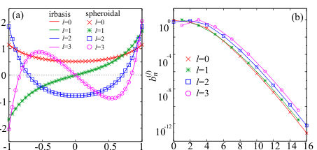
<figcaption class="paper-figure-caption"><b>Fig 1.</b> FIG. 1. Verification of the spheroidal representation in Eq. (20) at Λ = 10. (a) IR left singular functions ul(x) for l = 0, 1, 2, 3. The solid lines are obtained from the SVD of the IR kernel kF Λ [Eq. (4)] using irbasis [20]. The symbols show the spheroidal reconstruction from Eq. (20) with truncation n ≤16. The spheroidal reconstruction agrees well with the direct SVD results for all l. (b) Magnitude of the spheroidal expansion coefficients b(l) n defined by ul(x) = P</figcaption>
</figure>
<figure class="paper-figure-card">
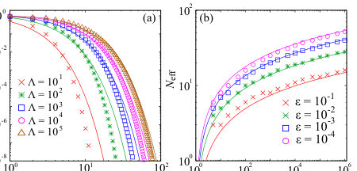
<figcaption class="paper-figure-caption"><b>Fig 2.</b> FIG. 2. Low-temperature scaling of IR singular values and effective rank. (a) Normalized singular values sl/s0 as a func- tion of l for several values of Λ. Symbols are the direct SVD of the kernel (irbasis [20]). Solid curves show the asymp- totic behavior 1/ p</figcaption>
</figure>

**Summary.** This paper provides the first analytic explanation for why the Intermediate Representation (IR) basis is so efficient at compressing imaginary-time Green functions. By identifying a finite-Laplace-transform structure, the author shows that the basis is linked to oblate spheroidal wave functions. This explains the logarithmic growth of the effective rank for fermions and its saturation for bosons.

**Why it may be interesting.** It provides a rigorous mathematical foundation for a widely used numerical technique in many-body simulations, connecting the efficiency of Green's function compression to classical problems in signal processing and special functions.

Detailed structure

**Main problem.** The paper seeks to provide an analytic explanation for the compression capability of the Intermediate Representation (IR) basis used in many-body physics, specifically why its effective rank grows only logarithmically with inverse temperature for fermions and saturates for bosons.

**Main result.** The author reveals that the IR kernel possesses a finite-Laplace-transform structure, allowing IR eigenfunctions to be expanded in terms of oblate spheroidal wave functions, which analytically explains the rapid decay of singular values and the specific scaling of the effective rank.

**Method.** The study employs Singular Value Decomposition (SVD) of imaginary-time-frequency kernels, reduces the problem to a generalized eigenproblem via a finite Laplace transform, and uses Sturm-Liouville operator theory to map the problem to oblate spheroidal wave functions.

**Model / system.** The study focuses on quantum many-body systems described by Matsubara Green functions for both fermionic and bosonic statistics in the imaginary-time domain.

**Key observables.** Singular values (s_l), effective rank (N_eff), and the IR kernel decay rate.

**Important parameters / regimes.** Inverse temperature (beta), frequency cutoff (omega_max), dimensionless parameter (Lambda = beta * omega_max), and the threshold (epsilon) for singular value truncation.

**Assumptions / limitations.** The mathematical derivation assumes smooth functions and test functions, and that boundary terms vanish during integration by parts.

**Figures summary.** Figure 1 compares direct SVD with the new spheroidal expansion and shows the decay of expansion coefficients. Figure 2 shows the agreement between predicted and actual singular value decay and demonstrates the logarithmic scaling of the effective rank with Lambda.

**Paper structure.** The paper introduces the problem of IR compression, develops a mathematical framework reducing the IR kernel to a finite Laplace transform, demonstrates the connection to oblate spheroidal wave functions, provides asymptotic scaling analysis for fermionic and bosonic regimes, and includes appendices for the formal proofs of operator commutation and reconstruction formulas.

Abstract

Information compression plays a central role in diverse fields of modern science and technology, from communication theory to machine learning. In condensed-matter physics, the intermediate representation (IR) basis has recently been developed as an efficient method for compressing imaginary-time Green functions, which are fundamental quantities for describing quantum many-body systems. This compression relies on the rapid decay of the singular values with the basis index and the unusually weak growth of the effective rank with inverse temperature. Because of these useful features, the IR basis is now widely used as a standard method in quantum many-body calculations. However, the analytic origin of its compression capability has remained unclear. Here we uncover a finite-Laplace-transform structure underlying the IR kernel, which reveals that the eigenfunctions of the IR kernel admit a natural expansion in terms of classical special functions, the oblate spheroidal wave functions. This finite-Laplace-transform structure also enables us to analytically clarify the compression mechanism of the IR basis. Our results provide a mathematical foundation for the compression of imaginary-time Green functions, connecting quantum many-body physics with theories of information compression and finite integral transforms.

[↑ back to top](#top)

### [Boltzmann Distribution from Invariance of Coarse-Graining-Scale and Energy-Shift](http://arxiv.org/abs/2605.25987v1)

**Authors:** Weicheng Fu, Yisen Wang, Yong Zhang, Hong Zhao  
**Type:** theory · **Category:** statistical mechanics · **PDF:** <https://arxiv.org/pdf/2605.25987v1>  
**Analysis basis:** full PDF text, analyzed in chunks
**Topic relevance:** `non-equilibrium dynamics` **2/5**

↔ Scroll figures horizontally

<figure class="paper-figure-card">

<figcaption class="paper-figure-caption"><b>Fig 1.</b> FIG. 1. (a)–(c) Probability density functions of the particle energy ρ(ε), interparticle spacing ρ(x), and collision time interval ρ(∆t) for different parameter sets. Symbols denote numerical results, while solid lines denote the corresponding theoretical predictions. (d) Mean free time τ as a function of the mass difference δ. All re- sults are obtained for N = 100, m = 1, and ℓ= 1.</figcaption>
</figure>
<figure class="paper-figure-card">
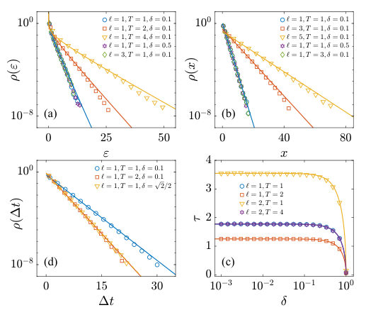
<figcaption class="paper-figure-caption"><b>Fig 2.</b> Figure 1 compares numerical simulations with theoretical predictions for different parameter settings at fixed system size N = 100, m = 1, and ℓ= 1. The system is updated using an event-driven algorithm [22]. As expected, the energy dis- tribution ρ(ε) depends only on the temperature T [Eq. (17)], while the spacing distribution ρ(x) is controlled only by the mean spacing ℓ[Eq. (23)]. In contrast, the collision-time in- terval distribution ρ(∆t) depends on T, ℓ, and the masses mi</figcaption>
</figure>
<figure class="paper-figure-card">
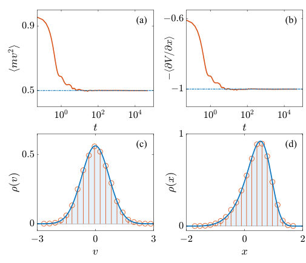
<figcaption class="paper-figure-caption"><b>Fig 3.</b> FIG. 2. Molecular dynamics results for a lattice chain with peri- odic boundaries, α = λ = 1, N = 100, T = 0.5, and P = −1. (a, b) Time evolution of the average kinetic energy and internal pressure, respectively, showing rapid convergence to the theoretical values (see dashed lines). (c, d) Probability density functions of particle velocity and relative displacement x, respectively, compared with the corre- sponding theoretical curves.</figcaption>
</figure>
<figure class="paper-figure-card">
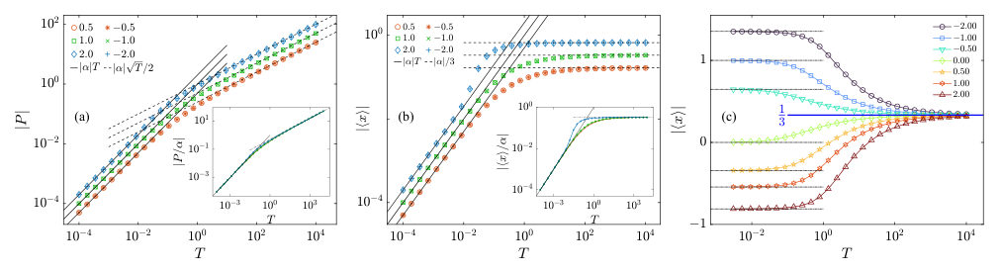
<figcaption class="paper-figure-caption"><b>Fig 4.</b> FIG. 3. Temperature dependence of the pressure and mean displacement obtained from Eq. (47). (a) |P| versus T at λ = 1 and l = 0 for different α. (b) |⟨x⟩| versus T at λ = 1 and P = 0 for different α. (c) |⟨x⟩| versus T at λ = 1 and α = −1 for different P. Symbols denote numerical solutions. Solid and dashed lines in (a) and (b) indicate the low- and high-temperature asymptotic predictions, respectively. In (c), the black dashed line marks the stable root x∗of Eq. (55), and the blue solid line gives the high-temperature limit. Insets in (a) and (b) show the corresponding rescaled data.</figcaption>
</figure>

**Summary.** This paper provides a simplified derivation of the Boltzmann distribution by showing it is the unique solution arising from energy-shift and coarse-graining-scale invariance. It demonstrates how complex thermodynamic phenomena, such as thermal expansion and internal pressure, emerge naturally from these fundamental symmetries in 1D models.

**Why it may be interesting.** not directly relevant

Detailed structure

**Main problem.** Deriving the Boltzmann distribution for single-particle energy distributions in classical many-body Hamiltonian systems using a concise, alternative approach based on fundamental symmetries.

**Main result.** The Boltzmann factor is uniquely determined by the combination of coarse-graining-scale invariance and energy-shift invariance, which leads to the multiplicative Cauchy functional equation.

**Method.** The authors use a mathematical derivation based on functional equations (multiplicative Cauchy equation) and validate the theory using event-driven and Molecular Dynamics (MD) simulations.

**Model / system.** The study examines classical many-body Hamiltonian systems, specifically a 1D diatomic hard-core gas and a 1D nonlinear lattice chain with an asymmetric anharmonic potential.

**Key observables.** Single-particle velocity, energy, and spacing distributions; collision-time intervals; kinetic temperature; internal pressure; and mean relative displacement.

**Important parameters / regimes.** Inverse kinetic temperature (beta), mean energy per particle, mass difference (delta), anharmonic coefficients (alpha, lambda), and thermodynamic limits (N, L to infinity).

**Assumptions / limitations.** The system is a classical many-body Hamiltonian system in the thermodynamic limit, the distribution function is continuous, and the dynamics are sufficiently mixing/ergodic.

**Figures summary.** Figure 1 shows agreement between theoretical and numerical PDFs for velocity, energy, and collision time in a hard-core gas. Figure 2 shows convergence of kinetic energy and pressure and agreement in PDFs for a nonlinear lattice. Figure 3 shows analytical scaling of pressure and displacement versus temperature.

**Paper structure.** The paper introduces the derivation principles, applies them to a 1D hard-core gas, extends the framework to nonlinear lattice chains to show emergent properties like thermal expansion, and concludes with a discussion on ensemble equivalence and limitations.

Abstract

We present a concise derivation of the Boltzmann form for single-particle energy distributions in classical many-body Hamiltonian systems. The derivation relies on two physical facts: coarse-graining-scale invariance of the empirical distribution and invariance under a uniform shift of the energy zero. These conditions uniquely yield the Boltzmann factor, whose parameter is fixed by the mean energy per particle. For separable Hamiltonians, the equilibrium weight factorizes into kinetic and configurational contributions sharing the same parameter, identified from the kinetic part as the inverse kinetic temperature. The principle extends to any physical quantity with a stationary distribution and translational invariance. It is illustrated in a one-dimensional diatomic hard-core gas and a nonlinear lattice chain, where it predicts velocity, energy, spacing, collision-time, and pressure-dependent displacement distributions in agreement with simulations. The lattice model further shows how harmonic elasticity, anharmonic corrections, internal pressure, and thermal expansion emerge from the same exponential equilibrium weights. Finally, the relationships among different ensembles are briefly discussed.

[↑ back to top](#top)

### [Distinguishing Bohmian contextuality from Kochen-Specker contextuality](http://arxiv.org/abs/2605.24446v1)

**Authors:** Anton Skott, Jan-Åke Larsson  
**Type:** theory · **Category:** other · **PDF:** <https://arxiv.org/pdf/2605.24446v1>  
**Analysis basis:** full PDF text, analyzed in chunks
**Topic relevance:** `quantum measurements` **2/5**

↔ Scroll figures horizontally

<figure class="paper-figure-card">
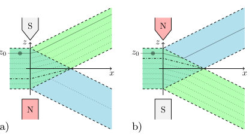
<figcaption class="paper-figure-caption"><b>Fig 1.</b> FIG. 2. One possible Bohmian trajectory among others for a particle in the state |ψ⟩= √</figcaption>
</figure>
<figure class="paper-figure-card">
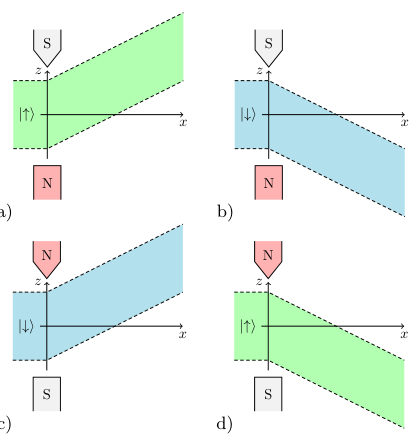
<figcaption class="paper-figure-caption"><b>Fig 2.</b> FIG. 1. Spin system behavior at SG device, with spatial wave- function according to the main text. a) Spin up system at an SGS device. b) Spin down system at an SGS device. c) Spin down system at an SGN device. d) Spin up system at an SGN device.</figcaption>
</figure>
<figure class="paper-figure-card">
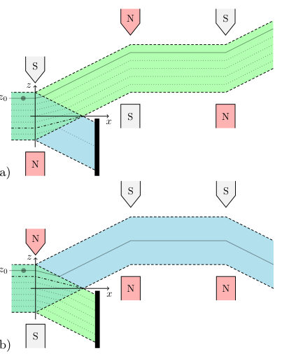
<figcaption class="paper-figure-caption"><b>Fig 3.</b> FIG. 3. One possible Bohmian trajectory among others for a particle in the state 1</figcaption>
</figure>

**Summary.** This paper proves that the measurement-device dependence characteristic of Bohmian mechanics is not a prerequisite for Kochen-Specker contextuality. By using the Contextual Ontological Model, the authors show that a model can exhibit KS contextuality while having outcomes predictable solely from the model state. This allows for the independent study of these two distinct forms of quantum contextuality.

**Why it may be interesting.** not directly relevant

Detailed structure

**Main problem.** The paper aims to clarify the relationship between two types of quantum contextuality: Kochen-Specker (KS) contextuality and Bohmian contextuality, specifically testing if Bohmian-type measurement dependence is a necessary requirement for KS contextuality.

**Main result.** The authors demonstrate that Bohmian contextuality is not a necessary condition for KS contextuality, as the Contextual Ontological Model (COM) reproduces KS predictions without requiring measurement-device dependence.

**Method.** The study uses a comparative analysis between Bohmian mechanics and the Contextual Ontological Model (COM) using a spin-1/2 system and simulated Stern-Gerlach measurement setups.

**Model / system.** The analysis focuses on a spin-1/2 particle system using Bohmian mechanics (trajectory-based) and the Contextual Ontological Model (an extension of stabilizer quantum mechanics) within a Stern-Gerlach apparatus framework.

**Key observables.** Particle position, spin states (up/down), and measurement outcomes (exit paths in a Stern-Gerlach device).

**Important parameters / regimes.** Magnetic pole polarity (SGS vs. SGN devices), particle velocity, and the Quantum Equilibrium Hypothesis.

**Assumptions / limitations.** The analysis assumes simplified, non-spreading rectangular wave packets, neglects y-direction dynamics, and is restricted to the framework of stabilizer quantum mechanics for the COM model.

**Figures summary.** Figure 1 shows Stern-Gerlach device scenarios for different spin/polarity combinations; Figure 2 illustrates Bohmian trajectories splitting at a threshold; Figure 3 depicts a three-stage measurement setup to demonstrate spin assignment dependence.

**Paper structure.** The paper introduces the two types of contextuality, defines the Bohmian and COM models, performs a comparative analysis of spin assignment in Stern-Gerlach setups, and concludes by showing the independence of the two concepts.

Abstract

Quantum contextuality is a concept used to describe the property of hidden-variable theory that measurement outcomes predetermined by the hidden variables depend on the measurement context. The term measurement context can have different meanings, giving rise to different flavours of quantum contextuality. The first discovered flavour is Kochen-Specker (KS) contextuality where measurement outcomes will depend on what compatible measurements are jointly performed with the selected measurement. Another flavour, here to be compared with KS contextuality, is that referred to in Bohmian mechanics where outcomes of some specific measurements are not completely specified by the model state, but depend also on specifics of the measurement device used. It has been claimed that this type of Bohmian contextuality is necessary to enable KS contextuality in a hidden variable model. In this paper we show that this is not the case. The recently proposed Contextual Ontological Model (COM) [Hindlycke and Larsson, Phys. Rev. Lett. 2022] produces KS contextual predictions but does not have the Bohmian contextuality; the outcome of every measurement allowed by COM can be predicted from the model state itself. This distinguishes Bohmian contextuality from KS contextuality, and enables individual study of the two concepts.

[↑ back to top](#top)

### [Electrodynamics as a Theory of Persistent Stochastic Processes](http://arxiv.org/abs/2605.24494v1)

**Authors:** Partha Ghose  
**Type:** theory · **Category:** other · **PDF:** <https://arxiv.org/pdf/2605.24494v1>  
**Analysis basis:** full PDF text, analyzed in chunks
**Topic relevance:** `Keldysh / 2PI / non-Gaussian methods` **2/5**

↔ Scroll figures horizontally

<figure class="paper-figure-card">
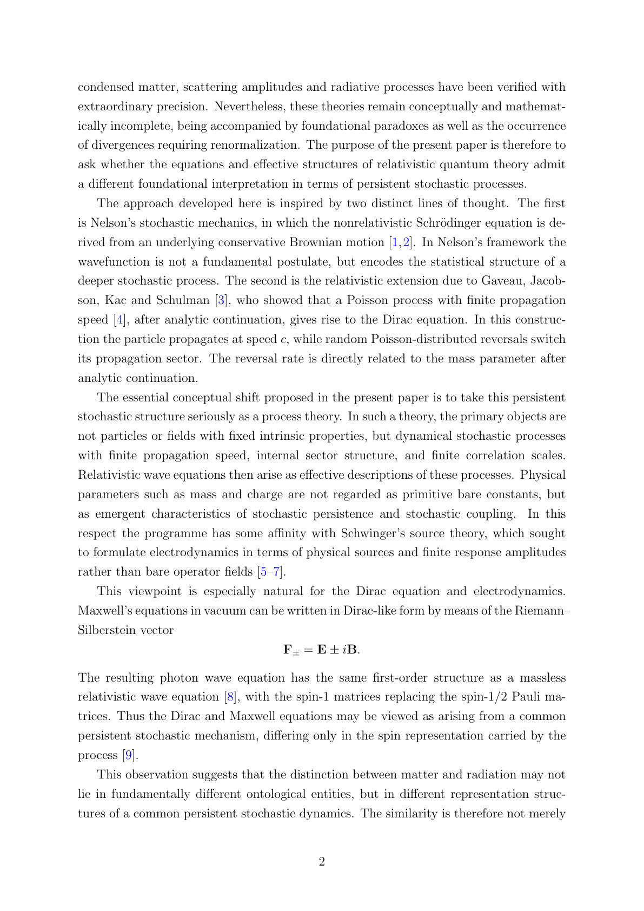
<figcaption class="paper-figure-caption"><b>Fig 1.</b> Low-resolution page preview, page 2</figcaption>
</figure>
<figure class="paper-figure-card">
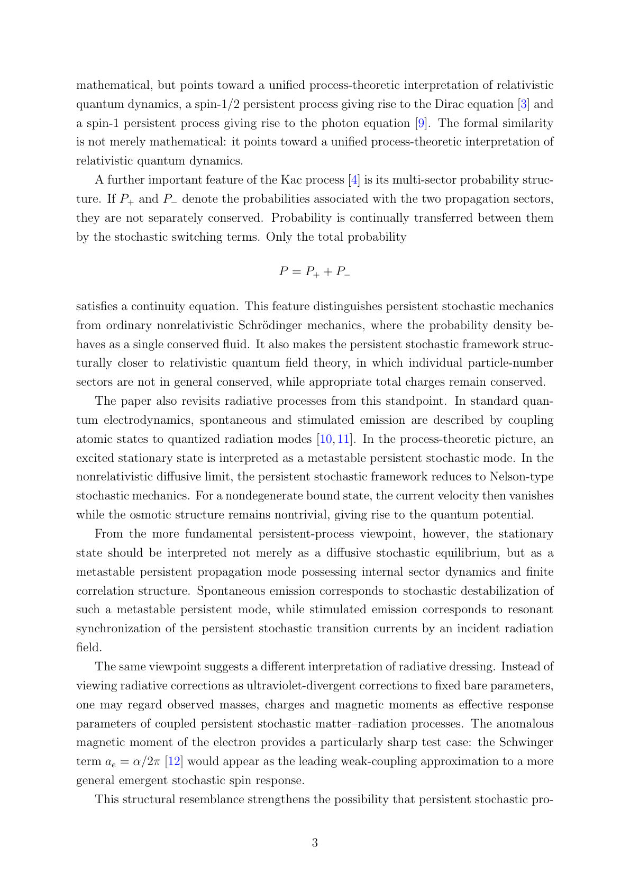
<figcaption class="paper-figure-caption"><b>Fig 2.</b> Low-resolution page preview, page 3</figcaption>
</figure>
<figure class="paper-figure-card">
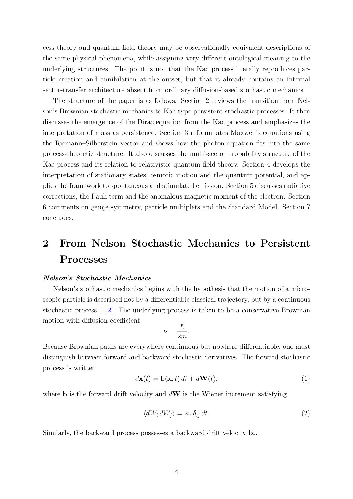
<figcaption class="paper-figure-caption"><b>Fig 3.</b> Low-resolution page preview, page 4</figcaption>
</figure>
<figure class="paper-figure-card">
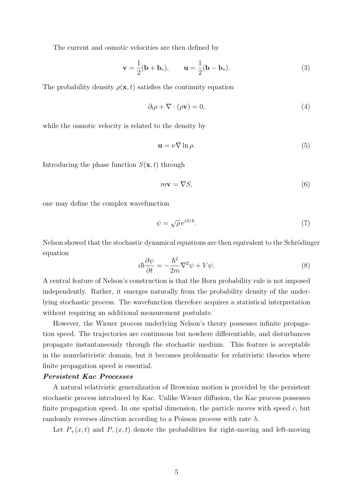
<figcaption class="paper-figure-caption"><b>Fig 4.</b> Low-resolution page preview, page 5</figcaption>
</figure>
<figure class="paper-figure-card">
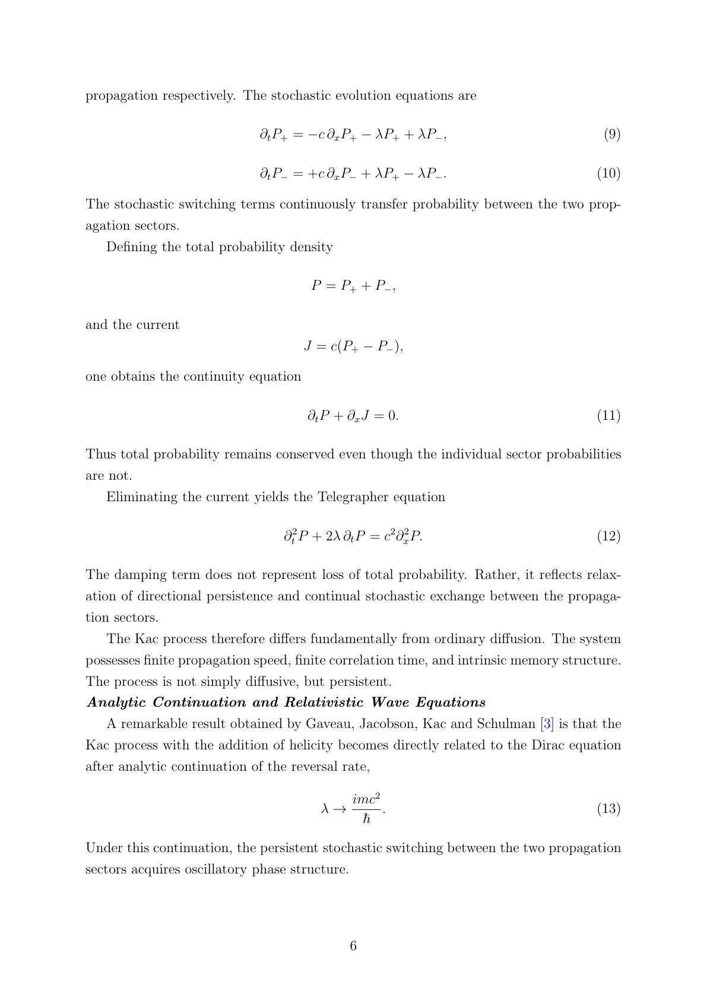
<figcaption class="paper-figure-caption"><b>Fig 5.</b> Low-resolution page preview, page 6</figcaption>
</figure>

**Summary.** This paper proposes that the fundamental entities of electrodynamics, such as particles and fields, are not primitive but emerge from underlying persistent stochastic processes. By using Kac-type dynamics, the author derives the Dirac and Maxwell equations as emergent descriptions of stochastic propagation. This provides a new ontological basis for QED where mass and charge are interpreted as scales of the underlying stochastic dynamics.

**Why it may be interesting.** This is interesting for researchers in open quantum systems and quantum optics because it provides a dynamical, stochastic interpretation of fundamental radiative processes like spontaneous and stimulated emission, viewing them as transitions between metastable stochastic modes.

Detailed structure

**Main problem.** The paper seeks to provide a new underlying ontology for Quantum Electrodynamics (QED) by replacing the concept of primitive particles and fields with emergent structures arising from fundamental stochastic processes.

**Main result.** The author demonstrates that relativistic wave equations, such as the Dirac and Maxwell equations, can emerge from the analytic continuation of persistent Kac-type stochastic processes, where mass and charge are reinterpreted as persistence and coupling scales.

**Method.** The framework utilizes stochastic calculus, specifically Telegrapher-type dynamics and the analytic continuation of Poisson-driven switching rates, to derive relativistic wave equations from a process-theoretic foundation.

**Model / system.** The model is based on a persistent Kac-type stochastic process where particles move at a finite velocity $c$ and undergo random direction reversals. It treats the Dirac equation (spin-1/2) and Maxwell equations (spin-1) as different spin representations of the same underlying stochastic mechanism.

**Key observables.** Mass (as a persistence scale), electric charge (as a coupling scale), anomalous magnetic moment, and the transition between spontaneous and stimulated emission.

**Important parameters / regimes.** The reversal rate $\lambda$ (which generates mass via analytic continuation), the propagation speed $c$, and the stochastic coupling scale $e$.

**Assumptions / limitations.** The framework assumes that the new stochastic ontology is observationally equivalent to the existing predictions of standard QED and does not intend to modify its empirical successes.

**Paper structure.** The paper begins by introducing the process-theoretic approach and the Kac-type model, moves to the derivation of relativistic wave equations via analytic continuation, explores the emergence of mass and charge, discusses the interpretation of radiative effects like spontaneous emission, and concludes with implications for gauge symmetry and the Standard Model.

Abstract

A process-theoretic approach to electrodynamics based on persistent Kac-type stochastic processes is developed. Finite-velocity stochastic propagation is taken as primary, while relativistic wave equations arise as emergent descriptions after analytic continuation of Telegrapher-type dynamics. The Dirac and Maxwell equations are interpreted as arising from closely related persistent propagation structures differing only in spin representation.   The framework is not intended to modify the successful empirical predictions of quantum electrodynamics, but to provide a different underlying ontology. Particles and fields are not treated as primitive entities with fixed intrinsic properties. Instead, relativistic particle and field structures emerge as stable collective modes of coupled persistent stochastic dynamics. Mass and charge acquire interpretations respectively as persistence and stochastic coupling scales.   Stationary bound states are interpreted as metastable persistent stochastic modes with nontrivial internal sector dynamics. Spontaneous emission is viewed as stochastic destabilization of such modes, while stimulated emission arises through resonant synchronization of persistent transition currents by incident radiation.   Gauge interactions are introduced at the level of propagation-sector amplitudes prior to the emergence of observable probabilities. Radiative effects, including the anomalous magnetic moment of the electron, are interpreted as effective stochastic dressing of coupled matter--radiation processes. Some comments on gauge symmetry, equilibration and the Standard Model are also included.

[↑ back to top](#top)

### [High-fidelity EDSR in Si/SiGe Wiggle Wells](http://arxiv.org/abs/2605.24790v1)

**Authors:** Hudaiba Soomro, Minyoung Kim, Avani Vivrekar, M. A. Eriksson, Benjamin D. Woods, Mark Friesen  
**Type:** theory · **Category:** quantum information and computing · **PDF:** <https://arxiv.org/pdf/2605.24790v1>  
**Analysis basis:** full PDF text, analyzed in chunks
**Topic relevance:** `non-equilibrium dynamics` **2/5**

↔ Scroll figures horizontally

<figure class="paper-figure-card">
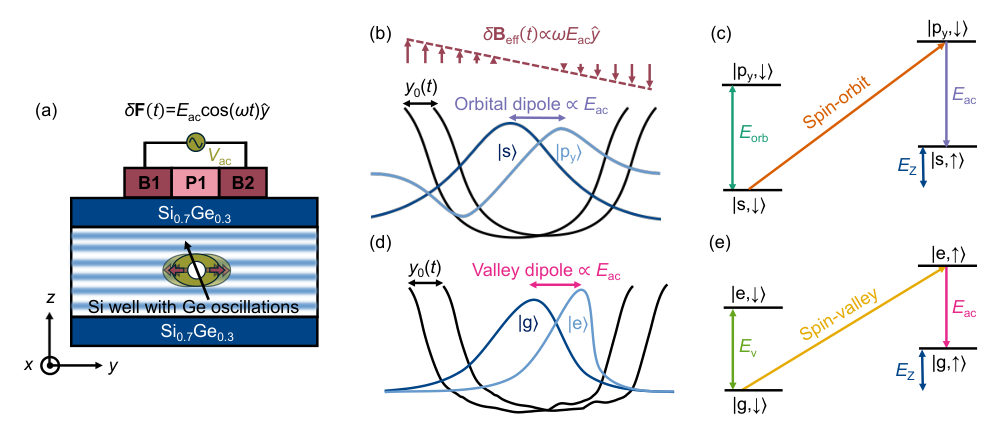
<figcaption class="paper-figure-caption"><b>Fig 1.</b> FIG. 1. Schematic illustration of EDSR operation in a long-period Si Wiggle Well. (a) A quantum well is formed between SiGe barriers with Ge concentration oscillations. A single-electron qubit is shown inside the well, under plunger gate P1, and confined between the barrier gates B1 and B2. (Dimensions not shown to scale.) An ac electric field δF(t) is experienced in the plane of the qubit, due to an ac voltage Vac applied to the top gates. We also assume a vertical electric field F = Fzˆz and a static magnetic field B = Bˆx. Wiggle Well concentration oscillations of wavelength λ = 1.57 nm cause a strong enhancement of the spin-orbit coupling, which enables fast EDSR. (b) For conventional...</figcaption>
</figure>
<figure class="paper-figure-card">
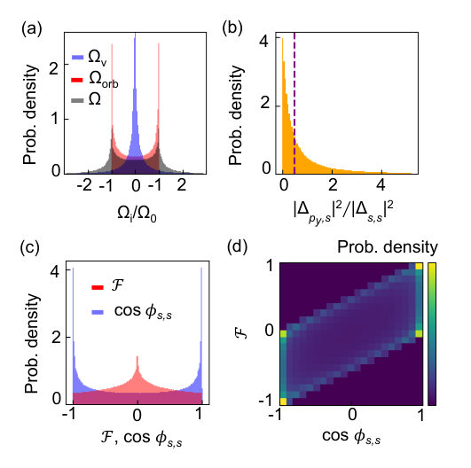
<figcaption class="paper-figure-caption"><b>Fig 2.</b> FIG. 2. Rabi frequency distributions in the presence of alloy disorder. (a) Probability distributions of Ωv, Ωorb, and the total Rabi frequency Ω= Ωv +Ωorb, all scaled by the conven- tional EDSR frequency Ω0, defined in Eq. (14). (b) Probabil- ity distribution of the matrix-element ratio |∆py,s|2/|∆s,s|2, which contributes to Ωv as shown in Eq. (15). Here, the dashed purple line corresponds to the median value of 0.5. (c) Probability distributions of the cosine of the valley phase ϕs,s, and valley-phase modulation factor, F(ϕs,s, ϕpy,s), de- fined in the main text. (d) 2D color-scale histogram of F and cos ϕs,s, showing positive correlations between the two distri- butions.</figcaption>
</figure>
<figure class="paper-figure-card">
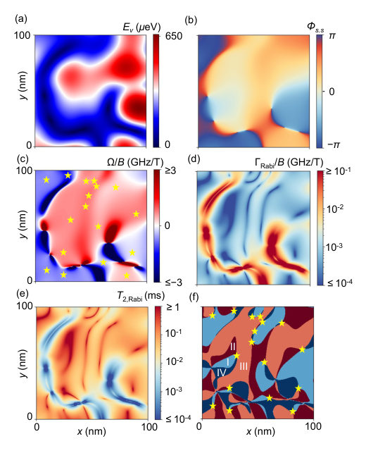
<figcaption class="paper-figure-caption"><b>Fig 3.</b> FIG. 3. Typical disorder-induced landscapes of parameters that play an important role in EDSR. (The same random-alloy realization is used in all panels, across the same 100×100 nm2</figcaption>
</figure>
<figure class="paper-figure-card">
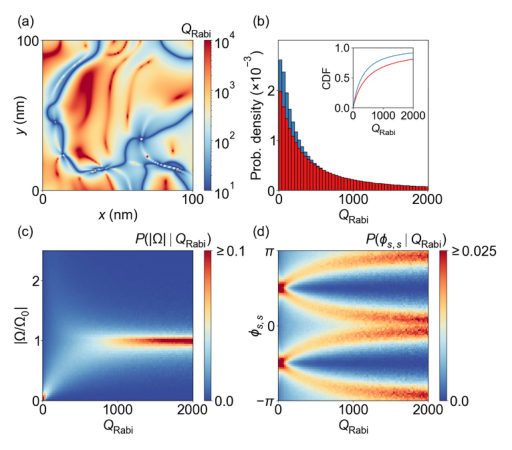
<figcaption class="paper-figure-caption"><b>Fig 4.</b> FIG. 4. Identifying high-fidelity regions of EDSR. (a) Quality- factor map, QRabi(x, y), based on the same disorder profile used in Fig. 3, showing two extreme types of behavior: high- fidelity behavior (dark red, QRabi ≥104), coinciding with the sweet spots indicated in Fig. 3(f), and low-fidelity behavior (dark blue, QRabi ≤10), associated with valley vortices and regions of high dephasing or low Rabi frequencies. (b) His- tograms of quality-factor values: red describes contributions from Ωorb only, while blue describes the total QRabi. Inset shows the cumulative distribution functions (CDFs) for the same data as the main panel. (c) Color-scale plot of the Rabi frequency distribution |Ω|,...</figcaption>
</figure>
<figure class="paper-figure-card">
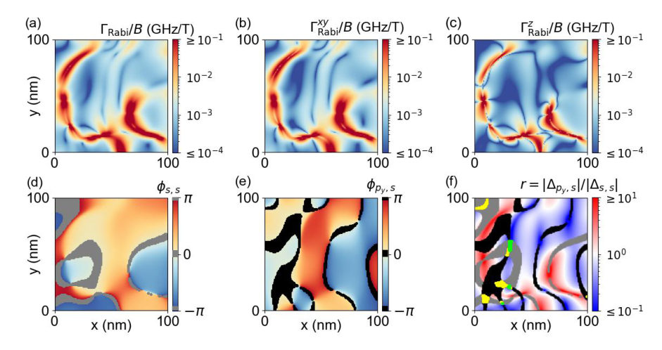
<figcaption class="paper-figure-caption"><b>Fig 5.</b> FIG. 5. Spatial maps of scaled dephasing rates and valley phases (ϕs,s and ϕpy,s), for the same alloy-disorder realization as previous figures. (a) The scaled Rabi dephasing rate, including electric field fluctuations in any direction. (b), (c) Dephasing- rate maps arising from in-plane and vertical field fluctuations, respectively. Although some low-dephasing regions disappear when both noise components are combined, many remain and are analyzed in panels (d)-(f). (d) Spatial distribution of the ground-state valley phase ϕs,s. Gray indicates sweet-spot regions where |ϕs,s −mπ| &lt; ϵthresh, m ∈Z, and ϵthresh = 0.045π. (e) Spatial distribution of the higher-orbital valley phase, ϕpy,s. Black...</figcaption>
</figure>

**Summary.** This paper explores how the intrinsic spin-orbit coupling in Si/SiGe Wiggle Wells can be used for high-fidelity spin qubit control without external micromagnets. It demonstrates that despite the presence of random-alloy disorder, specific 'sweet spots' exist where gates are highly resistant to charge noise. The work provides a roadmap for achieving high-quality, micromagnet-free EDSR in silicon-based quantum computing.

**Why it may be interesting.** not directly relevant

Detailed structure

**Main problem.** Investigating how random-alloy Ge disorder and electric-field fluctuations affect the stability and fidelity of Electric Dipole Spin Resonance (EDSR) in Si/SiGe Wiggle Wells.

**Main result.** The study identifies that while alloy disorder causes spatial randomization of the Rabi frequency, a new disorder-enabled valley-dipole mechanism can enhance EDSR, and high-fidelity gate operations are achievable at identified 'sweet spots' that are robust against charge noise.

**Method.** The authors use Schrieffer-Wolff transformations to derive an effective 2D spin Hamiltonian, Floquet theory for numerical verification, and statistical modeling (Cholesky decomposition) to simulate spatial maps of alloy disorder and noise impacts.

**Model / system.** The system consists of electron spin qubits in Si/SiGe 'Wiggle Well' quantum dots, featuring Ge concentration oscillations designed to enhance Dresselhaus spin-orbit coupling.

**Key observables.** Rabi frequency (orbital and valley contributions), valley splitting, dephasing rate (Gamma_Rabi), and the Rabi quality factor (Q_Rabi).

**Important parameters / regimes.** Ge oscillation wavelength (~1.6 nm), valley splitting (Ev), in-plane and vertical electric field fluctuations, and the ratio of valley-orbit coupling to valley splitting.

**Assumptions / limitations.** The energy hierarchy is assumed to be orbital splitting >> valley splitting >> Zeeman energy; vertical-lateral coupling is assumed to be weak; and the driving field is in the high-frequency limit.

**Figures summary.** Figures include probability distributions of Rabi frequency components, spatial maps of valley splitting and phases, and comparisons between analytical predictions and numerical Floquet theory results.

**Paper structure.** The paper introduces the Wiggle Well platform, derives an effective EDSR theory via Schrieffer-Wolff transformation, analyzes the impact of alloy disorder on Rabi frequency and dephasing, investigates the robustness of 'sweet spots' against in-plane and vertical charge noise, and concludes with a feasibility assessment for micromagnet-free gates.

Abstract

Si/SiGe quantum wells that incorporate Ge concentration oscillations, known as long-period Wiggle Wells, have previously been shown to enhance the Dresselhaus spin-orbit coupling (SOC) of conduction-band electrons. Such intrinsic SOC is desirable when performing spin-qubit gate operations based on electric dipole spin resonance (EDSR) because it eliminates the need for external micromagnets. However, random-alloy disorder plays a key role in the valley physics of this materials system by spatially randomizing the valley phase $φ_{s,s}$, and has not been fully accounted for in recent EDSR analyses. Here, we show that alloy disorder affects EDSR in two main ways. First, the Rabi frequency $Ω$ acquires a dependence on the valley phase, given by $\cosφ_{s,s}$, which causes spatial randomization of $Ω$. Despite this variability, we show that fast EDSR can be achieved at most locations across a given sample. Second, a new Rabi driving mechanism emerges, enabled by valley dipoles that result from disorder and the hybridization of ground and excited valley states in response to an EDSR driving field. This mechanism is dominant in regions of low valley splitting. Alloy disorder can therefore strengthen EDSR, but it can also cause gradients in $Ω$ that lead to dephasing in the rotating frame. We explore this problem by first identifying "sweet spots," where EDSR is relatively insensitive to electric-field fluctuations. We then show that high-fidelity Rabi oscillations can be achieved in the presence of realistic charge noise. Our results demonstrate that the Wiggle Well is a promising platform for high-quality, micromagnet-free gate operations.

[↑ back to top](#top)

### [Implementation of distillation protocols using a recirculating bricks mesh network](http://arxiv.org/abs/2605.25911v1)

**Authors:** Jacek Gosciniak  
**Type:** theory · **Category:** quantum information and computing · **PDF:** <https://arxiv.org/pdf/2605.25911v1>  
**Analysis basis:** full PDF text, analyzed in chunks
**Topic relevance:** `interference shaping light` **2/5**

↔ Scroll figures horizontally

<figure class="paper-figure-card">
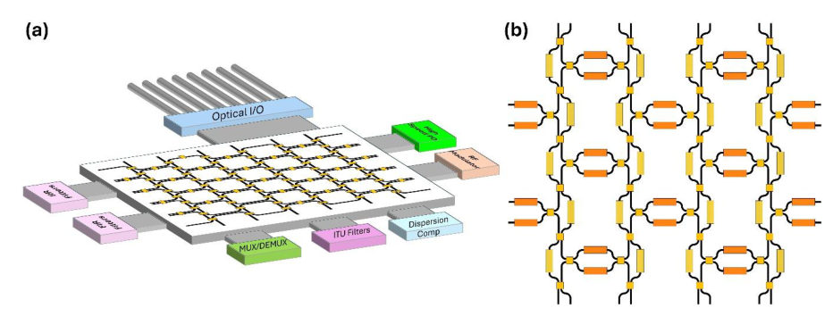
<figcaption class="paper-figure-caption"><b>Fig 1.</b> Figure 1. (a) The photonic chip with a (b) programmable mesh core connected to control electronics, optical</figcaption>
</figure>
<figure class="paper-figure-card">
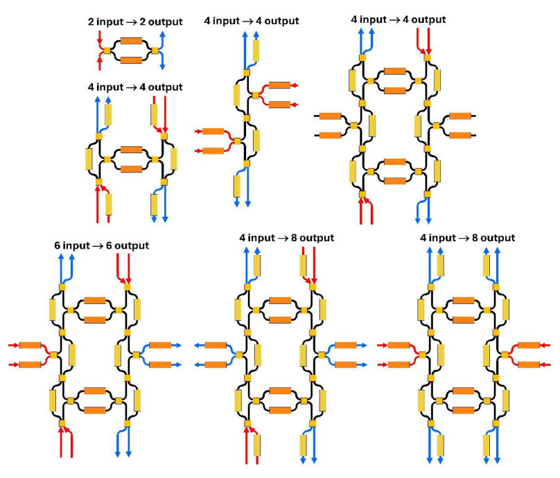
<figcaption class="paper-figure-caption"><b>Fig 2.</b> Figure 2. Examples of various input-output system implementations realized in the recirculating “bricks” mesh</figcaption>
</figure>
<figure class="paper-figure-card">

<figcaption class="paper-figure-caption"><b>Fig 3.</b> Figure 3. (a) Schematic of the photon distillation gate for the raw of input photonic 𝜌 and the distilled output photonics 𝜌′. (b) Linear optical circuit, based on cascaded Hong-Ou-Mandel-type quantum interferometers, for</figcaption>
</figure>
<figure class="paper-figure-card">
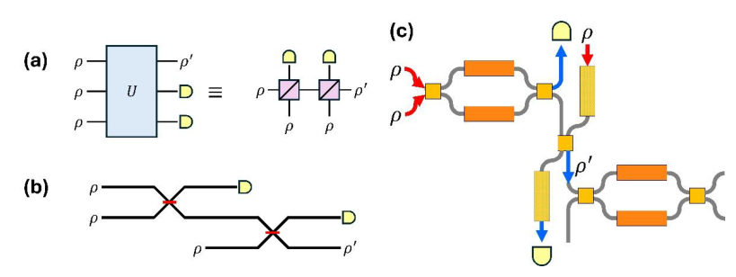
<figcaption class="paper-figure-caption"><b>Fig 4.</b> Fig. 3b shows a block diagram illustrating the beam splitters and waveguides of standard, programmable linear optical circuit to measure the indistinguishability error in the presence of other noise sources that implement the distillation protocol on two photons. The third photon is then used as a reference to measure the distinguishability via Hong-Ou-Mandel (HOM) interference [30]. Such protocols take advantage of the disparity in the statistics of indistinguishable and distinguishable photons interfering on a beam splitter to amplify the indistinguishable components of the quantum state [27, 33]. In accordance with the Hong-Ou-Mandel (HOM) effect, indistinguishable photons bunch when...</figcaption>
</figure>
<figure class="paper-figure-card">
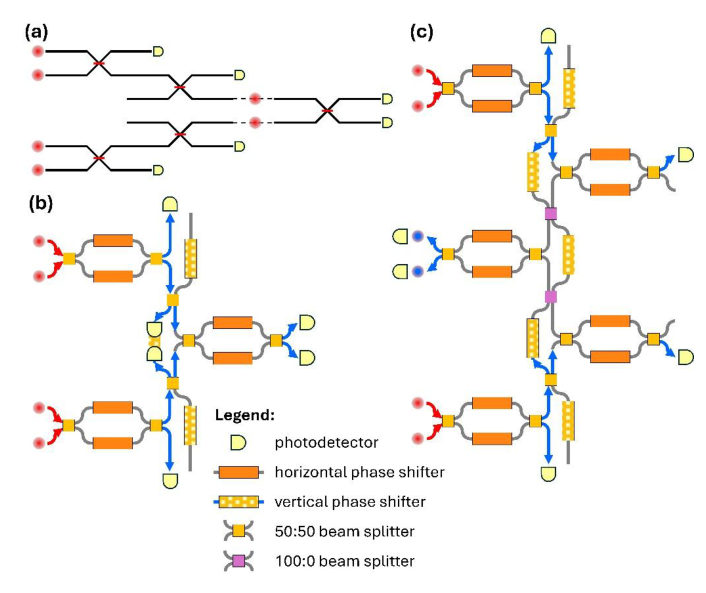
<figcaption class="paper-figure-caption"><b>Fig 5.</b> Figure 4. (a) A schematic of the linear optical circuit which implements two copies of the 𝑛= 2 purification circuit. (b, c) An equivalent of the above circuit implemented using a recirculating “bricks” mesh architecture.</figcaption>
</figure>

**Summary.** The paper proposes a new recirculating 'bricks' mesh architecture for photonic integrated circuits that outperforms traditional feed-forward networks. It demonstrates that this architecture can implement complex quantum distillation protocols and Fourier transforms with significantly fewer components and reduced optical depth. This efficiency is crucial for scaling up photonic quantum computing by minimizing photon loss and decoherence.

**Why it may be interesting.** This is highly relevant for quantum optics and photonic QI as it proposes a hardware-efficient way to perform error-mitigation (distillation) and complex quantum signal processing with minimal loss and complexity.

Detailed structure

**Main problem.** The high resource cost, propagation loss, and increased circuit depth associated with standard feed-forward photonic meshes when implementing complex distillation protocols and unitary transformations.

**Main result.** A recirculating bricks mesh architecture significantly reduces the number of required MZIs and optical depth compared to feed-forward networks, enabling efficient implementation of distillation and Fourier transform-based schemes.

**Method.** The study proposes a 2D recirculating mesh of Mach-Zehnder interferometers and uses scaling analysis, the Cooley-Tey algorithm for qFFT decomposition, and mathematical modeling of bosonic modal operators.

**Model / system.** A programmable photonic integrated circuit (PIC) featuring a two-dimensional bricks waveguide mesh of Mach-Zehnder interferometers (MZIs) that allows bidirectional signal propagation.

**Key observables.** Photon indistinguishability (measured via Hong-Ou-Mandel visibility), indistinguishability error rate, and optical depth.

**Important parameters / regimes.** Number of modes (m), number of photons (n), reconfiguration performance (number of realizable filters), and decoherence time.

**Assumptions / limitations.** The analysis assumes a regime where the number of photons equals the number of modes (n=m).

**Figures summary.** Figure 1 shows the integrated photonic chip and control electronics; Figure 2 illustrates various input-output implementations; Figures 3-4 detail distillation gate schematics and feed-forward comparisons; Figures 5-6 demonstrate the implementation of multi-mode DFTs using the bricks mesh.

**Paper structure.** The paper introduces the problem of photon indistinguishability, proposes the bricks mesh architecture, compares its efficiency and reconfiguration performance against standard meshes, and demonstrates its application to distillation protocols and Quantum Fourier Transforms.

Abstract

General-purpose programmable photonic processors provide a flexible foundation for integrating various functionalities within a single chip. A two-dimensional bricks waveguide mesh of Mach Zehnder interferometers has been demonstrated to possess considerable potential in the domain of photonic neural networks and quantum signal processing. In this article, we propose an expansion of the available applications of recirculating bricks mesh architecture to distillation protocols necessary for quantum signal processing. These protocols are essential for the heralding of the output of single photons, which is characterized by a reduced distinguishability error rate. The demonstration will be made of a single programmable optical system's ability to realize various distillation protocols with reduced computational resource costs. The present study will concentrate on cascaded quantum interferometers and Fourier transform-based schemes. It will demonstrate that the bricks mesh can implement such schemes, which are unattainable using feed-forward networks, without the need for complex out-of-plane integration. The propagation of the signal in any direction, along with the utilization of all ports as both input and output, facilitates the execution of such transformations with minimal optical depth of the circuit and in time scales shorter than the decoherence time.

[↑ back to top](#top)

### [Negative entropy in scrambling black holes](http://arxiv.org/abs/2605.25315v1)

**Authors:** Koji Azuma  
**Type:** theory · **Category:** statistical mechanics · **PDF:** <https://arxiv.org/pdf/2605.25315v1>  
**Analysis basis:** full PDF text, analyzed in chunks
**Topic relevance:** `entanglement & information structure` **2/5**

↔ Scroll figures horizontally

<figure class="paper-figure-card">
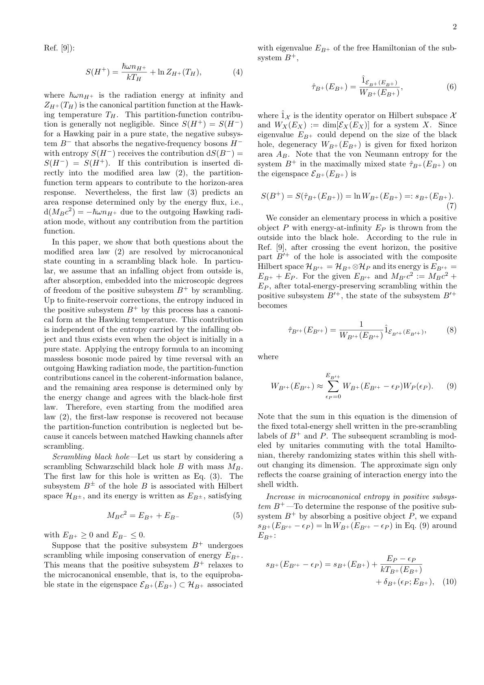
<figcaption class="paper-figure-caption"><b>Fig 1.</b> Low-resolution page preview, page 2</figcaption>
</figure>
<figure class="paper-figure-card">
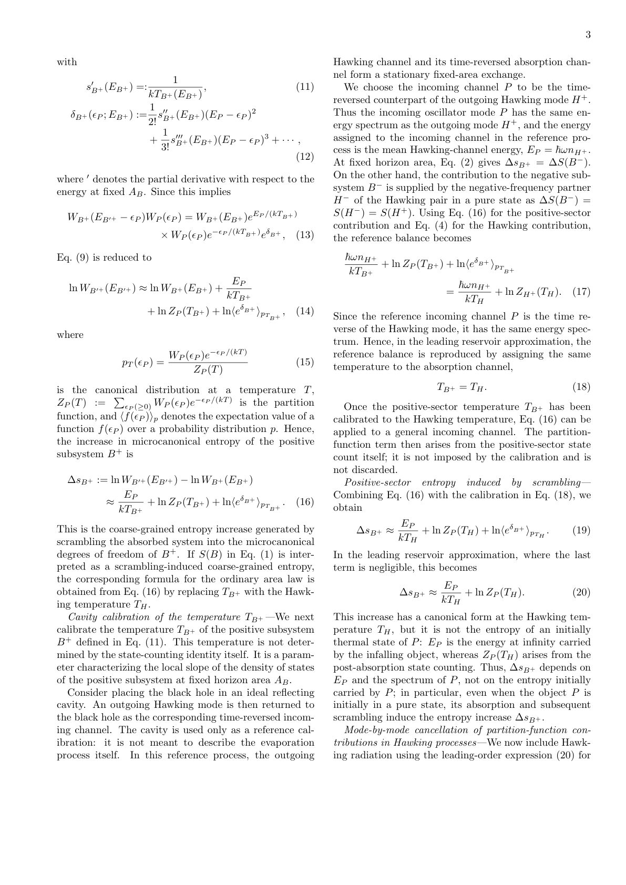
<figcaption class="paper-figure-caption"><b>Fig 2.</b> Low-resolution page preview, page 3</figcaption>
</figure>
<figure class="paper-figure-card">
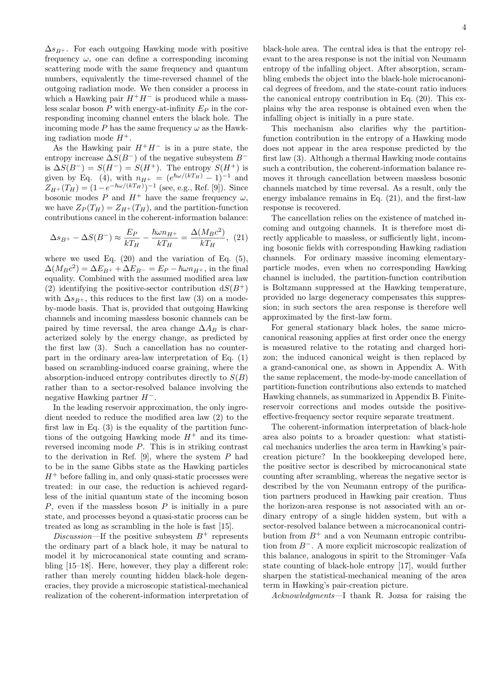
<figcaption class="paper-figure-caption"><b>Fig 3.</b> Low-resolution page preview, page 4</figcaption>
</figure>
<figure class="paper-figure-card">
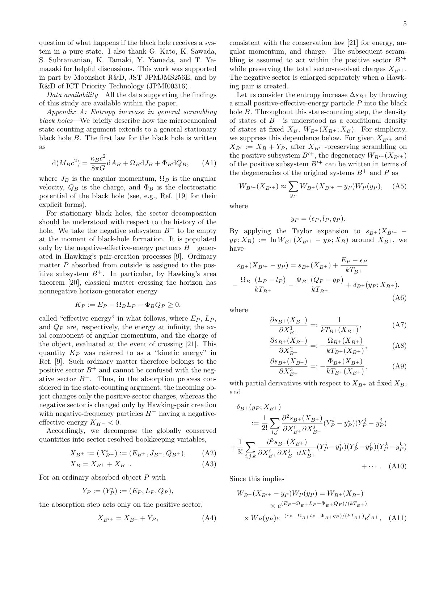
<figcaption class="paper-figure-caption"><b>Fig 4.</b> Low-resolution page preview, page 5</figcaption>
</figure>
<figure class="paper-figure-card">
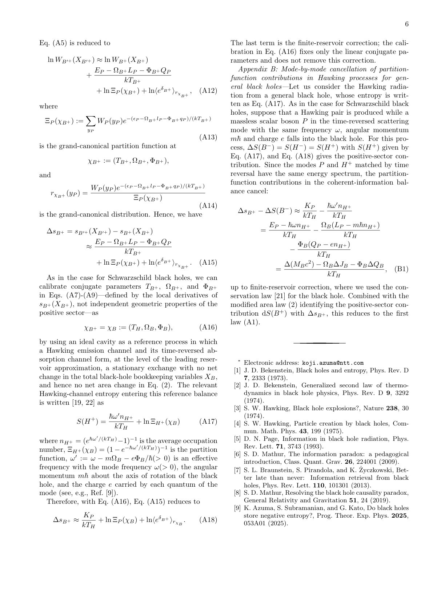
<figcaption class="paper-figure-caption"><b>Fig 5.</b> Low-resolution page preview, page 6</figcaption>
</figure>

**Summary.** This paper provides a statistical-mechanical basis for understanding black hole entropy as coherent information. It explains how the absorption of even pure-state particles increases the horizon area and shows that the thermodynamic first law is maintained through the cancellation of quantum partition functions during Hawking radiation.

**Why it may be interesting.** not directly relevant

Detailed structure

**Main problem.** Resolving inconsistencies in the coherent-information interpretation of black hole entropy, specifically explaining how the area increases when pure-state particles are absorbed and how the first law of black hole mechanics is preserved.

**Main result.** The author derives a microscopic statistical-mechanical foundation showing that the entropy increase from scrambling depends on energy flux, and proves that partition-function contributions from Hawking pairs cancel out to recover the standard black-hole first law.

**Method.** The study employs microcanonical state-counting, Taylor expansions of entropy around initial energy, and the application of grand-canonical ensembles and partition functions within Hawking's pair-creation framework.

**Model / system.** A scrambling Schwarzschild black hole modeled as a system composed of a positive subsystem (B+) and a negative subsystem (B-) containing negative-frequency bosons, utilizing Hawking's pair-creation picture.

**Key observables.** Horizon area (A_B), Hawking temperature (T_H), entropy increase (delta s_B+), and energy flux.

**Important parameters / regimes.** Hawking temperature, energy (E_P), angular momentum (L_P), charge (Q_P), and the scrambling process efficiency.

**Assumptions / limitations.** Assumes a 'small' infalling particle to allow for Taylor expansion, utilizes a leading reservoir approximation, and assumes the black hole scrambles infalling matter into its microscopic degrees of freedom.

**Paper structure.** The paper begins by defining the problem of entropy interpretation, introduces the partitioned black hole model, derives the entropy increase formula via microcanonical counting, demonstrates the cancellation of partition functions in Hawking radiation, and concludes by recovering the black-hole first law.

Abstract

We present a microscopic statistical-mechanical foundation for interpreting the horizon area of a scrambling black hole as coherent information, equivalently negative conditional quantum entropy, in Hawking's pair-creation picture. We derive the entropy increase induced in a black hole when an infalling object is absorbed and scrambled into its microscopic degrees of freedom. Up to finite-reservoir corrections, this increase takes a canonical form at the Hawking temperature, regardless of the entropy carried by the infalling object. Applying this entropy formula to an incoming mode paired by time reversal with an outgoing Hawking radiation mode, we show that their partition-function contributions cancel in the coherent-information balance associated with the horizon area. The resulting area response is then determined only by the energy flux, in agreement with the black-hole first law.

[↑ back to top](#top)

### [Photon position eigenstates in configuration space](http://arxiv.org/abs/2605.25857v1)

**Authors:** Artemio González-López, Luis Martínez Alonso  
**Type:** theory · **Category:** other · **PDF:** <https://arxiv.org/pdf/2605.25857v1>  
**Analysis basis:** full PDF text, analyzed in chunks
**Topic relevance:** `quantum measurements` **2/5**

↔ Scroll figures horizontally

<figure class="paper-figure-card">
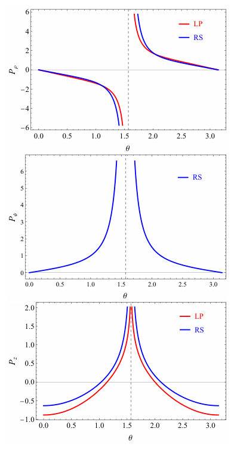
<figcaption class="paper-figure-caption"><b>Fig 1.</b> FIG. 1. Plots of the functions 𝑃𝜌(𝜃), 𝑃𝜓(𝜃), and 𝑃𝑧(𝜃) for the LP and RS photon position eigenfunctions centered at the origin (cf. eqs. (48)- (49)). The vertical dashed line in these plots is the singular line 𝜃= 𝜋/2.</figcaption>
</figure>
<figure class="paper-figure-card">
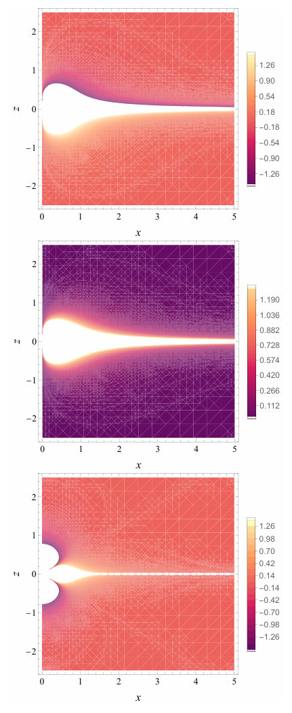
<figcaption class="paper-figure-caption"><b>Fig 2.</b> FIG. 2. From top to bottom: contour plots in the (𝑥, 𝑧) plane of the 𝜌, 𝜓, and 𝑧components of the RS photon position eigenfunction with positive helicity centered at the origin, in units of (ℏ𝑐)1/2. (The white area indicates the region where the absolute value of these functions is greater than 1.5.)</figcaption>
</figure>

**Summary.** This paper provides the first explicit, closed-form mathematical descriptions of photon position eigenfunctions in configuration space. It reveals that these wave functions are not localized at a single point but exhibit a singular plane of divergence. This work advances the theoretical understanding of how light is represented in coordinate space.

**Why it may be interesting.** This paper provides fundamental mathematical clarity on the spatial structure of photon wave functions, which is crucial for anyone working on the foundations of quantum optics and the localization of light.

Detailed structure

**Main problem.** The paper addresses the long-standing problem of photon localization by seeking explicit, closed-form expressions for the eigenfunctions of the Hawton photon position operator in configuration space.

**Main result.** The authors derive closed-form expressions for the Landau-Peierls and Riemann-Silberstein position eigenfunctions using complete elliptic integrals, revealing that these eigenfunctions possess a singular plane of divergence and decay as inverse powers of distance.

**Method.** The study employs 3D Euclidean momentum space analysis, Fourier transforms, and the use of the Hertz superpotential, utilizing mathematical tools such as Gauss hypergeometric functions and regularization of divergent integrals.

**Model / system.** The system is a first-quantized theory of photons (massless particles with helicity sigma = +/- 1) described by a family of Hawton position operators and wave functions related to the Riemann-Silberstein and Landau-Peierls electromagnetic field representations.

**Key observables.** Momentum, Hamiltonian, Helicity, and Photon Position Eigenfunctions.

**Important parameters / regimes.** Helicity (sigma), wave function type parameter (alpha), scalar product parameter (beta), and the radial distance (r) and polar angle (theta).

**Assumptions / limitations.** The analysis is restricted to proper orthochronous Poincaré transformations and assumes a dynamical superselection rule for helicity; certain integrals require regularization for specific ranges of beta.

**Figures summary.** Figure 1 plots radial and angular components of the eigenfunctions to highlight the singular line at theta = pi/2; Figure 2 shows contour plots of the RS eigenfunction components in the (x, z) plane.

**Paper structure.** The paper begins by defining the photon position operator and wave functions in momentum space, proceeds to derive the configuration-space eigenfunctions using Fourier transforms and elliptic integrals, analyzes the resulting singularities and asymptotic behavior, and concludes with a Taylor expansion for the time-dependent Hertz superpotential.

Abstract

The expressions of the eigenfunctions of the Hawton photon position operator in the configuration space are derived for several classes of wave function, including the Riemann-Silberstein and Landau-Peierls cases. Although these eigenfunctions have a simple form in momentum space, the explicit characterization of their representations in the configuration space is rather more involved. We provide closed expressions of these eigenfunctions in terms of linear combinations of the complete elliptic integrals $K(κ)$ and $E(κ)$ with modulus $κ$ depending on trigonometric functions of the polar angle. We show that they diverge not only at the value $\mathbf q$ of the position eigenvalue, but also on a plane containing $\mathbf q$ and that they decay as inverse powers of the distance from $\mathbf q$.

[↑ back to top](#top)

### [Q-LEAK: Quantum-Based LEAKage Verification for Side-Channel Countermeasures](http://arxiv.org/abs/2605.25728v1)

**Authors:** Walid El Maouaki, Alberto Marchisio, Muhammad Shafique  
**Type:** both · **Category:** quantum information and computing · **PDF:** <https://arxiv.org/pdf/2605.25728v1>  
**Analysis basis:** full PDF text, analyzed in chunks
**Topic relevance:** `QC/QI experiment` **2/5**

↔ Scroll figures horizontally

<figure class="paper-figure-card">
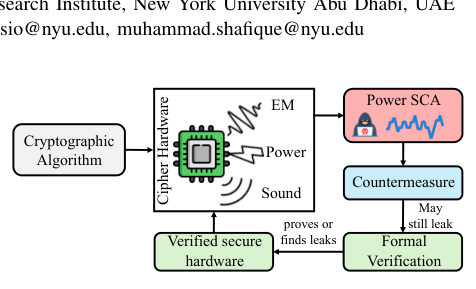
<figcaption class="paper-figure-caption"><b>Fig 1.</b> Fig. 1. Cryptographic algorithm is implemented as a cipher in hardware, exposed to power side-channel attacks. Masking countermeasures are applied to protect intermediate values, and formal verification ensures that the final implementation remains leakage-free after synthesis.</figcaption>
</figure>
<figure class="paper-figure-card">
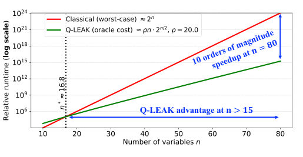
<figcaption class="paper-figure-caption"><b>Fig 2.</b> Fig. 2. Asymptotic scaling of search cost versus the number of variables n on a log scale: classical worst-case scaling ∼2n (red) versus Q-LEAK with density-aware oracle cost ∼ρn · 2n/2 (green), where ρ = m/n is the clause density. For ρ = 20, the crossover occurs near n⋆≈16.8, with QLEAK showing a widening advantage for larger n.</figcaption>
</figure>
<figure class="paper-figure-card">
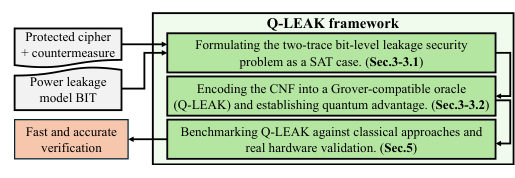
<figcaption class="paper-figure-caption"><b>Fig 3.</b> Fig. 3. Overview of the main contributions of Q-LEAK. Green boxes highlight the proposed components.</figcaption>
</figure>
<figure class="paper-figure-card">
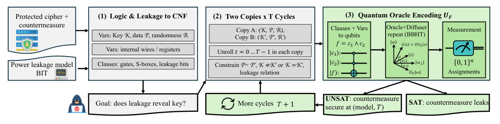
<figcaption class="paper-figure-caption"><b>Fig 4.</b> Fig. 4. Q-LEAK framework. Compile the protected cipher and BIT model into a two-trace, T-cycle CNF, map it to an oracle UF ; then run Grover+BBHT over the variable qubits. Peaks indicate SAT (leak), near-uniform spectra indicate UNSAT (secure at the chosen model and T).</figcaption>
</figure>
<figure class="paper-figure-card">
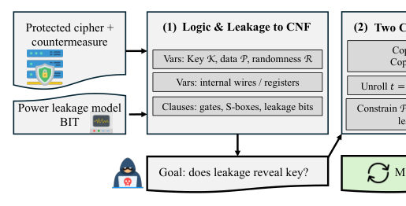
<figcaption class="paper-figure-caption"><b>Fig 5.</b> Fig. 4 shows the Q-LEAK flow. Starting from a protected cipher and the given BIT power-leakage model, (1) we encode logic and leakage into a CNF over key, data, randomness, and internal wires. (2) The design is duplicated into two traces and unrolled for T cycles; we tie plaintexts (P = P ′), set key constraints, and impose the chosen leakage relation to ask: Does leakage reveal the key? (3) This CNF is compiled into a reversible oracle UF and queried with the Grover/BBHT loop, then measurements return candidate assignments. Persistent high-probability bitstrings are candidate SAT witnesses and are accepted only after classical CNF evaluation. In contrast, a near-uniform distribution is...</figcaption>
</figure>

**Summary.** This paper introduces Q-LEAK, a quantum algorithm designed to accelerate the formal verification of cryptographic side-channel countermeasures. By mapping leakage vulnerabilities to a Boolean satisfiability problem, the authors demonstrate that Grover-based search can provide a quadratic speedup over classical solvers. The approach was validated through both large-scale simulations and experiments on real IBM quantum hardware.

**Why it may be interesting.** not directly relevant

Detailed structure

**Main problem.** The computational difficulty of formally verifying power side-channel leakage countermeasures in cryptographic algorithms due to the exponential scaling of classical SAT solvers.

**Main result.** The proposed Q-LEAK framework achieves a quadratic speedup using Grover's algorithm and successfully recovers leakage-inducing assignments in both noiseless simulations and on real IBM quantum hardware.

**Method.** The authors encode side-channel leakage models into Conjunctive Normal Form (CNF) and implement a quantum oracle using Grover's algorithm and the BBHT variant for unstructured search.

**Model / system.** The framework models cryptographic hardware implementations (like AES) using a one-bit leakage model under two-trace conditions, implemented via a reversible Grover oracle.

**Key observables.** Probability distributions of bitstrings (peaks for SAT, flat for UNSAT), Pearson chi-squared goodness-of-fit, and Hamming weight/distance leakage patterns.

**Important parameters / regimes.** Number of variables (n), clause density (rho), number of satisfying assignments (K), and the classical break-even exponent (alpha_min).

**Assumptions / limitations.** The study assumes a 1-bit leakage model and limited circuit unrolling (T=1); it also notes that current scalability is limited by oracle ancilla requirements and gate depth.

**Figures summary.** Figure 1 shows the verification pipeline; Figure 2 compares classical vs. quantum scaling; Figure 3/4 details the Q-LEAK framework and oracle construction; Figure 5 shows circuit sketches; Figure 6/7 displays probability distributions and hardware histograms; Figure 8 shows the classical break-even threshold.

**Paper structure.** The paper introduces the side-channel verification problem, defines the Q-LEAK algorithmic framework and oracle construction, provides a theoretical complexity analysis, presents simulation and hardware validation results, and concludes with scalability projections and limitations.

Abstract

Formal verification of power side-channel leakage and its countermeasures in cryptographic algorithms is challenging, as SAT-based methods fail to scale on XOR-heavy, time-unrolled cryptographic circuits with realistic leakage models. We construct compact Conjunctive Normal Form (CNF) cases modeling one-bit leakage under two-trace conditions, linking key dependence and state evolution. Classical solvers quickly reach complexity limits, so we propose Q-LEAK, a quantum-based verification approach using Grover's algorithm, compiling each CNF into an oracle and applying amplitude amplification to search in O(sqrt(N)) oracle calls, with oracles that encode the two-trace leakage predicate and the CNF constraints. Benchmarking against classical SAT shows both potential gains and practical resource limits. In noiseless tests on 5-7 variable benchmarks, Q-LEAK consistently recovered a satisfying assignment within 1-4 tries, with marked bitstrings amplified clearly above the background distribution, exceeding 20 percent probability. The evaluation of Q-LEAK on real quantum hardware revealed at least one classically verified SAT assignment, despite the presence of noise. These results point to a potential path toward quantum-assisted verification of side-channel protections.

[↑ back to top](#top)

### [Quantum Otto machine with $q$-deformed Pöschl-Teller oscillator](http://arxiv.org/abs/2605.24483v1)

**Authors:** Collins O. Edet, Norshamsuri Ali, Rosdisham Endut, O. Abah  
**Type:** theory · **Category:** statistical mechanics · **PDF:** <https://arxiv.org/pdf/2605.24483v1>  
**Analysis basis:** full PDF text, analyzed in chunks
**Topic relevance:** `non-equilibrium dynamics` **2/5**

↔ Scroll figures horizontally

<figure class="paper-figure-card">
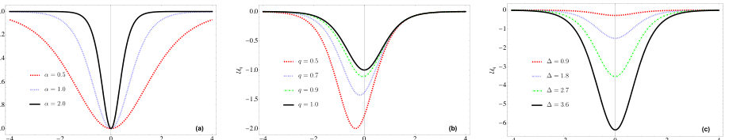
<figcaption class="paper-figure-caption"><b>Fig 1.</b> Figure 1. The q-deformed modified P¨oschl–Teller potential as a function of x for different: (a) α = 0.5 (dotted red line), α = 1 (dot blue line), and α = 2.0 (solid black line) (b) q = 0.5 (dotted red line), q = 0.7 (dot blue line), q = 0.9 (dot green line)and q = 1.0 (solid black line) (standard P¨osch-Teller potential). c ∆= 0.9 (dotted red line), ∆= 1.8 (dotted blue line), ∆= 2.7 (dotted green), and ∆= 3.6 (solid black line). Other parameters used: q = 1, ∆=1.5, and α=1.</figcaption>
</figure>
<figure class="paper-figure-card">
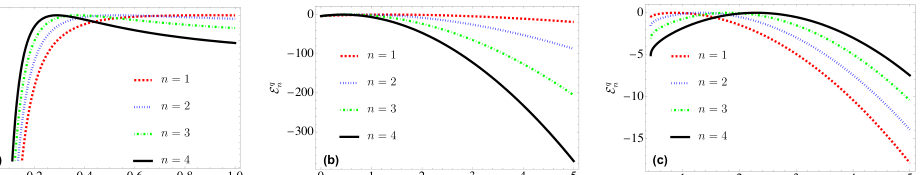
<figcaption class="paper-figure-caption"><b>Fig 2.</b> Figure 2. Energy Eq n of the q-deformed P¨oschl–Teller potential as a function of (a) q (b) α and (c) ∆, for different energy level n. Here, n = 1 (dotted red line), n = 2 (dot blue line), n = 3(dot green line) and n = 4 (solid black line). Other parameters used: q = 1, ∆=2, and α=1.5 (a) and α=0.5(b).</figcaption>
</figure>
<figure class="paper-figure-card">
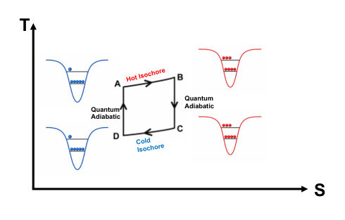
<figcaption class="paper-figure-caption"><b>Fig 3.</b> Figure 3. The schematic of the Entropy-temperature (S-T) diagram of the quantum Otto cycle. The quantum thermal cycle comprises of two adiabatic strokes (B →C and D →A) where it is decoupled from the thermal reservoirs, and two isochoric strokes (A →B and C →D) where the engine is coupled to two thermal baths at temperatures Th and Tc, with Th &gt; Tc.</figcaption>
</figure>
<figure class="paper-figure-card">
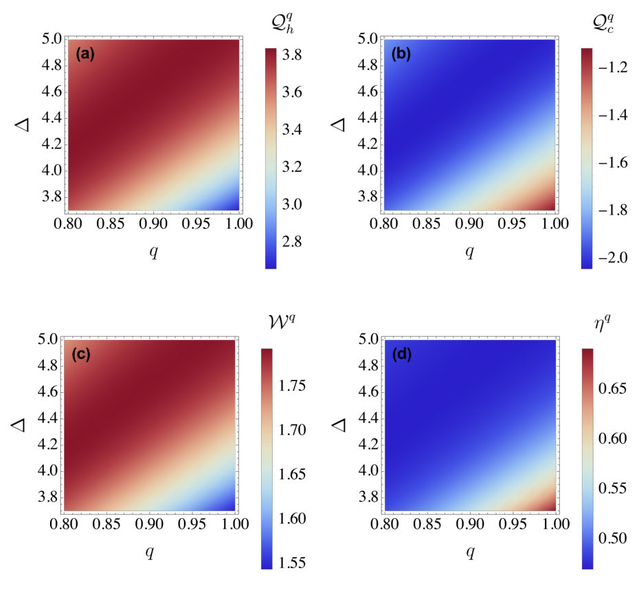
<figcaption class="paper-figure-caption"><b>Fig 4.</b> Figure 4. Quantum Otto cycle as a heat engine. (a) Heat exchange with the hot reservoir, Qq h (b) Heat exchange with the cold reservoir, Qq c (c) Total work output, Wq (d) Efficiency ηq, as function of the depth of the potential ∆(3.7 &lt; ∆&lt; 5) and the deformation parameter q(0.8 &lt; q &lt; 0.9). Parameters used: αc =0.5, αh =1.118, Th =5, and Tc =1.</figcaption>
</figure>
<figure class="paper-figure-card">
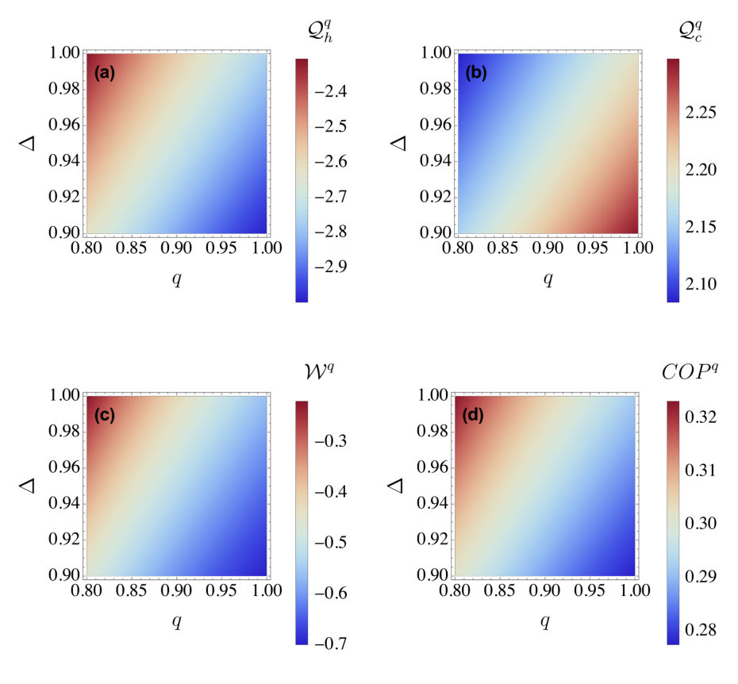
<figcaption class="paper-figure-caption"><b>Fig 5.</b> Figure 5. Quantum Otto refrigerator cycle (a) Heat exchange with the hot reservoir, Qq h (b) Heat exchange with the cold reservoir, Qq c (c) Total work output, Wq (d) Coefficient of performance COP q as function of the potential well depth ∆(0.9 &lt; ∆&lt; 1) and q(0.80 &lt; q &lt; 1). Parameters used: αc = 0.5, αh = 1.118, Th = 5, and Tc = 1.</figcaption>
</figure>

**Summary.** This paper explores how the deformation of a Pöschl-Teller potential can be used to tune the performance of a quantum Otto engine and refrigerator. It shows that by adjusting the deformation parameter and potential depth, one can switch between optimal heat engine and refrigerator regimes. The findings suggest that q-deformed potentials provide a versatile platform for designing tunable quantum thermal machines.

**Why it may be interesting.** This work is relevant for researchers in quantum thermodynamics and open quantum systems as it demonstrates how tuning the underlying algebraic deformation and potential geometry can control the operational phases and efficiency of quantum thermal machines.

Detailed structure

**Main problem.** Investigating how the parameters of a q-deformed modified Pöschl-Teller potential, specifically the deformation parameter q and the potential depth and width, affect the thermodynamic performance of a quantum Otto cycle.

**Main result.** The study identifies distinct performance regions where low-depth and high-deformation parameters favor heat engine efficiency, while high-depth and low-deformation parameters optimize refrigerator performance.

**Method.** The authors use an analytical approach involving a factorization method to derive energy spectra and wave functions, followed by statistical mechanics to calculate thermodynamic variables within a quasi-static Otto cycle framework.

**Model / system.** A quantum Otto machine using a q-deformed modified Pöschl-Teller oscillator as the working substance, governed by a Hamiltonian involving a deformation parameter q, a width parameter alpha, and a depth parameter Delta.

**Key observables.** Energy spectrum, wave functions, heat exchange (Qh, Qc), work output (Wq), efficiency (eta), and coefficient of performance (COP).

**Important parameters / regimes.** q (deformation parameter), alpha (potential width), Delta (potential depth), and reservoir temperatures (Th, Tc).

**Assumptions / limitations.** The analysis assumes a non-relativistic framework and a quasi-static cycle operating between two thermal reservoirs.

**Figures summary.** Figure 1 visualizes the potential shape for varying parameters; Figure 2 shows energy eigenvalue variations; Figure 3 presents an entropy-temperature diagram; Figures 4 and 5 show thermodynamic performance (work, heat, efficiency, COP) for engine and refrigerator modes.

**Paper structure.** The paper begins with the derivation of the q-deformed potential and its energy spectrum, followed by the application of the quantum Otto cycle framework, a systematic parameter analysis of engine and refrigerator regimes, and a discussion of the results.

Abstract

We study the impact of the potential parameters of the q-deformed modified Pöschl-Teller potential on the thermodynamic performance of a quantum Otto cycle, where the $q$-deformed modified Pöschl-Teller potential serves as the working substance. Analytical expressions for the energy spectrum and wave functions are derived, enabling a systematic investigation of heat exchange, work output, efficiency, and coefficient of performance. We show that $q$-deformation modifies the energy spectrum and creates distinct performance regions in the ($q$, $Δ$) parameter space. Low ($Δ$) and high ($q$) favour optimal heat engine efficiency, whereas high ($Δ$) and low ($q$) improve refrigerator performance. The heat engine efficiency peaks in the low-($Δ$), high-($q$) regime. These results highlight the q-deformed modified Pöschl-Teller potential as a versatile and tunable platform for exploring potential parameter-driven effects in quantum thermal machines.

[↑ back to top](#top)

### [Resource Management in Heterogeneous Quantum Repeater Networks](http://arxiv.org/abs/2605.25132v1)

**Authors:** Naphan Benchasattabuse  
**Type:** theory · **Category:** quantum information and computing · **PDF:** <https://arxiv.org/pdf/2605.25132v1>  
**Analysis basis:** full PDF text, analyzed in chunks
**Topic relevance:** `entanglement & information structure` **2/5**

↔ Scroll figures horizontally

<figure class="paper-figure-card">
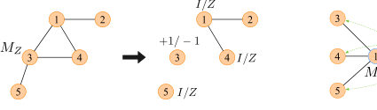
<figcaption class="paper-figure-caption"><b>Fig 1.</b> Figure 2.1: Two graph state representations of the same quantum state are depicted at the top. Here, vertices represent qubits in the quantum circuit, and the application of a controlled-phase gate between two qubits corresponds to an edge between the corresponding vertices. An example of such an edge is highlighted in green in the top left. The graph state on the top right is obtained by altering the description through local complementation on vertex 3. This process deletes any existing edges between neighboring vertices of vertex 3, such as the edge (1, 4) in this case, and introduces new edges that were previously absent, highlighted in red as (1, 5) and (4, 5). The application of the...</figcaption>
</figure>
<figure class="paper-figure-card">
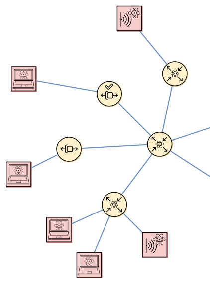
<figcaption class="paper-figure-caption"><b>Fig 2.</b> Figure 3.1: An illustrative topology of a quantum network. The network consists of end nodes, depicted as red squares (including both computational and sensor types), and intermediate nodes, shown as yellow circles (representing quantum repeaters and routers). A complete legend and detailed descriptions of each node’s function are discussed in chapter 4.</figcaption>
</figure>
<figure class="paper-figure-card">
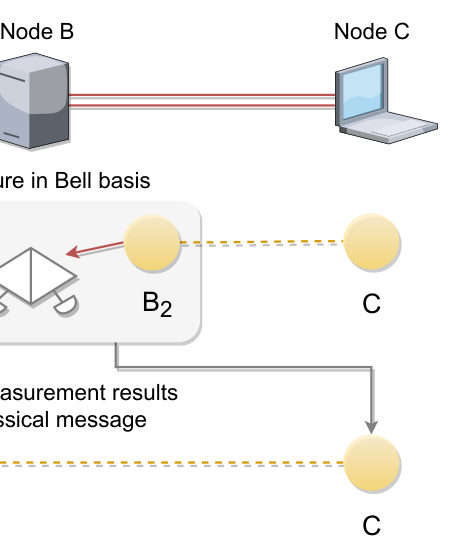
<figcaption class="paper-figure-caption"><b>Fig 3.</b> Figure 3.2: A heralded scheme for generating link-level entanglement, characteristic of a Memory-Interference-Memory (MIM) link architecture. Two adjacent nodes, Alice (A) and Charlie (C), each entangle a local quantum memory with a photon. These photons are sent to a Bell-state analyzer (BSA) node (B). A successful measurement at the BSA projects the two distant memories into an entangled state, which is announced, or heralded, by a classical signal. (From [41].)</figcaption>
</figure>
<figure class="paper-figure-card">
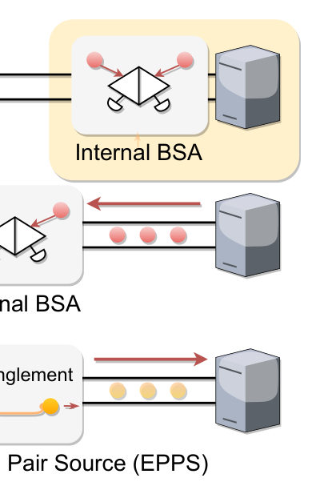
<figcaption class="paper-figure-caption"><b>Fig 4.</b> Figure 3.3: A comparison of three primary quantum link architectures for heralded entanglement generation. (1) Memory-Memory (MM): An asymmetric architecture where the Bell-state analyzer (BSA) is co-located at the receiver node, which can simplify network topology. (2) Memory-Interference-Memory (MIM): A symmetric architecture where two nodes each entangle a local memory with a photon and send the photons to a central BSA for a joint measurement. (3) Memory-Source-Memory (MSM): A central entangled photon pair source (EPPS) distributes entangled photons to each node, where they are subsequently stored in quantum memories. (From [41].)</figcaption>
</figure>
<figure class="paper-figure-card">
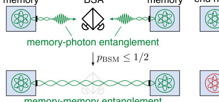
<figcaption class="paper-figure-caption"><b>Fig 5.</b> Figure 3.4: (a) Entanglement generation using a photonic Bell-state measurement (BSM) at the Bell-state analyzer (BSA) in the memory-interference-memory (MIM) link archi- tecture. Success probability is denoted by 𝑝BSM. (b) After successful generation of two neighboring links, the repeater performs entanglement swapping on its quantum memories to create an end-to-end entangled connection. (From [43].)</figcaption>
</figure>

**Summary.** This thesis proposes a unified architecture for a heterogeneous Quantum Internet that can simultaneously support memory-based and all-photonic quantum repeaters. By introducing a new emitter-photon building block and programmable protocols, the work shows that these distinct technologies can be integrated into a single, scalable network. The study uses large-scale simulations to validate that such a hybrid approach is both possible and practical.

**Why it may be interesting.** It addresses the engineering of large-scale quantum networks by proposing a way to bridge different hardware paradigms (stationary vs. flying qubits), which is central to the development of a scalable Quantum Internet.

Detailed structure

**Main problem.** The challenge of designing a unified, flexible architecture that can integrate traditionally incompatible quantum repeater technologies, specifically memory-based and all-photonic (memoryless) repeaters.

**Main result.** The thesis demonstrates that a heterogeneous quantum network is feasible through a new 'emitter-photon' building block and a RuleSet-based protocol, showing that all-photonic repeaters can be integrated into broader memory-based infrastructures.

**Method.** The author proposes a recursive network architecture and programmable RuleSet-based protocols, utilizing the QuISP simulator validated against the SeQUeNCe simulator and the stabilizer formalism for modeling.

**Model / system.** A heterogeneous quantum repeater network consisting of memory-based nodes (using quantum memories) and all-photonic nodes (using Repeater Graph States/RGS), connected via an emitter-photon interface.

**Key observables.** End-to-end Bell pair fidelity, entanglement generation rate, and classical communication overhead.

**Important parameters / regimes.** Photon loss, decoherence, Pauli error probabilities (px, py, pz), and QAOA runtime scaling.

**Assumptions / limitations.** The work assumes the necessity of a layered, modular approach to avoid rigid standards and relies on simulation-based validation due to current experimental limitations.

**Figures summary.** Illustrations of graph states and network topologies, workflow diagrams for RuleSet execution, and performance plots comparing fidelity and generation rates across different simulators and purification strategies.

**Paper structure.** The thesis progresses from fundamental quantum information concepts (stabilizer formalism) to specific repeater architectures (memory-based and all-photonic), then introduces a unified architecture and a new building block, concluding with applications in distributed quantum computation.

Abstract

In this thesis, I explore whether it is possible to build a unified Quantum Internet architecture that supports different types of quantum repeaters -- especially the two most distinct and seemingly incompatible ones: memory-based quantum repeaters and all-photonic, memoryless repeaters. These technologies have traditionally been developed with the aim of becoming the single dominant solution, but I ask: Can they work together in the same network? What kind of architecture would support both? And how can simulation help us understand what is needed to manage such a network at scale? To address these questions, I propose an architecture based on an existing recursive network design and programmable RuleSet-based protocols that can coordinate diverse hardware components. I introduce a new emitter-photon building block to bridge memory-based and all-photonic segments, and show how classical networking abstractions can be extended to manage quantum operations. While I have developed a simulation tool grounded in these architectural principles and validated it against existing simulators and analytical models, a full-scale investigation of the resource trade-offs and performance implications remains future work. Nevertheless, the results so far suggest that a unified, heterogeneous quantum network is not only possible but increasingly practical with current technologies -- though ongoing experimental progress will be essential to fully realize this vision.

[↑ back to top](#top)

### [Spiral and Mixed Plaquette-Dimer Phases in the $S=1$ and $3/2$ Shastry-Sutherland Heisenberg Model](http://arxiv.org/abs/2605.24409v1)

**Authors:** Han-Qing Wu, Muwei Wu, Shou-Shu Gong  
**Type:** theory · **Category:** strongly correlated electrons · **PDF:** <https://arxiv.org/pdf/2605.24409v1>  
**Analysis basis:** full PDF text, analyzed in chunks
**Topic relevance:** `entanglement & information structure` **2/5**

↔ Scroll figures horizontally

<figure class="paper-figure-card">
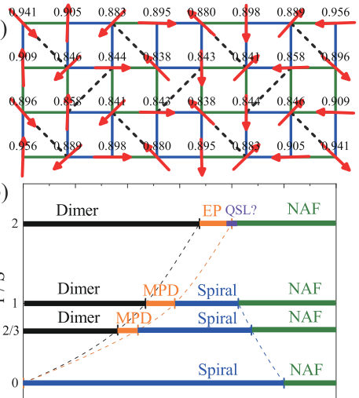
<figcaption class="paper-figure-caption"><b>Fig 1.</b> FIG. 1. (a) Cylinder geometry with Ly = 4, Lx = 8. Solid (dashed) lines: J (J′) bonds. Empty plaquettes (without J′) are colored to indicate two distinct bond-energy patterns (olive and blue). Red arrows show the normalized spin mo- ments ⟨Si⟩/S obtained by CMFT for S = 3/2 at g = 1/ √</figcaption>
</figure>
<figure class="paper-figure-card">
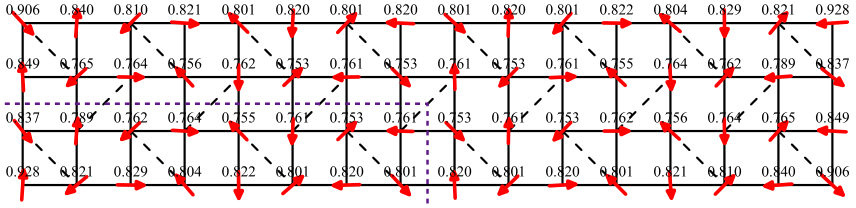
<figcaption class="paper-figure-caption"><b>Fig 2.</b> FIG. 2. Numerical results for S = 1. Vertical dashed lines in (a), (b), and (d) mark the phase transition points. (a) Second derivative of the ground-state energy per site as a function of the coupling ratio g. Orange and blue curves correspond to Ly = 4 and Ly = 6 cylinders, respectively. (b) Bipartite entanglement entropy Se versus g. (c) Real-space spin-spin correlation |⟨SrSr+x⟩|/[S(S + 1)] along the x direction for selected g values. (d) Shift of the magnetic Bragg peak toward M = (π, π) for g ∈[0.6, 1.0]. Orange and blue curves correspond to different cylinder widths, and the olive dashed line represents the classical limit S →∞. (e-h) Spin structure factors S(q) at g = 0.5, 0.6,...</figcaption>
</figure>
<figure class="paper-figure-card">
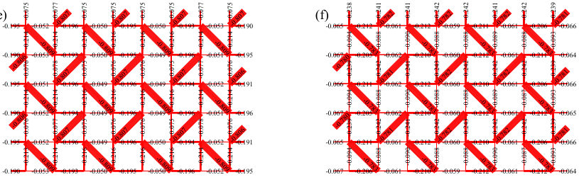
<figcaption class="paper-figure-caption"><b>Fig 3.</b> FIG. 3. DMRG results for S = 3/2. (a) Second derivative of the ground-state energy per site as a function of the coupling ratio g. Orange and blue curves correspond to Ly = 4 and Ly = 6 cylinders, respectively. (b) Bipartite entanglement entropy Se versus g. (c) Real-space spin-spin correlation |⟨SrSr+x⟩|/[S(S + 1)] along the x direction for selected values of g. (d) Shift of the magnetic Bragg peak toward M = (π, π) for g ∈[0.45, 1.0]. Orange and blue curves correspond to different cylinder widths, and the olive dashed line represents the classical limit S →∞. (e), (f) Middle part of bond energies at g = 0.375(e) and g = 0.4(f) on an Ly = 6, Lx = 24 cylinder. Although both coupling ratios...</figcaption>
</figure>
<figure class="paper-figure-card">
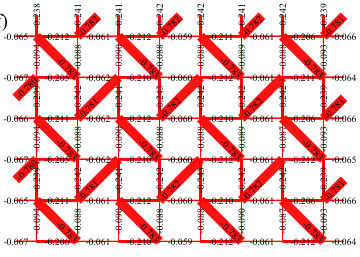
<figcaption class="paper-figure-caption"><b>Fig 4.</b> Fig. 1(b). For S = 1/2, we adopt the transition points gc1 = 0.676 and gc2 = 0.8 from Ref. [20]. The proposed quantum spin liquid (QSL) regime is indicated in purple (see, e.g., Refs. [10–12, 18, 19] and references therein). For S ≥1, a spiral phase emerges between the MPD and NAF phases. As S increases, the spiral region expands continuously, while the MPD phase shrinks and shifts to- ward smaller g until it disappears; the dimer phase like- wise diminishes and vanishes in the classical limit. In the S →∞limit, the phase diagram reduces to the classi- cal case, with only the spiral and NAF phases. These results show that even for larger spins, quantum fluctu- ations combined with geometric...</figcaption>
</figure>

**Summary.** This paper explores how increasing the spin magnitude in the Shastry-Sutherland model affects its complex phase diagram. It discovers that higher spin values stabilize a spiral phase while suppressing the mixed plaquette-dimer phase, providing a bridge between quantum and classical magnetism.

**Why it may be interesting.** not directly relevant

Detailed structure

**Main problem.** The study investigates the evolution of the ground-state phase diagram of the Shastry-Sutherland Heisenberg model from the extreme quantum limit (S=1/2) toward the classical limit (S to infinity), specifically focusing on intermediate phases for S=1 and S=3/2.

**Main result.** The authors identify two intermediate phases, a mixed plaquette-dimer (MPD) phase and a spiral phase, between the dimer and Neel antiferromagnetic phases, and show that the spiral phase expands while the MPD phase shrinks as spin magnitude increases.

**Method.** The study utilizes Density Matrix Renormalization Group (DMRG) on cylinders and Cluster Mean-Field Theory (CMFT) with DMRG as an impurity solver.

**Model / system.** The system is the two-dimensional Shastry-Sutherland lattice (SSL) described by an isotropic Heisenberg antiferromagnet with nearest-neighbor (inter-dimer) coupling J and diagonal (intra-dimer) coupling J'.

**Key observables.** Bond energies, spin-spin correlation functions, bipartite entanglement entropy, second derivative of ground-state energy, and the static spin structure factor S(q).

**Important parameters / regimes.** Spin magnitudes S=1 and S=3/2; coupling ratio g = J/J'.

**Assumptions / limitations.** The study assumes an isotropic Heisenberg model and relies on the accuracy of DMRG and CMFT approximations on finite-width cylinders.

**Figures summary.** Figure 1 shows the cylinder geometry and a global S-g phase diagram; Figure 2 illustrates spin textures for S=1; Figure 3 displays energy second derivatives, entanglement entropy, and real-space spin correlations for S=3/2.

**Paper structure.** The paper introduces the Shastry-Sutherland model, details the DMRG and CMFT methodologies, presents the phase identification for S=1 and S=3/2, discusses the evolution of phases toward the classical limit, and concludes with a global phase diagram.

Abstract

We investigate the ground-state phase diagram of the $S=1$ and $S=3/2$ Heisenberg model on the two-dimensional Shastry-Sutherland lattice (SSL) using density matrix renormalization group (DMRG) and cluster mean-field theory (CMFT). Between the dimer phase and Néel antiferromagnetic phases, we identify two intermediate phases: a mixed plaquette-dimer (MPD) phase and a spiral phase. These phases are characterized via bond energies and spin-spin correlation functions; phase boundaries are located from the ground-state energy derivative and entanglement entropy. The MPD phase exhibits strong intradimer correlations and weak tetramerization on the empty plaquettes, and its transitions to the dimer and spiral phases are first order. Combining our results with the known boundaries for $S=1/2$ and the classical limit $S\to\infty$, we construct a global $S$-$g$ phase diagram. This diagram reveals the progressive suppression of quantum effects with increasing $S$ and offers a theoretical framework for larger-$S$ SSL materials.

[↑ back to top](#top)

### [Topology of pulsating active matter: Defect asymmetry controls emergent motility](http://arxiv.org/abs/2605.25996v1)

**Authors:** Luca Casagrande, Alessandro Manacorda, Etienne Fodor  
**Type:** theory · **Category:** statistical mechanics · **PDF:** <https://arxiv.org/pdf/2605.25996v1>  
**Analysis basis:** full PDF text, analyzed in chunks
**Topic relevance:** `non-equilibrium dynamics` **2/5**

↔ Scroll figures horizontally

<figure class="paper-figure-card">
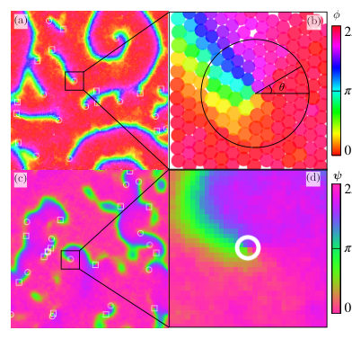
<figcaption class="paper-figure-caption"><b>Fig 1.</b> FIG. 1. Deformation waves connect defects that rotate with asymmetric cores for (a,b) pulsating particles [Eq. (1)], and (c,d) fluctuating hydrodynamics [Eq. (8)]. The rotation is set by defect charges +1 (◦, CW) and −1 (□, CCW), while profile asymmetry is similar for ±1 defects. Parameters in Ref. [52].</figcaption>
</figure>
<figure class="paper-figure-card">
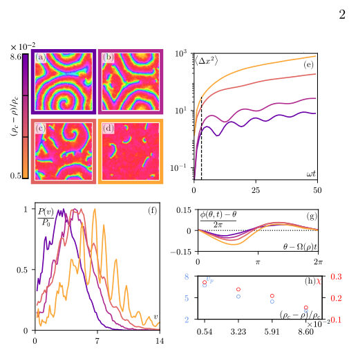
<figcaption class="paper-figure-caption"><b>Fig 2.</b> FIG. 2. Defect statistics for pulsating particles [Eq. (1)]. (a)– (d) Phase patterns change from spirals to fiber-like waves as density ρ increases; color code and parameters as in Fig. 1(a). (e) Mean-squared displacement ⟨∆x2⟩of defect cores as a function of time t; colors refer to ρ values, and dashed line to time interval at which velocity is estimated. (f) Defect veloc- ity distribution P(v) of scaled by P0 = max P(v). (g) Defect profile ϕ(θ, t) in the co-rotating frame θ −Ω(ρ)t. (h) Peak ve- locity vp = argmaxP(v) and asymmetry factor χ[ϕ] [Eq. (2)].</figcaption>
</figure>
<figure class="paper-figure-card">
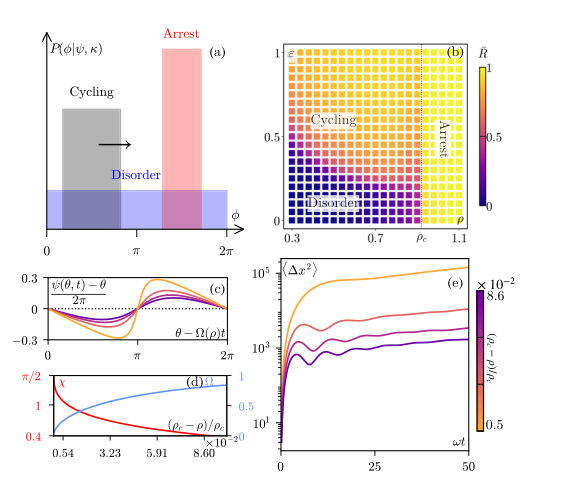
<figcaption class="paper-figure-caption"><b>Fig 3.</b> FIG. 3. Fluctuating hydrodynamics [Eq. (8)]. (a) Schematic of the ansatz distribution Pans(ϕ|ψ, σ) [Eq. (6)]. (b) Phase diagram: ¯R = 1 V ´</figcaption>
</figure>

**Summary.** This paper explains how topological defects in pulsating active matter can move without macroscopic flows through a symmetry-breaking ratchet effect. It demonstrates that the asymmetry of defect cores controls a transition between different wave patterns, similar to cardiac arrhythmias. The work provides a hydrodynamic framework to predict these emergent motile behaviors.

**Why it may be interesting.** not directly relevant

Detailed structure

**Main problem.** Understanding the mechanism behind the motility of topological defects in pulsating active matter in the absence of macroscopic flows or microscopic self-propulsion.

**Main result.** The authors reveal that defect motility arises from a ratchet effect caused by mechanochemical coupling that breaks spatial and time-reversal symmetries, leading to a crossover between spiral and fiber-like wave patterns.

**Method.** The study uses a combination of overdamped Langevin dynamics for microscopic particles and a coarse-grained fluctuating hydrodynamics framework with a specific closure scheme for angular moments.

**Model / system.** A system of pulsating active particles in a periodic box where particle sizes oscillate periodically based on an internal chemical phase, featuring repulsive interactions that break symmetries.

**Key observables.** Defect velocity distribution, mean-squared displacement of defect cores, asymmetry factor of the phase profile, and phase patterns (spiral vs. fiber-like waves).

**Important parameters / regimes.** Particle density (rho), synchronization strength (epsilon), pulsation frequency (omega), amplitude of deformation (lambda), and asymmetry factor (chi).

**Assumptions / limitations.** The hydrodynamic theory assumes a constant density (discarding position-based interactions), uses an ansatz for the probability distribution to close the moment hierarchy, and approximates repulsion as an external field.

**Figures summary.** Figure 1 shows deformation waves and asymmetric cores; Figure 2 illustrates the transition from spiral to fiber-like waves and defect displacement; Figure 3 presents the phase diagram and analytical defect profiles.

**Paper structure.** The paper introduces the microscopic model of pulsating particles, develops a hydrodynamic theory via coarse-graining and closure schemes, analyzes the ratchet mechanism and defect asymmetry, and concludes with a discussion on pattern crossovers and biological analogies.

Abstract

In pulsating active matter, topological defects are motile despite the absence of any macroscopic flows and microscopic self-propulsion. We reveal that this motility arises from a ratchet effect: the mechanochemical coupling between local oscillations and repulsive interactions breaks both spatial and time-reversal symmetries, thus leading asymmetric rotating defects to drift under fluctuations. This mechanism regulates a crossover between spiral waves connecting slow defects and fiber-like waves connecting fast defects, in analogy with the onset of heart rhythm disorder in cardiac tissues. We rationalize this crossover in terms of a fluctuating hydrodynamics that captures how motile defects spontaneously nucleate and move within an ordered background.

[↑ back to top](#top)

### [Fault-Tolerant QLDPC Syndrome Measurement via LDGM Encoding](http://arxiv.org/abs/2605.25317v1)

**Authors:** Eren Guttentag, Anthony Gómez-Fonseca  
**Type:** theory · **Category:** quantum information and computing · **PDF:** <https://arxiv.org/pdf/2605.25317v1>  
**Analysis basis:** full PDF text, analyzed in chunks
**Topic relevance:** `quantum measurements` **1/5**

↔ Scroll figures horizontally

<figure class="paper-figure-card">
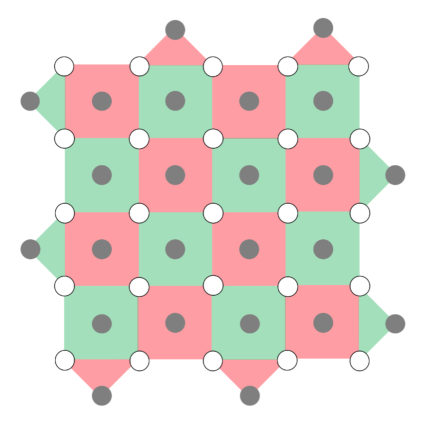
<figcaption class="paper-figure-caption"><b>Fig 1.</b> Fig. 1: The distance-5 rotated surface code, illustration from [27]. White dots correspond to the 25 data qubits, which we number sequentially as 1 to 25 in lexicographic order, while gray dots correspond to the ancilla qubits which measure their corresponding stabilizers. Green squares correspond to Z-stabilizers while red squares correspond to X-stabilizers.</figcaption>
</figure>
<figure class="paper-figure-card">
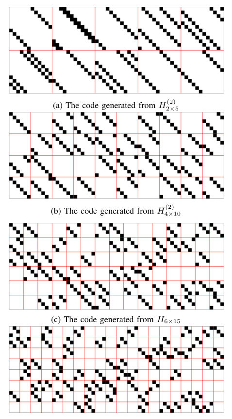
<figcaption class="paper-figure-caption"><b>Fig 2.</b> Fig. 2: Visualizations of the codes generated from the proto- graph matrices. White squares represent a 0 in the correspond- ing location, while black squares represent a 1. The red lines serve to divide the matrix into squares, where each square corresponds to an entry in the corresponding protograph. For example, the top left square in graph (a) corresponds to the entry x6 in H(2) 2×5, and shows the corresponding cyclic permutation. Similarly, in (c), the top-left square is the 4 × 4 identity matrix, which corresponds to the top-left entry 1 in the protograph.</figcaption>
</figure>
<figure class="paper-figure-card">
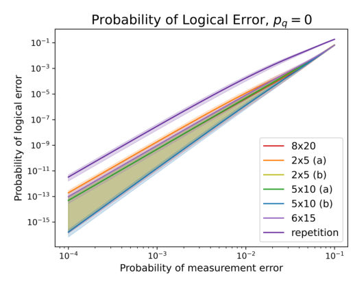
<figcaption class="paper-figure-caption"><b>Fig 3.</b> Fig. 3: A comparison between the probability of logical error resulting from measurement error for the codes generated by the six different protographs, as well as a comparison to 5-fold repetition. This only considers errors manifesting as bit-flips on the measurements, and not qubit errors.</figcaption>
</figure>
<figure class="paper-figure-card">
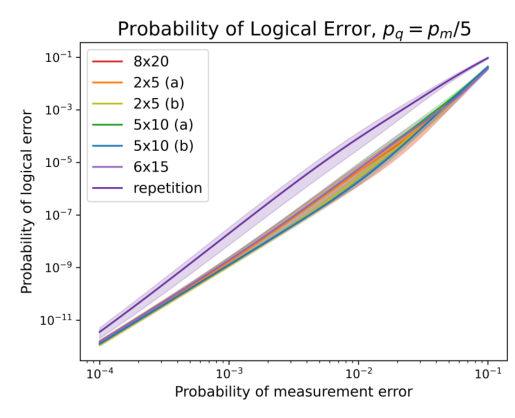
<figcaption class="paper-figure-caption"><b>Fig 4.</b> Fig. 4: A comparison between the probability of logical error resulting from measurement and qubit error for the codes generated by the six different protographs, as well as a comparison to 5-fold repetition. This assumes errors occur with probability pm on each stabilizer measurement, and qubit errors occur with probability pq = pm/5 on all qubits.</figcaption>
</figure>

**Summary.** The paper introduces a new method for syndrome measurement in QLDPC codes using LDGM encoding to keep stabilizer weights low and constant. This approach reduces the number of required measurements and prevents error propagation, leading to better fault-tolerant performance than traditional repeated extraction methods.

**Why it may be interesting.** not directly relevant

Detailed structure

**Main problem.** How to perform fault-tolerant syndrome measurement in QLDPC codes without increasing stabilizer weights to unbounded levels, which would otherwise cause error propagation and destroy the code's low-weight advantages.

**Main result.** The use of LDGM-based syndrome measurement codes allows for controlled stabilizer weights and higher code distances, outperforming standard repeated syndrome extraction with fewer total measurements.

**Method.** The authors propose using Low-Density Generator-Matrix (LDGM) codes as syndrome measurement (SM) codes, constructed via a progressive-edge-growth-like algorithm and graph lifting techniques.

**Model / system.** The study focuses on Quantum Low-Density Parity-Check (QLDPC) codes, specifically using a [[25, 1, 5]] rotated surface code as an illustrative example, under a phenomenological error model involving both qubit and measurement errors.

**Key observables.** Logical error probability, stabilizer weight, effective code distance, and measurement efficiency factor.

**Important parameters / regimes.** Stabilizer weight (w), SM code distance (d_SM), measurement error probability (p_m), and the improvement factor (alpha) representing the ratio of measurements compared to repeated extraction.

**Assumptions / limitations.** The assumption of constant-weight stabilizers to justify uniform measurement error probability, and the use of Shor-style syndrome extraction circuits.

**Figures summary.** Table I shows the mapping of a Hamming code to stabilizer elements; Figure 1 depicts the rotated surface code; Figure 2 shows the generator matrices for the LDGM codes; Figure 3 and 4 compare logical error probabilities under different error models.

**Paper structure.** The paper introduces the problem of weight inflation in QLDPC syndrome measurement, proposes an LDGM-based construction using PEG algorithms and graph lifting, presents numerical simulations using importance sampling to compare performance against repeated extraction, and discusses limitations regarding geometric locality.

Abstract

We propose the use of certain low-density generator-matrix (LDGM) codes as syndrome measurement (SM) codes for quantum low-density parity check (QLDPC) codes. We use an efficient progressive-edge-growth-like algorithm to create LDGM SM codes with column and row weights that result in measured stabilizers that have constant weight, thus preserving the desirable properties of the underlying QLDPC code. This process allows for control over stabilizer weights and SM code distance, resulting in significantly better performance than repeated syndrome extraction and allowing for both higher distances and fewer syndrome measurements. We implement these SM codes on a distance-5 rotated surface code, and show that this procedure results in a lower probability of logical error. As syndrome measurements performed are a reasonable metric for the time a circuit takes to implement, we conclude that these LDGM codes allow for improved implementation of QLDPC codes without sacrificing the low weights of the syndrome measurements performed.

[↑ back to top](#top)

### [Performance Limits of Fault-Tolerant Quantum Error Correction Schemes](http://arxiv.org/abs/2605.24501v1)

**Authors:** Lorenzo Valentini, Diego Forlivesi, Marco Chiani  
**Type:** theory · **Category:** quantum information and computing · **PDF:** <https://arxiv.org/pdf/2605.24501v1>  
**Analysis basis:** full PDF text, analyzed in chunks
**Topic relevance:** `quantum measurements` **1/5**

↔ Scroll figures horizontally

<figure class="paper-figure-card">
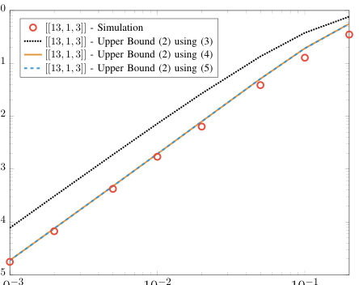
<figcaption class="paper-figure-caption"><b>Fig 1.</b> Fig. 1. Comparison between upper bounds on the logical error probability.</figcaption>
</figure>
<figure class="paper-figure-card">
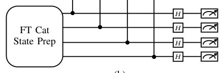
<figcaption class="paper-figure-caption"><b>Fig 2.</b> Fig. 2. Examples of FT syndrome extraction of a generator with weight four: (a) Flag-based syndrome extraction scheme; (b) Cat-based syndrome extraction scheme.</figcaption>
</figure>
<figure class="paper-figure-card">
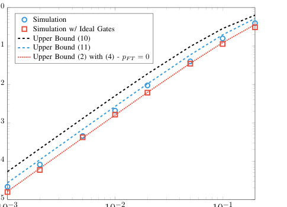
<figcaption class="paper-figure-caption"><b>Fig 3.</b> Fig. 3. [[7, 1, 3]] Steane code with pFT = p/100.</figcaption>
</figure>
<figure class="paper-figure-card">
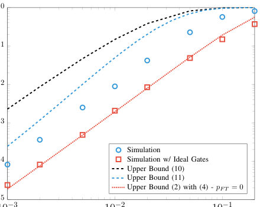
<figcaption class="paper-figure-caption"><b>Fig 4.</b> Fig. 4. [[13, 1, 3]] Surface code with pFT = p/10.</figcaption>
</figure>
<figure class="paper-figure-card">
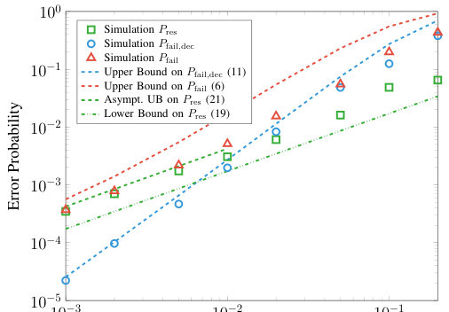
<figcaption class="paper-figure-caption"><b>Fig 5.</b> Fig. 5. [[13, 1, 3]] Surface code with pFT = p/100.</figcaption>
</figure>

**Summary.** This paper provides a rigorous analytical framework to bound the performance of fault-tolerant quantum error correction when considering realistic, error-prone gates and measurements. It identifies residual errors as a fundamental performance bottleneck that persists even with advanced decoding. The results are applicable to various stabilizer codes and highlight the gap between idealized QEC models and realistic circuit implementations.

**Why it may be interesting.** not directly relevant

Detailed structure

**Main problem.** The paper aims to derive analytical upper and lower bounds for the failure probability of fault-tolerant quantum error correction (FT-QEC) schemes, specifically accounting for the impact of circuit-level imperfections like gates and measurements.

**Main result.** The authors establish that FT-QEC performance is fundamentally limited by 'residual errors'—undetected errors arising from the syndrome extraction circuit itself—and provide analytical bounds that quantify how these errors degrade logical error rates.

**Method.** The study uses combinatorial analysis (inclusion-exclusion principle, occupancy models) and probabilistic modeling (binomial and geometric distributions) to derive bounds, which are then validated using Monte Carlo simulations.

**Model / system.** The framework focuses on stabilizer codes (CSS, surface, color, and Steane codes) under an i.i.d. depolarizing noise model, specifically analyzing Shor-style syndrome extraction using flag-based and cat-state-based gadgets.

**Key observables.** Logical error rate (pL), failure probability (P_fail), residual error probability (P_res), and decoding error probability (P_fail,dec).

**Important parameters / regimes.** Physical error rate (p), fault-tolerant error rate (p_FT), code distance (d), number of flag qubits (n_flag), and number of faulty locations (N_FL).

**Assumptions / limitations.** The analysis assumes i.i.d. depolarizing noise and focuses on the low-error regime (p_FT << 1); it also uses a conservative 'occupancy model' that neglects error cancellations.

**Figures summary.** Figures compare simulation results against various analytical bounds for different codes (Steane, surface) and illustrate how errors propagate from gates and measurements to data qubits.

**Paper structure.** The paper progresses from defining the problem of circuit-level noise to deriving analytical bounds for decoding and residual errors, followed by validation through Monte Carlo simulations and a discussion of specific extraction architectures.

Abstract

Quantum error correction (QEC) is essential for realizing scalable quantum computation. However, when evaluating its benefits, most analyses assume idealized components, overlooking the imperfections inherent in realistic fault-tolerant (FT) implementations. In this paper, we investigate the performance of QEC schemes taking into account that quantum gates and measurements are themselves error-prone. We derive bounds for the failure probability of Shor-style FT-QEC schemes using limited structural information, such as the number of flag qubits and quantum gates. Our analysis separates and quantifies two key contributors to the failure rate: decoding errors and residual errors arising from circuit-level faults. The derived bounds highlight fundamental limitations in Shor-style FT-QEC performance and quantify how circuit imperfections degrade error correction capabilities, under the assumption of depolarizing noise.

[↑ back to top](#top)

### [Spectral properties of non-Hermitian real random matrices with long-range correlations](http://arxiv.org/abs/2605.25736v1)

**Authors:** Ulysse Marquis  
**Type:** theory · **Category:** disordered systems and neural networks · **PDF:** <https://arxiv.org/pdf/2605.25736v1>  
**Analysis basis:** full PDF text, analyzed in chunks
**Topic relevance:** `non-equilibrium universality` **1/5**

↔ Scroll figures horizontally

<figure class="paper-figure-card">
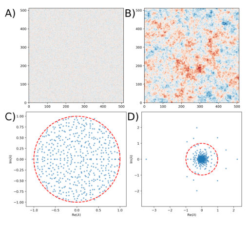
<figcaption class="paper-figure-caption"><b>Fig 1.</b> FIG. 1. Ginibre against correlated matrix. A) A 512 × 512 Ginibre matrix : no large-scale structure emerges. B) Matrix of the same dimension with long-range correlations, controlled by α = 0.1. Values in both matrices are displayed on the same color scales. C) Spectrum of the Ginibre matrix : each eigenvalue corresponds to a point, the dotted circle corresponds to the asymptotic limiting boundary given by the circular law. Note that the density seems almost uniform, except around the real axis ℑλ = 0, where eigenvalues are attracted by the line and deplete its surrounding : the ‘Saturn effect’. D) Spectrum of the matrix shown in B), the density is not uniform, but steeply decreasing with...</figcaption>
</figure>
<figure class="paper-figure-card">
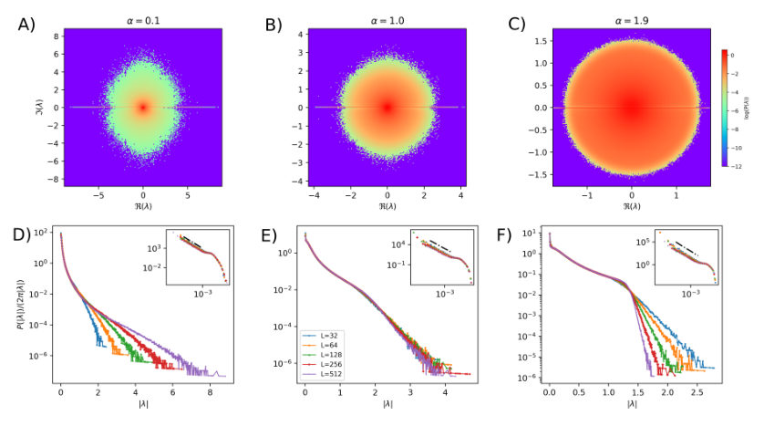
<figcaption class="paper-figure-caption"><b>Fig 2.</b> FIG. 2. Two-dimensional histogram of eigenvalues of 512 × 512 matrices for α = 0.1 (A), α = 1 (B) and α = 1.9 (C). The histograms were computed by computing the spectra of 5 · 104 matrices. Note that the spectra exist far beyond the limit imposed by the circle law, in all cases, as well as the scale of the real eigenvalues when α ≤1. D)E)F) Empirical distribution of the modulus of the eigenvalues P(|λ|) divided by 2π|λ|, for each value of α and for L varying between L = 32 and L = 512. The baseline is the limit circle law P(|λ|)/2π|λ| ∼1λ&lt;1. At α &lt; 1, the tail of the distribution broadens, while it narrows for α &gt; 1. The case α = 1 appears as a self-similar case, as the densities collapse...</figcaption>
</figure>
<figure class="paper-figure-card">
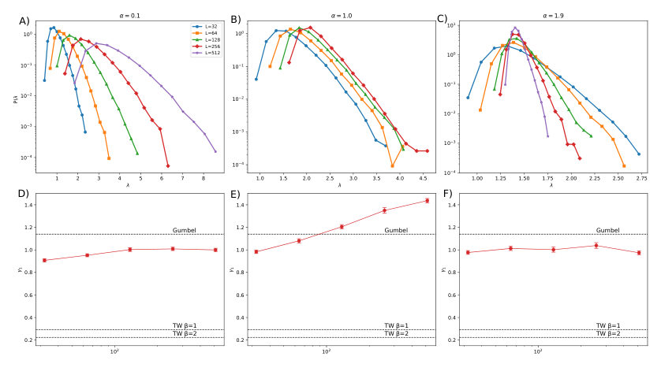
<figcaption class="paper-figure-caption"><b>Fig 3.</b> FIG. 3. Distribution of the spectral radius λm when varying, for α = 0.1 (A), α = 1 (B) and α = 1.9 (C). The position and scale of the distribution vary with L for α ≤1, while the distribution shrinks around a limit value (re(α = 1.9) ≈1.4), corresponding to an effective radius for a distorted circle law, at rate L−1/2 when α &gt; 1. D)E)F) Skewness γ1 against matrix size L when varying α. Horizontal lines correspond to the skewness of baseline distributions: Gumbel (γ1 ≈1.14), Tracy-Widom for β = 2 (γ1 ≈0.22) and β = 1 (γ1 ≈0.29). The values of λm were computed from 5 · 104 realizations.</figcaption>
</figure>
<figure class="paper-figure-card">
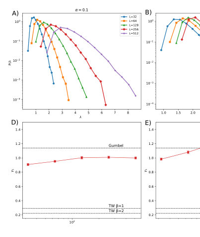
<figcaption class="paper-figure-caption"><b>Fig 4.</b> Fig. 1 shows the location of eigenvalues for one re- alization of the long-range correlated matrix ensemble,</figcaption>
</figure>
<figure class="paper-figure-card">
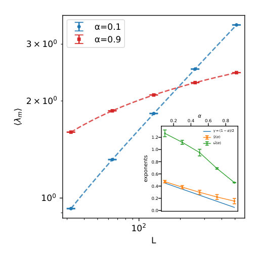
<figcaption class="paper-figure-caption"><b>Fig 5.</b> FIG. 4. Scaling law for the spectral radius. Main panel: measured average spectral radius ⟨λm⟩in function of system size for two values of α given in the legend. The error bars represent the 95% confidence interval on the average. The dashed line represent the fit given by Eq. 9. The averages are computed over 5 · 104 realisations. Inset: measured scaling ˜γ (orange points) and finite-size ˜ω (green points) exponents in function of the correlation exponent α. Blue line: extended CLT exponent γ = 1−α</figcaption>
</figure>

**Summary.** This paper explores how long-range correlations in random matrices cause the standard circular law to break down, leading to a new universality class. It demonstrates that for strong correlations, the spectral radius grows according to a power law related to the extended central limit theorem. These findings have implications for the stability of large dynamical systems like ecosystems and neural networks.

**Why it may be interesting.** not directly relevant

Detailed structure

**Main problem.** The study investigates how long-range correlations in the entries of non-Hermitian real random matrices affect their spectral properties and the breakdown of the circular law.

**Main result.** The authors identify a correlation-driven transition where the spectral radius grows as a power law for correlation exponents alpha < 1, and find that long-range correlations enhance the clustering of real eigenvalues.

**Method.** Numerical simulations using a convolution-based sampling technique to generate large correlated matrices, followed by eigenvalue computation and statistical analysis of scaling laws.

**Model / system.** Non-Hermitian real random matrices where entries exhibit Gaussian correlations decaying as a power law |r - r'|^(-alpha) on a 2D lattice.

**Key observables.** Spectral radius, radial eigenvalue density, eigenvalue spacing ratios (real and complex sectors), and the number of real eigenvalues.

**Important parameters / regimes.** Correlation exponent alpha (0 < alpha < 2) and matrix linear size L.

**Assumptions / limitations.** The entries are assumed to be Gaussian with a specific power-law decay; the sampling method imposes periodic boundary conditions.

**Figures summary.** Figure 1 compares Ginibre vs. correlated spectra; Figure 2 shows 2D eigenvalue histograms and radial density distributions; Figure 3 displays spectral radius distributions; Figure 4 shows spectral radius scaling with L; Figure 5 presents eigenvalue spacing ratio distributions; Figure 6 shows the scaling of the number of real eigenvalues.

**Paper structure.** The paper introduces the problem of correlated non-Hermitian matrices, describes the sampling methodology, presents the numerical results regarding the breakdown of the circular law and spectral radius scaling, analyzes eigenvalue spacing and real eigenvalue statistics, and concludes with implications for system stability.

Abstract

We investigate the spectral properties of non-Hermitian real random matrices whose entries exhibit long-range correlations decaying as~$|r-r'|^{-α}$. We find a progressive breakdown of the circular law, controlled by the decrease of~$α$. In all cases, the radial eigenvalue density decreases away from the origin. At~$α>1$, an effective radius, reminiscent of the circular law, is retrieved, while instead, for~$α<1$, the eigenvalue distribution broadens with matrix size and its spectral radius grows like a power law, with exponents numerically close to the exponents controlling the magnitude of fluctuations in the extended central limit theorem. The case~$α=1$ appears as a case with self-similar eigenvalue density, and slowly growing spectral radius. Long-range correlations also enhance clustering of real eigenvalues and slow the resorption of the Saturn effect. These results reveal a correlation-driven transition and suggest the emergence of a new universality class for correlated non-Hermitian random matrices.

[↑ back to top](#top)

## Other papers (55)

*Papers from primary archives without highlighted authors or any topic match. Click to expand.*

Show other papers

### [1/9 Magnetization Plateau in a Classical Kagome Ising Ferromagnet with Competing Further-Neighbor Interactions](http://arxiv.org/abs/2605.24372v1)

**Authors:** Yixin Guan, Kan Zhao, Nvsen Ma  
**Type:** theory · **Category:** statistical mechanics · **PDF:** <https://arxiv.org/pdf/2605.24372v1>  
**Analysis basis:** full PDF text, analyzed in chunks

↔ Scroll figures horizontally

<figure class="paper-figure-card">
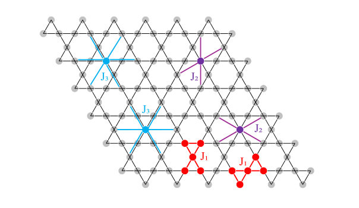
<figcaption class="paper-figure-caption"><b>Fig 1.</b> Figure 1: Schematic of the two-dimensional kagome lattice illustrating the exchange interactions. The solid</figcaption>
</figure>
<figure class="paper-figure-card">
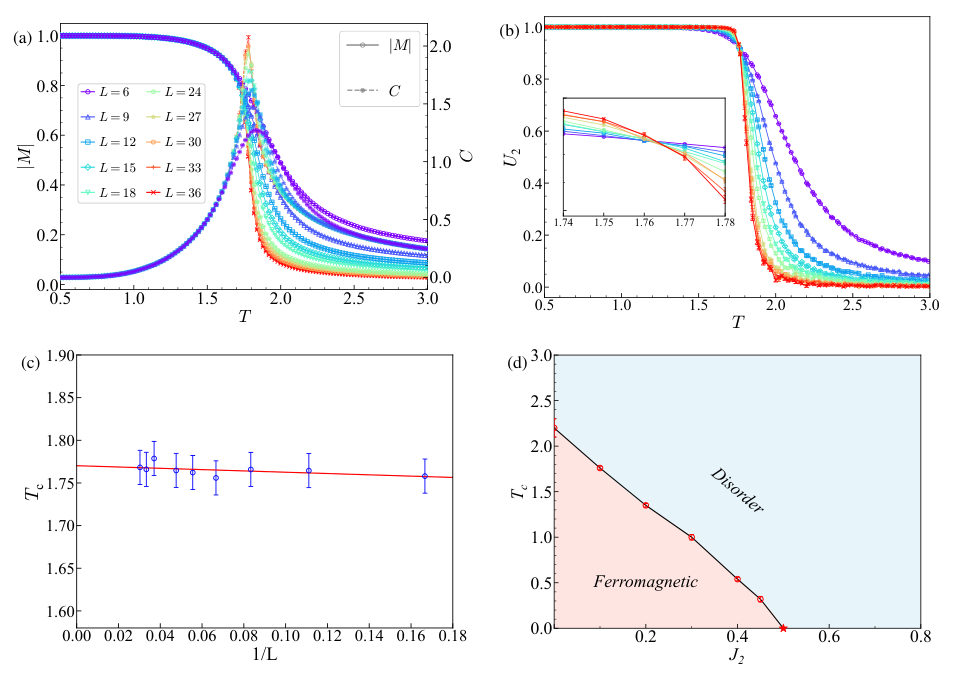
<figcaption class="paper-figure-caption"><b>Fig 2.</b> Figure 2: Thermodynamic phase transition and classical phase diagram for the kagome Ising model with 𝐽1 = −1</figcaption>
</figure>
<figure class="paper-figure-card">
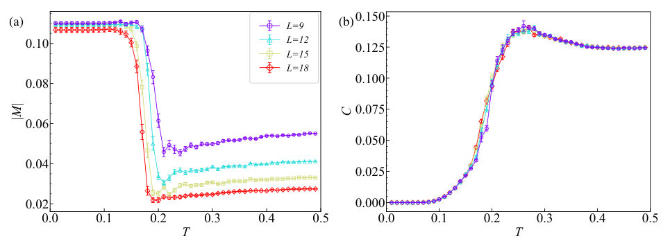
<figcaption class="paper-figure-caption"><b>Fig 3.</b> Figure 3: Thermodynamic signatures of the fractional phase transition driven by third-nearest-neighbor frus-</figcaption>
</figure>
<figure class="paper-figure-card">
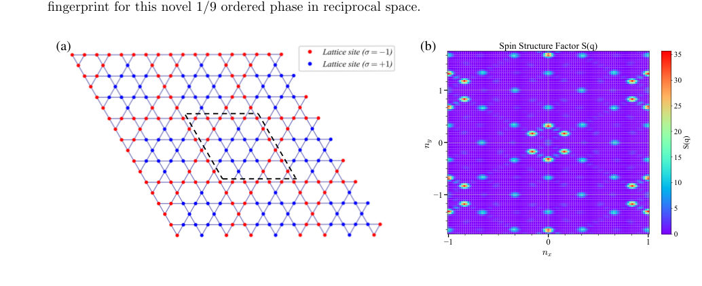
<figcaption class="paper-figure-caption"><b>Fig 4.</b> Figure 4: Microscopic magnetic structure and symmetry of the 1/9 magnetization plateau state. (a) Real-space</figcaption>
</figure>
<figure class="paper-figure-card">
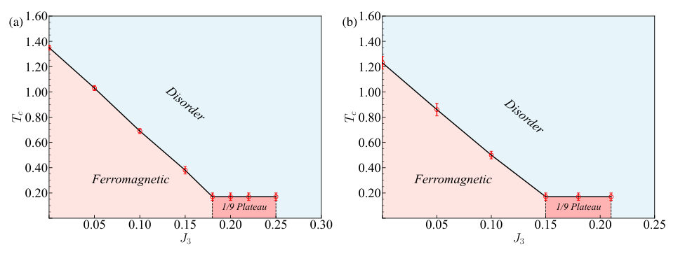
<figcaption class="paper-figure-caption"><b>Fig 5.</b> Figure 5: Classical phase diagrams illustrating the stability plateau of the 1/9 ordered phase. (a) 𝑇𝑐versus 𝐽3</figcaption>
</figure>

**Summary.** This paper demonstrates that competing extended interactions in a classical kagome Ising model can stabilize a novel 1/9 magnetization plateau and a 3x3 magnetic supercell. It shows that complex fractional magnetic orders can emerge from purely classical geometric frustration without requiring quantum effects. These findings provide a mechanism for understanding fractionally ordered states in real-world 2D frustrated magnets.

**Why it may be interesting.** not directly relevant

Detailed structure

**Main problem.** Investigating how competing further-neighbor interactions (J2 and J3) reintroduce geometric frustration into a classical kagome Ising ferromagnet and how this leads to complex fractional magnetic orders.

**Main result.** The study discovers a novel 1/9 magnetization plateau phase characterized by a 3x3 magnetic supercell and a stability plateau in the phase diagram where the critical temperature is nearly independent of J3.

**Method.** Monte Carlo simulations using the Metropolis criterion and simulated annealing, combined with finite-size scaling analysis to determine thermodynamic phase boundaries.

**Model / system.** A two-dimensional classical Ising model on a kagome lattice with ferromagnetic nearest-neighbor (J1) and antiferromagnetic second- (J2) and third-neighbor (J3) couplings.

**Key observables.** Absolute magnetization (|M|), specific heat (C), Binder cumulant (U2), and static spin structure factor S(q).

**Important parameters / regimes.** Exchange coupling strengths J1 (fixed at -1), J2, and J3; temperature T; and lattice size L.

**Assumptions / limitations.** The model is purely classical and does not account for quantum fluctuations or Heisenberg-type spin dynamics.

**Figures summary.** Figure 1 shows the kagome lattice geometry and interaction arrangement; Figure 2 displays magnetization, specific heat, Binder cumulant crossings, and the Tc-J2 phase diagram; Figure 3 illustrates the 1/9 phase transition and magnetization convergence; Figure 4 shows the real-space spin configuration.

**Paper structure.** The paper introduces the problem of frustration in the kagome Ising model, describes the Hamiltonian and simulation methodology, presents the phase diagram results for J2 and J3, analyzes the microscopic structure of the 1/9 phase, and concludes with the physical implications for real frustrated magnets.

Abstract

The two-dimensional kagome lattice is a paradigmatic platform for exploring geometrically frustrated magnetism. While the nearest-neighbor ferromagnetic Ising model on this lattice is theoretically trivial, competing further-neighbor interactions can reintroduce severe frustration. In this work, we systematically investigate a classical kagome Ising model with ferromagnetic nearest-neighbor (J1) and antiferromagnetic second- (J2) and third-neighbor (J3) couplings using simulated annealing Monte Carlo methods. We demonstrate that while J2 couplings merely suppress the conventional ferromagnetic order, the inclusion of J3 fundamentally reconstructs the low-temperature phase diagram. This extended geometric frustration stabilizes a novel ordered phase characterized by a robust 1/9 magnetization plateau and a massively enlarged 3 by 3 magnetic supercell. Crucially, this fractional ordered phase manifests as a stability plateau in the phase diagram, where its critical temperature becomes nearly independent of the coupling strength J3. We also calculate the corresponding static spin structure factor, revealing a distinct Z6-symmetric reciprocal-space signature for experimental identification. Our findings reveal that complex fractional magnetic orders can emerge purely from classical geometric frustration induced by competing extended interactions, providing a distinct mechanism for understanding fractionally ordered states in real frustrated magnets.

[↑ back to top](#top)

### [A framework for the benchmarking of transport-induced excitations in shuttling-based ion-trap quantum processors](http://arxiv.org/abs/2605.25118v1)

**Authors:** Rodrigo Munoz, Phil Nuschke, Teresa Meiners, Brigitte Kaune, Christian Ospelkaus  
**Type:** theory · **Category:** other · **PDF:** <https://arxiv.org/pdf/2605.25118v1>  
**Analysis basis:** full PDF text, analyzed in chunks

↔ Scroll figures horizontally

<figure class="paper-figure-card">
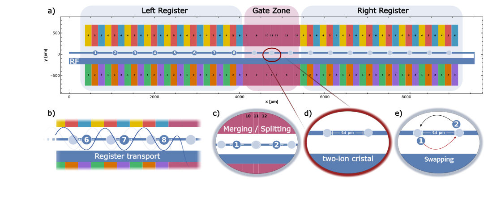
<figcaption class="paper-figure-caption"><b>Fig 1.</b> Figure 1. a) Electrode layout featuring a central gate zone with 14 control electrodes highlighted in red, an asymmetric RF electrode and two storage register to each side where the electrode number indicates the multiplexing of the control signals. The dots along the x-direction show the positions at which the ions may stay in rest. An example where all ions are stored in the left storage is shown. overlapped with the selected resting positions. b) Register transport. Due to the multiplexing scheme, ions in the registers can only be moved collectively. c) Merging and splitting process. Once in the gate zone, the ions can be manipulated individually. Merging means to transport two ions to...</figcaption>
</figure>
<figure class="paper-figure-card">
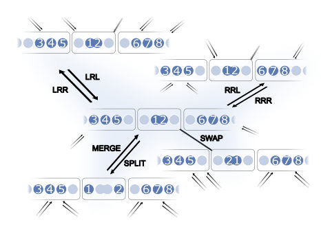
<figcaption class="paper-figure-caption"><b>Fig 2.</b> Figure 2. Network slice. Nodes represent the different ion positional configurations possible in Fig. 1 a), while the edges correspond to instructions connecting them. Each in- struction has a cost in time and noise. Only the configu- ration of the gate zone and the beginnings of the left and right registers are shown. The instructions are labeled only once (thick black arrows); the smaller arrows represent the same instructions and indicate possible connections to fur- ther configurations.</figcaption>
</figure>
<figure class="paper-figure-card">
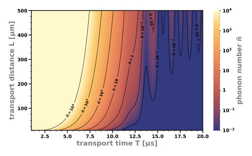
<figcaption class="paper-figure-caption"><b>Fig 3.</b> Figure 3. Energy transfer for a single transported ion as a function of distance and transport time. A hyperbolic tangent with Nval = 5 is selected.</figcaption>
</figure>
<figure class="paper-figure-card">
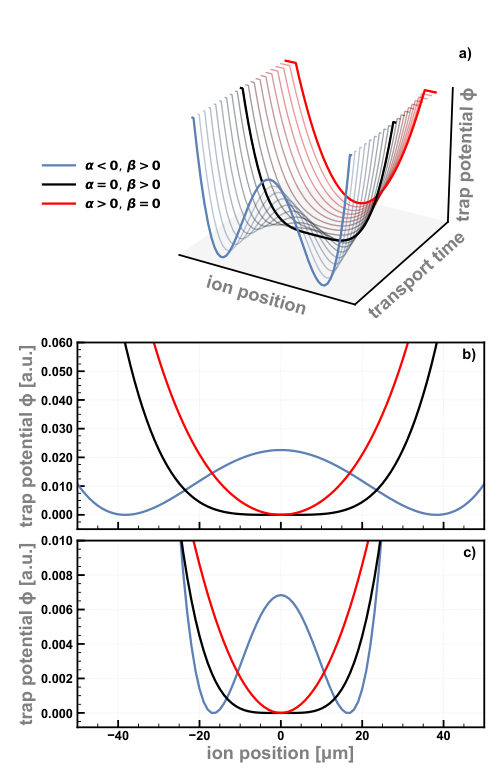
<figcaption class="paper-figure-caption"><b>Fig 4.</b> Figure 4. The three stages for merging or splitting a two-ion crystal. a) legend and three dimensional overview. The pro- cess is here exemplified by either b) maintaining a constant distance between the ions while varying the trapping fre- quency, or c) keeping the trapping frequency constant while adjusting the ion distance. The corresponding frequency trajectories with respect to the ion distance are shown in Fig. 5.</figcaption>
</figure>
<figure class="paper-figure-card">
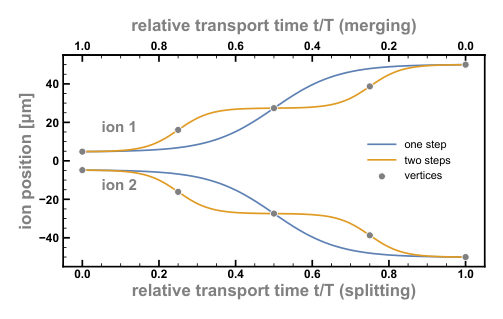
<figcaption class="paper-figure-caption"><b>Fig 5.</b> Figure 6. Ion positions during splitting or merging for dif- ferent transport profiles. Blue: single hyperbolic tangent with Nval = 3 applied for operations featuring a symmetric frequency trajectories νcom(t). Yellow: two cascaded hy- perbolic tangent profiles, both with Nval = 3 applied for operations featuring an asymmetric frequency trajectories νcom(t). Depending on whether the profile is cascaded or not, it features 3 or 5 vertices, i.e. points which will not change with Nval.</figcaption>
</figure>

**Summary.** This paper introduces a theoretical framework to efficiently calculate and minimize motional heating in ion-trap quantum processors during ion shuttling. By decomposing complex movements into simple primitive operations, the authors show how to optimize quantum compiler sequences to balance execution speed with the need to keep phonon numbers below the Doppler limit.

**Why it may be interesting.** It provides a scalable analytical method for managing decoherence-inducing motional heating in large-scale ion-trap architectures, specifically highlighting how phase-sensitive interference can be used to suppress heating during complex reordering tasks.

Detailed structure

**Main problem.** Developing a framework to benchmark and minimize transport-induced motional heating (phonon excitation) in shuttling-based ion-trap quantum processors.

**Main result.** The authors present a decomposition framework that allows for the calculation of total heating in complex shuttling sequences by analyzing primitive operations independently, and demonstrate that optimizing for phonon excitation (Approach B) can leverage destructive interference to stay below the Doppler limit.

**Method.** A decomposition approach that breaks complex trajectories into primitive operations (transport, merge, split, swap) and uses an algebraic/recursive formulation to estimate global heating without full-trajectory simulations.

**Model / system.** A shuttling-based ion-trap processor using 9Be+ ions in a QCCD architecture, modeled as a forced parametric harmonic oscillator with time-dependent potentials and Coulomb interactions.

**Key observables.** Average phonon number (motional excitation/heating), COM and STR mode frequencies, and transport execution time.

**Important parameters / regimes.** Transport time (T), transport distance (L), trapping frequency, and the N_val parameter for transport profile shaping.

**Assumptions / limitations.** Neglects voltage noise and anomalous heating in the primary derivation; assumes the frequency modulation term (Q) is negligible for the studied primitives; assumes initial ground-state preparation.

**Figures summary.** Fig 1: Electrode layout and primitive operations (transport, merge, split, swap). Fig 2: Network slice of instructions and costs. Fig 3: Energy transfer vs. distance and time. Fig 4: Merging/splitting stages. Fig 5: Voltage constraints and potential shapes. Fig 6: Trajectories during splitting/merging. Fig 8: Phonon excitation vs. transport time. Fig 16: Decomposition of heating components. Fig 19: Comparison of optimization approaches A and B.

**Paper structure.** The paper introduces the hardware architecture, defines the mathematical framework for decomposing operations into primitives, analyzes the physics of heating for individual primitives (transport, merging, swapping), presents an optimization strategy for compiler-level instruction sequences, and concludes with a comparison of different optimization objectives.

Abstract

We develop a theoretical and numerical framework to analyze the effect of transport on the motional states of ions in a trapped-ion quantum processor. We decompose the shuttling protocol into primitive operations and characterize these in terms of their heating performance. Instead of having to simulate the whole transport protocol for each complete ion trajectory, the method allows us to determine the heating properties of each primitive operation separately and obtain the global result through an algebraic expression. We demonstrate our method by applying it to an 8-qubit quantum processor design based on linear transport and swap operations for all-to-all connectivity. We show how to incorporate the price of motional operations at the level of the compiler as a cost function.

[↑ back to top](#top)

### [A general tensor-structured compression scheme for efficient large language models](http://arxiv.org/abs/2605.25344v1)

**Authors:** Ying Lu, Peng-Fei Zhou, Qi-Xuan Fang, Pan Zhang, Shi-Ju Ran, Gang Su  
**Type:** theory · **Category:** disordered systems and neural networks · **PDF:** <https://arxiv.org/pdf/2605.25344v1>  
**Analysis basis:** full PDF text, analyzed in chunks

↔ Scroll figures horizontally

<figure class="paper-figure-card">
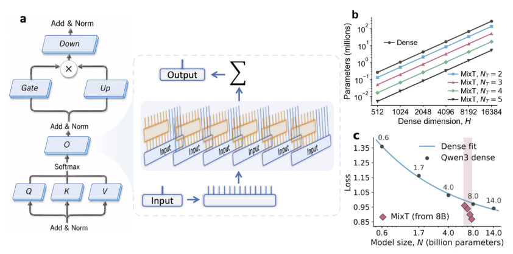
<figcaption class="paper-figure-caption"><b>Fig 1.</b> Fig. 1 Tensor Mixture (MixT) as a controllable tensor-structured replacement for Transformer linear maps. a, MixT replaces dense projections within a Transformer block while preserving residual topology. The replaced maps include Q, K, V , O, Gate, Up and Down. Each projection is rewritten as a mixture of NT local tensor branches: the input is reshaped into local bonds, broadcast across branches, transformed by branch tensors, averaged by a factor 1/NT , and reshaped to the original output dimension. b, Operator-level parameter scaling with matrix width H. Dense linear maps scale as H2, whereas MixT reduces parameter count in an NT -dependent manner. c, Loss versus model size for dense...</figcaption>
</figure>
<figure class="paper-figure-card">
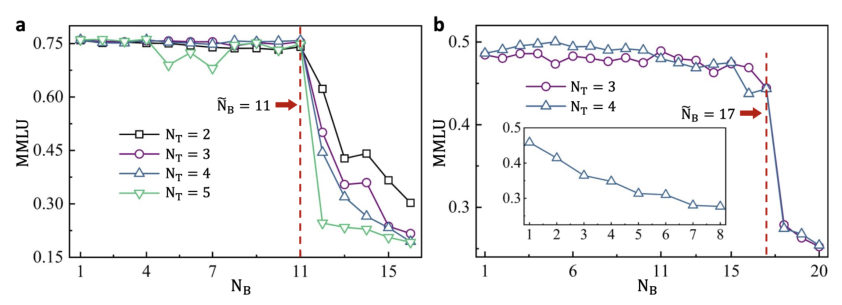
<figcaption class="paper-figure-caption"><b>Fig 2.</b> Fig. 2 Abrupt transition boundary under progressive MixT compression. a, MMLU accuracy of Qwen3-8B as a function of the number of back-to-front replaced Transformer blocks, NB. Different markers denote different branch settings NT , which control the internal compression strength of each MixT operator. The vertical red dashed line marks the tran- sition boundary ˜ NB = 11, beyond which accuracy drops abruptly after an extended near-stable regime. b, Corresponding compression sweep for LLaMA2-7B. The transition boundary occurs at ˜ NB = 17. The inset shows the opposite replacement direction, from earlier to later layers, which produces immediate degradation without a comparable stable...</figcaption>
</figure>
<figure class="paper-figure-card">
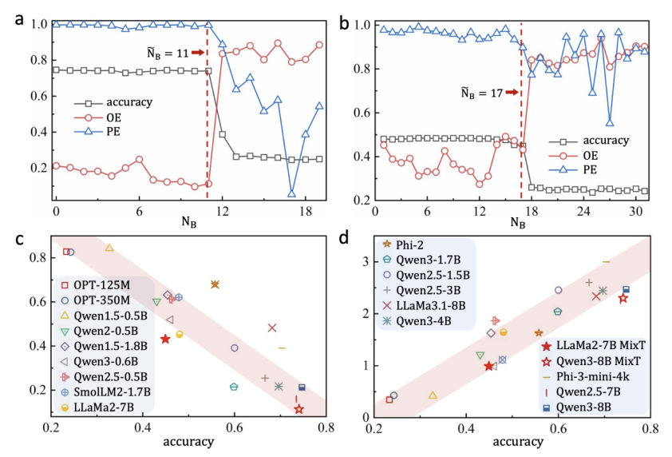
<figcaption class="paper-figure-caption"><b>Fig 3.</b> Fig. 3 Output-distribution statistics across compression sweeps and model scales. a, MMLU accuracy, output entropy (OE) and prediction entropy (PE) as functions of the number of compressed blocks NB for Qwen3-8B. The red dashed line marks the transition boundary ˜ NB = 11. OE measures the normalized four-way answer entropy for each question, whereas PE measures the normalized entropy of the final predicted-label distribution across the dataset. b, Corresponding output-distribution statistics for LLaMA2-7B, with the transition boundary at ˜ NB = 17. In both models, the transition is accompanied by an abrupt increase in OE and a change in dataset-level label usage captured by PE. c, OE versus...</figcaption>
</figure>
<figure class="paper-figure-card">
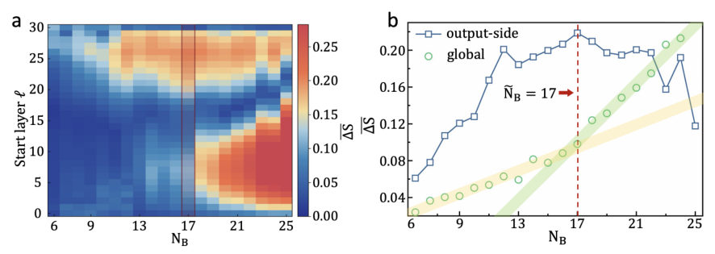
<figcaption class="paper-figure-caption"><b>Fig 4.</b> Fig. 4 Inter-layer geometry drift across the LLaMA2-7B compression sweep. a, All-end-layer drift landscape for the NT = 4 back-to-front compression sweep. For each compression depth NB and start layer ℓ, the colour map shows ∆SNB (ℓ) = ⟨∆SNB (ℓ, ℓ′)⟩ℓ′&gt;ℓ, where the average is taken over all valid end layers ℓ′. The vertical red band marks the transition boundary ˜ NB = 17, and the contour marks a high-drift region. b, Quantitative summaries of the same geometry drift. The blue curve shows the mean of ∆SNB (ℓ, ℓ′) over layer pairs near the output end, and the green circles show the mean over all valid layer pairs. The red dashed line marks ˜ NB = 17. The shaded guide bands indicate the...</figcaption>
</figure>
<figure class="paper-figure-card">
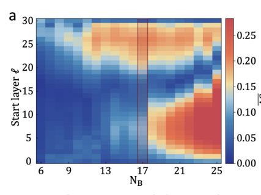
<figcaption class="paper-figure-caption"><b>Fig 5.</b> Figure 4 shows how inter-layer geometry changes across the compression sweep. For each check- point, we compare the inter-layer similarity map with that of the dense reference and measure their absolute deviation by ∆SNB(ℓ, ℓ′), defined in Eq. 5. Larger values indicate larger departures of the corresponding layer pair from the dense model. To visualize how this drift evolves along the full compression path, we first average ∆SNB(ℓ, ℓ′) over all valid end layers ℓ′ &gt; ℓfor each start layer</figcaption>
</figure>

**Summary.** This paper introduces MixT, a method to compress large language models by replacing dense layers with efficient tensor structures. It discovers a critical-like transition boundary where further compression leads to a sharp collapse in model performance and internal geometric stability.

**Why it may be interesting.** not directly relevant

Detailed structure

**Main problem.** Investigating how structural simplification via tensor-structured compression affects the functional integrity and performance of Large Language Models (LLMs).

**Main result.** The authors identify a stable compression regime and an abrupt transition boundary where model performance degrades sharply, accompanied by shifts in output entropy and inter-layer geometry.

**Method.** The MixT framework replaces dense linear layers with a mixture of tensor operators and uses a back-to-front compression strategy with a weight-matching recovery protocol.

**Model / system.** Transformer-based Large Language Models, specifically LLaMA2-7B and Qwen3-8B.

**Key observables.** MMLU accuracy, Output Entropy (OE), Prediction Entropy (PE), and Inter-layer Geometry Drift.

**Important parameters / regimes.** Compression depth (number of replaced blocks NB) and the number of tensor branches (NT).

**Assumptions / limitations.** The study assumes a fixed-budget post-compression recovery stage and focuses on a specific back-to-front compression sweep.

**Figures summary.** Fig 1 shows the MixT architecture and parameter scaling; Fig 2 displays MMLU accuracy vs. compression depth; Fig 3 relates entropy metrics to accuracy; Fig 4 visualizes inter-layer geometry drift landscapes.

**Paper structure.** The paper introduces the MixT framework, describes the compression strategy and evaluation protocol, presents results on resource efficiency and performance stability, analyzes the statistical and geometric transitions at the boundary, and concludes with future directions.

Abstract

Large language models (LLMs) are dominated by dense linear transformations, whose storage, memory and computational overheads hinder efficient adaptation and deployment while masking the functional impacts of structural simplification. Here we present Tensor Mixture (MixT), a general tensor-structured compression scheme that replaces targeted dense linear layers with natively executable mixtures of tensor operators. Operating directly on generic linear projections instead of model-specific components, MixT is potentially applicable across Transformer-based LLMs and other dense neural mappings. We evaluate MixT on Qwen3-8B and LLaMA2-7B under a unified recovery protocol, identifying a broad compressible regime in which MMLU accuracy is largely preserved before an abrupt transition at model-specific boundaries. This transition coincides with coordinated shifts in output entropy, prediction entropy and inter-layer geometry. At the LLaMA2-7B transition boundary, MixT reduces full-model parameters by 47.5\%, inference FLOPs by 37.1\%, training FLOPs by 52.1\% and peak inference memory by 60.4\%, demonstrating its practical potential for lower-cost LLM compression.

[↑ back to top](#top)

### [A Matched Spectral Benchmark of Quantum Inspired Feature Maps](http://arxiv.org/abs/2605.24324v1)

**Authors:** Toheeb Ogunade, Taofeek Kassim, Etinosa Osaro  
**Type:** experiment · **Category:** quantum information and computing · **PDF:** <https://arxiv.org/pdf/2605.24324v1>  
**Analysis basis:** full PDF text, analyzed in chunks

↔ Scroll figures horizontally

<figure class="paper-figure-card">
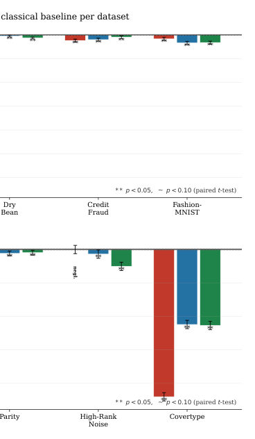
<figcaption class="paper-figure-caption"><b>Fig 1.</b> Figure 1: Forest plot of Cohen’s d effect sizes for all 30 QIE versus best classical comparisons. Negative values indicate that the QIE method is worse than the best classical baseline. Error bars denote 95% confidence intervals over five to ten seeds.</figcaption>
</figure>
<figure class="paper-figure-card">
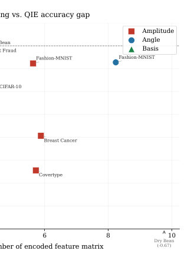
<figcaption class="paper-figure-caption"><b>Fig 2.</b> Figure 2: Condition number (log10 κ) versus accuracy gap (vs. best classical baseline) for all three QIE encodings. Higher condition number is concentrated in amplitude encoding and correlates with larger performance deficits, consistent with the rank collapse failure mode.</figcaption>
</figure>
<figure class="paper-figure-card">
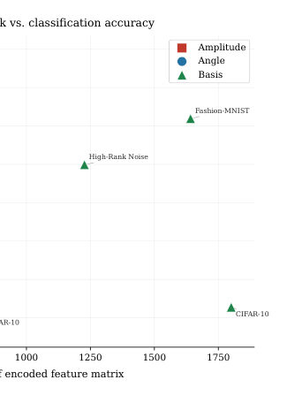
<figcaption class="paper-figure-caption"><b>Fig 3.</b> Figure 3: Normalised effective rank versus accuracy relative to a raw linear baseline across encodings and datasets. The near parity amplitude encoding case on high rank noise has erank/dout = 0.77 and κ = 2.22, consistent with the requirement that the output space be well filled.</figcaption>
</figure>

**Summary.** This paper provides a rigorous benchmark showing that the fixed data-encoding step in quantum machine learning is not a source of advantage on classical data. It identifies specific geometric reasons for this failure, such as the loss of magnitude information in amplitude encoding and the redundancy of angle encoding. The results suggest that true quantum advantage must stem from features beyond fixed encoding, such as entanglement or trainable circuits.

**Why it may be interesting.** not directly relevant

Detailed structure

**Main problem.** Investigating whether fixed quantum-inspired data-encoding maps (amplitude, angle, and basis) provide any inherent representational or predictive advantage for classical supervised learning tasks.

**Main result.** The study finds that fixed quantum-inspired encodings do not provide a statistically significant advantage over strong classical baselines, primarily due to geometric failures like rank collapse in amplitude encoding and geometric redundancy in angle encoding.

**Method.** A controlled classical benchmark comparing quantum-inspired feature maps against various classical models (SVM, MLP, RFF, etc.) across ten diverse datasets using spectral and geometric diagnostics.

**Model / system.** The study uses deterministic classical feature maps designed to mimic quantum encoding motifs: amplitude encoding (unit-sphere projection), angle encoding (trigonometric mapping), and basis encoding (binary discretization).

**Key observables.** Predictive performance (Accuracy, Macro F1), effective rank, condition number, and Centered Kernel Alignment (CKA).

**Important parameters / regimes.** Output dimensionality (matched between QIE and classical baselines), feature scaling, and discretization bit-depth.

**Assumptions / limitations.** The utility of a feature map is assumed to be determined by how well its induced similarity structure aligns with the target function's decision structure.

**Figures summary.** Figure 1 shows Cohen's d effect sizes demonstrating QIE underperformance; Figure 2 correlates condition number with accuracy gaps; Figure 3 relates effective rank to classification accuracy.

**Paper structure.** The paper introduces the problem of encoding geometry, describes the implementation of the three encoding types and classical baselines, presents a large-scale benchmark across diverse datasets, analyzes the spectral and geometric failure modes (rank collapse, redundancy, mismatch), and concludes by situating these findings within the broader context of QML advantage.

Abstract

Quantum machine learning is often motivated by the idea that quantum systems can expose useful high-dimensional structure that is difficult to access with classical models. We isolate one central component of this claim: the fixed data-encoding map. Amplitude, angle, and basis encoding are evaluated as deterministic feature maps for classical supervised learning under matched output dimensionality and strong classical controls. The benchmark compares these encodings against raw linear models, random Fourier features, polynomial features, PCA, RBF SVMs, and shallow neural networks across diverse classical datasets. Rather than treating performance as a single endpoint, we analyze the geometry of each representation through effective rank, condition number, centered kernel alignment, predictive performance, and practical overhead. The resulting picture is mechanistic: amplitude encoding can remove magnitude information through unit-sphere normalization, angle encoding can become geometrically redundant with raw linear features, and basis encoding can impose a binary Hamming geometry that is poorly aligned with smooth decision structure. These findings do not argue against quantum computation, however, they show that fixed quantum-inspired encoding geometry alone is not a reliable source of machine-learning advantage on classical data.

[↑ back to top](#top)

### [Asymptotically Optimal Depth Fermionic Permutation on 2D Grid Quantum Architecture without Ancillas](http://arxiv.org/abs/2605.26041v1)

**Authors:** Dantong Li, Shifan Xu, Yongshan Ding  
**Type:** theory · **Category:** quantum information and computing · **PDF:** <https://arxiv.org/pdf/2605.26041v1>  
**Analysis basis:** full PDF text, analyzed in chunks

↔ Scroll figures horizontally

<figure class="paper-figure-card">
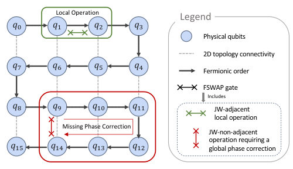
<figcaption class="paper-figure-caption"><b>Fig 1.</b> FIG. 1: Snake JW order on an L × L grid. Vertical swaps cross the row turn, making them nonlocal in JW order and need phase corrections along the chain.</figcaption>
</figure>
<figure class="paper-figure-card">
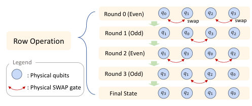
<figcaption class="paper-figure-caption"><b>Fig 2.</b> FIG. 2: Odd–even transposition example on one row: alternating rounds swap adjacent pairs until the target permutation is achieved.</figcaption>
</figure>
<figure class="paper-figure-card">
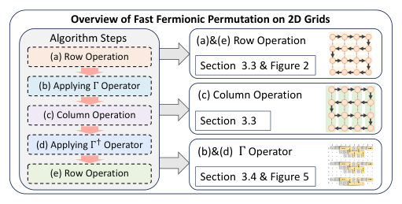
<figcaption class="paper-figure-caption"><b>Fig 3.</b> FIG. 3: Overview of the ancilla-free fermionic permu- tation protocol. The five stages execute sequentially; the Γ sandwich converts bare vertical FSWAPs into full fermionic SWAPs.</figcaption>
</figure>
<figure class="paper-figure-card">
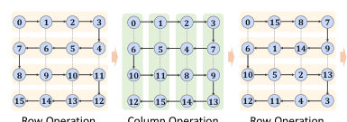
<figcaption class="paper-figure-caption"><b>Fig 4.</b> FIG. 4: Hall’s Row-Column-Row decomposition: RowA routes within source rows, the column stage moves within columns to destination rows, and RowB routes within destination rows to final columns.</figcaption>
</figure>
<figure class="paper-figure-card">
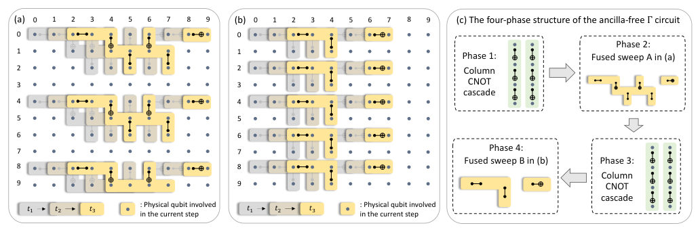
<figcaption class="paper-figure-caption"><b>Fig 5.</b> FIG. 5: The ancilla-free Γ circuit. (a, b) Fused sweeps: a single prefix CNOT cascade on an even row absorbs mul- tiple T(x, y) interactions as trailing operations at fixed column offsets, achieving depth 2L+O(1) per sweep. In fused sweep A, the skip-row 4-gate gadget routes interactions through an intermediary row; in fused sweep B, cross- row interactions use direct vertical CZ gates. (c) The four-phase structure of Algorithm 2. Phase 2 requires two batches because skip-row gadgets from group r access row r+2, which is the cascade row of group r+2. Phase 4 needs no batching since cross-row CZ gates do not modify the target row.</figcaption>
</figure>

**Summary.** This paper presents an optimal method for performing fermionic permutations on 2D quantum grids. By using a specialized routing and phase-correction strategy, it achieves the theoretical minimum circuit depth without needing extra ancilla qubits or complex classical feedback. This significantly reduces the resource requirements for simulating fermionic systems in the early fault-tolerant era.

**Why it may be interesting.** not directly relevant

Detailed structure

**Main problem.** Efficiently implementing fermionic permutations on 2D nearest-neighbor quantum architectures without incurring the high depth overhead caused by non-local parity strings.

**Main result.** A protocol that achieves asymptotically optimal O(sqrt(N)) depth and O(N*sqrt(N)) gate count without using ancilla qubits, mid-circuit measurements, or classical feedforward.

**Method.** The authors use a three-stage Row-Column-Row (RCR) decomposition with an Odd-Even Transposition sort and a diagonal Gamma operator to resolve non-local phase corrections.

**Model / system.** A 2D grid quantum architecture with nearest-neighbor connectivity, utilizing Jordan-Wigner, Bravyi-Kitaev, and Parity fermion-to-qubit encodings.

**Key observables.** CNOT depth, gate count, spacetime volume, and circuit infidelity.

**Important parameters / regimes.** The early fault-tolerant regime, specifically for system sizes N >= 100.

**Assumptions / limitations.** The architecture is a fixed 2D grid with nearest-neighbor connectivity and a 'snake' Jordan-Wigner ordering.

**Figures summary.** Figure 1 shows the snake-like ordering on a grid; Figure 5 illustrates the four-phase structure of the Gamma operator circuit; Figure 6 shows the ternary tree encoding; Figure 7 shows the transformation pipeline between encodings; Figure 8 shows the Hilbert-curve-based routing.

**Paper structure.** The paper introduces the routing problem, presents the RCR decomposition protocol, details the ancilla-free Gamma operator construction, extends the results to BK and Parity encodings via Hilbert curves, and concludes with numerical benchmarks on FFFT and the SYK model.

Abstract

Simulating fermionic systems on qubit hardware involves many nonlocal interactions, and efficient routing of these interactions is critical to the overall cost of fermionic simulation algorithms. Recent works reduce this Jordan-Wigner routing overhead to polylogarithmic depth under all-to-all connectivity, but degrade to $O(\sqrt{N}\,\mathrm{polylog}\,N)$ for $N$ fermionic modes on 2D nearest-neighbor architectures. We present a fermionic permutation protocol tailored to 2D grid architectures that achieves the optimal $O(\sqrt{N})$ depth with $O(N\sqrt{N})$ nearest-neighbor gates and no ancilla qubits, mid-circuit measurements, or classical feedforward. This matches the $Ω(\sqrt{N})$ lower bound, which holds even when $O(N)$ ancillas and classical feedforward are permitted. We further construct an $O(\sqrt{N})$-depth transformation between the Jordan-Wigner, Bravyi-Kitaev, and Parity encodings on the 2D grid via a Hilbert-curve layout, extending our result to all three encodings. Benchmarks on the fermionic fast Fourier transform and Trotter simulation of sparse SYK model demonstrate consistent reduction in depth, spacetime volume, and infidelity for system sizes $N \gtrsim 100$ in the early fault-tolerant regime.

[↑ back to top](#top)

### [Balancing structure and randomness: maximum entropy networks for context-dependent computations](http://arxiv.org/abs/2605.25607v1)

**Authors:** Ludwig Hruza, Srdjan Ostojic  
**Type:** theory · **Category:** disordered systems and neural networks · **PDF:** <https://arxiv.org/pdf/2605.25607v1>  
**Analysis basis:** full PDF text, analyzed in chunks

↔ Scroll figures horizontally

<figure class="paper-figure-card">
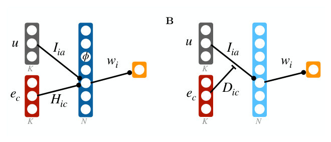
<figcaption class="paper-figure-caption"><b>Fig 1.</b> Figure 1: Model structure. A: We start from a standard feed-forward network with a hidden layer of size N, receiving K stimuli u = (ua)K a=1 and one of K contextual signals ec = (δac)K a=1 through input weights I, H ∈RN×K and output weights w ∈RN, and with a non-linear activation function ϕ (Eq. (5)). B: We map this model to a gain-modulated linear network, where each contextual input is replaced by a gain pattern Dc = Dec ∈RN that modulates inputs multiplicatively in an otherwise linear network (Eq. (7)).</figcaption>
</figure>
<figure class="paper-figure-card">
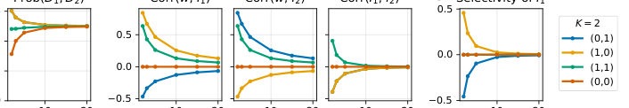
<figcaption class="paper-figure-caption"><b>Fig 2.</b> Figure 2: Maximum Entropy distribution for K = 2 contexts and binary gains. The four configurations of gains for two contexts define four populations of neurons with D = (D1, D2) = (0, 1), (1, 0), (1, 1) and (0, 0), represented in different colors. A, B: Samples (N = 5000) from the maximum entropy distribution for σ2 = 2 (panel A) and σ2 = 5 (panel B), projected onto the planes (w, I1), (w, I2) and (I1, I2). C, D: The covariance matrix of each pair of weights is represented as an ellipse for each population (direction: largest eigenvector, width and height: eigenvalues), for σ2 = 2 (panel C) and σ2 = 5 (panel D) E: Fraction of neurons in each population as a function of the weight scale σ2...</figcaption>
</figure>
<figure class="paper-figure-card">
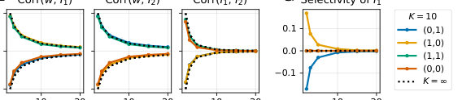
<figcaption class="paper-figure-caption"><b>Fig 3.</b> Figure 3: Maximum Entropy distribution for K = 10 contexts and binary gains. We condition the gain values of the first two contexts (D1, D2) = (0, 1), (1, 0), (1, 1) and (0, 0), and average over gain values in other contexts. The four resulting populations are shown in four different colors. A, B: Samples (N = 5000) from the maximum entropy distribution for σ2 = 2 (panel A) and σ2 = 5 (panel B), projected onto the planes (w, I1), (w, I2) and (I1, I2). C, D: The covariance matrix of each pair of weights is represented as an ellipse for each population (direction: largest eigenvector, width and height: eigenvalues) for σ2 = 2 (panel C) and σ2 = 5 (panel D). E: Probability of the four gain...</figcaption>
</figure>
<figure class="paper-figure-card">
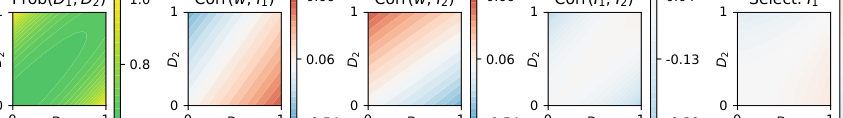
<figcaption class="paper-figure-caption"><b>Fig 4.</b> Figure 4: Maximum entropy distribution for continuous gains and K = 2 as a function of continuous valued (D1, D2) ∈[0, 1]2. A, B, C: Probability, correlation and selectivity for σ2 = 4. The most probable gain configurations are (D1, D2) = (1, 0) and (0, 1). For these two configurations, the correlations between w and I1 is maximal (equal to ±1) and of opposite sign (panel B, left). For these configurations, there is also preferential selectivity in the input weights since the correlation between I1 and I2 is maximally negative (approximately −1, B left), which is reflected in non-zero and opposite selectivity (panel C). D,E,F: Probability, correlation and selectivity for σ2 = 10. Here all...</figcaption>
</figure>
<figure class="paper-figure-card">
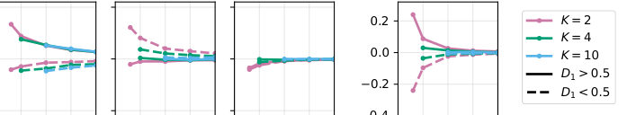
<figcaption class="paper-figure-caption"><b>Fig 5.</b> Figure 5: Comparison between binary (top) and continuous gains (bottom) for different values of K. Instead of conditioning on (D1, D2) as before, we only condition on the values D1, which corresponds to how the network would operate in context c = 1. A,B,C Probability, correlation and selectivity for binary gains as a function of the weight scale σ2 when conditioned on D1 = 1 (solid lines) or D1 = 0 (dashed lines). We also added the asymptotic curves for K →∞. D,E,F: Same but for continuous gains, conditioned on D1 &gt; 0.5 (solid lines) or D1 &lt; 0.5 (dashed lines). For continuous gains there is a K-dependent threshold on the minimal value of σ2 that is allowed to avoid complex values in the...</figcaption>
</figure>

**Summary.** The paper proposes a principle-based approach to neural connectivity using maximum entropy to find the most random distribution of weights that still satisfies specific task requirements. It demonstrates that this framework naturally predicts the emergence of specialized neuron populations and matches the results of standard machine learning training algorithms.

**Why it may be interesting.** not directly relevant

Detailed structure

**Main problem.** Understanding how neural connectivity structure is constrained by network function and addressing the dependency of current gradient-descent approaches on specific training procedures.

**Main result.** The authors show that a maximum entropy approach, which maximizes Shannon entropy subject to task constraints, produces a connectivity structure that matches networks trained via gradient descent both qualitatively and quantitatively.

**Method.** A normative approach using the maximum entropy principle, mapping nonlinear networks onto gain-modulated linear models, and employing Lagrangian optimization and saddle-point approximations.

**Model / system.** A one-hidden-layer feed-forward neural network in the mean-field limit, performing context-dependent input-selection tasks where contextual signals act as multiplicative gains.

**Key observables.** Weight correlations (between output and input weights, and between different input weights), neuron selectivity, and the probability distribution of gains.

**Important parameters / regimes.** Weight scale parameter (sigma^2), number of contexts (K), and gain types (binary vs. continuous).

**Assumptions / limitations.** The network operates in the large N (mean-field) limit, neurons are independent and identically distributed (i.i.d.), and connectivity can be described by a smooth probability distribution.

**Figures summary.** Figure 1 illustrates the network architecture and its mapping to a gain-modulated model; Figure 2 shows weight scatter plots; Figure 4 displays the MaxEnt distribution for continuous gains; Figure 5 compares binary and continuous gains; Figure 6 compares gradient descent training to MaxEnt predictions; Figure 7 shows numerical vs. analytical solutions for Lagrange multipliers.

**Paper structure.** The paper introduces the problem of structure-function relationship, proposes a MaxEnt framework, derives the analytical solution via linearization and Lagrangian optimization, explores different regimes (varying K and weight scale), validates the theory against gradient descent simulations, and provides asymptotic analysis for large K.

Abstract

Understanding how network function constrains neural connectivity is a central challenge in neuroscience. An influential approach is to train neural networks with gradient descent on cognitive tasks and characterize the resulting connectivity. A key limitation is that the resulting structure depends on the details of the training procedure. Here we propose a complementary normative approach based on the maximum entropy principle for network connectivity, independent of any particular learning algorithm. We describe connectivity as a probability distribution over single-neuron weights, express task requirements as constraints on this distribution, and determine the unique distribution maximizing Shannon entropy subject to these constraints. A weight scale parameter controls the balance between randomness and task-induced structure. We apply this framework to context-dependent input-selection tasks in 2-layer feed-forward networks, and show that maximum entropy inference becomes analytically tractable by mapping nonlinear networks onto gain-modulated linear models. Starting from an a priori homogeneous distribution, we find that maximizing entropy under task constraints leads to the emergence of populations of neurons, each defined by its pattern of contextual gain modulation. Increasing the number of contexts drives a transition from context-specialized to unspecialized, random populations. Increasing the weight scale drives a parallel transition from structured to random stimulus selectivity. Strikingly, this maximum entropy connectivity matches both qualitatively and quantitatively the structure of networks trained with gradient descent across different learning regimes. Our results suggest that the interplay between task constraints and entropy maximization provides a fundamental principle for understanding the relationship between structure and function in neural networks.

[↑ back to top](#top)

### [Bargmann Zeros as a Diagnostic of the Tunneling Transition in Double-Well Quantum Systems](http://arxiv.org/abs/2605.25862v1)

**Authors:** Tughanbulut Kurtulush, Maciej Janowicz  
**Type:** theory · **Category:** numerical methods · **PDF:** <https://arxiv.org/pdf/2605.25862v1>  
**Analysis basis:** full PDF text, analyzed in chunks

↔ Scroll figures horizontally

<figure class="paper-figure-card">
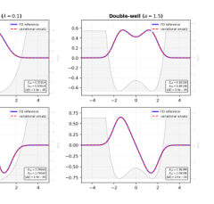
<figcaption class="paper-figure-caption"><b>Fig 1.</b> Figure 2: Variational wavefunctions. Variational wavefunctions (red dashed) versus the finite-difference reference (blue solid), with the potential V(x) overlaid in grey. Rows: ground state (ψ0) and first excited state (ψ1). Columns: harmonic, anharmonic, double- well. Agreement is within line-thickness throughout.</figcaption>
</figure>
<figure class="paper-figure-card">
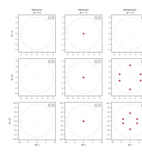
<figcaption class="paper-figure-caption"><b>Fig 2.</b> Figure 3: Bargmann-polynomial zero galleries. Bargmann-polynomial zero galleries for the variational wavefunctions. Columns: three systems × two parities. Rows: viewing radii R = 3, 6, 9. The harmonic ground and first-excited states produce no zeros inside R = 9 – they are essentially pure Fock states. The anharmonic states produce a small number of zeros at intermediate |z|. The double-well states (last two columns) produce zeros localized on the imaginary axis, including a zero at the origin for the odd-parity first-excited state.</figcaption>
</figure>
<figure class="paper-figure-card">

<figcaption class="paper-figure-caption"><b>Fig 3.</b> Figure 4: Tunneling splitting. Tunneling splitting ∆= E1 −E0 of the symmetric double- well potential V(x) = 1</figcaption>
</figure>
<figure class="paper-figure-card">
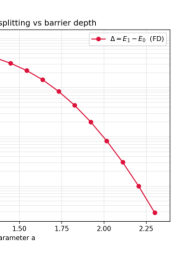
<figcaption class="paper-figure-caption"><b>Fig 4.</b> Figure 5 shows the imaginary parts Im z of all Bargmann zeros within |z| &lt; 6,</figcaption>
</figure>
<figure class="paper-figure-card">
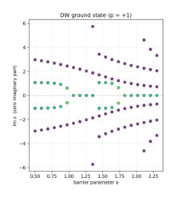
<figcaption class="paper-figure-caption"><b>Fig 5.</b> Figure 5: Imaginary parts of Bargmann zeros. Imaginary parts of Bargmann zeros (within |z| &lt; 6) of the double-well ground state (left, p = +1) and first-excited state (right, p = −1), as a function of barrier parameter a. Points are colored by |Re z|; points with |Re z| ≈0 (dark purple) lie on the imaginary axis. The transition from off-axis to on-axis localization proceeds through the interval a ∈[1.0, 1.5].</figcaption>
</figure>

**Summary.** The paper demonstrates that the complex zeros of a wavefunction in the Bargmann representation provide a clear visual and analytic signature of the tunneling transition in double-well potentials. As the barrier height increases, these zeros migrate and condense onto the imaginary axis. This discovery extends the use of 'zero images' from random polynomials to physically realized quantum eigenstates.

**Why it may be interesting.** This provides a new analytic, purely geometric diagnostic for tunneling regimes, which could be useful for characterizing tunneling in more complex many-body or multi-mode systems where energy splitting is difficult to resolve directly.

Detailed structure

**Main problem.** Investigating whether the complex zeros of wavefunctions in the Bargmann-Fock representation (Bargmann zeros) can serve as a diagnostic tool to identify and track the tunneling transition in symmetric double-well quantum systems.

**Main result.** The study finds that as the potential barrier increases, the Bargmann zeros undergo an 'imaginary-axis condensation,' migrating from off-axis patterns to being aligned on the imaginary axis, which correlates with the exponential collapse of tunneling splitting.

**Method.** A variational ansatz using a symbolic envelope multiplied by a neural network correction is optimized via Rayleigh-Ritz minimization (Adam and L-BFGS) and then projected onto a harmonic-oscillator basis to locate complex zeros.

**Model / system.** One-dimensional quantum systems including harmonic, quartic-anharmonic, and symmetric double-well potentials, specifically focusing on the transition in the double-well as the barrier parameter is varied.

**Key observables.** Bargmann zeros (complex zero distribution), tunneling splitting (energy difference between ground and first-excited states), and Fock-coefficient sign-alternation patterns.

**Important parameters / regimes.** Barrier parameter (a), perturbation strength (epsilon), Fock truncation order (Nmax), and grid resolution (N).

**Assumptions / limitations.** The analysis is limited to one-dimensional systems and relies on a truncated Bargmann polynomial; the results assume the stability of the zero set within a specific radius.

**Figures summary.** Figures demonstrate the migration of zeros onto the imaginary axis, the correlation between zero condensation and tunneling splitting decay, and ablation studies regarding neural network capacity and grid resolution.

**Paper structure.** The paper introduces the Bargmann-Fock representation, describes the variational neural-network-based optimization method, presents the results for harmonic and anharmonic potentials, details the discovery of zero condensation in double-well systems, and concludes with ablation studies on numerical robustness.

Abstract

Complex zeros of wavefunctions represented as entire functions in Bargmann--Fock space encode structural information about the underlying quantum state. Prior work employed zero galleries of randomly generated polynomial superpositions of Fock states as visual fingerprints suitable for classification. Here we examine whether Bargmann zeros of physically realized eigenstates of one-dimensional anharmonic and double-well Hamiltonians carry a recognizable signature of the tunneling transition in the symmetric double well. Ground and first-excited eigenstates are obtained from a variational ansatz consisting of a physically motivated symbolic envelope multiplied by a small flexible correction network, trained by Rayleigh--Ritz minimization of the finite-difference Hamiltonian expectation value and validated to reproduce energies to within $\sim 10^{-5}\,\mathrm{Ha}$. The resulting wavefunctions are projected onto the harmonic-oscillator basis and the complex zeros of the truncated Bargmann polynomial are located by numerical root-finding. For harmonic and quartic-anharmonic potentials the zeros show no preferred orientation. For double-well eigenstates, by contrast, the zeros condense onto the imaginary axis. A sweep of the barrier parameter $a$ from $0.5$ to $2.3$ reveals a continuous migration of zeros toward the imaginary axis, concurrent with the exponential collapse of the tunneling splitting $Δ(a) = E_1 - E_0$ over $3.5$ decades. This condensation is traced to a sign-alternation pattern in the Fock-coefficient spectrum that is characteristic of bimodally localized wavefunctions. The complex zero set of the Bargmann-represented wavefunction thereby provides a compact, purely analytic diagnostic for the tunneling regime of one-dimensional double-well Hamiltonians, extending the random-polynomial zero-image framework to physical eigenstates.

[↑ back to top](#top)

### [Beyond Logical Circuits: Hardware-Aware Analysis of Expressibility and Trainability in Variational Quantum Algorithms](http://arxiv.org/abs/2605.25552v1)

**Authors:** Muhammad Kashif, Muhammad Shafique  
**Type:** theory · **Category:** quantum information and computing · **PDF:** <https://arxiv.org/pdf/2605.25552v1>  
**Analysis basis:** full PDF text, analyzed in chunks

↔ Scroll figures horizontally

<figure class="paper-figure-card">
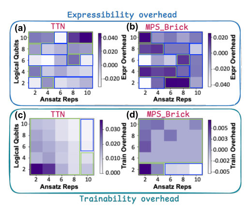
<figcaption class="paper-figure-caption"><b>Fig 1.</b> Fig. 1: Transpilation-induced overhead in expressibility and trainability for the TTN and MPS Brick ansatz families across different logical qubit counts and ansatz repetitions. (a) and (b) show the expressibility overhead, where positive values (green boxes) indicate reduced expressibility after transpilation and negative values (blue boxes) indicate improvement or no change. (c) and (d) show the trainability overhead, where positive values correspond to improved trainability after transpilation, while blue-box regions indicate preserved or reduced trainability after transpilation.</figcaption>
</figure>
<figure class="paper-figure-card">
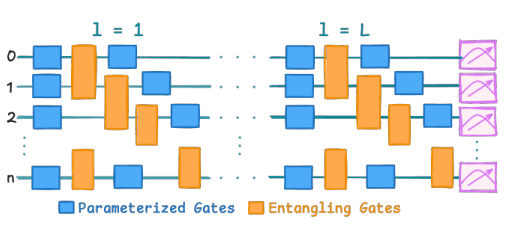
<figcaption class="paper-figure-caption"><b>Fig 2.</b> Fig. 2: An illustration of PQC used in variational quantum algorithms</figcaption>
</figure>
<figure class="paper-figure-card">
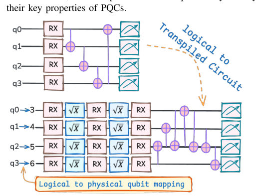
<figcaption class="paper-figure-caption"><b>Fig 3.</b> Fig. 3: Illustration of quantum circuit transpilation on IBM FakeWashington backend. For a small 4-qubit circuit designed at logical level, the gate count and depth is increased significantly.</figcaption>
</figure>
<figure class="paper-figure-card">
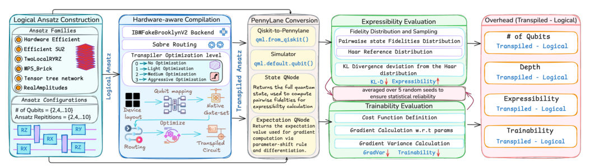
<figcaption class="paper-figure-caption"><b>Fig 4.</b> Fig. 4: Overview of the our methodology. Logical PQCs from multiple ansatz families are first constructed across varying qubit counts and depths. These circuits are then transpiled using a hardware-aware compilation pipeline (IBM FakeBrooklynV2 backend with SABRE routing and varying optimization levels). The resulting logical and transpiled circuits are converted to PennyLane for unified statevector simulation. Expressibility is evaluated via fidelity distributions and KL divergence, while trainability is quantified using gradient variance. Finally, overhead is computed as the difference between transpiled and logical metrics, capturing transpilation-induced changes in circuit structure and...</figcaption>
</figure>
<figure class="paper-figure-card">
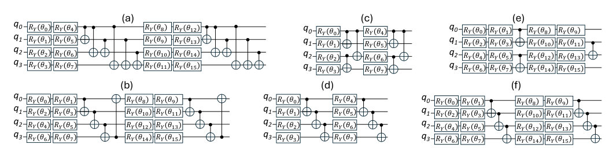
<figcaption class="paper-figure-caption"><b>Fig 5.</b> Fig. 5: Ansatz Families used in this paper. (a) EfficientSU2 Ansatz, (b) HEA Ring Ansatz, (c) TTN Tree ansatz, (d) Real Amplitudes, (e) MPS Brick, (f) TwoLocalRYRZ</figcaption>
</figure>

**Summary.** This paper demonstrates that the process of compiling quantum circuits for specific hardware can fundamentally change their performance characteristics. It shows that the relationship between a circuit's ability to represent states and its ease of optimization is not preserved during transpilation, meaning logical-level designs may fail on real hardware.

**Why it may be interesting.** not directly relevant

Detailed structure

**Main problem.** Investigating whether hardware-aware transpilation (qubit mapping, routing, and gate decomposition) fundamentally alters the expressibility and trainability of Variational Quantum Algorithms (VQAs) compared to their logical circuit designs.

**Main result.** Transpilation acts as an architectural perturbation that can significantly deviate expressibility by up to 125% and trainability by up to 25%, effectively decoupling the well-known logical-level expressibility-trainability trade-off.

**Method.** A systematic comparison of logical and transpiled Parameterized Quantum Circuits (PQCs) using fidelity-based KL divergence for expressibility and gradient variance for trainability, simulated on a noiseless statevector simulator.

**Model / system.** The study uses various PQC ansatz families (including EfficientSU2, HEA Ring, TTN, and MPS Brick) mapped to the IBM FakeBrooklynV2 heavy-hex architecture.

**Key observables.** Expressibility (KL divergence), trainability (gradient variance), circuit depth overhead, and qubit expansion.

**Important parameters / regimes.** Qubit counts (2 to 10), circuit depths/layers (2 to 10), and Qiskit transpiler optimization levels (0 to 3).

**Assumptions / limitations.** The analysis uses a noiseless statevector simulator, focusing on structural/algorithmic changes rather than hardware noise or decoherence.

**Figures summary.** Figure 1 shows transpilation-induced overhead in expressibility and trainability; Figure 3 illustrates gate count and depth increases; Figure 6 compares logical vs. transpiled qubit counts; Figure 7 shows circuit depth overhead; Figure 8 displays expressibility overhead; Figure 9 displays trainability overhead.

**Paper structure.** The paper introduces the gap between logical and physical PQC properties, describes the methodology for hardware-aware analysis, presents results for various ansatz families regarding depth and qubit overhead, analyzes the impact on expressibility and trainability, and concludes with the necessity of hardware-aware evaluation.

Abstract

Variational quantum algorithms (VQAs) rely on parameterized quantum circuits (PQCs), whose performance is governed by expressibility and trainability. Existing studies typically evaluate these properties at the logical circuit level, implicitly assuming that designed PQCs remain unchanged during hardware execution. In practice, however, hardware-aware transpilation modifies circuit structure through qubit mapping, routing, and basis decomposition, potentially altering PQC behavior. In this paper, we perform a systematic hardware-aware analysis of expressibility and trainability by comparing logical and transpiled PQCs across multiple ansatz families, qubit counts, and circuit depths. Expressibility is measured using fidelity-based KL divergence, while trainability is quantified through gradient variance. Our results show that transpilation acts as an implicit architectural perturbation, producing strongly ansatz-dependent effects. Expressibility deviations exceed upto 125% in some cases, while trainability variations reach up to 25%. Structured ansatzes are generally more robust, whereas highly entangled architectures are more sensitive to transpilation-induced transformations. We further show that transpilation can alter the commonly assumed expressibility-trainability trade-off, demonstrating that logical-level analyses may not reliably predict hardware-level behavior. These findings highlight the importance of hardware-aware evaluation for accurate characterization of VQAs.

[↑ back to top](#top)

### [Bipartite Cholesky Graph Networks for Many-Body Quantum Chemistry](http://arxiv.org/abs/2605.25268v1)

**Authors:** Abdul Samad Khan  
**Type:** theory · **Category:** disordered systems and neural networks · **PDF:** <https://arxiv.org/pdf/2605.25268v1>  
**Analysis basis:** full PDF text, analyzed in chunks

↔ Scroll figures horizontally

<figure class="paper-figure-card">
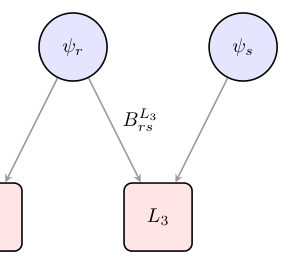
<figcaption class="paper-figure-caption"><b>Fig 1.</b> Figure 1: Bipartite architecture induced by the Cholesky factorization of the ERI tensor. Orbital nodes (blue circles) exchange information exclusively through auxiliary interaction nodes (red squares) weighted by the Cholesky vectors BL pq; no direct orbital-to-orbital edges exist.</figcaption>
</figure>
<figure class="paper-figure-card">
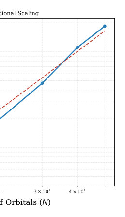
<figcaption class="paper-figure-caption"><b>Fig 2.</b> Figure 2: Empirical computational scaling of the factorized bipartite message passing. The forward pass achieves an empirical scaling of O(N 2.20) on CPU, avoiding explicit O(N 4) edge materializa- tion.</figcaption>
</figure>
<figure class="paper-figure-card">

<figcaption class="paper-figure-caption"><b>Fig 3.</b> Figure 3 shows the predicted potential energy surfaces (PES) for all six molecules. Predictions represent genuine out-of-fold estimates from the five-fold CV procedure; no prediction in the figure was produced by a model trained on that geometry. The model tracks the equilibrium region faithfully across all species and exhibits larger residuals near compressed geometries (bond length &lt; 0.75 Å),</figcaption>
</figure>
<figure class="paper-figure-card">
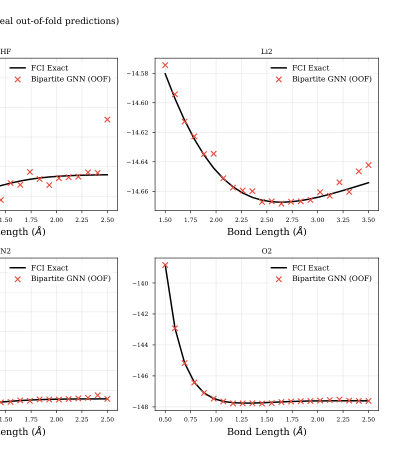
<figcaption class="paper-figure-caption"><b>Fig 4.</b> Figure 3: Potential energy surfaces for the six diatomic molecules. Solid lines represent FCI reference energies; crosses are genuine out-of-fold predictions of the bipartite GNN accumulated across all five CV folds. No prediction was produced by a model that had seen the corresponding geometry during training.</figcaption>
</figure>
<figure class="paper-figure-card">
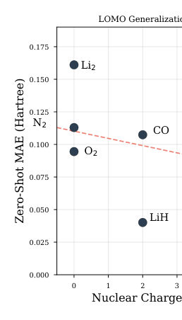
<figcaption class="paper-figure-caption"><b>Fig 5.</b> Figure 4: Zero-shot generalization error (LOMO-CV) as a function of nuclear charge asymmetry ∆Z = |ZA −ZB|. The absence of a consistent monotonic trend indicates that ∆Z alone does not explain transferability. LiH (low ∆Z, low error) and Li2 (zero ∆Z, highest error) illustrate that the dominant factor is the orbital-structural dissimilarity of the held-out species from the training distribution.</figcaption>
</figure>

**Summary.** This paper introduces a new graph neural network architecture that uses Cholesky decomposition to represent electron repulsion integrals in a bipartite graph structure. This approach preserves essential higher-order interaction structures while reducing computational complexity, leading to much more accurate predictions of molecular correlation energies.

**Why it may be interesting.** not directly relevant

Detailed structure

**Main problem.** The computational bottleneck of O(N^4) scaling in electron repulsion integrals (ERI) and the loss of higher-order interaction structures in existing graph neural network approaches to quantum chemistry.

**Main result.** The Bipartite Cholesky Graph Network achieves a significantly lower Mean Absolute Error (0.0296 Ha) than compressed-integral baselines and demonstrates that generalization is driven by orbital-structural similarity.

**Method.** A bipartite graph neural network architecture that uses Cholesky decomposition of the ERI tensor to create a graph with orbital nodes and auxiliary interaction nodes, utilizing tensor contractions to maintain interaction topology.

**Model / system.** The model targets the correlation energy of many-body molecular systems, specifically evaluated on six diatomic molecules (CO, HF, Li2, LiH, N2, O2) using a non-relativistic electronic Hamiltonian and STO-3G basis.

**Key observables.** Correlation energy (Delta E_corr) and Mean Absolute Error (MAE) in Hartrees.

**Important parameters / regimes.** Scaling of the forward pass (empirical O(N^2.20) and theoretical O(N^3)) and the number of auxiliary interaction nodes.

**Assumptions / limitations.** The ERI supermatrix is assumed to be symmetric and positive semi-definite; the model currently relies on single-reference Hartree-Fock references.

**Figures summary.** Figure 1 illustrates the bipartite architecture, showing orbital nodes exchanging information through auxiliary interaction nodes via Cholesky weights without direct orbital-to-orbital edges.

**Paper structure.** The paper introduces the computational problem of ERI scaling, presents the Bipartite Cholesky Graph Network architecture and its derivation from tensor factorization, details the implementation and scaling, reports performance benchmarks and ablation studies, and concludes with an analysis of zero-shot generalization via leave-one-molecule-out validation.

Abstract

Accurate prediction of molecular correlation energies from first principles requires resolving the {O}(N^4) electron repulsion integral (ERI) tensor. Existing graph neural network approaches to the electronic structure problem often compress this tensor into low-rank scalar features, discarding higher-order interaction structures relevant to electron correlation. In this work, we demonstrate that tensor factorization of the ERI naturally induces a structured bipartite message-passing architecture that preserves access to higher-order interaction structure more effectively than compressed orbital representations. By utilizing the density-fitted Cholesky decomposition of the ERI tensor, we derive a bipartite graph network that models orbital degrees of freedom and auxiliary interaction nodes as distinct sets, maintaining interaction topology at a reduced theoretical complexity of {O}(N^3). Evaluated on 132 geometries of six diatomic molecules with Full Configuration Interaction (FCI) reference energies, our factorized representation achieves an in-distribution Mean Absolute Error (MAE) of 0.0296 Ha under five-fold cross-validation, a substantial improvement over compressed-integral baselines. Leave-one-molecule-out validation reveals that zero-shot generalization varies by nearly a factor of four across molecular species and correlates with the structural similarity of the held-out molecule's orbital environment to the training distribution, rather than with nuclear charge asymmetry alone.

[↑ back to top](#top)

### [Charge density wave in a band insulator](http://arxiv.org/abs/2605.24153v1)

**Authors:** Md Shafayat Hossain, Wenhao Liu, Yuqi Zhang, Qi Zhang, Chao Lei, Nana Shumiya, Kouta Dagnino, Maksim Litskevich, Yu-Xiao Jiang, Jia-Xin Yin, Nikhil Dhale, Zi-Jia Cheng, Byunghoon Kim, Yongkai Li, Tyler A. Cochran, Xian P. Yang, Fan Zhang, Yugui Yao, Zhiwei Wang, Bing Lv, Titus Neupert, Luis Balicas, M. Zahid Hasan  
**Type:** experiment · **Category:** strongly correlated electrons · **PDF:** <https://arxiv.org/pdf/2605.24153v1>  
**Analysis basis:** full PDF text, analyzed in chunks

↔ Scroll figures horizontally

<figure class="paper-figure-card">
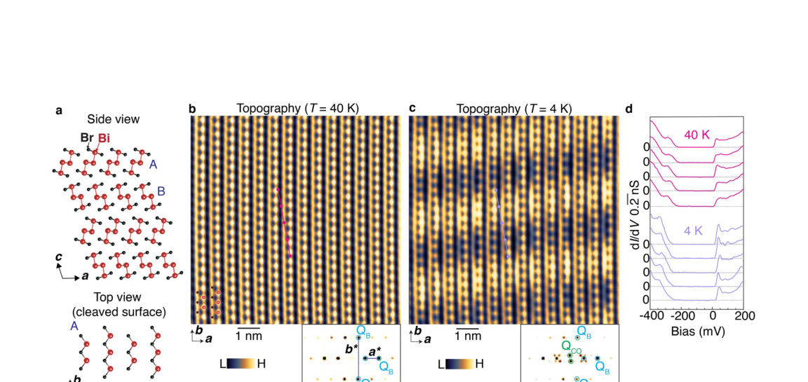
<figcaption class="paper-figure-caption"><b>Fig 1.</b> Fig. 1: Observation of a charge order in 𝛼-Bi4Br4. a, Crystallographic structure of 𝛼-Bi4Br4. Upper panel: side view of the 𝛼-Bi4Br4 crystal showing the interlayer AB stacking. Lower panel: Top view of the A-type monolayers. b, c, Atomically resolved, STM topographic images measured at 𝑇= 40 K (panel b) and 4 K (panel c) on the same region of the A-type surface. H and L labels in the color bar denote high and low scale, respectively. The topography acquired at 4 K exhibits a pronounced charge modulation, which is absent at 40 K. The corresponding bottom panels display the Fourier transform images. The Bragg (QBragg) and the charge order (QCO) peaks are indicated by blue and green circles,...</figcaption>
</figure>
<figure class="paper-figure-card">
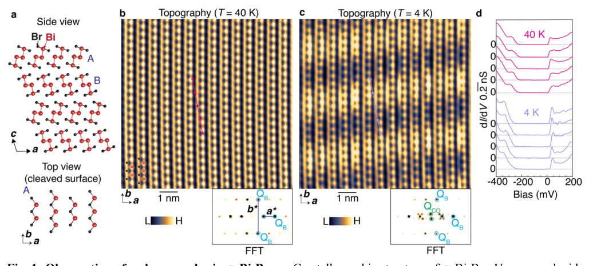
<figcaption class="paper-figure-caption"><b>Fig 2.</b> Fig. 2: Spectroscopic signature of the charge order. a, Same topographic image as in Fig. 1c, displaying a periodic charge modulation. Tunneling junction setup: V = -300 mV, I = 120 pA. b,c, Corresponding dI/dV maps taken at -</figcaption>
</figure>
<figure class="paper-figure-card">
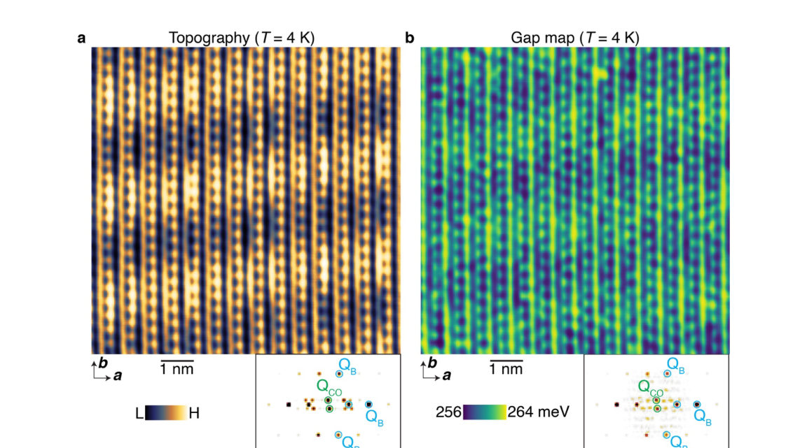
<figcaption class="paper-figure-caption"><b>Fig 3.</b> Fig. 3: Manifestation of the charge order in the spectroscopic energy gap. a, Same topographic image as in Fig. 1c, showing a pronounced charge modulation. Tunneling junction setup: V = -300 mV, I = 120 pA. b, Corresponding spectroscopic gap map, acquired at the same location, revealing a gap modulation associated with the charge order. Note that the charge density should be higher where the gap is smaller. Consequently, the protrusion in panel a is found in regions where the gap in panel b displays a depression and vice versa. Tunneling junction setup for the gap map: Vset = -600 mV, Iset = 420 pA, Vmod = 2 mV. The bottom panels illustrate the corresponding Fourier transform images. Blue...</figcaption>
</figure>
<figure class="paper-figure-card">
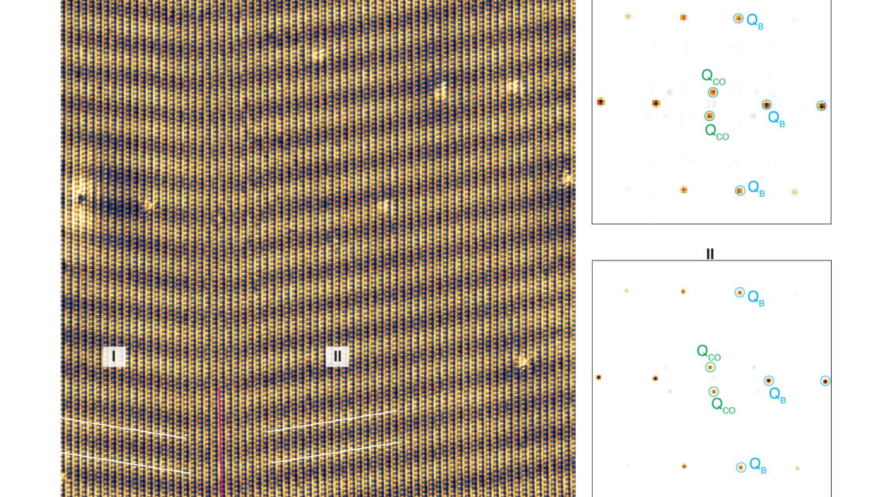
<figcaption class="paper-figure-caption"><b>Fig 4.</b> Fig. 4: Observation of charge-ordered domains in 𝜶-Bi4Br4. a, STM topographic image acquired at 𝑇= 4 K displaying two charge-ordered domains, labeled as I and II, separated by a domain wall (indicated by a red line). The white lines denote the directions of the charge order in each domain. Tunneling junction setup: V = -300 mV, I = 120 pA. b, Fourier transform images of domains I (upper panel) and II (lower panel). Blue and green circles highlight the Bragg (QBragg) and the charge order (QCO) peaks, respectively. The magnitude of the charge order wavevectors, QCO = ±[−(0.05 ± 0.015) a∗+ (0.085 ± 0.01)b∗] and QCO=±[(0.05 ± 0.015)a∗−(0.085 ± 0.01)b∗], appears to be the similar in the two...</figcaption>
</figure>
<figure class="paper-figure-card">
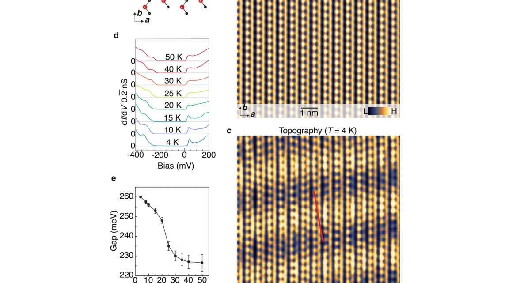
<figcaption class="paper-figure-caption"><b>Fig 5.</b> Fig. 5: Temperature dependence of the charge order. a, Crystallographic top view of the B-type 𝛼-Bi4Br4 monolayers. b, c, Atomically resolved, STM topographic images measured at 𝑇= 40 K (panel b) and 4 K (panel c) on the same region in the B-type surface. The topography acquired at 4 K displays a pronounced charge modulation, which is absent at 40 K. Tunnelling junction set-up: V = -300 mV, I = 120 pA. d, Differential conductance (dI/dV) spectra acquired at different temperatures ranging from 4 K to 50 K. The spectrum for a given temperature is obtained via averaging the dI/dV spectra measured along the red line shown in panel c. Tunneling junction setup: Vset = -600 mV, Iset = 420 pA, Vmod...</figcaption>
</figure>

**Summary.** The researchers discovered a charge density wave in the band insulator Bi4Br4, a phenomenon that contradicts the standard theory that CDWs require a Fermi surface. They observed that the CDW adds an additional gap to the existing insulating gap and exhibits nonlinear transport characteristic of a sliding mode. This finding suggests a new class of insulator-to-insulator phase transitions driven by phonon instabilities.

**Why it may be interesting.** not directly relevant

Detailed structure

**Main problem.** Investigating the emergence of a charge density wave (CDW) in a band insulator where no Fermi surface exists, challenging the conventional Peierls instability paradigm.

**Main result.** Experimental evidence of an insulator-to-insulator transition in Bi4Br4, where a unidirectional charge modulation develops below 40 K, accompanied by nonlinear transport indicating a sliding phason mode.

**Method.** Low-temperature Scanning Tunneling Microscopy (STM) for topographic and spectroscopic imaging, combined with DC electrical transport measurements and phonon dispersion calculations.

**Model / system.** The physical system is alpha-Bi4Br4, a quasi-one-dimensional, higher-order topological band insulator with a fully gapped Brillouin zone.

**Key observables.** Charge order wavevector (Q_CO), spectroscopic gap enhancement, threshold electric field (E_th) for nonlinear conduction, and spectroscopic contrast reversal.

**Important parameters / regimes.** Temperature regime below 40 K, energy gap of ~225-260 meV, and CDW period of approximately 3 nm.

**Assumptions / limitations.** The system is assumed to be a clean band insulator without significant mid-gap states from disorder prior to the CDW formation.

**Figures summary.** Fig 1: Crystal structure, STM topography, and FFT showing charge order. Fig 2: Spectroscopic dI/dV maps showing contrast reversal. Fig 3-4: Domain wall identification and temperature-dependent gap evolution. Fig 5: Comparison of B-type surface layers. Fig 6: Transport data including resistance vs temperature and nonlinear dV/dI vs electric field.

**Paper structure.** The paper introduces the material and the anomaly of CDW in an insulator, presents STM evidence of charge modulation and domain structures, provides spectroscopic evidence of the gap enhancement, details transport evidence of collective dynamics, and concludes with a proposed phonon-driven mechanism.

Abstract

Charge density wave (CDW) implies a periodic modulation of the charge density. Typically observed in metallic systems, CDWs arise from Fermi surface instabilities, resulting in the total or partial gapping of the Fermi surface. Here, we present experimental evidence for a CDW state emerging in a band insulator which has no Fermi surface. The bulk and surface of our material platform, Bi4Br4, is gapped over the entire Brillouin zone. Through topographic and spectroscopic imaging at low temperatures, we unveil an unexpected unidirectional charge modulation in Bi4Br4, breaking the lattice translation symmetry. The CDW develops at temperatures below 40 K and adds an energy gap atop the existing insulating gap of Bi4Br4. Furthermore, our transport measurements reveal nonlinear electrical conduction, a phenomenon conventionally associated with the sliding or phason mode of incommensurate CDWs. These highly unusual observations represent a new type of CDW and demand a new theoretical framework for CDWs.

[↑ back to top](#top)

### [Cluster moves with an entropic reservoir accelerate low-temperature simulations of three-dimensional spin glasses](http://arxiv.org/abs/2605.25872v1)

**Authors:** Claudio Chilin, Enzo Marinari, Víctor Martín-Mayor, Giorgio Parisi, Juan J. Ruiz-Lorenzo, David Yllanes  
**Type:** theory · **Category:** disordered systems and neural networks · **PDF:** <https://arxiv.org/pdf/2605.25872v1>  
**Analysis basis:** full PDF text, analyzed in chunks

↔ Scroll figures horizontally

<figure class="paper-figure-card">
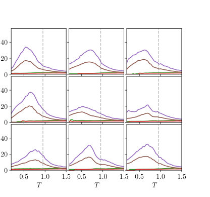
<figcaption class="paper-figure-caption"><b>Fig 1.</b> Figure 1. Largest clusters in equilibrated configurations. Temperature dependence of the size of the six largest clusters that are present in a given pair of spin configurations, as computed for 9 different L = 14 samples. For each temperature, we present an average over equilibrated configurations. The vertical dashed lines correspond to T = 0.95 ≈Tc [38], and the horizontal ones indicate half the size of the system V/2 = 1372. Left: The blue- shaded lines in the upper half correspond to the biggest clusters of the majority (i.e., clusters with the same overlap sign as the full lattice). There are nine curves (one per sample). The orange-shaded curves are for the biggest cluster of the...</figcaption>
</figure>
<figure class="paper-figure-card">
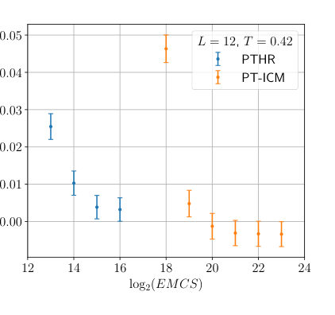
<figcaption class="paper-figure-caption"><b>Fig 2.</b> Figure 2. The PTHR speedup. Left: ⟨S⟩, defined in Eq.(5), against temperature, as computed for the same set of 2000 samples of L = 14 lattices in three different simulations, which employ either plain Parallel Tempering (PT) or the algorithm explained in Sec. 3 (PTHR). The orange line corresponds to PTHR with a total simulation tmax = 4×105 EMCSs, the purple line is for PTHR with tmax = 4 × 104 and the red line is PT with tmax = 4 × 105. In all three cases, we display the results from bin 0, recall Eq. (8). Right: ⟨S⟩at Tmin = 0.42 as a function of Monte Carlo time, as computed for a set of 2048 samples of L = 12 lattices simulated with PTHR (blue points) and for a set of 15000 samples...</figcaption>
</figure>
<figure class="paper-figure-card">
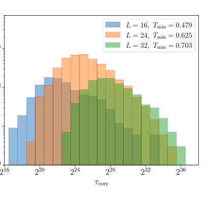
<figcaption class="paper-figure-caption"><b>Fig 3.</b> Figure 3. Autocorrelation times for plain PT. Results of plain PT simulations for different minimum temperature Tmin and different linear sizes L of the 3D Edwards-Anderson model with binary couplings Jij = ±1. Notice that for binary couplings Tc = 1.102(3) [37]. Left: Histogram of the autocorrelation time τcorr for 1000 samples of L = 32 with Tmin = 0.985 ≈ 0.895Tc (purple) and Tmin = 0.703 ≈0.64Tc (green). Right: Histogram of autocorrelation times for 1000 samples of L = 32 with Tmin = 0.703 ≈0.64Tc (green), for 4000 samples of L = 24 with Tmin = 0.625 ≈0.57Tc (orange) and for 4000 samples of L = 16 with Tmin = 0.479 ≈0.44Tc (blue). Data taken from Ref. [35].</figcaption>
</figure>
<figure class="paper-figure-card">
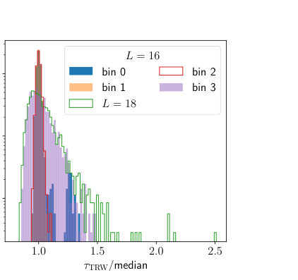
<figcaption class="paper-figure-caption"><b>Fig 4.</b> Figure 4. Sample-to-sample fluctuations of the mixing time for the temperature random walk. Both panels display the probability density function (pdf) for τTRW, see Eq. (12), as computed from the different samples in our simulations, see Appendix A. We give τTRW in units of the median for the corresponding distribution. The different values of the median can be found in Tables 1 and 2. We use a logarithmic scale in the vertical axis in order to enhance the visibility of outliers. Left: Pdfs for bin 0 of the simulations, recall Eq. (8), as computed for lattice sizes L = 14, 16 and 18. We know from Eq. (6) that the simulation for L = 18 has not reached thermal equilibrium. Right: Pdfs for the...</figcaption>
</figure>
<figure class="paper-figure-card">
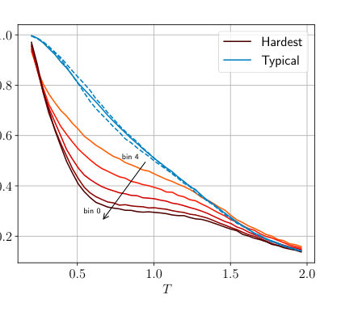
<figcaption class="paper-figure-caption"><b>Fig 5.</b> Figure 5. Temperature random walk and temperature chaos. This figure shows the difference between typical samples and the hardest samples we found in our simulations of 2000 samples of L = 14 lattices, with Tmin = 0.2. The hardest samples were identified following the procedure explained in Sec. 5.1. Left: Histogram of τTRW as defined in Eq. (12). The blue histogram is the computed value for the 2000 samples of L = 14, from which we computed the observables for this size in this work. The superimposed brown histogram is for the 129 hardest samples of the set. Right: Chaotic parameter as a function of the temperature T [the parameter is defined in Eq. (15), we fix T1 = Tmin = 0.2 and let T2...</figcaption>
</figure>

**Summary.** The authors present a new Monte Carlo algorithm, PTHR, designed to accelerate the simulation of 3D spin glasses in the deep low-temperature phase. By combining cluster moves with an entropic reservoir, the method significantly outperforms standard parallel tempering and provides a massive speedup for studying complex disordered systems.

**Why it may be interesting.** not directly relevant

Detailed structure

**Main problem.** Simulating three-dimensional spin glasses at very low temperatures is computationally difficult due to temperature chaos and the extreme difficulty of reaching thermal equilibrium in large systems.

**Main result.** The new PTHR algorithm achieves a speedup of up to 64 times compared to previous cluster methods and allows for the equilibration of larger systems (up to L=16) at temperatures as low as T=0.2.

**Method.** The PTHR algorithm combines Parallel Tempering with Houdayer cluster moves and an entropic reservoir to refresh configurations and accelerate equilibration.

**Model / system.** A 3D Edwards-Anderson Ising spin glass model on a simple-cubic lattice with Gaussian-distributed random couplings.

**Key observables.** Site overlap (qi), global overlap (q), link overlap (ql), Schwinger-Dyson-Young (SDY) observable (S), and temperature chaos parameter (X).

**Important parameters / regimes.** Temperatures down to T=0.2 (approx. 0.21Tc), lattice sizes up to L=16, and Gaussian couplings with zero mean and unit variance.

**Assumptions / limitations.** The algorithm's efficiency is limited by the percolation of clusters in 3D, which can turn cluster moves into simple symmetry transformations.

**Figures summary.** Figure 1 shows cluster size distribution; Figure 2 compares equilibration progress using the SDY observable; Figure 3 and 4 show autocorrelation times and round-trip time distributions; Figure 5 analyzes the scaling of mixing times and temperature chaos.

**Paper structure.** The paper introduces the PTHR algorithm, describes the physical model and simulation setup, presents performance comparisons against standard PT and PT-ICM, analyzes the scaling and complexity related to temperature chaos, and discusses implementation optimizations like multispin coding and look-up tables.

Abstract

We present an algorithm for the simulation of three-dimensional spin glasses deep in the low-temperature phase: Parallel Tempering enhanced with Houdayer moves and with an entropic reservoir (PTHR). Although differences with the standard Houdayer algorithm are small, PTHR allows us to equilibrate a large number of samples of $L=16$ lattices with Gaussian couplings for temperatures $T\geq 0.2$. We show that the computational complexity displays better size scaling than standard Parallel Tempering. For finite sizes, our method outperforms other cluster algorithms by a speedup factor of around 64. In close analogy with standard Parallel Tempering, PTHR's computational complexity strongly relates to temperature chaos.

[↑ back to top](#top)

### [Defect Conformal Manifolds along RG Domain Walls between $\mathbb Z_N$-Parafermions and Minimal Models](http://arxiv.org/abs/2605.24978v1)

**Authors:** Jin-Rui Zhang, Jing-Hao Jin, Ting-Kai Chen, Jin Chen  
**Type:** theory · **Category:** other · **PDF:** <https://arxiv.org/pdf/2605.24978v1>  
**Analysis basis:** full PDF text, analyzed in chunks

↔ Scroll figures horizontally

<figure class="paper-figure-card">
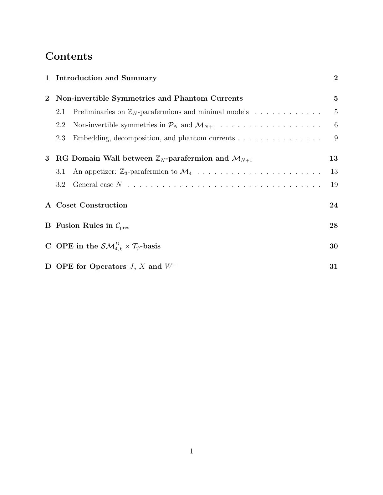
<figcaption class="paper-figure-caption"><b>Fig 1.</b> Low-resolution page preview, page 2</figcaption>
</figure>
<figure class="paper-figure-card">
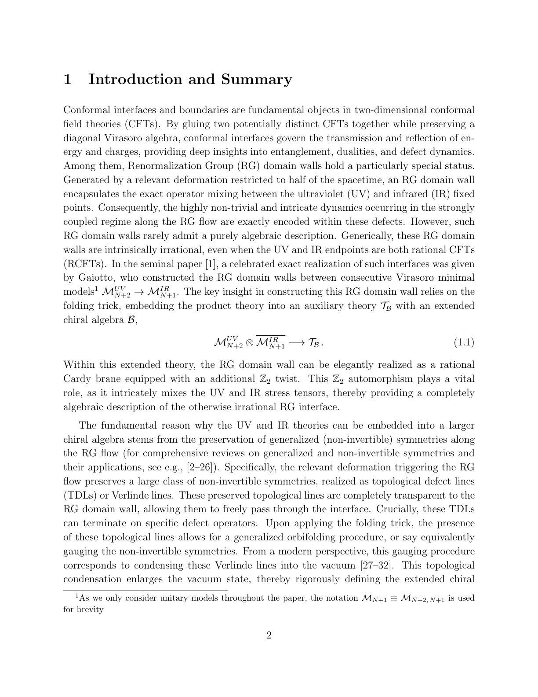
<figcaption class="paper-figure-caption"><b>Fig 2.</b> Low-resolution page preview, page 3</figcaption>
</figure>
<figure class="paper-figure-card">
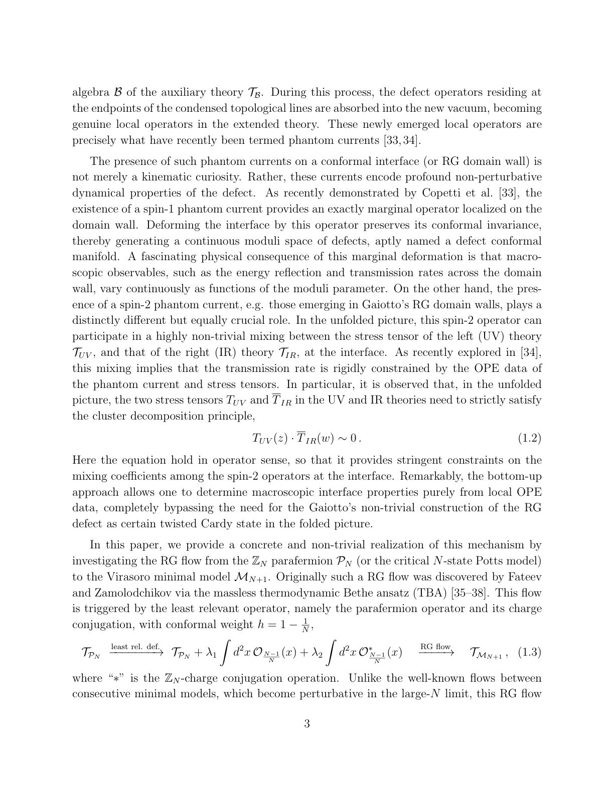
<figcaption class="paper-figure-caption"><b>Fig 3.</b> Low-resolution page preview, page 4</figcaption>
</figure>
<figure class="paper-figure-card">
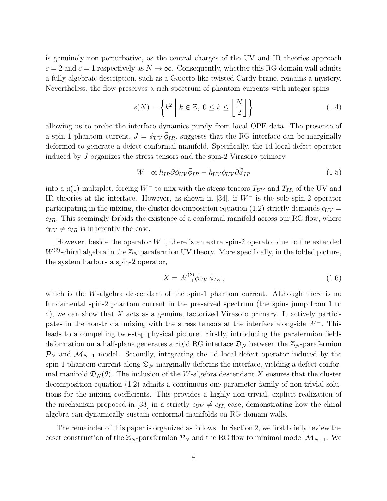
<figcaption class="paper-figure-caption"><b>Fig 4.</b> Low-resolution page preview, page 5</figcaption>
</figure>
<figure class="paper-figure-card">
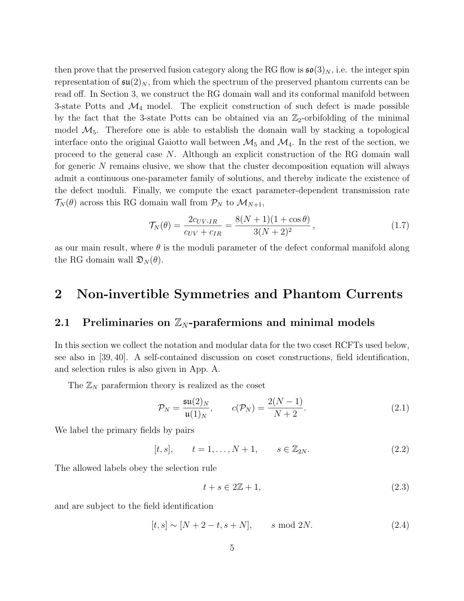
<figcaption class="paper-figure-caption"><b>Fig 5.</b> Low-resolution page preview, page 6</figcaption>
</figure>

**Summary.** This paper provides an algebraic construction of continuous defect conformal manifolds along non-perturbative RG domain walls. By focusing on the emergence of 'phantom currents,' the authors resolve the tension between marginal deformations and the cluster decomposition principle. They show that the transmission of information across these walls vanishes in the large-N limit due to a macroscopic collapse of the target space.

**Why it may be interesting.** not directly relevant

Detailed structure

**Main problem.** The paper investigates the existence and properties of continuous defect conformal manifolds along Renormalization Group (RG) domain walls between Z_N parafermion theories and Virasoro minimal models.

**Main result.** The authors demonstrate that a spin-1 phantom current allows for a marginal deformation that generates a continuous defect conformal manifold, and they derive an explicit expression for the transmission rate across the wall, which vanishes in the large-N limit.

**Method.** A bottom-up approach is used, employing the folding trick, symmetry tracking of non-invertible so(3)_N symmetries, and OPE analysis of phantom currents to bypass the need for an explicit Gaiotto-type construction.

**Model / system.** The system consists of RG domain walls (conformal interfaces) interpolating between a UV fixed point (Z_N parafermion theory/N-state Potts model) and an IR fixed point (Virasoro minimal model M_{N+1}).

**Key observables.** Transmission rate (T_N(theta)), phantom currents (spin-1 J and spin-2 W-), and the moduli parameter (theta).

**Important parameters / regimes.** The integer N (defining the Z_N symmetry), the central charges (c_UV and c_IR), and the large-N limit.

**Assumptions / limitations.** The analysis assumes the validity of the coset decomposition and focuses on the preservation of the so(3)_N fusion subcategory.

**Paper structure.** The paper begins by defining the RG flow and the problem of constructing domain walls, moves to a bottom-up identification of phantom currents via symmetry tracking, uses an algebraic framework (folding trick and OPEs) to resolve the central charge mismatch paradox, and concludes with the derivation of the transmission rate and its large-N behavior.

Abstract

We investigate the renormalization group (RG) domain walls interpolating between the $\mathbb{Z}_N$ parafermion theory (the critical $N$-state Potts model) and the Virasoro minimal model $\mathcal{M}_{N+1}$. These flows are genuinely non-perturbative and an explicit construction of Gaiotto type RG domain wall remains elusive. We bypass this limitation by employing a bottom-up approach centered on the emergence of ``phantom currents". By tracking the preserved non-invertible symmetries ($\mathfrak{so}(3)_N$) along the flow, we extract the exact spectrum of these currents localized on the defect. We demonstrate that the presence of a spin-1 phantom current allows the interface to be marginally deformed, dynamically generating a continuous defect conformal manifold. Furthermore, we show that an extra spin-2 operator, crucially as a $W^{(3)}$-algebra descendant of the spin-1 phantom current, rigidly constrains the UV-IR stress tensor mixing via the cluster decomposition principle. This algebraic framework enables the exact computation of the parameter-dependent transmission rate across the conformal manifold, which we observe strictly vanishes in the large-$N$ limit as a consequence of macroscopic target space collapse.

[↑ back to top](#top)

### [Demagnetization effect on magnetic noise measurements in spin ice materials](http://arxiv.org/abs/2605.25993v1)

**Authors:** F. Morineau, C. Paulsen, G. Balakrishnan, D. Prabhakaran, K. Matsuhira, S. R. Giblin, E. Lhotel  
**Type:** experiment · **Category:** strongly correlated electrons · **PDF:** <https://arxiv.org/pdf/2605.25993v1>  
**Analysis basis:** full PDF text, analyzed in chunks

↔ Scroll figures horizontally

<figure class="paper-figure-card">
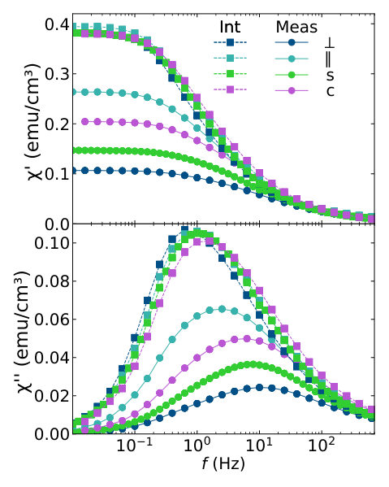
<figcaption class="paper-figure-caption"><b>Fig 1.</b> FIG. 1. Ac susceptibility χ′ and χ′′ vs f measured at 900 mK for four different Ho2Ti2O7 sample configurations. The dots show the measured susceptibility χmeas and the squares the susceptibility corrected for demagnetizing factor N (intrinsic susceptibility χint). The Nexp factors used for the correction are : N⊥= 0.539(3) × 4π, N∥= 0.100(2) × 4π, Ns = 1/3 × 4π and Nc = 0.181(2) × 4π. Lines are guides to the eye.</figcaption>
</figure>
<figure class="paper-figure-card">
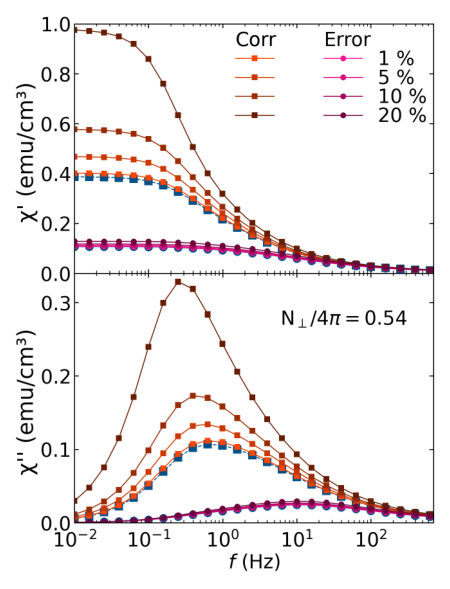
<figcaption class="paper-figure-caption"><b>Fig 2.</b> FIG. 2. Real (χ′) and imaginary (χ′′) parts of the ac sus- ceptibility as a function of frequency, measured at 900 mK for the Ho2Ti2O7 parallelepiped sample in the perpendicular configuration (N⊥= 0.539(3)×4π). Dots show the measured susceptibility and squares the demagnetization-corrected in- trinsic susceptibility. The reference measured and intrinsic susceptibilities (with no artificial error) are shown in blue. To illustrate error propagation, the measured susceptibility is artificially scaled by +1, +5, +10, and +20% (shades of pink); the corresponding intrinsic susceptibilities obtained after de- magnetization correction are shown in shades of orange. The strong deviation of the...</figcaption>
</figure>
<figure class="paper-figure-card">
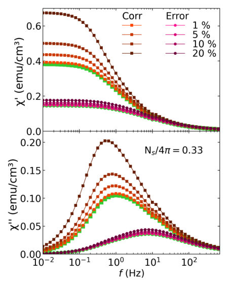
<figcaption class="paper-figure-caption"><b>Fig 3.</b> FIG. 3. Real (χ′) and imaginary (χ′′) parts of the ac suscep- tibility as a function of frequency, measured at 900 mK for the Ho2Ti2O7 spherical sample (Ns = 1/3 × 4π). Dots show the measured susceptibility and squares the demagnetization- corrected intrinsic susceptibility. The reference measured and intrinsic susceptibilities (with no artificial error) are shown in green. To illustrate error propagation, the measured suscepti- bility is artificially scaled by +1, +5, +10, and +20% (shades of pink); the corresponding intrinsic susceptibilities obtained after demagnetization correction are shown in shades of or- ange. Compared to Figure 2, the error amplification is re- duced, consistent...</figcaption>
</figure>
<figure class="paper-figure-card">

<figcaption class="paper-figure-caption"><b>Fig 4.</b> Figure 1, any errors in the absolute value of χmeas for the sphere arising for instance from calibration uncertainties would also affect the derived effective demagnetizing fac- tors for the remaining sample configurations. As a consequence, while the spherical sample offers an appealing reference geometry owing to its well defined and temperature-independent N, uncertainties in the ab- solute calibration of χmeas significantly impact the accu- racy of χint, precisely because Ns is not negligibly small. It therefore appears preferable to minimize N rather than to rely on its precise knowledge. In principle, a sample with a small demagnetizing factor such as a long ellipsoid would provide a...</figcaption>
</figure>
<figure class="paper-figure-card">
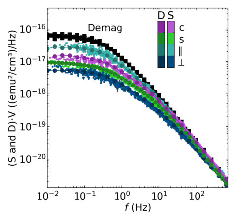
<figcaption class="paper-figure-caption"><b>Fig 5.</b> FIG. 4. FDR plot multiplied by volume for four different sample configurations of Ho2Ti2O7 on a logarithmic scale: Smeas ×V (small dots) and Dmeas ×V (big dots) as a function of frequency f measured at 900 mK. The black squares repre- sent Dint × V , which was corrected for demagnetizing effects with the N factors: N⊥= 0.539(3) × 4π, N∥= 0.100(2) × 4π, Ns = 1/3 × 4π and Nc = 0.181(2) × 4π. Lines are guides to the eye.</figcaption>
</figure>

**Summary.** This paper shows that the geometry of a sample significantly distorts magnetic noise measurements in spin ice, meaning measured noise does not directly reflect intrinsic dynamics. The authors provide a framework for correcting these effects and suggest that sample shape should be treated as a key experimental control parameter. This is crucial for accurately comparing experimental noise data with microscopic theories of spin dynamics.

**Why it may be interesting.** not directly relevant

Detailed structure

**Main problem.** Investigating how demagnetizing fields caused by sample geometry renormalize and bias magnetic noise spectra and extracted dynamical parameters in spin ice materials.

**Main result.** The authors demonstrate that measured magnetic noise and susceptibility are strongly shaped by sample geometry, leading to significant quantitative biases in extracted relaxation times and power spectral density, and a systematic underestimation of the anomalous exponent alpha.

**Method.** Simultaneous measurement of magnetic noise spectroscopy and AC susceptibility using a SQUID magnetometer on single-crystal spin ice samples of varying shapes (spheres, parallelepipeds, cylinders) at low temperatures.

**Model / system.** The study focuses on spin ice materials, specifically Ho2Ti2O7 and Dy2Ti2O7, which exhibit emergent magnetic monopole dynamics. The analysis uses the Fluctuation-Dissipation Relation (FDR) and Kramers-Kronig relations to relate noise to susceptibility.

**Key observables.** Spectral noise density S(f), AC susceptibility (real part chi' and imaginary part chi''), demagnetizing factor N, and relaxation parameters (tau, alpha, S0).

**Important parameters / regimes.** Low-temperature regime (600 mK to 4.2 K), demagnetizing factor N, and frequency-dependent relaxation processes.

**Assumptions / limitations.** Samples are treated as having ellipsoidal geometry for applying the demagnetizing factor; the accuracy of N is limited by the non-ideal shape of certain samples.

**Figures summary.** Figure 1 compares measured vs corrected susceptibility for different Ho2Ti2O7 geometries; Figure 4 shows noise scaling with N; Figure 6 shows temperature evolution of noise spectra; Figure 7 shows the temperature-dependent bias in extracted parameters; Figure 8 and 9 demonstrate the success and failure of KK-based corrections at different temperatures.

**Paper structure.** The paper introduces the problem of demagnetization in noise spectroscopy, presents experimental data on various sample geometries, quantifies the error propagation in susceptibility corrections, analyzes the bias in extracted dynamical exponents, and evaluates the limits of using Kramers-Kronig relations for correction.

Abstract

Magnetic noise spectroscopy provides direct access to spontaneous time-dependent magnetization fluctuations in correlated magnetic systems, including spin liquids, spin ices, and spin glasses. Here we investigate how demagnetizing fields shape the magnetic noise spectra measured in spin ice. By combining magnetic noise and ac susceptibility measurements on single-crystal spin ice samples with different sizes and shapes, we show that magnetic noise, like linear response, is strongly renormalized by sample geometry. As a consequence, measured noise spectra do not directly yield the intrinsic fluctuation spectrum, and demagnetization corrections cannot in general be determined from noise data alone. Instead, sample geometry must be treated as a central experimental control parameter for accessing intrinsic dynamics. These results establish the role of boundary conditions in fluctuation spectroscopy and provide a framework for quantitatively comparing noise measurements with microscopic theories of spin dynamics.

[↑ back to top](#top)

### [Digital twins for compact hybrid quantum classical learning in FMCW radar detection](http://arxiv.org/abs/2605.24187v1)

**Authors:** Sebastian Ratto Valderrama, Ahmed N. Sayed, Arien Sligar, Jose R. Rosas-Bustos, Omar M. Ramahi, George Shaker  
**Type:** theory · **Category:** quantum information and computing · **PDF:** <https://arxiv.org/pdf/2605.24187v1>  
**Analysis basis:** full PDF text, analyzed in chunks

↔ Scroll figures horizontally

<figure class="paper-figure-card">
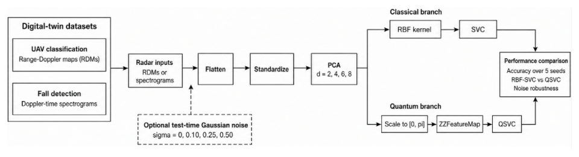
<figcaption class="paper-figure-caption"><b>Fig 1.</b> Figure 1: Matched compact kernel pipeline. Each radar input is flattened, standardized using training-set statistics, projected by PCA, and classified with either a classical RBF kernel or a fidelity-based quantum kernel.</figcaption>
</figure>
<figure class="paper-figure-card">
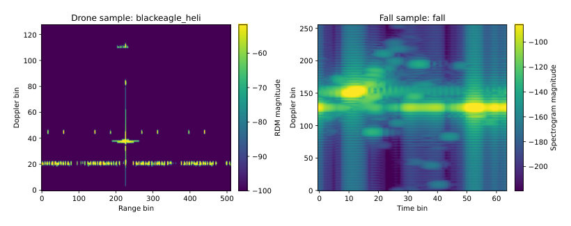
<figcaption class="paper-figure-caption"><b>Fig 2.</b> Figure 2: Representative radar inputs for the two digital-twin tracks: a UAV range–Doppler map and a fall Doppler–time spectrogram.</figcaption>
</figure>
<figure class="paper-figure-card">

<figcaption class="paper-figure-caption"><b>Fig 3.</b> Figure 3: Repeated-seed kernel results for the UAV and fall benchmarks across PCA dimension. Markers and bars show the mean and 95% confidence interval over five seeds.</figcaption>
</figure>
<figure class="paper-figure-card">
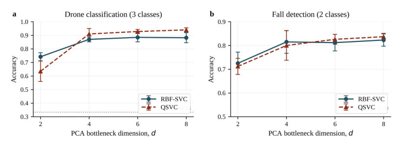
<figcaption class="paper-figure-caption"><b>Fig 4.</b> Figure 4 illustrates the raw-input noise injection for representative UAV RDMs and fall Doppler– time spectrograms. As σ increases, the background texture becomes stronger, but the dominant UAV return and fall Doppler–time trajectory remain visible. This visual observation is consistent with the small accuracy changes reported in Table 3.</figcaption>
</figure>
<figure class="paper-figure-card">
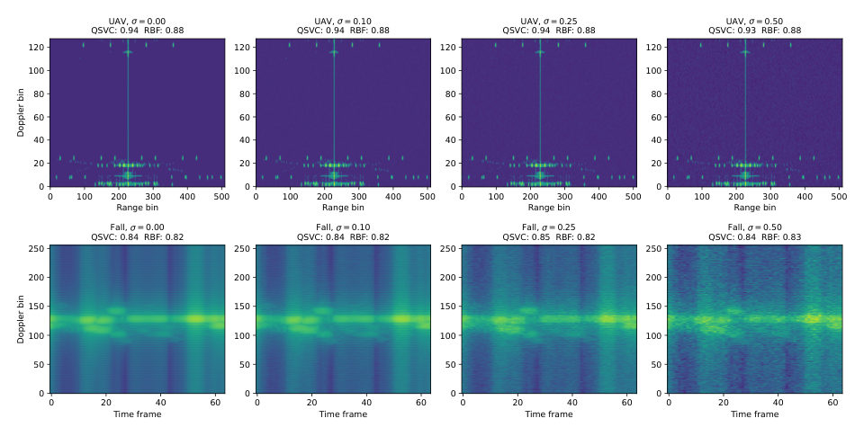
<figcaption class="paper-figure-caption"><b>Fig 5.</b> Figure 4: Representative UAV RDMs and fall Doppler–time spectrograms under increasing raw- input Gaussian noise.</figcaption>
</figure>

**Summary.** This paper investigates using physics-informed digital twins to benchmark quantum machine learning for radar signal processing. It demonstrates that quantum kernels can outperform classical kernels in specific radar classification tasks when using compressed feature sets. The results suggest that the utility of quantum kernels is highly dependent on the specific geometric structure of the sensing task.

**Why it may be interesting.** not directly relevant

Detailed structure

**Main problem.** Evaluating the effectiveness of physics-informed digital twins as controlled testbeds for benchmarking quantum-classical radar learning, specifically comparing quantum kernel performance to classical kernels.

**Main result.** The quantum support vector classifier (QSVC) showed a performance advantage over the classical RBF-SVC in a UAV classification task at higher PCA dimensions, while performance was comparable in a human fall detection task.

**Method.** The study uses a pipeline of PCA-based dimensionality reduction followed by classification using RBF-SVC and a Qiskit-based QSVC with a ZZFeatureMap, evaluated using noiseless classical statevector simulations.

**Model / system.** The system consists of two synthetic radar 'digital twins': a 77 GHz FMCW radar for UAV classification using Range-Doppler Maps, and a 60 GHz FMCW radar for human fall detection using Doppler-time spectrograms.

**Key observables.** Classification accuracy and robustness to Gaussian noise.

**Important parameters / regimes.** PCA dimensions (d = 2, 4, 6, 8), Gaussian noise levels (sigma = 0.0 to 0.5), and radar carrier frequencies (60 GHz and 77 GHz).

**Assumptions / limitations.** The study assumes noiseless quantum operations (no hardware noise), uses synthetic data rather than real-world measurements, and utilizes magnitude-based radar products rather than raw complex I/Q data.

**Figures summary.** Figure 1 shows the kernel pipeline; Figure 2 displays radar input examples; Figure 3 plots accuracy vs. PCA dimension; Figure 4 visualizes the effect of noise injection on radar maps.

**Paper structure.** The paper introduces the problem of radar QML benchmarking, describes the digital twin setup and preprocessing pipeline, presents comparative results for two different radar tasks, evaluates robustness to noise, and discusses limitations and future work.

Abstract

Frequency-modulated continuous-wave radar sensing often relies on labeled measurements that are costly, restricted, or difficult to collect at scale. This work evaluates physics-informed digital twins as controlled testbeds for early-stage quantum-classical radar learning. Two synthetic radar benchmarks are considered: unmanned aerial vehicle classification from range-Doppler maps and human fall detection from Doppler-time spectrograms. For both tasks, inputs are standardized, reduced using principal component analysis, and classified using either a radial basis function support vector classifier or a quantum support vector classifier. All quantum-kernel results are obtained using noiseless classical simulation; no quantum hardware is used, and no quantum-advantage claim is made. Across five random seeds, the quantum support vector classifier improves the UAV benchmark from four principal components onward, reaching an accuracy of 0.941 +/- 0.012 at eight components, compared with 0.880 +/- 0.029 for the classical baseline. On the fall-detection benchmark, both classifiers perform similarly, with a small quantum-kernel improvement at higher feature dimensions. A Gaussian-noise robustness study shows limited performance degradation across the tested noise levels, while preserving the UAV quantum-kernel gain. These results support digital twins as useful, controlled environments for radar-QML benchmarking prior to measured-data validation and hardware execution.

[↑ back to top](#top)

### [Emergent Dispersive Multipolar Excitations in NaErSe$_{2}$](http://arxiv.org/abs/2605.24527v1)

**Authors:** Zheng Zhang, Mingfang Shu, Mingtai Xie, Weizhen Zhuo, Yanzhen Cai, Christian Balz, Jianting Ji, Feng Jin, Jie Ma  
**Type:** both · **Category:** strongly correlated electrons · **PDF:** <https://arxiv.org/pdf/2605.24527v1>  
**Analysis basis:** full PDF text, analyzed in chunks

↔ Scroll figures horizontally

<figure class="paper-figure-card">
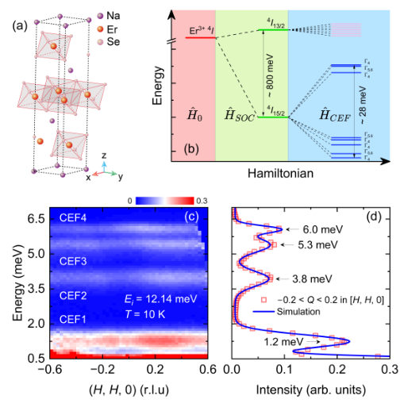
<figcaption class="paper-figure-caption"><b>Fig 1.</b> Fig. 1. Crystal structure and CEF excitations in NaErSe2. (a) Crystal structure of NaErSe2. (b) Energy level hierarchy of the Er3+</figcaption>
</figure>
<figure class="paper-figure-card">
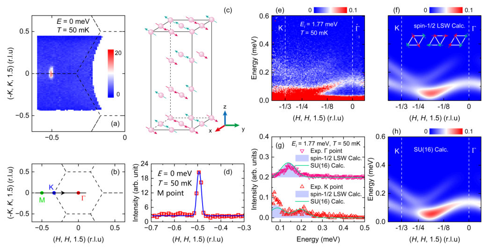
<figcaption class="paper-figure-caption"><b>Fig 2.</b> Fig. 2. Stripe-x magnetic order and spin excitations in NaErSe2. (a) Elastic neutron scattering intensity map at 50 mK, showing a magnetic Bragg peak at the M point. A corresponding intensity cut is shown in (d). (b) Reciprocal space diagram illustrating the high-symmetry points and measurement path. (c) The determined stripe-x magnetic structure. (e) Measured low-energy spin-wave spectrum along the (H, H, 1.5) direction. This is compared with calculations using an effective spin-1/2 LSW model (f) and a J = 15/2 SU(N) model (h) . The inset in (f) shows the three degenerate stripe configurations. (g) Constant- ⃗Q energy cuts at the M and Γ points, comparing experimental data with both...</figcaption>
</figure>
<figure class="paper-figure-card">
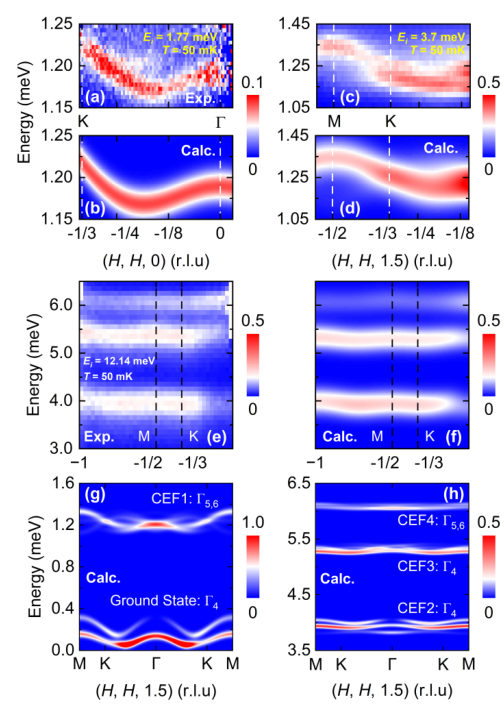
<figcaption class="paper-figure-caption"><b>Fig 3.</b> Fig. 3. Dispersive CEF excitations in NaErSe2. (a, c, e) Experi- mental INS spectra measured at T = 50 mK with incident energies Ei = 1.77, 3.7, and 12.14 meV, respectively. (b, d, f) Correspond- ing theoretical calculations using the J = 15/2 SU(N) model. The momentum path is along (H, H, 0) for (a, b) and along (H, H, 1.5) for (c-f). (g, h) High-resolution SU(N) calculations showing the de- tailed dispersions of the ground state and the first four CEF excita- tions, labeled with their respective symmetry (e.g., Γ4, Γ5,6).</figcaption>
</figure>
<figure class="paper-figure-card">
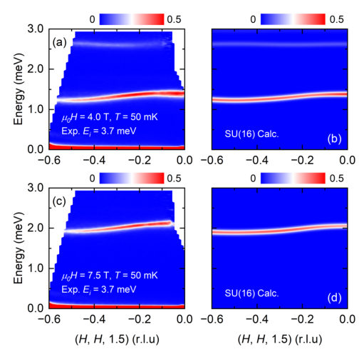
<figcaption class="paper-figure-caption"><b>Fig 4.</b> Fig. 4. INS spectra under magnetic fields of 4.0 T and 7.5 T. Panels (a, c) show experimental data along the (H, H, 1.5) direction at 50 mK, while (b, d) are the corresponding SU(N) calculations.</figcaption>
</figure>

**Summary.** This paper demonstrates how the interaction between local crystal field levels and collective magnons in NaErSe2 gives rise to new, dispersive multipolar excitations. It shows that these excitations can be tuned using an external magnetic field to create a multipolar ferromagnetic state. This provides a new platform for studying complex, high-rank multipolar physics in frustrated magnets.

**Why it may be interesting.** not directly relevant

Detailed structure

**Main problem.** The study aims to understand the coupling between local crystalline electric field (CEF) excitations and collective spin dynamics, specifically how this coupling leads to emergent dispersive multipolar excitations.

**Main result.** The researchers identified that the coupling between ground-state magnons and higher-lying dipole-octupole CEF states creates a distinct, symmetry-selected multipolar band, and demonstrated that magnetic fields can induce a transition to a multipolar ferromagnet.

**Method.** The work combines inelastic neutron scattering (INS) and Raman spectroscopy with theoretical modeling using the J = 15/2 manifold approach, Linear Spin Wave theory, and SU(N) coherent state simulations.

**Model / system.** The system is NaErSe2, a triangular-lattice antiferromagnet containing Er3+ ions with a 4f11 configuration. The model uses a total angular momentum J = 15/2 Hamiltonian including both CEF terms and anisotropic exchange interactions.

**Key observables.** Inelastic neutron scattering spectra, magnetic Bragg peaks, CEF energy levels, and magnetization/specific heat measurements.

**Important parameters / regimes.** CEF splittings (e.g., 1.2, 3.8, 5.3, and 6.0 meV), exchange parameters (Jzz, Jplus, Jplusplus, Jzplus), and magnetic field strengths up to 7.5 T.

**Assumptions / limitations.** The analysis assumes the validity of the J = 15/2 manifold approach and uses the D3d symmetry of the Er3+ environment to classify the CEF levels.

**Figures summary.** The figures likely display neutron scattering intensity maps (constant-energy cuts), spin-wave dispersions, CEF energy levels, and the evolution of the spectra under applied magnetic fields.

**Paper structure.** The paper introduces the problem of local-collective coupling, describes the experimental setup and material properties, presents the identification of CEF levels and magnetic order, details the discovery of dispersive multipolar modes, and concludes with the effects of high magnetic fields.

Abstract

In most condensed-matter systems, local and collective excitations remain decoupled due to their distinct energy scales. Here, we identify coupled local-collective excitations in the triangular antiferromagnet NaErSe$_2$ by combining neutron spectroscopy with total angular momentum modeling. The low-lying crystalline electric field (CEF) doublets include a dipolar $Γ_4$ ground state forming stripe-$x$ order and a $Γ_{5,6}$ excited state with dipole-octupole character. High-resolution spectra reveal emergent symmetry-selected dispersions, where magnon branches from the ground state are replicated on higher $Γ_4$ levels but couple with the $Γ_{5,6}$ levels to form a distinct multipolar band. An applied magnetic field reconstructs the CEF wavefunctions and polarizes the system into a multipolar ferromagnet, further reshaping the spectra. This study demonstrates the emergent coupling of local and collective excitations driven by strong spin-orbit coupling and establishes NaErSe$_2$ as a platform for field-tunable multipolar excitations in frustrated magnets.

[↑ back to top](#top)

### [Equivalent-neighbor $k$-core percolation in two dimensions](http://arxiv.org/abs/2605.25812v1)

**Authors:** Qiyuan Shi, Ming Li, Youjin Deng  
**Type:** theory · **Category:** statistical mechanics · **PDF:** <https://arxiv.org/pdf/2605.25812v1>  
**Analysis basis:** full PDF text, analyzed in chunks

↔ Scroll figures horizontally

<figure class="paper-figure-card">
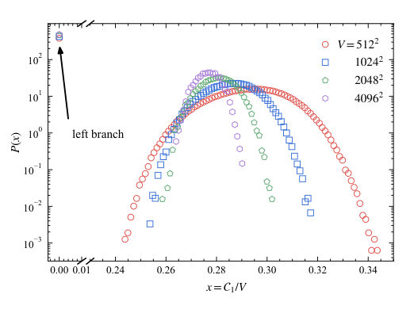
<figcaption class="paper-figure-caption"><b>Fig 1.</b> FIG. 1. Bimodal distribution P(x) of the rescaled largest cluster size x ≡C1/V for 3-core percolation on CGs. All data are sampled at criticality, i.e., ER graphs with average degree qc ≈3.3509. With increasing V , the active branch narrows rapidly and its position approaches the theoretical jump value from above, reflecting the fast finite-size convergence of the surviving-core samples on the CG.</figcaption>
</figure>
<figure class="paper-figure-card">
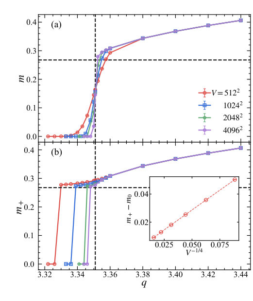
<figcaption class="paper-figure-caption"><b>Fig 2.</b> FIG. 2. Order parameter as a function of the average de- gree q for 3-core percolation on CGs. Panel (a) shows the results averaged over all samples, which leads to a smeared, seemingly continuous transition. Panel (b) shows the con- ditional average m+ obtained using samples with C1 &gt; 0, revealing a clear discontinuous jump followed by a critical singularity. The slope near qc increases with system size, in excellent agreement with theoretical predictions m0 ≈0.2676 and qc ≈3.3509 (dashed lines). The inset of (b) plots m+(qc, V ) −m0 against V −1/4, testing the finite-size form expected from β/ν = 1/4.</figcaption>
</figure>
<figure class="paper-figure-card">
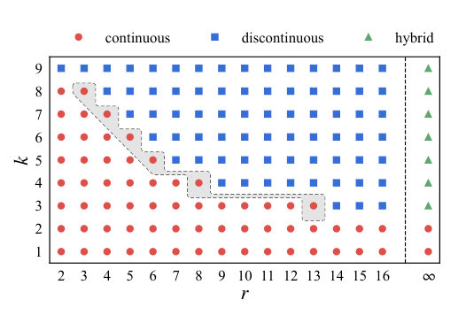
<figcaption class="paper-figure-caption"><b>Fig 3.</b> FIG. 4. Phase diagram of k-core percolation on the extended triangular lattice in the (k, r) parameter space. A special line (ks, rs) separates a continuous transition regime (red circles), which belongs to the universality class of standard 2D perco- lation, from a first-order regime (blue squares). No evidence of a hybrid transition is found in two dimensions. The phase diagram is obtained from simulations with system size up to L = 4096. Points in the shaded region, while suggestive of a continuous transition at the current level of precision, cannot be unambiguously classified due to strong finite-size effects. For r →∞, the system reduces to the CG, for which the hy- brid transition...</figcaption>
</figure>
<figure class="paper-figure-card">
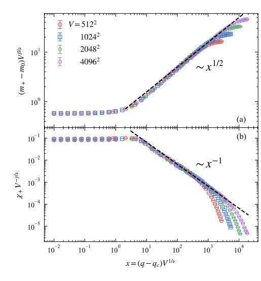
<figcaption class="paper-figure-caption"><b>Fig 4.</b> FIG. 3. Finite-size behaviors of the conditional order pa- rameter m+ and susceptibility χ+ near criticality of 3-core percolation on CGs. The data are obtained by restricting the averages to samples with C1 &gt; 0. Excellent data collapse is achieved using the mean-field exponents β = 1/2, γ = 1, and ν = 2. The lines indicate the scalings, ˜m(x) ∼xβ, ˜χ(x) ∼ x−γ, for x ≫1.</figcaption>
</figure>
<figure class="paper-figure-card">
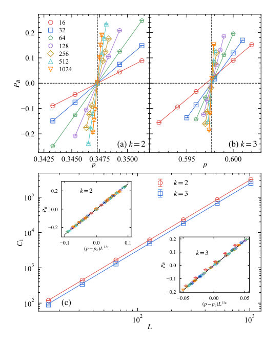
<figcaption class="paper-figure-caption"><b>Fig 5.</b> FIG. 5. Finite-size scaling of k-core percolation on triangular lattices (r = 1). Panels (a) and (b) show the critical poly- nomial PB as a function of the occupation probability p near the transition for k = 2 and k = 3, respectively. The curves for different system sizes L intersect at well-defined points, al- lowing for a precise determination of the thresholds pc. Panel (c) shows the size of the largest k-core cluster C1 at pc as a function of L, where the slope yields a fractal dimension df ≈1.8958, consistent with the exact value df = 91/48 for standard 2D percolation. The upper and lower insets in (c) display the data collapse of PB for k = 2 and k = 3, respec- tively, using the...</figcaption>
</figure>

**Summary.** This paper demonstrates that the hybrid phase transition characteristic of infinite-dimensional k-core percolation does not exist in two dimensions. Instead, the system undergoes either a standard 2D percolation transition or a first-order transition driven by a nucleation mechanism. This reveals how geometric constraints in finite dimensions fundamentally alter the nature of phase transitions compared to mean-field predictions.

**Why it may be interesting.** not directly relevant

Detailed structure

**Main problem.** The study investigates the nature of the phase transition in 2D k-core percolation as the interaction range r varies, specifically determining if the hybrid transition seen in infinite dimensions persists in 2D.

**Main result.** The authors find that no hybrid transition exists in 2D; instead, the phase diagram contains only continuous (2D percolation universality) and first-order regimes, with the latter driven by a nucleation mechanism.

**Method.** Large-scale numerical Monte Carlo simulations on triangular lattices using recursive pruning and a fast sampling algorithm, combined with finite-size scaling analysis.

**Model / system.** An equivalent-neighbor k-core percolation model on a 2D triangular lattice where a site remains active if it has at least k neighbors within a Euclidean distance r.

**Key observables.** Order parameter (fraction of sites in the k-core), susceptibility, critical polynomial (wrapping probability difference), and fractal dimension.

**Important parameters / regimes.** Core index k, interaction range r, occupation probability p, and system size L.

**Assumptions / limitations.** The study focuses on 2D triangular lattices and assumes the behavior is representative of the 2D regime, noting that the results for k-core percolation are sensitive to spatial dimension.

**Figures summary.** Figures show the phase diagram in the (k, r) plane, the bimodal distribution of the order parameter in the first-order regime, and the logarithmic finite-size scaling of the pseudocritical point.

**Paper structure.** The paper introduces the k-core problem and the mean-field limit, describes the numerical simulation methodology and sampling algorithms, presents the constructed phase diagram, analyzes the nature of the transitions (continuous vs. first-order), and discusses the renormalization-flow implications.

Abstract

We perform large-scale numerical simulations to investigate the critical behavior of $k$-core percolation in two dimensions with an extended interaction range $r$. By systematically varying both the core index $k$ and the interaction range $r$, we construct a comprehensive phase diagram in the $(k,r)$ plane. In contrast to $k$-core percolation in infinite dimensions, no hybrid transition is observed in two dimensions: the phase diagram contains only a continuous transition regime and a strictly first-order regime, separated by a tricritical or critical-end point $(k_s,r_s)$. For $k<k_s$ and $r<r_s$, the transition is continuous and belongs to the universality class of standard two-dimensional (2D) percolation. For $k>k_s$ and finite $r>r_s$, the transition is discontinuous, with no hybrid features or critical singularities. In this first-order regime, the pseudocritical point approaches the critical point as $1/\ln L$, where $L$ is the linear system size, distinct from the $L^{-d}$ scaling typical of conventional thermodynamic first-order transitions in $d$ dimensions. This logarithmic finite-size drift is consistent with a nucleation-driven mechanism, in which rare voids trigger the collapse of the finite-range $k$-core. These results demonstrate that geometric constraints can fundamentally alter the nature of $k$-core percolation found in finite dimensions.

[↑ back to top](#top)

### [Everything at Every Scale: Scale-Invariant Diffusion with Continuous Super-Resolution](http://arxiv.org/abs/2605.26032v1)

**Authors:** Zixin Jessie Chen, Zhuo Chen, Archer Wang, Jeff Gore, William T. Freeman, Congyue Deng, Marin Soljačić  
**Type:** theory · **Category:** disordered systems and neural networks · **PDF:** <https://arxiv.org/pdf/2605.26032v1>  
**Analysis basis:** full PDF text, analyzed in chunks

↔ Scroll figures horizontally

<figure class="paper-figure-card">
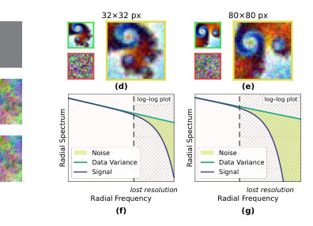
<figcaption class="paper-figure-caption"><b>Fig 1.</b> Figure 1: Conceptual illustration of our SKILD on a self-similar fractal image. During the forward process: (a) effective signal resolution decreases; (b) the pixel-space correlation length of the injected noise increases; and (c) for a self-similar field, the process respects the same frequency-space power spectrum across stages. (d-e) A smaller early-time patch is statistically similar to a larger late-time patch. (f-g) Radial power spectrum at corresponding early and later stages. Gray slashed regions indicate modes below the signal-to-noise ratio (SNR) threshold, where resolution is effectively lost.</figcaption>
</figure>
<figure class="paper-figure-card">

<figcaption class="paper-figure-caption"><b>Fig 2.</b> Figure 3: Uncurated samples of generated images on CIFAR-10; more in Appendix G (Figure G.17).</figcaption>
</figure>
<figure class="paper-figure-card">

<figcaption class="paper-figure-caption"><b>Fig 3.</b> Figure 4: (a) Linear schedule with best FID and IS on CIFAR-10 generation. Lower-frequency modes are attenuated later than higher-frequency ones. (b) Mode collapse with training steps. While IS continues to improve with training, FID converges early on and worsens at later times.</figcaption>
</figure>
<figure class="paper-figure-card">
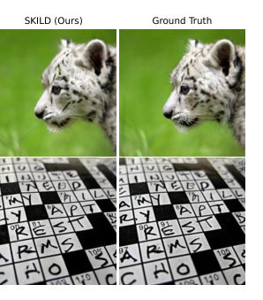
<figcaption class="paper-figure-caption"><b>Fig 4.</b> Figure 5: 4× super-resolution samples on ImageNet-256. The model is initialized from a 64 × 64 low-resolution forward state and reconstructs high-frequency details through the reverse process.</figcaption>
</figure>
<figure class="paper-figure-card">
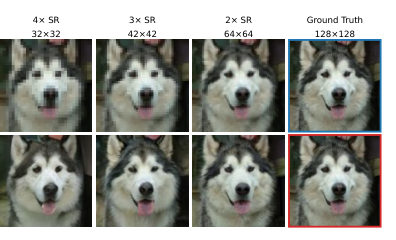
<figcaption class="paper-figure-caption"><b>Fig 5.</b> Figure 6: Continuous super-resolution on ImageNet-128. (a) Low-resolution inputs at effective resolutions 16 × 16 through 64 × 64, corresponding to 8× through 2× super-resolution factors. (b) High-resolution reconstructions produced by the same checkpoint from each effective-resolution starting state. A continuum of super-resolution factors is accessible from a single trained model.</figcaption>
</figure>

**Summary.** The authors introduce SKILD, a diffusion model that treats scale as an explicit coordinate by manipulating image content in frequency space. This allows a single model to perform both image generation and continuous super-resolution without task-specific architectures. The model's ability to preserve the statistical self-similarity of critical physical systems like the Ising model validates its physical foundation.

**Why it may be interesting.** The paper demonstrates a deep connection between generative modeling and renormalization group theory, showing that a diffusion process designed to respect scale-invariance can accurately capture the higher-order correlations of critical systems.

Detailed structure

**Main problem.** Unifying image generation and continuous super-resolution into a single framework by leveraging the scale-invariance inherent in both natural images and critical physical systems.

**Main result.** The SKILD model achieves high-quality unconditional generation on CIFAR-10 and continuous super-resolution on ImageNet, while successfully reconstructing the non-Gaussian four-point correlations of the critical 2D Ising model.

**Method.** A frequency-space diffusion process (SKILD) using Discrete Cosine Transform (DCT) coefficients to attenuate high-frequency modes before low-frequency modes, using spectrum-matched Gaussian noise.

**Model / system.** The framework is applied to natural images (CIFAR-10, ImageNet) and the 2D ferromagnetic Ising model on a square lattice at the critical temperature.

**Key observables.** FID, Inception Score, LPIPS, SSIM, PSNR, and connected four-point correlations (fourth-order joint cumulants) in the Ising model.

**Important parameters / regimes.** Scale-invariant noise schedules (log-linear and linear), SNR threshold for effective resolution, and the power-law decay exponent of the radial power spectrum.

**Assumptions / limitations.** Assumes that natural images and the studied physical systems exhibit approximate scale-invariance and power-law spectral decay.

**Figures summary.** Illustrations of the scale-invariant forward process, radial power spectra showing k^-2 decay, comparison of super-resolution quality, and accuracy of reconstructed Ising four-point correlators.

**Paper structure.** Introduction of the unification problem, description of the SKILD frequency-space diffusion framework, mathematical derivation of the DDPM posterior and SDE formulation, empirical validation on image datasets (CIFAR/ImageNet), and scientific validation using the critical Ising model.

Abstract

Creating images from noise is image generation; reconstructing fine details from coarse inputs is super-resolution. Despite their practical differences, both can be understood as reversing information loss across scales. We introduce $\textbf{SKILD}$, a $\textbf{S}$cale-invariant $\textbf{K}$-Space $\textbf{I}$mage $\textbf{L}$earning $\textbf{D}$iffusion model that unifies generation and continuous super-resolution within a single unconditional framework. Both natural images and critical physical systems exhibit scale invariance, and we leverage it to design a forward process that attenuates image content from fine to coarse scales while injecting spectrum-matched Gaussian noise, making scale an explicit coordinate of the diffusion dynamics. The same trained reverse process performs generation and continuous super-resolution by varying only the starting timestep: $\textit{no task-specific architecture, no conditioning branch, no classifier-free guidance, no retraining per scale factor}$. Empirically, SKILD reaches FID $2.65$ and Inception Score $9.63$ on unconditional CIFAR-10, performs $2\times$--$8\times$ super-resolution on ImageNet from a single unconditional checkpoint while outperforming conditional models across perceptual metrics, and reconstructs critical Ising models whose connected four-point correlations closely track the ground truth.

[↑ back to top](#top)

### [Fermi-Dirac machines as quantizations of neurons](http://arxiv.org/abs/2605.24386v1)

**Authors:** Alexander He, Nana Liu, Mark M. Wilde  
**Type:** theory · **Category:** quantum information and computing · **PDF:** <https://arxiv.org/pdf/2605.24386v1>  
**Analysis basis:** full PDF text, analyzed in chunks

↔ Scroll figures horizontally

<figure class="paper-figure-card">
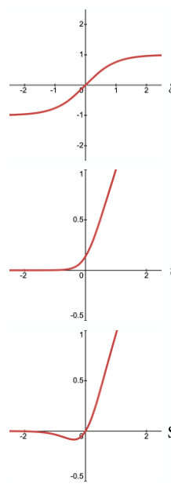
<figcaption class="paper-figure-caption"><b>Fig 1.</b> FIG. 1: This figure illustrates one of the main conceptual contributions of our paper. We quantize various common activation functions [31, 32], including hyperbolic tangent, softplus, and sigmoid linear unit (SiLU), by following the canonical quantization procedure established by the founders of quantum mechanics. Classically, an activation function φ(x) acts on the output x = wT z + b of a classical energy function (Hamiltonian), where z is a vector input to the neuron. We replace the classical Hamiltonian with a parameterized quantum Hamiltonian H(θ) = P</figcaption>
</figure>
<figure class="paper-figure-card">
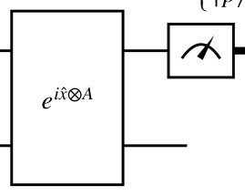
<figcaption class="paper-figure-caption"><b>Fig 2.</b> FIG. 3: Quantum circuit used in the quantum convolution algorithm (Algorithm 3). The state |q⟩⟨q| of the control qumode is defined in (32), and ρ is the input state on which we would like to perform the simulation. The measurement of the control qumode at the end is a momentum-quadrature measurement giving an outcome p ∈R. The algorithm finally outputs r(p), and Theorem 3 guarantees that the expected value of the output is equal to Tr[s(A)ρ], where s = q ∗r.</figcaption>
</figure>
<figure class="paper-figure-card">
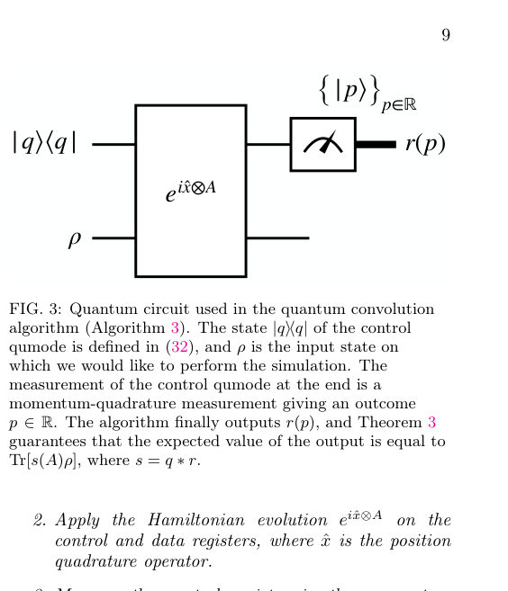
<figcaption class="paper-figure-caption"><b>Fig 3.</b> Figure 3 depicts the quantum circuit used in Algorithm 3.</figcaption>
</figure>
<figure class="paper-figure-card">
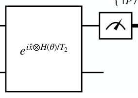
<figcaption class="paper-figure-caption"><b>Fig 4.</b> FIG. 4: Quantum circuit for simulating the firing of a Fermi–Dirac neuron using a single sample of the state ρ. The temperature T/2 = T1T2, where T1, T2 &gt; 0, as detailed in Algorithm 4. The state |ℓT1⟩⟨ℓT1| of the control qumode is defined in (40), and ρ is the input state on which we would like to perform the simulation. The measurement of the control qumode at the end is a momentum-quadrature measurement giving an outcome p ∈R. The algorithm finally outputs +1 if p ≥0 and −1 otherwise.</figcaption>
</figure>
<figure class="paper-figure-card">
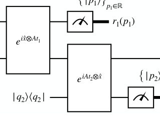
<figcaption class="paper-figure-caption"><b>Fig 5.</b> FIG. 5: Quantum circuit used in the quantum convolution and multiplication algorithm (Algorithm 6). The states |q1⟩⟨q1| and |q2⟩⟨q2| of the control qumodes are defined in (81), and ρ is the input state on which we would like to perform the simulation. The measurements of the control qumodes at the end are momentum-quadrature measurements, giving outcomes p1, p2 ∈ R. The algorithm finally outputs r1(p1)r2(p2), and Theorem 9 guarantees that the expected value of the output is equal to Tr[s1(At1)s2(At2)ρ], where si = qi ∗ri, for i ∈{1, 2}.</figcaption>
</figure>

**Summary.** This paper proposes a way to turn classical neural network architectures into quantum-native models by quantizing the neuron's activation function. It provides a rigorous mathematical framework and efficient hybrid algorithms for training these networks, proving that they possess a computational complexity that makes them hard to simulate classically.

**Why it may be interesting.** not directly relevant

Detailed structure

**Main problem.** The paper aims to develop a framework for quantizing classical neurons into 'Fermi-Dirac machines' and providing efficient hybrid quantum-classical algorithms for their training and evaluation.

**Main result.** The authors prove that a decision problem based on these neurons is BQP-complete, providing evidence against efficient classical simulation, and demonstrate that these neurons can learn functions that classical neurons cannot when processing quantum data.

**Method.** The approach uses canonical quantization to promote classical Hamiltonians to quantum operators, employing functional calculus, Hamiltonian simulation, and the Hadamard test to develop hybrid algorithms for gradient estimation and objective function evaluation.

**Model / system.** The model consists of parameterized quantum Hamiltonians (including second-order interactions like the Heisenberg or transverse-field Ising models) where activation functions (e.g., Fermi-Dirac, SiLU, GeLU) are applied to the Hamiltonian operator.

**Key observables.** The activation observable phi(H_Q(theta)) and its expectation value with respect to an input quantum state rho.

**Important parameters / regimes.** Temperature (T) controlling activation sharpness, weights (w), bias (b), and interaction coefficients (Omega, omega).

**Assumptions / limitations.** The Hamiltonians are assumed to be k-local, and the advantage is specifically tied to the presence of quantum input data (entangled or non-orthogonal states).

**Figures summary.** Figure 1 depicts the conceptual transition from classical to quantized neurons; Figure 2 shows quantum circuits for gradient and objective function estimation; Figure 3 illustrates a general quantum convolution algorithm.

**Paper structure.** The paper introduces the quantization framework, defines the physical model and activation functions, develops hybrid algorithms for estimation and gradients, provides complexity-theoretic proofs of BQP-completeness, and concludes with numerical experiments and generalizations to continuous variables.

Abstract

Fermi-Dirac machines were proposed recently as an approach to solving semidefinite optimization problems on quantum computers. Here, we reinterpret them as canonical quantizations of classical neurons. By viewing a classical neuron as an activation function applied to a parameterized classical Hamiltonian, we quantize this model by replacing classical variables with operators whose eigenvalues encode their possible values. This follows the standard approach to canonical quantization in quantum mechanics. Crucially, when the Hamiltonian consists of commuting operators, our construction reduces exactly to a classical neuron. More generally, our approach yields an activation observable, defined as an activation function applied to a parameterized quantum Hamiltonian. The output of this quantized neuron is a random variable with expectation value equal to that of the activation observable with respect to an input state. We develop efficient hybrid quantum-classical algorithms for evaluating outputs and gradients of our quantized neurons, enabling evaluation and training. These algorithms rely on basic primitives that include random sampling, Hamiltonian simulation, and the Hadamard test. We also quantize a whole host of other activation functions, including the smooth rectified linear unit (ReLU), sigmoid linear unit, Gaussian-smoothed ReLU, and Gaussian error linear unit (GeLU), which are known to be useful for deep learning applications. Numerical experiments indicate that neurons based on quantum Hamiltonians can learn functions that classical neurons cannot. We further define a computational decision problem based on Fermi-Dirac neurons and prove that it is BQP-complete, providing complexity-theoretic evidence against efficient classical simulation. Finally, we generalize our approach to continuous quantum variables and sketch two different ways of composing these neurons into networks.

[↑ back to top](#top)

### [Fermion renormalized vertex functions, effective mass, and condensate in an external Yang-Mills gauge field](http://arxiv.org/abs/2605.25578v1)

**Authors:** V. V. Parazian  
**Type:** theory · **Category:** other · **PDF:** <https://arxiv.org/pdf/2605.25578v1>  
**Analysis basis:** full PDF text, analyzed in chunks

↔ Scroll figures horizontally

<figure class="paper-figure-card">
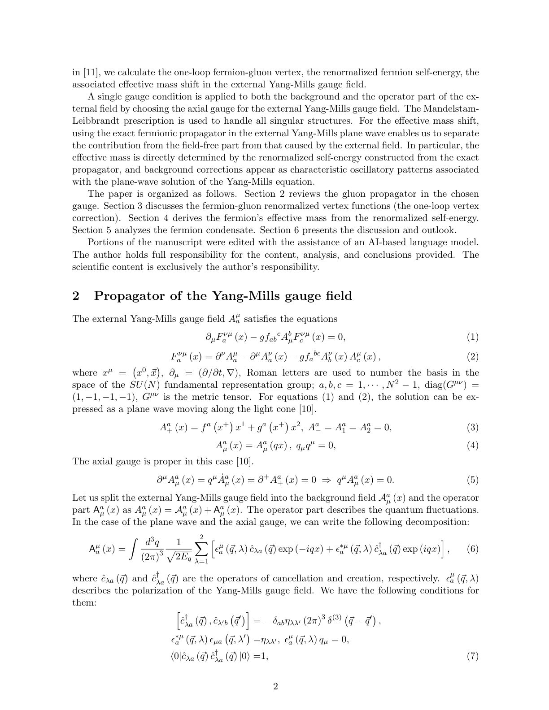
<figcaption class="paper-figure-caption"><b>Fig 1.</b> Low-resolution page preview, page 2</figcaption>
</figure>
<figure class="paper-figure-card">
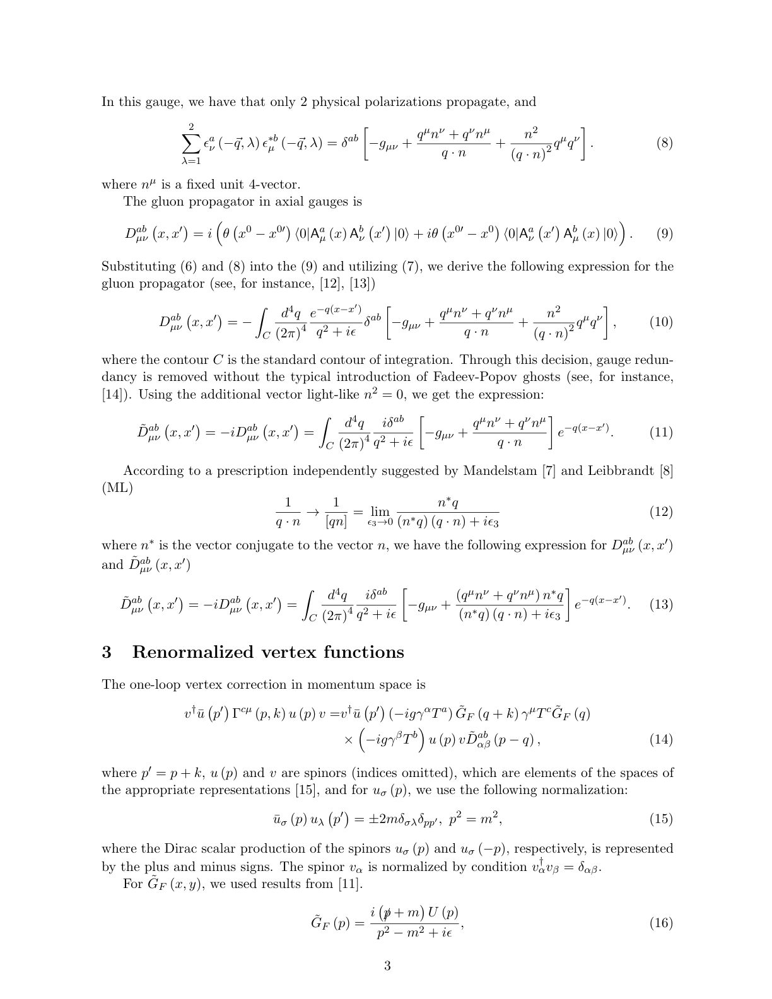
<figcaption class="paper-figure-caption"><b>Fig 2.</b> Low-resolution page preview, page 3</figcaption>
</figure>
<figure class="paper-figure-card">
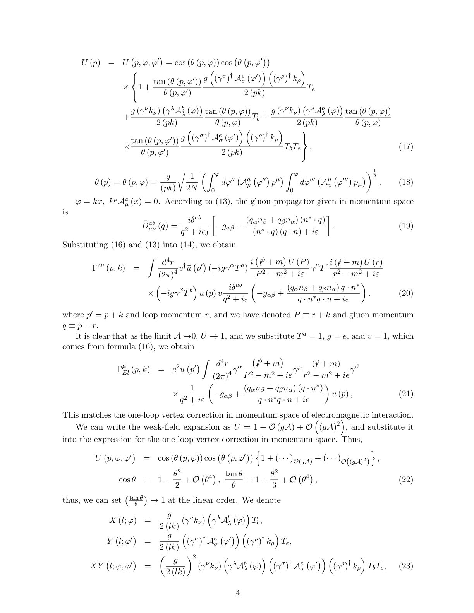
<figcaption class="paper-figure-caption"><b>Fig 3.</b> Low-resolution page preview, page 4</figcaption>
</figure>
<figure class="paper-figure-card">
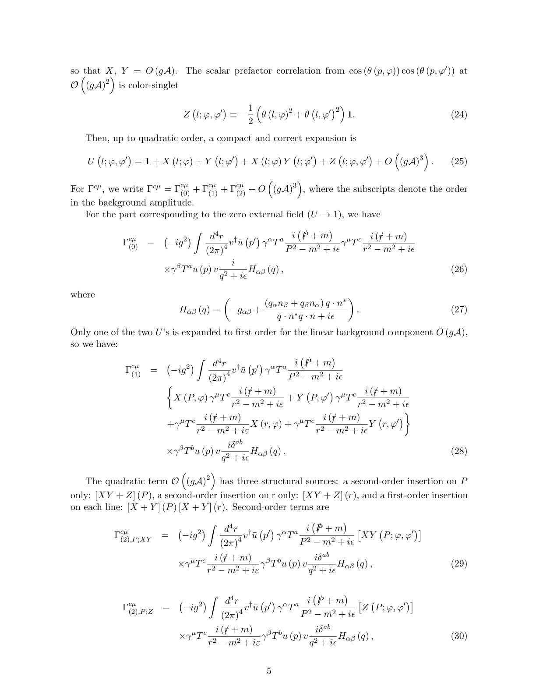
<figcaption class="paper-figure-caption"><b>Fig 4.</b> Low-resolution page preview, page 5</figcaption>
</figure>
<figure class="paper-figure-card">
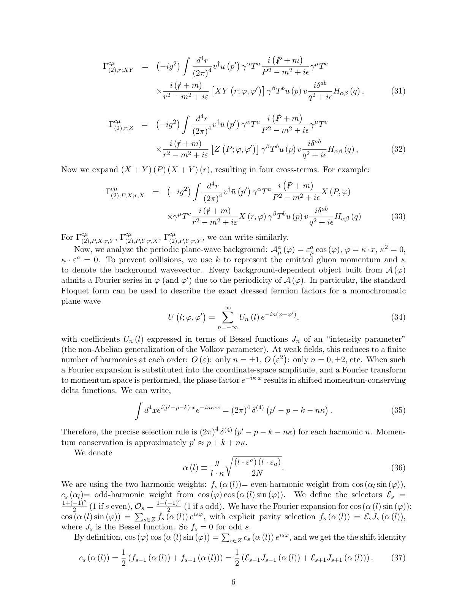
<figcaption class="paper-figure-caption"><b>Fig 5.</b> Low-resolution page preview, page 6</figcaption>
</figure>

**Summary.** This paper extends the formalism of strong-field QED to non-Abelian Yang-Mills theory to study how gluonic backgrounds affect fermion properties. It demonstrates that such backgrounds induce a fermion condensate and a mass shift without altering the fundamental ultraviolet divergence structure of the theory.

**Why it may be interesting.** not directly relevant

Detailed structure

**Main problem.** The paper investigates how a classical, periodic Yang-Mills (non-Abelian) plane-wave background field modifies the fermion-gluon vertex, the fermion effective mass, and the fermion condensate.

**Main result.** The study derives a gauge-consistent pole mass shift and shows that the background field induces a non-zero fermion condensate, while the UV divergence structure of the theory remains unchanged by the background.

**Method.** The author uses an exact Green's function for the Dirac operator in a non-Abelian plane-wave background, employing the Mandelstam-Leibbrandt prescription for regularization and a weak-field expansion for loop corrections.

**Model / system.** A system of fermions interacting with an external, monochromatic, non-Abelian (SU(N)) plane-wave gauge field moving along a light cone, treated within the axial gauge.

**Key observables.** Renormalized fermion-gluon vertex function, fermion effective mass shift, and the fermion condensate.

**Important parameters / regimes.** Gauge coupling constant (g), color factors (CF, CA), field intensity parameter (alpha), and the light-like vector (k).

**Assumptions / limitations.** The background field is assumed to be a classical, periodic plane-wave solution, and the analysis relies on a weak-field expansion.

**Paper structure.** The paper begins by defining the non-Abelian plane-wave background and the axial gauge framework, proceeds to calculate the dressed fermion propagator and vertex functions using a weak-field expansion, then derives the one-loop mass shift and fermion condensate, and concludes with a discussion on UV behavior and physical applications.

Abstract

We investigate the renormalized fermion-gluon vertex, the fermion effective mass, and the fermion condensate when the fermion propagates in an external Yang-Mills gauge field. We use an exact Green's function for the Dirac operator in a non-Abelian plane-wave gauge field to construct the renormalized vertex function, calculate the on-shell fermion self-energy, and the background-dependent condensate. We consider both the background and operator fields in the axial gauge $k^{μ} \mathcal{A}_{μ}^{a}=0$, thereby preserving the gauge. Its applications to strong-field QCD and non-Abelian Schwinger physics are discussed.

[↑ back to top](#top)

### [Freezing of the tetrahedral amorphous network in supercooled water triggers crystallization towards LDA ice](http://arxiv.org/abs/2605.25926v1)

**Authors:** Ashutosh Srivastava, Pankaj A. Apte  
**Type:** theory · **Category:** statistical mechanics · **PDF:** <https://arxiv.org/pdf/2605.25926v1>  
**Analysis basis:** full PDF text, analyzed in chunks

↔ Scroll figures horizontally

<figure class="paper-figure-card">
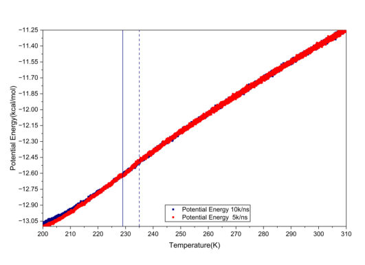
<figcaption class="paper-figure-caption"><b>Fig 1.</b> FIG. 1. Instantaneous potential energy values (in kcal/mol) sampled after even 2 ps as a function of temperature in the 5 K/ns and 10 K/ns trajectories. The dashed and solid vertical lines (in this and all subsequent figures) correspond to ‘dynamical crossover’ point and ‘freezing’ point in the 5 K/ns trajectory.</figcaption>
</figure>
<figure class="paper-figure-card">
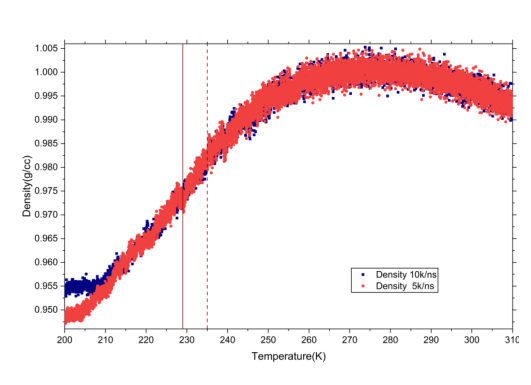
<figcaption class="paper-figure-caption"><b>Fig 2.</b> FIG. 2. Instantaneous density values (in g/cc) sampled after even 2 ps as a function of temperature in the 5 and 10 K/ns trajectories.</figcaption>
</figure>
<figure class="paper-figure-card">
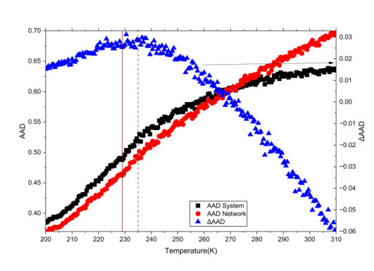
<figcaption class="paper-figure-caption"><b>Fig 3.</b> FIG. 3. AAD of the system and the AAD of the network [see Eq. (1)] as a function of temperature in the 5 K/ns trajectory. The right hand ordinate refers to ∆AAD which is the AAD of the system minus AAD of the network</figcaption>
</figure>
<figure class="paper-figure-card">
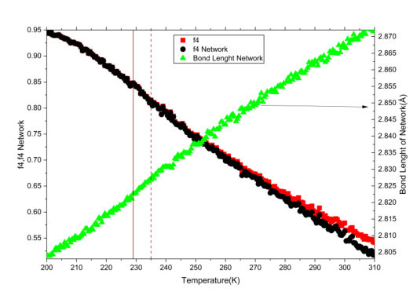
<figcaption class="paper-figure-caption"><b>Fig 4.</b> FIG. 4. The fraction of 4-coordinated molecules in the system (f4) and that of the network (f4c) and the average bond length of the net- work (right ordinate) as a function of temperature in the 5 K/ns tra- jectory.</figcaption>
</figure>
<figure class="paper-figure-card">
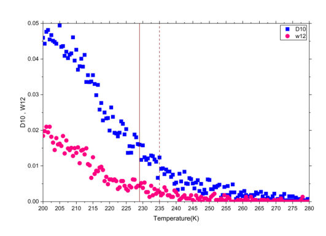
<figcaption class="paper-figure-caption"><b>Fig 5.</b> FIG. 5. Fractions of molecules in the cubic (D10) and hexagonal (W12) structural motifs as a function of temperature in the 5 K/ns trajectory.</figcaption>
</figure>

**Summary.** This study demonstrates that the crystallization of supercooled water into LDA ice is triggered by the 'freezing' of its tetrahedral hydrogen-bonded network. When the network becomes rigid, the system shifts from a network-driven relaxation to a crystallization-driven relaxation. This mechanism provides a specific pathway for structural ordering in the absence of traditional crystal nucleation.

**Why it may be interesting.** not directly relevant

Detailed structure

**Main problem.** Identifying the specific mechanism by which crystallization into Low-Density Amorphous (LDA) ice is initiated in deeply supercooled water across its limit of stability.

**Main result.** The freezing of the tetrahedral amorphous network, characterized by a loss of structural relaxation, triggers a change in the relaxation mechanism that drives crystallization via cubic and hexagonal motifs.

**Method.** Molecular dynamics simulations using the TIP4P/2005 water potential in an NPT ensemble with linear cooling rates.

**Model / system.** Supercooled water modeled using the TIP4P/2005 potential, focusing on the transition from a liquid state to LDA ice.

**Key observables.** Tetrahedrality (f4c), Average Angular Deviation (AAD), density, potential energy, and presence of cubic (D10) and hexagonal (W12) structural motifs.

**Important parameters / regimes.** Cooling rates of 5 to 10 K/ns, temperature of maximum density (T0 = 277 K), and the limit of stability (Ts approx 235 K).

**Assumptions / limitations.** The mechanism may be general to tetrahedral liquids, but the specific extent of crystallization may depend on the choice of water potential.

**Figures summary.** Figure 1 and 2 show potential energy and density vs. temperature with markers for crossover and freezing points; Figure 3 plots AAD and its difference; Figure 4 tracks 4-coordinated molecules and bond length; Figure 5 shows the fraction of cubic and hexagonal motifs.

**Paper structure.** The paper introduces the problem of crystallization in supercooled water, describes the MD simulation setup, details the dynamical crossover and network freezing process, analyzes the resulting crystallization into cubic/hexagonal motifs, and discusses the potential universality of this mechanism.

Abstract

In this work, we provide mechanistic insight into the initial stages of formation of ice across the limit of stability of supercooled water. Such an analysis is particularly important since crystal nucleation is not a relevant mechanism under these conditions. Using molecular dynamics simulation with the TIP4P/2005 potential, water is cooled at a constant pressure with cooling rates of 5 to 10 K per nanosecond. As the liquid is cooled across the temperature of maximum density (T_0 = 277 K), we find that there is a continuous increase in the tetrahedrality of the system. As the cooling continues across the limit of stability of water (T_s $\approx$ 235 K), large scale thermal fluctuations dissipate while the thermal equilibration is achieved through small scale fluctuations. This phenomenon, known as the dynamical crossover [Goutam et. al. in J. Stat. Phys., 168: 1302--1318 (2017)], ends the existence of the liquid state. Subsequently, we find that the tetrahedral network drives the decrease of energy and density. This process terminates when the network undergoes `freezing' (i.e., the bonds of the network acquire sufficient rigidity), due to which the network evolution, as a whole, stops. This triggers a qualitative change in the relaxation mechanism: subsequent relaxation occurs through crystallization, i.e., an increase in the structural order. In particular, we find that the cubic and hexagonal crystalline motifs, which possess medium range order, increase rapidly across the freezing point. In the resulting LDA ice states, cubic ice is found to have a significant contribution in the overall extent of crystallization, which is consistent with the experimental findings. Overall, our work provides the specific mechanism by which crystallization (leading to LDA ice) is initiated across the limit of stability of supercooled water.

[↑ back to top](#top)

### [Generalized field mixing for endpoint criticality with marginal flow: resolving the four-state Potts endpoint in the square-lattice $J_1$--$J_2$ Ising model](http://arxiv.org/abs/2605.25946v1)

**Authors:** Yihua Sun, Yuchen Fan  
**Type:** theory · **Category:** statistical mechanics · **PDF:** <https://arxiv.org/pdf/2605.25946v1>  
**Analysis basis:** full PDF text, analyzed in chunks

↔ Scroll figures horizontally

<figure class="paper-figure-card">
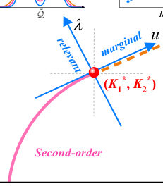
<figcaption class="paper-figure-caption"><b>Fig 1.</b> Fig. 1. Generalized field mixing for endpoint criticality with marginal flow. Schematic illustration of the generalized field- mixing framework near a critical endpoint in the (K1, K2) phase diagram, where a first-order line terminates on a con- tinuous transition line. Taking the endpoint as the origin, two mixed variables are introduced: λ for the relevant de- tuning direction and u for the tangent marginally irrelevant direction. This separation enables the independent analysis of the relevant critical singularity and the residual marginal drift. Inset (a), finite-size pseudotransition points near the endpoint are determined by requiring a symmetric histogram of the centered mixed...</figcaption>
</figure>
<figure class="paper-figure-card">
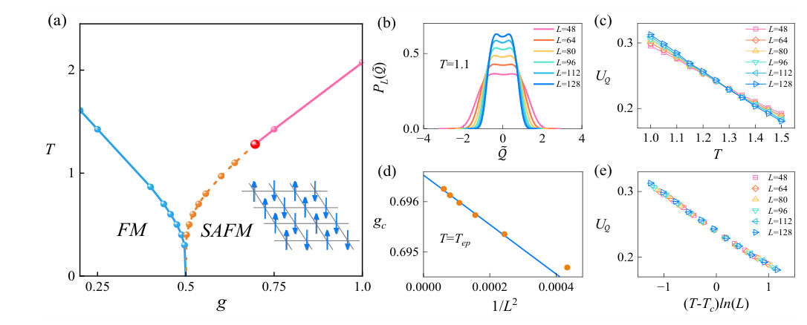
<figcaption class="paper-figure-caption"><b>Fig 2.</b> Fig. 2. Location of the endpoint in the square-lattice J1–J2 Ising model. (a) Phase diagram of the square-lattice J1–J2 Ising model. The transition from the SAFM phase to the paramagnetic phase is first order at low temperatures and continuous at higher temperatures, with the endpoint located at (gep, Tep) = (0.696(10), 1.28(3)). (b) Maximally symmetric histograms PL( ˜Q) at T = 1.1 for different system sizes. The symmetry condition determines the finite-size pseudotransition point, at which the fourth-order cumulant UQ is evaluated. (c) Fourth-order cumulant UQ measured along the finite-size pseudotransition manifold. The crossings for different system sizes provide an estimate of the...</figcaption>
</figure>
<figure class="paper-figure-card">
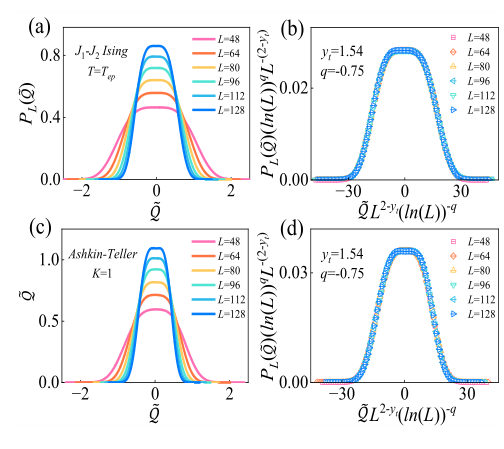
<figcaption class="paper-figure-caption"><b>Fig 3.</b> Fig. 3. Histogram scaling at the endpoint and comparison with the Ashkin–Teller Potts point. (a) Maximally symmet- ric histograms PL( ˜Q) at T = Tep of the square-lattice J1–J2 Ising model for different system sizes. (b) Finite-size scal- ing collapse of the endpoint histograms shown in (a), using the logarithmically corrected four-state Potts histogram scal- ing form. (c) Maximally symmetric histograms PL( ˜Q) at the four-state Potts point of the Ashkin–Teller model for different system sizes. (d) Logarithmically corrected finite-size scaling collapse of the histograms in (c).</figcaption>
</figure>

**Summary.** The paper introduces a generalized field-mixing framework to accurately identify critical endpoints in systems where marginal scaling fields cause deceptive pseudo-first-order behavior. By applying this to the $J_1$-$J_2$ Ising model, the authors prove the stripe-ordering endpoint follows four-state Potts universality. This resolves a decades-old controversy regarding the phase transition nature in this frustrated system.

**Why it may be interesting.** not directly relevant

Detailed structure

**Main problem.** Resolving the long-standing controversy regarding the nature and location of the stripe-ordering endpoint in the $J_1$-$J_2$ Ising model, specifically distinguishing true first-order transitions from pseudo-first-order signatures caused by marginal flow.

**Main result.** The authors identify the endpoint as belonging to the four-state Potts universality class with logarithmic corrections, resolving the ambiguity caused by marginally irrelevant scaling fields.

**Method.** A new generalized field-mixing framework that separates relevant detuning from marginal drift, combined with Monte Carlo simulations and finite-size scaling analysis.

**Model / system.** The frustrated square-lattice $J_1$-$J_2$ Ising model with nearest-neighbor ($J_1$) and next-nearest-neighbor ($J_2$) antiferromagnetic couplings.

**Key observables.** Magnetic Binder cumulant ($U_M$), nematic Binder cumulant ($U_N$), magnetic order parameter ($m$), and centered fluctuations of the mixed scaling operator ($	ilde{Q}$).

**Important parameters / regimes.** Frustration ratio $g = J_2/J_1$, temperature $T$, and the scaling variables involving logarithmic corrections $(\ln L)^q$.

**Assumptions / limitations.** The framework assumes the endpoint criticality is governed by one relevant and one marginally irrelevant scaling field.

**Figures summary.** Figure 1 shows the schematic of the field-mixing framework; Figure 2 illustrates the application to the $J_1$-$J_2$ model; Figure 3 shows histogram scaling; Figure 4 displays Binder cumulant crossings and data collapse.

**Paper structure.** The paper introduces a new field-mixing framework, applies it to the $J_1$-$J_2$ Ising model to locate the stripe-ordering endpoint, validates the results via universality class identification and comparison with the Ashkin-Teller model, and concludes by demonstrating the resolution of historical numerical ambiguities.

Abstract

Identifying the asymptotic criticality of a critical endpoint is challenging, as pseudo-first-order signatures persist over accessible system sizes and mask its underlying critical nature. This ambiguity is amplified at endpoints controlled by a marginally irrelevant scaling field, where logarithmic flow delays the onset of asymptotic scaling. Here we develop a generalized field-mixing framework for endpoint criticality governed by one relevant scaling field together with a marginally irrelevant one, a setting that lies outside the conventional two-relevant-field formulation. By constructing a finite-size pseudocritical manifold, the framework removes the normal relevant detuning and exposes the residual marginal drift, enabling controlled histogram- and Binder-based finite-size analyses. We apply this approach to the frustrated square-lattice $J_1$--$J_2$ Ising model, where the location and even the nature of the stripe-ordering endpoint have remained controversial for decades. The endpoint is isolated directly as a distinct singular point, rather than inferred from where the phase boundary appears most Potts-like, and its asymptotic criticality is shown to follow four-state Potts universality with logarithmic corrections. This identification is independently supported by direct comparison with the Potts point of the Ashkin--Teller model and by consistent Binder scaling in both the magnetic and nematic sectors. Our results resolve a longstanding numerical ambiguity in a paradigmatic frustrated Ising system and establish a general framework for extracting asymptotic endpoint criticality in the presence of marginal flow.

[↑ back to top](#top)

### [Geometric Quantization on Orbifolds](http://arxiv.org/abs/2605.25858v1)

**Authors:** Peiyuan Teng  
**Type:** theory · **Category:** other · **PDF:** <https://arxiv.org/pdf/2605.25858v1>  
**Analysis basis:** full PDF text, analyzed in chunks

↔ Scroll figures horizontally

<figure class="paper-figure-card">

<figcaption class="paper-figure-caption"><b>Fig 1.</b> Low-resolution page preview, page 2</figcaption>
</figure>
<figure class="paper-figure-card">

<figcaption class="paper-figure-caption"><b>Fig 2.</b> Low-resolution page preview, page 3</figcaption>
</figure>
<figure class="paper-figure-card">
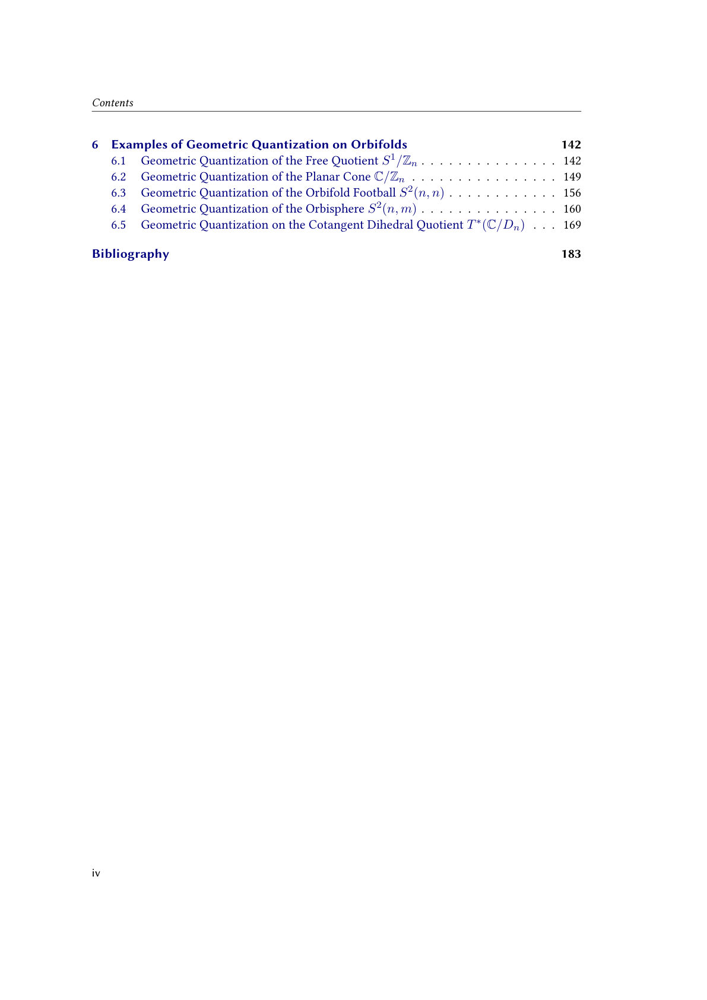
<figcaption class="paper-figure-caption"><b>Fig 3.</b> Low-resolution page preview, page 4</figcaption>
</figure>
<figure class="paper-figure-card">
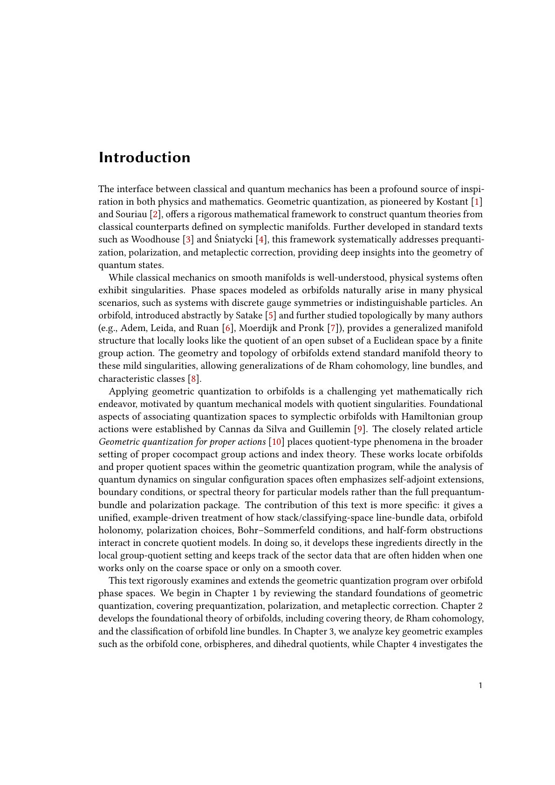
<figcaption class="paper-figure-caption"><b>Fig 4.</b> Low-resolution page preview, page 5</figcaption>
</figure>
<figure class="paper-figure-card">
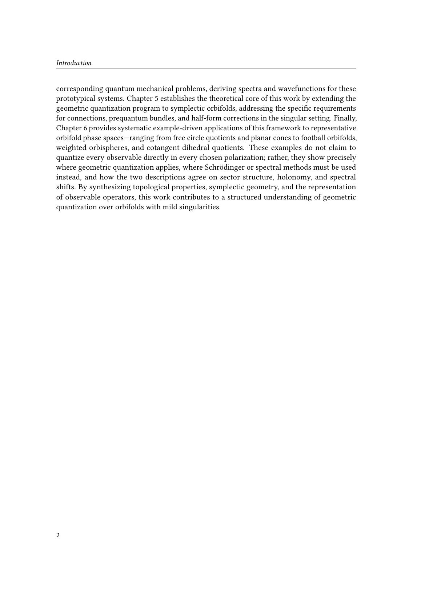
<figcaption class="paper-figure-caption"><b>Fig 5.</b> Low-resolution page preview, page 6</figcaption>
</figure>

**Summary.** This paper develops a mathematical framework for applying geometric quantization to spaces with singularities, such as orbifolds. It specifically resolves how to handle the lack of equivariant half-forms in systems with reflection symmetry by using half-densities, ensuring correct quantum spectra.

**Why it may be interesting.** not directly relevant

Detailed structure

**Main problem.** Extending the framework of geometric quantization from smooth manifolds to orbifolds, specifically addressing challenges like quotient singularities, metaplectic correction obstructions, and the failure of Kähler polarizations in the presence of reflections.

**Main result.** The paper establishes a unified treatment of geometric quantization on orbifolds, demonstrating that while genuine half-form bundles may be obstructed by reflection isotropy, the use of half-densities can restore physical consistency and correct energy spectra.

**Method.** The author uses the Kostant-Souriau prequantization framework, applying tools from orbifold theory, de Rham cohomology, and metaplectic (half-form) correction to analyze specific symplectic orbifolds.

**Model / system.** The study focuses on symplectic orbifolds including planar cones, orbispheres (S2(n, m)), and the cotangent bundle of a dihedral quotient (T*(C/Dn)).

**Key observables.** Hamiltonian vector fields, Poisson brackets, commutator relations, and position-based observables like radial position (rho^2) and kinetic energy.

**Important parameters / regimes.** Planck's constant (hbar), orbifold weights (n, m), and the Maslov index.

**Assumptions / limitations.** The paper assumes orbifolds with mild singularities (local group-quotient setting) and focuses on cases where the symplectic form is either exact or satisfies specific integrality conditions.

**Paper structure.** The paper progresses from a review of standard smooth manifold quantization to the development of orbifold-specific theory, followed by detailed analysis of geometric examples (orbispheres and dihedral quotients), investigation of quantum spectra, and a formal extension of the quantization program.

Abstract

This text introduces geometric quantization on orbifolds. After reviewing the necessary background, it develops new treatments of prequantization, polarizations, and metaplectic correction for symplectic orbifolds.

[↑ back to top](#top)

### [Homomorphic Quantum Error Correction](http://arxiv.org/abs/2605.25692v1)

**Authors:** Kornikar Sen, Miguel A. Martin-Delgado  
**Type:** theory · **Category:** quantum information and computing · **PDF:** <https://arxiv.org/pdf/2605.25692v1>  
**Analysis basis:** full PDF text, analyzed in chunks

↔ Scroll figures horizontally

<figure class="paper-figure-card">
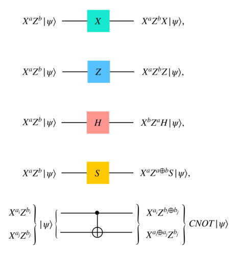
<figcaption class="paper-figure-caption"><b>Fig 1.</b> FIG. 2. Key updating rules for various Clifford gates. The way in which the keys get updated on the action of (top to bottom in the figure) X, Z, H, S, and CNOT gates is depicted in the above figure.</figcaption>
</figure>
<figure class="paper-figure-card">
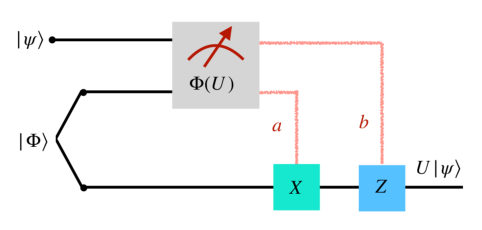
<figcaption class="paper-figure-caption"><b>Fig 2.</b> FIG. 1. Illustration of the process of gate teleporta- tion. The gray box represents the measurement performed on the two qubits that belong to the sender. Depending on the measurement outcome, a and b, the receiver operates the gates Xa (cyan box) and Zb (blue box) on the qubit that be- longs to the receiver and gets the state, U |ψ⟩.</figcaption>
</figure>

**Summary.** This paper investigates how to combine quantum error correction with homomorphic encryption to allow secure, noise-resilient computation in the cloud. It provides the mathematical conditions required to keep encrypted data within a protected code space and offers strategies to overcome the difficulty of performing non-Clifford gates on encrypted data.

**Why it may be interesting.** not directly relevant

Detailed structure

**Main problem.** Determining the algebraic compatibility between quantum homomorphic encryption (QHE) and quantum error correction (QEC) to ensure that encrypted states remain within the code space during cloud-based computation.

**Main result.** The authors establish a necessary and sufficient condition for stabilizer codes to be compatible with transversal Pauli masking and propose solutions for implementing non-Clifford gates, such as using triorthogonal codes or logical-gate masking.

**Method.** Algebraic analysis of stabilizer codes, verification using specific examples (Shor, Steane, and 3D color codes), and the development of gate teleportation protocols for non-Clifford gates.

**Model / system.** A client-server model for cloud quantum computing using an 'honest-but-curious' server, employing Pauli-based encryption (block-Pauli masking) and stabilizer error-correcting codes.

**Key observables.** Error syndromes, encryption keys (a, b), and measurement outcomes (ra, rb) from Bell measurements.

**Important parameters / regimes.** Small error rate regime (p << 1).

**Assumptions / limitations.** The server is honest-but-curious (not malicious); the existence of pre-shared Bell states; and the availability of physical implementations for logical gates.

**Figures summary.** Schematic of the gate teleportation process, visual representation of key-updating rules for Clifford gates, and a walkthrough of a two-qubit circuit involving H, T, T-dagger, and S gates.

**Paper structure.** The paper introduces the problem of QHE and QEC compatibility, derives a general algebraic criterion for stabilizer codes, verifies this for specific codes (Shor, CSS, 3D color), addresses the non-Clifford gate obstruction, and presents solutions via triorthogonal codes and logical-gate masking.

Abstract

Homomorphic quantum error correction aims to protect quantum data against both unauthorized access and environmental noise during server-based processing. We investigate the algebraic compatibility between quantum homomorphic encryption and quantum error correction, determining precise conditions under which encrypted encoded states remain inside the relevant code space during storage and computation. Our work establishes a necessary and sufficient criterion for an $[[n,1,d]]$ stabilizer code to remain compatible with the restricted transversal block-Pauli masking $U_{\rm enc}(a,b)=(X^aZ^b)^{\otimes n}$, stated explicitly for $[[n,1,d]]$ codes and extending directly to code-space preservation for $[[n,k,d]]$ codes. We verify this condition for standard examples (bit-flip and Shor codes, with the phase-flip repetition code following analogously), derive a practical criterion for Calderbank-Shor-Steane codes, and extend the analysis to three-dimensional color codes. A critical challenge emerges for non-Clifford gate implementation: the Shor code lacks a naive transversal $T$-gate implementation of the desired logical operation on encrypted encoded data. We present two routes around this obstruction. First, suitable triorthogonal codes admit transversal $T$-type logical implementations, up to Clifford corrections. Second, logical-gate masking gives code-space compatibility for arbitrary stabilizer codes, provided that suitable unitary representatives of the required logical gates are available. These results separate code-space compatibility from a full cryptographic security proof and provide explicit criteria for combining error correction with homomorphic processing in cloud quantum computing.

[↑ back to top](#top)

### [Implicit Binarization via Complex Phase Dynamics in Combinatorial Optimization](http://arxiv.org/abs/2605.24502v1)

**Authors:** Khen Cohen, Mark Glass, Meir Feder, Yaron Oz  
**Type:** theory · **Category:** disordered systems and neural networks · **PDF:** <https://arxiv.org/pdf/2605.24502v1>  
**Analysis basis:** full PDF text, analyzed in chunks

↔ Scroll figures horizontally

<figure class="paper-figure-card">
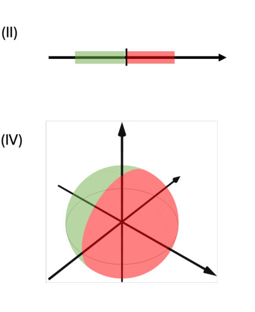
<figcaption class="paper-figure-caption"><b>Fig 1.</b> Figure 1: Visualization of continuous relaxation. (I) A binary assignment is used, taking discrete values in {±1}. (II) Optimization is carried out over the real line R; at the end of the procedure, the final discrete value is selected based on its color region. (III) Optimization is performed on the complex manifold C1, followed by the same rounding step based on the color region. (IV) Optimization over a 3D sphere.</figcaption>
</figure>
<figure class="paper-figure-card">
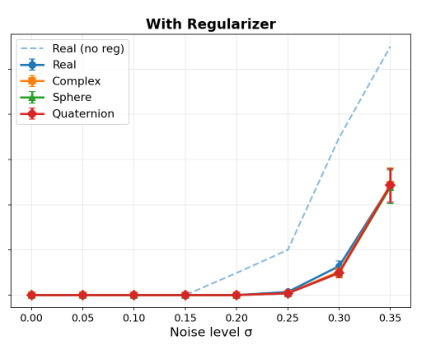
<figcaption class="paper-figure-caption"><b>Fig 2.</b> Figure 2: Average number of bit errors vs. noise level σ for the QUBO 160×160 problem (cardinality 80, 104 epochs, 50 experiments × 20 trials). Left: without regularization. Right: with optimized two-stage diagonal regularization (kreg = (0, 1.0)). Error bars indicate the standard error of the mean.</figcaption>
</figure>
<figure class="paper-figure-card">
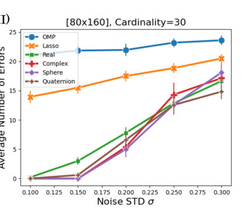
<figcaption class="paper-figure-caption"><b>Fig 3.</b> Figure 3: Summary of sparse coding recovery results. Panels (I) and (II) present a comparison of the different optimization methods under the specific conditions indicated in their titles. Each data point on the graph represents the average number of bit errors for a specific model at a given noise power. Averages were computed over 20 distinct random problem realizations, utilizing 20 trials with random initial conditions for each realization.</figcaption>
</figure>

**Summary.** This paper proposes a new way to solve hard optimization problems by treating discrete bits as complex phases. This approach creates a natural 'push' toward discrete values, allowing for much more accurate solutions to complex problems like QUBO and sparse coding even under high noise.

**Why it may be interesting.** not directly relevant

Detailed structure

**Main problem.** Addressing the computational intractability of NP-hard combinatorial optimization problems, such as QUBO and sparse coding, by overcoming the limitations of standard continuous convex relaxations.

**Main result.** The authors demonstrate that parameterizing binary variables as complex phases introduces an implicit regularization mechanism that promotes convergence to discrete states, achieving zero error in large-scale noisy QUBO tasks and outperforming LASSO in sparse coding.

**Method.** A physics-inspired continuous relaxation framework that maps discrete binary variables to continuous wave-like states on the complex unit circle, utilizing gradient descent and analyzing the resulting implicit regularization via random matrix theory.

**Model / system.** The framework utilizes an Ising Hamiltonian formulation where discrete spins are relaxed into higher-dimensional algebraic manifolds, specifically the complex unit circle, spherical, and quaternion spaces.

**Key observables.** Ground-state convergence rates, bit error rates, and recovery success of planted solutions.

**Important parameters / regimes.** The diagonal shift hyperparameter beta, noise levels sigma, sparsity cardinality C, and the spectral properties (singular values) of the measurement matrix A.

**Assumptions / limitations.** The effectiveness of the binarization depends on the spectral characteristics of the interaction matrix, and for certain QUBO formulations, the measurement matrix is assumed to be square with determinant 1.

**Figures summary.** Visualizations of the continuous relaxation process across different manifolds (real, complex, spherical) and histograms of estimated ground-state energies.

**Paper structure.** The paper introduces the complex phase relaxation framework, provides analytical proofs for the implicit regularization and binarization basin, demonstrates the extraction of this regularizer for real-valued use, and validates the method through QUBO, sparse coding, and planted Ising model benchmarks.

Abstract

We introduce a physics-inspired continuous relaxation framework that yields substantially improved solutions for NP-hard combinatorial optimization problems, including Quadratic Unconstrained Binary Optimization (QUBO), binary sparse coding, and planted-solution Ising models. By parameterizing discrete binary variables as continuous wave-like states on the complex unit circle, we inherently smooth highly non-convex energy landscapes. We show that representing binary variables as complex phases reveals an implicit regularization mechanism that promotes convergence toward discrete states. Extracting this mechanism yields significant improvements even within standard real-valued optimization frameworks, using this regularizer explicitly. Empirically, this regularization yields vastly higher ground-state convergence rates than standard real-valued alternatives. Our models achieved zero error in large-scale 160x160 QUBO tasks under severe noise (sigma=0.25), and outperformed traditional algorithms (OMP and LASSO) in underdefined sparse coding with perfect recovery at sigma=0.15. The solver's robustness was further validated by recovering exact ground-state configurations in 8 out of 11 rigorously engineered planted-solution benchmarks.

[↑ back to top](#top)

### [Improved Dual Attack and Trapdoor Sampling via Quantum Rejection Sampling](http://arxiv.org/abs/2605.24798v1)

**Authors:** Cong Ling, Hao Yan, Nicholas Zhao  
**Type:** theory · **Category:** quantum information and computing · **PDF:** <https://arxiv.org/pdf/2605.24798v1>  
**Analysis basis:** full PDF text, analyzed in chunks

↔ Scroll figures horizontally

<figure class="paper-figure-card">
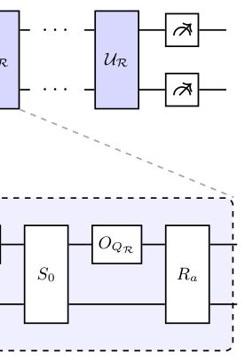
<figcaption class="paper-figure-caption"><b>Fig 1.</b> Fig. 2: Oracle-level decomposition of our quantum sampler. The top wire is the coefficient register X, and the bottom wire is the coin register. The first two gates AR = Ra(OQR ⊗I0) prepare the state for QRS. The operator UR is one iterate of the amplitude amplification subroutine, whose dashed box gives its full decomposition. This is repeated O  1 √pR</figcaption>
</figure>
<figure class="paper-figure-card">
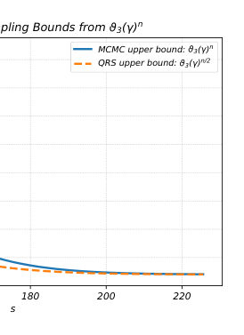
<figcaption class="paper-figure-caption"><b>Fig 2.</b> Fig. 3: MCMC and QRS upper bounds derived from [29]’s ϑ3(γ)n estimate for FALCON-512. The horizontal axis uses the Gaussian parameter s, with γ = (s/Bmax)2.</figcaption>
</figure>

**Summary.** This paper introduces a quantum algorithm to accelerate the discrete Gaussian sampling required for lattice-based cryptographic attacks. By using quantum rejection sampling, the authors achieve a quadratic speedup in the sampling process, leading to lower estimated security levels for post-quantum standards like Kyber.

**Why it may be interesting.** not directly relevant

Detailed structure

**Main problem.** The Gaussian sampling step in lattice-based cryptographic attacks (dual attack) and GPV trapdoor sampling is a significant computational bottleneck that remains classical.

**Main result.** The authors develop a quantum algorithm using Quantum Rejection Sampling (QRS) that achieves a quadratic speedup in sampling complexity, reducing the estimated attack costs for Kyber variants by up to 13 bits.

**Method.** The method combines the lower bound of Klein's algorithm with the Quantum Rejection Sampling framework to prepare truncated lattice Gaussian states using amplitude amplification.

**Model / system.** The work focuses on lattice-based cryptographic primitives, specifically the Learning with Errors (LWE) and Short Integer Solution (SIS) problems involving q-ary lattices and their duals.

**Key observables.** Attack cost estimates (in bits), total variation distance between truncated and full distributions, and the empirical cosine score for identifying secret vectors.

**Important parameters / regimes.** The Gaussian parameter (s), the truncation radius (R), the sampling ratio (Delta_R), and the Gram-Schmidt orthogonalization profile (Delta).

**Assumptions / limitations.** The algorithm assumes access to a coherent oracle for a truncated Klein proposal distribution and requires a truncation radius that ensures negligible error in total variation distance.

**Figures summary.** Figure 1 shows the concentration of discrete Gaussian mass for different Gaussian parameters; Figure 2 illustrates the oracle-level decomposition of the QRS circuit; Figure 3 shows the exponential gap between MCMC and QRS upper bounds.

**Paper structure.** The paper introduces the bottleneck in lattice sampling, proposes a QRS-based framework using a truncated Klein proposal, provides mathematical proofs for complexity reduction and error bounds, and evaluates the impact on Kyber and FALCON security parameters.

Abstract

In this work, we revisit the dual attack and GPV trapdoor sampling, focusing on the lattice Gaussian sampling term, which can be a significant bottleneck in the overall complexity. We show that this sampling step can be quantumly accelerated by combining the lower bound underlying Wang and Ling's analysis of Klein's algorithm with the quantum rejection sampling (QRS) framework proposed by Ozols et al. Specifically, this lower bound gives precisely the pointwise domination condition required for quantum rejection sampling when given coherent oracle access to a truncated Klein proposal distribution, which yields a quantum procedure for preparing the truncated dual $q$-ary lattice Gaussian with a quadratic reduction in the sampling complexity. The truncation radius is chosen so that the truncated distribution is negligibly close to the full lattice Gaussian in total variation distance. Substituting this sampler into the dual attack framework results in reduced overall attack-cost estimates. Compared with Pouly and Shen's modern dual attack under the same parameter choices, our estimates reduce the attack cost by \(9\), \(4\), and \(13\) bits for Kyber-512, Kyber-768, and Kyber-1024, respectively. We also report the corresponding estimates with modulus switching. Finally, by replacing the Markov chain Monte Carlo (MCMC) sampler with the QRS algorithm, we achieve a similar quadratic speedup in the GPV signing process.

[↑ back to top](#top)

### [Lateral Shift as a Control Knob for Localization Transitions in a Quasiperiodic Ladder](http://arxiv.org/abs/2605.25033v1)

**Authors:** Bing Shao, Guangjie Zhang, Longwen Zhou, Jiangbin Gong, Weiwei Zhu  
**Type:** theory · **Category:** disordered systems and neural networks · **PDF:** <https://arxiv.org/pdf/2605.25033v1>  
**Analysis basis:** full PDF text, analyzed in chunks

↔ Scroll figures horizontally

<figure class="paper-figure-card">
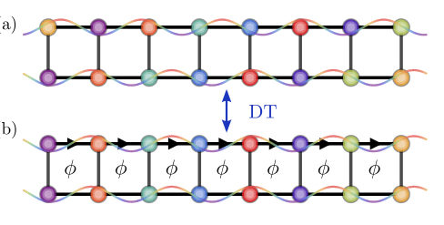
<figcaption class="paper-figure-caption"><b>Fig 1.</b> FIG. 1. Quasiperiodic ladders. (a) A quasiperiodic ladder with a lateral shift between its upper and lower legs. (b) The duality-transformed (DT) quasiperiodic ladder with an synthetic magnetic flux ϕ per plaquette. With the rational approximation F5/F6 = 5/8 to the irrational α parameter, the lattice becomes periodic with a unit cell of 8 sites.</figcaption>
</figure>
<figure class="paper-figure-card">
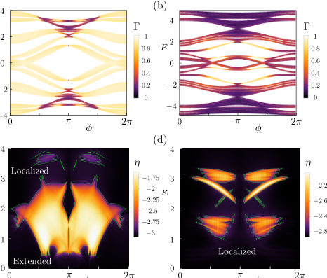
<figcaption class="paper-figure-caption"><b>Fig 2.</b> FIG. 2. Flux-dependent localization. (a) Energy spectrum vs the effective magnetic flux ϕ, plotted with the fractal dimen- sion Γ of the eigenstates, for system parameters κ = 1.8 and 2t = 1. (b) Same as in (a) but for 2t = 2.5. (c) Phase dia- gram vs the quasiperiodic potential strength 2t and ϕ, with κ = 1.8, color-coded by the values of η. (d) Same as in (c), but for κ and ϕ, with 2t = 3.4. The system size is taken as L = F15 = 610. Green lines in panels (c) and (d) represent the theoretical analysis, in excellent agreement with the nu- merically found phase boundaries.</figcaption>
</figure>
<figure class="paper-figure-card">
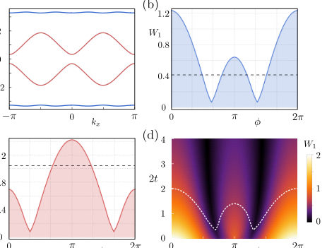
<figcaption class="paper-figure-caption"><b>Fig 3.</b> FIG. 3. Bandwidth under a commensurate approximation, with lattice constant lCA = F3 = 2. (a) Band structure for κ = 1.8, 2t = 1 and ϕ = 2. (b) Bandwidth of the first band W1 vs ϕ for κ = 1.8 and 2t = 1, with other parameters the same as in Fig. 2(a). (c) Bandwidth of the second band W2 vs ϕ for κ = 1.8 and 2t = 2.5, with other system parameters the same as in Fig. 2(b). Dashed lines in panels (b) and (c) indicate where the bandwidth (W1 and W2, respectively) equals the renormalized strength of quasiperiodic potential 2˜t = 2( √</figcaption>
</figure>
<figure class="paper-figure-card">
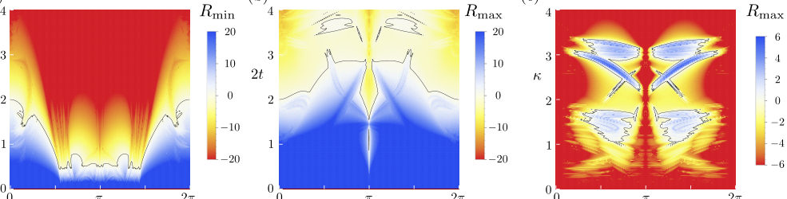
<figcaption class="paper-figure-caption"><b>Fig 4.</b> FIG. 4. Anisotropic bandwidth ratio obtained under a commensurate approximation with lCA = F9 = 34. (a) Logarithmic map of the minimum anisotropic bandwidth ratio Rmin vs 2t and ϕ for κ = 1.8 as in Fig. 2(c). (b) Same as in (a), but for the maximal anisotropic bandwidth ratio Rmax vs 2t and ϕ. (c) Same as in (b), but for Rmax vs κ and ϕ for 2t = 3.4 as in Fig. 2(d). Black curves indicate where Rmin = 1 or Rmax = 1, plotted as green curves in Figs. 2(c) and 2(d).</figcaption>
</figure>

**Summary.** This paper demonstrates that shifting the legs of a quasiperiodic ladder relative to each other allows for the tuning of localization phases via a synthetic magnetic flux. It introduces a highly accurate, system-size-independent method for identifying phase transitions in quasiperiodic systems. The findings suggest a tunable platform for studying complex localization phenomena like reentrant transitions.

**Why it may be interesting.** not directly relevant

Detailed structure

**Main problem.** Investigating how a lateral shift between two legs of a quasiperiodic ladder can act as a control knob to induce various localization-delocalization transitions.

**Main result.** The lateral shift effectively generates a synthetic magnetic flux in reciprocal space, enabling magnetic-flux-enhanced, suppressed, and reentrant localization transitions. The study also introduces a new, system-size-independent diagnostic called the anisotropic bandwidth ratio (Rj) to precisely identify phase boundaries.

**Method.** The authors use a duality transformation to map the real-space ladder to a reciprocal-space Hamiltonian and employ a commensurate approximation using Fibonacci numbers to analyze the band structure.

**Model / system.** A 1D quasiperiodic ladder where two legs are subject to the same quasiperiodic onsite potential but are laterally shifted relative to each other, effectively simulating a synthetic magnetic flux.

**Key observables.** Inverse Participation Ratio (IPR), Normalized Participation Ratio (NPR), Fractal Dimension (FD), eta diagnostic, and the anisotropic bandwidth ratio (Rj).

**Important parameters / regimes.** Lateral shift (q or phi), interleg coupling (kappa), quasiperiodic potential strength (v), and the inverse golden ratio (alpha).

**Assumptions / limitations.** The use of a commensurate approximation to treat the irrational quasiperiodic potential as a periodic system with a finite unit cell.

**Figures summary.** Fig 1 shows the schematic of the ladder and its duality-transformed version with synthetic flux. Fig 2/4 shows phase maps and logarithmic plots of the Rj diagnostic (Rmin and Rmax) used to delineate extended, mixed, and localized phases.

**Paper structure.** The paper introduces the quasiperiodic ladder model, establishes the duality between lateral shift and synthetic magnetic flux, presents numerical results for various localization transitions, introduces the Rj diagnostic for phase boundary prediction, and concludes with potential applications.

Abstract

This work reports rich localization-delocalization transitions in a quasiperiodic ladder, of which the two legs are subject to the same quasiperiodic onsite potential but can be shifted laterally relative to each other. It is found that the lateral shift between the two legs effectively generates a magnetic flux in the reciprocal momentum space. The lateral shift thus offers a control knob, allowing us to access and simulate rich phenomena including magnetic-flux-enhanced localization, magnetic-flux-suppressed localization, and magnetic-flux-induced reentrant localization transitions. The underlying physical mechanisms as well as the phase boundaries separating localized, mixed, and extended phases are both qualitatively and quantitatively understood, based on a band-structure analysis that employs a commensurate approximation to the quasiperiodic potential, requiring only unit cells of small to modest sizes. Our work provides a highly tunable platform for exploring localization physics with promising applications such as quantum switching, and a broadly applicable approach for understanding localization-delocalization transitions in quasiperiodic systems.

[↑ back to top](#top)

### [Magnetic ground state of a prototype quasicrystal approximant: a candidate for octahedral spin ice physics](http://arxiv.org/abs/2605.26044v1)

**Authors:** Leonie Woodland, Farid Labib, Dmitry Khalyavin, Pascal Manuel, Fabio Orlandi, Hubertus Luetkens, Ryuji Tamura  
**Type:** experiment · **Category:** strongly correlated electrons · **PDF:** <https://arxiv.org/pdf/2605.26044v1>  
**Analysis basis:** full PDF text, analyzed in chunks

↔ Scroll figures horizontally

<figure class="paper-figure-card">
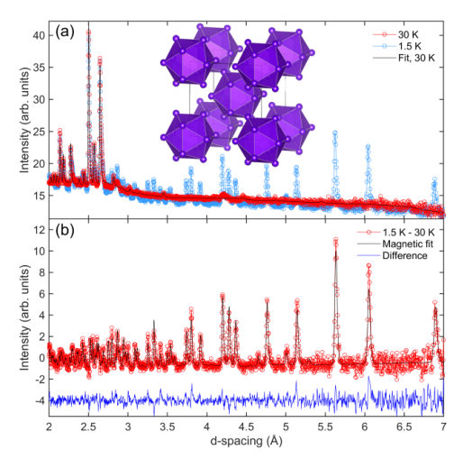
<figcaption class="paper-figure-caption"><b>Fig 1.</b> FIG. 1. Powder neutron diffraction data on Cd6Tb. (a) Data at 30 K, 1.5 K and the fit to the 30 K data. Inset: The po- sitions of Tb3+ ions in Cd6Tb, with the icosahedral arrange- ment highlighted. (b) Magnetic diffraction pattern obtained by taking the difference between the 1.5 K and 30 K data in (a), together with the magnetic refinement (solid black line). The difference curve (blue) has been offset by 4 units for clar- ity.</figcaption>
</figure>
<figure class="paper-figure-card">
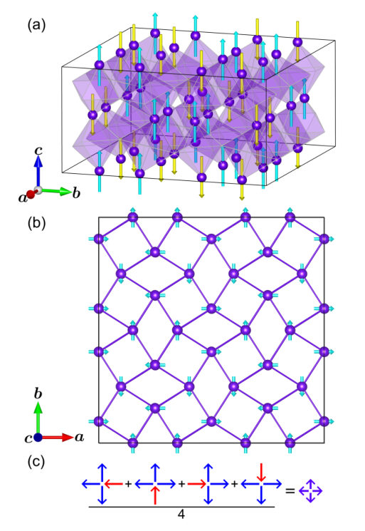
<figcaption class="paper-figure-caption"><b>Fig 2.</b> FIG. 2. Magnetic structure of Cd6Tb. (a,b) The refined mag- netic structures of the apical (z = 0, k2) spins (a) and equa- torial (k1) spins (b) in Cd6Tb. The black outlines in both panels indicate a 2 × 2 × 1 magnetic supercell. In (a), down spins are highlighted in yellow for clarity. (c) The measured (average) moment can be half of the full moment if one ran- domly chosen spin in every four is flipped.</figcaption>
</figure>
<figure class="paper-figure-card">
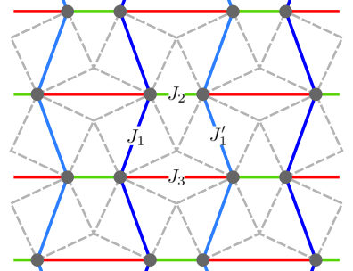
<figcaption class="paper-figure-caption"><b>Fig 3.</b> FIG. 3. A two-dimensional version of the proposed model of frustrated Heisenberg exchange interactions. Gray dashed lines indicate the projection of the octahedra. Solid circles correspond to one of the three separate sets of spins sharing a common easy axis. J′ 1 is only different from J1 for the apical spins.</figcaption>
</figure>
<figure class="paper-figure-card">
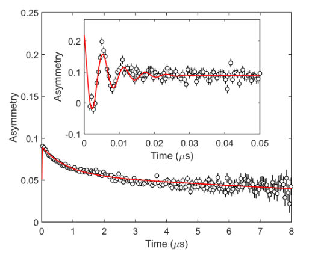
<figcaption class="paper-figure-caption"><b>Fig 4.</b> FIG. 4. µSR data taken at 5 K. The main panel shows the long time decay of the asymmetry while the inset shows a zoomed in view of the short time oscillatory behaviour. Error bars correspond to one standard deviation statistical uncertainty.</figcaption>
</figure>

**Summary.** This paper identifies a candidate for octahedral spin-ice physics in the quasicrystal approximant Cd6Tb. By combining neutron diffraction and muon spin rotation, the authors demonstrate that the magnetic ground state consists of both ordered and fluctuating spin components, a phenomenon known as magnetic fragmentation.

**Why it may be interesting.** not directly relevant

Detailed structure

**Main problem.** The study aims to resolve the microscopic magnetic ground state of the Tsai-type quasicrystal approximant Cd6Tb and determine if it realizes magnetic fragmentation, a key prediction of octahedral spin-ice physics.

**Main result.** The researchers discovered a noncoplanar multi-k magnetic ground state where one-third of the Tb moments are ordered and two-thirds exhibit persistent spin dynamics, providing a potential realization of magnetic fragmentation.

**Method.** Neutron powder diffraction was used for magnetic structure refinement, while Muon Spin Rotation (muSR) and AC susceptibility were employed to investigate spin dynamics and distinguish between static and dynamic magnetism.

**Model / system.** The system is Cd6Tb, a 1/1-cubic quasicrystal approximant featuring a network of corner-sharing octahedra with Ising-like Tb3+ moments.

**Key observables.** Neutron diffraction patterns, magnetic propagation vectors (k1 and k2), magnetic moments (apical vs. equatorial), muSR asymmetry/relaxation rates, and AC susceptibility.

**Important parameters / regimes.** Magnetic ordering temperature (~20 K), persistent dynamics on microsecond timescales, and the reduction of equatorial moments to ~4.62 uB compared to apical moments of ~10.2 uB.

**Assumptions / limitations.** The structural refinement used a cubic model because the subtle monoclinic distortion could not be fully resolved in powder neutron diffraction; diffraction alone could not distinguish between certain relative phases of the magnetic structure.

**Figures summary.** Fig 1 shows neutron diffraction data and structural fits; Fig 2 illustrates the refined magnetic structures for apical and equatorial spins and the spin-flip model; Fig 3 shows the frustrated Heisenberg exchange model.

**Paper structure.** The paper introduces the problem of quasicrystal magnetism, describes the structural and magnetic characterization of Cd6Tb via neutron diffraction, presents the discovery of the multi-k ground state, uses muSR to prove the presence of persistent dynamics, and concludes with the identification of magnetic fragmentation.

Abstract

Magnetic ordering in quasicrystals has recently emerged as a fertile ground for discovering unconventional magnetic states beyond the framework of periodic crystals. However, elucidating the microscopic origin of such states remains challenging due to the intrinsic aperiodicity of quasicrystals. Here, we address this issue by investigating the prototypical Tsai-type quasicrystal approximant Cd6Tb, which preserves the essential local geometry and connectivity of icosahedral quasicrystals while allowing detailed structural and magnetic characterization due to its translational periodicity. Using neutron diffraction measurements, we find a noncoplanar multi-k magnetic ground state composed of Ising-like Tb moments arranged on a network of corner-sharing octahedra, the ingredients required to host octahedral spin-ice physics. Remarkably, only one third of the Tb moments develop long-range magnetic order, whereas the remaining moments display strongly reduced static order accompanied by persistent spin dynamics on microsecond timescales, as evidenced by muon spin rotation. This coexistence of ordered and fluctuating moments constitutes a potential realization of magnetic fragmentation - a key prediction of octahedral spin-ice physics - in a quasicrystal-related material.

[↑ back to top](#top)

### [Magnetoelastic effects in the metallic frustrated antiferromagnet CrB$_2$](http://arxiv.org/abs/2605.25564v1)

**Authors:** Tadataka Watanabe, Mai Watanabe, Sakurako Suganuma, Andreas Bauer, Christian Pfleiderer  
**Type:** experiment · **Category:** strongly correlated electrons · **PDF:** <https://arxiv.org/pdf/2605.25564v1>  
**Analysis basis:** full PDF text, analyzed in chunks

↔ Scroll figures horizontally

<figure class="paper-figure-card">
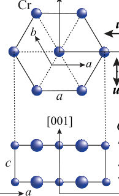
<figcaption class="paper-figure-caption"><b>Fig 1.</b> FIG. 1: Cr sites of CrB2 in the hexagonal crystal unit cell, with the propagation vector k and polarization vector u of the sound waves for the compressive elastic moduli C11 and C33, and the shear elastic moduli C44 and C66. The sound velocities of the longitudinal (vL) and transverse (vT ) waves corresponding to these elastic moduli of CrB2 measured at a temperature of 300 K are listed on the right.</figcaption>
</figure>
<figure class="paper-figure-card">
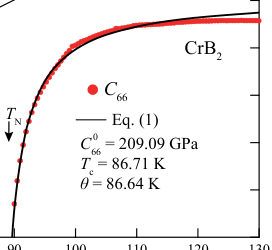
<figcaption class="paper-figure-caption"><b>Fig 2.</b> FIG. 4: C66(T ) of CrB2 in the range 80 K ≤T ≤130 K [markers, from Fig. 3(b)]. The labeled arrows indicate TN ∼ 88 K for CrB2. The solid curve is a fit of Eq. (1) to the experimental C66(T ) in the range TN ≤T ≤120 K; the values for the fit parameters are also listed. The dashed horizontal line indicates C0 66 in Eq. (1).</figcaption>
</figure>
<figure class="paper-figure-card">
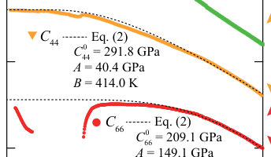
<figcaption class="paper-figure-caption"><b>Fig 3.</b> FIG. 5: Comparison of the relative shifts of the compressive moduli C11(T ) and C33(T ), and the shear moduli C44(T ) and C66(T ) of CrB2 [markers, from Figs. 2 and 3]. The plotted curves have been vertically shifted for clarity. The solid dou- ble arrows at the right side of the figure indicate the variation in the experimental CΓ(T ), which is defined as the difference between the maximum and the minimum values of CΓ(T ). The minimum occurs at the highest measured T = 300 K for all the elastic moduli, and the maximum occurs at the lowest measured T = 2 K for C11(T ), C33(T ), and C44(T ), and at T ∼120 K for C66(T ). The inset is a schematic of CΓ(T ) typically observed for solids,...</figcaption>
</figure>
<figure class="paper-figure-card">
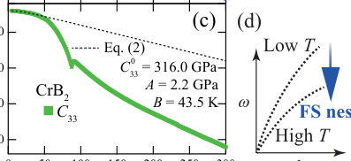
<figcaption class="paper-figure-caption"><b>Fig 4.</b> FIG. 6: (a) Ratios of hexagonal lattice constants, c/a, for the antiferromagnet CrB2 and paramagnets (Cr0.3Mo0.7)B2 and VB2 as functions of T [from Ref. [14]]. (b) The moduli C11(T ) and (c) C33(T ) of CrB2 [markers, from Figs. 2(a) and 2(b), respectively]. The dashed curves in (b) and (c) are fits of Eq. (2) to the experimental CΓ(T ) in the range 2 K ≤T ≤ 50 K; the values for the fit parameters are also listed. (d) Schematics of low-T and high-T longitudinal acoustic phonon branches in CrB2, where the high-T branch is softened due to FS nesting as indicated by the arrow.</figcaption>
</figure>

**Summary.** This paper uses ultrasound spectroscopy to reveal how lattice vibrations and magnetic order interact in the frustrated antiferromagnet CrB2. It demonstrates that the material uses both transverse and longitudinal magnetoelastic coupling to manage magnetic frustration and Fermi-surface instabilities. These findings provide insight into the complex magnetostructural dynamics in metallic frustrated systems.

**Why it may be interesting.** not directly relevant

Detailed structure

**Main problem.** Investigating the interplay between lattice and magnetic degrees of freedom in the metallic frustrated antiferromagnet CrB2, specifically how magnetoelastic coupling affects magnetic frustration and Fermi-surface nesting.

**Main result.** The study identifies that transverse magnetoelastic coupling leads to Curie-type softening in the shear modulus C66 as a precursor to a spin-Jahn-Teller transition, while longitudinal coupling suppresses Fermi-surface nesting.

**Method.** Ultrasound velocity measurements using the phase-comparison technique on high-quality single crystals of CrB2.

**Model / system.** The physical system is CrB2, a hexagonal metallic frustrated antiferromagnet with a Cr triangular lattice and a Neel temperature of approximately 88 K.

**Key observables.** Elastic moduli (C11, C33, C44, C66), sound velocities (longitudinal and transverse), and lattice parameter ratio (c/a).

**Important parameters / regimes.** Neel temperature TN ~ 88 K, frustration ratio |thetaW/TN| ~ 8.5, and temperature range from 2 K to 300 K.

**Assumptions / limitations.** The analysis assumes the Curie-type softening can be modeled using a mean-field expression and that conventional elastic hardening follows the Varshni equation.

**Figures summary.** Figure 1 shows the CrB2 unit cell and sound propagation vectors; Figure 2 displays the temperature dependence of compressive moduli C11 and C33; Figure 3 shows the temperature dependence of shear moduli C44 and C66; Figure 5 highlights the relative variations in different moduli; Figure 6 shows the c/a ratio temperature dependence.

**Paper structure.** The paper introduces the material properties, describes the experimental ultrasound setup, presents the temperature dependence of various elastic moduli, analyzes the mechanisms of softening (spin-JT vs. FS nesting), and concludes with the dual role of magnetoelastic coupling.

Abstract

Hexagonal chromium diboride CrB$_2$ is a metallic frustrated antiferromagnet with a Néel temperature $T_N \sim$ 88 K. In CrB$_2$, Cr 3$d$ electrons not only give rise to localized magnetic moments but also contribute to metallic conduction. We perform ultrasound velocity measurements on a single crystal of hexagonal CrB$_2$ to determine its elastic properties. The temperature dependence of the $ab$-plane shear elastic modulus exhibits Curie-type softening upon cooling from $\sim$120 K down to $T_N$. This behavior is interpreted as a precursor to a symmetry-lowering lattice distortion at $T_N$, indicating that magnetic frustration is relieved via transverse magnetoelastic coupling. In addition, the $a$-axis and $c$-axis compressive elastic moduli show unusual softness and their suppression upon cooling, which are naturally explained by Fermi-surface nesting and its suppression upon cooling. The present results suggest that, in CrB$_2$, longitudinal magnetoelastic coupling suppresses Fermi-surface nesting and enhances frustrated exchange interactions, while transverse magnetoelastic coupling plays a key role in relieving the frustration.

[↑ back to top](#top)

### [Memory Uncertainty Relation and Harmonic Memory in Random Recurrent Networks](http://arxiv.org/abs/2605.24628v1)

**Authors:** Taichi Haruna, Kohei Nakajima  
**Type:** theory · **Category:** disordered systems and neural networks · **PDF:** <https://arxiv.org/pdf/2605.24628v1>  
**Analysis basis:** full PDF text, analyzed in chunks

↔ Scroll figures horizontally

<figure class="paper-figure-card">
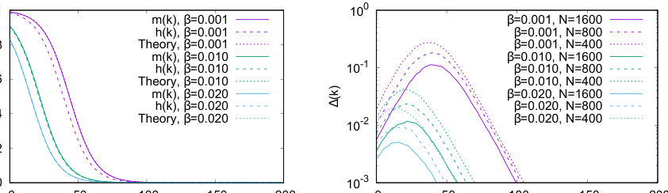
<figcaption class="paper-figure-caption"><b>Fig 1.</b> FIG. 1. (a) m(k) (solid lines) and h(k) (broken lines) for RONs with N = 1600, α = 0.9. The dotted lines are the mean-field curves of Eq. (25). (b) ∆(k) for RONs with α = 0.9. For each condition, m(k) and h(k) are averaged over 100 realizations of RONs.</figcaption>
</figure>
<figure class="paper-figure-card">
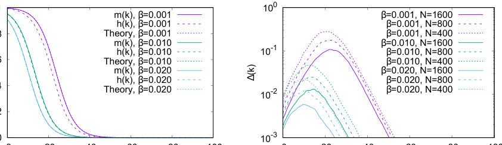
<figcaption class="paper-figure-caption"><b>Fig 2.</b> FIG. 2. (a) m(k) (solid lines) and h(k) (broken lines) for RONs with N = 1600, α = 0.8. The dotted lines are the mean-field curves of Eq. (25). (b) ∆(k) for RONs with α = 0.8. For each condition, m(k) and h(k) are averaged over 100 realizations of RONs.</figcaption>
</figure>
<figure class="paper-figure-card">
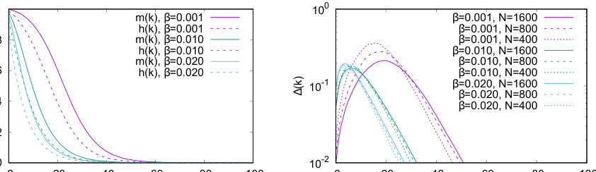
<figcaption class="paper-figure-caption"><b>Fig 3.</b> FIG. 3. (a) m(k) (solid lines) and h(k) (broken lines) for RGNs with N = 1600, α = 0.9. (b) ∆(k) for RGNs with α = 0.9. For each condition, m(k) and h(k) are averaged over 100 realizations of RGNs.</figcaption>
</figure>
<figure class="paper-figure-card">
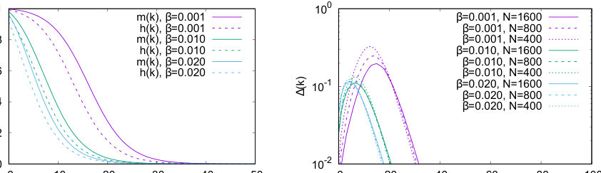
<figcaption class="paper-figure-caption"><b>Fig 4.</b> FIG. 4. (a) m(k) (solid lines) and h(k) (broken lines) for RGNs with N = 1600, α = 0.8. (b) ∆(k) for RGNs with α = 0.8. For each condition, m(k) and h(k) are averaged over 100 realizations of RGNs.</figcaption>
</figure>
<figure class="paper-figure-card">
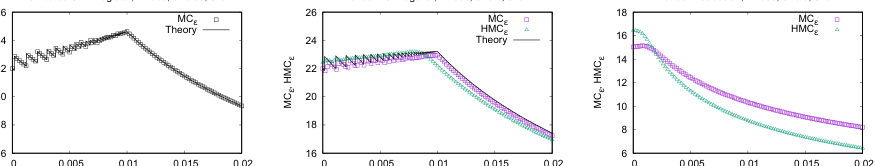
<figcaption class="paper-figure-caption"><b>Fig 5.</b> FIG. 5. MCϵ and HMCϵ for the three linear reservoirs with N = 800, α = 0.9, and ϵ = 0.1. (a) DSRN. A single realization of a DSRN is used to compute MCϵ(= HMCϵ) numerically. The solid line is Eq. (32). (b) RON. The solid line is Eq. (33). (c) RGN. In panels (b) and (c), MCϵ and HMCϵ are averaged over 100 realizations of each linear reservoir.</figcaption>
</figure>

**Summary.** This paper establishes a fundamental trade-off between memory capability and state-space fluctuations in recurrent neural networks, termed a memory uncertainty relation. It introduces the concept of harmonic memory as a realizable lower bound and demonstrates a phenomenon where input noise can actually enhance memory capacity under regularization.

**Why it may be interesting.** not directly relevant

Detailed structure

**Main problem.** Establishing a fundamental lower bound on the short-term memory capability of dynamical systems and investigating the relationship between memory capacity and state-space fluctuations.

**Main result.** The authors prove a 'memory uncertainty relation' where the memory function is bounded below by a 'harmonic memory' function, and discover that noise can induce increased memory capacity under certain regularization conditions.

**Method.** Analytical derivation using Jensen's inequality, the Cramér-Rao inequality, and the AM-HM inequality, supplemented by numerical simulations of various reservoir architectures.

**Model / system.** Random recurrent networks, specifically Echo State Networks (ESNs) including Distributed Shift Register Networks (DSRNs), Random Orthogonal Networks (RONs), and Random Gaussian Networks (RGNs).

**Key observables.** Memory function m(k), harmonic memory h(k), memory capacity MC, and fluctuation measure f(k).

**Important parameters / regimes.** Noise strength (beta), spectral radius (alpha), regularization threshold (epsilon), and network size (N).

**Assumptions / limitations.** The covariance matrix is positive definite, the input signal is stationary with mean 0 and variance 1, and certain results rely on the large N limit.

**Figures summary.** Figures show the decay of memory functions m(k) and h(k) for different network types, the difference between them, and the effect of noise strength on regularized memory capacity.

**Paper structure.** The paper introduces the memory uncertainty relation, provides analytical proofs for the lower bound, examines specific network architectures (DSRN, RON, RGN), explores the effect of state-space regularization (PCR), and analyzes finite-time effects and error scaling.

Abstract

We present an inequality that bounds the short-term memory capability of dynamical systems from below. It can be interpreted as an uncertainty relation between a measure of short-term memory and that of the size of state fluctuations induced by input signals. The lower bound can be achieved by a readout weight and thus represents a suboptimal memory called harmonic memory. We examine analytically and numerically the inequality in a number of reservoir systems subject to input noise. We illustrate cases in which equality is achieved exactly, equality holds asymptotically, and the inequality is strict. We also study the effect of a state-space regularization to elucidate the inequality in terms of the fluctuation structure of the state-space. We find that a certain strength of input noise induces extra memory under the regularization, and we refer to this phenomenon as noise-induced memory. We observe that the memory uncertainty relation does not hold in general for the regularized memory and harmonic memory. This fact is explained in terms of the mechanism of noise-induced memory.

[↑ back to top](#top)

### [Near-Room-Temperature Antiferromagnetic Ordering in the Quadruple Perovskite Sr4NaRu3O12](http://arxiv.org/abs/2605.25694v1)

**Authors:** Subham Naik, Biswajit Singh, Hiranmayee Senapati, Akshay K. U., Ramesh C. Nath, Soumyojit Chatterjee, Rahul Sharma, Thomas Doert, Walter Schnelle, Manfred Reehuis, Thomas C. Hansen, Michael Ruck, Gohil S. Thakur  
**Type:** both · **Category:** strongly correlated electrons · **PDF:** <https://arxiv.org/pdf/2605.25694v1>  
**Analysis basis:** full PDF text, analyzed in chunks

↔ Scroll figures horizontally

<figure class="paper-figure-card">
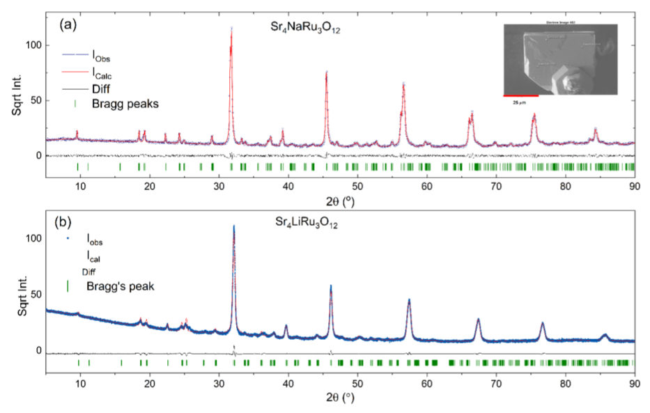
<figcaption class="paper-figure-caption"><b>Fig 1.</b> Figure 1. Le Bail fit of room temperature PXRD data of Sr4NaRu3O12 (a) and Sr4LiRu3O12 (b). Blue and red curves are observed and calculated intensities and black line is their difference. Green vertical bars indicate allowed reflections. Inset of (a) shows the SEM image of a typical Sr4NaRu3O12 crystal.</figcaption>
</figure>
<figure class="paper-figure-card">
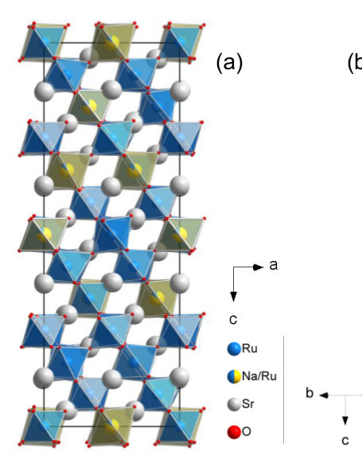
<figcaption class="paper-figure-caption"><b>Fig 2.</b> Figure 2. Crystal structure of Sr4NaRu3O12 viewed along different orientations (a and b).</figcaption>
</figure>
<figure class="paper-figure-card">
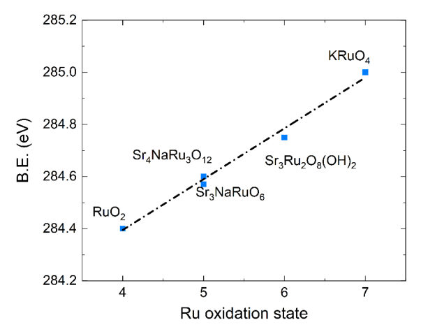
<figcaption class="paper-figure-caption"><b>Fig 3.</b> Figure 3. XPS data of Sr4NaRu3O12. The binding energy (B.E.) value for Ru(VI) is taken from</figcaption>
</figure>
<figure class="paper-figure-card">
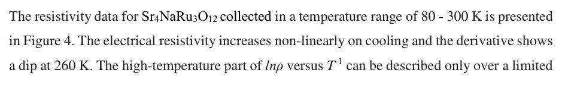
<figcaption class="paper-figure-caption"><b>Fig 4.</b> Figure 4. (a) Logarithm of resistivity plotted against T1/4 for Sr4NaRu3O12; inset displays the ln vs T1 curve (b)  vs T curve and its first derivative exhibiting a sharp dip at T ~ 260 K.</figcaption>
</figure>
<figure class="paper-figure-card">
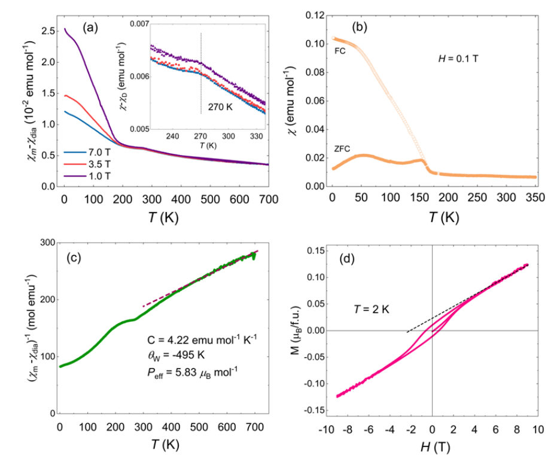
<figcaption class="paper-figure-caption"><b>Fig 5.</b> Figure 5: Magnetic properties of Sr4NaRu3O12: (a) magnetic susceptibility in the T-range 2 - 700 K at different applied field, inset showing the magnified region near the magnetic transition (b) magnetic susceptibility in ZFC and FC protocols at an applied field of 0.1 T (c) straight line fit to the inverse susceptibility (d) magnetic hysteresis loop collected at 2 K.</figcaption>
</figure>

**Summary.** This paper reports the discovery of near-room-temperature antiferromagnetic ordering in the quadruple perovskite Sr4NaRu3O12. By combining neutron diffraction and DFT, the authors reveal a unique magnetic structure with frustrated Ru sites and a semiconducting electronic state. This work provides a new platform for studying magnetic exchange pathways in 4d-metal oxides.

**Why it may be interesting.** not directly relevant

Detailed structure

**Main problem.** The study aims to synthesize and characterize a new 1:3 ordered quadruple perovskite, Sr4NaRu3O12, to explore its structural, electronic, and magnetic properties, specifically looking for well-defined magnetic order in 4d transition-metal oxides.

**Main result.** The researchers discovered near-room-temperature antiferromagnetic ordering (TN ~ 265 K) in Sr4NaRu3O12, which is a narrow-gap semiconductor with a specific collinear spin alignment and magnetic frustration at certain Ru sites.

**Method.** The work combines experimental techniques including solid-state synthesis, single-crystal and powder X-ray/neutron diffraction, magnetometry (SQUID/VSM), and transport measurements with computational DFT (Quantum Espresso) calculations.

**Model / system.** The primary system is the 12R quadruple perovskite Sr4NaRu3O12, characterized by a rhombohedral structure with corner-connected RuO6 and NaO6 octahedra and Ru in a +5 oxidation state.

**Key observables.** Néel temperature (TN), magnetic propagation vector (k = 0, 0, 1.5), magnetic moments (mu_eff), electrical resistivity, and electronic band gap.

**Important parameters / regimes.** TN ~ 265 K, Weiss constant (theta_cw) ~ -540 K, band gap ~ 250 meV, and Ru oxidation state +5.

**Assumptions / limitations.** The structural refinement assumes a centrosymmetric space group R-3; DFT calculations utilize the GGA-PBE approximation with a Hubbard U of 2.0 eV.

**Figures summary.** Figure 8 shows neutron diffraction difference patterns and magnetic peak intensity temperature dependence alongside a schematic of the spin sequence; Figure 9 displays the calculated electronic band structure.

**Paper structure.** The paper introduces the motivation for studying 4d oxides, details the synthesis and structural characterization of the Na and Li analogues, presents magnetic and transport measurements, provides DFT-based electronic structure analysis, and concludes with a comparison of the two compounds.

Abstract

We report the synthesis, structure and magnetic properties of two 1:3 ordered quadruple perovskites Sr4MRu3O12 (M = Li and Na). Sr4NaRu3O12 crystallizes in the centrosymmetric space group R-3 and Sr4LiRu3O12 appears to be isostructural to the Na compound based on the PXRD data. In Sr4NaRu3O12, both Na and Ru are predominantly ordered at the B sites (here Na/Li and Ru) and the structure contains only corner-connected RuO6 and NaO6 octahedra. This atomic ordering also leads to a rather large unit cell with a = 11.25 Å and c = 27.6 Å compared to the basic 12R structure (a = 5.5 Å and c ~ 27 Å). Magnetic measurements reveal that Sr4NaRu3O12 undergoes a magnetic transition to an antiferromagnetic state below TN ~ 265 K which is confirmed by DSC and neutron diffraction. The Ru moments show a collinear antiferromagnetic spin alignment along the hexagonal c axis with a propagation vector k = (0, 0, 1.5). Interestingly, those Ru moments lying on the three-fold roto-inversion do not significantly contribute to the magnetic order, since they are located between antiferromagnetically coupled Ru atoms and are therefore probably highly frustrated. Band structure calculations on Sr4NaRu3O12 complement the observed magnetic ground state and a semiconducting behavior in the compound. Sr4LiRu3O12 shows a magnetic anomaly below 110 K, possibly associated with competing ferromagnetic and antiferromagnetic interactions.

[↑ back to top](#top)

### [Non-local low energy neutral excitations in a strongly disordered triangular Mott magnet Cr$_3$Se$_2$Br$_5$](http://arxiv.org/abs/2605.25269v1)

**Authors:** Wenhao Liu, Dechen Zhang, Yuanqi Lyu, Lebing Chen, Lifang Hu, Keith M. Teddei, Yuting Zhang, Steve Shelton, Moon Kim, Xiqu Wang, Michael A. Susner, James G. Analytis, Dung-Hai Lee, Lu Li, Bing Lv, Robert J. Birgeneau  
**Type:** experiment · **Category:** strongly correlated electrons · **PDF:** <https://arxiv.org/pdf/2605.25269v1>  
**Analysis basis:** full PDF text, analyzed in chunks

↔ Scroll figures horizontally

<figure class="paper-figure-card">
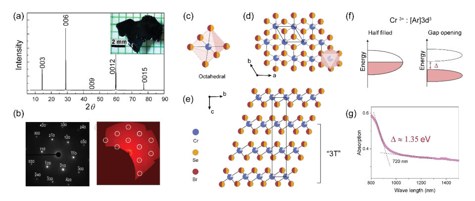
<figcaption class="paper-figure-caption"><b>Fig 1.</b> Fig. 1 Structural and electronic characterization of Cr3Se2Br5. (a) X-ray diffraction on single crystals. Inset: optical image of a single crystal. (b) Electron diffraction patterns with zone axis of [001] and precession image of Cr3Se2Br5 obtained from X-ray diffractions in the zone of (hk0). (c)(d)(e) The crystal structure of Cr3Se2Br5, highlighting 3T layered features with 15% Cr deficiency and homogeneous mixture on Se and Br on the corner sites. (f) Illustration of the gap opening in a half-filled band (g) Optical absorption spectrum of Cr3Se2Br5.</figcaption>
</figure>
<figure class="paper-figure-card">

<figcaption class="paper-figure-caption"><b>Fig 2.</b> Fig.1a shows the X-ray diffraction (XRD) pattern of a Cr3Se2Br5 single crystal with Miller indices. Only (00l) peaks can be observed, as expected, indicating that the flat surface is perpendicular to the crystallographic c-axis. The inset of Fig. 1c shows an optical image of a Cr3Se2Br5 single crystal on a millimeter grid. The black and shiny single crystals with typical lateral sizes of 5 mm ×7 mm can be obtained. Fig.1b shows an electron diffraction pattern along the [001] zone axis together with X-ray reconstructed reciprocal-space precision images for the (hk0) plane. Sharp Bragg diffractions are observed without distortions, ring-like residues, or blurry spots, confirming the high...</figcaption>
</figure>
<figure class="paper-figure-card">
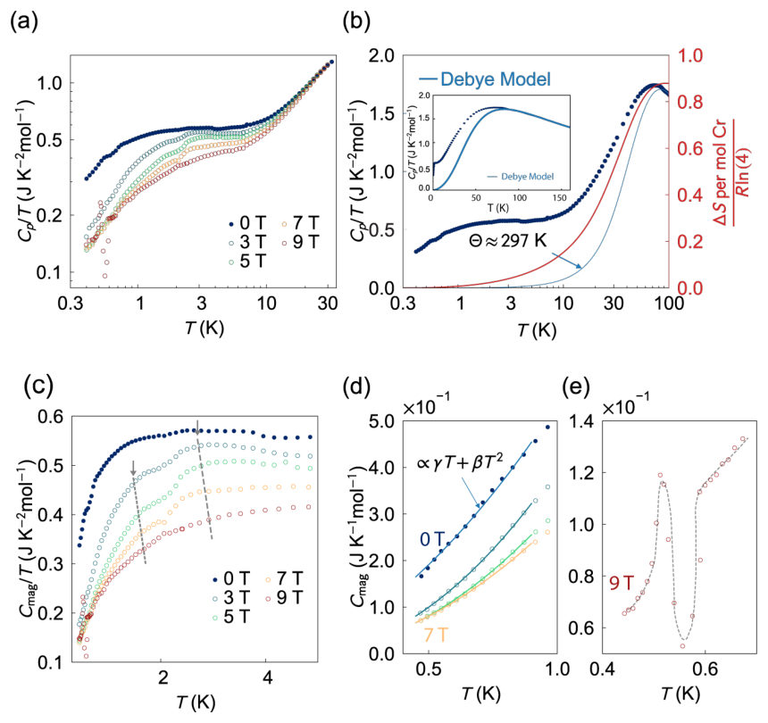
<figcaption class="paper-figure-caption"><b>Fig 3.</b> Fig. 3 Specific heat of Cr₃Se₂Br₅. (a) Low-temperature specific heat result of Cr3Se2Br5 under zero and various magnetic fields applied along the c direction. (b) The fitting of zero-field heat capacity using the Debye model (blue line). Red line: The integrated entropy release from electronic spins of the Cr3+ between 0.4 – 100 K. Inset highlights the good agreement with the Debye model at temperatures above 80 K. (c) Magnetic heat capacity of Cr3Se2Br5 at</figcaption>
</figure>
<figure class="paper-figure-card">
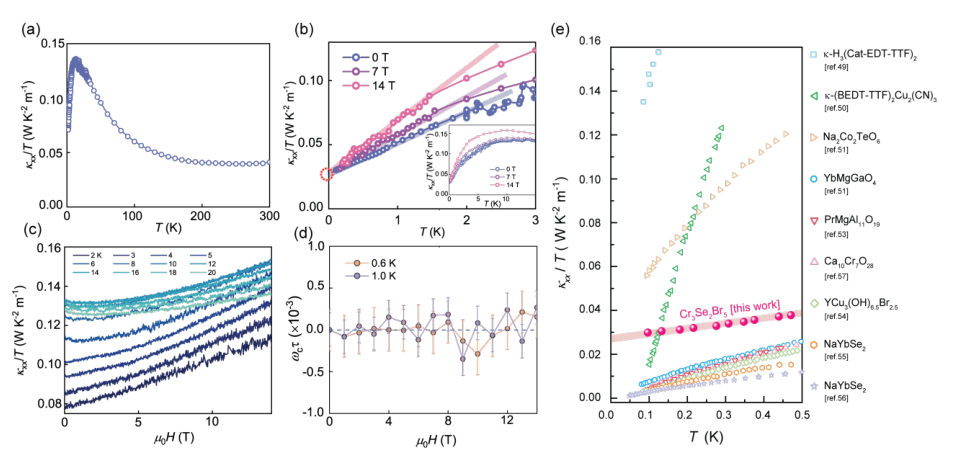
<figcaption class="paper-figure-caption"><b>Fig 4.</b> Fig. 4. Thermal conductivity of Cr3Se2Br5. The heat current was applied within the crystallographic plane, perpendicular to the 𝑐 axis, while the external magnetic field was applied along the 𝑐 axis. (a) Temperature dependence of the longitudinal thermal conductivity plotted as 𝜅𝑥𝑥/𝑇, showing a pronounced phonon peak near 13.5 K, indicating dominant phonon heat transport away from the lowest-temperature limit. (b) Low-temperature 𝜅𝑥𝑥/𝑇 down to 0.1 K. A clear finite residual linear term of ~ 0.03 W m-1 K-2 is obtained from the 𝑇→0 extrapolation, consistent with gapless mobile charge-neutral excitations. (c) Magnetic-field dependence of 𝜅𝑥𝑥/𝑇 above 2 K, showing an overall enhancement with...</figcaption>
</figure>

**Summary.** This paper demonstrates that in a strongly disordered triangular Mott magnet, charge-neutral excitations can remain mobile and carry heat even when charge transport is suppressed. This challenges the standard view that strong disorder inevitably leads to the localization of all low-energy excitations via Anderson-like mechanisms.

**Why it may be interesting.** not directly relevant

Detailed structure

**Main problem.** Determining whether low-energy, charge-neutral excitations can remain itinerant in a highly disordered, frustrated triangular Mott insulator, or if disorder-induced localization prevails.

**Main result.** The discovery of a finite, field-independent residual thermal conductivity in Cr3Se2Br5, providing evidence for itinerant, charge-neutral excitations that persist despite strong intrinsic structural disorder.

**Method.** The study uses a combination of structural analysis (XRD, electron diffraction), magnetic probes (susceptibility, TRM), and low-temperature transport measurements (thermal conductivity, specific heat).

**Model / system.** The system is Cr3Se2Br5, a van der Waals-based S = 3/2 Mott insulator with a frustrated triangular lattice and significant intrinsic disorder due to Cr-site deficiency and Se/Br-site mixing.

**Key observables.** Thermal conductivity (kappa_xx/T), magnetic specific heat (C_mag/T), magnetic susceptibility, and optical absorption gap.

**Important parameters / regimes.** S = 3/2 spin state, charge gap of ~1.35 eV, residual thermal conductivity kappa_0/T approx 0.03 W m^-1 K^-2, and exchange interaction J approx 0.22 meV.

**Assumptions / limitations.** The disorder is assumed to be intrinsic and fixed due to charge balance requirements, and the thermal transport is assumed to be decoupled from the localized thermodynamic spectral weight.

**Figures summary.** Figure 1 shows structural and electronic characterization, including XRD patterns, electron diffraction, the crystal structure model with site disorder, and the optical absorption spectrum.

**Paper structure.** The paper begins with structural and electronic characterization, moves to magnetic properties to rule out conventional order or glassiness, presents thermodynamic and thermal transport data to identify itinerant excitations, and concludes with a discussion on the interplay of disorder and correlations.

Abstract

Understanding if low-energy excitations can remain itinerant in the presence of strong disorder remains a central challenge in frustrated quantum magnets, where disorder is generally expected to localize excitations through Anderson-like mechanisms. Here we report the emergence of charge-neutral itinerant excitations in a van der Waals compound Cr$_3$Se$_2$Br$_5$, a strongly disordered $S = 3/2$ Mott insulator with a frustrated triangular lattice. Structural analysis reveals substantial intrinsic disorder arising from Cr-site deficiency and Se/Br-site mixing, which appear to be fixed and cannot be readily tuned. No long-range magnetic order or conventional glassy behavior is observed. In addition to its highly insulating nature, the magnetic specific heat C_mag/T and thermal conductivity \k{appa}_xx/T both exhibit linear temperature dependencies with substantial finite intercepts. In particular, a sizeable field-independent residual term $κ/T \approx 0.03~\mathrm{W\,m^{-1}\,K^{-2}}$ is observed, providing compelling evidence of itinerant low-energy excitations that carry entropy without charge. These findings conceptually advance our understanding of quantum matter by demonstrating a rare regime where the interplay of disorder, frustration, and electronic correlations actively reshapes the nature of low-energy excitations, allowing itinerant neutral excitations to coexist with strong intrinsic disorder.

[↑ back to top](#top)

### [Nonunitary triplet superconductivity in the Z2 topological metal SrPd2As2](http://arxiv.org/abs/2605.24536v1)

**Authors:** Aarti, Dibyendu Samanta, Kartik Panda, Devashibhai Adroja, Daloo Ram, Zakir Hossain, Rhea Stewart, Adrian Hillier, Amitava Bhattacharyya, Samar Layek, Sudeep Kumar Ghosh, Vivek Kumar Anand  
**Type:** both · **Category:** strongly correlated electrons · **PDF:** <https://arxiv.org/pdf/2605.24536v1>  
**Analysis basis:** full PDF text, analyzed in chunks

↔ Scroll figures horizontally

<figure class="paper-figure-card">
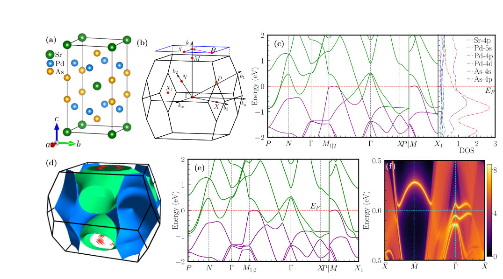
<figcaption class="paper-figure-caption"><b>Fig 1.</b> FIG. 1. Electronic band structure, and band topology of SrPd2As2: (a) The conventional unit cell of the body-centred tetragonal crystal structure of SrPd2As2. (b) Bulk and (001)-projected surface Brillouin zones (BZs) corresponding to the body- centred tetragonal lattice. (c) Electronic band structure and orbital-resolved density of states calculated without spin-orbit coupling (SOC). (d) Combined Fermi surface sheets of SrPd2As2, highlighting several nearly parallel segments spanning the BZ. (e) Electronic band structure with SOC included, showing SOC-induced band splitting. (f) Surface spectral function along high-symmetry paths of the (001) surface BZ, revealing multiple topological...</figcaption>
</figure>
<figure class="paper-figure-card">
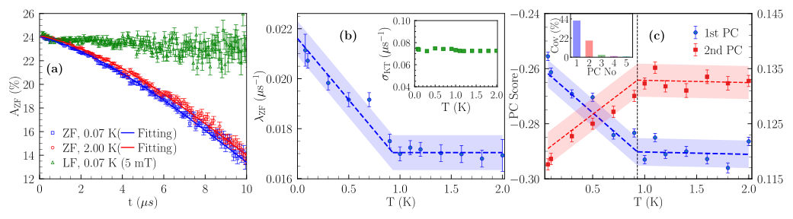
<figcaption class="paper-figure-caption"><b>Fig 2.</b> FIG. 2. Time-reversal symmetry breaking superconductivity in SrPd2As2: (a) The µSR asymmetry spectra AZF(t) of SrPd2As2 collected in zero field in superconducting state (0.07 K) and normal state (2 K) along with the fits by Eq. (1). The longitudinal field µSR spectra collected in H = 5 mT at temperature T = 0.07 K is also shown. (b) The muon spin relaxation rate λZF(T). The dashed line is a guide to eye. Inset: Gaussian Kubo-Toyabe relaxation rate σKT(T). (c) Temperature evolution of the first and second principal component scores obtained from principal component analysis of the µSR spectra. The inset shows the percentage of covariance captured by the different principle components. Shaded...</figcaption>
</figure>
<figure class="paper-figure-card">
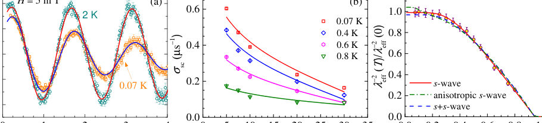
<figcaption class="paper-figure-caption"><b>Fig 3.</b> FIG. 3. Type-II bulk superconductivity with a single isotropic energy gap in SrPd2As2: (a) The µSR asymmetry spectra ATF(t) of SrPd2As2 collected in transverse magnetic field H = 5 mT (field-cooled) at 0.07 K and 2 K along with the fits by Eq. (3). (b) H dependence of σsc obtained from the fits of the TF-µSR spectra collected in H = 5–30 mT along with the fits (solid lines) according to Brandt relation, Eq. (4). (c) Normalized effective penetration depth λeffobtained using Eq. (4) plotted as λ−2 eff(T)/λ−2 eff(0) along with the fits by Eq. (5) for the isotropic single-gap s-wave model, anisotropic s-wave model and two-gap (s + s)-wave models.</figcaption>
</figure>
<figure class="paper-figure-card">
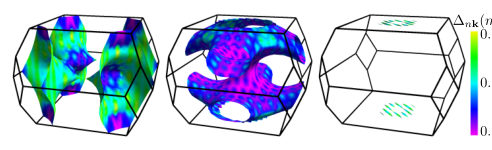
<figcaption class="paper-figure-caption"><b>Fig 4.</b> FIG. 4. Momentum-dependent superconducting gap with complex nodal structure from anisotropic Migdal-Eliashberg theory: Superconducting gap distri- bution on the three Fermi surface sheets of SrPd2As2, evalu- ated at T = 0.5 K. The gap shows strong anisotropy across the different sheets and momentum directions, with multiple nodes characteristic of nodal superconductivity. Although Migdal-Eliashberg theory predicts a complex nodal struc- ture, transverse-field µSR measurements reveal a fully gapped state. This contradiction effectively rules out a conventional phonon-mediated mechanism in SrPd2As2.</figcaption>
</figure>
<figure class="paper-figure-card">
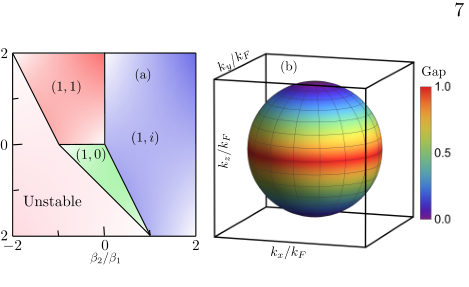
<figcaption class="paper-figure-caption"><b>Fig 5.</b> FIG. 5. Nonunitary triplet superconducting ground state in SrPd2As2: (a) Ginzburg-Landau phase diagram showing the symmetry-allowed two-component order param- eters (η1, η2) corresponding to the two-dimensional irreducible representations of the point group D4h. A time-reversal- symmetry-breaking superconducting state is stabilized for (η1, η2) = 1 √</figcaption>
</figure>

**Summary.** This paper resolves how a superconductor can break time-reversal symmetry while appearing fully gapped by demonstrating that the nodes of a nonunitary triplet state lie in empty regions of momentum space. It establishes SrPd2As2 as a significant platform for studying intrinsic topological superconductivity.

**Why it may be interesting.** not directly relevant

Detailed structure

**Main problem.** Resolving the contradiction in SrPd2As2 between experimental evidence of time-reversal symmetry breaking and thermodynamic probes that indicate a fully gapped superconducting state.

**Main result.** The study identifies a nonunitary triplet superconducting state where symmetry-imposed nodes are located in momentum-space regions devoid of electronic states, allowing the system to appear fully gapped despite breaking time-reversal symmetry.

**Method.** The researchers combined muon spin rotation and relaxation (muSR) experiments with first-principles DFT calculations, Wannier-based tight-binding models, and Ginzburg-Landau symmetry analysis.

**Model / system.** The physical system is SrPd2As2, a Z2 topological metal with a ThCr2Si2-type body-centered tetragonal structure, characterized by strong spin-orbit coupling and an open Fermi surface topology.

**Key observables.** Transition temperature (Tc), spontaneous internal magnetic fields, superconducting gap structure, Z2 topological invariant, and magnetic penetration depth.

**Important parameters / regimes.** Tc = 0.94 K, Z2 invariant = (1; 111), gap ratio 2Delta(0)/kBTc = 3.13, and electron-phonon coupling constant lambda = 0.65.

**Assumptions / limitations.** The analysis assumes the material's symmetry-imposed nodes do not intersect the Fermi surface, and uses the Migdal-Eliashberg framework to test phonon-mediated pairing.

**Figures summary.** Figure 1 shows the unit cell, electronic band structure, and Fermi surface; Figure 2 displays muSR spectra and PCA scores; Figure 6 shows the XRD pattern; Figure 7 presents phonon dispersion and the Eliashberg spectral function.

**Paper structure.** The paper introduces the material and the scientific contradiction, presents experimental muSR evidence for TRS breaking and a fully gapped state, details the computational electronic structure and topological analysis, uses Ginzburg-Landau and Migdal-Eliashberg theory to propose a nonunitary triplet state, and concludes by validating this model against experimental data.

Abstract

In Z2 topological metals, nontrivial band topology and strong spin-orbit coupling (SOC) impose symmetry constraints that can stabilize unconventional superconducting states, even when thermodynamic probes indicate an isotropic gap. Here, we investigate the superconducting ground state of such a material, SrPd2As2, using muon spin rotation and relaxation (muSR), first-principles calculations, and Ginzburg-Landau analysis. Transverse-field muSR indicates a fully gapped superconducting state below Tc = 0.94 K, while zero-field muSR detects spontaneous internal magnetic fields below Tc, establishing time-reversal symmetry (TRS) breaking. Electronic structure calculations identify SrPd2As2 as a Z2 topological metal with surface states crossing the Fermi level. Standard anisotropic Migdal-Eliashberg calculations predict a nodal gap and overestimate Tc, indicating that a purely phonon-mediated pairing mechanism is insufficient. We resolve this apparent contradiction by showing that the interplay of SOC, tetragonal symmetry, and an open Fermi surface topology stabilizes a nonunitary triplet superconducting state whose symmetry-imposed nodes lie in momentum-space regions devoid of electronic states. This yields a fully gapped thermodynamic response while naturally breaking TRS. Our results establish SrPd2As2 as a clean platform for bulk nonunitary triplet pairing and a promising candidate for intrinsic topological superconductivity.

[↑ back to top](#top)

### [On Constructing and Decoding Quantum Triorthogonal Codes](http://arxiv.org/abs/2605.24519v1)

**Authors:** Alessio Baldelli, Olai Å. Mostad, Hsuan-Yin Lin, Eirik Rosnes, Massimo Battaglioni  
**Type:** theory · **Category:** quantum information and computing · **PDF:** <https://arxiv.org/pdf/2605.24519v1>  
**Analysis basis:** full PDF text, analyzed in chunks

↔ Scroll figures horizontally

<figure class="paper-figure-card">
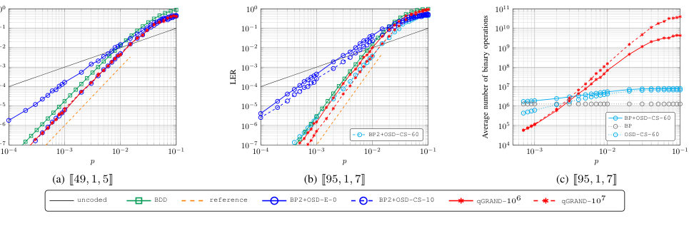
<figcaption class="paper-figure-caption"><b>Fig 1.</b> Fig. 1. Subfigs. (a) and (b): LER of two triorthogonal codes on the dephasing channel for several decoders. Subfig. (c): Comparison of the estimated average number of binary operations per decoded frame for the J95, 1, 7K triorthogonal code for qGRAND (−106 and −107) and BP2+OSD-CS-60.</figcaption>
</figure>

**Summary.** This paper provides a new mathematical framework for constructing triorthogonal quantum codes using integer linear programming, moving beyond traditional methods. It also demonstrates that a quantum-adapted version of the GRAND decoding algorithm offers superior performance and efficiency for these codes under dephasing noise.

**Why it may be interesting.** not directly relevant

Detailed structure

**Main problem.** The paper addresses the difficult construction and decoding of triorthogonal quantum CSS codes, which are essential for transversal T-gates in magic-state distillation.

**Main result.** The authors derive an existence criterion for triorthogonal matrices using MacWilliams identities and an Integer Linear Programming (ILP) formulation, discovering new triorthogonal codes and identifying an adapted qGRAND decoder as a highly promising decoding strategy.

**Method.** The study employs Integer Linear Programming (ILP) with symmetry reduction for code construction and evaluates various decoding algorithms, including Bounded-Distance Decoding, BP+OSD, and a quantum-adapted version of the GRAND algorithm.

**Model / system.** The work focuses on binary quantum CSS codes (specifically triorthogonal codes) subject to a memoryless dephasing (Z-type) error channel.

**Key observables.** Logical Error Rate (LER), dual minimum distance (d_perp), and computational complexity (binary operation counts).

**Important parameters / regimes.** Code length (n), dual distance (d_perp), dephasing probability (p), and OSD search depth (lambda).

**Assumptions / limitations.** The study is limited to binary CSS codes and assumes a dephasing-only noise model; it also assumes error patterns in the GRAND decoder can be pre-loaded in memory.

**Figures summary.** Figures show the Logical Error Rate (LER) versus dephasing probability (p) for different triorthogonal codes, comparing the performance of BDD, BP+OSD, and qGRAND decoders, alongside a comparison of computational costs.

**Paper structure.** The paper introduces the triorthogonal code problem, presents an ILP-based construction framework using algebraic tools, details the discovery of new codes, evaluates decoding performance under dephasing noise, and provides a detailed complexity analysis of the proposed decoders.

Abstract

A triorthogonal code is a binary quantum Calderbank-Shor-Steane (CSS) code defined by a triorthogonal matrix. Triorthogonal codes are a key ingredient in magic-state distillation, since they allow for transversal $\mathsf{T}$ gates, a non-Clifford logical operation useful for achieving universal fault-tolerant quantum computation. Their construction is challenging because it must satisfy simultaneous pairwise and triple-wise overlap constraints, as well as row-weight requirements. In this work, we study the construction and decoding of triorthogonal codes with prescribed dual-distance properties. We derive an existence criterion for even-weight triorthogonal generator matrices with a target dual minimum distance. The criterion combines triorthogonality constraints with MacWilliams identities via Krawtchouk-polynomial conditions on the dual weight distribution, yielding an integer linear programming formulation for the construction problem. We find new nontrivial triorthogonal codes that are not necessarily generated by classical triply-even codes. The decoding performance of high-distance triorthogonal codes obtained via the doubling construction is then evaluated over the dephasing channel. We compare bounded-distance decoding, belief propagation plus ordered-statistics post-processing, and a GRAND-based decoder adapted to the quantum setting, which turns out to be a promising option.

[↑ back to top](#top)

### [PauLIB: A High-Performance Library for Processing Pauli Strings](http://arxiv.org/abs/2605.25974v1)

**Authors:** Florian Krötz  
**Type:** theory · **Category:** quantum information and computing · **PDF:** <https://arxiv.org/pdf/2605.25974v1>  
**Analysis basis:** full PDF text, analyzed in chunks

↔ Scroll figures horizontally

<figure class="paper-figure-card">
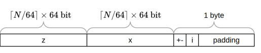
<figcaption class="paper-figure-caption"><b>Fig 1.</b> Fig. 1. Memory layout of PauliString. The struct stores ⌈N/64⌉64-bit Z-words, ⌈N/64⌉64-bit X-words, and a one-byte flags field encoding sign (±) and imaginary phase (i).</figcaption>
</figure>
<figure class="paper-figure-card">
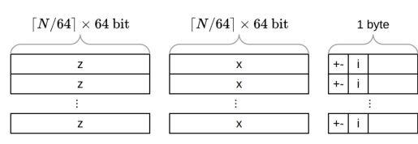
<figcaption class="paper-figure-caption"><b>Fig 2.</b> Fig. 2. Memory layout of PauliSumSoA. For a sum of M terms, the struct stores ⌈N/64⌉contiguous arrays of M 64-bit Z-words, ⌈N/64⌉arrays of M 64-bit X-words, and an array of M flags bytes encoding sign (±) and imaginary phase (i).</figcaption>
</figure>
<figure class="paper-figure-card">
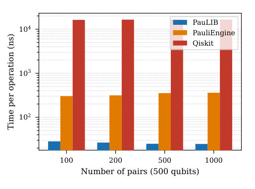
<figcaption class="paper-figure-caption"><b>Fig 3.</b> Fig. 3. Time per PauliString×PauliString at 500 qubits (log scale, SoA pair_multiply). All bars are flat across pair counts. PauLIB SoA (blue, 25 ns) is 14× below PauliEngine (orange, 350 ns) and 660× below Qiskit (red, 16.5 µs).</figcaption>
</figure>
<figure class="paper-figure-card">

<figcaption class="paper-figure-caption"><b>Fig 4.</b> Fig. 4 shows a log-log plot of the time to compute the full outer product H1 · H2 for two random 500-qubit Pauli sums of equal size N, producing N 2 output terms. The figure separates into two distinct bands. The upper band (dashed lines) contains PauliEngine, starting at 0.22 ms at N 2 = 625 and reaching 18.8 ms at N 2 = 40 000, and Qiskit, starting at 1.3 ms and reaching 84.8 ms over the same range. The lower band (solid lines) contains PauLIB AoS and SoA, starting at 0.09 ms and 0.11 ms respectively and reaching 1.9 ms and 2.4 ms — roughly ten times lower. All four lines run parallel on the log-log axes, showing O(N 2) scaling throughout. The gap between the bands is constant, confirming...</figcaption>
</figure>
<figure class="paper-figure-card">
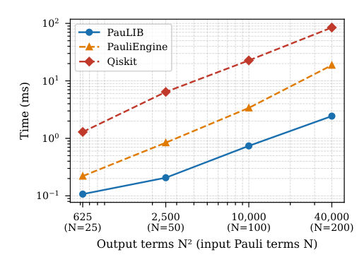
<figcaption class="paper-figure-caption"><b>Fig 5.</b> Fig. 4. PauliSum×PauliSum outer product time at 500 qubits vs. number of output terms N2 (log-log scale). PauLIB AoS and SoA (solid lines, lower band) are one to two orders of magnitude faster than PauliEngine and Qiskit (dashed lines, upper band), with all four lines following O(N2) scaling. At 500 qubits AoS outperforms SoA due to better cache locality.</figcaption>
</figure>

**Summary.** PauLIB is a high-performance C++ library designed to accelerate the manipulation of large Pauli sums. By using bit-packed symplectic representations and SIMD-optimized data layouts, it provides orders-of-magnitude speedups and much lower memory usage compared to standard Python-based quantum computing frameworks.

**Why it may be interesting.** not directly relevant

Detailed structure

**Main problem.** Processing large Pauli sums (millions of terms) is a major computational bottleneck in quantum chemistry and Pauli propagation due to Python overhead and inefficient data structures like hash maps.

**Main result.** The PauLIB library achieves massive speedups, including 660x faster single Pauli multiplication than Qiskit and up to 21,000x faster commutation grouping than PennyLane, while significantly reducing memory footprint.

**Method.** A C++20 header-only library using a bit-packed binary symplectic representation, a sorted array layout for SIMD-friendly operations, and both Array-of-Structures (AoS) and Struct-of-Arrays (SoA) memory layouts.

**Model / system.** The library focuses on the Pauli group, specifically handling large-scale Pauli strings and sums used in molecular Hamiltonians (via Jordan-Wigner or Bravyi-Kitaev transforms) and quantum error correction.

**Key observables.** Pauli string multiplication latency, Hamiltonian outer-product multiplication time, commutation grouping speed, and memory footprint (RSS).

**Important parameters / regimes.** Benchmarks performed at 500 qubits; includes comparisons of different rotation angles (Pauli, Clifford, and non-Clifford).

**Assumptions / limitations.** The current implementation is limited by the memory capacity of a single machine.

**Figures summary.** Figure 1 shows the AoS memory layout; Figure 2 shows the SoA layout; Figure 3 compares Pauli multiplication latency; Figure 4 shows Hamiltonian outer-product scaling; Figure 5 shows commutation grouping time; Figure 6 compares memory usage between PauLIB and Qiskit.

**Paper structure.** The paper introduces the computational bottleneck, details the three core architectural choices (symplectic representation, sorted array, and SoA/AoS layouts), presents performance benchmarks against existing frameworks (Qiskit, PennyLane, PauliEngine), and discusses future scaling and distributed-memory directions.

Abstract

Processing large Pauli sums is a significant bottleneck in quantum chemistry, Pauli propagation, and Pauli-based compilation. Existing frameworks often suffer from Python interpreter overhead or utilize hash-map data structures that hinder SIMD vectorization and complicate multi-threaded merging. We present PauLIB, a header-only C++20 library designed to eliminate these bottlenecks through three key architectural choices. A bit-packed binary symplectic representation that encodes each qubit in two bits, reducing Pauli multiplication to a bitwise XOR and a population count; a sorted array layout that replaces hash maps to enable branch-predictable SIMD bulk operations; and a struct-of-arrays (SoA) memory layout that exposes contiguous word arrays for explicit SIMD vectorization. Benchmarks at 500 qubits show that single Pauli string multiplication runs at 25ns per operation-14 times faster than PauliEngine and 660 times faster than Qiskit-flat across all pair counts tested. Hamiltonian outer-product multiplication is approximately 10 times faster than PauliEngine and 45 times faster than Qiskit at all tested sizes. Greedy commutation grouping, the dominant preprocessing cost in variational algorithms, achieves up to 21,000 times speedup over PennyLane, driven by the compact bit-packed representation. The compact layout reduces the memory footprint of a one-million-term Hamiltonian at 500 qubits from 1,036MB (Qiskit) to 142MB, a 7.3 times reduction that directly enables larger problem sizes within a fixed memory budget. PauLIB is open source and provides C++ and Python interfaces.

[↑ back to top](#top)

### [Probing the limits of the semiclassical Einstein equation](http://arxiv.org/abs/2605.24103v1)

**Authors:** Gustavo Schranck Habermann, Daniel A. Turolla Vanzella  
**Type:** theory · **Category:** other · **PDF:** <https://arxiv.org/pdf/2605.24103v1>  
**Analysis basis:** full PDF text, analyzed in chunks

↔ Scroll figures horizontally

<figure class="paper-figure-card">
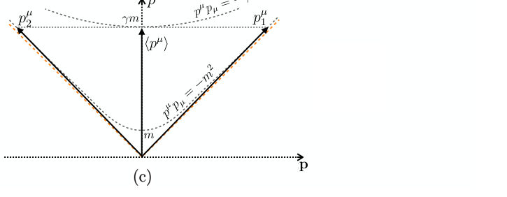
<figcaption class="paper-figure-caption"><b>Fig 1.</b> Figure 1: A particle with mass m (with GNm/ℓ≪1) in either 4-momentum state |pµ 1⟩[see (a)] or |pµ 2⟩[see (b)] — or any other momentum state |pµ⟩, with pµ belonging to the mass shell pµpµ = −m2 (dashed gray line) —, would engender only a weak gravitational field — according to any covariant criterion —, regardless how large the values of energy and 3- momentum are in a given frame. However, a system with 4-momentum ⟨pµ⟩= (pµ 1 +pµ 2)/2 = (γm, 0) [see (c)] can generate a strong gravitational field provided γ is large enough.</figcaption>
</figure>

**Summary.** This paper proposes a method to test the limits of the semiclassical Einstein equation by using a superposition of boosted masses. It shows that the nonlinear nature of gravity can cause the semiclassical average to predict a strong-gravity regime that is absent in the individual quantum branches. This provides a way to potentially distinguish between quantum and semiclassical gravity using branch-degenerate observables.

**Why it may be interesting.** not directly relevant

Detailed structure

**Main problem.** Investigating the validity and limits of the semiclassical Einstein equation, specifically whether the approximation holds when quantum fluctuations of the stress-energy tensor are large or when nonlinear gravity is involved.

**Main result.** The authors demonstrate that the semiclassical approximation can predict a strong-gravity, nonlinear regime even when individual branches of a quantum superposition are in a weak-field regime, due to the amplification of energy-momentum in the averaged stress-energy tensor.

**Method.** The study uses an analytical approach with the exact Levi-Civita metric in Weyl canonical form, applying Lorentz boosts to compare the predictions of a quantum superposition of states versus a semiclassical average.

**Model / system.** A toy model consisting of a cylinder with low proper linear density in a coherent superposition of two opposite relativistic boost velocities.

**Key observables.** The rate of change of the proper circumference with respect to the proper radius (dC/dr).

**Important parameters / regimes.** Dimensionless mass parameter (sigma), Lorentz factor (gamma), and the Tolman gravitational mass per unit length (Sigma).

**Assumptions / limitations.** The use of a 'flat-interior' approximation for the quantum scenario, which may break down in the semiclassical regime as the gravitational field becomes non-perturbative.

**Figures summary.** Figure 1 illustrates the difference in gravitational content between the two scenarios.

**Paper structure.** The paper introduces the problem of semiclassical gravity validity, defines a toy model of a boosted cylinder, performs analytical calculations for both quantum and semiclassical scenarios, and compares observable predictions to demonstrate the breakdown of the approximation.

Abstract

In the context of semiclassical gravity, the semiclassical Einstein equation is often invoked when backreaction of quantum matter/fields on the spacetime is at stake. It is expected to hold when quantum fluctuations are small. Yet, it is routinely used to justify the central role of the expectation value of the stress-energy tensor of quantum fields, whose fluctuations formally diverge. Here we propose a new way to probe the limits of this approximation by exploiting peculiar nonlinearities of gravity. As a proof of principle, we construct a controlled, analytically tractable setting where the incoherent mixture of weak-gravity states drives the system into a strong-gravity regime. By selecting a branch-degenerate observable, one can compare predictions of quantum and semiclassical gravity, potentially delimiting the validity of the latter.

[↑ back to top](#top)

### [Q-RAIL: A Reliability-Aware Framework for Quantum Federated Learning on Heterogeneous Noisy Hardware](http://arxiv.org/abs/2605.25783v1)

**Authors:** Walid El Maouaki, Muhammad Shafique  
**Type:** theory · **Category:** quantum information and computing · **PDF:** <https://arxiv.org/pdf/2605.25783v1>  
**Analysis basis:** full PDF text, analyzed in chunks

↔ Scroll figures horizontally

<figure class="paper-figure-card">
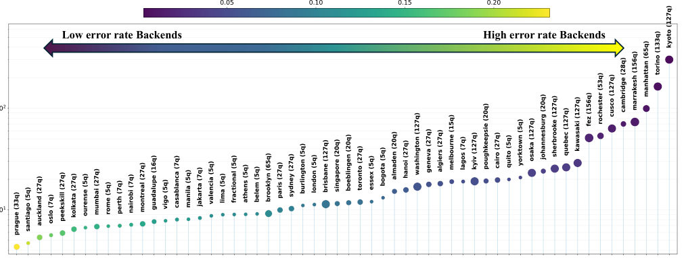
<figcaption class="paper-figure-caption"><b>Fig 1.</b> Fig. 2: Ranking of candidate backends by composite error (log scale), from low-error to high-error devices, with color indicating the corresponding quality score.</figcaption>
</figure>
<figure class="paper-figure-card">
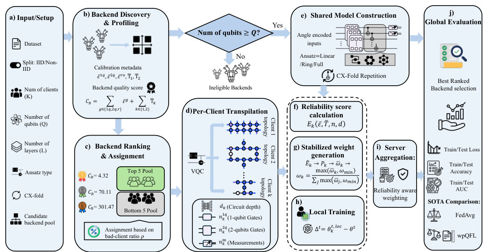
<figcaption class="paper-figure-caption"><b>Fig 2.</b> Fig. 3: Overview of the Q-RAIL methodology: a) Input. b) Backend discovery and profiling. c) Ranking and client assignment. Here, the top-5 and bottom-5 pools are shown as an example, but the pool size is adjustable based on the full candidate backend set. d) Per-client transpilation. e) Shared QML model construction. f) Reliability-score computation. g) Stabilized reliability-aware aggregation. h) Local training. i) Server aggregation. j) Global evaluation and SOTA comparison.</figcaption>
</figure>
<figure class="paper-figure-card">
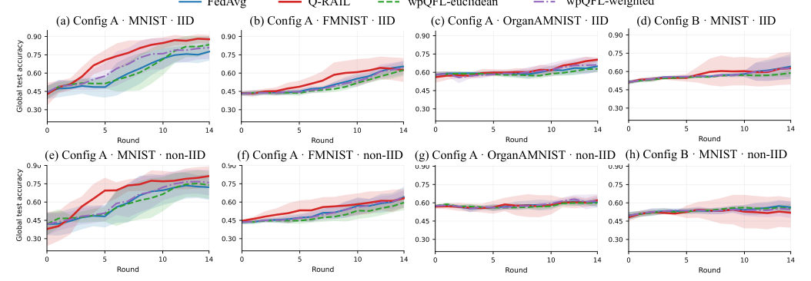
<figcaption class="paper-figure-caption"><b>Fig 3.</b> Fig. 4: Main comparison across Configurations A and B. Global test accuracy over communication rounds for FedAvg, Q-RAIL, and wpQFL under IID (top row) and non-IID (bottom row) data partitions on MNIST, Fashion-MNIST, and OrganAMNIST. The legend is shared.</figcaption>
</figure>
<figure class="paper-figure-card">
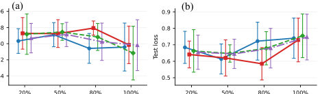
<figcaption class="paper-figure-caption"><b>Fig 4.</b> Fig. 5: Performance under increasing bad-client ratios. Final-round test accuracy and test loss as the proportion of low-quality clients increases from 20% to 100%. Error bars denote variability across seeds. The legend is shared.</figcaption>
</figure>
<figure class="paper-figure-card">
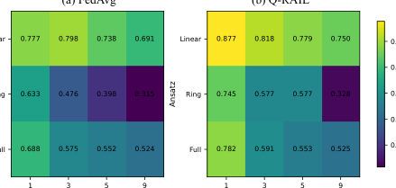
<figcaption class="paper-figure-caption"><b>Fig 5.</b> Fig. 8: Ansatz and CX-fold stress test. Final test accuracy of FedAvg and Q-RAIL across linear, ring, and full entanglement patterns under increasing CX-fold values. Higher CX-fold amplifies circuit noise by repeating entangling operations.</figcaption>
</figure>

**Summary.** This paper introduces Q-RAIL, a framework designed to make Quantum Federated Learning more robust to the noise and hardware differences found in NISQ devices. By weighting client updates based on the reliability of their specific hardware and circuit depth, it prevents noisy backends from degrading the global model. This approach significantly improves learning accuracy and stability in heterogeneous quantum networks.

**Why it may be interesting.** not directly relevant

Detailed structure

**Main problem.** Addressing hardware heterogeneity in Quantum Federated Learning (QFL), where varying noise levels and transpilation-induced circuit changes across different NISQ backends cause unreliable client updates.

**Main result.** The Q-RAIL framework significantly improves QFL accuracy (e.g., a 10.0-point gain on MNIST) and robustness against 'bad clients' by using a reliability-aware aggregation method.

**Method.** Q-RAIL computes a client-specific effective noise budget using backend calibration metadata and transpiled circuit statistics, then applies a stabilized, temperature-scaled softmax weighting for aggregation.

**Model / system.** The study uses Variational Quantum Classifiers (VQCs) with angle-encoding feature maps and various ansatz topologies (linear, ring, full) implemented on simulated heterogeneous NISQ hardware (Qiskit FakeProvider).

**Key observables.** Test accuracy, test loss, Area Under the Curve (AUC), and effective noise budget.

**Important parameters / regimes.** Temperature scaling (tau), uniform mixing (beta), minimum weight floor (w_min), qubit counts (4, 10, 15), and CX-fold noise amplification.

**Assumptions / limitations.** Assumes the server has access to backend calibration metadata and transpilation statistics; focuses on the NISQ era where noise-induced device shift is a primary driver of degradation.

**Figures summary.** Figure 1 shows the Q-RAIL workflow; Figure 2 ranks backends by error; Figure 3 details the methodology flowchart; Figures 4-6 show learning curves, robustness to bad clients, and scalability with client count; Figures 7-8 show heatmaps of noise budgets and accuracy relative to circuit complexity.

**Paper structure.** The paper introduces the problem of hardware heterogeneity in QFL, proposes the Q-RAIL framework, details the reliability-scoring and aggregation mechanism, presents benchmarking results across various datasets and noise regimes, and discusses limitations and future directions.

Abstract

Quantum federated learning (QFL) on NISQ hardware is highly sensitive to backend heterogeneity: some clients contribute informative updates, while others contribute noise-dominated drift that uniform averaging cannot distinguish. We propose Q-RAIL (Quantum Reliability-Aware Federated Inference and Learning), a circuit- and calibration-aware aggregation method for hardware-heterogeneous QFL. Q-RAIL computes a client-specific effective noise budget from backend calibration metadata together with transpiled circuit statistics. This budget is converted into stabilized aggregation weights using temperature scaling, uniform mixing, and a minimum-weight floor. Q-RAIL was evaluated across multiple experimental settings, including an ablation study, and benchmarked against state-of-the-art methods on three datasets: MNIST, Fashion-MNIST, and OrganAMNIST. On the primary MNIST benchmark under strong hardware skew, Q-RAIL improves final test accuracy from FedAvg's 0.777 to 0.877, a +10.0-point gain corresponding to about 44.8% relative error reduction, while also exceeding the strongest wpQFL baseline (0.833). At the same time, test loss drops from 0.722 to 0.585, and test AUC rises from 0.920 to 0.973. Under non-IID MNIST, Q-RAIL reaches 0.813 vs 0.722 for FedAvg. It also outperforms FedAvg in 12/12 ansatz/CX-fold stress configurations and remains stronger at 4, 10, and 15 qubit setups. Overall, the results support calibration-driven, circuit-aware aggregation as a practical path toward robust QFL on heterogeneous quantum hardware.

[↑ back to top](#top)

### [QGCL: Quantum-Guided Clause Learning for Cryptanalytic SAT](http://arxiv.org/abs/2605.25756v1)

**Authors:** Walid El Maouaki, Alberto Marchisio, Muhammad Shafique  
**Type:** both · **Category:** quantum information and computing · **PDF:** <https://arxiv.org/pdf/2605.25756v1>  
**Analysis basis:** full PDF text, analyzed in chunks

↔ Scroll figures horizontally

<figure class="paper-figure-card">
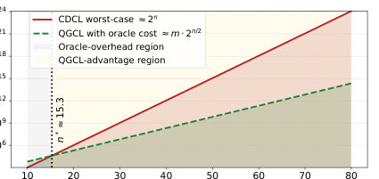
<figcaption class="paper-figure-caption"><b>Fig 1.</b> Fig. 1: Asymptotic scaling motivation for applying Grover search to sufficiently large extracted CNF subformulas with n Boolean variables and m clauses. The red curve represents the classical worst-case term 2n, while the green curve represents Grover-style subformula search with clause-oracle overhead, approximately m·2n/2. The crossover near n⋆≈2 log2 m marks the regime where the extracted conflict region is large enough for Grover guidance to become especially attractive. m is fixed to 200 clauses in this plot. TABLE I: Worst-case asymptotic cost of CNF-based side-channel checking with n Boolean variables and m clauses.</figcaption>
</figure>
<figure class="paper-figure-card">
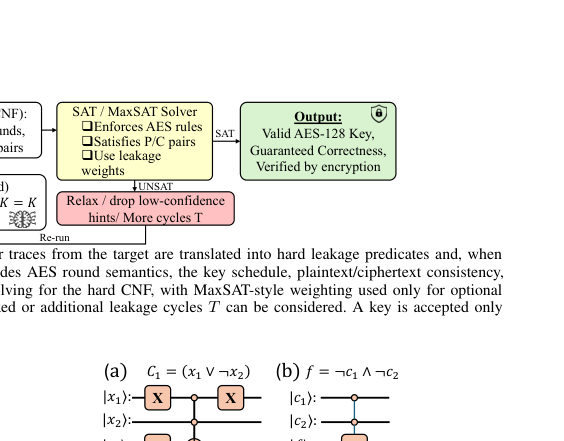
<figcaption class="paper-figure-caption"><b>Fig 2.</b> Fig. 4: Circuit sketch for SAT-oracle building blocks. (a) Clause-violation ancilla c1 for the clause C1 = (x1 ∨¬x2). X gates on the positive literal x1 retarget the control so that the multi-controlled X on c1 fires only when both literals in C1 are false (clause violated), i.e., when x1 = 0 and x2 = 1. Thus c1 = 1 encodes C1 violated. (b) Two such clause-violation bits c1, c2 are combined with a multi-controlled Toffoli to implement f ←¬c1 ∧¬c2, the CNF flag that is 1 iff no clause is violated. A controlled-Z on f applies the Grover phase to satisfying assignments. All ancillas are later uncomputed.</figcaption>
</figure>
<figure class="paper-figure-card">
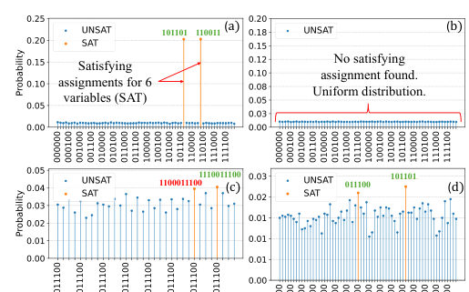
<figcaption class="paper-figure-caption"><b>Fig 3.</b> Fig. 6: Grover-subsolver output distributions for small CNF formulas used to validate the local oracle and sampling loop. For an extracted CNF with nsub variables and msub clauses, the oracle uses nsub + msub + 1 qubits. Panels (a,b) show ideal simulations: satisfiable cases amplify marked assignments, while unsatisfiable cases remain near-uniform. Panels (c,d) show noisy Fake Prague simulations, where the correct assignment is often still among the highest-probability candidates despite noise.</figcaption>
</figure>
<figure class="paper-figure-card">
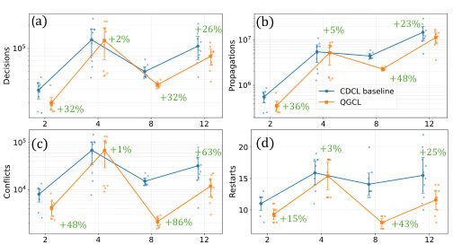
<figcaption class="paper-figure-caption"><b>Fig 4.</b> Fig. 7: Comparison of the CDCL baseline (blue) and the QGCL hybrid solver (orange) on the benchmark family with T ∈{2, 4, 8, 12}. Panels show (a) decisions, (b) propagations, (c) conflicts, and (d) restarts. Points denote individual runs; solid markers and error bars show the mean and 95% confidence interval across 10 seeds. Percentage labels indicate the relative improvement of QGCL over CDCL.</figcaption>
</figure>
<figure class="paper-figure-card">
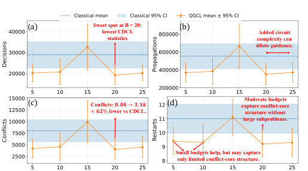
<figcaption class="paper-figure-caption"><b>Fig 5.</b> Fig. 9: QGCL performance when varying the Grover budget, defined as the maximum size of the extracted subformula (number of distinct variables plus clauses), on the same fixed instance used in the call-count sweep. Panels show (a) decisions, (b) propagations, (c) conflicts, and (d) restarts. The classical CDCL baseline mean and 95% confidence interval are plotted in blue; QGCL (hybrid) means and 95% confidence intervals appear in orange.</figcaption>
</figure>

**Summary.** This paper proposes a hybrid algorithm called QGCL that integrates Grover search into classical SAT solvers to accelerate AES cryptanalysis. By using quantum search to provide local heuristic hints rather than attempting a global search, it significantly reduces the computational effort required to solve massive, structured search problems.

**Why it may be interesting.** not directly relevant

Detailed structure

**Main problem.** The difficulty of recovering AES-128 secret keys from noisy power side-channel leakage, which is a massive and highly structured combinatorial search problem impractical for full-scale Grover search.

**Main result.** The QGCL framework achieves up to an 86% reduction in solver conflicts and improves wall-time in ideal simulations by using Grover search to provide heuristic guidance to a classical CDCL solver.

**Method.** A hybrid quantum-classical approach (QGCL) where Grover search is invoked on small, dynamically extracted subformulas (conflict cores) to provide branching hints (variable activities and polarities) to a classical CDCL solver.

**Model / system.** The problem is modeled as a Boolean Satisfiability (SAT) problem in Conjunctive Normal Form (CNF) derived from AES-128 power side-channel leakage, simulated using the PennyLane framework on an NVIDIA GPU.

**Key observables.** Solver-internal statistics including conflicts, decisions, propagations, restarts, and total wall-time.

**Important parameters / regimes.** Grover budget (subproblem size), maximum number of Grover calls (C_max), mixing parameter (eta_t), and the depth of the cryptanalytic problem (T).

**Assumptions / limitations.** The effectiveness relies on a useful operating regime where quantum subproblems are small enough for near-term hardware; the framework assumes the quantum output only influences heuristics and cannot alter the logical SAT/UNSAT result.

**Figures summary.** Figure 1 shows asymptotic complexity scaling; Figure 2 shows the AES side-channel workflow; Figure 3 illustrates the QGCL control flow; Figure 5 shows subformula extraction; Figure 6 compares ideal vs. noisy Grover outputs; Figure 7 compares CDCL vs. QGCL performance metrics.

**Paper structure.** The paper introduces the cryptanalytic challenge, defines the QGCL hybrid framework and circuit construction, details the subformula extraction and heuristic update methods, presents experimental results on various scales and noise levels, and concludes with future work.

Abstract

Power side-channel attacks on AES exploit data-dependent physical leakage to recover secret keys, but turning noisy leakage observations into a verified AES-128 key remains a hard combinational search problem. SAT-assisted power side-channel cryptanalysis addresses this challenge by encoding AES semantics, key constraints, plaintext/ciphertext consistency, and leakage predicates as CNF, so that candidate keys must satisfy the exact cryptographic specification. These cryptanalytic SAT formulas are large and highly structured; our largest controlled AES-oriented power-SCA instances contain up to 39,389 variables and 137,712 clauses, making a full-formula Grover search well beyond the scale studied here and beyond currently practical near-term implementations. We propose QGCL, a Quantum-Guided Conflict-Driven Clause Learning (CDCL) framework in which Grover search is invoked only on small subformulas extracted dynamically around CDCL conflict cores. The quantum subsolver returns candidate assignments and violation scores that bias branching heuristics, while final SAT/UNSAT decisions and key verification remain classical. We evaluate QGCL on AES-oriented cryptanalytic SAT instances derived from power side-channel CNFs with leakage-derived hint configurations, measuring conflicts, restarts, decisions, and propagations. The experiments show consistent reductions in these solver-internal statistics on harder instances, with up to an 86% reduction in conflicts compared with the classical conflict-learning baseline. Parameter sweeps over the number of Grover oracle calls and the subproblem size identify a regime in which a modest quantum resource allocation captures most of the observed improvement.

[↑ back to top](#top)

### [Quantum Domain Decomposition for Preconditioning the Finite Element Method](http://arxiv.org/abs/2605.26090v1)

**Authors:** Elise Fressart, Michel Nowak, Nicole Spillane  
**Type:** theory · **Category:** quantum information and computing · **PDF:** <https://arxiv.org/pdf/2605.26090v1>  
**Analysis basis:** full PDF text, analyzed in chunks

↔ Scroll figures horizontally

<figure class="paper-figure-card">
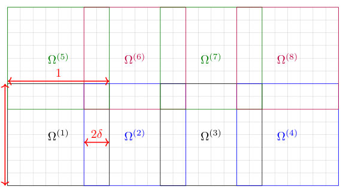
<figcaption class="paper-figure-caption"><b>Fig 1.</b> Fig. 1: Example of 8 overlapping subdomains (d = 2, N1 = 4, N2 = 2, L = 3, and δ = 2−L).</figcaption>
</figure>

**Summary.** This paper introduces a quantum-compatible domain decomposition framework to precondition large-scale linear systems. By reducing the condition number of FEM-discretized PDEs, it enables more efficient execution of quantum linear solvers, potentially overcoming the scaling limits of current quantum algorithms.

**Why it may be interesting.** not directly relevant

Detailed structure

**Main problem.** Addressing the scalability bottleneck in Quantum Linear System Solvers (QLSS) by reducing the condition number of large-scale matrices arising from the Finite Element Method (FEM).

**Main result.** The authors prove the feasibility of quantum domain decomposition and provide upper bounds for the block-encoding parameters and computational complexity of the preconditioned system.

**Method.** The study utilizes a two-level Additive Schwarz preconditioner with BPX local solvers, implemented via block-encoding and Quantum Singular Value Transformation (QSVT) for the Poisson equation.

**Model / system.** The mathematical model is the Poisson equation (a diffusion-type PDE) on a d-dimensional hyperrectangle, discretized using the Finite Element Method (FEM) on a Cartesian mesh.

**Key observables.** The condition number of the preconditioned operator, the subnormalization factor (alpha), and the complexity of computing inner products (quantities of interest).

**Important parameters / regimes.** Mesh size (h or L), overlap parameter (delta), number of subdomains (N), and the diffusion tensor (rho).

**Assumptions / limitations.** The domain is assumed to be a hyperrectangle, the diffusion coefficient is constant over each mesh element, and the local solvers are implemented via block-encoding.

**Figures summary.** Figure 1 illustrates the spatial arrangement of overlapping subdomains in a 2D setup; numerical tables compare condition numbers and eigenvalue ratios across different preconditioners and subdomain counts.

**Paper structure.** The paper progresses from the FEM discretization setting to domain decomposition and spectral bounds, followed by block-encoding construction, cost analysis, and a numerical proof-of-concept.

Abstract

Even in cases where quantum linear solvers provide significant speedup compared to their classical counterparts, their performance depends on some of the same parameters. In particular, the condition number of the matrix which is to be inverted is a decisive parameter. A well known classical, and now quantum, remedy is to precondition the linear system $A x = b$ by premultiplying it by a matrix $H$ in such a way that the condition number of $HA$ is significantly smaller than the condition number of $A$.   In this work, we focus on a family of preconditioners called domain decomposition. First, we prove that it is feasible to apply quantum domain decomposition. We provide upper bounds for the block-encoding parameters of the Poisson problem discretized by the finite element method and preconditioned by the two-level Additive Schwarz preconditioner (one of the most fundamental domain decomposition techniques). From these bounds, we deduce the complexity of the quantum linear system solver. Second, we focus on a particular choice of local solver within the domain decomposition preconditioner by applying recent work by [Deiml and Peterseim, \textit{Math. Comput.}, 2025] on the Bramble--Pasciak--Xu (BPX) preconditioner. Finally, we provide details on how the operators are implemented.

[↑ back to top](#top)

### [Quantum Parameterized Self-Attention Network for Image Classification](http://arxiv.org/abs/2605.25365v1)

**Authors:** Wenwei Zhang, Jintao Wang, Tianyu Ye, Changgeng Liao  
**Type:** both · **Category:** quantum information and computing · **PDF:** <https://arxiv.org/pdf/2605.25365v1>  
**Analysis basis:** full PDF text, analyzed in chunks

↔ Scroll figures horizontally

<figure class="paper-figure-card">
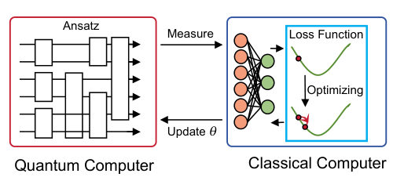
<figcaption class="paper-figure-caption"><b>Fig 1.</b> Fig. 1. The VQA hybrid computational architecture: the quantum computer handles quantum state manipulation, while the classical computer performs parameter optimization and iterative updates.</figcaption>
</figure>
<figure class="paper-figure-card">
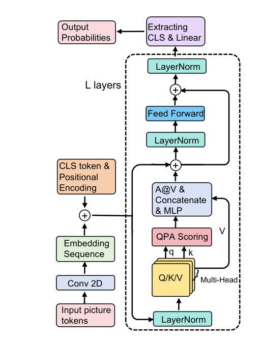
<figcaption class="paper-figure-caption"><b>Fig 2.</b> Fig. 2. Overall architecture of QPSAN. The core distinction from classical ViT is the replacement of the dot-product operation with the QPA Scoring Module.</figcaption>
</figure>
<figure class="paper-figure-card">
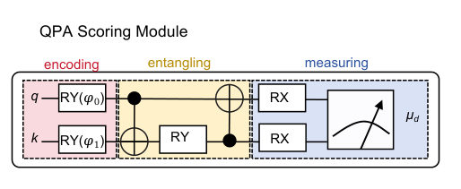
<figcaption class="paper-figure-caption"><b>Fig 3.</b> Fig. 3. QPA module circuit structure. The upper wire is Q0, corresponding to the d-th dimension input scalar q = Qi,d; the lower wire is Q1, corresponding to the d-th dimension input scalar k = Kj,d; the circuit runs independently for each dimension, outputting per-dimension attention score components µd via joint measurement.</figcaption>
</figure>
<figure class="paper-figure-card">
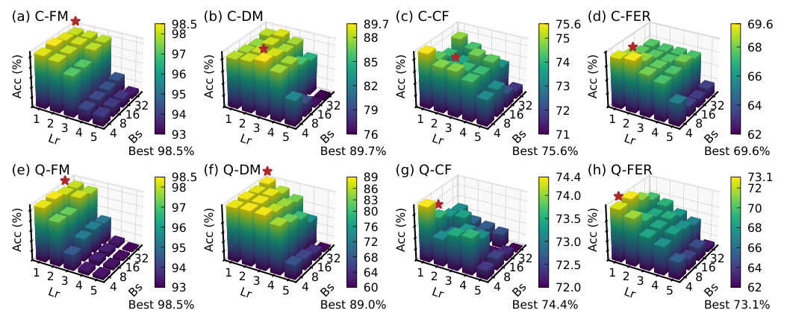
<figcaption class="paper-figure-caption"><b>Fig 4.</b> Fig. 4. Bar chart of hyperparameter search results. C denotes the classical ViT model; Q denotes the quantum QPSAN model. Indices 1–5 on the learning rate axis correspond to learning rates 5 × 10−3, 2 × 10−3, 10−3, 5 × 10−4, and 10−4, respectively; the final training configuration is determined jointly by accuracy and training stability (measured by standard deviation), marked with a red star. Panels (c) and (g) show CF dataset search results: the combination with the highest mean accuracy has a relatively large standard deviation (C-CF: 0.012; Q-CF: 0.011), so the configuration with slightly lower accuracy but substantially smaller standard deviation (C-CF: 0.005; Q-CF: 0.0004) is selected...</figcaption>
</figure>
<figure class="paper-figure-card">
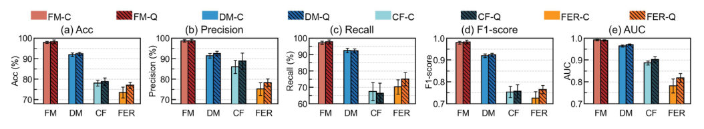
<figcaption class="paper-figure-caption"><b>Fig 5.</b> Fig. 5. Comparison of QPSAN and ViT results on the four datasets across five evaluation metrics: validation accuracy, precision, recall, F1-score, and AUC-ROC.</figcaption>
</figure>

**Summary.** This paper introduces a hybrid quantum-classical neural network that replaces the classical dot-product attention mechanism with a parameterized quantum circuit. By leveraging quantum features like entanglement and non-monotonicity, the model achieves higher accuracy in image classification tasks compared to standard Vision Transformers.

**Why it may be interesting.** not directly relevant

Detailed structure

**Main problem.** The paper addresses the limitations of classical self-attention, such as linear operations and unbounded output ranges, by exploring whether a quantum-enhanced scoring function can provide superior structural inductive biases like non-separability and non-monotonicity.

**Main result.** The proposed QPSAN architecture significantly outperforms the Vision Transformer (ViT) baseline on several image classification datasets, with the quantum advantage increasing alongside data complexity.

**Method.** The authors use a hybrid quantum-classical Variational Quantum Algorithm (VQA) framework, implementing a two-qubit Parameterized Quantum Circuit (PQC) as the attention scoring module and optimizing it via classical backpropagation.

**Model / system.** A hybrid architecture consisting of a classical Vision Transformer (ViT) backbone integrated with a Quantum Parameterized Self-Attention (QPA) module, which utilizes a two-qubit circuit with an encode-entangle-measure design.

**Key observables.** The attention score $\mu_d(q, k)$, calculated as the joint measurement probability $P(|00\rangle) + P(|11\rangle)$ in the computational basis.

**Important parameters / regimes.** Five trainable quantum parameters: $\theta_s$ (initial encoding), $\gamma_d$ (difference encoding), $\gamma_s$ (sum encoding), $\alpha$ (entanglement), and $\beta$ (mixer).

**Assumptions / limitations.** The proofs for non-monotonicity and asymmetry assume non-zero values for encoding and entanglement parameters; the study also assumes the ability to classically simulate the circuit for validation.

**Figures summary.** Figure 1 shows the hybrid VQA architecture; Figure 2 illustrates the QPSAN architecture replacing classical dot-product; Figure 3 shows the circuit structure; Figure 8 shows the impact of various quantum noise channels on accuracy.

**Paper structure.** The paper introduces the problem of classical attention limitations, proposes the QPSAN architecture, provides a mathematical framework proving the scoring function's properties (non-separability, asymmetry, non-monotonicity), presents experimental results on vision datasets, and conducts ablation and noise robustness studies.

Abstract

Transformer now underpins modern AI as its core infrastructure. Its defining capability-dynamically focusing on the most relevant information in complex inputs-is bounded above by the self-attention scoring function. Quantum computing, with its superposition, entanglement, and probabilistic outputs, offers a fundamentally distinct computational framework for exploring beyond the design constraints of classical scoring functions. While quantum attention mechanisms have shown initial promise, existing works remain largely confined to redefining feature similarity measures, leaving the systematic use of parameterized quantum circuits (PQCs) as scoring functions largely unexplored; a substantial portion of existing schemes further rely on purely quantum architectures, precluding effective encoding of high-dimensional image inputs in the Noisy Intermediate-Scale Quantum era. We propose the Quantum Parameterized Self-Attention Network (QPSAN), implementing the self-attention scoring function via PQCs with only 5 trainable quantum parameters per layer. QPSAN computes query-key attention scores through quantum state encoding and joint measurement, yielding naturally bounded outputs without the explicit scaling of classical dot-product attention. We further establish a theoretical framework of the mathematical properties of this scoring function, demonstrating its potential to capture complex nonlinear query-key interactions, and quantifying the structural constraints of the encoding layer via effective degrees of freedom analysis. Experiments on four vision datasets show that QPSAN significantly outperforms the Vision Transformer (ViT) baseline, with the quantum representational advantage amplifying as data complexity increases. Ablation studies indicate that the performance gains may stem from the structural inductive bias of the quantum circuit rather than from parameter scale.

[↑ back to top](#top)

### [Quantum-Adaptive KS($\varphi$): A Parameterized Three-Qubit Gate Family Embedding Toffoli with Measurement-Free Phase Kickback and Intrinsic Error Non-Amplification](http://arxiv.org/abs/2605.24182v1)

**Authors:** Kripa Sankaranarayanan, Marek Perkowski  
**Type:** theory · **Category:** quantum information and computing · **PDF:** <https://arxiv.org/pdf/2605.24182v1>  
**Analysis basis:** full PDF text, analyzed in chunks

↔ Scroll figures horizontally

<figure class="paper-figure-card">
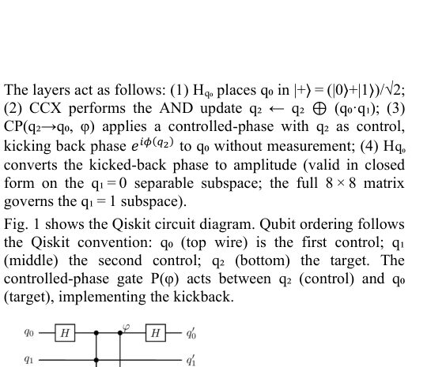
<figcaption class="paper-figure-caption"><b>Fig 1.</b> Fig. 1. Qiskit circuit for Quantum-Adaptive KS(φ) : H on q₀; CCX (Toffoli) with controls q₀, q₁ and target q₂; P(φ) controlled- phase kickback from q₂ to q₀; H on q₀.</figcaption>
</figure>
<figure class="paper-figure-card">
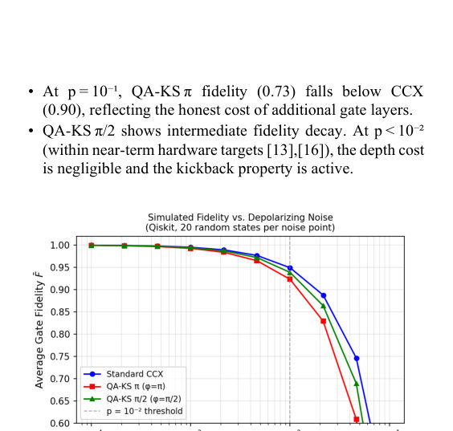
<figcaption class="paper-figure-caption"><b>Fig 2.</b> Fig. 2. Average gate fidelity vs. depolarizing noise rate p (Qiskit statevector simulation, 20 random pure states per noise</figcaption>
</figure>
<figure class="paper-figure-card">
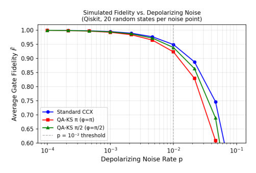
<figcaption class="paper-figure-caption"><b>Fig 3.</b> Fig. 3. Phase kickback amplitude sin(φ/2) vs. gate parameter φ. Canonical variants: QA-KS π/2 (amplitude ≈ 0.707) and QA- KS π (amplitude = 1.0).</figcaption>
</figure>
<figure class="paper-figure-card">
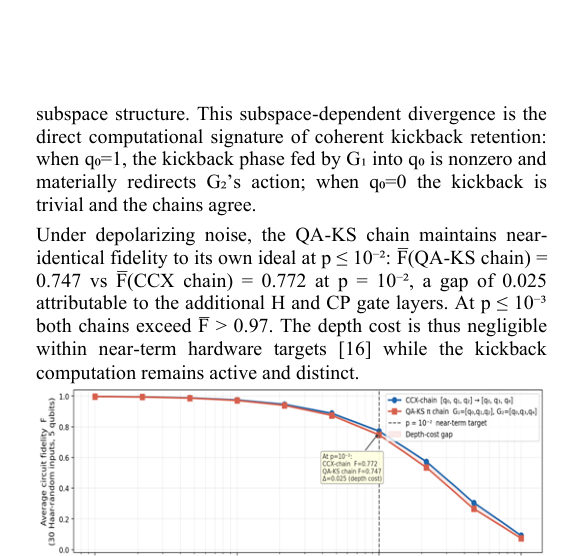
<figcaption class="paper-figure-caption"><b>Fig 4.</b> Fig. 4. Coherent kickback chain simulation results. Average circuit fidelity F̅ vs depolarizing noise p for CCX-chain and QA- KS(π) chain on 5 qubits.</figcaption>
</figure>

**Summary.** The paper proposes a new class of three-qubit gates that act like a Toffoli gate but include extra features like measurement-free phase kickback and built-in error resistance. This could allow for more efficient quantum computing by reducing the need for complex error correction and ancilla qubits.

**Why it may be interesting.** not directly relevant

Detailed structure

**Main problem.** The high resource cost of Toffoli (CCX) gates in fault-tolerant architectures and the lack of intrinsic, gate-level error suppression mechanisms that do not require measurement or ancilla overhead.

**Main result.** The introduction of the QA-KS(phi) gate family, which embeds the Toffoli gate while providing measurement-free phase kickback and intrinsic error non-amplification on specific subspaces.

**Method.** The authors use a mathematical framework of Hadamard conjugation and controlled-phase gates, verified via unitarity checks and Qiskit depolarizing-noise simulations.

**Model / system.** A parameterized three-qubit gate family (QA-KS) consisting of a Hadamard sandwich around a CCX gate and a controlled-phase gate, designed for linear connectivity in trapped-ion or surface-code architectures.

**Key observables.** Average gate fidelity, phase kickback amplitude, trace-distance weight of error propagation, and computational divergence (orthogonality) from standard CCX gates.

**Important parameters / regimes.** The compile-time parameter phi (controlling kickback amplitude), noise rate p (tested up to 10^-1), and the error types (X, Y, Z).

**Assumptions / limitations.** The gate does not self-modify at runtime (parameters are set at compile-time); the analysis assumes a standard depolarizing noise model.

**Figures summary.** Fig. 1 shows the Qiskit circuit diagram of the gate sequence involving H, CCX, and P gates.

**Paper structure.** The paper introduces the gate family, defines its mathematical structure and unitary matrix, demonstrates its unique computational signatures via kickback chains, evaluates its error-suppression properties, and performs noise simulations.

Abstract

We introduce Quantum-Adaptive KS($\varphi$) ($K$ = kickback, $S$ = sandwich), a parameterized three-qubit gate family that structurally embeds the Toffoli (CCX) gate within two additional components: (1)a palindromic Hadamard sandwich on the first control qubit $q_0$ that conjugates $Z$-type errors to $X$-type in the CCX frame, providing simultaneous sensitivity to both error types without ancilla overhead; and (2)a controlled-phase (CP) gate whose quantum phase kickback propagates post-CCX target-state information into the control-qubit phase without measurement. The term Quantum- Adaptive refers to amplitude steering conditioned by the compile-time parameter $\varphi$ via a Quantum Neural Cellular Automaton (QNCA) majority-inspired bias rule; the gate does not self-modify at runtime. Two QA-KS($π$) gates chained on a shared control qubit $q_0$ produce outputs completely orthogonal to two sequential CCX gates on $q_0$=1 inputs (output fidelity F=0.000), while agreeing exactly on $q_0$=0 inputs (F=1.000). This subspace-dependent divergence is the direct computational signature of coherent phase retention across gate boundaries -- impossible for CCX-only circuits. On the $q_1$ = 0 subspace the gate acts deterministically (up to a relative phase), providing intrinsic error non-amplification. On the $q_1$ = 1 subspace it produces four-component entangled superpositions, making it a strictly distinct quantum-native primitive from CCX. We present the complete $8 \times 8$ unitary matrix, confirmed exact to $||U^{\dagger}U-I||_{\infty} < 10^{-15}$, and define two canonical variants: QA-KS$_{π/2}$ ($\varphi = π/2$, $S$ gate) and QA-KS$_π$ ($\varphi = π$, $Z$ gate). Qiskit depolarizing-noise simulation demonstrates near-unit fidelity at $p \leq 10^{-2}$ with an honest depth cost at higher error rates. The gate preserves the three-qubit footprint of CCX with no qubit overhead.

[↑ back to top](#top)

### [Rethinking Expressibility-Trainability Trade-off in Hybrid Quantum Neural Networks](http://arxiv.org/abs/2605.25768v1)

**Authors:** Muhammad Kashif, Muhammad Shafique  
**Type:** theory · **Category:** quantum information and computing · **PDF:** <https://arxiv.org/pdf/2605.25768v1>  
**Analysis basis:** full PDF text, analyzed in chunks

↔ Scroll figures horizontally

<figure class="paper-figure-card">
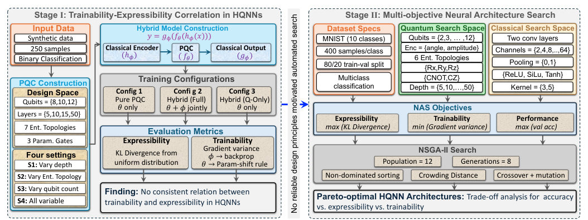
<figcaption class="paper-figure-caption"><b>Fig 1.</b> Fig. 1: Overview of the our two-stage methodology. Stage I presents the empirical analysis of the expressibility-trainability relationship in HQNNs. A flexible PQC design space is explored under multiple controlled settings and training configurations, including pure PQCs, full hybrid training, and quantum-only training. Expressibility (via KL divergence) and trainability (via gradient variance) are evaluated, revealing no consistent relationship between the two in hybrid models. Stage II introduces a multi-objective NAS framework over a joint classical-quantum design space. Architectures are optimized with respect to expressibility, trainability, and task performance using NSGA-II,...</figcaption>
</figure>
<figure class="paper-figure-card">
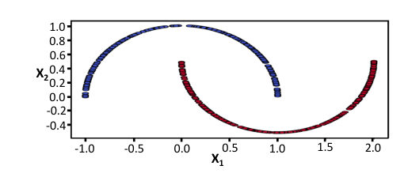
<figcaption class="paper-figure-caption"><b>Fig 2.</b> Fig. 2: Synthetic dataset used for Expressibility-Trainability analysis of HQNNs</figcaption>
</figure>
<figure class="paper-figure-card">
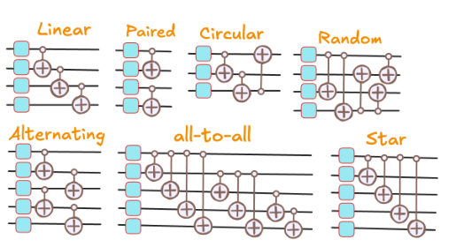
<figcaption class="paper-figure-caption"><b>Fig 3.</b> Fig. 3: Entanglement topologies used in this paper</figcaption>
</figure>
<figure class="paper-figure-card">
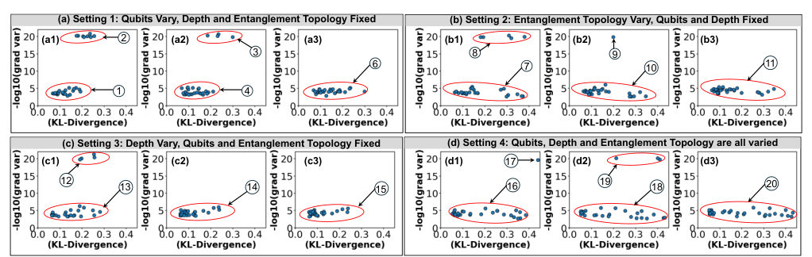
<figcaption class="paper-figure-caption"><b>Fig 4.</b> Fig. 4: Stage I results across four architectural settings: (a) varying depth, (b) varying entanglement topology, (c) varying number of qubits, and (d) all parameters varied. Subplots (x1), (x2), and (x3) correspond to standalone PQCs, hybrid quantum-only training, and hybrid full-model training, respectively. −log10(gradvar) is based in Eq. 10, where smallers values means high gradiant variance (Better trainability) and vice versa. KL-Divergence is based on Eq. 11, where lower value means high expressibility and versa. The results show that the expressibility–trainability relationship observed in PQCs significantly weakens or breaks down in hybrid models with frozen classical layers, and...</figcaption>
</figure>
<figure class="paper-figure-card">
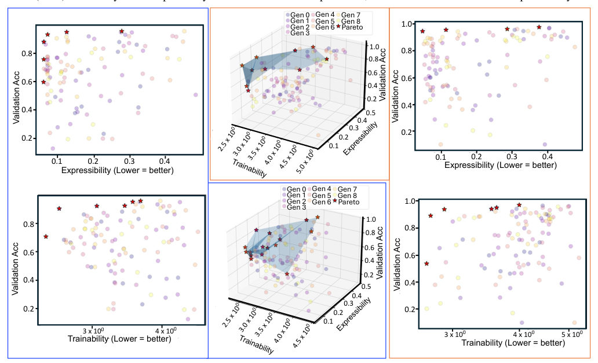
<figcaption class="paper-figure-caption"><b>Fig 5.</b> Fig. 5: NAS results for HQNN architectures under two trainability definitions. The blue panels correspond to full-model trainability (gradients computed with respect to all model parameters), while the orange panels correspond to quantum-only trainability (gradients computed with respect to quantum parameters only in hybrid setting). Each point represents a candidate architecture, and red stars indicate Pareto-optimal solutions. The plots show the trade-offs between validation accuracy, expressibility, and trainability.</figcaption>
</figure>

**Summary.** This paper demonstrates that the integration of classical layers in hybrid quantum neural networks fundamentally changes the optimization landscape, breaking the traditional trade-off between circuit expressibility and trainability. By using a multi-objective neural architecture search, the authors show that classical components can mitigate barren plateaus, suggesting that hybrid design principles differ significantly from standalone quantum circuit design.

**Why it may be interesting.** not directly relevant

Detailed structure

**Main problem.** Investigating whether the well-known expressibility-trainability trade-off in standalone parameterized quantum circuits (PQCs) persists in hybrid quantum-classical neural networks (HQNNs).

**Main result.** The study finds that classical layers in hybrid architectures decouple trainability from expressibility, effectively eliminating the trade-off observed in pure PQCs under full end-to-end training.

**Method.** A two-stage approach involving a systematic empirical analysis of gradient variance and KL divergence across various architectures, followed by a multi-objective Neural Architecture Search (NAS) using the NSGA-II algorithm.

**Model / system.** Hybrid Quantum-Classical Neural Networks (HQNNs) consisting of classical convolutional/fully connected layers integrated with Parameterized Quantum Circuits (PQCs) using various entanglement topologies and rotation gates.

**Key observables.** Expressibility (via KL divergence), Trainability (via gradient variance), and Task Performance (via MNIST validation accuracy).

**Important parameters / regimes.** Circuit depth (L), qubit count (n), entanglement topologies (linear, star, all-to-all, etc.), and training configurations (pure PQC, quantum-only, and full end-to-end).

**Assumptions / limitations.** Assumes that the properties of standalone PQCs might be used as design heuristics for hybrid models, a premise the paper seeks to challenge.

**Figures summary.** Figure 1 outlines the methodology and NAS framework; Figure 4 shows the weakening/elimination of the expressibility-trainability trade-off across different architectural settings; Figure 5 displays the Pareto-optimal fronts for the NAS results.

**Paper structure.** The paper introduces the problem of the expressibility-trainability trade-off, presents a two-stage methodology (empirical analysis and NAS), details the experimental setup across different training regimes, reports findings on the decoupling of trade-offs, and concludes with the results of the automated architecture search.

Abstract

Hybrid quantum neural networks (HQNNs) integrate parameterized quantum circuits (PQCs) within classical networks, where the behavior of the underlying PQCs is often the primary focus of analysis. In this context, expressibility and trainability are widely used to characterize PQC's performance and are commonly assumed to exhibit a trade-off, where highly expressive circuits are more susceptible to barren plateaus. However, the validity of this relationship in HQNNs remains unclear. In this paper, we systematically analyze the expressibility--trainability relationship in HQNNs across varying circuit depths, qubit counts, entanglement topologies. We consider different training configurations, including pure PQCs, quantum-only training in hybrid setting, and full end-to-end training of hybrid models. Our results show that pure PQCs exhibit only a weak and regime-dependent trade-off, while hybrid architectures increasingly disrupt and can eliminate this relationship under full hybrid training. This indicates that classical components reshape the optimization landscape, decoupling trainability from PQC expressibility. We further propose a multi-objective neural architecture search (NAS) framework that jointly optimizes expressibility, trainability, and task performance over a combined classical--quantum design space, revealing different Pareto-optimal solutions under full end-to-end and quantum only training in hybrid setting. different trainability definitions. Our results suggest that hybridization is not just an implementation detail, but a defining factor in the performance of quantum machine learning models.

[↑ back to top](#top)

### [Revisiting spin Hamiltonian parameters in a Kitaev material via Bayesian optimization of magnetization curves](http://arxiv.org/abs/2605.24857v1)

**Authors:** Takahiro Misawa, Ryo Tamura, Kazuyoshi Yoshimi, Youhei Yamaji  
**Type:** both · **Category:** strongly correlated electrons · **PDF:** <https://arxiv.org/pdf/2605.24857v1>  
**Analysis basis:** full PDF text, analyzed in chunks

↔ Scroll figures horizontally

<figure class="paper-figure-card">
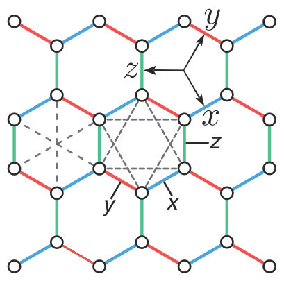
<figcaption class="paper-figure-caption"><b>Fig 1.</b> FIG. 1. Honeycomb network of Ru atoms in α-RuCl3 with the R3 structure. Edge-sharing chlorine octahedra surround the Ru sites, shown by open circles.</figcaption>
</figure>
<figure class="paper-figure-card">
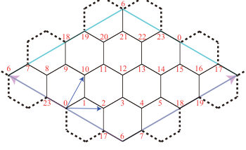
<figcaption class="paper-figure-caption"><b>Fig 2.</b> FIG. 2. (a) Schematic of the Bayesian optimization work- flow. For a given parameter set θ, the magnetization curve is computed by exact diagonalization on a 24-site cluster and compared with experiment via the cost function ∆. Bayesian optimization then proposes the next candidate, and this cy- cle is iterated. (b) 24-site honeycomb cluster with periodic boundary conditions used in this study.</figcaption>
</figure>
<figure class="paper-figure-card">
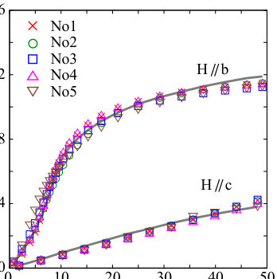
<figcaption class="paper-figure-caption"><b>Fig 3.</b> FIG. 3. (a) Optimization process of the cost function ∆for five independent runs (No. 1–No. 5). Each run is indepen- dently optimized using 500 evaluations (3 random samplings and 497 Bayesian optimizations). (b) Magnetization curves along the b-axis and the c-axis for all five optimized parameter sets (No. 1–No. 5) listed in Table II, compared with the ex- perimental data (crosses) from Ref. [77]. All parameter sets reproduce the overall shape of the experimental magnetiza- tion process.</figcaption>
</figure>
<figure class="paper-figure-card">

<figcaption class="paper-figure-caption"><b>Fig 4.</b> Figure 3(a) presents the results of the Bayesian opti- mization. In all five independent trials, the cost func- tion ∆decreases rapidly within the first few hundred steps and subsequently plateaus, confirming convergence within 500 steps. Since each evaluation requires 36 inde- pendent exact-diagonalization calculations on the 24-site cluster (one per field point along two crystallographic</figcaption>
</figure>
<figure class="paper-figure-card">
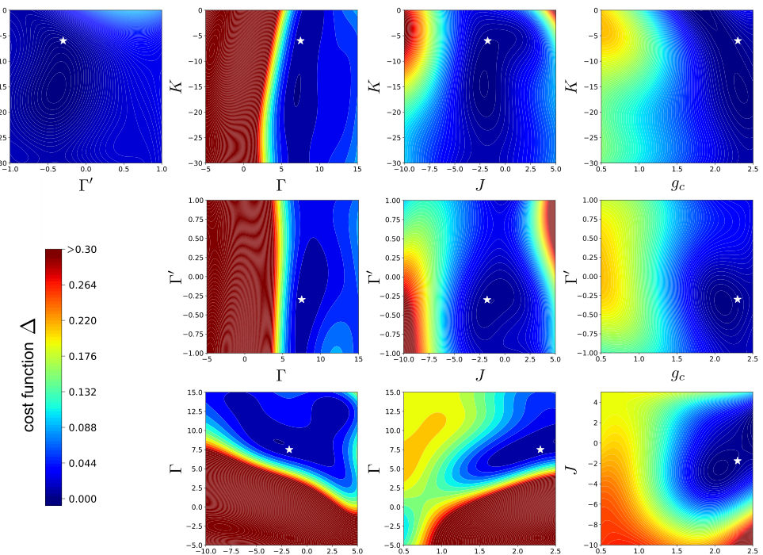
<figcaption class="paper-figure-caption"><b>Fig 5.</b> FIG. 4. Predictive landscapes of the cost function ∆around the optimal parameters. In each panel, two parameters are varied while the remaining three are fixed at their optimized values. White stars indicate the optimized parameters of the lowest-cost run (No. 2).</figcaption>
</figure>

**Summary.** This paper presents a systematic, data-driven method to determine spin Hamiltonian parameters in quantum magnets using Bayesian optimization of experimental magnetization data. It successfully constrains the exchange interactions in alpha-RuCl3 but highlights that magnetization alone cannot resolve the absolute energy scale of the Kitaev interaction.

**Why it may be interesting.** not directly relevant

Detailed structure

**Main problem.** Determining the precise spin Hamiltonian parameters for the Kitaev material alpha-RuCl3 is challenging due to the high sensitivity of ab initio calculations to methodological details.

**Main result.** The authors identified an optimized parameter set (K=-6.0, Gamma=7.5, Gamma'=-0.3, J=-1.75, gc=2.3 meV) and demonstrated that while magnetization constrains parameter ratios, it cannot determine the absolute energy scale of the Kitaev coupling K.

**Method.** A data-driven approach using Bayesian optimization (PHYSBO) of experimental magnetization curves combined with exact diagonalization (ED) and the H-Phi method.

**Model / system.** The physical system is the candidate Kitaev material alpha-RuCl3, modeled by a spin-1/2 Hamiltonian on a honeycomb lattice including Kitaev (K), Heisenberg (J), and off-diagonal (Gamma, Gamma') interactions.

**Key observables.** Ground-state magnetization curves (along b and c axes), static spin structure factor, magnetic susceptibility, and specific heat.

**Important parameters / regimes.** Exchange couplings K, J, Gamma, Gamma', and the c-axis g-factor gc.

**Assumptions / limitations.** Assumes R-bar-3 trigonal symmetry instead of monoclinic C2/m and assumes fixed values for the a and b-axis g-factors.

**Figures summary.** Figure 1 shows the honeycomb structure of Ru atoms; Figure 2 depicts the Bayesian optimization workflow and cluster geometry; Figure 3 shows magnetization curves; Figure 4 shows the cost function landscape; Figure 5 shows the ground-state spin structure factor.

**Paper structure.** The paper introduces the problem of parameter ambiguity, describes the Bayesian optimization framework and numerical solvers, presents the optimized parameter results, performs a sensitivity analysis of the cost function, and validates the results using secondary observables like spin structure factor and susceptibility.

Abstract

Determining the spin Hamiltonian of a magnetic compound is crucial for understanding its magnetic properties. A standard approach is to derive model parameters from $ab$ $initio$ calculations based on the crystal structure. However, the resulting Hamiltonian can depend sensitively on methodological details of the $ab$ $initio$ procedure. This issue is particularly evident in $α$-RuCl$_3$, a candidate Kitaev material. Here, we present an alternative, data-driven approach to determine the spin Hamiltonian parameters of $α$-RuCl$_3$ by Bayesian optimization of experimental magnetization curves along the $b$- and $c$-axis directions. We optimize five parameters, namely the Kitaev interaction $K$, off-diagonal interactions $Γ$ and $Γ'$, the Heisenberg interaction $J$, and the $c$-axis $g$-factor $g_c$. The parameter set that minimizes the cost function is $(K,Γ,Γ',J,g_c)=(-6.0,\,7.5,\,-0.3,\,-1.75,\,2.3)$, where the exchange couplings are in meV. We find that the cost function is insensitive to the absolute value of the Kitaev coupling $K$. Thus, the magnetization data alone do not determine its energy scale. The cost function also depends only weakly on $Γ'$ and $J$, while the optimization favors a large positive $Γ$. By computing the static spin structure factor, magnetic susceptibility, and specific heat, we show that these quantities favor the large-$Γ$ scenario over the small-$g_c$ scenario and that the parameter set that minimizes the cost function yields good agreement with experiment. The combination of Bayesian optimization and accurate low-energy solvers provides an effective approach for determining parameters of spin Hamiltonians. This methodology opens a systematic route to determining spin Hamiltonians in quantum magnets from experimental data.

[↑ back to top](#top)

### [Separable Force Matching of PBE0 Hybrid-Functional Reference Forces for Path-Integral Simulations of Liquid Water](http://arxiv.org/abs/2605.25081v1)

**Authors:** Jan Kessler, Thomas Spura, Kristof Karhan, Thomas D. Kühne  
**Type:** theory · **Category:** numerical methods · **PDF:** <https://arxiv.org/pdf/2605.25081v1>  
**Analysis basis:** full PDF text, analyzed in chunks

↔ Scroll figures horizontally

<figure class="paper-figure-card">
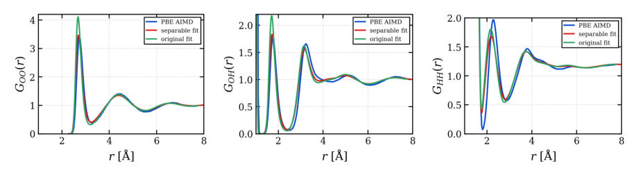
<figcaption class="paper-figure-caption"><b>Fig 1.</b> Figure 1: Benchmark of the force-matched water model against the PBE-based reference using the original and modified optimization strategies. The projected optimization eliminates the linear coefficients at each nonlinear step and thereby separates the choice of functional form from the determination of the optimal amplitudes.</figcaption>
</figure>
<figure class="paper-figure-card">

<figcaption class="paper-figure-caption"><b>Fig 2.</b> Figure 1 compares the structural performance of the earlier and modified force-matching procedures for the PBE reference. The purpose of this test is not to introduce a new electronic-structure reference, but to isolate the effect of the optimization. The projected treatment of the linear parameters yields a fit that tracks the reference structure without requiring manual compensation among strongly coupled nonlinear and linear terms. In practice, the reduction of the nonlinear parameter space makes the optimization less sensitive to the starting guess and makes it easier to diagnose whether a poor result originates from the potential-energy form or from a local optimization minimum. This...</figcaption>
</figure>
<figure class="paper-figure-card">
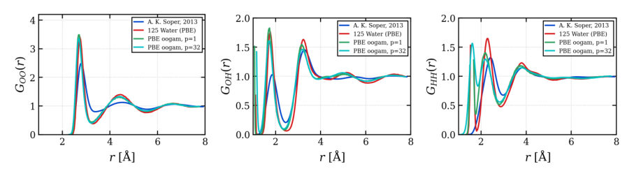
<figcaption class="paper-figure-caption"><b>Fig 3.</b> Figure 2: Site–site radial distribution functions for the PBE validation case. The comparison tests whether the modified force-matching procedure preserves the structural quality of the first-principles reference while retaining the efficiency of a flexible analytic water potential.</figcaption>
</figure>
<figure class="paper-figure-card">
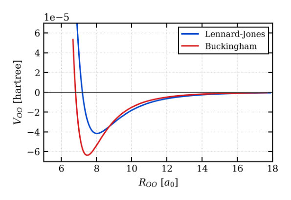
<figcaption class="paper-figure-caption"><b>Fig 4.</b> Figure 3: Comparison of Lennard-Jones and Buckingham descriptions of the O–O short-range interaction for the hybrid-functional parametrization. The Buckingham form separates the exponential repulsive wall from the dispersion-like attractive contribution and is therefore more naturally compatible with the projected linear-parameter optimization.</figcaption>
</figure>
<figure class="paper-figure-card">
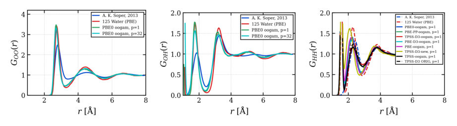
<figcaption class="paper-figure-caption"><b>Fig 5.</b> Figure 4: Radial distribution functions of the final force-matched water potential. The figure illustrates the structural quality retained after separating the linear and nonlinear parameters in the optimization.</figcaption>
</figure>

**Summary.** The authors present a refined force-matching workflow that uses a separable nonlinear least-squares method to derive efficient water potentials from expensive hybrid-functional DFT data. This approach avoids numerical instabilities and allows for a more accurate description of liquid water, including nuclear quantum effects, by effectively decoupling potential parameters.

**Why it may be interesting.** not directly relevant

Detailed structure

**Main problem.** The difficulty of accurately and efficiently parameterizing flexible water models from high-level hybrid-functional DFT forces without encountering numerical instability or parameter compensation.

**Main result.** A new 'separable' force-matching protocol reduces the nonlinear optimization dimensionality and enables a more accurate, stable, and reproducible water potential that captures PBE0-level structural features.

**Method.** A variable projection (separable nonlinear least-squares) approach that analytically solves for linear force-field amplitudes, combined with PBE0 hybrid-functional reference data from CP2K.

**Model / system.** A flexible, four-site (q-TIP4P/F-like) analytic potential for liquid water, including intramolecular anharmonicity and intermolecular Buckingham or Lennard-Jones interactions.

**Key observables.** Radial distribution functions (RDFs) for O-O, O-H, and H-H; force distributions; structural and thermodynamic properties.

**Important parameters / regimes.** Nonlinear shape parameters (e.g., charge-site displacement, decay lengths, Buckingham steepness) and linear amplitudes (e.g., electrostatic magnitudes, force constants).

**Assumptions / limitations.** The water molecule is represented by a four-site rigid-charge distribution with flexible intramolecular geometry; the efficiency of PIMD relies on the separation of intramolecular and intermolecular force frequencies.

**Figures summary.** Figure 4 shows site-site RDFs for the final force-matched potential; Figure 5 illustrates the stability and structural broadening of the model during path-integral simulations.

**Paper structure.** The paper introduces the scientific challenge of water modeling, describes the new separable optimization protocol, details the PBE0 reference generation, compares Lennard-Jones vs. Buckingham forms, and validates the resulting model via classical and path-integral MD.

Abstract

Force-matched water models provide a practical route from first-principles reference data to long classical and path-integral molecular simulations. Previous flexible four-site potentials in the spirit of q-TIP4P/F showed that fitting analytic models to density-functional-theory forces can reproduce key structural features of liquid water while retaining the efficiency required for quantum-nuclear sampling. Here we introduce two refinements aimed at making this strategy more accurate and more reproducible for molecular simulation. First, the production fit is based on PBE0 hybrid-functional reference forces and therefore includes the Hartree--Fock exact-exchange contribution in the electronic-structure target. Second, the parametrization is formulated as a separable nonlinear least-squares problem in which all linear force-field amplitudes are eliminated analytically for every trial set of nonlinear shape parameters. The resulting force-matching protocol lowers the dimension of the nonlinear search, reduces compensation between heterogeneous parameters, and enables a controlled comparison of Lennard-Jones and Buckingham oxygen--oxygen repulsion terms. Applied to CP2K reference forces for liquid water, the projected optimization reproduces target force distributions and yields radial distribution functions close to first-principles and neutron-scattering benchmarks. The Buckingham representation gives a more flexible short-range repulsive wall than a purely Lennard-Jones form, and the final flexible model remains stable in path-integral simulations. The method provides a transparent workflow for deriving simulation-ready water potentials from accurate hybrid density-functional reference forces.

[↑ back to top](#top)

### [Signature of spin liquid state in a frustrated 3D antiferromagnet](http://arxiv.org/abs/2605.24119v1)

**Authors:** Satish Kumar, U. Jena, A. Bandhopadhay, G. B. G. Stenning, D. T. Adroja, S. Petit, P. Khuntia  
**Type:** experiment · **Category:** strongly correlated electrons · **PDF:** <https://arxiv.org/pdf/2605.24119v1>  
**Analysis basis:** full PDF text, analyzed in chunks

↔ Scroll figures horizontally

<figure class="paper-figure-card">
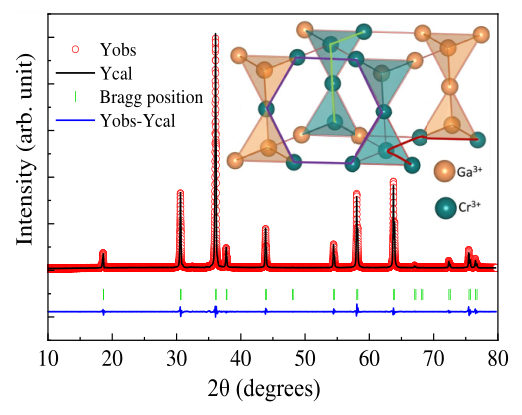
<figcaption class="paper-figure-caption"><b>Fig 1.</b> FIG. 1. (a) The Rietveld refinement profile of the powder X- ray diffraction pattern taken at room temperature. The inset depicts a 3D network of corner-sharing tetrahedra formed by Cr3+ ions, with unavoidable 50% site sharing of Cr3+ with Ga3+ ions. The inset also illustrates an aperiodic distribu- tion of hexagonal spin loops in ZnCrGaO4. Unlike the peri- odic hexagon configurations found in pure ZnCr2O4, the un- avoidable site sharing of nonmagnetic Ga3+ ions at Cr3+ ion site destroys long-range structural periodicity, leaving a dis- ordered array of intact, local hexagonal clusters (color-coded to indicate localized loop orientations).</figcaption>
</figure>
<figure class="paper-figure-card">
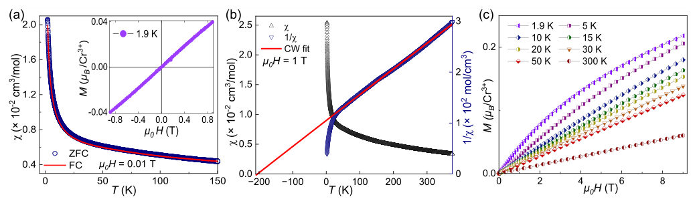
<figcaption class="paper-figure-caption"><b>Fig 2.</b> FIG. 2. (a) Zero-field-cooled and field-cooled magnetic susceptibility as a function of temperature under an applied field of 0.01 T. The inset displays the M vs H in five quadrants measured at 1.9 K. (b) Temperature dependence of the magnetic susceptibility (χ) (Left, Y-Axis) and inverse susceptibility (χ) (Right, Y-Axis) measured at an applied field of 1 T. The solid red line represents a Curie–Weiss fit to the high-temperature data. (c) Magnetization as a function of external magnetic field at several temperatures.</figcaption>
</figure>
<figure class="paper-figure-card">
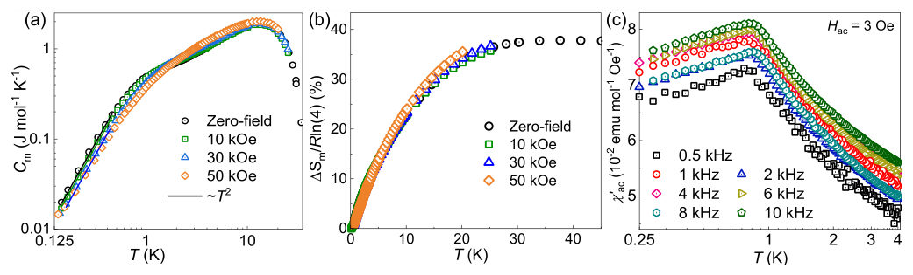
<figcaption class="paper-figure-caption"><b>Fig 3.</b> FIG. 3. (a) The temperature dependence of the magnetic specific heat (Cm) after subtracting the lattice part from the total specific heat. The solid lines depicts a fit to Cm ∼T 2. Full details of lattice subtraction and DE-fit are given in Supplementary Material [37]. (b) The magnetic entropy changes ∆Sm, which is around 37% of the expected value. i.e. Rln(4) for one Cr3+</figcaption>
</figure>
<figure class="paper-figure-card">
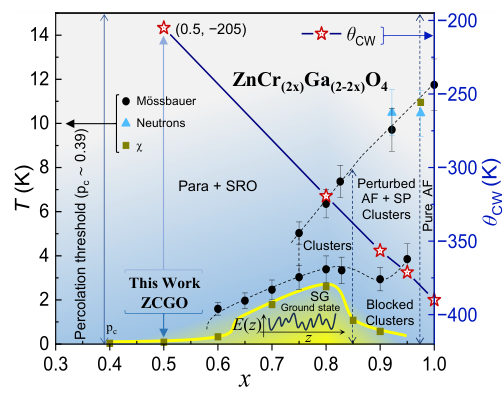
<figcaption class="paper-figure-caption"><b>Fig 4.</b> FIG. 4. Magnetic phase diagram of frustrated pyrochlore, ZnCr(2x)Ga(2−2x)O4 depicting exotic phases. The phase dia- gram is determined by M¨ossbauer spectra [solid-circle ●], neu- tron diffraction [solid-triangle ▲], and magnetic susceptibility (χ) [solid-square ■]. A spin-glass phase has been observed in the region 0.6≤x ≤0.85, highlighted in yellow [54–56]. The star-line (-✫-) represents the behavior of the θCW at the right y-axis depending upon the chemical pressure (x). The inset shows a typical shape of rugged free-energy E(z) landscapes for spin glass ground state, where z represents the different spin configuration [57].</figcaption>
</figure>

**Summary.** This paper reports the discovery of a dynamic, correlated magnetic state in the highly frustrated 3D magnet ZnCrGaO4. By utilizing intrinsic disorder to suppress long-range ordering, the material exhibits signatures of a quantum spin liquid, including power-law specific heat. This makes it a significant platform for studying 3D quantum magnetism and disorder-driven criticality.

**Why it may be interesting.** not directly relevant

Detailed structure

**Main problem.** The study aims to determine the magnetic ground state of the highly frustrated 3D antiferromagnet ZnCrGaO4 and investigate whether intrinsic cation disorder can stabilize a quantum spin liquid state.

**Main result.** The researchers found no evidence of long-range magnetic ordering or spin freezing down to 125 mK, instead observing signatures of a dynamic, correlated ground state with power-law specific heat.

**Method.** The study uses a combination of solid-state synthesis, powder X-ray diffraction, and low-temperature thermodynamic measurements including AC/DC magnetic susceptibility and specific heat.

**Model / system.** The system is ZnCrGaO4 (ZCGO), a 3D pyrochlore-like magnet with a cubic spinel structure where Cr3+ (S=3/2) ions form a frustrated network of corner-sharing tetrahedra subject to intrinsic site disorder from Ga3+ substitution.

**Key observables.** Curie-Weiss temperature, magnetic susceptibility (ZFC/FC and AC), magnetic specific heat, magnetization, and magnetic entropy.

**Important parameters / regimes.** Curie-Weiss temperature (theta_CW approx -205 K), frustration parameter (f approx 1640), exchange interaction (J/kB approx 55 K), and temperature scales down to 125 mK.

**Assumptions / limitations.** The analysis assumes the validity of the Curie-Weiss law at high temperatures and uses a mean-field approximation to estimate exchange strength.

**Figures summary.** Figure 1 shows Rietveld refinement and the tetrahedral network with disorder; Figure 2 shows ZFC/FC magnetic susceptibility; Figure 4 shows a phase diagram of the ZnCr(2-x)Ga(x)O4 compositional range.

**Paper structure.** The paper begins with structural characterization, moves to high-temperature magnetic properties, investigates low-temperature susceptibility to rule out spin freezing, analyzes specific heat for evidence of excitations, and concludes with a discussion on the stabilized spin-liquid state.

Abstract

Frustrated pyrochlore lattices in transition-metal oxides provide an ideal platform for realizing exotic quantum states, including spin liquids with unconventional low-energy excitations arising from the macroscopic ground-state degeneracy of corner-sharing tetrahedral networks. Here, we report the synthesis and comprehensive characterization of ZnCrGaO$4$, a frustrated three-dimensional pyrochlore-like magnet in which intrinsic cation ordering gives rise to unavoidable atomic-site disorder. A Curie--Weiss analysis of the high-temperature magnetic susceptibility yields a large negative Curie--Weiss temperature, $θ{\mathrm{CW}} \approx -205$ K, indicating dominant antiferromagnetic exchange interactions ($J/k_{\mathrm{B}} \sim 55$ K) between Cr$^{3+}$ ($S = 3/2$) moments. Despite the presence of strong antiferromagnetic interactions, no signature of long-range magnetic ordering is observed down to 125 mK, as evidenced by specific-heat and ac-susceptibility measurements. Furthermore, the absence of bifurcation between zero-field-cooled and field-cooled dc magnetic susceptibilities measured at 0.01 T indicates the absence of spin freezing, which is further supported by the frequency-independent ac susceptibility down to 250 mK. The presence of broad maxima in the magnetic specific heat and ac susceptibility at low temperatures suggests the development of short-range spin correlations within a dynamic magnetic state. In addition, the low-temperature specific heat follows a power-law behavior below 1 K, indicating the presence of unconventional low-energy excitations and algebraic spin correlations. These results provide compelling evidence for a dynamic correlated ground state in ZnCrGaO$_4$, establishing it as a promising platform for exploring highly frustrated $S > 1/2$ three-dimensional quantum magnets and potential spin-liquid behavior.

[↑ back to top](#top)

### [Singularizing preserving countable additivity quantum channels on quantum measurable cardinals](http://arxiv.org/abs/2605.24923v1)

**Authors:** Sviatoslav V. Dzhenzher  
**Type:** theory · **Category:** other · **PDF:** <https://arxiv.org/pdf/2605.24923v1>  
**Analysis basis:** full PDF text, analyzed in chunks

↔ Scroll figures horizontally

<figure class="paper-figure-card">
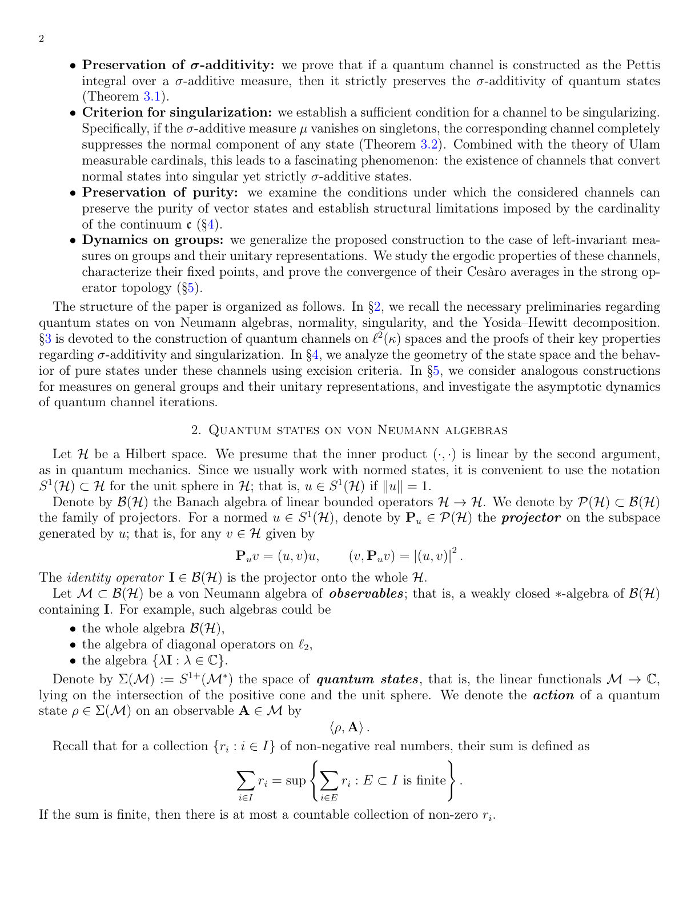
<figcaption class="paper-figure-caption"><b>Fig 1.</b> Low-resolution page preview, page 2</figcaption>
</figure>
<figure class="paper-figure-card">
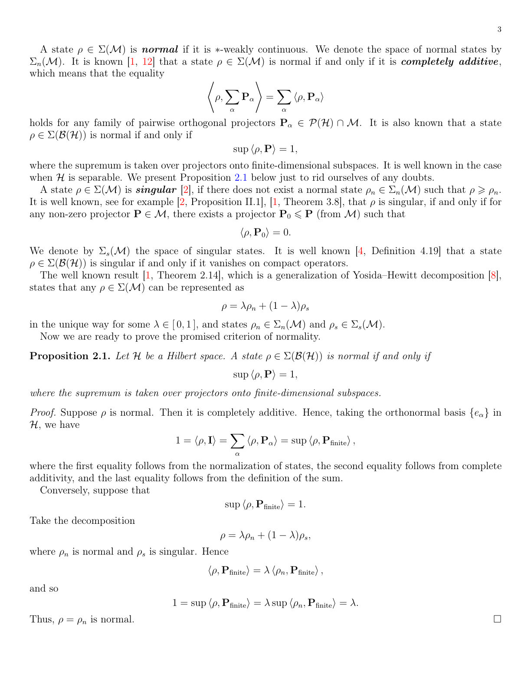
<figcaption class="paper-figure-caption"><b>Fig 2.</b> Low-resolution page preview, page 3</figcaption>
</figure>
<figure class="paper-figure-card">
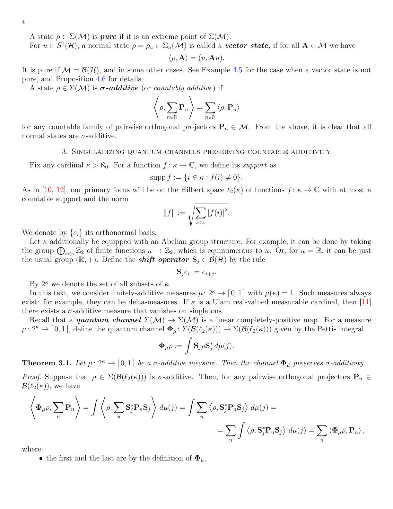
<figcaption class="paper-figure-caption"><b>Fig 3.</b> Low-resolution page preview, page 4</figcaption>
</figure>
<figure class="paper-figure-card">
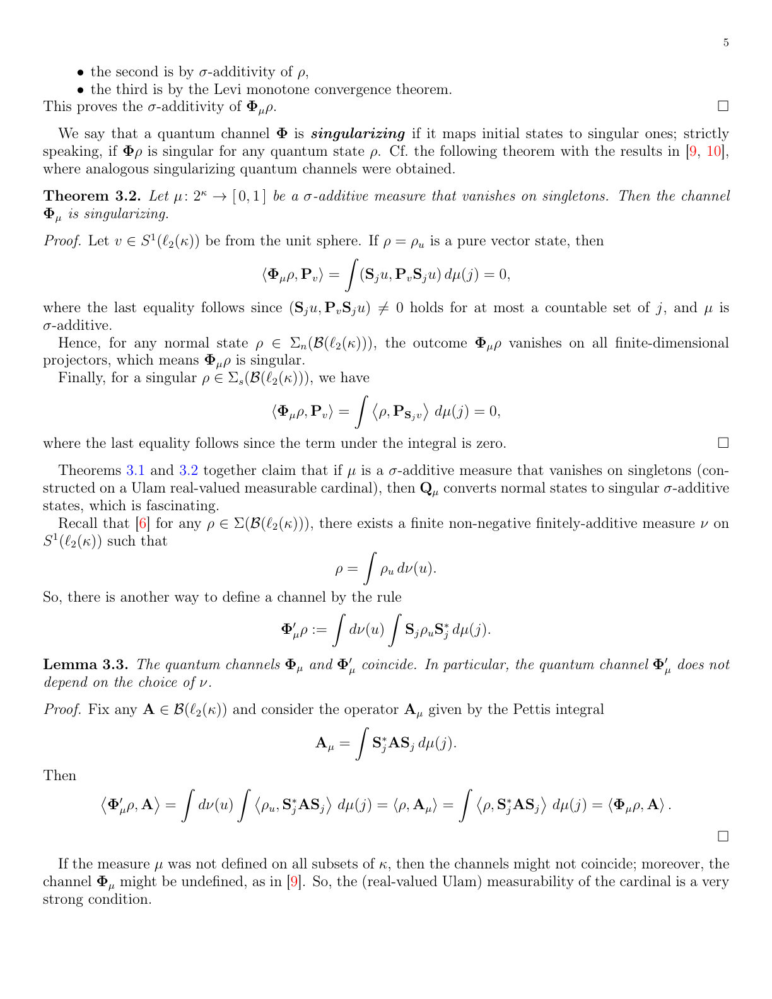
<figcaption class="paper-figure-caption"><b>Fig 4.</b> Low-resolution page preview, page 5</figcaption>
</figure>
<figure class="paper-figure-card">
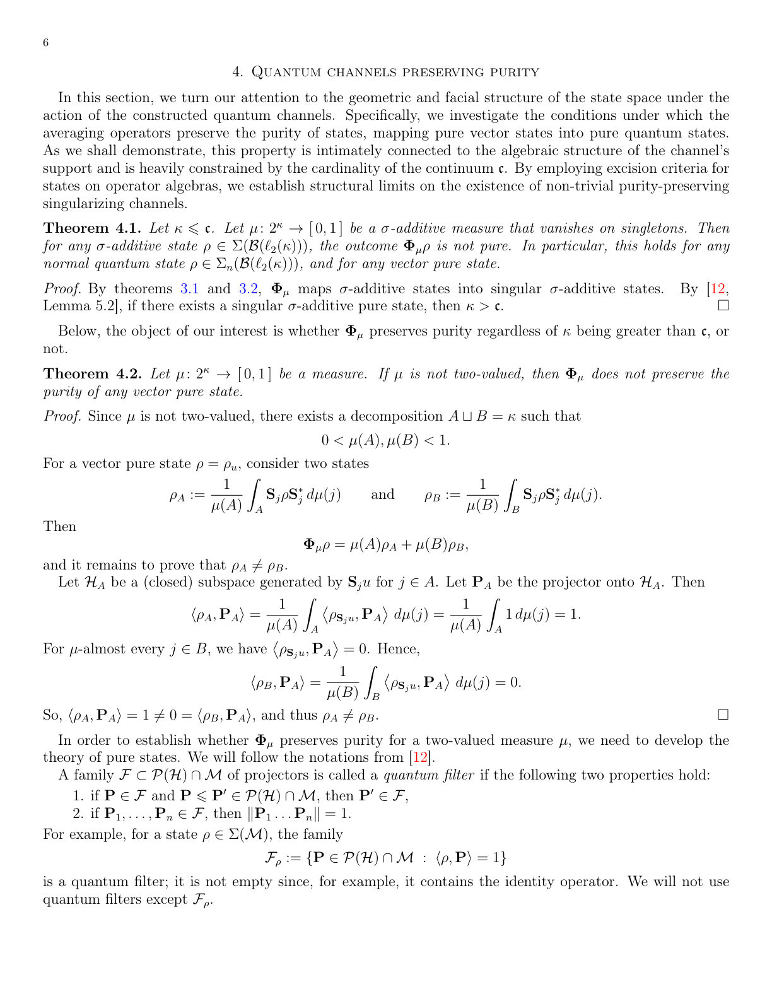
<figcaption class="paper-figure-caption"><b>Fig 5.</b> Low-resolution page preview, page 6</figcaption>
</figure>

**Summary.** This paper explores the intersection of set theory and operator algebra to describe a class of quantum channels that can transform standard normal quantum states into singular, sigma-additive states. It provides rigorous conditions for when these channels preserve or destroy state purity based on the cardinality of the underlying space. The work demonstrates a novel phenomenon where quantum dynamics can lead to states that are mathematically singular yet still satisfy countable additivity.

**Why it may be interesting.** not directly relevant

Detailed structure

**Main problem.** The paper investigates the structural and dynamical properties of quantum channels on von Neumann algebras, specifically focusing on how these channels transform normal states into singular states.

**Main result.** The author establishes that quantum channels constructed via Pettis integrals can be 'singularizing' (mapping normal states to singular states) and can preserve sigma-additivity, provided the underlying measure vanishes on singletons and is sigma-additive.

**Method.** The study utilizes the Yosida-Hewitt decomposition, Pettis integration over operator groups, and set-theoretic tools involving Ulam real-valued measurable cardinals.

**Model / system.** The mathematical framework involves von Neumann algebras, specifically B(H) and B(l^2(kappa)) for uncountable dimensions, and quantum channels defined by averaging over group representations using the Pettis integral.

**Key observables.** sigma-additivity, state purity, and the convergence of Cesaro averages in the strong operator topology.

**Important parameters / regimes.** The cardinality of the continuum (c), the dimension of the Hilbert space (kappa), and the properties of the measure (sigma-additivity and whether it vanishes on singletons).

**Assumptions / limitations.** The construction assumes the existence of Ulam real-valued measurable cardinals and that the dimension kappa is equipped with an Abelian group structure.

**Paper structure.** The paper is structured by analyzing the construction of channels via Pettis integrals, followed by establishing criteria for sigma-additivity preservation and singularization, investigating the destruction or preservation of state purity, and concluding with the ergodic properties and convergence of channel iterations.

Abstract

We investigate the structural and dynamical properties of a class of quantum channels on von Neumann algebras induced by averaging over operator groups via the Pettis integral.   Utilizing the classical Yosida--Hewitt decomposition, we focus on the interplay between the set-theoretic properties of the underlying space and the topological nature of the resulting quantum states.   We establish a suffucient condition under which a channel preserves $σ$-additivity and exhibits a singularizing property, completely suppressing the normal component of any incoming state.   In conjunction with the theory of Ulam real-valued measurable cardinals, this framework reveals a novel phenomenon: the existence of quantum channels that transform normal states into singular yet strictly $σ$-additive states.   Furthermore, we analyze the structural constraints on the preservation of state purity imposed by the cardinality of the continuum, and extend our constructions to invariant measures on groups and their unitary representations, establishing the convergence of their Cesàro averages in the strong operator topology.

[↑ back to top](#top)

### [Streaming Molecular Dynamics Simulation Data for On-the-fly Processing and Analysis](http://arxiv.org/abs/2605.24271v1)

**Authors:** Amruthesh Thirumalaiswamy, Lawson J. Woods, Heekun Cho, Hugo MacDermott-Opeskin, Jennifer Clark, Irfan Alibay, Yuxuan Zhuang, Oliver Beckstein, Matthias Heyden  
**Type:** theory · **Category:** statistical mechanics · **PDF:** <https://arxiv.org/pdf/2605.24271v1>  
**Analysis basis:** full PDF text, analyzed in chunks

↔ Scroll figures horizontally

<figure class="paper-figure-card">
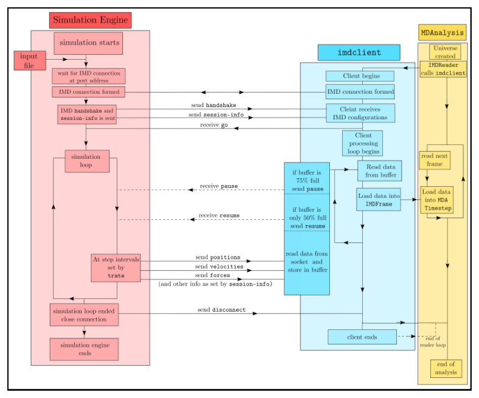
<figcaption class="paper-figure-caption"><b>Fig 1.</b> FIG. 1: Streaming Data using IMDv3: The schematic illustrates the information flow when using IMDv3. The simulation engine (producer, red) interacts with the receiver (client, blue), namely the imdclient package, via a TCP/IP socket interface. Here, the MDAnalysis package (yellow) calls the client and loads the streaming data into standard MDAnalysis data structures. First, the client establishes a connection with the simulation engine, which can be configured to wait for such a connection prior to starting the simulation. Once the connection is established, the simulation engine starts the simulation and streams data to the client. imdclient processes this incoming data and stores data...</figcaption>
</figure>
<figure class="paper-figure-card">
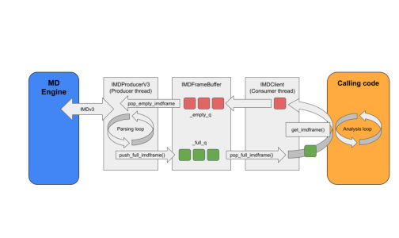
<figcaption class="paper-figure-caption"><b>Fig 2.</b> FIG. 2: Data processing workflow for imdclient: Streaming data is received by imdclient via the TCP/IP interface and stored temporarily in an application-level buffer. This buffer is a fixed chunk of storage in the system’s memory that operates as a FIFO (first-in-first-out) data structure implemented via 2 queues – an empty queue which can store incoming data and a full queue which already has data that is ready to be processed. As the calling code requests newer frames, imdclient makes them available in the form of a Python dictionary from this full queue. See Sec. S3 B for more details.</figcaption>
</figure>
<figure class="paper-figure-card">
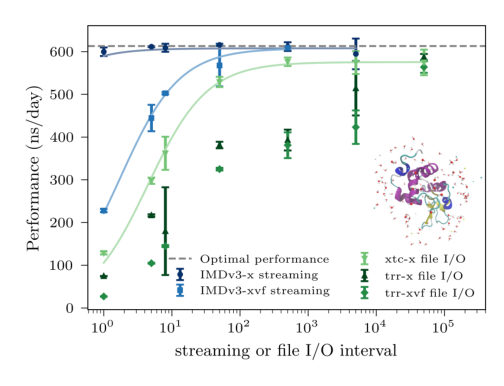
<figcaption class="paper-figure-caption"><b>Fig 3.</b> FIG. 3: Streaming is &gt; 5× faster than file I/O in GROMACS: We compare various streaming- and file I/O based scenarios in GROMACS. For conventional data writing to files, we run 3 different scenarios viz. writing positions to a TRR (trr-x) or an XTC file (xtc-x) and writing positions-velocities-forces to a TRR file (trr-xvf). These are compared with streaming the same set of data (IMDv3-x and IMDv3-xvf) over to a receiver that simply processes and loops through incoming frames. Streaming provides a significant advantage which is most pronounced at lowest streaming/file I/O frequencies. The gray dashed line at the top provides the optimal baseline performance achieved without any file I/O or...</figcaption>
</figure>
<figure class="paper-figure-card">
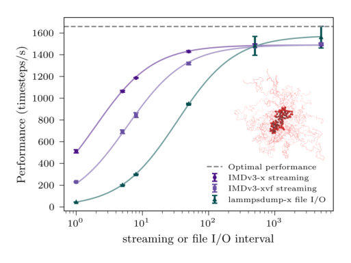
<figcaption class="paper-figure-caption"><b>Fig 4.</b> FIG. 4: Streaming is &gt; 10× faster than file I/O in LAMMPS: Comparing various streaming and file I/O scenarios in LAMMPS, as we did for GROMACS, give us interesting insights into the LAMMPS streaming implementation. For file I/O in LAMMPS, we consider writing positions to a LAMMPS dump file (lammpsdump-x) as the only scenario due to disk space constraints and high runtimes. While streaming in LAMMPS (IMDv3-x) does provide &gt; 10 speed as compared to LAMMPSdump-x at lowest output intervals, the performance stays well below the optimal baseline. Even at the highest streaming intervals considered, streaming shows a constant deviation from the baseline. Meanwhile file I/O, while reaching closer to...</figcaption>
</figure>
<figure class="paper-figure-card">
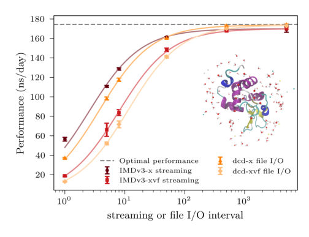
<figcaption class="paper-figure-caption"><b>Fig 5.</b> FIG. 5: Streaming is ∼1.5× faster than file I/O in NAMD: We perform the same comparison of streaming and file I/O scenarios for NAMD as we did for LAMMPS and GROMACS. Here, file I/O cases considered are – writing positions to a DCD file (dcd-x) and writing positions, velocities and forces to a dcd file (dcd-xvf). Unlike GROMACS, we notice that NAMD provides a slimmer advantage for streaming over file I/O at ∼1.5 for the lowest streaming/file I/O intervals. This speedup reduces at higher intervals with both scenarios asymptotically trending to the baseline. Similar to LAMMPS, the streaming curves show some deviation here, indicating a larger per-step overhead, t(0) s in the streaming...</figcaption>
</figure>

**Summary.** This paper presents a new streaming framework for molecular dynamics that allows simulation data to be analyzed in real-time as it is generated. By using the IMDv3 protocol, researchers can monitor fast-scale physical phenomena without the massive storage overhead or performance penalties associated with traditional high-frequency trajectory files.

**Why it may be interesting.** not directly relevant

Detailed structure

**Main problem.** Large-scale molecular dynamics simulations generate petabytes of data, creating a bottleneck where frequent disk writes for high-resolution trajectories degrade performance and storage limits force researchers to discard high-frequency physical information.

**Main result.** The introduction of the IMDv3 protocol enables real-time data streaming from GROMACS, NAMD, and LAMMPS to a Python client, providing a performance advantage over high-frequency file I/O and allowing for on-the-fly analysis of fast physical processes.

**Method.** The authors developed the IMDv3 protocol for TCP/IP data streaming, implemented it in major MD engines, and created the 'imdclient' Python package with an integrated MDAnalysis reader for real-time processing.

**Model / system.** The framework is applied to all-atom molecular dynamics simulations of complex systems, including proteins (Lysozyme), solvent dynamics, and bead-spring polymers.

**Key observables.** Atomic positions, velocities, forces, energies, simulation time, and box dimensions.

**Important parameters / regimes.** Transmission rate (trate), buffer size, and data transfer intervals.

**Assumptions / limitations.** The current implementation does not support random access or rewinding of streamed data, and force feedback is not yet supported in all engines.

**Figures summary.** Figure 1 shows the IMDv3 data flow from engine to client; Figure 2 illustrates the FIFO buffer mechanism; Figure 3 compares simulation performance across various streaming and file I/O scenarios.

**Paper structure.** The paper identifies the data bottleneck problem, introduces the IMDv3 protocol and software architecture, details the implementation in major MD packages, presents benchmarking results comparing streaming to file I/O, and demonstrates real-time analysis applications.

Abstract

Only a small fraction of the data generated in state-of-the-art all-atom multi-microsecond molecular dynamics (MD) simulations is typically analyzed. With femtosecond integration steps, microsecond simulations generate billions of time steps containing atomic positions, velocities, and forces, often corresponding to petabytes of data. Since this exceeds practical storage capacities, only a subset of frames is usually written to trajectory files at intervals of 10-100 ps. While sufficient for ensemble averages and slow dynamics, this approach discards information on fast processes such as molecular vibrations, solvent dynamics, short-lived transition states, and transport phenomena that are directly related to macroscopic properties and experimental observables. Here, we introduce a streaming framework for MD simulations that provides direct access to all data generated during a running simulation. Instead of writing high-frequency output to disk, the framework enables user-defined analysis and processing routines to access simulation data in real time. To achieve this, we extend the Interactive Molecular Dynamics (IMD) protocol and implement an enhanced version, termed IMDv3, in the MD packages GROMACS, NAMD, and LAMMPS. We further introduce the Python package imdclient, which receives IMDv3 data streams and exposes them to external applications. To maximize usability, we add an imdclient-based reader to the MDAnalysis package, enabling streamed simulation data to be analyzed alongside conventional trajectory files. Benchmark results show that streaming can improve performance compared to simulations with high-frequency trajectory output. Example applications include live monitoring of custom variables, evaluation of velocity time-correlation functions with fast fluctuations, and real-time analysis of membrane pore currents.

[↑ back to top](#top)

### [Strong Correlation Effect and In-gap State in the Doped Electron-Hole Two-Band Hubbard Model Based on the Dynamical Mean-Field Theory](http://arxiv.org/abs/2605.24927v1)

**Authors:** Masashi Akiyama, Yusuke Inokuma, Yoshiaki Ono  
**Type:** theory · **Category:** strongly correlated electrons · **PDF:** <https://arxiv.org/pdf/2605.24927v1>  
**Analysis basis:** full PDF text, analyzed in chunks

↔ Scroll figures horizontally

<figure class="paper-figure-card">
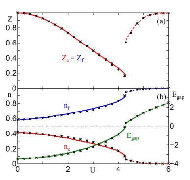
<figcaption class="paper-figure-caption"><b>Fig 1.</b> Fig. 1. (Color online) The renormalization factor of c ( f) electron Zc (Zf ) (a) and the occupation number of c ( f) electron nc (n f ) together with the band gap Egap as functions of the c- f Coulomb interaction U at half filling x = 0 for Ns = 4 (solid (dashed) lines for metallic (insulating) state), Ns = 6 (dots) and Ns = 8 (crosses).</figcaption>
</figure>
<figure class="paper-figure-card">
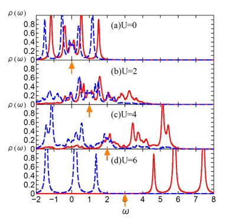
<figcaption class="paper-figure-caption"><b>Fig 2.</b> Fig. 2. (Color online) The spectral function of c electron ρc(ω) (solid lines) and those of f electron ρf (ω) (dashed lines) as functions of the frequency ω at half filling x = 0 for U = 0 (a), U = 2 (b), U = 4 (c) and U = 6 (d), where the arrows indicate the chemical potential µ. The results from Ns = 6 and 8 are merged and plotted with Lorentzian broadening with a width of 0.1eV.</figcaption>
</figure>
<figure class="paper-figure-card">
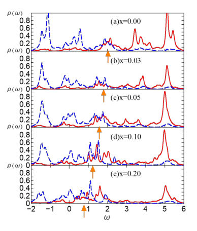
<figcaption class="paper-figure-caption"><b>Fig 3.</b> Fig. 4. (Color online) The spectral function of c electron ρc(ω) (solid lines) and that of f electron ρf (ω) (dashed lines) as functions of the frequency ω at U = 4 for x = 0.00 (a), x = 0.03 (b), x = 0.05 (c), x = 0.10 (d) and x = 0.20 (e), where the arrows indicate the chemical potential µ. The results from Ns = 6 and 8 are merged and plotted with Lorentzian broadening with a width of 0.1eV.</figcaption>
</figure>
<figure class="paper-figure-card">
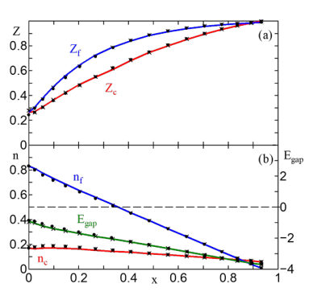
<figcaption class="paper-figure-caption"><b>Fig 4.</b> Fig. 3. (Color online) The renormalization factor of c (f) electron Zc (Zf ) (a) and the occupation number of c (f) electron nc (n f ) together with the band gap Egap as functions of the hole doping x at U = 4 for Ns = 4 (solid line for metallic state), Ns = 6 (dots) and Ns = 8 (crosses).</figcaption>
</figure>
<figure class="paper-figure-card">
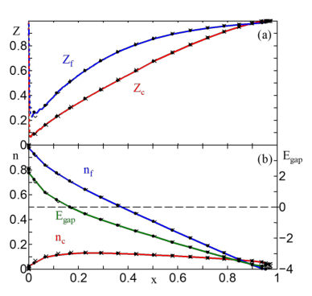
<figcaption class="paper-figure-caption"><b>Fig 5.</b> Fig. 5. (Color online) The renormalization factor of c (f) electron Zc (Zf ) (a) and the occupation number of c (f) electron nc (n f ) together with the band gap Egap as functions of the hole doping x at U = 6 for Ns = 4 (solid (dashed) lines for metallic (insulating) state), Ns = 6 (dots) and Ns = 8 (crosses).</figcaption>
</figure>

**Summary.** This paper uses DMFT to show that doping a band insulator in a two-band Hubbard model creates a highly correlated semimetal with in-gap states. These findings provide a theoretical framework for understanding mass enhancement and spectral weight transfer in materials like Ta2NiSe5.

**Why it may be interesting.** not directly relevant

Detailed structure

**Main problem.** The study investigates strong correlation effects in a doped electron-hole two-band Hubbard model, specifically focusing on the emergence of in-gap states and mass enhancement.

**Main result.** A first-order Lifshitz transition occurs at a critical interaction strength, and hole doping the resulting band insulator leads to a correlated semimetal with significant in-gap states and mass enhancement.

**Method.** The authors use Dynamical Mean-Field Theory (DMFT) combined with Exact Diagonalization (ED) on a Bethe lattice.

**Model / system.** A spinless electron-hole two-band Hubbard model (extended Falicov-Kimball model) featuring conduction and valence electrons with interband Coulomb interaction U and level splitting delta.

**Key observables.** Renormalization factor Z (effective mass), occupation numbers nc and nf, band gap Egap, and spectral functions rho(omega).

**Important parameters / regimes.** Interband Coulomb interaction U, hole doping concentration x, level splitting delta, and bandwidth W.

**Assumptions / limitations.** The calculation is performed in the infinite-dimensional limit using a Bethe lattice; numerical convergence is checked using small cluster sizes (Ns = 4, 6, 8).

**Figures summary.** Fig 1 shows the jump in Z, nc, and Egap at the transition; Fig 2 displays the evolution of spectral functions at half-filling; Fig 3 shows the dependence of Z and occupation numbers on U and doping.

**Paper structure.** The paper introduces the model, describes the DMFT/ED methodology, presents results for the half-filled case (Lifshitz transition), analyzes the effects of hole doping (in-gap states), and discusses experimental connections.

Abstract

We investigate the strong correlation effect in the spinless electron-hole two-band Hubbard model using the dynamical mean-field theory. At half filling, both the renormalization factor $Z$ and the number of conduction electrons (valence holes) $n_c$ decrease with increasing the interband Coulomb interaction $U$ down to $Z\sim 0.15$ and $n_c\sim 0.1$ for $U_c \sim \mbox{bandwidth}$ at which the first-order Lifshitz transition occurs from a correlated semimetal with a large effective mass $m^*/m=Z^{-1}$ to a band insulator with a finite gap due to the Hartree shift. A slight hole doping $x$ in the band insulator with a large $U>U_c$ yields a remarkable correlated semimetal with $Z\sim 0.1$ at $x\sim 0.01$, where in-gap states emerge above the valence band top and those weights increase with increasing $x$ together with the increase in $Z$ similar to the in-gap states observed in doped Mott insulators.

[↑ back to top](#top)

### [Superconfined Antiferromagnons on the Two-Dimensional Penrose Lattice](http://arxiv.org/abs/2605.24430v1)

**Authors:** Takashi Inoue, Shoji Yamamoto  
**Type:** theory · **Category:** strongly correlated electrons · **PDF:** <https://arxiv.org/pdf/2605.24430v1>  
**Analysis basis:** full PDF text, analyzed in chunks

↔ Scroll figures horizontally

<figure class="paper-figure-card">
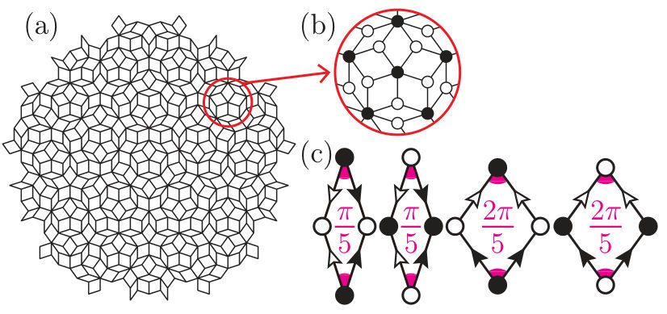
<figcaption class="paper-figure-caption"><b>Fig 1.</b> FIG. 1. (a) A two-dimensional Penrose lattice with size L = 526 and (b) an enlarged view of a specific region. In the enlarged view (b), the open and filled circles represent sites belonging to the two sublattices. (c) Two types of rhombic prototiles constituting the Penrose lattice, with acute angles of π</figcaption>
</figure>
<figure class="paper-figure-card">
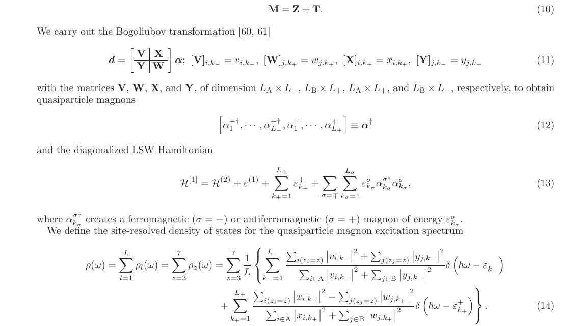
<figcaption class="paper-figure-caption"><b>Fig 2.</b> Figure 2 shows the coordination-number-resolved density of states ρz(ω), where z ranges from 3 to 7 (see Ap- pendix A). The spectral weight shifts toward sites with higher coordination numbers as the energy increases, a feature attributable to the immobility of spin deviations in the Ising limit. In this limit, the excitation spectrum con- sists of discrete eigenlevels at zJS. The correlation between coordination number and excitation energy persists even when the degeneracy is lifted by spin fluctuations. Notably, the sharp peak at ℏω = 3JS indicates macroscopically degenerate confined states.</figcaption>
</figure>
<figure class="paper-figure-card">
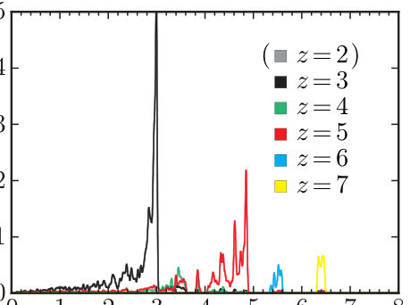
<figcaption class="paper-figure-caption"><b>Fig 3.</b> FIG. 2. The coordination-number-resolved density of states ρz(ω) for the LSW excitation spectrum on the Penrose lattice with L = 11006, where z ranges from 3 to 7. Note that z = 2 vertices are artifacts of finite open-boundary clusters.</figcaption>
</figure>
<figure class="paper-figure-card">

<figcaption class="paper-figure-caption"><b>Fig 4.</b> Figure 3 demonstrates the spatial confinement of degenerate states at ε∓ k = 3JS for the LSW Hamiltonian and at εk = 0 for the tight-binding Hamiltonian (see Appendix B) on the Penrose lattice. Here, εk denotes the eigenvalues of the tight-binding Hamiltonian. In both cases, these confined states are spatially separated by “forbidden ladders” [29, 34], which are one-dimensional, unbranched closed loops with zero wavefunction amplitude. Within each domain enclosed by these forbidden ladders, the confined states exhibit nonzero amplitudes exclusively on either the A or B sublattice. The alternating pattern of confinement domains across the forbidden ladders matches perfectly between Figures 3a...</figcaption>
</figure>
<figure class="paper-figure-card">
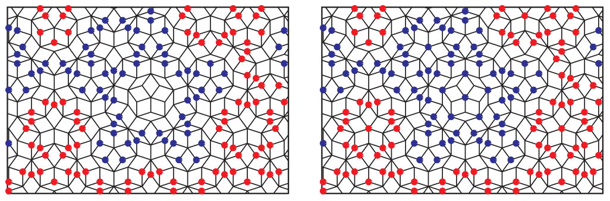
<figcaption class="paper-figure-caption"><b>Fig 5.</b> FIG. 3. The site-resolved densities of states ρl(ω) [Equations (14) and (B4)] multiplied by the number of sites L = 11006 as functions of site position rl. The lth site is marked with a red (l ∈A) or blue (l ∈B) dot when Lρl(ω) is larger than or equal to 10−2. At every unmarked site l, Lρl(ω) &lt; 10−15. (a) Lρl(ω) at ℏω = 3JS for the LSW Hamiltonian (13). (b) Lρl(ω) at ℏω = 0 for the tight-binding Hamiltonian (B3). Rectangles highlight regions enlarged in the bottom panels and in Figure 13.</figcaption>
</figure>

**Summary.** This paper identifies a phenomenon called 'superconfinement' in a quasiperiodic Penrose lattice, where antiferromagnetic excitations are more strictly localized than electrons. It demonstrates how quantum interactions between magnons lift the macroscopic degeneracy of these confined states. The findings highlight how aperiodic geometry and site potentials uniquely govern collective excitations.

**Why it may be interesting.** not directly relevant

Detailed structure

**Main problem.** The study investigates the nature of novel confined states (antiferromagnons) in a two-dimensional Penrose lattice and compares their spatial confinement to electrons in a tight-binding model.

**Main result.** The authors discover 'superconfinement,' where spin-wave excitations are restricted strictly to tricoordinated sites, and show that quantum corrections (magnon-magnon interactions) lift the massive degeneracy of these states into two separate groups.

**Method.** The study employs Linear Spin-Wave (LSW) theory and an Interacting Spin-Wave (ISW) formalism using the Holstein-Primakoff transformation, combined with perpendicular-space analysis and numerical diagonalization of periodic approximants.

**Model / system.** A spin-S nearest-neighbor antiferromagnetic Heisenberg model on a two-dimensional bipartite Penrose lattice, analyzed using both LSW and ISW Hamiltonians.

**Key observables.** Site-resolved density of states (DOS), wavefunction amplitudes, spectral weight distribution, and coordination-number-resolved DOS.

**Important parameters / regimes.** Spin magnitude (S), exchange interaction (J), coordination number (z), and the golden ratio (tau).

**Assumptions / limitations.** The analysis is primarily based on the Holstein-Primakoff boson expansion truncated at the O(S^0) level.

**Figures summary.** Figure 1 shows the Penrose lattice structure; Figure 2 and 3 display coordination-resolved DOS and site-resolved amplitudes; Figure 4 illustrates building blocks; Figure 7 compares LSW and ISW spectra; Figure 9-11 detail the lattice projection and vertex types.

**Paper structure.** The paper introduces the Penrose lattice and the Heisenberg model, compares LSW and tight-binding confinement, analyzes the construction of confined states via building blocks, investigates the impact of quantum corrections (ISW), and concludes with the effects of boundary conditions and local environments.

Abstract

We find novel confined states in the spin-$S$ nearest-neighbor antiferromagnetic Heisenberg model on the two-dimensional Penrose lattice. Linear spin waves have massively degenerate eigenstates strictly confined to tricoordinated sites. They contrast with the well-known itinerant analogs in the tight-binding model, where electrons are confined but extended to both tricoordinated and pentacoordinated sites. It is the site potentials in the spin-wave Hamiltonian, originating from Coulomb interactions between electrons, that confine spin waves to minimally coordinated sites only. Confined states in the tight-binding Hamiltonian consist of six types of building blocks, whereas those in the spin-wave Hamiltonian consist of only four of them. Confined spin waves are robust against $1/S$ corrections. Emergent $O(S^{0})$ interactions further confine -- superconfine -- spin waves into two separate groups within tricoordinated sites.

[↑ back to top](#top)

### [The evolution of pairing correlation with $3d_{z^{2}}$ electron filling in a bilayer two-orbital model for La$_3$Ni$_2$O$_7$](http://arxiv.org/abs/2605.25654v1)

**Authors:** Y. F. Chen, Y. Shen, X. J. Qian, G. M. Zhang, M. P. Qin  
**Type:** theory · **Category:** strongly correlated electrons · **PDF:** <https://arxiv.org/pdf/2605.25654v1>  
**Analysis basis:** full PDF text, analyzed in chunks

↔ Scroll figures horizontally

<figure class="paper-figure-card">
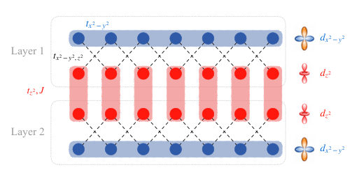
<figcaption class="paper-figure-caption"><b>Fig 1.</b> FIG. 1. Schematic representation of the one-dimensional setup studied in this work for the bilayer two-orbital model. The blue sites denote the dx2−y2 orbitals on the two outer legs, while the red sites denote the two dz2 orbitals in the central bilayer channel. The blue dashed rectangles indicate the nearest-neighbor hopping tx2−y2 along the dx2−y2 chains. The black dashed links represent the inter-orbital hybridiza- tion tx2−y2,z2, and the red dashed rectangles mark the inter- layer dz2 hopping and exchange channel, labeled tz2 and J.</figcaption>
</figure>
<figure class="paper-figure-card">
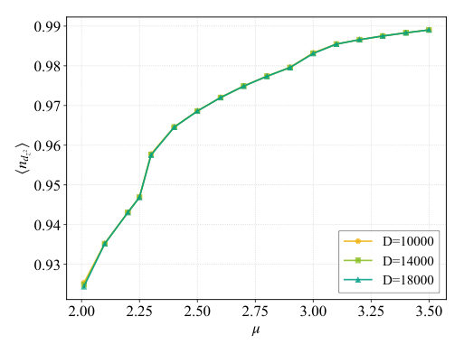
<figcaption class="paper-figure-caption"><b>Fig 2.</b> FIG. 2. Orbital occupancy of the dz2 orbital as a function of the chemical potential difference µ. Larger µ continuously shifts the dz2 orbital toward half filling (⟨ndz2 ⟩= 1). The DMRG results with three bond dimensions nearly coincide, indicating that the orbital occupancy is well converged in the DMRG calculation. We notice that there exist two singularity points at µ ≈2.3 and 3.0.</figcaption>
</figure>
<figure class="paper-figure-card">
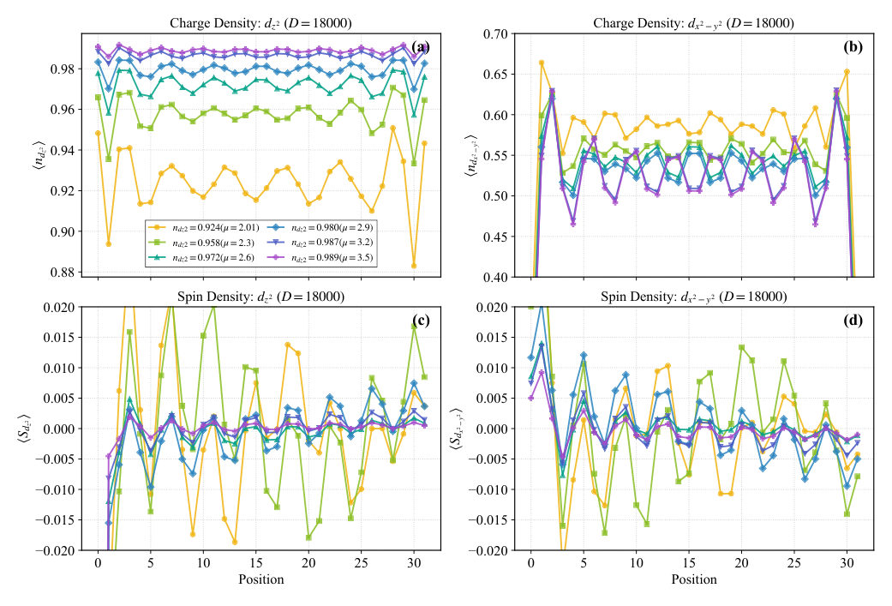
<figcaption class="paper-figure-caption"><b>Fig 3.</b> FIG. 3. Charge and spin distributions of the dz2 orbital [(a),(c)] and the dx2−y2 orbital [(b),(d)] for representative values of ⟨ndz2 ⟩; the corresponding µ values are also shown in the legends. The DMRG results are with bond dimension up to D = 18000 with truncation error ϵ ∼10−6 and convergence with bond dimension is checked. Charge density waves with wave-length 4 and 5 are observed in both orbitals. Around the two singularity points in Fig. 2 with µ ≈2.3 and 3.0, the charge density wave pattern changes. See the main text for more discussion. Similar density wave pattern is observed in the spin channel but with weak amplitude.</figcaption>
</figure>
<figure class="paper-figure-card">
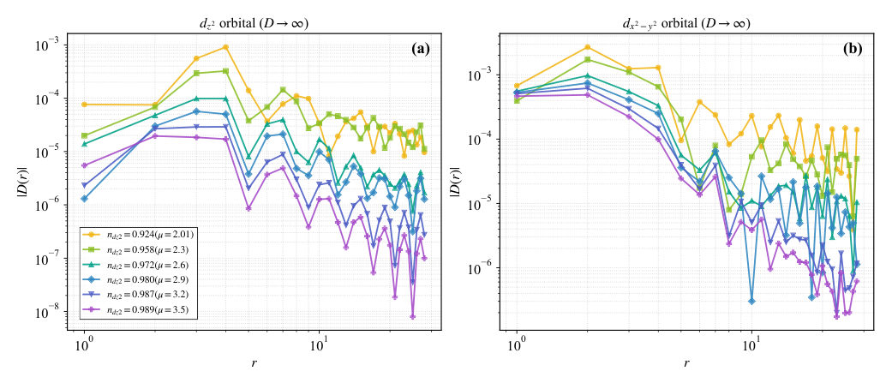
<figcaption class="paper-figure-caption"><b>Fig 4.</b> FIG. 4. Pairing correlation functions of the dz2 and dx2−y2 orbitals for selected values of ⟨ndz2 ⟩; the corresponding µ values are also shown in the legends. The values are obtained by extrapolating finite-bond-dimension data to the zero-truncation-error limit ϵ →0. In both orbitals, the correlations exhibit power-law decay as a function of distance, while the long-distance pairing amplitude is progressively suppressed as ⟨ndz2 ⟩increases toward half filling. Around the two singularity points in Fig. 2, the pairing correlation is enhanced, consistent with the large charge fluctuation observed around these two points in Fig. 3.</figcaption>
</figure>
<figure class="paper-figure-card">
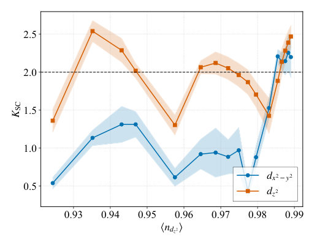
<figcaption class="paper-figure-caption"><b>Fig 5.</b> FIG. 5. Power-law exponents KSC extracted from the pairing correlations of the dz2 and dx2−y2 orbitals as functions of ⟨ndz2 ⟩. The fits are performed using data extrapolated to the zero-truncation-error limit. Overall, KSC increases as the density in dz2 orbital is increased to half-filling for both the dz2 and dx2−y2 orbitals with dips found in the two singularity points in Fig. 2. A substantial increase of KSC occurs near ⟨ndz2 ⟩≈0.983 in both channels, indicating suppression of the superconducting tendency as the dz2 orbital approaches half filling. The shaded regions indicate fitting uncertainties. The dashed line marks KSC = 2, the quasi-one-dimensional criterion below which the...</figcaption>
</figure>

**Summary.** This paper investigates the mechanism of superconductivity in the bilayer nickelate La3Ni2O7 using DMRG simulations. It demonstrates that the itinerancy of the 3d_z2 orbital promotes pairing and that superconductivity is suppressed as this orbital approaches half-filling. The study also highlights a competition between charge density waves and superconductivity, with pairing enhanced near charge-fluctuation-rich singularity points.

**Why it may be interesting.** not directly relevant

Detailed structure

**Main problem.** The study aims to resolve the role of the Ni 3d_z2 orbital in the high-Tc superconductivity of La3Ni2O7, specifically whether its itinerancy and the presence of its Fermi pocket are essential for pairing.

**Main result.** The researchers find that the itinerancy of the 3d_z2 orbital is favorable for pairing and that superconducting correlations are significantly suppressed as the 3d_z2 orbital approaches half-filling. They also identify that pairing is enhanced near specific singularity points characterized by large charge fluctuations.

**Method.** Large-scale Density-Matrix Renormalization Group (DMRG) calculations on a one-dimensional cylindrical geometry with bond dimensions up to 18,000 and finite truncation error extrapolation.

**Model / system.** An effective bilayer two-orbital model for the pressurized nickelate La3Ni2O7, incorporating Ni e_g orbitals (d_x2-y2 and d_z2) with inter-orbital hybridization, interlayer super-exchange coupling (J), and interlayer d_z2 hopping.

**Key observables.** Orbital-resolved charge and spin density distributions, pair-pair correlation functions for both orbitals, and the superconducting pairing exponent (K_SC) extracted from power-law decay.

**Important parameters / regimes.** Chemical potential difference (mu) used to tune 3d_z2 filling, interlayer super-exchange coupling (J = 0.5), and 3d_z2 orbital occupancy ranging from 1/12 doping to half-filling.

**Assumptions / limitations.** The model uses a minimal one-dimensional geometry (chain/ladder) and treats the 3d_z2 orbital using a t-J-like approach where double occupancy is forbidden.

**Figures summary.** Figures 6 and 8 show charge density patterns and CDW wavelength changes at specific chemical potentials; Figures 7 and 9 display pairing correlation functions and their enhancement at singularities; Figures 10 and 11 illustrate the DMRG extrapolation and power-law fitting procedures.

**Paper structure.** The paper introduces the problem of Ni 3d_z2 orbital role, describes the bilayer two-orbital model and DMRG methodology, presents results on charge density waves and orbital-specific pairing, analyzes the evolution of correlations with filling, and concludes with the competition between charge order and superconductivity.

Abstract

The discovery of high-${T_c}$ superconductivity in pressurized bilayer nickelate La$_3$Ni$_2$O$_7$ presents a new arena for exploring unconventional pairing mechanisms. A pivotal yet unresolved issue is the specific role of the $3d_{z^{2}}$ orbital of Ni. While its inter-layer super-exchange antiferromagnetic coupling is widely considered crucial for superconductivity, the role of its itinerancy remains undetermined. Early studies showed that the superconductivity is accompanied by the emergence of a small Fermi pocket of the $3d_{z^{2}}$ orbitals. However, recent experiments show controversial results on the role of the $3d_{z^{2}}$ Fermi pocket on superconductivity. Motivated by these experimental results, we investigate an effective bilayer two-orbital model for La$_3$Ni$_2$O$_7$ using density-matrix renormalization group (DMRG) on a minimal one-dimensional geometry. By systematically varying the $3d_{z^{2}}$ orbital filling from $1/12$ doping to half-filling, we observe a pronounced suppression of superconducting correlations near half-filling. Our results demonstrate the itinerancy of $3d_{z^{2}}$ orbital is favorable for the pairing in the bilayer two-orbital model for La$_3$Ni$_2$O$_7$. Moreover, we observe that the pairing correlation is enhanced in regions where charge fluctuations are large, suggesting a competition between charge order and superconductivity in the model.

[↑ back to top](#top)

### [Theoretical study of superconductivity in freestanding infinite-layer nickelate membranes under pressure: mitigation of excess correlation enhances $T_c$](http://arxiv.org/abs/2605.24565v1)

**Authors:** Mahiru Seki, Reo Kono, Naotaka Tanaka, Kensei Ushio, Daiki Nakaoka, Masayuki Ochi, Kazuhiko Kuroki, Hirofumi Sakakibara  
**Type:** theory · **Category:** strongly correlated electrons · **PDF:** <https://arxiv.org/pdf/2605.24565v1>  
**Analysis basis:** full PDF text, analyzed in chunks

↔ Scroll figures horizontally

<figure class="paper-figure-card">
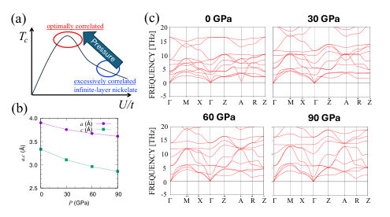
<figcaption class="paper-figure-caption"><b>Fig 1.</b> FIG. 1. (a) Schematic diagram showing the gist of this study, (b) lattice constant a, c as functions of external pressure P, and (c) phonon dispersion of Nd0.85Sr0.15NiO2 under pressure are presented. The panel (c) shows the case of 2 × 2 × 2 supercells with a 6 × 6 × 6 k-point mesh, where the strength of external pressure is indicated.</figcaption>
</figure>
<figure class="paper-figure-card">
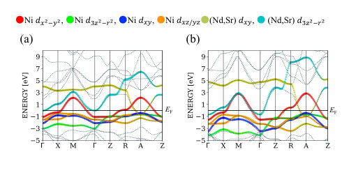
<figcaption class="paper-figure-caption"><b>Fig 2.</b> FIG. 2. Band structure with respect to the Fermi level (EF = 0) of Nd0.85Sr0.15NiO2 under pressure for the cases of (a) 0 GPa and (b) 90 GPa. Here, the weight of Wannier orbitals are represented by the thickness of color coded lines.</figcaption>
</figure>
<figure class="paper-figure-card">
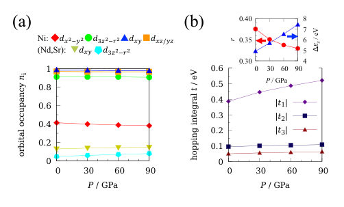
<figcaption class="paper-figure-caption"><b>Fig 3.</b> FIG. 3. (a) Orbital occupancy of Wannier orbitals and (b) hopping integral t among the near neighbor Wannier dx2−y2 orbital as functions of external pressure P, where the destina- tions in the hopping are indicated. In the inset, the roundness parameter r = (|t2|+|t3|)/|t1| of the Fermi surface (red circle) and ∆Es = E4s −E3dx2−y2 (blue triangle) are plotted.</figcaption>
</figure>
<figure class="paper-figure-card">
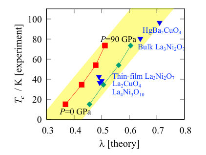
<figcaption class="paper-figure-caption"><b>Fig 4.</b> FIG. 5. Tc’s are plotted against the eigenvalues of Eliashberg equation λ at a fixed temperature, T = 0.01 eV. Red squares and green diamonds indicate the same λ with that of Fig. 4(b). Blue downward triangles indicate the data of cuprates and Ruddlesden-Popper type nickelates, calculated in the same method as described in Ref. [112]. Yellow hatched region is a guide to the eyes.</figcaption>
</figure>
<figure class="paper-figure-card">
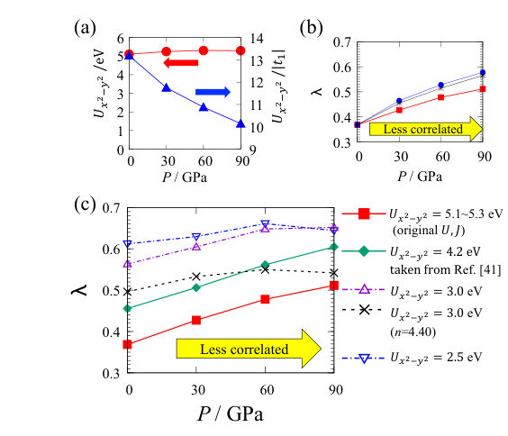
<figcaption class="paper-figure-caption"><b>Fig 5.</b> FIG. 4. Onsite intraorbital interaction Ux2−y2 (red circle, panel (a)), the ratio Ux2−y2/|t1| (blue triangle), and λ of d- wave superconductivity (panel (b) and (c)) are plotted as a function of pressure P. In panel (b), the original case (red squares) and the hypothetical cases equating only the param- eter set (t1, t2, t3) (blue circle) and only (t1, t2, t3, U, U ′, J, J′) (black asterisks) with those of the pressurized model are shown. In panel (c), green diamonds indicate the results obtained by using the value of Ref. [41]. The open upward (downward) triangles indicate the Ux2−y2 = 3.0 and 2.5 eV cases (see text), respectively. The cross symbols indicate those of Ux2−y2 = 3.0 eV at n =...</figcaption>
</figure>

**Summary.** This study theoretically demonstrates that applying pressure to infinite-layer nickelate membranes increases superconductivity by reducing the extreme electron correlations present at low Ni valence. By using a seven-orbital model, the authors show that the reduction in Ni-O bond distance enhances the bandwidth and mitigates the strength of the Coulomb interaction.

**Why it may be interesting.** not directly relevant

Detailed structure

**Main problem.** Understanding the mechanism behind the enhancement of the superconducting transition temperature (Tc) in infinite-layer nickelate membranes under high pressure.

**Main result.** The increase in Tc is driven by the mitigation of excessively strong electron correlations (reduced U/t ratio) caused by the reduction of Ni-O bond distances under pressure.

**Method.** First-principles calculations (Quantum ESPRESSO) combined with the fluctuation exchange (FLEX) approximation and the linearized Eliashberg equation.

**Model / system.** A freestanding infinite-layer nickelate membrane of Nd0.85Sr0.15NiO2 under external pressure (up to 90 GPa), modeled using a seven-orbital effective Hamiltonian including Ni-3d and Nd-5d orbitals.

**Key observables.** Superconducting transition temperature (Tc), eigenvalue of the Eliashberg equation (lambda), lattice constants (a and c), and phonon dispersion.

**Important parameters / regimes.** Onsite Coulomb (U, U') and exchange (J, J') parameters, hopping integrals (t1, t2, t3), and the ratio of interaction to hopping (U/t).

**Assumptions / limitations.** Use of the virtual crystal approximation (VCA) for Sr doping and the construction of a seven-orbital model via Wannierization.

**Figures summary.** Figure 1 shows a schematic of the study's gist, lattice constants as a function of pressure, and phonon dispersion; Figure 2 shows the electronic band structure.

**Paper structure.** The paper introduces the problem of Tc enhancement, describes the structural optimization and stability analysis, details the construction of the seven-orbital model and interaction parameters, presents the results of the FLEX calculation regarding superconductivity, and concludes with the physical mechanism.

Abstract

We theoretically investigate a freestanding membrane of infinite-layer nickelate Nd$_{0.85}$Sr$_{0.15}$NiO$_2$ under pressure by constructing a seven-orbital effective model based on first-principles calculations.   By performing the fluctuation exchange (FLEX) approximation, we demonstrate that the seven-orbital model explains a monotonic increase in $T_c$ reported in a recent experiment. This enhancement of superconductivity is attributed to the mitigation of excessively strong electron correlations caused by exceptionally low valence of Ni atom. Furthermore, we examine the dynamical stability of the crystal structure under pressure through phonon calculation.

[↑ back to top](#top)

### [Theory of supercooled water](http://arxiv.org/abs/2605.24105v1)

**Authors:** Jacobo Troncoso, Claudio A. Cerdeiriña  
**Type:** theory · **Category:** statistical mechanics · **PDF:** <https://arxiv.org/pdf/2605.24105v1>  
**Analysis basis:** full PDF text, analyzed in chunks

↔ Scroll figures horizontally

<figure class="paper-figure-card">
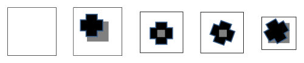
<figcaption class="paper-figure-caption"><b>Fig 1.</b> FIG. 1: Two-dimensional illustration of individual cell states of our five-state Ising model. Shaded in grey are the free volumes explored by particles (crosses). Associated with each cell state is a phase: see text.</figcaption>
</figure>
<figure class="paper-figure-card">
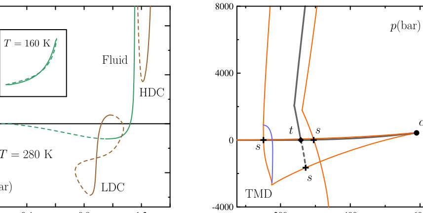
<figcaption class="paper-figure-caption"><b>Fig 2.</b> FIG. 2: Numerical results for our five-state model with parameter setting “1.” (Left) Pressure p versus density ρ along an isotherm of temperature T. Three independent branches display stable and metastable states for fluid, LDC, and HDC phases, dashed lines being unstable sections. The inset shows the fluid branch at a lower T. (Right) Corresponding phase diagram in the pressure-temperature p-T plane. Plotted are binodals (thick, grey), spinodals (thin, orange), and the locus of temperatures of maximum density along isobars TMD (thin, blue). Special points are critical c, triple t, and s points. Continuations of crystal spinodals beyond their crossing point are not drawn for clarity of...</figcaption>
</figure>
<figure class="paper-figure-card">
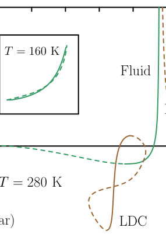
<figcaption class="paper-figure-caption"><b>Fig 3.</b> Figure 1 illustrates the molecular details featured by our five cell states. We distinguish between vacant cells and cells occupied by a nonspherical particle with ori- entational degrees of freedom whose center of mass ex- plores a free volume. A given state is then defined by cell’s occupancy, volume, free volume, and number of particle’s orientations, all of which regarded in general distinct for distinct states [47]. The fluctuating nature of cell volumes and number of particle’s orientations al- lows to characterize phases with distinct densities and hydrogen-bond network efficiencies [29, 31, 34]. In turn, fluctuating free volumes distinguish the positional or- der of crystalline...</figcaption>
</figure>
<figure class="paper-figure-card">
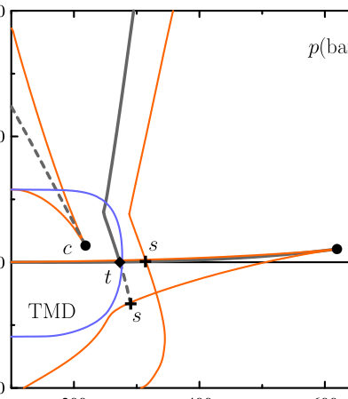
<figcaption class="paper-figure-caption"><b>Fig 4.</b> FIG. 3: Numerical results for our five-state model with pa- rameter setting “2.” Plotted in the p-T plane are binodals (thick, grey), spinodals (thin, orange), and the locus of tem- peratures of maximum density along isobars TMD (thin, blue). Special points are critical c, triple t, and s points. Con- tinuations of crystal spinodals beyond their crossing point are not drawn for clarity of presentation; likewise for the freezing binodals.</figcaption>
</figure>
<figure class="paper-figure-card">
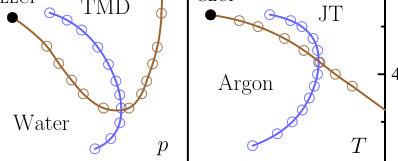
<figcaption class="paper-figure-caption"><b>Fig 5.</b> FIG. 4: (Left) Molecular simulation results for the TIP4P/2005 water force field [13, 53–55]. (Right) Experimen- tal data for argon [56]. The upper panels display isobars in the temperature-volume per particle T-v plane and isotherms in the pressure-enthalpy per particle p-h plane, with binodal curves in grey. The lower panels show the corresponding TMD and Joule-Thomson JT inversion loci (blue) together with the loci of isobaric extrema of the isothermal compressibility κT and isothermal extrema of the isobaric heat capacity per particle cp (brown) respectively emanating from the water’s liquid–liquid critical point LLCP and argon’s gas–liquid crit- ical point GLCP. Units are: p(bar),...</figcaption>
</figure>

**Summary.** This paper presents a versatile five-state Ising-like model that can theoretically account for both the stability-limit and liquid-liquid criticality theories of supercooled water. It introduces a novel connection between the thermodynamic anomalies of water and the inversion thermodynamics found in both classical gases and black hole physics.

**Why it may be interesting.** not directly relevant

Detailed structure

**Main problem.** Resolving the debate between the stability-limit and liquid-liquid criticality scenarios in supercooled water by providing a unified theoretical framework.

**Main result.** The authors develop a model that can reproduce both competing scenarios and propose a new thermodynamic link between water's anomalies and the inversion thermodynamics seen in Joule-Thomson gases and black holes.

**Method.** A mean-field treatment of a five-state Ising-like model using a generalization of single-order-parameter theory with four order parameters.

**Model / system.** A five-state Ising-like model where lattice sites are 'cells' defined by occupancy, volume, free volume, and particle orientations, representing gas, liquid (HDL/LDL), and crystal (HDC/LDC) phases.

**Key observables.** Isothermal compressibility (kappa_T), isobaric heat capacity (cp), thermal expansivity (alpha_p), density (rho), pressure (p), and temperature (T).

**Important parameters / regimes.** Temperature of Maximum Density (TMD) locus, liquid-liquid critical point (LLCP), and the Joule-Thomson inversion locus.

**Assumptions / limitations.** The use of mean-field theory in three dimensions and the treatment of the crystal phase as a spectator phase rather than modeling specific ice lattice structures.

**Figures summary.** Figure 1 shows the five cell states; Figure 2 displays the stability-limit scenario with p-rho isotherms and p-T phase diagrams; Figure 3 shows the liquid-liquid criticality scenario; Figure 4 compares water simulation results with argon experimental data and provides a table of thermodynamic analogies.

**Paper structure.** Introduction of the problem, description of the five-state cell model, presentation of the stability-limit scenario, presentation of the liquid-liquid criticality scenario, discussion of the thermodynamic inversion analogy with gases and black holes, and concluding remarks.

Abstract

We introduce a model of water contemplating true supercooled-liquid states that, as such, are metastable with respect to the crystalline-solid ones. Its numerical solutions reproduce from Speedy-Angell's stability-limit picture to Poole et al.'s metastable liquid--liquid criticality. The real existence of a liquid--liquid critical point is found to gain significant theoretical plausibility from a hitherto unnoticed analogy with the ``inversion thermodynamics'' of Joule-Thomson gas throttling process and, by extension, with the equivalent phenomenology exhibited by black holes.

[↑ back to top](#top)

### [Towards Scalable Quaternary Message-Passing Decoding for Quantum Error Correction](http://arxiv.org/abs/2605.24177v1)

**Authors:** Boqing Zhang, Henry D. Pfister, Hanwen Yao, Siyuan Niu  
**Type:** theory · **Category:** quantum information and computing · **PDF:** <https://arxiv.org/pdf/2605.24177v1>  
**Analysis basis:** full PDF text, analyzed in chunks

↔ Scroll figures horizontally

<figure class="paper-figure-card">
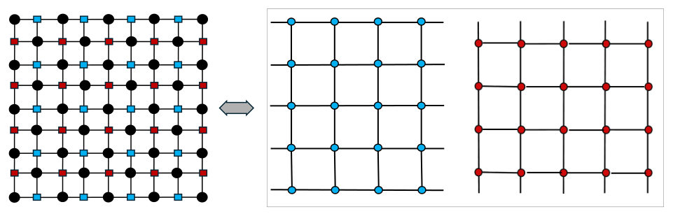
<figcaption class="paper-figure-caption"><b>Fig 1.</b> Figure 1. Illustration of the canonical Tanner graph T of the distance-5 surface code (left) and the corresponding component lattices GX (blue) and GZ (red) (right). In T , black variable nodes represent physical qubits, blue and red factor nodes correspond to X- and Z-type stabilizers, respectively. This Tanner graph decomposes into two canonical lattices in which qubits lie on edges and blue (resp. red) vertices represent X-type (resp. Z-type) stabilizers.</figcaption>
</figure>
<figure class="paper-figure-card">
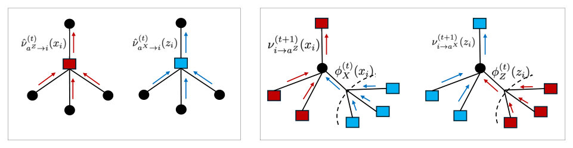
<figcaption class="paper-figure-caption"><b>Fig 2.</b> Figure 2. Illustration of quaternary message passing for CSS codes. The left panel shows the Z- (resp. X-) factor- to-variable update ˆν(t) aZ→i(xi) (resp. ˆµ(t) aX→i(zi) ) from aZ (resp. aX) to variable node i, which proceeds independently</figcaption>
</figure>
<figure class="paper-figure-card">
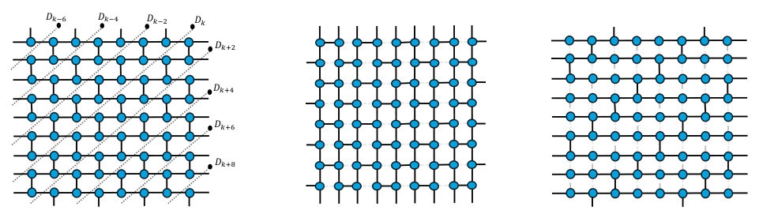
<figcaption class="paper-figure-caption"><b>Fig 3.</b> Figure 3. Examples of diluted graphs obtained by diagonal s-sparsification. From left to right: the D1 V -diluted lattice G1 DV , the D1 H-diluted lattice G1 DH , and the D3 V -diluted lattice G3 DV .</figcaption>
</figure>
<figure class="paper-figure-card">
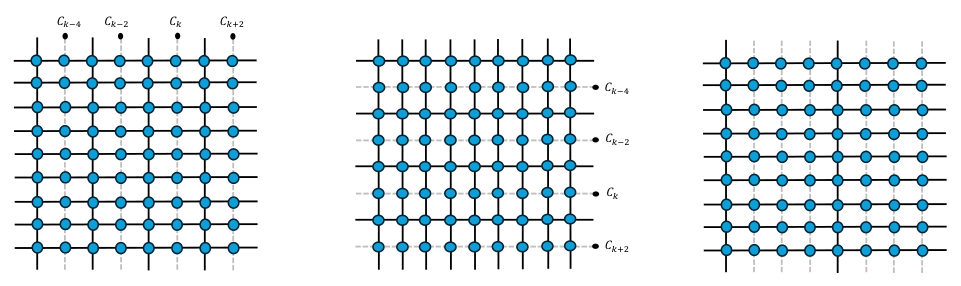
<figcaption class="paper-figure-caption"><b>Fig 4.</b> Figure 4. Examples of diluted graphs obtained by Cartesian s-sparsification. From left to right: the C1 V -diluted lattice G1 CV , the C1 H-diluted lattice G1 CH , and the C3 V -diluted lattice G3 CV .</figcaption>
</figure>
<figure class="paper-figure-card">
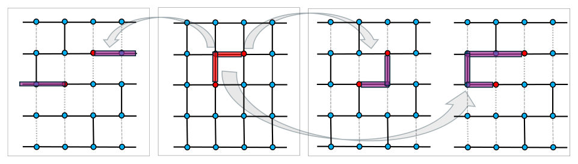
<figcaption class="paper-figure-caption"><b>Fig 5.</b> Figure 5. Illustration of effective errors on diluted lattices. The middle panels show physical errors (red strings) on the original lattice, and their corresponding effective errors on the diluted lattices are shown in purple. The effective errors on the right are stabilizer-equivalent to the physical error, while the one on the left differs by a logical operator.</figcaption>
</figure>

**Summary.** This paper proposes a new decoding strategy called the 'dilution method' to make message-passing algorithms more effective for large-scale quantum error correction. By iteratively sparsifying the decoding graph and freezing variables, the authors demonstrate that decoders can overcome the traditional failures caused by short cycles in quantum codes, achieving high error thresholds even at large distances.

**Why it may be interesting.** not directly relevant

Detailed structure

**Main problem.** Addressing the scalability and interpretability challenges of message-passing decoders in quantum error correction, specifically the non-convergence caused by short cycles and high degeneracy in stabilizer codes.

**Main result.** The introduction of a 'dilution method' enables a quaternary Min-Sum decoder to achieve an apparent depolarizing threshold of 16% and a sustainable threshold of ~9% for X-noise at large distances (d=65), outperforming MWPM and BP-OSD.

**Method.** A multi-stage decoding framework using a sequence of progressively sparsified (diluted) Tanner graphs combined with a global hard-decimation step to freeze qubit variables.

**Model / system.** Quantum error correction using CSS and surface codes, specifically focusing on the joint X-Z Tanner graph under depolarizing and biased (X-only) Pauli noise models.

**Key observables.** Logical error rate, decoding threshold (p_th), cavity discrepancy (delta), and decoding complexity.

**Important parameters / regimes.** Code distance (d), sparsification ratio (s), damping factor (epsilon), and X-Z error coupling (kappa).

**Assumptions / limitations.** Assumes that auxiliary non-MP steps incur near-constant overhead and utilizes a heuristic non-expansion assumption for error weight growth across dilution stages.

**Figures summary.** Figure 1 shows the Tanner graph decomposition; Figures 2-4 illustrate different sparsification patterns (diagonal and Cartesian); Figures 8-9 show performance/thresholds under different noise models; Figures 10-15 detail complexity, convergence, and the theoretical impact of cycles and error weight expansion.

**Paper structure.** The paper begins by defining the quaternary message-passing framework for CSS codes, introduces the graph-dilution/sparsification method, provides theoretical bounds on error-correcting radii and complexity, analyzes the impact of X-Z coupling on convergence via cavity discrepancy, and concludes with numerical evidence of scalable thresholds.

Abstract

The scalability and interpretability of message-passing (MP) decoding, such as (quaternary) Belief Propagation, remain open challenges in quantum error correction. Even for surface codes, arguably the first testbed for decoding methods, studies of improved MP decoders have mostly been restricted to small distances ($d \lesssim 19$). Moreover, the mismatch with established message-passing theory limits the decoder's interpretability, making it unclear whether MP decoding can sustain its effectiveness at large system sizes. This work takes a step toward a more principled and interpretable MP decoding framework, with the goal of making MP-based decoding more reliable and bridging theory and practice. We introduce a dilution method, which allows a quaternary Min-Sum (MS) decoder to exhibit an apparent depolarizing threshold of $16\%$ up to distance $20$, outperforming Minimum-Weight Perfect Matching in finite-length regimes. Notably, for $X$-noise, the standard MS decoder under dilution has worst-case complexity $O(N \log^2 d)$ and outperforms BP-OSD at $d=65$. The observed $\sim 9\%$ threshold may correspond to a true asymptotic threshold. Finally, we give a graph-dilution argument that interprets the success of the dilution method and offers insight into when MP algorithms can genuinely scale. Taken together, these results provide encouraging progress toward scalable and interpretable MP decoding in quantum error correction.

[↑ back to top](#top)

### [Training-Free Quantum Generative Paradigm via Local Parent Hamiltonians](http://arxiv.org/abs/2605.25986v1)

**Authors:** Shu Tian, Jiaqi Hu, Rebing Wu, Yu Shi  
**Type:** theory · **Category:** quantum information and computing · **PDF:** <https://arxiv.org/pdf/2605.25986v1>  
**Analysis basis:** full PDF text, analyzed in chunks

↔ Scroll figures horizontally

<figure class="paper-figure-card">
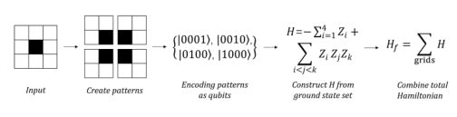
<figcaption class="paper-figure-caption"><b>Fig 1.</b> FIG. 1. Flowchart of our generative model</figcaption>
</figure>
<figure class="paper-figure-card">
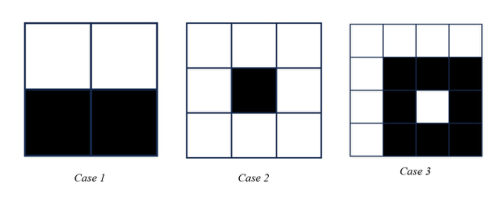
<figcaption class="paper-figure-caption"><b>Fig 2.</b> FIG. 2. Three different original images of graph generation</figcaption>
</figure>
<figure class="paper-figure-card">
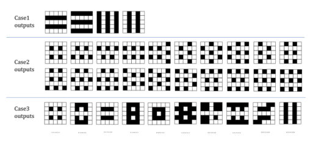
<figcaption class="paper-figure-caption"><b>Fig 3.</b> FIG. 4. Each 5 × 5 image is associated with a product state |ψi⟩. All generated states conform to the specifications of Case 2 and collectively comprise the complete set of 5 × 5 states satisfying the local similarity constraints.</figcaption>
</figure>
<figure class="paper-figure-card">
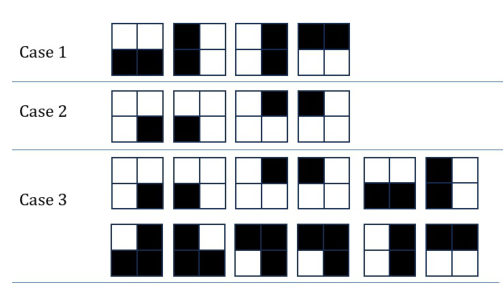
<figcaption class="paper-figure-caption"><b>Fig 4.</b> FIG. 3. Patterns in each case</figcaption>
</figure>
<figure class="paper-figure-card">
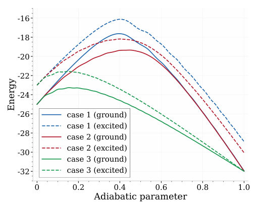
<figcaption class="paper-figure-caption"><b>Fig 5.</b> FIG. 5. In the first two cases, the initial excited states evolve into final excited states while maintaining a finite energy gap throughout. The third case does not indicate adiabatic fail- ure. Instead, even when starting from an excited state, the system can still converge to the ground state configuration after the evolution,</figcaption>
</figure>

**Summary.** This paper proposes a new way to generate data using quantum computers without the need for traditional training. By encoding patterns directly into a quantum Hamiltonian, the ground state naturally represents the target distribution, offering a potential way to leverage entanglement and superposition for generative tasks.

**Why it may be interesting.** not directly relevant

Detailed structure

**Main problem.** The paper addresses the high computational cost, training instability, and 'black box' nature of classical generative models like Transformers and GANs by proposing a training-free quantum alternative.

**Main result.** The authors demonstrate a quantum generative paradigm where the ground state of a constructed local parent Hamiltonian encodes a target distribution, achieving successful image and text generation without parameter training.

**Method.** The method involves mapping generative constraints to a local parent Hamiltonian, using spectral decomposition or Ising-type mappings, and solving for the ground state via Adiabatic Quantum Computing or Grover's algorithm.

**Model / system.** The model uses a quantum n-gram framework for text and a grid-based model for images, where qubits represent pixels or tokens and the global Hamiltonian is a sum of local Hamiltonians representing observed patterns.

**Key observables.** Energy spectrum (ground and excited state energies), energy expectation, and perplexity for text generation.

**Important parameters / regimes.** The resolution constant C (defining bit-depth for weights), number of qubits, and the number of adiabatic time steps.

**Assumptions / limitations.** The approach assumes that the target distribution can be effectively decomposed into local patterns and is limited by the number of available qubits for encoding.

**Figures summary.** Fig 1 shows the model flowchart; Fig 2-3 show input images and identified patterns; Fig 4 shows generated quantum states; Fig 5 shows energy evolution during adiabatic evolution; Fig 6 compares different pruning/smoothing protocols; Fig 7 shows energy expectation across Grover iterations.

**Paper structure.** The paper introduces the limitations of classical generative models, proposes a quantum 'inverse' approach, details the Hamiltonian construction and encoding mechanisms for text and images, presents simulation results using adiabatic and Grover-based protocols, and discusses future directions.

Abstract

We propose a training-free quantum generative paradigm, which is fundamentally different from current generative models, which demand substantial computational power, face practical scalability limits, and often function as opaque black boxes, despite their remarkable success. We enable image and text generation without parameter training, by constructing a local parent Hamiltonian whose ground state encodes the target distribution and then solving the global Hamiltonian. Rooted directly in quantum mechanical principles, this approach establishes a new pathway for generative modeling that leverages superposition and entanglement to maintain global consistency.

[↑ back to top](#top)

### [Trimerized Spin-$1/2$ Chain: Emergent Low-Energy Hamiltonian, Higher-Energy Excitations, and Magnetic and Thermodynamic Responses](http://arxiv.org/abs/2605.25960v1)

**Authors:** Snehasish Sen, Sudhansu S. Mandal  
**Type:** theory · **Category:** strongly correlated electrons · **PDF:** <https://arxiv.org/pdf/2605.25960v1>  
**Analysis basis:** full PDF text, analyzed in chunks

↔ Scroll figures horizontally

<figure class="paper-figure-card">
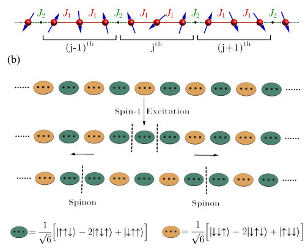
<figcaption class="paper-figure-caption"><b>Fig 1.</b> FIG. 1. (a) A schematic of a spin chain of spin-1/2. Bonds with Heisenberg exchange interaction strengths are shown. Trimer unit cells: (j −1)-th, j-th, and j + 1-th are marked. (b) Composite spin-1/2 doublets of trimers are denoted by and . Top: Schematic of antiferromagnetically correlated ground state. Middle: Schematic of spin-1 excitation bounded by two domain walls. Bottom: Domain walls shift with time as representation of a pair of spinon excitations.</figcaption>
</figure>
<figure class="paper-figure-card">
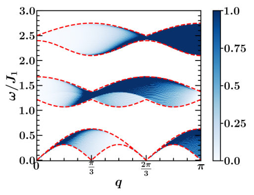
<figcaption class="paper-figure-caption"><b>Fig 2.</b> FIG. 3. Dynamical spin structure factor P(ω, q) calculated at γ = 0.5 and zero magnetic field by color coding in 0–1 scale. The red dashed lines have been drawn as a visual guide to the lower-bound and higher-bound of the band. The functional forms of these lines have been quoted in the text.</figcaption>
</figure>
<figure class="paper-figure-card">
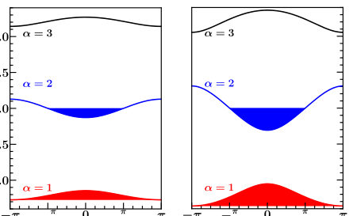
<figcaption class="paper-figure-caption"><b>Fig 3.</b> FIG. 2. Energy dispersion of three bands at (a) γ = 0.2 and (b) γ = 0.5. Shaded portions of the bands are filled by fermions in the ground state.</figcaption>
</figure>
<figure class="paper-figure-card">
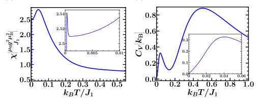
<figcaption class="paper-figure-caption"><b>Fig 4.</b> FIG. 5. Temperature dependence of (a)Magnetic suscepti- bility and (b) specific heat. Insets show the corresponding zoomed-view at low temperatures.</figcaption>
</figure>
<figure class="paper-figure-card">
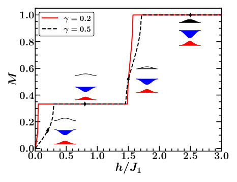
<figcaption class="paper-figure-caption"><b>Fig 5.</b> FIG. 4. Magnetization per spin M in the unit of saturated magnetization M0 versus h for γ = 0.2 (solid line) and 0.5 (dashed line) at zero temperature. A magnetization plateau occurs at M = 1/3, apart from the plateau of saturated mag- netization. Four regimes M &lt; 1/3, M = 1/3, 1/3 &lt; M &lt; 1 and M = 1 are depicted by the designated four points to which the change in the filling of bands by fermions are de- scribed in the corresponding ground states.</figcaption>
</figure>

**Summary.** This paper provides a unified theoretical framework for trimerized spin-1/2 chains, bridging the gap between low-energy spinon physics and high-energy excitations. By using a self-consistent mean-field approach, the authors reproduce experimental features like the 1/3 magnetization plateau and additional excitation bands. The results are highly consistent with both exact Bethe Ansatz solutions and previous numerical simulations.

**Why it may be interesting.** not directly relevant

Detailed structure

**Main problem.** The lack of a unified theoretical framework to describe both low-energy spinon excitations and higher-energy excitation bands in trimerized quantum spin chains.

**Main result.** The development of a self-consistent Jordan-Wigner mean-field theory that successfully connects low-energy spinon physics to higher-energy bands and thermodynamic responses like the 1/3 magnetization plateau.

**Method.** The authors use a combination of Bethe Ansatz for low-energy mapping and a self-consistent Jordan-Wigner mean-field theory in the Hartree-Fock channel for high-energy dynamics.

**Model / system.** A spin-1/2 antiferromagnetic chain with trimerized exchange couplings (a J1-J1-J2 model) relevant to the compound Na2Cu3Ge4O12.

**Key observables.** Dynamical spin structure factor, magnetization (specifically the 1/3 plateau), magnetic susceptibility, and specific heat.

**Important parameters / regimes.** The modulation parameter gamma (J2/J1), the exchange coupling J1, and the external magnetic field h.

**Assumptions / limitations.** The mean-field approximation neglects the BCS channel and non-zero momentum mean-field contributions, and intra-trimer second-nearest-neighbor interactions are neglected.

**Figures summary.** Fig 1a shows the chain schematic; Fig 2 displays energy dispersion of three fermion bands; Fig 3 shows the color-coded dynamical spin structure factor; Fig 4 illustrates magnetization vs. magnetic field.

**Paper structure.** The paper begins with the model definition, moves to a low-energy mapping via Bethe Ansatz, develops a high-energy mean-field theory using Jordan-Wigner transformation, and concludes with calculations of dynamical and thermodynamic observables.

Abstract

We investigate a spin-1/2 antiferromagnetic chain with trimerized exchange couplings relevant to Na$_2$Cu$_3$Ge$_4$O$_{12}$. We show that the low-energy Hilbert space maps onto an effective Heisenberg chain of composite spin-1/2 trimer degrees of freedom with positive coupling, enabling an exact spinon excitations via the Bethe ansatz. To access higher-energy dynamics, we develop a self-consistent Jordan-Wigner mean-field theory that yields three fermionic bands reflecting the underlying trimer structure. Remarkably, this approach reproduces the exact low-energy spinon continuum while predicting two additional higher-energy excitation bands consistent with the experimental observations and previous numerical simulations. The theory further captures the 1/3 magnetization plateau under an applied magnetic field, and provides testable predictions in magnetic susceptibility and specific heat. Our results establish a unified framework connecting low- and high-energy excitations in trimerized quantum spin chains.

[↑ back to top](#top)

### [Tuning quantum tunneling in WSe$_2$ via strain engineering](http://arxiv.org/abs/2605.24851v1)

**Authors:** Rachid El Aitouni, Hasna Chnafa, Clarence Cortes, David Laroze, Ahmed Jellal  
**Type:** theory · **Category:** other · **PDF:** <https://arxiv.org/pdf/2605.24851v1>  
**Analysis basis:** full PDF text, analyzed in chunks

↔ Scroll figures horizontally

<figure class="paper-figure-card">
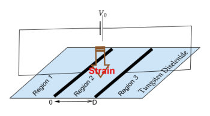
<figcaption class="paper-figure-caption"><b>Fig 1.</b> FIG. 1. Schematic representation of a WSe2 sheet subjected to a uniaxial strain along with an external scalar electrostatic potential of height V0 and width D in the central region.</figcaption>
</figure>
<figure class="paper-figure-card">
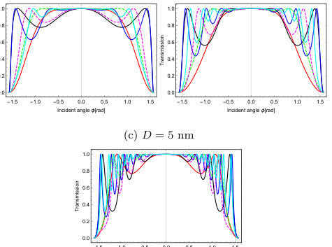
<figcaption class="paper-figure-caption"><b>Fig 2.</b> FIG. 2. Transmission probability in the K valley as a function of the incident angle ϕ, for spin-up (solid line) and spin-down (dashed line). Three incident energies are considered: 0.9 eV (red, green), 1.1 eV (black, magenta), and 1.3 eV (blue, cyan), with ε = 1 and V0 = 3 eV.</figcaption>
</figure>
<figure class="paper-figure-card">

<figcaption class="paper-figure-caption"><b>Fig 3.</b> Figure 2 displays the transmission probability in the K valley as a function of the incident angle ϕ for dif- ferent barrier widths D and incident energies E, un- der finite uniaxial strain. A prominent feature is the near-unity transmission at normal incidence (ϕ = 0) for all considered parameters, which constitutes a clear sig- nature of Klein tunneling in monolayer WSe2, similar to the behavior previously reported in graphene-based Dirac systems [15, 74]. Despite the presence of a finite band gap induced by intrinsic spin–orbit coupling, the chiral nature of Dirac fermions allows perfect transmis- sion when pseudospin matching across the barrier is pre- served, demonstrating that Klein’s...</figcaption>
</figure>
<figure class="paper-figure-card">
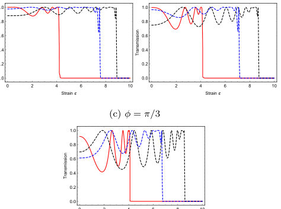
<figcaption class="paper-figure-caption"><b>Fig 4.</b> FIG. 3. Spin-up transmission probability in the K valley as a function of strain ε for three different incident energy values; E = 1.1 eV (black dashed line), E = 1.3 eV (blue dashed line) and E = 1.5 eV (red line), with D = 1 nm and V0 = 3 eV.</figcaption>
</figure>
<figure class="paper-figure-card">
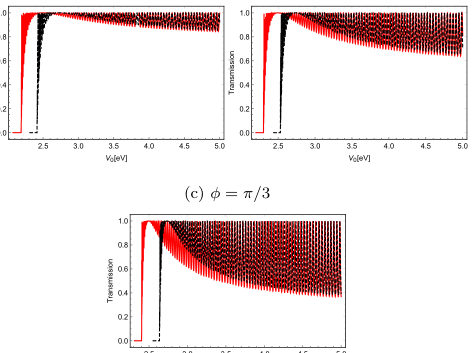
<figcaption class="paper-figure-caption"><b>Fig 5.</b> FIG. 4. Spin-up transmission (black line) and spin-down transmission (red line) in the K valley as a function of the barrier height V0 for D = 5 nm, ε = 1 and E = 1.3 eV.</figcaption>
</figure>

**Summary.** This theoretical study demonstrates that mechanical strain can be used as a 'control knob' to manipulate the spin and valley degrees of freedom in WSe2. By combining strain with electrostatic engineering, researchers can create highly efficient, reconfigurable filters for quantum transport. This provides a promising pathway for designing next-generation valleytronic and spintronic devices.

**Why it may be interesting.** not directly relevant

Detailed structure

**Main problem.** Investigating how uniaxial strain and electrostatic potentials can be used to tune quantum transport, specifically spin and valley polarizations, in monolayer WSe2.

**Main result.** Strain acts as a powerful tuning parameter that modifies electronic dispersion and induces oscillations in conductance and transmission, enabling highly controllable spin and valley filtering.

**Method.** Analytical solution of the Dirac equation using a transfer matrix approach and the Landauer-Buttiker formalism to calculate conductance and polarization.

**Model / system.** A monolayer of tungsten diselenide (WSe2) featuring a rectangular electrostatic potential barrier and subject to uniaxial strain, modeled via a low-energy Dirac framework with spin-orbit coupling and a strain-induced gauge field.

**Key observables.** Transmission probability, conductance, spin polarization, and valley polarization.

**Important parameters / regimes.** Strain (u_xx), barrier height (V0), barrier width (D), incident energy (E), and incident angle (phi).

**Assumptions / limitations.** Assumes a low-energy Dirac-like band structure, ballistic transport, and uniaxial strain along the transport direction with uniform deformation.

**Figures summary.** Fig 1: Schematic of the strained WSe2 system; Fig 2: Transmission probability vs. incident angle; Fig 3: Spin-up transmission vs. strain; Fig 4: Spin-up/down transmission vs. barrier height; Fig 5: Conductance vs. strain; Fig 6: Polarization vs. barrier width; Fig 7: Spin and valley polarization vs. strain.

**Paper structure.** Introduction of the physical system and problem, description of the Dirac Hamiltonian and strain-induced gauge field, derivation of transmission/reflection coefficients via boundary conditions, numerical results for transport observables, and discussion of applications in spintronics/valleytronics.

Abstract

We present a comprehensive theoretical study of strain-engineered quantum transport in monolayer tungsten diselenide (WSe$_2$) in the presence of an electrostatic scalar potential. By incorporating strain effects within a low-energy Dirac framework, we analyze their impact on spin- and valley-resolved transmission, conductance, and polarization. The applied potential barrier partitions the system into three distinct regions, allowing for an analytical derivation of the wave functions in each domain. Enforcing continuity conditions at the interfaces yields exact expressions for the transmission and reflection amplitudes. The transmission probability is evaluated from the corresponding current densities, while the conductance is obtained using the Landauer-Büttiker formalism, enabling a quantitative determination of spin and valley polarizations. Our numerical analysis reveals that strain acts as a powerful tuning parameter that reshapes the electronic dispersion and strongly modifies transport characteristics. In particular, the transmission and conductance exhibit pronounced oscillatory behavior driven by quantum interference and resonant tunneling mechanisms. More importantly, both spin and valley polarizations display substantial and highly controllable variations as functions of strain, barrier height, and incident energy. These results demonstrate that strain and electrostatic engineering provide an efficient and versatile platform for manipulating spin-valley degrees of freedom in WSe$_2$. The ability to tailor polarization and interference effects suggests promising opportunities for the design of next-generation spintronic, valleytronic, and optoelectronic devices based on two-dimensional transition-metal dichalcogenides.

[↑ back to top](#top)

## Secondary cond-mat archives

*Papers from cond-mat.mtrl-sci, mes-hall, other, soft, supr-con. These archives are de-prioritized — they appear at the end regardless of relevance score.*

### Relevant in secondary archives (15)

### [Emergence of Triplet Superconductivity from Cavity Vacuum Fluctuations](http://arxiv.org/abs/2605.24439v1)

**Authors:** Xin-Xin Yang, Shuai Zhang, Kun Ding, Xiaopeng Li  
**Type:** theory · **Category:** strongly correlated electrons · **PDF:** <https://arxiv.org/pdf/2605.24439v1>  
**Analysis basis:** full PDF text, analyzed in chunks
**Topic relevance:** 🔥 `correlated cavity matter` **4/5** · `non-equilibrium dynamics` **3/5** · `Tavis-Cummings & cavity-many-emitter` **2/5** · `driven-dissipative phase transition` **2/5**

↔ Scroll figures horizontally

<figure class="paper-figure-card">
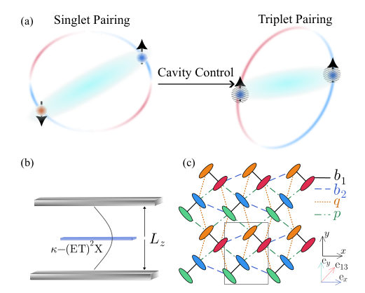
<figcaption class="paper-figure-caption"><b>Fig 1.</b> Figure 1. (a) Schematic of cavity-controlled switching from a dxy-wave singlet to a p-wave triplet channel. (b) κ-(ET)2X crystal embedded in a cavity with size Lz along the z di- rection. (c) Quasi-two-dimensional κ-(ET)2X lattice with four bond types defining the bare hoppings tij. Blue, or- ange, green, and red ellipses label the four molecular sites l = 1–4 in each unit cell, located at r1/a = (−0.1, −0.2), r2/a = (0.1, 0.5), r3/a = (−0.4, −0.5), and r4/a = (0.4, 0.2), where a = 0.8 nm is the lattice constant along the x direction. Blue, green, and red arrows indicate the three cavity polar- ization directions considered here: ex = (1, 0), ey = (0, 1), and e13 = (1, 1)/ √</figcaption>
</figure>
<figure class="paper-figure-card">
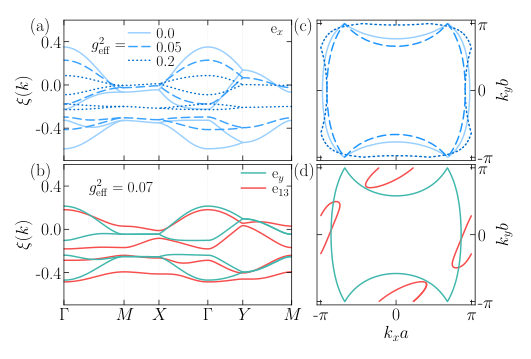
<figcaption class="paper-figure-caption"><b>Fig 2.</b> Figure 2. (a) Dispersion ξν(k) at zero temperature along the high-symmetry path for a cavity polarized along ex, compar- ing the cavity-free case (solid) with g2 eff = 0.05 (dashed) and g2 eff = 0.2 (dotted). (b) Dispersion ξν(k) for cavities polarized along ey (green) and e13 = (1, 1)/ √</figcaption>
</figure>
<figure class="paper-figure-card">
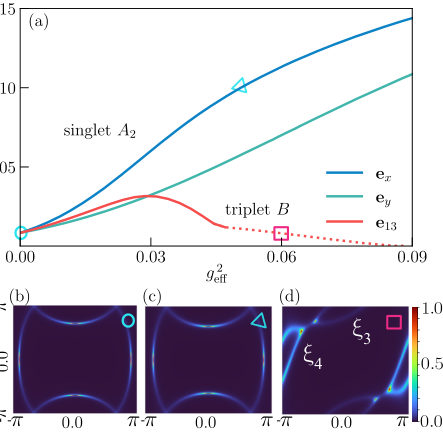
<figcaption class="paper-figure-caption"><b>Fig 3.</b> Figure 3. (a) Superconducting transition temperature Tc from linearized BCS theory as a function of g2 eff for cavities polar- ized along ex (blue), ey (green), and e13 (red). Along each curve, solid and dotted segments indicate parameter regimes where the dominant pairing channel is singlet or triplet, re- spectively, and the corresponding irrep is indicated in the panel. The points marked in (a) correspond to panels (b)– (d), which display the normalized zero-energy spectral func- tion ˜ A(k, ω = 0) for the indicated cases.</figcaption>
</figure>

**Summary.** This paper shows that the vacuum fluctuations of a cavity can be used to engineer new superconducting phases in organic materials. By anisotropically renormalizing the electronic bands, the cavity can trigger a transition from singlet to triplet pairing. This establishes cavity vacuum engineering as a tool for generating unconventional and potentially topological superconducting states.

**Why it may be interesting.** It demonstrates a novel way to use vacuum-mediated light-matter interactions to control many-body phase transitions and manipulate the symmetry of superconducting order parameters.

Detailed structure

**Main problem.** Investigating whether cavity vacuum fluctuations can drive a symmetry transition from singlet to triplet superconductivity by reshaping the electronic band structure and Fermi surface.

**Main result.** Above a critical light-matter coupling, the cavity vacuum fluctuations anisotropically renormalize hopping amplitudes, causing the leading superconducting instability to switch from a singlet d-wave to a triplet p-wave state.

**Method.** The authors use a quantum-Floquet expansion in the high-frequency regime to derive an effective Hamiltonian, combined with linearized BCS theory and symmetry analysis of the C2v group.

**Model / system.** A tight-binding extended Hubbard model representing the quasi-2D organic superconductor kappa-(ET)2X, coupled to a quantized electromagnetic field in a dark cavity.

**Key observables.** Superconducting transition temperature (Tc), gap structure, Fermi surface contours, and the zero-energy spectral function.

**Important parameters / regimes.** Effective light-matter coupling (geff), cavity polarization directions (ex, ey, e13), and the cavity compression factor (C).

**Assumptions / limitations.** The study assumes a high-frequency regime where the Hamiltonian is projected onto the zero-photon sector and neglects cavity-induced corrections to the interaction vertex.

**Figures summary.** Figure 1 shows a schematic of the singlet-to-triplet pairing switch, the crystal structure of kappa-(ET)2X in a cavity, and the underlying four-site lattice structure.

**Paper structure.** The paper introduces the concept of cavity engineering, defines the effective Hamiltonian via Floquet projection, performs symmetry analysis of pairing channels, demonstrates the mechanism of band renormalization, and concludes with the emergence of the triplet phase.

Abstract

Engineering quantum materials with cavity fields has emerged as a powerful route to manipulate phases of quantum matter in solids. Here we demonstrate that cavity vacuum fluctuations alone can drive the emergence of triplet superconductivity in an otherwise singlet superconductor. The vacuum field renormalizes the electronic band structure in a polarization dependent manner, reshaping the Fermi surface and altering the competition among symmetry allowed pairing channels. As a result, multiple superconducting phases arise from the cavity vacuum fluctuations. Above a critical light matter coupling, the leading instability switches from singlet to triplet pairing, yielding a superconducting state absent in the bare material. This vacuum induced symmetry transition produces distinct modifications of the gap structure and low energy quasiparticle spectrum. Our results establish cavity vacuum engineering as a mechanism for generating unconventional superconducting phases and stabilizing triplet states of potential relevance for topological superconductivity.

[↑ back to top](#top)

### [Quantum Printing: Laguerre-Gaussian Beam Induced Topological Magnetic Textures](http://arxiv.org/abs/2605.24720v1)

**Authors:** Yuefei Liu, Tien-Tien Yeh, Alexander V. Balatsky  
**Type:** theory · **Category:** other · **PDF:** <https://arxiv.org/pdf/2605.24720v1>  
**Analysis basis:** full PDF text, analyzed in chunks
**Topic relevance:** 🔥 `spintronics-quantum-optics interface` **4/5** · `non-equilibrium dynamics` **3/5** · `exotic spin models in light-matter` **2/5** · `interference shaping light` **2/5**

↔ Scroll figures horizontally

<figure class="paper-figure-card">
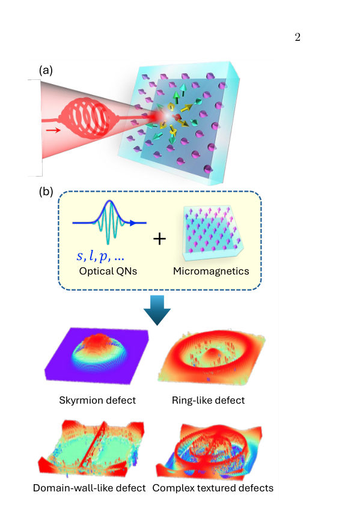
<figcaption class="paper-figure-caption"><b>Fig 1.</b> FIG. 1. (Color online) (a) Schematic of light-driven spin dy- namics in a micromagnetic thin film, where a structured optical beam transfers angular momentum to the spins. (b) Structured light carrying optical quantum numbers (s, ℓ, p, . . . ) imprints spatially varying non-collinear spin textures, generating topo- logical non-trivial (skyrmion-like), ring-like, domain-wall-like, and other complex magnetic defects.</figcaption>
</figure>
<figure class="paper-figure-card">
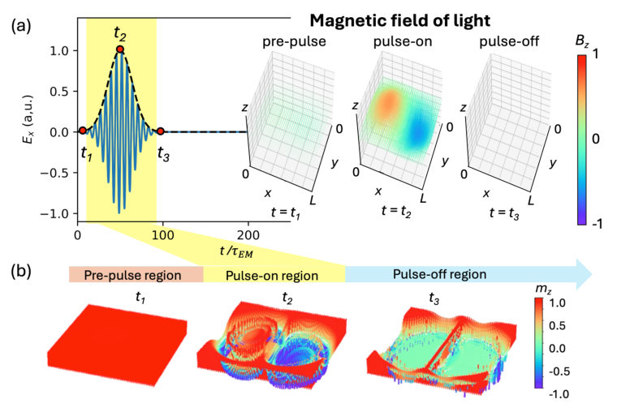
<figcaption class="paper-figure-caption"><b>Fig 2.</b> FIG. 2. (Color online) Demonstration of optical pulse timing and spin response in this work, using a linearly polarized optical pulse as a representative example. (a) Temporal profile of the electric field Ex(t) used in the simulation. The representative times t1–t3 correspond to t/τEM = 10, 50 and 100, respectively. The shaded yellow region indicates the pulse-on interval. Right: snapshots of the out-of-plane magnetic field Bz of the optical pulse at the pre-pulse (t = t1), pulse-on (t = t2), and pulse-off (t = t3) stages. (b) Corresponding evolution of the spin texture at the same time frames: pre-pulse (t1), pulse-on (t2), and pulse-off (t3). The linearly polarized light induces...</figcaption>
</figure>
<figure class="paper-figure-card">
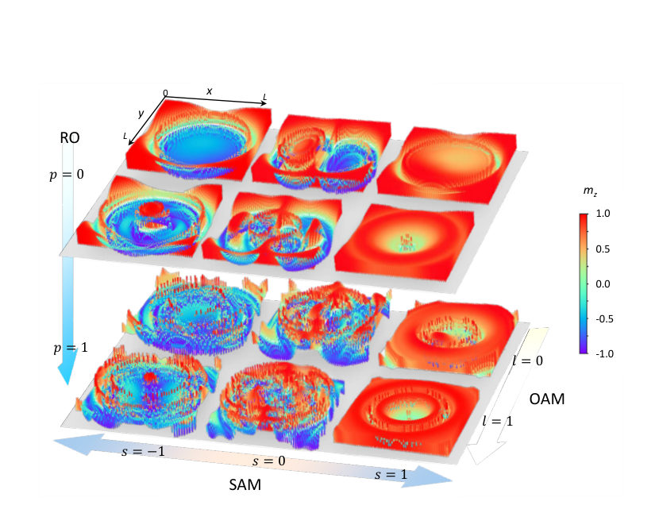
<figcaption class="paper-figure-caption"><b>Fig 3.</b> FIG. 3. (Color online) Spin textures induced by structured light with different optical quantum numbers (s,ℓ,p). Snapshots near the pulse maximum at t2/τEM = 50 show characteristic magnetization patterns depending on the SAM (s), OAM (ℓ), and RO (p) of the incident light. The spot size of the structure light is 2w0 ∼400 µm, exchange coupling parameter Jj,k = 5 meV, and Gilbert damping parameter α is set to 0.1 for all simulations in this work.</figcaption>
</figure>
<figure class="paper-figure-card">
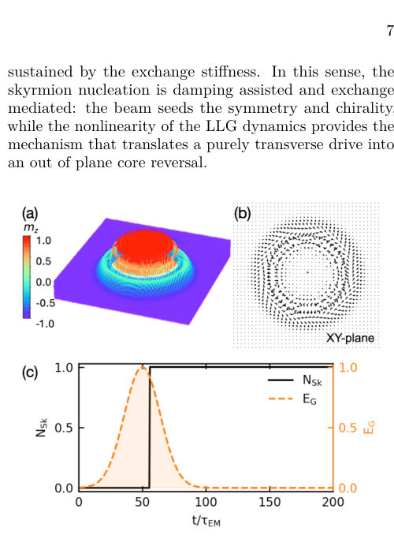
<figcaption class="paper-figure-caption"><b>Fig 4.</b> FIG. 5. (Color online.) Imprinted skyrmion in an ex- change coupled ferromagnetic film. The optical mode is (s, ℓ, p) = (1, 0, 0) and the initial state m0 = (0, 0, −1). (a) Three dimensional rendering of the magnetization with color in- dicating the out of plane component mz, which is a snapshot af- ter the pulse at t3/τEM = 100. A reversed core with mz ≃+1 is embedded in a background polarized with mz ≃−1. (b) In plane magnetization map (mx, my) in the film plane, showing a circulating texture around the core. (c) Time evolution of the skyrmion number Nsk (black, left axis) together with the normalized drive envelope EG (orange dashed, right axis). The topological charge switches from Nsk...</figcaption>
</figure>
<figure class="paper-figure-card">
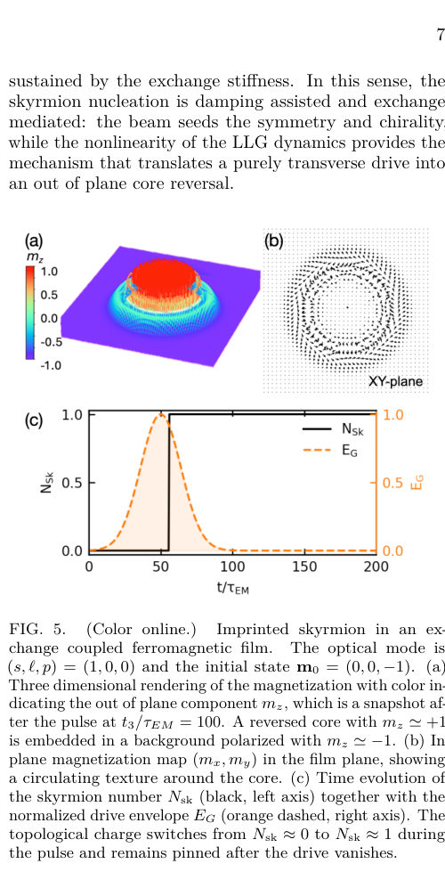
<figcaption class="paper-figure-caption"><b>Fig 5.</b> Figure 5 (c) highlights a process of skyrmion printing. We see a clear separation of time scales between writing and relaxation. The transition to Nsk ≃1 occurs within a short temporal window set by the pulse-on envelope, after which the topological charge remains quantized even as the LG beam field decays to zero, persisting for more than 50 pulse durations. This persistence indicates that the system has entered a metastable basin in configuration space, so the subsequent dynamics is governed mainly by the topological protection and the slow energy dissipa- tion into extended spin wave modes in the surrounding uniformly magnetized region. As a result, the written texture behaves as a...</figcaption>
</figure>

**Summary.** This paper proposes a 'quantum printing' technique where the spatial structure of Laguerre-Gaussian light pulses is used to programmatically create topological magnetic textures in ferromagnets. By tuning the spin and orbital angular momentum of the light, researchers can deterministically imprint complex patterns like skyrmions without needing specific material properties. This approach offers a versatile, ultrafast, and material-agnostic method for controlling magnetic topology.

**Why it may be interesting.** It demonstrates a unique way to use structured light (quantum optics) to control and program the topology of a many-body magnetic system, bridging the gap between optical angular momentum and emergent magnetic textures.

Detailed structure

**Main problem.** Developing a material-agnostic, non-contact, and ultrafast method to create and control complex, spatially programmable topological magnetic textures like skyrmions without relying on intrinsic material properties like Dzyaloshinskii-Moriya interactions.

**Main result.** The authors demonstrate that Laguerre-Gaussian (LG) pulses can 'print' various magnetic textures (skyrmions, domain walls, multi-ring structures) by using optical quantum numbers (SAM, OAM, and radial order) to act as a symmetry-selected torque during an optical quench.

**Method.** Micromagnetic simulations using the Landau-Lifshitz-Gilbert (LLG) equation with a fourth-order Runge-Kutta integration scheme on a uniform Cartesian mesh.

**Model / system.** A collinear ferromagnetic thin film modeled with a Heisenberg spin Hamiltonian featuring only intrinsic isotropic exchange coupling and an external time-dependent magnetic field induced by THz Laguerre-Gaussian pulses.

**Key observables.** Magnetization field (m_z, m_x, m_y), topological charge density, skyrmion number (Q), and spin angular momentum/orbital angular momentum transfer.

**Important parameters / regimes.** Optical quantum numbers (s, l, p), exchange coupling (J = 5 meV), Gilbert damping (alpha = 0.1), and THz pulse electric field strength (E0 = 1.5e10 V/m).

**Assumptions / limitations.** The model assumes a simplified system with only isotropic exchange, deliberately omitting Dzyaloshinskii-Moriya interactions, anisotropy, and dipolar fields to prove the fundamental printing principle.

**Figures summary.** Figure 1 shows a schematic of light-driven spin dynamics; Figure 2 illustrates the temporal evolution of the optical pulse and the resulting spin response; Figure 3 displays snapshots of magnetization (m_z) for different beam configurations; Figure 7 shows complex multi-ring spin textures and in-plane magnetization maps.

**Paper structure.** The paper introduces the concept of quantum printing, describes the physical mechanism of optical quenching and angular momentum transfer, presents micromagnetic results for various LG mode indices, and discusses the hierarchy of resulting magnetic textures and potential experimental implementations.

Abstract

Structured light has become a practical tool for controlling matter by applying tailored, space- and time-dependent electromagnetic fields. We show that Laguerre-Gaussian pulses imprint non-collinear magnetic textures via the spatial structure of optical magnetic field. Our route offers a direct spatial selectivity determined by the optical features without relying on material anisotropic interactions. The proposed printing approach does not require interfacial anisotropy or bulk chirality, current-driven torques, or thermal quenching. We use micromagnetic simulations to demonstrate the potential to create topological charge density emerging during the pulse and reveal control through the optical topological properties and polarization. These results suggest structured-light quantum printing as a viable approach for magnonics and motivate studies toward reconfigurable topological textures enabled by ultrafast THz optics and non-thermal control.

[↑ back to top](#top)

### [Cascaded Four-Wave Mixing on Quantum Paraelectrics for On-chip Cryogenic Microcombs](http://arxiv.org/abs/2605.25112v1)

**Authors:** Harikrishnan Sundaresan, Prasad Muragesh, Madhu Thalakulam  
**Type:** experiment · **Category:** quantum information and computing · **PDF:** <https://arxiv.org/pdf/2605.25112v1>  
**Analysis basis:** full PDF text, analyzed in chunks
**Topic relevance:** 🔥 `QC/QI experiment` **4/5** · `quantum optics experiment` **3/5**

↔ Scroll figures horizontally

<figure class="paper-figure-card">
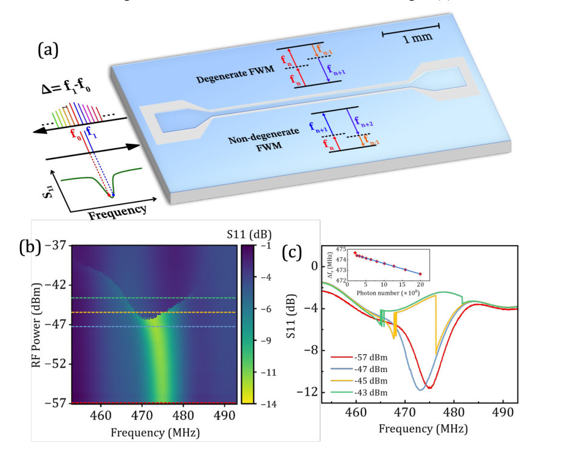
<figcaption class="paper-figure-caption"><b>Fig 1.</b> Figure 1. (a) Schematic representation of the device architecture featuring a superconducting</figcaption>
</figure>
<figure class="paper-figure-card">
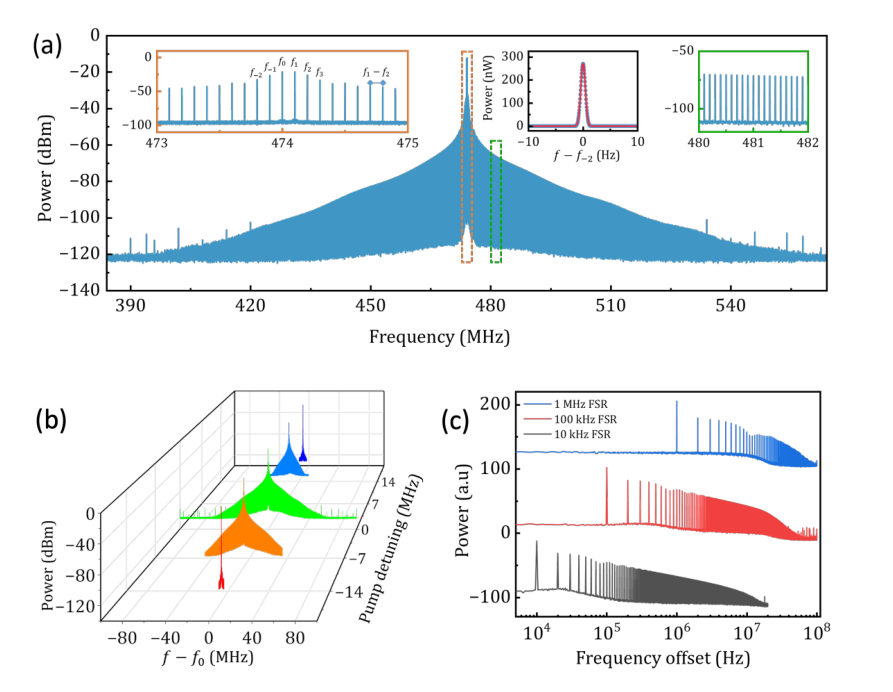
<figcaption class="paper-figure-caption"><b>Fig 2.</b> Figure 2. (a) Broadband microwave frequency comb spanning over 150 MHz. Left inset: Magnified</figcaption>
</figure>
<figure class="paper-figure-card">
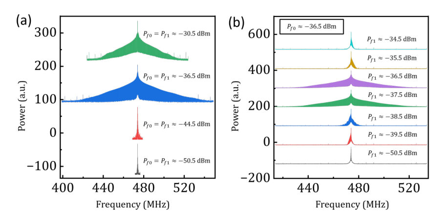
<figcaption class="paper-figure-caption"><b>Fig 3.</b> Figure 3. (a) Evolution of the frequency comb as the power of both pumps (B+% and B+&amp;) is swept</figcaption>
</figure>
<figure class="paper-figure-card">
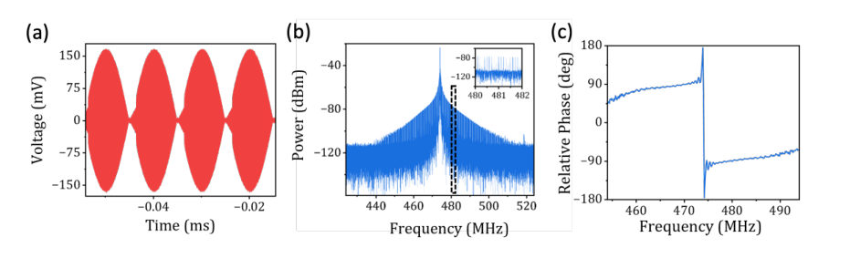
<figcaption class="paper-figure-caption"><b>Fig 4.</b> Figure 4. (a) Time-domain voltage signal of the generated comb showing a periodic pulse train with</figcaption>
</figure>

**Summary.** This paper demonstrates a new method for generating broadband, phase-coherent microwave frequency combs using the natural nonlinearity of Strontium Titanate substrates. By using two microwave pump tones, the researchers created a comb with over 1000 lines that is highly tunable and stable. This technology could significantly reduce the complexity of control electronics for large-scale superconducting quantum computers.

**Why it may be interesting.** This work is highly relevant to quantum optics and quantum control as it presents a new material platform for generating large-scale, phase-locked microwave photon states, potentially solving the 'cabling bottleneck' in quantum computing.

Detailed structure

**Main problem.** The need for scalable, on-chip, and tunable cryogenic microwave frequency combs to replace bulky electronics for tasks like multiplexed control and readout in large-scale quantum processors.

**Main result.** Demonstrated the generation of a phase-coherent, broadband microwave frequency comb (>1000 lines) using the intrinsic Kerr nonlinearity of a Strontium Titanate (STO) substrate via cascaded four-wave mixing.

**Method.** The researchers used dual-tone microwave pumping on a superconducting aluminum coplanar waveguide resonator at millikelvin temperatures and analyzed the nonlinear response via microwave reflection (S11) and time-domain pulse analysis.

**Model / system.** A superconducting aluminum coplanar waveguide (CPW) resonator fabricated on a Strontium Titanate (STO) quantum paraelectric substrate, modeled as a nonlinear oscillator with a Kerr-type Hamiltonian.

**Key observables.** Resonance frequency shifts, self-Kerr coefficient, frequency comb bandwidth, Free Spectral Range (FSR), spectral flatness, and long-term phase stability.

**Important parameters / regimes.** Operating temperature ~600 mK, Kerr coefficient of -10.20e-11 Hz per photon, comb bandwidth >150 MHz, and tunable FSR from 10 kHz to 1 MHz.

**Assumptions / limitations.** The resonator is assumed to be in an over-coupled regime, and the nonlinearity is primarily attributed to the third-order Kerr effect from soft transverse phonon modes in the STO.

**Figures summary.** Figure 1 shows the device schematic, the dual-tone pumping scheme, and the power-dependent resonance evolution; Figure 2 displays the broadband comb spectrum and its high spectral flatness; Figure 4 demonstrates the long-term phase stability of the comb lines.

**Paper structure.** The paper introduces the motivation for on-chip combs, describes the STO-based experimental platform, quantifies the intrinsic Kerr nonlinearity, demonstrates the generation of the broadband frequency comb, and concludes with stability and tunability analysis.

Abstract

Here, we demonstrate an on-chip cryogenic microwave frequency-comb on a planar superconducting resonator fabricated on Strontium titanate(STO), a quantum paraelectric material. The material's Kerr-type nonlinearity arising from the quantum paraelectric phase, an underexplored state, enables pronounced resonance shifts, Duffing-like bifurcations and comb generation via cascaded foure-wave mixing. Our results establish STO resonators as a low power, cryogenically compatible platforms for nonlinear microwave photonics, with applications in scalable quantum control and on-chip frequency synthesis.

[↑ back to top](#top)

### [Separatrix Splitting and Chaotic Dynamics in Collective-Coordinate Reductions of Driven $φ^4$ Kinks](http://arxiv.org/abs/2605.24745v1)

**Authors:** Vassilios M Rothos  
**Type:** theory · **Category:** statistical mechanics · **PDF:** <https://arxiv.org/pdf/2605.24745v1>  
**Analysis basis:** full PDF text, analyzed in chunks
**Topic relevance:** `non-equilibrium dynamics` **3/5** · `Frenkel-Kontorova` **2/5** · `driven-dissipative phase transition` **2/5** · `methods for driven-dissipative` **2/5**

↔ Scroll figures horizontally

<figure class="paper-figure-card">
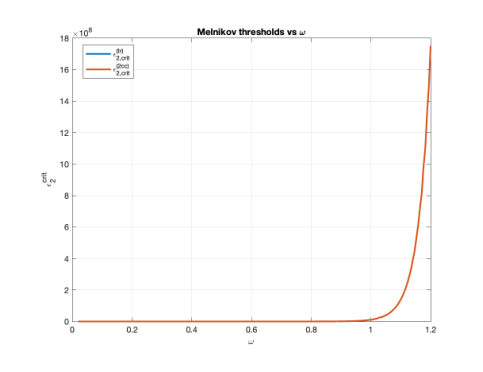
<figcaption class="paper-figure-caption"><b>Fig 1.</b> Figure 1. Frequency dependence of the Melnikov thresholds and splitting amplitudes. Panel (a) shows the critical forcing threshold predicted by the translation-only and 2-CC criteria, while panel (b) compares the corresponding translation-mediated and internal-mode-mediated splitting contributions. Together, the two panels show that, in the parameter regime considered, the translational channel dominates the separatrix splitting mechanism.</figcaption>
</figure>
<figure class="paper-figure-card">
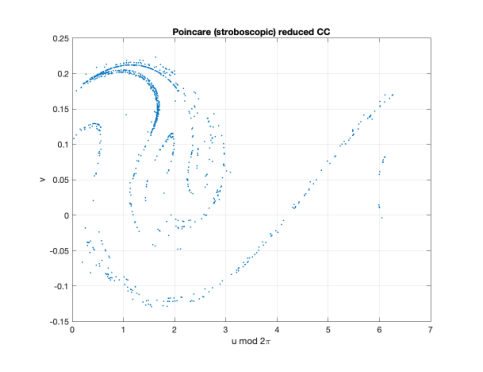
<figcaption class="paper-figure-caption"><b>Fig 2.</b> Figure 2. Poincaré diagnostics for the reduced collective-coordinate dynamics. (a) Stroboscopic phase portrait of the translation-only reduced system. (b) The same Poincaré section with the unperturbed separatrix overlaid. The chaotic layer is localized near the separatrix, consistent with the Melnikov prediction of transverse separatrix splitting and horseshoe chaos.</figcaption>
</figure>
<figure class="paper-figure-card">
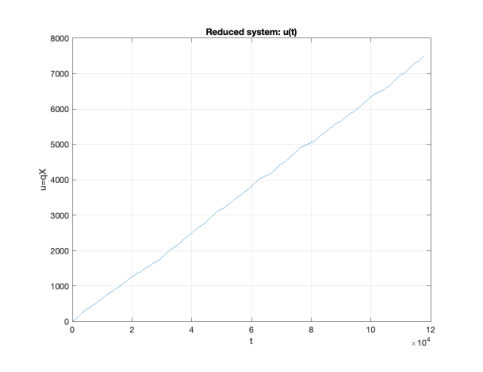
<figcaption class="paper-figure-caption"><b>Fig 3.</b> Figure 3. Additional diagnostics of the reduced chaotic dynamics. Panel (a) shows the time evolution of the collective-coordinate variable, while panel (b) provides quanti- tative confirmation of chaos through the convergence of the largest Lyapunov exponent.</figcaption>
</figure>

**Summary.** This paper analytically derives the conditions for the onset of chaos in the motion of phi^4 kinks under external driving and spatial modulation. It demonstrates that the kink's internal shape mode can significantly lower the threshold for chaos through a resonant back-reaction. The analytical predictions from the reduced-order models are shown to be consistent with the full field-theory dynamics.

**Why it may be interesting.** The study of how internal degrees of freedom (shape modes) can resonantly enhance chaos in a driven system is highly relevant to the study of non-equilibrium dynamics and driven-dissipative many-body systems.

Detailed structure

**Main problem.** Investigating the emergence of chaotic dynamics and the mechanism of separatrix splitting in the reduced-order models of driven and spatially modulated phi^4 kinks.

**Main result.** The study provides an explicit analytical characterization of chaos via Melnikov theory, identifying that internal-mode excitation acts as a resonant amplifier that lowers the chaos threshold.

**Method.** The author uses Melnikov theory applied to translation-only and two-collective-coordinate (2-CC) reductions, supplemented by numerical simulations including Lyapunov exponents and Poincaré sections.

**Model / system.** A driven-damped phi^4 field theory on a real line featuring spatial modulation (pinning), traveling-wave forcing, and linear dissipation.

**Key observables.** Separatrix splitting amplitudes, Lyapunov exponents, Poincaré sections, and the back-reaction coefficient alpha.

**Important parameters / regimes.** Dissipation (eta), external bias (Gamma), modulation amplitudes (epsilon_1, epsilon_2), and the relationship between driving frequency (omega) and internal-mode frequency.

**Assumptions / limitations.** Smallness of modulation and dissipation parameters, and the assumption of sufficient spatial localization of the kink to ensure well-defined projection integrals.

**Figures summary.** Figure 1 compares critical forcing thresholds and splitting amplitudes for different modes; Figure 2 and 3 show Poincaré sections, chaotic layers, and the time evolution of the kink center.

**Paper structure.** The paper progresses from defining the modulated phi^4 model to deriving collective-coordinate reductions, applying Melnikov theory to find chaos criteria, and validating these via numerical simulations of both reduced and full PDE dynamics.

Abstract

We investigate the emergence of chaotic dynamics in collective-coordinate reductions of a driven and spatially modulated $φ^4$ field describing the motion of topological kinks. Focusing on finite-dimensional effective models, we consider both translation-only and constraint-consistent two--collective--coordinate reductions in the presence of spatial pinning, dissipation, and traveling-wave forcing. Using Melnikov theory, we obtain an explicit analytical characterization of separatrix splitting and derive closed-form criteria for the onset of chaotic dynamics in the reduced phase space. In the two--collective--coordinate framework the Melnikov analysis is formulated in an extended phase space, allowing the distinct roles of translational motion and internal-mode excitation to be identified. Numerical simulations of the reduced systems, including stroboscopic Poincaré sections and Lyapunov exponent computations, confirm the analytical predictions and reveal chaotic layers organized around the unperturbed separatrix.

[↑ back to top](#top)

### [Theory of Electrically Detected Magnetic Resonance of Silicon Vacancy-Related Spin Pairs in Silicon Carbide](http://arxiv.org/abs/2605.26071v1)

**Authors:** David A. Fehr, Corey J. Cochrane, Stephen R. McMillan, Nicholas J. Harmon, Patrick M. Lenahan, Michael E. Flatté  
**Type:** theory · **Category:** quantum information and computing · **PDF:** <https://arxiv.org/pdf/2605.26071v1>  
**Analysis basis:** full PDF text, analyzed in chunks
**Topic relevance:** `spintronics-quantum-optics interface` **3/5** · `methods for driven-dissipative` **2/5** · `non-equilibrium dynamics` **2/5** · `quantum measurements` **2/5**

↔ Scroll figures horizontally

<figure class="paper-figure-card">
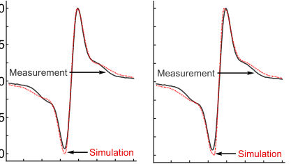
<figcaption class="paper-figure-caption"><b>Fig 1.</b> FIG. 2. EDMR spectrum (dI/dB0) of V1a silicon vacancy-related spin pairs in 4H-SiC normalized to the peak height versus magnetic field with a microwave frequency of 9.54 GHz. The simulated spec- tra (dashed red) is compared to the room-temperature measurement (solid black) in Ref. 8. (a) Shallow donor model. (b) Shallow ac- ceptor model, donor parameters ×3/4 and k∥→k∦. (Insets): Cor- responding simulation and measurement8 of the integrated EDMR spectrum I(B0) versus magnetic field.</figcaption>
</figure>
<figure class="paper-figure-card">
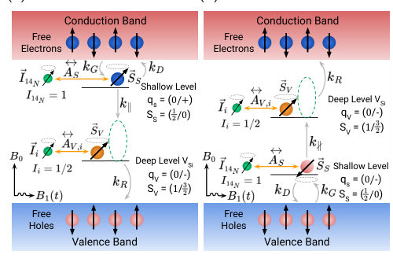
<figcaption class="paper-figure-caption"><b>Fig 2.</b> FIG. 1. EDMR diagram of silicon vacancy-related spin pairs in 4H- SiC. The silicon vacancy is in the (0/−) charge and (1  3/2) spin state level, and interacts with a a dilute bath of proximal 29Si and 13C nuclear spins of nuclear spin magnetic moment Ii = 1/2. The shal- low level spin center is S = 1/2 when neutrally charged and S = 0 when ionized, and interacts with a single onsite 14N nuclear spin. (a) Shallow donor model. Non-spin-polarized conduction electrons are captured by the shallow donor, generating the spin pair at a rate kG. From there, the unpaired electron can tunnel to the neutrally- charged silicon vacancy at a rate k∥when the two spins are in a parallel configuration....</figcaption>
</figure>
<figure class="paper-figure-card">
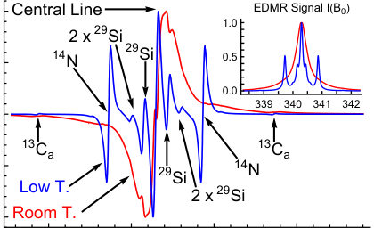
<figcaption class="paper-figure-caption"><b>Fig 3.</b> FIG. 3. The predicted EDMR spectrum (dI/dB0) of V1a silicon vacancy-related spin pairs in 4H-SiC normalized to the peak height at low microwave power, contrasting room temperature (red) and low temperature (blue) spectra. Features arising from hyperfine splitting are identified with arrows. (a) Shallow donor model, B1 = 0.05 mT. Low (Room) temperature parameters: T1,S = 1 µs (77 ns), T2,S = 1 µs (12.5 ns), k∥= 1 µs−1 (18 µs−1). (b) Shallow acceptor model, B1 = 0.0375 mT. Low (Room) temperature parameters: T1,S = 1 µs (77 ns), T2,S = 1 µs (12.5 ns), k∦= 1 µs−1 (13.5 µs−1). (Insets): Corresponding simulation of the integrated EDMR spectrum I(B0) versus magnetic field.</figcaption>
</figure>
<figure class="paper-figure-card">

<figcaption class="paper-figure-caption"><b>Fig 4.</b> Figure 4 illustrates the EDMR spectrum of V2a silicon vacancy-related spin pairs at low microwave power, con- trasted at room temperature and low temperature, exhibiting the same hyperfine structure of both spin centers as in Fig- ure 3. We take similar simulation parameters as in Figure 3 but now with D[0] = 70 MHz and D[−] = 35 MHz, which gives the same zero field splitting energy for both charge states. Donor model simulations for different values of D[0] are shown in Figure 3 in the Supplementary Information. Notably, the sim- ulations in Figure 4 predict that two-photon, double quan- tum transitions (V(2p) 2a ) between | ± 3/2⟩↔| ∓1/2⟩states of the negatively-charged silicon vacancy...</figcaption>
</figure>
<figure class="paper-figure-card">
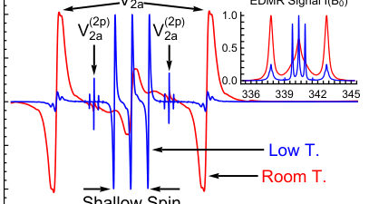
<figcaption class="paper-figure-caption"><b>Fig 5.</b> FIG. 4. The predicted EDMR spectrum (dI/dB0) of V2a silicon vacancy-related spin pairs in 4H-SiC normalized to the peak height at low microwave power, contrasting room temperature (red) and low temperature (blue) spectra. Features arising from each spin in the pair are identified with arrows. Similar simulation parameters were used here as in Figure 3, except for D[q] ̸= 0. (a) Shallow donor model. (b) Shallow acceptor model. (Insets): Corresponding simula- tion of the integrated EDMR spectrum I(B0) versus magnetic field.</figcaption>
</figure>

**Summary.** This paper provides a quantitative theoretical framework for simulating the electrically detected magnetic resonance of silicon vacancy spin pairs in silicon carbide. It identifies the role of a shallow-level nitrogen-related complex in the observed EDMR spectra and predicts new methods for enhanced magnetic field sensing using double-quantum transitions.

**Why it may be interesting.** The use of Lindblad master equations to model spin-dependent recombination and the prediction of double-quantum transitions for enhanced sensing are highly relevant to researchers working on open quantum systems and quantum sensing.

Detailed structure

**Main problem.** Developing a quantitative theory to simulate Electrically Detected Magnetic Resonance (EDMR) of silicon vacancy-related spin pairs in silicon carbide to optimize power electronics and magnetometer technology.

**Main result.** The theory successfully describes room-temperature EDMR measurements and identifies that spectral features arise from the hyperfine splitting of a shallow-level spin (an incomplete K-center) rather than the vacancy itself.

**Method.** The authors use steady-state Lindblad master equations to model the dynamics of different charge states and the occupancy of the shallow level, incorporating a weighted sum over the nuclear spin bath.

**Model / system.** The system consists of silicon vacancy-related spin pairs (V1a and V2a) in 4H-SiC interacting with a nearby shallow level defect (the incomplete K-center) within 10 nm. The Hamiltonian includes Zeeman interaction, zero-field splitting, and hyperfine interactions with 29Si, 13C, and 14N.

**Key observables.** EDMR spectrum (change in spin-dependent recombination current dI/dB0) and integrated EDMR spectrum I(B0).

**Important parameters / regimes.** Spin coherence times (T1, T2), electrical transport rates, g-factors, zero-field splitting (D), and hyperfine coupling constants (A).

**Assumptions / limitations.** The model assumes a three-manifold model for charge state dynamics and uses the rotating wave approximation in the rotating frame.

**Figures summary.** Figure 1 shows EDMR diagrams for shallow donor and acceptor models illustrating recombination processes; Figure 2 compares simulated and experimental EDMR spectra for V1a vacancies.

**Paper structure.** The paper introduces the problem of SiC defect recombination, presents a Lindblad-based theoretical framework, applies the model to room-temperature V1a data, predicts low-temperature hyperfine resolution, and discusses potential for V2a double-quantum transitions.

Abstract

We present a quantitative theory for simulating the electrically detected magnetic resonance (EDMR) of silicon vacancy-related spin pairs in silicon carbide using steady-state Lindblad master equations. In our theory, we consider V1a and V2a deep level silicon vacancies near the (0/-) charge state transition level in proximity to a previously identified nitrogen-related complex, the incomplete K-center, due to the hyperfine, spin structure, and Landé g factor of the shallow state. Our theory describes recent room temperature measurements attributed to V1a silicon vacancies, with reasonable extracted parameters for defect spin coherence times and electrical transport rates. At lower temperatures we predict that the shallow level hyperfine structure may be spectrally resolvable. Finally, we predict the EDMR spectrum of V2a silicon vacancy-related spin pairs and predict that two-photon, double quantum transitions of the silicon vacancy's negative charge state can be electrically read-out for enhanced magnetic field sensing.

[↑ back to top](#top)

### [Nitrogen-doped W0.75Re0.25 Superconducting Nanowire Single Photon Detectors](http://arxiv.org/abs/2605.25597v1)

**Authors:** F. Colangelo, Abhishek Kumar, H. Wang, F. Avitabile, C. Attanasio, I. Esmaeil Zadeh, C. Cirillo  
**Type:** experiment · **Category:** quantum information and computing · **PDF:** <https://arxiv.org/pdf/2605.25597v1>  
**Analysis basis:** full PDF text, analyzed in chunks
**Topic relevance:** `QC/QI experiment` **3/5** · `quantum optics experiment` **3/5** · `quantum measurements` **1/5**

↔ Scroll figures horizontally

<figure class="paper-figure-card">
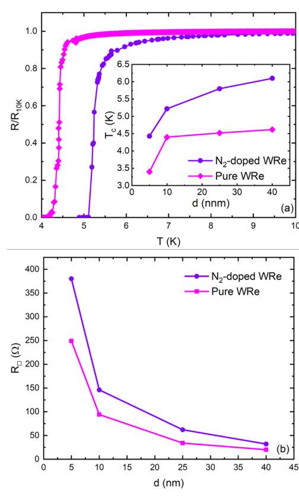
<figcaption class="paper-figure-caption"><b>Fig 1.</b> FIG. 1: (a) Normalized R(T) for N2-doped (violet) and pure (magenta) 10-nm WRe films with Tc(d) as an inset; (b) R□(d) of the two samples (same color scheme) at 10 K.</figcaption>
</figure>
<figure class="paper-figure-card">
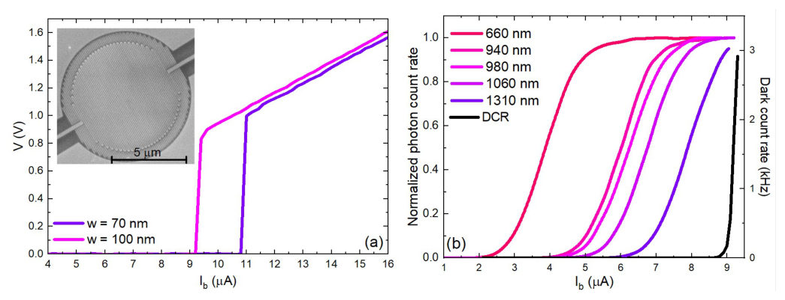
<figcaption class="paper-figure-caption"><b>Fig 2.</b> FIG. 2: (a) V(Ib) characteristic of two N2-doped WRe SNSPDs (linewidth of w = 70 and 100 nm) with inset showing the SEM picture of the w = 70 nm detector; (b) normalized photon count rate of the same 70-nm linewidth N2-doped WRe SNSPD as function of Ib.</figcaption>
</figure>
<figure class="paper-figure-card">
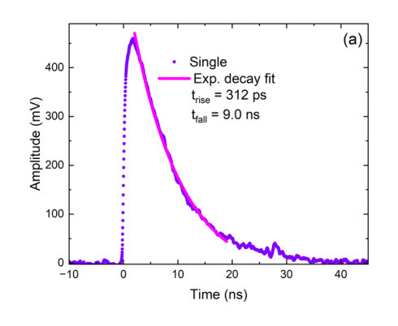
<figcaption class="paper-figure-caption"><b>Fig 3.</b> FIG. 3: Single SNSPD pulse data points (violet dots) of the 70-nm linewidth device, with exponential fit of the decay (magenta line); characteristic times are also reported.</figcaption>
</figure>
<figure class="paper-figure-card">
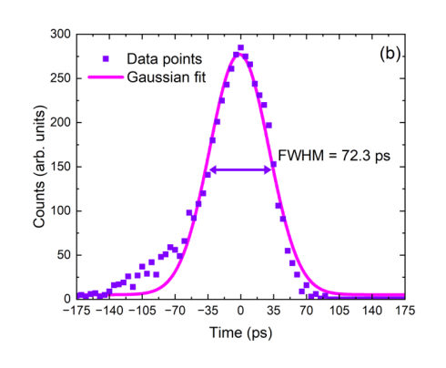
<figcaption class="paper-figure-caption"><b>Fig 4.</b> FIG. 4: 70-nm linewidth SNSPD timing jitter data points (violet dots), with Gaussian fit (magenta line) and resulting FWHM.</figcaption>
</figure>

**Summary.** This work demonstrates the development of Nitrogen-doped WRe superconducting nanowire single-photon detectors. The new material platform provides high detection efficiency at telecom wavelengths and very low timing jitter. This advancement offers a versatile alternative to existing NbN and WSi-based detectors for quantum technologies.

**Why it may be interesting.** This paper is relevant to quantum optics and quantum networks as it presents a new material platform for high-performance single-photon detectors, which are essential components for quantum communication and photonic quantum computing.

Detailed structure

**Main problem.** The need for new material platforms for Superconducting Nanowire Single-Photon Detectors (SNSPDs) that combine high detection efficiency, low timing jitter, and the ability to operate at elevated temperatures for quantum communication and sensing.

**Main result.** Nitrogen-doped W0.75Re0.25 SNSPDs achieve high internal detection efficiency (up to 100% at 1060 nm and 95% at 1310 nm) with a low timing jitter of 72.3 ps and sub-nanosecond rise times.

**Method.** The researchers used reactive DC magnetron sputtering to deposit ultrathin WRe films in an Ar/N2 atmosphere, followed by electron beam lithography and reactive ion etching to create 70 nm linewidth meander detectors.

**Model / system.** The experimental platform consists of ultrathin (10 nm) amorphous Nitrogen-doped W0.74Re0.25 superconducting thin-film meander detectors operated at cryogenic temperatures (2.5 K).

**Key observables.** Internal detection efficiency (IDE), timing jitter (FWHM), rise and decay times, critical current (Ic), critical current density (Jc), and electron-electron/electron-phonon interaction times.

**Important parameters / regimes.** Tc approx 5.22 K, linewidth 70 nm, pitch 140 nm, jitter 72.3 ps, and wavelength range 660-1310 nm.

**Assumptions / limitations.** The study notes potential performance limitations due to resistivity inhomogeneities from partial oxidation and early-stage fabrication processes.

**Figures summary.** Figure 3 shows single SNSPD pulse decay with an exponential fit; Figure 4 displays the timing jitter distribution with a Gaussian fit.

**Paper structure.** The paper introduces the material motivation, details the fabrication and sputtering process, presents superconducting and electrical characterization, reports photon detection performance and temporal dynamics, and concludes with an analysis of interaction times and optimization needs.

Abstract

Nitrogen-doped Tungsten-Rhenium superconducting alloys were recently proposed as a promising material platform for superconducting nanowire single-photon detectors (SNSPDs), offering a favorable balance between high normal state resistivity and tunable superconducting properties. In this work, we report on the fabrication and characterization of SNSPDs based on ultrathin W0.75Re0.25 films deposited by reactive DC magnetron sputtering in a mixed Ar/N2 atmosphere. Meander detectors with 70 nm linewidth exhibit saturated internal detection efficiency up to 1310 nm at 2.5 K, with sub-nanosecond rise times, decay times of the order of a few nanoseconds, and timing jitter of 73.2 ps measured with room temperature amplifiers.

[↑ back to top](#top)

### [Pattern Formation with Two Length Scales: Spatiotemporal Chaos](http://arxiv.org/abs/2605.25849v1)

**Authors:** Laura Pinkney, Alastair M. Rucklidge, Cedric Beaume  
**Type:** theory · **Category:** statistical mechanics · **PDF:** <https://arxiv.org/pdf/2605.25849v1>  
**Analysis basis:** full PDF text, analyzed in chunks
**Topic relevance:** `non-equilibrium dynamics` **3/5** · `driven-dissipative phase transition` **2/5** · `non-equilibrium universality` **2/5**

↔ Scroll figures horizontally

<figure class="paper-figure-card">
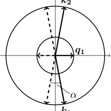
<figcaption class="paper-figure-caption"><b>Fig 1.</b> Figure 1: Schematic of three-wave interactions between wavevectors on two circles with ra- dius 1 and q ă 1</figcaption>
</figure>
<figure class="paper-figure-card">
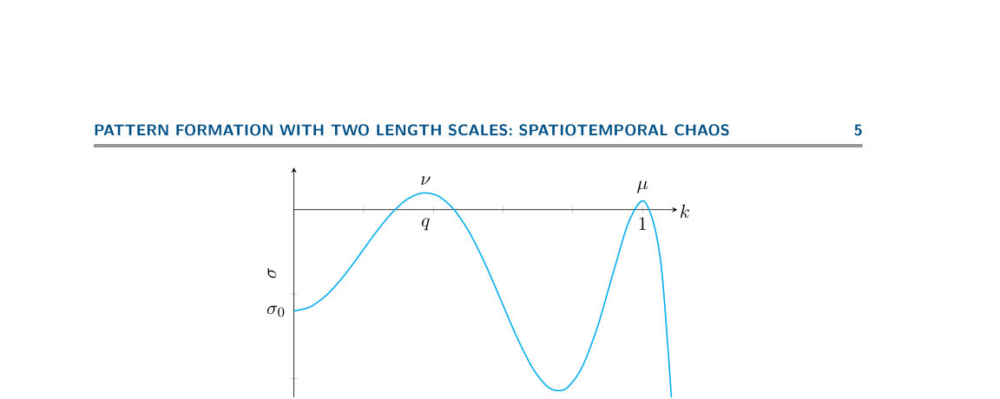
<figcaption class="paper-figure-caption"><b>Fig 2.</b> Figure 2: Growth rate σ as a function of the wavenumber k. There are maxima at wavenum- bers k “ q and k “ 1 with corresponding growth rates ν and µ respectively. The growth rate at k “ 0 is σ0.</figcaption>
</figure>
<figure class="paper-figure-card">
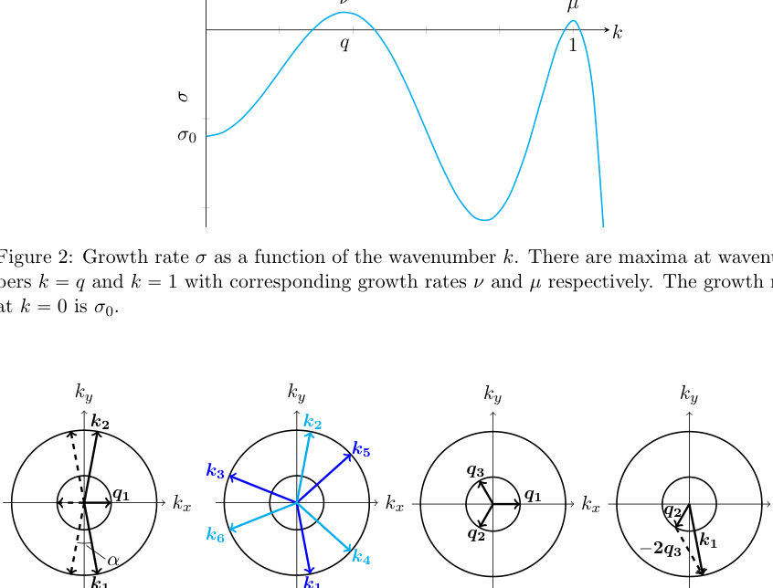
<figcaption class="paper-figure-caption"><b>Fig 3.</b> Figure 3: Schematic of nonlinear interactions between wavevectors on two critical circles with radius 1 and q ă 1</figcaption>
</figure>
<figure class="paper-figure-card">
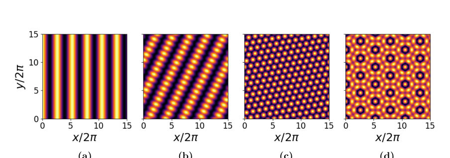
<figcaption class="paper-figure-caption"><b>Fig 4.</b> Figure 4: Examples of simple patterns governed by 3WIs: (a) w-stripes, (b) rhombs, (c) z- hexagons, (d) superhexagons.</figcaption>
</figure>
<figure class="paper-figure-card">
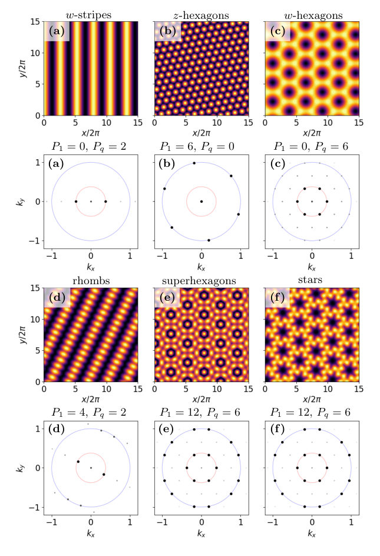
<figcaption class="paper-figure-caption"><b>Fig 5.</b> Figure 5: Solutions of the PDE (3.1) showing examples of simple equilibrium patterns and their Fourier spectra (omitting z-stripes). We show a 15 ˆ 15 section of each solution computed in an approximately 42 ˆ 42 domain. (a,b,c,f) are for q “ 1{ ?</figcaption>
</figure>

**Summary.** This paper explores how nonlinear interactions between two different length scales drive the transition from stable patterns to spatiotemporal chaos. By combining amplitude equation theory with direct PDE simulations, the authors show that chaos emerges from the competition between wave triads and the expansion of modes beyond the initial subspace. The work provides a new framework for classifying complex, time-dependent patterns in multi-scale systems.

**Why it may be interesting.** The study of how competing scales and nonlinear mode-coupling drive transitions to spatiotemporal chaos is highly relevant to understanding non-equilibrium dynamics and pattern formation in many-body systems and driven-dissipative quantum systems.

Detailed structure

**Main problem.** Investigating the mechanisms by which nonlinear wave interactions between two distinct length scales lead to the emergence of spatiotemporal chaos (STC).

**Main result.** The study identifies that STC arises from the growth of modes outside a predefined subspace, driven by time-dependent competition between wave triads and, specifically for certain wavenumber ratios, four-wave interactions.

**Method.** The authors use weakly nonlinear theory to derive a system of eighteen-mode amplitude equations (ODEs) and compare their stability predictions with direct numerical simulations of a model partial differential equation (PDE).

**Model / system.** A model partial differential equation (PDE) featuring two critical wavenumbers (k=1 and k=q) and nonlinearities that break variational structure, relevant to Faraday wave experiments and reaction-diffusion systems.

**Key observables.** Fourier power spectrum (peak counting and fuzziness), time-derivative metrics (C1, C2, C3) for pattern classification, and growth rates.

**Important parameters / regimes.** Wavenumber ratio q (specifically q = 1/sqrt(7)), linear growth rates (mu, nu), and quadratic/cubic interaction coefficients.

**Assumptions / limitations.** The analysis assumes the dynamics can be captured by a truncated expansion of amplitude equations near the onset of instability.

**Figures summary.** Schematics of wavevector interactions, growth rate plots, Fourier spectra showing pattern types, and demonstrations of the pattern classification method using local Fourier analysis.

**Paper structure.** The paper introduces the problem of two-scale pattern formation, derives amplitude equations via weakly nonlinear theory, performs stability analysis of various equilibrium patterns, presents large-scale PDE simulations, and details a robust classification method for complex chaotic states.

Abstract

Three-wave interactions (or resonant triads) are the lowest-order nonlinear interaction in pattern formation and arise between waves with different orientations when the sum of two wavevectors equals a third one. When a pattern has only one length scale, stripe patterns are possible but three-wave interactions are responsible for the prevalence of hexagons close to onset. In problems with two length scales, there is a much wider range of possible three-wave interactions, leading to more complex structures such as superhexagons, stars, quasipatterns and even spatiotemporal chaos (STC). We investigate the role that nonlinear wave interactions play in the formation of STC in a model partial differential equation (PDE) in the case that the length scale ratio is $\sqrt{7}$, relevant to superlattice patterns in the Faraday wave experiment. The simpler aspects of the dynamics can be represented by a system of ordinary differential equations (ODEs) derived from the PDE using weakly nonlinear theory. We analyze the equilibrium patterns in these ODEs and evaluate their stability, comparing the results with direct numerical simulations of the model PDE. The ODEs predict parameter regimes where there are no stable simple equilibria, which is where we typically find complex behavior in the PDE. We have conducted a careful study of the transition from simple patterns to patterns that include modes beyond the finite-dimensional subspace imposed in the reduction to the ODEs, to time-dependent competition between different triads, ending up with fully developed STC. For our choice of length scale ratio, we show that four-wave interactions also play an important role. Our analysis is relevant to any pattern-forming system with three-wave interactions involving two length scales, such as the Faraday wave experiment, coupled reaction-diffusion systems, and pattern formation in dryland vegetation.

[↑ back to top](#top)

### [Patterned fronts in the wake of a parameter ramp in the complex Ginzburg Landau equation](http://arxiv.org/abs/2605.24209v1)

**Authors:** Ryan Goh, Benjamin Krewson, Nilay Patel, Kiersten Ratcliff  
**Type:** theory · **Category:** statistical mechanics · **PDF:** <https://arxiv.org/pdf/2605.24209v1>  
**Analysis basis:** full PDF text, analyzed in chunks
**Topic relevance:** `non-equilibrium dynamics` **3/5** · `driven-dissipative phase transition` **2/5** · `non-equilibrium universality` **2/5**

↔ Scroll figures horizontally

<figure class="paper-figure-card">
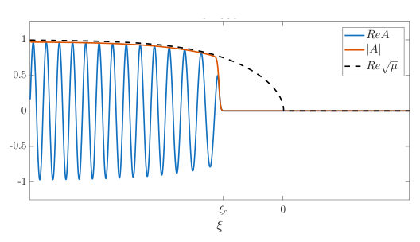
<figcaption class="paper-figure-caption"><b>Fig 1.</b> Figure 2.1: Direct numerical simulation of (2.2) using fourth-order finite differences in space with mesh size dx = 0.1 and balanced Strang-splitting in time with step dt = 0.005; Parameters α = −0.1, γ = −0.3, c = 1.5, ε = 0.005, with Re A(ξ) (blue), |A(ξ)| (orange), and Re p</figcaption>
</figure>
<figure class="paper-figure-card">
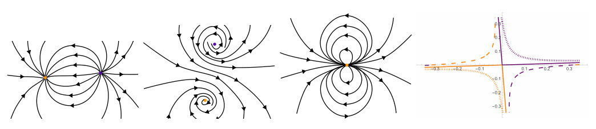
<figcaption class="paper-figure-caption"><b>Fig 2.</b> Figure 3.1: Phase portraits of (3.4) with ε = 0, for a range of ˜µ values ˜µ &lt; 0 (left), ˜µ &gt; 0 (center left) both for ˜ω &lt; 0, and ˜µ = 0, ˜ω = 0 (center right); Right: Critical equilibrium curves ˜z±,0(˜µ) for ˜µ ∼0 with α = −0.1, and ˜ω &lt; 0 (small dashed) ˜ω = 0 (solid), and ˜ω &gt; 0 (large dashed). Purple curves denote ˜z+,0(˜µ), orange denotes ˜z−,0(˜µ).</figcaption>
</figure>
<figure class="paper-figure-card">
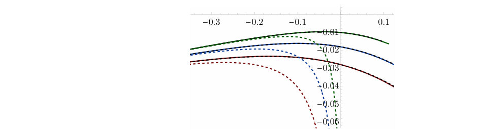
<figcaption class="paper-figure-caption"><b>Fig 3.</b> Figure 3.2: Comparison in the complex ˜z-plane of numerical slow manifold curves ˜z−,ε(˜µ) (solid colors), critical equilibrium curve ˜z−,0(˜µ) (dashed color), and approximate inner solution ˜zin −,ε(˜µ) (dashed black) for ˜µ ∼0 with values (ε, ˜ω) ≈(9.8, 7.3) × 10−3 (red), (4.5, −3.8) × 10−3 (blue), and (1.5, −1.5) × 10−3 (green); α = −0.1, c = 1. The ˜ω-values are O(ε2/3) and were determined by numerical continuation of the full problem, see Sec. 4 below.</figcaption>
</figure>
<figure class="paper-figure-card">
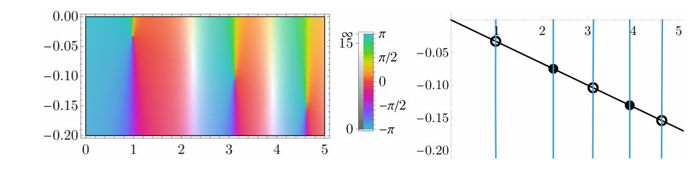
<figcaption class="paper-figure-caption"><b>Fig 4.</b> Figure 3.3: Left: Plot in the complex s-plane of the function ˆz(s) for α = −0.1, lightness corresponds to |ˆz| while color denotes Arg ˆz, see scale on side; Right: Plot of the line Lθ (black) along with zeros sz,j = ˜σj/θ (open dots) and poles sp,j = σj/θ (closed dots) of ˆz and contours Rj for j = 1, 2, 3 (blue).</figcaption>
</figure>
<figure class="paper-figure-card">
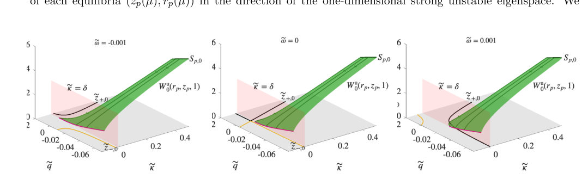
<figcaption class="paper-figure-caption"><b>Fig 5.</b> Figure 3.4: Singular unstable manifold W u 0 (rp, ˜zp, 1−µc) (green surface) in the ˜z, r space with the critical set Sp,0 (dark green line), for ˜µ ∈(0, 0.08) solved up to the section ˜Σδ = {˜κ = δ} (red). The fast fibers W uu 0 (rp, ˜zp, 1−µc) (green curves) with larger ˜q values correspond to larger ˜µ values; Also plotted are the critical sets S−,0 (yellow) and S+,0 (black) for a range of ˜µ values near 0; Plots give several values of ˜ω = {−1, 0, 1} × 10−3 (left to right, top to bottom); all with c = 1, α = −0.1, γ = −0.3.</figcaption>
</figure>

**Summary.** This paper analyzes how a moving, slowly-varying parameter ramp dictates the properties of pattern-forming fronts in the complex Ginzburg-Landau equation. It shows that the transition from convective to absolute instability governs the leading-order dynamics, while higher-order corrections follow a specific scaling law derived from an Airy-type inner solution. The findings are validated through both analytical asymptotic expansions and numerical simulations.

**Why it may be interesting.** The study of pattern formation driven by parameter ramps and the transition between convective and absolute instabilities is highly relevant to non-equilibrium dynamics and the stability of driven-dissipative systems.

Detailed structure

**Main problem.** Investigating how a slowly-varying, propagating parameter ramp influences the formation, location, and wavenumber selection of pattern-forming fronts.

**Main result.** The transition between convective and absolute instability (AC instability) determines the leading-order front location and temporal frequency, with higher-order delays scaling as epsilon^(2/3) via an Airy quotient inner solution.

**Method.** Geometric Singular Perturbation Theory (GSPT), multiple scales analysis, and numerical continuation of heteroclinics and spectral stability.

**Model / system.** The supercritical complex Ginzburg-Landau equation (CGLE) with a spatially and temporally varying parameter ramp, and the Swift-Hohenberg equation for validation.

**Key observables.** Front interface location (delay), selected spatial wavenumber, temporal oscillation frequency, and spectral stability (eigenvalue accumulation).

**Important parameters / regimes.** Ramp speed (c), ramp slope (epsilon), dispersion/nonlinear coefficients (alpha, gamma), and the transition between convective and absolute instability.

**Assumptions / limitations.** The ramp is slowly-varying (epsilon << 1); the system is in the Benjamin-Feir stable regime (1 + alpha*gamma > 0).

**Figures summary.** Numerical simulations of pattern formation; plots of the complex Airy quotient function (zeros, poles, and contours); and comparisons of numerical wavenumber selection and front position against analytical AC instability predictions.

**Paper structure.** The paper introduces the ramped CGLE, develops a traveling wave reduction, applies GSPT and multiple scales analysis to derive an Airy-based inner solution, performs numerical continuation to validate the manifold structure, and concludes with spectral stability analysis and validation using the Swift-Hohenberg equation.

Abstract

We study of the formation of pattern-forming fronts in the presence of a rigidly-propagating parameter ramp which is slowly-varying in space. In the context of the prototypical supercritical complex Ginzburg-Landau equation, we show that not only the leading order front interface, but also the selected spatial wave number is governed by the transition of the ramp between absolute and convective instability. The slow ramp then induces a further delay of the front interface and perturbation of the selected wave number, controlled by the slow passage near a complex fold of strong- and weak-stable eigenspaces. To analyze the behavior near this fold, we perform a multiple scales analysis to predict the higher-order front interface delay in terms of zeros and poles of a complex Airy quotient inner solution. We confirm these predictions with numerical continuation of heteroclinics in the associated traveling wave equation. We also numerically characterize their spectral stability, finding accumulation of eigenvalues consistent with previous results on slow absolute spectrum. We then show the leading-order absolute/convective instability heuristic accurately describes selected wave numbers in an analogous slowly-ramped Swift-Hohenberg equation.

[↑ back to top](#top)

### [Mutual Friction in Dissipative Gross-Pitaevskii Thermal Counterflow Turbulence](http://arxiv.org/abs/2605.25915v1)

**Authors:** Kyo Yoshida, Hideaki Miura, Yoshiyuki Tsuji  
**Type:** theory · **Category:** quantum gases · **PDF:** <https://arxiv.org/pdf/2605.25915v1>  
**Analysis basis:** full PDF text, analyzed in chunks
**Topic relevance:** `non-equilibrium dynamics` **3/5** · `non-equilibrium universality` **2/5**

↔ Scroll figures horizontally

<figure class="paper-figure-card">
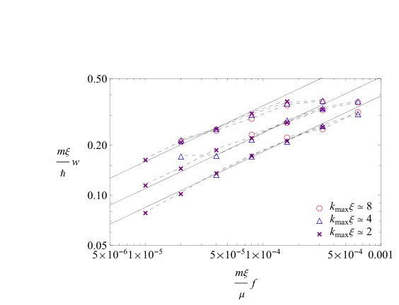
<figcaption class="paper-figure-caption"><b>Fig 1.</b> FIG. 1. Relative velocity w versus acceleration f. Data from the same parameter set (γ, ξ) are connected by dashed lines as a guide. Nearly overlapping dashed curves correspond to the same value of γ. The values of γ are 0.025, 0.05, and 0.1 in decreasing order of w. Solid lines show fits to the scaling law (2).</figcaption>
</figure>
<figure class="paper-figure-card">
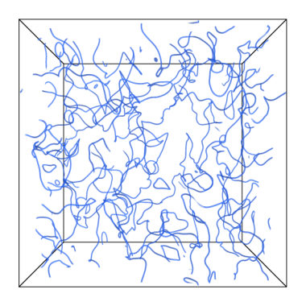
<figcaption class="paper-figure-caption"><b>Fig 2.</b> FIG. 2. Isosurface of n = 0.25¯n in a quasistationary state for ( ˜f, γ, ξ) = (0.8 × 10−4, 0.025, 0.016). The external forcing points from left to right. The visualization data were pro- duced using VISMO [20].</figcaption>
</figure>
<figure class="paper-figure-card">
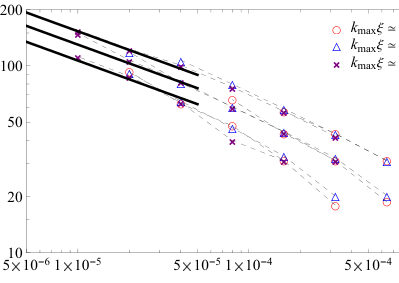
<figcaption class="paper-figure-caption"><b>Fig 3.</b> FIG. 3. Mean intervortex spacing l versus acceleration f. Data from the same parameter set (γ, ξ) are connected by dashed lines as a guide. Nearly overlapping dashed curves correspond to the same value of γ. The values of γ are 0.025, 0.05, and 0.1 in increasing order of l. Solid lines show fits to the scaling law (3).</figcaption>
</figure>
<figure class="paper-figure-card">
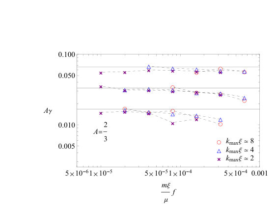
<figcaption class="paper-figure-caption"><b>Fig 4.</b> FIG. 4. Ratio A of the observed acceleration f to the model value fmodel in quasistationary states. Data from the same parameter set (γ, ξ) are connected by dashed lines as a guide. The vertical axis is multiplied by γ for visibility. Solid lines indicate A = 2/3 for γ = 0.25, 0.5, and 1 in increasing order.</figcaption>
</figure>

**Summary.** This study uses numerical simulations of the dissipative Gross-Pitaevskii equation to characterize turbulence in quantum fluids. It discovers a cubic scaling law between mutual friction and relative velocity and demonstrates that the vortex tangle is nearly isotropic. The results provide a bridge between phenomenological damping parameters and observable turbulent dynamics.

**Why it may be interesting.** It provides insights into non-equilibrium dynamics and dissipation in quantum fluids, which is relevant to understanding turbulence and energy dissipation in many-body systems and ultracold gases.

Detailed structure

**Main problem.** Investigating the dynamics of thermal-counterflow turbulence in quantum fluids, specifically focusing on the relationship between mutual friction, relative velocity, and vortex-line density.

**Main result.** The mutual-friction acceleration exhibits a cubic scaling with the mean relative velocity (f proportional to w^3), with a scaling coefficient linked to the damping parameter gamma, and the vortex tangle is found to be nearly isotropic.

**Method.** Numerical simulations of the dissipative Gross-Pitaevskii equation (DGPE) using a Fourier transform method on a 1024^3 grid.

**Model / system.** A bulk region of thermal-counterflow turbulence modeled by the dissipative Gross-Pitaevskii equation (DGPE), representing a system where superfluid and normal-fluid components move in opposite directions.

**Key observables.** Mean relative velocity (w), mutual-friction acceleration (f), momentum density (p), intervortex spacing (l), and the ratio of observed to model-predicted acceleration (A).

**Important parameters / regimes.** Damping parameter (gamma), healing length (xi), external acceleration (f), and the regime where xi is much smaller than the intervortex spacing (l) and system size (L).

**Assumptions / limitations.** The DGPE treats the condensate and non-condensate as superfluid and normal-fluid components, which is an oversimplification for liquid 4He.

**Figures summary.** Fig 1 shows the cubic scaling of relative velocity versus acceleration for different parameters; Fig 2 provides a visualization of the vortex tangle; Fig 3 shows the mean intervortex spacing.

**Paper structure.** The paper introduces the problem of thermal-counterflow turbulence, describes the DGPE numerical method and simulation setup, presents results regarding scaling laws and vortex isotropy, and concludes with a comparison to experimental 4He values.

Abstract

We report numerical simulations of the dissipative Gross-Pitaevskii equation for a bulk region of thermal-counterflow turbulence. Quasistationary states are obtained over a range of forcing, damping, and healing-length parameters. The mutual-friction acceleration exhibits cubic scaling with the mean relative velocity between the superfluid and normal-fluid components, and the coefficient of this scaling is linked to the phenomenological damping parameter. The intervortex spacing follows the expected dimensional scaling in the weak-forcing regime. Comparison with a straight-vortex-line model suggests that the vortex-line orientations are nearly isotropic.

[↑ back to top](#top)

### [Imaging Surface Magnetization in Altermagnetic MnTe Films](http://arxiv.org/abs/2605.25241v1)

**Authors:** Ling-Jie Zhou, Senlei Li, Zi-Jie Yan, Yufei Zhao, Hongtao Rong, Zelong Xiong, Yiran Zhao, Pu Xiao, Lok Kan Lai, Hyeonhu Bae, Haoyu Liu, Chao-Xing Liu, Binghai Yan, Cui-Zu Chang, Hailong Wang, Chunhui Rita Du  
**Type:** experiment · **Category:** other · **PDF:** <https://arxiv.org/pdf/2605.25241v1>  
**Analysis basis:** full PDF text, analyzed in chunks
**Topic relevance:** `QC/QI experiment` **2/5** · `spintronics-quantum-optics interface` **2/5**

↔ Scroll figures horizontally

<figure class="paper-figure-card">
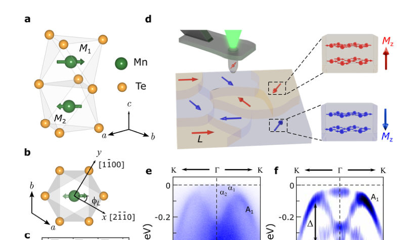
<figcaption class="paper-figure-caption"><b>Fig 1.</b> Fig. 1| Crystal structure and characterizations of epitaxial MnTe films. (a) Schematic of the crystal structure and antiferromagnetic order of MnTe. The Néel vector L = M1 − M2 is defined by two antiparallel magnetic moments (M1 and M2) of Mn atoms on neighboring sublattices. (b) ߶L denotes the angle between the Néel vector L and the [21ത1ത0] crystallographic axis in the c-plane of MnTe. (c) Theoretical prediction of the weak OOP magnetization ܯ௭ as a function of ߶L. Two groups of red and blue arrows represent the six in-plane easy axes of the Néel vector L, classified into two symmetry-related triplets. (d) Schematics of scanning-probe NV imaging of local magnetic stray fields generated by...</figcaption>
</figure>
<figure class="paper-figure-card">
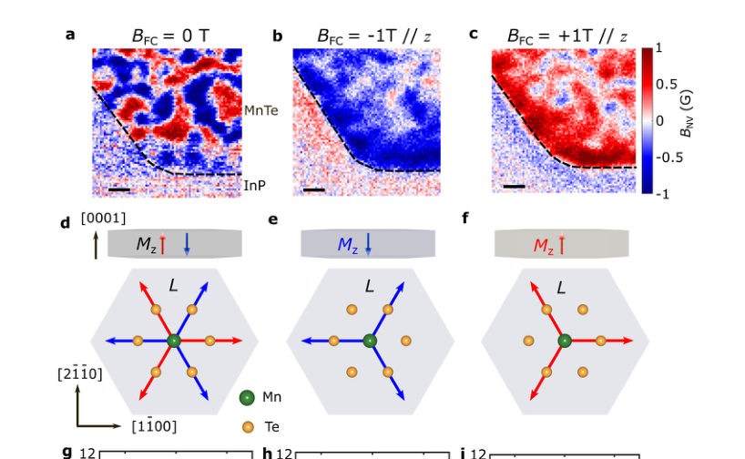
<figcaption class="paper-figure-caption"><b>Fig 2.</b> Fig. 2| Scanning-probe NV imaging of field-controlled MnTe magnetic domains. (a)-(c) Magnetic stray-field maps of a 40-UC-thick MnTe pattern measured under OOP-oriented magnetic cooling fields BFC = 0 (a), −1 T (b), and +1 T (c). The black dashed lines outline the boundary of the MnTe pattern. The scale bar is 500 nm. (d)-(f) Schematics of the possible configurations of the in-plane Néel vector L and the corresponding ܯ௭ in MnTe for BFC = 0 (d), −1 T (e), and +1 T (f). Color arrows within the hexagon denote the possible directions of the Néel vector L, and the corresponding directions of ܯ௭ are indicated by red and blue arrows on top. (g)-(i) Corresponding histograms of the magnetic...</figcaption>
</figure>
<figure class="paper-figure-card">
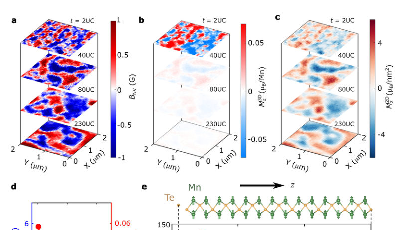
<figcaption class="paper-figure-caption"><b>Fig 3.</b> Fig. 3| Surface-dominated origin of the weak net magnetization in MnTe films. (a)-(c) Magnetic stray-field (a), 3D normalized magnetization ܯ௭</figcaption>
</figure>
<figure class="paper-figure-card">
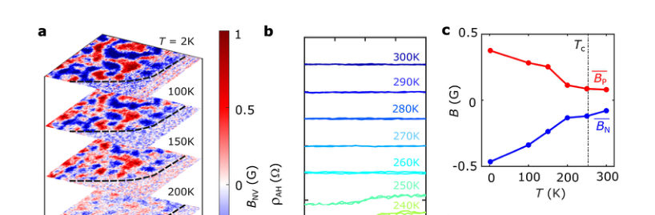
<figcaption class="paper-figure-caption"><b>Fig 4.</b> Fig. 4| Correlation between the weak magnetization and the AH effect in MnTe films. (a) Scanning-probe NV imaging of stray fields from a 40-UC-thick MnTe sample measured at T = 2 K, 100 K, 150 K, 200 K, 250 K, and 300 K. (b) AH resistance AH of the same sample measured as a function of the OOP magnetic field 0H, from 200 K to 300 K. (c) T dependence of the averaged positive and negative magnetic stray fields ܤ௉ തതതത and ܤே തതതത , respectively, from the MnTe sample. (d) T dependent zero-magnetic-field AH resistance AH(0) of the MnTe sample.</figcaption>
</figure>

**Summary.** This paper uses quantum-sensing NV microscopy to image the magnetic domains of altermagnetic MnTe films at the nanoscale. It reveals that the weak out-of-plane magnetization is a surface-driven phenomenon linked to symmetry breaking at the interface. These findings provide a crucial experimental link between microscopic spin structure and macroscopic transport effects like the Anomalous Hall effect.

**Why it may be interesting.** not directly relevant

Detailed structure

**Main problem.** The difficulty in experimentally imaging the nanoscale spin properties and verifying the origin of the predicted weak, uncompensated out-of-plane magnetization in altermagnetic MnTe.

**Main result.** The researchers successfully visualized evanescent magnetization and magnetic domains in MnTe films using NV microscopy, demonstrating that the magnetization is surface-dominated and correlates with the Anomalous Hall effect.

**Method.** Scanning-probe nitrogen-vacancy (NV) microscopy was used for nanoscale magnetic imaging, complemented by ARPES for band structure characterization and first-principles calculations for thickness-dependent analysis.

**Model / system.** Epitaxial alpha-MnTe thin films grown on InP(111)A substrates, characterized by an altermagnetic order with a Néel vector in the c-plane and a predicted weak out-of-plane magnetization due to symmetry breaking.

**Key observables.** Magnetic stray field maps, spin-splitting energy (delta), anomalous Hall resistance, and layer-resolved magnetic moments.

**Important parameters / regimes.** Temperature range from 2 K to 300 K, film thicknesses from 2 to 230 unit cells, and spin-splitting energy of approximately 280 meV.

**Assumptions / limitations.** The observed magnetization is attributed to the breaking of mirror symmetry at the interface/surface.

**Figures summary.** Fig 1: Crystal structure, NV imaging schematic, and ARPES band dispersion; Fig 2: Magnetic stray field maps and histograms under different cooling fields; Fig 3: Thickness-dependent magnetization and first-principles calculations; Fig 4: Temperature-dependent NV imaging and AH resistance.

**Paper structure.** The paper introduces the altermagnetic system and imaging setup, presents the visualization of magnetic domains and their control via field cooling, analyzes the thickness dependence to identify the surface origin of magnetization, and concludes by correlating these findings with macroscopic transport properties.

Abstract

Altermagnets with pronounced spin-splitting band structure, unconventional magnetic and crystal symmetries, and exotic magneto-transport properties have received immense interest in cutting-edge spintronics, materials science, and condensed matter physics research. Microscopic imaging of spontaneous magnetic domains and phases in altermagnets constitutes an important step for investigating their underlying material properties, mechanisms, and spin behaviors. Taking advantage of scanning-probe quantum microscopy, here we report nanoscale quantum sensing of a prototypical altermagnet candidate $α$-MnTe. We visualize evanescent magnetization and the associated magnetic domains in epitaxial MnTe films, which allows external magnetic fields to control the intrinsic altermagnetic order and configurations. By evaluating a series of MnTe films with different thicknesses down to the atomic scale, we further present evidence for the interfacial origin of the observed weak magnetization and show its correlation with the anomalous Hall effect in MnTe film. Our results advance the current understanding of emergent altermagnetism, providing insights into future material design of altermagnet-integrated spintronic devices.

[↑ back to top](#top)

### [Quantized thermal current vortices](http://arxiv.org/abs/2605.24158v1)

**Authors:** Ferenc Márkus, Katalin Gambár  
**Type:** theory · **Category:** statistical mechanics · **PDF:** <https://arxiv.org/pdf/2605.24158v1>  
**Analysis basis:** full PDF text, analyzed in chunks
**Topic relevance:** `non-equilibrium dynamics` **2/5** · `spintronics-quantum-optics interface` **2/5**

↔ Scroll figures horizontally

<figure class="paper-figure-card">
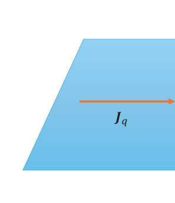
<figcaption class="paper-figure-caption"><b>Fig 1.</b> Figure 1: The experimentally recognized and verified thermal Hall effect [1–3]. Sim- ilarly to the electric Hall effect, the magnetic field B (in red; this can be external or it can come from the magnetization of the material itself) acts the heat current Jq (in orange). The measure of interaction is the exerting ”action” is E (in green).</figcaption>
</figure>
<figure class="paper-figure-card">
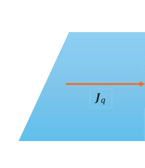
<figcaption class="paper-figure-caption"><b>Fig 2.</b> Figure 2: In the thermal Hall effect, the change in the direction of the heat flow per unit time is marked in green. The parameter ε characterizes the magnitude of the effect.</figcaption>
</figure>
<figure class="paper-figure-card">
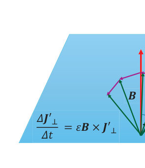
<figcaption class="paper-figure-caption"><b>Fig 3.</b> Figure 3: The formation of a heat vortex is due to the thermal Hall effect. The heat flow is continuously deflected by the external magnetic field B (in red), resulting in a self-closing, non-dissipative heat flow. The thermal vortex is indicated by the purple color.</figcaption>
</figure>
<figure class="paper-figure-card">
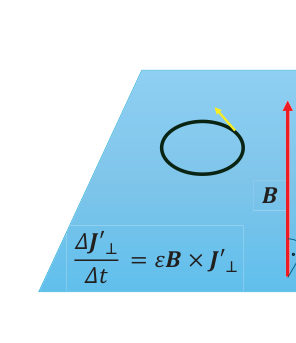
<figcaption class="paper-figure-caption"><b>Fig 4.</b> Figure 4: Stable, non-dissipative thermal vortices (in green) formed in interaction with the magnetic field. The yellow arrows show the direction of the heat current.</figcaption>
</figure>

**Summary.** This paper proposes a theoretical framework for a quantized thermal Hall effect, predicting the existence of stable, non-dissipative thermal current vortices called 'thermions.' These quantized structures are suggested to potentially stabilize magnetic textures like skyrmion lattices. This work links macroscopic thermal transport phenomena to quantum-scale topological stability.

**Why it may be interesting.** The concept of quantized, dissipationless, and topologically stable 'knot-like' vortices provides an interesting parallel to the study of topological protection and stability in many-body dynamics and topological phases.

Detailed structure

**Main problem.** The paper investigates the existence of a quantum-scale version of the thermal Hall effect and the potential formation of quantized, dissipationless thermal current vortices.

**Main result.** The authors demonstrate that thermal Hall currents can form closed, non-dissipative, and topologically stable 'thermion' vortices that may play a role in stabilizing magnetic skyrmion lattices.

**Method.** The study uses an analogy between the thermal Hall effect and the Lorentz force, applying Sommerfeld's flux quantization and Bohr-Landau quantization principles to derive quantized thermal vortex properties.

**Model / system.** The model focuses on magnetic insulators where electronic conduction is suppressed and heat is driven by phonons, magnons, or Majorana quasiparticles, specifically looking at the interaction between heat flux and magnetic fields.

**Key observables.** Thermal Hall angle (ratio of transverse to longitudinal thermal conductivity), quantized thermal vortex current density, and thermal Hall radius.

**Important parameters / regimes.** Magnetic flux quantum (Phi_0), thermal Hall conductivity, magnetic field strength, and characteristic quantum length (lambda_tha) ranging from 0.2 to 0.7 nm.

**Assumptions / limitations.** The derivation relies on an analogy between different physical disciplines, assumes a homogeneous magnetic field, and assumes the relationship between Bohr radii and thermal vortex radii is proportional.

**Figures summary.** Figure 1 shows the interaction between B, J_q, and the resulting action E; Figure 2 depicts the change in heat flow direction; Figure 3 illustrates the formation of a self-closing heat vortex; Figure 4 shows stable thermal vortices interacting with a magnetic field.

**Paper structure.** The paper progresses from a phenomenological description of the classical thermal Hall effect to a theoretical framework for its quantum version, followed by the derivation of quantized vortex properties and an analysis of their interaction with topological structures like skyrmions.

Abstract

The thermal Hall effect has emerged as a fundamental tool for probing exotic quasiparticles and topological order, particularly in magnetic insulators where electronic conduction is suppressed. Much like skyrmions, which are characterized by their topologically protected spin configurations, the thermal Hall effect is deeply rooted in the geometric properties of the underlying physical space. Although the effect is a well-established experimental phenomenon, current research points toward the existence of its quantum analogue: the quantized thermal Hall effect. In this paper, we provide a theoretical framework for this quantum version based on Sommerfeld's flux quantization. Furthermore, we demonstrate the potential existence of dissipationless thermal current vortices. We suggest that these vortices may play a crucial role in the stability and dynamics of other topological structures, such as skyrmion lattices, offering a new perspective on the interplay between heat transport and magnetic textures.

[↑ back to top](#top)

### [Absolute measurement of the intrinsic helicity in nanophotonics](http://arxiv.org/abs/2605.26058v1)

**Authors:** Malo Bézard, Simon Garrigou, Jérémie Béal, Andreas Horrer, Yves Auad, Hugo Lourenço-Martins, Davy Gérard, Mathieu Kociak  
**Type:** both · **Category:** other · **PDF:** <https://arxiv.org/pdf/2605.26058v1>  
**Analysis basis:** full PDF text, analyzed in chunks
**Topic relevance:** `interference shaping light` **2/5**

↔ Scroll figures horizontally

<figure class="paper-figure-card">
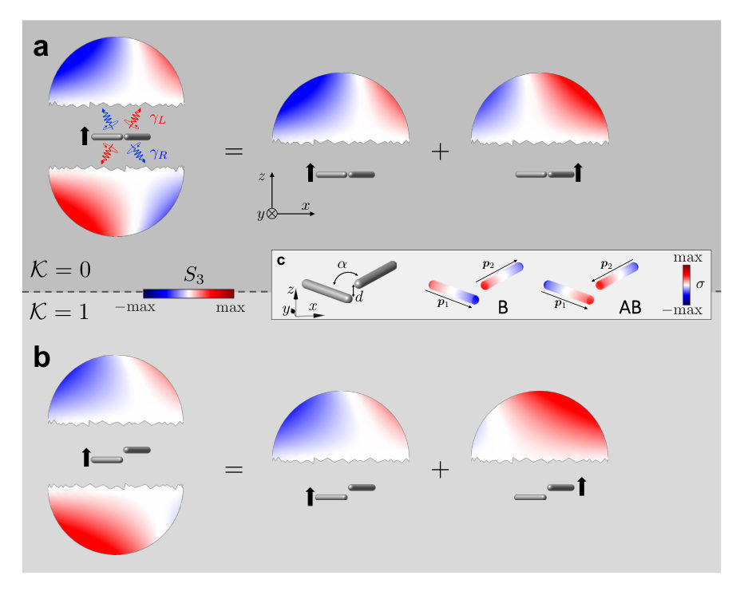
<figcaption class="paper-figure-caption"><b>Fig 1.</b> Fig. 1 Principle of the measurement on the helicity Hpl. (a) an achiral K = 0 or (a) a chiral K = 1 system (here, a plasmonic BKS structure, see (c)) is excited locally with an electron beam represented by a black arrow. Its angular-dependent CDS circular dichroic emission S3 is collected over the whole far-field sphere, and Hpl is equal to its integral. S3 is represented on the north and south hemispheres, as viewed along the y axis (see c). The schematics is obviously not to scale. The clear mirror parity symmetry between the north and south hemispheres in the achiral case leads to a null integrated CDS and Hpl = 0. This symmetry is absent for the chiral structure, thus leading to...</figcaption>
</figure>
<figure class="paper-figure-card">
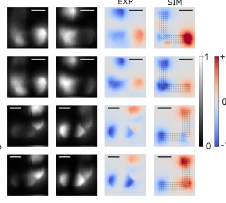
<figcaption class="paper-figure-caption"><b>Fig 2.</b> Fig. 3 Spatially localized circularly polarized CL. (a) From pCL spectral imaging, one can compute maps filtered at different energies, as exemplified in the specific case of a 90◦</figcaption>
</figure>
<figure class="paper-figure-card">
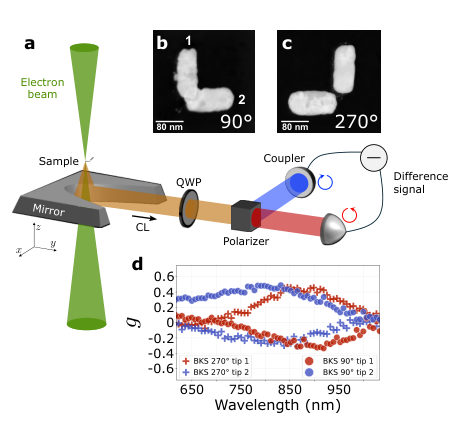
<figcaption class="paper-figure-caption"><b>Fig 3.</b> Fig. 2 BKS samples and STEM-pCL set-up. (a) The light emitted from the a BKS sample under electron irradiation (cathodoluminescence), is collected by a parabolic mirror. HADF images of a 90◦and of a 270◦BKS are shown in (b) and (c). The two polarizations of the collimated beam are filtered with a quarter-wavelength phase plate (QWP) and a linearly polarizing beam splitter (Polarizer) to be sent to two different optical fibers. The left and right polarized spectra in (d) are then measured simultaneously and their difference (g) recorded.</figcaption>
</figure>
<figure class="paper-figure-card">
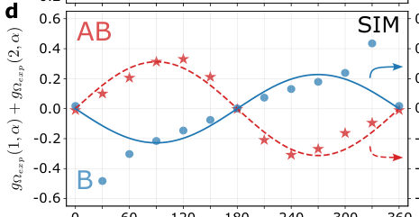
<figcaption class="paper-figure-caption"><b>Fig 4.</b> Fig. 4 Helicity measurement. (a) Experimental and (b) simulated (pyGDM) sum of the dichroic CL spectra acquired at the two tips of the 90◦and 270◦BKS structures of Figure 3. (c) Experimental and (d) simulated variations of the dichroic signal as a function of the BKS angle α, filtered at the wavelengths of the bonding and antibonding mode summed on the two tips of the BKS. kHpl,d as defined for the coupled dipole model is overlaid on the simulated data (pyGDM).</figcaption>
</figure>

**Summary.** This paper provides a new method to unambiguously measure the intrinsic helicity of nanophotonic structures by summing dichroic signals from symmetric positions. It resolves the confusion between geometric chirality and experimental artifacts like 'hidden chirality' in achiral plasmonic dimers.

**Why it may be interesting.** not directly relevant

Detailed structure

**Main problem.** The paper addresses the ambiguity in defining and measuring intrinsic helicity in nanophotonic systems, specifically distinguishing true geometric chirality from 'extrinsic' or 'hidden' chirality arising from experimental geometry and dipole interference.

**Main result.** The authors establish a rigorous definition of plasmonic helicity and demonstrate that the intrinsic helicity can be measured by symmetrizing the excitation and detection geometry, effectively canceling out extrinsic effects.

**Method.** The study combines theoretical vector analysis and a two-dipole model with experimental polarized cathodoluminescence (pCL) measurements using a STEM setup and numerical simulations (MNPBEM and pyGDM).

**Model / system.** The physical system is a Born-Kuhn system (BKS) consisting of coupled gold nano-antennas (dimers) that can be configured in achiral or chiral geometries, excited by a focused free-electron beam.

**Key observables.** Circular dichroism (CDS) signal (g), Stokes parameter (S3), plasmonic helicity (Hpl), and electron energy loss spectroscopy (EELS) spectra.

**Important parameters / regimes.** Geometric chirality (K), optical chirality (C), dipole separation (d), antenna angle (alpha), and frequency (omega).

**Assumptions / limitations.** The antenna separation is much smaller than the wavelength (k*d << 1), and the electron beam is assumed to excite only one dipole at a time due to field decay.

**Figures summary.** Figure 1 shows achiral vs. chiral configurations and S3 distributions; Figure 2 details the BKS samples and pCL setup; Figure 3 presents spatially localized pCL maps; Figure 4 compares experimental and simulated helicity measurements; Supplemental figures show EELS spectra, mode maps, and mirror-induced polarization effects.

**Paper structure.** The paper begins by defining the problem of chirality ambiguity, introduces the theoretical framework for plasmonic helicity, presents the experimental pCL platform, demonstrates the symmetrization method to recover intrinsic signals, and concludes with a discussion on the universality of the approach.

Abstract

Helicity is a universal quantity describing the internal rotation of an object or a field. Whether it characterizes fundamental properties such as the spin of elementary particles or leads to practical consequences such as the toxicity or harmlessness of chiral molecules, defining and measuring it is essential. However, this remains ambiguous in the case of chiral photonic systems such as plasmonic nanoparticles or photonic metasurfaces, where contrary to common knowledge, the observation of circularly polarized dependent optical properties is not a relevant measure for the helicity. We demonstrate experimentally and theoretically that the helicity can be rigorously defined and measured in a nanophotonic system emitting circularly polarized light after excitation in the near-field by a focused electron beam. In the case of a model system composed of two plasmonic dipoles (Born-Kuhn systems), we show that the helicity of photonic modes takes on a very intuitive form and can be simply measured by symmetrizing the geometry of excitation and detection. The method could be extended to a variety of chiral photonic systems, whose locally enhanced properties make them promising for the engineering of local chirality.

[↑ back to top](#top)

### [Hybridization of Ferromagnetic and Cyclotron Resonances in a Two-Dimensional Electron System on a Ferromagnetic Film](http://arxiv.org/abs/2605.25839v1)

**Authors:** A. A. Zabolotnykh, I. V. Zagorodnev, A. A. Matveev, D. A. Rodionov, O. Yu. Arkhipova, D. V. Kalyabin, A. R. Safin, S. A. Nikitov  
**Type:** theory · **Category:** other · **PDF:** <https://arxiv.org/pdf/2605.25839v1>  
**Analysis basis:** full PDF text, analyzed in chunks
**Topic relevance:** `spintronics-quantum-optics interface` **2/5**

↔ Scroll figures horizontally

<figure class="paper-figure-card">
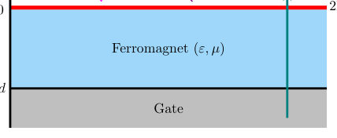
<figcaption class="paper-figure-caption"><b>Fig 1.</b> FIG. 1. Scheme of the structure under study.</figcaption>
</figure>
<figure class="paper-figure-card">
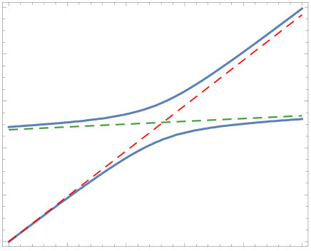
<figcaption class="paper-figure-caption"><b>Fig 2.</b> FIG. 2. Resonance frequencies given by Eq. (11) disregarding damping for the bismuth-doped thulium garnet (Bi:TmIG) film with the parameters d = 20 µm, ωM/2π = 1.7 GHz, Hp = 2700 Oe, which corresponds to ω1(H = 0)/2π = 4.8 GHz; the typical parameters for 2D electron system based on AlGaAs quantum well were taken as follows: m∗= 0.067m0, n = 7.5 · 1011 cm−2, which corresponds to Γ/2π ≈ 190 GHz and Γd/c ≈0.08. The red and green dashed lines indicate the frequencies of noninteracting cyclotron and fer- romagnetic resonances (12), respectively.</figcaption>
</figure>
<figure class="paper-figure-card">
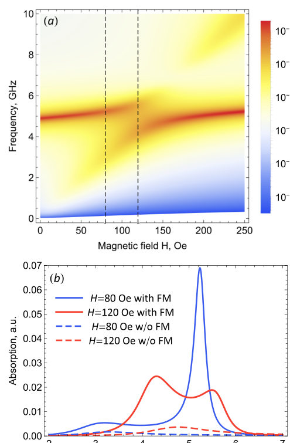
<figcaption class="paper-figure-caption"><b>Fig 3.</b> FIG. 3. (a) (Magnetic field, frequency) map for the absorption of an electromagnetic wave in the system given by Eqs. (8)– (10). The vertical dashed lines indicate the magnetic fields for which lines in panel (b) are plotted. (b) Frequency dependen- cies of the absorption coefficient (solid lines) in the structure under consideration and (dashed lines) in the 2D electron sys- tem placed on the non-ferromagnetic film (µ± = 1 instead of Eq. (4)) at magnetic fields of (blue lines) 80 and (red lines) 120 Oe. The damping coefficient of the film is α = 10−2, the electron relaxation time in the 2D system is τ = 200 ps, and the remaining parameters are the same as in the caption to Fig. 2.</figcaption>
</figure>

**Summary.** This paper theoretically explores how the magnetic properties of a ferromagnetic film can be coupled to the electronic properties of a 2D electron system. It demonstrates that this coupling leads to the splitting of resonance frequencies and the creation of Fano-type interference. This work is significant for designing tunable hybrid magneto-electronic devices.

**Why it may be interesting.** not directly relevant

Detailed structure

**Main problem.** The study investigates the hybridization and interaction between ferromagnetic resonance (FMR) and cyclotron resonance (CR) in a hybrid heterostructure.

**Main result.** The researchers found that the FMR and CR undergo anticrossing (frequency repulsion) and identified the emergence of Fano-type antiresonance, accompanied by significant changes in resonance linewidths.

**Method.** The authors use a theoretical approach based on electromagnetic boundary conditions at the interfaces and the Drude model for electronic conductivity to derive the reflection and absorption coefficients.

**Model / system.** A 2D electron system (2DES) is placed on a dielectric ferromagnetic film (Bi:TmIG) which sits atop a conducting metal gate, all subjected to a perpendicular static magnetic field.

**Key observables.** Amplitude reflection coefficient (r), energy absorption coefficient (A), resonance frequencies, and resonance linewidths.

**Important parameters / regimes.** Magnetic field (H), electron density (n), film thickness (d), saturation magnetization (Ms), gyromagnetic ratio (gamma), and Gilbert damping (alpha).

**Assumptions / limitations.** The system is treated in the Fabry-Perot limit (low frequency relative to cavity frequency), and the ferromagnetic film is assumed to have frequency-independent permittivity and perpendicular magnetic anisotropy.

**Figures summary.** Figure 1 provides a schematic of the heterostructure; Figure 2 shows the frequency dependence of the hybridized resonance branches and their splitting versus the applied magnetic field.

**Paper structure.** The paper introduces the physical system, defines the electromagnetic and electronic models, derives the analytical expressions for resonance interaction, and concludes with a discussion of the anticrossing and antiresonance regimes.

Abstract

The microwave response of a two-dimensional (2D) electron system located on a dielectric ferromagnetic film, which in turn lies on a conducting metal (gate), has been theoretically studied. The entire system has been placed in the perpendicular static magnetic field. It has been found that the ferromagnetic resonance of the film and the cyclotron resonance of the electrons of the 2D system interact in the magnetic field, leading to their repulsion ('anticrossing'). It has been revealed that the anticrossing region is characterized not only by the modification of resonance frequencies compared to the cyclotron resonance in the 2D system without the ferromagnetic substrate and the ferromagnetic resonance in the film without the 2D system, but also by a strong change in the resonance linewidths.

[↑ back to top](#top)

### [Light-Driven Intrinsic Perfect Superconducting Diode Effect](http://arxiv.org/abs/2605.25197v1)

**Authors:** Makoto Ichikawa, Youichi Yanase  
**Type:** theory · **Category:** strongly correlated electrons · **PDF:** <https://arxiv.org/pdf/2605.25197v1>  
**Analysis basis:** full PDF text, analyzed in chunks
**Topic relevance:** `non-equilibrium dynamics` **2/5**

↔ Scroll figures horizontally

<figure class="paper-figure-card">
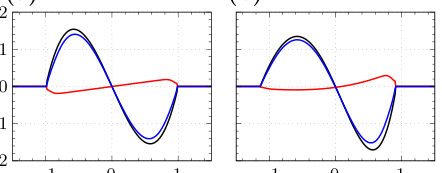
<figcaption class="paper-figure-caption"><b>Fig 1.</b> FIG. 1. The dc supercurrent jdc(q) (blue line) under light irradia- tion. The equilibrium value jeq′(q) (black line) is modulated by the photo-induced current jphoto(q) (red line). The diode efficiency is (a) η = 0 for α3 = 0 and (b) η ∼−0.094 for α3 = 0.2. We set β1 = 0, E0 = 0.01, and ω = 0.1.</figcaption>
</figure>
<figure class="paper-figure-card">
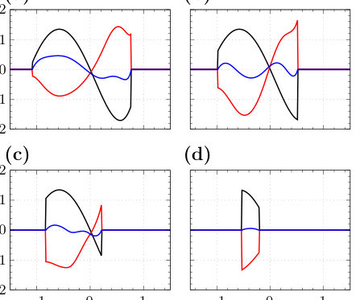
<figcaption class="paper-figure-caption"><b>Fig 2.</b> FIG. 2. The dc supercurrent jdc(q) and its components jeq′(q) and jphoto(q) are shown by the same color as Fig. 1. The ac electric field is increased from (a) to (d), as E0 = 0.033, 0.052, 0.065, and 0.074. The estimated diode efficiency is η ∼0.152, −0.124, −0.069, and 1.000, respectively. The parameters are the same as in Fig. 1(b) except for E0.</figcaption>
</figure>
<figure class="paper-figure-card">
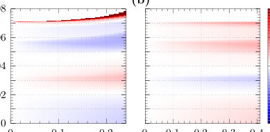
<figcaption class="paper-figure-caption"><b>Fig 3.</b> FIG. 3. (a) Diode efficiency η as a function of α3 and E0 with β1 = 0. (b) β1 and E0 dependence of η with α3 = 0. We set ω = 0.1 in both (a) and (b).</figcaption>
</figure>
<figure class="paper-figure-card">
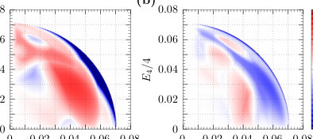
<figcaption class="paper-figure-caption"><b>Fig 4.</b> FIG. 4. Diode efficiency η in centrosymmetric systems (α3 = 0 and β1 = 0) under two-frequency light. The vector potential is A(t) = A1 cos ωt + An cos nωt with ω = 0.1. (a) n = 2. (b) n = 4.</figcaption>
</figure>

**Summary.** This paper shows that light irradiation can be used to engineer unidirectional superconducting transport. By using specific light frequencies, researchers can break symmetries to create a 'perfect' diode effect where current flows in only one direction, even in materials that are normally symmetric.

**Why it may be interesting.** not directly relevant

Detailed structure

**Main problem.** The paper investigates how to achieve the 'perfect' superconducting diode effect (SDE)—where supercurrent flows in only one direction with 100% efficiency—using light-driven nonequilibrium control.

**Main result.** The authors demonstrate that monochromatic light can induce perfect SDE in systems lacking inversion and time-reversal symmetries, and multi-frequency light can induce it even in centrosymmetric systems via dynamical symmetry breaking.

**Method.** The study employs the Time-Dependent Ginzburg-Landau (TDGL) theory, using perturbative expansions of the order parameter and Fourier analysis of the supercurrent in the presence of AC electric fields.

**Model / system.** The model consists of one-dimensional or higher-dimensional superconducting wires subject to continuous-wave light or microwave irradiation, described by a TDGL framework with broken inversion and time-reversal symmetries.

**Key observables.** Diode efficiency (eta), DC supercurrent (j_dc), photo-induced current (j_photo), and nonreciprocal/nonlinear superfluid density.

**Important parameters / regimes.** Light intensity (E0), frequency (omega), symmetry-breaking coefficients (alpha_3, beta_1), and temperature near the critical temperature (Tc).

**Assumptions / limitations.** The analysis assumes the system is near Tc, uses a single-q ansatz where Cooper pair momentum is time-independent, and neglects the imaginary part of the relaxation constant.

**Figures summary.** Figure 1(a) shows reciprocal DC supercurrent with zero efficiency; supplementary figures show diode efficiency as a function of symmetry-breaking parameters, field amplitude, and frequency.

**Paper structure.** The paper introduces the problem of perfect SDE, presents the TDGL theoretical framework, analyzes the monochromatic light case in noncentrosymmetric systems, extends the analysis to multi-frequency light in centrosymmetric systems, and discusses the validity and limitations of the approximations used.

Abstract

We demonstrate the perfect superconducting diode effect (SDE) -- unidirectional supercurrent with 100% diode efficiency -- in light-driven nonequilibrium systems. Although the perfect SDE is difficult to achieve in equilibrium, monochromatic light induces the perfect SDE in systems lacking inversion and time-reversal symmetries. More strikingly, multi-frequency light enables the perfect SDE even in centrosymmetric systems via dynamical symmetry breaking. Our results establish a general principle for realizing unidirectional superconducting transport based on nonequilibrium control and symmetry engineering.

[↑ back to top](#top)

### [Topological fragility and bilinear magnetoelectric resistance in gapless edge states](http://arxiv.org/abs/2605.25774v1)

**Authors:** Cosimo Gorini, Matthieu Bard, Sophie Gueron, Hélène Bouchiat, Giovanni Vignale  
**Type:** theory · **Category:** disordered systems and neural networks · **PDF:** <https://arxiv.org/pdf/2605.25774v1>  
**Analysis basis:** full PDF text, analyzed in chunks
**Topic relevance:** `non-equilibrium dynamics` **2/5**

↔ Scroll figures horizontally

<figure class="paper-figure-card">
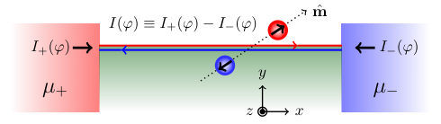
<figcaption class="paper-figure-caption"><b>Fig 1.</b> FIG. 1. Schematics of a spin-momentum locked 1D wire con- necting reservoirs at chemical potentials µ+,µ−. The magne- tizing field H forms an angle φ with the channel, while the electronic spins are parallel to the spin-momentum locking di- rection ˆm. The net current I(φ) is different under positive (δµ &gt; 0) and negative (δµ &lt; 0) bias, with δµ ≡µ+−µ−. The asymmetry is quantified by the resistance RBMER, Eq. (15).</figcaption>
</figure>
<figure class="paper-figure-card">
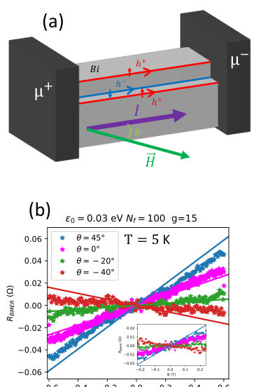
<figcaption class="paper-figure-caption"><b>Fig 2.</b> FIG. 3. (a): Sketch of the experimental setup. The shape of the Bi nanowire defines multiple hinges of either helicities, whose spin-momentum locking direction ˆm forms an angle of 65◦with the nanowire axis. An external field is applied in the wire plane at an angle θ. The imposed total current is IAC = 2.5µA, through a wire of diameter d ∼100nm. See Ref. [17] for further details. (b) BMER traces for varying θ, corresponding to an angle between magnetic field and spin axis φ = 65◦−θ. The data were antisymmetrized to isolate the rectifying (2nd harmonic in current bias) odd-in-B com- ponent, excluding B-even contributions. Data points at small fields B ≲0.2T, see inset, are perfectly fitted...</figcaption>
</figure>
<figure class="paper-figure-card">
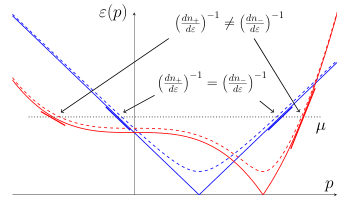
<figcaption class="paper-figure-caption"><b>Fig 3.</b> FIG. 4. Fermi level densities of injected right- (+) and left- movers (-) for linear (blue) and cubic (red) Dirac dispersions.</figcaption>
</figure>
<figure class="paper-figure-card">
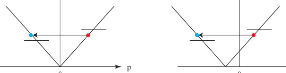
<figcaption class="paper-figure-caption"><b>Fig 4.</b> FIG. 5. Left panel: Energy dispersion for the model Hamiltonian vF pσx. The right movers with p &gt; 0 and positive spin along the x axis have the same energy as their time-reversed left-moving partners with opposite momentum and spin. The short horizontal lines are the chemical potentials, which determine the occupations of right and left movers in the non-equilibrium state. The elastic back scattering process shown by the arrow is forbidden by time-reversal symmetry. Right panel: Energy dispersion for the model Hamiltonian (vF p + gµ0µBH)σx. Right- and left-moving states at the same energy do not have opposite momenta and spins, i.e. they are not time-reversal partners. Elastic back...</figcaption>
</figure>

**Summary.** This paper resolves the paradox of how perfectly conducting 1D topological states exhibit resistance. It demonstrates that the same spin-orbit coupling providing topological protection also enables backscattering when an external magnetic field breaks time-reversal symmetry. This 'topological fragility' explains recent experimental observations in Bismuth nanowires.

**Why it may be interesting.** not directly relevant

Detailed structure

**Main problem.** Explaining the origin of Bilinear Magnetoelectric Resistance (BMER) in 1D spin-momentum locked edge and hinge states, which contradicts the theoretical expectation of perfect conductivity due to immunity to backscattering.

**Main result.** The authors identify a 'topological fragility' where random spin-orbit interaction enables a backscattering channel when time-reversal symmetry is broken by an external magnetic field, providing a quantitative explanation for BMER in Bismuth hinge states.

**Method.** The study uses a theoretical framework involving the Landauer-Büttiker formulation, Fermi's Golden Rule for scattering rates, and a gauge transformation to analyze non-reciprocal transport.

**Model / system.** The model consists of 1D Dirac-type edge or hinge states (e.g., in Bismuth) characterized by spin-momentum locking, subject to a Hamiltonian with an external magnetic field and random spin-orbit interaction (Elliott-Yafet mechanism).

**Key observables.** Bilinear Magnetoelectric Resistance (BMER), non-reciprocal transport, reflection coefficient, and current-induced magnetization.

**Important parameters / regimes.** Spin-orbit length (lambda), Fermi velocity (vF), magnetic field strength (H), impurity density (ni), and the ratio of impurity energy fluctuations to Fermi energy (epsilon_0/epsilon_F).

**Assumptions / limitations.** Assumes weak backscattering, delta-correlated disorder, and that the system equilibrates in the presence of a magnetic field before current is driven; neglects complex many-body effects.

**Figures summary.** Figure 3(a) shows an experimental setup of Bi nanowires; Figure 4 illustrates Fermi level densities for different Dirac dispersions; Figure 5 shows energy dispersion with and without magnetic fields.

**Paper structure.** The paper establishes the paradox of BMER in protected states, introduces a model for random spin-orbit interaction, derives the backscattering mechanism via the Elliott-Yafet process, compares exchange vs. magneto-static effects, and concludes with quantitative agreement to experimental data.

Abstract

In time-reversal symmetric systems such as topological and higher-order topological insulators, 1D spin-momentum locked edge and hinge states are theoretically ``perfectly conducting'', being immune to backscattering by non-magnetic disorder. Here, we reveal a fundamental ``topological fragility'': these states exhibit a bilinear magnetoelectric resistance significantly larger than in 2D systems. This effect requires two ingredients: (i) spin-momentum locking, which maximizes time-reversal symmetry breaking in the non-linear regime, and (ii) random spin-orbit interaction -- the same mechanism behind Elliott - Yafet spin relaxation in heavy elements. Together, these generate a robust backscattering channel when a modest external magnetic field is applied. Our theory requires no gap opening or complex many-body effects, offering a simple and general mechanism that quantitatively explains recent observations in Bismuth hinge states.

[↑ back to top](#top)

### Other secondary papers (17)

Show other secondary papers

### [A helical Rashba--exchange gauge field drives a uniaxial pair density wave in EuRbFe$_4$As$_4$](http://arxiv.org/abs/2605.24362v1)

**Authors:** Pengfei Li, Yi Zhou  
**Type:** theory · **Category:** strongly correlated electrons · **PDF:** <https://arxiv.org/pdf/2605.24362v1>  
**Analysis basis:** full PDF text, analyzed in chunks

↔ Scroll figures horizontally

<figure class="paper-figure-card">
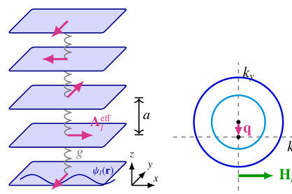
<figcaption class="paper-figure-caption"><b>Fig 1.</b> FIG. 1. (a) Schematic of the period-4 layered superconductor model. Blue slabs represent the superconducting layers (l = 0, 1, 2, 3, 4) coupled by Josephson tunneling g. Bold magenta arrows indicate the effective gauge field Aeff l , rotating by 90◦per layer. The sinu- soidal curve illustrates the spatially modulated PDW order parame- ter. (b) Microscopic mechanism generating the effective gauge field. In the presence of Rashba spin-orbit coupling, an in-plane exchange field Hl asymmetrically shifts the Fermi surfaces in momentum space (kx, ky). This imparts a finite center-of-mass momentum q ∝−ˆz × Hl to the Cooper pairs in the convention used below, acting strictly as an effective U(1)...</figcaption>
</figure>
<figure class="paper-figure-card">
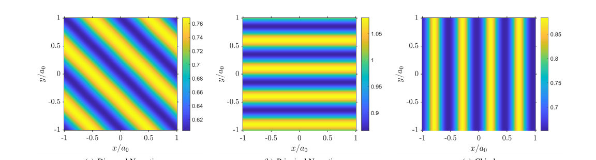
<figcaption class="paper-figure-caption"><b>Fig 2.</b> FIG. 2. Superfluid density distributions of the Bloch SC states on layer l = 0 with a0 = 2π/k0. In all cases, the system spontaneously breaks rotational symmetry, resulting in a strictly uniaxial (unidirectional) PDW modulation, consistent with STM observations. Common parameters are β1 = 3 and h = 2.5, where dimensionless effective-field parameter h2 ≡ℏ2k2 0/(2m∗|α|). Specific parameters are: (a) Diagonal nematic state (β2 = 1, β3 = 1, g0 = 1, g2 = 0); (b) Principal nematic state (β2 = 1, β3 = −1, g0 = 0, g2 = 1); and (c) Chiral state (β2 = −1, β3 = 1, g0 = 0, g2 = 1).</figcaption>
</figure>
<figure class="paper-figure-card">
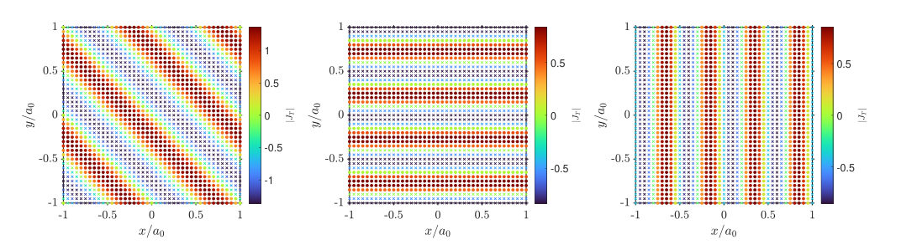
<figcaption class="paper-figure-caption"><b>Fig 3.</b> FIG. 3. Inter-layer Josephson tunneling currents between layers l = 0 and l = 1 for the corresponding Bloch SC states shown in Fig. 2. The highly structured, uniaxial modulation of the inter-layer phase coherence is a direct consequence of the layer-dependent effective gauge field. Dots and crosses in figures denote Josephson currents flowing upward (+z) and downward (−z), respectively. Parameters for panels (a)–(c) are identical to those in Fig. 2(a)–(c), respectively.</figcaption>
</figure>
<figure class="paper-figure-card">
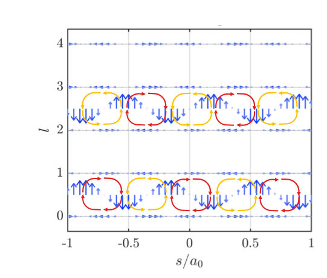
<figcaption class="paper-figure-caption"><b>Fig 4.</b> FIG. 4. Side-view illustration of the 3D spontaneous currents in the structurally modulated Bloch SC state, viewed along the in- plane 135◦direction [(−ˆx + ˆy)/ √</figcaption>
</figure>

**Summary.** This paper proposes that a helical Rashba-exchange gauge field drives the formation of a unidirectional pair density wave in EuRbFe4As4. The mechanism explains the nanometer-scale modulation observed in STM experiments and predicts detectable spontaneous loop currents. This provides a theoretical link between the material's helical magnetism and its complex superconducting order.

**Why it may be interesting.** not directly relevant

Detailed structure

**Main problem.** Explaining the origin of the intrinsic, unidirectional (uniaxial) pair density wave (PDW) observed in the iron-pnictide superconductor EuRbFe4As4.

**Main result.** The interplay of Rashba spin-orbit coupling and a helical exchange field generates an effective U(1) gauge field that stabilizes a spatially modulated Bloch superconducting state with a uniaxial PDW.

**Method.** A phenomenological Ginzburg-Landau theory is used, incorporating a layer-dependent effective gauge field and symmetry analysis within the Pc4122 magnetic space group.

**Model / system.** The system is the layered iron-pnictide superconductor EuRbFe4As4, characterized by broken local inversion symmetry in FeAs layers and a period-four helical magnetic order of Eu2+ spins.

**Key observables.** Uniaxial PDW modulation wavelength, spontaneous intra-layer loop currents, and inter-layer Josephson vortex-antivortex pairs.

**Important parameters / regimes.** Exchange field scale (Hex approx 26 meV), Rashba SOC scale, magnetic transition temperature (Tm approx 15 K), and superconducting transition temperature (Tc approx 37 K).

**Assumptions / limitations.** The model assumes a period-four layered structure and uses a simplified Ginzburg-Landau framework with specific symmetry constraints from the D4 point group.

**Figures summary.** The notes describe layer diagrams of the crystal structure, phase diagrams of the superconducting states, and spatial distributions of superfluid density and spontaneous currents.

**Paper structure.** The paper identifies the scientific problem, describes the physical system and Hamiltonian, develops a Ginzburg-Landau theory, performs stability and symmetry analysis, and concludes with predicted experimental signatures.

Abstract

The recent discovery of an intrinsic pair density wave (PDW) in the iron-pnictide superconductor EuRbFe$_4$As$_4$ presents a fascinating puzzle. Structurally, the FeAs layers break local inversion symmetry, while the Eu$^{2+}$ spins exhibit a period-four helical magnetic order. Here, we demonstrate that the interplay of induced Rashba spin-orbit coupling and the helical exchange field generates a layer-rotating effective $U(1)$ gauge field for the Cooper pairs. Because this gauge field shares the symmetry of the Fe $3d_{xz}/3d_{yz}$ orbitals, it explicitly induces an intertwined, orbital-selective pairing state. Using a phenomenological Ginzburg-Landau theory, we show this mechanism naturally stabilizes a structurally modulated Bloch superconducting state. This state features a strictly uniaxial (unidirectional) PDW, naturally capturing the phenomenology of recent scanning tunneling microscopy experiments. Furthermore, we predict this PDW is accompanied by spontaneous loop currents between adjacent layers, offering a distinctive signature for future $μ$SR or scanning SQUID experiments.

[↑ back to top](#top)

### [AI-Driven SERS for Non-invasive and Label-Free Extracellular Vesicle Detection Across Cellular Origins in Tears and Sweat](http://arxiv.org/abs/2605.25465v1)

**Authors:** Yang Li, Xiaoming Lyu, Ling Xia, Kuo Zhan, Haoyu Ji, Lei Qin, Seppo J. Vainio, Jian-An Huang  
**Type:** both · **Category:** disordered systems and neural networks · **PDF:** <https://arxiv.org/pdf/2605.25465v1>  
**Analysis basis:** full PDF text, analyzed in chunks

↔ Scroll figures horizontally

<figure class="paper-figure-card">
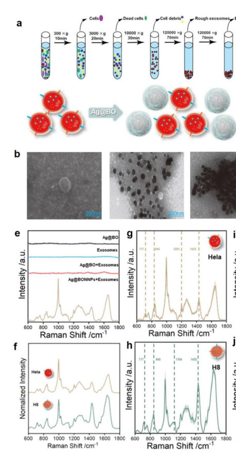
<figcaption class="paper-figure-caption"><b>Fig 1.</b> Figure 2：Isolation, characterization, and SERS profiles of cell-derived EVs. a. Isolation and extraction process of cell-derived EVs. b. TEM of cell-derived EVs, EVs with Ag@BO NPs, and EVs with Ag@BONNPs, scale bar: 200 nm. c-d. Western Blot and NTA results of the three cell-derived EVs of 143B, Hela, BMSC. e. SERS profiles of Hela cell-derived EVs under different systems. f.</figcaption>
</figure>
<figure class="paper-figure-card">
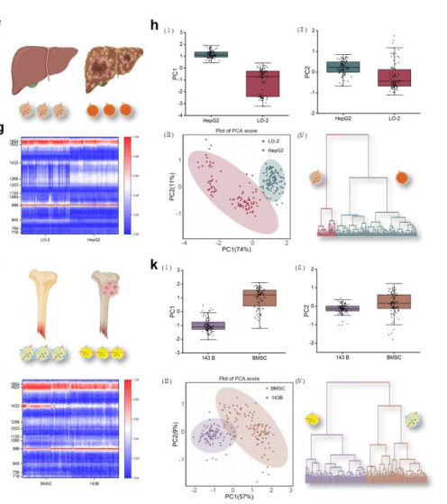
<figcaption class="paper-figure-caption"><b>Fig 2.</b> Figure 3：Detection flow chart, Thermograms, Principal component analysis, and Hierarchical clustering analysis of exosomes from three cancer cells and their corresponding normal cell sources. a-b. Diagram of the process of detecting and distinguishing cell-derived EVs between cancer and normal cell-derived EVs. Schematic diagrams of cervical cancer(c), hepatocellular carcinoma(f) and osteosarcoma(i). Thermograms comparison of EVs derived from Hela cells and H8 cells(d), HepG2 cells and LO-2 cells(g), 143B cells and BMSC cells(j). PCA and HCA of EVs derived from Hela cells and H8 cells (e), HepG2 cells and LO-2 cells (h), 143B cells and BMSC cells (k). Cartoons were created with...</figcaption>
</figure>
<figure class="paper-figure-card">
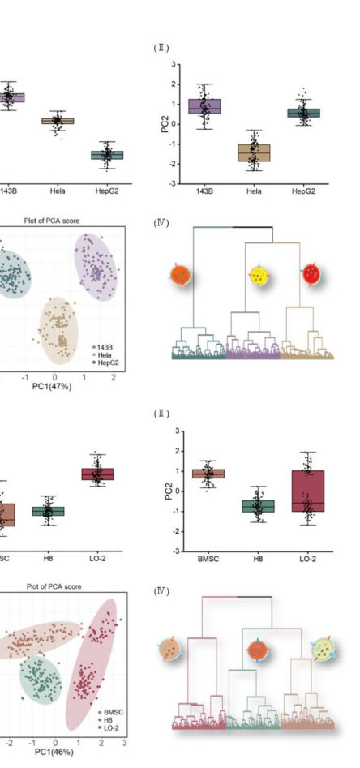
<figcaption class="paper-figure-caption"><b>Fig 3.</b> Figure 4：SERS profiles, Thermograms, PCA, and HCA of three normal cell-derived EVs and three cancer cell-derived EVs. a-b. SERS profiles of EVs and thermograms from three cancer cell sources. d-e. SERS profiles of EVs and thermograms from three normal cell sources. PCA and HCA results of EVs from three cancer cell sources(c) and three normal cell sources(f),(Ⅰ-Ⅲ) the results of PCA,(Ⅳ) the results of HCA.</figcaption>
</figure>
<figure class="paper-figure-card">

<figcaption class="paper-figure-caption"><b>Fig 4.</b> Figure 6：3D PCA of six different cell-derived EVs and confusion matrix obtained from machine learning results. a. Conceptual diagram of the PCA-SVM machine learning algorithm to distinguish six different cell-derived EVs. b. (Ⅰ-Ⅲ). Comparison of PCA scores for EVs from six different cellular origins. (Ⅳ)3D PCA of SERS profiles of EVs from six cell-derived EVs. (PC1=41.4%, PC2=26.7%, PC3=10.3%). c. Prediction results of the three principal components (PC1, PC2, PC3) scores of six cell-derived EV SERS profiles on the test set. d. Schematic</figcaption>
</figure>
<figure class="paper-figure-card">
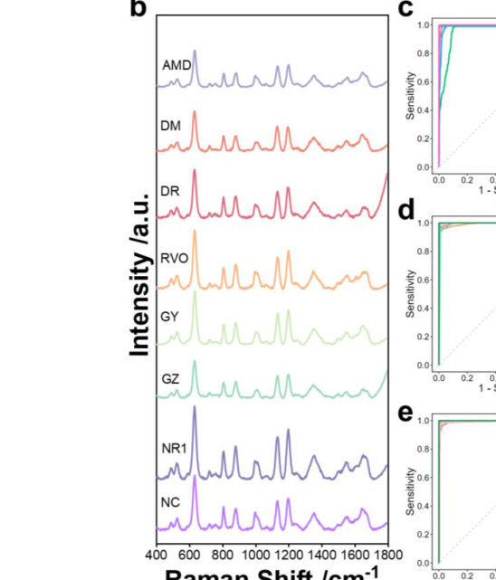
<figcaption class="paper-figure-caption"><b>Fig 5.</b> Figure 7: a. Workflow schematic depicting tear collection from patients with ocular diseases, SERS-based spectroscopic analysis, and subsequent machine learning-aided classification. b. Typical SERS spectra acquired from tear samples of patients with seven distinct ocular diseases and healthy volunteers. c-e. Receiver operating characteristic (ROC) curves demonstrating the performance of three machine learning algorithms (SVM, CNN, and RNN) in distinguishing different ocular conditions. f-h. Confusion matrices illustrating the classification performance of the SVM, CNN, and RNN models, respectively.</figcaption>
</figure>

**Summary.** This paper presents an AI-driven SERS-based sensing platform for the label-free detection of extracellular vesicles in tears and sweat. By combining nanoparticle-induced Raman enhancement with deep learning, the researchers achieved high-accuracy identification of disease-specific vesicles. This approach offers a potential path toward non-invasive, point-of-care diagnostics for various clinical conditions.

**Why it may be interesting.** not directly relevant

Detailed structure

**Main problem.** The need for a non-invasive, label-free, and rapid method to detect and identify Extracellular Vesicles (EVs) from various cellular origins in biofluids like tears and sweat.

**Main result.** Developed an AI-assisted SERS platform that achieves over 92% accuracy in identifying EVs from 7 different disease sources in tears and successfully differentiates EVs from 6 different cell lines.

**Method.** The method uses salt-induced aggregation of silver nanoparticles (AgNPs) to enhance Raman signals, combined with machine learning models including PCA-SVM for cell origin classification and CNN/RNN for disease identification.

**Model / system.** An experimental platform consisting of silver nanoparticles (Ag@BO) interacting with EVs in biological fluids (tears and sweat), supported by Molecular Dynamics simulations of protein-AgNP electrostatic interactions.

**Key observables.** Raman spectral fingerprints (specifically peaks at 845, 997, and 1654 cm-1), EV size (100-150 nm), and classification accuracy/confusion matrices.

**Important parameters / regimes.** Sample volume of 10 uL, 532 nm laser wavelength, and 70/30 training/testing data split.

**Assumptions / limitations.** Assumes that the molecular signatures in EVs accurately reflect the pathophysiological status of the parental cells and that the SERS signal is representative of the EV composition.

**Figures summary.** Fig 1: Workflow of EV detection and ML pipeline; Fig 2: EV isolation, TEM, and Western Blot validation; Fig 4: SERS profiles and PCA/HCA clustering; Fig 6: 3D PCA and sweat analysis; Fig 7: Tear collection workflow and ROC curves for CNN/RNN/SVM.

**Paper structure.** Introduction of the clinical need -> Experimental platform development (AgNP synthesis and EV isolation) -> Characterization of EVs (TEM, NTA, Western Blot) -> SERS spectral analysis and ML implementation (PCA-SVM, CNN, RNN) -> Validation with clinical tear and sweat samples -> Molecular Dynamics simulation of binding mechanism.

Abstract

Wearable sensing technology capable of point-of-care, continuous and non-invasive analysis of exosomes in biofluid such as tears and sweat is an essential part for future personalized medicine. Major detection and identification methods of cell secreted Extracellular Vesicles (EVs) often require labeling and are time-consuming, resulting in low efficiency in EV mechanism research and disease diagnosis. While the label-free Surface-enhanced Raman spectroscopy (SERS) has been combined with deep learning model for EV identification in blood, their application to non-invasive detection of EVs in tears and sweat are missing. Here, we filled this gap by developing an artificial intelligence (AI)-assisted Surface-enhanced Raman spectroscopy (SERS) method based on salt-induced nanoparticle aggregation for fast EV identification in tears and sweat with high accuracy. Significantly, our label-free detection and AI differentiation of EVs from 6 cell lines (HepG2, Hela, 143B, LO-2, BMSC, H8) achieved the identification of EVs in tear fluids from 7 different disease sources with accuracies >92%. Our results showed that this platform can not only distinguish EVs from multiple cell sources but also generate highly reproducible and selective EV signals in tear fluids without a need for chemical labeling or separation steps. Molecular dynamics simulations revealed that silver atoms (Ag) form electrostatic interactions with oxygen atoms of multiple amino acid residues in proteins, suggesting a high affinity. This strategy realizes ultra-sensitive and anti-interference detection of EVs, providing a new idea for the rapid diagnosis of clinical diseases.

[↑ back to top](#top)

### [Dilute Magnetism and Edge-State Engineering in Monolayer SnO](http://arxiv.org/abs/2605.24376v1)

**Authors:** Yuya Fukuta, Souren Adhikary, Kazuhito Tsukagoshi, Katsunori Wakabayashi  
**Type:** theory · **Category:** strongly correlated electrons · **PDF:** <https://arxiv.org/pdf/2605.24376v1>  
**Analysis basis:** full PDF text, analyzed in chunks

↔ Scroll figures horizontally

<figure class="paper-figure-card">
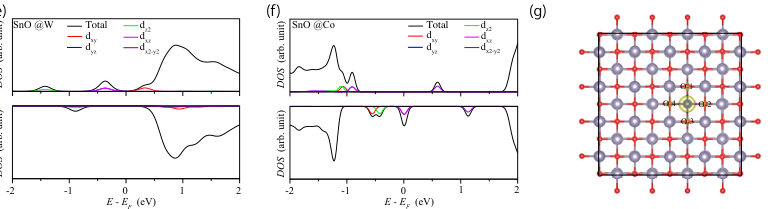
<figcaption class="paper-figure-caption"><b>Fig 1.</b> FIG. 1. (a), (b) Optimized top and side views of monolayer SnO structures doped with transition metals (TMs) in a 4 × 4 × 1 supercell, where one Sn atom is substituted by a TM atom ( Mn, Fe, W, or Co). (c)–(f) Spin-resolved total density of states and projected density of states (PDOS) for Mn-, Fe-, W-, and Co-doped SnO, respectively. Different color lines are showing contributions from TM d orbitals. Among the considered dopants, Co doping exhibits the strongest spin asymmetry near the Fermi level (EF), with a spin-selective electronic structure. (g) Spin-density plot of Co-doped SnO monolayer. The isosurface value is set to 0.001 e/˚A 3.</figcaption>
</figure>
<figure class="paper-figure-card">
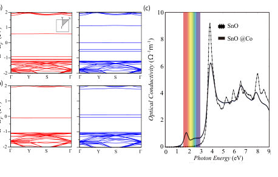
<figcaption class="paper-figure-caption"><b>Fig 2.</b> FIG. 2. Electronic band structure of Co doped SnO mono- layer (a) without U (i.e., U = 0 eV) and (b) with U = 3 eV. Red and blue bands represent up-spin and down-spin bands respectively. The BZ is shown by the square. (c) Calculated optical conductivity spectra σ (ω) of pristine and Co-doped SnO, derived from the imaginary part of the dielectric func- tion ϵ2 (ω) according to Eq. (1).</figcaption>
</figure>
<figure class="paper-figure-card">
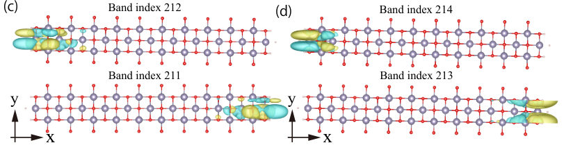
<figcaption class="paper-figure-caption"><b>Fig 3.</b> FIG. 3. Atomic structure of a hydrogen-terminated SnO nanoribbon, where Sn, O, and H atoms are represented by purple, red, and white spheres, respectively. (b) Calculated electronic band structure and density of states (DOS), showing additional in-gap bands (shown by the red arrows) near the Fermi level (EF) that are absent in the pristine monolayer. (c) and (d) Real-space isosurfaces of the wavefunctions corresponding to the in-gap bands (band indices 211–212 degenerate valence bands and 213–214 are degenerate conduction bands). The charge density is strongly localized at the ribbon edges, consistent with edge-derived electronic states. Each in-gap band is doubly degenerate, reflecting the...</figcaption>
</figure>
<figure class="paper-figure-card">
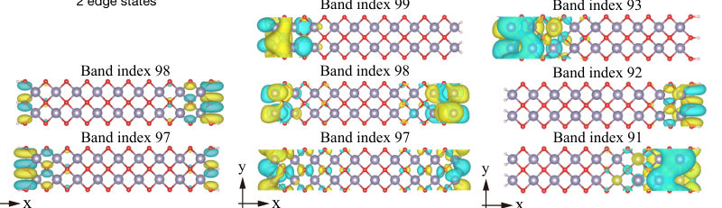
<figcaption class="paper-figure-caption"><b>Fig 4.</b> FIG. 4. (a)–(c) Atomic structures of hydrogen-passivated SnO nanoribbons oriented along a low-symmetry (45◦) direction with respect to the square lattice. The three edge terminations considered are (a) O–O, (b) Sn–Sn, and (c) Sn–O, which give rise to chemically and structurally inequivalent ribbon edges. (d)–(f) Corresponding electronic band structures and densities of states (DOS). For the O–O terminated ribbon, edge-derived states remain localized within the band gap without crossing the Fermi level, preserving semiconducting behavior. In contrast, the Sn–Sn and Sn–O terminated ribbons exhibit metallic edge states that intersect the Fermi level, indicating the formation of one-dimensional...</figcaption>
</figure>

**Summary.** This paper explores how doping monolayer SnO with transition metals and engineering the edges of SnO nanoribbons can create localized magnetism and 1D metallic channels. It identifies a fundamental trade-off where stable oxygen-rich edges are semiconducting, while more energetic tin-rich edges enable metallic transport. These findings suggest SnO is a versatile platform for developing future spintronic and nanoelectronic devices.

**Why it may be interesting.** not directly relevant

Detailed structure

**Main problem.** Investigating how transition-metal doping and edge engineering can be used to tailor the electronic, magnetic, and optical properties of monolayer SnO for spintronic and nanoelectronic applications.

**Main result.** Transition-metal doping induces localized magnetic moments and flat bands, while Sn-terminated nanoribbon edges create metallic 1D conduction channels, presenting a trade-off between thermodynamic stability and conductivity.

**Method.** First-principles Density Functional Theory (DFT) calculations using the VASP and Quantum ESPRESSO packages, incorporating the GGA-PBE functional and DFT+U to account for electron correlations.

**Model / system.** A monolayer of tin monoxide (SnO), a p-type oxide semiconductor, studied in both a 4x4x1 supercell for transition-metal doping (Mn, Fe, Co, W) and as various hydrogen-passivated nanoribbon geometries.

**Key observables.** Spin-resolved density of states (DOS), magnetic moments, band structures, optical conductivity, refractive index, and relative formation energies.

**Important parameters / regimes.** On-site Coulomb interaction (U = 3 eV for Co), ribbon width, and edge termination (Sn-terminated vs. oxygen-rich).

**Assumptions / limitations.** The study assumes the validity of the PBE functional and the DFT+U approach for describing localized d-orbitals; results may be specific to the Sn 5s-O 2p hybridization in SnO.

**Figures summary.** Figure 1 shows the doped supercell structures and spin-resolved DOS; Figure 2 displays spin-polarized band structures and optical conductivity spectra; Figure 3 and 4 illustrate nanoribbon geometries, edge-localized wavefunctions, and the electronic properties of different edge terminations.

**Paper structure.** The paper introduces the SnO system, details the DFT methodology, presents results for transition-metal doping and its magnetic/optical consequences, moves to the investigation of nanoribbon edge states and stability, and concludes with design principles for SnO-based electronics.

Abstract

Tin monoxide (SnO) is a p-type oxide semiconductor whose electronic properties can be widely modified via atomic-scale engineering. Using density functional theory, we investigate the electronic and magnetic properties of transition-metal (TM = Mn, Fe, Co and W) doped SnO monolayer within a large supercell. We find that all dopants induce finite localized magnetic moments, primarily originating from $d$-orbitals of the impurity atoms. We show that these localized magnetic states give rise to nearly   dispersionless bands in the vicinity of the Fermi energy (taking Co doped SnO as an example). In addition, we investigate dimensional effects by constructing nanoribbon geometries of SnO monolayer. The ribbons exhibit intrinsic edge-localized states that are largely independent of ribbon width. For chiral nanoribbons oriented along a low-symmetry direction of the square lattice, we find that oxygen-rich edges are thermodynamically most stable and remain semiconducting, whereas Sn-terminated edges host metallic one-dimensional conduction channels. Our results demonstrate that transition-metal doping and edge engineering provide effective routes to tailor the electronic properties of SnO monolayer, making it a promising candidate for future spintronic and nanoelectronic applications.

[↑ back to top](#top)

### [Electrostatically stabilized surface flat bands in rhombohedral graphite at zero displacement field](http://arxiv.org/abs/2605.24080v1)

**Authors:** Kryštof Kolář, Andrea F. Young, Cyprian Lewandowski  
**Type:** theory · **Category:** strongly correlated electrons · **PDF:** <https://arxiv.org/pdf/2605.24080v1>  
**Analysis basis:** full PDF text, analyzed in chunks

↔ Scroll figures horizontally

<figure class="paper-figure-card">
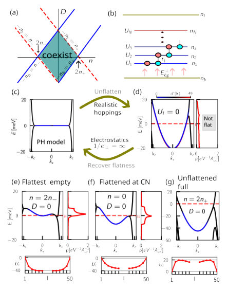
<figcaption class="paper-figure-caption"><b>Fig 1.</b> FIG. 1. (a) Schematic phase diagram of large N RNG in the n-D plane. (b) Device schematics, showing the layer and gate electron densities. The gate electric field is denoted as Ebg ⊥. (c) Band structure for an idealized N = 50 RNG model at charge neutrality. (d) Band structure and density of states (DOS) for a realistic model at N = 50 for zero layer potential, Ul = 0. (e-g) Upper panel shows the self-consistent band structure and DOS at D = 0 and: (e) negative n ≈2n−, (f) n = 0, and (g) close to full filling, n ≈2n+. Lower panel shows the corresponding layer potentials Ul.</figcaption>
</figure>
<figure class="paper-figure-card">
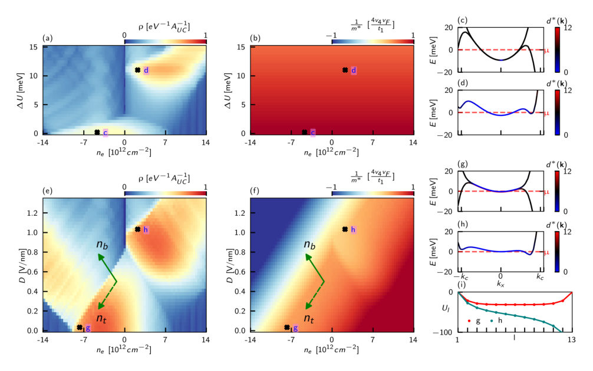
<figcaption class="paper-figure-caption"><b>Fig 2.</b> FIG. 2. (a) n −∆U map of the density of states (DOS) calculated for a model where the potential difference between adjacent layers is assumed fixed, Ul+1 −Ul = −∆U. (b) Effective mass, shown for the same fixed potential-difference model as in (a), in units of the mass defined in Eq. (5). (c) Band structure from the fixed potential-difference model described in (a), shown here at zero potential. (d) Band structure from the same model at a large potential, focusing on the region with high DOS. (e) n −D map of the DOS for the full self-consistent electrostatic model, using potentials from Eq. (8). (f) Effective mass for the same self-consistent model as in (e). (g) Band structure in the...</figcaption>
</figure>

**Summary.** This paper demonstrates that even without an external displacement field, the self-consistent electrostatic screening in thick rhombohedral graphite can flatten surface bands. This discovery establishes a new, low-field regime for exploring interaction-driven phenomena like superconductivity and magnetism in large-N graphene systems.

**Why it may be interesting.** not directly relevant

Detailed structure

**Main problem.** Determining whether the surface flat-band regime, typically observed in few-layer rhombohedral graphene at large displacement fields, can be accessed in thick rhombohedral graphite where strong screening usually suppresses internal electric fields.

**Main result.** Self-consistent, nonlinear electrostatics provides a mechanism to flatten surface bands even at zero displacement field by creating a near-surface potential that counteracts quadratic dispersion. This effect is enhanced by hole doping and stronger interactions, providing a robust regime for symmetry-broken phases in large-N samples.

**Method.** The authors use a self-consistent iterative numerical approach to solve Gauss' Law and the tight-binding Hamiltonian simultaneously, comparing the results against analytical limits and a non-self-consistent 'frozen-charge' model.

**Model / system.** The system is rhombohedral (ABC-stacked) multilayer graphene/graphite with a realistic N-layer tight-binding Hamiltonian including interlayer hopping (t1), remote tunneling (v3, v4), and layer-specific electrostatic potentials (Ul) determined by screening.

**Key observables.** Surface-band dispersion (flatness), Density of States (DOS), layer-resolved probability density, and layer-specific electrostatic potentials.

**Important parameters / regimes.** Number of layers (N), displacement field (D), carrier density (n), out-of-plane dielectric constant (epsilon_perp), and remote hopping parameters (v3, v4).

**Assumptions / limitations.** The study assumes a realistic tight-binding parameter set and uses the out-of-plane dielectric constant as a proxy for interaction strength; it also assumes monotonic potential profiles for certain analytical derivations.

**Figures summary.** Figure 1 shows a phase diagram in the n-D plane and compares idealized vs. realistic band structures. Figure 2 illustrates the evolution of the potential profile and DOS. Supplemental figures compare self-consistent results to linear-potential and frozen-charge approximations.

**Paper structure.** The paper introduces the problem of screening in thick rhombohedral graphene, presents a self-consistent electrostatic model, develops the mechanism for electrostatic band flattening, analyzes the effects of doping and interaction strength, and concludes with implications for future experimental observations of symmetry-broken phases.

Abstract

Rhombohedral (ABC-stacked) multilayer graphene hosts interaction-driven phases enabled by surface flat bands at large displacement fields. In thick flakes, however, strong screening suppresses internal electric fields, raising the question of whether a flat-band regime is accessible within the same experimental paradigm. Here, we show that self-consistent, nonlinear electrostatics provides a robust alternative mechanism: even in the absence of a displacement field, a nonuniform near-surface potential flattens the surface-band dispersion and enhances the density of states. In the strong-coupling limit, electrostatics drives the system toward uniform half-filling at each momentum, yielding an asymptotically flat surface band without any gating. At realistic interaction strengths, surface-band flatness is tuned by the proximal gate, with maximal flatness achieved at hole doping when the band is empty. Combining analytic arguments with fully self-consistent calculations in a realistic model, we map the resulting low-field regime and connect to finite $N\!\sim\! 6-15$ layered samples, providing a framework for analyzing the symmetry-broken phases observed in these systems. Our results motivate future experiments in large-$N$ devices and establish a low-field regime for exploring electrostatically induced flat-band physics.

[↑ back to top](#top)

### [Exact Single-Scale Outer Solution of the Abrikosov Vortex in the Extreme Type-II Limit](http://arxiv.org/abs/2605.25938v1)

**Authors:** Eugene B. Kolomeisky  
**Type:** theory · **Category:** other · **PDF:** <https://arxiv.org/pdf/2605.25938v1>  
**Analysis basis:** full PDF text, analyzed in chunks

↔ Scroll figures horizontally

<figure class="paper-figure-card">
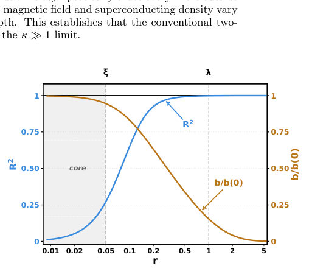
<figcaption class="paper-figure-caption"><b>Fig 1.</b> FIG. 1. Rescaled superconducting density R2 and rescaled magnetic induction b/b(0) as functions of the distance r (in units of the London penetration depth λ, logarithmic scale) from the vortex axis according to the GL equations (12) and (13) and κ = 20. The shaded region r ≲ξ, where ξ is the coherence length, is the vortex core. Textbook illustrations [3, 4] suggest distinct recovery scales for magnetic induction and superconducting density. In the extreme type-II limit, however, the exact outer solution, Eqs.(16) and (17), shows that both recover on the same scale outside a shrinking core.</figcaption>
</figure>
<figure class="paper-figure-card">
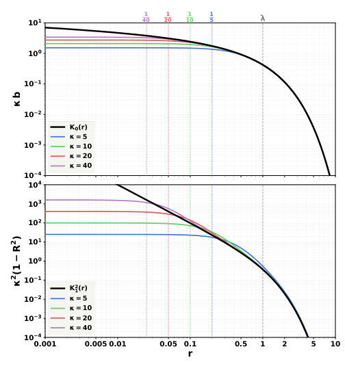
<figcaption class="paper-figure-caption"><b>Fig 2.</b> FIG. 2. Convergence of the outer r &gt; 1/κ GL solutions of the Abrikosov vortex, Eqs.(12), (13), to the exact κ →∞limit, Eqs.(16) and (17), shown as solid black curves.</figcaption>
</figure>

**Summary.** This paper proves that in the limit of extremely high Ginzburg-Landau parameters, the Abrikosov vortex loses its two-scale structure (coherence length and penetration depth) and instead follows a single-scale pattern. By showing that the superconducting density is tied to the velocity field, the author provides an exact analytical solution for the vortex exterior. This challenges the standard assumption of two distinct length scales in extreme type-II superconductors.

**Why it may be interesting.** not directly relevant

Detailed structure

**Main problem.** The paper investigates the structure of the Abrikosov vortex in the extreme type-II limit (where the Ginzburg-Landau parameter kappa approaches infinity) to determine if the conventional two-length-scale picture holds.

**Main result.** The study demonstrates that in the extreme type-II limit, the vortex outer structure is governed by a single length scale (the London penetration depth), as the superconducting density becomes algebraically slaved to the velocity field.

**Method.** The author uses analytical derivation within the Ginzburg-Landau framework, employing an amplitude-phase representation and solving nonlinear differential equations using modified Bessel functions, supplemented by numerical verification.

**Model / system.** The system is an Abrikosov vortex in a type-II superconductor described by the Ginzburg-Landau theory, which is mathematically equivalent to the static limit of the Abelian Higgs model.

**Key observables.** Superfluid velocity field, magnetic induction, superconducting density, and vortex line energy.

**Important parameters / regimes.** Ginzburg-Landau parameter kappa (specifically the limit kappa to infinity), coherence length, and London penetration depth.

**Assumptions / limitations.** The solution is valid for the outer region of the vortex (r > 1/kappa) and assumes the extreme type-II limit where the vortex core shrinks to a point.

**Figures summary.** Figure 2 compares numerical Ginzburg-Landau solutions for various kappa values against the exact analytical Bessel-function profiles for magnetic induction and density deficit, showing uniform convergence.

**Paper structure.** The paper introduces the problem of the extreme type-II limit, defines the Ginzburg-Landau model and the mathematical framework, derives the exact outer solution via a slaving condition, compares the results to the London model and numerical simulations, and discusses the implications of the single-scale structure.

Abstract

We determine the exact outer structure of the Abrikosov vortex in the extreme type-II limit, which occurs when the Ginzburg-Landau parameter $κ$ diverges. In this limit, Ginzburg-Landau theory simplifies, outside a shrinking core, to a closed nonlinear theory for the superfluid velocity subject to an algebraic density constraint. The resulting solution is asymptotically exact everywhere outside the vanishing vortex core, demonstrating that both magnetic field and superconducting density vary on the length scale of the London penetration depth. This establishes that the conventional two-length-scale picture of the vortex does not hold in the $κ\gg 1$ limit.

[↑ back to top](#top)

### [Intrinsic Topological Control of the Orbital Hall Effect in Buckled Dirac Materials](http://arxiv.org/abs/2605.25121v1)

**Authors:** Madiha Zia, Muzamil Shah, Kashif Sabeeh, Gao Xianlong, Reza Asgari  
**Type:** theory · **Category:** other · **PDF:** <https://arxiv.org/pdf/2605.25121v1>  
**Analysis basis:** full PDF text, analyzed in chunks

↔ Scroll figures horizontally

<figure class="paper-figure-card">
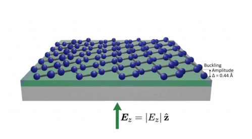
<figcaption class="paper-figure-caption"><b>Fig 1.</b> FIG. 1. A simple schematic showing a single layer of silicene exposed to an out-of-plane electric field.</figcaption>
</figure>
<figure class="paper-figure-card">
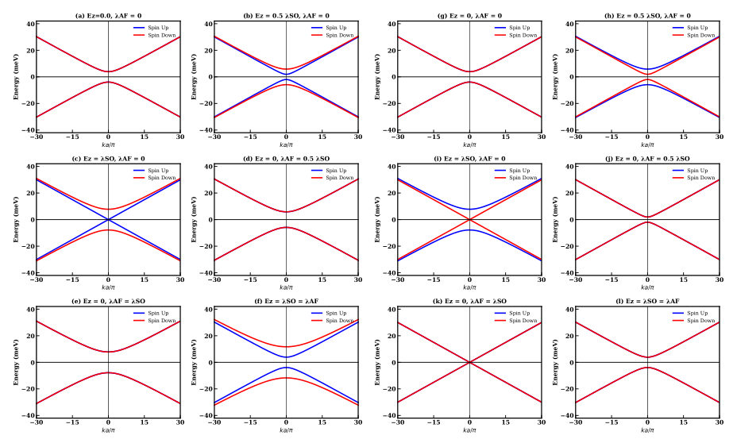
<figcaption class="paper-figure-caption"><b>Fig 2.</b> FIG. 2. Band structures near the K and K′ valleys for distinct topological regimes. (a) K valley SOC-dominated regime supporting the quantum spin Hall phase. (b) Reduced-gap QSH at Ezℓ= 0.5λSO. (c) Critical point at Ezℓ= λSO where the band gap closes. (d) Quantum spin Hall regime with antiferromagnetic exchange. (e) AF insulator obtained by tuning λAF = λSO. (f) Anomalous Hall phase when both Ezℓand λAF are present. (g) K′ valley SOC-dominated regime supporting the quantum spin Hall phase. (h) Reduced-gap QSH at Ezℓ= 0.5λSO. (i) Critical point at Ezℓ= λSO where the band gap closes. (j) Quantum spin Hall regime with antiferromagnetic exchange. (k) Critical point obtained by tuning λAF = λSO....</figcaption>
</figure>
<figure class="paper-figure-card">
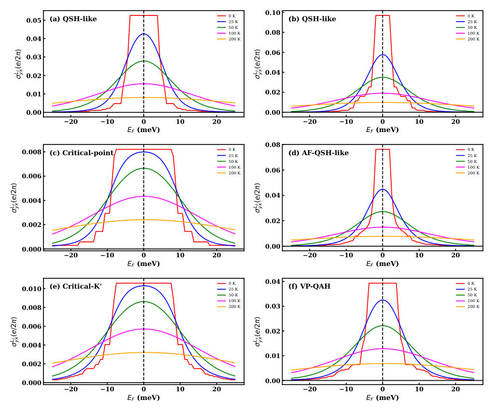
<figcaption class="paper-figure-caption"><b>Fig 3.</b> FIG. 3. Orbital Hall conductivity σLz yx (in units of e/2π) as a function of EF for distinct phases at different temperatures. Notice that we use T = 0, for the case that T →0 around EF = 0. (a) SOC-dominated regime supporting the quantum spin Hall phase. (b) Reduced-gap QSH at Ezℓ= 0.5λSO. (c) Critical point at Ezℓ= λSO. (d) Quantum spin Hall regime with antiferromagnetic exchange. (e) Critical point at λAF = λSO. (f) Valley Polarized Anomalous Hall phase when both Ezℓ and λAF are present.</figcaption>
</figure>
<figure class="paper-figure-card">
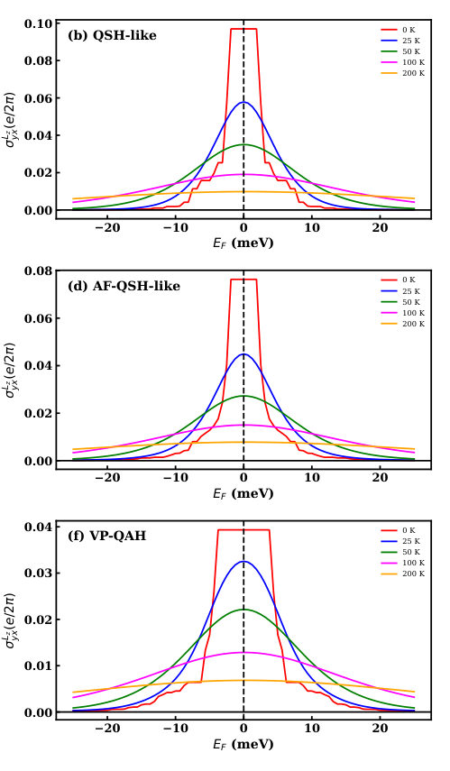
<figcaption class="paper-figure-caption"><b>Fig 4.</b> Figure 5 illustrates the orbital Hall conductivity at zero temperature as a function of the antiferromagnetic exchange coupling λAF and the perpendicular electric field Ez, evaluated at very small Fermi energy. In</figcaption>
</figure>
<figure class="paper-figure-card">
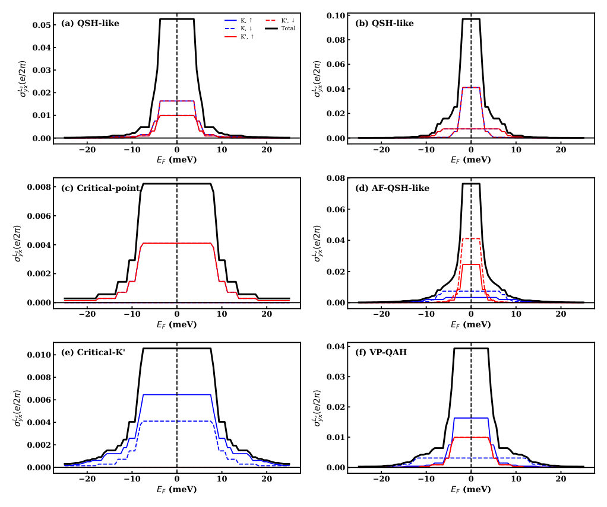
<figcaption class="paper-figure-caption"><b>Fig 5.</b> FIG. 4. Orbital Hall conductivity σLz yx (in units of e/2π) as a function of EF near the K and K′ valleys for distinct topological regimes. (a) SOC-dominated QSH phase. (b) Reduced-gap QSH at Ezℓ= 0.5λSO. (c) Critical point at Ezℓ= λSO. (d) QSH with antiferromagnetic exchange. (e) AF insulator at λAF = λSO. (f) Valley polarized Anomalous Hall phase.</figcaption>
</figure>

**Summary.** This paper demonstrates how the Orbital Hall Effect in buckled 2D Dirac materials can be precisely controlled by tuning external electric and magnetic fields. It shows that topological phase transitions, such as the transition between Quantum Spin Hall and Quantum Anomalous Hall phases, lead to significant enhancements in orbital Hall conductivity. These findings suggest that such materials are highly promising platforms for developing tunable orbitronic devices.

**Why it may be interesting.** not directly relevant

Detailed structure

**Main problem.** Investigating the intrinsic topological control of the Orbital Hall Effect (OHE) in buckled 2D Dirac materials using external electric and magnetic fields.

**Main result.** The orbital Hall conductivity is significantly boosted near band-inversion points and can be tuned across various topological regimes (QSH, QVH, QAH) by adjusting external fields.

**Method.** Berry-curvature-based linear response theory using a low-energy massive Dirac Hamiltonian and Kubo formula calculations.

**Model / system.** Buckled two-dimensional Dirac materials (such as the silicene family) modeled by a low-energy massive Dirac Hamiltonian including intrinsic spin-orbit coupling, a perpendicular electric field, and an antiferromagnetic exchange field.

**Key observables.** Orbital Hall conductivity, Berry curvature, orbital magnetic moment, and orbital angular momentum.

**Important parameters / regimes.** Intrinsic spin-orbit coupling (lambda_SO), perpendicular electric field (Ez), and antiferromagnetic exchange field (lambda_AF).

**Assumptions / limitations.** The system is in the intrinsic (disorder-free) limit, electrons are treated as independent (neglecting electron-electron interactions), and Rashba spin-orbit coupling is neglected.

**Figures summary.** Figure 1 shows a schematic of silicene; Figure 2 illustrates band structures for different topological regimes; Figure 3 shows OHC as a function of Fermi energy and temperature; Figure 5 shows OHC vs. tuning parameters; Figure 6 is a phase diagram heatmap; Figure 7 and 8 show the momentum dependence of Berry curvature and orbital magnetic moment.

**Paper structure.** The paper introduces the physical system and model, develops the theoretical framework for orbital transport, analyzes the redistribution of Berry curvature across different topological phases, examines the impact of temperature, and concludes with a phase diagram of the orbital response.

Abstract

We study the orbital Hall response in buckled two-dimensional Dirac materials using a unified framework that includes an antiferromagnetic exchange field, a perpendicular electric field, and intrinsic spin-orbit coupling. We show that the orbital Hall conductivity is considerably boosted around band-inversion points and shows different signatures across multiple electronic phases using a low-energy massive Dirac model in conjunction with Berry-curvature-based linear response theory. We find a series of quantum spin Hall, valley Hall, and anomalous Hall regimes by methodically adjusting external fields, and demonstrate how the evolution of the orbital response is controlled by the redistribution of Berry curvature between spin and valley sectors. We examine the impacts of finite temperature in more detail and find that although the response s size is suppressed by thermal broadening, the distinctive phase-dependent features remain robust. Our findings demonstrate that orbital Hall conductivity offers a sensitive band topology probe in Dirac systems and emphasize buckled two-dimensional materials as a flexible platform for engineering tunable orbital currents for orbitronic applications.

[↑ back to top](#top)

### [Microfluidic Actuation by Einstein-de Haas Spin Torque](http://arxiv.org/abs/2605.25387v1)

**Authors:** Xin Hu, Mamoru Matsuo  
**Type:** both · **Category:** other · **PDF:** <https://arxiv.org/pdf/2605.25387v1>  
**Analysis basis:** full PDF text, analyzed in chunks

↔ Scroll figures horizontally

<figure class="paper-figure-card">
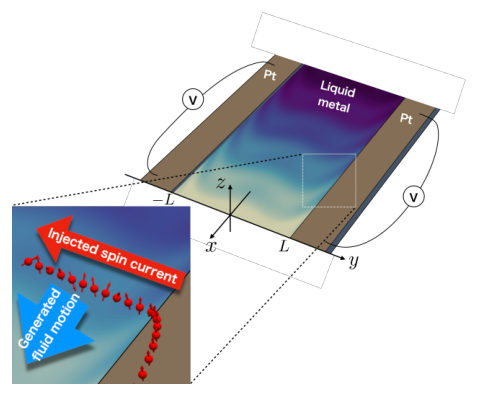
<figcaption class="paper-figure-caption"><b>Fig 1.</b> Figure 1. Schematic of the proposed spin-current actuation geometry. A conducting liquid metal is confined in a channel of width 2L between two Pt electrodes. A charge current in Pt generates, through the spin Hall effect, a z-polarized spin current injected into the liquid metal at y = ±L. The injected spin angular momentum produces an inhomogeneous spin chemical potential and drives liquid-metal motion through the Einstein–de Haas angular-momentum-transfer channel.</figcaption>
</figure>
<figure class="paper-figure-card">
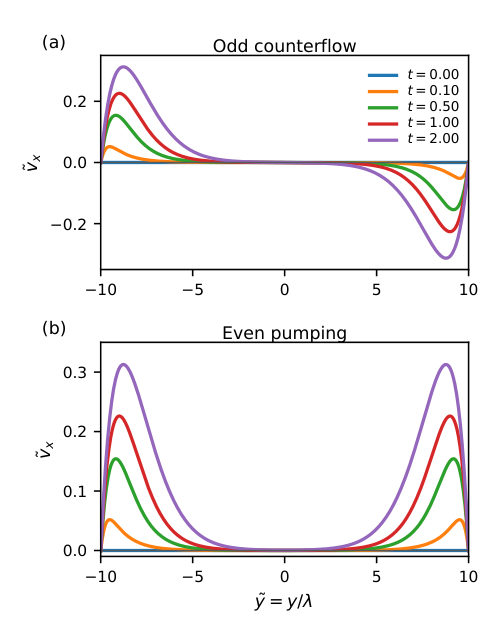
<figcaption class="paper-figure-caption"><b>Fig 2.</b> Figure 2. Time evolution of the dimensionless EdH-driven velocity profile ˜vx = vx/v0 at L/λ = 10 for (a) the odd counterflow and (b) the even pumping channel. The coor- dinate is ˜y = y/λ, and time is measured in units of λ2/ν with ν = (µ + µr)/ρ.</figcaption>
</figure>
<figure class="paper-figure-card">
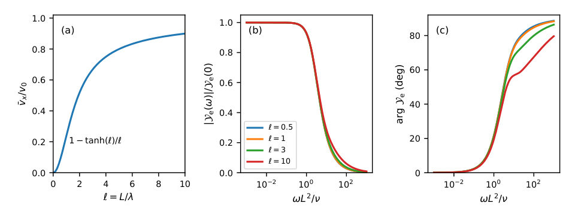
<figcaption class="paper-figure-caption"><b>Fig 3.</b> Figure 3. Spin-mechanical response functions for actuation and parameter extraction. (a) Universal dc pumping response ¯vx/v0 = 1 −tanh(ℓ)/ℓwith ℓ= L/λ. (b) Magnitude and (c) phase of the normalized even-channel admittance Ye(ω)/Ye(0) for L/λ = 0.5, 1, 3, 10. The even channel behaves as a viscous low-pass filter: the liquid follows the spin torque quasistatically for ωL2/ν ≪1, whereas the mean-flow amplitude rolls off and the phase approaches quadrature when viscous momentum diffusion cannot span the channel within one period. Changing the channel width separates the cutoff scale ν/L2 from the spin-to-flow amplitude.</figcaption>
</figure>
<figure class="paper-figure-card">
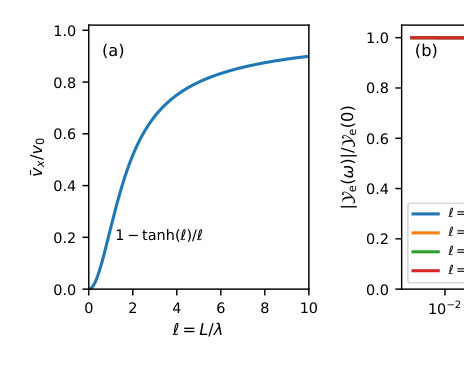
<figcaption class="paper-figure-caption"><b>Fig 4.</b> Figure 3 displays this separation between dc gain and viscous filtering. Panel (a) shows that the dc mean flow is suppressed as ¯vx/v0 ≃(L/λ)2/3 when the channel is narrower than the spin-diffusion length, and approaches ¯vx/v0 ≃1 when L ≫λ. Panels (b) and (c) are the fre- quency response of the same actuator. For ωL2/ν ≪1, viscous momentum diffusion equilibrates the whole chan- nel within each period; the mean velocity follows the in- jected spin current with constant magnitude and nearly zero phase shift. For ωL2/ν ≳1, momentum cannot diffuse across the channel during one cycle; the liquid therefore acts as a mechanical low-pass filter, suppressing the mean flow and driving the phase...</figcaption>
</figure>

**Summary.** This paper proposes a way to move liquid metal in sealed microchannels using spin torque from the Einstein-de Haas effect. It shows that the flow can be controlled by tuning spin-current symmetry and provides a method to use frequency sweeps to measure fluid and spin properties.

**Why it may be interesting.** not directly relevant

Detailed structure

**Main problem.** Developing a method for microfluidic actuation in sealed liquid metals using the Einstein-de Haas effect and characterizing the resulting spin-mechanical response.

**Main result.** The authors establish a universal scaling law for DC velocity profiles based on the ratio of channel width to spin-diffusion length and demonstrate that the system acts as a frequency-dependent low-pass filter.

**Method.** The study uses analytical derivations of micropolar hydrodynamic equations and frequency-domain analysis (admittance spectroscopy) to model both steady-state and AC responses.

**Model / system.** A Pt/liquid-metal/Pt geometry where spin current injected via the Spin Hall Effect transfers angular momentum to a confined, incompressible, micropolar liquid metal.

**Key observables.** DC velocity profiles, net mass flux, orbital angular momentum, and AC spin-mechanical admittance (magnitude and phase).

**Important parameters / regimes.** Spin-diffusion length (lambda), channel width (L), kinematic viscosity (nu), and the dimensionless ratio L/lambda.

**Assumptions / limitations.** Low-Reynolds-number, low-frequency, and incompressible flow; assumes an isotropic liquid and neglects micro-inertia and convective terms in the steady-state limit.

**Figures summary.** Figure 1 shows the device schematic; Figure 2 illustrates the time evolution of velocity profiles for odd and even modes; Figure 3 presents universal scaling of DC response and the frequency-dependent AC admittance and phase.

**Paper structure.** The paper introduces the EdH-driven microfluidic concept, develops the micropolar hydrodynamic model, derives steady-state scaling laws and symmetry-resolved modes, extends the theory to AC admittance spectroscopy, and discusses parameter extraction.

Abstract

We propose spin-current microfluidic actuation of a sealed liquid metal. Spin angular momentum injected from Pt contacts enters the liquid as an Einstein-de Haas torque and is converted through micropolar angular-momentum balance into viscous flow without pressure drive, moving walls, magnetic fields, Lorentz forces, or charge flow through the liquid. The dc velocity obeys universal spin-diffusion scaling, and the finite-frequency spin-mechanical admittance resolves viscous momentum diffusion, spin transport, microrotation relaxation, and interface transparency of the liquid-metal channel.

[↑ back to top](#top)

### [Observation of the Optical Phonons in α-MnTe films](http://arxiv.org/abs/2605.26075v1)

**Authors:** Himanshu Sheokand, Arun K Kumay, Mazharul Islam Mondal, Milo Sprague, Ravinder Sharma, Jayan Thomas, Dariusz Kaczorowski, Andrzej Ptok, Madhab Neupane  
**Type:** both · **Category:** other · **PDF:** <https://arxiv.org/pdf/2605.26075v1>  
**Analysis basis:** full PDF text, analyzed in chunks

↔ Scroll figures horizontally

<figure class="paper-figure-card">
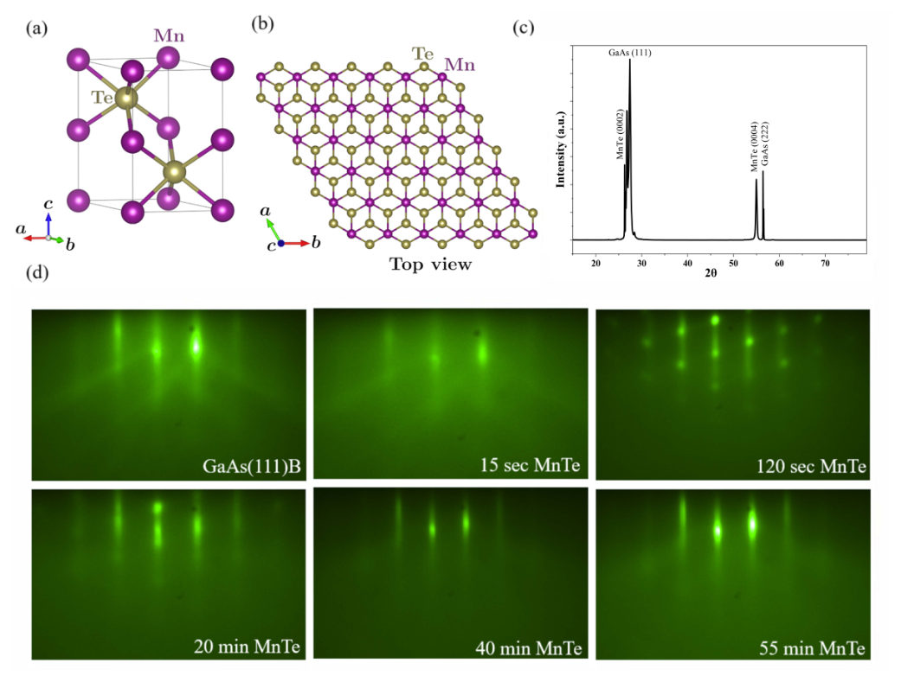
<figcaption class="paper-figure-caption"><b>Fig 1.</b> FIG. 1. (a,b) Crystal structure of hexagonal α-MnTe shown along two different crystallographic directions, illustrating the atomic arrangement and stacking sequence of alternating Mn and Te layers consistent with the NiAs-type structure. (c) X- ray diffraction pattern plotted as intensity versus 2θ scan over the range of 10°–80°, showing the GaAs(111) and GaAs(222) substrate reflections together with the MnTe (0002) and (0004) film peaks. The observation of only (000ℓ) MnTe reflections confirms highly oriented growth with the c-axis of α-MnTe aligned normal to the GaAs(111) substrate surface. (d) RHEED patterns recorded during the growth of epitaxial α-MnTe on GaAs(111)B, illustrating the...</figcaption>
</figure>
<figure class="paper-figure-card">
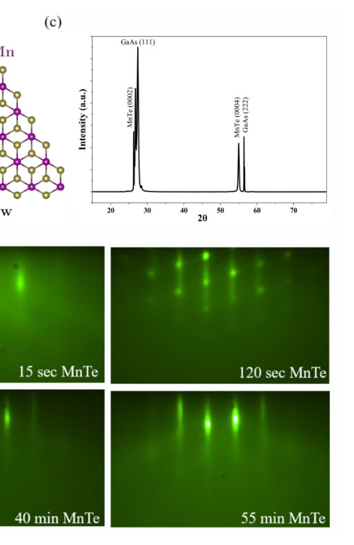
<figcaption class="paper-figure-caption"><b>Fig 2.</b> Fig. 1 summarizes the structural characterization of the epitaxial α-MnTe thin film grown on GaAs(111). Figs. 1(a) and 1(b) shows the crystal structure of hexag- onal α-MnTe, illustrating the atomic arrangement and stacking sequence viewed along two different crystallo- graphic directions. The structure consists of alternating Mn and Te layers arranged in a hexagonal lattice, consis- tent with the NiAs-type structure. Fig. 1(c) presents the XRD pattern plotted as intensity versus 2θ scan collected over the range 10°–80°, confirming the high crystallinity and phase purity of the film. The diffraction pattern exhibits pronounced substrate reflections corresponding to GaAs(111) and GaAs(222),...</figcaption>
</figure>
<figure class="paper-figure-card">
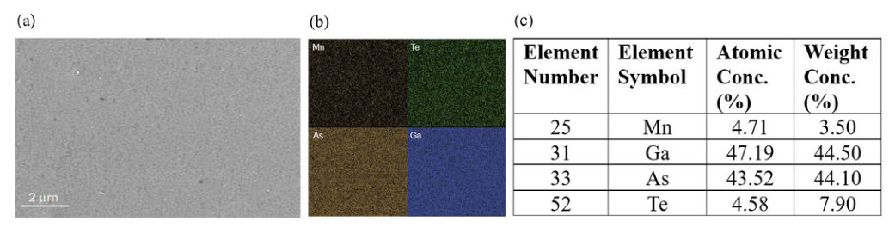
<figcaption class="paper-figure-caption"><b>Fig 3.</b> FIG. 2. Scanning electron microscopy (SEM) and energy-dispersive X-ray spectroscopy (EDX) analysis of α-MnTe/GaAs(111)B. (a) SEM image of a selected region of the 10 µm MnTe film where the EDX spectra were acquired. (b) Elemental maps show uniform Mn and Te distribution along with strong Ga and As signals from the substrate. (c) Quantitative EDX yields a near-ideal stoichiometric Mn:Te ratio (∼1:1).</figcaption>
</figure>
<figure class="paper-figure-card">
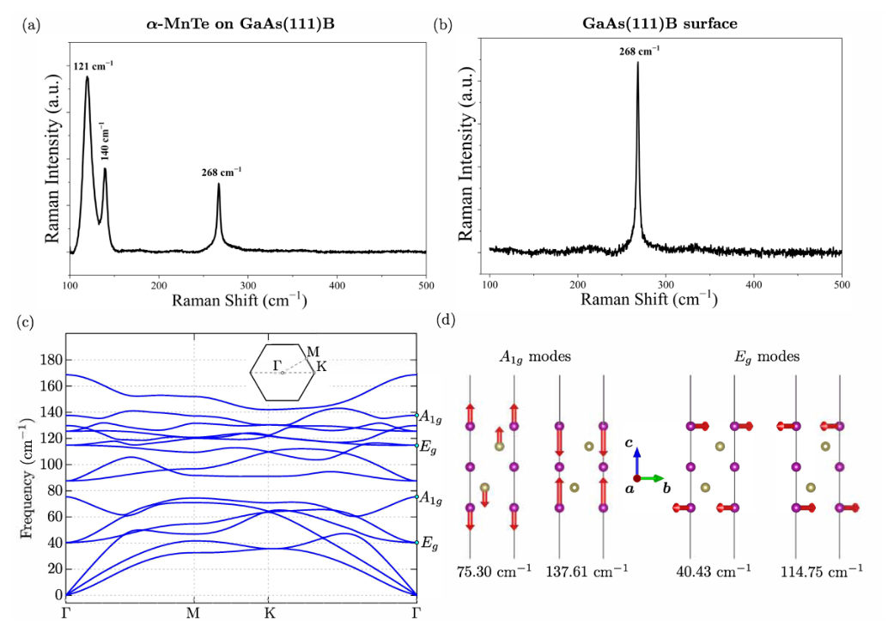
<figcaption class="paper-figure-caption"><b>Fig 4.</b> FIG. 3. (a) Raman spectra of α-MnTe film on GaAs(111)B surface. The results displayed three vibrational modes, from which 121 cm−1 and 140 cm−1 belong to the α-MnTe and the 268 cm−1 peak belongs to the GaAs(111). (b) Raman spectra of bare GaAs(111)B surface. (c) Theoretically obtained phonon dispersion for α-MnTe monolayer. Inset show corresponding two dimensional Brillouin zone with high symmetry points. (d) Displacements given be the four Raman active modes for MnTe monolayer. Raman active modes are also marked by blue points on panel (c).</figcaption>
</figure>
<figure class="paper-figure-card">
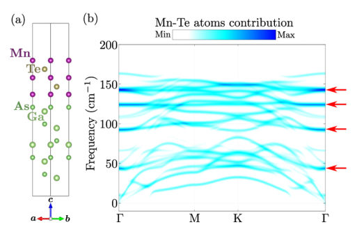
<figcaption class="paper-figure-caption"><b>Fig 5.</b> FIG. 4. (a) Investigated α-MnTe/GaAs(111)B inter- face. α-MnTe monolayer is deposited on GaAs(111)B sufrace. (b) Projection of the phonon dispersion of the α- MnTe/GaAs(111)B interface on the Mn-Te atoms contribu- tion.</figcaption>
</figure>

**Summary.** The researchers successfully grew high-quality alpha-MnTe thin films using molecular beam epitaxy on GaAs substrates. By using Raman spectroscopy and first-principles calculations, they identified the key optical phonon modes, establishing these films as a reliable platform for studying altermagnetism and lattice-coupled excitations.

**Why it may be interesting.** not directly relevant

Detailed structure

**Main problem.** The challenge of achieving controlled epitaxial growth of altermagnetic MnTe thin films on technologically relevant substrates and characterizing their vibrational properties.

**Main result.** Successful MBE growth of high-quality, stoichiometric alpha-MnTe thin films on GaAs(111)B was achieved, with Raman spectroscopy resolving all symmetry-allowed Raman-active phonon modes.

**Method.** Molecular Beam Epitaxy (MBE) for growth, combined with RHEED, XRD, SEM, and EDX for structural characterization, and Raman spectroscopy paired with first-principles phonon calculations for vibrational analysis.

**Model / system.** Epitaxial alpha-MnTe thin films with a hexagonal NiAs-type structure grown on GaAs(111)B substrates.

**Key observables.** Raman-active phonon modes (121 and 140 cm-1), Mn:Te stoichiometry, and crystal orientation/structural integrity.

**Important parameters / regimes.** Substrate temperature of 425 degrees C, Te-rich flux ratio of approximately 1:6, and film thickness of approximately 40 nm.

**Assumptions / limitations.** The monolayer calculation assumes a stable 5-atom unit cell; interface calculations assume a specific 15-atom primitive cell model.

**Figures summary.** Fig 1 shows the MnTe crystal structure, XRD patterns, and RHEED evolution; Fig 2 presents SEM images and EDX elemental maps; Fig 3 displays Raman spectra for films and substrates and theoretical phonon dispersion/displacements; Fig 4 shows the interface model and projected phonon dispersion.

**Paper structure.** The paper introduces the importance of altermagnetic MnTe, details the MBE growth process and structural characterization, presents Raman spectroscopy results and identifies phonon modes via first-principles calculations, and concludes with the implications for altermagnetism research.

Abstract

The altermagnetic materials have emerged as model systems for studying spin split electronic structures, yet controlled epitaxial growth on technologically relevant substrates remains challenging. Among the known candidates, MnTe stands out as a prominent altermagnetic material owing to its layered structure and high Neel temperature. Here, we report the molecular beam epitaxy (MBE) growth of high quality alpha MnTe thin films on GaAs(111)B substrates and provide a comprehensive analysis of the growth evolution and structural properties. Raman spectroscopy reveals multiple vibrational features of alpha MnTe including modes near 121, and 140 1/cm. Combined with first principles phonon calculations, these features are identified as the Raman-active phonons of the hexagonal NiAs type lattice. Our results show that the high crystalline quality of MBE grown alpha MnTe enables the complete experimental resolution of all symmetry allowed Raman active phonon modes, highlighting epitaxial alpha MnTe as a robust thin film platform for investigating altermagnetism and its lattice coupled excitations.

[↑ back to top](#top)

### [Prediction of 1:1 kagome metals with superconductivity and band topology](http://arxiv.org/abs/2605.24822v1)

**Authors:** Na Jiao, Shu-Xiang Qiao, Pan Zhou, Hong-Yan Lu, Ping Zhang  
**Type:** theory · **Category:** strongly correlated electrons · **PDF:** <https://arxiv.org/pdf/2605.24822v1>  
**Analysis basis:** full PDF text, analyzed in chunks

↔ Scroll figures horizontally

<figure class="paper-figure-card">
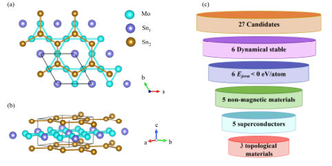
<figcaption class="paper-figure-caption"><b>Fig 1.</b> FIG. 1. Top (a) and side (b) views of the crystal structure of MSn (M=transition metals). (c) Schematic diagram of the screening process of MSn.</figcaption>
</figure>
<figure class="paper-figure-card">
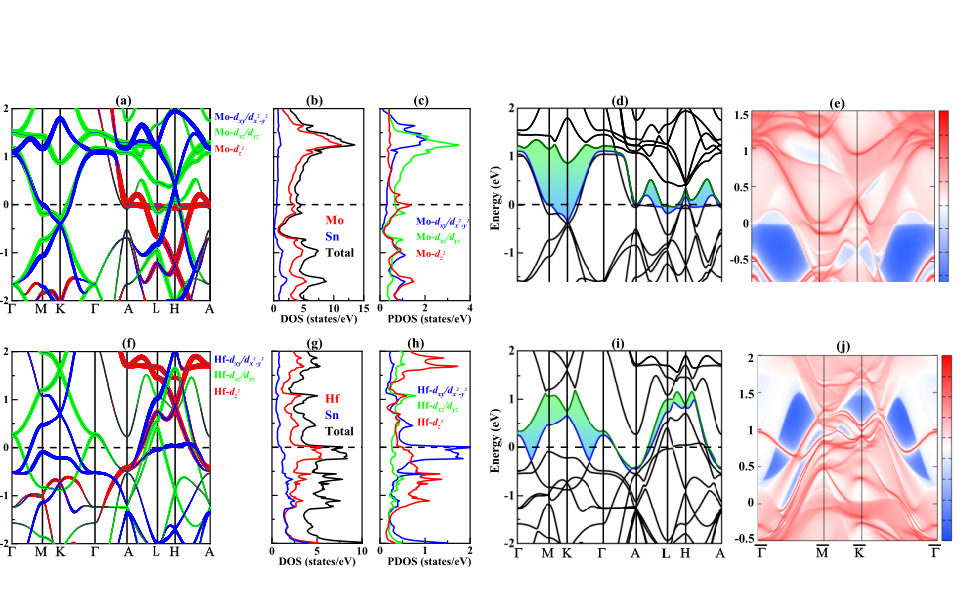
<figcaption class="paper-figure-caption"><b>Fig 2.</b> FIG. 2. (a) Orbital-projected electronic band structure without SOC, (b) total DOS, (c) PDOS, (d) band structure with SOC, and (e) surface states of MoSn. (f) to (j) are similar to (a) to (e), but for HfSn.</figcaption>
</figure>
<figure class="paper-figure-card">
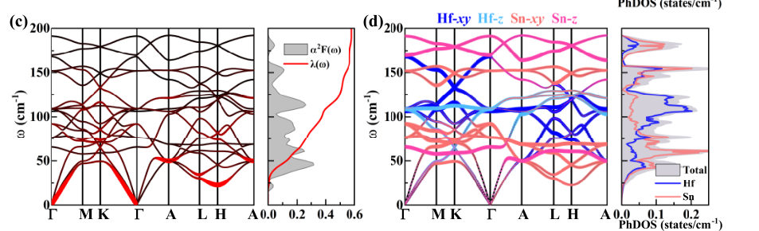
<figcaption class="paper-figure-caption"><b>Fig 3.</b> FIG. 3. (a) Phonon dispersion weighted by the magnitude of λqν (EPC for phonon mode qν), liashberg spectral function α2F(ω), and EPC λ(ω), (b) phonon dispersion weighted by the vibration modes of each atom and PhDOS for VSn. (c) to (d) are similar to (a) to (b), but for HfSn.</figcaption>
</figure>
<figure class="paper-figure-card">
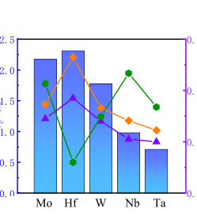
<figcaption class="paper-figure-caption"><b>Fig 4.</b> FIG. 4. Variation of Tc, EPC λ, ωlog, and N(EF ) for super- conducting MSn.</figcaption>
</figure>

**Summary.** The paper theoretically predicts a new family of 1:1 kagome metals that integrate superconductivity and topological order without external doping. By identifying specific stable candidates like MoSn, HfSn, and NbSn, it provides a roadmap for discovering new superconducting topological metals.

**Why it may be interesting.** not directly relevant

Detailed structure

**Main problem.** The lack of 1:1 type kagome materials that exhibit the intrinsic coexistence of superconductivity and nontrivial band topology, as existing candidates like FeSn and CoSn are often suppressed by magnetism.

**Main result.** The identification of a new class of 1:1 kagome metals (MSn, where M = Mo, Hf, Nb, Ta, W, Ti) that are stable and include superconducting topological metals (MoSn, HfSn, and NbSn) with nontrivial Z2 topology.

**Method.** First-principles calculations using Density Functional Theory (DFT) with VASP and Quantum Espresso, including phonon spectra for stability, Wannier90/WannierTools for topological surface states, and the McMillan/Allen-Dynes formula for superconductivity.

**Model / system.** A 1:1 kagome lattice of transition metal (M) and Sn atoms in the P6/mmm space group, specifically focusing on candidates like MoSn, HfSn, and NbSn.

**Key observables.** Superconducting transition temperature (Tc), electron-phonon coupling constant (lambda), Z2 topological invariant, Dirac points, and van Hove singularities.

**Important parameters / regimes.** Predicted Tc range of 0.71 K to 2.31 K; EPC constants (lambda) of 0.49 for MoSn and 0.57 for HfSn; Z2 = 1 for specific candidates.

**Assumptions / limitations.** The superconductivity is assumed to be conventional and phonon-mediated; the stability is assessed via DFT-based phonon and formation energy calculations.

**Figures summary.** Figure 1 shows the crystal structure and the screening flowchart for stable candidates; Figure 2 displays electronic structures, band topology, and orbital-projected DOS for MoSn and HfSn; Figure 3 shows phonon dispersion and the Eliashberg spectral function.

**Paper structure.** The paper begins with a screening of 27 candidates for stability, followed by an analysis of the electronic and topological properties of the stable non-magnetic candidates, and concludes with an investigation of the superconducting mechanism and phonon contributions.

Abstract

Kagome superconductors featuring topologically nontrivial band structures have attracted extensive research interest. FeSn and CoSn is a new kind of kagome material with intrinsic magnetism, which suppresses the emergence of superconductivity. Here, we theoretically predict a new kind of 1:1 kagome MSn (M=transition metal), which exhibit intrinsic superconductivity and nontrivial band topology by first-principles calculations. Among twenty-seven candidates, MSn (M= Mo, Hf, Nb, Ta, W, Ti) are theoretically identified as both dynamically and thermodynamical stable. And, five non-magnetic MSn (M= Mo, Hf, Nb, Ta, W) exhibit phonon-mediated superconductivity. Especially, the d orbitals bands display Dirac points and van Hove singularities near the Fermi level, which contribute to the emergence of topology and the electron-phonon coupling (EPC). More interestingly, MoSn, HfSn and NbSn show nontrivial topological band structure at the Fermi level. Thus, the predicted MSn establish a platform integrating superconductivity and topological order.

[↑ back to top](#top)

### [Proton-electron coupled catalyst for ionomer-free electrochemical energy conversion](http://arxiv.org/abs/2605.24757v1)

**Authors:** Ao Zhang, Ran Wang, Mohammed O. Bazaid, Shiyi Wang, Ting-Jung Hsiao, Yibo Wang, Antonio Sorrentino, Yang Liu, Yu-Han Joseph Tsai, Boxuan Zhou, Bosi Peng, Zeyan Liu, Xiangfeng Duan, Adam Z. Weber, William A. Goddard, Seung Soon Jang, Yu Huang  
**Type:** both · **Category:** other · **PDF:** <https://arxiv.org/pdf/2605.24757v1>  
**Analysis basis:** full PDF text, analyzed in chunks

↔ Scroll figures horizontally

<figure class="paper-figure-card">
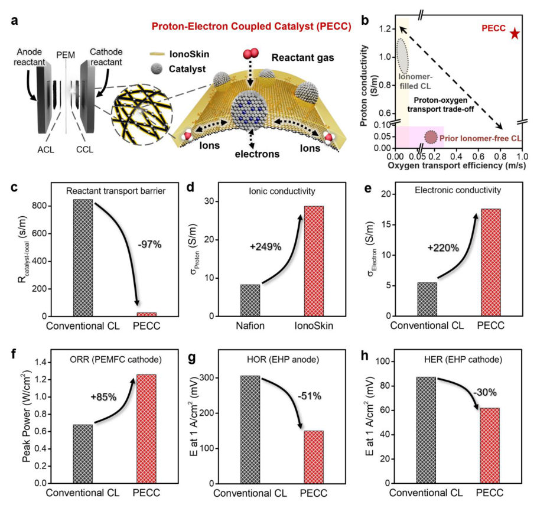
<figcaption class="paper-figure-caption"><b>Fig 1.</b> Fig. 1. | Proton–electron coupled catalyst (PECC) design. a,b, the Design Schematic. The PECC comprises</figcaption>
</figure>
<figure class="paper-figure-card">
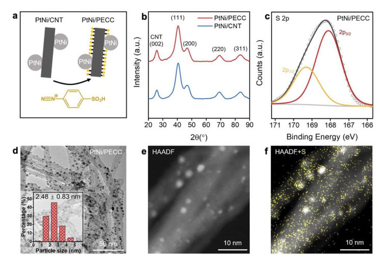
<figcaption class="paper-figure-caption"><b>Fig 2.</b> Fig. 2. | Synthesis and characterization of the PtNi/PECC. a, Schematic illustration of the PtNi/PECC synthesis. b,</figcaption>
</figure>
<figure class="paper-figure-card">
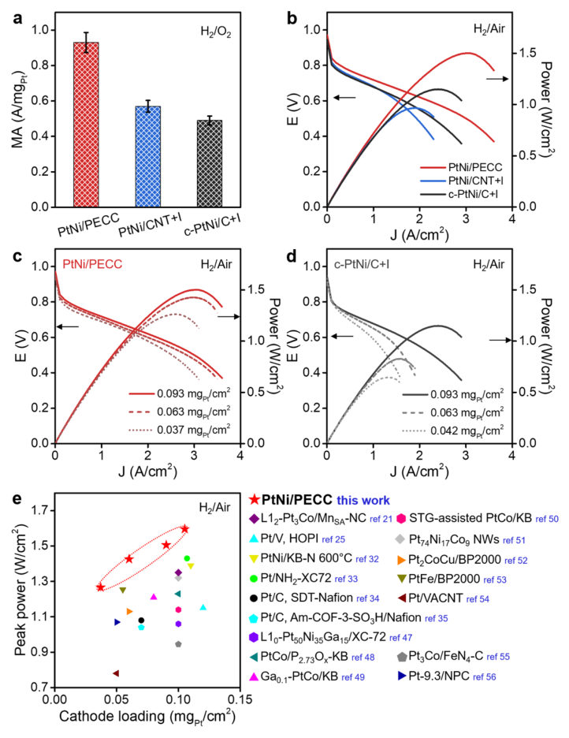
<figcaption class="paper-figure-caption"><b>Fig 3.</b> Fig. 3. | The performance of MEA with PECC CCL (PtNi/PECC) vs. conventional CCLs fabricated with</figcaption>
</figure>
<figure class="paper-figure-card">
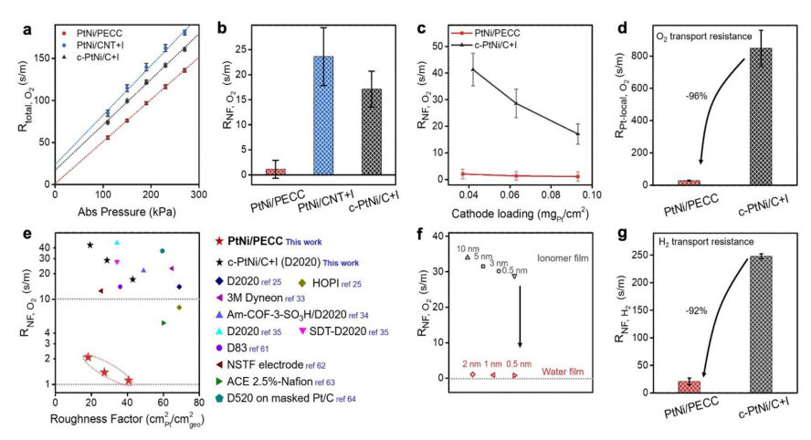
<figcaption class="paper-figure-caption"><b>Fig 4.</b> Fig. 4. | The mass transport in PtNi/PECC, PtNi/CNT+I, and c-PtNi/C+I. a, The total oxygen transport resistance</figcaption>
</figure>
<figure class="paper-figure-card">
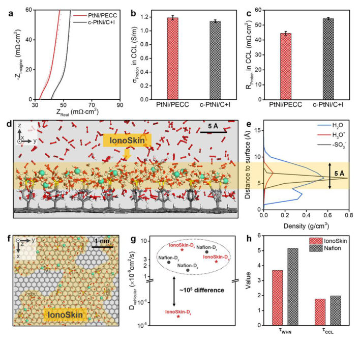
<figcaption class="paper-figure-caption"><b>Fig 5.</b> Fig. 5. | The proton transport in PtNi/PECC. a-c, Proton transport resistance of different CCLs measured by</figcaption>
</figure>

**Summary.** This paper introduces a new 'ionomer-free' catalyst architecture that integrates proton and electron transport within the catalyst itself. By eliminating the ionomer barrier, the design significantly improves oxygen access and power density in fuel cells. This approach offers a path toward much cheaper and more efficient electrochemical energy conversion devices.

**Why it may be interesting.** not directly relevant

Detailed structure

**Main problem.** Conventional PEMFC catalyst layers suffer from a trade-off between ionic conductivity and reactant accessibility due to the ionomer layer blocking oxygen access to the catalyst surface.

**Main result.** The development of a proton-electron coupled catalyst (PECC) architecture enables an ionomer-free cathode, reducing oxygen transport resistance by 95% and boosting power density by up to 85% at low platinum loadings.

**Method.** The study combines experimental synthesis of PtNi-grafted CNTs, electrochemical testing (EIS, polarization curves, AST), and multi-scale modeling including 2D multi-physics MEA models and all-atom molecular dynamics simulations.

**Model / system.** The physical system is a proton-electron coupled catalyst (PECC) consisting of PtNi nanoparticles on chemically functionalized carbon nanotubes (IonoSkin) used in PEMFCs and electrochemical hydrogen pumps.

**Key observables.** Power density, mass activity, proton conductivity, oxygen transport resistance (Fickian and non-Fickian components), and platinum loading.

**Important parameters / regimes.** Platinum loading (0.037 to 0.090 mg/cm2), proton conductivity (S/m), hydration level (lambda ~ 14-15), and oxygen transport resistance.

**Assumptions / limitations.** The model assumes a 2D continuum for the MEA and uses the DREIDNG and F3C force fields for molecular dynamics simulations of the water-hydronium network.

**Figures summary.** Figures likely include TEM/STEM images of catalyst structure, XPS spectra for chemical verification, electrochemical polarization and power density curves, and MD-derived density profiles and diffusivity plots.

**Paper structure.** The paper introduces the PECC design, details the synthesis and characterization of the catalyst, presents electrochemical performance in PEMFCs and EHPs, provides a theoretical framework for transport resistance via multi-physics modeling, and uses MD simulations to explain the proton transport mechanism.

Abstract

Efficient electrochemical energy devices are vital to renewable energy technology, yet coordinating the effective flow of electrons, ions, and chemical species continues to be a major challenge. In conventional proton-exchange membrane fuel cell (PEMFC) catalyst layers, proton and electron transport are supplied separately through percolating carbon networks and ionomer binders, rendering the catalyst largely passive and imposing fundamental trade-offs between reactant accessibility, ionic conductivity, and catalyst activity. Here, we introduce a one-dimensional proton-electron coupled catalyst (PECC) design, a transport-integrated electrocatalyst architecture in which the catalyst itself simultaneously supplies electronic and protonic transport to catalyst active sites. Using this PECC, PEMFCs can have an ionomer-free cathode catalyst layer (CCL), resulting in a dramatic 95% reduction in non-Fickian oxygen transport and boosting power density by 34% and 85% compared to traditional CCLs, with cathode Pt loadings of approximately 0.090 mg/cm^2 and 0.037 mg/cm^2, respectively. Meanwhile, PECC retains 65% of its mass activity and exhibits 32% higher power density than its ionomer-based CCL counterpart after 30k accelerated stressed test. Similar mass transport improvements have been observed in the electrochemical hydrogen pump (EHP) using PECC in the catalyst layers. Molecular dynamics simulations show the PECC's proton conductivity is 249% higher than Nafion. This PECC catalyst structure addresses core transport problems in PEMFCs, leading to almost 20% improvement in fuel efficiency and opens up new possibilities for designing high-performance, cost-effective electrochemical devices.

[↑ back to top](#top)

### [Substitution modulated transition from semimetal to superconductor in ZrTe$_{2-x}$Se$_x$ with coexistence of nontrivial electronic topology](http://arxiv.org/abs/2605.25906v1)

**Authors:** V. M. Fim, C. F. Schuch, L. R. de Faria, F. A. Santos, M. S. da Luz, S. S. Tsirkin, L. T. F. Eleno, A. J. S. Machado  
**Type:** both · **Category:** strongly correlated electrons · **PDF:** <https://arxiv.org/pdf/2605.25906v1>  
**Analysis basis:** full PDF text, analyzed in chunks

↔ Scroll figures horizontally

<figure class="paper-figure-card">
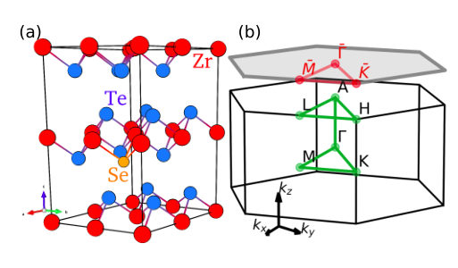
<figcaption class="paper-figure-caption"><b>Fig 1.</b> FIG. 1: (a) Crystal structure of ZrTe2−xSex in the 2×2× 2 supercell employed in DFT calculations, representing the disordered composition x = 0.125; (b) 1st Brillouin Zone of SG 164 with highlighted path (green) used to plot the dispersion curves, and the projected points ¯K ¯ M ¯Γ ¯K (red) in its (001) plane.</figcaption>
</figure>
<figure class="paper-figure-card">
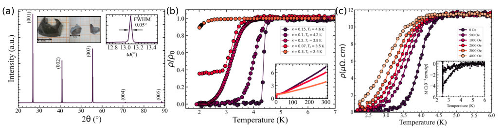
<figcaption class="paper-figure-caption"><b>Fig 2.</b> FIG. 2: (a) X-ray diffraction pattern of ZrTe2−xSex single crystals showing only (00l) reflections, consistent with preferential growth along the c-axis. The inset shows representative ZrTe1.9Se0.1 single crystals obtained by the ICVT method and the rocking curve measured around the (003) reflection, yielding a full width at half maximum (FWHM) of approximately 0.05◦. (b) Temperature dependence of the normalized in-plane resistivity ρ/ρ0 for different Se concentrations in the low-temperature region. The inset shows the normalized resistivity between 300 and 2 K. (c) Resistivity as a function of temperature for ZrTe1.85Se0.15 measured under different applied magnetic fields. The inset shows...</figcaption>
</figure>
<figure class="paper-figure-card">
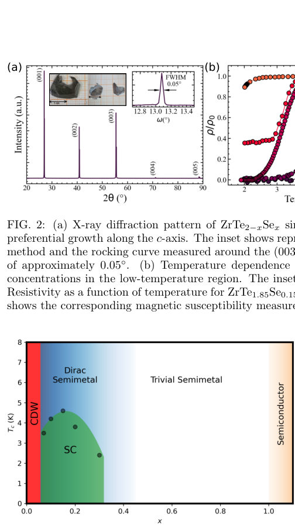
<figcaption class="paper-figure-caption"><b>Fig 3.</b> FIG. 3: Proposed phase diagram of the ZrTe2−xSex sin- gle crystals as a function of temperature and Se content (x), within the range of x = 0 to x = 1. The black points are respective to the experimental data.</figcaption>
</figure>
<figure class="paper-figure-card">
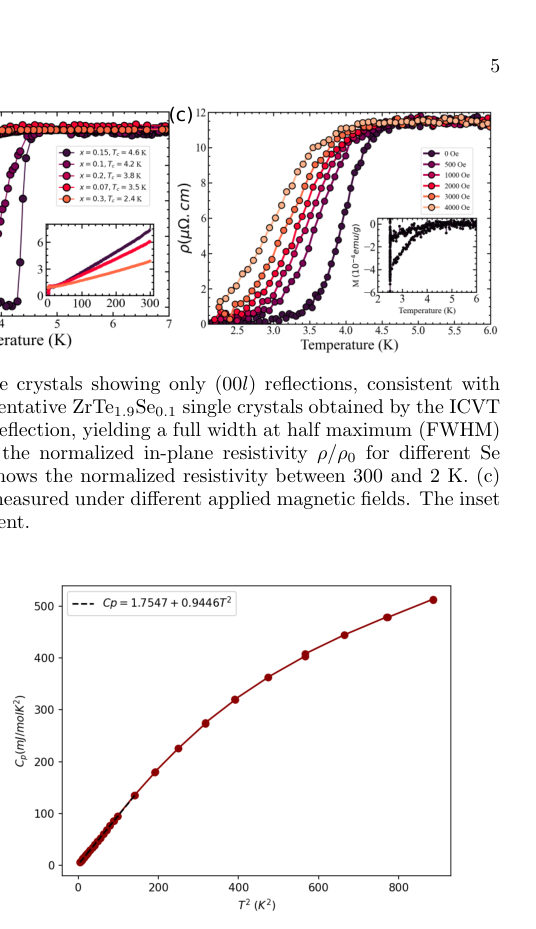
<figcaption class="paper-figure-caption"><b>Fig 4.</b> FIG. 4: Measurement of Cp/T ( J mol K ) as a function of T 2 (K2) in the range of 300-2 K, for the ZrTe1.85Se0.15 single crystal. The fitting of the figure is done in the region of 180-2 K, where the regime can be considered linear.</figcaption>
</figure>
<figure class="paper-figure-card">
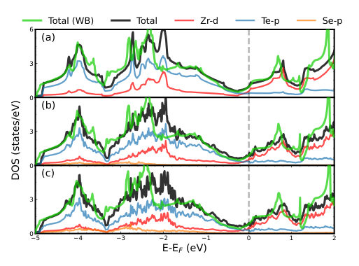
<figcaption class="paper-figure-caption"><b>Fig 5.</b> FIG. 5: Evolution of the electronic density of states of ZrTe2−xSex (normalized per unit cell) projected in the orbitals Se/Te-p and Zr-d for (a) x = 0, (b) x = 0.125 and (c) x = 0.25 supercells. In green, we depict the total DOS obtained with the Hamiltonian interpolation.</figcaption>
</figure>

**Summary.** The study demonstrates that substituting Tellurium with Selenium in ZrTe2 creates a superconducting state that coexists with a Dirac semimetal phase. This discovery identifies ZrTe1.85Se0.15 as a promising platform for realizing topological superconductivity. The research provides a complete phase diagram mapping the transition from semimetal to semiconductor.

**Why it may be interesting.** not directly relevant

Detailed structure

**Main problem.** Investigating the emergence of superconductivity in ZrTe2-xSex crystals via selenium substitution and exploring the coexistence of superconductivity with nontrivial electronic topology.

**Main result.** Selenium substitution induces a superconducting dome with a peak Tc of 4.8 K at x=0.15, where a Dirac semimetal phase and superconductivity coexist, making it a candidate for topological superconductivity.

**Method.** A combination of isothermal chemical vapor transport (ICVT) for crystal growth, transport and calorimetric measurements, and ab initio DFT calculations with Wannier interpolation and BdG Hamiltonian modeling.

**Model / system.** The physical system is the ZrTe2-xSex transition metal dichalcogenide series with a CdI2-type structure. The theoretical framework uses a Wannier-based tight-binding Hamiltonian and a Bogoliubov-de Gennes (BdG) Hamiltonian for slab modeling.

**Key observables.** Critical temperature (Tc), Sommerfeld constant (gamma), Debye temperature (Theta_D), electron-phonon coupling constant (lambda), Z2 topological invariant, and surface state dispersion.

**Important parameters / regimes.** Selenium concentration (x), chemical pressure, spin-orbit coupling (SOC), and the superconducting gap (Delta).

**Assumptions / limitations.** Superconductivity is assumed to be a conventional BCS-like s-wave pairing; supercell calculations neglected certain disorder effects; lattice parameters were interpolated linearly.

**Figures summary.** Fig 1 shows the substitution mechanism; Fig 4 shows specific heat fitting; Fig 5 shows the evolution of the density of states; Fig 12 displays the BdG spectrum, spin texture, and a topological phase diagram.

**Paper structure.** The paper introduces the substitution mechanism, details the experimental synthesis and characterization, presents the electronic and thermodynamic evolution via DFT and calorimetry, and concludes with a topological analysis of the superconducting phase.

Abstract

This study explores the emergence of superconductivity in high-quality ZrTe$_{2-x}$Se$_x$ crystals, grown via the isothermal chemical vapor transport (ICVT) technique. Resistive, structural, and thermal measurements reveal that substituting Te with Se in the ZrTe$_2$ matrix induces a superconducting state at low temperatures. The critical temperature ($T_c$) exhibits a clear dependence on the selenium concentration, peaking at $x=0.15$ with a $T_c$ of $4.8$ K. Calorimetric data indicates that even a low Se substitution range is capable of modifying both the electronic contribution and the vibrational modes of the crystal lattice. Combined with ab initio calculations and Wannier Hamiltonian interpolation between ZrTe$_2$/ZrSe$_2$, we established an extensive phase diagram mapping the transition from charge density wave (CDW) to the state with coexistence between the Dirac semimetal and superconductivity (SC), up to the semiconductor phase. This coexistence suggests that ZrTe$_{1.85}$Se$_{0.15}$ could be a candidate platform for topological superconductivity, as it hosts a nontrivial $\mathbb Z_2$ invariant, with nonvanishing surface states in its $(001)$ planes.

[↑ back to top](#top)

### [Superconductivity and electronic structure evolution in the enforced semimetal Fe-doped ZrTe$_2$](http://arxiv.org/abs/2605.25898v1)

**Authors:** L. M. Ishikura, C. F. Schuch, A. Faé Rabello, F. F. Nogueira, L. E. Corrêa, L. R. de Faria, J. Larrea Jiménez, L. T. F. Eleno, A. J. S. Machado  
**Type:** both · **Category:** strongly correlated electrons · **PDF:** <https://arxiv.org/pdf/2605.25898v1>  
**Analysis basis:** full PDF text, analyzed in chunks

↔ Scroll figures horizontally

<figure class="paper-figure-card">
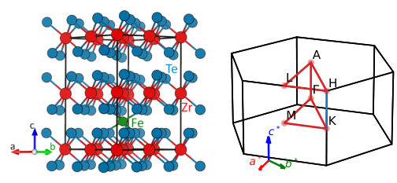
<figcaption class="paper-figure-caption"><b>Fig 1.</b> FIG. 1: (a) Crystal structure of Fe-doped ZrTe2 in the 2 × 2 × 2 supercell employed in DFT calculations, repre- senting the octahedral intercalation site. (b) 1st Brillouin Zone of SG 164 with highlighted path (red) used to plot the dispersion curves, and extra path H−K (blue) where the other band crossing occurs.</figcaption>
</figure>
<figure class="paper-figure-card">
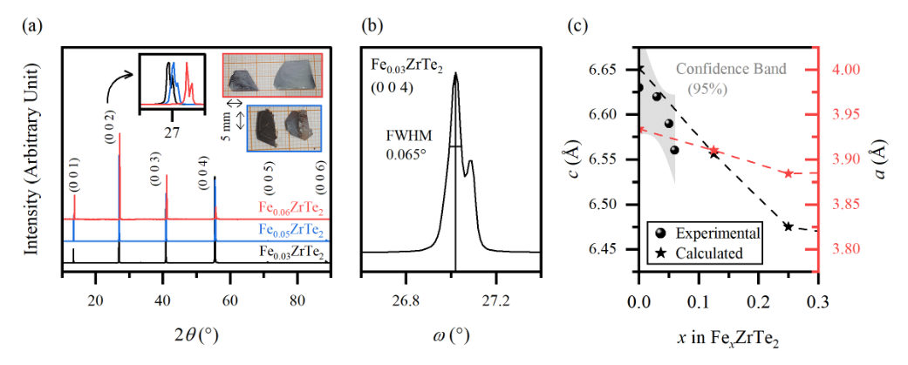
<figcaption class="paper-figure-caption"><b>Fig 2.</b> FIG. 2: (a) θ−2θ XRD diffractogram for FexZrTe2 single crystals (x = 0.03, 0.05, 0.06) revealing only (00ℓ) reflections. The insets show the (002) peak shift between different Fe concentrations and pictures of single crystals grown via ICVT, with dimensions up to ∼10.0 × 10.0 × 0.2 mm3; (b) Rocking curve centered at the (004) peak of a Fe0.03ZrTe2 single crystal, with a FWHM = 0.065°; (c) Experimental and DFT calculated lattice parameters c and a as a function of x in FexZrTe2. Experimental c data was obtained by fitting the (00ℓ) reflections from Fig. 2(a).</figcaption>
</figure>
<figure class="paper-figure-card">
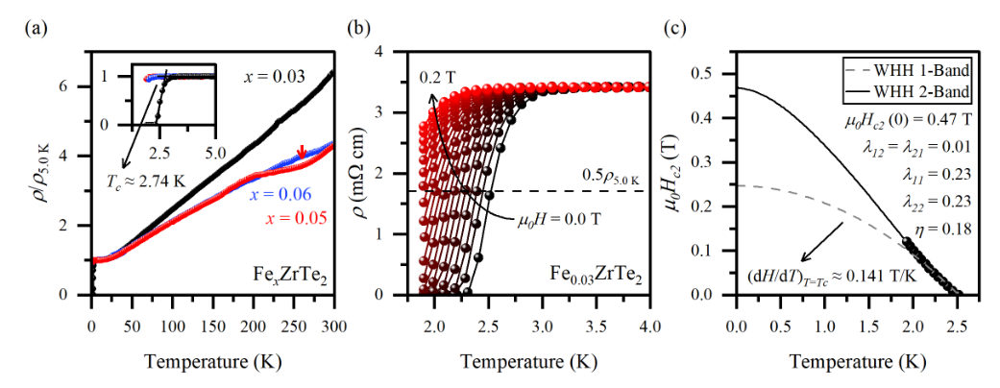
<figcaption class="paper-figure-caption"><b>Fig 3.</b> FIG. 3: (a) Electric resistivity ρ/ρ5.0 K vs. T for FexZrTe2 single crystals (x = 0.03, 0.05, 0.06). The inset shows the low temperature ρ/ρ5.0 K vs. T with Tc = 2.74 K for x = 0.03. Red downward arrow shows the charge density wave transition (TCDW ). (b) Low temperature magnetorresistivity ρ vs. T for Fe0.03ZrTe2 single crystal under magnetic fields up to 0.2 T. (c) Upper critical field Hc2 vs. T fitted to the WHH single band model (dashed line) and two-band model (solid line) for Fe0.03ZrTe2.</figcaption>
</figure>
<figure class="paper-figure-card">
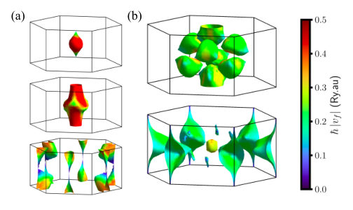
<figcaption class="paper-figure-caption"><b>Fig 4.</b> FIG. 4: The independent sheets of the Fermi surface of (a) pristine ZrTe2 and (b) intercalated FeZrTe2. The color map indicates the Fermi velocity magnitude in nat- ural units (1 Ry.au ≈2.187 × 106 m/s).</figcaption>
</figure>
<figure class="paper-figure-card">
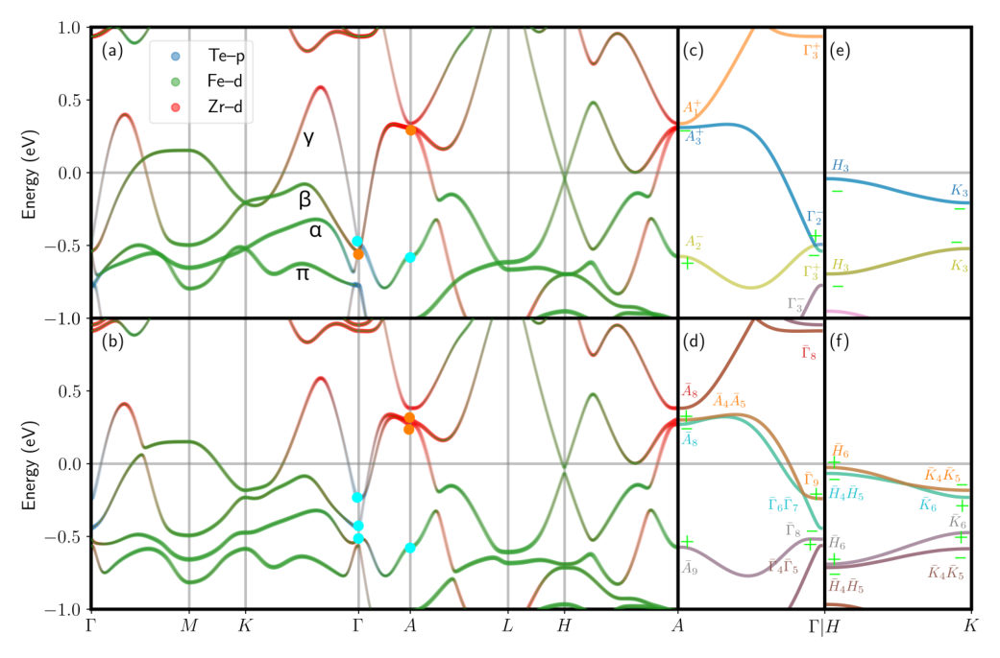
<figcaption class="paper-figure-caption"><b>Fig 5.</b> FIG. 5: Band structure of stoichiometric FeZrTe2. In the first (second) line SOC was not considered (included). (a)-(b) A complete plot of the eletronic dispersion along high-symmetry points of the BZ. (c)-(f) Plots of selected paths where the band crossing occurs, with different colors assigned to each band and their respective irreducible representations. Orange and blue points represent +/−inversion eigenvalues, and green +/−symbols represent the {3± 001|0} eigenvalues.</figcaption>
</figure>

**Summary.** This paper demonstrates that intercalating iron into the semimetal ZrTe2 can trigger superconductivity by creating a van Hove singularity near the Fermi level. It also shows that this doping process suppresses the competing charge density wave state while maintaining the material's topological characteristics.

**Why it may be interesting.** not directly relevant

Detailed structure

**Main problem.** The study investigates how Fe intercalation affects the electronic structure, superconductivity, and charge density wave (CDW) stability in the topological semimetal ZrTe2.

**Main result.** Fe doping induces superconductivity (Tc = 2.74 K) associated with a van Hove singularity near the Fermi level and destabilizes the CDW order, while preserving the enforced semimetal topology.

**Method.** The researchers combined experimental transport measurements (resistivity, magnetoresistance) and X-ray diffraction with ab initio DFT calculations using the Quantum ESPRESSO package and band unfolding techniques.

**Model / system.** The physical system is Fe-intercalated ZrTe2 (Fe_xZrTe2), a layered transition metal dichalcogen_2 where Fe atoms occupy octahedral sites in the van der Waals gap.

**Key observables.** Critical temperature (Tc), CDW transition temperature (T_CDW), upper critical field (Hc2), density of states (DOS), and lattice parameters.

**Important parameters / regimes.** Fe concentration (x = 0 to 0.25), Te-z coordinate, and connectivity value (phi).

**Assumptions / limitations.** DFT calculations used the PBE-GGA functional and neglected spin-orbit coupling in certain structural relaxation steps; supercells were used to model disordered doping.

**Figures summary.** Figure 5 shows band structures with and without SOC; Figure 6 displays unfolded band structures for various doped supercells; Figure 7 presents projected density of states; Figure 8 compares different lattice configurations.

**Paper structure.** The paper introduces the material system, details the experimental synthesis and characterization, presents the computational methodology, discusses the evolution of structural and electronic properties, and concludes with the interplay between superconductivity and CDW.

Abstract

ZrTe$_2$ is an outstanding layered semimetal due to the topologically nontrivial electronic structure. In this work, we present an investigation of the electronic evolution of ZrTe$_2$ in the presence of Fe intercalation, namely Fe$_{x}$ZrTe$_2$ ($x= 0 - 0.25$), scrutinized by both experimental measurements and \textit{ab} initio calculations. While the first reveals a superconducting state with a maximum critical temperature $T_c = 2.74$ K ($x=$ 0.03), the latter indicates that the topological features of the pristine ZrTe$_2$ is sensitive to the distance between Te atoms and Zr layers. Also, the intercalation of Fe does not modify the non-trivial electronic band structure unlike the band crossings are now shifted slightly below $E_{F}$. In particular, a van Hove singularity near the Fermi level for a Fe content of $x=0.125$ is observed in the density of states, indicating that the superconducting order may be associated with features of the unfolded band structure and the concomitant enhancement of the density of states at $E_F$. Finally, our results reveal that the new compound with inclusion of Fe intercalation preserves the enforced semimetal classification.

[↑ back to top](#top)

### [Superconductivity in Al-based high-entropy alloys TiHfNbTaAl and TaNbHfZrAl](http://arxiv.org/abs/2605.25048v1)

**Authors:** Junjin Huang, Wenbo Sun, Longfu Li, Shuangyue Wang, Jingjun Qin, Rui Chen, Zaichen Xiang, Yucheng Li, Lingyong Zeng, Huixia Luo  
**Type:** experiment · **Category:** disordered systems and neural networks · **PDF:** <https://arxiv.org/pdf/2605.25048v1>  
**Analysis basis:** full PDF text, analyzed in chunks

↔ Scroll figures horizontally

<figure class="paper-figure-card">
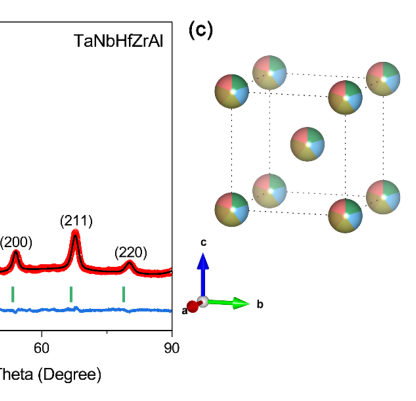
<figcaption class="paper-figure-caption"><b>Fig 1.</b> Figure 1. (a) Rietveld refinement pattern for the TiHfNbTaAl sample. (b) Rietveld refinement</figcaption>
</figure>
<figure class="paper-figure-card">

<figcaption class="paper-figure-caption"><b>Fig 2.</b> Figure 2(a) displays resistivity data of the TiHfNbTaAl and TaNbHfZrAl from 300</figcaption>
</figure>
<figure class="paper-figure-card">
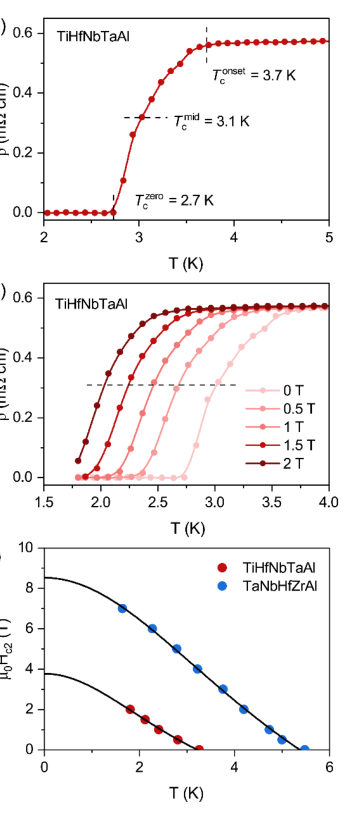
<figcaption class="paper-figure-caption"><b>Fig 3.</b> Figure 2. (a) The temperature dependence of electrical resistivity for the TiHfNbTaAl and</figcaption>
</figure>
<figure class="paper-figure-card">
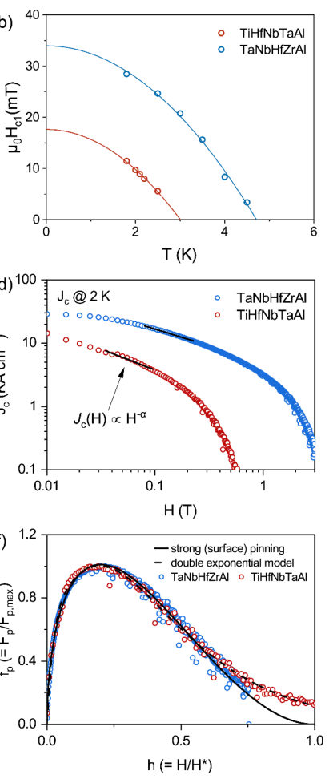
<figcaption class="paper-figure-caption"><b>Fig 4.</b> Figure 3. (a) Temperature-dependent ZFC magnetization of TiHfNbTaAl and TaNbHfZrAl</figcaption>
</figure>
<figure class="paper-figure-card">
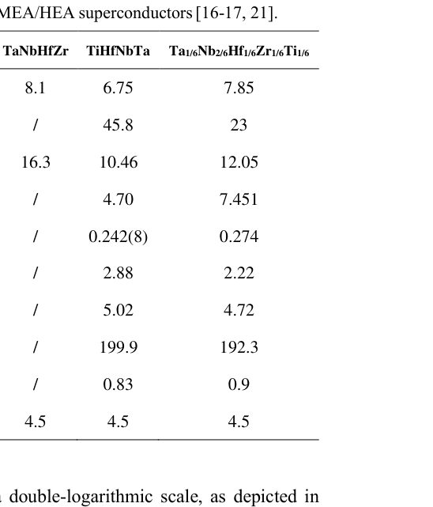
<figcaption class="paper-figure-caption"><b>Fig 5.</b> Figure 3(d), to comprehend the pinning mechanism of the TiHfNbTaAl and TaNbHfZrAl</figcaption>
</figure>

**Summary.** This paper explores how adding Aluminum to high-entropy alloys influences their superconducting properties. It finds that Al-based alloys exhibit type-II superconductivity and that the addition of Al moves the superconducting transition behavior closer to that of crystalline metals rather than amorphous ones.

**Why it may be interesting.** not directly relevant

Detailed structure

**Main problem.** Investigating how Aluminum (Al) doping affects the superconductivity, crystal structure, and valence electron count (VEC) in high-entropy alloys (HEAs).

**Main result.** The Al-based HEAs TaNbHfZrAl and TiHfNbTaAl are bulk type-II superconductors with Tc values of 5.5 K and 3.2 K, respectively, showing that Al incorporation shifts the Tc dependence toward a more crystalline-like behavior.

**Method.** Samples were prepared via arc-melting and characterized using X-ray diffraction, SEM, and EDX, while physical properties were measured using resistivity, magnetic susceptibility, and specific heat measurements via PPMS.

**Model / system.** The physical system consists of two Al-based high-entropy alloys, TaNbHfZrAl and TiHfNbTaAl, which possess a body-centered cubic (BCC) structure and serve as models for materials intermediate between crystalline and amorphous states due to high disorder.

**Key observables.** Critical temperature (Tc), upper critical field (mu0Hc2), magnetic susceptibility, specific heat jump, and critical current density (Jc).

**Important parameters / regimes.** Valence Electron Count (VEC) of 4.2, dirty-limit regime (xi0 < l), and atomic size difference parameter (delta).

**Assumptions / limitations.** The analysis assumes the alloys follow BCS theory for defining the Pauli-limit field and uses the Ginzburg-Landau equation for fitting critical fields.

**Figures summary.** Figure 1 shows Rietveld refinement and the BCC structure; Figure 2 shows temperature-dependent resistivity; Figure 5 illustrates the relationship between Tc and VEC compared to amorphous and crystalline trends.

**Paper structure.** The paper introduces the motivation of HEAs, details the synthesis and structural characterization, presents the superconducting property measurements (resistivity, magnetism, specific heat), analyzes the impact of Al on VEC and Tc, and concludes with the implications for the crystalline-amorphous boundary.

Abstract

Since the first report of a high entropy alloy (HEA) superconductor in 2014, HEAs have continued to captivate the interest of superconducting researchers. Owing to the significant degree of disorder inherent in these systems, they serve as exemplary models for examining the properties of materials that exist in states intermediate between crystalline and amorphous structures. Here we present the superconductivity properties and crystal structure of TaNbHfZrAl and TiHfNbTaAl HEAs, which both have the VEC of 4.2 and body centered cubic (BCC) structure. Through resistivity, magnetic, and specific heat measurements, we prove that both samples are the bulk type-II superconductors with a critical temperature Tc of 5.5 K for TaNbHfZrAl and Tc of 3.2 K for TiHfNbTaAl. The Tc of HEA superconductors is influenced by the VEC and the element composition. And the incorporation of Al in high disorder HEA superconductors causes a more crystallinelike Tc dependence.

[↑ back to top](#top)

### [Superfluid fraction and effective ion mass in the crystalline crust of a neutron star: role of interband response](http://arxiv.org/abs/2605.25600v1)

**Authors:** Nicolas Chamel  
**Type:** theory · **Category:** other · **PDF:** <https://arxiv.org/pdf/2605.25600v1>  
**Analysis basis:** full PDF text, analyzed in chunks

↔ Scroll figures horizontally

<figure class="paper-figure-card">
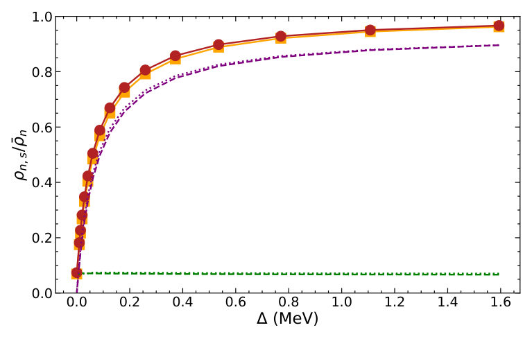
<figcaption class="paper-figure-caption"><b>Fig 1.</b> FIG. 1. Neutron superfluid fraction ρn,s/¯ρn as a function of the pairing gap ∆(in MeV) in the inner</figcaption>
</figure>
<figure class="paper-figure-card">
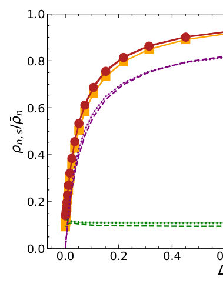
<figcaption class="paper-figure-caption"><b>Fig 2.</b> FIG. 2. Same as Fig. 1 at the average baryon number density ¯n = 0.04 fm−3.</figcaption>
</figure>
<figure class="paper-figure-card">
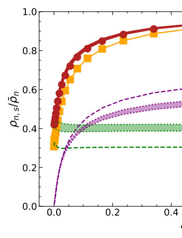
<figcaption class="paper-figure-caption"><b>Fig 3.</b> FIG. 3. Same as Fig. 1 at the average baryon number density ¯n = 0.05 fm−3.</figcaption>
</figure>
<figure class="paper-figure-card">
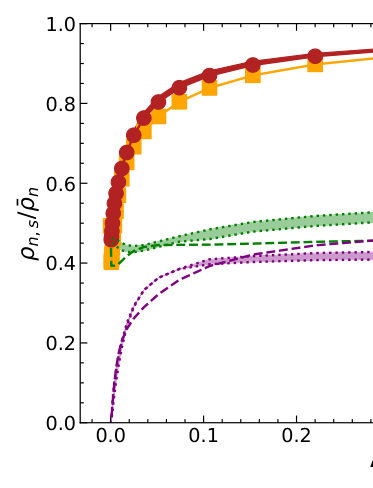
<figcaption class="paper-figure-caption"><b>Fig 4.</b> FIG. 4. Same as Fig. 1 at the average baryon number density ¯n = 0.06 fm−3.</figcaption>
</figure>
<figure class="paper-figure-card">
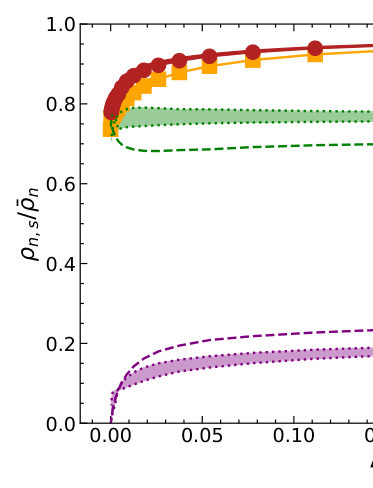
<figcaption class="paper-figure-caption"><b>Fig 5.</b> FIG. 5. Same as Fig. 1 at the average baryon number density ¯n = 0.07 fm−3.</figcaption>
</figure>

**Summary.** This paper demonstrates that neglecting the interband response leads to incorrect predictions of superfluidity in neutron star crusts. By including this response, the author shows that the neutron superfluid fraction is significantly enhanced and provides a consistent microscopic framework for entrainment effects across the crust and core.

**Why it may be interesting.** not directly relevant

Detailed structure

**Main problem.** Investigating the role of interband response in determining the neutron superfluid fraction and the effective mass of ions in the crystalline crust of a neutron star.

**Main result.** The interband response enhances the neutron superfluid fraction, and the effective ion mass remains close to the mass of bound nucleons for realistic pairing gaps, providing a unified description of entrainment in the crust and core.

**Method.** Linear response theory within the self-consistent time-dependent Hartree-Fock-Bogoliubov (TDHFB) framework using Skyrme energy density functionals and the BCS approximation.

**Model / system.** The crystalline inner crust of a neutron star, modeled as a body-centered cubic (BCC) lattice of spherical clusters (ions) immersed in a neutron superfluid.

**Key observables.** Neutron superfluid fraction (rho_n,s/rho_n), effective ion mass (m*_I), effective neutron mass (m*_n), and neutron mass current.

**Important parameters / regimes.** Neutron pairing gap (Delta), baryon density (n_bar), Skyrme coupling coefficients, and the permeability parameter (lambda).

**Assumptions / limitations.** The crust is a perfect BCC crystal; the BCS approximation is used; spin-orbit coupling is neglected; and the superfluid flow is assumed to be stationary.

**Figures summary.** Figures show the neutron superfluid fraction and effective ion mass as functions of the pairing gap and baryon density, including the effects of lattice vibrations.

**Paper structure.** The paper introduces the problem of entrainment discrepancy, develops the TDHFB linear response formalism, performs 3D band-structure calculations, compares results with classical hydrodynamics, and discusses the impact of lattice vibrations and ion permeability.

Abstract

Neutron superfluidity in the inner crust of a neutron star is further investigated, focusing on the role of the interband response in the superfluid fraction and the effective mass of crustal ions induced by their motion through the superfluid. Calculations are performed within the linear response theory of the self-consistent time-dependent Hartree-Fock-Bogoliubov equations with Skyrme nuclear energy density functionals in the Bardeen-Cooper-Schrieffer approximation. The absence of interband response in previous analyses is clarified. The neutron superfluid density is formally shown to be consistent with the entrainment matrix derived earlier in homogeneous neutron-proton superfluid mixture, thus providing a unified description of entrainment effects in the inner crust and outer core of a neutron star within the same microscopic framework. The relative importance of the intraband and interband responses in different regions of the crust is numerically assessed from three-dimensional band-structure calculations, taking into account quantum zero-point motion of ions about their equilibrium position. The neutron superfluid fraction is found to be enhanced by the interband response, resulting in effective ion masses that remain close to the mass of quantum mechanically bound nucleons for realistic neutron pairing gaps. Results are compared to predictions from classical hydrodynamics with different prescriptions for the permeability of ions to superfluidity.

[↑ back to top](#top)

### [Synchronization of Bloch Oscillations in array of parallel Josephson Junctions](http://arxiv.org/abs/2605.24522v1)

**Authors:** R. Shaikhaidarov, R. Hussain, V. N. Antonov, E. Il'ichev  
**Type:** experiment · **Category:** other · **PDF:** <https://arxiv.org/pdf/2605.24522v1>  
**Analysis basis:** full PDF text, analyzed in chunks

↔ Scroll figures horizontally

<figure class="paper-figure-card">
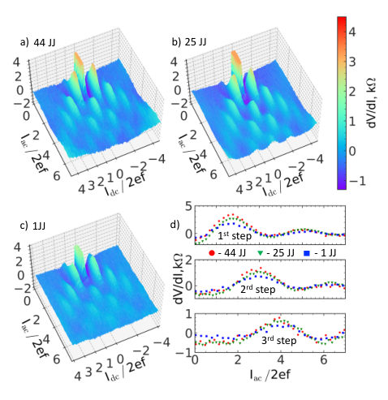
<figcaption class="paper-figure-caption"><b>Fig 1.</b> FIG. 3. The maps of the differential resistance dV/dI in ar- rays of a) 44, b) 25 and c) single parallel junctions. dc and ac currents are normalized by quantized current 2efN and 2ef respectively. The dV/dI is normalized by N; d) the slices of the maps a), b) and c) along Iac axis at the position of quan- tized current with n = 1, 2 and 3. Data for the array with 44, 25, 1 JJs are colored with red, green and blue correspond- ingly.</figcaption>
</figure>
<figure class="paper-figure-card">
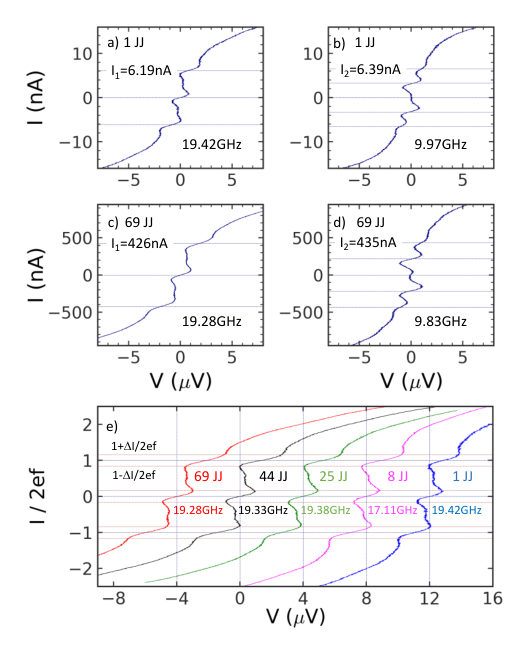
<figcaption class="paper-figure-caption"><b>Fig 2.</b> FIG. 2. Current quantization in a single JJ a) at 19.42 GHz, b) at 9.97 GHz and in parallel array of 69 JJs c) at 19.28GHz, d) 9.83 GHz. Horizontal guidelines correspond to multiple of I = N × 2ef (N = 1 in a), b) N = 69 in c), d)); e) Quantized current steps in parallel arrays of JJs normalized by 2efN. The I −V curves are shifted horizontally by 4 µV for clarity. There are extra horizontal guide lines n ± ∆I/2ef, where ∆I= 1 nA is the deviation of current from the quantized value at the tip of the blockade voltage.</figcaption>
</figure>
<figure class="paper-figure-card">
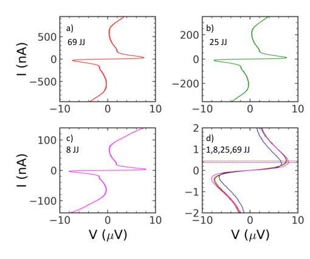
<figcaption class="paper-figure-caption"><b>Fig 3.</b> FIG. 4. I −V curves in the arrays with different number N of JJs a) 69, b) 25, c) 8; d) I −V curves normalized by N. The color scheme corresponds to a), b), c). The reference I −V curve of single JJ is blue. The thermal noise current is shown by the dashed horizontal line of corresponding color. Across all arrays it has value ∆IT = 0.4±0.1 nA. The microwave is switched off.</figcaption>
</figure>

**Summary.** The researchers successfully synchronized 69 parallel Josephson Junctions to produce a larger quantized current of 426 nA. This demonstrates that the current amplitude can be scaled up for metrological purposes without degrading the precision of the quantization, providing a path toward a practical quantum current standard.

**Why it may be interesting.** not directly relevant

Detailed structure

**Main problem.** The challenge of scaling current quantization from single Josephson Junctions to larger, usable amplitudes (mA and above) for a practical quantum current standard without degrading accuracy.

**Main result.** Demonstrated the synchronization of current quantization in an array of up to 69 parallel Josephson Junctions, achieving a quantized current of 426 nA without loss of accuracy or scaling degradation.

**Method.** Experimental measurement of voltage-current (I-V) characteristics and differential resistance maps (dV/dI) using a dilution refrigerator and microwave excitation on TiN-based Josephson Junction arrays.

**Model / system.** An array of parallel, weakly coupled Josephson Junctions operating in the regime of Coherent Quantum Phase Slip (CQPS), where the system follows a Bloch Hamiltonian and utilizes a screening circuit with superinductance.

**Key observables.** Voltage-current (I-V) characteristics, quantized current steps (I_dc,n), and differential resistance maps (dV/dI).

**Important parameters / regimes.** Microwave frequency f = 19.325 GHz, quantized current 426 nA, junction size ~50 x 40 nm^2, and thermal noise current Delta I_T ~ 0.4 nA.

**Assumptions / limitations.** The accuracy of the quantization is limited by thermal fluctuations in the screening circuit resistors, and the system operates in the regime where microwave frequency is much larger than the plasma frequency.

**Figures summary.** Figure 1 shows the JJ array photo, SEM image, and circuit diagram; Figure 3 displays differential resistance maps for different array sizes; Figure 4 shows normalized I-V curves for various array sizes.

**Paper structure.** The paper introduces the metrological need for current standards, describes the CQPS-based JJ array platform and fabrication, presents experimental results on synchronization and scaling, and concludes with an analysis of noise-induced accuracy limitations.

Abstract

We demonstrate the synchronization of current quantization in a parallel array of weakly coupled Josephson Junctions operating in the regime of the coherent quantum phase slip. The first quantized current step on the voltage-current characteristic of 69 parallel Josephson junctions, under microwave excitation at a frequency of f = 19.325 GHz, is observed at 426 nA. Experiments show that accuracy of quantization does not degrade with increasing number of combined Josephson junctions. This demonstration addresses the issue of quantized current amplitude requirements adopted for a practical quantum standard, while leaving the question of accuracy for further research. At present, the quantum current standard of accepted metrological accuracy in the triangle of electrical units is under development. The other two, the Volt and Ohm standards based on the Josephson and Quantum Hall effects, respectively, are already well established in metrology.

[↑ back to top](#top)

### [Termination-Dependent Surface States and Magnetic Fingerprints of Chiral Helimagnet Cr1/3TaS2](http://arxiv.org/abs/2605.24415v1)

**Authors:** Bo Liang, Xue Li, Congcong Le, Zirui Wu, Wenpei Zhu, Neng Cai, Yong-Chang Lau, Xianxin Wu, Jiayu Liu, Zhanfeng Liu, Hongen Zhu, Tongrui Li, Zhicheng Jiang, Yu Huang, Wenchuan Jing, Xun Ma, Qi Jiang, Hang Li, Zhihao Cai, Xuezhi Chen, Gexing Qu, Yiwei Cheng, Bing-Jie Chen, Zhengtai Liu, Dawei Shen, Mao Ye, Shengtao Cui, Zhe Sun, Koji Miyamoto, Taichi Okuda, Kenya Shimada, Yaobo Huang, Zhenhua Chen, Lin Zhao, Baojie Feng, Xinguo Ren, Wenhong Wang, Xingjiang Zhou, Guodong Liu  
**Type:** both · **Category:** strongly correlated electrons · **PDF:** <https://arxiv.org/pdf/2605.24415v1>  
**Analysis basis:** full PDF text, analyzed in chunks

↔ Scroll figures horizontally

<figure class="paper-figure-card">
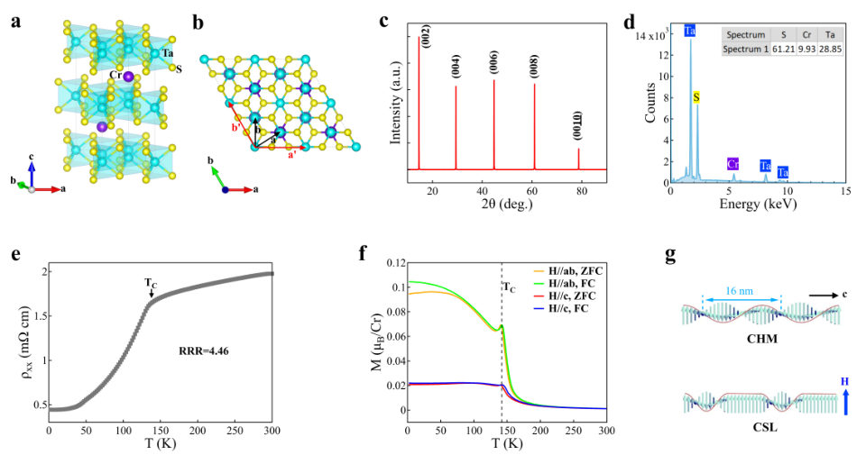
<figcaption class="paper-figure-caption"><b>Fig 1.</b> Figure 1. Crystal structure and magnetic properties of Cr1/3TaS2. (a) Crystal structure of Cr1/3TaS2, where Cr atoms are intercalated between adjacent TaS2 layers. (b) Top view of the Cr1/3TaS2 lattice along the c-axis, illustrating the in-plane ordering of intercalated Cr atoms. (c) X-ray diffraction (XRD) pattern of a high-quality Cr1/3TaS2 sample. (d) EDX spectrum of a Cr1/3TaS2 single crystal, showing characteristic peaks from Ta, S, and Cr. (e) Temperature dependence of the longitudinal resistivity ρxx measured at zero magnetic field, with a residual resistivity ratio (RRR) of 4.46. (f) Temperature-dependent magnetization measured under zero-field-cooling (ZFC) and field-cooling (FC)...</figcaption>
</figure>
<figure class="paper-figure-card">
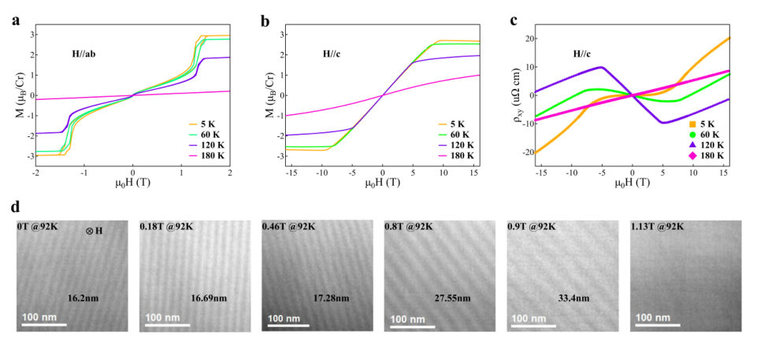
<figcaption class="paper-figure-caption"><b>Fig 2.</b> Figure 2. Field-induced evolution of magnetic properties in Cr1/3TaS2. (a) Magnetic field dependence of the magnetization (M-H) measured with the magnetic field applied within the ab plane (H || ab) at 5, 60, 120, and 180 K. (b) M-H curves measured with the magnetic field applied along the crystallographic c axis (H || c) at the same temperatures in (a). (c) Temperature dependence of the Hall resistivity ρxy as a function of magnetic field (H || c) from 5–180 K for Cr1/3TaS2 single crystal. (d) Lorentz-TEM images acquired at 92 K, showing the continuous evolution of chiral helical magnetic structures under in-plane magnetic field ranging from 0 T to 1.13 T.</figcaption>
</figure>
<figure class="paper-figure-card">
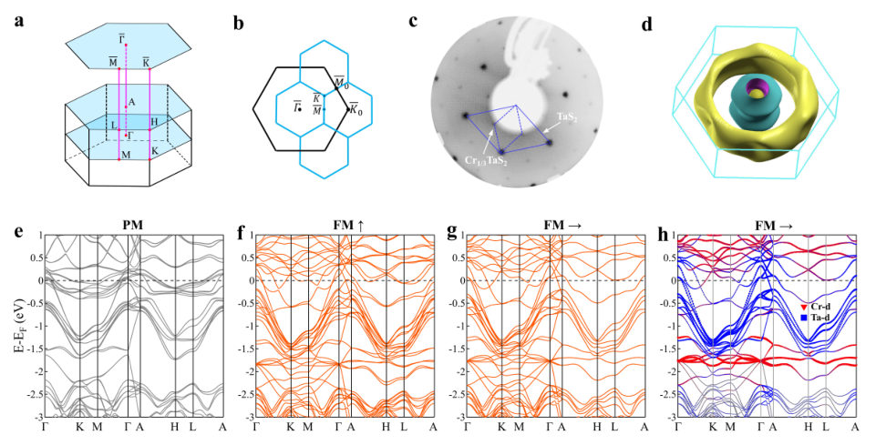
<figcaption class="paper-figure-caption"><b>Fig 3.</b> Figure 3. Bulk electronic structure of Cr1/3TaS2. (a) Schematic plot of the 3D bulk Brillouin zone and its projection onto the (001) surface Brillouin zone. (b) Surface Brillouin zones of the primitive 1 × 1 2H-TaS2 (black hexagon) and the √</figcaption>
</figure>
<figure class="paper-figure-card">
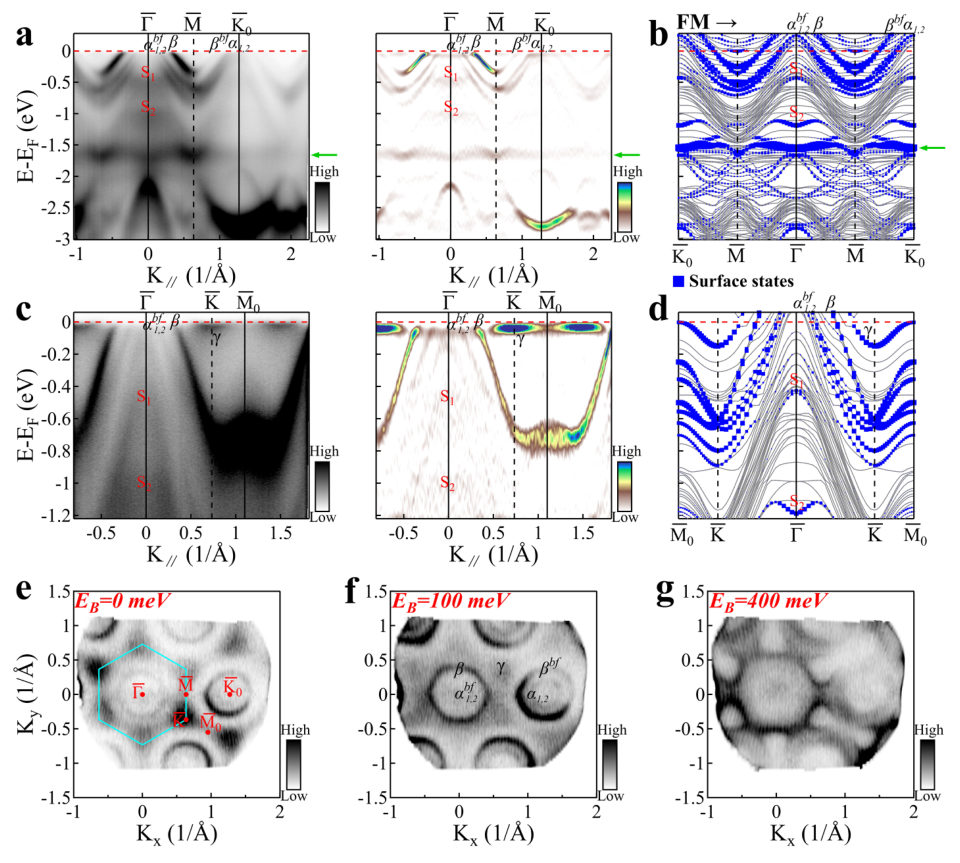
<figcaption class="paper-figure-caption"><b>Fig 4.</b> Figure 4. Electronic structure of the TaS2-terminated surface. (a) (Left to right) ARPES spectra measured along the ¯Γ– ¯ M– ¯K0 high symmetry direction and the corresponding second-derivative image with respect to energy. The data in (a) were measured using synchrotron-based ARPES with a photon energy of 120 eV at 10 K. (b) Calculated surface band structures along the ¯Γ– ¯ M– ¯K0 path for the in-plane FM order, with surface states highlighted by blue squares. The flat-band position is indicated by the green arrows in (a,b). (c) (Left to right) ARPES spectra along the ¯Γ– ¯K– ¯ M0 high symmetry direction and the corresponding second- derivative image with respect to energy. (d) Calculated...</figcaption>
</figure>
<figure class="paper-figure-card">
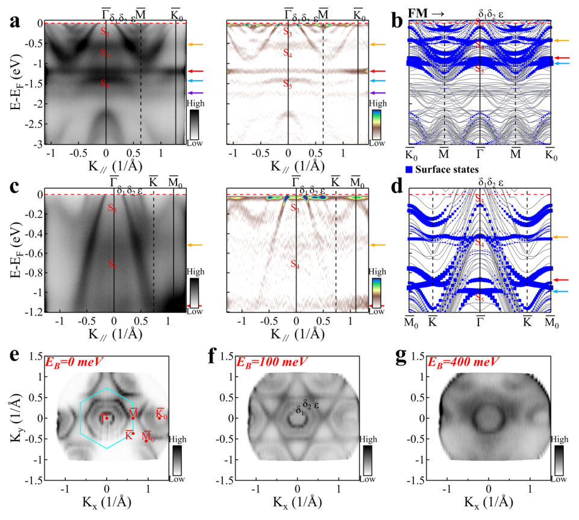
<figcaption class="paper-figure-caption"><b>Fig 5.</b> Figure 5. Electronic structure of the Cr-terminated surface. (a) (Left to right) ARPES spectra measured along the ¯Γ– ¯ M– ¯K0 high symmetry direction and the corresponding second-derivative image with respect to energy. Four distinct flat-band features are observed and highlighted by arrows in orange, red, blue, and purple, respectively. (b) Calculated surface band structures along the ¯Γ– ¯ M– ¯K0 path for the in-plane FM order, with surface states highlighted by blue squares. (c) (Left to right) ARPES spectra measured along the ¯Γ– ¯K– ¯ M0 high symmetry direction and the corresponding second-derivative image with respect to energy. (d) Calculated surface band structures along the ¯Γ–...</figcaption>
</figure>

**Summary.** This paper provides the first systematic investigation of how surface termination affects the electronic and magnetic properties of the chiral helimagnet Cr1/3TaS2. By using micro-ARPES, the authors show that the Cr-terminated surface provides a direct spectroscopic fingerprint of the chiral magnetic order through temperature-dependent band splitting. These findings are crucial for designing future chiral spintronic and valleytronic devices.

**Why it may be interesting.** not directly relevant

Detailed structure

**Main problem.** The study aims to resolve the lack of microscopic understanding regarding how surface termination and temperature-driven magnetic evolution affect the electronic structures in the chiral helimagnet Cr1/3TaS2.

**Main result.** The researchers discovered that the Cr-terminated surface exhibits pronounced magnetic band splitting that tracks the chiral helimagnetic order parameter, while the TaS2-terminated surface shows different electronic features like a triangular electron pocket.

**Method.** The study combines high-resolution micro-focused ARPES with surface-state-resolved first-principles DFT calculations and various magnetic characterization techniques like Lorentz-TEM and magnetometry.

**Model / system.** The physical system is Cr1/3TaS2, a chiral helimagnet based on intercalated transition-metal dichalcogenides featuring a sqrt3xsqrt3 superlattice and nano-scale spin textures.

**Key observables.** Surface electronic states, magnetic band splitting, temperature-dependent magnetization (M-T), and Cr-d-derived surface flat bands.

**Important parameters / regimes.** Magnetic transition temperature (TC ~ 142 K), surface termination (TaS2 vs Cr), and in-plane magnetic field strength.

**Assumptions / limitations.** The theoretical modeling uses an effective ferromagnetic approximation rather than the full chiral helimagnetic state due to supercell size constraints.

**Figures summary.** Figure 1 shows crystal structure and magnetic properties; Figure 2 shows field-dependent magnetization and Lorentz-TEM images; Figure 3 shows Brillouin zone and calculated band structures; Figures 6 and 7 demonstrate the temperature evolution of electronic bands and magnetic splitting on different surface terminations.

**Paper structure.** The paper begins with structural and magnetic characterization, moves to the investigation of bulk and surface electronic structures using ARPES and DFT, explores the temperature-dependent evolution of these states across the magnetic transition, and concludes with the implications for spintronic applications.

Abstract

Chiral helimagnets based on intercalated transition-metal dichalcogenides, characterized by nano-scale spin ordering, provide a powerful route to engineer chiral spin textures (e.g. the topologically protected magnetic solitons) and emergent electronic functionality at reduced dimensions, where surface and interface states often dominate device operation. However, despite growing interest, direct experimental studies of termination-dependent surface electronic structures and their temperature-driven magnetic evolution remain largely unexplored, hindering a microscopic understanding of the electronic states that is crucial for the development of low-dimensional spintronic devices. Here, for the first time, taking Cr1/3TaS2 as a representative example, we systematically investigate the termination-dependent surface electronic states of the chiral helimagnets and uncover their distinct temperature evolution across the magnetic transition (TC~142K) by combining high-resolution ARPES with a micro-focused beam and surface-state-resolved first-principles calculations. The TaS2-terminated surface hosts folded monolayer-like TaS2 bands under the $\sqrt3\times\sqrt3$ superlattice potential and a shallow triangular electron pocket at the superlattice $\bar K$ point arising from Cr-Ta orbital hybridization. In contrast, the Cr-terminated surface exhibits reconstructed hole pockets with pronounced magnetic band splitting. This splitting disappears above TC and closely follows the chiral helimagnetic order parameter, providing a direct spectroscopic fingerprint of chiral helimagnetic order. In addition, multiple ultranarrow Cr-d-derived surface flat bands are resolved. These findings establish Cr1/3TaS2 as a model system in which surface electronic states are strongly coupled to chiral magnetism, opening new opportunities for chiral spintronic and valleytronic micro/nanodevices.

[↑ back to top](#top)

### [The structure of a melt: The case of liquid bismuth](http://arxiv.org/abs/2605.24234v1)

**Authors:** Flor B. Quiroga, Isaías Rodríguez, David Hinojosa, Alexander Valladares, Renela M. Valladares, Ariel A. Valladares  
**Type:** theory · **Category:** disordered systems and neural networks · **PDF:** <https://arxiv.org/pdf/2605.24234v1>  
**Analysis basis:** full PDF text, analyzed in chunks

↔ Scroll figures horizontally

<figure class="paper-figure-card">
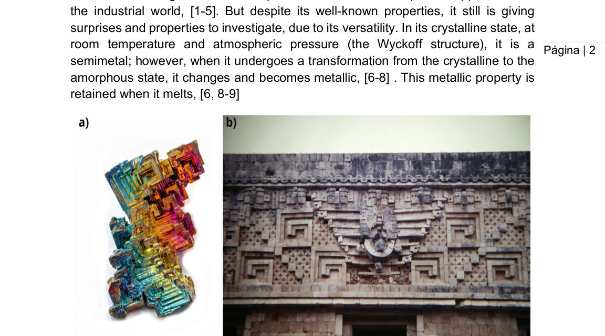
<figcaption class="paper-figure-caption"><b>Fig 1.</b> Figure 1. Comparison of complex crystalline and cultural structures. a) Bi crystal showing the colorful pattern and the geometrical hauts-reliefs of the mineral. b) Detail of the “Casa del Gobernador” façade in Uxmal, Yucatán, Mexico showing the hauts-reliefs. (Original image by Gary Todd, via Wikimedia Commons).</figcaption>
</figure>
<figure class="paper-figure-card">
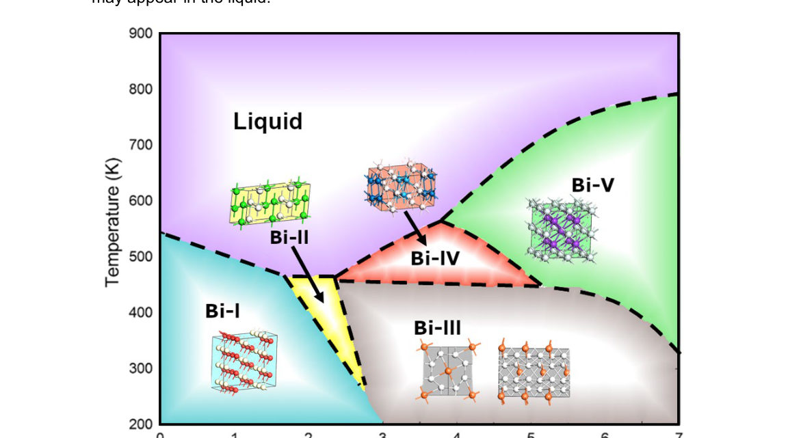
<figcaption class="paper-figure-caption"><b>Fig 2.</b> Figure 2. Phases of solid bismuth with the corresponding crystal structures. The insets are the crystalline structures observed. For a description of the phases see text. This diagram is a modification of the one in Ref [28].</figcaption>
</figure>
<figure class="paper-figure-card">
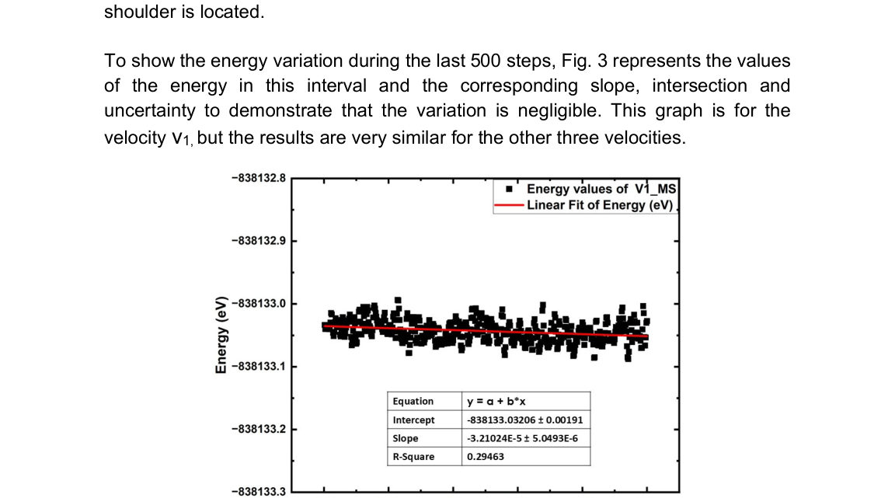
<figcaption class="paper-figure-caption"><b>Fig 3.</b> Figure 3. Energy variation in electron-volts during the last 500 steps of the simulation. It can be seen that the slope of the line is -3.2 x 10-5, eV/step, with an uncertainty of 5 x 10-6 eV/step. The variation is negligible.</figcaption>
</figure>
<figure class="paper-figure-card">
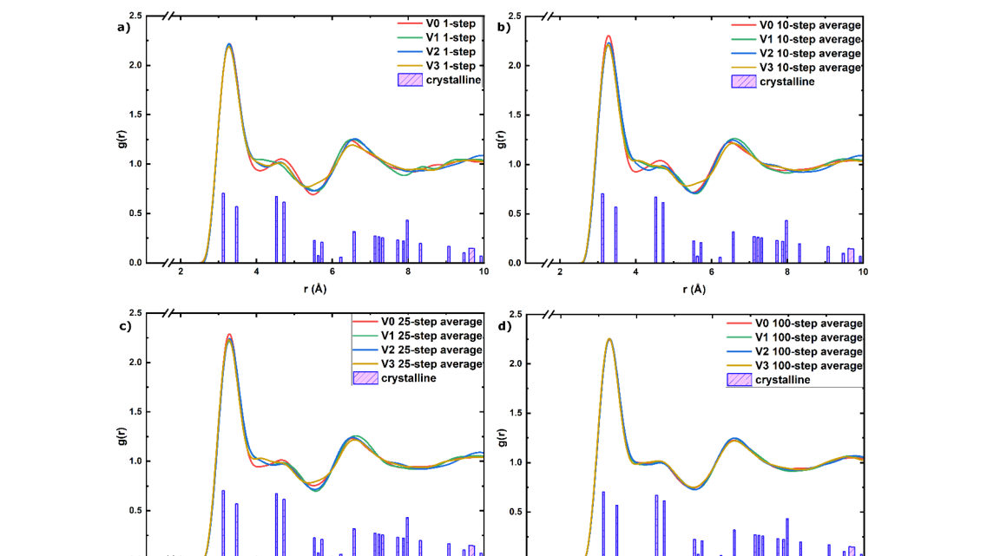
<figcaption class="paper-figure-caption"><b>Fig 4.</b> Figure 4. Comparison of the PDFs generated by MS with four different initial random velocities, showing a) the last step, b) the average of the last 10 steps, c) the average of the last 25 steps, and d) the average of the last 100 steps. In figure 4d) the PDFs are indistinguishable.</figcaption>
</figure>
<figure class="paper-figure-card">
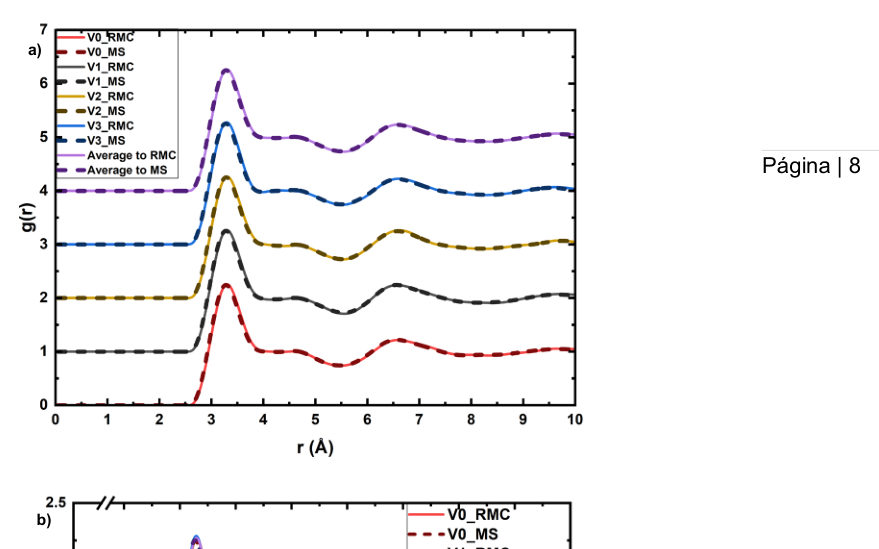
<figcaption class="paper-figure-caption"><b>Fig 5.</b> Figure 5 Comparison between the averages of the PDFs obtained from MS for 4 different velocities (dashed curves) and those from RMC. a) The averages of RMC and MS are also included. The curves are displaced vertically for a better appreciation; b) Curves superimposed; the similarity is evident.</figcaption>
</figure>

**Summary.** This paper uses ab initio molecular dynamics and reverse Monte Carlo simulations to resolve a debate regarding the structural features of liquid bismuth. It identifies that the characteristic 'shoulder' in the pair distribution function is a real physical feature arising from deformed triangular and square atomic arrangements. The study provides a highly detailed geometric map of the liquid phase at 573 K.

**Why it may be interesting.** not directly relevant

Detailed structure

**Main problem.** The study investigates the precise atomic structure of liquid bismuth at 573 K, specifically addressing whether the observed 'shoulder' in the Pair Distribution Function (PDF) is a physical structural feature or an experimental artifact.

**Main result.** The researchers conclude that the shoulder is a real physical property caused by the presence of deformed triangular and square atomic motifs. They also demonstrate that the liquid structure is statistically stable and that RMC-generated structures accurately represent the MD-simulated liquid.

**Method.** Ab initio Molecular Dynamics (MD) using Density Functional Theory (DFT) with the LDA-VWN functional, combined with Reverse Monte Carlo (RMC) simulations to generate representative atomic supercells.

**Model / system.** The physical system is liquid bismuth (Bi) at 573 K, modeled using supercells of 216 atoms transitioning from a crystalline Wyckoff structure to a metallic liquid state.

**Key observables.** Pair Distribution Functions (PDFs), Plane Angle Distributions (PADs), and Radial Distribution Functions (J(r)).

**Important parameters / regimes.** Temperature of 573 K, 216-atom supercells, LDA-VWN exchange-correlation functional, and a bond length threshold of 4.185 A.

**Assumptions / limitations.** The use of the LDA-VWN functional and semi-core pseudopotentials as an approximation for the electronic structure; the assumption that the averaged MD steps represent a stable liquid state.

**Figures summary.** Figure 1 compares Bi crystal patterns to geometric reliefs; Figure 2 shows the Bi phase diagram; Figure 3 shows energy stability; Figure 4 shows PDF convergence; Figure 5 compares MS and RMC PDFs; Figure 6 compares results to experimental data; Figures 7 and 8 show convergence of J(r) and PDFs; Figure 9 shows PAD peaks.

**Paper structure.** The paper introduces the structural problem of liquid Bi, describes the MD and RMC methodology, presents the convergence of the liquid state, analyzes the PDF and PAD features to identify geometric motifs, and concludes by comparing findings with experimental literature.

Abstract

Molecular Dynamics (MD) is performed on supercells of 216 atoms of bismuth, going from 300 K to 573 K in 100 steps and maintaining it in the liquid state, at 573 K, during 500 steps using the Materials Studio (MS) suite of codes. The Pair Distribution Functions (PDFs) and the Plane Angle Distributions (PADs) of the last 1, 10, 25 and 100 steps of the MD have been obtained. Averaging the last 100 steps, as representative of the liquid, Reverse Monte Carlo (RMC) was applied to obtain 4 atomic structures, one for each set of initial random velocities. Then, a detailed structural study of liquid bismuth at 573 K was undertaken; PDFs and PADs are calculated and reported. Two noticeable peaks appear for the PDFs, at 3.25 and 6.55 Å, along with a pseudo peak (shoulder) at 4.6 Å. This shoulder (after the first peak) of the PDFs is found to be related to the third and fourth neighbor peaks of the crystalline Wyckoff structure and also to the diagonal distances in deformed squares in the liquid structure. For completeness J(r)s are also reported. Two prominent peaks in the MS PADs are observed: 53° and 85°; and two for the RMC PADs: 58° and 90°, suggesting the existence of deformed triangles and squares. Less abundant are higher-order geometrical structures.

[↑ back to top](#top)

