
# arxiv digest (quant-ph + cond-mat) — 2026-05-27

*122 papers · 35 relevant · 1 highlighted*

## 🔥 Most relevant (35)

*Every paper with at least one nonzero topic score, sorted by best-matching score. 🔥 marks scores ≥4/5. Click the title to jump to the full entry below; click [arXiv] to open the paper page. `(secondary)` marks papers from de-prioritized cond-mat archives.*

Show 35 relevant papers

- [Quantum fluctuations and chaos in fully connected spin models](#paper-2605.27199) [[arXiv]](http://arxiv.org/abs/2605.27199v1) — 🔥 `Keldysh / 2PI / non-Gaussian methods` **5/5** · 🔥 `methods for driven-dissipative` **4/5** · 🔥 `non-equilibrium dynamics` **4/5** · `Tavis-Cummings & cavity-many-emitter` **3/5** · `correlated cavity matter` **3/5** · `exotic spin models in light-matter` **3/5** · `Dicke superradiance` **2/5** · `analog quantum simulation` **2/5** · `correlated / nonlocal dissipation` **2/5** · `driven-dissipative phase transition` **2/5** · `entanglement & information structure` **2/5** · `non-equilibrium universality` **2/5** · `scars & prethermalization` **2/5**
- [Postselection-free ballistic-diffusive transition in monitored spin chains](#paper-2605.27350) [[arXiv]](http://arxiv.org/abs/2605.27350v1) — 🔥 `measurement-induced transitions` **5/5** · 🔥 `driven-dissipative phase transition` **4/5** · 🔥 `entanglement & information structure` **4/5** · 🔥 `non-equilibrium dynamics` **4/5** · `methods for driven-dissipative` **3/5** · `non-equilibrium universality` **3/5** · `quantum measurements` **3/5**
- [Krylov Complexity in Periodically Driven CFTs and Critical Fermions](#paper-2605.26250) [[arXiv]](http://arxiv.org/abs/2605.26250v1) — 🔥 `non-equilibrium dynamics` **5/5** · 🔥 `entanglement & information structure` **4/5** · `driven-dissipative phase transition` **3/5** · `non-equilibrium universality` **3/5** · `scars & prethermalization` **3/5**
- [Scar Full Eigenstate Thermalization Hypothesis](#paper-2605.26389) [[arXiv]](http://arxiv.org/abs/2605.26389v1) — 🔥 `scars & prethermalization` **5/5** · 🔥 `non-equilibrium dynamics` **4/5** · `Rydberg arrays` **3/5** · `entanglement & information structure` **3/5**
- [Mapping twist fields to local operators via tensor networks](#paper-2605.26208) [[arXiv]](http://arxiv.org/abs/2605.26208v1) — 🔥 `entanglement & information structure` **5/5** · `Rydberg arrays` **3/5** · `analog quantum simulation` **3/5** · `quantum measurements` **2/5**
- [Spatiotemporal Structures of Parametrically Driven Nonlinear Lattices](#paper-2605.26668) [[arXiv]](http://arxiv.org/abs/2605.26668v1) — 🔥 `Frenkel-Kontorova` **5/5** · `driven-dissipative phase transition` **3/5** · `non-equilibrium dynamics` **3/5** · `non-equilibrium universality` **2/5**
- [Time Crystals on Quantum Devices](#paper-2605.27211) [[arXiv]](http://arxiv.org/abs/2605.27211v1) — 🔥 `driven-dissipative phase transition` **4/5** · 🔥 `non-equilibrium dynamics` **4/5** · 🔥 `scars & prethermalization` **4/5** · `QC/QI experiment` **3/5** · `analog quantum simulation` **3/5** · `non-equilibrium universality` **3/5** · `Rydberg arrays` **2/5** · `entanglement & information structure` **2/5** · `exotic spin models in light-matter` **2/5** · `spintronics-quantum-optics interface` **2/5**
- [Inhomogeneous Light-Matter Coupling as a Resource for Noiseless Quantum Memory](#paper-2605.26783) [[arXiv]](http://arxiv.org/abs/2605.26783v1) — 🔥 `Tavis-Cummings & cavity-many-emitter` **4/5** · 🔥 `correlated / nonlocal dissipation` **4/5** · `Dicke superradiance` **3/5** · `entanglement & information structure` **3/5** · `Keldysh / 2PI / non-Gaussian methods` **2/5** · `methods for driven-dissipative` **2/5** · `non-equilibrium dynamics` **2/5**
- [Pairwise Liouvillian learning from randomized measurements: practical aspects and guidelines for operating the protocol in large-scale experiments](#paper-2605.26953) [[arXiv]](http://arxiv.org/abs/2605.26953v1) — 🔥 `analog quantum simulation` **4/5** · 🔥 `methods for driven-dissipative` **4/5** · `correlated / nonlocal dissipation` **3/5** · `quantum measurements` **3/5** · `entanglement & information structure` **2/5** · `non-equilibrium dynamics` **2/5**
- [Entanglement Pattern Transition of Quantum States from Directed Percolation](#paper-2605.26219) [[arXiv]](http://arxiv.org/abs/2605.26219v1) — 🔥 `entanglement & information structure` **4/5** · 🔥 `non-equilibrium universality` **4/5** · `driven-dissipative phase transition` **3/5** · `methods for driven-dissipative` **3/5** · `non-equilibrium dynamics` **3/5**
- [Preparing thermal states of frustrated quantum spin systems using 139 qubits](#paper-2605.26245) [[arXiv]](http://arxiv.org/abs/2605.26245v1) — 🔥 `QC/QI experiment` **4/5** · `correlated / nonlocal dissipation` **3/5** · `methods for driven-dissipative` **3/5** · `non-equilibrium dynamics` **3/5** · `driven-dissipative phase transition` **2/5** · `quantum measurements` **2/5**
- [Quantum criticality and factorization in a constrained Rydberg spin chain](#paper-2605.27166) [[arXiv]](http://arxiv.org/abs/2605.27166v1) — 🔥 `Rydberg arrays` **4/5** · 🔥 `entanglement & information structure` **4/5** · `analog quantum simulation` **3/5** · `exotic spin models in light-matter` **3/5** · `scars & prethermalization` **3/5**
- [Crosstalk In Contemporary Quantum Devices](#paper-2605.26528) [[arXiv]](http://arxiv.org/abs/2605.26528v1) — 🔥 `QC/QI experiment` **4/5** · `correlated / nonlocal dissipation` **3/5** · `Rydberg arrays` **2/5** · `quantum optics experiment` **2/5** · `spintronics-quantum-optics interface` **2/5** · `entanglement & information structure` **1/5** · `quantum measurements` **1/5**
- [Evolution of Hypoequilibrium States in Steepest Entropy Ascent Models for Nonequilibrium Quantum Thermodynamics](#paper-2605.26644) [[arXiv]](http://arxiv.org/abs/2605.26644v1) — 🔥 `methods for driven-dissipative` **4/5** · 🔥 `non-equilibrium dynamics` **4/5** · `driven-dissipative phase transition` **2/5** · `non-equilibrium universality` **2/5** · `scars & prethermalization` **2/5** · `entanglement & information structure` **1/5**
- [Autonomous oscillations in quantum electromechanics: tensor network treatment](#paper-2605.27326) [[arXiv]](http://arxiv.org/abs/2605.27326v1) — 🔥 `Kondo & dissipative impurity` **4/5** · 🔥 `methods for driven-dissipative` **4/5** · `driven-dissipative phase transition` **3/5** · `non-equilibrium dynamics` **3/5**
- [Deterministic Mapping of Topological Phases via Autoregressive Exogenous Neural Networks](#paper-2605.27300) [[arXiv]](http://arxiv.org/abs/2605.27300v1) — 🔥 `measurement-induced transitions` **4/5** · 🔥 `quantum measurements` **4/5** · `driven-dissipative phase transition` **3/5** · `methods for driven-dissipative` **3/5**
- [Long-range deformations in Gaussian States](#paper-2605.26932) [[arXiv]](http://arxiv.org/abs/2605.26932v1) — 🔥 `entanglement & information structure` **4/5** · 🔥 `non-equilibrium universality` **4/5** · `driven-dissipative phase transition` **3/5** · `non-equilibrium dynamics` **3/5**
- [Nonclassical energy-change distribution as a witness of non-Markovian quantum dynamics](#paper-2605.26818) [[arXiv]](http://arxiv.org/abs/2605.26818v1) — 🔥 `quantum measurements` **4/5** · `entanglement & information structure` **3/5** · `non-equilibrium dynamics` **3/5** · `correlated / nonlocal dissipation` **2/5** · `methods for driven-dissipative` **2/5**
- [Microwave-driven Floquet-Fano interference in a ring-chord quantum dot structure for enhanced spin-caloritronic performance](#paper-2605.27181) [[arXiv]](http://arxiv.org/abs/2605.27181v1) — 🔥 `non-equilibrium dynamics` **4/5** · `Keldysh / 2PI / non-Gaussian methods` **3/5** · `Kondo & dissipative impurity` **2/5** · `methods for driven-dissipative` **2/5** · `spintronics-quantum-optics interface` **2/5**
- [Statistical and Algorithmic Foundations of Probing Quantum Systems with Compressive Measurements: A Review](#paper-2605.27191) [[arXiv]](http://arxiv.org/abs/2605.27191v1) — 🔥 `quantum measurements` **4/5** · `entanglement & information structure` **3/5** · `analog quantum simulation` **2/5** · `measurement-induced transitions` **2/5** · `methods for driven-dissipative` **2/5**
- [Integrated squeezed light sources for two-mode entanglement in thin-film lithium niobate](#paper-2605.26583) [[arXiv]](http://arxiv.org/abs/2605.26583v1) — 🔥 `QC/QI experiment` **4/5** · 🔥 `quantum optics experiment` **4/5** · `interference shaping light` **2/5** · `quantum measurements` **2/5**
- [Practical Tests and Witnesses of Fermionic non-Gaussianity](#paper-2605.26218) [[arXiv]](http://arxiv.org/abs/2605.26218v1) — 🔥 `QC/QI experiment` **4/5** · `entanglement & information structure` **3/5** · `quantum measurements` **3/5** · `Keldysh / 2PI / non-Gaussian methods` **2/5**
- [Absence of a Superradiant Phase Transition in Dirac Landau Polaritons](#paper-2605.27319) [[arXiv]](http://arxiv.org/abs/2605.27319v1) `(secondary)` — 🔥 `Dicke superradiance` **4/5** · 🔥 `quantum optics experiment` **4/5** · `correlated cavity matter` **3/5**
- [Zero-field dipolar decoupling of color center ensembles via universal qutrit control](#paper-2605.26863) [[arXiv]](http://arxiv.org/abs/2605.26863v1) — 🔥 `QC/QI experiment` **4/5** · `spintronics-quantum-optics interface` **3/5** · `non-equilibrium dynamics` **2/5**
- [Single-Ensemble Multiparameter Squeezing with Qudits](#paper-2605.26377) [[arXiv]](http://arxiv.org/abs/2605.26377v1) — 🔥 `quantum measurements` **4/5** · `Keldysh / 2PI / non-Gaussian methods` **2/5** · `entanglement & information structure` **2/5**
- [Analytical Model of Clock Drift in Quantum Key Distribution and a Simple Synchronization Algorithm](#paper-2605.26705) [[arXiv]](http://arxiv.org/abs/2605.26705v1) — 🔥 `QC/QI experiment` **4/5** · `quantum optics experiment` **2/5** · `quantum measurements` **1/5**
- [Geometric Protection of Bipartite Entanglement in Hopf-Linked Quantum Rings](#paper-2605.26622) [[arXiv]](http://arxiv.org/abs/2605.26622v1) — 🔥 `entanglement & information structure` **4/5** · `analog quantum simulation` **2/5**
- [Hydrodynamic Cooperons in Electron Fluids: Schwinger--Keldysh Derivation and Quantum Corrections to Magnetoresistance](#paper-2605.26226) [[arXiv]](http://arxiv.org/abs/2605.26226v1) — 🔥 `Keldysh / 2PI / non-Gaussian methods` **4/5** · `non-equilibrium dynamics` **2/5**
- ⭐ [Intermittency and metastable dark states as a resource for continuous sensing](#paper-2605.26923) [[arXiv]](http://arxiv.org/abs/2605.26923v1) — 🔥 `quantum measurements` **4/5** · `methods for driven-dissipative` **2/5**
- [Kubo-Ando Means and Rigidity of Quantum Positivity Cones](#paper-2605.26272) [[arXiv]](http://arxiv.org/abs/2605.26272v1) — 🔥 `entanglement & information structure` **4/5** · `methods for driven-dissipative` **2/5**
- [Practical Entanglement Distillation Protocols with Quadratic Error Suppression](#paper-2605.26757) [[arXiv]](http://arxiv.org/abs/2605.26757v1) — 🔥 `QC/QI experiment` **4/5** · `entanglement & information structure` **2/5**
- [Self-Consistent Spectral Quadrature Approach to Many-Body Green Functions](#paper-2605.26887) [[arXiv]](http://arxiv.org/abs/2605.26887v1) — 🔥 `Kondo & dissipative impurity` **4/5** · `Keldysh / 2PI / non-Gaussian methods` **2/5**
- [Adaptive Reinforcement Learning for Robust Open Quantum System Control: A Multi-Task Framework with Temporal Optimization](#paper-2605.26925) [[arXiv]](http://arxiv.org/abs/2605.26925v1) — 🔥 `methods for driven-dissipative` **4/5**
- [Encrypted Cloning, Absolute Maximal Entanglement and Quantum Secret Sharing](#paper-2605.26866) [[arXiv]](http://arxiv.org/abs/2605.26866v1) — 🔥 `entanglement & information structure` **4/5**
- [Extremal Marginal States of Maximal Rank in $(d, d+m)$](#paper-2605.26920) [[arXiv]](http://arxiv.org/abs/2605.26920v1) — 🔥 `entanglement & information structure` **4/5**

## ⭐ Highlighted (1)

*Papers by authors on your watch list. Click the title to jump to the full entry below; click [arXiv] to open the paper page.*

Show 1 highlighted papers

- ⭐ [Intermittency and metastable dark states as a resource for continuous sensing](#paper-2605.26923) [[arXiv]](http://arxiv.org/abs/2605.26923v1) — Igor Lesanovsky

## All papers (77, sorted by relevance)

*Papers from quant-ph and your primary cond-mat archives (quant-gas, stat-mech, str-el, dis-nn). Highlighted papers (⭐) come first, then everything else sorted by topic-relevance score, highest first.*

### ⭐ [Intermittency and metastable dark states as a resource for continuous sensing](http://arxiv.org/abs/2605.26923v1)

**Highlighted author(s):** Igor Lesanovsky  
**Authors:** Robert Mattes, Igor Lesanovsky, Albert Cabot  
**Type:** theory · **Category:** other · **PDF:** <https://arxiv.org/pdf/2605.26923v1>  
**Analysis basis:** full PDF text, analyzed in chunks
**Topic relevance:** 🔥 `quantum measurements` **4/5** · `methods for driven-dissipative` **2/5**

↔ Scroll figures horizontally

<figure class="paper-figure-card">
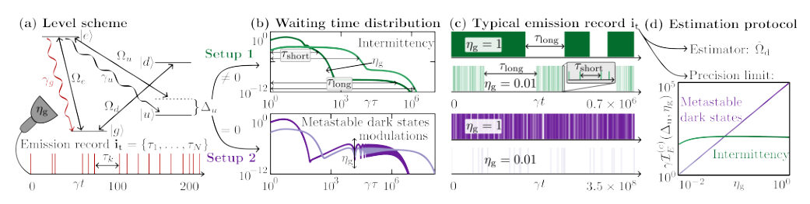
<figcaption class="paper-figure-caption"><b>Fig 1.</b> FIG. 1. Continuous sensing scenarios considered in this work. (a) Level scheme realized in trapped ion experiments. Photons emitted by the strongly fluorescent transition |e⟩→|g⟩are continuously monitored at a detection efficiency of ηg and the corresponding (waiting) times between emissions are collected in the emission record it, see Sec. III. By choosing the value of the detuning ∆u two qualitatively different dynamical regimes are realized characterized either by intermittency (Setup 1, ∆u ̸= 0) or metastable dark states (Setup 2, ∆u = 0). (b) Waiting time distribution governing the statistics of the emission record it of Setup 1 (top) and Setup 2 (bottom) with ηg = 0.01, 1 (bright,...</figcaption>
</figure>
<figure class="paper-figure-card">

<figcaption class="paper-figure-caption"><b>Fig 2.</b> FIG. 3. Sensitivity bounds for Setup 1. (a) QFI rate (dashed) and FI rate (solid) as a function of time at detection efficiency ηg = 0.01 and Ωd/Ωe = 0.01, 0.0025 (red, blue). Emissions within a bright period occur on the timescale τshort = 1/Γ1 [cf. Eq. (14)] (grey vertical line), see Fig. 1(c). In contrast to the short timescale, τlong = 1/Γ2, the timescale associated to the long dark periods, depends on Ωd/Ωe = 0.01, 0.0025 (red, blue vertical line) [cf. Eq. (15)] and increases as the ratio decreases, which leads to enlarged regions of low and high fluorescence. The FI rate was calcu- lated from a sample of 105 trajectories. (b) Ratio of long-time FI rate over QFI rate as function of...</figcaption>
</figure>
<figure class="paper-figure-card">
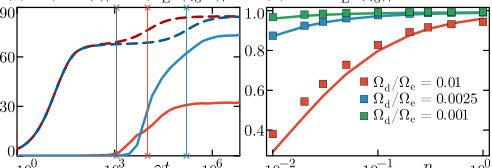
<figcaption class="paper-figure-caption"><b>Fig 3.</b> Fig. 3(a)] does not significantly depend on Ωd (see also Appendix C). In contrast, the FI at non-perfect detection efficiency, ηg &lt; 1, does, as indicated by the significantly larger value for Ωd/Ωe = 0.0025 compared to the one for Ωd/Ωe = 0.01, see blue and red solid line in Fig. 3(a), respectively. We analyze in more detail the behavior of the sensi- tivity rates varying detection efficiency in Fig. 3(b), in which the ratio between the long-time FI rate and QFI rate is plotted for various values of Ωd/Ωe. We observe two remarkable results. First, for ηg = 1 the FI rate al- most saturates the QFI rate, in spite of the decay channel |e⟩−|u⟩being completely unmonitored. Second, the long- time...</figcaption>
</figure>
<figure class="paper-figure-card">
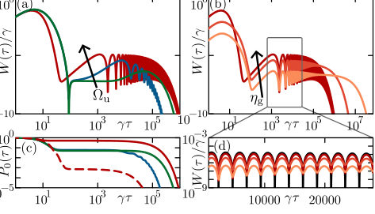
<figcaption class="paper-figure-caption"><b>Fig 4.</b> FIG. 4. Emission characteristics of Setup 2. (a) WTD featuring long timescale modulations for Ωu = Ωd, 10Ωd, Ωe (green, blue, red) and unit detection efficiency ηg = 1. The associated no-jump probability P0(τ) [cf. Eq. (7)] is depicted in (c). For comparison we show P0(τ) for the corresponding Setup 1 (∆u/γ = 0.3), with Ωu = Ωe (red dashed-line). (b) Increasing amplitude of the modulations in the WTD for in- creasing detection efficiencies ηg = 0.01, 0.1, 1 (light to dark) and Ωu = Ωe. (d) Oscillations in the WTD for intermediate times. Black line: analytical approximation from the per- turbation theory [cf. Eq. (D10)]. Parameters: Ωe = 0.2γg, Ωd/Ωe = 0.01, and ∆u/γ = 0.</figcaption>
</figure>
<figure class="paper-figure-card">
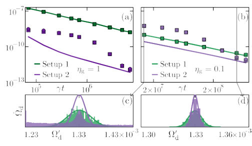
<figcaption class="paper-figure-caption"><b>Fig 5.</b> FIG. 6. Maximum likelihood estimator (MLE) for one long trajectory it. Evolution of the variance of the MLE Var ˆΩd(t)/γ2 (square), MSE ∆ˆΩd(t)/γ2 (circle) and the in- verse of the FI [γ2I(c) E (Ωd, t)]−1 (solid line) for detection effi- ciency (a) ηg = 1 and (b) ηg = 0.1. The statistical analysis used 1 × 103 trajectories for Setup 1 and 5 × 104 trajecto- ries for Setup 2. The vertical lines indicate the evaluation time of panel (c) and (d), respectively. Distribution of the estimator ˆΩd(t) at γt = 1.4 × 107 (c) and γt = 4.9 × 108</figcaption>
</figure>

**Summary.** This paper compares two types of quantum emission dynamics—intermittency and metastable dark states—as resources for continuous parameter sensing. It reveals that while dark states offer superior sensitivity in ideal conditions, intermittent 'blinking' dynamics are far more resilient to the detection losses and dephasing common in real-world experiments.

**Why it may be interesting.** It provides a critical trade-off analysis between high-sensitivity/high-fragility (dark states) and low-sensitivity/high-robustness (intermittency) regimes, which is essential for designing practical continuous-monitoring quantum sensors.

Detailed structure

**Main problem.** Evaluating how different emission dynamics, specifically intermittency (blinking) and metastable dark states, impact the sensitivity of continuous quantum sensing under detection inefficiency and dephasing.

**Main result.** Metastable dark states provide much higher sensitivity at unit detection efficiency but are highly sensitive to losses, whereas intermittent emission is less sensitive but much more robust to low detection efficiency and dephasing.

**Method.** The study uses the Lindblad master equation, classical and quantum Fisher information (FI and QFI) to quantify sensitivity, and Maximum-Likelihood Estimators (MLE) to evaluate parameter estimation performance.

**Model / system.** A four-level driven-dissipative system (applicable to trapped ions like Sr+ and Ca+) featuring a strong fluorescent transition and a weak metastable transition, modeled via a Lindblad master equation.

**Key observables.** Photon-counting records, waiting time distributions (WTD), and the no-jump probability.

**Important parameters / regimes.** Detection efficiency (eta_g), Rabi frequencies (Omega_e, Omega_d, Omega_u), detuning (Delta_u), and dephasing rate (gamma_D).

**Assumptions / limitations.** The system is treated as a renewal process where every detected jump returns the system to the ground state; the analysis focuses on the asymptotic regime of long observation times.

**Figures summary.** Figure 1 shows the level scheme and WTD for different setups; Figure 2 compares WTD parameters and stationary populations; Figure 3 and 4 analyze FI rates and WTD oscillations; Figure 12 shows the damping of WTD modulations due to dephasing.

**Paper structure.** The paper introduces the sensing problem and two dynamical setups, analyzes the waiting time distributions and sensitivity (FI/QFI) for both regimes, evaluates the impact of experimental imperfections like detection loss and dephasing, and demonstrates the optimality of MLE-based estimation.

Abstract

Quanta emitted by an open quantum system carry information about intrinsic parameters, enabling their estimation via continuous monitoring. In practice, however, only a fraction of the emitted quanta is detected, reducing the achievable sensitivity. Here, we consider few-level systems in which coherent couplings and dissipative processes compete, producing metastable dynamics characterized by emission intermittency or by the emergence of a dark state. We show that both phenomena can be beneficial for sensing but their relative performance depends strongly on the achievable detection efficiencies. Intermittent emission, marked by long alternating bright and dark periods, allows to achieve robustness with respect to inefficient detection and dephasing, whereas dark states yield significantly higher sensitivity at unit detection efficiency. Yet the latter are highly susceptible to losses. We quantify the impact of inefficient detection through the classical Fisher information of the emission record and benchmark it against the ultimate sensitivity encoded in the joint system-environment state. Finally, we demonstrate that maximum-likelihood estimators based on the observed emission record can effectively approach this sensitivity. We focus here on trapped-ion systems, however, the results extend to other quantum platforms in which similar emission dynamics can be observed.

[↑ back to top](#top)

### [Quantum fluctuations and chaos in fully connected spin models](http://arxiv.org/abs/2605.27199v1)

**Authors:** Aleksandra A. Ziolkowska, Aleksandr N. Mikheev  
**Type:** theory · **Category:** statistical mechanics · **PDF:** <https://arxiv.org/pdf/2605.27199v1>  
**Analysis basis:** full PDF text, analyzed in chunks
**Topic relevance:** 🔥 `Keldysh / 2PI / non-Gaussian methods` **5/5** · 🔥 `methods for driven-dissipative` **4/5** · 🔥 `non-equilibrium dynamics` **4/5** · `Tavis-Cummings & cavity-many-emitter` **3/5** · `correlated cavity matter` **3/5** · `exotic spin models in light-matter` **3/5** · `Dicke superradiance` **2/5** · `analog quantum simulation` **2/5** · `correlated / nonlocal dissipation` **2/5** · `driven-dissipative phase transition` **2/5** · `entanglement & information structure` **2/5** · `non-equilibrium universality` **2/5** · `scars & prethermalization` **2/5**

↔ Scroll figures horizontally

<figure class="paper-figure-card">
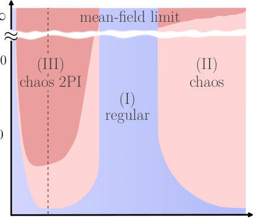
<figcaption class="paper-figure-caption"><b>Fig 1.</b> FIG. 1. A sketch of the dynamical phase diagram for the SU(3) spin-exchange Hamiltonian initialized in a chaotic state for fixed h = g−= 1. All parameters refer to Eq. (1) in the main text. Phase (I) represents regular dynamics, phase (II) chaotic dynamics as indicated by the second-order cumulant expansion, and phase (III) designates chaotic dynamics as shown by the 2PI computations with next-to- leading order corrections. The upper limit of the graph with an in- finite system size corresponds to the mean-field limit, which is the same in both approaches. The dashed line corresponds to the ratio g+/g−= 0.2 analyzed in Fig. 4. See Sec. IV for the detailed discus- sion of the phase diagram.</figcaption>
</figure>
<figure class="paper-figure-card">
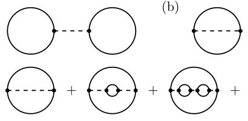
<figcaption class="paper-figure-caption"><b>Fig 2.</b> FIG. 3. Diagrams contributing to the 2PI effective action considered in this work. (a) The only diagram contributing at leading order O(L) in the 1/L expansion. (b) Time-local diagram contributing at next- to-leading order O(L0). (c) An infinite series of next-to-leading-order diagrams. These include the time-local diagram (b) as well as an infinite number of time-nonlocal processes.</figcaption>
</figure>
<figure class="paper-figure-card">
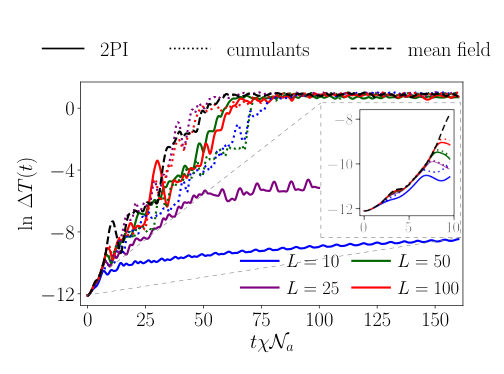
<figcaption class="paper-figure-caption"><b>Fig 3.</b> FIG. 4. Time dependence of the logarithm of the Frobenius- norm distance between trajectories for chaotic initial conditions and Hamiltonian parameters h = 1, g+ = 0.2, and g−= 1. We compare three system sizes within the NLO 2PI, the second-order cumulant expansion, and the mean-field approximations.</figcaption>
</figure>
<figure class="paper-figure-card">
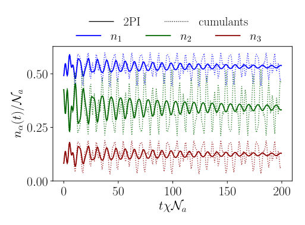
<figcaption class="paper-figure-caption"><b>Fig 4.</b> FIG. 5. Time dependence of the normalized bosonic level popula- tions for h = 1, g+ = 2, g−= 1 and the system size L = 15. The NLO 2PI approximation captures relaxation of the populations, whereas the second-order cumulant expansion exhibits persistent oscillations.</figcaption>
</figure>
<figure class="paper-figure-card">
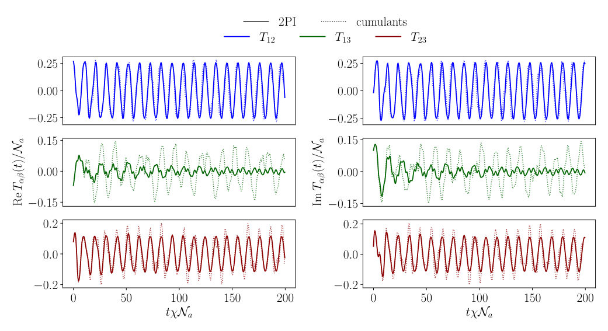
<figcaption class="paper-figure-caption"><b>Fig 5.</b> FIG. 6. Time dependence of the off-diagonal two-point bosonic correlations for chaotic initial conditions, Hamiltonian parameters h = 1, g+ = 2, g−= 1, and the system size L = 15. We plot the time-evolution of the real part of the coherences (left panel) and the imaginary part of the coherences (right panel) as computed within the 2PI and the cumulant expansion approach. The 2PI calculations indicate relaxation of one of the observables, whereas the cumulant expansion shows persistent oscillations for every quantity considered.</figcaption>
</figure>

**Summary.** This paper demonstrates that quantum fluctuations can regularize chaotic dynamics in a fully connected SU(3) spin model. By using the 2PI effective action formalism, the authors show that higher-order correlations are essential to capture the relaxation and smoothing of chaotic trajectories that standard mean-field or cumulant methods fail to describe.

**Why it may be interesting.** It provides a robust theoretical framework (2PI) for understanding how quantum effects can suppress classical chaos, which is crucial for controlling many-body dynamics in platforms like cavity-QED and trapped ions.

Detailed structure

**Main problem.** Investigating how quantum fluctuations regularize chaotic dynamics in the macroscopic observables of many-body systems and addressing the failure of standard cumulant expansions in strong-correlation regimes.

**Main result.** The 2PI effective action formalism successfully captures the regularization of chaos and relaxation processes that are missed by second-order cumulant expansions, which instead predict unphysical persistent oscillations.

**Method.** The authors use the 2PI effective action formalism within the Schwinger-Keldysh framework, employing a 1/L expansion and Hubbard-Stratonovich transformation to derive self-consistent nonequilibrium Dyson equations.

**Model / system.** A fully connected SU(3) spin-exchange model, which serves as an effective description for N-level systems coupled to a common bosonic mediator, such as in cavity-QED or trapped-ion systems.

**Key observables.** Macroscopic collective spins, two-time correlation functions, bosonic level populations, and the Frobenius norm of trajectory divergence (to diagnose chaos).

**Important parameters / regimes.** Interaction strengths (g+, g-), magnetic field (h), system size (L), and the inverse system size (1/L) acting as an effective Planck constant.

**Assumptions / limitations.** The system is assumed to be homogeneous and the study focuses on U(1)-symmetric states; the 1/L correction due to operator-ordering subtleties is assumed to be negligible.

**Figures summary.** Figure 1 shows a dynamical phase diagram of regular vs. chaotic regimes; Figure 2 and 3 present diagrammatic notation for the 2PI formalism; Figure 4 shows the divergence of trajectories (Lyapunov-like growth); Figure 6 compares the relaxation of coherences in 2PI vs. cumulant expansion.

**Paper structure.** The paper introduces the SU(3) model and the problem of chaos regularization, details the 2PI and cumulant methodologies, presents numerical results comparing relaxation and chaos suppression, and concludes with a discussion on the superiority of the 2PI framework.

Abstract

We investigate beyond-mean-field dynamics in a fully connected $\mathrm{SU}(3)$ spin-exchange model, focusing on the interplay between chaotic dynamics and quantum fluctuations. Using the two-particle irreducible (2PI) effective action formalism, we derive equations of motion that systematically account for higher-order correlations generated by interactions, and demonstrate how quantum fluctuations can regularize chaotic dynamics displayed by macroscopic observables. Our results show that an accurate treatment of fluctuations is essential for describing macroscopic dynamics in quantum many-body systems and promote 2PI as a robust framework for connecting microscopic correlations to macroscopic nonequilibrium phenomena.

[↑ back to top](#top)

### [Postselection-free ballistic-diffusive transition in monitored spin chains](http://arxiv.org/abs/2605.27350v1)

**Authors:** K. G. S. H. Gunawardana, Ali G. Moghaddam, Teemu Ojanen  
**Type:** theory · **Category:** statistical mechanics · **PDF:** <https://arxiv.org/pdf/2605.27350v1>  
**Analysis basis:** full PDF text, analyzed in chunks
**Topic relevance:** 🔥 `measurement-induced transitions` **5/5** · 🔥 `driven-dissipative phase transition` **4/5** · 🔥 `entanglement & information structure` **4/5** · 🔥 `non-equilibrium dynamics` **4/5** · `methods for driven-dissipative` **3/5** · `non-equilibrium universality` **3/5** · `quantum measurements` **3/5**

↔ Scroll figures horizontally

<figure class="paper-figure-card">
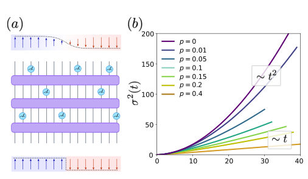
<figcaption class="paper-figure-caption"><b>Fig 1.</b> FIG. 1. Ballistic to diffusive transition in periodically mon- itored spin chains. (a) Domain-wall initial state evolving un- der monitored dynamics. Unitary blocks (shown in purple), U = e−iHδt, and measurement steps each correspond to a short time interval δt ≪1. The probability of a measurement oc- curring at each measurement block is therefore pδt ∼p δt. At later times, the domain wall melts, leading to a broader tran- sition region between the fully up- and down-polarized do- mains. (b) Spreading of the initial sharp domain wall to a smoother profile quantified with a width σ(t). At low moni- toring rate p &lt; pc, the dynamics is ballistic (σ ∝t), while for p &gt; pc it is diffusive (σ ∝ √</figcaption>
</figure>
<figure class="paper-figure-card">
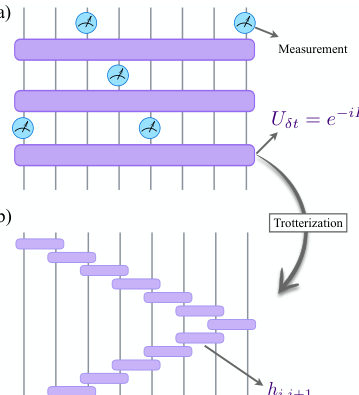
<figcaption class="paper-figure-caption"><b>Fig 2.</b> FIG. 2. Dynamics of spin chains in the high-frequency moni- toring regime. (a): Temporal evolution consist of alternating unitary layers and measurement layers. (b): 2nd order Trot- ter decomposition of the unitary layer. The two-qubit gates correspond to e−ihi,i+1δt/2.</figcaption>
</figure>
<figure class="paper-figure-card">
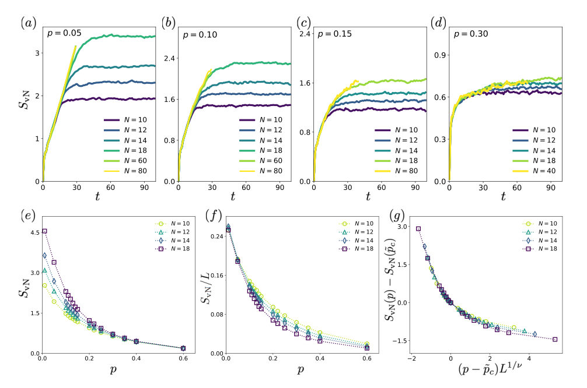
<figcaption class="paper-figure-caption"><b>Fig 3.</b> FIG. 3. Entanglement dynamics and entanglement phase transitions. (a)-(d): Entanglement entropy as a function of time for different monitoring strengths p. The time-evolution has been calculated by employing time step δt = 0.1. In the small p regime we employ the maximum MPS bond dimension χ = 350, while for p &gt; 0.2, the convergence of the entanglement entropy is reached when χ ≈50. (e)-(g): Trajectory-averaged entanglement entropy as a function of p. The results are obtained by averaging over 500 random trajectories at each p ≠0. Additionally, the results have been averaged over the time window 60 &lt; t &lt; 100 where the average value has been saturated.</figcaption>
</figure>
<figure class="paper-figure-card">
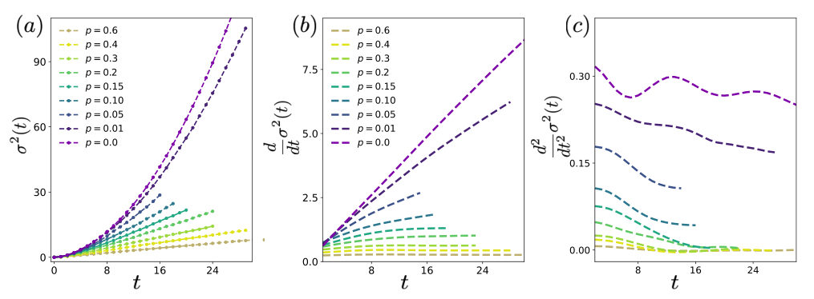
<figcaption class="paper-figure-caption"><b>Fig 4.</b> FIG. 4. Temporal spreading of the spin up domain for different monitoring strengths. (a): Dots correspond to the actual data points and the dashed line represents the spline fitting. (b): Derivative has been obtained by differentiating the spline fit in (a). (c): Second derivative is obtained by differentiating a spline-smoothed first derivate curve.</figcaption>
</figure>
<figure class="paper-figure-card">
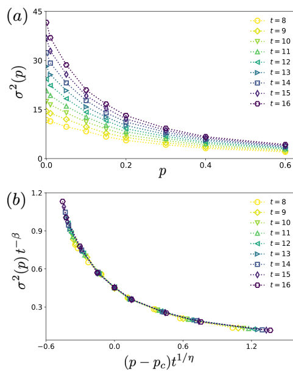
<figcaption class="paper-figure-caption"><b>Fig 5.</b> FIG. 5. Scaling analysis of the magnetization dynamics. (a): The effective spatial variance of the magnetization domain as a function of monitoring rate at different times. (b): Scaling collapse of the curves in (a) with the scaling form (16) and the critical parameters pc = 0.15, β = 1.3 and η = 2.5.</figcaption>
</figure>

**Summary.** This paper demonstrates that monitoring a spin chain induces both an entanglement phase transition and a transition from ballistic to diffusive transport. Crucially, the transport transition can be observed through linear observables without the need for the complex postselection required for entanglement entropy. This provides a practical pathway for studying measurement-induced phenomena in quantum simulators.

**Why it may be interesting.** It identifies a way to observe measurement-induced phase transitions using linear, postselection-free observables, providing an experimentally accessible manifestation of the many-body Zeno effect.

Detailed structure

**Main problem.** Investigating the connection between measurement-induced entanglement phase transitions and transitions in transport dynamics (ballistic-to-diffusive) in monitored spin chains.

**Main result.** The study discovers a postselection-free ballistic-to-diffusive transition in the transient dynamics of spin chains that is closely interlinked with the steady-state entanglement phase transition.

**Method.** Numerical simulations using Matrix Product State (MPS) methods with the ITensorMPS package, involving trajectory averaging and single-parameter scaling analysis.

**Model / system.** One-dimensional spin-1/2 XXZ chains in the gapless regime subject to periodic monitoring (measurements) in the high-frequency regime.

**Key observables.** Von Neumann entanglement entropy, domain-wall width (spatial variance of magnetization), and local magnetization density.

**Important parameters / regimes.** Measurement rate (p), anisotropy parameter (Delta), and system size (L).

**Assumptions / limitations.** The unmonitored limit derivation assumes the light cone remains far from system boundaries; the high-frequency monitoring is treated in the discrete-time limit.

**Figures summary.** Figure 1 shows the domain wall melting process; Figure 2 illustrates the Trotter-decomposed dynamics; Figure 3 displays entanglement entropy growth and transitions; Figure 4 shows the evolution of the spatial variance and its derivatives; Figure 5 presents the scaling analysis.

**Paper structure.** The paper introduces the problem of measurement-induced transitions, describes the XXZ model and monitoring protocol, presents numerical results for entanglement and transport dynamics, provides scaling analysis and theoretical arguments for the link between transitions, and concludes with experimental implications.

Abstract

We study spin and entanglement dynamics in spin-1/2 XXZ chains under periodic monitoring and show that this system exhibits two measurement-induced phase transitions: a steady-state entanglement phase transition similar to those in monitored quantum circuits and a ballistic-to-diffusive transition in transient dynamics. Specifically, we discover that at low monitoring rate, an initial configuration containing a domain wall $|\uparrow\uparrow\uparrow\ldots \downarrow\downarrow\downarrow\ldots\rangle$ spreads ballistically while, at large monitoring rates, the domain melting is diffusive. Extensive numerical simulations, supported by theoretical arguments, indicate that the ballistic-diffusive transition is intimately interlinked with the entanglement phase transition. In contrast to the entanglement phase transitions, which require exponentially complex postselection, the ballistic-diffusive transition can be observed without postselection and constitutes an experimentally accessible manifestation of the many-body Zeno effect.

[↑ back to top](#top)

### [Krylov Complexity in Periodically Driven CFTs and Critical Fermions](http://arxiv.org/abs/2605.26250v1)

**Authors:** Ankit Gill, Anurag Sarkar  
**Type:** theory · **Category:** statistical mechanics · **PDF:** <https://arxiv.org/pdf/2605.26250v1>  
**Analysis basis:** full PDF text, analyzed in chunks
**Topic relevance:** 🔥 `non-equilibrium dynamics` **5/5** · 🔥 `entanglement & information structure` **4/5** · `driven-dissipative phase transition` **3/5** · `non-equilibrium universality` **3/5** · `scars & prethermalization` **3/5**

↔ Scroll figures horizontally

<figure class="paper-figure-card">
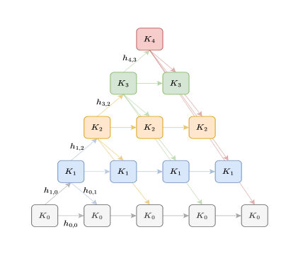
<figcaption class="paper-figure-caption"><b>Fig 1.</b> Figure 1: Schematics of Possible transitions in Krylov basis during periodic drive [69].</figcaption>
</figure>
<figure class="paper-figure-card">
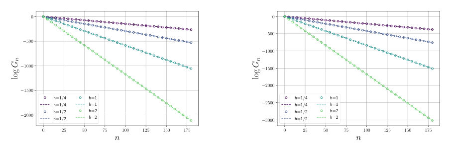
<figcaption class="paper-figure-caption"><b>Fig 2.</b> Figure 4: log Gn vs n in the heating phase, with η &lt; 1 in (a) and η &gt; 1 in (b). The dots show the values obtained from the exact high-precision CFT computations, while the dashed lines show the approximation in (4.15), for h = 1/4, 1/2, 1, 2.</figcaption>
</figure>
<figure class="paper-figure-card">
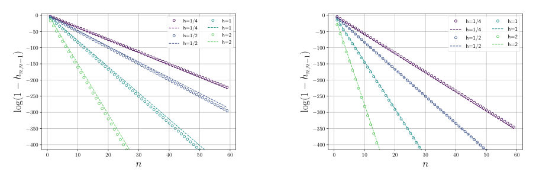
<figcaption class="paper-figure-caption"><b>Fig 3.</b> Figure 5: hn,n−1 as function of n in the heating phase of square wave drive. The dots denote the exact coefficients, while the dashed lines denote the approximation shown in (4.19).</figcaption>
</figure>
<figure class="paper-figure-card">
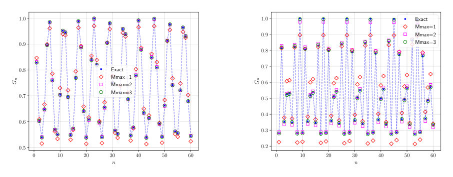
<figcaption class="paper-figure-caption"><b>Fig 4.</b> Figure 6: Gn vs n in non-heating phase, comparison between exact values and ana- lytical approximations. Mmax denotes the number of terms in the sum in (4.20).</figcaption>
</figure>
<figure class="paper-figure-card">
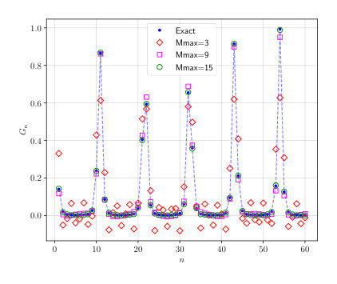
<figcaption class="paper-figure-caption"><b>Fig 5.</b> Figure 7: Gn vs n at a point (here, (T0/L, T1/L) = (0.41, 0.41)) close to the critical line, approaching from the non-heating phase.</figcaption>
</figure>

**Summary.** The paper investigates how Krylov complexity and operator growth behave in periodically driven conformal field theories and their lattice fermion counterparts. It identifies distinct signatures in the heating and non-heating phases and demonstrates that the type of driving protocol significantly impacts the spectral and graph-theoretic properties of the system.

**Why it may be interesting.** This paper is highly relevant for many-body dynamics as it provides a precise diagnostic (Krylov complexity) for distinguishing between thermalizing (heating) and non-thermalizing (non-heating) regimes in driven quantum systems.

Detailed structure

**Main problem.** Characterizing the transition between heating and non-heating dynamical phases in periodically driven (Floquet) systems using Krylov complexity.

**Main result.** In the heating phase, Arnoldi coefficients approach unity exponentially, while in the non-heating phase, they exhibit oscillatory behavior; additionally, lattice realizations of continuous drives show different spectral and graph signatures compared to square-wave drives.

**Method.** The authors use the Arnoldi and Lanczos algorithms to construct Krylov bases, apply conformal mapping techniques for CFT analysis, and employ graph-theoretic analysis of the Floquet operator's transition matrix.

**Model / system.** The study focuses on (1+1)-dimensional Conformal Field Theories (CFTs) and their lattice realizations via 1D critical fermions under two driving protocols: a square-wave drive and a continuous sinusoidal drive.

**Key observables.** Krylov complexity (Ck), Arnoldi coefficients (h_{n, n-1}), return amplitude/autocorrelation (Gn), level-spacing ratio (r-factor), and Fiedler value.

**Important parameters / regimes.** Driving protocols (square-wave vs. continuous), heating vs. non-heating phases, and the driving strength parameter (delta_f).

**Assumptions / limitations.** The CFT analysis is restricted to the SL(2, R) sector and (1+1)-dimensional systems.

**Figures summary.** Figures include schematics of Krylov vector transitions, conformal mapping visualizations, driving protocol diagrams, and plots of Arnoldi coefficients, return probability, and graph connectivity/clustering.

**Paper structure.** The paper introduces the problem of Floquet dynamics, analyzes the CFT limit using analytical methods, compares this to lattice fermion simulations, explores different driving protocols (square-wave vs. continuous), and concludes with graph-theoretic and spectral analysis of the transition.

Abstract

We study Krylov construction in periodically driven conformal field theories and their lattice realisations via critical fermions. Two types of driving are considered: a square-wave drive and a continuous sinusoidal drive. Using the Arnoldi construction, we examine Arnoldi coefficients and return amplitudes in periodically driven conformal field theories in the heating and non-heating phases. In the heating phase, the Arnoldi coefficients approach unity exponentially; in contrast, in the non-heating phase, they exhibit oscillatory behaviour. For the lattice realisations, we further analyse the Krylov complexity of the correlation matrix, quasi energy level statistics, and the graph structure induced by the Floquet operator. Although the two drives exhibit similar Krylov growth on the CFT side, their lattice realisations exhibit markedly different spectral and graph signatures, indicating distinct mechanisms governing the transition between the heating and non-heating phases.

[↑ back to top](#top)

### [Scar Full Eigenstate Thermalization Hypothesis](http://arxiv.org/abs/2605.26389v1)

**Authors:** Ning Sun, Yanting Cheng  
**Type:** theory · **Category:** statistical mechanics · **PDF:** <https://arxiv.org/pdf/2605.26389v1>  
**Analysis basis:** full PDF text, analyzed in chunks
**Topic relevance:** 🔥 `scars & prethermalization` **5/5** · 🔥 `non-equilibrium dynamics` **4/5** · `Rydberg arrays` **3/5** · `entanglement & information structure` **3/5**

↔ Scroll figures horizontally

<figure class="paper-figure-card">
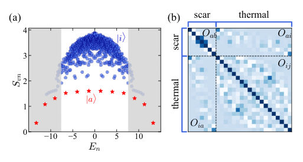
<figcaption class="paper-figure-caption"><b>Fig 1.</b> FIG. 1. Schematic illustration of the scar full ETH. (a) Typ- ical bipartite entanglement entropy as a function of energy in quantum many-body scar systems. Blue points form the thermal band (labeled by |i⟩), while red stars denote scar states (labeled by |a⟩). The gray regions indicate the many- body band edges, which are not considered in the discussion of ETH. (b) Typical structure of matrix elements in the energy eigenbasis, including the pure scar sector (Oab), the thermal sector (Oij), and the mixed scar–thermal sectors (Oai, Oia). We systematically characterize all sectors and establish a com- plete scar full ETH framework.</figcaption>
</figure>
<figure class="paper-figure-card">
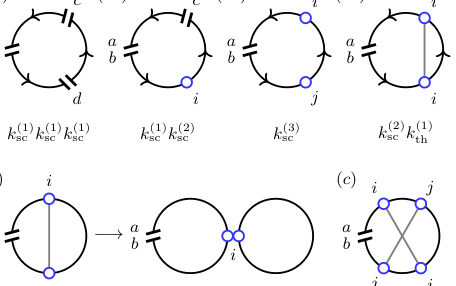
<figcaption class="paper-figure-caption"><b>Fig 2.</b> FIG. 2. (a) Diagrammatic representation of the decomposi- tion of correlation functions in the scar state. (b) Factoriza- tion of the scar free cumulants in Eq. (4) for q = 3, where the expression factorizes into a second-order scar free cumulant and a first-order thermal free cumulant. (c) Example of a crossing diagram for q = 5, which vanishes in the thermody- namic limit. In all panels, the solid lines represent insertions of the operator ˆO. Each circular node and double line repre- sent the insertion of projection operators onto thermal states and scar states, respectively. Gray lines denote identical ther- mal indices.</figcaption>
</figure>
<figure class="paper-figure-card">
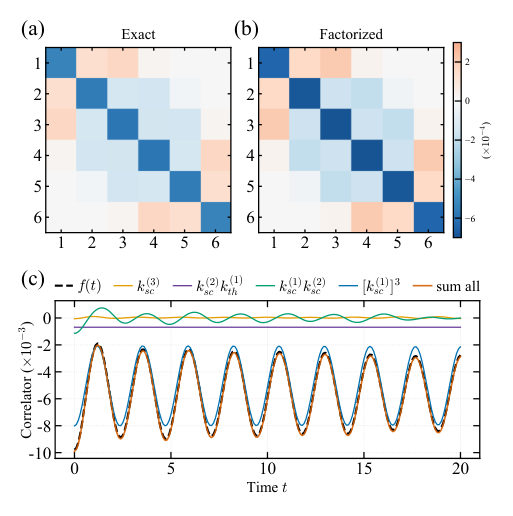
<figcaption class="paper-figure-caption"><b>Fig 3.</b> FIG. 3. Numerical verification of the SFETH in the PXP model with N = 22 and local operator ˆO = 1 2N PN j=1 ˆσz j . The scar states are obtained in the k = 0 even-parity sector with periodic boundary conditions. (a,b) Test of the SFETH factorization (16) for six scar states near the center of the spectrum, where (a) shows the exact result and (b) shows the factorized result. (c) Comparison between the multi-time correlation function and its SFETH free-cumulant decompo- sition. Here, we consider the three-point function F(3) aa (0, t, 0), where |a⟩is the scar state closest to the center of the spec- trum.</figcaption>
</figure>

**Summary.** The paper introduces the Scar Full ETH (SFETH) to describe the dynamics of quantum many-body scars. It proves that multi-point correlation functions in these systems can be decomposed into fundamental thermal and scar-specific building blocks. This framework allows for a precise characterization of non-thermal correlations that traditional statistical mechanics cannot capture.

**Why it may be interesting.** It provides a systematic, unified framework for understanding how non-thermal, persistent dynamics and higher-order correlations emerge and organize in weakly ergodicity-breaking systems.

Detailed structure

**Main problem.** The breakdown of the full Eigenstate Thermalization Hypothesis (ETH) in systems with quantum many-body scars, which prevents traditional ETH from describing non-thermal correlations.

**Main result.** The formulation of the 'scar full ETH' (SFETH) framework, which successfully decomposes multi-point correlation functions into thermal and scar free cumulants.

**Method.** Theoretical derivation using typicality arguments, Weingarten calculus, and free probability theory, with numerical validation via exact diagonalization of the PXP model.

**Model / system.** The spin-1/2 PXP model, a paradigmatic model for quantum many-body scars representing Rydberg atom arrays with blockade effects.

**Key observables.** Local observables (sigma-z), matrix elements in the energy eigenbasis, and multi-time/multi-point correlation functions.

**Important parameters / regimes.** Thermodynamic limit (N to infinity), energy density, and the scaling of contributions with the Hilbert space dimension (e^-S).

**Assumptions / limitations.** Thermal energy eigenstates behave as orthogonal Haar-random states, and the operator being measured is local.

**Figures summary.** Figure 1 shows entanglement entropy and matrix element sectors; Figure 2 illustrates the diagrammatic decomposition of correlation functions into scar and thermal cumulants; Figure 3 provides numerical verification of the SFETH sum rule using the PXP model.

**Paper structure.** The paper introduces the problem of ETH breakdown, proposes the SFETH ansatz, establishes scaling and factorization properties using mathematical tools, and concludes with numerical validation in the PXP model.

Abstract

The eigenstate thermalization hypothesis (ETH) provides a fundamental mechanism for emergent statistical mechanics in isolated chaotic quantum systems, asserting that individual energy eigenstates behave as pseudorandom vectors within an energy window. This enables a complete characterization of nontrivial correlations among matrix elements in the energy eigenbasis, as described by the full ETH ansatz. Nevertheless, this description breaks down in systems exhibiting quantum many-body scars, which host non-thermal eigenstates with extensive energy. In this Letter, we address this problem by formulating the \textit{scar full ETH}, which captures correlations among matrix elements involving scar states. The corresponding scaling forms and factorization properties are established using typicality arguments. Multi-time correlation functions for scar states are then organized in terms of both thermal and scar cumulants, providing a nontrivial reorganization of higher-order correlations. We numerically demonstrate the validity of this framework in the paradigmatic model of quantum scars, the PXP model. Our results pave the way for a systematic understanding of intriguing correlations in systems with quantum many-body scars.

[↑ back to top](#top)

### [Mapping twist fields to local operators via tensor networks](http://arxiv.org/abs/2605.26208v1)

**Authors:** Andrea Bulgarelli, Marco Panero, Paolo Stornati, Luca Tagliacozzo  
**Type:** theory · **Category:** numerical methods · **PDF:** <https://arxiv.org/pdf/2605.26208v1>  
**Analysis basis:** full PDF text, analyzed in chunks
**Topic relevance:** 🔥 `entanglement & information structure` **5/5** · `Rydberg arrays` **3/5** · `analog quantum simulation` **3/5** · `quantum measurements` **2/5**

↔ Scroll figures horizontally

<figure class="paper-figure-card">
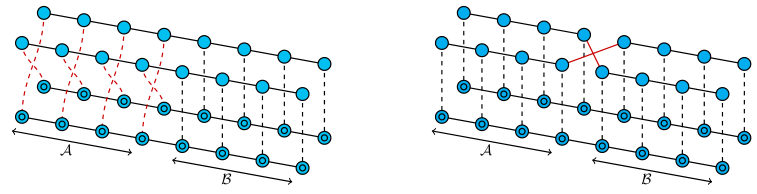
<figcaption class="paper-figure-caption"><b>Fig 1.</b> Figure 1: (a) Swap operator on the physical bonds of the MPS. (b) Equivalent contraction with a swap at the virtual level. Dashed lines represent physical indices, and tensors with a circle inside are the complex conjugate.</figcaption>
</figure>
<figure class="paper-figure-card">
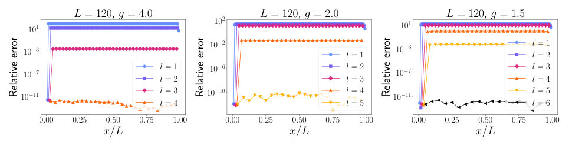
<figcaption class="paper-figure-caption"><b>Fig 2.</b> Figure 2: Relative error on the numerical estimate of the second Rényi entropy from the expectation value of the twist operator as the injectivity limit is approached. From left to right, the correlation length of the model increases, therefore the injectivity limit is obtained with blocks of increasing sizes, l = 4, 5, and 6, for g = 4.0, 2.0, and 1.5, respectively. The results shown in these plots were obtained using the forward definition of the twist operator.</figcaption>
</figure>
<figure class="paper-figure-card">
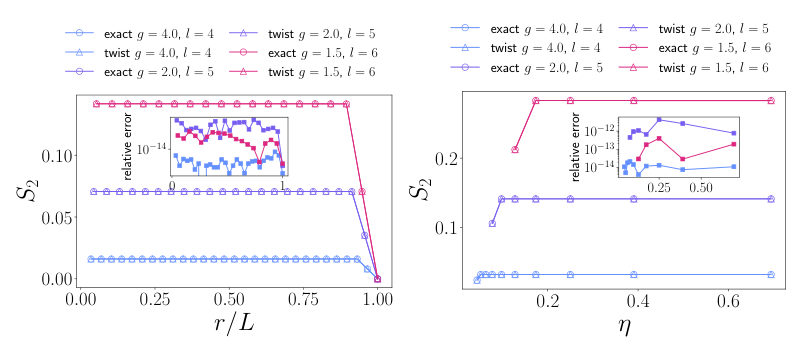
<figcaption class="paper-figure-caption"><b>Fig 3.</b> Figure 3: (a) Correlator of two twist operators as a function of their distance r. (b) Four-point function of twist field operators as a function of the ratio η. In both plots L = 120 and the injectivity limit is assumed.</figcaption>
</figure>
<figure class="paper-figure-card">
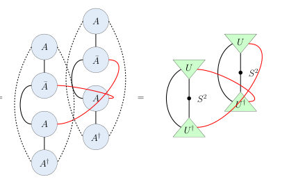
<figcaption class="paper-figure-caption"><b>Fig 4.</b> Figure 4: Expectation value of the twist operator in the center of orthogonality.</figcaption>
</figure>
<figure class="paper-figure-card">
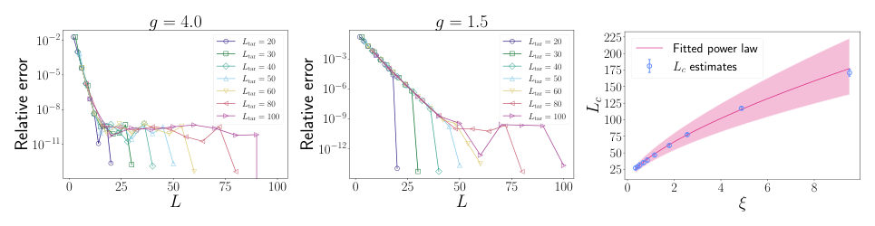
<figcaption class="paper-figure-caption"><b>Fig 5.</b> Figure 5: (a) and (b): comparison between the exact half chain Rényi entropy computed in a chain of length Ltar and the expectation value of a twist operator ⟨TL⟩Ltar. (c): values of Lc as a function of the correlation length of the system, with the result of a fit to eq. (5).</figcaption>
</figure>

**Summary.** This paper develops a method to map non-local twist fields used in calculating Renyi entropies to local, physically accessible operators in tensor networks. By doing so, it enables the estimation of entanglement in quantum many-body systems using only local measurements. The approach is shown to be efficient, scalable, and transferable across different system sizes.

**Why it may be interesting.** This provides a direct bridge between abstract tensor network formalisms and practical measurements in quantum simulators like Rydberg atom arrays or trapped ions, enabling the measurement of complex entanglement properties using only local observables.

Detailed structure

**Main problem.** The conventional twist field formalism for computing Renyi entropies in tensor networks relies on inaccessible virtual degrees of freedom, making it difficult to implement in physical experiments.

**Main result.** The authors construct explicit local physical operators that reproduce the action of twist fields in Matrix Product States, providing a scalable and experimentally accessible way to probe entanglement.

**Method.** The method uses the injectivity of MPS and the center of orthogonality to lift virtual swap operators to the physical Hilbert space via SVD and coarse-graining.

**Model / system.** The framework is applied to 1D Matrix Product States (MPS) and 2D Projected Entangled Pair States (PEPS), with numerical validation performed on the transverse-field Ising model.

**Key observables.** Renyi entropies (Sn), entanglement entropy, and expectation values of local Pauli strings.

**Important parameters / regimes.** Injectivity scale (l), correlation length (xi), bond dimension (chi), and central charge (c).

**Assumptions / limitations.** The construction is exact in the injectivity limit or at the center of orthogonality, and the accuracy of operator transferability depends on the reference system exceeding the correlation length.

**Figures summary.** Figure 1 illustrates the swap operator at virtual vs. physical levels; Figure 2 shows error decay in Renyi entropy estimates; Figure 3 displays twist field correlation functions; Figure 5 demonstrates the transferability of operators from small to large systems.

**Paper structure.** The paper introduces the problem of non-local twist fields, presents a construction for mapping them to local physical operators in 1D MPS, validates the method using the transverse-field Ising model, discusses the transferability of these operators across different system sizes, and proposes a generalization to 2D PEPS.

Abstract

Twist fields are a powerful formal tool to compute Rényi entropies in quantum many-body systems, but their conventional formulation in tensor network states involves operations acting on virtual degrees of freedom, which are not directly accessible in experiments. In this work, we construct explicit local operators acting on the physical Hilbert space whose expectation values reproduce the action of twist fields in matrix product states. Our construction is exact in the injectivity limit and when the tensor is chosen at the center of orthogonality, and provides a direct operational method to evaluate Rényi entropies without accessing auxiliary tensor indices. We test our formulation numerically in the transverse-field Ising model, demonstrating rapid convergence to the exact entanglement entropy as the injectivity scale is reached. Furthermore, we show that twist operators determined from relatively small reference systems can be reliably transferred to larger systems, once the reference size exceeds a characteristic scale set by the correlation length. Since the resulting operators admit a decomposition in terms of a finite number of local observables, our results provide a scalable and experimentally accessible framework to probe entanglement in quantum simulators.

[↑ back to top](#top)

### [Spatiotemporal Structures of Parametrically Driven Nonlinear Lattices](http://arxiv.org/abs/2605.26668v1)

**Authors:** Yu Funami, Kazushi Aoyama  
**Type:** theory · **Category:** statistical mechanics · **PDF:** <https://arxiv.org/pdf/2605.26668v1>  
**Analysis basis:** full PDF text, analyzed in chunks
**Topic relevance:** 🔥 `Frenkel-Kontorova` **5/5** · `driven-dissipative phase transition` **3/5** · `non-equilibrium dynamics` **3/5** · `non-equilibrium universality` **2/5**

↔ Scroll figures horizontally

<figure class="paper-figure-card">
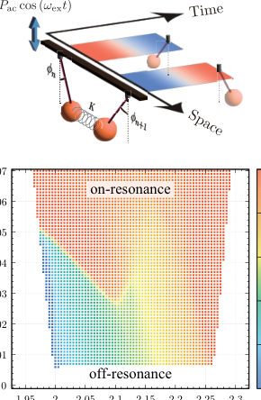
<figcaption class="paper-figure-caption"><b>Fig 1.</b> FIG. 1. (a) Schematic of the π resonance appearing in the one-dimensional FK model with the parametric driving, cou- pled oscillators under vertical vibration with strength Pac and frequency ωex, where ϕn is the phase of the nth oscillator, and red (blue) regions in the space-time plane indicates positive (negative) values of ϕn. (b) Pac and ωex dependence of a spa- tiotemporal (ST) structure with wavenumber k. The color represents k/2π in the resonant state, while the white region denotes the off-resonant state. The result is obtained for the rest initial condition.</figcaption>
</figure>
<figure class="paper-figure-card">
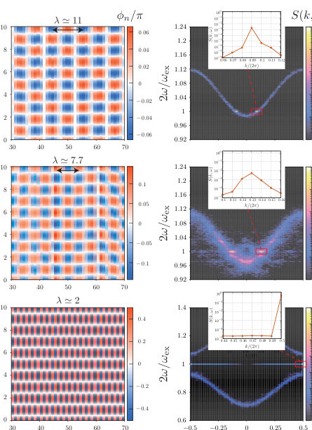
<figcaption class="paper-figure-caption"><b>Fig 2.</b> FIG. 2. ST structures (left panels) and the corresponding Fourier spectra (right panels) for ωex = 2.02 : (a) Pac = 0.007, (b) Pac = 0.024 , and (c) Pac = 0.05. In the left panels, horizontal and vertical axes denote the site index n and time t/tex , respectively, and the color represents the value of ϕn/π. In the right panels, the color represents the spectrum intensity S(k, ω), and the insets show zoomed views near the Fourier peaks at 2ω/ωex = 1.</figcaption>
</figure>
<figure class="paper-figure-card">
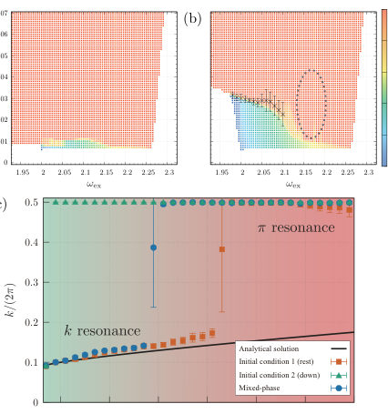
<figcaption class="paper-figure-caption"><b>Fig 3.</b> FIG. 3. Phase diagrams obtained for the initial states of (a) the π configuration and (b) the mixed-phase configuration, where color notations are the same as those in Fig. 1(b). In (b), a dashed ellipse indicates the region where the mixed- phase method does not work. (c) Pac dependence of the wavenumber k, where red, green, and blue data correspond to the numerical results shown in Figs. 1(b), 3(a), and 3(b), respectively. The black solid line represents the analytical re- sult obtained selfconsistently from Eqs. (5) and (9).</figcaption>
</figure>

**Summary.** This paper explores how parametric driving creates complex spatiotemporal patterns in a nonlinear 1D lattice. It identifies a transition between different resonant states and explains how nonlinear effects and parametric amplification work together to select specific spatial wavenumbers.

**Why it may be interesting.** The study of pattern formation and stability in driven nonlinear lattices is highly relevant to understanding non-equilibrium phase transitions and collective dynamics in many-body systems, which are central themes in both classical and quantum many-body dynamics.

Detailed structure

**Main problem.** Investigating the formation mechanisms and stability of spatiotemporal structures, specifically nontrivial k-resonance and pi-resonance states, in parametrically driven nonlinear many-body lattices.

**Main result.** The study finds that parametric driving induces spatiotemporal ordering with a subharmonic frequency, where the wavenumber k increases with driving strength before jumping discontinuously to pi-resonance. The k-resonance is driven by the interplay between parametric amplification and nonlinear collective fluctuations.

**Method.** Numerical simulations using the fourth-order Runge-Kutta method combined with analytical extended linear stability analysis and the method of multiple scales.

**Model / system.** A one-dimensional Frenkel-Kontorova (FK) model consisting of elastically-coupled classical oscillators with an on-site potential and periodic parametric driving.

**Key observables.** Fourier spectrum S(k, omega), spatiotemporal patterns of phase, wavenumber k, and oscillation amplitude.

**Important parameters / regimes.** Parametric driving strength (Pac), driving frequency (omega_ex), coupling constant (K), damping (gamma), and noise strength (T).

**Assumptions / limitations.** Small parameter epsilon for the method of multiple scales; single-mode approximation for the evolution of Fourier components; nonlinear approximation of the sine potential.

**Figures summary.** Fig 1 shows the schematic of pi-resonance and a phase diagram of wavenumber k; Fig 2 displays real-space spatiotemporal structures and Fourier spectra for different driving regimes.

**Paper structure.** The paper introduces the FK model and parametric driving, presents numerical results on wavenumber selection and phase transitions, provides an analytical derivation of the resonance mechanism via stability analysis, and concludes with an investigation of domain wall dynamics in the supplemental material.

Abstract

We theoretically investigate the effects of parametric driving on the one-dimensional Frenkel-Kontorova model, a nonlinear many-body lattice system. It is numerically found that a parametric vibration induces spatiotemporal ordering characterized by the subharmonic frequency $ω_{\mathrm{ex}}/2$ and wavenumber $k$ which takes nontrivial values depending on the vibration strength $P_{\mathrm{ac}}$ and frequency $ω_{\mathrm{ex}}$. With increasing $P_{\mathrm{ac}}$, $k$ gradually increases and discontinuously jumps up to $k=π$. Based on an extended linear stability analysis, we show that the former $k$ resonance (the latter $π$ resonance) corresponds to the unstable (stable) mode and that the $k$ resonance is made possible by the interplay between the parametric amplification and the collective fluctuation developing through the nonlinear effect.

[↑ back to top](#top)

### [Time Crystals on Quantum Devices](http://arxiv.org/abs/2605.27211v1)

**Authors:** Gonzalo Camacho, Benedikt Fauseweh  
**Type:** both · **Category:** statistical mechanics · **PDF:** <https://arxiv.org/pdf/2605.27211v1>  
**Analysis basis:** full PDF text, analyzed in chunks
**Topic relevance:** 🔥 `driven-dissipative phase transition` **4/5** · 🔥 `non-equilibrium dynamics` **4/5** · 🔥 `scars & prethermalization` **4/5** · `QC/QI experiment` **3/5** · `analog quantum simulation` **3/5** · `non-equilibrium universality` **3/5** · `Rydberg arrays` **2/5** · `entanglement & information structure` **2/5** · `exotic spin models in light-matter` **2/5** · `spintronics-quantum-optics interface` **2/5**

↔ Scroll figures horizontally

<figure class="paper-figure-card">
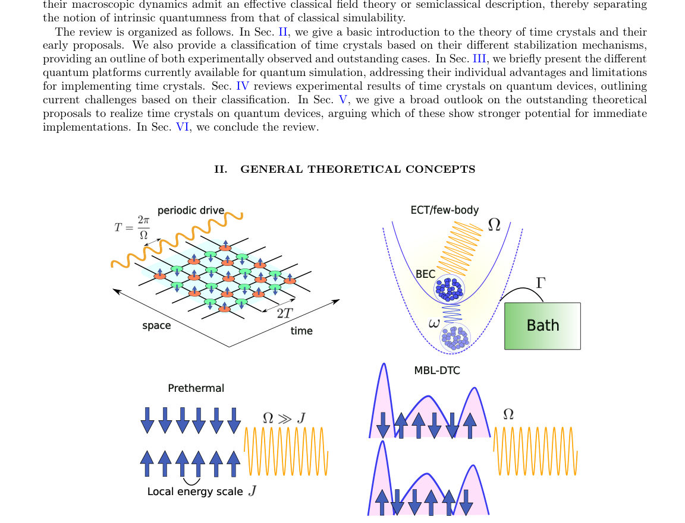
<figcaption class="paper-figure-caption"><b>Fig 1.</b> Figure 1: Schematic view of a DTC breaking the discrete symmetry of the drive. While the drive oscillates with period T, the system displays subharmonic motion with period 2T. Time crystal phases can be stabilized through different mechanisms. Prethermal DTCs require large frequencies Ω≫J above some characteristic energy scale of the system J, usually from initially ordered (low temperature) states. In contrast, MBL-DTC is characterized by the system displaying subharmonic motion starting from random (high temperature) initial states, with the drive and the MBL phase coexisting. Some genuinely many-body quantum systems, such as Bose-Einstein condensates (BECs), display time crystal behavior...</figcaption>
</figure>
<figure class="paper-figure-card">
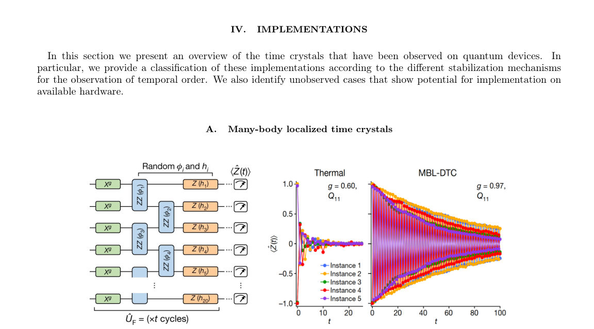
<figcaption class="paper-figure-caption"><b>Fig 2.</b> Figure 2: (Adapted from Ref. [166]) Digital (gate-based) implementation of the MBL-DTC on a superconducting quantum processor, where the model consists of a periodically kicked 1D Ising chain with nearest-neighbor interactions and random local fields. In the MBL-DTC phase, different random instances of initial product states lead to robust subharmonic oscillations in the autocorrelation of all local observables, in contrast to the thermal phase where an arbitrary initial state choice leads to fast thermalization and absence of spatiotemporal order.</figcaption>
</figure>
<figure class="paper-figure-card">
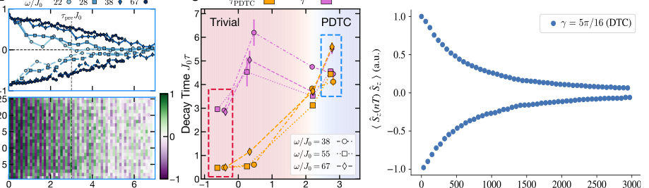
<figcaption class="paper-figure-caption"><b>Fig 3.</b> Figure 3: (Adapted from [177] and [178]) Implementation of prethermal DTCs on a trapped-ion device [177] (left) and the NMR quantum emulator [178] employing fluorapatite (Ca5(PO4)3F ) crystalline structure (right), with both systems hosting long-range interactions. In the experiment in Ref. [177], a spin polarized initial state displays the slow decay in the magnetization dynamics (pannel B). The survival of the prethermal phase up to finite thermalization time scales starting from low-energy density states of the effective Hamiltonian Heff is a distinct signature of prethermal DTCs (pannel C). In the NMR experiment of Ref. [178], the initial state is represented by a classical...</figcaption>
</figure>
<figure class="paper-figure-card">
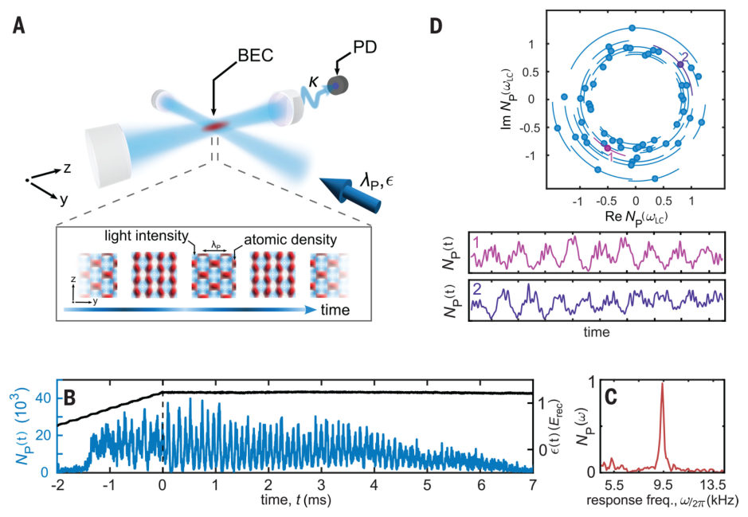
<figcaption class="paper-figure-caption"><b>Fig 4.</b> Figure 4: (Adapted from Ref. [186]) Observation of a CTC employing a BEC magnon condensate [186]. In the experiment, the BEC is transversally driven by highly polarized optical pump with increasing amplitude. After some pumping time, the amplitude of the drive is kept constant, and the system features subharmonic oscillations on the cavity photon number NP (t), which acts as order parameter.</figcaption>
</figure>
<figure class="paper-figure-card">
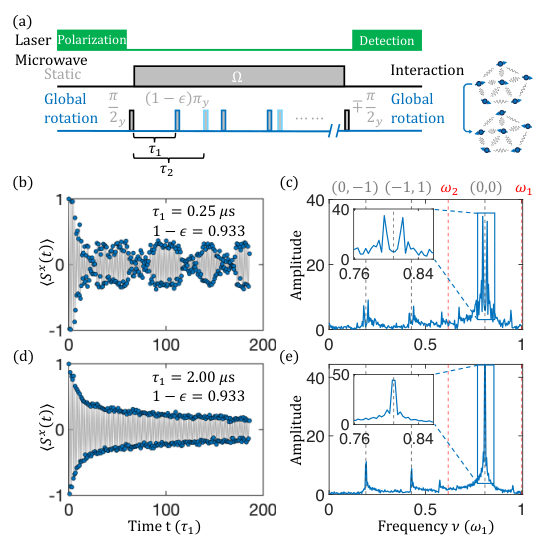
<figcaption class="paper-figure-caption"><b>Fig 5.</b> Figure 5: (Obtained from Ref. [210]) Observation of a discrete-time quasicrystal. In Fourier space, discrete time quasicrystals are characterized by the emergence of several subharmonic frequency contributions away from incommensurate driving frequencies ω1, ω2. This results in observing different quasi-periodic temporal patterns in the transverse spin polarization ⟨Sx(t)⟩.</figcaption>
</figure>

**Summary.** This review paper proposes a new classification framework for time crystals based on how they are stabilized and their physical properties. It surveys recent experimental progress across various quantum hardware platforms, such as superconducting processors and trapped ions, to identify new frontiers in non-equilibrium physics.

**Why it may be interesting.** It provides a unified perspective on non-equilibrium phase transitions and the competition between ergodicity-breaking mechanisms like localization and prethermalization in driven quantum systems.

Detailed structure

**Main problem.** The need for an extended classification of time-crystalline phases based on their stabilization mechanisms and physical character, while distinguishing genuine quantum time crystals from classical simulations.

**Main result.** The authors propose a new classification framework for time crystals (discrete, continuous, closed, open, topological, etc.) and review recent experimental implementations on various quantum platforms.

**Method.** A review of recent experimental implementations combined with a proposed theoretical classification based on stabilization mechanisms (MBL, prethermalization, dissipation) and physical character.

**Model / system.** The review covers a wide range of platforms including superconducting qubits, trapped ions, neutral atoms, NV centers, and BECs, focusing on periodically driven (Floquet) many-body systems.

**Key observables.** Subharmonic response (period nT), temporal ordering, long-range order in the time dimension, and magnetization dynamics.

**Important parameters / regimes.** Drive period (T), drive frequency (Omega), energy scales (J), coupling to a bath (Gamma), and the thermodynamic limit.

**Assumptions / limitations.** The review focuses on platforms requiring quantum mechanical descriptions and entanglement, specifically excluding classical systems that are merely digitized simulations.

**Figures summary.** Figure 1 shows a schematic of discrete symmetry breaking and different stabilization mechanisms (Prethermal, MBL, BEC); Figure 2 illustrates a digital implementation of an MBL-DTC on a superconducting processor compared to a thermal phase.

**Paper structure.** The paper begins with the definition of spontaneous time translation symmetry breaking, moves to a classification of DTCs and CTCs, discusses various stabilization mechanisms (MBL, prethermal, dissipative), reviews specific experimental platforms, and concludes with open questions and future directions.

Abstract

Time crystals are nonequilibrium phases of matter characterized by the emergence of temporal ordering, in which an interacting many-body system develops robust structure in its time evolution that is not trivially dictated by the external driving or environment. While related phenomena have long been studied in classical nonlinear systems, their realization in entangled quantum matter represents a distinct frontier. The theoretical understanding of discrete time crystals has substantially advanced, yet recent experiments using modern quantum devices and quantum processors reveal regimes beyond established paradigms. These developments call for an extended classification of time-crystalline phases according to both their stabilization mechanisms and their physical character, including discrete and continuous, closed and open, critical, topological, quasiperiodic, and controlled realizations. We review recent implementations of time crystals on quantum platforms and propose such a classification framework, identifying promising directions for the discovery of novel time-crystalline phases of matter.

[↑ back to top](#top)

### [Inhomogeneous Light-Matter Coupling as a Resource for Noiseless Quantum Memory](http://arxiv.org/abs/2605.26783v1)

**Authors:** Fumiya Hanamura, Sicheng Bao, Jie Lerk Yoo, Alexia Auffèves, Steven Touzard  
**Type:** theory · **Category:** other · **PDF:** <https://arxiv.org/pdf/2605.26783v1>  
**Analysis basis:** full PDF text, analyzed in chunks
**Topic relevance:** 🔥 `Tavis-Cummings & cavity-many-emitter` **4/5** · 🔥 `correlated / nonlocal dissipation` **4/5** · `Dicke superradiance` **3/5** · `entanglement & information structure` **3/5** · `Keldysh / 2PI / non-Gaussian methods` **2/5** · `methods for driven-dissipative` **2/5** · `non-equilibrium dynamics` **2/5**

↔ Scroll figures horizontally

<figure class="paper-figure-card">
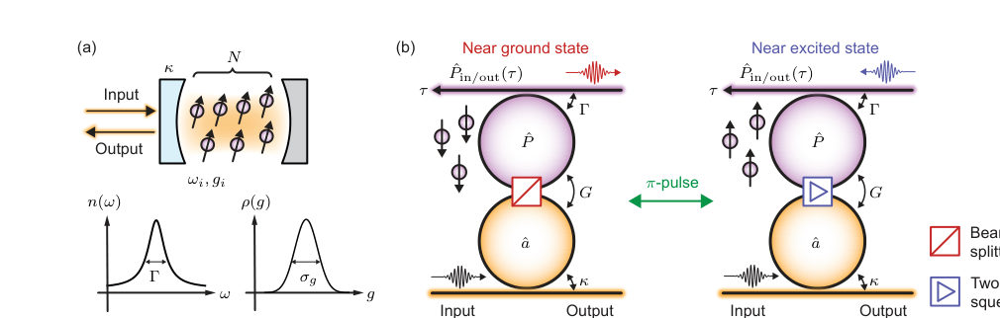
<figcaption class="paper-figure-caption"><b>Fig 1.</b> FIG. 1. Waveguide model. (a) Physical system: an ensemble of N spins interacts with a single resonator mode, with detunings ωi and couplings gi. The detunings ωi follow a Lorentzian distribution of width Γ (see Appendix G for the non-Lorentzian case), while gi follow an arbitrary distribution (Gaussian with standard deviation σg is used in numerical simulations). (b) Equivalent waveguide model: the ensemble is mapped to a resonator-like bright mode ˆP, and a dark waveguide, formed by a continuum of dark modes ˆPin/out(τ). The mode ˆP couples to ˆa with strength G and to ˆPin/out(τ) with rate Γ. A π-pulse switches the interaction between beam-splitter and two-mode-squeezing forms, while also...</figcaption>
</figure>
<figure class="paper-figure-card">
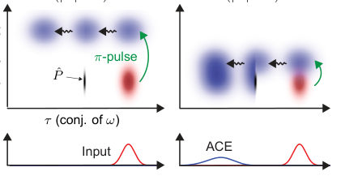
<figcaption class="paper-figure-caption"><b>Fig 2.</b> FIG. 2. Effects of adiabatic rapid passage (ARP). (a) For homogeneous coupling, an ARP π-pulse (chirp rate k) ap- plied after an input pulse generates an amplified chirped echo (ACE). (b) Waveguide model picture: ARP inverts different frequency components at different times, producing a chirped wavepacket in the dark waveguide. (c) Silencing by coupling inhomogeneity: in (s, τ) space, Fourier conjugate to (g, ω), the g-dependent phase induced by ARP displaces the state along the s direction, reducing its overlap with the bright mode ˆP and thereby suppressing the ACE.</figcaption>
</figure>
<figure class="paper-figure-card">
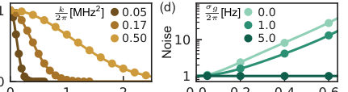
<figcaption class="paper-figure-caption"><b>Fig 3.</b> FIG. 3. ROSE protocol with ARP π-pulses. (a) Schematic: the first π-pulse generates an unwanted ACE, and the second π-pulseretrieves the stored quantum state. (b) Numerical sim- ulation: amplitudes of ⟨ˆain⟩(“Input”) and ⟨ˆaout⟩(“ACE,” “Output”). Solid (dashed) lines show real (imaginary) parts, with input peak normalized to 1. Light green: σg = 0 Hz; dark green: σg = 5 Hz. (c) Silencing factor F vs coupling in- homogeneity σg for different chirp rates k. Markers: numerics; lines: theory [Eq. (5)]. (d) Output noise ⟨∆ˆx2⟩+ ⟨∆ˆp2⟩vs cooperativity C for different σg at fixed k/(2π) = 0.50 MHz2. Markers: numerics; lines: theory [Eq. (8)].</figcaption>
</figure>
<figure class="paper-figure-card">
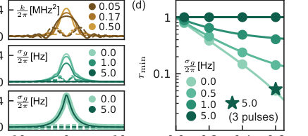
<figcaption class="paper-figure-caption"><b>Fig 4.</b> FIG. 4. RASE protocol with ARP π-pulses. (a) Schematic: the first π-pulse generates ASE, entangled with the RASE re- trieved after the second π-pulse. (b) Composite three-π-pulse protocol restoring the entanglement: the second π-pulse is re- placed by three ARP pulses to cancel the coupling-dependent phase. (c) Time correlation ⟨ˆaA(t)ˆaR(t′)⟩plotted as a func- tion of the time offset td from the point of maximum correla- tion, with t′ = 2t0 −t + td; see Appendix D for the definition. Solid (dashed) lines show the real (imaginary) parts. (up- per) Homogeneous coupling ( σg</figcaption>
</figure>
<figure class="paper-figure-card">
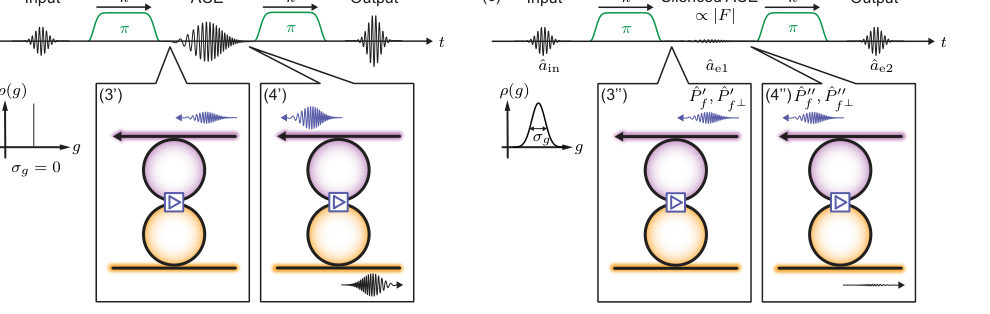
<figcaption class="paper-figure-caption"><b>Fig 5.</b> FIG. 5. Description of the ROSE protocol in the waveguide model. (a) Ideal π-pulses with an additional echo-silencing mech- anism. (1),(2) Part of the input pulse is absorbed into the dark waveguide, with an efficiency determined by the cooperativity [Eq. (C1)]. (3) A π-pulse reverses the propagation direction of the excitation in the dark waveguide. (4) When the excitation returns to the bright mode ˆP, the excited ensemble produces a noisy echo through the two-mode-squeezing interaction. This echo must be silenced by an external mechanism, such as phase mismatching or cavity detuning. (5) A second π-pulse reverses the propagation direction again. (6) The stored state is re-emitted with...</figcaption>
</figure>

**Summary.** This paper introduces a waveguide model to show that variations in light-matter coupling strength can be harnessed to suppress unwanted noise in quantum memories. It identifies the physical origin of echo suppression during adiabatic pulses and proposes a new pulse sequence to maintain entanglement. The findings have direct implications for improving the performance of both microwave and optical quantum network protocols.

**Why it may be interesting.** It provides a novel perspective on treating disorder (coupling inhomogeneity) as a functional resource rather than a nuisance, which is highly relevant for designing robust quantum networks and high-fidelity quantum memories.

Detailed structure

**Main problem.** The paper seeks to explain the unexpected suppression of echoes during Adiabatic Rapid Passage (ARP) pulses in quantum memories and to address the degradation of entanglement in RASE protocols caused by coupling inhomogeneity.

**Main result.** The authors demonstrate that coupling inhomogeneity can be used as a resource to suppress unwanted echoes (echo-silencing) and propose a new composite-pulse protocol to restore entanglement in the presence of such inhomogeneity.

**Method.** The study uses a waveguide model that maps subradiant modes to an effective waveguide, combined with second-order cumulant expansion simulations and the Holstein-Primakoff approximation.

**Model / system.** An ensemble of N two-level systems (spins) interacting with a single resonator mode, described by the Tavis-Cummings Hamiltonian with both frequency and coupling strength distributions.

**Key observables.** Superradiant emission, dephasing timescales, silencing factor (F), output noise, and the Duan-Simon criterion for entanglement.

**Important parameters / regimes.** Collective cooperativity (C), adiabaticity factor (Q), coupling distribution width (sigma_g), and frequency distribution width (Gamma).

**Assumptions / limitations.** The model relies on the Holstein-Primakoff approximation (valid for low excitation regimes) and assumes a second-order truncation of the cumulant expansion.

**Figures summary.** Figure 1 shows the physical system of spins in a resonator and the simplified waveguide model; Figure 3 illustrates the ROSE protocol, the suppression of ACE by coupling inhomogeneity, and the silencing factor versus coupling width.

**Paper structure.** The paper introduces the problem of inhomogeneity, develops a new analytical waveguide model, applies this model to explain echo suppression in ROSE/RASE protocols, proposes a mitigation strategy for entanglement, and validates the results against experimental platforms like microwave and optical systems.

Abstract

Inhomogeneous ensembles of two-level systems are important for both fundamental light-matter physics and quantum-network applications. Here we develop a general waveguide model that provides an intuitive and analytical description of collective dynamics in such systems by mapping the subradiant modes to an effective waveguide with well-defined input-output relations. For echo-based quantum memories, the model reveals the physical origin of noisy-echo suppression by adiabatic pulses and shows that inhomogeneous light-matter coupling can be harnessed as a resource for noiseless storage. For entanglement generation, the same mechanism exposes a previously unexplored limitation of robust control pulses and leads to a new composite-pulse protocol that overcomes it. These results establish the waveguide model as a practical bridge between fundamental collective physics and quantum-network protocol design, with direct implications for high-fidelity memories and robust entanglement generation in inhomogeneous ensembles.

[↑ back to top](#top)

### [Pairwise Liouvillian learning from randomized measurements: practical aspects and guidelines for operating the protocol in large-scale experiments](http://arxiv.org/abs/2605.26953v1)

**Authors:** William T. Lam, Manoj K. Joshi, Daniel Stilck França, Benoît Vermersch  
**Type:** theory · **Category:** quantum information and computing · **PDF:** <https://arxiv.org/pdf/2605.26953v1>  
**Analysis basis:** full PDF text, analyzed in chunks
**Topic relevance:** 🔥 `analog quantum simulation` **4/5** · 🔥 `methods for driven-dissipative` **4/5** · `correlated / nonlocal dissipation` **3/5** · `quantum measurements` **3/5** · `entanglement & information structure` **2/5** · `non-equilibrium dynamics` **2/5**

↔ Scroll figures horizontally

<figure class="paper-figure-card">
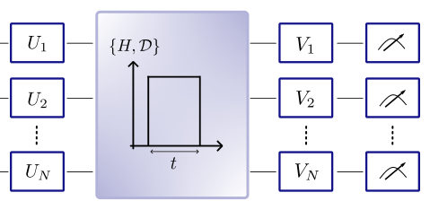
<figcaption class="paper-figure-caption"><b>Fig 1.</b> Figure 1. Pairwise Liouvillian learning experimental protocol. We prepare randomized Pauli states, time evolve the system and measure in random Pauli basis. We repeat the protocol for R random local gates {(Ui, Vi)}, for NT time points and NM repetitions. Then we extract the Liouvillian from the measured bitstrings.</figcaption>
</figure>
<figure class="paper-figure-card">
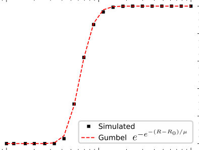
<figcaption class="paper-figure-caption"><b>Fig 2.</b> Figure 2. Probability of having a full rank system for a given qubit pair, as a function of the number of random Pauli unitaries, calculated numerically with 1000 samples. We interpolated the data with a Gumbel function e−e−(R−R0)/µ, with R0 = 57.76 and µ = 15.0. After R &gt; 200, the system is full rank with unity probability.</figcaption>
</figure>
<figure class="paper-figure-card">
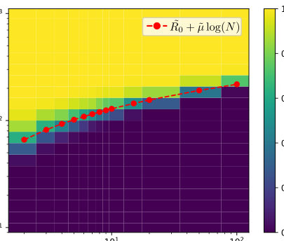
<figcaption class="paper-figure-caption"><b>Fig 3.</b> Figure 3. Probability of having a full rank system on all the qubit pairs, as a function of the number of random Pauli unitaries, calculated numerically with 1000 samples. We interpolated the isoprobability curve p(R, N) = 0.5, and ob- tained a logarithmic dependence R = ˜R0 + ˜µ log(N) of the parameters, with ˜R0, ˜µ = 39.31, 38.84. This illustrates the scalability of the full-rank condition with the system size.</figcaption>
</figure>
<figure class="paper-figure-card">
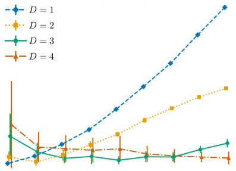
<figcaption class="paper-figure-caption"><b>Fig 4.</b> Figure 5. Reconstruction error as a function of the maximal time and interpolation degree. We simu- lated numerically the protocol with the parameters N = 2, R = 1000, NM = 1000, NT = 40, with a trapped ion Hamilto- nian, and averaged the data over 20 samples. This illustrates a bias (low degree, long times) variance (high degree, short times) tradeoff.</figcaption>
</figure>
<figure class="paper-figure-card">
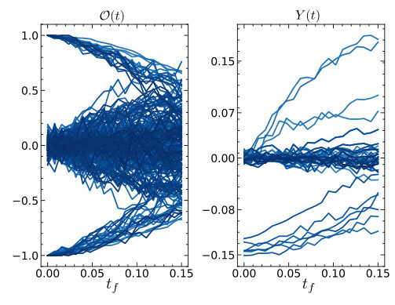
<figcaption class="paper-figure-caption"><b>Fig 5.</b> Figure 4. Time dynamics of O(t) (left) and Y (t) (right). The model and parameters are given in Sec. V. Applying the inversion matrix ˜ M −1 to the measured observables O(t), we obtain a few curves Y (t) with reduced statistical noise and well-suited for polynomial interpolation.</figcaption>
</figure>

**Summary.** This paper presents a scalable method to reconstruct the Hamiltonian and dissipative components of a quantum system using randomized measurements. By focusing on pairwise interactions, the protocol avoids the exponential memory bottleneck typically associated with large-scale quantum system characterization. It also provides practical optimization guidelines to balance statistical and systematic errors during data processing.

**Why it may be interesting.** It provides a practical, scalable framework for characterizing open quantum systems, which is essential for verifying the dynamics of large-scale quantum simulators and understanding decoherence in many-body systems.

Detailed structure

**Main problem.** Developing a scalable and efficient protocol for Liouvillian learning to reconstruct the full dynamics (Hamiltonian and noise) of large-scale quantum systems without exponential classical memory costs.

**Main result.** The authors demonstrate a pairwise learning protocol where the required classical memory is independent of system size and the number of random settings scales logarithmically with N, providing optimal guidelines for minimizing reconstruction error.

**Method.** The protocol uses randomized Pauli measurements and state preparation to extract local Liouvillian coefficients via polynomial interpolation of time-series data and least-squares solutions.

**Model / system.** The study focuses on Analog Quantum Simulators (AQS) such as trapped ions or superconducting circuits, specifically modeling an XY model with power-law interactions and single-body Lindblad noise.

**Key observables.** Expectation values of single-body and two-body Pauli operators and their time derivatives at t=0.

**Important parameters / regimes.** Number of random settings (R), number of measurement repetitions (Nm), interpolation degree (Dl), and system size (N).

**Assumptions / limitations.** The protocol assumes Markovian dynamics and a specific ansatz for the Liouplovian involving two-body interactions and single-body noise.

**Figures summary.** Figure 1 shows the experimental workflow; Figure 2 shows the full-rank probability of the configuration matrix; Figure 4 shows time dynamics of observables; Figure 5 illustrates the bias-variance tradeoff in interpolation; Figure 6 shows reconstruction error saturation with system size.

**Paper structure.** The paper introduces the Liouvillian learning problem, details the pairwise randomized measurement protocol, provides a mathematical framework for extracting coefficients, analyzes the scalability and error trade-offs, and validates the method with numerical simulations of an XY model.

Abstract

We review and numerically study a protocol for Liouvillian learning based on randomized Pauli states and measurements. In particular, in the two-body, long-range interactions, and single-body noise setting, we describe the complete workflow to obtain the coefficients of the Liouvillian in an efficient and pairwise manner, meaning that the required classical memory is independent of the system size. We also provide guidelines for choosing the parameters for data acquisition and postprocessing that minimize the total reconstruction error.

[↑ back to top](#top)

### [Entanglement Pattern Transition of Quantum States from Directed Percolation](http://arxiv.org/abs/2605.26219v1)

**Authors:** Julian Boesl, Frank Pollmann, Michael Knap  
**Type:** theory · **Category:** numerical methods · **PDF:** <https://arxiv.org/pdf/2605.26219v1>  
**Analysis basis:** full PDF text, analyzed in chunks
**Topic relevance:** 🔥 `entanglement & information structure` **4/5** · 🔥 `non-equilibrium universality` **4/5** · `driven-dissipative phase transition` **3/5** · `methods for driven-dissipative` **3/5** · `non-equilibrium dynamics` **3/5**

↔ Scroll figures horizontally

<figure class="paper-figure-card">
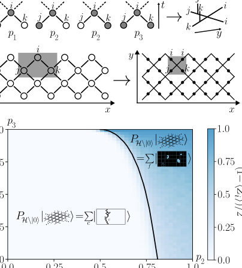
<figcaption class="paper-figure-caption"><b>Fig 1.</b> FIG. 1. The Domany-Kinzel (DK) automaton. a) In the DK au- tomaton, even (i) and odd ( j and k) sites are updated alternatingly. White/gray circles represent empty/active sites (0/1); the probabili- ties of an empty site at i are P(0| jk) = 1−P(1| jk). By adding physical legs, the automaton is mapped to a quantum state; time t becomes a spatial direction y. b) The phase diagram of the DK automaton for p1 = 0. At low p2/3, the automaton is in the absorbing phase; the or- der parameter ni = (1−⟨Zi⟩)/2 is zero. In the active phase at high p2/3, ni is finite. The transition line (black) is taken from [43]. For peri- odic boundaries, the ground state manifold of the parent Hamiltonian is...</figcaption>
</figure>
<figure class="paper-figure-card">
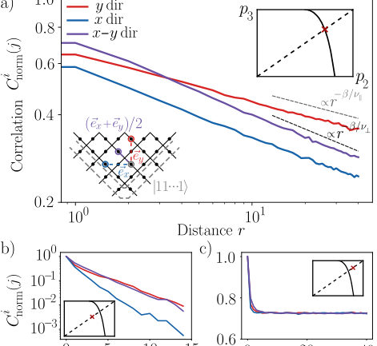
<figcaption class="paper-figure-caption"><b>Fig 2.</b> FIG. 2. Normalized correlations. The normalized correlations Ci norm( j) in the directions y (red), x (blue) and x −y (purple), eval- uated in an open boundary system with fully active boundaries for p2 = p3 = p. a) Correlations on the critical line p = 0.7055. All directions feature algebraic scaling with exponent β/ν∥in y direction and β/ν⊥in all other directions. b) Correlations in the absorbing phase, p = 0.55 decay exponentially. c) Correlations in the active phase, p = 0.8 saturate to a finite value, corresponding to the den- sity n of active sites in the steady state. The linear system size is L = 3000 in a) and c), and L = 100 in b).</figcaption>
</figure>
<figure class="paper-figure-card">
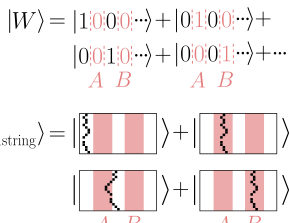
<figcaption class="paper-figure-caption"><b>Fig 3.</b> FIG. 3. Pairwise entanglement throughout the absorbing phase. a) The L-qubit W state |W⟩= 1 √</figcaption>
</figure>
<figure class="paper-figure-card">
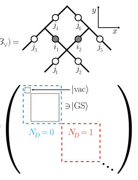
<figcaption class="paper-figure-caption"><b>Fig 4.</b> FIG. 4. Parent Hamiltonian HDK. Top: The support of the projector B∨. The outer qubits j1, . . . j6 are acted on only diagonally in the Z basis, while the inner qubits i1, i2 are projected onto a superposition α |00⟩+ β |11⟩; the coefficients depend on the environment. Bottom: The structure of the Hamiltonian HDK in the DP plane p1 = 0. The Hilbert space splits up into sectors labeled by the defect number ND. The ground state manifold lies in the sector ND = 0. As the state |vac⟩= |00 · · · 0⟩cannot be connected to any other zero-defect state, it is as an additional ground state along the non-trivial state |GS⟩.</figcaption>
</figure>

**Summary.** The paper establishes a connection between classical directed percolation and quantum entanglement transitions. It shows that the absorbing phase transition of a stochastic automaton manifests as a transition between W-state-like entanglement and trivial entanglement in a corresponding tensor network state.

**Why it may be interesting.** This work is highly relevant for many-body dynamics and open quantum systems as it provides a blueprint for using classical non-equilibrium universality classes to discover and characterize new, non-trivial entanglement structures in quantum states.

Detailed structure

**Main problem.** Investigating transitions between quantum states with distinct entanglement patterns that do not represent stable equilibrium phases of matter, specifically by mapping classical non-equilibrium phase transitions to quantum tensor networks.

**Main result.** The authors demonstrate that the directed percolation (DP) transition in a classical automaton corresponds to a quantum entanglement transition between a W-state-like pattern (long-range pairwise entanglement) and a trivial, short-range entangled pattern.

**Method.** The study uses an 'automaton-to-isoTNS' mapping to translate stochastic cellular automata (Domany-Kinulence) into isometric Tensor Network States, utilizing transfer matrix analysis and negativity to quantify entanglement.

**Model / system.** A 2D quantum state constructed from the (1+1)D Domany-Kinzel automaton, featuring a continuous, frustration-free parent Hamiltonian with a degenerate ground state manifold consisting of a vacuum state and a non-trivial state.

**Key observables.** Negativity (as a measure of bipartite entanglement), Z-operator expectation values, density of active sites, and normalized correlation functions.

**Important parameters / regimes.** Transition probabilities (p1, p2, p3) of the DK automaton, specifically the p1=0 plane, and the critical point p_c approx 0.7055.

**Assumptions / limitations.** The tensor network is not injective, meaning the constructed state might not be the unique ground state of the parent Hamiltonian; the derivation of scaling laws assumes translational invariance.

**Figures summary.** Figure 1 shows the mapping from the DK automaton to the quantum state and the phase diagram; Figure 4 illustrates the structure of the parent Hamiltonian and the projection of qubits.

**Paper structure.** The paper introduces the mapping between stochastic automata and isoTNS, analyzes the entanglement transition in the absorbing phase of the DK model, compares the results to the Kasteleyn model to highlight the role of symmetry, and extends the findings to 3D directed percolation.

Abstract

Changes in the entanglement structure and critical phenomena are hallmarks of quantum phase transitions. Here, we discuss how they appear in transitions between classes of states with distinct entanglement patterns beyond the paradigm of stable equilibrium phases of matter. Using a mapping between stochastic automata and isometric Tensor Network States (isoTNS), we construct a two-dimensional quantum state from the Domany-Kinzel automaton, which is a (1+1)D process with an absorbing phase transition in the directed percolation class. At the critical point of the automaton, the corresponding isoTNS hosts algebraic correlations in all spatial directions. The continuous parent Hamiltonian of this state has a degenerate ground state manifold. It consists of a product state (the absorbing state) and a second state that undergoes a transition from pairwise entanglement between distant regions, similarly to the W state, to a state with trivial entanglement. Our results demonstrate how the correspondence between isoTNS and classical stochastic evolution can be used to probe the Hilbert space structure beyond stable ground state manifolds.

[↑ back to top](#top)

### [Preparing thermal states of frustrated quantum spin systems using 139 qubits](http://arxiv.org/abs/2605.26245v1)

**Authors:** Roland C. Farrell, Yongtao Zhan, Lucas Katschke, Lode Pollet, Ilan T. Rosen, Jad C. Halimeh  
**Type:** both · **Category:** quantum information and computing · **PDF:** <https://arxiv.org/pdf/2605.26245v1>  
**Analysis basis:** full PDF text, analyzed in chunks
**Topic relevance:** 🔥 `QC/QI experiment` **4/5** · `correlated / nonlocal dissipation` **3/5** · `methods for driven-dissipative` **3/5** · `non-equilibrium dynamics` **3/5** · `driven-dissipative phase transition` **2/5** · `quantum measurements` **2/5**

↔ Scroll figures horizontally

<figure class="paper-figure-card">
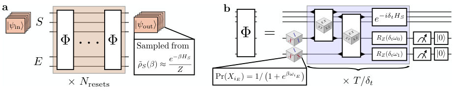
<figcaption class="paper-figure-caption"><b>Fig 1.</b> FIG. 1. a The thermal state preparation algorithm from Ref. [22]. Qubits are split into system (S) and environment (E). The system qubits are acted on by the quantum channel Φ a total of Nresets times. This produces an ensemble of pure states {|ψout⟩} that are sampled from ˜ρS(β) which approximates the Gibbs ensemble of the system Hamiltonian HS at inverse temperature β. b The quantum channel Φ begins by initializing each environment qubit to a random product state sampled from the Gibbs ensemble of the environment Hamiltonian HE. Next, evolution for time T is implemented in discrete time steps δt. The total Hamiltonian contains HS, HE and a system-environment interaction component, HSE,...</figcaption>
</figure>
<figure class="paper-figure-card">
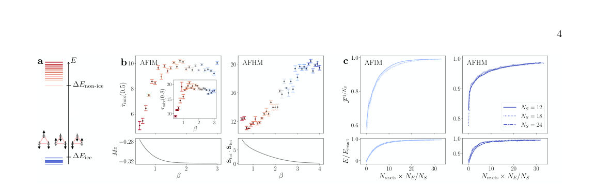
<figcaption class="paper-figure-caption"><b>Fig 2.</b> FIG. 2. a The low energy spectrum of the AFIM for gz = 2, gx = 0.5. b The mixing time, τmix(Fthresh) for NS = 12, a range of β, and in the AFIM (left) and AFHM (right). The inset gives the mixing time for a larger fidelity threshold in the AFIM showing a local maxima at the ice crossover, βc ≈1.4. The bottom plots show the β-dependence of the average magnetization MZ in the AFIM and the square of the total spin Stot · Stot in the AFHM. c The convergence of the quantum Gibbs samplers for increasing lattice sizes. The upper plots show the fidelity in the AFIM with β = 3 (left) and AFHM with β = 4 (right). The bottom panels show the ratio of the measured energy E to the exact energy Eexact....</figcaption>
</figure>
<figure class="paper-figure-card">
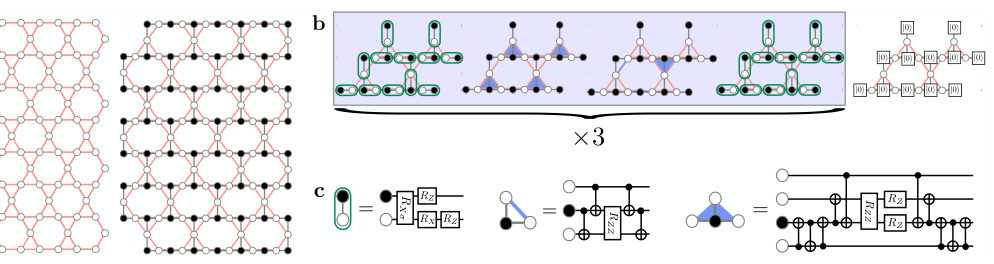
<figcaption class="paper-figure-caption"><b>Fig 3.</b> FIG. 3. a Embedding of a kagome lattice (left) onto the heavy-hex connectivity of IBM’s Heron r3 processors (right). The heavy-hex connectivity is represented by the gray links. The sites (links) of the kagome lattice are defined by the white colored qubits (pink links). The environment qubits (black colored qubits) are interspersed throughout the lattice. b The quantum circuits used in one application of the dissipative quantum channel Φ for (NS, NE) = (12, 12) on ibm boston. The circuits highlighted in purple correspond to one second order Trotter step, which is repeated T/δt = 3 times. After time evolution, the environment qubits are measured and reset to |0⟩. c The definition of the...</figcaption>
</figure>
<figure class="paper-figure-card">
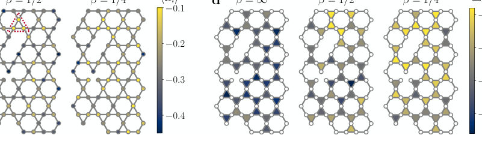
<figcaption class="paper-figure-caption"><b>Fig 4.</b> FIG. 4. a Energy density measured on ibm boston for β = ∞, 1/2, 1/4 and systems sizes NS = 12, 18, 79 coupled to NE = 12, 17, 60 environment sites. The data for NS = 12, 18 is compared to noiseless statevector simulations with environment temperature β (dashed). The x-axis is rescaled to compare the results across different NE/NS as explained in Appendix A. The spatial distribution of magnetization c and △ZZ d measured in the approximate thermal states for NS = 79. The spins in c that are outlined in red surround a hot environment qubit with a large reset error rate. Bulk averages for NS = 79 are compared in b to QMC predictions at an effective temperature βeff that reproduces the steady...</figcaption>
</figure>
<figure class="paper-figure-card">
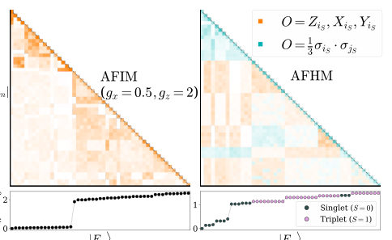
<figcaption class="paper-figure-caption"><b>Fig 5.</b> FIG. 5. Matrix elements of the jump operators O be- tween the 50 lowest-lying energy eigenstates of the AFIM and AFHM on a NS = 18 site kagome lattice with PBCs. The opacity of the pixel at (n, m) represents max (|⟨Em|O|En⟩|) where the maximum is taken over all jump operators. The pixels are orange if the maximum is a single site jump op- erator and teal if it is a SU(2) singlet jump operator. The opacity has been normalized by the largest entry for each of the two models independently. The bottom panels show the energy of the corresponding eigenstates.</figcaption>
</figure>

**Summary.** The researchers developed a method to prepare thermal states of frustrated kagome spin systems using dissipative quantum computing on IBM hardware. They found that the time needed to reach equilibrium does not depend on the number of spins, suggesting a potential quantum advantage over classical methods. The study also quantifies how hardware noise and reset errors affect the accuracy of the prepared thermal states.

**Why it may be interesting.** This work is highly relevant for researchers in open quantum systems and many-body dynamics as it demonstrates a practical method for using engineered dissipation and mid-circuit measurements to drive a system toward a target many-body steady state.

Detailed structure

**Main problem.** The difficulty of preparing thermal (Gibbs) states of frustrated quantum spin systems on digital quantum computers due to the sign problem in classical Monte Carlo methods and the impact of hardware noise.

**Main result.** Demonstrated a robust dissipative protocol on IBM quantum processors that prepares approximate thermal states of the kagome Ising model, showing that the required circuit depth scales at most linearly with inverse temperature and is independent of system size.

**Method.** A dissipative quantum Gibbs sampling protocol using engineered environment qubits, mid-circuit resets, and a quantum channel designed to satisfy approximate quantum detailed balance, supplemented by Zero-Noise Extrapolation (ZNE) for error mitigation.

**Model / system.** Frustrated spin systems on a kagome lattice, specifically the Antiferromagnetic Heisenberg Model (AFHM) and the Antiferromagnetic Ising Model (AFIM), implemented on IBM's heavy-hex superconducting quantum processors.

**Key observables.** Energy density, local magnetization, antiferromagnetic correlations, and triangle ZZ correlators.

**Important parameters / regimes.** Inverse temperature (beta), system size (Ns), number of environment qubits (Ne), and coupling strength (alpha).

**Assumptions / limitations.** The efficiency of the protocol assumes that the mixing time scaling observed in small-scale classical simulations persists to larger system sizes.

**Figures summary.** Figure 1 illustrates the dissipative algorithm and reset process; Figure 2 shows the low-energy spectrum, mixing time scaling, and convergence analysis; Figure 3 shows the kagome lattice mapping onto IBM hardware and circuit diagrams; Figure 4 compares experimental energy density to noiseless and QMC results; Figure 13 shows reset error confusion matrices and spatial maps of effective temperature; Figure 14 shows energy density evolution with error mitigation; Figure 20 displays spatially resolved magnetization and correlators.

**Paper structure.** The paper introduces the problem of thermal state preparation, describes the dissipative sampling protocol and its implementation on IBM hardware, presents scaling and convergence results from classical simulations, details the experimental implementation and error mitigation strategies, and concludes with a comparison of experimental observables against QMC benchmarks.

Abstract

Finite-temperature properties of strongly correlated quantum matter are central to condensed matter, chemistry, and high-energy physics, yet are often inaccessible to classical methods such as quantum Monte Carlo (QMC). Here, we investigate dissipative thermal state preparation of frustrated spin systems using digital quantum computers. We focus on two paradigmatic models on the kagome lattice: the antiferromagnetic Heisenberg model (AFHM), whose finite-temperature properties are inaccessible to QMC due to a severe sign problem, and the antiferromagnetic Ising model (AFIM), which serves as a sign-problem-free benchmark. Using IBM quantum processors, we prepare approximate thermal states of the AFIM on kagome lattices with up to $79$ spins coupled to $60$ environment qubits. We observe the emergence of a robust steady state with an adjustable effective temperature that persists in circuits with over 1000 layers of two-qubit gates. We further study the scalability of the dissipative protocol through classical statevector simulations of the AFIM and AFHM. On lattices with up to 24 sites, we find that the circuit depth to reach thermal equilibrium is independent of system size and grows at most linearly with inverse temperature. These results establish engineered dissipation as a promising approach to finite-temperature quantum simulation of frustrated matter, and point toward regimes where quantum devices may outperform classical methods.

[↑ back to top](#top)

### [Quantum criticality and factorization in a constrained Rydberg spin chain](http://arxiv.org/abs/2605.27166v1)

**Authors:** Yuan Jiang, Wen-Long You, Liangsheng Li, Maoxin Liu  
**Type:** theory · **Category:** other · **PDF:** <https://arxiv.org/pdf/2605.27166v1>  
**Analysis basis:** full PDF text, analyzed in chunks
**Topic relevance:** 🔥 `Rydberg arrays` **4/5** · 🔥 `entanglement & information structure` **4/5** · `analog quantum simulation` **3/5** · `exotic spin models in light-matter` **3/5** · `scars & prethermalization` **3/5**

↔ Scroll figures horizontally

<figure class="paper-figure-card">
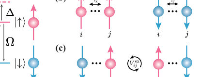
<figcaption class="paper-figure-caption"><b>Fig 1.</b> FIG. 1. (a) Energy level scheme of a single atom. A mi- crowave field with Rabi frequency Ωand detuning ∆cou- ples two Rydberg states, mapped to a pseudo-spin-1/2 system {| ↓⟩, | ↑⟩}. (b) Diagonal vdW interaction strengths V ↑↑ ij and V ↓↓ ij between atoms at sites i and j. (c) Off-diagonal resonant dipole-dipole coupling strength V ex ij driving the spin exchange process.</figcaption>
</figure>
<figure class="paper-figure-card">
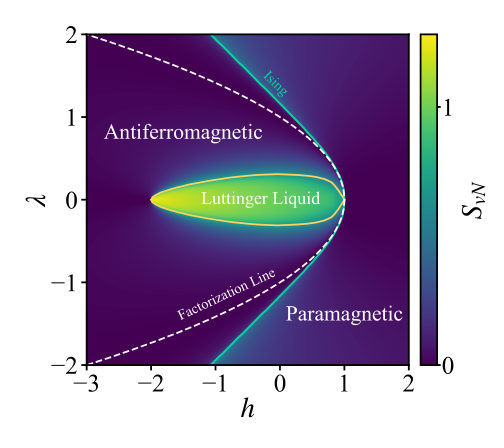
<figcaption class="paper-figure-caption"><b>Fig 2.</b> FIG. 2. Phase diagram showing the ground state entangle- ment entropy SvN of Heff in the (h, λ) parameter plane for bond dimension M = 20. The distinct entanglement signa- tures delineate three quantum phases: the yellow-green crit- ical LL phase, the dark-shaded blue AFM phase, and the slightly lighter PM phase. The cyan solid curve marks the Ising transition, the yellow line separates the AFM and LL phases, and the white dashed line indicates the factorization line.</figcaption>
</figure>
<figure class="paper-figure-card">
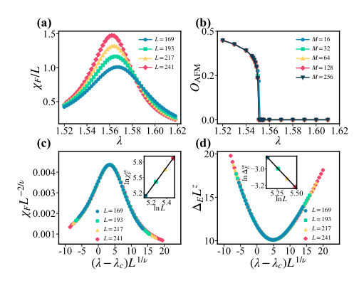
<figcaption class="paper-figure-caption"><b>Fig 3.</b> FIG. 3. Phase transition and finite-size scaling at h = −0.5. Results are obtained using finite-size DMRG for various sys- tem sizes L and VUMPS for the infinite system with varying bond dimensions M. (a) Fidelity susceptibility per site χF /L as a function of the Rabi drive λ. (b) OAFM as a function of λ demonstrates a continuous vanishing behavior across the transition. (c) Finite-size scaling collapse of the fidelity sus- ceptibility, utilizing the critical parameters λc = 1.55 and ν = 0.97 ± 0.08. The inset shows the power-law scaling of the peak value χm F with system size L on a log-log scale. (d) Corresponding data collapse for the neutral excitation gap, yielding a dynamical...</figcaption>
</figure>
<figure class="paper-figure-card">
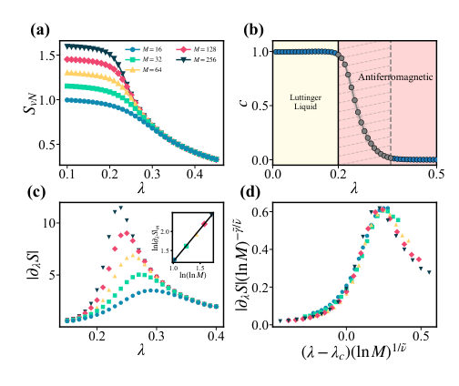
<figcaption class="paper-figure-caption"><b>Fig 4.</b> FIG. 4. Entanglement properties at fixed detuning h = −0.5 for various bond dimensions M. (a) SvN as a function of driving strength λ. (b) Effective central charge c versus λ ex- tracted via finite-entanglement scaling. (c) Magnitude of the derivative |∂λSvN| ≡|dSvN/dλ| versus λ. The inset shows the linear scaling of the peak maxima ln |∂λSvN|m and their positions versus ln(ln M). (d) Scaling collapse of |∂λSvN| fol- lowing the ansatz of Eq. (7), achieved with critical parameters λc = 0.20, ˜ν = 1.00, and ˜γ = 1.74.</figcaption>
</figure>
<figure class="paper-figure-card">
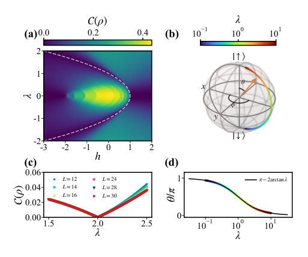
<figcaption class="paper-figure-caption"><b>Fig 5.</b> FIG. 5. (a) Nearest-neighbor concurrence C(ρ) in the (h, λ) plane, obtained by ED for L = 24. (b) Bloch sphere represen- tation of the single-site state on the active sublattice; points are colored by λ. (c) Concurrence C(ρ) versus system size L at three representative points along the factorization line at h = −3.0 (white dashed curve in (a)). (d) Polar angle θ of the Bloch vector as a function of λ; the solid black curve is the empirical fit θ(λ) = π −2 arctan(λ).</figcaption>
</figure>

**Summary.** This paper investigates the phase transitions of a 1D Rydberg spin chain subject to a blockade constraint. It identifies a Luttinger liquid, an antiferromagnetic phase, and a paramagnetic phase, and highlights a unique line in parameter space where the many-body ground state becomes a simple product state.

**Why it may be interesting.** It provides an analytically tractable, zero-entanglement reference point (the factorization line) for programmable Rydberg quantum simulators and explores the interplay between local and nonlocal quantum fluctuations in constrained Hilbert spaces.

Detailed structure

**Main problem.** Characterizing the zero-temperature phase diagram and quantum criticality of a 1D constrained Rydberg spin chain where local Rabi driving and nonlocal dipolar exchange compete.

**Main result.** The study establishes a phase diagram containing a Luttinger liquid, an antiferromagnetic phase, and a polarized paramagnet, while discovering an exact ground-state factorization line within the AFM phase.

**Method.** The authors use a combination of Exact Diagonalization (ED), Density Matrix Renormalization Group (DMRG), and Variational Uniform Matrix Product State (vMPS) calculations, alongside Schrieffer-Wolff transformations.

**Model / system.** A 1D constrained quantum spin chain realized in Rydberg-atom arrays, featuring a blockade constraint that prevents adjacent excitations and includes competing transverse driving and longitudinal detuning.

**Key observables.** Entanglement entropy, entanglement-based diagnostics, finite-entanglement scaling, fidelity susceptibility, and density-density correlation functions.

**Important parameters / regimes.** Rabi driving strength (lambda), effective detuning (h), and the Rydberg blockade constraint.

**Assumptions / limitations.** The long-range van der Waals interactions are truncated to nearest-neighbor terms, and the system is studied in the strong-blockade limit.

**Figures summary.** Fig 1 shows the energy level scheme and interaction representations; Fig 2 presents the phase diagram with entanglement entropy; Fig 3/4 shows scaling analysis; Fig 5 maps nearest-neighbor concurrence and the factorization line.

**Paper structure.** The paper introduces the Rydberg-atom-based model, derives an effective Hamiltonian via Schriefer-Wolff transformation, presents the numerical phase diagram, analyzes the two distinct transition mechanisms, and concludes with the derivation of the exact factorization line.

Abstract

We investigate the zero-temperature phase diagram of a one-dimensional constrained quantum spin chain realized in coherently driven Rydberg-atom arrays with competing local Rabi driving and dipole-dipole exchange interactions. Projecting onto the blockade-constrained Hilbert space yields an effective model in which local and nonlocal quantum fluctuations compete on equal footing. Combining exact diagonalization, the density-matrix renormalization group, and variational uniform matrix-product-state calculations, we establish a complete phase diagram comprising a Luttinger liquid, an antiferromagnetic ordered phase, and a polarized paramagnet. We identify two distinct mechanisms for the destruction of antiferromagnetic order: a conventional Ising transition at strong driving and a continuous quantum melting into the Luttinger liquid at weak driving, characterized using entanglement-based diagnostics and finite-entanglement scaling. In addition, we uncover an exact ground-state factorization line embedded within the ordered phase, providing an analytically tractable zero-entanglement reference point for experiments with programmable Rydberg quantum simulators.

[↑ back to top](#top)

### [Crosstalk In Contemporary Quantum Devices](http://arxiv.org/abs/2605.26528v1)

**Authors:** Spiro Gicev, Ben Harper, Haiyue Kang, Muhammad Usman, Martin Sevior  
**Type:** both · **Category:** quantum information and computing · **PDF:** <https://arxiv.org/pdf/2605.26528v1>  
**Analysis basis:** full PDF text, analyzed in chunks
**Topic relevance:** 🔥 `QC/QI experiment` **4/5** · `correlated / nonlocal dissipation` **3/5** · `Rydberg arrays` **2/5** · `quantum optics experiment` **2/5** · `spintronics-quantum-optics interface` **2/5** · `entanglement & information structure` **1/5** · `quantum measurements` **1/5**

↔ Scroll figures horizontally

<figure class="paper-figure-card">
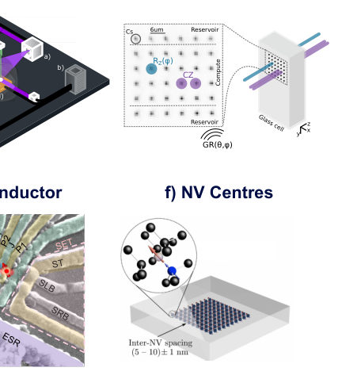
<figcaption class="paper-figure-caption"><b>Fig 1.</b> FIG. 1. Quantum computing platforms. a) The superconducting platform, which includes Google, IBM, Oxford Quantum Circuits, and Rigetti, represented by an IBM superconducting circuit [1]. b) The trapped ion platform, which includes IonQ and Quantinuum, represented by a schematic of a trapped ion array by IonQ [2]. c) The neutral atom platform, which includes Atom Computing, Infleqtion, Pasqal, Planqc, and QuEra, represented by an Infleqtion schematic [3]. d) The photonic platform, which includes PsiQuantum and Xanadu, represented by a PsiQuantum photonic circuit schematic [4]. e) The semiconductor platform, which includes Diraq, Intel, Silicon Quantum Computing, and QuTech, represented by a...</figcaption>
</figure>
<figure class="paper-figure-card">
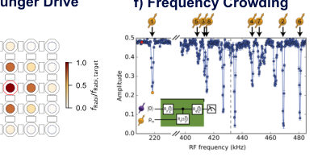
<figcaption class="paper-figure-caption"><b>Fig 2.</b> FIG. 2. Examples crosstalk phenomena in QPUs across different platforms. a) Always-on interactions causing oscillations in fidelity with dependence on neighbouring qubit states on an IBM QPU [27]. b) A diagram representing optical pulse spillover during MS gates in a system of trapped ions [28]. c) Two images showing a image of neutral atom readout with short (left) and long (right) exposure times [29]. d) Undesired heating of adjacent thermal phase-shifters in a photonic circuit [30]. e) Gate spillover for barrier and plunger drive in a QuTech quantum dot QPU [31]. f) Frequency crowding observed by nuclear spin spectroscopy in a QuTech nitrogen vacancy quantum device [32].</figcaption>
</figure>
<figure class="paper-figure-card">
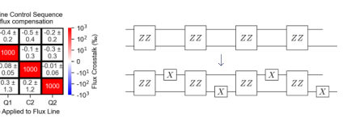
<figcaption class="paper-figure-caption"><b>Fig 3.</b> FIG. 3. Crosstalk mitigation techniques. a) A heavy-hexagon lattice with connectivity of degree 3, requires only three unique frequencies so adjacent qubits do not share a frequency, reducing frequency collisions as described in Ref. [22]. b) Simulated variation of the Z component of magnetic field strength for systems where control is performed with dual concentric loops [127]. c) ZZ interaction strength as a function of qubit-qubit detuning and bus frequency in a superconducting QPU with tunable-couplers [40]. d) Flux crosstalk between qubits and couplers before and after compensating for non-local flux when driving individual flux control lines in a superconducting QPU [51]. e)...</figcaption>
</figure>
<figure class="paper-figure-card">
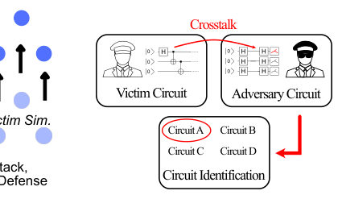
<figcaption class="paper-figure-caption"><b>Fig 4.</b> FIG. 4. Security vulnerabilities enabled by crosstalk in QPUs. a) An active attack, where a quantum computer tenant attacks a co-tenant using a sequence of repeated CNOT gates on superconducting hardware [147]. b) A passive attack, where always-on interactions cause a victim simulation to fail due to an attack simulation which was placed too close [67]. c) Spying, where crosstalk detection using an adversarial quantum circuit facilitates victim circuit identification, based on descriptions given in Ref. [154].</figcaption>
</figure>

**Summary.** This review article provides a comprehensive overview of crosstalk phenomena across all major quantum computing platforms. It identifies the physical origins of unintended interactions, evaluates current mitigation strategies, and highlights the emerging security risks associated with crosstalk in shared quantum environments.

**Why it may be interesting.** It is highly relevant for researchers in open quantum systems and quantum optics as it details how environmental and control-induced interactions (like ZZ coupling or photon spillover) lead to correlated noise and decoherence in multi-qubit registers.

Detailed structure

**Main problem.** Crosstalk in quantum devices causes unintended interactions and lack of individual addressability, acting as a major barrier to scaling quantum computing platforms.

**Main result.** The paper provides a comprehensive review of crosstalk mechanisms, mitigation strategies, and security vulnerabilities across diverse quantum platforms, noting that structured noise becomes dominant as hardware improves.

**Method.** The authors perform a comparative review of literature across multiple physical architectures, categorizing crosstalk by physical origin, diagnostic methods, and mitigation techniques.

**Model / system.** The review covers a wide range of platforms including superconducting circuits, trapped ions, neutral atom arrays, photonic systems, semiconductor quantum dots, and NV centers in diamond.

**Key observables.** Gate fidelities, coherence times, error rates, Rabi ratios, correlated errors, and Pauli channel parameters.

**Important parameters / regimes.** Qubit number, gate times, frequency detuning, interatomic spacing, and photon loss.

**Assumptions / limitations.** The review assumes that crosstalk is a primary limiting factor for the transition from NISQ-era devices to large-scale, fault-tolerant quantum computers.

**Figures summary.** Figure 1 provides a visual catalog of various quantum computing platforms and companies; Figure 2 illustrates specific crosstalk examples such as optical pulse spillover, thermal heating in photonics, and frequency crowding.

**Paper structure.** The paper defines the problem of crosstalk and its impact on scaling, provides a platform-by-platform review of physical origins, surveys mitigation techniques, discusses emerging security vulnerabilities, and identifies open research questions.

Abstract

Crosstalk noise derives from phenomena in quantum devices which inhibit individual addressability or cause unintended interactions among qubits. It is widely considered one of the major problems to be solved for a quantum computing platform to operate at scales beyond one or two qubits. Despite this, detailed discussion of crosstalk is often neglected when quantum device performance is described both in the context of device benchmarking and individual algorithm execution. Additionally, while the potential for crosstalk exists in all quantum platforms, the mechanisms and severity of crosstalk between platforms varies significantly, increasing the barrier of entry associated with understanding and performing research on unfamiliar quantum platforms. While previous work focused on theoretical formalism or platform specific details, in this review article, we provide a comprehensive overview of crosstalk from quantum computing literature across a range of physical systems focusing on physical origins, methods of mitigation and known consequential security vulnerabilities. We describe multiple crosstalk mechanisms for all major quantum computing platforms, which are usually implicitly addressed through device design, tuning, and mitigation techniques. We also observe accelerating research regarding security implications, however with multiple avenues for further exploration, especially for non-superconducting systems. Together, this review provides a comprehensive entry point for researchers and industry engineers interested in understanding and addressing the challenges arising from crosstalk phenomena in modern quantum computing systems.

[↑ back to top](#top)

### [Evolution of Hypoequilibrium States in Steepest Entropy Ascent Models for Nonequilibrium Quantum Thermodynamics](http://arxiv.org/abs/2605.26644v1)

**Authors:** Gian Paolo Beretta, Rohit Kishan Ray, Michael R. von Spakovsky  
**Type:** theory · **Category:** statistical mechanics · **PDF:** <https://arxiv.org/pdf/2605.26644v1>  
**Analysis basis:** full PDF text, analyzed in chunks
**Topic relevance:** 🔥 `methods for driven-dissipative` **4/5** · 🔥 `non-equilibrium dynamics` **4/5** · `driven-dissipative phase transition` **2/5** · `non-equilibrium universality` **2/5** · `scars & prethermalization` **2/5** · `entanglement & information structure` **1/5**

↔ Scroll figures horizontally

<figure class="paper-figure-card">
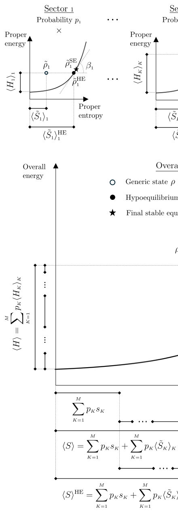
<figcaption class="paper-figure-caption"><b>Fig 1.</b> Figure 1. Top: representation of the HESS density operator ˜ρK and its HE approximation ˜ρHE</figcaption>
</figure>

**Summary.** This paper provides a rigorous mathematical foundation for hypoequilibrium states within the SEAQT framework of quantum thermodynamics. It proves that these states form an invariant manifold, meaning a mixture of canonical states remains such a mixture during evolution. The work also bridges the gap between SEAQT and the RCCE method for modeling complex relaxation processes.

**Why it may be interesting.** This work is highly relevant for researchers in open quantum systems and many-body dynamics as it provides a rigorous foundation for reduced-order modeling of far-from-equilibrium relaxation and transport processes using a thermodynamically consistent framework.

Detailed structure

**Main problem.** The paper seeks to establish a mathematically rigorous framework for 'hypoequilibrium' (HE) states within the Steepest-Entropy-Ascent Quantum Thermodynamics (SEAQT) framework and to prove the dynamical consistency of these states.

**Main result.** The authors prove that the M-th order HE family constitutes an invariant manifold under SEAQT evolution, ensuring that states representing a mixture of canonicals maintain this structure. They also establish a formal connection between the HE ansatz and the Rate-Controlled Constrained-Equilibrium (RCCE) method.

**Method.** The study uses operator-based mathematical formulations, Hilbert space decomposition into spectral sectors, and variational principles to derive reduced-order evolution equations for intensive parameters.

**Model / system.** The model focuses on unstructured quantum systems governed by the SEAQT equation of motion, which augments the von Neumann equation with a nonlinear dissipative term. It also extends to non-Hamiltonian (NH-SEAQT) interactions for system-bath energy and entropy exchange.

**Key observables.** Entropy production rate, sector-specific temperatures (inverse temperatures), chemical potentials, sector probabilities, and the Massieu operator.

**Important parameters / regimes.** Spectral-sector temperatures (beta_K), sector probabilities (p_K), relaxation times (tau_K), and the regime where dissipative dynamics commute with the Hamiltonian.

**Assumptions / limitations.** The primary approximation is the Hypoequilibrium (HE) assumption, which assumes rapid probability redistribution within energy sectors (HESS) and a decomposition of the Hilbert space into coarse-grained spectral sectors.

**Figures summary.** Figure 1 illustrates the rapid relaxation of a HESS state toward a maximal-entropy state on an energy-vs-entropy diagram and shows the overall system evolution.

**Paper structure.** The paper begins with the formal definition of HE states, moves to the derivation of reduced evolution for intensive parameters, provides a proof of manifold invariance, establishes the link to the RCCE method, and concludes with an extension to non-Hamiltonian system-bath interactions.

Abstract

A formal development of the hypoequilibrium (HE) state concept within the Steepest-Entropy-Ascent Quantum Thermodynamics (SEAQT) framework is presented, emphasizing its rigorous mathematical formulation. Using a general decomposition of the Hilbert space, HE states are defined in operator language and the reduced evolution of the associated intensive parameters for the regime where the dissipative dynamics commutes with the Hamiltonian is derived. It is proved that the $M$-th order HE family (where $M$ is the number of spectral sectors) constitutes an invariant manifold under the SEAQT equation of motion, ensuring that states initially representing a ``mixture of canonicals'' maintain this structure throughout their evolution. Furthermore, a formal connection is established between the HE ansatz and the rate-controlled constrained equilibrium (RCCE) method, identifying HE variables as constraint potentials. Finally, the model is extended to non-Hamiltonian SEAQT (NH-SEAQT) interactions to describe thermodynamically consistent energy and entropy exchanges between subsystems and heat baths. This work provides the formal foundation for reduced-order modeling of far-from-equilibrium relaxation and transport processes, and supports a methodology previously applied across various physical and chemical systems.

[↑ back to top](#top)

### [Autonomous oscillations in quantum electromechanics: tensor network treatment](http://arxiv.org/abs/2605.27326v1)

**Authors:** Mahasweta Pandit, Sheikh Parvez Mandal, Mark T. Mitchison, Javier Prior  
**Type:** theory · **Category:** numerical methods · **PDF:** <https://arxiv.org/pdf/2605.27326v1>  
**Analysis basis:** full PDF text, analyzed in chunks
**Topic relevance:** 🔥 `Kondo & dissipative impurity` **4/5** · 🔥 `methods for driven-dissipative` **4/5** · `driven-dissipative phase transition` **3/5** · `non-equilibrium dynamics` **3/5**

↔ Scroll figures horizontally

<figure class="paper-figure-card">
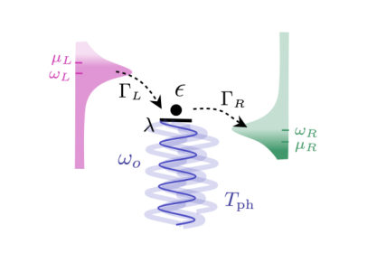
<figcaption class="paper-figure-caption"><b>Fig 1.</b> Figure 1. Schematic of a NEMS consisting of a quantum dot, with onsite energy ϵ, coupled to two fermionic reservoirs on the left (L) and right (R) that are driven out of equilibrium by an electrochemical bias µL ≥µR. The imbalance induces electron tunneling through the dot, transferring electrical en- ergy between the reservoirs. The dot additionally couples to a vibrational mode with frequency ω0 (denoted as a solid vi- olet wavy line). The vibrational mode is weakly damped by a bosonic vibrational bath of temperature Tph (depicted here as light wavy lines in the background). Self-sustained oscilla- tions in the phonon mode can be induced by the back-action of electron transport through...</figcaption>
</figure>
<figure class="paper-figure-card">
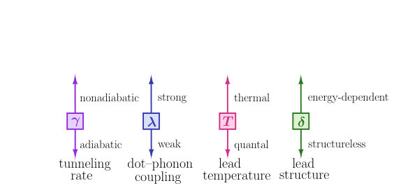
<figcaption class="paper-figure-caption"><b>Fig 2.</b> Figure 2. Major parameter regimes explored in this work. The leftmost diagram featuring the adiabaticity parameter, γ = Γ/ω0, depicts how increasing Γ with respect to ω0 takes the model to the nonadiabatic regime. In the other dia- grams, λ denotes the dimensionless electromechanical cou- pling strength, the fermionic lead temperature is denoted by T, and δ is the bandwidth of the fermionic lead. The method- ology presented in this work allows us to uncover the physics at the interface of the denoted regimes in a unified framework.</figcaption>
</figure>
<figure class="paper-figure-card">
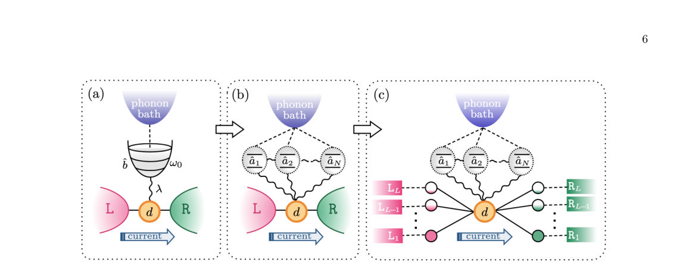
<figcaption class="paper-figure-caption"><b>Fig 3.</b> Figure 3. Binary encoding and mesoscopic leads embedding of the transport-driven NEMS model. (a) Anderson–Holstein-type impurity consisting of a resonant electronic level, a quantum dot d coupled to a vibrational mode ˆb of frequency ω0, two fermionic environments (L and R), and a weakly coupled phonon bath. (b) Binary encoding of the truncated phonon Hilbert space with a cutoff M is represented by N = log2 M hard-core-boson pseudosites ˆaj, as in Eq. (12). (c) Mesoscopic-lead embedding of the structured fermionic reservoirs into damped auxiliary modes governed by Lindblad dissipators, Eq. (20).</figcaption>
</figure>
<figure class="paper-figure-card">
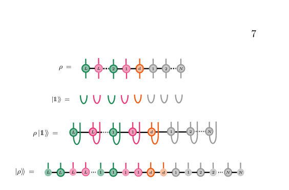
<figcaption class="paper-figure-caption"><b>Fig 4.</b> Figure 4. Liouville-space vectorization of the density matrix ρ is initially written as an MPO over the mesoscopic lead sites, dot, and phonon pseudosites (top row). Acting on the left vac- uum ∣1⟩⟩(second row) gives the vectorized state ∣ρ⟩⟩= ρ∣1⟩⟩ (third row), represented as an MPS in the doubled space. In the bottom row, pink and green sites denote left and right mesoscopic lead sites, orange denotes the dot, and gray de- notes phonon pseudosites; sites with(-out) boundaries indi- cate the physical (tilde) copies.</figcaption>
</figure>
<figure class="paper-figure-card">
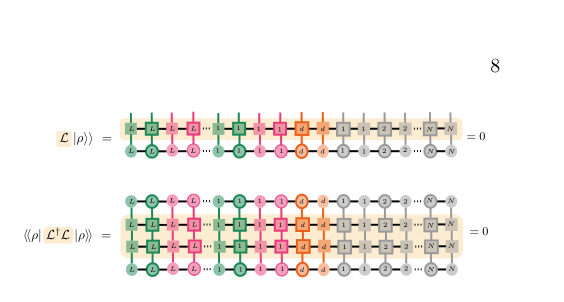
<figcaption class="paper-figure-caption"><b>Fig 5.</b> Figure 5. Variational steady-state condition depicted in Ten- sor network form. The NESS satisfies L∣ρ⟩⟩= 0 and is ob- tained by variationally minimizing the positive semidefinite form ⟨⟨ρ∣L†L∣ρ⟩⟩.</figcaption>
</figure>

**Summary.** This paper introduces a tensor-network method to simulate autonomous oscillations in quantum electromechanical systems. It overcomes the computational challenges of large bosonic spaces and structured environments to accurately describe the transition to limit-cycle dynamics. The work reveals how electromechanical backaction and environmental parameters govern the stability of self-sustained motion.

**Why it may be interesting.** It provides a powerful, unified numerical tool for studying non-equilibrium steady states in open quantum systems, bridging the gap between adiabatic and non-adiabatic regimes in strongly coupled electron-phonon systems.

Detailed structure

**Main problem.** Developing an exact numerical description for self-sustained oscillations in nanoelectromechanical systems (NEMS) where large bosonic Hilbert spaces, strong electron-phonon coupling, and structured fermionic leads coexist.

**Main result.** The authors present a unified tensor-network framework that successfully captures the emergence of mechanical limit cycles and identifies that a peak in vibrational fluctuations precedes the onset of self-sustained oscillations.

**Method.** A steady-state tensor-network framework using binary encoding for phonons, mesoscopic reservoir embedding for non-Markovian leads, and a variational DMRG solver in Liouville space.

**Model / system.** An Anderson-Holstein impurity model consisting of a single-level quantum dot coupled to a quantized vibrational mode, connected to two fermionic leads and a weak bosonic damping bath.

**Key observables.** Torotropy (phase-space structure), Husimi Q-function, phonon-number Fano factor, second-order coherence g(2)(0), and particle current.

**Important parameters / regimes.** Electromechanical coupling strength (lambda), adiabaticity parameter (gamma = Gamma/omega_0), lead bandwidth (delta), temperature (T), and phonon damping (Gamma_ph).

**Assumptions / limitations.** The phonon Hilbert space is truncated to a finite Fock basis, and the fermionic reservoirs are approximated using a sum of Lorentzian spectral densities via auxiliary modes.

**Figures summary.** Figure 1 shows the NEMS setup; Figure 3 illustrates the binary encoding and reservoir embedding; Figure 4 depicts the Liouville-space vectorization; Figure 10 and 11 show convergence tests and benchmarks against semiclassical results.

**Paper structure.** The paper introduces the NEMS problem, details the tensor-network construction (binary encoding and reservoir embedding), describes the variational Liouville-space solver, presents results on the emergence of self-oscillations and phase-space dynamics, and concludes with convergence and benchmark analyses.

Abstract

Transport-induced self-sustained oscillations in electromechanical systems convert a static electrochemical bias into robust, autonomous oscillatory motion in the absence of any external periodic drive. However, an exact description of such self-oscillations remains challenging in nanoscale electromechanical devices featuring a simultaneously large bosonic Hilbert space, strong interactions, and structured fermionic leads. We formulate a tensor-network framework that combines a binary representation of the vibrational mode with mesoscopic reservoir embeddings that enable controlled access to the self-oscillatory steady states and relevant transport observables without explicit real-time propagation. We demonstrate the emergence of mechanical self-oscillations across a broad set of operating conditions, in which strong electromechanical backaction, nonadiabatic oscillator dynamics, and energy-dependent electronic tunneling processes compete. Furthermore, we observe that for both slow and fast vibrating mechanical modes, suppressed vibrational occupation fluctuations in the self-oscillation window along the electromechanical coupling strength sweep is preceded by a peak in the occupation fluctuations. Collectively, we explore how both intrinsic system properties and environmental parameters govern such autonomous oscillations over a broad range of operating conditions. The generality of our framework will enable the method to be employed straightforwardly to more complicated or experimentally relevant scenarios.

[↑ back to top](#top)

### [Deterministic Mapping of Topological Phases via Autoregressive Exogenous Neural Networks](http://arxiv.org/abs/2605.27300v1)

**Authors:** Graciana Puentes  
**Type:** theory · **Category:** disordered systems and neural networks · **PDF:** <https://arxiv.org/pdf/2605.27300v1>  
**Analysis basis:** full PDF text, analyzed in chunks
**Topic relevance:** 🔥 `measurement-induced transitions` **4/5** · 🔥 `quantum measurements` **4/5** · `driven-dissipative phase transition` **3/5** · `methods for driven-dissipative` **3/5**

↔ Scroll figures horizontally

<figure class="paper-figure-card">
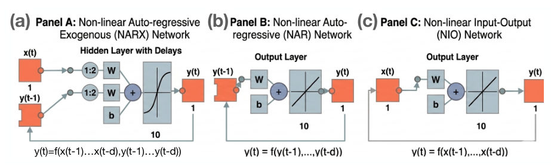
<figcaption class="paper-figure-caption"><b>Fig 1.</b> FIG. 1. (a) Panel A: Non-Linear Auto-regresssive Exogenous (NARX) Neural Network governed by the generic mapping f(x(t −1), ..., x(t −d), y(t −1), ..., y(t −d)), (b) Panel B: Non-Linear Autoregressive Neural Network (NAR) governed by the generic mapping f(y(t −1), ..., y(t −d)), (c) Panel C: Non-Linear Input-Output (NIO) Neural Network governed by the generic mapping f(x(t −1), ..., x(t −d)).</figcaption>
</figure>
<figure class="paper-figure-card">
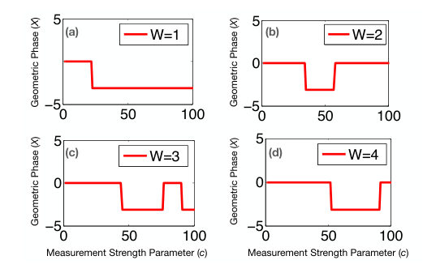
<figcaption class="paper-figure-caption"><b>Fig 2.</b> FIG. 2. Exogenous sequences (x) used to train, test, and val- idate the NARX and NIO neural networks. The sequences consist of |π| discrete jumps in the geometric phase (X) vs. measurement-strength parameter (c) for increased winding number W = 1, 2, 3, 4: (a) (W = 1) ccrit = 21, (b) (W = 2) ccrit = 34 and ccrit = 57, (c) (W = 3) ccrit = 44 and ccrit = 76, (d) (W = 4) ccrit = 52 and ccrit = 91 and As we restrict our analysis to trajectories on the equator, the acquired geometric phase (X) can only take values of 0 or |π| (modulo 2π).The endogenous (target) sequence (y) used in all the three net- works corresponds to the acquired geometric phase (X) vs. measurement-strength parameter (c),...</figcaption>
</figure>
<figure class="paper-figure-card">
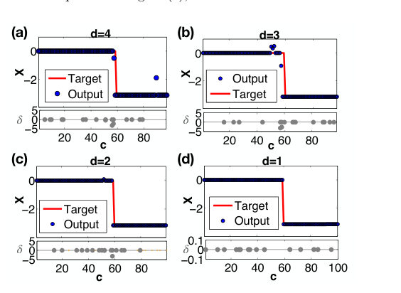
<figcaption class="paper-figure-caption"><b>Fig 3.</b> FIG. 3. NARX neural network response as quantified by out- put (blue dots), target (red line) and absolute error (δ, gray dots): (a) d = 4 past values, (b) d = 3 past values, (c) d = 2 past values and (d) d = 1 past values, δ is exactly equal to zero on any scale.</figcaption>
</figure>
<figure class="paper-figure-card">
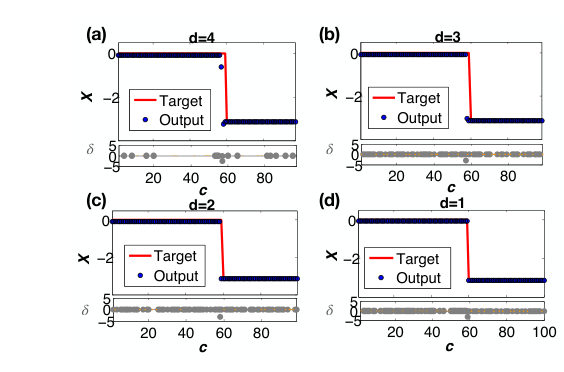
<figcaption class="paper-figure-caption"><b>Fig 4.</b> FIG. 4. NAR neural network response as quantified by output (blue dots), target (red line) and absolute error (δ, gray dots): (a) d = 4 past values, (b) d = 3 past values, (c) d = 2 past values and (d) d = 1 past values.</figcaption>
</figure>
<figure class="paper-figure-card">
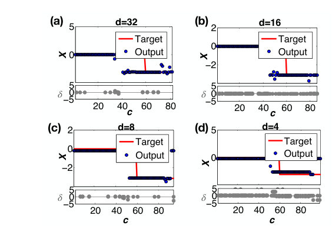
<figcaption class="paper-figure-caption"><b>Fig 5.</b> FIG. 5. NIO neural network response as quantified by output (blue dots), target (red line) and absolute error (δ, gray dots): (a) d = 32 past values, (b) d = 16 past values, (c) d = 8 past values and (d) d = 4 past values.</figcaption>
</figure>

**Summary.** The study uses dynamic neural networks to investigate topological phase transitions in a weak-measurement-driven quantum system. It finds that an NARX architecture can predict critical phase transitions with near-numerical precision, proving that different topological sectors are linked by a deterministic relationship.

**Why it may be interesting.** It demonstrates how machine learning architectures can be used as high-precision numerical probes to uncover hidden deterministic laws and analytical identities in complex quantum phase transitions.

Detailed structure

**Main problem.** Determining whether the topological phase transitions in a weak-measurement-induced geometric phase system are governed by a deterministic law linking different winding numbers.

**Main result.** The NARX neural network architecture achieves near-perfect predictive fidelity (MSE of 10^-27), suggesting a mathematically deterministic functional identity between winding numbers and the critical measurement strength.

**Method.** A comparative analysis of three dynamic neural network architectures (NARX, NAR, and NIO) used as numerical probes to map the relationship between topological sectors.

**Model / system.** A quantum system in an equatorial state subjected to a sequence of weak measurements, where the measurement-strength parameter modulates the angular velocity of the state vector on the Bloch sphere.

**Key observables.** Geometric phase (order parameter), winding number (topological invariant), and critical measurement strength (c_crit).

**Important parameters / regimes.** Winding numbers (W), measurement-strength parameter (c), and temporal embedding delay (d).

**Assumptions / limitations.** The system operates in the quasi-continuous measurement limit (N approaches infinity) and trajectories are constrained to the equator of the Bloch sphere.

**Figures summary.** Figure 1 shows the three NN architectures; Figure 2 plots geometric phase jumps; Figures 6-8 display error autocorrelation functions for the different models.

**Paper structure.** The paper introduces the physical system and measurement framework, defines the three neural network architectures, presents a comparative performance analysis using MSE and autocorrelation, and concludes with the implications of the deterministic mapping and the complexity paradox.

Abstract

We report a comparative analysis of three dynamic neural network (NN) architectures -- NAR, NARX, and NIO -- to evaluate their efficiency in estimating the critical-measurement-strength parameter ($c_{crit}$) characterizing topological phase transitions in geometric phases induced by weak measurements. Our results demonstrate that the NARX architecture achieves superior predictive fidelity, reaching a Mean Squared Error (MSE) of $10^{-27}$ -- the limit of numerical precision -- at an optimal delay of $d=1$. This exceptional performance implies the identification of a perfect functional identity, suggesting that the relationship between winding numbers $W$ and $c_{crit}$ is mathematically deterministic. We observe a "complexity paradox" where the NARX model's accuracy collapses at higher delays ($d=4$), a phase-sensitivity that confirms the model captures a high-precision dynamic mapping rather than a trivial pattern. While the NAR model remains robust for local-trend capture, the NIO architecture fails to accurately resolve the phase transition despite increased neuronal capacity. These findings underscore that both autoregressive feedback and immediate exogenous context are essential for the exact characterization of topological phases, establishing NARX as a robust framework for deriving governing laws in complex quantum systems, where analytical solutions remain elusive.

[↑ back to top](#top)

### [Long-range deformations in Gaussian States](http://arxiv.org/abs/2605.26932v1)

**Authors:** Francisco Pereira, Nandagopal Manoj, Sara Murciano  
**Type:** theory · **Category:** statistical mechanics · **PDF:** <https://arxiv.org/pdf/2605.26932v1>  
**Analysis basis:** full PDF text, analyzed in chunks
**Topic relevance:** 🔥 `entanglement & information structure` **4/5** · 🔥 `non-equilibrium universality` **4/5** · `driven-dissipative phase transition` **3/5** · `non-equilibrium dynamics` **3/5**

↔ Scroll figures horizontally

<figure class="paper-figure-card">
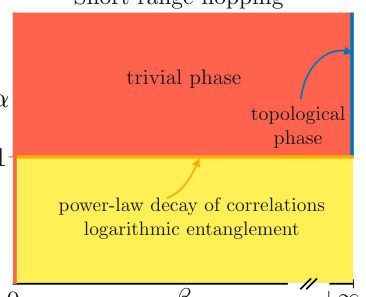
<figcaption class="paper-figure-caption"><b>Fig 1.</b> Figure 1: Phase diagram of a deformation of a trivial state. We plot the phase diagram as a function of the measurement strength, β, and power-law decaying pairing terms (decay exponent α), for both long-range and short-range hopping deformations (see Eq. (2)). Starting from the trivial phase, we distinguish whether the system is in a trivial or topological phase as we turn on the deformation, or if the system exhibits power-law correlations or logarithmic scaling of the entanglement.</figcaption>
</figure>
<figure class="paper-figure-card">
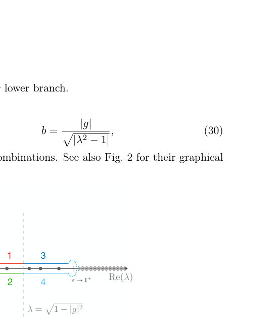
<figcaption class="paper-figure-caption"><b>Fig 2.</b> Figure 2: Contour plot showing the eight sectors used in the analytic continuation of η±. Regions 1–4 correspond to λ &gt; 0, while regions 5–8 correspond to λ &lt; 0. The two tables below list, for each numbered sector, which branch of η± is selected depending on whether the contour is taken on the upper or lower side of the cut.</figcaption>
</figure>
<figure class="paper-figure-card">
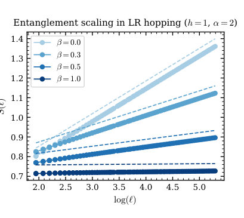
<figcaption class="paper-figure-caption"><b>Fig 3.</b> Figure 3: Entanglement entropy for α &gt; 1 and initial critical state. Entangle- ment entropy in the state (8) following a non-unitary evolution with long-range hopping in eq. (2), α = 2, µ = 0, and initial state with h = 1 = γ in Eq. (1). The left panel shows the analytical behavior of the effective central charge (31) after the non-unitary evolution. In the right panel, the data points were obtained using Eq. (21) for β ∈[0, 1]. For all β ̸= 0 shown, we obtain an altered effective central charge that agrees well with the analytical predictions in the left panel (dashed lines).</figcaption>
</figure>
<figure class="paper-figure-card">
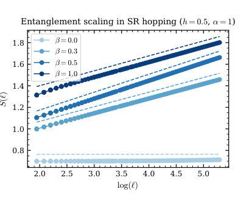
<figcaption class="paper-figure-caption"><b>Fig 4.</b> Figure 4: Entanglement entropy for α = 1. Entanglement entropy in the state (8) following a non-unitary evolution with short-range hopping in eq. (2), α = 1, µ = 0, and initial state with γ = 1 and h = 1.5 (left panel) and h = 0.5 (right panel) in Eq. (1).The data points were obtained using Eq. (21) for β ∈[0, 1]. For all β ̸= 0 shown, we obtain an altered effective central charge that agrees well with the analytical predictions obtained by plugging Eq. (32) into Eq. (31) (dashed lines).</figcaption>
</figure>
<figure class="paper-figure-card">
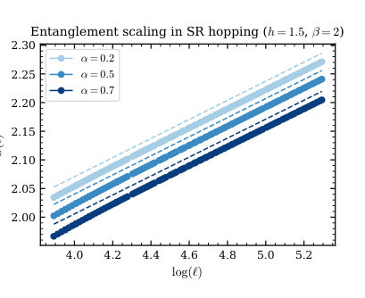
<figcaption class="paper-figure-caption"><b>Fig 5.</b> Figure 5: Entanglement entropy for α &lt; 1. Entanglement entropy in the state (8) following the non-unitary evolution in eq. (2), with β = 2, µ = 0, and initial state with γ = 1 and h = 1.5 in Eq. (1). The data points were obtained using Eq. (21) for α &lt; 1. For all α &gt; 0 shown, we obtain an altered logarithmic scaling of the entanglement entropy that agrees well with the analytical predictions obtained by plugging Eq. (34) into Eq. (31) (dashed lines left plot), or the pristine critical scaling effective central charge ceff = 1/2 (dashed lines right plot).</figcaption>
</figure>

**Summary.** This paper studies how long-range interactions applied through non-unitary evolution change the phase diagram of Gaussian states. It demonstrates that the range of the interaction (alpha) dictates whether the system undergoes smooth crossovers or immediate transitions to topological or critical phases. The study uses analytical tools to show that even very long-range interactions do not necessarily induce sharp phase transitions at finite deformation strength.

**Why it may be interesting.** It provides deep insights into how non-unitary dynamics and long-range interactions can bypass 1D constraints to induce phase transitions and change universality classes, which is highly relevant to many-body dynamics and non-equilibrium physics.

Detailed structure

**Main problem.** Investigating how long-range deformations via non-unitary imaginary-time evolution affect the phase structure, entanglement scaling, and topological properties of Gaussian quantum states.

**Main result.** The decay exponent alpha of the long-range interactions determines the system's infrared behavior, identifying three regimes: smooth crossovers (alpha > 1), immediate topological transitions (alpha = 1), and instantaneous critical-like behavior (alpha < 1).

**Method.** Analytical approach using the Gaussian nature of the state, Bogoliubov transformations, Toeplitz matrix formalism (Fisher-Hartwig and Szego theorems), and complex contour integration.

**Model / system.** A 1D Majorana fermion chain (equivalent to the transverse field Ising model) undergoing non-unitary evolution generated by a quadratic Hamiltonian with power-law couplings (1/r^alpha).

**Key observables.** Entanglement entropy (Rényi and von Neumann), correlation functions (x-correlator, y-correlator, and string correlator), winding number, and effective central charge.

**Important parameters / regimes.** Decay exponent alpha, deformation strength beta, anisotropy gamma, magnetic field h, and chemical potential mu.

**Assumptions / limitations.** The system is assumed to be in a Gaussian/free-fermion state, and the analysis focuses on the odd-parity sector with periodic boundary conditions.

**Figures summary.** Figure 1 shows a phase diagram of transitions as a function of beta and alpha; Figure 2 illustrates contour integration sectors; Figure 3 shows analytical decay of effective central charge; Figure 4 shows entanglement scaling; Figure 13 shows the evolution of the correlator symbol in the complex plane.

**Paper structure.** The paper introduces the non-unitary deformation protocol, defines the long-range Hamiltonian models, develops the analytical framework for the correlation matrix and symbol, analyzes the three distinct regimes based on alpha, and discusses emergent symmetries and topological diagnostics.

Abstract

Imaginary-time evolution by a local Hamiltonian cannot induce a phase transition in one dimension, but longer-range interactions may subvert such constraints. Starting from the ground state of the Kitaev Majorana chain, we modify the wave function by an imaginary-time evolution generated by a quadratic Hamiltonian with power-law couplings that enhance pairing correlations, typically of the form $1/r^α$, where $r$ is the distance between two sites. As the state remains Gaussian, entanglement and correlation functions can be computed analytically. We find that the decay exponent $α$ controls three distinct infrared regimes: for $α>1$, the deformation produces only smooth crossovers at finite deformation strength, while the topological regime is reached only asymptotically as the deformation strength tends to infinity. At $α=1$, the deformation induces an immediate flow to the topological phase: an infinitesimal deformation strength drives the system to a topological regime, and in a particular case, an emergent Kramers-Wannier symmetry enforces Ising-like scaling at long distances. For $α<1$, the deformed state shows the same critical-like behavior for all non-zero deformation strength. We observe that even with arbitrarily long-range interactions, these models do not display a sharp phase transition at non-zero deformation strength.

[↑ back to top](#top)

### [Nonclassical energy-change distribution as a witness of non-Markovian quantum dynamics](http://arxiv.org/abs/2605.26818v1)

**Authors:** Marco Pezzutto, Anton Corr, Gabriele De Chiara, Salvatore Lorenzo, Stefano Gherardini  
**Type:** theory · **Category:** statistical mechanics · **PDF:** <https://arxiv.org/pdf/2605.26818v1>  
**Analysis basis:** full PDF text, analyzed in chunks
**Topic relevance:** 🔥 `quantum measurements` **4/5** · `entanglement & information structure` **3/5** · `non-equilibrium dynamics` **3/5** · `correlated / nonlocal dissipation` **2/5** · `methods for driven-dissipative` **2/5**

↔ Scroll figures horizontally

<figure class="paper-figure-card">
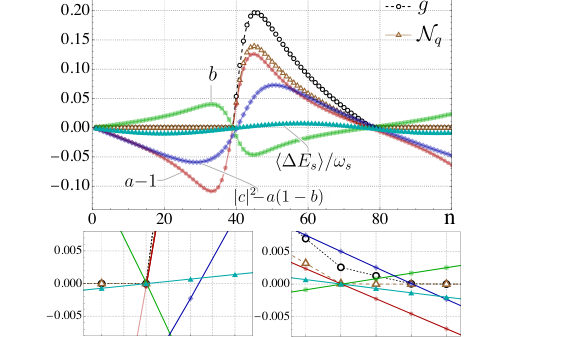
<figcaption class="paper-figure-caption"><b>Fig 1.</b> FIG. 1: Energy-preserving interactions. Top panel: Com- parison between non-CP-divisibility identified by gn (black circles), and the non-positivity functional Nq[Pn] of the sys- tem’s energy-change distribution (brown triangles). Bottom panels: zoomed-in view of the top panel where Nq[Pn] be- comes nonzero (on the left) and returns to zero (on the right). In all panels we report the conditions (11) (red dots, green squares and blue rhombs, respectively), as well as the aver- age system’s energy-change ⟨∆ES ⟩normalized by ωS (teal triangles). Parameters: ωS =ωM=ωA=ω=1 (resonant interac- tions); gS M=gMA=0.2ω, and τ1=τ2=0.2/ω (well within the weak coupling limit); β=1. In this figure, as in...</figcaption>
</figure>
<figure class="paper-figure-card">
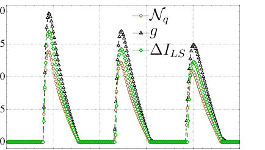
<figcaption class="paper-figure-caption"><b>Fig 2.</b> FIG. 2: Energy-preserving interactions. Comparison of ∆I(n) LS (green rhombs), gn (black triangles) and Nq[Pn] (brown cir- cles), as a function of collision number. The initial states of S, M, A and model’s parameters are the same as in Fig. 1.</figcaption>
</figure>
<figure class="paper-figure-card">
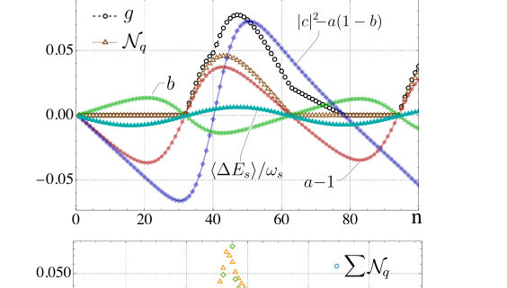
<figcaption class="paper-figure-caption"><b>Fig 3.</b> FIG. 3: Non energy-preserving interactions. Top panel: Com- parison between violations of CP-divisibility identified by gn (black circles), and Nq[Pn] (brown triangles). We report both the conditions (11) (red dots, green squares and blue rhombs respectively), and the average system’s energy-change ⟨∆ES ⟩ normalized by ωS (teal triangles). The system’s frequency is ωS = 0.8 (∆ω = −0.2). Bottom panel: Comparison of ILFS (green rhombs), IRHP (orange triangles) and P n Nq[Pn] (light blue circles), as a function of detuning ∆ω ∈[−0.5, 0.5] (keep- ing memory and environment particles at the same frequency). Here, the maximum number of collisions is fixed to 103. All the other parameters are the...</figcaption>
</figure>
<figure class="paper-figure-card">
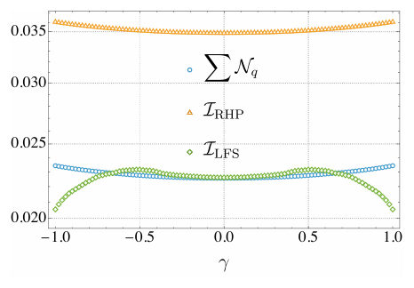
<figcaption class="paper-figure-caption"><b>Fig 4.</b> FIG. 4: Comparison of ILFS (green rhombs), IRHP (orange triangles) and P n Nq[Pn] (light blue circles), as a function of the coupling anisotropy γ ∈[−1, 1] for system-memory collisions. The interaction between memory and environment particles is kept energy-preserving. Moreover, the maximum number of collisions is fixed to 103. All the other parameters are the same as in Fig. 1.</figcaption>
</figure>

**Summary.** This paper demonstrates that the non-classicality (non-positivity) of the energy-change Kirkwood-Dirac distribution serves as a robust witness for non-Markovian quantum dynamics. It shows that this witness is particularly effective when system-environment interactions preserve energy and remains valid even under anisotropic coupling.

**Why it may be interesting.** It provides a practical, measurement-efficient way to detect memory effects in open quantum systems using only local energy measurements, which is highly relevant for experimentalists in quantum optics and superconducting circuits.

Detailed structure

**Main problem.** The paper aims to identify non-Markovian quantum dynamics in open systems using only energy measurements by investigating the non-positivity of the energy-change Kirkwood-Dirac quasiprobability distribution.

**Main result.** Violations of CP-divisibility are always witnessed by non-positive values in the energy-change Kirkwood-Dirac distribution, a link that is strongest in energy-preserving interaction regimes.

**Method.** The authors use a collision model framework, applying matrix-element representations of qubit maps and evaluating non-positivity functionals of the Kirkwood-Dirac distribution.

**Model / system.** A memory-mediated collision model consisting of a system (S), an auxiliary memory (M), and an environment (A), modeled as spin-1/2 particles interacting via Heisenberg-type exchange interactions.

**Key observables.** System energy changes (u_S), Kirkwood-Dirac quasiprobability distribution, quantum mutual information, and anomalous energy fluxes.

**Important parameters / regimes.** Coupling anisotropy (gamma), system-memory-environment frequencies, detuning (delta_omega), and collision number (n).

**Assumptions / limitations.** The system is initialized in a thermal state, and the dynamics are assumed to be phase-covariant (z-rotation symmetry) in certain parts of the analysis.

**Figures summary.** Figure 1 compares the non-positivity functional with non-CP-divisibility measures and energy conditions; Figure 4 shows the dependence of non-Markovianity measures (I_LFS, I_RHP) on the coupling anisotropy parameter gamma.

**Paper structure.** The paper introduces the problem of non-Markovianity detection, defines a collision model with Heisenberg interactions, develops the mathematical framework for phase-covariant maps and Kirkwood-Dirac distributions, analyzes the impact of anisotropy on the witness, and concludes with a comparison of different non-Markovianity measures.

Abstract

We address the problem of identifying non-Markovian quantum time evolutions of an open quantum system by only performing measurements of the system's energy. We demonstrate that violations of CP-divisibility are always witnessed by non-positive values of the energy-change Kirkwood-Dirac quasiprobability distribution associated with the system's Hamiltonian, evaluated at consecutive times. The link between non CP-divisibility and non-positivity of the system's energy-change distribution is stronger when the system-environment interactions are energy-preserving. The witness works whenever anomalous energy fluxes, due to non-Markovianity, are realized. Anomalous fluxes are also detected by the non-Markovianity measure built over the quantum mutual information between the states of the open system and of a quantum correlated reference.

[↑ back to top](#top)

### [Microwave-driven Floquet-Fano interference in a ring-chord quantum dot structure for enhanced spin-caloritronic performance](http://arxiv.org/abs/2605.27181v1)

**Authors:** Parbati Senapati, Kalpataru Pradhan  
**Type:** theory · **Category:** strongly correlated electrons · **PDF:** <https://arxiv.org/pdf/2605.27181v1>  
**Analysis basis:** full PDF text, analyzed in chunks
**Topic relevance:** 🔥 `non-equilibrium dynamics` **4/5** · `Keldysh / 2PI / non-Gaussian methods` **3/5** · `Kondo & dissipative impurity` **2/5** · `methods for driven-dissipative` **2/5** · `spintronics-quantum-optics interface` **2/5**

↔ Scroll figures horizontally

<figure class="paper-figure-card">
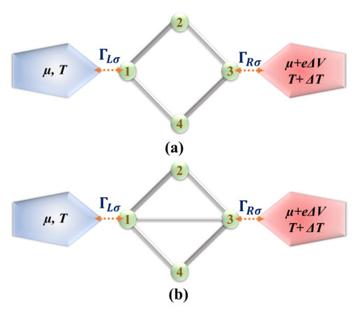
<figcaption class="paper-figure-caption"><b>Fig 1.</b> FIG. 1. Schematic illustration of the four–quantum-dot nanostructure coupled to ferromagnetic electrodes: (a) Pure ring geometry, where four quantum dots form a closed loop and are connected to the left and right leads through dots 1 and 3 with spin-dependent tunneling rates ΓLσ and ΓRσ, respectively. (b) Ring–chord geometry, where an additional direct coupling (chord) between dots 1 and 3 introduces an alternative transport pathway.</figcaption>
</figure>
<figure class="paper-figure-card">
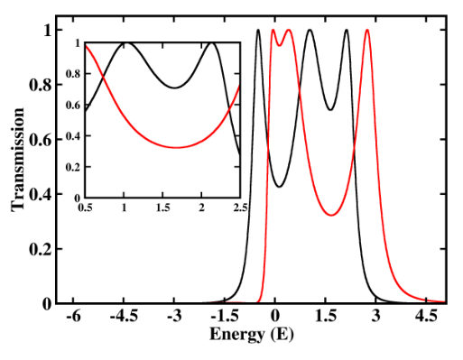
<figcaption class="paper-figure-caption"><b>Fig 2.</b> FIG. 2. Zero-microwave transmission T (E) as a function of energy for the four–quantum-dot system, where the black curve corresponds to the closed ring geometry (t13 = 0) and the red curve to the ring–chord configuration (t13 ̸= 0), show- ing geometry-induced Fano interference. Inset: Magnified view of the central energy window E ∈[0.5, 2.5] highlighting the asymmetric line shape and antiresonance-like suppression of transmission in the ring–chord case.</figcaption>
</figure>
<figure class="paper-figure-card">
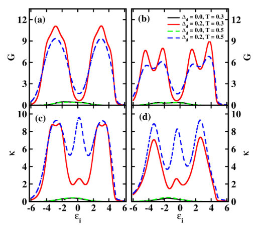
<figcaption class="paper-figure-caption"><b>Fig 3.</b> FIG. 3. Electrical conductance G in panels (a) and (b), and thermal conductance κ in panels (c) and (d), plotted as func- tions of the normalized on-site energy εi/Γ0 for both undriven and driven cases at two different temperatures. Panels (a) and (c) correspond to the pure ring configuration, whereas panels (b) and (d) represent the ring–chord geometry.</figcaption>
</figure>
<figure class="paper-figure-card">
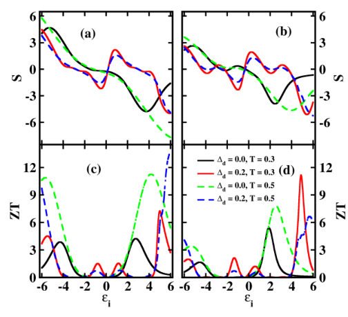
<figcaption class="paper-figure-caption"><b>Fig 4.</b> FIG. 4. Seebeck coefficient S [(a),(b)] and figure of merit ZT [(c),(d)] versus the normalized on-site energy εi/Γ0 for both undriven and driven cases at two different temperatures. Panels (a),(c) show the pure ring and (b),(d) shows the ring– chord geometry.</figcaption>
</figure>
<figure class="paper-figure-card">
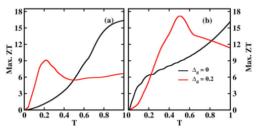
<figcaption class="paper-figure-caption"><b>Fig 5.</b> FIG. 5. Temperature dependence of the maximum thermo- electric figure of merit for the (a) pure ring and (b) ring–chord geometries in the undriven (∆d = 0) and microwave-driven (∆d = 0.2) regimes.</figcaption>
</figure>

**Summary.** This study demonstrates that combining microwave-driven Floquet engineering with Fano interference in a ring-chord quantum dot structure can significantly boost thermoelectric efficiency and spin-dependent transport. By using geometry to suppress thermal conductance while using microwaves to tune energy-selective channels, the authors achieve remarkably high figures of merit. This provides a strategy for designing high-performance nanoscale heat engines and spin filters.

**Why it may be interesting.** The paper explores the dynamic control of quantum interference and energy-selective transport using periodic driving, which is highly relevant to the study of open quantum systems and Floquet engineering of many-body states.

Detailed structure

**Main problem.** Investigating how the interplay between microwave-driven Floquet sidebands and geometry-driven Fano interference can be used to enhance the thermoelectric and spin-caloritronic performance of multi-quantum-dot nanostructures.

**Main result.** The ring-chord geometry under microwave driving achieves an exceptional thermoelectric figure of merit ZT approx 12 and a spin figure of merit ZsT approx 18, reaching nearly 62% of the Carnot efficiency.

**Method.** Nonequilibrium Green's function (NEGF) formalism combined with Floquet theory and a self-consistent Hartree treatment of electron-electron interactions.

**Model / system.** A four-quantum-dot nanostructure in two geometries (pure ring and ring-chord) coupled to ferromagnetic leads, featuring on-site Coulomb interaction, Zeeman splitting, and time-periodic microwave driving.

**Key observables.** Electrical conductance, thermopower (Seebeck coefficient), electronic thermal conductance, spin-dependent transport, thermoelectric figures of merit (ZT and ZsT), and efficiency at maximum power.

**Important parameters / regimes.** Microwave amplitude, frequency, temperature, dot-lead coupling strength, spin polarization, and Zeeman splitting.

**Assumptions / limitations.** Wide-band approximation for lead self-energies, linear response regime, and neglect of phonon heat transport.

**Figures summary.** Figure 1 shows the schematic of ring and ring-chord geometries; Figures 3-4 plot conductance, thermal conductance, and Seebeck coefficient vs. energy; Figures 5-8 show temperature and power-efficiency trade-off dependencies; Figures 9-12 illustrate spin-dependent conductance, thermopurity, and parameter space contour plots.

**Paper structure.** The paper introduces the system geometry, details the Floquet-NEGF theoretical framework, compares transport in pure ring vs. ring-chord geometries, analyzes the impact of microwave driving on thermoelectric efficiency, and concludes with a study of spin-caloritronic performance under magnetic fields.

Abstract

We investigate photon-assisted thermoelectric transport in four--quantum-dot nanostructures featuring ring and ring--chord geometries coupled to ferromagnetic leads. Focusing on the interplay between microwave-induced Floquet sidebands and geometry-driven Fano interference, we employ the nonequilibrium Green's function formalism combined with Floquet theory and a self-consistent Hartree treatment of electron-electron interactions within the linear response regime. The inclusion of a longitudinal interdot chord bridging the lead-coupled dots introduces a discrete interference pathway that competes with the continuum of ring-mediated states, giving rise to pronounced Fano resonances. Microwave irradiation dynamically reshapes these resonances through photon absorption and emission processes, enabling tunable control of electrical conductance, thermopower, and electronic thermal conductance. Quantitatively, at an intermediate temperature of $T=0.3Γ_0$ (where $Γ_0$ denotes the dot-lead coupling strength), the microwave-driven ring-chord geometry exhibits an exceptional thermoelectric figure of merit of ZT $\approx$ 12 and an optimal efficiency--power trade-off, reaching nearly $62\%$ of the Carnot efficiency with an output power of $6.24~\mathrm{fW}$. Crucially, the combination of spin-polarized injection from the leads and Zeeman splitting within the dots induces a robust spin-dependence within this Floquet--Fano interference. This cooperative interplay results in an enhanced spin Seebeck response and a maximum spin thermoelectric figure of merit of nearly $Z_sT \approx 18$. Our findings establish microwave-driven engineering of Fano interference as an effective strategy for modulating spin-caloritronic behavior in multi-quantum-dot devices.

[↑ back to top](#top)

### [Statistical and Algorithmic Foundations of Probing Quantum Systems with Compressive Measurements: A Review](http://arxiv.org/abs/2605.27191v1)

**Authors:** Zhen Qin, Michael B. Wakin, Zhihui Zhu  
**Type:** theory · **Category:** quantum information and computing · **PDF:** <https://arxiv.org/pdf/2605.27191v1>  
**Analysis basis:** full PDF text, analyzed in chunks
**Topic relevance:** 🔥 `quantum measurements` **4/5** · `entanglement & information structure` **3/5** · `analog quantum simulation` **2/5** · `measurement-induced transitions` **2/5** · `methods for driven-dissipative` **2/5**

↔ Scroll figures horizontally

<figure class="paper-figure-card">
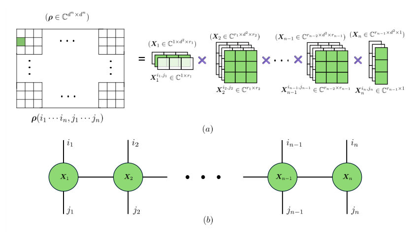
<figcaption class="paper-figure-caption"><b>Fig 1.</b> Figure 1: Illustration of the MPO in (30) from two perspectives: (a) each entry of the density matrix can be represented as products of n matrices, where green represents one entry and the corresponding n matrices, and (b) each element of the density matrix is illustrated in a diagrammatic form, where the line connecting two circles signifies the tensor contraction operation [96], and unconnected line segments denote indices.</figcaption>
</figure>
<figure class="paper-figure-card">
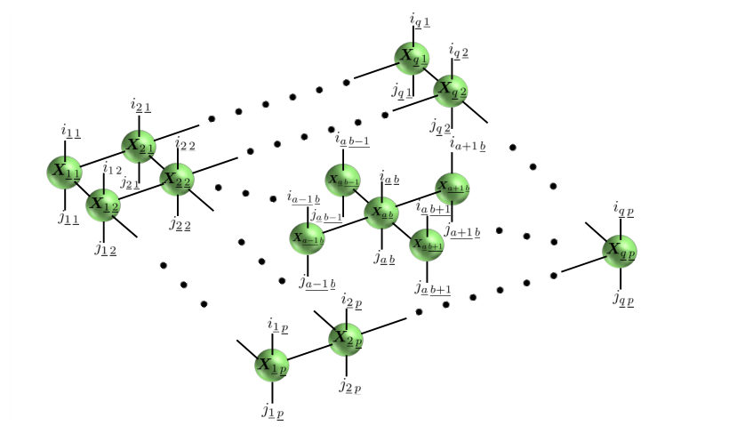
<figcaption class="paper-figure-caption"><b>Fig 2.</b> Figure 2: Illustration of the PEPO from each element of the density matrix is illustrated in a diagrammatic form, where the line connecting two circles signifies the tensor contraction operation [96], and unconnected line segments denote indices.</figcaption>
</figure>

**Summary.** This review provides a unified perspective on performing quantum state tomography on large-scale systems by exploiting structural priors. It connects the theory of measurement design and optimization algorithms to the field of compressed sensing, showing how to reduce the complexity of state reconstruction from exponential to polynomial scaling.

**Why it may be interesting.** It provides a comprehensive theoretical bridge between signal processing (compressive sensing) and quantum information, offering scalable strategies for characterizing many-body dynamics and large-scale quantum devices.

Detailed structure

**Main problem.** The exponential scaling of Quantum State Tomography (QST) makes reconstructing general quantum states computationally and statistically impossible for large systems, necessitating methods that exploit inherent state structures.

**Main result.** The review establishes a unified framework for QST by connecting compact state representations, measurement design, and reconstruction algorithms, demonstrating that QST can be treated as a structured inverse problem.

**Method.** The paper surveys various approaches including compressive sensing, randomized measurements (Haar-random, t-designs, and classical shadows), and optimization-based reconstruction (convex relaxations and non-convex methods).

**Model / system.** The review focuses on large-scale quantum processors, programmable simulators, and error-corrected computers, specifically targeting structured states such as low-rank, tensor-network (MPS, MPO, PEPO), and neural quantum states.

**Key observables.** Fidelities, expectation values of Pauli observables, trace distance, and entanglement measures.

**Important parameters / regimes.** Hilbert-space dimension (d), number of measurement shots (M), number of POVMs (Q), and intrinsic dimension/complexity of the state.

**Assumptions / limitations.** Assumes the existence of underlying structure (e.g., low-rankness or tensor-network compressibility) and focuses on the statistical error from finite-shot measurements rather than hardware-specific noise.

**Paper structure.** The paper is organized around three interconnected themes: compact state representations, measurement design, and computational algorithms, framing QST as a structured inverse problem.

Abstract

Quantum state tomography (QST) is a fundamental task in quantum information science that aims to reconstruct unknown quantum states from measurement data. However, the exponential growth of Hilbert-space dimension with system size makes full tomography of general quantum states statistically and computationally prohibitive. This challenge has motivated extensive research on structured quantum state tomography, where prior structure, such as low-rankness, tensor-network representations, shallow quantum circuits, and neural quantum states, can substantially reduce the effective degrees of freedom and enable scalable recovery. In this review, we provide a unified perspective on QST for structured quantum states through three closely related themes: compact state representations, measurement design, and computational algorithms. After reviewing common models for structured quantum states, we survey existing work on geometric preservation properties of measurement frameworks, ranging from informationally complete POVMs to randomized measurements, and their implications for sample complexity. On the algorithmic side, we review optimization methods for reconstructing structured quantum states from empirical measurements. By connecting QST with broader principles from compressive sensing, matrix sensing, and structured inverse problems, this survey highlights common theoretical foundations underlying sample complexity, measurement efficiency, and scalable recovery.

[↑ back to top](#top)

### [Integrated squeezed light sources for two-mode entanglement in thin-film lithium niobate](http://arxiv.org/abs/2605.26583v1)

**Authors:** Philipp Lohmann, Renato R. Domeneguetti, Daniel Wendland, Alessandro Perino, Tobias Egebjerg, Liam McRae, Jonas S. Neergaard-Nielsen, Wolfram H. P. Pernice, Ulrik L. Andersen  
**Type:** experiment · **Category:** quantum information and computing · **PDF:** <https://arxiv.org/pdf/2605.26583v1>  
**Analysis basis:** full PDF text, analyzed in chunks
**Topic relevance:** 🔥 `QC/QI experiment` **4/5** · 🔥 `quantum optics experiment` **4/5** · `interference shaping light` **2/5** · `quantum measurements` **2/5**

↔ Scroll figures horizontally

<figure class="paper-figure-card">
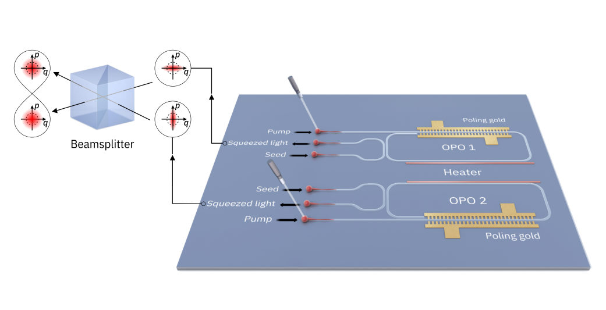
<figcaption class="paper-figure-caption"><b>Fig 1.</b> FIG. 1. Scheme of the integrated two-source squeezed-light device and off-chip two-mode entanglement generation. Two single-resonant OPOs are fabricated on a TFLN chip. Each OPO contains a periodically poled section, an on-chip heater for resonance tuning, and a dichroic directional coupler for separating pump and signal light. The squeezed outputs are collected from the chip and interfered on an off-chip beam splitter to generate a two-mode squeezed state. Seed inputs are used to lock the squeezing quadratures. The dashed circle represents the shot noise variance reference level.</figcaption>
</figure>
<figure class="paper-figure-card">
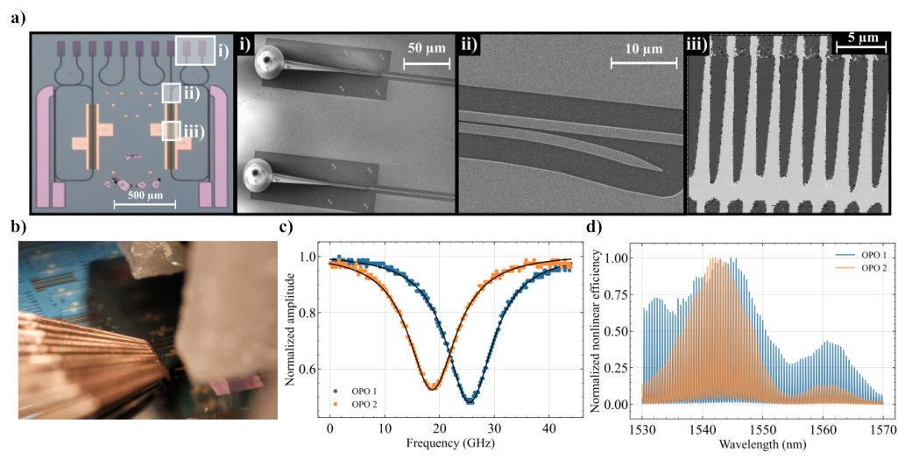
<figcaption class="paper-figure-caption"><b>Fig 2.</b> FIG. 2. a) Optical microscope image during the fabrication taken before printing the 3D-couplers on the chip. Details of the integrated platform: i) SEM image of the fiber-to-chip couplers, ii) SEM image of the dichroic directional coupler used to separate pump and signal light, and iii) piezoresponse force microscopy (PFM) image of the periodically poled lithium niobate before photonic fabrication, confirming uniform domain inversion. The waveguide is subsequently etched in the region where the periodic poling has approximately 50 % duty cycle. b) Camera image of the fabricated chip showing the fiber array interface and electrical probe contacts. c) Measured transmission spectra of the two...</figcaption>
</figure>
<figure class="paper-figure-card">
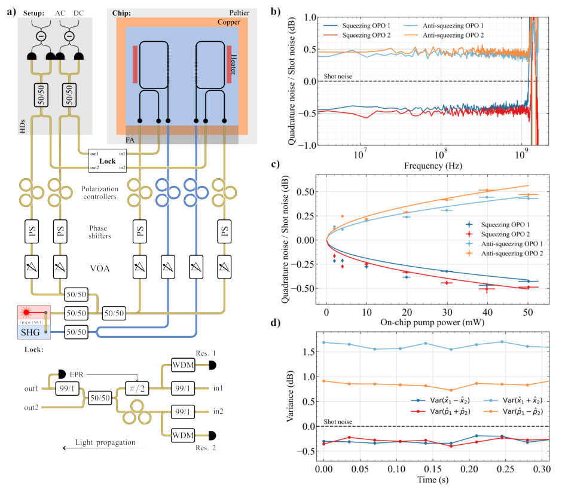
<figcaption class="paper-figure-caption"><b>Fig 3.</b> FIG. 3. a) Schematics for two-mode squeezing generation from the integrated circuit. Setup The fiber-based setup contains the laser source and the light distribution of both wavelength bands at 1550 (yellow) and 775 nm (blue) wavelengths. Light is manipulated using VOAs, phase shifters and polarization controllers. Chip Two seed and two pump sources are passed to the integrated circuit, using a fiber array for the optical and an electrical probe for the electrical signals. The global temperature is controlled with a peltier element. The output squeezed states are used for the locking scheme and passed to the HDs, where they are mixed with two LOs coming from the laser source. Lock The...</figcaption>
</figure>

**Summary.** Researchers have successfully integrated two independently tunable squeezed-light sources on a single thin-film lithium niobate chip. By interfering these sources, they demonstrated the generation of continuous-variable entanglement. This provides a scalable pathway for building complex, integrated quantum photonic circuits.

**Why it may be interesting.** This work is highly relevant to quantum optics and quantum information as it demonstrates a scalable hardware building block for continuous-variable quantum computing and large-scale Gaussian photonic circuits.

Detailed structure

**Main problem.** The need for scalable, integrated, and independently controllable nonclassical light sources on a single platform for continuous-variable quantum information processing.

**Main result.** Demonstration of two indistinguishable and independently tunable optical parametric oscillators (OPOs) on a single thin-film lithium niobate (TFLN) chip, used to generate EPR-type two-mode entanglement.

**Method.** Fabrication of TFLN waveguides with periodic poling, use of on-chip micro-heaters for resonance tuning, and interference of the two squeezed modes on an off-chip beam splitter followed by balanced homodyne detection.

**Model / system.** An integrated photonic platform based on X-cut thin-film lithium niobate (TFLN) on SiO2, featuring two single-resonant OPOs utilizing spontaneous parametric down-conversion at telecom wavelengths (1550 nm).

**Key observables.** Squeezing levels (dB), Duan-Simon inseparability criterion value, quadrature variances, and OPO pump power thresholds.

**Important parameters / regimes.** Signal wavelength ~1550 nm, pump wavelength ~775 nm, squeezing up to 0.5 dB, total efficiency ~0.53-0.54, and OPO thresholds between 15-23 W.

**Assumptions / limitations.** The system operates in the low-pump regime well below the OPO threshold.

**Figures summary.** Figure 1 shows the device schematic and experimental setup; Figure 2 displays the fabricated chip layout and SEM images of waveguides; Figure 3 presents the squeezing spectrum, power dependence, and quadrature variance measurements.

**Paper structure.** The paper introduces the scalability problem, describes the TFLN device architecture and fabrication, details the experimental tuning and entanglement generation setup, presents the measurement of squeezing and entanglement, and concludes with limitations and future directions.

Abstract

Scalable generation of nonclassical light sources on an integrated platform is a key requirement for photonic quantum information processing. In particular, realizing multiple indistinguishable squeezed light sources on a single chip is an essential step toward continuous-variable quantum computing. Here, we demonstrate the fabrication of two indistinguishable and independently controllable optical parametric oscillators on a thin-film lithium niobate (TFLN) platform. The device design focuses on reproducibility, independent tunability, and compatibility with larger telecom-wavelength continuous-variable photonic circuits. We observe up to 0.5 dB of directly measured squeezing below the shot-noise level from each source. By interfering the two modes on a beam splitter, we generate an EPR-type two-mode squeezed state and verify continuous-variable entanglement through violation of the Duan-Simon inseparability criterion. This is the first demonstration of two independently tunable squeezed-light sources on a single TFLN chip and their use for generating continuous-variable entanglement.

[↑ back to top](#top)

### [Practical Tests and Witnesses of Fermionic non-Gaussianity](http://arxiv.org/abs/2605.26218v1)

**Authors:** Tobias Haug, Xhek Turkeshi, Piotr Sierant  
**Type:** both · **Category:** quantum information and computing · **PDF:** <https://arxiv.org/pdf/2605.26218v1>  
**Analysis basis:** full PDF text, analyzed in chunks
**Topic relevance:** 🔥 `QC/QI experiment` **4/5** · `entanglement & information structure` **3/5** · `quantum measurements` **3/5** · `Keldysh / 2PI / non-Gaussian methods` **2/5**

↔ Scroll figures horizontally

<figure class="paper-figure-card">
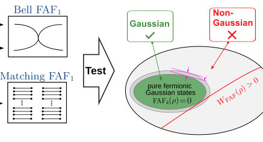
<figcaption class="paper-figure-caption"><b>Fig 1.</b> FIG. 1. To test whether a given state ρ is fermionic Gaus- sian or not, we use two-copy Bell measurements or single- copy scheme based on grouping matching bilinears to estimate fermionic anti-flatness (FAF).</figcaption>
</figure>
<figure class="paper-figure-card">
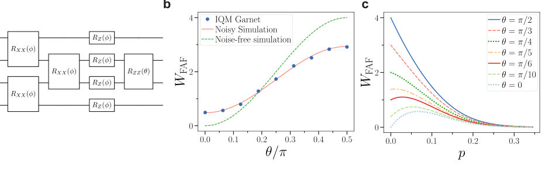
<figcaption class="paper-figure-caption"><b>Fig 2.</b> FIG. 3. Experimental measurement of fermionic non-Gaussianity witness WFAF on IQM Garnet quantum computer. a) State preparation circuit with n = 4 qubits of parameterized matchgates Rxx = exp(−iϕ/2X ⊗X) and Rz = exp(−iϕ/2Z) with ϕ = π/2 and non-Gaussian gate Rzz = exp(−iθ/2Z ⊗Z). b) WFAF against θ for implementation with IQM Garnet quantum computer (blue), noisy simulation (orange) and noise-free simulation (green). Noisy simulation assumes single-qubit depolarizing noise Λp = (1 −p)ρ + p I</figcaption>
</figure>
<figure class="paper-figure-card">
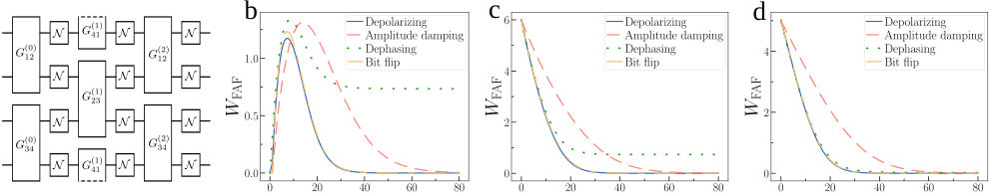
<figcaption class="paper-figure-caption"><b>Fig 3.</b> FIG. 4. Fermionic non-Gaussianity witness WFAF in noisy matchgate (MG) circuits. a) Circuit sketch for n = 4 qubits and depth d = 3, initialized in ρ. Each layer consists of random matchgates Gij followed by local noise N. b)–d) Witness dynamics after d layers for the initial states b) |0⟩⊗n, c) the GHZ state, and d) Haar-random states. We consider local depolarizing noise, amplitude damping, dephasing, and bit-flip noise. Data are averaged over 20 random circuit instances.</figcaption>
</figure>
<figure class="paper-figure-card">
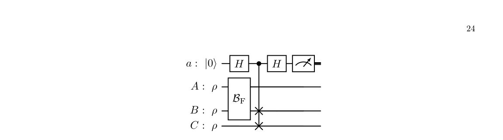
<figcaption class="paper-figure-caption"><b>Fig 4.</b> FIG. 5. Three-copy convolution test [54, 55]. Two copies are mixed by the balanced fermionic beam splitter BF =</figcaption>
</figure>

**Summary.** This paper presents new, efficient protocols for detecting and quantifying non-Gaussianity in fermionic systems using both single-copy and two-copy measurement schemes. It introduces a noise-robust witness for mixed states and demonstrates the practical utility of these tools on a real quantum processor. The work establishes a fundamental link between non-Gaussianity and the complexity of generating pseudorandom fermionic states.

**Why it may be interesting.** This is highly relevant for many-body dynamics and quantum computing as it provides tools to certify non-trivial correlations and 'magic' resources in fermionic systems, which are harder to detect than standard entanglement or coherence.

Detailed structure

**Main problem.** Developing scalable and practical methods to detect, witness, and quantify fermionic non-Gaussianity, which is essential for benchmarking quantum devices and certifying fermionic magic resources.

**Main result.** The authors introduce efficient two-copy Bell measurement and single-copy protocols for estimating fermionic antiflatness (FAF), demonstrating improved scaling in qubit number and error tolerance, and showing that noise can both reduce and enhance non-Gaussianity.

**Method.** The study utilizes two-copy Bell measurements on pairs of states and a single-copy scheme based on commuting Majorana bilinear matchings, alongside a new purity-corrected FAF witness for mixed states.

**Model / system.** The system consists of n fermionic modes described by 2n Majorana operators, mapped to n qubits via the Jordan-Wigner transformation, and tested on the IQM Garnet quantum computer.

**Key observables.** Fermionic Antiflatness (FAF1), Gaussian fidelity (F_AF), purity-corrected FAF witness (W_FAF), and quadratic Fock-basis coherence (C2).

**Important parameters / regimes.** Number of qubits (n), distance to the Gaussian set (epsilon_G), noise parameter (p), and non-Gaussian gate angle (theta).

**Assumptions / limitations.** The single-copy protocol assumes the ability to implement Clifford circuits and Pauli measurements; the two-copy protocol assumes access to two copies of the quantum state.

**Figures summary.** Figure 1 shows the two estimation protocols; Figure 2 details the Bell-measurement readout; Figure 3 shows experimental results on IQM Garnet; Figure 4 illustrates the evolution of the witness under various noise models; Figure 5 depicts the three-copy convolution test.

**Paper structure.** The paper introduces the problem of non-Gaussianity detection, develops new two-copy and single-copy estimation protocols, provides complexity analysis, introduces a robust witness for mixed states, validates results on a quantum computer, and explores the link to pseudorandomness and gate complexity.

Abstract

Detecting when a quantum state leaves the efficiently simulable fermionic Gaussian regime is a central task for benchmarking quantum devices and certifying fermionic magic resources. We develop practical tests and witnesses based on fermionic antiflatness (FAF), a covariance-matrix-based measure of non-Gaussianity. For $n$-qubit states, we estimate FAF using two complementary protocols: two-copy Bell measurements and a single-copy scheme based on commuting matchings of Majorana bilinears. These yield testers that distinguish pure Gaussian states from states $ε$-far from the Gaussian set, using $O(n^2/ε^2)$ two-copy Bell measurements or $O(n^3/ε^4)$ single-copy measurements, improving the state of the art in the dependence on both $n$ and $ε$. For mixed states, we introduce a purity-corrected FAF witness that certifies non-Gaussianity and is highly robust to noise. With our witness, we demonstrate on the IQM quantum computer that noise can both reduce and enhance non-Gaussianity. Finally, by examining pseudo non-Gaussianity, we show that the cryptographic task of pseudorandom-state generation requires extensive fermionic non-Gaussianity. Together, these results provide experimentally accessible tools for detecting, witnessing, and quantifying non-Gaussian fermionic resources.

[↑ back to top](#top)

### [Zero-field dipolar decoupling of color center ensembles via universal qutrit control](http://arxiv.org/abs/2605.26863v1)

**Authors:** Antonio Verdú, Ana Teresa Gea-Caballero, Santiago Oviedo-Casado, Fedor Jelezko, Javier Prior  
**Type:** both · **Category:** quantum information and computing · **PDF:** <https://arxiv.org/pdf/2605.26863v1>  
**Analysis basis:** full PDF text, analyzed in chunks
**Topic relevance:** 🔥 `QC/QI experiment` **4/5** · `spintronics-quantum-optics interface` **3/5** · `non-equilibrium dynamics` **2/5**

↔ Scroll figures horizontally

<figure class="paper-figure-card">
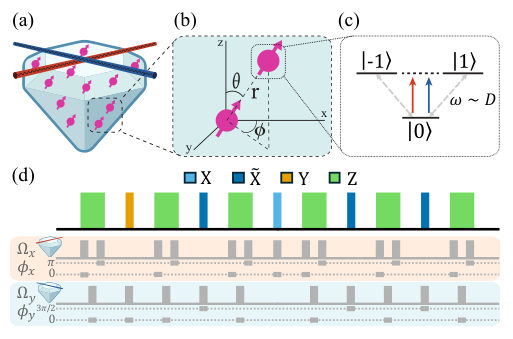
<figcaption class="paper-figure-caption"><b>Fig 1.</b> FIG. 1. ZENITH schematics (a) Experimental setup representation for arbitrary control of an ensemble of color centers. Two perpendicular microwave sources, orthogonal to the NV centers symmetry axis, enable universal control of the NV center ground state qutrit manifold. (b) Two-body dipolar interaction among electron spins, described here in relative spherical coordinates {r, θ, ϕ}. (c) A driving that matches the V-degenerate qutrit’s zero-field splitting ω ∼D enables double-state operators that create different superpositions of the states |1⟩and |−1⟩. (d) ZENITH sequence of π/2 rotations on different axes for dipolar coupling removal. Microwave rotations are implemented through pulses...</figcaption>
</figure>
<figure class="paper-figure-card">
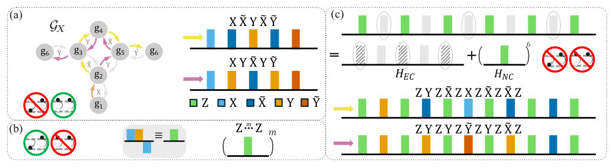
<figcaption class="paper-figure-caption"><b>Fig 2.</b> FIG. 2. Pictorial derivation of ZENITH dipolar decoupling sequence (a) Construction of the sequence that decouples the energy-conserving dipolar Hamiltonian HEC in Eq. (2). Minimal graph representing the connections between the different pulsed-transformed versions of HEC, denoted as gi ∈GX (balls) through the set of π/2 rotations V = {X, Y, ˜ X, ˜Y } (arrows), starting with a free-evolution time g1 = 1. All minimal solutions are achieved by two equally long paths (yellow and pink arrows), both starting from the same pulse (orange arrow). (b) Decoupling the non-energy conserving dipolar Hamiltonian HNC requires from Z pulses, obtained through the compositions ABA−1 and B−1AB, where the pair...</figcaption>
</figure>
<figure class="paper-figure-card">
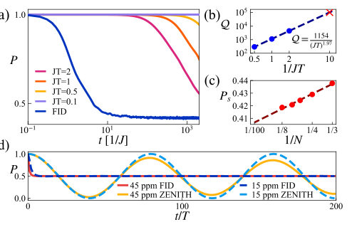
<figcaption class="paper-figure-caption"><b>Fig 3.</b> FIG. 3. ZENITH performance (a) Numerical time evolution of P, computed as the average of the survival probabilities of the states |↑⟩, |↓⟩, and |+⟩, on an ensemble of eight randomly distributed dipolar interacting qutrits under FID (solid blue line) and with the stroboscopic implementation of ZENITH for values of JT = 2, 1, 0.5, 0.1, respectively. For the faster decaying uncontrolled evolution and JT = 2 curves we average 10 cluster profiles to reach convergence, while for the rest a single cluster profile is enough, as no significant variations occur for the considered duration. (b) Protection factor as a function of JT. The factor for the protocol with JT = 0.1 is estimated to be Q ∼...</figcaption>
</figure>
<figure class="paper-figure-card">

<figcaption class="paper-figure-caption"><b>Fig 4.</b> Figure 3(d) displays stroboscopic evolution on a cluster of eight NVs targeting a DC signal of strength µ = 0.1/T, both for FID and with ZENITH initiated on the optimal measurement state, considering two different experimentally relevant NV ensemble concentrations. While for FID dipolar coupling induces a fast decay of the signal, thereby preventing frequency estimation, the large coherence time availed by ZENITH yields clean oscillation from which the original DC signal can be reconstructed. Note that, as we show in Sec. VI of the SM [46], the optimal initial state can be achieved with a single pulse, and therefore does not introduce additional errors, nor it reduces the experiment time...</figcaption>
</figure>

**Summary.** The paper introduces the ZENITH protocol, a new pulse sequence designed to eliminate dipolar interactions in NV center ensembles at zero magnetic field. By using universal qutrit control, the method significantly extends coherence times and enables high-sensitivity DC magnetometry. This advancement is crucial for quantum technologies operating in environments where external magnetic fields cannot be applied.

**Why it may be interesting.** It provides a general framework for controlling interacting degenerate multilevel systems (qutrits) and offers a method to suppress many-body interactions without external bias fields, which is highly relevant to open quantum systems and quantum sensing.

Detailed structure

**Main problem.** The decoherence of dense Nitrogen-Vacancy (NV) center ensembles in diamond caused by dipolar interactions, especially in the absence of a bias magnetic field which is usually required to lift degeneracy.

**Main result.** The development of the ZENITH protocol, an 11-pulse sequence that achieves full dipolar decoupling at zero field, providing over two orders of magnitude improvement in coherence time and enabling enhanced DC magnetometry.

**Method.** The authors use Average Hamiltonian Theory and a group-theoretical Cayley graph approach to design a pulse sequence that cancels both energy-conserving and non-energy-conserving dipolar terms via universal qutrit control.

**Model / system.** Ensembles of Nitrogen-Vacancy (NV) centers in diamond, modeled as a spin-1 (qutrit) system with a V-degenerate ground state manifold subject to dipole-dipole interactions.

**Key observables.** Survival probability of qutrit coherent states, protection factor (coherence time ratio), and frequency estimation error for DC magnetometry.

**Important parameters / regimes.** Zero-field or low-bias magnetic field regime, dipolar interaction strength (J_T), and NV center concentrations (e.g., 15 ppm and 45 ppm).

**Assumptions / limitations.** Rotating wave approximation (RWA), neglecting fast-rotating terms, and assuming the driving frequency is much smaller than the zero-field splitting (Omega << D).

**Figures summary.** Fig 1 shows the experimental setup and the ZENITH pulse sequence; Fig 2 illustrates the Cayley graph construction and decoupling logic; Fig 3 compares survival probability between FID and ZENITH; Fig S2 demonstrates DC signal sensing and error metrics.

**Paper structure.** The paper introduces the problem of dipolar decoherence, defines the Hamiltonian and control framework, presents the ZENITH sequence construction using group theory, validates the protocol via numerical simulations, and demonstrates its utility for DC magnetometry.

Abstract

Dipolar interactions are a major source of decoherence in dense ensembles of color centers in diamond. Current protocols demand using bias magnetic fields detrimental in many scenarios. We present ZENITH (Zero-field Ensemble Neutralization via Interleaved Trilevel Handling), a pulsed sequence to cancel dipolar interactions among V-degenerate spin-1 systems. We reveal excellent coherence survival, compatibility with existing sensing sequences, and improved DC detection, advancing a general framework to control interacting degenerate multilevel systems, of broad interest in quantum technologies.

[↑ back to top](#top)

### [Single-Ensemble Multiparameter Squeezing with Qudits](http://arxiv.org/abs/2605.26377v1)

**Authors:** Xiaoshui Lin, Chunlei Qu, Chong Zu, Chuanwei Zhang  
**Type:** both · **Category:** other · **PDF:** <https://arxiv.org/pdf/2605.26377v1>  
**Analysis basis:** full PDF text, analyzed in chunks
**Topic relevance:** 🔥 `quantum measurements` **4/5** · `Keldysh / 2PI / non-Gaussian methods` **2/5** · `entanglement & information structure` **2/5**

↔ Scroll figures horizontally

<figure class="paper-figure-card">
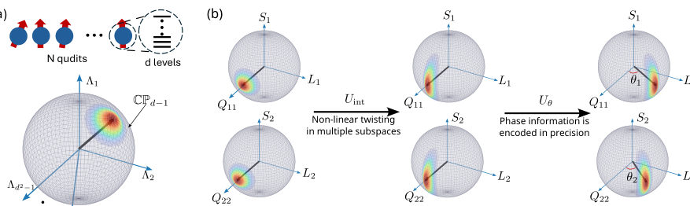
<figcaption class="paper-figure-caption"><b>Fig 1.</b> FIG. 1. (a) Schematic of qudits and their phase space formed by the collective traceless SU(d) generators {Λ1, Λ2, . . . , Λd2−1}. With a total of d2 −1 collective operators, we can encode multi-phase information in multiple subspaces. The SU(d) coherent state lives in the complex projective space of dimension d −1, denoted as CPd−1. (b) Schematic of the squeezing and sensing process via qudits. The initial state is prepared into an optimized coherent state |ψp⟩= |ϕ⟩⊗N. Then, an interacting Hamilto- nian simultaneously twists the initial state across multiple subspaces, thereby achieving metrological gain. After the squeezing state preparation, the encoding operator Uθ = e−i P α θαSα...</figcaption>
</figure>
<figure class="paper-figure-card">
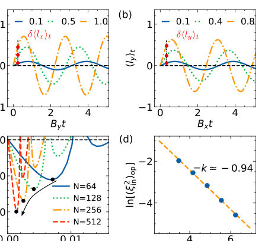
<figcaption class="paper-figure-caption"><b>Fig 2.</b> FIG. 2. (a) (b) Dynamics of measurement operators lx and ly under the in-plane magnetic field from initial state |ψs⟩= |0⟩. The red dots denote linear detection based on changes in the expectations of lx and ly. Here, we set Bx/By = 0.1, 0.5, 1.0 in (a); and set Bx/By = 0.1, 0.4, 0.8 in (b). (c) Dynamics of the squeezing parameter ξ2 in under the interacting Hamil- tonian with different qudit number N. The black dots denote the optimal squeezing parameter (ξ2 in)op and the correspond- ing time top. (d) The scaling relation of the optimal squeezing parameter (ξ2 in)op versus the qudit number N. The numerical fitting yields (ξ2 in)op ∼N −k with k ≃0.94.</figcaption>
</figure>
<figure class="paper-figure-card">
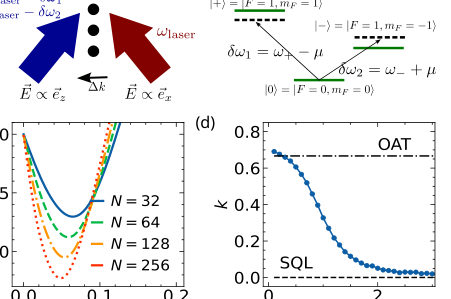
<figcaption class="paper-figure-caption"><b>Fig 3.</b> FIG. 3. (a) The 171Yb+ ions are trapped in a one-dimensional Paul trap with transverse phonon modes. Three lasers form a beating pattern to mediate the spin-spin interaction. (b) Three hyperfine states in the ground-state manifold 2S1/2 form the d = 3 qudit. (c) Squeezing parameter ξ2 in vs. evolu- tion time J0t at different system size. We set V0/J0 = 2, and this does not dramatically change the optimal squeezing pa- rameter. (d) The fitting exponent k of the optimal squeezing parameter to the qudit number vs. interaction decay expo- nent γ. The dashed dotted line denotes the OAT results, and the dashed line denotes the SQL with no metrological gain.</figcaption>
</figure>

**Summary.** The paper shows that using qudits instead of qubits allows a single ensemble to perform simultaneous multi-parameter sensing. It establishes a mathematical framework for this effect and demonstrates significant metrological gain in a simulated trapped-ion system.

**Why it may be interesting.** It provides a new route to multiparameter metrology by expanding the local Hilbert space, offering a distinct advantage over distributed architectures in the fixed-sensor-budget regime, which is highly relevant for quantum sensing and many-body dynamics.

Detailed structure

**Main problem.** Achieving simultaneous multiparameter sensing (e.g., vector magnetic field detection) within a single collective ensemble, which is typically limited to single-parameter metrology in qubit-based systems.

**Main result.** By promoting local sensors from qubits to qudits, the authors demonstrate that a single ensemble can support multiparameter squeezing, achieving up to 12 dB enhancement in a trapped-ion qutrit chain.

**Method.** A general framework based on the single-site Quantum Fisher Information Matrix (QFIM) to determine optimal probe states and readout observables, combined with Discrete Truncated Wigner Approximation (DTWA) for numerical simulations.

**Model / system.** A single ensemble of N identical d-level qudit sensors, specifically implemented as a trapped-ion qutrit chain with power-law interactions and a collective twisting-like interacting Hamiltonian.

**Key observables.** Multiparameter squeezing parameter (xi^2), collective spin operators (S_alpha), Symmetric Logarithmic Derivatives (SLD), and transduction-rate operator matrix (G_alpha_beta).

**Important parameters / regimes.** Local dimension (d), number of sensors (N), power-law interaction exponent (gamma), and the Standard Quantum Limit (SQL).

**Assumptions / limitations.** The ensemble is initially in a direct product state; the optimization assumes the ability to implement optimal SLD measurements; the framework is subject to the Matsumoto weak-commutativity theorem.

**Figures summary.** Figure 1(a) provides a schematic of qudits and their phase space using SU(d) generators, illustrating how multiple independent response channels can coexist.

**Paper structure.** The paper identifies the limitations of qubit-based sensing, proposes a qudit-based solution, develops a mathematical framework using QFIM, demonstrates a concrete qutrit implementation, and provides numerical evidence using a trapped-ion model.

Abstract

Quantum-enhanced multiparameter sensing is often associated with distributed architectures or 2-anticoherent states, whereas squeezing in a single collective ensemble is typically limited to single-parameter metrology. Here, we show that a single ensemble can support simultaneous multiparameter squeezing when each sensor is promoted from a qubit to a qudit (i.e., spin with $d$ energy levels). We develop a general framework in which the optimal product probe state, the corresponding global readout observables, and the associated squeezing parameters are all determined from the single-site quantum Fisher information matrix. We then present a minimal qudit construction for two-parameter vector magnetic field sensing with local dimension $d=3$. We further identify a collective twisting-like interacting Hamiltonian that generates such multiparameter-squeezed states and numerically demonstrate scalable metrological gain. In particular, for a trapped-ion qutrit chain with power-law interactions, we obtain up to 12 dB enhancement in two-parameter sensing for $N=256$ sensors. Our results establish qudit-enabled multiparameter squeezing in a single ensemble as a distinct route to multiparameter quantum metrology with global readout, and highlight its potential advantage over distributed multi-ensemble strategies in the fixed-sensor-budget regime.

[↑ back to top](#top)

### [Analytical Model of Clock Drift in Quantum Key Distribution and a Simple Synchronization Algorithm](http://arxiv.org/abs/2605.26705v1)

**Authors:** Loïc Millet, Boris Korzh, Rob Thew, Gianluca Boso  
**Type:** both · **Category:** quantum information and computing · **PDF:** <https://arxiv.org/pdf/2605.26705v1>  
**Analysis basis:** full PDF text, analyzed in chunks
**Topic relevance:** 🔥 `QC/QI experiment` **4/5** · `quantum optics experiment` **2/5** · `quantum measurements` **1/5**

↔ Scroll figures horizontally

<figure class="paper-figure-card">
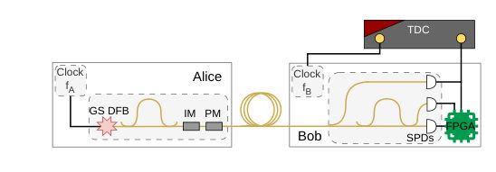
<figcaption class="paper-figure-caption"><b>Fig 1.</b> FIG. 1: Experimental setup of the QKD systems. GS DFB: gain-switched distributed feedback laser; IM: intensity modulator; PM: phase modulator; SPD: single-photon detector; FPGA: field-programmable gate array; TDC: time-to-digital converter used for time-correlated single-photon counting (TCSPC) histogram acquisition. Dashed lines represent temperature stabilized regions.</figcaption>
</figure>
<figure class="paper-figure-card">
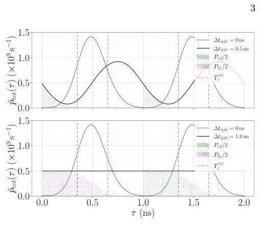
<figcaption class="paper-figure-caption"><b>Fig 2.</b> FIG. 2: Probability density functions for ∆tdrift(Tint) = 0.5 ns (top) and 1 ns (bottom). Dashed lines indicate a filtering window of width w = 300 ps.</figcaption>
</figure>
<figure class="paper-figure-card">
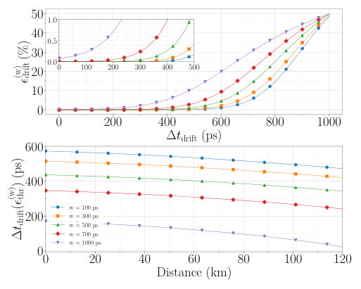
<figcaption class="paper-figure-caption"><b>Fig 3.</b> FIG. 3: (Top) ϵ(w) drift as a function of ∆tdrift(Tint) for different filtering window widths w at z = 120 km. (Bottom) ∆tdrift(ϵ(w) thr = 0.1 %) as a function of the transmission distance z for different filtering window widths w.</figcaption>
</figure>
<figure class="paper-figure-card">
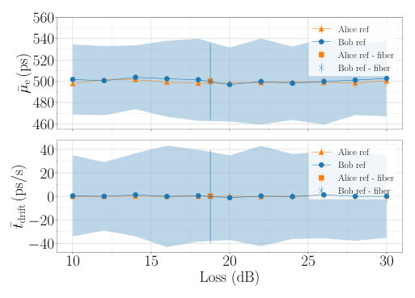
<figcaption class="paper-figure-caption"><b>Fig 4.</b> FIG. 5: Average detection time (top) and clock drift (bottom) as a function of the quantum channel loss. Shaded region indicates the standard deviation of the Bob-reference curve.</figcaption>
</figure>
<figure class="paper-figure-card">
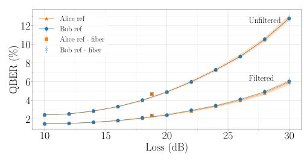
<figcaption class="paper-figure-caption"><b>Fig 5.</b> FIG. 4: Measured QBER with (w = 300 ps) and without temporal filtering as a function of quantum channel loss. Shaded region indicates the standard deviation of the Alice-reference curve.</figcaption>
</figure>

**Summary.** This paper presents an analytical model and a practical algorithm to synchronize clocks in quantum key distribution without needing extra communication channels. By using detection timestamps to compensate for frequency mismatch, the method enables robust, long-term QKD operation even in high-loss fiber networks.

**Why it may be interesting.** not directly relevant

Detailed structure

**Main problem.** Clock frequency mismatch between transmitter and receiver in time-bin QKD causes time shifts that increase the Quantum Bit Error Rate (QBER). The goal is to develop a synchronization method that does not require a dedicated service channel or auxiliary qubit sequence.

**Main result.** The authors developed a lightweight synchronization algorithm that recovers clock drift and compensates for time offsets directly from detection timestamps, achieving stable operation over 24 hours in a metropolitan network with performance equivalent to a dedicated service channel.

**Method.** The paper uses an analytical model of clock drift and a synchronization algorithm based on the circular means of consecutive folded histograms to estimate frequency mismatch and time-offset fluctuations.

**Model / system.** A fiber-based time-bin BB84 QKD system using commercial hardware (ID Quantique Clavis XG) including gain-switched DFB lasers, modulators, and SPADs, deployed in both laboratory (100 km fiber) and field (16 km Geneva Quantum Network) settings.

**Key observables.** Quantum Bit Error Rate (QBER), photon detection-time probability distribution, clock drift rate, and Time Deviation (TDEV).

**Important parameters / regimes.** Frequency mismatch (delta f), time-bin duration (T_bin), integration time (T_int), channel loss (up to 30 dB), and detector jitter.

**Assumptions / limitations.** The frequency mismatch is assumed constant over a single integration time, and the clock drift follows a linear/aging model where the shift between consecutive acquisitions is less than half a bin width.

**Figures summary.** Figure 1 shows the experimental setup; Figure 2 illustrates the PDF of photon arrival times under different drift levels; Figure 6 demonstrates the 24-hour stability of the GQN network (drift, detection time, and QBER); Figure 7 shows the error in drift estimation with and without Poissonian noise.

**Paper structure.** The paper introduces the problem of clock drift, presents an analytical model for the resulting QBER, describes the proposed synchronization algorithm, details the experimental setup and field deployment, and concludes with error analysis and stability constraints.

Abstract

Clock synchronization is critical for maintaining low error rates in quantum key distribution. Here, we describe how a frequency mismatch between the transmitter and receiver clocks affects the quantum bit error rate in quantum key distribution, and derive from this model a simple synchronization algorithm together with clock stability requirements for practical operation. Our algorithm continuously compensates for both frequency mismatch and time-offset fluctuations directly from detection timestamps. It does not require a dedicated synchronization channel or auxiliary qubit sequence, converges from a large frequency mismatch within approximately one second of photon acquisition, and remains effective in low-photon-count regimes (more than 30 dB of channel loss) using standard hardware. We validate our approach by demonstrating successful key exchange over 100 km of fiber and continuous operation over 24 hours in a 16 km metropolitan network using commercial systems, with performance equivalent to using a service channel for clock synchronization.

[↑ back to top](#top)

### [Geometric Protection of Bipartite Entanglement in Hopf-Linked Quantum Rings](http://arxiv.org/abs/2605.26622v1)

**Authors:** V. Yogesh, Prosenjit Maity  
**Type:** theory · **Category:** quantum information and computing · **PDF:** <https://arxiv.org/pdf/2605.26622v1>  
**Analysis basis:** full PDF text, analyzed in chunks
**Topic relevance:** 🔥 `entanglement & information structure` **4/5** · `analog quantum simulation` **2/5**

↔ Scroll figures horizontally

<figure class="paper-figure-card">
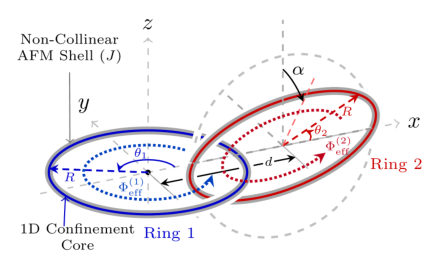
<figcaption class="paper-figure-caption"><b>Fig 1.</b> FIG. 1. Schematic representation of the bipartite core-shell quantum ring geometry (radius R). Ring 2 is translated by a distance d (defining the dimensionless translation β = d/R) along the x-axis and subjected to a geometric tilt α away from orthogonality. Both rings experience a synthetic gauge field Φ(j) eff = 3Φ0/2 (j = 1, 2) and a local exchange splitting J, which are generated intrinsically by an interfacial Antiferromagnetic (AFM) and Spin-Orbit Coupling (SOC) shell.</figcaption>
</figure>
<figure class="paper-figure-card">
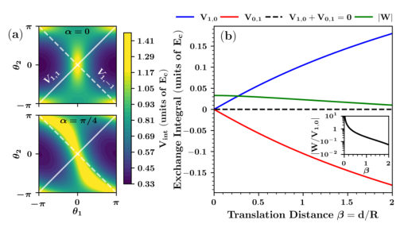
<figcaption class="paper-figure-caption"><b>Fig 2.</b> FIG. 2. Geometric parity breaking and gap generation. (a) Exact Coulomb landscape Vint(θ1, θ2) at β = 0.8. The copla- nar state (α = 0) exhibits rotational symmetry between the co-propagating (solid diagonal) and counter-propagating (dashed diagonal) momentum transfer axes, enforcing degen- eracy (W = 0). The mechanical tilt (α = π/4) breaks this symmetry, skewing the interaction potential and lifting the exchange degeneracy. (b) Dimensionless exchange integral scaling versus translation distance β, evaluated at a fixed non- coplanar tilt of α = 0.3 rad. The curves confirm the spatial symmetry V1,0 = −V0,1, demonstrating that classical Coulomb asymmetries perfectly cancel across the...</figcaption>
</figure>
<figure class="paper-figure-card">
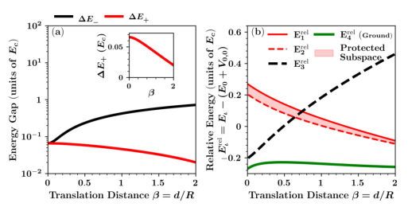
<figcaption class="paper-figure-caption"><b>Fig 3.</b> FIG. 3. Symmetry-protected manifolds evaluated continu- ously across the translation domain at a fixed geometric tilt of α = 0.3 rad. (a) Eigenstate splitting mapping the geometric exchange gap ∆E+ (log scale). (Inset) Linear-scale profile of the ∆E+. (b) Complete eigenvalue spectrum. At extreme interlocking (β →0.01), the elimination of macroscopic spa- tial asymmetry collapses the classical level repulsion, forcing the parity gaps to converge (∆E−→∆E+) and driving the localized state E3 rapidly downward across the protected Bell manifold (red).</figcaption>
</figure>
<figure class="paper-figure-card">
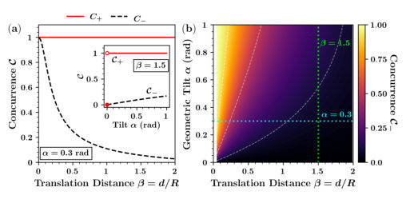
<figcaption class="paper-figure-caption"><b>Fig 4.</b> FIG. 4. Geometric evaluation of the concurrence. (a) 1D parameter slice evaluated at α = 0.3 rad (Main) and β = 1.5 (Inset), demonstrating the invariant protection of the positive parity manifold (C+ = 1) alongside the rapid decay of the neg- ative parity subspace. At perfect orthogonality (α = 0), the singular perturbation forces an instantaneous basis collapse to C+ = 0 (solid red dot). (b) 2D phase space evaluation of the negative-parity concurrence (C−). The mapping reveals the en- tanglement decay across the moderate near-field regime driven by classical spatial asymmetry. As the system approaches the concentric limit (β →0), the macroscopic spatial asymmetry vanishes (V1,0 →0),...</figcaption>
</figure>
<figure class="paper-figure-card">
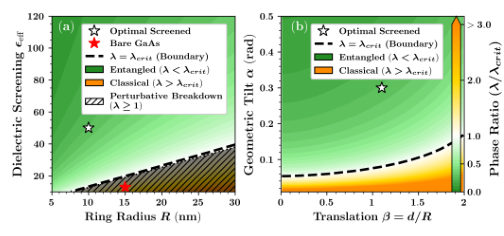
<figcaption class="paper-figure-caption"><b>Fig 5.</b> FIG. 5. 2D Phase Diagrams mapping the Quantum-to- Classical phase boundary (λ = λcrit). (a) Dependence on semiconductor dielectric screening (ϵeff) and ring radius (R) evaluated at fixed near-field geometry (α = 0.3, β = 1.1). Be- cause the bare GaAs environment violates the perturbative bounds of the effective Hamiltonian, top-gate screening is re- quired to enter the theoretically valid quantum domain. The hatched region (λ ≥1) indicates where the Schrieffer-Wolff transformation breaks down. (b) Topological phase space evaluated for a strongly screened architecture (R = 10 nm, ϵeff = 50).</figcaption>
</figure>

**Summary.** The study demonstrates how the non-coplanar geometry of interlocked quantum rings can protect Bell-state entanglement from Coulomb-driven decay. However, it also establishes a fundamental limit where high-order orbital transitions eventually trigger entanglement collapse. This defines the necessary conditions for achieving robust topological protection in semiconductor-based quantum architectures.

**Why it may be interesting.** It provides a theoretical framework for using geometric topology and spatial symmetry to protect entanglement against many-body interactions, which is highly relevant for designing robust qubits in mesoscopic or synthetic platforms.

Detailed structure

**Main problem.** Investigating the stability of bipartite entanglement (specifically Bell states) in Hopf-linked quantum rings against interaction-driven localization and parity mixing.

**Main result.** Identified a geometric protection mechanism via non-coplanar tilt that isolates the positive-parity Bell state, but discovered a critical interaction threshold (lambda_crit) beyond which higher-order transitions cause irreversible entanglement collapse.

**Method.** Exact diagonalization of the unexpanded 3D Coulomb interaction combined with a higher-order Schrieffer-Wolff transformation and symmetry analysis using a magnetic point group.

**Model / system.** Two interacting electrons confined to spatially separated, non-coplanar 1D quantum rings forming a Hopf-linked topology, subject to a local Rashba spin-orbit field and 3D Coulomb repulsion.

**Key observables.** Concurrence (C), exchange gap (Delta E+), and the interaction strength parameter (lambda).

**Important parameters / regimes.** Geometric tilt angle (alpha), interlocking parameter (beta), interaction ratio (lambda), and the dimensionless bounding constant (u_cross).

**Assumptions / limitations.** Negligible intra-band energy splittings compared to kinetic separation; use of the Heitler-London approximation for wavefunction overlap; assumes a hard-wall vacuum barrier to suppress direct tunneling.

**Figures summary.** Fig 1 shows the Hopf-linked geometry and parameters; Fig 2 illustrates the Coulomb landscape; Fig 4 shows 1D parameter slices of concurrence demonstrating entanglement protection vs. decay.

**Paper structure.** The paper introduces the Hopf-linked system, defines the Hamiltonian and geometric parameters, proves the spatial symmetry for protection, applies Schrieffer-Wolff to find the collapse threshold, and discusses implementation constraints in semiconductor architectures.

Abstract

We determine the bipartite entanglement bounds of two interacting electrons in deeply interlocked Hopf-linked quantum rings via exact diagonalization of the unexpanded 3D Coulomb interaction. This identifies an exact continuous spatial symmetry that geometrically isolates the positive-parity Bell state, preventing classical interaction-driven localization. A non-coplanar geometric tilt ($α> 0$) is essential to lift the exchange degeneracy and maintain this maximally entangled manifold as a state of frozen entanglement. However, a higher-order Schrieffer-Wolff transformation demonstrates this geometric protection is fundamentally bounded; uncancelled inter-orbital momentum transitions inevitably induce dynamical parity mixing. This defines a critical interaction threshold ($λ_{crit}$) for irreversible entanglement collapse. Our analysis shows that the resulting bounding conditions reveal scaling limitations in mesoscopic semiconductor architectures, dictating the necessity of synthetic macroscopic platforms to achieve robust topological protection.

[↑ back to top](#top)

### [Hydrodynamic Cooperons in Electron Fluids: Schwinger--Keldysh Derivation and Quantum Corrections to Magnetoresistance](http://arxiv.org/abs/2605.26226v1)

**Authors:** Alberto Cortijo  
**Type:** theory · **Category:** strongly correlated electrons · **PDF:** <https://arxiv.org/pdf/2605.26226v1>  
**Analysis basis:** full PDF text, analyzed in chunks
**Topic relevance:** 🔥 `Keldysh / 2PI / non-Gaussian methods` **4/5** · `non-equilibrium dynamics` **2/5**

↔ Scroll figures horizontally

<figure class="paper-figure-card">
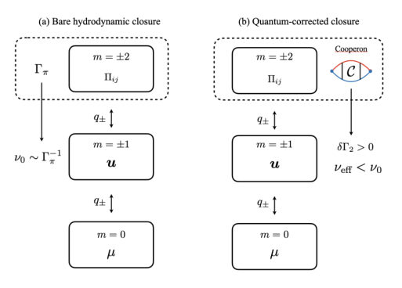
<figcaption class="paper-figure-caption"><b>Fig 1.</b> FIG. 1: Hydrodynamic harmonic hierarchy and stress-sector closure. The density mode m = 0 and momentum modes m = ±1 are coupled by gradients and are protected by conservation laws, while the first nonconserved sector (represented by the dashed boxes) is the spin-two stress mode m = ±2. In the bare hydrodynamic closure, integrating out the stress sector generates the viscosity ν0. In the quantum-corrected theory, the hydrodynamic Cooperon renormalizes the stress relaxation rate, Γπ →Γπ + δΓ2, with Γπ the bare spin-two relaxation rate, which feeds back into the momentum sector as an effective viscosity νeff.</figcaption>
</figure>
<figure class="paper-figure-card">
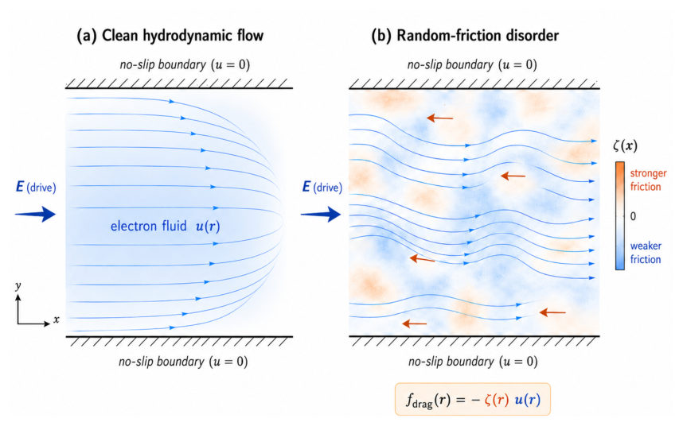
<figcaption class="paper-figure-caption"><b>Fig 2.</b> FIG. 2: Schematic illustration of the random-friction model. (a) In the clean hydrodynamic regime, a uniform driving field E produces a smooth electron-fluid velocity profile u(r) in a channel with no-slip boundaries. (b) In the presence of static inhomogeneous random friction, described by a spatially varying field ζ(r), the local drag force fdrag(r) = −ζ(r) u(r) opposes the flow and distorts the velocity streamlines. The color map represents the spatial variation of the friction strength, with stronger-friction regions producing a larger local suppression of the flow. This disorder realization provides the minimal hydrodynamic mechanism used in the Schwinger–Keldysh treatment to generate...</figcaption>
</figure>
<figure class="paper-figure-card">
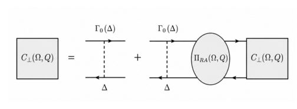
<figcaption class="paper-figure-caption"><b>Fig 3.</b> FIG. 3: Diagrammatic Bethe–Salpeter equation for the transverse hydrodynamic Cooperon C⊥(Ω, Q). The gray boxes denote the full Cooperon, the dashed vertical line is the random-friction disorder correlator ∆, and Γ0(∆) is the bare rung. The bubble ΠRA(Ω, Q) is built from one retarded and one advanced transverse hydrodynamic propagator. The second term contains one explicit disorder insertion; the Cooperon box on the right represents the remaining resummed ladder.</figcaption>
</figure>
<figure class="paper-figure-card">
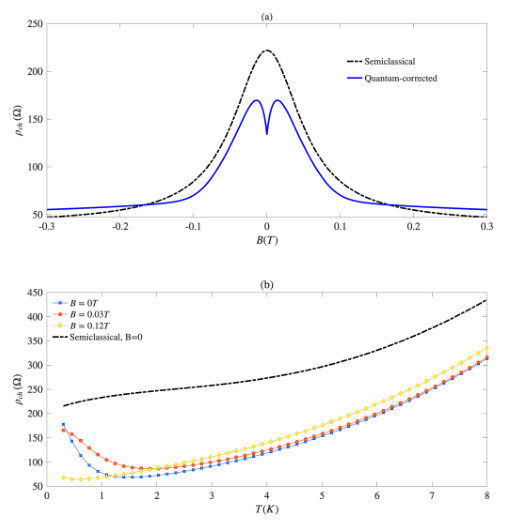
<figcaption class="paper-figure-caption"><b>Fig 4.</b> FIG. 4: Representative magnetoviscous response including the hydrodynamic-Cooperon stress correction. (a) Channel magnetoresistance ρch(B) at fixed temperature. The dashed black curve is the semiclassical result obtained from the bare stress relaxation rate Γπ(T), while the blue curve includes the Cooperon-induced correction Γπ →Γπ + δΓ2(T, B). The quantum-corrected curve (solid blue line) develops a narrow low-field dip because the Cooperon correction is largest at B = 0 and is suppressed by orbital magnetic dephasing at small finite field, while the broader background is controlled by the semiclassical magnetoviscous response (black dashed–dotted curve). (b) Fixed-field temperature cuts...</figcaption>
</figure>
<figure class="paper-figure-card">
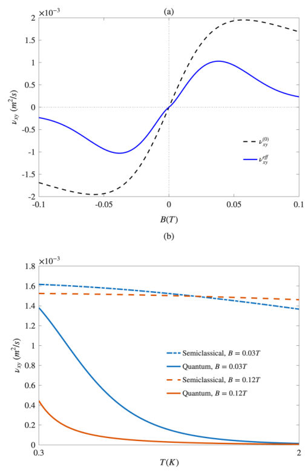
<figcaption class="paper-figure-caption"><b>Fig 5.</b> FIG. 5: Quantum correction to the Hall-viscous component of the magnetoviscosity tensor. (a) Semiclassical (black dashed curve) and quantum-corrected (blue solid curve) Hall viscosities as a function of magnetic field. The Cooperon correction preserves the odd-in-B symmetry of νxy, but suppresses the low-field slope through Γπ →Γπ + δΓ2(B, T). (b) Temperature dependence of νxy at two representative values of the magnetic field, blue B = 0.03T and orange B = 0.12T. In both cases the strong reduction of the quantum-corrected Hall viscosity with increasing temperature reflects the thermal dephasing effect of the hydrodynamic Cooperon in presence of magnetic fields.</figcaption>
</figure>

**Summary.** The paper derives a theory for quantum interference effects in electron fluids, specifically identifying a 'hydrodynamic Cooperon' that modifies stress relaxation. This mechanism predicts unique signatures in the magnetoresistance and Hall viscosity of high-mobility 2D electron gases, distinguishing quantum corrections from classical magnetohydrodynamic effects.

**Why it may be interesting.** not directly relevant

Detailed structure

**Main problem.** Developing a consistent Schwinger-Keldysh effective theory for quantum-interference corrections (hydrodynamic Cooperons) in the hydrodynamic regime of 2D electron systems and determining their impact on transport properties.

**Main result.** The theory shows that the hydrodynamic Cooperon renormalizes the spin-two stress sector, leading to a reduction in effective shear viscosity and a characteristic low-field magnetoresistance dip/shoulder.

**Method.** Real-time Schwinger-Keldysh field theory combined with a diagrammatic ladder resummation (Bethe-Salpeter equation) and the self-consistent Born approximation.

**Model / system.** A two-dimensional electron system in the hydrodynamic regime (high-mobility conductors) subject to a minimal random-friction disorder model that introduces momentum relaxation.

**Key observables.** Shear viscosity, longitudinal and Hall viscosities, channel magnetoresistance, and stress relaxation rate.

**Important parameters / regimes.** Momentum-relaxation time (tau_mc), cyclotron frequency (omega_c), shear viscosity (nu), and the hydrodynamic ultraviolet cutoff (Lambda).

**Assumptions / limitations.** Weak-damping/weak-relaxation limit, truncation of the angular harmonic hierarchy to m=0, +/-1, and +/-2, and the use of a sharp hydrodynamic momentum cutoff.

**Figures summary.** Figure 1 depicts the harmonic hierarchy of modes; Figure 4 shows the predicted low-field magnetoresistance dip and nonmonotonic temperature dependence; Figure 5 illustrates the Hall-viscosity kink and its temperature dependence.

**Paper structure.** The paper introduces the hydrodynamic problem, develops the Schwinger-Keldysh framework with a random-friction disorder model, derives the Cooperon pole and its renormalization of the stress sector, analyzes the effect of a magnetic field (orbital dephasing and viscosity modification), and concludes by identifying experimental signatures in magnetoresistance and Hall viscosity.

Abstract

We develop a Schwinger--Keldysh effective theory for quantum-interference corrections in a two-dimensional electron system in the hydrodynamic regime. Starting from the clean hydrodynamic fixed point, we introduce a minimal random-friction disorder model that generates a finite momentum-relaxation time within the self-consistent Born approximation. The disorder-averaged theory then allows us to construct a hydrodynamic Cooperon and to compute the associated self-energy corrections to the collective modes. Conservation laws protect the density and momentum sectors, so that the leading quantum-coherence correction is forced into the spin-two stress sector. The associated stress self-energy renormalizes the shear viscosity and modifies both the Gurzhi response and its low-field magnetohydrodynamic signatures.

[↑ back to top](#top)

### [Kubo-Ando Means and Rigidity of Quantum Positivity Cones](http://arxiv.org/abs/2605.26272v1)

**Authors:** Mohsen Kian  
**Type:** theory · **Category:** quantum information and computing · **PDF:** <https://arxiv.org/pdf/2605.26272v1>  
**Analysis basis:** full PDF text, analyzed in chunks
**Topic relevance:** 🔥 `entanglement & information structure` **4/5** · `methods for driven-dissipative` **2/5**

↔ Scroll figures horizontally

<figure class="paper-figure-card">
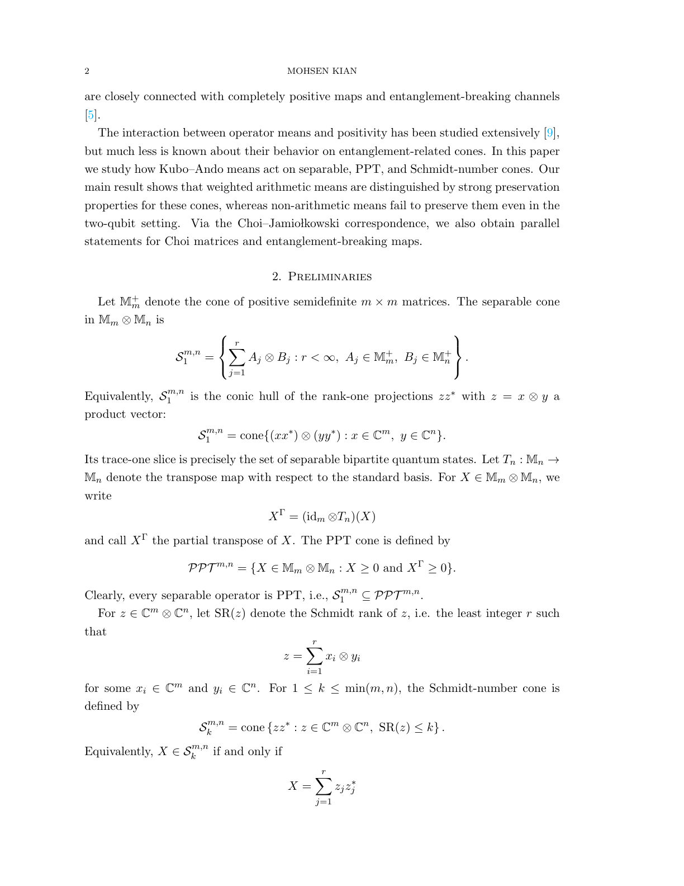
<figcaption class="paper-figure-caption"><b>Fig 1.</b> Low-resolution page preview, page 2</figcaption>
</figure>
<figure class="paper-figure-card">
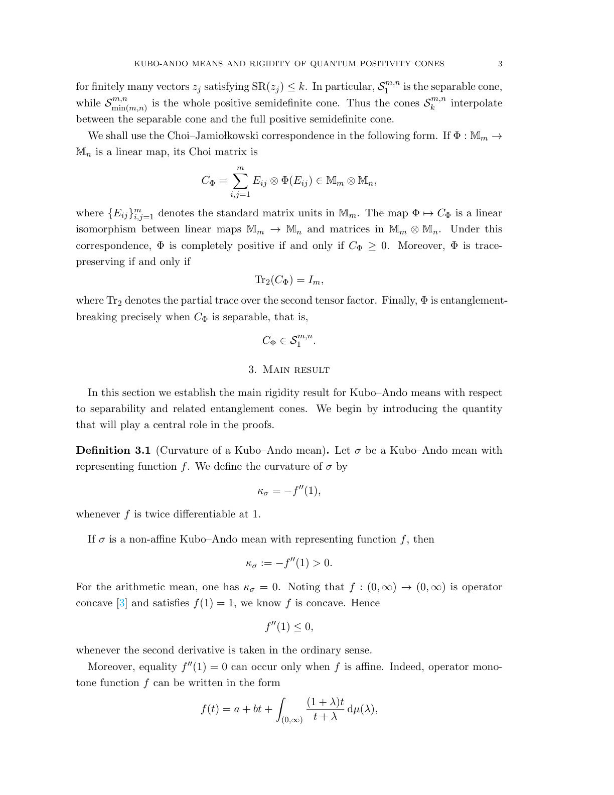
<figcaption class="paper-figure-caption"><b>Fig 2.</b> Low-resolution page preview, page 3</figcaption>
</figure>
<figure class="paper-figure-card">
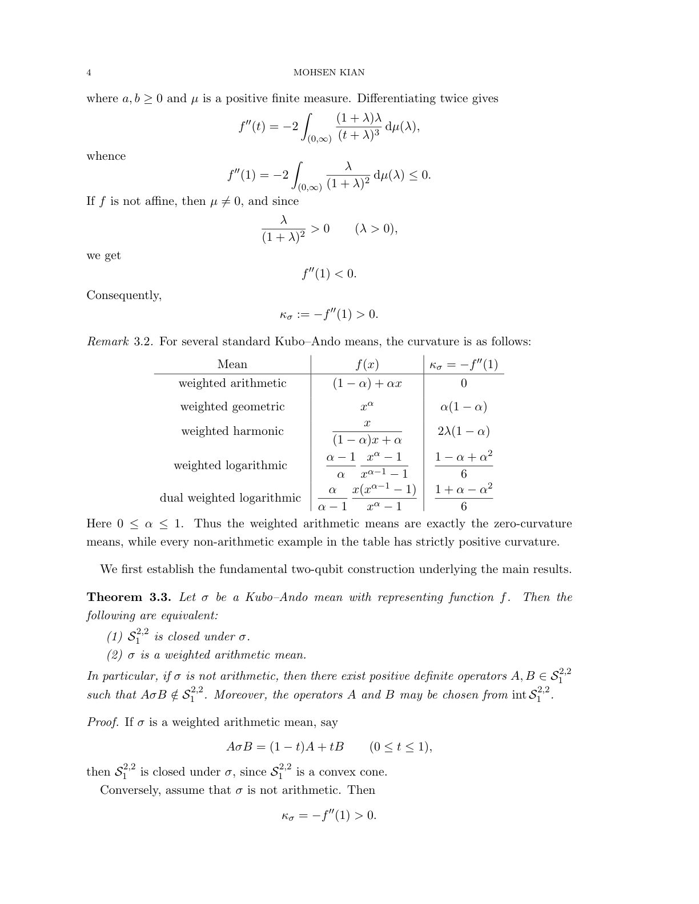
<figcaption class="paper-figure-caption"><b>Fig 3.</b> Low-resolution page preview, page 4</figcaption>
</figure>
<figure class="paper-figure-card">
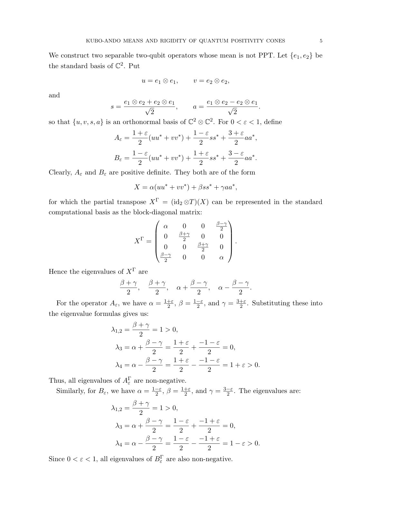
<figcaption class="paper-figure-caption"><b>Fig 4.</b> Low-resolution page preview, page 5</figcaption>
</figure>
<figure class="paper-figure-card">
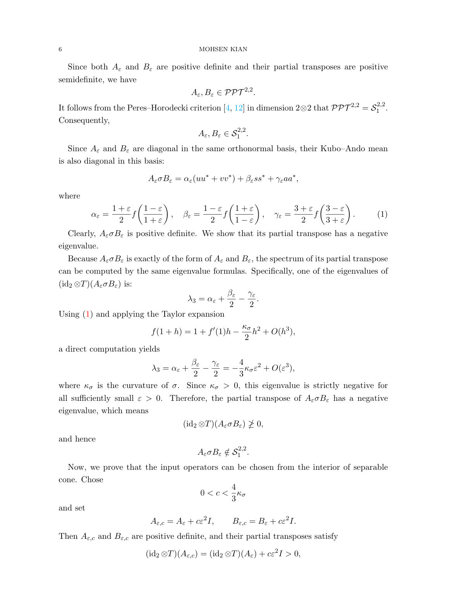
<figcaption class="paper-figure-caption"><b>Fig 5.</b> Low-resolution page preview, page 6</figcaption>
</figure>

**Summary.** This paper demonstrates that only standard convex mixing (arithmetic means) preserves the essential entanglement-related properties of quantum states and channels. It shows that any other type of Kubo-Ando averaging can destroy separability or increase the complexity of entanglement (Schmidt number).

**Why it may be interesting.** This is highly relevant for researchers in open quantum systems and quantum information, as it establishes fundamental limits on how non-linear averaging processes can affect entanglement and the structural integrity of quantum channels.

Detailed structure

**Main problem.** The paper investigates the stability and rigidity of quantum positivity cones (separable, PPT, and Schmidt-number cones) under the action of nonlinear Kubo-Ando operator means.

**Main result.** The authors prove that weighted arithmetic means are the only Kubo-Ando means that preserve the separable cone and the class of entanglement-breaking channels; all other means can increase Schmidt numbers or violate the PPT condition.

**Method.** The study uses curvature analysis of operator monotone functions, Taylor expansions, and the construction of explicit two-qubit counterexamples, extended to higher dimensions via canonical isometries and the Choi-Jamiołkowski correspondence.

**Model / system.** The mathematical framework involves bipartite tensor product spaces (C^m tensor C^n) and the study of operator means acting on positive operators and quantum channels.

**Key observables.** Schmidt number, PPT (positive partial transpose) property, and separability.

**Important parameters / regimes.** The curvature of the operator monotone function (kappa_sigma), where kappa_sigma = 0 corresponds to arithmetic means and kappa_sigma > 0 corresponds to non-arithmetic means.

**Assumptions / limitations.** The results specifically address the behavior of non-arithmetic Kubo-Ando means and assume the use of the Choi-Jamiołkowski correspondence to relate operators to maps.

**Paper structure.** The paper begins by defining the curvature of Kubo-Ando means, moves to proving rigidity theorems for separable and PPT cones using two-qubit counterexamples, extends these results to Schmidt-number cones, and concludes by translating these findings to the theory of quantum channels.

Abstract

We investigate the stability of quantum positivity cones under nonlinear operator means. Specifically, we examine how Kubo--Ando means interact with the separable, positive partial transpose (PPT), and Schmidt-number cones. By analyzing the curvature of operator monotone functions at the identity, we give a strict rigidity phenomenon: weighted arithmetic means are the only Kubo--Ando means that preserve the separable cone in all dimensions. We show that the strictly positive curvature of any non-arithmetic mean explicitly forces a violation of the PPT condition, even in the foundational two-qubit setting, and can strictly increase the Schmidt number of the resulting operator. Finally, using the Choi--Jamiołkowski correspondence, we translate these geometric obstructions to the map-theoretic setting, concluding that convex mixing is the uniquely permissible Kubo--Ando operation for preserving entanglement-breaking quantum channels.

[↑ back to top](#top)

### [Practical Entanglement Distillation Protocols with Quadratic Error Suppression](http://arxiv.org/abs/2605.26757v1)

**Authors:** Elisa Bäumer Marty  
**Type:** both · **Category:** quantum information and computing · **PDF:** <https://arxiv.org/pdf/2605.26757v1>  
**Analysis basis:** full PDF text, analyzed in chunks
**Topic relevance:** 🔥 `QC/QI experiment` **4/5** · `entanglement & information structure` **2/5**

↔ Scroll figures horizontally

<figure class="paper-figure-card">
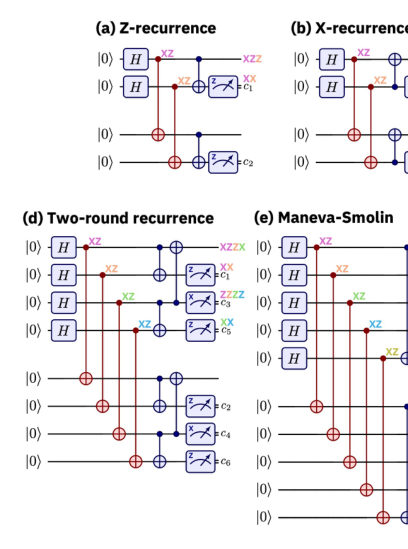
<figcaption class="paper-figure-caption"><b>Fig 1.</b> FIG. 1: Existing protocols. Blue operations are local, red operations are noisy inter-module operations. The protocol accepts if c1 = c2, c3 = c4 and c5 = c6. (a)-(c) Single recurrence checks in the Z, X and Y bases, each detecting two of the three Pauli error types. (d) Two recurrence rounds (here Z and X) detect any single error. (e) Maneva-Smolin protocol, which increases the output rate by checking multiple Bell pairs jointly. (f) Leung-Shor protocol, which outputs two Bell pairs with quadratic error suppression.</figcaption>
</figure>
<figure class="paper-figure-card">
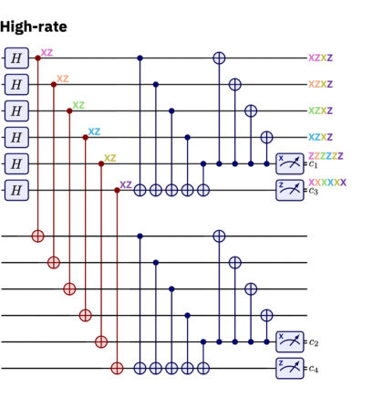
<figcaption class="paper-figure-caption"><b>Fig 2.</b> FIG. 2: Our new efficient protocols. Blue operations are local, red operations are noisy inter-module operations. The protocol accepts if c1 = c2 and c3 = c4, and in (a) additionally requires c3 = c4 = 0. (a) Space-optimal protocol with quadratic suppression of any two-qubit Pauli errors. (b) Reduced space-optimal protocol with fewer gates, achieving quadratic suppression only for arbitrary single-qubit Pauli errors. (c) High-rate protocol acting on m qubits per module and outputting m −2 Bell pairs with quadratic error suppression.</figcaption>
</figure>
<figure class="paper-figure-card">
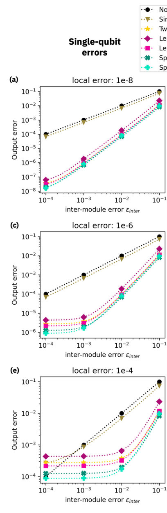
<figcaption class="paper-figure-caption"><b>Fig 3.</b> FIG. 3: Simulations comparing the output error of the different protocols for varying inter-module error εinter. The depolarizing error of the local operations increases from 10−8 in (a) and (b) to 10−6 in (c) and (d) and to 10−4 in (e) and (f). In (a), (c) and (e) we consider only single-qubit depolarizing errors, while in (b), (d) and (f) we consider uniform two-qubit depolarizing errors.</figcaption>
</figure>
<figure class="paper-figure-card">
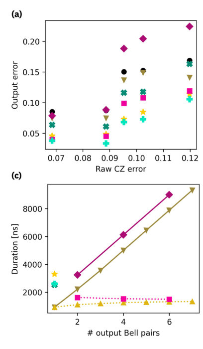
<figcaption class="paper-figure-caption"><b>Fig 4.</b> FIG. 4: Experimental results comparing the different protocols. (a) The output error for varying raw CZ errors. (b) The total and normalized output error for the multi-output protocols as a function of the number of Bell pairs they produce. (c) The total and normalized duration of the protocols when compiled on ibm pittsburgh as a function of the number of Bell pairs that are produced. Note that the single-recurrence protocol corresponds to the Maneva-Smolin protocol with one output Bell pair and similarly the Leung-Shor protocol corresponds to the high-rate protocol with two output Bell pairs.</figcaption>
</figure>
<figure class="paper-figure-card">
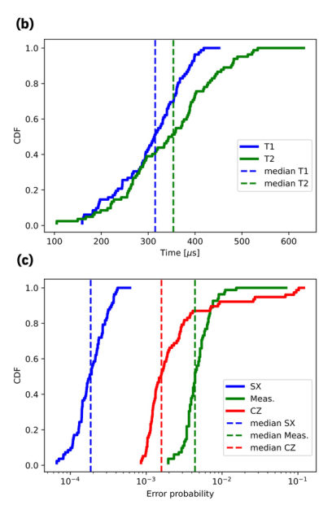
<figcaption class="paper-figure-caption"><b>Fig 5.</b> FIG. 5: Implementation details of the experiments. (a) The device layout of ibm pittsburgh, with the three noisy links used in the experiments indicated by a red box. (b) The cumulative distribution of the T1 and T2 coherence times and (c) of the single qubit gate (SX), readout (Meas.) and two-qubit gate (CZ) error rates of the qubits used in the experiments, as well as the corresponding median values.</figcaption>
</figure>

**Summary.** This paper introduces new, highly efficient entanglement distillation protocols designed for modular quantum computing. By using inter-module gates as active components, the proposed protocols achieve quadratic error suppression using only two qubits per module, making them practical for near-term hardware.

**Why it may be interesting.** not directly relevant

Detailed structure

**Main problem.** Inter-module operations in modular quantum computing architectures exhibit much higher error rates than local operations, creating a bottleneck for scaling. Existing entanglement distillation protocols are often too resource-intensive in terms of qubits and time for near-term hardware.

**Main result.** The authors developed a space-optimal distillation protocol requiring only two qubits per module that achieves quadratic error suppression of inter-module errors. This protocol outperforms existing small-scale protocols in both simulations and experiments on superconducting hardware.

**Method.** The study uses a generalized resource model where inter-module entangling operations are used actively during the protocol. The researchers compared new protocols against established ones using numerical simulations and experimental implementation on the IBM pittsburgh processor.

**Model / system.** The system is a modular quantum computing architecture, specifically implemented and tested on the IBM pittsburgh superconducting quantum processor. The noise model uses a stochastic Pauli channel with single-qubit and two-qubit correlated errors.

**Key observables.** Bell-state fidelity, normalized error, output error rate, and protocol duration (depth and wall-clock time).

**Important parameters / regimes.** Inter-module error rate (epsilon_inter), local error rates, qubit count per module, and gate durations (e.g., 88 ns for CZ, 32 ns for single-qubit gates).

**Assumptions / limitations.** Local operations and measurements are assumed to be significantly more reliable than inter-module operations; the low-error regime is the primary focus.

**Figures summary.** Figure 1 shows existing recurrence and large-scale protocols; Figure 2 illustrates the new space-optimal and high-rate protocols; Figure 3 shows simulations of output error vs. inter-module error; Figure 4 presents experimental results comparing error suppression and protocol duration on IBM hardware; Figure 5 shows the device layout and hardware noise statistics.

**Paper structure.** The paper introduces the bottleneck of inter-module errors, proposes new space-efficient distillation protocols, provides analytical error suppression analysis, compares these protocols to existing methods via simulation, and validates the results through experiments on a superconducting processor.

Abstract

Near-term and early fault-tolerant quantum computing architectures are expected to exhibit highly non-uniform error rates. In particular, local operations within a chip can be substantially more reliable than operations connecting different chips or dilution refrigerators. Such inter-module operations can therefore become a dominant bottleneck, even when quantum error correction is applied. Entanglement distillation provides a natural way to trade additional operations and qubits for higher-fidelity entanglement. Standard distillation protocols, however, are usually formulated in an LOCC resource model, in which several noisy Bell pairs are generated initially and all subsequent processing consists only of local operations and classical communication. Here, we consider a generalized model tailored to modular quantum computing hardware, in which the two modules have access to high-fidelity local operations and to repeated uses of the same noisy inter-module entangling operation during the protocol. We develop practical small-scale entanglement distillation protocols designed to minimize both space and time overhead. Remarkably, our main protocol requires only two qubits per module, yet achieves quadratic error suppression of inter-module errors, assuming local operations are much cleaner. Compared with existing small-scale protocols, our space-optimal protocol provides more space- and time-efficient quadratic error suppression and achieves the best performance in our simulations and experiments on noisy links of current superconducting quantum processors. These results suggest that inter-module-gate-assisted entanglement distillation can be a practical primitive for overcoming noisy links in modular quantum computing architectures.

[↑ back to top](#top)

### [Self-Consistent Spectral Quadrature Approach to Many-Body Green Functions](http://arxiv.org/abs/2605.26887v1)

**Authors:** Stanislav Yu. Kruchinin  
**Type:** theory · **Category:** strongly correlated electrons · **PDF:** <https://arxiv.org/pdf/2605.26887v1>  
**Analysis basis:** full PDF text, analyzed in chunks
**Topic relevance:** 🔥 `Kondo & dissipative impurity` **4/5** · `Keldysh / 2PI / non-Gaussian methods` **2/5**

↔ Scroll figures horizontally

<figure class="paper-figure-card">
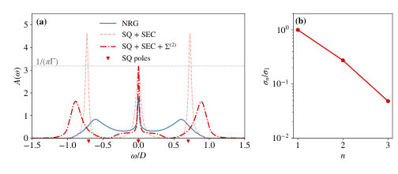
<figcaption class="paper-figure-caption"><b>Fig 1.</b> FIG. 1. One-shot SQ for the symmetric Anderson impurity model (𝜀𝑑= −𝑈/2, Γ/𝐷= 0.1, 𝑈/𝐷= 1.0). (a) Spectral function 𝐴(𝜔). Solid blue: NRG reference (digitized from [47]). Dash-dotted red: SQ + SEC [Eqs. (20)–(21)], recovering 𝐴(0) = 1/(𝜋Γ) exactly but with narrow Hubbard satellites. Solid red: SEC + Σ(2) [𝐺0] [Eq. (28)], broadening the satellites to the NRG positions while pre- serving the Friedel sum rule. Triangles: pole positions {𝜀𝑖}, area ∝𝑤𝑖. Dotted: 1/(𝜋Γ) reference. (b) SVD singular value spectrum 𝜎𝑛/𝜎1. The gap above 𝑁∗= 3 exceeds 14 orders of magnitude; dashed: threshold 𝜏= 10−8.</figcaption>
</figure>
<figure class="paper-figure-card">
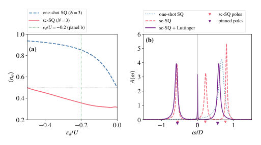
<figcaption class="paper-figure-caption"><b>Fig 2.</b> FIG. 2. Comparison of one-shot and self-consistent sc-SQ in the mixed-valence regime (𝑈/𝐷= 1.0, Γ/𝐷= 0.1). (a) Occupancy ⟨𝑛𝜎⟩versus 𝜀𝑑/𝑈. Dashed blue: Hartree seed 𝑛0. Solid red: sc- SQ fixed point (𝑁= 3). Coulomb repulsion suppresses double occupancy well beyond the Hartree estimate; ⟨𝑛𝜎⟩= 1/2 is recovered exactly at 𝜀𝑑/𝑈= −0.5. (b) Spectral function at 𝜀𝑑/𝑈= −0.2. Dotted blue: one-shot result (single dominant peak, see text). Dashed red: sc-SQ fixed point, resolving the three-peak structure. Solid purple: sc-SQ with Luttinger correction 𝜇𝐿(see text), pinning the quasiparticle pole to 𝜔= 0 and recovering 𝐴(0) = 1/(𝜋Γ) exactly. Note: at rank 𝑁= 3 this correction always maps the system to...</figcaption>
</figure>
<figure class="paper-figure-card">
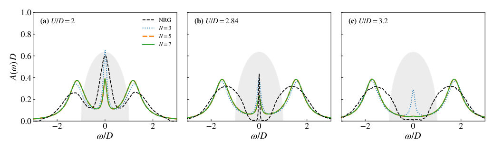
<figcaption class="paper-figure-caption"><b>Fig 3.</b> FIG. 3. 𝑁-convergence of the DMFT+sc-SQ spectral function for the half-filled Hubbard model on the Bethe lattice across the Mott transition (𝐷= 2𝑡, 𝛽= 100/𝑡). Left: 𝑈/𝐷= 2.0 (metallic, three-peak structure). Middle: 𝑈/𝐷= 2.84 (close to 𝑈𝑐2, strongly correlated metal with sharp central resonance). Right: 𝑈/𝐷= 3.2 (insulating, gapped Hubbard bands). Dotted blue: 𝑁= 3. Dashed orange: 𝑁= 5. Solid green: 𝑁= 7. Dashed black: DMFT+NRG reference (digitized from Bulla et al. [44], Fig. 25(a), rescaled from 𝑊= 4𝑡to our 𝐷= 2𝑡 convention). Shaded grey: non-interacting DOS 𝜌0(𝜔). Metallic-branch curves (𝑈/𝐷= 2.0, 2.84) initialized from exact Lehmann moments of a Caffarel–Krauth ED solver (𝑛bath = 3)....</figcaption>
</figure>
<figure class="paper-figure-card">
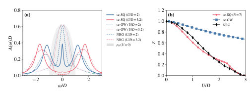
<figcaption class="paper-figure-caption"><b>Fig 4.</b> FIG. 4. DMFT solution of the half-filled Hubbard model on the Bethe lattice with the sc-SQ impurity solver at 𝑁= 7, compared with sc-GW (𝐷= 2𝑡, 𝛽= 100/𝑡) and DMFT+NRG. (a) Local spectral function 𝐴(𝜔) for 𝑈/𝐷= 2 (metallic; blue) and 𝑈/𝐷= 3.2 (insulating; red). Solid: sc-SQ, Lorentzian-broadened (𝜂QP = 0.09 𝐷for the central pole, 𝜂sat = 0.4 𝐷for the Hubbard satellites). Dotted (matching colour): sc-GW (𝜂= 0.025 𝐷). Dashed (matching colour): DMFT + NRG (digitized from [44], Fig. 25(a), rescaled from 𝑊= 4𝑡to our 𝐷= 2𝑡convention). Shaded grey: 𝜌0(𝜔). (b) Quasiparticle weight 𝑍versus 𝑈/𝐷for sc-SQ (𝑁= 7, red circles), sc-GW (blue squares), and DMFT+NRG (black diamonds, [50], 𝑈𝑐2/𝐷≈2.94). sc-GW...</figcaption>
</figure>

**Summary.** This paper introduces a new self-consistent method for calculating many-body Green functions using spectral quadrature. By using an SVD-based criterion to select the optimal number of poles, the approach captures essential strongly correlated physics, such as the Mott transition and Kondo resonance, more accurately than traditional one-shot methods.

**Why it may be interesting.** The method provides a non-perturbative, numerically stable way to reconstruct spectral functions and capture complex many-body features like Kondo resonances and Mott transitions without the need for external terminators or diagrammatic expansions.

Detailed structure

**Main problem.** The difficulty of calculating many-body Green functions for strongly correlated systems where standard power-series expansions fail to capture non-perturbative phenomena like the Mott transition or Kondo resonance.

**Main result.** The development of a self-consistent spectral quadrature (sc-SQ) framework that accurately captures the three-peak structure of the Anderson impurity model and the Mott gap formation in the Hubbard model, with results qualitatively agreeing with NRG.

**Method.** A self-consistent framework using Gauss-Christoffel quadrature to approximate the Kallen-Lehmann spectral measure, utilizing an SVD-based rank-selection criterion to identify the numerically resolvable pole rank.

**Model / system.** The method is benchmarked using the Anderson Impurity Model (AIM) and the Hubbard model on a Bethe lattice within the Dynamical Mean-Field Theory (DMFT) framework.

**Key observables.** Spectral function A(omega), spectral moments, quasiparticle weight (Z), occupancy, and self-energy.

**Important parameters / regimes.** Interaction strength (U), bandwidth (D), hybridization (Gamma), and the quadrature pole order (N).

**Assumptions / limitations.** The accuracy is limited by the number of resolvable spectral moments and the numerical precision of the input moments; the method relies on the ability to resolve the singular-value gap in the Hankel matrix.

**Figures summary.** Figure 1 compares sc-SQ variants against NRG for the AIM and shows the SVD spectrum; Figure 2 compares one-shot vs. self-consistent approaches in the mixed-valence regime; Figure 3 shows the improvement in spectral resolution as N increases; Figure 4 illustrates the Mott transition and quasiparticle weight.

**Paper structure.** The paper introduces the sc-SQ framework, establishes mathematical equivalences between quadrature, Padé approximants, and continued fractions, details the SVD-based stabilization and self-consistency algorithm, and concludes with benchmarks against NRG for the Anderson and Hubbard models.

Abstract

We develop a self-consistent spectral quadrature (sc-SQ) framework for the calculation of many-body Green functions. The method approximates the Källén--Lehmann spectral measure by Gauss--Christoffel (GC) quadrature, yielding a rational Green function representation with guaranteed spectral positivity that exactly reproduces the first $2N$ spectral moments at pole order $N$. A key component is an SVD-based rank-selection criterion on the Hankel matrix, which identifies the numerically resolvable pole rank $N^*$ from the singular-value gap and acts as a precision-guided diagnostic of correlation complexity. The scheme is made self-consistent by requiring that the spectral function used to evaluate expectation values coincides with the spectral function generated by the quadrature reconstruction. This defines a fixed-point hierarchy that connects systematically to established approximations, including Hartree--Fock and Hubbard-I, and incorporates non-perturbative features such as multi-peak spectral structure. We benchmark the approach for the Anderson impurity model against numerical renormalization group (NRG) results and apply it within dynamical mean-field theory for the Hubbard model on the Bethe lattice. The method captures the three-peak Anderson impurity spectrum and the suppression of quasiparticle weight in the half-filled Hubbard model on the Bethe lattice, including Mott-gap formation on the insulating branch for $N\geqslant 5$, in qualitative agreement with NRG references.

[↑ back to top](#top)

### [Adaptive Reinforcement Learning for Robust Open Quantum System Control: A Multi-Task Framework with Temporal Optimization](http://arxiv.org/abs/2605.26925v1)

**Authors:** Haftu W. Fentaw, Steve Campbell, Simon Caton  
**Type:** theory · **Category:** quantum information and computing · **PDF:** <https://arxiv.org/pdf/2605.26925v1>  
**Analysis basis:** full PDF text, analyzed in chunks
**Topic relevance:** 🔥 `methods for driven-dissipative` **4/5**

↔ Scroll figures horizontally

<figure class="paper-figure-card">
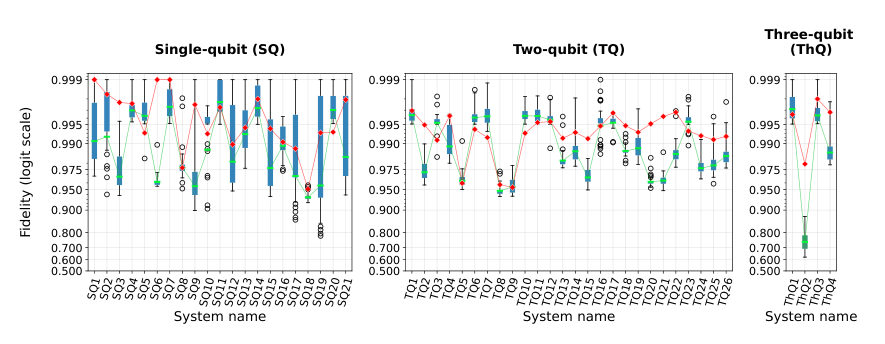
<figcaption class="paper-figure-caption"><b>Fig 1.</b> Fig. 1: Distribution of maximum state fidelities for closed-system dynamics across single-qubit (SQ), two-qubit (TQ), and three-qubit (ThQ) systems. Each box plot represents 30 independent experi- ments, demonstrating the agent’s capability to reach near-ideal fidelities across a diverse Hamiltonian set. The red diamonds denote the average fidelity for task-specific models, while the box plot repre- sents fidelity distribution for multi-task model(the horizontal green lines denote the mean fidelity).</figcaption>
</figure>
<figure class="paper-figure-card">
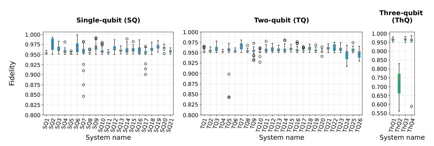
<figcaption class="paper-figure-caption"><b>Fig 2.</b> Fig. 2: Open-system fidelity distribution across various quantum control systems. The box plots illustrate the distribution of fidelities for single-qubit (SQ), two-qubit (TQ), and three-qubit (ThQ) systems over 30 experiments per system. The horizontal orange lines denote the median fidelity.</figcaption>
</figure>
<figure class="paper-figure-card">
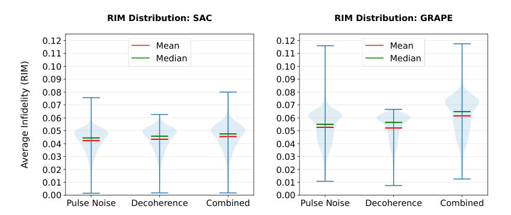
<figcaption class="paper-figure-caption"><b>Fig 3.</b> Fig. 3: Robustness Infidelity Measure (RIM) analysis for SAC and GRAPE. Left: RIM for SAC, Right: RIM for GRAPE. SAC achieves mean infidelity of approximately 0.045 under all perturbation types, and GRAPE exhibits higher mean infidelity of approximately 0.061 under combined pertur- bations.</figcaption>
</figure>
<figure class="paper-figure-card">
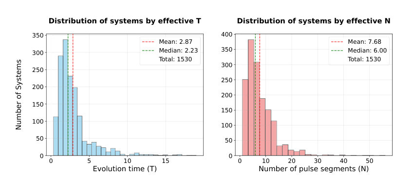
<figcaption class="paper-figure-caption"><b>Fig 4.</b> Fig. 4: Distribution of learned effective evolution time T (left) and effective number of control steps N (right) across 1530 experiments. The distributions show that most systems converge to relatively short evolution times (median T = 2.23, mean T = 2.87) and moderate discretization (median N = 6, mean N = 7.68). Note that, N assumes an integer value.</figcaption>
</figure>

**Summary.** The paper presents a multi-task reinforcement learning framework that learns to control various quantum systems simultaneously. By optimizing both the control pulses and the timing parameters, the method achieves high-fidelity state transfer and outperforms traditional gradient-based methods in robustness against environmental noise.

**Why it may be interesting.** This work is highly relevant for researchers in open quantum systems as it provides a scalable, machine-learning-based approach to achieving universal control that is inherently robust to the types of noise and parameter drift encountered in realistic quantum hardware.

Detailed structure

**Main problem.** Developing a robust, unified quantum control framework that generalizes across diverse Hamiltonians and maintains high fidelity in the presence of environmental noise and hardware uncertainties.

**Main result.** A multi-task Soft Actor-Critic (SAC) reinforcement learning agent achieves high-fidelity state transfer across 51 different Hamiltonians and demonstrates superior robustness to pulse amplitude and decoherence fluctuations compared to the GRAPE algorithm.

**Method.** A multi-task Soft Actor-Critic (SAC) reinforcement learning framework that uses a system descriptor to condition the policy and simultaneously optimizes control pulse amplitudes, total evolution time (T), and the number of pulse segments (N).

**Model / system.** Open quantum systems ranging from single-qubit to three-qupi configurations, modeled using the Lindblad master equation to account for amplitude damping and dephasing noise.

**Key observables.** State transfer fidelity (F) and the Robustness Infidelity Measure (RIM) based on the Wasserstein distance.

**Important parameters / regimes.** Evolution time (T), number of pulse segments (N), decoherence rate (gamma), and pulse amplitude perturbations.

**Assumptions / limitations.** The system is prepared in a pure initial state; decoherence is primarily modeled via amplitude damping; the use of Born-Markov and Secular approximations for the Lindblad equation.

**Figures summary.** Figure 1 compares closed-system fidelities between task-specific and multi-task models; Figure 2 shows open-system fidelity distributions; Figure 3 compares the RIM of SAC versus GRAPE; Figure 4 shows the learned distributions of temporal parameters T and N.

**Paper structure.** The paper introduces the problem of robust control, describes the multi-task SAC architecture and adaptive temporal optimization, details the training strategy via progressive Hamiltonian expansion, presents benchmarks for closed and open systems, and concludes with a robustness analysis and discussion of scalability.

Abstract

We present a Multi-task Soft Actor-Critic (SAC) Reinforcement Learning framework designed for open-system quantum control across diverse Hamiltonians, which learns optimal pulse sequences while simultaneously discovering problem-specific evolution time T and number of control pulse segments N. Experimental results across 51 Hamiltonian variations demonstrate that the multi-task SAC model is able to generate control pulses that can drive a system, under environment noise, from its initial state to its target state with high fidelities, establishing essential foundations for universal quantum control applicable to realistic noisy quantum devices. Through progressive expansion of the training Hamiltonian set, we investigate if a single multi-task model trained using a given number of sample Hamiltonians can successfully accomplish state-transfer tasks for Hamiltonians drawn from the same Hamiltonian space but not encountered during training. In addition, our Robustness Infidelity Measure (RIM) analysis reveals that SAC trained policies exhibit superior robustness to pulse amplitude perturbations and decoherence rate variations compared to GRAPE-optimized controls.

[↑ back to top](#top)

### [Encrypted Cloning, Absolute Maximal Entanglement and Quantum Secret Sharing](http://arxiv.org/abs/2605.26866v1)

**Authors:** Zheng Liang Lim, Hoi-Kwong Lo  
**Type:** theory · **Category:** quantum information and computing · **PDF:** <https://arxiv.org/pdf/2605.26866v1>  
**Analysis basis:** full PDF text, analyzed in chunks
**Topic relevance:** 🔥 `entanglement & information structure` **4/5**

↔ Scroll figures horizontally

<figure class="paper-figure-card">
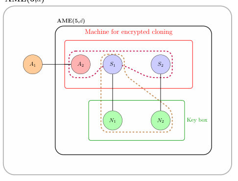
<figcaption class="paper-figure-caption"><b>Fig 1.</b> FIG. 1. A schematic diagram of the partial encrypted cloning protocol for n = 2, d = 2. The machine for en- crypted cloning contains the signal qubits and the qubit from register A2. They are the states affected by the encryption operator. The key box contains the noise qubits, which are decryption keys. The group of states, containing A2, S1, S2, N1, N2 forms a AME(5, 2) state. The overall state with A1 forms the AME(6, 2) state. The brown dotted lines show an example of an autho- rised set: {S1, N1, N2}. The purple dotted lines show an example of an unauthorised set: {A2, S2}. The size of the authorised set is 3, and that of the unauthorised set is 2, thus illustrating a QSS ((3, 5))...</figcaption>
</figure>

**Summary.** This paper generalizes the qubit-based encrypted cloning protocol to arbitrary dimensions using Weyl-Heisenberg operators. It proves that this protocol is fundamentally linked to the construction of five-party AME states and threshold quantum secret sharing schemes. The results show that the protocol is robust against the loss of certain noise keys, provided appropriate replacements are used.

**Why it may be interesting.** This work provides a deep algebraic connection between quantum communication protocols (cloning and secret sharing) and the fundamental structure of multipartite entanglement (AME states), which is highly relevant to quantum error correction and distributed quantum computing.

Detailed structure

**Main problem.** The paper aims to generalize the 'encrypted cloning' protocol from qubits to arbitrary dimensions (qudits) and formally establish its relationship with Quantum Secret Sharing (QSS) and Absolutely Maximally Entangled (AME) states.

**Main result.** The authors prove that an encrypted qudit system with two signal-noise pairs is equivalent to a five-party AME state and demonstrate that encrypted cloning is a specific instance of a threshold QSS scheme.

**Method.** The authors use a framework based on Weyl-Heisenberg displacement operators and the Choi-Jamiolkowski isomorphism to analytically derive the encrypted state and verify its entanglement properties.

**Model / system.** A multipartite quantum system consisting of an input target qudit, $n$ pairs of maximally entangled signal-noise qudits, and a global encryption unitary based on generalized Pauli operators.

**Key observables.** Reduced density matrices of various subsystems (to check for maximal mixing), Schmidt rank, and the unitarity of the encryption/decryption operators.

**Important parameters / regimes.** Dimension $d$ of the Hilbert space, number of signal-noise pairs $n$, and the specific quadratic phase factor $\phi(a, b)$ used in the Weyl-Heisenberg construction.

**Assumptions / limitations.** The equivalence to AME states holds provided the input state is uniform; the protocol assumes access to the noise qudits as decryption keys.

**Figures summary.** Figure 1 provides a schematic of the $n=2, d=2$ partial encrypted cloning protocol, illustrating the roles of the 'Key box' (noise qubits) and the 'Machine' (signal and auxiliary qubits) in a threshold QSS scheme.

**Paper structure.** The paper begins by introducing the problem of generalization, develops a Weyl-Heisenberg framework for arbitrary dimensions, proves the AME correspondence for $n=2$, establishes the formal link to QSS, and concludes with error/loss analysis and limitations.

Abstract

The no-cloning theorem prohibits the creation of identical copies of quantum information, imposing fundamental constraints on quantum technologies. A recently proposed protocol, encrypted cloning, introduced by Yamaguchi and Kempf, showed that perfect qubit clones can be produced if they are simultaneously encrypted with a single-use key. They also observed a connection between this scheme and quantum secret sharing (QSS). However, it remained an open question whether encrypted cloning could be generalised to arbitrary dimensions, and the broader relationship between the two schemes had not been formally established. In this work, we address both questions by framing encrypted clones as Absolutely Maximally Entangled (AME) states. In parallel with recent work by Ceará that utilises Zadoff-Chu sequences, we independently develop a complementary framework for arbitrary dimensions based on Weyl-Heisenberg displacement operators, both tracing back to the original qubit construction by Yamaguchi and Kempf. We analytically compute the encrypted state and prove that an encrypted qudit system comprising two signal-noise qudit pairs is equivalent to a five-party AME state in any dimension, provided the input state is uniform. We then formalise the connection to QSS by proving that a threshold QSS scheme can achieve the fundamental objectives of encrypted cloning, establishing QSS as the natural general framework within which encrypted cloning can be contextualised.

[↑ back to top](#top)

### [Extremal Marginal States of Maximal Rank in $(d, d+m)$](http://arxiv.org/abs/2605.26920v1)

**Authors:** Indu Bala, Swapan Rana  
**Type:** theory · **Category:** quantum information and computing · **PDF:** <https://arxiv.org/pdf/2605.26920v1>  
**Analysis basis:** full PDF text, analyzed in chunks
**Topic relevance:** 🔥 `entanglement & information structure` **4/5**

↔ Scroll figures horizontally

<figure class="paper-figure-card">
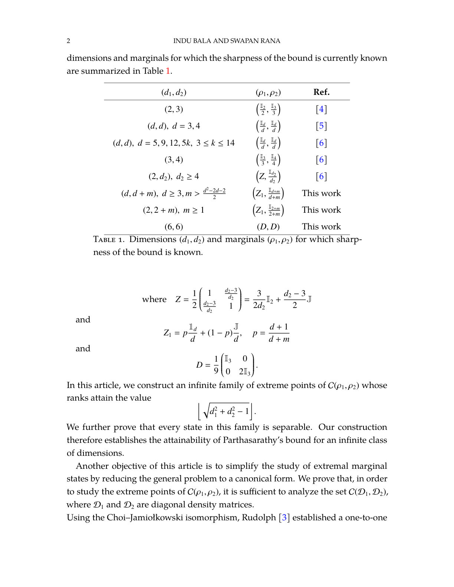
<figcaption class="paper-figure-caption"><b>Fig 1.</b> Low-resolution page preview, page 2</figcaption>
</figure>
<figure class="paper-figure-card">
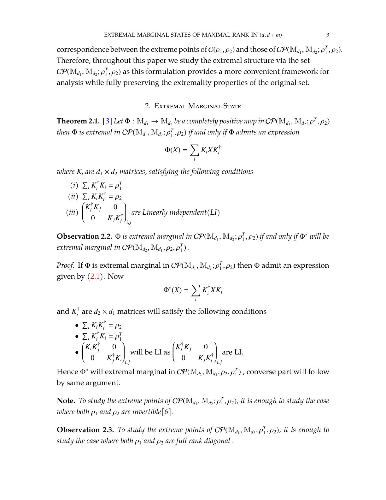
<figcaption class="paper-figure-caption"><b>Fig 2.</b> Low-resolution page preview, page 3</figcaption>
</figure>
<figure class="paper-figure-card">
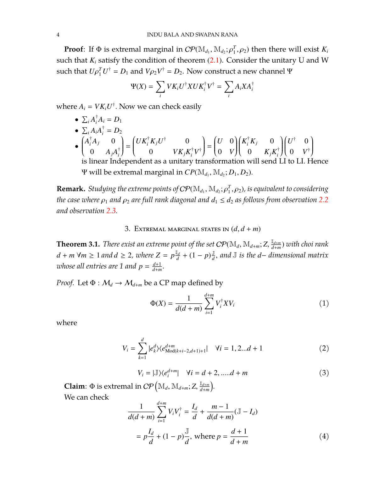
<figcaption class="paper-figure-caption"><b>Fig 3.</b> Low-resolution page preview, page 4</figcaption>
</figure>
<figure class="paper-figure-card">
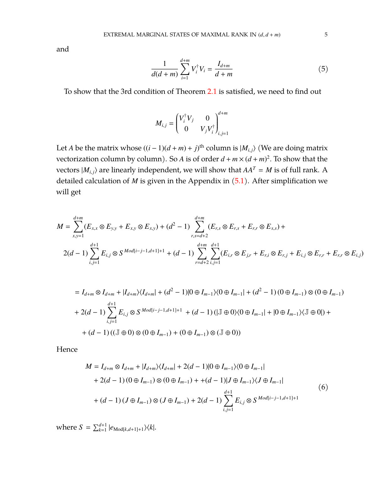
<figcaption class="paper-figure-caption"><b>Fig 4.</b> Low-resolution page preview, page 5</figcaption>
</figure>
<figure class="paper-figure-card">
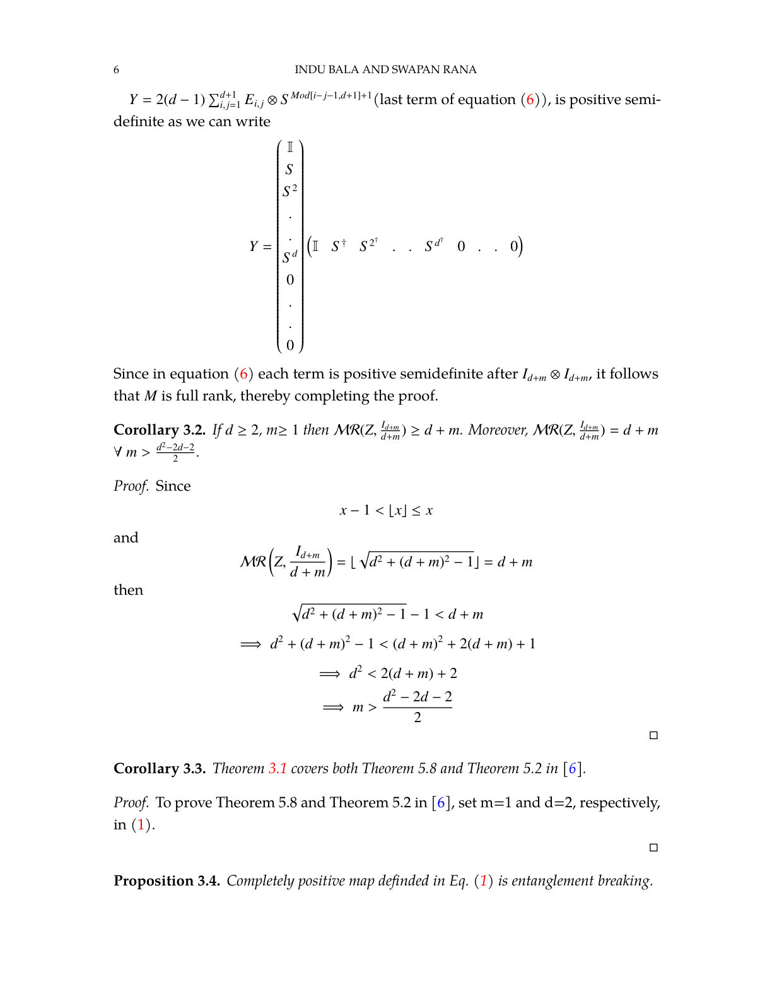
<figcaption class="paper-figure-caption"><b>Fig 5.</b> Low-resolution page preview, page 6</figcaption>
</figure>

**Summary.** This paper addresses the long-standing problem of finding the maximum possible rank for extreme points in the set of bipartite quantum states with fixed marginals. The authors successfully construct a large family of such states that reach the theoretical maximum rank. Their findings show that these high-rank extremal states are not rare but are actually the typical case for most dimensions.

**Why it may be interesting.** This work is highly relevant to researchers in open quantum systems and quantum information as it provides fundamental bounds on the structure of quantum states with fixed marginals, which is a core problem in understanding the geometry of quantum channels and entanglement.

Detailed structure

**Main problem.** The paper investigates the extreme points of the convex set of bipartite quantum states with fixed marginal density matrices, specifically focusing on determining the maximal possible Choi rank of these extreme points.

**Main result.** The authors construct an infinite family of extreme points in (d, d+m) dimensions with maximal rank (rank d+m) for specific ranges of d and m, and prove that the maximal rank is achieved almost all the time for a given d1.

**Method.** The study uses the Choi-Jamiołkowski isomorphism to map the problem to completely positive maps, employs tensor product constructions to extend low-dimensional results, and utilizes matrix vectorization to verify linear independence for extremality.

**Model / system.** The system consists of bipartite quantum states in a Hilbert space H1 ⊗ H2 with dimensions d1 and d2, where the reduced density matrices (marginals) are fixed.

**Key observables.** Choi rank (rank of the bipartite state), marginal density matrices, and separability/PPT properties.

**Important parameters / regimes.** Dimensions d and m, specifically the condition m > (d^2 - 2d - 2)/2 for the construction of maximal rank states.

**Assumptions / limitations.** The construction specifically targets cases where one marginal is a mixture of the identity and a matrix of ones, and certain proofs rely on the use of Hermitian Kraus operators.

**Figures summary.** Table 1 summarizes known dimensions and marginals where the sharpness of the rank bound has been previously established compared to the new results.

**Paper structure.** The paper begins by reducing the problem to diagonal marginals, then provides explicit constructions of extreme points using Kraus operators, verifies their extremality via linear independence, generalizes the results using tensor products, and concludes with proofs regarding the PPT property and separability.

Abstract

We study the extreme points of the convex set $\mathcal{C}(ρ_1,ρ_2)$ of bipartite quantum states with fixed marginals $ρ_1$ and $ρ_2$. We construct extreme points in $(d,\,d+m)$ dimension, of rank $d+m$, matching the highest possible value, for all $d\geq 3$, $m > \frac{d^2-2d-2}{2}$ (when $d=2$, $m\geq 1$). This proves the existence of extremal states with relatively large rank and also covers all the known examples. We further show that, in order to analyze the extreme points of $\mathcal{C}(ρ_1,ρ_2)$, it is sufficient to study the special case $\mathcal{C}(\mathcal{D}_1,\mathcal{D}_2)$, where the marginals are diagonal. Additionally, we observe that it is sufficient to consider $d_1\leq d_2$. Thus, our results show that apart from possibly a few finite cases, for each $d_1$, the maximal rank is achieved almost all times.

[↑ back to top](#top)

### [Semiclassical foundation of universality in chaotic quantum circuits](http://arxiv.org/abs/2605.27052v1)

**Authors:** Maximilian F. I. Kieler, Felix Fritzsch, Arnd Bäcker  
**Type:** theory · **Category:** statistical mechanics · **PDF:** <https://arxiv.org/pdf/2605.27052v1>  
**Analysis basis:** full PDF text, analyzed in chunks
**Topic relevance:** `entanglement & information structure` **3/5** · `non-equilibrium dynamics` **3/5** · `Keldysh / 2PI / non-Gaussian methods` **2/5** · `non-equilibrium universality` **2/5** · `scars & prethermalization` **2/5**

↔ Scroll figures horizontally

<figure class="paper-figure-card">
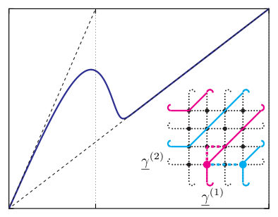
<figcaption class="paper-figure-caption"><b>Fig 1.</b> FIG. 1. Bump-ramp structure of the SFF, see (11) for χ = 0.975, L = 3 (blue, full) in double-logarithmic scale. The black dashed lines indicate the limiting cases K(T) = T L (for χ = 1) and K(T) = T (for χ = 0). Inset: Schematic struc- ture of a family Γ0 = (γ(1), γ(2)) (magenta dot) for L = 2 and T = 4. The magenta and cyan curves indicate two peri- odic orbits living on Γ0, generated by ϕ(t,t) 0 Γ0 and ϕ(t,t+2) 0 Γ0, respectively. The synchronous time translation ϕ(1,1) 0 is in- dicated by a magenta dashed line and an asynchronous time translation ϕ(0,2) is indicated by a cyan dashed line.</figcaption>
</figure>

**Summary.** This paper provides a semiclassical framework to explain how Random Matrix Theory universality emerges in many-body quantum circuits. By using periodic orbit theory, the authors show that interactions break individual subsystem symmetries to create a global synchronized state. They further prove that the characteristic RMT spectral signatures are robust even when classical correlations decay slowly.

**Why it may be interesting.** It provides a fundamental semiclassical derivation for how local subsystem dynamics synchronize to produce global RMT behavior, which is central to understanding many-body chaos and thermalization.

Detailed structure

**Main problem.** Establishing a semiclassical foundation for the emergence of Random Matrix Theory (RMT) universality in many-body systems with explicit subsystem structures.

**Main result.** The authors demonstrate that RMT universality arises from the collective synchronization of periodic orbit correlations, where interaction breaks subsystem time-translation symmetry into global synchronous time translations.

**Method.** Periodic orbit theory using Gutzwiller's trace formula, stationary phase approximation, and a mapping of the Spectral Form Factor to a statistical mechanics Potts model.

**Model / system.** L-partite chaotic quantum maps representing many-body systems with interacting subsystems, where the semiclassical limit is defined by h-bar approaching zero.

**Key observables.** Spectral Form Factor (SFF), K(T)

**Important parameters / regimes.** Heisenberg time (T_H), subsystem Heisenberg time, interaction strength (epsilon), scaling parameter (Lambda), and the semiclassical parameter (h-bar).

**Assumptions / limitations.** Hyperbolicity of the classical maps, instantaneous or subexponential decay of classical correlations, and the existence of a well-defined semiclassical limit.

**Figures summary.** Figure 1 displays the 'bump-ramp' structure of the Spectral Form Factor in a double-logarithmic scale, comparing calculated values against RMT limiting cases.

**Paper structure.** The paper introduces the problem of many-body universality, develops a periodic orbit theory for L-partite systems, maps the spectral correlations to a Potts model via a Central Limit Theorem, and proves the robustness of the RMT ramp under subexponential correlation decay.

Abstract

The fundamental correspondence between quantum chaotic single-particle systems and random matrix theory is well-understood via periodic orbit theory. In contrast, we show that many-body systems with explicit subsystem structure possess characteristics different from the single-particle theory. We present a periodic orbit theory for many-body systems with well defined semiclassical limit. For this we identify periodic orbit families arising exclusively in the many-body setting and implement a central limit theorem characterizing their correlations. Based on this we demonstrate that spectral correlations in chaotic quantum circuits are characterized by the breaking of individual time translation invariance of periodic orbits in the subsystems into residual synchronous time translations only. This provides a systematic approach to confirming random matrix universality in deterministic many-body systems.

[↑ back to top](#top)

### [Universal Bound for Entanglement Generation](http://arxiv.org/abs/2605.26215v1)

**Authors:** Alfred Li, Daisuke Miki, Yanbei Chen  
**Type:** theory · **Category:** quantum information and computing · **PDF:** <https://arxiv.org/pdf/2605.26215v1>  
**Analysis basis:** full PDF text, analyzed in chunks
**Topic relevance:** `entanglement & information structure` **3/5** · `quantum measurements` **3/5** · `correlated / nonlocal dissipation` **2/5** · `methods for driven-dissipative` **2/5** · `non-equilibrium dynamics` **2/5**

↔ Scroll figures horizontally

<figure class="paper-figure-card">
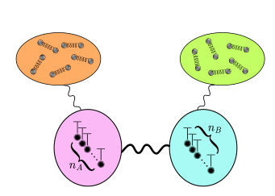
<figcaption class="paper-figure-caption"><b>Fig 1.</b> FIG. 1. Configuration of rank-1 bilinearly coupled systems: n oscil- lators in subsystem A (pink) couple to n oscillators in subsystem B (blue) via a rank-1 bilinear interaction Kg(ˆξT AuA)(ˆξT BuB) (thick line). Each subsystem couples linearly to its own thermal bath (orange and green, thin lines).</figcaption>
</figure>
<figure class="paper-figure-card">
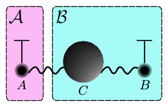
<figcaption class="paper-figure-caption"><b>Fig 2.</b> FIG. 3. A tripartite system involving entanglement generation be- tween subsystems A and B mediated by a massive mediator C. By combining subsystems B and C into a composite subsystem, we have reduced the problem to one of bipartite entanglement: as long as ther- mal noise levels of A and C are strong enough there can never be any entanglement generated between subsystems A and B.</figcaption>
</figure>
<figure class="paper-figure-card">
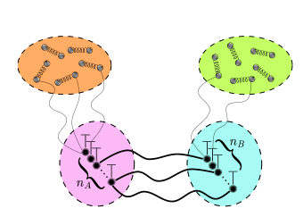
<figcaption class="paper-figure-caption"><b>Fig 3.</b> FIG. 2. Systems with general bilinear coupling, with thicker lines representing gravity and thinner lines, system-bath couplings.</figcaption>
</figure>

**Summary.** This paper establishes a universal bound that prevents entanglement from being generated if thermal noise exceeds a specific threshold relative to the interaction strength. Crucially, it proves that this threshold cannot be bypassed by using mediators, changing initial states, or increasing the number of modes. This provides a fundamental limitation for quantum sensing and entanglement-based protocols in thermal environments.

**Why it may be interesting.** It establishes a fundamental, unrelaxable limit on entanglement generation in noisy environments, which is critical for researchers designing gravity-induced entanglement experiments or any open-system quantum protocols.

Detailed structure

**Main problem.** Determining whether various protocols, such as using mediators or changing initial states, can relax the fundamental threshold for entanglement generation in multi-mode Gaussian systems subject to thermal noise.

**Main result.** The authors derive a universal, state-independent bound for entanglement generation: for rank-1 interactions, separability is preserved if the product of thermal noise power spectra exceeds the square of the coupling strength ($S_{th,A} S_{th,B} \geq K_g^2$).

**Method.** The study uses the Gorini-Kossakowski-Sudarshan-Lindblad (GKSL) formalism, covariance matrix evolution via Langevin equations, and the construction of LOCC protocols using Gaussian weak measurements and feedback.

**Model / system.** General multi-mode Gaussian (and some non-Gaussian) systems subject to bilinear interactions and white thermal noise, with a specific application to gravity-induced entanglement between two masses.

**Key observables.** Covariance matrix, entanglement (via PPT criterion), and thermal noise power spectra.

**Important parameters / regimes.** Gravitational coupling strength (Kg), thermal noise spectra (Sth), mechanical dissipation rate (gamma), and temperature (T).

**Assumptions / limitations.** The analysis assumes white thermal noise (delta-correlated in time), the Born-Markov approximation, and works in a perturbative regime where damping/friction effects are neglected.

**Figures summary.** Figure 1 shows the configuration of rank-1 coupled oscillators; Figure 2 illustrates general bilinear coupling with gravity and system-bath links; Figure 3 visualizes a tripartite system with a massive mediator.

**Paper structure.** The paper begins by defining the problem of entanglement thresholds, moves to deriving the universal bound for rank-1 and general bilinear interactions using covariance matrices, extends the result to correlated noise, proves the robustness against non-Gaussianity and mediators, and concludes by constructing LOCC protocols that reproduce the target dynamics.

Abstract

We derive a universal condition for entanglement generation under general bilinear interactions in the presence of white thermal noise. While various protocols have been proposed to enhance the amount of generated entanglement, it remains unclear whether they can also relax the threshold for entanglement generation itself. Using a Gorini-Kossakowski-Sudarshan-Lindblad description, we analyze general multimode systems and derive a separability-preserving condition for bilinear interactions under white thermal noise. As an application to gravity-induced entanglement, we show that the gravitational interaction must dominate over thermal noise for entanglement to arise. In particular, this bound cannot be relaxed by changing the initial state or by introducing mediator systems, although such ingredients may enhance the amount of entanglement once it is generated. These results establish a general limitation on entanglement-generation protocols in thermal environments.

[↑ back to top](#top)

### [Exact Solution for Non-Hermitian Free Fermions: A Case Study of the XY Chain](http://arxiv.org/abs/2605.26813v1)

**Authors:** Yuguan Li, D. C. Liu, Murray T. Batchelor  
**Type:** theory · **Category:** statistical mechanics · **PDF:** <https://arxiv.org/pdf/2605.26813v1>  
**Analysis basis:** full PDF text, analyzed in chunks
**Topic relevance:** `driven-dissipative phase transition` **3/5** · `entanglement & information structure` **2/5** · `methods for driven-dissipative` **2/5** · `non-equilibrium dynamics` **2/5** · `non-equilibrium universality` **2/5**

↔ Scroll figures horizontally

<figure class="paper-figure-card">
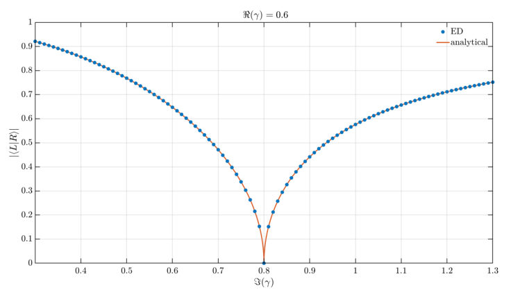
<figcaption class="paper-figure-caption"><b>Fig 1.</b> FIG. 1. Plot of the inner product |⟨L|R⟩| as a function of the complex parameter γ for L = 4. Lines are calculated using the procedure described in the text, and dots are obtained by exact diagonalization.</figcaption>
</figure>
<figure class="paper-figure-card">
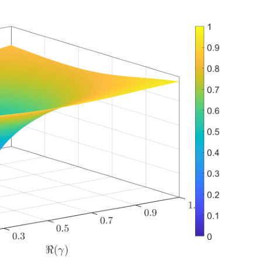
<figcaption class="paper-figure-caption"><b>Fig 2.</b> FIG. 2. Plot of |⟨L|R⟩| as a function of complex γ for L = 4 in the γ plane.</figcaption>
</figure>
<figure class="paper-figure-card">
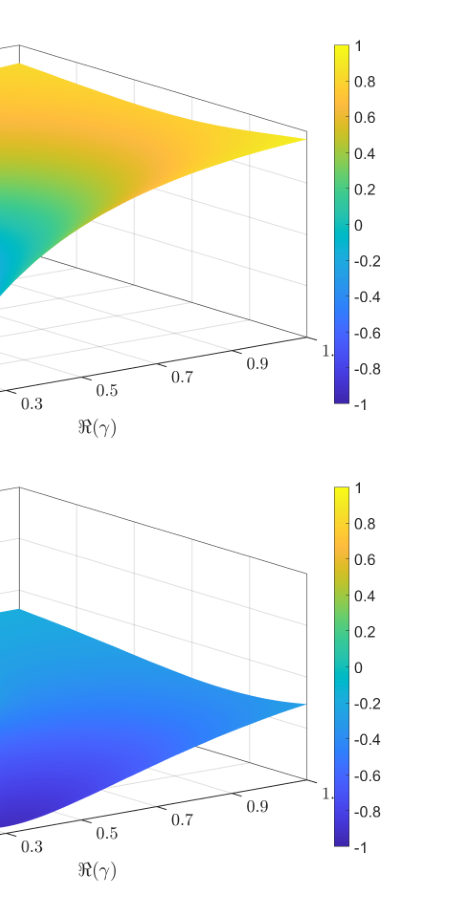
<figcaption class="paper-figure-caption"><b>Fig 3.</b> FIG. 3. Plots of the real and imaginary parts of ⟨L|R⟩as functions of γ for L = 4 in the complex γ plane.</figcaption>
</figure>
<figure class="paper-figure-card">
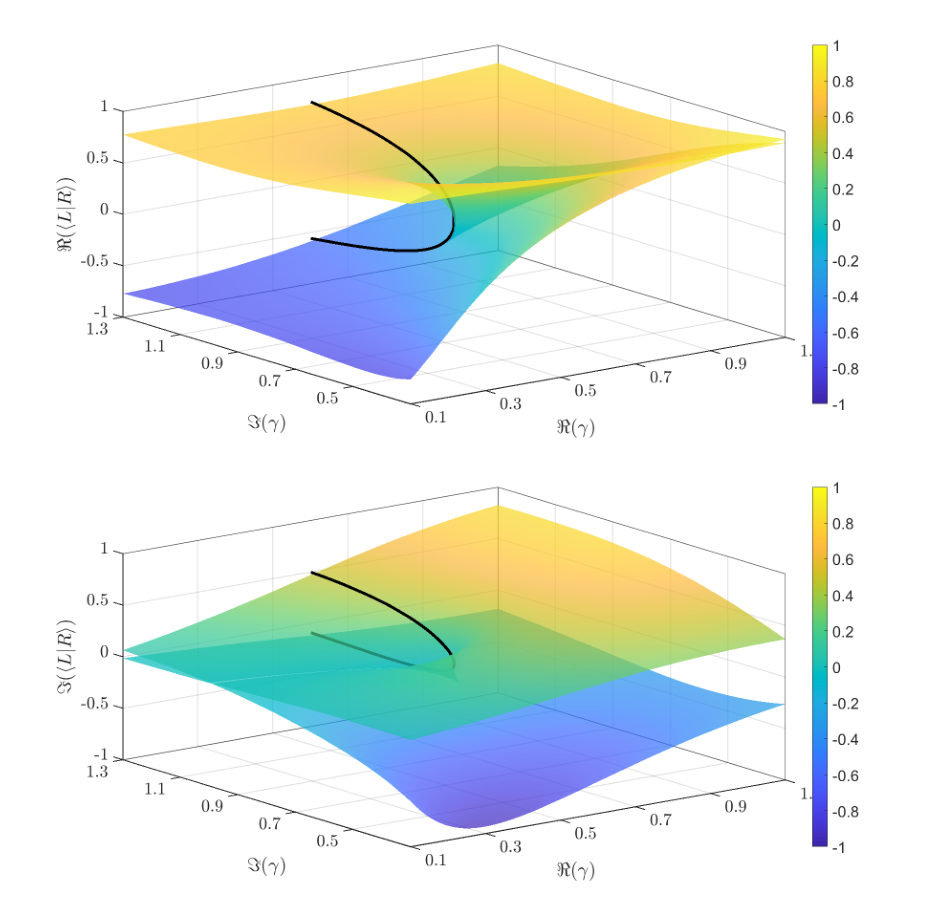
<figcaption class="paper-figure-caption"><b>Fig 4.</b> FIG. 4. Real and imaginary parts of the Riemann surface of ⟨L|R⟩for the pair of degenerating eigenvectors that exchange when the EP is encircled in the complex γ plane. The black line marks the branch cut: crossing it takes the system from one sheet to the other and exchanges the two eigenstates.</figcaption>
</figure>

**Summary.** This paper provides an exact analytical solution for the non-Hermitian XY spin chain, specifically detailing the behavior of the system at Exceptional Points. It demonstrates how the energy spectrum and eigenstates undergo permutation when encircling these points in the complex parameter plane. The work establishes a robust framework for studying non-Hermitian topology using a real-space, many-body approach.

**Why it may be interesting.** It provides an analytically controlled many-body platform for studying non-Hermitian topology and the physics of Exceptional Points in real space, which is highly relevant to open quantum systems and many-body dynamics.

Detailed structure

**Main problem.** The paper seeks to find an exact solution for the non-Hermitian XY spin chain with open boundary conditions, specifically addressing the algebraic structure and eigenvector construction at Exceptional Points (EPs).

**Main result.** The authors derive a complete analytical solution including the Jordan normal form at EPs, demonstrating that EPs act as branch points that cause the permutation of eigenenergies and eigenstates upon encirclement.

**Method.** The study employs a quasi-Hamiltonian analysis using Chebyshev polynomials to represent eigenvectors and a Jordan normal form approach to handle the defective nature of the Hamiltonian at EPs.

**Model / system.** A non-Hermitian XY spin chain with open boundary conditions, where the anisotropy parameter gamma is extended to complex values, mapped to a quadratic spinless-fermion problem via Jordan-Wigner transformation.

**Key observables.** Quasi-energy spectrum, many-body energy spectrum, biorthogonal overlap (langle L|R rangle), and the branch-cut structure of eigenstates.

**Important parameters / regimes.** Complex anisotropy parameter gamma, system size L, and quasi-energy epsilon.

**Assumptions / limitations.** The study focuses on open boundary conditions; the Hamiltonian is assumed to be complex-symmetric, allowing the left eigenvector to be the transpose of the right eigenvector.

**Figures summary.** Figure 1 and 2 show the magnitude and cusp structure of the biorthogonal overlap in the complex gamma plane; Figure 3 and 4 visualize the branch-cut structure and Riemann surface of the overlap.

**Paper structure.** The paper introduces the non-Hermitian XY model, develops a Chebyshev-polynomial representation for eigenvectors, analyzes the system away from and at Exceptional Points using Jordan normal forms, and concludes with a topological analysis of the complex parameter plane.

Abstract

We consider the non-Hermitian XY spin chain with open boundary conditions when the anisotropy parameter is extended to complex values. By analyzing the quasi-Hamiltonian matrix, we demonstrate that the free-fermion structure of the quasi-energy spectrum coincides with that of the Hermitian model and construct the corresponding biorthogonal fermionic basis away from exceptional points (EPs). We make use of an explicit Chebyshev-polynomial representation of the open-boundary eigenvectors in which the quasi-energy $\varepsilon$ is the natural spectral variable. This quasi-energy polynomial form is particularly useful at EPs, because EPs correspond to repeated roots of the same boundary polynomial, making the construction of generalized eigenvectors by $\varepsilon$-differentiation transparent. At EPs, where the quasi-Hamiltonian becomes defective, we derive the Jordan normal form and construct the associated generalized eigenvectors, which yields the correct counting of independent many-body eigenstates. We further show that EPs act as branch points in the complex anisotropy plane, leading to the characteristic permutation of eigenenergies and eigenstates upon encirclement. The branch-cut structure of the biorthogonal eigenstates provides direct evidence for the exchange of eigenstates when an EP is encircled. These results provide an analytically controlled many-body platform for studying EP physics and non-Hermitian topology beyond momentum-space descriptions.

[↑ back to top](#top)

### [Exact strong zero modes are generic in integrable spin systems with large anisotropy](http://arxiv.org/abs/2605.26205v1)

**Authors:** Sascha Gehrmann  
**Type:** theory · **Category:** statistical mechanics · **PDF:** <https://arxiv.org/pdf/2605.26205v1>  
**Analysis basis:** full PDF text, analyzed in chunks
**Topic relevance:** `entanglement & information structure` **3/5** · `non-equilibrium dynamics` **3/5** · `scars & prethermalization` **3/5** · `methods for driven-dissipative` **2/5**

↔ Scroll figures horizontally

<figure class="paper-figure-card">
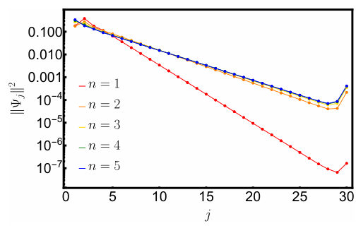
<figcaption class="paper-figure-caption"><b>Fig 1.</b> FIG. 1. Exponential decay of the Hilbert-Schmidt norms of the contributions Ψj to the ESZM for the A(2) 2n series for n = 1, 2, 3, 4, 5. Here the R-matrix is given by (A33), ∆= 1.811, and the K−is chosen as (A45) and K+ is fixed by isomorphism. The parameters are taken as β+ 1,1 = 1</figcaption>
</figure>
<figure class="paper-figure-card">
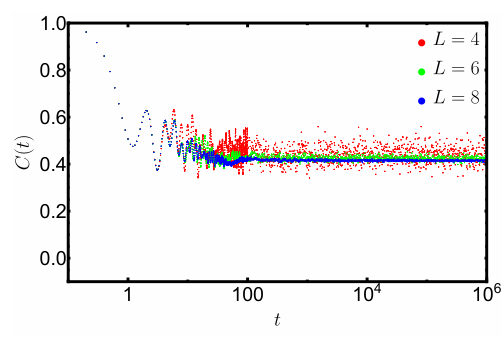
<figcaption class="paper-figure-caption"><b>Fig 2.</b> FIG. 2. Infinite-temperature autocorrelation function C(t) of the boundary observable I4 1 −Sz 1—a spin- 1</figcaption>
</figure>

**Summary.** This paper provides a unified algebraic framework to show that exact edge-localized operators (ESZMs) are a generic feature of many integrable spin models with large anisotropy. By linking these modes to the periodicity of R-matrices and the tracelessness of K-matrices, the work predicts new models with protected edge coherence. This discovery moves beyond model-specific constructions to a universal principle for edge protection in integrable systems.

**Why it may be interesting.** This is highly relevant for many-body dynamics as it identifies a universal mechanism for achieving anomalously long edge coherence times through exact symmetry-protected operators.

Detailed structure

**Main problem.** The lack of a unified, model-independent framework to understand the existence and localization of Exact Strong Zero Modes (ESZMs) in integrable spin systems.

**Main result.** The paper demonstrates that ESZMs are a generic feature of a broad family of integrable spin models with large anisotropy, arising from the quasi-periodicity of the R-matrix and the tracelessness of the K-matrix.

**Method.** The author utilizes the Quantum Inverse Scattering Method (QISM), transfer-matrix formalism, and Matrix Product Operator (MPO) techniques to analyze the algebraic properties of R- and K-matrices.

**Model / system.** A broad class of integrable spin models with large anisotropy and open boundary conditions, including the XXZ chain, Izergin-Korepin (IK) chain, and models associated with Lie algebra series A, B, C, and D.

**Key observables.** Strong Zero Modes (SZMs), Exact Strong Zero Modes (ESZMs), Hilbert-Schmidt norms of operator components, and the infinite-temperature autocorrelation function.

**Important parameters / regimes.** Anisotropy parameter (Delta), deformation parameter (q), crossing parameter (rho), and system size (L).

**Assumptions / limitations.** The mechanism is primarily applicable to integrable models and assumes specific trigonometric solutions of the Yang-Baxter equation.

**Figures summary.** Figure 1 shows the exponential decay of Hilbert-Schmidt norms for different algebra series; Figure 2 shows the saturation of the autocorrelation function in the IK chain, signaling edge coherence.

**Paper structure.** The paper defines SZMs/ESZMs, reviews the QISM framework, establishes the general construction based on R-matrix periodicity, provides specific boundary condition solutions for various Lie algebras, and verifies results via numerical simulations.

Abstract

Strong zero modes (SZMs) are edge-localized operators that commute with the Hamiltonian up to corrections exponentially small in system size, yielding anomalously long edge coherence times. In some settings, notably certain integrable models, this commutator can be made to vanish exactly at finite size, defining an exact SZM (ESZM). Existing ESZM constructions in the integrable setting, however, have proceeded model by model and have not been unified into a common framework. Here, I show that ESZMs arise generically in a broad family of integrable spin models with anisotropic interactions. Their existence follows from two algebraic properties of the underlying R- and K-matrices -- quasi-periodicity in the spectral parameter and tracelessness, respectively -- providing a uniform, model-independent mechanism. The framework recovers the known ESZM in XXZ chain and its higher-spin generalizations as special cases and predicts ESZMs in previously unrecognized models.

[↑ back to top](#top)

### [Atomic-referenced Hz-linewidth lasers via fiber interferometric stabilization](http://arxiv.org/abs/2605.26427v1)

**Authors:** Changmin Ahn, Hansol Jeong, Seoyeon Yang, Junyong Choi, Igju Jeon, Hanseb Moon, Jungwon Kim  
**Type:** experiment · **Category:** other · **PDF:** <https://arxiv.org/pdf/2605.26427v1>  
**Analysis basis:** full PDF text, analyzed in chunks
**Topic relevance:** `interference shaping light` **3/5** · `quantum optics experiment` **3/5** · `QC/QI experiment` **2/5** · `quantum measurements` **2/5**

↔ Scroll figures horizontally

<figure class="paper-figure-card">
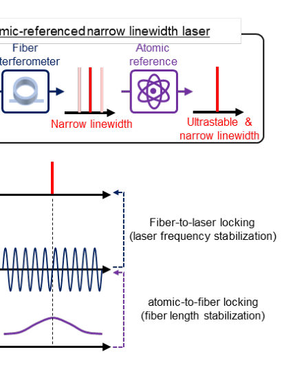
<figcaption class="paper-figure-caption"><b>Fig 1.</b> Figure 1. Concept and operating principle of the atomic-referenced narrow-</figcaption>
</figure>
<figure class="paper-figure-card">
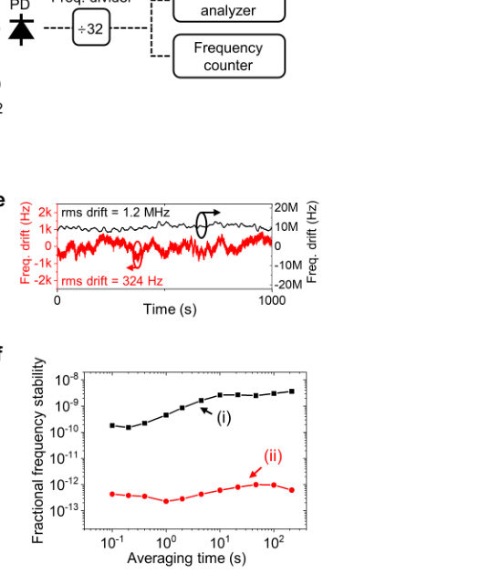
<figcaption class="paper-figure-caption"><b>Fig 2.</b> Figure 2. Atomic-referenced laser and its performance. a, Schematic of the 87Rb D2</figcaption>
</figure>
<figure class="paper-figure-card">
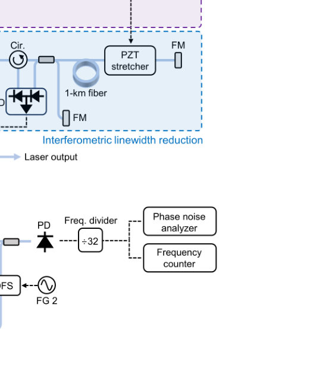
<figcaption class="paper-figure-caption"><b>Fig 3.</b> Figure 3. Experimental implementation of the atomic-referenced narrow-linewidth</figcaption>
</figure>
<figure class="paper-figure-card">
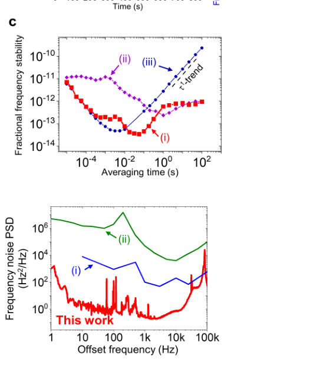
<figcaption class="paper-figure-caption"><b>Fig 4.</b> Figure 4. Short- and long-term performance of the atomic-referenced narrow-</figcaption>
</figure>

**Summary.** The researchers developed a hybrid laser stabilization technique that combines a long-fiber interferometer with an atomic reference. This approach achieves both Hz-level linewidth and long-term frequency stability, providing a path toward compact, field-deployable lasers for quantum technologies.

**Why it may be interesting.** This work is highly relevant for quantum optics and precision metrology as it provides a scalable method to create the ultra-stable, narrow-linewidth light sources required for controlling atoms, driving quantum gates, and performing high-precision sensing.

Detailed structure

**Main problem.** The difficulty of achieving lasers that simultaneously possess ultra-narrow linewidths (short-term spectral purity) and absolute frequency stability (long-term frequency anchoring) without the trade-off between noise and drift.

**Main result.** The development of a hybrid architecture that achieves a 3.4-Hz linewidth and high long-term stability, with a minimum fractional frequency stability of 3.4x10^-14 at 0.56 s.

**Method.** A dual-stabilization scheme where an external-cavity diode laser is first stabilized to a 1-km fiber interferometer for spectral purification and subsequently anchored to an 87Rb D2 transition via modulation transfer spectroscopy to suppress drift.

**Model / system.** An experimental platform consisting of a 1560.4-nm external-cavity diode laser, a 1-km homodyne Michelson fiber interferometer, and an 87Rb D2 transition-based modulation transfer spectroscopy (MTS) system.

**Key observables.** Laser linewidth (1-rad integrated-phase method), frequency noise Power Spectral Density (PSD), Allan deviation (fractional frequency stability), and RMS frequency drift.

**Important parameters / regimes.** 3.4-Hz linewidth, 1-km fiber delay, 156/60.4-nm laser wavelength, 87Rb D2 transition, 5-Hz low-pass filter cutoff, and 3.4x10^-14 minimum fractional frequency stability.

**Figures summary.** Figure 1 illustrates the concept of hierarchical stabilization; Figure 2 shows the MTS setup and comparison of SAS vs MTS signals; Figure 3 details the experimental implementation of the dual-branch architecture; Figure 4 presents comprehensive performance metrics including PSD, drift, and stability comparisons.

**Paper structure.** The paper introduces the problem of the stability-linewidth trade-off, describes the hierarchical dual-stabilization architecture, details the experimental setup for both the interferometric and atomic branches, presents performance characterization (linewidth, noise, and drift), and concludes with a comparison to existing literature.

Abstract

Narrow-linewidth lasers with absolute frequency anchoring are essential for precision metrology, coherent sensing, and emerging quantum technologies beyond laboratory environments. Optical cavities and interferometers provide exceptional short-term spectral purity but lack intrinsic absolute frequency references. Atomic transitions, in contrast, provide stable frequency anchors but offer limited discrimination sensitivity. Recent hybrid approaches have demonstrated the combination of compact optical resonators with atomic references, yet achieving the Hz-level regime remains challenging. Here, we present a hybrid architecture that enables simultaneous realization of Hz-level linewidth and atomic-referenced frequency stability. An external-cavity diode laser is first stabilized to a fiber interferometer to achieve Hz-level spectral purity, while the interferometer is subsequently anchored to an 87Rb D2 transition via modulation transfer spectroscopy to suppress long-term drift and define the laser frequency relative to the atomic transition. This dual-stabilization scheme realizes a compact atomic-referenced laser with a 3.4-Hz linewidth (1-rad integrated-phase method), a minimum fractional frequency stability of 3.4x10-14 at 0.56 s, and 9x10-13 at 100 s. This architecture establishes a practical and scalable route toward compact and field-deployable atomic-referenced narrow-linewidth lasers for precision metrology and quantum technologies.

[↑ back to top](#top)

### [Quantum Resistance Paradox of Low-Dimensional Superfluids](http://arxiv.org/abs/2605.27356v1)

**Authors:** Simon Wili, Meng-Zi Huang, Tommaso Bonaccorsi, Michael Mühlematter, Mohsen Talebi, Yaakov Yudkin, Alex Gómez-Salvador, Filip Marijanovic, Eugene Demler, Tilman Esslinger  
**Type:** experiment · **Category:** quantum gases · **PDF:** <https://arxiv.org/pdf/2605.27356v1>  
**Analysis basis:** full PDF text, analyzed in chunks
**Topic relevance:** `analog quantum simulation` **3/5** · `non-equilibrium dynamics` **3/5** · `correlated / nonlocal dissipation` **2/5** · `driven-dissipative phase transition` **2/5**

↔ Scroll figures horizontally

<figure class="paper-figure-card">
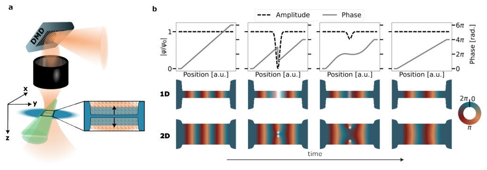
<figcaption class="paper-figure-caption"><b>Fig 1.</b> FIG. 1. Illustration of the setup and the dissipative processes in one and two dimensions a: A transport channel of programmable width connects two superfluid reservoirs (blue). The channel is formed by two repulsive beams (green and orange), one of which is tunable by a DMD. b: Dissipation in a narrow, quasi 1D channel occurs due to phase slips, where a depletion of the order paramete allows for a relaxation of the phase gradient and kinetic energy (top row). The corresponding phase (color coded) evolution of a phase slip in a narrow channel is plotted in the central row. In a wide, quasi 2D channel, dissipation is governed by vortex-antivortex pairs traversing the channel (bottom row).</figcaption>
</figure>
<figure class="paper-figure-card">
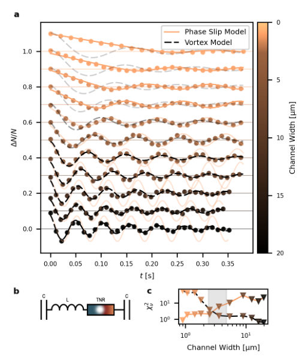
<figcaption class="paper-figure-caption"><b>Fig 2.</b> FIG. 2. Measured atom transport and fitted models a: Atom transport (imbalance ∆N/N as a function of time t) of a unitary Fermi gas through channels of increasing width shows distinctively changing dissipation characteristics. The data is compared to fitted phase slip (LAMH) and vortex models. The models both describe the Topological Nonlinear Resistor (TNR) in the circuit (b), capturing either phase slips or vortices. The LAMH model fits narrow channels, while the vortex model fits wide channels. The measurements for different channel widths are vertically offset for clarity. The statistical uncertainties of the measurements are smaller than the marker size. c: A quality of fit χ2 ν...</figcaption>
</figure>
<figure class="paper-figure-card">
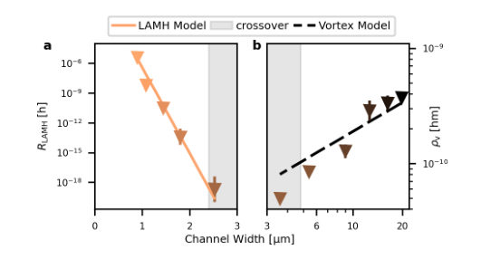
<figcaption class="paper-figure-caption"><b>Fig 3.</b> FIG. 3. Fitted resistances validate scalings laws a: The fitted phase slip resistance RLAMH(w), for narrow channels, shows the exponential suppression with width, as predicted by LAMH theory. b: The fitted vortex resistivity ρv(w), for wide channels, shows the predicted power-law. In- side the crossover region (2ξ −4ξ), i.e. outside the validity range of the models, both scalings break down (see Sec. VII). The errorbars represent the error of the fit.</figcaption>
</figure>
<figure class="paper-figure-card">
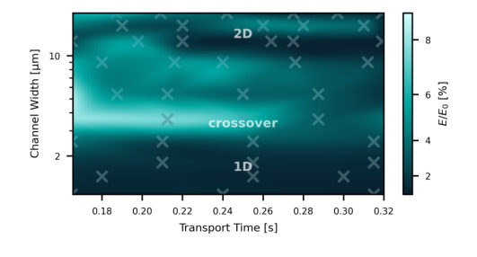
<figcaption class="paper-figure-caption"><b>Fig 4.</b> FIG. 4. Model free analysis reveals minimal dissipa- tion in dimensional crossover The remaining energy in the oscillator paradoxically varies non-monotonically as a func- tion of the channels width w. For a given time after the initial decay, the maximum appears in the crossover region, near w = 4 µm ≈3ξ, where phase slips and vortices are sup- pressed but competing. The crosses mark the measurement points between which we interpolate.</figcaption>
</figure>

**Summary.** The researchers used ultracold Fermi gases to observe a paradox where increasing the width of a superfluid channel actually increases resistance during the transition from 1D to 2D. They demonstrate that this occurs because the system moves from a regime of phase slips to one of vortex motion, with a minimum in dissipation occurring where both are suppressed. This work provides a benchmark for understanding dimensional crossovers in both quantum gases and superconductors.

**Why it may be interesting.** It provides a clean, tunable platform to study the fundamental transition between different topological dissipation mechanisms (phase slips vs. vortices) without the confounding effects of disorder found in solid-state systems.

Detailed structure

**Main problem.** Understanding how resistance and dissipation evolve during the dimensional crossover from 1D to 2D in low-dimensional superfluids.

**Main result.** Discovery of a 'quantum resistance paradox' where widening the transport channel increases resistance in the 1D-to-2D crossover, caused by a transition between phase-slip and vortex-driven dissipation.

**Method.** Using a defect-free, programmable transport geometry of ultracold Fermi gases to measure atom-pair imbalance relaxation and underdamped oscillations.

**Model / system.** A transport system of two superfluid reservoirs of a unitary Fermi gas of 6Li atoms connected by a programmable channel of varying width, modeled as a Topological Nonlinear Resistor-Inductor-Capacitor (TNRLC) circuit.

**Key observables.** Atom-pair imbalance (delta N/N), atom transport traces, oscillation frequency, oscillation amplitude, and current (I).

**Important parameters / regimes.** Channel width (w), temperature (T/TF), coherence length (xi), and the 1D-to-2D crossover regime.

**Assumptions / limitations.** The gas is in the unitary limit and local thermodynamic equilibrium; compressibility and temperature are assumed identical for both hyperfine states.

**Figures summary.** Figure 1 shows the experimental setup and dissipation mechanisms; Figure 2 illustrates the breakdown of scaling laws (LAMH and vortex models) in the crossover regime; Figure I shows inductance scaling with channel width.

**Paper structure.** Introduction of the resistance paradox and dimensional crossover; description of the experimental platform using 6Li atoms; presentation of the TNRLC circuit model; analysis of the 1D phase-slip regime; analysis of the 2D vortex regime; discussion of the crossover and the resistance minimum; conclusion on implications for superconducting devices.

Abstract

Resistance in standard conductors decreases with increasing cross-section. Yet, in low-dimensional superconductors and superfluids residual resistance arises from topological fluctuations of the order parameter manifesting as phase slips in one-dimensional (1D) and vortices in two-dimensional (2D) systems. How resistance and dissipation evolve as geometry interpolates between these regimes remains an open question. This evolution is masked in solid-state experiments by disorder, impurities, and geometric imperfections, and poses theoretical challenges due to competing dissipative processes and pronounced finite-size effects. Here, we use a defect-free unitary Fermi gas in a digitally programmable transport geometry to isolate geometric effects on superfluid dissipation and discover a paradox: in the crossover from 1D to 2D, the resistance reaches a minimum. There, widening a channel increases its resistance. Narrower, quasi-1D channels show dissipation described by Langer-Ambegaokar-McCumber-Halperin theory of phase slips. In this regime, varying the channel width yields the predicted exponential scaling of the activation factor over more than ten orders of magnitude. Wider, quasi-2D channels show dissipation consistent with a finite-size vortex model. The minimal dissipation in the dimensional crossover reflects a transition in the dominant dissipative mechanism, with both phase slips and vortices simultaneously suppressed. Our measurements suggest a route to minimizing dissipation in superconducting devices and provide a benchmark for theoretical efforts aimed at describing the dimensional crossover.

[↑ back to top](#top)

### [Sequential quantum nonlocality sharing under local noisy quantum channels](http://arxiv.org/abs/2605.26798v1)

**Authors:** Na Li, Chen-Yue Li, Yu-Hong Zheng, Wen-Long Ma, Li-Hang Ren, Yan-Kui Bai  
**Type:** theory · **Category:** quantum information and computing · **PDF:** <https://arxiv.org/pdf/2605.26798v1>  
**Analysis basis:** full PDF text, analyzed in chunks
**Topic relevance:** `entanglement & information structure` **3/5** · `quantum measurements` **3/5** · `correlated / nonlocal dissipation` **2/5** · `methods for driven-dissipative` **2/5**

↔ Scroll figures horizontally

<figure class="paper-figure-card">
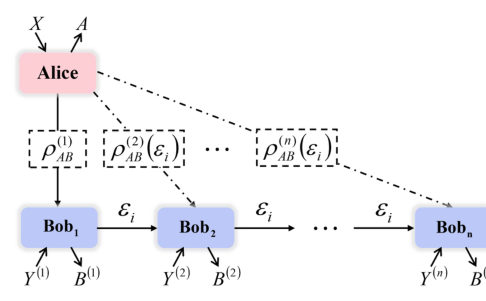
<figcaption class="paper-figure-caption"><b>Fig 1.</b> FIG. 1: Schematic illustration of the sequential sharing of bipar- tite Bell nonlocality under local noisy quantum channels. An ini- tial two-qubit state ρ(1) AB is shared between Alice and Bob1. Bob1 first performs a measurement on his particle, and transmits the post- measurement qubit via a noisy quantum channel εi to Bob2 with no classical information about the measurement choices and outcomes. Then, Bob2 repeats this measurement-and-sending process, and so on up to Bobn. Upon performing her measurement, Alice establishes Bell-CHSH correlations with the sequence of Bobs. Let (X, A) rep- resent the binary input and output of Alice.</figcaption>
</figure>
<figure class="paper-figure-card">
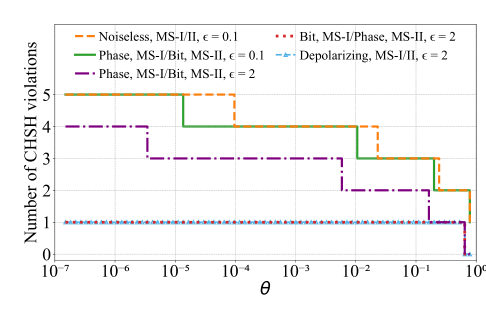
<figcaption class="paper-figure-caption"><b>Fig 2.</b> FIG. 2: The number of Bobs that can violate the CHSH inequality as a function of θ for the strategies MS-I and MS-II, under noiseless and noisy quantum channels. Alice and Bob1 initially share a Bell state |ψ⟩and the noise parameter is set to p = 0.95 for phase-flip, bit-flip and depolarizing channels. By employing the suitable measurement strategy associated with the appropriate values for θ and ǫ, the SSQN protocol is completely robust against phase-flip and bit-flip noise, while the sequential sharing is destroyed by depolarizing noise in local channels.</figcaption>
</figure>
<figure class="paper-figure-card">
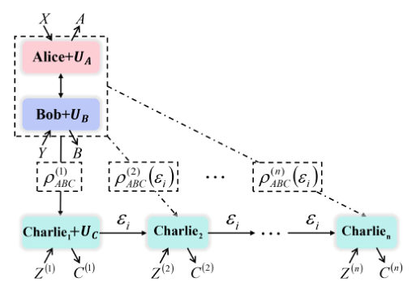
<figcaption class="paper-figure-caption"><b>Fig 3.</b> FIG. 3: Schematic of the SSQN in tripartite Mermin scenario under noisy quantum channels. The initial three-qubit state ρ(1) ABC is dis- tributed among Alice, Bob, and Charlie1, which is adaptively mod- ulated by the local unitary operations UA, UB and UC determined by different measurement strategies. After Charlie1 performs a ran- domly selected measurement Z(1) and records the outcome C(1), he transmits the resulting post-measurement qubit to Charlie2 through a noisy quantum channel εi. The same process is applied itera- tively until the observer Charlien is reached, where the measure- ment choice and the outcome of each Charlie are kept independent throughout the sequence. Here (X, A)...</figcaption>
</figure>
<figure class="paper-figure-card">
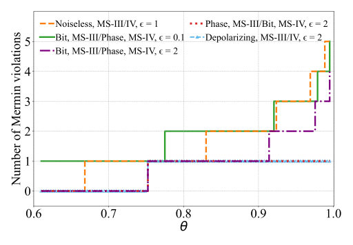
<figcaption class="paper-figure-caption"><b>Fig 4.</b> FIG. 4: The number of Charlies that can violate Mermin inequality as a function of θ for strategies MS-III/MS-IV under the noiseless and noisy quantum channels, where Alice, Bob and Charlie1 initially share a GHZ state and the noise parameter is set to p = 0.85 for phase-flip, bit-flip and depolarizing channels. By switching between strategies MS-III and MS-IV and adjusting θ and ǫ appropriately, the SSQN protocol is fully robust against phase-flip and bit-flip noise, whereas the sequential sharing property is destroyed by depolarizing noise in local channels.</figcaption>
</figure>
<figure class="paper-figure-card">
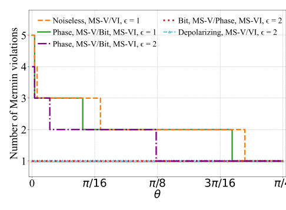
<figcaption class="paper-figure-caption"><b>Fig 5.</b> FIG. 5: The number of Charlies violating the Mermin inequality as a function of θ for strategies MS-V and MS-VI under noiseless and noisy quantum channels, where Alice, Bob, and Charlie1 initially share a W state and the noise parameter is set to p = 0.9 for phase- flip, bit-flip and depolarizing channels. By adaptively switching be- tween strategies MS-V and MS-VI with appropriately chosen mea- surement parameters, the SSQN protocol with the W state exhibits full robustness against phase-flip and bit-flip noise, whereas it fails under depolarizing noise.</figcaption>
</figure>

**Summary.** The paper demonstrates that sequential sharing of quantum nonlocality can be maintained indefinitely even under certain types of local noise, such as bit-flip or phase-flip channels, provided the measurement strategies are appropriately adapted. It introduces new measurement techniques and local operations that allow observers to switch between noise-immune regimes, though it confirms that depolarizing noise fundamentally destroys the ability to share nonlocality unboundedly.

**Why it may be interesting.** This work is highly relevant to open quantum systems and quantum networks, as it provides a framework for maintaining non-classical correlations in the presence of decoherence, which is a fundamental challenge in scalable quantum communication.

Detailed structure

**Main problem.** Investigating the robustness of Sequential Quantum Nonlocality Sharing (SSQN) against local noisy quantum channels (phase-flip, bit-flip, and depolarizing noise).

**Main result.** Unbounded SSQN is possible for Bell, GHZ, and W states under specific noise-immune channels (phase-flip or bit-flip) by using optimized measurement strategies and local unitaries, but is destroyed by depolarizing noise.

**Method.** Theoretical analysis using the Kraus operator-sum formalism, the Lüders rule for state updates, and the construction of optimized POVM measurement strategies (MS-I through MS-VI).

**Model / system.** A sequence of independent observers (Bobs or Charlies) receiving a post-measurement qubit transmitted through local noisy quantum channels, starting from initial bipartite Bell states or tripartite GHZ and W states.

**Key observables.** CHSH inequality violation (for bipartite nonlocality) and Mermin inequality violation (for tripartite nonlocality).

**Important parameters / regimes.** Noise parameter p (probability of no error), measurement sharpness gamma, measurement rotation angle theta, and the number of sequential observers n.

**Assumptions / limitations.** The primary source of noise is the transmission of the post-measurement qubit through local channels; the specific type of noise is assumed to be known to allow for strategy switching.

**Figures summary.** Schematic diagrams of the SSQN protocols for bipartite and tripartite cases; plots showing the maximum number of observers capable of violating inequalities as a function of measurement angles and noise levels; and plots of CHSH/Mermin values under different noise-immune strategies.

**Paper structure.** The paper introduces the SSQN protocol, analyzes bipartite Bell nonlocality under various noise channels, extends the analysis to tripartite GHZ and W states, proposes new measurement strategies with local unitaries to switch noise immunity, and concludes with numerical demonstrations of double-violation.

Abstract

Sequential sharing of quantum nonlocality (SSQN) is crucial for device-independent tasks in quantum information processing, wherein relaying the post-measurement qubit through a local quantum channel to a subsequent observer constitutes an essential operational step. Here we present a theoretical analysis of noise robustness of sequential sharing for bipartite Bell nonlocality and tripartite Mermin nonlocality under the influence of local phase-flip, bit-flip, and depolarizing quantum channels. It is established that arbitrarily many independent observers can sequentially share the quantum nonlocality of Bell, Greenberger-Horne-Zeilinger, and W states via specific noise-immune channels, whereas this feature of SSQN is destroyed under other noisy quantum channels. Furthermore, we demonstrate that the noise-immune channel enabling unbounded SSQN can be switched by employing our newly designed measurement strategies assisted by local operations on the initial entangled states. Moreover, as illustrative examples, we propose two concrete schemes for sharing bipartite Bell nonlocality and tripartite Mermin nonlocality with two sequential local observers on one side subject to local noisy channels. Our work establishes a practical framework for realizing the SSQN under noisy quantum channels, and reveals the connection between noise robustness and measurement strategies.

[↑ back to top](#top)

### [A tridiagonal matrix-valued process with stochastic resetting for arbitrary Dyson index $β>0$](http://arxiv.org/abs/2605.26945v1)

**Authors:** Gernot Akemann, Satya N. Majumdar, Patricia Päßler  
**Type:** theory · **Category:** statistical mechanics · **PDF:** <https://arxiv.org/pdf/2605.26945v1>  
**Analysis basis:** full PDF text, analyzed in chunks
**Topic relevance:** `non-equilibrium dynamics` **3/5** · `driven-dissipative phase transition` **2/5** · `methods for driven-dissipative` **2/5** · `non-equilibrium universality` **2/5**

↔ Scroll figures horizontally

<figure class="paper-figure-card">
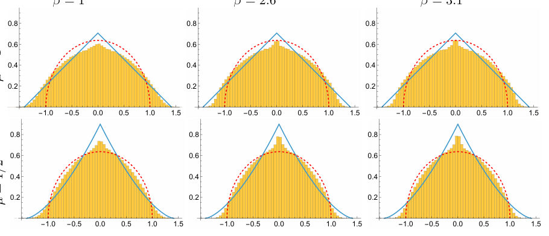
<figcaption class="paper-figure-caption"><b>Fig 1.</b> Figure 1: We generated numerically the stationary ensemble of the β-IRTMP process in Eq. (101) by drawing independently the diagonal entries from Eq. (97) and off-diagonal entries from Eq. (99) using the inverse CDF method described in the text. We then diagonalized this N × N random matrix to obtain the histogram of its N eigenvalues. We plot the rescaled average eigenvalue density (rescaled by a factor √</figcaption>
</figure>

**Summary.** This paper extends the construction of a tridiagonal matrix-valued process to any Dyson index beta and explores how stochastic resetting affects its eigenvalues. It demonstrates that simultaneous resetting of matrix elements recovers the known dynamics of resetting Dyson Brownian motion and applies this to calculate the partition function of a disordered 1D lattice.

**Why it may be interesting.** It provides a new exact framework for studying non-equilibrium stationary states in random matrix models, which is highly relevant to understanding driven-dissipative many-body dynamics and disordered quantum systems.

Detailed structure

**Main problem.** The paper aims to generalize a tridiagonal matrix-valued process to arbitrary Dyson index beta > 0 and investigate the effects of stochastic resetting on its eigenvalue dynamics.

**Main result.** The authors successfully construct a beta-TMP for any beta > 0 and prove that the simultaneous resetting of matrix entries (beta-SRTMP) leads to a stationary eigenvalue distribution matching the resetting Dyson Brownian motion.

**Method.** The study employs stochastic calculus (OU and CIR processes), renewal theory to handle resetting, and numerical simulations to compare different resetting regimes.

**Model / system.** The model consists of a symmetric tridiagonal matrix where diagonal entries follow Ornstein-Uhlenbeck processes and off-diagonal entries follow Cox-Ingersoll-Ross processes, applied to a 1D disordered quantum tight-binding Hamiltonian.

**Key observables.** Joint Probability Density Function (JPDF) of eigenvalues, average eigenvalue density, and the annealed partition function.

**Important parameters / regimes.** Dyson index (beta), resetting rate (r), drift (mu), diffusion (D), and matrix size (N).

**Assumptions / limitations.** The resetting is assumed to be Poissonian; the paper notes the difficulty in finding analytical solutions for the independent resetting (beta-IRTMP) case.

**Figures summary.** Figures show the average eigenvalue density for different beta values and compare the density profiles of the simultaneous (beta-SRTMP) and independent (beta-IRTMP) resetting ensembles.

**Paper structure.** The paper introduces the beta-TMP construction, derives the time-dependent and stationary distributions for simultaneous resetting, compares this to independent resetting via numerical simulation, and concludes with an application to a disordered 1D tight-binding model.

Abstract

We introduce a symmetric tridiagonal matrix-valued process ($β$-TMP) $H(t)$ whose diagonal entries $H_{k,k}(t)$ evolve independently via an Ornstein-Uhlenbeck process starting at the origin and the off-diagonal entries $H_{k,k+1}(t)$ evolve independently via the Cox-Ingersoll-Ross process, starting at the origin and with parameters that depend on the row index $k$. We show that the joint distribution of the entries of the matrix can be computed exactly at all times and moreover, the joint distribution of its $N$ real eigenvalues can be computed exactly at all times too. We then subject this time-evolving matrix-valued process to stochastic resetting with rate $r$ in two different settings: (i) simultaneous resetting of the matrix entries to the origin with rate $r$ ($β$-SRTMP process) and (ii) independent resetting of the matrix entries to the origin with rate $r$ ($β$-IRTMP process). We show that the joint distribution of the eigenvalues of the $β$-SRTMP process at long times can be computed analytically and it coincides with the joint distribution of the positions of the resetting Dyson Brownian motion in its stationary state for arbitrary $β>0$. For the $β$-IRTMP stationary ensemble, computing analytically the joint distribution of eigenvalues or even the average density of eigenvalues is difficult. However, generating the stationary $β$-IRTMP ensemble numerically is relatively straightforward and we compare its numerical average eigenvalue density to the corresponding analytical results for the $β$-SRTMP stationary ensemble with same parameter values, showing that they are quite different from each other. Finally, we provide a simple and concrete application of this tridiagonal matrix-valued process in computing the annealed partition function of a disordered quantum tight-binding Hamiltonian on a one-dimensional lattice.

[↑ back to top](#top)

### [Amplification and generation bounds of gravity-induced entanglement in pulsed optomechanical systems](http://arxiv.org/abs/2605.26240v1)

**Authors:** Daisuke Miki, Alfred Li, Yanbei Chen  
**Type:** theory · **Category:** quantum information and computing · **PDF:** <https://arxiv.org/pdf/2605.26240v1>  
**Analysis basis:** full PDF text, analyzed in chunks
**Topic relevance:** `entanglement & information structure` **3/5** · `correlated / nonlocal dissipation` **2/5** · `non-equilibrium dynamics` **2/5** · `quantum measurements` **2/5**

↔ Scroll figures horizontally

<figure class="paper-figure-card">
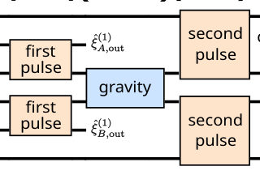
<figcaption class="paper-figure-caption"><b>Fig 1.</b> FIG. 1. Schematic diagram of our protocol, which consists of three stages, with time going to the right: first pulse (duration tP), gravita- tional interaction (duration tG), and second pulse (duration tP). From top left to bottom left, we have six input operators, for the second and first pulses of mass A, mass A, mass B, and first and second pulses of mass B. At the right, the top most and the bottom most operators are outgoing optical fields from second pulses of masses A and B, respectively. They are the only fields detected.</figcaption>
</figure>
<figure class="paper-figure-card">
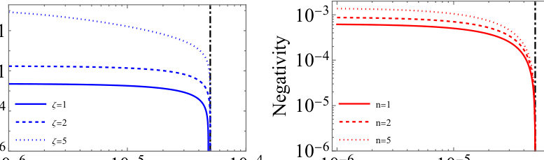
<figcaption class="paper-figure-caption"><b>Fig 2.</b> FIG. 2. Behavior of entanglement negativity with the thermal noise. We fix the gravitational coupling gGtG/2π = 10−4. In the left panel, the solid, dashed, and dotted curves correspond to the initial double-squeezed state with a squeezing parameter ζ = 1, ζ = 2, and ζ = 5. In the right panel, the solid, dashed, and dotted curves correspond to the initial Fock-vacuum state with n = 1, n = 2, and n = 5. The vertical black dashed-dotted line represents the value gGtG/4π. Entanglement is generated in the region where condition (27) is satisfied.</figcaption>
</figure>
<figure class="paper-figure-card">
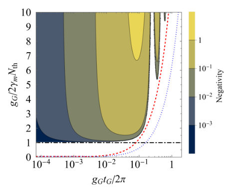
<figcaption class="paper-figure-caption"><b>Fig 3.</b> FIG. 3. Entanglement negativity for the squeezed input with ζ = 1 in the dimensionless parameter space gGtG/2π and gG/2γmNth. The horizontal black dashed-dotted line shows the universal threshold gG = 2γmNth. The red dash-dotted curve shows the entanglement- annihilating boundary 4γmtGNth = 1, while the blue dotted curve to its right indicates the entanglement-breaking boundary 2γmtGNth = 1.</figcaption>
</figure>
<figure class="paper-figure-card">
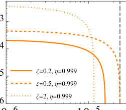
<figcaption class="paper-figure-caption"><b>Fig 4.</b> FIG. 4. Behavior of entanglement negativity with measurement loss. We fix the gravitational coupling gGtG/2π = 10−4. The solid, dashed, and dotted curves correspond to a fixed transmittance η = 0.999 with squeezing values ζ = 0.2, ζ = 0.5, and ζ = 5, respectively. The vertical black dash-dotted line indicates the lossless universal bound gG = 2γmNth, while the gray dash-dotted line to its left indicates the lossy bound given by Eq. (45). Unlike the lossless case, the lossy bound is not saturated in the large-squeezing limit. Instead, for a given measurement efficiency, there exists a finite input squeezing that approaches the loss-modified bound most closely, as illustrated here by the...</figcaption>
</figure>
<figure class="paper-figure-card">
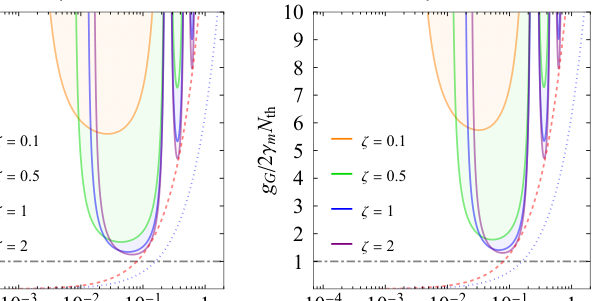
<figcaption class="paper-figure-caption"><b>Fig 5.</b> FIG. 5. Entanglement region in the (gGtG/2π, gG/2γmNth) plane for several squeezing parameters and measurement efficiencies. The four panels correspond to η = 0.999, 0.9, 0.8, 0.7, from top left to bottom right. The black dash dotted line, red dashed curve, and blue dotted curve are the same reference lines as in Fig. 3. The solid curves denote the boundaries where the negativity vanishes for ζ = 0.1, 0.5, 1, 2, shown in orange, green, blue, and purple, respectively. The shaded region above each boundary indicates the parameter region where entanglement is generated.</figcaption>
</figure>

**Summary.** This paper demonstrates that while using squeezed or Fock states can increase the amount of entanglement generated by gravity in optomechanical systems, these states cannot overcome the fundamental threshold imposed by thermal decoherence. It also identifies how measurement inefficiency limits the detectable entanglement and suggests an optimal squeezing level to mitigate vacuum noise.

**Why it may be interesting.** It provides fundamental bounds on the observability of gravity-induced entanglement, bridging quantum optics (squeezing/state swap) with the search for the quantum nature of gravity and the study of open quantum systems under thermal noise.

Detailed structure

**Main problem.** Investigating the generation, amplification, and detection limits of gravity-induced entanglement (GIE) between two massive objects in the presence of thermal decoherence and measurement loss.

**Main result.** While nonclassical input states (squeezed or Fock states) can amplify the amount of entanglement, they cannot lower the fundamental threshold for entanglement generation, which is strictly set by the competition between gravitational coupling and thermal decoherence ($g_G > 2\gamma_m N_{th}$).

**Method.** The authors use the input-output formalism, covariance matrix analysis for Gaussian states, and the PPT criterion for non-Gaussian states within a pulsed optomechanical framework.

**Model / system.** Two red-detuned pulsed optomechanical systems where mechanical masses are coupled via Newtonian gravity. The system uses a two-pulse protocol to swap optical states to mechanical modes, allow gravitational interaction, and read the state back to light.

**Key observables.** Entanglement negativity, output optical field quadratures, and gravity-induced squeezing.

**Important parameters / regimes.** Gravitational coupling strength ($g_G$), thermal occupation number ($N_{th}$), mechanical damping rate ($\gamma_m$), readout efficiency ($\eta$), and squeezing parameter ($\zeta$).

**Assumptions / limitations.** The Rotating Wave Approximation (RWA) is applied to the gravitational interaction; the optomechanical pulses are assumed to achieve complete state swap; and measurement loss is modeled as a local Gaussian attenuation channel.

**Figures summary.** Figure 1 shows the three-stage protocol schematic; Figure 2 compares entanglement negativity for different input states; Figure 4 illustrates the impact of measurement loss and the existence of an optimal squeezing level; Figure 5 maps the entanglement region in the parameter plane of coupling and interaction time.

**Paper structure.** The paper introduces the optomechanical protocol, derives the operator evolution and density matrix under thermal noise, analyzes entanglement amplification with nonclassical inputs, establishes the universal generation threshold, and concludes by investigating the impact of measurement loss and detection efficiency.

Abstract

We investigate gravity-induced entanglement between the output optical fields of two red-detuned pulsed optomechanical systems with their masses coupled by mutual gravitational interaction. For each individual system, the optomechanical interaction realizes a beam-splitter state swap between an incident optical pulse and its mechanical mode. Using two rectangular pulses for each system -- the first to imprint a nonclassical state on the mechanical modes and the second to read the gravitationally generated entanglement back onto the outgoing light -- we show that the amount of entanglement can be amplified by preparing the input in a squeezed or Fock state. However, the threshold for entanglement generation is set by the competition between the gravitational coupling and thermal decoherence, $g_G>2γ_m N_{\rm th}$, and cannot be lowered by any choice of input state. We prove this bound for two-mode Gaussian inputs and show that it continues to hold for Fock-state inputs. We further analyze how imperfect detection modifies the threshold and identify the entanglement-annihilating and entanglement-breaking regimes, which are set by the thermal decoherence accumulated over the interaction time, independent of the gravitational coupling.

[↑ back to top](#top)

### [Toward Scalable Heterogeneous Quantum Networks: Microwave-Optical Transduction Across Platforms](http://arxiv.org/abs/2605.26976v1)

**Authors:** Tarvir Anjum Aditto, Jaiyan Sadid Ifty, Khondokar Zahin  
**Type:** both · **Category:** quantum information and computing · **PDF:** <https://arxiv.org/pdf/2605.26976v1>  
**Analysis basis:** full PDF text, analyzed in chunks
**Topic relevance:** `QC/QI experiment` **3/5** · `quantum optics experiment` **3/5** · `spintronics-quantum-optics interface` **3/5**

↔ Scroll figures horizontally

<figure class="paper-figure-card">
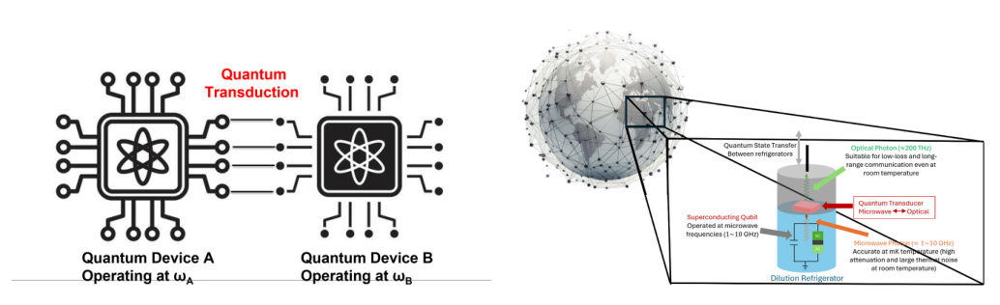
<figcaption class="paper-figure-caption"><b>Fig 1.</b> Figure 1: Quantum transduction concept. Left: Schematic representation of two quantum devices operating at different frequencies connected via a quantum transduction interface. Right: Illustration of microwave-to-optical conversion inside a dilution refrigerator enabling long-distance quantum state transfer.</figcaption>
</figure>
<figure class="paper-figure-card">
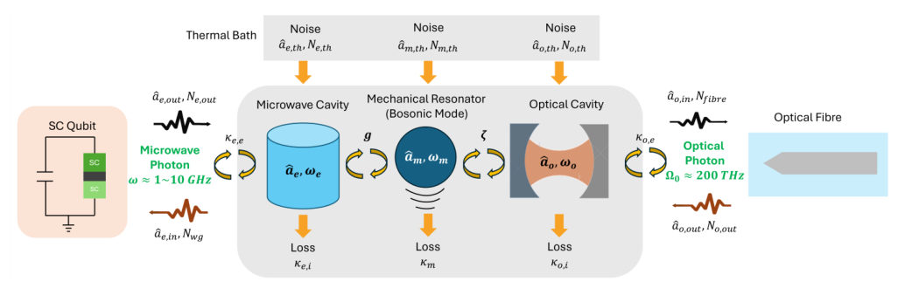
<figcaption class="paper-figure-caption"><b>Fig 2.</b> Figure 2: Schematic of the physical quantities governing one-stage quantum transduction. A single intermediate bosonic mode (phonon or magnon) coherently couples a microwave cavity to an optical cavity. The system is described by cavity and bath operators together with mode frequencies, coherent coupling rates, and intrinsic loss channels. Intrinsic losses are modeled as couplings to thermal baths. Optical and fiber noise contributions are negligible at the optical frequency of approximately 200 THz.</figcaption>
</figure>
<figure class="paper-figure-card">
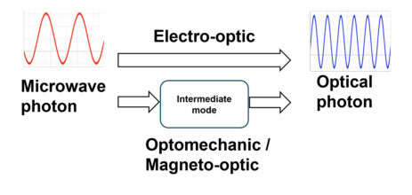
<figcaption class="paper-figure-caption"><b>Fig 3.</b> Figure 3: Schematic comparison of the three major quan- tum transduction approaches. Top: zero-stage electro-optic (Pockels) transduction with direct photon-photon interaction. Bottom: one-stage transduction using an intermediate bosonic mode (phonon or magnon).</figcaption>
</figure>
<figure class="paper-figure-card">
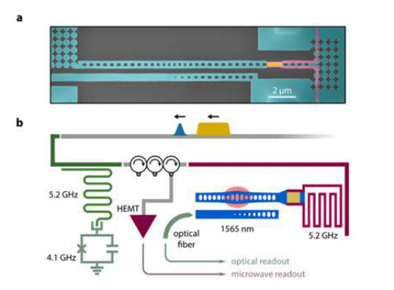
<figcaption class="paper-figure-caption"><b>Fig 4.</b> Figure 4: Optomechanical transduction platforms.</figcaption>
</figure>
<figure class="paper-figure-card">
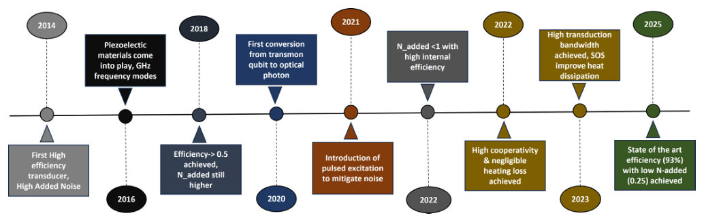
<figcaption class="paper-figure-caption"><b>Fig 5.</b> Figure 5: Timeline of key advances in optomechanical microwave-optical quantum transduction (2014–2025).</figcaption>
</figure>

**Summary.** This review evaluates the state-of-the-art in microwave-to-optical quantum transduction, focusing on how different physical platforms can enable scalable quantum networks. It highlights the trade-offs between efficiency, bandwidth, and noise across optomechanical, electro-optic, and magneto-optic systems. The paper argues that a hybrid approach using these complementary technologies is essential for future large-scale quantum communication.

**Why it may be interesting.** It provides a critical overview of the hardware interfaces necessary for distributed quantum computing, specifically addressing the engineering of open quantum systems and the preservation of quantum states across vastly different frequency scales.

Detailed structure

**Main problem.** The fundamental challenge of achieving scalable, high-efficiency, and low-noise microwave-to-optical quantum transduction to bridge the gap between superconducting processors and long-distance fiber networks.

**Main result.** The review identifies optomechanical systems as leaders in efficiency and low noise, electro-optic platforms as best for high bandwidth and integration, and magneto-optic platforms as providing unique non-reciprocal functionality.

**Method.** A comprehensive survey and comparative analysis of optomechanical, electro-optic, and magneto-optic transduction platforms using standardized metrics like internal efficiency and normalized decay rates.

**Model / system.** The paper analyzes three primary architectures: optomechanical (using phonons), electro-optic (using direct nonlinear Pockels effect), and magneto-optic (using magnons) as intermediate bosonic modes for frequency conversion.

**Key observables.** Conversion efficiency (total and internal), added noise (in quanta), bandwidth, and quantum capacity.

**Important parameters / regimes.** Cooperativity (em, om, eo), magnon decay rate, operating temperature (mK to 300K), and the efficiency threshold of 0.5 for positive quantum capacity.

**Assumptions / limitations.** The transduction processes are modeled as bosonic Gaussian attenuator channels.

**Figures summary.** Figure 10 presents an efficiency-bandwidth plane comparing the three platforms, showing their respective regimes and the quantum capacity threshold line.

**Paper structure.** The paper introduces the scaling bottleneck of quantum networks, details the physics and progress of the three main transduction platforms (OM, EO, MO), provides a quantitative comparison of their performance metrics, and concludes with future outlooks and integration challenges.

Abstract

The development of scalable quantum networks requires coherent interfaces capable of converting microwave photons used in superconducting quantum processors into optical photons suitable for long-distance fiber transmission. This review surveys recent progress in microwave-to-optical quantum transduction across optomechanical, electro-optic, and magneto-optic platforms, with emphasis on conversion efficiency, bandwidth, added noise, and operating temperature. In addition to standard metrics, we propose the internal efficiency eta_in and the magnon decay rate kappa_m/2pi as normalized parameters that enable fairer comparison across heterogeneous implementations. Optomechanical systems achieve internal phonon-to-photon efficiencies of 93% with sub-quantum added noise of 0.25 quanta at millikelvin temperatures. Electro-optic devices based on LiNbO3 and AlN have advanced from room-temperature efficiencies below 1% to millikelvin systems with internal efficiencies approaching 99.5%, added noise as low as 0.16 quanta at 60 mK, and bandwidths extending to several tens of megahertz. Magneto-optic (optomagnonic) platforms exhibit the lowest efficiencies (typically $10^{-10}$ to $10^{-8})$, but offer intrinsic non-reciprocity and broadband magnonic operation, with emerging approaches based on topological heterostructures and magnon squeezing predicting enhancements up to $10^{-4}$. Optomechanical systems appear promising for high-fidelity quantum state transfer, electro-optic transducers for high-bandwidth coherent links, and magneto-optic devices for non-reciprocal network components. We discuss the fundamental trade-off between efficiency and added noise across all three platforms, and argue that heterogeneous microwave-optical transduction is emerging as a key enabling technology for distributed quantum computing and large-scale quantum networks.

[↑ back to top](#top)

### [Entangling power and fidelity diagnostic for bipartite quantum channels](http://arxiv.org/abs/2605.26867v1)

**Authors:** Marcin Rudziński, Gianluigi Tartaglione, Karol Życzkowski  
**Type:** theory · **Category:** quantum information and computing · **PDF:** <https://arxiv.org/pdf/2605.26867v1>  
**Analysis basis:** full PDF text, analyzed in chunks
**Topic relevance:** `entanglement & information structure` **3/5** · `correlated / nonlocal dissipation` **2/5** · `methods for driven-dissipative` **2/5**

↔ Scroll figures horizontally

<figure class="paper-figure-card">
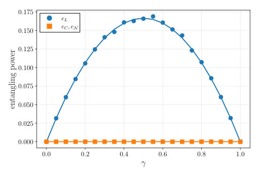
<figcaption class="paper-figure-caption"><b>Fig 1.</b> FIG. 2: False-positive behavior of eL for local amplitude damping ΦAD γ . The channel is local, hence eC = eN = 0, but eL = 2γ(1 −γ)/3 is nonzero because it measures local impurity of the mixed output.</figcaption>
</figure>
<figure class="paper-figure-card">
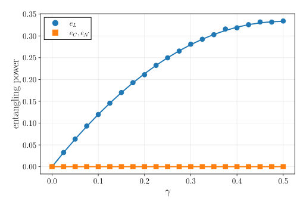
<figcaption class="paper-figure-caption"><b>Fig 2.</b> FIG. 1: False-positive behavior of the linear-entropy quantity for the correlated dephasing channel Φu, with γ = (1 −u)/2 –see Eq. (36). The channel is a random-unitary mixture of product unitaries, so it cannot entangle product inputs and eC = eN = 0. Nevertheless eL is positive because the output is locally mixed. Symbols denote numerical Haar averages over product inputs, while solid lines denote the analytic predictions.</figcaption>
</figure>
<figure class="paper-figure-card">
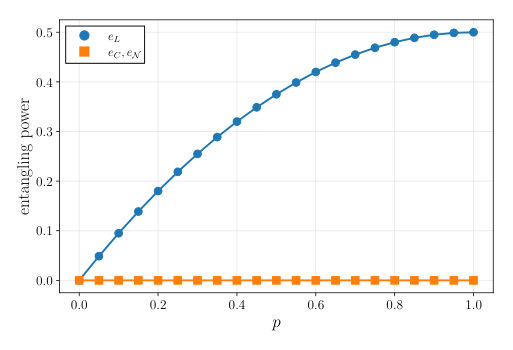
<figcaption class="paper-figure-caption"><b>Fig 3.</b> FIG. 3: False-positive behavior of eL for local depolarizing noise Dp ⊗Dp. Proper entangling powers vanish for all p, while eL = p −p2/2 increases with the local mixedness of the output.</figcaption>
</figure>
<figure class="paper-figure-card">
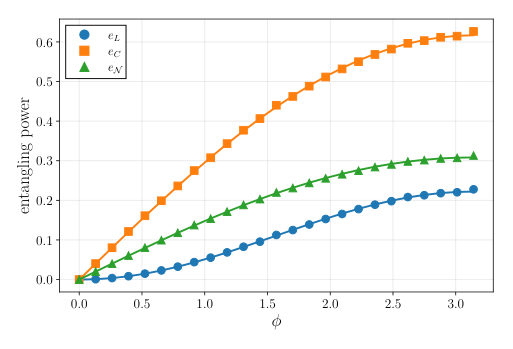
<figcaption class="paper-figure-caption"><b>Fig 4.</b> FIG. 4: Controlled-phase unitary benchmark. Since the output is pure, eN = eC/2 and eL is proportional to the average squared concurrence. The concurrence- and negativity-based entangling powers scale as |sin(φ/2)|, whereas eL scales as sin2(φ/2). Symbols denote numerical Haar averages and solid lines denote analytic expressions.</figcaption>
</figure>
<figure class="paper-figure-card">
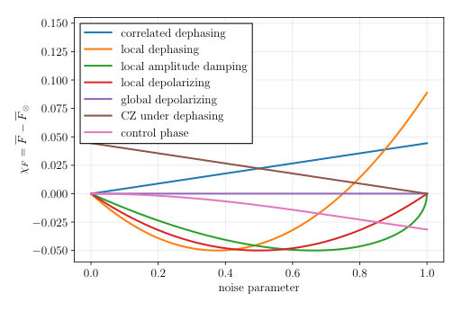
<figcaption class="paper-figure-caption"><b>Fig 5.</b> FIG. 6: Fidelity-bias parameter χF for the representative models. Positive values indicate that lower-purity input orbits are better preserved on average than product inputs, while negative values indicate the opposite. The local noise models are nonpositive in the usual weak-noise regime, correlated dephasing has χF &gt; 0, and global depolarization is purity-blind with χF = 0. For the noisy-CZ curve, χF is computed relative to the ideal CZ target; for the other noise channels it is computed relative to the identity channel.</figcaption>
</figure>

**Summary.** The paper addresses the failure of standard linear-entropy metrics to distinguish between entanglement generation and local noise. It introduces new, robust entangling power measures based on concurrence and negativity and provides analytical tools to predict how noise impacts entanglement in bipartite channels.

**Why it may be interesting.** This is highly relevant for researchers in open quantum systems and NISQ-era computing, as it provides more reliable metrics for characterizing how noise affects the ability of quantum gates to generate entanglement.

Detailed structure

**Main problem.** Developing effective diagnostics for bipartite quantum channels to distinguish between genuine entanglement generation and mere increases in local impurity or mixedness.

**Main result.** The authors introduce new concurrence- and negativity-based entangling powers that correctly vanish for separable channels and provide analytical bounds for entanglement variation in noisy gates.

**Method.** The study uses Kraus representations, Weingarten calculus for Haar-random integration, and the analysis of local-unitary orbits and Schmidt coefficients.

**Model / system.** Bipartite quantum channels (specifically 2-qubit systems) acting on $d 	imes d$ dimensional spaces, including models for local noise (depolarizing, amplitude damping) and noisy entangling gates (CZ, CP).

**Key observables.** Average gate fidelity, product-state fidelity, fidelity-bias parameter ($\chi_F$), concurrence, negativity, and linear entropy-based entangling power.

**Important parameters / regimes.** Schmidt coefficients/angle ($	heta$), reduced-state purity ($\mu$), and noise parameters for dephasing and damping channels.

**Assumptions / limitations.** The derivation for orbit-resolved fidelity assumes equal local dimensions ($d_A = d_B$).

**Figures summary.** Figure 1 demonstrates the false-positive behavior of linear-entropy entangling power; Figure 7 compares numerical entangling power against analytical bounds; Figure 8 shows concurrence variation for a correlated phase-damping channel.

**Paper structure.** The paper introduces the problem of false positives in entangling power, derives closed-form formulas for fidelity across Schmidt orbits, proposes new entanglement-based diagnostics, and provides analytical bounds for entanglement variation under noise.

Abstract

We study two complementary diagnostics of bipartite quantum channels, namely fidelity preservation across different classes of input states and entanglement generation from product inputs, given by properly defined entangling power for bipartite channels. We show that the fidelity averaged over any fixed Schmidt-coefficients local-unitary orbit for equal local dimensions is completely determined by average input-output fidelity and its restriction to product inputs. We also introduce concurrence- and negativity-based entangling power for 2-qubit channels, prove their convexity and monotonicity under local postprocessing, and show that, unlike the previously proposed linear-entropy quantity, they vanish for all separable channels. Examples of non-separable channels are investigated. Finally, we generalize our definitions of entangling power to non-product inputs, and provide an analytical lower bound for the concurrence-based entanglement variation, showing its effectiveness with specific examples.

[↑ back to top](#top)

### [Impact of Stoichiometry of MoSi Thin Films for Enhanced Sensitivity of Superconducting Nanowire Single-Photon Detectors](http://arxiv.org/abs/2605.27179v1)

**Authors:** Stefanie Grotowski, Damjan Pecijareski, Hadrien Le Petit Delacour, Lucio Zugliani, Fabian Wietschorke, Christian Schmid, Stefan Strohauer, Matthias Althammer, Rudolf Gross, Kai Müller, Jonathan Finley  
**Type:** experiment · **Category:** quantum information and computing · **PDF:** <https://arxiv.org/pdf/2605.27179v1>  
**Analysis basis:** full PDF text, analyzed in chunks
**Topic relevance:** `QC/QI experiment` **3/5** · `quantum optics experiment` **3/5** · `quantum measurements` **1/5**

↔ Scroll figures horizontally

<figure class="paper-figure-card">
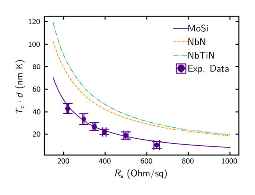
<figcaption class="paper-figure-caption"><b>Fig 1.</b> FIG. 1: Universal scaling law for MoSi thin films used in this experiment. The purple line is a fit to our data according to 1. The orange and green curve are literature data.</figcaption>
</figure>
<figure class="paper-figure-card">

<figcaption class="paper-figure-caption"><b>Fig 2.</b> Figure 1 the scaling behavior for NbN8 (orange curve) and NbTiN7 (green curve). The achievable combination of Tc and Rs for MoSi is lower than those for NbN and NbTiN, respectively. This enables higher sensitivity for lower photon energies using MoSi, one of major the rea- sons, why silicide based materials are most promising for SNSPDs in the mid- to infrared regime11. We now turn to the characterization of SNSPDs fabri- cated from three films having different Mo concentrations ranging from 53% to 74%. The film dependent detec- tor parameters are summarized in Table I. Since Tc is known to decrease with decreasing width of nanowire structures12,13, we measured the critical temperature of...</figcaption>
</figure>
<figure class="paper-figure-card">
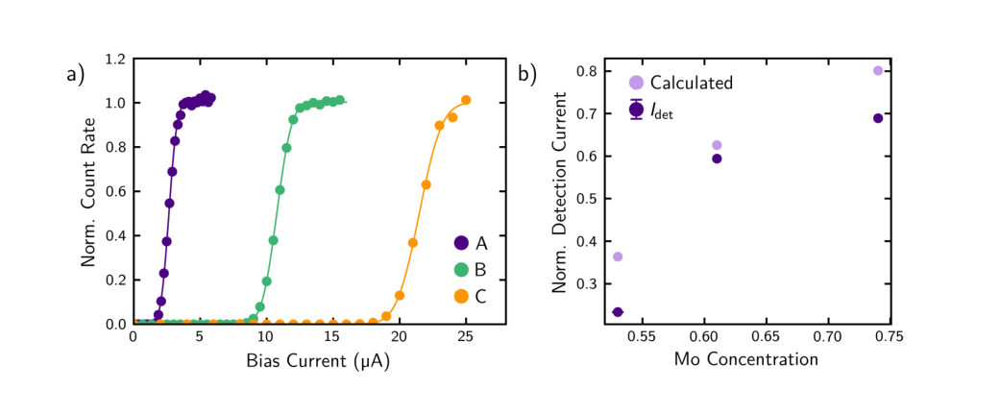
<figcaption class="paper-figure-caption"><b>Fig 3.</b> FIG. 2: a) Count rate versus bias current curves for 75 nm wire width SNSPDs with different stoichiometries when illuminated at 1550 nm and measured at a temperature of 1 K. b) Normalized detection current for a given wavelength of 1550 nm and comparison with the calculation according to Equation (3) using ξ = 0.15 and τth = 7 ps.</figcaption>
</figure>
<figure class="paper-figure-card">
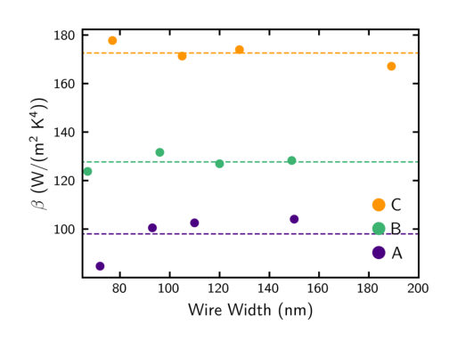
<figcaption class="paper-figure-caption"><b>Fig 4.</b> FIG. 3: Thermal boundary conductance βeff extracted from the return current Iret measured at 1 K. The nominal widths are corrected by an effective reduction δw = 6.5 nm</figcaption>
</figure>
<figure class="paper-figure-card">
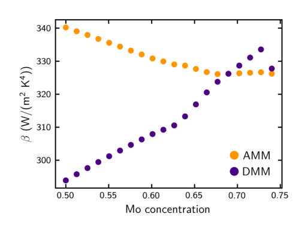
<figcaption class="paper-figure-caption"><b>Fig 5.</b> FIG. 4: Comparison of thermal boundary conductance values based on AMM and DMM.</figcaption>
</figure>

**Summary.** This study explores how varying the molybdenum concentration in MoSi thin films can optimize the sensitivity of single-photon detectors. It establishes a universal scaling relation for the film properties and demonstrates that specific stoichiometry can enhance photon detection efficiency. The findings provide a roadmap for engineering high-performance superconducting detectors for quantum technologies.

**Why it may be interesting.** This paper is relevant to quantum optics and photonic quantum information as it optimizes the hardware (SNSPDs) essential for high-efficiency single-photon detection in quantum networks.

Detailed structure

**Main problem.** Investigating how the stoichiometry (Mo concentration) of MoSi thin films affects the performance, sensitivity, and thermal properties of Superconducting Nanowire Single-Photon Detectors (SNSPDs).

**Main result.** The study identifies a universal scaling law for MoSi films and finds that the lowest Mo concentration (Mo0.53Si0.47) provides the highest sensitivity, while the photon energy conversion efficiency increases with higher Mo concentration.

**Method.** The researchers used magnetron co-sputtering to create films with varying Mo concentrations, followed by XRR, XPS, and 4-point probe characterization, and measured detector performance using CW laser illumination at various wavelengths.

**Model / system.** The physical system consists of amorphous MoSi thin-film nanowires in a hairpin geometry on Si/SiO2 substrates, analyzed using the diffusive hotspot model and thermal boundary conductance models (AMM and DMM).

**Key observables.** Critical temperature (Tc), sheet resistance (Rs), detection current (Idet), depairing current (Idep), and interfacial thermal boundary conductance (beta).

**Important parameters / regimes.** Mo concentration (53% to 74%), film thickness, photon wavelength (780 nm to 1550 nm), and operating temperature (up to 2.5 K).

**Assumptions / limitations.** The use of the Diffuse Mismatch Model (DMM) assumes complete randomization of phonon momentum at the interface due to the amorphous nature of the film.

**Figures summary.** Figure 1 shows the universal scaling law for MoSi compared to NbN/NbTiN; Figure 2/Table I summarizes film parameters; Figure 4 compares AMM vs DMM thermal models; Figure 6 shows SEM imaging; Figure 8 shows stoichiometry-dependent sound velocities; Figure 9 shows characteristic currents vs temperature.

**Paper structure.** The paper introduces the problem of stoichiometry impact, describes the fabrication and material characterization, presents the scaling law and detector performance metrics, analyzes thermal boundary conductance and energy conversion efficiency, and concludes with acoustic property correlations.

Abstract

We report on the impact of the stoichiometry of superconducting MoSi thin films on the performance of superconducting nanowire single-photon detectors (SNSPDs). Specifically, we investigate the relation between the film parameters critical temperature Tc , sheet resistance Rs and superconductor thickness d and observe a universal scaling behavior. To benchmark the performance of SNSPDs fabricated from films having different stoichiometry, we measure the bias dependent count rate curves, while the detector is illuminated with wavelengths between 780 nm and 1550 nm. The detector performance as a function photon energy for different nanowire widths reveals a linear relation between the detection current and the photon energy. Furthermore, we determine the interfacial thermal boundary conductance $β$ between the superconducting thin film and the substrate, by measuring the return current of the SNSPD and find an increase of $β$ with increasing Mo concentration. The highest sensitivity amongst all compared devices is achieved for Mo$_{0.53}$Si$_{0.47}$, with low Tc (4.1 K) and high Rs (397$Ω$/sq) at a film thickness of 5.4 nm.

[↑ back to top](#top)

### [Influence of helicoidal spin-orbit coupling and Rabi coupling in dynamics of 2D Bose-Einstein Condensates](http://arxiv.org/abs/2605.26834v1)

**Authors:** Sai Satyaprakash Biswal, S. Saravana Veni  
**Type:** theory · **Category:** quantum gases · **PDF:** <https://arxiv.org/pdf/2605.26834v1>  
**Analysis basis:** full PDF text, analyzed in chunks
**Topic relevance:** `non-equilibrium dynamics` **3/5** · `analog quantum simulation` **2/5** · `driven-dissipative phase transition` **2/5**

↔ Scroll figures horizontally

<figure class="paper-figure-card">
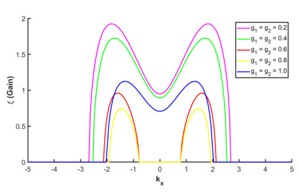
<figcaption class="paper-figure-caption"><b>Fig 1.</b> FIG. 2. The MI gain ξ plotted against kx for different intra- species interaction parameters g1 and g2.</figcaption>
</figure>
<figure class="paper-figure-card">
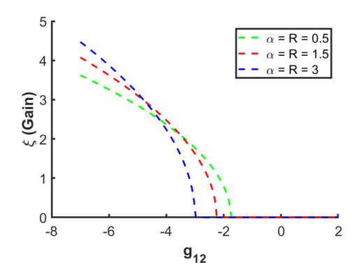
<figcaption class="paper-figure-caption"><b>Fig 2.</b> FIG. 1. The MI gain ξ plotted against the inter-species pa- rameter g12 for different Helicoidal SOC strength α and Rabi coupling strength R.</figcaption>
</figure>
<figure class="paper-figure-card">
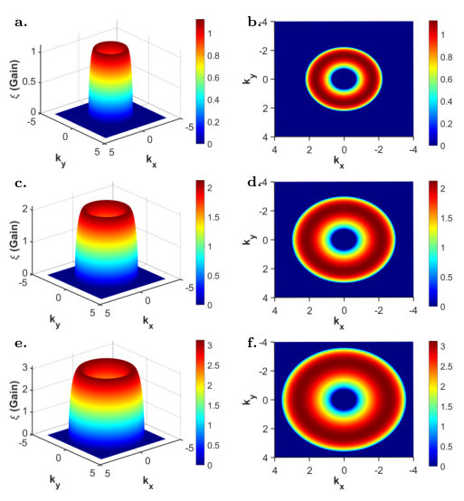
<figcaption class="paper-figure-caption"><b>Fig 3.</b> FIG. 3. Three dimensional (3D) surface plot of MI gain ξ pre- sented with respect to kx and ky as depicted in plots (a), (c) and (e) with its corresponding two-dimensional (2D) contour plots depicted in (b), (d) and (f) respectively. Here, only g12 increases as we move from top to bottom with other values fixed for all plots as : g1 = 1, g2 = 1, n01 = 1, n02 = 1, β = 1, α = 0.5 and R = 0.5. For plots (a) and (b), g12 = 2; for plots (c) and (d) g12 = 3; and for plots (e) and (f) the value of g12 = 4.</figcaption>
</figure>
<figure class="paper-figure-card">
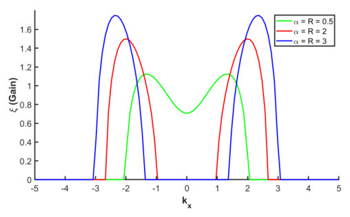
<figcaption class="paper-figure-caption"><b>Fig 4.</b> FIG. 5. The MI gain ξ plotted against kx for distinct values of Helicoidal SOC strength α and Rabi coupling Strength R.</figcaption>
</figure>
<figure class="paper-figure-card">
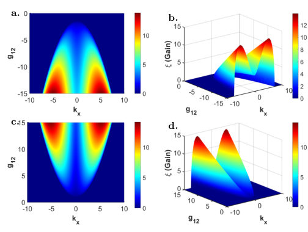
<figcaption class="paper-figure-caption"><b>Fig 5.</b> FIG. 4. Two dimensional (2D) contour panels of MI gain ξ plotted against kx and inter-species interaction parameter g12, as depicted in plots (a) and (c) with its corresponding three dimensional (3D) surface plots depicted in (b) and (d) respectively. Here, plot (a)-(b) represents Ω1,2 and plot (c)- (d) represents Ω3,4. The rest of the parameters have been fixed as: g1 = 1, g2 = 1, n01 = 1, n02 = 1, ky = 1, β = 1, α = 0.5 and R = 0.5.</figcaption>
</figure>

**Summary.** This paper explores the stability and dynamics of 2D Bose-Einstein condensates subject to helicoidal spin-orbit and Rabi coupling. It demonstrates how tuning atomic interactions and trap anisotropy can control modulation instability and the formation of complex spatial structures. The findings highlight the potential for engineering unique quantum phases through the interplay of spin-orbit coupling and external confinement.

**Why it may be interesting.** This work provides insights into the tunability of quantum phases and pattern formation in SOC-driven condensates, which is highly relevant for controlling many-body dynamics and creating unique topological or localized structures in ultracold atoms.

Detailed structure

**Main problem.** Investigating how helicoidal spin-orbit coupling (SOC) and Rabi coupling influence the stability, modulation instability (MI), and structural dynamics of 2D two-component Bose-Einstein condensates.

**Main result.** The study finds that MI is driven by the competition between attractive and repulsive mean-field interactions, where increasing inter-species interaction expands instability bandwidth, while intra-species repulsion acts as a stabilizer. Additionally, the trap geometry and the sign of Rabi coupling significantly shape the momentum-space structures and spatial density profiles.

**Method.** The authors use a linear stability analysis of the coupled Gross-Pita_skii equations to derive dispersion relations and the split-step Fourier method for numerical simulations of nonlinear evolution.

**Model / system.** A two-component (two-pseudospin) Bose-Einstein Condensate confined in a 2D harmonic potential, modeled using a coupled Gross-Pitaevskii framework including helicoidal SOC, Rabi coupling, and intra- and inter-species s-wave interactions.

**Key observables.** Modulation instability (MI) gain, instability bandwidth in momentum space, spatial density distributions, and phase distributions (including vortex-like defects).

**Important parameters / regimes.** Helicoidal SOC strength (alpha), Rabi coupling strength (R), intra-species (g1, g2) and inter-species (g12) interaction strengths, and trap frequency (omega).

**Assumptions / limitations.** The study assumes a two-component BEC with components equally distributed between pseudospin states and focuses on 2D harmonic confinement.

**Figures summary.** Plots of MI gain versus interaction strengths and wavenumbers; 3D surface and 2D contour plots of the instability landscape in momentum space; and spatial density and phase distribution profiles in isotropic and anisotropic traps.

**Paper structure.** The paper defines the theoretical model and Hamiltonian, derives dispersion relations via linear stability analysis, discusses the effects of various couplings and interactions, and concludes with numerical simulations of nonlinear evolution and trap configurations.

Abstract

This study explores the dynamics of Bose-Einstein condensates (BECs) with helicoidal spin-orbit coupling (SOC) and Rabi coupling, confined under a two-dimensional harmonic potential. The relationship between helicoidal SOC, non-linear interactions along with Rabi coupling and their impact on the stability and non linear trapped modes of the condensate is analyzed using a coupled Gross-Pitaevski (GP) framework. A linearized GP equation is used to investigate modulation instability (MI), demonstrating the impact of strong coupling effects and anisotropic confinement on the instability dynamics. It has been shown that the modulation instability in the condensate is predominantly governed by the competition between the attractive and repulsive mean-field interactions. Additionally, stability regimes are altered by the harmonic confinement, enhancing their susceptibility to SOC-induced asymmetry and intra- and intercomponent interactions. These results shed light on the possibility for unique quantum phases and emergent characteristics of helicoidal SOC-driven condensates.

[↑ back to top](#top)

### [Mode-selective excitation in parametrically driven coupled quantum oscillators](http://arxiv.org/abs/2605.26227v1)

**Authors:** Ranjani Seshadri  
**Type:** theory · **Category:** other · **PDF:** <https://arxiv.org/pdf/2605.26227v1>  
**Analysis basis:** full PDF text, analyzed in chunks
**Topic relevance:** `non-equilibrium dynamics` **3/5** · `Keldysh / 2PI / non-Gaussian methods` **2/5** · `driven-dissipative phase transition` **2/5**

↔ Scroll figures horizontally

<figure class="paper-figure-card">
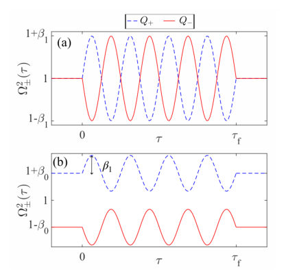
<figcaption class="paper-figure-caption"><b>Fig 1.</b> FIG. 1. The time dependence of the normal mode frequencies (dimensionless) for the two cases (a) β0 = 0 and (b) β0 ̸= 0. In the former the oscillation is about the same mean value while in the latter it is about two different mean values. The amplitude of oscillations = β1 is same in both the cases.</figcaption>
</figure>
<figure class="paper-figure-card">
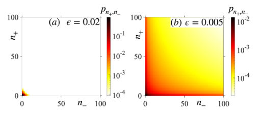
<figcaption class="paper-figure-caption"><b>Fig 2.</b> FIG. 3. Color plots of the excitation probabilities pn+,n−in the normal-mode basis for two representative values of the de- tuning parameter ϵ. (a) For ϵ = 0.02, outside the PR regime, the distribution is strongly localized near the ground state, indicating negligible excitation. (b) For ϵ = 0.005, within the resonance window, the distribution spreads over a wide range of (n+, n−), reflecting significant excitation of higher-energy states. The color scale is logarithmic.</figcaption>
</figure>
<figure class="paper-figure-card">
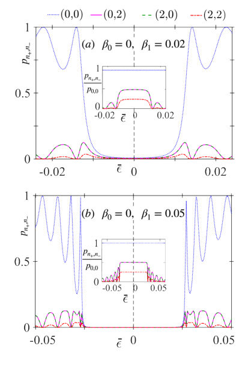
<figcaption class="paper-figure-caption"><b>Fig 3.</b> FIG. 2. Probability pn+,n−for parameters (a) β0 = 0, β1 = 0.02, and (b) β0 = 0 , β1 = 0.05. The different curves are for the different states as shown in the legend. The number of drive cycles is ν = 200. Since the resonance frequency is same for both modes, the states (0, 2) and (2, 0) behave identically. The PR window is approximately ¯ϵ ∈[−β1/2, β1/2]. Outside this range the higher energy states are not significantly occu- pied. The insets show the relative probabilities for the excited states normalized with respect to the ground state (0, 0).</figcaption>
</figure>
<figure class="paper-figure-card">
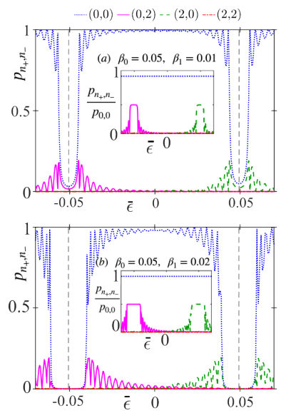
<figcaption class="paper-figure-caption"><b>Fig 4.</b> FIG. 4. Probability pn+,n−= | ⟨n+, n−|Ψ⟩|2 for drive param- eters. The different curves in each plot are for the states (0, 0) (blue dotted), (0, 2) (magenta solid),(2, 0) (green dashed) and (2, 2) (red dash dot). The number of drive cycles ν = 500 for all the panels. Since β0 ̸= 0, the two normal modes are non degenerate. Therefore the states (0, 2) and (2, 0) are now dis- tinct in contrast with the β0 = 0 case. The presence of a non-zero β0 now creates two separate windows where the two normal modes undergo PR. The width of the resonance win- dows is different in (a) and (b) due to different values of the drive amplitude β1. The insets show the relative probabilities for the excited...</figcaption>
</figure>
<figure class="paper-figure-card">
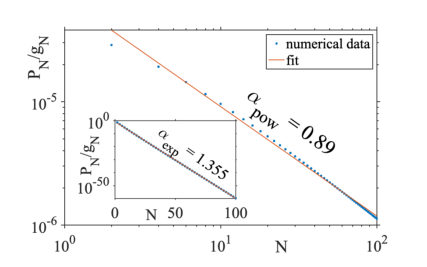
<figcaption class="paper-figure-caption"><b>Fig 5.</b> FIG. 5. Average probability per state, PN/gN, as a function of the occupation number N. In the PR regime, the distri- bution follows a power law with αpow ≈0.89, appearing as a straight line on the log-log plot. Outside the PR regime, the behavior becomes exponential, as shown in the inset, where it appears linear on a semilog scale with αexp ≈1.36.Note that both these exhibit decaying behavior due to the minus sign appearing with the exponent in Eqs. (17) and (16).</figcaption>
</figure>

**Summary.** The paper shows that modulating the coupling between quantum oscillators allows for the selective excitation of specific normal modes. This method enables a 'mode-selective' approach to energy pumping that is not possible with standard frequency modulation. The findings have implications for controlling energy distribution in many-body quantum systems.

**Why it may be interesting.** This work is highly relevant for quantum optics and AMO physics as it provides a mechanism for precise control over individual modes in coupled systems, which is critical for tasks in optomechanics, superconducting circuits, and trapped ion arrays.

Detailed structure

**Main problem.** Investigating how to achieve mode-selective excitation in coupled quantum harmonic oscillators by modulating the inter-oscillator coupling rather than the natural frequency.

**Main result.** The study demonstrates that by tuning the drive frequency, one can selectively excite a specific normal mode while leaving others in the ground state, provided the resonance windows do not overlap.

**Method.** The authors solve the Time-Dependent Schrodinger Equation using a Gaussian ansatz, which allows for an exact numerical treatment of the quadratic Hamiltonian.

**Model / system.** A system of two (or N) coupled quantum harmonic oscillators where the coupling strength is parametrically modulated at approximately twice the natural frequency.

**Key observables.** Energy expectation value, probability distribution of energy eigenstates, marginal probabilities of individual modes, and the decay pattern (power-law vs. exponential) of occupation numbers.

**Important parameters / regimes.** Static coupling (beta_0), modulation amplitude (beta_1), detuning (epsilon), and the number of drive cycles (nu).

**Assumptions / limitations.** The drive is assumed to turn on and off instantaneously (sudden switching approximation), and the system is treated as closed (no dissipation).

**Figures summary.** Figure 1 shows the time dependence of normal mode frequencies for degenerate and non-degenerate cases; Figure 6 shows marginal probabilities demonstrating mode selectivity; Figure 7 shows energy absorption peaks and exponential energy growth.

**Paper structure.** The paper introduces the problem of parametric driving, defines the Hamiltonian and modulation protocol, presents the Gaussian ansatz method, analyzes the two-oscillator case (degenerate vs. non-degenerate), discusses the statistical distribution of excitations, generalizes the results to N oscillators, and concludes with potential applications and future work.

Abstract

A parametrically driven classical harmonic oscillator exhibits resonant instability when driven at twice its natural frequency, with the lowest energy configuration remaining unaffected by the drive. In contrast, the ground state of the quantum mechanical counterpart shows a non-trivial response to such a drive due to the spatial delocalization of the wavefunction. The standard realization of PR involves modulating the natural frequency of the oscillator. Here we study a different drive protocol in which the coupling between two such quantum harmonic oscillators is modulated parametrically. We show that the drive frequency can in principle be tuned to selectively excite any desired normal mode, while leaving the other close to its ground state. Only states with even quantum numbers in each normal mode are populated. Within the parametric resonance window the excitations follow a power-law decay with respect to occupation number, in contrast to the exponential decay observed off-resonance. We also briefly discuss how this framework can be extended to a system of N coupled oscillators

[↑ back to top](#top)

### [Non-stationary current fluctuations in 1D boundary-driven diffusive systems via Macroscopic Fluctuation Theory](http://arxiv.org/abs/2605.27275v1)

**Authors:** Daisuke Suzuki, Tomohiro Sasamoto  
**Type:** theory · **Category:** statistical mechanics · **PDF:** <https://arxiv.org/pdf/2605.27275v1>  
**Analysis basis:** full PDF text, analyzed in chunks
**Topic relevance:** `non-equilibrium dynamics` **3/5** · `methods for driven-dissipative` **2/5** · `non-equilibrium universality` **2/5**

↔ Scroll figures horizontally

<figure class="paper-figure-card">
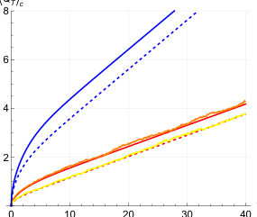
<figcaption class="paper-figure-caption"><b>Fig 1.</b> Figure 2: (a)Calculated results for the integrated current variance Q2 T</figcaption>
</figure>
<figure class="paper-figure-card">

<figcaption class="paper-figure-caption"><b>Fig 2.</b> Figure 3: An example of RBM trajectories</figcaption>
</figure>
<figure class="paper-figure-card">
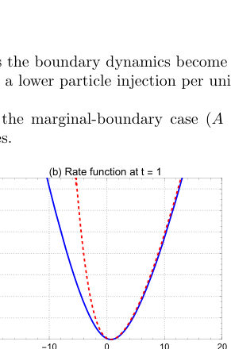
<figcaption class="paper-figure-caption"><b>Fig 3.</b> Figure 6: The plots compare the LDFs under an- nealed and quenched initial conditions across three distinct scaling regimes: (a)the initial O(T) regime at t = 0.008, (b)the intermediate diffusive O( √</figcaption>
</figure>

**Summary.** This paper extends the Macroscopic Fluctuation Theory framework to describe how current fluctuations evolve during the relaxation of a system toward a steady state. It provides exact analytical results for the current variance and generating functions, highlighting how initial conditions (quenched vs. annealed) and boundary dynamics influence the approach to equilibrium.

**Why it may be interesting.** not directly relevant

Detailed structure

**Main problem.** Extending Macroscopic Fluctuation Theory (MFT) from analyzing non-equilibrium steady states to analyzing non-stationary, time-dependent processes in 1D boundary-driven diffusive systems.

**Main result.** The authors derive the current variance and the Scaled Cumulant Generating Function (SCGF) for non-stationary processes, demonstrating a crossover in current fluctuations from O(sqrt(T)) to O(T) and proving that quenched initial conditions yield lower variance than annealed ones.

**Method.** The study utilizes Macroscopic Fluctuation Theory (MFT) combined with the Martin-Siggia-Rose (MSR) formalism, saddle-point analysis, and Green's function methods to solve the resulting non-linear partial differential equations.

**Model / system.** 1D boundary-driven diffusive systems (such as the Symmetric Simple Exclusion Process and Reflective Brownian Motion) of length L, coupled to particle reservoirs at both ends with specific densities and boundary coupling strengths.

**Key observables.** Integrated current (Q_T), Scaled Cumulant Generating Function (SCGF), current variance, and the Large Deviation Function (LDF).

**Important parameters / regimes.** System length (L), time (T), diffusion coefficient (D), mobility (sigma), reservoir densities (rho_L, rho_R), and boundary coupling strengths (A, B).

**Assumptions / limitations.** The use of the diffusive scaling limit, the local equilibrium approximation, and the gradient condition for transport coefficients.

**Figures summary.** Figure 1 shows the time evolution of expected integrated current illustrating the crossover from sqrt(T) to linear growth; Figure 5 shows the LDF for annealed conditions; Figure 6 compares LDFs for annealed vs. quenched conditions across different temporal scales.

**Paper structure.** The paper introduces the problem of non-stationary MFT, develops the mathematical framework for the MFT action and boundary conditions, provides analytical derivations for current statistics in specific models (SEP, RBM), compares annealed and quenched initial conditions, and verifies the large-system and steady-state limits.

Abstract

While Macroscopic Fluctuation Theory (MFT) has been highly successful in analyzing non-equilibrium steady states, its application to non-steady-state processes remains limited. In this study, we apply MFT to the relaxation process of one-dimensional boundary-driven diffusive systems coupled to particle reservoirs at both ends. We exactly derive the current variance for systems with a constant diffusion coefficient and arbitrary mobility, as well as the cumulant generating function for the current in Reflective Brownian Motion (RBM). Our results demonstrate that non-steady current fluctuations during the approach to a steady state can be quantitatively described within the MFT framework.

[↑ back to top](#top)

### [A Levitated Random Telegraph Noise Spectrometer](http://arxiv.org/abs/2605.27118v1)

**Authors:** Molly Message, Bianca C. J. Uy, Katie O'Flynn, Yugang Ren, Muddassar Rashid, Jonathan D. Pritchett, Qiongyuan Wu, Hyukjoon Kwon, Benjamin A. Stickler, James Millen  
**Type:** experiment · **Category:** statistical mechanics · **PDF:** <https://arxiv.org/pdf/2605.27118v1>  
**Analysis basis:** full PDF text, analyzed in chunks
**Topic relevance:** `non-equilibrium dynamics` **3/5** · `quantum measurements` **3/5**

↔ Scroll figures horizontally

<figure class="paper-figure-card">
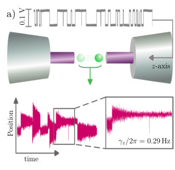
<figcaption class="paper-figure-caption"><b>Fig 1.</b> Figure 1: A levitated charged microparticle coupled to an RTN bath a) RTN is synthesized as a voltage (gray trace), which is amplified and applied to an electrode near the levitated particle, producing displacements along the z-axis (magenta trace). The inset shows a zoom-in around a single RTN jump, with a displacement followed by ringdown at the damping rate γz. b) Three examples of the particle’s 1-D motion under different RTN rates ν of 1 s−1</figcaption>
</figure>
<figure class="paper-figure-card">
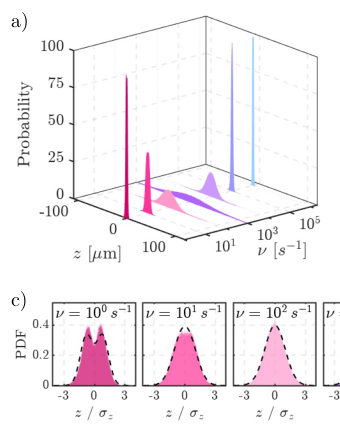
<figcaption class="paper-figure-caption"><b>Fig 2.</b> Figure 2: Position probability density functions (PDFs) of a particle driven by RTN a) The particle’s position PDF at different RTN switching rates ν. The z-axis is truncated for clarity. b) Variation in position variance σ2 z with ν (coloured points), extracted from the time-series of the data and compared to the theoretical model in Eq. (3) with no free parameters (black dashed line). c) Individual position PDFs for different ν, with the position axis normalized by the standard deviation presented in b), compared to the theoretical model in Eq. (4) with no free parameters.</figcaption>
</figure>
<figure class="paper-figure-card">
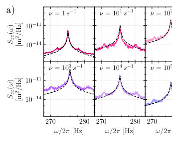
<figcaption class="paper-figure-caption"><b>Fig 3.</b> Figure 3: Spectral analysis of a particle driven by RTN a) Position PSDs of the particle’s motion at different RTN characteristic rates ν. The data (coloured solid lines) is compared to the theoretical model in Eq. (5) with no free parameters (black dashed lines). b) The maximum of the position PSDs, extracted by analysing a 0.2 Hz window around ω = ωz (coloured points), com- pared to the theoretical prediction in Eq. (6) with no free parameters (black dashed line). In this figure, the data for each value of ν is averaged over 10 time traces, each with a duration of 30 s.</figcaption>
</figure>
<figure class="paper-figure-card">
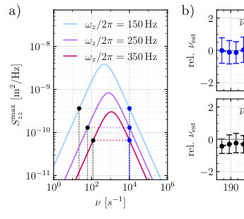
<figcaption class="paper-figure-caption"><b>Fig 4.</b> Figure 4: Sensing the spectral characteristics of RTN with a levitated sensor a) The theoretical values of Smax zz (ν) for three values of ωz (solid lines). Each value of Smax zz corresponds to two possible values of ν (blue and black points). The true value of ν does not vary with ωz (blue points). b) Exper- imental data from running the sensing protocol and extracting two values of νest for each value of ωz (blue and black points). The black points vary with ωz, whereas the blue points fluctuate around their mean value, indicating the correct value of νest. c) The comparison between νest and νreal using our sensing protocol, showing good agreement. Each value of νest is extracted from at...</figcaption>
</figure>
<figure class="paper-figure-card">
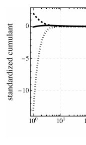
<figcaption class="paper-figure-caption"><b>Fig 5.</b> Figure 6: Numerically computed standardized cumulants against the RTN switch rate ν.</figcaption>
</figure>

**Summary.** The paper presents a method to use a levitated microparticle as a spectrometer to detect and measure Random Telegraph Noise. By tuning the particle's oscillation frequency, the researchers observed a massive resonance in fluctuations, allowing them to characterize noise switching rates across six orders of magnitude. This technique provides a unique way to study non-equilibrium stochastic dynamics in the presence of realistic, non-white noise.

**Why it may be interesting.** This work is highly relevant to open quantum systems and non-equilibrium dynamics as it demonstrates a platform for studying how non-white, non-Gaussian noise drives a mechanical oscillator, providing a new tool for probing stochastic processes.

Detailed structure

**Main problem.** Developing a method to sense and characterize the spectral properties of Random Telegraph Noise (RTN) across a wide frequency range using a levitated sensor.

**Main result.** The researchers discovered a resonance-like behavior where position fluctuations increase by three orders of magnitude when the RTN switching rate approaches the particle's oscillation frequency, enabling a spectrometer-like measurement over six decades of timescale.

**Method.** High-resolution particle tracking using an event-based camera (EBC) combined with a frequency-ramping protocol where the trap's oscillation frequency is swept to resolve RTN rates and distinguish true solutions from artifacts.

**Model / system.** A single charged silica microsphere levitated in a linear Paul trap in the underdamped regime, driven by both thermal white noise and a synthetic two-level Random Telegraph Noise source.

**Key observables.** Particle position (zt), position variance (sigma_z^2), Power Spectral Density (PSD), and position probability density functions (PDFs).

**Important parameters / regimes.** Switching rate (nu), oscillation frequency (omega_z), damping rate (gamma_z), and the RTN-to-white-noise energy ratio.

**Assumptions / limitations.** The system is in the long-time limit (t >> 1/gamma_z) and uses a first-order approximation for the exponential in the waiting time distribution.

**Figures summary.** Figure 1 shows the experimental setup and particle trajectories at different switching rates; Figure 2 displays position PDFs and variance vs. switching rate; Figure 5 illustrates the mathematical connection between jumps and the Poisson process; Figure 6 shows computed cumulants; Figure 7 shows the probability distribution of the maximum PSD and the required frequency ramping range.

**Paper structure.** The paper introduces the problem of RTN characterization, describes the experimental Paul trap platform and noise synthesis, presents the analytical model for particle dynamics, details the sensing protocol and resonance discovery, and concludes with error analysis and precision limits.

Abstract

Random Telegraph Noise is a ubiquitous process manifesting across technology and the natural world. It is characterized by random jumps between two distinct states with Poissonian waiting times, and is the origin of 1/f noise. Understanding and characterizing this noise is critical for the reliable operation of micro-, nano- and quantum-technologies. In this work we probe random telegraph noise using a levitated microparticle sensor whose dynamics are driven almost entirely by this non-white source of noise. We observe a startling resonant behaviour, characterized by a thousand-fold increase in the underdamped sensor's position fluctuations, enabling us to measure the spectral properties of the noise over six decades of timescale. This work not only provides a unique way to probe random telegraph noise, but also demonstrates a platform for studying non-equilibrium stochastic dynamics in the presence of realistic non-white noise, with applications from biology to social behaviour.

[↑ back to top](#top)

### [Bohr's complementarity](http://arxiv.org/abs/2605.26375v1)

**Authors:** Diego S. Starke, Jonas Maziero, Marcos L. W. Basso, Tabish Qureshi  
**Type:** theory · **Category:** quantum information and computing · **PDF:** <https://arxiv.org/pdf/2605.26375v1>  
**Analysis basis:** full PDF text, analyzed in chunks
**Topic relevance:** `entanglement & information structure` **3/5** · `quantum measurements` **3/5**

↔ Scroll figures horizontally

<figure class="paper-figure-card">
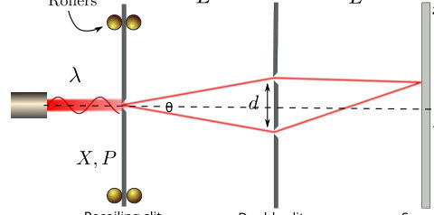
<figcaption class="paper-figure-caption"><b>Fig 1.</b> Figure 1 Schematic diagram of Einstein’s recoiling slit experiment. Objects traveling along the z-axis, with average zero momentum in the x-direction, pass through a single slit which is free to slide along the x-axis, before reaching the double-slit. Particles reaching the up- per (lower) slit would have acquired a net momentum in the positive (negative) x-direction, causing a recoil of the recoiling slit in the neg- ative (positive) x-direction. This way the momentum of the recoiling slit carries the information about which slit the particle went through.</figcaption>
</figure>
<figure class="paper-figure-card">
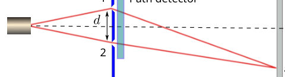
<figcaption class="paper-figure-caption"><b>Fig 2.</b> Figure 2 Schematic diagram of a two-slit interference experiment in the presence of a which-way (or path) detector.</figcaption>
</figure>
<figure class="paper-figure-card">
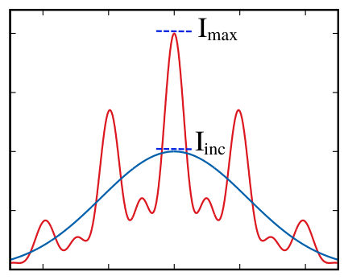
<figcaption class="paper-figure-caption"><b>Fig 3.</b> Figure 3 A typical multi-slit interference pattern with the intensity plotted against position in the units of fringe-width, indicating Imax and Iinc.</figcaption>
</figure>
<figure class="paper-figure-card">
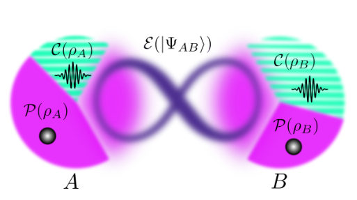
<figcaption class="paper-figure-caption"><b>Fig 4.</b> Figure 4 Schematic illustration of complete complementarity rela- tions of two quantum systems, A and B, highlighting their local fea- tures as well as their global feature. The local and global proper- ties of the quantons A and B are described by the complete comple- mentarity relations given in Eq. (66), where ρA and ρB denote the reduced density matrices, C denotes the wave-like property quan- tified by quantum coherence, P is the predictability measure, and E(|ΨAB⟩) is an entanglement monotone. The sum of these three quan- tities equals a constant α(dA) that depends only on the dimension of the system. In general, the local quantities P and C may differ for the two quantons, whereas...</figcaption>
</figure>
<figure class="paper-figure-card">
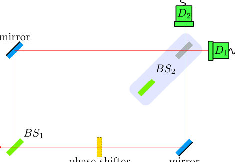
<figcaption class="paper-figure-caption"><b>Fig 5.</b> Figure 5 Wheeler’s delayed-choice experiment is implemented us- ing a Mach–Zehnder interferometer, where BS 1(2) denotes the first (second) beam splitter and D1(2) denotes one of the two detectors. The insertion of BS 2 is delayed until after the quanton has already passed through BS 1. When BS 2 is present, the photon exhibits wave- like interference, whereas when BS 2 is removed, the photon displays particle-like behavior, as judged by the sensitivity of the detection probabilities to phase variations inside the interferometer.</figcaption>
</figure>

**Summary.** This review provides a comprehensive overview of Bohr's Complementarity Principle, tracing its journey from a qualitative concept to a quantitative tool in quantum information science. It reconciles historical debates regarding the mechanism of decoherence and establishes how complementarity relations emerge from the mathematical structure of quantum states.

**Why it may be interesting.** It provides a unified mathematical framework linking fundamental quantum principles like uncertainty and contextuality to modern quantum information resources like entanglement and coherence, which is highly relevant to quantum optics and open quantum systems.

Detailed structure

**Main problem.** The review aims to trace the evolution of Bohr's Complementarity Principle from a qualitative historical concept to a modern quantitative framework, specifically addressing the mechanism of interference destruction in which-way experiments.

**Main result.** The authors demonstrate that the 'momentum kick' and 'entanglement' views of complementarity are mathematically equivalent and show that duality relations can be systematically derived from the properties of the density operator.

**Method.** The paper employs information-theoretic approaches, resource theories (of coherence and purity), and mathematical analysis of density operator properties, including trace operations and Helstrom bounds for state discrimination.

**Model / system.** The review covers various interferometric setups, primarily the two-slit and multi-slit models, including Einstein's recoiling slit gedankenexperiment and modern realizations in photons, atoms, and NMR.

**Key observables.** Interferometric visibility, path predictability, distinguishability, quantum coherence (including l1-coherence), and entanglement.

**Important parameters / regimes.** The trade-off between which-path information and interference visibility, specifically the quadratic Englert relation (D^2 + V^2 <= 1) and the linear UQSD-based relation (D_Q + V <= 1).

**Assumptions / limitations.** The review focuses on physical and operational developments rather than exhaustive philosophical analysis; it assumes the use of density operators to represent quantum states and explores the limits of non-orthogonal state discrimination.

**Figures summary.** Figure 1 shows a schematic of Einstein's recoiling slit experiment illustrating momentum transfer; Figure 2 shows a standard two-slit setup with a path detector.

**Paper structure.** The paper begins with the historical evolution of complementarity, moves to the quantitative formulation via duality and triality relations, discusses the resolution of the recoil vs. entanglement debate, and extends the scope to multi-slit interference and resource-theoretic frameworks.

Abstract

Quantum complementarity is a fundamental feature of quantum systems and has captivated the physics research community for nearly a century, with significant advancements emerging in recent decades. This review traces the historical evolution of the concept of complementarity, beginning with Bohr's original formulation. It then explores its modern quantification through complementarity relations and its profound connection to the foundational postulates of quantum theory. Furthermore, it delves into key related developments, such as the operational definition of complementarity in the context of incompatible observables, its potential links with quantum uncertainty relations and contextuality, its various applications, and other pertinent topics. This review aims to serve physicists interested in quantum resources, quantum correlations, and the foundational principles of quantum mechanics.

[↑ back to top](#top)

### [Competition between pair and single-particle superfluidity in bosonic quasi-flat bands: A Gaussian state approach](http://arxiv.org/abs/2605.26231v1)

**Authors:** Maxime Burgher, Simon Loddo, Laurens Vanderstraeten, Nathan Goldman, Ivan Amelio  
**Type:** theory · **Category:** quantum gases · **PDF:** <https://arxiv.org/pdf/2605.26231v1>  
**Analysis basis:** full PDF text, analyzed in chunks
**Topic relevance:** `Keldysh / 2PI / non-Gaussian methods` **3/5** · `analog quantum simulation` **3/5**

↔ Scroll figures horizontally

<figure class="paper-figure-card">
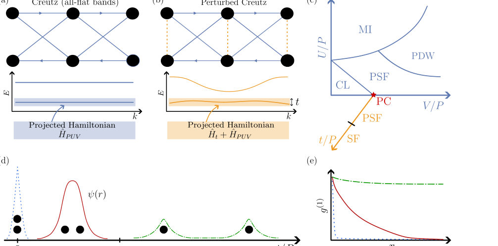
<figcaption class="paper-figure-caption"><b>Fig 1.</b> FIG. 1. Sketch of the scope of the paper. (a) The Creutz ladder is an all-flat band model; when we consider bosons with an interaction small compared to the band gap, we can project the low energy physics to the lowest band. The projected Hamiltonian is ˆHP UV , comprising pair hopping processes (with rate P), and on-site and nearest-neighbor interactions (with strengths U and V , respectively). (b) Perturbing the Creutz ladder by adding inter-leg hopping induces a single-particle kinetic term ˆHt. A similar Hamiltonian holds for other projected quasi-flat band systems; in that case, the couplings P, U, V (together with correlated hopping contributions) correspond to a low harmonic...</figcaption>
</figure>
<figure class="paper-figure-card">
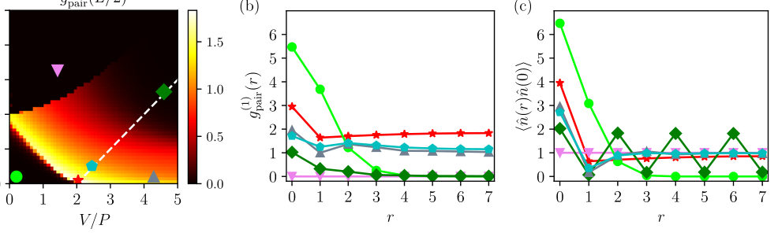
<figcaption class="paper-figure-caption"><b>Fig 2.</b> FIG. 2. Phase diagram of HP UV obtained via ED for a ring of L = 14 sites at unit filling as a function of the couplings V/P and U/P. Panel (a) displays the pair coherence function g(1) pair(r) [Eq. 8] at the maximal distance r = L/2, while panel (b) and (c) show the behavior of the pair coherence and density-density correlator as a function of distance r, for a few selected points. The parameters corresponding to the selected points are indicated in panel (a), and correspond to the six following regimes: pair superfluid (cyan pentagon), clustered state (green circle), Mott insulator (pink downward triangle), pair density wave (green square), a mixture of pairs and heavy piles of pairs...</figcaption>
</figure>
<figure class="paper-figure-card">
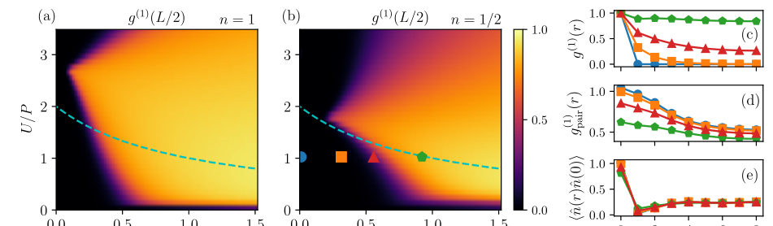
<figcaption class="paper-figure-caption"><b>Fig 3.</b> FIG. 3. The effect of the single-particle hopping t and the onsite interaction strength U on the coherence of the system is investigated. We fix V = 2P and J = 0. In panel (a), we display g(1)(L/2) at unit filling L = N = 14, while half filling L = 16, N = 8 is shown in panel (b). The cyan dashed line corresponds to the 2-body result of Eq. (21). In panels (c,d,e), we respectively report the single-particle coherence function, the pair coherences and density-density correlator as a function of distance r, for the four different points indicated in panel (b). The PSF at t = 0 is indicated by the blue circle, the PSF at finite t by the orange square, the SF phase by green pentagons, while the...</figcaption>
</figure>
<figure class="paper-figure-card">
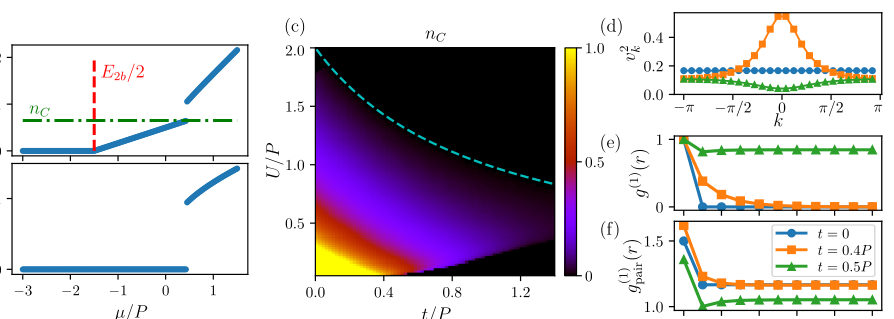
<figcaption class="paper-figure-caption"><b>Fig 4.</b> FIG. 4. Ground state within the Gaussian approach. Panels (a) and (b) respectively display the density n and condensate order parameter β as a function of the chemical potential µ, for fixed t = J = 0 and V = 2P, U = P/2. The density is non-zero above the two-body bound state threshold µ ≥E2b/2 (red dashed line). The PSF is stable till a critical density nC (green dashed-dotted line), above which single particle condensation occurs via a first-order phase transition. In panel (c), the critical density nC is studied as a function of U/P and t/P for V = 2P. The cyan dashed line corresponds to the 2-body binding transition from Eq. (21). The colorscale is saturated close to the origin. Panel...</figcaption>
</figure>
<figure class="paper-figure-card">
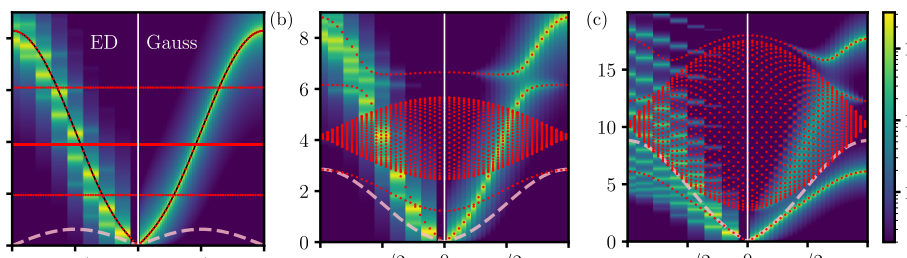
<figcaption class="paper-figure-caption"><b>Fig 5.</b> FIG. 5. The dynamic structure factor S(Q, ω) was computed in both exact diagonalization (displayed for Q ≤0) and the Gaussian state approach (in the Q ≥0 half), for three different parameter regimes. The red dots denote the energies of the Gaussian collective modes, and the black line in panel (a) corresponds to the tightly bound pair calculation from Sec. IV C. The pink dashed line is the Bogoliubov dispersion from Appendix C. The three panels correspond to the following regimes: (a) tightly bound pair superfluid with t = 0, U = 0.05P, V = 2.05P, n = 0.5; (b) pair superfluid with t = 0.2P, U = 0.05P, V = 2P, n = 0.5; (c) normal superfluid with t = 0.8P, U = 0.2P, V = 2P, n = 1.0;</figcaption>
</figure>

**Summary.** This paper explores how bosons in nearly flat energy bands compete between forming pairs or single-particle condensates. By using a Gaussian variational method, the authors show that pair superfluidity can persist even when single-particle hopping is introduced. The work also establishes a new connection between the speed of sound and the underlying quantum geometry of the bands.

**Why it may be interesting.** It provides a powerful new analytical tool (the Gaussian approach) for studying exotic many-body phases in flat-band systems, which are highly relevant to the physics of ultracold atoms in optical lattices and topological insulators.

Detailed structure

**Main problem.** Investigating the competition between pair superfluidity (PSF) and single-particle superfluidity (SF) in bosonic quasi-flat bands and understanding how single-particle hopping drives the transition between these phases.

**Main result.** The authors find that the PSF phase remains stable for a finite range of hopping strength before transitioning to an SF phase, and they derive a new relation between the speed of sound and a quantum geometric kernel.

**Method.** A variational Gaussian state approach is used to provide a unified description of both phases, supplemented by Exact Diagonalization and two-body problem analysis.

**Model / system.** A one-dimensional, multi-orbital, quasi-flat-band bosonic model (the tJPUV model) that includes single-particle hopping, pair hopping, and various interaction terms.

**Key observables.** Single-particle and pair coherence functions, speed of sound, collective excitation spectrum, dynamic structure factor, and density-density correlations.

**Important parameters / regimes.** Hopping strength (t), pair hopping (P), interaction strengths (U, V), correlated hopping (J), and particle density (n).

**Assumptions / limitations.** The Gaussian approach is a variational approximation that may deviate from exact results at specific points like the pair condensate point.

**Figures summary.** Figure 2 shows the phase diagram as a function of interaction strengths; Figure 4 shows density and condensate order parameter; Figure 5 compares the dynamic structure factor across different regimes; Figure 6 illustrates the impact of correlated hopping on coherence.

**Paper structure.** The paper introduces the quasi-flat-band model, develops the variational Gaussian state framework, analyzes the phase diagram and transitions using ED and two-body physics, and concludes with a comparison of excitation spectra and sound velocity.

Abstract

The interplay between interactions and quantum geometry can drive weakly dispersive bosons into different exotic many-body phases. In this work we study a quasi flat-band model in one dimension that exhibits an extended pair-superfluid phase in the all-flat-band limit. Introducing single-particle hopping leads to an intriguing competition with a more conventional single-particle superfluid: we find that the pair superfluid remains stable for a finite range of the hopping strength until the system eventually transitions into the conventional superfluid phase. In our study, we make use of a variational Gaussian state approach that provides a unified description of the single-particle and pair superfluid phases, regarding both the ground state wavefunction and the collective excitation spectrum. In particular, we derive a general relation between the speed of sound and a ``quantum geometric kernel'', thereby extending earlier connections to the quantum metric, which relied on single-particle mean-field theory. This approach is combined with insights from the two-boson problem and exact diagonalization to map out the full phase diagram of the model. Our results show that the Gaussian approach is a versatile tool for studying a broad range of superfluid phases of interacting bosons in multi-orbital lattices.

[↑ back to top](#top)

### [A High-Contrast Bragg Atom Interferometer for Testing Continuous Spontaneous Localization](http://arxiv.org/abs/2605.26860v1)

**Authors:** Huaiyu Zhu, Ju Liu, Tao Zhang, Qin Luo, Zhongkun Hu, Minkang Zhou  
**Type:** experiment · **Category:** other · **PDF:** <https://arxiv.org/pdf/2605.26860v1>  
**Analysis basis:** full PDF text, analyzed in chunks
**Topic relevance:** `quantum measurements` **3/5** · `quantum optics experiment` **2/5**

↔ Scroll figures horizontally

<figure class="paper-figure-card">
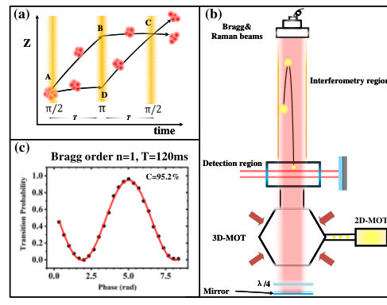
<figcaption class="paper-figure-caption"><b>Fig 1.</b> FIG. 1: (a) The space–time diagram of Mach–Zehnder–type atom interferometer. (b) Schematic of our laser system (see the main text for the experimental sequence). The atomic cloud continuously dif- fuses along its path, deviating from the center of the pulsed light. (c) Interference fringes at n = 1, T = 120 ms, deriving the interference fringe formula and fringe contrast through sine fitting .</figcaption>
</figure>
<figure class="paper-figure-card">

<figcaption class="paper-figure-caption"><b>Fig 2.</b> FIG. 3: The corrected fringe contrast C′ exp as a function of of the Bragg pulse separation time T. Error bars denote the 1σ uncertainty in the fitting contrast. The solid line is a weighted least-squares fit of Eq. (5), and the orange shaded region represents the 1σ confidence interval of the weighted least-squares fit.</figcaption>
</figure>
<figure class="paper-figure-card">
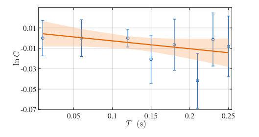
<figcaption class="paper-figure-caption"><b>Fig 3.</b> Figure 3 shows the dependence of the corrected fringe con- trast C′ exp on the total interferometer time T within the range of 0 ms to 250 ms. The solid line represents a weighted least-squares fit to the contrast decay function lnC(T) based on Eq. (5). From this line, the CSL collapse rate of λCSL ≤ (5.1 ± 6.4) × 10−6 s−1 is derived. Furthermore, the uncertainties contributed by the parame- ters of the atomic cloud (listed in Table II) should be con- sidered in the Monte Carlo simulation. These collectively contribute an additional uncertainties to bound on λCSL, is 4.1 × 10−6 s−1. Taking this into account, and based on the approximate model described in Eq. (5), the λCSL ≤(5.1 ± 7.6) ×...</figcaption>
</figure>
<figure class="paper-figure-card">
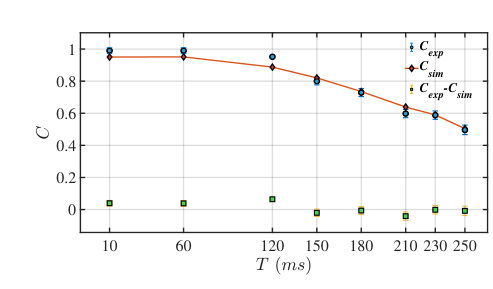
<figcaption class="paper-figure-caption"><b>Fig 4.</b> FIG. 2: The simulated fringe contrast obtained from the Monte Carlo compared with the experimental results by the Bragg atom interfer- ometer. Cexp represents the fringe contrast obtained from our actual experiments, while Csim denotes the contrast derived from simula- tion.</figcaption>
</figure>
<figure class="paper-figure-card">
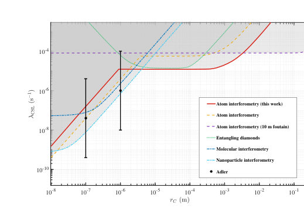
<figcaption class="paper-figure-caption"><b>Fig 5.</b> FIG. 4: Exclusion plot for the CSL parameters comparing different interferometric experiments: The red solid line illustrates our result. The yellow dashed line[22] and purple dashed line[41] correspond to previous results from other atom-interferometry experiments. The green dotted line denotes the bounds from entangled diamonds interferometry[42, 43]. The dark blue dash-dot line shows the molec- ular interferometry experiments[20, 44, 45], while the cyan dash- dot line denotes the bounds from nanoparticle interferometry[21]. Shaded areas indicate the excluded regions and the black dots is Adler’s theoretical predictions[46].</figcaption>
</figure>

**Summary.** This paper demonstrates a high-contrast Bragg atom interferometer that achieves 99% fringe contrast. By accounting for experimental systematic errors through Monte Carlo simulations, the authors established a new, more stringent upper limit on the Continuous Spontaneous Localization collapse rate.

**Why it may be interesting.** This work provides a high-precision experimental test of fundamental decoherence models (CSL) using AMO platforms, demonstrating how controlling systematic noise in atom interferometry can push the boundaries of testing the foundations of quantum mechanics.

Detailed structure

**Main problem.** Testing the Continuous Spontaneous Localization (CSL) model to address the wave function collapse problem by establishing more stringent upper bounds on the CSL collapse rate.

**Main result.** Achieved a high-contrast Bragg atom interferometer (99% contrast) and established a new upper limit for the CSL collapse rate of lambda_CSL = 1.27e-5 s^-1 at r_C = 10^-5 m, a 4-fold improvement over previous atom-interferometric constraints.

**Method.** The researchers used a Mach-Zehnder type Bragg atom interferometer with 87Rb atoms and employed Monte Carlo simulations to systematically identify and correct for experimental systematic effects like misalignment and diffusion.

**Model / system.** A Bragg atom interferometer using ultracold 87Rb atoms prepared in the |F=2, m_F=0> state, utilizing a Mach-Zehnder sequence of pi/2-pi-pi/2 Bragg pulses.

**Key observables.** Interference fringe contrast (C) and accumulated phase difference (delta_phi).

**Important parameters / regimes.** Interrogation time T up to 60 ms, CSL collapse rate lambda_CSL, CSL correlation length r_C = 10^-5 m, and atomic temperature of ~0.85 uK.

**Assumptions / limitations.** The CSL model is modeled as inducing phase noise leading to exponential decay of contrast; a two-level system approximation is used for the Bragg pulses.

**Figures summary.** Fig 1a shows a space-time diagram of the interferometer; Fig 5 provides a flowchart of the Monte Carlo simulation process.

**Paper structure.** The paper introduces the CSL problem, describes the experimental setup and atom preparation, details the method for systematic error correction via Monte Carlo simulation, presents the resulting CSL bounds, and discusses future directions.

Abstract

The continuous spontaneous localization (CSL) model is one of the most promising approaches to address the wave function collapse problem in the measurement process of standard quantum mechanics. In this work, the effect of the CSL model on a Bragg atom interferometer was investigated. A Bragg interferometer achieving high fringe contrast of 99$\%$ has been demonstrated, maintaining this performance level at interrogation time up to $T=60~\mathrm{ms}$. The primary factors responsible for fringe contrast loss in the atom interferometer were systematically analyzed and corrected. This improvement established a new upper limit of $λ_{\rm CSL}=1.27\times10^{-5}~\mathrm{s}^{-1}$ at $r_C=10^{-5}~\mathrm{m}$ for the CSL collapse rate, representing approximately 4 times enhancement over previous atom-interferometric constraints.

[↑ back to top](#top)

### [Basis-Adaptive Sparse-State Simulation of Quantum Circuits](http://arxiv.org/abs/2605.27285v1)

**Authors:** Ch Nihar Kartikeya, Anjana K, Bijita Sarma, Sangkha Borah  
**Type:** theory · **Category:** numerical methods · **PDF:** <https://arxiv.org/pdf/2605.27285v1>  
**Analysis basis:** full PDF text, analyzed in chunks
**Topic relevance:** `entanglement & information structure` **3/5** · `non-equilibrium dynamics` **2/5**

↔ Scroll figures horizontally

<figure class="paper-figure-card">
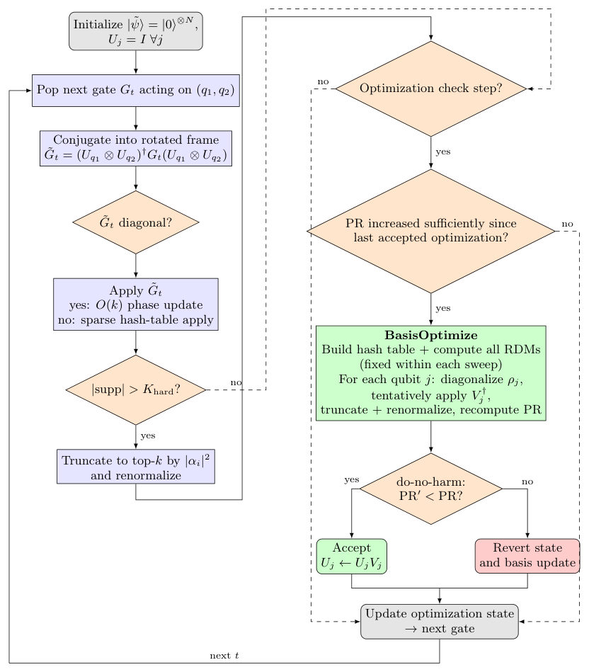
<figcaption class="paper-figure-caption"><b>Fig 1.</b> FIG. 2. BASS algorithmic workflow. We use the sparse state representation in the accumulated product basis {Uj}. At each time step, the current gate is conjugated into the working basis as ˜Gt and then applied either (i) along a diagonal O(k) update path in the sparse state, or (ii) by directly updating entries in a hash-table representation. Between truncations, the state’s support can temporarily grow to a maximum size Khard before a top-k truncation is enforced to control memory and cost. On selected time steps, the BasisOptimize routine is invoked to improve the accumulated basis. It constructs a single global hash table for the current state, computes all single-qubit RDMs once, and...</figcaption>
</figure>
<figure class="paper-figure-card">
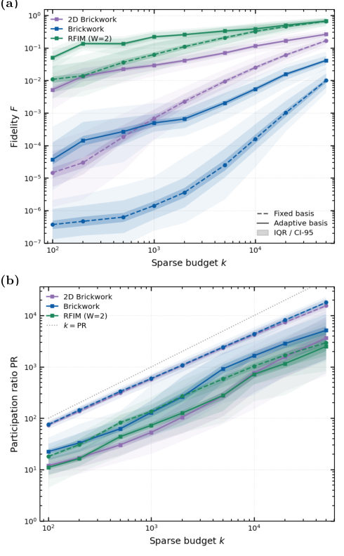
<figcaption class="paper-figure-caption"><b>Fig 2.</b> FIG. 3. Fidelity and PR vs. sparse budget. (a) Fidelity F as a function of the sparse budget k. (b) PR PR as a function of k. Curves represent the geometric mean of per- trial results. Shaded regions illustrate the distribution and statistical uncertainty of the data, with bands from lightest to darkest representing the 10th–90th percentile range, the interquartile range (IQR, 25th–75th percentile), and the 95% bootstrap confidence interval for the geometric mean, respec- tively. Solid markers denote results obtained with the adap- tive basis method, while open markers denote the fixed-basis method. Circuit families considered: 1D random brickwork circuits (depth 6); random-field Ising...</figcaption>
</figure>
<figure class="paper-figure-card">
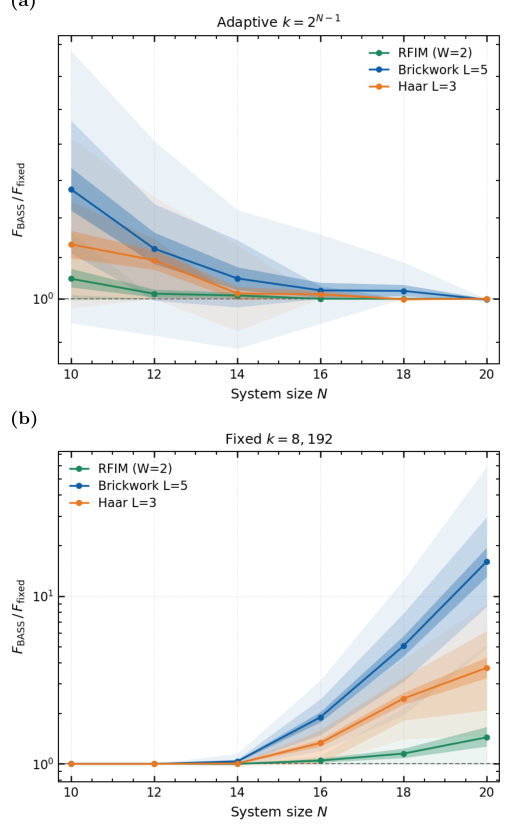
<figcaption class="paper-figure-caption"><b>Fig 3.</b> FIG. 4. System-size scaling of adaptive-basis advan- tage. (a) Exponential-budget scaling: adaptive/fixed fi- delity ratio as a function of system size under the scaling trajectory k = 2N−1. Dashed horizontal line indicates ratio = 1 (no adaptive advantage). Brickwork and Haar-random circuits exhibit modest enhancement at intermediate system sizes before converging back toward unity as truncation pres- sure weakens, while RFIM circuits remain effectively identical to the fixed-basis method across all tested sizes. (b) Fixed- budget scaling: geometric mean adaptive/fixed fidelity ratio versus system size under fixed truncation budget k = 8192. The vertical axis is logarithmic. Under a fixed...</figcaption>
</figure>
<figure class="paper-figure-card">
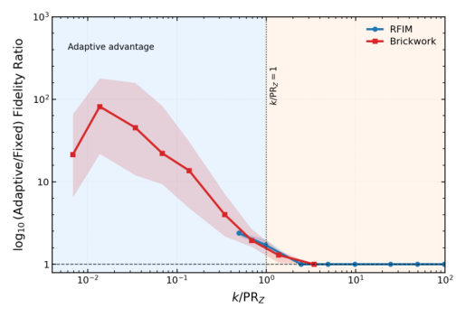
<figcaption class="paper-figure-caption"><b>Fig 4.</b> FIG. 5. Universal crossover controlled by the nor- malized truncation scale k/PRZ. Adaptive-basis/fixed- basis fidelity ratio as a function of the normalised truncation budget k/PRZ for RFIM and brickwork circuit ensembles at N = 16. The vertical dashed line indicates k/PRZ = 1, the truncation size is comparable to the state’s effective participa- tion support. For k/PRZ &lt; 1, adaptive truncation performs better than fixed-basis truncation, with the highest improve- ments obtained for chaotic brickwork circuits (∼10-102×). RFIM states exhibit less improvement (∼1-3×) due to their more organized amplitude distributions. As k approaches PRZ, both methods converge and the fidelity ratio reaches...</figcaption>
</figure>
<figure class="paper-figure-card">
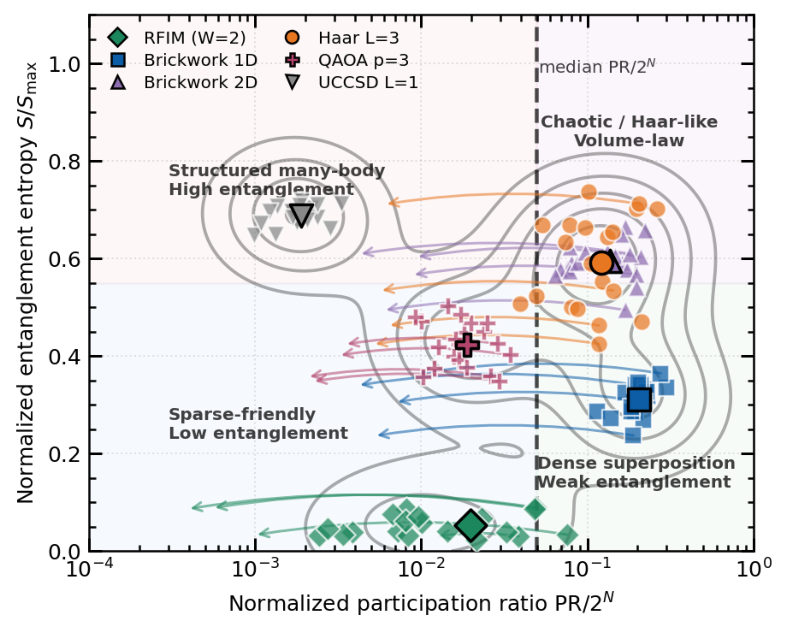
<figcaption class="paper-figure-caption"><b>Fig 5.</b> FIG. 6. Sparsity-entanglement phase diagram for representative quantum circuit families. Results shown for N = 16 qubits with truncation budget k = 4096. The horizontal axis measures normalized PR PR/2N, quantifying Hilbert- space delocalization, while the vertical axis shows normalized bipartite entanglement entropy S/Smax. Distinct circuit families populate different regions of the diagram: RFIM (W = 2) circuits occupy the sparse-friendly, low-entanglement regime; UCCSD (L = 1) circuits sit in the highly entangled but heavily localized upper-left quadrant; QAOA (p = 3) exhibits intermediate structural growth in both resources; while Haar-random (L = 3) and Brickwork (1D and 2D) circuits...</figcaption>
</figure>

**Summary.** This paper presents BASS, a new algorithm for simulating quantum circuits that avoids the fidelity collapse seen in fixed-basis sparse simulators. By adaptively rotating qubits into a basis that concentrates wavefunction weight, it achieves much higher accuracy for a fixed memory budget. This allows for the simulation of larger and more entangled circuits than previously possible with standard sparse methods.

**Why it may be interesting.** It introduces a novel way to extend the reach of classical simulations of many-body dynamics by using adaptive basis selection, which is highly relevant for researchers studying the limits of entanglement growth and the complexity of quantum dynamics.

Detailed structure

**Main problem.** Classical simulation of quantum circuits using sparse-state methods suffers from rapid fidelity loss when entanglement or basis rotations spread wavefunction weight across the computational basis.

**Main result.** The BASS algorithm achieves significantly higher fidelity than fixed-basis simulators in the memory-limited regime by dynamically rotating qubits into the eigenbasis of their single-quim RDM, providing up to an order of magnitude improvement in state overlap.

**Method.** The BASS (Basis-Adaptive Sparse-State Simulation) algorithm updates each qubit's local representation basis during execution by rotating it into the eigenbasis of its single-qubit reduced density matrix, inspired by natural-orbital ideas in quantum chemistry.

**Model / system.** The study focuses on gate-model quantum circuits, including structured brickwork circuits, Haar-random circuits, QAOA, UCCSD, and disordered Ising circuits.

**Key observables.** Fidelity (F), Participation Ratio (PR), Z-basis Participation Ratio (PR_Z), Retained Probability (p_S), and the ratio k/PR_Z.

**Important parameters / regimes.** Sparse budget (k), circuit depth (L), number of qubits (N), and the optimization interval (n_opt).

**Assumptions / limitations.** The effectiveness of the fidelity lower bound is most reliable in the probability-limited regime where k << PR_Z; the method assumes the single-qubit RDM eigenbasis is a good proxy for the optimal basis.

**Figures summary.** Figure 1 shows a schematic of the BASS workflow comparing delocalized states in the Z-basis to concentrated states in the rotated basis. Other figures illustrate the scaling of fidelity improvement and the trade-off between runtime overhead and accuracy.

**Paper structure.** The paper introduces the BASS algorithm, provides theoretical proofs for top-k optimality and RDM eigenbasis stationarity, presents numerical benchmarks across various circuit families (Brickwork, Haar, QAOA, etc.), and discusses hyperparameter robustness and fidelity estimation.

Abstract

Classical simulation of many-body quantum systems remains economical only when wavefunction amplitudes stay localized in the working basis. Fixed-basis sparse-state simulators scale memory as $\mathcal{O}(k)$ by keeping the largest computational-basis amplitudes; however, fidelity drops once entanglement or basis rotations spread weight across the Hilbert space. In this work, we introduce an algorithm called Basis-Adaptive Sparse-State Simulation (BASS), which updates each qubit's local representation basis during execution rather than locking the computational basis for the entire circuit. Before truncation, each qubit is rotated into the eigenbasis of its single-qubit reduced density matrix, following the natural-orbital idea from quantum chemistry, so the retained amplitudes stay clustered. We prove that top-$k$ selection is uniquely optimal for one-step truncation in any fixed basis and that the one-body reduced-density-matrix eigenbasis is a stationary product basis for the inverse participation ratio (PR), with a residual bounded by local entanglement coherence. We perform a systematic benchmarking over a variety of quantum circuits and demonstrate that the ratio \(k/\text{PR}_Z\) (sparse budget over computational participation ratio) serves as an indicator for regimes in which adaptive measurement bases provide a performance advantage. On structured brickwork circuits, BASS achieves substantially higher fidelity than the fixed-basis approach, while incurring only a moderate increase in wall-clock time in the memory-limited regime. Moreover, for disordered Ising circuits, BASS systematically provides an improvement of approximately one order of magnitude in state overlap at a fixed computational budget.

[↑ back to top](#top)

### [Constrained Symplectic Quantization II: The Free Scalar Field](http://arxiv.org/abs/2605.26892v1)

**Authors:** Francesco Scardino, Martina Giachello, Giacomo Gradenigo  
**Type:** theory · **Category:** numerical methods · **PDF:** <https://arxiv.org/pdf/2605.26892v1>  
**Analysis basis:** full PDF text, analyzed in chunks
**Topic relevance:** `Keldysh / 2PI / non-Gaussian methods` **3/5** · `non-equilibrium dynamics` **2/5**

↔ Scroll figures horizontally

<figure class="paper-figure-card">
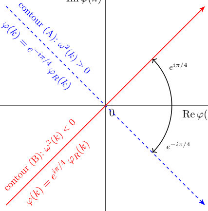
<figcaption class="paper-figure-caption"><b>Fig 1.</b> Figure 1. Integration contours in the complex φ(k) plane. Each mode is rotated so that the holomorphic weight becomes real and exponentially damped. Contour (A) corresponds to ω2(k) &gt; 0 and is rotated by −π/4; contour (B) corresponds to ω2(k) &lt; 0 and is rotated by +π/4. This is equivalent to imposing the linear relations among Fourier components defining the stable manifold of the symplectic dynamics.</figcaption>
</figure>
<figure class="paper-figure-card">
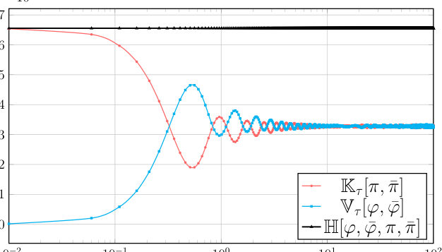
<figcaption class="paper-figure-caption"><b>Fig 2.</b> Figure 2. Time evolution of the kinetic (Ekin = Kτ[π, ¯π]) and potential (Epot = Vτ[φ, ¯φ]) energy for a scalar field with m = 0.6, a = 0.5, with integration parameters dτ = 0.01, and total simulation time ∆τ = 100. The system size is N0 × N1 = 256 × 256 = 65536, and we use periodic boundaries.</figcaption>
</figure>
<figure class="paper-figure-card">
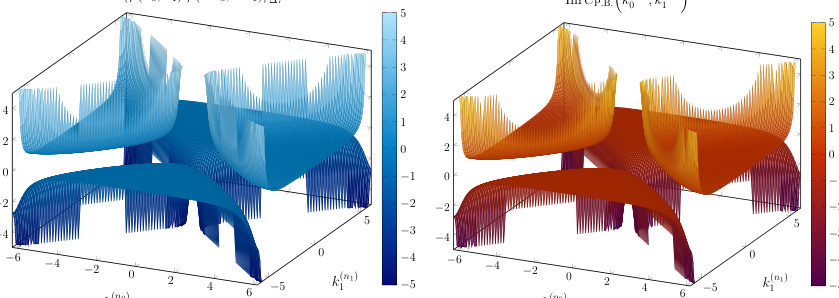
<figcaption class="paper-figure-caption"><b>Fig 3.</b> Figure 3. Momentum-space propagator with periodic boundary conditions. Right: analytic prediction for the free scalar propagator Im eCP.B.  k(n0) 0 , k(n1) 1  , cf. Eq. (7.10). Left: numerical</figcaption>
</figure>
<figure class="paper-figure-card">
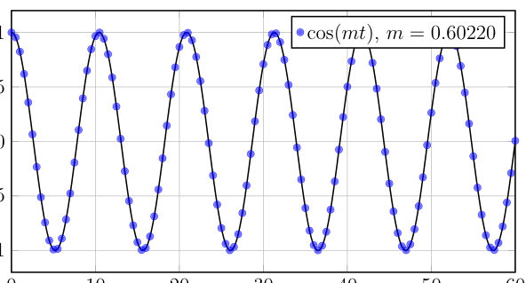
<figcaption class="paper-figure-caption"><b>Fig 4.</b> Figure 4. Zero-spatial-momentum correlator used to extract the mass gap. The plotted quantity is CT (ℓ0), obtained by averaging the two-point function over the spatial coordinate, this projects the propagator onto the k1 = 0 sector. The data oscillate in physical time, and the fitted oscillation frequency gives the propagator pole, i.e. the mass gap m. Simulation parameters: m = 0.6, a = 0.5, and N0 × N1 = 256 × 256.</figcaption>
</figure>
<figure class="paper-figure-card">
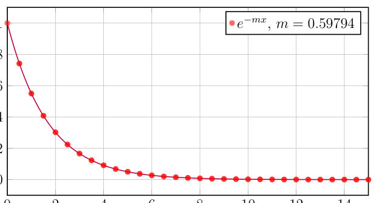
<figcaption class="paper-figure-caption"><b>Fig 5.</b> Figure 5. Zero-frequency correlator used to measure the same mass scale from spatial decay. The plotted quantity is CL(ℓ1), obtained by averaging the two-point function over the time coordinate, this projects the propagator onto the k0 = 0 sector. The resulting spatial profile decays expo- nentially, and the decay rate is controlled by the mass gap m. Simulation parameters: m = 0.6, a = 0.5, and N0 × N1 = 256 × 256.</figcaption>
</figure>

**Summary.** This paper extends a symplectic quantization method to relativistic quantum field theory, demonstrating that quantum fluctuations can be sampled via a deterministic Hamiltonian flow in an auxiliary time. The authors prove that this approach recovers standard Feynman physics in the continuum limit and provide numerical evidence using a 1+1D scalar field.

**Why it may be interesting.** It presents a deterministic, alternative formulation of QFT that avoids the sign problem of standard path integrals by using an auxiliary time, which could be relevant for developing new classical simulation techniques for quantum dynamics.

Detailed structure

**Main problem.** Extending the Constrained Symplectic Quantization (CSQ) framework from quantum mechanics to relativistic quantum field theory in Minkowski space-time and proving its equivalence to the Feynman path integral.

**Main result.** The authors prove that the CSQ microcanonical generating functional converges to the Feynman generating functional in the continuum limit and numerically validate this using a 1+1D free scalar field simulation.

**Method.** The method involves complexifying the field phase space, imposing constraints to ensure stable intrinsic-time evolution, and using a symplectic integrator on a lattice to compute real-time correlators.

**Model / system.** A real, massive, Lorentz-invariant scalar field in 1+1 dimensional Minkowski space-time, modeled on a discretized hypercubic lattice.

**Key observables.** Real-time two-point correlation functions, equal-time commutator relations, Dyson-Schwinger equations, and the light-cone profile of a localized initial pulse.

**Important parameters / regimes.** Intrinsic time (tau), physical Minkowski time, mass (m), lattice spacing (a), number of degrees of freedom (M), and the action scale (A = h-bar * M).

**Assumptions / limitations.** Relies on a weak ergodicity assumption to equate time-averages with ensemble averages; the numerical validation is currently limited to the free field case.

**Figures summary.** Figure 1 shows integration contours in the complex field plane; Figure 10 is a heatmap of the field correlator propagation; Figure 11 shows the collapsed lattice data matching the continuum Bessel function prediction.

**Paper structure.** The paper introduces the CSQ framework, provides a formal proof of equivalence to the Feynman path integral in the continuum limit, details the construction of stable manifolds via complex contour deformation, and concludes with a numerical lattice implementation and validation using a 1+1D scalar field.

Abstract

Constrained symplectic quantization is a functional formulation of quantum field theory in which quantum fluctuations are sampled through a deterministic Hamiltonian flow in an auxiliary intrinsic time $τ$. In this paper we extend the quantum-mechanical framework introduced in [1] to a relativistic scalar quantum field theory in Minkowski space-time. The construction is based on the analytic continuation of fields and action from $\mathbb{R}$ to $\mathbb{C}$ together with constraints that select stable intrinsic-time trajectories and, at the same time, define convergent integration cycles for the corresponding microcanonical functional. We show that, in the continuum limit, the microcanonical generating functional reproduces the Feynman generating functional. For the free scalar field in $1+1$ dimensions we derive the constrained equations of motion, implement the resulting dynamics numerically, and verify real-time two-point correlators, equal-time commutator relations, and Dyson--Schwinger equations including the expected contact terms.

[↑ back to top](#top)

### [Genuine Hybrid Number-Polarization Entanglement](http://arxiv.org/abs/2605.26962v1)

**Authors:** Dorian Schiffer, Marcus Huber, Elizabeth Agudelo  
**Type:** theory · **Category:** quantum information and computing · **PDF:** <https://arxiv.org/pdf/2605.26962v1>  
**Analysis basis:** full PDF text, analyzed in chunks
**Topic relevance:** `entanglement & information structure` **3/5** · `quantum measurements` **2/5**

↔ Scroll figures horizontally

<figure class="paper-figure-card">
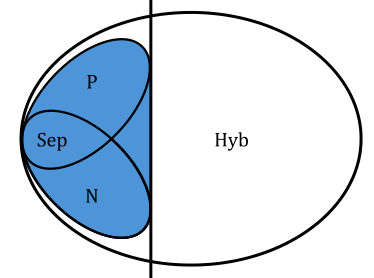
<figcaption class="paper-figure-caption"><b>Fig 1.</b> FIG. 1. State space and proposed witness. The space of fully separable states, Sep, is the intersection of the polarization- separable states, P, and of the number-separable states, N. Beyond these partially separable states lies the set of hybrid- number-polarization-entangled states, Hyb. Witness W con- stitutes a supporting hyperplane to the convex hull of N and P drawn in blue.</figcaption>
</figure>
<figure class="paper-figure-card">
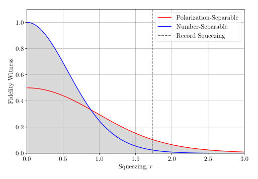
<figcaption class="paper-figure-caption"><b>Fig 2.</b> FIG. 2. Scaling of the hybrid entanglement witness versus squeezing in the non-vacuum sector of Fock space. The fi- delity to MBS needs to clear the grayed-out area in order to certify the presence of genuine hybrid number-polarization entanglement. The dashed line indicates the current world record for measured squeezing, achieved by the authors of Ref. [95], demonstrating the experimental feasibility of our technique.</figcaption>
</figure>

**Summary.** This paper introduces a way to detect a specific type of entanglement that links photon number and polarization, which standard methods miss. By providing a new mathematical witness, the authors show how to certify quantum correlations that exist between continuous and discrete variables. This work lays the groundwork for a unified theory of entanglement in complex optical states.

**Why it may be interesting.** It provides a new framework for characterizing entanglement in high-dimensional, multi-degree-of-freedom systems, which is crucial for advancing quantum optics and hybrid quantum networks.

Detailed structure

**Main problem.** The paper addresses the failure of existing entanglement witnesses to detect genuine hybrid entanglement between continuous-variable (photon number) and discrete-variable (polarization) degrees of freedom in macroscopic Bell states.

**Main result.** The authors derive an operational fidelity-based witness that provides a sufficient criterion for certifying genuine hybrid number-polarization entanglement, transcending the traditional CV-DV dichotomy.

**Method.** The authors use a number-basis representation of Two-Mode Squeezed Vacuum states and derive bounds for the overlap of states in the convex hull of number-separable and polarization-separable sets using Cauchy-Schwarz inequalities and optimization.

**Model / system.** The system consists of Macroscopic Bell States (MBS) generated via Spontaneous Paramcepted Down-Conversion (SPDC) in non-linear crystals using a strong coherent pump, modeled in a four-mode Fock space.

**Key observables.** Stokes operators (Sx, Sy, Sz), photon number (N), fidelity (F), and squeezing parameter (r).

**Important parameters / regimes.** Squeezing parameter (r), specifically looking at regimes including r > 1.15; fidelity threshold (F) for witness violation.

**Assumptions / limitations.** The distinction between CV and DV entanglement is treated as a conceptual categorization; the analysis assumes the ability to perform photon-number-conditioned density matrix reconstruction.

**Figures summary.** Figure 1 illustrates the geometry of the state space and the witness as a supporting hyperplane; Figure 2 shows the witness bound evaluated in the non-vacuum subsector compared to experimental feasibility.

**Paper structure.** The paper begins by identifying the gap between CV and DV entanglement, introduces the model of Macroscopic Bell States, critiques existing Stokes-operator-based witnesses, derives a new fidelity-based witness and its bounds, and concludes with experimental implementation outlines and future generalizations.

Abstract

Entanglement is a key resource for fundamental tests of physics and emerging quantum technologies. In quantum optics, two perspectives on entanglement coexist. In the continuous-variable framework, entanglement is understood as holding between optical modes. In contrast, discrete-variable quantum optics focuses on quantum correlations in degrees of freedom such as polarization that label fixed numbers of photons. In this paper, we show that entanglement can transcend this separation. Spontaneous parametric down-conversion inherently generates correlations in optical phase space, photon number, and labelling degrees of freedom simultaneously. In polarization, this structure is traditionally described by macroscopic Bell states. Existing witnesses, however, fail to detect the genuine hybrid entanglement of these states, which goes beyond the continuous-discrete-variable categorization. Here, we lay the groundwork for a general framework unifying continuous- and discrete-variable notions of entanglement. In particular, we derive an operational witness providing a sufficient criterion for genuine hybrid number-polarization entanglement and outline its experimental implementation. Finally, we discuss exemplary states which, together with our results on macroscopic Bell states, motivate a broader classification of genuine hybrid quantum correlations.

[↑ back to top](#top)

### [Quantum Interference Corrections in Electron Hydrodynamics](http://arxiv.org/abs/2605.26223v1)

**Authors:** Alberto Cortijo  
**Type:** theory · **Category:** strongly correlated electrons · **PDF:** <https://arxiv.org/pdf/2605.26223v1>  
**Analysis basis:** full PDF text, analyzed in chunks
**Topic relevance:** `Keldysh / 2PI / non-Gaussian methods` **3/5** · `non-equilibrium dynamics` **2/5**

↔ Scroll figures horizontally

<figure class="paper-figure-card">
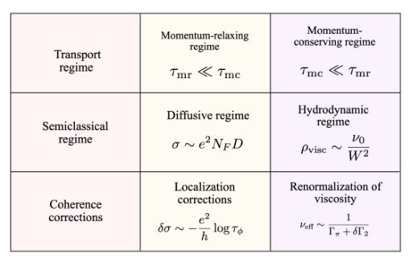
<figcaption class="paper-figure-caption"><b>Fig 1.</b> FIG. 1. Diffusive versus hydrodynamic interference. In the diffusive, momentum-relaxing regime τmr ≪τmc, τmr is the disorder-controlled momentum-relaxing time, τmc is the momentum-conserving collision time, NF is the Fermi-level density of states, D is the diffusion constant, and τϕ is the dephasing time. In the hydrodynamic regime τmc ≪τmr, the right-column quantities are defined in the main text: W is the channel width, ν0 the bare viscosity, Γπ the spin-two stress relaxation rate, and δΓ2 its Cooperon correction. The main contrast is that ordinary Cooperons correct the diffusive conductivity, whereas hydrodynamic Cooperons renormalize viscosity.</figcaption>
</figure>
<figure class="paper-figure-card">
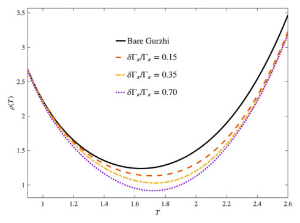
<figcaption class="paper-figure-caption"><b>Fig 2.</b> FIG. 2. Representative Fermi-liquid Gurzhi response. The black curve is the bare hydrodynamic result, while the col- ored curves include hydrodynamic-Cooperon corrections with three imposed values of rmin ≡(δΓ2/Γπ)min, evaluated at the bare Gurzhi minimum. Larger rmin means stronger stress re- laxation, lower effective viscosity, and a larger downward shift of the viscous resistivity. The sign δρvisc &lt; 0 is robust; the amplitude is nonuniversal.</figcaption>
</figure>

**Summary.** This paper demonstrates that quantum interference in electron hydrodynamics is constrained by conservation laws to affect only the stress sector. This leads to a unique signature where quantum corrections actually reduce viscosity and resistivity, providing a clear experimental distinction from standard weak localization.

**Why it may be interesting.** not directly relevant

Detailed structure

**Main problem.** Determining how quantum interference (the Cooperon effect) corrections enter the hydrodynamic regime of electron fluids and how they affect transport coefficients like viscosity.

**Main result.** The hydrodynamic Cooperon renormalizes the spin-two stress relaxation rate, leading to a reduction in effective viscosity and a decrease in viscous resistivity, which is the opposite sign of ordinary weak localization.

**Method.** The study uses a Schwinger-Keldysh effective theory, an angular-harmonic expansion of the kinetic equation, and a Bethe-Salpeter resummation to construct the hydrodynamic Cooperon.

**Model / system.** A two-dimensional electron fluid (including Fermi-liquid and Planckian/quantum-critical regimes) subject to a random-friction model representing weak momentum-relaxing disorder.

**Key observables.** Effective viscosity, viscous resistivity, channel conductivity, and stress relaxation rate.

**Important parameters / regimes.** Momentum-conserving collision time (tau_mc), momentum-relaxing time (tau_mr), dephasing time (tau_phi), and channel width (W).

**Assumptions / limitations.** The theory assumes an isotropic Fermi surface, a truncated Navier-Stokes hierarchy (neglecting higher-order Burnett terms), and a small-gradient expansion.

**Figures summary.** Figure 1 compares diffusive versus hydrodynamic interference; Figure 2 shows the Gurzhi response (resistance vs. temperature) in a narrow channel with varying levels of the Cooperon correction.

**Paper structure.** The paper begins by defining the hydrodynamic problem and Ward identities, moves to the construction of the hydrodynamic Cooperon via the kinetic hierarchy, calculates the self-energy of the stress sector, and concludes with the resulting temperature-dependent scaling for resistivity in different regimes.

Abstract

We show that quantum-interference corrections in an electron fluid are tightly constrained by hydrodynamic Ward identities: charge and momentum conservation protect the $m=0,\pm1$ sectors, so the leading correction first appears in the spin-two $m=\pm2$ stress sector. The resulting hydrodynamic Cooperon has a robust infrared structure that renormalizes stress relaxation, and hence the viscosity. In channel flow this lowers the viscous resistivity, producing a hydrodynamic interference signature with the opposite sign to ordinary weak localization.

[↑ back to top](#top)

### [Designing Quantum Matter in Pyrochlore Iridates: A Perspective on Recent Thin-Film Advances](http://arxiv.org/abs/2605.26603v1)

**Authors:** Xiaoran Liu, Michael Terilli, Ana-Marija Nedic, Jiandong Guo, Jak Chakhalian  
**Type:** both · **Category:** strongly correlated electrons · **PDF:** <https://arxiv.org/pdf/2605.26603v1>  
**Analysis basis:** full PDF text, analyzed in chunks
**Topic relevance:** `non-equilibrium dynamics` **3/5**

↔ Scroll figures horizontally

<figure class="paper-figure-card">
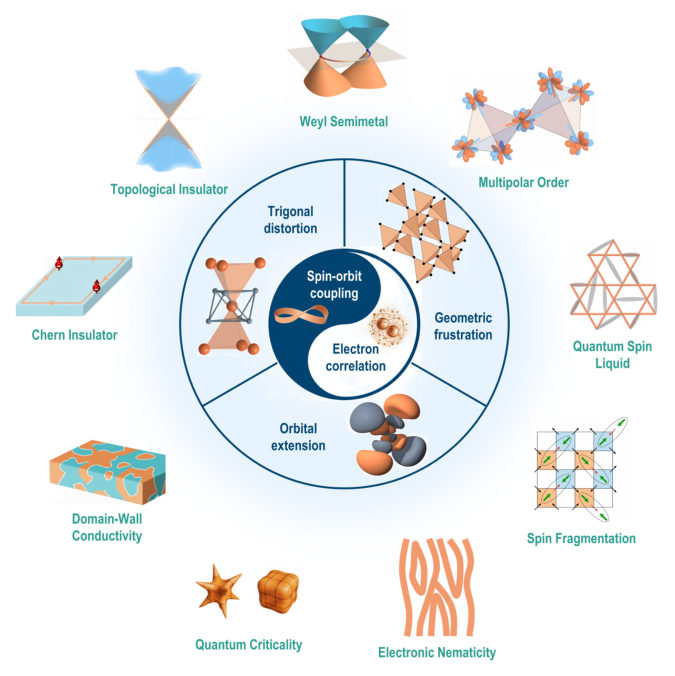
<figcaption class="paper-figure-caption"><b>Fig 1.</b> Figure 1. A schematic of the exotic quantum phenomena related to pyrochlore iridates. Driven by the synergy between strong spin-orbit coupling, electron-electron correlation, and three features (i.e., geometric frustration, orbital extension, local trigonal distortion) inherent to 5d electrons on the corner-sharing tetrahedral network gives rise to a delicate balance between competing ground states. This results in the emergence of diverse novel and exotic quantum phases of matter, as illustrated.</figcaption>
</figure>
<figure class="paper-figure-card">
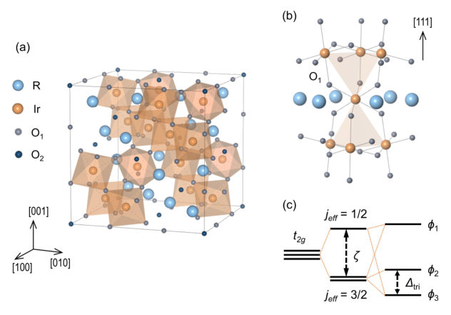
<figcaption class="paper-figure-caption"><b>Fig 2.</b> Figure 2. Crystal and electronic structure of pyrochlore iridates. (a) The conventional cubic unit cell of pyrochlore lattice showing the network of corner-sharing IrO6 octahedra. The global three-dimensional connectivity is driven by the network of corner-sharing IrO6 octahedra (orange), while the rare-earth R ions (blue) occupy the interstitial cavities forming a distorted scalenohedral coordination (R-O bonds are omitted for visual clarity). (b) A local view of two octahedra IrO6 along the [111] axis. (c) Energy level diagram of Ir t2g orbitals. Strong spin-orbit coupling splits the t2g manifold into jeff = 3/2 and jeff = 1/2 levels. The trigonal crystal field ∆tri further renders a...</figcaption>
</figure>
<figure class="paper-figure-card">
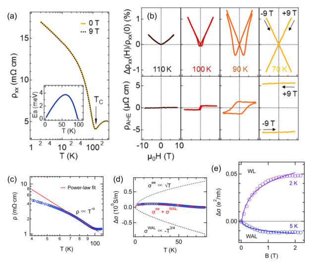
<figcaption class="paper-figure-caption"><b>Fig 3.</b> Figure 3. Transport signatures of WSM state in (111) Eu2Ir2O7 thin films. (a) Temperature dependence of the longitudinal resistivity under 0 (orange) and 9 T (black) magnetic field, respectively. The onset of metal-semimetal transition is found at TC near 110 K. Inset: putative activation gap estimated using Arrhenius’s law. (b) Normalized longitudinal magnetoresistivity and transverse resistivity across TC. The linear contribution from the ordinary Hall effect has been subtracted for each transverse curve. (c) Power-law fit of resistivity data in the range of 70–100 K. (d) Low-temperature conductivity composed of two items, σee from the electron–electron interaction (tendency of WL), and...</figcaption>
</figure>
<figure class="paper-figure-card">
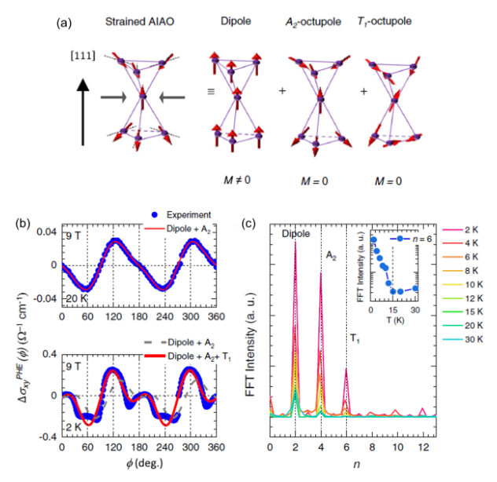
<figcaption class="paper-figure-caption"><b>Fig 4.</b> Figure 4. Probing cluster magnetic multipoles in strained Nd2lr2O7 using the Planar Hall Effect (PHE).(a) Schematic illustrating how compressive strain along the [111] direction modifies the all-in-all-out (AIAO) magnetic configuration. This strained structure can be decomposed into three distinct cluster magnetic multipoles: a magnetic dipole (M ̸= 0), an A2-octupole (M = 0), and a T1-octupole (M = 0) [58]. (b) Angle-dependent PHE conductivity, ∆σP HE xy (ϕ), measured at an external field of 9 T. At 20 K (top), the oscillation is well-described by contributions from the dipole and the A2-octupole. At 2 K (bottom), a complex oscillation appears that cannot be explained by the dipole and...</figcaption>
</figure>
<figure class="paper-figure-card">
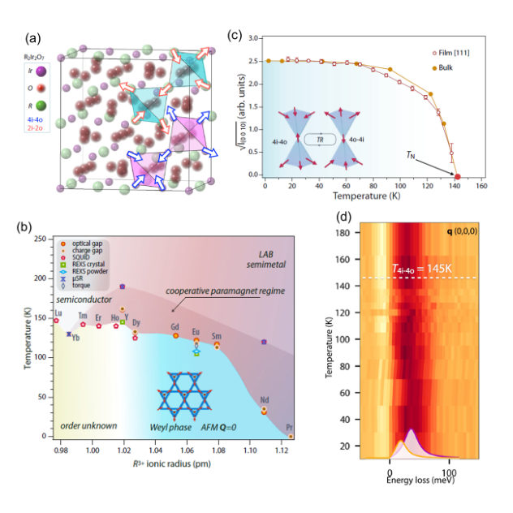
<figcaption class="paper-figure-caption"><b>Fig 5.</b> Figure 5. Probing magnetic ground state and excitations in Y2lr2O7 with x-ray scattering.(a) The pyrochlore lattice features two interpenetrating sublattices of corner-sharing tetrahedra. In the ordered ground state, possible spin configurations include “two-in-two-out” (red arrows), as in the titanates, or “four-in-four-out” (blue arrows), as in the iridates. (b) Experimental phase diagram of the pyrochlore iridates, featuring optical and charge gap [62], SQUID [63, 64, 65, 66], REXS [67, 68, 34], and torque magnetometry [69] data. Spectroscopic studies have been limited for smaller A-site radii due to the difficulty of growing large-size single crystals. µSR data indicates the presence of...</figcaption>
</figure>

**Summary.** This perspective reviews how epitaxial thin-film engineering allows for the precise manipulation of quantum states in pyrochlore iridates. By using strain and dimensionality, researchers can access exotic phases like magnetic Weyl semimetals and chiral spin liquids that are hidden in bulk crystals. This approach establishes a roadmap for designing novel quantum matter through heterostructure engineering.

**Why it may be interesting.** The discussion of Floquet engineering and light-induced transitions from Mott insulators to Weyl semimetals is highly relevant to many-body dynamics and non-equilibrium physics.

Detailed structure

**Main problem.** How to move beyond bulk crystals to actively design and control emergent quantum phenomena, such as Weyl semimetals and chiral spin liquids, in 5d pyrochlore iridates.

**Main result.** Thin-film engineering via epitaxial strain, dimensional confinement, and interfacial coupling provides new tuning knobs to break symmetries and realize previously elusive topological and magnetic states.

**Method.** The paper reviews advancements in epitaxial thin-film synthesis (e.g., solid-phase epitaxy) and various experimental probes including magnetotransport, RIXS, and optical spectroscopy.

**Model / system.** 5d pyrochlore iridates (R2Ir2O7) characterized by the interplay of strong spin-orbit coupling, electron correlations, and geometric frustration in a corner-sharing tetrahedral lattice.

**Key observables.** Anomalous Hall effect (AHE), Topological Hall effect (THE), Planar Hall effect (PHE) harmonics, magnetoresistance, and magnetic multipole signatures.

**Important parameters / regimes.** Electron correlation (U), bandwidth (W), spin-orbit coupling (zeta), trigonal crystal field (delta_tri), epitaxial strain, and film thickness.

**Assumptions / limitations.** The review assumes the validity of the interplay between SOC and correlations as the primary driver of the observed phases; notes limitations in photoemission studies due to surface challenges.

**Figures summary.** Figure 1 shows a schematic of exotic phenomena from SOC/correlation/frustration synergy; Figure 2 illustrates the pyrochlore unit cell, trigonal distortion, and Ir 5d orbital splitting.

**Paper structure.** The paper introduces the fundamental physics of bulk iridates, transitions to the advantages of thin-film tuning knobs (strain, dimensionality, interface), discusses specific realized phases (Weyl semimetals, spin liquids), and concludes with future directions like Floquet engineering.

Abstract

The pyrochlore iridates R2Ir2O7 have emerged as a unique playground for exploring exotic quantum phenomena arising from the intricate interplay of strong spin-orbit coupling, electron correlations, and geometric frustration. While bulk crystals of these materials have revealed a rich landscape of correlated and topological states, recent breakthroughs in epitaxial thin-film synthesis and heterostructure engineering unlocked an entirely new dimension of discovery. This brief Perspective reviews recent advancements highlighting how new tuning knobs such as dimensional confinement, epitaxial strain, and interfacial coupling can be used to manipulate the delicate balance of competing interactions. We discuss several key discoveries enabled by this approach including the realization of the magnetic Weyl semimetal phase in (111) oriented films, strain-engineered magnetic multipolar orders, the emergence of a chiral spin liquid-like state in the quasi-2D limit, and the discovery of novel electronically anisotropic states at interfaces between pyrochlore iridates and other quantum materials, such as spin ice pyrochlores. These findings showcase that low-dimensional pyrochlore iridates provide ample opportunities for both theory and experiment to unravel, control and ultimately design novel quantum states of matter. We conclude by outlining key open questions and future directions ranging from the synthesis of new heterostructures to the application of advanced probes and the exploration of non-equilibrium phenomena.

[↑ back to top](#top)

### [Extended Bose-Hubbard Model on Small Grids: Exact Diagonalization and Monte Carlo Studies](http://arxiv.org/abs/2605.26303v1)

**Authors:** Gabriele Costa, Matteo Ciardi, Fabio Cinti, Santi Prestipino  
**Type:** theory · **Category:** quantum gases · **PDF:** <https://arxiv.org/pdf/2605.26303v1>  
**Analysis basis:** full PDF text, analyzed in chunks
**Topic relevance:** `analog quantum simulation` **3/5**

↔ Scroll figures horizontally

<figure class="paper-figure-card">
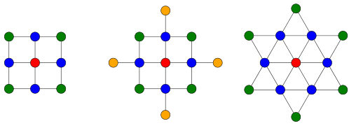
<figcaption class="paper-figure-caption"><b>Fig 1.</b> Figure 1. The three grids on which we map out the phase diagram of the model by exact diagonalization: (a) Square. (b) Diamond. (c) Star. We use different colors to mark first, second, and third neighbors of the central site. All these grids can be periodically replicated without overlaps or gaps.</figcaption>
</figure>
<figure class="paper-figure-card">
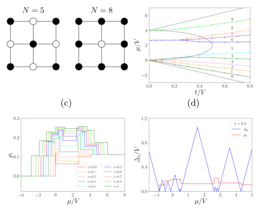
<figcaption class="paper-figure-caption"><b>Fig 2.</b> Figure 2. Square. (a) The ground states for t = 0 and 0 &lt; µ &lt; 4V . (b) Exact phase diagram at T = 0. The continuous lines are boundary lines of N-sectors. The black thin lines are mean-field phase boundaries [42]. (c) Condensate fraction ρc(µ) for various t. (d) Energy gap ∆(µ) for t = 0.3 (blue line). Also shown is the condensate fraction (red line).</figcaption>
</figure>
<figure class="paper-figure-card">
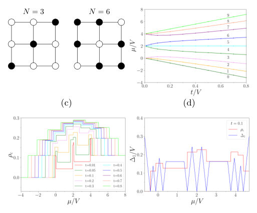
<figcaption class="paper-figure-caption"><b>Fig 3.</b> Figure 3. Square with PBC. (a) The ground states for t = 0 and 0 &lt; µ &lt; 4V . (b) Exact phase diagram at T = 0. The continuous lines are boundary lines of N-sectors. (c) Condensate fraction ρc(µ) for various t. (d) Energy gap ∆(µ) for t = 0.1 (blue line). Also shown is the condensate fraction (red line).</figcaption>
</figure>
<figure class="paper-figure-card">
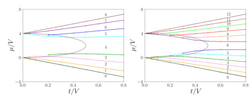
<figcaption class="paper-figure-caption"><b>Fig 4.</b> Figure 4. Exact phase diagram at T = 0 of the 4 × 2 (a) and the 4 × 3 (b) rectangles with PBC. The continuous lines are boundary lines of N-sectors. The black thin lines are mean- field phase boundaries [42].</figcaption>
</figure>
<figure class="paper-figure-card">
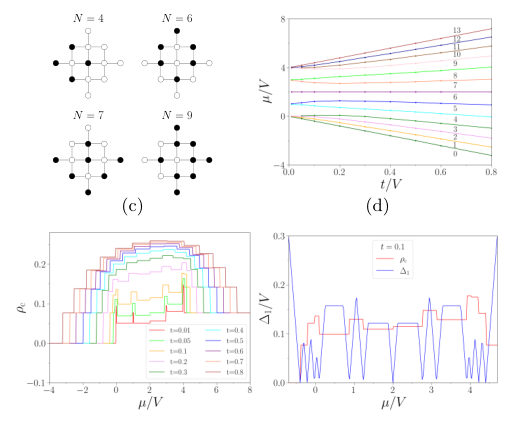
<figcaption class="paper-figure-caption"><b>Fig 5.</b> Figure 6. Diamond with PBC. (a) The ground states for t = 0 and 0 &lt; µ &lt; 4V . (b) Exact phase diagram at T = 0. The continuous lines are boundary lines of N-sectors. (c) Condensate fraction ρc(µ) for various t. (d) Energy gap ∆(µ) for t = 0.1 (blue line). Also shown is the condensate fraction (red line)</figcaption>
</figure>

**Summary.** This paper examines the superfluid-insulator transition in small-scale lattice geometries and continuous-space bosonic systems. It demonstrates that while small grids show unique features compared to infinite lattices, the fundamental physics of the Bose-Hubbard model is already visible in systems with very few particles.

**Why it may be interesting.** It provides crucial insights into how many-body phenomena like superfluidity and insulating phases emerge in small-scale quantum systems, which is highly relevant for the development of quantum simulators and trapped atom experiments.

Detailed structure

**Main problem.** Investigating the remnants of the superfluid-insulator transition in truncated, small-scale 2D lattices and exploring how these discrete models relate to continuous-space bosonic systems.

**Main result.** The study finds that small grids exhibit ground-state characteristics markedly different from the thermodynamic limit, while continuous-space simulations of just five particles show clear hints of Bose-Hubbard behavior.

**Method.** The authors use Exact Diagonalization (ED) to map phase diagrams of small grids and Path-Integral Monte Carlo (PIMC) with the Worm algorithm to study continuous-space systems.

**Model / system.** The study focuses on the hard-core extended Bose-Hubbard model on small square, diamond, and star-shaped grids, as well as continuous-space spinless bosons with inverse-power repulsion under confinement.

**Key observables.** Condensate fraction, superfluid fraction, energy gap, average site occupancy, kinetic and potential energies, and exchange-cycle statistics.

**Important parameters / regimes.** Hopping amplitude (t), nearest-neighbor repulsion (V), chemical potential (mu), on-site interaction (U), and optical lattice potential strength (V0).

**Assumptions / limitations.** The primary model is analyzed in the hard-core limit (infinite on-site repulsion), and mean-field theory is used as a reference for the thermodynamic limit.

**Figures summary.** Figure 1 shows the grid geometries; Figure 2 details the square grid phase diagram and energy gap; Figure 12-15 show site occupancies, exchange-cycle distributions, and density maps for continuous systems.

**Paper structure.** The paper introduces the problem of finite-size effects, presents ED results for various small lattice geometries (square, diamond, star), compares these to mean-field predictions, and then extends the study to continuous-space simulations using PIMC.

Abstract

The superfluid-insulator transition in systems of lattice bosons is usually analyzed in the framework of the Bose-Hubbard model, and has been extensively studied by theory and simulations. Less attention has been paid to the remnants of the transition in truncated lattices, with or without periodic boundary conditions. Here we consider the hard-core limit of the extended Bose-Hubbard model on small square and triangular grids -- i.e., sections of the square and triangular lattices containing up to 13 sites. By mapping out the zero-temperature phase diagram through exact diagonalization, we find ground-state characteristics that are markedly different from those emerging in the thermodynamic limit, together with similarities. The dichotomy between superfluid-like and insulating-like behavior is then investigated in two-dimensional systems of a few interacting bosons in the continuum, subject to confining and optical-lattice potentials mimicking the $3\times 3$ square grid. Using path-integral Monte Carlo simulations, we compute kinetic and potential energies, as well as superfluidity and exchange-cycle statistics, finding hints of Bose-Hubbard behavior even in systems of just five particles.

[↑ back to top](#top)

### [Taming non-equilibrium thermal fluctuations in subthreshold CMOS circuits](http://arxiv.org/abs/2605.26267v1)

**Authors:** Nahuel Freitas, Geremia Massarelli, Jeremy Rothschild, Dylan Keane, Ethan Dawe, Sewook Hwang, Akhil Garlapati, Trevor McCourt  
**Type:** both · **Category:** statistical mechanics · **PDF:** <https://arxiv.org/pdf/2605.26267v1>  
**Analysis basis:** full PDF text, analyzed in chunks
**Topic relevance:** `non-equilibrium dynamics` **3/5**

↔ Scroll figures horizontally

<figure class="paper-figure-card">
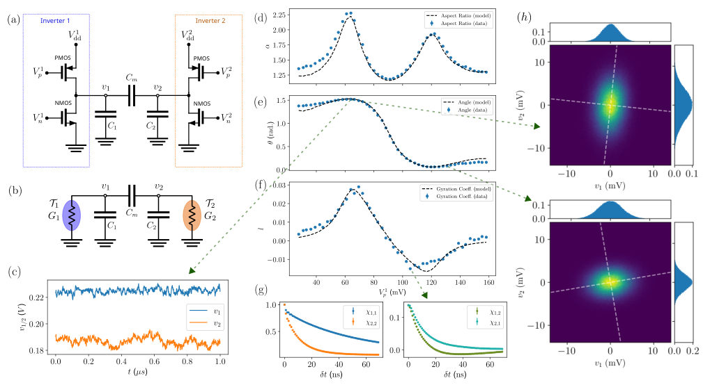
<figcaption class="paper-figure-caption"><b>Fig 1.</b> FIG. 1. Predictable and programmable Gaussian sampling with a NEAT-RN (a) A simple NEAT-RN: two indepen- dently controlled, capacitively coupled CMOS inverters. (b) The fluctuations around the DC operating point of a NEAT-RN are equivalent to those of a linear RC circuit with controllable effective conductances and temperatures. (c) Snapshot of the measured time-series of voltages v1 and v2, for the operating point indicated by the arrow. For different points along the voltage sweep mentioned in the text: (d) Aspect ratio of the covariance matrix of signals v1 and v2, (e) Angle of the main principal component of the same matrix, and (f) Normalized gyration coefficient l (integration time tI...</figcaption>
</figure>
<figure class="paper-figure-card">
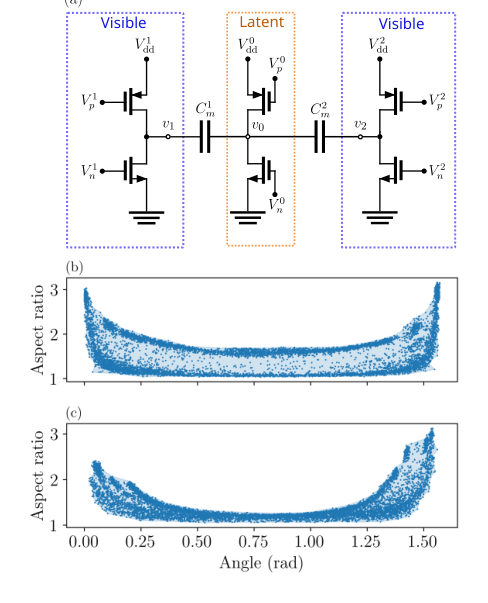
<figcaption class="paper-figure-caption"><b>Fig 2.</b> FIG. 2. Increasing the programmability of a NEAT- RN using latent variables (a) Extending the circuit in Figure 1-(a) by adding an extra degree of freedom. The self- capacitance of each free node is omitted. (b) Observed points in the plane angle-aspect ratio for 8000 iterations of the con- trol space exploration procedure, with V 1/2 dd ≃5.5VT and V 0 dd ≃7VT . (c) Results of an analogous protocol applied to the circuit in Figure 1-(a).</figcaption>
</figure>
<figure class="paper-figure-card">

<figcaption class="paper-figure-caption"><b>Fig 3.</b> Fig. 1-(e) shows the normalized circulation coeffi- cient l = (¯X1,2 −¯X2,1)/ p</figcaption>
</figure>
<figure class="paper-figure-card">
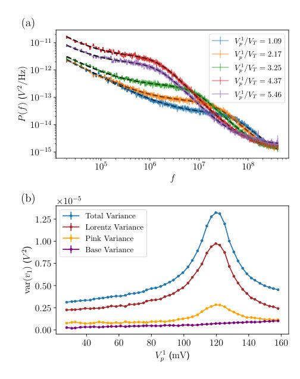
<figcaption class="paper-figure-caption"><b>Fig 4.</b> FIG. 3. (a) Power spectral density of the signal v1 for different values of the control voltage V 1 p . (b) Total variance of the signal v1, as well as its different spectral contributions, as a function of V 1 p . Same settings as in Figure 1.</figcaption>
</figure>
<figure class="paper-figure-card">
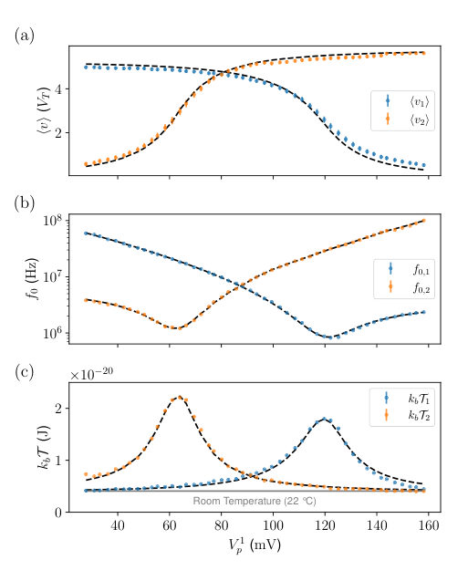
<figcaption class="paper-figure-caption"><b>Fig 5.</b> FIG. 4. For each individual inverter, (a) average voltage out- put, (b) frequency f0 and (c) effective temperature T as ob- tained from the spectrum (see Eq. (B7)). The dashed lines indicate the theoretical results from Eqs. (B4), (B5) and (C1) after fitting the three quantities simultaneously. Same set- tings as in Figure 1.</figcaption>
</figure>

**Summary.** This paper presents a CMOS-based platform that turns intrinsic thermal fluctuations into a programmable tool for probabilistic computing. By controlling transistor voltages, the researchers can manipulate the system's effective temperature and conductance to act as a multivariate Gaussian sampler. This approach transforms a traditional hardware limitation into a functional primitive for energy-efficient stochastic hardware.

**Why it may be interesting.** The work explores non-equilibrium steady states, time-reversal symmetry breaking, and the use of stochastic fluctuations as a computational resource, which are highly relevant to the study of open quantum systems and stochastic thermodynamics.

Detailed structure

**Main problem.** The challenge of managing increased thermal noise in scaling CMOS technology and transitioning from viewing noise as a roadblock to utilizing it as a resource for energy-efficient probabilistic computing.

**Main result.** The demonstration of a fully CMOS experimental platform that functions as a programmable multivariate Gaussian sampler, where effective conductance and temperature can be independently controlled via gate voltages.

**Method.** The researchers used a Markov Jump Process (MJP) model combined with the EKV model to describe subthreshold transistor behavior, validated against experimental voltage time-series and power spectral density measurements.

**Model / system.** The system consists of Non-equilibrium Active Resistor Networks (NEAT-RNs) implemented using subthreshold CMOS FinFET technology, modeled as a linearized noisy RC network driven by shot noise.

**Key observables.** Voltage time-series, covariance matrix (eigenvalues and eigenvectors), cross-correlation asymmetry (circulation coefficient), and power spectral density (Lorentzian, pink, and extrinsic noise components).

**Important parameters / regimes.** Deep subthreshold regime, effective conductance (G), effective temperature (T), capacitance matrix (C), and control voltages (Vdd, Vp, Vn).

**Assumptions / limitations.** The process is treated as a linear stochastic process with Gaussian conditional probability, and the capacitance is assumed to be in the large-capacitance limit relative to the thermodynamic scale.

**Figures summary.** Figure 1 shows the circuit schematic, equivalent RC model, and statistical metrics like covariance and autocorrelation; Figure 2 compares 2-DOF vs 3-DOF control space; Figure 3 shows PSD decomposition; Figure 6 shows Lorentz variance and Pearson correlation as functions of operating point.

**Paper structure.** The paper introduces the problem of thermal noise in CMOS, describes the NEAT-RN experimental platform and the MJP mathematical framework, presents results on programmability and noise-driven sampling, provides a detailed spectral analysis of noise sources, and concludes with parameter estimation for capacitance.

Abstract

As CMOS technology scales down, thermal fluctuations increasingly impact circuit behavior, posing challenges to conventional circuit design. However, the inherent stochasticity introduced by thermal noise is now being explored as a potential resource in the emerging field of probabilistic computing. This work presents a fully CMOS experimental platform that enables direct control over its intrinsic thermal fluctuations. These devices function as programmable multivariate Gaussian samplers, offering a hardware primitive for energy-efficient stochastic computing and serving as an experimental platform for studies in electronic noise and stochastic thermodynamics.

[↑ back to top](#top)

### [Generalized multilevel amplitude damping channels and their thermodynamic performances](http://arxiv.org/abs/2605.27369v1)

**Authors:** Vito Vetrano, Vittorio Giovannetti, Vasco Cavina  
**Type:** theory · **Category:** statistical mechanics · **PDF:** <https://arxiv.org/pdf/2605.27369v1>  
**Analysis basis:** full PDF text, analyzed in chunks
**Topic relevance:** `correlated / nonlocal dissipation` **2/5** · `entanglement & information structure` **2/5** · `methods for driven-dissipative` **2/5** · `non-equilibrium dynamics` **2/5**

↔ Scroll figures horizontally

<figure class="paper-figure-card">
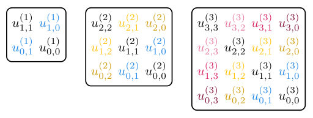
<figcaption class="paper-figure-caption"><b>Fig 1.</b> FIG. 1. Qualitative sketch of the effect of the GMAD chan- nel on a generic 4-level system. Following the definitions in Eq. (1), we can isolate three blocks of Kraus operators (cor- responding to m = 1, 2, 3) acting on the first 2, 3, 4 levels, respectively. The properties of the coefficients u(m) ik appear- ing in the rates in Eq. (2) are made explicit in the bottom of the figure: for a fixed m they can be arranged as entries of an m + 1 dimensional unitary matrix. Jumps connecting the energy levels are depicted using distinct colors and hues, and the entries of the unitary matrices are highlighted using the same colors as the corresponding transitions.</figcaption>
</figure>
<figure class="paper-figure-card">
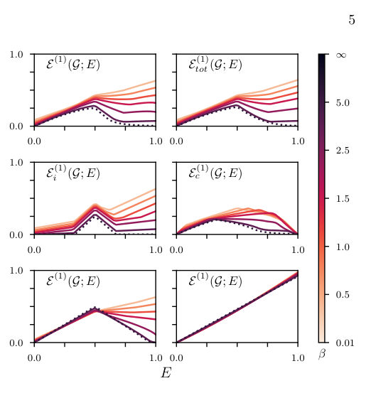
<figcaption class="paper-figure-caption"><b>Fig 2.</b> FIG. 2. (From top left to center right) 1-cell shell-maximal work functionals for the channel G with s1 = 0.5, ¯s = 0.99, α0 = 0.99, as a function of the energy E, for different val- ues of β. The dashed line represents the corresponding MAD channel (β = +∞). (Bottom left) 1-cell shell-maximal er- gotropy as a function of E for the channel G with s1 = 0.01, ¯s = 0.99, α0 = 0.745, and different values of β. The non- monotonicity of the maximal ergotropy in the temperature is evident. (Bottom right) 1-cell shell-maximal ergotropy as a function of E for the channel G with s1 = 0.99, ¯s = 0.255, α0 = 0.5, for different values of β. In this case, the maximal ergotropy almost coincides with the...</figcaption>
</figure>
<figure class="paper-figure-card">
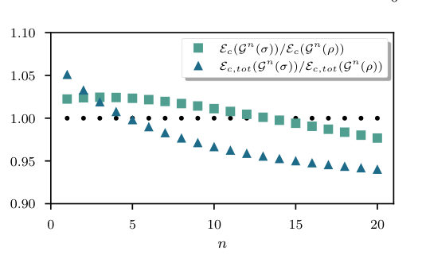
<figcaption class="paper-figure-caption"><b>Fig 3.</b> FIG. 4. Ratios between the coherent ergotropy (green squares) and the total coherent ergotropy (blue triangles) of ˆρ′ and ˆσ′, for different map iterations Gn. G is fixed by s1 = sin( 8</figcaption>
</figure>
<figure class="paper-figure-card">
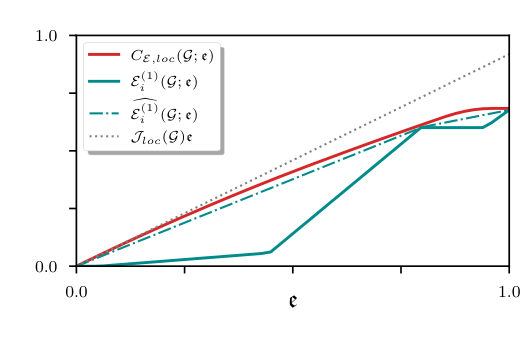
<figcaption class="paper-figure-caption"><b>Fig 4.</b> FIG. 3. (Red solid curve) Local ergotropic capacitance for the GMAD channel G with s1 = 0.5, ¯s = 0.745, α0 = 0.745, β = 1, acting on a three-level system with spectrum (0, 0.8, 1). (Cyan solid curve) 1-cell ball-maximal incoherent ergotropy for the same channel; even if it is not concave in e, its con- cave envelope (cyan dot-dashed curve), here indicated as bEi, bounds from below the respective capacitance. (Gray dotted line) Line with slope equal to the MAWER for the same chan- nel; its value is Jloc(G) ≈0.919 .</figcaption>
</figure>
<figure class="paper-figure-card">
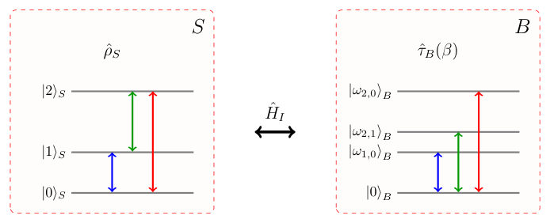
<figcaption class="paper-figure-caption"><b>Fig 5.</b> FIG. 5. Depiction of the level structure of the environment B, and its dependence on the system spectrum, for the case of a qutrit system S.</figcaption>
</figure>

**Summary.** This paper introduces the Generalized Multilevel Amplitude Damping (GMAD) channel to model qudit dynamics in thermal environments. It reveals that these channels can exhibit counterintuitive thermodynamic behaviors, such as non-monotonic work extraction and a quantum-driven Mpemba effect.

**Why it may be interesting.** It provides new insights into how dissipative dynamics and thermal environments can be exploited for work extraction and reveals purely quantum thermodynamic effects like the coherent Mpemba effect.

Detailed structure

**Main problem.** Characterizing the thermodynamic performance and energetic capacities of a new class of quantum channels (GMAD) for work extraction.

**Main result.** The authors demonstrate that GMAD channels exhibit non-monotonic ergotropic capacitance with respect to temperature and can drive a coherent ergotropic Mpemba effect.

**Method.** The study uses Kraus representation derivation, ergotropy analysis (total, coherent, and incoherent), and asymptotic analysis of work functionals (shell-maximal and ball-maximal).

**Model / system.** A d-level quantum system (qudit) coupled to a thermal environment at inverse temperature beta, modeled via the Generalized Multilevel Amplitude Damping (GMAD) channel.

**Key observables.** Ergotropy (total, coherent, and incoherent), work capacitance, and Maximal Asymptotic Work-Energy Ratio (MAWER).

**Important parameters / regimes.** Temperature (beta), input energy (E), coupling constants (g_ij), and the number of channel iterations.

**Assumptions / limitations.** The system Hamiltonian is assumed to be non-degenerate, and the interaction is energy-preserving.

**Figures summary.** Figure 1 shows a qualitative sketch of the GMAD channel on a 4-level system; Figure 2 displays ergotropy as a function of energy for various temperatures; Figure 3 shows local ergotropic capacitance; Figure 6 illustrates the decomposition of unitary evolution.

**Paper structure.** The paper introduces the GMAD channel, derives its microscopic Kraus representation, analyzes its thermodynamic properties (ergotropy and capacitance), and demonstrates specific phenomena like the Mpemba effect.

Abstract

We introduce a new class of quantum channels, the Generalized Multilevel Amplitude Damping (GMAD) channels, to model noise and decoherence effects in a qudit coupled to a thermal environment. The degradation of energetic resources under GMADs is investigated by evaluating work functionals and ergotropic capacitances, with particular attention to the coherent and incoherent contributions to ergotropy, for which we introduce new quantifiers. Our analysis sheds light on how to optimally prepare a qudit in a thermal environment in order to preserve its value from the perspective of work extraction, and reveals several counterintuitive phenomena: the ergotropic capacitance of a GMAD channel is not monotonic in the temperature of the environment; moreover, iterating the map can lead to crossings between ergotropic functionals at different temperatures, indicating the presence of a Markovian Mpemba effect.

[↑ back to top](#top)

### [Quantum statistical mechanics: Gauge invariance, operator shifting, hyperdensity functionals, and nonequilibrium sum rules](http://arxiv.org/abs/2605.26650v1)

**Authors:** Johanna Müller, Matthias Schmidt  
**Type:** theory · **Category:** statistical mechanics · **PDF:** <https://arxiv.org/pdf/2605.26650v1>  
**Analysis basis:** full PDF text, analyzed in chunks
**Topic relevance:** `Keldysh / 2PI / non-Gaussian methods` **2/5** · `non-equilibrium dynamics` **2/5** · `non-equilibrium universality` **1/5**

↔ Scroll figures horizontally

<figure class="paper-figure-card">
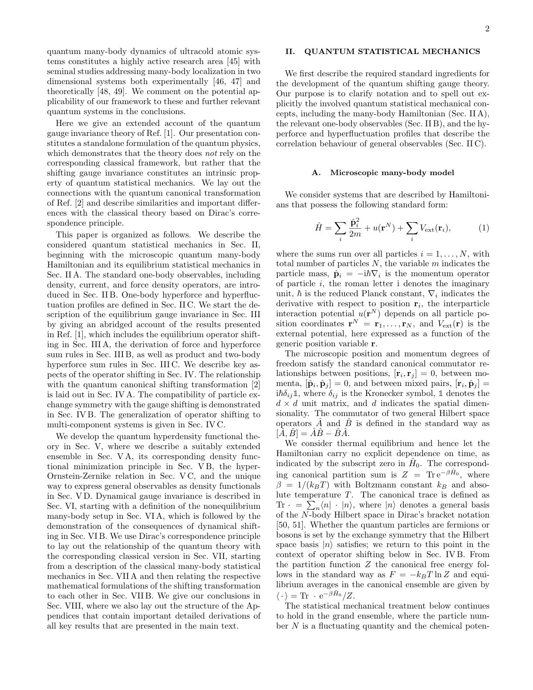
<figcaption class="paper-figure-caption"><b>Fig 1.</b> Low-resolution page preview, page 2</figcaption>
</figure>
<figure class="paper-figure-card">
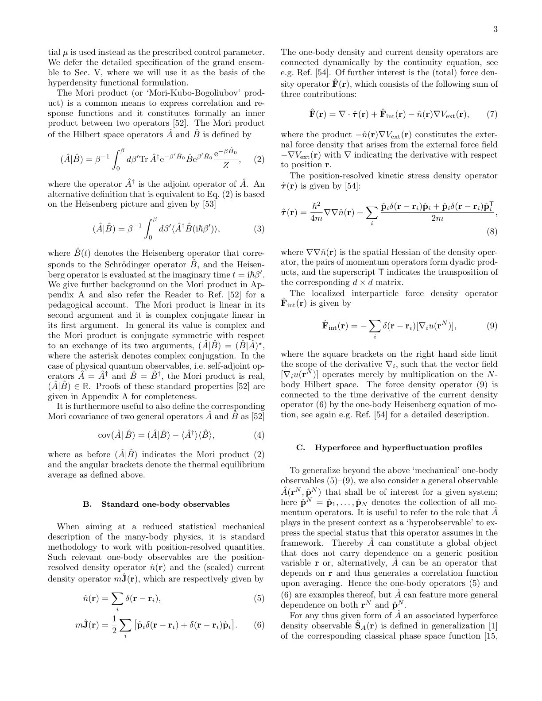
<figcaption class="paper-figure-caption"><b>Fig 2.</b> Low-resolution page preview, page 3</figcaption>
</figure>
<figure class="paper-figure-card">
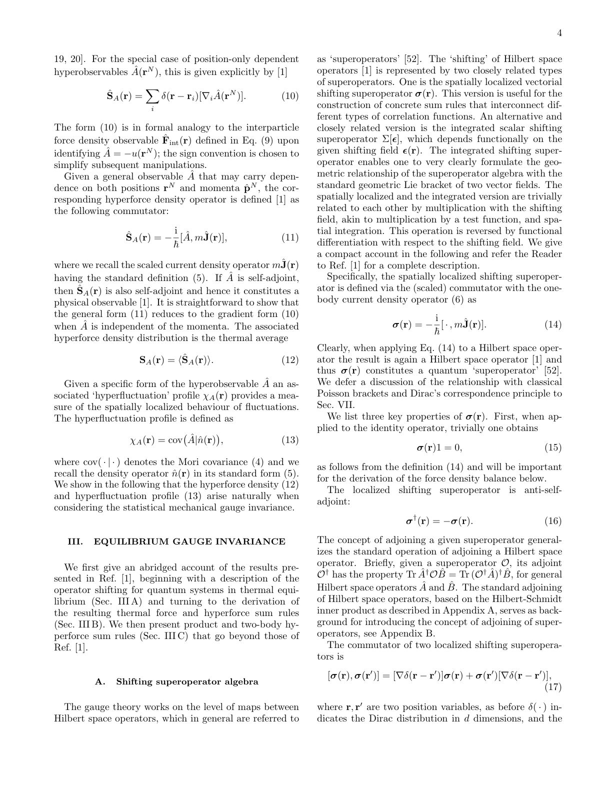
<figcaption class="paper-figure-caption"><b>Fig 3.</b> Low-resolution page preview, page 4</figcaption>
</figure>
<figure class="paper-figure-card">
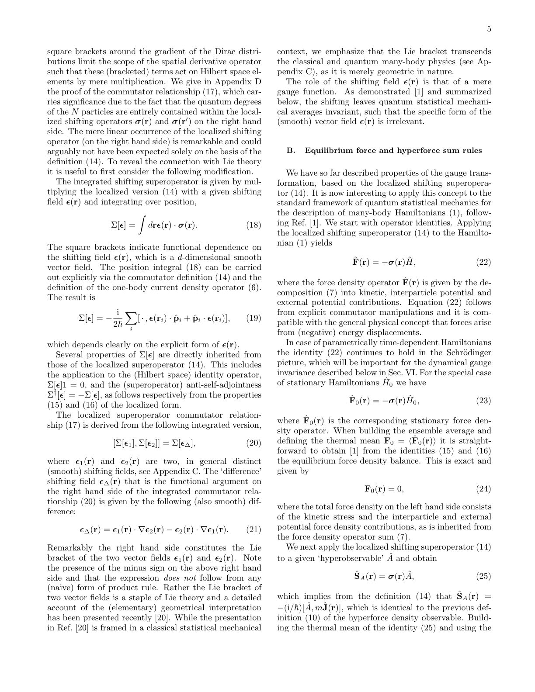
<figcaption class="paper-figure-caption"><b>Fig 4.</b> Low-resolution page preview, page 5</figcaption>
</figure>
<figure class="paper-figure-card">
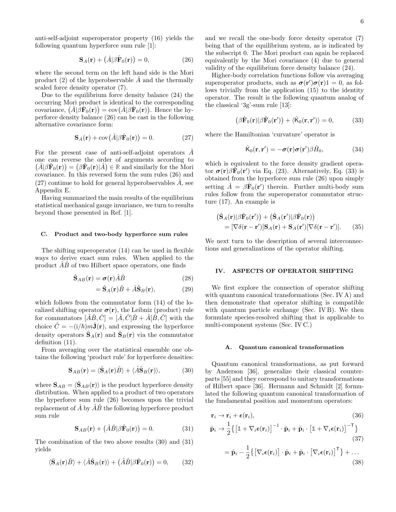
<figcaption class="paper-figure-caption"><b>Fig 5.</b> Low-resolution page preview, page 6</figcaption>
</figure>

**Summary.** This paper establishes a formal gauge theory for quantum statistical mechanics based on the invariance of observables under operator shifting. It introduces a 'hyperdensity functional theory' and derives exact sum rules that connect local correlations to global observables. The framework is applicable to both equilibrium and time-dependent quantum many-body systems.

**Why it may be interesting.** It provides a rigorous mathematical foundation for deriving exact sum rules and density functionals, which are essential for understanding many-body dynamics and developing new consistency checks for numerical many-body simulations.

Detailed structure

**Main problem.** Developing a generalized statistical mechanical theory of gauge invariance against operator shifting in quantum many-body systems and establishing its connection to hyperdensity functional theory.

**Main result.** The authors prove that a shifting superoperator induces exact sum rules (force, hyperforce, and two-body) and demonstrate that this gauge invariance is compatible with both particle exchange symmetry and canonical quantization.

**Method.** The framework utilizes superoperator algebra, the Mori product (inner product in Liouville space), and Lie theory to implement gauge transformations via a shifting field.

**Model / system.** Quantum many-body systems of N fermions or bosons in thermal equilibrium, non-equilibrium, or ground states, described by a Hamiltonian with kinetic energy, interparticle interaction, and external potentials.

**Key observables.** Density, current density, force density, hyperforce density, hyperfluctuation profile, and hyperobservables.

**Important parameters / regimes.** Temperature (T), chemical potential (mu), particle mass (m), and the shifting field (epsilon).

**Assumptions / limitations.** The Hamiltonian is assumed to be additive for the reduction of many-body averages; the shifting field is assumed to be smooth; the system is initially thermalized for the nonequilibrium extension.

**Paper structure.** The paper progresses from defining the microscopic model and equilibrium gauge invariance to describing operator shifting properties, developing hyperdensity functional theory, extending to nonequilibrium dynamics, and finally relating the quantum theory to its classical counterpart via Dirac's correspondence principle.

Abstract

We provide an extended acount of the recent statistical mechanical theory of gauge invariance against operator shifting in quantum many-body systems (arXiv:2509.20494). The gauge transformation is enacted by a shifting superoperator that displaces the fundamental position and momentum degrees of freedom. The shifting superoperator constitutes a map between Hilbert space operators and it features Lie algebra commutator structure. Averages of general observables remain invariant under the shifting both in and out of thermal equilibrium, as well as in groundstates. The gauge invariance induces exact sum rules that interconnect global observables and associated locally resolved correlation functions. In particular we describe the resulting one-body force, hyperforce, product, and two-body sum rules. We relate the shifting superoperator to a previously formulated quantum canonical transformation and present the generalization of quantum shifting to multi-component systems. The gauge theory respects fundamental fermionic and bosonic particle properties, as we demonstrate by proving the compatibility of operator shifting and exchange symmetry. We formulate the quantum version of hyperdensity functional theory to provide formal access to hyperforces as well as to general averaged quantum observables via universal density functionals. For time-dependent situations, we describe quantum dynamical gauge invariance and prove exact dynamical sum rules for nonequilibrium situations, as generated by Hamiltonian time dependence. We argue for the fundamental status of statistical mechanical gauge invariance based on the compliance of the underlying geometry with canonical quantization according to Dirac's correspondence principle. Analogies and differences of the quantum mechanical sum rules with their classical counterparts remain indicative of the respective levels of description.

[↑ back to top](#top)

### [Analytical Singular-Value Structure of Analytic-Continuation Kernels from Slepian Information Theory](http://arxiv.org/abs/2605.26586v1)

**Authors:** Masayuki Ohzeki  
**Type:** theory · **Category:** numerical methods · **PDF:** <https://arxiv.org/pdf/2605.26586v1>  
**Analysis basis:** full PDF text, analyzed in chunks
**Topic relevance:** `entanglement & information structure` **2/5** · `methods for driven-dissipative` **2/5**

↔ Scroll figures horizontally

<figure class="paper-figure-card">
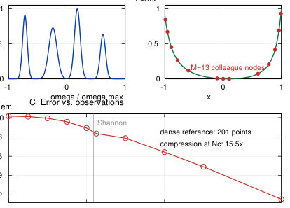
<figcaption class="paper-figure-caption"><b>Fig 1.</b> FIG. 2. Numerical sampling experiment; see Sec. S6 of the Supplemental Material for algorithmic details. (A) Original spectrum A(ω) made of four Gaussian peaks, shown as a func- tion of y = ω/ωmax. (B) Imaginary-time output obtained from the fermionic kernel; red points are the M = ⌈Nc⌉= 13 colleague-matrix observation nodes. (C) Relative reconstruc- tion error of G(x) as the number of observations M is varied. The sharp improvement at the Shannon scale shows that the compressed grid preserves the information transmitted by the kernel.</figcaption>
</figure>

**Summary.** The paper presents an analytical framework for the analytic continuation of Green's functions by treating the thermal kernel through the lens of Slepian information theory. It identifies the Shannon number as the fundamental limit for information capacity and introduces a deterministic method for optimal data sampling. This allows for high-fidelity spectral reconstruction using significantly fewer data points than traditional dense grids.

**Why it may be interesting.** This provides a rigorous, information-theoretic foundation for compressed sensing in many-body dynamics, offering a way to reduce the computational cost of processing large Quantum Monte Carlo datasets without losing essential spectral information.

Detailed structure

**Main problem.** The ill-posed inverse problem of analytic continuation, specifically reconstructing real-frequency spectra from noisy imaginary-time Green's functions in quantum many-body physics.

**Main result.** The paper derives an analytical singular-value decomposition for the thermal kernel and provides a deterministic, information-theoretically optimal sampling grid using a colleague-matrix construction.

**Method.** The author applies Slepian information theory to map the thermal kernel to a finite Fourier transform problem, utilizing Sturm-Liouville algebra and Legendre colleague matrices for optimal sampling.

**Model / system.** The study focuses on the Fredholm integral equation of the first kind representing the relationship between imaginary-time Green's functions and real-frequency spectra for fermionic and bosonic many-body systems.

**Key observables.** Real-frequency spectra A(omega), imaginary-time Green's functions G(tau), and the Shannon number Nc.

**Important parameters / regimes.** The Shannon number Nc = beta*omega_max/pi, the bandwidth/temperature scale c = beta*omega_max/2, and the compression factor.

**Assumptions / limitations.** The method assumes the ability to separate the universal dynamical Laplace transmission factor from the statistics-dependent thermal weight.

**Figures summary.** Figure 1 shows the exponential decay of singular values (the eigenvalue cliff) around the Shannon number. Figure 2 demonstrates that reconstruction error for a four-peak Gaussian spectrum drops significantly when the number of sampling nodes reaches the Shannon scale.

**Paper structure.** The paper identifies the analytic continuation problem, introduces the Slepian mapping to decompose the kernel, derives the analytical SVD via Sturm-Liouville theory, proposes a deterministic sampling grid via colleague matrices, and validates the method with a numerical compression test.

Abstract

Analytic continuation from imaginary-time Green's functions to real-frequency spectra is a central ill-posed inverse problem in quantum many-body physics. We show that the thermal kernel admits an analytical generalized singular-value structure once its purely dynamical part is separated from the statistical weight imposed by the heat bath. The dynamical kernel is the imaginary-bandwidth continuation of Slepian's finite Fourier transform and is governed by the same Sturm-Liouville algebra that yields prolate spheroidal wave functions. Fermionic and bosonic statistics then enter as gauge transformations of the frequency-space inner product, producing self-adjoint effective potentials but no numerical kernel diagonalization. The Shannon number, $N_c=β\wmax/π$, fixes the upper information capacity of this pure Laplace channel. Finally, the optimal sampling points are obtained as eigenvalues of a Legendre colleague matrix, giving a deterministic compressed-sensing grid without iterative root searches.

[↑ back to top](#top)

### [Bose-Einstein thermal operators for semidefinite optimization](http://arxiv.org/abs/2605.27228v1)

**Authors:** Michele Minervini, Nana Liu, Mark M. Wilde  
**Type:** theory · **Category:** quantum information and computing · **PDF:** <https://arxiv.org/pdf/2605.27228v1>  
**Analysis basis:** full PDF text, analyzed in chunks
**Topic relevance:** `analog quantum simulation` **2/5** · `entanglement & information structure` **2/5**

↔ Scroll figures horizontally

<figure class="paper-figure-card">
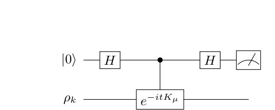
<figcaption class="paper-figure-caption"><b>Fig 1.</b> FIG. 1: The Hadamard test quantum circuit used in Algo- rithm 2 to estimate the component Re  Tr  ρke−itKµ . The evolution time t is sampled classically from a Cauchy distri- bution.</figcaption>
</figure>
<figure class="paper-figure-card">
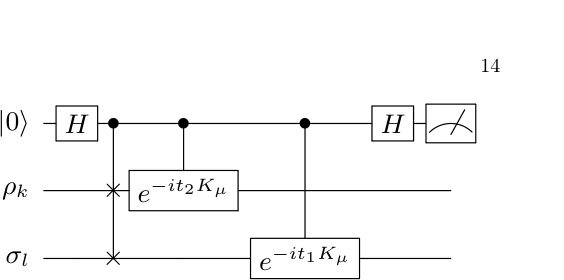
<figcaption class="paper-figure-caption"><b>Fig 2.</b> FIG. 2: The quantum circuit for estimating the unitary trace overlap Re  Tr[e−it1Kµρke−it2Kµσl] required for the Hessian element. The control qubit dictates a SWAP gate followed by independent Hamiltonian time-evolutions on the two data registers.</figcaption>
</figure>
<figure class="paper-figure-card">
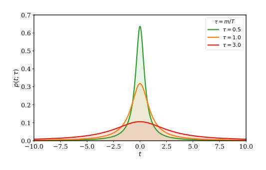
<figcaption class="paper-figure-caption"><b>Fig 3.</b> FIG. 3: The probability density function of the Cauchy distribution p(t; τ) for varying scale parameters τ = m/T. As the series index m increases or temperature T decreases, the distribution flattens, increasing the probability of sampling large evolution times t and necessitating the maximum simulation cutoff t(m) max.</figcaption>
</figure>

**Summary.** The paper introduces a framework for solving semidefinite programs by recasting them as Bose-Einstein free-energy minimization problems. By leveraging the spectral properties of the dual operator, it provides quantum algorithms that scale much more efficiently than classical methods in the presence of a spectral gap. This approach also introduces a new quantum relative entropy specifically designed for unbounded positive operators.

**Why it may be interesting.** It provides a novel way to map optimization problems to many-body physics, specifically using bosonic thermal states to bypass the dimension-dependent bottlenecks of classical SDP solvers.

Detailed structure

**Main problem.** Efficiently solving semidefinite programs (SDPs) over the unbounded positive semidefinite cone, which is challenging for classical and existing quantum solvers due to exponential scaling and the lack of an upper bound on the primal trace.

**Main result.** Established a mathematical equivalence between SDPs and bosonic thermodynamic systems, providing a regularized framework that achieves an exponential advantage in error bounds when the dual slack operator has a spectral gap.

**Method.** A quantum-classical hybrid algorithm using Hamiltonian simulation, Hadamard tests, and Cauchy sampling to perform stochastic gradient and Newton methods on a regularized Bose-Einstein free-energy minimization problem.

**Model / system.** A thermodynamic system of independent, non-interacting bosonic modes where the optimization variable represents expected occupation numbers and the dual slack operator acts as a grand canonical Hamiltonian.

**Key observables.** Expected occupation numbers, total expected energy, thermal expectation values, and the Bose-Einstein quantum relative entropy.

**Important parameters / regimes.** Temperature (T), chemical potential (mu), spectral gap (Delta), ground-space degeneracy (d0), and the minimum eigenvalue of the dual slack operator (lambda_min).

**Assumptions / limitations.** The dual slack operator is strictly positive definite (lambda_min > 0) and the problem satisfies Slater's condition (strict feasibility).

**Paper structure.** The paper first establishes the equivalence between SDPs and bosonic thermodynamics, then introduces a regularized free-energy minimization approach. It develops the information geometry of a new Bose-Einstein relative entropy, derives the complexity of hybrid quantum algorithms for gradient and Hessian estimation, and concludes with error analysis and contraction properties under affine maps.

Abstract

We establish that semidefinite programs (SDPs) over the unbounded positive semidefinite cone are mathematically equivalent to thermodynamic systems of independent bosonic modes: the eigenvalues of the optimization variable play the role of expected occupation numbers, the linear objective plays the role of total expected energy, and the linear equality constraints play the role of conserved non-commuting charges. Building on this perspective, we recast general SDPs as bosonic free-energy minimization problems at strictly positive temperature, regularized by the Bose-Einstein entropy; the original SDP is recovered in the zero-temperature limit. The optimal primal variable takes the form of a Bose-Einstein thermal operator parametrized by the dual variables. We prove an approximation-error bound that depends on the ground-space degeneracy and the spectral gap of the dual slack operator, improving on the linear-in-dimension worst-case duality gap of interior-point methods. We also introduce the Bose-Einstein quantum relative entropy as a Bregman divergence on the unbounded positive semidefinite cone, generated by the negative Bose-Einstein entropy. We propose it as a natural divergence for unnormalized positive operators, for which the standard Umegaki relative entropy can become negative, and we show that it satisfies a restricted monotonicity property under affine maps modeling bosonic Gaussian channels. Finally, we develop hybrid quantum-classical algorithms for the regularized SDP using only Hamiltonian simulation, Hadamard tests, and classical sampling, and bound their runtime in closed form. Unlike existing quantum SDP solvers, whose runtimes scale polynomially with an a priori upper bound on the primal trace, our framework operates directly on the unbounded cone, replacing this bound with a dependence on the spectral structure of the dual slack operator.

[↑ back to top](#top)

### [Conserving relaxation-time approximation for electron-electron collisions](http://arxiv.org/abs/2605.26207v1)

**Authors:** Sayak Bhattacharjee, Tatia Kiliptari, Dmitrii L. Maslov  
**Type:** theory · **Category:** strongly correlated electrons · **PDF:** <https://arxiv.org/pdf/2605.26207v1>  
**Analysis basis:** full PDF text, analyzed in chunks
**Topic relevance:** `Keldysh / 2PI / non-Gaussian methods` **2/5** · `non-equilibrium dynamics` **2/5**

↔ Scroll figures horizontally

<figure class="paper-figure-card">
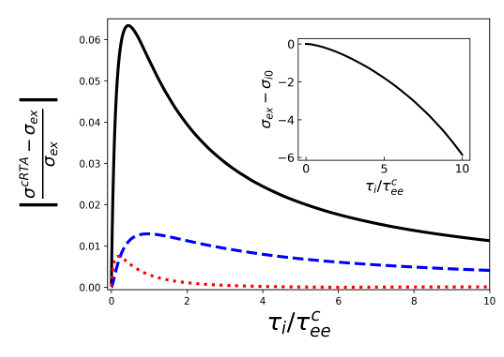
<figcaption class="paper-figure-caption"><b>Fig 1.</b> FIG. 1. Main panel: Relative deviation between the cRTA and exact results, Eqs. (16) and (20), respectively. Solid (black), dashed (blue), and dotted (red) lines correspond to b = 0, 1, 0.732 in Eq. (11), respectively. Inset: the T-dependent part of the exact solution in units of e2, for Ω2 pτi/εF = 100.</figcaption>
</figure>

**Summary.** This paper introduces a new 'conserving' relaxation-time approximation that preserves particle number, energy, and momentum in kinetic equations. It provides a highly accurate and simple framework for calculating transport properties in Fermi liquids beyond the standard semiclassical limits.

**Why it may be interesting.** not directly relevant

Detailed structure

**Main problem.** The standard relaxation-time approximation (RTA) fails to enforce fundamental conservation laws (particle number, energy, and momentum) and is often limited to the Fermi surface projection approximation, making it inaccurate for transport quantities sensitive to energy-dependent quasiparticle distributions.

**Main result.** The authors developed a conserving relaxation-time approximation (cRTA) that explicitly enforces conservation laws via an energy-resolved projection, achieving quantitative agreement (within 1-6%) with exact solutions for DC, longitudinal, and optical conductivity across various regimes.

**Method.** The cRTA uses an algebraic construction of the collision integral and an energy-resolved projection onto a hydrodynamic space of collision invariants, utilizing Wigner transforms and Moyal products to handle frequency-dependent driving terms.

**Model / system.** The framework is applied to single-band electron systems with arbitrary dispersion, including Galilean-invariant and non-Galilean-invariant Fermi liquids, such as 2D Dirac and 3D Weyl fermions, with both clean and disordered limits.

**Key observables.** DC conductivity, longitudinal conductivity, thermal conductivity, and optical conductivity.

**Important parameters / regimes.** Scattering times (ee and impurity), frequency (Omega), wavevector (q), temperature (T), and frequency-to-temperature ratio (Omega/T).

**Assumptions / limitations.** The model assumes a quasiparticle approximation, linear response to electric fields, and an energy-independent electron-electron scattering rate (neglecting logarithmic corrections in 2D).

**Figures summary.** Figure 1 shows the relative deviation between cRTA and exact results for different parameters and an inset displaying the temperature-dependent part of the exact solution.

**Paper structure.** The paper introduces the cRTA framework, details its mathematical construction and enforcement of conservation laws, benchmarks the method against exact results in various transport regimes (hydrodynamic, collisionless, viscoelastic), and discusses its application to specific systems like Weyl fermions.

Abstract

We develop a conserving relaxation-time approximation (cRTA), which explicitly enforces conservation of particle number, energy, and momentum and employs an energy-resolved projection onto the full space of collision invariants. This makes the cRTA applicable to transport quantities sensitive to the energy dependence of the nonequilibrium quasiparticle distribution near the Fermi surface. We benchmark the cRTA against several exact and asymptotically exact results. In particular, it reproduces the low- and high-temperature limits of the dc conductivity of a non-Galilean-invariant Fermi liquid (FL) with disorder, the hydrodynamic and collisionless limits of the finite wavevector longitudinal conductivity of a clean Galilean-invariant FL, and the asymptotic scaling forms of the optical conductivity of a clean non-Galilean-invariant FL beyond the semiclassical limit. For several observables, the agreement with exact solutions is quantitative at the percent level. These results demonstrate that the cRTA provides a simple and accurate framework for transport beyond the Fermi surface projection approximation.

[↑ back to top](#top)

### [Cylindrical Trap Dependence in the Unitary Fermi Gas](http://arxiv.org/abs/2605.26336v1)

**Authors:** Adèle Le Borgne  
**Type:** theory · **Category:** quantum gases · **PDF:** <https://arxiv.org/pdf/2605.26336v1>  
**Analysis basis:** full PDF text, analyzed in chunks
**Topic relevance:** `Keldysh / 2PI / non-Gaussian methods` **2/5** · `analog quantum simulation` **2/5**

↔ Scroll figures horizontally

<figure class="paper-figure-card">
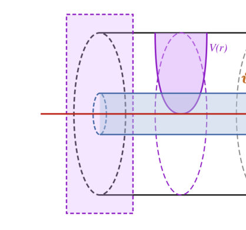
<figcaption class="paper-figure-caption"><b>Fig 1.</b> Figure 1 – Condensate confined in cylinder-shape geometry, via a power law potential in the transverse direction and by end caps in the longitudinal direction. There is no potential along z; the solutions are plane waves with frequency depending on the boundary condi- tions.</figcaption>
</figure>

**Summary.** This paper extends the theoretical description of a unitary Fermi gas from spherical to cylindrical trap geometries. It demonstrates how the interplay between longitudinal and transverse confinement modifies the dynamic structure factor. These results are crucial for accurately interpreting experimental measurements of density fluctuations in trapped quantum gases.

**Why it may be interesting.** It provides essential corrections for interpreting Bragg spectroscopy data in ultracold atom experiments, specifically regarding how trap anisotropy breaks isotropy and modifies the phonon dispersion relation.

Detailed structure

**Main problem.** The paper addresses the challenge of interpreting experimental spectra in trapped unitary Fermi gases, specifically how cylindrical trap geometries modify the dynamic structure factor and phonon dispersion relation.

**Main result.** The study derives how cylindrical confinement modifies the dynamic structure factor, finding that longitudinal confinement contributes a convex correction while transverse confinement contributes a concave correction, with the net effect being convex for typical experimental parameters.

**Method.** The authors use an Effective Field Theory (EFT) framework based on superfluid hydrodynamics, employing a Wentzel-Kramers-Brillouin (WKB) expansion and a hierarchy of scales approach to analyze different energy regimes.

**Model / system.** A unitary Fermi gas (a strongly coupled, nonrelativistic Conformal Field Theory) realized using ultracold 6Li atoms, confined in a cylindrical geometry with power-law radial potentials and axial light sheets.

**Key observables.** Dynamic structure factor S(q, omega), phonon dispersion relation, and the energy spectrum.

**Important parameters / regimes.** Bertsch parameter (xi), speed of sound (cs), dispersion parameter (gamma), aspect ratio (epsilon), and low-energy constants (c0, c1, c2).

**Assumptions / limitations.** The system is treated in the zero-temperature limit, the radial potential is assumed to approximate a hard-wall box, and the Bragg pulse is assumed to be in the linear response regime.

**Figures summary.** Figure 1 illustrates the condensate in cylindrical geometry; Figure 2 shows the energy spectrum and the accuracy of the WKB fit using numerical diagonalization.

**Paper structure.** The paper introduces the problem of trap-induced distortions, extends a spherical EFT framework to cylindrical geometry, identifies three physical energy regimes, derives the modified dynamic structure factor, and compares analytical WKB results with numerical diagonalization.

Abstract

The unitary Fermi gas serves as a tunable realization of a strongly coupled CFT, making it a powerful system for probing universal quantum many-body phenomena. Precise measurement of its properties remains experimentally challenging: finite-temperature effects and spatial inhomogeneity introduced by external trapping potentials can significantly distort observables. Cylindrical trap geometries are commonly used in experiments. This note extends an existing theoretical framework to this geometry, deriving how the cylindrical confinement modifies the dynamic structure factor at zero temperature. These results provide a necessary correction for the interpretation of experimental spectra in trapped unitary gases.

[↑ back to top](#top)

### [GPU-accelerated finite-temperature Lanczos method for spin Hamiltonians](http://arxiv.org/abs/2605.26261v1)

**Authors:** Shadan Ghassemi Tabrizi, Thomas D. Kühne  
**Type:** theory · **Category:** numerical methods · **PDF:** <https://arxiv.org/pdf/2605.26261v1>  
**Analysis basis:** full PDF text, analyzed in chunks
**Topic relevance:** `analog quantum simulation` **2/5** · `exotic spin models in light-matter` **2/5**

↔ Scroll figures horizontally

<figure class="paper-figure-card">
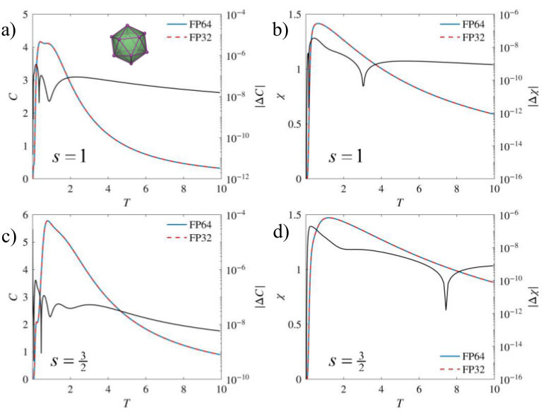
<figcaption class="paper-figure-caption"><b>Fig 1.</b> Figure 1: Thermodynamic observables and precision error for the antiferromagnetic icosahedron with local spin s = 1 (panels a, b) or s = 3/2 (c, d); left: heat capacity C, right: magnetic susceptibility χ. FP64 (solid blue) and FP32 (dashed red) are plotted on the linear left y-axis; both types of curves coincide at the resolution of the plot. The pointwise precision error, |ΔC| = |CFP32 − CFP64| or |Δχ| = |χFP32 − χFP64|, is plotted in black against its logarithmic right y-axis.</figcaption>
</figure>
<figure class="paper-figure-card">
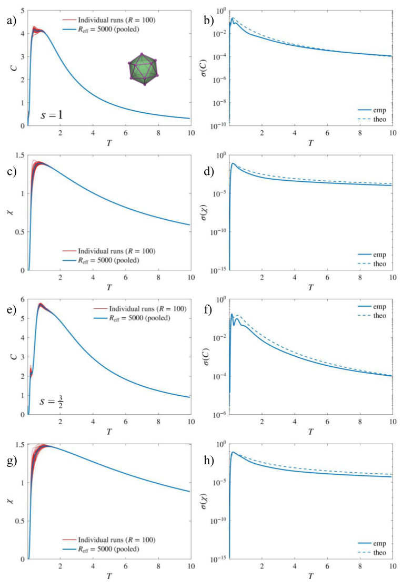
<figcaption class="paper-figure-caption"><b>Fig 2.</b> Figure 2: Multi-seed stochastic error analysis for the heat capacity and magnetic susceptibility of the icosahedron with s = 1 (a, b, c, d) or s = 3/2 (e, f, g, h). Left: 50 independent FTLM estimates (red curves, R = 100 each) and the pooled Reff = 5000 results (blue). Right: empirical and theoretical standard deviations across the 50 runs. See main text for details.</figcaption>
</figure>
<figure class="paper-figure-card">
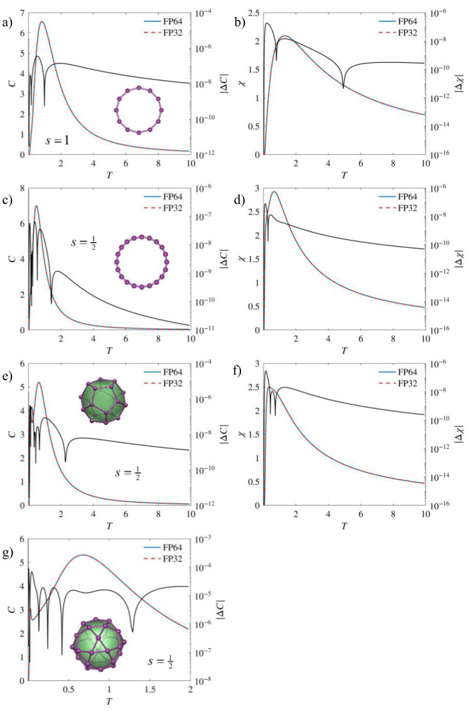
<figcaption class="paper-figure-caption"><b>Fig 3.</b> Figure 3: Thermodynamic observables and precision error (for details, see caption to Figure 1) for the s = 1, N = 12 Heisenberg ring (panels a, b), the s = 1/2 , N = 20 ring (c, d), the s = 1/2 dodecahedron (e, f) and the s = 1/2 icosidodecahedron (g). For the icosidodecahedron the calculation was restricted to the M = 0 sector (thus χ = 0, not shown) and only R = 8 random vectors were used.</figcaption>
</figure>
<figure class="paper-figure-card">
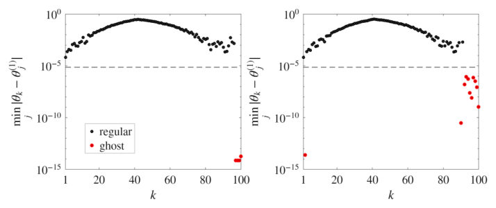
<figcaption class="paper-figure-caption"><b>Fig 4.</b> Figure 4: Ghost diagnostic for the Lanczos Ritz spectrum – based on the same random starting vector for both FP64 (left) and FP32 (right) – in the M = 0 sector of the s = 1 icosahedron. Black circles: regular eigenvalues; red circles: ghosts in the Cullum– Willoughby sense.</figcaption>
</figure>
<figure class="paper-figure-card">
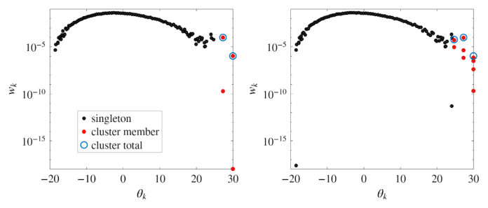
<figcaption class="paper-figure-caption"><b>Fig 5.</b> Figure 5: Cluster diagnostic for the Krylov-space energy spectrum in the M = 0 sector of the s = 1 icosahedron. The weights 𝑤𝑘 are plotted on a logarithmic scale versus eigenvalues 𝜃𝑘 (in ascending order). Black circles: singletons (not flagged by the ghost diagnostic, or not assigned to a cluster), red circles: ghost-flagged Ritz values, blue circles: total weight of clusters containing ghost-flagged near-duplicate eigenvalues.</figcaption>
</figure>

**Summary.** This paper presents a GPU-accelerated version of the Finite-Temperature Lanczos Method designed for workstation hardware. By using a matrix-free approach and optimized indexing, it allows for much larger spin cluster simulations than traditional methods. The study demonstrates that single-precision GPU arithmetic is sufficient for calculating thermodynamic observables accurately.

**Why it may be interesting.** This provides a highly efficient, accessible tool for simulating the thermodynamic properties of large-scale quantum many-body systems using standard workstation hardware.

Detailed structure

**Main problem.** The exponential growth of memory requirements for storing the Hamiltonian in sparse format prevents large-scale finite-temperature calculations on workstation-grade GPUs.

**Main result.** The authors developed a matrix-free GPU implementation of the Finite-Temperature Lanczos Method (FTLM) that achieves 10x speedups over CPUs and enables Hilbert space dimensions of ~10^8 using single-precision arithmetic without sacrificing physical accuracy.

**Method.** A matrix-free, row-wise gather formulation using two state-to-index strategies: a Compressed Lookup Table (CLT) and a Combinatorial-Ranking (CR) scheme, implemented in MATLAB/CUDA.

**Model / system.** Heisenberg spin Hamiltonians for exchange-coupled spin clusters and magnetic solids, specifically applied to icosahedron and icosidodecahedron geometries with varying spin magnitudes (s = 1/2 to 2).

**Key observables.** Partition function (Z), magnetic susceptibility (chi), heat capacity (C), and magnetization.

**Important parameters / regimes.** Hilbert space dimension ~10^8, spin magnitude (s), total magnetization sector (M), and single-precision (FP32) vs. double-precision (FP64) arithmetic.

**Assumptions / limitations.** The implementation is optimized for workstation GPUs rather than distributed clusters and currently relies on S_z symmetry.

**Figures summary.** Figure 4 and 5 show the distribution of Ritz eigenvalues and the impact of ghost eigenvalues in FP32 vs FP64; Table 3 compares wall-clock time scaling between CPU and GPU kernels.

**Paper structure.** The paper introduces the computational bottleneck of Hamiltonian storage, presents the matrix-free GPU implementation and its indexing strategies (CLT and CR), evaluates numerical precision and error scales, and concludes with performance benchmarks and scaling studies.

Abstract

We present a GPU implementation of the finite-temperature Lanczos method (FTLM) for Heisenberg spin Hamiltonians that targets workstation hardware rather than distributed-memory clusters. The Hamiltonian action is evaluated matrix-free in a row-wise gather formulation. We introduce and compare two state-to-index strategies: a compressed lookup table (CLT), which reduces lookup memory by a factor of 16 relative to a full table while retaining a fixed, branch-light access pattern, and a GPU-adapted combinatorial-ranking scheme that removes the lookup table altogether. Numerical tests against FP64 CPU references show that FP32 GPU arithmetic changes heat capacities and magnetic susceptibilities by amounts several orders of magnitude below the stochastic uncertainty of the FTLM trace estimator at typical sample sizes. Benchmarks show speedups of up to about one order of magnitude over optimized multicore CPU calculations and enable Hilbert-space sectors of dimension ~10^8 on a single workstation GPU. The MATLAB/CUDA implementation, including example input files and benchmark scripts, is openly available at https://github.com/ghasdeke/ftlm-gpu (archived at DOI: 10.5281/zenodo.20378647) under the Apache-2.0 license.

[↑ back to top](#top)

### [Nonasymptotic bounds for quantum purity amplification](http://arxiv.org/abs/2605.27262v1)

**Authors:** Thilo Scharnhorst, Jack Spilecki, John Wright  
**Type:** theory · **Category:** quantum information and computing · **PDF:** <https://arxiv.org/pdf/2605.27262v1>  
**Analysis basis:** full PDF text, analyzed in chunks
**Topic relevance:** `entanglement & information structure` **2/5** · `quantum measurements` **2/5**

↔ Scroll figures horizontally

<figure class="paper-figure-card">
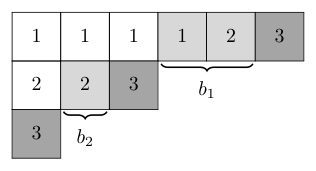
<figcaption class="paper-figure-caption"><b>Fig 1.</b> Figure 2: Illustration of the overhang bi := µi −λi+1, shown for a fixed SSYT T of shape λ = (6, 3, 1) over the alphabet [3]. Removing the darker gray boxes, which contain the letter d = 3, leaves the sub-tableau T &lt;d</figcaption>
</figure>

**Summary.** This paper provides new, nonasymptotic bounds for quantum purity amplification that hold for finite numbers of noisy quantum state copies. Unlike previous works that only describe the infinite-sample limit, this result shows how the required number of samples scales with the desired fidelity and the spectral gap of the input state. The derivation uses advanced combinatorial tools like random Young diagrams and the RSK correspondence.

**Why it may be interesting.** This is highly relevant for quantum information processing and open quantum systems, as it provides rigorous, finite-sample guarantees for state purification protocols which are essential for practical quantum error mitigation and state preparation.

Detailed structure

**Main problem.** The paper addresses the problem of quantum purity amplification (QPA), specifically seeking to establish nonasymptotic bounds on the number of noisy state copies required to prepare a high-fidelity target pure state.

**Main result.** The authors establish a nonasymptotic guarantee that n copies suffice to achieve fidelity 1-delta if n scales with k, delta, and the spectral gap between the two largest eigenvalues, independent of the dimension d.

**Method.** The proof utilizes the combinatorics of random Young diagrams, the Robinson-Schensted-Knuth (RSK) correspondence, and the representation theory of the symmetric and unitary groups (Schur-Weyl duality).

**Model / system.** The model involves n copies of a d-dimensional noisy density matrix rho, where the task is to transform these copies into k copies of the principal eigenstate.

**Key observables.** Output fidelity relative to the target state, sample complexity (n), and the spectral gap (p_d - p_{d-1}).

**Important parameters / regimes.** Number of input copies (n), number of output copies (k), error parameter (delta), and the eigenvalues of the input state (p_i).

**Assumptions / limitations.** The principal eigenstate is assumed to be unique (p_{d-1} < p_d), and the bounds are derived for arbitrary spectra.

**Figures summary.** Figure 2 illustrates the concept of 'overhang' in a Young diagram by showing how removing boxes labeled d affects the diagram structure.

**Paper structure.** The paper introduces the QPA problem and the gap in existing asymptotic literature, defines the QPA channel using representation theory, develops a combinatorial fidelity formula using RSK correspondence, and concludes with the derivation of the nonasymptotic complexity bound.

Abstract

In quantum purity amplification, one is given $n$ copies of a noisy quantum state $ρ\in \mathbb{C}^{d \times d}$ and asked to prepare $k$ copies of its principal eigenstate $|v_d\rangle$. Several prior works have derived information-theoretically optimal algorithms for this problem, but the bounds they prove are only shown in the asymptotic regime as the number of samples $n$ tends to infinity. In this paper, we establish the following nonasymptotic guarantee: if $ρ$'s eigenvalues are sorted $p_1 \leq \cdots \leq p_d$ and $p_{d-1} < p_d$, then \begin{equation*}   n = O\Big(k + \frac{k}δ \cdot \frac{1-p_d}{(p_d-p_{d-1})^2}\Big)   \end{equation*} copies suffice to output a state with fidelity at least $1-δ$ with $|v_d^{\otimes k}\rangle$. Our bound holds for arbitrary spectra, and is independent of the dimension $d$. In the case of depolarizing noise, our finite-sample guarantee matches the optimal asymptotic scaling. Our proof is based on the combinatorics of random Young diagrams.

[↑ back to top](#top)

### [Optimal quantum locally differentially private mechanisms in the high-privacy regime](http://arxiv.org/abs/2605.27278v1)

**Authors:** Yuuya Yoshida  
**Type:** theory · **Category:** quantum information and computing · **PDF:** <https://arxiv.org/pdf/2605.27278v1>  
**Analysis basis:** full PDF text, analyzed in chunks
**Topic relevance:** `entanglement & information structure` **2/5** · `quantum measurements` **2/5**

↔ Scroll figures horizontally

<figure class="paper-figure-card">
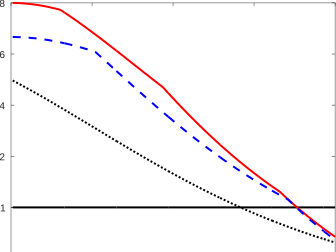
<figcaption class="paper-figure-caption"><b>Fig 1.</b> Figure 1. Graphs of S1(⃗σ∗)/S1 C(n, ε) and A1(⃗σ∗)/A1 C(n, ε). The hori- zontal axes represent the values of ε, and the vertical axes represent the values of the two ratios. The black dotted lines, the blue dashed lines, and the red solid lines are the cases n = 3, n = 6, and n = 10, respec- tively.</figcaption>
</figure>
<figure class="paper-figure-card">
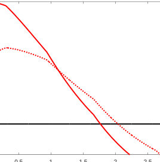
<figcaption class="paper-figure-caption"><b>Fig 2.</b> Figure 2. Graphs of S1(⃗σ)/S1 C(10, ε) and A1(⃗σ)/A1 C(10, ε). The hori- zontal axes represent the values of ε, and the vertical axes represent the values of the two ratios. The red solid lines and the red dotted lines are the cases ⃗σ = ⃗σ∗and ⃗σ = ⃗σ∗∗, respectively.</figcaption>
</figure>

**Summary.** This paper identifies a fundamental quantum advantage in the high-privacy regime of local differential privacy. It proves that for datasets with three or more items, quantum mechanisms provide a strictly higher utility-to-privacy ratio than classical mechanisms, regardless of the specific information-theoretic metric used.

**Why it may be interesting.** not directly relevant

Detailed structure

**Main problem.** Optimizing the trade-off between privacy and utility in the high-privacy regime (epsilon -> 0) for Quantum Local Differential Privacy (QLDP) compared to classical LDP.

**Main result.** The paper proves that in the high-privacy regime, the ratio of quantum to classical optimal utility (Q/C) is constant regardless of the utility function and demonstrates a quantum advantage of at least 3/2 for data with cardinality n >= 3.

**Method.** The author uses second-order Taylor expansions, Fréchet derivatives, and Petz monotone metrics to analyze utility functions, alongside frame theory (isoclinic mechanisms) to construct optimal quantum mechanisms.

**Model / system.** The framework involves a data collector estimating information from private data provided via quantum states (QLDP) or classical probability distributions (LDP), using density matrices on a d-dimensional Hilbert space.

**Key observables.** Holevo information, mutual information, error exponents in symmetric and asymmetric hypothesis testing, and f-divergences.

**Important parameters / regimes.** Privacy parameter epsilon (specifically the limit epsilon -> 0), data cardinality n, and the dimension d of the Hilbert space.

**Assumptions / limitations.** The utility functions are assumed to be symmetric, unitary invariant, and possess a positive second derivative (Hessian) at the uniform distribution; the quantum advantage disappears for binary data (n=2).

**Figures summary.** Figure 1 plots the ratios of symmetric and asymmetric error exponents against epsilon for different n, illustrating the presence of quantum advantage for small epsilon.

**Paper structure.** The paper introduces the privacy-utility trade-off, establishes the mathematical framework for LDP and QLDP, proves the fundamental asymptotic ratio theorem, constructs optimal isoclinic mechanisms, and analyzes specific hypothesis testing scenarios.

Abstract

We optimize the trade-off between privacy and utility in the high-privacy regime. We adopt local differential privacy (LDP) and its quantum extension, quantum local differential privacy (QLDP), for privacy protection, and investigate utility functions including the Holevo information (which reduces to the mutual information in the classical case) and the error exponents in symmetric and asymmetric hypothesis testing. These utility functions have classical and quantum optimal values, which are denoted by $C$ and $Q$, respectively, in this abstract for simplicity. In this paper, we provide optimal LDP and QLDP mechanisms achieving the classical and quantum optimal values in the high-privacy regime, and prove that the asymptotic ratio $Q/C$ in this regime takes the same value regardless of the utility function. Our results reveal quantum advantages (more precisely, $Q/C\ge3/2$) for the above utility functions when the protected private data are $n$-ary with $n\ge3$.

[↑ back to top](#top)

### [Trade-off Relation for Black Hole Entropy Fluctuations](http://arxiv.org/abs/2605.26214v1)

**Authors:** Kensuke Gallock-Yoshimura, Yoshihiko Hasegawa  
**Type:** theory · **Category:** other · **PDF:** <https://arxiv.org/pdf/2605.26214v1>  
**Analysis basis:** full PDF text, analyzed in chunks
**Topic relevance:** `Keldysh / 2PI / non-Gaussian methods` **2/5** · `entanglement & information structure` **2/5**

↔ Scroll figures horizontally

<figure class="paper-figure-card">
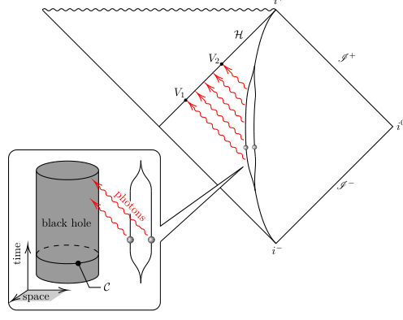
<figcaption class="paper-figure-caption"><b>Fig 1.</b> FIG. 1. The Penrose diagram of a black hole with stationary trajectories of the superposed charge and a schematic picture of the DSW experiment. No radiation will be propagated to I + so long as the experiment is performed adiabatically. Here, V1 and V2 are two “times” on the horizon H, and C is a cross section of the black hole.</figcaption>
</figure>

**Summary.** This paper establishes a fundamental limit on the precision with which a black hole can record quantum information, showing that entropy fluctuations are unavoidable. It proves that the relative variance of the entropy change is inversely proportional to the number of infalling photons. This result links the stochastic nature of semiclassical gravity to the information-carrying capacity of quantum fields.

**Why it may be interesting.** not directly relevant

Detailed structure

**Main problem.** The paper investigates whether black hole horizons can record quantum information with arbitrarily small entropy fluctuations and seeks to establish a fundamental trade-off relation between entropy variance and the amount of infalling quantum information.

**Main result.** The authors derive a fundamental trade-off relation where the relative variance of the black hole entropy change is bounded from below by the inverse of the photon number: Var[Delta delta S] / (E[Delta delta S])^2 >= 1 / (4 <N>).

**Method.** The study utilizes stochastic semiclassical gravity and the Einstein-Langevin equations, employing the Magnus expansion, the Cauchy-Schwarz inequality, and the gravitational phase space method to analyze fluctuations in the energy-momentum tensor.

**Model / system.** The system consists of an asymptotically flat, stationary Schwarzschild black hole interacting with infalling quantum matter fields (photons) within the framework of the Danielson-Satishchandran-Wald decoherence mechanism.

**Key observables.** Stochastic variance of black hole entropy change (Var[Delta delta S]), expectation value of entropy change (E[Delta delta S]), photon number (<N>), and quantum mutual information (I).

**Important parameters / regimes.** Planck length (l_P), Schwarzschild radius (r_h), effective dipole moment (ql), and the number of entangling photons.

**Assumptions / limitations.** The field state is assumed to be a quasifree Hadamard state, and the spacetime is assumed to be stationary and asymptotically flat.

**Figures summary.** Figure 1 provides a Penrose diagram of a black hole and a schematic of the DSW experiment, illustrating a superposed charge and the capture of entangling photons by the horizon.

**Paper structure.** The paper begins by defining the physical problem and the DSW decoherence mechanism, proceeds to establish the mathematical framework of stochastic semiclassical gravity, derives the fundamental trade-off relations and uncertainty bounds using field-theoretic methods, and concludes with implications for horizon area fluctuations.

Abstract

Black holes respond to infalling quantum matter fields by changing their entropy. Since such matter is quantum in nature, the entropy response should be sensitive to its quantum fluctuations. We show, within stochastic semiclassical gravity, that a horizon cannot record relevant quantum information with arbitrarily small entropy fluctuations. For the infalling photons encoding which-path information in the Danielson-Satishchandran-Wald decoherence experiment, we derive a trade-off relation between the stochastic variance of the black hole entropy change and the photon number.

[↑ back to top](#top)

### [Uncertainty Relation for a Single Observable](http://arxiv.org/abs/2605.26331v1)

**Authors:** Haruki Yamashita, Aina Mayumi, Gen Kimura  
**Type:** theory · **Category:** quantum information and computing · **PDF:** <https://arxiv.org/pdf/2605.26331v1>  
**Analysis basis:** full PDF text, analyzed in chunks
**Topic relevance:** `entanglement & information structure` **2/5** · `quantum measurements` **2/5**

↔ Scroll figures horizontally

<figure class="paper-figure-card">
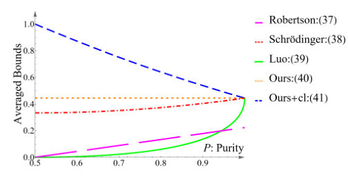
<figcaption class="paper-figure-caption"><b>Fig 1.</b> FIG. 1. State purity versus the averaged lower bounds ob- tained from the Robertson relation (34), the Schr¨odinger re- lation (35), the Luo-type relation (31), and the optimal rela- tions (32) and the sharper relation (33) derived in this paper.</figcaption>
</figure>

**Summary.** The paper establishes that the uncertainty of a single quantum observable has an intrinsic lower bound determined by its noncommutativity with the quantum state. It introduces a method to decompose variance into classical and quantum components, achieving an exact identity for qubit systems. These new relations are shown to be tighter than traditional uncertainty bounds like the Robertson or Schrodinger relations.

**Why it may be interesting.** This is highly relevant for quantum information and open quantum systems as it provides a fundamental way to quantify the 'quantumness' or coherence of an observable relative to a state, which is crucial for understanding decoherence and resource theories.

Detailed structure

**Main problem.** Investigating whether the uncertainty of a single observable admits a non-trivial lower bound based on the noncommutativity between the observable and the quantum state.

**Main result.** The authors derive optimal, state-dependent lower bounds for the variance of a single observable and show that for qubits, these bounds provide an exact decomposition of variance into classical and noncommutative parts.

**Method.** The study uses spectral decomposition, the Hilbert-Schmidt norm, and the pinching map to decompose variance, alongside optimization of coefficients for a family of uncertainty relations.

**Model / system.** The work considers general finite-dimensional quantum systems (Hilbert space C^d) and provides detailed analysis for qubit systems using the Bloch vector representation.

**Key observables.** Variance of a single observable (V_rho(A)), Wigner-Yanase-type quantity, and commutator norms.

**Important parameters / regimes.** Eigenvalues of the density operator (lambda_max, lambda_min), purity (P), and the parameter s in the family of relations s in [1/2, infinity).

**Assumptions / limitations.** The results exclude the maximally mixed state where the commutator vanishes, and the specific identity results are derived for qubit systems.

**Figures summary.** Figure 1 compares the averaged lower bounds of various uncertainty relations (Robertson, Schrodinger, Luo, and the authors' optimal bound) against the purity of the state, demonstrating the superiority of the proposed bounds.

**Paper structure.** The paper introduces the single-observable problem, proves optimal lower bounds for general systems, refines these bounds by adding classical uncertainty, provides an exact identity for qubits, and concludes with a comparative analysis of averaged uncertainty products.

Abstract

Uncertainty relations are usually formulated as trade-off relations between two or more observables. Here we show that the uncertainty of a single observable already has a nontrivial lower bound originating from the noncommutativity between the observable and the quantum state. We prove sharp lower bounds on the variance of a single observable and then sharpen them further by introducing the classical uncertainty of the observable under a fixed state. The optimal coefficient is determined solely by the smallest and largest eigenvalues of the state. Our results include an optimal state-dependent improvement of Luo's Wigner--Yanase-type relation and a direct bound showing that coherence or asymmetry of the state with respect to the observable gives an unavoidable contribution to its uncertainty. For qubits, the sharpened bounds become exact identities, giving a complete decomposition of the variance into classical and noncommutative parts. These single-observable relations also yield improved product-form uncertainty relations for pairs of observables.

[↑ back to top](#top)

### [Multi-Scale Coherence of Represented Flows](http://arxiv.org/abs/2605.26412v1)

**Authors:** Amir Jafari  
**Type:** theory · **Category:** statistical mechanics · **PDF:** <https://arxiv.org/pdf/2605.26412v1>  
**Analysis basis:** full PDF text, analyzed in chunks
**Topic relevance:** `non-equilibrium universality` **2/5** · `non-equilibrium dynamics` **1/5**

↔ Scroll figures horizontally

<figure class="paper-figure-card">
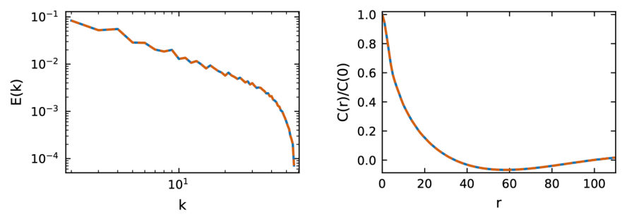
<figcaption class="paper-figure-caption"><b>Fig 1.</b> FIG. 1: Matched second-order statistics for two synthetic divergence-free vector fields. Solid blue denotes Field A and dashed orange denotes Field B. The left panel shows the shell-averaged spectrum E(k), and the right panel shows the normalized scalar two-point correlation C(r)/C(0). The two fields are indistinguishable at this second-order level, up to numerical roundoff.</figcaption>
</figure>
<figure class="paper-figure-card">
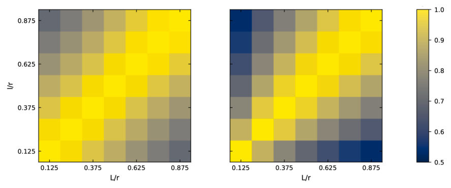
<figcaption class="paper-figure-caption"><b>Fig 2.</b> FIG. 2: Cross-resolution coherence for the same two divergence-free fields as in Fig. 1. The left heatmap shows Field A and the right heatmap shows Field B. The plotted quantity is the signed coherence SℓL, averaged over space, separation directions, and sampled separations r, then binned by the resolution ratios L/r and ℓ/r. Although the two fields have identical Fourier amplitudes, matched spectra, and matched scalar two-point correlations, their coherence matrices differ, showing that second-order statistics do not determine cross-resolution directional organization.</figcaption>
</figure>
<figure class="paper-figure-card">
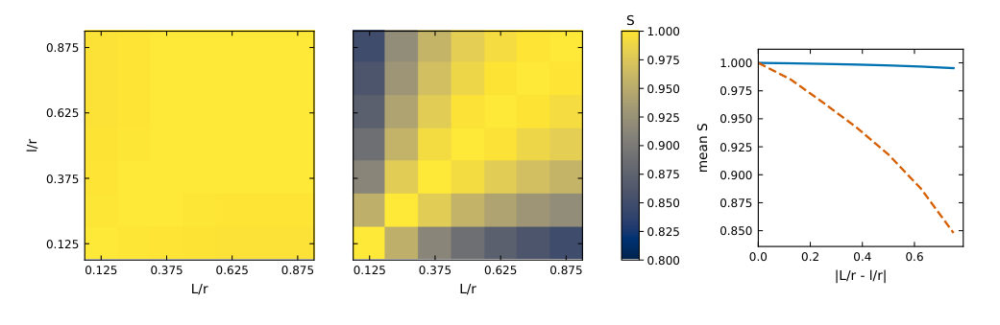
<figcaption class="paper-figure-caption"><b>Fig 3.</b> FIG. 3: Representation dependence of cross-resolution coherence for the Lorenz vector field. The left heatmap shows the signed coherence matrix SℓL in the original phase-space coordinates, while the middle heatmap shows the same diagnostic after a smooth wrinkling of the coordinate chart. The right panel summarizes the same data by averaging SℓL at fixed resolution-ratio gap |L/r −ℓ/r|; solid blue denotes the original coordinates and dashed orange denotes the wrinkled coordinates. The underlying dynamics is unchanged, but the represented finite-separation geometry is modified.</figcaption>
</figure>
<figure class="paper-figure-card">
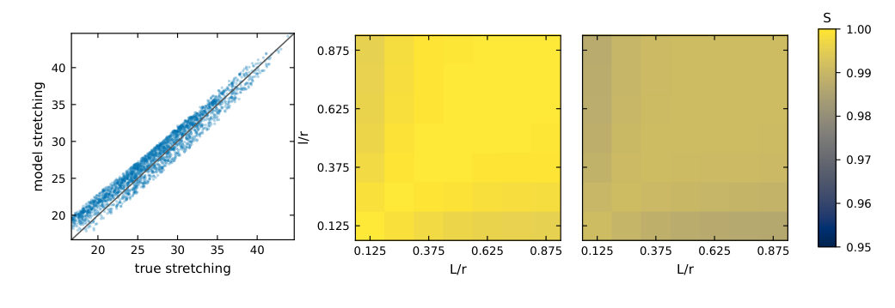
<figcaption class="paper-figure-caption"><b>Fig 4.</b> FIG. 4: Model mismatch in a sampled Lorenz phase-space vector field. The left panel compares the local stretching proxy σmax(Df) for the Lorenz vector field with the corresponding value for a smooth misspecified model. The middle panel shows the true self-coherence</figcaption>
</figure>
<figure class="paper-figure-card">
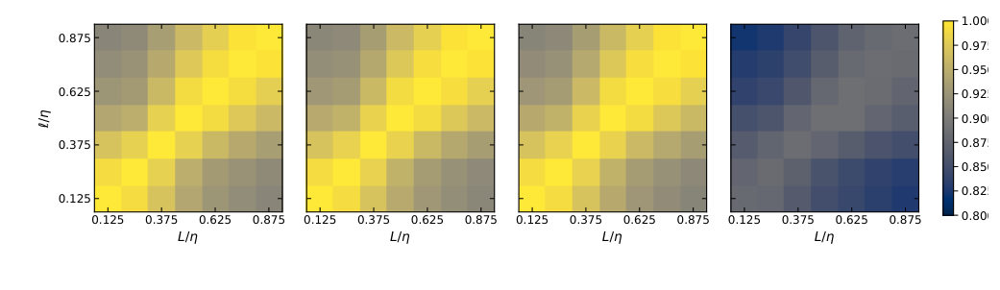
<figcaption class="paper-figure-caption"><b>Fig 5.</b> FIG. 5: FRG truncation geometry in the three-dimensional O(1) LPA flow. From left to right, the heatmaps show the projected self-coherence matrices for M = 4, M = 5, and M = 6 polynomial truncations, followed by the projected M = 4–M = 6 cross-coherence matrix. The plotted quantity is the signed increment coherence SℓL, averaged over sampled theory-space points, displacement directions, and displacement lengths, and binned by L/η and ℓ/η. The self-coherence matrices remain high and structurally similar, while the cross-truncation matrix is systematically reduced.</figcaption>
</figure>

**Summary.** This paper introduces a new diagnostic called the coherence matrix to detect how the geometry of vector fields changes across different scales. It proves that this method can identify structural differences in flows that standard tools like power spectra or Lyapunov exponents fail to detect, specifically in the context of dynamical systems and renormalization-group flows.

**Why it may be interesting.** not directly relevant

Detailed structure

**Main problem.** The paper addresses the lack of a diagnostic tool capable of testing whether the geometric structure of vector-field increments at finite separations remains stable across different observational resolutions, scales, or representations.

**Main result.** The authors demonstrate that a new 'multi-scale coherence' diagnostic can distinguish between flows that appear identical under standard second-order statistics (spectra and correlations) and can detect geometric mismatches in renormalization-group truncations.

**Method.** A new representation-dependent diagnostic, the coherence matrix, is introduced to compare the direction of vector-field increments after smoothing the field at two different resolutions.

**Model / system.** The method is tested on three distinct systems: synthetic 2D divergence-free vector fields, the Lorenz dynamical system, and the functional renormalization-group (FRG) beta-function flows for a 3D O(1) scalar theory.

**Key observables.** Coherence matrix (S_l_L), power spectra, scalar two-point correlations, local stretching proxies (maximum singular value of the Jacobian), and pointwise beta-vector cosine.

**Important parameters / regimes.** Smoothing resolutions (l, L), separation distance (r), resolution ratios (a = L/r, b = l/r), and the FRG width factor (chi).

**Assumptions / limitations.** The diagnostic is representation-dependent and not coordinate-invariant; it depends on the chosen variables, metric, and coarse-graining protocol.

**Figures summary.** Figure 1 and 2 show that synthetic fields with identical spectra have distinct coherence matrices; Figure 3 shows how coordinate wrinkling reduces Lorenz field coherence; Figure 5 and 6 demonstrate that cross-truncation coherence in FRG flows decreases as higher-order couplings are activated.

**Paper structure.** The paper introduces the multi-scale coherence diagnostic, then applies it to three test cases (synthetic fields, Lorenz system, and FRG flows) to demonstrate its ability to capture geometric information invisible to standard statistics, before concluding with its utility as a complementary tool.

Abstract

Many problems in nonlinear and statistical physics are formulated through represented flows, including physical-space vector fields, phase-space drift fields, and truncated renormalization-group beta functions. We introduce a complementary representation-dependent diagnostic for testing whether finite-separation flow geometry is stable across observational resolution. For two separated points, states, or theories, the method compares the direction of the corresponding vector-field increment after the field has been smoothed at two resolutions. Averaging this normalized comparison over sampled separations gives a coherence matrix tied to the chosen variables, coarse graining, metric, and sampling protocol; it is a consistency test, not a coordinate-invariant quantity. We demonstrate the diagnostic in three settings. Synthetic divergence-free fields with identical Fourier amplitudes, spectra, and scalar two-point correlations nevertheless produce distinct coherence matrices, showing that second-order statistics do not determine cross-resolution increment geometry. Lorenz phase-space tests show that a smooth coordinate wrinkling changes represented drift geometry without changing the underlying dynamics, and that a weak model perturbation lowers finite-separation coherence even when local stretching proxies remain closely matched. Finally, for functional renormalization-group flows of the three-dimensional \(O(1)\) scalar theory, projected \(M=4,5,6\) LPA beta fields remain internally coherent, while cross-truncation coherence decreases as higher-order coupling directions are activated. The diagnostic provides a practical field-level check of how representations, models, and truncations preserve finite-separation flow geometry, complementing rather than replacing standard local, spectral, or fixed-point diagnostics.

[↑ back to top](#top)

### [A Gauge-Covariant Theoretical Framework for Non-Abelian Holonomy Estimation and Feed-Forward Correction in Time-Bin Photonic Qudits](http://arxiv.org/abs/2605.26697v1)

**Authors:** N. Josef Bruzzese  
**Type:** theory · **Category:** quantum information and computing · **PDF:** <https://arxiv.org/pdf/2605.26697v1>  
**Analysis basis:** full PDF text, analyzed in chunks
**Topic relevance:** `quantum measurements` **2/5**

↔ Scroll figures horizontally

<figure class="paper-figure-card">
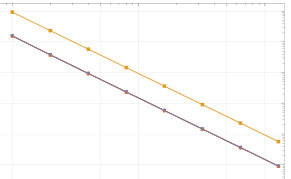
<figcaption class="paper-figure-caption"><b>Fig 1.</b> Figure 2: Aggregate convergence validation. The plot shows Frobenius errors for the non- Abelian connection benchmark, frame-overlap pipeline, holonomy estimation for correction, and left/right feed-forward correction.</figcaption>
</figure>
<figure class="paper-figure-card">
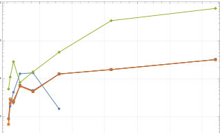
<figcaption class="paper-figure-caption"><b>Fig 2.</b> Figure 3: Aggregate unitarity validation. The reconstructed holonomies and corrected gates remain unitary to numerical precision across the tested refinements.</figcaption>
</figure>
<figure class="paper-figure-card">
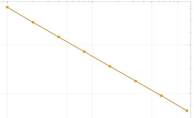
<figcaption class="paper-figure-caption"><b>Fig 3.</b> Figure 4: Feed-forward correction infidelity 1 −F. Plotting infidelity rather than fidelity resolves convergence near unit fidelity.</figcaption>
</figure>
<figure class="paper-figure-card">
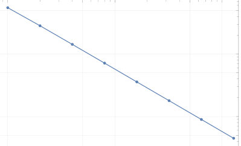
<figcaption class="paper-figure-caption"><b>Fig 4.</b> Figure 6: Projector-step refinement diagnos- tic for the frame-overlap pipeline. The maxi- mum adjacent-projector distance decreases un- der mesh refinement, consistent with the re- quirement that nearby overlap matrices remain well-conditioned.</figcaption>
</figure>
<figure class="paper-figure-card">
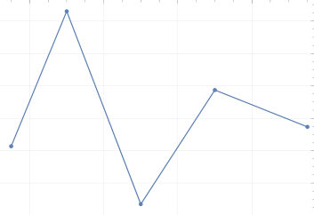
<figcaption class="paper-figure-caption"><b>Fig 5.</b> Figure 5: Scaled-noise slopes across controlled conditioning levels. The slopes cluster near one, consistent with approximately linear de- pendence on η/µmin in the perturbative regime.</figcaption>
</figure>

**Summary.** The paper develops a new way to calibrate quantum gates that suffer from non-Abelian geometric errors, specifically for photonic qudits. It replaces simple phase subtraction with a matrix-based method that is robust even when the choice of basis changes. This allows for more accurate error correction in complex, high-dimensional quantum computing architectures.

**Why it may be interesting.** This is highly relevant for quantum optics and photonic QI as it provides a rigorous mathematical foundation for calibrating high-dimensional, non-Abelian geometric gates in complex photonic circuits.

Detailed structure

**Main problem.** Estimating and correcting non-Abelian geometric distortions (Wilczek-Zee holonomies) in quantum systems where the encoded object is a transported logical subspace rather than independent rays.

**Main result.** A gauge-covariant theoretical framework for reconstructing non-Abelian holonomy using polar decomposition of overlap matrices, providing robust left- and right-acting feed-forward correction rules.

**Method.** A discrete estimator constructed from the polar decomposition of overlap matrices between successive subspace frames, validated through numerical studies using synthetic non-Abelian transport models.

**Model / system.** Time-bin photonic qudits where a rank-m logical subspace is subject to transport along a path in parameter space, potentially involving mode mixing or effective degeneracies.

**Key observables.** Matrix-valued holonomies, spectrum of the holonomy, Wilson-loop traces, and the minimum singular value of overlap matrices as a conditioning diagnostic.

**Important parameters / regimes.** Rank m of the subspace, control parameters lambda, and the conditioning parameter mu_min (minimum singular value).

**Assumptions / limitations.** The reconstruction assumes well-conditioned overlap matrices (singular values bounded away from zero) and a smooth (C2) frame path; it does not assume a specific device-specific transfer matrix or loss model.

**Figures summary.** Figure 1 outlines the reconstruction algorithm; Figure 2 shows convergence of Frobenius error with refinement; Figure 3/6 includes a diagnostic for projector-step refinement.

**Paper structure.** The paper identifies the failure of Abelian calibration in subspace architectures, proposes a matrix-valued gauge-covariant alternative, provides mathematical proofs for optimality and stability, and validates the framework via numerical simulations of synthetic transport models.

Abstract

We develop a theoretical and computational framework for estimating and correcting non-Abelian geometric distortions in time-bin photonic qudit processing when the relevant encoded object is a transported logical subspace rather than a collection of independent rays. In such settings, for example under mode mixing, multiplexed routing, or effective degeneracies, the geometric contribution is naturally matrix-valued and is described by a Wilczek-Zee holonomy on a rank-$m$ sub-bundle of the ambient Hilbert space. The framework generalises prior Abelian time-bin Pancharatnam-Berry feed-forward calibration, in which geometric distortions are represented by bin-resolved scalar phases, to the non-Abelian, matrix-valued case. We construct a gauge-covariant discrete estimator from overlap matrices between successive subspace frames: the polar factor of each overlap gives a unitary backward frame comparator, and the adjoint comparators compose to approximate the forward path-ordered exponential of the Wilczek-Zee connection. We prove gauge covariance under frame changes, polar optimality of the local comparator, consistency under partition refinement, and perturbative stability under well-conditioned overlap errors. We then formulate left- and right-acting feed-forward correction rules for removing the estimated holonomy from an effective logical operation. The work does not assume a device-specific transfer matrix, loss model, detector model, or experimental calibration pipeline; numerical studies use synthetic non-Abelian transport models to validate covariance, convergence, conditioning dependence, and correction fidelity.

[↑ back to top](#top)

### [Algebras of order parameters in one-dimensional spin systems](http://arxiv.org/abs/2605.27193v1)

**Authors:** Ameya Chavda, Clement Delcamp, Alex Turzillo, Minyoung You  
**Type:** theory · **Category:** strongly correlated electrons · **PDF:** <https://arxiv.org/pdf/2605.27193v1>  
**Analysis basis:** full PDF text, analyzed in chunks
**Topic relevance:** `entanglement & information structure` **2/5**

↔ Scroll figures horizontally

<figure class="paper-figure-card">
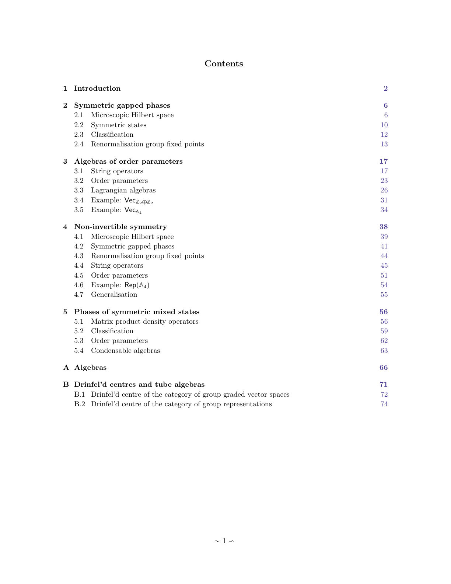
<figcaption class="paper-figure-caption"><b>Fig 1.</b> Low-resolution page preview, page 2</figcaption>
</figure>
<figure class="paper-figure-card">
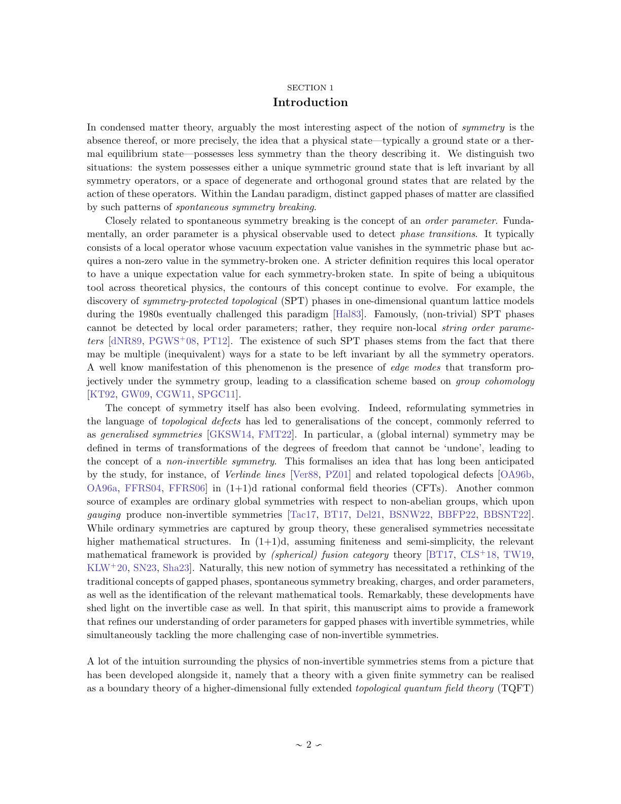
<figcaption class="paper-figure-caption"><b>Fig 2.</b> Low-resolution page preview, page 3</figcaption>
</figure>
<figure class="paper-figure-card">
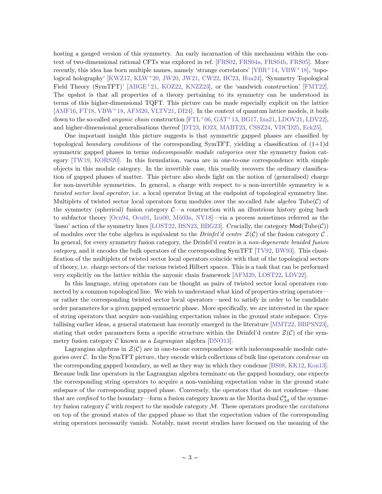
<figcaption class="paper-figure-caption"><b>Fig 3.</b> Low-resolution page preview, page 4</figcaption>
</figure>
<figure class="paper-figure-card">
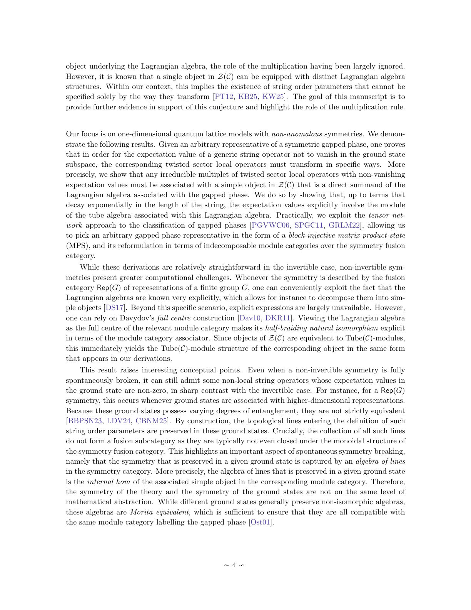
<figcaption class="paper-figure-caption"><b>Fig 4.</b> Low-resolution page preview, page 5</figcaption>
</figure>
<figure class="paper-figure-card">
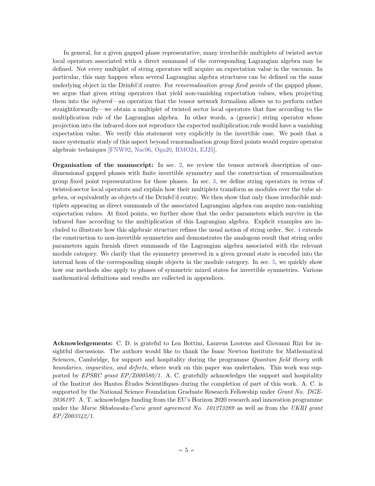
<figcaption class="paper-figure-caption"><b>Fig 5.</b> Low-resolution page preview, page 6</figcaption>
</figure>

**Summary.** This paper provides a unified algebraic framework to classify string order parameters in 1D systems with non-invertible symmetries. It demonstrates that these order parameters form a Lagrangian algebra in the Drinfeld center of the symmetry category. The results extend the understanding of phase transitions and symmetry breaking to both pure and mixed-state quantum systems.

**Why it may be interesting.** This work is highly relevant for many-body dynamics and open quantum systems as it extends the classification of order parameters to symmetric mixed states and provides a rigorous algebraic framework for non-invertible symmetries.

Detailed structure

**Main problem.** The paper investigates the algebraic properties of string order parameters in 1D quantum lattice models with both invertible and non-invertible symmetries, specifically focusing on the role of the multiplication rule in the Lagrangian algebra.

**Main result.** The authors prove that multiplets of string order parameters organize into a Lagrangian algebra within the Drinfeld center of the symmetry category and that the expectation value of a string operator depends on the associated tube algebra module.

**Method.** The study utilizes tensor network approaches, specifically block-injective Matrix Product States (MPS), combined with the mathematical framework of fusion category theory, module categories, and the SymTFT construction.

**Model / system.** One-dimensional quantum lattice models (spin systems) characterized by finite invertible or non-invertible (fusion) symmetries, including both gapped phases and symmetric mixed states.

**Key observables.** String order parameters, twisted sector local operators, and expectation values of non-local operators.

**Important parameters / regimes.** Gapped phases, spontaneous symmetry breaking (SSB) regimes, infrared (IR) limit, and non-anomalous symmetry categories.

**Assumptions / limitations.** The symmetries are assumed to be finite and semi-simple (fusion categories), and the gapped phases are represented by block-injective MPS.

**Paper structure.** The paper moves from the classical Landau paradigm to SPT phases and non-invertible symmetries, establishing a unified algebraic description through tensor networks, classifying gapped phases via module categories, and providing explicit character and Omega-symbol derivations for the Drinfeld center.

Abstract

We study order parameters in one-dimensional quantum lattice models with finite invertible or non-invertible symmetry. We investigate what properties a string operator must satisfy in order to acquire a non-vanishing expectation value in a given gapped phase. We deduce that multiplets of string order parameters organise into a Lagrangian algebra in the Drinfel'd centre of the symmetry category. In particular, we highlight the role of the multiplication rule as governing the fusion of the twisted sector local operators that constitute the string operator in the infrared limit. Our derivations exploit the tensor network approach to the classification of gapped phases and its reformulation in terms of module categories over the symmetry category. Within this framework, a gapped phase is associated with a pattern of spontaneous symmetry breaking wherein a Morita class of algebras of topological lines is preserved in the ground state subspace. The crux of the proof is to show that the expectation value of any string operator explicitly depends on the tube algebra module associated with the Lagrangian algebra, which is realised as the full centre of the corresponding module category. Finally, we demonstrate that these techniques extend to phases of symmetric mixed states.

[↑ back to top](#top)

### [On Clifford hierarchy testing and near-extremizers of noncommutative uniformity norms](http://arxiv.org/abs/2605.26983v1)

**Authors:** Zongbo, Bao, Jop Briët, Davi Castro-Silva, Philippe van Dordrecht, Jonas Helsen  
**Type:** theory · **Category:** quantum information and computing · **PDF:** <https://arxiv.org/pdf/2605.26983v1>  
**Analysis basis:** full PDF text, analyzed in chunks
**Topic relevance:** `entanglement & information structure` **2/5**

↔ Scroll figures horizontally

<figure class="paper-figure-card">
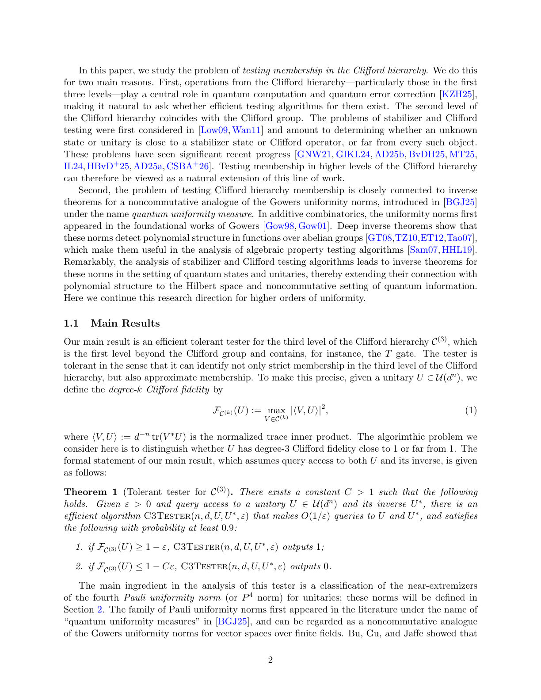
<figcaption class="paper-figure-caption"><b>Fig 1.</b> Low-resolution page preview, page 2</figcaption>
</figure>
<figure class="paper-figure-card">
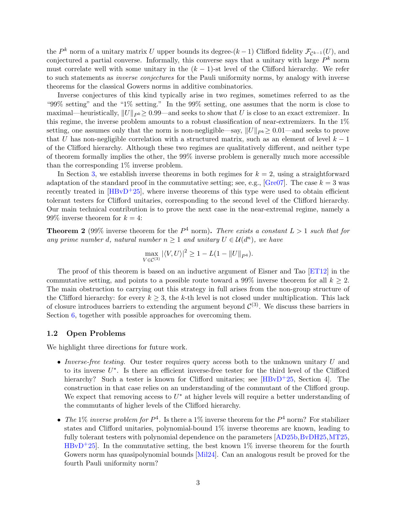
<figcaption class="paper-figure-caption"><b>Fig 2.</b> Low-resolution page preview, page 3</figcaption>
</figure>
<figure class="paper-figure-card">
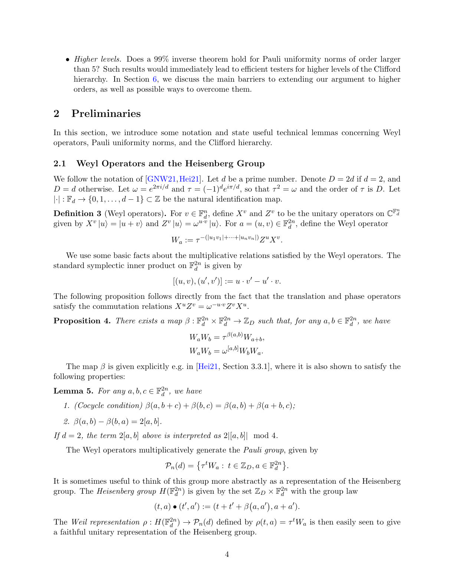
<figcaption class="paper-figure-caption"><b>Fig 3.</b> Low-resolution page preview, page 4</figcaption>
</figure>
<figure class="paper-figure-card">
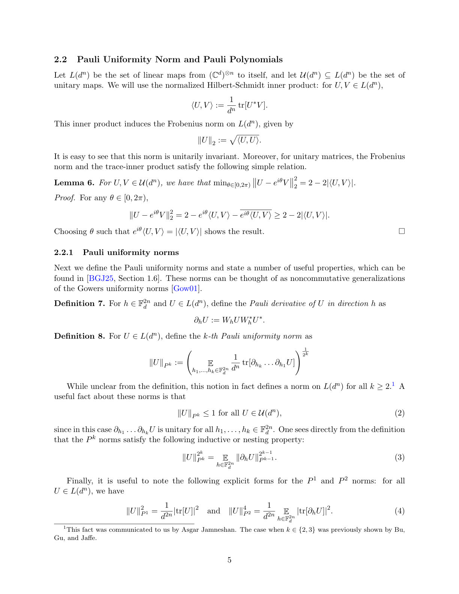
<figcaption class="paper-figure-caption"><b>Fig 4.</b> Low-resolution page preview, page 5</figcaption>
</figure>
<figure class="paper-figure-card">
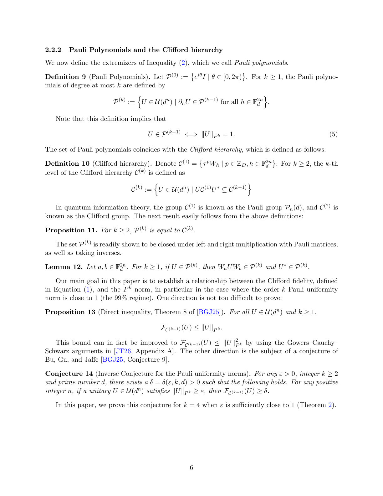
<figcaption class="paper-figure-caption"><b>Fig 5.</b> Low-resolution page preview, page 6</figcaption>
</figure>

**Summary.** This paper provides a way to efficiently test if a quantum gate belongs to the third level of the Clifford hierarchy. It achieves this by proving that if a specific mathematical norm is large, the gate must be close to the desired hierarchy level, bridging quantum information with additive combinatorics.

**Why it may be interesting.** not directly relevant

Detailed structure

**Main problem.** The paper addresses the problem of testing whether an unknown unitary belongs to a specific level of the Clifford hierarchy and seeks to establish inverse theorems for noncommutative Pauli uniformity norms.

**Main result.** The authors establish a 99% inverse theorem for the fourth Pauli uniformity norm and provide an efficient algorithm (C3Tester) to distinguish unitaries close to the third level of the Clifford hierarchy.

**Method.** The study uses higher-order Fourier analysis, inductive arguments adapted from additive combinatorics, and the construction of unitary representations of the Pauli group via Pauli derivatives.

**Model / system.** The mathematical framework involves unitary operators acting on a finite-dimensional Hilbert space (n-qudits) and the algebraic structure of the Pauli group and Clifford hierarchy.

**Key observables.** Degree-k Clifford fidelity and the k-th Pauli uniformity norm (Pk).

**Important parameters / regimes.** The 99% regime (near-extremizers), the 1% regime, and the hierarchy level k.

**Assumptions / limitations.** The analysis focuses on the 99% setting where the norm is close to its maximum; the extension to higher levels (k >= 5) is limited by the lack of multiplicative closure in the hierarchy.

**Paper structure.** The paper introduces the testing problem, defines the Pauli uniformity norms, presents the construction of the C3Tester algorithm, proves the 99% inverse theorem for k up to 4 using induction, and discusses the barriers to higher-order extensions.

Abstract

We consider the problem of testing whether an unknown unitary is close to a specified level of the Clifford hierarchy. Bu, Gu, and Jaffe proposed a candidate tester for this task based on a connection with noncommutative analogues of the Gowers uniformity norms. The complexity of this tester -- whose analysis depends on a robust characterization of the near-extremizers of these norms -- was left open. We establish such a characterization for the fourth noncommutative uniformity norm and, as a consequence, obtain an efficient tester for the third level of the Clifford hierarchy. We further discuss possible routes toward resolving the problem of testing for all higher levels, highlighting the main barriers that remain.

[↑ back to top](#top)

### [Probing Spacetime Topology and Superposition with Accelerated Detectors](http://arxiv.org/abs/2605.26490v1)

**Authors:** P. Poopathysankar, Lucas Hackl, Anwesha Chakraborty  
**Type:** theory · **Category:** other · **PDF:** <https://arxiv.org/pdf/2605.26490v1>  
**Analysis basis:** full PDF text, analyzed in chunks
**Topic relevance:** `entanglement & information structure` **2/5**

↔ Scroll figures horizontally

<figure class="paper-figure-card">
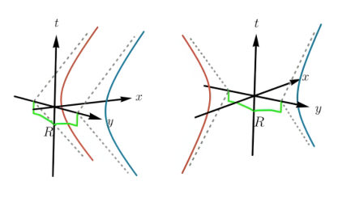
<figcaption class="paper-figure-caption"><b>Fig 1.</b> FIG. 1. Accelerated detector trajectories. Here we represent three out of the four dimensions of Minkowski space (x, y, t) and the detector separation in the y-direction. The blue curves represent the trajectories of detector A while the red curve represents the trajectory of detector B. The left panel represents the parallel acceleration case while the right panel represents the anti-parallel acceleration case.</figcaption>
</figure>
<figure class="paper-figure-card">
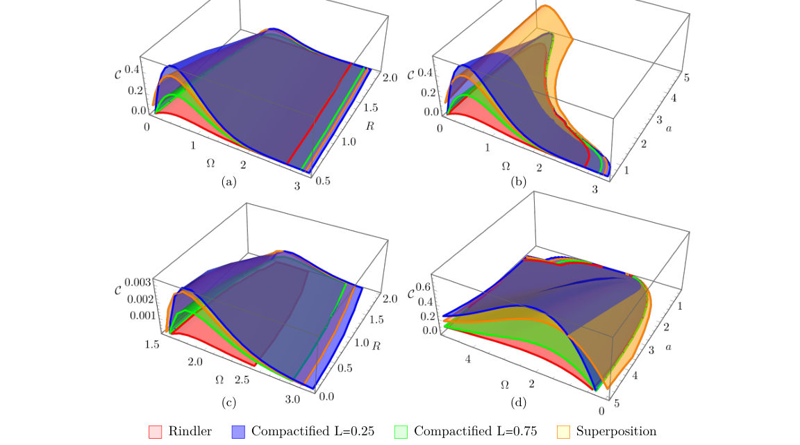
<figcaption class="paper-figure-caption"><b>Fig 2.</b> FIG. 2. Concurrence C for accelerated detectors in various spacetime geometry. Panels (a) and (b) show the parallel acceleration configuration, while panels (c) and (d) show the anti-parallel configuration. The left column presents C as a function of the energy gap Ωand detector separation R for constant acceleration a = 0.5, whereas the right column presents C as a function of Ωand acceleration a for constant detector separation R = 0.2. All figures are shown for four spacetime configurations i.e., Rindler spacetime, compactified Rindler spacetime with L = 0.25 and L = 0.75, and the symmetric superposition of the two compactified branches. The plots show that both range and region of...</figcaption>
</figure>
<figure class="paper-figure-card">
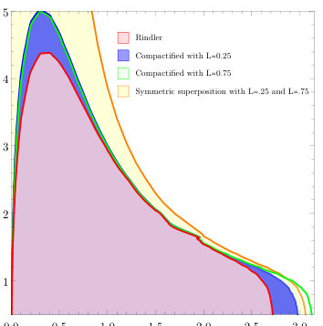
<figcaption class="paper-figure-caption"><b>Fig 3.</b> FIG. 3. Region of Concurrence in the (Ω, a) parameter space. The shaded regions indicate the parameter domains in which the concurrence C is nonzero for different spacetime configu- rations for the case of parallel acceleration corresponding to figure2b. The entanglement region is larger in compactified Rindler spacetime (blue and green) than in ordinary Rindler spacetime (red), and is further enlarged in the symmetric su- perposition of the two compactified Rindler branches (yellow).</figcaption>
</figure>
<figure class="paper-figure-card">
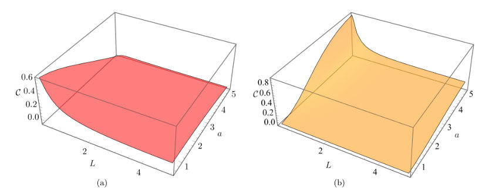
<figcaption class="paper-figure-caption"><b>Fig 4.</b> FIG. 4. Concurrence C as a function of compactification length L and acceleration a. The plots illustrate the combined effect of acceleration and compactification. (a) corresponds to parallel acceleration showing the higher concurrence value for small compactification length and low acceleration which becomes progressively weaker at higher compactification length and acceleration. (b) corresponds to anti-parallel acceleration where concurrence is larger for small L but high value of acceleration in comparison to parallel acceleration scenario.</figcaption>
</figure>

**Summary.** This paper explores how the geometric properties of spacetime, such as periodic dimensions and quantum superpositions of geometries, influence the ability of accelerated probes to harvest entanglement from a vacuum field. It demonstrates that topological features can protect entanglement against the noise induced by the Unruh effect. The findings suggest that entanglement harvesting could serve as an operational tool to detect quantum features of spacetime.

**Why it may be interesting.** not directly relevant

Detailed structure

**Main problem.** The study investigates how the interplay of relativistic acceleration, spacetime topology (compactification), and quantum superposition of geometries affects the extraction of entanglement from a quantum field.

**Main result.** Compactification and spacetime superposition both expand the parameter space for entanglement harvesting, particularly in high-acceleration regimes, while anti-parallel acceleration yields higher entanglement than parallel acceleration.

**Method.** The authors use the Unruh-DeWitt entanglement harvesting protocol within a perturbative framework, calculating Wightman functions in quotient Rindler spacetimes and their superpositions.

**Model / system.** Two-level Unruh-DeWitt detectors following Rindler trajectories (parallel and anti-parallel) interacting with a massless scalar field in both compactified and superposed Minkowski/Rindler geometries.

**Key observables.** Concurrence, Negativity, local excitation probability (noise), and cross-correlation terms.

**Important parameters / regimes.** Acceleration (a), detector separation (R), compactification length (L), detector energy gap (Omega), and switching function width (sigma).

**Assumptions / limitations.** Weak coupling limit, Gaussian switching function, massless scalar field, and untwisted field boundary conditions.

**Figures summary.** Figure 1 shows detector trajectories; Figure 2 plots concurrence across different spacetime configurations; Figure 3 presents a phase diagram of the entanglement harvesting region; Figure 4 shows concurrence as a function of compactification length and acceleration.

**Paper structure.** The paper introduces the problem of entanglement harvesting in complex geometries, defines the mathematical model of detectors and spacetime, presents numerical results for various acceleration and topology configurations, and concludes with the physical implications for probing spacetime features.

Abstract

We study entanglement harvested by Unruh DeWitt detectors following Rindler trajectories in compactified and superposed Minkowski spacetime. We consider different directions of acceleration (both parallel and antiparallel), separation between detectors and direction of spatial compactification mutually perpendicular to each other. Using the standard entanglement harvesting protocol, we analyze how these features influence the extracted correlations. When detector separation is perpendicular to the direction of acceleration, the harvested entanglement is uniformly suppressed due to increased spacelike separation. Compactification enhances field correlations leading to an increased concurrence and an extended harvesting range at higher accelerations. Additionally, we show that spacetime superposition introduces interference effects that further enlarge the entanglement harvesting region in parameter space, particularly in the high acceleration regime. We also find that the effect of antiparallel acceleration yielding significantly higher entanglement than parallel acceleration prevails in compactified and superposed spacetime.

[↑ back to top](#top)

### [Subdiffusion equation with Cattaneo effect](http://arxiv.org/abs/2605.27145v1)

**Authors:** Tadeusz Kosztołowicz, Aldona Dutkiewicz, Katarzyna D. Lewandowska  
**Type:** theory · **Category:** statistical mechanics · **PDF:** <https://arxiv.org/pdf/2605.27145v1>  
**Analysis basis:** full PDF text, analyzed in chunks
**Topic relevance:** `non-equilibrium dynamics` **2/5**

↔ Scroll figures horizontally

<figure class="paper-figure-card">
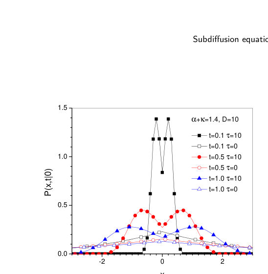
<figcaption class="paper-figure-caption"><b>Fig 1.</b> Figure 1: Plots of Green’s functions for short times given in the legend. Lines with filled symbols represent Green’s functions Eq. (30) for the subdiffusion equation with the Cattaneo effect, for 𝛼= 0.5, 𝜅= 0.9, 𝜏= 10, and 𝐷= 10. Lines with empty symbols are GF Eq. (34) plots for the subdiffusion equation without this effect, for 𝛼= 0.5 and 𝐷= 10.</figcaption>
</figure>
<figure class="paper-figure-card">
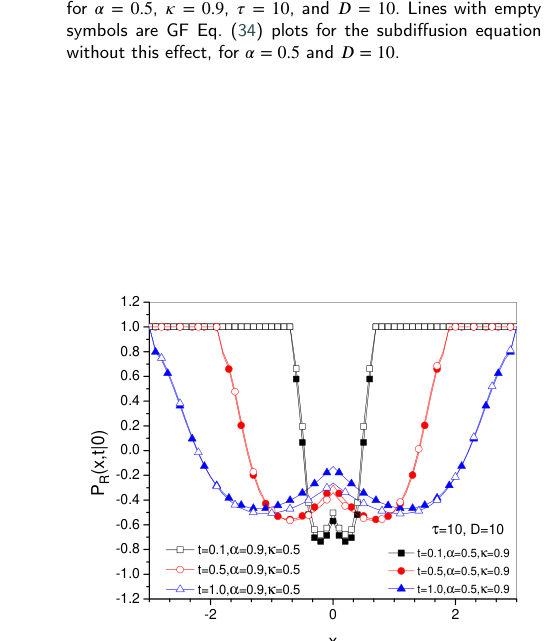
<figcaption class="paper-figure-caption"><b>Fig 2.</b> Figure 2: Relative changes of the GF 𝑃𝑅Eq. (35) for the functions presented in Fig. 1, for parameters given in the legend.</figcaption>
</figure>
<figure class="paper-figure-card">
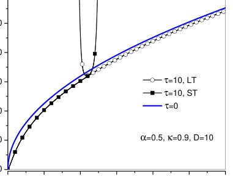
<figcaption class="paper-figure-caption"><b>Fig 3.</b> Figure 5: Time evolution of MSD for 𝛼= 0.5 and 𝜅= 0.9. The line with filled symbols is the plot of 𝜎2 𝑆𝑇(𝑡) for short times Eq. (39), the line with open symbols represents 𝜎2 𝐿𝑇(𝑡) for long times Eq. (40). The calculations have been made taking into account the 50 leading terms in the series defining the functions. The boundary between short and long times is at the common point of both lines at 𝑡≈220. The line without symbols represents the time evolution of the MSD for the equation without the Cattaneo effect Eq. (37).</figcaption>
</figure>
<figure class="paper-figure-card">
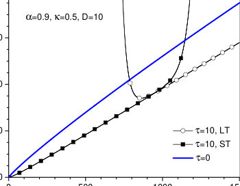
<figcaption class="paper-figure-caption"><b>Fig 4.</b> Figure 6: Plots of the time evolution of MSD for 𝛼= 0.9 and 𝜅= 0.5, the description is as for Fig. 5.</figcaption>
</figure>

**Summary.** This paper proposes a modified subdiffusion equation that incorporates a Cattaneo-type delay to prevent the non-physical infinite propagation velocity found in standard fractional diffusion models. It shows that while the effect significantly alters short-time dynamics, the system remains subdiffusive in the long-time limit. The work also emphasizes the necessity of including this delay effect in boundary conditions for physical consistency.

**Why it may be interesting.** not directly relevant

Detailed structure

**Main problem.** Addressing the non-physical infinite propagation velocity in ordinary subdiffusion equations by introducing a Cattaneo-type effect that incorporates a random time delay in flux activation.

**Main result.** The authors derive a Cattaneo-type subdiffusion equation (CTSE) that ensures a finite propagation velocity and demonstrate that the Cattaneo effect modifies short-time dynamics without inducing true superdiffusion.

**Method.** The study uses Laplace transforms, Riemann-Liouville and Caputo fractional derivatives, and series expansions to solve the fractional differential equations and analyze asymptotic limits.

**Model / system.** A one-dimensional homogeneous system describing subdiffusive processes (such as transport in viscoelastic media or porous media) where the flux is regulated by a Mittag-Leffler-controlled delay distribution.

**Key observables.** Green's function (probability density), Mean Square Displacement (MSD), and the probability density of particle absorption at a partially absorbing wall.

**Important parameters / regimes.** Subdiffusion exponent (alpha), Cattaneo effect parameter (kappa), delay strength (tau), diffusion coefficient (D), and wall absorption parameter (beta).

**Assumptions / limitations.** The diffusion parameters are assumed to be time-independent and independent of concentration; the Cattaneo effect is assumed to be present in both the governing equation and the boundary conditions for physical consistency.

**Figures summary.** Figures compare Green's functions and MSD evolution with and without the Cattaneo effect across short and long time limits, and illustrate the impact of including the effect in boundary conditions.

**Paper structure.** The paper introduces the problem of infinite velocity, derives the CTSE using Laplace transforms, analyzes the short-time and long-time asymptotic behaviors of the Green's function and MSD, investigates boundary conditions at a partially absorbing wall, and proposes an experimental identification method.

Abstract

The ordinary subdiffusion equation, with a fractional time derivative of at most first order, describes a process in which the propagation velocity of diffusing molecules is unlimited. To avoid this non-physical property different forms of the Cattaneo subdiffusion equation have been proposed. We define the Cattaneo effect as a delay of the ordinary subdiffusion flux activation by a random time. By incorporating this effect into the flux equation we get a Cattaneo--type subdiffusion equation (CTSE). We consider a subdiffusion process in which the Cattaneo effect is generated by the time-delay probability distribution controlled by the Mittag-Leffler function. Then, CTSE differs from the ordinary subdiffusion equation by a term with a fractional time derivative, whose order can be independent of the subdiffusion exponent. The influence of the Cattaneo effect on the solutions to the CTSE is discussed. We show that the process described by CTSE is subdiffusion in the entire time domain even though the temporal evolution of the mean square displacement of diffusing particle in the short-time limit is typical for superdiffusion. The delay in the flux activation in the subdiffusion equation should also cause a flux delay in a boundary condition. As an example, we study subdiffusion with the Cattaneo effect in a system with a partially absorbing wall at which the Robin boundary condition is assumed. We also propose a method for experimentally identifying the Cattaneo effect in a subdiffusive system.

[↑ back to top](#top)

## Other papers (22)

*Papers from primary archives without highlighted authors or any topic match. Click to expand.*

Show other papers

### [$S$-duality, boundary states, and higher-form symmetries on ALE spaces](http://arxiv.org/abs/2605.26224v1)

**Authors:** Mohamed M. Anber  
**Type:** theory · **Category:** other · **PDF:** <https://arxiv.org/pdf/2605.26224v1>  
**Analysis basis:** full PDF text, analyzed in chunks

↔ Scroll figures horizontally

<figure class="paper-figure-card">
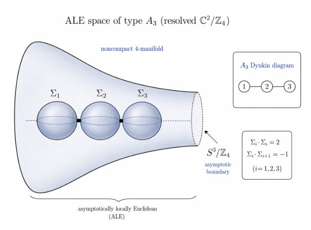
<figcaption class="paper-figure-caption"><b>Fig 1.</b> Figure 1. Schematic illustration of an ALE space of A3-type, equivalently the resolution of the orbifold singularity C2/Z4. There is a chain of three 2-spheres Σ1, Σ2, Σ3, whose intersections reproduce the A3 Dynkin diagram. The asymptotic boundary is the lens space S3/Z4. In the convention shown, the intersection pairing is written as the positive Cartan matrix, with Σi · Σi = 2 and Σi · Σi±1 = −1.</figcaption>
</figure>
<figure class="paper-figure-card">
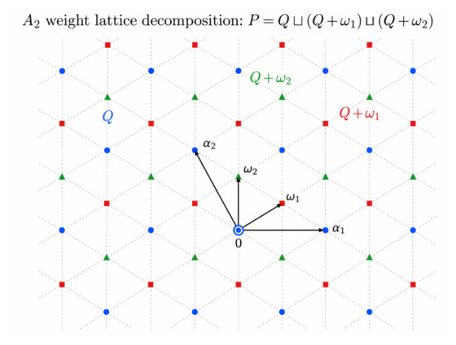
<figcaption class="paper-figure-caption"><b>Fig 2.</b> Figure 2. Decomposition of the weight lattice P of A2 into cosets of the root lattice Q. The lattice points split into three disjoint families, Q + wµ with µ = 0, 1, 2, corresponding to the three elements of P/Q ∼= Z3. The blue circles, red squares, and green triangles represent the three cosets Q + w0 = Q, Q + w1, and Q + w2, respectively. Each coset defines a sector function Θµ(τ) = P λ∈Q+wµ eiπτλ2. Here w0 = 0, while α1 and α2 denote the simple roots generating Q.</figcaption>
</figure>
<figure class="paper-figure-card">
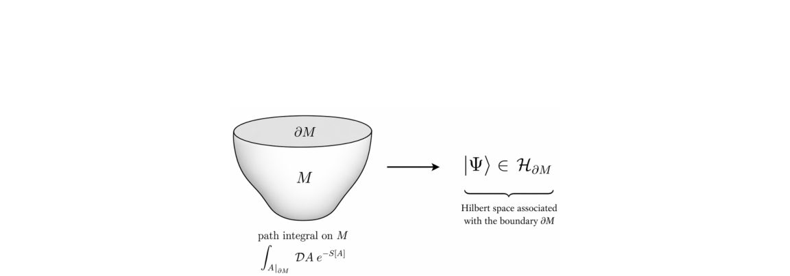
<figcaption class="paper-figure-caption"><b>Fig 3.</b> Figure 3. A path integral on a manifold M with boundary ∂M prepares a state |Ψ⟩in the Hilbert space H∂M associated with the boundary.</figcaption>
</figure>
<figure class="paper-figure-card">
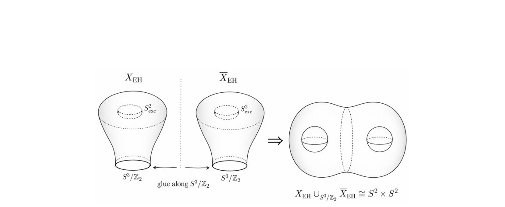
<figcaption class="paper-figure-caption"><b>Fig 4.</b> Figure 4. Gluing the Eguchi–Hanson space XEH to its orientation reversal XEH along the common lens-space boundary S3/Z2. The resulting closed 4-manifold is diffeomorphic to S2 × S2.</figcaption>
</figure>

**Summary.** This paper resolves the apparent breakdown of S-duality on non-compact ALE spaces by treating the path integral as a vector-valued boundary state. It demonstrates that these 'chiral building blocks' can be glued together to recover standard modularly covariant partition functions on closed manifolds. The work also explores the role of 1-form symmetries and the associated mixed electric-magnetic anomalies.

**Why it may be interesting.** not directly relevant

Detailed structure

**Main problem.** Investigating the apparent failure of S-duality (modularity) for the Maxwell path integral on non-compact A-type ALE spaces and determining how higher-form symmetries and boundary states resolve this.

**Main result.** The path integral on ALE spaces is reinterpreted as a vector-valued boundary state whose components (theta-function blocks) transform via vector-valued modular covariance, successfully recovering the standard partition function on closed manifolds like S2 x S2 upon gluing.

**Method.** The author uses the Gibbons-Hawking ansatz for field construction, evaluates the Maxwell path integral, and employs a gluing construction (pairing boundary states) to validate the results on closed manifolds.

**Model / system.** Abelian Maxwell theory on A-type Asymptely Locally Euclidean (ALE) spaces, which are hyperkähler manifolds approaching R4/Z_N at infinity, with an asymptotic boundary of a lens space S3/Z_N.

**Key observables.** Complexified coupling (tau), theta-function blocks (Theta_mu), partition functions, 1-form symmetry backgrounds, and Wilson/t'Hooft line operators.

**Important parameters / regimes.** Complexified coupling tau = theta/2pi + 4pi*i/g^2, N-ality (mu), and the order of discrete Z_k subgroups.

**Assumptions / limitations.** The study focuses specifically on A-type ALE spaces and assumes the existence of well-defined boundary conditions (e.g., Dirichlet) for the gauge fields.

**Figures summary.** A schematic illustration of an A3-type ALE space showing a chain of three 2-spheres.

**Paper structure.** The paper begins by identifying the modularity failure on ALE spaces, introduces the boundary state formalism and vector-valued modular covariance, validates the construction via gluing Eguchi-Hanson spaces to form S2 x S2, and then extends the analysis to include 1-form symmetry backgrounds and discrete gauging.

Abstract

We study Abelian $S$-duality of Maxwell theory on $A$-type asymptotically locally Euclidean (ALE) spaces. Unlike on closed four-manifolds, the Maxwell path integral on an ALE space is not naturally a scalar partition function. Rather, it decomposes into theta-function blocks labeled by flat $U(1)$ holonomy sectors on the asymptotic lens-space boundary. We interpret these blocks as components of the Hilbert-space boundary state prepared by the ALE path integral. With this interpretation, the apparent failure of ordinary modularity is replaced by vector-valued modular covariance under the action of the modular group. We test this picture explicitly for Eguchi-Hanson space by gluing it to its orientation reversal. The resulting closed four-manifold is diffeomorphic to $S^2\times S^2$, and the natural pairing of the two ALE boundary states reproduces the standard Maxwell partition function on $S^2\times S^2$. We then refine the construction by turning on electric and magnetic $1$-form symmetry backgrounds. In their presence, the ALE theta blocks are not ordinary functions, but sections of a line bundle over the Cartan torus associated with the $A_{N-1}$ root lattice, reflecting the mixed electric-magnetic $1$-form anomaly. We also discuss gauging discrete $\mathbb Z_k$ subgroups of the $1$-form symmetries and show that the vector-valued boundary-state structure remains the natural covariant framework after gauging. In this sense, ALE spaces behave as chiral building blocks for four-dimensional Maxwell theory: individual ALE blocks carry sector-resolved boundary data, while gluing pairs these sectors to produce an ordinary closed-manifold partition function, much like the pairing of left- and right-moving conformal blocks in two-dimensional CFT.

[↑ back to top](#top)

### [A Resource Comparison of Logical T-State Preparation](http://arxiv.org/abs/2605.26522v1)

**Authors:** Jianshuo Gao, Xiao Yuan, Yuan Yao  
**Type:** theory · **Category:** quantum information and computing · **PDF:** <https://arxiv.org/pdf/2605.26522v1>  
**Analysis basis:** full PDF text, analyzed in chunks

↔ Scroll figures horizontally

<figure class="paper-figure-card">
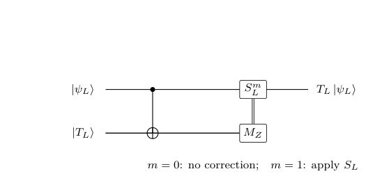
<figcaption class="paper-figure-caption"><b>Fig 1.</b> Figure 1: Logical-level magic-state-injection gadget for implementing a logical T gate. The data block controls a logical CNOT into a prepared logical magic-state, the magic-state block is measured in the logical Z basis, and the measurement result m ∈{0, 1} controls the Clifford correction Sm L . With this convention, the output is TL |ψL⟩up to an irrelevant global phase [7, 8].</figcaption>
</figure>
<figure class="paper-figure-card">
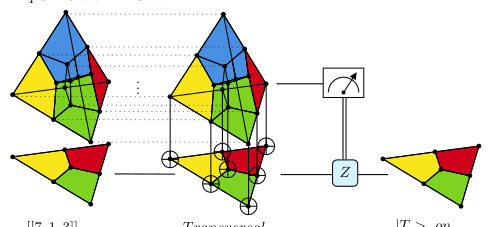
<figcaption class="paper-figure-caption"><b>Fig 2.</b> Figure 2: Representative logical |T⟩-preparation routes. (a) Distillation processes several noisy logical magic-states using a Clifford check circuit, measures stabilizer checks to obtain a syndrome vector s, and keeps the run only when s = s⋆; otherwise the run is discarded [8, 11, 15]. (b) Cultivation injects a seed into a distance-3 color code, grows and verifies it, and grafts accepted states into a larger surface-code patch [23, 24]. (c) Code-switching prepares a logical |T⟩in the [[15, 1, 3]] qRM code via transversal T, transfers it to the [[7, 1, 3]] Steane code using transversal CNOT, and postselects on the qRM measurement outcomes [19, 20, 22].</figcaption>
</figure>
<figure class="paper-figure-card">
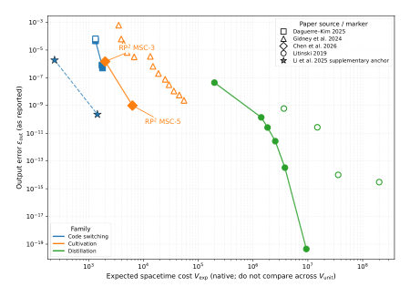
<figcaption class="paper-figure-caption"><b>Fig 3.</b> Figure 3: Expected cost Vexp versus reported output error ϵout for the included data rows. Marker shape indicates paper provenance, and filled markers denote within-family Pareto-frontier points in the displayed plane. Because the native cost unit differs across original papers, the horizontal axis should be read as a regime map rather than as a universal cross-paper ruler.</figcaption>
</figure>
<figure class="paper-figure-card">
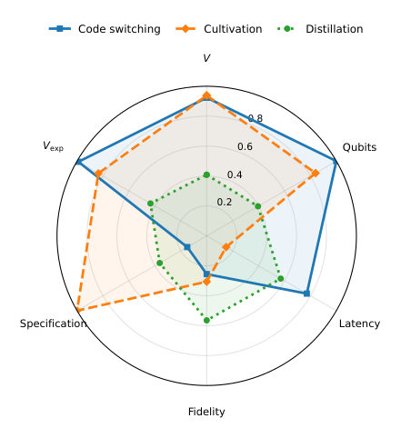
<figcaption class="paper-figure-caption"><b>Fig 4.</b> Figure 4: Family-level summary over V , Qpeak, D, ϵout, reporting completeness, and Vexp. Each spoke reports the median normalized value over rows that provide the corresponding field; lower raw values are better for all quantitative resource/error fields.</figcaption>
</figure>

**Summary.** This paper provides a systematic comparison of the three primary methods for preparing logical T-states in fault-tolerant quantum computing. It reveals that while code-switching and cultivation are more efficient for low-overhead tasks, only magic state distillation can currently meet the extreme fidelity requirements needed for large-scale algorithms like Shor's algorithm.

**Why it may be interesting.** not directly relevant

Detailed structure

**Main problem.** The lack of a unified framework to compare the resource overheads of different logical T-state preparation protocols due to heterogeneous reporting conventions in existing literature.

**Main result.** The study identifies a trade-off landscape where distillation is the only viable route for ultra-high-fidelity requirements (e.g., RSA-2048), while code-switching and cultivation offer much lower overhead for lower-fidelity or intermediate-fidelity regimes.

**Method.** A meta-analysis and comparative study of existing quantitative results, using a structured framework that retains source-native cost units and a logarithmic normalization for family-level visualization.

**Model / system.** Fault-tolerant quantum computing architectures based on stabilizer codes, including surface codes, color codes, and qRM codes, specifically focusing on the implementation of non-Clifford T-gates.

**Key observables.** Output error (epsilon_out), single-attempt cost (V), expected cost per accepted output (V_exp), peak qubit footprint (Q_peak), and latency (D).

**Important parameters / regimes.** Error regimes ranging from 1e-6 to 1e-20, RSA-2048 error budgets, and T-state consumption rates (c_T = 4 or 7).

**Assumptions / limitations.** The comparison is bounded by the noise models, decoders, and reporting completeness of the underlying source papers; it does not include concatenated coding.

**Figures summary.** Figure 1 shows a T-gate injection gadget; Figure 2 schematically summarizes distillation, cultivation, and code-switching; Figure 3 is a regime map of expected cost vs. output error; Figure 4 is a radar plot of normalized protocol metrics.

**Paper structure.** The paper introduces the problem of heterogeneous comparison, defines a multi-metric framework, presents a comparative analysis of three protocol families (distillation, cultivation, code-switching), provides an algorithm-level case study using Shor's algorithm, and concludes with a summary of the trade-off landscape.

Abstract

Logical T state preparation is a major overhead source in fault tolerant architectures built from stabilizer operations. Existing protocols, however, are reported under different code families, noise models, postselection rules, and cost conventions, making direct comparison difficult. We compare three representative preparation routes: magic state distillation, magic state cultivation, and code switching, using currently available results. Rather than reducing heterogeneous data to a single cost metric, we retain source native cost units and record output error, single attempt cost, expected cost per accepted output, footprint, latency, and reporting completeness for each configuration. Within the current dataset, distillation reaches the lowest output error regime; code switching achieves the lowest reported single attempt cost and the smallest explicit footprint among the compatible rows; and recent RP2 cultivation results add low cost cultivation points with output errors between 1e-6 and 1e-9. As a simple algorithm level case study, we also examine the reported preparation routes under an error budget motivated by Shor factoring algorithm, in order to relate single state preparation costs to full workload requirements. The resulting comparison clarifies the trade offs currently supported across the literature, while remaining bounded by the conventions and coverage of the underlying papers.

[↑ back to top](#top)

### [Adaptive Shot Allocation for Recursive QAOA via Reinforcement Learning](http://arxiv.org/abs/2605.26544v1)

**Authors:** Euimin Lee, Shiho Kim  
**Type:** theory · **Category:** quantum information and computing · **PDF:** <https://arxiv.org/pdf/2605.26544v1>  
**Analysis basis:** full PDF text, analyzed in chunks

↔ Scroll figures horizontally

<figure class="paper-figure-card">
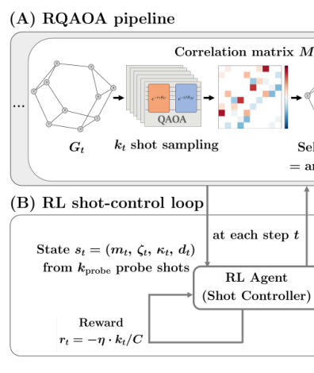
<figcaption class="paper-figure-caption"><b>Fig 1.</b> Fig. 1 Overview of the proposed shot-control framework for depth-1 RQAOA. (A) At each elimina- tion step t, a depth-1 QAOA circuit is executed on the current reduced graph Gt using kt measurement shots to estimate the pairwise correlation matrix M (t) uv . The edge (u∗, v∗) with the largest absolute correlation is selected, and the corresponding variable is eliminated to produce the next reduced graph Gt+1. This procedure repeats until the problem size falls below a classical-solver threshold nc, at which point the residual instance is solved exactly. (B) The RL shot-control loop operates along- side the RQAOA pipeline. Before each elimination step, a small probe measurement of kprobe shots...</figcaption>
</figure>
<figure class="paper-figure-card">
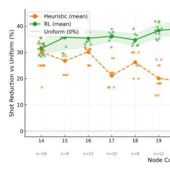
<figcaption class="paper-figure-caption"><b>Fig 2.</b> Fig. 2 Shot reduction (%) vs. problem size n for the held-out operational subset. Each point rep- resents one policy–instance pair. The per-size mean (connected line) shows that RL achieves stable ∼36% reduction across the full range, while the Heuristic settles around ∼23%.</figcaption>
</figure>
<figure class="paper-figure-card">
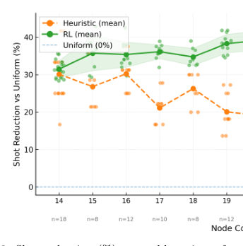
<figcaption class="paper-figure-caption"><b>Fig 3.</b> Figure 3 plots normalized shot usage against success rate for all pairs in the held-out operational subset. Relative to Uniform, the RL points are shifted toward lower shot usage while remaining in a high-success regime in the large majority of cases. The Heuristic occupies an intermediate position, with smaller shot savings and slightly higher success rates on average. The RL policy is trained with a constraint target p∗= 0.95, yet the observed success rate on the held-out operational subset is only about 0.91. This gap is not contradictory: the constraint is enforced during training on a designated base instance through the adaptive multiplier λ, whereas test-time evaluation aggregates...</figcaption>
</figure>
<figure class="paper-figure-card">
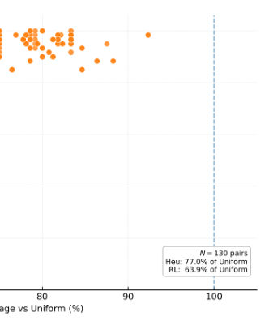
<figcaption class="paper-figure-caption"><b>Fig 4.</b> Fig. 3 Normalized shot usage (eSmethod/eSUniform) vs. success rate for all pairs in the held-out oper- ational subset. Uniform (blue), Heuristic (orange), and RL (green). RL consistently shifts toward lower shot usage while maintaining competitive success rates; the Heuristic occupies an intermediate position.</figcaption>
</figure>
<figure class="paper-figure-card">
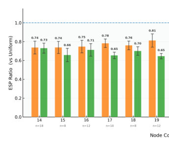
<figcaption class="paper-figure-caption"><b>Fig 5.</b> Fig. 4 Mean ESP ratio by problem size n for the held-out operational subset. Values below 1.0 indicate lower effective cost per success than Uniform. Error bars show the range across instances at each n. Both Heuristic and RL improve over Uniform, with RL achieving a consistently lower ESP ratio.</figcaption>
</figure>

**Summary.** This paper proposes using reinforcement learning to adaptively allocate measurement shots during the recursive steps of the RQAOA algorithm. By learning to assign more resources to difficult elimination steps, the method significantly reduces the total quantum computational cost without sacrificing the quality of the optimization solution.

**Why it may be interesting.** not directly relevant

Detailed structure

**Main problem.** The computational bottleneck and noise sensitivity caused by inefficient, uniform measurement shot allocation in the recursive stages of the RQAOA algorithm.

**Main result.** A reinforcement learning-based residual policy achieves a 36% reduction in total shots compared to uniform allocation while maintaining high solution reliability and generalizing to unseen problem sizes.

**Method.** A two-pronged approach using a hand-crafted heuristic baseline and a tabular Double Q-learning agent that learns a residual correction to the baseline under a Lagrangian-constrained objective.

**Model / system.** The study focuses on the weighted Max-Cut problem on d-regular graphs, modeled via an Ising Hamiltonian, using a depth-1 Recursive QAOA (RQAOA) framework.

**Key observables.** Pairwise correlations (expectation values of Pauli-Z operators), success rate (approximation ratio >= 0.99), and effective shots per success (ESP).

**Important parameters / regimes.** Circuit depth p=1, target success rate p*=0.95, and the 4D state descriptor including variable count, z-gap, conflict ratio, and graph distance.

**Assumptions / limitations.** The study is restricted to the noiseless regime and a fixed circuit depth (p=1) to isolate recursion-level effects from hardware noise or deeper circuit complexities.

**Figures summary.** Figure 1 illustrates the RQAOA pipeline and the RL loop; Figure 3 shows normalized shot usage vs. success rate; Figure 4 shows mean ESP ratio by problem size; Figure 5 shows training diagnostics for the Lagrangian multiplier; Figure 6 compares allocation patterns between different controllers.

**Paper structure.** The paper introduces the RQAOA bottleneck, proposes a reinforcement learning framework for adaptive shot allocation, details the MDP formulation and Double Q-learning implementation, presents performance evaluations across various graph sizes and complexity levels, and discusses the robustness and limitations of the learned policy.

Abstract

Recursive QAOA (RQAOA) solves combinatorial optimization problems by using shallow quantum circuits to estimate pairwise correlations and recursively eliminate variables until a classical solver can handle the residual instance. Each elimination step requires measurement shots, and the total shot cost grows with the number of recursive stages. On near-term quantum devices, increasing shot counts can translate directly into greater exposure to hardware-level noise sources such as readout errors and decoherence, making shot-efficient execution not merely a cost-reduction measure but a factor with direct implications for solution reliability. While shot reduction has been studied broadly across NISQ algorithms, step-wise measurement control inside the recursive loop of RQAOA has received little attention. We formulate this step-wise allocation as a sequential decision problem and propose two strategies for depth-1 RQAOA on weighted Max-Cut instances. A hand-crafted heuristic assigns shots based on local indicators of step difficulty, and a tabular Double Q-learning agent learns a residual policy that adjusts this baseline under a Lagrangian-constrained objective. Both methods are evaluated under a fixed-cap fairness protocol that equalizes the per-step budget across all strategies, and the elimination rule itself is kept unchanged so that the contribution of adaptive measurement control can be isolated. On a diverse set of weighted graph instances spanning a range of sizes and structures, the heuristic reduces total shots by approximately 23% relative to uniform allocation, and the RL policy achieves a 36% reduction with a lower effective shots per success ratio than both baselines. The improvement persists on problem sizes not seen during training, suggesting that reinforcement learning can discover efficient, instance-adaptive measurement strategies in recursive quantum optimization.

[↑ back to top](#top)

### [Defect engineering of ultrathin gallium nitride via electric fields for advanced electronic, magnetic, and gas sensing applications](http://arxiv.org/abs/2605.26817v1)

**Authors:** Yujia Tian, Devesh R. Kripalani, Ming Xue, Kun Zhou  
**Type:** theory · **Category:** other · **PDF:** <https://arxiv.org/pdf/2605.26817v1>  
**Analysis basis:** full PDF text, analyzed in chunks

↔ Scroll figures horizontally

<figure class="paper-figure-card">
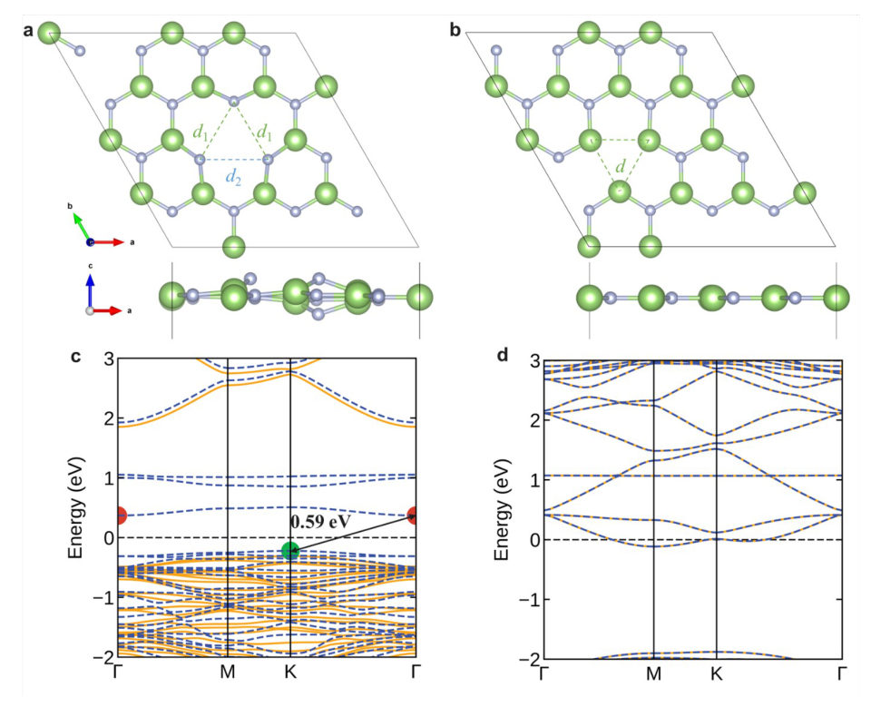
<figcaption class="paper-figure-caption"><b>Fig 1.</b> Figure 1. Properties of g-GaN with vacancy defects. Geometry of the fully relaxed structures: (a) VGa (buckled) and (b) VN (planar) systems. The N–N and Ga–Ga interatomic distances around the vacancies are labeled accordingly. Electronic band structures: (c) VGa system with an indirect band gap of 0.59 eV; (d) VN system with no band gap. Yellow solid line: spin-up bands; blue dashed line: spin-down bands. The zero energy is calibrated to be the Fermi level. The conduction band minimum and valence band maximum are labeled in red and green, respectively.</figcaption>
</figure>
<figure class="paper-figure-card">
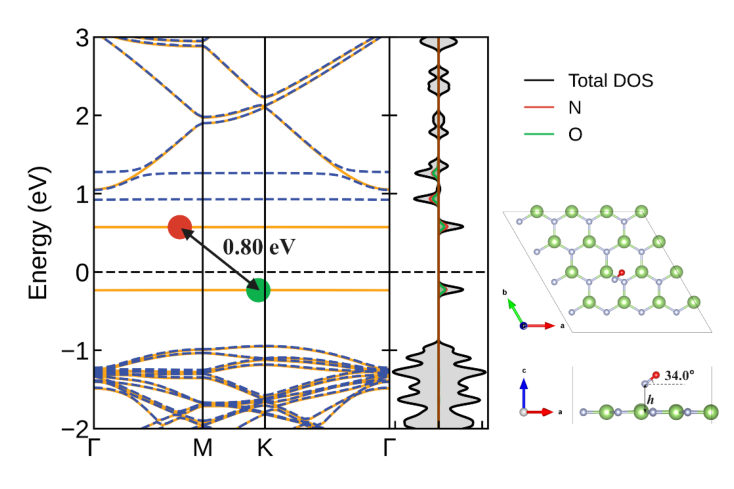
<figcaption class="paper-figure-caption"><b>Fig 2.</b> Figure 2. Spin-polarized electronic band structure of pristine g-GaN with adsorbed NO, showing a band gap of 0.80 eV (yellow solid line: spin-up states; blue dashed line: spin-down states). Corresponding total DOS and projected DOS of the adsorbed NO molecule (red: N; green: O). Geometry of the fully relaxed structure with the adsorption height h labeled.</figcaption>
</figure>
<figure class="paper-figure-card">
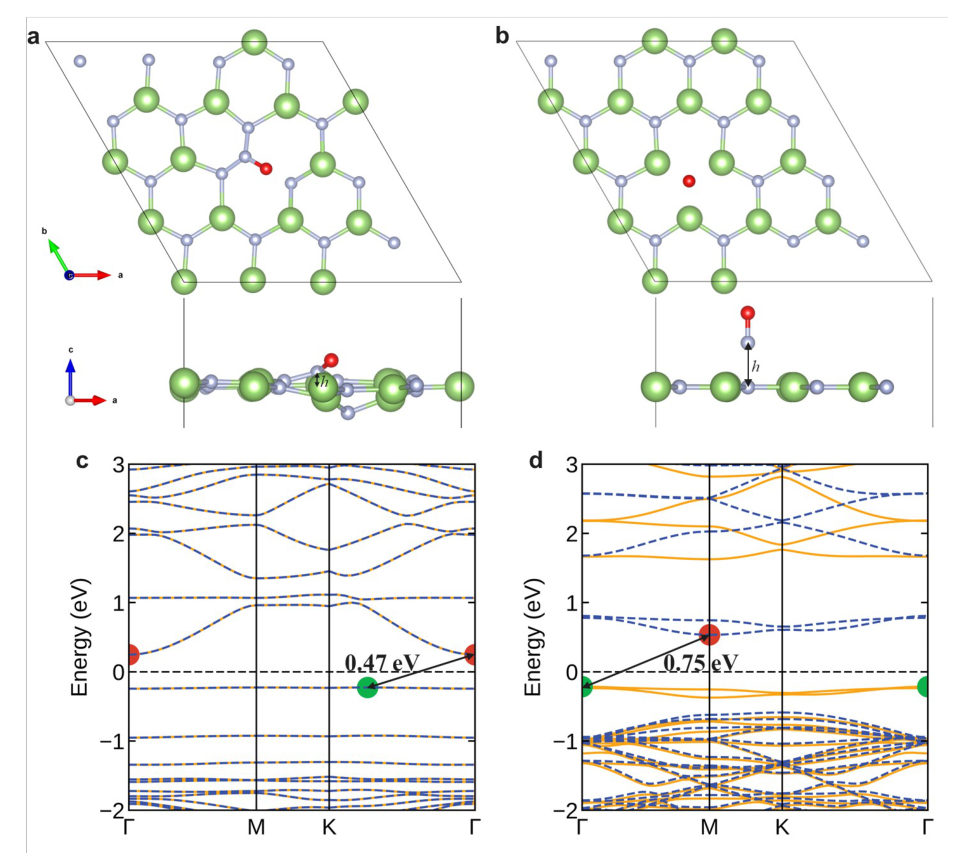
<figcaption class="paper-figure-caption"><b>Fig 3.</b> Figure 3. Adsorption of NO gas on g-GaN with vacancy defects. Geometry of the fully relaxed structures: (a) NO–VGa and (b) NO–VN systems. Electronic band structures: (c) NO–VGa and (d) NO–VN systems. Yellow solid line: spin-up states; blue dashed line: spin-down states.</figcaption>
</figure>
<figure class="paper-figure-card">
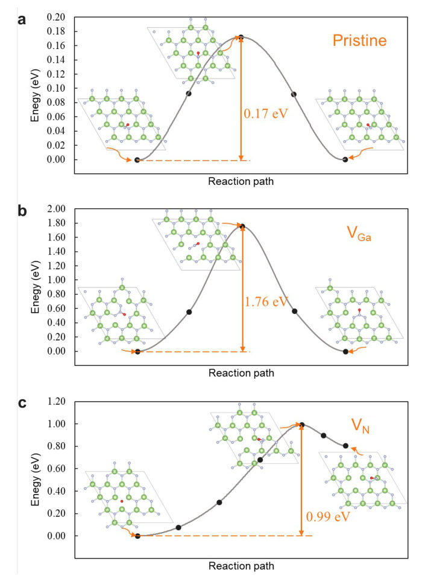
<figcaption class="paper-figure-caption"><b>Fig 4.</b> Figure 4. Diffusion path of a NO molecule (a) on pristine g-GaN, (b) in the VGa system, and (c) in the VN system with the corresponding energy barriers calculated using the nudged elastic band method.</figcaption>
</figure>
<figure class="paper-figure-card">
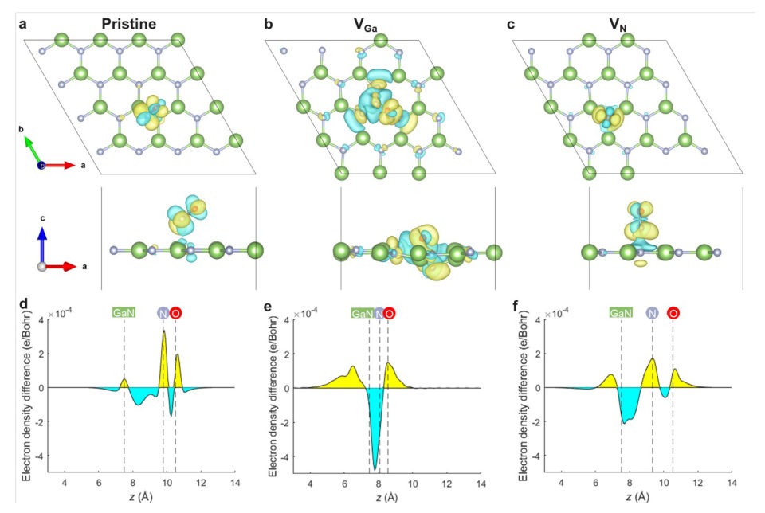
<figcaption class="paper-figure-caption"><b>Fig 5.</b> Figure 5. Charge density differences in NO gas adsorption systems. Three-dimensional isosurfaces (0.003 |e|·Bohr−3) corresponding to NO adsorbed on (a) pristine g-GaN, (b) VGa, and (c) VN systems. Plane-averaged charge density difference along the normal (z) direction corresponding to NO adsorbed on (d) pristine g-GaN, (e) VGa, and (f) VN systems. The positions of the GaN monolayer as well as the N and O atoms of the NO molecule are labeled accordingly. Cyan: electron depletion; yellow: electron accumulation.</figcaption>
</figure>

**Summary.** This paper explores how controlling vacancies and external electric fields in 2D gallium nitride can create tunable electronic, magnetic, and sensing functionalities. It identifies specific ways to use defects to create spin filters and gas sensors, providing a roadmap for advanced 2D semiconductor device engineering.

**Why it may be interesting.** not directly relevant

Detailed structure

**Main problem.** Investigating how defect engineering (gallium and nitrogen vacancies), mechanical strain, and external electric fields can be used to tune the electronic, magnetic, and gas-sensing properties of 2D gallium nitride (g-GaN).

**Main result.** The study demonstrates that g-GaN can undergo a semiconductor-to-metal transition under high electric fields, that gallium vacancies can act as magnetic spin filters and thermodynamic traps for NO gas, and that the material is more resistant to electric-field-induced metallization than g-SiC.

**Method.** First-principles calculations using Density Functional Theory (DFT) with PBE and HSE06 functionals, including NEB for diffusion barriers and phonon calculations for stability.

**Model / system.** Two-dimensional/ultrathin gallium nitride (g-GaN) in a planar, graphene-like phase, including models for gallium vacancies (VGa), nitrogen vacancies (VN), and nitrogen monoxide (NO) adsorption.

**Key observables.** Band gap, magnetic moment, adsorption energy, charge transfer, conductivity, and semiconductor-to-metal transition threshold.

**Important parameters / regimes.** Electric field strength (up to 1.6 V/A), in-plane strain (tension/compression), and defect formation energies.

**Assumptions / limitations.** Calculations focus on the neutral case of the defect systems and exclude spin-orbit coupling due to its negligible effect on band splitting.

**Figures summary.** Figure 1 shows optimized defect geometries and spin-polarized band structures; Figure 2 shows NO adsorption and band gap reduction; Figure 3 shows NO adsorption on defective systems; Figure 4 shows energy barriers; Figure 7 shows the evolution of properties under electric fields.

**Paper structure.** The paper begins by establishing the structural and electronic properties of pristine g-GaN, moves to the impact of point vacancies (VGa, VN) on magnetism and electronic structure, explores the effects of strain and electric fields on metallization, and concludes with the application of these defects in gas sensing (NO adsorption) and a comparison with g-SiC.

Abstract

Scaling wide-band-gap semiconductors to the ultrathin limit offers a transformative pathway for power electronics, with gallium nitride (GaN) representing a cornerstone material in this class. However, the operational resilience and functional tunability of its two-dimensional form (g-GaN) remain underexplored. This work shifts the focus from idealized systems to the complex materials behavior under realistic conditions, investigating how the synergistic effects of point vacancy defects, strain, and external electric fields govern its electronic, magnetic, and sensing landscapes. We demonstrate that these factors are not merely perturbations but are fundamental to modulating the material response. Our first-principles calculations suggest g-GaN maintains electronic stability under intense electric fields; notably, gallium vacancies are predicted to further extend the theoretical stability limit. While in-plane tension preserves the band gap evolution under an electric field, in-plane compression facilitates low-field metallization. Using nitrogen monoxide (NO) adsorption as a prototype, we find that the interaction is defect-modulated and potentially tunable by electric fields. Analysis of adsorption energetics and diffusion barriers suggests the gallium vacancy may act as a thermodynamic trap for NO. Targeted hybrid-functional (HSE06) validation confirms the reliability of observed adsorption trends and theoretical metallization thresholds, while revealing that precise electronic-exchange treatment is critical for capturing the magnetic ground state of nitrogen vacancies. By systematically examining the geometry, energetics, band structure, density of states, magnetic response, and charge transfer, this study clarifies the interplay between defects and external electric fields, providing insights into theoretical upper bounds for property tuning and semiconductor device engineering.

[↑ back to top](#top)

### [End-to-End PDE-Based Quantum Algorithms for Multi-Asset Option Pricing under Local and Stochastic Volatility](http://arxiv.org/abs/2605.26610v1)

**Authors:** Nikita Guseynov, Nana Liu, Chi Seng Pun, Tushar Vaidya  
**Type:** theory · **Category:** quantum information and computing · **PDF:** <https://arxiv.org/pdf/2605.26610v1>  
**Analysis basis:** full PDF text, analyzed in chunks

↔ Scroll figures horizontally

<figure class="paper-figure-card">
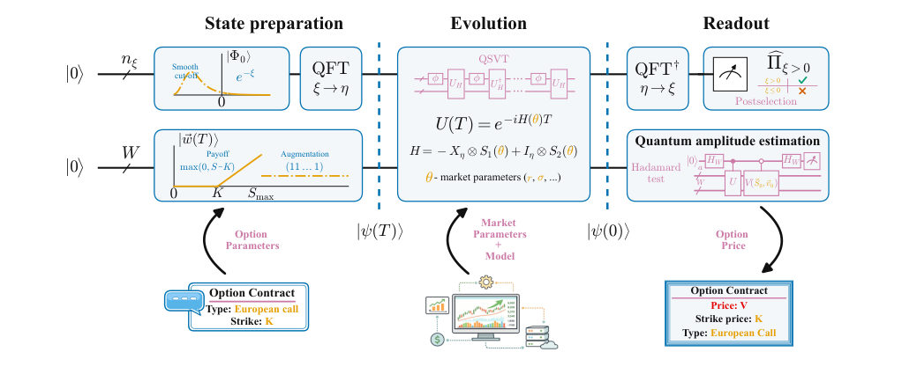
<figcaption class="paper-figure-caption"><b>Fig 1.</b> Fig. 1: Quantum workflow for solving the Black–Scholes (2) and Heston models (3). The W-qubit main register encodes option values over the stock-price grid (and volatility for the Heston PDE); the auxiliary nξ-qubit register implements the Schr¨odingerisation technique, mapping the dynamics to a unitary Schr¨odinger evolution. Both registers are initialized in the |0⟩state. The state preparation stage prepares (i) the smooth initialization |Φ0⟩, a C∞profile that coincides with e−ξ for ξ &gt; 0, (ii) the payoff state (augmented by a constant component) {⃗V (T), 1}⊤. The evolution stage includes Hamiltonian evolution under the Schr¨odinger system induced by the ODE system (5), inducing V (T) →V...</figcaption>
</figure>
<figure class="paper-figure-card">
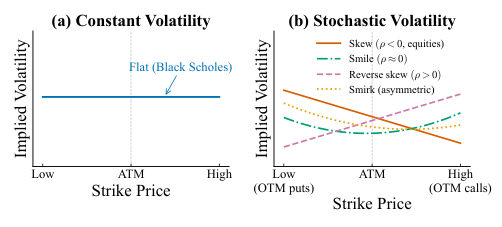
<figcaption class="paper-figure-caption"><b>Fig 2.</b> Fig. 2: Constant-volatility Black–Scholes corresponds to a flat implied-volatility curve, whereas stochastic volatility models such as Heston can generate a smile or skew.</figcaption>
</figure>
<figure class="paper-figure-card">
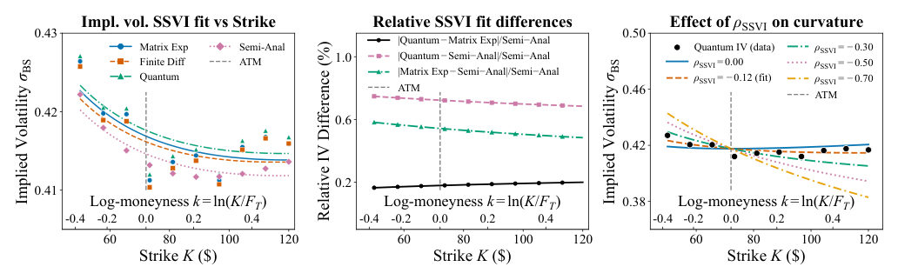
<figcaption class="paper-figure-caption"><b>Fig 3.</b> Fig. 3: Fixed-maturity Heston implied volatility smile shown in strike and forward log-moneyness coordinates (k = ln(K/FT )). Left: SSVI fits from four solvers. Centre: Relative discrepancies against the semi- analytical benchmark. Right: Sensitivity to the SSVI correlation parameter ρSSVI. The best fitted ρSSVI produces a mild skew that preserves the arbitrage-free nature of the curve (Algorithm 1). Simulation details are clarified in Appendix C.3.</figcaption>
</figure>
<figure class="paper-figure-card">
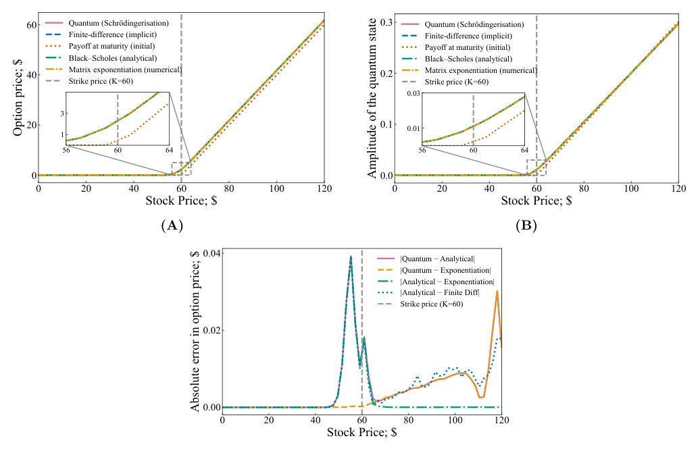
<figcaption class="paper-figure-caption"><b>Fig 4.</b> Fig. 4: Comparison of solvers for the 1D Black–Scholes PDE. (A) Solution V (S, 0) in dollars, together with the payoff at maturity V (S, T) = max(S−K, 0) (shown only as an initial/terminal condition, not a PDE solution). (B) The same solution after normalization as a wave function, i.e. R |V (x)|2 dx = 1 (continuous notation; discretized analog used numerically). (C) Pairwise absolute differences between solvers. We compare: Quantum (Schr¨odin- gerisation), Finite-difference (implicit), Matrix exponentiation (numerical), and the analytical Black–Scholes for- mula [36, 42]. The classical baselines (matrix exponentiation and implicit finite differences) are described in Ap- pendix H. The...</figcaption>
</figure>
<figure class="paper-figure-card">
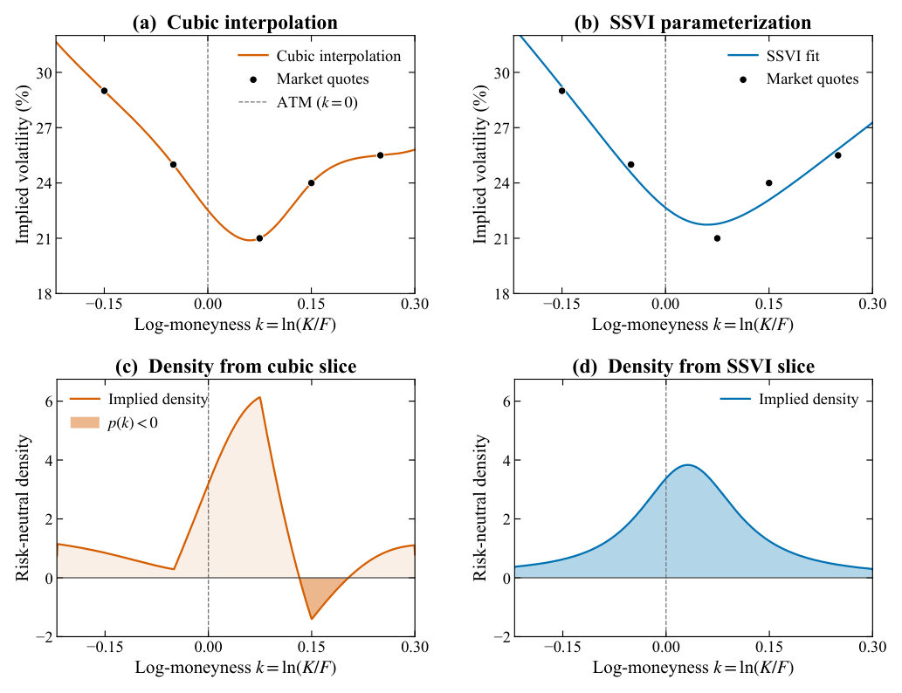
<figcaption class="paper-figure-caption"><b>Fig 5.</b> Fig. 5: Arbitrage-free regularization of implied volatility slices. (a) Sparse quotes (red circles) with cubic interpolation of implied volatility. (b) SSVI fit to the same quotes. (c) Implied density from Breeden–Litzenberger applied to the cubic interpolation; negative regions indicate butterfly arbitrage. (d) Implied density from the SSVI slice, which is non-negative under the enforced constraints. SSVI provides an arbitrage-free benchmark for compar- ing classical and quantum Heston-PDE outputs.</figcaption>
</figure>

**Summary.** This paper proposes a complete quantum algorithm for pricing multi-asset options under complex volatility models. By mapping PDEs to a unitary Schrödinger-like evolution, it provides a theoretical polynomial speedup over classical grid-based methods for high-dimensional problems.

**Why it may be interesting.** not directly relevant

Detailed structure

**Main problem.** Developing an end-to-end quantum computing framework for pricing multi-asset European options under complex local and stochastic volatility models, specifically addressing the readout bottleneck and the curse of dimensionality.

**Main result.** The authors present a quantum pipeline that achieves a polynomial improvement in grid size relative to classical finite-difference baselines, specifically an improvement factor of N^{d/2} for Black-Scholes and N^d for Heston models.

**Method.** The framework uses 'Schrödingerisation' to map non-unitary PDEs to unitary Hamiltonian evolution, implements the dynamics via Quantum Singular Value Transformation (QSVT) and block-encoding, and recovers option prices using Quantum Amplitude Estimation (QAE).

**Model / system.** The mathematical models are multi-asset Black-Scholes (local volatility) and Heston (stochastic volatility) models, formulated as high-dimensional parabolic partial differential equations (PDEs) discretized on spatial grids.

**Key observables.** European option prices, implied volatility smiles, and volatility skews.

**Important parameters / regimes.** Number of assets (d), grid resolution (N), discretization error, and gate complexity in terms of CNOT and Pauli-axis rotations.

**Assumptions / limitations.** The framework is limited to European-style options and relies on finite-difference discretization; it does not account for physical qubit overhead or error-correction costs.

**Figures summary.** Figure 1 shows the quantum pricing workflow; Figure 2 compares volatility profiles (flat vs. smile/skew); Figure 3 compares Heston implied volatility solvers; Figure 8 illustrates the smooth initialization function.

**Paper structure.** The paper introduces the financial problem, defines the mathematical PDE framework, details the quantum pipeline (state preparation, evolution, and readout), provides complexity analysis for different models, and concludes with numerical validation against classical benchmarks.

Abstract

Multi-asset option pricing under local- and stochastic-volatility models leads naturally to high-dimensional parabolic PDEs. We develop an end-to-end quantum PDE framework for European option pricing under local-volatility Black--Scholes and Heston models. The framework takes classical contract and model data as input and returns classical estimates of selected option values. We solve the pricing PDEs after finite-difference discretization on spatial grids. For $N=2^n$ grid points per spatial direction and $d$ assets, the end-to-end gate complexity for single-point recovery, counted in elementary CNOT gates and one-qubit Pauli-axis rotations, has leading grid-size dependence $\widetilde{O}(d^2 N^{2+d/2})$ for local-volatility Black--Scholes and $\widetilde{O}(d^2 N^{d+2})$ for Heston. Relative to grid-based finite-difference baselines, these scalings correspond to polynomial improvement factors $N^{d/2}$ and $N^d$, respectively. These estimates translate to Clifford+T resources via standard compilation. We complement the complexity analysis with numerical benchmarks against standard classical methods. In the Heston setting, the framework recovers option prices across strikes together with the associated implied-volatility smile/skew. Overall, this work provides a complete end-to-end quantum pricing pipeline with explicit resource accounting and theoretical performance guarantees.

[↑ back to top](#top)

### [Ground state correlations in the one-dimensional Fermi one-component plasma](http://arxiv.org/abs/2605.26420v1)

**Authors:** Massimo Boninsegni  
**Type:** theory · **Category:** strongly correlated electrons · **PDF:** <https://arxiv.org/pdf/2605.26420v1>  
**Analysis basis:** full PDF text, analyzed in chunks

↔ Scroll figures horizontally

<figure class="paper-figure-card">
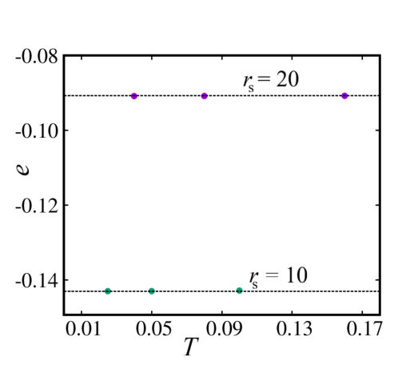
<figcaption class="paper-figure-caption"><b>Fig 1.</b> FIG. 1. Energy per particle as a function of temperature (both quantities in Hartree) for a fully polarized system of electrons and two different values of rs. The numbers of par- ticles are 20 (highest temperature), 40 and 80 (lowest temper- ature). Horizontal dashed lines are fits to the data. Statistical errors are smaller than symbol sizes.</figcaption>
</figure>
<figure class="paper-figure-card">

<figcaption class="paper-figure-caption"><b>Fig 2.</b> FIG. 2. Pair correlation function g(x) computed for a fully polarized (ζ = 1) system with rs = 2 at two temperatures (in Ha) and with system sizes so that the product LT remains constant. The data are observed to collapse (statistical errors are of the order of the symbol size).</figcaption>
</figure>
<figure class="paper-figure-card">
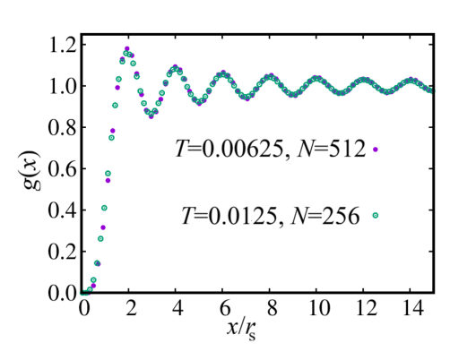
<figcaption class="paper-figure-caption"><b>Fig 3.</b> Fig. 2 displays the pair correlation function g(x) for a fully polarized system with rs = 2, plotted as a func- tion of x/rs. Within the statistical uncertainties of our calculation, collapse of the data is observed; just like for the energy, we find that to be the case for all values of rs considered here. Fig. 3 shows the so determined ground state pair correlation functions for a fully po- larized (i.e., ζ = 1) system of varying rs, specifically</figcaption>
</figure>
<figure class="paper-figure-card">
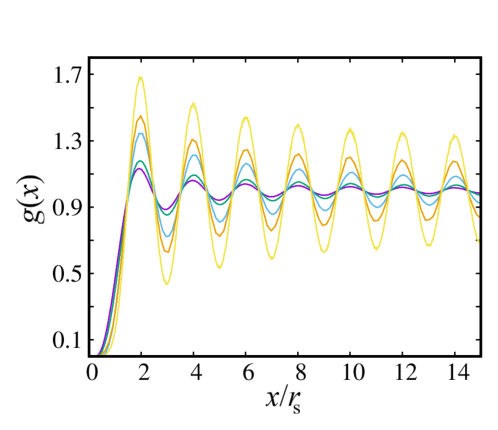
<figcaption class="paper-figure-caption"><b>Fig 4.</b> FIG. 3. Ground state pair correlation function g(x) computed for a polarized system with rs = 1, 2, 5, 10, 20. Curves with higher peaks correspond to greater values of rs.</figcaption>
</figure>
<figure class="paper-figure-card">
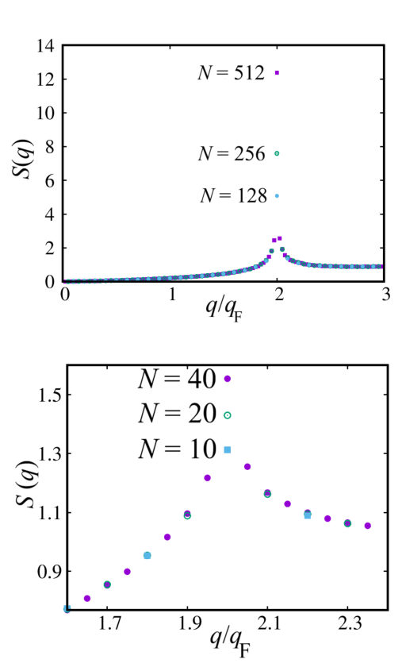
<figcaption class="paper-figure-caption"><b>Fig 5.</b> FIG. 4. Static structure factor S(q) computed for a fully polarized (ζ = 1) system with rs = 20 (top) and rs = 2 (bottom). Data are plotted as a function of q/qF , where qF = π/(2rs). Statistical errors are smaller than symbol size. The data shown pertain to three different system sizes and temperatures. The lowest temperature is 3.125 × 10−2 Ha, and the product LT is the same for all systems.</figcaption>
</figure>

**Summary.** This paper uses Quantum Monte Carlo simulations to study the ground state properties of a 1D electron gas. It demonstrates that long-range Coulomb interactions lead to quasi-crystalline order and shows how spin polarization affects the visibility of quantum statistics in the momentum distribution.

**Why it may be interesting.** The study provides deep insights into how long-range interactions and spin polarization influence many-body correlations and the emergence of quasi-crystalline order, which is fundamental to understanding 1D many-body dynamics.

Detailed structure

**Main problem.** The study investigates structural and dynamic correlations in the ground state of a one-dimensional Fermi one-component plasma, specifically testing for deviations from Tomonaga-Luttinger Liquid Theory due to long-range Coulomb interactions.

**Main result.** The researchers found evidence of quasi-crystalline order emerging even in weakly correlated regimes and observed that quantum statistics significantly influence the momentum distribution in partially polarized systems, while being suppressed in unpolarized systems.

**Method.** Unbiased Quantum Monte Carlo simulations using the canonical variant of the continuous-space Worm Algorithm, with results extrapolated to the ground state limit.

**Model / system.** A one-dimensional assembly of N identical spin-1/2 charged particles in a box of length L with periodic boundary conditions, neutralized by a uniform background of opposite charge (jellium/OCP model) with repulsive Coulomb interactions.

**Key observables.** Pair correlation function, static structure factor, one-particle density matrix, momentum distribution, and energy per particle.

**Important parameters / regimes.** Dimensionless density parameter (rs) ranging from 1 to 20, system polarization (zeta) ranging from fully polarized to unpolarized, and the LT scaling property.

**Assumptions / limitations.** The 1D nature of the system allows for the avoidance of the sign problem; the study assumes the validity of the LT scaling for data collapsing despite potential long-range interaction deviations.

**Figures summary.** Figure 1 shows energy per particle vs temperature for different rs values; Figure 7 displays momentum distributions for majority and minority spin components in partially polarized systems.

**Paper structure.** The paper introduces the 1D OCP model and the scientific problem, describes the Worm Algorithm QMC methodology, presents validation against existing literature, details structural and one-body results across different density and polarization regimes, and concludes with a discussion on quantum statistics and TLL theory.

Abstract

Structural and dynamic correlations in the ground state of the one-dimensional Fermi one-component plasma are studied by Quantum Monte Carlo simulations. Results are presented for the pair correlation function, static structure factor, the one-particle density matrix and the momentum distribution, for the cases of full, partial and no polarization. Evidence is reported of density correlations slowly decaying with distance, with the concurrent emergence of quasi-crystalline order even in the weakly correlated regime. Effects of quantum statistics in the momentum distribution are discussed.

[↑ back to top](#top)

### [Inter-Landau-Level Pair Tunneling Rigidifies the Long-Wavelength Structure Factor of the ν=1/3 Laughlin State](http://arxiv.org/abs/2605.26957v1)

**Authors:** Hongyi Liu  
**Type:** theory · **Category:** strongly correlated electrons · **PDF:** <https://arxiv.org/pdf/2605.26957v1>  
**Analysis basis:** full PDF text, analyzed in chunks

↔ Scroll figures horizontally

<figure class="paper-figure-card">
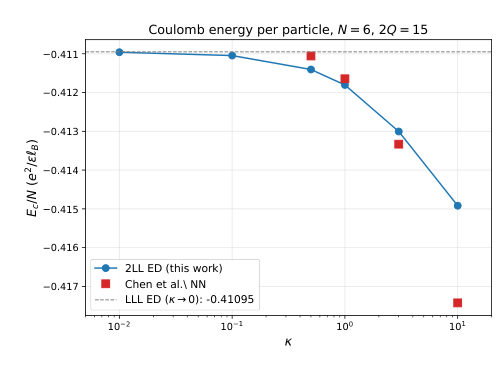
<figcaption class="paper-figure-caption"><b>Fig 1.</b> FIG. 1. Coulomb energy per particle Ec/N vs κ at N = 6, 2Q = 15 from the rigorous 2LL ED. The horizontal dashed line is the κ →0 LLL ED reference. The energy decreases monotonically with κ as expected for a constrained variational principle in which higher Landau levels are added.</figcaption>
</figure>
<figure class="paper-figure-card">
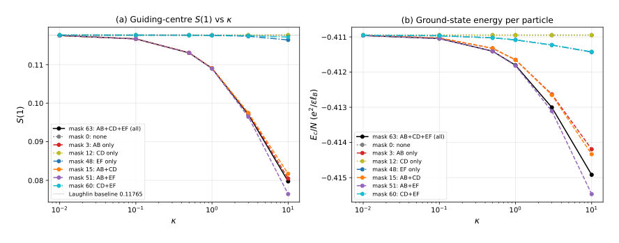
<figcaption class="paper-figure-caption"><b>Fig 2.</b> FIG. 2. Channel-mask ablation summary. (a) S(1) vs κ for all eight masks. The pure-LLL Laughlin value 0.11765 is the horizontal dashed line. Masks containing AB form one family that falls by ∼0.04 between κ = 0.01 and κ = 10; masks without AB stay within 1.5 × 10−3 of the Laughlin value. (b) Ground-state energy per particle Ec/N for the same runs.</figcaption>
</figure>
<figure class="paper-figure-card">
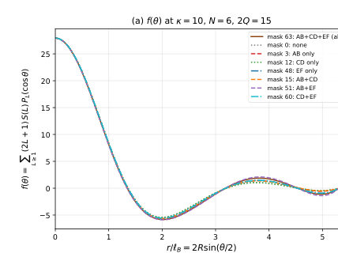
<figcaption class="paper-figure-caption"><b>Fig 3.</b> FIG. 3. Real-space pair-correlation deviation f(θ) = P</figcaption>
</figure>

**Summary.** This paper demonstrates that Landau-level mixing in the nu=1/3 fractional quantum Hall state leads to a suppression, rather than an enhancement, of the long-wavelength structure factor. It identifies a non-perturbative inter-Landau-level pair-tunneling mechanism as the cause, contradicting traditional perturbative predictions. This finding highlights the importance of many-body coherent effects in Landau-level mixing physics.

**Why it may be interesting.** not directly relevant

Detailed structure

**Main problem.** The paper investigates whether Landau-level mixing (LLM) at filling factor nu=1/3 causes a 'softening' (increase) or 'rigidification' (suppression) of the long-wavelength structure factor S(L), challenging the established GMP chain of reasoning.

**Main result.** The study finds that LLM actually causes a 32% suppression (rigidification) of the structure factor S(1), driven by a non-perturbative inter-Landau-level pair-tunneling channel (DD <-> UU) that overpowers perturbative effects.

**Method.** The authors use rigorous two-Landau-level (2LL) Exact Diagonalization (ED) on a Haldane sphere, supplemented by Schrieffer-Wolff perturbative dressing and channel-mask ablation to isolate specific scattering contributions.

**Model / system.** The system is the nu=1/3 Laughlin fractional quantum Hall state, modeled using a two-Landau-level Hamiltonian (LLL + SLL) with Coulomb interactions on a Haldane sphere geometry.

**Key observables.** Unprojected guiding-centre structure factor S(L) (specifically S(1)), magnetoroton gap Delta, and the real-space pair correlator g(theta).

**Important parameters / regimes.** The Landau-level mixing parameter kappa (ratio of Coulomb to cyclotron energy), particle number N=6, and magnetic monopole strength 2Q=15.

**Assumptions / limitations.** The study assumes a two-Landau-level truncation is sufficient to capture the essential physics of the rigidification mechanism.

**Figures summary.** Figures demonstrate the monotonic decrease of S(1) with kappa, the failure of the GMP product to remain invariant, and a four-way decomposition showing the dominance of the AB pair-tunneling channel.

**Paper structure.** The paper begins by introducing the GMP prediction discrepancy, presents the 2LL ED numerical results, performs a channel-mask ablation to identify the AB channel as the driver, provides a four-way decomposition to compare perturbative vs. non-perturbative effects, and concludes with a structural fingerprint analysis of the pair-tunneling process.

Abstract

A textbook chain of reasoning, originating with Girvin, MacDonald, and Platzman, predicts that Landau-level mixing (LLM) at nu=1/3 should soften the long-wavelength structure factor S(L): virtual excitations suppress V_1, the magnetoroton gap closes, and the single-mode approximation then forces S(L) to increase. We test this chain on the Haldane sphere at nu=1/3, N=6, 2Q=15. (i) Perturbatively, via first-order Schrieffer-Wolff dressing of the LLL Laughlin state, fed Lowdin-renormalised pseudopotentials: the dressed state gives Delta S(1) at kappa=10 of approximately +21%, consistent with the GMP prediction (~19% softening of V_1^eff). (ii) Non-perturbatively, via rigorous two-Landau-level (LLL+SLL) exact diagonalisation using a repaired DiagHam 2LL module that retains, for the first time on the sphere, the full inter-LL scattering channels. The response reverses sign: S(1) rigidifies monotonically from 0.118 at kappa->0 to 0.080 at kappa=10, a 32% suppression. Perturbative and non-perturbative results thus disagree in sign, with a gap of ~53 percentage points between +21% (SW) and -32% (full ED). Channel-mask ablation localises the reversal to the DD<->UU pair-tunneling channel (98% of the shift). A four-way decomposition shows the three-body coherent content overpowers the perturbative admixture by ~2.5x. Repaired code: https://github.com/Cannan-1/DiagHamOnSphereOpenSource (v2.0).

[↑ back to top](#top)

### [Nematic Phase Transitions in Multilayer Graphene Systems](http://arxiv.org/abs/2605.26270v1)

**Authors:** R. David Mayrhofer, Andrey V. Chubukov  
**Type:** theory · **Category:** strongly correlated electrons · **PDF:** <https://arxiv.org/pdf/2605.26270v1>  
**Analysis basis:** full PDF text, analyzed in chunks

↔ Scroll figures horizontally

<figure class="paper-figure-card">
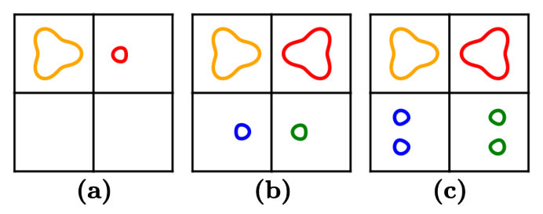
<figcaption class="paper-figure-caption"><b>Fig 1.</b> FIG. 1. Schematic plots of the experimentally observed phases where the minority carriers break</figcaption>
</figure>
<figure class="paper-figure-card">
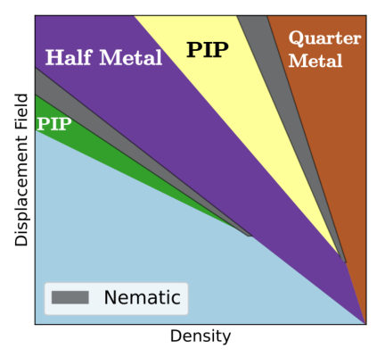
<figcaption class="paper-figure-caption"><b>Fig 2.</b> FIG. 2. Schematic theoretical phase diagram. The nematic phases (gray regions) are located in</figcaption>
</figure>
<figure class="paper-figure-card">
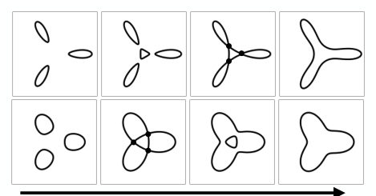
<figcaption class="paper-figure-caption"><b>Fig 3.</b> FIG. 3. A schematic depiction of the evolution of the Fermi surface of a single isospin in BBG with</figcaption>
</figure>
<figure class="paper-figure-card">
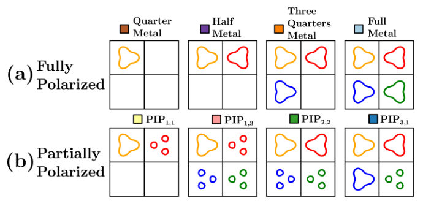
<figcaption class="paper-figure-caption"><b>Fig 4.</b> FIG. 4. Schematic depictions Fermi surfaces of different phases that appear in the phase diagrams</figcaption>
</figure>
<figure class="paper-figure-card">
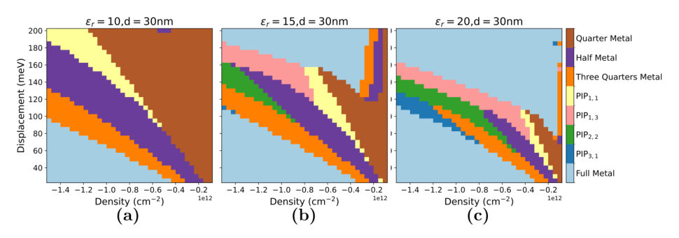
<figcaption class="paper-figure-caption"><b>Fig 5.</b> FIG. 5. Phase diagram for the system with d = 30nm. The guide to color coding is in the bar on</figcaption>
</figure>

**Summary.** This paper provides a microscopic explanation for the spontaneous breaking of C3 symmetry in multilayer graphene. It demonstrates that nematic order arises in partially isospin polarized states when the screened interaction reaches a critical threshold. The findings help link the observed nematicity to the underlying electronic phase transitions in these systems.

**Why it may be interesting.** not directly relevant

Detailed structure

**Main problem.** Investigating the emergence and origin of electronic nematic order (spontaneous breaking of C3 rotational symmetry) in multilayer graphene systems.

**Main result.** The study identifies that nematicity emerges in partially isospin polarized states near the boundaries of fully polarized phases, driven by the strength of the screened Coulomb interaction.

**Method.** A self-consistent Hartree-Fock framework is used for numerical phase diagrams, complemented by an analytical derivation of a nemostability criterion in the low-density limit.

**Model / system.** The study focuses on Bernal bilayer graphene (BBG) and rhombohedral trilayer graphene (RTG) using a tight-binding model that includes trigonal warping, a displacement field, and a dual-gate screened Coulomb interaction.

**Key observables.** Fermi surface topology (number of pockets), isospin polarization (spin and valley), and phase diagrams as a function of density and displacement field.

**Important parameters / regimes.** Carrier density, displacement field (D), dielectric constant (epsilon_r), gate distance (d), and trigonal warping (gamma_3).

**Assumptions / limitations.** The study focuses on q=0 orders, neglects spin-orbit coupling due to its small scale, and assumes the pocket size is small relative to the screening length for the analytical model.

**Figures summary.** Figure 1 shows a schematic of experimental phases; Figure 2 shows a theoretical phase diagram with nematic regions; Figure 3 illustrates Fermi surface evolution regimes; Figures 4-6 show phase diagrams and Fermi surface geometries; Figure 8 shows specific nematic regions in PIP states.

**Paper structure.** The paper begins with an introduction to experimental context, moves to a numerical study of phase diagrams using Hartree-Fock, provides an analytical derivation of the nematicity criterion, and concludes with a discussion of the results' implications for superconductivity.

Abstract

Recent experiments on graphene multilayers under displacement field have demonstrated a wide variety of electronically ordered phases, including valley and/or spin polarized phases as well as potentially unconventional superconducting phases. In addition, quantum oscillation measurements in Bernal bilayer graphene and rhombohedral trilayer graphene showed the presence of electronic nematic states. Here, we investigate the emergence of nematic order in these systems, with emphasis on Bernal bilayer graphene, within a self-consistent Hartree--Fock framework, using a realistic band structure with trigonal warping and a dual-gate screened Coulomb interaction. We compute the phase diagram as carrier density and displacement field are varied, and find a sequence of isospin (spin and valley) polarized states consistent with experiment, including partially polarized phases with a large Fermi pockets for isospin-majority carriers and smaller Fermi pockets for isospin-minority carriers. Within these partially isospin polarized states, we identify regions with three $C_3$-symmetric pockets for the minority carriers and regions with only one or two such pockets, implying that the system develops a spontaneous nematic order that breaks $C_3$ symmetry. We find numerically that nematicity emerges near the boundary between fully and partially polarized phases and is controlled by the strength of the screened interaction. We analytically derive a criterion for the nematic order, which agrees with our numerical results.

[↑ back to top](#top)

### [Neural Autoregressive Control Variates for the Quantum Monte Carlo Sign Problem](http://arxiv.org/abs/2605.26814v1)

**Authors:** Bei Qiao, Lei Wang  
**Type:** theory · **Category:** numerical methods · **PDF:** <https://arxiv.org/pdf/2605.26814v1>  
**Analysis basis:** full PDF text, analyzed in chunks

↔ Scroll figures horizontally

<figure class="paper-figure-card">
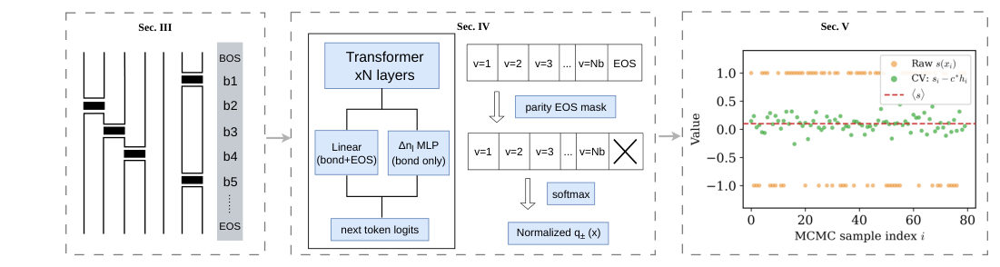
<figcaption class="paper-figure-caption"><b>Fig 1.</b> FIG. 1. Schematic overview of the workflow. Left (Sec. III): an SSE worldline configuration is converted into a compact uncolored operator string via the RSSE resummation. Middle (Sec. IV): the operator string is processed by a causal transformer with a linear output head and a residual MLP that adds ∆nl-aware corrections to bond logits. A parity EOS mask enforces sign-sector resolution, and a softmax yields the normalized parity-resolved distributions q±(x). Right (Sec. V): the resulting control variate si −c∗hi reduces the sign estimator’s fluctuations around ⟨s⟩, while the raw sign s(xi) takes only values ±1.</figcaption>
</figure>
<figure class="paper-figure-card">
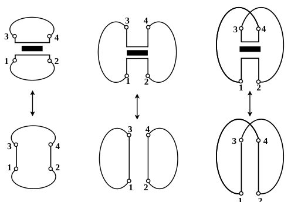
<figcaption class="paper-figure-caption"><b>Fig 2.</b> FIG. 2. Three topologically distinct reconnections when inserting an operator at a bond with legs 1,2 (bottom) and 3,4 (top). (a) Split (∆nl = +1): legs 1–2 and 3–4 connected within the same time slice; one loop splits into two. (b) Merge (∆nl = −1): legs 1–3 and 2–4 along worldlines; two loops merge into one. (c) Twist (∆nl =0): legs 1–4 and 2–3 cross- connected; loop count unchanged but internal routing rear- ranged. Only the twist channel changes the sign, and it is forbidden on bipartite lattices. Top: with operator (black bar). Bottom: after removal.</figcaption>
</figure>
<figure class="paper-figure-card">
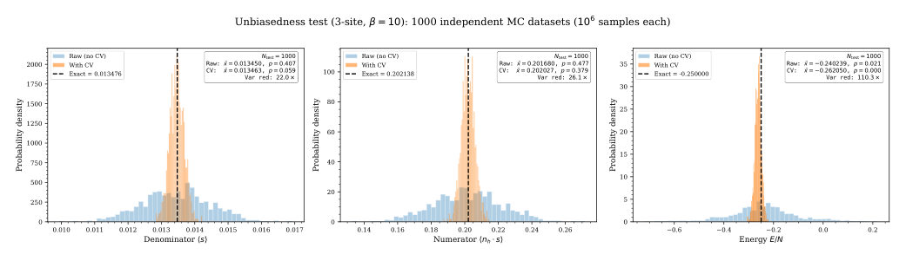
<figcaption class="paper-figure-caption"><b>Fig 3.</b> FIG. 3. Unbiasedness and finite-sample bias test at β = 10 on the 3-site triangular lattice. Left and middle: distribution of the numerator ⟨nh s⟩and denominator ⟨s⟩estimators over 1000 independent MCMC datasets of 106 samples each, with and without control variates. Right: distribution of the energy ratio E/N without jackknife bias correction. Dashed lines indicate exact values from ED. The CV estimator (orange) is centered on the exact value for the numerator and denominator, confirming unbiasedness, but shows a visible shift in the ratio due to finite-sample bias inherent to ratio estimators, despite achieving ∼110× variance reduction.</figcaption>
</figure>
<figure class="paper-figure-card">
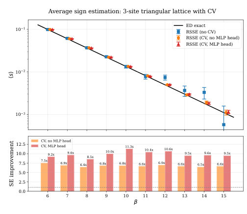
<figcaption class="paper-figure-caption"><b>Fig 4.</b> FIG. 4. Average sign ⟨s⟩on the 3-site triangular lattice as a function of β, comparing the full model (with MLP head) and the ablated model (without MLP head). Top: expectation values of CV and raw estimators, compared with ED. Bottom: SE improvement factor. The MLP head provides consistent improvement across all β values.</figcaption>
</figure>
<figure class="paper-figure-card">
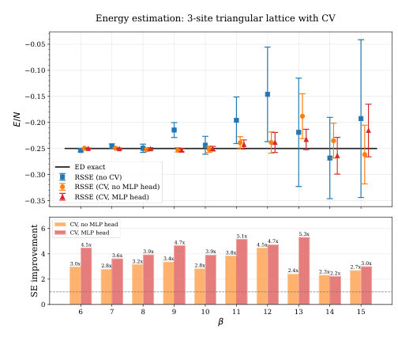
<figcaption class="paper-figure-caption"><b>Fig 5.</b> FIG. 5. Energy per site E/N on the 3-site triangular lattice as a function of β, comparing the full model (with MLP head) and the ablated model (without MLP head). Top: CV esti- mator vs. raw estimator, compared with ED (black line). Er- ror bars show one standard error. Bottom: SE improvement factor at each β. The MLP head yields a larger and more stable improvement, even at high β where the sign problem is severe.</figcaption>
</figure>

**Summary.** The authors present a machine learning approach to mitigate the sign problem in Quantum Monte Carlo simulations by using autoregressive neural networks as control variates. By training models to represent the positive and negative sign sectors separately, they create an unbiased auxiliary observable that significantly reduces estimator variance. This proof-of-principle demonstrates that neural networks can effectively stabilize simulations of frustrated quantum systems even in regimes of extreme sign cancellation.

**Why it may be interesting.** This work provides a novel way to use machine learning to tackle the sign problem, which is a fundamental bottleneck in the classical simulation of many-body quantum dynamics and frustrated magnetism.

Detailed structure

**Main problem.** The exponential decay of the average sign in Quantum Monte Carlo (QMC) simulations of frustrated magnets, which leads to an unmanageable increase in estimator variance and signal-to-noise ratio.

**Main result.** The development of a neural autoregressive control variate method that reduces the standard error of the average sign by up to an order of magnitude and the energy estimator by a factor of 3 to 5, even when the average sign is below 10^-3.

**Method.** Training a pair of autoregressive Transformers, constrained to disjoint positive and negative sign sectors, to construct a structurally zero-mean control variate that reduces variance without changing the underlying sampling measure.

**Model / system.** The study focuses on frustrated quantum magnets, specifically the SU(2) Heisenberg antiferromagnet on triangular and tetrahedral lattices, using the Stochastic Series Expansion (SSE) framework.

**Key observables.** Average sign, energy estimator, operator count, and sign autocorrelation function.

**Important parameters / regimes.** Inverse temperature (beta), system size (N), and the average sign magnitude.

**Assumptions / limitations.** The method assumes the sampling measure is fixed by the Monte Carlo dynamics and does not replace the sampler; it also assumes the training signal is decoupled from the sign problem itself.

**Figures summary.** Figures illustrate topological reconnection mechanisms (split/merge/twist), probability density distributions of estimators, and comparisons of the control variate versus raw estimators across different temperatures and geometries.

**Paper structure.** The paper introduces the QMC sign problem, describes the neural autoregressive control variate architecture and its structural constraints, details the SSE framework extensions for frustrated lattices, presents numerical benchmarks on small triangular clusters, and discusses scaling limitations.

Abstract

We train a pair of autoregressive models to construct zero-mean control variates to mitigate the sign problem in quantum Monte Carlo simulations. The two autoregressive networks are confined to the positive- and negative-sign sectors with strictly disjoint support, and each is exactly normalized over its sector. Their difference is therefore structurally zero-mean, providing an unbiased auxiliary observable whose correlation with the sign estimator controls the variance reduction. We implement the method within the stochastic series expansion framework, which we extend to frustrated lattices by developing an incremental loop-topology update. Sign-ergodic sampling is achieved through a twist channel, which is the unique sign-changing mechanism on non-bipartite lattices. We implement the control variates as autoregressive transformers with an end-of-sequence parity mask that enforces exact sign-sector resolution, while the incremental loop-count change and cumulative frustration parity are incorporated as topological features. On the triangular-lattice Heisenberg antiferromagnet, we benchmark the method in the small-$N$ limit. The control variate reduces the standard error of the average sign by up to an order of magnitude and that of the energy estimator by a factor of three to five, remaining effective even when the average sign drops below $10^{-3}$. This work lays out the framework and provides a proof-of-principle demonstration that autoregressive control variates can effectively mitigate the sign problem. Scaling to larger systems with physics-informed architectures is the subject of future work.

[↑ back to top](#top)

### [Qiskit QuantumKatas: Adapting Microsoft's Quantum Computing exercises for LLM evaluation](http://arxiv.org/abs/2605.27210v1)

**Authors:** Juan Cruz-Benito, Ismael Faro  
**Type:** theory · **Category:** quantum information and computing · **PDF:** <https://arxiv.org/pdf/2605.27210v1>  
**Analysis basis:** full PDF text, analyzed in chunks

↔ Scroll figures horizontally

<figure class="paper-figure-card">
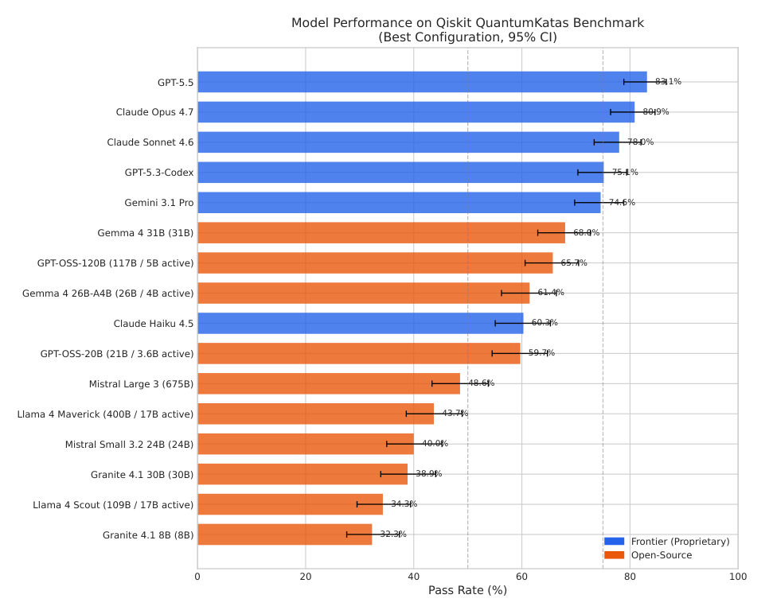
<figcaption class="paper-figure-caption"><b>Fig 1.</b> Figure 1: Model performance on the Qiskit QuantumKatas benchmark. Bars show pass rates for each model’s best configuration, with error bars indicating 95% Wilson score confidence intervals. Blue bars indicate frontier (proprietary) models; orange bars indicate open-source models.</figcaption>
</figure>
<figure class="paper-figure-card">

<figcaption class="paper-figure-caption"><b>Fig 2.</b> Figure 2: Effect of prompting strategies on model performance. Box plots show the distribution of pass rates across all models for each strategy. Red diamonds indicate means. Few-shot prompting modestly improves the average pass rate and reduces cross-model variance.</figcaption>
</figure>
<figure class="paper-figure-card">
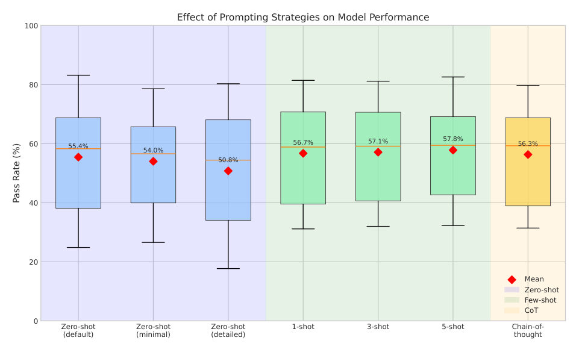
<figcaption class="paper-figure-caption"><b>Fig 3.</b> Figure 3 provides a per-model breakdown. Taken together, these results suggest a simple default: few-shot-3 or few-shot-5 with the default system prompt yields the best average-case performance, with two refinements—route reasoning-tuned endpoints (in our study, GPT-5.3-Codex and Gemini 3.1 Pro) to chain-of-thought, and let the strongest instruction-followers (GPT-5.5, GPT-OSS-120B) use zero-shot, since they derive little additional benefit from in-context examples.</figcaption>
</figure>
<figure class="paper-figure-card">
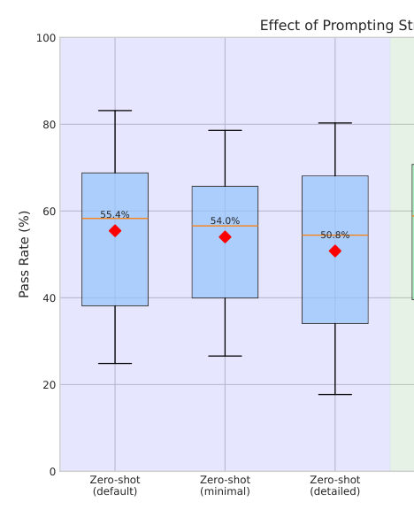
<figcaption class="paper-figure-caption"><b>Fig 4.</b> Figure 4 visualizes category difficulty, with colors indicating the pedagogical tier each category belongs to.</figcaption>
</figure>
<figure class="paper-figure-card">
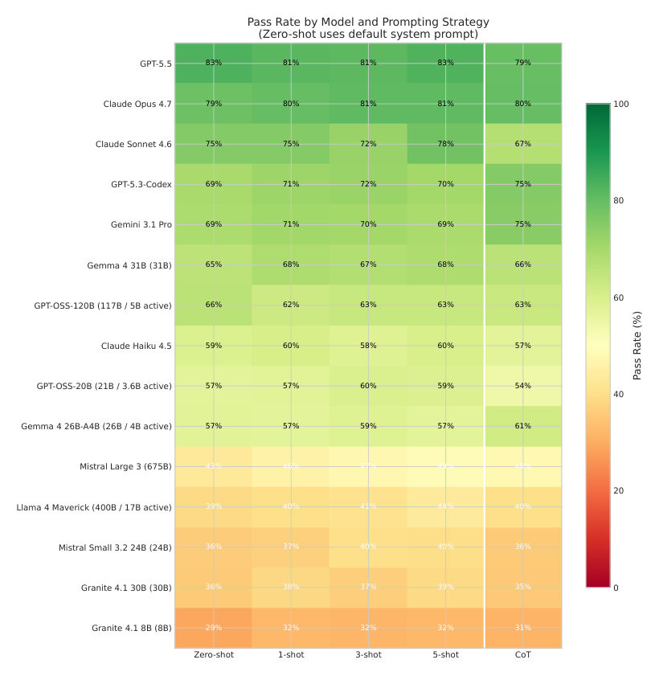
<figcaption class="paper-figure-caption"><b>Fig 5.</b> Figure 3: Pass rate heatmap showing performance of the top 15 models across prompting strategies (zero-shot to 5-shot with default system prompt, plus chain-of-thought). Darker green indicates higher pass rates.</figcaption>
</figure>

**Summary.** This paper introduces 'Qiskit QuantumKatas,' a new benchmark designed to evaluate how well LLMs can write quantum programming code. It reveals that while top-tier models can implement standard algorithms, they struggle with complex problem encoding and that advanced prompting techniques like Chain-of-Thought are not universally effective for quantum tasks.

**Why it may be interesting.** not directly relevant

Detailed structure

**Main problem.** The lack of large-scale, pedagogically-structured benchmarks to evaluate the ability of Large Language Models (LLMs) to perform specialized scientific programming in the quantum computing domain.

**Main result.** The study identifies a 26.1 percentage point performance gap between frontier and open-source models, finding that while models excel at implementing known algorithms, they struggle significantly with problem encoding and that Chain-of-Thought prompting can actually degrade performance for many models.

**Method.** The authors adapted Microsoft's Q# QuantumKatas into the Qiskit framework, creating a 350-task benchmark across 26 categories, and evaluated 16 LLMs using seven different prompting configurations via classical circuit simulation.

**Model / system.** The study evaluates 16 Large Language Models, including frontier proprietary models (e.g., GPT-5.5, Claude Opus 4.7, Gemini 3.1 Pro) and open-source models (e.g., Llama 4, Gemma 4, Mistral).

**Key observables.** Model pass rates, error types (Logic, API, Circuit, Generation), and AST (Abstract Syntax Tree) similarity for solution diversity.

**Important parameters / regimes.** Prompting strategies (Zero-shot, Few-shot, Chain-of-Thought), pedagogical tiers (Introductory, Intermediate, Advanced), and model architecture (Frontier vs. Open-Source).

**Assumptions / limitations.** The evaluation relies on classical circuit simulation (statevector comparison), which does not account for real-world hardware noise or decoherence; results are reported at temperature 0.

**Figures summary.** Figure 1 shows pass rates distinguishing frontier and open-source models; Figure 2 uses box plots for prompting strategies; Figure 3 is a heatmap of per-model pass rates; Figure 4 visualizes task difficulty by category; Figure 5 shows the distribution of error types; Figure 6 shows performance decline across difficulty tiers.

**Paper structure.** The paper introduces the need for quantum programming benchmarks, describes the adaptation of QuantumKatas to Qiskit, details the experimental setup and prompting strategies, presents results on model performance and error analysis, and concludes with limitations and future directions.

Abstract

We adapt Microsoft's QuantumKatas -- a well-established quantum computing curriculum -- from Q# to Qiskit, the most widely-adopted quantum computing framework, and package it with an evaluation framework for systematic LLM assessment. The resulting benchmark comprises 350 tasks across 26 categories, spanning fundamental gates through advanced algorithms (Grover's, Simon's, Deutsch-Jozsa), error correction, key distribution, and quantum games. Each task includes a natural language prompt, canonical solution, and deterministic test verification via classical circuit simulation. By building on the QuantumKatas' proven pedagogical design rather than creating tasks from scratch, we inherit a principled difficulty progression and comprehensive concept coverage while contributing the framework adaptation, evaluation infrastructure, and empirical analysis. We evaluate 16 LLMs across 7 prompting configurations -- a total of 39,200 model runs -- to demonstrate the benchmark's utility. Three key findings emerge: (1) the benchmark effectively differentiates model capabilities, with best-configuration pass rates ranging from 32.3% to 83.1% and a 26.1 pp average gap between frontier and open-source models; (2) models perform well at implementing known algorithms (SimonsAlgorithm 82.1%, BasicGates 81.6%) but struggle with problem encoding (SolveSATWithGrover 34.4%, DistinguishUnitaries 40.0%); and (3) chain-of-thought prompting shows a modestly bimodal effect -- it is the best strategy for three models (two of them explicitly reasoning-tuned per vendor documentation) but degrades performance for the rest, leaving it mid-pack in aggregate (56.3% mean) behind few-shot-5 (57.8%). We release the benchmark, evaluation framework, and baseline results to support research on LLM capabilities in quantum computing.

[↑ back to top](#top)

### [Quantum Geometric Origin of Hall Viscosity and Nonlocal Hall Conductivity in Lattice Bands](http://arxiv.org/abs/2605.27059v1)

**Authors:** Danyu Shu, Ryotaro Sano, Ai Yamakage, Hiroshi Funaki, Mamoru Matsuo  
**Type:** theory · **Category:** strongly correlated electrons · **PDF:** <https://arxiv.org/pdf/2605.27059v1>  
**Analysis basis:** full PDF text, analyzed in chunks

↔ Scroll figures horizontally

<figure class="paper-figure-card">
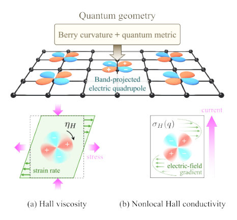
<figcaption class="paper-figure-caption"><b>Fig 1.</b> FIG. 1. Conceptual schematic of the geometric quadrupole picture. The quantum metric and Berry curvature define the band-projected electric quadrupole, which underlies (a) the Hall viscous response to dynamical strain and (b) the non- local Hall response to a spatially nonuniform electric field. Green and pink arrows in the lower panels indicate the ap- plied perturbations and induced Hall responses, respectively.</figcaption>
</figure>
<figure class="paper-figure-card">
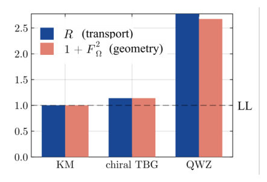
<figcaption class="paper-figure-caption"><b>Fig 2.</b> FIG. 2. Transport signature of geometric idealness. The non- local Hall ratio R is compared with the ideal-band expres- sion 1 + F 2 Ωfor three representative Chern bands: Kapit– Mueller (KM), chiral twisted bilayer graphene (chiral TBG), and Qi–Wu–Zhang (QWZ) models. The dashed line denotes the Landau-level (LL) benchmark R = 1, corresponding to the ideal-band limit with uniform Berry curvature.</figcaption>
</figure>

**Summary.** This paper connects the quantum geometry of lattice bands to measurable transport properties like Hall viscosity and nonlocal Hall conductivity. It demonstrates that the spatial extent of a wave packet (the electric quadrupole) links these two phenomena, providing a way to use electrical measurements to diagnose how closely a lattice system mimics the ideal physics of Landau levels.

**Why it may be interesting.** not directly relevant

Detailed structure

**Main problem.** The paper seeks to identify measurable electrical observables that capture the quantum geometry (Berry curvature and quantum metric) in lattice bands to serve as a proxy for Hall viscosity.

**Main result.** The authors establish that Hall viscosity in lattice bands is governed by a band-projected electric quadrupole and propose that the nonlocal Hall conductivity serves as a transport diagnostic for the 'geometric idealness' of a band.

**Method.** The study uses a semiclassical wave packet approach, the Kubo formula for linear response, and a projected position operator framework to relate geometric tensors to transport coefficients.

**Model / system.** The study focuses on isolated, gapped Bloch bands, specifically examining Chern bands, moiré flat bands (chiral twisted bilayer graphene), the Kapit-Mueller model, and the Qi-Wu-Zhang model.

**Key observables.** Hall viscosity, nonlocal Hall conductivity, Berry curvature, quantum metric, and the nonlocal Hall ratio (R).

**Important parameters / regimes.** Adiabatic regime, Berry curvature fluctuations, and the trace condition (tr[g] = |Omega|).

**Assumptions / limitations.** The derivation assumes an adiabatic regime where interband mixing is negligible and focuses on isolated single energy bands.

**Figures summary.** Figure 1 provides a conceptual schematic of the electric quadrupole underlying Hall responses; Figure 2 compares the nonlocal Hall ratio R across different models (KM, chiral TBG, QWZ) against theoretical predictions.

**Paper structure.** The paper introduces the problem of lattice Hall viscosity, develops an algebraic framework using projected position operators, establishes the viscosity-conductivity relation, and validates the results using specific lattice models (KM, QWZ, and chiral TBG).

Abstract

We show that Hall viscosity in lattice bands is governed by a band-projected electric quadrupole encoded within the quantum geometry: Berry curvature sets the projected-coordinate algebra, while the quantum metric determines the quadrupolar spread of a wave packet. The same structure enters the quadratic wave-vector coefficient of the nonlocal Hall conductivity, yielding a lattice viscosity-conductivity relation. In ideal bands, the deviation from the Landau-level form is quantified by Berry curvature fluctuations. Our results establish the nonlocal Hall response as an electrical signature of the quantum geometry underlying Hall viscosity and as a transport diagnostic of geometric idealness.

[↑ back to top](#top)

### [Queue & AI: When Faster Tasks Slow Down the Workflow](http://arxiv.org/abs/2605.27202v1)

**Authors:** Silvia Bartolucci, Pierpaolo Vivo  
**Type:** theory · **Category:** statistical mechanics · **PDF:** <https://arxiv.org/pdf/2605.27202v1>  
**Analysis basis:** full PDF text, analyzed in chunks

↔ Scroll figures horizontally

<figure class="paper-figure-card">
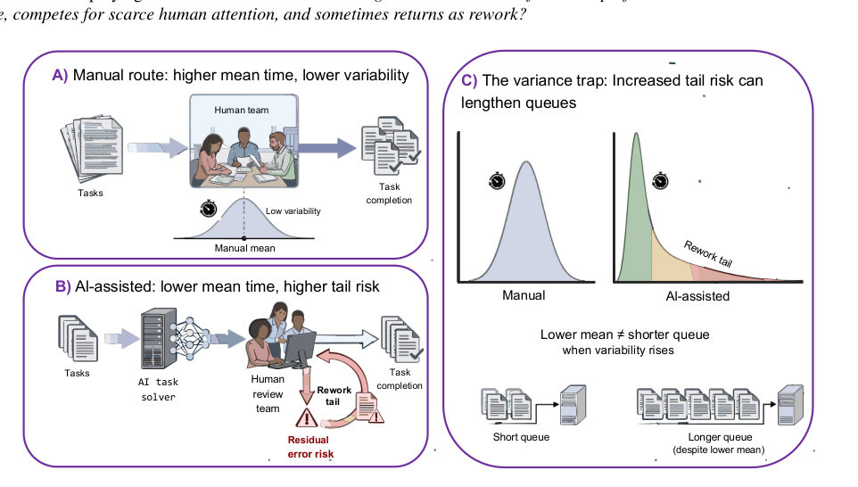
<figcaption class="paper-figure-caption"><b>Fig 1.</b> Figure 1. Schematic workflow model. Panel A shows the manual route: tasks require more human time on average but have relatively low variability. Panel B shows the AI-assisted route: AI generates a draft cheaply, but human review is imperfect, so some residual errors escape and return as rework. Panel C illustrates the resulting distributional shift. AI lowers the mean service time, but creates a heavier right tail. As queueing delay depends on the second moment of service time, the rework tail may dominate the mean saving, producing longer queues despite faster average task completion.</figcaption>
</figure>
<figure class="paper-figure-card">
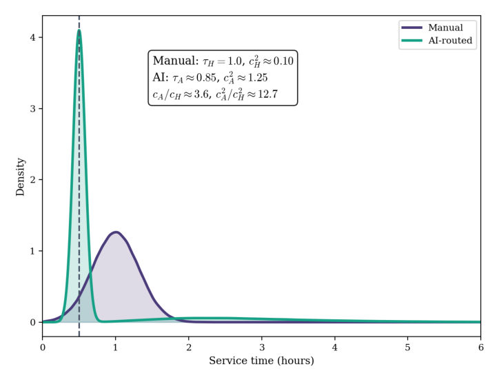
<figcaption class="paper-figure-caption"><b>Fig 2.</b> Figure 2. Simulated service-time distributions for manual and AI-routed handling. Manual service time is drawn from a positive, approximately symmetric distribution with mean τH = 1 hour and squared CV c2 H ≃0.10. AI-routed service time is TA = r +MR, with fixed review time r = 0.5, escaped-error indicator M ∼Bernoulli(0.15), and Gamma-distributed rework R. The AI route has lower mean service time, τA ≃0.85, but much larger dispersion, c2 A ≃1.25. The sharp peak at r = 0.5 corresponds to AI outputs that pass review without later correction; the long right tail corresponds to escaped errors that return as rework.</figcaption>
</figure>
<figure class="paper-figure-card">
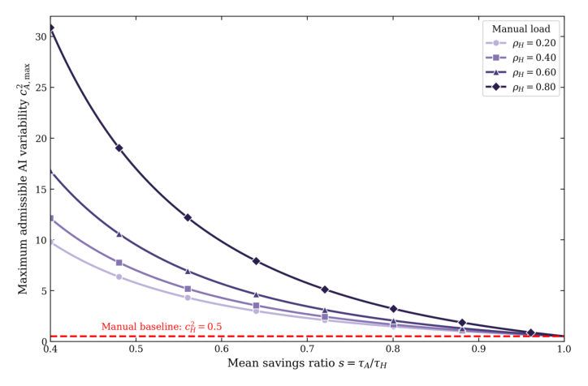
<figcaption class="paper-figure-caption"><b>Fig 3.</b> Figure 3. Maximum admissible AI variability as a function of the mean-savings ratio s = τA/τH, computed from equation (5), for four levels of manual-system utilization, ρH ∈{0.20,0.40,0.60,0.80}, fixing the manual squared coefficient of variation at c2 H = 0.5. Each curve gives the largest AI squared coefficient of variation that is still compatible with lower mean waiting time. Points below a curve correspond to parameter combinations for which AI improves queueing performance; points above it correspond to the variance wedge, in which AI saves time on average but increases waiting time. The admissible variance rises sharply as s falls, because large mean savings create room for the queue...</figcaption>
</figure>
<figure class="paper-figure-card">

<figcaption class="paper-figure-caption"><b>Fig 4.</b> Figure 4 shows the mean waiting time under manual (WH) and AI-routed (WA) handling as the arrival rate of tasks λ varies. We compute WH and WA specializing the M/G/1 formula in equation (3) to the x = 0 and x = 1 cases, respectively, varying the arrival rate λ, while holding the other parameters fixed. At low and moderate arrival rates, the AI-routed system has longer waits than the manual system. The reason is that the queue is not yet close to capacity, so the mean time saving from AI is not valuable enough to offset the larger second moment created by occasional rework. The two curves cross at λ ⋆≃0.76 as predicted by Eq. (7), which marks a regime transition. Below this threshold, AI...</figcaption>
</figure>
<figure class="paper-figure-card">
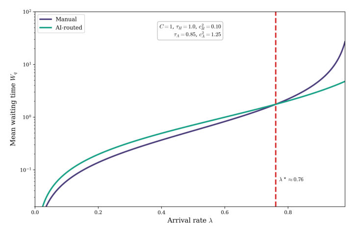
<figcaption class="paper-figure-caption"><b>Fig 5.</b> Figure 4. Mean waiting time under manual (WH) and AI-routed (WA) handling as the arrival rate λ varies. The curves are computed from the M/G/1 waiting-time formula in Eq. (3). Capacity is normalised to C = 1. The manual route has mean τH = 1 and squared CV c2 H = 0.10, so its second moment is qH = τ2 H(1+c2 H). The AI-routed route has lower mean service time, τA = 0.85, but much higher variability, c2 A = 1.25, giving qA = τ2 A(1+c2 A). At low and moderate arrival rates, the AI curve lies above the manual curve: although AI saves time on the average task, the larger second moment created by occasional rework increases waiting time. The curves cross at λ ⋆≃0.76 as predicted by Eq. (7). Above...</figcaption>
</figure>

**Summary.** The paper demonstrates that using AI to speed up individual tasks can actually slow down entire workflows by introducing unpredictable rework and increasing queue congestion. It provides a mathematical framework to identify the 'variance budget' within which AI remains beneficial to system-level productivity.

**Why it may be interesting.** not directly relevant

Detailed structure

**Main problem.** Investigating the 'variance wedge' phenomenon where AI adoption reduces average task processing time but increases system-wide waiting times due to increased service-time variability and rework.

**Main result.** AI deployment can paradoxically increase queue delays if the increased variability from errors outweighs the mean time savings; additionally, reviewers rationally reduce scrutiny as congestion increases.

**Method.** Application of M/G/1 and G/G/1 queueing theory, specifically using the Pollaczek-Khinchine and Kingman frameworks, alongside fixed-point analysis for endogenous congestion costs.

**Model / system.** An M/G/1 queueing model representing a workflow where tasks are routed between a manual route (low variance, high mean) and an AI-assisted route (high variance, low mean) with a feedback loop for rework.

**Key observables.** Mean waiting time (Wq), utilization rate (rho), squared coefficient of variation (cs2), and the equilibrium congestion cost (theta).

**Important parameters / regimes.** Arrival rate (lambda), AI-routing fraction (x), review effort (r), error probability (p), and the AI variance budget.

**Assumptions / limitations.** Poisson arrival process, fixed error process where review effort affects probability but not severity, and a single-layer human review process.

**Figures summary.** Figure 1 shows the workflow schematic and the 'variance trap' distribution shift; Figure 2 shows the spike-and-tail service distribution; Figure 3 plots the maximum admissible AI variability against savings; Figure 4 shows waiting time comparisons.

**Paper structure.** The paper introduces the productivity paradox, defines the queueing model and the variance wedge, derives analytical conditions for stability and efficiency, analyzes reviewer behavior under congestion, and concludes with diagnostic implications.

Abstract

Quantifying the workplace productivity effects of Generative Artificial Intelligence is now central to economics, management, and public policy. The deployment of AI tools in customer service, writing, software development, and consulting operations has been reported to generate large per-task productivity gains, typically measured as tasks completed per worker-hour or reductions in mean handle time. We argue that such mean-based metrics can misrepresent AI's effects in workflows where tasks accumulate and compete for scarce human attention. AI assistance can generate a deceptive productivity signature: average completion times fall because AI tools typically supply a fast first draft, yet workflow-level performance deteriorates when a subset of AI errors escapes review and returns as costly downstream rework. We call this divergence between mean task speed and system-level delay the variance wedge. Depending on the operational parameters, the most time-efficient way to complete a workflow may undergo a transition between two task-processing regimes, a fully AI-assisted and a fully manual one. We formalize the mechanism as a queueing model and derive two main implications analytically. First, under congestion, reviewers rationally raise the risk threshold for checking AI outputs, reducing scrutiny precisely when it would matter the most. Second, AI assistance can stabilize an overloaded workflow only when (i) the fraction of tasks handled by AI exceeds a critical threshold, and (ii) the human attention required for review and expected rework is lower than the attention for manual completion, a requirement substantially more stringent than faster draft generation. These results suggest that AI deployment should be evaluated not only by average task speed, but by its overall effects on congestion, rework, and the robustness of human oversight under load.

[↑ back to top](#top)

### [Radiative electronic bound states in the continuum from defects in semiconductors](http://arxiv.org/abs/2605.26841v1)

**Authors:** Seong Yun Hong, Liang Z. Tan, Ki Hoon Lee, Youngho Kang, Yeonghun Lee  
**Type:** theory · **Category:** quantum information and computing · **PDF:** <https://arxiv.org/pdf/2605.26841v1>  
**Analysis basis:** full PDF text, analyzed in chunks

↔ Scroll figures horizontally

<figure class="paper-figure-card">
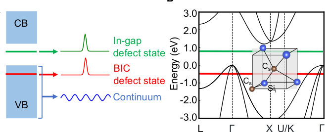
<figcaption class="paper-figure-caption"><b>Fig 1.</b> Figure 1. Electronic BIC. (A) Schematic illustration of an electronic BIC. (B) Hybrid-</figcaption>
</figure>
<figure class="paper-figure-card">
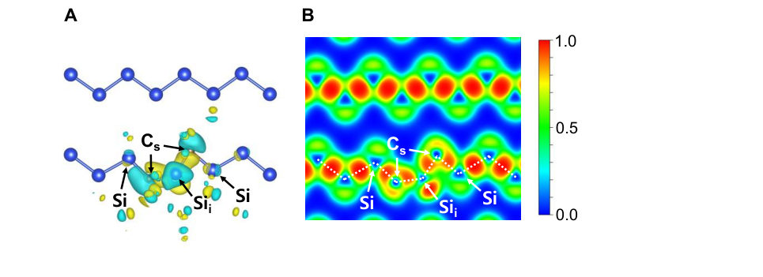
<figcaption class="paper-figure-caption"><b>Fig 2.</b> Figure 2. Spatial localization of the BIC defect state. (A) Wave function of the BIC defect</figcaption>
</figure>
<figure class="paper-figure-card">
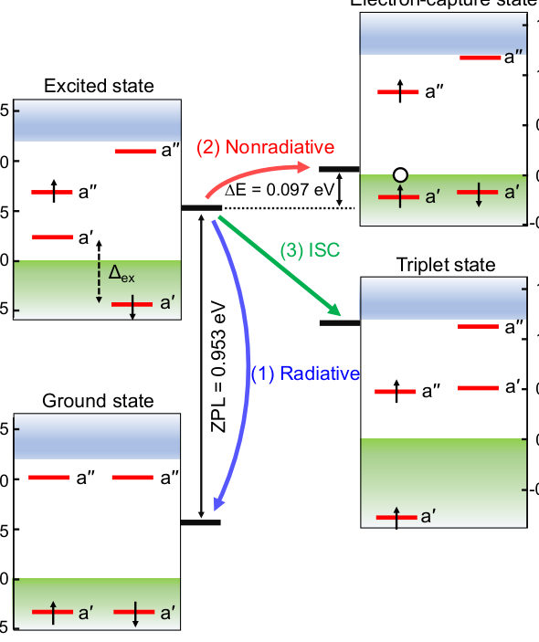
<figcaption class="paper-figure-caption"><b>Fig 3.</b> Figure 3. Energy-level diagrams for the ground, excited, electron-capture and metastable</figcaption>
</figure>
<figure class="paper-figure-card">
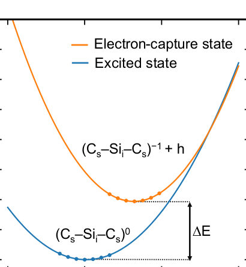
<figcaption class="paper-figure-caption"><b>Fig 4.</b> Figure 4. Configuration coordinate diagrams of the excited and electron-capture states</figcaption>
</figure>
<figure class="paper-figure-card">
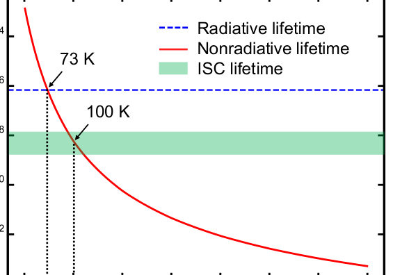
<figcaption class="paper-figure-caption"><b>Fig 5.</b> Figure 5. Comparison of the radiative lifetime and ISC lifetime with temperature-</figcaption>
</figure>

**Summary.** The paper demonstrates that the silicon G-center acts as an electronic bound state in the continuum due to exchange-driven energy-level reordering. This mechanism shifts the defect level above the valence band upon excitation, suppressing nonradiative decay and enabling stable photon emission. This discovery offers a general strategy for engineering defect-based optical systems for quantum technologies.

**Why it may be interesting.** It provides a new paradigm for designing stable quantum emitters and qubits by using exchange interactions to create electronic BICs, which is highly relevant for quantum optics and the development of solid-state quantum networks.

Detailed structure

**Main problem.** Understanding how defect states embedded within the electronic continuum of a semiconductor can remain localized and optically active (radiative) instead of undergoing rapid nonradiative decay.

**Main result.** The authors identify an electronic Bound State in the Continuum (BIC) mechanism where exchange-driven energy-level reordering shifts a defect level from below the valence band maximum to above it upon excitation, suppressing nonradiative decay.

**Method.** First-principles density functional theory (DFT) using hybrid functionals (HSE06) with a Hubbard U correction, combined with the delta-SCF framework and configuration coordinate diagrams.

**Model / system.** The silicon G-center, a point defect in silicon consisting of two substitutional carbon atoms and one interstitial silicon atom (Cs-Si_i-Cs) with C1h symmetry.

**Key observables.** Zero-phonon line (ZPL) energy, radiative and nonradiative lifetimes, quantum efficiency, and charge transition levels.

**Important parameters / regimes.** Exchange splitting (delta_ex), temperature crossover points (73 K and 100 K), and the charge transition level epsilon(0/-) of 0.097 eV.

**Assumptions / limitations.** The excited state geometry is treated approximately using a single-determinant-based approach with corrections for open-shell singlets.

**Figures summary.** Figure 1 shows the electronic BIC schematic and band structure; Figure 2 visualizes defect wavefunctions and electron localization; Figure 3 illustrates energy-level reordering and decay pathways; Figure 5 compares temperature-dependent lifetimes.

**Paper structure.** The paper introduces the problem of continuum-embedded defects, presents the structural and electronic localization mechanism, details the exchange-driven energy reordering, calculates decay rates and temperature dependence, and concludes with implications for quantum emitters.

Abstract

Continuum-buried defect states in semiconductors are generally expected to be optically inactive due to their strong coupling to continuum bands. Here, we show that such defects can instead host radiative electronic bound states in the continuum (BICs), using the silicon G-center as a prototypical example. Hybrid-functional first-principles calculations with a Hubbard $U$ correction reveal that a localized defect state, initially buried below the valence band maximum (VBM) in the ground state, undergoes exchange-driven energy-level reordering under optical excitation and shifts above the VBM. This exchange-induced transition suppresses nonradiative decay and enables robust radiative emission. By computing temperature-dependent nonradiative lifetimes and comparing them with experimental photoluminescence (PL) lifetimes, we quantitatively reproduce the observed temperature dependence of the emission. These results uncover a stabilization mechanism for continuum-embedded defect states and establish electronic BICs as a general paradigm for designing defect-based optical systems, including quantum emitters and qubits.

[↑ back to top](#top)

### [Random neural networks match observed dimensionality of neural population recordings and motivate stronger experimental tests](http://arxiv.org/abs/2605.26551v1)

**Authors:** Zehui Zhao, Michael J Pasek, Ilya M Nemenman  
**Type:** theory · **Category:** disordered systems and neural networks · **PDF:** <https://arxiv.org/pdf/2605.26551v1>  
**Analysis basis:** full PDF text, analyzed in chunks

↔ Scroll figures horizontally

<figure class="paper-figure-card">
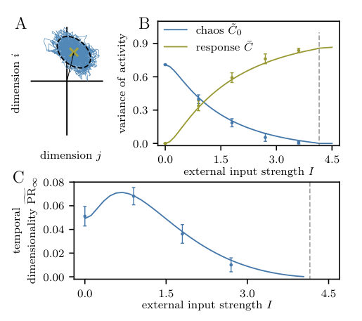
<figcaption class="paper-figure-caption"><b>Fig 1.</b> Figure 1: Statistics of activity under a single behavioral context. A: Schematic: blue curves represent the temporal chaos, approximated as an ellipsoid in state space; the yellow cross marks the ordered response at the ellipsoid’s center. B: The variance of temporal chaos ˜C0 decreases with external input strength I, while the variance of the ordered response ¯C increases with I, as indicated by the legend. The ordered-response variance ¯C shows a cusp at the transition from chaotic to ordered dynamics, where ˜C0 = 0, marked by the vertical dashed line. For g = 3, the transition happens around I ≈4.15. Markers with error bars represent simulation results (mean and standard deviation over...</figcaption>
</figure>
<figure class="paper-figure-card">
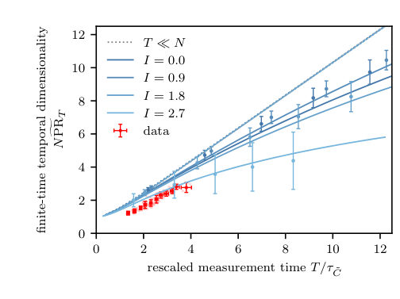
<figcaption class="paper-figure-caption"><b>Fig 2.</b> Figure 2: Dependence of the finite-time dimensionality f PRT on measurement time T and its comparison to data. The large-network limit T ≪N is shown in dashed lines, where the dimensionality increases linearly, same as for independent neurons. For realistic values of the number of neurons N and autocovariance time τ ˜ C, the dimensionality grows sublinearly with rates dependent on the external input strength I. Compared to data measured in monkeys’ PMd and M1 areas while the monkeys perform an eight-direction center-out delayed reach task, the dimensionality can be as low as the experimental values (binned means and standard deviations from data extracted and rescaled from [15], see...</figcaption>
</figure>
<figure class="paper-figure-card">
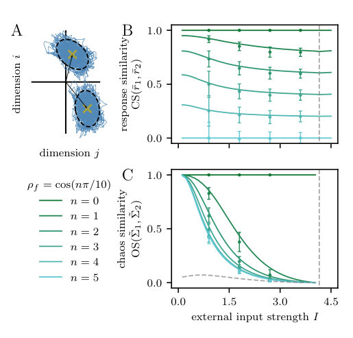
<figcaption class="paper-figure-caption"><b>Fig 3.</b> Figure 3: Similarity between activity under two behavioral contexts. A: Schematically, under each behavioral context, there is an ordered response around which temporal chaos fluctuates. B: The ordered-response similarity CS remains close to the similarity between behavioral contexts ρf, decreases only weakly with external input strength, and quickly plateaus, with curves labeled by ρf = cos(nπ/10). A small deviation visible near the chaos-to-order transition reflects the disappearance of temporal chaos. C: The orientation similarity OS changes weakly at low external input strength, then decreases strongly with I and approaches the random-orientation baseline OS = f PR∞, marked by the...</figcaption>
</figure>
<figure class="paper-figure-card">
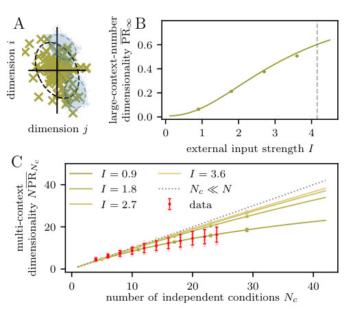
<figcaption class="paper-figure-caption"><b>Fig 4.</b> Figure 4: Statistics of activity over multiple behavioral contexts. A: Schematic. Each behavioral context produces an ordered response; the cloud of ordered responses across contexts is approximated as an ellipsoid. B: PR∞increases monotonically with external input strength I, with slow growth at small I and a decreasing growth rate at large I. The vertical dashed line marks the transition from chaotic to ordered dynamics. C: The dependence of the multi-context dimensionality PRNc on context number Nc mirrors that of f PRT on measurement time T. The large-neuron-number limit Nc ≪N is shown in dashed lines, where the dimensionality increases linearly. Otherwise the dimensionality grows...</figcaption>
</figure>
<figure class="paper-figure-card">
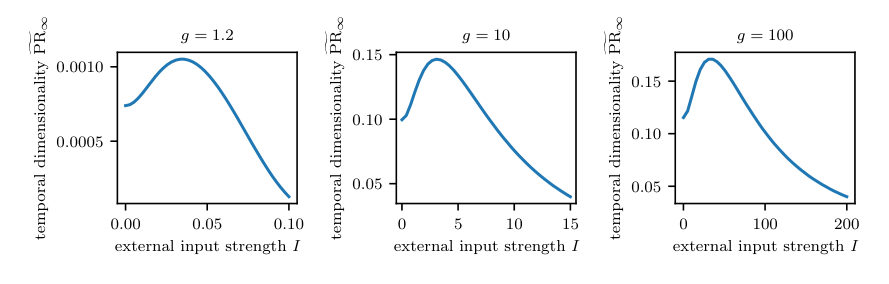
<figcaption class="paper-figure-caption"><b>Fig 5.</b> Figure 5: The dimensionality f PR∞is non-monotonic in external input strength I over orders of magnitude of the gain parameter g. The range of external input strength I changes with g because the transition to ordered dynamics varies with g.</figcaption>
</figure>

**Summary.** This paper demonstrates that the low-dimensional activity observed in biological neural populations can be explained by simple, randomly connected networks when accounting for finite measurement times and external inputs. It suggests that researchers should look beyond absolute dimensionality and instead use metrics like the orientation of activity fluctuations to identify true underlying network structures.

**Why it may be interesting.** not directly relevant

Detailed structure

**Main problem.** Determining whether the observed low dimensionality in neural population activity is a result of specialized brain wiring or a generic property of randomly connected networks, and evaluating if current experimental measurements are sufficient to distinguish between them.

**Main result.** Random neural networks can match observed dimensionality in primate motor cortex, but current recording durations are too short to use dimensionality alone to distinguish connectivity structures; instead, measuring orientation similarity or non-monotonicity of fluctuations provides stronger tests.

**Method.** The authors use Dynamical Mean-Field Theory (DMFT) and a two-replica approach to semi-analytically calculate dimensionality and covariance statistics, supplemented by numerical simulations of large-scale networks.

**Model / system.** A population of N neurons with recurrent interactions described by a Sompolinsky-style random recurrent neural network model, where connectivity is sampled from a Gaussian distribution and neurons are driven by external behavioral contexts.

**Key observables.** Dimensionality (Participation Ratio), cosine similarity of ordered responses, orientation similarity of fluctuation ellipsoids, and population variances (ordered and chaotic components).

**Important parameters / regimes.** Gain parameter (g), external input strength (I), measurement time (T), autocorrelation time (tau_C), and neuron number (N).

**Assumptions / limitations.** Uses an adiabatic approximation for external inputs, assumes a specific error function nonlinearity, and assumes the large-network limit (N to infinity) for analytical derivations.

**Figures summary.** Figures show the dependence of finite-time dimensionality on measurement time, the non-monotonic relationship between input strength and dimensionality, and the stability of orientation similarity and cosine similarity across different regimes.

**Paper structure.** The paper introduces the problem of dimensionality in neural populations, presents a random network model using DMFT, analyzes the effects of finite measurement time and input strength, compares results to experimental primate data, and proposes new experimental diagnostics.

Abstract

Randomly connected neural networks have long served as a theoretical tool for studying collective dynamics in neural populations, yet quantitative comparisons to experiments remain limited. Recent technological advances have made it possible to resolve population-wide correlations across neurons, and minimal models such as random neural networks predict their generic structure. Whether the two agree quantitatively remains untested. In this work, we examine whether a minimally structured random neural network can account for the low dimensionality of activity in neural population recordings by building on recent developments in Dynamical Mean-Field Theory and incorporating two additional experimentally relevant features into the model: finite measurement time and variability across behavioral contexts. We show that, when these factors are included, the dimensionality measured from large-scale recordings is consistent with the values predicted by random models. However, current recording durations make it difficult to use dimensionality to discriminate among connectivity structures. We further show that analytically predicted dimensionality varies non-monotonically with external input strength, and that the orientation similarity between neural manifolds recorded under different behavioral contexts can be more sensitive to network structure than dimensionality is. Together, these results provide quantitative guidance for experimental design to infer the connectivity structure underlying population activity.

[↑ back to top](#top)

### [Relationship between heat effects and shear modulus relaxation during structural relaxation of a telluride glass](http://arxiv.org/abs/2605.26767v1)

**Authors:** G. V. Afonin, R. A. Konchakov, D. A. Chareev, S. A. Badmaeva, R. S. Khmyrov, A. N. Vasiliev, N. P. Kobelev, V. A. Khonik  
**Type:** both · **Category:** disordered systems and neural networks · **PDF:** <https://arxiv.org/pdf/2605.26767v1>  
**Analysis basis:** full PDF text, analyzed in chunks

↔ Scroll figures horizontally

<figure class="paper-figure-card">
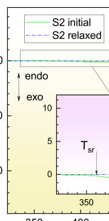
<figcaption class="paper-figure-caption"><b>Fig 1.</b> Figure 1: DSC traces of the same S2 glassy sample in the initial and relaxed states. The characteristic temperatures are indicated: temperature of structural relaxation onset Tsr, glass transition temperature Tg, preannealing temperature Ta, crystallization onset temperature Tx, and full crystallization temperature Tcr.</figcaption>
</figure>
<figure class="paper-figure-card">
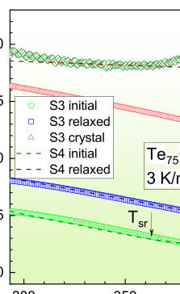
<figcaption class="paper-figure-caption"><b>Fig 2.</b> Figure 2: Temperature dependence of the shear modulus G for samples S3 and S4 in the initial and relaxed states (symbols and dashed lines), as well as after complete crystal- lization. The temperature derivatives of the shear modulus in the initial and crystallized states are also presented. Temperature Tsr marks the onset of structural relaxation, with the upward arrows indicating the progressive relaxation-induced increase of the modulus up to the calorimetric glass transition temperature Tg. The large scatter in dGini/dT at T &gt; 450 K is attributed to deformation of the sample under its own weight above Tg.</figcaption>
</figure>
<figure class="paper-figure-card">
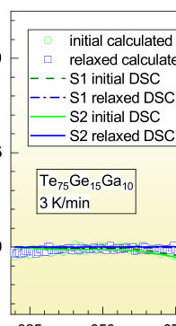
<figcaption class="paper-figure-caption"><b>Fig 3.</b> Figure 3: Experimental DSC runs on samples S1 and S2 in the initial and relaxed states together with the calculation of the heat flow using Eq.(1) It is seen that this equation provides a good description of exothermal and endothermal relaxation using shear modulus data as an input.</figcaption>
</figure>

**Summary.** This paper proves that a specific mathematical relationship between thermal energy release and mechanical stiffness relaxation, previously thought to be specific to metallic glasses, also holds for covalent telluride glasses. This suggests a universal mechanism for structural relaxation in disordered solids driven by elastic dipoles.

**Why it may be interesting.** not directly relevant

Detailed structure

**Main problem.** Investigating whether the theoretical framework relating heat effects to shear modulus relaxation, originally developed for metallic glasses, can be applied to non-metallic, covalently bonded telluride glasses.

**Main result.** The study demonstrates that heat effects (exothermic/endothermic reactions) are quantitatively linked to shear modulus relaxation via the Interstitialcy Theory, suggesting that relaxation in these covalent glasses is driven by elastic dipoles.

**Method.** Parallel measurements using Differential Scanning Calorimetry (DSC) for heat flow and Resonant Ultrasound Spectroscopy (RUS) for elastic moduli during temperature ramps.

**Model / system.** The physical system is a telluride glass (Te75Ge15Ga10) characterized by covalent bonding. The theoretical model uses the Interstitialcy Theory (IT) and the three-parameter Tool-Narayanaswami-Moynihan (TNM) model.

**Key observables.** Heat flow (delta W), shear modulus (G), glass transition temperature (Tg), crystallization temperature (Tcr), and temperature derivatives of moduli.

**Important parameters / regimes.** Shear susceptibility (beta), density (rho), structural relaxation onset (Tsr), and the presence of elastic dipoles.

**Assumptions / limitations.** The application of the Interstitialcy Theory (originally for metallic systems) assumes that relaxation phenomena in covalent glasses are governed by similar elastic dipole-like defects.

**Figures summary.** Figure 1 shows DSC thermograms for initial and relaxed states; Figure 2 shows the temperature dependence of the shear modulus G for different samples.

**Paper structure.** The paper introduces the problem of applying metallic glass theories to covalent glasses, describes the experimental setup (DSC and RUS) and sample preparation, presents the quantitative link between thermal and elastic data, and concludes with the implications for the nature of defects in glasses.

Abstract

We performed parallel measurements of heat effects and shear modulus relaxation for glassy Te$_{75}$Ge$_{15}$Ga$_{10}$ taken as a representative of practically important non-metallic glasses with covalent bonding. It is shown that the heat effects occurring upon heating are quantitatively linked to the shear moduli in the glassy and crystalline states and their temperature derivatives as implied by Eq.(1), which was originally derived for metallic glasses. This relationship provides a good description of exo- and endothermal reactions using shear modulus relaxation data as an input. This is the first application of this approach to a non-metallic glass with directional interatomic bonding. The obtained results suggest that relaxation phenomena are governed by elastic dipoles -- atomic configurations with the symmetry lower than that of surrounding matrix.

[↑ back to top](#top)

### [Sampling Data with Chains of Forward-Backward Diffusion Steps](http://arxiv.org/abs/2605.27006v1)

**Authors:** Hyunmo Kang, Noam Itzhak Levi, Corinna Elena Wegner, Daniel J. Korchinski, Matthieu Wyart  
**Type:** both · **Category:** disordered systems and neural networks · **PDF:** <https://arxiv.org/pdf/2605.27006v1>  
**Analysis basis:** full PDF text, analyzed in chunks

↔ Scroll figures horizontally

<figure class="paper-figure-card">
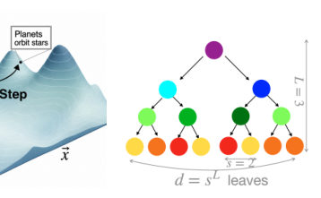
<figcaption class="paper-figure-caption"><b>Fig 1.</b> Figure 1: Left: A single U-turn move first corrupts a sample by adding noise or masking part of the input, then reconstructs it using a trained diffusion model. The U-turn magnitude controls the size of the perturbation. Middle: Iterating U-turn moves defines a Markov chain on the learned data distribution, allowing us to study whether the chain is ergodic. Right: Schematic of the Random Hierarchy Model, where visible tokens are generated from a hierarchy of latent variables through recursive production rules. This synthetic model provides a controlled setting for analyzing ergodicity and layer-wise relaxation.</figcaption>
</figure>
<figure class="paper-figure-card">
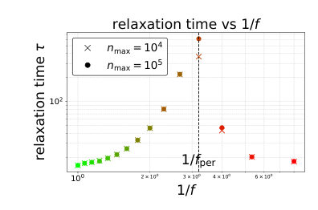
<figcaption class="paper-figure-caption"><b>Fig 2.</b> Figure 2: Dynamics of minimal UTMC for the RHM with L = 4, s = 2. Left: Leaf-layer relaxation ˜C0(n) versus the cumulative number of masks ρdn = n, which is simply n here. For large f, the correlation decays to the finite-time ergodic baseline, whereas for smaller f it saturates at a nonzero plateau. Right: Relaxation time extracted using finite-time plateaus estimated at two choices of nmax. The peak marks the critical slowing-down near the theoretically predicted percolation threshold fper.</figcaption>
</figure>
<figure class="paper-figure-card">
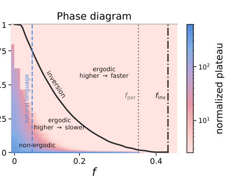
<figcaption class="paper-figure-caption"><b>Fig 3.</b> Figure 3: Left: Dynamics of the RHM with L = 4, s = 2, f = 0.125 &lt; fper. For these parameters, minimal UTMC is non-ergodic, but UTMC with larger U-turn steps progressively reduce the long- time plateau. Right: Phase diagram for s = 2, L = 8, showing the late-time plateau normalized by the standard deviation of the overlap between independent random pairs. Light pink regions are statistically indistinguishable from the ergodic baseline, while blue regions retain memory of the initial state. The black curve marks the inversion of layer-wise relaxation ordering. The values fper and finv are theoretical predictions for minimal UTMC with ρ = 1/d.</figcaption>
</figure>
<figure class="paper-figure-card">
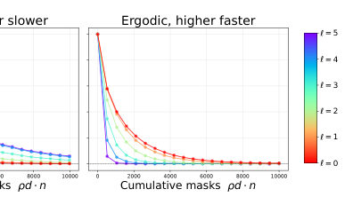
<figcaption class="paper-figure-caption"><b>Fig 4.</b> Figure 4: Layer-wise relaxation across dynamical regimes. s = 2, L = 8. Left: (f, ρ) = (0.28, 0.004). In the non-ergodic regime, all layers retain finite memory. Middle: (f, ρ) = (0.22, 0.137). In the effectively ergodic, higher-slower regime, all layers eventually decorrelate, but higher layers relax more slowly. Right: (f, ρ) = (0.50, 0.004). In the effectively ergodic, higher-faster regime, the ordering is inverted and higher layers decorrelate faster.</figcaption>
</figure>
<figure class="paper-figure-card">
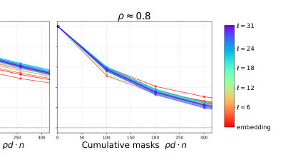
<figcaption class="paper-figure-caption"><b>Fig 5.</b> Figure 5: Layer-wise latent correlation and ordering inversion in text. Left: For minimal U-turn steps, all layers relax slowly, with deeper layers in the early-to-intermediate range retaining memory of the initial text for longer. Middle: Increasing the masking fraction accelerates decorrelation across layers. Right: At large masking fraction, the layer ordering inverts: deeper representations decorrelate faster than earlier layers, consistent with the high-ρ regime predicted by the RHM. More choices of ρ are reported in App. B.1.</figcaption>
</figure>

**Summary.** This paper investigates how diffusion-based sampling explores complex data manifolds by studying 'U-turn' Markov chains. It discovers a phase transition between ergodic and non-ergodic regimes and shows that the hierarchical stability of features in neural networks undergoes a characteristic inversion as noise levels change.

**Why it may be interesting.** not directly relevant

Detailed structure

**Main problem.** Understanding the ergodicity, relaxation dynamics, and hierarchical feature stability in diffusion-based sampling processes, specifically how data manifold fragmentation affects mixing.

**Main result.** The authors identify an ergodicity-breaking phase transition driven by manifold fragmentation and a 'layer-ordering inversion' where deep neural network representations switch from preserving more information to decorrelating faster than early layers as noise increases.

**Method.** The study uses a theoretical Random Hierarchy Model (RHM) combined with empirical tests on large-scale diffusion models for text (LLaDA) and images (ConvNeXt/ImageNet), employing U-turn Markov chains and correlation analysis.

**Model / system.** The primary theoretical framework is the Random Hierarchy Model (RHM), a tree-structured grammar, while the empirical systems are masked diffusion language models and convolutional neural networks.

**Key observables.** Layer-wise correlation C_l(n), relaxation time, ergodicity/mixing, rule density, and the layer-ordering inversion threshold.

**Important parameters / regimes.** U-turn magnitude (noise fraction rho), rule density (f), branching factor (s), and masking fraction.

**Assumptions / limitations.** The theoretical predictions assume an exact diffusion process and a simplified tree-like hierarchical structure in the RHM.

**Figures summary.** Figures illustrate the U-turn mechanism, the RHM tree structure, layer-wise correlation decay and inversion in both text and image models, and the stability of the phase diagram.

**Paper structure.** The paper introduces the U-turn chain concept, develops the RHM theoretical framework for phase transitions, presents empirical validation using LLMs and CNNs, and concludes with asymptotic analysis of the inversion threshold.

Abstract

Sampling from learned high-dimensional distributions is a foundational computational problem. We introduce U-turn chains: Markov chains obtained by iterating short forward-backward steps of a diffusion model, in which each step proposes a move that remains on the learned data manifold and, paired with a Metropolis-Hastings correction, samples from energy-modified targets. For synthetic languages, we show that minimal U-turn dynamics undergoes an ergodicity-breaking phase transition driven by fragmentation of the data manifold; ergodicity is restored at larger U-turn magnitude. In the non-ergodic regime, low-level features relax faster than high-level ones, an ordering that inverts only at sufficiently large U-turn magnitude. We test these predictions on natural language and natural images. In both modalities, minimal U-turns relax slowly, especially for high-level features approximated by deep representations in CNNs or LLMs. The layer-ordering inversion appears only at large noise when mixing is efficient -- signatures consistent with strongly constrained, weakly mixing local dynamics. We discuss the implications of these results for sampling with diffusion models.

[↑ back to top](#top)

### [Signal-to-Noise Ratio and Sample Size Govern Representational Alignment in Neural Networks](http://arxiv.org/abs/2605.26973v1)

**Authors:** Ali Hussaini Umar, Alessandro Laio  
**Type:** theory · **Category:** disordered systems and neural networks · **PDF:** <https://arxiv.org/pdf/2605.26973v1>  
**Analysis basis:** full PDF text, analyzed in chunks

↔ Scroll figures horizontally

<figure class="paper-figure-card">
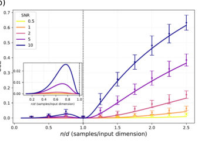
<figcaption class="paper-figure-caption"><b>Fig 1.</b> Figure 1: Representational alignment depends on the signal-to-noise (SNR) ratio and increases non-monotonically with training sample size (n). Panel (a): presents the generalization error of a two-layer linear network as a function of training sample size divided by the network’s parameters for different SNR (at global minimum). The solid lines correspond to the theoretical predictions, while the dots with bars denote average results from numerical simulation. Panel (b): presents the Conditional Copula Entropy (CCE) between hidden representations of identical networks trained on independent datasets for different SNR. The solid line indicates the theoretical CCE, while dots with bars...</figcaption>
</figure>
<figure class="paper-figure-card">
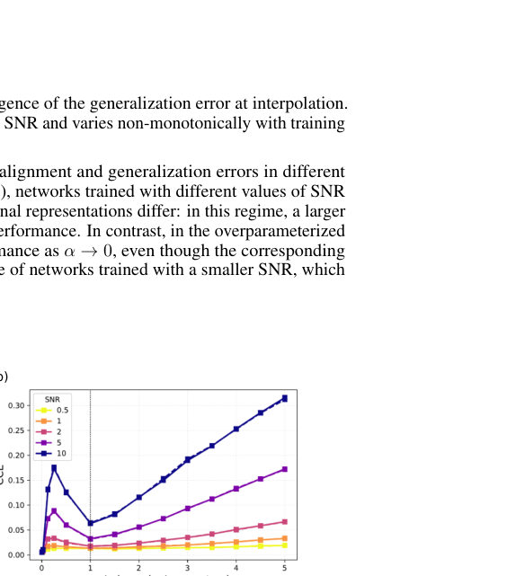
<figcaption class="paper-figure-caption"><b>Fig 2.</b> Figure 2: Empirical results for non-linear neural network. Panel (a): presents the average general- ization error of a two-layer network with ReLU activation as a function of training sample size divided by the network’s parameters for different SNR values. Panel (b): presents the average Conditional Copula Entropy between hidden representations of identical networks trained on independent datasets. Numerical results are averaged over 50 independent experiments. Parameters: d = 200 (input dimension), k = 20 (number of hidden units), ntest = 104 (test samples). In this section, we extend our analysis to nonlinear networks by introducing a ReLU activation within the same architectural setting...</figcaption>
</figure>
<figure class="paper-figure-card">
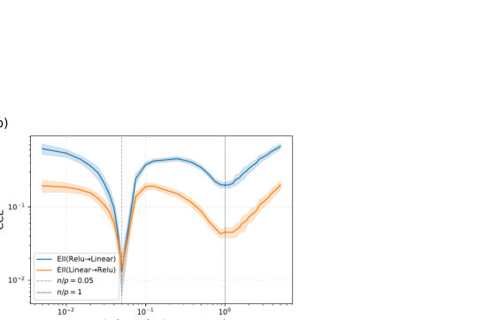
<figcaption class="paper-figure-caption"><b>Fig 3.</b> Figure 3: Alignment between Representations of Linear and Nonlinear Network. Panel (a): presents the average generalization error of a two-layer network with linear (orange curve) and ReLU (blue curve) activation as a function of training sample size divided by the network’s parameters for SNR= 5. Panel (b): presents the average Conditional Copula Entropy between hidden representations of networks with Linear and ReLU activation trained on the same datasets. Orange curves represent CCE(Linear →ReLU), and blue curves represent CCE(ReLU →Linear). Numerical results are averaged over 20 independent experiments. Parameters: d = 200 (input dimension), k = 20 (number of hidden units), ntest = 104...</figcaption>
</figure>
<figure class="paper-figure-card">
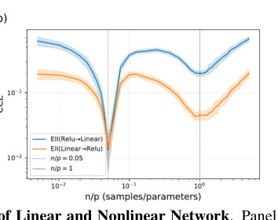
<figcaption class="paper-figure-caption"><b>Fig 4.</b> Figure 4: Representational alignment of independently trained classification networks: Panel (a) presents the generalization error of the trained networks for various label noise. Panel (b) presents the CCE between penultimate representations of identical networks trained on independent datasets, starting from the same initialization. All curves are plotted as a function of the ratio between the training sample size and the number of network parameters. Finally, we evaluate whether our findings extend to real-world classification tasks. We consider the CIFAR-10 object classification task [36], using a standard convolutional neural network (CNN), and train two identical networks...</figcaption>
</figure>
<figure class="paper-figure-card">
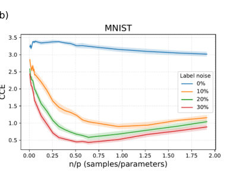
<figcaption class="paper-figure-caption"><b>Fig 5.</b> Figure 5: Representational alignment of independently trained classification networks: Panel (a) presents the generalization error of the trained networks for various label noise. Panel (b) presents the CCE between penultimate representations of identical networks trained on independent datasets, starting from the same initialization. All curves are plotted as a function of the ratio between the training sample size and the number of network parameters.</figcaption>
</figure>

**Summary.** This paper identifies SNR and sample size as the primary controllers of how similar different neural networks become during training. It reveals that the similarity of internal features can be decoupled from how well the network performs its task, specifically showing a dip in alignment at the interpolation threshold.

**Why it may be interesting.** not directly relevant

Detailed structure

**Main problem.** Understanding the fundamental drivers of representational alignment in neural networks and determining how data quality (SNR) and quantity (sample size) influence the similarity of learned internal representations.

**Main result.** The study finds that representational alignment increases monotonically with SNR but varies non-monultically with training sample size, reaching a minimum near the interpolation threshold. Crucially, it demonstrates that alignment and generalization performance are decoupled.

**Method.** The authors use an analytical approach with two-layer linear networks to derive closed-form expressions for alignment and introduce Conditional Copula Entropy (CCE) as a novel, rank-based information-theoretic metric.

**Model / system.** The primary model is a two-layer linear network (single hidden layer) trained via gradient flow on MSE, supplemented by nonlinear ReLU networks and real-world CNNs (CIFAR-10, MNIST) to test universality.

**Key observables.** Conditional Copula Entropy (CCE), generalization error, asymptotic correlation (rho), and Signal-to-Noise Ratio (SNR).

**Important parameters / regimes.** Signal-to-Noise Ratio (SNR), training sample size to dimension ratio (alpha), interpolation threshold (alpha=1), and the underparameterized vs. overparameterized regimes.

**Assumptions / limitations.** The analytical derivation assumes a high-dimensional limit (n, d -> infinity), small random initializations (rich learning regime), and that large distances in representations are not informative.

**Figures summary.** Figure 1 shows generalization error and CCE vs. alpha for different SNRs; Figure 2 shows ReLU network performance; Figure 3 compares Linear vs. ReLU informativeness; Figure 4 shows CNN performance on CIFAR-10 under label noise.

**Paper structure.** The paper introduces the problem of representational alignment, presents a new metric (CCE), provides analytical derivations for linear networks using spectral theory (Marchenko-Pastur), validates these with nonlinear and real-world experiments, and concludes by discussing the decoupling of alignment and generalization.

Abstract

Neural networks are known to develop latent representations that are $aligned$, namely structurally similar across networks trained with different architectures, training protocols, or training datasets. We study this phenomenon in a controlled setting, where we train an ensemble of networks on regression and classification tasks using training sets perturbed by independent realizations of a noise process. We show that the signal-to-noise ratio (SNR) and the training sample size influence the alignment in qualitatively similar ways in networks trained on real-world datasets and in an extremely simple $linear$ network with a single hidden layer, for which the alignment can be estimated analytically. Across linear and nonlinear networks, regression and classification tasks, and both synthetic and real-world data, we consistently observe that alignment varies monotonically with SNR but non-monotonically with training sample size. In particular, the alignment is minimized near the interpolation threshold, and a stronger alignment does not necessarily correspond to better generalization error. These findings reveal a non-trivial dependence of alignment on data quality and quantity, decoupled from generalization performance.

[↑ back to top](#top)

### [Slave-boson Formalism for Superconducting Pairing at Strong Coupling](http://arxiv.org/abs/2605.26233v1)

**Authors:** Sarbajit Mazumdar, Jonas Issing, Jannis Seufert, David Riegler, Peter Wölfle, Ronny Thomale, Michael Klett  
**Type:** theory · **Category:** strongly correlated electrons · **PDF:** <https://arxiv.org/pdf/2605.26233v1>  
**Analysis basis:** full PDF text, analyzed in chunks

↔ Scroll figures horizontally

<figure class="paper-figure-card">
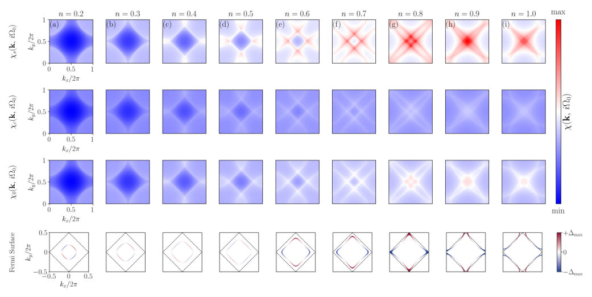
<figcaption class="paper-figure-caption"><b>Fig 1.</b> FIG. 1. From top to bottom: static spin, charge, and bare susceptibilities, χα(k, iΩ0) with α = s, c, 0, and the leading singlet superconducting instability projected onto the Fermi surface. The panels correspond to fillings n = 0.2 to 1.0 [(a)–(i)]. The susceptibility plots are shown on the same color scale to allow direct comparison. In all cases, the spin response exceeds the charge response, indicating spin-fluctuation-dominated pairing. The antiferromagnetic (AF) zone boundary is marked by a black dashed line.</figcaption>
</figure>
<figure class="paper-figure-card">
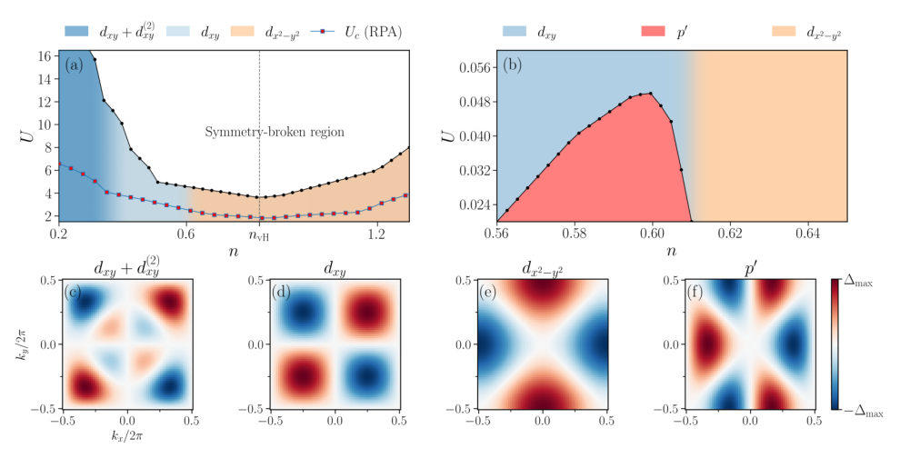
<figcaption class="paper-figure-caption"><b>Fig 2.</b> FIG. 2. n–U phase diagrams at T = 0.02 t. (a) Paramagnetic-state superconducting phase diagram; color encodes the leading instability. The dxy + d(2) xy state persists up to n ≃0.35 even at large U, and a dxy →dx2−y2 transition occurs near n ≃0.61. The overall phase diagram agrees with weak–intermediate coupling RPA results [18, 47] and CPQMC simulations [3]. (b) Phase diagram at lower U showing the leading instability including the triplet p′ phase (for T = 0.01t). The p′ state belongs to the Eu irreducible representation and corresponds to a six-node triplet solution, consistent with [48, 49]. (c)–(f) Representative gap structures in k space for dxy + d(2) xy , dxy, dx2−y2, and p′...</figcaption>
</figure>
<figure class="paper-figure-card">
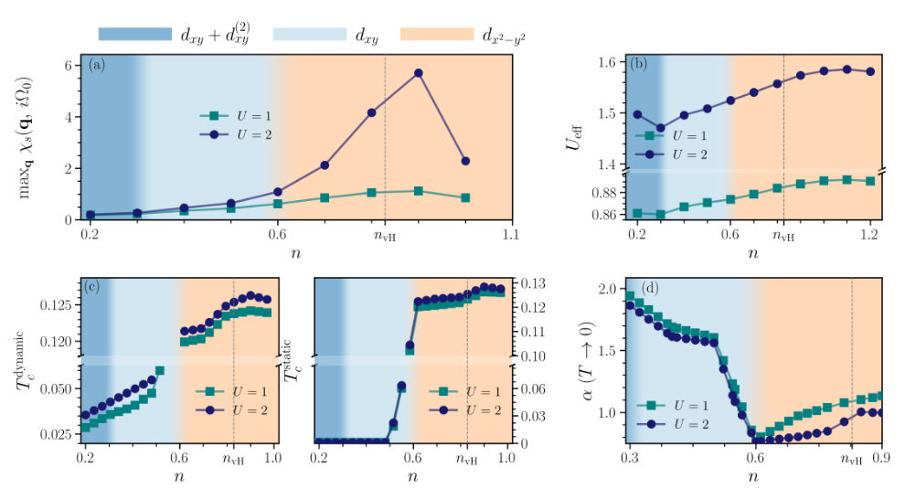
<figcaption class="paper-figure-caption"><b>Fig 3.</b> FIG. 3. Filling dependence of magnetic response, effective interaction scale, and superconducting properties. (a) Maximum static spin susceptibility maxq χs(q, iΩ0) versus filling n for U = 1 and U = 2. (b) Effective interaction scale Ueff determined by matching the Stoner-enhanced χs(Q) to an RPA form at the dominant wave vector Q; axis break indicates the different magnitude for U = 1 and U = 2. (c) Estimated critical temperatures obtained from the full frequency-dependent (dynamic) gap equation (left) and from the static approximation (right); (d) Exponent α characterizing the decay of the Matsubara-axis gap, ∆(iωn) ∼|ωn|−α, shown as a function of n. Background shading indicates the...</figcaption>
</figure>
<figure class="paper-figure-card">
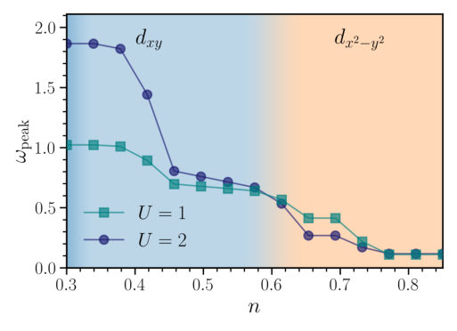
<figcaption class="paper-figure-caption"><b>Fig 4.</b> FIG. 4. Filling dependence of the real-frequency gap peak scale. Peak position ωpeak of R∆(ω), extracted from the Pad´e-continued gap using the fit form in Eq. (17), shown as a function of filling n for t′ = −0.2 and U = 1, 2. Background shading indicates the leading singlet symmetry regions from Fig. 2. With increasing filling, ωpeak shifts systematically to lower frequencies and shows a clear change in slope across the dxy →dx2−y2 crossover.</figcaption>
</figure>

**Summary.** This paper presents a slave-boson framework to model superconductivity in the strong-coupling regime of the Hubbard model. It successfully captures the evolution of d-wave pairing and the dynamical features of the superconducting gap, providing a scalable method that bridges weak-coupling RPA and intensive numerical methods like DMFT.

**Why it may be interesting.** not directly relevant

Detailed structure

**Main problem.** Developing a unified theoretical description of unconventional superconductivity that connects pairing symmetry, fluctuation spectra, and dynamical gap structure across broad ranges of interaction strength and doping.

**Main result.** The study demonstrates a systematic evolution of d-wave pairing symmetry and shows that spin fluctuations drive superconductivity, with the dynamical gap features qualitatively matching experimental cuprate observations.

**Method.** The authors use the spin-rotation-invariant Kotliar-Ruckenstein slave-boson approach combined with a Gaussian fluctuation expansion and a frequency-dependent Eliashberg-type gap equation.

**Model / system.** A single-band Hubbard model on a two-dimensional square lattice with nearest-neighbor (t) and next-nearest-neighbor (t') hopping, used as a proxy for cuprate physics.

**Key observables.** Spin and charge susceptibilities, superconducting gap amplitude, pairing symmetry (d-wave), critical temperature (Tc), and the real-frequency gap peak position (omega_peak).

**Important parameters / regimes.** Hubbard interaction strength (U), chemical potential (mu), doping/filling (n), temperature (T), and hopping parameter (t').

**Assumptions / limitations.** The analysis assumes a paramagnetic saddle point and focuses on Gaussian fluctuations; it currently lacks self-energy back-action and the inclusion of competing symmetry-broken orders.

**Figures summary.** Figures show the evolution of spin and charge susceptibilities, the n-U phase diagram for singlet superconductivity, and the frequency-dependent structure of the superconducting gap.

**Paper structure.** The paper moves from the microscopic slave-boson methodology and fluctuation derivation to the results regarding fluctuation profiles and phase diagrams, concluding with the analysis of superconducting properties and dynamical gap structure.

Abstract

We study the emergence of superconductivity in the one-band Hubbard model using the spin-rotation-invariant Kotliar-Ruckenstein slave-boson (SB) approach. Motivated by its intrinsically renormalized mean-field ground state, we construct an effective pairing vertex from dynamical fluctuations about the saddle point. Solving the anisotropic, frequency-dependent gap equation on the square lattice, we map the pairing instabilities across doping, interaction, temperature and real-frequency gap structure that qualitatively match experimental cuprate observations. This framework merges strong-correlation SB-type renormalizations with RPA-type pairing transparency, providing a scalable route to modeling multi-orbital superconductivity at strong coupling.

[↑ back to top](#top)

### [Surface d-orbital order in intermetallic compound](http://arxiv.org/abs/2605.26426v1)

**Authors:** Zhanyang Hao, Haohao Sheng, Wanru Ma, Wengen Zheng, Yongqing Cai, Zijuan Xie, Wanlin Cheng, Zuowei Liang, Wu Xie, Wenjuan Zhao, Chen Liu, Zhibin Su, Junhao Lin, Liusuo Wu, Zhengtai Liu, Mao Ye, Ji Dai, Massimo Tallarida, Shengtao Cui, Yogendra Kumar, Kenya Shimada, Kenichi Ozawa, Shuki Torii, Kazuhiro Mori, Yue Xie, Junze Deng, Jiaou Wang, Xuetao Zhu, Jiandong Guo, Jiawei Mei, Zhenyu Wang, Xianhui Chen, Ping Miao, Zhijun Wang, Chaoyu Chen  
**Type:** both · **Category:** strongly correlated electrons · **PDF:** <https://arxiv.org/pdf/2605.26426v1>  
**Analysis basis:** full PDF text, analyzed in chunks

↔ Scroll figures horizontally

<figure class="paper-figure-card">
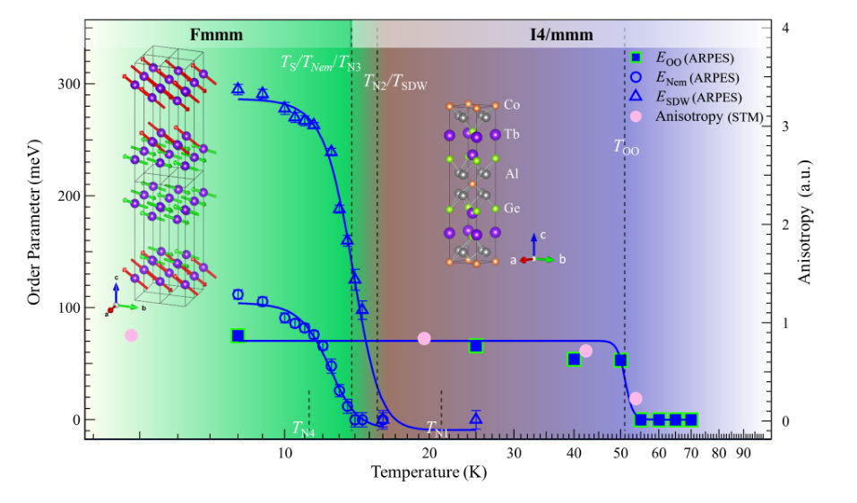
<figcaption class="paper-figure-caption"><b>Fig 1.</b> Fig. 1｜Phase diagram of Tb2CoAl4Ge2. NPD, heat capacity and susceptibility measurements reveal four</figcaption>
</figure>
<figure class="paper-figure-card">
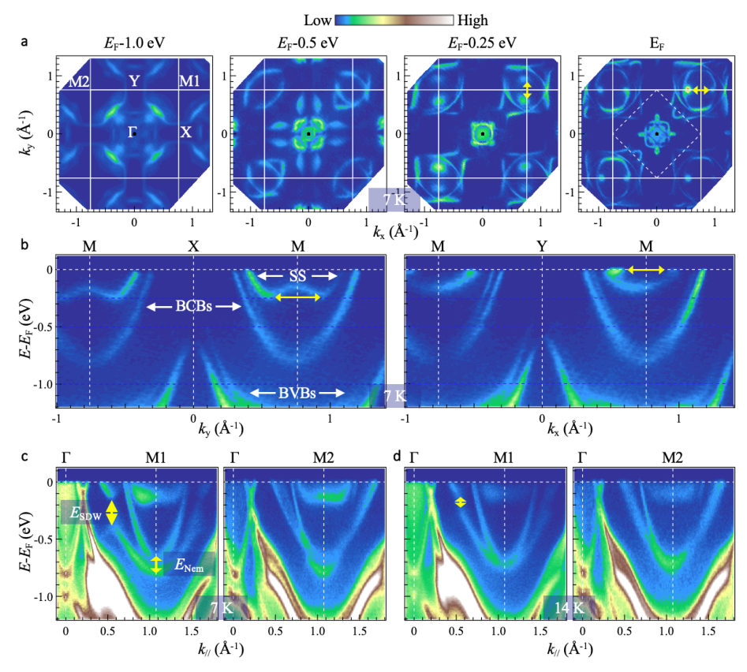
<figcaption class="paper-figure-caption"><b>Fig 2.</b> Fig. 2｜Orientation dependent C4 symmetry breaking of surface and bulk electronic states. a, ARPES</figcaption>
</figure>
<figure class="paper-figure-card">
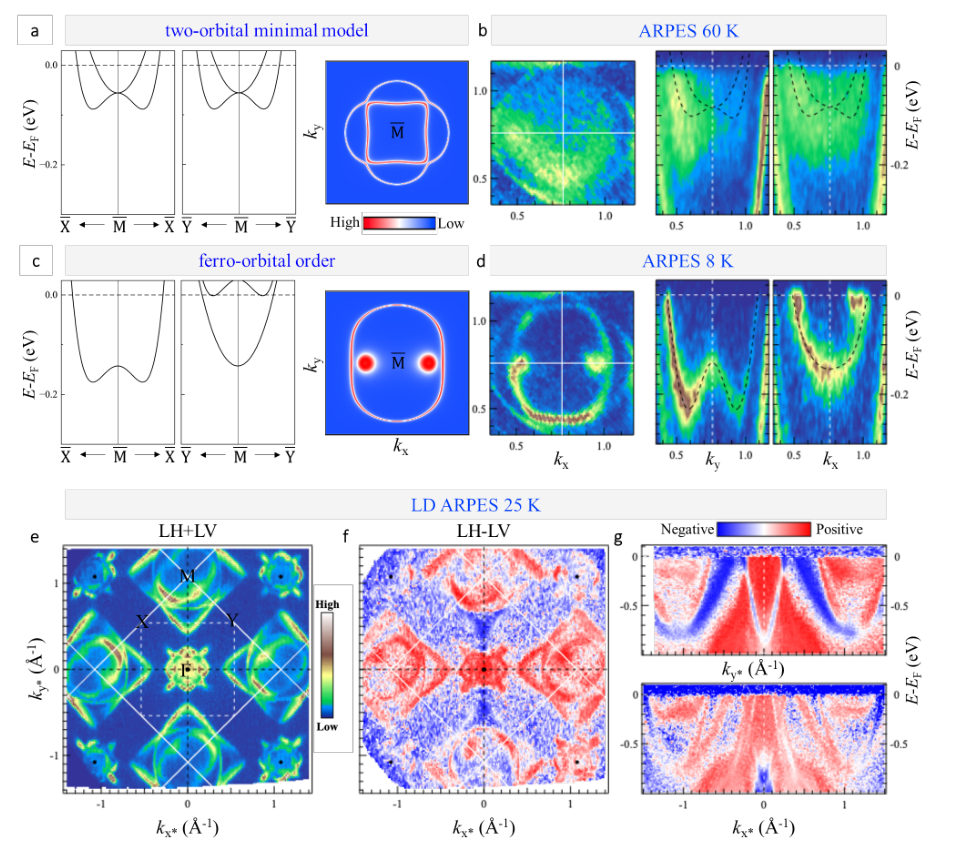
<figcaption class="paper-figure-caption"><b>Fig 3.</b> Fig. 3｜Surface ferro-orbital order characterized by Fermi surface deformation, nematic orbital split and</figcaption>
</figure>
<figure class="paper-figure-card">
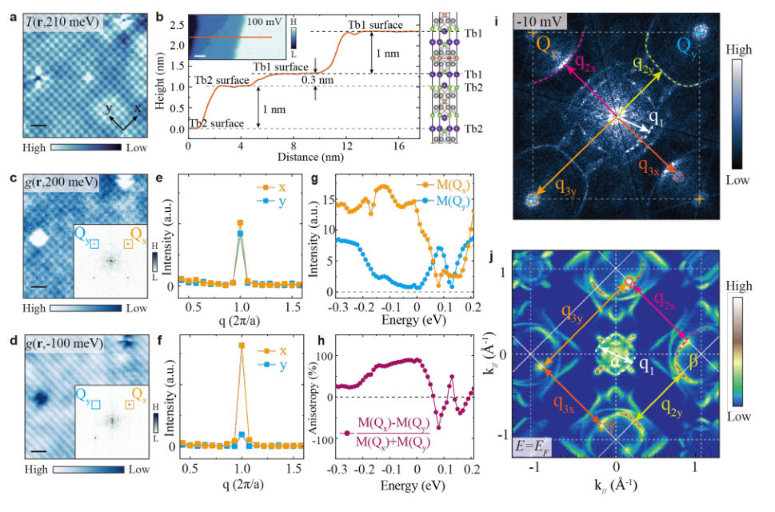
<figcaption class="paper-figure-caption"><b>Fig 4.</b> Fig. 4｜Surface electronic nematicity originated from the Tb termination of Tb2CoAl4Ge2. a, Atomically</figcaption>
</figure>

**Summary.** The researchers identified a pure surface 5d-orbital order in the intermetallic compound Tb2CoAl4Ge2. This order is unique because it occurs at a temperature significantly higher than the bulk magnetic and structural transitions, providing a rare example of orbital order decoupled from lattice and spin degrees of freedom.

**Why it may be interesting.** not directly relevant

Detailed structure

**Main problem.** The difficulty in identifying and distinguishing pure orbital order from concurrent structural or magnetic transitions in strongly correlated systems.

**Main result.** Discovery of a rare earth 5d-orbital order in the surface states of Tb2CoAl4Ge2 that is decoupled from bulk magnetic and structural transitions.

**Method.** A combination of ARPES, LD-ARPES, STM, and neutron powder diffraction, supported by DFT and mean-field Hamiltonian modeling.

**Model / system.** The intermetallic compound Tb2CoAl4Ge2, specifically focusing on the surface states originating from Tb 5d orbitals.

**Key observables.** Fermi surface deformation, band splitting, orbital polarization via linear dichroism, and nematic domain patterns.

**Important parameters / regimes.** Orbital ordering temperature (T ~ 51 K), magnetic transition temperatures (T_N1-T_N4), and the anisotropy energy (E_orb).

**Assumptions / limitations.** The use of a mean-field approximation to model the ferro-orbital order and the assumption that the observed symmetry breaking is driven by orbital physics rather than structural or magnetic distortions.

**Figures summary.** Figure 1 shows a phase diagram with multiple magnetic transitions; extended data figures illustrate magnetic structures, nematic domain patterns, and the insensitivity of the C2 state to magnetic fields.

**Paper structure.** The paper introduces the problem of orbital order, describes the material and experimental setup, presents the discovery of surface orbital order via ARPES, provides evidence for its decoupling from bulk transitions using neutron diffraction and STM, and concludes with a theoretical validation using a mean-field Hamiltonian.

Abstract

Orbital order describes a quantum state where occupied orbitals line up in a periodic pattern. While orbital physics plays a fundamental and universal role in strongly correlated electron systems, the existence and particularly the band structure fingerprint of orbital order remain a long-standing mystery. Here, we report the discovery of rare earth 5d-orbital order developed by the surface states of intermetallic compound Tb2CoAl4Ge2. Angle-resolved photoemission spectroscopy reveals characteristic nematic features like Fermi surface deformation and band split. These experimental observations can be described by a ferro-orbital order term in the mean-field Hamiltonian. The structural and magnetic origin of such order is excluded by systematic high-resolution neutron powder diffraction and scanning tunnelling microscopy measurements. Our results provide strong evidence for a pure surface orbital order scenario avoiding complications from structural distortion as in colossal magnetoresistance manganites, magnetic order as in iron-based superconductors, and charge transfer p-orbital order in cuprates.

[↑ back to top](#top)

### [Thermal Casimir Effect in A Schwarzschild-like Wormhole Spacetime](http://arxiv.org/abs/2605.26743v1)

**Authors:** Arista Romadani, Apriadi Salim Adam, Ar Rohim, Bintoro Anang Subagyo, Agus Purwanto  
**Type:** theory · **Category:** other · **PDF:** <https://arxiv.org/pdf/2605.26743v1>  
**Analysis basis:** full PDF text, analyzed in chunks

↔ Scroll figures horizontally

<figure class="paper-figure-card">
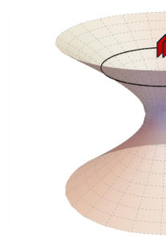
<figcaption class="paper-figure-caption"><b>Fig 1.</b> Figure 1: Casimir cavity orbiting around Schwarzschild-like wormhole</figcaption>
</figure>
<figure class="paper-figure-card">
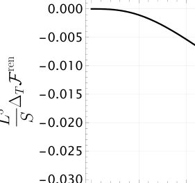
<figcaption class="paper-figure-caption"><b>Fig 2.</b> Figure 2: Plot of L3</figcaption>
</figure>
<figure class="paper-figure-card">
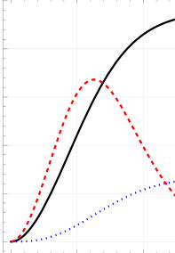
<figcaption class="paper-figure-caption"><b>Fig 3.</b> Figure 3: Plot of thermodynamics quantities: L2</figcaption>
</figure>

**Summary.** This paper calculates how temperature affects the Casimir effect between two plates orbiting a wormhole. It demonstrates that while the vacuum energy depends on the spacetime, the thermal corrections in the local frame are independent of the wormhole's geometry. The results are shown to be thermodynamically consistent with the Nernst heat theorem.

**Why it may be interesting.** not directly relevant

Detailed structure

**Main problem.** The study investigates the finite-temperature Casimir effect and its associated thermodynamic quantities for a massless scalar field in a Schwarzschild-like wormhole spacetime.

**Main result.** The thermal correction to the renormalized Casimir free energy is found to be independent of the background geometry in the comoving frame, and the derived thermodynamic quantities are consistent with the third law of thermodynamics.

**Method.** The authors use the Matsubara formalism, Schwinger proper-time method, and Riemann zeta function regularization to compute the renormalized energy and thermodynamic quantities.

**Model / system.** A massless scalar field is confined between two parallel plates in a circular orbit within a static, zero-tidal-force, Schwarzschild-like wormhole spacetime, subject to Dirichlet boundary conditions.

**Key observables.** Renormalized Casimir free energy, Casimir entropy, internal energy, and heat capacity at constant volume.

**Important parameters / regimes.** Temperature (T), plate separation (L), wormhole shape function parameter (gamma), and throat radius (r0).

**Assumptions / limitations.** The plates are in a comoving frame where the geometry is locally flat; the field is massless; and tidal effects inside the cavity are negligible.

**Figures summary.** Figure 1 shows the orbiting Casimir cavity; Figure 2 plots the thermal correction of the Casimir free energy versus temperature; Figure 3 shows the monotonic increase of entropy and internal energy and the peaked behavior of heat capacity.

**Paper structure.** The paper introduces the wormhole metric and the Casimir apparatus, describes the coordinate transformation to a comoving frame, applies regularization and renormalization techniques, analyzes the low and high-temperature limits, and discusses thermodynamic consistency.

Abstract

We study the finite-temperature Casimir effect for a massless scalar field confined between two parallel plates in a Schwarzschild-like wormhole spacetime. Imposing Dirichlet boundary conditions, we compute the renormalized Casimir free energy in the comoving frame. We find that the thermal correction to the renormalized Casimir free energy decreases gradually with the temperature and becomes independent of the background geometry in this frame. Thermodynamic quantities derived from the Casimir free energy, namely, the renormalized Casimir entropy, internal energy, and heat capacity at constant volume, exhibit distinct temperature dependence. At low temperatures, all thermodynamic quantities recover the expected behavior, consistent with the fundamental laws of thermodynamics. These results provide a compact framework for analyzing quantum vacuum forces in gravitational backgrounds.

[↑ back to top](#top)

### [Ultrametricity of Energy Minimum Configurations of RNA Secondary Structures in the Nussinov Model](http://arxiv.org/abs/2605.26570v1)

**Authors:** A. P. Zubarev  
**Type:** theory · **Category:** disordered systems and neural networks · **PDF:** <https://arxiv.org/pdf/2605.26570v1>  
**Analysis basis:** full PDF text, analyzed in chunks

↔ Scroll figures horizontally

<figure class="paper-figure-card">
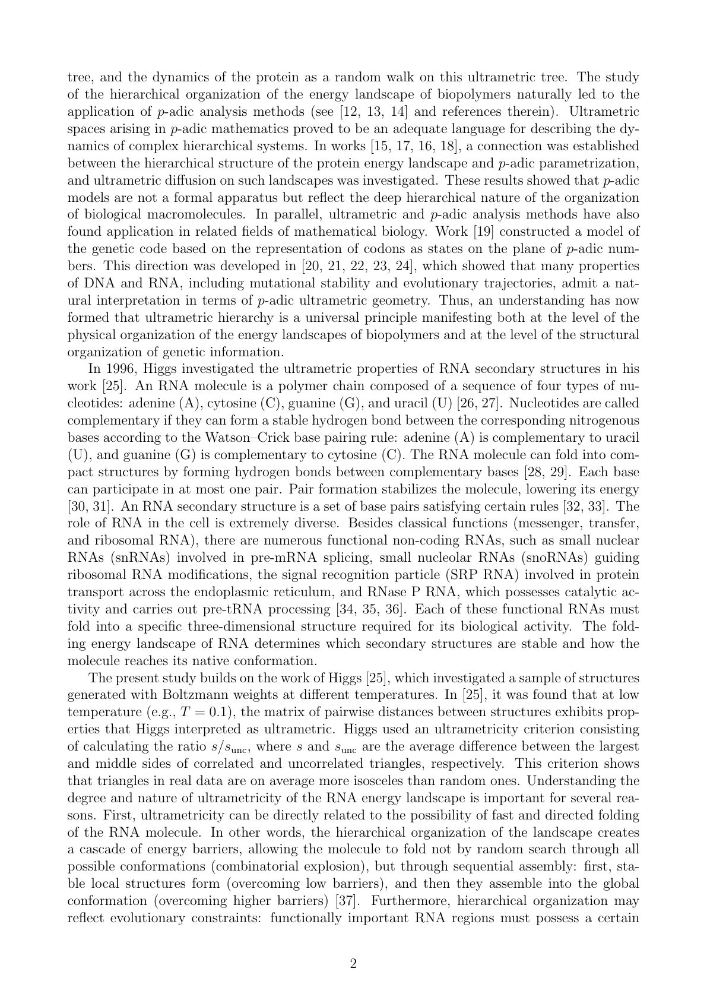
<figcaption class="paper-figure-caption"><b>Fig 1.</b> Low-resolution page preview, page 2</figcaption>
</figure>
<figure class="paper-figure-card">
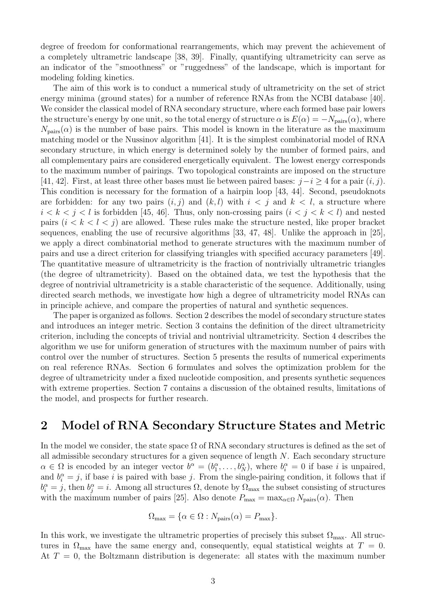
<figcaption class="paper-figure-caption"><b>Fig 2.</b> Low-resolution page preview, page 3</figcaption>
</figure>
<figure class="paper-figure-card">
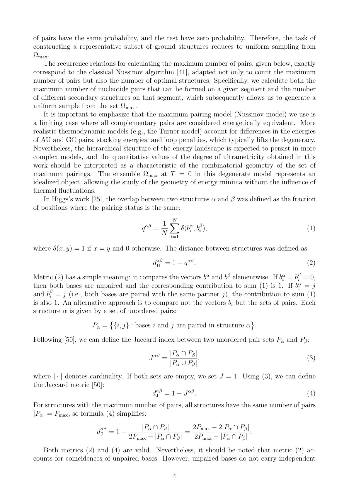
<figcaption class="paper-figure-caption"><b>Fig 3.</b> Low-resolution page preview, page 4</figcaption>
</figure>
<figure class="paper-figure-card">
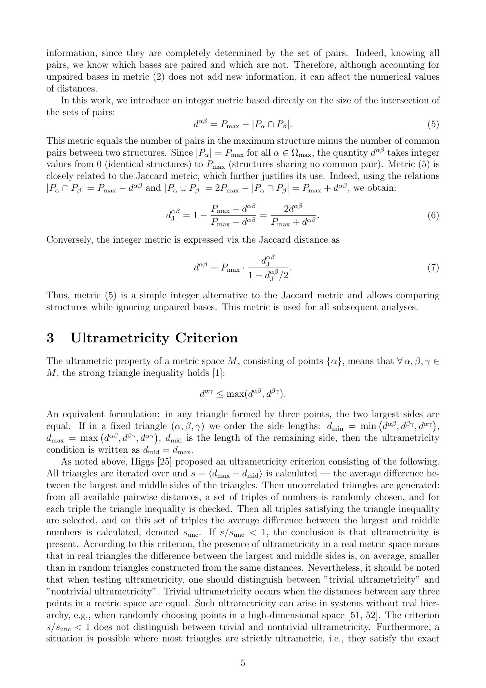
<figcaption class="paper-figure-caption"><b>Fig 4.</b> Low-resolution page preview, page 5</figcaption>
</figure>
<figure class="paper-figure-card">
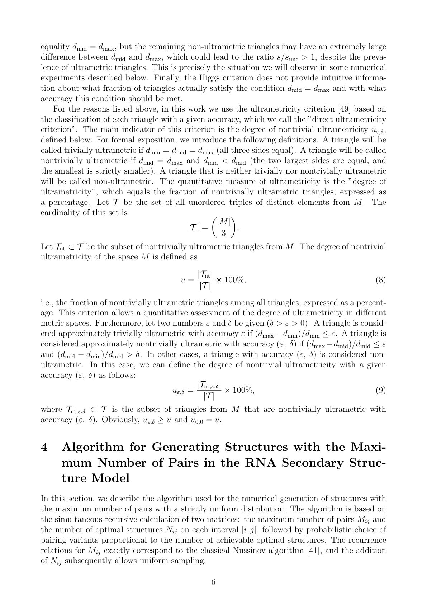
<figcaption class="paper-figure-caption"><b>Fig 5.</b> Low-resolution page preview, page 6</figcaption>
</figure>

**Summary.** This paper explores how the arrangement of nucleotides determines the hierarchical, ultrametric structure of RNA folding energy landscapes. It demonstrates that sequence order can drastically shift the degree of ultrametricity, suggesting that the landscape's complexity is a tunable feature of the sequence.

**Why it may be interesting.** not directly relevant

Detailed structure

**Main problem.** Investigating the hierarchical (ultrametric) organization of the energy landscape in RNA secondary structures, specifically focusing on the ground-state configurations.

**Main result.** The degree of nontrivial ultrametricity varies widely in natural RNAs and is strongly dependent on nucleotide sequence order rather than just composition, with optimized sequences reaching extremes of 2.6% to 81%.

**Method.** Numerical study using the Nussinov algorithm for structure generation, a new direct ultrametricity criterion for triangle classification, and an adaptive random search algorithm for sequence optimization.

**Model / system.** The system consists of RNA secondary structures modeled by the Nussinov (maximum matching) model, where energy is determined by the number of base pairs, focusing on the $T=0$ degenerate ground-state manifold.

**Key observables.** Degree of nontrivial ultrametricity (u), fraction of trivial (equilateral) triangles, and the Higgs ultrametricity criterion (s/s_unc).

**Important parameters / regimes.** Nucleotide composition (fixed during optimization), nucleotide sequence order, and accuracy parameters (epsilon, delta) for ultrametricity classification.

**Assumptions / limitations.** The study assumes the Nussinov model's simplified combinatorial energy is sufficient to capture hierarchical properties and focuses on the $T=0$ limit without pseudoknots.

**Figures summary.** The notes do not provide specific descriptions of figures, though they mention Table 1 (natural RNA results) and Table 2 (synthetic sequence results).

**Paper structure.** The paper introduces the concept of ultrametricity in RNA landscapes, presents a numerical study of natural RNAs, describes a new metric and classification criterion, details an optimization algorithm for sequence permutations, and concludes with findings on sequence-dependent hierarchy.

Abstract

We present a numerical study of the ultrametric properties of the set of RNA secondary structures with the maximum number of base pairs (energetically degenerate minima) within the maximum matching model (Nussinov algorithm). Using 18 natural small nuclear RNAs as examples, we show that the degree of nontrivial ultrametricity varies widely. We consider the optimization problem for the degree of nontrivial ultrametricity of RNA secondary structures with the maximum number of base pairs under a fixed nucleotide composition. It is found that permuting the nucleotide sequence can strongly change the degree of ultrametricity, indicating the key role of nucleotide order in shaping the hierarchical properties of RNA secondary structures.

[↑ back to top](#top)

### [Weak first-order phase transition out of the classical kagome spin liquid](http://arxiv.org/abs/2605.26779v1)

**Authors:** Cecilie Glittum, Olav F. Syljuåsen  
**Type:** theory · **Category:** statistical mechanics · **PDF:** <https://arxiv.org/pdf/2605.26779v1>  
**Analysis basis:** full PDF text, analyzed in chunks

↔ Scroll figures horizontally

<figure class="paper-figure-card">
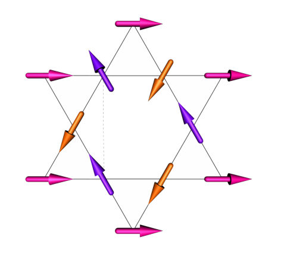
<figcaption class="paper-figure-caption"><b>Fig 1.</b> FIG. 1. Kagome lattice with spins showing the coplanar fully ordered √</figcaption>
</figure>
<figure class="paper-figure-card">
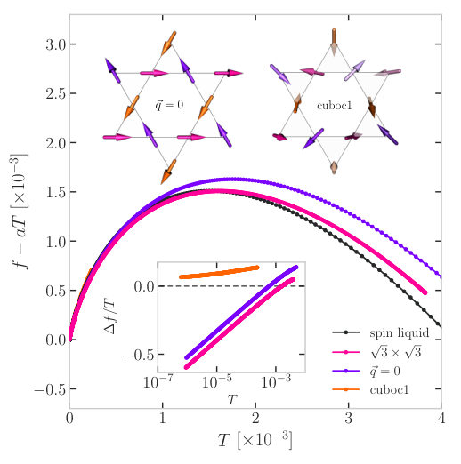
<figcaption class="paper-figure-caption"><b>Fig 2.</b> FIG. 2. Main panel: Free energy per spin vs. T for the different phases indicated by the legends. The black points start from a random initial self-energy at large values of ∆, and constitute the free energy of the spin liquid. The colored points are obtained starting from low ∆-values with initial self-energies that bias the iterations toward their respective phases. A linear term aT with a = 3 is subtracted for better visualization of the crossing point between the spin-liquid and √</figcaption>
</figure>
<figure class="paper-figure-card">

<figcaption class="paper-figure-caption"><b>Fig 3.</b> Figure 2 shows also two other free-energy branches: the purple and orange curves where the initial self-energy bi- ases the iterations toward the ⃗q = 0 state and the cuboc1 state [19, 20], respectively (for illustrations, see top of Fig. 2). Their free energies are always larger than the √</figcaption>
</figure>
<figure class="paper-figure-card">
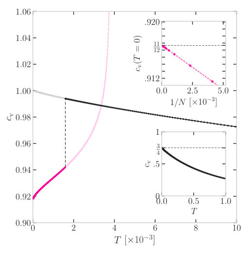
<figcaption class="paper-figure-caption"><b>Fig 4.</b> FIG. 4. Main panel: The specific heat vs. T for a system with linear size L = 300. Black points are derived from the spin-liquid branch in Fig. 2 while pink points come from the corresponding √</figcaption>
</figure>
<figure class="paper-figure-card">
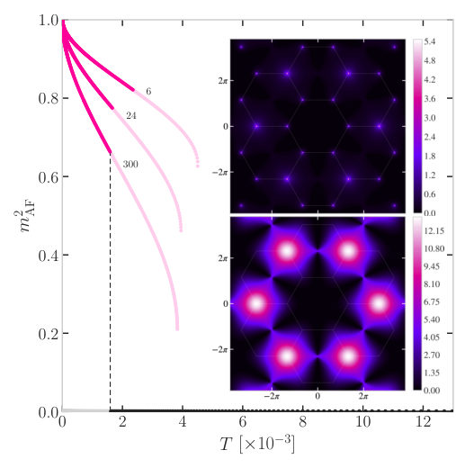
<figcaption class="paper-figure-caption"><b>Fig 5.</b> FIG. 3. Main panel: The (squared) ordered moment for the √</figcaption>
</figure>

**Summary.** This paper resolves a long-standing debate by proving that the classical kagome spin liquid undergoes a weak first-order phase transition into an ordered phase. Using an advanced self-consistent theory, the authors demonstrate that the transition is a genuine thermodynamic event rather than a smooth crossover.

**Why it may be interesting.** not directly relevant

Detailed structure

**Main problem.** Determining the low-temperature fate of the classical kagome Heisenberg antiferromagnet and resolving whether the transition from the spin liquid to the sqrt(3)xsqrt(3) phase is a thermal crossover or a thermodynamic phase transition.

**Main result.** The study shows that the spin liquid terminates at a weak first-order phase transition into the sqrt(3)xsqrt(3) phase, where the ordered moment saturates at zero temperature.

**Method.** The authors use Nematic Bond Theory (NBT), an extension of the Self-Consistent Gaussian Approximation (SCGA) based on a large-Ns expansion, to solve for the free energy and identify phase stability.

**Model / system.** A classical Heisenberg antiferromagnet on a kagome lattice with nearest-neighbor (J1) and potentially second-neighbor (J2) interactions.

**Key observables.** Free energy, ordered moment squared (m^2_AF), specific heat (cv), spin structure factor (S(q)), correlation length (xi), and latent heat (lh).

**Important parameters / regimes.** Temperature (T), second-neighbor coupling (J2), number of spin components (Ns), and system size (L).

**Assumptions / limitations.** The NBT method neglects vertex corrections in the diagrammatic treatment and may overestimate critical temperatures by 10-20%.

**Figures summary.** Figures include specific heat vs. temperature for different system sizes, a J2-T phase diagram showing first-order transition lines and a triple point, real-space spin correlations, and finite-size scaling plots for latent heat and critical temperature.

**Paper structure.** The paper introduces the problem of the kagome spin liquid fate, develops the NBT mathematical framework, presents the phase diagram and transition nature, compares results with Monte Carlo simulations, and discusses the extension to J2 interactions and the pyrochlore lattice.

Abstract

The low-temperature fate of the spin-liquid regime in the classical kagome Heisenberg antiferromagnet has been debated for over three decades. Using an expansion in the number of spin components, we show that, contrary to earlier Monte Carlo simulations, the spin liquid terminates at a weak first-order phase transition into the $\sqrt{3}\times\sqrt{3}$ phase which ordered moment saturates at zero temperature. Adding second-neighbor interactions, this transition belongs to a line of first-order phase transitions that ends at a critical point. For comparison, the pyrochlore antiferromagnet remains disordered at all temperatures.

[↑ back to top](#top)

## Secondary cond-mat archives

*Papers from cond-mat.mtrl-sci, mes-hall, other, soft, supr-con. These archives are de-prioritized — they appear at the end regardless of relevance score.*

### Relevant in secondary archives (6)

### [Absence of a Superradiant Phase Transition in Dirac Landau Polaritons](http://arxiv.org/abs/2605.27319v1)

**Authors:** Elsa Jöchl, Felix Helmrich, Frieder Lindel, Lucy Hale, Lorenzo Graziotto, Mona Jarrahi, Tobia F. Nova, Jérôme Faist, Giacomo Scalari  
**Type:** experiment · **Category:** other · **PDF:** <https://arxiv.org/pdf/2605.27319v1>  
**Analysis basis:** full PDF text, analyzed in chunks
**Topic relevance:** 🔥 `Dicke superradiance` **4/5** · 🔥 `quantum optics experiment` **4/5** · `correlated cavity matter` **3/5**

↔ Scroll figures horizontally

<figure class="paper-figure-card">
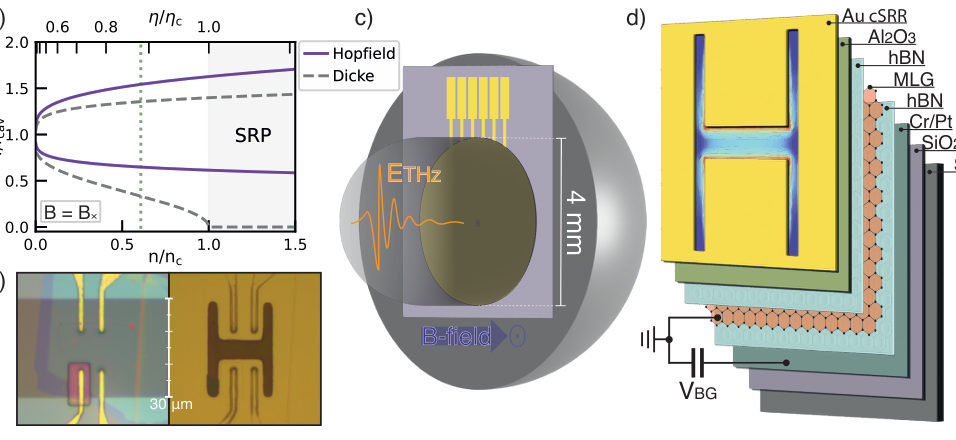
<figcaption class="paper-figure-caption"><b>Fig 1.</b> FIG. 1. Probing SRPTs in monolayer graphene. a) Dispersion of the lower and upper polariton branches as a function of density n (coupling η) at resonance in the Dicke (grey dashed lines) and Hopfield models (purple lines). While the Dicke prediction exhibits criticality with softening to zero frequency of the lower branch, the Hopfield model does not. The density range where a superradiant phase (SRP) is predicted in the Dicke model is indicated by the grey background. b) Top view of the sample before (left) and after (right) the deposition of the cSRR. c) Schematic view of the experimental setup. The sample consisting of the graphene flake and the cSRR is mounted between silicon immersion...</figcaption>
</figure>
<figure class="paper-figure-card">
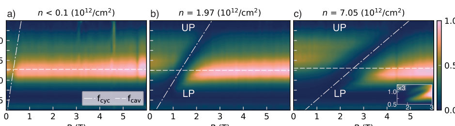
<figcaption class="paper-figure-caption"><b>Fig 2.</b> FIG. 2. Tuning of cyclotron dispersion and light-matter coupling in monolayer graphene. THz transmission spectroscopy as a function of the magnetic field with monolayer graphene biased at a) the CNP, b) an intermediate density n = 1.97 1012/cm2, and c) n = 7.05 1012/cm2, performed at a temperature of 3 K. The fitted cavity and cyclotron frequencies are indicated in each spectral map as white dashed and dashed-dotted lines, respectively. All data are referenced to the transmission spectrum of the bare SiO2/Si substrate. The contrast of the color map is normalized to its maximum in each map separately. The inset of panel c) highlights a splitting of the LP branch by enhancing the contrast by...</figcaption>
</figure>
<figure class="paper-figure-card">
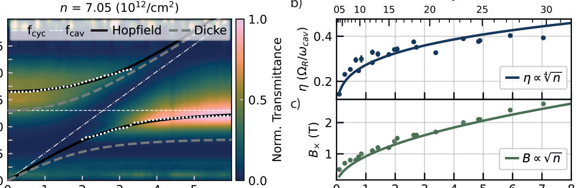
<figcaption class="paper-figure-caption"><b>Fig 3.</b> FIG. 3. Density dependence of ultrastrong light-matter coupling in graphene. a) Magnetic field-dependent spectral map at an electron density n = 7.05 1012/cm2 overlaid with the Hopfield model fit (black line) to the fitted peak positions of the respective spectra (white dots). The gray dashed line shows the expected dispersion for UP and LP resulting from a Dicke Hamiltonian at the same cavity frequency and coupling strength. b) Coupling strengths η extracted from spectral measurements using the Hopfield-model fitting method as a function of density and filling factor, together with the analytical expression obtained from the quasi-static model . c) Extracted positions of the anti-crossing...</figcaption>
</figure>
<figure class="paper-figure-card">
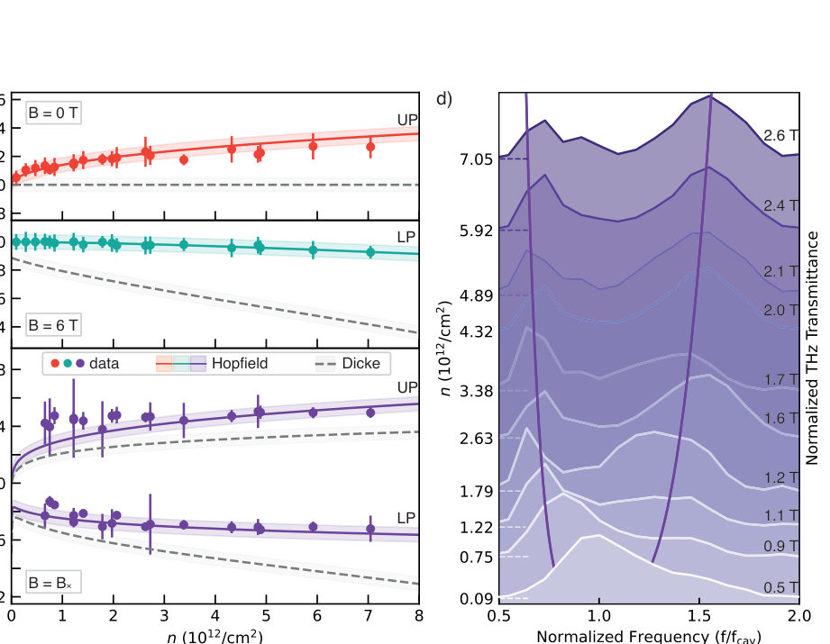
<figcaption class="paper-figure-caption"><b>Fig 4.</b> FIG. 4. Absence of SRPT. a-c) Normalized peak frequencies extracted from Lorentzian fits for a) the UP asymptote at B = 0 T, b) the LP asymptote at B = 6 T, and c) the UP and LP at the anticrossing magnetic field B× for each respective density. Hopfield and Dicke model predictions are overlaid for each case in solid colored and dashed gray lines, respectively. The shaded area indicate the spectral resolution of the measurements. d) Measured THz transmittance spectra at B× (varying with density, as indicated on the right). The y-offset corresponds to the density to show the evolution of the UP and LP splitting. Each spectrum is normalized separately. The purple lines correspond to the...</figcaption>
</figure>

**Summary.** This paper experimentally investigates the possibility of a superradiant phase transition in graphene-based Landau polaritons. By measuring the polariton dispersion in the ultrastrong coupling regime, the authors demonstrate that the system follows the Hopfield model and lacks the mode softening predicted by the Dicke model. This result effectively rules out a No-Go-evading phase transition in these graphene systems at current experimental scales.

**Why it may be interesting.** It addresses a fundamental debate in cavity QED regarding the existence of equilibrium phase transitions in light-matter systems and provides experimental evidence for the role of the diamagnetic term in the ultrastrong coupling regime.

Detailed structure

**Main problem.** Investigating whether a superradiant phase transition (SRPT) can occur in graphene Landau polaritons, specifically testing if the system evades the 'No-Go' theorem that suppresses such transitions due to the diamagnetic A^2 term.

**Main result.** The experiment rules out a No-Go-evading SRPT in graphene Landau polaritons at accessible coupling strengths, finding that the system follows the Hopfield model rather than the Dicke model.

**Method.** THz time-domain spectroscopy was used on an encapsulated monolayer graphene flake coupled to a split-ring resonator, with carrier density tuned via electrostatic gating and magnetic fields applied to induce Landau levels.

**Model / system.** The system consists of an encapsulated monolayer graphene flake ultrastrongly coupled to a single complementary split-ring resonator (cSRR). The physics is analyzed by comparing the Dicke model (which predicts SRPT) against the Hopfield Hamiltonian (which includes the diamagnetic A^2 term).

**Key observables.** Upper and lower polariton branches, polariton splitting, cyclotron frequencies, and THz transmission spectra.

**Important parameters / regimes.** Normalized coupling strength (up to Omega_R/omega_cav approx 0.4), carrier density (n), magnetic field (B), and cyclotron mass (m*).

**Assumptions / limitations.** The study assumes the validity of the near-field model for the sub-wavelength cavity and is limited by the experimental ability to reach the predicted critical density for the phase transition.

**Figures summary.** Figure 1 compares Dicke vs. Hopfield model predictions; Figure 2 shows spectral maps of polariton evolution; Figure 4 shows the UP frequency blue-shift (confirming Hopfield) and the lack of LP mode softening (ruling out SRPT).

**Paper structure.** The paper introduces the SRPT debate and the No-Go theorem, describes the graphene-cSRR experimental platform, presents THz spectroscopic results showing polariton dispersion, compares these results to Dicke and Hopfield models, and concludes with the implications for vacuum-induced order.

Abstract

The condensation of photons into a macroscopically populated ground state, a superradiant phase transition (SRPT), is one of the most striking predictions of cavity quantum electrodynamics (cQED), yet has resisted experimental realization in equilibrium for over fifty years. Whether such a transition can survive at all in light-matter coupled systems is still debated, with a widely established \textit{No-Go} theorem ruling it out across several models. Graphene cyclotron transitions ultrastrongly coupled to terahertz (THz) cavities have been at the heart of this debate. At leading order, the linear Dirac dispersion of electrons does not generate the diamagnetic $\vec{A}^2$ term that enforces the theorem, making graphene the cleanest candidate for a No-Go-evading phase transition.   Here, we present the first THz spectroscopic measurements of an encapsulated monolayer graphene flake ultrastrongly coupled to a single complementary split-ring resonator. By tuning the carrier density we sweep the system from weak coupling into the ultrastrong regime, reaching a normalized coupling $Ω_\text{R}/ω_\text{cav} \approx 0.4$. This is well into the range where a second order SRPT would manifest by a softening of the lower polariton branch, which we do not observe. The full polariton dispersion is instead quantitatively reproduced by a Hopfield Hamiltonian derived from first principles using a near-field model that accounts for the sub-wavelength character of the cavity.   Our results establish an experimental baseline for predictions of cavity-driven phase transitions in two-dimensional Dirac systems, and rule out a No-Go-evading SRPT in graphene Landau polaritons up to the strongest couplings accessible today, with direct implications for proposals invoking vacuum-induced order in solid-state cQED.

[↑ back to top](#top)

### [Programming nanomechanical computation with light](http://arxiv.org/abs/2605.26319v1)

**Authors:** Xiaofei Guo, Jonne Drost, Fons van der Laan, Jesse J. Slim, Marc Serra-Garcia, Ewold Verhagen  
**Type:** experiment · **Category:** quantum information and computing · **PDF:** <https://arxiv.org/pdf/2605.26319v1>  
**Analysis basis:** full PDF text, analyzed in chunks
**Topic relevance:** `QC/QI experiment` **3/5** · `quantum optics experiment` **3/5** · `driven-dissipative phase transition` **2/5** · `non-equilibrium dynamics` **2/5** · `quantum measurements` **2/5**

↔ Scroll figures horizontally

<figure class="paper-figure-card">
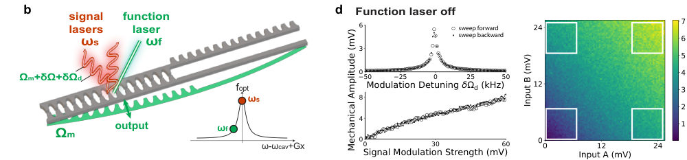
<figcaption class="paper-figure-caption"><b>Fig 1.</b> FIG. 1. Computation and programmable nonlinearity enabled by optomechanical interactions. a. Schematic of computation using an oscillator network. A programmable response of individual oscillators and their interactions enables the network output (oscillator motion) to be tuned to a desired target under a prescribed external-force input. b. Optomechanical system used to realize the oscillator network. A nanobeam (gray) serves as the mechanical oscillators, the second eigenmode (green) is read out as the output. The inputs are provided by signal lasers with intensity modulation at Ωd = Ωm + δΩ+ δΩd, and a function laser programs the properties of individual oscillators. Here δΩdenotes the...</figcaption>
</figure>
<figure class="paper-figure-card">
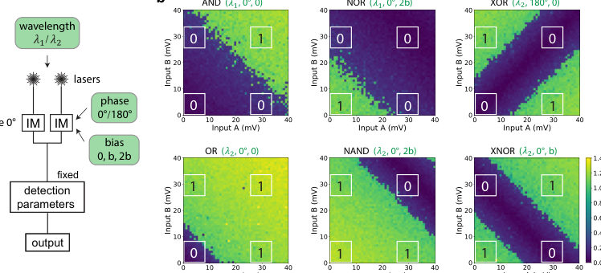
<figcaption class="paper-figure-caption"><b>Fig 2.</b> FIG. 2. Reconfigurable implementation of six standard Boolean operations in a single device. a. The device function is reconfigured by three control parameters: the laser wavelength λ, the modulator phase, and the modulation am- plitude bias. The modulation bias is applied with 180◦phase. b. Without redefining the input and output convention, we experimentally realize six standard Boolean operations by appropriately tuning these three parameters.</figcaption>
</figure>
<figure class="paper-figure-card">
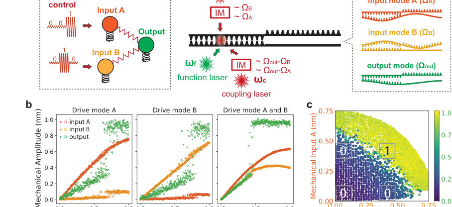
<figcaption class="paper-figure-caption"><b>Fig 3.</b> FIG. 3. Cascadable logic gates using multiple mechanical eigenmodes. a. Schematic illustration of cascadable logic gates. Three mechanical eigenmodes of the nanobeam are employed, with two modes serving as input modes A and B and the third mode as the output mode. In addition to the signal lasers and the function laser used in the single-mode computation, an extra coupling laser is applied to establish connections between the input and output modes. The coupling laser is intensity- modulated near both Ωout −ΩA and Ωout −ΩB. b. The mechanical oscillation amplitudes of the three eigenmodes when driving input mode A only, input mode B only, and both input modes A and B using an intensity...</figcaption>
</figure>
<figure class="paper-figure-card">
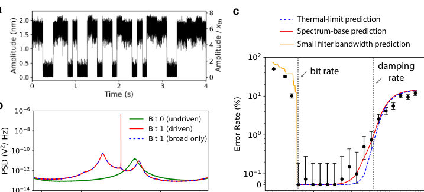
<figcaption class="paper-figure-caption"><b>Fig 4.</b> FIG. 4. Computation fidelity near the thermal limit. a. Time trace of an OR gate output under a continuous input sequence. Since inputs 01 (10) and 11 both produce output bit 1, the output exhibits two mean levels. Data are acquired with the lock-in amplifier filter bandwidth set to 10 kHz. The mechanical oscillation amplitude is presented both in absolute units and normalized by the thermal displacement xth, providing a dimensionless measure relative to thermal motion. b. Power spectral density of the output signal in the undriven state (bit 0) and the driven state (bit 1), where the driven case corresponds to input 11. For the driven case, the spectrum exhibits two prominent Lorentzian...</figcaption>
</figure>

**Summary.** The researchers have created a programmable computing platform using nanomechanical resonators where the logic functions and connections are controlled by light. By tuning lasers, they can switch between different Boolean gates and even connect different mechanical modes. This work shows that optomechanical nonlinearities can be harnessed to create reconfigurable, hardware-agnostic physical computers.

**Why it may be interesting.** It demonstrates a way to use classical nonlinear dynamics and optomechanical backaction to implement programmable logic, which provides a bridge to understanding how controlled nonlinearities can be used for more complex tasks like reservoir computing or probabilistic computing.

Detailed structure

**Main problem.** Developing a programmable physical computing platform where nonlinearity and connectivity can be reconfigured in situ, rather than being fixed by material properties.

**Main result.** Demonstration of all six fundamental Boolean logic gates (AND, NAND, OR, NOR, XOR, XNOR) and programmable connectivity between mechanical modes using laser-controlled optomechanical interactions.

**Method.** Using cavity optomechanical backaction to induce Duffing nonlinearity and an optical spring effect, controlled via laser wavelength, power, and phase, with readout via intensity modulation detection.

**Model / system.** A pair of silicon nanobeams acting as mechanical oscillators coupled to a photonic-crystal nanocavity, modeled as a Duffing oscillator with radiation-pressure-induced nonlinearity.

**Key observables.** Mechanical oscillation amplitude, frequency response (Lorentzian vs. shark-fin), power spectral density (PSD), and gate fidelity/error rates.

**Important parameters / regimes.** Mechanical frequency (5-18 MHz), optical detuning, Duffing nonlinearity coefficient (beta), damping rate (Gamma), and thermal amplitude (x_th).

**Assumptions / limitations.** Use of the Rotating-Wave Approximation (RWA) for single-mode treatment and neglecting higher-order harmonics and intermodulation products through optimized DC bias.

**Figures summary.** Figure 1 shows the experimental setup and the transition from linear to nonlinear frequency response. Figure 2 demonstrates the realization of all six logic gates. Figure 3 shows the implementation of cascadable gates using multiple eigenmodes. Figure 4 shows the time trace and noise analysis of an OR gate.

**Paper structure.** The paper introduces the concept of programmable physical computing, describes the optomechanical platform and the Duffing model, demonstrates the implementation of various logic gates, shows the extension to multi-mode cascading, and concludes with a detailed noise and error rate analysis.

Abstract

Looking at physical systems as computers allows us to regard physical properties, such as thermal noise, symmetry or topology, as unconventional resources for computation. However, harnessing these resources requires programming computational functionality through strong, controllable nonlinearities in the system. Here, we show that cavity optomechanical interactions allow laser-controlled computation with nanomechanical degrees of freedom. We demonstrate a set of basic digital logic gates with level restoration and controlled mechanical couplings as essential ingredients for arbitrary computing networks. Owing to the strong optomechanical nonlinearity and precise readout, the system operates close to thermal amplitudes, in the regime where thermodynamic stochasticity governs its behavior. This opens a new path for the realization of physical computing with controlled nonlinear resonators.

[↑ back to top](#top)

### [High-mobility inertial domain walls driven by spin-transfer torque in a ferrimagnetic spinel oxide](http://arxiv.org/abs/2605.27216v1)

**Authors:** Mingxing Wu, Shilei Ding, Laura van Schie, Shenghao Cai, Yuhao Qiu, Ao Du, Alexander E. Kossak, Rui Wu, Christian L. Degen, Xuegang Chen, Pietro Gambardella  
**Type:** experiment · **Category:** other · **PDF:** <https://arxiv.org/pdf/2605.27216v1>  
**Analysis basis:** full PDF text, analyzed in chunks
**Topic relevance:** `spintronics-quantum-optics interface` **2/5** · `non-equilibrium dynamics` **1/5**

↔ Scroll figures horizontally

<figure class="paper-figure-card">
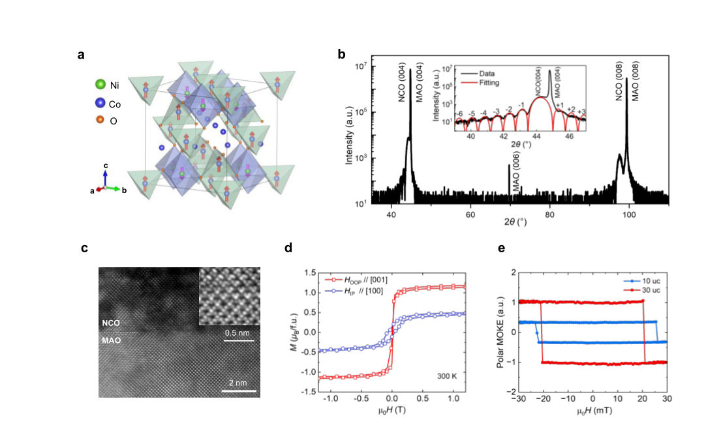
<figcaption class="paper-figure-caption"><b>Fig 1.</b> Fig. 1 | Characterizations of NCO epitaxial films. a, Schematic spin structure of ferrimagnetic</figcaption>
</figure>
<figure class="paper-figure-card">
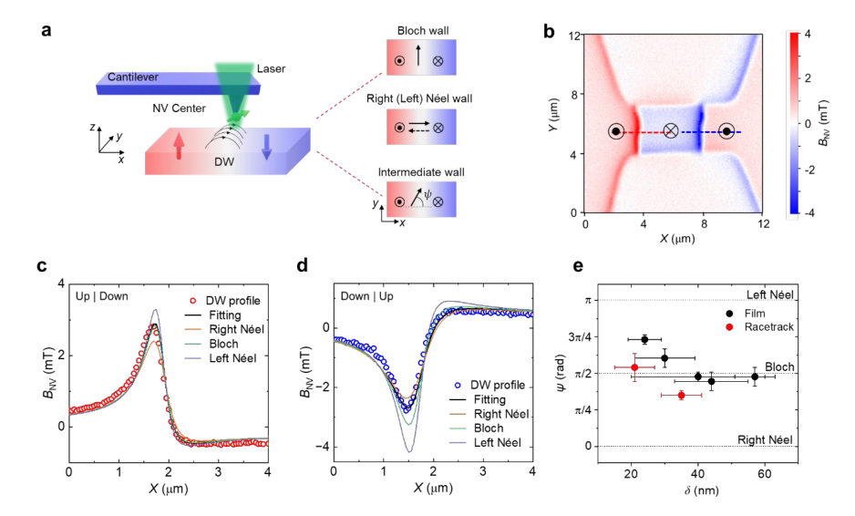
<figcaption class="paper-figure-caption"><b>Fig 2.</b> Fig. 2 | DW structure and chirality measured by scanning NV magnetometry. a, Schematic of</figcaption>
</figure>
<figure class="paper-figure-card">
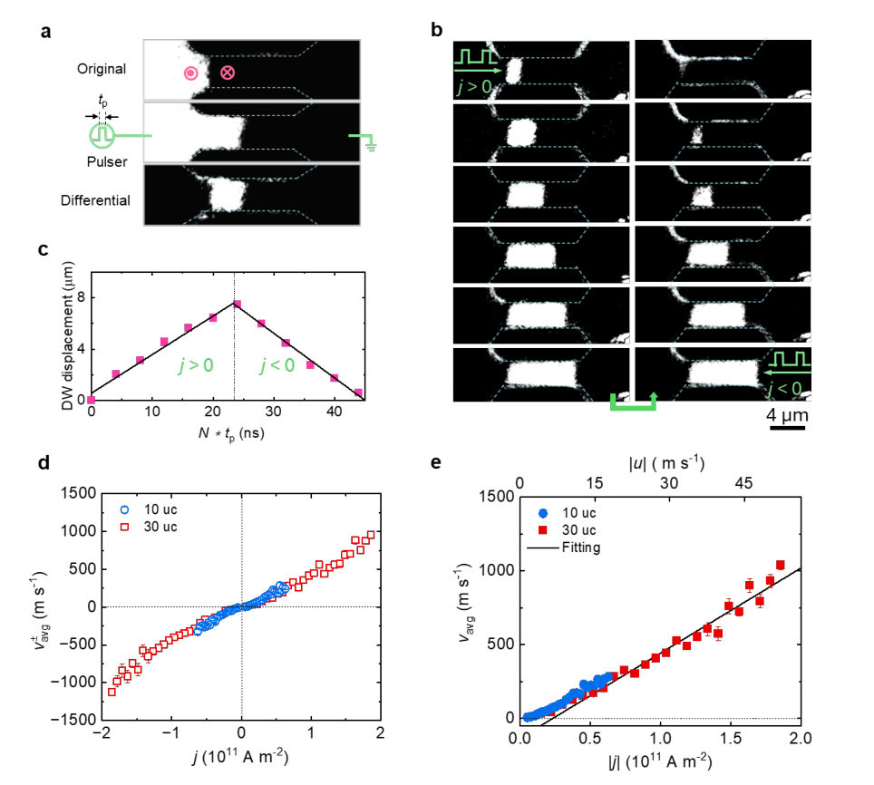
<figcaption class="paper-figure-caption"><b>Fig 3.</b> Fig. 3 | Current-driven DW motion and velocity. a, Illustration of differential MOKE imaging</figcaption>
</figure>
<figure class="paper-figure-card">
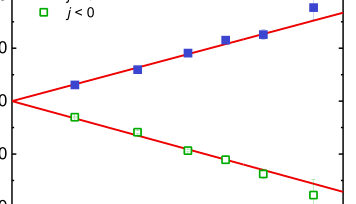
<figcaption class="paper-figure-caption"><b>Fig 4.</b> Fig. 4 | DW inertia due to large nonadiabatic STT a, Analytical calculations of instantaneous</figcaption>
</figure>
<figure class="paper-figure-card">
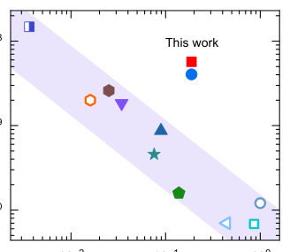
<figcaption class="paper-figure-caption"><b>Fig 5.</b> Fig. 5 | Comparison of DW mobility and energy consumption for STT-based DW racetrack</figcaption>
</figure>

**Summary.** This paper demonstrates exceptionally fast and efficient domain wall motion in a ferrimagnetic spinel oxide using spin-transfer torque. The researchers observed high mobility and a significant inertial effect, positioning this material as a strong candidate for next-generation ultrafast spintronic devices.

**Why it may be interesting.** not directly relevant

Detailed structure

**Main problem.** The challenge of achieving high-velocity, energy-efficient domain wall motion in magnetic devices for spintronic applications like racetrack memories.

**Main result.** Demonstrated domain wall velocities exceeding 1 km/s in NiCo2O4 with high mobility and a pronounced inertial effect due to large nonadiabatic spin-transfer torque.

**Method.** Used epitaxial growth of NiCo2O4 thin films, scanning NV magnetometry for domain wall structure, and MOKE microscopy for tracking dynamics under current pulses.

**Model / system.** Single-layer ferrimagnetic spinel oxide NiCo2O4 (NCO) thin films grown on MgAl2O4 substrates, utilizing a 1D domain wall model to describe dynamics.

**Key observables.** Domain wall velocity, domain wall width, chirality, nonadiabatic torque parameter (beta/alpha), and energy consumption per volume.

**Important parameters / regimes.** Current density (2 x 10^11 A/m2), characteristic relaxation time (~1 ns), and spin polarization (-0.73).

**Assumptions / limitations.** Assumes spin-transfer torque is the sole driving mechanism and that the system operates in a regime without Walker breakdown.

**Figures summary.** Fig 1: Structural and magnetic characterization (XRD, STEM, SQUID). Fig 2: NV microscopy of domain wall structure. Fig 3: Current-driven domain wall displacement and velocity. Fig 4: Evidence of domain wall inertia. Fig 5: Comparative performance of NCO against other magnetic materials.

**Paper structure.** The paper begins with material characterization, moves to structural analysis of the domain wall, presents dynamic measurements of velocity and inertia, and concludes with a comparative performance analysis against other magnetic systems.

Abstract

Efficient electrical manipulation of domain walls is key to developing magnetic devices with fast switching capabilities and low energy consumption. Here we demonstrate Bloch-type domain wall velocities exceeding 1 km s$^{-1}$ in the single-layer ferrimagnetic spinel oxide NiCo$_2$O$_4$ induced by spin-transfer torque at a current density of $2 \times 10^{11}$ A m$^{-2}$. This exceptional domain wall mobility is attributed to the combination of giant nonadiabatic spin-transfer torque, low magnetization, and high spin polarization. Additionally, we report a pronounced domain wall inertia effect in this ferrimagnet due to the large nonadiabaticity of the torque. The characteristic time for domain wall acceleration and deceleration is $\sim 1$ ns, shorter than that reported for typical ferromagnets. Our findings highlight the potential of spinel oxides as a promising platform for engineering high-performance domain wall devices that take advantage of ultrafast ferrimagnetic dynamics.

[↑ back to top](#top)

### [Anharmonic Quantum Transport Analysis of Thermal Transport Anomalies in Ultrathin Silicon Nanowires](http://arxiv.org/abs/2605.26529v1)

**Authors:** Lokanath Patra, Mayur Pratap Singh, Satish Kumar  
**Type:** theory · **Category:** other · **PDF:** <https://arxiv.org/pdf/2605.26529v1>  
**Analysis basis:** full PDF text, analyzed in chunks
**Topic relevance:** `non-equilibrium dynamics` **2/5**

↔ Scroll figures horizontally

<figure class="paper-figure-card">
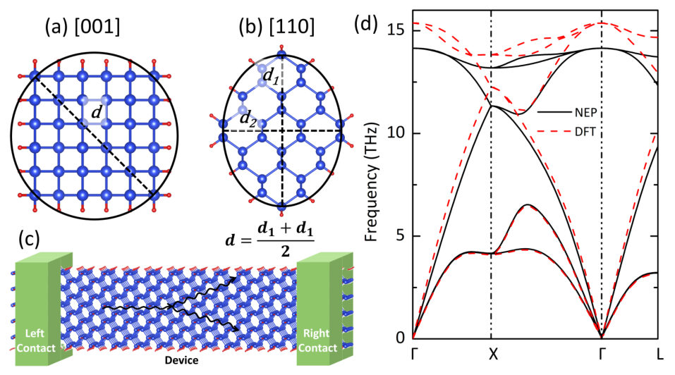
<figcaption class="paper-figure-caption"><b>Fig 1.</b> Figure 1. Top and side views of the atomic structure of (a) [001]- and (b) [110]-oriented silicon</figcaption>
</figure>
<figure class="paper-figure-card">
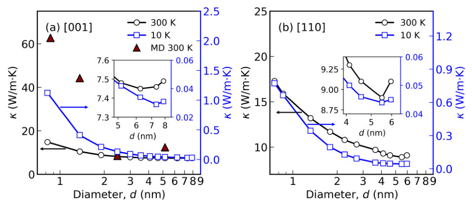
<figcaption class="paper-figure-caption"><b>Fig 2.</b> Figure 2. Diameter (d) dependence of the thermal conductivity (κ) of (a) [001]- and (b) [110]-</figcaption>
</figure>
<figure class="paper-figure-card">
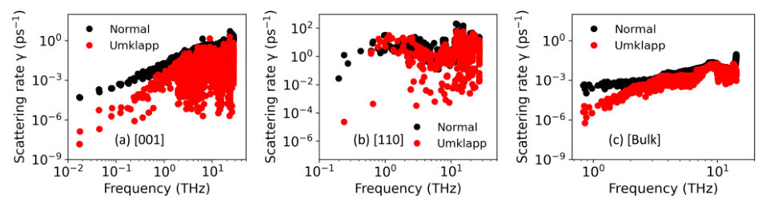
<figcaption class="paper-figure-caption"><b>Fig 3.</b> Figure 3. Phonon scattering rates in silicon as a function of phonon frequency for (a) [001]-oriented</figcaption>
</figure>
<figure class="paper-figure-card">
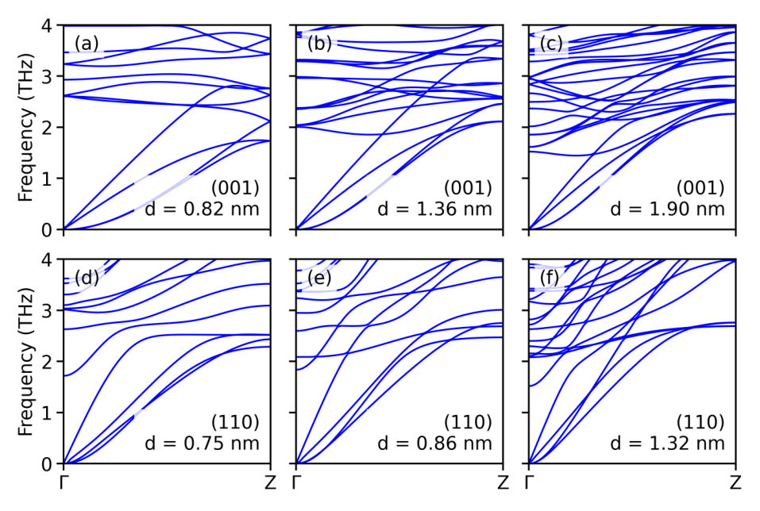
<figcaption class="paper-figure-caption"><b>Fig 4.</b> Figure 4. Phonon dispersion relations calculated for ultrathin Si NWs with different diameters. (a)</figcaption>
</figure>
<figure class="paper-figure-card">
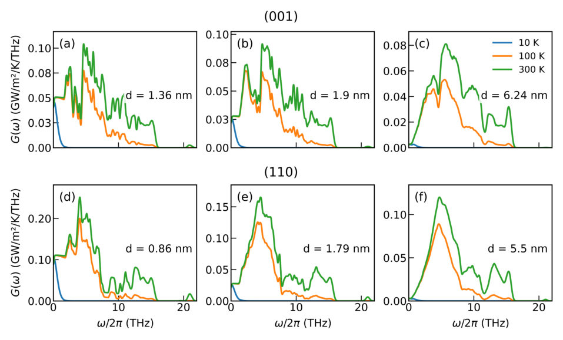
<figcaption class="paper-figure-caption"><b>Fig 5.</b> Figure 5. Spectral thermal conductance per unit cross-sectional area versus frequency for ultrathin</figcaption>
</figure>

**Summary.** This paper uses a quantum-mechanical NEGF framework with machine-learning potentials to explain why thermal conductivity in ultrathin silicon nanowires does not decrease linearly with diameter. It identifies a critical diameter where thermal transport transitions between hydrodynamic-like phonon flow and a regime dominated by quantum confinement and boundary scattering.

**Why it may be interesting.** not directly relevant

Detailed structure

**Main problem.** Investigating the origin of the nonmonotonic dependence of thermal conductivity on the diameter in ultrathin silicon nanowires and resolving discrepancies between classical MD and quantum-mechanical reality.

**Main result.** Confirmed a nonmonotonic thermal conductivity behavior where a minimum occurs at critical diameters (6.24 nm for [001] and 5.50 nm for [110]), driven by the competition between boundary scattering and hydrodynamic-like phonon flow at room temperature, and radial quantum confinement at cryogenic temperatures.

**Method.** Anharmonic non-equilibrium Green's function (NEGF) simulations combined with neuroevolution potentials (NEP) trained on density-functional-theory (DFT) data.

**Model / system.** Ultrathin hydrogen-passivated silicon nanowires (Si NWs) with diameters ranging from 0.5 to 6 nm, oriented along [001] and [110] crystallographic directions.

**Key observables.** Thermal conductivity (k), spectral thermal conductance, phonon scattering rates (Normal vs. Umklapp), and phonon dispersion/band structures.

**Important parameters / regimes.** Nanowire diameter (d), temperature (10 K to 300 K), and crystallographic orientation ([001] and [110]).

**Assumptions / limitations.** The NW length is fixed at 10 nm; the Cauchy principal integral in the retarded self-energy calculation is neglected to reduce complexity; Gaussian broadening is used for numerical smoothing.

**Figures summary.** Figure 1 shows the NW structures and phonon band structure agreement; Figure 2 plots thermal conductivity vs. diameter at 10 K and 300 K; Figure 5 displays frequency-resolved spectral thermal conductance for various diameters and temperatures.

**Paper structure.** The paper introduces the thermal transport problem, describes the ML-NEGF/NEP methodology, presents results for thermal conductivity across different diameters and orientations, analyzes the underlying phonon scattering mechanisms at different temperature regimes, and provides supplementary details on potential training and spectral conductance.

Abstract

Thermal transport in low-dimensional semiconductors is crucial for advancing thermal management in nanoelectronics, quantum devices, and thermoelectric devices. Recent molecular dynamics (MD) studies have identified a nonmonotonic dependence of thermal conductivity (k) on diameter in ultrathin silicon nanowires (NWs). However, classical MD methods are limited at low temperatures and in strongly confined regimes. This work introduces a fully quantum-mechanical perspective on this anomaly by employing anharmonic non-equilibrium Green's function (NEGF) simulations combined with density-functional-theory-trained neuroevolution potentials. For [001]- and [110]-oriented NWs, k decreases with diameter d to a minimum at d_c = 6.24 nm and 5.50 nm, respectively, then rises with d, for a temperature range of 10-300 K. At room temperature, this behavior arises from dominant momentum-conserving normal scattering relative to Umklapp processes in confined regimes, thereby enabling Poiseuille-like hydrodynamic phonon flow that competes with boundary scattering. At cryogenic temperatures, strong radial confinement quantizes the phonon spectrum, and only low-frequency phonons (< 2 THz) significantly contribute to heat transport through quasi-ballistic propagation of long-wavelength modes, as demonstrated by the spectral thermal conductance. In contrast to classical MD, which is inaccurate at low temperatures due to overexcitation of high-frequency vibrations by Boltzmann statistics, neglect of quantum suppression, and overestimation of thermal conductivity in thinner NWs with stronger quantum confinement, the NEGF framework provides quantitative accuracy even at low temperatures, such as 10 K.

[↑ back to top](#top)

### [Anomaly-Induced Hybrid Bulk Electromagnetic Mode in Weyl Semimetals](http://arxiv.org/abs/2605.27031v1)

**Authors:** Subrahmanyam D, Suhas Gangadharaiah, E. G. Mishchenko  
**Type:** theory · **Category:** other · **PDF:** <https://arxiv.org/pdf/2605.27031v1>  
**Analysis basis:** full PDF text, analyzed in chunks
**Topic relevance:** `Keldysh / 2PI / non-Gaussian methods` **2/5**

↔ Scroll figures horizontally

<figure class="paper-figure-card">
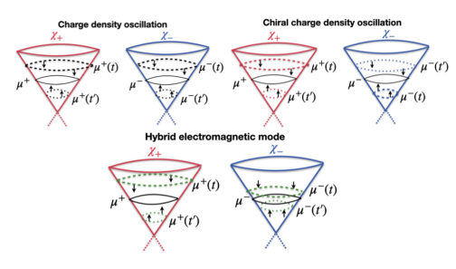
<figcaption class="paper-figure-caption"><b>Fig 1.</b> FIG. 1: Schematic illustration of the anomaly-induced hybrid bulk electromagnetic mode in a Weyl semimetal in terms of breathing of the Fermi surfaces. Top left: in- phase breathing at opposite Weyl nodes, corresponding to the conventional plasmonic charge-density oscillation. Top right: antiphase breathing under E(t)·B0 ̸= 0, corre- sponding to a chiral charge-density oscillation. Bottom: for B0·q ̸= 0 and ωp ≃ωanom, coupling between the two oscillations yields a hybridized collective electromagnetic mode.</figcaption>
</figure>
<figure class="paper-figure-card">
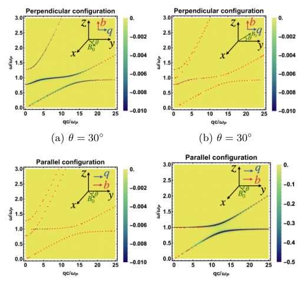
<figcaption class="paper-figure-caption"><b>Fig 2.</b> FIG. 2: Bulk electromagnetic modes (red triangles) over- laid on the loss-function spectra L(ω, q) for perpendicu- lar and parallel configurations. Peak in the loss function (blue) indicate the presence of collective modes, with their sharpness reflecting the degree of damping, while yellow regions correspond to negligible loss. Figure 2a shows B0 in the x–y plane at θ = 30◦with respect to ˆy, while Fig. 2b corresponds to B0 in the y–z plane at the same angle. Figures 2c and 2d (decoupled longitudinal sector) show B0 in the x–y plane at θ = 30◦and 0◦, re- spectively.</figcaption>
</figure>

**Summary.** This paper predicts a new type of bulk electromagnetic excitation in Weyl semimetals that occurs due to the chiral anomaly. This hybrid mode is distinct from known excitations and can be identified through its unique dispersion and avoided crossing with the bulk plasmon. The discovery offers a new way to probe the chiral magnetic effect using electron energy-loss spectroscopy.

**Why it may be interesting.** not directly relevant

Detailed structure

**Main problem.** The identification and characterization of a previously unknown hybrid bulk electromagnetic mode in Weyl semimetals arising from the interplay between the chiral anomaly and the orientation of the chiral magnetic response.

**Main result.** The authors predict a linearly dispersing hybrid mode that undergoes an avoided crossing with the bulk plasmon when the chiral magnetic current has a component along the wave-vector, providing a direct signature of the chiral anomaly.

**Method.** A semiclassical kinetic-Maxwell framework using the Boltzmann formalism and the continuity equation to solve coupled kinetic and Maxwell equations.

**Model / system.** Doped 3D Weyl semimetals with broken time-reversal symmetry, characterized by a node-separation vector and a weak static external magnetic field.

**Key observables.** Loss function spectra L(omega, q), dispersion relations, and damping rates.

**Important parameters / regimes.** Orientation angle theta between the magnetic field and wave-vector, wave-vector q, frequency scale omega_anom, and the ratio of internode to intra-node scattering rates.

**Assumptions / limitations.** Long-wavelength regime, collisionless limit, negligible Landau quantization, and neglecting interband effects due to low Fermi energies.

**Figures summary.** Figure 1 provides a schematic of the system; Figure 2 shows loss-function spectra L(omega, q) for different magnetic field configurations and angles, highlighting the presence or absence of the hybrid mode.

**Paper structure.** The paper introduces the problem of anomaly-induced modes, describes the semiclassical kinetic-Maxwell model, analyzes the electromagnetic response in different magnetic field orientations (parallel vs. perpendicular), and concludes with the predicted experimental signatures in EELS.

Abstract

Collective modes provide direct fingerprints of quantum matter. We predict a previously unidentified hybrid bulk electromagnetic mode in Weyl semimetals arising from the interplay between the chiral anomaly and the orientation of its associated chiral magnetic response relative to the direction of the wave-vector. When the anomaly-induced chiral magnetic current has a component along the propagation direction, oscillations of valley imbalance hybridize with plasmonic charge oscillations, producing a linearly dispersing mode that undergoes avoided crossing with the bulk plasmon, producing a hybrid bulk excitation absent in ordinary metals. The hybrid mode provides a direct signature of Weyl semimetals and a probe of the chiral anomaly and its associated chiral magnetic effect, with observable features in electron energy-loss spectroscopy. Studying this interplay can uncover various optical and electronic properties of Weyl semimetals.

[↑ back to top](#top)

### [Interaction-Phase Dynamics and Spectral Organization in Damped Higher-Order Nonlinear Schrödinger Models](http://arxiv.org/abs/2605.26811v1)

**Authors:** C. M. Schober  
**Type:** theory · **Category:** other · **PDF:** <https://arxiv.org/pdf/2605.26811v1>  
**Analysis basis:** full PDF text, analyzed in chunks
**Topic relevance:** `non-equilibrium dynamics` **2/5**

↔ Scroll figures horizontally

<figure class="paper-figure-card">
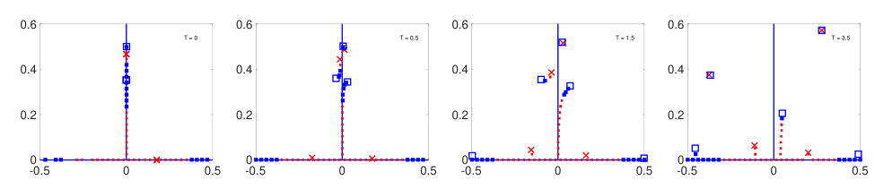
<figcaption class="paper-figure-caption"><b>Fig 1.</b> Figure 1: Early-time Floquet spectra for HONLS, V-HONLS, and NLD-HONLS at (a) t = 0, (b) t = 0.5, (c) t = 1.5, and (d) t = 3.5 illustrating the common early asymmetric band splitting and the formation of a localized two-band spectral configuration at t = 3.5.</figcaption>
</figure>
<figure class="paper-figure-card">
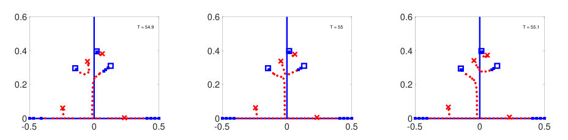
<figcaption class="paper-figure-caption"><b>Fig 2.</b> Figure 2: V-HONLS with Γ = .002: Later-stage Floquet spectra at (a) t = 54.9, (b ) t = 55, and (c) t = 55.1 showing spectral reconfiguration and a critical-point crossing.</figcaption>
</figure>
<figure class="paper-figure-card">
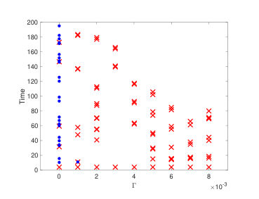
<figcaption class="paper-figure-caption"><b>Fig 3.</b> Figure 3: HONLS (Γ = 0) and V-HONLS evolutions for varying damping parameter Γ: Timeline using SPB initial data showing critical point transitions: blue dots for real, red ’×’ for complex.</figcaption>
</figure>
<figure class="paper-figure-card">
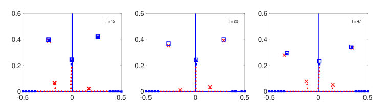
<figcaption class="paper-figure-caption"><b>Fig 4.</b> Figure 4: NLD-HONLS with β = 0.1: Later-stage Floquet spectra at (a) t = 15, (b) t = 23, and (c) t = 47, exhibiting persistent organization of the dominant spectral bands, absence of critical-point crossings, and gradual band deformation and enlargement.</figcaption>
</figure>
<figure class="paper-figure-card">
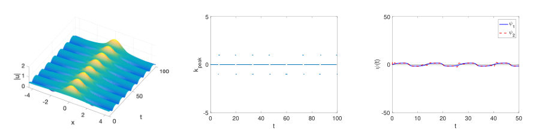
<figcaption class="paper-figure-caption"><b>Fig 5.</b> Figure 5: One-mode finite-gap NLS dynamics: (a) surface evolution, (b) dominant spectral mode kpeak, (c) interac- tion phases, exhibiting strongly recurrent modulation cycles with persistent carriersideband interaction structure and negligible spectral drift.</figcaption>
</figure>

**Summary.** This paper explains how different types of dissipation fundamentally alter the stability of nonlinear wave structures. It shows that while viscous damping destroys spectral organization, nonlinear mean-flow damping allows for complex phase restructuring without breaking the underlying coherent Floquet-band structure.

**Why it may be interesting.** not directly relevant

Detailed structure

**Main problem.** The study investigates why two different dissipative mechanisms—viscous damping and nonlinear mean-flow damping—lead to fundamentally different long-time Floquet spectral evolutions and modulation dynamics in higher-order nonlinear Schrödinger (HONLS) systems.

**Main result.** The author demonstrates that nonlinear mean-flow damping maintains organized, recurrent Floquet-band structures through interaction-dependent dissipative feedback, whereas viscous damping causes spectral reconnection, diffusion, and the breakdown of coherent modulation.

**Method.** The research employs a reduced five-mode Fourier truncation and an amplitude-phase reformulation to isolate interaction phases, alongside numerical simulations and comparisons with integrable NLS finite-gap benchmark solutions.

**Model / system.** The system consists of Higher-Order Nonlinear Schrödinger (HONLS) models subject to two distinct dissipative extensions: Viscous-HONLS (V-HONLS) and Nonlinear Mean-Flow Damped-HONLS (NLD-HONLS).

**Key observables.** Nonlinear Floquet spectrum (band structure, critical points, and reconnection), interaction phases (psi_j), wave amplitude evolution, and peak wavenumber (k_peak).

**Important parameters / regimes.** Viscous damping strength (Gamma), nonlinear mean-flow damping parameter (beta), higher-order dispersive correction (epsilon), and wavenumber (mu).

**Assumptions / limitations.** The analysis relies on a five-mode Fourier truncation and assumes a carrier-sideband hierarchy (r_0 >> r_plus/minus_1 >> r_plus/minus_2) for asymptotic reductions.

**Figures summary.** Figures show the evolution of Floquet spectra over time, comparison of surface amplitude and wavenumber dynamics, and the evolution of interaction phases correlated with rogue-wave events and spectral restructuring.

**Paper structure.** The paper begins by defining the HONLS models and Floquet diagnostic framework, moves to the derivation of a reduced five-mode interaction-phase model, presents numerical comparisons between viscous and mean-flow damping, and concludes with benchmark analyses using integrable NLS solutions.

Abstract

We investigate the dynamical mechanisms underlying the contrasting nonlinear Floquet spectral evolutions observed in viscous and nonlinear mean-flow damped higher-order nonlinear Schr"odinger systems. Motivated by the persistent organized Floquet-band structure under nonlinear mean-flow damping and the repeated Floquet band reconnection observed under viscous damping, we derive a reduced five-mode carrier-sideband truncation and reformulate the dynamics in amplitude-phase variables to isolate the dominant interaction phases associated with the principal four-wave interaction products. Within this framework, viscous damping acts primarily modewise and does not directly modify the leading interaction-phase dynamics. By contrast, nonlinear mean-flow damping contributes directly to the interaction-phase evolution through interaction-dependent dissipative corrections. In the carrier-sideband regime, these corrections generate terms of the form $-κ_j \sin(ψ_j)$, introducing dissipative feedback into the dominant carrier-sideband interaction dynamics. To interpret the resulting interaction-phase evolution, we examine recurrent finite-gap NLS benchmark solutions whose modulation dynamics are independently understood. These benchmarks show that substantial interaction-phase evolution and localized restructuring may occur even within organized quasiperiodic dynamics possessing invariant Floquet spectral structure. Numerical diagnostics show that the nonlinear mean-flow damped system exhibits persistent recurrent carrier-sideband focusing dynamics together with organized Floquet evolution despite substantial interaction-phase restructuring, whereas the viscous system exhibits progressively diffuse modulation dynamics together with repeated Floquet reconfiguration and weakening persistence of the recurrent carrier-sideband interaction structure.

[↑ back to top](#top)

### Other secondary papers (17)

Show other secondary papers

### [Amorphous vs. Short-Range-Ordered Complexions: Consequences for Grain-Boundary-Mediated Plasticity in Nanocrystalline Al-Ni Alloys](http://arxiv.org/abs/2605.27218v1)

**Authors:** Frederic Sansoz, Eve-Audrey Picard  
**Type:** theory · **Category:** disordered systems and neural networks · **PDF:** <https://arxiv.org/pdf/2605.27218v1>  
**Analysis basis:** full PDF text, analyzed in chunks

↔ Scroll figures horizontally

<figure class="paper-figure-card">
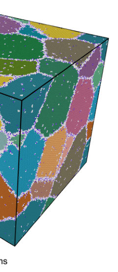
<figcaption class="paper-figure-caption"><b>Fig 1.</b> Figure 1: Equilibrium microstructure and Ni solute segregation in the Al-4Ni polycrystal predicted by MC/MD simulation at 378 K and then cooled to 300 K. Each grain is highlighted in different colors according to their crystallographic orientation.</figcaption>
</figure>
<figure class="paper-figure-card">
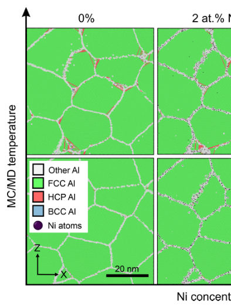
<figcaption class="paper-figure-caption"><b>Fig 2.</b> Figure 2: Equilibrium Al-Ni phase diagram for total Ni concentrations up to 4 at.% predicted by MC/MD.</figcaption>
</figure>
<figure class="paper-figure-card">
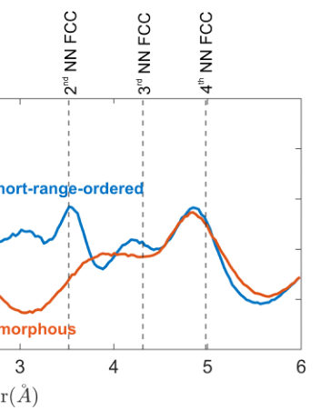
<figcaption class="paper-figure-caption"><b>Fig 3.</b> Figure 3: Radial distribution function curves for Ni-Ni pairs at grain boundaries in the nanocrystalline Al-4Ni alloy annealed at 913 K and 378 K. The first four nearest-neighbor (NN) distances in a perfect FCC Ni unit cell are indicated by dashed lines.</figcaption>
</figure>
<figure class="paper-figure-card">
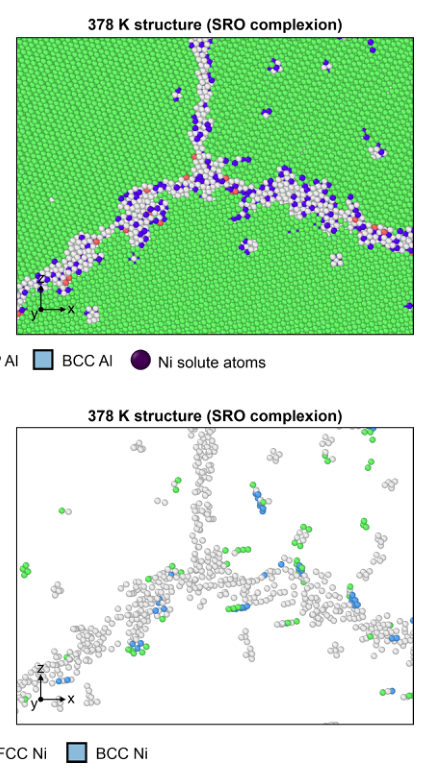
<figcaption class="paper-figure-caption"><b>Fig 4.</b> Figure 4. Close-up view of the same grain-boundary region in nanocrystalline Al-4Ni annealed at 913 K and 378 K, revealing amorphous and short-range-ordered (SRO) Ni complexions, respectively. Structural analysis shown with (a) all atoms and (b) Ni solute atoms only.</figcaption>
</figure>
<figure class="paper-figure-card">
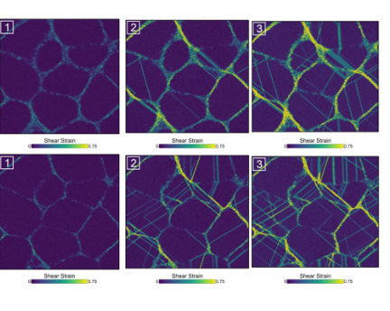
<figcaption class="paper-figure-caption"><b>Fig 5.</b> Figure 5. Effect of amorphous complexions on deformation in nanocrystalline Al-Ni alloys (annealed at 913 K): (a) simulated tensile stress-strain curves and (b) atomic-scale snapshots of local von Mises shear strain at 300 K.</figcaption>
</figure>

**Summary.** This paper explores how the structural state of grain boundaries—either purely amorphous or containing short-range order—dictates the mechanical properties of nanocrystalline Al-Ni alloys. It demonstrates that while SRO increases material strength, it also triggers detrimental shear localization. These findings suggest that controlling the structural order at interfaces can be used to engineer the plasticity of nanostructured materials.

**Why it may be interesting.** not directly relevant

Detailed structure

**Main problem.** The study investigates how local short-range ordering (SRO) within amorphous grain-boundary complexions influences the plasticity and mechanical response of nanocrystalline Al-Ni alloys.

**Main result.** Amorphous grain boundaries promote homogeneous plasticity via shear transformation zones but lower strength, whereas SRO-containing boundaries increase strength but induce intense shear localization due to stress heterogeneity.

**Method.** Large-scale hybrid Monte Carlo and Molecular Dynamics (MC/MD) simulations using the LAMMPS framework and an EAM interatomic potential.

**Model / system.** Nanocrystalline Al-Ni alloys (Al-2Ni and Al-4Ni) consisting of an FCC Al polycrystal with approximately 13 million atoms and an average grain size of 24 nm.

**Key observables.** Stress-strain curves, grain-boundary thickness, radial distribution functions (RDF), polyhedral template matching (PTM) for structural ordering, and atomic-scale von Mises stress and strain distributions.

**Important parameters / regimes.** Ni concentrations (2 at.% and 4 at.%), annealing temperatures (378 K and 913 K), and engineering strain rate (10^8 s^-1).

**Assumptions / limitations.** The interatomic interactions are accurately captured by the EAM potential, and the grain boundary complexions reach equilibrium via the simulated annealing regimes.

**Figures summary.** Figure 1 shows the equilibrium microstructure and Ni segregation; Figure 2 presents the Al-Ni phase diagram; Figure 3 compares Ni-Ni RDF curves; Figure 4 visualizes the structural difference between amorphous and SRO complexions; Figures 5-6 show tensile behavior and shear strain; Figures 7-8 compare atomic-scale von Mises stress distributions.

**Paper structure.** The paper introduces the problem of GB-mediated plasticity, describes the MC/MD simulation setup and structural analysis tools, presents the structural evolution of GBs under different annealing temperatures, compares the mechanical response (strength vs. localization) of amorphous and SRO regimes, and concludes with implications for complexion engineering.

Abstract

Amorphous grain-boundary (GB) complexions in thermally stable nanocrystalline alloys are commonly assumed to be structurally homogeneous, yet their disordered nature makes them susceptible to local short-range ordering (SRO). The influence of local SRO on GB-mediated plasticity mechanisms in such complexions remains poorly understood. This article employs large-scale Monte Carlo and molecular dynamics simulation to address this gap through simulations of nanocrystalline Al-Ni alloys at two Ni concentrations, 2 at.% and 4 at.%. Annealing at 913 K produces thick uniform amorphous intergranular film complexions, while annealing at 378 K produces semi-amorphous complexions containing FCC-type and BCC-type SRO. These two complexion states produce fundamentally different mechanical responses. Amorphous complexions act as dislocation sinks, suppressing shear localization and promoting homogeneous plasticity through shear transformation zones, but at the cost of lower strength. SRO complexions generate higher strength but also promote heterogeneous stress concentrations across the GB network, leading to intense shear localization regardless of Ni concentration. This contrast reflects a fundamental shift in governing mechanism, from shear-transformation-zone-controlled behavior in amorphous complexion alloys to GB-stress-heterogeneity-controlled behavior in SRO complexion alloys. These findings highlight the potential of complexion engineering to tailor the mechanical properties of nanocrystalline materials.

[↑ back to top](#top)

### [Antisymmetric spontaneous resistivity anisotropy due to hard-axis collapse in polycrystalline Co thin films](http://arxiv.org/abs/2605.27099v1)

**Authors:** Y. Fernandes, J. Geshev, A. M. H. de Andrade, A. D. C. Viegas  
**Type:** experiment · **Category:** other · **PDF:** <https://arxiv.org/pdf/2605.27099v1>  
**Analysis basis:** full PDF text, analyzed in chunks

↔ Scroll figures horizontally

<figure class="paper-figure-card">
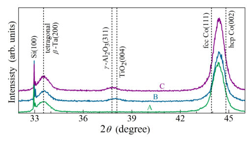
<figcaption class="paper-figure-caption"><b>Fig 1.</b> FIG. 1. Room-temperature x-ray diffraction patterns in the vicinity of the Ta(200) peak and the Co fcc (111) and hcp (002) reflections for the three samples deposited under an in- plane magnetic field. An offset was applied to the B and C curves for clarity.</figcaption>
</figure>
<figure class="paper-figure-card">
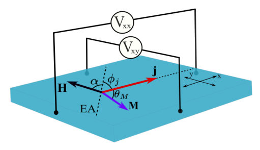
<figcaption class="paper-figure-caption"><b>Fig 2.</b> FIG. 2. Illustration of the studied systems. A Cartesian co- ordinate system is used, with the x-axis defined along the in- plane current density j, which is oriented at an angle ϕj with respect to the EA. The magnetization field M(x, y) forms an angle θM relative to j. The voltages Vxx and Vxy are measured along j and transverse to it in the xy plane, respectively.</figcaption>
</figure>
<figure class="paper-figure-card">
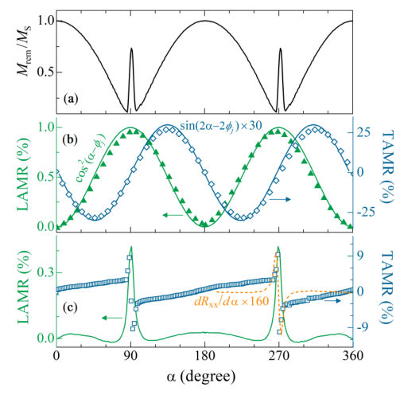
<figcaption class="paper-figure-caption"><b>Fig 3.</b> FIG. 3. Angular variations of the magnetization and magne- toresistance for sample A. Panel (a) gives Mrem; in (b), the symbols present the magnetoresistance (LAMR and TAMR) at magnetic saturation while the lines correspond to a fitting curve, and panel (c) shows the corresponding data at rema- nence. For comparison, a curve proportional to dρxx/dα is also plotted in the vicinity of 270◦. All measurements were performed with ϕj ≈90◦.</figcaption>
</figure>
<figure class="paper-figure-card">
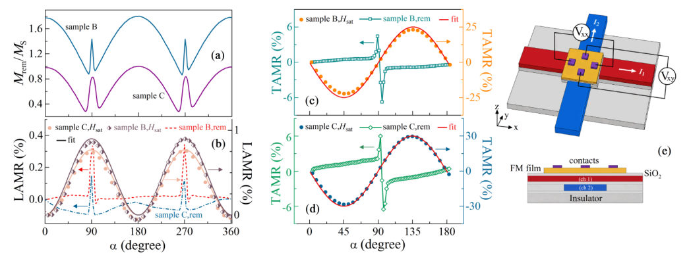
<figcaption class="paper-figure-caption"><b>Fig 4.</b> FIG. 4. Angular Mrem and MR variations obtained for samples B and C for ϕj ≈90◦. The Mrem(ϕH)/MS curves are shown in panel (a); for clarity, an offset of 0.8 is applied. Panel (b) presents LAMR data obtained at Hsat and at remanence together with a fitting curve proportional to cos2(α −ϕj), while panels (c) and (d) show TAMR yielded at Hsat and at remanence for samples B and C, respectively, where fitting curves, ∼sin(2α −2ϕj), are plotted as well. Panel (e) illustrates a possible device concept for creating remanent states using simple quasi-coplanar perpendicular current channels.</figcaption>
</figure>

**Summary.** This paper demonstrates that applying a magnetic field to polycrystalline Co thin films can create stable, multi-level magnetic states due to hard-axis collapse. These states are detectable via the planar Hall effect, offering a simple and low-cost platform for developing next-generation magnetic memory and sensors.

**Why it may be interesting.** not directly relevant

Detailed structure

**Main problem.** Investigating the magnetoresistance phenomena associated with hard-axis collapse (HAC) in polycrystalline Co thin films and exploring its potential for multi-level magnetic memory and sensing.

**Main result.** The study identifies at least three stable, reproducible remanent resistance states in the planar Hall resistance, originating from non-uniform magnetic configurations, which could enable low-cost spintronic devices.

**Method.** DC magnetron sputtering was used for film growth, followed by XRD for structural characterization, VSM for vector magnetometry, and four-point probe transport measurements at room temperature.

**Model / system.** Polycrystalline Cobalt (Co) thin films (20 nm) grown on Si(100) substrates with various underlayers (Ta, TiO2, Al2O3) and induced in-plane uniaxial magnetic anisotropy.

**Key observables.** Longitudinal AMR (LAMR), Transverse AMR/Planar Hall Effect (TAMR/PHE), remanent magnetization (M_rem), and anisotropy field (Ha).

**Important parameters / regimes.** Anisotropy field (30-42 Oe), field angle (alpha), current density angle (phi_j), and remanent states (chi_1, chi_2, chi_3).

**Assumptions / limitations.** The behavior is assumed to be robust across different thicknesses (5 to 150 nm) and structural variations.

**Figures summary.** XRD patterns showing crystallinity; angular variations of remanent magnetization; LAMR data at saturation and remanence; and the antisymmetric TAMR behavior near the hard axis.

**Paper structure.** The paper introduces the HAC phenomenon, details the experimental fabrication and structural characterization, presents transport and magnetometry results, discusses the physical mechanism of TAMR via spin-orbit coupling, and concludes with potential applications in spintronics.

Abstract

We investigate magnetoresistance phenomena associated with the magnetization hard-axis collapse in polycrystalline Co thin films. Transport measurements reveal that, for specific orientations of the applied magnetic field, the system exhibits distinct remanent resistance levels in both the in-plane longitudinal and transverse voltage responses. In particular, the planar Hall resistance shows multiple stable and reproducible levels at room temperature, enabling the identification of at least three remanent states that can be distinguished and used for information storage. These resistance levels originate from non-uniform magnetic configurations stabilized after the application and removal of the external magnetic field in the hard-axis region. Since this phenomenon remains largely unexplored, we present an incipient study addressing its potential implications from an applied-physics perspective. The observation of such behavior in polycrystalline Co thin films grown on Si substrates suggests a simple and low-cost platform for spintronic memory and sensing devices based on the remanent planar Hall effect.

[↑ back to top](#top)

### [Conditions for domain-free negative capacitance](http://arxiv.org/abs/2605.26536v1)

**Authors:** Prasanna Venkatesan Ravindran, Priyankka Gundlapudi Ravikumar, Asif Islam Khan  
**Type:** theory · **Category:** other · **PDF:** <https://arxiv.org/pdf/2605.26536v1>  
**Analysis basis:** full PDF text, analyzed in chunks

↔ Scroll figures horizontally

<figure class="paper-figure-card">
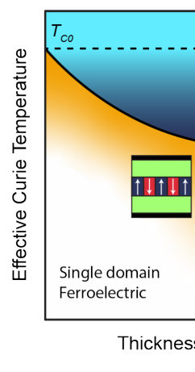
<figcaption class="paper-figure-caption"><b>Fig 1.</b> Figure 1: Phase plot of effective Curie temperature as a function of the thick- ness ratio r: The black curve shows the transition from a homogeneous zero- polarization, negative capacitance state to a multi-domain ferroelectric state in a FE-DE heterostructure. Despite several experimental efforts, the former has re- mained elusive leading to questions about the existence of such an ideal negative capacitance state. This letter analyzes the conditions on the domain wall energy parameter D for which the zero-polarization state becomes energetically more favorable than the multi-domain state at a given operating temperature. TC0 is the Curie temperature of the standalone ferroelectric...</figcaption>
</figure>
<figure class="paper-figure-card">
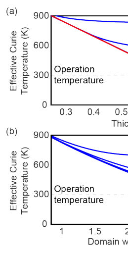
<figcaption class="paper-figure-caption"><b>Fig 2.</b> Figure 2: The variation of effective Curie temperature (a) with thickness ra- tios for different D and (b) with domain wall energy parameters for different r in FE-DE heterostructures with tF = 5 nm. As D is increased, the effec- tive Curie temperatures of multidomain heterostructures(blue) approach the effective Curie temperatures calculated from the single domain, homogeneous polarization model(red).</figcaption>
</figure>
<figure class="paper-figure-card">
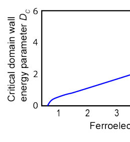
<figcaption class="paper-figure-caption"><b>Fig 3.</b> Figure 3: For a given tF &lt; tF,C there exists a critical domain wall energy parameter DC above which the system is in a stable zero-polarization negative capacitance state at an operating temperature of 300 K and for tD = 5 nm. While D is an intrinsic property, the critical domain wall energy parameter DC depends on the thickness of the ferroelectric and is not an intrinsic property.</figcaption>
</figure>

**Summary.** This paper identifies that controlling domain wall energy is key to achieving stable, domain-free negative capacitance in ferroelectric heterostructures. It provides a theoretical threshold (Dc) above which the system avoids the multi-domain patterns typically seen in experiments. This finding suggests that engineering high domain wall energy is a viable path for optimizing negative capacitance devices.

**Why it may be interesting.** not directly relevant

Detailed structure

**Main problem.** Determining the specific conditions, particularly regarding domain wall energy, required to achieve an ideal, domain-free negative capacitance state in ferroelectric-dielectric heterostructures.

**Main result.** The authors demonstrate that a stable, domain-free negative capacitance state is achieved if the domain wall energy parameter (D) exceeds a critical value (Dc), effectively suppressing domain formation.

**Method.** The study uses a Landau-Ginzburg-Devonshire framework and a non-linear Ginzburg-Landau equation to analytically and numerically compare single-domain and multi-domain phase transitions.

**Model / system.** The system consists of ferroelectric-dielectric (FE-DE) heterostructures, specifically modeled after PbTiO3/SrTiO3 superlattices, using Landau-Devonshire theory to describe polarization dynamics.

**Key observables.** Effective Curie temperature (T'C), polarization (P), and the domain wall energy parameter (D).

**Important parameters / regimes.** Domain wall energy parameter (D), critical ferroelectric thickness (tf,c), thickness ratio (r), and operating temperature (Top).

**Assumptions / limitations.** The model assumes the system is near the Curie temperature and relies on a dimensionless parameter to represent domain wall energy costs; it also notes limitations in the current database of domain wall energies.

**Figures summary.** Figure 2(b) shows the variation of T'C with D for different dielectric thicknesses, and Figure 3 illustrates the variation of the critical domain wall energy parameter Dc with ferroelectric thickness.

**Paper structure.** The paper introduces the problem of domain formation in negative capacitance, presents a multi-domain model using Ginzburg-Landau theory, derives the critical conditions for a domain-free state, discusses the implications for specific materials like HfO2, and concludes with future directions.

Abstract

While negative capacitance has been demonstrated in ferroelectric-dielectric heterostructures in the form of capacitance enhancement, all experimental evidence, to date, suggests the existence of domains therein. Here, we address the question: what are the conditions to achieve ideal, domain-free negative capacitance in ferroelectric-dielectric heterostructures? Our main claim is that for given thicknesses of the ferroelectric and the dielectric layers, there is a critical value of domain wall energy parameter -- above which the system would be stabilized in an ideal and robust domain-free negative capacitance state and would be robust against domain formation. Our analyses suggest that to achieve ideal negative capacitance, efforts should lie in understanding the means to control the domain wall energy on all fronts, both theory and experiments via high throughput design, discovery, and engineering of ferroelectrics.

[↑ back to top](#top)

### [Electride States and Superconductivity in Dense Potassium Carbides](http://arxiv.org/abs/2605.27201v1)

**Authors:** Jiance Sun, Ting Zhong, Shoutao Zhang  
**Type:** theory · **Category:** other · **PDF:** <https://arxiv.org/pdf/2605.27201v1>  
**Analysis basis:** full PDF text, analyzed in chunks

↔ Scroll figures horizontally

<figure class="paper-figure-card">
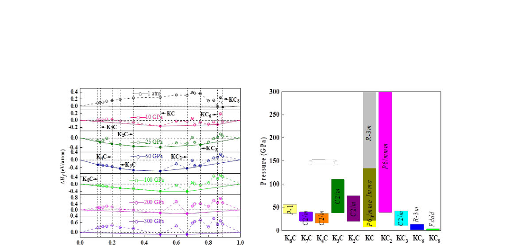
<figcaption class="paper-figure-caption"><b>Fig 1.</b> Fig.1 Stability of K-C Compounds. (a) Enthalpy of various K-C compounds relative to elemental K and C at 1 atm, 10, 25, 50, 100, 200, and 300 GPa. (b) Pressure-composition phase diagram of K-C compounds.</figcaption>
</figure>
<figure class="paper-figure-card">
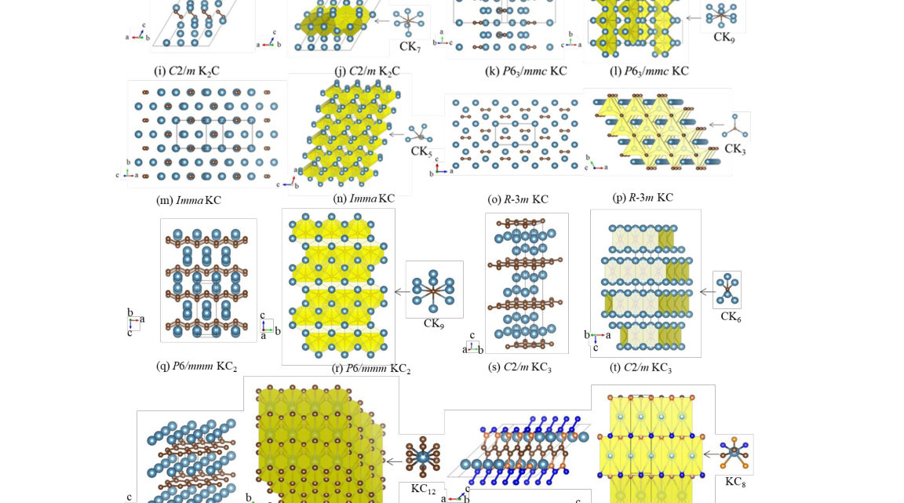
<figcaption class="paper-figure-caption"><b>Fig 2.</b> Fig.2 crystal structures of K-C compounds. (a) 50 GPa P-1 K8C. (b) 50 GPa P-1 K8C and CK10 unit. (c) 25 GPa C2/m K7C. (d) 25 GPa C2/m K7C and CK7 unit. (e) 25 GPa C2/m K4C. (f) 25 GPa C2/m K4C and CK7 unit. (g) 100 GPa C2/m K3C. (h) 100 GPa C2/m K3C and CK9 unit. (i) 50 GPa C2/m K2C. (j) 50 GPa C2/m K2C and CK5 unit. (k) 10 GPa P63/mmc KC. (l) 10 GPa P63/mmc KC and CK3 unit. (m) 25 GPa Imma KC. (n) 25 GPa Imma KC and CK9 unit. (o) 300 GPa R-3m KC. (p) 300 GPa R-3m KC and CK6 unit. (q) 100 GPa P6/mmm KC3. (r) 100 GPa P6/mmm KC2 and KC12 unit. (s) 25 GPa C2/m KC3. (t) 25 GPa C2/m KC3 and KC8 unit.</figcaption>
</figure>
<figure class="paper-figure-card">
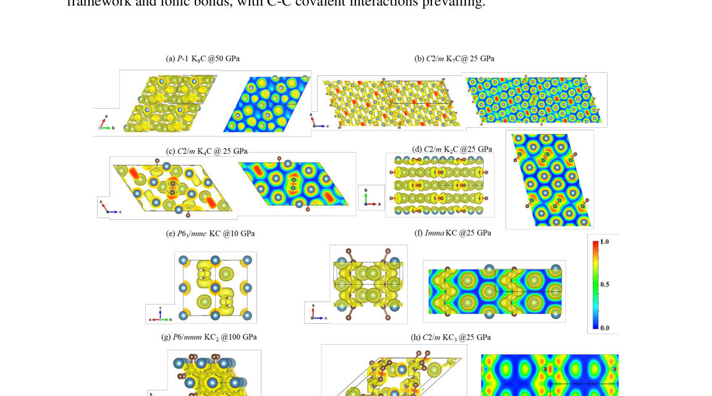
<figcaption class="paper-figure-caption"><b>Fig 3.</b> Fig.3 2D and 3D electron localization functions of potassium-carbon compounds with interstitial electrons. (a) ELF of P-1 K8C at 50 GPa. (b) ELF of C2/m K7C at 25 GPa. (c) ELF of C2/m K4C at 50 GPa. (d) ELF of C2/m K2C at 25 GPa. (e) ELF of P63/mmc KC at 10 GPa. (f) ELF of Imma KC at 25 GPa. (g) ELF of P6/mmm KC2 at 100 GPa. (h) ELF of C2/m KC3 at 25 GPa. 3.4 Electronic and Superconducting Properties of C2/m K7C</figcaption>
</figure>
<figure class="paper-figure-card">
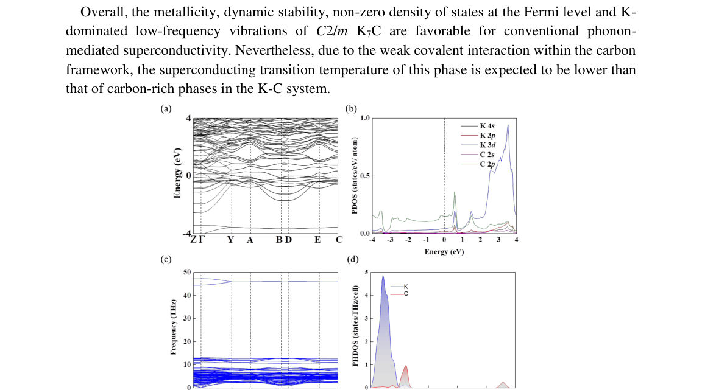
<figcaption class="paper-figure-caption"><b>Fig 4.</b> Fig.4 Superconducting properties of C2/m K7C at 25 GPa. (a) Electronic Band Structure. (b) projected density of states (PDOS). (c) Phonon dispersion curve. (d) Phonon projected density of states (PHDOS).</figcaption>
</figure>
<figure class="paper-figure-card">
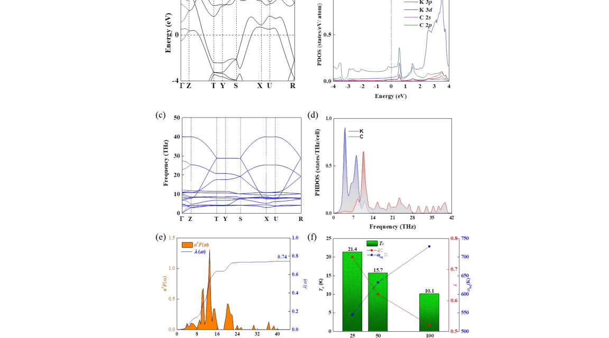
<figcaption class="paper-figure-caption"><b>Fig 5.</b> Fig.5 Superconducting properties of Imma KC at 25 GPa. (a) Electronic Band Structure. (b) projected density of states (PDOS). (c) Phonon dispersion curve. (d) Phonon projected density of states (PHDOS). (e) Dependence of Eliashberg spectral function α2F(ω) and electron-phonon coupling constant λ(ω) on frequency. (f) Variations of superconducting transition temperature Tc, electron-phonon coupling constant λ and logarithmic average phonon frequency ωlog with pressure.</figcaption>
</figure>

**Summary.** This paper uses computational methods to predict new stable potassium-carbon compounds under high pressure. It identifies a specific phase of potassium carbide (Imma KC) that could serve as a promising superconductor at relatively low pressures (25 GPa) with a Tc of 21.4 K.

**Why it may be interesting.** not directly relevant

Detailed structure

**Main problem.** The study aims to systematically investigate the structural stability, chemical bonding, and superconducting properties of the binary potassium-carbon (K-C) system under high pressure.

**Main result.** The researchers discovered several new stable K-C phases, most notably an orthorhombic Imma-KC phase that reaches a high superconducting transition temperature (Tc) of 21.4 K at 25 GPa.

**Method.** The study uses the CALYPSO swarm intelligence technique for structure prediction combined with Density Functional Theory (DFT) and the Allen-Dynes modified McMillan equation for superconductivity calculations.

**Model / system.** The physical system is a binary potassium-carbon (K-C) system under high pressure (up to 300 GPa), encompassing various stoichiometries such as K7C, KC, and KC3.

**Key observables.** Superconducting transition temperature (Tc), electron-phonon coupling constant (lambda), phonon dispersion curves, and electron localization function (ELF).

**Important parameters / regimes.** Pressure ranges from 1 atm to 300 GPa; Coulomb pseudopotential (mu*) set to 0.1.

**Assumptions / limitations.** The study relies on the accuracy of the PBE functional within the GGA approximation and assumes the validity of the BCS theory for superconductivity.

**Figures summary.** Figures include electronic band structures, projected density of states (PDOS), phonon dispersion curves, and phonon projected density of states (PHDOS).

**Paper structure.** The paper introduces the research motivation, describes the computational methods (CALYPSO and DFT), presents the structural and thermodynamic stability results, analyzes the electronic and superconducting properties of specific phases, and concludes with the implications for metal carbide superconductors.

Abstract

Carbon possesses remarkable physicochemical properties, enabling main group metals to react with it under high pressure and produce superconducting compounds. However, the research on high-pressure potassium carbides remains still unsystematic and inadequate. Using first-principles calculations and state-of-the-art swarm intelligence structure prediction techniques, we comprehensively explore the binary novel potassium-carbon system and characterize their structural, electronic, and superconducting properties under compression. Calculations of electron-phonon coupling show that monoclinic K7C (space group C2/m) with high K concentration is a zero-dimensional electride superconductor with a transition temperature Tc of 0.6 K at 25 GPa. By contrast, the Tc of orthorhombic KC with symmetry Imma increases upon decompression owing to the phonon softening of both acoustic and optical branches. Impressively, Imma KC reaches a maximum Tc of 21.4 K at 25 GPa, which is highly desirable for low-pressure metallic carbide superconductors. This work provides valuable insights into K-C compounds and broadens the diversity of metal carbide superconductors.

[↑ back to top](#top)

### [Locally resolved electronic textures of reconstruction domains in marginally twisted monolayer-bilayer graphene](http://arxiv.org/abs/2605.26393v1)

**Authors:** Sean M. Walker, Patrick Sarsfield, Isaac Soltero, Xue-Ying LiYang, Laurent Molino, Ryan Plumadore, Kenji Watanabe, Takashi Taniguchi, Vladimir Falko, Adina Luican-Mayer  
**Type:** both · **Category:** other · **PDF:** <https://arxiv.org/pdf/2605.26393v1>  
**Analysis basis:** full PDF text, analyzed in chunks

↔ Scroll figures horizontally

<figure class="paper-figure-card">
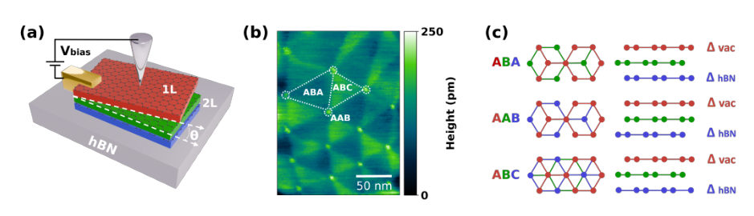
<figcaption class="paper-figure-caption"><b>Fig 1.</b> Figure 1: (a) Schematic of the STM measurement of a monolayer (1L)/bilayer graphene (2L)</figcaption>
</figure>
<figure class="paper-figure-card">

<figcaption class="paper-figure-caption"><b>Fig 2.</b> Figure 2: (a) Scanning tunneling spectra (STS) acquired on the regions of three high symmetry</figcaption>
</figure>
<figure class="paper-figure-card">
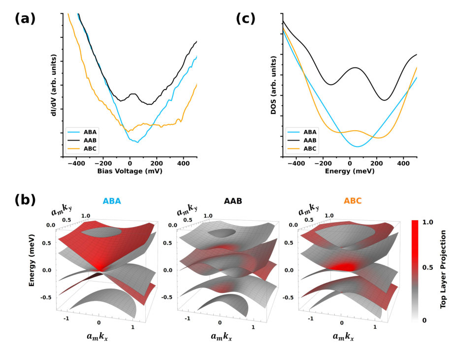
<figcaption class="paper-figure-caption"><b>Fig 3.</b> Figure 2(a) presents scanning tunnelling spectroscopy measurements acquired on each of the three</figcaption>
</figure>
<figure class="paper-figure-card">
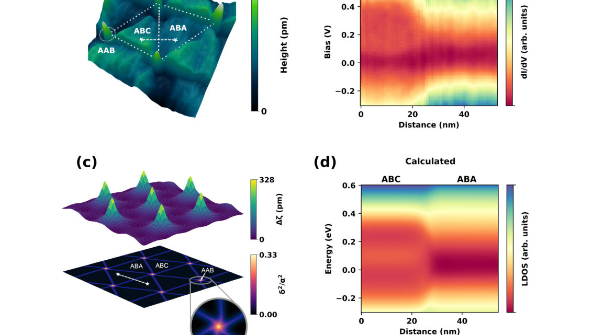
<figcaption class="paper-figure-caption"><b>Fig 4.</b> Figure 3: (a) STM topographic map showing apparent heights of three stacking regions. The</figcaption>
</figure>
<figure class="paper-figure-card">
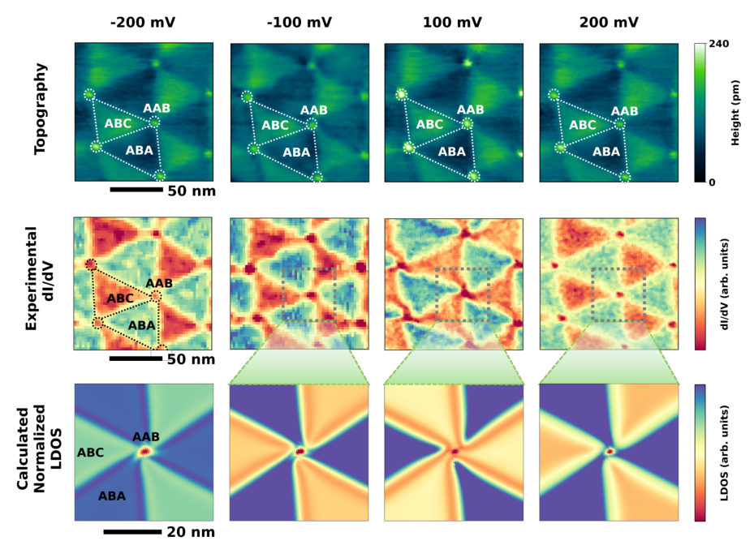
<figcaption class="paper-figure-caption"><b>Fig 5.</b> Figure 4: Top row: Sequence of STM topographic maps acquired at the indicated bias voltages</figcaption>
</figure>

**Summary.** This paper investigates how atomic-scale reconstruction in nearly zero-degree twisted graphene creates a network of distinct stacking domains. By using STM/STS, the authors show that these domains have unique electronic signatures and that structural deformations drive complex domain wall patterns. This work provides fundamental insights into how structural degrees of freedom can be used to engineer electronic properties in 2D materials.

**Why it may be interesting.** not directly relevant

Detailed structure

**Main problem.** Exploring the electronic properties and structural textures of the 'marginally twisted' regime in monolayer-bilayer graphene, where structural reconstruction into distinct stacking domains dominates over a uniform moiré potential.

**Main result.** The study identifies three distinct stacking domains (ABC, ABA, and AAB) and demonstrates that domain wall 'twirling' is driven by out-of-plane deformations, with electronic features switching as a function of bias voltage.

**Method.** The researchers used Scanning Tunneling Microscopy (STM) and Spectroscopy (STS) for experimental characterization, combined with a hybrid k.p tight-binding model and mesoscale lattice relaxation calculations using the L-BFGS algorithm.

**Model / system.** A marginally twisted monolayer-bilayer graphene heterostructure on hBN at a very low rotation angle (approx. 0.3 degrees), featuring a reconstructed network of ABC, ABA, and AAB stacking domains.

**Key observables.** Local Density of States (LDOS), dI/dV maps, STM topography (apparent height), spectroscopic line maps, and strain tensors (hydrostatic and shear).

**Important parameters / regimes.** Twist angle theta approx 0.3 degrees, moire superlattice period lambda approx 47 nm, domain wall width approx 7-8 nm, and maximum pseudomagnetic field approx 20 T.

**Assumptions / limitations.** The model assumes the interface between the first two layers is Bernal stacked and that spatial variations in the local twist angle are due to long-wavelength extrinsic strain.

**Figures summary.** Figure 1 shows the STM setup and stacking schematics; Figure 2 presents STS spectra and calculated band dispersions/DOS; Figure 3 illustrates 3D topography and domain wall twirling; Figure 4 shows topographic maps at different bias voltages.

**Paper structure.** The paper introduces the problem of structural reconstruction, describes the experimental and theoretical methods, presents the identification of stacking domains and their electronic signatures, analyzes domain wall dynamics and structural deformations, and concludes with the implications for van der Waals heterostructures.

Abstract

Controlling the stacking and rotational registry of graphene layers provides a powerful handle on atomic-scale structural reconstructions that alter the electronic landscape at the nanoscale. In particular, this governs how massless and massive Dirac fermions coexist and interact at the monolayer-bilayer graphene interface. In the limit of marginal twist, the system reconstructs into domains of distinct vertical stacking order, introducing characteristic electronic properties and new electronic length scales, a regime that, despite its structural richness, remains largely unexplored. Here, using scanning tunnelling microscopy and spectroscopy, we demonstrate that at very low rotation angles the monolayer-bilayer graphene system relaxes into a network of three distinct stacking domains with individual electronic textures revealed through spatially resolved spectroscopic mapping and corroborated by computed local density of states. We report switching of the hierarchy of the tunnelling characteristics between Bernal and rhombohedral domains as a function of bias voltage. Furthermore, the measured spectroscopic maps exhibit theoretically anticipated domain wall 'twirling' around energetically unfavorable AAB stacking nodes, promoted by out-of-plane deformations. Our results shed light on fundamental structure-property relationships underpinning moiré-driven phenomena, opening new avenues for harnessing structural degrees of freedom in van der Waals heterostructures.

[↑ back to top](#top)

### [Looking for Condensed Gluons: A Cross-Scale Journey from the Deep Structure of Protons to High-Energy Cosmic Rays -- A Mini-Review](http://arxiv.org/abs/2605.27018v1)

**Authors:** Wei Zhu, Yu-Chen Tang, Ye-Yin Zhao, Bo Yang, Yu-Chen Xiong  
**Type:** theory · **Category:** other · **PDF:** <https://arxiv.org/pdf/2605.27018v1>  
**Analysis basis:** full PDF text, analyzed in chunks

↔ Scroll figures horizontally

<figure class="paper-figure-card">
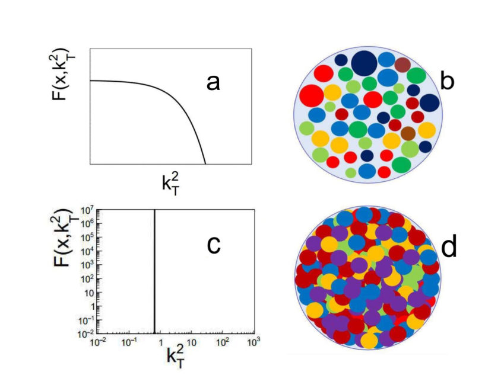
<figcaption class="paper-figure-caption"><b>Fig 1.</b> FIG. 1. Schematic diagrams of CGC (a,b) and GC (c,d). The GC threshold k2 c ≃CGC scale Q2 s, but xc ≪xs.</figcaption>
</figure>
<figure class="paper-figure-card">
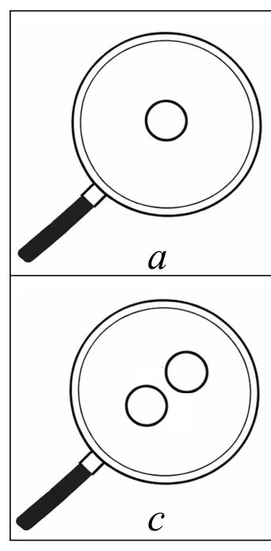
<figcaption class="paper-figure-caption"><b>Fig 2.</b> FIG. 2. Schematic diagrams of gluon distributions at different density scales.</figcaption>
</figure>
<figure class="paper-figure-card">
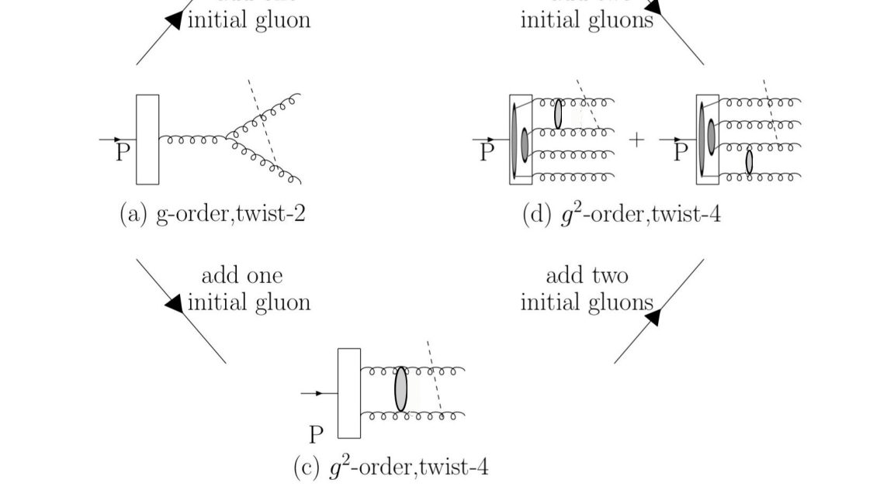
<figcaption class="paper-figure-caption"><b>Fig 3.</b> FIG. 3. Evolution of the evolution equations beginning with the DGLAP equation (a) and they lead to (b) the BFKL equation, (c) the GLR-MQ-ZRS equation and (d) the ZSR equation. The dashed line denotes a virtual current probing the gluon distribution. Note that the four evolution equations form a closed circuit, which implies consistency among the four evolution equations.</figcaption>
</figure>
<figure class="paper-figure-card">
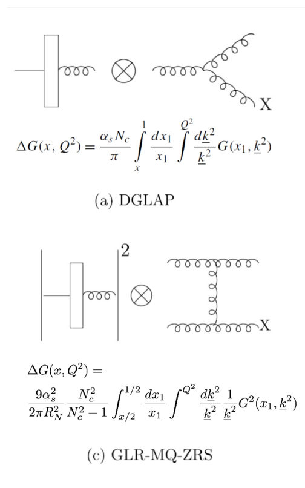
<figcaption class="paper-figure-caption"><b>Fig 4.</b> FIG. 4. The elemental amplitudes for the four evolution equations based on Fig. 3.</figcaption>
</figure>
<figure class="paper-figure-card">
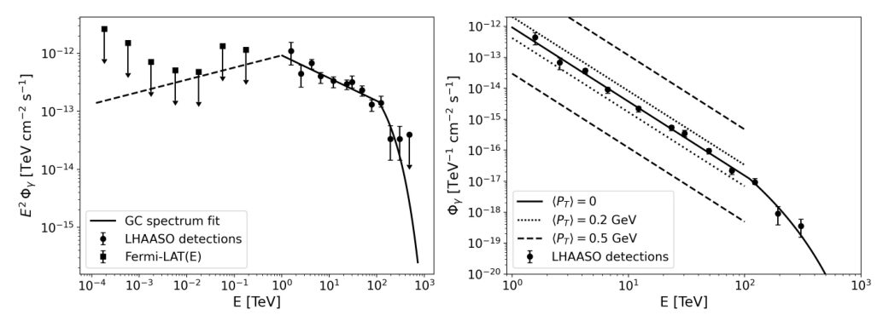
<figcaption class="paper-figure-caption"><b>Fig 5.</b> FIG. 5. Spectral energy distribution (SED) of SS 433 measured by LHAASO [48] and comparison with the GC spectra (solid curve). Cγ = 5.33 × 10−15(GeV−2cm−2s−1), βγ = 1.79, βp = 0.80, EGC π = 1.0 TeV and Ecut π = 110 TeV. Different values of the average transverse momentum of pions allow the regions where the observation points deviate from the PL to be delineated by different lines, where ⟨pT ⟩= 0.2 GeV corresponds to the frozen region, i.e. the condition required by the GC spectrum: the average transverse momentum of pions can be neglected, and the pion yield shows saturation.</figcaption>
</figure>

**Summary.** This review explores the concept of Gluon Condensation (GC) as a link between proton structure and cosmic-ray physics. It argues that nonlinear QCD dynamics can drive gluons to aggregate, creating a high-density state that leaves detectable signatures in the gamma-ray spectra of astrophysical sources. If confirmed, this would provide a new way to probe the deep structure of hadrons using cosmic-ray signals.

**Why it may be interesting.** not directly relevant

Detailed structure

**Main problem.** Investigating whether gluon condensation (GC) serves as a bridge between the microscopic internal structure of protons and macroscopic high-energy cosmic-ray phenomena.

**Main result.** The paper proposes that the ZSR nonlinear evolution equation predicts a gluon condensation state driven by the synergy of shadowing and antishadowing, which manifests as a broken-power-law feature in cosmic gamma-ray spectra.

**Method.** The authors use Time-Ordered Perturbative Theory (TOPT) to derive the ZSR equation and apply the resulting GC spectrum model to fit observational data from gamma-ray observatories like LHAASO and Fermi-LAT.

**Model / system.** The physical system involves quark-gluon dynamics within protons and high-energy astrophysical environments (e.g., SNRs, pulsars). The theoretical framework consists of a closed loop of QCD evolution equations (DGLAP, BFKL, GLR-MQ-ZRS, and ZSR).

**Key observables.** High-energy cosmic gamma-ray spectral energy distributions (SED), specifically broken-power-law features and the presence/absence of the pion-decay bump.

**Important parameters / regimes.** Critical momentum (kc), critical Bjorken-x (xc), gluon density, and the coupling constant (alpha_s).

**Assumptions / limitations.** The derivation uses a cylindrically symmetric approximation and neglects certain higher-order QCD corrections; it also assumes a pion saturation mechanism.

**Figures summary.** Figure 1 compares CGC and GC scales; Figure 2 shows gluon distribution scales; Figure 3 illustrates the evolutionary path of QCD equations; Figure 4 shows elemental amplitudes; Figures 5-12 show fits of the GC model to various gamma-ray sources like SS 433 and J1534-571.

**Paper structure.** The paper is structured as a mini-review: first establishing the theoretical derivation of the ZSR equation and its role in QCD evolution; second, describing the mechanism of gluon condensation via chaos and shadowing/antishadowing; third, applying this model to astrophysical gamma-ray spectra; and finally, discussing implications for future collider and observatory testing.

Abstract

Quark-gluon dynamics within protons and high-energy radiation phenomena in the universe are typically regarded as two entirely distinct fields. This paper aims to demonstrate that gluon condensation (GC) may serve as a direct bridge between these two fields. We review three key aspects of GC research: first, the Zhu-Shen-Ruan (ZSR) equation, as a nonlinear evolution equation based on structural symmetry, exhibits self-consistent connections with the DGLAP, BFKL and GLR-MQ-ZRS equations, providing a theoretical foundation for the generation of GC; second, the chaotic solutions and the shadowing-antishadowing synergy inherent in this equation can drive gluons to aggregate near the critical momentum, thereby forming a novel type of high-density, strongly interacting matter; third, these changes in microstructure manifest themselves as a broken-power-law feature in high-energy cosmic gamma-ray spectra, thereby offering new insights into the hadronic scenarios underlying certain astrophysical sources. Consequently, GC not only concerns the novel behaviour of quantum chromodynamics under extreme conditions but may also serve as a vital window for probing the deep structure of protons using cosmic-ray signals. With the advancement of higher-precision gamma-ray observations, hadron collision experiments and related theoretical research, the physical picture of GC and its observational criteria are expected to undergo more rigorous testing. Should this picture be confirmed, certain features in the high-energy gamma-ray spectrum will need to be re-examined within the deeper context of hadronic dynamics; simultaneously, GC may also provide a new entry point for research into pion condensation in nuclear physics and even condensed matter physics. Consequently, the significance of the search for GC extends beyond the model itself, reaching into multiple fields of natural science.

[↑ back to top](#top)

### [Modulation of charge density waves in a twisted vortex moire superlattice](http://arxiv.org/abs/2605.26510v1)

**Authors:** Qian Fang, Yanhao Shi, Jingyi Duan, Hui Guo, Yikai Chen, Senhao Lv, Jiayi Wang, Zhongyi Cao, Jiayi Huang, Siyu Xu, Haitao Yang, Wei Jiang, Hui Chen, Hong-Jun Gao  
**Type:** both · **Category:** strongly correlated electrons · **PDF:** <https://arxiv.org/pdf/2605.26510v1>  
**Analysis basis:** full PDF text, analyzed in chunks

↔ Scroll figures horizontally

<figure class="paper-figure-card">
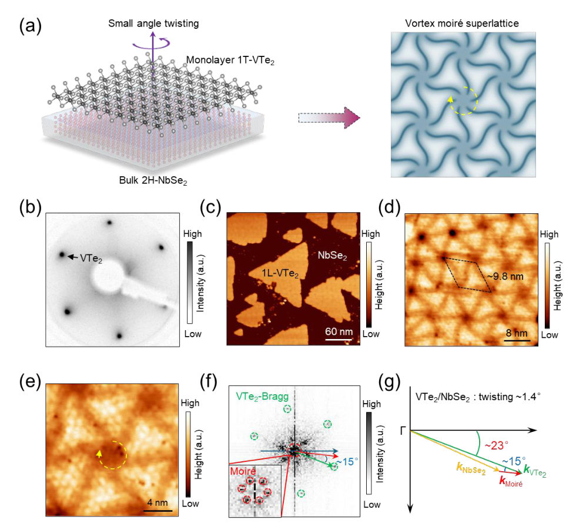
<figcaption class="paper-figure-caption"><b>Fig 1.</b> Figure 1. Construction of twisted vortex moiré superlattices in 1L-VTe2/NbSe2 heterostructure. (a) Schematic illustration of monolayer 1T-VTe2 epitaxially grown on bulk 2H-NbSe2 with a small twist angle. Lattice reconstruction induces a spatially varying strain field, giving rise to a vortex-like moiré texture. (b) LEED pattern, showing sharp diffraction spots of VTe2. (c) Large-scale STM image (Vs=-2.0 V, It=1.0 nA), showing monolayer VTe2 on the surface of NbSe2 substrate. (d,e) Zoom-in STM images of the monolayer VTe2 (Vs=-1.5 V, It=0.05 nA), showing the vortex-like moiré structure with a large periodicity of ~9.8 nm. (f) The corresponding FFT pattern of (d), showing VTe2 Bragg peaks...</figcaption>
</figure>
<figure class="paper-figure-card">
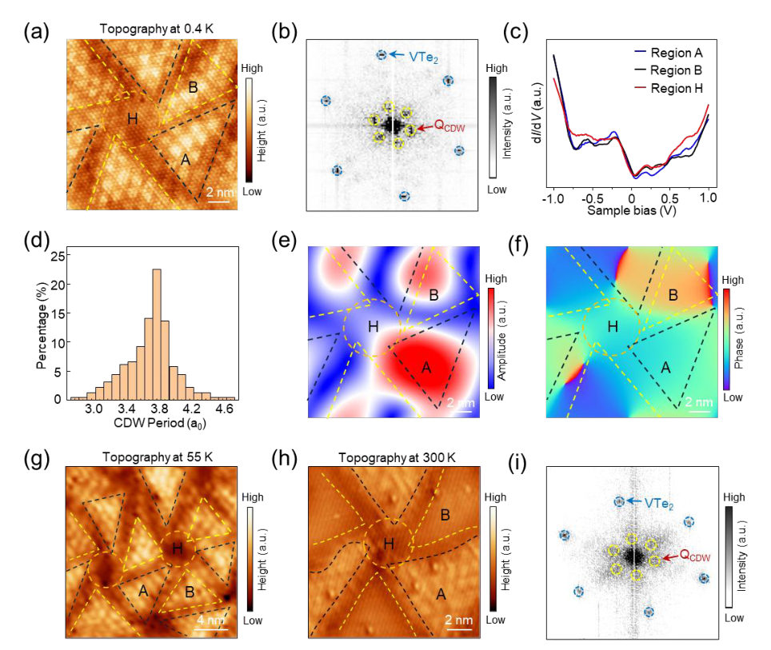
<figcaption class="paper-figure-caption"><b>Fig 2.</b> Figure 2. Modulation of the CDW states in the twisted vortex moiré structure. (a) Atomically-resolved STM image of a vortex-textured moiré region acquired at 0.4 K (Vs=-1.5 V, It=0.05 nA), showing three inequivalent local regions within a single moiré unit cell. Regions A and B correspond to neighboring distorted triangular domains exhibiting CDW order, while region H, located near the vortex core, shows a strong suppression of the CDW. (b) Corresponding FFT pattern of (a), showing Bragg peaks of VTe2 (blue circles) and additional diffuse features associated with short-range CDW orders (yellow circles). (c) The spatially-averaged dI/dV spectra (Vs=-1.0 V, It=0.05 nA, Vmod=5 mV) acquired in...</figcaption>
</figure>
<figure class="paper-figure-card">
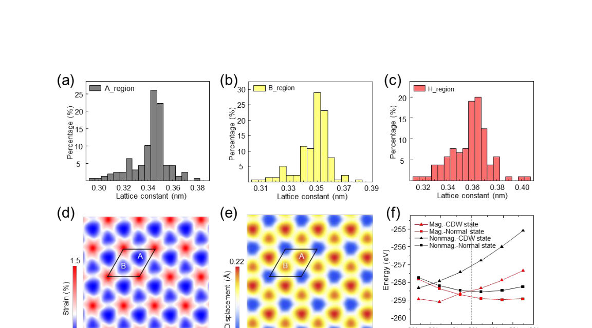
<figcaption class="paper-figure-caption"><b>Fig 3.</b> Figure 3. Local strain analysis in the twisted vortex moiré structure. (a-c) Statistical analysis of the lattice constant of VTe2 in the three inequivalent local regions, showing dominant lattice constants of ~3.42 Å and ~3.51 Å in regions A and B, respectively, while a significantly larger value of ~3.65 Å in region H. (d) Spatial map of the in-plane strain of the top- layer Te atoms, showing pronounced strain variation across the moiré unit cell. (e) Out-of-plane displacement of the top- layer Te atoms, showing correlated lattice reconstruction accompanying the in-plane strain. (f) Calculated biaxial strain dependence of the relative stability between the CDW and normal phases. Triangles...</figcaption>
</figure>
<figure class="paper-figure-card">
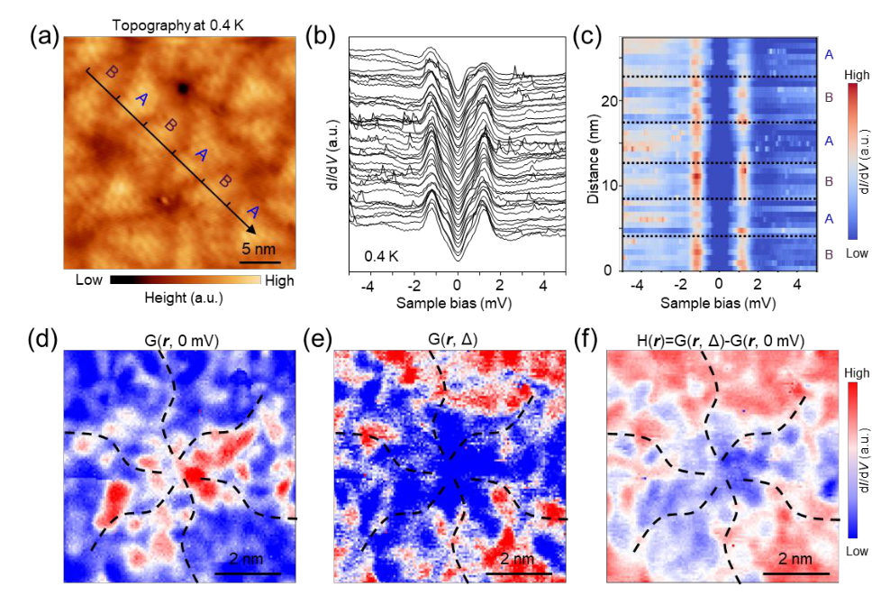
<figcaption class="paper-figure-caption"><b>Fig 4.</b> Figure 4. Moiré modulation of the proximity-induced superconducting state. (a) STM image displaying vortex moiré</figcaption>
</figure>

**Summary.** This paper demonstrates how a twisted moire superlattice can be used to spatially manipulate electronic orders at the nanoscale. By using local strain to fragment a long-range charge density wave into distinct local phases, the researchers show a tunable competition between CDW and superconductivity. This establishes vortex moire superlattices as a versatile platform for engineering correlated electronic states.

**Why it may be interesting.** not directly relevant

Detailed structure

**Main problem.** Investigating whether globally coherent electronic orders, specifically charge density waves (CDW), can be continuously manipulated at the nanoscale within a reconstructed twisted vortex moire superlattice.

**Main result.** The intrinsic long-range CDW in monolayer VTe2 is fragmented into inequivalent local phases driven by local strain, where compressive strain stabilizes CDW and tensile strain suppresses it, creating a competition with proximity-induced superconductivity.

**Method.** Experimental scanning tunneling microscopy/spectroscopy (STM/STS) combined with first-principles density functional theory (DFT) calculations and atomistic relaxation modeling.

**Model / system.** A twisted vortex moire superlattice formed by monolayer VTe2 grown epitaxially on bulk NbSe2 in a small-angle (~1.4 degree) and near-commensurate regime.

**Key observables.** CDW periodicity, local lattice constants, CDW amplitude and phase, superconducting gap depth, and coherence peak intensity.

**Important parameters / regimes.** Twist angle of ~1.4 degrees, moire periodicity of ~9.8 nm, and temperature range from 0.4 K to 300 K.

**Assumptions / limitations.** The study focuses on the reconstructed nature of the lattice rather than a rigid moire model.

**Figures summary.** Figure 1 shows the heterostructure schematic, LEED patterns, and STM topography of the vortex-like moire pattern. Figure 2 displays STM/FFT analysis of the three inequivalent regions (A, B, H) and CDW persistence at high temperatures. Figure 3 provides statistical analysis of the local lattice constants.

**Paper structure.** The paper introduces the heterostructure and moire texture, presents STM/STS evidence of CDW fragmentation and local phase identification, uses DFT to link these phases to local strain, and concludes by discussing the competition between CDW and superconductivity.

Abstract

Twisted moire superlattices in van-der-Waals heterostructures provide a powerful platform for engineering correlated states through moire-band reconstruction. However, whether globally coherent electronic orders can be continuously manipulated at the nanoscale remains largely unexplored. Reconstructed moire structures in small-angle and near-commensurate regime feature continuously varying local environments, offering new opportunities for nanoscale manipulation of correlated phases. Here, we report the modulation of charge density wave (CDW) states in a twisted vortex moire superlattice formed between monolayer VTe2 and superconducting NbSe2. Scanning tunneling microscopy/spectroscopy reveals that the intrinsic long-range CDW of monolayer VTe2 is reconstructed into inequivalent local phases with distinct stability and coherence within a single moire unit cell, including suppressed CDW order and enhanced short-range CDW correlations persisting to room temperature. First-principles calculations show that the reconstructed CDW landscape originates from strong local strain variation, where compressive strain substantially stabilizes the charge order. Furthermore, the modulated CDW states exhibit competing interplay with proximity-induced superconductivity. Our results establish vortex moire superlattices as a versatile platform for nanoscale manipulation of correlated electronic orders in low-dimensional quantum materials.

[↑ back to top](#top)

### [Near-Infrared-Triggered Photodynamic Antibacterial Therapy Using Rose Bengal-Coated Upconverting Nanoparticles](http://arxiv.org/abs/2605.26557v1)

**Authors:** Pratik Deshmukh, Nandini Ahuja, Bhumika Sharma, Khageswar Sahu, Srinibas Satapathy, Shovan Kumar Majumder  
**Type:** experiment · **Category:** other · **PDF:** <https://arxiv.org/pdf/2605.26557v1>  
**Analysis basis:** full PDF text, analyzed in chunks

↔ Scroll figures horizontally

<figure class="paper-figure-card">
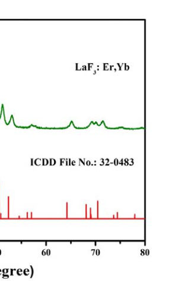
<figcaption class="paper-figure-caption"><b>Fig 1.</b> Figure 1: X-ray diffraction pattern of LaF3:Er,Yb.</figcaption>
</figure>
<figure class="paper-figure-card">
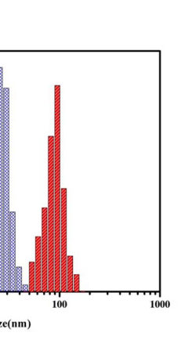
<figcaption class="paper-figure-caption"><b>Fig 2.</b> Figure 2: Particle size analysis using DLS, showing the distribution of bare and RB-coated</figcaption>
</figure>
<figure class="paper-figure-card">
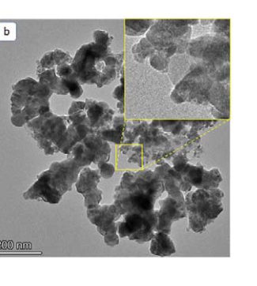
<figcaption class="paper-figure-caption"><b>Fig 3.</b> Figure 3: TEM images showing morphology of (a) bare LaF3:Er,Yb and (b) RB-coated</figcaption>
</figure>
<figure class="paper-figure-card">

<figcaption class="paper-figure-caption"><b>Fig 4.</b> figure 3. TEM imaging showed that bare LF nanoparticles are spherical (Figure 3(a)), while</figcaption>
</figure>
<figure class="paper-figure-card">
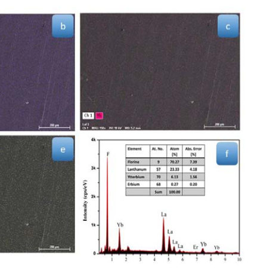
<figcaption class="paper-figure-caption"><b>Fig 5.</b> Figure 4: Elemental distribution in LaF3:Er,Yb pellet via EDX analysis. (a) Combined</figcaption>
</figure>

**Summary.** This paper describes the creation of upconverting nanoparticles coated with Rose Bengal to enable antibacterial therapy using deep-penetrating near-infrared light. By converting NIR light into visible light, the system triggers the production of reactive oxygen species to kill antibiotic-resistant bacteria like MRSA. This approach addresses the penetration depth limitations of traditional photodynamic therapies.

**Why it may be interesting.** not directly relevant

Detailed structure

**Main problem.** Developing an effective near-infrared (NIR)-triggered photodynamic antibacterial therapy to overcome the shallow tissue penetration of visible light and the instability of bare NIR-absorbing photosensitizers.

**Main result.** Successful synthesis of Rose Bengal-coated LaF3:Er,Yb nanoparticles that efficiently convert NIR light to visible light, enabling significant photo-bactericidal efficacy against MRSA via singlet oxygen generation.

**Method.** Hydrothermal synthesis of lanthanide-doped LaF3 nanoparticles followed by coating with Rose Bengal; characterization via XRD, TEM, DLS, and FTIR; and antibacterial testing using the zone of inhibition method.

**Model / system.** The experimental platform consists of LaF3:Er3+,Yb3+ upconverting nanoparticles (UCNPs) functionalized with a Rose Bengal (RB) coating, acting as a transducer for NIR-to-visible light conversion.

**Key observables.** Upconversion emission (green and red), singlet oxygen (1O2) luminescence at 1270 nm, hydrodynamic diameter, zeta potential, and zone of inhibition diameter.

**Important parameters / regimes.** 980 nm excitation wavelength, 2 mol% Er3+ and 20 mol% Yb3+ doping, and laser fluence ranging from 120 to 600 J/cm2.

**Assumptions / limitations.** The efficiency of the therapy relies on the assumption of efficient Forster Resonance Energy Transfer (FRET) between the UCNP and the dye.

**Figures summary.** The figures document the crystalline structure (XRD), particle size and morphology (DLS, TEM, EDX), surface chemistry (FTIR), optical properties (UV-Vis, PL), singlet oxygen detection, and visual/quantitative antibacterial efficacy (zone of inhibition).

**Paper structure.** The paper follows a logical progression from material synthesis and structural characterization to optical property analysis (energy transfer efficiency) and finally to biological application (antibacterial assays).

Abstract

Antimicrobial photodynamic therapy (aPDT) is a promising modality for inactivation of antibiotic resistant bacteria, relying on the activation of a photosensitizer (PS) by light of a specific wavelength. This process results in the formation of reactive oxygen species, which ultimately induce cell death. However, aPDT in its conventional form, is limited by the shallow penetration of visible light, restricting its effectiveness for treatment of soft tissue and orthopaedic tissues. To overcome this limitation, near-infrared (NIR) absorbing PS can be used. However, poor stability in vivo after injection, ineffective microbial targeting due to hydrophilic nature and off-site tissue damage are the issues with use of NIR absorbing bare PSs. This issue can be mitigated by combining NIR light with a upconverting nanoparticles (UCNPs), which mediate in conversion of NIR into visible light for effective PS activation. In this study, LaF$_3$:Er$^{3+}$,Yb$^{3+}$ nanoparticles were synthesized using a hydrothermal method and coated with Rose Bengal (RB), a promising hydrophilic PS for aPDT, to evaluate the potential for NIR-triggered aPDT. Characterization of the synthesized UCNPs confirmed the crystalline structure, size distribution and successful RB functionalization. Photophysical studies demonstrated efficient energy transfer between UCNPs and RB, leading to singlet oxygen ($^1$O$_2$) generation in vitro. Antibacterial studies against Methicilin resistant Staphylococcus aureus (MRSA), a superbug of implicated soft tissue and orthopaedic infections, revealed significant photo-bactericidal efficacy upon NIR irradiation, indicating the potential of RB-coated UCNPs for aPDT applications.

[↑ back to top](#top)

### [Orbital and Spin-Orbit Torque Interplay in Ta/W-based Magnetic Tunnel Junctions with Vertical Non-local Switching](http://arxiv.org/abs/2605.27215v1)

**Authors:** Marco Biagi, Corrado C. M. Capriata, K. Subham Senapati, Ioannis Trikoilis Koll, Corentin Bouchard, Ricardo C. Sousa, Louis Hutin, Bernard Viala, Kevin Garello  
**Type:** both · **Category:** other · **PDF:** <https://arxiv.org/pdf/2605.27215v1>  
**Analysis basis:** full PDF text, analyzed in chunks

↔ Scroll figures horizontally

<figure class="paper-figure-card">
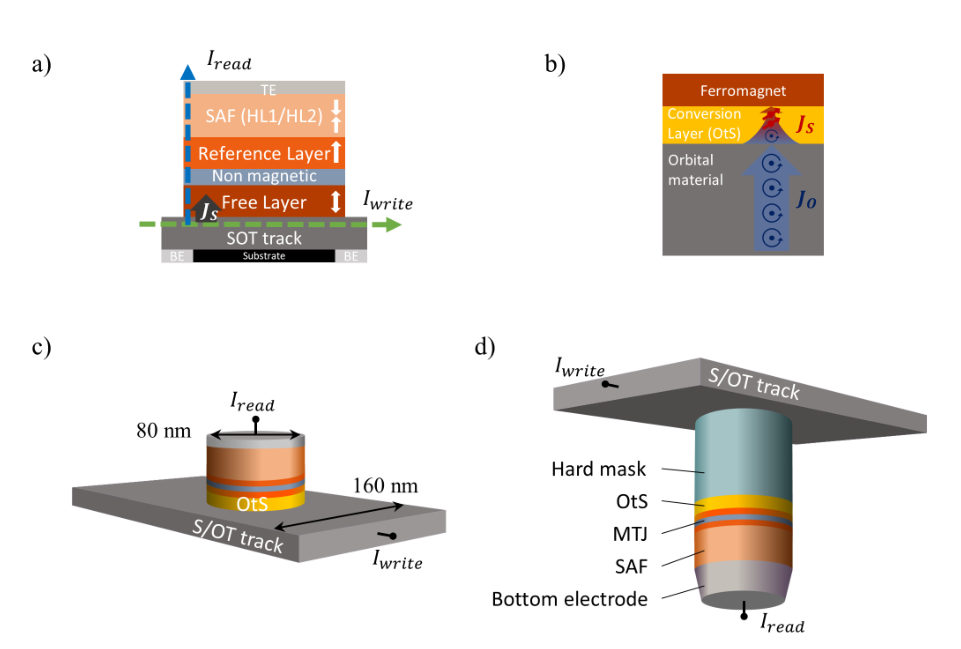
<figcaption class="paper-figure-caption"><b>Fig 1.</b> Figure 1: a) Sketch of a 3-terminal SOT-MTJ. The write current is injected in the SOT track, generating a spin current Js that is transferred to the free layer, while the state of the MTJ is read via TMR. b) Orbital to spin conversion scheme. The orbital current is generated within the orbital material and subsequently converted into a spin current via the orbital-to-spin conversion layer, before propagating into the ferromagnet. c) Schematic view of the devices measured in this work with S/OT track and pillar dimensions. To be noted that in the case of the reference sample the OtS layer is not present. d) Scheme of the proposed bottom-pinned MTJ. The hard mask is used to propagate the...</figcaption>
</figure>
<figure class="paper-figure-card">
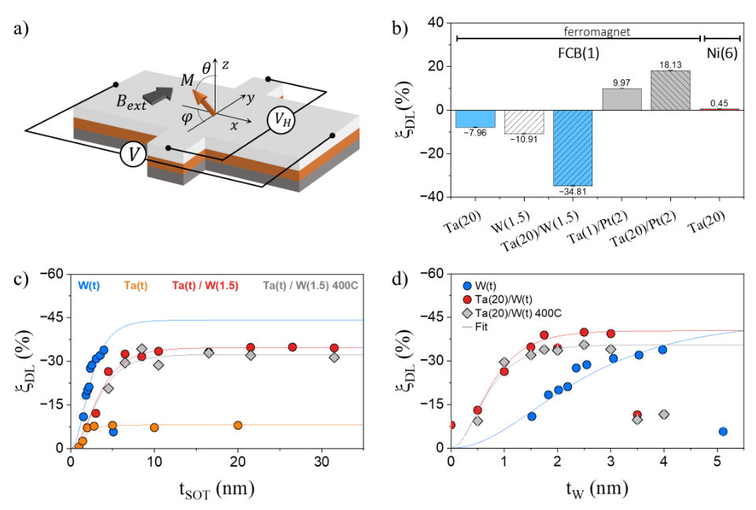
<figcaption class="paper-figure-caption"><b>Fig 2.</b> Figure 2: a) Harmonic Hall voltage measurement scheme. An a.c. current Ia.c. is injected in the Hall bar, and the Hall voltage is measured as a function of the angle φ of the external in- plane field Bext. b) Damping-like efficiency (ξDL) for different stack compositions: Ta(20), W(1.5), Ta(20)/W(1.5), Pt(2), Ta(20)/Pt(2), and Ta(20)/Ni(6) (ferromagnet is FeCoB(1) if not specified otherwise). Ta and W show negative spin Hall conductivity while it is positive for Pt. Notably, when the ferromagnet is changed from FeCoB to Ni for the Ta sample, also σSH changes sign, indicating the presence of an additional contribution that can be attributed to orbital physics. c) ξDL dependence on the S/OT...</figcaption>
</figure>
<figure class="paper-figure-card">

<figcaption class="paper-figure-caption"><b>Fig 3.</b> Figure 3: a) 3-terminal SOT-MTJ devices R-H loop, for reference sample W(3.5)/FeCoB(1) and OtS sample Ta(10)/W(1.5). b) Device switching plot for τP = 10 ns and Bx = ±50 mT, for reference sample W(3.5)/FeCoB(1) and OtS sample Ta(10)/W(1.5)/FeCoB(1). Also OtS sample shows SOT switching symmetry. c) Switching current ISW dependence on the inverse of the applied pulse length τp, for reference and OtS samples. The data are fitted in the intrinsic regime by means of a linear model (see text). d) Normalized ISW on the SOT track thickness below the MTJ tSOT as a function of the inverse of the applied pulse length. Notably, the Ta(10)/W(1.5) samples shows lower switching current values.</figcaption>
</figure>
<figure class="paper-figure-card">
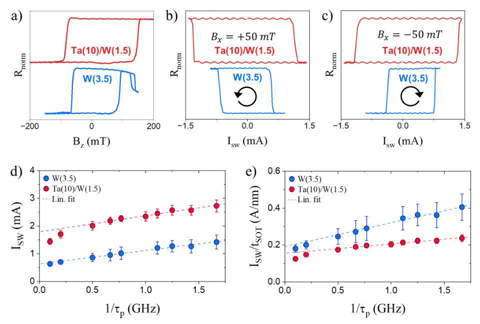
<figcaption class="paper-figure-caption"><b>Fig 4.</b> Fig. 3a shows that OtS samples have a significantly improved free layer coercive field</figcaption>
</figure>
<figure class="paper-figure-card">
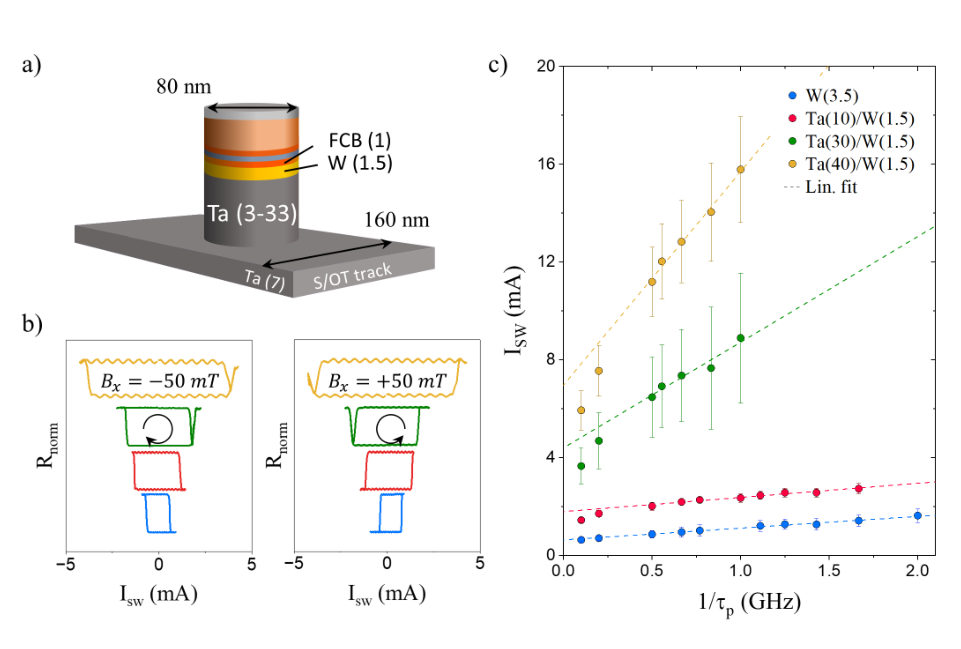
<figcaption class="paper-figure-caption"><b>Fig 5.</b> Figure 4: a) Device scheme. The etch is stopped inside the SOT track such as to leave a thick Ta spacer layer between the S/OT track where the current is injected and the OtS/free layer. b) Device switching plots for τP = 10 ns and BX = ±50 mT, for samples W(3.5), Ta(10)/W(1.5), Ta(30)/W(1.5), and Ta(40)/W(1.5). All samples switch with SOT symmetry. c) ISW dependence on the inverse of the applied pulse length τp. The data are fitted in the intrinsic regime by means of a linear model (see text). Notably, switching is observed for all samples. As expected, Ta(30)/ W(1.5), and Ta(40)/W(1.5) samples require higher current to switch due to the higher thickness. This is attributed to both the...</figcaption>
</figure>

**Summary.** This paper demonstrates that integrating orbital physics into Ta/W-based magnetic tunnel junctions can significantly enhance spin-orbit torque efficiency. By utilizing the orbital Hall effect, the researchers achieved a much higher torque contribution than standard spin Hall effect-based systems. This approach provides a viable strategy for more efficient and scalable SOT-MRAM fabrication.

**Why it may be interesting.** not directly relevant

Detailed structure

**Main problem.** The paper addresses the low write efficiency of Spin-Orbit Torque MRAM (SOT-MRAM) and seeks to enhance the charge-to-spin conversion efficiency by leveraging the Orbital Hall Effect (OHE).

**Main result.** The Ta/W-based system shows a four-fold increase in SOT contribution compared to Ta alone due to orbital-to-spin conversion, demonstrating superior switching efficiency when normalized by thickness and enabling a vertical non-local switching scheme.

**Method.** The researchers used Harmonic Hall Voltage measurements to quantify torque efficiencies, applied thickness-dependent studies to estimate diffusion lengths, and used COMSOL simulations to analyze current distribution and shunting effects.

**Model / system.** The physical system consists of Ta/W-based Magnetic Tunnel Junctions (MTJs) with Ta(3-30 nm)/W(1-4 nm) stacks, featuring a 3-terminal architecture with FeCoB free layers and MgO barriers.

**Key observables.** Damping-like efficiency (xi_DL), field-like efficiency (xi_FL), spin diffusion length (lambda), orbital Hall angle (theta_OH), and intrinsic critical switching current (I_c0).

**Important parameters / regimes.** Current density (2 MA/cm^2), annealing temperatures (300 and 400 degrees C), and Ta thickness (up to 40 nm).

**Assumptions / limitations.** The analysis assumes a drift-diffusion model for spin/orbital transport and a parallel resistor model to separate SHE and OHE contributions.

**Figures summary.** Figures likely include thickness-dependent efficiency plots, comparison of SOT contributions between Ta, W, and Ta/W, and switching current measurements as a function of pulse length.

**Paper structure.** The paper introduces the SOT-MRAM efficiency bottleneck, presents the Ta/W material system and its orbital-to-spin conversion mechanism, details the experimental characterization of torque efficiencies, analyzes the impact of electrical shunting versus orbital effects, and concludes with a demonstration of vertical non-local switching.

Abstract

Spin-orbit torque (SOT) enables ultra-fast, energy-efficient magnetization switching, making it a promising mechanism for introducing MRAMs for cache memory applications. However, current SOT-MRAM devices face write efficiency limitations, with charge-to-spin conversion ($ξ_{DL}$) reaching $\sim$ 45\%, far below the projected $\sim$ 80\% needed to comply with the current delivery of advanced transistor nodes. Recent advances in orbital current physics, evidenced in a wide class of materials, offer a path to enhance $ξ_{DL}$. Here, we study the Ta(3-30 nm)\slash W(1-4 nm) system, revealing a large additional spin-orbit torque contribution arising from Ta, a four-fold increase compared to the spin Hall effect in Ta alone, attributed to the orbital Hall contribution. This system exhibits larger $ξ_{DL}$ than W-based SOT systems with more robust perpendicular magnetic anisotropy and compatibility with 400$^\circ$C annealing. Leveraging these advantages, we integrate the Ta/W system into 3-terminal SOT-MTJ devices, showing a level of performance similar to that of W-based systems. Our results show that orbital physics can be easily integrated into SOT-MTJ systems, offering a viable strategy to enhance SOT-MRAM efficiency. In addition, we propose and demonstrate a proof-of-concept for vertical non-local switching of SOT-MTJ using orbital torques, simplifying bottom-pinned SOT-MRAM fabrication.

[↑ back to top](#top)

### [Orbital Magnetization from Uniform and Periodic Magnetic Fields](http://arxiv.org/abs/2605.26889v1)

**Authors:** Chunli Huang  
**Type:** theory · **Category:** strongly correlated electrons · **PDF:** <https://arxiv.org/pdf/2605.26889v1>  
**Analysis basis:** full PDF text, analyzed in chunks

↔ Scroll figures horizontally

<figure class="paper-figure-card">
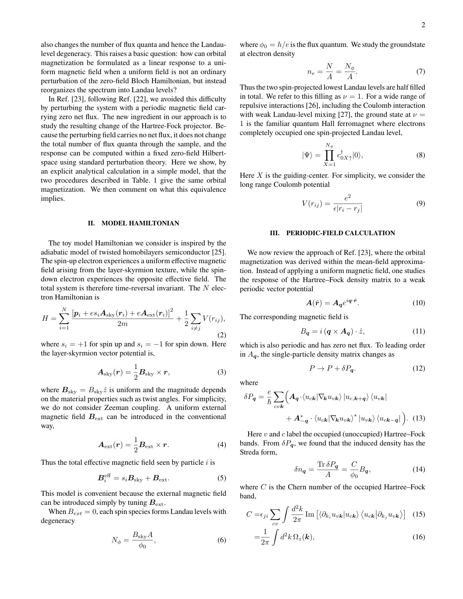
<figcaption class="paper-figure-caption"><b>Fig 1.</b> Low-resolution page preview, page 2</figcaption>
</figure>
<figure class="paper-figure-card">
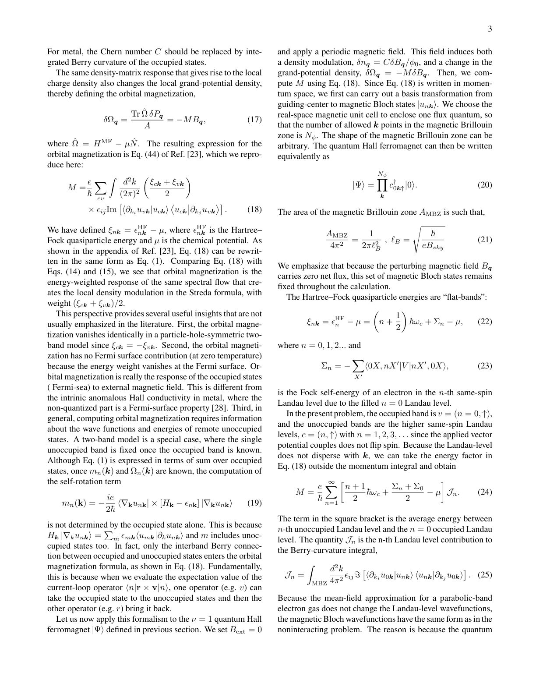
<figcaption class="paper-figure-caption"><b>Fig 2.</b> Low-resolution page preview, page 3</figcaption>
</figure>
<figure class="paper-figure-card">
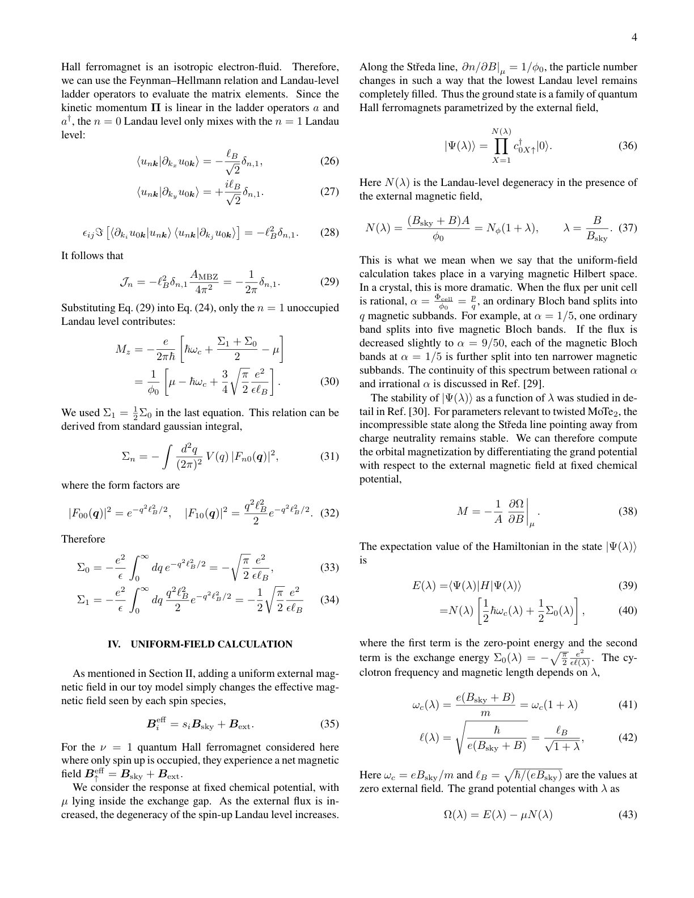
<figcaption class="paper-figure-caption"><b>Fig 3.</b> Low-resolution page preview, page 4</figcaption>
</figure>
<figure class="paper-figure-card">
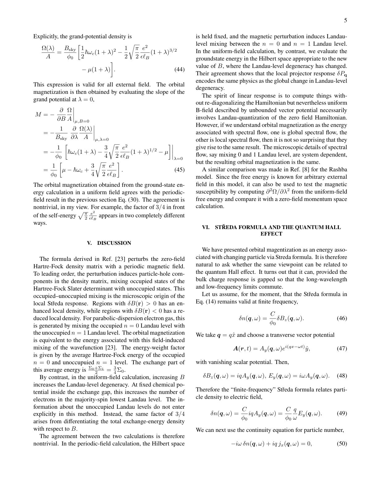
<figcaption class="paper-figure-caption"><b>Fig 4.</b> Low-resolution page preview, page 5</figcaption>
</figure>
<figure class="paper-figure-card">
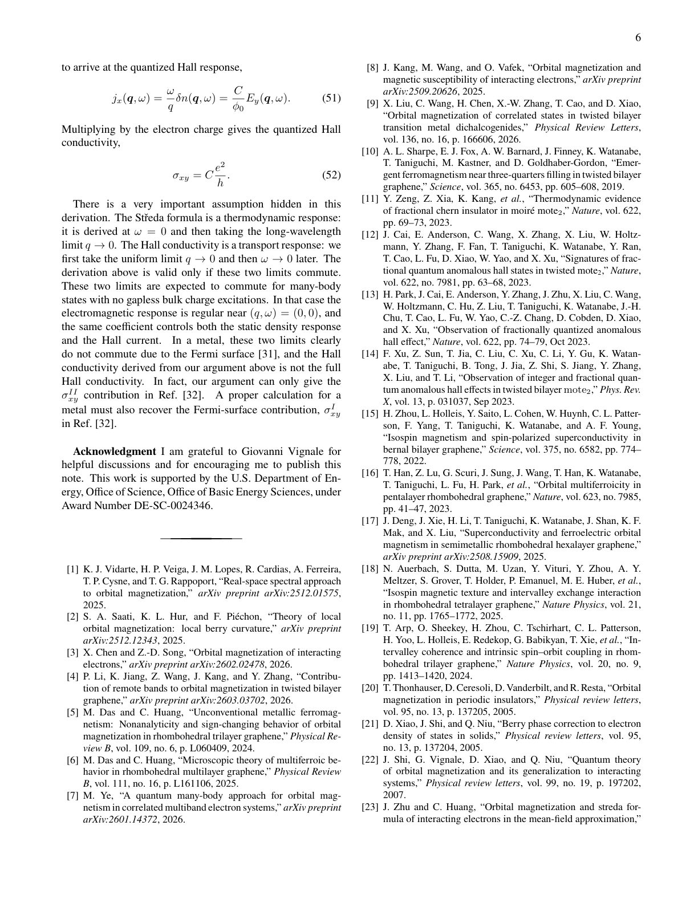
<figcaption class="paper-figure-caption"><b>Fig 5.</b> Low-resolution page preview, page 6</figcaption>
</figure>

**Summary.** This paper resolves a fundamental question regarding whether orbital magnetization can be calculated using zero-field momentum space methods versus uniform field thermodynamics. By showing these approaches are equivalent in a quantum Hall ferromagnet, it establishes that orbital magnetization is fundamentally linked to the spectral flow described by the Streda formula.

**Why it may be interesting.** not directly relevant

Detailed structure

**Main problem.** How can the thermodynamic response to a uniform magnetic field, which changes Landau-level degeneracy and kinetic momentum structure, be reproduced by a linear-response calculation in the momentum space of the zero-field problem?

**Main result.** The paper proves the equivalence between calculating orbital magnetization via a periodic magnetic field (local response) and via the derivative of the grand potential with respect to a uniform field (global response), interpreting magnetization as energy from spectral flow.

**Method.** The author uses the Hartree-Fock approximation to compare a local Hartree-Fock projector response to a periodic field with the thermodynamic derivative of the grand potential.

**Model / system.** A quantum Hall ferromagnet at nu=1 filling, modeled by an N-electron Hamiltonian with long-range Coulomb interactions and a layer-skyrmion texture that creates opposite effective magnetic fields for different spins.

**Key observables.** Orbital magnetization (M), Streda response (density modulation), Hall conductivity (sigma_xy), and Chern number (C).

**Important parameters / regimes.** Chemical potential (mu), cyclotron frequency (omega_c), magnetic length (l_B), and the exchange self-energy (Sigma_n).

**Assumptions / limitations.** The derivation assumes the commutativity of the long-wavelength (q to 0) and low-frequency (omega to 0) limits, which holds for gapped bulk states but not for metals.

**Figures summary.** Table I compares the results of the uniform field approach and the periodic field approach to demonstrate their agreement.

**Paper structure.** The paper introduces the fundamental problem of magnetization calculation, presents the model of a quantum Hall ferromagnet, details the two calculation approaches (uniform vs. periodic), demonstrates their analytical equivalence, and concludes with the connection to the Streda formula and Hall conductivity.

Abstract

Magnetization is thermodynamically defined as the derivative of the grand potential with respect to a uniform magnetic field. However, a uniform magnetic field makes the kinetic momentum operators noncommuting and Landau-quantizes the electron motion. This changes the zero-field momentum-space to Landau-levels and raises a fundamental question: how can the thermodynamic response to a uniform field be reproduced by a linear-response calculation carried out in the momentum space of the zero-field problem? We address this question analytically in a quantum Hall ferromagnet that allows the orbital magnetization $M$ to be computed in a closed form. We first compute $M$ from the local Hartree--Fock projector response to a periodic magnetic field with zero net flux. We then compute $M$ from the derivative of the grand potential with respect to a uniform magnetic field along the Středa line. The two approaches give the same result, even though the first keeps the Hilbert space fixed while the second changes the Landau-level degeneracy. Their agreement suggests that we should view orbital magnetization as the energy associated with the spectral flow that gives rise to the Středa formula. Our work provides a tutorial introduction to orbital magnetization and its relation to the Středa formula.

[↑ back to top](#top)

### [Overcoming contact resistance at metal-2D semiconductor interfaces: atomically clean MoS2/Au ohmic junctions](http://arxiv.org/abs/2605.27187v1)

**Authors:** Rafal Dunal, Maxime Le Ster, Iaroslav Lutsyk, Michal Piskorski, Pawel Dabrowski, Pawel Krukowski, Witold Kozlowski, Aleksandra Nadolska, Wojciech Rys, Pawel J. Kowalczyk, Maciej Rogala  
**Type:** both · **Category:** other · **PDF:** <https://arxiv.org/pdf/2605.27187v1>  
**Analysis basis:** full PDF text, analyzed in chunks

↔ Scroll figures horizontally

<figure class="paper-figure-card">
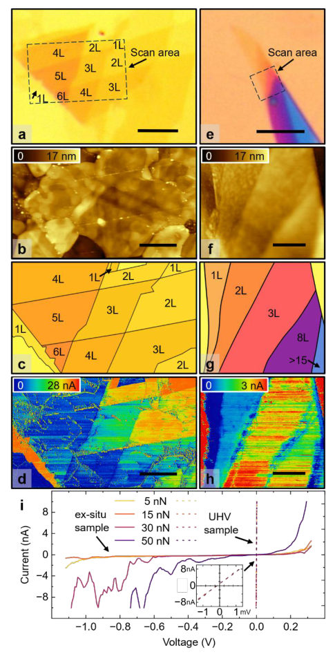
<figcaption class="paper-figure-caption"><b>Fig 1.</b> Figure 1. Comparison of UHV (a–d) and ex situ (e–h) samples. Panels (a–d) show optical image, semi-contact AFM topography map, height of particular regions, and CAFM current map for the UHV-prepared sample, while panels (e–h) present the corresponding results for the ex situ sample. CAFM current maps were acquired at 0.4 V (UHV) and 0.2 V (ex situ). Scale bars: 5 µm (a,e); 3 µm (b,d); 0.5 µm (f,h). (i) Representative current-voltage (IV) curves measured on monolayers for both samples with varying load force of the tip.</figcaption>
</figure>
<figure class="paper-figure-card">
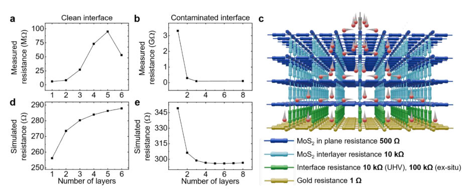
<figcaption class="paper-figure-caption"><b>Fig 2.</b> Figure 2. Resistance/layer number dependence for UHV and ex situ samples. (a) Measured resistance for UHV and (b) ex situ sample. The experimental resistance values were determined from the conductance analysis of the CAFM images shown in Fig. 1 (see Supplementary Fig. 7 for the analysis procedure details). (c) Resistance network simulation model with the values of resistance used for every resistor type. (d) Simulated equivalent resistance for low resistance interface system and (e) high resistance interface system.</figcaption>
</figure>
<figure class="paper-figure-card">
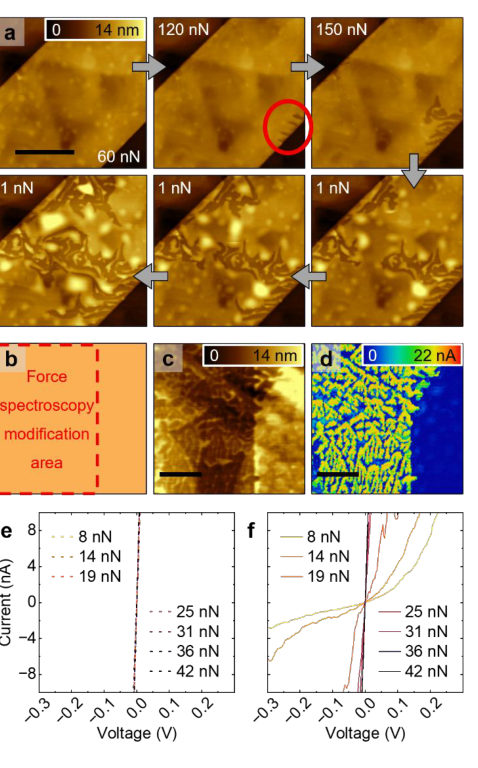
<figcaption class="paper-figure-caption"><b>Fig 3.</b> Figure 3. Local AFM force spectroscopy MoS2/Au interface modification. (a) The process of MoS2 flattening. Scale bar, 1 µm. The load force that was applied by the tip on the entire scan is displayed in the corners. The red circle indicates the area of the start of the flattening process. (b) Schematic of the CAFM scan area. (c) AFM topography map of the electrical measurement region. Scale bar, 3 µm. (d) CAFM current map obtained with bias 0.2 V. Scale bar, 3 µm. (e) A set of IV curves measured with a varying load force of the tip in the unmodified area, and (f) in the modified area.</figcaption>
</figure>

**Summary.** This paper demonstrates that the high contact resistance in MoS2/Au junctions is an extrinsic effect caused by interfacial contamination rather than an intrinsic Schottky barrier. By using ultra-high vacuum preparation, the authors reveal a highly conductive ohmic interface and show that mechanical pressure can even restore pristine contact quality.

**Why it may be interesting.** not directly relevant

Detailed structure

**Main problem.** High contact resistance and conflicting reports regarding the thickness-dependent conductivity of MoS2/Au junctions are often attributed to intrinsic Schottky barriers, but may actually stem from extrinsic interfacial contamination.

**Main result.** The study proves that the intrinsic MoS2/Au junction is highly conductive and ohmic when prepared in ultra-high vacuum (UHV), demonstrating that previously reported high resistance is due to air-borne contamination.

**Method.** The researchers used a custom UHV system for atomically clean exfoliation and compared it to ambient-prepared samples, using Conductive Atomic Force Microscopy (CAFM) for electrical mapping and a Kirchhoff-based resistor network model for simulation.

**Model / system.** The physical system consists of monolayer and multilayer MoS2 on Au(111) substrates, comparing UHV-prepared (clean) interfaces to ex situ (contaminated) interfaces.

**Key observables.** Contact resistance, I-V linearity (ohmic vs. non-linear), current-thickness dependence, and Raman mode shifts.

**Important parameters / regimes.** MoS2 layer number (1 to 6 layers), tip load force (nN), and interface quality (UHV vs. ambient).

**Assumptions / limitations.** The CAFM response is assumed to be linear for currents below 10 nA; thickness estimation in UHV samples relied on relative height differences due to substrate contamination during transfer.

**Figures summary.** Figure 1 compares UHV and ex situ topography and current maps; Figure 2 shows resistance vs. layer number for both regimes; Figure 3 demonstrates the restoration of conductivity via CAFM tip lamination.

**Paper structure.** The paper introduces the contact resistance problem, describes the UHV experimental setup, compares clean vs. contaminated transport properties, provides a resistor-network model to reconcile thickness-dependent trends, and demonstrates local contact restoration via lamination.

Abstract

The application of two-dimensional (2D) semiconductors, such as monolayer MoS2, is limited by the high contact resistance commonly attributed to interfacial barriers at metal contacts. Furthermore, the dependence of electrical conductivity on MoS2 thickness is still unsettled, as both increasing and decreasing trends with layer number have been reported. By showing the contrast between electrical transport of mono- and multilayer MoS2 exfoliated on Au under ultra-high vacuum (UHV) and ambient conditions, we experimentally prove that, contrary to the prevailing view in the literature, the intrinsic MoS2/Au junction is highly conductive and exhibits ohmic behaviour. Our results indicate that interfacial contamination is responsible for the high contact resistances reported to date and affects the thickness dependence of electrical transport, explaining the discrepancies observed in the literature. We rationalize those findings using electrical transport simulations. Lastly, we show that local force-mediated lamination on lightly contaminated contacts can recover pristine, ohmic contacts, offering a route towards nanoscale patterning.

[↑ back to top](#top)

### [Phase-Topology Classification of Memristor Hysteresis Loops via Self-Crossings](http://arxiv.org/abs/2605.27342v1)

**Authors:** Ovidiu-Zeno Lipan, Eric Neuhaus, Rafael Schio Wengenroth Silva, Soumen Pradhan, Fabian Hartmann, Leonardo K. Castelano, Ana Luiza Costa Silva, Sven Höfling, Victor Lopez-Richard  
**Type:** theory · **Category:** disordered systems and neural networks · **PDF:** <https://arxiv.org/pdf/2605.27342v1>  
**Analysis basis:** full PDF text, analyzed in chunks

↔ Scroll figures horizontally

<figure class="paper-figure-card">
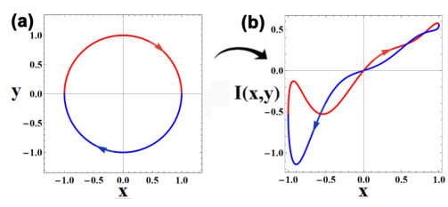
<figcaption class="paper-figure-caption"><b>Fig 1.</b> FIG. 1: Mapping of the current–voltage hysteresis loop from the unit circle. (a) Unit circle in the normalized voltage–derivative plane. The horizontal axis shows the normalized voltage x = V/A, while the vertical axis shows its time derivative y. As time progresses over one full period, the point (x(t), y(t)) traces the entire circle exactly once. (b) Resulting current–voltage hysteresis loop I(x, y). Each point on the circle in (a) is mapped to a point on the loop in (b) at the same instant in time. The upper semicircle (red) maps to the ascending (positive) branch of the hysteresis loop, while the lower semicircle (blue) maps to the descending (negative) branch. Arrows indicate the...</figcaption>
</figure>
<figure class="paper-figure-card">
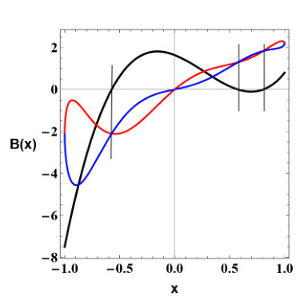
<figcaption class="paper-figure-caption"><b>Fig 2.</b> FIG. 3: Relationship between the susceptance B(x) (black) and the self-crossings of the current–voltage hysteresis loop (red and blue, same as in Fig. 1). The thin vertical segments indicate the roots of B(x), which mark the voltages at which the hysteresis loop crosses itself (besides the crossing at zero-voltage).</figcaption>
</figure>
<figure class="paper-figure-card">
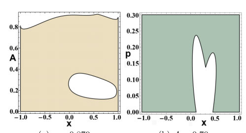
<figcaption class="paper-figure-caption"><b>Fig 3.</b> FIG. 2: Constraints for hysteresis loops confined to quadrants I and III in the I-V plane. The passivity constraint (18) is satisfied in the colored regions and violated in the white regions. Both panels are generated using τ = 1 and the same generating function as in Fig. 1.</figcaption>
</figure>
<figure class="paper-figure-card">

<figcaption class="paper-figure-caption"><b>Fig 4.</b> Fig.2 (a) underscores the importance of carefully as- sessing the generating function model, as there is no as- surance that a model valid for one amplitude will work for all smaller values. For example, an amplitude of 0.2 proves unsuitable, as the loop extends into quadrant IV for positive input voltage, violating the condition of con- finement to quadrant I. This issue persists within a range of amplitudes near 0.2. Furthermore, amplitudes above 0.79 result in the loop extending into quadrant II for large negative voltages, breaking the confinement to quadrant III. Fig.2 (b) demonstrates a similar effect when vary- ing frequency, indicating that the model is ineffective for very low...</figcaption>
</figure>
<figure class="paper-figure-card">
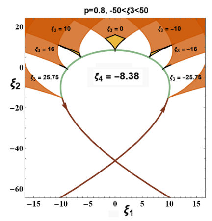
<figcaption class="paper-figure-caption"><b>Fig 5.</b> FIG. 4: Illustration of the cusp region (orange) and the subregion with four crossing points (yellow) in the (ξ1, ξ2) plane for fixed ξ3 and ξ4.</figcaption>
</figure>

**Summary.** This paper provides a rigorous mathematical framework to classify the different shapes of memristor hysteresis loops based on their topological self-crossings. By using catastrophe theory, it predicts how changing voltage amplitude or frequency can cause sudden changes in the device's memory characteristics. This is significant for designing more complex, multi-lobed memristive devices for neuromorphic computing.

**Why it may be interesting.** not directly relevant

Detailed structure

**Main problem.** The geometric complexity and topological classification of self-crossings in memristor hysteresis loops are poorly understood, specifically regarding how parameter changes drive transitions between different loop morphologies.

**Main result.** The authors establish a topological framework where the number of self-crossings is a robust integer-valued invariant, using singularity theory to map out the parameter space boundaries (catastrophe surfaces) where these crossings emerge or disappear.

**Method.** The study employs differential topology, singularity theory (specifically the cusp catastrophe), and algebraic tools like discriminants and resultants to stratify a six-dimensional parameter space.

**Model / system.** A generalized voltage-controlled memristive system where memductance is a perturbed constant admittance modulated by an internal state variable that evolves via a relaxation-type equation.

**Key observables.** Crossing number (number of self-intersections), susceptance polynomial roots, and local admittances.

**Important parameters / regimes.** Dimensionless frequency (p = omega*tau), drive amplitude (A), and polynomial coefficients (xi_k) defining the nonlinear response.

**Assumptions / limitations.** The state evolution is simplified to a linear relaxation-type equation, and the memductance is assumed to be a linear perturbation of a constant admittance.

**Figures summary.** Figures illustrate the mapping of hysteresis loops to a unit circle, the identification of bifurcation boundaries in parameter space, and the visualization of cusp catastrophe dynamics and phase-space trajectories.

**Paper structure.** The paper begins by defining the problem of loop geometry, introduces a generalized memristive model, applies singularity theory to classify parameter regions, uses algebraic tools to find bifurcation boundaries, and concludes with a discussion on the implications for hardware design.

Abstract

Memristive devices have revolutionized non-volatile memory and neuromorphic computing, yet the geometry of their hysteresis loops -- in particular, the occurrence and robustness of multiple self-crossings -- remains poorly understood. Here we introduce a topological and algebraic framework that treats the number of transverse self-intersections of a memristor hysteresis loop as a robust integer-valued invariant. Drawing on differential topology, singularity theory, and cusp catastrophe, we employ discriminants and resultants to stratify the six-dimensional parameter space. This approach partitions the parameter space into structurally stable regions separated by explicitly computable catastrophe surfaces. We demonstrate that the crossing number remains strictly invariant under continuous deformations and changes only at self-tangencies or cusp singularities, thereby providing a complete classification of all multi-lobed hysteresis behaviors. These insights bridge device physics with modern singularity theory and suggest a clear roadmap for exploiting higher-order memory effects in next-generation electronics and brain-inspired hardware.

[↑ back to top](#top)

### [Spontaneous persistent currents and time-reversal symmetry breaking in thick-walled Weyl semimetal cylinders](http://arxiv.org/abs/2605.27368v1)

**Authors:** J. C. Pérez-Pedraza, Juan A. Cañas, Daniel A. Bonilla, A. Martín-Ruiz  
**Type:** theory · **Category:** other · **PDF:** <https://arxiv.org/pdf/2605.27368v1>  
**Analysis basis:** full PDF text, analyzed in chunks

↔ Scroll figures horizontally

<figure class="paper-figure-card">
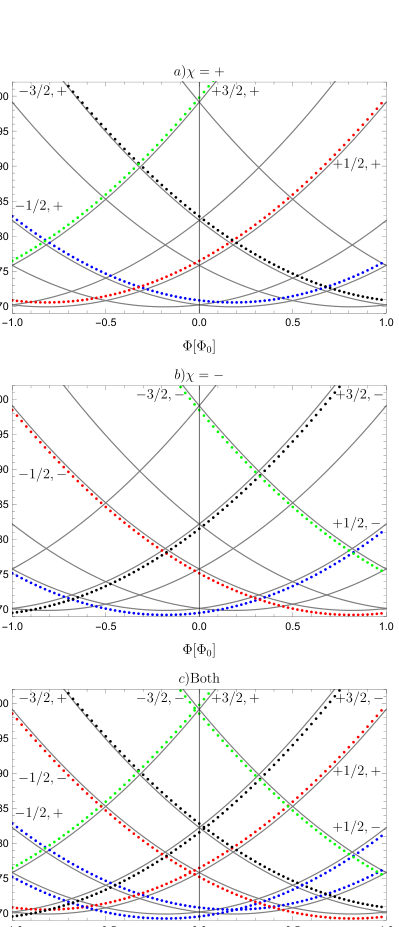
<figcaption class="paper-figure-caption"><b>Fig 1.</b> FIG. 2: Energy eigenvalues as a function of the magnetic flux, Φ, for different values of angular momentum, j, for the case b = 0.001, kz = 0. Energy eigenvalues for states with positive and negative chirality are shown in a) and b), respectively. In c) energies for states with both chiralities are presented. In all the figures in the paper we have used the values r1 = 5.5, r2 = 6.5.</figcaption>
</figure>
<figure class="paper-figure-card">
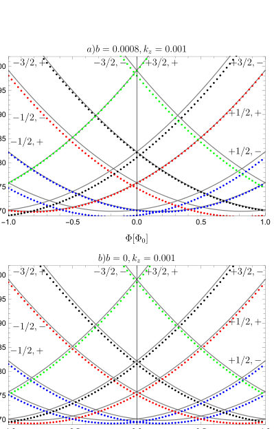
<figcaption class="paper-figure-caption"><b>Fig 2.</b> FIG. 3: Energy eigenvalues as a function of the magnetic flux, Φ, for different values of angular momentum, j. a) for the case b = 0.0008, kz = 0.001. b) for the case b = 0, kz = 0.001. In both cases, energies for states with both chiralities are presented.</figcaption>
</figure>
<figure class="paper-figure-card">
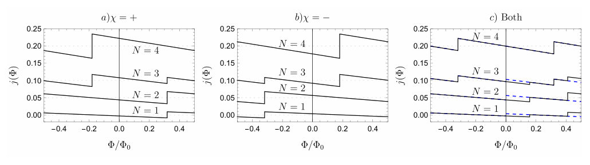
<figcaption class="paper-figure-caption"><b>Fig 3.</b> FIG. 4: Persistent current for the case b = 0.0008, kz = 0.001 [Fig. 3a)]. a) Shows the persistent current for positive chirality, b) for negative chirality, whereas in c) the sum of currents for both chiralities is shown.</figcaption>
</figure>
<figure class="paper-figure-card">
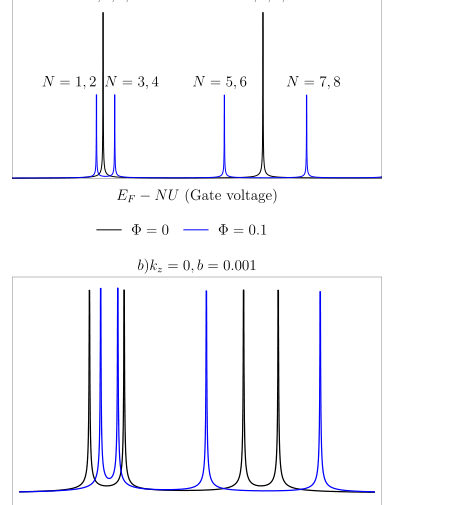
<figcaption class="paper-figure-caption"><b>Fig 4.</b> FIG. 5: Conductance resonances (conductance channels) through the infinite thick-walled cylinder coupled to leads as a function of the Fermi energy (gate voltage), for Φ = 0 (black lines) and Φ = 0.1 (blue lines). a) Shows the graphene case, b = 0, kz = 0. b) b = 0.001, kz = 0.</figcaption>
</figure>
<figure class="paper-figure-card">
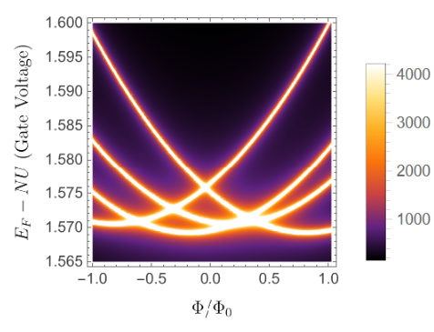
<figcaption class="paper-figure-caption"><b>Fig 5.</b> FIG. 6: Density plot of the conductance resonances (conductance channels) through the thick-walled cylinder coupled to leads as a function of the Fermi energy (gate voltage), for b = 0.001, kz = 0.</figcaption>
</figure>

**Summary.** This paper theoretically demonstrates that the intrinsic separation of Weyl nodes in a cylindrical geometry breaks time-reversal symmetry, creating spontaneous persistent currents without an external magnetic field. It also shows how longitudinal confinement in finite cylinders leads to the splitting of conductance channels. These findings highlight how topological properties and geometry can be used to control electronic transport in Weyl semimetals.

**Why it may be interesting.** not directly relevant

Detailed structure

**Main problem.** Investigating the Aharonov-Bohm effect and the emergence of spontaneous persistent currents in thick-walled Weyl semimetal (WSM) cylinders due to time-reversal symmetry breaking.

**Main result.** The spatial separation of Weyl nodes acts as an internal chiral gauge field that breaks time-reversal symmetry, leading to spontaneous persistent currents even at zero external magnetic flux and the unfolding of conductance channels.

**Method.** Analytical solution of the eigenvalue problem using a low-energy effective Hamiltonian in cylindrical coordinates, applying infinite-mass boundary conditions at radial walls and MIT bag boundary conditions at cylinder caps.

**Model / system.** A thick-walled Weyl semimetal cylinder (infinite or finite length) subject to an external axial magnetic flux through the inner cavity, modeled by a 4x4 low-energy effective Hamiltonian incorporating node separation.

**Key observables.** Energy spectrum, persistent currents, conductance channels, partial density of states (PDOS), and probability currents (angular and transversal).

**Important parameters / regimes.** Chiral node separation (b), magnetic flux (Phi), cylinder radii (r1, r2), cylinder length (L), and longitudinal momentum (kz).

**Assumptions / limitations.** Assumes a two-node Weyl semimetal model and neglects inter-valley scattering at the radial boundaries.

**Figures summary.** Figure 1 shows the cylinder geometry; Figures 2-4 illustrate energy eigenvalues and persistent currents vs. flux; Figures 9-10 show conductance resonances and energy branch unfolding; Figures 11-12 display spatial distributions of probability density and currents.

**Paper structure.** The paper introduces the WSM cylinder geometry and Hamiltonian, develops the analytical solution for energy eigenvalues under specific boundary conditions, analyzes the effects of node separation and magnetic flux on the energy spectrum and persistent currents, explores conductance and density of states in finite cylinders, and concludes with a discussion on experimental consistency.

Abstract

We theoretically investigate the Aharonov-Bohm effect in a thick-walled Weyl semimetal (WSM) cylinder subject to an external axial magnetic field. By employing a low-energy effective Hamiltonian, we analytically solve the eigenvalue problem for both infinite and finite-length cylindrical geometries. We apply infinite-mass boundary conditions at the radial walls and MIT bag boundary conditions at the cylinder caps to properly account for intra-node confinement and inter-valley scattering, respectively. Our numerical results demonstrate that the spatial separation of the Weyl nodes acts as an internal chiral gauge field. This geometric field intrinsically breaks time-reversal (TR) symmetry, lifting the chiral degeneracy even at zero external flux. This symmetry breaking manifests as spontaneous persistent currents and the unfolding of conductance channels. Furthermore, longitudinal confinement induces propagation-direction-dependent energy splitting, altering the partial density of states and causing spatio-chiral current imbalances.

[↑ back to top](#top)

### [Superconductivity-enhanced phonon angular momentum](http://arxiv.org/abs/2605.26794v1)

**Authors:** Natsuki Okada, Philipp Werner, Shintaro Hoshino  
**Type:** theory · **Category:** strongly correlated electrons · **PDF:** <https://arxiv.org/pdf/2605.26794v1>  
**Analysis basis:** full PDF text, analyzed in chunks

↔ Scroll figures horizontally

<figure class="paper-figure-card">
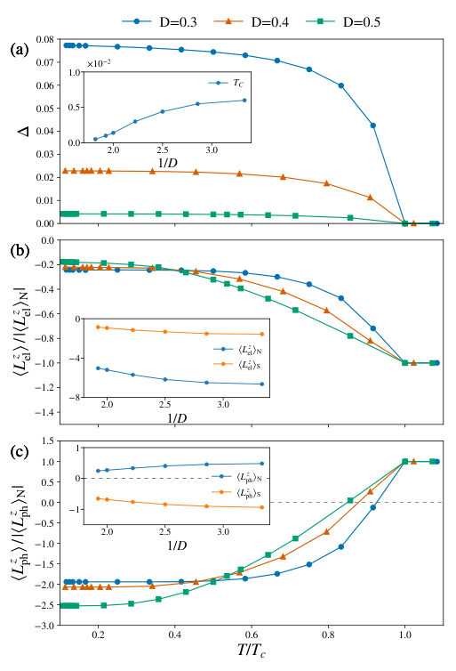
<figcaption class="paper-figure-caption"><b>Fig 1.</b> FIG. 1. Temperature dependence of (a) the superconducting gap function [inset: bandwidth dependence of the transition temperature] and (b,c) the electronic and phononic orbital angular momenta. In (b) and (c), the vertical axis is normal- ized by the magnitude of the corresponding quantity in the normal state, while the magnitudes are shown in the insets.</figcaption>
</figure>
<figure class="paper-figure-card">
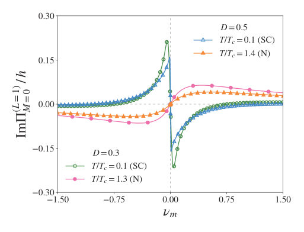
<figcaption class="paper-figure-caption"><b>Fig 2.</b> FIG. 2. Field-induced phonon self-energy in a weak magnetic field. Circles and triangles correspond to D = 0.3 and D = 0.5, while filled and open symbols indicate the normal and superconducting states.</figcaption>
</figure>
<figure class="paper-figure-card">
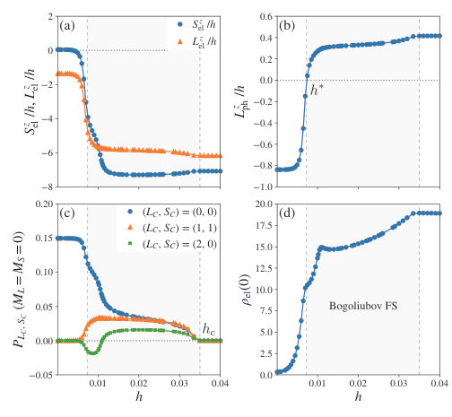
<figcaption class="paper-figure-caption"><b>Fig 3.</b> FIG. 3. Magnetic-field dependence of (a) the electronic angular momenta, OAM and SAM; (b) the phonon angular momentum (PAM); (c) the superconducting pair amplitude, characterized by the orbital and spin angular momenta of the Cooper pairs, (LC, SC); and (d) the electronic spectral function at zero energy. The temperature and bandwidth are T = 0.001 and D = 0.4, respectively.</figcaption>
</figure>

**Summary.** This paper theoretically demonstrates that superconductivity causes a dramatic enhancement and a sign reversal in phonon angular momentum in fulleride-like systems. It identifies that the enhancement is driven by the ratio of the electronic bandwidth to the phonon frequency. The work provides a new way to understand how orbital angular momentum is transferred from electrons to the lattice in correlated superconductors.

**Why it may be interesting.** not directly relevant

Detailed structure

**Main problem.** The study investigates the mechanism behind the enhancement and sign reversal of phonon angular momentum (PAM) when a system enters the superconducting state under an external magnetic field.

**Main result.** The researchers show that PAM is significantly enhanced in the superconducting state by a factor of order D/omega_1 and undergoes a sign reversal due to the competition between Fermi surface and Fermi volume contributions.

**Method.** The study uses a theoretical framework combining the local Eliashberg theory with Dynamical Mean-Field Theory (DMFT) and a spherical tensor formalism to analyze phonon self-energy.

**Model / system.** The model system is fulleride compounds (e.g., A3C60) in an external magnetic field, modeled using a three-orbital Hubbard model with p-type fermions and Jahn-Teller phonon modes.

**Key observables.** Phonon angular momentum (PAM), electronic orbital angular momentum (OAM), superconducting gap function (Delta), and phonon self-energy.

**Important parameters / regimes.** Electronic bandwidth (D), superconducting gap (Delta), phonon frequency (omega_1), transition temperature (Tc), and magnetic field strength (h).

**Assumptions / limitations.** Assumes a featureless semi-elliptical density of states, neglects direct phonon Zeeman contribution, and uses the BCS limit (no retardation effect) for certain analytical derivations.

**Figures summary.** Fig 1(a) shows the temperature dependence of the superconducting gap; Fig 1(b) shows the decrease in electronic OAM below Tc; Fig 1(c) illustrates the sign reversal of normalized PAM below Tc.

**Paper structure.** The paper introduces the problem of PAM in superconductors, describes the Hubbard-Jahn-Teller model and Eliashberg framework, presents the calculation of phonon self-energy and angular momentum, discusses the enhancement and sign reversal mechanisms, and concludes with implications and future work.

Abstract

We theoretically investigate the properties of phonon angular momentum in the superconducting state, using fulleride compounds in an external magnetic field as a model system. The electron orbital angular momentum injected by an external field is transferred to the phonon subsystem via electron--phonon coupling. We show that this field-induced phonon angular momentum is significantly enhanced and undergoes a sign reversal upon entering the superconducting state. In the normal state, the dominant energy scale governing the response function is the electronic bandwidth $D$. In the superconducting state, the phonon energy scale $ω_1$ enters the denominator, leading to an enhancement of order $D/ω_1$. The observed sign change in the response can be explained by the competition between Fermi surface and Fermi volume contributions.

[↑ back to top](#top)

### [Terahertz spin-current transparency through rough interfaces](http://arxiv.org/abs/2605.26837v1)

**Authors:** Jiří Jechumtál, Jakub Zázvorka, Ondřej Novák, Martin Rejhon, Peter Kubaščík, Lukáš Nowak, Petr Němec, Eva Schmoranzerová, Martin Veis, Lukáš Nádvorník, Zdeněk Kašpar  
**Type:** experiment · **Category:** other · **PDF:** <https://arxiv.org/pdf/2605.26837v1>  
**Analysis basis:** full PDF text, analyzed in chunks

↔ Scroll figures horizontally

<figure class="paper-figure-card">
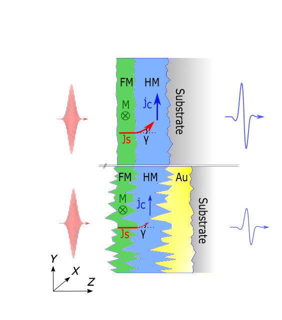
<figcaption class="paper-figure-caption"><b>Fig 1.</b> FIG. 1: THz emission from FM|HM samples with variable buffer layer roughness. A fs laser pulse excites a ferromagnetic layer and injects a spin-current pulse js into a heavy metal layer. js is affected by the FM|HM interface spin transparency ts. Two extremal cases are shown: without an Au buffer layer (smooth interface) and with a thick Au buffer layer creating a very rough interface.</figcaption>
</figure>
<figure class="paper-figure-card">
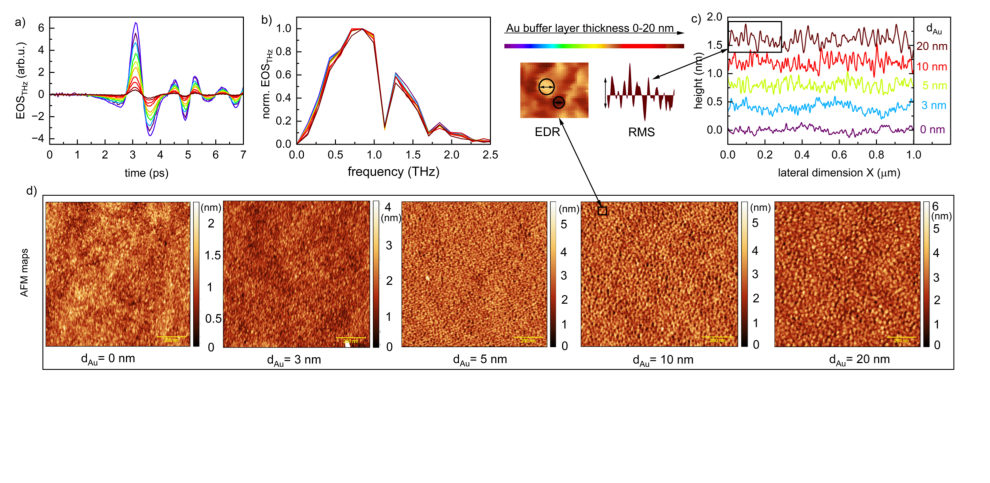
<figcaption class="paper-figure-caption"><b>Fig 2.</b> FIG. 2: (a) Raw THz signals measured by electro-optical sampling from a set of samples Au(5)|Co(2)|Pt(5)|Au(d). (b) Spectra of THz waveforms from (a). Spectral dips come from water vapor absorption. The thickness of the Au buffer layer for the given sample is represented by the line colour shown on the colour bar. (c) Representative topography profiles of the Pt(5)|Au(d) set of samples; note that the vertical axis is on the nanometer scale, while the horizontal axis is on the micrometer scale. (d) Selected Atomic Force Microscopy scans of the Pt(5)|Au(d) set of samples. The topography maps were measured in contact mode, revealing the building of a columnar-like structure with increasing...</figcaption>
</figure>
<figure class="paper-figure-card">
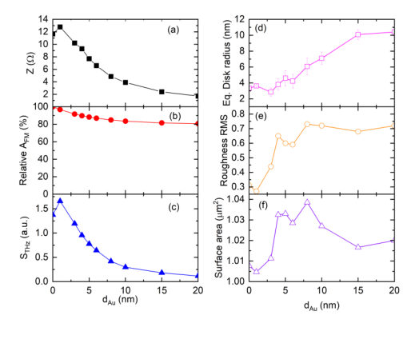
<figcaption class="paper-figure-caption"><b>Fig 3.</b> FIG. 3: Sample properties as a function of the Au buffer layer thickness d. (a) Measured total sample impedance Z(d). (b) Calculated relative change of energy absorbed in the FM layer AFM(d) normalized to the value at d = 0. (c) Magnitude of THz signal STHz. (d) Interface roughness EDR (lateral roughness). (e) RMS (vertical roughness) of the AFM map. (f) Interface surface area as a function of Au thickness d.</figcaption>
</figure>
<figure class="paper-figure-card">
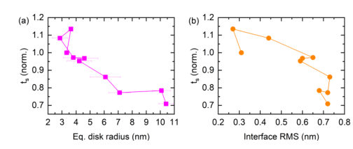
<figcaption class="paper-figure-caption"><b>Fig 4.</b> FIG. 4: Spin transparency ts extracted from STHz as a function of surface roughness parameters (a) EDR (lateral roughness) and (b) RMS (vertical roughness). Both cases show a clear negative correlation, with ts decreasing by ∼30% across the studied range.</figcaption>
</figure>

**Summary.** This study shows that spin-current transparency in Co|Pt heterostructures is surprisingly resistant to changes in interface roughness and grain size. By using THz spectroscopy, the researchers demonstrate that ultrafast spin transport is robust against morphological variations, which is a positive sign for the development of large-scale spintronic devices.

**Why it may be interesting.** not directly relevant

Detailed structure

**Main problem.** Investigating how interface roughness (both vertical and lateral) affects the spin-current transparency (ts) in Co|Pt heterostructures at ultrafast (THz) frequencies.

**Main result.** Spin-current transparency decreases by only about 30% even when interface roughness and grain size increase by a factor of three, demonstrating that interfacial spin transport is relatively robust against morphological variations on ultrafast timescales.

**Method.** Terahertz emission spectroscopy using femtosecond laser excitation, combined with AFM for roughness characterization and numerical FDTD simulations to account for sample impedance and optical absorption.

**Model / system.** Co|Pt heterostructures with a variable thickness Au buffer layer (Au(5)|Co(2)|Pt(5)|Au(d)|Si) used as a spintronic THz emitter.

**Key observables.** THz electric field strength, THz spectrum, interface spin-current transparency (ts), RMS roughness, and lateral grain size (EDR).

**Important parameters / regimes.** Ultrafast (sub-picosecond) timescales, spin diffusion length in Pt, and interface roughness scales (0.3-10 nm).

**Assumptions / limitations.** The platinum crystalline quality and spin Hall angle remain constant across all samples, and the spin voltage/current scales directly with optical absorption and transparency.

**Figures summary.** Fig 1: Schematic of THz emission mechanism; Fig 2: THz waveforms, frequency spectra, and AFM topography maps; Fig 3: Plots of impedance, absorption, and roughness parameters vs. Au thickness; Fig 4: Extraction of spin transparency vs. roughness parameters.

**Paper structure.** The paper introduces the problem of interface roughness, describes the experimental setup and sample preparation, presents the characterization of morphology via AFM, details the THz spectroscopy results, and concludes with a discussion on the robustness of spin transport.

Abstract

Spin transport across interfaces is critical for spintronic devices, yet remains difficult to probe on ultrafast timescales. We use terahertz emission spectroscopy on Co|Pt heterostructures whose interface roughness is tuned through the thickness of an underlying Au buffer layer, while leaving other growth parameters unchanged. From the measured THz electric field, we extract the interface spin-current transparency ts after correcting for the changes in sample impedance and optical absorption of the stack. Surprisingly, we find that ts decreases by only approximately 30% as the interface root-mean-square roughness and the lateral grain size both increase by a factor of three, with no measurable change in the THz spectrum. These results demonstrate that interfacial spin transport is relatively robust against morphological variations on ultrafast timescales, establishing terahertz emission spectroscopy as a reliable probe of spin dynamics across imperfect interfaces.

[↑ back to top](#top)

### [Three Quantum-Geometric Contributions to Cubic Orbital Magnetization](http://arxiv.org/abs/2605.27277v1)

**Authors:** T. Farajollahpour  
**Type:** theory · **Category:** other · **PDF:** <https://arxiv.org/pdf/2605.27277v1>  
**Analysis basis:** full PDF text, analyzed in chunks

↔ Scroll figures horizontally

<figure class="paper-figure-card">
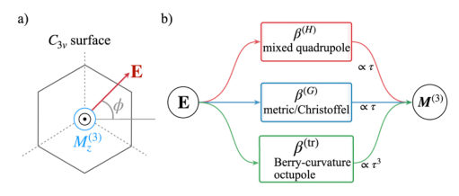
<figcaption class="paper-figure-caption"><b>Fig 1.</b> FIG. 1. Symmetry filter and three-channel decomposition of cubic orbital magnetization. (a) In the C3v example, the lower-order axial response is forbidden and the leading signal is the threefold cubic harmonic ∝E3 0 cos 3ϕ, with the phase fixed by the crystalline axes. (b) The dc tensor decomposes into three quantum-geometric channels.</figcaption>
</figure>
<figure class="paper-figure-card">
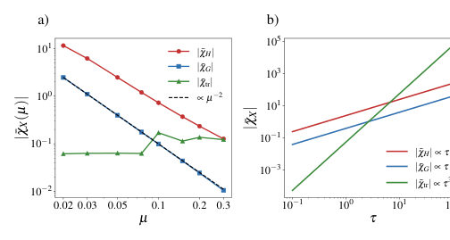
<figcaption class="paper-figure-caption"><b>Fig 2.</b> FIG. 2. Contribution-resolved cubic magnetization in the C3v model of Eq. (9). (a) The three coefficients |¯χH|, |¯χG|, and |¯χtr| as functions of chemical potential µ, with the dashed line the µ−2 prediction of Eq. (11) for |¯χG|. The ordering of the three magnitudes shown here is not universal and depends on microscopic details of the material. (b) The same coefficients as functions of relaxation time τ, showing the τ 1 scaling of the geometric contributions and the τ 3 scaling of the transport contribution from Eqs. (5).</figcaption>
</figure>

**Summary.** This paper provides a theoretical framework to identify three different quantum-geometric origins of cubic orbital magnetization in noncentrosymmetric materials. It establishes clear experimental 'fingerprints' using gate-tunable spectroscopy and frequency-dependent measurements to distinguish between metric, transport, and quadrupole contributions. This work is significant for the development of orbitronics and the study of topological phases.

**Why it may be interesting.** not directly relevant

Detailed structure

**Main problem.** The paper aims to decompose and distinguish between three distinct quantum-geometric contributions to cubic orbital magnetization in noncentrosymmetric metals where linear and quadratic responses are symmetry-forbidden.

**Main result.** The authors identify three independent channels—a mixed electric-magnetic positional-shift quadrupole, a quantum-metric drift term, and an orbital-moment octupole—and provide specific experimental diagnostics (lifetime, frequency, and gate-voltage scaling) to separate them.

**Method.** A gauge-invariant, Ward-complete finite-momentum cubic Kubo response theory is developed using a generating-functional formulation and a lattice-regularized continuum model.

**Model / system.** The study focuses on noncentrosymmetric metals with C3v symmetry, such as topological insulator surfaces (Bi2Se3, Bi2Te3), hexagonal moiré heterobilayers, and zincblende crystals, using a two-band Hamiltonian with Rashba-like terms and cubic warping.

**Key observables.** Cubic orbital magnetization (Mz), mixed-quadrupole moment, quantum metric drift, and orbital-moment octupole; experimental probes include third-harmonic magneto-optical Kerr spectroscopy (THG-MOKE).

**Important parameters / regimes.** Chemical potential (mu), relaxation time (tau), frequency (omega), warping strength (lambda), and point-group symmetry (C3v, Td, PT-symmetric).

**Assumptions / limitations.** The primary theoretical framework assumes a clean, noninteracting electron system with a scalar relaxation time and a Ward-complete kernel.

**Figures summary.** Figure 1 illustrates the symmetry filtering mechanism; Figure 2 shows the scaling of the three coefficients with chemical potential and relaxation time; Supplemental figures demonstrate lattice regularization convergence and experimental diagnostic utility.

**Paper structure.** The paper begins by defining the symmetry-forbidden regime, develops a Ward-complete cubic Kubo kernel, decomposes the response into three geometric channels, provides a lattice-based regularization for the continuum model, and concludes with experimental signatures and background discrimination strategies.

Abstract

In noncentrosymmetric metals such as $C_{3v}$ topological-insulator surfaces, moiré heterobilayers, and zincblende crystals, point-group symmetry can forbid the linear and quadratic electric-field-induced orbital magnetization, leaving the cubic response as the leading signal. Using a Ward-complete finite-momentum cubic Kubo kernel with an antisymmetric linear-in-$q$ projection, we show that the dc response separates into three quantum-geometric channels. These are a mixed electric-magnetic positional-shift quadrupole, a quantum-metric drift term, and an orbital-moment octupole. The three contributions share the same point-group symmetry but differ in their lifetime, frequency, and gate fingerprints. For a warped $C_{3v}$ surface the metric channel obeys the cutoff-independent law $\barχ_G \propto μ^{-2}$. We propose third-harmonic magneto-optical Kerr spectroscopy as an experimental route.

[↑ back to top](#top)

### [x-periodic Quasi One Dimensional Anomalous (Rogue) Waves in Multidimensional Nonlinear Schrödinger Equations: Fission, Fusion, and Recurrence](http://arxiv.org/abs/2605.26961v1)

**Authors:** Francesco Coppini, Paolo Maria Santini  
**Type:** theory · **Category:** other · **PDF:** <https://arxiv.org/pdf/2605.26961v1>  
**Analysis basis:** full PDF text, analyzed in chunks

↔ Scroll figures horizontally

<figure class="paper-figure-card">
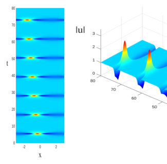
<figcaption class="paper-figure-caption"><b>Fig 1.</b> Figure 1: The density plot (left) and the 3D plot (right) of the NLS numerical evolution of |u(x, t)|, for the generic initial condition (7), with c−= 0.3+0.2i, c+ = 0.5, where the short axis is the x axis, with −L/2 ≤x ≤L/2, 0 ≤ t ≤80, L = 6, ϵ = 10−4, in extremely good quantitative agreement with (11),(12) [34].</figcaption>
</figure>
<figure class="paper-figure-card">
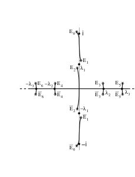
<figcaption class="paper-figure-caption"><b>Fig 2.</b> Figure 2: The infinitely many spines near the real axis of the left picture are erased in the finite gap approximation introduced in [34, 35], obtaining the right picture.</figcaption>
</figure>
<figure class="paper-figure-card">
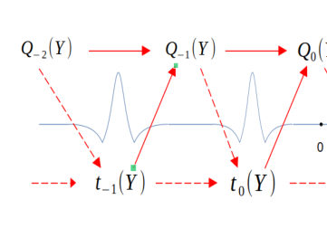
<figcaption class="paper-figure-caption"><b>Fig 3.</b> Figure 4: The two-step recurrence scheme describing the AW recurrence of Q1D AWs of the ENLS and HNLS equations. On the time axis we see the schematic recurrence of linear and nonlinear stages of MI.</figcaption>
</figure>
<figure class="paper-figure-card">
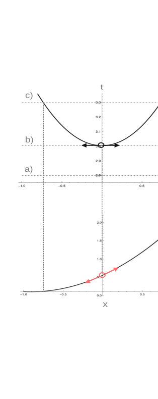
<figcaption class="paper-figure-caption"><b>Fig 4.</b> Figure 5: A local description of the process of “growth from the background + fission” for f(Y ) = 1 −0.8Y 2 + O(Y 3), g(Y ) = Y + 0.5Y 2 + O(Y 3), |Y | ≪1; the upper left figure shows the graph of t1(Y ) in the (Y, t) plane, together with the horizontal dashed lines t = 2.80, tfiss = 3.005, 3.30, and the lower left shows the trajectory x1(Y ) of the fission products in the (Y, x) plane. The right figures show the three snapshots of |u1(x, Y, t)| at the times indicated by the dashed horizontal lines of the upper left figure. From up to down: t = 2.80: the AW growth from the background in (x, Y ) = (x0, 0), x0 = 0.559; t = tfiss = 3.005: the AW fission in (x, Y ) = (x0, 0); t = 3.20; the...</figcaption>
</figure>
<figure class="paper-figure-card">
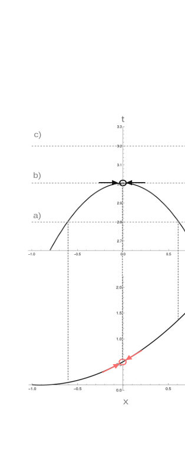
<figcaption class="paper-figure-caption"><b>Fig 5.</b> Figure 6: A local description of the process of “fusion + decay to the back- ground” for f(Y ) = 1+0.8Y 2 +O(Y 3), g(Y ) = Y +0.5Y 2 +O(Y 3), |Y | ≪1; the upper left figure shows the graph of t1(Y ), together with the horizon- tal dashed lines t = 2.80, 3.005, 3.20, and the lower left shows the trajec- tory x1(Y ) of the two waves undergoing fusion in the (Y, x) plane. The right figures show the three snapshots of |u1(x, Y, t)| at the times indicated by the dashed horizontal lines of the upper left figure. From up to down: t = 2.980: the two waves centered at (x(Y+), Y+) = (1.374, 0.610) and at (x(Y−), Y−) = (0.154, −0.610) travel against each other; t = tfus = 3.005: the fusion in (x, Y )...</figcaption>
</figure>

**Summary.** This paper demonstrates that while the initial formation of rogue waves is universal across different multidimensional nonlinear Schrödinger models, their subsequent recurrence and the complex processes of splitting (fission) and merging (fusion) are highly dependent on the specific physical model. The authors provide an analytical framework using finite gap theory to quantitatively describe these complex wave choreographies.

**Why it may be interesting.** not directly relevant

Detailed structure

**Main problem.** The study investigates the recurrence dynamics, fission, and fusion of x-periodic anomalous (rogue) waves in the quasi one-dimensional regime of multidimensional nonlinear Schrödinger equations.

**Main result.** While the first stage of modulation instability is universal across different models, subsequent recurrence stages exhibit significant O(1) differences and increasingly complex fission and fusion processes depending on the specific MNLS model.

**Method.** The authors utilize finite gap perturbation theory, matched asymptotic expansions, and adiabatic deformations of the Akhmediev breather solution, validated by numerical split-step simulations.

**Model / system.** Multidimensional nonlinear Schrödinger (MNLS) equations, specifically the elliptic (ENLS) and hyperbolic (HNLS) NLS equations in 2+1 and 3+1 dimensions, representing systems like water waves, nonlinear optics, and plasma physics.

**Key observables.** Wave amplitude, fission and fusion times, wave trajectories in the space-time plane, and the trace of the monodromy matrix.

**Important parameters / regimes.** The quasi one-dimensional regime (small ratio of x-wavelength to transverse wavelength), perturbation amplitude (epsilon), and the ratio (delta/epsilon)^2.

**Assumptions / limitations.** The system is treated as a multidimensional perturbation of the integrable 1D NLS equation, assuming smallness of nonlinear, nonlocal, and non-integrable terms.

**Figures summary.** Figures show numerical evolution of wave amplitude, spectral diagrams of the complex lambda-plane, schematic diagrams of the two-step recurrence scheme, and snapshots of the fission and fusion processes in HNLS and ENLS models.

**Paper structure.** The paper introduces the problem of Q1D rogue waves, establishes the universality of the first nonlinear stage, develops a finite gap perturbation theory for recurrence, analyzes the specific fission/fusion dynamics of different MNLS models, and validates results with numerical simulations.

Abstract

In a recent work we studied the first nonlinear stage of modulation instability (NLSMI) of x-periodic anomalous (rogue, freak, extreme) waves (AWs) of physically relevant multidimensional (generalizations of the focusing) nonlinear Schrödinger (MNLS) equation, like the non integrable elliptic and hyperbolic nonlinear Schrödinger (NLS) equations in d+1 dimensions, d = 2, 3, in the quasi one dimensional (Q1D) regime in which the wavelength in the direction of propagation x is small with respect to the wavelengths in the transversal directions. We showed that, at leading order, the first NLSMI is universal, independent of the particular MNLS model, and described by suitable adiabatic deformations of the quasi-homoclinic Akhmediev breather solution of NLS, in excellent agreement with numerical simulations. In the present work we focus on the recurrence of x-periodic AWs in the Q1D regime. We show that, although the first nonlinear stage of MI is essentially universal for all MNLS equations, the recurrence dynamics exhibit significant O(1) differences among different models. Moreover, successive nonlinear stages generally display increasingly complex combinations of fission and fusion processes, leading to progressively richer dynamical choreographies. Since MNLS equations in the Q1D regime can be viewed as multidimensional perturbations of the integrable NLS equation, we use the recently developed finite gap perturbation theory of NLS AWs to give an analytic and quantitative description of the recurrence of Q1D AWs, in excellent agreement with numerical simulations. Due to the physical relevance of the MNLS equations considered in this work, and due to the universality of the processes discussed in this paper, it is plausible that they be observable in many fields of physics, like water waves, nonlinear optics, plasma physics, Bose-Einstein condensates, etc . . .

[↑ back to top](#top)

