
# arxiv digest (quant-ph + cond-mat) — 2026-05-28

*115 papers · 23 relevant · 2 highlighted*

## 🔥 Most relevant (23)

*Every paper with at least one nonzero topic score, sorted by best-matching score. 🔥 marks scores ≥4/5. Click the title to jump to the full entry below; click [arXiv] to open the paper page. `(secondary)` marks papers from de-prioritized cond-mat archives.*

Show 23 relevant papers

- [Observing conformal Floquet dynamics on a digital quantum processor](#paper-2605.27530) [[arXiv]](http://arxiv.org/abs/2605.27530v1) — 🔥 `QC/QI experiment` **5/5** · 🔥 `non-equilibrium dynamics` **4/5** · 🔥 `non-equilibrium universality` **4/5** · `entanglement & information structure` **3/5** · `driven-dissipative phase transition` **2/5**
- [Large-scale array of squeezed light and synchronization using atomic vapor](#paper-2605.28316) [[arXiv]](http://arxiv.org/abs/2605.28316v1) — 🔥 `quantum optics experiment` **5/5** · 🔥 `correlated / nonlocal dissipation` **4/5** · `QC/QI experiment` **3/5**
- [A multilevel tensor network compression technique for simulating Lindblad dynamics in superconducting circuits](#paper-2605.27515) [[arXiv]](http://arxiv.org/abs/2605.27515v1) — 🔥 `methods for driven-dissipative` **5/5** · `entanglement & information structure` **2/5** · `non-equilibrium dynamics` **2/5**
- [Quantum Spin Squeezing Enhanced by Critical Exceptional Points](#paper-2605.28126) [[arXiv]](http://arxiv.org/abs/2605.28126v1) — 🔥 `Tavis-Cummings & cavity-many-emitter` **4/5** · 🔥 `driven-dissipative phase transition` **4/5** · 🔥 `non-equilibrium universality` **4/5** · `correlated cavity matter` **3/5** · `entanglement & information structure` **3/5** · `non-equilibrium dynamics` **3/5** · `Dicke superradiance` **2/5** · `Keldysh / 2PI / non-Gaussian methods` **2/5** · `exotic spin models in light-matter` **2/5** · `methods for driven-dissipative` **2/5**
- [A method for calculating entropy production without knowing transition rates or dwell times](#paper-2605.27635) [[arXiv]](http://arxiv.org/abs/2605.27635v1) — 🔥 `methods for driven-dissipative` **4/5** · `non-equilibrium dynamics` **3/5** · `correlated / nonlocal dissipation` **2/5** · `driven-dissipative phase transition` **2/5** · `entanglement & information structure` **2/5** · `non-equilibrium universality` **2/5** · `quantum measurements` **2/5**
- [Security Metrics for Nonlinear Optical Light Sources from Interferometric Field Reconstruction](#paper-2605.28695) [[arXiv]](http://arxiv.org/abs/2605.28695v1) — 🔥 `quantum optics experiment` **4/5** · `QC/QI experiment` **3/5** · `interference shaping light` **3/5** · `quantum measurements` **3/5** · `entanglement & information structure` **2/5** · `non-equilibrium dynamics` **2/5**
- ⭐ [Environment-Enhanced Single-Photon Absorption in a Nano-Ring of Dipole-Coupled Quantum Emitters](#paper-2605.28085) [[arXiv]](http://arxiv.org/abs/2605.28085v1) — 🔥 `Dicke superradiance` **4/5** · 🔥 `correlated / nonlocal dissipation` **4/5** · 🔥 `free-space correlated emission` **4/5** · `methods for driven-dissipative` **2/5** · `non-equilibrium dynamics` **2/5**
- [A cryogenic apparatus for coupling two-dimensional materials to a confocal multimode optical cavity](#paper-2605.28815) [[arXiv]](http://arxiv.org/abs/2605.28815v1) — 🔥 `quantum optics experiment` **4/5** · `Tavis-Cummings & cavity-many-emitter` **3/5** · `correlated cavity matter` **3/5** · `driven-dissipative phase transition` **2/5**
- [Coherent Dark State Formation of a Lead-Vacancy Spin Qubit in Diamond](#paper-2605.27841) [[arXiv]](http://arxiv.org/abs/2605.27841v1) — 🔥 `QC/QI experiment` **4/5** · 🔥 `quantum optics experiment` **4/5** · `quantum measurements` **2/5** · `spintronics-quantum-optics interface` **2/5**
- [Fractional short-time dynamics in driven quantum gases](#paper-2605.28606) [[arXiv]](http://arxiv.org/abs/2605.28606v1) — 🔥 `non-equilibrium dynamics` **4/5** · 🔥 `non-equilibrium universality` **4/5** · `driven-dissipative phase transition` **2/5** · `scars & prethermalization` **2/5**
- [Many-Body Quantum Chaos At All Time Scales](#paper-2605.27512) [[arXiv]](http://arxiv.org/abs/2605.27512v1) — 🔥 `entanglement & information structure` **4/5** · 🔥 `non-equilibrium dynamics` **4/5** · `non-equilibrium universality` **2/5** · `scars & prethermalization` **2/5**
- ⭐ [Photon correlation microscopy of quantum matter](#paper-2605.28623) [[arXiv]](http://arxiv.org/abs/2605.28623v1) — 🔥 `quantum optics experiment` **4/5** · `analog quantum simulation` **3/5** · `driven-dissipative phase transition` **3/5** · `quantum measurements` **2/5**
- [Squeezed-slit Bohr-Einstein Interferometer](#paper-2605.28038) [[arXiv]](http://arxiv.org/abs/2605.28038v1) — 🔥 `quantum optics experiment` **4/5** · `quantum measurements` **3/5** · `QC/QI experiment` **2/5** · `non-equilibrium dynamics` **2/5**
- [Device-Agnostic Microwave Noise Metrology for Nonlinear Cryogenic Quantum Devices](#paper-2605.28808) [[arXiv]](http://arxiv.org/abs/2605.28808v1) — 🔥 `QC/QI experiment` **4/5** · `quantum measurements` **3/5** · `quantum optics experiment` **3/5**
- [Three-fold coincidence by stimulated parametric down-conversion](#paper-2605.27653) [[arXiv]](http://arxiv.org/abs/2605.27653v1) — 🔥 `QC/QI experiment` **4/5** · 🔥 `quantum optics experiment` **4/5** · `interference shaping light` **2/5**
- [Krylov complexity has it all](#paper-2605.28681) [[arXiv]](http://arxiv.org/abs/2605.28681v1) — 🔥 `entanglement & information structure` **4/5** · `non-equilibrium dynamics` **3/5** · `scars & prethermalization` **2/5**
- [Sympathetic Cooling in Trapped Ions with Spectral Selectivity via the Zeeman Shift](#paper-2605.27577) [[arXiv]](http://arxiv.org/abs/2605.27577v1) — 🔥 `QC/QI experiment` **4/5** · `quantum optics experiment` **3/5** · `correlated / nonlocal dissipation` **2/5**
- [Filter-assisted quantum subspace diagonalization via wavefunction sparsity engineering](#paper-2605.28040) [[arXiv]](http://arxiv.org/abs/2605.28040v1) — 🔥 `QC/QI experiment` **4/5** · `entanglement & information structure` **2/5** · `quantum measurements` **2/5**
- [Cavity-Induced Suppression of Entanglement and Enhancement of Quantum Discord](#paper-2605.28055) [[arXiv]](http://arxiv.org/abs/2605.28055v1) — 🔥 `entanglement & information structure` **4/5** · `correlated / nonlocal dissipation` **2/5**
- [Symmetry-Selective Topological Magnon Engineering by Phonon Angular Momentum](#paper-2605.28425) [[arXiv]](http://arxiv.org/abs/2605.28425v1) `(secondary)` — 🔥 `non-equilibrium dynamics` **4/5** · `spintronics-quantum-optics interface` **2/5**
- [Thermodynamic-limit dispersion relations on trapped-ion quantum hardware](#paper-2605.28599) [[arXiv]](http://arxiv.org/abs/2605.28599v1) — 🔥 `QC/QI experiment` **4/5** · `analog quantum simulation` **2/5**
- [On the existence of fully inseparable biseparable Gaussian states](#paper-2605.28404) [[arXiv]](http://arxiv.org/abs/2605.28404v1) — 🔥 `entanglement & information structure` **4/5**
- [Simulation of additive binding energies in asphalt using quantum-selected configuration interaction (QSCI)](#paper-2605.27640) [[arXiv]](http://arxiv.org/abs/2605.27640v1) — 🔥 `QC/QI experiment` **4/5**

## ⭐ Highlighted (2)

*Papers by authors on your watch list. Click the title to jump to the full entry below; click [arXiv] to open the paper page.*

Show 2 highlighted papers

- ⭐ [Photon correlation microscopy of quantum matter](#paper-2605.28623) [[arXiv]](http://arxiv.org/abs/2605.28623v1) — Nicolò Defenu
- ⭐ [Environment-Enhanced Single-Photon Absorption in a Nano-Ring of Dipole-Coupled Quantum Emitters](#paper-2605.28085) [[arXiv]](http://arxiv.org/abs/2605.28085v1) — Helmut Ritsch

## All papers (68, sorted by relevance)

*Papers from quant-ph and your primary cond-mat archives (quant-gas, stat-mech, str-el, dis-nn). Highlighted papers (⭐) come first, then everything else sorted by topic-relevance score, highest first.*

### ⭐ [Environment-Enhanced Single-Photon Absorption in a Nano-Ring of Dipole-Coupled Quantum Emitters](http://arxiv.org/abs/2605.28085v1)

**Highlighted author(s):** Helmut Ritsch  
**Authors:** Eric Sánchez-Llorente, Helmut Ritsch, Maria Moreno-Cardoner  
**Type:** theory · **Category:** other · **PDF:** <https://arxiv.org/pdf/2605.28085v1>  
**Analysis basis:** full PDF text, analyzed in chunks
**Topic relevance:** 🔥 `Dicke superradiance` **4/5** · 🔥 `correlated / nonlocal dissipation` **4/5** · 🔥 `free-space correlated emission` **4/5** · `methods for driven-dissipative` **2/5** · `non-equilibrium dynamics` **2/5**

📷 Fig 1

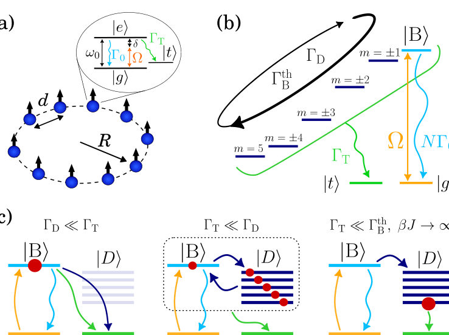 
FIG. 1. (a) Schematic of the system. A nanoring of three-level quantum emitters (|g⟩, |e⟩and |t⟩) with radius R and interparticle spacing d, coupled through dipole–dipole interactions and driven by a classical field. Black arrows indicate the dipole moments; Ωand δ denote the Rabi frequency and detuning of a coherent drive. An emitter can decay from |e⟩into |g⟩by spontaneously emitting photons at rate Γ0, while it irreversibly decays into |t⟩at rate ΓT. (b) Level scheme of the single-excitation collective modes of the nano-ring, in the small-volume (Dicke) limit (R/λ0 ≪1). The bright mode (B) and the ground state (g) are coherently coupled by the external drive. Local and thermal dephasing,...

📷 Fig 2

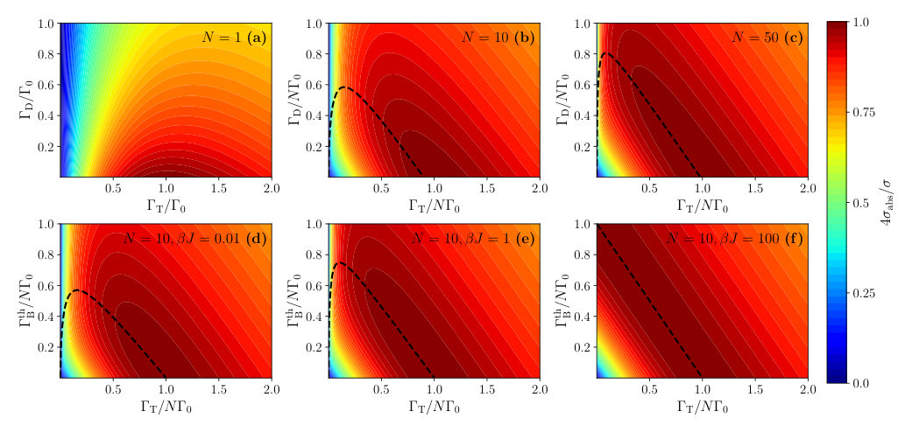 
FIG. 2. Absorption cross-section σabs (in units of σ/4) in the presence of local (top panels) and thermal (bottom panels) dephasing, as a function of ΓT and the dephasing rate (ΓD or Γth B , respectively), normalized to the bright mode spontaneous decay rate NΓ0. (a) N = 1 (single emitter), where σabs decreases monotonically with ΓD/Γ0 and is maximal at ΓT = Γ0. (b) N = 10 and (c) N = 50. (d) βJ = 10−2, (e) βJ = 1 and (f) βJ = 102 for N = 10. All panels correspond to the Dicke (small-volume) limit. The dashed black line indicates the optimal dephasing rate maximizing σabs at fixed ΓT/NΓ0. σabs is always bounded by σ/4.

📷 Fig 3

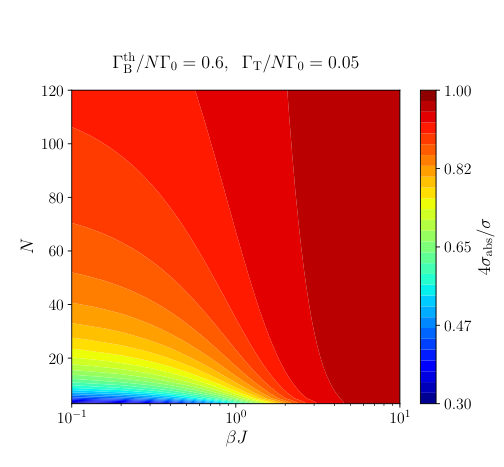 
FIG. 3. Absorption cross section σabs (in units of σ/4) in pres- ence of thermal dephasing and in the Dicke (small-volume) limit, at fixed values of ΓT/NΓ0 = 0.6 and Γth B /NΓ0 = 0.05, plotted versus N and βJ.

📷 Fig 4

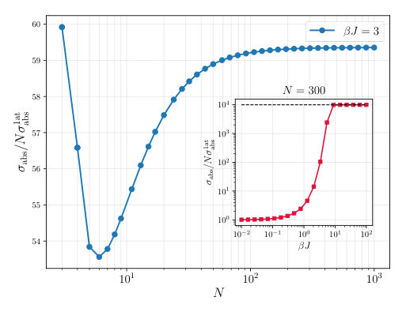 
FIG. 5. Scaling of the ratio σabs/Nσ1at abs with the number of emitters N, in the presence of thermal dephasing, for βJ = 3. For sufficiently large arrays (N ≳100), the ratio approaches a saturation value that depends on βJ. Inset: Saturation value of σabs/Nσ1at abs(Γ0), extracted for N = 300, as a function of βJ. The gray dashed line marks the asymptotic low temperature limit from Eq. (39), scaling as ∼Γ0/ΓT. The trapping rate and coupling strength to the bath are fixed to ΓT/Γ0 = 10−4

📷 Fig 5

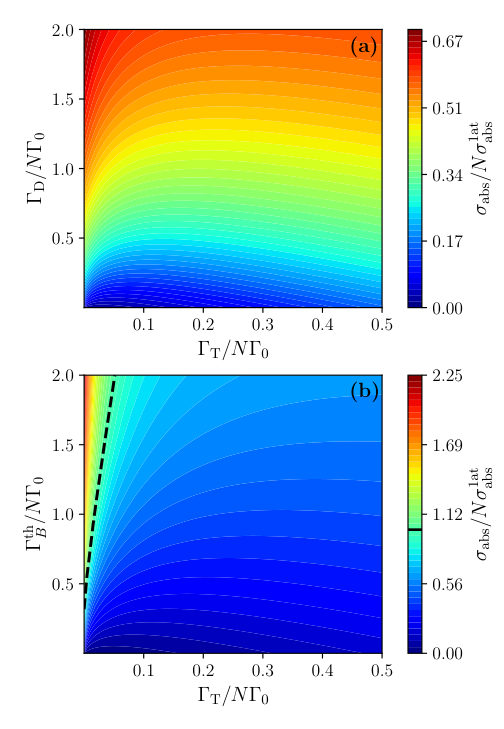 
FIG. 4. Ratio of the collective absorption cross-section σabs of a nanoring to that of N independent emitters as a function of trapping (ΓT/NΓ0) and dephasing (ΓD/NΓ0 and Γth B /NΓ0) rates. (a) Pure local dephasing and (b) thermal dephasing with βJ = 1. In the independent emitter case, each emitter has spontaneous emission rate Γ0, trapping rate ΓT, and the dephasing rate is taken to be ΓD or Γth B , respectively. The dashed line marks 1, corresponding to equal absorption in the collective and independent cases. Results are shown for N = 10 in the Dicke (small-volume) limit.

**Summary.** This paper shows that instead of being purely detrimental, environmental dephasing can enhance light absorption in a ring of quantum emitters by moving population into long-lived subradiant modes. This mechanism is particularly effective with thermal dephasing and can lead to absorption efficiencies exceeding the sum of independent atoms.

**Why it may be interesting.** It provides a counter-intuitive insight into open quantum systems, showing that environmental noise can be a constructive resource for enhancing light-matter interaction, which is highly relevant to quantum optics and light-harvesting research.

Detailed structure

**Main problem.** Investigating whether environmental decoherence, such as dephasing and phonon coupling, can be utilized as a resource to enhance single-photon absorption in subwavelength nano-rings of quantum emitters.

**Main result.** The study demonstrates that decoherence can enhance absorption by redistributing population from superradiant (bright) modes into subradiant (dark) modes, with thermal dephasing potentially allowing collective absorption to surpass that of independent emitters.

**Method.** The authors use a Lindblad master equation approach within the single-excitation manifold, employing the Born-Markov approximation and analyzing steady-state populations and absorption cross-sections.

**Model / system.** A nano-ring of N dipole-coupled two-level quantum emitters in the deep subwavelength regime, modeled with a non-Hermitian effective Hamiltonian including dipole-dipole interactions and collective radiative decay.

**Key observables.** Absorption cross-section, scattering cross-section, and excited state population.

**Important parameters / regimes.** Number of emitters (N), interparticle spacing (d/lambda_0), dephasing rates (pure and thermal), trapping rate (Gamma_T), and temperature (beta).

**Assumptions / limitations.** Single-excitation manifold approximation, weak-field/weak-driving limit, Born-Markov approximation, and fixed emitter positions.

**Figures summary.** Figure 1 shows the nano-ring geometry and the level scheme of collective modes; Figure 2 illustrates the absorption cross-section as a function of dephasing and emitter number, showing the emergence of enhancement.

**Paper structure.** The paper introduces the problem of decoherence as a resource, defines the nano-ring model and master equation, analyzes single-atom vs. collective behavior under local dephasing, extends the study to thermal dephasing and temperature effects, and concludes with finite-size and incoherent illumination analysis.

Abstract

Decoherence is mostly detrimental in quantum information and quantum optics applications. However, the interplay between environment-induced incoherent dynamics and unitary evolution can give rise to novel quantum many-body phenomena that can be harnessed as a useful resource. As is well known, in dense subwavelength atomic arrays only a single collective eigenmode in the single-excitation manifold couples strongly to free-space radiation, exhibiting superradiant spontaneous emission. Most of the remaining eigenstates form a manifold of weakly radiative modes, giving rise to long-lived subradiant excitations. Here we demonstrate that populating these subradiant modes via additional decoherence mechanisms, such as dephasing or coupling to phonons, can significantly enhance single-photon absorption in a nanoring of quantum emitters. Such nanoring geometry is particularly appealing due to its unique optical properties and its resemblance to natural light-harvesting complexes, which serve as efficient antennas in photosynthesis. Our findings may shed light on fundamental aspects of energy absorption in nature; despite the much greater complexity of biological systems, they may nonetheless operate according to similar underlying optical principles.

[↑ back to top](#top)

### ⭐ [Photon correlation microscopy of quantum matter](http://arxiv.org/abs/2605.28623v1)

**Highlighted author(s):** Nicolò Defenu  
**Authors:** Elie Vandoolaeghe, Iñigo Lasheras, Chirag Vaswani, Sampriti Saha, Purbasha Ray, Takashi Taniguchi, Kenji Watanabe, Prasana Sahoo, Nicolò Defenu, Thibault Chervy, Puneet A. Murthy  
**Type:** both · **Category:** quantum gases · **PDF:** <https://arxiv.org/pdf/2605.28623v1>  
**Analysis basis:** full PDF text, analyzed in chunks
**Topic relevance:** 🔥 `quantum optics experiment` **4/5** · `analog quantum simulation` **3/5** · `driven-dissipative phase transition` **3/5** · `quantum measurements` **2/5**

📷 Fig 1

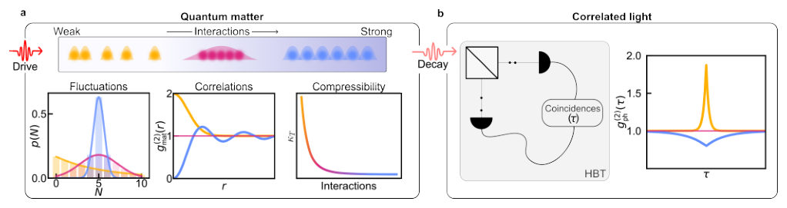 
FIG. 1. Photon correlation microscopy of many-body systems. (a) Matter. A mesoscopic many-body system of emitters exhibiting three distinct phases: a compressible thermal phase (yellow), a quantum-degenerate phase (purple), and a strongly correlated, incompressible phase (blue). These are mirrored in three complementary observables (left to right): the number distribution p(N) broadens in the thermal phase and sharpens toward the incompressible regime; the matter pair correlator g(2) mat(r) evolves (for bosons) from spatial bunching to a deepening correlation hole; the compressibility κT collapses as repulsive interactions stiffen the system. (b) Light. Emitted photons are sent into a...

📷 Fig 2

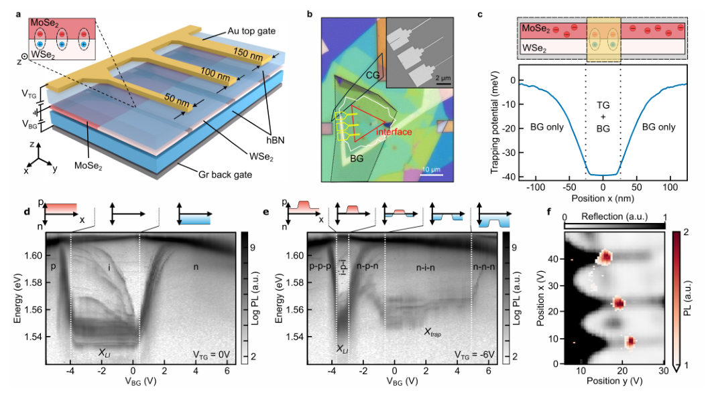 
FIG. 2. Mesoscopic confinement of dipolar excitons. (a) Schematic of the dual-gated device: a lateral MoSe2–WSe2 semiconductor heterostructure encapsulated in hBN. Nanostructured top-gate fingers of width L = 50, 100, 150 nm, oriented perpendicular to the lateral interface, define confinement regions for interfacial dipolar excitons (inset). (b) Micrograph of the device with top-gate fingers (yellow) and the lateral interface (red) outlined; inset: SEM image of the top-gate fingers. (c) Simulated longitudinal trapping potential for L ≈50 nm shows flat-bottomed 1D confinement. (d) VBG-dependent PL spectra at VTG = 0. The unconfined interface exciton XLI exhibits a characteristic blueshift...

📷 Fig 3

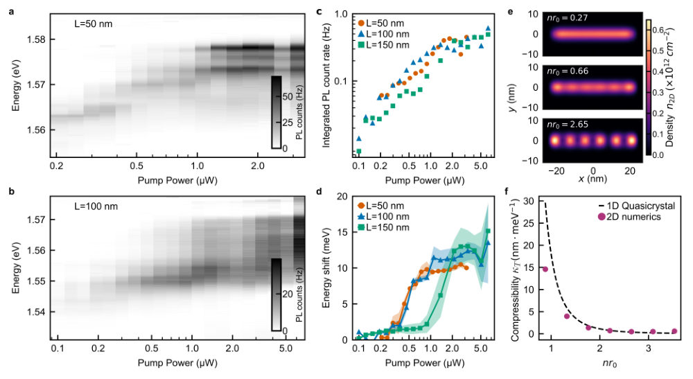 
FIG. 3. Interaction-driven crossover. (a, b) Power-dependent PL spectra (normalized by integration time) for the L = 50 nm and L = 100 nm traps, respectively. As the power is increased, emission shifts sequentially from the lowest transverse subband to higher-lying ones. (c) Integrated PL count rate (normalized by the average photon energy) for the L = 50 nm (orange), L = 100 nm (blue) and L = 150 nm (green) traps, displaying a steep rise followed by saturation at higher powers. (d) Mean emission energy for the same traps, exhibiting a similar steep rise and saturation. The integrated counts and the mean energy saturate at the same power Psat for each trap, with Psat depending on the trap...

📷 Fig 4

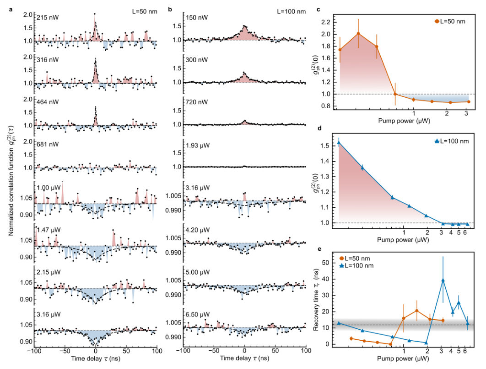 
FIG. 4. Many-body blockade of photon emission. (a, b) Power-dependent g(2) ph (τ) for the L = 50 nm and 100 nm traps.

**Summary.** This paper introduces Photon Correlation Microscopy to study many-body correlations in 1D dipolar excitons. By measuring photon statistics, the authors observe a transition from photon bunching to antibunching, signaling a crossover from a compressible thermal gas to an incompressible, number-stabilized state. This technique provides a new way to probe correlated electronic phases using optical tools.

**Why it may be interesting.** It establishes a powerful new bridge between quantum optics and many-body physics, showing how photon statistics can serve as a non-invasive probe for complex phases like Wigner crystals or Mott insulators in semiconductor systems.

Detailed structure

**Main problem.** Bridging the gap between quantum optics and many-body physics by developing a method to probe real-space many-body correlations and compressibility in quantum matter at mesoscopic scales.

**Main result.** The authors demonstrate Photon Correlation Microscopy (PCM) to observe a density-driven crossover in a 1D dipolar exciton gas from a compressible thermal phase (photon bunching) to an incompressible, number-stabilized quasi-crystal phase (photon antibunching).

**Method.** The study combines experimental Hanbury Brown-Twiss interferometry and power-dependent spectroscopy with numerical many-body simulations using the Multi-Configuration Time-Dependent Hartree method for bosons (MCTDH-B).

**Model / system.** A 1D ensemble of dipolar excitons confined in mesoscopic, gate-defined traps at a lateral MoSe2-WSe2 heterojunction, characterized by large permanent in-plane electric dipole moments and long radiative lifetimes.

**Key observables.** Second-order photon correlation function g2(0), photon bunching/antibunching, isothermal compressibility, particle number fluctuations, and photon recovery time.

**Important parameters / regimes.** Trap widths (50, 100, 150 nm), pump power, dipolar interaction strength, and the ratio of sampling length to coherence length.

**Assumptions / limitations.** The system is assumed to be in quasi-equilibrium (thermalization time is much shorter than radiative lifetime), and the photon statistics are assumed to track the local density fluctuations.

**Figures summary.** Figure 1 provides a schematic of PCM and the transition from thermal to incompressible phases; Figure 4 shows power-dependent photon correlation measurements for different trap sizes; Supplemental Figure S6 shows chemical potential and density distributions.

**Paper structure.** The paper introduces the PCM technique, describes the experimental platform and confinement method, presents the observation of the phase crossover via photon statistics, provides a theoretical validation of the link between photon and matter correlations, and concludes with scaling and dynamical analysis.

Abstract

Light and matter share fundamental statistical properties, yet the experimental probes of quantum optics and many-body physics have largely evolved along separate trajectories. While many-body physics explores emergent collective phenomena, quantum optics has refined the measurement of correlations between individual photons. Here, we introduce photon correlation microscopy (PCM) - which bridges the two domains by leveraging correlations of emitted light to probe the correlations in quantum matter at mesoscopic scales. We demonstrate this approach using a one-dimensional (1D) ensemble of dipolar excitons confined at a lateral monolayer MoSe$_2$-WSe$_2$ heterojunction. We use gate-defined potentials to confine the 1D excitons to a mesoscopic lengthscale to enhance the visibility of matter correlations in the emitted photon field. Power-dependent spectroscopy reveals a transition from a compressible to an incompressible phase, signaled by the simultaneous saturation of the emission intensity and energy blueshift, which is supported by numerical simulations. Through this crossover, photon correlation measurements show a striking evolution from bunching at low densities to antibunching at high densities. This constitutes a many-body blockade of photon emission emerging directly from a number-stabilized state, driven by collective dipolar repulsion. Our results establish PCM as a powerful probe of many-body physics through the lens of quantum optics, extensible to a broad class of correlated electronic phases, while pointing toward a route to generating non-classical light through many-body correlations.

[↑ back to top](#top)

### [Observing conformal Floquet dynamics on a digital quantum processor](http://arxiv.org/abs/2605.27530v1)

**Authors:** Liang-Hong Mo, Bastien Lapierre, Qiang Miao  
**Type:** both · **Category:** other · **PDF:** <https://arxiv.org/pdf/2605.27530v1>  
**Analysis basis:** full PDF text, analyzed in chunks
**Topic relevance:** 🔥 `QC/QI experiment` **5/5** · 🔥 `non-equilibrium dynamics` **4/5** · 🔥 `non-equilibrium universality` **4/5** · `entanglement & information structure` **3/5** · `driven-dissipative phase transition` **2/5**

📷 Fig 1

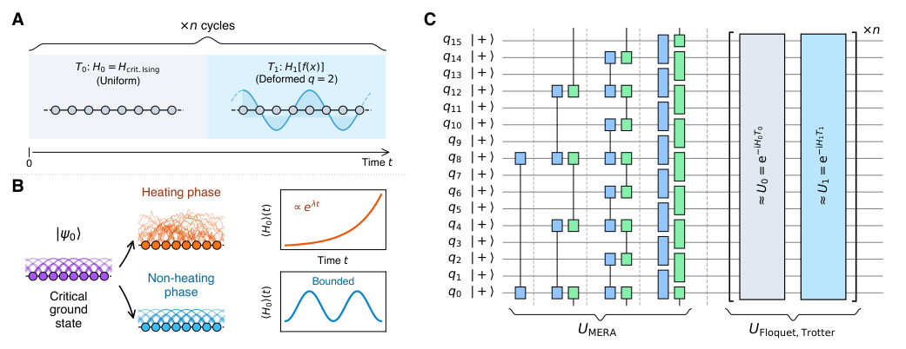 
Figure 1. Setup and implementation of Floquet circuit. (A) We consider a periodic driving protocol alternating between the uniform TFIM Hamiltonian H0 and the deformed TFIM Hamiltonian H1, with the initial state prepared in the ground state of H0 . In each cycle, the system evolves under either H0 or H1 for periods T0 and T1, respectively. (B) Depending on driving parameters, the system exhibits either a heating phase where energy grows exponentially, or a non-heating phase where energy remains bounded. (C) Circuit implementation of the ground state preparation and time-evolution protocol. The target critical ground state is generated via the hierarchical UMERA circuit, where each two-qubit...

📷 Fig 2

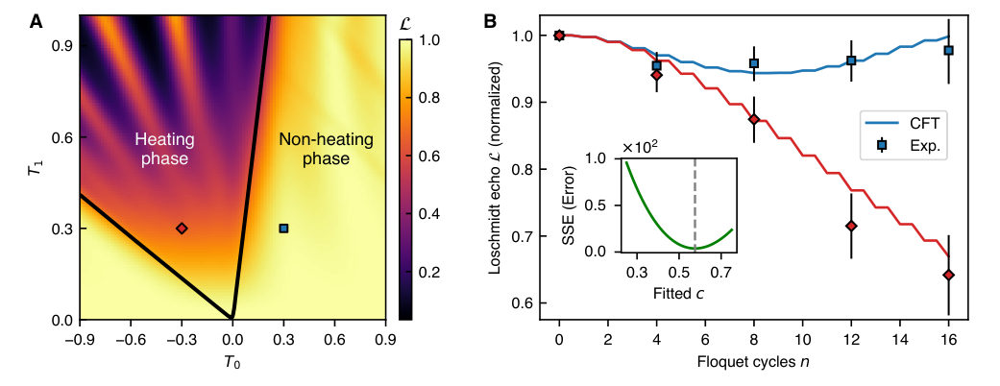 
Figure 2. Observation of heating and non-heating phases. (A) Phase diagram of the Floquet dynamics, characterized by the Loschmidt echo L after n = 16 cycles for N = 16 spins with spatial deformation parameters q = 2, ⃗κ1 = (1.0, 1.2, −0.2). The black curve denotes the phase boundary predicted by CFT, which separates the heating phase (decaying L(n)) from the non-heating phase (oscillating L(n)). The red diamond and blue square at T0 = ∓0.3, T1 = 0.3 mark the two representative parameter points used in panel (B). A negative value of T0 corresponds to flipping the sign of the Hamiltonian H0 in the time-evolution operator e−iH0T0. (B) Experimental results on Quantinuum’s Helios for the...

📷 Fig 3

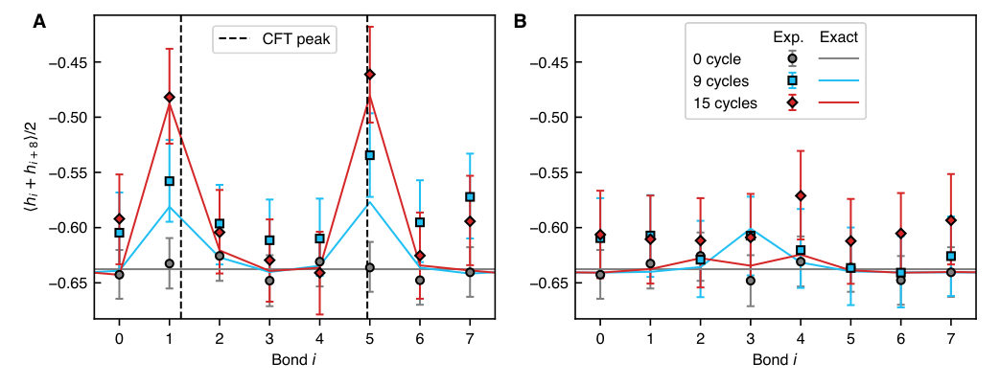 
Figure 3. Spatial structure of conformal Floquet heating. (A) Spatial profile of the energy density in the heating phase, demonstrating energy accumulation around the continuous-space locations predicted by CFT (black dashed lines). (B) Corresponding energy density profile in the non-heating phase, which is bounded over Floquet cycles without localized energy accumulation. In both panels, solid lines denote exact numerical simulations, while markers represent experimental results obtained from up to 1000 measurement shots. Error bars indicate 95% confidence intervals obtained via bootstrap resampling. To suppress statistical noise, the displayed data points are averaged over q = 2 sites...

📷 Fig 4

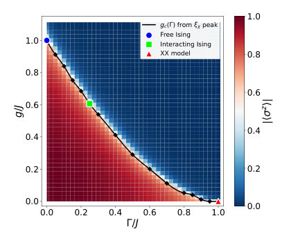 
Figure 4. Phase diagram of the perturbed transverse-field Ising chain (A1). The colour map shows the order parameter |⟨σz⟩| across the (Γ, g) plane; the black curve is the critical boundary gc(Γ) extracted from the ξχ peak as described in the main text. The three highlighted markers are integrable / known limits: the free transverse-field Ising point (Γ, g) = (0, 1) (c = 1/2), the “inter- acting Ising” critical point (Γ, g) = (0.25, 0.607) (c = 1/2), and the XX model (Γ, g) = (1, 0) (c = 1).

📷 Fig 5

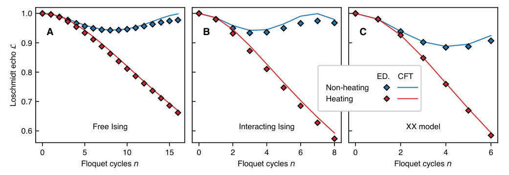 
Figure 5. Comparison between exact diagonalization and CFT predictions for different critical lattice models obtained from (A1). (A) Free transverse-field Ising chain, (J, g, Γ) = (1/2, 1/2, 0). (B) Non-integrable interacting Ising chain, (J, g, Γ) = (1, 0.6066, 0.25). (c) XX model, (J, g, Γ) = (1/2, 0, 1/2). Markers denote exact diagonalisation calculations with size L = 16 and periodic boundary conditions. Solid lines are the analytical CFT predictions from Eq. (6). Here we use deformation ⃗κ1 = (1.0, 1.2, −0.2), q = 2, with T0 = −0.3, T1 = 0.3 for heating phase and T0 = 0.3, T1 = 0.3 for non-heating phase. Across these three microscopically different models, numerical data at L = 16...

**Summary.** This paper reports the first experimental observation of non-equilibrium dynamics initiated from a many-body critical state using a trapped-ion quantum processor. By using MERA-based state preparation and a Floquet drive, the authors successfully measured the central charge of the Ising universality class. This establishes a versatile framework for studying complex, scale-invariant quantum dynamics on digital hardware.

**Why it may be interesting.** This work is highly relevant for many-body dynamics as it demonstrates a scalable way to explore Conformal Field Theory (CFT) predictions and non-equilibrium phase transitions using a digital quantum processor, moving beyond simple product-state initializations.

Detailed structure

**Main problem.** Simulating non-equilibrium dynamics starting from many-body critical states is difficult due to bottlenecks in state preparation, hardware performance, and classical verification.

**Main result.** The researchers experimentally observed conformal Floquet dynamics on a trapped-ion processor, successfully extracting a central charge of c = 0.575 +/- 0.036, which is consistent with the Ising universality class prediction of c = 1/2.

**Method.** The study uses a hardware-tailored MERA circuit for critical state preparation and a deep Floquet drive implemented via Trotter-Suzuki decomposition, supplemented by error mitigation techniques like dynamical decoupling and parity post-selection.

**Model / system.** A 1D Transverse-Field Ising Model (TFIM) implemented on Quantinuum's Helios fully-connected trapped-ion quantum processor using Ba+ ions.

**Key observables.** Loschmidt echo, energy density, and central charge (c).

**Important parameters / regimes.** Heating and non-heating phases, driving periods (T0, T1), and the deformation amplitude/wavenumber.

**Assumptions / limitations.** The spatial profile of the deformation is simplified to a single harmonic sector, and the initial state is assumed to be the ground state of a uniform Hamiltonian.

**Figures summary.** Figure 1 shows the Floquet circuit setup and architecture; Figure 2 presents the phase diagram of the Loschmidt echo; Figure 4 shows the critical boundary in a perturbed Ising chain; Figure 5 compares experimental data to ED and CFT predictions; Figure 6 demonstrates the effectiveness of error mitigation.

**Paper structure.** The paper introduces the challenge of critical state dynamics, describes the experimental platform and MERA-based state preparation, details the Floquet driving protocol and error mitigation, presents the observation of heating/non-heating phases and central charge extraction, and concludes with the scalability and universality of the framework.

Abstract

Quantum simulations are traditionally confined to exploring dynamics starting from unentangled or low-entanglement states due to severe bottlenecks in protocol design, hardware performance, and classical verification. Here, we report the first experimental observation of non-equilibrium dynamics initiated directly from a many-body critical state. Using a fully-connected trapped-ion processor, we prepare the critical ground state of a transverse-field Ising model via a hardware-tailored, logarithmic-depth quantum circuit based on multi-scale entanglement renormalization. Following this initialization, we apply a deep Floquet drive that maintains emergent conformal symmetry, enabling us to benchmark the lattice dynamics against analytical results from continuum theory. In the resulting conformal heating phase, we extract a central charge consistent with the Ising universality class ($c=1/2$) from the universal decay of the Loschmidt echo and observe spatial energy localization predicted by field theory. Conversely, the non-heating phase exhibits global finite-time revivals. This work establishes a scalable and versatile framework for exploring critical quantum dynamics.

[↑ back to top](#top)

### [Large-scale array of squeezed light and synchronization using atomic vapor](http://arxiv.org/abs/2605.28316v1)

**Authors:** Lin Wang, Xichang Zhang, Konstantin Manannikov, Nir Davidson, Ying Hu, Dongdong Hao, Yanhong Xiao  
**Type:** experiment · **Category:** quantum information and computing · **PDF:** <https://arxiv.org/pdf/2605.28316v1>  
**Analysis basis:** full PDF text, analyzed in chunks
**Topic relevance:** 🔥 `quantum optics experiment` **5/5** · 🔥 `correlated / nonlocal dissipation` **4/5** · `QC/QI experiment` **3/5**

📷 Fig 1

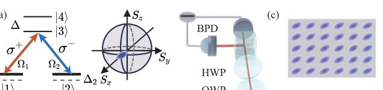 
FIG. 1. Working principles and experimental schematics of a squeezed light array. (a) Left: Simplified atomic energy levels for squeezing. The linearly polarized light drives the 87Rb D1 transition, resonantly from |1⟩, |2⟩(belonging to 5S1/2, F = 2 Zeeman manifolds) to |3⟩(5P1/2, F ′ = 1), and off-resonantly to |4⟩(5P1/2, F ′ = 2). Here, Ω1,2 are the Rabi frequencies for the two circularly polarized component respectively, ∆= 814.5 MHz is the frequency spacing between the two excited states. ∆1,2 are the AC-stark shifts due to the upper excited state. Right: A Poincar´e sphere illustrating the polarization squeezed state. (b) Experiment setup. A diffractive optical element (DOE) generates...

📷 Fig 2

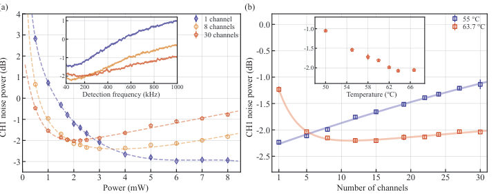 
FIG. 2. Experimental results of squeezed array. (a) Noise power of the minimal-noise-quadrature (denoted as squeezed quadrature) of a selected channel (CH1) relative to the photon shot noise level (set as 0 dB) versus the laser power per channel, for a single channel case, a 8-channel and 30-channel array respectively, while the beam size of all channel is kept at 0.505 mm in all cases. The cell temperature is 63.7◦C. The dashed curve is a fit to guide the eye. (b) Squeezed quadrature noise of CH1 versus the array size at two temperatures (55◦C and 63.7◦C), with a fixed input laser power of 2 mW and a corresponding beam size of 0.505 mm for each channel. The inset shows the best squeezing...

📷 Fig 3

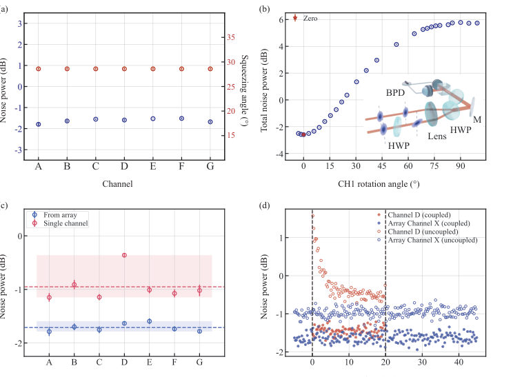 
FIG. 3. Synchronization in the squeezed light array. (a) The squeezed quadrature noise (blue) and squeezing angle (red) of seven randomly selected channels in a 30-channel array. Laser power 2 mW and beam size 0.505 mm for each channel. (b) The inset in (b) illustrates the experimental schematic at the output of the cell for measuring the total noise power using a two-channel array. One of the two squeezed beams passes through an additional quarter-wave plate (QWP), which rotates its polarization ellipse before combining with the other beam. The main panel shows the total noise power, measured via balanced homodyne detection, as a function of the rotation angle applied by the QWP. Both...

📷 Fig 4

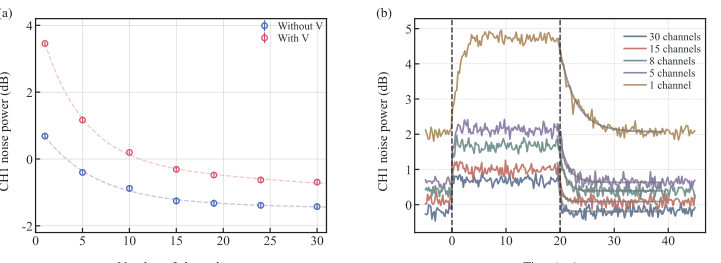 
FIG. 4. Response of the array to a defective channel. (a) Degradation of squeezing due to a “defect” channel with input light polarization (V) orthogonal to that of the array, for arrays containing different numbers of channels. The solid curve is a fit to guide the eye. The defect beam: 2 mW, waist 0.525 mm. The H-polarized beams in the array: 1 mW per channel, waist 0.505 mm. The detection frequency is 186 kHz. Error bars (vertical lines in the symbol) represent standard deviations from six repetitive measurements. (b) Time-resolved response of the array to a pulsed defect channel. The defect beam has a power of 1.0 mW and a waist of 0.468 mm, whereas the H-polarized array beams have a...

📷 Fig 5

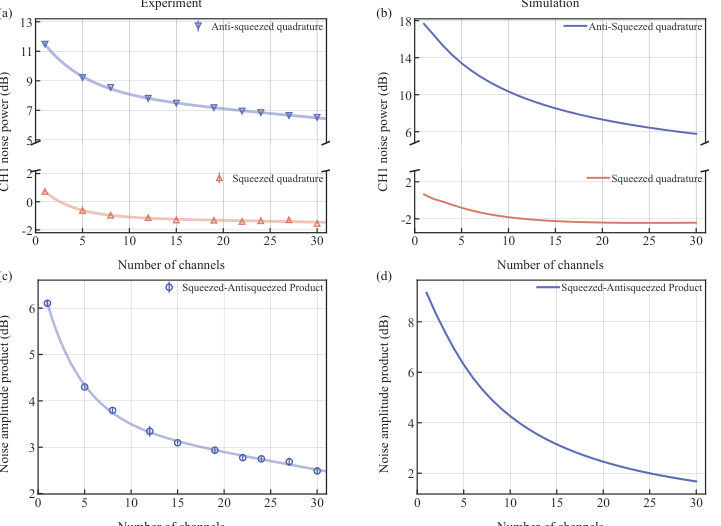 
FIG. 5. Improved purity of squeezed states for a larger array. Experimental and numerical results of the squeezed and anti- squeezed quadrature noises of a selected channel (CH1) in the array, for arrays containing different number of channels. The solid curve in (a) is a fit to guide the eye. Laser power of 1 mW and beam size of 0.505 mm for each channel. Detection frequency 180 kHz. Spectrum analyzer settings are the same as that in Fig.2. Error bars (small vertical lines inside the symbols) represent standard deviations from six repetitive measurements. Panels (c) and (d) show, in dB, the products of the squeezed and anti-squeezed noise amplitudes, equal to the mean of the two dB numbers...

**Summary.** The researchers successfully created a large-scale array of 30 synchronized squeezed light beams using a single atomic vapor cell. By leveraging the movement of atoms between light beams, they achieved collective effects that improve the stability and purity of the quantum states. This provides a scalable pathway for generating multi-channel quantum light sources for imaging and computing.

**Why it may be interesting.** It demonstrates how dissipative coupling through a shared reservoir (flying atoms) can induce synchronization and collective enhancement in a many-body optical system, relevant to open quantum systems and quantum networks.

Detailed structure

**Main problem.** The challenge of scalable production of multiple beams of squeezed light for quantum information technologies and exploring the collective synchronization of these beams.

**Main result.** Demonstration of a 3-beam array of polarization-squeezed light with 2.03 dB of squeezing, showing that inter-channel coupling via atomic diffusion leads to synchronization and improved state purity.

**Method.** Experimental generation of squeezed light using polarization self-rotation (PSR) in a Rubidium vapor cell, with detection via balanced homodyne detection and characterization of array uniformity and synchronization.

**Model / system.** A 30-beam spatial array interacting with an 87-Rb atomic vapor in a paraffin-coated glass cell, modeled using a multi-level master equation describing atomic density matrix evolution and inter-channel coupling via a shared reservoir of atoms.

**Key observables.** Squeezing level (dB), squeezing angle, noise power vs. laser power, squeezing bandwidth, and time-resolved recovery dynamics after perturbations.

**Important parameters / regimes.** Number of channels (1 to 31), laser power per channel, cell temperature (55 to 66.7 C), beam size, and detection frequency.

**Assumptions / limitations.** Neglect of certain experimental imperfections like extreme inhomogeneities and optical losses in the numerical models; assumes atoms in the dark region act as a global reservoir.

**Figures summary.** Figures show atomic energy levels, experimental schematics, noise power vs. laser power for different array sizes, squeezing angle uniformity, and the impact of polarization defects and cell geometry on squeezing performance.

**Paper structure.** The paper introduces the scalability problem, describes the experimental setup and atomic mechanism, presents results on squeezing levels and array scaling, investigates synchronization and robustness to defects, and concludes with optimization strategies via numerical simulations.

Abstract

Quantum light sources such as squeezed light are essential for quantum information science and technologies, but the scalable production of multiple beams of them remains a challenge. Here,we experimentally demonstrate a novel approach to the generation of a large spatial array of polarization-squeezed light beams via atomic-coherence-enhanced nonlinear optical processes using a single atomic vapor cell. Unlike schemes based on independent squeezing generators, the squeezing dynamics of each channel here are governed by a common collective ground-state atomic coherence, produced by all input beams, homogenized by the thermal motion of the atoms, and protected against wall collisions by a paraffin coating. Consequently, the optical states of all channelsare coupled and regulated by each other via the moving atoms, leading to synchronization behavior.We realized a 30-beam array of polarization squeezed state with 2.03 dB of squeezing, experimentally verified the synchronization, and observed improved purity of the squeezed state as well as the system response to perturbations when the size of the array increases. This work provides a pathway towards scalable high-performance quantum light sources for applications in precision measurement, quantum imaging and quantum information processing.

[↑ back to top](#top)

### [A multilevel tensor network compression technique for simulating Lindblad dynamics in superconducting circuits](http://arxiv.org/abs/2605.27515v1)

**Authors:** Adrien Moulinas, Xavier Waintal  
**Type:** theory · **Category:** numerical methods · **PDF:** <https://arxiv.org/pdf/2605.27515v1>  
**Analysis basis:** full PDF text, analyzed in chunks
**Topic relevance:** 🔥 `methods for driven-dissipative` **5/5** · `entanglement & information structure` **2/5** · `non-equilibrium dynamics` **2/5**

📷 Fig 1

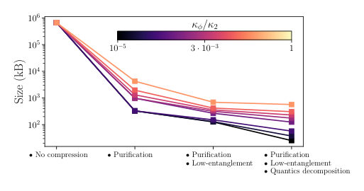 
FIG. 1. Role of the three axes of compression for a cat qubit. The plot shows the size of the compressed density matrix versus which compression stages are activated. The compression ratio depends significantly on the ratio between the strength of the dephasing κϕ and the photon loss rate κ2 of the buffer. Bad cat qubits (large κϕ) have a more complex dynamics which is more expensive to simulate. See section IV for more details.

📷 Fig 2

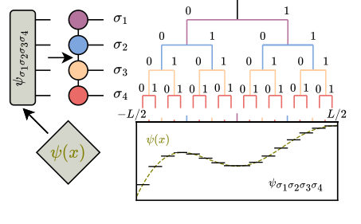 
FIG. 2. Illustration of the QTT framework. Starting with a function ψ of a continuous variable x defined over an interval [a, b], we discretize it with 2R points (R = 4 here) and transform it into an R-dimensional tensor F. We then use the TCI algorithm to write this tensor as a tensor train with R tensors.

📷 Fig 3

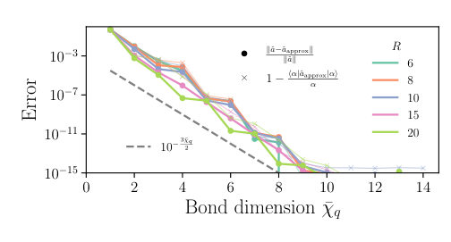 
FIG. 3. Construction of ˆa in QTT form. Evolution of the error of the MPO representing the annihilation operator ˆa with the bond dimension χq for various R values. We observe that a bond dimension of 10 is enough to reduce both errors under 10−14, for all values of R.

📷 Fig 4

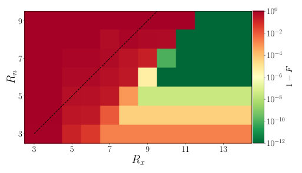 
FIG. 4. Fidelity F of the conversion between Fock and position representation. Fidelity of the conversion versus number of bits in position (Rx) and Fock (Rn) space. A co- herent state |α⟩with |α|2 = 2Rn/3 is mapped from Fock space to position space and back. The dotted black line corresponds to Rx = Rn and serves as a guide to the eye.

📷 Fig 5

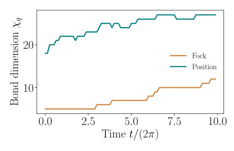 
FIG. 5. Comparison of QTT bond dimension between the Fock and position basis. The time evolution is simu- lated using the Magnus-TDVP algorithm described in III A 3 for the problem described in III B. We consider QTT of sizes Rn = 10 and Rx = 12. We observe that the quantics bond dimension χq is significantly smaller in the Fock space.

**Summary.** This paper presents a multilevel tensor network technique to simulate the dissipative dynamics of superconducting bosonic circuits. By leveraging state purity, low entanglement, and a quantized representation of Fock space, the method achieves massive reductions in memory and time complexity. This allows complex simulations of phenomena like transmon ionization to be performed on a laptop rather than a supercomputer.

**Why it may be interesting.** It provides a highly efficient numerical framework for simulating open quantum systems with large local Hilbert spaces, specifically bridging the gap between complex many-body dynamics and accessible desktop-level computation.

Detailed structure

**Main problem.** The exponential growth of the Hilbert space dimension (the curse of dimensionality) makes simulating the Lindblad dynamics of large-scale bosonic systems, such as superconducting circuits, computationally prohibitive.

**Main result.** The authors developed a multilevel tensor network compression technique that achieves orders-of-magnitude speed-ups, reducing the computational resources required for transmon ionization simulations from supercomputing scales to laptop level.

**Method.** A three-axis compression approach combining global purification of the density matrix, Matrix Product State (MPS) representation for low entanglement, and Quantics Tensor Train (QTT) for efficient Fock space discretization using Tensor Cross Interpolation (TCI).

**Model / system.** Superconducting quantum circuits, specifically focusing on bosonic modes in cat qubits and transmon-cavity systems subject to Lindblad master equation dynamics involving photon loss and dephasing.

**Key observables.** Purity, Wigner functions, expectation values of field amplitude, transmon and cavity populations, and error rates (phase-flip and bit-flip).

**Important parameters / regimes.** Bond dimensions (purity chi_mu, entanglement chi_e, and quantics chi_q), photon loss rate (kappa_2), dephasing rate (kappa_phi), and the number of bits (R) in the QTT.

**Assumptions / limitations.** The density matrix is relatively pure or not far from pure, and the entanglement between different modes is moderate (qubit-like).

**Figures summary.** Figure 1 shows memory reduction across compression stages; Figure 2 illustrates the QTT construction process; Figure 3 shows error convergence of the annihilation operator; Figure 4 shows fidelity of basis conversion; Figure 12/13 show population evolution, purity loss, and Hamiltonian eigenstate branches.

**Paper structure.** The paper introduces the computational problem, details the three-axis compression ansatz (Purification, MPS, and QTT), describes the numerical integration schemes (Kraus maps, TDVP, Magnus expansion), and validates the method through simulations of cat qubits and transmon ionization.

Abstract

Designing superconducting quantum hardware requires simulation tools that can account for various deviations from ideal scenarios. This, in turn, requires approaches that automatically detect certain structures and leverage them to make the computation affordable. Here, we develop a tensor network based technique to simulate the Lindblad dynamics of a few interacting bosonic modes with a focus on superconducting quantum circuits. The technique detects and takes advantage of two very common situations: (i) the density matrix being pure or not far from pure and (ii) the entanglement between different modes being moderate (typically qubit-like). However, (iii) the occupation of the modes can be arbitrarily high (making naïve truncations inefficient). To leverage these features, we use three different nested levels of tensor network compression: (i) we work with a global purification of the density matrix, (ii) we compress the connection between different modes to account for the moderate entanglement and (iii) we use a quantics representation of the Fock occupation number. We showcase the technique for the simulation of large cat qubits as well as for the ionization of transmon qubits, demonstrating orders-of-magnitude speed-up with respect to brute force approaches. In the latter example, it brings the simulation, previously reported on a large supercomputing infrastructure, to laptop level. The favorable scaling with system size should bring genuine computer assisted design of these systems within scope.

[↑ back to top](#top)

### [Quantum Spin Squeezing Enhanced by Critical Exceptional Points](http://arxiv.org/abs/2605.28126v1)

**Authors:** Yuma Nakanishi  
**Type:** theory · **Category:** statistical mechanics · **PDF:** <https://arxiv.org/pdf/2605.28126v1>  
**Analysis basis:** full PDF text, analyzed in chunks
**Topic relevance:** 🔥 `Tavis-Cummings & cavity-many-emitter` **4/5** · 🔥 `driven-dissipative phase transition` **4/5** · 🔥 `non-equilibrium universality` **4/5** · `correlated cavity matter` **3/5** · `entanglement & information structure` **3/5** · `non-equilibrium dynamics` **3/5** · `Dicke superradiance` **2/5** · `Keldysh / 2PI / non-Gaussian methods` **2/5** · `exotic spin models in light-matter` **2/5** · `methods for driven-dissipative` **2/5**

📷 Fig 1

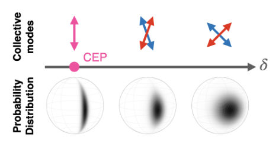 
Figure 1. Top: schematic of collective excitation modes for the control parameter δ. The two linear collective modes (ar- rows) approach each other and coalesce at the CEP (pink) into a single defective direction. Bottom: schematic illustration of the steady-state spin distribution on the Bloch sphere. Near the CEP, the distribution becomes strongly anisotropic and elon- gated along the defective direction, whereas away from the CEP it becomes progressively more isotropic.

📷 Fig 2

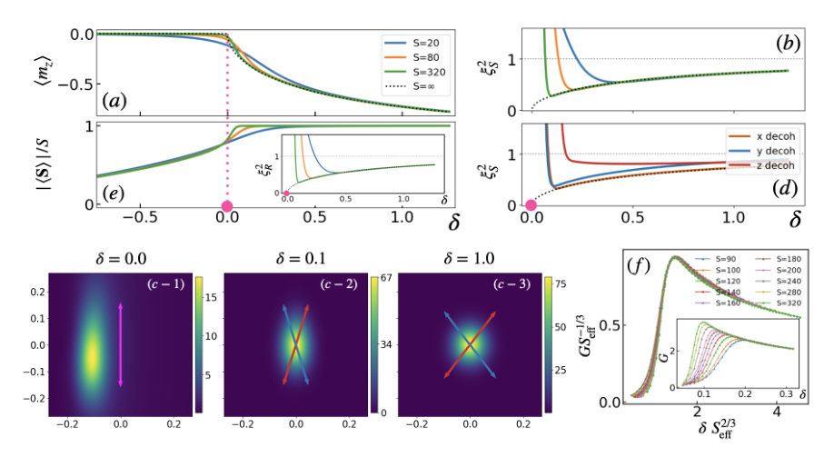 
Figure 2. Numerical calculation of the dissipative collective spin model (10). (a) Order parameter ⟨mz⟩and (b) Kitagawa Ueda spin-squeezing parameter ξ2 S as functions of δ := (κ −κc)/ω in the steady-state, with g/ω = 2 . Colored solid lines are finite-S numerics, while the black dotted curve shows the large-S prediction. The pink marker indicates the CEP. (c-1)–(c-3) Husimi Q function of the steady state on the tangent plane orthogonal to the mean spin for the three values of δ = 0, 0.1, 1.0 for S = 500. The two collective excitation vectors obtained from mean-field analysis become nearly parallel and coalesce at the CEP (pink). (d) Spin-squeezing parameter ξ2 S in the presence of one...

📷 Fig 3

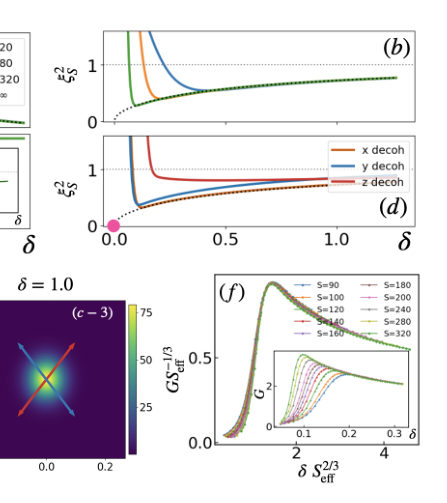 
Figure 2 (f) shows this collapse by plotting G(δ;S )S −1/3 eff against δ S 2/3 eff . The inset displays the un- scaled data, where the enhancement of G grows and shifts toward the CEP as S increases. In the rescaled plot, the curves for different S fall onto a common scaling function, including the location and height of the maximum. This agreement supports the logarithmically corrected finite- size scaling in Eq. (12).

**Summary.** This paper demonstrates that Critical Exceptional Points in open many-body systems can significantly enhance quantum spin squeezing. It establishes specific power-law scaling for squeezed and anti-squeezed variances near the transition and identifies the conditions under which this effect is robust against decoherence.

**Why it may be interesting.** It provides a novel mechanism for engineering highly anisotropic quantum correlations and steady-state entanglement by leveraging non-Hermitian singularities (CEPs) in driven-dissipative platforms.

Detailed structure

**Main problem.** The paper investigates whether Critical Exceptional Points (CEPs) in open many-body systems can be used to parametrically enhance quantum spin squeezing and how these effects scale near the transition.

**Main result.** Near a CEP, the optimally squeezed variance scales linearly with the order parameter (|Z|), while the anti-squeezed variance diverges (|Z|^{-1}), creating a highly anisotropic fluctuation plane. This enhancement is robust against certain dephasing channels but is destroyed by z-axis dephasing.

**Method.** The study uses a mean-field approach, linearized dynamics around the PT-broken fixed point, and the solution of the steady-state Lyapunov equation within a Gaussian approximation in the thermodynamic limit.

**Model / system.** The model consists of dissipative collective-spin systems governed by the GKSL master equation, specifically focusing on L-PT symmetric models such as a spin-boson system where a collective spin is coupled to a lossy cavity mode.

**Key observables.** Quantum spin squeezing parameter (Kitagawa-Ueda), Wineland parameter, covariance matrix, and the Husimi-Q distribution.

**Important parameters / regimes.** Dimensionless order parameter (Z), spin size (S), collective decay rate (kappa), transverse field (g), and dephasing rates (gamma).

**Assumptions / limitations.** The analysis assumes the thermodynamic limit (large S), a Gaussian description of fluctuations, and specific constraints on the diffusion matrix (e.g., Dz = 0 for the primary scaling result).

**Figures summary.** Figure 1 shows a schematic of mode coalescence at the CEP and an illustration of the increased anisotropy of the spin distribution on the Bloch sphere. Figure 2 demonstrates the scaling collapse of the inverse squeezing using a logarithmically corrected finite-size scaling form.

**Paper structure.** The paper introduces the concept of CEPs and their role in fluctuations, develops the mathematical framework for the L-PT symmetric collective spin model, derives the scaling laws for squeezing and anti-squeezing near the CEP, analyzes the robustness against dephasing, and concludes with finite-size scaling and experimental realizations.

Abstract

Critical exceptional points (CEPs) are nonequilibrium critical points in open many-body systems at which multiple collective excitation modes coalesce. CEPs are known to amplify classical fluctuations, but their effect on genuinely \textit{quantum} fluctuations remains unclear. Here, we show that dissipative collective-spin systems hosting CEPs exhibit parametrically enhanced steady-state \textit{quantum} spin squeezing. Close to the CEP, the optimally squeezed variance scales as $|Z|$, whereas the anti-squeezed variance diverges as $|Z|^{-1}$, with $Z$ the dimensionless order parameter. Importantly, the anti-squeezed fluctuation direction asymptotically aligns with the coalescing eigenvector of the stability matrix, reflecting the defective nature of the CEP dynamics. These scalings are robust against dephasing channels generated by spin components orthogonal to the coalesced critical collective mode. Our results identify CEPs as a route to engineering steady-state anisotropic quantum fluctuations and correlations in driven-dissipative platforms.

[↑ back to top](#top)

### [A method for calculating entropy production without knowing transition rates or dwell times](http://arxiv.org/abs/2605.27635v1)

**Authors:** John W. Biddle  
**Type:** theory · **Category:** statistical mechanics · **PDF:** <https://arxiv.org/pdf/2605.27635v1>  
**Analysis basis:** full PDF text, analyzed in chunks
**Topic relevance:** 🔥 `methods for driven-dissipative` **4/5** · `non-equilibrium dynamics` **3/5** · `correlated / nonlocal dissipation` **2/5** · `driven-dissipative phase transition` **2/5** · `entanglement & information structure` **2/5** · `non-equilibrium universality` **2/5** · `quantum measurements` **2/5**

📷 Fig 1

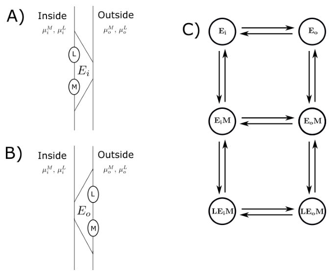 
Figure 1: A biological system used to illustrate the central result of the paper. In this system, a protein complex E, which spans the cell membrane, facilitates active transport of a small molecule L against the chemical potential gradient. (A) is a schematic of the protein complex in conformation Ei, in which E can only interact with small molecules L and M inside the cell membrane at chemical potentials µM i and µL i . (B) Shows conformation Eo, in which the binding sites for L and M face the outside of the cell and binding of L and M take place at chemical potentials µM o and µL o . (C) shows a graphical representation of the possible states of E, also reflecting the limitation that L...

📷 Fig 2

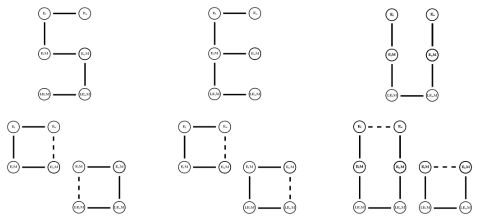 
Figure 2: Top row: spanning trees of the graph in Fig. 1 Bottom row: the fundamental set of cycles associated with each spanning tree; the chords associated with each cycle are shown as dashed rather than solid lines.

📷 Fig 3

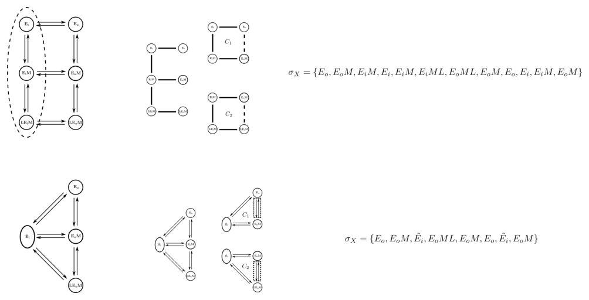 
Figure 3: Top: The system described in Fig. 1, together with a decomposition into fundamental cycles and a hypothetical sequence σX associated with a possible trajectory X. Bottom: a coarse graining of the same system corresponding to the binding state being unobservable if the protein complex is in conformation Ei. A decomposition of this coarse-grained system into fundamental cycles is also shown, along with the blurred sequence that would be recorded by an observer subject to this limitation.

📷 Fig 4

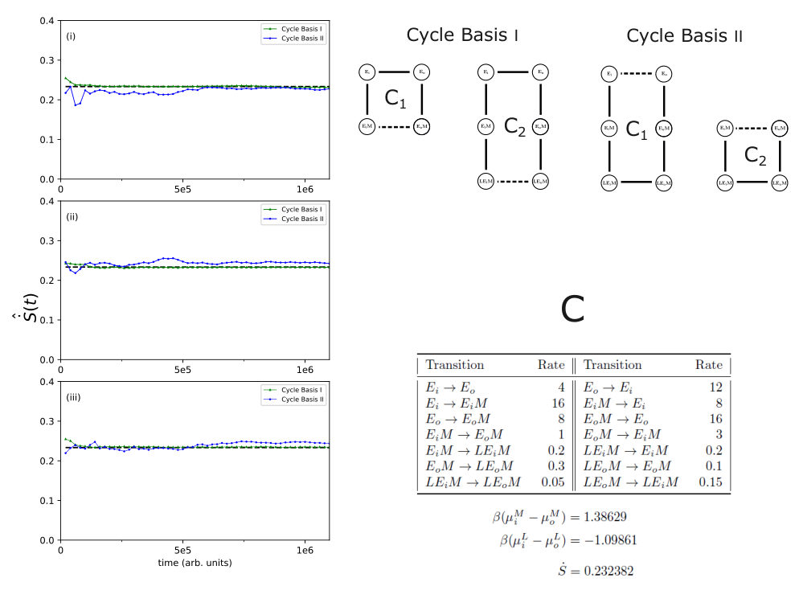 
Figure 4: Results of Gillespie simulations modeling the system described in the Illustrative Example. (A)

**Summary.** This paper introduces a method to calculate the entropy production rate of a Markovian system without needing to know transition rates or dwell times. By using only the sequence of states and total elapsed time, the method allows for the estimation of thermodynamic properties from incomplete trajectory data. It also demonstrates that choosing specific cycle bases can optimize the convergence of this estimator.

**Why it may be interesting.** This is highly relevant for researchers in open quantum systems and many-body dynamics, as it provides a way to quantify non-equilibrium properties and dissipation in systems where the full microscopic dynamics are not experimentally resolvable.

Detailed structure

**Main problem.** Calculating the entropy production rate in non-equilibrium systems is difficult when underlying transition rates, dwell times, or transition times are unknown or unobservable.

**Main result.** The author presents a new method to infer the entropy production rate using only the sequence of visited states and the total trajectory time, bypassing the need for transition rates or dwell times.

**Method.** The method uses a fundamental-cycle decomposition (spanning tree approach) to express entropy production in terms of the log-ratio of forward to reverse cycle occurrences.

**Model / system.** The model consists of Markovian systems with discrete microstates and continuous-time dynamics, represented by a strongly connected, reversible directed graph governed by a master equation.

**Key observables.** Entropy production rate, net flux, cycle affinity, and the number of times a cycle occurs in a trajectory.

**Important parameters / regimes.** Total trajectory time, sequence of states, and the choice of cycle basis for convergence optimization.

**Assumptions / limitations.** The underlying dynamics must be Markovian, the system must have a finite number of discrete states, and the graph must be strongly connected and reversible.

**Figures summary.** Figure 1 illustrates a biological active transport system; Figure 2 shows spanning trees and cycle decomposition via chords; Figure 3 compares full vs. coarse-grained systems; Figure 4 demonstrates the convergence of the estimator using different cycle bases.

**Paper structure.** The paper begins by defining the problem of calculating entropy production, introduces the mathematical framework of Markov graphs and master equations, presents the new inference method based on cycle affinities, validates the method via Gillespie simulations, and discusses the impact of cycle basis selection and coarse-graining.

Abstract

The entropy production rate is central to the study of non-equilibrium systems. This parameter is closely connected to violation of time-reversal symmetry, energy consumption, efficiency, and other properties of interest; in short, it quantifies how far a system is from thermodynamic equilibrium. Standard formulas for the entropy production require knowledge of the system's underlying dynamics, but this knowledge may be hard to acquire in practice. Here, I present a method for inferring the entropy production rate of a Markovian system from the sequence of states that the system occupies on a single long trajectory or many shorter trajectories, and the total time of the trajectory or trajectories. The method does not require knowledge of the dwell times in the various states, the times at which transitions occur, or of the transition rates characterizing the Markov process.

[↑ back to top](#top)

### [Security Metrics for Nonlinear Optical Light Sources from Interferometric Field Reconstruction](http://arxiv.org/abs/2605.28695v1)

**Authors:** Zijian Gan, Shuyue Feng, Camryn J. Gloor, Wei You, Andrew M. Moran  
**Type:** both · **Category:** quantum information and computing · **PDF:** <https://arxiv.org/pdf/2605.28695v1>  
**Analysis basis:** full PDF text, analyzed in chunks
**Topic relevance:** 🔥 `quantum optics experiment` **4/5** · `QC/QI experiment` **3/5** · `interference shaping light` **3/5** · `quantum measurements` **3/5** · `entanglement & information structure` **2/5** · `non-equilibrium dynamics` **2/5**

📷 Fig 1

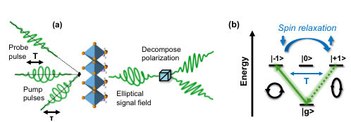 
FIG. 1. (a) Quantum communication can be implemented through a material-intrinsic approach in which information is encoded in the polarization states of four-wave-mixing sig- nal photons. Spin relaxation occurs during the pump–probe delay time T, whereas polarization dynamics associated with the coherence time between pump pulses, τ, are largely unex- plored. (b) Absorption of circularly polarized light initiates spin-relaxation processes in which exciton populations equili- brate within the fine structure of 2D-OIHP quantum wells on a 100 fs timescale.

📷 Fig 2

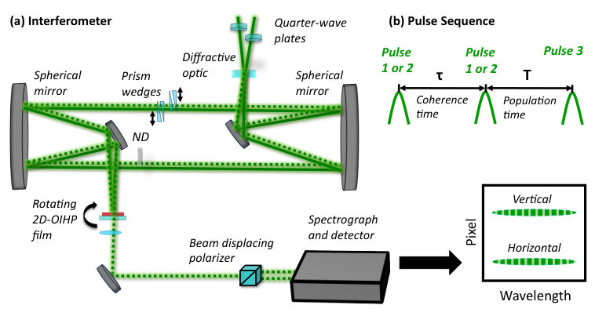 
FIG. 2. (a) Four-wave mixing experiments were conducted with a diffractive-optic–based interferometer, in which the delay time between the first two pulses, τ, is varied by translating thin fused-silica prism wedges. The initial pump pulse pair was circularly polarized, whereas the third (probe) pulse was vertically polarized. The vertical and horizontal polarization components of the signal pulses are split into two spatially separated beams with equal intensities using a beam-displacing polarizer and are then simultaneously detected by spectral interferometry using a Czerny–Turner spectrograph and CMOS camera. (b) The first two laser pulses are separated by the coherence delay τ, and the...

📷 Fig 3

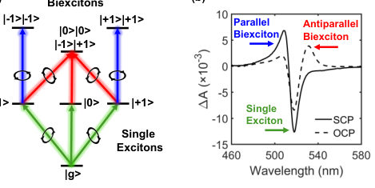 
FIG. 3. (a) Three nearly degenerate single-exciton states orig- inate from the coupling between electron and hole angular momenta, where the total angular momentum quantum num- bers are denoted MJ = −1, 0, +1. The excitonic basis also includes three biexciton states, which are energetically shifted relative to the single-exciton manifold because of angular mo- mentum interactions between the constituent excitons. (b) Single-exciton and biexciton resonances exhibit distinct sen- sitivities to circularly polarized laser excitation in transient absorption experiments. Signals acquired using the same and opposite circularly polarized pump–probe configurations dif- fer at time zero due to the...

📷 Fig 4

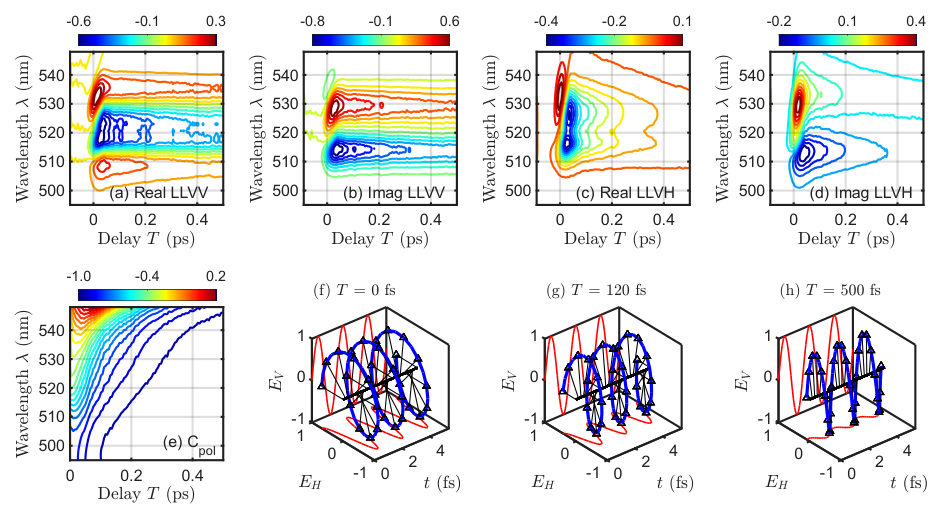 
FIG. 4. (a)–(d) Vertical and horizontal polarization components of the transient grating signal are measured using left-circularly polarized pump pulses and a vertically polarized probe. The population time is denoted by T, while the coherence time τ is fixed at zero. (e) The polarization contrast in the signal field Cpol(τ, T, λ) varies among the single-exciton and biexciton resonances. (f)–(h) Normalized signal waveforms are extracted from the experimental data at a detection wavelength of 535 nm. Spin relaxation induces an elliptical-to-linear transformation of the signal field polarization.

📷 Fig 5

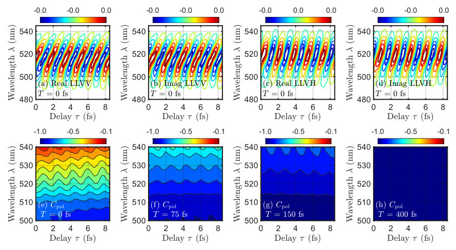 
FIG. 5. The (a)-(b) vertical and (c)-(d) horizontal polarization components of the transient grating signal field are measured at T = 0 while scanning the coherence delay time τ between the pump pulses. The indices of the LLVV and LLVH tensor elements follow a successive ordering, indicating that the pump pulses are left-circularly polarized and the probe pulse is vertically polarized. Polarization contrast is measured while scanning both the coherence time (τ) and population time (T), revealing periodic modulations in spectral regions associated with the single-exciton and lower-energy biexciton resonances. Panels (e)–(h) show measurements at a series of population times, demonstrating...

**Summary.** This paper investigates how the intrinsic spin and coherence dynamics of 2D perovskites can be used to generate secure quantum communication signals. By analyzing the Holevo bound and secret-bit rates, the authors show that controlling material parameters like population time can optimize information throughput. The work establishes a framework for using nonlinear spectroscopy to design new materials for quantum key distribution.

**Why it may be interesting.** It bridges nonlinear spectroscopy with quantum information theory, demonstrating how many-body dynamics (exciton-biexciton interactions) and spin relaxation can be engineered to optimize the security and throughput of photonic quantum networks.

Detailed structure

**Main problem.** Evaluating the security metrics (Holevo bound and secret-bit rates) of quantum communication using nonlinear optical light sources generated from material-intrinsic dynamics.

**Main result.** Incorporating coherence time into the parameter space reduces the Holevo bound by 2.6-5.8%, and population-time encoding is found to be significantly more efficient for high-throughput communication than coherence-time encoding.

**Method.** The researchers use polarization-resolved interferometric measurements and field reconstruction to extract polarization density matrices, combined with a microscopic nonlinear response model for the Bloch vector.

**Model / system.** The physical system is a 2D organic-inorganic hybrid perovskite ((PEA)2PbI4) utilizing four-wave-mixing (FWM) signal fields, modeled via a reduced-order response-function framework involving single-exciton and biexciton resonances.

**Key observables.** Polarization contrast (C_pol), relative phase (delta_phi), Holevo bound (chi), effective secret-bit yield (Y_eff), and Bloch vector components.

**Important parameters / regimes.** Coherence time (tau), population/spin-relaxation time (T), detection wavelength (lambda), and spectral overlap (Xi_X,XXB).

**Assumptions / limitations.** The calculation assumes reconstructed fields are pure by construction, the system operates in the slow-modulation limit, and the exciton fine-structure splittings are smaller than the spectroscopic linewidths.

**Figures summary.** Fig 1 shows the FWM communication approach and spin dynamics; Fig 2 details the experimental setup; Fig 3 displays energy levels and transient absorption; Fig 4 shows polarization components and contrast; Fig 5 shows polarization modulation; Fig 6 presents Bloch-sphere representations; Fig 7 compares encoding efficiencies.

**Paper structure.** The paper introduces the quantum communication problem, describes the experimental FWM setup and material properties, presents the field reconstruction and security metric derivation, analyzes the results across different spectral regimes and encoding strategies, and concludes with implications for material-intrinsic quantum engineering.

Abstract

Nonlinear optical light sources enable the generation of photons with quantum states that are intrinsically linked to underlying material dynamics, rather than imposed through external modulation. Here we investigate fundamental quantum communication metrics of four-wave-mixing signal fields generated by the two-dimensional perovskite (PEA)2PbI4. Using polarization-resolved interferometric measurements together with a microscopic nonlinear response model for the Bloch vector, we reconstruct effective single-photon polarization density matrices inferred from the experimental signal fields and evaluate the corresponding Holevo bound and effective secret-bit rates as a function of the coherence time, population time, and detection wavelength. We find that incorporating the coherence-time degree of freedom systematically lowers the Holevo bound by approximately 2.6-5.8% across the various excitonic resonances, indicating reduced distinguishability of the polarization states when the full multidimensional parameter space is sampled. To connect the polarization-state indistinguishability with experimentally achievable throughput, we further introduce an effective secret-bits-per-pulse metric that enables rapid evaluation of secure information throughput for candidate materials without requiring photon-number-resolved detection. For the present system, control of the population time via spin-dependent evolution yields substantially higher secret-bit rates than manipulation of the coherence time, while spectral regions associated with single-exciton and biexciton resonances define complementary operating regimes for secure communication. More broadly, this work positions nonlinear spectroscopy as a framework for exploring how emergent optical materials can generate and structure quantum states in ways that are advantageous for established quantum communication schemes.

[↑ back to top](#top)

### [A cryogenic apparatus for coupling two-dimensional materials to a confocal multimode optical cavity](http://arxiv.org/abs/2605.28815v1)

**Authors:** Han S. Hiller, Pranav Parakh, Samuel H. Aronson, Kenji Maeda, Di Lao, Julian Stewart, Zengde She, Jierong Wang, Xiaodong Xu, Tony Heinz, Benjamin L. Lev  
**Type:** experiment · **Category:** other · **PDF:** <https://arxiv.org/pdf/2605.28815v1>  
**Analysis basis:** full PDF text, analyzed in chunks
**Topic relevance:** 🔥 `quantum optics experiment` **4/5** · `Tavis-Cummings & cavity-many-emitter` **3/5** · `correlated cavity matter` **3/5** · `driven-dissipative phase transition` **2/5**

📷 Fig 1

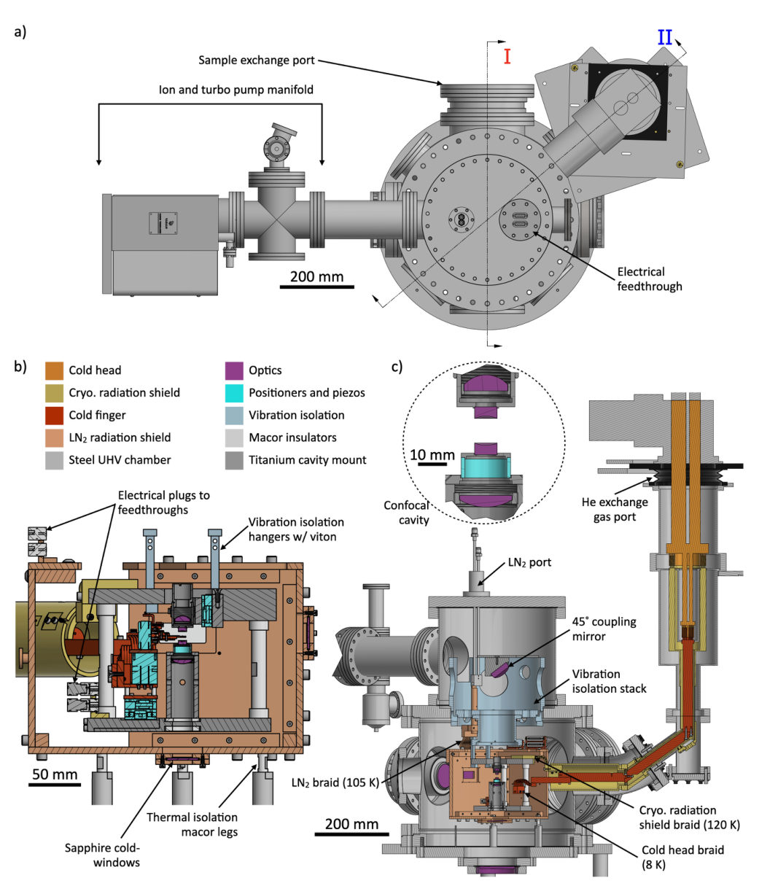 
FIG. 1. Overview of the apparatus. (a) Top view of the full vacuum assembly. The sample exchange port is a 10" conflat window that is removed during exchange. (b) Cross-sectional view of the assembly, sliced along line I in panel (a), which is the centerline of the cavity mount and sample stack. Important components are labeled. (c) Cross-sectional view of the assembly, sliced along line II, the centerline of the cryostat. The sample stage has been removed for clarity, though the copper cold finger braid is shown. (Inset) Magnified view of the cavity and coupling lenses.

📷 Fig 2

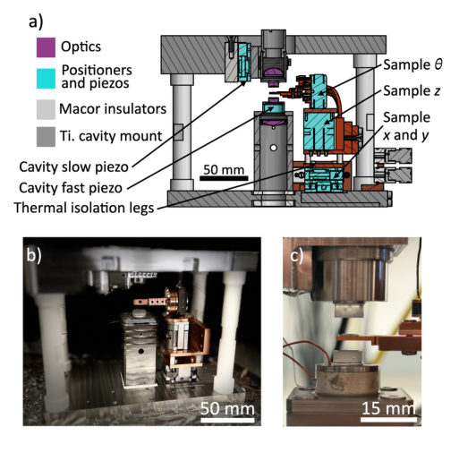 
FIG. 2. Cavity mount and sample positioning stage. (a) Schematic of the cavity mount, showing in purple (from top to bottom) the coupling lens, cavity mirrors, and collimat- ing lens. In cyan are the sample stack attocubes, the cavity attocube, and the fast piezo. (b) Photograph of the cav- ity mount, before installation into the vacuum chamber. (c) Photograph of the cavity in the chamber with a 2D sample positioned at the cavity mid-plane.

📷 Fig 3

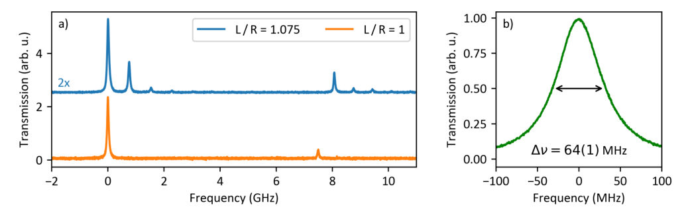 
FIG. 3. Cavity spectrum and linewidth. (a) Transmission spectra of near-confocal (blue curve) and confocal (orange curve) optical cavity geometries. The near-confocal curve is scaled vertically by 2× and offset for clarity. (b) High-resolution scan over the TEM00 transmission peak taken away from confocality at L/R = 1.125, exhibiting a linewidth of 64(1) MHz.

📷 Fig 4

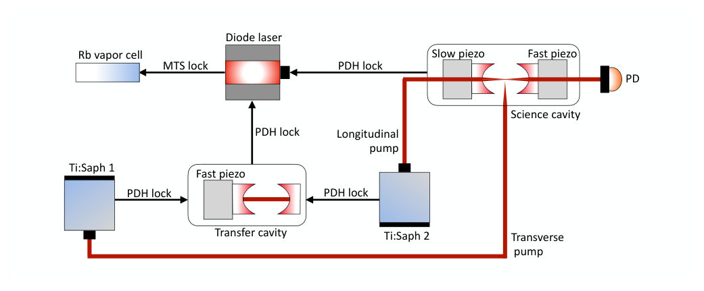 
FIG. 4. Schematic of the laser and cavity stabilization scheme. The arrows point toward the device to which the element is being locked. 1) The diode laser (DL) is stabilized to a Rb vapor cell via a modulation transfer spectroscopy lock. 2) The science cavity length is locked to the DL via a Pound-Drever-Hall (PDH) lock, with the transmitted signal detected on a photodiode (PD). 3) The transfer cavity is locked to the DL via PDH. 4) The two titanium-sapphire lasers (Ti:Saphs) are independently stabilized to the transfer cavity via PDH locks at any chosen wavelengths. The Ti:Saphs serve as the longitudinal and transverse pump beams for the science cavity and sample, respectively.

📷 Fig 5

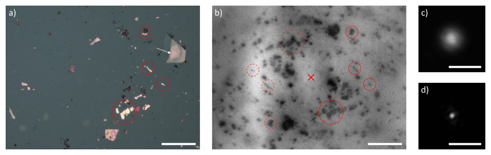 
FIG. 5. In situ optical imaging of TMD sample. (a) Optical micrograph of the sample taken outside the vacuum chamber under 20× magnification. Red circles indicate features away from the sample used to align the sample to the cavity supermode. The reader will notice the many errant flakes and fabrication residue on the sapphire substrate. That these do not affect the cavity finesse is because the supermode forms at the transverse location where we will want to pump the cavity, which is at the sample (hBN-encapsulated monolayer WSe2) indicated by the white arrow. (b) Image of the sample taken through the confocal cavity emission when a broadband LED source is resonantly coupled to cavity...

**Summary.** The paper describes the engineering of a new cryogenic apparatus designed to couple 2D materials to a confocal optical cavity. By using a confocal geometry, the system creates localized supermodes that enhance light-matter coupling while allowing for simultaneous electrical transport measurements. This platform enables the study of steady-state driven phenomena in correlated 2D systems.

**Why it may be interesting.** This work is highly relevant to cavity QED and quantum optics as it demonstrates a method to achieve high-cooperativity regimes using multimode supermodes, providing a platform for studying driven-dissipative phase transitions and light-matter interactions in 2D materials.

Detailed structure

**Main problem.** The need for a stable, cryogenic, and ultrahigh-vacuum apparatus capable of coupling 2D van der Waals materials to a confocal multimode optical cavity for simultaneous optical and electronic measurements.

**Main result.** The development of a specialized platform that achieves high-finesse light-matter coupling using a confocal supermode while maintaining minimal mechanical vibrations and enabling electrical transport measurements.

**Method.** The researchers constructed a cryogenic UHV system featuring a length-tunable Fabry-Perot cavity, utilizing the Pound-Drever-Hall technique for frequency locking and a 4-axis nanopositioner for sample alignment.

**Model / system.** A cryogenic, ultrahigh-vacuum apparatus housing a length-tunable confocal multimode Fabry-Perot cavity containing hBN-encapsulated transition metal dichalcogenides (MoSe2 and WSe2) on a sapphire substrate.

**Key observables.** Cavity finesse, cavity length noise, sample displacement, transmission spectra, and electrical transport measurements.

**Important parameters / regimes.** Base temperature of 10.4 K, vacuum pressure of 10^-10 Torr, cavity finesse of ~208, and a supermode waist of ~1.7-9.5 micrometers.

**Assumptions / limitations.** The effective response of the cavity length to dispersive shifts is assumed to be subject to the finite bandwidth of the PDH servo.

**Figures summary.** Figure 1 shows the vacuum assembly and cavity/sample stack; Figure 2 details the 4-axis nanopositioner; Figure 3 displays cavity transmission spectra; Figure 4 shows the laser stabilization chain; Figure 5 presents in-situ sample images; Figure 7 shows the power spectral density of cavity length noise.

**Paper structure.** The paper introduces the scientific motivation, describes the construction and components of the cryogenic/UHV apparatus, details the optical and electrical measurement methods, presents performance metrics for stability and positioning, and concludes with the demonstration of the integrated platform.

Abstract

Two-dimensional van der Waals materials exhibit a variety of correlated electron phases, and optical driving offers a promising route toward manipulating them. For example, cavity-enhanced, continuous-wave (CW) Raman excitation has been suggested as a way to coherently and superradiantly populate phonons or charge density waves via material excitons. A steady-state phonon population may be sustained with sufficiently strong electron-phonon coupling to drive novel collective response. We describe an apparatus built to meet the requirements of such an experimental program: Namely, an ultrahigh-vacuum system housing a length-tunable confocal Fabry-Pérot cavity with an intracavity sample, both cryogenically cooled and stabilized against vibrations. A four-axis nanopositioner aligns the sample and supports electrical leads for sample carrier density modulation and transport measurements. Transmission through the multimode cavity enables in situ sample imaging for alignment; the sample is a transition metal dichalcogenide in this work. Operating near the confocal geometry concentrates the optical field into a localized supermode that substantially enhances light-matter coupling. This enhancement is preserved despite the millimeter-scale cavity length, which provides room for sample alignment and exchange.

[↑ back to top](#top)

### [Coherent Dark State Formation of a Lead-Vacancy Spin Qubit in Diamond](http://arxiv.org/abs/2605.27841v1)

**Authors:** Yiyang Chen, Koyo Hirai, Tzyy Zheng Neo, Eiki Ota, Takashi Taniguchi, Masashi Miyakawa, Shinobu Onoda, Toshiharu Makino, Mutsuko Hatano, Takayuki Iwasaki  
**Type:** experiment · **Category:** quantum information and computing · **PDF:** <https://arxiv.org/pdf/2605.27841v1>  
**Analysis basis:** full PDF text, analyzed in chunks
**Topic relevance:** 🔥 `QC/QI experiment` **4/5** · 🔥 `quantum optics experiment` **4/5** · `quantum measurements` **2/5** · `spintronics-quantum-optics interface` **2/5**

📷 Fig 1

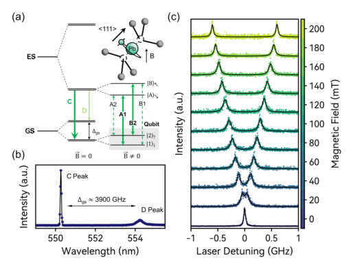 
FIG. 1: Magneto-optical properties of the PbV center. (a) Atomic structure and energy level of the PbV cen- ter in diamond. (b) Cryogenic photoluminescence (PL) spectrum under non-resonant 532 nm laser excitation. (c) PLE spectra under various magnetic fields at 13 K. The color corresponds to the magnetic field strength, varied from 0 to 200 mT in 20 mT increment. The solid lines represent fits using Lorentzian functions.

📷 Fig 2

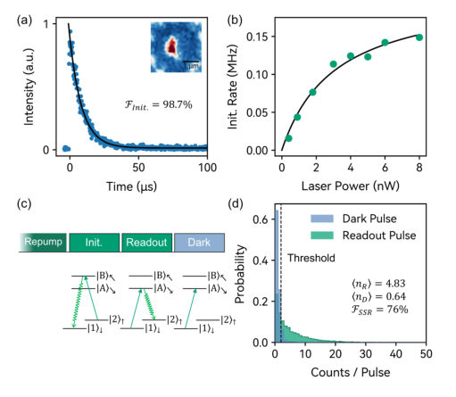 
FIG. 2: Spin initialization and SSR performance of the PbV center at 7.5 K (a) Spin initialization. Inset shows a CFM image of the PbV in SIL. (b) Spin initialization rate as a function of the resonant laser power. Solid line denotes the fitting described in the main text. (c) Pulse sequence implemented for the SSR measurement. (d) Photon counting statistics derived from the sequence in (c). The threshold is set to one photon per pulse to discriminate the bright and dark states, yielding a SSR fidelity of 76%.

📷 Fig 3

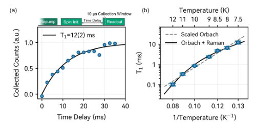 
FIG. 3: Longitudinal relaxation time. (a) T1 measure- ment at 7.5 K. (b) Temperature dependence of T1.

📷 Fig 4

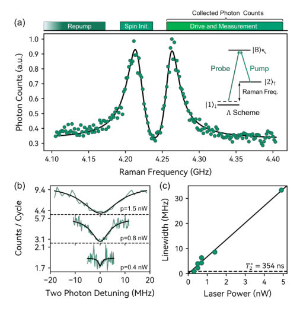 
FIG. 4: CPT of the PbV center. (a) Sequence and a representative CPT spectrum at 7 K. The black solid line represents a numerical fit based on the Lindblad master equation. (b) Evolution of the CPT spectra as varying the laser power at 6.5 K. (c) CPT linewidth as a function of the total incident laser power at 6.5 K. The narrowest observed linewidth is 0.9(6) MHz, corresponding to a spin dephasing time (T ∗ 2 ) of 354 ns.

**Summary.** This paper demonstrates that lead-vacancy centers in diamond can maintain long spin lifetimes and optical coherence at temperatures above 4 K. By achieving successful single-shot readout and observing coherent dark state formation, the study positions PbV centers as highly promising candidates for scalable, thermally robust quantum networks.

**Why it may be interesting.** It demonstrates the use of coherent population trapping to create dark states in a solid-state system and provides experimental evidence of suppressed phonon-mediated decoherence due to large zero-field splitting, which is highly relevant to open quantum systems and quantum optics.

Detailed structure

**Main problem.** The need for quantum emitters that can operate at higher temperatures (above 4 K) for scalable quantum networks while maintaining high optical coherence and suppressed spectral diffusion.

**Main result.** The PbV center in diamond demonstrates exceptional thermal robustness with a spin lifetime of 12 ms at 7.5 K and successful formation of a coherent dark state via coherent population trapping.

**Method.** The study uses photoluminescence excitation (PLE) spectroscopy, all-optical spin initialization and single-shot readout (SSR), and coherent population trapping (CPT) to characterize spin properties.

**Model / system.** A lead-vacancy (PbV) center in diamond, which is a spin-1/2 system with a large ground-state zero-field splitting of approximately 3900 GHz, implemented in a solid immersion lens (SIL) platform.

**Key observables.** Spin lifetime (T1), spin dephasing time (T2*), spin initialization fidelity, branching ratio, and saturation power.

**Important parameters / regimes.** Temperatures of 6.5 K to 13 K, magnetic fields up to 200 mT, spin lifetime of 12 ms at 7.5 K, and spin dephasing time of 354 ns at 6.5 K.

**Assumptions / limitations.** The decoherence at 6.5 K is assumed to be limited by the spin bath rather than phonon-mediated processes.

**Figures summary.** Fig 1 shows the PbV energy level structure, PL spectrum, and PLE spectra under magnetic fields; Fig 2 details the spin initialization process, pulse sequences for SSR, and photon counting statistics.

**Paper structure.** The paper introduces the motivation for high-temperature emitters, describes the PbV system and experimental setup, presents spectroscopic characterization, details spin initialization and readout results, and concludes with the implications for quantum networking.

Abstract

A lead-vacancy (PbV) center in diamond exhibits coherent emission above the liquid helium temperature, making it highly attractive for quantum network applications. Here, we report the magneto-optical and spin properties of PbV centers in diamond. We record a spin lifetime of 12 ms at 7.5 K under large off-axis magnetic field. Furthermore, we observe formation of the coherent dark state by coherent population trapping and estimate a spin dephasing time of 354 ns at 6.5 K. This work demonstrates the outstanding thermal robustness of the PbV spin compared to other group-IV centers above 4 K.

[↑ back to top](#top)

### [Fractional short-time dynamics in driven quantum gases](http://arxiv.org/abs/2605.28606v1)

**Authors:** Uri Sharell, Tilman Enss  
**Type:** theory · **Category:** quantum gases · **PDF:** <https://arxiv.org/pdf/2605.28606v1>  
**Analysis basis:** full PDF text, analyzed in chunks
**Topic relevance:** 🔥 `non-equilibrium dynamics` **4/5** · 🔥 `non-equilibrium universality` **4/5** · `driven-dissipative phase transition` **2/5** · `scars & prethermalization` **2/5**

📷 Fig 1

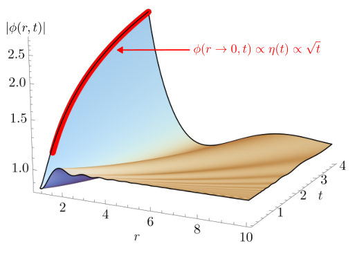 
FIG. 1. Illustration of the wave function solution for a sudden quench to unitarity as a function of relative distance r and time t. At short distance r →0, the wavefunction satisfies the Bethe-Peierls condition (2). After a quench to unitarity the pairing amplitude η follows conformal scaling η ∝ √

📷 Fig 2

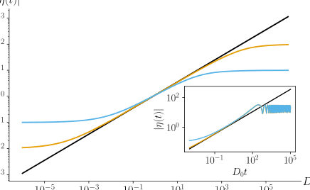 
FIG. 2. Nonthermal fixed point scaling in quench dynamics (10). Modulus of the pairing amplitude |η(t)| vs time after quench from weak (a0 &lt; 0) to strong (a &lt; 0) attractive in- teraction. (Black) Quench from noninteracting a0 = 0 to unitary a = −∞shows conformal scaling |η(t)| = 2 p

📷 Fig 3

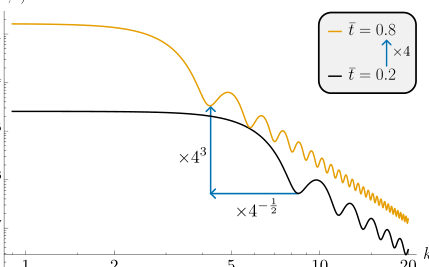 
FIG. 3. Momentum distribution n(k, t) vs. momentum after a quench to the scattering resonance at (dimensionless) times ¯t = D0k2 ∗t = 0.2 (black) and ¯t = 0.8 (orange), where the ref- erence scale is defined through the characteristic momentum k3 ∗= 6π2n in analogy with the Fermi momentum. One ob- serves nonthermal scaling with a unique scaling function fs (18), which at the later time (orange) is shifted left by a factor 2 (β = 1/2) and up by a factor 64 (α = 3). The coefficient of the k−4 tail (19) defines the contact density C(t).

📷 Fig 4

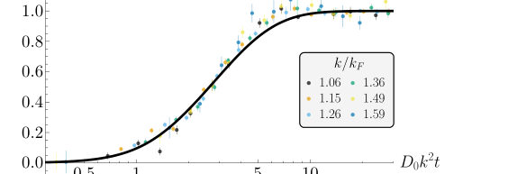 
FIG. 4. Experimental data showing the normalized change in the momentum distribution due to interaction from [16]. The collapse of different k curves confirms the scaling form (18). The full black line is the theoretical prediction computed at T/TF = 0.26, k/kF = 1.26 and τ/τF = 0.9 from Eq. (35).

📷 Fig 5

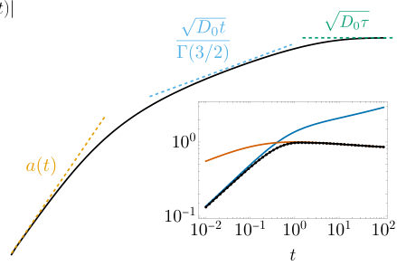 
FIG. 5. Dynamics of the pairing amplitude η for a power-law drive of scattering length a(t) = −t2, with D0 = 10−3, τ = 20. The black curve shows the solution of the tempered FDE (20) obtained with a numerical FDE solver [36–38]. The different asymptotic scaling forms η →min(a(t), 2 √π √D0t, √D0τ) are shown by the yellow, blue, and green dashed lines, respec- tively. Inset: Solution for a different choice of parameters (a(t) = t0.2, τ = 0.5, D0 = 1), where the black dots show the numerical solution of the tempered FDE and the black line the analytic solution evaluated as a truncated power series from (40). The blue and red lines show the derived simple approximate forms for early (26) and...

**Summary.** This paper demonstrates that the short-time evolution of pairing in driven quantum gases is governed by a fractional differential equation, leading to universal non-thermal scaling. It further shows that as many-body effects take over, the dynamics transition into a hydrodynamic regime described by a Müller-Israel-Stewart type equation. The theoretical predictions show excellent agreement with experimental observations of momentum distributions.

**Why it may be interesting.** It provides a unified mathematical framework (fractional calculus) to bridge the gap between non-equilibrium, non-thermal fixed points and classical hydrodynamics in many-body systems.

Detailed structure

**Main problem.** Connecting the early-time, non-universal dynamics of driven quantum gases to their late-time hydrodynamic equilibrium regimes.

**Main result.** The authors discover that short-time pairing dynamics satisfy a fractional differential equation (FDE) characterized by a conformal fixed point and non-thermal scaling, which eventually relaxes into a Müller-Israel-Stewart type hydrodynamic attractor.

**Method.** The study employs Riemann-Liouville fractional calculus, Laplace transforms, and the Lippmann-Schwinger equation to derive analytical solutions for sudden quenches and power-law drives.

**Model / system.** The system consists of dilute, ultracold atomic gases with short-range attractive interactions, modeled by a time-dependent Schrödinger equation with a delta-function potential and Bethe-Peierls boundary conditions.

**Key observables.** Pairing amplitude, contact density, momentum distribution, and particle population growth.

**Important parameters / regimes.** Scattering length a(t), diffusion quantum D0, relaxation time tau, and non-thermal scaling exponents alpha and beta.

**Assumptions / limitations.** The derivation assumes the pairing amplitude is differentiable and that the initial integral of the fractional derivative is zero; it also assumes a specific form for the power-law drive.

**Figures summary.** The notes refer to a figure showing the theoretical prediction for particle population growth matching experimental data.

**Paper structure.** The paper introduces the problem of early-to-late time dynamics, derives the fractional differential equation for short-time pairing, provides analytical solutions for various driving protocols (quenches and power-laws), and concludes by describing the transition to the hydrodynamic regime and comparison with experiment.

Abstract

Quantum gases with short-range attractive interaction have a tendency to form pairs. For time-dependent interaction we find that the pairing amplitude at small separation satisfies a fractional differential equation (FDE). We derive analytic solutions of the pairing evolution for sudden interaction quenches and power-law drives toward resonant scattering. We observe universal short-time dynamics governed by a conformal fixed point at which the momentum distribution exhibits nonthermal, self-similar scaling in time, in quantitative agreement with experiment. At longer times, many-body effects induce relaxation toward an equilibrium state. In this limit, the FDE turns into a Müller-Israel-Stewart type equation that describes a hydrodynamic attractor approaching equilibrium.

[↑ back to top](#top)

### [Many-Body Quantum Chaos At All Time Scales](http://arxiv.org/abs/2605.27512v1)

**Authors:** Antonio M. García-García, Lucas Sá, Jacobus J. M. Verbaarschot, Jie-Ping Zheng  
**Type:** theory · **Category:** statistical mechanics · **PDF:** <https://arxiv.org/pdf/2605.27512v1>  
**Analysis basis:** full PDF text, analyzed in chunks
**Topic relevance:** 🔥 `entanglement & information structure` **4/5** · 🔥 `non-equilibrium dynamics` **4/5** · `non-equilibrium universality` **2/5** · `scars & prethermalization` **2/5**

📷 Fig 1

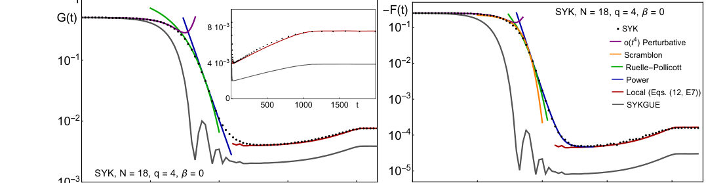 
Figure 1. Time dependence of the Green’s function (left) and OTOC (right) on a log-log scale. Numerical results obtained from exact diagonalization for the N = 18, q = 4, β = 0 (black disks) SYK model are compared to numerical fits and analytical results derived below, given by solid curves as indicated in the legend of F(t), also for G(t) (see Appendix B for the fitting parameters). The inset in the right figure compares the local prediction and the SYK results on a linear scale and better shows the discrepancy of less than 4 % for t &gt; 50. See Appendix A with a detailed comparison for a larger N = 26.

📷 Fig 2

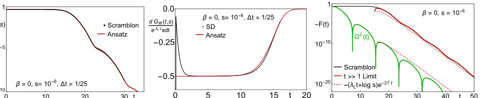 
Figure 2. Left: The Wightman function GW (t) at β = 0 for an out-of-time-order source with strength s = 10−6, obtained from the SD equations on the Keldysh contour up to t = 30 with spacing ∆t = 0.04 following the methods outlined in Appendix C of Ref. [55] (black), compared to the Ansatz Eq. (6) with one fitting parameter (dark red). For large t, GW (t) ∼a exp[−2Γt] + Re(b exp[−2(Γ + iΩ)t]) shows weaker oscillations than the squared Green’s function G2(t) ∼Re(eb exp[−2(Γ + iΩ)t]) obtained by solving the SD equations. Middle: The normalized derivative exp(−λLt)dGW (t, s)/sdt, compared to the derivative of the Ansatz. The disagreement for t &lt; 2 is an artifact due to the position of the...

📷 Fig 3

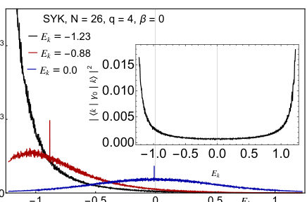 
Figure 4. Energy dependence of the average matrix elements |⟨k|γ0|l⟩|2 as a function of El for fixed Ek. Note the enhance- ment by a factor 2 for k = l. The diagonal matrix elements |⟨k|γ0|k⟩|2 (inset) only show a weak dependence on the energy in the bulk of the spectrum. The matrix elements for k ≈l, which give the main contribution to the Green’s function, are much larger than the SYKGUE values of (1 + δkl)/D.

📷 Fig 4

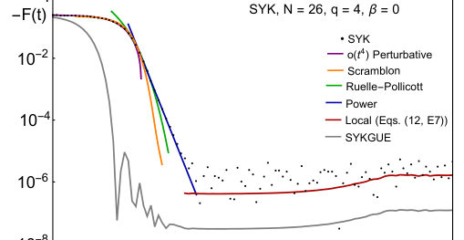 
Figure 5. Time dependence of the Green’s function (upper) and OTOC (lower) on a log-log scale. Numerical results ob- tained from exact diagonalization for the N = 26, q = 4, β = 0 (black disks) SYK model are compared to the analytical results and numerical fits derived in the main text, given by solid curves as indicated in the legend of the lower figure. The inset in the upper figure shows the same curves for t &gt; 100 on a linear plot. The correction to the SYKGUE result is large, but because of the factorization assumption there is still a 10 percent discrepancy between analytical and numerical results.

**Summary.** This paper provides a complete analytical description of the dynamics of the SYK model across all time scales. It demonstrates that the evolution of quantum chaos, from initial exponential growth to late-time plateaus, is interconnected and deviates from standard random matrix theory due to energy-dependent correlations.

**Why it may be interesting.** This paper is highly relevant for many-body dynamics as it provides a unified analytical framework for understanding how information scrambling evolves into late-time ergodic behavior and identifies specific deviations from universal RMT predictions.

Detailed structure

**Main problem.** Achieving a comprehensive understanding of many-body quantum chaos across all time scales, specifically bridging the gap from the early perturbative/scrambling regime to the late-time RMT/ergodic regime.

**Main result.** The authors obtained analytical expressions for Green's and OTOC functions at all time scales, discovering that late-time behavior deviates from standard RMT predictions due to local-in-energy correlations.

**Method.** A combination of the scramblon formalism, Random Matrix Theory (RMT) techniques, and numerical exact diagonalization/Krylov subspace methods.

**Model / system.** The q=4 Sachdev-Ye-Kitaev (SYK) model, specifically the N-Majorana version, in the infinite temperature limit.

**Key observables.** Retarded Green's function G(t), Out-of-Time-Order Correlator (OTOC) F(t), Wightman function G_W(t), and Spectral Form Factor (SFF) K(t).

**Important parameters / regimes.** System size N, Lyapunov exponent lambda_L, temperature beta=0, and the Ruelle-Pollicott resonances.

**Assumptions / limitations.** Assumptions include locality in energy for late times, energy-independent matrix elements within specific ranges, and the use of the SYKGUE model as a comparison for RMT behavior.

**Figures summary.** Figure 1 compares numerical ED data with various analytical fits (scramblon, Ruelle-Pollicott, power-law, RMT) for G(t) and F(t); Figure 2 shows the Wightman function and its derivative; Figure 5 shows time dependence for N=26.

**Paper structure.** The paper introduces the problem of multi-scale chaos, describes the SYK model and the scramblon/RMT methods, analyzes specific temporal domains (perturbative, scrambling, power-law, RMT), and concludes with a discussion on the interconnectedness of these regimes.

Abstract

We describe the dynamics of many-body quantum chaotic systems at all time scales by studying the Green's and out-of-time order correlation (OTOC) functions of the four-body, $N$-Majorana Sachdev-Ye-Kitaev model. By combining the scramblon formalism and random-matrix-theory techniques, we obtain analytical expressions for these functions at all times. The early exponential growth of the OTOC is followed by an exponential decay at a rate governed by that of the Green's function (the real part of the leading complex Ruelle-Pollicott resonances). For late times that scale exponentially with $N$, both functions have a dip-ramp-plateau pattern for $N \mathrm{mod}8 = 2, 6$ that deviates substantially from the ergodic prediction due to local-in-energy correlations of matrix elements and eigenvalues, even after the Heisenberg time.

[↑ back to top](#top)

### [Squeezed-slit Bohr-Einstein Interferometer](http://arxiv.org/abs/2605.28038v1)

**Authors:** Hao-Wen Cheng, Xu-Zhao-Qiu Zeng, Yu-Chen Zhang, Yu-Hao Deng, Zhan Wu, Rui Lin, Yu-Cheng Duan, Zi-Han Chen, Jun Rui, Ming-Cheng Chen, Chao-Yang Lu, Jian-Wei Pan  
**Type:** experiment · **Category:** other · **PDF:** <https://arxiv.org/pdf/2605.28038v1>  
**Analysis basis:** full PDF text, analyzed in chunks
**Topic relevance:** 🔥 `quantum optics experiment` **4/5** · `quantum measurements` **3/5** · `QC/QI experiment` **2/5** · `non-equilibrium dynamics` **2/5**

📷 Fig 1

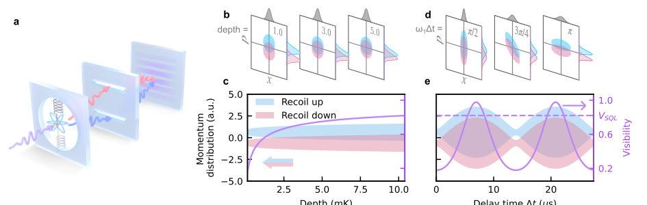 
Figure 1. Conceptual illustration of the Einstein-Bohr gedankenexperiment with a sin-

📷 Fig 2

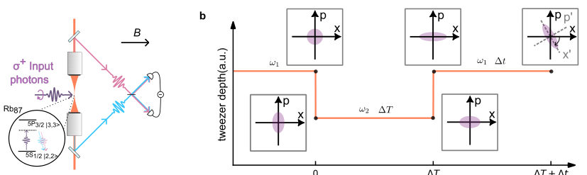 
Figure 2. Experimental setup and squeezed-state generation protocol. (a) A single 87Rb

📷 Fig 3

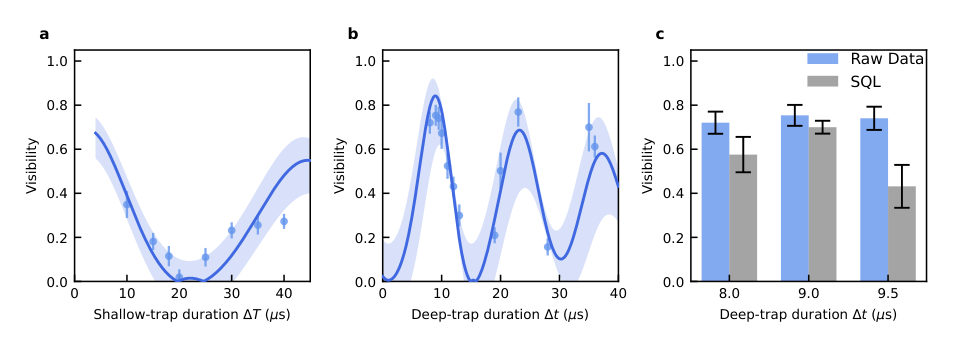 
Figure 3. Observed squeezing dynamics and enhancement beyond the thermal visi-

📷 Fig 4

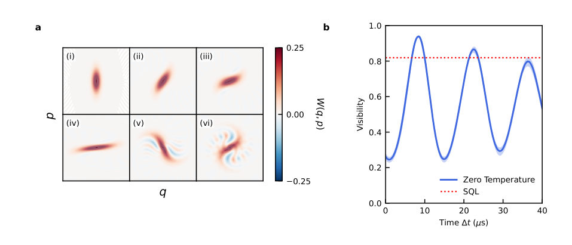 
Figure 4. Kerr-induced phase-space dynamics and intrinsic visibility beyond the SQL.

📷 Fig 5

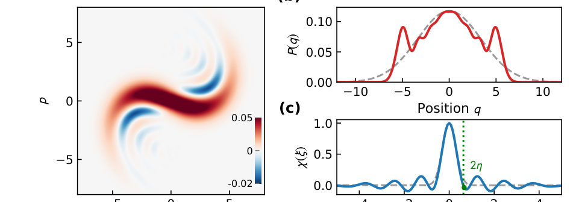 
Fig. 4 of the main text and Sec. III B), assuming an initial thermal occupation ¯n = 0.5. This state

**Summary.** The study demonstrates a method to surpass the Standard Quantum Limit in a single-atom interferometer by using a squeezed-state protocol. By engineering the motion of a trapped Rubidium atom, the researchers achieved interference visibility significantly higher than the vacuum limit. The work also shows that this setup can be used for high-fidelity Wigner function reconstruction.

**Why it may be interesting.** This work is highly relevant for researchers in quantum optics and open quantum systems as it demonstrates active quantum state engineering to beat fundamental limits and provides a new interferometric method for continuous-variable Wigner tomography.

Detailed structure

**Main problem.** The Einstein-Bohr recoiling-slit experiment is fundamentally limited by the Standard Quantum Limit (SQL) due to zero-point fluctuations of the atomic slit. The goal is to transcend this limit by actively engineering the quantum state of the atomic slit.

**Main result.** The researchers achieved an intrinsic interference visibility of 0.938, violating the SQL of 0.819 by over 10 standard deviations, corresponding to 7.6 dB of effective squeezing.

**Method.** A non-adiabatic quench-evolve-quench (QEQ) protocol is used to prepare the atom in a squeezed state, combined with global Bayesian analysis and Wigner tomography to reconstruct the quantum state.

**Model / system.** A single 87Rb atom trapped in an 852-nm optical tweezer, subject to an effective Kerr Hamiltonian due to the intrinsic anharmonicity of the trap.

**Key observables.** Interference visibility (V), quantum characteristic function (chi), Wigner function (W), and photon count asymmetry.

**Important parameters / regimes.** Lamb-Dicke parameter (eta = 0.316), squeezing parameter (S1 = 0.50), Kerr coefficient (K/omega1 = -0.011), and trap frequencies (37.8 kHz to 12.8 kHz).

**Assumptions / limitations.** The sudden quench approximation is used for trap modulation; the Truncated Wigner Approximation (TWA) is used to model non-Gaussian dynamics; and the system is assumed to be in the weak nonlinearity regime.

**Figures summary.** Figure 3 shows visibility as a function of trap durations and comparison to thermal limits; Figure 4 illustrates the evolution of the Wigner function from Gaussian to S-shaped non-Gaussian distributions.

**Paper structure.** The paper introduces the Bohr-Einstein problem, describes the experimental setup and QEQ protocol, presents the results of surpassing the SQL, analyzes the impact of Kerr-induced non-Gaussianity, and demonstrates the utility of the setup for Wigner tomography.

Abstract

The Einstein-Bohr recoiling-slit gedankenexperiment, a cornerstone of quantum complementarity, has long been constrained by the zero-point fluctuations of the atomic slit -- the spatial Standard Quantum Limit (SQL). Here we transcend this fundamental boundary through active quantum state engineering of a single-atom slit. By implementing a non-adiabatic quench-evolve-quench protocol, we prepare the atomic motion in a squeezed state, dynamically redistributing phase-space uncertainty to suppress which-path information and restore high-visibility interference beyond the static vacuum limit. We report an intrinsic visibility of $0.938_{-0.008}^{+0.004}$, violating the SQL ($0.819$) by over 10 standard deviations, corresponding to $7.6(2)$ dB of effective squeezing. Our work reveals Kerr-induced non-Gaussian dynamics and reinterprets the traditional interferometer as a powerful tool for continuous-variable Wigner tomography, bridging the gap between quantum foundations and advanced metrology.

[↑ back to top](#top)

### [Device-Agnostic Microwave Noise Metrology for Nonlinear Cryogenic Quantum Devices](http://arxiv.org/abs/2605.28808v1)

**Authors:** Andrea Celotto, Alessandro Alocco, Bernardo Galvano, Luca Fasolo, Emanuele Palumbo, Luca Callegaro, Luca Oberto, Patrizia Livreri, Emanuele Enrico  
**Type:** experiment · **Category:** quantum information and computing · **PDF:** <https://arxiv.org/pdf/2605.28808v1>  
**Analysis basis:** full PDF text, analyzed in chunks
**Topic relevance:** 🔥 `QC/QI experiment` **4/5** · `quantum measurements` **3/5** · `quantum optics experiment` **3/5**

📷 Fig 1

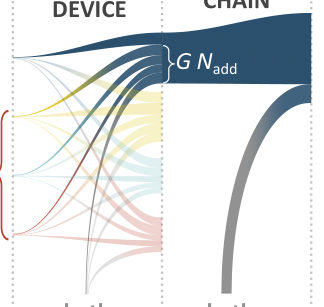 
Fig. 1. Flow diagram (not at scale) of the scattering of fluctuations impacting the output signal mode, tracked across relevant experimental stages. Photons are picked up from thermal baths due to dissipative processes. The gain G can be identified as the ratio of the final and initial widths of the uppermost flow of photons inside the device.

📷 Fig 2

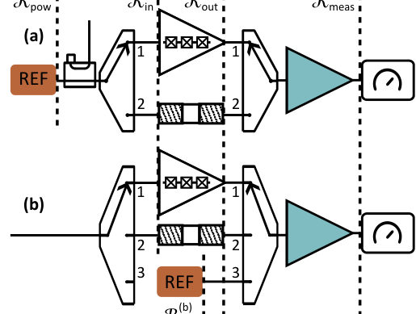 
Fig. 2. Two placements of the absolute noise reference, labeled REF. (a) In a serial configuration the DUT is included in the path between the noise source and the detector. (b) In a substitution configuration the noise source and the DUT are connected to the readout chain through cryogenic switches. The reference planes Rj indicate where the relevant microwave quantities are defined. The female-female thru connection can symbolize a more complete S-parameter calibration calkit consisting also of impedance standards.

📷 Fig 3

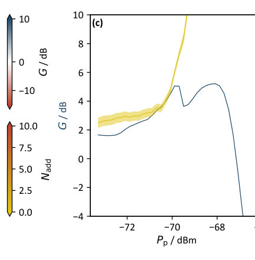 
Fig. 3. (a,b) Gain G and added noise Nadd of the JTWPA as functions of pump power Pp and signal frequency. The frequency-dependent fine features in the gain, commonly referred to as ripple, are deterministic features attributed to standing waves in the device packaging rather than measurement noise, as their consistency for various pump powers may suggest. (c) Gain and added noise, averaged over the 3.6–5.5 GHz band, as functions of pump power. The colored band around the noise curve represents its associated uncertainty, propagated from the fit on Planck-spectroscopy data.

📷 Fig 4

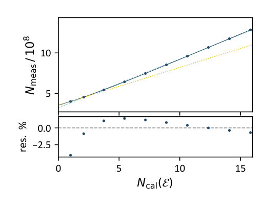 
Fig. 4. Illustration of the bias described in Appendix A based on synthetic but realistical data. The solid curve is the nonlinear model of Eq. (12a); the dots are sampled calibration points; the dashed line is the simplified affine regression. The clear structure of residuals to the fit shows the consequence of neglecting energy-dependent contributions δN(E).

📷 Fig 5

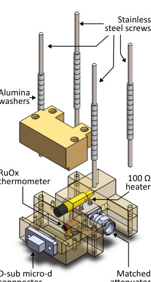 
Fig. 5. Mechanical rendering of the custom VTS assembly. The internal cavity houses a matched attenuator, a 100 Ωheater, and a ruthenium-oxide thermometer. The VTS is mounted on the sample space from below, anchored through stainless-steel screws. Alumina washers are used to contol the physical distance of the object from the samples mounted above.

**Summary.** The paper presents a new method for measuring the noise and gain of cryogenic microwave devices by substituting the device with a known thermal noise source. This approach avoids the errors caused by the device's own nonlinearities during the calibration process. It was successfully tested on a nonlinear traveling-wave parametric amplifier.

**Why it may be interesting.** This is highly relevant for quantum optics and open quantum systems researchers as it provides a rigorous way to characterize the noise and signal integrity of nonlinear microwave components essential for quantum readout and signal processing.

Detailed structure

**Main problem.** Accurately characterizing the gain and added noise of nonlinear cryogenic microwave devices, such as JTWPAs, is difficult because traditional serial measurement configurations introduce model-dependent biases and cannot easily decouple the device's internal dynamics from the readout chain.

**Main result.** The authors demonstrate a device-agnostic substitution-based metrology protocol that successfully extracts the gain and input-referred added noise of a JTWPA even under complex, pump-dependent nonlinear regimes.

**Method.** The protocol uses a substitution method where a controllable noise source (from a Variable Temperature Stage) is switched into the measurement path to replace the DUT, combined with Planck spectroscopy and SOLR S-parameter calibration.

**Model / system.** The experimental platform consists of a dilution refrigerator setup with a Variable Temperature Stage (VTS) and a Josephson Traveling Wave Parametric Amplifier (JTWPA) operating in the C and X bands at millikelvin temperatures.

**Key observables.** Power Spectral Density (PSD), S-parameters (gain, transmission, reflection), and input-referred added noise.

**Important parameters / regimes.** Pump power, signal frequency, system gain, system noise temperature, and the quantum-limited noise floor.

**Assumptions / limitations.** Assumes the noise source can be treated as a two-port component and that the electron temperature in the VTS follows the temperature of the copper body.

**Figures summary.** Figure 1 shows a flow diagram of photon detection; Figure 2 compares serial vs. substitution configurations; Figure 3 displays JTWPA gain and noise as functions of pump power; Figure 4 shows statistical bias in regression models.

**Paper structure.** The paper introduces the problem of calibration bias, proposes a substitution-based architecture, details the integration of SOLR and Planck spectroscopy, validates the method using a nonlinear JTWPA, and provides a mathematical analysis of potential errors.

Abstract

Microwave devices capable of near-quantum-limited signal processing are essential components in the toolbox of solid-state quantum technologies. The manipulation and readout of single-photon microwave signals through amplifiers, mixers, isolators, etc. must fulfill strict requirements in terms of signal integrity to ensure reliable operation.   These active microwave quantum devices operate in complex cryo-electronic setups. This poses challenges to their characterization, since all relevant figures of merit must be expressed at the reference planes of their ports. Even though cryogenic S-parameter calibration is non-trivial, metrological approaches are converging toward rigorous methods. Furthermore, preserving signal integrity must be quantified via absolute noise levels at the ports of the Device Under Test (DUT), requiring an absolute power reference.   In this work, we present an in situ noise metrology protocol based on substituting a controllable noise source for the DUT. We motivate this choice by showing that placing the noise source at the DUT input impacts the separability of the calibration from the DUT characteristics.   Our proposed architecture combines Planck spectroscopy using a Variable Temperature Stage with Short-Open-Load-Reciprocal scattering-parameter calibration, so that noise and scattering quantities are referred to the same cryogenic reference planes. In this configuration, the readout-chain calibration is separated from the internal dynamics of the DUT. As a demanding use case, we apply the protocol to a Josephson Traveling Wave Parametric Amplifier and extract its gain and input-referred added noise under pump conditions activating multimode nonlinear behavior. This illustrates how our device-agnostic protocol supports portable noise characterization of nonlinear cryogenic microwave devices.

[↑ back to top](#top)

### [Three-fold coincidence by stimulated parametric down-conversion](http://arxiv.org/abs/2605.27653v1)

**Authors:** Yishai Klein, Alessio D'Errico, Farid Ghobadi, Dilip Paneru, Nazanin Dehghan, Eliahu Cohen, Ebrahim Karimi  
**Type:** experiment · **Category:** quantum information and computing · **PDF:** <https://arxiv.org/pdf/2605.27653v1>  
**Analysis basis:** full PDF text, analyzed in chunks
**Topic relevance:** 🔥 `QC/QI experiment` **4/5** · 🔥 `quantum optics experiment` **4/5** · `interference shaping light` **2/5**

📷 Fig 1

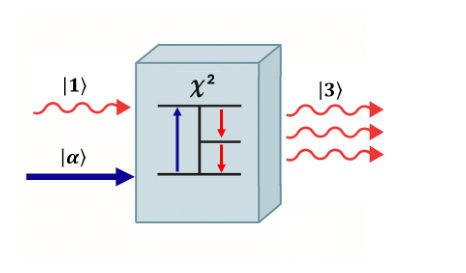 
FIG. 1. Concept of stimulated photon-triplet generation in a χ(2)

📷 Fig 2

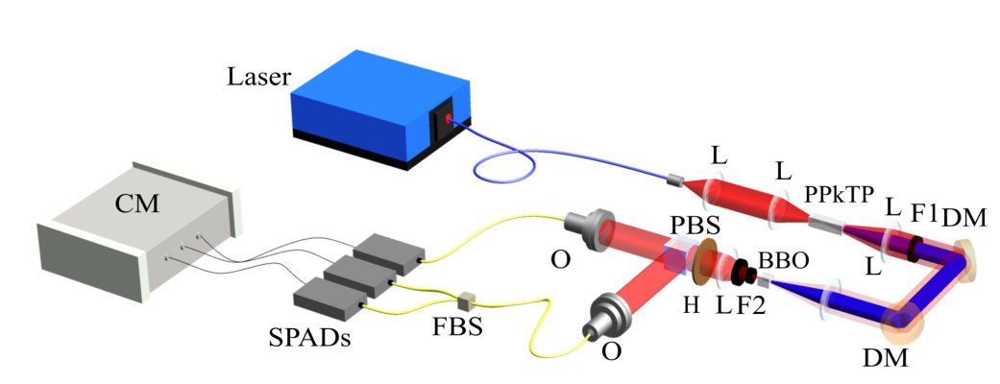 
FIG. 2. Experimental setup for weakly seeded stimulated parametric down-conversion. A continuous-wave laser at 800 nm is frequency dou- bled in a PPKTP cavity (custom-made by RAICOL) to generate a 400 nm pump for type-I SPDC in a BBO crystal. The residual fundamental beam is attenuated and mode-matched to provide a weak coherent seed. The down-converted photons and the seed are spectrally filtered, split into multiple channels, and coupled into single-mode fibers for detection with single-photon avalanche diodes (SPADs) and time-tagging electronics. F1: short-pass filter; F2: long-pass and band-pass filters; L: lens; DM: dichroic mirror; O: objective lens; PBS: polarizing beam splitter;...

📷 Fig 3

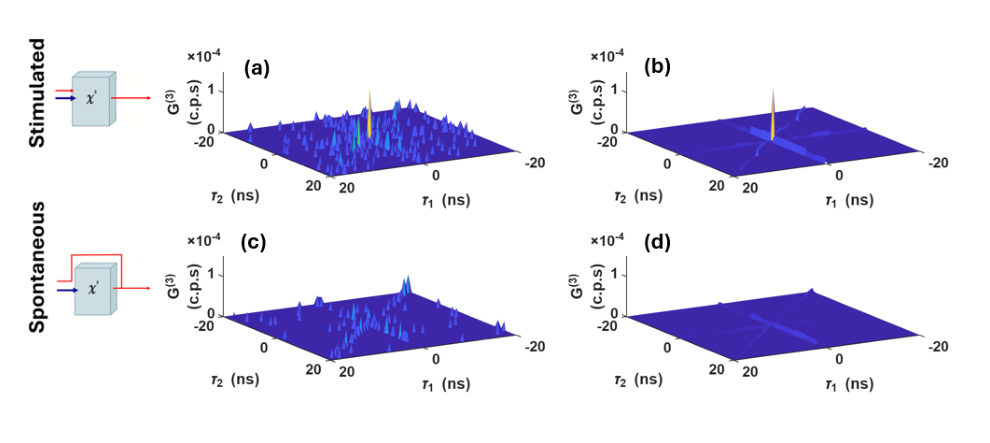 
FIG. 3. Pre-normalized three-fold correlations. Top row: (a) measured three-fold coincidence histogram G(3)(τ1, τ2) in the central temporal window with the weak seed present; (b) the same data after block-averaging, which suppresses noise while preserving the underlying coin- cidence structure. Bottom row: (c) simulated three-fold histogram obtained using the same singles and two-fold rates, but assuming that the seed does not participate in the nonlinear interaction; (d) corresponding block-averaged simulation, showing only the horizontal, vertical, and diagonal features arising from accidental overlaps, with a significantly weaker central feature.

📷 Fig 4

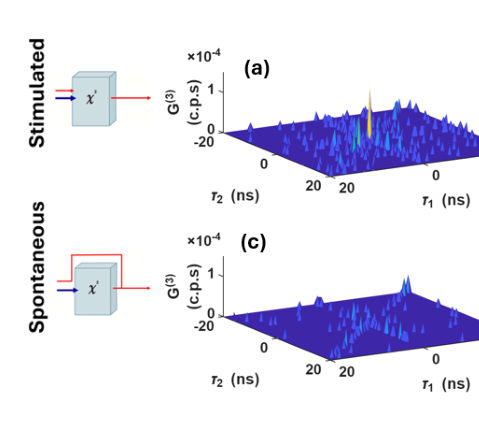 
Figure 3(a) shows the raw three-fold coincidence function G(3)(τ1, τ2) over the central temporal window. A feature is vis- ible around τ1 ≈0 and τ2 ≈0, but the overall event rate is low, and the signal is largely masked by shot noise. To improve visibility while preserving the underlying temporal structure, we apply a block-averaging procedure that combines neigh- boring bins without distorting the coincidence features (see Supplementary Information). The processed data, shown in Fig. 3(b), reveal the expected horizontal, vertical, and diago- nal ridges associated with accidental overlaps between detec- tor pairs. These structures arise from genuine two-fold coin- cidences combined with...

📷 Fig 5

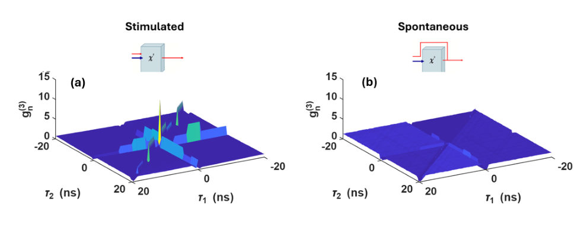 
FIG. 4. Normalized three-fold correlations. (a) Normalized three-fold function g(3) n (τ1, τ2) for the experimental data with the weak seed present. A clear peak appears at τ1 ≈0 and τ2 ≈0, while the surrounding region remains close to unity. (b) Corresponding normalized function obtained from the Monte Carlo simulation, including only accidental three-folds and pairwise SPDC correlations. The map remains flat, with g(3) n ≈1, indicating that the peak observed in (a) cannot be explained by accidentals alone.

**Summary.** This paper experimentally demonstrates the generation of correlated photon triplets by using a very weak coherent seed to stimulate parametric down-conversion. By measuring third-order correlations, the authors prove that the seed photon directly participates in the nonlinear process to create a three-photon state. This provides a new method for engineering multi-photon states for quantum technologies.

**Why it may be interesting.** It demonstrates a way to engineer higher-order multipartite photon states (like triplets) using weak seeds, which is highly relevant for quantum imaging, sensing, and generating complex states for quantum information processing.

Detailed structure

**Main problem.** Investigating the transition from spontaneous to stimulated parametric down-conversion in the ultra-weak seed regime, specifically looking for genuine three-photon correlations.

**Main result.** The observation of a clear enhancement in third-order temporal correlations (g3n = 12.5) that confirms the seed photon stimulates the emission of a photon pair to form a correlated triplet.

**Method.** The researchers used third-order temporal correlation measurements and a background-normalized quantity (g3n) to distinguish stimulated three-photon events from accidental coincidences and spontaneous multi-pair emission.

**Model / system.** A continuous-wave, low-gain, type-I parametric down-conversion setup using a BBO crystal pumped by a 400 nm laser, with a weak coherent field (average photon number << 1) used as a seed.

**Key observables.** Third-order temporal correlation functions G(3)(0,0) and the normalized function g(3)n.

**Important parameters / regimes.** Low-gain regime (|eta t| << 1), ultra-weak seed regime (average photon number per coherence time << 1), and a seed detection probability of approximately 10^-6.

**Assumptions / limitations.** Undepleted pump approximation, low-gain approximation, and the assumption that the seed field does not significantly modify the underlying SPDC statistics.

**Figures summary.** Figure 1 shows the conceptual schematic of photon-triplet generation; Figure 2 details the experimental setup; Figure 3 displays the raw three-fold coincidence histogram and the flat normalized simulation results.

**Paper structure.** The paper introduces the concept of stimulated PDC, describes the experimental setup and theoretical Hamiltonian, details the normalization protocol and Monte Carlo validation, presents the experimental observation of the three-photon peak, and discusses implications for quantum technologies.

Abstract

Parametric down-conversion is a widely used source of nonclassical light in quantum optics and photonic quantum technologies. While stimulated parametric down-conversion with strong classical seeds is well studied, the regime in which stimulation occurs at the single-photon level has hitherto remained largely unexplored experimentally. Here, we study continuous-wave, low-gain down-conversion seeded by a weak coherent field with an average photon number well below one per coherence time. By measuring third-order temporal correlations, we observe a clear enhancement that cannot be accounted for by spontaneous processes or accidental coincidences alone, and is consistent with stimulation involving the seed and the generated photon pair. These results provide time-domain evidence of seed-induced three-photon correlations and suggest new ways to engineer and probe multi-photon states for quantum imaging, sensing, and information processing.

[↑ back to top](#top)

### [Krylov complexity has it all](http://arxiv.org/abs/2605.28681v1)

**Authors:** Wolfgang Mück  
**Type:** theory · **Category:** quantum information and computing · **PDF:** <https://arxiv.org/pdf/2605.28681v1>  
**Analysis basis:** full PDF text, analyzed in chunks
**Topic relevance:** 🔥 `entanglement & information structure` **4/5** · `non-equilibrium dynamics` **3/5** · `scars & prethermalization` **2/5**

📷 Fig 1

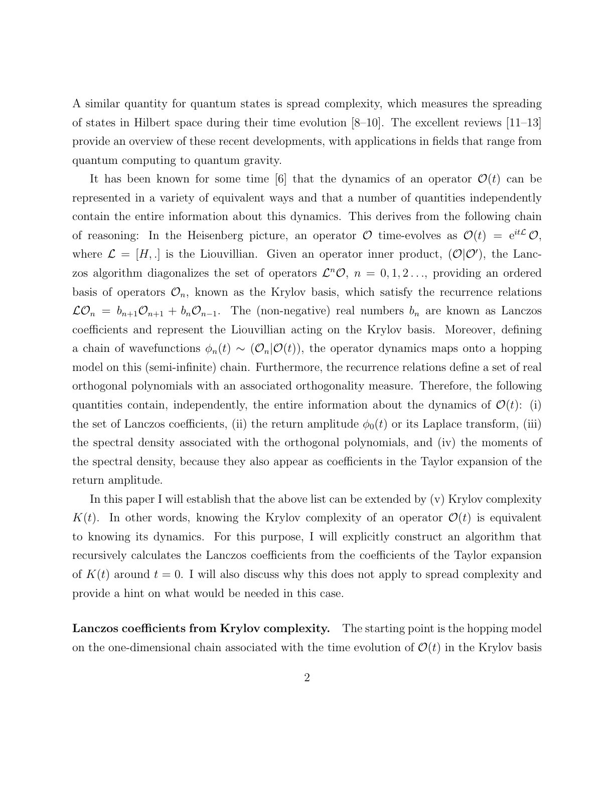 
Low-resolution page preview, page 2

📷 Fig 2

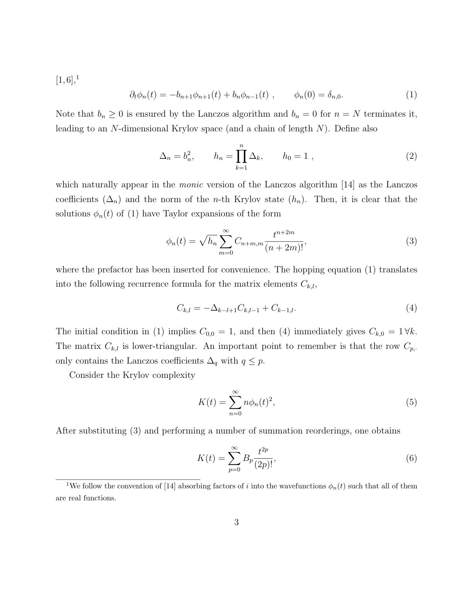 
Low-resolution page preview, page 3

📷 Fig 3

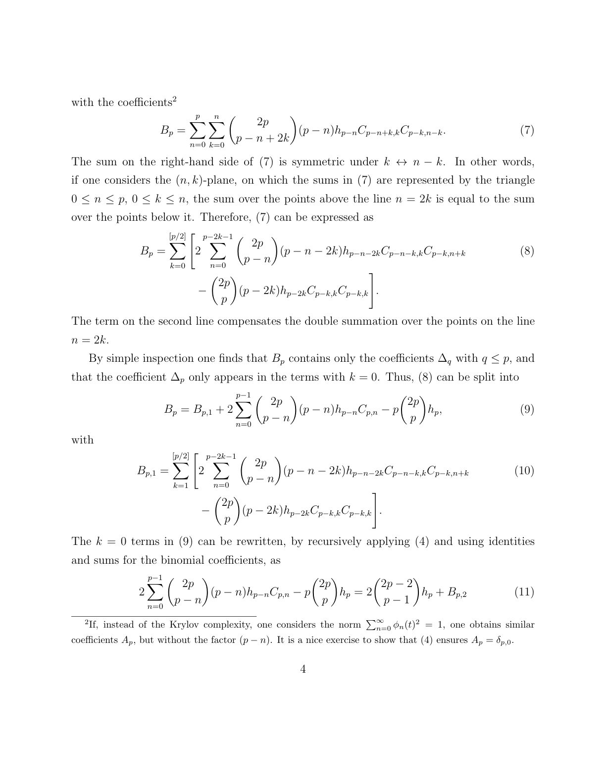 
Low-resolution page preview, page 4

📷 Fig 4

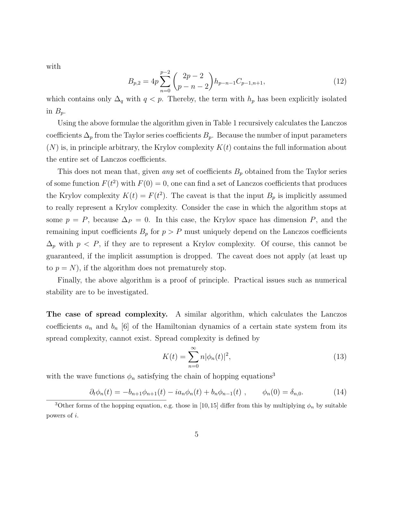 
Low-resolution page preview, page 5

📷 Fig 5

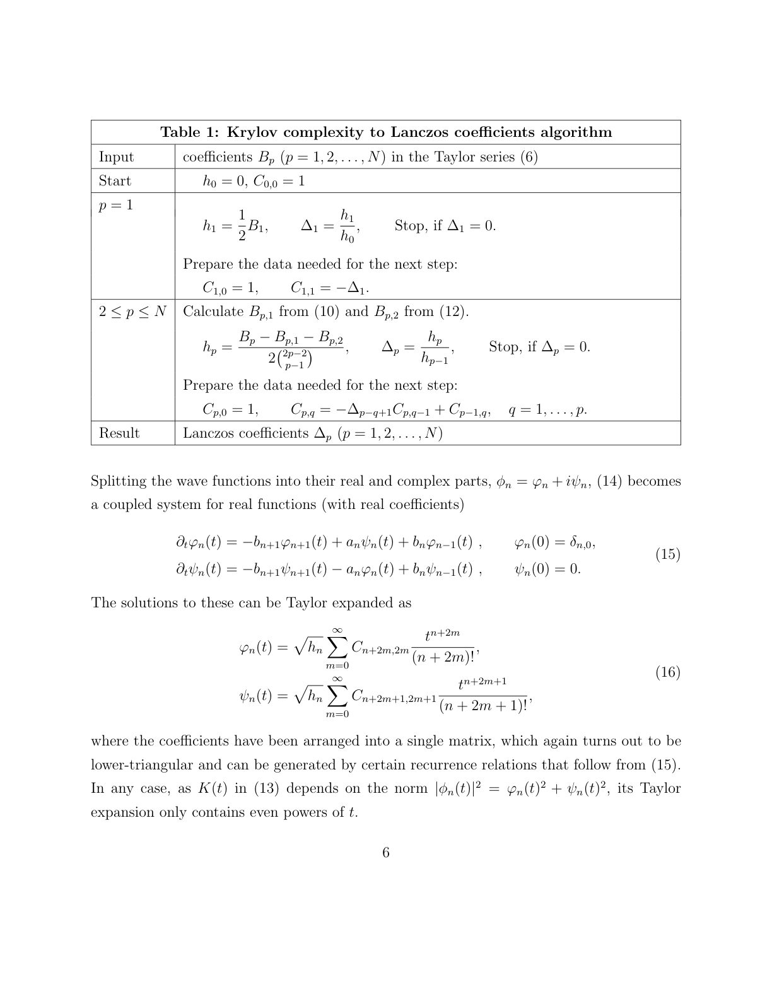 
Low-resolution page preview, page 6

**Summary.** This paper demonstrates that Krylov complexity encodes all information about the dynamics of a quantum operator. It provides a specific mathematical procedure to reconstruct the underlying Lanczos coefficients from the time-evolution of the complexity. This establishes Krylov complexity as a complete diagnostic tool for operator growth.

**Why it may be interesting.** This is highly relevant for many-body dynamics as it provides a fundamental 'proof of principle' for using a single complexity measure to fully characterize the evolution of quantum operators.

Detailed structure

**Main problem.** The paper investigates whether Krylov complexity contains the complete information required to reconstruct the full dynamics of a quantum operator.

**Main result.** The author proves that Krylov complexity is a complete characterization of operator evolution and provides a recursive algorithm to extract Lanczos coefficients from its Taylor expansion.

**Method.** The study employs Taylor expansion analysis of the Krylov complexity and its moments, combined with the Lanczos algorithm and properties of orthogonal polynomials.

**Model / system.** The dynamics are modeled using a quantum operator evolving under a Liouvillian, which is mapped onto a one-dimensional semi-infinite chain (Krylov basis) described by a hopping model.

**Key observables.** Krylov complexity K(t), second spread complexity K2(t), return amplitude, and spectral density.

**Important parameters / regimes.** Lanczos coefficients (b_n, Delta_n) and diagonal terms (a_n) representing the Liouvillian action.

**Assumptions / limitations.** The reconstruction algorithm assumes that the input Taylor coefficients represent a valid, physically consistent Krylov complexity.

**Paper structure.** The paper begins by establishing the equivalence of Krylov complexity to other dynamical quantities, presents a recursive algorithm for coefficient extraction, and concludes by comparing Krylov complexity to spread complexity.

Abstract

This paper establishes that Krylov complexity contains the entire information about the dynamics of a quantum operator, extending the list of equivalent quantities that can serve this purpose, such as the Lanczos coefficients, the return amplitude, and the spectral density. To demonstrate this equivalence, an explicit recursive algorithm is constructed to calculate Lanczos coefficients from the Taylor expansion of the Krylov complexity around $t=0$. Furthermore, the paper discusses the distinction between Krylov and spread complexity, clarifying why a similar recursive algorithm cannot exist for the latter without additional dynamical input. These results provide a ``proof of principle'' for using Krylov complexity as a complete characterization of operator evolution in quantum systems.

[↑ back to top](#top)

### [Sympathetic Cooling in Trapped Ions with Spectral Selectivity via the Zeeman Shift](http://arxiv.org/abs/2605.27577v1)

**Authors:** Kavyashree Ranawat, Jiyong Yu, Andrew Van Horn, Jacob Whitlow, Kenneth R Brown, Jungsang Kim  
**Type:** experiment · **Category:** other · **PDF:** <https://arxiv.org/pdf/2605.27577v1>  
**Analysis basis:** full PDF text, analyzed in chunks
**Topic relevance:** 🔥 `QC/QI experiment` **4/5** · `quantum optics experiment` **3/5** · `correlated / nonlocal dissipation` **2/5**

📷 Fig 1

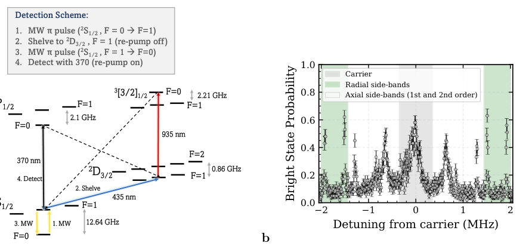 
Fig. 1: a Detection scheme designed for extracting the resonance frequencies of the ion

📷 Fig 2

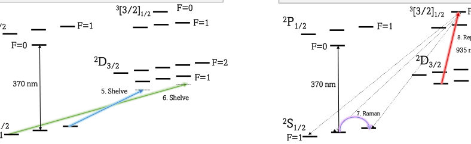 
Fig. 2: Same-isotope sympathetic cooling sequence for 171Yb+. a Ions are initialized in the

📷 Fig 3

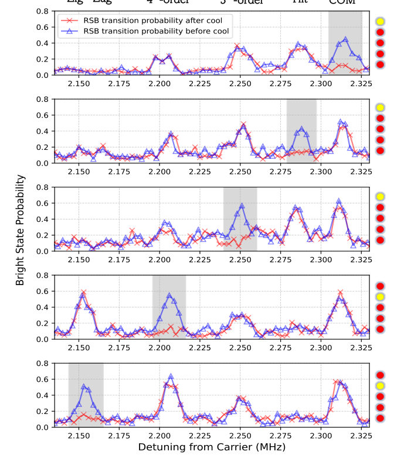 
Fig. 3: Demonstration of targeted cooling for all modes in a 5-ion chain of 171Yb+ ions.

📷 Fig 4

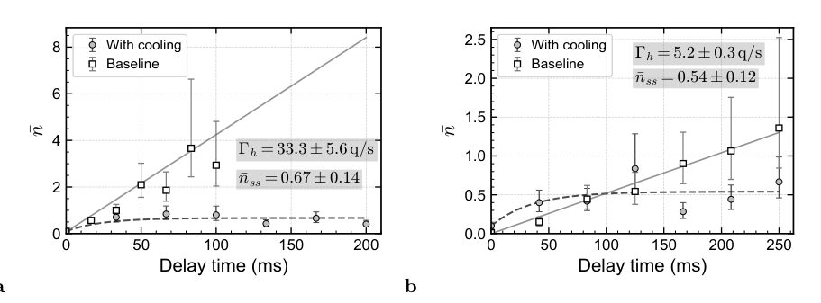 
Fig. 4: Heating rate suppression of the COM and tilt modes in a 5-ion 171Yb+ chain. The

📷 Fig 5

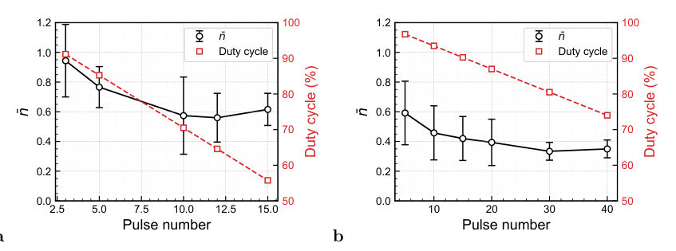 
Fig. 5: Steady state average phonon number versus the number of cooling pulses and duty

**Summary.** The researchers developed a way to cool specific ions in a single-isotope chain without disturbing the quantum information stored in other ions. By using the Zeeman shift to create spectral isolation, they successfully suppressed motional heating while maintaining high qubit coherence. This approach reduces the hardware complexity and overhead typically required for sympathetic cooling.

**Why it may be interesting.** This work is highly relevant for quantum optics and open quantum systems as it provides a practical method for managing dissipation (cooling) in a many-body system (ion chain) while minimizing the impact of the environment on the system's internal quantum states.

Detailed structure

**Main problem.** Achieving high-fidelity quantum logic in trapped ions requires cooling motional modes to the ground state without introducing decoherence to data qubits, which is challenging with traditional multi-species or multi-isotope cooling methods.

**Main result.** The authors demonstrate a same-isotope sympathetic cooling scheme using spectral selectivity via the Zeeman shift, achieving ground-state cooling of radial modes with minimal impact on data qubit coherence.

**Method.** The protocol uses a sequence of microwave pi-pulses, 4-35 nm shelving, and Raman transitions to selectively manipulate Zeeman states of coolant ions, combined with periodic cooling pulses to suppress heating.

**Model / system.** A 5-ion chain of 171Yb+ ions trapped in a cryogenic surface trap (8 K), operating in the Lamb-Dicke regime.

**Key observables.** Average motional phonon number (n-bar), heating rates, qubit coherence time (T2), and resonance frequencies of the quadrupole transition.

**Important parameters / regimes.** Natural linewidth of 3 Hz for the quadrupole transition, Zeeman shift separation of 11 MHz, and a duty cycle of approximately 70%.

**Assumptions / limitations.** Assumes the Lamb-Dicke approximation holds for radial modes but not strictly for axial modes; assumes an upper bound for photon scattering based on ideal polarization matching.

**Figures summary.** Fig 1: Detection scheme and spectroscopy; Fig 2: Cooling sequence schematic; Fig 3: Demonstration of targeted cooling across all radial modes; Fig 5: Steady-state phonon number vs. pulse number; Fig 6: Spin-echo data showing coherence decay; Fig 7: Decay rate dependence on laser intensity and detuning; Fig 8: Laser amplitude stability (Allan deviation).

**Paper structure.** The paper introduces the problem of motional heating and existing cooling limitations, describes the experimental setup and the new spectral-selective protocol, demonstrates successful mode-specific cooling, analyzes the resulting decoherence in data ions, and provides a theoretical analysis of secondary error sources like light shifts and photon scattering.

Abstract

High-fidelity quantum logic operations in trapped ions often require the ions' collective motion to be cooled to near the ground state. Since cooling the ions' motion typically involves dissipative processes such as spontaneous photon scattering, sympathetic cooling is used on select coolant ions between gate sequences to cool the ion chain without affecting the data qubits. Common implementations for coolant ions include different atomic species, different isotopes of the same species or individually addressable ions. Each of these approaches have challenges associated with them, which include increased hardware complexity, reduced efficiency of radial mode cooling and re-ordering events which add additional experimental overhead. We demonstrate a sympathetic cooling scheme leveraging internal metastable atomic levels accessible via a narrow quadrupole transition, utilizing the natural Zeeman shift and individually addressed Raman transitions, to achieve isolation of the non-coolant or ``data ions" from coolant ions. We demonstrate modest decoherence of the data ions due to cooling, while preserving the coherence requirements for high-fidelity gate operations.

[↑ back to top](#top)

### [Filter-assisted quantum subspace diagonalization via wavefunction sparsity engineering](http://arxiv.org/abs/2605.28040v1)

**Authors:** Han Xu, Tomonori Shirakawa, Seiji Yunoki  
**Type:** both · **Category:** quantum information and computing · **PDF:** <https://arxiv.org/pdf/2605.28040v1>  
**Analysis basis:** full PDF text, analyzed in chunks
**Topic relevance:** 🔥 `QC/QI experiment` **4/5** · `entanglement & information structure` **2/5** · `quantum measurements` **2/5**

📷 Fig 1

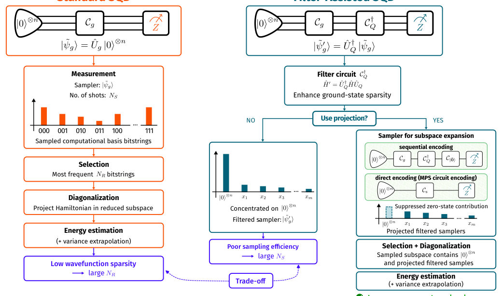 
FIG. 1. Schematic comparison between the standard SQD workflow and the proposed filter-assisted SQD (FSQD) protocol. In both methods, a truncated Hamiltonian matrix is constructed and diagonalized in the subspace spanned by the NR most frequently sampled computational basis states. In FSQD, a designed filter circuit C† Q (unitary ˆU † Q) transforms the original Hamiltonian ˆH into the filtered Hamiltonian ˆH′ := ˆU † Q ˆH ˆUQ, whose ground state is more strongly concentrated on the compu- tational basis state |0⟩= |0⟩⊗n. To avoid excessive sampling of the dominant |0⟩component, samplers for subspace expansion are constructed from the projected state—either by directly encoding the...

📷 Fig 2

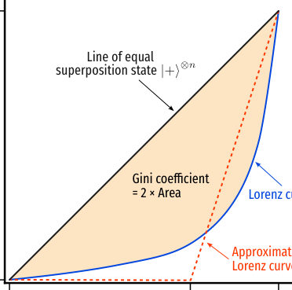 
FIG. 2. Schematic diagram of the Lorenz curve L(x) and the graphical interpretation of the Gini coefficient G. The diagonal line corresponds to the Lorenz curve for the equal- superposition state |+⟩⊗n, and the approximate Lorenz curve La(x) is shown as a red dashed line.

📷 Fig 3

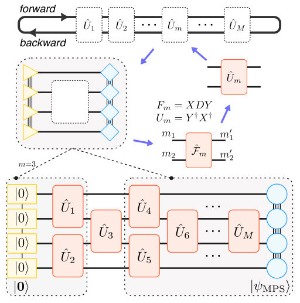 
FIG. 3. Schematic illustration of the forward and back- ward sweeps in the MPS-circuit-encoding algorithm. The top panel shows the bidirectional optimization over the local two- qubit unitary matrices Um. The middle-left panel illustrates the local tensor-network environment for optimizing the mth unitary. The middle-right panel shows the fidelity tensor ˆFm and its matrix representation Fm, from which the locally op- timal unitary matrix Um = Y †X† is obtained through the singular-value decomposition Fm = XDY . The lower panel shows the circuit CMPS, composed of local two-qubit unitaries ˆUm, which is optimized so that the all-zero product state |0⟩ is mapped approximately to the target...

📷 Fig 4

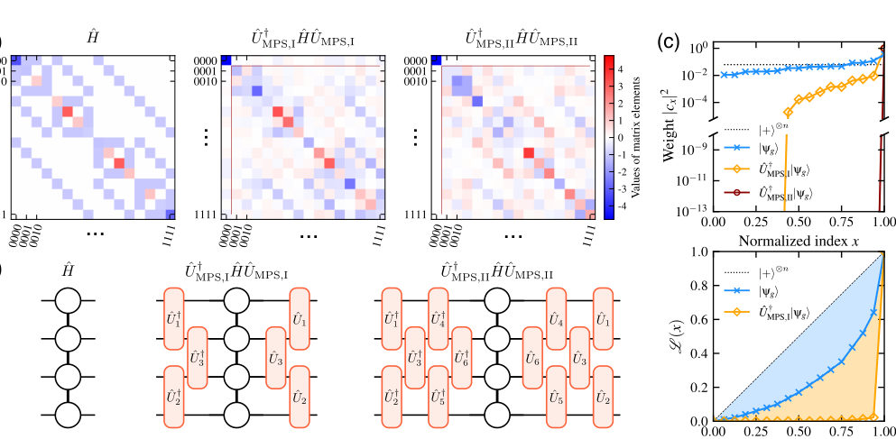 
FIG. 4. (a) Matrix representations of the original Hamiltonian ˆH [Eq. (53)] and the filtered Hamiltonian ˆH′ = ˆU † MPS,I(II) ˆH ˆUMPS,I(II) for one-layer and two-layer filters on a four-site system. (b) Corresponding tensor-network, i.e., MPO, representations. (c) Sorted weights |cI|2 and cumulative weights L(x) in the computational basis for the same four-site sys- tem. The Gini coefficient equals twice the shaded area between the Lorenz curve and the diagonal line corresponding to the equal-superposition state |+⟩⊗n. Examples are shown for |ψg⟩(blue), ˆU † MPS,I |ψg⟩(yellow), and ˆU † MPS,II |ψg⟩(brown). For the two-layer filter, the weight distribution is so strongly concentrated on...

📷 Fig 5

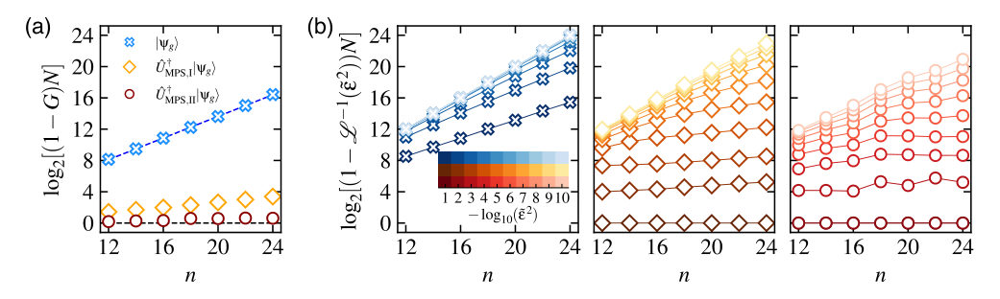 
FIG. 5. (a) Deviation of the Gini coefficient from unity, 1 −G, as a measure of wavefunction sparsity, plotted as a function of system size n. A fit to the ground state |ψg⟩of the original Hamiltonian ˆH gives (1 −G)N ∼20.7n, shown by the blue dashed line, whereas the filtered states generated by ˆUMPS,I and ˆUMPS,II approach the sparsest-case scaling, shown by the black dashed line. (b) Inverse Lorenz curve as functions of n for |ψg⟩(left), ˆU † MPS,I|ψg⟩(middle), and ˆU † MPS,II|ψg⟩(right). The color intensity corresponds to the target estimation error ˜ε2 = 10−1, 10−2, . . . , and 10−10, as indicated in the inset of the left panel.

**Summary.** This paper introduces a new protocol called Filter-assisted SQD (FSQD) to solve the efficiency problems in quantum subspace diagonalization. By using a quantum circuit to transform the Hamiltonian, the method makes the ground-state wavefunction sparser, which drastically reduces the number of measurements needed to estimate energies accurately. The approach is validated through both large-scale numerical simulations and experiments on real quantum hardware.

**Why it may be interesting.** It provides a scalable framework for many-body calculations by using a quantum filter to reshape the measurement distribution, directly addressing the sampling bottleneck in quantum-centric algorithms for strongly correlated systems.

Detailed structure

**Main problem.** The intrinsic trade-off in sample-based quantum subspace diagonalization (SQD) between sampling efficiency and wavefunction sparsity, which causes exponential resource growth in strongly correlated systems.

**Main result.** The proposed Filter-assisted SQD (FSQD) protocol significantly enhances wavefunction sparsity and reduces ground-state energy estimation errors by orders of magnitude while substantially lowering sampling overhead.

**Method.** A protocol that uses a quantum filter (a unitary transformation of the Hamiltonian) implemented via a tensor-network-based circuit-encoding algorithm to concentrate ground-state weight onto fewer basis states.

**Model / system.** The study focuses on many-body systems in the strongly correlated regime, specifically using the quantum Ising model with transverse and longitudinal fields as a benchmark, with demonstrations on systems up to 100 qubits and hardware experiments on IBM's ibm_kobe processor.

**Key observables.** Ground-state energy estimation error, Gini coefficient (sparsity measure), Lorenz curve, sampling overhead (number of shots), and subspace dimension.

**Important parameters / regimes.** Gini coefficient (G), subspace dimension (NR), number of measurement shots (NS), and the scaling exponent (g) of the sampling overhead.

**Assumptions / limitations.** The quantum state is prepared by applying a unitary operator to the zero state, and the accuracy depends on the fidelity of the tensor-network-based circuit encoding.

**Figures summary.** Figure 1 compares standard SQD with FSQD variants; Figure 2 shows the piecewise-linear approximation of the Lorenz curve; Figure 3 illustrates the MPS circuit-encoding algorithm; Figure 9 shows optimization convergence; Figure 13 shows qubit layouts on the IBM hardware.

**Paper structure.** The paper identifies the SQD bottleneck, proposes the FSQD protocol, establishes theoretical resource bounds using the Gini coefficient, details the MPS-based circuit-encoding implementation, and validates the approach through numerical simulations and quantum hardware experiments.

Abstract

Subspace diagonalization techniques based on quantum sampling, such as quantum selected configuration interaction (QSCI) and sample-based quantum diagonalization (SQD), have recently emerged as promising quantum-centric approaches for approximating ground-state energies of many-body systems. However, their performance is fundamentally limited by an intrinsic trade-off between sampling efficiency and the sparsity of the ground-state wavefunction, which becomes particularly severe in strongly correlated systems. Here, we introduce a filter-assisted SQD protocol that engineers wavefunction sparsity via a quantum filter, i.e., a unitary transformation of the Hamiltonian designed to concentrate the ground-state weight onto a small number of computational basis states. Using the Gini coefficient as a robust sparsity measure, we establish a quantitative relationship between wavefunction sparsity and the resource requirements of SQD, providing theoretical bounds on the required subspace dimension and sampling cost. To realize the quantum filter, we employ a tensor-network-based circuit-encoding algorithm that maps target states to quantum circuits with controllable fidelity. We benchmark our approach on the quantum Ising model with transverse and longitudinal fields using both numerical simulations and quantum hardware experiments. Our results demonstrate that, compared with standard SQD, the proposed protocol significantly enhances wavefunction sparsity, reduces ground-state energy estimation errors by orders of magnitude, and substantially lowers sampling overhead. These findings establish filter-assisted subspace diagonalization as a powerful and scalable framework for quantum many-body calculations in the strongly correlated regime.

[↑ back to top](#top)

### [Cavity-Induced Suppression of Entanglement and Enhancement of Quantum Discord](http://arxiv.org/abs/2605.28055v1)

**Authors:** Shagun Kaushal, Harkirat Singh Sahota  
**Type:** theory · **Category:** quantum information and computing · **PDF:** <https://arxiv.org/pdf/2605.28055v1>  
**Analysis basis:** full PDF text, analyzed in chunks
**Topic relevance:** 🔥 `entanglement & information structure` **4/5** · `correlated / nonlocal dissipation` **2/5**

📷 Fig 1

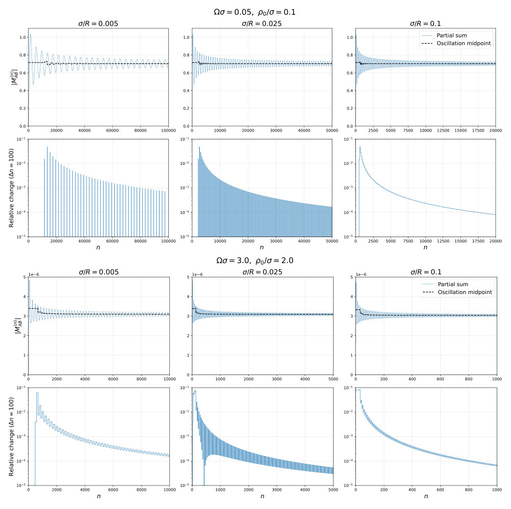 
FIG. 1: Partial sums of the nonlocal correlation term |M (n) AB| as functions of the mode cutoff n for different values of the detector size parameter σ/R. The upper panels in each block show the oscillatory convergence behavior of the partial sums together with the oscillation midpoint estimate (dashed line), while the lower panels display the corresponding relative change, on a logarithmic scale. The top two rows correspond to Ωσ = 0.05 and ρ0/σ = 0.1, whereas the bottom two rows correspond to Ωσ = 3.0 and ρ0/σ = 2.0. The plots illustrate the oscillatory yet convergent nature of the nonlocal correlation series, with convergence becoming faster for larger values of σ/R.

📷 Fig 2

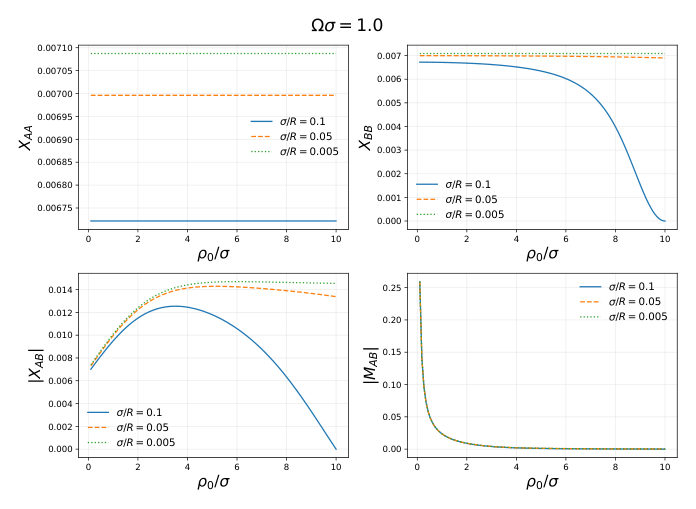 
FIG. 2: Behavior of the correlation terms XAA, XBB, |XAB|, and |MAB| as functions of ρ0/σ for different values of σ/R. The correlation term MAB decays rapidly and is strongly suppressed near the boundary, while XAB remains comparatively robust. The local term XBB is also reduced, leading to an asymmetry that explains the loss of entanglement and the persistence of discord and total correlations.

📷 Fig 3

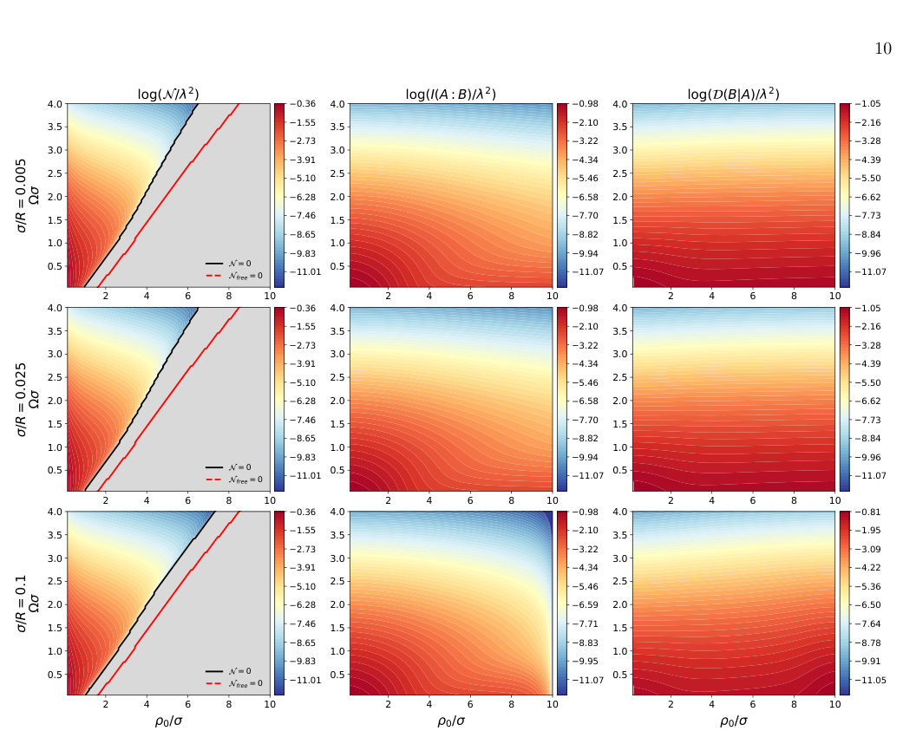 
FIG. 3: Density plots of N, I(A:B), and D(B|A) (left to right) as functions of the dimensionless parameters ρ0/σ and Ωσ in log scale, for different values of σ/R = 0.005, 0.025, 0.1 (top to bottom). In the left column, the black solid curve denotes the cavity entanglement boundary Ncavity = 0, while the red dashed curve represents the corresponding free-space boundary Nfree = 0; regions above these curves correspond to nonzero entanglement. For larger σ/R, the cavity significantly modifies the entanglement region due to the discrete mode structure, leading to deviations from the free-space result. As σ/R decreases, the cavity boundary approaches the free-space limit, although small residual...

📷 Fig 4

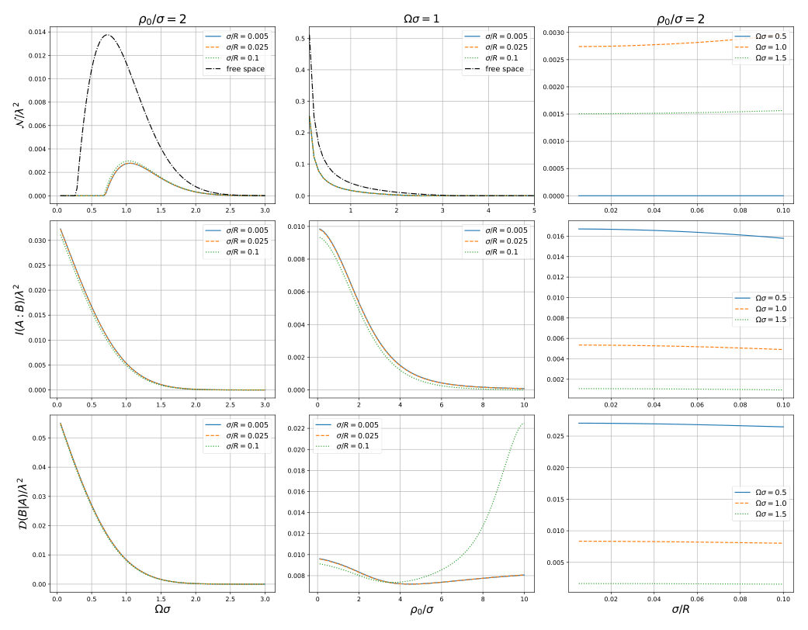 
FIG. 4: Harvested correlations in one-dimensional slices of the parameter space. The first row shows N, I(A:B), and D(B|A) as functions of ρ0/σ for fixed Ωσ(= 1) and varying σ/R, while the second row shows their dependence on Ωσ for fixed σ/R(= 0.005) and varying ρ0/σ. Entanglement exhibits sudden death, mutual information decays smoothly, and quantum discord remains robust, becoming non-monotonic with enhancement near the cavity boundary for larger σ/R.

**Summary.** This paper demonstrates that a cylindrical cavity can selectively suppress entanglement while enhancing quantum discord. It shows that boundary conditions break translational invariance and create a regime where more general non-classical correlations persist even after entanglement has vanished.

**Why it may be interesting.** It provides fundamental insights into how spacetime boundaries and geometric confinement can be used to control the types of quantum correlations available, which is crucial for understanding entanglement harvesting and the robustness of non-classicality in open quantum systems.

Detailed structure

**Main problem.** Investigating how geometric confinement in a cylindrical cavity reshapes the hierarchy of quantum correlations, specifically whether the suppression of entanglement is accompanied by the preservation or enhancement of quantum discord.

**Main result.** The cavity suppresses distillable entanglement (negativity) and induces 'sudable death' at smaller separations, while simultaneously enhancing quantum discord near the cavity boundary.

**Method.** Perturbative expansion of the Unruh-DeWitt model up to second order in coupling strength, using the Wightman function for a massless scalar field with Dirichlet boundary conditions.

**Model / system.** Two stationary Unruh-DeWitt detectors (two-level systems) coupled to a massless scalar field confined within a perfectly reflecting cylindrical cavity of radius R and large length L.

**Key observables.** Entanglement negativity, quantum discord, and mutual information.

**Important parameters / regimes.** Cavity radius (R), detector separation (rho_0), detector energy gap (Omega), switching time (sigma), and the dimensionless ratio sigma/R.

**Assumptions / limitations.** The field is in the vacuum state, detectors are pointlike and stationary, the interaction is perturbative (O(lambda^2)), and the cavity is infinitely long.

**Figures summary.** Figure 1 shows the convergence of the nonlocal correlation term series; Figure 2 plots the behavior of various correlation terms (local noise, cross-correlations, and non-local correlations) as a function of detector separation.

**Paper structure.** The paper introduces the problem of correlation hierarchy, derives the reduced density matrix using the Unruh-DeWitt framework in a cylindrical geometry, analyzes the convergence of the mode expansion, presents numerical results for different correlation measures, and discusses the implications of boundary-induced asymmetry.

Abstract

We study correlations between two Unruh-DeWitt detectors coupled to a scalar field in a cylindrical cavity. Boundary conditions strongly modify the detector-correlation dynamics relative to free space. The entanglement negativity is suppressed in the cavity and vanishes for smaller separation as compared to the free space. Increasing the cavity radius does not recover the free-space behavior of the negativity. In contrast, mutual information and quantum discord remain nonzero over much larger separations. While the mutual information decays monotonically with separation, the quantum discord is enhanced near the cavity boundary. Our results demonstrate that geometric confinement can selectively suppress distillable entanglement while preserving and even enhancing more general non-classical correlations, providing a controlled setting to probe the hierarchy of correlations in quantum field theory.

[↑ back to top](#top)

### [Thermodynamic-limit dispersion relations on trapped-ion quantum hardware](http://arxiv.org/abs/2605.28599v1)

**Authors:** Lucas Marti, Sumeet, Stefan Wolf, K. P. Schmidt, Michael J. Hartmann  
**Type:** both · **Category:** quantum information and computing · **PDF:** <https://arxiv.org/pdf/2605.28599v1>  
**Analysis basis:** full PDF text, analyzed in chunks
**Topic relevance:** 🔥 `QC/QI experiment` **4/5** · `analog quantum simulation` **2/5**

📷 Fig 1

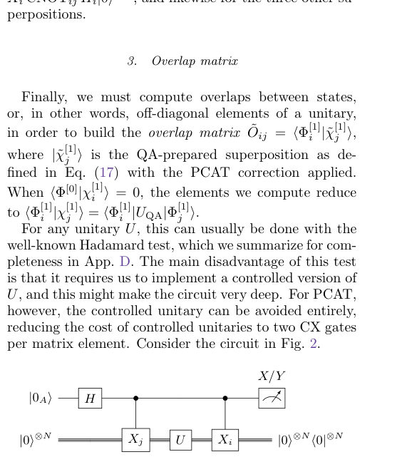 
Figure 2. The CX-test. In the second register, the controlled X gates indices indicate which qubit it is applied to, out of the N qubits.

📷 Fig 2

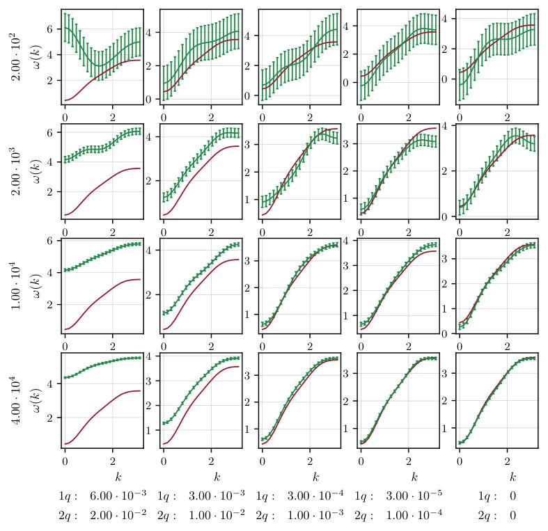 
Figure 3. Interplay between shot noise and depolarization noise when computing the dispersion curve, using noisy simulation, for a TFIM chain at J/h = 0.8 obtained by NLCE with Nmax = 5. The Y -axis label shows the number of shots, while the X-axis label shows the one-qubit and the two-qubit gate depolarization rates, indicated by 1q and 2q. The red line represents the noiseless statevector simulation, and the green line a noisy simulation. The error bars denote one standard deviation of statistical uncertainty.

📷 Fig 3

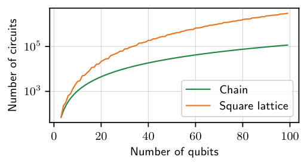 
Figure 4. Number of unique circuits to compute the full NLCE+QA scheme, for the pure TFIM model on the chain and on the square lattice (using rectangular expansion for NLCE).

📷 Fig 4

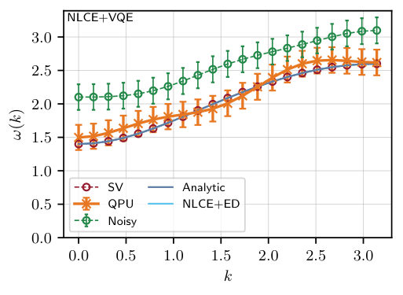 
Figure 5. 1QP Dispersion for the one-dimensional TFIM chain in the thermodynamic limit for J/h = 0.3 using NLCE+VQE with Nmax = 5. NCLE+ED indicates NLCE performed with exact diagonalization as a cluster solver; it shows the best possible performance of NLCE when using these cluster sizes. Analytic labels the analytic solution of the one-dimensional TFIM model, given in Eq. (25). SV in- dicates a noiseless statevector simulation. Noisy indicates a simulation with gate-level depolarization noise with rates set to be close to an AQT device. QPU indicates an experimen- tal result on a 20-qubit AQT trapped-ion device. The error bars denote one standard deviation of statistical uncertainty.

📷 Fig 5

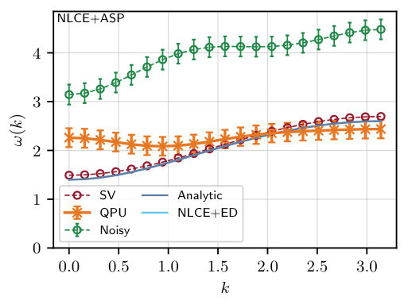 
Figure 6. 1QP dispersion for the one-dimensional TFIM model in the thermodynamic limit at J/h = 0.3, obtained with NLCE+ASP. The results take Nmax = 5 in NLCE cal- culation, and the sweep is done in ten time steps. Labels are the same as in Fig. 5. The error bars denote one standard deviation of statistical uncertainty.

**Summary.** This paper explores using a 20-qubit trapped-ion processor to compute many-body dispersion relations in the thermodynamic limit via a hybrid quantum-classical expansion technique. It demonstrates that while current hardware can successfully implement the necessary non-linear transformations, noise significantly biases the results and necessitates much higher gate fidelities for more complex algorithms like ASP.

**Why it may be interesting.** It addresses the critical challenge of how error propagation through non-linear classical post-processing affects the extraction of many-body properties from NISQ-era quantum devices.

Detailed structure

**Main problem.** Determining if current noisy quantum hardware can accurately compute thermodynamic-limit dispersion relations using non-linear classical post-processing of quantum data.

**Main result.** The study demonstrates that the NLCE+VQE framework is viable on current trapped-ion hardware, producing recognizable dispersion relations, though noise significantly biases results and ASP requires much lower error rates to be competitive.

**Method.** The authors combine Numerical Linked-Cluster Expansion (NLCE) with quantum algorithms (VQE and ASP) and use a novel CX-test for efficient measurement of matrix elements.

**Model / system.** The study uses a 20-qubit AQT Marmot trapped-ion quantum processing unit to simulate the Transverse-Field Ising Model (TFIM) in 1D chains, 1D chains with a longitudinal field, and 2D ladders.

**Key observables.** Ground-state energies and one-quasi-particle (1QP) dispersion relations omega(k).

**Important parameters / regimes.** Coupling strength J/h, longitudinal field strength hl, cluster size Nmax, and gate depolarization rates.

**Assumptions / limitations.** The perturbation is small enough to avoid quantum phase transitions or quasi-particle decays, and the hardware error is primarily modeled as depolarizing noise.

**Figures summary.** Figures illustrate the HVA ansatz, the CX-test circuit, the impact of depolarization noise on dispersion curves, and comparisons between QPU, simulation, and analytical results for various TFIM regimes.

**Paper structure.** The paper introduces the NLCE+QA framework, details the PCAT post-processing and CX-test measurement technique, compares VQE and ASP algorithms, analyzes the impact of hardware noise and stability, and concludes with the requirements for reaching the classical limit.

Abstract

We run a numerical linked-cluster expansion with a quantum algorithm (NLCE+QA), computing ground-state energies and one quasi-particle dispersions in the thermodynamic limit using a 20-qubit trapped-ion quantum processing unit (QPU). The NLCE+QA framework extracts thermodynamic-limit properties from small-cluster calculations, making it naturally suited for near-term quantum devices. Projector-based block-diagonalization schemes such as projective cluster-additive transformation (PCAT) are essential to NLCE+QA, and they involve matrix inversion and square root operations that amplify measurement noise. A central question is therefore whether current hardware can provide expectation values that are accurate enough to withstand non-linear classical post-processing. We explore this challenge for the transverse-field Ising model (TFIM) in one dimension, on a ladder geometry, as well as in a longitudinal field in one dimension. For the quantum algorithm, we consider adiabatic state preparation (ASP), as well as a variational quantum eigensolver (VQE) trained on a classical device. The final expectation values are obtained from the QPU, using a novel alternative to the Hadamard test that we name the CX-test. We explore the regimes currently attainable on quantum devices and comment on the improvements needed for quantum computers to achieve results beyond classical reach.

[↑ back to top](#top)

### [On the existence of fully inseparable biseparable Gaussian states](http://arxiv.org/abs/2605.28404v1)

**Authors:** Olga Leskovjanová, Klára Baksová, Jan Provazník, Ladislav Mišta,, Nicolai Friis  
**Type:** theory · **Category:** quantum information and computing · **PDF:** <https://arxiv.org/pdf/2605.28404v1>  
**Analysis basis:** full PDF text, analyzed in chunks
**Topic relevance:** 🔥 `entanglement & information structure` **4/5**

📷 Fig 1

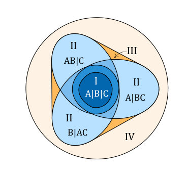 
FIG. 1. Graphical representation of sets of tripartite states with different separability properties. The convex hull of partition-separable states (II) forms the set of biseparable states, and its complement to the whole set of states is com- posed of states with GME (IV). The complement to the set of partition-separable states within the set of biseparable states is the set of FIB states (III). The union of the sets (III) and (IV) forms the set of fully inseparable states.

📷 Fig 2

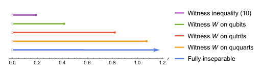 
FIG. 3. Comparison of ranges of the squeezing parameter r for which the Gaussian state with CM γ (1) ABC is detected as fully inseparable (blue, bottom), and as genuinely multipartite en- tangled using different detection methods (top to bottom): the witness inequality (10), or the fully decomposable witness in the form of the SDP in (8) after local projection to three qubits (green, second from the top), to three qutrits (red, third from the top), and to three ququarts (yellow, fourth from the top).

📷 Fig 3

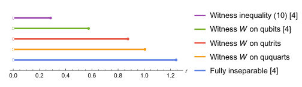 
FIG. 2. Comparison of ranges of the threshold squeezing pa- rameter r for which the Gaussian state with CM γ (0) ABC is de- tected as fully inseparable (blue, bottom), and as genuinely multipartite entangled using different detection methods (top to bottom): the witness inequality (10), or the fully decom- posable witness in the form of the SDP in (8) after local pro- jection to three qubits (green, second from the top) [31], to three qutrits (red, third from the top), and to three ququarts (yellow, fourth from the top).

📷 Fig 4

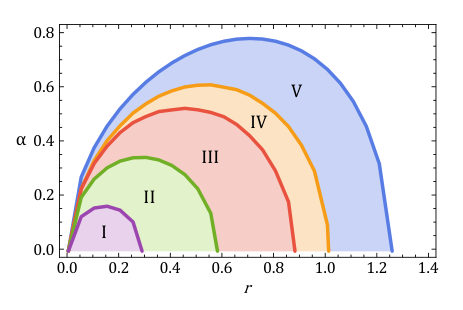 
FIG. 5. Comparison of regions where the Gaussian state with CM γ (3) ABC, Eq. (19), is detected as GME by the witness in- equality (10) (I), and by the fully decomposable witness W on qubits (II), qutrits (III), and ququarts (IV), inside the fully- inseparable region (V).

📷 Fig 5

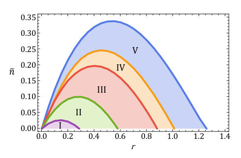 
FIG. 4. Comparison of regions where the Gaussian state with CM γ (2) ABC is detected as GME by the witness inequality (10) (I), and by the fully decomposable witness W on qubits (II), qutrits (III), and ququarts (IV), inside the fully-inseparable region (V).

**Summary.** The paper explores whether Gaussian states can be fully inseparable without being genuinely multipartite entangled. By analyzing various three-mode Gaussian families using local projections to finite-dimensional subspaces, the authors find no evidence for such states and conjecture that all fully inseparable Gaussian states are genuinely multipartite entangled.

**Why it may be interesting.** This is highly relevant to quantum optics and continuous-variable quantum information as it addresses a fundamental question about the structure of entanglement in Gaussian states and suggests that standard covariance matrix-based tests might be sufficient for GME detection.

Detailed structure

**Main problem.** The paper investigates whether 'fully inseparable biseparable' (FIB) Gaussian states exist, specifically whether there are Gaussian states that are entangled across every bipartition but are still expressible as a convex mixture of states separable with respect to different partitions.

**Main result.** The authors find that for all tested families of three-mode Gaussian states, states appearing to be FIB are actually genuinely multipartite entangled (GME), leading to the conjecture that all fully inseparable Gaussian states are GME.

**Method.** The study uses the PPT criterion for entanglement detection, projections of Gaussian density matrices onto finite-dimensional Fock subspaces, and semidefinite programming (SDP) to construct fully decomposable witnesses.

**Model / system.** The study focuses on three-mode continuous-variable Gaussian states, including families constructed from mixtures of two-mode squeezed vacuum states with single-mode squeezed, thermal, or coherent states, as well as noisy GHZ-like Gaussian states.

**Key observables.** Squeezing parameter (r), mean photon number (n), displacement (alpha), and noise/mixing parameter (eta).

**Important parameters / regimes.** The dimension of the local projection subspaces (d=2, 3, 4) and the squeezing parameter (r).

**Assumptions / limitations.** The study is restricted to three-mode Gaussian states and relies on the observation that the gap between full inseparability and GME shrinks with increasing projection dimension to form a conjecture.

**Figures summary.** Figure 1 shows the hierarchy of multipartite entanglement; Figures 2-6 show detection ranges for various Gaussian state families (SMSV, thermal, coherent, and noisy GHZ) across different detection methods and subspace dimensions.

**Paper structure.** The paper introduces the distinction between full inseparability and GME, defines the Gaussian state models, describes the numerical methods for Fock-basis projection, presents results for various state families, and concludes with a conjecture and discussion of implications.

Abstract

Genuine multipartite entanglement and full inseparability are two inequivalent quantum resources. Even though all genuinely multipartite entangled states are also fully inseparable, not all fully inseparable states are genuinely multipartite entangled. There exist fully inseparable states that can be prepared as convex mixtures of states separable with respect to different bipartite splits. Here, we are interested in examples of Gaussian states that possess this type of entanglement, so-called fully inseparable biseparable states. We show for several archetypical families of multimode Gaussian states that fully inseparable biseparable candidate states are actually genuinely multipartite entangled. Using projections to finite-dimensional subspaces and fully decomposable witnesses, we observe a shrinking of the regions of potentially fully inseparable biseparable Gaussian states with growing dimension of the projection subspaces. We therefore conjecture that all fully inseparable Gaussian states are genuinely multipartite entangled.

[↑ back to top](#top)

### [Simulation of additive binding energies in asphalt using quantum-selected configuration interaction (QSCI)](http://arxiv.org/abs/2605.27640v1)

**Authors:** Karim Elgammal, Marc Maußner  
**Type:** both · **Category:** quantum information and computing · **PDF:** <https://arxiv.org/pdf/2605.27640v1>  
**Analysis basis:** full PDF text, analyzed in chunks
**Topic relevance:** 🔥 `QC/QI experiment` **4/5**

📷 Fig 1

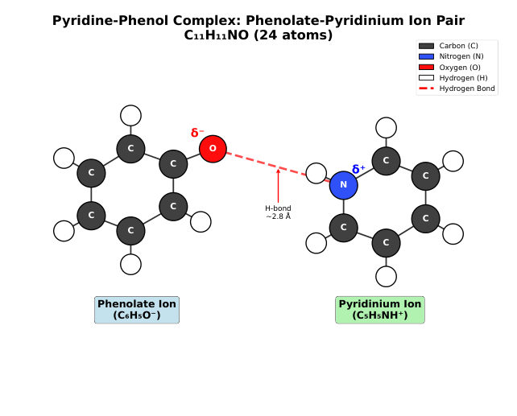 
Fig. 1. Molecular structure of the pyridine-phenol complex. The system consists of 24 atoms (C11H11NO) and is held together by an O-H· · · N hydrogen bond between the phenol hydroxyl group and the pyridine nitrogen.

📷 Fig 2

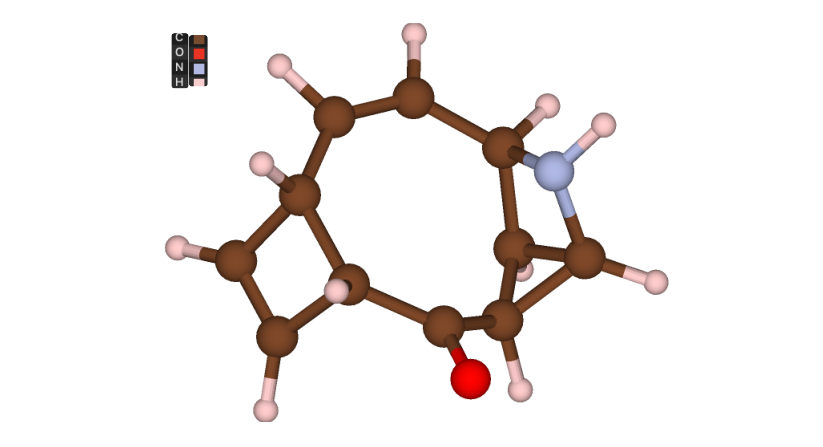 
Fig. 2. Three-dimensional visualisation of the optimised pyridine-phenol complex structure obtained from ORB v3 calculations (Energy: -148.936 eV, 103 optimisation steps). The structure shows the hydrogen bonding interaction between the nitrogen in pyridine and oxygen in phenol, with molecular dimensions of 5.5 × 6.3 × 4.1 ˚A.

📷 Fig 3

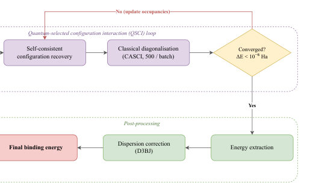 
Fig. 3. QSCI workflow showing the active space selection, configuration sampling, and energy convergence procedures.

**Summary.** This paper demonstrates a hybrid quantum-classical workflow called QuantumPave that uses a quantum processor to sample electronic configurations for calculating binding energies. By simulating a pyridine-phenol complex, the authors show that current NISQ-era hardware can achieve chemically relevant results for industrial materials science problems. The approach highlights the potential of quantum-centric supercomputing to solve complex molecular recognition tasks.

**Why it may be interesting.** not directly relevant

Detailed structure

**Main problem.** The study aims to demonstrate the feasibility of using a quantum-centric supercomputing workflow to predict additive binding energies in asphalt, a critical factor in road infrastructure durability.

**Main result.** The QSCI/SQD algorithm on the 54-qubit IQM Emerald processor exactly reproduced the active-space CASCI reference binding energy of -3.52 kcal/mol, proving that chemically meaningful results are attainable on current NISQ hardware.

**Method.** A hybrid quantum-classical workflow (QuantumPave) using Quantum-Selected Configuration Interaction (QSCI) where a quantum processor samples electronic configurations and classical HPC performs diagonalization, integrated with machine-learning interatomic potentials (ORB v3) for geometry optimization.

**Model / system.** A 24-atom pyridine-phenol hydrogen-bonded complex (C11H11NO) serving as a representative model for asphalt binder interactions, mapped onto a 54-qubit IQM Emerald superconducting processor using a (10e, 10o) active space.

**Key observables.** Additive binding energy (in kcal/mol and eV).

**Important parameters / regimes.** Active space of 10 electrons in 10 orbitals; 5000 measurement shots; 10^-6 Ha energy tolerance; NISQ regime.

**Assumptions / limitations.** The discrepancy between calculated and experimental values is attributed to the use of a compact/limited active space; the study assumes the pyridine-phenol complex is a sufficient proxy for asphalt binder interactions.

**Figures summary.** Figure 1 shows the molecular structure of the pyridine-phenol complex; Figure 2 displays the 3D optimized structure from ORB v3; Figure 3 illustrates the QSCI workflow loop.

**Paper structure.** The paper introduces the industrial problem of asphalt aging, presents the QuantumPave hybrid workflow, details the QSCI algorithm and hardware implementation, compares results against classical (CASCI, DFT) and experimental benchmarks, and concludes with future scaling directions.

Abstract

Quantum-centric supercomputing (in which a quantum processor samples the dominant electronic configurations and classical high-performance computing resources perform the diagonalisation) is emerging as a practical route to correlated electronic-structure calculations. We present QuantumPave, a hybrid quantum-classical workflow for computing additive binding energies in asphalt binder, a quantity central to the oxidative ageing of road infrastructure. Using a 24-atom pyridine-phenol hydrogen-bonded complex as a representative model, we couple machine-learning interatomic potentials (ORB v3) for geometry optimisation with quantum-selected configuration interaction (QSCI), also referred to as sample based quantum diagonalisation (SQD), in a (10e, 10o) active space run on the 54-qubit IQM Emerald processor. On hardware, SQD reproduces the active-space CASCI reference exactly, giving a binding energy of -3.52 kcal/mol (-0.153 eV); the device noise broadens the sampling to span the active space, so no zero-noise extrapolation is required. This active-space value describes a physical hydrogen bond that underbinds the calorimetric enthalpy of about -6.25 kcal/mol, the difference reflecting the compact active space. We show that chemically meaningful binding energies for an industrially relevant materials problem are attainable on current quantum hardware within a quantum-centric supercomputing workflow.

[↑ back to top](#top)

### [Dissipative Spectral Form Factor of the Complex Elliptic Ginibre Ensemble across Various Non-Hermiticity Regimes](http://arxiv.org/abs/2605.28319v1)

**Authors:** Gernot Akemann, Sung-Soo Byun, Seungjoon Oh  
**Type:** theory · **Category:** statistical mechanics · **PDF:** <https://arxiv.org/pdf/2605.28319v1>  
**Analysis basis:** full PDF text, analyzed in chunks
**Topic relevance:** `driven-dissipative phase transition` **3/5** · `methods for driven-dissipative` **3/5** · `non-equilibrium dynamics` **3/5** · `non-equilibrium universality` **3/5** · `correlated / nonlocal dissipation` **2/5** · `entanglement & information structure` **2/5**

📷 Fig 1

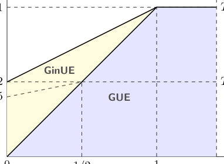 
Figure 1. Phase diagrams of the DSFF in the (α, γ)–plane, where the non-Hermiticity and time scalings are given by 1 −τ = N −α and T = N γT, with T &gt; 0 fixed. The Thouless time TTh and the generalised Heisenberg time TH are indicated on the figure. (A) Dip–ramp– plateau structure of the DSFF across different time scales. (B) Universality crossover of the DSFF, showing GUE-type behaviour for γ ≤α and GinUE-type behaviour for α &lt; γ &lt; 1+α

📷 Fig 2

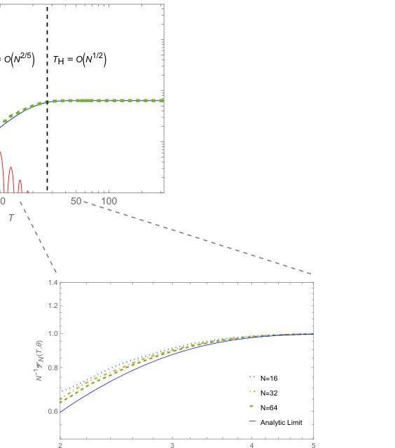 
Figure 2. DSFF in the regime of strong non-Hermiticity (α = 0) with τ = 0.3 and θ = π/6. Here, all axes are on a logarithmic scale. Top: DSFF for N = 64 (green, dashed), together with the analytic limits for γ = 0 (red, solid) and γ = 1

📷 Fig 3

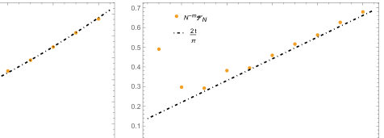 
Figure 3. The plots illustrate the DSFF in the mesoscopic non-Hermiticity regime with pa- rameters N = 214, θ = π/6, and γ = 0.6, in all 3 figures. Accordingly, in case (A) with α &lt; γ, one observes the quadratic ramp κT2

📷 Fig 4

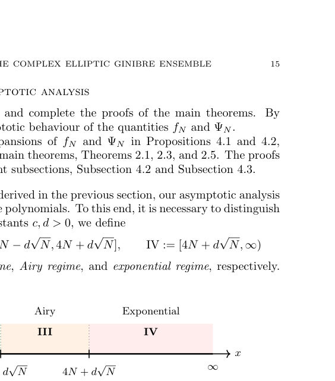 
Figure 4. Decomposition of the positive real axis into the four asymptotic regimes for the Laguerre polynomials.

📷 Fig 5

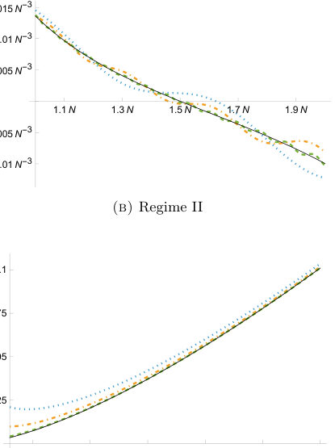 
Figure 5. Each plot compares the asymptotic behaviour of fN in the corresponding regime. In the regimes I, II, and III, the dotted, dot-dashed, and dashed curves represent the remainder obtained after subtracting the expansion up to the second term, for N = 8, 16, and 32 respec- tively, while the black solid curve shows the third-order term. In the regime II, the oscillatory component of the third-order term is further subtracted due to its explicit dependence on N. In the regime IV, where fN is of the form fN = N −1ge−4Nh, the dotted, dot-dashed, and dashed curves represent −(4N)−1 log(NfN/g), whereas the black solid curve represents h.

**Summary.** This paper provides a complete asymptotic characterization of the Dissipative Spectral Form Factor for the complex elliptic Ginibre ensemble. It maps out a phase diagram showing how the spectral statistics transition between Hermitian and non-Hermitian behaviors depending on the scaling of time and non-Hermiticity. The results rigorously define the scaling of key features like the Thouless and Heisenberg times.

**Why it may be interesting.** This work is highly relevant for researchers of open quantum systems as it provides a rigorous description of how dissipation and non-Hermiticity affect spectral correlations and the emergence of universal features like the ramp and plateau in quantum chaotic dynamics.

Detailed structure

**Main problem.** The paper aims to derive the mathematically rigorous large-N asymptotic behavior of the Dissipative Spectral Form Factor (DSFF) for the complex elliptic Ginibre ensemble across various non-Hermiticity regimes.

**Main result.** The authors identify a complete phase diagram for the DSFF, characterizing the dip-ramp-plateau structure and the transition between GUE-type (linear ramp) and GinUE-type (quadratic ramp) statistics, including the scaling of Thouless and Heisenberg times.

**Method.** The study employs the framework of determinantal point processes, using orthogonal polynomial techniques, Christoffel-Darboux formulas, and uniform asymptotic expansions (Bessel, Airy, and exponential regimes) to analyze the large-N limit.

**Model / system.** The model is the Complex Elliptic Ginibre Ensemble (eGinUE), a non-Hermitian random matrix model that interpolates between the Hermitian GUE limit and the strongly non-Hermitian Ginibre limit, representing open, dissipative quantum chaotic systems.

**Key observables.** Dissipative Spectral Form Factor (DSFF), split into connected and disconnected components; Thouless time (T_Th); Heisenberg time (T_H).

**Important parameters / regimes.** Non-Hermiticity parameter (tau); scaling parameters (alpha and gamma) for the non-Hermiticity and time variables; matrix dimension (N).

**Assumptions / limitations.** The analysis is restricted to the large-N (asymptotic) limit and focuses on the simplest ensemble without additional symmetries.

**Figures summary.** Figure 1(a) shows the dip-ramp-plateau structure of the DSFF with characteristic time scales, and Figure 1(b) illustrates the universality crossover in the (alpha, gamma) phase plane; Figure 2 provides numerical illustration in the strong non-Hermiticity regime.

**Paper structure.** The paper begins with the definition of the eGinUE and the DSFF, followed by the decomposition into connected and disconnected components. It then proceeds through a detailed asymptotic analysis across four regimes (Bessel, Oscillatory, Airy, and Exponential) to identify the phase diagram and characteristic time scales, concluding with mathematical appendices on expansion coefficients.

Abstract

We study the dissipative spectral form factor (DSFF) at complex time $T e^{iθ}$ for the complex elliptic Ginibre ensemble with non-Hermiticity parameter $τ\in [0,1)$. As the matrix dimension $N \to \infty$, we consider the natural scalings in both the time variable and the non-Hermiticity parameter, namely $T = O(N^γ)$ and $1 - τ= O(N^{-α})$. For all regimes $γ\ge 0$ and $α\ge 0$, we derive the precise asymptotic behaviour of both the disconnected and connected components of the DSFF. In particular, we explicitly characterise the dip--ramp--plateau structure, including the dip time and the Heisenberg time. In addition, we identify the mesoscopic regime $α\in (0,1)$, which interpolates between the behaviour of the DSFF of non-Hermitian random matrices and the spectral form factor (SFF) of Hermitian ensembles. We further provide an explicit description of the phase diagram, in which the ramp exhibits quadratic, linear, or intermediate behaviour depending on the scaling parameters.

[↑ back to top](#top)

### [Superradiant LIDAR](http://arxiv.org/abs/2605.28378v1)

**Authors:** T. Kullick, M. Bojer, J. von Zanthier, G. S. Agarwal  
**Type:** theory · **Category:** quantum information and computing · **PDF:** <https://arxiv.org/pdf/2605.28378v1>  
**Analysis basis:** full PDF text, analyzed in chunks
**Topic relevance:** `quantum measurements` **3/5** · `Dicke superradiance` **2/5** · `free-space correlated emission` **2/5** · `interference shaping light` **2/5** · `superradiant laser` **2/5**

📷 Fig 1

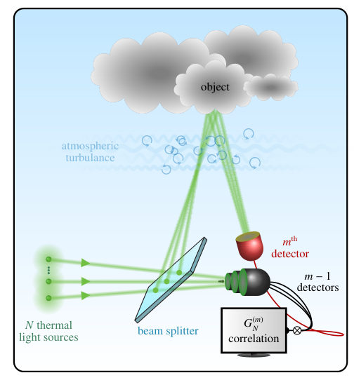 
Figure 1. Sketch of a practical implementation of Superradiant LI- DAR. N equidistant TLS emit light that is separated by a beam split- ter. The transmitted light is detected by m −1 detectors at a known distance. The reflected light propagates towards a remote object. After being reflected by the remote object, the light travels towards the mth detector. Correlating the photons of all m detectors yields a measurement of the mth-order correlation function G(m) N (δ1, δ2), from which the unknown distance to the remote object can be extracted. Note that the measurement is insensitive to atmospheric turbulence.

📷 Fig 2

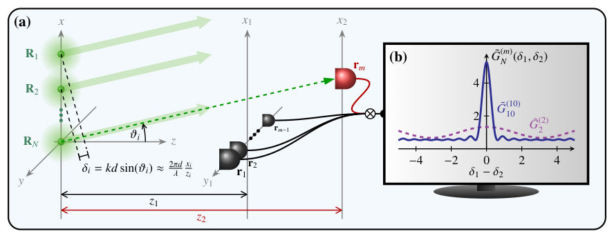 
Figure 2. (a) Conceptual scheme of Superradiant LIDAR. N equidistantly spaced, identical, statistically independent TLS are placed at positions Rl, l ∈{1, . . . , N}, along the x-axis. The radiated light is detected by m detectors at positions r j, j ∈{1, . . . , m}, in the far field. The mth detector is placed at an unknown distance z2 under a variable angle ϑ2 ≈x2/z2, whereas the remaining m −1 detectors are placed at a distance z1 under the angle ϑ1 ≈x1/z1. (b) The mth-order correlation function of N TLS of the Superradiant LIDAR setup ˜G(m) N (δ1, δ2) is shown for the cases N = m = 2 (purple) and N = m = 10 (blue), highlighting that higher-order correlation functions of N &gt; 2 light...

📷 Fig 3

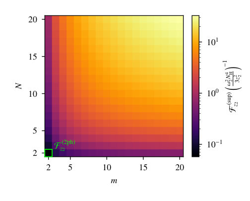 
Figure 3. Fisher information F (sup) z2 of Superradiant LIDAR as a func- tion of the correlation order m ∈{2, 3, . . . , 20} and the number of TLS N ∈{2, 3, . . . , 20}. The special case N = m = 2 (green rectangle), equivalent to two-photon LIDAR, marks the minimum of F (sup) z2 .

📷 Fig 4

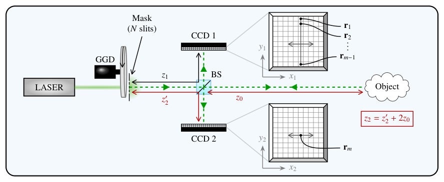 
Figure 1. Detailed proposal for a Superradiant LIDAR setup. For details, see text. GGD: rotating ground-glass disk, BS: beam splitter, CCD: charge-coupled device camera.

📷 Fig 5

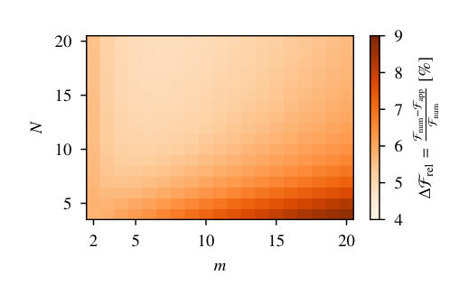 
Figure 2. The relative difference ∆Frel between the numerically evaluated Fisher information of Superradiant LIDAR (Eq. (C7)) and the approximated Fisher information in Eq. (D5) displayed for N ∈{4, 5, . . . , 20} and m ∈{2, 3, . . . , 20}. The cases N = 2, 3 are not shown, as analytical solutions are presented in Eqs. (6) and (7) in the main text, respectively. All deviations are below 9 %, and the approximate form always underestimates the numerical results.

**Summary.** The paper proposes a new LIDAR technique called Superradiant LIDAR that uses multiple independent thermal light sources and higher-order intensity correlations. This method significantly improves distance measurement sensitivity, outperforming traditional LIDAR by a factor proportional to the number of light sources used.

**Why it may be interesting.** It demonstrates how exploiting collective effects (superradiance) and higher-order correlations can significantly enhance parameter estimation precision, which is a core theme in quantum metrology and quantum optics.

Detailed structure

**Main problem.** Enhancing the sensitivity of Light Detection and Ranging (LIDAR) for measuring the distance of remote objects beyond the limits of traditional and coherent LIDAR.

**Main result.** The proposed Superradiant LIDAR achieves a Cramér-Rao bound that is undercut by a factor of N compared to traditional LIDAR, with sensitivity further improved by increasing the correlation order m.

**Method.** The authors use analytical derivations and numerical evaluations of the m-th order photon correlation function and Fisher information, developing a high-precision fit function to describe the scaling behavior.

**Model / system.** A system of N statistically independent thermal light sources (TLS) placed equidistantly along an axis, where light is reflected by a remote object and detected using m-th order intensity correlations.

**Key observables.** m-th order correlation function (G(m)_N) and Fisher information (F_{z2}^{(sup)})

**Important parameters / regimes.** Number of light sources (N), correlation order (m), unknown distance (z2), and phase differences (delta_i)

**Assumptions / limitations.** Measurements follow Poisson statistics, light sources are identical and uncorrelated, and pixel width is small enough for the phase approximation to hold.

**Figures summary.** Figure 1 shows the experimental schematic; Figure 2 compares correlation functions and shows the steeper slopes for higher N; Figure 3 highlights the significant gains in Fisher information for larger N and m; Figure 4 compares the accuracy of the analytical lower bound versus the proposed fit function.

**Paper structure.** The paper introduces the LIDAR problem, proposes the Superradiant LIDAR scheme, provides the mathematical framework for correlation functions, derives analytical bounds and fits for Fisher information, and validates these with numerical simulations.

Abstract

In recent years, light detection and ranging (LIDAR) has seen a steep rise in the sensitivity of measuring the distances of remote objects. Here, we propose to enhance the sensitivity of LIDAR even further by exploiting Dicke's concept of superradiance, i.e., the collective light emission of statistically independent light sources. By using $N$ thermal light sources (TLS) and measuring intensity correlations of order $m \geq 2$ instead of $m=1$, i.e., the intensity, we show that the Cramér-Rao bound on the measurement of the distance of a remote object undercuts that of traditional LIDAR by a factor of $N$, and can be reduced further with increasing correlation order $m$. Our numerical calculations are supported by analytical expressions for the special cases of two and three TLS and a general approximate expression for any number of TLS.

[↑ back to top](#top)

### [Barrier crossing in a two-state system: Effect of bias and stochastic fields](http://arxiv.org/abs/2605.28196v1)

**Authors:** Sara Oliver-Bonafoux, Raúl Toral, Amitabha Chakrabarti  
**Type:** theory · **Category:** statistical mechanics · **PDF:** <https://arxiv.org/pdf/2605.28196v1>  
**Analysis basis:** full PDF text, analyzed in chunks
**Topic relevance:** `non-equilibrium dynamics` **3/5** · `driven-dissipative phase transition` **2/5** · `methods for driven-dissipative` **2/5** · `non-equilibrium universality` **2/5**

📷 Fig 1

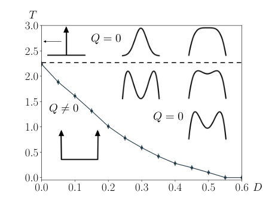 
FIG. 1. Phase diagram of the model defined by Eq. (1) in the absence of a bias field (H = 0) in the (D, T) plane, where T is the temperature and 2D the vari- ance of the Gaussian random field. The sketches illus- trate the qualitative shape of the stationary magneti- zation distribution P(m) in the thermodynamic limit and the corresponding value of the time-averaged mag- netization Q in each region. The horizontal dashed line marks the critical temperature of the field-free Ising model, Tc ≈2.269. The solid line separates the broad- ferromagnetic and ferromagnetic phases. It is obtained numerically by identifying, for several values of D, the temperature below which no switching events are...

📷 Fig 2

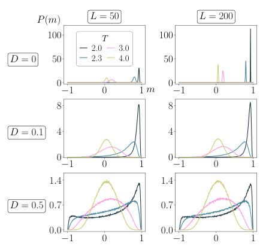 
FIG. 2. Probability distribution of the magnetization, P(m), for a fixed bias field H = 0.05 and varying ran- dom field intensities (D = 0, 0.1, 0.5), and for two sys- tem sizes (L = 50, 200). Note that graphs in the same row share the same vertical scale, indicating that, ex- cept for the zero-variance case D = 0, the distribu- tions exhibit no significant dependence on the system size L. This behavior is further analyzed in Fig. 3. Results correspond to 106 measurements after a ther- malization period of 104 MCS. In the simulations, we take measurements of the magnetization over an obser- vation period of tobs = 106 MCS after a thermalization time t0 = 104 MCS. Histograms are constructed...

📷 Fig 3

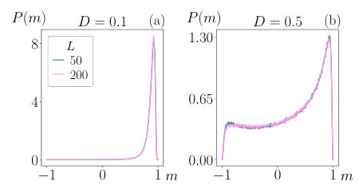 
FIG. 3. Probability distribution of the magnetiza- tion, P(m), for a bias field H = 0.05 and temperature T = 2.0 for two system sizes (L = 50, 200) and two random field intensities: (a) D = 0.1 and (b) D = 0.5. These results confirm the lack of dependence on the system size observed in Fig. 2. In the numerical sim- ulations, the thermalization and measurement times have been set as in Fig. 2.

📷 Fig 4

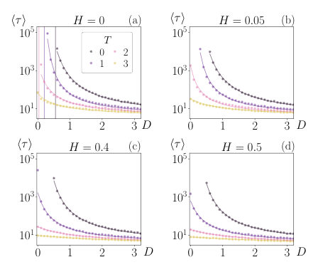 
FIG. 4. Average first-passage time ⟨τ⟩from the or- dered state m = −1 to the barrier region m = 0, for a system of size L = 100, as a function of the random field intensity D, for different values of the bias field H and several temperatures. The averages ⟨τ⟩are com- puted from a sample of 103 first-passage times. Solid lines correspond to fits of Eq. (9) to the data. Note that all panels share the same vertical scale. In panel (a), vertical lines denote the critical noise intensity D0(T) separating the broad-ferromagnetic and ferro- magnetic phases for T = 0, 1, 2, with D0(T = 0) ≈0.6, D0(T = 1) ≈0.2 and D0(T = 2) ≈0.04 (see Fig. 1).

📷 Fig 5

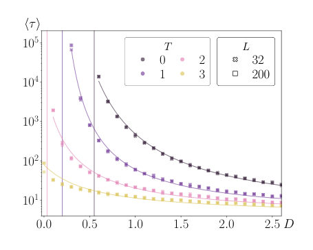 
FIG. 5. Average first-passage time ⟨τ⟩as a function of stochastic field strength D for several temperatures and system sizes, in the absence of a bias field (H = 0). Note the absence of finite-size effects in the barrier- crossing times. Solid lines show fits of Eq. (9) to the data for L = 200. Vertical dashed lines indicate the approximate stochastic intensity separating the broad- ferromagnetic and ferromagnetic phases for T = 0, 1, 2 (from right to left), with the corresponding values re- ported in the caption of Fig. 4. All average times ⟨τ⟩ have been calculated from a sample of 103 first-passage times.

**Summary.** This paper examines how steady bias and random magnetic fields influence the rate of transitions between states in a kinetic Ising model. It finds that while moderate noise helps overcome energy barriers, excessive noise leads to a loss of directional control. The results highlight how stochastic driving can effectively minimize finite-size effects in the system's dynamics.

**Why it may be interesting.** The study of noise-induced transitions and the modulation of energy barriers by stochastic and bias fields is highly relevant to understanding decoherence and switching dynamics in open quantum systems and driven many-body systems.

Detailed structure

**Main problem.** Investigating how a combination of a weak steady bias field and time-dependent Gaussian random fields affects barrier crossing and switching dynamics in a two-state system.

**Main result.** Moderate stochastic fields lower the effective energy barrier and facilitate transitions, while strong noise induces backflow and reduces directional selectivity; additionally, stochastic driving suppresses finite-size effects.

**Method.** Monte Carlo simulations using single-spin heat-bath dynamics on a 2D square lattice.

**Model / system.** A kinetic Ising model on a 2D square lattice with periodic boundary conditions, subject to a Hamiltonian with ferromagnetic coupling, a constant bias field H, and a time-dependent Gaussian random field h_r(t).

**Key observables.** Probability distribution of magnetization P(m), time-averaged magnetization Q, and average first-passage time <tau>.

**Important parameters / regimes.** Temperature (T), noise intensity (D), bias field (H), and system size (L).

**Assumptions / limitations.** The stochastic magnetic field is assumed to be spatially homogeneous (uniform across the lattice).

**Figures summary.** Fig 1 shows a phase diagram in the (D, T) plane; Fig 2 displays P(m) for various parameters; Fig 3 compares P(m) for different system sizes; Fig 4 shows <tau> vs D for various H and T; Fig 5 demonstrates suppression of finite-size effects; Fig 6 shows <tau> vs H.

**Paper structure.** The paper introduces the model and its phase diagram, explores the effect of noise and bias on the magnetization distribution, analyzes first-passage times and their dependence on noise and bias, and concludes with a discussion on system-size dependence and optimal transition conditions.

Abstract

We study barrier crossing in a two-state system, namely the kinetic Ising model, in the presence of a weak bias field and spatially homogeneous, but time-dependent, Gaussian random fields. We find that the bias field determines the location of the dominant maxima of the probability distribution function of the magnetization, whereas the noise intensity controls their sharpness and stability of the distribution. A moderate stochastic field lowers the effective energy barrier and facilitates transitions between ordered states, while strong noise induces broad distributions and significant backflow, which reduces directional selectivity. Our results suggest that efficient barrier crossing requires a balanced combination of moderate stochastic driving and controlled bias.

[↑ back to top](#top)

### [The Resetting Heat Engine: A Thermodynamic Cycle of Thermal Expansion and Compression](http://arxiv.org/abs/2605.28445v1)

**Authors:** Oded Farago  
**Type:** theory · **Category:** statistical mechanics · **PDF:** <https://arxiv.org/pdf/2605.28445v1>  
**Analysis basis:** full PDF text, analyzed in chunks
**Topic relevance:** `non-equilibrium dynamics` **3/5** · `entanglement & information structure` **2/5** · `methods for driven-dissipative` **2/5** · `quantum measurements` **2/5**

📷 Fig 1

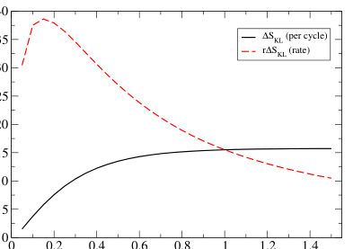 
FIG. 1. Entropy production for stochastic resetting in the anharmonic potential U(x) = x4/4, obtained from Langevin simulations with T = 1, γ = 1, and tc = 0.01. The black solid curve shows the entropy production per cycle, ∆SKL, as a function of the resetting time t, while the red dashed curve shows the corresponding entropy production rate for periodic resetting, r∆SKL (r = 1/t).

**Summary.** The paper treats stochastic resetting as a thermodynamic cycle of thermal expansion and compression. It demonstrates that in harmonic potentials, the entropy production of this cycle can be simplified to a state-function-like expression, and shows that the resulting thermodynamic features are robust even in anharmonic systems.

**Why it may be interesting.** This work is highly relevant for researchers in open quantum systems and non-equilibrium dynamics, as it provides a thermodynamic framework for understanding the irreversibility and entropy production in systems subject to non-unitary, resetting-like dynamics.

Detailed structure

**Main problem.** The paper seeks to develop a thermodynamic characterization of stochastic resetting processes, specifically addressing whether entropy production can be reduced from complex trajectory-based measures to simpler state-function-like expressions.

**Main result.** The author proves that for a harmonic potential, entropy production reduces exactly to an expression determined by endpoint distributions, and shows that the observed thermodynamic features are qualitatively generic for anharmonic potentials.

**Method.** The study uses the Kullback-Leibler divergence between forward and reversed trajectory ensembles and employs Langevin simulations for anharmonic cases.

**Model / system.** A Brownian particle subject to overdamped Langevin dynamics in a one-dimensional potential (primarily harmonic, but also tested with a quartic potential) that undergoes stochastic resetting to the origin at periodic or Poissonian intervals.

**Key observables.** Entropy production (total, rate, and cycle-based), variance, probability current, and effective temperature.

**Important parameters / regimes.** Resetting rate (r), relaxation time (tau), damping coefficient (gamma), and the distinction between periodic and Poissonian resetting regimes.

**Assumptions / limitations.** Assumes the reset does not produce a perfect delta-function (finite width) and that the endpoint-based description serves as a lower bound for the full trajectory-level entropy production.

**Figures summary.** Figure 1 shows Langevin simulation results for an anharmonic potential, plotting entropy production per cycle and the entropy production rate as functions of cycle time.

**Paper structure.** The paper introduces the thermodynamic cycle analogy, develops the analytical framework for harmonic potentials using KL divergence, extends the analysis to entropy production rates for different resetting protocols, and validates the findings via simulations of anharmonic potentials.

Abstract

We consider a Brownian particle confined by an external potential and subject to stochastic resetting to the origin. Motivated by the repetitive nature of the dynamics, we describe the process as a thermodynamic cycle of thermal expansion and collapse, analyzed via a framework based on the Kullback-Leibler (KL) divergence between forward and reversed trajectory ensembles. While the entropy production generally depends on the full trajectory ensemble and cannot be reduced to thermodynamic state variables alone, we show that the harmonic potential constitute a special case, where the entropy production reduces exactly to a state-function-like expression determined solely by the distributions before and after resetting. Explicit analytical results are derived for periodic and Poissonian resetting. At low resetting rates $r$, the entropy production rate grows linearly with $r$ and is proportional to the symmetric KL divergence between the reset and equilibrium distributions. At very high rates, the resetting process becomes effectively perpetual and the entropy production vanishes. Langevin simulations for an anharmonic quartic potential display the same generic behavior, indicating that these features are not restricted to harmonic confinement. Our results establish a direct connection between stochastic resetting, thermodynamic cycles, and information-theoretic measures of irreversibility.

[↑ back to top](#top)

### [Exceptional points in diamond optomechanics](http://arxiv.org/abs/2605.27536v1)

**Authors:** Waleed El-Sayed, Elham Zohari, Joe Itoi, Peyman Parsa, Gustavo de Oliveira Luiz, Joseph E. Losby, Misa Hayashida, Marek Malac, Paul E. Barclay  
**Type:** both · **Category:** other · **PDF:** <https://arxiv.org/pdf/2605.27536v1>  
**Analysis basis:** full PDF text, analyzed in chunks
**Topic relevance:** `quantum optics experiment` **3/5** · `correlated / nonlocal dissipation` **2/5** · `driven-dissipative phase transition` **2/5**

📷 Fig 1

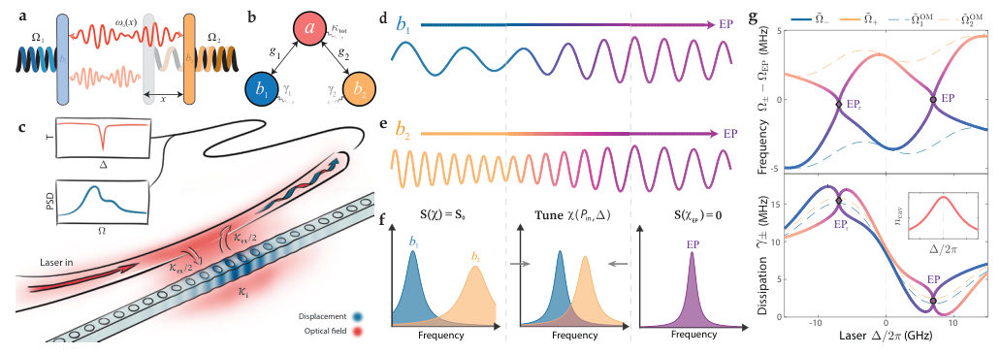 
Figure 1. Exceptional points in multimode cavity optomechanics. (a) Fabry–Perot representation of a multimode optomechanical system, where two mechanical resonators with frequencies Ω1,2 modulate a common optical resonance ωc. (b) Coupling diagram for two mechanical modes ˆb1 and ˆb2 coupled to an optical mode ˆa with vacuum optomechanical coupling rates g1 and g2. The mechanical dissipation rates are γ1 and γ2, and the optical decay rate is κ = κex + κi. (c) Diamond optomechanical crystal (OMC) implementation. A fiber taper evanescently couples laser light into and out of the optical cavity, allowing the thermomechanical spectrum to be measured from the transmitted field. (d,e) Conceptual...

📷 Fig 2

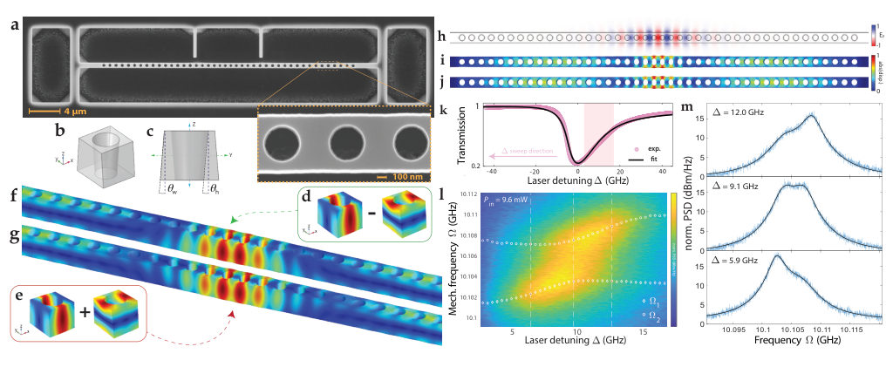 
Figure 2. Symmetry-mixed mechanical modes in a diamond optomechanical crystal. (a) Scanning electron micrograph of the fabricated diamond optomechanical crystal (OMC) nanobeam. (b,c) Schematic unit cell showing the sidewall angles θw and θh, which break vertical reflection symmetry. (d,e) Mode-composition diagrams showing a breathing- like cavity unit-cell mode combined with a flexural-like mirror unit-cell mode. The minus and plus signs denote the relative displacement phase of the two parent mode components, giving the out-of-phase and in-phase mixed modes shown in (f) and (g), respectively. (f,g) Simulated displacement profiles of the two symmetry-mixed mechanical modes in the full OMC...

📷 Fig 3

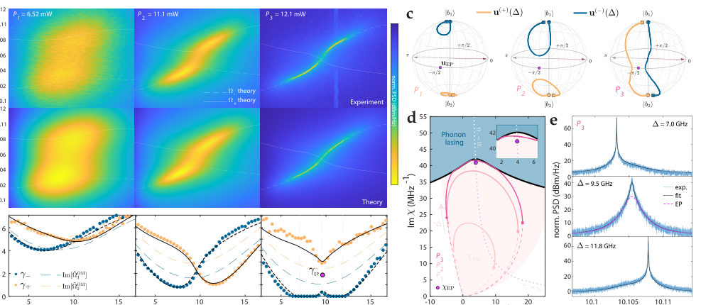 
Figure 3. Optomechanical tuning through the exceptional-point regime. (a) Mechanical power spectral density (PSD) versus laser detuning ∆for three input powers P1, P2 and P3. Top row, measured spectra; bottom row, spectra calculated from the fitted two-mode model. White curves show the predicted eigenfrequencies Ω±. Increasing input power strengthens the optically mediated coupling, drawing the frequency branches together and modifying their damping. (b) Extracted damping rates γ± (points) and model predictions (black curves) versus ∆. Colored dashed curves show the damping expected from the diagonal optical backaction terms alone, excluding the off-diagonal coupling g1g2χ. At P3, the...

📷 Fig 4

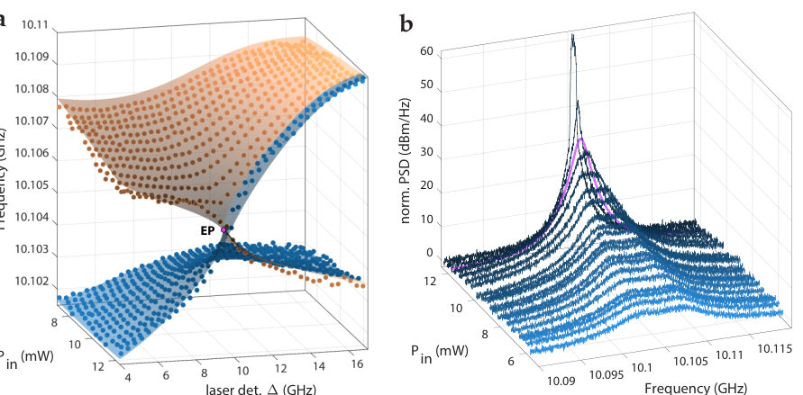 
Figure 4. Branch-point topology of the mechanical exceptional point. (a) Measured real eigenfrequencies Ω± (markers) and fitted two-mode model surface versus laser detuning ∆and input power Pin. The two frequency sheets approach and meet at the inferred EP (purple point). Beyond the EP, the continuously evolved eigenbranches reconnect onto the opposite frequency sheets, with the (±) labels following branch continuity rather than frequency ordering. (b) Mechanical power spectral densities (PSDs) along the two degeneracy contours shown in Fig. 3d. For Pin &lt; PEP, spectra follow the damping-degeneracy contour γ+ = γ−, isolating the collapse of the real-frequency splitting. For Pin &gt; PEP,...

📷 Fig 5

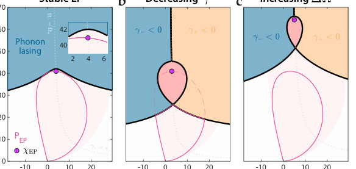 
Figure 5. Stability of the exceptional-point trajectory. (a) Stability map of the complex cavity susceptibility χ = Re[χ]+i Im[χ] for the same experimentally extracted parameters in the main text, with |∆Ω|/2π = 6.9 MHz and ¯γ = 8.8 MHz . Shaded regions indicate the unstable regions where Im[˜Ω±] &gt; 0. The white and purple dotted lines show where Re[˜Ω+] = Re[˜Ω−] and Im[˜Ω+] = Im[˜Ω−], respectively. Their intersection defines the EP. The pink shaded lobe denotes the experimentally accessible values of χ(Pin, ∆) for the measured cavity coupling (κex, κ) and available laser power, showing that the EP lies within both the stable and accessible regime. (b) Same as (a) with intrinsic mechanical...

**Summary.** This paper reports the first experimental access to an exceptional point in a diamond optomechanical crystal. By using engineered structural asymmetry, the authors demonstrate how to tune mechanical mode hybridization and redistribute optomechanical damping. This provides a new platform for non-Hermitian physics and topological dynamics in diamond-based quantum technologies.

**Why it may be interesting.** It demonstrates experimental control over non-Hermitian singularities and eigenvector rotation, which is highly relevant for developing direction-dependent quantum state transfer and topological protection in hybrid quantum networks.

Detailed structure

**Main problem.** The experimental achievement and utilization of exceptional points (EPs) in diamond optomechanical systems to leverage non-Hermitian phenomena like chiral dynamics and topological state transfer.

**Main result.** The researchers successfully reached an exceptional point in a diamond optomechanical crystal by using structural symmetry breaking to couple two mechanical modes, observing asymmetric redistribution of damping and branch-switching topology.

**Method.** The study uses structural asymmetry (sidewall angles) to mix mechanical modes and employs a fiber taper for evanescent coupling, with data analysis involving coupled-mode model fitting and COMSOL simulations.

**Model / system.** A diamond optomechanical crystal (OMC) nanobeam where a single optical cavity mode is coupled to two high-frequency mechanical resonances (breathing and flexural modes) via radiation pressure and structural symmetry breaking.

**Key observables.** Mechanical power spectral density (PSD), mechanical eigenfrequencies, damping rates, and optical transmission spectra.

**Important parameters / regimes.** Optical wavelength ~1565 nm, mechanical frequencies ~10.1 GHz, optomechanical coupling rates ~290 kHz, and the transition from weak coupling to the exceptional point and phonon-lasing threshold.

**Assumptions / limitations.** The derivation assumes a strong coherent intracarray field, neglects small radiation-pressure-induced cavity resonance shifts, and approximates mechanical frequency shifts as linear with photon number.

**Figures summary.** Figure 1 shows the experimental setup and conceptual EP evolution; Figure 2 displays the SEM image and simulated mode profiles; Figure 3 illustrates Bloch-sphere trajectories and stability maps; Figure 4 shows the 2D map of eigenfrequencies.

**Paper structure.** The paper introduces the concept of EPs in optomechanics, describes the diamond platform and fabrication-induced symmetry breaking, presents the experimental observation of the EP and its topological signatures, and discusses the implications for tunable spin-mechanical coupling.

Abstract

Multimode cavity optomechanical systems allow light to couple otherwise non-interacting mechanical resonators, enabling non-Hermitian phenomena such as exceptional points, where eigenfrequencies and eigenvectors of coupled modes coalesce. Accessing an exceptional point and its nearby parameter space is a first step towards chiral mode dynamics and topological state transfer. Diamond optomechanical devices support strong coherent optomechanical coupling required to tune resonances to an exceptional point, as well as strain-coupling to spin-defects for hybrid quantum technologies, but have not yet been used for multimode non-Hermitian physics. Here we tune to an exceptional point in a diamond optomechanical crystal, which uses structural symmetry breaking to produce two high-frequency mechanical resonances coupled to an optical cavity. The exceptional point is reached within a stable operating window below the phonon-lasing threshold, and we observe asymmetric redistribution of optomechanical damping and anti-damping between hybridized modes. These results establish diamond optomechanical crystals as a platform for non-Hermitian optomechanics, opening routes to topological mechanical dynamics in hybrid spin-phonon interfaces.

[↑ back to top](#top)

### [Hall effect in multi-leg bosonic ladders](http://arxiv.org/abs/2605.28090v1)

**Authors:** Edmond Orignac, Roberta Citro, Thierry Giamarchi  
**Type:** theory · **Category:** quantum gases · **PDF:** <https://arxiv.org/pdf/2605.28090v1>  
**Analysis basis:** full PDF text, analyzed in chunks
**Topic relevance:** `analog quantum simulation` **3/5** · `Keldysh / 2PI / non-Gaussian methods` **2/5** · `non-equilibrium dynamics` **2/5**

📷 Fig 1

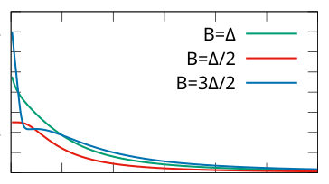 
FIG. 1: Temperature dependence of the Hall imbalance in the Meissner phase (Red) in the Vortex phase (Blue) and at the commensurate-incommensurate transition (Green).

**Summary.** This paper provides a theoretical generalization of the Hall effect in multi-leg bosonic ladders using bosonization. It establishes a universal connection between Hall resistance and the density derivative of charge stiffness and characterizes how temperature affects the Hall response in Meissner and Vortex phases.

**Why it may be interesting.** This paper is highly relevant for many-body dynamics and AMO physics as it provides analytical predictions for transport properties (Hall effect) in synthetic gauge fields, which are a key component of ultracold atom experiments in optical lattices.

Detailed structure

**Main problem.** The study aims to generalize the Hall effect and Hall resistance from two-leg to N-leg bosonic ladders and to understand the temperature dependence of the Hall response in different magnetic flux regimes.

**Main result.** The Hall resistance is found to be proportional to the derivative of the logarithm of the charge stiffness with respect to density, a result that is robust for N-leg ladders. Additionally, Hall imbalance corrections are exponentially small in the Meissner phase at low temperatures but follow a power law in the Vortex phase.

**Method.** The authors use bosonization and perturbation theory in the band curvature, employing a basis transformation with Hahn/Chebyshev polynomials to decouple modes and Green's function techniques for temperature-dependent analysis.

**Model / system.** The system consists of interacting bosonic N-leg ladders threaded by a magnetic flux (artificial gauge fields), modeled using a bosonized Hamiltonian including Tomonaga-Luttinger Liquid terms, transverse interchain hopping, and band curvature.

**Key observables.** Hall resistance (Rh), Hall voltage (Vh), Hall imbalance (Ph), and charge stiffness (uK).

**Important parameters / regimes.** Magnetic flux (B), temperature (T), particle density (rho0), transverse hopping (t_perp), and Tomonaga-Luttinger parameter (K).

**Assumptions / limitations.** The analysis assumes a perturbative expansion in band curvature and focuses on the low-field limit and the validity of the bosonization approach for the ladder geometries.

**Figures summary.** Figure 1 shows the temperature dependence of the Hall imbalance in the Meissner phase, Vortex phase, and at the commensurate-incommensurate transition for various magnetic flux values.

**Paper structure.** The paper introduces the problem of N-leg ladders, applies bosonization and basis transformations to derive Hall resistance formulas, analyzes the temperature dependence of the Hall imbalance in different flux regimes, and discusses the robustness of the results.

Abstract

We use bosonization to analyze the ground state Hall response of interacting bosonic N-leg ladders threaded by a flux. We derive an explicit expression of the Hall imbalance in a perturbative expansion in the band curvature, retaining fully the interactions. For small magnetic field the Hall resistance is proportional to the derivative of the logarithm of the charge stiffness with respect to density, generalizing the result obtained in the two leg case. We also consider the effect of temperature, and establish that at low temperature, corrections to the Hall resistance are exponentially small in the Meissner phase.

[↑ back to top](#top)

### [Mechanical Squeezed-Fock Gravimeter](http://arxiv.org/abs/2605.28289v1)

**Authors:** Rozhin Yousefjani, Saif Al-Kuwari  
**Type:** theory · **Category:** quantum information and computing · **PDF:** <https://arxiv.org/pdf/2605.28289v1>  
**Analysis basis:** full PDF text, analyzed in chunks
**Topic relevance:** `quantum measurements` **3/5** · `correlated / nonlocal dissipation` **2/5** · `non-equilibrium dynamics` **2/5**

📷 Fig 1

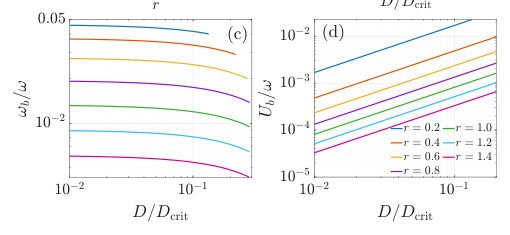 
FIG. 1. Coherent performance of the MSFQ gravimeter. (a) Time- normalized sensitivity √

📷 Fig 2

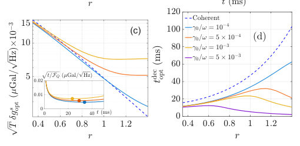 
FIG. 2. Decoherent performance of the MSFQ gravimeter, for m=10−9 kg, ω/2π=1 kHz, and δ/ω=0.05 throughout. (a) Compe- tition ratio Ξ≡Γeff/ωb as a function of r at fixed D/Dcrit=0.2, for var- ious γ0’s. The dashed line Ξ=1 marks the crossover between the coherent (Ξ ≪1) and decoherent (Ξ ≫1) regimes. (b) QFI FQ(g, t) as a function of time at fixed D/Dcrit=0.2 and r=1, for various γ0’s and the coherent reference (γ0=0, dashed). (c) Optimized sensitiv- ity √

**Summary.** This paper proposes a new type of quantum gravimeter using squeezed-Fock states in a levitated mechanical system. By using a two-phonon pump to create squeezing, the gravitational signal is exponentially amplified. The study highlights a fundamental trade-off where squeezing enhances the signal but also converts mechanical damping into anisotropic noise.

**Why it may be interesting.** It presents a novel application of squeezed-state engineering and open quantum system dynamics (anisotropic noise) to enhance the precision of a quantum sensor.

Detailed structure

**Main problem.** Developing high-sensitivity, compact quantum gravimeters that overcome the mass-independent sensitivity bottleneck and the weak intrinsic nonlinearity of nanomechanical resonators.

**Main result.** The authors propose a mechanical squeezed-Fock qubit gravimeter that provides exponential signal amplification via the anti-squeezed quadrature while preserving mass scaling, though it introduces a trade-off with anisotropic decoherence.

**Method.** The study uses Bogoliubov transformations, the Rotating-Wave Approximation (RWA), and Quantum Estimation Theory (calculating QFI and CFI) to analyze sensitivity and optimal readout strategies.

**Model / system.** A levitated mesoscopic mechanical particle modeled as a Duffing oscillator driven by a detuned two-phonon pump, described by an effective Hamiltonian in a squeezed-Fock basis and a master equation for zero-temperature damping.

**Key observables.** Gravity-induced transition rate, excited squeezed-Fock population, Bloch vector components, and Quantum/Classical Fisher Information.

**Important parameters / regimes.** Squeezing parameter (r), Duffing nonlinearity (D), mechanical damping rate (gamma_0), detuning (delta), and pump amplitude (Ap).

**Assumptions / limitations.** The use of the Rotating-Wave Approximation (RWA) and the assumption of a weak-force regime where the gravity-induced coupling is much smaller than the qubit gap.

**Figures summary.** Figures include a map of the RWA validity in the (r, D/D_crit) plane and a demonstration of the locally optimal projective readout for the decoherent gravimeter.

**Paper structure.** The paper introduces the scientific problem of gravimetry, defines the mechanical squeezed-Fock model and Hamiltonian, analyzes the signal enhancement via squeezing, evaluates the impact of decoherence on sensitivity, and determines the optimal measurement readout strategy.

Abstract

Levitated mechanical systems are promising candidates for quantum gravimetry, as gravity couples directly to their center-of-mass motion, enabling the large mass of a mesoscopic particle to serve as a sensing resource. In this paper, we propose a mechanical squeezed-Fock qubit gravimeter using a Duffing oscillator that is driven by a detuned two-phonon pump. In the squeezed-Fock basis, the gravitational force couples to the anti-squeezed quadrature, which enhances the gravity-induced transition rate while preserving the direct mass scaling of the mechanical force coupling. We show that sensitivity improves with reduced effective qubit splitting that is controlled by the squeezing parameter and the Duffing nonlinearity. We further analyze mechanical damping and show that squeezing converts ordinary dissipation into anisotropic qubit noise, setting a practical trade-off between signal amplification and decoherence rate. These results identify the mechanical squeezed-Fock qubit as a new platform for quantum-enhanced gravimetry.

[↑ back to top](#top)

### [Chirped-pulse engineering for robust control of single-molecule orientation in a cavity](http://arxiv.org/abs/2605.28511v1)

**Authors:** Li-Bao Fan, Yu Guo, Shan Ma, Chuan-Cun Shu  
**Type:** theory · **Category:** other · **PDF:** <https://arxiv.org/pdf/2605.28511v1>  
**Analysis basis:** full PDF text, analyzed in chunks
**Topic relevance:** `interference shaping light` **3/5** · `non-equilibrium dynamics` **3/5**

📷 Fig 1

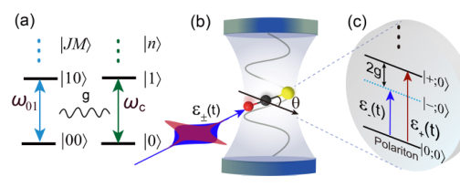 
FIG. 1. Schematic illustration of a single molecule in a single-mode cavity driven by two chirped pulses (b), and the corresponding en- ergy level diagrams in the bare eigenbasis (a) and the dressed basis (c).

📷 Fig 2

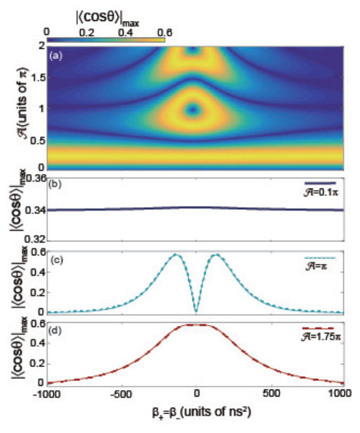 
FIG. 2. Numerically calculated post-pulse orientation of the molec- ular polariton driven by chirped laser pulses with equal chirp rates β+ = β−. (a) The maximum orientation values |⟨cos θ⟩|max are shown vs the amplitude A± and the chirp rates β+ = β−. Cuts of |⟨cos θ⟩|max versus β+ = β−at three representative amplitudes: (b) A± = 0.1π, (c) A± = π, and (d) A± = 1.75π. Other parameters used in the numerical calculations are given in atomic units (a.u.): ω−= 1.66379 × 10−6 a.u., and ω+ = 2.03353 × 10−6 a.u.. The pulse duration τ0 = 5.409 × 108 a.u. ≈13.0851 ns, and the time interval is t ∈[−28τ0, 28τ0] ≈[−366.383, 366.383] ns.

📷 Fig 3

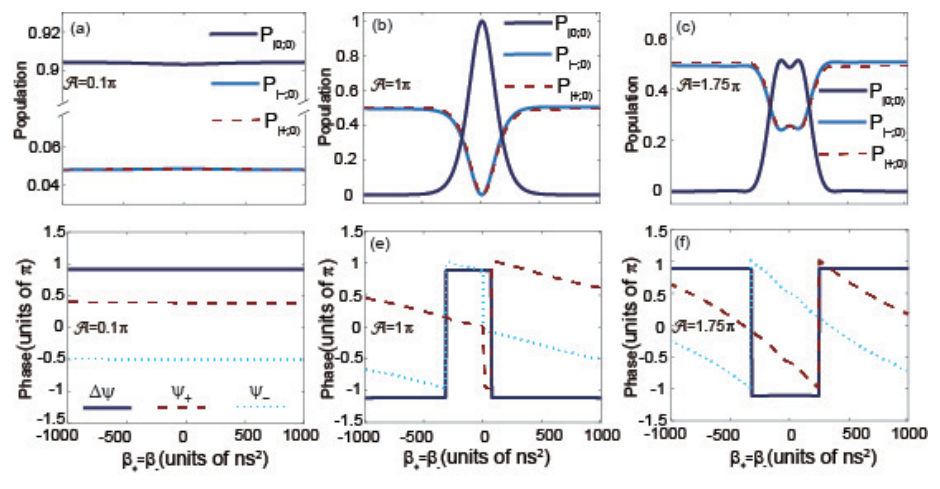 
FIG. 3. The final populations (a)-(c) and phases (d)-(f) of the three states |0; 0⟩, |±; 0⟩vs the chirp rate of the pusle at three different amplitudes A = 0.1π, A = π, and A = 1.75π. In panels (d)–(f), Ψ+ and Ψ−denote the phases of the states |+; 0⟩and |−; 0⟩, respectively, and ∆ψ is their phase difference. Note that the phases for larger detunings, where the populations of the states |+; 0⟩and |−; 0⟩are nearly zero, are meaningless and therefore are set to zero in our simulations.

📷 Fig 4

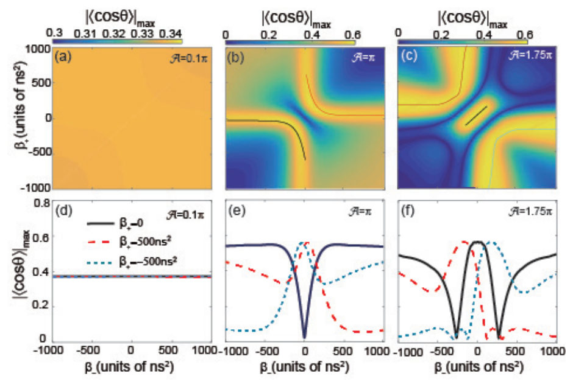 
FIG. 4. The maximum orientation values |⟨cos θ⟩|max are shown vs two chirp rates β+ and β−of the pulses at three different amplitudes (a) A = 0.1π, (b) A = π, and (c) A = 1.75π. (e-f) Lower panels show cuts of |⟨cos θ⟩|max versus β−at fixed β+, with β+ = 0 (black solid), β+ = +500 ns2 (red dashed), and β+ = −500 ns2 (blue-dotted), corresponding to (a-c), respectively. All other parameters are the same as in Fig. 2.

📷 Fig 5

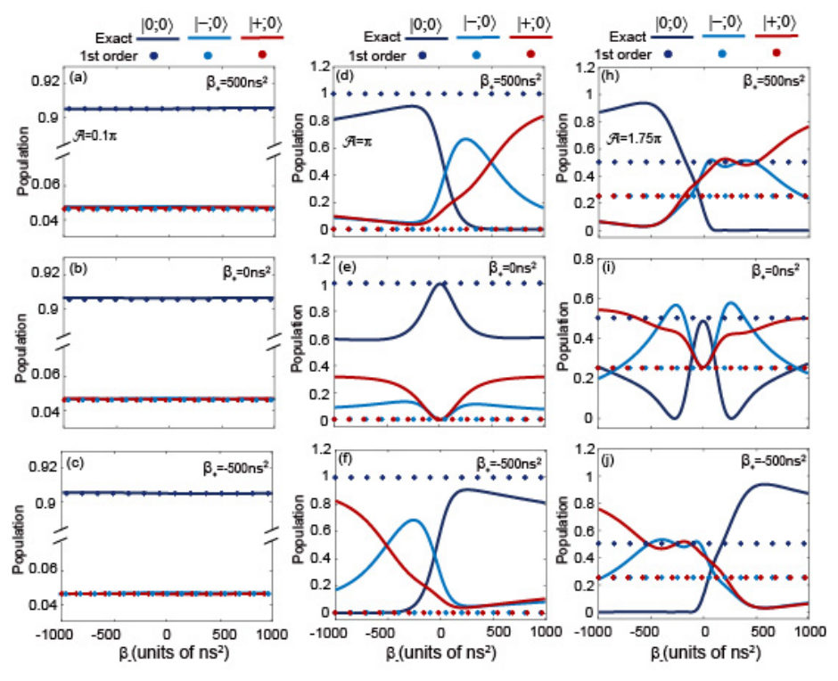 
FIG. 5. Final populations of the three polariton states versus the chirp rate β−for unequal-chirp driving, comparing exact numerical results with the first-order Magnus approximation. Panels (a)-(c), (d)-(f), and (h)-(j) correspond to three different amplitudes A± = 0.1π, π, and 1.75π, respectively. In each column, β+ is fixed at (a,d,h) 500 ns2, (b,e,i) 0, and (c,f,j) −500 ns2, while β−is scanned. Solid curves show the exact final populations of |0; 0⟩(black), |−; 0⟩(blue), and |+; 0⟩(red); filled circles indicate the corresponding first-order Magnus predictions. All other parameters are the same as in Fig. 2.

**Summary.** This paper investigates how chirped laser pulses can be used to control the orientation of a single molecule inside an optical cavity. It shows that by engineering the chirp rates, one can achieve high degrees of orientation and robust control that is resistant to frequency detuning. This work offers a new strategy for manipulating molecular polaritons in cavity-based quantum systems.

**Why it may be interesting.** It provides new insights into using spectral-phase modulation to control molecular polaritons and demonstrates how chirped pulses can activate multiphoton processes that deviate from standard analytical approximations in cavity QED.

Detailed structure

**Main problem.** Achieving robust and precise coherent control over the orientation of a single molecule within an optical cavity using chirped-pulse engineering.

**Main result.** The study demonstrates that chirped pulses can precisely control molecular orientation, reaching a maximum degree of 0.5773, and that equal-chirp configurations provide superior robustness against frequency detuning.

**Method.** The authors use numerical integration of the time-dependent wave function and compare results with the first-order Magnus expansion to analyze population redistribution and multiphoton processes.

**Model / system.** A single carbonyl sulfide (OCS) molecule strongly coupled to a single-mode optical cavity, modeled using an extended Jaynes-Cummings model incorporating rotational states and a three-level polariton system.

**Key observables.** The degree of molecular orientation <cos theta> and the final populations of the polariton states.

**Important parameters / regimes.** Chirp rates (beta plus and beta minus), pulse amplitude (A), pulse detuning (delta), and the strong coupling regime (g0/omega_c <= 0.1).

**Assumptions / limitations.** The study assumes the ability to achieve photon blockade of higher dressed states to isolate a three-state system and neglects quadratic terms like cavity-field self-energy.

**Figures summary.** Fig 1 shows energy level diagrams in bare and dressed bases; Fig 2 shows orientation dependence on pulse amplitude and chirp; Fig 4 illustrates the orientation landscape and symmetry; Fig 5 compares numerical results to Magnus expansion; Fig 6 maps orientation robustness against detuning.

**Paper structure.** The paper introduces the physical system and model, presents the pulse engineering method, analyzes the results in weak and strong field regimes, evaluates the breakdown of analytical approximations, and concludes with a robustness analysis.

Abstract

We present a theoretical investigation of coherent control over the orientation of an individual molecule strongly coupled with a cavity using chirped-pulse driving. Specifically, we explore the dynamics of carbonyl sulfide (OCS) molecules under the influence of two chirped pulses with different spectral phases. We compare two pulse configurations: one with equal chirp rates ($β_{+} = β_{-}$) and another with unequal chirp rates ($β_{+} \neq β_{-}$). Numerical simulations reveal that chirped pulses enable precise control of the molecular orientation, achieving a maximum orientation degree of 0.5773. By analyzing the distribution of molecular polariton states, we show that chirped pulses can activate multiphoton processes, leading to deviations from the predictions of first-order Magnus expansion methods. Additionally, we demonstrate the robustness of the maximum orientation with respect to chirp amplitude and detuning, providing insights into the role of pulse parameters in optimizing control. This work introduces a new strategy for controlling molecular orientation in cavity-based systems and offers valuable perspectives for future experimental applications.

[↑ back to top](#top)

### [Digital Quantum Simulation of the quantum $β$-FPUT Lattice: Formulation and Resource Estimation](http://arxiv.org/abs/2605.28206v1)

**Authors:** Kiratholly Nandakumar Madhav Sharma, Juan Manuel Aguiar Hualde, Julian van Velzen, Phalgun Lolur  
**Type:** theory · **Category:** quantum information and computing · **PDF:** <https://arxiv.org/pdf/2605.28206v1>  
**Analysis basis:** full PDF text, analyzed in chunks
**Topic relevance:** `non-equilibrium dynamics` **3/5** · `entanglement & information structure` **2/5** · `quantum measurements` **1/5**

📷 Fig 1

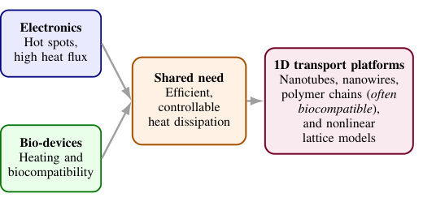 
Fig. 1. Conceptual motivation for studying thermal transport in low- dimensional systems.

📷 Fig 2

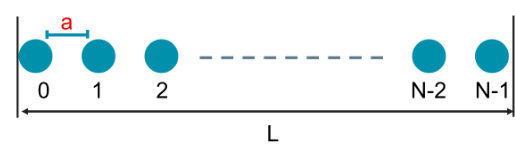 
Fig. 2. Schematic diagram of the one-dimensional FPUT chain with sites labeled {0, 1, 2, . . . , N −1}.

📷 Fig 3

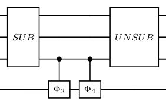 
Fig. 4. Two-site potential-layer skeleton implementing subtraction, controlled phase kickback, and inverse subtraction. Here, SUB computes the relative displacement ∆0 = s1 −s0 into the ancilla register without disturbing s0 and s1, while UNSUB uncomputes it. The controlled phase gates are Φ2 = exp[−i(κ/2)∆2 0∆t/ℏ] and Φ4 = exp[−i(β/4)∆4 0∆t/ℏ], acting on the reference qubit r0 and controlled by the ancilla.

📷 Fig 4

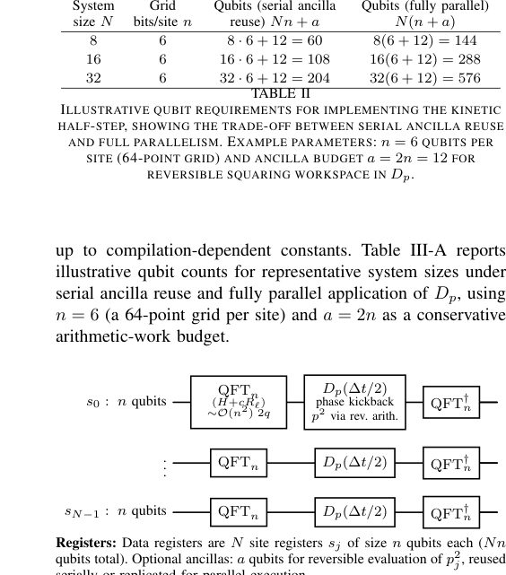 
Fig. 3. Kinetic half-step circuit. Each n-qubit QFTn is decomposed into Hadamard and controlled-phase gates cRℓ. The exact QFT requires O(n2) two-qubit gates, while approximate QFT reduces the count by truncating small-angle rotations. The diagonal operator Dp(∆t/2) applies the phase e−ip2 j ∆t/(4mℏ) in the momentum basis via phase kickback using reversible arithmetic followed by uncomputation.

📷 Fig 5

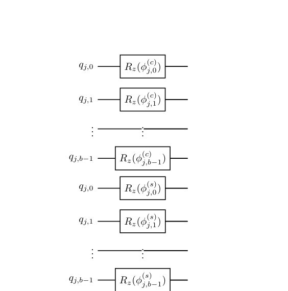 
Fig. 5. Quantum circuits implementing eiθ ˆ Q(c) k (left) and eiθ ˆ Q(s) k (right). Each qubit qj,r is rotated by an angle ϕ(c) j,r or ϕ(s) j,r from Eq. (35). Since all rotations commute, the operations can be parallelized, producing depth-two circuits.

**Summary.** This paper presents a new method for simulating the quantum beta-FPUT lattice on future fault-tolerant quantum computers. By using a first-quantized approach and a clever decomposition of displacement operators, the authors reduce the circuit complexity and provide a detailed estimate of the necessary qubits and gates. This work establishes a blueprint for studying complex heat transport and phonon dynamics in nonlinear low-dimensional systems.

**Why it may be interesting.** It provides a scalable algorithmic approach to simulating nonlinear many-body dynamics and anomalous transport, specifically addressing how to bypass the high overheads of bosonic encoding in quantum computing.

Detailed structure

**Main problem.** Developing an efficient digital quantum simulation framework for the quantum beta-FPUT lattice and estimating the resources required for fault-tolerant implementation.

**Main result.** The authors provide a concrete algorithmic blueprint and resource roadmap, demonstrating that a first-quantized approach using quadrature decomposition enables shallow circuits for simulating nonlinear transport dynamics.

**Method.** A first-quantized digital quantum simulation using Trotterized circuit blocks, a Hermitian quadrature decomposition of Fourier-mode displacement operators, and a Hadamard-test-based measurement workflow.

**Model / system.** A one-dimensional quantum beta-Fermi-Pasta-Ulam-Tsingou (beta-FPUT) lattice, characterized by a Hamiltonian with kinetic energy and a potential containing both quadratic and quartic anharmonic terms.

**Key observables.** Mode-resolved displacement correlators and quantum dynamical observables relevant to phonon lifetimes.

**Important parameters / regimes.** Lattice size (N), grid resolution (bits per site), mass (m), harmonic coupling (kappa), anharmonicity (beta), and Trotter step size (delta t).

**Assumptions / limitations.** The framework assumes fault-tolerant quantum hardware rather than NISQ-era devices and assumes periodic boundary conditions for the lattice.

**Figures summary.** Figure 1 shows motivation regarding heat dissipation in microelectronics and bio-devices; Figure 2 depicts the 1D FPUT chain; Figure 4 illustrates a two-site potential-layer circuit; Figure 5 shows circuits for implementing cosine and sine quadrature unitaries.

**Paper structure.** The paper progresses from physical motivation and the mathematical formulation of the beta-FPUT model to the construction of the quantum simulation framework, followed by error analysis, resource estimation, and a comparison with hardware roadmaps.

Abstract

Heat conduction in low-dimensional systems exhibits strong deviations from Fourier behavior due to anharmonicity and long-lived vibrational correlations, challenging conventional computational approaches. The $β$-Fermi--Pasta--Ulam--Tsingou ($β$-FPUT) chain provides a minimal nonlinear lattice model for studying anomalous transport, yet its quantum real-time dynamics remain difficult to access with classical methods. We develop a first-quantized digital quantum-simulation framework for the quantum $β$-FPUT lattice, targeting fault-tolerant quantum computers. By working directly with discretized lattice displacements rather than truncated phonon occupation spaces, the approach captures anharmonic interactions while avoiding bosonic encoding overheads. We construct Trotterized circuit blocks for real-time evolution and introduce a Hermitian quadrature decomposition of Fourier-mode displacement operators that enables shallow quantum circuits for mode-resolved displacement correlators. We analyze the quantum resources required for the full simulation and measurement workflow, providing qubit counts, gate complexity, circuit-depth and resource estimates as functions of system size and resolution within a fault-tolerant workflow. These results establish a concrete algorithmic blueprint for simulating quantum transport dynamics in nonlinear low-dimensional lattice models on fault-tolerant quantum hardware.

[↑ back to top](#top)

### [Global Kochen-Specker Contextuality Without Local Contextuality and Generalized Bell Nonlocality](http://arxiv.org/abs/2605.28702v1)

**Authors:** Ming Yang  
**Type:** theory · **Category:** quantum information and computing · **PDF:** <https://arxiv.org/pdf/2605.28702v1>  
**Analysis basis:** full PDF text, analyzed in chunks
**Topic relevance:** `entanglement & information structure` **3/5** · `quantum measurements` **3/5**

📷 Fig 1

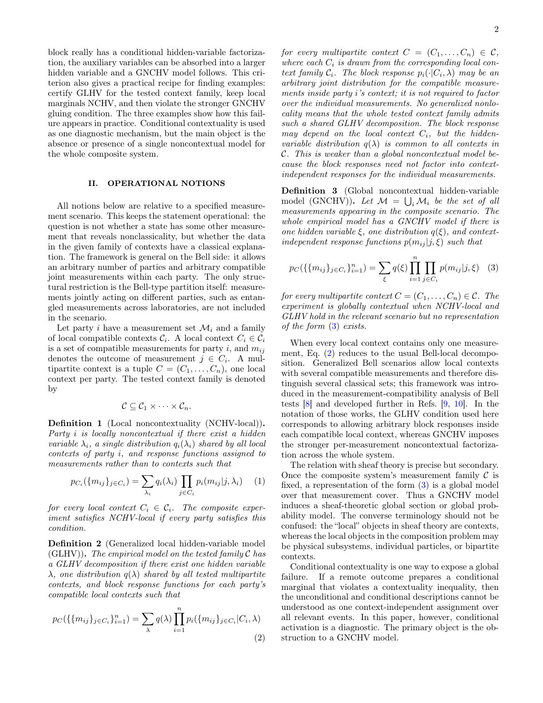 
Low-resolution page preview, page 2

📷 Fig 2

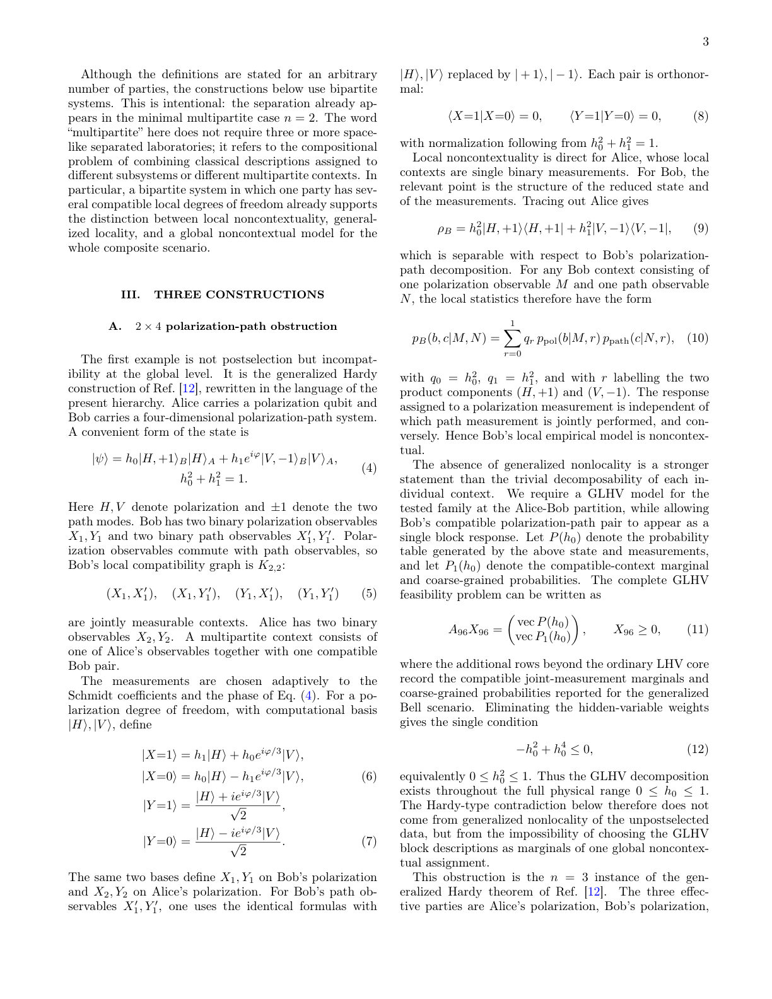 
Low-resolution page preview, page 3

📷 Fig 3

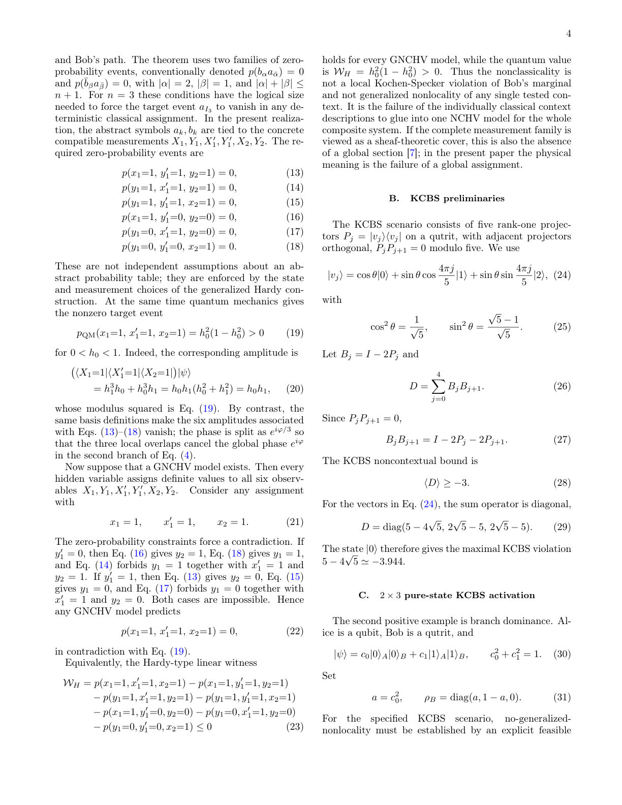 
Low-resolution page preview, page 4

📷 Fig 4

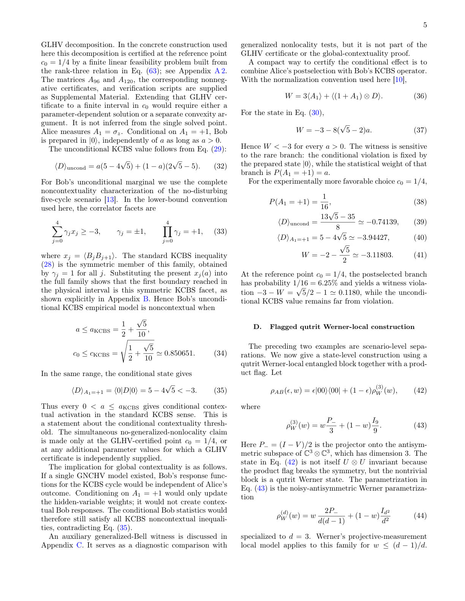 
Low-resolution page preview, page 5

📷 Fig 5

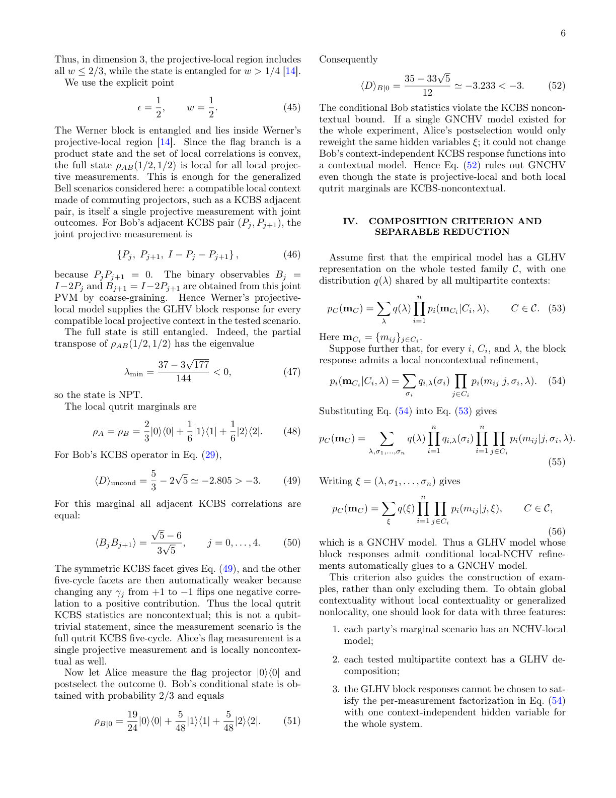 
Low-resolution page preview, page 6

**Summary.** This paper introduces the concept of global contextuality, demonstrating that multipartite systems can exhibit nonclassical behavior that cannot be explained by a single global hidden-variable model, even when all local parts appear classical. Through three different bipartite constructions, the author shows that nonclassicality can emerge as a compositional obstruction when local classical descriptions cannot be 'glued' together.

**Why it may be interesting.** It provides a new fundamental classification of nonclassicality (global contextuality) that is distinct from standard Bell nonlocality and local Kochen-Specker contextuality, which is relevant for understanding the limits of classical simulations of multipartite quantum systems.

Detailed structure

**Main problem.** Investigating the existence of 'global contextuality,' where a multipartite system fails to admit a single global noncontextual hidden-variable model even though all local subsystems are noncontextual and all multipartite contexts admit a generalized local hidden-variable description.

**Main result.** The paper proves that the absence of local contextuality and generalized Bell nonlocality does not imply the existence of a global noncontextual hidden-variable model, establishing global contextuality as a compositional obstruction to classicality.

**Method.** The author uses an operational approach involving three bipartite constructions (polarization-path, qubit-qutrit, and flagged qutrit Werner-local) and employs linear programming, quantifier elimination, and postselection to identify violations of global hidden-variable models.

**Model / system.** The study considers various bipartite measurement scenarios, including a 2x4 polarization-path system, a 2x3 qubit-qutrit system with KCBS observables, and a qutrit Werner-local state with a product flag.

**Key observables.** KCBS operator, polarization observables, and a Hardy-type linear witness.

**Important parameters / regimes.** Schmidt coefficients (h0, h1), weighting parameter (a), and the KCBS noncontextuality threshold (c0 <= 0.850651).

**Assumptions / limitations.** The claim regarding the absence of generalized nonlocality is restricted to specific measurement scenarios without cross-party joint measurements.

**Figures summary.** The paper includes a summary table (Table I) classifying the three different separation constructions based on their hidden resources and qualifications.

**Paper structure.** The paper defines the hierarchy of classicality, establishes a gluing criterion for global contextuality, and then presents three distinct constructions (incompatibility-based, algebraic/postselected, and state-level) to demonstrate the separation of scales.

Abstract

A set of quantum data can look classical in every local test and still fail to admit a single classical explanation of the whole composite system. We formulate this failure as global contextuality. Here global means global in the physical sense of the whole multipartite system, not the local/global terminology of sheaf theory. Each party's local statistics are noncontextual and each measured multipartite context admits a generalized local hidden-variable description, but the GLHV block descriptions cannot be promoted to a single noncontextual hidden-variable model for the whole system. Three bipartite constructions exhibit this separation. A polarization-path construction gives a direct global obstruction. A qubit-qutrit KCBS construction gives an algebraic scenario-level example, with explicit formulas for the unconditional KCBS operator, the correlation-polytope constraints, and the postselected violation. A flagged qutrit Werner-local state gives a state-level example: the state is entangled and local for all projective measurements, its local qutrit marginals do not violate KCBS, yet postselection rules out a single GNCHV model. We also spell out the classical composition lemma: classical conditional hidden variables can be absorbed into a larger hidden variable, whereas quantum contextual data need not allow such a factorization. Within the general Bell-type framework considered here, with arbitrary parties and arbitrary local compatible contexts, but no cross-party joint measurements, the absence of local contextuality and GLHV-type generalized Bell nonlocality does not imply the existence of a global noncontextual hidden-variable model. Global contextuality is thus a compositional obstruction to classical explanation.

[↑ back to top](#top)

### [Towards entanglement-enhanced probing of atomic parity violation](http://arxiv.org/abs/2605.27775v1)

**Authors:** Maxim Sirotin  
**Type:** theory · **Category:** other · **PDF:** <https://arxiv.org/pdf/2605.27775v1>  
**Analysis basis:** full PDF text, analyzed in chunks
**Topic relevance:** `entanglement & information structure` **3/5** · `quantum measurements` **3/5**

📷 Fig 1

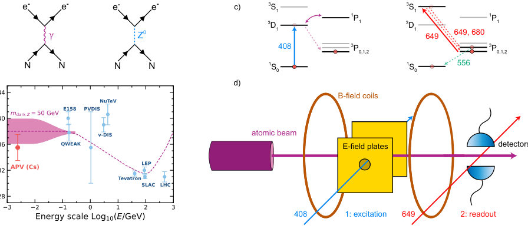 
FIG. 1. (a) Photon- and Z0-mediated electron–nucleus interactions. The weak neutral-current interaction violates parity and mixes opposite-parity atomic states. (b) Standard Model tests versus momentum transfer, adapted from Refs. [1, 6]. APV provides the low-energy limit and probes the nuclear weak charge. (c) Neutral-Yb APV level scheme. The 408 nm 6s2 1S0 →5d6s 3D1 transition is driven in external fields, producing Stark–PV interference (with 3D1 and 1P1 mixing). Atoms excited to 3D1 partially decay to 6s6p 3P0. The 3P0 population is read out by 649 nm excitation to 6s7s 3S1 and detection of cascade fluorescence, including 649 nm, 680 nm, and 556 nm photons. (d) Atomic-beam APV...

📷 Fig 2

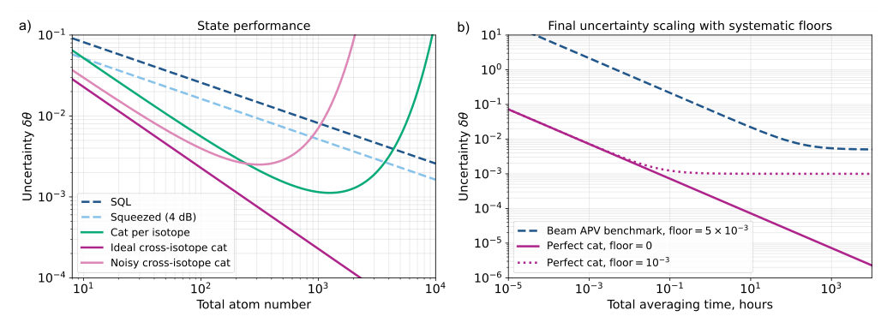 
FIG. 3. Projected metrological sensitivity to an APV isotope-chain deviation. (a) Parameter uncertainty δθ versus total atom number for 1 h of averaging. SQL measurements scale as N −1/2, while the ideal cross-isotope cat protocol reaches the Heisenberg limit δθ ∝N −1. Squeezed and same-isotope cat protocols give intermediate performance set by their assumed contrast and preparation errors. (b) Uncertainty δθ versus total averaging time for N = 1000. Statistical gains reduce the short-time uncertainty, but the total uncertainty saturates at the systematic floor.

**Summary.** This paper explores how quantum entanglement can be used to enhance the precision of atomic parity violation measurements in isotope chains. It demonstrates that while cross-isotope entangled states are theoretically optimal for detecting new physics, practical limitations like systematic errors and decoherence must be carefully managed.

**Why it may be interesting.** It bridges quantum information theory (entanglement-enhanced metrology, cat states, DFS) with precision atomic spectroscopy, offering new ways to use many-body entanglement to probe fundamental physics.

Detailed structure

**Main problem.** Determining the optimal quantum metrological strategy to detect deviations from Standard Model weak-charge scaling in atomic parity violation (APV) measurements across an isotope chain.

**Main result.** The paper identifies that a cross-isotope cat state is the information-optimal protocol for measuring deviations, though its utility is limited by systematic error floors and susceptibility to noise compared to more robust strategies.

**Method.** The author compares five quantum strategies (SQL, squeezed-array, same-isotope cat, cross-isotope cat, and DFS cat) using a parameter-estimation framework and simulations involving decoherence and gate infidelity.

**Model / system.** The study focuses on heavy atoms and ions (Cs, Yb, Ba+) and molecular arrays, modeling the nuclear-spin-independent weak Hamiltonian and the isotope-chain scaling of the weak charge.

**Key observables.** The deviation parameter (theta), transition rates, Ramsey phases, and the isotope-chain slope generator.

**Important parameters / regimes.** Nuclear weak charge (Qw), number of probes (N), Heisenberg limit (1/N scaling), and the systematic error floor.

**Assumptions / limitations.** The model assumes a specific form for the deviation pattern (h_A) and evaluates the impact of finite contrast and decoherence on the proposed quantum protocols.

**Figures summary.** Figure 1 shows the mechanism of parity violation and Standard Model tests; Figure 2 illustrates various APV platforms like neutral Yb and trapped ions; Figure 3 compares parameter uncertainty across different protocols.

**Paper structure.** The paper reviews the APV mechanism and current experimental state-of-the-art, introduces the metrological problem of isotope-chain scaling, presents a comparative analysis of various quantum entanglement strategies, and discusses the impact of noise and systematic limits.

Abstract

Atomic parity violation (APV) provides a low-energy probe of the weak interaction between electrons and nuclei, complementary to collider tests of the Standard Model. Isotope-chain measurements are especially attractive because they test weak-charge scaling while reducing dependence on absolute atomic-structure theory. We review the APV mechanism, the state of the art in Cs and Yb, and recent trapped-ion, optical-lattice, and molecular proposals. Motivated by progress in coherent control of atoms, ions, and molecules, we ask a metrological question: given N probes distributed over an isotope chain, what quantum strategy optimally measures a deviation from Standard Model weak-charge scaling? The optimum is a particular form of a cross-isotope cat state protocol. We compare this protocol with the standard quantum limit, squeezed-array, same-isotope cat, and discuss extension to recently suggested decoherence-free subspace protocols. We show that entanglement can strongly accelerate statistical averaging, but the ultimate precision is set by APV-specific systematic floors which require careful studies.

[↑ back to top](#top)

### [Memory-assisted squeezed light velocimetry under realistic loss and incoherent noise](http://arxiv.org/abs/2605.27723v1)

**Authors:** Mustafa Gündoğan, Arash Ahmadi, Markus Krutzik  
**Type:** theory · **Category:** other · **PDF:** <https://arxiv.org/pdf/2605.27723v1>  
**Analysis basis:** full PDF text, analyzed in chunks
**Topic relevance:** `quantum measurements` **3/5** · `interference shaping light` **2/5**

📷 Fig 1

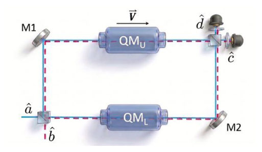 
FIG. 1. Two-memory Mach-Zehnder model. A coherent probe enters mode ˆa0 and phase-squeezed vacuum enters mode ˆb0. Both arms are stored and retrieved in iden- tical memories with write-store-read efficiency ηmem(τ) = η0 exp[−(τ/τmem)2] and the same unconditional noise floor pn(τ). Motion of the upper memory during storage generates the signal phase ϕv = −kpvτ. Balanced homodyne detection measures the dark output.

📷 Fig 2

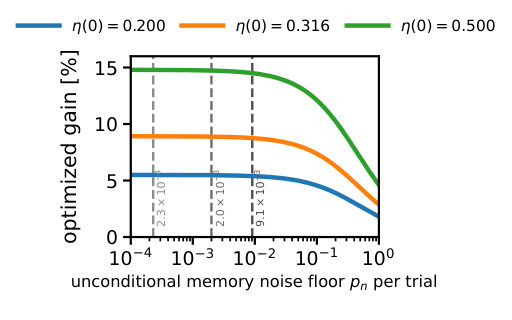 
FIG. 2. Optimized equal-resource gain versus unconditional memory-noise floor pn for 10 dB injected squeezing. Each curve is obtained after numerical optimization of Eq. (22) over storage time at fixed shot number for a fixed zero-storage transmission η(0). The vertical lines mark representative detector-referred noise floors reported or implied by Refs. [42– 44]. Over the experimentally relevant range pn ∼10−4–10−2, and even up to pn ∼10−1, the gain changes only slowly; in the reference working point the advantage is therefore limited more by transmission than by pn.

📷 Fig 3

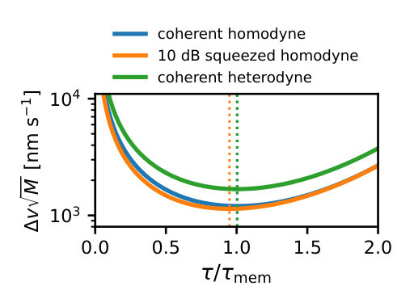 
FIG. 3. Storage time dependence of the shot-normalized sen- sitivity ∆v √

📷 Fig 4

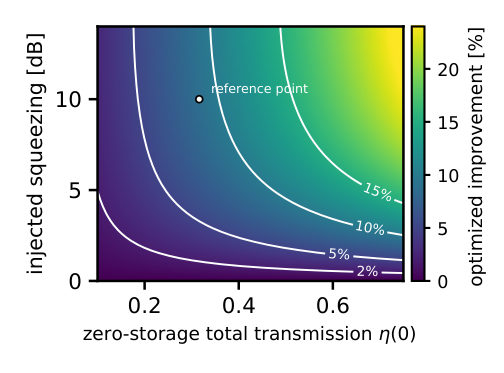 
FIG. 4. Best equal-resource gain after optimizing Eq. (22) over storage time at fixed shot number, shown as a function of the zero-storage total transmission η(0) and the injected squeezing level. The reference point used elsewhere in the paper is marked. At fixed transmission the gain saturates once loss and technical noise dominate the detected variance.

📷 Fig 5

 
Figure 3 shows how the signal phase and the retrieval efficiency compete. At short storage times the accumu- lated phase is too small. At longer times the Gaussian decay of ηmem(τ) suppresses the retrieved field strongly enough that the sensitivity rises again. In the constant- pn model this gives an optimum close to τmem for coherent homodyne and a slightly shorter optimum for squeezed input.

**Summary.** This paper analyzes a velocity sensor that uses quantum memories and squeezed light to improve measurement precision. It demonstrates that while realistic losses and noise limit the quantum advantage to a few percent, the squeezed-light scheme remains robust and superior to classical methods under near-term experimental conditions.

**Why it may be interesting.** It provides a rigorous metrological analysis of how non-classical states (squeezed light) perform in practical quantum memory-based sensing, specifically addressing the competition between signal accumulation and decoherence/loss.

Detailed structure

**Main problem.** Investigating whether a memory-assisted velocimetry platform using squeezed light can achieve quantum enhancement despite realistic experimental imperfections like loss and incoherent noise.

**Main result.** The study finds that squeezed light provides a modest (few to ten percent) improvement in velocity sensitivity, and that this advantage is primarily limited by total transmission and phase stability rather than unconditional memory noise.

**Method.** The authors use Classical Fisher Information (CFI) to derive the Cramér-Rao bound for velocity estimation and employ a Gaussian model for the variance budget.

**Model / system.** A two-memory Mach-Zehnder interferometer where one memory is stationary and the other moves, mapping velocity to an interferometric phase. The system uses a coherent probe and squeezed vacuum with a Gaussian write-store-read lifetime model.

**Key observables.** Velocity sensitivity (Delta v), quadrature variance of the dark port, and the relative figure of merit (quantum gain).

**Important parameters / regimes.** Storage time (tau), memory lifetime (tau_mem), squeezing parameter (r), transmission efficiency (eta), and unconditional memory noise floor (pn).

**Assumptions / limitations.** The memory-generated noise is assumed to be phase-insensitive and diagonal in the number basis; the system operates in a small-signal/linear-response regime.

**Figures summary.** Figure 1 shows the experimental schematic; Figure 2 plots optimized gain vs. memory noise; Figure 3 compares shot-normalized sensitivity for different detection schemes; Figure 4 maps gain as a function of transmission and squeezing.

**Paper structure.** The paper introduces the interferometric setup, defines a Gaussian noise and loss model, derives the sensitivity limits using Fisher Information, performs numerical optimization of storage time, and concludes with a comparison of different detection regimes and noise impacts.

Abstract

We propose a velocity sensor based on a two-memory Mach--Zehnder interferometer fed by a coherent probe and squeezed vacuum, read out by balanced homodyne detection. One memory is taken as a stationary reference, while the second memory moves during storage, so that its velocity is mapped onto a differential interferometric phase at readout. The two memories are otherwise assumed identical and are described by a Gaussian write--store--read lifetime together with the associated unconditional noise floor. Using the classical Fisher information, we derive the velocity sensitivity, the transmission threshold required for a target quantum gain, and the optimum storage time. The squeezed scheme improves on equal-resource coherent homodyne within an operating window set mainly by total transmission and phase stability. For representative near-term parameters, unconditional memory noise floors up to about $10^{-1}$ photons per trial do not by themselves remove the advantage; after optimization the improvement remains at the few-percent level and is limited chiefly by loss.

[↑ back to top](#top)

### [Photon-energy-programmable subnanometric electron birth-site control](http://arxiv.org/abs/2605.28286v1)

**Authors:** Hirofumi Yanagisawa, Abhisek Sinha, Ravi Kumar, Neill Lambert, Hirotaka Kitoh-Nishioka  
**Type:** both · **Category:** other · **PDF:** <https://arxiv.org/pdf/2605.28286v1>  
**Analysis basis:** full PDF text, analyzed in chunks
**Topic relevance:** `quantum optics experiment` **3/5** · `interference shaping light` **2/5**

📷 Fig 1

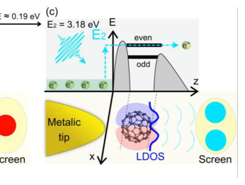 
Fig. 1 | Concept of photon-energy-dependent subnanometric control of electron-emission

📷 Fig 2

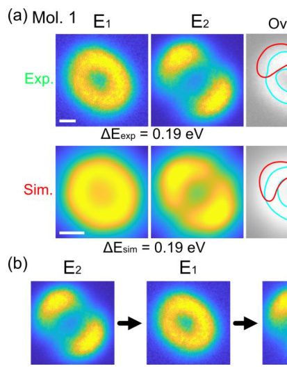 
Fig. 2 | Reversible photon-energy-dependent switching of molecular emission patterns.

📷 Fig 3

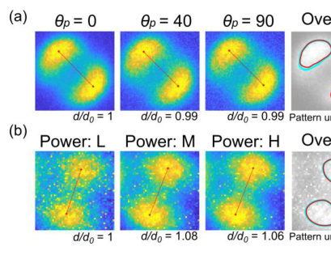 
Fig. 3 | Emission-pattern invariance under polarisation and power variations.

📷 Fig 4

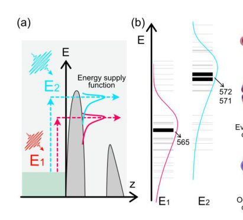 
Fig. 4 | Symmetry-resolved emission channels from the molecular scale to the far field.

**Summary.** This paper shows that the site of electron emission from a single molecule can be controlled at a subnanometer scale simply by changing the energy of the incoming photons. By tuning the photon energy, researchers can switch between different molecular orbitals, effectively moving the electron 'birth site' without changing the optical field distribution. This provides a new mechanism for high-resolution nanoscale imaging and control.

**Why it may be interesting.** This work is highly relevant to quantum optics and molecular physics as it demonstrates a new way to manipulate quantum-scale electron pathways using the internal electronic structure (symmetry) of a molecule rather than external field shaping.

Detailed structure

**Main problem.** Conventional optical control of electron-generation sites is limited by the need to physically shape local-field hotspots, making it impossible to independently select different substructures within the same field distribution.

**Main result.** The researchers demonstrated that electron birth-site control can be achieved at a subnanometric scale by tuning photon energy to selectively access molecular orbitals of different spatial symmetries, independent of the local-field profile.

**Method.** The study combines experimental electron emission measurements from single-molecule emitters with theoretical modeling using DFT (GAMESS/VASP) and a three-step emission model involving orbital-resolved weighting and field propagation.

**Model / system.** The experimental platform consists of single-molecule electron emitters (C60 multilayers) at the apex of a metallic tungsten nanotip under ultrahigh vacuum and a strong DC field.

**Key observables.** Far-field electron emission patterns (e.g., ring-like vs. two-lobed structures) and normalized lobe separation (d/d0).

**Important parameters / regimes.** Photon energies of 2.99 eV and 3.18 eV; subnanometric spatial resolution (~0.3 nm); DC field of 4.5 V/nm; electron yield < 0.05 per pulse.

**Assumptions / limitations.** The model assumes an incoherent sum of orbital contributions and utilizes a normal-incidence approximation for the decay constant of the post-barrier wavefunction.

**Figures summary.** Fig 1 compares field-based vs. energy-dependent control; Fig 2 shows experimental reversible switching of emission patterns and simulation overlays; Fig 3 demonstrates the invariance of patterns to polarization and power; Fig 4 shows the asymmetric energy-supply function.

**Paper structure.** The paper introduces the limitation of local-field control, presents the experimental demonstration of energy-dependent switching, provides a theoretical model for symmetry-selective excitation, and validates the mechanism through polarization and power-dependence tests.

Abstract

Optical control of electron-generation sites has broadly enabled ultrafast nanoscale imaging, spectroscopy, and functional control. Existing approaches achieve nanoscale site selectivity by shaping localised optical fields around nanostructures, thereby limiting independent site selectivity within the same local-field hotspot. Here, using a single-molecule electron emitter, we show that site selectivity can instead be encoded in the electronic excitation pathway, enabling subnanometric control of electron birth sites within the same local-field hotspot. By tuning the photon energy, we selectively access molecular states of different spatial symmetry and reversibly switch the electron birth site between distinct locations in the same emitter, with the change read out directly in the far-field emission pattern. The switching depends on photon energy alone and is absent under variations in intensity or polarisation. Our results establish optical birth-site selectivity that is not dictated by the local-field distribution, opening a route to electron birth-site control through the electronic excitation pathway.

[↑ back to top](#top)

### [Anisotropic magnetism and Kondo-lattice behavior in the frustrated antiferromagnet Ce3MgBi5](http://arxiv.org/abs/2605.28540v1)

**Authors:** Karolina Gornicka, Brenden R. Ortiz, Matthew S. Cook, Heda Zhang, Andrew D. Christianson, Andrew F. May  
**Type:** experiment · **Category:** strongly correlated electrons · **PDF:** <https://arxiv.org/pdf/2605.28540v1>  
**Analysis basis:** full PDF text, analyzed in chunks
**Topic relevance:** `Kondo & dissipative impurity` **3/5**

📷 Fig 1

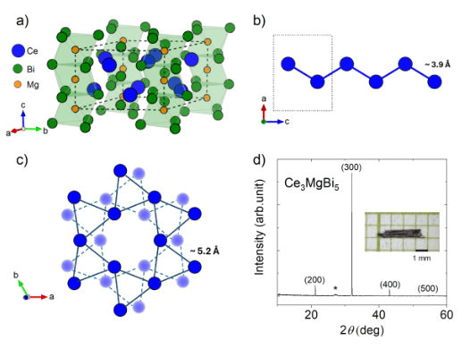 
FIG. 1. (a) Crystal structure of Ce3MgBi5 highlighting the ar- rangement of Ce (blue), Bi (green), and Mg (orange) atoms. The structure consists of face-sharing MgBi6 octahedra and hypervalent Bi chains running along the c axis. (b) Zig-zag chain of Ce atoms along the c direction with a nearest-neighbor Ce–Ce distance of approximately 3.9 ˚A. (c) Arrangement of Ce atoms within the ab plane, showing two adjacent Ce layers that together form a distorted kagome-like network, with in-plane Ce–Ce bonds of about 5.2 ˚A. (d) X-ray diffraction pattern col- lected from the as-grown facets of a Ce3MgBi5 single crystal. The peak marked with an asterisk (*) originates from residual Bi flux on the...

📷 Fig 2

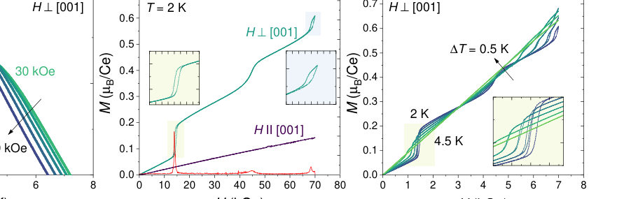 
FIG. 2. (a) The magnetic susceptibility, M/H, as a function of temperature measured in an applied field of 1 kOe for H ⊥[001] and H ∥[001], together with the Curie-Weiss fits (red lines). The vertical dashed line marks the antiferromagnetic transition temperature TN. (b) FC magnetic susceptibility data measured for H ∥[001] under magnetic fields between 5 and 20 kOe (∆H = 5 kOe). (c) M/H vs T for H ⊥[001] under magnetic fields ranging from 1 kOe to 25 kOe, presenting the evolution of the magnetic transition with increasing field. (d) Low-temperature magnetization data for H ⊥[001] at higher fields (∆H = 10 kOe). (e) Field-dependent magnetization at 2 K for Ce3MgBi5. The derivative, dM/dH...

📷 Fig 3

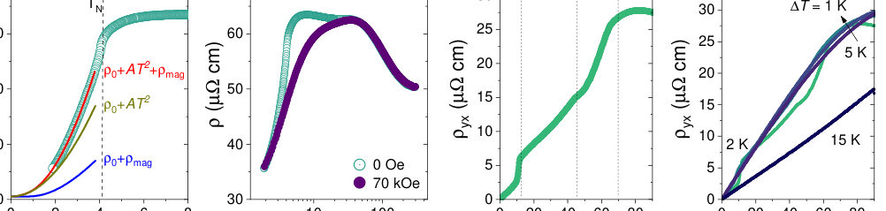 
FIG. 3. (a) Temperature dependence of the electrical resistivity ρ(T) of Ce3MgBi5 measured in zero magnetic field from 300 to 1.9 K. The inset shows the temperature derivative dρ/dT, highlighting the antiferromagnetic transition at TN = 4.16 K. (b) Enlarged view of the low-temperature region of ρ(T) in zero field. The red solid line represents a fit to the antiferromagnetic spin-wave scattering model, with ∆fixed to the value obtained from heat-capacity data. The auxiliary curves highlight the relative contributions of the ρ0 + AT 2 and magnon terms. The portions of the curves below 1.8 K are extrapolations (see text). (c) ρ(T) measured at H = 0 and 70 kOe, plotted on a logarithmic...

📷 Fig 4

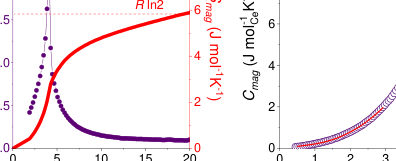 
FIG. 4. (a) Temperature dependence of the specific heat Cp(T) of Ce3MgBi5 and the nonmagnetic reference compound La3MgBi5 measured in zero magnetic field over a wide tem- perature range. The inset highlights the low-temperature re- gion, where a pronounced anomaly at TN = 4.15 K is ob- served for Ce3MgBi5. (b) Low-temperature specific heat of Ce3MgBi5 measured for H ⊥[001] in magnetic fields up to 30 kOe (∆H = 5 kOe). (c) Magnetic contribution to the spe- cific heat plotted as Cmag/T together with the corresponding magnetic entropy Smag(T), obtained by subtracting the phonon background estimated from La3MgBi5. The dashed line indi- cates the value R ln 2 expected for a fully localized...

📷 Fig 5

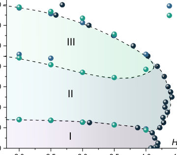 
FIG. 5. Magnetic field–temperature phase diagram of Ce3MgBi5 for magnetic fields applied perpendicular to the [001] direction. Dashed lines are guides to the eye.

**Summary.** Researchers synthesized and characterized Ce3MgBi5, a new intermetallic compound that exhibits both geometric frustration and Kondo-lattice physics. The material shows a complex magnetic phase diagram and strong coupling between charge transport and magnetic order. This work provides a new platform for studying the competition between RKKY interactions and the Kondo effect in frustrated lattices.

**Why it may be interesting.** not directly relevant

Detailed structure

**Main problem.** Investigating the interplay between geometric frustration, magnetic anisotropy, and Kondo-lattice physics in the newly synthesized Ce3MgBi5 compound.

**Main result.** The study identifies a Ce-based Kondo-lattice system with antiferromagnetic order below 4.2 K, featuring a complex H-T phase diagram with multiple metamagnetic transitions and strong magnetic anisotropy.

**Method.** Single crystals were synthesized via the Mg-Bi self-flux method and characterized using SQUID magnetometry, PPMS for high-field transport and heat capacity, and X-ray diffraction.

**Model / system.** The physical system is Ce3MgBi5, a member of the Ce3MPn5 family with a hexagonal P63/mcm structure featuring a distorted kagome-like Ce sublattice and zig-zag chains along the c-axis.

**Key observables.** Néel temperature (TN), magnetization (M), electrical resistivity (rho), magnetoresistance (MR), Hall effect, specific heat (Cp), and magnetic entropy (Smag).

**Important parameters / regimes.** TN approx 4.2 K, Weiss temperature (highly anisotropic), Sommerfeld coefficient (gamma approx 199 mJ mol-1 CeK-2), and spin-wave gap (Delta approx 4.96 K).

**Assumptions / limitations.** The use of La3MgBi5 as a nonmagnetic isostructural reference to subtract phonon background from specific heat measurements.

**Figures summary.** Fig 1 shows the crystal structure and Ce sublattice details; Fig 3 shows temperature-dependent resistivity and its derivative; Fig 4 shows temperature-dependent specific heat.

**Paper structure.** The paper begins with crystal synthesis and structural characterization, followed by magnetic properties and anisotropy, then moves to electrical transport and Hall effect measurements, and concludes with thermodynamic analysis of the Kondo-lattice behavior.

Abstract

We report the synthesis and physical characterization of single-crystalline Ce3MgBi5, a previously unexplored member of the Ce3MPn5 family. This compound crystallizes in the hexagonal P63/mcm structure, featuring an anisotropic Ce sublattice composed of zig-zag chains along the c axis and a distorted kagome-like network in the basal plane. Magnetization measurements reveal antiferromagnetic order below TN approximately 4.2 K, accompanied by strong magnetic anisotropy and multiple field-induced metamagnetic transitions for fields applied perpendicular to [001], leading to a dome-shaped H-T phase diagram. Electrical transport exhibits characteristic signatures of a Ce-based Kondo lattice, including broad resistivity maxima and pronounced field-dependent anomalies in the magnetoresistance and Hall response that track the magnetic phase boundaries. Specific-heat measurements confirm the magnetic transition and show that the full R ln 2 entropy expected for a Ce3+ Kramers doublet is recovered by 20 K, indicating an extended temperature range of magnetic fluctuations consistent with Kondo correlations. Our results establish Ce3MgBi5 as a platform within the Ce3MPn5 family for exploring the interplay of geometric frustration, magnetic anisotropy, and Kondo-lattice physics under applied magnetic fields.

[↑ back to top](#top)

### [Global Bounds beyond Local Quantum Metrology](http://arxiv.org/abs/2605.28374v1)

**Authors:** Hai-Long Shi, Augusto Smerzi  
**Type:** theory · **Category:** quantum information and computing · **PDF:** <https://arxiv.org/pdf/2605.28374v1>  
**Analysis basis:** full PDF text, analyzed in chunks
**Topic relevance:** `quantum measurements` **3/5**

📷 Fig 1

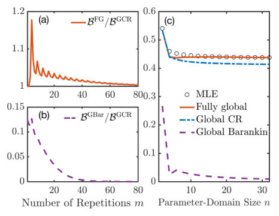 
FIG. 1. Classical global-score hierarchy for a noisy binary model p(x|θ) = Qm ℓ=1(1 + xℓd sin θ)/2, with d = 1/2, wi = 1/n, and θi ∈[0, π]. (a) For fixed n = 8, BFG C /BGCR C →1 as m increases, recovering local Cram´er–Rao behavior. (b) The global Barankin level remains below the Cram´er–Rao scale. (c) For fixed m = 10, refining the sampled domain drives the variance of the maximum-likelihood estimator (MLE) toward BFG C , whereas the global Cram´er–Rao and Barankin levels do not track the attainable variance.

📷 Fig 2

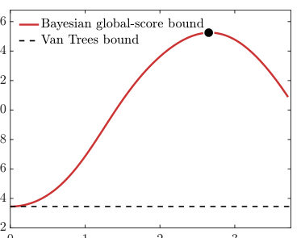 
FIG. 2. Bayesian global-score bound for a noisy qubit with Gaussian prior width σp = 5 and decoherence d = 0.5. The local limit ϵ →0 recovers the Van Trees bound. Finite-width kernels retain correlations between distinct parameter values and yield stronger BMSE lower bounds. The black dot marks the optimal kernel width yielding the strongest BMSE lower bound.

**Summary.** The paper develops a new hierarchy of precision bounds for quantum metrology that applies to global parameter estimation rather than just local precision. It demonstrates that when a parameter is known only within a broad range, a single fixed measurement strategy can achieve a fundamental 'fully global' limit. This framework also provides a unified approach to strengthening Bayesian estimation bounds.

**Why it may be interesting.** This is highly relevant for quantum metrology and quantum optics, as it provides a new fundamental limit for sensing when the parameter is not known a priori, moving beyond the standard local-limit paradigm.

Detailed structure

**Main problem.** The paper addresses the limitation of local quantum metrology, which only bounds precision near a specific parameter value, by investigating the fundamental precision limits for global parameter estimation over a broad domain.

**Main result.** The authors establish a hierarchy of precision bounds (Global Cramér-Rao, Global Barankin, and Fully Global) and show that a single, parameter-independent measurement can saturate the fully global bound in certain quantum models.

**Method.** The authors introduce global score functions tied to a weighted variance and use a hierarchy matrix to couple score directions across the parameter domain, applying the Cauchy-Schwarz inequality and the Rayleigh quotient maximization theorem.

**Model / system.** The framework is applied to general quantum statistical models, including a noisy qubit model with a density operator parameterized by an angle, and a classical binary measurement model.

**Key observables.** Weighted variance of the estimator, Bayesian mean-square error (BMSE), and the quantum information matrix.

**Important parameters / regimes.** Number of measurement repetitions (m), parameter domain density (n), parameter domain width, and the bandwidth (epsilon) of the Bayesian hierarchy kernel.

**Assumptions / limitations.** Assumes a discrete set of parameter values for the frequentist derivation and assumes the probability distribution is strictly positive for all outcomes.

**Figures summary.** Figure 2 shows the generalized Bayesian bound as a function of the error parameter epsilon.

**Paper structure.** The paper begins by defining the global estimation problem, introduces the global score function and the hierarchy of bounds, provides the mathematical derivation for classical and quantum settings, demonstrates saturation conditions and optimal measurement design, and extends the framework to Bayesian estimation.

Abstract

Quantum Cramér--Rao theory is intrinsically local: it bounds precision near a specified parameter value, and its saturating measurement generally depends on that value. Barankin-type bounds use finite parameter displacements, but remain anchored to a chosen reference value. This leaves open a basic global-estimation problem: when the parameter is known only within a broad domain, what precision can be guaranteed by a single estimator and a single measurement strategy fixed before the true value is localized? We answer this question by introducing global score functions tied to a weighted variance over the whole parameter domain. Their correlations generate a hierarchy of precision bounds: global Cramér--Rao and Barankin-type bounds arise as restricted levels, whereas unrestricted score correlations yield a fully global bound for the prescribed weighted variance. The hierarchy recovers local Cramér--Rao theory in the many-repetition limit and reveals genuinely global precision limits for finite data over broad domains. In the quantum setting, the construction identifies when this fully global bound can be realized by a single parameter-independent measurement. The same framework extends to Bayesian estimation, recovering the Van Trees bound in the local limit while yielding stronger finite-width lower bounds on the Bayesian mean-square error beyond this limit.

[↑ back to top](#top)

### [MATBG Josephson diode as an universal thermal machine](http://arxiv.org/abs/2605.27560v1)

**Authors:** Hadi Mohammed Soufy, Colin Benjamin  
**Type:** theory · **Category:** statistical mechanics · **PDF:** <https://arxiv.org/pdf/2605.27560v1>  
**Analysis basis:** full PDF text, analyzed in chunks
**Topic relevance:** `non-equilibrium dynamics` **3/5**

📷 Fig 1

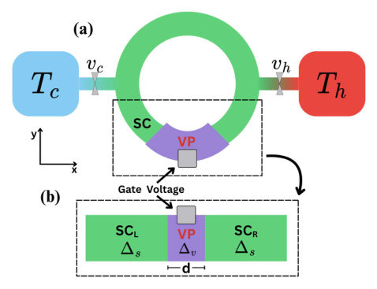 
FIG. 1: (a) Schematic of a MATBG-JDTM loop with a weak-link valley-polarized region of length d, coupled to thermal baths at temperatures Th and Tc via controllable valves vh and vc. (b) SCL and SCR are the left and right superconducting leads which are characterized by the superconducting order parameter ∆s, and VP is weakly-linked valley-polarized region characterized by potential ∆v which is tunable by external gating. The phase difference across the junction is set to zero, since we are dealing with a Josephson diode (JD).

📷 Fig 2

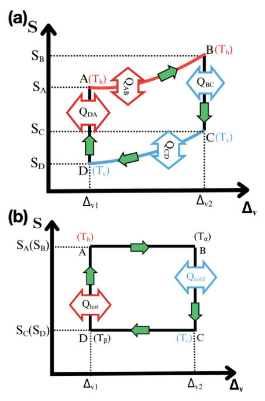 
FIG. 2: Entropy as a function of valley-polarization parameter ∆v for (a) QSC, consisting of two quantum isothermal and two quantum isochoric strokes operating across temperatures Tc and Th, and (b) QOC, consisting of two quantum adiabatic and two quantum isochoric strokes operating across temperatures Tc,Th,Tα and Tβ . Red arrows indicate heat exchange with the hot reservoir, while blue arrows indicate heat exchange with the cold reservoir.

📷 Fig 3

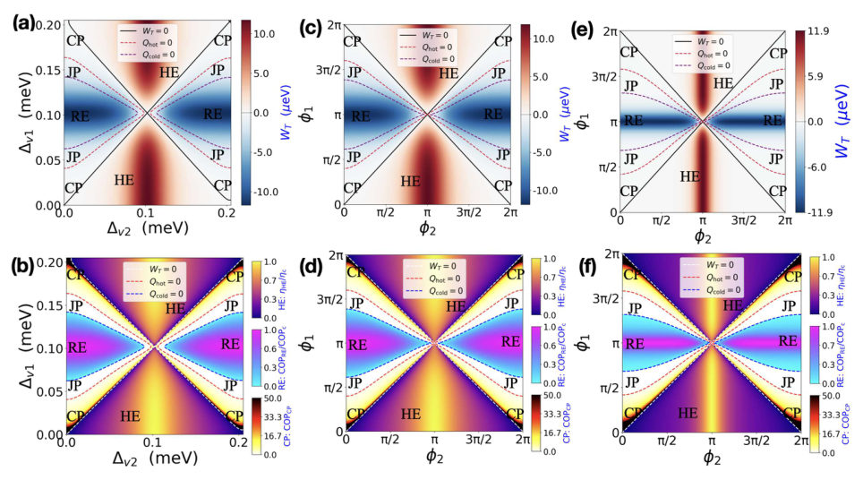 
FIG. 3: (a,b) Work and performance metrics of MATBG-JDTM exhibiting a QSC. (c,d) Work and performance metrics of MATBG-JJTM (e,f) for AABLG-JJTM for a QSC, in heat engine (HE), refrigerator (RE), cold pump (CP), and Joule pump (JP) regimes. The bath temperatures are Th = 0.1K and Tc = 0.05K.

📷 Fig 4

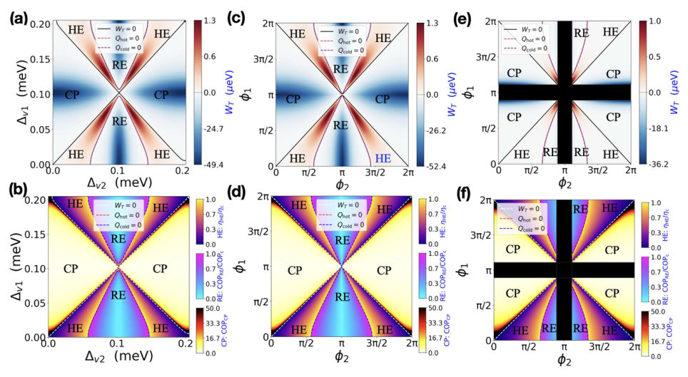 
FIG. 4: (a,b) Work and performance metrics of MATBG-JDTM exhibiting a QOC. (c,d) Work and performance metrics of MATBG-JJTM (e,f) for AABLG-JJTM for a QOC, in the heat engine (HE), refrigerator (RE), and cold pump (CP) regimes. The bath temperatures are Th = 0.1K and Tc = 0.05K.

📷 Fig 5

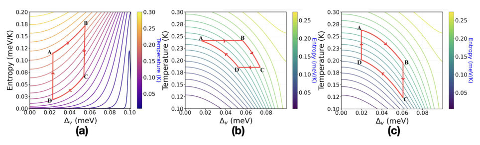 
FIG. 5: (a) Isothermal contour plots depicting QSC in MATB-JDTM, (b),(c) are isoentropic contours for MATBG-JDTM depicting QOC and QCC, respectively.

**Summary.** The paper proposes using the intrinsic Josephson diode effect in magic-angle twisted bilayer graphene to create highly efficient, electrically tunable quantum heat engines and refrigerators. By using valley polarization as a control parameter instead of magnetic flux, these devices offer a more stable and efficient alternative to conventional superconducting thermal machines.

**Why it may be interesting.** This paper is interesting for researchers in open quantum systems and many-body dynamics because it demonstrates how broken symmetries and topological features in a correlated electron system can be harnessed to drive non-equilibrium thermodynamic cycles and control heat/work exchange.

Detailed structure

**Main problem.** Investigating the potential of Magic-angle twisted bilayer graphene (MATBG) Josephson diodes to function as universal quantum thermal machines (heat engines and refrigerators) and comparing them to conventional phase-driven architectures.

**Main result.** MATBG-based thermal machines exhibit significantly enhanced work output and efficiency compared to AA-stacked bilayer graphene due to flat-band-enhanced density of states and trigonal warping. Additionally, the diode-based approach allows for a flux-free, electrically tunable control via valley polarization, mitigating magnetic flux noise.

**Method.** The study uses the Blonder-Tinkham-Klapwijk (BTK) formalism to calculate Andreev bound state (ABS) energies and applies the laws of thermodynamics to analyze Quantum Stirling, Otto, and Carnot cycles.

**Model / system.** The system consists of a Magic-angle twisted bilayer graphene (MATBBG) Josephson junction with a gate-tunable, valley-polarized weak link between two superconducting leads, modeled using a 1D effective Hamiltonian incorporating trigonal warping and anisotropic Fermi velocity.

**Key observables.** Andreev bound state (ABS) spectra, current-phase relations (CPR), work output (W), heat exchange (Q), efficiency (eta), and Coefficient of Performance (COP).

**Important parameters / regimes.** Valley-polarization potential (delta_v), superconducting phase difference (phi), Thouless energy (E_T), trigonal warping scale (E_A), and temperature (T).

**Assumptions / limitations.** The model assumes a ballistic limit and neglects inter-valley back-scattering; temperatures are assumed to remain below the superconducting critical temperature.

**Figures summary.** Schematics of the thermal machine loop and junction; ABS spectra and current-phase relations for MATBG and AABLG; plots of work, efficiency, and anomalous current as functions of valley polarization.

**Paper structure.** The paper introduces the MATBG Josephson diode platform, defines the microscopic Hamiltonian and ABS derivation, constructs various quantum thermodynamic cycles, performs a comparative performance analysis against AABLG systems, and discusses experimental advantages regarding flux-free control.

Abstract

Magic-angle twisted bilayer graphene Josephson junctions (MATBG-JJ) with a gate-tunable valley-polarized weak link exhibit an intrinsic Josephson diode effect originating from broken symmetries associated with valley polarization and band-structure anisotropy. Exploiting this nonreciprocal superconducting platform, we construct quantum Stirling (QSC), Otto (QOC), and Carnot (QCC) thermodynamic cycles, where the valley-polarization potential $Δ_v$ acts as the principal control parameter, in contrast to conventional Josephson thermal machines driven by superconducting phase bias. We systematically compare the performance of MATBG-based Josephson diode thermal machines (MATBG-JDTM) with MATBG-based Josephson junction thermal machines (MATBG-JJTM) and AA-stacked bilayer graphene Josephson junction thermal machines (AABLG-JJTM). Owing to the flat-band-enhanced density of states and electrically tunable nonreciprocal transport in MATBG, both MATBG-JDTM and MATBG-JJTM exhibit significantly enhanced work output and efficiency over a broad operating regime compared to AABLG-JJTM. In particular, the gate-controlled MATBG-JDTM provides a flux-free alternative to conventional phase-driven architectures, mitigating limitations associated with magnetic-flux control and flux-noise effects. Our results establish MATBG Josephson diode platforms as a promising route toward electrically tunable quantum thermal machines and nonreciprocal superconducting caloritronics.

[↑ back to top](#top)

### [Picometer control of a levitating milligram gravity sensor](http://arxiv.org/abs/2605.28479v1)

**Authors:** Dennis G. Uitenbroek, Jurriaan Langendorff, Tjerk H. Oosterkamp  
**Type:** experiment · **Category:** other · **PDF:** <https://arxiv.org/pdf/2605.28479v1>  
**Analysis basis:** full PDF text, analyzed in chunks
**Topic relevance:** `quantum measurements` **3/5**

📷 Fig 1

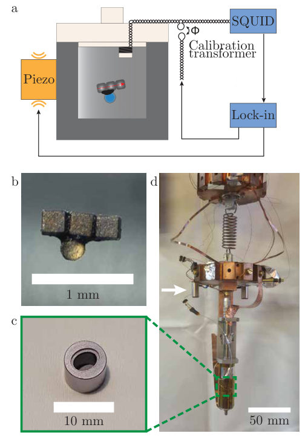 
FIG. 1: Overview of the experimental setup. (a) A schematic outline of the setup, the levitating permanent magnet is shown inside the superconducting trap. A pick-up coil attached to the lid of the trap picks up the varying flux of the moving levitated magnet and is detected using a two stage SQUID amplifier. We feedback cool the magnets motion by applying a phase shifted tone shaking the trap housing through a piezo and lock-in amplifier. (b) A close-up of the permanent magnet used in the experiment. It is composed of three 0.25 mm cubic neodymium iron boron parylene coated magnets stacked and glued together. A glass sphere with a diameter of 0.20 mm is attached to this stack of magnets...

📷 Fig 2

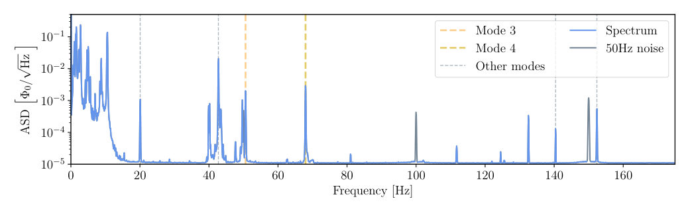 
FIG. 2: Typical amplitude spectral density (ASD) of the levitated magnet, the resonant modes of the magnet are indicated with the dotted lines. In this figure the 50 Hz European electrical noise is grayed out.

📷 Fig 3

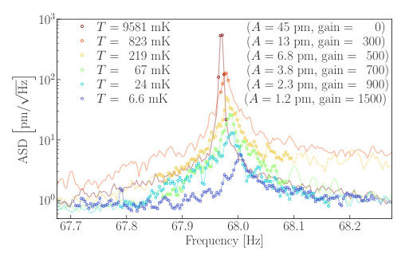 
FIG. 4: Similar to Fig. 3, the linear feedback cooling on mode 4 is plotted. The different colored lines represent spectra taken with different linear gains. The legend shows the achieved mode temperatures with corresponding RMS amplitude and proportional gain values. Equal colors in this plot and in Fig. 3 indicate measurements are taken simultaneously.

📷 Fig 4

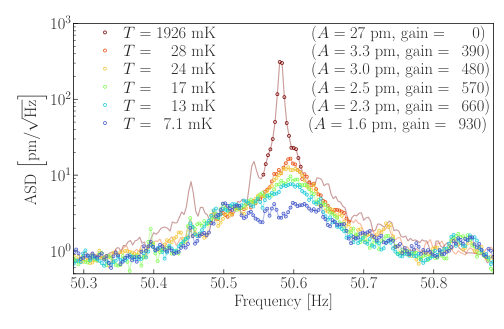 
FIG. 3: The linear feedback cooling on mode 3 is plotted. The different colored lines represent spectra taken with different linear gains. The legend shows the achieved mode temperatures with corresponding RMS amplitude and proportional gain values. Equal colors in this plot and in Fig. 4 indicate measurements are taken simultaneously.

**Summary.** Researchers have achieved picometer-scale control and millikelvin-scale cooling of a milligram-sized magnet levitated in a superconducting trap. By using active feedback cooling, they successfully reduced the thermal motion of two simultaneous mechanical modes. This setup provides a high-precision platform for future experiments testing the limits of quantum mechanics in the macroscopic regime.

**Why it may be interesting.** This work demonstrates extreme precision control and cooling of a macroscopic object, which is a fundamental precursor to studying the interface between quantum mechanics and gravity and exploring decoherence in large-scale quantum systems.

Detailed structure

**Main problem.** The challenge of cooling a macroscopic, milligram-scale mechanical resonator to its quantum ground state to enable future gravity experiments involving quantum superpositions.

**Main result.** Demonstrated simultaneous linear feedback cooling of two translational modes of a levitated magnet to below 2 picometer amplitude and below 10 millikelvin mode temperature.

**Method.** Active damping via linear feedback cooling using a SQUID-based detection system, a lock-in amplifier, and a piezoelectric actuator to apply a phase-shifted force.

**Model / system.** A 0.35 mg permanent magnet levitated in a type I superconducting tantalum trap via the Meissner effect, housed in a dry dilution refrigerator with multi-stage vibration isolation.

**Key observables.** Power Spectral Density (PSD), Amplitude Spectral Density (ASD), RMS amplitude, mode temperature, and phonon number.

**Important parameters / regimes.** Mass scale of ~0.35 mg, resonant frequencies of 50.6 Hz and 68.0 Hz, Q factors up to 5.5 x 10^6, and vibration attenuation of 110-130 dB.

**Assumptions / limitations.** Assumes small displacements where magnetic flux change is linear; assumes the resonator behaves as a driven harmonic oscillator.

**Figures summary.** Schematics of the experimental setup and magnet composition; images of the superconducting trap and vibration isolation; plots of resonant modes (ASD) and the effect of feedback gain on mode temperature and amplitude.

**Paper structure.** Introduction to the scientific problem; description of the experimental platform and levitation setup; details on detection and calibration methods; presentation of cooling results for specific modes; discussion of noise upconversion and future paths to ground-state cooling.

Abstract

Due to their exceptional isolation from the environment, magnetically levitated particles are explored as extremely sensitive mechanical sensors. For future gravity experiments on quantum superpositions, such systems need to be cooled close to their ground state. To demonstrate the combination of state of the art vibration isolation, milligram levitated high Q mechanical resonators and position detection with low noise, we present linear feedback cooling of a magnetically levitated gravity sensor to below 2 picometer amplitude and below 10 millikelvin mode temperature for two translational modes (the x- and y-mode) simultaneously. The sensor is a levitating permanent magnet in a type I superconducting trap, where its six resonance frequencies are measured with a superconducting coil coupled to a DC SQUID. This signal is measured with a lock-in amplifier and a feedback signal is sent to a piezoelectric actuator, allowing the cooling of resonant modes at 50.6 and 68.0 Hz simultaneously. These two translational modes have Q factors of $3.8 \cdot 10^6$ and $5.5 \cdot 10^6$ respectively. The experiment is mounted inside a dry dilution refrigerator where it is vibrationally attenuated with 110-130 dB at these frequencies. In this work, we discuss future improvements on the setup which may enable quantum ground state cooling on a magnetically levitated particle, that has previously been shown to be a gravitational sensor.

[↑ back to top](#top)

### [Geometry near rank-changing points on the mixed-state manifold: Bures metric, conical singularities, and Lindblad dynamics](http://arxiv.org/abs/2605.27907v1)

**Authors:** Yu-Huan Huang, Xu-Yang Hou, Guo Hao, Chih-Chun Chien  
**Type:** theory · **Category:** quantum information and computing · **PDF:** <https://arxiv.org/pdf/2605.27907v1>  
**Analysis basis:** full PDF text, analyzed in chunks
**Topic relevance:** `entanglement & information structure` **2/5** · `methods for driven-dissipative` **2/5** · `non-equilibrium dynamics` **2/5**

📷 Fig 1

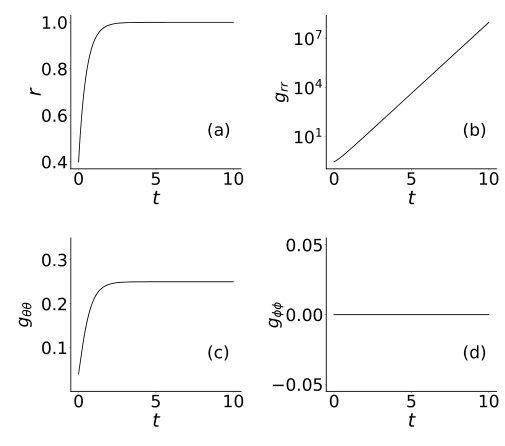 
Figure 1. (a) The Bloch vector norm r and the Bures metric components (b) grr, (C)gθθ, and(d)gφφ during the asymptotic purification evolution for p = 0.7 and γ = 2.0.

📷 Fig 2

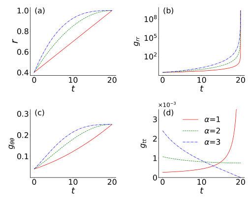 
Figure 2. Behaviors of (a) the Bloch vector norm and (b)-(d) the Bures metric components during the finite-time purifica- tion evolution for p = 0.7, γ = 2.0 and α = 1.0, 2.0, 3.0. Since gφφ = 0 in this case, we show gtt in panel (d).

📷 Fig 3

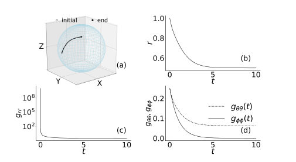 
Figure 3. (a) Evolution path from pure to mixed state in the Bloch ball. (b)-(d) Behavior of the Bloch vector norm and the Bures metric components during the evolution from pure to mixed state for γ1 = 1.0 and γ2 = 0.5.

📷 Fig 4

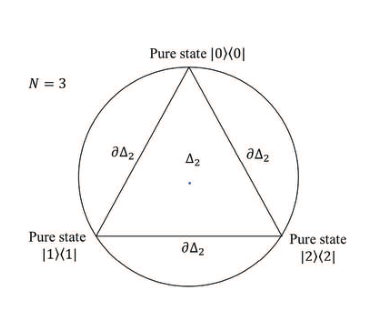 
Figure 4. Illustration of the geometry of N = 3 states. The full state space is an 8-dimensional convex body, represented schematically as a ball. The equilateral triangle ∆2 is the eigenvalue simplex of diagonal density matrices (Eq. (28)). Its corners are pure states (rank 1), its edges are rank-2 states, and its interior is full rank. Any density matrix is obtained by a unitary transformation of a point in ∆2. The simplex lies strictly inside the convex body; its edges do not lie on the boundary of the state space. The corners are points where the rank jumps from 3 to 1. Near these corners, the geometry develops a conical singularity.

📷 Fig 5

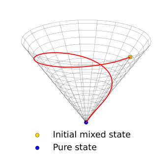 
Figure 5. Illustration of the metric cone structure near a pure state for N ≥3. The yellow dot at the tip is a pure state and also a rank-changing point. The blue dot is a mixed state in the interior. The red curve shows a radial Bures geodesic approaching or shooting from the cone tip, illustrating the “geodesic approaching/shooting” behavior of Lindblad evolu- tion. Any evolution that approaches or leaves the tip must become asymptotically radial to avoid divergent angular ve- locity.

**Summary.** The paper reveals that while the Bures metric appears singular near pure states in qubits, higher-dimensional quantum systems possess intrinsic conical singularities. It classifies how different Lindblad-driven processes, such as purification and decoherence, interact with this complex geometry.

**Why it may be interesting.** It provides fundamental insights into the geometric landscape of open quantum systems, specifically how the dimensionality of the Hilbert space fundamentally changes the nature of quantum state space singularities.

Detailed structure

**Main problem.** Investigating the geometric structure and curvature singularities of the Bures metric on the mixed-state manifold near rank-changing points.

**Main result.** The paper proves that for N=2 systems, the Bures metric divergence is a coordinate artifact, whereas for N>=3 systems, the geometry forms a metric cone with genuine curvature singularities (Dirac delta or power-law divergence).

**Method.** Geometric analysis using Bloch vector parameterization, coordinate transformations, and the calculation of the Riemann curvature tensor and scalar curvature for conical metrics.

**Model / system.** N-level quantum systems (specifically N=2 and N=3) undergoing Lindblad master equation dynamics, including scenarios of asymptotic purification, finite-time purification, and decoherence.

**Key observables.** Bures metric components, scalar curvature, and the Quantum Geometric Tensor.

**Important parameters / regimes.** Rank of the density matrix, dimensionality of the system (N), spectral ratio (zeta), and the radial distance to the pure-state boundary.

**Assumptions / limitations.** The analysis focuses on the transition between full-rank and rank-1 states; the Hamiltonian is assumed to be zero for simplicity in the Lindblad constructions.

**Figures summary.** Figure 1 shows time evolution of the Bloch vector and metric components; Figure 5 illustrates the metric cone structure and radial geodesics; Figure 6 shows 2D and 3D conical singularities; Figure 8 shows the angular deficit in an unfolded cone.

**Paper structure.** The paper first compares N=2 and N>=3 geometries, then analyzes Lindblad evolution trajectories (geodesic vs non-geodesic), followed by a detailed construction of the metric cone and its curvature singularities, and concludes with experimental implications.

Abstract

We elucidate the Bures metric in quantum state space near a rank-changing point of the density matrix and show contrasting behavior for two-level ($N=2$) systems versus higher-level systems. Due to the smooth pure-state boundary for $N=2$, we prove the apparent metric divergences to be merely coordinate artifacts and present three Lindblad processes exhibiting qualitatively different evolution near rank-changing points, showing geodesic approach, power-law scaling, and pure-state escape law. For higher-dimensional ($N\ge 3$) systems, the geometry near a rank-changing point differs fundamentally. Under suitable restrictions of the density matrix and its approach towards a pure state, the Bures metric reduces to a conical metric with the pure state at the cone tip. Such a conic geometry leads to genuine curvature singularities: A two-dimensional cone exhibits a Dirac delta-function curvature near the tip while a higher-dimensional cone shows a power-law divergence of the curvature towards the cone tip. A construction of Lindblad evolution for $N=3$ systems with conic singularities is presented, along with possible implications for future experimental and theoretical research.

[↑ back to top](#top)

### [Noise adaptive two-way secure deterministic quantum key distribution](http://arxiv.org/abs/2605.27902v1)

**Authors:** Abinash Kar, Ayan Patra, Aditi Sen De, Tamoghna Das  
**Type:** theory · **Category:** quantum information and computing · **PDF:** <https://arxiv.org/pdf/2605.27902v1>  
**Analysis basis:** full PDF text, analyzed in chunks
**Topic relevance:** `correlated / nonlocal dissipation` **2/5** · `entanglement & information structure` **2/5** · `quantum measurements` **2/5**

📷 Fig 1

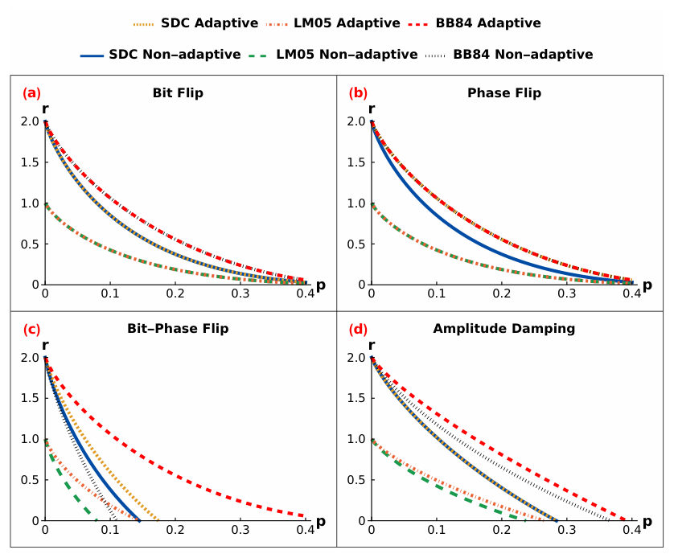 
FIG. 1: (Color online) Key rate (r) (ordinate) obtained with the adaptive and non-adaptive schemes against the noise strength (p) (abscissa) across four noise models (a) bit flip, (b) phase flip, (c) bit-phase flip, and, (d) amplitude damping channels, for all the three quantum key distribution protocols- secure dense coding (SDC), LM05 and two-way BB84. The independent noise acts with equal strength in both the forward and backward transmission channels. (a) For the bit flip channel, the optimal adaptive key rate and the non-adaptive key rate coincide for all three protocols over the whole range of p, indicating no benefit from adaptive encoding (state preparation) and decoding...

📷 Fig 2

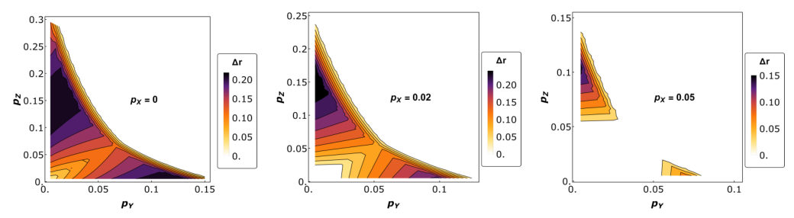 
FIG. 2: (Color online)Map plot of difference in the key rate between the noise-adaptive and the conventional protocol (∆r in Eq. (40)) for the SDC protocol under a general Pauli noise channel as a function of noise parameters pY (abscissa) and pZ (ordinate), keeping fixed values of pX. Here, the parameters pX, pY, and pZ respectively represent the contributions from bit, bit-phase, and phase flip noises. (a) pX = 0, (b) pX = 0.02, and (c) pX = 0.05. Note that with increasing contributions from bit flip noise elements, i.e.e, pX, we obtain less advantage from the adaptive protocol in the case of a general Pauli channel.

📷 Fig 3

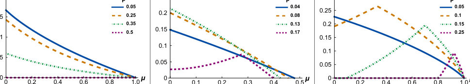 
FIG. 3: (Color online) Difference in key rate of adaptive and non-adaptive protocols, ∆r (ordinate), against the noise strength p and the degree of correlations µ (abscissa). The upper panel shows ∆r versus p for fixed values of µ, while the lower panel shows ∆r versus µ for fixed values of p. Figures (a) and (b) correspond to the SDC protocol under partially correlated phase flip noise, figures (c) and (d) to the SDC protocol under partially correlated bit-phase flip noise, and figures (e) and ( f ) to the LM05 protocol under partially correlated bit-phase flip noise.

📷 Fig 4

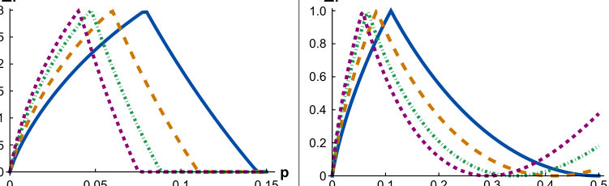 
FIG. 4: (Color online) ∆r (ordinate) with respect to p (abscissa) for fixed values of the non-Markovianity parameter α. (a) and (b) the SDC protocol under NM phase flip noise (a), and NM bit-phase flip noise (b). Under NM bit-phase flip noise, in (c), δr is obtained for the LM05 protocol, while in (d), δr is computed for the two-way BB84 protocol. In each of the plots, the (blue) solid lines correspond to α = 0, long-dashed, dot-dashed, and the short-dashed lines represent the increase of Non Markovianity from α = 0.35, α = 0.7, to α = 1.

📷 Fig 5

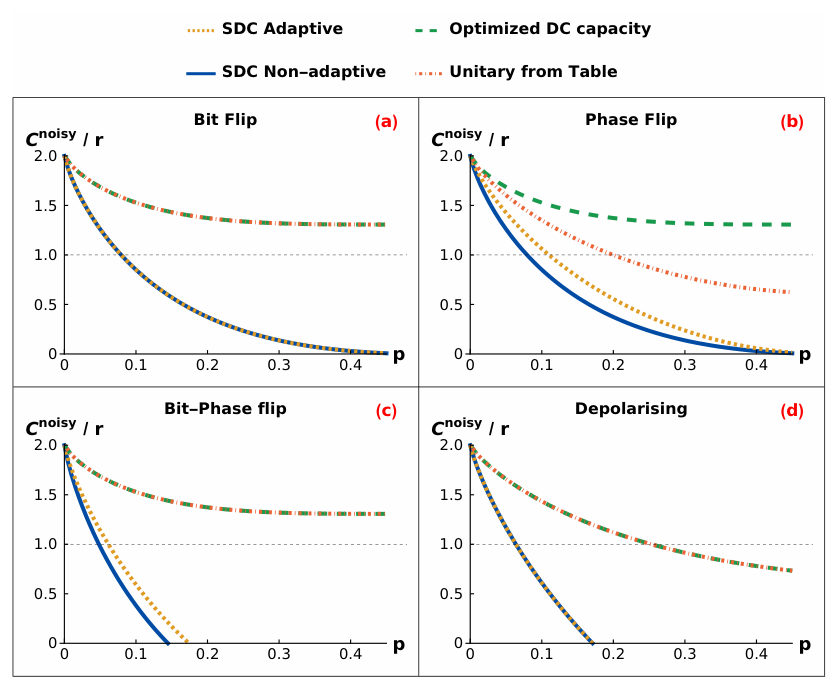 
FIG. 5: (Color online) Comparison of the lower bounds on the key rates for the noise-adaptive and conventional non-adaptive protocols, as well as the noisy dense coding capacity. The quantities radaptive (orange dotted line), rconventional (blue solid line), and Cnoisy (green dashed line) are plotted as functions of the noise parameter p for (a) bit flip, (b) phase flip, (c) bit-phase flip, and (d) depolarizing channels. In all cases, Cnoisy significantly exceeds both the adaptive and non-adaptive key rates, while the black dotted line denotes the classical limit of dense coding capacity. These plots provide a qualitative comparison of the extent to which classical information transmission...

**Summary.** The paper introduces a framework for noise-adaptive two-way quantum key distribution where encoding and decoding are dynamically optimized to match channel noise. It demonstrates that this approach can increase secret key rates and noise tolerance for specific channel types like bit-phase flip and amplitude damping.

**Why it may be interesting.** This work is highly relevant to researchers in open quantum systems and quantum optics as it provides a framework for optimizing quantum communication protocols by leveraging the specific dynamics of the environment-induced noise.

Detailed structure

**Main problem.** Existing two-way quantum key distribution (QKD) protocols use fixed encoding and decoding strategies that do not account for specific channel noise characteristics. The authors aim to develop and analyze noise-adaptive QKD (NAQKD) protocols that optimize these operations based on the noise model.

**Main result.** The study identifies specific noise channels, such as bit-phase flip and amplitude damping, where adaptive encoding and decoding significantly enhance secret key rates and noise thresholds. Conversely, it proves that for certain unital channels like depolarizing and bit-flip channels, adaptive strategies provide no advantage.

**Method.** The authors use entropic uncertainty relations and the Devetak-Winter bound to derive closed-form expressions for secret key rates. They optimize the parameters of SU(2) unitary operators for encoding and measurement bases to maximize these rates under collective attacks.

**Model / system.** A two-way quantum communication framework involving two honest parties (Alice and Bob) and an eavesdropper (Eve). The system involves a qubit traveling through forward and backward quantum channels subject to various noise models, including Pauli, amplitude damping, and non-Markovian environments.

**Key observables.** Secret key rate, critical noise threshold, and measurement probabilities.

**Important parameters / regimes.** Encoding unitaries (SU(2) parameters theta, chi, phi), noise strength (p), and the overlap parameter (gamma).

**Assumptions / limitations.** The analysis assumes the eavesdropper performs collective attacks and that the honest parties can accurately estimate the noise model of the channel.

**Figures summary.** Plots of secret key rate versus noise strength for different noise models (Bit Flip, Phase Flip, Bit-Phase Flip, and Amplitude Damping), demonstrating where adaptive strategies outperform non-adaptive ones.

**Paper structure.** The paper introduces the NAQKD framework, defines the mathematical optimization of encoding/decoding unitaries, provides security proofs using entropic uncertainty relations, compares performance across various noise models (Pauli, amplitude damping), and includes detailed mathematical appendices for protocol verification.

Abstract

We introduce noise-adaptive quantum key distribution (QKD) protocols, in which the honest parties optimize the encoding (state preparation) and decoding (measurement basis) operations according to the noise models affecting the honest subsystems induced by an eavesdropper. This extends conventional QKD schemes that employ fixed encoding and decoding strategies independent of the noise characteristics of the communication channel. We investigate three representative protocols: entanglement-based secure dense coding (SDC), the entanglement-free Lucamarini and Mancini (LM05), and a two-way prepare-and-measure Bennett Brassard (BB84) protocols. Using entropic uncertainty relations, we derive the corresponding secret key rates for both adaptive and conventional non-adaptive scenarios under collective attacks. For independent but identical noise acting on the forward and backward transmission channels, as well as for correlated and non-Markovian environments, we identify classes of channels for which adaptive schemes yield enhanced secret key rates for the considered protocols. In contrast, we also determine Pauli channels, including depolarizing and bit flip channels, for which adaptive strategies provide no benefit. We further show that these optimal sets are generally non-unique and can differ substantially from the unitaries that maximize dense-coding capacity in the absence of security constraints. Our results establish noise-adaptive encoding and decoding as a powerful framework for improving secure communication over realistic noisy quantum channels.

[↑ back to top](#top)

### [Complex abelian varieties and quantum error correction: a mathematical framework for GKP codes](http://arxiv.org/abs/2605.28784v1)

**Authors:** Maxence Mayrand, Baptiste Royer  
**Type:** theory · **Category:** quantum information and computing · **PDF:** <https://arxiv.org/pdf/2605.28784v1>  
**Analysis basis:** full PDF text, analyzed in chunks
**Topic relevance:** `entanglement & information structure` **2/5** · `quantum measurements` **2/5**

📷 Fig 1

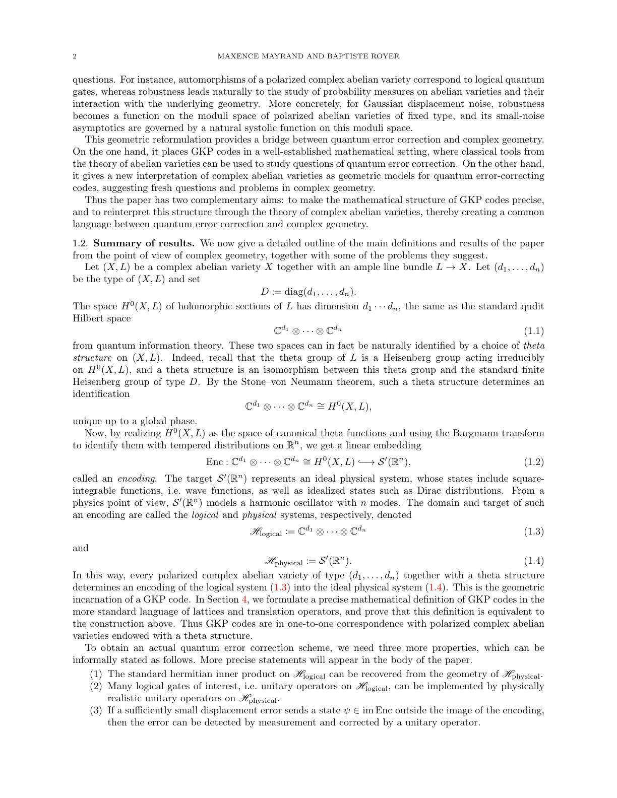 
Low-resolution page preview, page 2

📷 Fig 2

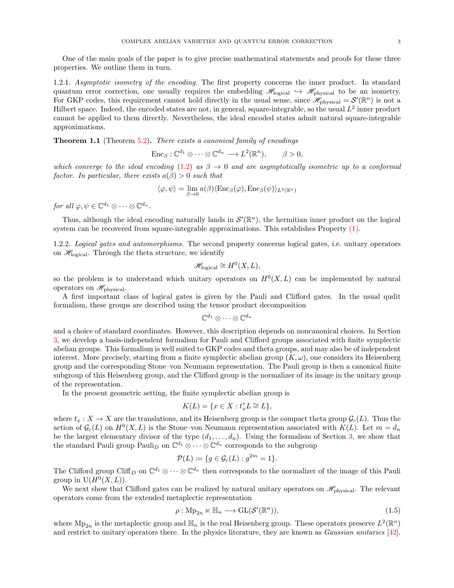 
Low-resolution page preview, page 3

📷 Fig 3

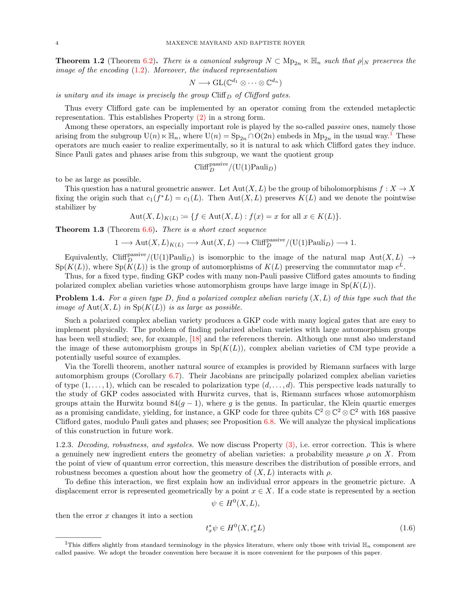 
Low-resolution page preview, page 4

📷 Fig 4

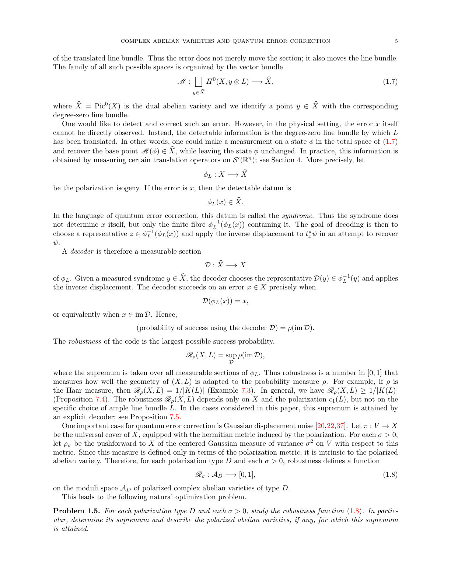 
Low-resolution page preview, page 5

📷 Fig 5

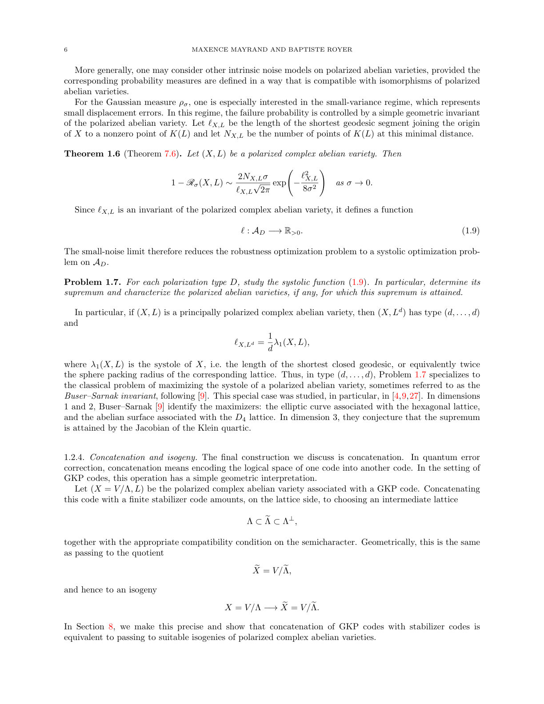 
Low-resolution page preview, page 6

**Summary.** This paper provides a formal mathematical framework that maps GKP quantum error-correcting codes to the theory of polarized complex abelian varieties. It establishes that the robustness of these codes against Gaussian noise is determined by the geometric systolic invariants of the associated varieties. This connection allows for the translation of quantum error correction optimization problems into problems within the moduli space of abelian varieties.

**Why it may be interesting.** This provides a powerful new geometric toolkit for optimizing GKP codes, specifically relating error-correction performance to well-studied invariants in algebraic geometry, which is highly relevant for continuous-variable quantum computing.

Detailed structure

**Main problem.** Establishing a rigorous mathematical foundation for Gottesman-Kitaev-Preskill (GKP) quantum error-correcting codes by linking them to the geometry of complex abelian varieties.

**Main result.** The authors prove a dictionary between GKP code structures and abelian varieties, showing that logical gates correspond to automorphisms and error robustness is governed by the systolic invariant of the underlying polarization.

**Method.** The paper utilizes the Bargmann transform to relate Schrödinger and Fock representations, applying the theory of Heisenberg groups, theta functions, and polarized complex abelian varieties.

**Model / system.** The system consists of continuous-variable GKP codes modeled via symplectically integral lattices in a multi-mode harmonic oscillator (represented by the space of tempered distributions or L2 functions).

**Key observables.** Logical Pauli gates, logical Clifford gates, decoding success probability (robustness), and the syndrome of displacement errors.

**Important parameters / regimes.** Small Gaussian displacement noise variance (sigma), the type of the lattice (d1, ..., dn), and the systolic invariant (shortest nontrivial displacement).

**Assumptions / limitations.** The analysis focuses on the small-noise limit (sigma to 0) and assumes Gaussian displacement noise and a symplectically integral lattice.

**Paper structure.** The paper begins by establishing a geometric dictionary between GKP codes and abelian varieties, moves to the representation theory of the Heisenberg group and the Bargmann transform, then analyzes the decoding problem and error dynamics in the small-noise limit, and concludes with optimization problems on the moduli space.

Abstract

We study a class of quantum error-correcting codes through the geometry of complex abelian varieties. These codes, introduced by Gottesman--Kitaev--Preskill, are built from symplectically integral lattices and therefore naturally define polarized complex abelian varieties. We give a precise mathematical formulation of this relationship and extend it to a dictionary between the main structures of GKP code theory and classical objects in the theory of abelian varieties. For instance, under this dictionary, the finite-dimensional code space becomes the space of theta functions $H^0(X, L)$, logical Pauli gates arise from the theta group, passive logical Clifford gates correspond to automorphisms of the polarized abelian variety, and concatenation with stabilizer codes corresponds to isogeny. We also prove several key results that give precise mathematical formulations of statements about these codes that often appear in heuristic form in the physics literature. In particular, we prove that the encoding is asymptotically isometric, that every logical Clifford gate is realized by a Gaussian unitary, and that, for noise of small variance, the failure probability is governed to first order by the shortest nontrivial displacement in the kernel of the polarization isogeny, a systolic invariant of the underlying polarization. This leads naturally to optimization problems on the moduli space of polarized abelian varieties.

[↑ back to top](#top)

### [Latent-Conditioned Parameterized Quantum Circuits as Universal Approximators for Distributions over Quantum States](http://arxiv.org/abs/2605.28690v1)

**Authors:** Quoc Hoan Tran, Koki Chinzei, Yasuhiro Endo, Hirotaka Oshima  
**Type:** both · **Category:** quantum information and computing · **PDF:** <https://arxiv.org/pdf/2605.28690v1>  
**Analysis basis:** full PDF text, analyzed in chunks
**Topic relevance:** `entanglement & information structure` **2/5** · `methods for driven-dissipative` **2/5**

📷 Fig 1

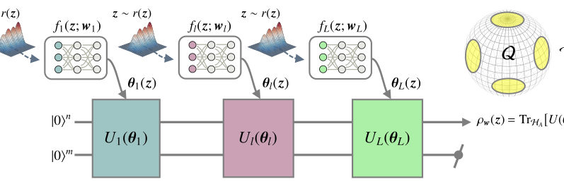 
FIG. 1. Schematic of the LPQC framework for approximating the target distribution Q on the density matrices space D(HS). Latent variable z ∼r(z) is mapped via neural networks fℓ(z; wℓ) to gate parameters θℓ(z), which define the composite unitary U(θ(z)) = UL(θL(z)) · · · U1(θ1(z)) on HS ⊗HA. In our setting, the same z is used for all fℓ. Applying U(θ(z)) to |0⟩and tracing over the ancilla HA yields ensemble (r, ρw), which can approximate any Q arbitrarily well in the 1-Wasserstein distance W1.

📷 Fig 2

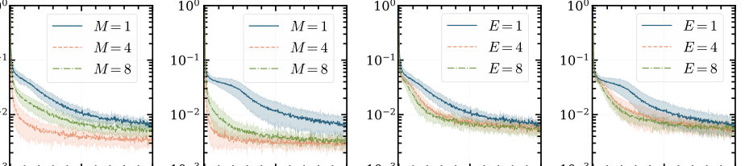 
FIG. 2. The performance of LPQC in learning the distribution of multi-clustered density matrices (n = 4 data qubits) across various configurations (M prior modes and E experts) with L = 10 PQC layers. Results are averaged across 10 experimental trials per configuration, with solid and dashed lines representing the mean and shaded regions indicating the standard deviation.

📷 Fig 3

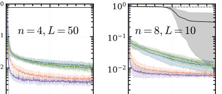 
FIG. 4. The test loss in training LPQC to learn the distribution of multi-clustered density matrices with n qubits and L PQC layers across configurations of r(z). Results are averaged across 10 experimental trials per configuration, with solid lines representing the mean and shaded regions indicating the standard deviation.

📷 Fig 4

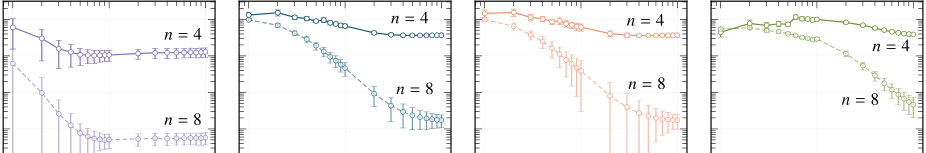 
FIG. 5. The average squared gradient norm, normalized by the dimension of θ, is computed by averaging over 1,024 independent trials sampled uniformly across the PQC parameter space. Results are presented for varying numbers of layers and qubits under different LPQC configurations (no-latent prior and Gaussian prior), with error bars representing the standard deviations.

📷 Fig 5

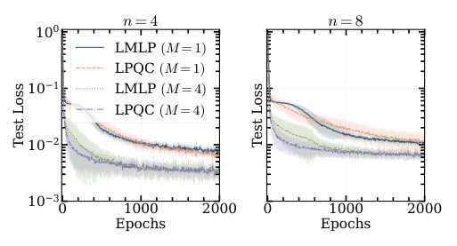 
FIG. 7. Test Wasserstein loss during training on the multi- cluster task, comparing the classical LMLP baseline against LPQC for two latent-prior configurations (M = 1 unimodal and M = 4 multimodal) at n = 4 and n = 8 qubits. Solid and dashed lines denote the mean over 10 trials; shaded regions indicate the standard deviation. Both methods reach compa- rable final losses, while LPQC converges faster in the early training phase, especially with the multimodal prior (M = 4).

**Summary.** This paper introduces Latent-Conditioned Parameterized Quantum Circuits (LPQCs), a framework that uses classical neural networks to map latent variables to quantum circuit parameters. It proves that this approach can universally approximate any distribution of quantum states and shows that it effectively mitigates the vanishing gradient problem (barren plateaus). The method is successfully applied to generate complex molecular structures from the QM9 dataset.

**Why it may be interesting.** It provides a rigorous theoretical foundation for quantum generative modeling and introduces a practical method to bypass the barren plateau problem, which is a central bottleneck in variational quantum algorithms and quantum machine learning.

Detailed structure

**Main problem.** The challenge of efficiently generating complex, multimodal distributions of quantum states (ensembles) and mitigating the barren plateau problem in parameterized quantum circuits (PQCs).

**Main result.** The authors prove that Latent-Conditioned Parameterized Quantum Circuits (LPQCs) are universal approximators for distributions over density operators and demonstrate that they significantly alleviate barren plateaus while outperforming quantum generative baselines on molecular datasets.

**Method.** A hybrid quantum-classical framework where a classical neural network maps a low-dimensional latent variable to the parameters of a PQC, utilizing a Mixture-of-Experts architecture and a 1-Wasserstein distance loss function.

**Model / system.** A hybrid generative model consisting of a classical neural network (the decoder) and a parameterized quantum circuit (the generator) acting on a system of n data qubits and m ancilla qubits.

**Key observables.** 1-Wasserstein distance, gradient norm (to measure barren plateaus), trace distance, and molecular metrics (validity, uniqueness, novelty).

**Important parameters / regimes.** Latent dimension (d), number of qubits (n), circuit depth (L), number of experts (E), and number of prior modes (M).

**Assumptions / limitations.** The latent space is compact, the prior density is positive and continuous, and the primitive gate set is dense in the unitary group.

**Figures summary.** Figure 1 shows the LPQC framework schematic; Figure 2 compares performance across different expert/mode configurations; Figure 3 uses PCA/t-SNE to visualize density matrix ensembles; Figure 4 shows test loss scaling; Figure 5 and 6 illustrate gradient norm decay/stability; Figure 7 compares Wasserstein loss; Figure 8 compares LPQC to IMPE; Figure 9 showcases generated novel molecules.

**Paper structure.** The paper introduces the LPQC framework, provides a mathematical proof of its universal approximation property, details architectural enhancements like Mixture-of-Experts, presents numerical experiments on synthetic ensembles, and demonstrates application to molecular generation using the QM9 dataset.

Abstract

Many applications in quantum simulation, quantum chemistry, and quantum machine learning require not a single quantum state but an ensemble of states characterizing the heterogeneity of a target system. Preparing such ensembles state-by-state is prohibitive in both variational and fault-tolerant settings, motivating a generative-modeling approach. We introduce latent-conditioned parameterized quantum circuits (LPQCs), a hybrid quantum-classical framework in which classical neural networks map a latent variable sampled from a prior distribution to the parameters of a parameterized quantum circuit. We prove that LPQCs are universal approximators for probability measures over density operators in the $1$-Wasserstein distance, extending classical universal approximation theorems to the quantum-distribution setting. We additionally introduce a multimodal latent prior and a mixture-of-experts circuit architecture, and show that it empirically alleviates the barren plateau problem during optimization. Numerical experiments validate the framework on a synthetic multi-cluster ensemble of mixed quantum states and on a QM9-derived ensemble of 3-D molecular structures. In these tasks, LPQC outperforms recent quantum generative baselines while remaining competitive with typical classical baselines at substantially reduced output dimensionality. By leveraging classical expressivity in the latent space, LPQCs offer a tractable route to quantum generative modeling.

[↑ back to top](#top)

### [Photon-Conditioned Squeezed States for Directional Displacement Response in Continuous-Variable Photonics](http://arxiv.org/abs/2605.27660v1)

**Authors:** Boris Kiefer, Olivier Pfister  
**Type:** theory · **Category:** quantum information and computing · **PDF:** <https://arxiv.org/pdf/2605.27660v1>  
**Analysis basis:** full PDF text, analyzed in chunks
**Topic relevance:** `entanglement & information structure` **2/5** · `quantum measurements` **2/5**

📷 Fig 1

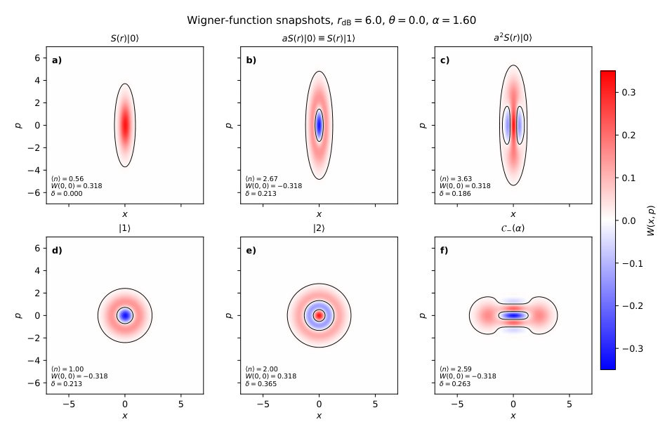 
FIG. 1. Wigner-function snapshots of the state families used in the matched-energy resource

📷 Fig 2

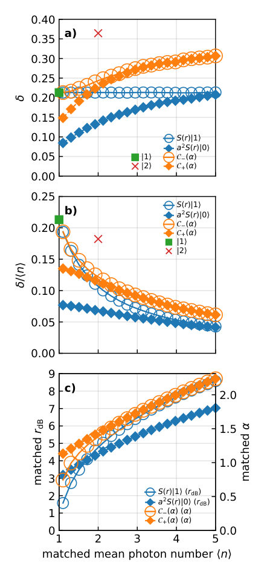 
FIG. 2. Matched-⟨n⟩scalar resource metrics. (a) Integrated Wigner negativity δ versus matched

📷 Fig 3

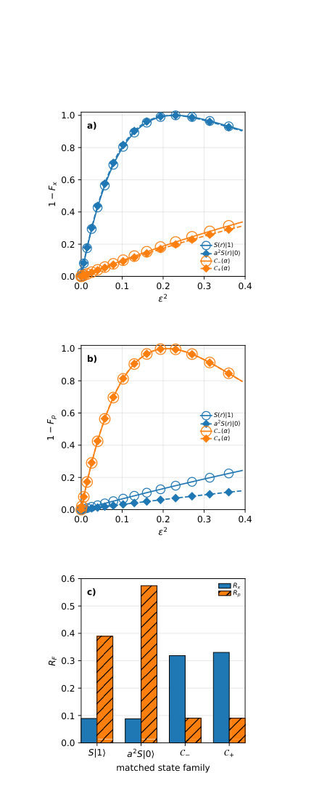 
FIG. 3. Matched-⟨n⟩displacement-fidelity radii. (a) Radius Rx for displacements along the

📷 Fig 4

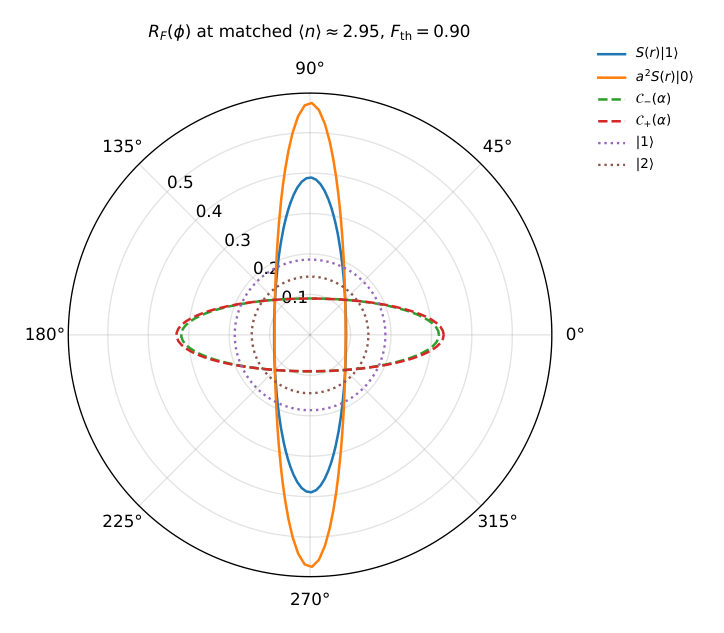 
FIG. 4. Angular displacement-fidelity radius RF (ϕ) at matched ⟨n⟩≃3. The Fock-state references

**Summary.** The paper compares different non-Gaussian quantum states to see how they perform under displacement noise. It finds that while cat states are better for overall non-Gaussianity, photon-conditioned squeezed states are better for protecting against noise in specific, known directions.

**Why it may be interesting.** This work is highly relevant to quantum optics and continuous-variable quantum information, as it provides a task-oriented framework for selecting non-Gaussian resources for noise-resilient quantum communication and sensing.

Detailed structure

**Main problem.** The paper seeks to establish a common, energy-matched resource map to compare non-Gaussian state families (squeezed Fock, photon-subtracted, and cat states) based on their utility for displacement-noise mitigation and directional sensing.

**Main result.** While cat states provide superior scalar Wigner negativity, photon-conditioned squeezed states offer a tunable, anisotropic displacement-fidelity response, making them superior for tasks where the noise geometry is known.

**Method.** The authors use numerical simulations with a Fock-space cutoff of 80 and a uniform phase-space grid to benchmark states at a matched mean photon number.

**Model / system.** The study is set in the framework of continuous-variable (CV) quantum optics, utilizing single-mode bosonic operators and operations including squeezing, photon subtraction, and displacement.

**Key observables.** Integrated Wigner negativity, energy-normalized negativity, displacement-fidelity radii (Rx, Rp), and the anisotropy ratio.

**Important parameters / regimes.** Matched mean photon number (n), squeezing level (up to 12.5 dB), and fidelity threshold (Fth = 0.90).

**Assumptions / limitations.** The analysis assumes a weak-tap limit for photon subtraction and does not account for experimental imperfections like optical loss or finite detector efficiency.

**Figures summary.** Figure 1 shows Wigner functions of various states; Figure 3 displays matched-energy displacement-fidelity radii and anisotropy ratios; Figure 4 presents a polar plot of the angular displacement-fidelity radius.

**Paper structure.** The paper introduces the problem of resource comparison, defines the state families and metrics, presents the benchmarking results for scalar and directional metrics, and concludes with the implications for noise mitigation and sensing.

Abstract

Squeezed Fock states, photon-subtracted squeezed states, and optical cat states are established non-Gaussian resources in continuous-variable quantum optics. Here we compare these known state families from a task-oriented perspective: matched mean photon number, scalar Wigner negativity, and directional displacement-fidelity response. Starting from squeezed vacuum, single-photon subtraction prepares a state proportional to \(S(r,θ)\ket{1}\), while two-photon subtraction prepares an even-parity squeezed Fock superposition rather than a pure \(S(r,θ)\ket{2}\). We benchmark photon-conditioned squeezed states against Fock and coherent-cat references using the integrated Wigner negativity \(δ\), the energy-normalized metric \(δ/\langle n\rangle\), and fidelity-threshold displacement radii \(R_F(φ)\). Cat benchmarks remain strong scalar Wigner-negativity resources, whereas photon-conditioned squeezed states provide an origin-centered alternative with tunable anisotropic displacement response. In particular, the two-photon-subtracted squeezed state shows favorable displacement-fidelity radii over selected quadrature directions at matched \(\langle n\rangle\). These results identify a regime relevant to homodyne-aligned continuous-variable control and anisotropic displacement-noise mitigation, with directional sensing as a natural dual application.

[↑ back to top](#top)

### [Finite-size occupancy scaling of apparent fractal dimensions in stochastic trajectories](http://arxiv.org/abs/2605.27925v1)

**Authors:** Bon A. Koo, Edward Ju  
**Type:** theory · **Category:** statistical mechanics · **PDF:** <https://arxiv.org/pdf/2605.27925v1>  
**Analysis basis:** full PDF text, analyzed in chunks
**Topic relevance:** `non-equilibrium universality` **2/5** · `non-equilibrium dynamics` **1/5**

📷 Fig 1

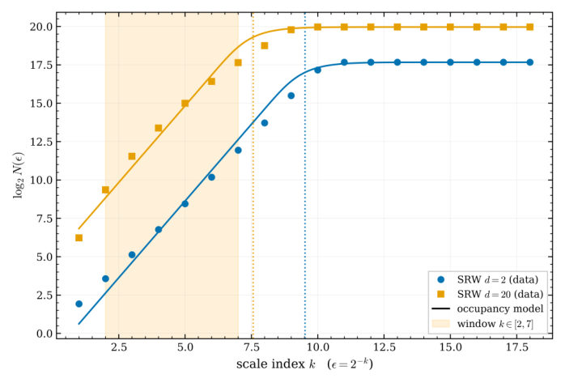 
Figure 1: Measured box-count scaling (markers) and the occupancy model (2) (solid, Df = 2, one fitted prefactor) for SRW at two d (N = 220). Dotted lines mark the fitted k⋆; the shaded band is the default window.

📷 Fig 2

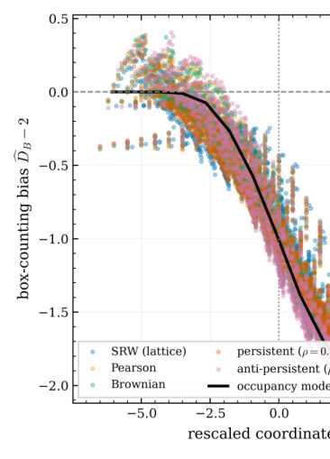 
Figure 2: Scaling collapse of the box-counting bias against x = kmid −1

📷 Fig 3

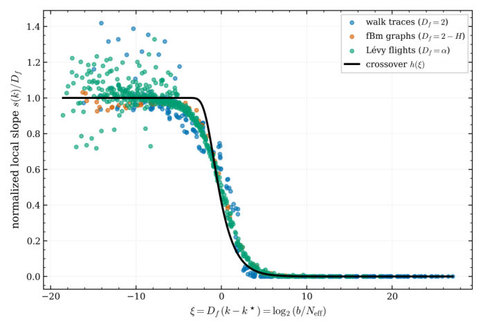 
Figure 3: Cross-family data collapse. Normalized local slope s(k)/Df versus the crossover variable ξ = Df(k −k⋆) = log2(b/Neff) for walk traces, fBm graphs, and Lévy flights, with the scaling function h(ξ) of Eq. (4) (black). Points are the dyadic local slope of the data; the quantitative agreement is measured against the model’s matched finite-difference slope.

📷 Fig 4

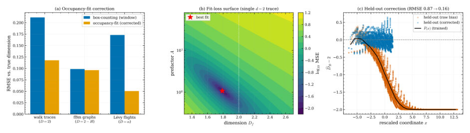 
Figure 4: Bias correction. (a) RMSE of the windowed box-counting estimate versus the occupancy- fit dimension, by family. (b) Fit-loss surface (log10 mean-squared error) in the occupancy param- eters (Df, A) for a single d = 2 walk trace; the single well-defined minimum (red star; dotted line at the true Df = 2) shows the two-parameter fit is identifiable from one trajectory. (c) Held-out master-curve correction ( bF(x) trained on three walk models, applied to two others).

📷 Fig 5

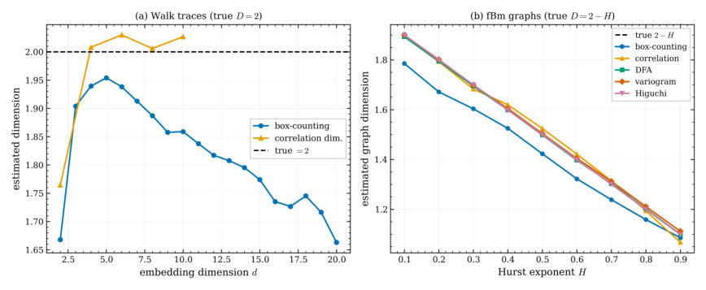 
Figure 5: Estimator comparison. Left: walk traces (true dimension 2), box-counting versus cor- relation dimension. Right: fBm graphs (true dimension 2 −H), all five estimators; DFA and the variogram estimate the exponent H and are plotted as the implied graph dimension 2 −bH.

**Summary.** This paper addresses the systematic error in calculating fractal dimensions from finite datasets. By modeling the error as a finite-size scaling problem using a balls-in-boxes approach, the authors achieve a universal correction that works across different types of random processes.

**Why it may be interesting.** not directly relevant

Detailed structure

**Main problem.** Estimating the fractal dimension from finite stochastic trajectories leads to a systematic bias in the box-counting exponent due to an occupancy crossover between resolved scales and finite sample points.

**Main result.** The authors demonstrate a universal scaling collapse for the box-counting bias and local slope across diverse processes (random walks, fBm, Levy flights) and provide an invertible occupancy model that corrects dimension estimates.

**Method.** A 'balls-in-boxes' occupancy model is used to treat the crossover as a finite-size scaling problem, validated through large-scale simulations and application to DNA walk data.

**Model / system.** The study analyzes various stochastic trajectories, including Simple Random Walks, fractional Brownian motion graphs, and Levy flights, using a mean-field balls-in-boxes occupancy framework.

**Key observables.** Fractal dimension (Df), box-count curve, normalized local slope, and windowed box-counting bias.

**Important parameters / regimes.** Saturation scale (k*), number of effective sampled sites (Neff), Hurst exponent (H), and the scaling variables (xi and x).

**Assumptions / limitations.** The model uses a mean-field approximation treating trajectory points as independently distributed into cells, which may fail for multifractal or strongly anisotropic systems.

**Figures summary.** Figure 1 shows the predicted box-count curve; Figure 2 shows the collapse of windowed bias against a scaling variable; Figure 3 shows the collapse of normalized local slopes; Figure 4 demonstrates the effectiveness of the bias correction on held-out models.

**Paper structure.** The paper introduces the finite-size bias problem, presents the balls-in-boxes occupancy model, demonstrates universal scaling collapse across different trajectory classes, validates the model with a bias correction, and applies the workflow to E. coli DNA walks.

Abstract

Estimating a fractal dimension from a finite stochastic trajectory is a finite-size scaling problem: the apparent box-counting exponent is shaped by an occupancy crossover between the resolved range of scales and the finite number of sampled points, and need not equal the dimension of the limiting process. We model this crossover with a balls-in-boxes occupancy law, which predicts the box-count curve, the finite-size saturation scale, and a scaling function for the normalized local slope. Across random-walk traces, fractional Brownian graphs, and Levy flights, the normalized local slope collapses onto a single crossover curve, while the windowed box-counting bias collapses when the regression window is positioned relative to the saturation scale. Inverting the occupancy model gives a finite-size bias correction that reduces error on controlled stochastic trajectories and transfers across held-out model classes. Comparisons with correlation dimension, detrended fluctuation analysis, the variogram, and Higuchi's method show that the dominant bias is specific to point-sampled box-counting over finite scale windows, and that local-slope stability alone is not a reliable diagnostic. A DNA-walk example illustrates the workflow on measured data, and all figures, tables, and in-text numbers are regenerated from released single-seed code.

[↑ back to top](#top)

### [An IQP Born Machine for Calorimeter Image Generation at 64 Qubits with Compiled-IQP Deployment](http://arxiv.org/abs/2605.27735v1)

**Authors:** Jamal Slim, Saverio Monaco, Florian Rehm, Dirk Krücker, Kerstin Borras  
**Type:** both · **Category:** quantum information and computing · **PDF:** <https://arxiv.org/pdf/2605.27735v1>  
**Analysis basis:** full PDF text, analyzed in chunks
**Topic relevance:** `QC/QI experiment` **2/5**

📷 Fig 1

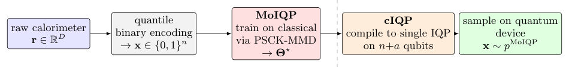 
FIG. 1: Overall pipeline. Raw calorimeter shower data r ∈RD is quantile-binned and binary-encoded to bitstrings x ∈{0, 1}n with n = D · B. The MoIQP model is trained on classical hardware through Van den Nest Fourier Monte Carlo [20] evaluation of its low-order Pauli-Z correlators with the PSCK MMD objective. After training, the L components are compiled into a single IQP circuit on n + a qubits with a = ⌈log2 L⌉Walsh–Hadamard ancillas (cIQP); this compiled circuit is the object deployed on quantum hardware to generate calorimeter samples. The classical–quantum boundary separates training (Van den Nest MC) from deployment (Bremner–Jozsa–Shepherd-hard sampling).

📷 Fig 2

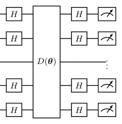 
FIG. 2: Single IQP Born-machine circuit. The Hadamard–diagonal–Hadamard sandwich is the defining structure of IQP circuits. The diagonal block D(θ) = Q G∈G exp(i θG Q i∈G Zi) gives one Z-phase rotation per gate G of the graph: a single-qubit RZ for weight-1 gates, a ZZ-phase rotation (CNOT–RZ–CNOT, or a native cross-resonance ZX) for weight-2 gates. Measurement in the computational basis yields samples from pθ(x) = |⟨x|U(θ)|0⟩|2.

📷 Fig 3

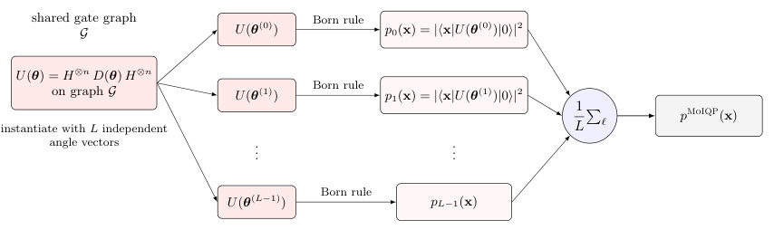 
FIG. 3: MoIQP as a uniform mixture of IQP Born distributions. A single IQP circuit U(θ) = H⊗nD(θ)H⊗n on a shared gate graph G is instantiated with L independent angle vectors θ(ℓ). Each instance has Born distribution pℓ(x) = |⟨x|U(θ(ℓ))|0⟩|2, and the MoIQP model distribution is their uniform average pMoIQP(x) = 1

📷 Fig 4

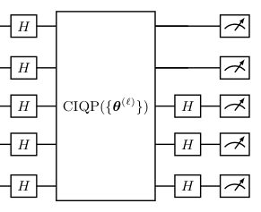 
FIG. 4: cIQP deployment. The L-component MoIQP is compiled into a single IQP-form circuit on n + a qubits with a = ⌈log2 L⌉ancillas. The ancillas are prepared in the uniform Walsh–Hadamard superposition |+⟩⊗a = (1/ √

📷 Fig 5

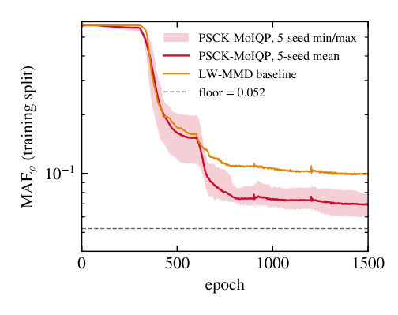 
FIG. 5: Training-split MAEρ as a function of epoch at n = 64. Solid red: PSCK seed mean across the five training seeds. Shaded band: seed-wise min–max envelope at each epoch. Orange: single-seed Liu–Wang baseline at the same L = 8 and epoch budget. Dashed line: encoding-fidelity floor on the training split (0.052). The step features every 100 epochs are cosine restarts of Adam.

**Summary.** This paper presents a new quantum generative model designed to produce high-resolution calorimeter images for high-energy physics. By using a specialized correlation-sensitive loss function and a compilation technique, the authors achieve high-fidelity generation at 64 qubits without encountering barren plateaus.

**Why it may be interesting.** not directly relevant

Detailed structure

**Main problem.** Developing a scalable quantum generative model for high-resolution (64-qubit) calorimeter image generation while overcoming the limitations of existing IQP models in capturing spatial correlations and avoiding barren plateaus.

**Main result.** The PSCK-MoIQP model significantly outperforms the Liu-Wang baseline in correlation reconstruction and demonstrates that the compiled cIQP circuit can be deployed on quantum hardware with sub-Monte-Carlo noise precision.

**Method.** A 'train-on-classical, deploy-on-quantum' workflow using a Pearson-Stabilized Correlation Kernel (PSCK) for training and a Walsh-Hadamard-based deferred-measurement compilation (cIQP) for deployment.

**Model / system.** A Mixture-of-IQP (MoIQP) architecture consisting of L independent IQP circuits sharing an Erdős-Rényi gate graph, which is compiled into a single larger IQP circuit (cIQP) using ancilla qubits.

**Key observables.** Pauli-Z words/correlators, Pearson correlation matrices, Mean Absolute Error of correlations (MAE_rho), and Z-marginals.

**Important parameters / regimes.** 64 qubits (n=64), 8 mixture components (L=8), 8 bits per feature (B=8), and an Erdős-Rényi gate graph with average degree 6.

**Assumptions / limitations.** The PSCK loss uses a Gauss-Newton linearization which is exact at the optimum; the compilation assumes the ability to implement deferred measurement via ancilla qubits.

**Figures summary.** Figures illustrate the MoIQP and cIQP architectures, compare Pearson correlation residuals between models, show per-feature distributional agreement, and plot training trajectories and gradient variance scaling.

**Paper structure.** The paper introduces the scientific challenge of HEP image simulation, describes the MoIQP and cIQP architectures, details the PSCK loss function and training algorithm, presents numerical results on 64-qubit scaling and correlation accuracy, and concludes with a verification of the compilation fidelity.

Abstract

We train an instantaneous quantum polynomial-time (IQP) Born machine on real high-energy-physics calorimeter shower images at $64$ qubits and compile the trained model into a single sampling-hard IQP circuit for quantum deployment. The pipeline has three components: a Mixture-of-IQP (\moiqp{}) architecture, whose Walsh-diagonal MMD$^{2}$ loss is classically trainable by Van den Nest Fourier Monte Carlo; the Pearson-Stabilized Correlation Kernel (\psck{}), a positive-definite MMD kernel that biases descent toward correlation-sensitive directions through a data-evaluated Jacobian of the empirical Pearson matrix; and an exact deferred-measurement compilation of \moiqp{} into a single IQP circuit on $\nfeat + \lceil \log_2 \Lcomp \rceil$ qubits (\ciqp{}). Across five seeds at $\Lcomp = 8$, $1500$ epochs, the model reaches $\maerho = 0.069 \pm 0.008$ against a $0.052$ encoding-fidelity floor on the training split and $0.071 \pm 0.008$ on a held-out test split, versus a Liu--Wang baseline at $\maerho = 0.100$. The compiled \ciqp{} reproduces the \moiqp{} marginal to $0.591 \pm 0.012$ times the Monte Carlo noise floor.

[↑ back to top](#top)

### [Benchmarking Quantum Annealing for a Greenhouse-Inspired Control QUBO](http://arxiv.org/abs/2605.27670v1)

**Authors:** Hamzeh Alavirad, Maryam Bahrami Zanjani  
**Type:** experiment · **Category:** quantum information and computing · **PDF:** <https://arxiv.org/pdf/2605.27670v1>  
**Analysis basis:** full PDF text, analyzed in chunks
**Topic relevance:** `QC/QI experiment` **2/5**

📷 Fig 1

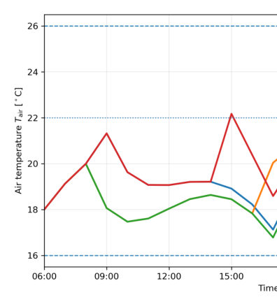 
Fig. 1 Best feasible air-temperature trajectories for the H = 24 benchmark. Only the best feasible decoded solution of each solver workflow is shown to keep the comparison readable. The admissible interval is defined by Tmin = 16◦C and Tmax = 26◦C.

**Summary.** This paper benchmarks classical, hybrid, and direct quantum annealing solvers on a practical optimization task involving greenhouse climate control. It finds that while quantum-inspired and classical methods are highly reliable, current D-Wave hybrid and direct QPU workflows do not yet demonstrate quantum advantage for this structured control problem.

**Why it may be interesting.** not directly relevant

Detailed structure

**Main problem.** Benchmarking the performance, reliability, and feasibility of various quantum and classical optimization workflows on a structured QUBO problem derived from greenhouse climate control.

**Main result.** Classical simulated annealing and path-integral simulated quantum annealing outperform the D-Wave Leap Hybrid BQM and direct QPU execution for the tested H=24 instance, with the QPU exact-hit rate dropping significantly as problem size increases.

**Method.** Comparison of exact enumeration, classical Simulated Annealing (SA), Path-Integral Simulated Quantum Annealing (PISA), D-Wave Leap Hybrid BQM, and direct D-Wave QPU execution.

**Model / system.** A greenhouse thermal model featuring air and canopy temperature dynamics, driven by solar radiation, outdoor temperature, and electricity tariffs, formulated as a Quadratic Unconstrained Binary Optimization (QUBO) problem for heater scheduling.

**Key observables.** Decoded objective value (growth, energy, and switching costs), solution feasibility (temperature bound violations), and exact-hit rate for QPU execution.

**Important parameters / regimes.** Time horizon H (up to 24 hours), temperature bounds (16-26 degrees C), and electricity tariff structures.

**Assumptions / limitations.** The model assumes instantaneous heater effects (no lag) and uses a simplified quadratic proxy for plant growth rather than a fully calibrated agronomic model.

**Figures summary.** The figures include an overview of the greenhouse simulator (thermal trajectories, solar radiation, and tariffs), body-temperature trajectories for feasible solutions, and cumulative growth proxy plots.

**Paper structure.** The paper introduces a greenhouse-inspired control problem, formulates it as a QUBO, describes the various classical and quantum solvers used, presents a benchmark comparison of solution quality and feasibility, and discusses the limitations of current quantum annealing workflows.

Abstract

We benchmark current annealing-based optimization workflows on a greenhouse-inspired quadratic unconstrained binary optimization problem for binary heater scheduling, where the horizon H denotes the number of hourly control decisions. For the main one-day instance (H=24), all solver outputs are decoded back into heater schedules and evaluated in the original greenhouse simulator using the same physical objective and feasibility criterion. Classical simulated annealing and path-integral simulated quantum annealing produce feasible near-optimal solutions in all repetitions, with best objectives close to the exact optimum. In contrast, the tested D-Wave Leap Hybrid BQM workflow is less reliable and does not outperform the classical baselines under 15--60~s requested time limits. Direct D-Wave QPU execution on reduced instances remains feasible in all runs and recovers the exact optimum for H=10 and H=12, but the exact-hit rate drops from 5/10 to 2/10 and then to 0/10 at H=14, with substantially higher variance than the classical baselines. The results do not indicate quantum advantage, but provide a reproducible, physically decoded benchmark that exposes the current strengths and limitations of classical, hybrid, and direct quantum annealing workflows on structured control QUBOs.

[↑ back to top](#top)

### [Change in charge density wave order beyond the Lifshitz transition in 2H-Ta\textsubscript{1$\pmδ$}S\textsubscript{2}](http://arxiv.org/abs/2605.28259v1)

**Authors:** Mihir Date, Jan Berges, Enrico Da Como, Marcin Mucha-Kruczyński, Alex Louat, Gabriele Domaine, Niels B. M. Schröter, Malte Rösner, Matthew D. Watson  
**Type:** both · **Category:** strongly correlated electrons · **PDF:** <https://arxiv.org/pdf/2605.28259v1>  
**Analysis basis:** full PDF text, analyzed in chunks
**Topic relevance:** `Frenkel-Kontorova` **2/5**

📷 Fig 1

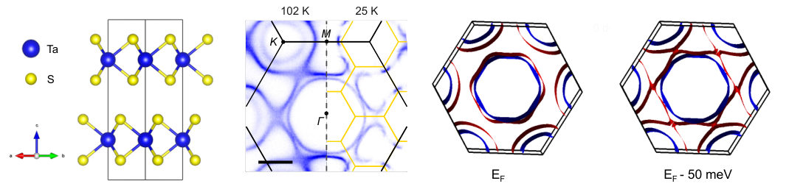 
FIG. 1. Fermi surface topology in 2H-TaS2 from experiment and DFT calculations. (a) Crystal structure of 2Ha-TaS2. (b) Comparison of measured Fermi surfaces at 100 K and 25 K, above and well below the 3×3 transition temperature, with the normal (black) and reconstructed (orange) Brillouin zones overlaid (hν = 58 eV, integrating spectral weight within 5 meV of EF ). Fermi surfaces calculated at (c) EF , and (d) for a constant energy 50 meV below the Fermi energy. The latter shows the dogbone topology as in the experiments. Scale bars represent 0.5 Å−1.

📷 Fig 2

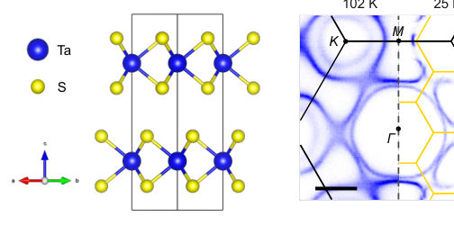 
Fig. 1(a) shows the crystal structure of 2H-TaS2 consisting of two trigonal prismatically stacked layers which are alter- nately rotated by 180◦, with the Ta atoms directly on top of each other, following the 2Ha stacking [27]. The Fermi sur- face measured in the high temperature undistorted phase at 102 K (left half of Fig. 1(b)) contains 3 closed quasi-2D Fermi surfaces: a central “circular" pocket around Γ, twofold sym- metric “dogbone” pockets centered at M, and a single closed “barrel” around the K-points. Contrastingly, at a temperature of 25 K, the K-barrel is completely gapped, and the dogbone pockets develop partial spectral gaps, due to the formation of the 3×3 CDW [20]. This...

📷 Fig 3

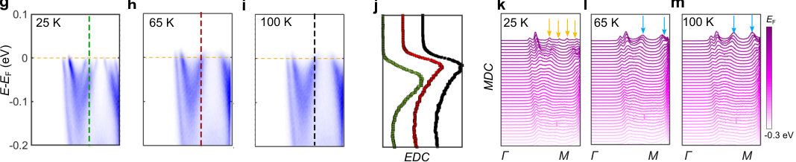 
FIG. 2. Temperature-dependent ARPES on 2H-TaS2. (a)-(f) Fermi surfaces of 2H-TaS2 measured at hν = 58 eV in the temperature range of 25 - 100 K, showing the incommensurate CDW transition at approximately 78 K (TICDW), and the lock-in transition around 55 K (TCCDW). (g)-(i) Dispersion along the direction marked by the dashed orange line in (a), at 25, 65, and 100 K respectively. (j) EDCs at a constant momentum. (k,l,m) Corresponding MDCs near EF are displayed in (k), (l), and (m). There is no discernible difference between the 65 K and 100 K data.

📷 Fig 4

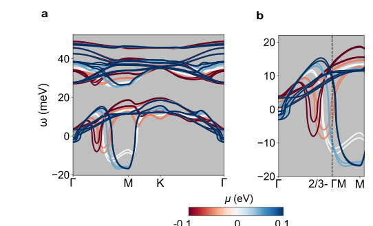 
FIG. 3. Phonon bandstructures for regularly stacked 2H-TaS2 with an interlayer spacing of 3.01 Å. (a) With changing doping lev- els, the longitudinal acoustic phonon mode softens at different points along Γ −M. (b) Phonon dispersion zoomed in the Γ −M direc- tion. The LA phonons in this region soften between 1/2ΓM and M as the chemical potential is tuned from electron to hole doping.

📷 Fig 5

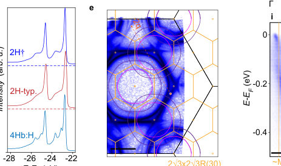 
FIG. 4. Novel 2 √

**Summary.** This paper investigates how tuning the electron density and lattice structure in TaS2 can engineer different charge density wave phases. It reveals a hidden lock-in transition in standard TaS2 and identifies a new, novel CDW order in self-intercalated samples. This work provides a roadmap for controlling electronic instabilities in layered materials via chemical doping.

**Why it may be interesting.** not directly relevant

Detailed structure

**Main problem.** The study aims to characterize the change in charge density wave (CDW) ordering in 2H-TaS2 and its self-intercalated variant, specifically investigating how band filling and interlayer spacing control the CDW wavevectors and the nature of the incommensurate-to-commensurate transition.

**Main result.** The authors identify a two-step transition in conventional 2H-TaS2 involving a lock-in transition below 65 K and discover a novel 2√3 x 2√3R(30°) CDW phase in electron-doped 2H†-Ta1+δS2.

**Method.** The study combines micro-focused angle-resolved photoemission spectroscopy (μ-ARPES) with ab initio calculations using Density Functional Theory (DFT) and the Electron-Phonon Wannier (EPW) package to model phonon instabilities and band filling effects.

**Model / system.** The physical system is the transition metal dichalcogenide 2H-TaS2 and its self-intercalated version 2H†-Ta1+δS2, characterized by quasi-2D layers and electronic instabilities driven by electron-phonon coupling.

**Key observables.** Spectral gaps, backfolded bands (triangular pockets), Fermi surface topology (dogbone and K-barrel pockets), and phonon dispersion/self-energy.

**Important parameters / regimes.** Temperature (25 K to 100 K), band filling (electron vs. hole doping), and interlayer spacing (c-axis elongation).

**Assumptions / limitations.** The calculations assume the validity of the electron-phonon coupling model as implemented in the EPW package and use fixed Ta positions with relaxed S z-coordinates.

**Figures summary.** The figures likely illustrate ARPES spectra showing spectral gaps and backfolded features, Fermi surface reconstructions, and theoretical phonon dispersion curves showing instabilities at specific q-vectors.

**Paper structure.** The paper introduces the problem of CDW ordering, presents experimental ARPES evidence for the lock-in transition in conventional TaS2, describes the discovery of the new CDW phase in the self-intercalated phase, and concludes with ab initio theoretical support for the role of doping and lattice spacing.

Abstract

We investigate electronic instabilities in 2H-TaS\textsubscript{2} and a self-intercalated variant, 2H$^\dagger$-Ta\textsubscript{1+$δ$}S\textsubscript{2}. In conventional samples, which we determine to be slightly hole-doped, spectral gaps and backfolded features are found as fingerprints of the $3\times3$ charge density wave (CDW). Notably, the backfolded features emerge only at a temperatures below $T\approx$~65~K, substantially lower than the established CDW temperature of 78~K, suggesting an incommensurate-commensurate lock-in transition analogous to the phenomenology of the 2H-TaSe\textsubscript{2}. In contrast, the self-intercalated 2H$^\dagger$ sample exhibits substantial electron doping and signatures of a novel \tworootthree CDW. Using \textit{ab initio} calculations of the phonon spectrum, we demonstrate that the \threebythree instability ($\mathbf{q}=\sfrac{2}{3}\mathbf{ΓM}$) is highly sensitive to band filling. Furthermore, with increased interlayer spacing, a competing soft phonon mode emerges near $\mathbf{q}=\sfrac{1}{2}\mathbf{ΓK}$, corresponding to the superstructure observed in the 2H$^\dagger$ phase, although in our calculations this instability arises under hole doping rather than the electron doping inferred experimentally. These results establish band filling and interlayer spacing as key control parameters for CDW ordering vectors in 2H-TaS\textsubscript{2}, and highlight a route to engineering electronic instabilities in a prototypical layered material.

[↑ back to top](#top)

### [Compile-Time Simplification of Classically Controlled Operations in Dynamic Circuits](http://arxiv.org/abs/2605.28439v1)

**Authors:** Innocenzo Fulginiti, Yanbin Chen, Christian B. Mendl, Helmut Seidl  
**Type:** theory · **Category:** quantum information and computing · **PDF:** <https://arxiv.org/pdf/2605.28439v1>  
**Analysis basis:** full PDF text, analyzed in chunks
**Topic relevance:** `quantum measurements` **2/5**

📷 Fig 1

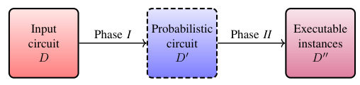 
Figure 1: Compilation overview. Phase I transforms the input dynamic circuit D into a semantically equivalent probabilistic circuit D′, where classical feedforward is represented via probabilistic constructs. Phase II instantiates D′ by compiling probabilistic constructs into standard operations, sampling an executable circuit D′′ for each execution.

📷 Fig 2

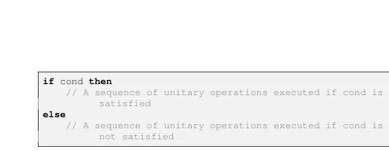 
Figure 2: Generic pattern for a classically controlled operation.

📷 Fig 3

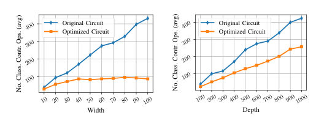 
Figure 3: Number of classically controlled operations in the original circuits and in the optimized probabilistic circuits produced by Phase I. Values are averages over 10 random circuits per setting. Fig. 3a varies the number of qubits (width) from w = 10 to w = 100 with fixed depth d = 250, while Fig. 3b varies the depth from d = 100 to d = 1000 (step 100) with fixed width w = 25.

**Summary.** This paper presents a new compilation framework designed to reduce the runtime overhead of dynamic quantum circuits. By using symbolic execution at compile-time, the method simplifies or removes classically controlled operations, effectively shifting the computational burden from the quantum hardware's controller to the classical compiler.

**Why it may be interesting.** not directly relevant

Detailed structure

**Main problem.** Dynamic quantum circuits introduce significant hardware latency and overhead due to the feedback loop between mid-circuit measurements and classical controllers. Existing compile-time optimizations fail to simplify the classically controlled operations that depend on these measurement outcomes.

**Main result.** The authors developed a two-phase compilation framework that achieves approximately a 50% reduction in classical feedforward in random circuits, with reductions up to 80% for larger circuit widths.

**Method.** A two-phase optimization scheme: Phase I uses symbolic execution and Classical Constant Propagation (CCP) to rewrite dynamic circuits into a probabilistic representation; Phase II samples this representation to generate executable circuit instances.

**Model / system.** Dynamic quantum circuits consisting of a quantum register of n qubits and a classical register of m bits, involving mid-circuit measurements, resets, and classically controlled operations.

**Key observables.** Number of classically controlled operations, reduction in classical feedforward, and circuit width/depth scaling.

**Important parameters / regimes.** Circuit width (10 to 100 qubits) and circuit depth (100 to 1000).

**Assumptions / limitations.** The 'then' and 'else' branches of controlled operations are restricted to unitary sequences; the framework uses a conservative threshold for entanglement tracking to maintain polynomial complexity.

**Figures summary.** Figure 1 shows the two-phase compilation overview; Figure 2 illustrates the structure of classically controlled operations; Figure 3 shows the scaling of operation reduction relative to circuit width and depth.

**Paper structure.** The paper introduces the problem of latency in dynamic circuits, proposes a two-phase framework (Phase I: Dynamic to Probabilistic; Phase II: Probabilistic to Executable), details the algorithms for classical and quantum constant propagation, provides a mathematical proof of semantic preservation, and evaluates the framework on random circuits and GHZ state preparation.

Abstract

Dynamic circuits use real-time outcomes of mid-circuit measurements, processed by a classical controller, to adapt subsequent operations during circuit execution. This additional flexibility over static circuits comes at a price. Mid-circuit measurements are typically slower and noisier than unitary gates. Furthermore, classical feedforward requires exchanging information between the quantum processor (QPU) and the classical controller, introducing latency that erodes the practical performance of dynamic circuits. We propose a compile-time optimization framework that reduces the use of classical controls in dynamic circuits while preserving their semantics. At its core, the framework uses a static analysis that symbolically executes the circuit by propagating classical information alongside the quantum state. By combining this classical-quantum information with the Probabilistic Circuit Model extended with probabilistic controls that emulate classical feedforward, we obtain an intermediate probabilistic representation of the dynamic circuit. In this representation, mid-circuit measurements and classically controlled operations can be removed or rewritten as purely unitary operations and probabilistic components. Compared to existing compile-time optimizations that target only mid-circuit measurements, our method applies to a broader class of dynamic circuits expressible in modern quantum programming languages. We evaluated our framework on randomly generated dynamic circuits, achieving about 50% classical feedforward reduction and even higher reductions in favorable settings.

[↑ back to top](#top)

### [Dark-Soliton Branch Blocking in Transonic Bose--Einstein Condensate Flows](http://arxiv.org/abs/2605.27863v1)

**Authors:** Edilberto O. Silva  
**Type:** theory · **Category:** quantum gases · **PDF:** <https://arxiv.org/pdf/2605.27863v1>  
**Analysis basis:** full PDF text, analyzed in chunks
**Topic relevance:** `non-equilibrium dynamics` **2/5**

📷 Fig 1

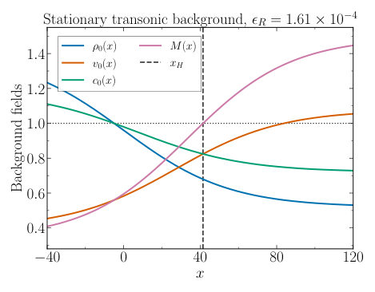 
FIG. 1. Stationary transonic background used in the numer- ical simulations. The density ρ0(x) decreases from left to right, while the conservation law v0 = J/ρ0 accelerates the flow. The local sound speed is c0 = √gρ0, and the Mach number M = v0/c0 crosses unity at the acoustic horizon xH. The stationary residual is ϵR = 1.61 × 10−4.

📷 Fig 2

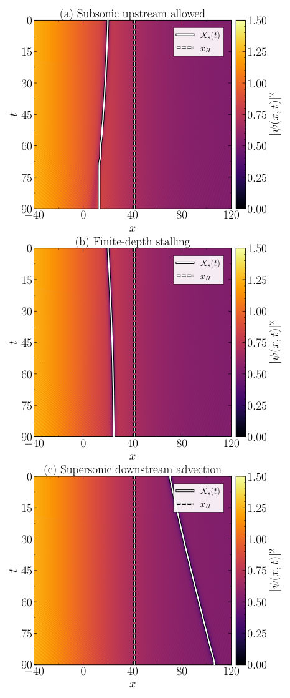 
FIG. 2. Representative density evolutions |ψ(x, t)|2 for the three dynamical regimes. The solid curve in each panel is the extracted trajectory Xs(t), and the dashed vertical line marks the acoustic horizon xH. (a) Subsonic upstream propagation for X0 = 20 and u0 = −0.75: the soliton remains on the subsonic side and moves toward smaller x. (b) Finite-depth stalling on the subsonic side for X0 = 20 and u0 = −0.60: the soliton is initially directed upstream in the local fluid frame but drifts slowly downstream because its relative velocity is insufficient to overcome the local convective flow. (c) Super- sonic downstream advection for X0 = 70 and u0 = −0.60: even though the initial velocity...

📷 Fig 3

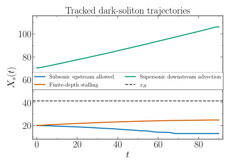 
FIG. 3. Tracked soliton trajectories for the three repre- sentative regimes. In the subsonic upstream case, a suffi- ciently large negative relative velocity produces motion to- ward smaller x. A finite-depth subsonic attempt is nearly stalled and then drifts downstream. In the supersonic region the trajectory is strictly downstream, illustrating the absence of a sustained upstream dark-soliton branch when v0 &gt; c0.

📷 Fig 4

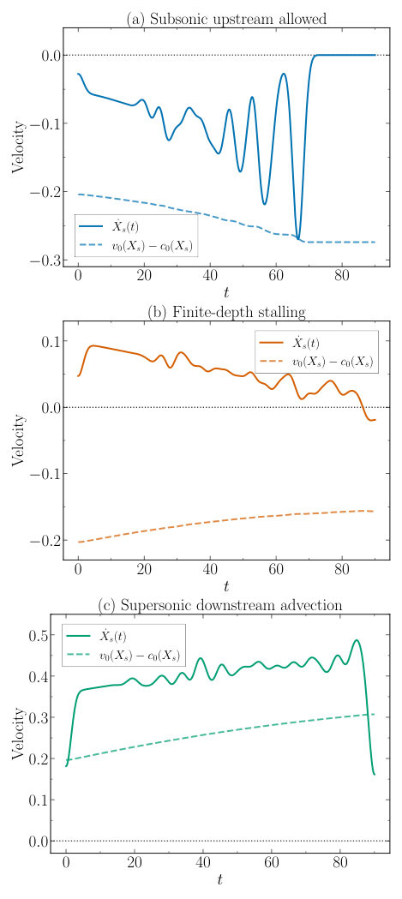 
FIG. 4. Velocity-branch diagnostics for the three representa- tive regimes. The solid curve in each panel is the smoothed soliton velocity ˙Xs(t) extracted from the tracked density min- imum, while the dashed curve is the local adiabatic branch edge v0[Xs(t)] −c0[Xs(t)]. (a) In the subsonic upstream- propagation case, the branch edge is negative, and the soliton can realize upstream laboratory motion. (b) In the finite- depth stalling case, the branch edge remains negative, but the finite-depth soliton drifts weakly downstream and stays close to the separatrix. (c) In the supersonic downstream- advection case, the branch edge is positive, and the extracted soliton velocity remains positive.

📷 Fig 5

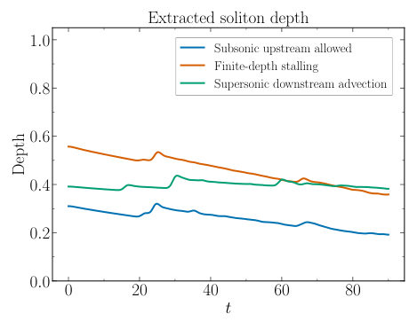 
FIG. 5. Extracted soliton depth for the three representative regimes. The depth evolves slowly due to background inho- mogeneity and weak radiation. The tracked density depletion remains a coherent, soliton-like object during the interval used to test the branch criterion while exhibiting the expected de- formation in the inhomogeneous flow.

**Summary.** This paper demonstrates that the acoustic horizon in a transonic Bose-Einstein condensate acts as a barrier that prevents dark solitons from maintaining upstream motion. In the supersonic region, the background flow is too fast for the soliton branch to overcome, forcing the defects to be advected downstream. This establishes the sonic point as a fundamental limit for the existence of the dark-soliton branch.

**Why it may be interesting.** It provides a nonlinear analogue to the acoustic horizon effect seen in phonons, demonstrating how nonlinear excitations like solitons are subject to a 'nonlinear speed-limit' in transonic flows, which is relevant for understanding defect dynamics in non-equilibrium many-body systems.

Detailed structure

**Main problem.** Investigating whether a dark-soliton branch can sustain upstream motion in a stationary transonic Bose-Einstein condensate flow and determining if the acoustic horizon acts as a branch-blocking mechanism.

**Main result.** The study finds that the sonic point acts as a branch-existence constraint; in the supersonic region, the background flow exceeds the maximum possible upstream velocity of the soliton, leading to downstream advection rather than upstream propagation.

**Method.** Numerical evolution of the 1D defocusing Gross-Pitaevskii equation in an open, nonperiodic domain using a fourth-order Runge-Kutta scheme and centered finite differences.

**Model / system.** A quasi-one-dimensional, repulsive, dilute Bose-Einstein Condensate (BEC) in a stationary transonic flow described by the defocusing Gross-Pitaevskii equation.

**Key observables.** Soliton velocity (laboratory and fluid frames), density depletion (contrast), phase jump, soliton width, and Mach number.

**Important parameters / regimes.** Mach number (M), local sound speed (c0), dimensionless upstream velocity parameter (alpha), and the adiabatic parameter (ratio of soliton width to background length scale).

**Assumptions / limitations.** The result is a branch-existence constraint rather than a rigorous lower bound on all arbitrary density minima; the local-density approximation (LDA) may weaken as the soliton approaches the sonic limit.

**Figures summary.** Figure 1 shows the stationary transonic background profiles; Figure 2 displays density evolutions for different flow regimes; Figures 6-8 show branch-consistency diagnostics, alpha scans, and numerical convergence; Figures 9-10 show soliton trajectories and the lack of an upstream branch in the supersonic regime; Figure 12 shows phase-jump diagnostics.

**Paper structure.** The paper introduces the problem of nonlinear branch blocking, describes the transonic BEC model and numerical methods, presents results across subsonic and supersonic regimes, validates the soliton-like nature of the defects via phase-jump and density diagnostics, and concludes with the implications of the branch-existence constraint.

Abstract

Acoustic horizons in Bose--Einstein condensates are usually characterized through long-wavelength Bogoliubov phonons. We study a nonlinear counterpart: whether a one-dimensional dark-soliton branch can sustain upstream laboratory motion in a stationary transonic flow. The mechanism is local at leading order. A regular dark soliton has a bounded fluid-frame velocity, limited by the local sound speed; therefore, in the supersonic region, the background flow exceeds the largest upstream velocity available to the soliton branch. The sonic point is thus the upstream edge of the local dark-soliton branch, rather than a hard wall or a soliton geodesic surface. We construct stationary transonic Gross--Pitaevskii backgrounds and evolve the full order parameter in an open, nonperiodic domain. The simulations show upstream propagation on the subsonic side, finite-depth stalling on the subsonic side, and downstream advection for defects initialized in the supersonic region with upstream velocity relative to the fluid. Convergence, branch-consistency, local-density, phase-jump, and a dense scan of dimensionless upstream attempts support the soliton-like interpretation. The result is a branch-existence constraint, not a rigorous lower bound on arbitrary density minima of the Gross--Pitaevskii field.

[↑ back to top](#top)

### [Effects of stickiness in quantum chaotic billiards with $n$-fold symmetry](http://arxiv.org/abs/2605.27693v1)

**Authors:** R. B. do Carmo, T. Araújo Lima  
**Type:** theory · **Category:** disordered systems and neural networks · **PDF:** <https://arxiv.org/pdf/2605.27693v1>  
**Analysis basis:** full PDF text, analyzed in chunks
**Topic relevance:** `scars & prethermalization` **2/5**

📷 Fig 1

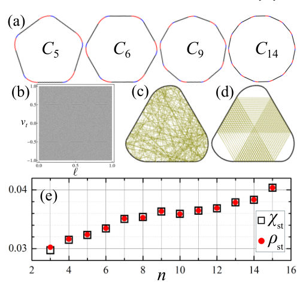 
FIG. 1. (a) Examples of Cn-SCB boundaries for several values of n. (b) Typical phase space for n = 3. There are six sticky regions around vt ± 0.5. (c) Typical chaotic trajectory in real space. (d) Temporary trapping episode of stickiness. (e) The area χst and the hypervolume ρst for several values of n.

📷 Fig 2

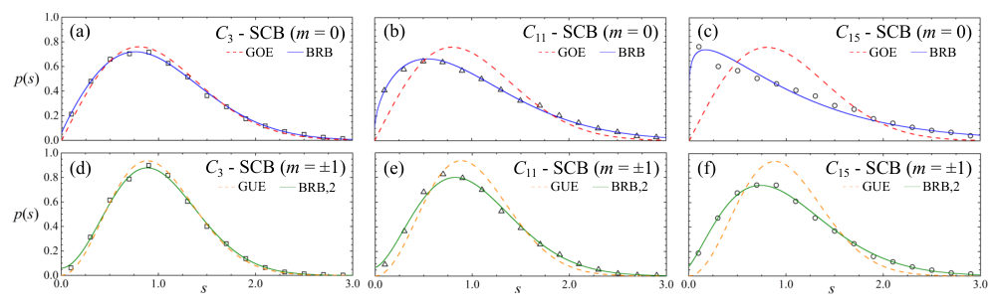 
FIG. 2. Nearest-neighbor level spacing distributions p(s) for billiards with r = 0.25 and symmetry orders n = 3, 11, and 15. Panels (a)–(c): singlet subspace (m = 0), showing deviations from GOE (red dashed) well fitted by the BRB distribution (blue solid). Panels (d)–(f): doublet subspace (m = ±1), exhibiting deviations from GUE (orange dashed), accurately described by the BRB,2 distribution (green solid). Suma of fitted parameters: For C3, β0 = 0.92 ± 0.02 and γ1 = 0.97 ± 0.02. For C11, β0 = 0.54 ± 0.02 and γ1 = 0.78 ± 0.03. For C15, β0 = 0.15 ± 0.03 and γ1 = 0.61 ± 0.01

📷 Fig 3

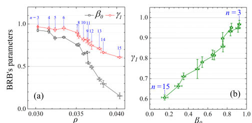 
FIG. 3. (a) Dependence of the fitting parameters β0 (singlets, m = 0) and γ1 (doublets, m = ±1) on the sticky phase- space fraction ρst for billiards with n ranging from 3 to 15. Both parameters decrease monotonically with increasing ρst, indicating growing deviations from GOE and GUE statistics, respectively. (b) γ1 as a function of β0, revealing a strong linear correlation (Pearson coefficient correlation ≃0.99).

📷 Fig 4

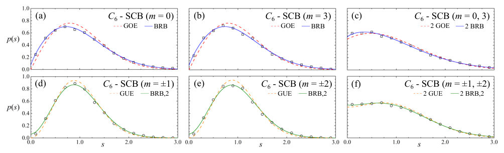 
FIG. 4. Nearest-neighbor spacing distributions p(s) for a C6-symmetric billiard (ρst = 0.0334). Panels (a),(b): singlet subspaces m = 0 and m = 3, exhibiting small deviations from GOE (dashed lines), well captured by BRB fits (solid lines) with compatible parameters β0 = 0.84 ± 0.01 and β3 = 0.86 ± 0.02. Panels (d),(e): doublet subspaces m = ±1 and m = ±2, showing analogous deviations from GUE (dashed lines), accurately described by BRB,2 (solid lines) fits with γ1 = 0.95±0.02 and γ2 = 0.92±0.02. Panels (c),(f): superposition of singlet and doublet sequences, respectively, dashed lines denote GOE/GUE compositions, while solid lines correspond to BRB/BRB,2 compositions constructed from the...

📷 Fig 5

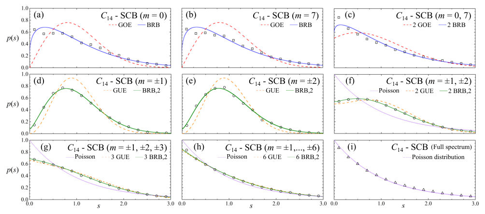 
FIG. 5. Nearest-neighbor spacing distributions p(s) for the C14 billiard (ρst = 0.0383). Panels (a),(b): singlet subspaces m = 0 and m = 7, showing simultaneous deviations from GOE (dashed lines), well described by BRB (solid lines) fits with compatible parameters β0 = 0.30 ± 0.04 and β7 = 0.29 ± 0.04. Panel (c): superposition of the two singlet sequences, the GOE composition (dashed) fails to reproduce the data, while the BRB composition (solid), constructed from the fitted parameters, captures the observed deviations, supporting correlations between singlet subspaces. Panels (d),(e): representative doublet pairs m = ±1 and m = ±2, showing similar deviations from GUE, well described by...

**Summary.** This paper explores how classical phase space structures, specifically 'sticky' regions, influence the quantum energy spectrum of symmetric chaotic billiards. It demonstrates that these classical features drive deviations from standard random matrix predictions and create correlations between different symmetry-resolved energy subspaces.

**Why it may be interesting.** not directly relevant

Detailed structure

**Main problem.** Investigating how classical 'stickiness' in phase space causes non-universal deviations from standard Random Matrix Theory (GOE/GUE) in the energy-level statistics of quantum chaotic billiards with n-fold rotational symmetry.

**Main result.** The study finds that increasing the stickiness fraction leads to larger deviations from RMT, and reveals a strong positive correlation between localization parameters in different symmetry-resolved subspaces.

**Method.** Numerical analysis of energy eigenvalues using the boundary method (solving the Helmholtz equation) combined with classical box-counting to determine the stickiness fraction and statistical fitting using BRB and BRB,2 distributions.

**Model / system.** A family of $C_n$-symmetrical chaotic billiards (C_n-SCB) based on the LSS model, where regular polygons have vertices replaced by circular arcs, creating classically ergodic dynamics with sticky regions.

**Key observables.** Nearest-neighbor level spacing distribution p(s), stickiness fraction (rho_st), and localization parameters (beta and gamma).

**Important parameters / regimes.** Symmetry parameter n, angular momentum eigenvalue m, and the volume fraction of sticky regions rho_st.

**Assumptions / limitations.** The system is assumed to be classically ergodic but with specific regions of phase space being visited more frequently due to marginally unstable periodic orbits.

**Figures summary.** Figure 1 shows the billiard geometries and phase space; Figure 2 displays spacing distributions for different n; Figure 3 shows the decrease of localization parameters; Figure 5 illustrates the transition from symmetry-resolved statistics to Poisson statistics through superposition.

**Paper structure.** The paper introduces the C_n-SCB model, describes the classical stickiness and quantum spectral analysis, presents results on deviations from RMT, explores correlations between symmetry subspaces, and concludes with the effects of spectral superposition.

Abstract

In this work, we study a family of fully chaotic billiards that exhibits only rotational symmetries, whose geometry is based on the $C_3$ symmetry system proposed by Leyvraz, Schmit, and Seligman~(LSS) in 1996. Quantum spectral analyses are performed on billiards with symmetry $C_n$~(the billiard repeats itself under rotations of $2π/n$), where $n$ is the symmetry parameter. In these systems, there are subspaces of singlets~(invariant under time reversal) and doublets~(not invariant under time reversal). For the LSS billiard, it has been established both numerically and experimentally that the corresponding subspectra follow the Gaussian Orthogonal Ensemble~(GOE) statistics for singlets and the Gaussian Unitary Ensemble~(GUE) statistics for doublets. From a classical perspective, the shapes of these billiards allow certain subregions of phase space to be visited more frequently by chaotic trajectories, a phenomenon known as stickiness. We investigate the relationship between the fraction of sticky regions in classical phase space and the deviations of the energy subspectra from GOE and GUE statistics. Our results suggest the existence of correlations between the energy distributions associated with different symmetry subspaces. In addition, we discuss aspects related to the superposition of the different energy subspectra.

[↑ back to top](#top)

### [Electron-photon interaction: Feynman diagrams and contact points](http://arxiv.org/abs/2605.28528v1)

**Authors:** Lev Sakhnovich  
**Type:** theory · **Category:** other · **PDF:** <https://arxiv.org/pdf/2605.28528v1>  
**Analysis basis:** full PDF text, analyzed in chunks
**Topic relevance:** `Keldysh / 2PI / non-Gaussian methods` **2/5**

📷 Fig 1

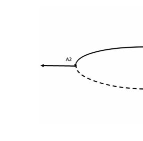 
Figure 1: Case 2.

📷 Fig 2

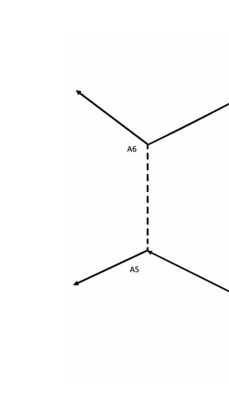 
Figure 2: The case of a converging integral

**Summary.** This paper provides a mathematical framework for relating the internal, unobservable components of Feynman diagrams to their external, observable counterparts. It establishes a formal link between the topological properties of these diagrams and the convergence properties of the associated Feynman integrals.

**Why it may be interesting.** not directly relevant

Detailed structure

**Main problem.** The paper addresses the formulation and solution of the direct and inverse problems for Feynman diagrams, specifically focusing on recovering internal virtual particle data from external observable data and vice versa.

**Main result.** The author proves that complete direct data can be recovered from inverse data and vice versa, and identifies exactly four specific regimes of divergence for the Feynman integrals.

**Method.** The study employs graph theory (Betti numbers, cyclomatic numbers) and topological characterization to map the relationship between Feynman diagrams and classical colored graphs.

**Model / system.** The system is the electron-photon interaction within the framework of Quantum Electrodynamics (QED), modeled as an m-fold integral of a rational matrix function over a 4m-fold sphere.

**Key observables.** External electron lines (Ne) and external photon lines (Np).

**Important parameters / regimes.** Number of vertices (n), number of internal electron/photon lines (Fe, Fp), number of loops (m), and the counter number (K) which determines convergence.

**Assumptions / limitations.** The Feynman diagrams are assumed to be irreducible, and the model assumes a specific vertex structure where two electron lines and one photon line meet.

**Paper structure.** The paper begins by defining the direct and inverse problems, introduces the mathematical model for electron-photon interaction, applies graph-theoretic methods to characterize the diagrams, and concludes with the classification of divergence regimes and data recovery proofs.

Abstract

In this note, we formulate the notions of the direct and inverse problems and contact points for the Feynman diagrams. For the electron-photon interaction case, the solutions of these direct and inverse problems are presented. The interrelations between Feynman diagrams and the classical colored graphs are discussed.

[↑ back to top](#top)

### [Faster matrix product state preparation by exploiting symmetry-induced block-sparsity](http://arxiv.org/abs/2605.28489v1)

**Authors:** Felix Rupprecht, Sabine Wölk  
**Type:** theory · **Category:** quantum information and computing · **PDF:** <https://arxiv.org/pdf/2605.28489v1>  
**Analysis basis:** full PDF text, analyzed in chunks
**Topic relevance:** `entanglement & information structure` **2/5**

📷 Fig 1

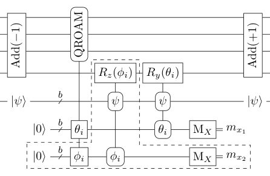 
Figure 2: Circuit for implementing a layer of Rz/Ry rotations in (4) of the forms (2) on four qubits up to sign flips from X-measurements MX of the angle registers and the QROAM junk registers. The measurement results of the angle regis- ters are mx1 and mx2. We do not show the QROAM junk registers. The bottom two registers are the ancilla angle reg- isters into which the rotation angles are loaded via QROAM. The rotations use a phase-gradient state |ψ⟩as a resource state together with the loaded angles. We use rounded cor- ners for gates on qubits that are not being changed by the gates and merely serve as address/resource states. As printed, the right layer in (2) is implemented. Removing...

📷 Fig 2

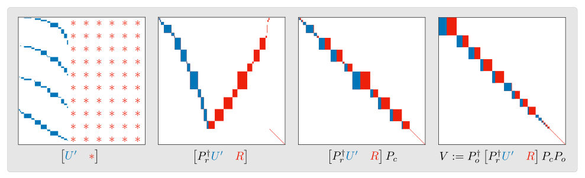 
Figure 3: Steps for transforming and extending the block-sparse matrix U ′ := U ′ i, represented by the blue part in the leftmost box, into a block-diagonal unitary V using permutation matrices. The content of the red rectangles R, which are put into the initially unspecified part ∗of the matrix in the second step, is chosen such that the emerging square blocks are unitary.

📷 Fig 3

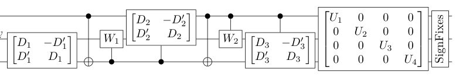 
Figure 5: Decomposition of Ui =  U ′ i ∗ into unitaries on smaller subspaces with V moved to the prior site. The ancilla register has size w := log(m). For readability, we move the second qubit of the two-qubit site register below the ancilla register, yielding the order (site[0], anc, site[1]). In the matrix representations, it is assumed to be above, i.e., (site, anc). The individual unitaries are implemented up to sign flips, which are then fixed at the end.

**Summary.** The authors present a more efficient way to prepare Matrix Product States on quantum computers by exploiting the block-sparse structure created by physical symmetries. By transforming these sparse matrices into block-diagonal form, they significantly reduce the number of required quantum gates. This leads to a massive reduction in computational resources for simulating complex molecular systems.

**Why it may be interesting.** This work provides a significant algorithmic optimization for the interface between classical tensor network methods (DMRG) and fault-tolerant quantum computing, which is crucial for future quantum chemistry simulations.

Detailed structure

**Main problem.** The high computational cost of preparing Matrix Product States (MPS) on fault-tolerant quantum computers, specifically regarding the large number of Toffoli gates and qubits required.

**Main result.** Achieved a 10-30x reduction in Toffoli gate costs by exploiting block-sparsity from U(1) symmetries and a sqrt(2) reduction in cost for real-valued unitary synthesis.

**Method.** An ancilla-assisted linear-depth approach using row and column permutations to transform block-sparse matrices into block-diagonal form, implemented via modified unitary synthesis and Givens rotations.

**Model / system.** Fermionic many-body systems with U(1) symmetries (particle number and spin projection conservation), including molecular systems like P450 enzymes and Iron-Sulfur clusters.

**Key observables.** Toffoli gate count, qubit count, and state overlap (fidelity) with the target MPS.

**Important parameters / regimes.** Bond dimension (chi), site dimension (D), and the trade-off parameter (Lambda) controlling the ancilla vs. Toffoli gate balance.

**Assumptions / limitations.** Assumes the MPS is in right-canonical form, all non-trivial bond dimensions are equal, and that the system possesses global Abelian symmetries.

**Figures summary.** Figure 1 shows the MPS preparation circuit; Figure 2 depicts the quantum circuit for implementing rotation layers; Figure 3 illustrates the transformation of block-sparse unitaries into block-diagonal form; Figure 4 shows the implementation of permutations using QROAM.

**Paper structure.** The paper introduces the problem of MPS preparation, details the symmetry-based block-diagonalization method, describes the modified unitary synthesis for real-valued unitaries, provides resource estimation via Qualtran, and concludes with numerical benchmarks on molecular systems.

Abstract

Matrix product states (MPS) serve as a key tool for studying quantum systems from chemistry and condensed-matter physics, making their preparation on quantum computers an important task in interfacing classical and quantum simulation. Many systems of interest have $U(1)$-symmetries induced by particle number and spin projection conservation, allowing to restrict the MPS tensors to be of block-sparse form, a property widely used in the implementation of classical algorithms such as the density matrix renormalization group. We reduce the cost of fault-tolerantly preparing block-sparse MPS within the standard ancilla-assisted linear-depth approach by implementing row and column permutations that transform the block-sparse matrices into block-diagonal form. These block-diagonal unitaries are then implemented via unitary synthesis, with the cost being determined by the size of the largest block. In this context, we modify the unitary synthesis approach of Berry et al. in order to reduce the Toffoli cost for real-valued unitaries by a factor of $\sqrt{2}$. In numerical benchmarks, we achieve Toffoli cost improvement factors of $10 - 30$ compared to the state-of-the-art for MPS of various molecular systems.

[↑ back to top](#top)

### [Formation of bound composite vortices of a singly-quantized $^1$S$_0$ vortex and half-quantized $^3$P$_2$ vortices in the $^1$S$_0$-$^3$P$_2$ coexisting phase in neutron stars](http://arxiv.org/abs/2605.28718v1)

**Authors:** Tatsuhiro Hattori, Muneto Nitta, Kazuyuki Sekizawa  
**Type:** theory · **Category:** quantum gases · **PDF:** <https://arxiv.org/pdf/2605.28718v1>  
**Analysis basis:** full PDF text, analyzed in chunks
**Topic relevance:** `analog quantum simulation` **2/5**

📷 Fig 1

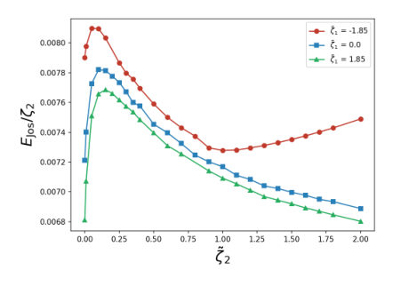 
FIG. 1: Josephson term density R d3r ∑2 m=−2  (−1)mσ2ψ∗2 m +(−1)mσ∗2ψ2 m  as a function of the pair-exchange coupling constant ζ2 for three values of the density–density coupling constant ζ1, as indicated in the legend. The system consists of one SQV in the 1S0 condensate and two HQVs in the 3P2 condensate.

📷 Fig 2

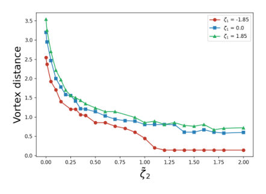 
FIG. 2: Inter-vortex distance dHQV between the two HQVs in the 3P2 condensate as a function of the pair-exchange coupling constant ζ2 for three values of the density–density coupling constant ζ1, as indicated in the legend. The HQV positions are identified from the phase singularities of Ψ20(r) as described in Sec. II C. The system configuration and imaginary-time evolution procedure are the same as in Fig. 1.

📷 Fig 3

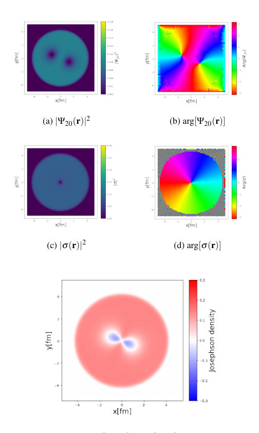 
FIG. 3: Color maps of the ground-state configuration obtained by imaginary-time evolution without pinning potentials for both condensates and ζ1 = 0, ˜ζ2 = 0.010(a) Density |Ψ20|2 of the 3P2 condensate, showing the two HQV cores as density-depleted regions. (b) Phase arg[Ψ20] of the 3P2 condensate, displaying the 2π phase winding around each HQV core. (c) Density |σ|2 of the 1S0 condensate, showing the SQV core as a single density-depleted region. (d) Phase arg[σ] of the 1S0 condensate, displaying the 2π phase winding around the SQV core. (e) Spatial distribution of the Josephson energy density σ2 tr(A∗2)+σ∗2 tr(A2), reflecting the relative phase between the two condensates. All panels...

📷 Fig 4

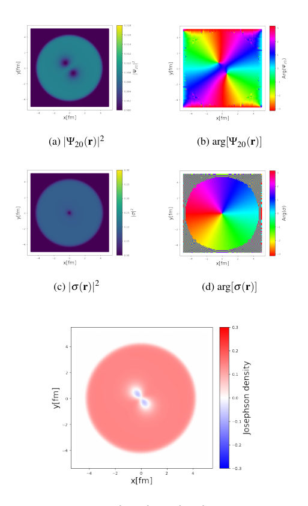 
FIG. 4: Color maps of the ground-state configuration obtained by imaginary-time evolution without pinning potentials for both condensates and ζ1 = 0, ˜ζ2 = 0.150. (a) Density |Ψ20|2 of the 3P2 condensate, showing the two HQV cores as density-depleted regions. (b) Phase arg[Ψ20] of the 3P2 condensate, displaying the 2π phase winding around each HQV core. (c) Density |σ|2 of the 1S0 condensate, showing the SQV core as a single density-depleted region. (d) Phase arg[σ] of the 1S0 condensate, displaying the 2π phase winding around the SQV core. (e) Spatial distribution of the Josephson energy density σ2 tr(A∗2)+σ∗2 tr(A2), reflecting the relative phase between the two condensates. All panels...

📷 Fig 5

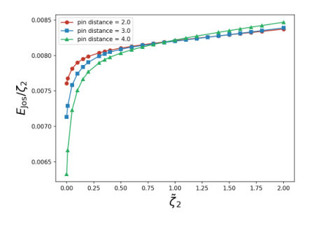 
FIG. 6: Josephson term density R d3r ∑2 m=−2  (−1)mσ2ψ∗2 m +(−1)mσ∗2ψ2 m  as a function of the pair-exchange coupling constant ζ2 for three values of the pinning site distances of HQV, as indicated in the legend. Here, ζ1 = 0. The system consists of one SQV in the 1S0 condensate and two HQVs in the 3P2 condensate, with singlet and triplet pinning position.

**Summary.** The paper shows that the phase-sensitive Josephson coupling between singlet and triplet neutron condensates creates a strong attraction between different types of quantized vortices. This interaction can overcome pinning forces to form bound composite vortex structures, providing a potential microscopic mechanism for pulsar glitches.

**Why it may be interesting.** The study demonstrates a direct analogy between neutron star vortex dynamics and the Josephson coupling observed in experimental bilayer and spinor BEC systems, which is highly relevant to many-body dynamics in ultracold gases.

Detailed structure

**Main problem.** Investigating the microscopic interaction and structural dynamics between singly-quantized (1S0) and half-quantized (3P2) neutron vortices in the coexistence phase of neutron star interiors.

**Main result.** The Josephson coupling between the two condensates induces a strong attractive interaction that drives vortex depinning and leads to the formation of a bound 'vortex molecule' structure (HQV-SQV-HQV).

**Method.** Two-dimensional numerical simulations using the Gross-Pitaevskii equations and the imaginary-time evolution method to find ground-state configurations.

**Model / system.** A multi-component system consisting of a spin-singlet (1S0) Bose-Einstein Condensate and a spin-2 (3P2) spinor Bose-Einstein Condensate, representing the crust-core boundary of a neutron star.

**Key observables.** Vortex spatial configuration, Josephson energy density, inter-vortex distance, and phase winding numbers.

**Important parameters / regimes.** Density-density coupling constant (zeta1), Josephson/pair-exchange coupling constant (zeta2), and pinning potentials.

**Assumptions / limitations.** The study uses the Gross-Pitaevskii framework, which assumes a zero-temperature limit and may not be fully accurate near the transition temperature.

**Figures summary.** Figure 1 shows the initial configuration with pinned vortices; Figure 6 shows the ground state at low coupling where vortices remain trapped.

**Paper structure.** The paper introduces the pulsar glitch problem, describes the GP model for the 1S0-3P2 coexistence phase, details the numerical simulation protocol, presents results on vortex attraction and bound state formation, and discusses astrophysical implications.

Abstract

Pulsar glitches are believed to originate from the dynamics of quantized vortices in the neutron superfluid interior. The outer core of a neutron star hosts a $^3\text{P}_2$ spin-triplet superfluid, whose half-integer quantum vortices (HQVs) are qualitatively different from the $^1\text{S}_0$ singly quantized vortices (SQVs) in the inner crust. It has recently been proposed that the coupling between these two vortex species gives rise to a large-scale vortex network, providing a candidate mechanism for the diversity of observed pulsar glitch phenomena. Using the Gross--Pitaevskii equations for the $^1\text{S}_0$ and $^3\text{P}_2$ condensates, we perform two-dimensional simulations of one SQV and two HQVs in a coexistence phase near the crust-core boundary, varying the density--density and Josephson coupling constants. We find that the Josephson term, arising from the relative phase between the two condensates, induces a strong attractive interaction between the two HQVs and the SQV, which dominates over the density--density coupling. When pinning potentials are applied to the HQVs and the SQV at spatially separated locations, this attraction is found to be sufficiently strong to drive vortex depinning. These results suggest that two HQVs and one SQV can form a tightly bound composite vortex at the crust-core boundary, with implications for the glitch mechanism in neutron stars.

[↑ back to top](#top)

### [Learning shape resonances from the stabilization method](http://arxiv.org/abs/2605.28437v1)

**Authors:** Daniel Kromm, Hans-Werner Hammer, Artem Volosniev  
**Type:** theory · **Category:** other · **PDF:** <https://arxiv.org/pdf/2605.28437v1>  
**Analysis basis:** full PDF text, analyzed in chunks
**Topic relevance:** `methods for driven-dissipative` **2/5**

📷 Fig 1

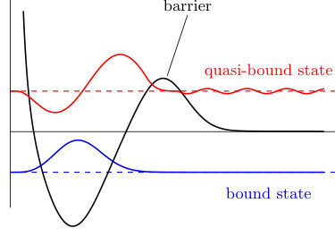 
FIG. 1. A schematic potential V (x) supporting both a bound state and a quasi-bound state. The quasi-bound state is tem- porarily localized in the well region below the barrier, while the finite barrier allows for tunneling, giving rise to resonant behavior.

📷 Fig 2

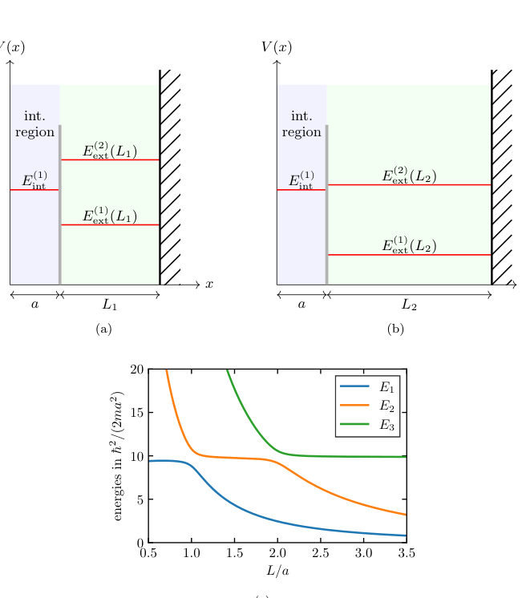 
FIG. 2. Illustration of the stabilization method with an interior (interaction) and exterior region. The interior and exterior regions provide energy levels that can couple through the barrier. If one shifts the boundary of (a) to a different position (b), the energy levels are also shifted. In the case of (b) the second level in the exterior region is close to the energy level in the interior region, which allows them to mix. (c) Eigenvalues of the three-level Hamiltonian in Eq. (3) as a function of L.

📷 Fig 3

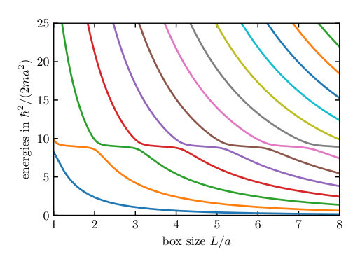 
FIG. 3. Stabilized energy levels of the repulsive delta-shell potential for G = 20. The first resonance is clearly visible.

📷 Fig 4

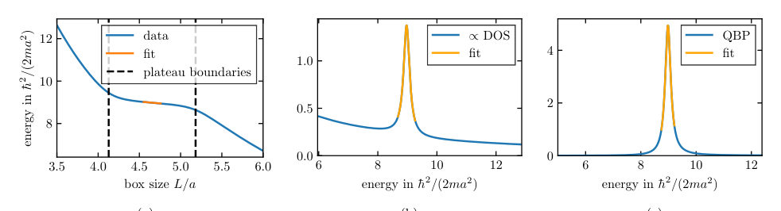 
FIG. 4. Fit for all three methods for the first resonance of the delta-shell potential at G = 20. (a) Fit to the N = 5 energy level using 20% of the plateau region (see supplementary material for details). (b) Fit to the density of states (DOS) obtained by averaging over the N = 8, 9, 10 energy levels. (c) Fit to the quasi-bound probability ratio for the N = 10 energy level.

📷 Fig 5

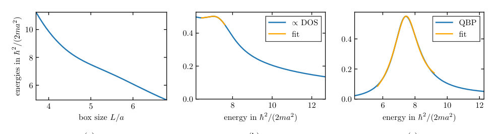 
FIG. 5. Fit for all three methods for the first resonance of the delta-shell potential at G = 5 (broad resonance). (a) The N = 5 energy level; a plateau is not identifiable. (b) Fit to the density of states (DOS) obtained by averaging over the N = 8, 9, 10 energy levels; the fit seems not reliable. (c) Fit to the quasi-bound probability ratio for the N = 10 energy level; this fit still seems to be reliable.

**Summary.** This paper presents a way to study quantum resonances by treating them as discrete states in a finite box. It introduces a new method based on wave function localization that works even when resonances are too broad for traditional methods to detect.

**Why it may be interesting.** It provides a robust computational tool for identifying metastable states in any system where the continuum is difficult to treat, which is highly relevant for studying decay in open quantum systems and molecular physics.

Detailed structure

**Main problem.** The difficulty in teaching and calculating scattering resonances due to the abstract nature of the continuum and the complexity of scattering theory.

**Main result.** The authors introduce a novel Quasi-Bound Probability (QBP) method based on spatial localization that is significantly more robust than traditional phase-shift or density of states methods for extracting resonance parameters in the broad resonance regime.

**Method.** The stabilization method, which replaces the continuum with a discrete spectrum by confining the system to a finite box, combined with three extraction strategies: phase-shift fitting, Density of States (DOS) analysis, and the new QBP method.

**Model / system.** A one-dimensional quantum system using a particle in a box with a delta-shell potential (both attractive and repulsive) to model shape resonances.

**Key observables.** Resonance energy (Er), resonance width (Gamma), phase shift, and quasi-bound probability ratio.

**Important parameters / regimes.** Coupling strength (G), box size (L), and the distinction between narrow and broad resonance regimes.

**Assumptions / limitations.** The analysis is simplified to one-dimensional geometries and assumes an infinite wall boundary condition at the origin.

**Figures summary.** Schematic of potential barriers, stabilization diagrams showing energy plateaus, comparison of the three extraction methods for narrow vs. broad resonances, and S-matrix poles in the complex momentum plane.

**Paper structure.** The paper begins with pedagogical motivation, reviews the stabilization method and resonance types, introduces the new QBP method, evaluates the robustness of all three methods using delta-shell models, and concludes with a sensitivity analysis.

Abstract

Resonances in quantum mechanics are commonly introduced as quasi-bound states embedded in the continuum, a perspective that can be conceptually challenging due to the abstract nature of continuum states. In this work, we discuss an alternative approach that avoids an explicit treatment of the continuum by formulating the problem in terms of discrete quantum states. Our discussion is based on the stabilization method, in which the system is confined to a finite region such that the continuum is replaced by a discrete energy spectrum. Resonances then appear as characteristic features in the energy levels under variation of the confining box size, providing an intuitive interpretation in terms of a two-level system while remaining closely connected to standard quantum mechanics curriculum. We review the method, derive selected results, and discuss practical strategies for extracting resonance parameters from stabilization diagrams. In addition to established fitting procedures, we introduce a novel approach based on the analysis of spatial localization of resonant states, which enables a robust identification of resonance properties. The approach is illustrated using both attractive and repulsive delta-shell potentials, which serve as simple and instructive model systems amenable to analytical treatment.

[↑ back to top](#top)

### [Low-cost quantum error mitigation via auxiliary qubit return validation](http://arxiv.org/abs/2605.28342v1)

**Authors:** Gilad Kishony, Avi Elazari, Ron Cohen, Lior Gazit  
**Type:** theory · **Category:** quantum information and computing · **PDF:** <https://arxiv.org/pdf/2605.28342v1>  
**Analysis basis:** full PDF text, analyzed in chunks
**Topic relevance:** `quantum measurements` **2/5**

📷 Fig 1

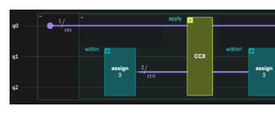 
Figure 1: Example quantum circuit synthesized by the compiler, illustrating reuse of auxiliary qubits across multiple arithmetic functional blocks. Auxiliary qubits are allocated for intermediate computations and uncomputed at the end of each block, returning to the |0⟩state at the indicated reset points.

📷 Fig 2

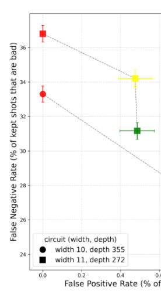 
Figure 2: Tradeoff between false positive rate and false negative rate under a realistic noise model. Colors indicate the auxiliary validation strategy: no vali- dation, validation only at the final measurement, and validation at all expected auxiliary reset points. Different markers correspond to circuit implementations with varying width and depth.

📷 Fig 3

 
Figure 2 shows the tradeoff between false positive rates (valid shots incorrectly discarded) and false negative rates (corrupted shots incorrectly retained) for the three auxiliary validation strategies across two different circuit implementations. We observe that validating auxiliary qubits at all expected reset points sub- stantially reduces the false-negative rate by approximately 10% relative to the no-validation baseline, while increasing the false-positive rate by only about 1%. This 1% false-positive rate represents the practical overhead of our method; it is the exact percentage of uncorrupted, valid samples that are lost to post- selection. Validation only at the end of the circuit...

**Summary.** This paper introduces a low-cost error mitigation technique that uses mid-circuit measurements of auxiliary qubits to identify and discard noisy computational shots. By leveraging the fact that auxiliary qubits should return to a zero state after uncomputation, the method significantly improves result fidelity with very little sampling overhead. This approach is particularly effective for deep arithmetic circuits and can even save QPU time through early abort strategies.

**Why it may be interesting.** not directly relevant

Detailed structure

**Main problem.** The high susceptibility of NISQ-era quantum computations to noise and the need for low-overhead error mitigation techniques that do not require full quantum error correction.

**Main result.** The proposed method reduces the false-negative rate by approximately 10% with a minimal increase in the false-positive rate of only about 1%.

**Method.** A post-selection technique that measures auxiliary qubits at expected reset points and uses a probabilistic likelihood model based on the backward lightcone to discard corrupted shots.

**Model / system.** Noisy Intermediate-Scale Quantum (NISQ) hardware executing deep arithmetic circuits synthesized via the Classiq platform, characterized by extensive auxiliary qubit reuse and uncomputation.

**Key observables.** False-negative rate (bias), false-positive rate (variance/overhead), and auxiliary qubit measurement outcomes.

**Important parameters / regimes.** Post-selection threshold (P_th), gate failure probability (p), error propagation probability (r), and measurement error probability (q).

**Assumptions / limitations.** Assumes auxiliary qubits return to the zero state after uncomputation; treats gate and measurement errors as disjoint; assumes independence of measurements within the lightcone analysis.

**Figures summary.** Figure 1 shows a schematic of a synthesized circuit with qubit reuse; Figure 2 presents a tradeoff plot between false positive and false negative rates for different validation strategies.

**Paper structure.** The paper introduces the problem of NISQ noise, describes the auxiliary qubit return validation method, details the probabilistic likelihood model using backward lightcones, analyzes the bias-variance tradeoff, and presents simulation results comparing different validation strategies.

Abstract

We introduce a low-overhead technique for quantum error mitigation based on post-selection using auxiliary qubit measurements. The method exploits the structural property that, in an error-free computation, auxiliary qubits are often expected to return to the zero state after use. By selectively measuring these qubits at carefully chosen points in the circuit, erroneous shots can be identified and discarded, improving result fidelity with minimal hardware overhead.   To account for circuit noise, including measurement errors, we analyze the likelihood that a measurement outcome indicates a corrupted shot. This analysis is informed by the measurement's backward light cone, namely the set of circuit operations that could affect the outcome. Shots whose auxiliary measurement outcomes imply a corruption likelihood above a tunable threshold are rejected.   Simulations show that the method reduces the false-negative rate by approximately 10% while discarding only approximately 1% of valid shots. The threshold controls the bias-variance tradeoff inherent to post-selection, allowing the method to be adapted to the fidelity and sampling requirements of different applications.

[↑ back to top](#top)

### [Magnetic order, magnons, and crystal fields in van der Waals CeSiI](http://arxiv.org/abs/2605.28698v1)

**Authors:** Wolfgang Simeth, Connor A. Occhialini, Michael E. Ziebel, Nethmi W. Hewage, Sabrina J. Li, Daniel Pajerowski, Taehun Kim, Ben Zager, Jonathan Pelliciari, Kipton Barros, Daniel Rehn, Abhay N. Pasupathy, Valentina Bisogni, Xavier Roy, Allen Scheie  
**Type:** both · **Category:** strongly correlated electrons · **PDF:** <https://arxiv.org/pdf/2605.28698v1>  
**Analysis basis:** full PDF text, analyzed in chunks
**Topic relevance:** `Kondo & dissipative impurity` **2/5**

📷 Fig 1

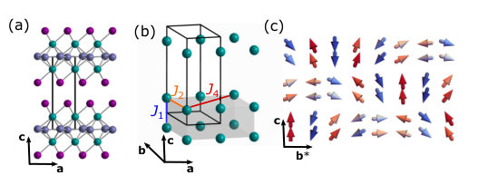 
FIG. 1. (a) Trigonal crystal structure of CeSiI and conven- tional hexagonal unit cell (black skeleton, basis vectors a, b, and c). Shown are two pairs of Ce (green spheres) and the surrounding Si (gray) and I layers (purple). (b) Quasi two dimensional spin Hamiltonian that accounts for the spin dy- namics in CeSiI. Shown are 1st, 2nd, and 4th nearest neighbor bonds as introduced in the Hamiltonian (Eq. 1). (c) Magnetic ground state in agreement with our data and model. Shown are magnetic moments carried by Ce in the plane perpendic- ular to b.

📷 Fig 2

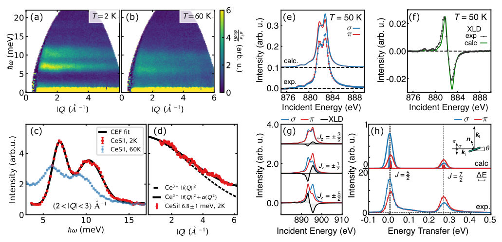 
FIG. 2. Crystal electric field (CEF) analysis of CeSiI, inelastic neutron scattering, X-ray absorption spectroscopy, and resonant inelastic X-ray scattering. Panels (a) and (b) show the powder neutron spectrum with Ei = 25 meV at 2 K and 60 K. Panel (c) shows the fitted model compared with the two measured CEF levels. At 60 K the crystal field levels shift to lower energies. Panel (d) shows the Q-dependence of the lowest mode intensity, which matches the Ce3+ form factor plus a small Q2 phonon background.[30] (e) Ce M5-edge XAS (881.9 eV) recorded in TEY with incident σ (blue) and π (red) polarizations at incident angle θ = 20 deg and T = 50 K. (f) XLD spectrum determined from data in (e)...

📷 Fig 3

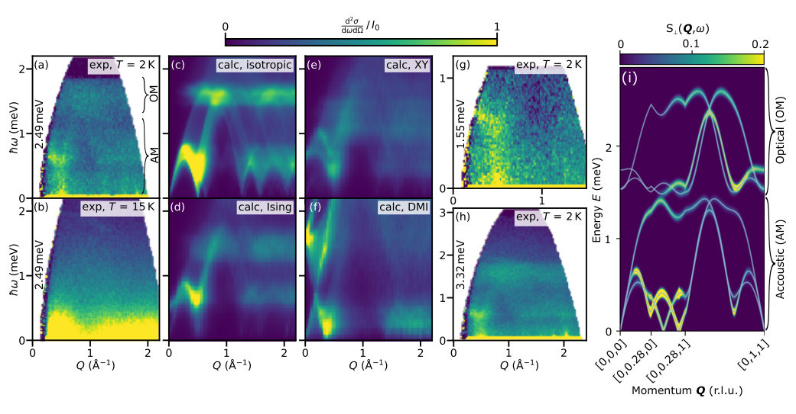 
FIG. 3. Magnon dynamics in CeSiI. (a,b) Powder spectrocopy data of CeSiI taken at T = 2 K and T = 15 K, respectively. The incident neutron energy used is indicated with the vertical label on the left. In (a) we see the projected scattering of acoustic magnon branches (AB) including a pronounced Goldstone mode as well as optical branches (OB). (c) Powder spectrum calculated (calc) with the isotropic Heisenberg model in Eq. 2 (with exchange J1–J12). (d,e) Calculated spectra with anisotropic nearest neighbor exchange J1 and isotropic exchange J2–J4 (see SI for further information). We considered an anisotropic exchange matrix J where (d) the XY-component and (e) the Z components are reduced to...

📷 Fig 4

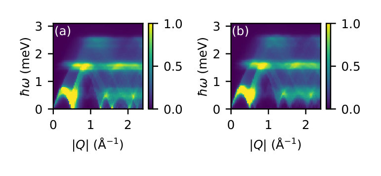 
Fig. 1(c) represents one of three domains according to 120◦and 240◦rotations around the

**Summary.** This paper provides a comprehensive microscopic characterization of the magnetic properties of the van der Waals heavy-fermion superconductor CeSiI. By combining neutron and X-ray spectroscopy, the authors determine the crystal electric field levels and the Heisenberg exchange interactions that stabilize a cycloidal magnetic state. This work establishes a fundamental basis for modeling unconventional superconductivity and quantum criticality in 2D heavy-fermion systems.

**Why it may be interesting.** not directly relevant

Detailed structure

**Main problem.** The study aims to resolve the magnetic ground state, crystal electric field (CEF) parameters, and dominant magnetic interactions in the new van der Waals heavy-fermion superconductor CeSiI.

**Main result.** The authors identified a co-rotating cycloidal spin spiral ground state driven by isotropic Heisenberg interactions and determined the precise CEF Hamiltonian using a multi-probe approach.

**Method.** The research combines inelastic neutron scattering (INS), X-ray absorption spectroscopy (XAS), and resonant inelastic X-ray scattering (RIXS) with computational tools like PyCrystalField, Quanty, and Linear Spin Wave Theory.

**Model / system.** The system is CeSiI, a two-dimensional van der Waals heavy-fermion material. The magnetic model utilizes an effective Heisenberg Hamiltonian with multiple exchange couplings (J1 through J12) and a CEF Hamiltonian based on Stevens operators for the Ce3+ ions.

**Key observables.** Magnetic excitations (magnons), CEF energy levels, X-ray linear dichroism (XLD), magnetic wave vector k, and the g-tensor.

**Important parameters / regimes.** Magnetic ordering temperature TN = 7.5 K, Kondo temperature TK approx 4.6 K, spin-orbit coupling zeta approx 75.69 meV, and exchange constants such as J1 = -0.93 meV.

**Assumptions / limitations.** Assumes C3v symmetry for the CEF Hamiltonian and uses a point-charge model as an initial approximation for CEF parameters.

**Figures summary.** The figures include neutron powder spectroscopy at various energies and temperatures, comparison of different CEF models, and simulations of the magnetic spectrum and exchange interactions.

**Paper structure.** The paper introduces the CeSiI system, presents neutron scattering data to identify CEF modes, uses XAS/XLD to resolve CEF model degeneracy, details the magnetic exchange interactions via spin-wave theory, and concludes with the implications for heavy-fermion physics.

Abstract

We report neutron, X-ray absorption, and resonant X-ray spectroscopy of magnetic excitations in the new heavy-fermion van-der-Waals superconductor CeSiI. We determined effective Hamiltonians and ground states of crystal electric fields and magnons. Isotropic Heisenberg interactions on a quasi two dimensional lattice, including ferromagnetic nearest-neighbor exchange as the dominant interaction, provide an excellent account to the low-energy measured dynamics and stabilize a co-rotating spin cycloid. Our study provides the basis to model CeSiI from first principles, thereby laying the ground for microscopic understanding of heavy-fermion physics, their unconventional superconductivity, and quantum criticality.

[↑ back to top](#top)

### [Nanoscale Confinement Enhances Ultrafast Demagnetization](http://arxiv.org/abs/2605.28307v1)

**Authors:** Yoav William Windsor, Tobias Lojewski, Moumita Kundu, Klaus Sokolowski-Tinten, Nico Rothenbach, Andrea Eschenlohr, Markus Ernst Gruner, Katharina Ollefs, Carolin Schmitz-Antoniak, Soma Salamon, Daniela Zahn, Laurenz Rettig, Christian Schüßler-Langeheine, Niko Pontius, Renkai Li, Mianzhen Mo, Suji Park, Xiaoshe Shen, Stephen Weathersby, Xijie Wang, Rossitza Pentcheva, Heiko Wende, Ulrich Nowak, Uwe Bovensiepen  
**Type:** both · **Category:** strongly correlated electrons · **PDF:** <https://arxiv.org/pdf/2605.28307v1>  
**Analysis basis:** full PDF text, analyzed in chunks
**Topic relevance:** `non-equilibrium dynamics` **2/5**

📷 Fig 1

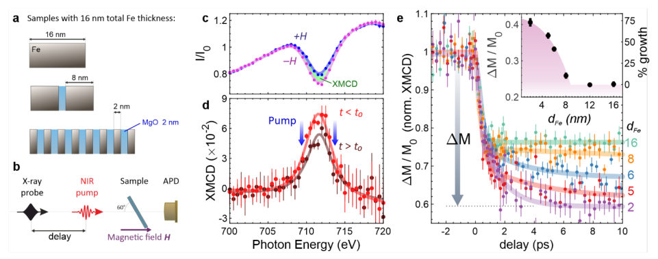 
Figure 1 – ultrafast transmission XMCD on Fe/MgO samples. a Sketch of Fe/MgO multilayers with the same total Fe thickness (16 nm) but with a varying number of 2 nm MgO spacer layers. Each sample has a different Fe layer thickness 𝑑𝐹𝑒 (16, 8, and 2 nm are shown). b Sketch of the X-ray transmission experiment: the NIR pump and soft X-ray probe arrive collinearly at 60° to the sample surface. Magnetic fields are applied along the beams’ propagation axis. c Transmission spectra collected from the 𝑑𝐹𝑒= 5 nm sample using circularly polarized X-rays near the Fe L3 edge, under magnetic fields of ±0.4 T. The difference between the curves is XMCD. d The XMCD spectrum from c, shown before- and ~8.5 ps...

📷 Fig 2

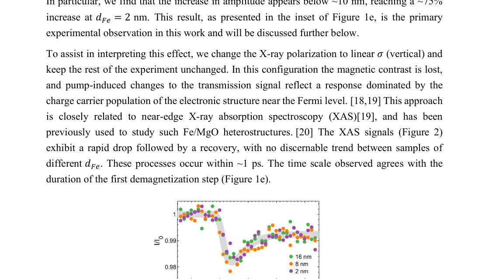 
Figure 2 – photoinduced reduction in transmission of linearly polarized X-rays at the Fe L3 edge. Data from three samples are shown, all with a total Fe thickness of 16 nm. The line is a guide to the eye.

📷 Fig 3

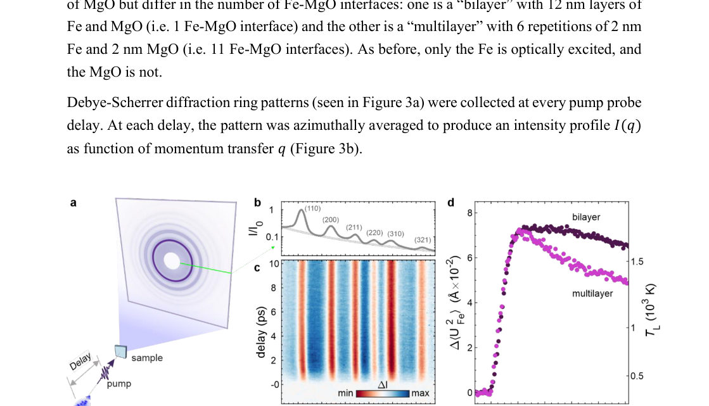 
Figure 3 – ultrafast electron diffraction. a Sketch of the UED experiment. An example ring pattern from the experimental data is presented. b Azimuthal average of a ring pattern, normalized to the strongest peak. The monotonous curve illustrates the varying baseline. c Relative changes Δ𝐼 to the diffraction intensity pattern 𝐼 as function of momentum transfer q and pump-probe delay. Data are taken from the multilayer sample. d Delay- dependent changes in Fe atoms’ vibrational amplitude (mean squared displacement, MSD). The corresponding Fe lattice temperature is presented on the right hand axis. Two samples are measured under identical conditions, and both have the same material content:...

📷 Fig 4

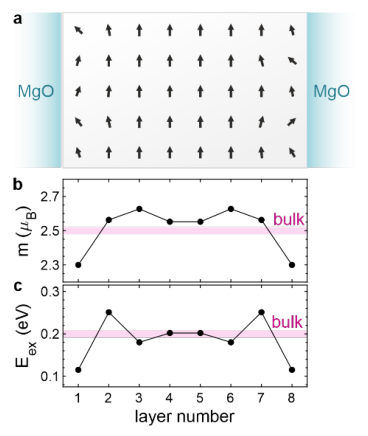 
Figure 4 - ab-initio calculation of a 2 nm Fe slab (8 atomic layers). a Cartoon depiction of the Fe slab, highlighting a weakened spin order at its interfaces with MgO. b and c present the magnetic moment per Fe atom and the accumulated magnetic exchange energy (between an Fe atom and its environment, see methods) as functions of atomic layer number. Horizontal lines represent calculated bulk values for epitaxially grown Fe.

**Summary.** The researchers discovered that shrinking iron layers to the nanoscale significantly boosts the efficiency of ultrafast demagnetization. This enhancement is driven by weakened magnetic coupling at the interfaces rather than changes in heating or charge carrier dynamics. This finding is crucial for developing faster, more energy-efficient spintronic devices.

**Why it may be interesting.** not directly relevant

Detailed structure

**Main problem.** Investigating how nanoscale dimensional confinement affects the amplitude and dynamics of ultrafast (femtosecond) demagnetization in Fe layers.

**Main result.** Fe layers thinner than 10 nm exhibit significantly enlarged demagnetization amplitudes (up to 75% increase at 2 nm) due to a magnetic mechanism involving the local weakening of spin order at Fe/MgO interfaces.

**Method.** The study combines ultrafast X-ray transmission (XMCD and XAS) at BESSY II, ultrafast electron diffraction (UED) at SLAC, and ab-initio/atomistic spin dynamics simulations.

**Model / system.** Polycrystalline Fe/MgO multilayer heterostructures with varying Fe layer thicknesses (2 nm to 16 nm) and a constant total Fe thickness, modeled using a classical Heisenberg Hamiltonian and DFT calculations.

**Key observables.** Demagnetization amplitude (delta M), magnetization (M/M0), charge carrier response (XAS), and atomic mean squared displacement (MSD/lattice temperature).

**Important parameters / regimes.** Fe layer thickness (d_Fe < 10 nm for confinement effects), laser fluence (12-40 mJ/cm2), and time scales (sub-picosecond to picosecond).

**Assumptions / limitations.** Fe/MgO interface interdiffusion is limited to less than 0.2 nm; use of the atomic sphere approximation in DFT calculations.

**Figures summary.** Fig 1: Schematic of sample design, experimental setup, and time-resolved XMCD showing magnetization suppression and thickness-dependent amplitude growth. Fig 2: X-ray absorption changes. Fig 3: UED data showing lattice dynamics.

**Paper structure.** Introduction to spintronics and confinement; Experimental design and sample preparation; Results from X-ray transmission and electron diffraction; Mechanistic analysis via ab-initio and spin dynamics simulations; Conclusion.

Abstract

Nanoscale miniaturization has revolutionized the field of spintronics by enabling exponential growth in areal bit density. A similar leap is also expected in device speeds through successfully harnessing femtosecond magnetization dynamics. However, combining this with the miniaturization of realistic devices is challenging. To address this, we studied the effect of dimensional confinement on the femtosecond demagnetization of Fe. By gradually increasing the level of confinement while keeping excitation conditions constant, we found that Fe layers thinner than 10 nm exhibit enlarged demagnetization amplitudes, reaching a $\sim75\%$ increase at 2 nm. By combining ultrafast experiments sensitive to the spins, the charge carriers, and the phonons, we establish that this finite$\text{-}$size effect is magnetic in origin and is not phonon$\text{-}$driven. With the support of ab$\text{-}$initio calculations and atomistic spin dynamics simulations, we identify the enhancement effect as due to local weakening of spin order at the Fe$\text{'}$s interface, which becomes significant upon increased confinement.

[↑ back to top](#top)

### [Non-Hermitian Computers Need No Complex Numbers](http://arxiv.org/abs/2605.28152v1)

**Authors:** Qi Zhang  
**Type:** theory · **Category:** quantum information and computing · **PDF:** <https://arxiv.org/pdf/2605.28152v1>  
**Analysis basis:** full PDF text, analyzed in chunks
**Topic relevance:** `quantum measurements` **2/5**

📷 Fig 1

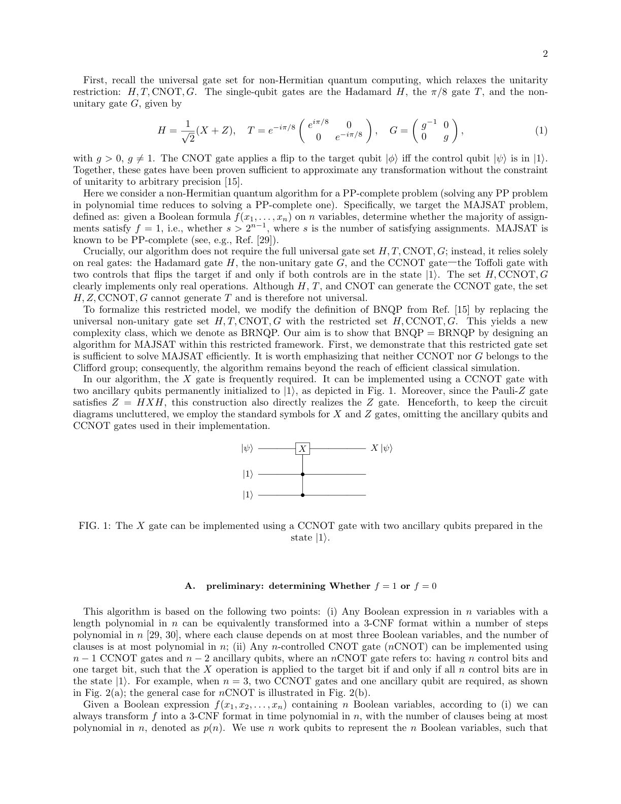 
Low-resolution page preview, page 2

📷 Fig 2

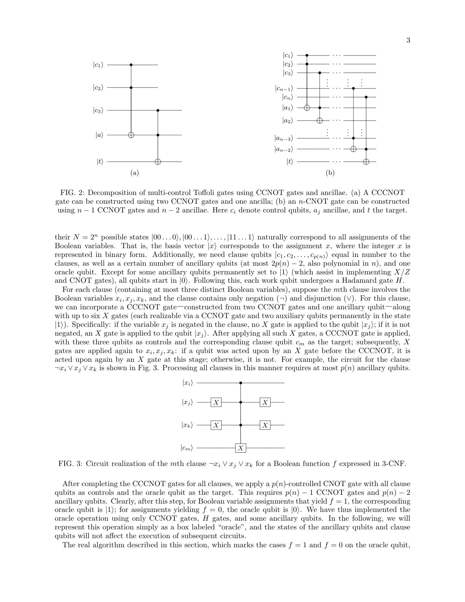 
Low-resolution page preview, page 3

📷 Fig 3

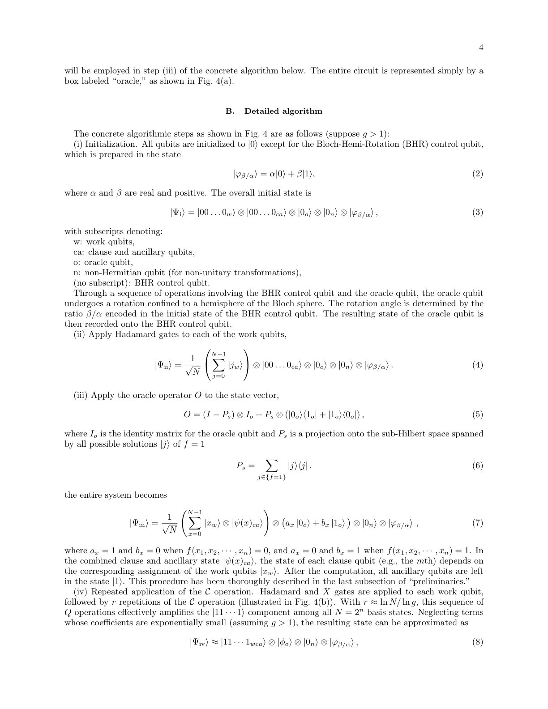 
Low-resolution page preview, page 4

📷 Fig 4

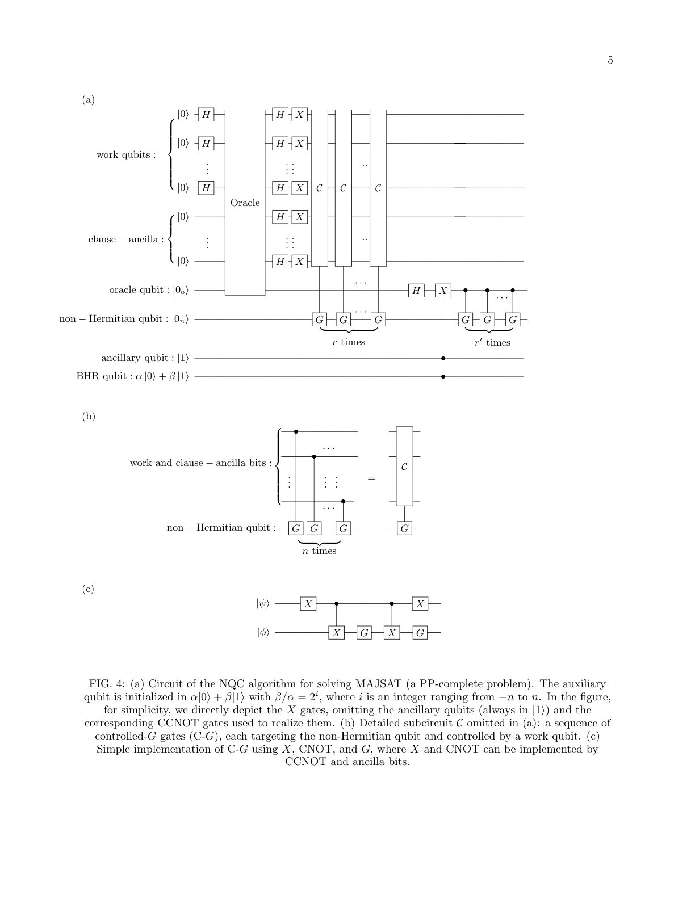 
Low-resolution page preview, page 5

📷 Fig 5

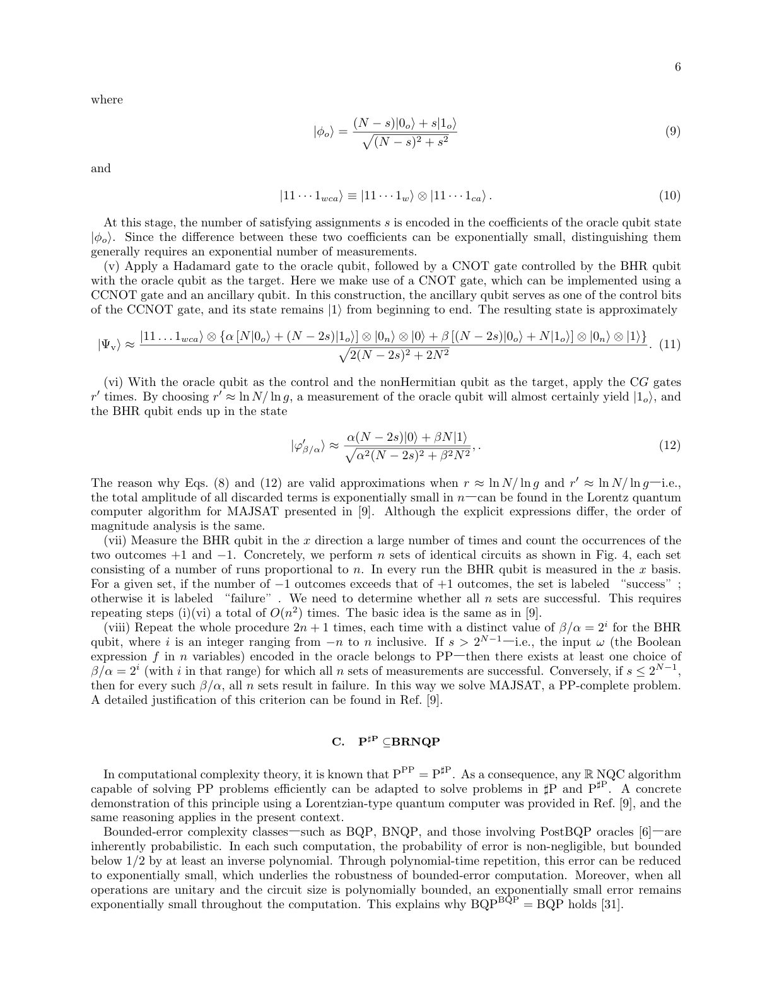 
Low-resolution page preview, page 6

**Summary.** This paper proves that complex numbers are not necessary to achieve the high computational power associated with non-Hermitian quantum computing. By showing that a real gate set can solve PP-complete problems, the author demonstrates that the essential resource for this class of quantum advantage is non-unitarity itself.

**Why it may be interesting.** This is highly relevant for researchers in open quantum systems as it identifies non-unitarity as the fundamental driver of computational advantage, independent of the presence of complex phases.

Detailed structure

**Main problem.** The paper investigates whether complex numbers are an essential resource for the enhanced computational power provided by non-Hermitian quantum computing.

**Main result.** The authors prove that a real gate set {H, CCNOT, G} is as powerful as the universal non-Hermitian gate set, establishing that BRNQP = BNQP = P^#P and demonstrating that non-unitarity, rather than complex numbers, is the key resource.

**Method.** The study uses complexity theory and algorithmic construction, specifically designing a circuit to solve the PP-complete MAJSAT problem and using path-sum expansion to relate success probabilities to the P^#P complexity class.

**Model / system.** A non-Hermitian quantum computer (NQC) model that relaxes the unitarity restriction, utilizing a gate set including the non-unitary gate G = diag(g^-1, g).

**Key observables.** The outcome of the measurement of the BHR control qubit in the x direction (+1 vs -1).

**Important parameters / regimes.** The amplification strength parameter g (where g > 1), the ratio beta/alpha encoded in the BHR qubit, and the number of satisfying assignments s.

**Assumptions / limitations.** The construction assumes a precision-controlled constant to manage the spacing of real numbers and assumes the ability to perform non-unitary operations.

**Figures summary.** Figure 1 shows the implementation of an X gate using CCNOT and ancillae; Figure 2 illustrates the decomposition of multi-control Toffoli gates; Figure 3 shows the circuit realization of a 3-CNF clause.

**Paper structure.** The paper begins by establishing the context of real vs complex gates in Hermitian computing, then introduces the non-Hermitian model, provides a constructive algorithm for solving MAJSAT using real gates, and concludes with a formal complexity-theoretic proof of the equality of the complexity classes.

Abstract

In traditional quantum computing, it has been established that real quantum computation augmented with non-Clifford gates is as powerful as universal quantum computation. Here we investigate this phenomenon in the non-Hermitian setting. We show that a non-Hermitian quantum computer equipped with the real gate set ${H, \text{CCNOT}, G}$, where $G = \operatorname{diag}(g^{-1}, g)$ with $g > 0$ and $g \neq 1$, can solve problems in $\text{P}^{\sharp\text{P}}$ in polynomial time, matching the capability of its universal non-Hermitian counterpart ${H, T, \text{CNOT}, G}$. This demonstrates that non-unitarity, rather than universality, is the essential resource, and that complex numbers are unnecessary.

[↑ back to top](#top)

### [Non-invertible symmetry enriched string net topological orders](http://arxiv.org/abs/2605.28794v1)

**Authors:** Luisa Eck, Peter Huston, Kyle Kawagoe, David Penneys  
**Type:** theory · **Category:** strongly correlated electrons · **PDF:** <https://arxiv.org/pdf/2605.28794v1>  
**Analysis basis:** full PDF text, analyzed in chunks
**Topic relevance:** `entanglement & information structure` **2/5**

📷 Fig 1

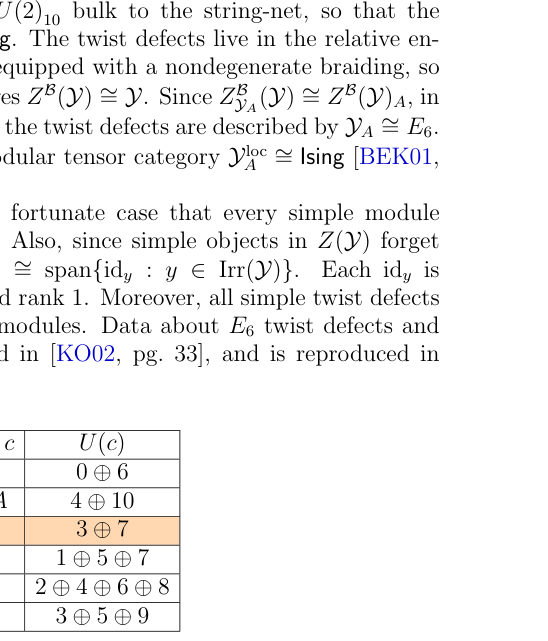 
Figure 1. E6 twist defects (including anyons) written as free modules on SU(2)10 anyons, and the underlying direct sum of SU(2)10 anyons. The anyon which is not a free module is highlighted in orange.

**Summary.** This paper provides a formal framework for topological orders enriched by non-invertible symmetries. By using string-net models and category theory, it shows how non-invertible symmetries can transform anyons into direct sums of excitations and identifies the resulting twist defects.

**Why it may be interesting.** not directly relevant

Detailed structure

**Main problem.** The paper aims to define and implement Non-Invertible Symmetry Enriched Topological Orders (NI-SETOs), extending the concept of SETOs from group-like symmetries to non-invertible quantum symmetries.

**Main result.** The authors propose a definition for NI-SETOs using full inclusions of unitary fusion categories and anyon condensation, proving these approaches are dual and can be realized in string-net models.

**Method.** The study utilizes higher category theory, tube algebra techniques, and the graphical calculus of strings to compute symmetry actions and identify twist defects.

**Model / system.** The primary models are string-net topological orders, specifically using unitary fusion categories (UFCs), anyon condensation, and 3D Walker-Wang models to represent anomalies.

**Key observables.** Symmetry action on anyons, types of twist defects, and the multiplicity of anyon transformations under symmetry action.

**Important parameters / regimes.** The specific unitary fusion categories (e.g., Ising, S3, E6) and the choice of condensable algebra A.

**Assumptions / limitations.** The current definition (Ansatz A) lacks a structure to capture the collection of symmetries independently of a specific UMTC, and the framework assumes semisimplicity.

**Figures summary.** Figure 1 illustrates the relationship between wall excitations, the folding trick, and the connection between categories via twist defects; other diagrams show 3D enriched string-net models and E6 twist defects.

**Paper structure.** The paper introduces the NI-SETO definition, presents two implementation approaches (full inclusion and anyon condensation), demonstrates their duality, applies these to string-net models, and provides explicit examples like the S3 and E6 cases.

Abstract

We propose a definition of a non-invertible symmetry enriched topological order (NI-SETO), and we implement our definition for string net models. We do so in two ways, using full inclusions of unitary fusion categories (UFCs), as well as anyon condensation. In both cases, the NI-SETO is a relative center of UFCs. All NI-SETOs can be realized in either model, where we can use enriched UFCs to get chiral examples on the boundary of a 3D Walker-Wang model representing the anomaly. We describe several examples of NI-SETOs and compute the qualitative symmetry action on anyons and symmetry defects using tube algebra techniques.

[↑ back to top](#top)

### [Odd spin symmetry and anisotropy switching in p-wave magnet CeNiAsO](http://arxiv.org/abs/2605.28701v1)

**Authors:** Fayuan Zhang, Huaxun Li, Xingkai Cheng, Yibo Fan, Yifan Yin, Yifan Gao, Zhanfeng Liu, Shengtao Cui, Zhouyi Yin, Yue Zhao, Junhao Lin, Zhengtai Liu, Mao Ye, Yaobo Huang, Shan Qiao, Wu Xie, Ping Miao, Hao Wu, Junwei Liu, Guanghan Cao, Chaoyu Chen  
**Type:** both · **Category:** strongly correlated electrons · **PDF:** <https://arxiv.org/pdf/2605.28701v1>  
**Analysis basis:** full PDF text, analyzed in chunks
**Topic relevance:** `Kondo & dissipative impurity` **2/5**

📷 Fig 1

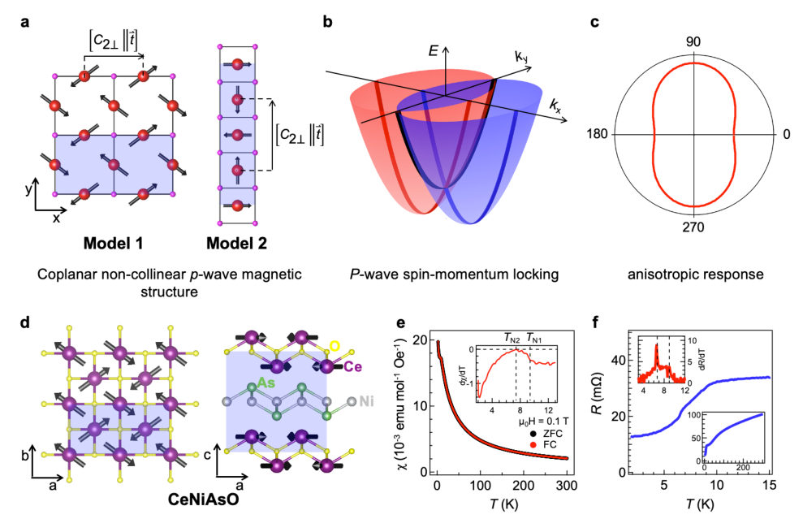 
Fig. 1┃Characteristics of p-wave magnet and properties of CeNiAsO. a-c, Schematic illustration of the p-wave

📷 Fig 2

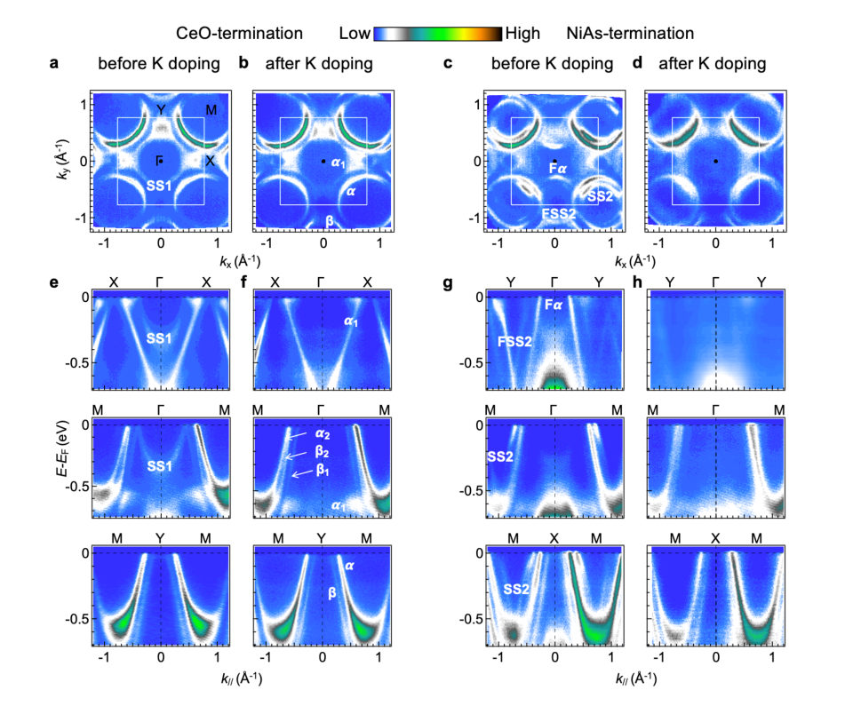 
Fig. 2┃Termination dependent surface state bands and the intrinsic bulk bands of CeNiAsO. a-d, ARPES

📷 Fig 3

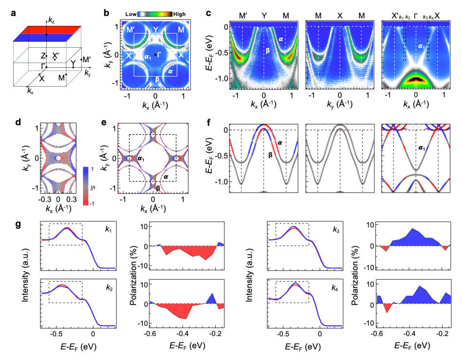 
Fig. 3┃P-wave spin symmetry in CeNiAsO. a, Bulk BZ and the projected surface BZ with p-wave symmetry. b-

📷 Fig 4

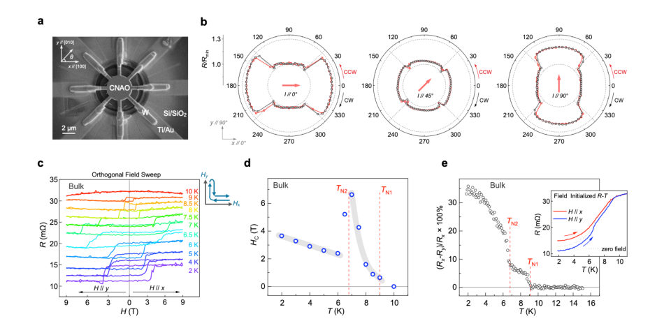 
Fig. 4┃Nonvolatile, anisotropic resistance of CeNiAsO. a. Scanning electron micrograph of the FIB fabricated

**Summary.** This paper provides the first experimental evidence of p-wave spin symmetry in the odd-parity magnet CeNiAsO. By using potassium deposition to reveal intrinsic bulk bands, the authors demonstrate that magnetic domains can be manipulated to switch resistance anisotropy, suggesting high potential for antiferromagnetic spintronic memory devices.

**Why it may be interesting.** not directly relevant

Detailed structure

**Main problem.** The experimental verification of intrinsic p-wave spin symmetry in odd-parity magnets and the connection between this symmetry and observed anisotropic transport properties.

**Main result.** The authors experimentally demonstrate p-wave spin symmetry in CeNiAsO using spin-resolved ARPES and show that magnetic domain selection can switch the material between high- and low-resistance states.

**Method.** The study combines spin-resolved ARPES, STM, and transport measurements on single crystals and FIB-fabricated devices, supported by first-principles DFT calculations and in situ potassium deposition to remove surface states.

**Model / system.** The system is CeNiAsO, an antiferromagnetic Kondo metal with a layered tetragonal structure and p-wave magnetic order characterized by a non-relativistic spin group symmetry C4z^t.

**Key observables.** Spin polarization (asymmetry in EDCs), resistance anisotropy, magnetoresistance ratio, and Fermi surface topology.

**Important parameters / regimes.** Magnetic transition temperatures (TN1 approx 7.4 K, TN2 approx 9.4 K), magnetic field up to 9 T, and temperature regimes down to 2 K.

**Assumptions / limitations.** The study assumes that potassium deposition effectively compensates for polar surface states to reveal the intrinsic bulk band structure.

**Figures summary.** Figures show XRD and EDS for composition, STM for surface termination identification, ARPES for Fermi surface and band spectra, and transport data showing resistance anisotropy and domain switching.

**Paper structure.** The paper introduces the importance of odd-parity magnets, details the structural and magnetic characterization of CeNiAsO, presents ARPES results showing p-wave symmetry after surface modification, demonstrates resistance anisotropy switching via magnetic field, and concludes with the implications for spintronics and superconductivity.

Abstract

Odd-parity magnets, complementary to altermagnets, exhibit unique properties such as high efficiency in charge-spin conversion and compatibility with conventional superconductivity, of critical importance in the pursuit of energy-efficient spintronics and topological superconductors for quantum computation. For even-parity d-wave and g-wave altermagnets, the magnetic structure, spin-split band structure and physical properties are currently under intensive study. On the contrary, while hundreds of odd-parity magnets and the promising properties have been predicted in theory, experimental studies are scarce. Specifically, the magnetic structure and transport properties of candidates NiI2 and Ga3Ru4Al12 have been reported, yet the characteristic band structure and particularly the odd-parity spin symmetry remain elusive. Here we demonstrate experimentally the deterministic p-wave spin symmetry and resistance anisotropy switching for the prototype odd-parity magnet, CeNiAsO. Angle-resolved photoemission spectroscopy (ARPES) reveals two cleaved terminations with distinct surface band structure. By compensating the polar surface, we achieve intrinsic bulk band structure, for which the spin splitting can be well described by the p-wave magnetic structure through first-principles calculation. The bulk spin polarization measured by spin-resolved ARPES exhibits symmetry with only one degenerate plane, fingerprint of p-wave magnetism. We further demonstrate giant resistance anisotropy and switching between high-resistance and low-resistance states through modest field-induced domain selection, highlighting its potential for antiferromagnetic spin memory devices. The structural similarity between CeNiAsO and 1111-type Fe-based superconductors stimulates further exploration on the interplay between p-wave magnetism, superconductivity and band topology.

[↑ back to top](#top)

### [Problem-Specific Basis Quantum State Readout via Proper Orthogonal Decomposition](http://arxiv.org/abs/2605.27915v1)

**Authors:** Kota Ichiki, Xinchi Huang, Gekko Budiutama, Masari Watanabe, Yoshifumi Kawada, Ryunosuke Terasawa, Hirofumi Nishi, Takayuki Suzuki, Nagai Ryutaro, Yu-ichiro Matsushita  
**Type:** theory · **Category:** quantum information and computing · **PDF:** <https://arxiv.org/pdf/2605.27915v1>  
**Analysis basis:** full PDF text, analyzed in chunks
**Topic relevance:** `quantum measurements` **2/5**

📷 Fig 1

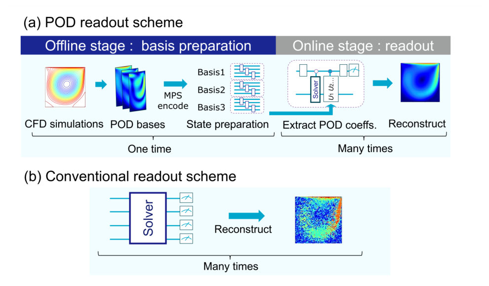 
FIG. 1. (a) The workflow of the proposed proper orthogonal decomposition-based readout (PODR) method. By precomputing POD bases, subsequent readout can be performed with improved speed and accuracy. The offline stage is executed only once and may depend polynomially on N. In this stage, POD bases are constructed from classical CAE/CFD simulation results and encoded into quantum circuits via matrix product states (MPS). The online stage is executed repeatedly and must be both efficient and accurate. In this stage, the inner product between the output state of the quantum CAE/CFD solver and POD bases (⟨x | ˜ui⟩) are measured, and the solution is reconstructed from the obtained POD weight...

📷 Fig 2

 
FIG. 2. (a) Readout error as a function of the number of repetitions for the velocity field ux of the steady 2D lid-driven

📷 Fig 3

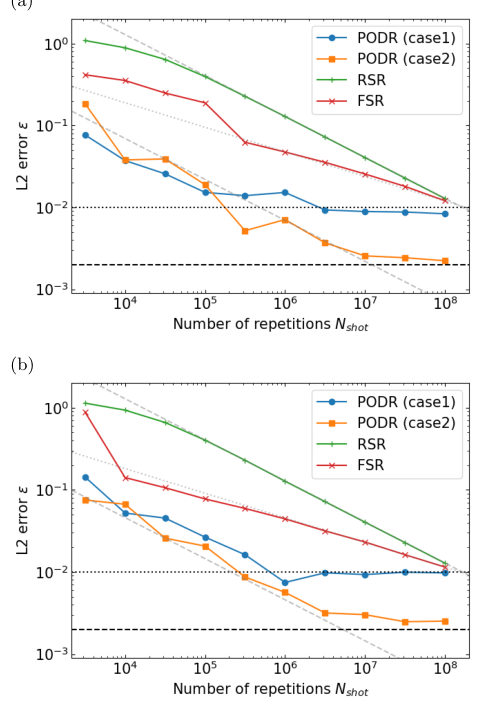 
Fig. 3 shows the relationship between the circuit depth D of the encoding circuit for the nb-th POD basis and the

📷 Fig 4

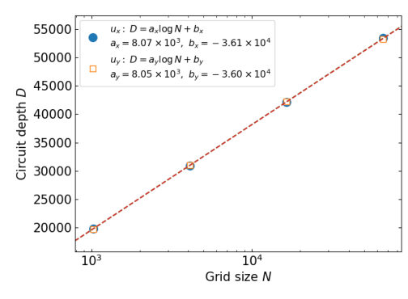 
FIG. 3. The circuit depth D of the nb-th POD basis as a function of the grid size N for the velocity fields ux and uy of the steady 2D lid-driven cavity flow. The dashed lines show the least-squares fits to the data for ux and uy.

📷 Fig 5

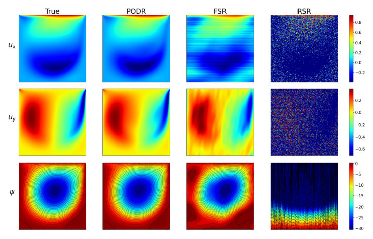 
FIG. 4. Visualization of the solution for the steady 2D lid-driven cavity flow and comparison of the methods at Nshot = 104.

**Summary.** This paper proposes a problem-specific readout method for quantum PDE solvers that uses classical precomputation to create an efficient basis for reconstruction. By projecting quantum states onto a reduced POD basis, the method overcomes the scaling bottlenecks of standard readout techniques in fluid dynamics simulations.

**Why it may be interesting.** not directly relevant

Detailed structure

**Main problem.** The readout and reconstruction of classical solutions from quantum states in PDE solvers is a significant bottleneck, as conventional methods like Real-Space Readout scale poorly with grid size.

**Main result.** The proposed PODR method significantly reduces the number of measurements and computational resources in the online stage, achieving superior shot efficiency and reconstruction fidelity compared to RSR and FSR.

**Method.** A two-stage approach (offline/online) using Proper Orthogonal Decomposition (POD) to precompute a reduced basis from classical snapshots, which is then encoded into quantum circuits using Matrix Product States (MPS) and measured via the Hadamard test.

**Model / system.** The method is applied to Computational Fluid Dynamics (CFD) benchmark problems, specifically 2D steady lid-driven cavity flow and 2D Kármán vortex street.

**Key observables.** Velocity fields (u_x, u_y), stream functions, and projection/encoding error estimators.

**Important parameters / regimes.** Grid size (N), number of POD bases (n_b), bond dimension (chi), Reynolds number (Re), and target error tolerance (epsilon).

**Assumptions / limitations.** The solution state is well-represented by the classical snapshot ensemble, and the offline stage is performed only once for a specific problem class.

**Figures summary.** Figure 1 shows the PODR workflow and comparison to RSR; Figure 2 plots readout error vs. shots; Figure 3 shows circuit depth scaling; Figures 4-5 visualize reconstructed velocity fields; Figures 8-9 validate error estimators; Figure 11 compares shot efficiency across methods.

**Paper structure.** The paper introduces the readout bottleneck, details the PODR offline/online workflow, provides a mathematical error decomposition, presents complexity analysis, validates the method using CFD benchmarks, and concludes with error estimator validation.

Abstract

Quantum computing is a promising technology for accelerating partial differential equation solvers applied to large-scale real-world problems. However, reconstructing a classical representation of the solution from the quantum state remains a significant bottleneck. We propose a problem-specific method, called proper orthogonal decomposition-based readout (PODR), to improve readout efficiency by precomputing characteristic features of the solution. The present method consists of an offline stage and an online stage. In the offline stage, a set of basis functions representing the dominant features of the target problem is constructed from representative solution data using classical computations. In the online stage, the quantum state is projected onto this reduced basis, and only the minimal set of weight coefficients is extracted to reconstruct the solution. Since the offline stage is carried out only once, the proposed PODR method is especially advantageous for simulations with varying parameters, which are common in computational fluid dynamics (CFD). Futhermore, we apply the proposed method to benchmark problems in fluid dynamics and demonstrate that PODR significantly reduces both the number of measurements and the computational resources in the online stage compared with conventional readout methods.

[↑ back to top](#top)

### [Quantum geometry of connected state manifolds: When diabolic points act as bridges between eigenstate manifolds](http://arxiv.org/abs/2605.28351v1)

**Authors:** Jan Střeleček, Jakub Novotný, Pavel Cejnar  
**Type:** theory · **Category:** other · **PDF:** <https://arxiv.org/pdf/2605.28351v1>  
**Analysis basis:** full PDF text, analyzed in chunks
**Topic relevance:** `spintronics-quantum-optics interface` **2/5**

📷 Fig 1

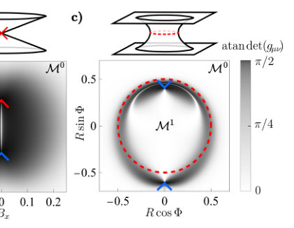 
Figure 1: Illustration of the bridge connecting ground and first excited state mani- folds of a spin-1 model in a magnetic field B = (Bx,0, Bz), see Sec. 3.1. (a) 3D plot of spectrum in a (Bx, Bz) parametric space. Red and blue crosses mark DPs between ground and first excited states, creating CSM from two eigenstate manifolds. The second state manifold is disconnected from it due to a finite energy gap. (b) De- terminant of the ground state metric tensor g(0) µν in Cartesian coordinates manifests divergences near DPs, with a schematic illustration of one of the energy crossings on top. (c) Regularised metric tensor in stretched coordinates (R,Φ) around one of the DPs (red cross with...

📷 Fig 2

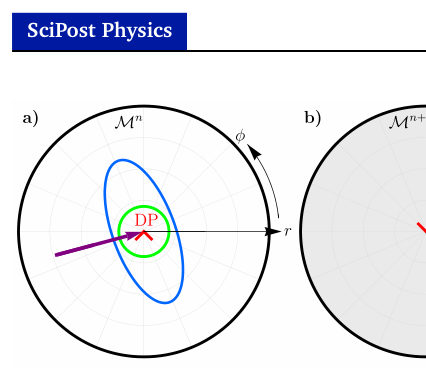 
Figure 2: Schematic illustration of coordinate systems around a DP. (a) Manifold Mn

📷 Fig 3

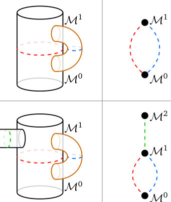 
Figure 4: Topological structure of CSMs. Left: schematic arrangement of spectrum in parametric space α; middle: the corresponding topology; right: the associated graph representation. (a) A CSM connects two eigenlevels through a single DP (red cross, dashed line). (b) Adding a second DP between the same manifolds introduces a handle on the infinite cylinder. (c) A three-level CSM with two DPs between M0

📷 Fig 4

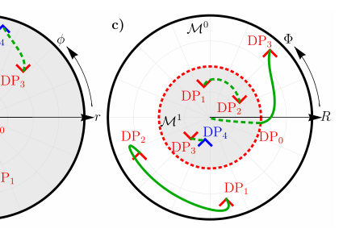 
Figure 5: Demonstration of nodal lines for fictitious CSM(0,2). (a) M0 in polar coor- dinates around DP0 with 4 DPs between M0 and M1(bottom halves of red crosses) and exemplary nodal lines between them (dashed, green). (b) M1 in the same polar coordinates, DPs are marked by upper halves of crosses, and possible nodal line con- tinuation from M0 is shown. In addition, DP4 between M1 and M2 is marked by a blue half cross. (c) CSM in stretched coordinates around DP0 (red, dashed) with nodal line structure corresponding to the other two panels.

📷 Fig 5

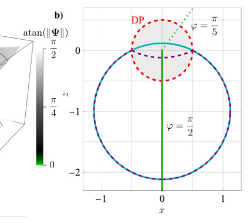 
Figure 6: (a) A conical structure of a 2-level system with h2 = 0 and DP at (0,0). The heatmap shows the magnitude of the unnormalised eigenvector, revealing the nodal line (|Ψ| = 0) passing through the DP. Two paths are drawn: a double-circle (cyan) and a figure-eight (purple, dashed). (b) The same scenario in stretched coordinates around the DP (red, dashed). Two gauges rotating the nodal line around the centre are shown: ϕ = π/2 (black, corresponding to panel (a)) and ϕ = π/5 (dotted line).

**Summary.** This paper introduces a new geometric framework called the Connected State Manifold to treat energy level crossings as bridges rather than boundaries. By regularizing the metric at these points, the authors show that one can find shorter, more stable paths (geodesics) and compute Berry phases even when passing directly through degeneracies.

**Why it may be interesting.** This is highly relevant for researchers in quantum control and adiabatic computing, as it provides a way to navigate through degeneracies and compute geometric phases for paths that traverse diabolic points.

Detailed structure

**Main problem.** The divergence of the Provost-Vallee metric and numerical instabilities at diabolic points (DPs) prevent a continuous geometric description of eigenstate manifolds.

**Main result.** The authors develop a 'Connected State Manifold' (CSM) formalism where DPs act as bridges to glue adjacent manifolds, regularizing the metric and enabling stable computation of geodesics and Berry phases.

**Method.** The study uses coordinate transformations (stretched coordinates) to regularize singularities, analytic continuation across DP horizons, and second-order perturbation theory to analyze multi-level systems.

**Model / system.** The framework applies to N-level parametric Hermitian Hamiltonians, specifically focusing on 3-level systems with effective PT-symmetry, such as those inspired by NV centers in diamond.

**Key observables.** Quantum Geometric Tensor (QGT), Provost-Vallee metric, Berry phase, and geodesics.

**Important parameters / regimes.** Diabolic points (DPs), spectral gap, radial and angular coordinates (r, phi), and the DP horizon.

**Assumptions / limitations.** The analysis assumes DPs have codimension 2, focuses on systems with effective PT-symmetry (antiunitary symmetry), and assumes no three levels cross at the same point.

**Figures summary.** Figure 1 shows 3D spectra and metric divergence/regularization; Figure 2 illustrates coordinate transformations and path continuation; Figure 4 displays the topological genus and graph representation of CSMs; Figure 9 compares unstable single-manifold geodesics with stable CSM geodesics.

**Paper structure.** The paper introduces the problem of metric singularities at DPs, proposes the CSM formalism via coordinate regularization, analyzes the local geometry of multi-level systems using perturbation theory, characterizes the topology and nodal lines of the CSM, and demonstrates the stability and efficiency of geodesics within this new framework.

Abstract

Parametric Hamiltonians often exhibit point-like spectral degeneracies (diabolic points, or conical intersections), which can lead to singularities in the Provost-Vallee metric of eigenstate manifolds. We regularise the metric by a coordinate transformation and develop a formalism in which diabolic points act as bridges between adjacent eigenstate manifolds, glueing them into a single connected state manifold. We characterise the topology of this structure and refine the rules for nodal lines governing the Berry phase. The connected state manifold restores the numerical stability near diabolic points, enlarges the class of geodesics allowing for new geodesic shortcuts, and provides a new mechanism for Berry phase computation, even along paths traversing diabolic points.

[↑ back to top](#top)

### [Quantum principal component analysis without eigenvector recovery](http://arxiv.org/abs/2605.27942v1)

**Authors:** Yewei Yuan, Michele Minervini, Mark M. Wilde, Nana Liu  
**Type:** theory · **Category:** quantum information and computing · **PDF:** <https://arxiv.org/pdf/2605.27942v1>  
**Analysis basis:** full PDF text, analyzed in chunks
**Topic relevance:** `quantum measurements` **2/5**

📷 Fig 1

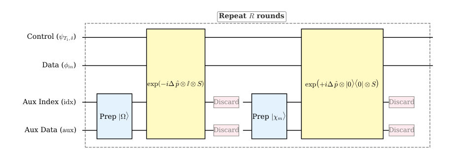 
Figure 1: Implementation of the Hamiltonian evolution UC ≈e−iˆp⊗Cϕ/T2 for the soft PCA. Each round applies two signed selector-swap substeps. The empirical sub- step prepares |Ω⟩= N−1/2 P i |i⟩|ϕi⟩and applies exp(−i ∆ˆp ⊗1 ⊗Sdata,aux), thereby gen- erating +¯ρϕ. The mean-subtraction substep prepares |χm⟩= |0⟩|m⟩+ |⊥⟩and applies exp(+i ∆ˆp ⊗|0⟩⟨0| ⊗Sdata,aux), thereby generating −|m⟩⟨m|. The selector |0⟩⟨0|idx is coherent, so no index postselection or α-estimation is required during Hamiltonian simulation. Repeating the two substeps for R rounds yields Eq. (4.40).

📷 Fig 2

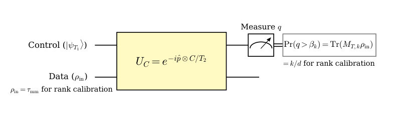 
Figure 2: Schematic of the quantum soft PCA. A control qumode prepared in |ψT1⟩ and a data register in a generic probe state ρin undergo the joint Hamiltonian evolution UC = e−iˆp⊗C/T2. By measuring the position quadrature q of the control qumode and applying a simple classical threshold rule q &gt; β, the protocol directly evaluates the soft PCA score Tr(MT,βT2ρin). This unified schematic applies to both the trace-budget calibration phase (e.g. ρin = I/d for rank calibration) and the downstream inference on new test inputs. A specific implementation of the quantum circuit is shown in Fig 1, and the detailed rank calibration process is illustrated in Fig. 3.

📷 Fig 3

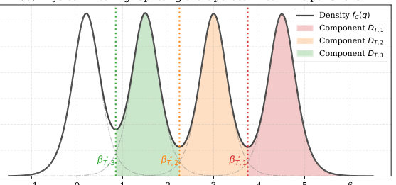 
Figure 3: Training-free calibration of optimal soft PCA filters via quantile mapping. (a) The tail probability 1 −FC(β) decreases in a staircase-like manner. The optimal thresholds β⋆ k are found strictly at the quantiles k/d. (b) The corresponding physical position density fC(q) (solid line), composed of distinct eigenmode peaks (dashed gray lines). The thresholds vertically partition the measured distribution into adjacent quantile windows, which implement the soft spectral components DT,k. When the relevant eigengaps are large and the peaks are well separated, the thresholds tend to lie in low-density valleys, making the selected filter robust to small threshold perturbations.

**Summary.** This paper proposes a new way to perform Quantum PCA by treating it as a measurement-based scoring task rather than an eigenvector recovery task. By using a smooth Fermi-Dirac filter, the authors bypass the need for expensive iterative computations and enable efficient, training-free processing of quantum data for tasks like anomaly detection.

**Why it may be interesting.** not directly relevant

Detailed structure

**Main problem.** Traditional Quantum Principal Component Analysis (qPCA) is computationally expensive due to the need for explicit eigenvector recovery and is difficult to implement for quantum-native data that requires centering. The authors aim to develop a framework that performs PCA-like tasks (scoring and filtering) without needing to reconstruct individual eigenvectors.

**Main result.** The authors introduce a measurement-based 'soft PCA' framework using an entropy-regularized Fermi-Dirac filter that achieves dimension-independent sample complexity for scoring tasks. This framework allows for training-free calibration, where a single fixed quantum circuit can be used to identify optimal thresholds for various rank budgets or variance levels.

**Method.** The method replaces hard rank-k projectors with a smooth Fermi-Dirac filter derived from an entropy-regularized variational formulation. It utilizes a continuous-variable quantum measurement protocol involving Hamiltonian simulation of the covariance operator and a controlled thermal measurement using a non-Gaussian wavepacket.

**Model / system.** The system involves quantum feature states representing centered covariance operators. The mathematical model uses a controlled Hamiltonian evolution $U_C = e^{-i\hat{p} \otimes C/T_2}$, where $\hat{p}$ is the momentum quadrature of a control qumode and $C$ is the covariance operator.

**Key observables.** Principal-subspace scores, spectral-energy profiles, postselected filtered states, and the position quadrature $q$ of the control qumode.

**Important parameters / regimes.** Temperature ($T$) controlling spectral smoothness, rank budget ($k$), retained variance, chemical potential ($\mu$), and the accuracy parameter ($\eta$).

**Assumptions / limitations.** Assumes the existence of a centered covariance operator represented by quantum feature states and requires a non-zero eigengap for the zero-temperature limit to recover hard PCA.

**Figures summary.** Figure 1 provides a schematic of the implementation of the Hamiltonian evolution using a two-substep product formula involving empirical and mean-subtraction steps.

**Paper structure.** The paper identifies limitations of traditional PCA, proposes an entropy-regularized soft PCA framework, derives the Fermi-Dirac filter, details the quantum implementation via thermal measurement, provides a calibration protocol for various ranks, and performs error and complexity analysis.

Abstract

Principal component analysis (PCA) is traditionally implemented through a covariance or kernel matrix, leading-eigenvector extraction, and hard rank-$k$ projection. These steps can be computationally costly in high-dimensional and quantum-data settings, sensitive to small eigengaps, and unnecessary when downstream tasks only require principal-subspace scores. Such score-based objectives are important in applications such as anomaly detection, spectral-energy profiling, and other postselection tasks. To address these needs, we introduce a measurement-based soft PCA framework replacing the hard top-$k$ projector with an entropy-regularized Fermi--Dirac filter. This filter is the unique optimizer of an entropy-regularized variational formulation of PCA and converges to the classical PCA projector in the zero-temperature limit.   This filter has a direct interpretation as a quantum measurement, which naturally suggests a quantum approach. For centered covariance operators represented by quantum feature states, a single fixed circuit, together with threshold calibration, accesses all optimal filters for different rank budgets or retained-variance levels without rank-dependent circuit updates or eigenvector recovery. For new inputs, the same calibrated quantum circuit yields soft principal subspace scores, spectral energy profiles, and postselected filtered states. The required centering of both training and test data is performed coherently inside the quantum protocol, which is particularly important for quantum data where no classical feature vectors or centered Gram matrix are directly available. By reframing PCA as a calibrated measurement task, this framework bypasses the need for iterative eigenvector extraction and achieves a dimension-independent sample complexity $O(η^{-2})$ for normalized fractional-rank or retained variance scoring at additive accuracy $η$.

[↑ back to top](#top)

### [Spontaneous breaking of non-invertible symmetries and duality to beyond-Landau transitions](http://arxiv.org/abs/2605.27672v1)

**Authors:** Xie Chen, Shang Liu, Da-chuan Lu, Nathanan Tantivasadakarn  
**Type:** theory · **Category:** strongly correlated electrons · **PDF:** <https://arxiv.org/pdf/2605.27672v1>  
**Analysis basis:** full PDF text, analyzed in chunks
**Topic relevance:** `entanglement & information structure` **2/5**

📷 Fig 1

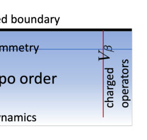 
Figure 1: In the Symmetry Topological Field Theory, a 1 + 1D system is realized in a sandwich structure with a 2 + 1D topological order in the bulk. The top boundary is gapped, fixed, and determines the symmetry of the system. The bottom boundary contains all the dynamics of the system and is at a finite distance from the top boundary. The horizontal string operators Wα become the symmetry operators of the 1+1D system. The vertical string operators Vβ become local charged operators if β is condensed on the top boundary.

📷 Fig 2

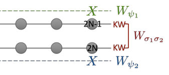 
Figure 2: Rep(H8) symmetry realized in two qubits chains. Wψ1, the spin flip operation in the first chain, and Wψ2, the spin flip operation in the qubit chain, generate the invertible part of the symmetry. Wσ1σ2, the joint Kramers-Wannier transformation in both chains, gives the non-invertible symmetry operation.

📷 Fig 3

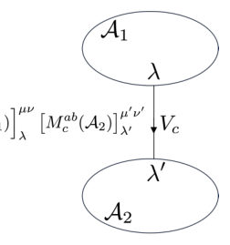 
Figure 3: Fusion algebra of two local order parameters Va and Vb into Vc in the SymTFT formalism. An equivalent interpretation is the action of a local order parameter Va on a ‘cat’ state labeled by b. The M-3j symbols come from the Lagrangian algebra A’s describing the top and bottom gapped boundaries in the sandwich structure.

📷 Fig 4

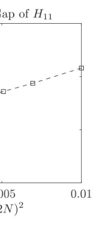 
Figure 4: The energy gap ∆E of H11 as a function of 1/(2N)2. ∆E is the same as the 6-th lowest energy eigenvalue. The squares are numerical data from exact diagonalization, with 2N goes from 10 to 24. The dashed line is a quadratic fitting, i.e. ∆Efit = a + b/(2N) + c/(2N)2. The intercept a = ∆Efit(N →∞) is clearly nonzero.

**Summary.** This paper explores how spontaneous symmetry breaking works when the symmetry cannot be inverted, such as in certain fusion categories. It demonstrates that these transitions can be dual to well-known deconfined quantum critical points, providing a new way to study phase transitions beyond the Landau paradigm.

**Why it may be interesting.** not directly relevant

Detailed structure

**Main problem.** The paper investigates the nature of spontaneous symmetry breaking (SSB) when the symmetry involved is non-invertible, specifically looking for differences between these phases and conventional invertible symmetry-breaking phases.

**Main result.** The authors establish that non-invertible SSB phases can still be characterized by long-range correlations of local order parameters and prove a duality between certain non-invertible symmetry-breaking transitions and deconfined quantum critical points (DQCP) of invertible symmetries.

**Method.** The study utilizes the Symmetry Topological Field Theory (SymTFT) formalism, anyon condensation, and generalized gauging techniques, supported by exact diagonalization of 1D qubit lattice models.

**Model / system.** The primary models are 1+1D gapped phases with Rep(H8) symmetry, realized via 1D qubit lattice models (coupled chains) and a 'sandwich' construction involving a 2+1D topological bulk.

**Key observables.** Local order parameters, ground-state degeneracy, correlation functions, and topological spin.

**Important parameters / regimes.** The non-invertible Rep(H8) symmetry, the 3-cocycle parameter gamma for the dual D8 symmetry, and the thermodynamic limit of the 1D lattice size.

**Assumptions / limitations.** The study focuses on 1+1D systems and considers only untwisted local order parameters.

**Figures summary.** The notes do not provide specific descriptions of figures, though they mention the use of numerical verification for energy gaps and ground-state degeneracy.

**Paper structure.** The paper introduces the problem of non-invertible SSB, develops the SymTFT and anyon condensation framework, presents concrete 1D lattice models and their Hamiltonian constructions, establishes the duality to DQCP via gauging, and generalizes the results to group-theoretical Hopf algebras.

Abstract

Spontaneous symmetry breaking is a well-understood mechanism for generating distinct phases of matter. Recently, the notion of symmetry has been broadened to include operations without inverses, leading to the concept of non-invertible symmetries. How do symmetry-breaking phases associated with non-invertible symmetries differ from those arising from conventional invertible symmetries? We address this question using concrete lattice models of the gapped phases with non-invertible Rep($H_8$) symmetry as an example. We find that, despite the symmetry being non-invertible, the symmetry-breaking phases can still be characterized by the long-range correlation of local order parameters, which obey a more general algebraic structure than in the invertible setting. Furthermore, via generalized gauging, certain non-invertible symmetry-breaking transitions can be mapped to deconfined quantum critical points of invertible symmetries, and vice versa. We establish precise conditions under which this duality holds and illustrate them with several families of examples, providing a systematic route to studying beyond-Landau phase transitions.

[↑ back to top](#top)

### [Stabilizer rank bounds for magic-state orbits](http://arxiv.org/abs/2605.28586v1)

**Authors:** Farrokh Labib, Vincent Russo  
**Type:** theory · **Category:** quantum information and computing · **PDF:** <https://arxiv.org/pdf/2605.28586v1>  
**Analysis basis:** full PDF text, analyzed in chunks
**Topic relevance:** `entanglement & information structure` **2/5**

📷 Fig 1

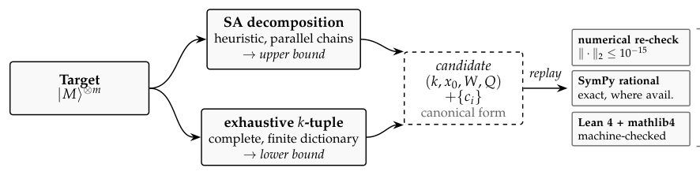 
Figure 1: The stabrank decomposition pipeline (upper-bound side). Simulated annealing returns a candidate canonical-form decomposition (k, x0, W, Q) with coefficients {ci}, replayed through three independent verifiers: numerical at machine precision (all seven qutrit identities), exact- rational in SymPy [MSP+17] (the heaviest identity, |N⟩⊗4), and Lean 4 + mathlib4 (all seven qutrit identities). The exhaustive k-tuple enumeration and the symplectic-quotient sweep (Section 3) instead emit JSON certificates audited via the path in Section 4.

**Summary.** This paper provides tighter bounds on the stabilizer rank of various magic-state orbits for both qubits and qutrits, which is crucial for understanding the complexity of simulating quantum circuits. It introduces a new software library and uses formal verification to ensure the accuracy of the discovered algebraic decompositions.

**Why it may be interesting.** not directly relevant

Detailed structure

**Main problem.** Determining the stabilizer rank and the per-copy asymptotic stabilizer-rank exponent for different Clifford orbits of magic states in qubit and qutrit systems.

**Main result.** Established new, lower upper bounds for several qutrit magic-state orbits (Strange, Norrell, and Hadamard-eigenstate) and provided a closed-form qubit T-type decomposition. The authors also proved the first nontrivial asymptotic lower bounds for the Hadamard-eigenstate and Norrell orbits.

**Method.** The authors use simulated-annealing searches via the 'stabrank' library to find stabilizer decompositions, apply a subset-sum argument for lower bounds, and utilize Lean 4 for formal machine-checked verification of the identities.

**Model / system.** The study focuses on the Clifford + magic-state model of quantum computation, specifically analyzing the stabilizer rank of tensor powers of magic states in qubit (p=2) and qutrit (p=3) systems.

**Key observables.** Stabilizer rank (chi) and the per-copy asymptotic stabilizer-rank exponent (gamma).

**Important parameters / regimes.** Number of copies (m), dimension of the system (p=2 or p=3), and the specific Clifford orbits (Strange, Norrell, Hadamard-eigenstate, and T-state).

**Assumptions / limitations.** The results assume the validity of the Clifford + magic-state model and rely on the algebraic structure of the Clifford group in prime dimensions.

**Figures summary.** Figure 1 illustrates the 'stabrank' decomposition pipeline, showing the flow from simulated annealing to numerical, symbolic, and formal verification.

**Paper structure.** The paper introduces the problem of orbit-dependent stabilizer ranks, presents new upper bounds for qutrit orbits through explicit decompositions, establishes asymptotic lower bounds using subset-sum techniques, provides a new qubit T-type decomposition, and concludes with the introduction of the 'stabrank' software and formal verification results.

Abstract

Distinct Clifford orbits of magic states can exhibit different stabilizer ranks at small tensor powers. We establish this for qutrits, where the single-qutrit Clifford group has four inequivalent orbits of magic states: Strange, Norrell, Hadamard-eigenstate, and the qutrit T-state, but a nontrivial upper bound on the asymptotic exponent had been pinned down for only the qutrit T-state. For the other three orbits we give explicit stabilizer decompositions, yielding upper bounds on the per-copy asymptotic stabilizer-rank exponent: $γ_S \le \log_3(2)/2 \approx 0.316$ for the Strange state, and $γ_{H_3}, γ_N \le \log_3(4)/3 \approx 0.421$ for the Hadamard-eigenstate and Norrell orbits, all strictly below the prior $γ_{T_3} \le 1/2$ baseline. We also prove the first nontrivial $Ω(m / \log m)$ asymptotic lower bounds for the Hadamard-eigenstate and Norrell orbits, and exhibit two-qutrit Clifford circuits that convert two copies of these states into an injectable phase state with constant success probability, enabling constant-overhead injection of one non-Clifford diagonal gate per orbit. In the case of qubits, we give a closed-form decomposition of the qubit T-type orbit at four copies matching the existing $γ_T \le \log_2(3)/4 \approx 0.396$ exponent via a direct algebraic identity rather than an entangled cat-state construction. An open-source library stabrank accompanies the paper, with Lean 4 proof formalizations of all the decompositions.

[↑ back to top](#top)

### [Trapped-Ion Multiqubit Gates are Compatible with Scalable Quantum Error Correction](http://arxiv.org/abs/2605.28536v1)

**Authors:** Ori Grossman, Yotam Kadish, Snir Gazit, Amit Ben-Kish, Roee Ozeri, Yotam Shapira  
**Type:** theory · **Category:** quantum information and computing · **PDF:** <https://arxiv.org/pdf/2605.28536v1>  
**Analysis basis:** full PDF text, analyzed in chunks
**Topic relevance:** `methods for driven-dissipative` **2/5**

📷 Fig 1

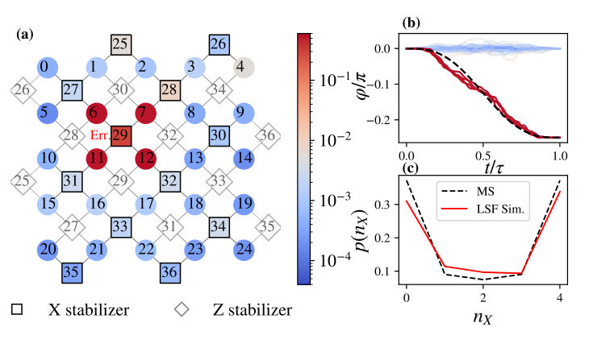 
FIG. 1. The effect of Raman scattering on X stabilizers measurements of the distance 5 rotated surface code, implemented with a single MQ gate. (a) bit-flip probability (color, log scale) for each qubit, conditioned on a σz error on a specific qubit (here the ancilla qubit qerr = 29). Error rates associated with data qubits not directly coupled to the faulty qubit are markedly small, consistent with the connectivity structure imposed by the stabilizer. (b) The entanglement phase trajectories φn,qerr (t) as a function of time (dt = 0.01τ, τ ≈321 µs). Colors correspond to overall bit-flip probabilities in panel (a) for each n ̸= qerr. The entanglement phase evolution is compared to the MS...

📷 Fig 2

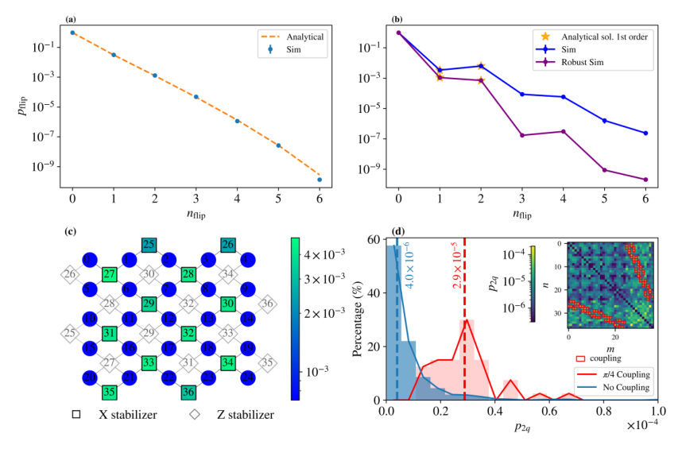 
FIG. 2. Heating and motional dephasing noise analysis. All values of Γh, Γs mentioned below are in-line with realistic hardware performances. (a) Bit-flip probabilities induced by heating during a MS gate (N = 6), for Γhnth = 50Hz and τ = 450 µs. We observe excellent agreement between the analytical solution and exact numerical simulations. Heating is dominated by single-qubit error with probability ∼Γhnthτ. (b) Bit-flip probabilities induced by motional dephasing for an MS gate (N = 6), with Γd = 10Hz and τ = 450 µs. Numerical results agree with the leading-order analytical solution (orange stars). Motional dephasing leads to both single- and two-qubit errors. Robust control techniques...

📷 Fig 3

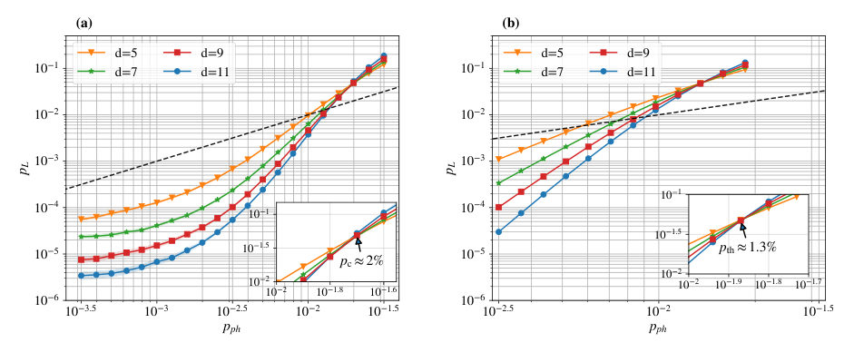 
FIG. 3. Logical error rate as a function of the physical error rate, where all X (or Z) stabilizers are measured within a single MQ gate. Two-qubit motional-dephasing errors are introduced in two ways: In (a), a constant two-qubit error rate of p2q = 3×10−5 is assigned to every pair of qubits, while single-qubit error sources (including idle errors, heating, and scattering) are varied simultaneously with a common physical error rate pph. In this case, we observe a crossing at pc ≈2 × 10−2. The inset shows a magnified view of the crossing region. In (b), two-qubit errors act only between directly coupled qubits. Here, all noise sources, including two-qubit errors, are varied simultaneously...

📷 Fig 4

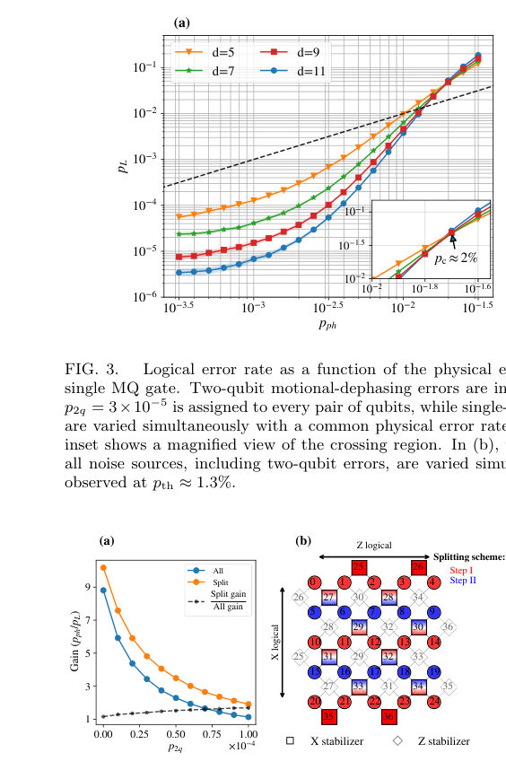 
FIG. 4. Studying QEC performance as a function of two- qubit error. (a) Gain factor (pph/pL) as a function of p2q, with all single-qubit error rates (including idle errors) fixed at p1q = 10−3 and code distance d = 5. We compare two mea- surement schemes: simultaneous measurement of all stabiliz- ers (blue) and a scheme that splits measurements into even and odd rows (orange). For p1q = 10−3, the splitting scheme yields higher gain. The relative advantage of the splitting protocol, Split gain

📷 Fig 5

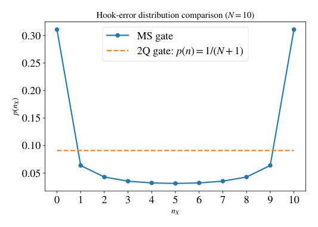 
FIG. 5. Comparison between the probability distributions for the number of data qubits flipped due to hook errors, contrasting a sequence of discrete two-qubit gates with an MQ gate. Here, N = 10 data qubits are considered, together with an additional ancilla qubit that was traced out.

**Summary.** This paper develops a detailed noise model for multi-qubit gates in trapped-ion systems to determine their compatibility with scalable quantum error correction. It finds that despite the all-to-all connectivity, errors remain sufficiently localized to allow for a finite QEC threshold in the rotated surface code.

**Why it may be interesting.** It provides a rigorous bridge between device-level physics (motional heating, photon scattering) and high-level QEC performance, which is crucial for designing scalable ion-trap architectures.

Detailed structure

**Main problem.** Investigating whether multi-qubit (MQ) gate operations in trapped-ion architectures are compatible with scalable quantum error correction (QEC) by analyzing noise propagation and error rates.

**Main result.** The study demonstrates that MQ-gate-induced errors are compatible with a finite QEC threshold for the rotated surface code, as error propagation is largely localized to coupled qubits and certain error types are suppressed.

**Method.** The authors use a Lindblad master equation formalism and Magnus expansion to derive a microscopic noise model, followed by quantum Monte-Carlo and Stim-based simulations of the rotated surface code.

**Model / system.** A trapped-ion quantum computing platform with all-to-all connectivity, utilizing generalized multi-qubit Ising gates implemented via engineered spin-motion interactions in the Lamb-Dicke regime.

**Key observables.** Single-qubit and two-qubit error rates, bit-flip probabilities, entangling phase trajectories, and logical error rates as a function of code distance.

**Important parameters / regimes.** Gate duration (tau ~ 450 us), heating rate (50-100 Hz), dephasing rate (10-100 Hz), and code distances (d=5 to d=17).

**Assumptions / limitations.** Assumes the Lamb-Dicke regime, neglects higher-order multi-qubit errors beyond two-qubit, and assumes Pauli twirling can treat coherent errors as stochastic Pauli channels.

**Figures summary.** Heatmaps of bit-flip probabilities, trajectories of entangling phases, comparison of analytical vs. numerical heating-induced errors, and performance plots of the surface code under different error models.

**Paper structure.** The paper introduces the problem of MQ gate noise, develops a microscopic noise model using Lindblad dynamics, analyzes error propagation and locality, evaluates QEC performance using surface code simulations, and provides analytical derivations in the appendix.

Abstract

We construct a detailed microscopic noise model for multi-qubit (MQ) gate operations in the context of trapped ion architecture with all-to-all connectivity. We find that phonon heating and motional dephasing are well captured by effective single- and two-qubit error channels that can, in principle, act between arbitrary pairs of qubits. Nevertheless, the median magnitude of two-qubit errors between uncoupled qubits is substantially smaller than that of errors between gate-coupled qubits. Errors associated with photon scattering are shown to solely propagate to qubits participating in gate operations. Lastly, we combine all noise sources, assigned with experimentally relevant parameters, and explore the scalability of a quantum error correction (QEC) scheme based on the rotated surface code, as a function of error rates and code size. Our analysis bridges device-level physics and QEC performance for MQ gates in trapped-ion architectures.

[↑ back to top](#top)

### [Wetting of quantum fluids: a route to free-standing shell-shaped quantum droplets](http://arxiv.org/abs/2605.28469v1)

**Authors:** Francesco Ancilotto  
**Type:** theory · **Category:** quantum gases · **PDF:** <https://arxiv.org/pdf/2605.28469v1>  
**Analysis basis:** full PDF text, analyzed in chunks
**Topic relevance:** `analog quantum simulation` **2/5**

📷 Fig 1

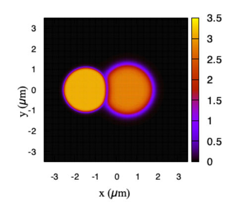 
FIG. 1. Total density map corresponding to the dimer struc- ture. Here a12 = −50 a0. The density values are in units of 104µm−3. The droplet (2,3) is on the left, the droplet (1,2) on the right.

📷 Fig 2

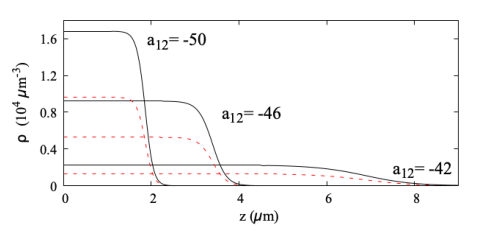 
FIG. 2. Density profiles of the (1,2) slab for three different values of a12 (for clarity, only one half is shown in the Figure. The solid (dashed) line shows the density of species 2 (1), respectively.

📷 Fig 3

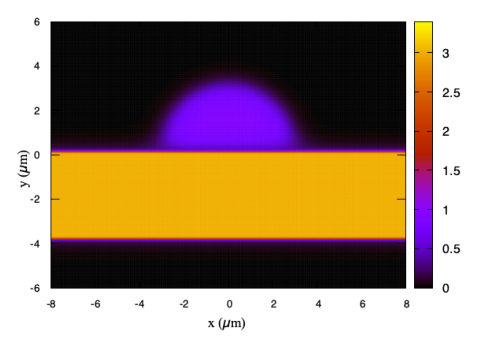 
FIG. 3. Density map in a plane perpendicular to the surface plane, showing the adsorbed (1,2) cylindrical droplet on top of a slab (delimited by planar surfaces) made of the (2,3) fluid. Here a12 = −44 a0.

📷 Fig 4

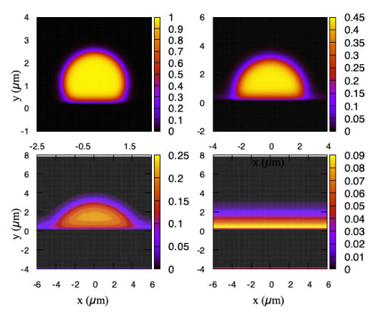 
FIG. 4. Density maps of ρ1 + ρ2 for the equilibrium con- figurations of cylindrical cap made of fluid (1,2) on top of a planar slab of fluid (2,3), for different values of the scat- tering length a12. From left to right, from top to bottom: a12/a0 = −50, −45, −43, −42.

📷 Fig 5

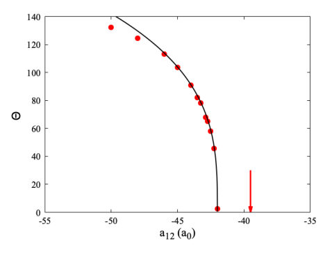 
FIG. 5. Calculated values of the contact angles (in degrees) as a function of a12. The solid line shows the numerical fit described in the text. The vertical arrow shows the threshold value below which self-bound states of the mixture (1,2) de- velop.

**Summary.** This paper demonstrates that tuning interspecies interactions in a three-component Bose mixture can drive a wetting transition, leading to the formation of self-bound, shell-shaped quantum droplets. These structures consist of a core-shell geometry where the outer component can host quantized vortices. This approach offers a new way to engineer and study the topology and capillarity of quantum fluids.

**Why it may be interesting.** It provides a novel mechanism (wetting) to create complex, self-bound topological structures (shell-shaped droplets) in ultracold gases, offering a platform to study superfluidity in curved, multiply connected geometries.

Detailed structure

**Main problem.** Investigating how wetting phenomena between self-bound quantum fluids can be used to engineer free-standing, shell-shaped quantum droplets.

**Main result.** The study identifies a transition from partial to complete wetting in a three-component Bose mixture, where the (1,2) liquid wraps around a (2,3) core to form a self-bound core-shell droplet that can sustain quantized vortices.

**Method.** A density-functional approach using the Mean-Field + Lee-Huang-Yang (MF+LHY) framework, solved via 3D imaginary-time evolution on a Cartesian grid.

**Model / system.** A three-component Bose mixture of 23Na, 39K, and 41K atoms, modeled as two interacting binary quantum liquids where one acts as a substrate for the other.

**Key observables.** Surface tension, contact angle, density profiles (column density), and critical rotation frequency for quantized vortices.

**Important parameters / regimes.** The interspecies scattering length a12, which drives the wetting transition, and the critical value a12c = -42 a0.

**Assumptions / limitations.** Zero temperature, absence of three-body recombination, and the validity of the MF+LHY approximation.

**Figures summary.** Figure 1 shows a dimer structure in the non-wetting regime; Figure 2 shows density profiles; Figure 6 shows interfacial energy vs a12; Figure 7 shows 2D column density projections illustrating the shell structure.

**Paper structure.** The paper introduces the problem of droplet engineering, describes the MF+LHY theoretical framework, details the numerical implementation, analyzes the wetting transition and contact angle scaling, demonstrates the formation of core-shell structures, and explores vortex excitations in these geometries.

Abstract

We investigate wetting phenomena between self-bound quantum fluids in a three-component Bose mixture of $^{23}$Na, $^{39}$K, and $^{41}$K atoms. Within a density-functional approach including mean-field interactions and Lee-Huang-Yang quantum-fluctuation corrections, we consider two binary quantum liquids, formed by components $(1,2)$ and $(2,3)$, and study the adsorption of the softer $(1,2)$ liquid on a stiffer $(2,3)$ substrate. By tuning the interspecies scattering length $a_{12}$, we show that the surface tension of the $(1,2)$ liquid can be strongly varied, driving a transition from partial wetting to complete wetting of the $(2,3)$ phase. The contact angle extracted from cylindrical-cap geometries decreases continuously with increasing $a_{12}$ and vanishes near a critical value $a_{12}^{c}= -42\,a_0$. In the complete-wetting regime, a finite amount of $(1,2)$ liquid wraps around a spherical $(2,3)$ droplet, producing a self-bound core-shell droplet without external confinement, whose component-1 density has a shell-like, hollow projection. We further show that such shell-shaped quantum droplets can sustain quantized vortical excitations. These results identify wetting as a route to engineering free-standing shell-shaped quantum liquids and suggest new possibilities for studying capillarity, topology, and superfluidity in multicomponent quantum droplets.

[↑ back to top](#top)

## Other papers (30)

*Papers from primary archives without highlighted authors or any topic match. Click to expand.*

Show other papers

### [A Demonstration of Quantum Circuit Implementation for Obstacle Flow Using Carleman-Linearized Lattice Boltzmann Method](http://arxiv.org/abs/2605.28135v1)

**Authors:** Kazumasa Ueno, Keita Kanno, Yasunori Lee  
**Type:** theory · **Category:** quantum information and computing · **PDF:** <https://arxiv.org/pdf/2605.28135v1>  
**Analysis basis:** full PDF text, analyzed in chunks

📷 Fig 1

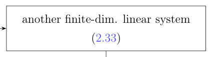 
Figure 1: High-level overview of the quantum lattice Boltzmann method.

📷 Fig 2

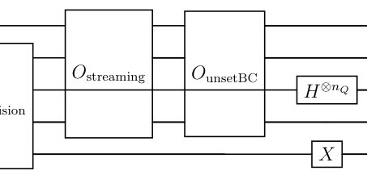 
Figure 4: Quantum circuit for UA(1).

📷 Fig 3

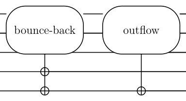 
Figure 5: Quantum circuit for OsetBC. Each depicted gate actually consists of multiple

📷 Fig 4

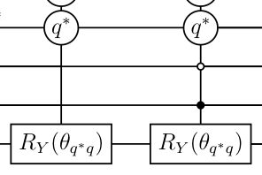 
Figure 6: Quantum circuit for Ocollision. Each depicted gate actually consists of multiple

📷 Fig 5

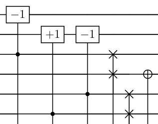 
Figure 7: Quantum circuit for Ostreaming.

**Summary.** This paper presents a quantum algorithm for simulating 2D fluid flow around obstacles by linearizing the Lattice Boltzmann Method via Carleman linearization. It provides a detailed gate-level implementation of boundary conditions and demonstrates that the quantum computational cost scales logarithmically with spatial resolution.

**Why it may be interesting.** not directly relevant

Detailed structure

**Main problem.** Developing a practical quantum-circuit implementation for Computational Fluid Dynamics (CFD) that incorporates non-periodic boundary conditions and obstacle geometries.

**Main result.** The authors demonstrated a gate-level implementation of the Carleman-linearized Lattice Boltzmann Method (LBM) showing logarithmic scaling of qubits and gates with respect to spatial resolution.

**Method.** The approach uses Carleman linearization to transform nonlinear fluid equations into a linear system, which is then solved using Quantum Singular Value Transformation (QSVT) and block-encoding.

**Model / system.** A two-dimensional fluid flow around a rectangular obstacle using the D2Q9 Lattice Boltzmann Model with the BGK collision operator.

**Key observables.** Fluid density, velocity field, and the effective condition number of the linear system.

**Important parameters / regimes.** Reynolds number (Re), Mach number (Ma), relaxation time (tau), number of lattice points (N), and Carleman truncation order (Nc).

**Assumptions / limitations.** The method assumes first-order Carleman linearization, weakly compressible flow, and a low Mach number regime.

**Figures summary.** Flowcharts of the linearization pipeline, illustrations of the D2Q9 velocity vectors, gate-level circuit architectures for block-encoding and QSVT, and velocity field snapshots from simulations.

**Paper structure.** The paper introduces the problem of quantum CFD, details the Carleman-LBM linearization, describes the quantum circuit construction (block-encoding and QSVT), presents resource estimation and scaling analysis, and concludes with validation against classical references.

Abstract

Fluid simulations, especially at high Reynolds numbers, are computationally expensive on classical computers, making them promising application targets for quantum computing. Recent studies have combined the lattice Boltzmann method (LBM) with Carleman linearization to design quantum algorithms for computational fluid dynamics (CFD). However, practical quantum-circuit implementations of these algorithms that incorporate non-periodic boundary conditions have not been fully explored. In this work, we implement a quantum algorithm for two-dimensional linearized fluid flow around an obstacle, using block-encoding of the linear-system matrix and quantum singular value transformation (QSVT) to solve it. Inflow, outflow, and no-slip boundary conditions are formulated as sparse matrix operations and efficiently embedded into quantum circuits using index-value encoding. We demonstrate logarithmic scaling of the required numbers of qubits and gates with respect to the number of lattice points, suggesting the potential feasibility of quantum-computational fluid dynamics simulations.

[↑ back to top](#top)

### [A Note on Boosting Uncloneable Encryption in Microcrypt](http://arxiv.org/abs/2605.27647v1)

**Authors:** James Bartusek, Eli Goldin  
**Type:** theory · **Category:** quantum information and computing · **PDF:** <https://arxiv.org/pdf/2605.27647v1>  
**Analysis basis:** full PDF text, analyzed in chunks

📷 Fig 1

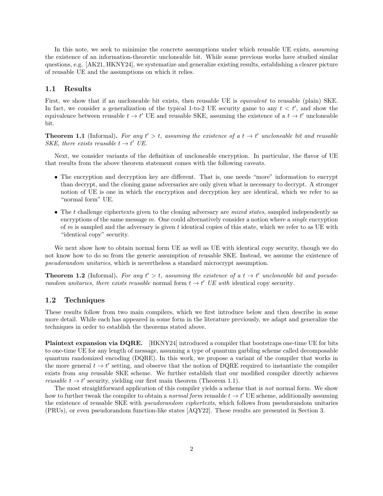 
Low-resolution page preview, page 2

📷 Fig 2

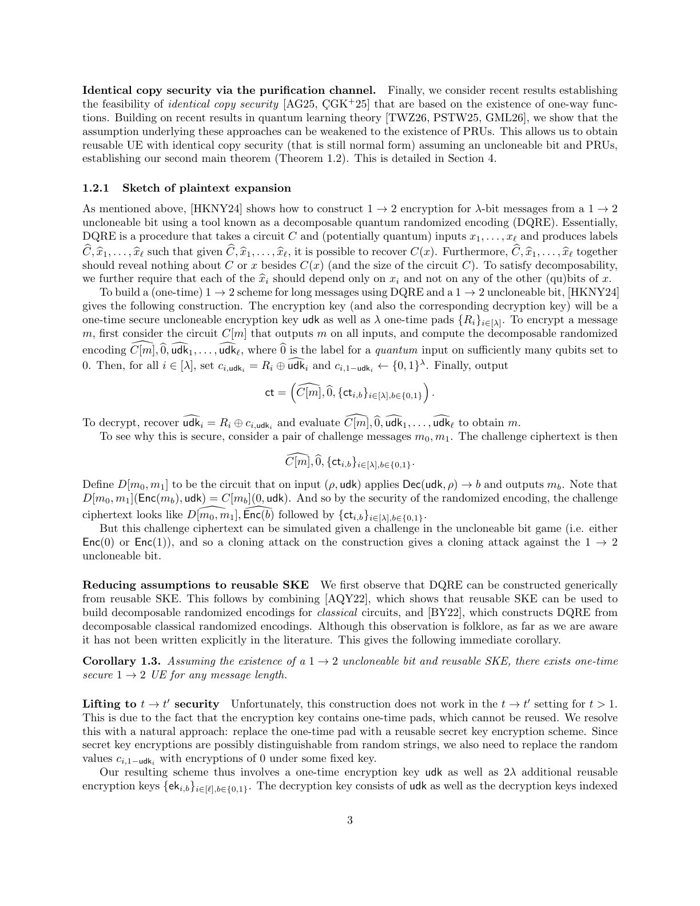 
Low-resolution page preview, page 3

📷 Fig 3

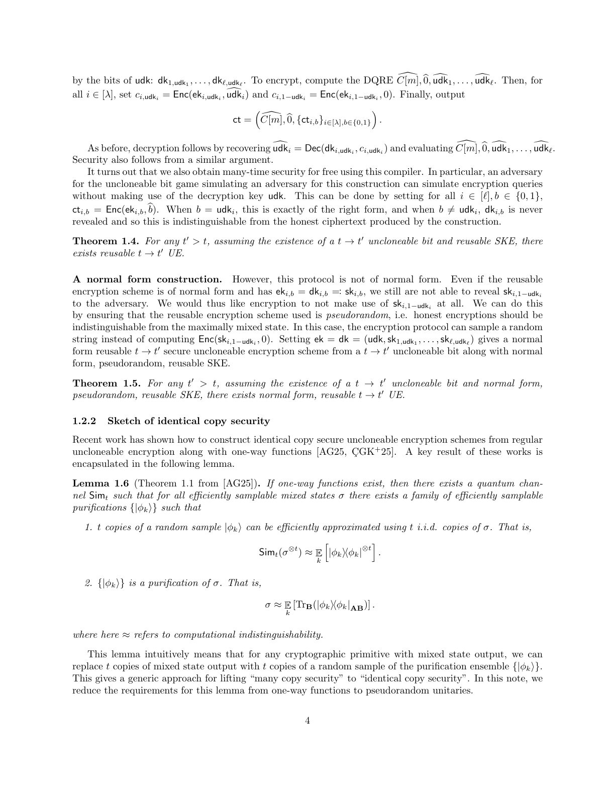 
Low-resolution page preview, page 4

📷 Fig 4

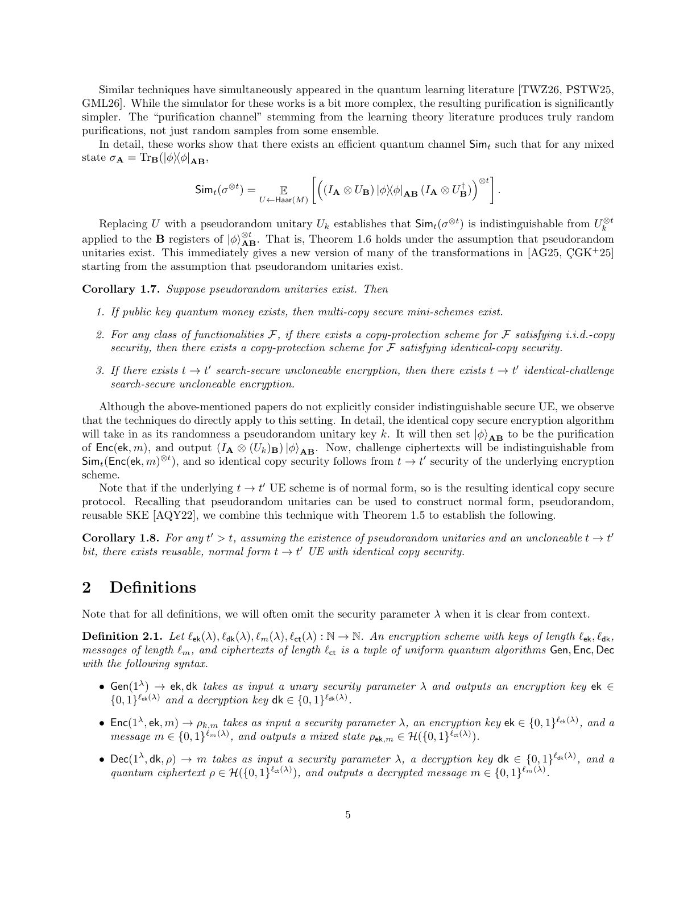 
Low-resolution page preview, page 5

📷 Fig 5

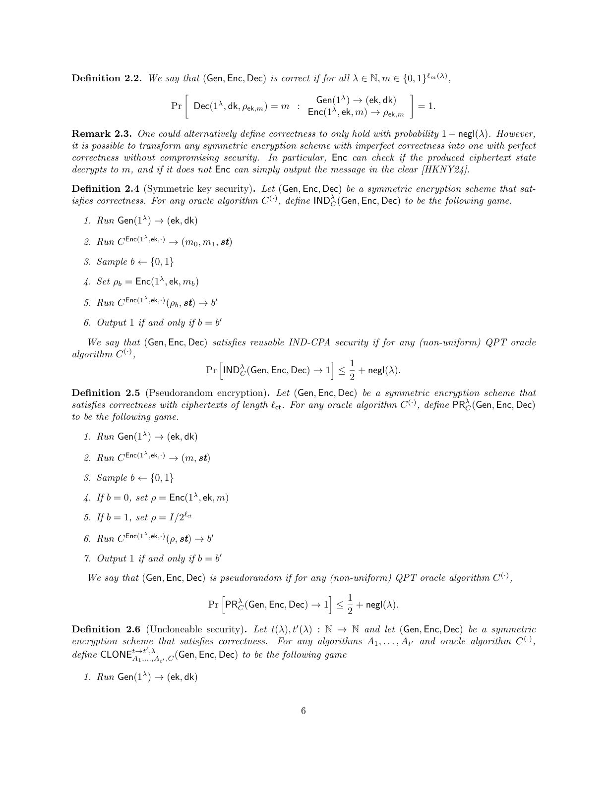 
Low-resolution page preview, page 6

**Summary.** This paper demonstrates how to transform simple one-time uncloneable bits into more powerful, reusable uncloneable encryption schemes for long messages. It establishes that many-time uncloneable encryption is essentially as easy to achieve as many-time symmetric key encryption, provided an uncloneable bit exists.

**Why it may be interesting.** not directly relevant

Detailed structure

**Main problem.** The paper aims to minimize the cryptographic assumptions required to achieve many-time (reusable) uncloneable encryption (UE) in the 'microcrypt' setting.

**Main result.** The authors prove that if a $t 	o t'$ uncloneable bit and reusable symmetric key encryption exist, then many-time $t 	o t'$ uncloneable encryption for arbitrary-length messages also exists.

**Method.** The authors use two main compilers: a plaintext expansion method using Decomposable Quantum Randomized Encoding (DQRE) and a purification channel method utilizing pseudorandom unitaries.

**Model / system.** The work operates in the 'microcrypt' framework, a model of unstructured quantum cryptography that remains secure even if P = NP, utilizing quantum channels, symmetric key encryption, and uncloneable bits.

**Important parameters / regimes.** Security parameters $\lambda$, number of copies $t$ and $t'$, and the distinction between one-time and many-time security regimes.

**Assumptions / limitations.** The existence of an information-theoretic $t 	o t'$ uncloneable bit, the existence of many-time secure symmetric key encryption, and the existence of pseudorandom unitaries (for normal form and identical copy security).

**Paper structure.** The paper introduces the problem of boosting uncloneable encryption, presents a construction for expanding bit-size via DQRE, provides a second construction for achieving normal form and identical copy security using pseudorandom unitaries, and concludes with implications for the microcrypt setting.

Abstract

In this note, we consider the setting of uncloneable encryption satisfying uncloneable indistinguishability, a form of symmetric key encryption that prevents the cloning of ciphertexts in a very strong sense. Our goal is to minimize the assumptions under which (many-time secure) uncloneable encryption is known to exist, assuming the existence of an information-theoretic "uncloneable bit", i.e. a one-time secure uncloneable encryption scheme for one-bit messages. We observe that if a t -> t' uncloneable bit exists, then the following implications hold.   1. If many-time secure symmetric key encryption exists, then many-time secure t -> t' uncloneable encryption for arbitrary-length messages exists. Since many-time secure uncloneable encryption implies many-time secure symmetric key encryption, this result is tight.   2. If pseudorandom unitaries exist, then many-time secure t -> t' uncloneable encryption for arbitrary-length messages with identical copy security exists.   These results together show that many-time secure uncloneable encryption may follow from concrete assumptions in "microcrypt", the world of unstructured quantum cryptography that plausibly exists even if P = NP.

[↑ back to top](#top)

### [Automated Unitary Coupled Cluster Circuit Design via Differentiable Quantum Architecture Search](http://arxiv.org/abs/2605.28049v1)

**Authors:** Jianpeng Chen, Zirui Sheng, Cunxi Gong, Weitang Li  
**Type:** theory · **Category:** quantum information and computing · **PDF:** <https://arxiv.org/pdf/2605.28049v1>  
**Analysis basis:** full PDF text, analyzed in chunks

📷 Fig 1

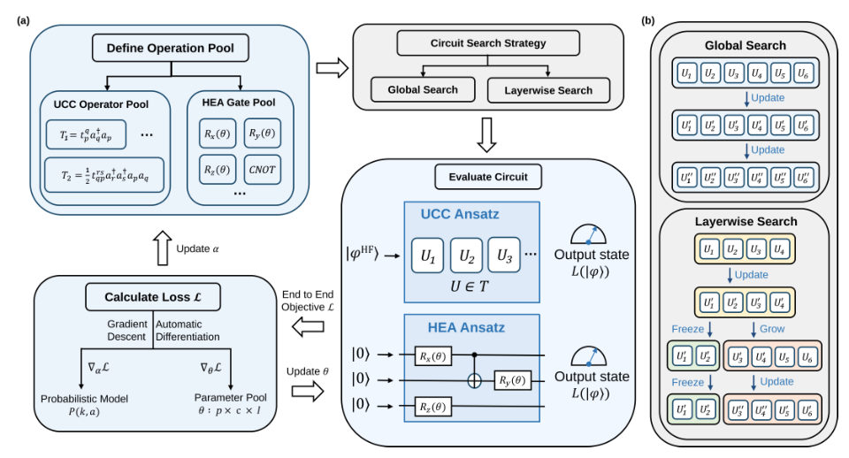 
Figure 1: Overview of the DQAS framework for quantum ansatz design. (a) End- to-end DQAS workflow: (Step 1) operator pool definition, (Step 2) search strategy selection (global or layerwise), (Step 3) circuit evaluation and loss computation, and (Step 4) joint gradient update of architecture parameters α and variational parameters θ. (b) Schematic comparison of global search, in which all circuit layers are optimized simultaneously, and layerwise search, in which the circuit grows incrementally with committed layers frozen and a sliding window of layers searched at each step.

📷 Fig 2

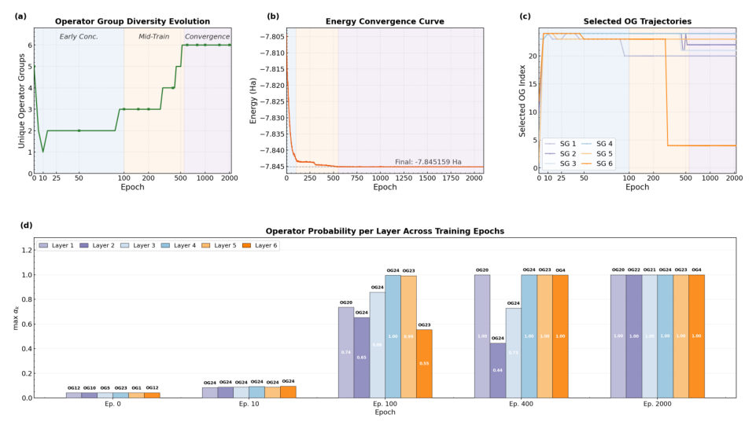 
Figure 2: DQAS-Global search dynamics for LiH (d = 2.20 ˚ A, 6-operator-group ansatz). (a) Operator group (OG) diversity, measured as the number of distinct OGs sampled per batch, versus training epoch. (b) Variational energy convergence toward the FCI reference (−7.8454 Ha, gray dashed line). (c) Selected OG trajectories for layers SG 1– SG 6. (d) Maximum architecture-parameter probability (maxk αk) for each of the six layers at five representative training epochs (Ep. 0, 10, 100, 400, 2000), grouped by epoch; bar labels indicate the dominant operator group index.

📷 Fig 3

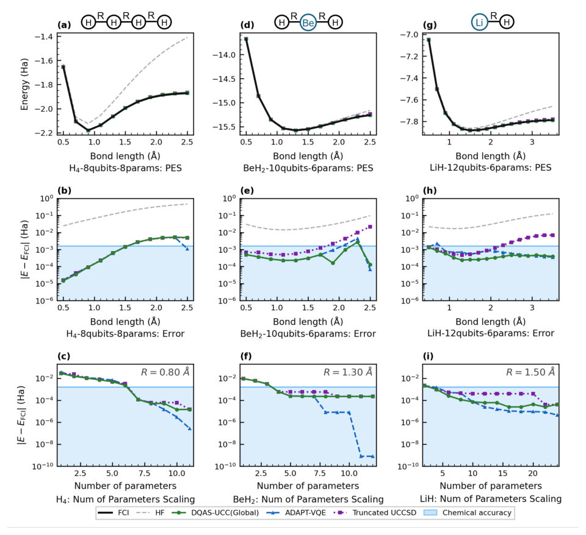 
Figure 3: DQAS-Global performance on H4 (8 qubits), BeH2 (10 qubits), and LiH (12 qubits). Columns correspond to H4, BeH2, and LiH, respectively. (a,d,g) Potential energy surfaces. (b,e,h) Absolute energy error relative to FCI versus bond length. (c,f,i) Energy error as a function of operator group count at a representative near-equilibrium geometry. The blue shaded band marks chemical accuracy (1.6 mHa).

📷 Fig 4

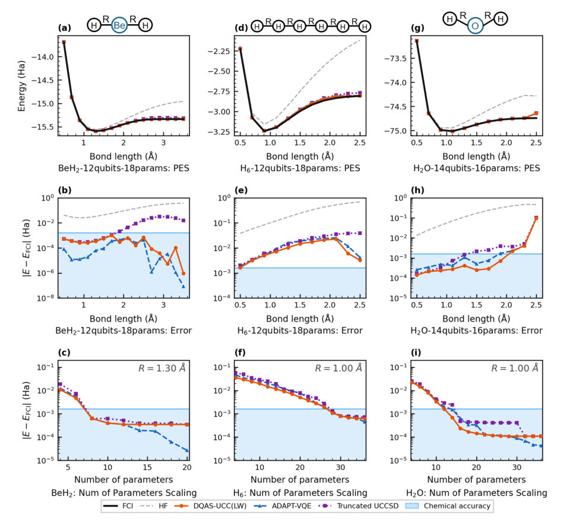 
Figure 4: DQAS-Layerwise performance on BeH2 (12 qubits), H6 (12 qubits), and H2O (14 qubits). Columns correspond to BeH2, H6, and H2O, respectively. (a,d,g) Potential energy surfaces. (b,e,h) Absolute energy error relative to FCI versus bond length. (c,f,i) Energy error as a function of operator group count at a representative near-equilibrium geometry. The blue shaded band marks chemical accuracy (1.6 mHa).

📷 Fig 5

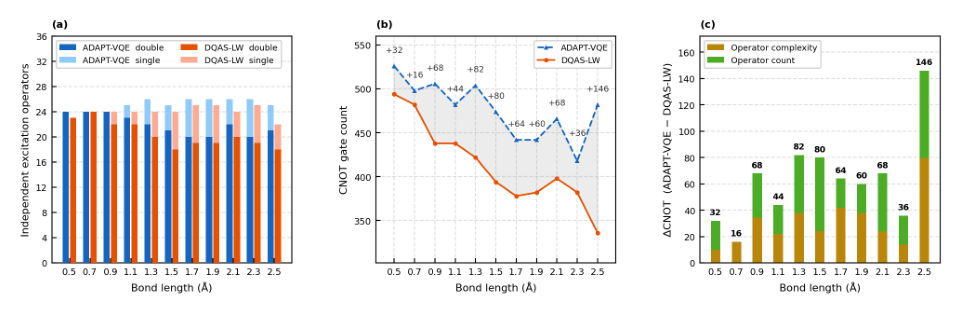 
Figure 5: Circuit composition analysis for H2O (UCCSD pool, 16 operator groups): DQAS-Layerwise versus ADAPT-VQE. (a) Number of independent single and double excitation operators selected by each method versus bond length. (b) CNOT gate count versus bond length; annotations show ∆CNOT (ADAPT-VQE −DQAS-Layerwise) at each geometry. (c) Decomposition of ∆CNOT into an operator-count contribution (green, arising from differences in the number and type of selected operators) and an operator- complexity contribution (tan, arising from differences in the qubit span of the selected op- erators).

**Summary.** This paper presents a new method for automatically designing quantum chemistry circuits by treating operator selection as a continuous, differentiable optimization problem. By moving beyond greedy, sequential selection, the approach finds more efficient circuit architectures that are both more accurate and less computationally expensive for near-term quantum hardware.

**Why it may be interesting.** not directly relevant

Detailed structure

**Main problem.** Designing efficient and accurate Unitary Coupled Cluster (UCC) quantum circuits for the Variational Quantum Eigensolver (VQE) is difficult due to the combinatorial complexity of selecting optimal operators and the high CNOT gate overhead of existing greedy methods like ADAPT-VQE.

**Main result.** The proposed Differentiable Quantum Architecture Search (DQAS) achieves up to 2.7-fold higher accuracy and a 13-17% reduction in CNOT gate counts compared to ADAPT-VQE in the compact circuit regime, with results generalizing to both UCCSD and QEB operator pools.

**Method.** The authors introduce a Differentiable Quantum Architecture Search (DQAS) framework that relaxes discrete operator selection into a continuous optimization problem using two strategies: a Global mode for simultaneous optimization and a Layerwise mode for incremental construction.

**Model / system.** The study focuses on molecular systems including BeH2, H4, LiH, H6, and H2O (8-14 qubits) using molecular Hamiltonians mapped to qubits via Jordan-Wigner transformation and evaluated at the Hartree-Fock level with the STO-3G basis set.

**Key observables.** Ground-state energy expectation values, potential energy surfaces (PES), CNOT gate counts, and energy error relative to Full Configuration Interaction (FCI) benchmarks.

**Important parameters / regimes.** The compact circuit regime (limited circuit depth), chemical accuracy threshold (1.6 mHa), and the comparison between UCCSD and QEB operator pools.

**Assumptions / limitations.** The method's advantage is most pronounced in the compact circuit regime and may face limitations due to gradient attenuation in much deeper circuits.

**Figures summary.** Figure 1 shows the DQAS workflow and search strategies; Figure 2 illustrates training trajectories and energy convergence for LiH; Figure 3 presents potential energy curves and error scaling for BeH2, H4, and LiH; Figure 6 demonstrates performance on the QEB pool for H2O.

**Paper structure.** The paper introduces the problem of circuit design, presents the DQAS framework (Global and Layerwise modes), details the optimization and implementation using TensorCircuit, provides benchmarking results against ADAPT-VQE across various molecules, and discusses generalizability and limitations.

Abstract

Designing compact and accurate circuits for the variational quantum eigensolver (VQE) is a central challenge in near-term quantum chemistry. Existing adaptive methods such as ADAPT-VQE design circuits by iteratively selecting operators from a predefined pool guided by gradient information and greedy heuristics. In this work, we adopt differentiable quantum architecture search (DQAS) as a circuit design framework based on the UCCSD operator pool, and introduce two complementary strategies: a global mode that simultaneously optimizes all operator selections, and a layerwise mode that constructs circuits incrementally while preserving previously learned structure. By relaxing discrete operator selection into a continuous differentiable optimization, DQAS enables gradient-based exploration over the combinatorial space of UCC circuit architectures. Benchmarks on BeH2, H4, LiH, H6, and H2O (8-14 qubits) show that both strategies achieve higher accuracy and fewer CNOT gates than ADAPT-VQE in the compact circuit regime, with up to 2.7-fold accuracy improvement for H2O and CNOT reductions of 13-17% at equivalent circuit depths. Benchmarks on the qubit-excitation-based (QEB) operator pool confirm that both advantages generalize beyond UCCSD. These results demonstrate that differentiable architecture search provides an effective and generalizable framework for designing accurate and compact VQE circuits in near-term quantum chemistry.

[↑ back to top](#top)

### [Avoided Stoner instability at a single ordinary Van Hove point](http://arxiv.org/abs/2605.28761v1)

**Authors:** I. S. Tupitsyn, B. Currie, A. V. Chubukov, B. V. Svistunov, E. Kozik, N. V. Prokof'ev  
**Type:** theory · **Category:** strongly correlated electrons · **PDF:** <https://arxiv.org/pdf/2605.28761v1>  
**Analysis basis:** full PDF text, analyzed in chunks

📷 Fig 1

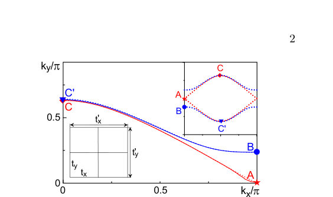 
FIG. 1. Fermi surfaces of the interacting (solid lines) and non-interacting (dashed lines) systems for the same system densities. In the interacting case, at µ = µV H the QV H point is located on the FS (point A); when µ is detuned from µV H by 0.2t, we are dealing with an open FS intersecting BZ boundary at point B. Along y-direction the FS is located far from the BZ boundary (points C and C′ correspond to µ = µvH and µ = µV H+0.2t cases, respectively). Upper inset demonstrates full Fermi surfaces for both non-interacting cases. We show results calculated at T/t = 0.01 when µV H(U, T) = −0.110t (for non-interacting case µV H = 0.76t). Lower inset shows our hopping scheme.

📷 Fig 2

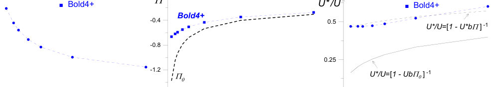 
FIG. 2. Bold4+ approximation results for U = 2t at Van Hove singularity. Left panel: static and uniform susceptibility. Middle panel: static polarization bubble diagram at zero momentum computed using dressed Green’s functions; in the low-temperature limit, it saturates to a finite value in contrast with the divergent behavior of Π0 based on the bare Green’s functions (dashed line). Right panel: effective interaction extracted from the magnetic susceptibility and Π using Eq. (2). The black dashed line shows U ∗/U corresponding to Eq. (4).

📷 Fig 3

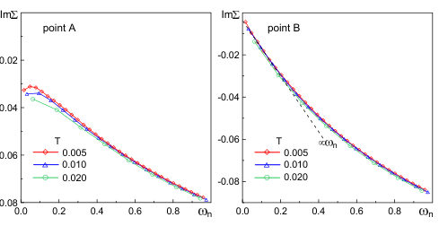 
FIG. 3. Bold4+ results for the frequency dependence of Σ(QV H, ωn) at different temperatures for the cases when the FS touches the BZ boundary at the point A in Fig. 1 (left panel), and when the system is away from Van Hove point and the system has an open FS, which intersects BZ at the point B in Fig. 1 (right panel). Error-bars are within the sym- bol sizes. The dashed line in the right panel is the expected FL behavior Σ(ωn) = −iαωn

📷 Fig 4

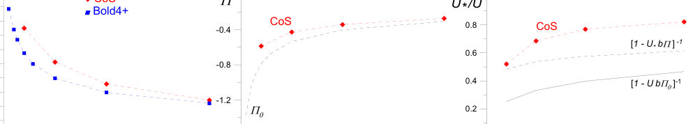 
FIG. 4. DiagMC-CoS results for U = 2t at Van Hove singularity. Left panel: static and uniform susceptibility (Bold4+ results from Fig. 2 are added for direct comparison). Middle panel: static polarization bubble diagram at zero momentum computed using dressed Green’s functions. It appears to diverge in the low-temperature limit though less dramatically when compared to the of Π0 behavior shown by the dashed line. Right panel: effective interaction extracted from the magnetic susceptibility and Π using Eq. (2). By solid and dashed lines we plot predictions for U ∗/U in Eqs. (1) and Eq. (4).

📷 Fig 5

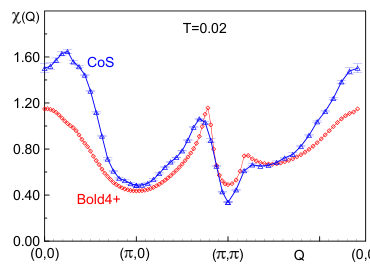 
FIG. 6. Static magnetic susceptibility χ(Q) along the (0, 0) → (π, 0) →(π, π) →(0, 0) path in BZ obtained within the CoS and Bold4+ techniques for U = 2 and T = 0.02 (for Bold4+ data, statistical error bars are within the symbol sizes).

**Summary.** This paper explains why the predicted ferromagnetic instability at a Van Hove singularity does not occur in real 2D electron systems. Using advanced diagrammatic Monte Carlo methods, the authors show that the reduction in effective interaction strength and the loss of quasiparticle weight effectively suppress the magnetism. This provides a theoretical resolution to the conflict between mean-field predictions and experimental observations in materials like Sr2RuO4.

**Why it may be interesting.** not directly relevant

Detailed structure

**Main problem.** The paper addresses the discrepancy between mean-field theory, which predicts a ferromagnetic (Stoner) instability at a Van Hove singularity, and experimental/numerical evidence showing that this instability is suppressed.

**Main result.** The researchers find that the Stoner instability is avoided down to temperatures an order of magnitude below the mean-field prediction due to a combination of downward renormalization of the effective coupling and the suppression of the density of states via loss of quasiparticle residue.

**Method.** The study employs two Diagrammatic Monte Carlo (DiagMC) approaches: the Bold4+ self-consistent approximation and the numerically exact method of Combinatorial Summation (CoS) of Feynman diagrams.

**Model / system.** An anisotropic 2D Fermi-Hubbard model on a square lattice with specifically chosen hopping amplitudes to create a flattened Fermi surface and a Van Hove singularity.

**Key observables.** Static magnetic susceptibility (chi), effective interaction (U*), polarization bubble (Pi), quasiparticle residue (Z), and fermionic self-energy (Sigma).

**Important parameters / regimes.** Interaction strength U = 2t, chemical potential tuned to the Van Hove singularity (mu = mu_VH), and temperature scales relative to the hopping parameter (T/t).

**Assumptions / limitations.** The study assumes the validity of the diagrammatic expansion and uses Padé/Integral approximants to extrapolate results from finite-order series.

**Figures summary.** Figure 2 shows susceptibility, polarization, and effective coupling using Bold4+; Figure 3 demonstrates the transition from Fermi-liquid to non-Fermi-liquid behavior in the self-energy; Figure 4 presents more controlled CoS results for susceptibility, polarization, and effective coupling.

**Paper structure.** The paper introduces the Stoner instability paradox, describes the 2D Hubbard model and the two DiagMC methods used, presents results from the Bold4+ approximation, provides more exact results from the CoS method, and concludes with the physical mechanisms of instability suppression.

Abstract

When the Fermi surface and the Brillouin zone boundary touch at a Van Hove point, mean-field analysis predicts a ferromagnetic (Stoner) instability at finite $T_{MF}$ for any coupling strength due to the divergent density of states. However, the predicted effect has not been observed experimentally. Several qualitative theoretical proposals have been put forward to explain why the mean-field prediction fails. Based on numerically exact results for the two-dimensional Hubbard model with an ordinary Van Hove singularity, we uncover the mechanisms behind the suppression of the ferromagnetic instability. We employ two diagrammatic Monte Carlo approaches: (i) the four-channel self-consistent approximation and (ii) numerically exact method of combinatorial summation of diagrams with controlled resummation of the truncated expansion. We find that the system avoids the Stoner instability down to temperatures an order of magnitude below $T_{MF}$ due to the combination of the downward renormalization of the effective coupling and the suppression of the density of states by the loss of the quasiparticle residue.

[↑ back to top](#top)

### [Can MACE Potentials Accurately Describe Magnetism and Phase Stability in Fe-Ni Alloys? A Systematic Benchmark](http://arxiv.org/abs/2605.28395v1)

**Authors:** Kushal Ramakrishna, Mani Lokamani, Attila Cangi  
**Type:** both · **Category:** disordered systems and neural networks · **PDF:** <https://arxiv.org/pdf/2605.28395v1>  
**Analysis basis:** full PDF text, analyzed in chunks

📷 Fig 1

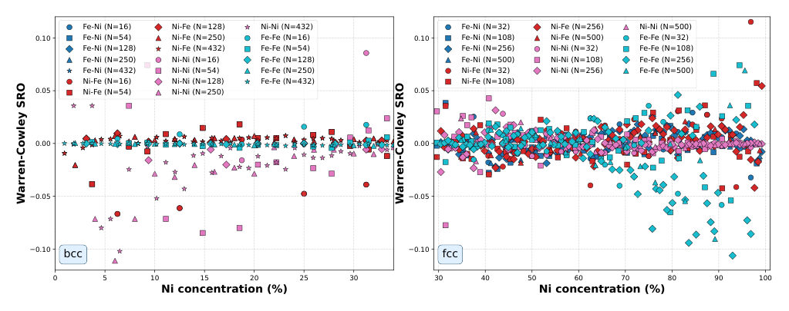 
FIG. 1. Warren–Cowley short–range order (SRO) parameters for Fe–Ni alloys as a function of nickel concentration for bcc (left) and fcc (right) structures. Marker color denotes the system size N, and marker shape denotes the SRO type (Fe–Ni, Ni–Fe, Ni–Ni, Fe–Fe). Larger system sizes yield SRO values closer to zero, indicating a more random chemical distribution, whereas deviations reflect clustering or ordering tendencies.

📷 Fig 2

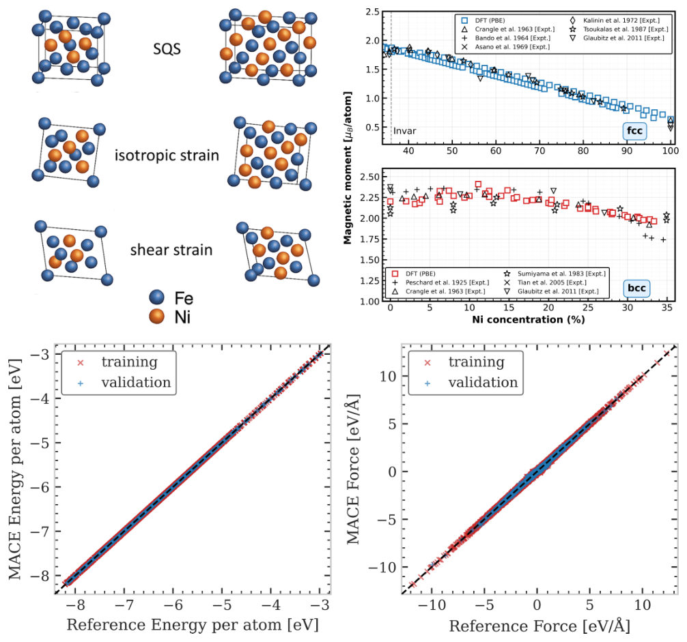 
FIG. 2. Overview of the training dataset and MACE model performance. Top left: Representative SQS supercells of Fe–Ni alloys from the training dataset, shown under three deformation conditions: undeformed reference (top), isotropic volumetric strain (middle), and shear strain (bottom). Blue and orange spheres represent Fe and Ni atoms, respectively. Top right: Mean magnetic moment per atom as a function of nickel concentration for fcc (upper) and bcc (lower) Fe–Ni alloys, computed from collinear spin-polarized DFT with the PBE XC functional and compared against experimental measurements [52–61]. Bottom row: Parity plots of MACE predicted energies (left, RMSE = 2.2/2.0 meV/atom) and forces...

📷 Fig 3

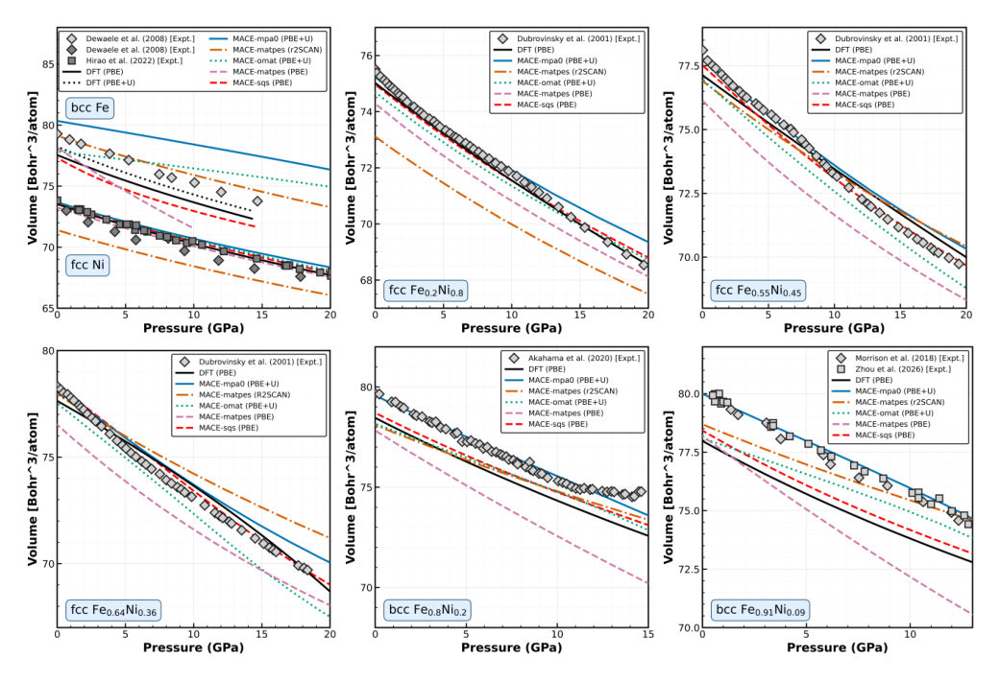 
FIG. 3. Equation of state (EOS) for Fe–Ni compositions, comparing MACE models with DFT and experiments [4, 8, 12, 68–71]. Note that the EOS results of Zhou et al. [70] correspond to a slightly sulfur–bearing alloy (Fe0.89Ni0.09S0.02).

📷 Fig 4

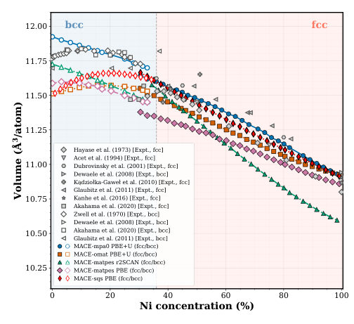 
FIG. 4. Volume per atom of Fe–Ni alloys for bcc (left) and fcc (right) structures as a function of nickel concentration, comparing MACE models with experimental data [4, 8, 59, 72–76].

📷 Fig 5

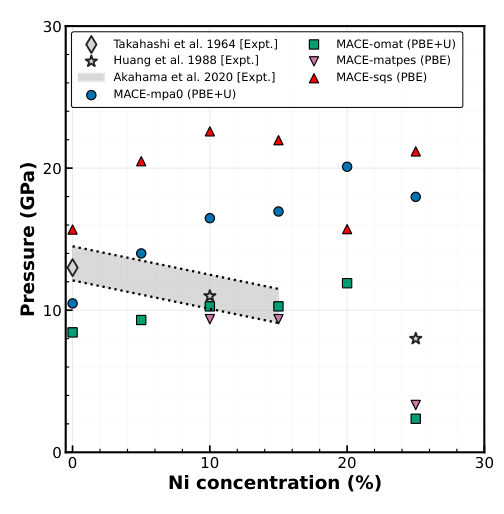 
FIG. 5. Transition pressure from the bcc to hcp structure as a function of nickel concentration, comparing MACE models with experiments [7, 8, 10].

**Summary.** This paper demonstrates that training MACE machine-learning potentials on system-specific disordered structures (SQS) significantly improves the description of magnetism and elasticity in Fe-Ni alloys compared to general foundation models. However, it reveals that current models still struggle to capture complex high-pressure magnetic collapse and composition-dependent phase transitions.

**Why it may be interesting.** not directly relevant

Detailed structure

**Main problem.** Evaluating the accuracy and transferability of MACE machine-learned interatomic potentials in describing magnetism, phase stability, and elastic properties in chemically disordered Fe-Ni alloys.

**Main result.** A system-specific MACE-sqs model outperforms general foundation models in capturing equilibrium volumes, elastic constants, and thermal expansion, though it fails to correctly predict the composition-dependent bcc-to-hcp transition pressure.

**Method.** The study uses spin-polarized PBE density functional theory (DFT) on Special Quasirandom Structures (SQS) to train a MACE potential, which is then benchmarked against experimental data and various MACE foundation models.

**Model / system.** The physical system consists of chemically disordered Fe-Ni alloys in bcc and fcc crystal structures, including Invar-like compositions, modeled using SQS to represent random atomic distributions.

**Key observables.** Energies, forces, equations of state, equilibrium volumes, elastic constants (C11, C12, C44), magnetic moments, and thermal expansion coefficients.

**Important parameters / regimes.** Ni concentration (%), pressure (GPa), temperature (K), and Warren-Cowley short-range order parameters.

**Assumptions / limitations.** The training uses PBE-level DFT without Hubbard U corrections; the models assume the ability to capture magnetoelastic effects through local chemical environments without explicit spin-disorder physics.

**Figures summary.** Fig 1 shows SRO parameters vs concentration; Fig 2 shows training data, magnetic moments, and energy/force parity plots; Fig 3 compares EOS curves; Fig 4 shows atomic volume vs Ni content; Fig 5 shows bcc-hcp transition pressure; Fig 6 compares elastic constants; Fig 7 shows temperature-dependent lattice parameters and thermal expansion.

**Paper structure.** The paper introduces the problem of MLIP accuracy in magnetic alloys, describes the SQS-based training methodology, presents a systematic benchmark of structural, elastic, and thermal properties, discusses the failure in phase stability transitions, and concludes with future directions for capturing magnetic collapse.

Abstract

We present a systematic benchmark of MACE potentials for iron-nickel alloys, focusing on structural, elastic, magnetic, and finite-temperature properties relevant to phase stability. The reference dataset comprises spin-polarized PBE density functional theory (DFT) calculations for chemically disordered special quasirandom structures (SQS), spanning compositions, bcc and fcc crystal structures, and volumetric and shear deformations. A system-specific MACE-sqs model trained on this dataset achieves validation errors of 2.0 meV/atom for energies and 24.3 meV/Angstrom for forces. Compared with several MACE foundation models, including models trained with Hubbard U corrections, MACE-sqs gives the most consistent agreement with DFT and experiment for equations of state, equilibrium volumes, elastic constants, and thermal expansion trends in bcc and fcc Fe-Ni alloys. For the bcc-to-hcp transition, MACE-sqs predicts a pure-Fe transition pressure closer to experiment than the tested foundation models, but all models predict an incorrect increase of transition pressure with Ni content. This failure indicates that high-pressure magnetic collapse and composition-dependent magnetoelastic effects are not yet fully captured. Overall, targeted SQS-based training substantially improves the accuracy of MACE potentials for Fe-Ni alloys, while phase stability under magnetic collapse remains a key limitation for future model development.

[↑ back to top](#top)

### [Cascade of magnetic-field-induced quantum spin states in a spin-1 honeycomb magnet](http://arxiv.org/abs/2605.28118v1)

**Authors:** Kaixin Tang, Zhao-Yang Dong, Yanyan Shangguan, Zhao Gong, Ye Yang, Song Bao, Houpu Li, Nan Zhang, Hongyu Li, Jian-Xin Li, Jinsheng Wen, Ziji Xiang, Xianhui Chen  
**Type:** experiment · **Category:** strongly correlated electrons · **PDF:** <https://arxiv.org/pdf/2605.28118v1>  
**Analysis basis:** full PDF text, analyzed in chunks

📷 Fig 1

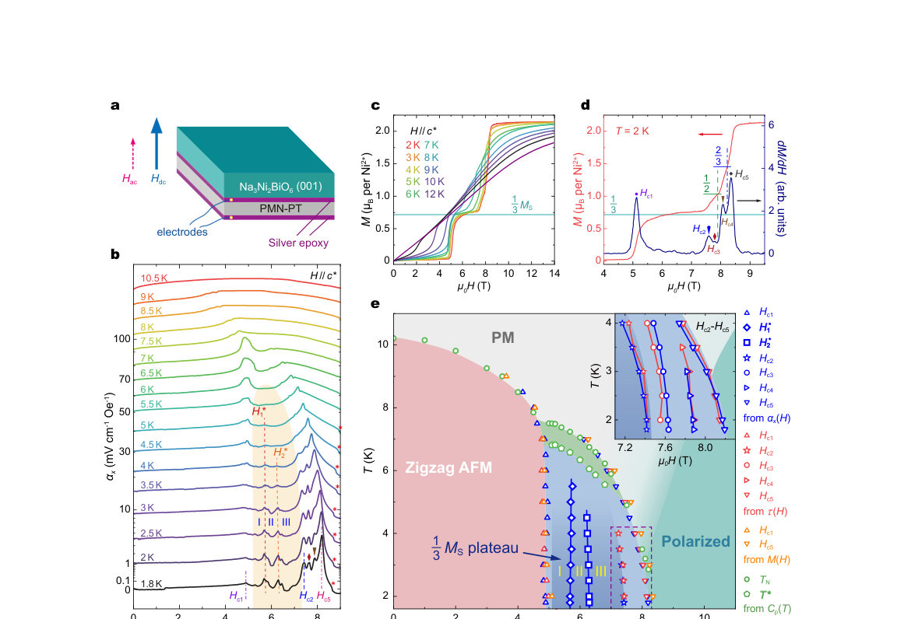 
Fig. 1. Magnetic-field-induced phase transitions and H −T phase diagram for Na3Ni2BiO6. a, A schematic setup of the Na3Ni2BiO6/PMN-PT composite laminate used in the ac magnetostriction measurement (Methods). b, The real part of the magnetoelectric (ME) coefficient, αx(H) ∝λab(H) (see Methods), measured in Na3Ni2BiO6 with H ∥c∗. Orange shaded area represents the 1/3 magnetization plateau. Field induced phase transitions are marked by dashed and dash-dotted lines. Red diamonds and dark yellow down triangles indicate the unla- belled phase transitions Hc3 and Hc4, respectively. “∗” mark the crossover to a single-domain state. Data are plotted in the square-root coordinate and offset vertically...

📷 Fig 2

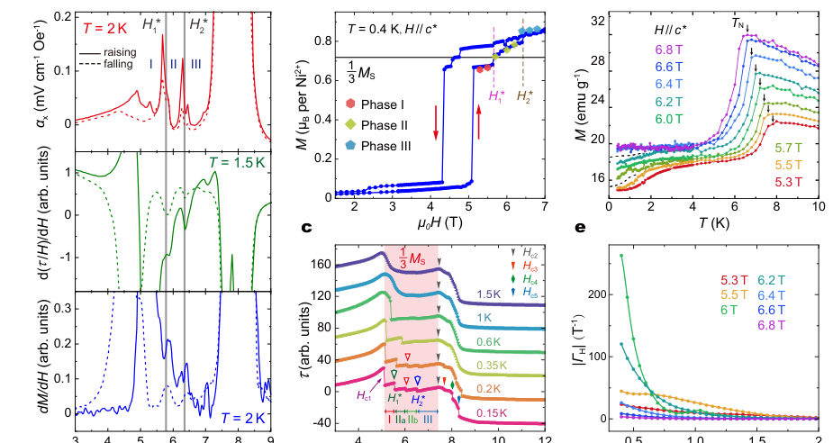 
Fig. 2. Low-temperature thermodynamic investigations of the 1/3-plateau phases. a, Comparison of the positions of anomalies in αx(H) (upper), d(τ/H)/dH (middle) and dM/dH (bottom) measured at T = 1.5-2.0 K. Solid (dashed) lines represent data collected during the field up-sweeps (down-sweeps). The vertical thin bars indicate the anomalies at transition fields H∗ 1 and H∗ 2. b, M(H) measured at 0.4 K up to µ0H = 7 T. The horizontal black bar denotes the value of Ms/3. Red, olive and blue symbols are data points for the plateau phases I, II and III, respectively, extracted from M(T) measurements under fixed H (see panel d). Arrows indicate the direction of field sweeps. c, Magnetic torque...

📷 Fig 3

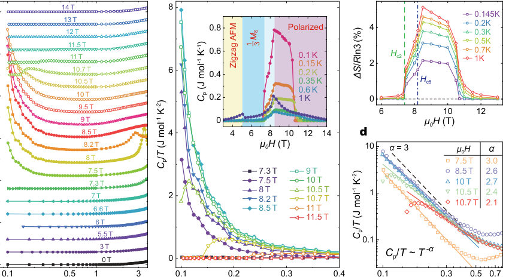 
Fig. 3. Divergent low-T specific heat and its field evolution. a, Specific heat divided by tem- perature, Cp/T, plotted against T from 0.1 to 4 K under varying H ∥c∗. Data are offset vertically for clarity. b, An expanded view of Cp(T)/T below 0.4 K for 7.3 T ≤µ0H ≤11.5 T. Inset shows the H dependence of Cp measured at different T, different background colours distinguish magnetic states: zigzag AFM (yellow), 1/3-Ms plateau (cyan), intermediate phases (light grey) and polarized state (magenta). c, The H-dependent change of magnetic entropy, ∆S = S(H, T) −S(H, 0.1 K), calculated by integrating Cp/T with respect to T from 0.1 K to the referred temperatures. Data are normalized to R ln3, where...

📷 Fig 4

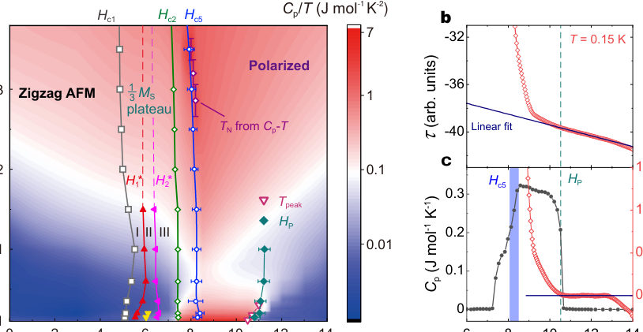 
Fig. 4. Low-temperature H −T phase diagram determined from Cp and τ(H). a, Phase diagram of Na3Ni2BiO6 for H ∥c∗, overlaid onto the contour plots of Cp/T. Open grey squares, olive diamonds and blue circles represent critical fields Hc1, Hc2 and Hc5, respectively, determined by τ(H). Error bars of Hc5 are transition widths in d(τ/H)/dH (Supplementary Fig. 2c). Purple diamonds are TN obtained from Cp(T) (Supplementary Fig. 7b; errors represent the half-widths of the peaks). Within the 1/3 magnetization plateau, a cascade of transitions appear in τ(H) as denoted by triangles in red (H∗ 1), magenta (H∗ 2) and yellow (the small step-like anomaly develops at low T, Fig. 2c). Open pink triangles...

**Summary.** This paper demonstrates that the 1/3-magnetization plateau in the honeycomb magnet Na3Ni2BiO6 is not a single phase but a complex sequence of multiple quantum spin states. The discovery of a cascade of field-induced phases and anomalous low-temperature excitations highlights the profound impact of quantum fluctuations in frustrated lattices.

**Why it may be interesting.** not directly relevant

Detailed structure

**Main problem.** The study aims to understand the complex magnetic phase diagram and the nature of field-induced quantum spin states in a highly frustrated honeycomb antiferromagnet, specifically investigating the substructure of the 1/3-magnetization plateau.

**Main result.** The researchers revealed that the 1/3-magnetization plateau in Na3Ni2BiO6 is composed of at least three distinct spin states and that a cascade of additional quantum phases exists between the plateau and magnetic saturation, accompanied by anomalous low-temperature specific heat upturns.

**Method.** The study employs a variety of experimental probes including AC magnetostriction via a magnetoelectric composite laminate, DC magnetization, magnetic torque magnetometry, and specific heat measurements down to 0.1 K, supplemented by DFT calculations.

**Model / system.** The physical system is Na3Ni2BiO6, a spin-1 (S=1) quasi-2D honeycomb antiferromagnet characterized by strong exchange frustration and potential Kitaev-like interactions.

**Key observables.** Magnetization (M), magnetostriction coefficient (alpha_x), magnetic torque (tau), specific heat (Cp), magnetic Grünevensen parameter (Gamma_H), and magnetic entropy (S).

**Important parameters / regimes.** Magnetic fields up to 14 T, temperatures down to 0.1 K, Neel temperature (TN approx 10 K), and critical fields (Hc1 through Hc5).

**Assumptions / limitations.** The phase diagram is assumed to be largely controlled by zero-temperature quantum fluctuations rather than thermal or entropic effects.

**Figures summary.** Figure 1 shows the experimental setup and magnetization/magnetostriction data; Figure 2 compares anomalies in different probes; Figure 3 displays specific heat evolution and power-law scaling; Figure 4 presents the comprehensive H-T phase diagram.

**Paper structure.** The paper introduces the material and problem, describes the experimental setup and magnetoelectric technique, presents magnetization and magnetostriction results revealing the plateau substructure, analyzes specific heat anomalies and scaling, constructs the H-T phase diagram, and concludes with theoretical implications.

Abstract

Quantum fluctuations endow spin systems with surprisingly enriched magnetic phase diagrams. In frustrated magnets, strong quantum fluctuations boosted by either geometrical incompatibility or competitive exchange interactions stabilize cascades of unusual phases of matter. Here we reveal the presence of multiple quantum phases in the honeycomb antiferromagnet Na$_{3}$Ni$_{2}$BiO$_{6}$, both inside and beyond its field-induced one-third magnetization plateau. Comprehensive measurements of thermodynamic quantities demonstrate that the one-third plateau comprises at least three distinct spin states with nearly-degenerate net magnetization, separated by first-order transitions that likely involve sequential spin reconfiguration. Upon further increasing the magnetic field, the system evolves across a myriad of peculiar phases before reaching full polarization; these intermediate phases possess copious low-energy excitations, manifested by anomalous upturns of specific heat at ultralow temperatures -- probably hinting at the development of "hidden" ordered ground states. The complex magnetic phase diagram of Na$_{3}$Ni$_{2}$BiO$_{6}$ underlines the preponderant impact of quantum fluctuations on a honeycomb spin lattice with strong exchange frustration.

[↑ back to top](#top)

### [Charting causal set configuration space with graph observables](http://arxiv.org/abs/2605.27514v1)

**Authors:** Astrid Eichhorn, Harald Mack, Kim Tuyen Le, Fabian Wagner  
**Type:** theory · **Category:** disordered systems and neural networks · **PDF:** <https://arxiv.org/pdf/2605.27514v1>  
**Analysis basis:** full PDF text, analyzed in chunks

📷 Fig 1

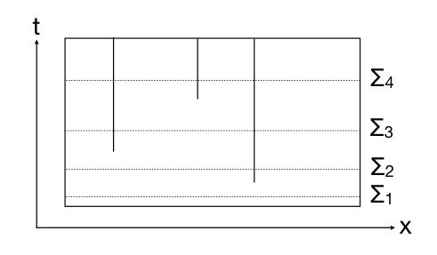 
FIG. 1. We provide an example of a box in 1+1 dimensional spacetime (on which a nontrivial conformal factor can determine the sprinkling density), in which we insert incisions starting from the future spacelike boundary. They result in changes of the spatial topology as a function of time, such that the topology differs between the hypersurfaces Σ1 through Σ4. Topology in this context refers to whether the spatial hypersurfaces are simply connected or whether they consist of (a varying number of) multiple disconnected pieces.

📷 Fig 2

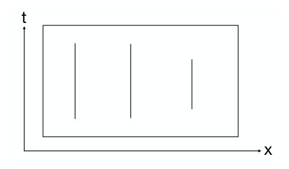 
FIG. 2. We change the spacetime topology by excising cuts that do not meet the boundary of the spacetime region. This is equivalent to adding handles to a spacetime.

📷 Fig 3

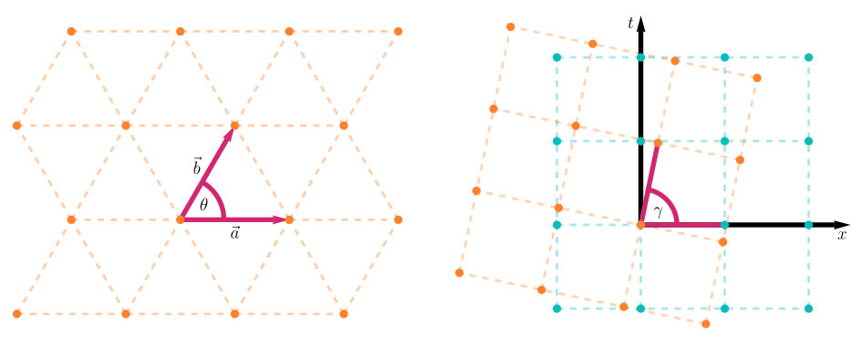 
FIG. 3. Left: illustration of two characteristic segments of a grid with relative length ρ = ∥⃗b∥/∥⃗a∥and the enclosed angle θ. Right: Overall rotation angle with respect to x-axis γ.

📷 Fig 4

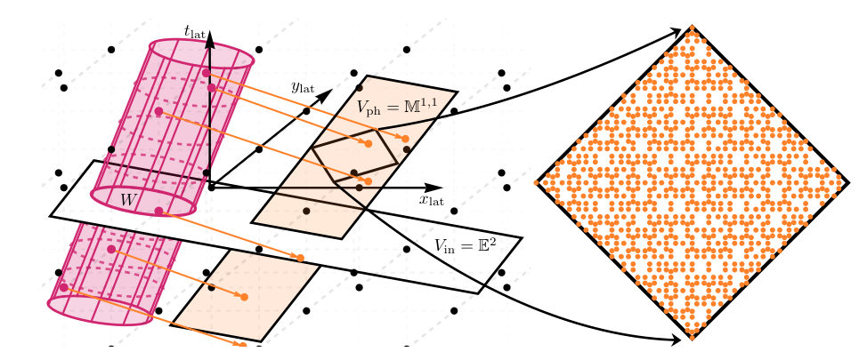 
FIG. 4. Left: Sketch of projection of hypercubic lattice in Cartesian coordinates in M3,1 (one spatial dimension suppressed) to quasicrystal in M1,1. Right: Embedding of example quasicrystal in M1,1 with causal-diamond boundary.

📷 Fig 5

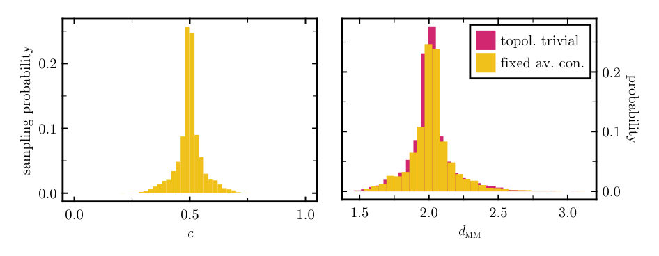 
FIG. 5. Left: Distribution of average connectivities in two-dimensional topologically trivial spacetimes, empirically obtained from 104 causets of 2048 elements. This is the sampling probability used to generate random partial orders with fixed average connectivity. Right: Distribution over resulting Myrheim-Meyer dimension compared with that of topologically trivial spacetimes obtained from ensembles of 104 causets of 2048 elements.

**Summary.** This paper proposes a method to characterize the configuration space of causal sets using graph-theoretic observables rather than expensive continuum-geometry invariants. It demonstrates that simple structural properties like link degree and Laplacian eigenvalues can effectively differentiate between different spacetime-like and non-manifoldlike discrete structures.

**Why it may be interesting.** not directly relevant

Detailed structure

**Main problem.** The goal is to map the vast configuration space of causal sets and identify efficient, label-invariant observables that can distinguish between manifoldlike and non-manifoldlike structures.

**Main result.** Three graph observables—link degree distribution, eigenvalues of the graph Laplacian, and the abundance of causal intervals—are found to be highly effective at distinguishing between nine different classes of causal sets.

**Method.** The authors use numerical simulations of various causal set classes (including Poisson sprinklings, lattices, and quasicrystals) and apply graph-theoretic analysis and statistical convergence tests.

**Model / system.** The study focuses on Causal Set Theory, investigating various discrete spacetime models including manifoldlike sets (with varying curvature and topology), non-manifoldlike sets (lattices, layered orders, and Kleitman-Rothschild orders), and Lorentzian quasicrystals.

**Key observables.** Link degree distribution, eigenvalues of the graph Laplacian of the symmetrized Hasse diagram, abundance of causal intervals (Alexandrov intervals), and height profiles.

**Important parameters / regimes.** Causal set size (n), spacetime dimensionality (d), boundary type (box vs. diamond), conformal factor (curvature), and topological parameters (genus, number of branches).

**Assumptions / limitations.** The study is primarily restricted to conformally flat manifolds (Weyl tensor = 0) and focuses on 2D and 3D dimensions.

**Figures summary.** Figures illustrate topological changes via cuts and handles, geometric parameters of lattices, and the sensitivity of various graph observables to dimensionality, size, and boundary conditions.

**Paper structure.** The paper defines various classes of causal sets, introduces a framework for generating them via Poisson sprinkling and other methods, presents a suite of graph-based observables, and evaluates their ability to distinguish between the constructed classes through statistical analysis.

Abstract

The configuration space of causal sets is vast. It is a critical goal to map out this space. Here, we take a practical step towards this goal. We investigate nine classes of causal sets, most of them not studied before. These include manifoldlike causal sets with inhomogeneous Ricci curvature, both topologically trivial and nontrivial. We also study classes of non-manifoldlike causal sets, including lattices, layered orders as well as Lorentzian quasicrystals. Finally, we study classes of causal sets that are not manifoldlike, but are expected to become manifoldlike under a suitable coarse-graining process. We use this broad range of distinct classes of causal sets as a testbed for observables. Rather than focusing on continuum-geometry inspired observables, such as curvature invariants, which often exhibit large fluctuations and are computationally very expensive, we focus on graph observables, including some observables that constitute subgraph statistics and some that are global. We find that three observables, namely the link degree distribution, the eigenvalues of the graph Laplacian of the symmetrized Hasse diagram and the recently proposed abundance of causal intervals, can distinguish between the distinct classes of causal sets. This is made possible by the small fluctuations that these observables have in most classes.

[↑ back to top](#top)

### [Chirality in Structural Phase Transitions](http://arxiv.org/abs/2605.27812v1)

**Authors:** Keita Matsubara, Kazumasa Hattori  
**Type:** theory · **Category:** strongly correlated electrons · **PDF:** <https://arxiv.org/pdf/2605.27812v1>  
**Analysis basis:** full PDF text, analyzed in chunks

📷 Fig 1

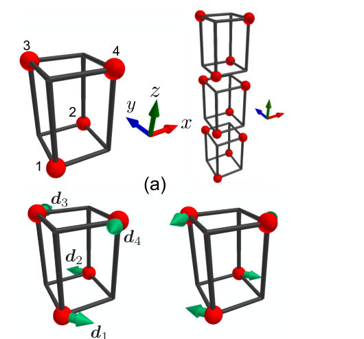 
FIG. 1. (a) Crystal structure of the achiral tetragonal D2d phase. (b),(c) Displacement patterns that transform the achi- ral structure into the chiral D2 phase for the (b) RH and (c)LH structures, respectively.

📷 Fig 2

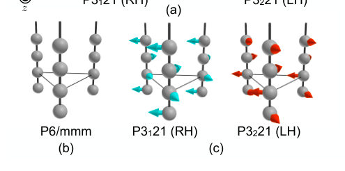 
FIG. 2. (a) Schematic illustration of the threefold helical chains belonging to the space groups P3121 (blue) and P3221 (orange). (b) Crystal structure of the achiral phase of the AtC transition, which belongs to the space group P6/mmm.

📷 Fig 3

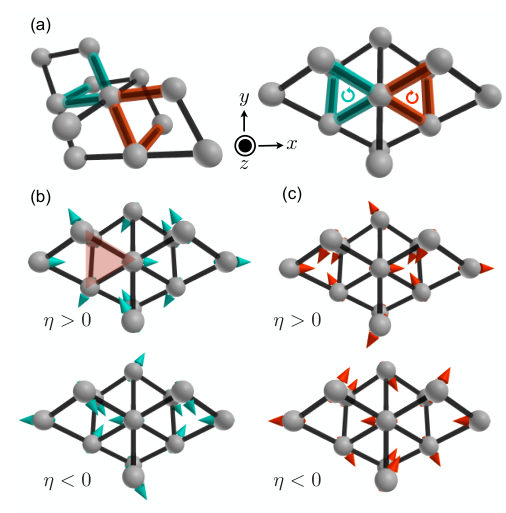 
FIG. 3. (a) Schematic illustration of the nested helices in the achiral phase. The bonds highlighted in blue and orange represent the RH and left-handed LH helices, respectively. (b),(c) Displacement configurations that transform the nested helices into the (b) chiral P3121 and (c) P3221 phases.

📷 Fig 4

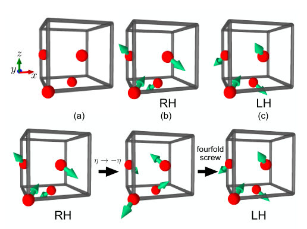 
FIG. 4. (a) Crystal structure of the fcc lattice in the achiral Fm¯3m phase. Displacement configurations that induce the (b) RH and (c) LH chiral P213 structures, respectively. (d) Schematic illustration of the relationship between the RH and LH structures.

📷 Fig 5

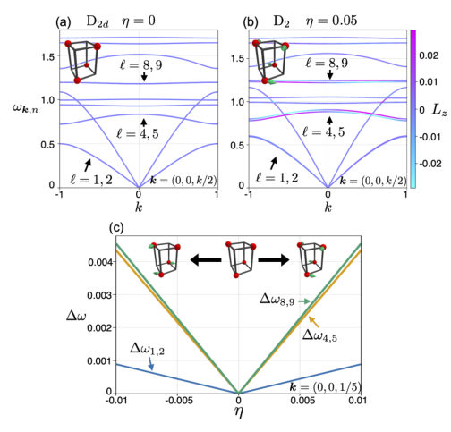 
FIG. 5. (a),(b) Phonon dispersions of the (a) D2d and (b) D2 structures along k = (0, 0, k/2) (−1 ≤k ≤1). The color rep- resents the phonon angular momentum. The branches show- ing the splitting, ℓ= 1, 2, ℓ= 4, 5, and ℓ= 8, 9, are indicated by arrows. (c) The η dependence of the splittings ∆ω1,2(η), ∆ω4,5(η), and ∆ω8,9(η) for −0.01 ≤η ≤0.01. The splittings are measured at k = (0, 0, 1/5).

**Summary.** This paper provides a symmetry-based framework to quantify how structural phase transitions generate chirality in crystals. It demonstrates that the emergence of electric toroidal multipoles and observable effects like chiral phonons can be predicted directly from the symmetry of the parent lattice and the displacement modes.

**Why it may be interesting.** not directly relevant

Detailed structure

**Main problem.** The paper aims to quantify structural chirality during achiral-to-chiral (AtC) phase transitions and determine the functional relationship between structural order parameters and chirality-induced responses.

**Main result.** The authors establish a symmetry-based classification of AtC transitions, showing that the scaling of electric toroidal multipoles (monopoles and quadrupoles) is determined by the parent structure's symmetry and the character of the displacive mode.

**Method.** A group-theoretical approach combined with Landau theory is used to construct the electric toroidal multipoles as explicit functions of the displacement order parameter.

**Model / system.** The study focuses on crystalline solids undergoing structural phase transitions driven by atomic displacements, including specific cases like the rutile, diamond, and breathing pyrochlore lattices.

**Key observables.** Current-induced magnetization (CIM), chiral phonon splitting (CPS), and phonon angular momentum.

**Important parameters / regimes.** Displacement order parameter (eta), electric toroidal multipoles (G0 and Gu), and the ordering vector (Q).

**Assumptions / limitations.** The analysis primarily focuses on continuous phase transitions, though conclusions are noted to extend to discontinuous cases.

**Figures summary.** Figure 1 illustrates the achiral tetragonal phase and the resulting right-handed and left-handed displacement patterns in the chiral phase.

**Paper structure.** The paper introduces the concept of chirality via electric toroidal multipoles, develops a group-theoretical framework to relate these to structural order parameters, analyzes specific transition types (q=0 and q != 0), examines various lattice symmetries (rutile, diamond, pyrochlore), and concludes with the implications for phonon dynamics.

Abstract

Chirality, defined by the absence of mirror and inversion symmetries, has attracted considerable attention owing to its unique physical phenomena, including cross-correlated responses such as current-induced magnetization (CIM) and chiral phonons. Recently, it has been established that chirality is characterized by electric toroidal (ET) multipoles: the ET monopole $G_0$ in cubic systems and the ET quadrupole $G_u$ in noncubic systems. In this paper, we investigate achiral-to-chiral (AtC) structural phase transitions driven by atomic displacements and construct $G_{0,u}$ as explicit functions of the displacement order parameter $η$ based on a group-theoretical approach. We show that the leading-order dependence of $G_{0,u}(η)$ is determined by the symmetry of the parent structure and the character of the displacive mode, providing a symmetry-based classification of AtC transitions beyond a binary distinction between achiral and chiral phases. We also demonstrate that $G_{0,u}(η)$ is directly reflected in observable quantities such as CIM and CPS, both of which scale consistently with $G_{0,u}(η)$. We further clarify the microscopic mechanism by which AtC transitions give rise to chiral phonons and chiral phonon splitting (CPS) through the coupling between $G_{0,u}(η)$ and phonon degrees of freedom.

[↑ back to top](#top)

### [Direction-selective intertwined charge, orbital, and lattice orders under uniaxial strain in hole-doped manganite: La0.75Ca0.25MnO3](http://arxiv.org/abs/2605.27979v1)

**Authors:** Ju Hyeon Lee, Beom Hyun Kim, Bongjae Kim  
**Type:** theory · **Category:** strongly correlated electrons · **PDF:** <https://arxiv.org/pdf/2605.27979v1>  
**Analysis basis:** full PDF text, analyzed in chunks

📷 Fig 1

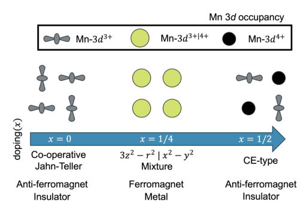 
FIG. 1. Schematic phase diagram of bulk La1−xCaxMnO3 as a function of doping, x. At x = 0, cooperative Jahn- Teller (JT) order, accompanied by |3x2 −r2⟩/|3y2 −r2⟩or- bital ordering, is stabilized within an A-type antiferromag- netic (AFM) insulating phase. At x = 1/4, this orbital or- der is suppressed and the ferromagnetic (FM) metallic phase becomes the ground state. At half doping (x = 1/2), a CE- type orbital and antiferromagnetic ordered insulating phase emerges.

📷 Fig 2

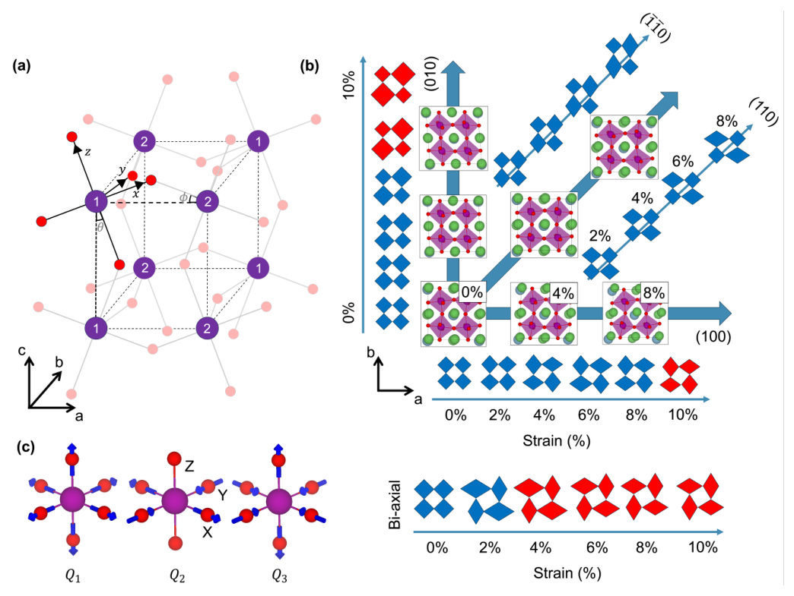 
FIG. 2. (a) Schematic pseudocubic lattice of La0.75Ca0.25MnO3 (LCMO), indicated by dashed lines. The two inequivalent Mn sites are labeled 1 and 2. ϕ and θ denote the in-plane rotation and out-of-plane tilting angles, respectively. Purple and red spheres represent Mn and O atoms. The a, b, and c axes denote the global crystallographic axes, while x, y, and z denote the local axes of the MnO6 octahedron. (b) Schematic structural, electronic, and magnetic phase diagrams for different strain directions. Rhombus represent MnO6 units, with their shapes and sizes indicating the type and magnitude of the distortion. Red and blue indicate ferromagnetic (FM) and A-type antiferromagnetic (AFM) ground...

📷 Fig 3

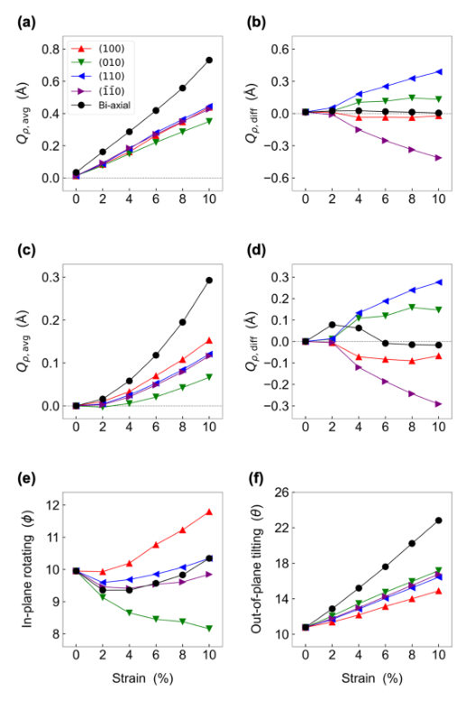 
FIG. 3. Strain dependence of the averaged and site-difference of the asymmetric Jahn-Teller mode in (a) and (b), and of the breathing mode in (c) and (d), under uniaxial and biaxial strain. (e) and (f) show the in-plane rotation angle ϕ and out- of-plane tilting angle θ of the MnO6 octahedra, respectively, as defined in Fig. 2(a).

📷 Fig 4

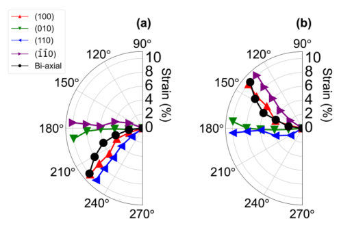 
FIG. 4. Orbital angles for Mn sites 1 and 2, shown in (a) and (b), respectively, defined as tan−1(Q2/Q3) (see Fig. 2(a) for the site labels). The orbital characters |3x2 −r2⟩, |3y2 −r2⟩, and |x2 −y2⟩correspond to orbital angles of 120◦, 240◦, and 180◦, respectively. The black, red, green, blue, and purple curves represent biaxial strain and uniaxial strain applied along the (100), (010), (110), and (¯1¯10) directions, respec- tively.

📷 Fig 5

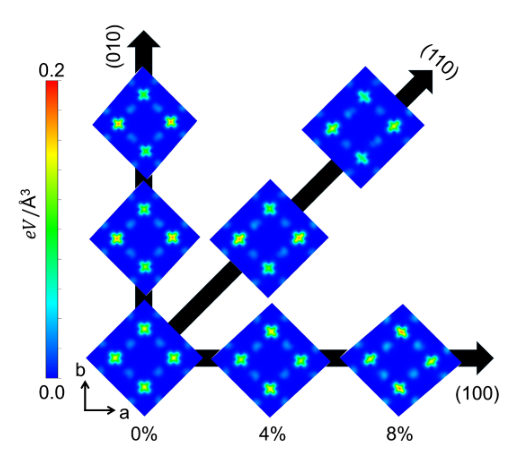 
FIG. 5. Partial charge density for the occupied eg char- acter along the c axis (Fig. 2 (b)) is presented. The strain along (100) and (010) directions has different orbital char- acters, which are |3x2 −r2⟩or |3y2 −r2⟩and |x2 −y2⟩, re- spectively. Further, the two different Mn sites have different electron occupancies. While the strain along (110) and (¯1¯10) directions has (100) and (010) directions orbital character, in between.

**Summary.** This paper demonstrates that applying uniaxial strain in specific crystallographic directions can selectively induce unique, intertwined charge, orbital, and lattice orders in manganites. It shows that strain direction, rather than just magnitude, is a critical parameter for engineering new electronic and magnetic phases in correlated oxides.

**Why it may be interesting.** not directly relevant

Detailed structure

**Main problem.** Investigating whether direction-selective uniaxial strain can act as a qualitative tuning knob to stabilize previously inaccessible, intertwined electronic and magnetic phases in hole-doped manganites.

**Main result.** Different strain directions stabilize qualitatively distinct phases, such as cooperative Jahn-Teller, breathing-like, and site-selective modulations, with diagonal strain (110) specifically stabilizing a new CF-type order.

**Method.** Density Functional Theory (DFT) calculations using the VASP package with the PBEsol functional and Hubbard U/Hund's J corrections.

**Model / system.** The prototypical Jahn-Teller system La0.75Ca0.25MnO3 (LCMO), modeled using an orthorhombic Pnma unit cell and an 8 formula unit supercell to capture structural and charge orders.

**Key observables.** Structural distortions (Jahn-Teller modes Q2, Q3 and breathing mode Q1), orbital polarization, charge disproportionation, and magnetic ground states (FM vs. A-type AFM).

**Important parameters / regimes.** Extreme uniaxial strain up to ~8-10% along (100), (010), (110), and (1-10) directions; Hubbard U = 4 eV; Hund's coupling J_H = 1 eV.

**Assumptions / limitations.** The study assumes the validity of the DFT+U approach for treating Mn-3d electron correlations and focuses on the extreme strain regime enabled by free-standing layer techniques.

**Figures summary.** Fig 1 shows the phase diagram of LCMO vs doping; Fig 2 illustrates the lattice structure and schematic phase diagrams for different strain directions; Fig 3 displays the strain dependence of JT and breathing modes and octahedral rotation/tilting angles.

**Paper structure.** The paper introduces the problem of strain engineering, describes the DFT methodology, presents results for different strain directions (uniaxial vs biaxial), analyzes the driving mechanism of phase transitions, and provides supplementary structural and energy data.

Abstract

The complex interplay of charge, spin, orbital, and lattice degrees of freedom governs emergent phases in quantum materials, making strain a powerful control parameter. Recent advances in free-standing layer techniques have enabled extreme strains of nearly 8%, opening access to novel and often unexpected electronic and magnetic phases. Here, using a density functional theory approach, we investigate the effect of direction-selective uniaxial strain on the prototypical Jahn-Teller system La1-xCaxMnO3 (x = 0.25). We find that different strain directions stabilize qualitatively distinct structural, charge, and orbital responses, rather than merely different strengths of the same phase. In particular, extreme uniaxial strain selectively induces cooperative Jahn-Teller, breathing-like, and site-selective modulations, thereby enabling previously inaccessible intertwined orders in manganites. These results establish direction-selective uniaxial strain as a powerful and selective route for engineering emergent phases in quantum materials.

[↑ back to top](#top)

### [Displaced Gaussian Boson Sampling for enhanced max-clique search](http://arxiv.org/abs/2605.27522v1)

**Authors:** Ewan Mer, Zhenghao Li, Shang Yu, Ian A. Walmsley, Raj B. Patel  
**Type:** both · **Category:** quantum information and computing · **PDF:** <https://arxiv.org/pdf/2605.27522v1>  
**Analysis basis:** full PDF text, analyzed in chunks

📷 Fig 1

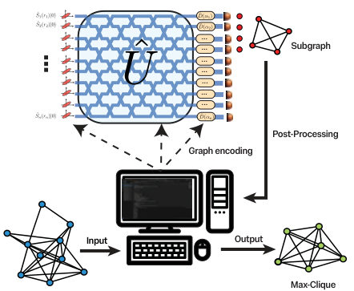 
FIG. 1. Displaced Gaussian Boson Sampling for max-clique search. A weighted graph G = (V, E) is mapped to a set of (r, γ, U) where r and γ are the vectors of squeezing param- eters and displacements, respectively, and U represents the passive unitary operation. Photons are detected with click- detectors at each output mode. Each photon click pattern is considered a subgraph S ⊆G and is fed into a greedy shrink- ing/local search algorithm.

📷 Fig 2

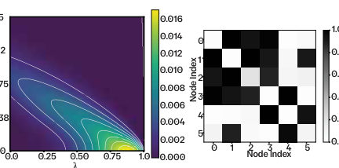 
FIG. 2. Left panel: Probability of measuring the max-clique of a graph as a function of γ and c. Right panel: Adjacency matrix of the graph.

📷 Fig 3

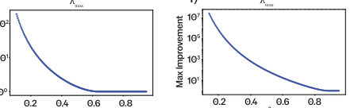 
FIG. 3. a) and b) Adjacency matrices. c) and d): Probability of measuring the max-clique of a graph as a function of γ and λmax = tanh rmax. e) and f): Maximal improvement of D-GBS with respect to GBS as a function of λmax by finding the optimal γ. a), c) and e): 8-node clique embedded in a 20-node Erd˝os-R´enyi graph with an edge probability of 0.2. b), d) and f): 14-node clique embedded in a 20-node Erd˝os- R´enyi graph with an edge probability of 0.2.

📷 Fig 4

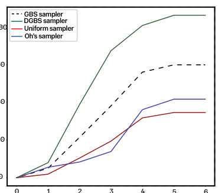 
FIG. 4. Success rate of finding a max-clique in the TaceAs [17] by using a D-GBS sampler (green) with a total displacement of |αtot|2 = 10 and total squeezing | sinh rtot|2 = 2.34, a GBS sampler (dashed line) with | sinh rtot|2 = 2.34, Oh’s sampler (blue) [34] and a uniform sampler (red) after running a classical post-processing routine that consists of 7 iterations of local search after greedy shrinking with 500 sam- ples.

📷 Fig 5

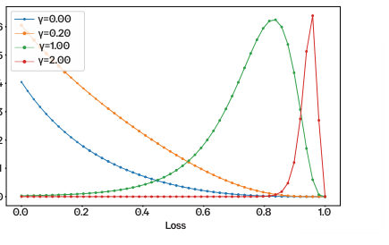 
FIG. 5. Probability of finding the max-clique as a func- tion of loss for different loop strengths γ. A low level of displacement like γ = 0.2 can be used to enhance the probabil- ity of the max-clique by increasing the probability of sampling the max-clique. For an arbitrary level of loss, the displace- ment can be tuned to maximize the sampling probability and outperform the ideal GBS case.

**Summary.** The paper proposes Displaced Gaussian Boson Sampling (D-GBS) as a way to improve the efficiency of finding maximum cliques in graphs. By adding coherent state displacements to the GBS process, the researchers show that the success rate can be significantly boosted even in the presence of high photon loss or low squeezing. This method scales effectively to larger graphs with minimal additional resource overhead.

**Why it may be interesting.** This is highly relevant to quantum optics and open quantum systems as it demonstrates how a specific type of non-classical resource (displacement) can be used to mitigate the detrimental effects of photon loss and limited squeezing in a computational task.

Detailed structure

**Main problem.** Enhancing the success rate of Gaussian Boson Sampling (GBS) for finding maximum-weighted cliques in undirected graphs, specifically overcoming performance degradation caused by photon loss and limited squeezing.

**Main result.** The introduction of Displaced Gaussian Boson Sampling (D-GBS) boosts the sampling probability of maximum-weighted cliques under high loss or low squeezing, providing a scalable enhancement with low resource overhead.

**Method.** The authors use numerical simulations (Strawberry Fields) to compare D-GBS against GBS and classical algorithms, employing a classical post-processing routine of greedy-shrinking and local search on photon click patterns.

**Model / system.** A photonic hardware platform utilizing Gaussian Boson Sampling (GBS) and its extension, Displaced Gaussian Boson Sampling (D-GBS), which incorporates single-mode squeezed vacuum states, a Haar-random linear optical network, and coherent state displacements.

**Key observables.** Photon number vectors, photon click patterns, and the success rate of identifying the maximum clique.

**Important parameters / regimes.** Squeezing parameters (r), displacement vectors (gamma), photon loss (eta), and the collision-free regime (M >> N^2).

**Assumptions / limitations.** Assumes Haar-random unitaries, the anti-concentration property, and the collision-free regime; requires displacement to be a monotonic increasing function of node weight to avoid bias.

**Figures summary.** Figure 1 shows the D-GBS workflow; Figure 2 shows max-clique probability vs. gamma and squeezing; Figure 3 shows improvement across graph sizes; Figure 4 compares success rates against classical samplers; Figure 5 shows loss resilience; Figure 6 shows the effectiveness of local search; Figure 7 shows scaling of enhancement and resource ratios; Figure 8 shows probability distribution histograms.

**Paper structure.** The paper introduces the problem of max-clique search in GBS, defines the D-GBS mathematical framework (loop hafnian), presents numerical results demonstrating enhancement under loss and low squeezing, analyzes scalability and complexity, and concludes with a comparison of resource overheads.

Abstract

Gaussian Boson Sampling (GBS) is capable of solving certain classes of graph problems owing to the samples produced by such a device having a connection to the hafnian matrix function.   In particular, a GBS device has been shown to provide an enhancement in the search of cliques -- or complete subgraphs -- in undirected weighted graphs over classical algorithms.   A graph can be mapped to a GBS experiment by configuring the squeezing parameters of the input states and programming the linear optical network.   In practice, limited squeezing and photon loss degrade the performance of the GBS device for max-clique search.   In comparison, coherent states -- often considered a classical resource due to their Poissonian statistics -- can be readily prepared across many modes using an attenuated laser.   In this paper, we report an enhancement of the success rate of GBS in finding maximum weighted cliques by adding displacements under lossy conditions or when a limited amount of squeezing is available.   Moreover, we report that this enhancement can be scaled up to large graphs with limited resource overheads.

[↑ back to top](#top)

### [Do We Really Need Quantum Machine Learning?: A Multidimensional Empirical Study](http://arxiv.org/abs/2605.27923v1)

**Authors:** Sudip Vhaduri, Ryan Gammon, Sayanton Dibbo  
**Type:** experiment · **Category:** quantum information and computing · **PDF:** <https://arxiv.org/pdf/2605.27923v1>  
**Analysis basis:** full PDF text, analyzed in chunks

📷 Fig 1

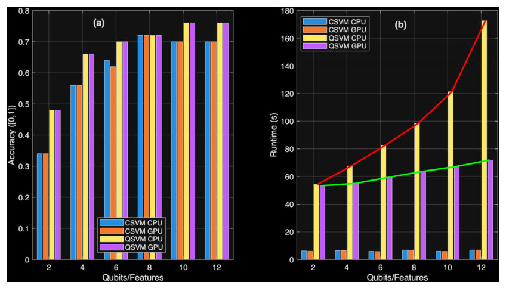 
Fig. 1: Bar graph plot of (a) accuracy (left) and (b) runtime (right) variation across the CSVM and QSVM with CPU and GPU when varying qubits/features but keeping sample size fixed (i.e., 300).

📷 Fig 2

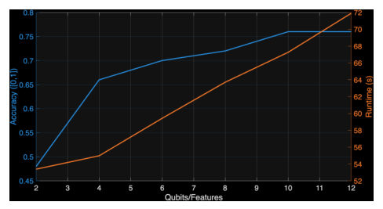 
Fig. 2: Accuracy vs. runtime tradeoff of QSVM using GPU varying qubits/features but keeping sample size fixed (i.e., 300).

📷 Fig 3

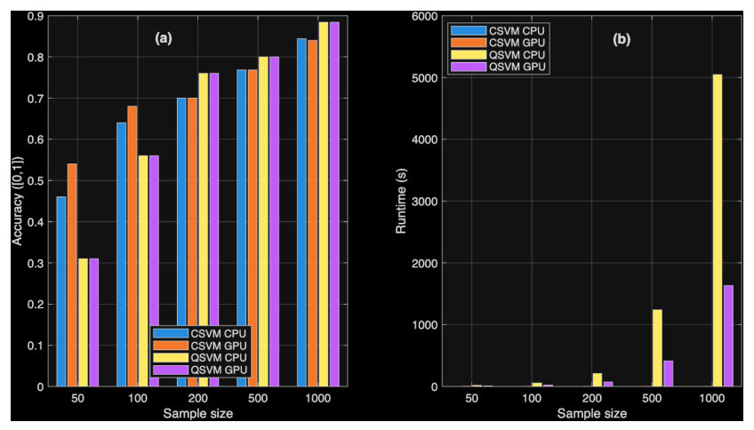 
Fig. 3: Bar graph plot of (a) accuracy (left) and (b) runtime (right) variation across the CSVM and QSVM with CPU and GPU when varying sample size but keeping qubits/features fixed (i.e., 12).

📷 Fig 4

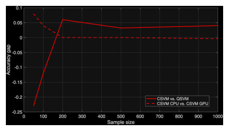 
Fig. 4: Effect of varying sample size but keeping qubits/features fixed (i.e., 12)

📷 Fig 5

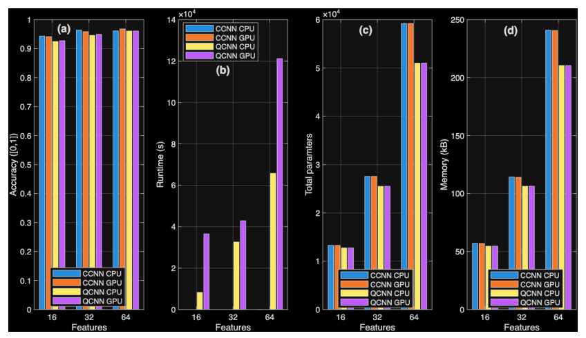 
Fig. 5: Bar graph plot of (a) accuracy, (b) runtime (s), (c) total parameters, and (d) memory (kB) variation across the CCNN and QCNN with CPU and GPU at epoch 5 when varying features but keeping sample size fixed (i.e., 60000).

**Summary.** This paper provides a comprehensive benchmark of quantum versus classical machine learning models for image recognition. It finds that while quantum models can be computationally expensive, they offer significant advantages in parameter and memory efficiency, particularly in high-dimensional data regimes.

**Why it may be interesting.** not directly relevant

Detailed structure

**Main problem.** Evaluating the practical utility and necessity of Quantum Machine Learning (QML) for computer vision tasks by identifying specific regimes where quantum models provide a tangible advantage over classical models.

**Main result.** Quantum models show greater relative accuracy advantages as feature dimensionality or sample size increases; specifically, QCNNs achieve comparable accuracy to CCNNs but with ~94% fewer parameters and ~75% less memory.

**Method.** A multidimensional benchmarking study comparing CSVM, QSVM, CCNN, and QCNN using the MNIST dataset, evaluating performance across varying feature counts, sample sizes, and CPU/GPU environments.

**Model / system.** The study uses simulated quantum hardware via the PennyLane library, implementing Quantum Support Vector Machines (QSVM) with angle embedding and Quantum Convolutional Neural Networks (QCNN) using variational quantum circuits with RX, RY, and CNOT gates.

**Key observables.** Classification accuracy, computational runtime, parameter count, and memory requirements.

**Important parameters / regimes.** Feature dimensionality (qubit count), sample size, and execution environment (CPU vs. GPU).

**Assumptions / limitations.** The study is limited to the MNIST dataset and relies on quantum simulations rather than real hardware; it assumes PCA components equal the number of qubits for encoding.

**Figures summary.** Bar graphs and dual-axis plots showing accuracy and runtime variations for SVMs across qubit/feature counts and sample sizes, and performance metrics (accuracy, runtime, parameters, memory) for CNNs across varying feature counts and sample sizes.

**Paper structure.** The paper introduces the motivation of QML in computer vision, details the experimental setup and models (SVM and CNN variants), presents a multidimensional comparative analysis of accuracy and efficiency, and concludes with potential applications in edge computing and limitations of the study.

Abstract

The rapid growth of computer vision and increasingly complex image recognition tasks has exposed fundamental computational limitations of classical machine learning models, motivating the exploration of quantum computing as an emerging new paradigm. This paper presents a comprehensive benchmarking study of classical and quantum machine learning models for image recognition on the MNIST handwritten digit dataset, evaluating both traditional models, a Classical Support Vector Machine (CSVM) and a Quantum Support Vector Machine (QSVM), and deep neural network models, a Classical Convolutional Neural Network (CCNN) and a Quantum Convolutional Neural Network (QCNN), across four performance dimensions: classification accuracy, computational runtime, parameter count, and memory requirements. Experiments are conducted as functions of both feature dimensionality and sample size, and across CPU and GPU execution environments, providing a controlled, multidimensional comparison to address gaps in prior work. For the SVM-based models, QSVM consistently outperforms CSVM in accuracy, reaching $\sim$ 0.90 versus $\sim$ 0.85 at 1,000 samples, with a higher computational cost. A feature count of 10 qubits and a sample size in the range of 200 -- 500 emerge as practical operating points that balance accuracy and runtime. For the neural network models, CCNN and QCNN achieve comparable classification accuracy, both exceeding 0.96 at 64 features and 60,000 samples, yet QCNN offers substantially superior parameter and memory efficiency, requiring $\sim$ 94\% fewer parameters and $\sim$ 75\% less memory than CCNN at higher feature counts, while incurring higher runtime. Across both model families, quantum models consistently outperform classical models by greater margins in accuracy as feature dimensionality or sample size increases.

[↑ back to top](#top)

### [Dynamic Entanglement Packet Scheduling for Quantum Networks](http://arxiv.org/abs/2605.28795v1)

**Authors:** Quang-Phong Tran, Claudio Cicconetti, Marco Conti, Andrea Passarella  
**Type:** theory · **Category:** quantum information and computing · **PDF:** <https://arxiv.org/pdf/2605.28795v1>  
**Analysis basis:** full PDF text, analyzed in chunks

📷 Fig 1

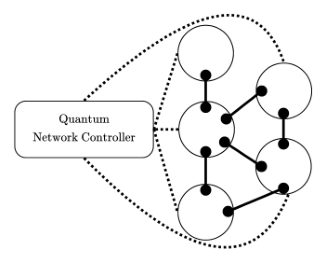 
Fig. 1. A quantum network with a central controller that coordinates 5 nodes. Each has a certain number of quantum links.

📷 Fig 2

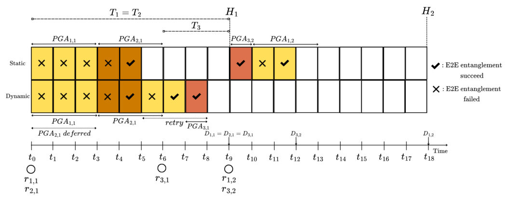 
Fig. 2. A toy example comparing the static (top) and dynamic (bottom) schedulers, where 3 applications a request one entanglement packet (∀a ∈A, Ia = 1) with periods Ta. 2 applications arrive at t0, while the last arrives at t6. Each scheduler schedules PGAa,k (time budgets), represented by solid double arrows. In each slot, an attempt of E2E entanglement is performed (entanglement generation and swapping with all the links of the selected path πa). Each color is associated with an application and an outcome represented by a symbol. The hyper-periods Hi are used only by the static scheduler. The dashed double arrows indicate specific runtime mechanisms of the dynamic scheduler (defer and...

📷 Fig 3

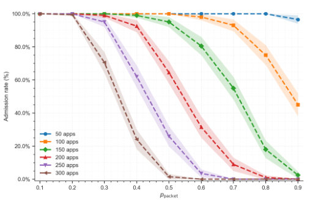 
Fig. 3. The static scheduler admission rate of feasible schedules vs. ppacket.

📷 Fig 4

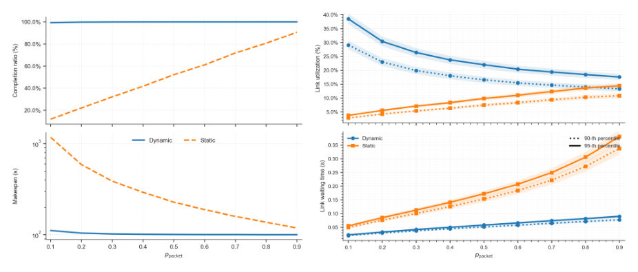 
Fig. 4. Comparison between the static and dynamic schedulers: the left figure shows the completion ratio (top) and makespan (bottom) in logarithmic scale vs. ppacket; the right figure shows the 90th/95th percentile per-link utilization (top) and per-link waiting time (bottom) vs. ppacket.

📷 Fig 5

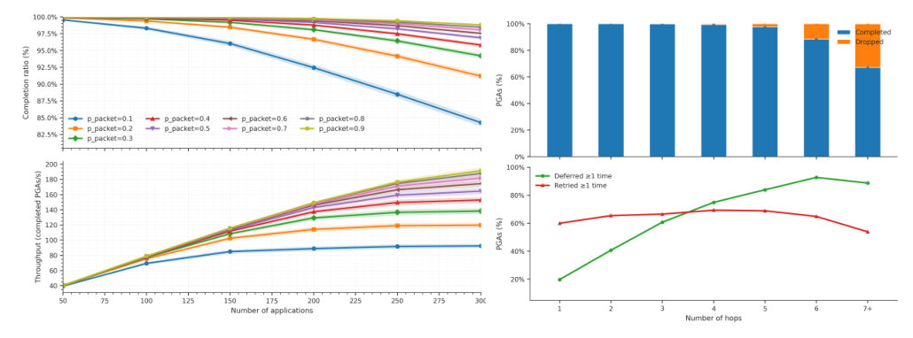 
Fig. 5. Performance on the load and the path length of the dynamic scheduler: the left figure shows the completion ratio and throughput according to an increasing load for different values of ppacket; the right figure shows the proportion of PGAs completed/dropped and fractions of deferred/retried based on the number of hops (for napps = 200, ppacket = 0.3). Note that a PGA can be deferred and retried as long as it can meet its deadline.

**Summary.** This paper proposes a dynamic scheduling algorithm for quantum networks to replace inefficient static schedules. By reacting to real-time successes and failures of entanglement generation, the scheduler improves network throughput and reliability. It is particularly effective at managing resource contention in high-load scenarios.

**Why it may be interesting.** not directly relevant

Detailed structure

**Main problem.** Efficiently sharing entanglement among multiple users in scalable quantum networks is difficult due to stochastic entanglement generation outcomes and asynchronous request arrivals, which cause static TDMA schedules to fail.

**Main result.** The proposed dynamic online scheduler achieves higher throughput, lower completion time, and a higher completion ratio than static EDF-based baselines, while demonstrating graceful degradation under network overload.

**Method.** The authors develop an online, event-driven scheduler that manages two priority queues (Event and Ready) to dynamically decide whether to admit, defer, retry, or drop entanglement distribution reservations based on real-time outcomes.

**Model / system.** A time-slotted quantum network model using an undirected graph where nodes perform entanglement generation and swapping. The architecture uses an on-demand 'entanglement packet' approach with Packet Generation Attempts (PGAs) across paths.

**Key observables.** Completion ratio, throughput, makespan, admission rate, link utilization, and waiting time.

**Important parameters / regimes.** Target success probability (p_packet), link generation probability (p_gen), Bell State Measurement success probability (p_bsm), application period (T_a), and path length (number of hops).

**Assumptions / limitations.** Entanglement generation is triggered only upon request; no multipartite entanglement is considered; routing is fixed to the shortest path; and the model assumes instantaneous entanglement swapping and simplified quantum memory.

**Figures summary.** Figure 1 shows a 5-node network topology; Figure 2 provides a toy example comparing static vs. dynamic scheduling success/failure; Figure 3 shows static admission rate vs. load; Figure 4 compares performance metrics (completion ratio, makespan, etc.) between the two schedulers; and a final figure shows the impact of path length on packet drops and retries.

**Paper structure.** The paper introduces the entanglement packet architecture, defines the mathematical network and application models, presents the proposed dynamic scheduling algorithm, describes the simulation setup using the GARR network, and concludes with a performance comparison and discussion of future work.

Abstract

Sharing entanglement among multiple users remains a central challenge for scalable quantum networks. Recent work proposed an on-demand entanglement packet architecture in which a controller uses a Time Division Multiple Access (TDMA) approach to allocate network resources. Quantum nodes are assigned a periodic schedule that probabilistically fulfills application requests for end-to-end entanglements. The schedule is recomputed periodically using well-known algorithms, such as Earliest Deadline First (EDF). However, a static schedule offers limited flexibility when outcomes are stochastic and arrivals are asynchronous. To overcome this limitation, we propose an online scheduler that dynamically schedules, defers, retries, or drops entanglement distribution reservations. In our simulations, the dynamic scheduler achieves lower completion time, higher completion ratio, and higher throughput than the static baseline. Furthermore, when the network is overloaded, the dynamic scheduler continues to construct deadline-feasible schedules and degrades gracefully.

[↑ back to top](#top)

### [EFaaS: A Quantum-Classical Serverless Entangled Scheduler for Hybrid Variational Algorithms](http://arxiv.org/abs/2605.27540v1)

**Authors:** Abolfazl Younesi, Nouhaila Innan, Alberto Marchisio, Muhammad Shafique  
**Type:** theory · **Category:** quantum information and computing · **PDF:** <https://arxiv.org/pdf/2605.27540v1>  
**Analysis basis:** full PDF text, analyzed in chunks

📷 Fig 1

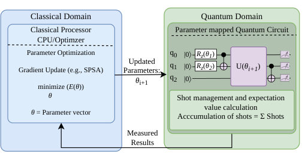 
Fig. 1: Iterative hybrid quantum-classical workflow for variational algorithms (VQE/QAOA), where a classical optimizer updates cir- cuit parameters based on measurements from a quantum processor, forming a feedback loop between classical and quantum domains

📷 Fig 2

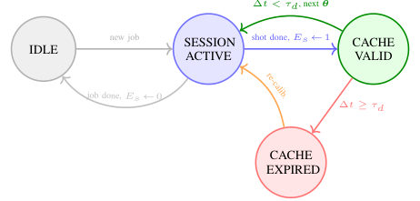 
Fig. 3: Session Awareness Engine state machine. A Hot Iterator cycles between SESSION ACTIVE and CACHE VALID provided each inter-shot delay ∆t remains within τd = τdrift. If the cache expires, the engine triggers a localized recalibration before resuming the active session.

📷 Fig 3

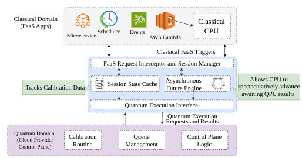 
Fig. 2: EFaaS System Architecture. The middleware intercepts Clas- sical FaaS triggers and Quantum Execution requests (Control Plane). The “Session State Cache” maintains QPU calibration data (Cq) while the “Asynchronous Future Engine” allows the CPU to speculatively advance while awaiting QPU results.

📷 Fig 4

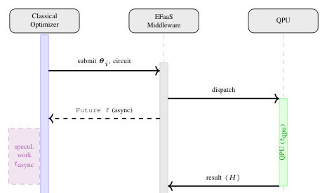 
Fig. 4: EF-QuantumFuture execution sequence. The Middleware returns an asynchronous Future f immediately upon submission, allowing the classical optimizer to perform speculative work (tasync) concurrently with QPU execution (tqpu). The f.resolve() call delivers ⟨H⟩once the QPU completes, and the optimizer proceeds to θi+1 without any blocking wait.

📷 Fig 5

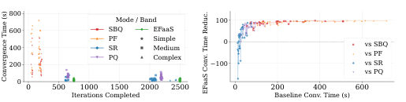 
Fig. 7: End-to-end convergence time and EFaaS speedup ratio relative to all four baselines. EFaaS converges in a mean of 22.9 s versus 213 s for SBQ and 320 s for PF, achieving speedups of 83.2%–98.3% across the benchmark suite.

**Summary.** The paper proposes EFaaS, a serverless middleware designed to optimize the execution of hybrid quantum-classical algorithms. By treating classical optimization and quantum execution as entangled, session-aware events, it minimizes the latency and hardware drift that typically plague cloud-based quantum computing.

**Why it may be interesting.** not directly relevant

Detailed structure

**Main problem.** High latency and 'quantum drift' in hybrid variational quantum algorithms (VQAs) caused by decoupled, batch-queue cloud architectures that break the iterative loop between classical optimizers and QPUs.

**Main result.** The EFaaS middleware achieves convergence speedups of 83.2%-98.3% and significantly reduces Time-to-Next-Shot (TTNS) by up to 94.3% while maintaining near-zero hardware drift penalties.

**Method.** A serverless middleware architecture using a Calibration-Aware placement strategy, a Dual-Resource Fair Queuing (DRFQ) scheduler, and an 'EF-QuantumFuture' programming primitive for speculative classical execution.

**Model / system.** A distributed hybrid quantum-classical environment consisting of a pool of QPUs (superconducting and ion-trap) and classical FaaS nodes, simulating VQE and QAOA workloads on Hamiltonians like LiH and the transverse-field Ising chain.

**Key observables.** Time-to-Next-Shot (TTNS), Quantum Duty Cycle (QDC), end-to-end convergence time, and drift penalty events.

**Important parameters / regimes.** Drift threshold (tau_drift), calibration validity window, and scheduling weights (alpha, beta, gamma) for session awareness, drift urgency, and fair-share.

**Assumptions / limitations.** The effectiveness of stochastic optimizers relies on the assumption of i.i.d. sampling, which is violated by hardware drift; the system assumes a discrete-event simulation model for traffic.

**Figures summary.** Figure 1 shows the hybrid iterative workflow; Figure 2 details the EFaaS architecture; Figure 3 depicts the Session Awareness Engine state machine; Figure 4 illustrates the overlapping execution of classical and quantum tasks; Figure 8 and 9 show the reduction in drift events and calibration overhead.

**Paper structure.** The paper introduces the latency/drift problem, proposes the EFaaS architecture and its three technical innovations, provides a mathematical model for latency and scheduling, presents experimental results via a discrete-event simulator, and performs ablation and sensitivity studies.

Abstract

As quantum computing enters the Utility Era, realizing near-term advantage relies heavily on Hybrid Variational Quantum Algorithms (VQAs). These algorithms require a tightly coupled, iterative loop between a classical CPU optimizer and a Quantum Processing Unit (QPU). However, current quantum cloud access models are bottlenecked by decoupled batch-queues that sever this loop, introducing massive Time-to-Next-Shot (TTNS) latency. This delay inflates convergence time from minutes to hours and exposes the computation to quantum hardware drift, degrading algorithmic fidelity. Unlike prior works that rely on resource-wasting static hardware reservations or state-oblivious stateless functions, we propose EFaaS, a novel serverless middleware designed specifically for hybrid quantum workflows. EFaaS fundamentally departs from existing architectures by treating classical parameter optimization and quantum circuit execution as entangled, session-aware events. Our main technical innovations are threefold: (1) a Calibration-Aware placement strategy that dynamically routes circuits to QPUs with warm calibration caches, circumventing cold-start penalties, (2) a Dual-Resource Fair Queuing scheduler that maximizes quantum utilization by strictly prioritizing active iterative loops, and (3) the "EF-QuantumFuture" programming abstraction, a novel primitive enabling classical speculative execution to mask compute latency. Across the evaluated baselines, EFaaS achieves TTNS reductions of 11.4%-94.3%, QDC gains of 2.02%-15.78% points, and convergence speedups of 83.2%-98.3%, while eliminating drift penalties.

[↑ back to top](#top)

### [Emergence of an antiferromagnetic topological Anderson insulator in the interacting Haldane model](http://arxiv.org/abs/2605.27524v1)

**Authors:** Alejandro J. Uría-Álvarez, Roser Valentí  
**Type:** theory · **Category:** disordered systems and neural networks · **PDF:** <https://arxiv.org/pdf/2605.27524v1>  
**Analysis basis:** full PDF text, analyzed in chunks

📷 Fig 1

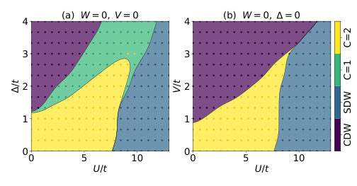 
FIG. 1. (a) Phase diagram of the clean extended Haldane- Hubbard model as a function of the staggered mass ∆and the Hubbard interaction strength U, at V = 0. (b) Phase diagram of the clean extended model as a function of U, V , at zero staggered mass ∆= 0. The colored points denote the ED results and the grid used in the calculations, whereas the smooth lines marking the boundaries between phases were obtained by interpolating the points.

📷 Fig 2

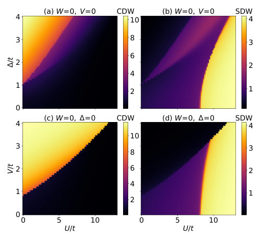 
FIG. 2. CDW and SDW diagrams of the clean extended Haldane-Hubbard model. (a, b) Diagrams as a function of (∆, U) at V = 0. (c, d) Diagrams as a function of (U, V ) at ∆= 0.

📷 Fig 3

 
Fig. 1(a). This diagram shows the existence of a CDW phase induced by the staggered mass, as it favors occupa- tion of one sublattice over the other. At the opposite side of the phase diagram, we find a SDW phase, correspond- ing to the antiferromagnetic phase typically induced by the Hubbard interaction [65–67]. The yellow region cor- responds to the interacting CI with C = 2, which can be understood as two identical spin copies of the non- interacting CI. The emergent phase, previously reported in several works, is the green C = 1 region. This phase has been identified as an AFCI, as it exhibits a finite SDW component while having C = 1. This can be seen explicitly in Fig. 2(a, b), where...

📷 Fig 4

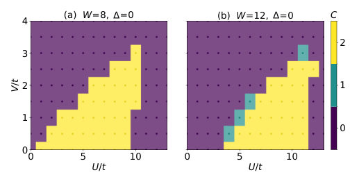 
FIG. 3. Phase diagram of the disordered extended Haldane- Hubbard model at disorder strenghts (a) W = 8 and (b) W = 12. Beyond the displacement of the C = 2 region towards higher values of U, at W = 12 we observe the emergence of an intermediate C = 1 phase. Both diagrams are averaged over Ns = 20 disorder realizations.

📷 Fig 5

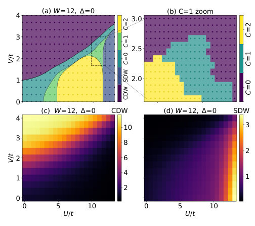 
FIG. 4. (a) (U, V ) phase diagram of the disordered extended Haldane- Hubbard predicted by the CNN. Beyond the conven- tional CDW, SDW, and C = 2 phases, the classifier identifies two well-defined pockets for the C = 1 phase, together with an intermediate C = 0 phase that does not correspond to the fully developed CDW or SDW phases. (b) Zoom-in of the upper C = 1 pocket. In both figures, the dots denote the dis- crete grid used to evaluate the phase diagrams, whereas the smooth boundary lines in (a) were obtained interpolating the points. (c, d) CDW and SDW diagrams as a function of U and V . All plots have been disorder-averaged over Ns = 100 realizations.

**Summary.** This paper explores how disorder can induce new topological phases in interacting systems. It specifically demonstrates the emergence of an antiferromagnetic topological Anderson insulator in the Haldane model, showing that disorder can effectively replace a staggered mass to create a C=1 phase. The study also showcases the utility of neural networks in identifying topological phase boundaries in disordered many-body systems.

**Why it may be interesting.** not directly relevant

Detailed structure

**Main problem.** Investigating whether an antiferromagnetic (AFM) C=1 topological phase can be induced by Anderson disorder in the absence of a staggered mass in the interacting Haldane model.

**Main result.** The study identifies an antiferromagnetic topological Anderson insulator phase, demonstrating that Anderson disorder can generate the charge imbalance necessary to induce the C=1 phase.

**Method.** The authors use Exact Diagonalization (ED) on a 12A cluster and a Convolutional Neural Network (CNN) trained on the single-particle density matrix to predict Chern numbers and resolve phase boundaries.

**Model / system.** A spinful Haldane model on a honeycomb lattice including Hubbard (U) and nearest-neighbor density-density (V) interactions, subject to onsite Anderson disorder (W) and a staggered potential (Delta).

**Key observables.** Many-body Chern number (C), Spin Density Wave (SDW) structure factor, and Charge Density Wave (CDW) structure factor.

**Important parameters / regimes.** Hubbard interaction (U), density-density interaction (V), Anderson disorder strength (W), and staggered mass (Delta).

**Assumptions / limitations.** The ground state is assumed to be non-degenerate for the use of the Abelian Berry connection; results are limited by finite-size effects of the 12A cluster.

**Figures summary.** Figure 1 shows clean model phase diagrams; Figure 2 shows CDW/SDW diagrams; Figure 3 shows phase diagrams at specific disorder strengths; Figure 4 shows CNN-predicted phase diagrams; Figure 5 compares ED and CNN results; Figure 6 shows SDW structure factor and phase classification percentages.

**Paper structure.** The paper begins with the clean model phase diagrams, moves to the introduction of disorder and the identification of the AFM topological phase, presents the machine learning methodology for phase prediction, and concludes with a comparison of ED and CNN results and the analysis of phase competition.

Abstract

We examine the emergence of topological Anderson insulating phases in the spinful Haldane model with Hubbard and next-neighbor density-density interactions, subject to Anderson disorder. Using finite-size exact diagonalization, we characterize the phases that arise from the interplay between topology, interactions, and disorder. In addition to standard $C=2$ topological Anderson phases, we observe an antiferromagnetic $C=1$ topological Anderson phase, consistent with the antiferromagnetic quantum anomalous Hall insulator previously identified in the clean model at finite staggered mass. We further analyze these phases using a neural network trained on the exact diagonalization data. Our results support the hypothesis that an explicit charge imbalance is required to induce the $C=1$ phase, generated by Anderson disorder rather than by a staggered mass.

[↑ back to top](#top)

### [Engineering Molecular Rectification: Mechanisms, Modulation Strategies, and Device Integration](http://arxiv.org/abs/2605.28381v1)

**Authors:** Junnan Guo, Shufan Song, Wenhui Fang, Jifeng Tang, Wenhao Li, Weikang Wu, Hui Li, Shishen Yan, Lishu Zhang  
**Type:** both · **Category:** other · **PDF:** <https://arxiv.org/pdf/2605.28381v1>  
**Analysis basis:** full PDF text, analyzed in chunks

📷 Fig 1

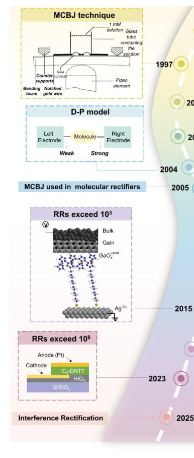 
Figure 1. Evolution roadmap and key milestones in the development of molecular rectifiers. The roadmap

📷 Fig 2

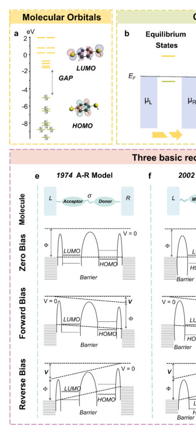 
Figure 2. Theoretical frameworks and charge transport mechanisms. (a) Molecular energy spectrum and

📷 Fig 3

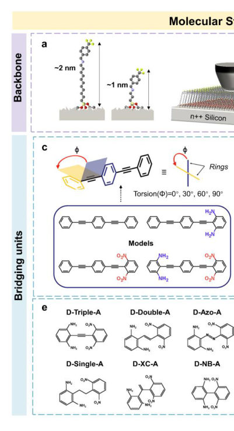 
Figure 3. Molecular structural engineering strategies. (a) Modulation of RRs via chain length in alkylated silane

📷 Fig 4

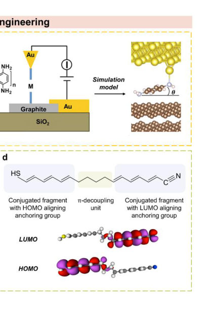 
Figure 4. Interfacial and electrode engineering strategies. (a) Enhancement of RRs in SC11BIPY–C≡C–BIPY

📷 Fig 5

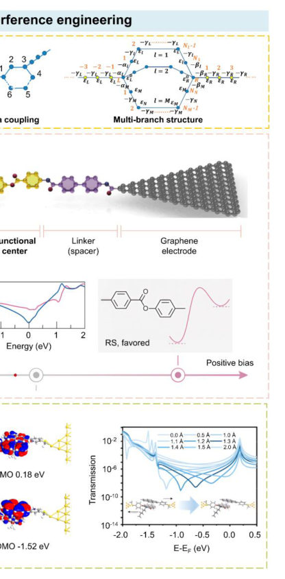 
Figure 5. Quantum interference (QI) engineering strategies. (a) Theoretical models of QI in molecular

**Summary.** This review provides a comprehensive overview of the mechanisms and engineering strategies used to create high-performance molecular rectifiers. It covers how molecular structure, electrode interfaces, and quantum interference can be manipulated to enhance rectification ratios for post-CMOS electronics.

**Why it may be interesting.** not directly relevant

Detailed structure

**Main problem.** The challenge of developing molecular rectifiers that are competitive with silicon-based devices by overcoming limited rectification ratios, poor robustness, and low reproducibility.

**Main result.** The review provides a comprehensive framework for engineering molecular rectifiers through structural, interfacial, and quantum interference engineering, demonstrating that rectification can be tuned via molecular design and external stimuli.

**Method.** The paper integrates theoretical frameworks like DFT-NEGF and Landauer-Büttiker formalism with experimental platforms such as STM-BJ, MCBJ, and self-assembled monolayers.

**Model / system.** The physical system consists of single-molecule junctions and molecular ensembles (e.g., D-sigma-A architectures) linked to metallic or carbon-based electrodes.

**Key observables.** Rectification Ratio (RR), conductance, current-voltage (I-V) characteristics, and transmission probability.

**Important parameters / regimes.** HOMO-LUMO gap, energy-level alignment, coupling strength, and transport regimes (coherent vs. incoherent).

**Assumptions / limitations.** The review discusses limitations such as the difficulty in achieving simultaneous interfacial tunability and long-term stability.

**Figures summary.** Figure 1 shows a historical roadmap of molecular rectifiers; Figure 2 illustrates theoretical models (AR, KBW, DP) and energy spectra; Figure 3 depicts structural engineering strategies; Figure 4 illustrates electrode and interface engineering.

**Paper structure.** The paper follows a logical progression from historical evolution and fundamental transport mechanisms (AR, KBW, DP models) to specific modulation strategies (structural, interfacial, and quantum interference engineering) and concludes with future outlooks for device integration.

Abstract

Molecular rectifiers, as prototypical components of molecular electronics, present unique opportunities for pushing device miniaturization to its ultimate limits. Nevertheless, challenges including limited rectification ratios (RR), insufficient robustness, and poor reproducibility impede their practical deployment. To make molecular rectifiers competitive with silicon-based devices, it is important to fully understand the design principles and fabrication methods from both mechanistic and experimental perspectives. By holistically considering the transport mechanisms, modulation strategies, fabrication, characterization techniques, and theoretical simulations, this review provides a comprehensive overview of molecular rectifiers. Representative examples of conceptually significant and high-performance molecular rectifier systems are highlighted to illustrate the relationships between rectification mechanisms, molecular design strategies, and device realization. Building on these discussions, we present an outlook for current bottlenecks and future directions to guide the development of molecular rectifiers. This review aims to serve as both a conceptual framework and a technical reference for researchers working at the intersection of molecular electronics and nanoscale device engineering in the post-CMOS era.

[↑ back to top](#top)

### [Gauge Geometry of Hodge Zero-Mode Transport in Parameter-Dependent Topological Data Analysis](http://arxiv.org/abs/2605.28326v1)

**Authors:** Satoshi Kanno, Rei Nishimura, Hiroshi Yamauchi, Yoshi-aki Shimada  
**Type:** theory · **Category:** disordered systems and neural networks · **PDF:** <https://arxiv.org/pdf/2605.28326v1>  
**Analysis basis:** full PDF text, analyzed in chunks

📷 Fig 1

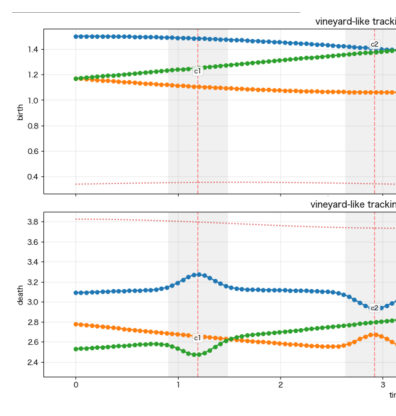 
Fig. 1 Vineyard-like tracking used in Experiment 1. The resulting vineyard-like tracking, including the elder vine and crossing windows.

📷 Fig 2

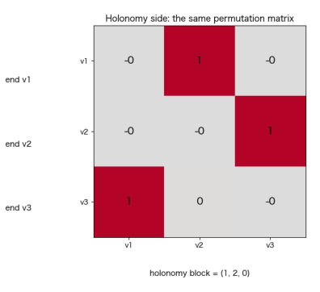 
Fig. 2 Endpoint permutation and holonomy in Experiment 1. One loop sends (v1, v2, v3) to (v2, v3, v1), and the zero-mode holonomy gives the same permutation matrix.

📷 Fig 3

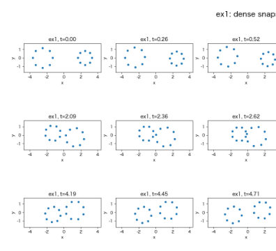 
Fig. 3 Dense snapshots over one period for Experiment 3, approaching double circles.

📷 Fig 4

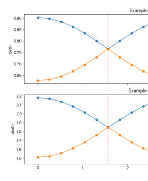 
Fig. 4 Vineyard-style tracking of the top two persistence points in Experiment 2.

📷 Fig 5

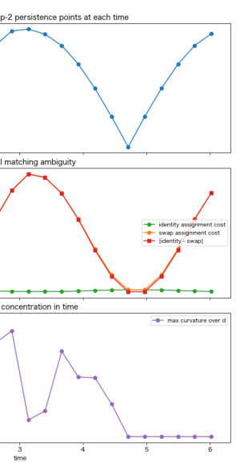 
Fig. 5 Time series of three quantities in Experiment 2: the distance between the top two persistence points, the tracking ambiguity margin, and the maximum curvature. The distance and ambiguity margin become nearly zero at the swap time, while the curvature attains its peak in the same region.

**Summary.** This paper introduces a new way to track how topological features in data evolve over time or external parameters. By treating homology as a geometric bundle, it uses concepts like curvature and holonomy to detect structural changes that traditional methods miss.

**Why it may be interesting.** The use of Berry connection, curvature, and holonomy to describe the evolution of topological features is directly analogous to the study of geometric phases and topological invariants in many-body systems and driven quantum dynamics.

Detailed structure

**Main problem.** Standard Topological Data Analysis (TDA) tools like persistence diagrams fail to capture how homological feature spaces reorganize, mix, or transport when data depends on external parameters like time or control variables.

**Main result.** The authors develop a gauge-geometric framework using the Hodge Laplacian to describe the transport of homology, proving that curvature and holonomy are stable descriptors of structural reorganization in regular parameter regions.

**Method.** The framework uses the combinatorial Hodge Laplacian to represent homology as a zero-mode bundle, applying Berry-type connection, curvature, and holonomy to track feature evolution.

**Model / system.** A parameter-dependent family of simplicial complexes (e.g., Vietoris-Rips filtrations) where the topology is studied as a vector bundle over a parameter space (time, temperature, or external fields).

**Key observables.** Curvature (local reorganization), Holonomy (accumulated memory/monodromy), and zero-mode projections.

**Important parameters / regimes.** Filtration scale (a), external parameter (lambda), spectral gap (gamma), and smoothing parameter (epsilon).

**Assumptions / limitations.** The theory assumes 'regular regions' where the zero-mode multiplicity is constant and a spectral gap exists; it also uses a smooth approximation for the discrete Laplacian.

**Figures summary.** The figures likely include curvature heatmaps identifying reorganization regions, comparisons between vineyard-style tracking and holonomy-guided tracking, and stability plots showing error bounds under noise.

**Paper structure.** The paper introduces the limitations of existing TDA, constructs a smooth Hodge-type operator and a zero-mode vector bundle, defines geometric quantities (connection, curvature, holonomy), provides stability proofs via Riesz projection, and validates the method through numerical experiments on time-dependent point clouds.

Abstract

We propose a practical computational framework for detecting structural changes in parameter-dependent topological data. In many applications, such as time-series data analysis, anomaly detection, and monitoring of systems under changing control parameters, persistence diagrams describe the birth and death of topological features at each parameter value, but they do not fully capture how these features are reorganized over time. To address this limitation, we represent homological features by zero modes of the ordinary combinatorial Hodge Laplacian and track the corresponding feature spaces in a common ambient chain space. This allows us to compute curvature and holonomy as descriptors of local reorganization and accumulated memory in evolving topological structures. Curvature highlights parameter regions where homological features mix or change rapidly, while holonomy summarizes the net effect of such changes after a closed cycle. We also establish stability estimates showing that these descriptors are robust under perturbations of the Hodge Laplacian on regular regions. Numerical experiments on controlled time-dependent point-cloud data show that the proposed method detects tracking instability, distinguishes systems with nearly identical persistence diagrams, and captures cycle-level memory invisible to pointwise feature matching. These results suggest that zero-mode transport geometry can serve as a useful computational tool for analyzing dynamic topological data.

[↑ back to top](#top)

### [Geometric Analysis of Variational Quantum Eigensolver](http://arxiv.org/abs/2605.27795v1)

**Authors:** Zhen Qin  
**Type:** theory · **Category:** quantum information and computing · **PDF:** <https://arxiv.org/pdf/2605.27795v1>  
**Analysis basis:** full PDF text, analyzed in chunks

📷 Fig 1

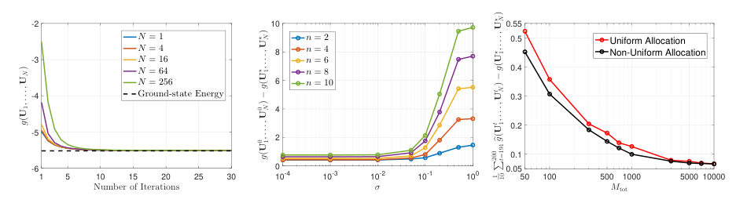 
Figure 1: (a) Convergence behavior of RGD for varying N with µ0 = 0.2, n = 6, and σ = 0.05; (b) Initialization error for different σ and n with N = 16; (c) Comparison between uniform and non-uniform measurement allocation under varying total budget Mtot with µ0 = 0.2, n = 6, N = 8, and σ = 0.05.

**Summary.** This paper provides a unified geometric analysis of the VQE optimization landscape, proving that the landscape is free of spurious local minima. It establishes convergence guarantees for Riemannian Gradient Descent and provides a theoretical link between circuit depth and the emergence of barren plateaus.

**Why it may be interesting.** It provides a rigorous geometric foundation for understanding why VQE can be trained and how circuit depth and measurement noise fundamentally impact the convergence of variational algorithms.

Detailed structure

**Main problem.** The lack of a unified geometric characterization of the VQE optimization landscape, specifically addressing the fragmentation between fixed-ansatz and adaptive-circuit formulations and the challenges of barren plateaus and noise robustness.

**Main result.** The paper establishes that the VQE landscape is geometrically benign (no spurious local minima, only global minima or strict saddles) and proves that Riemannian Gradient Descent (RGD) achieves linear convergence, though the rate deteriorates polynomially with circuit depth.

**Method.** The authors use Riemannian geometry on the unitary group, analyzing the landscape via the Riemannian Hessian and applying Riemannian Gradient Descent (RGD) with a polar-based retraction.

**Model / system.** The study focuses on the Variational Quantum Eigensolver (VQE) framework using parameterized quantum circuits (product-unitary ansatz) to approximate the ground-state energy of a Hamiltonian H.

**Key observables.** Ground-state energy expectation value, Riemannian gradient, and Riemannian Hessian.

**Important parameters / regimes.** Circuit depth (N), spectral gap (delta_1), Hamiltonian norm (||H||), and measurement budget (M).

**Assumptions / limitations.** Assumes smooth parametrization of the ansatz layers, use of Pauli-decomposed Hamiltonians for noise analysis, and an initial state within a specific energy error threshold.

**Paper structure.** The paper introduces a unified ansatz-free product-unitary formulation, analyzes the landscape geometry (global minima and strict saddles), investigates initialization feasibility via random Pauli rotations, and concludes with a study of robustness under finite-shot measurement noise.

Abstract

The Variational Quantum Eigensolver (VQE) is a fundamental algorithm in quantum computing, yet a coherent geometric characterization of VQE remains missing due to fragmented analyses across fixed-ansatz and adaptive-circuit formulations. In this paper, we establish a geometric analysis of VQE in terms of optimization landscape, initialization guarantee, and noise robustness. First, we study the optimization landscape via an ansatz-free product-unitary formulation over the unitary group, unifying both paradigms. For the single-unitary case, we establish linear convergence of Riemannian gradient descent (RGD) and prove the strict saddle property. For the product-unitary case, we show the convergence rate deteriorates polynomially with circuit depth, providing a geometric explanation of the barren plateau phenomenon. Second, we prove that small-angle random Pauli-rotation circuits satisfy the required initialization conditions with high probability. Third, we show that RGD retains linear convergence under finite-shot measurements, and that coefficient-adaptive allocation achieves strictly lower statistical error than uniform sampling under a fixed measurement budget.

[↑ back to top](#top)

### [Inelastic Neutron Scattering of the layered Kitaev ferromagnet Li$_3$Co$_2$SbO$_6$](http://arxiv.org/abs/2605.27518v1)

**Authors:** Abdul Basit, Richard A. Mole, Alex J. Brown, Jiatu Liu, Chris D. Ling, Stephan Rachel  
**Type:** both · **Category:** strongly correlated electrons · **PDF:** <https://arxiv.org/pdf/2605.27518v1>  
**Analysis basis:** full PDF text, analyzed in chunks

📷 Fig 1

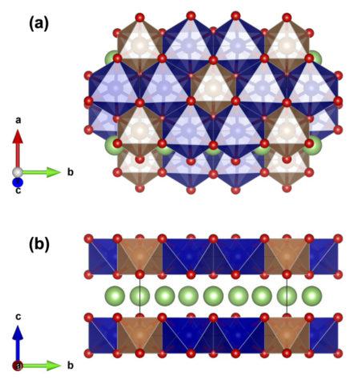 
FIG. 1. Crystal structure of the honeycomb phase of Li3Co2SbO6 viewed (a) perpendicular and (b) parallel to the honeycomb layers. CoO6 octahedra are blue, SbO6 octahe- dra are brown, Li atoms are green, and O atoms are red. Space group C2/m, 298 K lattice parameters a = 5.2717(6) ˚A, b = 9.0871(10) ˚A, c = 2.2039(6) ˚A, β = 110.1553(14)°.

📷 Fig 2

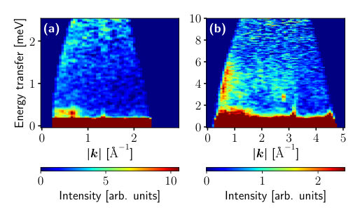 
FIG. 2. Powder-averaged INS spectra measured using neu- trons with wavelengths of (a) λ = 4.69 ˚A and (b) λ = 2.345 ˚A. The sample temperature for these measurements was set to 1.6 K.

📷 Fig 3

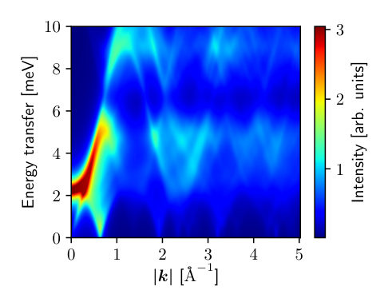 
FIG. 3. The DSF calculated for the best-fitted set of model parameters. The chosen parameter set is (J1, K, Γ, Γ′, J⊥) = (−1.57, −5.90, 0.97, 0.35, 0.50) meV. A Lorentzian broadening of γ = 0.45 meV was chosen phenomenologically.

📷 Fig 4

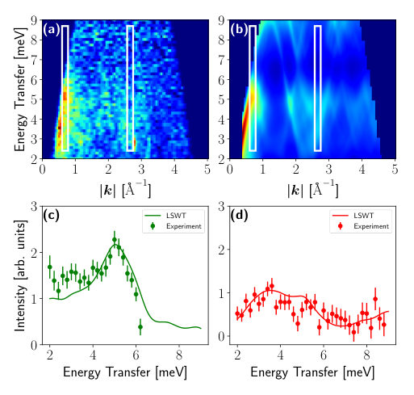 
FIG. 4. (a) Experimental INS spectrum used for fitting of the DSF. This is the same INS spectrum as shown in Fig. 2(b) but without the elastically broadened region. (b) Theoreti- cal, best-fitted powder-averaged DSF. The white stripes cor- respond to the constant-k cuts taken for (c) |k| = 0.7±0.1 ˚A −1

📷 Fig 5

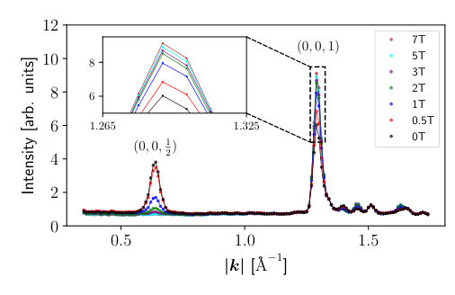 
FIG. 5. Neutron powder diffraction patterns in a range of ap- plied magnetic fields. The magnetic Bragg reflection (0, 0, 1

**Summary.** This paper identifies Li3Co2SbO6 as a Kitaev A-type antiferromagnet using inelastic neutron scattering. It demonstrates that the magnetic excitations and field-induced transitions are accurately described by an extended Kitaev-Heisenberg model. This provides a new material platform for studying Kitaev physics in a ferromagnetic-plane system.

**Why it may be interesting.** not directly relevant

Detailed structure

**Main problem.** The study aims to characterize the magnetic properties and exchange interactions of the layered honeycomb magnet Li3Co2SbO6 to determine if it acts as a Kitaev ferromagnet.

**Main result.** The researchers established Li3Co2SbO6 as a Kitaev A-type antiferromagnet, where magnetic properties are well-modeled by an extended Kitaev-Heisenberg model including significant Kitaev and off-diagonal Gamma interactions.

**Method.** Inelastic Neutron Scattering (INS) was used for experimental measurements, while Linear Spin Wave Theory (LSWT) and numerical energy minimization were used for theoretical modeling and parameter fitting.

**Model / system.** The system is Li3Co2SbO6, a layered cobalt-based quantum magnet with an A-type antiferromagnetic ground state. The model is an extended Kitaev-Heisenberg Hamiltonian including bond-dependent Kitaev (K), Heisenberg (J1), and off-diagonal (Gamma and Gamma') exchange terms.

**Key observables.** Magnetic Bragg reflections, dynamical structure factor (DSF), magnon excitation spectra, and magnetization curves.

**Important parameters / regimes.** Magnetic ordering temperature TN = 14 K; exchange parameters (J1, K, Gamma, Gamma', Jperp) = (-1.57, -5.90, 0.97, 0.35, 0.50) meV; magnetic field strengths up to 7 T.

**Assumptions / limitations.** The magnetic unit cell is assumed to remain stable under an applied field, and the analysis uses a Holstein-Primakoff expansion truncated to leading order.

**Figures summary.** Fig 1 shows the crystal structure; Fig 2 shows INS spectra at different wavelengths; Fig 3/4 shows the calculated DSF compared to experiment; Fig 5 shows neutron powder diffraction under magnetic fields; Fig 7 shows INS spectra at 7 T; Fig 8 shows classical spin configurations; Fig 10/11 show the evolution of spectra and gap opening with field orientation; Fig 12 checks for sample reorientation.

**Paper structure.** The paper introduces the material and its importance, describes the crystal structure and experimental setup, presents zero-field INS and diffraction results, details the theoretical modeling using LSWT, investigates the effects of external magnetic fields on both diffraction and dynamics, and concludes with a comparison to related cobalt-based compounds.

Abstract

Cobalt-based quantum magnets forming layered honeycomb arrangements have attracted much attention recently, as they are considered as a potential platform for materials with exotic Kitaev spin exchange. Amongst the discussed candidate materials are Na$_3$Co$_2$SbO$_6$ and Na$_2$Co$_2$TeO$_6$, both possessing a low-temperature ground state with magnetic zigzag ordering, similar to Na$_2$IrO$_3$ and $α$-RuCl$_3$. Here we report inelastic neutron scattering experiments on the quantum magnet Li$_3$Co$_2$SbO$_6$, which features ferromagnetic honeycomb planes with opposite magnetizations in neighboring planes. By comparing with linear spin wave theory, we show that the magnetic properties of Li$_3$Co$_2$SbO$_6$ can be well-modelled by an extended Kitaev--Heisenberg model, establishing it as a Kitaev-ferromagnet, or more specifically, as a Kitaev A-type antiferromagnet. Our analysis is complemented by magnetic field measurements and simulations.

[↑ back to top](#top)

### [Lattice-Trapped Atom Interferometry with a Bose-Einstein condensate: Observation and Control of Interactions](http://arxiv.org/abs/2605.27777v1)

**Authors:** Emmett Hough, Tahiyat Rahman, Forest Tschirhart, Subhadeep Gupta  
**Type:** experiment · **Category:** quantum gases · **PDF:** <https://arxiv.org/pdf/2605.27777v1>  
**Analysis basis:** full PDF text, analyzed in chunks

📷 Fig 1

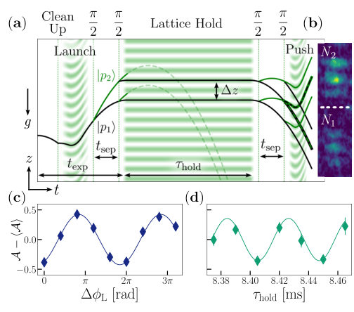 
FIG. 1. (a) Space-time diagram of the interferometer se- quence. The BEC expands before velocity-selection with a first-order Bragg pulse (vertical dashed line “Clean Up”) and launch via Bloch oscillations (striped curves). Two π/2 pulses create the superposition loaded into the lattice trap at the kinematic apex. A symmetric pair of π/2 pulses close the in- terferometer and another BO sequence (“Push”) spatially sep- arates the output ports. (b) Representative absorption image at the interferometer output with all six distinct paths re- solved (here ∆z = 120d). Representative interference fringes observed in the asymmetry, obtained by (c) varying the phase of the final π/2 pulse and by (d)...

📷 Fig 2

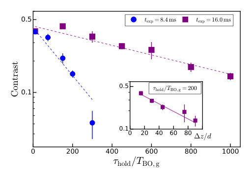 
FIG. 2. Contrast decay of the lattice-trapped interferometer with hold time for ∆z = 15d for BEC sources at two dif- ferent expansion times. Dashed lines are exponential fits, with 1/e decay times τC/TBO,g = 189(26), 941(113) for texp = 8.4 ms, 16.0 ms respectively. Inset: contrast decay with wavepacket separation for a BEC source at τhold = 200 TBO,g and texp = 16.0 ms. Solid line is an exponential fit with 1/e decay length κ/d = 70(8). Error bars represent 1σ fit uncer- tainties.

📷 Fig 3

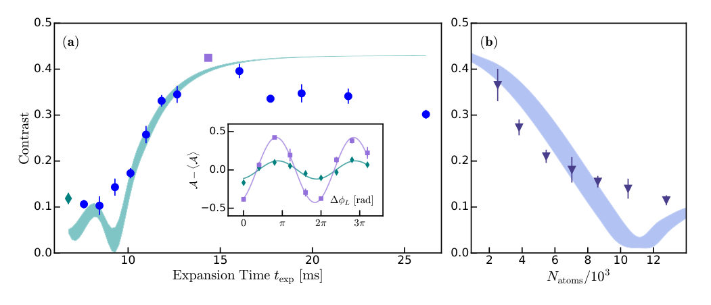 
FIG. 3. Control of the contrast at τhold/TBO,g = 200 and ∆z/d = 15 by varying the density of the BEC source. (a) Observed contrast for various texp. Inset: fringes at texp = 6.8 ms (diamonds) and texp = 14.5 ms (squares). (b) Observed contrast at texp = 8.4 ms for various atom numbers. All error bars represent the standard error on the mean. Shaded bands in (a) and (b) show the theoretical results from a mean-field model incorporating typical 5% number fluctuations (see text).

📷 Fig 4

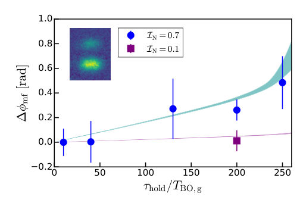 
FIG. 4. Global phase shift due to mean-field interactions ob- served by biasing the interferometer arms with an imbalance IN of 0.1 (squares) and 0.7 (circles), for texp = 8.4 ms. Er- ror bars represent the standard error on the mean. Shaded bands show the theoretical results from a mean-field model in- corporating typical 5% number fluctuations (see text). Inset: absorption image of atoms after the first π/2 pulse showing a number imbalance of 0.7.

📷 Fig 5

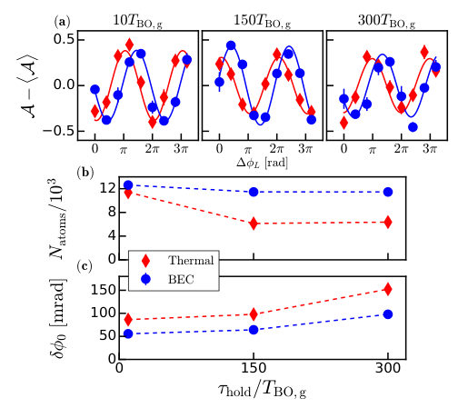 
FIG. 5. Comparison of BEC (texp = 16 ms) fringes with those from a thermal source (initially at 350 nK, texp = 8.4 ms). (a) Fringes at three hold times for ∆z = 15d for thermal (red diamonds) and BEC (blue circles) sources. (b) Total atom number as a function of hold time. (c) Statistical phase error from sinusoidal fits. The thermal data has an average of 5 points per phase scanned, whereas the BEC has 4.

**Summary.** This paper demonstrates an atom interferometer using a Ytterbium Bose-Einstein Condensate trapped in an optical lattice. The authors show that interatomic interactions can be controlled by tuning the density of the BEC, and that using a BEC source can significantly reduce statistical phase error compared to thermal sources.

**Why it may be interesting.** It explores the transition from single-atom physics to many-body dynamics in a sensing platform, providing insights into how mean-field effects can be harnessed or mitigated for improved quantum metrology.

Detailed structure

**Main problem.** Investigating how mean-field interactions and density-dependent effects impact the coherence, phase, and performance of a lattice-trapped atom interferometer using a BEC source.

**Main result.** The researchers demonstrated direct observation and control of atomic interactions by tuning BEC density, showing that a BEC source can outperform a thermal source in statistical phase error and atom flux.

**Method.** The experiment uses a 1D optical lattice-trapped interferometer with a Ytterbium BEC, employing Bragg pulses for splitting and Bloch oscillations for path separation, while varying expansion time and atom number to control density.

**Model / system.** A 1D optical lattice-trapped interferometer using a 174-Yb Bose-Einstein Condensate. The system is modeled using the Gross-Pitaevskii equation and a mean-field model for density-induced phase shifts.

**Key observables.** Interferometer contrast (C), global phase shift (delta-phi), atom number asymmetry (A), and statistical phase error.

**Important parameters / regimes.** Lattice depth (4-5 Erecc), peak density (approx 2.5e14 cm^-3), s-wave scattering length (5.6 nm), and Bloch oscillation period (836 us).

**Assumptions / limitations.** The model assumes a self-similar ballistic expansion of the BEC and neglects mean-field effects on the velocity distribution after the velocity selection pulse.

**Figures summary.** Fig 1 shows the interferometer sequence; Fig 2 shows contrast decay vs hold time and separation; Fig 3 shows contrast vs expansion time and atom number; Fig 5 compares BEC and thermal source performance; Fig 6 shows a single fringe at long hold time.

**Paper structure.** The paper introduces the lattice-trapped paradigm, describes the experimental setup and BEC preparation, details the interaction control methods, presents results on contrast and phase shifts, compares BEC vs thermal sources, and discusses decoherence and limitations.

Abstract

Precision interferometry with atomic wavepackets confined in a one-dimensional optical lattice is an emergent paradigm in quantum sensing of forces and fields, with applications in gravimetry, accelerometry, geophysics, and fundamental physics tests. We report on the realization of a lattice-trapped interferometer where the two arms are sourced from a weakly-interacting ytterbium Bose-Einstein condensate, coherently split and trapped by pulsed optical standing waves before recombination. We directly observe atomic interactions through contrast changes and phase shifts of the interferometer. By changing either the atom number or the sample volume to vary the density, we demonstrate control over interactions and optimize interferometer performance. Our observations are effectively captured by a mean-field theoretical model of the system. This work experimentally probes the boundary where improved performance from source brightening through higher phase space density transitions into a regime beyond single-atom physics in lattice-trapped atom interferometry, and opens a door to incorporating many-body effects for metrological advances in such platforms.

[↑ back to top](#top)

### [Learning Logical Operations for Arbitrary Quantum Error Correction Codes](http://arxiv.org/abs/2605.28162v1)

**Authors:** Nico Meyer, Christopher Mutschler, Dominik Seuß, Andreas Maier, Daniel D. Scherer  
**Type:** theory · **Category:** quantum information and computing · **PDF:** <https://arxiv.org/pdf/2605.28162v1>  
**Analysis basis:** full PDF text, analyzed in chunks

📷 Fig 1

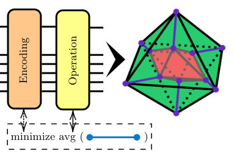 
FIG. 1. Schematic overview of the framework for learning logical operations. A pure state |ψ⟩is encoded into a larger ancilla system using a fixed encoding unitary Uenc. Subse- quently, a parameterized unitary UL(Ψ) implements a candi- date physical realization of a target logical operation. The parameters are trained with an operation loss, measuring the average fidelity over two-design states between prediction and target (blue lines). Structured operation ans¨atze are used to enforce transversal or low-depth properties. We extend this pipeline to incorporate an adaptable encoding Uenc(Θ), re- sulting in a co-design procedure called variational early fault- tolerant quantum computing...

📷 Fig 2

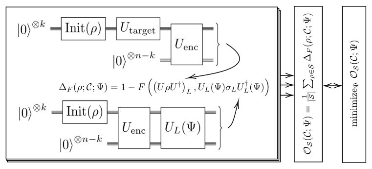 
FIG. 2. Variational learning pipeline for a logical operation U on a fixed code C using only the encoding unitary Uenc. Logical input states are drawn from a unitary two-design S on the relevant logical subsystem, encoded, and passed through the parameterized prediction UL(Ψ). The resulting encoded states are compared to the target encoded states (UρU †)L using the fidelity-based operation error ∆F , and the parameters Ψ are optimized to minimize the average-case operation loss OS(C; Ψ).

📷 Fig 3

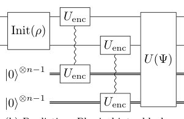 
FIG. 3. Circuit-level view of the learning setup for a two-qubit logical gate U ∈SU(4) acting on two encoded blocks of the same code C: (a) the target operation is applied to the logi- cal state before encoding; (b) the variational prediction first encodes both logical qubits and then applies a parameterized ansatz on the 2n physical qubits. The resulting predicted state is compared to the target one using the operation error defined in Eq. (12).

📷 Fig 4

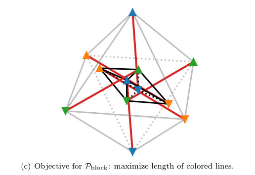 
FIG. 4. Illustration of different loss variants on the target two-design hexagon (shown in gray), embedded in the Bloch sphere (a). The diagonal variant in (b) ‘pulls’ the physical prediction (black hexagon) towards the logical target for each two-design state. The block-diagonal extension in (c) ad- ditionally ‘repulses’ physical predictions from logical targets that are to be orthogonal. The third variant of evaluating on the full set of state pairs is not explicitly shown.

📷 Fig 5

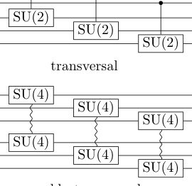 
FIG. 5. Schematic ansatz families used for learning logical op- erations. (a) For a one-qubit operation within a single code block, a strictly transversal ansatz uses the same gate on all physical qubits, while a transversal ansatz allows for differ- ent ones. We realize non-transversal ans¨atze by additionally placing a limited number of randomly located controlled two- qubit gates. (b) For two-qubit controlled gates between code blocks, the same notion of strict transversality and transver- sality holds, with control and target order fixed to be consis- tent for all physical operations. The notion of weak transver- sality extends upon this by allowing arbitrary two-qubit gates between the...

**Summary.** This paper introduces a variational framework called VarEFTQC for learning the physical implementation of logical gates in any quantum error-correcting code. By using a block-diagonal loss function, the method avoids local minima and can even co-design new non-additive codes tailored to specific hardware noise. This provides a practical tool for designing hardware-adapted logical gadgets for the early fault-tolerant era.

**Why it may be interesting.** not directly relevant

Detailed structure

**Main problem.** Discovering physical implementations of logical operations for arbitrary quantum error-correcting codes, particularly for non-additive codes that lack a stabilizer description.

**Main result.** The authors developed the VarEFTQC framework, which successfully re-discovers known transversal gates and can co-design noise-tailored non-additive encodings with desired logical gate sets.

**Method.** A variational learning-based framework using parameterized unitary ansätze and a block-diagonal loss function optimized via L-BFGS to minimize fidelity error over a unitary two-design.

**Model / system.** Quantum error-correcting codes (both stabilizer and non-additive/learned) where logical qubits are encoded into larger physical Hilbert spaces, subject to various noise models including Pauli, depolarizing, and biased noise.

**Key observables.** Fidelity-based operation loss, distinguishability loss, and the Gram matrix of pairwise fidelities.

**Important parameters / regimes.** Code parameters (n, k, d), ansatz depth (layer repetition), and noise parameters (p_X, p_Y, p_Z).

**Assumptions / limitations.** The framework assumes access to the encoding unitary (U_enc) and focuses on gate implementation rather than decoder discovery; it also assumes independent errors on physical qubits.

**Figures summary.** Figure 1 shows the learning framework schematic; Figure 2 illustrates the variational pipeline; Figure 3 shows the circuit for two-qubit gates; Figure 4 visualizes the geometric effect of loss variants on the Bloch sphere; Figure 5 shows the ansatz hierarchy; Figure 6 compares loss function success rates and ansatz depth; Figure 8/9/10/12 visualize training dynamics and Gram matrix structures.

**Paper structure.** The paper introduces the problem of logical gate discovery, defines the VarEFTQC co-design framework, details the learning pipeline and loss function variants (diagonal, block-diagonal, full), validates the method on stabilizer codes, and demonstrates application to noise-tailored non-additive codes.

Abstract

Logical operations are essential for quantum computation within quantum error-correcting codes. However, discovering their physical realizations is challenging, especially for non-additive codes that lack a stabilizer description. We present a general learning-based framework that, given only an encoding circuit, constructs physical implementations of logical operations while enforcing structural properties such as transversality or shallow depth. Our approach is validated by rediscovering known logical operations of standard stabilizer codes. We then extend it to a co-design procedure, dubbed variational early fault-tolerant quantum computing (VarEFTQC), which tailors non-additive encodings to a given noise model and enforces desired logical gate sets, such as transversal IQP-type families or low-depth universal sets. A software library implements the complete learning pipeline, including loss-function variants, ansatz families, and optimization routines. Together, these results position VarEFTQC as a practical tool for discovering hardware-adapted logical gadgets for early fault-tolerant quantum computing.

[↑ back to top](#top)

### [Leveraging Correlated Decoding for Bias-Tailored Compass Codes](http://arxiv.org/abs/2605.27598v1)

**Authors:** Arianna Meinking, Julie Campos, Kenneth R. Brown  
**Type:** theory · **Category:** quantum information and computing · **PDF:** <https://arxiv.org/pdf/2605.27598v1>  
**Analysis basis:** full PDF text, analyzed in chunks

📷 Fig 1

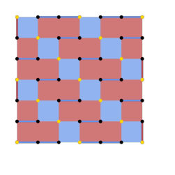 
Figure 1. Schematic of an elongated compass code with elongation ℓ= 3 of distance d = 7. X stabilizers are blue, Z stabilizers are red. The qubits are at the vertices of the lattice. We apply the ZXXZ□Clifford deformation on this code by applying Hadamard transformation on the yellow qubits. The weight-2 X stabilizers detect the location of Z errors with high accuracy, leading to larger thresholds under noise models with dominant Z errors.

📷 Fig 2

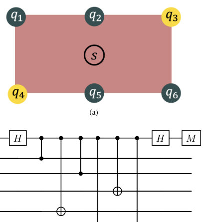 
Figure 2. 2a) Depiction of a weight-6 Z stabilizer of ZXXZ□-deformed elongated compass code with an elongation of ℓ= 3. Data qubits (qi) and syndrome qubit (s) are labeled. Data qubits are colored yellow if they undergo a Hadamard transformation. 2b) Circuit diagram of syndrome extraction for stabilizer drawn in 2a. We do not include the readout stage in this figure. Readout in our circuit happens for each syndrome qubit at the end of each of d rounds.

📷 Fig 3

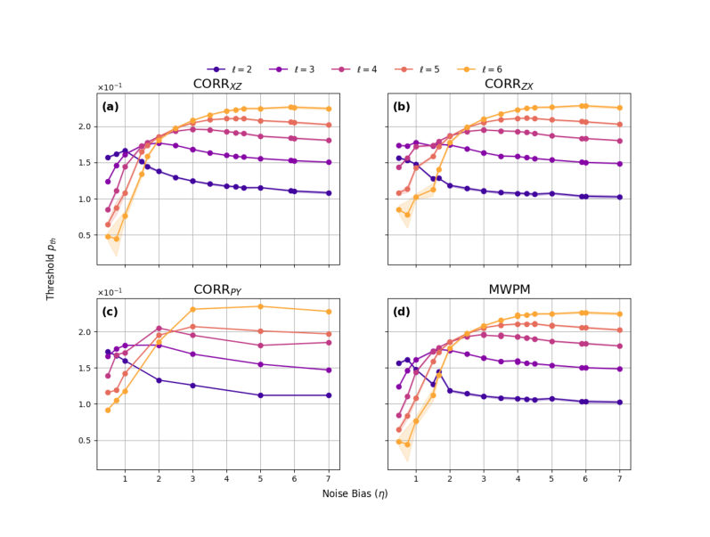 
Figure 3. CSS correlated decoding in (a), (b) compared to PyMatching correlated decoding in (c) and MWPM in (d). (a) The thresholds of the compass codes with CSS correlated decoding over bias η correcting X errors, then Z errors. (b) The thresholds for CORRZX (Z error then X error) decoding at each ℓ. (c) PyMatching correlated decoder thresholds over a range of η. To achieve a similar to code-capacity decoding scheme with the PyMatching correlated decoder, we use d rounds of memory with the Pauli channel in section II acting on each data qubit before the rounds (d) Standard MWPM thresholds compared to the bias η for different ℓ.

📷 Fig 4

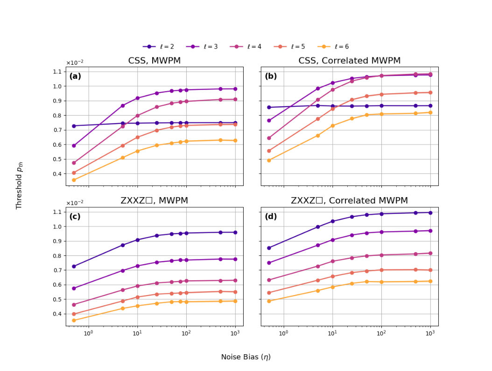 
Figure 4. The circuit-level correlated decoding of the Clifford-deformed elongated compass codes and the standard MWPM directly compared over η. (a) The CSS elongated compass codes threshold compared to bias η with MWPM, and (b) with correlated MWPM. (c), (d) The thresholds of the ZXXZ□-deformed code over a range of η with MWPM in (c) and correlated MWPM in (d). The surface code (ℓ= 2 CSS) experiences no change with η.

📷 Fig 5

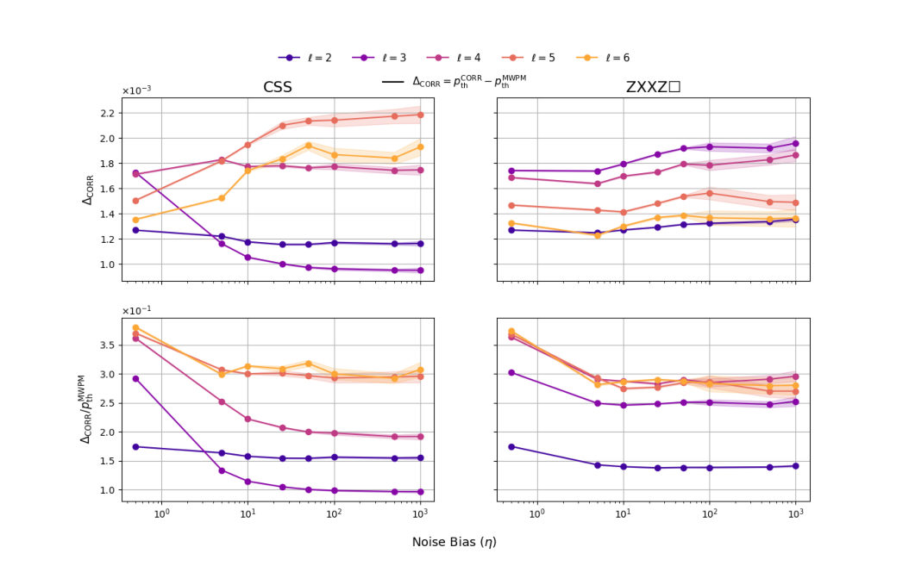 
Figure 5. Threshold gain (∆CORR) and relative gain (∆CORR/pMW P M th ) of correlated decoding compared to standard MWPM over a range of biases η for CSS and ZXXZ□-deformed elongated compass codes. The CSS codes experience tradeoffs in threshold since high stabilizer asymmetry is preferred to maximize correlated decoding gains. The ∆CORR of ZXXZ□codes with increasing η, though the maximum gain is achieved by the CSS codes. The relative correlated decoding gain, ∆CORR/pMW P M th , plateaus at high η for both the CSS and ZXXZ□-deformed codes. The relative gain of the correlated decoder on the ZXXZ□-deformed compass codes improves with elongation for all biases.

**Summary.** This paper demonstrates that using correlated decoding techniques can significantly boost the performance of quantum error correction for codes specifically designed for biased noise. By accounting for the relationship between X and Z errors, the researchers found higher error thresholds in realistic circuit-level noise environments.

**Why it may be interesting.** not directly relevant

Detailed structure

**Main problem.** Improving the error-correction thresholds of Clifford-deformed compass codes under biased circuit-level noise by leveraging correlations between X and Z errors.

**Main result.** Correlated decoding significantly enhances error thresholds for all noise biases under circuit-level noise, with the relative gain being higher for codes with asymmetric stabilizers.

**Method.** Large-scale Monte Carlo simulations using Stim and PyMatching, comparing standard MWPM with correlated MWPM (two-stage and hyperedge-informed) using conditional probabilities.

**Model / system.** Clifford-deformed elongated compass codes (specifically the ZXXZ deformation) subject to an asymmetric Pauli noise channel (biased noise) and circuit-level noise models.

**Key observables.** Error thresholds (p_th), logical error rates for X and Z memories, and the complementary gap (g) for decoder confidence.

**Important parameters / regimes.** Noise bias (eta), elongation parameter (l), code distance (d), and decoding order (ZX vs XZ).

**Assumptions / limitations.** The study assumes a biased noise model typical of platforms like trapped ions or superconducting qubits and relies on the accuracy of the estimated conditional error probabilities.

**Figures summary.** Figure 1 shows the code schematic; Figure 2 depicts the deformed stabilizer and its extraction circuit; Figure 3 shows thresholds for different decoding orders; Figure 4 compares thresholds for different decoders; Figure 5 plots absolute and relative gains vs bias; Figure 6 shows gate ordering to avoid hook errors.

**Paper structure.** The paper introduces the problem of biased noise in QEC, describes the Clifford-deformed compass code structure, details the correlated decoding algorithm and noise models, presents simulation results comparing thresholds and gains, and concludes with performance analysis across different parameters.

Abstract

Quantum error correction (QEC) is often implemented on hardware that experiences biased noise, where dephasing errors occur more frequently than other errors. This has motivated many recent efforts to develop bias-tailored QEC codes, such as the Clifford-deformed compass codes: a family of codes that achieve high thresholds under biased dephasing noise. We perform circuit-level simulations of the Clifford-deformed elongated compass codes under a biased noise model and evaluate code thresholds using standard minimum weight perfect matching (MWPM) and correlated MWPM. We find that correlated decoding enhances thresholds for all noise biases relative to standard MWPM under circuit-level noise. Our results demonstrate that correlated decoding leads to a higher relative gain in thresholds compared to standard MWPM when applied to codes with asymmetric stabilizers under biased noise.

[↑ back to top](#top)

### [Projection operator onto spin-S eigenspaces of total and orbital angular momenta](http://arxiv.org/abs/2605.27637v1)

**Authors:** M. I. Krivoruchenko  
**Type:** theory · **Category:** other · **PDF:** <https://arxiv.org/pdf/2605.27637v1>  
**Analysis basis:** full PDF text, analyzed in chunks

📷 Fig 1

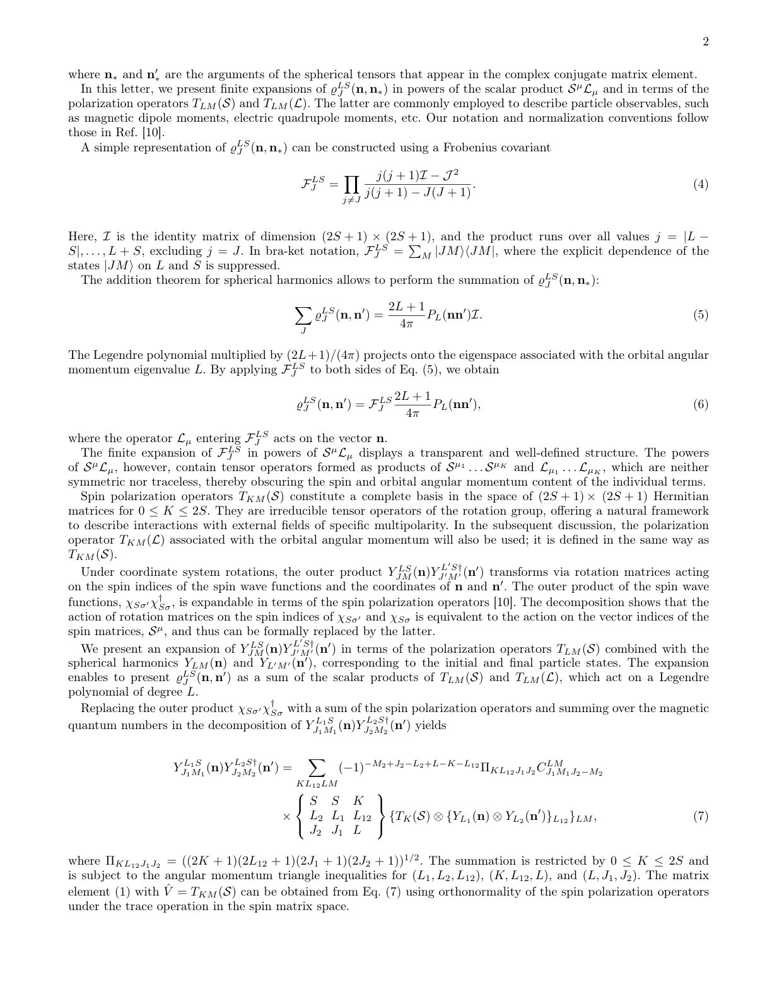 
Low-resolution page preview, page 2

📷 Fig 2

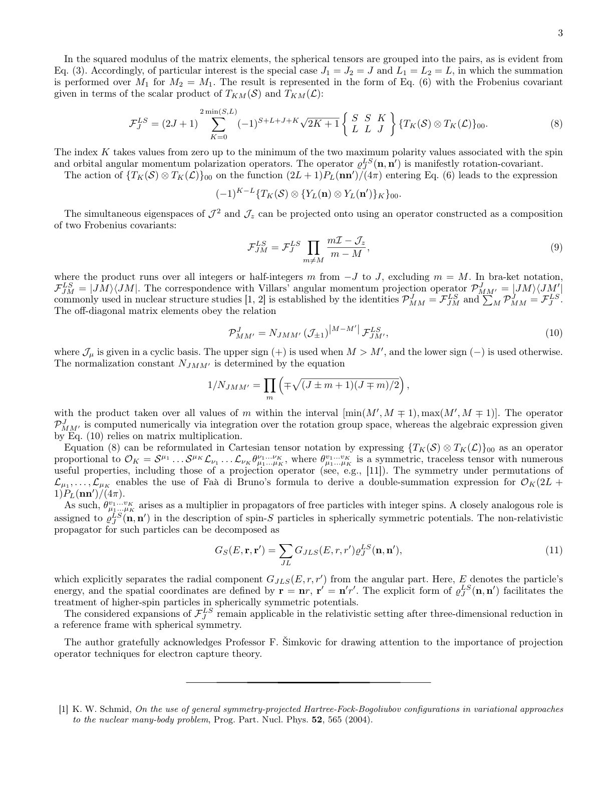 
Low-resolution page preview, page 3

📷 Fig 3

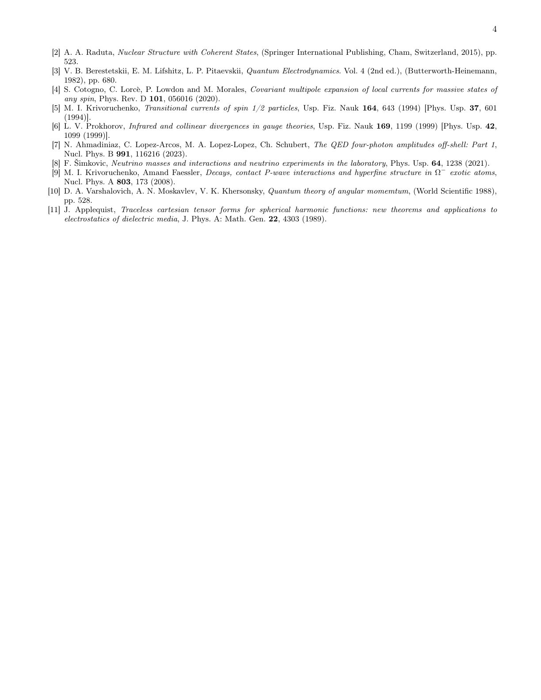 
Low-resolution page preview, page 4

**Summary.** This paper develops an algebraic method to construct projection operators for total and orbital angular momentum. By providing an expansion in terms of polarization operators, it allows for the efficient separation of radial and angular components in calculations involving higher-spin particles in symmetric potentials.

**Why it may be interesting.** not directly relevant

Detailed structure

**Main problem.** The construction of an efficient projection operator onto the simultaneous spin-S and orbital angular momentum eigenspaces to simplify matrix element calculations.

**Main result.** The derivation of a rotation-covariant projection operator expressed as both a polynomial in the scalar product of spin and orbital angular momentum and a finite expansion of polarization operators.

**Method.** The use of the Frobenius covariant and algebraic expansion techniques involving irreducible tensor operators and polarization operators.

**Model / system.** Particles with spin-S in spherically symmetric potentials, with applications ranging from nuclear shell models to relativistic particles after 3D reduction.

**Key observables.** Transition matrix elements, decay rates, magnetic dipole moments, and electric quadrupole moments.

**Important parameters / regimes.** Quantum numbers J, L, S, and M; particle energy E; and spatial coordinates r, r'.

**Assumptions / limitations.** The derivation assumes spherical symmetry in the potential or reference frame.

**Paper structure.** The paper introduces the problem of angular momentum projection, develops the Frobenius covariant approach, provides two equivalent algebraic representations, establishes a connection to Villars' projection, and demonstrates applicability to higher-spin particles and relativistic reductions.

Abstract

The Frobenius covariant is used to construct a projection operator onto the spin-S eigenspaces associated with the squares of the total and orbital angular momenta. The covariant admits two equivalent representations: as a polynomial in powers of the scalar product of the spin and orbital angular momentum operators, and as a finite expansion in terms of their respective polarization operators. A correspondence is established with Villars' angular momentum projection, used in nuclear structure studies.

[↑ back to top](#top)

### [Quantum Geometric Limits for Non-Abelian Holonomies](http://arxiv.org/abs/2605.28754v1)

**Authors:** François Impens, David Guéry-Odelin  
**Type:** theory · **Category:** quantum information and computing · **PDF:** <https://arxiv.org/pdf/2605.28754v1>  
**Analysis basis:** full PDF text, analyzed in chunks

📷 Fig 1

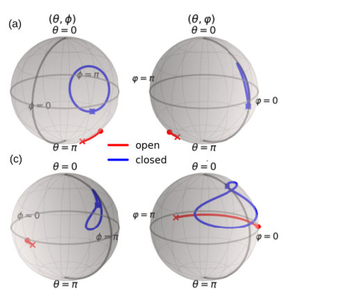 
FIG. 1. Non-Abelian brachistochrones: Open (red) and closed (blue) brachistochrones for (a,b) U ∗ 1 = ei π

📷 Fig 2

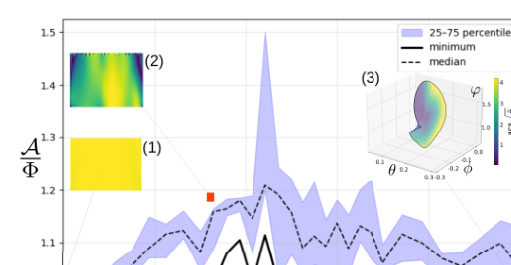 
FIG. 2. QGL efficiency η = A(Σ(C))/Φ as a function of the rotation-axis orientation for the target gate U ∗(α) = eiΦ ˆn(α)·σ, with fixed angle Φ = π/4 and ˆn(α) = cos α ˆy + sin α ˆz. For each axis orientation, the optimization was re- peated 10 times from different initial seeds. The solid black line shows the lowest-cost solution found for each angle, the dashed line the median over all runs, and the blue shaded region the dispersion across runs. Insets (1,2) display the scalar field ˆvσ(s1, s2)·ˆv0, which measures the local alignment of the transported curvature over the optimal surface. Here ˆvσ(s1, s2) is the unit vector associated with the Lie-algebra di- rection of the transported...

**Summary.** This paper establishes a universal Quantum Geometric Limit for non-Abelian holonomies, proving that the magnitude of a holonomy is bounded by the surface integral of its curvature norm. It introduces a method to find optimal control paths by treating the problem as a non-Abelian version of the brachistochrone problem. This is significant for optimizing the efficiency of non-Abelian gate implementations in quantum computing.

**Why it may be interesting.** It provides a fundamental geometric counterpart to Quantum Speed Limits, offering a way to quantify the 'geometric overhead' and resource costs for implementing non-Abelian gates in holonomic quantum computing.

Detailed structure

**Main problem.** Establishing fundamental geometric bounds (Quantum Geometric Limits) for non-Abelian Wilczek-Zee holonomies and finding optimal control protocols to implement target gates.

**Main result.** The authors derive universal bounds where the holonomy magnitude is limited by the surface integral of the non-Abelian curvature norm, and show that optimal protocols can minimize geometric cost by aligning curvature along a single Lie-algebra direction.

**Method.** A variational approach using an effective Stokes-Schrödinger dynamics and a non-Abelian brachistochrone ansatz, mapping the optimization to a particle subject to a non-Abelian Lorentz force.

**Model / system.** The study focuses on non-Abelian adiabatic transport within an N-dimensional degenerate subspace, specifically using a four-level 'tripod' atomic system with a two-dimensional dark subspace.

**Key observables.** Holonomy magnitude U(C), Hilbert-Schmidt and operator-norm curvature norms, and the efficiency ratio of surface area to curvature flux.

**Important parameters / regimes.** The adiabatic regime, the non-Abelian curvature F, and the Fubini-Study metric g.

**Assumptions / limitations.** The dynamics are assumed to be in the adiabatic regime involving degenerate eigenspaces.

**Figures summary.** Figure 1 shows non-Abelian brachistochrone trajectories for target gates; other plots illustrate the cost of closed-loop holonomies versus angle and the local alignment of transported curvature.

**Paper structure.** The paper introduces the problem of non-Abelian holonomy bounds, derives the Quantum Geometric Limit (QGL) using a Stokes-Schrödinger framework, formulates the optimization as a variational problem, and demonstrates near-optimal solutions using a tripod model.

Abstract

Stokes' theorem turns Abelian Berry phases into curvature fluxes, whereas path ordering precludes such a simple formula for non-Abelian holonomies. We show that a quantitative form of this intuition survives: arbitrary Wilczek--Zee holonomies obey a universal quantum geometric limit~(QGL), in which the holonomy magnitude is bounded by a surface integral of the non-Abelian curvature norm. Recasting holonomic evolution as an effective Stokes--Schrödinger dynamics driven by transported curvature, we identify the QGL as the geometric counterpart of conventional quantum speed limits, with a time-integrated generator norm replaced by a surface-integrated curvature cost. The induced contour--surface variational problem is governed by a non-Abelian Lorentz force, which we address with a brachistochrone ansatz of curvature-weighted geodesics. Applied to an SU(2) tripod dark subspace, near-optimal protocols spontaneously align the transported curvature along a single Lie-algebra direction, effectively taming non-Abelianity.

[↑ back to top](#top)

### [Realization of the Ruby Lattice Antiferromagnet in Layered Transition-Metal Fluorides](http://arxiv.org/abs/2605.28821v1)

**Authors:** Harald O. Jeschke, Daniel Guterding, Pratyay Ghosh  
**Type:** both · **Category:** strongly correlated electrons · **PDF:** <https://arxiv.org/pdf/2605.28821v1>  
**Analysis basis:** full PDF text, analyzed in chunks

📷 Fig 1

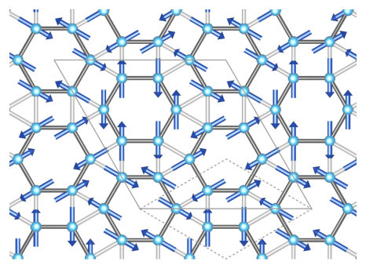 
FIG. 1. Ruby lattice and the ground state of the classical Heisenberg antiferromagnet. The ideal ruby lattice geometry constructed from a periodic tiling of trian- gles, squares, and hexagons. The unit cell is indicated by dashed lines. The lattice contains two symmetry-inequivalent nearest-neighbour bonds, one set forming triangular motifs and another forming hexagonal loops. The classical antiferro- magnetic Heisenberg model on this lattice has a ground state in which each hexagon develops local N´eel order, with a rela- tive 120◦spin canting between neighbouring hexagons.

📷 Fig 2

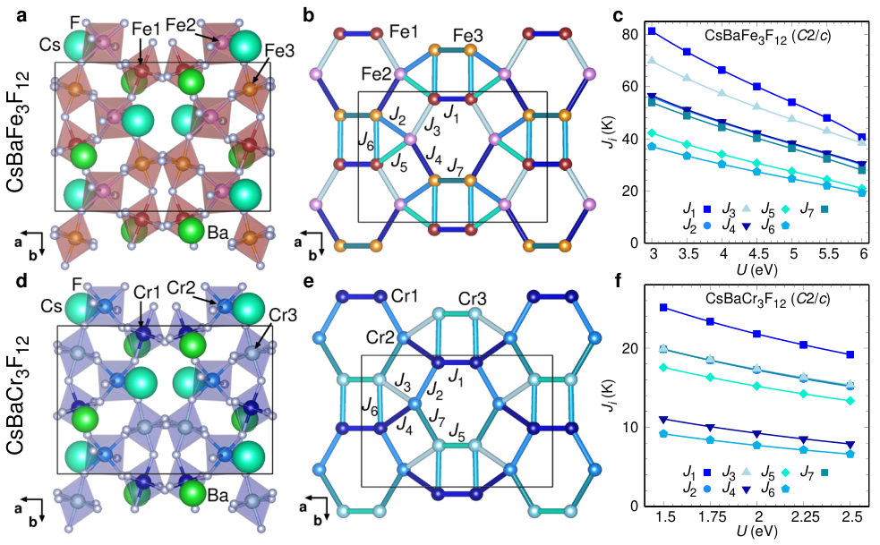 
FIG. 2. Crystal structure, exchange paths and exchange interactions. a, d Crystal structures of CsBaFe3F12 and CsBaCr3F12 viewed along the c direction. b, e The first seven exchange paths that make up the ruby lattice of CsBaFe3F12 and CsBaCr3F12. c, f Values of the seven nearest neighbour exchange interactions as a function of on-site interaction strength U for CsBaFe3F12 and CsBaCr3F12.

📷 Fig 3

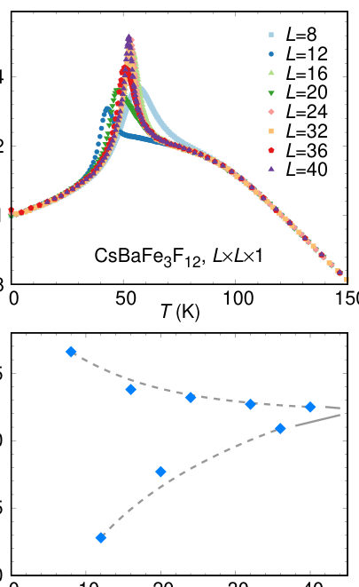 
FIG. 3. Specific heat and magnetic ordering tempera- tures of CsBaFe3F12 as a function of simulated lattice size. a Specific heat of CsBaFe3F12 calculated for different system sizes. b N´eel temperatures extracted from maxima of specific heat in a. The dashed lines are guides to the eye.

📷 Fig 4

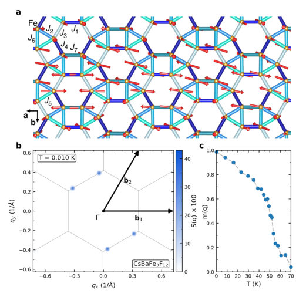 
FIG. 4. Ground state spin configuration, Equal-time spin structure factor and magnetic order parameter of CsBaFe3F12. a Real space spin configuration at T=0.01 K (proxy for the ground state). b Equal-time spin structure factor, S(q), at T=0.01 K. The data are shown in the Carte- sian qx-qy plane. The central hexagon represents the first Brillouin zone (BZ). The calculation used a 24 × 24 supercell and a 48 × 48 grid for the momentum q. c Magnetic order parameter calculated from the overlap of finite-temperature spin configurations with the magnetic ground state in a.

📷 Fig 5

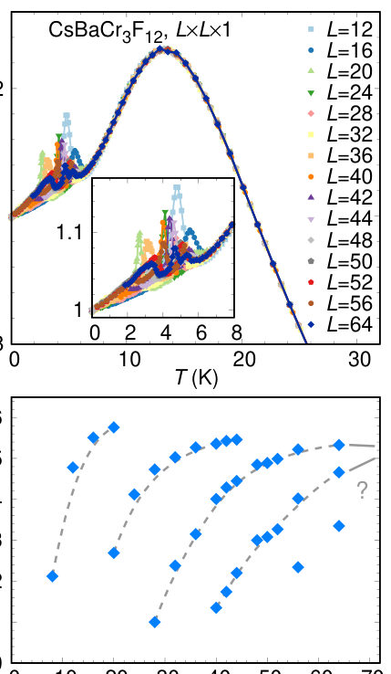 
FIG. 5. Specific heat and magnetic ordering tempera- tures of CsBaCr3F12 as a function of simulated lattice size. a Specific heat of CsBaCr3F12 calculated for different system sizes. b N´eel temperatures read off from peak maxima in a. The dashed lines are a guide to the eye.

**Summary.** This paper identifies two layered transition-metal fluorides as experimental realizations of the elusive ruby lattice antiferromagnet. By combining DFT and Monte Carlo simulations, the authors show that these materials host incommensurate spin-spiral states driven by frustrated exchange interactions. The work provides quantitative predictions for future neutron-scattering experiments.

**Why it may be interesting.** not directly relevant

Detailed structure

**Main problem.** The difficulty in finding experimental material realizations of the ruby lattice antiferromagnet, which is expected to host exotic emergent phenomena and topological orders.

**Main result.** The study identifies CsBaFe3F12 and CsBaCr3F12 as excellent candidates for 2D ruby-lattice magnetism, demonstrating that both compounds realize an incommensurate spiral low-temperature state.

**Method.** The researchers used DFT+U energy mapping to extract Heisenberg exchange interactions, Classical Monte Carlo simulations to study thermodynamic behavior, and Luttinger-Tisza analysis to identify magnetic ordering vectors.

**Model / system.** The physical systems are the layered transition-metal fluorides CsBaFe3F12 (S=5/2) and CsBaCr3F12 (S=3/2) featuring a distorted ruby lattice geometry. The model is a Heisenberg antiferromagnet on a 12-site basis lattice.

**Key observables.** Magnetic specific heat, spin structure factor S(q), magnetic ordering temperature (Neel temperature), and magnetic order parameter.

**Important parameters / regimes.** Exchange interaction strengths (J1 through J7), Hubbard U, spin magnitude S, and the stiffness (kappa) of the energy landscape.

**Assumptions / limitations.** The study uses classical Monte Carlo rather than quantum Monte Carlo and assumes the magnetic interactions can be accurately captured by a Heisenberg Hamiltonian.

**Figures summary.** Figure 1 shows the ruby lattice geometry and ground state; Figure 2 displays crystal structures, exchange paths, and exchange interaction values as a function of U.

**Paper structure.** The paper introduces the ruby lattice problem, presents the structural and exchange characterization of the two fluorides via DFT, details the Monte Carlo and Luttinger-Tisza results for magnetic ordering, and concludes with an analytical framework explaining the difference in magnetic stiffness between the two compounds.

Abstract

The antiferromagnet on the ruby lattice is expected to host a range of exotic emergent phenomena, yet its material realization has remained elusive. Here we show that the layered transition metal fluorides CsBaFe$_3$F$_{12}$ and CsBaCr$_3$F$_{12}$ with Fe$^{3+}$ and Cr$^{3+}$ ions realize only slightly distorted ruby lattice geometries with spin moments $S=5/2$ and $S=3/2$, respectively. Their microscopic Hamiltonians, calculated with DFT energy mapping, are dominated by short-ranged antiferromagnetic interactions within the ruby layers. Classical Monte Carlo simulations reveal strong frustration in both compounds, with local Néel correlations on the hexagonal plaquettes and distinct long-range ordering tendencies governed by weaker triangular links. For CsBaFe$_3$F$_{12}$, the calculated thermodynamic behaviour is consistent with the experimentally reported magnetic ordering scale. For CsBaCr$_3$F$_{12}$, classical Monte Carlo and Luttinger-Tisza analysis reveal competing low-energy ordering wave vectors, strong finite-size sensitivity, and a tendency toward incommensurate order. Overall, our results establish these fluorides as experimentally accessible ruby-lattice antiferromagnets and provide quantitative predictions for future neutron-scattering studies.

[↑ back to top](#top)

### [Thermodynamic properties of chemically disordered compounds via AI-driven estimation of partition function with the PULSE method](http://arxiv.org/abs/2605.28594v1)

**Authors:** Baptiste Bernard, Luca Messina, Eiji Kawasaki, Emeric Bourasseau  
**Type:** theory · **Category:** disordered systems and neural networks · **PDF:** <https://arxiv.org/pdf/2605.28594v1>  
**Analysis basis:** full PDF text, analyzed in chunks

📷 Fig 1

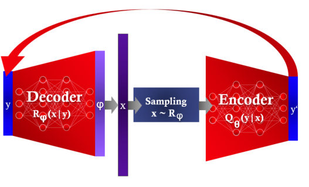 
Figure 1 – Schematic view of the PULSE inverse VAE architecture.

📷 Fig 2

 
Figure 2 – Canonical partition function of the 4 × 4 Ising system, with the exact value (obtained by including all possible spin configurations in the calculation) shown as a blue curve and the PULSE estimation as purple dots. The convergence criterion is set to a 1% error relative to the exact value.

📷 Fig 3

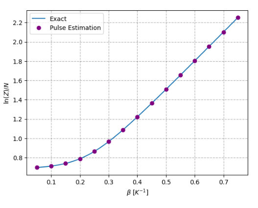 
Figure 3 represents the PULSE estimation of Z|M|, i.e., the partition function associated with the absolute value of the magnetization (Eq. (17)). Similarly to the previous quantity, PULSE reaches an error below 1% compared to the exact value, using between 200 and 2 500 samples per tem- perature, depending on the target temperature. This shows that PULSE consistently achieves an outstanding accuracy on the partition function associated with specific properties, using a relatively low and stable amount of configurations.

📷 Fig 4

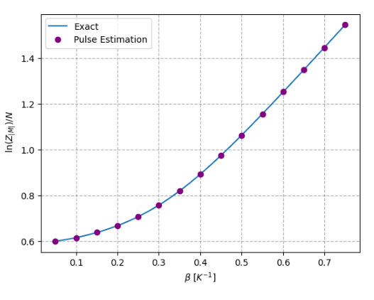 
Figure 3 – Partition function of the absolute value of magnetization for the 4 × 4 Ising system, with the exact value (obtained by including all possible spin configurations in the calculation) shown as a blue curve and the PULSE estimation as purple dots. The convergence criterion is set to a 1% error relative to the exact value.

📷 Fig 5

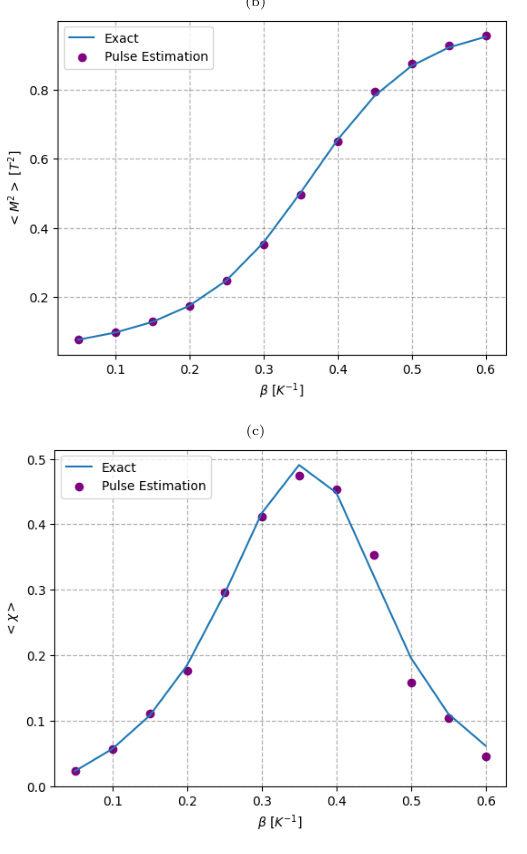 
Figure 4 – Average values of (a) normalized magnetization, (b) squa- red magnetization, and (c) modified susceptibility obtained as recom- binations of partition functions sampled by PULSE. Purple dots are recombinations of partition functions according to equations (14), (17), and (18). The blue curve marks the exact value (obtained by including all possible spin configurations in the calculation).

**Summary.** This paper introduces an improved AI-driven method called PULSE to estimate the partition function and thermodynamic properties of chemically disordered materials. By using an inverse Variational Autoencoder, the method achieves high precision and efficiency, particularly in high-temperature regimes, while scaling effectively with system size.

**Why it may be interesting.** not directly relevant

Detailed structure

**Main problem.** Estimating the thermodynamic properties and partition functions of chemically disordered compounds is computationally expensive due to the massive configuration space required for traditional Monte Carlo convergence.

**Main result.** The improved PULSE method accurately and efficiently estimates partition functions and thermodynamic properties, outperforming Wolff and Wang-Landau algorithms in the high-temperature disordered regime and demonstrating excellent scalability.

**Method.** An improved version of the PULSE method using an 'inverse' Variational Autoencoder (VAE) architecture and unsupervised learning to optimize a distribution that minimizes Kullback-Leibler divergence.

**Model / system.** The method is validated using the 2D Ising model on a square lattice, serving as a proxy for complex chemically disordered materials like high-entropy alloys and MOX fuels.

**Key observables.** Partition function (Z), average energy, specific heat (Cv), magnetic susceptibility, and magnetization.

**Important parameters / regimes.** Temperature (T), inverse temperature (beta), system size (N), and number of samples (m).

**Assumptions / limitations.** The observable property must be strictly positive for the logarithmic formulation; high-energy configurations are assumed to be negligible at low temperatures.

**Figures summary.** The figures illustrate the PULSE architecture, compare PULSE estimates to exact solutions for the partition function and magnetization, show the reconstruction of thermodynamic properties, and demonstrate scalability and error comparisons against Wolff and Wang-Landau algorithms.

**Paper structure.** The paper introduces the scientific problem of chemical disorder, presents the mathematical framework of the improved PULSE method, validates the approach using the 2D Ising model, compares performance against traditional Monte Carlo methods, and discusses scalability and limitations.

Abstract

In this article, we present an improved version of the PULSE method (Partition function Unsupervised Learning Sampling and Evaluation) for estimating the thermodynamic properties of chemically disordered compounds. The aim is to reduce the computational cost of Monte Carlo approaches for this type of material and to demonstrate that this generative tool can estimate thermodynamic properties by sampling and estimating the partition function of the system. To validate this innovative approach, we use the 2D Ising model as a benchmark. We demonstrate that our method accurately reproduces average properties with high precision and efficiency compared to traditional Monte Carlo sampling methods. Our results highlight the efficiency and adaptability of the PULSE method, making it a valuable tool for studying materials for which conventional methods are too inefficient to compute properties affected by chemical disorder at low cost.

[↑ back to top](#top)

### [Three-dimensional orbital-free density functional theory description of nuclear pasta in the inner crust of neutron stars](http://arxiv.org/abs/2605.28783v1)

**Authors:** Yo Nakamura, Kazuyuki Sekizawa  
**Type:** theory · **Category:** other · **PDF:** <https://arxiv.org/pdf/2605.28783v1>  
**Analysis basis:** full PDF text, analyzed in chunks

📷 Fig 1

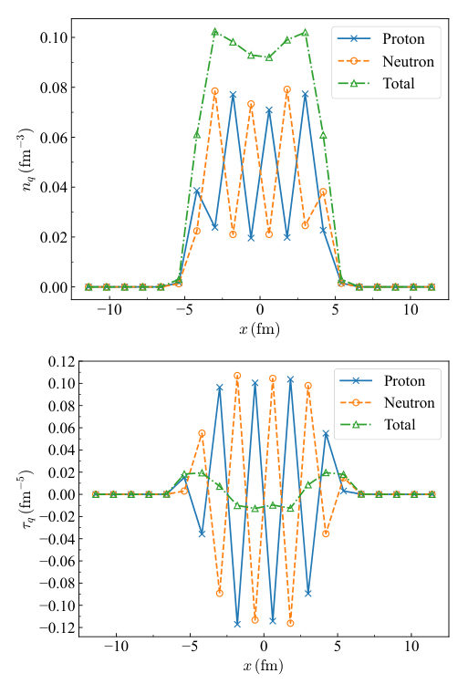 
FIG. 1. (a) Number densities nq and (b) kinetic densities τq are plotted as a function of a coordinate that passes through the center of 40Ca, calculated with SLy4 ¯h2-ETF EDF and ∆x = 1.2 fm. Neu- tron and proton densities are represented by orange open circles (blue crosses) connected with dashed (solid) lines, while total density is shown by green open triangles connected with dash-dotted lines.

📷 Fig 2

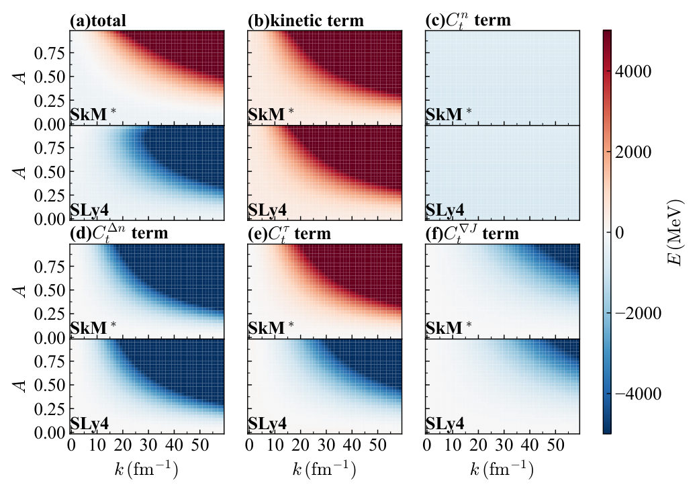 
FIG. 2. Contribution of each term in Eq. (37) to the total energy of the system with oscillating density distributions defined by Eq. (36). In panel (a) total energy (without the Coulomb energy) is shown in the A-k plane [where A and k are defined in Eq. (36)], while in the other panels contributions from (b) kinetic term, (c) Cnt term (density dependent term), (d) C∆n t term (n∆n term), (e) Cτt term (nτ term), and (f) C∇J t term (spin-orbit term) are shown. In all the figures, the upper panel and the lower panel show results calculated with SkM∗and SLy4 parameter sets, respectively. We note that the range of the color-bar is fixed to ±5000MeV for all the panels to emphasize the sign of...

📷 Fig 3

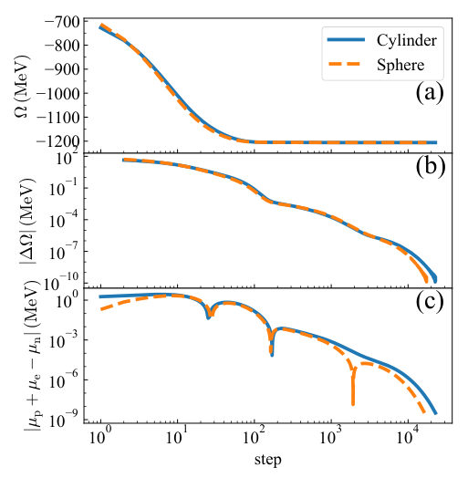 
FIG. 3. Convergence behavior observed during SC-ETF calcula- tions for µ = 11 MeV with SkM* EDF with a 16fm×16fm×16fm box with a 0.8-fm mesh associated with two different randomly- generated initial densities. The case in which the resulting configu- ration is regarded as a “cylinder” is shown by blue crosses connected with solid lines, while another case in which the resulting config- uration is regarded as a “sphere” is shown by orange open circles connected with dashed lines.

📷 Fig 4

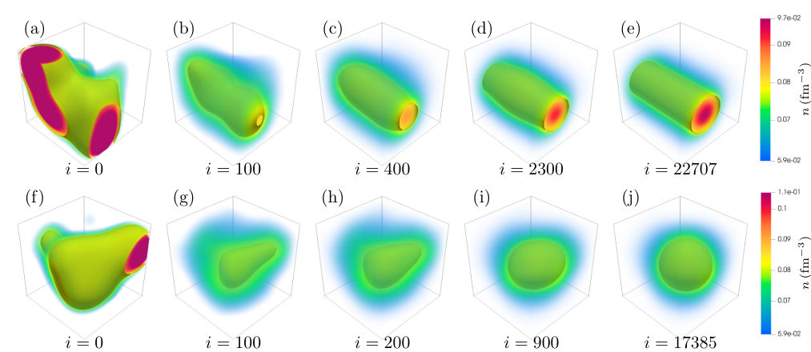 
FIG. 4. Nucleon density distributions during the gradient descent iterations for the same calculations shown in Fig. 3. The top row corresponds to the calculation with the cylinder result while the bottom row to that with the sphere result. The minimum and maximum values of color-bars are set to those of nucleon densities of final states shown in (e) and (j) and i shown below each figure is iteration number. Isosurfaces in which the density takes the average value of these maximum and minimum values are also shown. The cylindrical and spherical solutions correspond to ¯n = 0.06630 fm−3 and 0.06624 fm−3, respectively.

📷 Fig 5

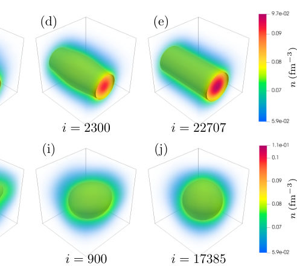 
Fig.3 for µ = 11 MeV with SkM∗EDF. In the figure, Ω, de- fined in Eq. (24), the absolute value of its change |∆Ω|, and |µp + µe −µn| are shown in panels (a), (b), and (c), respec- tively.

**Summary.** This paper introduces an efficient orbital-free density functional theory approach to simulate the complex, non-spherical structures known as nuclear pasta in neutron stars. By avoiding pre-defined geometric shapes, the method successfully discovers exotic new configurations and provides a computationally scalable way to study the neutron star crust.

**Why it may be interesting.** not directly relevant

Detailed structure

**Main problem.** The high computational cost of 3D microscopic calculations (Kohn-Sham DFT) makes it difficult to systematically study the complex, varying geometric structures of 'nuclear pasta' in neutron star inner crusts.

**Main result.** The authors developed a self-consistent orbital-free density functional theory (SC-ETF) that efficiently identifies both standard and exotic pasta structures (like 'nuclear waffles' or connected rods) without prior geometric assumptions.

**Method.** A self-consistent Extended Thomas-Fermi (SC-ETF) method using a second-order expansion of the Skyrme energy density functional, solved via a 3D gradient descent method on a Cartesian mesh.

**Model / system.** The system is the inner crust of a neutron star, consisting of a periodic lattice of protons and neutrons (nuclear pasta) immersed in a background gas of dripped neutrons and electrons.

**Key observables.** Nucleon number densities (neutron and proton), total energy per nucleon, proton fraction, and geometric configurations of the pasta phases.

**Important parameters / regimes.** Average nucleon number densities, proton fractions, simulation box sizes (up to 40 fm), and mesh spacing (delta x).

**Assumptions / limitations.** The method uses a second-order (hbar^2) expansion, omitting higher-order shell effects and pairing correlations; electrons are treated as a relativistic homogeneous gas.

**Figures summary.** Figures show visual examples of exotic pasta shapes (e.g., x-cylinders, slabs with holes), phase diagrams of structures vs. density, and stability analysis of the method as a function of mesh spacing.

**Paper structure.** The paper introduces the computational challenge of nuclear pasta, proposes the SC-ETF/OF-DFT method, demonstrates its ability to find non-empirical shapes, discusses the impact of box size, and concludes with a numerical stability analysis of various Skyrme functionals.

Abstract

Background: In the bottom layer of the inner crust of neutron stars, various crystalline structures are expected to emerge that are collectively called ``nuclear pasta.'' It is desired to know properties of nuclear pasta in a wide variety of conditions for astrophysical applications. However, three-dimensional fully-microscopic calculations require huge computational effort that makes it still challenging to carry out systematic calculations.   Purpose: In this paper, we propose an efficient method to calculate various nuclear pasta configurations in a non-empirical manner, based on three-dimensional orbital-free density functional theory (OF-DFT). We demonstrate the feasibility of the proposed approach by applying it to densities throughout the inner crust of neutron stars.   Methods: As a first application of OF-DFT for nuclear pasta, we employ the second-order extended Thomas-Fermi (ETF) expansion of Skyrme energy density functional (EDF) to construct an EDF that depends only on neutron and proton number densities. Based on the variational principle, we derive Euler-Lagrange equations to determine optimal neutron and proton density distributions and solve them self-consistently. In this work, we call this approach the self-consistent ETF (SC-ETF) method.   Results: We perform three-dimensional SC-ETF calculations with various box sizes. We successfully obtain various pasta structures, depending on given average nucleon number densities, consistent with earlier studies. Moreover, we find other exotic structures, such as bending and/or connected rods, slabs with a hole, etc., underlining the advantage of the self-consistent formalism.   Conclusions: We demonstrate that the SC-ETF method proposed in this study, which can be regarded as a realization of OF-DFT, is a promising tool that can efficiently describe complex pasta structures without empirical assumptions on geometric shapes.

[↑ back to top](#top)

### [Topological lattice gauge theory enriched by non-invertible symmetry](http://arxiv.org/abs/2605.28688v1)

**Authors:** Lea E. Bottini, Clement Delcamp, Edmund Heng, Campbell K. McLauchlan, Dominic J. Williamson  
**Type:** theory · **Category:** strongly correlated electrons · **PDF:** <https://arxiv.org/pdf/2605.28688v1>  
**Analysis basis:** full PDF text, analyzed in chunks

📷 Fig 1

 
Low-resolution page preview, page 2

📷 Fig 2

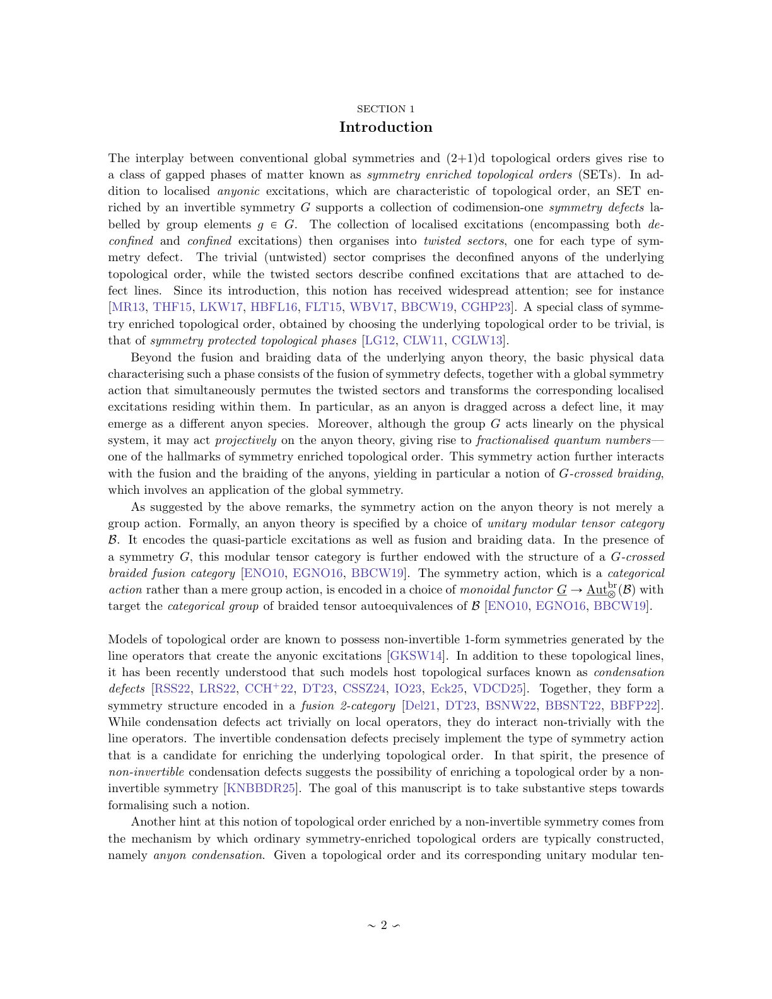 
Low-resolution page preview, page 3

📷 Fig 3

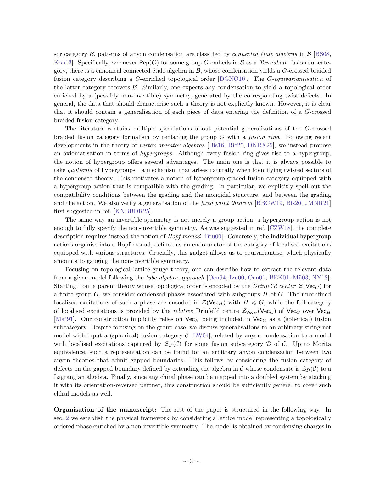 
Low-resolution page preview, page 4

📷 Fig 4

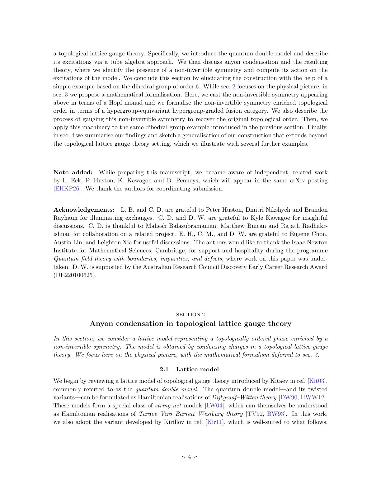 
Low-resolution page preview, page 5

📷 Fig 5

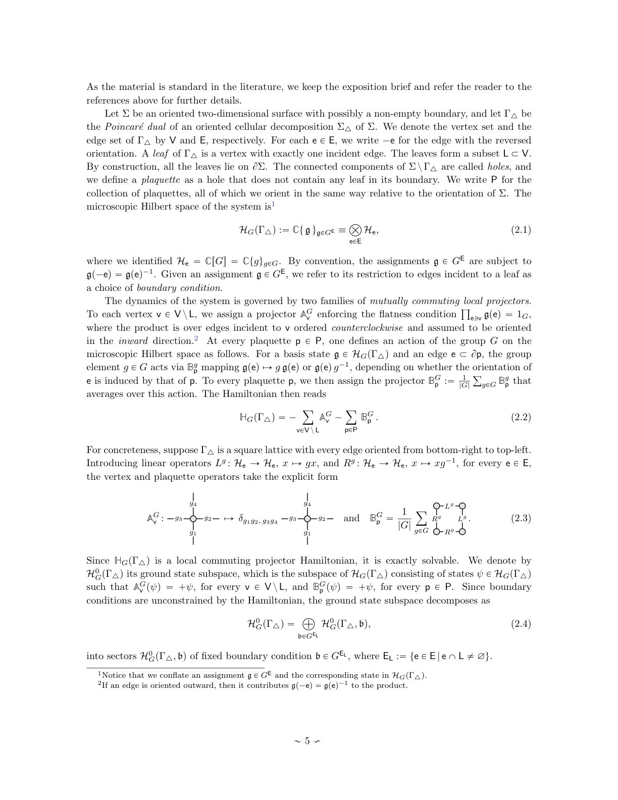 
Low-resolution page preview, page 6

**Summary.** This paper provides a rigorous mathematical foundation for topological phases enriched by non-invertible symmetries. It demonstrates how anyon condensation leads to a hypergroup-graded structure and shows that the resulting non-invertible symmetry can be captured using Hopf monads.

**Why it may be interesting.** not directly relevant

Detailed structure

**Main problem.** The paper aims to formalize and generalize the notion of Symmetry Enriched Topological (SET) order to cases where the enriching symmetry is non-invertible, specifically through anyon condensation.

**Main result.** The authors establish a mathematical framework using hypergroup-graded fusion categories and Hopf monads to describe the localized excitations and the non-invertible symmetry action in condensed topological lattice gauge theories.

**Method.** The study employs the tube algebra approach, the relative Drinfeld center construction, and the theory of Hopf monads to classify excitations and encode symmetry actions.

**Model / system.** The primary models are finite group topological lattice gauge theories (quantum double models) and generic string-net models, specifically examining the condensation of an arbitrary algebra of charges.

**Key observables.** Localized excitations (anyons), domain walls, and the categorical action of the non-invertible symmetry.

**Important parameters / regimes.** The group G (parent theory) and subgroup H (condensed theory), and the hypergroup grading of the resulting theory.

**Assumptions / limitations.** The construction assumes the condensation of pure charges and relies on the existence of a spherical fusion subcategory within a larger category.

**Paper structure.** The paper begins by defining the lattice gauge theory and anyon condensation mechanism, moves to the mathematical classification of excitations using tube algebras, introduces the Hopf monad framework for non-invertible symmetries, provides explicit calculations using the D3 and D6 groups, and concludes with a generalization to generic string-net models.

Abstract

We use finite group topological lattice gauge theory, also known as the quantum double model, as a lens to explore a notion of topological order enriched by a non-invertible symmetry. For invertible symmetry enriched topological order, there is an established axiomatisation in terms of a G-crossed braided fusion category. We lay the foundations for a generalisation of this notion. By condensing an arbitrary algebra of charges in a quantum double model, we demonstrate that the category of localised excitations in the resulting theory forms a hypergroup-graded extension of the category of deconfined excitations. For every element in the hypergroup, the associated domain wall acts in a typically non-invertible way on these localised excitations. Both this action and the monoidal structure are compatible with the hypergroup grading. The actual categorical action is encoded in a Hopf monad on the category of localised excitations, and gauging the non-invertible symmetry amounts to computing the category of modules over this Hopf monad. Finally, we outline how this framework naturally extends to theories obtained by condensing algebras in a generic string-net model.

[↑ back to top](#top)

### [Variational Quantum Models for Knowledge Graph Embeddings on NISQ Devices](http://arxiv.org/abs/2605.28723v1)

**Authors:** Guido Bellomo, Martín Santesteban, Patricio Bruno, Santiago Cifuentes, Gustavo Martín Bosyk  
**Type:** theory · **Category:** quantum information and computing · **PDF:** <https://arxiv.org/pdf/2605.28723v1>  
**Analysis basis:** full PDF text, analyzed in chunks

📷 Fig 1

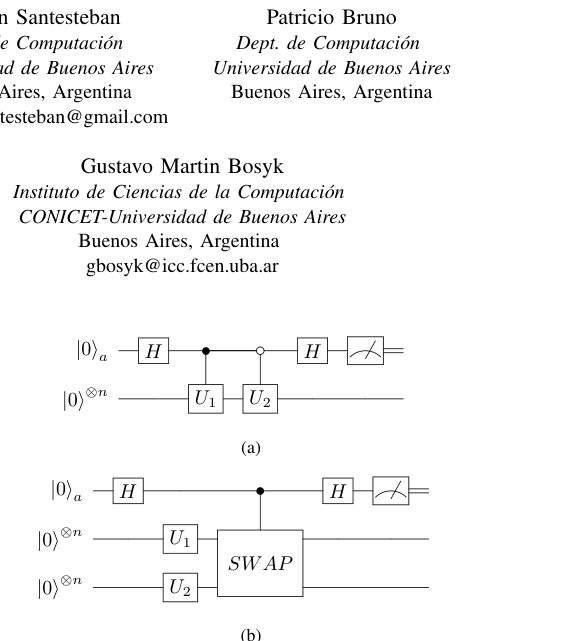 
Fig. 1: Variational quantum circuit architectures for knowledge graph embedding. (a) Circuit implementing the SWITCH test to estimate the score function. (b) Circuit implementing the standard SWAP test for score computation.

📷 Fig 2

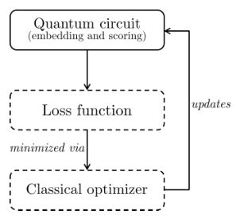 
Fig. 2: General hybrid quantum–classical pipeline for VQA- based knowledge graph embedding. (i) Classical inputs are encoded into a parameterized quantum circuit that computes a score; (ii) a loss function is evaluated classically using the predicted scores and target values; (iii) a classical optimizer updates the parameters of the quantum ansatz. Dashed lines indicate classical computation steps.

📷 Fig 3

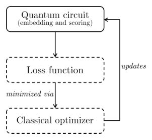 
Fig. 3: Quantum circuit architecture for the proposed VQA model, using a compute–uncompute scheme to evaluate the score without ancillary qubits.

**Summary.** The paper proposes a new way to perform knowledge graph embeddings on near-term quantum computers. By using a 'compute-uncompute' method, the authors reduce the number of qubits and the complexity of measurements required. This makes the algorithm more compatible with current noisy quantum hardware.

**Why it may be interesting.** not directly relevant

Detailed structure

**Main problem.** Reducing the hardware demands, such as qubit overhead and circuit depth, for Variational Quantum Algorithms (VQAs) used in Knowledge Graph Embedding on NISQ devices.

**Main result.** The introduction of the qCUERO framework and a new 'compute-uncompute' model that eliminates the need for ancillary qubits and entangled measurements while maintaining an interpretable score function.

**Method.** A hybrid quantum-classical pipeline using a compute-uncompute strategy where the score is estimated from the probability of the all-zero outcome in a computational basis measurement.

**Model / system.** A variational quantum model where entities are represented as quantum states in a Hilbert space of dimension 2^n and relations are represented as unitary operations.

**Key observables.** The score function (delta_hrt) representing the plausibility of a triple (head, relation, tail).

**Important parameters / regimes.** Trainable parameters for entities (theta_e) and relations (theta_r); Hilbert space dimension d = 2^n.

**Assumptions / limitations.** The study is primarily theoretical; the impact of quantum noise and performance on real-world knowledge graphs are yet to be fully validated.

**Figures summary.** Fig 1 compares existing Switch and Swap test architectures; Fig 2 shows the general hybrid quantum-classical pipeline; Fig 3 illustrates the proposed compute-uncompute architecture.

**Paper structure.** The paper introduces a unified framework (qCUERO), analyzes existing architectures (Switch and Swap tests), proposes a new compute-uncompute model, and discusses trade-offs regarding circuit depth and error robustness.

Abstract

Variational Quantum Algorithms (VQAs) combine quantum circuits with classical optimization to tackle problems that may benefit from the capabilities of near-term quantum hardware. In knowledge graph embedding, recent proposals based on this approach follow a similar overall architecture but differ in the way they compute the score function and in the number of qubits they require. One design uses $n+1$ qubits and obtains the score through a switch test on an ancillary qubit, while another employs $2n+1$ qubits and applies a swap test between two registers. In both cases, entities and relations are represented in a Hilbert space of dimension $d = 2^n$, with comparable computational cost and the same mean squared error loss. This work introduces a unified framework that captures the two schemes and makes it possible to explore new variants. Within this setting, we propose an alternative that keeps the intuitive meaning of the score function while dispensing with ancillary qubits and entangled measurements. The result is a model better suited to current NISQ devices, reducing hardware demands without sacrificing interpretability.

[↑ back to top](#top)

### [Zero modes of non-abelian Dirac operator in topologically non-trivial band insulator](http://arxiv.org/abs/2605.27608v1)

**Authors:** Neha Kumari, Sankalpa Ghosh  
**Type:** theory · **Category:** strongly correlated electrons · **PDF:** <https://arxiv.org/pdf/2605.27608v1>  
**Analysis basis:** full PDF text, analyzed in chunks

📷 Fig 1

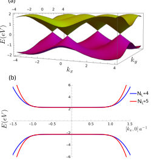 
FIG. 1: (a) Dispersion plot for lattice Dirac model (b) Continuum dispersion of rhombohedral stacked (NL = 4 and NL = 5 layer of graphene, shown for displacement energy of |D| = 2.25|eV).

📷 Fig 2

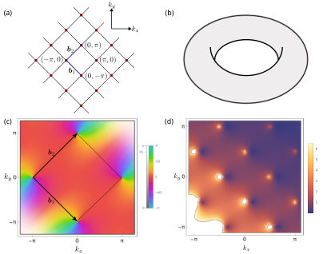 
FIG. 2: (a) Reciprocal lattice of the lattice Dirac model with reciprocal lattice vectors b1 = π(1 −i) and b2 = π √

**Summary.** This paper establishes that zero modes of a non-abelian Dirac operator are a generic feature of topologically non-trivial band insulators. By linking the geometry of the Quantum Geometric Tensor to these zero modes, the authors provide a unified non-interacting foundation for understanding complex phases like Fractional Chern Insulators.

**Why it may be interesting.** not directly relevant

Detailed structure

**Main problem.** Investigating the existence and implications of zero modes of a non-abelian Dirac operator in the momentum space of topologically non-trivial band insulators.

**Main result.** The authors prove that the local gauge-invariance of the Quantum Geometric Tensor (QGT) implies the existence of zero modes for a non-abelian Dirac operator, providing a theoretical framework for understanding Fractional Chern Insulator (FCI) phases.

**Method.** The study utilizes non-abelian gauge theory, the quantum adiabatic approximation, and the minimization of a Euclidean action, with explicit solutions for the zero modes expressed via Jacobi Theta functions.

**Model / system.** The framework applies to generic N-level (sublattice/orbital) band insulators with degeneracy points in the Brillouin zone, specifically analyzing the lattice Dirac (QWZ) model and rhombohedral N-layer graphene.

**Key observables.** Quantum Geometric Tensor (QGT), non-abelian Berry connection (Wilczek-Zee connection), Berry curvature, and Fubini-Study metric.

**Important parameters / regimes.** Number of bands (N), displacement field energy (D), generalized Dirac velocity, and the presence of degeneracy points in the Brillouin zone.

**Assumptions / limitations.** The system is assumed to be in the quantum adiabatic limit, and the derivation relies on the local gauge-invariance of the QGT.

**Figures summary.** Figure 1 shows dispersion plots for the lattice Dirac model and continuum dispersion for rhombohedral multilayer graphene; Figure 2 shows the reciprocal lattice of the lattice Dirac model.

**Paper structure.** The paper begins by deriving the gauge-invariant QGT and zero-mode equations, moves to solving these equations using holomorphic representations and Jacobi Theta functions, applies the framework to specific models (QWZ and rhombohedral graphene), and concludes with a mathematical appendix on theta function properties.

Abstract

We show that the local gauge-invariance of the quantum geometric tensor (QGT) defined in the Block-momentum space of a generic $N$-level (sublattice degrees of freedom) band insulator implies the existence of zero modes of non-abelian Dirac operator in such momentum space. Solutions of these zero modes equations in the two-dimensional Brillouin zone torus, in terms of Jacobi Theta function determine the probability amplitudes associated with the $N$-component ground state wave-function under adiabatic approximation in this Hilbert space. These solutions subjected to normalization, defines a complex projective ($CP$) space of $N-1$ dimension ($CP^{N-1}$ space) when one or more degeneracy points exist in the dispersion spectrum of such band-isulator. We show how the non-abelian generalization of the vortexability criterion of Chern bands automatically follows from these zero-mode equations, and also demonstrate their connection with momentum space-version of Lowest landau level algebra. Subsequently we write an Euclidean action from which these zero mode equations follow. We point out that the non-interacting part of different paradigms used to understand fractional Chern insulator(FCI) like phases in a host of two-dimensional material can be understood within this approach. We analyse two effective hamiltonian : lattice Dirac (QZW) model and two-band model for rhombohedral $N$-layer graphene in our propsoed framework and obtain important conclusions.

[↑ back to top](#top)

### [Zero-Field Thermal Hall Effect in Insulator](http://arxiv.org/abs/2605.28249v1)

**Authors:** Zhe Cui, Haoran Fan, Wenjiang Zhou, Xianghong Jin, Yuchen Gu, Da Ma, Cong Xiao, Hua Jiang, Xincheng Xie, Bai Song, Yuan Li, Xi Lin  
**Type:** experiment · **Category:** strongly correlated electrons · **PDF:** <https://arxiv.org/pdf/2605.28249v1>  
**Analysis basis:** full PDF text, analyzed in chunks

📷 Fig 1

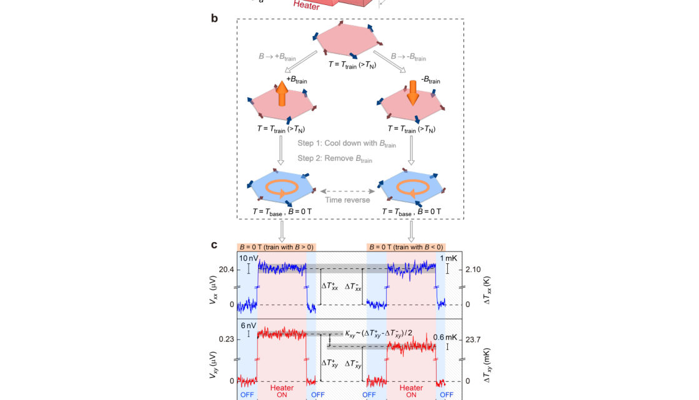 
Fig. 1 | Measurement of thermal Hall effect in Na2Co2TeO6. a, Schematic of the experimental setup. Heat flow is applied along the a-axis via a heater. The longitudinal and transverse temperature differences (ΔTxx and ΔTxy) are measured by two sets of thermocouples, with the same sign convention of electrical Hall effect. An external magnetic field can be applied along the c-axis. b, Sample preparation procedure. First, a weak trained field +Btrain is applied with the sample temperature above its Néel temperature TN ≈ 27 K. The sample is then cooled down to Tbase. Finally, the field is removed, leaving Na2Co2TeO6 in an antiferromagnetic ground state with single domain (concerning magnetic...

📷 Fig 2

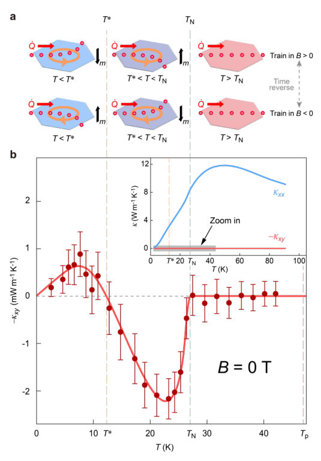 
Fig. 2 | Thermal Hall effect at zero magnetic field. a, Schematic illustration of the spin arrangement and heat flow. For a given training process, the nearly compensated out-of-plane magnetization m and the in-plane vortices v act together to the deflection of heat flow. b, Temperature dependence of -κxy at zero magnetic field. The solid line is a guide to the eyes. The error bars are obtained from the measurement noises, as shown the grey bar in Fig. 1c. Inset shows both κₓₓ and -κxy in units of W m-1 K-1. Remarkably, reversal point of -κxy coincides with the compensation point T* of m, while above TN there is no detectable -κxy, including the temperature Tp of maximum κₓₓ.

📷 Fig 3

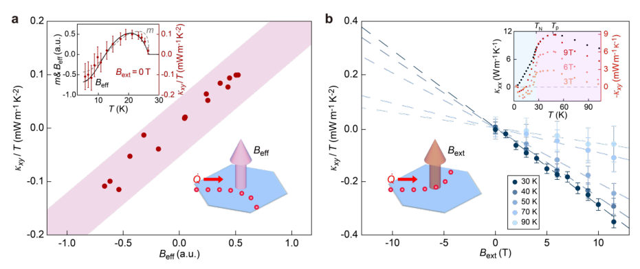 
Fig. 3 | Thermal Hall effect under effective magnetic field Beff and external magnetic field Bext. a, κxy/T as a function of Beff at Bext = 0 T , where Beff ∝𝑚∙𝑣2 . Top-left inset: Comparison of Beff and m with κxy/T. Bottom-right inset: Illustration of heat flow deflected by Beff. b, κxy/T as a function of Bext at different temperatures above TN. The dashed lines are linear fittings. Top-right inset: κxx under Bext = 9 T, -κxy under Bext = 9 T, 6 T, and 3 T. For -κxy, two distinct regions are highlighted with blue and purple shades, which are separated by T = TN. At T &lt; TN, THEs induced by Beff and Bext coexist; while at T &gt; TN, only Bext acts on phonons. Bottom-left inset: Illustration of...

**Summary.** This paper reports the discovery of a spontaneous thermal Hall effect in the antiferromagnetic insulator Na2Co2TeO6 at zero external magnetic field. The effect is driven by an intrinsic effective field arising from a unique non-coplanar spin texture. This finding challenges traditional views on heat conduction and provides a new way to explore topological responses in quantum materials.

**Why it may be interesting.** not directly relevant

Detailed structure

**Main problem.** The study aims to understand the origin of a spontaneous thermal Hall effect (STHE) in an antiferromagnetic insulator in the absence of an external magnetic field.

**Main result.** The researchers discovered a large zero-field thermal Hall effect in Na2Co2TeO6, which is attributed to an intrinsic effective magnetic field generated by a non-coplanar spin texture (vortices and magnetization) rather than a net magnetic moment.

**Method.** Thermal Hall conductivity measurements were performed on single-crystal Na2Co2TeO6 using a cryostat, applying a longitudinal heat flow and detecting transverse temperature gradients with high-resolution thermocouples.

**Model / system.** The physical system is the honeycomb oxide Na2Co2TeO6, an antiferromagnetic insulator characterized by in-plane vortices and nearly compensated out-of-plane magnetic moments.

**Key observables.** Transverse thermal conductivity (kappa_xy), longitudinal thermal conductivity (kappa_xx), thermal Hall angle (kappa_xy/kappa_xx), and magnetization (m).

**Important parameters / regimes.** Neeel temperature (TN approx 27 K), compensation temperature (T*), and effective magnetic field (B_eff).

**Assumptions / limitations.** The sample is assumed to be in a single antiferromagnetic domain achieved through magnetic field training.

**Figures summary.** Fig 1 shows the experimental setup, sample training procedure, and raw temperature data; Fig 2 illustrates the spin arrangement and the temperature dependence of the zero-field thermal Hall signal; Fig 3 compares the thermal Hall response under effective and external magnetic fields.

**Paper structure.** The paper introduces the phenomenon of the thermal Hall effect, describes the experimental setup and sample preparation, presents the discovery of the zero-field effect and its temperature dependence, proposes a mechanism based on an effective field from spin textures, and compares the results to external field-induced effects.

Abstract

Fourier's law dictates that heat flow is usually parallel to the applied temperature gradient. However, under a high magnetic field, heat flow carried by both electrons in conductors and phonons in insulators can be deflected, a phenomenon known as thermal Hall effect. Intriguingly, we observe at zero field a spontaneous thermal Hall effect in an antiferromagnetic insulator. Despite a vanishingly small uncompensated magnetization, the magnitude of this effect is surprisingly large, comparable to typical responses induced by several teslas of external field. This zero-field behavior indicates that charge-neutral heat carriers can be governed by an intrinsic effective field arising from the unique spin arrangement. Our discovery challenges the centuries-old preconception of heat conduction and open up new avenues for exploring non-trivial topological responses in quantum materials.

[↑ back to top](#top)

## Secondary cond-mat archives

*Papers from  mes-hall, other, soft, supr-con. These archives are de-prioritized — they appear at the end regardless of relevance score.*

### Relevant in secondary archives (9)

### [Symmetry-Selective Topological Magnon Engineering by Phonon Angular Momentum](http://arxiv.org/abs/2605.28425v1)

**Authors:** Markus Weißenhofer, Philipp Rieger, Chandan K. Singh, M. S. Mrudul, Sergiy Mankovsky, Peter M. Oppeneer  
**Type:** theory · **Category:** strongly correlated electrons · **PDF:** <https://arxiv.org/pdf/2605.28425v1>  
**Analysis basis:** full PDF text, analyzed in chunks
**Topic relevance:** 🔥 `non-equilibrium dynamics` **4/5** · `spintronics-quantum-optics interface` **2/5**

📷 Fig 1

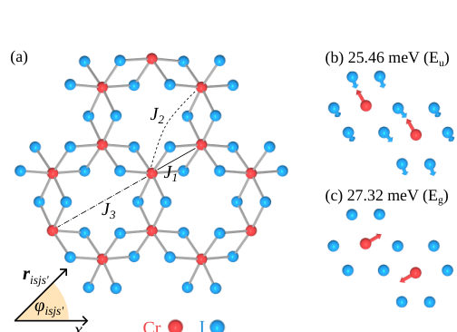 
Figure 1. (a) Top view of the atomic lattice of monolayer CrI3. J1 to J3 denote the nearest- to third-nearest-neighbor exchange interactions between magnetic Cr atoms. (b) and (c) Schematic representations of one representative eigenvec- tor from each pair of analyzed degenerate phonon modes with energies and group representations as labeled.

📷 Fig 2

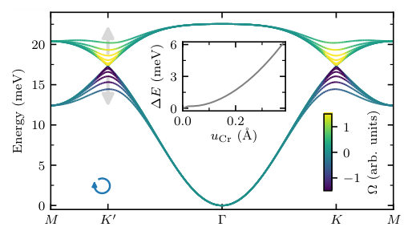 
Figure 2. Engineering of magnon bandstructure of CrI3. Ar- rows indicate the opening of a gap at the Dirac points K and K′ upon driving by clockwise circular Eg phonon mode and the color coding shows the Berry curvature of the magnon bands. The inset shows the magnon energy gap versus Cr displacement.

📷 Fig 3

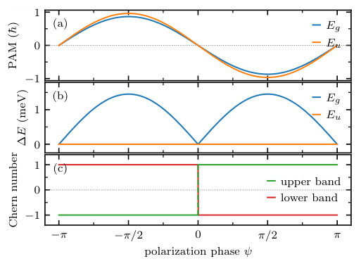 
Figure 3. PAM-selective control of magnon gap and topologies in the absence of SOC. (a) PAM and (b) magnon gap at K, K′

📷 Fig 4

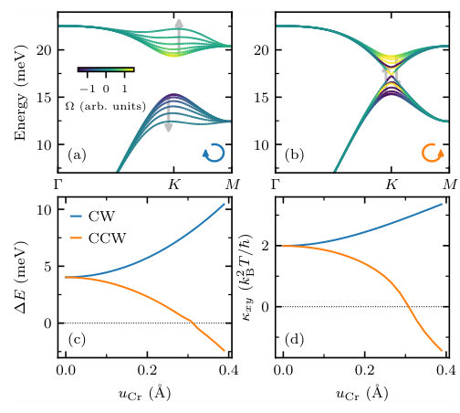 
Figure 4. Engineering of magnon bandstructure of CrI3 in the presence of SOC, assumed to manifest in DMI. (a) and (b) show the magnon energies around K driven by clockwise (CW) and counter-clockwise (CCW) Eg phonons of different amplitude. Arrows indicate gap widening (a) and closing (b) and the color coding the Berry curvature. (c) and (d) depict the magnon energy gap and the anomalous thermal Hall con- ductivity versus Cr displacement.

**Summary.** This paper shows that driving lattice vibrations with specific angular momentum can selectively control the topology of magnon bands in 2D magnets. By using circularly polarized phonons, one can open, tune, and even reverse the topological phases of magnons. This provides a versatile platform for the Floquet engineering of bosonic excitations in van der Waals materials.

**Why it may be interesting.** This work demonstrates a method for Floquet engineering of topological excitations using driven lattice dynamics, which is highly relevant to the study of non-equilibrium many-body dynamics and the control of Berry curvature.

Detailed structure

**Main problem.** The challenge of achieving dynamical control over Berry curvature and magnon band structures to engineer and reverse topological phases.

**Main result.** The authors demonstrate that circularly and elliptically polarized phonons carrying phonon angular momentum (PAM) can selectively induce chiral interactions, opening and tuning topological magnon gaps and reversing Chern numbers.

**Method.** The study uses an ab initio framework (SPRKKR, VASP, Phonopy) combined with Floquet theory and a van Vleck expansion to derive an effective time-independent Hamiltonian.

**Model / system.** The primary system is monolayer CrI3, a 2D van der Waals ferromagnet, modeled using an atomistic Heisenberg Hamiltonian with spin-lattice coupling and Dzyaloshinskii-Moriya interactions.

**Key observables.** Magnon band gaps, Chern numbers, and anomalous thermal Hall conductivity.

**Important parameters / regimes.** Phonon angular momentum (PAM), phonon polarization phase, and the high-frequency phonon regime where phonon frequency exceeds magnon frequencies.

**Assumptions / limitations.** The reliability of the effective Hamiltonian relies on the vanishing of higher-order corrections in the van Vleck expansion and the high-frequency approximation.

**Figures summary.** Figure 1 shows the CrI3 lattice and phonon mode representations; Figure 2 illustrates the modification of the magnon spectrum and Berry curvature by Eg phonons; Figure 3 relates phonon polarization to the magnon gap and Chern numbers; Figure 4 shows magnon bandstructure engineering.

**Paper structure.** The paper introduces the problem of dynamical topological control, presents an ab initio-based Floquet framework, analyzes the symmetry-selective role of phonon angular momentum, demonstrates the results on CrI3, and discusses experimental signatures like thermal Hall conductivity.

Abstract

Dynamical control of Berry curvature remains an outstanding challenge in the engineering of topological phases. Here, we demonstrate control of magnon band structures via coherently driven phonons, based on \textit{ab initio} spin-lattice coupling and Floquet theory. We show that this control is symmetry selective: linearly polarized phonons leave the spectrum unchanged, whereas circular and elliptical phonons carrying finite phonon angular momentum (PAM) induce chiral interactions that open and tune gaps at Dirac points, generating and reversing topological magnon phases. The gap magnitude and Chern numbers are directly governed by the PAM, enabling handedness-selective topology control. Applied to monolayer CrI$_3$, and supported by symmetry analysis, our results establish driven lattice dynamics as a general route to engineering topological bosonic excitations and a versatile platform for Floquet control of magnetism.

[↑ back to top](#top)

### [Electrically driven Rabi dynamics of magnetic-field-induced corner states in a two-dimensional topological insulator](http://arxiv.org/abs/2605.28499v1)

**Authors:** D. V. Khomitsky, E. A. Lavrukhina, D. P. Krasavin, S. S. Krishtopenko, F. Teppe  
**Type:** theory · **Category:** quantum information and computing · **PDF:** <https://arxiv.org/pdf/2605.28499v1>  
**Analysis basis:** full PDF text, analyzed in chunks
**Topic relevance:** `non-equilibrium dynamics` **3/5**

📷 Fig 1

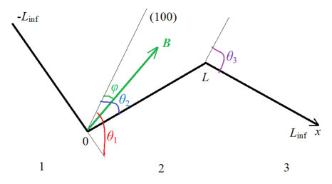 
FIG. 1. Schematic of a HgTe/CdHgTe QW edge containing two lithographically defined kinks, which divide the edge into regions 1, 2, and 3. The orientations of the three edge seg- ments are specified by the angles θ1,2,3 measured with respect to the crystallographic direction (100). The central segment lies along the x direction and extends from x = 0 to x = L. The in-plane magnetic field B forms an angle ϕ with the (100) direction. The full edge is truncated at a length Linf ≫L.

📷 Fig 2

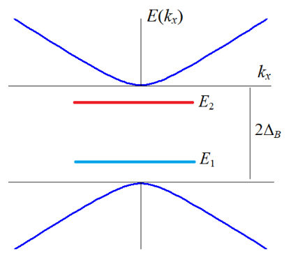 
FIG. 2. Schematic of the spectrum consisting of two con- tinuum branches described by Eq. (7). The magnetic field opens a common gap 2∆B in the edge spectrum, with ∆B = minn p

📷 Fig 3

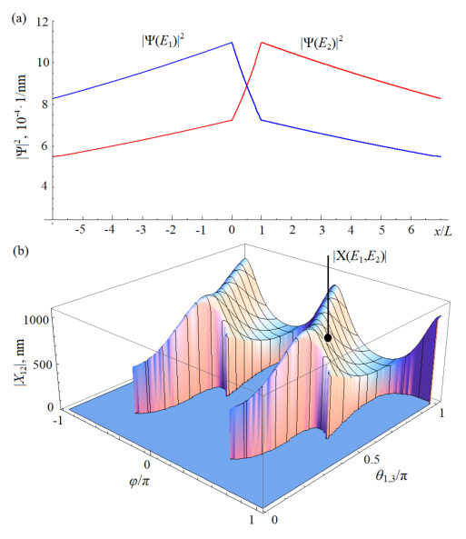 
FIG. 4. (a) Probability-density distributions |Ψ|2 for the lev- els E1,2 marked in Fig. 3. The two states are localized near the left and right ends of the central segment 0 &lt; x &lt; L in Fig. 1. (b) Absolute value of the dipole matrix element (16) as a function of the angles θ1 = θ3 and ϕ. The marked value |X12| = 885 nm corresponds to the selected pair of discrete levels whose probability-density distributions are shown in panel (a).

📷 Fig 4

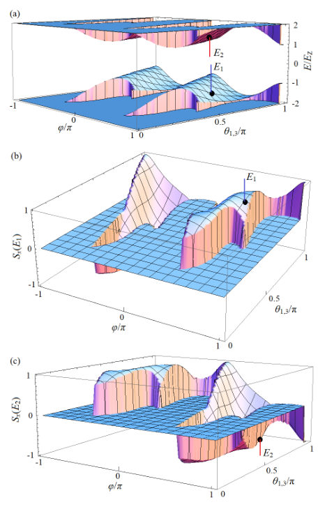 
FIG. 3. (a) Spectrum of the two discrete levels E1,2 shown schematically in Fig. 2 as a function of the angles θ1 = θ3 and ϕ defined in Fig. 1. The other parameters are θ2 = 0, L = 250 nm, and EZ = 150 µeV. The uniform background regions at the top and bottom correspond to the absence of a pair of localized levels. The selected levels E1,2 = ∓1.342 EZ at θ1 = θ3 = 2π/3 and ϕ = π/2 are marked by black circles. (b), (c) Distributions of the x component of spin for the lower (b) and upper (c) levels shown in panel (a). For the selected pair of levels, the x-spin projections have opposite signs and nearly equal magnitudes.

📷 Fig 5

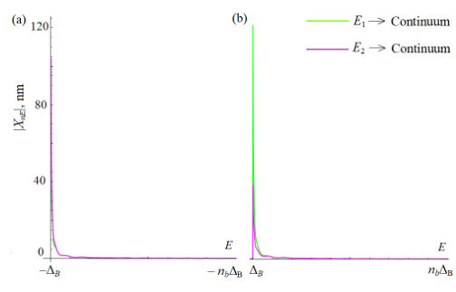 
FIG. 5. Absolute value of the matrix element (23) for tran- sitions into continuum states of the family Ψ(L): (a) lower continuum branch, −nb∆B &lt; E &lt; −∆B, and (b) upper con- tinuum branch, ∆B &lt; E &lt; nb∆B, with nb = 200. Each panel shows transitions from the lower discrete level E1 and from the upper discrete level E2.

**Summary.** This paper explores how to use electric fields to drive coherent Rabi oscillations between localized corner states in a 2D topological insulator. It identifies an optimal regime where high-frequency manipulation is possible while keeping population loss to the edge-state continuum extremely low. This provides a potential pathway for creating lithographically defined, electrically controllable qubits.

**Why it may be interesting.** It presents a concrete realization of an electrically driven two-level system where the competition between coherent driving and leakage into a continuum can be precisely controlled, relevant to open quantum systems.

Detailed structure

**Main problem.** Investigating the feasibility of using magnetic-field-induced corner states in a 2D topological insulator as a controllable two-level subsystem (qubit) driven by electric fields.

**Main result.** The authors demonstrate that GHz-scale Rabi oscillations can be achieved with leakage into the continuum suppressed below 1% by optimizing the electric field amplitude.

**Method.** The study uses an effective edge-state model to solve the time-dependent Schrödinger equation, explicitly accounting for both discrete localized levels and the continuum of edge states.

**Model / system.** A 1D edge of a HgTe/CdHgTe quantum well with a double-kink geometry, subject to an in-plane magnetic field that induces a gap and localized states.

**Key observables.** Rabi frequencies, population of discrete levels, leakage probability into the continuum, and oscillations in the mean coordinate and spin projection.

**Important parameters / regimes.** Rabi frequencies of 20-40 GHz, electric field amplitudes of 0.05-0.1 ueV/nm, and Zeeman energy scales.

**Assumptions / limitations.** The edge orientation is piecewise constant, the magnetic field is strictly in-plane, and the outer edge segments are sufficiently long.

**Figures summary.** Figure 1 shows the physical geometry of the kinked edge; Figures 6 and 7 illustrate the time-dependent populations, leakage, and spin/spatial oscillations under different electric field strengths.

**Paper structure.** The paper introduces the physical system and Hamiltonian, derives the localized states and their dipole matrix elements, and then performs time-dependent simulations to analyze the trade-off between driving strength and population leakage.

Abstract

We study coherent electric manipulation of magnetic-field-induced localized states at a double kink of a helical edge in a HgTe/CdHgTe quantum well. An in-plane magnetic field opens a gap in the one-dimensional edge spectrum, while changes in the edge orientation generate localized in-gap states at the kinks. We show that, for suitable geometry and magnetic-field direction, two such states form an effective lithographically defined two-level subsystem. Using an edge-state model that includes both the localized levels and the continuum states outside the magnetic-field-induced gap, we calculate the electric-dipole matrix elements and solve the time-dependent problem under resonant driving. The resulting dynamics exhibits Rabi oscillations with linear frequencies of $20$--$40$~GHz for realistic parameters. We find that the continuum states provide a leakage channel whose strength is strongly controlled by the driving amplitude: reducing the electric field suppresses leakage below the percent level while preserving GHz-scale coherent oscillations. These results establish a route from magnetic-field-induced corner-state physics to electrically driven two-level dynamics in a realistic two-dimensional topological-insulator edge geometry.

[↑ back to top](#top)

### [Full Quantum and Mixed Quantum--Classical Dynamics of Hot Exciton Cooling in Semiconductor Nanocrystals](http://arxiv.org/abs/2605.27708v1)

**Authors:** Bokang Hou, Johan E. Runeson, Samuel L. Rudge, Salvatore Gatto, Hans-Dieter Meyer, Michael Thoss, Eran Rabani  
**Type:** theory · **Category:** numerical methods · **PDF:** <https://arxiv.org/pdf/2605.27708v1>  
**Analysis basis:** full PDF text, analyzed in chunks
**Topic relevance:** `Keldysh / 2PI / non-Gaussian methods` **2/5** · `methods for driven-dissipative` **2/5** · `non-equilibrium dynamics` **2/5**

📷 Fig 1

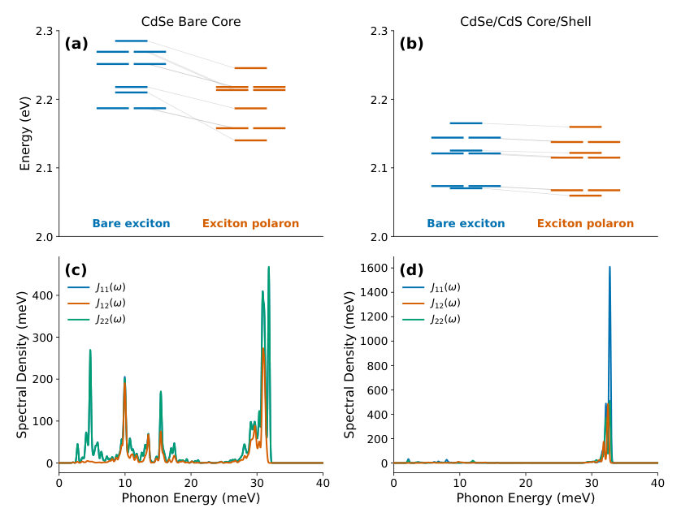 
Figure 1. Atomistically parameterized exciton–phonon model for the two NCs. (a,b) Bare exciton energies E0 n at the equilibrium geometry and the corresponding polaron energies E0 n −λnn for the lowest 9 excitonic states of (a) the 3 nm CdSe core NC and (b) the 3 nm CdSe/ 2ML CdS core–shell NC. (c,d) Exciton–phonon spectral densities Jnm(ω) for the two lowest excitonic states, including the diagonal components J11(ω) and J22(ω) and the off-diagonal coupling J12(ω), for (c) CdSe core and (d) CdSe/CdS core–shell NCs. Note that the J11(ω) and J22(ω) for bare-core CdSe overlap. The bare CdSe core shows substantial low-frequency spectral weight below ∼25 meV, whereas the core–shell system is...

📷 Fig 2

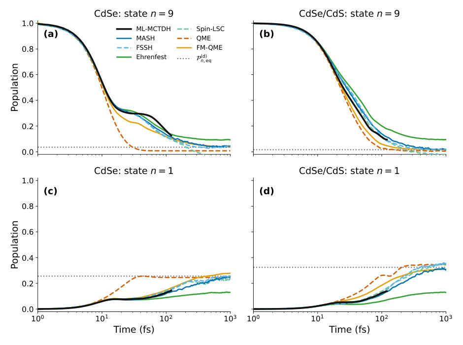 
Figure 2. Real-time diabatic population dynamics P(d) n (t) for CdSe core and CdSe/CdS core–shell NCs for the highest n = 9 and lowest n = 1 excitonic states. Thermofield ML-MCTDH method is used as the benchmark. Three classes of approximate methods are compared: perturbative QME, mean-field (Ehrenfest, spin-LSC), and surface hopping (MASH and FSSH) ap- proaches. The black dotted line is the diabatic equilibrium population calculated with PIMC. The benchmark model includes a total of 9 excitonic states and 360 modes simulated at 300 K.

📷 Fig 3

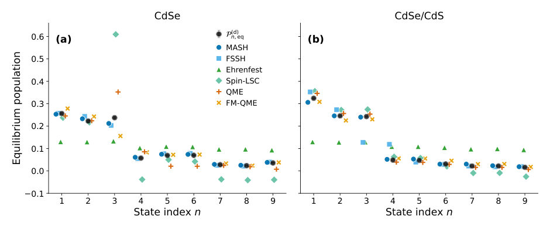 
Figure 3. State-resolved diabatic equilibrium populations for (a) CdSe core and (b) CdSe/CdS core–shell NCs at 300 K. The reference P(d) n,eq values are obtained from PIMC (the statistical uncertainty is smaller than the symbol size), using the full exciton–phonon Hamiltonian, while the other symbols show the long-time or method-specific equilibrium populations predicted by MASH, FSSH, Ehrenfest, spin-LSC, QME, and FM-QME. State indices are ordered from the lowest-energy exciton, n = 1, to the highest state included in the model, n = 9.

📷 Fig 4

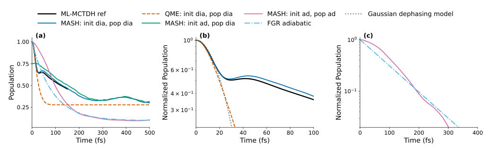 
Figure 4. Results for a reduced two-level exciton–phonon model. (a) Population dynamics from ML-MCTDH, MASH, QME and FGR for a chosen initial state and population basis. “init dia, pop dia” denotes diabatic initialization and diabatic population measurement; “init ad, pop dia” and “init ad, pop ad” denote adiabatic initialization with diabatic or adiabatic population measurement, respectively. Diabatic initialization produces an ultrafast initial decay followed by slower relaxation, whereas adiabatic initialization removes the fast component. (b) Short-time normalized population dynamics, compared with the Gaussian dephasing model (cf., Eq. (26)). (c) Slow relaxation component compared with...

📷 Fig 5

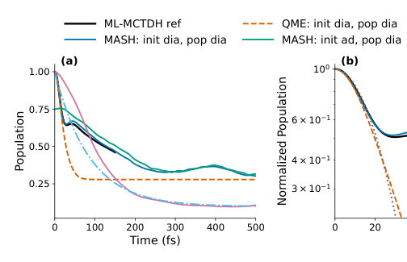 
Fig. 4 panel (b) compares the dynamics generated by this short-time expression with the normalized popula- tion ˜Pn(t) = Pn(t)−Pn,eq Pn(0)−Pn,eq and shows that it captures the fast decay observed in both the QME and MASH dynamics quite well. Analyzing Eq. (26) suggests that

**Summary.** This study benchmarks various quantum and mixed quantum-classical methods against exact dynamics to study hot-exciton cooling in nanocrystals. It reveals that the initial ultrafast cooling is caused by rapid state mixing from low-frequency phonons rather than traditional energy relaxation. The results identify MASH as a highly reliable approximation for these complex vibronic systems.

**Why it may be interesting.** The paper provides a rigorous benchmark for non-adiabatic dynamics in the intermediate-coupling regime, specifically addressing how thermal fluctuations of couplings drive rapid dephasing/mixing, which is highly relevant to open quantum systems and many-body dynamics.

Detailed structure

**Main problem.** Assessing the accuracy of various perturbative and mixed quantum-classical dynamical methods for describing hot-exciton relaxation and cooling in semiconductor nanocrystals.

**Main result.** The MASH (Mapping Approach to Surface Hopping) method provides the most consistent agreement with exact quantum benchmarks, while the ultrafast cooling component is identified as rapid diabatic state mixing driven by low-frequency phonons.

**Method.** Benchmarking various approximations (QME, Ehrenfest, Spin-LSC, FSSH, MASH) against numerically exact ML-MCTDH dynamics and PIMC equilibrium populations.

**Model / system.** Atomistically parameterized models of CdSe core and CdSe/CdS core-shell nanocrystals using a linear vibronic coupling Hamiltonian and semi-empirical pseudopotentials.

**Key observables.** Time-dependent average exciton energy, diabatic and adiabatic populations, and exciton-phonon spectral densities.

**Important parameters / regimes.** Temperature (300 K), nanocrystal size (3 nm), and the separation of timescales between ultrafast (~10 fs) and slow (~100 fs) relaxation.

**Assumptions / limitations.** Linear vibronic coupling (first-order expansion), static screening approximation for the Bethe-Salpeter equation, and use of the harmonic approximation for the nuclear Hamiltonian.

**Figures summary.** Fig 1: Exciton energies and spectral densities for CdSe and CdSe/CdS. Fig 2: Real-time diabatic population dynamics comparison. Fig 3: State-resolved diabatic equilibrium populations. Fig 5: Exciton energy relaxation over time.

**Paper structure.** The paper introduces the physical problem of exciton cooling, defines the atomistic models and Hamiltonian, details the benchmark and approximate dynamical methods, presents comparative results for population dynamics and energy relaxation, and concludes with mechanistic insights.

Abstract

Hot-exciton relaxation in semiconductor nanocrystals (NCs) is often described using perturbative theories, but their accuracy is difficult to assess for realistic exciton--phonon Hamiltonians. Here, we benchmark the perturbative quantum master equation (QME) and several mixed quantum--classical (MQC) methods against fully quantum mechanical dynamics. Using atomistically parameterized models for CdSe core and CdSe/CdS core--shell NCs, we find that bare CdSe exhibits an ultrafast initial decay followed by slower cooling, whereas the core--shell system is dominated by the slower component. Analysis of reduced models shows that the ultrafast component arises from rapid diabatic state mixing driven by thermal fluctuations of low-frequency phonons, rather than from nuclear-assisted energy relaxation. The QME captures the initial fast decay but can fail for the slower relaxation in the diabatic representation, while the mapping approach to surface hopping (MASH) gives the most consistent agreement with both benchmark dynamics and equilibrium populations. These results establish a benchmark for exciton-cooling dynamics in NCs and clarify the physical regimes in which widely used approximate methods are reliable.

[↑ back to top](#top)

### [Substrate-driven topological engineering in plasmonic Su-Schrieffer-Heeger chains](http://arxiv.org/abs/2605.28463v1)

**Authors:** Florian Herz, Alireza Naeimi, Svend-Age Biehs  
**Type:** theory · **Category:** other · **PDF:** <https://arxiv.org/pdf/2605.28463v1>  
**Analysis basis:** full PDF text, analyzed in chunks
**Topic relevance:** `correlated / nonlocal dissipation` **2/5** · `driven-dissipative phase transition` **2/5** · `exotic spin models in light-matter` **2/5**

📷 Fig 1

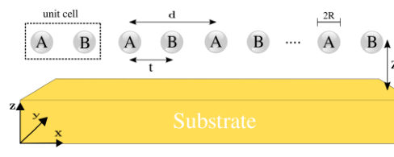 
FIG. 1: Sketch of the considered system. A bipartite SSH chain of nanoparticles of radius R with lattice constant d in each sublattice A and B and separation distance t within each unit cell is placed at a distance z in close vicinity to a semi- infinite planar substrate.

📷 Fig 2

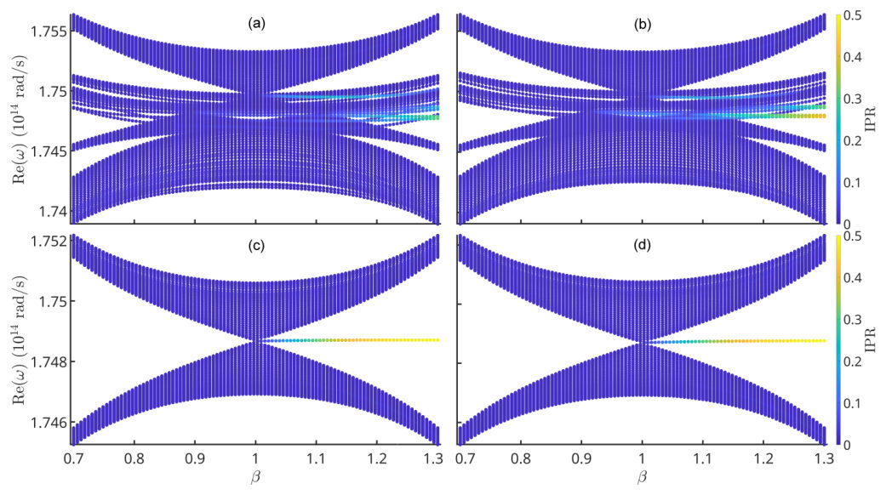 
FIG. 2: Eigenfrequencies and IPR values for IP (a),(b) and OP modes (c),(d) for nsub = 1.34 × 1019 cm−3 (a),(c) and nsub = 1.36 × 1019 cm−3 (b),(d) at z = 500 for different β and a total of N = 80 particles.

📷 Fig 3

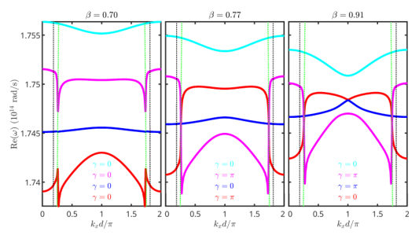 
FIG. 3: IP band structure for z = 500 nm and nsub = 1.36 × 1019 cm−3 for different β values. For each band, the Zak phases are given in the corresponding colors. The dashed lines correspond to the light lines in vacuum (black) and the surface polariton light line, i.e. the surface mode dispersion relation, of the InSb substrate (green) taken from Eq. (10).

📷 Fig 4

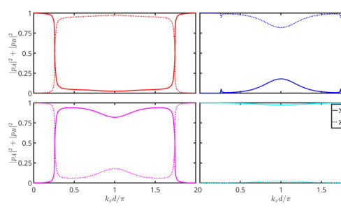 
FIG. 4: Polarizations of the unit cell |pA|2 + |pB|2 in x (solid) and z (dashed) direction for each band in Fig. 3 at β = 0.77.

📷 Fig 5

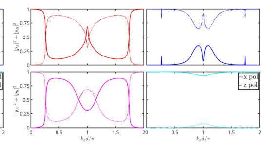 
FIG. 6: Polarizations of the unit cell |pA|2 + |pB|2 in x (solid) and z (dashed) direction for each band in Fig. 3 at β = 0.91.

**Summary.** The paper demonstrates that the topological properties of a plasmonic SSH chain can be controlled by its interaction with a substrate. By tuning the distance to the substrate or the substrate's doping, one can induce topological phase transitions and create protected edge modes. These findings also show that such topological features can be used to modulate spectral radiative heat transfer.

**Why it may be interesting.** This work is highly relevant to quantum optics and open quantum systems as it demonstrates how controlling the external electromagnetic environment (the substrate) can be used to manipulate topological edge states and near-field energy transport.

Detailed structure

**Main problem.** Investigating how the electromagnetic environment of a substrate can be used to engineer the topological band structure and induce topological phase transitions in a plasmonic Su-Schrieffer-Heeger (SSH) chain.

**Main result.** The substrate interaction introduces two mechanisms—long-range band hybridization and short-range band touching—that can trigger topological phase transitions and enable the emergence of protected edge modes even in previously trivial regimes.

**Method.** The study uses a Green's function approach within the dipole approximation and the quasistatic limit, applying Bloch's theorem and calculating the Zak phase and Inverse Participation Ratio (IPR).

**Model / system.** A bipartite array of N identical InSb nanoparticles arranged in an SSH chain, placed at a distance z from a semi-infinite InSb planar substrate.

**Key observables.** Band structure, Zak phase, Inverse Participation Ratio (IPR), polarization (in-plane vs. out-of-plane), and spectral radiative heat flux.

**Important parameters / regimes.** Dimerization parameter (beta), chain-substrate distance (z), substrate carrier density (n_sub), and disorder strength (rho).

**Assumptions / limitations.** The system is modeled using the dipole approximation in the quasistatic limit, and higher-order multipole moments are neglected.

**Figures summary.** Fig 1: System schematic; Fig 2: Eigenfrequencies and IPR; Fig 3: Infinite chain band structure and SPP interaction; Fig 4: Unit cell polarization; Fig 5: Nearest-neighbor approximation comparison; Fig 8: Eigenfrequencies/IPR vs distance; Fig 9: IP band structure; Fig 10-11: Band structure under disorder; Fig 12-14: Spectral radiative heat flux and robustness analysis.

**Paper structure.** The paper introduces the plasmonic SSH system, details the mathematical framework for substrate-induced interactions, analyzes the two distinct topological engineering mechanisms (hybridization and band touching), evaluates the robustness of edge modes against structural disorder, and concludes with the implications for near-field radiative heat transfer.

Abstract

We demonstrate the possibility of engineering the topological band structure of a plasmonic Su-Schrieffer-Heeger (SSH) chain through the interaction with its electromagnetic environment. We find that the long-range interaction of the in-plane modes of the SSH chain with the surface plasmon polaritons of a planar substrate introduces a band hybridization connected to a change of the Zak phase. On the other hand, the short-range interaction with the substrate introduces a band touching, again with a change in the Zak phase. Surprisingly, this second mechanism enables the emergence of topologically protected edge modes for parameters which correspond to the topologically trivial phase for an isolated plasmonic SSH chain. We study these mechanisms by changing the chain-substrate distance and the dimerization parameter. Finally, we discuss the robustness against disorder and, as one example, the impact of the observed effects on the near-field radiative heat transfer along the chain. Our findings pave the way to the engineering of edge modes in plasmonic topological configurations via the coupling to a plasmonic environment.

[↑ back to top](#top)

### [Unity-order coupling between free electrons and multiphoton waveguided Fock states](http://arxiv.org/abs/2605.28383v1)

**Authors:** L. Prelat, S. Abdullah, C. I. Velasco, F. J. García de Abajo  
**Type:** theory · **Category:** quantum information and computing · **PDF:** <https://arxiv.org/pdf/2605.28383v1>  
**Analysis basis:** full PDF text, analyzed in chunks
**Topic relevance:** `entanglement & information structure` **2/5** · `interference shaping light` **2/5**

📷 Fig 1

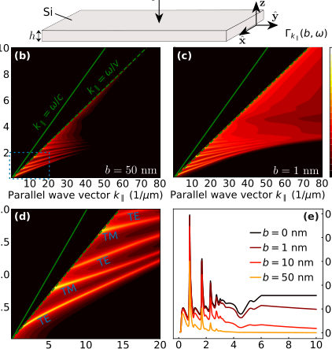 
FIG. 1. Free-electron coupling to a planar waveguide in a parallel-trajectory configuration. (a) Schematic representation of an e-beam moving with velocity v = vˆy at a distance b from a self-standing laterally extended Si waveg- uide of thickness h. (b,c) Wave-vector- and energy-resolved EELS probability per unit of path length [Eq. (1b)] for (b) b = 50 nm and (c) b = 1 nm. (d) Close-up of the low-energy region in (b). Labels indicate the TM and TE nature of the waveguided modes. (e) EELS probability per unit of path length [Eq. (1a)] for different values of b. In all panels, the waveguide thickness is h = 200 nm, and the electron kinetic energy is 200 keV. Solid and dashed green lines in...

📷 Fig 2

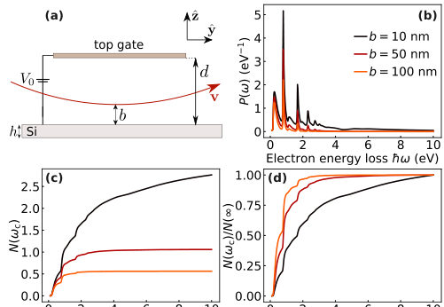 
FIG. 2. Electron coupling to a planar waveguide for a parabolic trajectory. (a) Schematic representation of an e-beam under grazing incidence on an extended planar Si waveguide of thickness h, separated by a distance d from a top gate biased at a voltage V0. We consider d to be large enough to neglect the electron–waveguide interaction at the point of electron entrance in the capacitor region. The parabolic elec- tron trajectory is determined by the vertical uniform repul- sive electric field EDC = V0/d &gt; 0 and the minimum distance b from the waveguide (turning point). (b) Energy-resolved EELS probability P(ω) [Eq. (6)] for different values of b. (c) Energy-integrated EELS probability N(ωc)...

📷 Fig 3

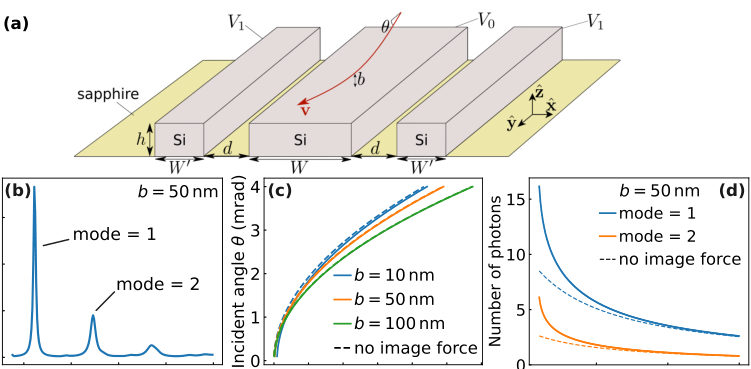 
FIG. 3. Electron coupling to waveguide modes in a biased waveguide geometry. (a) We consider a conductive Si central waveguide (voltage V0) flanked by two Si electrodes (voltage V1) supported on a sapphire substrate. The scheme shows the geometrical parameters of the system (W = 500 nm, W ′ = 250 nm, d = 100 nm, and h = 300 nm in our calculations). We consider 100 keV electrons moving in the y −z plane of specular symmetry with velocity v parallel to the waveguide. The minimum electron–waveguide distance b is determined by the initial incidence angle θ ≪1. (b) EELS probability per unit of path length for a fixed electron–waveguide distance of 50 nm. (c) Relation between incidence angle θ...

📷 Fig 4

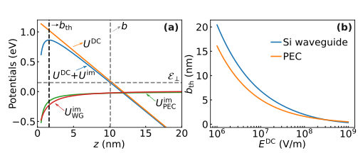 
FIG. 4. Effect of the image potential model on the threshold electron–waveguide distance. (a) Out-of- plane electron potential energy U(z) = U DC(z) + U im(z) and its DC and image components for EDC = 108 V/m. We in- dicate the turning-point distance b ≈10 nm for a specific normal electron energy E⊥(horizontal dashed line), as de- termined by the intersection with the potential. For b below the threshold value bth, the trajectory impacts the waveg- uide surface at z = 0. We compare the image potential for a PEC and a Si waveguide of 200 nm thickness. (b) Depen- dence of the threshold distance bth on the external DC field EDC, calculated when the image potential is either taken for a PEC...

📷 Fig 5

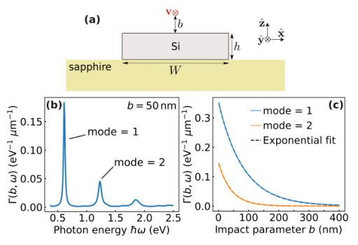 
FIG. 5. Calculation of the EELS probability and its exponential decay away from a 1D waveguide. (a) Transverse cross-section of the geometry under consideration, including an electron (red dot) moving with velocity v at a distance b from the sapphire-supported Si waveguide. (b) EELS probability per unit of path length as obtained from BEM for b = 50 nm, W = 500 nm, h = 300 nm, and 100 keV electrons. (c) Dependence of the peak probability for modes 1 and 2 on b (solid curves) and exponential fits (dashed curves).

**Summary.** This paper proposes using electrostatic fields to steer electron beams into grazing trajectories near silicon waveguides. This technique allows for tunable control over the interaction, significantly increasing the number of photons generated per electron while suppressing unwanted energy losses.

**Why it may be interesting.** The work demonstrates a method for generating tunable, high-yield multiphoton Fock states and entangled electron-photon states, which is highly relevant for quantum nanophotonics and quantum light-matter interfaces.

Detailed structure

**Main problem.** The coupling between free electron beams and waveguided optical modes is typically limited by short interaction times and a lack of spectral selectivity due to fixed straight-line trajectories.

**Main result.** Electrostatic steering of electron trajectories creates a tunable turning point that enhances coupling strength, enables modal selectivity, and can produce high photon yields exceeding ten photons per electron.

**Method.** The authors use the Boundary Element Method (BEM) to calculate electrostatic potentials and the local-response approximation to determine momentum-resolved Electron Energy-Loss Spectroscopy (EELS) probabilities.

**Model / system.** A system consisting of a 100-200 keV electron beam interacting with a rectangular silicon waveguide, utilizing either vertical or lateral electrostatic gating to deflect the electron trajectory.

**Key observables.** EELS probability (energy-loss probability), photon yield per electron, and modal selectivity (TE vs. TM modes).

**Important parameters / regimes.** Electron kinetic energy (100-200 keV), impact parameter (b), electron incidence angle, and applied electrostatic bias voltage.

**Assumptions / limitations.** The silicon waveguide is modeled as a Perfect Electric Conductor (PEC) for DC potential calculations, and the electron velocity is assumed to be nearly constant during the interaction.

**Figures summary.** Figure 1 shows the electron-waveguide geometry and EELS probability for different impact parameters; Figure 3 illustrates the lateral gating configuration and photon yield vs. incidence angle; Figures 5-7 detail the EELS spectrum, decay of probability with distance, and the electrostatic potential distributions for various gating geometries.

**Paper structure.** The paper introduces the problem of limited electron-waveguide coupling, proposes electrostatic steering as a solution, details the theoretical framework and numerical methods (BEM/EELS), compares different gating configurations (planar vs. lateral), and quantifies the resulting photon yield and tunability.

Abstract

Electron beams enable highly localized near-field excitation of waveguided optical modes, yet their coupling is typically limited by short interaction times along straight-line trajectories with fixed impact parameters. Here, we theoretically demonstrate that electrostatic steering overcomes this limitation by introducing a tunable turning point in grazing electron trajectories, thus controlling the minimum electron--waveguide separation and producing strong coupling to waveguided modes. Specifically, we consider a biased rectangular silicon waveguide, where a repulsive static field deflects a grazing electron. In this configuration, the electron turning point governs both the coupling strength and the modal selectivity, which can be dynamically tuned through the electron incidence angle and the applied bias. In addition, the aloof electron--waveguide interaction suppresses lossy high-energy channels (e.g., above the silicon band gap) while preserving substantial excitation of the targeted waveguided modes. Using a practical biasing configuration and 100~keV electrons, we predict an average yield exceeding ten photons per electron, with voltage-tunable control of the interaction. Our results establish electrostatic steering as a practical route for engineering and enhancing free-electron coupling to waveguided photonic modes.

[↑ back to top](#top)

### [A supersymmetric study of charge and spin transport in Weyl semimetals under axionic electrodynamic response](http://arxiv.org/abs/2605.27657v1)

**Authors:** J. C. Pérez-Pedraza, A. Martín-Ruiz, L. F. Urrutia  
**Type:** theory · **Category:** other · **PDF:** <https://arxiv.org/pdf/2605.27657v1>  
**Analysis basis:** full PDF text, analyzed in chunks
**Topic relevance:** `non-equilibrium dynamics` **2/5**

📷 Fig 1

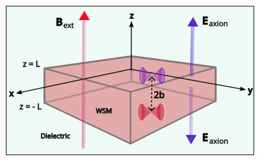 
FIG. 1. System under study consisting of a semi-infinite slab of a Weyl semimetal of thickness 2L in z-direction immersed in an external magnetic field in z-direction. The axion magnetoelectric response in the material induces a non-homogeneous electric field in the same direction. We consider the interior problem only, i.e. in the region −L &lt; z &lt; +L.

📷 Fig 2

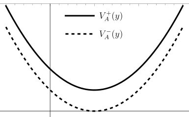 
FIG. 2. Potentials of the magnetic and electric Hamiltonians for the case Ax(y) = −B0y and ϕ(z) = −ρ0

📷 Fig 3

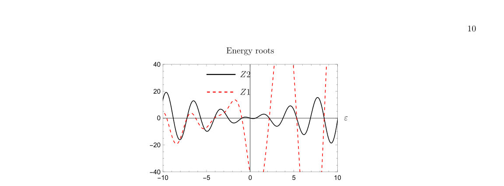 
FIG. 3. The dimensionless energy eigenvalues εn,m, for n = 0, for the conditions Z2 = 0 (solid, black lines) and Z1 = 0 (dashed, red lines). The parameters are B0 = 1.0 T, b = 0.26 nm−1 and L = 100 nm.

📷 Fig 4

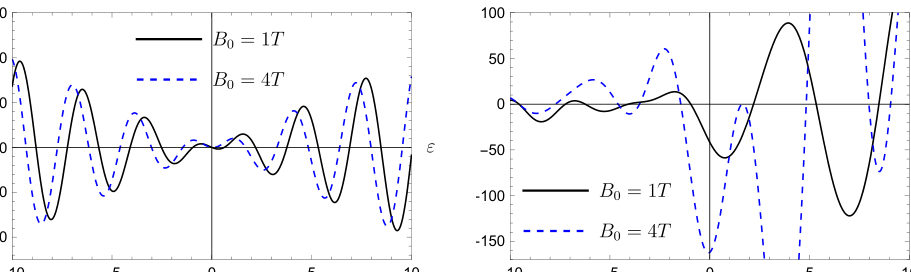 
FIG. 4. The dimensionless energy eigenvalues εn,m, for n = 0, for the conditions a) Z2 = 0 and b) Z1 = 0, for magnetic fields B0 = 1T (solid, black lines) and B0 = 4T (dashed, blue lines), respectively. The remaining parameters are b = 0.26 nm−1 and L = 100 nm.

📷 Fig 5

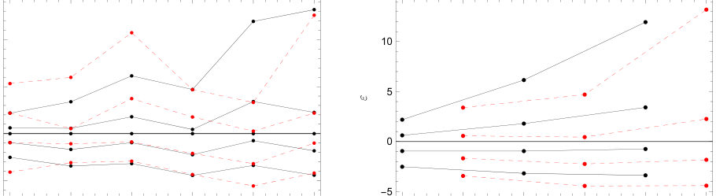 
FIG. 5. The dimensionless energy eigenvalues εn,m, for m = −2, −1, 0, 1, 2 (in ascendant order) as a function of the quantum number n. a) Complete spectrum (even and odd n). Black solid lines represent the roots of the condition Z2 = 0, while red dashed lines represent the roots of the condition Z2 = 0. b) Even n (black solid) and odd n (red dashed) coming from the condition Z2 = 0. In this plot the m = 0 roots are not included to avoid image saturation.

**Summary.** This paper explores how the interplay between axionic electrodynamics and supersymmetry governs transport in Weyl semimetals. By using supersymmetric quantum mechanics, the authors solve the Dirac equation to reveal how magnetic and electric fields induce chiral imbalances and specific spin currents. The results provide a theoretical framework for understanding the effective field theory of Weyl semimetals under external magnetic influence.

**Why it may be interesting.** not directly relevant

Detailed structure

**Main problem.** Investigating the charge and spin transport properties of Weyl semimetals under an external magnetic field, specifically focusing on the effects of axionic electrodynamic response.

**Main result.** The study demonstrates that the system's dynamics separate into a magnetic sector with supersymmetric factorization and an electric sector with PT-supersymmetric structure, leading to a chiral imbalance and specific spin-current patterns.

**Method.** The authors use a low-energy effective Dirac-Weyl theory, applying chiral transformations, supersymmetric quantum mechanics (SUSY QM), and solving the resulting equations using tri-confluent Heun functions and numerical methods.

**Model / system.** A Weyl semimetal (WSM) modeled as a plane slab of thickness 2L in a uniform external magnetic field, characterized by axion electrodynamics where the axial term is replaced by an effective electromagnetic response.

**Key observables.** Chiral projections of probability and current densities, spin density, spin currents, and axial probability density.

**Important parameters / regimes.** Fermi velocity (vF), axial 4-vector (b), magnetic field (B0), slab thickness (L), and the axion-like field theta(x).

**Assumptions / limitations.** Low-energy approximation near Weyl nodes, neglect of lattice regularization and band curvature, and a one-particle domain where the axial anomaly is absent.

**Figures summary.** Figure 1 shows a schematic of the WSM slab; Figures 5-6 show energy eigenvalues as a function of quantum numbers and magnetic field; Figures 7-10 display probability and current densities for different chiralities.

**Paper structure.** The paper begins by defining the WSM Hamiltonian and applying a chiral transformation to derive axion electrodynamics, then proceeds to decouple the Dirac equation into magnetic and electric sectors, solves these sectors using SUSY and PT-SUSY techniques (including Heun functions), and concludes with the calculation of transport observables and conservation laws.

Abstract

We investigate the charge and spin transport properties of a Weyl semimetal under an external magnetic field using a low-energy effective theory. By performing a chiral transformation, we remove the axial term from the fermionic Lagrangian, while its physical effects are retained through the system's electromagnetic response. This response, derived from integrating out the fermionic degrees of freedom, takes the form of axionic electrodynamics and enters the Dirac equation via minimal coupling. The resulting dynamics separate naturally into magnetic and electric components: the magnetic sector admits a supersymmetric factorization, while the electric part exhibits a PT-supersymmetric structure. Robin boundary conditions are applied to the spinor, setting the energy spectrum and defining exact spinor solutions. We obtain the chiral projections of probability and current densities, exhibiting a chiral imbalance in the material. We show that in the x-direction, only one chirality contributes to the chiral current ($j^x_l = 0$). Spin density and currents where also computed. Our results demonstrate how the interplay between axionic response and supersymmetry governs transport phenomena in our specific setup, offering novel insights into the effective field theory description of Weyl semimetals.

[↑ back to top](#top)

### [Magneto-Optical Detection of Anisotropic Spin Currents in Altermagnetic RuO2](http://arxiv.org/abs/2605.27830v1)

**Authors:** Joongwon Lee, Jeonglyul Kim, Sreejith Nair, Seung Gyo Jeong, Changi Kim, Jae-Pil So, Bohm-Jung Yang, Bharat Jalan, Hyobin Yoo, Farhan Rana, Taekoo Oh, Hong-Gyu Park  
**Type:** both · **Category:** strongly correlated electrons · **PDF:** <https://arxiv.org/pdf/2605.27830v1>  
**Analysis basis:** full PDF text, analyzed in chunks
**Topic relevance:** `spintronics-quantum-optics interface` **2/5**

📷 Fig 1

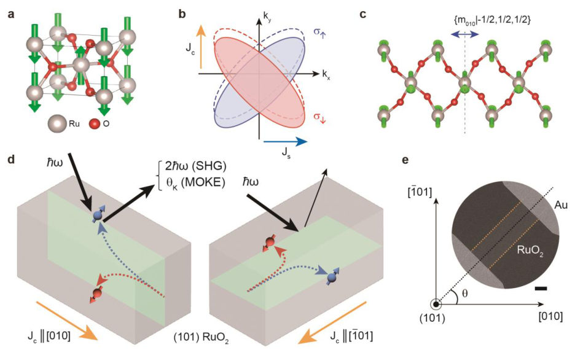 
Fig. 1. Crystal symmetry and optical detection scheme. a, Crystallographic and magnetic

📷 Fig 2

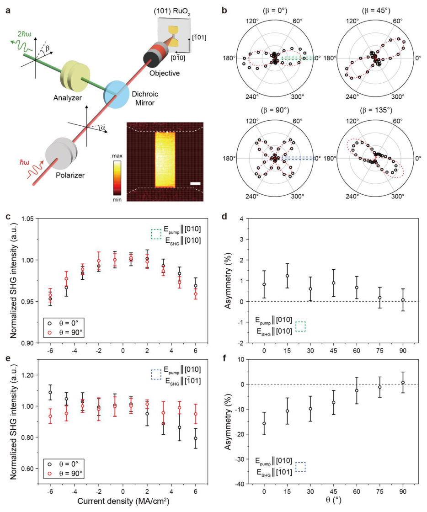 
Fig. 2. SHG measurements of Nèel order. a, Schematic diagram of the SHG setup. A half-wave

📷 Fig 3

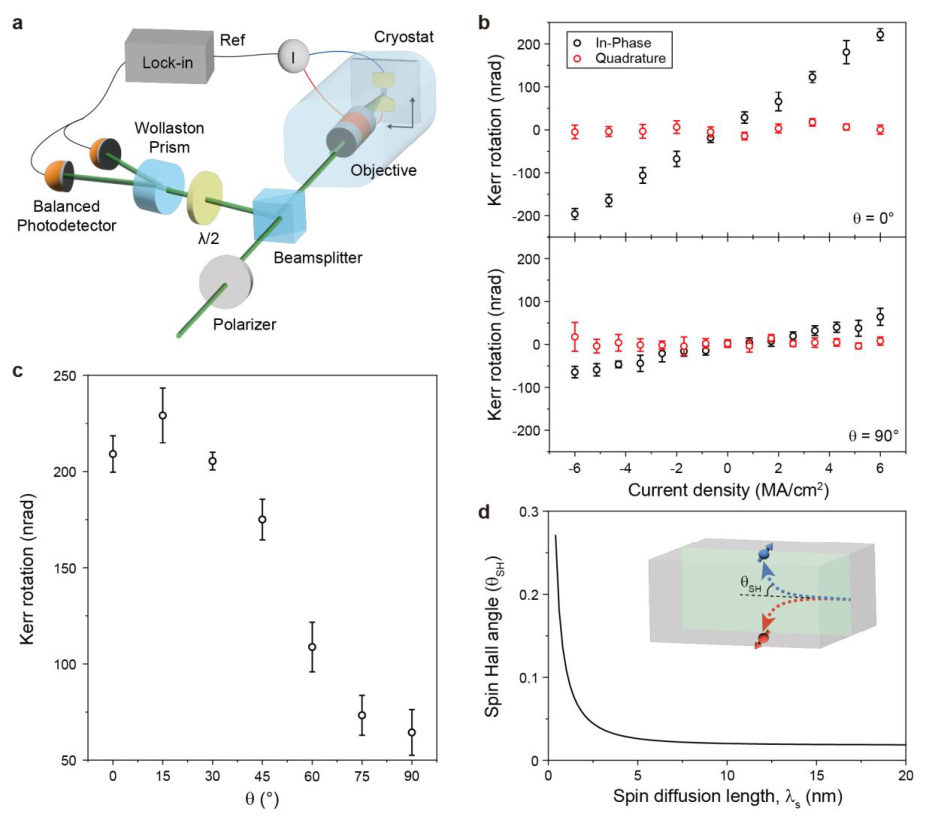 
Fig. 3. MOKE measurements of the ASSE. a, Schematic of the MOKE setup. b, MOKE signal

📷 Fig 4

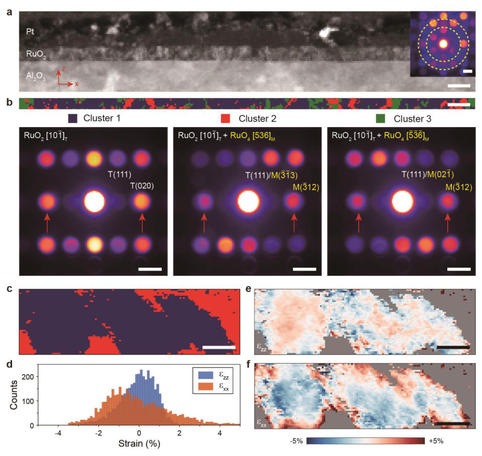 
Fig. 4. STEM imaging of thin-film strain. a, Virtual annular dark-field (VADF) image generated

**Summary.** This paper provides experimental evidence for the altermagnetic spin-splitter effect in RuO2 thin films using magneto-optical probes. By demonstrating directionally anisotropic spin accumulation, the study establishes RuO2 as a promising material for field-free spintronic devices.

**Why it may be interesting.** not directly relevant

Detailed structure

**Main problem.** The study aims to determine if metallic RuO2 sustains robust altermagnetic order in films thicker than the ultrathin limit and to distinguish the intrinsic altermagnetic spin-splitter effect (ASSE) from extrinsic mechanisms like the Spin Hall Effect or Rashba-type splitting.

**Main result.** The researchers experimentally demonstrate directionally anisotropic spin accumulation in 12-nm RuO2 films, confirming the presence of the altermagnetic spin-splitter effect and establishing RuO2 as an efficient, symmetry-controlled spin source.

**Method.** The study combines polarization-resolved Second-Harmonic Generation (SHG) and high-sensitivity polar Magneto-Optical Kerr Effect (MOKE) with 4D-STEM structural analysis and Kubo-formalism-based electronic structure calculations.

**Model / system.** The physical system is a 12-nm-thick (1-01)-oriented RuO2 thin film grown on r-plane sapphire via molecular beam epitaxy, characterized by altermagnetic spin-split electronic bands and Néel order.

**Key observables.** SHG intensity and asymmetry, MOKE rotation (Kerr rotation), spin Hall angle, and local lattice strain.

**Important parameters / regimes.** 12-nm film thickness, Néel temperature (T_N ~ 500 K), current densities up to 6 x 10^6 A/cm^2, and MOKE sensitivity of ~10 nrad.

**Assumptions / limitations.** The analysis assumes that the observed optical signals are intrinsic to the altermagnetic spin accumulation and not artifacts of Joule heating or thermal gradients.

**Figures summary.** Figure 1 shows the crystallographic/magnetic structure, spin-split Fermi surfaces, and optical probing geometry; Figure 3 involves 4D-STEM analysis of structural clusters and strain mapping.

**Paper structure.** The paper introduces the altermagnetic properties of RuO2, details the experimental setup for optical and structural characterization, presents the symmetry-driven anisotropic spin response, discusses the role of strain and structural heterogeneity, and concludes with the implications for spintronics.

Abstract

Altermagnets are a recently identified class of collinear antiferromagnets that host large spin-split electronic bands, offering a promising platform for efficient spin-current generation. Among proposed candidates, the metallic oxide RuO2 is predicted to exhibit strong altermagnetic spin splitting; however, whether it sustains robust magnetic order beyond the ultrathin thickness limit remains unresolved. Here, we employ optical probes to investigate charge-to-spin conversion in a 12-nm-thick (101)-oriented RuO2 film grown on sapphire. Polarization-resolved second-harmonic generation reveals nonlinear optical responses consistent with the surface symmetry and Néel order of RuO2. Under an applied current, both second-harmonic generation and polar magneto-optical Kerr effect measurements detect a pronounced, directionally anisotropic spin polarization, exhibiting enhanced signals for current along [010] and strongly suppressed responses for current along [-101], in agreement with the symmetry of the altermagnetic spin-splitter effect. Non-magnetic or Rashba-type mechanisms cannot explain this symmetry-selective response. Scanning transmission electron microscopy further reveals that substantial strain persists even in relatively thick films, providing a possible explanation for the observed behavior. Therefore, these results establish RuO2 as an efficient spin source and demonstrate the potential of altermagnets for field-free spintronic devices.

[↑ back to top](#top)

### [Quantum anomalous Hall effect in chiral semimetals](http://arxiv.org/abs/2605.27826v1)

**Authors:** Peng-Yi Liu, Yu-Hao Wan, Qing-Feng Sun  
**Type:** theory · **Category:** other · **PDF:** <https://arxiv.org/pdf/2605.27826v1>  
**Analysis basis:** full PDF text, analyzed in chunks
**Topic relevance:** `non-equilibrium dynamics` **2/5**

📷 Fig 1

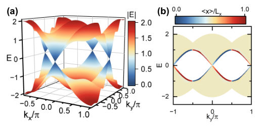 
FIG. 1. (a) Two-dimensional band structure of the chiral semimetal model. (b) Band structure of a chiral semimetal nanoribbon, with the color encoding the position expectation of each state ⟨x⟩/Lx This nanoribbon has a width in the x- direction Lx = 100 and is of infinite extent in the y-direction. Throughout this paper, we use A = B = 1.

📷 Fig 2

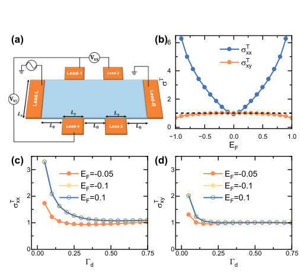 
FIG. 2. (a) Schematic of a six-terminal Hall bar. Six leads are shown in orange, and the center region (shown in blue) is made of chiral semimetals. The width of lead-L and R is Lx = 100a, the width of Lead-(1-4) is Ly = 50a, and the spacing between the leads is L0 = 50a. (b) Longitudinal σT xx and Hall σT xy conductivity vs. Fermi energy EF , in the unit of e2/h, calculated by the transport simulation. We use a dephasing strength Γd = 0.5. The dashed line shows the quantum conductivity. (c) and (d) respectively show the σT xx and σT xy vs. Γd, in the unit of e2/h, with three different EF .

📷 Fig 3

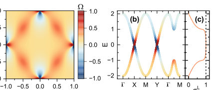 
FIG. 3. (a) Berry curvature Ωdistribution of the lower band of Eq. (2) in the Brillouin zone. (b) Band structure plotted along high-symmetry lines, with the Berry curvature encoded by the color scale, using the same color bar as in panel (a). (c) Linear-response Hall conductivity σL xy, obtained by integrating the Berry curvature of all occupied states below the Fermi energy, as a function of the Fermi energy, in units of e2/h.

📷 Fig 4

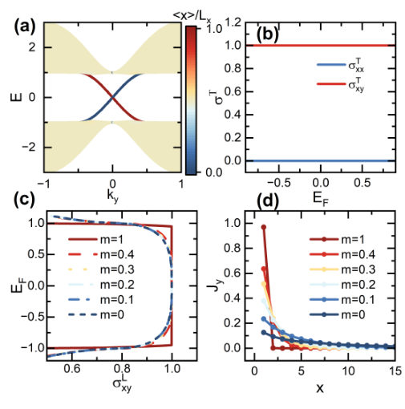 
FIG. 4. (a) Band structure of the insulating QAH nanorib- bon with the mass m = 1. This nanoribbon has a width in the x-direction Lx = 100 and is of infinite extent in the y-direction. (b) The longitudinal σT xx and Hall σT xy conduc- tivities calculated by the transport simulations, with the unit of e2/h and Γd = 0. In (a) and (b), m = 1. (c) Linear- response Hall conductivity σL xy for different m, obtained by integrating the Berry curvature of all occupied states below the Fermi energy EF , as a function of the Fermi energy, in units of e2/h. (d) Distribution of the y-direction equilibrium current along the x position of a nanoribbon, whose width in the x-direction is Lx = 50. Here, we...

📷 Fig 5

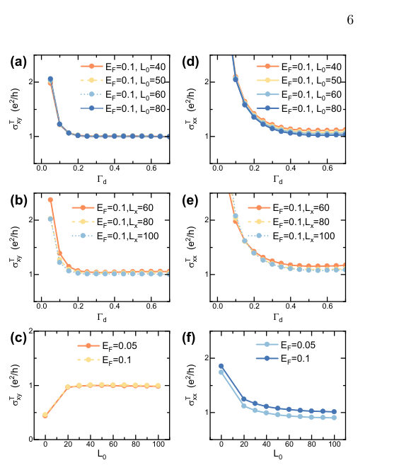 
FIG. 5. (a) the Hall conductivity σT xy vs. the dephasing strength Γd, with four different L0 and EF = 0.1. (b) σT xy vs. Γd, with three different Lx and EF = 0.1. (c) σT xy vs. L0, with Γd = 0.5 and EF = 0.05, 0.1. (d), (e), and (f) the corresponding longitudinal conductivity σT xx. As shown in Fig. 2(a) of the manuscript, Lx is the width of the Hall bar, L0 is the space between voltage probes, controlling the length of the Hall bar. Other parameters are the same as Fig. 2.

**Summary.** This paper demonstrates that the Quantum Anomalous Hall effect is not restricted to insulators and can exist in chiral semimetals. It shows that while the Hall response remains quantized, the longitudinal conductivity stays finite, creating a unique 'dual-channel' transport regime. This discovery extends the fundamental understanding of topological transport in gapless systems.

**Why it may be interesting.** not directly relevant

Detailed structure

**Main problem.** Investigating whether the Quantum Anomalous Hall (QAH) effect can persist in chiral semimetals where conduction and valence bands touch at zero energy, and identifying its unique transport signatures.

**Main result.** The Hall conductivity remains quantized even in the semimetallic regime due to the cancellation of Berry curvature at specific valleys, while the longitudinal conductivity remains finite and exhibits semimetallic behavior.

**Method.** Nonequilibrium Green's function (NEGF) calculations using a six-terminal Hall bar geometry and Büttiker virtual leads to simulate dephasing.

**Model / system.** A 2D chiral semimetal described by a two-band tight-binding model on a square lattice, featuring massive Dirac fermions at Gamma and M points and gapless cones at X and Y points.

**Key observables.** Hall conductivity (sigma_xy), longitudinal conductivity (sigma_xx), Hall resistivity (rho_xy), and equilibrium current density (Jy).

**Important parameters / regimes.** Fermi energy (Ef), dephasing strength (Gamma_d), mass term (m), and device dimensions (Lx, Ly).

**Assumptions / limitations.** The system is modeled using a clean tight-binding Hamiltonian with dephasing introduced via virtual leads to simulate realistic experimental conditions.

**Figures summary.** Fig 1 shows the 2D band structure and nanoribbon spatial distribution; Fig 2 displays the Hall bar setup and transport results (sigma_xx, sigma_xy vs Ef); Fig 4 shows the Hall response and current decay; Fig 5 analyzes the dependence of conductivities on dephasing, device size, and probe distance.

**Paper structure.** The paper introduces the problem of QAH in semimetals, presents the tight-binding model and band structure, details the NEGF transport simulation setup, analyzes the quantization and semimetallic signatures, explores the semimetal-to-insulator transition, and discusses the role of dephasing and device geometry.

Abstract

The quantum anomalous Hall (QAH) effect is conventionally understood to exist only in Chern insulators, while a recent study has shown that ferromagnetic metals can also host the QAH effect. Between insulators and metals, we demonstrate that QAH can persist even in a chiral semimetal, where conduction and valence bands touch at zero energy. Transport calculations demonstrate that the Hall conductivity of such a system can be quantized in the presence of dephasing. Interestingly, its longitudinal conductivity remains finite and exhibits semimetallic behavior, in contrast to Chern insulators. This unusual transport behavior originates from the quantization of the Berry curvature integral over occupied states and the semimetallic band structure. This chiral semimetal can transition into a Chern insulator, accompanied by the vanishing of longitudinal conductivity and a reduction of the intrinsic length scale of the Hall response. Our results extend the concept of QAH and uncover the semimetallic QAH transport signatures.

[↑ back to top](#top)

### [Taming quantum interference: a route to high electrical conductance in carbon nanotube assemblies](http://arxiv.org/abs/2605.28250v1)

**Authors:** Teresa Kulka, Agnieszka E. Lekawa-Raus, John S. Bulmer, Krzysztof Koziol, Fedor F. Balakirev, Irina V. Lebedeva, Jacek A. Majewski, Magdalena Marganska, Karolina Z. Milowska  
**Type:** both · **Category:** other · **PDF:** <https://arxiv.org/pdf/2605.28250v1>  
**Analysis basis:** full PDF text, analyzed in chunks
**Topic relevance:** `non-equilibrium dynamics` **2/5**

📷 Fig 1

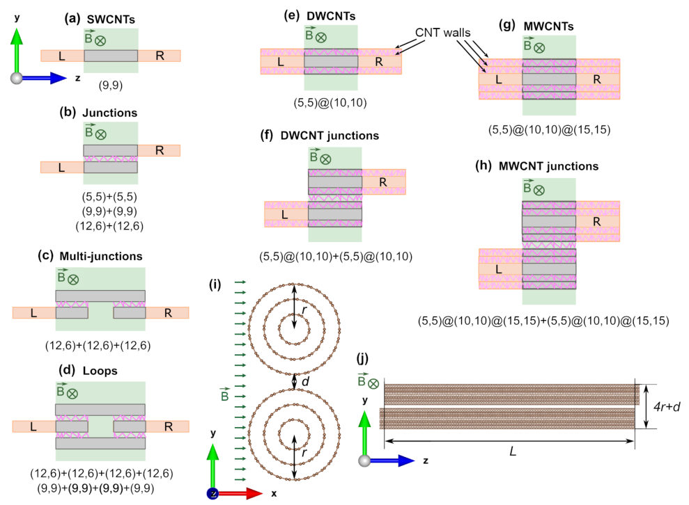 
Figure 1: Models of CNTs and CNT junction architectures considered in this work, with the chiralities of the constituent CNTs listed below. Isolated CNT building blocks are shown for (a) SWCNT, (e) DWCNT and (g) TWCNT, with the corresponding junction architectures used in the calculations shown in (b–d), (f) and (h). The pink zig-zag lines schematically indicate possible electron tunnelling paths between neighbouring SWCNTs, or between adjacent walls in MWCNTs. i) Cross-sectional and (j) side views of the MWCNT junction with the radius r, intertube distance d, and overlap length L marked.

📷 Fig 2

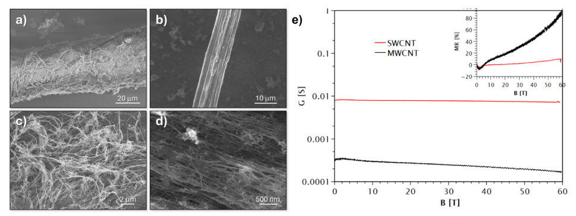 
Figure 2: Morphology and magnetotransport of SWCNT and MWCNT fibres. (a-d) SEM images of CNT fibres directly spun from the FC-CVD reactor. (a) The SWCNT-based fibre and (b) a fibre made of a mixture of MWCNTs of different numbers of walls. Corresponding higher-magnification images highlight the alignment of individual (c) SWCNTs and (d) MWCNTs within the fibres. (e) Change in conductance of a 3 mm long MWCNT fibre sample against a magnetic field measured at 1.495K. Previously reported data [17] for SWCNT fibre (3 mm-long) measured at 1.3 K are included for comparison. The inset shows magnetoresistance MR [%] as a function of magnetic field for both samples.

📷 Fig 3

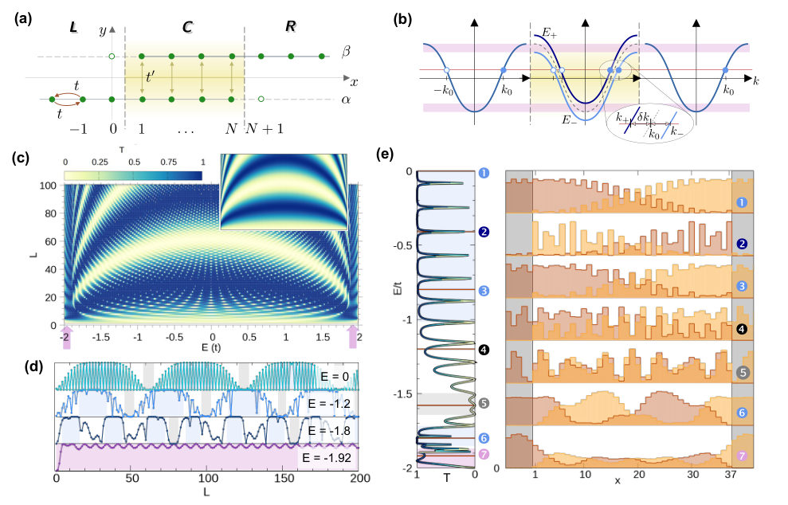 
Figure 3: Transmission and transport regimes in overlapping atomic chains. (a) Sketch of the system, with t the hopping integral along each chain and t′ the hopping between chains α and β. (b) The energy bands of the individual chains and the two hybridized bands E± in the central region. The circles mark the incoming (k0), reflected (−k0) and transmitted (k0 in R) momenta at a given energy, as well as the ±k± at this energy in the junction. The light violet stripes mark the range of the gateway states (see text for description of the transport regimes). (c) Numerically calculated T(E, L) – transmission through the junction, as a function of energy E and junction length L. The fine...

📷 Fig 4

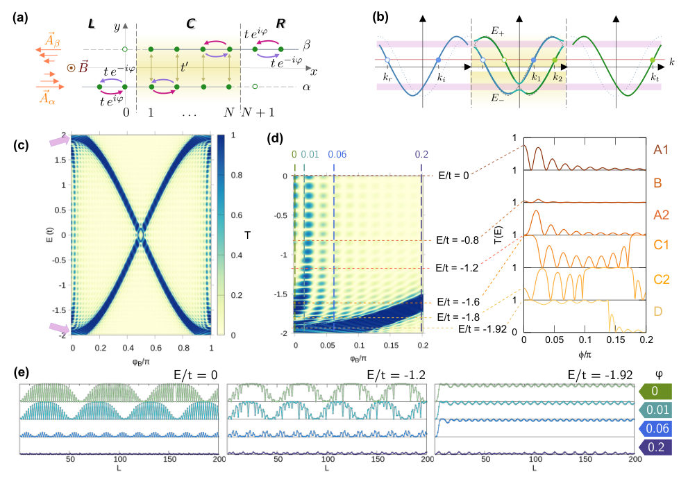 
Figure 4: Transport across an atomic chain junction in perpendicular magnetic field. (a) Sketch of the system with the orientation of ⃗B and the vector potential ⃗A(y). Hopping integrals along x are modified by the Peierls phase, opposite on chains α and β. (b) The electronic bands are shifted by the Peierls phase, +φ on chain α and −φ on chain β. In the junction the shifted bands cross only at k = 0, π, and only in the neighborhood of these points the electronic states of the two chains can hybridize. These energy ranges are also those where transport is facilitated by gateway states, and with increasing ⃗B they shift towards E = 0. (c) Numerically calculated T(E, φ) for a junction with 49...

📷 Fig 5

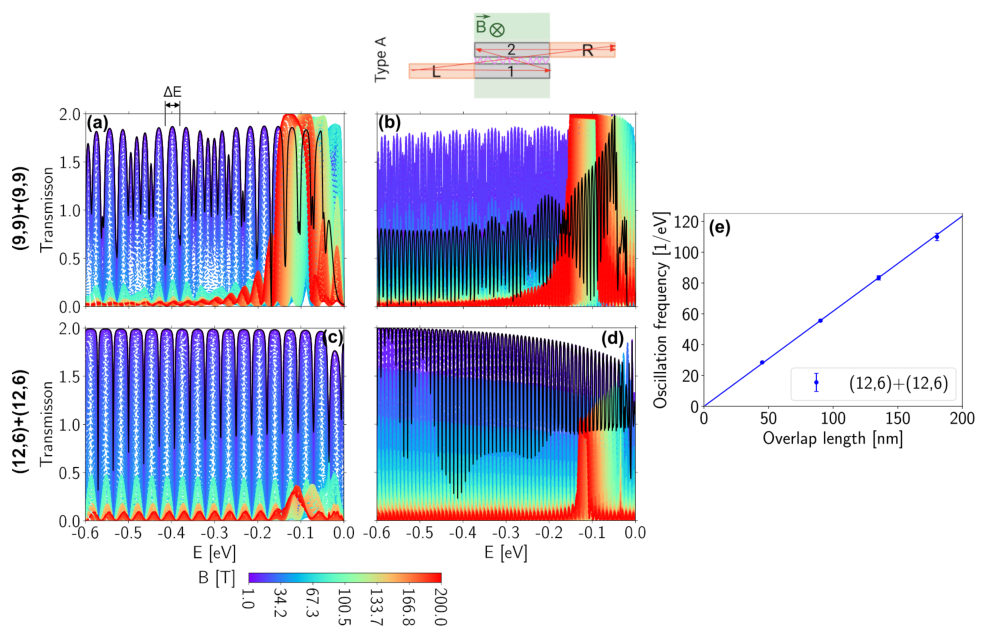 
Figure 5: Electron transport through simple junctions of single-walled CNTs (type A systems) under an external perpendicular magnetic field. The junction schematics above the panels show some of the possible electron paths (red arrows). (a–d) Oscillations of the computed zero-bias transmission as a function of electron energy E for (9,9)+(9,9) SWCNT junctions with overlap lengths of (a) 49.19 nm (200 unit cells) and (b) 196.76 nm (800 unit cells), and for (12,6)+(12,6) SWCNT junctions with overlap lengths of (c) 45.08 nm (40 unit cells) and (d) 180.33 nm (160 unit cells), shown for magnetic fields B up to 200 T in the energy window [-0.6,0] eV. (e) Transmission oscillation frequency,...

**Summary.** This paper investigates how quantum interference at the junctions between carbon nanotubes affects the overall electrical conductivity of nanotube networks. By combining atomistic simulations with high-field experiments, the authors show that complex multi-walled structures can suffer from interference-induced conductance suppression, providing a blueprint for designing more stable and conductive CNT-based electronics.

**Why it may be interesting.** not directly relevant

Detailed structure

**Main problem.** Understanding and controlling quantum interference at inter-nanotube junctions to achieve high electrical conductance and field stability in carbon nanotube (CNT) assemblies.

**Main result.** The study identifies that multi-walled CNT architectures introduce complex, field-sensitive interference that reduces conductance, whereas SWCNT junctions can be tuned via overlap length and magnetic fields to achieve high-transmission 'gateway' states.

**Method.** The work combines atomistic tight-binding non-equilibrium Green's-function (NEGF) simulations and analytical waveguide models with experimental magnetotransport measurements on CNT fibers using pulsed magnetic fields up to 60 T.

**Model / system.** The physical systems include SWCNT, DWCNT, and TWCNT junctions and fibers. Theoretical models include an atomistic tight-binding Hamiltonian with Peierls substitution for magnetic fields and a minimal 1D atomic chain model.

**Key observables.** Electrical conductance (G), specific conductivity (normalized by linear density), magnetoresistance (MR), and transmission amplitude (T).

**Important parameters / regimes.** Nanotube diameter, chirality, overlap length, doping, perpendicular magnetic field strength, and inter-tube coupling.

**Assumptions / limitations.** Assumes current injection is primarily through outer shells in MWCNTs; neglects inelastic processes like electron-phonon scattering; assumes magnetic fields are present only in the scattering region.

**Figures summary.** Figures illustrate junction architectures (SWCNT, DWCNT, TWCNT), transport regimes in atomic chains (standing waves, gateway states), and transmission maps/spectra as a function of energy and magnetic field.

**Paper structure.** The paper introduces the problem of junction-governed transport, presents theoretical models (atomic chains and waveguide analogy), details the atomistic NEGF simulations, compares these to experimental magnetotransport data in CNT fibers, and concludes with design principles for high-conductance conductors.

Abstract

Miniaturized electronics require lightweight conductors that maintain high conductance under demanding conditions. CNT networks are promising candidates, but their transport is governed by inter-nanotube junctions where electron waves interfere. Controlling this interference requires understanding how junction architecture shapes transmission. We explore coherent transport through experimentally relevant junctions, from single and multiple single-walled CNT (SWCNT) contacts to double-walled CNT (DWCNT) and triple-walled CNT (TWCNT) junctions, with atomistic tight-binding non-equilibrium Green's-function calculations, also under a perpendicular magnetic field. We use analytically solvable minimal models to identify transport regimes expected for quasi-1D nanoscale junctions, and an electron-waveguide picture to interpret their CNT-specific manifestations. For single SWCNT--SWCNT junctions, high-transmission windows are set mainly by overlap length, doping and magnetic field. Gateway states can enhance conductance when some CNT subbands are gapped, and in some cases a magnetic field can restore transmission by lifting an interference blockade. In more complex architectures, added paths become selective: multi-junctions generate resonant filtering, while additional walls redistribute transmission instead of acting as independent channels. DWCNT junctions remain outer-wall dominated and SWCNT-like, whereas TWCNT junctions become genuinely multi-channel and more field-sensitive. This explains the lower, more field-sensitive conductance of multi-walled CNT (MWCNT) fibres, in accord with our ultrahigh-field measurements on SWCNT and MWCNT fibres. Ultimately, this work turns microscopic interference mechanisms into design principles for high-conductance, field-stable CNT conductors.

[↑ back to top](#top)

### Other secondary papers (8)

Show other secondary papers

### [A GPU-based Solver for Polarization Dynamics in Ferroelectric Materials](http://arxiv.org/abs/2605.28800v1)

**Authors:** Ali Hasan, Edoardo Piccolo, Anna Giordano, Natalya Fedorova, Jorge Íñiguez-González, Davi Rodrigues, Giovanni Finocchio  
**Type:** theory · **Category:** numerical methods · **PDF:** <https://arxiv.org/pdf/2605.28800v1>  
**Analysis basis:** full PDF text, analyzed in chunks

📷 Fig 1

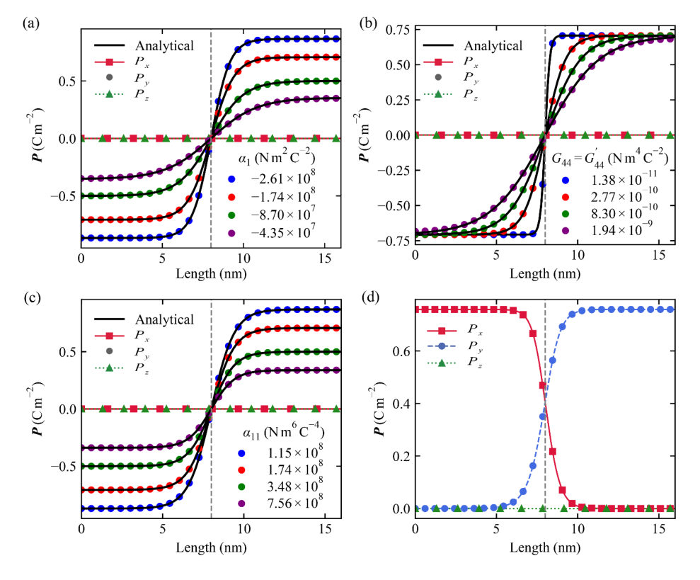 
Figure 1. Polarization profiles across ferroelectric domain walls and the influence of Landau and gradient energy parameters. (a) Polarization profiles of 180° domain walls along the wall-normal direction, illustrating the effect of varying the Landau coefficient 𝛼1. (b) Effect of varying the gradient constants 𝐺44 = 𝐺44

📷 Fig 2

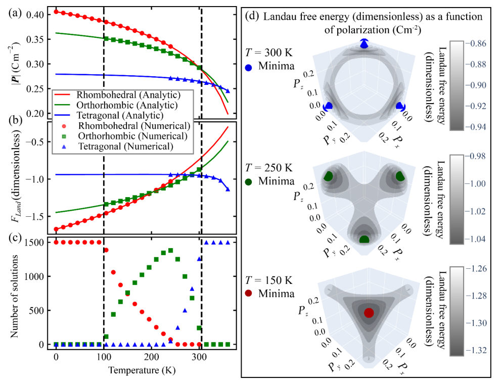 
Figure 2. Temperature dependence of (a) polarization magnitude P and (b) Landau free energy 𝐹𝐿𝑎𝑛𝑑 and (c) number of solutions in each phase. Panel (d) presents three-dimensional visualizations of the global minima of the Landau free energy surface at representative temperatures (300 K, 250 K, and 150 K), evaluated over the first-octant polarization space ranging from (0.0, 0.0, 0.0) to (0.27, 0.27, 0.27) C m⁻². Gray surfaces indicate isoenergetic contours.

📷 Fig 3

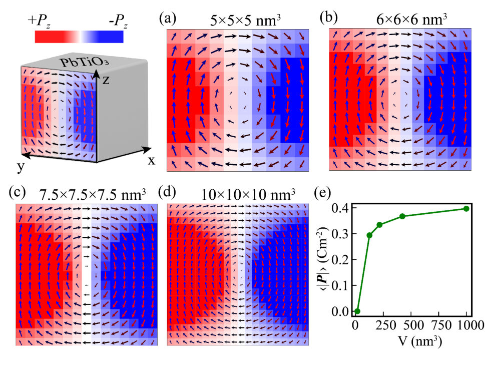 
Figure 3. (a) scheme of the PbTiO₃ sample considered. (b)-(d) we show the cross section of the yz plane at the

📷 Fig 4

 
Figure 3. (a) (P–E) hysteresis loops of the PbTiO3/SrTiO3 bilayer calculated under various external field frequencies, together with the static loop obtained by sweeping a DC external field back and forth in the field region approximately -400 to 400 MV/m. (b) The domain structure showing switching from −⟨𝑃𝑧⟩ to +⟨𝑃𝑧⟩ for an AC-field frequency 0.0017 MHz. (c) Corresponding hysteresis energy as a function of the applied AC- field frequency; (d) Time evolution of the out-of-plane polarization 𝑃𝑧 and the applied external field 𝑬𝐸𝑥𝑡 for the highest frequency considered 0.1740 MHz.

📷 Fig 5

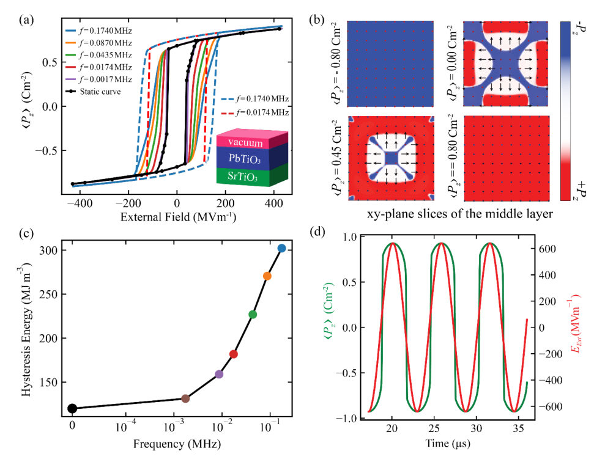 
Figure 3(a) shows the P–E hysteresis loops of the PbTiO3/SrTiO3 for different frequency of the external

**Summary.** This paper introduces a new GPU-accelerated numerical solver, PETASPIN_microelectrics, designed for large-scale, high-fidelity simulations of 3D polarization dynamics in ferroelectric materials. It overcomes the limitations of previous CPU-based and uniaxial models, enabling the study of complex topological textures like skyrmions and frequency-dependent hysteresis. This tool is essential for the predictive design of next-generation ferroelectric devices.

**Why it may be interesting.** not directly relevant

Detailed structure

**Main problem.** Existing CPU-based ferroelectric solvers are computationally expensive for large-scale 3D simulations and often rely on simplified uniaxial models that cannot capture complex 3D structures like polarization rotation or topological textures.

**Main result.** The development of PETASPIN_microelectrics, a fully GPU-acceler_rated, scalable solver that accurately reproduces temperature-driven phase transitions in BaTiO3 and demonstrates the stabilization of 3D hybrid skyrmions in PbTiO3/SrTiO3 bilayers.

**Method.** A GPU-native phase-field approach using CUDA C/C++ and the Thrust library, employing the finite-difference method and NVIDIA's CUDA FFT library to solve the time-dependent Ginzburg-Landau equations.

**Model / system.** The model uses the Time-Dependent Ginzburg-Landau (TDGL) formalism applied to perovskite oxides like BaTiO3, PbTiO3, and SrTiO3, incorporating Landau, gradient, and electrostatic energy contributions.

**Key observables.** Polarization vector field (magnitude and rotation), domain wall profiles, hysteresis loops, electrostatic fields, and topological textures (skyrmions/vortices).

**Important parameters / regimes.** Temperature (0-360 K), external electric field frequency, epitaxial strain parameter (rs), Landau and gradient coefficients, and background permittivity.

**Assumptions / limitations.** The system is modeled using the TDGL formalism; finite samples are assumed to be embedded in vacuum (P=0 outside); the Landau expansion is applied to prototypical perovskites.

**Figures summary.** Figure 1 shows the effect of Landau coefficients on 180-degree domain wall profiles; Figure 3(b) illustrates the transition from vortex tubes to stabilized skyrmions via strain tuning.

**Paper structure.** The paper introduces the computational bottleneck of existing solvers, presents the architecture and implementation of the new GPU solver, validates the solver against analytical domain wall profiles and phase transitions, and demonstrates advanced applications in strain-controlled skyrmion stabilization.

Abstract

Ferroelectric materials can be used for the development of multiple device concepts combining non-volatility, small dimensions, low-power actuation, and electrical tunability. Such development demands efficient and precise design of simulation tools describing the polarization texture. However, most existing ferroelectric solvers are CPU-based and rely on simplified electrostatic treatments and reduced-dimensional representations of the polarization field. These approximations limit their ability to capture finite-size and boundary effects and restrict the range of domain structures and domain walls that can be realistically simulated. Here, we present a fully GPU (graphics processing units)-accelerated and scalable numerical solver, named PETASPIN_microelectrics, for computing the full polarization vector field of ferroelectric systems using the Ginzburg-Landau formalism. Our solver incorporates an optimized and validated calculation of the full electrostatic field and enables the parallel execution of multiple simulations. We systematically validated the solver with several benchmark problems, including phase transitions in BaTiO3 and ferroelectric domain wall profiles. Our simulations reproduce temperature-driven hysteretic phase transitions in BaTiO3. We also reproduce hysteresis loops and demonstrate stabilization of a three-dimensional hybrid skyrmion in a PbTiO3/SrTiO3 bilayer system. Our results show quantitative agreement with predictions from an analytical theory and prior experimental studies. The proposed solver provides an efficient, accurate platform for large-scale simulations of ferroelectric materials including stabilization of topological textures supporting predictive modeling for next-generation of ferroelectric device design.

[↑ back to top](#top)

### [Absolute measurement of penetration depth of superconducting thin films using microwave stripline resonators](http://arxiv.org/abs/2605.28759v1)

**Authors:** Arghya Dutta, Ajeet Salunke, Mahesh Poojary, Vivas Bagwe, Sangita Bose, Pratap Raychaudhuri  
**Type:** both · **Category:** other · **PDF:** <https://arxiv.org/pdf/2605.28759v1>  
**Analysis basis:** full PDF text, analyzed in chunks

📷 Fig 1

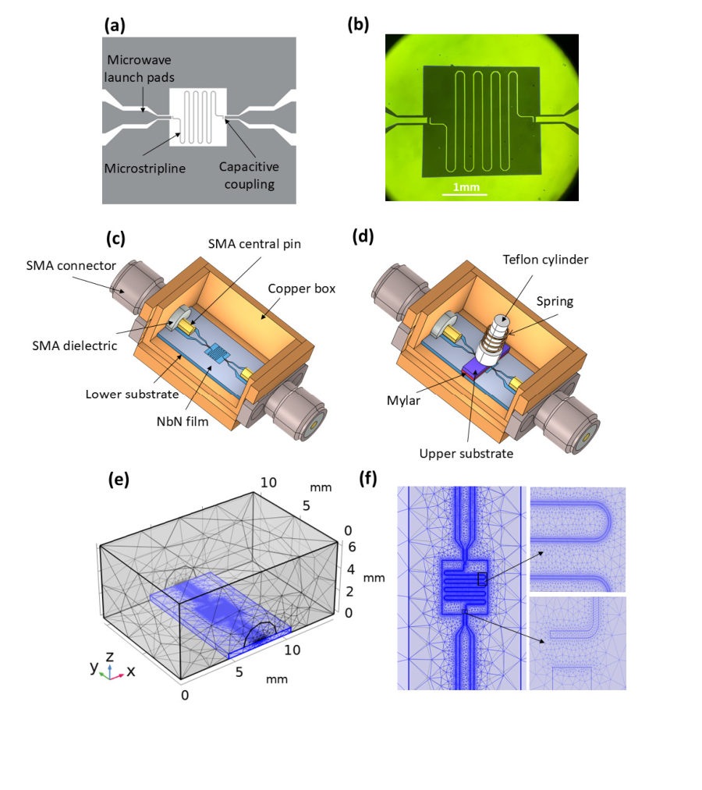 
Figure 1. (a) Schematic of the microstrip resonator device and (b) optical image of a device made from a 60 nm thick NbN film. The meander is located inside a rectangular box patterned on the ground plane. Experimental configuration of (c) a bare NbN microstrip resonator mounted in a sample box and (d) a where another superconducting film is mounted upside-down on NbN microstrip resonator with a 25 µm Mylar spacer in between in a flip-film geometry; the central pin of the SMA connector is soldered on the launching pad of the device. The top and front surfaces of the box are hidden. (e) The mesh used for electromagnetic simulations; (f) expanded view of the mesh close to the microstrip and...

📷 Fig 2

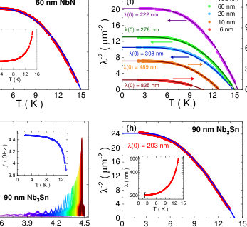 
Figure 2. (a) Measured transmission coefficient || as a function of frequency for a microstrip resonator made from 60 nm thick NbN film at 2.2 K. The sharp peaks labelled , ,  and  are the resonant frequencies of the microstrip. The broad shaded features are parasitic resonances from the sample box. (b) Expanded view of || and the phase across the fundamental resonance peak ; the solid line is a fit of || with eqn. (1). The inset shows the calculated values of  as a function of λ of the superconductor; the star shows the point corresponding to the experimental resonant frequency. (c) Experimental and calculated values of  − as a function of mode number. The electric...

📷 Fig 3

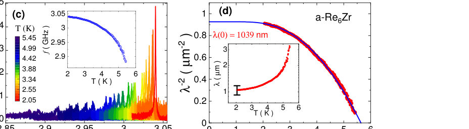 
Figure 3. (a) Measured transmission coefficient || at 2.1 K around the fundamental resonance peak in three configurations: (i) a bare NbN (thickness: 60 nm) microstrip resonator (black), (ii) with a 25 µm Mylar spacer layer placed on the microstrip (red), and (iii) with a 28 nm thick a-Re6Zr film placed upside-down on the Mylar sheet in flip-film geometry. (b) Calculated resonant frequency in configuration (ii) as a function of  of the spacer layer (red), and in configuration (iii) as a function of λ of a-Re6Zr. The red and green stars are the points that correspond to the experimental resonant frequencies in configurations (ii) and (iii) respectively. (c) || at different...

📷 Fig 4

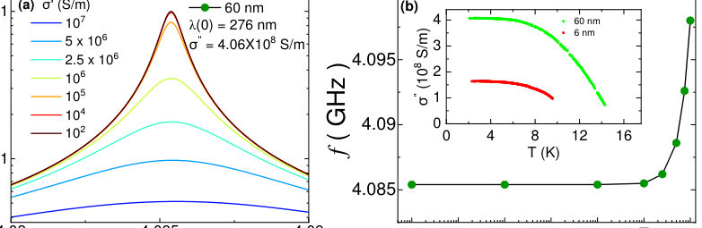 
Figure 5. (a) Simulated transmission coefficient || as a function of frequency for the fundamental frequency of a bare microstrip resonator for different values of ′. ′′ is fixed to the value corresponding to the 60 nm thick NbN

📷 Fig 5

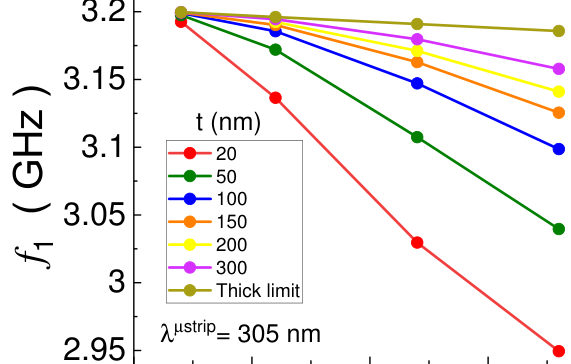 
Figure 6. Calculated f1 as a function of !"#$%&amp; for flip-film geometry. Different curves correspond to

**Summary.** This paper presents a new hybrid method to precisely measure the absolute superconducting penetration depth in thin films. By combining microwave resonator experiments with 3D electromagnetic simulations, the authors overcome the limitations of traditional model-dependent analytical methods. The technique is successfully demonstrated on both NbN and a-Re6Zr films, including very thin films using a unique flip-film geometry.

**Why it may be interesting.** not directly relevant

Detailed structure

**Main problem.** The difficulty of determining the absolute value of the superconducting magnetic penetration depth (lambda) from microwave resonator measurements due to model dependencies and complex geometric factors.

**Main result.** The development of a hybrid method combining microwave measurements with COMSOL Multiphysics simulations to accurately extract absolute penetration depth and superconducting gap values for NbN and a-Re6Zr films.

**Method.** A hybrid approach using finite-element electromagnetic simulations (COMSOL) to create look-up tables of resonant frequencies, which are then matched to experimental transmission (S12) data from microstrip resonators.

**Model / system.** Superconducting microstrip (stripline) resonators made of NbN and Nb3Sn thin films on MgO substrates, including a 'flip-film' geometry where a secondary sample is placed above the resonator using a Mylar dielectric spacer.

**Key observables.** Resonant frequency (fn), transmission coefficient (|S12|), phase shift, and loaded quality factor (QL).

**Important parameters / regimes.** Magnetic penetration depth (lambda), kinetic inductance (Lk), superconducting energy gap (Delta), film thickness (t), and temperature (T).

**Assumptions / limitations.** Gold-plated copper box surfaces are treated as perfect conductors; the thickness and penetration depth of the primary microstrip are assumed to be fixed for certain calculations; neglect of temperature variation of the resonator lambda in specific variants.

**Figures summary.** Fig 1: Device geometry and experimental setup (bare and flip-film). Fig 2: Transmission spectra, frequency vs mode number, and temperature dependence of 1/lambda^2 for NbN. Fig 3: Frequency shifts in flip-film configuration and simulated frequency vs lambda. Fig 4: Transmission and extracted lambda for 6 nm NbN. Fig 5/6: Simulated transmission and frequency dependence on conductivity and thickness.

**Paper structure.** Introduction of the problem (absolute lambda measurement) -> Description of the microstrip resonator and flip-film experimental setup -> Presentation of the hybrid simulation-measurement method -> Validation using NbN films -> Extension and application to a-Re6Zr via flip-film geometry -> Discussion of thickness regimes and error analysis.

Abstract

Superconducting microstrip resonators, which leverage kinetic inductance to probe electrodynamics, are sensitive tools for studying superconducting thin films at microwave frequencies. However, extracting the absolute superconducting penetration depth from these measurements remains challenging. In this work, we present a hybrid method to determine the absolute value of penetration depth over a wide temperature range by combining resonator measurements with finite-element electromagnetic simulations in COMSOL Multiphysics. We demonstrate this approach by extracting the penetration depth of NbN films by fabricating resonators from films of various thicknesses. Furthermore, we extend the technique to materials with lower critical temperatures by employing a flip-film geometry. By placing a sample above a NbN resonator, separated by a thin Mylar dielectric, we create a coupled structure where changes in the sample's penetration depth shift the resonant frequency. This non-destructive method provides a reliable, high-sensitivity platform for characterizing the penetration depth of diverse superconducting thin films.

[↑ back to top](#top)

### [Multiscale Vectorial Determination of Magnetic Order Parameters using Electron Magnetic Linear Dichroism](http://arxiv.org/abs/2605.28790v1)

**Authors:** Jan Hajduček, Jáchym Štindl, Ján Rusz, Vojtěch Uhlíř  
**Type:** both · **Category:** strongly correlated electrons · **PDF:** <https://arxiv.org/pdf/2605.28790v1>  
**Analysis basis:** full PDF text, analyzed in chunks

📷 Fig 1

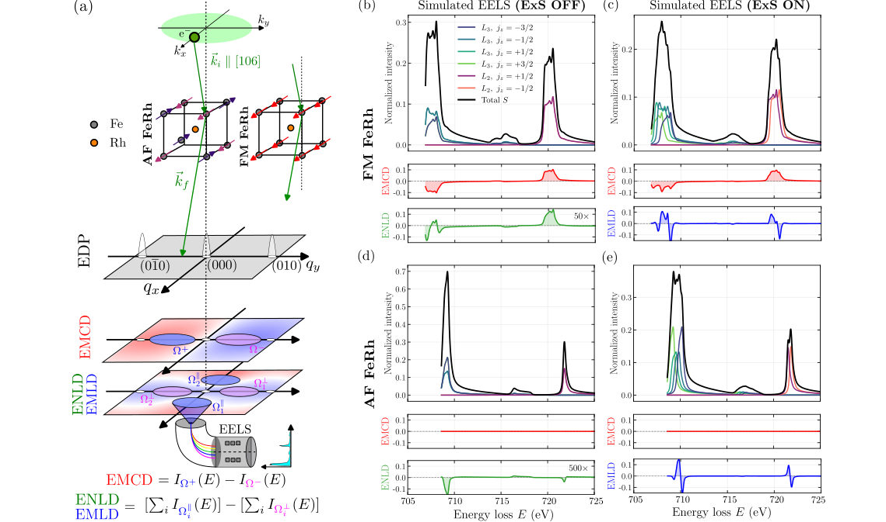 
FIG. 1. Electron Magnetic Dichroism in TEM. (a) Schematic of the EMD scattering geometry with incident electron beam along ⃗ki, slightly tilted from ZA direction, undergoing elastic and inelastic scattering in FeRh. Elastic scattering forms an electron diffraction pattern (ED) with indicated Bragg spots. Energy-filtered intensities IΩ(E) are collected at symmetry- related aperture positions Ω. Spectral differences are obtained by comparing signals from Ω∥and Ω⊥for EMLD/ENLD, and from Ω+ and Ω−for EMCD, which isolates the corresponding dichroic components. Simulated EELS spectra at the Fe L3,2 edges, with color-coded jz-resolved transitions and the integrated spectrum shown in black. Panels...

📷 Fig 2

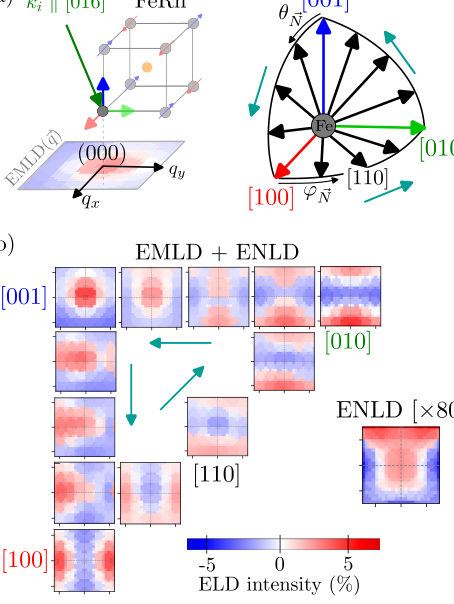 
FIG. 2. Linear dichroic signal dependence on AF spin axis. (a) Schematic of the scattering geometry with indicated Néel vector orientations. (b) Integrated ELD intensity maps in the diffraction plane normalized by the original spectral intensity for a given Néel vector orientation. The signal con- tains both EMLD and ENLD contributions, where the latter acts as a spin-independent background. The signal is evalu- ated at each ⃗q position at the Fe L3 edge in the momentum range of (−0.6, +0.6)G from the (000) Bragg spot.

📷 Fig 3

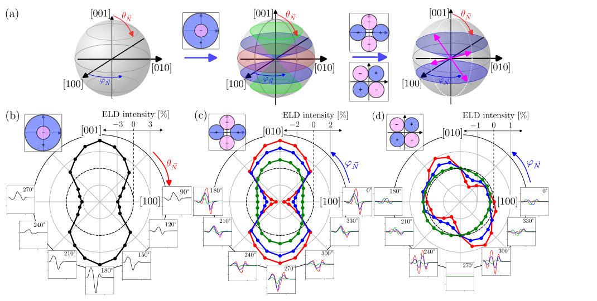 
FIG. 3. EMLD-based vectorial reconstruction of the AF spin axis. (a) Reconstruction scheme for an unknown Néel-vector orientation. EMLD spectra acquired at selected aperture positions progressively constrain the possible spin-axis directions on the orientation sphere, yielding two symmetry-equivalent Néel-vector solutions. (b-d) Simulated EMLD spectral profiles (insets) and corresponding integrated dichroic intensity as a function of θ ⃗ N and φ ⃗ N for representative aperture config- urations. The plots represent the full angular dependence of all possible EMLD responses rather than a single experimental measurement. The dichroic intensities follow a sin2-like harmonic dependence with...

📷 Fig 4

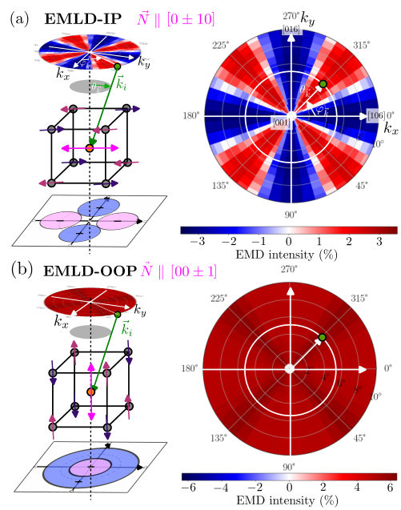 
FIG. 4. Crystal-orientation dependence of the EMLD signal in FeRh. Schematic experimental geometries used to probe the (a) in-plane and (b) out-of-plane components of EMLD. Calculated EMLD signal maps as a function of beam tilt magnitude and azimuth with respect to the [001] zone axis. Color scale encodes the sign and magnitude of the EMLD signal for each incident-beam direction and corre- sponding aperture configuration. Qualitatively similar beam- tilt dependencies of EMLD can be obtained for the FM case.

**Summary.** This paper develops a method to use electron magnetic linear dichroism to map the direction of magnetic spins in antiferromagnets at the nanoscale. By using advanced simulations, the authors show that this technique can distinguish magnetic order from crystal anisotropy, providing a powerful tool for studying new magnetic phases like altermagnets.

**Why it may be interesting.** not directly relevant

Detailed structure

**Main problem.** The challenge of nanoscale vectorial reconstruction of magnetic order parameters, particularly in compensated magnetic phases like antiferromagnets and altermagnets where net magnetization vanishes.

**Main result.** Demonstration of Electron Magnetic Linear Dichroism (EMLD) as a quantitative, robust, and scalable probe for determining the magnetic spin axis with nanometer to atomic resolution.

**Method.** A unified vectorial simulation framework combining DFT-derived transition matrix elements, Mixed Dynamic Form Factor (MDFF) formalism, and dynamical diffraction theory.

**Model / system.** The study focuses on the metamagnetic alloy FeRh, examining both its antiferromagnetic (AF) and ferromagnetic (FM) phases using Transmission Electron Microscopy (TEM) and EELS.

**Key observables.** Electron Magnetic Linear Dichroism (EMLD), Electron Magnetic Circular Dichroism (EMCD), and Electron Natural Linear Dichroism (ENLD) signals.

**Important parameters / regimes.** Néel vector orientation (polar and azimuthal angles), momentum transfer (q), exchange-splitting energy, and probe convergence angle.

**Assumptions / limitations.** The model assumes the absence of valence spin-orbit coupling for the simplified diagonal operator representation and utilizes the dipole approximation.

**Figures summary.** Figure 1 shows scattering geometry and simulated EELS spectra for FM/AF phases; Figure 2 illustrates EMLD intensity maps and dependence on the Neel vector; Figure 3 details the reconstruction scheme and angular dependence; Figure 4 shows EMLD maps as a function of beam tilt.

**Paper structure.** The paper introduces the problem of magnetic reconstruction, presents a unified vectorial simulation framework, demonstrates the separation of dichroic signals, applies the method to FeRh, and evaluates the scalability and robustness of the EMLD probe.

Abstract

We demonstrate electron magnetic linear dichroism as a quantitative probe of vectorial magnetic order parameters with nanometer resolution in transmission electron microscopy. Explicit inclusion of vectorial core-level exchange splitting into mixed dynamic form factor simulations accounting for dynamical diffraction enables direct reconstruction of the magnetic spin axis from momentum-resolved electron energy-loss spectra. The resulting dichroic signal is intrinsically separable from nonmagnetic anisotropy, exhibits a well-defined dependence on the Néel vector or magnetization orientation, and remains robust down to the atomic scale. Applied to the collinear antiferromagnetic and ferromagnetic phase of cubic FeRh, this approach allows quantitative real-space mapping of the magnetic vector. These results open a pathway to nanoscale spectroscopy and imaging of antiferromagnets and altermagnets where the generalized approach to electron dichroism provides direct access to different magnetic order parameters.

[↑ back to top](#top)

### [SC-1 Etching of Niobium and Titanium Nitride Thin Films](http://arxiv.org/abs/2605.28343v1)

**Authors:** Adrián Gutiérrez-Cruz, K. A. C. Rathnathilaka, Jani M. Taskinen, Tuomas Vaimala, Kestutis Grigoras, Harshad Mishra, Rishabh Upadhyay, Jorden Senior, Alberto Ronzani  
**Type:** experiment · **Category:** other · **PDF:** <https://arxiv.org/pdf/2605.28343v1>  
**Analysis basis:** full PDF text, analyzed in chunks

📷 Fig 1

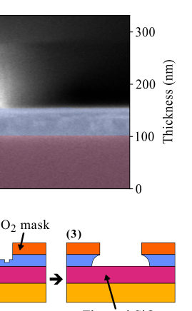 
Figure 1: a) Cross-sectional SEM image of a chip at the edge of a mask opening prior to wet etching, showing the initial layer stack. b) Schematic of the progressive wet etching of a chip against time: (1) before etching, where the metal film is exposed within the SiO2 hard mask mask opening, (2) during etching, where an increase in the metal film roughness is observed, (3) after etching, where the metal film within the mask opening is fully etched and showing a potential overetching of the metal side-walls under the mask.

📷 Fig 2

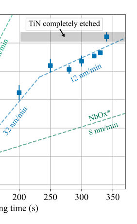 
Figure 2: Etched depths estimated by cross-sectional SEM imaging as a function of etching time for the Nb (green circles) and TiN (blue squares) films. The grey-shaded horizontal areas show each film’s etching endpoint based on its estimated initial thickness. *The 8 nm/min rate is attributed to the NbOx etching, considering the interpretation given in text.

📷 Fig 3

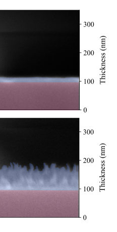 
Figure 3: Cross-sectional SEM images of the etched area from the Nb and TiN films when the etching process is approximately half-way: after 80 s and 150 s for Nb and TiN, respectively.

**Summary.** This paper presents a wet etching method using SC-1 solution as a damage-free alternative to dry etching for Nb and TiN thin films. While the process offers high selectivity and avoids plasma damage, the authors highlight challenges such as isotropic undercutting and morphology-dependent etch rates. This work is significant for the fabrication of high-quality superconducting and ferroelectric microelectronic components.

**Why it may be interesting.** not directly relevant

Detailed structure

**Main problem.** The challenge of patterning Niobium (Nb) and Titanium Nitride (TiN) thin films without the plasma-induced damage and limited selectivity associated with standard dry etching techniques.

**Main result.** Demonstration of a highly selective SC-1 wet etching alternative that avoids substrate damage, though it is subject to isotropic undercutting and multi-modal etch rates driven by film morphology.

**Method.** Wet etching using SC-1 solution (NH3, H2O2, and H2O) followed by characterization via SEM, AFM, and OpenCV-based image processing for surface area estimation.

**Model / system.** Sputtered Nb and TiN thin films on 150 mm Si wafers with a thermally grown SiO2 layer and a PECVD SiO2 hard mask.

**Key observables.** Etch rates, film morphology (roughness, grain size, columnar structure), selectivity, and effective surface area increase.

**Important parameters / regimes.** Etch temperatures (65C for Nb, 45C for TiN), SC-1 volume ratio (1:1:5), and lateral cavity size due to overetching.

**Assumptions / limitations.** The image processing approach assumes that SEM-derived contour measurements accurately represent the effective surface profile; AFM scanning was limited to specific regions to avoid tip damage.

**Figures summary.** Figure 1 shows the initial layer stack and the three stages of the etching process; Figure 3 displays cross-sectional SEM of films mid-etch; Figure S4 shows SEM-based contouring and AFM topography for surface area estimation; Figure S5 illustrates lateral cavity growth under the mask during overetching.

**Paper structure.** Introduction of the etching problem, description of the SC-1 experimental platform and method, analysis of Nb and TiN etch dynamics and morphology, quantification of surface area changes, and discussion of limitations like mask undercut.

Abstract

Dry etching techniques, ubiquitous in microelectronics fabrication, often result in challenging levels of undesired collateral plasma-induced damage. In this work, we demonstrate a wet etching alternative for the patterning of niobium (Nb) and titanium nitride (TiN) thin films using the Standard Cleaning 1 (SC-1) solution. We characterize the etching process through its time-evolution dynamics, supported by scanning-electron and atomic force microscopy assessment of the etched film morphology. The results suggest etch dynamics that are linked to native oxides and film microstructure. Overall, the manageable etch rates, the safe operation and the high material selectivity are attractive for practical use in microelectronics fabrication.

[↑ back to top](#top)

### [Solitonic Construction of Artificial Neural Networks from Nonlinear Field Theory](http://arxiv.org/abs/2605.27568v1)

**Authors:** R. A. C. Correa  
**Type:** theory · **Category:** disordered systems and neural networks · **PDF:** <https://arxiv.org/pdf/2605.27568v1>  
**Analysis basis:** full PDF text, analyzed in chunks

📷 Fig 1

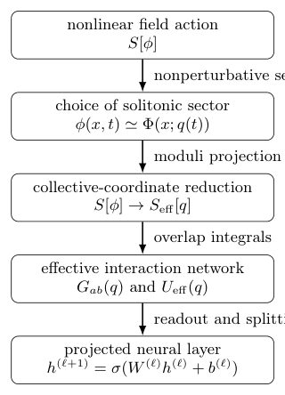 
FIG. 1. Constructive route from nonlinear field theory to a neural layer. The essential point is the direction of derivation: the neural architecture is not assumed and then relabeled, but obtained after projecting the solitonic sector of the field theory onto collective coordinates and readout variables.

📷 Fig 2

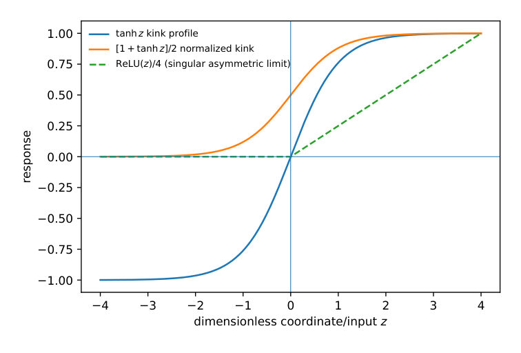 
FIG. 2. Solitonic activation profiles. The ϕ4 kink gives tanh z directly, while the normalized kink gives the logistic-type response [1 + tanh z]/2. The ReLU curve is shown only as a singular asymmetric limiting response, not as a smooth topological kink.

📷 Fig 3

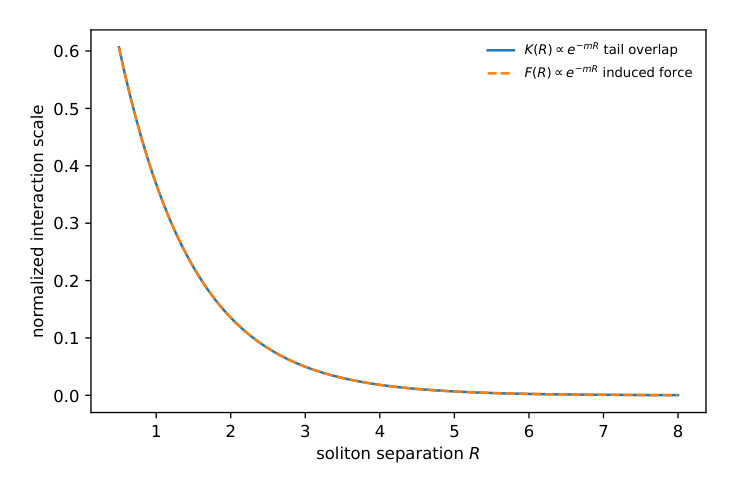 
FIG. 3. Schematic solitonic origin of effective weights. For massive fields, the tails of well-separated kinks typically generate exponentially suppressed overlaps. After projection, these overlap scales contribute to the effective coupling matrix and therefore to the neural weights.

📷 Fig 4

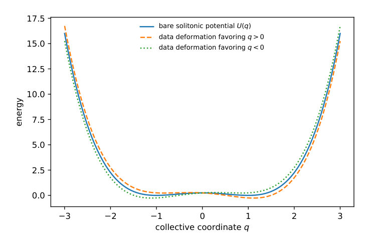 
FIG. 4. Learning as deformation of an effective solitonic potential. The bare collective-coordinate potential contains the intrinsic solitonic sector. A data-dependent term tilts or reshapes this energy, selecting the collective configuration whose readout best matches the supervised target.

📷 Fig 5

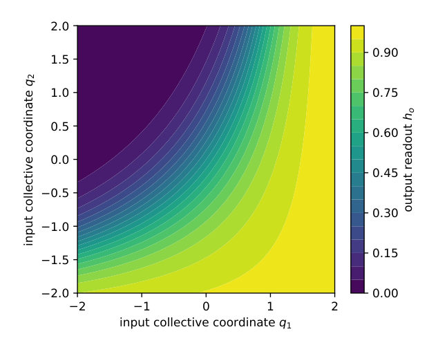 
FIG. 5. Illustrative two-input solitonic readout. The plotted surface represents a projected output ho = σ(2q1 −1.5q2 + 0.8q1q2) generated by linear and bilinear interaction terms in the effective energy. The figure is not a numerical simulation of a specific material platform; it visualizes how solitonic interaction coefficients become neural couplings and nonlinear features.

**Summary.** This paper proposes a way to derive the structure of neural networks directly from nonlinear field theory. It shows that neurons, weights, and activation functions can be understood as physical properties of interacting solitons, providing a robust physical foundation for machine learning architectures.

**Why it may be interesting.** not directly relevant

Detailed structure

**Main problem.** The paper seeks to provide a formal, constructive derivation of artificial neural network (ANN) architectures from the underlying dynamics of nonlinear field theories, moving beyond mere analogy.

**Main result.** The author demonstrates that the fundamental components of a neural layer—activation functions, weights, and biases—emerge naturally from the collective-coordinate dynamics and interaction energy of solitons.

**Method.** The method involves a collective-coordinate reduction of a nonlinear scalar field theory, using a projection map to extract finite-dimensional computational states from the continuous field configurations.

**Model / system.** The primary model is a nonlinear scalar field theory, specifically the phi^4 kink model, focusing on the nonperturbative sector containing stable, localized solitonic solutions.

**Key observables.** The neural state (projected collective coordinate), activation function (solitonic response profile), weight matrix (interaction Hessian), and bias (external sources).

**Important parameters / regimes.** Mass scale, coupling constant, vacuum value, and the requirement of a separation of scales between internal soliton modes and collective coordinate evolution.

**Assumptions / limitations.** The construction assumes a separation of scales between microscopic field fluctuations and mesoscopic soliton dynamics, and is limited to architectures representable as reduced dynamics of localized modes.

**Figures summary.** Figure 1 shows the derivation flow from field action to neural layer; Figure 4 illustrates learning as the deformation of an effective potential; Figure 5 shows a 3D plot of a two-input solitonic readout.

**Paper structure.** The paper follows a logical progression from the general principle of field reduction to a specific phi^4 kink implementation, followed by the derivation of neural layer components, and concludes with implications for robustness and future architectures.

Abstract

We present a field-theoretic construction of a class of artificial neural networks from solitonic degrees of freedom in nonlinear scalar field theory. The purpose is not to rename a standard neural layer in the language of solitons, but to start from a continuum action, restrict the theory to a nonperturbative sector containing localized stable solutions, perform a collective-coordinate reduction, and derive the neural layer as the finite-dimensional input-output map of the reduced solitonic dynamics. In this construction, the computational unit is a projected collective coordinate of a localized field configuration rather than an elementary point variable; the activation function is the solitonic response profile or scattering map; the weight matrix is the Hessian or overlap matrix of an effective interaction energy among solitons; the bias is induced by external sources, vacuum asymmetry, or boundary forcing; and depth is a discrete evolution parameter on the solitonic moduli space. We develop the construction explicitly for the \(φ^4\) kink, where the \(\tanh\) activation and the logistic sigmoid arise from the kink profile, and then derive the multilayer feedforward form from an operator-splitting approximation to collective-coordinate gradient flow. We emphasize the novelty criterion: the neural architecture is obtained only after specifying the field action, the solitonic ansatz, the moduli-space metric, the interaction functional, and the projection map. The result is a controlled route from nonlinear field theory to neural-network structure, with robustness tied to the energetic and topological stability of the solitonic sector.

[↑ back to top](#top)

### [Spin-Hall-Like Magnon Transport in a Synthetic Antiferromagnetic Skyrmion Lattice](http://arxiv.org/abs/2605.27822v1)

**Authors:** Xingen Zheng, Xuejuan Liu, Zhenyu Wang, Jiyong Kang, Zhixiong Li, Hao Wu  
**Type:** theory · **Category:** other · **PDF:** <https://arxiv.org/pdf/2605.27822v1>  
**Analysis basis:** full PDF text, analyzed in chunks

📷 Fig 1

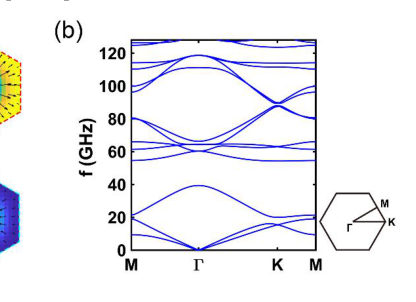 
FIG. 1. Bilayer SAF-SkL texture and its bulk magnon spectrum. (a) Spin configuration of the SAF-SkL

📷 Fig 2

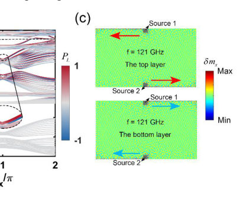 
FIG. 2. Edge states and layer polarization in the SAF-SkL. (a) Strip magnon spectrum colored by the normalized

📷 Fig 3

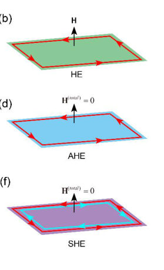 
FIG. 4. Schematic analogy between skyrmion-based lattices and Hall-type responses. (a), (b) Conventional

**Summary.** This paper explores magnon transport in a bilayer system of coupled skyrmion lattices with opposite textures. It demonstrates that while the system lacks the symmetry for a $Z_2$ topological phase, it successfully hosts layer-polarized, spin-Hall-like edge modes. This provides a new platform for studying bosonic Hall-type transport phenomena.

**Why it may be interesting.** not directly relevant

Detailed structure

**Main problem.** The study investigates whether a synthetic antiferromagnetic skyrmion lattice (SAF-SkL) can realize a bosonic analogue of the spin-Hall effect and determines if its edge modes are $Z_2$-protected helical states or layer-polarized spin-Hall-like modes.

**Main result.** The researchers find that the SAF-SkL supports counterpropagating, layer-polarized edge modes that are not $Z_2$-protected due to the lack of pseudo-time-reversal symmetry, but instead function as 'spin-Hall-like' modes arising from the opposite Hall tendencies of the two layers.

**Method.** The study employs linear spin-wave theory using the Holstein-Primakoff transformation to derive a bosonic Bogoliubov-de Gennes Hamiltonian, supplemented by micromagnetic simulations (MuMax3) and symmetry analysis.

**Model / system.** A synthetic antiferromagnetic skyrmion lattice (SAF-SkL) consisting of two antiferromagnetically coupled skyrmion lattice layers with opposite magnetic textures, modeled via a spin Hamiltonian including exchange, interlayer coupling, DMI, and anisotropy.

**Key observables.** Bulk and strip magnon spectra, layer polarization ($P_L$), edge mode localization ($\langle y 
angle / L_y$), and the spin Chern number ($C_s$).

**Important parameters / regimes.** Interlayer antiferromagnetic exchange stiffness ($A_{af}$), magnetization ($M_s$), Dzyaloshinskii-Moriya interaction ($D$), and an external out-of-plane magnetic field ($h_z$).

**Assumptions / limitations.** The analysis is based on the approximation of linear spin-wave theory and assumes a stabilized, relaxed bilayer texture from micromagnetic simulations.

**Figures summary.** Fig 1 shows the visual representation of the SAF-SkL; Fig 2 displays the strip magnon spectrum and edge mode localization; Fig 3 illustrates the evolution of the spectrum and transport properties as interlayer coupling varies.

**Paper structure.** The paper introduces the SAF-SkL system, presents the theoretical framework (BdG Hamiltonian and spin-wave theory), analyzes the bulk and edge spectra, performs symmetry analysis to classify the topological nature, and concludes with a unified framework for magnon Hall-type responses.

Abstract

We investigate spin-Hall-like magnon edge transport in a synthetic antiferromagnetic skyrmion lattice composed of two antiferromagnetically coupled skyrmion lattice layers with opposite magnetic textures. Based on a relaxed bilayer texture from micromagnetic simulations, we construct the bosonic Bogoliubov-de Gennes Hamiltonian within linear spin-wave theory and calculate the bulk and strip magnon spectrum. We find counterpropagating in-gap edge modes with opposite layer polarization, whose layer-resolved propagation is further confirmed by dynamical micromagnetic simulations. A symmetry analysis shows that the fully coupled system lacks the pseudo-time-reversal symmetry required for a genuine bosonic Z2 topological phase. Thus, the observed edge modes are not Z2-protected helical magnon edge states, but layer-polarized, spin-Hall-like modes originating from the opposite Hall tendencies of the two skyrmion lattice layers. These results establish synthetic antiferromagnetic skyrmion lattices as a platform for spin-Hall-like magnon transport beyond a strict bosonic Z2 classification.

[↑ back to top](#top)

### [Surface Contact Approximation for Magneto-Thermal Finite Element Analysis of No-Insulation HTS Coils](http://arxiv.org/abs/2605.28574v1)

**Authors:** Erik Schnaubelt, Louis Denis, Mariusz Wozniak, Julien Dular, Arjan Verweij  
**Type:** theory · **Category:** numerical methods · **PDF:** <https://arxiv.org/pdf/2605.28574v1>  
**Analysis basis:** full PDF text, analyzed in chunks

📷 Fig 1

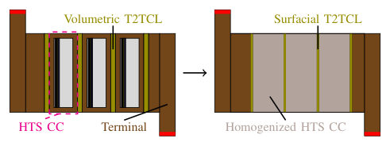 
Fig. 1. Cross-section of a small model NI pancake coil with two turns. The left image shows the coil before homogenization of the HTS CC and introduction of the SCA. The layered structure of the HTS CC is represented by different colors schematically. After homogenization, as shown in the right image, the different layers of the HTS CC are represented by a single homogeneous material. The volumetric contact layer is reduced to a surface contact layer using a dedicated weak formulation introduced in Section II-C. The cooling condition is applied to the electric ports marked in red.

📷 Fig 2

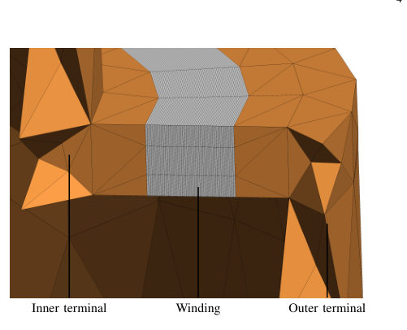 
Fig. 2. Finite element mesh of the simulated 50-turn pancake coil, with hexahedral mesh elements within the winding. For better visibility, the air mesh is not represented.

📷 Fig 3

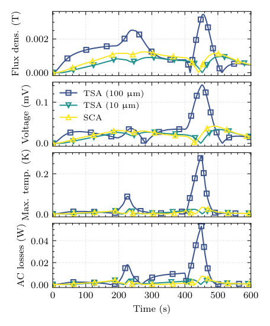 
Fig. 4. Absolute difference in central axial magnetic flux density (a), voltage between copper terminals (b), maximal winding temperature (c), and total AC losses (d) with respect to TSA results with tcl = 1 µm. TSA results are computed with multiple virtual T2TCL thickness tcl values, indicated in parentheses. Maximal time steps of 1 s are ensured for consistent comparison between different models. The four figures (a) - (d) share the same legend shown in (b).

📷 Fig 4

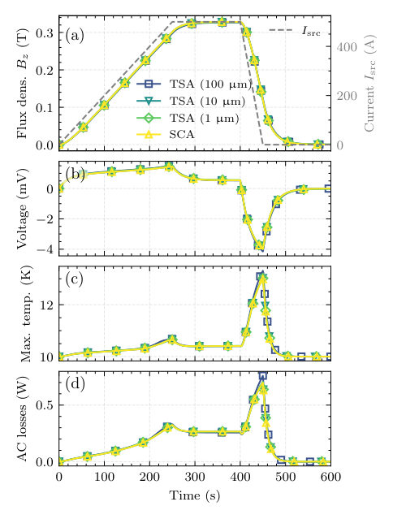 
Fig. 3. Central axial magnetic flux density Bz and source current Isrc (a), voltage between copper terminals (b), maximal winding temperature (c), and total AC losses (d) computed with TSA and SCA formulations. TSA results are computed with multiple virtual T2TCL thickness tcl values, indicated in parentheses. Maximal time steps of 1 s are ensured for consistent comparison between different models. The four figures (a) - (d) share the same legend shown in (a).

📷 Fig 5

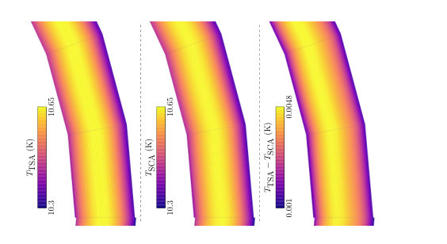 
Fig. 5. Temperature distribution at t = 250 s computed with the TSA and tcl = 1 µm (left), with the SCA (center), and corresponding absolute difference (right).

**Summary.** This paper introduces a new numerical method called Surface Contact Approximation (SCA) to simplify the simulation of no-insulation superconducting coils. By replacing a volumetric layer with a surface-based model, the method reduces computational complexity and improves numerical stability. This allows for more efficient and accurate modeling of the thermal and electromagnetic behavior in HTS applications.

**Why it may be interesting.** not directly relevant

Detailed structure

**Main problem.** Simulating the magneto-thermal behavior of no-insulation (NI) high-temperature superconducting (HTS) coils is computationally expensive and numerically unstable when using standard volumetric thin-shell approximations.

**Main result.** The proposed Surface Contact Approximation (SCA) accurately reproduces the electromagnetic and thermal behavior of the coils while being more numerically robust, computationally efficient, and easier to implement than the existing Thin Shell Approximation (TSA).

**Method.** The authors derive a surface weak formulation (SCA) from the more general Thin Shell Approximation (TSA) by assuming negligible tangential surface currents and eddy currents within the contact layer.

**Model / system.** The study focuses on no-insulation (NI) HTS pancake coils wound from coated conductors, specifically modeling the turn-to-turn contact layers (T2TCL) using a finite element analysis (FEA) framework.

**Key observables.** Central axial magnetic flux density, voltage between electric ports, maximal winding temperature, and total AC losses.

**Important parameters / regimes.** Electric contact resistance (Rcl), thermal contact conductance (Kcl), critical current density (Ic), and virtual thickness (tcl).

**Assumptions / limitations.** Negligible tangential surface currents and eddy-current effects within the contact layer, negligible thermal mass of the contact layer, and negligible magnetic field variations within the T2TCL thickness.

**Figures summary.** Figure 1 shows the cross-section of an NI coil before and after simplification; Figure 2 displays the finite element mesh; Figure 3 compares magnetic flux, voltage, temperature, and AC loss curves between the TSA and SCA models.

**Paper structure.** The paper identifies the stability/accuracy trade-off in existing TSA methods, proposes the SCA as an alternative, derives the SCA formulation from the TSA, implements it in the FiQuS software, and validates it through numerical comparison and transient simulations.

Abstract

High-temperature superconducting (HTS) coated conductors (CCs) can be wound into no-insulation (NI) coils, in which electrical current can partially bypass local normal zones via turn-to-turn contact layers (T2TCLs). Accurate magneto-thermal simulation of such coils, therefore, requires an efficient representation of the electrical and thermal behavior of the T2TCLs. This paper introduces a magneto-thermal surface contact approximation (SCA) for finite element analysis of NI HTS coils. The formulation is derived as a special case of the more general thin shell approximation (TSA) by introducing suitable approximations such as negligible tangential surface currents and eddy-current effects inside the T2TCL. The resulting SCA formulation replaces the thin volumetric contact layer with a dedicated surface weak formulation based on the electric contact resistance and thermal contact conductance. In contrast, the TSA formulation requires the definition of electric resistivities and thermal conductivities as well as the thickness of the T2TCL. The SCA is implemented in the Pancake3D module of the free and open-source Finite Element Quench Simulator. It is verified through transient magneto-thermal simulations of a model NI pancake coil. Numerical results are compared against the established TSA formulation. The results show that the SCA accurately reproduces the relevant electromagnetic and thermal behavior. For the TSA, there is a trade-off between choosing large (potentially unphysical) thicknesses with low resistivities leading to inaccurate results, or small thicknesses with large resistivities making the linear system harder to solve, increasing the computational effort. In contrast, the SCA, thanks to using contact resistances and conductances directly without the necessity to define a thickness, is easy to use and robust.

[↑ back to top](#top)

### [Three-component superconductivity: the effect of second-order Josephson couplings](http://arxiv.org/abs/2605.28221v1)

**Authors:** Shen-Yi Peng, Ling-Feng Zhang, Xiao Hu  
**Type:** theory · **Category:** strongly correlated electrons · **PDF:** <https://arxiv.org/pdf/2605.28221v1>  
**Analysis basis:** full PDF text, analyzed in chunks

📷 Fig 1

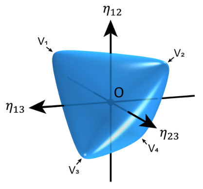 
FIG. 1. Schematic stability domain of the three- component superconducting states. The closed, curved blue tetrahedral region in the (η12, η13, η23) parameter space defines the stability domain: the three-component supercon- ducting state is stable within this region, where the matrix T is positive definite (T &gt; 0). The coordinates of its four vertices, V1–V4, are given in Eq. (8).

📷 Fig 2

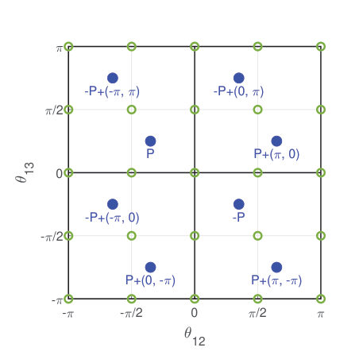 
FIG. 2. Distribution of phase difference solutions in the (θ12, θ13) plane The relative phase solutions (θ12 = θ1 −θ2, θ13 = θ1 −θ3) for the Ginzburg-Landau equations are determined by Eq. (14). For a given set of parameters, there exist a maximum of 24 distinct solutions, categorized into two groups based on their symmetry properties. Sixteen of these solutions (open green circles) are pinned at high- symmetry points (e.g., multiples of π/2), representing the non-frustrated, phase-locked configurations. The remaining eight solutions (solid blue dots) are located at low-symmetry points and constitute the 8-fold degenerate frustrated state. Given a representative solution P defined by the...

📷 Fig 3

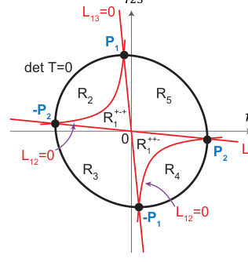 
FIG. 3. Topological partition of the frustrated state in the (η12, η13, η23) parameter space. Panels (a) and (b) illustrate the (η13, η23) cross-sections for fixed η12 &lt; 0 and η12 &gt; 0, respectively. The solid black ellipse denotes the sta- bility threshold det T = 0, defining the stable domain for the three-component superconducting state. Within this stable domain, the 3D parameter space is partitioned by the con- ditions Ljk = 0 (solid red lines) into eight distinct sectors: the four frustrated sectors (R−−− 1 , R−++ 1 , R+−+ 1 , R++− 1 ) and four non-frustrated sectors (R2–R5). For the frustrated sec- tors, the superscripts denote the signs of (L12, L13, L23). These sectors satisfy the...

📷 Fig 4

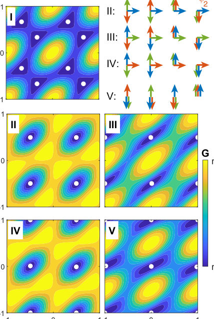 
FIG. 4. Classification of ground-state configurations. The ground-state solutions are categorized into five distinct regimes (I–V) determined by the Ginzburg-Landau param- eters. The contour plots display the corresponding minimal free-energy landscapes G(θ12, θ13), where the white dots mark the global energy minima. (I) An 8-fold degenerate ground- state (GS) with minima located at general points in the phase plane. (II–V) 4-fold degenerate ground-state configurations where the phase differences are pinned at high-symmetry points. The vector diagrams (upper right) illustrate the rel- ative orientations of the three-component order parameters (ψ1, ψ2, ψ3) for each regime. Note that for...

📷 Fig 5

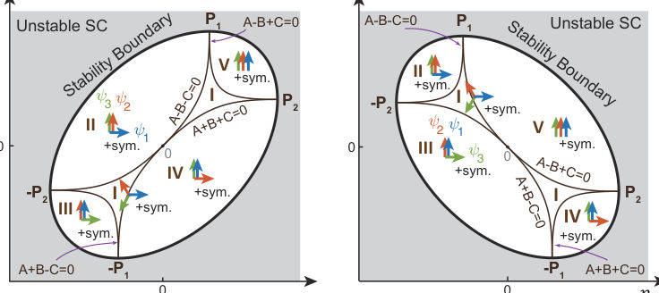 
FIG. 5. Ground-state phase diagram in the (η13, η23) plane. The diagrams are mapped for (a) a fixed repulsive coupling η12 &lt; 0 and (b) a fixed attractive coupling η12 &gt; 0. Regime I corresponds to the 8-fold degenerate frustrated phase, which acts as a transition zone separating four distinct 4-fold degenerate phase-locked regimes (II–V). Representative phase configurations for each regime are shown within the main plots, where ”+sym.” accounts for degenerate states linked by time-reversal and π-phase flip symmetries. The complete set of phase structures is fully illustrated in the right-hand insets. Superconductivity is stable within the elliptical stability boundary, defined by the...

**Summary.** This paper provides a comprehensive theoretical framework for three-component superconductivity, specifically addressing the physics of kagome superconductors. It maps out a complex phase diagram containing frustrated and phase-locked states and predicts a unique hybridized Higgs-Leggett mode as a dynamical signature of the frustrated phase.

**Why it may be interesting.** not directly relevant

Detailed structure

**Main problem.** The study aims to understand the stability, phase structure, and collective excitations of a three-component superconducting system driven by second-order Josephson couplings.

**Main result.** The authors identified five distinct ground states, including an 8-fold degenerate frustrated state and four 4-fold degenerate phase-locked states, and discovered a unique Higgs-Leggett mode in the frustrated regime.

**Method.** The work uses a Ginzburg-Landau theoretical framework, employing analytical derivations of ground-state solutions, Sylvester's Criterion for stability, and linear response theory for collective mode analysis.

**Model / system.** A three-component Ginzburg-Landau model representing the 3Q pair-density-wave state in vanadium-based kagome superconductors, featuring second-order Josephson-type couplings.

**Key observables.** Collective modes (Higgs-Leggett, Higgs, Leggett, and Goldstone modes), superfluid densities, and fractional magnetic flux quantization (phi_0/3).

**Important parameters / regimes.** Second-order Josephson coupling constants (eta_jk), Ginzburg-Landau coefficients (a_j, b_j), and relative phases (theta_jk).

**Assumptions / limitations.** The model assumes the physics is dominated by second-order Josephson couplings due to momentum conservation suppressing first-order coupling.

**Figures summary.** Figure 1 shows the stability domain in parameter space; Figure 2 plots relative phase solutions; Figure 3 illustrates the topological partition of the frustrated state; Figure 7 shows the evolution of collective mode eigenvalues.

**Paper structure.** The paper introduces the 3Q PDW model, derives ground-state solutions and phase boundaries using GL theory, classifies the resulting phase diagram, and concludes with a numerical analysis of collective excitation spectra.

Abstract

Recently, a three-component Ginzburg-Landau (GL) model compatible with the 3Q pair-density-wave state has been proposed to explain the fractional quantum magnetic resistance oscillations of period $φ_0/3 = hc/6e$ observed in vanadium-based kagome superconductors. The physics of this model is governed by second-order Josephson-type couplings, which break both time-reversal symmetry and discrete $π$-phase flip symmetry. In this work, we theoretically derive the complete set of ground-state solutions and construct a comprehensive phase diagram in the GL parameter space, characterized by analytically determined phase boundaries. We identify five distinct ground states: an 8-fold degenerate frustrated state and four 4-fold degenerate non-frustrated phase-locked states. Four of these states spontaneously break time-reversal symmetry. Numerical analysis of the collective modes reveals the emergence of a Higgs-Leggett mode unique to the frustrated region, accompanied by mode softening near the phase boundaries. Our findings provide a comprehensive theoretical framework for understanding the multifaceted physics of multicomponent superconductivity.

[↑ back to top](#top)

